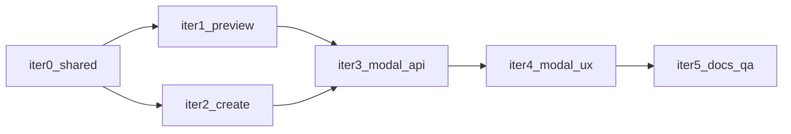

# Editable Stripe invoice line (plan iteration)

## Product intent

- In **Bill Customer → Stripe bill**, the text that becomes the **Stripe invoice line item `description`** (today `Customer · Job · HCP n` via [`buildStripeInvoiceLineDescription`](src/lib/stripeInvoiceLineDescription.ts)) should be **editable above Memo**.
- **Memo** stays the **invoice-level** Stripe `description` (existing behavior).
- **Preview** and **create** must use the same line text. **Backward compatible:** omitting `line_description` keeps current server-built default.

## Phased implementation (execute in order)

### Iteration 0 — Shared resolver (Edge + app constant)

**File:** [`supabase/functions/_shared/stripeLineDescription.ts`](supabase/functions/_shared/stripeLineDescription.ts)

- Export `STRIPE_INVOICE_LINE_DESCRIPTION_MAX` (use **500** unless verified against Stripe docs).
- Export `resolveInvoiceLineDescription` (or equivalent) with inputs:
  - optional client `override` string
  - `customerName`, `jobName`, `hcpNumber` for fallback
- Behavior:
  - `override?.trim()`: if non-empty, use it; if length &gt; max return `{ error: 'Line description too long (max N characters)' }`.
  - else return `buildStripeInvoiceLineDescription(...)`.

**File:** [`src/lib/stripeInvoiceLineDescription.ts`](src/lib/stripeInvoiceLineDescription.ts) (optional)

- Export same `MAX` (or duplicate with comment: keep in sync with Edge) for UI character counter.

**Exit:** Preview and create can import one resolver; no duplicated max-length logic.

---

### Iteration 1 — `preview-stripe-invoice`

**File:** [`supabase/functions/preview-stripe-invoice/index.ts`](supabase/functions/preview-stripe-invoice/index.ts)

- Extend `PreviewStripeInvoiceBody` with `line_description?: string`.
- After `jobRow` and `customer_name` validation, call resolver; on `error`, `400` JSON.
- Set `invoice_items[0].description` from resolved `lineDesc` (replace unconditional `buildStripeInvoiceLineDescription` at ~182–186).

**Exit:** Invoke with/without `line_description`; preview line matches.

---

### Iteration 2 — `create-stripe-invoice`

**File:** [`supabase/functions/create-stripe-invoice/index.ts`](supabase/functions/create-stripe-invoice/index.ts)

- Extend `CreateStripeInvoiceBody` with `line_description?: string`.
- Destructure and resolve same way; pass `lineDesc` to `stripe.invoiceItems.create({ description })` (~312–316).

**Exit:** Created invoice line matches override; omitted field → today’s default.

---

### Iteration 3 — Modal state and API wiring

**File:** [`src/components/jobs/SendRecordInvoiceModal.tsx`](src/components/jobs/SendRecordInvoiceModal.tsx)

- `useState` `stripeLineDescription`.
- In open reset `useEffect` (~180–215): after other resets, set to `buildStripeInvoiceLineDescription((job.customer_name ?? '').trim() || 'Customer', job.job_name, job.hcp_number)`.
- **Preview** `useEffect` (~278–390): add `stripeLineDescription` to deps; add `line_description: trimmed || undefined` to invoke body (~325–334).
- **submitStripeInvoice** (~485): add same field to `create-stripe-invoice` body; surface Edge 400 via existing error handling.
- **`StripeBillPreSubmitPreview`**: pass `localLineDescription` from state (use trimmed display; if empty before UX iteration, fallback to default for draft line only).

**Exit:** Debounced preview and create share the same string.

---

### Iteration 4 — UX grouping (attractive layout)

**Same file**, Stripe pre-submit branch (~841+).

- Card: `background #f9fafb`, `border 1px solid #e5e7eb`, `borderRadius 8`, `padding`, `marginBottom`.
- Section title: e.g. **What appears on the invoice**.
- **Line on the bill:** label (`BILL_CUSTOMER_FIELD_LABEL_STYLE`), one-line helper (muted), `textarea` ~2 rows (`BILL_CUSTOMER_TEXTAREA_STYLE`), clamp on change to `MAX`, optional **n / MAX** under field.
- **Reset to job default** control → `setStripeLineDescription(default from job)`.
- Move **Memo (optional)** below line field **inside same card** (or directly under card—prefer same card for “Stripe-facing copy”).
- Keep **Outside bill** tab unchanged.

**Exit:** Matches agreed UX; Memo behavior unchanged.

---

### Iteration 5 — Documentation and QA

- [`EDGE_FUNCTIONS.md`](EDGE_FUNCTIONS.md): document optional `line_description` on **preview-stripe-invoice** and **create-stripe-invoice** (max length, fallback).
- **QA:** overlong text → 400 + user-visible error; reset; idempotent create path unchanged; clients that omit `line_description` still work.

---

## Dependency order

## Out of scope (this plan)

- New DB column on `jobs_ledger_invoices` to persist custom line for reopen.
- Editing customer/job/HCP records from this modal.

## Files touched (summary)

| Path | Role |
|------|------|
| [`supabase/functions/_shared/stripeLineDescription.ts`](supabase/functions/_shared/stripeLineDescription.ts) | MAX + resolver |
| [`supabase/functions/preview-stripe-invoice/index.ts`](supabase/functions/preview-stripe-invoice/index.ts) | Optional body |
| [`supabase/functions/create-stripe-invoice/index.ts`](supabase/functions/create-stripe-invoice/index.ts) | Optional body |
| [`src/lib/stripeInvoiceLineDescription.ts`](src/lib/stripeInvoiceLineDescription.ts) | Optional MAX for UI |
| [`src/components/jobs/SendRecordInvoiceModal.tsx`](src/components/jobs/SendRecordInvoiceModal.tsx) | State, invokes, UI |
| [`EDGE_FUNCTIONS.md`](EDGE_FUNCTIONS.md) | API notes |

When you are ready to **execute**, say explicitly (e.g. “implement this plan” / “start implementing”) in Agent mode; until then this document is the source of truth for iterations.
