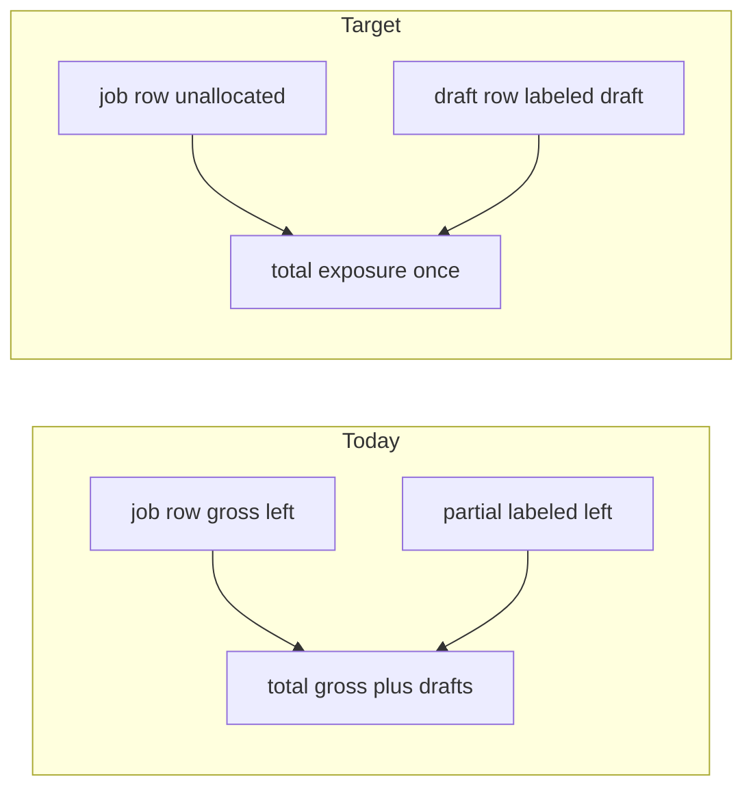

# Ready to Bill: row amounts and consistent section total

## Goals

- **Partial invoice rows**: Show the **draft line amount** with clear wording (not `$X left` as full-job remainder).
- **Bare job row** (`kind: 'job'`): Middle amount = **billing-unallocated** (gross remaining minus sums on `ready_to_bill` + `billed` invoice lines) so creating a partial **reduces** it until the draft is deleted.
- **Section total** (`Ready to Bill (n) - $…`): **Exposure total** — each dollar counted **once** (fix double-count of gross job row + draft lines).

## Root cause (current code)

- Job row uses **`revenue - payments_made`** in [`src/pages/Jobs.tsx`](src/pages/Jobs.tsx) (`renderUnifiedStagesTable`, ~5827–5832) when `bundleInv == null`.
- Standalone invoice row shows **`inv.amount` as "left"** (~6260) — misleading.
- [`readyToBillSectionTotal`](src/pages/Jobs.tsx) (~97–108) adds **gross** for `kind: 'job'` **and** invoice amounts; [`buildReadyToBillStageRows`](src/lib/jobsStagesBoard.ts) intentionally emits **job + invoice** rows for the same job ([`src/lib/jobsStagesBoard.test.ts`](src/lib/jobsStagesBoard.test.ts)), so totals **double-count**.

**Canonical math**: [`jobBillingUnallocCentsJob`](src/lib/jobsStagesBoard.ts) (same basis as `ensure_single_ready_to_bill_invoice_for_job`).

## Row semantics

| StageRow kind | Middle column (Paid / Left / Total Bill) | Contribution to section total |
|---------------|------------------------------------------|----------------------------------|
| `job` | **Unallocated** (via helper) | `jobBillingUnallocatedDollars(job)` |
| `invoice` | **Draft line**: `inv.amount` + label e.g. **draft** / **This bill**; optional muted **Unallocated** on job | `inv.amount` |
| `job_with_primary_rtb` | Primary **`inv.amount`**; optional **remainder** label | `inv.amount` |
| `job_with_merged_billed` | N/A in RTB list | 0 if ever passed |

## Implementation

### 1. [`src/lib/jobsStagesBoard.ts`](src/lib/jobsStagesBoard.ts)

- Export **`jobBillingUnallocatedDollars(job: JobWithDetails): number`** from existing **`jobBillingUnallocCentsJob`** (cents integer math, divide once).
- Add **`readyToBillRowsExposureTotal(rows: StageRow[]): number`** per table above.
- One-line comment: aligns with ensure RPC / allocated = RTB + billed.

### 2. [`src/pages/Jobs.tsx`](src/pages/Jobs.tsx)

- Remove or replace **`readyToBillSectionTotal`** with **`readyToBillRowsExposureTotal`** for the Ready to Bill header.
- **`renderUnifiedStagesTable`**:
  - `kind: 'job'`, `!bundleInv`, `showRemaining`: middle line = **`formatUsdNoCents(jobBillingUnallocatedDollars(j))`**; optional `title` or copy **unallocated**.
  - `kind: 'invoice'`: replace **left** label with **draft** / **This bill**; optional second line unallocated.
  - `job_with_primary_rtb`: optional **remainder** wording (cosmetic).

No change to **`buildReadyToBillStageRows`** unless an edge case appears.

### 3. [`src/lib/jobsStagesBoard.test.ts`](src/lib/jobsStagesBoard.test.ts)

- **`readyToBillRowsExposureTotal`**: job + partial (total = gross remaining, not gross + partial); primary-only bundle; primary + partial; regression with sole-primary + leftover unallocated fixture.

### 4. Verification

- **`npm run build`**, **`npm test`**
- Manual: partial reduces job unallocated; header total = sum of row exposures.

### 5. Optional follow-up

- [`src/pages/Dashboard.tsx`](src/pages/Dashboard.tsx) bare job `remaining` (~3995): use unallocated when invoices available ([`dashboardJobBillingUnallocCents`](src/lib/buildReadyToBillDashboardUnits.ts)).
- Brief note in **PROJECT_DOCUMENTATION** or **RECENT_FEATURES**.

## Out of scope

- Migrations, RLS, changing `ensure_single_ready_to_bill_invoice_for_job`.
- Edit Job modal “Remaining” unless explicitly extended later.

## Execution

When ready, switch to **Agent mode** and implement using the todos above (do not edit this plan file as part of implementation unless updating status).
