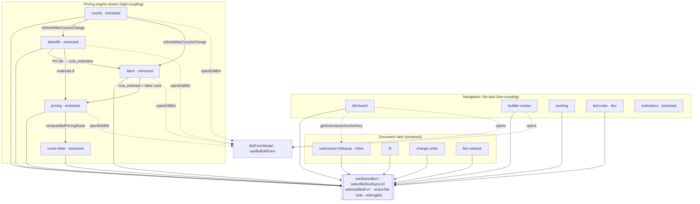

# Bids Tabs Architecture Map

---
file: docs/BIDS_TABS_ARCHITECTURE.md
type: Engineering / Refactor Map
purpose: Inventory what every tab in src/pages/Bids.tsx touches (state, memos, handlers, sub-components, supabase tables, cross-tab coupling) to track the decomposition of the former ~18.8k-line God component (now ~4.1k lines, all tabs extracted).
audience: Developers, AI Agents
last_updated: 2026-05-31
---

## Overview

[`src/pages/Bids.tsx`](../src/pages/Bids.tsx) was a ~18,800-line "God component"; after extracting every workflow tab it is now ~4,119 lines. This map is a refactoring aid: for each tab it records what state, derived data, handlers, sub-components, and external systems the tab touches, plus its extraction status and risk. It is **coupling/refactor-oriented** — for feature/workflow/DB behavior, see [`BIDS_SYSTEM.md`](./BIDS_SYSTEM.md). **All 14 tabs are now extracted to their own components; the parent retains the shared bid pointer, URL deep-link router, the `useBidPricingEngine` seam, and a few shared page-level modals.**

The tabs are switched on a single `activeTab` state ([`Bids.tsx:337`](../src/pages/Bids.tsx)):

```
'bid-board' | 'builder-review' | 'working' | 'bid-costs' | 'estimators' | 'counts'
| 'takeoffs' | 'labor' | 'pricing' | 'cover-letter' | 'submission-followup'
| 'rfi' | 'change-order' | 'lien-release'
```

### How to read a dossier
Each per-tab section lists: render location, **owned local state** (used only by that tab), **cross-tab/shared state** (read/write), **derived memos**, **handlers/functions**, **data dependencies**, **supabase tables**, **sub-components** (extracted vs inline), **external coupling**, and an **extraction status + risk + suggested approach**.

### How to maintain this doc
- Update the relevant dossier whenever a tab is extracted, or its state/handlers change.
- Treat line numbers as approximate anchors — they drift as the file changes. When in doubt, search for the symbol name.
- When a tab is fully extracted to its own component, change its Status to `extracted` and point at the new file.

---

## Master summary table

| Tab key | Label | Render lines | Approx lines | Status | Owned state | Cross-tab coupling | Pricing engine? | Recommended next action |
|---|---|---|---|---|---|---|---|---|
| `bid-board` | Bid Board | thin wrapper | ~633 | extracted (`BidsBidBoardTab` + `BidBoardEstimatingHealthSection`) | ~4 (deep-link + sectionOpen + lost-summary, in parent) | med-high | No | Done |
| `builder-review` | Builder Review | thin wrapper | ~377 | extracted (`BidsBuilderReviewTab`) | 2 (deep-link, in parent) | medium | No | Done |
| `working` | Unsent / Working | 10885-10906 | ~22 | mostly extracted (wraps `BidsWorkingBoard`) | 4 (deep-link) | low-med | No | Nearly done; only move the archive-confirm + deep-link glue |
| `bid-costs` | Bid Costs | thin wrapper | ~76 (dev-only) | extracted (`BidsBidCostsTab`) | 0 | low | No | Done |
| `estimators` | Estimators | 10987-10997 | ~11 | extracted (`BidsEstimatorsTab`) | 0 | low | No | Done |
| `counts` | Counts | thin wrapper | ~289 | extracted (`BidsCountsTab`) | 1 (selection, in parent) | high | Yes (via hook props) | Done |
| `takeoffs` | Takeoff | thin wrapper | ~52 | extracted (`BidsTakeoffTab`) | 2 (selection + shared tax, in parent) | high | Yes (via hook props) | Done |
| `labor` | Cost Estimate | thin wrapper | ~70 | extracted (`BidsLaborTab`) | 3 (selection + shared tax/distance, in parent) | high | Yes (via hook props) | Done |
| `pricing` | Pricing | thin wrapper | ~47 | extracted (`BidsPricingTab`) | 2 (selection + shared tax, in parent) | high | Yes (via hook props) | Done |
| `cover-letter` | Cover Letter | thin wrapper | ~37 | extracted (`BidsCoverLetterTab`) | 8 `*ByBid` maps (parent-owned, shared with `downloadApprovalPdf`) | high | Yes (via `coverLetterPricingRows` prop) | Done |
| `submission-followup` | Submission & Followup | wrapper | ~1,260 | extracted (`BidSubmissionFollowupTab`) | 0 (parent keeps selection) | medium | No | Done |
| `rfi` | RFI | 17045-17054 | ~10 | extracted (`BidRfiTab`) | 0 (parent) | low | No | Done |
| `change-order` | Change Order | 17056-17065 | ~10 | extracted (`BidChangeOrderTab`) | 0 (parent) | low | No | Done |
| `lien-release` | Lien Release | 17068-17076 | ~9 | extracted (`BidLienReleaseTab`) | 0 (parent) | low | No | Done |

> Status legend: `inline` = rendered directly in `Bids.tsx`; `extracted` = moved to its own component file; `extracted component` = already a thin wrapper around an imported component.

---

## Per-tab dossiers

### `bid-board` — Bid Board

- **Render location:** [`Bids.tsx:9872-10504`](../src/pages/Bids.tsx) (~633 lines). Marker `{/* Bid Board Tab */}` at 9871.
- **Owned local state:** `bidBoardSearchQuery` (417), `expandedBidBoardBidId` (418), `bidBoardNotesTab` (419), `bidBoardNotesUnreadByBidId` (420), `bidBoardUnreadFetchSeqRef` (421), `bidsForBoardUnreadRef` (422), `staffOutcomeDrilldown` (424, modal at 9086-9265), `bidBoardSectionOpen` (536), `lostSummaryModalOpen` (537), `lostSummaryInitialStaffTab` (538), `bidBoardDeepLinkHighlightId`/`Gen` (539-540), `scoreboardDetailsExpanded` (541), `bidBoardDeepLinkTimeoutRef` (542), `bidBoardPendingScrollBidIdRef` (543). Also opened from here but rendered elsewhere: `evaluateModalOpen`/`evaluateChecked` (435-436, modal 17501-17564), `workingBoardArchivedModalOpen` (665).
- **Cross-tab/shared state:** `activeTab` (read + write via deep links); `bids` (read, write via `loadBids`); `selectedServiceTypeId` (implicit filter — board is service-type-scoped); `editingBid`/`bidFormOpen` (write via `openEditBid`); `viewingCustomer`/`viewingGcBuilder` (write); `selectedBidForSubmission` + `scrollToContactFromBidBoard` (write via `handleLastContactClick` 7419); `ledgerPrefixMap` (read); URL params (`tab`, `bidId`, `lostSummary`).
- **Derived memos:** `filteredBidsForBidBoard` (7739), `bidBoardBuckets` (8256, uses `getSubmissionSectionKey` + `compareBidsForBidBoardDueDate`), `lostBidsMissingLossReasonCount` (8274), `bidBoardStaffOutcomeByRole` (8280), `bidBoardWeeklySentSummaries` (8285), `staffOutcomeDrilldownBids` (8290), `workingBoardArchivedBids` (7879), `showLostModalLabor` (556).
- **Handlers/functions:** `toggleBidBoardSection` (1009), `renderBidBoardTableRow` (8611, ~400-line inline row renderer), `applyBidBoardDeepLinkToBid` (577), `closeLostSummaryModal` (561), `saveLossReasonFromLostSummaryModal` (7123), `openEditBid` (7073), `openGcBuilderOrCustomerModal` (7729), `handleLastContactClick` (7419), `selectBidAndSyncUrl` (995), `loadBids` (1419), `getSubmissionSectionKey` (8190, shared). Imported analytics: `computeBidBoardStaffOutcomeStatsByRole` + siblings (150-155), `buildBidBoardWeeklySentSummaries` (78), `fetchBidBoardNotesUnreadCounts` (17), `upsertBidNotesReadWatermark` (18).
- **Data dependencies:** `bids` (+ joins), `bidBoardSearchQuery`, submission entries + customer contacts (unread badges/notes), `lastContactFromEntries`, working-board archive fields, `evaluateChecklist` module const (274-320).
- **Supabase tables:** `bids` (SELECT/UPDATE), `bids_submission_entries` (SELECT); via children: `user_bid_notes_read_state`, `customer_contacts`; lost-summary modal touches `clock_sessions`/`users`/`people_pay_config`; archived modal touches `bid_working_board_columns`/`_placements`.
- **Sub-components (extracted):** `BidsBidBoardTab` (**extracted**, [`src/components/bids/BidsBidBoardTab.tsx`](../src/components/bids/BidsBidBoardTab.tsx)) — owns the search bar, section list, `bidBoardTableHead`, `renderBidBoardTableRow`, `toggleBidBoardSection`, and all board-local state/memos (search, expanded row, notes tab/unread state + effects, `filteredBidsForBidBoard`, `bidBoardBuckets`, `lostBidsMissingLossReasonCount`, the two analytics memos); it also renders the lost-summary + archived modals and the analytics section. `BidBoardEstimatingHealthSection` (**extracted**, [`src/components/bids/BidBoardEstimatingHealthSection.tsx`](../src/components/bids/BidBoardEstimatingHealthSection.tsx)) — Estimating Health + Scoreboard analytics plus the staff-outcome drilldown overlay (state + memo + Esc effect now internal). Still used inside: `BidBoardLostSummaryModal`, `BidWorkingBoardArchivedModal`, `BidBoardWeeklySentSection`, `BidBoardWeeklyEstimatorLaborDevSection`, `BidBoardEstimatingHealthWonPctSliders`, `StaffOutcomeDrilldownCountCell`, `BidBoardNotesExpandIcon`, `BidBoardBidNumberMark`, `BidBoardNotesPanel`.
- **External coupling:** `useBidPreview`, `useLedgerPrefixMap`, React Router deep links, Google Maps links. No pricing engine, no jsPDF, no dnd.
- **Extraction status + risk + approach:** **Extracted** (`BidsBidBoardTab` + `BidBoardEstimatingHealthSection`) in two stages (2026-05-29). Parent renders `<BidsBidBoardTab .../>` passing data + callbacks (`onEditBid`, `onOpenGcBuilderOrCustomer`, `onLastContactClick`, `onOpenCounts`, `onOpenEvaluateChecklist`, lost-summary open/close/save, loaders, `onError`) + the deep-link highlight as controlled props (`deepLinkHighlightId/Gen`) and `sectionOpen`/`onSectionOpenChange`. What STAYS in the parent: the shared URL deep-link router + `applyBidBoardDeepLinkToBid` + `bidBoardPendingScrollBidIdRef` (scroll uses the row's DOM id), `bidBoardSectionOpen` state (also driven by the `lostSummary` deep link), lost-summary modal state, the evaluate checklist modal (page-level, opened via `onOpenEvaluateChecklist`), and `workingBoardArchivedBids` (passed as a prop). The staff-outcome drilldown moved into the analytics component; the evaluate checklist modal stayed page-level. `getSubmissionSectionKey` / `compareBidsForBidBoardDueDate` now imported by the child.

### `builder-review` — Builder Review

- **Render location:** [`Bids.tsx:10507-10883`](../src/pages/Bids.tsx) (~377 lines). Marker `{/* Builder Review Tab */}` at 10506.
- **Owned local state:** `builderReviewSectionOpen` (410), `builderReviewCardExpanded` (411), `builderReviewSearchQuery` (412), `builderReviewSortOrder` (413), `builderReviewPiaCustomerIds` (414, persisted to localStorage), `builderReviewDeepLinkHighlightCustomerId` (626), `builderReviewDeepLinkHighlightGen` (627), `builderReviewDeepLinkTimeoutRef` (628), `builderReviewPendingDeepLinkBidIdRef` (629), `builderReviewDeepLinkAppliedBidIdRef` (630). Contact-person modal state (403-409) is opened here, rendered at 17257-17390.
- **Cross-tab/shared state:** `activeTab` (read + write); `bids` (read — **all trades** via `loadBids(null)` at 6379); `customers` (read/write); `customerContacts`, `customerContactPersons`, `lastContactFromEntries` (read); `selectedServiceTypeId` (read for new-bid prefill); `editingBid`/`bidFormOpen` (write via `openEditBid`/`openNewBidWithCustomer`); `selectedBidForSubmission` + `scrollToContactFromBidBoard` (write at 10618-10620); `narrowViewport640`.
- **Derived memos:** `builderReviewCustomersSorted` (8428), `builderReviewCustomersFiltered` (8452), `builderReviewPiaCustomersExcluded` (8468). Per-card bid buckets computed inline at 10568-10573.
- **Handlers/functions:** `toggleBuilderReviewSection` (1013), `toggleBuilderReviewCard` (1020), `renderBuilderReviewContactPersonsBlock` (1024, inline helper), `applyBuilderReviewDeepLinkFromBid` (632), `openEditBid` (7073), `openNewBidWithCustomer` (7058), `loadCustomers` (1321), `loadCustomerContacts` (1718), `loadCustomerContactPersons` (1730), `loadBids` (1419). Imported: `getBidStatusLabel` (142), `extractContactInfo` (141), `getCustomerDisplay` (127). Context modals: `newCustomerModal`/`editCustomerModal`.
- **Data dependencies:** `customers` (primary), `bids` (org-wide), `customerContacts`, `customerContactPersons`, `lastContactFromEntries`, `authUser` (PIA key + new-bid defaults).
- **Supabase tables:** `customers` (SELECT), `bids` (SELECT all), `bids_submission_entries` (SELECT), `customer_contacts` (SELECT + via `CustomerNotesTable`), `customer_contact_persons` (SELECT/DELETE/INSERT/UPDATE).
- **Sub-components:** `BidsBuilderReviewTab` (**extracted**, [`src/components/bids/BidsBuilderReviewTab.tsx`](../src/components/bids/BidsBuilderReviewTab.tsx)) — owns all builder-review UI state, the three sort/filter memos, `renderBuilderReviewContactPersonsBlock`, the PIA localStorage hydration effect, and the contact-person modal (state + save/delete) which moved with it. Uses `CustomerNotesTable` (extracted).
- **External coupling:** `useNewCustomerModal`, `useEditCustomerModal`, `localStorage` (PIA key `bids_builder_review_pia_${authUser.id}`), Google Maps/tel/mailto. No pricing engine, no bidPreview, no jsPDF.
- **Extraction status + risk + approach:** **Extracted** (`BidsBuilderReviewTab`). Parent renders `<BidsBuilderReviewTab .../>` passing data + callbacks (`onEditBid`, `onNewBidWithCustomer`, `onViewSubmissions`, loaders, modal hooks). What STAYS in the parent: the deep-link highlight state + `applyBuilderReviewDeepLinkFromBid` + the shared URL router (the child consumes `deepLinkHighlightCustomerId/Gen` as controlled props and runs the search-clear/expand/scroll via an effect); `customerContactPersons` state + loader (loaded in bulk init, reloaded via `onReloadContactPersons`); `loadBids(null)` (all trades). The contact-person modal moved into the child.

### `working` — Unsent / Working

- **Render location:** [`Bids.tsx:10885-10906`](../src/pages/Bids.tsx) (~22 lines). Gate `activeTab === 'working' && authUser?.id`.
- **Owned local state:** `workingBoardDeepLinkBidId` (664), `workingBoardPendingDeepLinkBidIdRef` (673), `workingDeepLinkAppliedBidIdRef` (674), `onWorkingBoardDeepLinkHandled` (675). Working-ecosystem state rendered elsewhere: `workingBoardArchivedModalOpen` (665, Bid Board), `archiveWorkingBoardBusyBidId` (666, `BidFormModal`), `workingBoardArchiveConfirmBidId`/`Label` (667-668, confirm dialog 9801-9869).
- **Cross-tab/shared state:** `activeTab` + `authUser` (gate); `setError` (via `onLoadError`); `bids` (read in preview callback); URL `?tab=working&bidId=`; `editingBid` written indirectly by `archiveWorkingBoardBid`.
- **Derived memos:** `workingBoardEligibleBids` (7866), `workingBoardVisibleBids` (7875), `workingBoardArchivedBids` (7879, used by Bid Board modal), `useWorkingBoardInboxCount(...)` (7924, tab badge).
- **Handlers/functions:** `onWorkingBoardDeepLinkHandled` (675), `loadBids` (1419), `loadCustomerContacts` (1718), `archiveWorkingBoardBid` (1466), `promptArchiveWorkingBoardBid` (1503), inline preview/note callbacks (10896-10903). Imported eligibility: `bidEligibleForWorkingBoardArchive`/`isBidEligibleForWorkingBoard` (107-110).
- **Data dependencies:** `bids` (filtered into eligible/visible), `authUser`, `myRole` (dev sees org-wide archived). No direct customers/notes/books/pricing reads in this block.
- **Supabase tables:** via `loadBids`: `bids`, `bids_submission_entries`, `customers`/`bids_gc_builders`/`users`/`service_types`; via `archiveWorkingBoardBid`: `bids` (UPDATE). The board component itself owns `bid_working_board_columns`/`_placements`.
- **Sub-components:** `BidsWorkingBoard` (**extracted**, [`src/components/bids/BidsWorkingBoard.tsx`](../src/components/bids/BidsWorkingBoard.tsx)) + intro `<p>`. Related: archive-confirm dialog (**extracted** to page-level [`WorkingBoardArchiveConfirmDialog`](../src/components/bids/WorkingBoardArchiveConfirmDialog.tsx) — it is also triggered from `BidFormModal`, so its state/`promptArchiveWorkingBoardBid`/Esc-effect stay in the parent), `BidWorkingBoardArchivedModal` (Bid Board).
- **External coupling:** `useBidPreview`, `useWorkingBoardInboxCount`, `@dnd-kit` (inside the board), `workingBoardArchiveEligibility` lib. No pricing engine.
- **Extraction status + risk + approach:** **Mostly extracted** — the kanban already lives in `BidsWorkingBoard`. **Low-medium risk.** Remaining work is small: move the deep-link glue + archive-confirm dialog out of the parent. Lowest-effort cleanup of all the inline tabs.

### `bid-costs` — Bid Costs (dev-only)

- **Render location:** [`Bids.tsx:10909-10984`](../src/pages/Bids.tsx) (~76 lines). Gate `myRole === 'dev' && activeTab === 'bid-costs'`; non-dev redirected away (6079-6086).
- **Owned local state:** `bidCostsSectionOpen` (679). Shared labor data loaded for it: `teamLaborDataForBids` (898, also used by Pricing).
- **Cross-tab/shared state:** `activeTab` + `myRole` (gate + redirect); `setSharedBid(bid)` on row click (writes all `selectedBidFor*`); `bids` (read); URL `?tab=bid-costs`.
- **Derived memos:** `teamLaborByBidId` (8082), `bidCostsUnsent`/`Pending`/`Won`/`StartedOrComplete`/`Lost` (inline filters 8169-8180).
- **Handlers/functions:** `toggleBidCostsSection` (1016), `setSharedBid` (973), `formatBidCostsPeople` (8182), imported `formatBidNameWithValue` (121), `formatCurrency` (113), `decimalHoursToHhMm` (29). Fed by effect 7021-7024 calling `loadTeamLaborDataForBids`.
- **Data dependencies:** `bids` (partitioned by outcome), `teamLaborDataForBids` (per-bid cost + breakdown from clock sessions).
- **Supabase tables:** none directly in the tab (read-only UI). Via `loadTeamLaborDataForBids` ([`utils/teamLabor.ts`](../src/utils/teamLabor.ts)): `people_crew_bids`, `people_hours`, `people_pay_config`.
- **Sub-components:** `BidsBidCostsTab` (**extracted**, [`src/components/bids/BidsBidCostsTab.tsx`](../src/components/bids/BidsBidCostsTab.tsx)) — owns `bidCostsSectionOpen` + toggle, the five outcome buckets, `formatBidCostsPeople`, and a local `teamLaborByBidId` map built from the `teamLaborData` prop.
- **External coupling:** team-labor utility. No pricing engine, bidPreview, or jsPDF.
- **Extraction status + risk + approach:** **Extracted** (`BidsBidCostsTab`). Parent renders a thin `<BidsBidCostsTab bids={bids} teamLaborData={teamLaborDataForBids} onSelectBid={setSharedBid} />` behind the `myRole === 'dev'` gate. `teamLaborDataForBids` state + loader effect stay in the parent (shared with Pricing). Note: the parent's old `teamLaborByBidId` memo was removed — bid-costs was its only consumer; the child now builds its own map.

### `estimators` — Estimators

- **Render location:** [`Bids.tsx:10987-10997`](../src/pages/Bids.tsx) (~11 lines). Gate `activeTab === 'estimators'`.
- **Owned local state:** none in the parent — all state lives in the extracted component.
- **Cross-tab/shared state:** `activeTab` (→ `active` prop), `myRole` (→ `viewerRole`), `bids` (read in preview callback), `bidPreview`, URL `?tab=estimators`. Does not touch `selectedBidFor*` or `editingBid`.
- **Derived memos:** none in the parent.
- **Handlers/functions:** inline `onOpenBidPreview` (10991-10995) → `bidPreview.openBidPreviewFromBid`.
- **Data dependencies (parent):** `bids` (preview lookup), `myRole`.
- **Supabase tables (parent):** none. The component loads `users`, `bid_estimators_extra_users`, RPCs `list_bid_estimators_window_hours`/`list_bid_estimators_all_time_hours`, and `bids` labels.
- **Sub-components:** `BidsEstimatorsTab` (**extracted**, [`src/components/bids/BidsEstimatorsTab.tsx`](../src/components/bids/BidsEstimatorsTab.tsx)); child renders `BidsEstimatorsExtraUsersModal`.
- **External coupling:** `useBidPreview`; child uses `bidEstimatorsTab` lib + `useLedgerPrefixMap`.
- **Extraction status + risk + approach:** **Done.** Already a thin wrapper around an imported component; no further action.

### `counts` — Counts

> **Extracted (2026-05-30)** to [`src/components/bids/BidsCountsTab.tsx`](../src/components/bids/BidsCountsTab.tsx). Part of the **pricing-engine cluster** (`counts → takeoffs → labor → pricing`); the engine data now comes from `useBidPricingEngine`. See [Pricing-engine shared layer](#pricing-engine-shared-layer) below.

- **Render location:** parent renders a thin `<BidsCountsTab .../>` behind `activeTab === 'counts'`.
- **Owned local state (now in the child):** `countsSearchQuery`, `movingCountRow`, `lastMovedId`, `addingCountRow`, `countsImportOpen`/`Text`/`Error`, `clearAllCountsOpen`/`Confirm`/`Busy`, `countRowsSensors` (dnd), `clearAllCountsConfirmInputRef` + its focus effect, and a local `countsTableRef`. `filteredBidsForCounts` (search filter) is computed in the child.
- **Engine values (from `useBidPricingEngine`, passed as props):** `countRows`, `setCountRows`, `refreshAfterCountsChange`, `skipNextLoadCountRowsRef`. The child triggers reloads only via `refreshAfterCountsChange` (the hook's selection effect does the initial load).
- **Stays in the parent:** `selectedBidForCounts` (controlled prop, URL-synced via `selectBidAndSyncUrl`); callbacks `onSelectBid`/`onClose`/`onEditBid`. The `contactTableRef` (440) + the submission-followup scroll effect that reads it are left untouched (that effect also resets `scrollToContactFromBidBoard`, so it is not dead code); the child uses its own `countsTableRef`.
- **Handlers (now in the child):** `insertCountRows`, `saveCountRowsOrder` (RPC `update_bids_count_rows_order`), `handleCountsDragEnd`, `handleClearAllCounts`, `handleCountsImport`/`handleCountsImportClick` (uses `parseCountsImportText`), `exportCountsToCsv` (uses `buildCountsCsv`). Toast via `useToastContext()` in the child.
- **Data dependencies:** `bids_count_rows` — the **root** of the pricing pipeline (takeoffs/labor/pricing all re-read it for the same bid). Count CRUD triggers `refreshAfterCountsChange`, which cascades to takeoffs + labor.
- **Supabase tables:** `bids_count_rows` (SELECT/INSERT/DELETE + RPC reorder).
- **Sub-components:** `BidWorkflowTabTitleWithPreview`, `SortableCountRow` ([`CountRow.tsx`](../src/components/bids/CountRow.tsx)), `NewCountRow`, `ClearAllCountsModal`, `ModalShell`, `DndContext`/`SortableContext` (`@dnd-kit`) — all consumed inside `BidsCountsTab`.
- **External coupling:** producer for downstream tabs via `refreshAfterCountsChange` (passed in from the hook). Does not read takeoff/labor/pricing state in render.
- **Extraction status + risk + approach:** **Extracted** (`BidsCountsTab`). The selection stays parent-owned; engine state/loaders are injected as props from `useBidPricingEngine`. First of the cluster tabs extracted now that the engine seam exists.

### `takeoffs` — Takeoff

> **Extracted (2026-05-30)** to [`src/components/bids/BidsTakeoffTab.tsx`](../src/components/bids/BidsTakeoffTab.tsx) (~4,991 lines). Part of the **pricing-engine cluster** (`counts → takeoffs → labor → pricing`); engine data comes from `useBidPricingEngine`. This was the largest inline tab; extracting it dropped `Bids.tsx` from ~8,829 to ~4,119 lines.

- **Render location:** parent renders a thin `<BidsTakeoffTab .../>` behind `activeTab === 'takeoffs'`.
- **Owned local state (now inside `BidsTakeoffTab`, ~80 vars):** `takeoffSearchQuery`, rough-part picker + numpad state (`takeoffRoughPartPickerLineId`, `roughLineCatalogApplyModal`/`PriceId`/`Saving`, `roughAddAssembly*`, `roughQtyNumpad*` + refs), remove-confirm (`takeoffRemoveConfirm` + ref), PO creation (`takeoffExistingPOId`/`CreatingPO`/`AddingToPO`/`Printing`/`SuccessMessage`/`CreatedPOId`/`ExistingPOItems`), template picker (`takeoffTemplatePicker*` + anchor/refs/preview-cache), takeoff-book admin (`takeoffBook*`, `editingTakeoffBook*`, `savingTakeoff*`, `applyingTakeoffBookTemplates`), add/edit-template + parts modals (`takeoffAddTemplate*`, `takeoffNewItem*`, `takeoffNewTemplate*`, `editTemplate*`, `addParts*`), part-form state (`bidsPartForm*`, `supplyHouses`, `partTypes`), part-prices modal (`partPricesModal*`), and the PO-review modal state `costEstimatePOModalPoId`/`Data`. `roughPartLinesSensors` (dnd) moved too. `supplyHouses`/`partTypes` are now loaded by the child (mount effect), not the parent.
- **Parent-owned controlled props:** `selectedBidForTakeoff` (selection, URL-synced) and `costEstimatePOModalTaxPercent` + setter (shared; also read by Labor + Pricing — and edited here via the tax inputs, so both value and setter are passed). `selectedBidForCostEstimate` is read by the embedded MATERIALS-BY-STAGE block. All pricing-engine data/loaders are injected as props from `useBidPricingEngine`.
- **Derived memos (now inside the child):** `takeoffRoughCatalogLowestPartIdsKey`, `filteredBidsForTakeoff`, `takeoffMappedCount`, `takeoffRoughFilledLineCount`, `takeoffTemplatePickerOptions`, `filterTemplatesByQuery`, `filterPartsByQuery`.
- **Handlers/functions (now inside the child):** `setTakeoffMapping`/`saveTakeoffMapping`/`removeTakeoffMapping`, `persistTakeoffRoughPartLine`/`updateTakeoffRoughPartLine`/`handleRoughPartLinesDragEnd`, `createPOFromTakeoff` (links POs → `cost_estimates`), `addTakeoffToExistingPO`, `printTakeoffBreakdown`, `applyTakeoffBookTemplates`, takeoff-book version/entry CRUD, template modal CRUD (`saveTakeoffNewTemplate`/`openEditTemplateModal`/`saveEditTemplateName` (renames `material_templates.name`, **v2.591**)/`addEditTemplateItem`/`removeEditTemplateItem`), part form (`openBidsPartFormForCreate`/`ForEdit`/`closeBidsPartForm`/`handleBidsPartFormSave`), part-prices CRUD (`updatePartPriceInModal`/`addPartPriceInModal`), and `loadPartTypes`/`loadSupplyHouses`. Engine loaders (`loadDraftPOs`, `loadTakeoffBookVersions`/`Entries`, `saveBidSelectedTakeoffBookVersion`, `loadPurchaseOrdersForCostEstimate`, `loadCostEstimate`, `ensureCostEstimateForBid`, `loadMaterialTemplates`, `setCostEstimatePO`, `openMaterialsModelSwitch`) are injected as props. Print/PDF builders come from `lib/bidDocuments/takeoffBreakdown` + `costEstimatePage`.
- **Data dependencies:** `bids_count_rows` (copy), `bids.materials_model` (exact vs rough branch), material templates/parts/prices, takeoff-book tables, `purchase_orders`/`_items` (exact), rough part lines, `cost_estimates` (PO linkage).
- **Supabase tables:** `bids_count_rows`, `bids`, `bids_takeoff_rough_part_lines`, `bids_takeoff_template_mappings`, `purchase_orders`, `purchase_order_items`, `cost_estimates`, `takeoff_book_versions`/`_entries`/`_entry_items`, `material_templates`/`_template_items`, `material_parts`, `material_part_prices`, `supply_houses`, `part_types`.
- **Sub-components:** `BidWorkflowTabTitleWithPreview`, `TakeoffPartEditIcon`, `ModalShell`, `PartFormModal`, `NumericEntryPad`, `SupplyHouseWebsiteLink`. **Inside `BidsTakeoffTab`:** the module-level `SortableRoughPartLineRow` (~518 lines) moved with it, the takeoff-book admin UI + modals, the MATERIALS-BY-STAGE section, the PO-review modal, the remove-confirm modal, the rough-line catalog-apply modal, and the NumericEntryPad/Template-Picker portals. The materials-model switch confirmation modal stays in the parent (shared across 3 tabs).
- **External coupling:** depends on Counts (needs count rows); feeds Labor/Pricing (PO IDs on `cost_estimates`, rough material totals). Reads cost-estimate state for the materials section (passed as props). Calls `openMaterialsModelSwitch()` (parent renders the shared modal). `@dnd-kit` for rough lines.
- **Extraction status + risk + approach:** **Extracted** (`BidsTakeoffTab`). Engine state/loaders injected as props; selection + shared `taxPercent` stay parent-owned. The shared cost-estimate loader effect (gated on `labor || takeoffs`) stays in the parent. Largest single extraction of the project (~2,900 lines removed from the parent).

### `labor` — Cost Estimate

> **Extracted (2026-05-30)** to [`src/components/bids/BidsLaborTab.tsx`](../src/components/bids/BidsLaborTab.tsx). Part of the **pricing-engine cluster** (`counts → takeoffs → labor → pricing`); engine data comes from `useBidPricingEngine`. The labor print/PDF builders were first lifted into [`src/lib/bidDocuments/costEstimatePage.ts`](../src/lib/bidDocuments/costEstimatePage.ts). See [Pricing-engine shared layer](#pricing-engine-shared-layer) below.

- **Render location:** parent renders a thin `<BidsLaborTab .../>` behind `activeTab === 'labor'`.
- **Owned local state (now inside `BidsLaborTab`):** `costEstimateSearchQuery`, `costEstimateAutosaveStatus`, PO review modal (`costEstimatePOModalPoId`/`Data`), labor-book version + entry admin, `applyingLaborBookHours`/`laborBookApplyMessage`, missing-fixture modal, `laborBookSectionOpen`, distance success/busy flags, travel-lookup inputs (`travelZip`/`travelLookupStatus`/`Message`). Labor-only effects (autosave debounce, travel-ZIP prefill, PO-modal loader) also live in the child.
- **Parent-owned controlled props:** `selectedBidForCostEstimate` (selection, matches the counts/RFI/CO pattern), `costEstimatePOModalTaxPercent` (also read by Pricing's `pricingRowsForGrid` + Takeoffs material display), and `costEstimateDistanceInput` (set by the shared loader effect). The shared cost-estimate loader effect (gated on `labor || takeoffs`) stays in the parent because Takeoffs depends on it too.
- **Derived memos:** `filteredBidsForCostEstimate`/`costEstimateBidList` + the labor-total IIFEs now compute inside the child.
- **Handlers/functions (now inside the child):** `handleLaborBookVersionChange`, labor-version + labor-entry CRUD, `saveLaborRows`, `applyLaborBookHoursToEstimate`, `setCostEstimateLaborRow`, `updateBidDistanceFromCostEstimate`, `handleTravelPerDiemLookup` (edge function), `openAddMissingFixtureModal`/`saveMissingFixtureToLaborBook`, and the print wrappers that call `costEstimatePage.ts`. Engine loaders (`loadCostEstimateData`, `loadLaborBookVersions`/`Entries`, `saveBidSelectedLaborBookVersion`, `openMaterialsModelSwitch`) are injected as props from the hook. The parent keeps `printCostEstimatePOForReview`/`ForSupplyHouse` for the PO modal it still renders.
- **Data dependencies:** `bids_count_rows` (labor row sync), `cost_estimates` (rates/PO refs/travel), `cost_estimate_labor_rows`, `fixture_labor_defaults`, labor-book tables, rough part lines + POs (material totals), `bids.distance_from_office`.
- **Supabase tables:** `bids_count_rows`, `cost_estimates`, `cost_estimate_labor_rows`, `fixture_labor_defaults`, `labor_book_versions`/`_entries`, `fixture_types`, `bids`, `bids_takeoff_rough_part_lines`, `purchase_order_items`.
- **Sub-components:** `BidWorkflowTabTitleWithPreview`. **Inside `BidsLaborTab`:** manhours table, driving/travel/estimator sections, labor-book admin + modals, missing-fixture modal, bid picker. The materials-model switch confirmation modal stays in the parent (shared).
- **External coupling:** depends on Counts (fixtures) + Takeoffs (PO IDs / material totals); feeds Pricing (`loadPricingDataForBid` reads same `cost_estimates` + labor rows). Count changes cascade via `refreshAfterCountsChange → loadCostEstimateData`.
- **Extraction status + risk + approach:** **Extracted** (`BidsLaborTab`). Engine state/loaders are injected as props from `useBidPricingEngine`; selection + shared `taxPercent`/`distance` + the shared loader effect stay parent-owned. Print/PDF builders were factored into `costEstimatePage.ts` (Stage A) before the component move (Stage B).

### `pricing` — Pricing

> **Extracted (2026-05-30)** to [`src/components/bids/BidsPricingTab.tsx`](../src/components/bids/BidsPricingTab.tsx). Part of the **pricing-engine cluster** (`counts → takeoffs → labor → pricing`); engine data comes from `useBidPricingEngine`. The print/CSV builders were lifted into [`src/lib/bidDocuments/pricingPage.ts`](../src/lib/bidDocuments/pricingPage.ts), and the shared grid/package/cover-letter calc into [`src/hooks/useBidPricingRows.ts`](../src/hooks/useBidPricingRows.ts). See [Pricing-engine shared layer](#pricing-engine-shared-layer) below.

- **Render location:** parent renders a thin `<BidsPricingTab .../>` behind `activeTab === 'pricing'`.
- **Owned local state (now inside `BidsPricingTab`):** `pricingSearchQuery`, `priceBookSectionOpen`, price-book version admin (`pricingVersionFormOpen`/`editingPricingVersion`/`pricingVersionNameInput`/`savingPricingVersion` + delete-version modal set), price-book entry admin (`pricingEntryFormOpen`/`editingPricingEntry`/`pricingEntry*`/`savingPricingEntry`), `savingPricingAssignment`, `priceBookSearchQuery`, `pricingAssignmentSearches`, `pricingAssignmentDropdownOpen`, `pricingRowBreakdownModalCountRow`, `pricingViewModel`, `unitPriceEditValues`, `generateUnitCostModalParams`, `savingUnitPriceOverride`, `packageSendOpen`. Three pricing-only effects (entry-total auto-calc, assignment-dropdown click-outside, reset-on-service-type-change) also live in the child.
- **Parent-owned controlled props:** `selectedBidForPricing` (selection) and `costEstimatePOModalTaxPercent` (shared; also read by Labor's PO totals + Takeoffs material display). All pricing-engine data/loaders are injected as props from `useBidPricingEngine`.
- **Shared calc (parent-owned, passed down):** `pricingRowsForGrid` + `pricingPackageSource` come from the `useBidPricingRows` hook in the parent; the parent also derives `coverLetterPricingRows` from the same hook for the still-inline Cover Letter tab. `submissionHiddenIdsForVersion` now lives in [`src/lib/bids/submissionHides.ts`](../src/lib/bids/submissionHides.ts).
- **Handlers/functions (now inside the child):** `resolvePricingEntryForCountRow`, `pricingRowCanToggleOmitFromSubmission`, `savePricingAssignment`/`removePricingAssignment`, `togglePricingAssignmentFixedPrice`, `togglePricingRowOmitFromSubmission`, `updateUnitPriceOverride`, price-book version + entry CRUD, `handlePricingVersionChange`, `filteredBidsForPricing`, and the print/CSV wrappers (`buildPricingPrintContext` + `printPricingPage`/`printAllPricingPages`/`downloadPricingCsv`) that call `pricingPage.ts`. Engine loaders (`loadPriceBookVersions`/`Entries`, `loadBidPricingAssignments`, `saveBidSelectedPriceBookVersion`, `openMaterialsModelSwitch`) are injected as props.
- **Data dependencies:** `bids_count_rows`, `cost_estimates` + `cost_estimate_labor_rows`, takeoff materials (mappings/POs or rough lines → `pricingFixtureMaterialsFromTakeoff`), price-book tables, `bid_pricing_assignments`/`bid_count_row_custom_prices`/`bid_count_row_submission_hides`, `bids` fields, team labor.
- **Supabase tables:** `bids_count_rows`, `cost_estimates`, `cost_estimate_labor_rows`, `bids`, `bids_takeoff_template_mappings`, `bids_takeoff_rough_part_lines`, `purchase_order_items`, `price_book_versions`/`_entries`, `bid_pricing_assignments`, `bid_count_row_custom_prices`, `bid_count_row_submission_hides`, `fixture_types`.
- **Sub-components:** `BidWorkflowTabTitleWithPreview`, `GenerateUnitCostTriggerIcon`. **Inside `BidsPricingTab`:** pricing grid + cost breakdown, row-breakdown modal, price-book admin + modals, bid picker, and the two page-level modals `GenerateUnitCostModal` + `PackageAndSendBidPricingModal`. The materials-model switch confirm modal stays in the parent (shared).
- **External coupling:** **hard gate** — requires `pricingCostEstimate` (from Labor pipeline) + `pricingCountRows`. Materials $ from takeoff or proportional fallback. Navigation to Takeoffs/Labor via the `onNavigateToLabor`/`onNavigateBidToTab` callbacks. `computeBidPricingRows` (via `useBidPricingRows`) is the single shared calc kernel (also used by Cover Letter).
- **Extraction status + risk + approach:** **Extracted** (`BidsPricingTab`). Engine state/loaders injected as props; selection + shared `taxPercent` stay parent-owned. Print/CSV builders factored into `pricingPage.ts` (Stage A) and the shared rows calc into `useBidPricingRows` (so Cover Letter can reuse it) before the component move (Stage B).

### `cover-letter` — Cover Letter

> **Extracted (2026-05-30)** to [`src/components/bids/BidsCoverLetterTab.tsx`](../src/components/bids/BidsCoverLetterTab.tsx) (~564 lines). Consumes the pricing engine read-only via the `coverLetterPricingRows` prop (from `useBidPricingRows`). The 8 `coverLetterXxxByBid` maps stay parent-owned because `downloadApprovalPdf` (Submission tab) reads them.

- **Render location:** parent renders a thin `<BidsCoverLetterTab .../>` behind `activeTab === 'cover-letter'`.
- **Owned local state (now inside `BidsCoverLetterTab`):** `coverLetterSearchQuery`, `coverLetterTermsCollapsed`, `coverLetterBidSubmissionQuickAddBidId`, `coverLetterBidSubmissionQuickAddValue`, `applyingBidValue`, `bidValueAppliedSuccess`, `bidSubmissionQuickAddSuccess`. One effect (quick-add reset on bid change) also lives in the child.
- **Parent-owned controlled props:** `selectedBidForPricing` (selection — Cover Letter has no own selection, it reuses Pricing's bid). The 8 `coverLetterXxxByBid` maps + setters: `coverLetterInclusionsByBid`, `coverLetterExclusionsByBid`, `coverLetterTermsByBid`, `coverLetterIncludeDesignDrawingPlanDateByBid`, `coverLetterCustomAmountByBid`, `coverLetterUseCustomAmountByBid`, `coverLetterIncludeSignatureByBid`, `coverLetterIncludeFixturesPerPlanByBid`. These stay in the parent because `downloadApprovalPdf` (passed to the Submission tab) reads them from the parent closure.
- **Shared calc (parent-owned, passed down):** `coverLetterPricingRows` from `useBidPricingRows` (revenue sum + fixture rows for the proposal amount line and fixtures-per-plan section).
- **Handlers/functions (now inside the child):** `printCoverLetterDocument` (6-line `printHtmlInNewWindow` wrapper), `applyProposedAmountToBidValue` (supabase update of `bids.bid_value`, calls `loadBids`, shows success flash), `handleSaveBidSubmissionQuickAdd` (child wrapper around the parent's `saveBidSubmissionQuickAdd` callback — adds success UI state).
- **Handlers that stay in the parent (passed as callbacks):** `saveBidSubmissionQuickAdd` (refreshes 5 `selectedBidFor*` selections after updating `bids.bid_submission_link`). The parent's version now only handles the core supabase write + selection refresh; the child's wrapper manages the success/clear UI state.
- **Data dependencies:** cover-letter fields (per-bid maps via controlled props), `coverLetterPricingRows` (pricing pipeline totals), `serviceTypes` (Google Docs template ID), `pricingCountRows` (fixtures-per-plan guard), `bids` (picker list), `loadBids` (called by `applyProposedAmountToBidValue`).
- **Supabase tables:** `bids` (UPDATE `bid_value` / `bid_submission_link` via quick-add helpers); pricing tables read indirectly through `coverLetterPricingRows`.
- **Sub-components:** `BidWorkflowTabTitleWithPreview`. **Inside `BidsCoverLetterTab`:** cover-letter editor (inclusions/exclusions/terms textareas, checkboxes), combined document preview (`dangerouslySetInnerHTML`), print/copy/Google-Docs buttons, quick-add submission link input.
- **External coupling:** depends on pricing pipeline for totals via `coverLetterPricingRows` prop. Shares `selectedBidForPricing` with the Pricing tab. Uses `copyRichHtmlToClipboard` + `openInExternalBrowser` + `printHtmlInNewWindow`. The parent's `downloadApprovalPdf` reads the 8 `*ByBid` maps.
- **Extraction status + risk + approach:** **Extracted** (`BidsCoverLetterTab`). The 8 `*ByBid` maps stay parent-owned (shared with `downloadApprovalPdf`); `coverLetterPricingRows` is passed as a prop from `useBidPricingRows`; `saveBidSubmissionQuickAdd` stays in the parent as a callback. `COVER_LETTER_INCLUSIONS_PLACEHOLDER` constant moved into the child.

### `submission-followup` — Submission & Followup

> **Extracted** (2026-05-29) to [`src/components/bids/BidSubmissionFollowupTab.tsx`](../src/components/bids/BidSubmissionFollowupTab.tsx) (~2,070 lines). The parent now renders a thin `<BidSubmissionFollowupTab .../>` wrapper and shrank by ~1,948 lines. The component owns all tab-local state, the buckets/nav/memos, the notes-tab logic, the stale-overlay effect (now unguarded, with unmount cleanup), and the `downloadSubmissionSummaryPdf` / `printFollowupSheet` / `downloadFollowupSheetPdf` document functions. `getSubmissionSectionKey` was promoted to [`src/lib/bids/submissionSections.ts`](../src/lib/bids/submissionSections.ts) (shared with Bid Board). **Stayed in the parent** (passed as props): `selectedBidForSubmission` + setter (controlled), `submissionSectionOpen` + `submissionSummaryCardRef` (shared with the deep-link handler), `downloadApprovalPdf` (now a thin wrapper over [`src/lib/bidDocuments/approvalPdf.ts`](../src/lib/bidDocuments/approvalPdf.ts) (Stage A, 2026-05-31); the wrapper resolves the bid + `priceBookVersions` + `serviceTypes` + the 8 cover-letter `*ByBid` values into an `ApprovalPdfContext`), the checklist-task action, the script modals, and the watermark/scroll/post-edit-refresh effects. The dossier below describes the pre-extraction inline layout for historical reference.

- **Render location:** [`Bids.tsx:15785-17045`](../src/pages/Bids.tsx) (~1,260 lines).
- **Owned local state** (used only by this tab):
  - `submissionSearchQuery` (511) — string search filter.
  - `submissionFollowupStaleDaysInput` (512) — string; "highlight no update in last N days".
  - `submissionFollowupNotesTab` (514) — `'all' | 'bid' | 'customer'`.
  - `submissionFollowupUnifiedAddingKind` (515) — adding-mode for the unified notes panel.
  - `submissionFollowupBidTableAdding` (517) — bool.
  - `submissionFollowupCustomerTableAdding` (518) — bool.
  - `submissionSectionOpen` (535) — `{ unsent, pending, won, startedOrComplete, lost }` open/closed.
  - `selectedAccountManagerForPrint` (680) — string; print/PDF target.
  - `submissionSummaryCardRef` (529) — ref for scroll-to-summary.
- **Cross-tab/shared state:**
  - `selectedBidForSubmission` / `setSelectedBidForSubmission` (513) — read + write; URL-driven and synced inside `saveBid`/`saveBidAndOpenCounts`. **Must stay in parent.**
  - `activeTab` (337) — read; the stale-overlay effect ([`8055-8077`](../src/pages/Bids.tsx)) is gated on `activeTab === 'submission-followup'`.
- **Derived memos:**
  - `filteredBidsForSubmission` (7760) — `bids` filtered by `submissionSearchQuery`.
  - `submissionUnsent`/`submissionPending`/`submissionWon`/`submissionStartedOrComplete`/`submissionLost` (8029-8045) — section buckets (used only here + `submissionFollowupNav`).
  - `uniqueAccountManagers` (7833), `unassignedBidsCount` (7854), `totalBidsCount` (7862) — print dropdown.
  - `submissionFollowupNav` (8198) — prev/next within the active section list.
  - `submissionFollowupStaleDaysThresholdParsed` (8047) — drives stale-overlay effect.
- **Handlers/functions:**
  - `printFollowupSheet` (4919, local, ~110 lines), `downloadFollowupSheetPdf` (5029, local) — print/PDF; depend on `supabase` + pure formatters + jsPDF.
  - `navigateSubmissionFollowup` (8250, local), `getSubmissionSectionKey` (8190, local — **also used by bid-board** `bidBoardBuckets`).
  - `toggleSubmissionSection` (1005), `handleSubmissionFollowupNotesTabPillClick` (1174) + reset helper (~1112-1178).
  - `selectBidAndSyncUrl` (995), `openEditBid` (7128), `openGcBuilderOrCustomerModal` (7729).
  - `submissionFollowupListRowBackground` (8053, local).
  - Imported: `submissionFollowupBidShareUrl` ([`44`](../src/pages/Bids.tsx)), `effectiveSubmissionBidLastNoteIso`/`isSubmissionBidStaleForThreshold` ([`43`](../src/pages/Bids.tsx)), `formatBidNameWithValue` (121), `formatDateYYMMDD`, `formatTimeSinceLastContact`, `openInExternalBrowser`.
- **Data dependencies:** `bids`, `customers`, bid notes, customer notes, `lastContactFromEntries` (400), `customerContacts` (401), submission entries (loaded inside `printFollowupSheet`).
- **Supabase tables:** `bids_submission_entries` (read in `printFollowupSheet`); notes tables via the child note components.
- **Sub-components rendered (all extracted):** `BidWorkflowTabTitleWithPreview`, `BidNotesTable`, `CustomerNotesTable`, `UnifiedBidCustomerNotes`.
- **External coupling:** `bidPreview` hook (preview + `setSubmissionFollowupStaleOverlay`); `narrowViewport640`.
- **Extraction status + risk + approach:** Inline. **Medium risk.** Recommended next target. Three seams: keep `selectedBidForSubmission` in parent (controlled prop); extract `getSubmissionSectionKey` to a shared lib (bid-board also uses it); move the stale-days input + overlay effect into the child with an unmount cleanup. Also extract `printFollowupSheet`/`downloadFollowupSheetPdf` to a `lib/bids/submissionFollowupSheet.ts` helper. See the dedicated extraction plan for full details.

### `rfi` — RFI

- **Render location:** [`Bids.tsx:17045-17054`](../src/pages/Bids.tsx) (~10 lines — thin wrapper).
- **Owned local state (parent):** none. Document state lives inside the component.
- **Cross-tab/shared state:** `selectedBidForRfi` (parent-owned, controlled prop); written via `selectBidAndSyncUrl(bid, 'rfi')`; cleared via `setSelectedBidForRfi(null)`. Parent passes `bids`, `authUser`, `onEditBid → openEditBid`.
- **Derived memos / handlers (parent):** none beyond the inline prop callbacks.
- **Data dependencies / Supabase tables:** owned by the component (`bids_rfi*` document tables); parent only supplies `bids` + `authUser`.
- **Sub-components:** `BidRfiTab` (**extracted**, [`src/components/bids/BidRfiTab.tsx`](../src/components/bids/BidRfiTab.tsx)). Uses the shared `copyRichHtmlToClipboard` + `bidStyles`.
- **External coupling:** none in parent.
- **Extraction status + risk + approach:** **Done.** Only `selectedBidForRfi` remains in the parent as a controlled selection pointer (intentional, URL-synced).

### `change-order` — Change Order

- **Render location:** [`Bids.tsx:17056-17065`](../src/pages/Bids.tsx) (~10 lines — thin wrapper).
- **Owned local state (parent):** none.
- **Cross-tab/shared state:** `selectedBidForChangeOrder` (parent-owned, controlled prop); written via `selectBidAndSyncUrl(bid, 'change-order')`; cleared via `closeSharedBidAndClearUrl`. Parent passes `bids`, `authUser`, `onEditBid → openEditBid`.
- **Derived memos / handlers (parent):** inline prop callbacks only.
- **Data dependencies / Supabase tables:** owned by the component (change-order document tables); parent supplies `bids` + `authUser`.
- **Sub-components:** `BidChangeOrderTab` (**extracted**, [`src/components/bids/BidChangeOrderTab.tsx`](../src/components/bids/BidChangeOrderTab.tsx)). Uses shared clipboard + styles.
- **External coupling:** none in parent.
- **Extraction status + risk + approach:** **Done.** Only `selectedBidForChangeOrder` remains in the parent as a controlled selection pointer.

### `lien-release` — Lien Release

- **Render location:** [`Bids.tsx:17068-17076`](../src/pages/Bids.tsx) (~9 lines — thin wrapper).
- **Owned local state (parent):** none.
- **Cross-tab/shared state:** `selectedBidForLienRelease` (parent-owned, controlled prop); written via `selectBidAndSyncUrl(bid, 'lien-release')`; cleared via `closeSharedBidAndClearUrl`. `onEditBid` here directly calls `setBidFormOpen(true) + setEditingBid(bid)` (does not pass `authUser`).
- **Derived memos / handlers (parent):** inline prop callbacks only.
- **Data dependencies / Supabase tables:** owned by the component (lien-release document tables); parent supplies `bids`.
- **Sub-components:** `BidLienReleaseTab` (**extracted**, [`src/components/bids/BidLienReleaseTab.tsx`](../src/components/bids/BidLienReleaseTab.tsx)). Uses shared clipboard + styles.
- **External coupling:** none in parent.
- **Extraction status + risk + approach:** **Done.** Only `selectedBidForLienRelease` remains in the parent as a controlled selection pointer.

---

## Shared infrastructure

These primitives are touched by many tabs and are the main reason the component resists extraction. Treat them as the "API surface" any extracted tab must be handed.

### The shared bid pointer

A single click sets the selected bid for **every** workflow tab at once:

| Symbol | Lines | Role |
|---|---|---|
| `setSharedBid` | [973-982](../src/pages/Bids.tsx) | Atomically writes 8 selections: `selectedBidForCounts`, `selectedBidForTakeoff`, `selectedBidForCostEstimate`, `selectedBidForPricing`, `selectedBidForSubmission`, `selectedBidForRfi`, `selectedBidForChangeOrder`, `selectedBidForLienRelease`. **Cover Letter has no own selection — it reuses `selectedBidForPricing`.** |
| `selectBidAndSyncUrl` | [995-1003](../src/pages/Bids.tsx) | `setSharedBid(bid)` + writes URL `?tab=…&bidId=…` |
| `closeSharedBidAndClearUrl` | [985-992](../src/pages/Bids.tsx) | Clears all `selectedBidFor*` + removes `bidId` from URL |
| URL deep-link restore | [6192-6206](../src/pages/Bids.tsx) | On load, if `bidId` + a workflow `tab` present, calls `setSharedBid` + `setActiveTab` |

**Implication:** each extracted tab should receive its `selectedBid` + `onSelectBid`/`onClose` as controlled props (the pattern already used by the RFI/CO/Lien tabs), not own it.

### Top-level shared state

| Variable | Line | Used by |
|---|---|---|
| `activeTab` | 337 | All tabs (render gate + effect gates) |
| `bids` | 398 | All tabs (master list, pickers, post-edit refresh) |
| `editingBid` / `bidFormOpen` | 427 / — | All tabs via `openEditBid` → `BidFormModal` |
| `selectedServiceTypeId` | 341 | bid-board, builder-review, takeoffs, labor, pricing (scopes books/templates/parts) |
| `error` | 336 | All handlers |
| `authUser` / `myRole` | — | gates (`bid-costs` dev-only), new-bid defaults, role-based actions |
| `narrowViewport640` (`useNarrowViewport640`) | hook | All detail layouts |
| `bidPreview` (`useBidPreview`) | hook | All title bars + preview buttons |
| `ledgerPrefixMap` (`useLedgerPrefixMap`) | hook | bid-board, estimators |

### Shared handlers / loaders

| Function | Line | Notes |
|---|---|---|
| `loadBids` | 1419 | Master loader; `loadBids(null)` (all trades) forced by builder-review |
| `openEditBid` | 7073 / 7128 | Opens `BidFormModal`; used by every tab with a bid table |
| `openNewBidWithCustomer` | 7058 | builder-review |
| `openGcBuilderOrCustomerModal` | 7729 | bid-board, submission-followup |
| `loadCustomers` / `loadCustomerContacts` / `loadCustomerContactPersons` | 1321 / 1718 / 1730 | builder-review, working, submission-followup |
| `getSubmissionSectionKey` | 8190 | **Shared by bid-board + submission-followup** → extract to a lib first |
| `useBidEditForm` | [`lib/bids/useBidEditForm.ts`](../src/lib/bids/useBidEditForm.ts) | Encapsulates the bid-edit modal form (already extracted) |

### Pricing-engine shared layer

> **Extracted (2026-05-29)** to [`src/hooks/useBidPricingEngine.ts`](../src/hooks/useBidPricingEngine.ts). The engine-data state (count caches, takeoff data, cost-estimate/labor inputs, labor/price/takeoff book versions+entries, pricing data, materials-model switch, `teamLaborDataForBids`), the three engine refs (`skipNextLoadCountRowsRef`, `costEstimateBidIdRef`, `pricingBidIdRef`), all loaders/mutators listed below, and the engine **load effects** now live in the hook. The parent passes the 4 engine bid selections (`selectedBidForCounts/Takeoff/CostEstimate/Pricing`), `activeTab`, `selectedServiceTypeId`, `authUser`, `setError`, `loadBids`, `setSharedBid` as inputs and **destructures the returned object**, so the hundreds of downstream `countRows`/`loadCostEstimateData`/`refreshAfterCountsChange`/… references are unchanged. Shared types moved to [`src/lib/bids/bidPricingEngineTypes.ts`](../src/lib/bids/bidPricingEngineTypes.ts). The `counts/takeoffs/labor/pricing/cover-letter` tabs are now all **extracted** to their own components and consume the engine via props the parent destructures from the hook.

**Stays in the parent (UI-coupled, revisit per-tab):** the cost-estimate-data load effect (writes the parent-owned `costEstimateDistanceInput`), the rough-catalog price refresh, the cost-estimate PO-modal loader, takeoff template-preview cache, labor autosave, and the pricing-entry total auto-calc — these read hook return values but write parent UI state. The materials-model confirmation modal JSX also stays in the parent and calls the hook's `openMaterialsModelSwitch`/`confirmMaterialsModelSwitch`.

**Deferred (out of scope this pass):** collapsing the 8 `setSharedBid` selections into a single `selectedBid` — the 4 engine selections remain parent-owned and are passed into the hook.

| Symbol | Line / file | Role |
|---|---|---|
| `useBidPricingEngine` | [`src/hooks/useBidPricingEngine.ts`](../src/hooks/useBidPricingEngine.ts) | The extracted engine: owns all engine state/refs/loaders + the load effects; returns one object the parent destructures |
| `refreshAfterCountsChange` | in hook | Fan-out: on any count change, reloads takeoff + labor for the same bid |
| `loadTakeoffCountRows` | in hook | Counts → takeoff |
| `loadCostEstimateData` | in hook | Counts → labor rows |
| `loadCostEstimate` / `ensureCostEstimateForBid` | in hook | One `cost_estimates` row per bid (Takeoffs ↔ Labor ↔ Pricing bridge) |
| `loadPricingDataForBid` | in hook | Aggregates counts + labor + takeoff materials |
| `openMaterialsModelSwitch` / `confirmMaterialsModelSwitch` | in hook | `bids.materials_model` toggle (Takeoffs/Labor/Pricing) |
| `setCostEstimatePO` | in hook | Labor origin, also called from Takeoffs materials section |
| `computeBidPricingRows` | [`lib/bidPricingRowCalculations`](../src/lib/bidPricingRowCalculations.ts) | The single pricing calc kernel. The render-time IIFEs (Pricing grid + Cover Letter) were **deduped (2026-05-29)** onto `pricingRowsForGrid` + `coverLetterPricingRows`; the one-shot CSV/PDF handlers still call it directly with their own export-specific inputs |
| `useBidPricingRows` | [`src/hooks/useBidPricingRows.ts`](../src/hooks/useBidPricingRows.ts) | **Extracted (2026-05-30).** Wraps the three shared memos `pricingRowsForGrid` + `pricingPackageSource` + `coverLetterPricingRows` over `computeBidPricingRows`. Consumed by the parent: `BidsPricingTab` gets the first two as props; `BidsCoverLetterTab` gets `coverLetterPricingRows` as a prop |
| `pricingPage.ts` | [`src/lib/bidDocuments/pricingPage.ts`](../src/lib/bidDocuments/pricingPage.ts) | **Print/CSV builders (Stage A, 2026-05-30).** `printPricingPage`/`printAllPricingPages`/`buildPricingCsvForBid` take a `PricingPrintContext`; own the per-version filtering, cost-math, HTML/CSV assembly, supabase reads, and side effects. `BidsPricingTab` builds the context and calls them |
| `approvalPdf.ts` | [`src/lib/bidDocuments/approvalPdf.ts`](../src/lib/bidDocuments/approvalPdf.ts) | **Approval PDF builder (Stage A, 2026-05-31).** `downloadApprovalPdf(ctx: ApprovalPdfContext)` does its own supabase reads (counts, cost estimate, price-book, POs via a private `loadPOTotal`), builds the 4-page jsPDF doc (Submission+Margins, Pricing, Labor, Cover Letter), and saves it. The parent's `downloadApprovalPdf` is now a thin wrapper that resolves the bid, `priceBookVersions`, `serviceTypes`, and the 8 cover-letter values into the context. Hardcoded `taxPercent: 8.25` preserved |
| `submissionHiddenIdsForVersion` | [`src/lib/bids/submissionHides.ts`](../src/lib/bids/submissionHides.ts) | **Extracted (2026-05-30).** Count-row ids hidden from submission docs for a version; shared by the Pricing grid/print/CSV, `useBidPricingRows`, and the submission-followup print code |
| `bidCostCalc`, `bidTakeoffHelpers`, `laborRowHours` | `lib/bids/*` | Labor/material/travel helpers shared across the cluster |

`bids_count_rows` is the **single source of truth**; each tab keeps its own cached copy (`countRows`, `takeoffCountRows`, `costEstimateCountRows`, `pricingCountRows`) — all now held in the hook.

### Shared component / lib helpers already extracted

`BidWorkflowTabTitleWithPreview`, `ModalShell`, `BidFormModal` (+ `useBidEditForm`), `CountRow`/`NewCountRow`, `BidsWorkingBoard`, `BidsEstimatorsTab`, `BidNotesTable`/`CustomerNotesTable`/`UnifiedBidCustomerNotes`, `BidRfiTab`/`BidChangeOrderTab`/`BidLienReleaseTab`, `copyRichHtmlToClipboard`, `bidStyles`, plus the `lib/bids/*` and `lib/bidDocuments/*` helper families.

---

## Cross-tab coupling diagram



---

## Recommended extraction order

Ordered by **value ÷ risk** — start where lines come out cheaply and coupling is lowest.

1. ~~**`submission-followup`**~~ **DONE (2026-05-29)** — extracted to `BidSubmissionFollowupTab`; `getSubmissionSectionKey` promoted to `lib/bids/submissionSections.ts`; `Bids.tsx` shrank ~1,948 lines.
2. ~~**`bid-costs`**~~ **DONE (2026-05-29)** — extracted to `BidsBidCostsTab` (`teamLaborDataForBids` + `setSharedBid` passed as props). The parent's `teamLaborByBidId` memo was removed (bid-costs was its only consumer); the child builds its own map.
3. **`working` cleanup**. Board is already a component; just relocate the deep-link glue + archive-confirm dialog. Low effort.
4. ~~**`builder-review`**~~ **DONE (2026-05-29)** — extracted to `BidsBuilderReviewTab` (~377-line tab + its builder-review-only contact-person modal moved with it). Deep-link highlight state + URL router stay in the parent; the child consumes the highlight as controlled props. Also done in the same pass: `working` archive-confirm dialog lifted to `WorkingBoardArchiveConfirmDialog` (page-level, shared with `BidFormModal`).
5. ~~**`bid-board`**~~ **DONE (2026-05-29)** — extracted in two stages: Stage A `BidBoardEstimatingHealthSection` (analytics + staff-outcome drilldown overlay), Stage B `BidsBidBoardTab` (search + sections + `renderBidBoardTableRow`, renders Stage A inside). The evaluate checklist modal stayed page-level (opened via callback); the deep-link router + `applyBidBoardDeepLinkToBid` + `bidBoardSectionOpen` + lost-summary state stay in the parent.
6. ~~**Pricing-engine prep (refactor, not a move).**~~ **DONE (2026-05-29)** — the shared engine state/refs/loaders + load effects were extracted to `useBidPricingEngine` (parent destructures the return; shared types in `lib/bids/bidPricingEngineTypes.ts`), and the two render-time `computeBidPricingRows` IIFEs (Pricing grid + Cover Letter) were deduped onto the `pricingRowsForGrid` + `coverLetterPricingRows` memos. Shared-bid consolidation was deferred. This is the unlock for the next steps.
7. ~~**`counts` → `takeoffs` → `labor` → `pricing`** (the cluster)~~ **DONE (2026-05-30)** — all four cluster tabs extracted (`BidsCountsTab`, `BidsTakeoffTab`, `BidsLaborTab`, `BidsPricingTab`); each consumes the shared engine via `useBidPricingEngine` props with the selection parent-owned. `takeoffs` was the largest single block (~2,900 lines removed; `SortableRoughPartLineRow` + all takeoff modals moved with it).
8. ~~**`cover-letter`**~~ **DONE (2026-05-30)** — extracted to `BidsCoverLetterTab` (~564 lines). The 8 `coverLetterXxxByBid` maps stay parent-owned (shared with `downloadApprovalPdf`); `coverLetterPricingRows` passed as a prop from `useBidPricingRows`; `saveBidSubmissionQuickAdd` stays in the parent as a callback. `COVER_LETTER_INCLUSIONS_PLACEHOLDER` moved into the child. `Bids.tsx` shrank from ~9,273 to ~8,829 lines.

> Already done: `submission-followup` (`BidSubmissionFollowupTab`); `bid-costs` (`BidsBidCostsTab`); `builder-review` (`BidsBuilderReviewTab`); `bid-board` (`BidsBidBoardTab` + `BidBoardEstimatingHealthSection`); `estimators`, `rfi`, `change-order`, `lien-release` (extracted components); `working` board kanban (`BidsWorkingBoard`) + archive-confirm dialog (`WorkingBoardArchiveConfirmDialog`); the bid-edit form (`useBidEditForm`); the **pricing-engine seam** (`useBidPricingEngine` + `bidPricingEngineTypes` + `computeBidPricingRows` dedupe); the full pricing-engine cluster — `counts` (`BidsCountsTab`), `takeoffs` (`BidsTakeoffTab`), `labor` (`BidsLaborTab`), `pricing` (`BidsPricingTab`); `cover-letter` (`BidsCoverLetterTab`). **All workflow tabs are now extracted; `Bids.tsx` is ~4,119 lines (down from ~18,800).**
