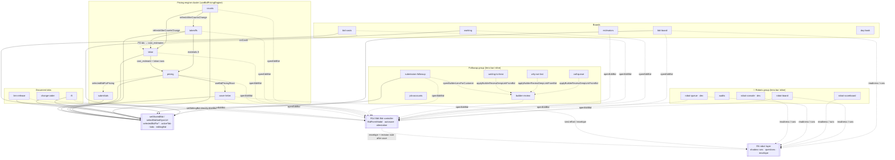

# Bids Tabs Architecture Map

---
file: docs/BIDS_TABS_ARCHITECTURE.md
type: Engineering / Refactor Map
purpose: Inventory what src/pages/Bids.tsx still owns after every tab was extracted — the parent's regions (robot layer, Edit Bid controller, URL router, loaders, lens chrome), each tab's parent seam (props, selection, shared state), test coverage per region, and the extraction order for the regrown ~5.3k-line parent. Tab internals live in the per-tab maps linked from the master table.
covers:
  - src/pages/Bids.tsx
mapped_at: a05cef4c4
audience: Developers, AI Agents
last_updated: 2026-09-25
---

## Overview

[`src/pages/Bids.tsx`](../src/pages/Bids.tsx) was a ~18,800-line "God component"; extracting every workflow tab took it to 3,639 lines (2026-08-03, v2.1331). It has since **regrown to 5,293 lines** — one component `Bids` (234–5292) whose render is 3508–5291 (1,784 lines). **No tab moved back inline.** The growth is parent-owned glue that arrived with new features: the robot layer (twin readiness, shadow runs, robot questions, the envelope), the Edit Bid autosave + Bid Date Sent attestation controller, two lens bars (🤖 Robots and Followup) fronting nine new lens tabs, board job-link / budget / job-account chips, the package map, bid-flow doors, and the Day book door. Largest net adds since 2026-08-03 (`git log --numstat`): robot readiness icon (db7483af0, +113), Robot Board mirror + envelope (v2.3222, +84), robot request queue (v2.2542, +83), package map (v2.2374, +73), Job accounts lens (v2.3553, +65), Edit Bid autosave (v2.3130, +225/−172).

This map is **coupling/refactor-oriented** — for feature/workflow/DB behavior see [`BIDS_SYSTEM.md`](./BIDS_SYSTEM.md). The parent retains the shared bid pointer, the URL deep-link router, the `useBidPricingEngine` seam, the robot data layer, the Edit Bid controller, and the page-level modals.

> **Line numbers are as of `a05cef4c4`** (the `mapped_at` commit) and drift with every edit — search the symbol named beside each range. Regenerate the fact sheet with `npm run map -- src/pages/Bids.tsx`.

**Hook census (fact sheet @ a05cef4c4):** 106 `useState` · 0 `useReducer` · 32 `useEffect` · 18 `useMemo` · 25 `useCallback` · 16 `useRef` · 24 custom hooks · 117 local imports. Tables: `fixture_types`, `jobs_ledger`, `twin_questions`, `bids`, `bid_best_efforts`, `bids_submission_entries`, `users`, `customers`, `customer_contacts`, `customer_contact_persons`, `projects`. RPCs: `snapshot_job_budget_from_bid`, `list_reference_presence`, `list_shadow_runs`, `duplicate_bid_to_service_type`. Edge functions: none.

The tabs are switched on a single `activeTab` state (261); the same 26 keys are repeated literally in `BIDS_TABS` (1737) — `robot-shadows` is a redirect alias, not a rendered tab:

```
'bid-board' | 'robot-board' | 'audits' | 'robot-shadows' | 'robot-queue' | 'robot-scoreboard' | 'robot-console'
| 'builder-review' | 'call-queue' | 'working' | 'bid-costs' | 'day-book' | 'estimators'
| 'counts' | 'takeoffs' | 'labor' | 'pricing' | 'cover-letter' | 'submittals' | 'submission-followup'
| 'why-we-lost' | 'waiting-to-hear' | 'job-accounts' | 'rfi' | 'change-order' | 'lien-release'
```

### Header / tab navigation (v2.1331)

Trades render as a compact segmented control (`bidsTradeSegments`, 3427–3470), New Bid pins top-right (`bidsNewBidButton`, 3472–3489), and both tab rows render through [`ScrollableTabStrip`](../src/components/ScrollableTabStrip.tsx): the board strip `bidsBoardTabsStrip` (3250–3354 — Bid Board, the 🤖 group tab, Followup, Unsent/Working, Bid Costs, Estimators, Day book; a `primary` sees only Bid Board) and the bid-detail strip (3643–3733 — Counts … Lien Release). One row ≥1151px (`wideBidsHeader` via `useMatchMedia`, 3608–3640). Every tab click routes through `selectBidsTab` (3155–3165: state + `?tab=`, drops `bidId`). Two **lens bars** sit under the strips: the 🤖 Robots bar (3747–3867: Robot Board · Audits · Scoreboard, dev Queue + Console) and the Followup bar (4027–4194: Call queue · By builder · By status · Why we lost · Waiting to hear · Job accounts, plus the "N need a reason" chip). Group membership is spelled three ways: `ROBOT_LENS_KEYS` (70), and the Followup key list written out at 3334–3340, 3343 and 4027.

### How to read a dossier
Each per-tab section lists: render location, **parent-owned state** for the tab, **props/callbacks** it gets, **data the parent loads for it**, sub-components, external coupling, and **status + risk**. Tabs that have their own map get the parent-seam view only.

### How to maintain this doc
- Refresh with `npm run map -- src/pages/Bids.tsx` and bump `mapped_at`; anchor every range by symbol.
- When a region leaves the parent, flip its row in [Parent region map](#parent-region-map) and its line in [Recommended extraction order](#recommended-extraction-order).
- Tab internals belong in the tab's own map (links in the master table), not here.

---

## Parent region map

What the 5,293 lines are, top to bottom. "New" = arrived after the 2026-08-03 extraction finish.

| # | Region (search symbol) | Lines | Size | Holds | Status |
|---|---|---|---|---|---|
| R0 | Imports + module scope — `ROBOT_LENS_KEYS`/`isRobotLens` (70–71), types (142–184), `BID_DATE_SENT_ATTESTATION_NULLS` (148–167), `evaluateChecklist` (186–232) | 1–232 | 232 | 117 local imports | — |
| R1 | Page hooks + role/trade state — `useAuth`…`useRoleGate`, `bidPreviewOnBidsPage` (242), `myRole`, `serviceTypes`, three `*ServiceTypeIds`, `fixtureTypes`, `getOrCreateFixtureTypeId` (280–320, `fixture_types` insert) | 234–320 | 87 | | inline |
| R2 | Master data — `bids`, `bidsLoaded`, `customers`, `lastContactFromEntries`, `lastMethodContactFromEntries`, `bidGcRecipientsByBidId`, `useBidGcPackets` (331), contacts | 322–333 | 12 | | inline |
| R3 | Edit Bid state — `bidFormOpen`…`bidServiceTypeSwitchSiblings` (336–364; the run also declares the party-modal pair `viewingCustomer`/`viewingGcBuilder`, opened from Bid Board and Submission & Followup, and Submission & Followup's two script flags), `estimatorUsers`, `onlyMyBids`/`isMyBid` (371–376), `bidDateSent` + 12 attestation states (377–391), `useBidEditForm` (393), notes modal (401–403, dead) | 336–403 | 68 | | inline |
| R4 | Selections + section-open — 5 `selectedBidFor*`, `contactTableRef`, `scrollToContactFromBidBoard`, `scrollToLaborDirectCosts` (dead), `submissionSectionOpen`, `bidBoardSectionOpen` | 405–428 | 24 | | inline (by design) |
| R5 | **Board scope + job links** — `twinUserIds` → `peopleBids`/`robotBids` (432–437), `sentScope`/`sentCounts` (444–453), `jobsByBidId` effect (508–527, `jobs_ledger`), `jobsByBidGen` (459, bumped by the `JOB_CREATED_FROM_BID_EVENT` listener 493–497; re-runs that effect and the budget chips), `useBidBoardBudgetChips` (461), `useBidBoardJobAccountStrips` (469), `linkJobToBidFromBoard` (475–492, RPC `snapshot_job_budget_from_bid`), `BID_REVIEWED_EVENT` reload (499–507) | 429–527 | 99 | New | inline — hook candidate |
| R6 | **Robot layer** — `twinBidBySourceId` (531), `referencePresence` effect (543–554, RPC `list_reference_presence`), status/needs sheet ids (560–565), `shadowRunByBidNumber` effect (570–592, RPC `list_shadow_runs`), `loadRobotQuestions` (598–615, `twin_questions`), `openQuestionsByBidId` (625–635), `?robot=needs` + `?focus=` effects (638–667), `answerRobotQuestion` (671–711), `robotRowInputFor`/`robotRowStateFor*` (713–740), `offerRobotEnvelope` (752–779), `openEnvelopeFromMirror` (781–788), `?envelope=` dev door (790–802), `noteBestEffortGap` (804–821), `noteRobotReviewRevision` (823–832), `toggleRobotRequest` (836–858) | 529–858 | 330 | New — largest regrowth | inline — hook candidate |
| R7 | Audit gate + deep-link appliers — `useBidAuditsPendingCount` (863), lost-summary state, `canAddChecklistFromSubmission`, `openSubmissionFollowupChecklistTask` (892–901), `consumeBidIdParam` (909–916), `applyBidBoardDeepLinkToBid` (918–958), `applySubmissionFollowupDeepLinkToBid` (960–979), `openBuilderLensForCustomer` (989–1009), `applyBuilderReviewDeepLinkFromBid` (1011–1040), working deep-link + archive-confirm state (1042–1054) | 859–1054 | 196 | | inline |
| R8 | Engine seam — `setTick` (1056), `selectedBidForTakeoff/CostEstimate/Pricing`, `costEstimatePOModalTaxPercent` (`'8.25'`), `costEstimateDistanceInput`, `bidTabRowJump`, `useBidPricingEngine` destructure (1086–1170) | 1056–1170 | 115 | | seam (done) |
| R9 | Cover-letter `*ByBid` maps (1174–1181) + package map — `packageMapBid` (1186), `openPackageMap` (1195–1206), `packageMapSharedCost` (1207–1225, `computeSharedBidCost`), `openPriceFromPackageMap` (1227–1235) | 1173–1235 | 63 | map new | inline |
| R10 | Shared bid pointer + bid-flow doors — `setSharedBid` (1238–1248), `closeSharedBidAndClearUrl`, `selectBidAndSyncUrl`, `countsImportRequest`, `bidFlowDoorAllowed`/`openBidFlowDoor` (1276–1288) | 1237–1288 | 52 | doors new | inline (by design) |
| R11 | Loaders — `loadRole` (1343–1382), `loadEstimatorUsers`, `loadTwinUserIds`, `loadCustomers`, `loadServiceTypes` (1434–1472), `loadFixtureTypes`, `loadBids` (1488–1544), `archiveWorkingBoardBid` (1546–1583), `promptArchiveWorkingBoardBid` (1585–1599), contacts loaders (1610–1632), `downloadApprovalPdf` (1669–1687) | 1343–1711 | 369 | incl. 74 blank lines | inline |
| R12 | URL routing + page effects — followup tick/watermark (1294–1309), bid-form focus (1311–1339), `?lostSummary` (1716–1733), `PRIMARY_BIDS_TABS`/`BIDS_TABS` (1736–1737), projects picker (1740–1751), `?newBid=` (1756–1777), **main router** (1779–2014, 236 lines), pending re-apply ×4 (2016–2081), timeout cleanup (2083–2094), `OPEN_BID_EDIT_QUERY` (2096–2132) | 1294–1339 + 1712–2132 | 467 | | inline |
| R13 | Load gates + scroll + cost-estimate loader — role load (2134–2147), reload-on-trade (2150–2157), Builder Review all-trades (2160–2179), contact scroll (2194–2203), `scrollToLaborDirectCosts` effect (2207–2221, dead), cost-estimate loader (2225–2283), `laborPanel` + its telemetry (2288–2301) | 2134–2301 | 168 | | inline |
| R14 | **Edit Bid controller** — open/close (2304–2392), lost reason (2394–2408), trade switch (2410–2505, RPC `duplicate_bid_to_service_type`), attestation (2507–2636), after-save notes (2638–2690), payload/`autosaveBid`/`useJobFormAutosaveSlice`/close guard (2698–2880), `saveBid` (2882–2967), `saveBidAndOpenCounts` (2969–3031), `openCountsForBid`, `saveBidSubmissionQuickAdd` (3055–3078), `deleteBid`, `saveNotesModal` (dead), `openGcBuilderOrCustomerModal` | 2304–3126 | 823 | autosave new | inline — largest region |
| R15 | Working-board memos (3134–3152) + `selectBidsTab` (3155–3165) | 3128–3165 | 38 | | inline |
| R16 | Header chrome + pricing rows — `bidsWorkingTabButton` (3170–3219), Day book/Bid Costs/Estimators buttons (3221–3247), `bidsBoardTabsStrip` (3250–3354), `useBidCustomCosts` + `useBidPricingRows` (3356–3375), `canPackageAndSendBidPricing`, `getGcBuilderPhone/Email` (3383–3407), party-detail lists (3410–3415), `visibleServiceTypes` (3418–3424), `bidsTradeSegments`, `bidsNewBidButton` | 3168–3489 | 322 | | inline |
| R17 | Early returns — `loading`, the Bids role allowlist | 3492–3506 | 15 | | inline |
| R18 | Render (table below) | 3508–5291 | 1,784 | | mixed |

### Render blocks

| Block | Lines | Size | Children / status |
|---|---|---|---|
| Error banner + materials-model switch modal | 3520–3601 | ~82 | inline modal (calls the engine's `confirmMaterialsModelSwitch`) |
| Header, board strip, bid-detail strip | 3604–3733 | ~130 | `ScrollableTabStrip` |
| `WorkingBoardArchiveConfirmDialog` | 3735–3740 | 6 | extracted |
| 🤖 Robots lens bar | 3747–3867 | 121 | **inline** — 4 identical segmented buttons + dev Queue (3800–3830) |
| Robot lens bodies (Audits 3870, Queue 3873, Scoreboard 3879–3899, Console 3902, Robot Board 3908–3929) | 3869–3929 | 61 | extracted children |
| Bid Board | 3932–3981 | 50 | `BidsBidBoardTab` |
| Robot overlays | 3984–4024 | 41 | `RobotEnvelopeModal`, `RobotStatusSheet`, `RobotNeedsSheet`, `RobotReferenceGradeModal`, `RobotBidComparisonModal` |
| Followup lens bar | 4027–4194 | 168 | **inline** — 6 identical segmented buttons + chip + caption |
| Followup lens bodies | 4195–4246 | 52 | `BidsCallQueueTab`, `BidsWhyWeLostLens`, `BidsWaitingToHearLens`, `BidsJobAccountsLens` |
| Builder Review / Working / Day book / Bid Costs / Estimators | 4247–4330 | ~85 | extracted children |
| Counts / Takeoffs / Labor / Pricing / Cover Letter | 4333–4723 | ~390 | prop bags; `BidVersionPicker` ×4 near-identical (4336, 4386, 4558, 4659) |
| Submittals / Submission & Followup / RFI / CO / Lien | 4726–4812 | ~87 | extracted children |
| Bid form / Bid window | 4814–4915 | ~102 | `BidFormModal` (inside `BidWindowModal` when editing) — see [`BIDS_BOARD_FORM_ARCHITECTURE.md`](./BIDS_BOARD_FORM_ARCHITECTURE.md) |
| Bid-sent attestation modal | 4917–5049 | 133 | **inline** |
| Delete bid confirm | 5053–5092 | 40 | **inline** |
| Notes quick-edit | 5094–5124 | 31 | **dead** (never opens) |
| GC/Builder party modals | 5126–5158 | ~33 | `BidPartyDetailModal` ×2 |
| Evaluate checklist | 5160–5223 | 64 | **inline**, over `evaluateChecklist`; opened only by `BidFormModal` |
| Sent-bid / bid-question scripts | 5225–5274 | ~50 | **inline**; opened by Submission & Followup |
| Package map | 5276–5287 | 12 | `BidPackageMapModal` |

**Dead code (zero-risk deletes):** the notes quick-edit modal — `setNotesModalBid` only ever receives `null` (3114, 5109), so `notesModalBid`/`notesModalText`/`savingNotes` (401–403), `saveNotesModal` (3095–3115) and its JSX never run; `scrollToLaborDirectCosts` — the setter only ever receives `false`, so the effect 2207–2221 never scrolls; `contactTableRef` (424) is attached to no element since the 2026-05-30 extraction, so the contact-table scroll effect (2194–2203) only resets `scrollToContactFromBidBoard`; 96 blank lines in 11 runs of ≥3 (largest 1643–1668, 1688–1711, 2180–2193) plus orphaned section comments (1063–1072, 1639–1642).

---

## Master summary table

Sizes are `wc -l` @ a05cef4c4. "Own map" = that file's internals are mapped elsewhere; this map covers only the parent seam.

| Tab key | Label | Parent render | Child (lines) | Status | Parent-owned state for it | Coupling | Engine? | Own map / next action |
|---|---|---|---|---|---|---|---|---|
| `bid-board` | Bid Board | 3932–3981 | `BidsBidBoardTab` (1,983) | extracted, regrew | section-open, deep-link highlight, lost-summary, job links, robot readiness bundle | high | No | [`BIDS_BOARD_FORM_ARCHITECTURE.md`](./BIDS_BOARD_FORM_ARCHITECTURE.md) |
| `robot-board` | 🤖 Robot Board | 3908–3929 | `BidsRobotMirrorTab` (612) | extracted (v2.3222 mirror) | `robotComparePair`, `focusAuditId`, `robotMirrorCount`; reads the Bid Board's `bidBoardDeepLinkHighlightId` | med (robot layer) | No | parent glue → R6 hook |
| `audits` | 🤖 Audits | 3870 | `BidsAuditsTab` (1,458) | extracted | `focusAuditId` | low | No | Done |
| `robot-shadows` | alias | — | → `robot-board` (router 1799–1806) | alias | — | — | — | — |
| `robot-queue` | 🤖 Queue (dev) | 3873–3875 | `BidsRobotQueueTab` (564) | extracted | — | low | No | Done |
| `robot-scoreboard` | 🤖 Scoreboard | 3879–3899 | `BidsRobotScoreboardTab` (562) | extracted | — (reads R6) | med | No | Done |
| `robot-console` | 🤖 Console (dev) | 3902–3904 | `BidsRobotConsoleTab` (289) | extracted | — | low | No | Done |
| `builder-review` | Followup → By builder | 4247–4271 | `BidsBuilderReviewTab` (1,506) | extracted, regrew | deep-link highlight (981–985) | medium | No | [`BIDS_DOCUMENT_TABS_ARCHITECTURE.md`](./BIDS_DOCUMENT_TABS_ARCHITECTURE.md) |
| `call-queue` | Followup → Call queue | 4195–4208 | `BidsCallQueueTab` (748) | extracted | — | low | No | Done |
| `submission-followup` | Followup → By status | 4742–4769 | `BidSubmissionFollowupTab` (2,214) | extracted | selection, `submissionSectionOpen`, `submissionSummaryCardRef`, scripts, approval PDF | medium | No | [`BID_SUBMISSION_FOLLOWUP_TAB_ARCHITECTURE.md`](./BID_SUBMISSION_FOLLOWUP_TAB_ARCHITECTURE.md) |
| `why-we-lost` | Followup → Why we lost | 4209–4221 | `BidsWhyWeLostLens` (900) | extracted | — | low | No | Done |
| `waiting-to-hear` | Followup → Waiting to hear | 4222–4237 | `BidsWaitingToHearLens` (1,078) | extracted | — | low | No | Done |
| `job-accounts` | Followup → Job accounts | 4238–4246 | `BidsJobAccountsLens` (379) | extracted | `jobAccountStrips` (R5) | low | No | Done |
| `working` | Unsent/Working | 4273–4294 | `BidsWorkingBoard` (897) | extracted | deep-link id + refs, archive confirm | low-med | No | Done |
| `day-book` | Day book | 4297–4301 | `PeopleDayBookTab` (471, shared with People) | extracted | — | low | No | Done |
| `bid-costs` | Bid Costs | 4304–4317 | `BidsBidCostsTab` (538) | extracted | — | low | reads engine data | Done |
| `estimators` | Estimators | 4320–4330 | `BidsEstimatorsTab` (670) | extracted | — | low | No | Done |
| `counts` | Counts | 4333–4380 | `BidsCountsTab` (1,266) | extracted | selection, `countsImportRequest`, `bidTabRowJump` | high | Yes | Done |
| `takeoffs` | Takeoffs | 4383–4463 | `BidsTakeoffTab` (3,186) | extracted | selection, shared tax %, `bidTabRowJump` | high | Yes | [`BIDS_TAKEOFF_TAB_ARCHITECTURE.md`](./BIDS_TAKEOFF_TAB_ARCHITECTURE.md) |
| `labor` | Labor | 4466–4550 | `BidsLaborTab` (1,451) | extracted | selection, tax %, distance, cost-estimate loader, `laborPanel`, `bidTabRowJump` | high | Yes | [`BIDS_PRICING_LABOR_TABS_ARCHITECTURE.md`](./BIDS_PRICING_LABOR_TABS_ARCHITECTURE.md) |
| `pricing` | Pricing | 4553–4653 | `BidsPricingTab` (5,122) + `BidsPricingCalculator` (685) | extracted | selection, tax %, `useBidPricingRows`, `useBidCustomCosts` | high | Yes | [`BIDS_PRICING_LABOR_TABS_ARCHITECTURE.md`](./BIDS_PRICING_LABOR_TABS_ARCHITECTURE.md) |
| `cover-letter` | Cover Letter | 4656–4723 | `BidsCoverLetterTab` (1,840) | extracted, regrew | 8 `*ByBid` maps, robot envelope callbacks | high | Yes (rows prop) | [`BIDS_DOCUMENT_TABS_ARCHITECTURE.md`](./BIDS_DOCUMENT_TABS_ARCHITECTURE.md) |
| `submittals` | Submittals | 4726–4739 | `BidsSubmittalsTab` (1,511) | extracted from birth | reuses `selectedBidForPricing` | low | No | [`BIDS_DOCUMENT_TABS_ARCHITECTURE.md`](./BIDS_DOCUMENT_TABS_ARCHITECTURE.md) |
| `rfi` | RFI | 4772–4784 | `BidRfiTab` (353) | extracted | selection | low | No | Done |
| `change-order` | Change Order | 4786–4798 | `BidChangeOrderTab` (469) | extracted | selection | low | No | Done |
| `lien-release` | Lien Release | 4801–4812 | `BidLienReleaseTab` (320) | extracted | selection | low | No | Done — but see the Edit quirk in its dossier |

> Status legend: `extracted` = its own component file; `inline` = JSX/logic still in `Bids.tsx`; "regrew" = the child passed 1,500 lines and now has its own map.

---

## Per-tab dossiers

> Every tab is extracted. Ranges below are parent ranges @ a05cef4c4; child internals are in the linked maps or the child file.

### `bid-board` — Bid Board

- **Render location:** 3932–3981 (`activeTab === 'bid-board'`).
- **Parent-owned state:** `bidBoardSectionOpen` (428; also written by `?lostSummary` 1716–1733 and `applyBidBoardDeepLinkToBid`), `lostSummaryModalOpen`/`lostSummaryInitialStaffTab` (864–865), `bidBoardDeepLinkHighlightId/Gen` + `bidBoardDeepLinkTimeoutRef` + `bidBoardPendingScrollBidIdRef` (866–869; the Id is also the Robot Board's `highlightBidId`, 3914, where the applier lands a twin's bid), `workingBoardArchivedBids` memo (3147–3152).
- **Props from R5/R6:** `bids={peopleBids}`, `sentScope`, `jobsByBidId`, `budgetChips`, `jobAccountStrips` + `onOpenJobAccountsLens`, `onLinkJobToBid` (gated by `canSeeBidBoardJobLinks`), `gcNoteCounts`/`gcPacketsByBid`/`roomStatesByBid`/`recipientsByBidId`, and a `robotReadiness` bundle (`twinBidBySourceId`, `inputFor: robotRowInputFor`, status/needs/compare/grade openers).
- **Callbacks:** `onEditBid`, `onOpenGcBuilderOrCustomer`, `onLastContactClick`, `onOpenBidTab`, `onOpenBidFlowDoor`, lost-summary open/close/save, `onReloadBids`, `onReloadCustomerContacts`, `onError`.
- **Deep link:** `applyBidBoardDeepLinkToBid` (918–958) routes a twin's bid to `robot-board` (`isRobotBid`) and writes the landing tab into the URL (v2.2533 fix). It re-implements `getSubmissionSectionKey` inline (923–932).
- **Status:** extracted; the child regrew to 1,983 lines → **[`BIDS_BOARD_FORM_ARCHITECTURE.md`](./BIDS_BOARD_FORM_ARCHITECTURE.md)** (with `BidFormModal`). The evaluate checklist modal is no longer a board door — only `BidFormModal` opens it.

### 🤖 Robots group — `robot-board` · `audits` · `robot-queue` · `robot-scoreboard` · `robot-console`

- **Render location:** lens bar 3747–3867 (shows when more than one of `robotBids.length > 0`, `auditGate.anyAudits`, `canWorkRobotAudits(myRole)` holds); bodies 3869–3929; overlays 3984–4024. The group tab in `bidsBoardTabsStrip` (3260–3324) hides for `primary`.
- **Gates:** `robot-queue` / `robot-console` dev-only (router 1822–1830 bounces others to the board); `robot-scoreboard` needs `canWorkRobotAudits`; `robot-shadows` → `robot-board` (1799–1806).
- **Parent-owned state (R6):** `referencePresence`, `robotGradeBid`, `robotStatusBidId`/`robotNeedsBidId` (the sheets read the **live** row by id), `shadowRunByBidNumber` + `shadowRunsGen`, `openRobotQuestionRows`, `robotComparePair`, `robotEnvelope` + `envelopeOfferedRef`, `focusAuditId`, `robotMirrorCount`, `bidsRef`.
- **Writes:** `twin_questions` UPDATE (`answerRobotQuestion`, with optional rerun stamp on `bids.robot_requested_at`), `bids` UPDATE (`toggleRobotRequest`, optimistic + rollback via `bidUpdateRefused`), `bids_submission_entries` INSERT (`noteBestEffortGap`, `noteRobotReviewRevision`).
- **Outbound coupling:** R14 calls them after writes — `autosaveBid` runs `noteRobotReviewRevision` (value changed, no date written, 2795) and `offerRobotEnvelope` (value or date written, 2798), `saveBid` runs only `offerRobotEnvelope` on any edit save (2966), `saveBidAndOpenCounts` runs neither, and `BidFormModal`'s `onGcRollupDateChanged` offers the envelope (4840); Cover Letter calls `noteBestEffortGap`/`offerRobotEnvelope` (4694–4696). `list_shadow_runs` is called here twice (570–592, 765) and once each, independently, by `BidsRobotMirrorTab`, `BidsRobotQueueTab`, `BidsRobotScoreboardTab`, `BidsAuditsTab`, `BidBestEffortCard`, `useBidAuditsPendingCount`, `useRobotLockedShadows`.
- **Status:** all five lens bodies extracted; the 330-line data layer and the 121-line lens bar are parent-inline. **Hook-seam candidate** (`useBidRobotLayer`), see order step 5.

### `builder-review` — Builder Review

- **Render location:** 4247–4271; the Followup group tab lands superintendents here (3334–3341).
- **Parent-owned state:** `builderReviewDeepLinkHighlightCustomerId/Gen` + three refs (981–985), `customerContactPersons` + loader.
- **Props/callbacks:** `bids={peopleBids}`, `gcPacketsByBid`, `customers`, `customerContacts`, `customerContactPersons`, `lastContactFromEntries`, `authUser`, loaders, `onEditBid`, `onNewBidWithCustomer`, `onViewSubmissions` (sets `selectedBidForSubmission` + `activeTab` + `scrollToContactFromBidBoard` directly), `onSetCustomers`, the two customer-modal contexts.
- **Data:** the all-trades reload effect (2160–2179) runs `loadBids(null)` while this tab is active; the reload-on-trade effect (2150–2157) skips it.
- **Status:** extracted; the child regrew to 1,506 lines → **[`BIDS_DOCUMENT_TABS_ARCHITECTURE.md`](./BIDS_DOCUMENT_TABS_ARCHITECTURE.md)**.

### Followup lenses — `call-queue` · `why-we-lost` · `waiting-to-hear` · `job-accounts`

- **Render location:** lens bar 4027–4194; bodies 4195–4246. Superintendents are bounced off all four plus `submission-followup`, `pricing`, `cover-letter`, `submittals` (router 1864–1874).
- **Parent-owned state:** none of their own. They read `peopleBids`, `sentScope`, `gcPacketsByBid`, `lastMethodContactFromEntries` (method entries only, v2.2413), `bidGcRecipientsByBidId`, `roomStatesByBid`, `jobAccountStrips`; three take `onOpenBuilderCard={applyBuilderReviewDeepLinkFromBid}`.
- **Chip:** "N need a reason" (4161–4179) reads `sentCounts.lostNeedingReason`.
- **Status:** all extracted; the lens bar is inline (see order step 3).

### `working` — Unsent / Working

- **Render location:** 4273–4294 behind `activeTab === 'working' && authUser?.id`.
- **Parent-owned state:** `workingBoardDeepLinkBidId` + two refs (1042–1051), `archiveWorkingBoardBusyBidId`, `workingBoardArchiveConfirmBidId/Label` (the confirm dialog is page-level because `BidFormModal` also triggers it).
- **Derived:** `workingBoardEligibleBids`/`VisibleBids`/`ArchivedBids` (3134–3152), `useWorkingBoardInboxCount` (3168, tab badge).
- **Handlers:** `archiveWorkingBoardBid` (1546–1583, `bids` UPDATE), `promptArchiveWorkingBoardBid` (1585–1599), deep-link branch of the router (1922–1970, toasts for archived / not-eligible).
- **Status:** **Done** — only deep-link glue stays parent-side.

### `bid-costs` — Bid Costs

- **Render location:** 4304–4317 behind `canSeeBidCosts(myRole)` (office roles, v2.3336); router bounce 1842–1850.
- **Props:** `bids`, `teamLaborData={teamLaborDataForBids}`, `bidAssignedCosts`, `onSelectBid={setSharedBid}`, `onCostIt` (`setSharedBid` + `selectBidsTab('labor')`), `onOpenBid` (Bid window on its Bid face), `showDollars={canSeeBidCostDollars(myRole)}`.
- **Data:** `teamLaborDataForBids` and `bidAssignedCosts` now load inside `useBidPricingEngine` (its effects gate on `pricing`/`labor`/`bid-costs` and `bid-costs`), not in the parent.
- **Status:** **Done.** Lens internals (pursuit, cost-to-win, bid-vs-actual, forecast) are in the child over `lib/bids/bidPursuit.ts`, `bidCostToWin.ts`, `bidVsActual.ts`, `bidForecast.ts`.

### `day-book` — Day book (v2.3735)

- **Render location:** 4297–4301; `PeopleDayBookTab` is People's tab mounted here under the same `canOpenDayBook` gate (router bounce 1833–1841). **Done.**

### `estimators` — Estimators

- **Render location:** 4320–4330. Parent passes `active`, `viewerRole` (`controller` → `assistant`), and `onOpenBidPreview` (opens the Bid window when the bid is loaded, else the global preview). No parent state. **Done.**

### `counts` — Counts

- **Render location:** 4333–4380 — `BidVersionPicker` (4336–4350) + `BidsCountsTab`.
- **Parent-owned state:** `selectedBidForCounts`, `countsImportRequest` (bid-flow door "Count & import" bumps it), `bidTabRowJump` (filtered to `tab === 'counts'`; shared — Takeoffs and Labor read their own slices the same way and each clears it through `onRowJumpHandled`, Pricing writes it).
- **Engine props:** `countRows`, `setCountRows`, `refreshAfterCountsChange`, `skipNextLoadCountRowsRef`, `activeBidVersionId`.
- **Callbacks:** `onSelectBid`, `onClose={closeSharedBidAndClearUrl}`, `onCountSourceLinkSaved` (reloads bids and refreshes `selectedBidForCounts` inline, 4373–4377), `onOpenBidFlowDoor`, `onlyMyBids`/`setOnlyMyBids`/`isMyBid`.
- **Child owns:** search, row move, import (`parseCountsImportText`), clear-all modal, CSV export (`buildCountsCsv`), reorder RPC `update_bids_count_rows_order`, dnd sensors.
- **Status:** **Done.** `bids_count_rows` is the root of the pricing pipeline.

### `takeoffs` — Takeoffs

- **Render location:** 4383–4463 — `BidVersionPicker` (4386–4400) + `BidsTakeoffTab`.
- **Parent-owned:** `selectedBidForTakeoff`; `costEstimatePOModalTaxPercent` **and its setter** (the only writer); `selectedBidForCostEstimate` (read by its cost-estimate materials summary and the PO-create reload guard); the cost-estimate loader effect (2225–2283, gated on `labor || takeoffs`).
- **Engine props:** 32 takeoff/cost-estimate values + loaders (`takeoffCountRows`, mappings, rough lines, book versions/entries, `costEstimate*`, `loadDraftPOs`, `ensureCostEstimateForBid`, `setCostEstimatePO`, `openMaterialsModelSwitch`, …).
- **Edit door:** `onEditBid={openEditBid}` is passed (4460) but the child never reads it (a dead prop); like Counts, which gets no `onEditBid`, it reaches the Edit window only through `openBidFlowDoor`.
- **Status:** extracted; internals → **[`BIDS_TAKEOFF_TAB_ARCHITECTURE.md`](./BIDS_TAKEOFF_TAB_ARCHITECTURE.md)**.

### `labor` — Labor (cost estimate)

- **Render location:** 4466–4550 (no version picker in the parent).
- **Parent-owned:** `selectedBidForCostEstimate` **plus its setter passed down** (the only tab handed a raw selection setter), `costEstimatePOModalTaxPercent`, `costEstimateDistanceInput` + setter (seeded by the loader effect), `laborPanel` (2288–2291, `laborEmptyState` + `pricingResolvePanel`) and its telemetry effect (2292–2301, `recordNavClick 'labor_tab_empty_state_shown'`).
- **Loader effect (2225–2283):** resolves the bid's version first (`shouldLoadCostEstimate` / `pickActiveVersion` / `loadAfterResolve`, J11-F1), picks the trade's one labor book (`laborBookForTrade`, v2.3597), then `loadCostEstimateData`.
- **Status:** extracted; internals → **[`BIDS_PRICING_LABOR_TABS_ARCHITECTURE.md`](./BIDS_PRICING_LABOR_TABS_ARCHITECTURE.md)**.

### `pricing` — Pricing

- **Render location:** 4553–4653 — `BidVersionPicker` (4558–4573, with `resolvePanel`) + `BidsPricingTab` + the floating `BidsPricingCalculator` (4651).
- **Parent-owned:** `selectedBidForPricing` (also the Cover Letter and Submittals selection), `costEstimatePOModalTaxPercent`, `bidTabRowJump` writer (`onNavigateBidToTabRow`, 4645–4648), `canPackageAndSendBidPricing` (3377–3381).
- **Shared calc:** `useBidPricingRows` (3358–3375) → `pricingRowsForGrid` + `pricingPackageSource` (to Pricing) and `coverLetterPricingRows` (to Cover Letter); `useBidCustomCosts` (3356) → `bidCountRowCustomCosts` (fed into the rows hook and the tab).
- **Status:** extracted; internals → **[`BIDS_PRICING_LABOR_TABS_ARCHITECTURE.md`](./BIDS_PRICING_LABOR_TABS_ARCHITECTURE.md)**.

### `cover-letter` — Cover Letter

- **Render location:** 4656–4723 — `BidVersionPicker` (4659–4674) + `BidsCoverLetterTab`.
- **Parent-owned:** the 8 `coverLetter*ByBid` maps + setters (1174–1181) — they stay because `downloadApprovalPdf` (1669–1687, Submission tab) reads them; `saveBidSubmissionQuickAdd` (3055–3078, refreshes 5 of the 8 selections).
- **Props:** `coverLetterPricingRows`, `pricingCountRows`, `serviceTypes`, `activePricingName`, `versionGcFingerprint`, bid pricings/versions + reloaders, and three robot callbacks — `onBidSentRecorded` (`noteBestEffortGap` → `offerRobotEnvelope`), `onBestEffortRecorded`, `onOpenRobotEnvelope` (force).
- **Status:** extracted; the child regrew to 1,840 lines → **[`BIDS_DOCUMENT_TABS_ARCHITECTURE.md`](./BIDS_DOCUMENT_TABS_ARCHITECTURE.md)**.

### `submittals` — Submittals (stage 2b)

- **Render location:** 4726–4739. Reuses `selectedBidForPricing` as `selectedBid`; `onOpenPricing` jumps back to Pricing. Included in the router's workflow `bidTabs` list (1971) so `?tab=submittals&bidId=` restores the pointer.
- **Status:** extracted from birth (1,511 lines) → **[`BIDS_DOCUMENT_TABS_ARCHITECTURE.md`](./BIDS_DOCUMENT_TABS_ARCHITECTURE.md)**.

### `submission-followup` — Submission & Followup

- **Render location:** 4742–4769 ("By status" lens of the Followup group).
- **Parent-owned (passed as props):** `selectedBidForSubmission` (+ `onClearBid`), `submissionSectionOpen` + setter, `submissionSummaryCardRef`, `canAddChecklistFromSubmission` + `openSubmissionFollowupChecklistTask`, the two script modals (`showSentBidScript`/`showBidQuestionScript`, JSX 5225–5274), `downloadApprovalPdf` (thin wrapper over [`approvalPdf.ts`](../src/lib/bidDocuments/approvalPdf.ts)), `onOpenBuilderLens={openBuilderLensForCustomer}`.
- **Parent effects for it:** 60-second re-render tick (1294–1298, anonymous `setTick`), notes read-watermark upsert (1300–1309), contact-table scroll (2194–2203, inert — `contactTableRef` is attached to nothing, see Dead code), deep-link applier (960–979, re-implements `getSubmissionSectionKey` at 964–973).
- **Status:** extracted; internals → **[`BID_SUBMISSION_FOLLOWUP_TAB_ARCHITECTURE.md`](./BID_SUBMISSION_FOLLOWUP_TAB_ARCHITECTURE.md)**.

### `rfi` — RFI

- **Render location:** 4772–4784. Controlled `selectedBidForRfi`; `onClose` clears only `selectedBidForRfi` (not the URL, unlike CO/Lien). Child owns the `bids_rfi*` document state. **Done.**

### `change-order` — Change Order

- **Render location:** 4786–4798. Controlled `selectedBidForChangeOrder`; `onClose={closeSharedBidAndClearUrl}`. **Done.**

### `lien-release` — Lien Release

- **Render location:** 4801–4812. Controlled `selectedBidForLienRelease`; `onClose={closeSharedBidAndClearUrl}`.
- **Quirk / likely bug:** `onEditBid` (4810) calls `setBidFormOpen(true); setEditingBid(bid)` directly instead of `openEditBid`, so the "Edit bid" button (child line 177) skips `bidForm.loadFromBid`, the attestation reset, `savedBidDateSentRef` and `bidWindowInitialTab`. Since autosave (v2.3130) the window can open showing whatever the form last held. Route it through `openEditBid` when this area is next touched.

---

## Shared infrastructure

These primitives are touched by many tabs; any extracted piece must be handed them.

### The shared bid pointer

| Symbol | Where | Role |
|---|---|---|
| `setSharedBid` | 1238–1248 | Writes 8 selections (`selectedBidForCounts/Takeoff/CostEstimate/Pricing/Submission/Rfi/ChangeOrder/LienRelease`) and `rememberSharedBidId` (sessionStorage, [`sharedBidPointer.ts`](../src/lib/bids/sharedBidPointer.ts)). **Cover Letter and Submittals have no own selection — they reuse `selectedBidForPricing`.** |
| `selectBidAndSyncUrl` | 1261–1269 | `setSharedBid(bid)` + `?tab=…&bidId=…` |
| `closeSharedBidAndClearUrl` | 1251–1258 | `setSharedBid(null)` + drops `bidId` |
| `syncFreshBidIntoSelections` | 2725–2733 | After a write, swaps the fresh row into **5** selections (not RFI/CO/Lien) |
| `openBidFlowDoor` | 1279–1288 | Step door → `openEditBid` or `selectBidAndSyncUrl(bid, door)`, then `landOnBidFlowTarget`; `bidFlowDoorAllowed` keeps superintendents off `pricing`/`cover-letter` |
| URL deep-link restore | main router 1971–1993 | `bidId` + a workflow tab (`counts`, `takeoffs`, `labor`, `pricing`, `cover-letter`, `submittals`, `rfi`, `change-order`, `lien-release`) → `setSharedBid` + `setActiveTab`; a bid outside the loaded trade fetches its `service_type_id` and switches trade |
| Session pointer restore (v2.2905, J11-F2/N2) | same effect, 1972–1978 | A workflow tab with no `bidId` and no selection restores the remembered bid silently; `selectBidsTab` still strips `bidId` on purpose (v2.2043) |

**Implication:** each extracted tab receives its `selectedBid` + `onSelectBid`/`onClose` as controlled props. Labor is the one exception (it also gets `setSelectedBidForCostEstimate`).

### Top-level shared state

| Variable | Where | Used by |
|---|---|---|
| `activeTab` | 261 | every render gate + 9 effects (1294, 1300, 1779, 2150, 2160, 2194, 2207, 2225, 2292) |
| `bids` / `peopleBids` / `robotBids` | 322, 434–437 | master list; the Bid Board, Builder Review, the four Followup lenses and the robot lenses get `peopleBids` (By status / Submission & Followup, Bid Costs, the workflow tabs and the Working memos read the unpartitioned `bids`), the robot lenses also `robotBids` (partition by `twinUserIds`, [`bidBoardScope.ts`](../src/lib/bidBoardScope.ts)) |
| `sentScope` / `sentCounts` | 444–453 | Bid Board, Followup lenses, Submission & Followup, the "need a reason" chip ([`bidSentCounts.ts`](../src/lib/bids/bidSentCounts.ts)) |
| `gcPacketsByBid` / `gcNoteCounts` / `roomStatesByBid` | 331 (`useBidGcPackets`) | Bid Board, Followup lenses, Builder Review, Submission & Followup |
| `editingBid` / `bidFormOpen` | 344, 336 | every tab via `openEditBid` → `BidFormModal` |
| `onlyMyBids` / `isMyBid` | 371–376 | 9 workflow tabs (Counts, Takeoffs, Labor, Pricing, Cover Letter, Submittals, RFI, CO, Lien); the comment at 369 still says "eight" |
| `selectedServiceTypeId` | 265 | loaders, books/templates, trade switch |
| `error` | 260 | every handler; passed as `setError`/`onError` |
| `authUser` / `myRole` | `useAuth`, 255 | role gates (router 1822–1874, strips, early return 3500), new-bid defaults |
| `narrowViewport640`, `bidPreviewOnBidsPage`, `ledgerPrefixMap` | hooks 238–251 | detail layouts, title-bar previews (Bid window on its Bid face, v2.2390), ledger labels |

### Shared handlers / loaders

| Function | Where | Notes |
|---|---|---|
| `loadBids` | 1488–1544 | Master loader; primary scoping predicate (v2.2174); hides `adopted_into_bid_id`; then reads **every** `bids_submission_entries` row (no filter) for the two recency maps and calls `fetchBidGcRecipientsMap()` on each call |
| `openEditBid` | 2342–2365 | Hydrates `bidForm`, resets attestation, opens the Bid window (`tab`, `focus` options) |
| `openNewBid` / `openNewBidFromProject` / `openNewBidWithCustomer` | 2304–2340 | Header, `?new=`/`?newBid=` deep links, Builder Review |
| `openGcBuilderOrCustomerModal` | 3118–3126 | Bid Board, Submission & Followup |
| `loadCustomers` / `loadCustomerContacts` / `loadCustomerContactPersons` | 1418–1432, 1610–1632 | Builder Review, Working, Submission & Followup |
| `getSubmissionSectionKey` | [`lib/bids/submissionSections.ts`](../src/lib/bids/submissionSections.ts) | Used by the Bid Board, Builder Review and Submission & Followup children, `BuilderCallSessionModal`, `useMapPageData` and the `bidSentCounts` / `robotMirror` / `bidBoardMap` / `bidBoardCustomerReview` kernels; the parent's two appliers re-implement it inline |
| `useBidEditForm` | [`lib/bids/useBidEditForm.ts`](../src/lib/bids/useBidEditForm.ts) | The Edit Bid form state (extracted) |

### Pricing-engine shared layer

> **Extracted (2026-05-30, `cfb1f1982`)** to [`src/hooks/useBidPricingEngine.ts`](../src/hooks/useBidPricingEngine.ts) (1,819 lines @ a05cef4c4). The engine-data state, refs, loaders/mutators and load effects — including the team-labor and bid-assigned-cost loads for Pricing/Labor/Bid Costs — live in the hook. The parent passes the 4 engine selections, `activeTab`, `selectedServiceTypeId`, `authUser`, `setError`, `loadBids`, `setSharedBid` and destructures 128 names (1086–1170). Shared types: [`bidPricingEngineTypes.ts`](../src/lib/bids/bidPricingEngineTypes.ts). The hook's internals are covered with Pricing/Labor in [`BIDS_PRICING_LABOR_TABS_ARCHITECTURE.md`](./BIDS_PRICING_LABOR_TABS_ARCHITECTURE.md).

**Stays in the parent:** the cost-estimate loader effect (2225–2283, writes parent-owned `costEstimateDistanceInput` and resolves the version first), `laborPanel` + its telemetry effect (2288–2301), `packageMapSharedCost` (1207–1225), `useBidPricingRows` + `useBidCustomCosts` (3356–3375), the four `BidVersionPicker` blocks, and the materials-model switch modal JSX (3526–3601, calls the hook's `confirmMaterialsModelSwitch`).

**Deferred:** collapsing the 8 `setSharedBid` selections into one `selectedBid`.

| Symbol | Line / file | Role |
|---|---|---|
| `useBidPricingEngine` | [`src/hooks/useBidPricingEngine.ts`](../src/hooks/useBidPricingEngine.ts) | Owns engine state/refs/loaders + load effects; returns one object |
| `refreshAfterCountsChange` | in hook | Fan-out: on any count change, reloads takeoff + labor for the same bid |
| `loadCostEstimate` / `ensureCostEstimateForBid` / `loadCostEstimateData` | in hook | One `cost_estimates` row per bid (Takeoffs ↔ Labor ↔ Pricing bridge) |
| `loadPricingDataForBid` | in hook | Aggregates counts + labor + takeoff materials; also called by `openPackageMap` |
| `openMaterialsModelSwitch` / `confirmMaterialsModelSwitch` | in hook | `bids.materials_model` toggle (Takeoffs/Labor; Pricing is passed the opener but never reads it) |
| `bidVersions` / `selectedBidVersionId` / `selectedBidVersionIdRef` / `switchActiveVersion` | in hook | **Bid Versions**; the ref is what the parent's cost-estimate effect checks before loading |
| `pricingResolve` / `retryPricingResolve` / `costEstimateResolve` | in hook | Resolve state behind `pricingResolvePanel` (version pickers, Pricing, `laborPanel`) |
| `selectedPricingVersionId` / `templatePriceBookVersions` / `defaultPriceBookTemplateId` / `versionClonePricingSourceId` | in hook | Bid-scoped Pricings, master templates, remembered default |
| `computeBidPricingRows` | [`lib/bidPricingRowCalculations`](../src/lib/bidPricingRowCalculations.ts) | The single pricing calc kernel (tested) |
| `useBidPricingRows` | [`src/hooks/useBidPricingRows.ts`](../src/hooks/useBidPricingRows.ts) | Wraps `pricingRowsForGrid` + `pricingPackageSource` + `coverLetterPricingRows` |
| `pricingPage.ts` / `approvalPdf.ts` | [`lib/bidDocuments/`](../src/lib/bidDocuments/) | Stage-A print/CSV and approval-PDF builders; approval PDF keeps a hardcoded `taxPercent: 8.25` |
| `submissionHiddenIdsForVersion` | [`lib/bids/submissionHides.ts`](../src/lib/bids/submissionHides.ts) | Count rows hidden from submission docs |

`bids_count_rows` is the **single source of truth**; the per-tab caches (`countRows`, `takeoffCountRows`, `costEstimateCountRows`, `pricingCountRows`) are all held in the hook.

### Shared component / lib helpers already extracted

`BidWorkflowTabTitleWithPreview`, `ModalShell`, `BidFormModal` + `BidWindowModal` (+ `useBidEditForm`), `BidsWorkingBoard`, `BidNotesTable`/`CustomerNotesTable`/`UnifiedBidCustomerNotes`, `BidPartyDetailModal`, `BidPackageMapModal`, `WorkingBoardArchiveConfirmDialog`, `copyRichHtmlToClipboard`, `bidStyles`, plus the `lib/bids/*` and `lib/bidDocuments/*` families. Easy to miss:

- **[`BidVersionPicker`](../src/components/bids/BidVersionPicker.tsx)** — rendered **4× by the parent** (Counts, Takeoffs, Pricing, Cover Letter) with near-identical props; drives `switchActiveVersion` + rename/delete/first-split and opens the package map.
- **[`MyBidsToggle`](../src/components/bids/MyBidsToggle.tsx)** — the "only my bids" chip inside the 9 workflow tabs that take `onlyMyBids`.
- **[`AssignTakeoffPartModal`](../src/components/bids/AssignTakeoffPartModal.tsx)** — rendered by `BidsPricingTab`.
- **[`BidBoardCustomerReviewModal`](../src/components/bids/BidBoardCustomerReviewModal.tsx)** / **[`BidBoardEstimatingHealthSection`](../src/components/bids/BidBoardEstimatingHealthSection.tsx)** — rendered by `BidsBidBoardTab`.

---

## Test coverage by region

The parent itself has **no render smoke** (no `Bids.render.test.tsx`); e2e touches it only through `e2e/deep-links.spec.ts` (`/bids?newBid=true&project=…`) and `e2e/viewport-smoke.spec.ts` (`/bids?tab=bid-board`).

| Region | Kernels it leans on — tested | Untested in or behind the region |
|---|---|---|
| R5 board scope + job links | `bidBoardScope`, `bidSentCounts`, `bidBoardJobLinks`, `bidBoardJobAccounts`, `bidBoardBudgetChips`, `gcPackets`/`versionSends`/`bidGcNotes` | hooks `useBidBoardBudgetChips`, `useBidBoardJobAccountStrips`, `useBidGcPackets`; `linkJobToBidFromBoard` (**sets a job's budget** via `snapshot_job_budget_from_bid`) |
| R6 robot layer | `robotRowState`, `robotEnvelope`, `robotMirror`, `bestEffort`, `shadowStory`, `twinQuestionKind`, `confidenceBoard`, `bidAudits`; renders: `RobotNeedsSheet`, `BidsRobotMirrorTab`, `BidsRobotScoreboardTab`, `BidsAuditsTab` | in-parent reductions — latest run per reference (577–583), plans-ask re-keying (625–635), best-effort-gap dedupe by note prefix (814–815); renders of `RobotEnvelopeModal`, `RobotStatusSheet`, `RobotReferenceGradeModal`, `RobotBidComparisonModal`, `BidsRobotQueueTab`, `BidsRobotConsoleTab` |
| R7 deep-link appliers | — | `getSubmissionSectionKey` has no direct test (only exercised through callers such as `bidSentCounts.test`) and is re-implemented twice inline |
| R9 package map | `bidPackageMap` (`computeSharedBidCost`, money) | the input assembly (1207–1225) |
| R10 pointer + doors | `sharedBidPointer`, `bidFlow`, `bidFlowLanding`, `bidFormFocus` | — |
| R11 loaders | `bidContacts`, `bidGcRecipients`, `customerArchive` | `workingBoardArchiveEligibility` (**gates the archive write**) |
| R12 URL router + page effects | `useRoleGate.render.test` (the bounce hook only) | the route decisions and role gates (1822–1874), alias rewrites, trade-switch fetches (×5); `userBidNotesReadState` (watermark effect 1300–1309) |
| R13 cost-estimate loader | `laborTabLoadGate`, `pickActiveVersion`, `pricingResolve`, `laborEntryProvenance`, `navClickTelemetry`; `useBidPricingEngine.laborLoad.render.test.tsx` | the effect itself |
| R14 Edit Bid controller | `bidFormPayload`, `bidUpdatePrune`, `bidFormAutosave`, `updateGuard`, `outcomeChangeBidNote`, `wonDispatchHandoff`, `bidDistanceToOffice`; `BidFormModal.render.test` | **attestation rules** (2507–2636 — decide whether `bid_date_sent` + attestation stamps are written); `bidDateSentDisplay`; `askDispatchToOpenJob` (only mocked, in `BidWonJobActions.render.test`); `useJobFormAutosaveSlice` (no own test; shared with Jobs/Estimates); the close-flush guard (2848–2880) |
| R16 pricing rows | `bidPricingRowCalculations` (money) | `useBidPricingRows` / `useBidCustomCosts` hook wiring; the `'8.25'` tax default (1076) |
| Tab children | render tests: `BidsAuditsTab`, `BidsCallQueueTab`, `BidsJobAccountsLens`, `BidsRobotMirrorTab`, `BidsRobotScoreboardTab`, `BidsSubmittalsTab`, `BidsTakeoffTab`, `BidFormModal`, `PeopleDayBookTab` | no render test: `BidsBidBoardTab`, `BidsBuilderReviewTab`, `BidsCountsTab`, `BidsLaborTab`, `BidsPricingTab`, `BidsCoverLetterTab`, `BidSubmissionFollowupTab`, `BidRfiTab`, `BidChangeOrderTab`, `BidLienReleaseTab`, `BidsWorkingBoard`, `BidsBidCostsTab`, `BidsEstimatorsTab`, `BidsWhyWeLostLens`, `BidsWaitingToHearLens`, `BidWindowModal`, `BidPackageMapModal`, `BidsPricingCalculator`, `BidVersionPicker` |

The parent computes no money itself — every dollar goes through a tested kernel (`computeSharedBidCost`, `computeBidPricingRows`) — but the two budget/estimate writes it owns (`linkJobToBidFromBoard`, the attestation-gated `bid_date_sent` write) have no test.

---

## Cross-tab coupling diagram


```mermaid
graph TD
    subgraph boards["Boards"]
        BB[bid-board]
        WK[working]
        BC[bid-costs]
        ES[estimators]
        DB[day-book]
    end

    subgraph robots["🤖 Robots group (lens bar inline)"]
        RB[robot-board]
        AU[audits]
        RQ[robot-queue · dev]
        RS[robot-scoreboard]
        RC[robot-console · dev]
    end

    subgraph followup["Followup group (lens bar inline)"]
        CQ[call-queue]
        BR[builder-review]
        SF[submission-followup]
        WL[why-we-lost]
        WH[waiting-to-hear]
        JA[job-accounts]
    end

    subgraph engine["Pricing-engine cluster (useBidPricingEngine)"]
        CO[counts]
        TK[takeoffs]
        LB[labor]
        PR[pricing]
        CL[cover-letter]
        SU[submittals]
    end

    subgraph docs["Document tabs"]
        RFI[rfi]
        CHG[change-order]
        LIEN[lien-release]
    end

    SHARED[["setSharedBid / selectBidAndSyncUrl<br/>selectedBidFor* · activeTab · bids · editingBid"]]
    ROBOT[["R6 robot layer<br/>shadow runs · questions · envelope"]]
    FORM[["R14 Edit Bid controller<br/>BidFormModal · autosave · attestation"]]

    BB & WK & BC & SF & RFI & CHG & LIEN --> SHARED
    CO & TK & LB & PR & CL & SU --> SHARED

    CO -->|refreshAfterCountsChange| TK
    CO -->|refreshAfterCountsChange| LB
    TK -->|PO ids → cost_estimates| LB
    TK -->|materials $| PR
    LB -->|cost_estimate + labor rows| PR
    PR -->|useBidPricingRows| CL
    PR -.selectedBidForPricing.-> SU

    BB & RB & RS & RQ & RC -.readiness / runs.-> ROBOT
    CL -.best effort / envelope.-> ROBOT
    FORM -.envelope + revision note after save.-> ROBOT

    BB & RB & RQ & WK & BC & ES & BR & SF & CO & TK & LB & PR & CL & RFI & CHG -.openEditBid.-> FORM
    LIEN -.setEditingBid directly.-> FORM
    CQ & WL & WH -.applyBuilderReviewDeepLinkFromBid.-> BR
    SF -.openBuilderLensForCustomer.-> BR
    BC -.onCostIt.-> LB
```

---

## Recommended extraction order

Ordered by **value ÷ risk** for the regrown parent. Every tab is already out; what is left is parent glue.

> Already done (the bulk in `cfb1f1982`, 2026-05-30 — Pricing, Labor and that day's other tabs with the engine): all 26 tab keys render extracted children; `useBidPricingEngine` + `useBidPricingRows` seams; Stage-A builders (`pricingPage.ts`, `approvalPdf.ts`, `costEstimatePage.ts`); `useBidEditForm`; `WorkingBoardArchiveConfirmDialog`; `getSubmissionSectionKey` promoted to a lib. `Bids.tsx` went ~18,800 → 3,639 (2026-08-03) and regrew to 5,293.

1. **Dead-code + blank-run sweep** (≈ −150 lines, zero risk): the notes quick-edit modal (401–403, 3095–3115, 5094–5124), `scrollToLaborDirectCosts` (426, 2207–2221), 96 blank lines in 11 runs, orphaned section comments (1063–1072, 1639–1642). Mechanical — merge alone.
2. **Stage A kernels, no moves** (small lines, high test value): use `getSubmissionSectionKey` in both appliers (923–932, 964–973) and give it a test; one `bidsTabAccess(role)` / `resolveBidsTabRoute(params, role)` kernel for the router gates (1822–1874), the strips' role conditions and the five copies of the Bids role allowlist (`loadRole` 1378, 2135, 2151, 2161, 3500 — the last spells `assistant`/`controller` where the others call `isAssistantLike`); `FOLLOWUP_LENS_KEYS` beside `ROBOT_LENS_KEYS`; `type BidsTabKey = typeof BIDS_TABS[number]` in place of the literal union at 261; the attestation rules (2507–2554) as pure functions with tests; one `switchTradeForBid(bidId)` helper for the five `select('service_type_id')` fetches.
3. **`BidsLensBar` presentational component + a version-picker helper** (≈ −300 lines, low risk): both lens bars (3747–3867, 4027–4194) are 10 copies of the same segmented button; the four `BidVersionPicker` blocks differ only in the selection and `resolvePanel`. `selectBidsTab` and all gates stay in the parent.
4. **`useBidDateSentAttestation` + `BidSentAttestationModal`** (≈ −290 lines, low-med): 12 states (379–391), `clearBidDateSentAttestationFlow` (2367–2380), the rules/handlers (2507–2636), the modal (4917–5049). Returns `getPayloadMerge`/`validateForSave`/`promptIfNeeded` to the save paths, plus the pending follow-up note and a clear-after-save (all three save paths read the note and reset three pending states: 2775–2777, 2945–2947, 3012–3014) and the modal-open flag, which the autosave gate (2829) and the Bid window's `escBlocked` (4905) read. Needs step 2's kernel tests first.
5. **`useBidRobotLayer` hook + `BidsRobotOverlays`** (≈ −370 lines, med-low): R6 (529–858) as a hook seam returning `robotRowInputFor`, `offerRobotEnvelope`, `noteBestEffortGap`, `noteRobotReviewRevision`, `answerRobotQuestion`, `toggleRobotRequest` + sheet/modal state; the five overlays (3984–4024) move with it. Test the three in-parent reductions first. Later: one shared `list_shadow_runs` source for the seven other callers.
6. **`useBidBoardScope` hook** (≈ −100 lines, low-med): R5 (429–527) — partition, `sentScope`/`sentCounts`, `jobsByBidId`, budget chips, job-account strips, `linkJobToBidFromBoard` (add a test for the confirm → RPC → event path).
7. **`useBidsDeepLinks` hook** (≈ −400 lines, medium): R12's routers and the three appliers with one `useDeepLinkHighlight` (the board and builder-review copies of highlight + 2.5 s timeout + gen). Guard with a page render smoke that walks `?tab=` keys and the e2e deep-link spec.
8. **`useBidsPageData` hook** (≈ −300 lines, medium): R11 loaders + R13 load gates (2134–2179). Also fix `loadBids` reading all `bids_submission_entries` on every call.
9. **`useBidEditController`** (≈ −500 lines, **high**): what remains of R14 — open/close, `autosaveBid` + `useJobFormAutosaveSlice` + visibility flush + close guard, `saveBid`/`saveBidAndOpenCounts`, trade switch, delete — plus the delete and evaluate modals (the two script modals are Submission & Followup's, opened only from its props at 4762–4763, and stay with that seam). Coupled to the selections (`syncFreshBidIntoSelections`), the robot layer, `loadBids` and `openCountsForBid`. Last, after steps 4–5 have thinned it and a parent render smoke exists; fix the Lien Release `onEditBid` bypass in the same pass.
10. **Deferred:** collapse the 8 selections into one `selectedBid` (Labor's raw setter and the RFI-only `onClose` are the two irregular consumers).
