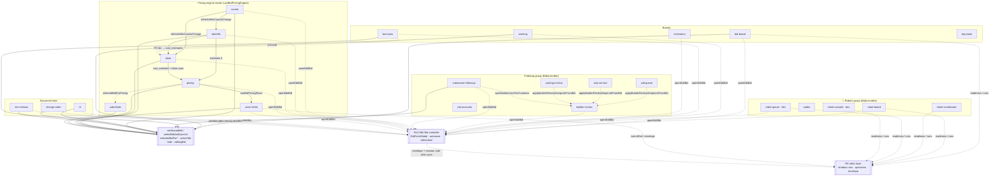

# Bids Tabs Architecture Map

---
file: docs/BIDS_TABS_ARCHITECTURE.md
type: Engineering / Refactor Map
purpose: Inventory what src/pages/Bids.tsx still owns after every tab was extracted — the parent's regions (robot layer, Edit Bid controller, URL router, loaders, lens chrome), each tab's parent seam (props, selection, shared state), test coverage per region, and the extraction order for the regrown ~5.3k-line parent. Tab internals live in the per-tab maps linked from the master table.
covers:
  - src/pages/Bids.tsx
mapped_at: 4833712a0
audience: Developers, AI Agents
last_updated: 2026-09-28
---

## Overview

[`src/pages/Bids.tsx`](../src/pages/Bids.tsx) was a ~18,800-line "God component"; extracting every workflow tab took it to 3,639 lines (2026-08-03, v2.1331). The second pass (2026-09-26 to 09-28, the extraction order's steps 1–8, v2.3873–v2.4003) took it to **3,338 lines** (3,343 at `mapped_at`). The region map and render blocks below were re-read at `mapped_at` (2026-09-28, punch list #51 PR 1); the per-tab dossiers further down still cite the pre-pass line numbers — search the symbol named beside each. Before the second pass it had **regrown to 5,293 lines** — one component `Bids` (234–5292) whose render is 3508–5291 (1,784 lines). **No tab moved back inline.** The growth is parent-owned glue that arrived with new features: the robot layer (twin readiness, shadow runs, robot questions, the envelope), the Edit Bid autosave + Bid Date Sent attestation controller, two lens bars (🤖 Robots and Followup) fronting nine new lens tabs, board job-link / budget / job-account chips, the package map, bid-flow doors, and the Day book door. Largest net adds since 2026-08-03 (`git log --numstat`): robot readiness icon (db7483af0, +113), Robot Board mirror + envelope (v2.3222, +84), robot request queue (v2.2542, +83), package map (v2.2374, +73), Job accounts lens (v2.3553, +65), Edit Bid autosave (v2.3130, +225/−172).

This map is **coupling/refactor-oriented** — for feature/workflow/DB behavior see [`BIDS_SYSTEM.md`](./BIDS_SYSTEM.md). The parent retains the shared bid pointer, the URL deep-link router, the `useBidPricingEngine` seam, the robot data layer, the Edit Bid controller, and the page-level modals.

> **The region map's line numbers are as of `4833712a0`** (the `mapped_at` commit) and drift with every edit — search the symbol named beside each range. Regenerate the fact sheet with `npm run map -- src/pages/Bids.tsx`.

**Hook census (fact sheet @ 4833712a0):** 54 `useState` · 0 `useReducer` · 15 `useEffect` · 5 `useMemo` · 6 `useCallback` · 4 `useRef` · 27 custom hooks · 106 local imports (it was 106 · 32 · 18 · 25 · 16 · 24 · 117 at `a05cef4c4`, before the second pass). Tables the page itself touches: `fixture_types`, `bids`, `projects`, `bids_submission_entries`. RPC: `duplicate_bid_to_service_type`. The rest of what it used to read moved into `useBidsPageData`, `useBidBoardScope`, `useBidRobotLayer` and `useBidsDeepLinks`.

The tabs are switched on a single `activeTab` state (242), typed `BidsTabKey` from the 26 keys of `BIDS_TABS` in [`lib/bids/bidsTabAccess.ts`](../src/lib/bids/bidsTabAccess.ts) (v2.3903) — `robot-shadows` is a redirect alias, not a rendered tab:

```
'bid-board' | 'robot-board' | 'audits' | 'robot-shadows' | 'robot-queue' | 'robot-scoreboard' | 'robot-console'
| 'builder-review' | 'call-queue' | 'working' | 'bid-costs' | 'day-book' | 'estimators'
| 'counts' | 'takeoffs' | 'labor' | 'pricing' | 'cover-letter' | 'submittals' | 'submission-followup'
| 'why-we-lost' | 'waiting-to-hear' | 'job-accounts' | 'rfi' | 'change-order' | 'lien-release'
```

### Header / tab navigation (v2.1331)

Trades render as a compact segmented control (`bidsTradeSegments`, 3427–3470), New Bid pins top-right (`bidsNewBidButton`, 3472–3489), and both tab rows render through [`ScrollableTabStrip`](../src/components/ScrollableTabStrip.tsx): the board strip `bidsBoardTabsStrip` (3250–3354 — Bid Board, the 🤖 group tab, Followup, Unsent/Working, Bid Costs, Estimators, Day book; a `primary` sees only Bid Board) and the bid-detail strip (3643–3733 — Counts … Lien Release). One row ≥1151px (`wideBidsHeader` via `useMatchMedia`, 3608–3640). Every tab click routes through `selectBidsTab` (3155–3165: state + `?tab=`, drops `bidId`). Two **lens bars** sit under the strips: the 🤖 Robots bar (3747–3867: Robot Board · Audits · Scoreboard, dev Queue + Console) and the Followup bar (4027–4194: Call queue · By builder · By status · Why we lost · Waiting to hear · Job accounts, plus the "N need a reason" chip). Group membership is two sets in `lib/bids/bidsTabAccess.ts` (v2.3903): `ROBOT_LENS_KEYS` / `isRobotLens` and `FOLLOWUP_LENS_KEYS` / `isFollowupLens`; both strips' role conditions read `bidsTabOpenFor(tab, role)`, the rule the router bounces on.

### How to read a dossier
Each per-tab section lists: render location, **parent-owned state** for the tab, **props/callbacks** it gets, **data the parent loads for it**, sub-components, external coupling, and **status + risk**. Tabs that have their own map get the parent-seam view only.

### How to maintain this doc
- Refresh with `npm run map -- src/pages/Bids.tsx` and bump `mapped_at`; anchor every range by symbol.
- When a region leaves the parent, flip its row in [Parent region map](#parent-region-map) and its line in [Recommended extraction order](#recommended-extraction-order).
- Tab internals belong in the tab's own map (links in the master table), not here.

---

## Parent region map

What the 3,343 lines are at `mapped_at` (4833712a0), top to bottom, after the second pass. Regions that left the page keep their row, struck through, with where they went.

| # | Region (search symbol) | Lines | Size | Holds | Status |
|---|---|---|---|---|---|
| R0 | Imports + module scope — `GcBuilder` / `Customer` types (128–129), ~~`evaluateChecklist` (133–185)~~ — moved with its window, `BidEvaluateChecklistModal` (v2.4112) | 1–186 | 186 | 106 local imports | — |
| R1 | Page hooks, role and data — `useAuth`…`useMatchMedia` (188–207), `loading` / `error` / `selectedServiceTypeId` (208–210), `useBidsPageData` + destructure (212–238), `useRoleGate` (241), `activeTab` (242), `getFixtureTypeIdByName` / `getOrCreateFixtureTypeId` (247–295, `fixture_types` insert) | 187–295 | 109 | | inline |
| R2 | ~~Master data~~ — in `useBidsPageData` (v2.3999); the page keeps `useBidGcPackets` (298) | 298 | 1 | out v2.3999 | [`hooks/useBidsPageData.ts`](../src/hooks/useBidsPageData.ts) |
| R3 | Edit Bid state — the window's own state is `useBidWindowState` (v2.4086; open, face, focus, bid, saving, close guard + ref, refresh key, delete window), the page keeps `projectsForPicker` and the flags below; `bidFormOpen`…`bidServiceTypeSwitchSiblings` (301–329 at `mapped_at`; the run also holds the party-modal pair `viewingCustomer` / `viewingGcBuilder` and Submission & Followup's two script flags), `onlyMyBids` / `isMyBid` (335–340), `useBidDateSentAttestation` (342, v2.3937), `useBidEditForm` (345) | 301–345 | 45 | | inline — #51 PR 4 |
| R4 | Selections + section-open — 5 `selectedBidFor*` (356–369), `submissionSummaryCardRef`, `submissionSectionOpen`, `bidBoardSectionOpen` (372–373) | 356–373 | 18 | | inline (by design) |
| R5 | ~~Board scope~~ — `useBidBoardScope` (375, v2.3958); the reviewed-bid reload effect (387–395) stays | 375–395 | 21 | out v2.3958 | [`hooks/useBidBoardScope.ts`](../src/hooks/useBidBoardScope.ts) |
| R6 | ~~Robot layer~~ — `useBidRobotLayer` + destructure (398–419, v2.3953); the `?robot=needs`, `?focus=` and `?envelope=` effects (422–465) stay | 398–465 | 68 | out v2.3953 | [`hooks/useBidRobotLayer.ts`](../src/hooks/useBidRobotLayer.ts) |
| R7 | Audit gate + lost summary + working-board archive — `useBidAuditsPendingCount` (470), lost-summary state and `closeLostSummaryModal` (471–492), `canAddChecklistFromSubmission`, `showLostModalLabor`, `openSubmissionFollowupChecklistTask` (474–503), archive-confirm state (511–517), `archiveWorkingBoardBid` / `promptArchiveWorkingBoardBid` (790–843, `bids` UPDATE), its Escape effect (845–852) | 470–517 + 790–852 | ~110 | | inline |
| R8 | Engine seam — `setTick` (519), `selectedBidForTakeoff` / `CostEstimate` / `Pricing`, `costEstimatePOModalTaxPercent` (`'8.25'`), `costEstimateDistanceInput`, `bidTabRowJump` (522–537), `useBidPricingEngine` destructure (539–) | 519–625 | ~107 | | seam (done) |
| R9 | Cover-letter `*ByBid` maps (627–634) + package map — `packageMapBid` (639), `openPackageMap` (648–659), `packageMapSharedCost` (660–678, `computeSharedBidCost`), `openPriceFromPackageMap` (680–688) | 627–688 | 62 | | inline |
| R10 | Shared bid pointer + bid-flow doors — `setSharedBid` (691–701), `closeSharedBidAndClearUrl`, `selectBidAndSyncUrl`, `countsImportRequest`, `bidFlowDoorAllowed` / `openBidFlowDoor` (729–741) | 691–741 | 51 | | inline (by design) |
| R11 | ~~Loaders~~ — `useBidsPageData` (v2.3999) | — | — | out v2.3999 | [`hooks/useBidsPageData.ts`](../src/hooks/useBidsPageData.ts) |
| R12 | Page effects — the followup tick and read watermark (743–758), bid-form focus (760–788), `downloadApprovalPdf` (854–872), the role load (874–876), `?lostSummary` (878–895), projects picker (900–911), `?newBid=` (916–937), `useBidsDeepLinks` (940–970, v2.3989), `useBidsLoadGates` (972–977, v2.3999) | 743–977 | ~180 | router out v2.3989 | inline + [`hooks/useBidsDeepLinks.ts`](../src/hooks/useBidsDeepLinks.ts) |
| R13 | Cost-estimate loader (979–1037) + `laborPanel` and its telemetry (1039–1055) | 979–1055 | 77 | | inline |
| R14 | **Edit Bid controller** — out: `useBidEditController` (v2.4102; the four doors, `closeBidForm`, `saveLossReasonFromLostSummaryModal`, the trade switch through `useBidTradeSwitch` (v2.4074), the after-save notes, `canEditBidNumber` / `buildBidPayload` / `createPayloadWithDistance`, `autosaveBid`, `refreshEditingBidAfterWrite`, `markBidOutcomePersistedByPanel`, `bidAutosave` = `useJobFormAutosaveSlice`, the visibility flush, `requestCloseBidForm` / `closeBidFormWithoutSaving`, `saveBid`, `saveBidAndOpenCounts`, `deleteBid`; called at 1056 where `openNewBid` stood, taking `useBidWindowState` (v2.4086) as one input). Stays in the page because it is not Edit Bid: `handleLastContactClick`, `syncFreshBidIntoSelections` and `openCountsForBid` (handed in), `saveBidSubmissionQuickAdd`, `openGcBuilderOrCustomerModal` | 1058–1693 | 636 | out v2.4074 (trade switch) · v2.4102 (the rest) | **done — #51 PR 4b; the delete and evaluate windows PR 5 (v2.4112)** |
| R15 | Working-board memos (1697–1715), `selectBidsTab` (1720–1732), `renderBidVersionPicker` (1735–1755, v2.3931) | 1697–1755 | 59 | | inline |
| R16 | Header chrome + pricing rows — `useWorkingBoardInboxCount` (1758), `bidsWorkingTabButton` (1760–1809), Bid Costs / Estimators / Day book buttons (1811–1838), `bidsBoardTabsStrip` (1840–1938), `useBidCustomCosts` + `useBidPricingRows` (1940–1966), `getGcBuilderPhone` / `Email` (1967–1991), `bidsTradeSegments` (2011–2054), `bidsNewBidButton` (2056–2073) | 1758–2073 | 316 | | inline |
| R17 | Early returns — `loading`, `canOpenBids` | 2076–2090 | 15 | | inline |
| R18 | Render (table below) | 2092–3341 | 1,250 | | mixed |

### Render blocks

| Block | Lines | Size | Children / status |
|---|---|---|---|
| Error banner + materials-model switch modal | 2092–2185 | ~94 | inline modal (calls the engine's `confirmMaterialsModelSwitch`) |
| Header, board strip, bid-detail strip | 2188–2317 | ~130 | `ScrollableTabStrip` |
| `WorkingBoardArchiveConfirmDialog` | 2319–2324 | 6 | extracted |
| 🤖 Robots lens bar | 2331–2337 | 7 | `BidsLensBar` over `robotLenses` / `robotLensBarShows` ([`lib/bids/bidsLenses.ts`](../src/lib/bids/bidsLenses.ts)) — v2.3931 |
| Robot lens bodies (Audits, Queue, Scoreboard 2349–2369, Console, Robot Board 2378–2399) | 2340–2399 | ~60 | extracted children |
| Bid Board | 2402–2452 | 51 | `BidsBidBoardTab` |
| Robot overlays | 2454 | 1 | `BidsRobotOverlays` (v2.3953) |
| Followup lens bar | 2457–2480 | 24 | `BidsLensBar` over `followupLenses`; the "N need a reason" chip and the caption are its children — v2.3931 |
| Followup lens bodies | 2481–2531 | ~50 | `BidsCallQueueTab`, `BidsWhyWeLostLens`, `BidsWaitingToHearLens`, `BidsJobAccountsLens` |
| Builder Review / Working / Day book / Bid Costs / Estimators | 2533–2616 | ~85 | extracted children |
| Counts / Takeoffs / Labor / Pricing / Cover Letter | 2619–2936 | ~320 | prop bags; each opens with `renderBidVersionPicker` (v2.3931) |
| Submittals / Submission & Followup / RFI / CO / Lien | 2939–3025 | ~87 | extracted children |
| Bid form / Bid window | 3027–3127 | ~100 | `BidFormModal` (inside `BidWindowModal` when editing) — see [`BIDS_BOARD_FORM_ARCHITECTURE.md`](./BIDS_BOARD_FORM_ARCHITECTURE.md) |
| Bid-sent attestation modal | 3128–3131 | 3 | `BidSentAttestationModal` over `useBidDateSentAttestation` — v2.3937 |
| Delete bid confirm | 3134–3173 | 40 | **out** — `BidDeleteConfirmModal` (v2.4112; the page keeps the open flag and hands in the value, error and handlers) |
| GC/Builder party modals | 3177–3208 | ~32 | `BidPartyDetailModal` ×2 |
| Evaluate checklist | 3210–3273 | 64 | **out** — `BidEvaluateChecklistModal` (v2.4112), with `evaluateChecklist` and its own ticks; opened only by `BidFormModal`; the page keeps `evaluateModalOpen` (the Bid window's Esc guard reads it) |
| Sent-bid / bid-question scripts | 3276–3324 | ~49 | **inline**; opened by Submission & Followup |
| Package map | 3326–3337 | 12 | `BidPackageMapModal` |

**Dead code (zero-risk deletes — all gone in v2.3873):** the notes quick-edit modal — `setNotesModalBid` only ever receives `null` (3114, 5109), so `notesModalBid`/`notesModalText`/`savingNotes` (401–403), `saveNotesModal` (3095–3115) and its JSX never run; `scrollToLaborDirectCosts` — the setter only ever receives `false`, so the effect 2207–2221 never scrolls; `contactTableRef` (424) is attached to no element since the 2026-05-30 extraction, so the contact-table scroll effect (2194–2203) only resets `scrollToContactFromBidBoard`; 96 blank lines in 11 runs of ≥3 (largest 1643–1668, 1688–1711, 2180–2193) plus orphaned section comments (1063–1072, 1639–1642).

---

## Master summary table

Sizes are `wc -l` @ a05cef4c4. "Own map" = that file's internals are mapped elsewhere; this map covers only the parent seam.

| Tab key | Label | Parent render | Child (lines) | Status | Parent-owned state for it | Coupling | Engine? | Own map / next action |
|---|---|---|---|---|---|---|---|---|
| `bid-board` | Bid Board | 3932–3981 | `BidsBidBoardTab` (1,983) | extracted, regrew | section-open, deep-link highlight, lost-summary, job links, robot readiness bundle | high | No | [`BIDS_BOARD_FORM_ARCHITECTURE.md`](./BIDS_BOARD_FORM_ARCHITECTURE.md) |
| `robot-board` | 🤖 Robot Board | 3908–3929 | `BidsRobotMirrorTab` (612) | extracted (v2.3222 mirror) | `robotComparePair`, `focusAuditId`, `robotMirrorCount`; reads the Bid Board's `bidBoardDeepLinkHighlightId` | med (robot layer) | No | parent glue → R6 hook |
| `audits` | 🤖 Audits | 3870 | `BidsAuditsTab` (1,499; the queue, the run-through sheet and the card's shape are kernels — `auditTriage`, `standingRulings`, `rulingRunThrough`, `auditQueue`, `auditCardShape`, v2.4230–v2.4261) | extracted | `focusAuditId` | low | No | Done |
| `robot-shadows` | alias | — | → `robot-board` (router 1799–1806) | alias | — | — | — | — |
| `robot-queue` | 🤖 Queue (dev) | 3873–3875 | `BidsRobotQueueTab` (564) | extracted | — | low | No | Done |
| `robot-scoreboard` | 🤖 Scoreboard | 3879–3899 | `BidsRobotScoreboardTab` (562) | extracted | — (reads R6) | med | No | Done |
| `robot-console` | 🤖 Console (dev) | 3902–3904 | `BidsRobotConsoleTab` (289) | extracted | — | low | No | Done |
| `builder-review` | Followup → By builder | 4247–4271 | `BidsBuilderReviewTab` (1,506) | extracted, regrew | deep-link highlight (981–985) | medium | No | [`BIDS_DOCUMENT_TABS_ARCHITECTURE.md`](./BIDS_DOCUMENT_TABS_ARCHITECTURE.md) |
| `call-queue` | Followup → Call queue | 4195–4208 | `BidsCallQueueTab` (748) | extracted | — | low | No | Done |
| `submission-followup` | Followup → By status | 4742–4769 | `BidSubmissionFollowupTab` (2,214) | extracted | selection, `submissionSectionOpen`, `submissionSummaryCardRef`, scripts, approval PDF | medium | No | [`BID_SUBMISSION_FOLLOWUP_TAB_ARCHITECTURE.md`](./BID_SUBMISSION_FOLLOWUP_TAB_ARCHITECTURE.md) |
| `why-we-lost` | Followup → Why we lost | 4209–4221 | `BidsWhyWeLostLens` (900) | extracted | — | low | No | Done |
| `waiting-to-hear` | Followup → Waiting to hear | 4222–4237 | `BidsWaitingToHearLens` (1,078) | extracted | — | low | No | Done |
| `job-accounts` | Followup → Job accounts | 4238–4246 | `BidsJobAccountsLens` (379) | extracted | `jobAccountStrips` (R5) | low | No | Done |
| `working` | Unsent/Working | 4273–4294 | `BidsWorkingBoard` (897) | extracted | deep-link id + refs, archive confirm | low-med | No | Done |
| `day-book` | Day book | 4297–4301 | `PeopleDayBookTab` (471, shared with People) | extracted | — | low | No | Done |
| `bid-costs` | Bid Costs | 4304–4317 | `BidsBidCostsTab` (538) | extracted | — | low | reads engine data | Done |
| `estimators` | Estimators | 4320–4330 | `BidsEstimatorsTab` (670) | extracted | — | low | No | Done |
| `counts` | Counts | 4333–4380 | `BidsCountsTab` (1,266) | extracted | selection, `countsImportRequest`, `bidTabRowJump` | high | Yes | Done |
| `takeoffs` | Takeoffs | 4383–4463 | `BidsTakeoffTab` (3,186) | extracted | selection, shared tax %, `bidTabRowJump` | high | Yes | [`BIDS_TAKEOFF_TAB_ARCHITECTURE.md`](./BIDS_TAKEOFF_TAB_ARCHITECTURE.md) |
| `labor` | Labor | 4466–4550 | `BidsLaborTab` (1,451) | extracted | selection, tax %, distance, cost-estimate loader, `laborPanel`, `bidTabRowJump` | high | Yes | [`BIDS_PRICING_LABOR_TABS_ARCHITECTURE.md`](./BIDS_PRICING_LABOR_TABS_ARCHITECTURE.md) |
| `pricing` | Pricing | 4553–4653 | `BidsPricingTab` (5,122) + `BidsPricingCalculator` (685) | extracted | selection, tax %, `useBidPricingRows`, `useBidCustomCosts` | high | Yes | [`BIDS_PRICING_LABOR_TABS_ARCHITECTURE.md`](./BIDS_PRICING_LABOR_TABS_ARCHITECTURE.md) |
| `cover-letter` | Cover Letter | 4656–4723 | `BidsCoverLetterTab` (1,840) | extracted, regrew | 8 `*ByBid` maps, robot envelope callbacks | high | Yes (rows prop) | [`BIDS_DOCUMENT_TABS_ARCHITECTURE.md`](./BIDS_DOCUMENT_TABS_ARCHITECTURE.md) |
| `submittals` | Submittals | 4726–4739 | `BidsSubmittalsTab` (1,511) | extracted from birth | reuses `selectedBidForPricing` | low | No | [`BIDS_DOCUMENT_TABS_ARCHITECTURE.md`](./BIDS_DOCUMENT_TABS_ARCHITECTURE.md) |
| `rfi` | RFI | 4772–4784 | `BidRfiTab` (353) | extracted | selection | low | No | Done |
| `change-order` | Change Order | 4786–4798 | `BidChangeOrderTab` (469) | extracted | selection | low | No | Done |
| `lien-release` | Lien Release | 4801–4812 | `BidLienReleaseTab` (320) | extracted | selection | low | No | Done (Edit door fixed v2.3833) |

> Status legend: `extracted` = its own component file; `inline` = JSX/logic still in `Bids.tsx`; "regrew" = the child passed 1,500 lines and now has its own map.

---

## Per-tab dossiers

> Every tab is extracted. Ranges below are parent ranges @ a05cef4c4; child internals are in the linked maps or the child file.

### `bid-board` — Bid Board

- **Render location:** 3932–3981 (`activeTab === 'bid-board'`).
- **Parent-owned state:** `bidBoardSectionOpen` (428; also written by `?lostSummary` 1716–1733 and `applyBidBoardDeepLinkToBid`), `lostSummaryModalOpen`/`lostSummaryInitialStaffTab` (864–865), `bidBoardDeepLinkHighlightId/Gen` + `bidBoardDeepLinkTimeoutRef` + `bidBoardPendingScrollBidIdRef` (866–869; the Id is also the Robot Board's `highlightBidId`, 3914, where the applier lands a twin's bid), `workingBoardArchivedBids` memo (3147–3152).
- **Props from R5/R6:** `bids={peopleBids}`, `sentScope`, `jobsByBidId`, `budgetChips`, `jobAccountStrips` + `onOpenJobAccountsLens`, `onLinkJobToBid` (gated by `canSeeBidBoardJobLinks`), `gcNoteCounts`/`gcPacketsByBid`/`roomStatesByBid`/`recipientsByBidId`, and a `robotReadiness` bundle (`twinBidBySourceId`, `inputFor: robotRowInputFor`, status/needs/compare/grade openers).
- **Callbacks:** `onEditBid`, `onOpenGcBuilderOrCustomer`, `onLastContactClick` (undefined unless `bidsTabOpenFor('submission-followup', role)`), `onOpenBidTab`, `onOpenBidFlowDoor`, lost-summary open/close/save, `onReloadBids`, `onReloadCustomerContacts`, `onError`.
- **Deep link:** `applyBidBoardDeepLinkToBid` (918–958) routes a twin's bid to `robot-board` (`isRobotBid`) and writes the landing tab into the URL (v2.2533 fix). It reads `getSubmissionSectionKey` (v2.3923).
- **Status:** extracted; the child regrew to 1,983 lines → **[`BIDS_BOARD_FORM_ARCHITECTURE.md`](./BIDS_BOARD_FORM_ARCHITECTURE.md)** (with `BidFormModal`). The evaluate checklist modal is no longer a board door — only `BidFormModal` opens it.

### 🤖 Robots group — `robot-board` · `audits` · `robot-queue` · `robot-scoreboard` · `robot-console`

- **Render location:** lens bar 3747–3867 (shows when more than one of `robotBids.length > 0`, `auditGate.anyAudits`, `canWorkRobotAudits(myRole)` holds); bodies 3869–3929; overlays 3984–4024. The group tab in `bidsBoardTabsStrip` (3260–3324) hides for `primary`.
- **Gates:** `robot-queue` / `robot-console` dev-only (router 1822–1830 bounces others to the board); `robot-scoreboard` needs `canWorkRobotAudits`; `robot-shadows` → `robot-board` (1799–1806).
- **Parent-owned state (R6):** `referencePresence`, `robotGradeBid`, `robotStatusBidId`/`robotNeedsBidId` (the sheets read the **live** row by id), `shadowRunByBidNumber` + `shadowRunsGen`, `openRobotQuestionRows`, `robotComparePair`, `robotEnvelope` + `envelopeOfferedRef`, `focusAuditId`, `robotMirrorCount`, `bidsRef`.
- **Writes:** `twin_questions` UPDATE (`answerRobotQuestion`, with optional rerun stamp on `bids.robot_requested_at`), `bids` UPDATE (`toggleRobotRequest`, optimistic + rollback via `bidUpdateRefused`), `bids_submission_entries` INSERT (`noteBestEffortGap`, `noteRobotReviewRevision`).
- **Outbound coupling:** R14 calls them after writes — `autosaveBid` runs `noteRobotReviewRevision` (value changed, no date written, 2795) and `offerRobotEnvelope` (value or date written, 2798), `saveBid` runs only `offerRobotEnvelope` on any edit save (2966), `saveBidAndOpenCounts` runs neither, and `BidFormModal`'s `onGcRollupDateChanged` offers the envelope (4840); Cover Letter calls `noteBestEffortGap`/`offerRobotEnvelope` (4694–4696). `list_shadow_runs` is called here twice (570–592, 765) and once each, independently, by `BidsRobotMirrorTab`, `BidsRobotQueueTab`, `BidsRobotScoreboardTab`, `BidsAuditsTab`, `BidBestEffortCard`, `useBidAuditsPendingCount`, `useRobotLockedShadows`.
- **Status:** all five lens bodies extracted; the data layer is `useBidRobotLayer` and the overlays `BidsRobotOverlays` (v2.3953); the lens bar is `BidsLensBar` (v2.3931) with `robotLensCaption` as its child and `RobotGroupStrip` (the group's six numbers, self-loading, each tile a door) under it on every lens (v2.4256, punch list #63).

### `builder-review` — Builder Review

- **Render location:** 4247–4271; the Followup group tab lands superintendents here (3334–3341).
- **Parent-owned state:** `builderReviewDeepLinkHighlightCustomerId/Gen` + three refs (981–985), `customerContactPersons` + loader.
- **Props/callbacks:** `bids={peopleBids}`, `gcPacketsByBid`, `customers`, `customerContacts`, `customerContactPersons`, `lastContactFromEntries`, `authUser`, loaders, `onEditBid`, `onNewBidWithCustomer`, `onViewSubmissions` (sets `selectedBidForSubmission` + `activeTab` directly; undefined unless `bidsTabOpenFor('submission-followup', role)`), `onSetCustomers`, the two customer-modal contexts.
- **Data:** the all-trades reload effect (2160–2179) runs `loadBids(null)` while this tab is active; the reload-on-trade effect (2150–2157) skips it.
- **Status:** extracted; the child regrew to 1,506 lines → **[`BIDS_DOCUMENT_TABS_ARCHITECTURE.md`](./BIDS_DOCUMENT_TABS_ARCHITECTURE.md)**.

### Followup lenses — `call-queue` · `why-we-lost` · `waiting-to-hear` · `job-accounts`

- **Render location:** lens bar 4027–4194; bodies 4195–4246. Superintendents are bounced off all four plus `submission-followup`, `pricing`, `cover-letter`, `submittals` (router 1864–1874).
- **Parent-owned state:** none of their own. They read `peopleBids`, `sentScope`, `gcPacketsByBid`, `lastMethodContactFromEntries` (method entries only, v2.2413), `bidGcRecipientsByBidId`, `roomStatesByBid`, `jobAccountStrips`; three take `onOpenBuilderCard={applyBuilderReviewDeepLinkFromBid}`.
- **Chip:** "N need a reason" (4161–4179) reads `sentCounts.lostNeedingReason`.
- **Status:** all extracted; the lens bar is `BidsLensBar` (v2.3931). The bar keeps its own role rule (`role !== 'superintendent'`), not `bidsTabOpenFor`. The two doors that enter By status by state alone — the Bid Board's Last contact and By builder's View submissions, where the router's gates never run — are handed to the children only when `bidsTabOpenFor('submission-followup', role)` (v2.3982; `Bids.followupDoors.render.test.tsx`).

### `working` — Unsent / Working

- **Render location:** 4273–4294 behind `activeTab === 'working' && authUser?.id`.
- **Parent-owned state:** `workingBoardDeepLinkBidId` + two refs (1042–1051), `archiveWorkingBoardBusyBidId`, `workingBoardArchiveConfirmBidId/Label` (the confirm dialog is page-level because `BidFormModal` also triggers it).
- **Derived:** `workingBoardEligibleBids`/`VisibleBids`/`ArchivedBids` (3134–3152), `useWorkingBoardInboxCount` (3168, tab badge).
- **Handlers:** `archiveWorkingBoardBid` (1546–1583, `bids` UPDATE), `promptArchiveWorkingBoardBid` (1585–1599), deep-link branch of the router (1922–1970, toasts for archived / not-eligible).
- **Status:** **Done** — only deep-link glue stays parent-side.

### `bid-costs` — Bid Costs

- **Render location:** 4304–4317 behind `canSeeBidCosts(myRole)` (office roles, v2.3336); router bounce 1842–1850.
- **Props:** `bids`, `teamLaborData={teamLaborDataForBids}`, `bidAssignedCosts`, `onSelectBid={setSharedBid}`, `onCostIt` (`setSharedBid` + `selectBidsTab('labor')`), `onOpenBid` (Bid window on its Bid face), `showDollars={canSeeBidCostDollars(myRole)}`.
- **Data:** `teamLaborDataForBids` and `bidAssignedCosts` now load inside `useBidPricingEngine` (its effects gate on `pricing`/`labor`/`bid-costs` and `bid-costs`), not in the parent.
- **Status:** **Done.** Lens internals (pursuit, cost-to-win, bid-vs-actual, forecast) are in the child over `lib/bids/bidPursuit.ts`, `bidCostToWin.ts`, `bidVsActual.ts`, `bidForecast.ts`.

### `day-book` — Day book (v2.3735)

- **Render location:** 4297–4301; `PeopleDayBookTab` is People's tab mounted here under the same `canOpenDayBook` gate (router bounce 1833–1841). **Done.**

### `estimators` — Estimators

- **Render location:** 4320–4330. Parent passes `active`, `viewerRole` (`controller` → `assistant`), and `onOpenBidPreview` (opens the Bid window when the bid is loaded, else the global preview). No parent state. **Done.**

### `counts` — Counts

- **Render location:** 4333–4380 — `BidVersionPicker` (4336–4350) + `BidsCountsTab`.
- **Parent-owned state:** `selectedBidForCounts`, `countsImportRequest` (bid-flow door "Count & import" bumps it), `bidTabRowJump` (filtered to `tab === 'counts'`; shared — Takeoffs and Labor read their own slices the same way and each clears it through `onRowJumpHandled`, Pricing writes it).
- **Engine props:** `countRows`, `setCountRows`, `refreshAfterCountsChange`, `skipNextLoadCountRowsRef`, `activeBidVersionId`.
- **Callbacks:** `onSelectBid`, `onClose={closeSharedBidAndClearUrl}`, `onCountSourceLinkSaved` (reloads bids and refreshes `selectedBidForCounts` inline, 4373–4377), `onOpenBidFlowDoor`, `onlyMyBids`/`setOnlyMyBids`/`isMyBid`.
- **Child owns:** search, row move, import (`parseCountsImportText`), clear-all modal, CSV export (`buildCountsCsv`), reorder RPC `update_bids_count_rows_order`, dnd sensors.
- **Status:** **Done.** `bids_count_rows` is the root of the pricing pipeline.

### `takeoffs` — Takeoffs

- **Render location:** 4383–4463 — `BidVersionPicker` (4386–4400) + `BidsTakeoffTab`.
- **Parent-owned:** `selectedBidForTakeoff`; `costEstimatePOModalTaxPercent` **and its setter** (the only writer); `selectedBidForCostEstimate` (read by its cost-estimate materials summary and the PO-create reload guard); the cost-estimate loader effect (2225–2283, gated on `labor || takeoffs`).
- **Engine props:** the takeoff values + loaders (`takeoffCountRows`, the part lines, book versions/entries, `costEstimateCountRows`, the materials total, …); the mappings, the PO lists and loaders and `setCostEstimatePO` went with By Stage (v2.4396).
- **Edit door:** `onEditBid={openEditBid}` is passed (4460) but the child never reads it (a dead prop); like Counts, which gets no `onEditBid`, it reaches the Edit window only through `openBidFlowDoor`.
- **Status:** extracted; internals → **[`BIDS_TAKEOFF_TAB_ARCHITECTURE.md`](./BIDS_TAKEOFF_TAB_ARCHITECTURE.md)**.

### `labor` — Labor (cost estimate)

- **Render location:** 4466–4550 (no version picker in the parent).
- **Parent-owned:** `selectedBidForCostEstimate` **plus its setter passed down** (the only tab handed a raw selection setter), `costEstimatePOModalTaxPercent`, `costEstimateDistanceInput` + setter (seeded by the loader effect), `laborPanel` (2288–2291, `laborEmptyState` + `pricingResolvePanel`) and its telemetry effect (2292–2301, `recordNavClick 'labor_tab_empty_state_shown'`).
- **Loader effect (2225–2283):** resolves the bid's version first (`shouldLoadCostEstimate` / `pickActiveVersion` / `loadAfterResolve`, J11-F1), picks the trade's one labor book (`laborBookForTrade`, v2.3597), then `loadCostEstimateData`.
- **Status:** extracted; internals → **[`BIDS_PRICING_LABOR_TABS_ARCHITECTURE.md`](./BIDS_PRICING_LABOR_TABS_ARCHITECTURE.md)**.

### `pricing` — Pricing

- **Render location:** 4553–4653 — `BidVersionPicker` (4558–4573, with `resolvePanel`) + `BidsPricingTab` + the floating `BidsPricingCalculator` (4651).
- **Parent-owned:** `selectedBidForPricing` (also the Cover Letter and Submittals selection), `costEstimatePOModalTaxPercent`, `bidTabRowJump` writer (`onNavigateBidToTabRow`, 4645–4648), `canPackageAndSendBidPricing` (3377–3381).
- **Shared calc:** `useBidPricingRows` (3358–3375) → `pricingRowsForGrid` + `pricingPackageSource` (to Pricing) and `coverLetterPricingRows` (to Cover Letter); `useBidCustomCosts` (3356) → `bidCountRowCustomCosts` (fed into the rows hook and the tab).
- **Status:** extracted; internals → **[`BIDS_PRICING_LABOR_TABS_ARCHITECTURE.md`](./BIDS_PRICING_LABOR_TABS_ARCHITECTURE.md)**.

### `cover-letter` — Cover Letter

- **Render location:** 4656–4723 — `BidVersionPicker` (4659–4674) + `BidsCoverLetterTab`.
- **Parent-owned:** the 8 `coverLetter*ByBid` maps + setters (1174–1181) — they stay because `downloadApprovalPdf` (1669–1687, Submission tab) reads them; `saveBidSubmissionQuickAdd` (3055–3078, refreshes 5 of the 8 selections).
- **Props:** `coverLetterPricingRows`, `pricingCountRows`, `serviceTypes`, `activePricingName`, `versionGcFingerprint`, bid pricings/versions + reloaders, and three robot callbacks — `onBidSentRecorded` (`noteBestEffortGap` → `offerRobotEnvelope`), `onBestEffortRecorded`, `onOpenRobotEnvelope` (force).
- **Status:** extracted; the child regrew to 1,840 lines → **[`BIDS_DOCUMENT_TABS_ARCHITECTURE.md`](./BIDS_DOCUMENT_TABS_ARCHITECTURE.md)**.

### `submittals` — Submittals (stage 2b)

- **Render location:** 4726–4739. Reuses `selectedBidForPricing` as `selectedBid`; `onOpenPricing` jumps back to Pricing. Included in the router's workflow `bidTabs` list (1971) so `?tab=submittals&bidId=` restores the pointer.
- **Status:** extracted from birth (1,511 lines) → **[`BIDS_DOCUMENT_TABS_ARCHITECTURE.md`](./BIDS_DOCUMENT_TABS_ARCHITECTURE.md)**.

### `submission-followup` — Submission & Followup

- **Render location:** 4742–4769 ("By status" lens of the Followup group).
- **Parent-owned (passed as props):** `selectedBidForSubmission` (+ `onClearBid`), `submissionSectionOpen` + setter, `submissionSummaryCardRef`, `canAddChecklistFromSubmission` + `openSubmissionFollowupChecklistTask`, the two script modals (`showSentBidScript`/`showBidQuestionScript`, JSX 5225–5274), `downloadApprovalPdf` (thin wrapper over [`approvalPdf.ts`](../src/lib/bidDocuments/approvalPdf.ts)), `onOpenBuilderLens={openBuilderLensForCustomer}`.
- **Parent effects for it:** 60-second re-render tick (1294–1298, anonymous `setTick`), notes read-watermark upsert (1300–1309), contact-table scroll (2194–2203, inert — `contactTableRef` is attached to nothing, see Dead code), deep-link applier (960–979, re-implements `getSubmissionSectionKey` at 964–973).
- **Status:** extracted; internals → **[`BID_SUBMISSION_FOLLOWUP_TAB_ARCHITECTURE.md`](./BID_SUBMISSION_FOLLOWUP_TAB_ARCHITECTURE.md)**.

### `rfi` — RFI

- **Render location:** 4772–4784. Controlled `selectedBidForRfi`; `onClose` clears only `selectedBidForRfi` (not the URL, unlike CO/Lien). Child owns the `bids_rfi*` document state. **Done.**

### `change-order` — Change Order

- **Render location:** 4786–4798. Controlled `selectedBidForChangeOrder`; `onClose={closeSharedBidAndClearUrl}`. **Done.**

### `lien-release` — Lien Release

- **Render location:** 4801–4812. Controlled `selectedBidForLienRelease`; `onClose={closeSharedBidAndClearUrl}`.
- **Edit door (fixed v2.3833):** `onEditBid={openEditBid}`, like every other tab. It used to call `setBidFormOpen(true); setEditingBid(bid)` directly (4810), skipping `bidForm.loadFromBid`, the attestation reset, `savedBidDateSentRef` and `bidWindowInitialTab` — the window opened on the last form state, and after New Bid (a `null` baseline, so no prune) autosave could write it over the bid.

---

## Shared infrastructure

These primitives are touched by many tabs; any extracted piece must be handed them.

### The shared bid pointer

| Symbol | Where | Role |
|---|---|---|
| `setSharedBid` | 1238–1248 | Writes 8 selections (`selectedBidForCounts/Takeoff/CostEstimate/Pricing/Submission/Rfi/ChangeOrder/LienRelease`) and `rememberSharedBidId` (sessionStorage, [`sharedBidPointer.ts`](../src/lib/bids/sharedBidPointer.ts)). **Cover Letter and Submittals have no own selection — they reuse `selectedBidForPricing`.** |
| `selectBidAndSyncUrl` | 1261–1269 | `setSharedBid(bid)` + `?tab=…&bidId=…` |
| `closeSharedBidAndClearUrl` | 1251–1258 | `setSharedBid(null)` + drops `bidId` |
| `syncFreshBidIntoSelections` | 2725–2733 | After a write, swaps the fresh row into **5** selections (not RFI/CO/Lien) |
| `openBidFlowDoor` | 1279–1288 | Step door → `openEditBid` or `selectBidAndSyncUrl(bid, door)`, then `landOnBidFlowTarget`; `bidFlowDoorAllowed` keeps superintendents off `pricing`/`cover-letter` |
| URL deep-link restore | main router 1971–1993 | `bidId` + a workflow tab (`counts`, `takeoffs`, `labor`, `pricing`, `cover-letter`, `submittals`, `rfi`, `change-order`, `lien-release`) → `setSharedBid` + `setActiveTab`; a bid outside the loaded trade fetches its `service_type_id` and switches trade |
| Session pointer restore (v2.2905, J11-F2/N2) | same effect, 1972–1978 | A workflow tab with no `bidId` and no selection restores the remembered bid silently; `selectBidsTab` still strips `bidId` on purpose (v2.2043) |

**Implication:** each extracted tab receives its `selectedBid` + `onSelectBid`/`onClose` as controlled props. Labor is the one exception (it also gets `setSelectedBidForCostEstimate`).

### Top-level shared state

| Variable | Where | Used by |
|---|---|---|
| `activeTab` | 261 | every render gate + 9 effects (1294, 1300, 1779, 2150, 2160, 2194, 2207, 2225, 2292) |
| `bids` / `peopleBids` / `robotBids` | 322, 434–437 | master list; the Bid Board, Builder Review, the four Followup lenses and the robot lenses get `peopleBids` (By status / Submission & Followup, Bid Costs, the workflow tabs and the Working memos read the unpartitioned `bids`), the robot lenses also `robotBids` (partition by `twinUserIds`, [`bidBoardScope.ts`](../src/lib/bidBoardScope.ts)) |
| `sentScope` / `sentCounts` | 444–453 | Bid Board, Followup lenses, Submission & Followup, the "need a reason" chip ([`bidSentCounts.ts`](../src/lib/bids/bidSentCounts.ts)) |
| `gcPacketsByBid` / `gcNoteCounts` / `roomStatesByBid` | 331 (`useBidGcPackets`) | Bid Board, Followup lenses, Builder Review, Submission & Followup |
| `editingBid` / `bidFormOpen` | 344, 336 | every tab via `openEditBid` → `BidFormModal` |
| `onlyMyBids` / `isMyBid` | 371–376 | 9 workflow tabs (Counts, Takeoffs, Labor, Pricing, Cover Letter, Submittals, RFI, CO, Lien); the comment at 369 still says "eight" |
| `selectedServiceTypeId` | 265 | loaders, books/templates, trade switch |
| `error` | 260 | every handler; passed as `setError`/`onError` |
| `authUser` / `myRole` | `useAuth`, 255 | role gates (router 1822–1874, strips, early return 3500), new-bid defaults |
| `narrowViewport640`, `bidPreviewOnBidsPage`, `ledgerPrefixMap` | hooks 238–251 | detail layouts, title-bar previews (Bid window on its Bid face, v2.2390), ledger labels |

### Shared handlers / loaders

| Function | Where | Notes |
|---|---|---|
| `loadBids` | `useBidsPageData` (v2.3999) | Master loader; primary scoping predicate (v2.2174); hides `adopted_into_bid_id`; then reads the loaded bids' `bids_submission_entries` rows, chunked and paged (`loadBidEntryRecency`, v2.4003), for the two recency maps and calls `fetchBidGcRecipientsMap()` on each call |
| `openEditBid` | 2342–2365 | Hydrates `bidForm`, resets attestation, opens the Bid window (`tab`, `focus` options) |
| `openNewBid` / `openNewBidFromProject` / `openNewBidWithCustomer` | 2304–2340 | Header, `?new=`/`?newBid=` deep links, Builder Review |
| `openGcBuilderOrCustomerModal` | 3118–3126 | Bid Board, Submission & Followup |
| `loadCustomers` / `loadCustomerContacts` / `loadCustomerContactPersons` | 1418–1432, 1610–1632 | Builder Review, Working, Submission & Followup |
| `getSubmissionSectionKey` | [`lib/bids/submissionSections.ts`](../src/lib/bids/submissionSections.ts) | Used by the Bid Board, Builder Review and Submission & Followup children, `BuilderCallSessionModal`, `useMapPageData` and the `bidSentCounts` / `robotMirror` / `bidBoardMap` / `bidBoardCustomerReview` kernels; the parent's two appliers re-implement it inline |
| `useBidEditForm` | [`lib/bids/useBidEditForm.ts`](../src/lib/bids/useBidEditForm.ts) | The Edit Bid form state (extracted) |

### Pricing-engine shared layer

> **Extracted (2026-05-30, `cfb1f1982`)** to [`src/hooks/useBidPricingEngine.ts`](../src/hooks/useBidPricingEngine.ts) (1,819 lines @ a05cef4c4). The engine-data state, refs, loaders/mutators and load effects — including the team-labor and bid-assigned-cost loads for Pricing/Labor/Bid Costs — live in the hook. The parent passes the 4 engine selections, `activeTab`, `selectedServiceTypeId`, `authUser`, `setError`, `loadBids`, `setSharedBid` and destructures 128 names (1086–1170). Shared types: [`bidPricingEngineTypes.ts`](../src/lib/bids/bidPricingEngineTypes.ts). The hook's internals are covered with Pricing/Labor in [`BIDS_PRICING_LABOR_TABS_ARCHITECTURE.md`](./BIDS_PRICING_LABOR_TABS_ARCHITECTURE.md).

**Stays in the parent:** the cost-estimate loader effect (2225–2283, writes parent-owned `costEstimateDistanceInput` and resolves the version first), `laborPanel` + its telemetry effect (2288–2301), `packageMapSharedCost` (1207–1225), `useBidPricingRows` + `useBidCustomCosts` (3356–3375), the four `BidVersionPicker` blocks, and the materials-model switch modal JSX (3526–3601, calls the hook's `confirmMaterialsModelSwitch`).

**Deferred:** collapsing the 8 `setSharedBid` selections into one `selectedBid`.

| Symbol | Line / file | Role |
|---|---|---|
| `useBidPricingEngine` | [`src/hooks/useBidPricingEngine.ts`](../src/hooks/useBidPricingEngine.ts) | Owns engine state/refs/loaders + load effects; returns one object |
| `refreshAfterCountsChange` | in hook | Fan-out: on any count change, reloads takeoff + labor for the same bid |
| `loadCostEstimate` / `ensureCostEstimateForBid` / `loadCostEstimateData` | in hook | One `cost_estimates` row per bid (Takeoffs ↔ Labor ↔ Pricing bridge) |
| `loadPricingDataForBid` | in hook | Aggregates counts + labor + takeoff materials; also called by `openPackageMap` |
| ~~`openMaterialsModelSwitch` / `confirmMaterialsModelSwitch`~~ | removed v2.4389 | the `bids.materials_model` toggle on Takeoffs and Labor; By Stage is retired, and since v2.4396 no client code reads the column |
| `bidVersions` / `selectedBidVersionId` / `selectedBidVersionIdRef` / `switchActiveVersion` | in hook | **Bid Versions**; the ref is what the parent's cost-estimate effect checks before loading |
| `pricingResolve` / `retryPricingResolve` / `costEstimateResolve` | in hook | Resolve state behind `pricingResolvePanel` (version pickers, Pricing, `laborPanel`) |
| `selectedPricingVersionId` / `templatePriceBookVersions` / `defaultPriceBookTemplateId` / `versionClonePricingSourceId` | in hook | Bid-scoped Pricings, master templates, remembered default |
| `computeBidPricingRows` | [`lib/bidPricingRowCalculations`](../src/lib/bidPricingRowCalculations.ts) | The single pricing calc kernel (tested) |
| `useBidPricingRows` | [`src/hooks/useBidPricingRows.ts`](../src/hooks/useBidPricingRows.ts) | Wraps `pricingRowsForGrid` + `pricingPackageSource` + `coverLetterPricingRows` |
| `pricingPage.ts` / `approvalPdf.ts` | [`lib/bidDocuments/`](../src/lib/bidDocuments/) | Stage-A print/CSV and approval-PDF builders; the approval PDF prices revenue only, through `scenarioPricingRows` (v2.4373) |
| `submissionHiddenIdsForVersion` | [`lib/bids/submissionHides.ts`](../src/lib/bids/submissionHides.ts) | Count rows hidden from submission docs |

`bids_count_rows` is the **single source of truth**; the per-tab caches (`countRows`, `takeoffCountRows`, `costEstimateCountRows`, `pricingCountRows`) are all held in the hook.

### Shared component / lib helpers already extracted

`BidWorkflowTabTitleWithPreview`, `ModalShell`, `BidFormModal` + `BidWindowModal` (+ `useBidEditForm`), `BidsWorkingBoard`, `BidNotesTable`/`CustomerNotesTable`/`UnifiedBidCustomerNotes`, `BidPartyDetailModal`, `BidPackageMapModal`, `WorkingBoardArchiveConfirmDialog`, `copyRichHtmlToClipboard`, `bidStyles`, plus the `lib/bids/*` and `lib/bidDocuments/*` families. Easy to miss:

- **[`BidVersionPicker`](../src/components/bids/BidVersionPicker.tsx)** — rendered **4× by the parent** (Counts, Takeoffs, Pricing, Cover Letter) with near-identical props; drives `switchActiveVersion` + rename/delete/first-split and opens the package map.
- **[`MyBidsToggle`](../src/components/bids/MyBidsToggle.tsx)** — the "only my bids" chip inside the 9 workflow tabs that take `onlyMyBids`.
- **[`BidBoardCustomerReviewModal`](../src/components/bids/BidBoardCustomerReviewModal.tsx)** / **[`BidBoardEstimatingHealthSection`](../src/components/bids/BidBoardEstimatingHealthSection.tsx)** — rendered by `BidsBidBoardTab`.

---

## Test coverage by region

The parent itself has **no render smoke** (no `Bids.render.test.tsx`); e2e touches it only through `e2e/deep-links.spec.ts` (`/bids?newBid=true&project=…`) and `e2e/viewport-smoke.spec.ts` (`/bids?tab=bid-board`).

| Region | Kernels it leans on — tested | Untested in or behind the region |
|---|---|---|
| R5 board scope + job links | `bidBoardScope`, `bidSentCounts`, `bidBoardJobLinks`, `bidBoardJobAccounts`, `bidBoardBudgetChips`, `gcPackets`/`versionSends`/`bidGcNotes` | hooks `useBidBoardBudgetChips`, `useBidBoardJobAccountStrips`, `useBidGcPackets`; `linkJobToBidFromBoard` (**sets a job's budget** via `snapshot_job_budget_from_bid`) |
| R6 robot layer | `robotRowState`, `robotEnvelope`, `robotMirror`, `bestEffort`, `shadowStory`, `twinQuestionKind`, `confidenceBoard`, `bidAudits`, `robotLayer` (23 tests — the page's own reductions, v2.3941), `auditTriage`, `standingRulings`, `rulingRunThrough`, `auditQueue`, `auditCardShape`, `robotGroupStrip` (the Audits queue and the group's strip, punch list #63, v2.4230–v2.4256), `useBidRobotLayer.render.test` (12 — the row input, who the questions load for, the live-row sheets, the refused request's rollback, the answer paths; v2.3953); renders: `RobotNeedsSheet`, `BidsRobotMirrorTab`, `BidsRobotScoreboardTab`, `BidsAuditsTab`, `RulingRunThroughSheet`, `RobotGroupStrip` | `offerRobotEnvelope`'s reads and the two ledger notes; renders of `RobotEnvelopeModal`, `RobotStatusSheet`, `RobotReferenceGradeModal`, `RobotBidComparisonModal`, `BidsRobotQueueTab`, `BidsRobotConsoleTab` |
| R7 deep-link appliers | — | `getSubmissionSectionKey` has no direct test (only exercised through callers such as `bidSentCounts.test`) and is re-implemented twice inline |
| R9 package map | `bidPackageMap` (`computeSharedBidCost`, money) | the input assembly (1207–1225) |
| R10 pointer + doors | `sharedBidPointer`, `bidFlow`, `bidFlowLanding`, `bidFormFocus` | — |
| R11 loaders | `bidContacts`, `bidGcRecipients`, `customerArchive` | `workingBoardArchiveEligibility` (**gates the archive write**) |
| R12 URL router + page effects | `Bids.render.test` (v2.3962: the page mounted at every `?tab=` key for every role — where the URL comes to rest, what the strips and the Followup bar draw, the announced and silent bounces, the two old slugs); `useRoleGate.render.test` (the bounce hook only); `bidsTabAccess` (25 tests: the role × tab matrix, silent vs announced, the two aliases) | the per-tab branches under the gates (their trade switch is `bidTradeSwitch`, 7 tests); `userBidNotesReadState` (watermark effect 1300–1309) |
| R13 cost-estimate loader | `laborTabLoadGate`, `pickActiveVersion`, `pricingResolve`, `laborEntryProvenance`, `navClickTelemetry`; `useBidPricingEngine.laborLoad.render.test.tsx` | the effect itself |
| R14 Edit Bid controller | `bidFormPayload`, `bidUpdatePrune`, `bidFormAutosave`, `updateGuard`, `outcomeChangeBidNote`, `wonDispatchHandoff`, `bidDistanceToOffice`, `bidDateSentAttestation` (34 tests — the rules that decide whether `bid_date_sent` + attestation stamps are written), `useBidDateSentAttestation.render.test` (17), `BidSentAttestationModal.render.test` (7); `BidFormModal.render.test` | `bidDateSentDisplay`; `askDispatchToOpenJob` (only mocked, in `BidWonJobActions.render.test`); `useJobFormAutosaveSlice` (shared with Edit Job and Estimates — its own tests since v2.4027 and #51 PR 1: `useJobFormAutosaveSlice.render.test` + `.lifecycle.render.test`, 28 cases; the Bids side's use of it is pinned through the page by #51 PR 2's *Edit Bid writes*, and `useBidEditController.render.test` (v2.4102, 6) covers the doors, delete's name check and the lost-reason write); the close-flush guard (2848–2880) |
| R16 pricing rows | `bidPricingRowCalculations` (money) | `useBidPricingRows` / `useBidCustomCosts` hook wiring; the `'8.25'` tax default (1076) |
| Tab children | render tests: `BidsAuditsTab` (+ `RulingRunThroughSheet`, `RobotGroupStrip`), `BidsCallQueueTab`, `BidsJobAccountsLens`, `BidsRobotMirrorTab`, `BidsRobotScoreboardTab`, `BidsSubmittalsTab`, `BidsTakeoffTab`, `BidFormModal`, `PeopleDayBookTab` | no render test: `BidsBidBoardTab`, `BidsBuilderReviewTab`, `BidsCountsTab`, `BidsLaborTab`, `BidsPricingTab`, `BidsCoverLetterTab`, `BidSubmissionFollowupTab`, `BidRfiTab`, `BidChangeOrderTab`, `BidLienReleaseTab`, `BidsWorkingBoard`, `BidsBidCostsTab`, `BidsEstimatorsTab`, `BidsWhyWeLostLens`, `BidsWaitingToHearLens`, `BidWindowModal`, `BidPackageMapModal`, `BidsPricingCalculator`, `BidVersionPicker` |

The parent computes no money itself — every dollar goes through a tested kernel (`computeSharedBidCost`, `computeBidPricingRows`) — but the two budget/estimate writes it owns (`linkJobToBidFromBoard`, the attestation-gated `bid_date_sent` write) have no test.

---

## Cross-tab coupling diagram


```mermaid
graph TD
    subgraph boards["Boards"]
        BB[bid-board]
        WK[working]
        BC[bid-costs]
        ES[estimators]
        DB[day-book]
    end

    subgraph robots["🤖 Robots group (BidsLensBar)"]
        RB[robot-board]
        AU[audits]
        RQ[robot-queue · dev]
        RS[robot-scoreboard]
        RC[robot-console · dev]
    end

    subgraph followup["Followup group (BidsLensBar)"]
        CQ[call-queue]
        BR[builder-review]
        SF[submission-followup]
        WL[why-we-lost]
        WH[waiting-to-hear]
        JA[job-accounts]
    end

    subgraph engine["Pricing-engine cluster (useBidPricingEngine)"]
        CO[counts]
        TK[takeoffs]
        LB[labor]
        PR[pricing]
        CL[cover-letter]
        SU[submittals]
    end

    subgraph docs["Document tabs"]
        RFI[rfi]
        CHG[change-order]
        LIEN[lien-release]
    end

    SHARED[["setSharedBid / selectBidAndSyncUrl<br/>selectedBidFor* · activeTab · bids · editingBid"]]
    ROBOT[["R6 robot layer<br/>shadow runs · questions · envelope"]]
    FORM[["R14 Edit Bid controller<br/>BidFormModal · autosave · attestation"]]

    BB & WK & BC & SF & RFI & CHG & LIEN --> SHARED
    CO & TK & LB & PR & CL & SU --> SHARED

    CO -->|refreshAfterCountsChange| TK
    CO -->|refreshAfterCountsChange| LB
    TK -->|PO ids → cost_estimates| LB
    TK -->|materials $| PR
    LB -->|cost_estimate + labor rows| PR
    PR -->|useBidPricingRows| CL
    PR -.selectedBidForPricing.-> SU

    BB & RB & RS & RQ & RC -.readiness / runs.-> ROBOT
    CL -.best effort / envelope.-> ROBOT
    FORM -.envelope + revision note after save.-> ROBOT

    BB & RB & RQ & WK & BC & ES & BR & SF & CO & TK & LB & PR & CL & RFI & CHG -.openEditBid.-> FORM
    LIEN -.setEditingBid directly.-> FORM
    CQ & WL & WH -.applyBuilderReviewDeepLinkFromBid.-> BR
    SF -.openBuilderLensForCustomer.-> BR
    BC -.onCostIt.-> LB
```

---

## Recommended extraction order

Ordered by **value ÷ risk** for the regrown parent. Every tab is already out; what is left is parent glue.

> Already done (the bulk in `cfb1f1982`, 2026-05-30 — Pricing, Labor and that day's other tabs with the engine): all 26 tab keys render extracted children; `useBidPricingEngine` + `useBidPricingRows` seams; Stage-A builders (`pricingPage.ts`, `approvalPdf.ts`, `costEstimatePage.ts`); `useBidEditForm`; `WorkingBoardArchiveConfirmDialog`; `getSubmissionSectionKey` promoted to a lib. `Bids.tsx` went ~18,800 → 3,639 (2026-08-03) and regrew to 5,293.

1. ~~**Dead-code + blank-run sweep**~~ — **done v2.3873**: the notes quick-edit modal (its three states, `saveNotesModal`, the JSX), `scrollToLaborDirectCosts` with its effect, the inert `contactTableRef` / `scrollToContactFromBidBoard` pair with its effect and the two doors' calls that raised the flag, the six orphaned section comments, every blank run of three or more collapsed, and the imports only they used. Mechanical, merged alone.
2. ~~**Stage A kernels, no moves**~~ — **done v2.3903 · v2.3910 · v2.3923.** **v2.3903:** [`lib/bids/bidsTabAccess.ts`](../src/lib/bids/bidsTabAccess.ts) — `canOpenBids` (the five copies of the page allowlist), `resolveBidsTabRoute` / `bidsTabBounce` (the router's two alias rewrites and five role gates as one decision: silent or announced), `bidsTabOpenFor` (the strips' role conditions), `FOLLOWUP_LENS_KEYS` beside `ROBOT_LENS_KEYS`, and `BidsTabKey` in place of the literal union. **Done v2.3910:** [`lib/bids/bidDateSentAttestation.ts`](../src/lib/bids/bidDateSentAttestation.ts) — the attestation rules as pure functions (34 tests): `bidDateSentAttestationMerge`, `bidDateSentAttestationSaveError`, `bidDateSentAttestationPromptDate`, `bidDateSentInputDropsPending`, `buildBidDateSentAttestationPayload` and `BID_DATE_SENT_ATTESTATION_NULLS`; the page keeps the twelve states and the modal (step 4). **Done v2.3923:** both appliers read `getSubmissionSectionKey` (now tested, 5 tests); [`lib/bids/bidTradeSwitch.ts`](../src/lib/bids/bidTradeSwitch.ts) `bidTradeToSwitchTo` (7 tests) replaces the five `select('service_type_id')` fetches; `BID_WORKFLOW_TABS` / `isBidWorkflowTab` in `bidsTabAccess` replaces the router's local `bidTabs` list.
3. ~~**`BidsLensBar` presentational component + a version-picker helper**~~ — **done v2.3931** (4,963 → 4,666 lines): [`BidsLensBar`](../src/components/bids/BidsLensBar.tsx) (7-case render smoke) draws both bars from [`lib/bids/bidsLenses.ts`](../src/lib/bids/bidsLenses.ts) (`robotLenses`, `followupLenses`, `robotLensBarShows`, `followupNeedsReasonChipShows`, `followupLensCaption`; 23 tests); the four `BidVersionPicker` blocks are one page-local `renderBidVersionPicker(bid, { withResolvePanel })`. `selectBidsTab` stays in the parent.
4. ~~**`useBidDateSentAttestation` + `BidSentAttestationModal`**~~ — **done v2.3937** (4,666 → 4,388 lines): [`hooks/useBidDateSentAttestation.ts`](../src/hooks/useBidDateSentAttestation.ts) (17-case hook test) holds the date field, the saved-date baseline, the checklist and the pending note, and returns `resetTo` (the four form doors and the per-GC panel), `clearFlow` (close), `markSaved` (the three save paths), `getPayloadMerge` / `validateForSave` / `promptIfNeeded`, the field's two handlers, `modalOpen` (the autosave gate and the Bid window's `escBlocked`) and the `modal` bundle; [`BidSentAttestationModal`](../src/components/bids/BidSentAttestationModal.tsx) (7-case render smoke) is the dialog, verbatim.
5. ~~**`useBidRobotLayer` hook + `BidsRobotOverlays`**~~ — **done v2.3941 · v2.3953** (4,388 → 4,079 lines). v2.3941: the in-parent reductions have tests ([`lib/bids/robotLayer.ts`](../src/lib/bids/robotLayer.ts), 23). v2.3953: [`hooks/useBidRobotLayer.ts`](../src/hooks/useBidRobotLayer.ts) (12-case hook test) is R6 verbatim — the loads, the derived maps, `robotRowInputFor`, `offerRobotEnvelope`, `noteBestEffortGap`, `noteRobotReviewRevision`, `answerRobotQuestion`, `toggleRobotRequest` and the sheet / modal state; [`BidsRobotOverlays`](../src/components/bids/BidsRobotOverlays.tsx) is the five overlays. The three URL doors (`?robot=needs`, `?focus=`, `?envelope=`) stay in the page for step 7. Later: one shared `list_shadow_runs` source for the seven other callers.
6. ~~**`useBidBoardScope` hook**~~ — **done v2.3958** (4,079 → 4,001 lines): [`hooks/useBidBoardScope.ts`](../src/hooks/useBidBoardScope.ts) (11-case hook test, the confirm → RPC → toast → event path of `linkJobToBidFromBoard` among them) is R5 verbatim — the partition, `sentScope` / `sentCounts`, `jobsByBidId`, the budget chips, the job-account strips. `twinUserIds` and the reviewed-bid reload stay in the page (its loaders).
7. ~~**`useBidsDeepLinks` hook**~~ — **done v2.3969 · v2.3989** (4,001 → 3,610 lines). v2.3969: [`hooks/useDeepLinkHighlight.ts`](../src/hooks/useDeepLinkHighlight.ts) (the ring, three copies). v2.3989: [`hooks/useBidsDeepLinks.ts`](../src/hooks/useBidsDeepLinks.ts) is the main router, the four pending re-applies, the `?openBidEdit=1` effect, `consumeBidIdParam`, the three appliers and `openBuilderLensForCustomer`, verbatim and in the order they ran; the page hands in the tab, selection and section setters and the two doors into the Bid window. Guarded by the page render smoke (v2.3962 · v2.3978, [`Bids.render.test.tsx`](../src/pages/Bids.render.test.tsx): every `?tab=` key for every role and a link to a bid, 29 cases). The `?lostSummary`, `?newBid=`, `?robot=needs`, `?focus=` and `?envelope=` doors stay in the page — each opens something the page owns.
8. ~~**`useBidsPageData` hook**~~ — **done v2.3999** (3,610 → 3,338 lines): [`hooks/useBidsPageData.ts`](../src/hooks/useBidsPageData.ts) (29-case hook test). `useBidsPageData` holds the role and its trade scope, the trades, the bids with their recency maps and GC recipients, the customers and contacts, the estimators and the twin user ids, with the nine loaders, and runs no effect; `useBidsLoadGates` is the three load effects, called where they stood so they run in the order they ran. The page keeps the picked trade, `loading` / `error` and the role load's own effect. The `loadBids` read of every `bids_submission_entries` row was fixed in **v2.4003**: [`lib/bids/bidEntryRecency.ts`](../src/lib/bids/bidEntryRecency.ts) reads the entries of the bids in hand, chunked and paged (7 tests).
9. **`useBidEditController`** (≈ −500 lines, **high**; its PR train was punch list #51, closed 2026-09-28 (the record: `to-dos/README.md` and the fragments); **done** — the hook v2.4102, the two windows v2.4112; the page 3,343 → 2,648 lines over the train): what remains of R14 — open/close, `autosaveBid` + `useJobFormAutosaveSlice` + visibility flush + close guard, `saveBid`/`saveBidAndOpenCounts`, trade switch, delete — plus the delete and evaluate modals (the two script modals are Submission & Followup's, opened only from its props in the `submission-followup` block, 2955–2982, and stay with that seam). Coupled to the selections (`syncFreshBidIntoSelections`), the robot layer, `loadBids` and `openCountsForBid`. Last, after steps 4–5 have thinned it (done) and with the parent render smoke in place (v2.3962) (the Lien Release `onEditBid` bypass is already fixed, v2.3833).
10. **Deferred:** collapse the 8 selections into one `selectedBid` (Labor's raw setter and the RFI-only `onClose` are the two irregular consumers).
