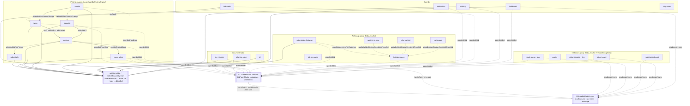

# Bids Tabs Architecture Map

---
file: docs/BIDS_TABS_ARCHITECTURE.md
type: Engineering / Refactor Map
purpose: Inventory what src/pages/Bids.tsx still owns after every tab was extracted — the parent's regions (the robot URL doors, the Edit Bid seam, loaders, lens chrome), each tab's parent seam (props, selection, shared state), test coverage per region, and the extraction order that took the regrown ~5.3k-line parent to ~2.6k. Tab internals live in the per-tab maps linked from the master table.
covers:
  - src/pages/Bids.tsx
mapped_at: f423bd6e5
audience: Developers, AI Agents
last_updated: 2026-10-09
---

## Overview

[`src/pages/Bids.tsx`](../src/pages/Bids.tsx) was a ~18,800-line "God component"; extracting every workflow tab took it to 3,639 lines (2026-08-03, v2.1331). It then **regrew to 5,293 lines** with parent-owned glue. The second pass (2026-09-26 to 09-28, the extraction order's steps 1–8, v2.3873–v2.4003) took it to 3,338 lines, and the Edit Bid train (step 9, punch list #51, v2.4074–v2.4112) to 2,648. It is **2,642 lines** at `mapped_at` — one component `Bids` (119–2641) whose render is 1552–2640 (1,089 lines). Every line number in this map was re-read at `mapped_at` (2026-10-05). **No tab moved back inline.** What the page still holds is the glue between the pieces: the shared bid pointer, the selections, the three robot URL doors, the working-board archive, the cost-estimate loader, the header and lens chrome, and the page-level modals.

This map is **coupling/refactor-oriented** — for feature/workflow/DB behavior see [`BIDS_SYSTEM.md`](./BIDS_SYSTEM.md). The parent retains the shared bid pointer, the `useBidPricingEngine` seam, the calls into the five page hooks (`useBidsPageData`, `useBidBoardScope`, `useBidRobotLayer`, `useBidsDeepLinks`, `useBidEditController`), and the page-level modals.

> **The region map's line numbers are as of `f423bd6e5`** (the `mapped_at` commit) and drift with every edit — search the symbol named beside each range. Regenerate the fact sheet with `npm run map -- src/pages/Bids.tsx`.

**Hook census (fact sheet @ f423bd6e5):** 42 `useState` · 0 `useReducer` · 17 `useEffect` · 8 `useMemo` · 7 `useCallback` · 2 `useRef` · 29 custom hooks · 104 local imports (it was 54 · 0 · 15 · 5 · 6 · 4 · 27 · 106 at `4833712a0`, before the Edit Bid train, and 106 · 32 · 18 · 25 · 16 · 24 · 117 at `a05cef4c4`, before the second pass). Tables the page itself touches: `fixture_types`, `bids`, `projects`. It calls no RPC. The rest of what it used to read moved into `useBidsPageData`, `useBidBoardScope`, `useBidRobotLayer`, `useBidsDeepLinks`, `useBidEditController` and `useBidTradeSwitch`.

The tabs are switched on a single `activeTab` state (195), typed `BidsTabKey` from the 26 keys of `BIDS_TABS` in [`lib/bids/bidsTabAccess.ts`](../src/lib/bids/bidsTabAccess.ts) (v2.3903) — `robot-shadows` is a redirect alias, not a rendered tab:

```
'bid-board' | 'robot-board' | 'audits' | 'robot-shadows' | 'robot-queue' | 'robot-scoreboard' | 'robot-console'
| 'builder-review' | 'call-queue' | 'working' | 'bid-costs' | 'day-book' | 'estimators'
| 'counts' | 'takeoffs' | 'labor' | 'pricing' | 'cover-letter' | 'submittals' | 'submission-followup'
| 'why-we-lost' | 'waiting-to-hear' | 'job-accounts' | 'rfi' | 'change-order' | 'lien-release'
```

### Header / tab navigation (v2.1331)

Trades render as a compact segmented control (`bidsTradeSegments`, 1471–1514), New Bid pins top-right (`bidsNewBidButton`, 1516–1533), and both tab rows render through [`ScrollableTabStrip`](../src/components/ScrollableTabStrip.tsx): the board strip `bidsBoardTabsStrip` (1300–1398 — Bid Board, the 🤖 group tab, Followup, Unsent/Working, Bid Costs, Estimators, Day book; a `primary` sees only Bid Board) and the bid-detail strip (1613–1699 — Counts … Lien Release). One row ≥1151px (`wideBidsHeader` via `useMatchMedia`, 152; the header block is 1574–1608). Every tab click routes through `selectBidsTab` (1181–1193: state + `?tab=`, drops `bidId` and, off the Day book, its week and person). Two **lens bars** sit under the strips: the 🤖 Robots bar (1714–1723: Robot Board · Audits · Scoreboard, dev Queue + Console; `RobotGroupStrip` under it, 1725–1735) and the Followup bar (1862–1885: Call queue · By builder · By status · Why we lost · Waiting to hear · Job accounts, plus the "N need a reason" chip). Group membership is two sets in `lib/bids/bidsTabAccess.ts` (v2.3903): `ROBOT_LENS_KEYS` / `isRobotLens` and `FOLLOWUP_LENS_KEYS` / `isFollowupLens`; both strips' role conditions read `bidsTabOpenFor(tab, role)`, the rule the router bounces on.

### How to read a dossier
Each per-tab section lists: render location, **parent-owned state** for the tab, **props/callbacks** it gets, **data the parent loads for it**, sub-components, external coupling, and **status + risk**. Tabs that have their own map get the parent-seam view only.

### How to maintain this doc
- Refresh with `npm run map -- src/pages/Bids.tsx` and bump `mapped_at`; anchor every range by symbol.
- When a region leaves the parent, flip its row in [Parent region map](#parent-region-map) and its line in [Recommended extraction order](#recommended-extraction-order).
- Tab internals belong in the tab's own map (links in the master table), not here.

---

## Parent region map

What the 2,642 lines are at `mapped_at` (f423bd6e5), top to bottom. Regions that left the page keep their row, struck through, with where they went.

| # | Region (search symbol) | Lines | Size | Holds | Status |
|---|---|---|---|---|---|
| R0 | Imports + module scope — `GcBuilder` / `Customer` types (116–117), ~~`evaluateChecklist`~~ — moved with its window, `BidEvaluateChecklistModal` (v2.4112) | 1–118 | 118 | 104 local imports | — |
| R1 | Page hooks, role and data — `useAuth`…`useMatchMedia` (120–152), with the two bid-mark effects between them (`loadBidMarks` 122–124, `refreshBidMarkRequests` on tab return 127–133; v2.4287 · v2.4297), `loading` / `error` / `selectedServiceTypeId` (153–155), `useBidsPageData` + destructure (157–183), `useRoleGate` (186), the `setBidMarkPeople` effect (188–194), `activeTab` (195), `getFixtureTypeIdByName` / `getOrCreateFixtureTypeId` (200–248, `fixture_types` insert) | 119–248 | 130 | | inline |
| R2 | ~~Master data~~ — in `useBidsPageData` (v2.3999); the page keeps `useBidGcPackets` (251) | 251 | 1 | out v2.3999 | [`hooks/useBidsPageData.ts`](../src/hooks/useBidsPageData.ts) |
| R3 | Edit Bid state — the window's own state is `useBidWindowState` + destructure (255–272, v2.4086; open, face, focus, bid, saving, close guard + ref, refresh key, delete window); the page keeps `projectsForPicker` (274) and the flags `viewingCustomer`…`showBidQuestionScript` (275–281: the party-modal pair, the trade-switch and GC-dropdown open flags, `evaluateModalOpen`, Submission & Followup's two script flags), `onlyMyBids` (285), `useBidMarks` / `bidsMarkedForMe` / `isMyBid` (287–293 — a bid marked for you counts as yours, v2.4297), `useBidDateSentAttestation` (295, v2.3937), `useBidEditForm` (298) | 255–299 | 45 | | inline |
| R4 | Selections + section-open — 5 `selectedBidFor*` (303–316), `submissionSummaryCardRef` (318), `submissionSectionOpen`, `bidBoardSectionOpen` (319–320) | 303–320 | 18 | | inline (by design) |
| R5 | ~~Board scope~~ — `useBidBoardScope` (322–332, v2.3958); `contactPersonNameById` (334–338, v2.4421) and the reviewed-bid reload effect (340–348) stay | 322–348 | 27 | out v2.3958 | [`hooks/useBidBoardScope.ts`](../src/hooks/useBidBoardScope.ts) |
| R6 | ~~Robot layer~~ — `useBidRobotLayer` + destructure (351–372, v2.3953); the `?robot=needs`, `?focus=` and `?envelope=` effects (375–418) stay | 351–418 | 68 | out v2.3953 | [`hooks/useBidRobotLayer.ts`](../src/hooks/useBidRobotLayer.ts) |
| R7 | Audit gate + lost summary + working-board archive — `useBidAuditsPendingCount` (423), lost-summary state (424–425), `canAddChecklistFromSubmission`, `showLostModalLabor`, `closeLostSummaryModal`, `openSubmissionFollowupChecklistTask` (427–456), archive-confirm state and `closeWorkingBoardArchiveConfirm` (464–470), `archiveWorkingBoardBid` (737–774, `bids` UPDATE), `unarchiveWorkingBoardBid` (776–805, `bids` UPDATE, v2.4266), `archiveReasonNames` (808–811, v2.4268), `promptArchiveWorkingBoardBid` (813–833), its Escape effect (835–842) | 423–470 + 737–842 | ~154 | | inline |
| R8 | Engine seam — `setTick` (472), `selectedBidForTakeoff` (475), `selectedBidForCostEstimate` (481), `costEstimatePOModalTaxPercent` (482, `'8.25'`), `costEstimateDistanceInput` (483), `selectedBidForPricing` (486), `bidTabRowJump` (490), `useBidPricingEngine` destructure and call (492–570) | 472–570 | 99 | | seam (done) |
| R9 | Cover-letter `*ByBid` maps (574–581) + package map — `packageMapBid` (586), `openPackageMap` (595–606), `packageMapSharedCost` (607–625, `computeSharedBidCost`), `openPriceFromPackageMap` (627–635) | 574–635 | 62 | | inline |
| R10 | Shared bid pointer + bid-flow doors — `setSharedBid` (638–648), `closeSharedBidAndClearUrl` (651–658), `selectBidAndSyncUrl` (661–669), `countsImportRequest` (671), `bidFlowDoorAllowed` / `openBidFlowDoor` (676–688) | 638–688 | 51 | | inline (by design) |
| R11 | ~~Loaders~~ — `useBidsPageData` (v2.3999) | — | — | out v2.3999 | [`hooks/useBidsPageData.ts`](../src/hooks/useBidsPageData.ts) |
| R12 | Page effects — the followup tick and read watermark (690–705), bid-form focus (707–735), `downloadApprovalPdf` (844–863), the role load (865–867), `?lostSummary` (869–886), projects picker (891–902), `?newBid=` (907–928), `useBidsDeepLinks` (931–960, v2.3989), `useBidsLoadGates` (963–968, v2.3999) | 690–735 + 844–968 | ~171 | router out v2.3989 | inline + [`hooks/useBidsDeepLinks.ts`](../src/hooks/useBidsDeepLinks.ts) |
| R13 | Cost-estimate loader (970–1027) + `laborPanel` and its telemetry (1032–1045) | 970–1045 | 76 | | inline |
| R14 | ~~**Edit Bid controller**~~ — `useBidEditController` (called at 1050–1082, v2.4102; the four doors, `closeBidForm`, `saveLossReasonFromLostSummaryModal`, the trade switch through `useBidTradeSwitch` (v2.4074), the after-save notes, `canEditBidNumber` / `buildBidPayload` / `createPayloadWithDistance`, `autosaveBid`, `refreshEditingBidAfterWrite`, `markBidOutcomePersistedByPanel`, `bidAutosave` = `useJobFormAutosaveSlice`, the visibility flush, `requestCloseBidForm` / `closeBidFormWithoutSaving`, `saveBid`, `saveBidAndOpenCounts`, `deleteBid`; it takes `useBidWindowState` (v2.4086) as one input). Stays in the page because it is not Edit Bid: `handleLastContactClick` (1084–1087), `syncFreshBidIntoSelections` (1090–1098) and `openCountsForBid` (1100–1119) (both handed in), `saveBidSubmissionQuickAdd` (1121–1144, `bids` UPDATE), `openGcBuilderOrCustomerModal` (1146–1154) | 1050–1154 | 105 | out v2.4074 (trade switch) · v2.4102 (the rest) | [`hooks/useBidEditController.ts`](../src/hooks/useBidEditController.ts) — the delete and evaluate windows left in v2.4112 |
| R15 | Working-board memos (1158–1176), `dayBookMemoryRef` (1179), `selectBidsTab` (1181–1193), `renderBidVersionPicker` (1196–1215, v2.3931) | 1158–1215 | 58 | | inline |
| R16 | Header chrome + pricing rows — `useWorkingBoardInboxCount` (1218), `bidsWorkingTabButton` (1220–1269), Day book / Bid Costs / Estimators buttons (1271–1297), `bidsBoardTabsStrip` (1300–1398), `useBidCustomCosts` + `useBidPricingRows` (1400–1419), `canPackageAndSendBidPricing` (1421–1425), `getGcBuilderPhone` / `Email` (1427–1451), the party modals' bid lists (1454–1459), `visibleServiceTypes` (1462–1468), `bidsTradeSegments` (1471–1514), `bidsNewBidButton` (1516–1533) | 1216–1533 | 318 | | inline |
| R17 | Early returns — `loading`, `canOpenBids` | 1536–1550 | 15 | | inline |
| R18 | Render (table below) | 1552–2640 | 1,089 | | mixed |

### Render blocks

| Block | Lines | Size | Children / status |
|---|---|---|---|
| Error banner | 1564–1568 | 5 | inline (the materials-model switch modal that sat under it went with By Stage, v2.4389) |
| Header, board strip, bid-detail strip | 1574–1700 | ~127 | `ScrollableTabStrip` |
| `WorkingBoardArchiveConfirmDialog` | 1702–1707 | 6 | extracted |
| 🤖 Robots lens bar | 1714–1723 | 10 | `BidsLensBar` over `robotLenses` / `robotLensBarShows` ([`lib/bids/bidsLenses.ts`](../src/lib/bids/bidsLenses.ts)) — v2.3931; `robotLensCaption` is its child (v2.4256) |
| Robots group strip | 1725–1735 | 11 | `RobotGroupStrip` on every robot lens (v2.4256) |
| Robot lens bodies (Audits 1738, Queue 1741–1743, Scoreboard 1747–1767, Console 1770–1772, Robot Board 1776–1796) | 1738–1796 | ~59 | extracted children |
| Plans-waiting line | 1799–1805 | 7 | **inline** (v2.4165): "N bids are waiting on plans" over `plansWaitingBids` / `plansWaitingWords`, its button opens the Robot Board |
| Bid Board | 1806–1857 | 52 | `BidsBidBoardTab` |
| Robot overlays | 1859 | 1 | `BidsRobotOverlays` (v2.3953) |
| Followup lens bar | 1862–1885 | 24 | `BidsLensBar` over `followupLenses`; the "N need a reason" chip and the caption are its children — v2.3931. The day to call again (`bids.next_followup_on`, kernel `lib/bids/bidNextFollowup.ts`, v2.4420) is the Call queue's; the page hands the Bid Board `contactPersonNameById` (1808) and the Call queue `contactPersons` / `onReloadContactPersons` (1898–1899) for the chip (v2.4421) |
| Followup lens bodies | 1886–1939 | ~54 | `BidsCallQueueTab`, `BidsWhyWeLostLens`, `BidsWaitingToHearLens`, `BidsJobAccountsLens` |
| Builder Review / Working / Day book / Bid Costs / Estimators | 1940–2023 | ~84 | extracted children |
| Counts / Takeoffs / Labor / Pricing / Cover Letter | 2026–2328 | ~303 | prop bags; all but Labor open with `renderBidVersionPicker` (v2.3931) |
| Submittals / Submission & Followup / RFI / CO / Lien | 2331–2417 | ~87 | extracted children |
| Bid form / Bid window | 2421–2517 | ~97 | `BidFormModal` (inside `BidWindowModal` when editing) — see [`BIDS_BOARD_FORM_ARCHITECTURE.md`](./BIDS_BOARD_FORM_ARCHITECTURE.md) |
| Bid-sent attestation modal | 2519–2521 | 3 | `BidSentAttestationModal` over `useBidDateSentAttestation` — v2.3937 |
| Delete bid confirm | 2525–2535 | 11 | `BidDeleteConfirmModal` (v2.4112; the page keeps when it shows and hands in the value, error and handlers) |
| GC/Builder party modals | 2539–2569 | ~31 | `BidPartyDetailModal` ×2 |
| Evaluate checklist | 2572 | 1 | `BidEvaluateChecklistModal` (v2.4112), with `evaluateChecklist` and its own ticks; opened only by `BidFormModal`; the page keeps `evaluateModalOpen` (the Bid window's Esc guard reads it) |
| Sent-bid / bid-question scripts | 2575–2623 | ~49 | **inline**; opened by Submission & Followup |
| Package map | 2625–2636 | 12 | `BidPackageMapModal` |

**Dead code (zero-risk deletes — all gone in v2.3873):** the notes quick-edit modal (`notesModalBid` / `notesModalText` / `savingNotes`, `saveNotesModal` and its JSX — the setter only ever received `null`); `scrollToLaborDirectCosts` and its effect (the setter only ever received `false`); `contactTableRef`, attached to no element since the 2026-05-30 extraction, with the contact-table scroll effect; 96 blank lines in 11 runs of ≥3 plus orphaned section comments. What is left of that kind at `mapped_at` is comments only: the "One-shot deep links" doc comment above the archive-confirm state (458–463) and "Journey map P-B1" (888) describe code that moved to `useBidsDeepLinks` and `bidsTabAccess`, and the `onlyMyBids` comment (283) still says "eight" workflow tabs where nine take it.

---

## Master summary table

Sizes are `wc -l` @ f423bd6e5. "Own map" = that file's internals are mapped elsewhere; this map covers only the parent seam.

| Tab key | Label | Parent render | Child (lines) | Status | Parent-owned state for it | Coupling | Engine? | Own map / next action |
|---|---|---|---|---|---|---|---|---|
| `bid-board` | Bid Board | 1806–1857 | `BidsBidBoardTab` (2,165) | extracted, regrew | section-open, lost-summary, `contactPersonNameById`; from the hooks: deep-link highlight, job links, robot readiness bundle | high | No | [`BIDS_BOARD_FORM_ARCHITECTURE.md`](./BIDS_BOARD_FORM_ARCHITECTURE.md) |
| `robot-board` | 🤖 Robot Board | 1776–1796 | `BidsRobotMirrorTab` (576) | extracted (v2.3222 mirror) | none of its own — `robotComparePair`, `focusAuditId`, `robotMirrorCount` are `useBidRobotLayer`'s; reads the Bid Board's `bidBoardDeepLinkHighlightId` | med (robot layer) | No | Done |
| `audits` | 🤖 Audits | 1738 | `BidsAuditsTab` (1,500; the queue, the run-through sheet and the card's shape are kernels — `auditTriage`, `standingRulings`, `rulingRunThrough`, `auditQueue`, `auditCardShape`, v2.4230–v2.4261) | extracted | — (`focusAuditId` is `useBidRobotLayer`'s) | low | No | internals mapped in [`BIDS_AUDITS_TAB_ARCHITECTURE.md`](./BIDS_AUDITS_TAB_ARCHITECTURE.md) |
| `robot-shadows` | alias | — | → `robot-board` (`resolveBidsTabRoute` in `bidsTabAccess`, read by `useBidsDeepLinks`) | alias | — | — | — | — |
| `robot-queue` | 🤖 Queue (dev) | 1741–1743 | `BidsRobotQueueTab` (564) | extracted | — | low | No | Done |
| `robot-scoreboard` | 🤖 Scoreboard | 1747–1767 | `BidsRobotScoreboardTab` (562) | extracted | — (reads R6) | med | No | Done |
| `robot-console` | 🤖 Console (dev) | 1770–1772 | `BidsRobotConsoleTab` (308) | extracted | — | low | No | Done |
| `builder-review` | Followup → By builder | 1940–1964 | `BidsBuilderReviewTab` (1,524) | extracted, regrew | — (the deep-link highlight is `useBidsDeepLinks`') | medium | No | [`BIDS_DOCUMENT_TABS_ARCHITECTURE.md`](./BIDS_DOCUMENT_TABS_ARCHITECTURE.md) |
| `call-queue` | Followup → Call queue | 1886–1901 | `BidsCallQueueTab` (1,149) | extracted | — | low | No | Done |
| `submission-followup` | Followup → By status | 2347–2374 | `BidSubmissionFollowupTab` (2,216) | extracted | selection, `submissionSectionOpen`, `submissionSummaryCardRef`, scripts, approval PDF | medium | No | [`BID_SUBMISSION_FOLLOWUP_TAB_ARCHITECTURE.md`](./BID_SUBMISSION_FOLLOWUP_TAB_ARCHITECTURE.md) |
| `why-we-lost` | Followup → Why we lost | 1902–1914 | `BidsWhyWeLostLens` (900) | extracted | — | low | No | Done |
| `waiting-to-hear` | Followup → Waiting to hear | 1915–1930 | `BidsWaitingToHearLens` (1,082) | extracted | — | low | No | Done |
| `job-accounts` | Followup → Job accounts | 1931–1939 | `BidsJobAccountsLens` (379) | extracted | — (`jobAccountStrips` is `useBidBoardScope`'s) | low | No | Done |
| `working` | Unsent/Working | 1966–1987 | `BidsWorkingBoard` (898) | extracted | archive confirm + busy id, the three memos (the deep-link id is `useBidsDeepLinks`') | low-med | No | Done |
| `day-book` | Day book | 1990–1994 | `PeopleDayBookTab` (486, shared with People) | extracted | `dayBookMemoryRef` | low | No | Done |
| `bid-costs` | Bid Costs | 1997–2010 | `BidsBidCostsTab` (538) | extracted | — | low | reads engine data | Done |
| `estimators` | Estimators | 2013–2023 | `BidsEstimatorsTab` (670) | extracted | — | low | No | Done |
| `counts` | Counts | 2026–2057 | `BidsCountsTab` (1,449) | extracted | selection, `countsImportRequest`, `bidTabRowJump` | high | Yes | Done |
| `takeoffs` | Takeoffs | 2060–2110 | `BidsTakeoffTab` (2,094) | extracted | selection, shared tax %, `bidTabRowJump` | high | Yes | [`BIDS_TAKEOFF_TAB_ARCHITECTURE.md`](./BIDS_TAKEOFF_TAB_ARCHITECTURE.md) |
| `labor` | Labor | 2113–2188 | `BidsLaborTab` (1,234) | extracted | selection, tax %, distance, cost-estimate loader, `laborPanel`, `bidTabRowJump` | high | Yes | [`BIDS_PRICING_LABOR_TABS_ARCHITECTURE.md`](./BIDS_PRICING_LABOR_TABS_ARCHITECTURE.md) |
| `pricing` | Pricing | 2191–2275 | `BidsPricingTab` (3,730) + `BidsPricingCalculator` (685) | extracted | selection, tax %, `useBidPricingRows`, `useBidCustomCosts` | high | Yes | [`BIDS_PRICING_LABOR_TABS_ARCHITECTURE.md`](./BIDS_PRICING_LABOR_TABS_ARCHITECTURE.md) |
| `cover-letter` | Cover Letter | 2278–2328 | `BidsCoverLetterTab` (2,273) | extracted, regrew | 8 `*ByBid` maps, robot envelope callbacks | high | Yes (rows prop) | [`BIDS_DOCUMENT_TABS_ARCHITECTURE.md`](./BIDS_DOCUMENT_TABS_ARCHITECTURE.md) |
| `submittals` | Submittals | 2331–2344 | `BidsSubmittalsTab` (2,695) | extracted from birth | reuses `selectedBidForPricing` | low | No | [`BIDS_DOCUMENT_TABS_ARCHITECTURE.md`](./BIDS_DOCUMENT_TABS_ARCHITECTURE.md) |
| `rfi` | RFI | 2377–2389 | `BidRfiTab` (345) | extracted | selection | low | No | Done |
| `change-order` | Change Order | 2391–2403 | `BidChangeOrderTab` (461) | extracted | selection | low | No | Done |
| `lien-release` | Lien Release | 2406–2417 | `BidLienReleaseTab` (310) | extracted | selection | low | No | Done (Edit door fixed v2.3833) |

> Status legend: `extracted` = its own component file; `inline` = JSX/logic still in `Bids.tsx`; "regrew" = the child passed 1,500 lines and now has its own map.

---

## Per-tab dossiers

> Every tab is extracted. Ranges below are parent ranges @ f423bd6e5; child internals are in the linked maps or the child file.

### `bid-board` — Bid Board

- **Render location:** 1806–1857 (`activeTab === 'bid-board'`), under the plans-waiting line (1799–1805, v2.4165).
- **Parent-owned state:** `bidBoardSectionOpen` (320; also written by the `?lostSummary` effect, 869–886, and by `applyBidBoardDeepLinkToBid` in `useBidsDeepLinks`), `lostSummaryModalOpen` / `lostSummaryInitialStaffTab` (424–425), `workingBoardArchivedBids` memo (1171–1176), `contactPersonNameById` memo (334–338, v2.4421 — the name beside a bid's call-again day). The highlight pair `bidBoardDeepLinkHighlightId` / `Gen` comes from `useBidsDeepLinks` (931–960); the Id is also the Robot Board's `highlightBidId` (1782), where the applier lands a twin's bid.
- **Props from R5/R6:** `bids={peopleBids}`, `sentScope`, `jobsByBidId`, `budgetChips`, `jobAccountStrips` + `onOpenJobAccountsLens`, `onLinkJobToBid` (gated by `canSeeBidBoardJobLinks`), `gcNoteCounts`/`gcPacketsByBid`/`roomStatesByBid`/`recipientsByBidId`, and a `robotReadiness` bundle (`twinBidBySourceId`, `inputFor: robotRowInputFor`, status/needs/compare/grade openers).
- **Callbacks:** `onEditBid`, `onOpenGcBuilderOrCustomer`, `onLastContactClick` (undefined unless `bidsTabOpenFor('submission-followup', role)`), `onOpenBidTab`, `onOpenBidFlowDoor`, lost-summary open/close/save, `onReloadBids`, `onReloadCustomerContacts`, `onError`.
- **Deep link:** `applyBidBoardDeepLinkToBid` (in `useBidsDeepLinks`) routes a twin's bid to `robot-board` (`isRobotBid`) and writes the landing tab into the URL (v2.2533 fix). It reads `getSubmissionSectionKey` (v2.3923). The Scoreboard's two bid doors call it too (1756–1763).
- **Status:** extracted; the child regrew to 2,165 lines → **[`BIDS_BOARD_FORM_ARCHITECTURE.md`](./BIDS_BOARD_FORM_ARCHITECTURE.md)** (with `BidFormModal`). The evaluate checklist modal is no longer a board door — only `BidFormModal` opens it.

### 🤖 Robots group — `robot-board` · `audits` · `robot-queue` · `robot-scoreboard` · `robot-console`

- **Render location:** lens bar 1714–1723 (shows when more than one of `robotBids.length > 0`, `auditGate.anyAudits`, `canWorkRobotAudits(myRole)` holds — `robotLensBarShows`); `RobotGroupStrip` 1725–1735; bodies 1738–1796; overlays 1859. The group tab in `bidsBoardTabsStrip` (1310–1374) hides for `primary`.
- **Gates:** `robot-queue` / `robot-console` dev-only (`bidsTabBounce` sends others to the board without a word, and each body also checks `myRole === 'dev'`); `robot-scoreboard` needs `canWorkRobotAudits` at render (1747); `robot-shadows` → `robot-board` (the alias in `resolveBidsTabRoute`).
- **State (in `useBidRobotLayer`, R6):** `referencePresence`, `robotGradeBid`, `robotStatusBidId`/`robotNeedsBidId` (the sheets read the **live** row by id), `shadowRunByBidNumber` + `shadowRunsGen`, `openRobotQuestionRows`, `robotComparePair`, `robotEnvelope` + `envelopeOfferedRef`, `focusAuditId`, `robotMirrorCount`, `bidsRef`. The page keeps only the three URL doors: `?robot=needs` (375–389), `?focus=` (392–404), `?envelope=` (406–418, dev only).
- **Writes (in the hook):** `twin_questions` UPDATE (`answerRobotQuestion`, with optional rerun stamp on `bids.robot_requested_at`), `bids` UPDATE (`toggleRobotRequest`, optimistic + rollback via `bidUpdateRefused`), `bids_submission_entries` INSERT (`noteBestEffortGap`, `noteRobotReviewRevision`).
- **Outbound coupling:** `useBidEditController` is handed `noteRobotReviewRevision` and `offerRobotEnvelope` (1078–1079) — its `autosaveBid` runs `noteRobotReviewRevision` (value changed, no date written) and `offerRobotEnvelope` (value or date written), its `saveBid` runs only `offerRobotEnvelope` on an edit save, its `saveBidAndOpenCounts` runs neither; `BidFormModal`'s `onGcRollupDateChanged` offers the envelope (2437–2444); Cover Letter calls `noteBestEffortGap`/`offerRobotEnvelope` (2299–2301). `list_shadow_runs` is called twice by `useBidRobotLayer` and once each, independently, by `BidsRobotMirrorTab`, `BidsRobotQueueTab`, `BidsRobotScoreboardTab`, `BidsAuditsTab`, `RobotGroupStrip`, `BidBestEffortCard`, `useBidAuditsPendingCount`, `useRobotLockedShadows`.
- **Status:** all five lens bodies extracted; the data layer is `useBidRobotLayer` and the overlays `BidsRobotOverlays` (v2.3953); the lens bar is `BidsLensBar` (v2.3931) with `robotLensCaption` as its child and `RobotGroupStrip` (the group's six numbers, self-loading, each tile a door) under it on every lens (v2.4256, punch list #63).

### `builder-review` — Builder Review

- **Render location:** 1940–1964; the Followup group tab lands superintendents here (1375–1392).
- **Parent-owned state:** none. `builderReviewDeepLinkHighlightCustomerId` / `Gen` come from `useBidsDeepLinks`; `customerContactPersons` and its loader from `useBidsPageData`.
- **Props/callbacks:** `bids={peopleBids}`, `gcPacketsByBid`, `customers`, `customerContacts`, `customerContactPersons`, `lastContactFromEntries`, `authUser`, loaders, `onEditBid`, `onNewBidWithCustomer`, `onViewSubmissions` (`handleLastContactClick` — sets `selectedBidForSubmission` + `activeTab` directly; undefined unless `bidsTabOpenFor('submission-followup', role)`), `onSetCustomers`, the two customer-modal contexts.
- **Data:** in `useBidsLoadGates` (called at 963–968) the all-trades effect runs `loadBids(null)` while this tab is active; the reload-on-trade effect skips it. The trade segments grey out on this tab (`bidsTradeSegments`, 1471–1514).
- **Status:** extracted; the child regrew to 1,524 lines → **[`BIDS_DOCUMENT_TABS_ARCHITECTURE.md`](./BIDS_DOCUMENT_TABS_ARCHITECTURE.md)**.

### Followup lenses — `call-queue` · `why-we-lost` · `waiting-to-hear` · `job-accounts`

- **Render location:** lens bar 1862–1885; bodies 1886–1939. Superintendents are bounced off all four plus `submission-followup`, `pricing`, `cover-letter`, `submittals` (`SUPERINTENDENT_OFFICE_BIDS_TABS` in `bidsTabAccess`).
- **Parent-owned state:** none of their own. They read `peopleBids`, `sentScope`, `gcPacketsByBid`, `lastMethodContactFromEntries` (method entries only, v2.2413), `bidGcRecipientsByBidId`, `roomStatesByBid`, `jobAccountStrips`; the Call queue also takes `customerContactPersons` and its reloader (v2.4420); three take `onOpenBuilderCard={applyBuilderReviewDeepLinkFromBid}`.
- **Chip:** "N need a reason" (1864–1882) shows by `followupNeedsReasonChipShows` and prints `lostBidsNeedingReasonCount` (from `useBidBoardScope`).
- **Status:** all extracted; the lens bar is `BidsLensBar` (v2.3931). The bar keeps its own role rule (`followupLenses`: a superintendent gets By builder alone), not `bidsTabOpenFor`. The two doors that enter By status by state alone — the Bid Board's Last contact and By builder's View submissions, where the router's gates never run — are handed to the children only when `bidsTabOpenFor('submission-followup', role)` (v2.3982; `Bids.followupDoors.render.test.tsx`).

### `working` — Unsent / Working

- **Render location:** 1966–1987 behind `activeTab === 'working' && authUser?.id`.
- **Parent-owned state:** `archiveWorkingBoardBusyBidId`, `workingBoardArchiveConfirmBidId` / `Label` (464–466; the confirm dialog is page-level because `BidFormModal` also triggers it). `workingBoardDeepLinkBidId` and `onWorkingBoardDeepLinkHandled` come from `useBidsDeepLinks`.
- **Derived:** `workingBoardEligibleBids` / `VisibleBids` / `ArchivedBids` (1158–1176), `useWorkingBoardInboxCount` (1218, tab badge).
- **Handlers:** `archiveWorkingBoardBid` (737–774, `bids` UPDATE), `unarchiveWorkingBoardBid` (776–805, `bids` UPDATE — Put back on board, v2.4266), `promptArchiveWorkingBoardBid` (813–833 — a refused press toasts `archiveFromBoardBlockedReason`, v2.4266 · v2.4268); the deep-link branch of the router, with its toasts for archived / not-eligible, is in `useBidsDeepLinks`.
- **Status:** **Done** — only the archive write and its confirm stay parent-side.

### `bid-costs` — Bid Costs

- **Render location:** 1997–2010 behind `canSeeBidCosts(myRole)` (office roles, v2.3336); `bidsTabBounce` sends everyone else to the board without a word.
- **Props:** `bids`, `teamLaborData={teamLaborDataForBids}`, `bidAssignedCosts`, `onSelectBid={setSharedBid}`, `onCostIt` (`setSharedBid` + `selectBidsTab('labor')`), `onOpenBid` (Bid window on its Bid face), `showDollars={canSeeBidCostDollars(myRole)}`.
- **Data:** `teamLaborDataForBids` and `bidAssignedCosts` load inside `useBidPricingEngine` (its effects gate on `pricing`/`labor`/`bid-costs` and `bid-costs`), not in the parent.
- **Status:** **Done.** Lens internals (pursuit, cost-to-win, bid-vs-actual, forecast) are in the child over `lib/bids/bidPursuit.ts`, `bidCostToWin.ts`, `bidVsActual.ts`, `bidForecast.ts`; Bid vs actual's **Priced** column (v2.5043) reads `pricedMargin.ts` through `useBidVsActual`.

### `day-book` — Day book (v2.3735)

- **Render location:** 1990–1994; `PeopleDayBookTab` is People's tab mounted here under the same `canOpenDayBook` gate (`bidsTabBounce` sends others to the board without a word). The page holds `dayBookMemoryRef` (1179) so the tab reopens on the week it was left on, and `selectBidsTab` drops its week and person from the URL on leaving. **Done.**

### `estimators` — Estimators

- **Render location:** 2013–2023. Parent passes `active`, `viewerRole` (`controller` → `assistant`), and `onOpenBidPreview` (opens the Bid window when the bid is loaded, else the global preview). No parent state. **Done.**

### `counts` — Counts

- **Render location:** 2026–2057 — `renderBidVersionPicker` (2028) + `BidsCountsTab`.
- **Parent-owned state:** `selectedBidForCounts` (303), `countsImportRequest` (671; bid-flow door "Count & import" bumps it), `bidTabRowJump` (490; filtered to `tab === 'counts'`; shared — Takeoffs and Labor read their own slices the same way and each clears it through `onRowJumpHandled`, Pricing writes it).
- **Engine props:** `countRows`, `setCountRows`, `refreshAfterCountsChange`, `skipNextLoadCountRowsRef`, `activeBidVersionId`.
- **Callbacks:** `onSelectBid`, `onClose={closeSharedBidAndClearUrl}`, `onCountSourceLinkSaved` (reloads bids and refreshes `selectedBidForCounts` inline, 2050–2054), `onOpenBidFlowDoor`, `onlyMyBids`/`setOnlyMyBids`/`isMyBid`.
- **Child owns:** import (`parseCountsImportText`), the clear-all modal, CSV export (`buildCountsCsv`), reorder RPC `update_bids_count_rows_order`, dnd sensors.
- **Status:** **Done.** `bids_count_rows` is the root of the pricing pipeline.

### `takeoffs` — Takeoffs

- **Render location:** 2060–2110 — `renderBidVersionPicker` (2062) + `BidsTakeoffTab`.
- **Parent-owned:** `selectedBidForTakeoff` (475); `costEstimatePOModalTaxPercent` (482) **and its setter** (the only writer); `selectedBidForCostEstimate` (481, passed down); the cost-estimate loader effect (970–1027, gated on `labor || takeoffs`).
- **Engine props:** the takeoff values + loaders (`takeoffCountRows`, the part lines, book versions/entries, `costEstimateCountRows`, the rough-in materials total, …); the mappings, the PO lists and loaders and `setCostEstimatePO` went with By Stage (v2.4396).
- **Edit door:** `onEditBid={openEditBid}` is passed (2107) but the child never reads it (a dead prop); like Counts, which gets no `onEditBid`, it reaches the Edit window only through `openBidFlowDoor`.
- **Status:** extracted; internals → **[`BIDS_TAKEOFF_TAB_ARCHITECTURE.md`](./BIDS_TAKEOFF_TAB_ARCHITECTURE.md)**.

### `labor` — Labor (cost estimate)

- **Render location:** 2113–2188 (no version picker in the parent).
- **Parent-owned:** `selectedBidForCostEstimate` (481) **plus its setter passed down** (the only tab handed a raw selection setter), `costEstimatePOModalTaxPercent`, `costEstimateDistanceInput` (483) + setter (seeded by the loader effect), `laborPanel` (1032–1035, `laborEmptyState` + `pricingResolvePanel`) and its telemetry effect (1036–1045, `recordNavClick 'labor_tab_empty_state_shown'`).
- **Loader effect (970–1027):** resolves the bid's version first (`shouldLoadCostEstimate` / `pickActiveVersion` / `loadAfterResolve`, J11-F1), picks the trade's one labor book (`laborBookForTrade`, v2.3597), then `loadCostEstimateData`.
- **Status:** extracted; internals → **[`BIDS_PRICING_LABOR_TABS_ARCHITECTURE.md`](./BIDS_PRICING_LABOR_TABS_ARCHITECTURE.md)**.

### `pricing` — Pricing

- **Render location:** 2191–2275 — `renderBidVersionPicker` (2196, with the resolve panel) + `BidsPricingTab` + the floating `BidsPricingCalculator` (2273).
- **Parent-owned:** `selectedBidForPricing` (486; also the Cover Letter and Submittals selection), `costEstimatePOModalTaxPercent`, `bidTabRowJump` writer (`onNavigateBidToTabRow`, 2267–2270), `canPackageAndSendBidPricing` (1421–1425).
- **Shared calc:** `useBidPricingRows` (1402–1419) → `pricingRowsForGrid` + `pricingPackageSource` (to Pricing) and `coverLetterPricingRows` (to Cover Letter); `useBidCustomCosts` (1400; per bid version since v2.4413) → `bidCountRowCustomCosts` (fed into the rows hook and the tab).
- **Status:** extracted; internals → **[`BIDS_PRICING_LABOR_TABS_ARCHITECTURE.md`](./BIDS_PRICING_LABOR_TABS_ARCHITECTURE.md)**.

### `cover-letter` — Cover Letter

- **Render location:** 2278–2328 — `renderBidVersionPicker` (2280, with the resolve panel) + `BidsCoverLetterTab`.
- **Parent-owned:** the 8 `coverLetter*ByBid` maps + setters (574–581) — they stay because `downloadApprovalPdf` (844–863, Submission tab) reads them; `saveBidSubmissionQuickAdd` (1121–1144, refreshes 5 of the 8 selections).
- **Props:** `coverLetterPricingRows`, `pricingCountRows`, `serviceTypes`, `activePricingName`, `versionGcFingerprint`, bid pricings/versions + reloaders, and three robot callbacks (2299–2301) — `onBidSentRecorded` (`noteBestEffortGap` → `offerRobotEnvelope`), `onBestEffortRecorded`, `onOpenRobotEnvelope` (force).
- **Status:** extracted; the child regrew to 2,273 lines → **[`BIDS_DOCUMENT_TABS_ARCHITECTURE.md`](./BIDS_DOCUMENT_TABS_ARCHITECTURE.md)**.

### `submittals` — Submittals (stage 2b)

- **Render location:** 2331–2344. Reuses `selectedBidForPricing` as `selectedBid`; `onOpenPricing` jumps back to Pricing. It is one of `BID_WORKFLOW_TABS` (`bidsTabAccess`), so `?tab=submittals&bidId=` restores the pointer.
- **Status:** extracted from birth (2,695 lines) → **[`BIDS_DOCUMENT_TABS_ARCHITECTURE.md`](./BIDS_DOCUMENT_TABS_ARCHITECTURE.md)**.

### `submission-followup` — Submission & Followup

- **Render location:** 2347–2374 ("By status" lens of the Followup group).
- **Parent-owned (passed as props):** `selectedBidForSubmission` (307; + `onClearBid`), `submissionSectionOpen` (319) + setter, `submissionSummaryCardRef` (318), `canAddChecklistFromSubmission` + `openSubmissionFollowupChecklistTask` (427–456), the two script modals (`showSentBidScript`/`showBidQuestionScript`, JSX 2575–2623), `downloadApprovalPdf` (844–863, a thin wrapper over [`approvalPdf.ts`](../src/lib/bidDocuments/approvalPdf.ts); the bid's own exclusions and terms go in as they are and the PDF falls back to the org's wording, v2.4375), `onOpenBuilderLens={openBuilderLensForCustomer}`.
- **Parent effects for it:** 60-second re-render tick (690–694, anonymous `setTick`), notes read-watermark upsert (696–705). Its deep-link applier, `applySubmissionFollowupDeepLinkToBid`, is in `useBidsDeepLinks` and reads `getSubmissionSectionKey`.
- **Status:** extracted; internals → **[`BID_SUBMISSION_FOLLOWUP_TAB_ARCHITECTURE.md`](./BID_SUBMISSION_FOLLOWUP_TAB_ARCHITECTURE.md)**.

### `rfi` — RFI

- **Render location:** 2377–2389. Controlled `selectedBidForRfi` (310); `onClose` clears only `selectedBidForRfi` (2386 — not the URL, unlike CO/Lien). Child owns the `bids_rfi*` document state. **Done.**

### `change-order` — Change Order

- **Render location:** 2391–2403. Controlled `selectedBidForChangeOrder` (313); `onClose={closeSharedBidAndClearUrl}`. **Done.**

### `lien-release` — Lien Release

- **Render location:** 2406–2417. Controlled `selectedBidForLienRelease` (316); `onClose={closeSharedBidAndClearUrl}`.
- **Edit door (fixed v2.3833):** `onEditBid={openEditBid}` (2415), like every other tab. It used to call `setBidFormOpen(true); setEditingBid(bid)` directly, skipping `bidForm.loadFromBid`, the attestation reset, `savedBidDateSentRef` and `bidWindowInitialTab` — the window opened on the last form state, and after New Bid (a `null` baseline, so no prune) autosave could write it over the bid.

---

## Shared infrastructure

These primitives are touched by many tabs; any extracted piece must be handed them.

### The shared bid pointer

| Symbol | Where | Role |
|---|---|---|
| `setSharedBid` | 638–648 | Writes 8 selections (`selectedBidForCounts/Takeoff/CostEstimate/Pricing/Submission/Rfi/ChangeOrder/LienRelease`) and `rememberSharedBidId` (sessionStorage, [`sharedBidPointer.ts`](../src/lib/bids/sharedBidPointer.ts)). **Cover Letter and Submittals have no own selection — they reuse `selectedBidForPricing`.** |
| `selectBidAndSyncUrl` | 661–669 | `setSharedBid(bid)` + `?tab=…&bidId=…` |
| `closeSharedBidAndClearUrl` | 651–658 | `setSharedBid(null)` + drops `bidId` |
| `syncFreshBidIntoSelections` | 1090–1098 | After a write, swaps the fresh row into **5** selections (not RFI/CO/Lien); handed to `useBidEditController`. `saveBidSubmissionQuickAdd` (1121–1144) repeats the same five lines inline |
| `openBidFlowDoor` | 679–688 | Step door → `openEditBid` or `selectBidAndSyncUrl(bid, door)`, then `landOnBidFlowTarget`; `bidFlowDoorAllowed` (676–678) keeps superintendents off `pricing`/`cover-letter` |
| URL deep-link restore | main router in [`useBidsDeepLinks`](../src/hooks/useBidsDeepLinks.ts) | `bidId` + a workflow tab (`BID_WORKFLOW_TABS`: `counts`, `takeoffs`, `labor`, `pricing`, `cover-letter`, `submittals`, `rfi`, `change-order`, `lien-release`) → `setSharedBid` + `setActiveTab`; a bid outside the loaded trade looks up its trade (`bidTradeToSwitchTo`) and switches |
| Session pointer restore (v2.2905, J11-F2/N2) | same effect | A workflow tab with no `bidId` and no selection restores the remembered bid silently (`readSharedBidId`); `selectBidsTab` still strips `bidId` on purpose (v2.2043) |

**Implication:** each extracted tab receives its `selectedBid` + `onSelectBid`/`onClose` as controlled props. Labor is the one exception (it also gets `setSelectedBidForCostEstimate`).

### Top-level shared state

| Variable | Where | Used by |
|---|---|---|
| `activeTab` | 195 | every render gate + 4 page effects (the followup tick 690, the read watermark 696, the cost-estimate loader 970, the labor telemetry 1036), and it is an input of `useBidPricingEngine`, `useBidsLoadGates` and (its setter) `useBidsDeepLinks` |
| `bids` / `peopleBids` / `robotBids` | 165, 323–324 | master list (from `useBidsPageData`); the Bid Board, Builder Review, the four Followup lenses and the robot lenses get `peopleBids` (By status / Submission & Followup, Bid Costs, the workflow tabs and the Working memos read the unpartitioned `bids`), the robot lenses also `robotBids` (partition by `twinUserIds` in `useBidBoardScope`, [`bidBoardScope.ts`](../src/lib/bidBoardScope.ts)) |
| `sentScope` / `lostBidsNeedingReasonCount` | 325–326 | Bid Board, Followup lenses, Submission & Followup, the "need a reason" chip ([`bidSentCounts.ts`](../src/lib/bids/bidSentCounts.ts), inside `useBidBoardScope`) |
| `gcPacketsByBid` / `gcNoteCounts` / `roomStatesByBid` | 251 (`useBidGcPackets`) | Bid Board, Followup lenses, Builder Review, Submission & Followup |
| `editingBid` / `bidFormOpen` | 261, 257 (from `useBidWindowState`) | every tab via `openEditBid` → `BidFormModal` |
| `onlyMyBids` / `isMyBid` | 285–293 | 9 workflow tabs (Counts, Takeoffs, Labor, Pricing, Cover Letter, Submittals, RFI, CO, Lien); the comment at 283 still says "eight" |
| `selectedServiceTypeId` | 155 | loaders, books/templates, trade switch |
| `error` | 154 | every handler; passed as `setError`/`onError` |
| `authUser` / `myRole` | `useAuth` (120), 159 | role gates (the strips, the render gates, early return 1544), new-bid defaults |
| `narrowViewport640`, `bidPreviewOnBidsPage`, `ledgerPrefixMap` | hooks 136–149 | detail layouts, title-bar previews (Bid window on its Bid face, v2.2390), ledger labels |

### Shared handlers / loaders

| Function | Where | Notes |
|---|---|---|
| `loadBids` | `useBidsPageData` (v2.3999) | Master loader; primary scoping predicate (v2.2174); hides `adopted_into_bid_id`; then reads the loaded bids' `bids_submission_entries` rows, chunked and paged (`loadBidEntryRecency`, v2.4003), for the two recency maps and calls `fetchBidGcRecipientsMap()` on each call |
| `openEditBid` | `useBidEditController` (destructured 1050–1064) | Hydrates `bidForm`, resets attestation, opens the Bid window (`tab`, `focus` options) |
| `openNewBid` / `openNewBidFromProject` / `openNewBidWithCustomer` | `useBidEditController` | Header, `?new=`/`?newBid=` deep links, Builder Review |
| `openGcBuilderOrCustomerModal` | 1146–1154 | Bid Board, Submission & Followup |
| `loadCustomers` / `loadCustomerContacts` / `loadCustomerContactPersons` | `useBidsPageData` | Builder Review, Working, Call queue, Submission & Followup |
| `getSubmissionSectionKey` | [`lib/bids/submissionSections.ts`](../src/lib/bids/submissionSections.ts) | Used by the Bid Board, Builder Review and Submission & Followup children, `BuilderCallSessionModal`, `useBidsDeepLinks` (both appliers), `useMapPageData` and the `bidSentCounts` / `robotMirror` / `bidBoardMap` / `bidBoardCustomerReview` / `bidPickerGroups` kernels |
| `useBidEditForm` | [`lib/bids/useBidEditForm.ts`](../src/lib/bids/useBidEditForm.ts) | The Edit Bid form state (extracted) |

### Pricing-engine shared layer

> **Extracted (2026-05-30, `cfb1f1982`)** to [`src/hooks/useBidPricingEngine.ts`](../src/hooks/useBidPricingEngine.ts) (1,551 lines @ f423bd6e5). The engine-data state, refs, loaders/mutators and load effects — including the team-labor and bid-assigned-cost loads for Pricing/Labor/Bid Costs — live in the hook. The parent passes the 4 engine selections, `activeTab`, `selectedServiceTypeId`, `authUser`, `setError`, `loadBids` (560–570) and destructures 110 names (492–559). Shared types: [`bidPricingEngineTypes.ts`](../src/lib/bids/bidPricingEngineTypes.ts). The hook's internals are covered with Pricing/Labor in [`BIDS_PRICING_LABOR_TABS_ARCHITECTURE.md`](./BIDS_PRICING_LABOR_TABS_ARCHITECTURE.md).

**Stays in the parent:** the cost-estimate loader effect (970–1027, writes parent-owned `costEstimateDistanceInput` and resolves the version first), `laborPanel` + its telemetry effect (1032–1045), `packageMapSharedCost` (607–625), `useBidCustomCosts` + `useBidPricingRows` (1400–1419), and the four `renderBidVersionPicker` calls.

**Deferred:** collapsing the 8 `setSharedBid` selections into one `selectedBid`.

| Symbol | Line / file | Role |
|---|---|---|
| `useBidPricingEngine` | [`src/hooks/useBidPricingEngine.ts`](../src/hooks/useBidPricingEngine.ts) | Owns engine state/refs/loaders + load effects; returns one object |
| `refreshAfterCountsChange` | in hook | Fan-out: on any count change, reloads takeoff + labor for the same bid |
| `loadCostEstimate` / `ensureCostEstimateForBid` / `loadCostEstimateData` | in hook | One `cost_estimates` row per bid (Takeoffs ↔ Labor ↔ Pricing bridge) |
| `loadPricingDataForBid` | in hook | Aggregates counts + labor + takeoff materials; also called by `openPackageMap` |
| ~~`openMaterialsModelSwitch` / `confirmMaterialsModelSwitch`~~ | removed v2.4389 | the `bids.materials_model` toggle on Takeoffs and Labor; By Stage is retired, and the page's switch modal went with it |
| `bidVersions` / `selectedBidVersionId` / `selectedBidVersionIdRef` / `switchActiveVersion` | in hook | **Bid Versions**; the ref is what the parent's cost-estimate effect checks before loading |
| `pricingResolve` / `retryPricingResolve` / `costEstimateResolve` | in hook | Resolve state behind `pricingResolvePanel` (version pickers, Pricing, `laborPanel`) |
| `selectedPricingVersionId` / `templatePriceBookVersions` / `defaultPriceBookTemplateId` / `versionClonePricingSourceId` | in hook | Bid-scoped Pricings, master templates, remembered default |
| `computeBidPricingRows` | [`lib/bidPricingRowCalculations`](../src/lib/bidPricingRowCalculations.ts) | The single pricing calc kernel (tested) |
| `useBidPricingRows` | [`src/hooks/useBidPricingRows.ts`](../src/hooks/useBidPricingRows.ts) | Wraps `pricingRowsForGrid` + `pricingPackageSource` + `coverLetterPricingRows` |
| `pricingPage.ts` / `approvalPdf.ts` | [`lib/bidDocuments/`](../src/lib/bidDocuments/) | Stage-A print/CSV and approval-PDF builders; the approval PDF prices revenue only, through `scenarioPricingRows` (v2.4373) |
| `submissionHiddenIdsForVersion` | [`lib/bids/submissionHides.ts`](../src/lib/bids/submissionHides.ts) | Count rows hidden from submission docs |

`bids_count_rows` is the **single source of truth**; the per-tab caches (`countRows`, `takeoffCountRows`, `costEstimateCountRows`, `pricingCountRows`) are all held in the hook.

### Shared component / lib helpers already extracted

`BidWorkflowTabTitleWithPreview`, `ModalShell`, `BidFormModal` + `BidWindowModal` (+ `useBidEditForm`), `BidsWorkingBoard`, `BidNotesTable`/`CustomerNotesTable`/`UnifiedBidCustomerNotes`, `BidPartyDetailModal`, `BidPackageMapModal`, `BidDeleteConfirmModal`, `BidEvaluateChecklistModal`, `WorkingBoardArchiveConfirmDialog`, `copyRichHtmlToClipboard`, `bidStyles`, plus the `lib/bids/*` and `lib/bidDocuments/*` families. Easy to miss:

- **[`BidVersionPicker`](../src/components/bids/BidVersionPicker.tsx)** — drawn by the page-local `renderBidVersionPicker` (1196–1215), called **4×** (Counts, Takeoffs, Pricing, Cover Letter); drives `switchActiveVersion` + rename/delete/first-split and opens the package map.
- **[`MyBidsToggle`](../src/components/bids/MyBidsToggle.tsx)** — the "only my bids" chip, drawn through `BidPickerSearchRow` in the 9 workflow tabs that take `onlyMyBids`.
- **[`HideRobotsToggle`](../src/components/bids/HideRobotsToggle.tsx)** — *Hide robots*, drawn by `BidPickerSearchRow` under *Only my bids* while that is off (v2.4511): the list without the ZZ bids (`lib/bids/bidPickerRobots`), one tick for every tab, kept per browser.
- **[`BidBoardCustomerReviewModal`](../src/components/bids/BidBoardCustomerReviewModal.tsx)** / **[`BidBoardEstimatingHealthSection`](../src/components/bids/BidBoardEstimatingHealthSection.tsx)** — rendered by `BidsBidBoardTab`.

---

## Test coverage by region

The parent has a render smoke, [`Bids.render.test.tsx`](../src/pages/Bids.render.test.tsx) (34 `it` blocks, two of them `it.each` over the seven roles and the nine workflow tabs): the default landing, every `?tab=` key for every role, the refused links and the two old slugs, a link to a bid, Counts with an alternate, the Day book's params, and *Edit Bid writes* (autosave, the close guard, delete, Go/no-go, Open Counts, New Bid). `Bids.followupDoors.render.test.tsx` (3) pins the two state-only doors into By status. e2e touches the page through `e2e/deep-links.spec.ts` (`/bids?newBid=true&project=…`) and `e2e/viewport-smoke.spec.ts` (`/bids?tab=bid-board`, `/bids?tab=labor`).

| Region | Kernels it leans on — tested | Untested in or behind the region |
|---|---|---|
| R1 bid marks | `bidMarkRequests` (`forMeByBid`), `bidMarks`; `BidMarkRequests.render.test` | `bidMarksStore` (the store the page loads, refreshes and names people for) |
| R5 board scope + job links | `bidBoardScope`, `bidSentCounts`, `bidBoardJobLinks`, `bidBoardJobAccounts`, `bidBoardBudgetChips`, `gcPackets`/`versionSends`/`bidGcNotes`; `useBidBoardScope.render.test` (11 — `linkJobToBidFromBoard`'s confirm → `snapshot_job_budget_from_bid` → toast → event path among them) | hooks `useBidBoardBudgetChips`, `useBidBoardJobAccountStrips` (mocked in the scope test), `useBidGcPackets` |
| R6 robot layer | `robotRowState`, `robotEnvelope`, `robotMirror`, `bestEffort`, `shadowStory`, `twinQuestionKind`, `confidenceBoard`, `bidAudits`, `robotLayer` (23 tests — the page's own reductions, v2.3941), `bidPlansFolder` (the plans-waiting line), `auditTriage`, `standingRulings`, `rulingRunThrough`, `auditQueue`, `auditCardShape`, `robotGroupStrip` (the Audits queue and the group's strip, punch list #63, v2.4230–v2.4256), `useBidRobotLayer.render.test` (12 — the row input, who the questions load for, the live-row sheets, the refused request's rollback, the answer paths; v2.3953); renders: `RobotNeedsSheet`, `BidsRobotMirrorTab`, `BidsRobotScoreboardTab`, `BidsRobotConsoleTab`, `BidsAuditsTab`, `RulingRunThroughSheet`, `RobotGroupStrip` | `offerRobotEnvelope`'s reads and the two ledger notes; the three URL doors (`?robot=needs`, `?focus=`, `?envelope=`); renders of `BidsRobotOverlays`, `RobotEnvelopeModal`, `RobotStatusSheet`, `RobotReferenceGradeModal`, `RobotBidComparisonModal`, `BidsRobotQueueTab` |
| R7 archive + lost summary | `workingBoardArchiveEligibility` (11 tests — who may archive and `archiveFromBoardBlockedReason`); `BidFormModal.render.test` (the footer's Archive from board cases) | `archiveWorkingBoardBid` / `unarchiveWorkingBoardBid` (the two `bids` writes) and the `?lostSummary` door |
| R9 package map | `bidPackageMap` (`computeSharedBidCost`, money) | the input assembly (`packageMapSharedCost`, 607–625) |
| R10 pointer + doors | `sharedBidPointer`, `bidFlow`, `bidFlowLanding`, `bidFormFocus` | — |
| R11 loaders | `useBidsPageData.render.test` (32); `bidContacts`, `bidGcRecipients`, `customerArchive`, `bidEntryRecency` (7) | — |
| R12 URL router + page effects | `Bids.render.test` (above: where the URL comes to rest, what the strips and the Followup bar draw, the announced and silent bounces, the two old slugs, a link to a bid); `useRoleGate.render.test` (the bounce hook only); `bidsTabAccess` (26 tests: the role × tab matrix, silent vs announced, the two aliases); `submissionSections` (5 — `getSubmissionSectionKey`); `useDeepLinkHighlight.render.test`; `bidTradeSwitch` (7) | `useBidsDeepLinks` has no test of its own (the page smoke is its guard); `userBidNotesReadState` (watermark effect 696–705); the `?newBid=` door outside e2e |
| R13 cost-estimate loader | `laborTabLoadGate`, `pickActiveVersion`, `pricingResolve`, `laborEntryProvenance`, `navClickTelemetry`; `useBidPricingEngine.laborLoad.render.test.tsx` | the effect itself |
| R14 Edit Bid controller | `useBidEditController.render.test` (v2.4102, 6 — the doors, delete's name check, the lost-reason write), `useBidWindowState.render.test` (3), `useBidTradeSwitch.render.test` (13) + `tradeSwitchSiblings` (7), the page's *Edit Bid writes* cases; `bidFormPayload`, `bidUpdatePrune`, `bidFormAutosave`, `updateGuard`, `outcomeChangeBidNote`, `wonDispatchHandoff`, `bidDistanceToOffice`, `bidDateSentAttestation` (35 tests — the rules that decide whether `bid_date_sent` + attestation stamps are written), `useBidDateSentAttestation.render.test` (17), `BidSentAttestationModal.render.test` (7), `BidDeleteConfirmModal.render.test` (5), `BidEvaluateChecklistModal.render.test` (3); `BidFormModal.render.test`; `useJobFormAutosaveSlice` (shared with Edit Job and Estimates — `useJobFormAutosaveSlice.render.test` + `.lifecycle.render.test`, 31 cases) | `bidDateSentDisplay`; `askDispatchToOpenJob` (only mocked, in `BidWonJobActions.render.test`); `saveBidSubmissionQuickAdd` (a `bids` write the page still owns) |
| R16 pricing rows | `bidPricingRowCalculations` (money) | `useBidPricingRows` / `useBidCustomCosts` hook wiring; the `'8.25'` tax default (`costEstimatePOModalTaxPercent`, 482) |
| Tab children | render tests: `BidsAuditsTab` (+ `RulingRunThroughSheet`, `RobotGroupStrip`), `BidsCallQueueTab` (two files), `BidsJobAccountsLens`, `BidsRobotMirrorTab`, `BidsRobotScoreboardTab`, `BidsRobotConsoleTab`, `BidsSubmittalsTab`, `BidsTakeoffTab`, `BidsCoverLetterTab` (its room panel only, `.room.render.test`), `BidFormModal`, `PeopleDayBookTab` | no render test of their own (several mount in the page smoke): `BidsBidBoardTab`, `BidsBuilderReviewTab`, `BidsCountsTab`, `BidsLaborTab`, `BidsPricingTab`, `BidSubmissionFollowupTab`, `BidRfiTab`, `BidChangeOrderTab`, `BidLienReleaseTab`, `BidsWorkingBoard`, `BidsBidCostsTab`, `BidsEstimatorsTab`, `BidsWhyWeLostLens`, `BidsWaitingToHearLens`, `BidsRobotQueueTab`, `BidWindowModal`, `BidPackageMapModal`, `BidPartyDetailModal`, `BidsPricingCalculator`, `BidVersionPicker` |

The parent computes no money itself — every dollar goes through a tested kernel (`computeSharedBidCost`, `computeBidPricingRows`). The two budget/estimate writes it used to own now sit behind tests in their hooks (`linkJobToBidFromBoard` in `useBidBoardScope`, the attestation-gated `bid_date_sent` write in `useBidEditController` under the page's *Edit Bid writes*). The writes still in the page — the `fixture_types` insert (`getOrCreateFixtureTypeId`), the archive and put-back updates, and `saveBidSubmissionQuickAdd` — have no test.

---

## Cross-tab coupling diagram


```mermaid
graph TD
    subgraph boards["Boards"]
        BB[bid-board]
        WK[working]
        BC[bid-costs]
        ES[estimators]
        DB[day-book]
    end

    subgraph robots["🤖 Robots group (BidsLensBar + RobotGroupStrip)"]
        RB[robot-board]
        AU[audits]
        RQ[robot-queue · dev]
        RS[robot-scoreboard]
        RC[robot-console · dev]
    end

    subgraph followup["Followup group (BidsLensBar)"]
        CQ[call-queue]
        BR[builder-review]
        SF[submission-followup]
        WL[why-we-lost]
        WH[waiting-to-hear]
        JA[job-accounts]
    end

    subgraph engine["Pricing-engine cluster (useBidPricingEngine)"]
        CO[counts]
        TK[takeoffs]
        LB[labor]
        PR[pricing]
        CL[cover-letter]
        SU[submittals]
    end

    subgraph docs["Document tabs"]
        RFI[rfi]
        CHG[change-order]
        LIEN[lien-release]
    end

    SHARED[["setSharedBid / selectBidAndSyncUrl<br/>selectedBidFor* · activeTab · bids · editingBid"]]
    ROBOT[["R6 useBidRobotLayer<br/>shadow runs · questions · envelope"]]
    FORM[["R14 useBidEditController<br/>BidFormModal · autosave · attestation"]]

    BB & WK & BC & SF & RFI & CHG & LIEN --> SHARED
    CO & TK & LB & PR & CL & SU --> SHARED

    CO -->|refreshAfterCountsChange| TK
    CO -->|refreshAfterCountsChange| LB
    TK -->|materials $| PR
    LB -->|cost_estimate + labor rows| PR
    PR -->|useBidPricingRows| CL
    PR -.selectedBidForPricing.-> SU

    BB & RB & RS & RQ & RC -.readiness / runs.-> ROBOT
    CL -.best effort / envelope.-> ROBOT
    FORM -.envelope + revision note after save.-> ROBOT

    BB & RB & RQ & WK & BC & ES & BR & SF & LB & PR & CL & RFI & CHG & LIEN -.openEditBid.-> FORM
    CO & TK -.openBidFlowDoor.-> FORM
    CQ & WL & WH -.applyBuilderReviewDeepLinkFromBid.-> BR
    SF -.openBuilderLensForCustomer.-> BR
    BC -.onCostIt.-> LB
```

---

## Recommended extraction order

Ordered by **value ÷ risk** for the regrown parent. Every tab is already out and steps 1–9 are done; step 10 is what is left.

> Already done (the bulk in `cfb1f1982`, 2026-05-30 — Pricing, Labor and that day's other tabs with the engine): all 26 tab keys render extracted children; `useBidPricingEngine` + `useBidPricingRows` seams; Stage-A builders (`pricingPage.ts`, `approvalPdf.ts`, `costEstimatePage.ts`); `useBidEditForm`; `WorkingBoardArchiveConfirmDialog`; `getSubmissionSectionKey` promoted to a lib. `Bids.tsx` went ~18,800 → 3,639 (2026-08-03), regrew to 5,293, and is 2,642 after the steps below.

1. ~~**Dead-code + blank-run sweep**~~ — **done v2.3873**: the notes quick-edit modal (its three states, `saveNotesModal`, the JSX), `scrollToLaborDirectCosts` with its effect, the inert `contactTableRef` / `scrollToContactFromBidBoard` pair with its effect and the two doors' calls that raised the flag, the six orphaned section comments, every blank run of three or more collapsed, and the imports only they used. Mechanical, merged alone.
2. ~~**Stage A kernels, no moves**~~ — **done v2.3903 · v2.3910 · v2.3923.** **v2.3903:** [`lib/bids/bidsTabAccess.ts`](../src/lib/bids/bidsTabAccess.ts) — `canOpenBids` (the five copies of the page allowlist), `resolveBidsTabRoute` / `bidsTabBounce` (the router's two alias rewrites and five role gates as one decision: silent or announced), `bidsTabOpenFor` (the strips' role conditions), `FOLLOWUP_LENS_KEYS` beside `ROBOT_LENS_KEYS`, and `BidsTabKey` in place of the literal union. **Done v2.3910:** [`lib/bids/bidDateSentAttestation.ts`](../src/lib/bids/bidDateSentAttestation.ts) — the attestation rules as pure functions (35 tests): `bidDateSentAttestationMerge`, `bidDateSentAttestationSaveError`, `bidDateSentAttestationPromptDate`, `bidDateSentInputDropsPending`, `buildBidDateSentAttestationPayload` and `BID_DATE_SENT_ATTESTATION_NULLS`; the states and the modal left in step 4. **Done v2.3923:** both appliers read `getSubmissionSectionKey` (now tested, 5 tests); [`lib/bids/bidTradeSwitch.ts`](../src/lib/bids/bidTradeSwitch.ts) `bidTradeToSwitchTo` (7 tests) replaces the five `select('service_type_id')` fetches; `BID_WORKFLOW_TABS` / `isBidWorkflowTab` in `bidsTabAccess` replaces the router's local `bidTabs` list.
3. ~~**`BidsLensBar` presentational component + a version-picker helper**~~ — **done v2.3931** (4,963 → 4,666 lines): [`BidsLensBar`](../src/components/bids/BidsLensBar.tsx) (7-case render smoke) draws both bars from [`lib/bids/bidsLenses.ts`](../src/lib/bids/bidsLenses.ts) (`robotLenses`, `followupLenses`, `robotLensBarShows`, `followupNeedsReasonChipShows`, `followupLensCaption`; 24 tests); the four `BidVersionPicker` blocks are one page-local `renderBidVersionPicker(bid, { withResolvePanel })`. `selectBidsTab` stays in the parent.
4. ~~**`useBidDateSentAttestation` + `BidSentAttestationModal`**~~ — **done v2.3937** (4,666 → 4,388 lines): [`hooks/useBidDateSentAttestation.ts`](../src/hooks/useBidDateSentAttestation.ts) (17-case hook test) holds the date field, the saved-date baseline, the checklist and the pending note, and returns `resetTo` (the four form doors and the per-GC panel), `clearFlow` (close), `markSaved` (the three save paths), `getPayloadMerge` / `validateForSave` / `promptIfNeeded`, the field's two handlers, `modalOpen` (the autosave gate and the Bid window's `escBlocked`) and the `modal` bundle; [`BidSentAttestationModal`](../src/components/bids/BidSentAttestationModal.tsx) (7-case render smoke) is the dialog, verbatim.
5. ~~**`useBidRobotLayer` hook + `BidsRobotOverlays`**~~ — **done v2.3941 · v2.3953** (4,388 → 4,079 lines). v2.3941: the in-parent reductions have tests ([`lib/bids/robotLayer.ts`](../src/lib/bids/robotLayer.ts), 23). v2.3953: [`hooks/useBidRobotLayer.ts`](../src/hooks/useBidRobotLayer.ts) (12-case hook test) is R6 verbatim — the loads, the derived maps, `robotRowInputFor`, `offerRobotEnvelope`, `noteBestEffortGap`, `noteRobotReviewRevision`, `answerRobotQuestion`, `toggleRobotRequest` and the sheet / modal state; [`BidsRobotOverlays`](../src/components/bids/BidsRobotOverlays.tsx) is the five overlays. The three URL doors (`?robot=needs`, `?focus=`, `?envelope=`) stay in the page. Later: one shared `list_shadow_runs` source for the eight other callers.
6. ~~**`useBidBoardScope` hook**~~ — **done v2.3958** (4,079 → 4,001 lines): [`hooks/useBidBoardScope.ts`](../src/hooks/useBidBoardScope.ts) (11-case hook test, the confirm → RPC → toast → event path of `linkJobToBidFromBoard` among them) is R5 verbatim — the partition, `sentScope` / `sentCounts`, `jobsByBidId`, the budget chips, the job-account strips. `twinUserIds` (now `useBidsPageData`'s) and the reviewed-bid reload (in the page) stayed out of it.
7. ~~**`useBidsDeepLinks` hook**~~ — **done v2.3969 · v2.3989** (4,001 → 3,610 lines). v2.3969: [`hooks/useDeepLinkHighlight.ts`](../src/hooks/useDeepLinkHighlight.ts) (the ring, three copies). v2.3989: [`hooks/useBidsDeepLinks.ts`](../src/hooks/useBidsDeepLinks.ts) is the main router, the four pending re-applies, the `?openBidEdit=1` effect, `consumeBidIdParam`, the three appliers and `openBuilderLensForCustomer`, verbatim and in the order they ran; the page hands in the tab, selection and section setters and the two doors into the Bid window. Guarded by the page render smoke (v2.3962 · v2.3978, [`Bids.render.test.tsx`](../src/pages/Bids.render.test.tsx): every `?tab=` key for every role and a link to a bid). The `?lostSummary`, `?newBid=`, `?robot=needs`, `?focus=` and `?envelope=` doors stay in the page — each opens something the page owns.
8. ~~**`useBidsPageData` hook**~~ — **done v2.3999** (3,610 → 3,338 lines): [`hooks/useBidsPageData.ts`](../src/hooks/useBidsPageData.ts) (32-case hook test). `useBidsPageData` holds the role and its trade scope, the trades, the bids with their recency maps and GC recipients, the customers and contacts, the estimators and the twin user ids, with the nine loaders, and runs no effect; `useBidsLoadGates` is the three load effects, called where they stood so they run in the order they ran. The page keeps the picked trade, `loading` / `error` and the role load's own effect. The `loadBids` read of every `bids_submission_entries` row was fixed in **v2.4003**: [`lib/bids/bidEntryRecency.ts`](../src/lib/bids/bidEntryRecency.ts) reads the entries of the bids in hand, chunked and paged (7 tests).
9. ~~**`useBidEditController`**~~ — **done v2.4074 · v2.4086 · v2.4102 · v2.4112** (3,343 → 2,648 lines; punch list #51, closed 2026-09-28 — the record: `to-dos/README.md` and the fragments). v2.4074: [`hooks/useBidTradeSwitch.ts`](../src/hooks/useBidTradeSwitch.ts) (13-case hook test) over `lib/bids/tradeSwitchSiblings.ts` (7 tests). v2.4086: [`hooks/useBidWindowState.ts`](../src/hooks/useBidWindowState.ts), the Bid window's ten states and the close guard's ref. v2.4102: [`hooks/useBidEditController.ts`](../src/hooks/useBidEditController.ts) (6-case hook test) is what remained of R14 — open/close, `autosaveBid` + `useJobFormAutosaveSlice` + visibility flush + close guard, `saveBid`/`saveBidAndOpenCounts`, delete. v2.4112: [`BidDeleteConfirmModal`](../src/components/bids/BidDeleteConfirmModal.tsx) (5-case render test) and [`BidEvaluateChecklistModal`](../src/components/bids/BidEvaluateChecklistModal.tsx) (3). The two script modals are Submission & Followup's, opened only from its props in the `submission-followup` block (2347–2374), and stay with that seam. The controller is coupled to the selections (`syncFreshBidIntoSelections`), the robot layer, `loadBids` and `openCountsForBid`, all handed in.
10. **Deferred:** collapse the 8 selections into one `selectedBid` (Labor's raw setter and the RFI-only `onClose` are the two irregular consumers).
