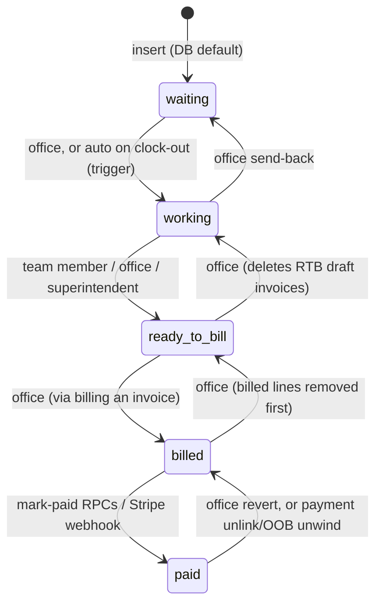
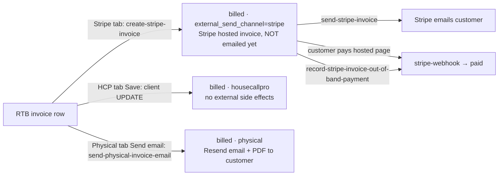

# Billing Flows

---
file: BILLING_FLOWS.md
type: System Documentation
purpose: End-to-end map of the billing system — job lifecycle, invoices, the three billing channels, Stripe test/live plumbing, payments, send-backs, routes, cleanup — plus a live-test safety brief and optimization candidates
audience: Developers, AI Agents, anyone running a live end-to-end billing test (there is no staging)
last_updated: 2026-07-18

key_sections:
  - name: "Job billing lifecycle"
    anchor: "#job-billing-lifecycle"
  - name: "Invoices and break-off partials"
    anchor: "#invoices-jobs_ledger_invoices"
  - name: "The three billing channels"
    anchor: "#the-three-billing-channels-bill-customer"
  - name: "Stripe integration and test/live mode"
    anchor: "#stripe-integration-testlive-mode"
  - name: "Collect Payment field flow"
    anchor: "#collect-payment-field-flow"
  - name: "Payments and reconciliation"
    anchor: "#payments-jobs_ledger_payments"
  - name: "Send-back / revert paths"
    anchor: "#send-back--revert-paths"
  - name: "Routes map"
    anchor: "#routes-map"
  - name: "Cleanup and deletion"
    anchor: "#cleanup-and-deletion"
  - name: "Live test safety brief"
    anchor: "#live-test-safety-brief"
  - name: "Optimization candidates"
    anchor: "#optimization-candidates"
---

Everything here was read from the code at the cited paths (repo-relative). Deployed edge functions can drift from `supabase/functions/` — run `npm run check:edge-drift` before trusting edge behavior in production.

## Job billing lifecycle

### Statuses

`jobs_ledger.status` (CHECK constraint `jobs_ledger_status_check`, `supabase/migrations/20250101000000_baseline.sql`; client mirror `JOBS_LEDGER_STATUS_PIPELINE` in `src/lib/jobsLedgerStatusPipeline.ts`):

"Collections" is **not** a status — it is a sticky flag on billed jobs (`collections_at/by/note`, migrations `supabase/migrations/20260704150000_job_collections_flag.sql` + `…160000_collections_flag_row_lock.sql`; RPC `set_job_collections_flag`, client `src/lib/setJobCollectionsFlag.ts`, helper `jobInCollections` in `src/lib/jobsStagesBoard.ts`).

### RPC `update_job_status(p_job_id, p_to_status)`

Latest definition: `supabase/migrations/20260608120000_allow_helpers_working_to_ready_to_bill.sql` (baseline verbatim except helpers are no longer excluded from the working→ready_to_bill team path). SECURITY DEFINER, returns jsonb `{ok}`/`{error}`; auth enforced inside. "OFFICE" below = role ∈ dev/master_technician/assistant AND job access (owner master, `is_dev()`, `master_assistants` either direction, or `assistants_share_master`).

| Transition | Allowed callers |
|---|---|
| working → ready_to_bill | any `jobs_ledger_team_members` member (incl. helpers), OFFICE, linked superintendent |
| billed → ready_to_bill, ready_to_bill → billed | OFFICE |
| paid → billed | dev/master_technician/assistant/**primary** |
| ready_to_bill → working | OFFICE; side effect: **deletes all `ready_to_bill` invoice rows** for the job (count returned as `deleted_ready_to_bill_invoices`) |
| working → waiting, waiting → working | OFFICE |

Side effects: `jobs_ledger` update + one `job_status_events` insert (`from_status`, `to_status`, `changed_by_user_id`). It does **not** stamp bill/paid timestamps (those live on invoice rows), does not clear the Collections flag, and takes **no row lock** — concurrency is only mitigated client-side (v2.732 per-id mutation locks in `src/hooks/useDashboardBillingInvoices.ts`; serialized pipeline in `src/pages/Jobs.tsx`).

Other server-side status writers:

- Trigger `clock_sessions_promote_job_waiting_to_working` (baseline) — auto waiting→working after a clock-out on the job (writes its own `job_status_events` row).
- `mark_job_paid` / `mark_invoice_paid` / `mark_invoice_paid_from_stripe` / `apply_mercury_bank_payment_allocations` — promote billed→paid by **direct UPDATE** (no `job_status_events` row) when covered. See [Payments](#payments-jobs_ledger_payments).
- `remove_jobs_ledger_payment_and_reconcile` and `revert_stripe_oob_invoice_payment` — may demote paid→billed via `update_job_status` (so those reverts *are* audited).
- `migrate_job_ledger_costs_and_delete` (latest `supabase/migrations/20260619130000_migrate_costs_allow_billed.sql`) — moves costs to another job and deletes the source (invoices/payments cascade); Edit Job delete/migrate path.

### `job_status_events`

Audit table (baseline): `job_id` FK CASCADE, `from_status`, `to_status`, `changed_at`, `changed_by_user_id`. Written by `update_job_status` and the clock-out trigger; mirrored into `job_activity_events` as `status_change` rows by `supabase/migrations/20260608010000_job_activity_events.sql`. Read directly by the send-back modals in `src/components/dashboard/DashboardBillingPipelineSection.tsx` and `src/pages/Jobs.tsx` ("Move into <stage> by: <name> on <date>" via `formatMoveIntoStageByOnLine`, `src/lib/formatMoveIntoStageByOnLine.ts`). Archived on delete since `supabase/migrations/20260716120000_deleted_records_archive.sql`.

### Client callers

- `src/lib/markJobReadyToBill.ts` — working→RTB; sole caller `src/components/jobs/MarkJobReadyToBillPrompt.tsx` (post-report "Move to Ready to Bill?" prompt with two attestation checkboxes, opened from `NewReportModal`/`AdditionalReportModal`).
- `src/lib/promoteJobToBilledIfFullyInvoiced.ts` — `maybePromoteJobToBilledAfterCustomerInvoice` runs after every successful Bill Customer send/record; chains working→ready_to_bill→billed when no RTB rows remain and unallocated ≤ $0.005.
- `src/lib/syncJobToReadyToBillIfNoBilledInvoicesRemain.ts` — job billed→RTB after the last billed invoice row is removed.
- `src/lib/updateJobStatusClientFeedback.ts` — shared toast/resync mapping for RPC failures.
- `src/hooks/useDashboardBillingInvoices.ts` — dashboard `updateJobStatus`, `moveJobToReadyToBillWithStripePrep`, `revertBilledDashboardInvoiceToReadyToBill`, `deleteInvoice`.
- `src/pages/Jobs.tsx` — Stages-board equivalents of all of the above.
- `src/components/jobs/JobLedgerStatusPipeline.tsx` — read-only pipeline renderer inside `DetailJobModal`.

### Surfaces

- **Dashboard Billing Pipeline** (`src/components/dashboard/BillingPipelineCard.tsx` → `DashboardBillingPipelineSection.tsx`, engine `src/hooks/useDashboardBillingInvoices.ts`): Stage 1 = `DashboardFieldCollectPaymentQueue`; Stage 2 "Ready to Bill" (Bill Customer, Delete draft bill, Send Back); Stage 3 "Billed Waiting for Payment" (Mark Paid, Send back). Units built by `src/lib/buildReadyToBillDashboardUnits.ts` / `src/lib/dashboardBillingInvoiceUnits.ts`.
- **Dashboard field RTB list** (`src/components/dashboard/DashboardTeamReadyToBillSection.tsx`) — field roles; Collect Payment entry point; no direct status mutations.
- **Jobs → Stages tab** (`src/pages/Jobs.tsx`, board kernels in `src/lib/jobsStagesBoard.ts`): Waiting / Working / Ready to Bill / Billed Awaiting Payment / Collections / Paid in Full sections with the full action set (promote, Bill Customer, partial invoice, Mark Paid, send-backs, Collections flag, AR modal, aging chips). `readyToBillJobs` includes working jobs that own an RTB draft (break-offs).
- **Jobs → Billing tab** — flat job-content table (fixtures, charges, totals); **no status transitions**.
- **Quickfill** (`src/pages/Quickfill.tsx`): read-only "Billing Awaiting Payments" (`src/components/quickfill/BilledAwaitingPaymentSection.tsx`) and "Complete, no Total Bill" (`src/hooks/useQuickfillCompleteNoBillJobs.ts`) reminder sections.
- **Edit Job** (`src/components/jobs/JobFormModal.tsx`): break-off invoice creation, payments table, delete/migrate; participates in billed→RTB prep.

## Invoices (`jobs_ledger_invoices`)

### Shape and statuses

Created once in the baseline migration; no later ALTERs. Key columns: `job_id` (FK CASCADE), `amount` numeric(12,2), `status` CHECK `ready_to_bill`/`billed`/`paid` (default `ready_to_bill` = "draft bill"), `sequence_order`, `billed_at`, `estimated_bill_date`, `is_primary_rtb_bundle` (the ensure-RPC remainder line), Stripe group (`stripe_invoice_id`, `stripe_invoice_status`, `hosted_invoice_url`, `stripe_invoice_memo`, `stripe_invoice_footer`), `external_send_channel` CHECK NULL/`housecallpro`/`physical`/`stripe_manual`/`stripe` + `external_send_note`, `sent_to_customer_at`, and the five `agreed_write_down_*` audit columns. **There is no test/live mode column** — Stripe mode is a per-request client preference (see below). Row type: `src/types/database.ts`.

Multiple invoices per job are first-class ("Partial invoices per job" per the table comment). Related: `jobs_ledger_invoice_stripe_email_sends` (append-only Stripe-email log), `job_collect_payment_flows.jobs_ledger_invoice_id` (SET NULL), `stripe_oob_payment_reverts` (CASCADE).

### The ensure RPC (keystone)

`ensure_single_ready_to_bill_invoice_for_job(p_job_id)` (baseline): unallocated = `GREATEST(0, revenue − payments_made − Σ RTB+billed invoice amounts)`. Requires job status `ready_to_bill`, roles dev/master_technician/assistant/primary + job access. Creates or re-syncs the single `is_primary_rtb_bundle` row to the unallocated remainder (skipping amount rewrites on Stripe-finalized rows); partial rows are never touched. Errors on multiple primaries / nothing left to bill. **Opening Bill Customer for a job runs this RPC — merely opening the modal can INSERT an invoice row.** Client mirror: `src/lib/wouldEnsureNothingLeftToBillForJob.ts`.

### Bill composition from Specific Work fixtures

Source tables: `jobs_ledger_fixtures` (Specific Work: `name`, `count`, `line_unit_price`, `line_description`, `sequence_order`) and `jobs_ledger_materials`. Job Total (`jobs_ledger.revenue`) = Σ fixture extended amounts (`src/lib/revenueFromJobFixtures.ts`). Billable rule (all copies): non-empty name AND qty×unit > 0.

- **Stripe (server)**: `supabase/functions/_shared/stripeInvoiceItemsFromFixtures.ts` `buildStripeInvoiceItemsFromFixtures` — override → one line; else per-fixture lines, bill amount split by largest-remainder proportional allocation (penny drift on the last line), description `"name — line_description"` clamped to 500 chars. Used by `create-stripe-invoice` and `preview-stripe-invoice`.
- **Physical (client)**: `src/lib/physicalInvoiceDocument.ts` → `src/lib/physicalInvoiceLineItems.ts` + `src/lib/physicalInvoiceFixtureScaling.ts` (same allocator, keep-in-sync comment); materials at face value, service = bill − materials.
- **Click-to-edit preview lines**: `src/lib/billCustomerPreviewLineRefs.ts` + `src/components/jobs/BillCustomerPreviewLineEditModal.tsx` — editing a preview line UPDATEs `jobs_ledger_fixtures`/`jobs_ledger_materials` directly (a real DB write from inside the preview).

### Break-off / partial invoices

"Break off" = create a fixed-dollar partial RTB row; the primary remainder re-syncs via the ensure RPC. Percentages are display-only — **only dollars are persisted**.

- **Edit Job slider** (`src/components/jobs/JobFormModal.tsx`): combined-coverage slider — thumb = (payments + break amount) / job total, snapped to 5% steps (`BREAK_OFF_COMBINED_SLIDER_STEP_PCT`); kernels `unallocatedBillableDollars`, `breakDollarsFromCombinedPct`, `breakOffPrefillAmountStringFromJob` (prefills 80%, or 95% when paid > 80%). `createInvoice()` clamps to the unallocated remainder; a full-remainder amount on an RTB job opens Bill Customer instead; insert is `{status:'ready_to_bill', is_primary_rtb_bundle:false}` + conditional ensure re-run.
- **Jobs Stages modal** (`src/pages/Jobs.tsx` `createInvoiceFromModal`, green "Create partial invoice" icon on RTB rows): plain dollar input, no slider. ⚠️ Its remaining basis is `revenue − payments_made` only (does not subtract existing invoice allocations) — can accept an over-allocating amount; see [Optimization candidates](#optimization-candidates).
- **Trip charges**: `create_turnaway_trip_charge` (`supabase/migrations/20260709130000_turnaway_trip_charge.sql`) inserts a non-primary RTB row and bumps `revenue` equally (caveats in its SQL COMMENT).

Billing a partial = Bill Customer with `kind:'invoice'` (fixed amount); billing the remainder = `kind:'job'` (ensure → primary). `resolveReadyToBillBillCustomerTarget` (`src/lib/buildReadyToBillDashboardUnits.ts`) keeps the Field queue and Dashboard pointing at the same target.

### Loaders

- `src/hooks/useDashboardBillingInvoices.ts` — dashboard engine: `jobs_ledger_invoices.select(DASHBOARD_INVOICES_JOBS_LEDGER_SELECT)` per status + RPC `get_jobs_ledger_by_status` + `jobs_ledger_payments.select('*')` for billed jobs. The select constant + flattener live in `src/lib/dashboardBillingInvoiceUnits.ts` (drift-guarded by its test; `dashboardInvoiceToPaymentModal` strips flattened fields — the v2.734 leak fix).
- `src/lib/jobsLedgerEmbedSelects.ts` — Stages/detail embeds (`JOBS_LEDGER_INVOICES_EMBED` omits the write-down columns); used by `src/lib/fetchJobsLedgerWithDetailsForStages.ts` (Jobs `loadJobs`, AR page) and `src/lib/fetchJobWithDetailsById.ts` (single-job detail, Bill Customer refresh).
- `src/hooks/useBilledTotal.ts` — billed-and-unpaid headline (includes Collections). `src/lib/invoiceWithJobFromJobList.ts`, `src/lib/jobBillingContext.ts`, `src/lib/jobLedgerCustomerForBilling.ts` — rehydration/context helpers.
- RPC `get_jobs_ledger_by_status` (baseline): SECURITY DEFINER, **no auth/role check** (comment: "Bypasses RLS for Dashboard").

### "Remaining" kernels (v2.727)

- Dashboard: `src/lib/dashboardBillingInvoiceUnits.ts` (`dashboardBilledInvoiceAmounts` = applied/open per invoice; `buildBilledWaitingDashboardUnits` merge rules) and `src/lib/buildReadyToBillDashboardUnits.ts` (`jobRemainingCents`, `dashboardJobBillingUnallocCents`, bundle rules) — semantics pinned by their tests.
- Stages: `src/lib/jobsStagesBoard.ts` (`jobBillingUnallocatedDollars`, `buildReadyToBillStageRows`, `buildBilledStageRows`, `bankPaymentTargetsFromStageRows`) and `src/lib/jobs/invoiceBilling.ts` (`invoiceOpenRemainingOnJob`, `stageRowBilledRemainingAmount`, aging helpers).
- Two bases everywhere: invoice-line remaining = `amount − Σ payments(invoice_id)`; job-shell remaining = `revenue − payments_made`; the billing-unallocated variant additionally subtracts RTB+billed invoice amounts.

## The three billing channels (Bill Customer)

`src/components/jobs/SendRecordInvoiceModal.tsx` ("Bill Customer"; payload `SendRecordInvoiceModal.types.ts`: `kind:'job'` or `kind:'invoice'`). Three tabs: **Stripe bill / HouseCall Pro / Physical invoice** (default `stripe` when `job.customer_email` set, else `housecallpro`). No amount input — the amount comes from the ensured primary row or the passed invoice. All three submit paths finish with `maybePromoteJobToBilledAfterCustomerInvoice`.

### Stripe bill

- **Preview** (debounced 450 ms while the tab is open): edge `preview-stripe-invoice` — no DB writes; retrieves the saved `customers.stripe_customer_id` or creates+deletes an **ephemeral Stripe customer** per preview (delete failure only warns). Rendered by `src/components/jobs/StripeBillPreSubmitPreview.tsx`.
- **"Create Stripe invoice"** → edge `create-stripe-invoice`: customer upsert (persists `customers.stripe_customer_id` — one column shared by test and live), `invoices.create` with `collection_method:'send_invoice'` + `days_until_due`, custom number `<hcp digits>-YYMMDDHHmm` (`_shared/pipetoolingStripeInvoiceNumber.ts`; duplicate → 409 "change the due date"), per-fixture invoice items, `finalizeInvoice`. DB patch: `status:'billed'`, `external_send_channel:'stripe'`, `stripe_invoice_id/status`, `hosted_invoice_url`, memo/footer. Idempotent on re-call. **Finalize does not email the customer** (no `sendInvoice` call) — but Stripe *account-level* email settings could; verify in the Stripe Dashboard before a live test.
- **Post-create panel / "View bill"** (`src/components/jobs/HostedStripeBillPanel.tsx`): edge `get-stripe-invoice-details` (reads + silent memo/footer DB backfill); "Customer pay page" opens `hosted_invoice_url` (what the customer sees); `StripeInvoiceSharePanel` copy-link/SMS-draft/email-draft buttons **send nothing** (`SmsBillDraftModal`/`EmailBillDraftModal` are clipboard + `mailto:` only; templates in `src/lib/stripeInvoiceShareCopy.ts`).
- **"Send Email invoice from Stripe"** (`src/components/jobs/StripeInvoiceSendFromStripeButton.tsx`) → edge `send-stripe-invoice`: the **only path where the Stripe bill is emailed to the customer** — `stripe.invoices.sendInvoice()`, from Stripe, to the email on the Stripe invoice/customer object. Logs to `jobs_ledger_invoice_stripe_email_sends`, stamps `sent_to_customer_at`. Test mode: Stripe accepts the send but delivers no real email.
- **Paid**: the customer pays the hosted page → `stripe-webhook` → `mark_invoice_paid_from_stripe` (payment row, invoice+job → paid) + `complete_job_collect_payment_flow_for_invoice`. Off-Stripe closes go through `record-stripe-invoice-out-of-band-payment` (full open balance only; ledger flips paid **only via the webhook** seconds later).
- **Discount**: `src/components/jobs/AgreedWriteDownModal.tsx` → edge `stripe-invoice-agreed-write-down` — creates a real **Stripe credit note**, then service RPC `service_apply_agreed_write_down_from_stripe` lowers `amount` + audit columns, cascading to paid if covered. Non-Stripe billed lines use RPC `apply_agreed_write_down_to_billed_invoice` (DB only).

### HouseCall Pro

`confirmOutsideBill()` ("Save"): **record-only**. Direct client UPDATE → `{status:'billed', external_send_channel:'housecallpro', external_send_note, sent_to_customer_at}`. **There is no HouseCall Pro API integration anywhere in the repo** — `hcp` in code always means the imported job number (`jobs_ledger.hcp_number`). Customer sees nothing from PipeTooling. Reversible while unpaid.

### Physical invoice

`submitPhysicalInvoiceEmail()` ("Send email"): client builds the PDF (`src/lib/physicalInvoiceDocument.ts`, issuer identity from `app_settings` via `src/lib/physicalInvoiceIssuer.ts`, jsPDF in `src/lib/physicalInvoicePdf.ts`; "Preview" is a local blob — no side effects) → edge `supabase/functions/send-physical-invoice-email/index.ts`: requires invoice `ready_to_bill` and the target email to **match `jobs_ledger.customer_email`**; sends ONE real email via **Resend** from `PipeTooling <team@noreply.pipetooling.com>` to the customer only (no CC), PDF attached; then flips the row to `billed`/`physical`. If the DB update fails, the email has already gone out. Billed re-display uses `src/lib/physicalInvoiceDocumentForBilledInvoice.ts` (reconstruction; not guaranteed byte-identical).

### `external_send_channel` semantics

`'stripe'` = hosted Stripe invoice (emails come from Stripe on demand); `'housecallpro'` = billed outside the app, nothing sent; `'physical'` = app emailed a PDF via Resend; `'stripe_manual'` = legacy CHECK value; NULL + no Stripe fields renders plain "Billed" (labels: `billingTypeLabel` in `HostedStripeBillPanel.tsx`). `invoiceNeedsStripeVoidForRevert` (`src/lib/voidStripeInvoiceForRevert.ts`) treats `stripe_invoice_id` present OR channel `'stripe'` as needing a Stripe void before revert.

### Adjacent (not billing writes)

`src/components/jobs/AiaG702G703Modal.tsx` — fills the bundled G702/G703 xlsx client-side, download only. `src/components/jobs/RecurringEmailReportsModal.tsx` + `recurring-job-report-*` edge functions — internal recap emails to app users only (test-send goes to the caller); never touches invoices or customers.

## Stripe integration (test/live mode)

### Key selection and mode plumbing

- Server: `supabase/functions/_shared/stripeSecrets.ts` — `stripeApiKeyForMode` picks `STRIPE_SECRET_KEY_TEST` / `STRIPE_SECRET_KEY_LIVE` (legacy `STRIPE_SECRET_KEY` fallback by `sk_test_`/`sk_live_` prefix). `resolveStripeBillingMode` honors the request-body `stripe_mode`; **when omitted and both keys are configured the server defaults to `test`** (scripts/curl are safe by default). Webhook signatures are tried against `STRIPE_WEBHOOK_SECRET_LIVE` → `_TEST` → legacy.
- Client: `src/lib/billingStripeModePref.ts` — localStorage `pipetooling-billing-stripe-mode-pref`, default `'live'` (legacy `auto` migrates to `live`); `stripeModeInvokeBody` adds `stripe_mode` to every invoke; `stripeDashboardInvoiceUrl` builds test/live dashboard deep links.
- Role gate: `stripeModeForBillingFromRole` (`src/lib/voidStripeInvoiceForRevert.ts`) — **only `dev` reads the pref; every other role is hard-pinned `'live'`**.
- UI toggle: `src/components/jobs/StripeBillingModeToggle.tsx`, rendered **only** in the Bill Customer modal header (Stripe tab, pre-submit, dev role). It is *not* in Settings.
- **Mode is per-request; nothing stores which mode an invoice was created in.** Cross-mode operations surface as Stripe `resource_missing` — except void (below). Two call sites read the raw pref **without** the dev gate: `src/components/jobs/AgreedWriteDownModal.tsx` and the memo/footer backfill in `src/components/jobs/JobFormModal.tsx`.

### Edge functions (all `verify_jwt=false` with in-body Bearer auth + RLS; all accept `stripe_mode`)

| Function | Stripe calls | DB writes | Notes |
|---|---|---|---|
| `create-stripe-invoice` | customer upsert, invoice create+finalize, invoice items | invoice row → billed/stripe fields; `customers.stripe_customer_id` | idempotent; no email |
| `preview-stripe-invoice` | createPreview (+ ephemeral customer create/delete) | none | debounced from the modal |
| `send-stripe-invoice` | `invoices.sendInvoice` — **emails customer** | `sent_to_customer_at`, send-log row | sub/helpers allowed via collect-flow gate |
| `get-stripe-invoice-details` | retrieve + lines + account | memo/footer backfill | used by panels/queues |
| `void-stripe-invoice-for-revert` | draft→delete, open→void; paid → 409 | deletes the invoice row | payments block; **"No such invoice" (e.g. wrong mode) is treated as noop and the row is deleted anyway** |
| `record-stripe-invoice-out-of-band-payment` | metadata + `invoices.pay({paid_out_of_band})` | none directly — webhook writes the ledger | full open balance only |
| `reverse-stripe-invoice-out-of-band-payment` | credit note | via RPC `revert_stripe_oob_invoice_payment` | `src/components/jobs/UnwindStripeOobPaymentModal.tsx` |
| `stripe-invoice-agreed-write-down` | credit note | via service RPC | only Stripe function with a server role gate (dev/master/assistant/primary) |
| `update-collect-payment-stripe-customer-email` | `customers.update({email})` | `jobs_ledger.customer_email`, `customers.contact_info` | sub/helpers + flow gate |

### `stripe-webhook`

`supabase/functions/stripe-webhook/index.ts`: signature-verified (live→test→legacy secrets), deduped via `stripe_webhook_events` insert. `invoice.paid`/`invoice.payment_succeeded` → `mark_invoice_paid_from_stripe` (+ OOB metadata pass-through) + `complete_job_collect_payment_flow_for_invoice`. `invoice.updated/voided/payment_failed` → sync `stripe_invoice_status` only (never downgrades paid). **`event.livemode` is never checked — test-mode events mutate the prod DB by design** (this is how dev test mode works end-to-end; rows match by `stripe_invoice_id`). `credit_note.created` re-reads the invoice with a test-first key when both keys are configured, so live credit-note syncs can fail quietly (warn only).

### Which actions hit LIVE Stripe

- **dev + pref=test**: none of the billing actions (all pass `stripe_mode:'test'`). Caveats: acting on a live-created invoice fails — except void, which deletes the ledger row and orphans the live Stripe invoice; webhook still writes prod DB either way.
- **dev + pref=live, and ALL non-dev roles**: preview, create, details (incl. the silent JobFormModal backfill), send (**emails the real customer**), void, record-OOB (**marks the live invoice paid**), reverse-OOB and write-down (**live credit notes**), collect-payment email update.

### Banking read-only panels

`src/components/BankingStripeInvoicesPanel.tsx` (DB rows, newest 500 — test and live rows are indistinguishable) and `src/components/BankingStripeWebhookEventsPanel.tsx` (`stripe_webhook_events` log). Parsers: `src/lib/stripeInvoiceDetailsResponse.ts`, `stripeInvoicePreview.ts`, `stripeInvoiceFooter.ts`.

## Collect Payment field flow

Tables/RPCs in the baseline migration; `job_collect_payment_flows` (one row per job): `draft → pending_dispatch → approved_for_terminal → terminal_completed` (+ `failed`/`cancelled`; `certify_mode` clean/correction_requested/returned_from_terminal).

1. **Field certifies** — `src/components/jobs/CollectPaymentModal.tsx` (opened only from `DashboardTeamReadyToBillSection`, subcontractor/helpers): RPC `get_collect_payment_certify_payload`; optional "Add line items from Job Book" (`add_collect_payment_fixture_from_job_book` — writes fixtures + recomputes `revenue`); submit → `submit_collect_payment_certification` → `pending_dispatch`. **No notifications are sent** — the office sees it via the dashboard queue (realtime).
2. **Office approves** — `src/components/dashboard/DashboardFieldCollectPaymentQueue.tsx` ("Field: Waiting for Approval"): "Prepare Bill" opens Bill Customer (Stripe expected — approval requires a billed invoice with `stripe_invoice_id`); "Approve for payment" → `approve_collect_payment_for_terminal` → `approved_for_terminal`.
3. **Field collects** (modal goes green via realtime): open/copy the hosted pay link; "Email invoice to customer" → `send-stripe-invoice` (Stripe emails; label via `src/lib/formatCollectPaymentInvoiceEmailLastSentLabel.ts`); "Change email" → `update-collect-payment-stripe-customer-email`; "Send back to office" → `void-stripe-invoice-for-revert` with `collect_payment_send_back_job_id` (edge verifies sub/helper + team + matching approved flow; service-role deletes even non-Stripe rows; payments still block) → `return_collect_payment_to_dispatch`.
4. **Completion** — customer pays → webhook → payment row + invoice/job paid + flow `terminal_completed`.

## Payments (`jobs_ledger_payments`)

### Shape

Baseline: `job_id` FK CASCADE, `amount`, `sequence_order`, `paid_on` (user-entered date), `note`, `invoice_id` FK **SET NULL** (NULL = job-level payment), `payment_type`, `reference_number`, `mercury_transaction_id` FK SET NULL. **No `created_by`/source column** — provenance is inferred (`mercury_transaction_id`, `invoice_id`, note `'Stripe'`). RLS allows direct writes by dev/master_technician/assistant/primary with job access. Triggers: activity mirror (`payment_added`/`payment_removed`, `supabase/migrations/20260608010000_job_activity_events.sql`) and delete-archive.

### Every insert path

| # | Path | Trigger UI | Notes |
|---|---|---|---|
| A | RPC `mark_invoice_paid` | `src/components/jobs/BilledPaymentConfirmationModal.tsx` mode `invoice` (non-Stripe lines; Dashboard + Stages "Mark Paid") | partial allowed, ≤ invoice remaining; flips invoice/job paid when covered |
| B | RPC `mark_job_paid` (6-arg; 3-arg legacy appears unused) | same modal, mode `job` | job-level row, `invoice_id` NULL |
| C | RPC `mark_invoice_paid_from_stripe` (service-role, no auth) | `stripe-webhook` only | full remaining; note defaults `'Stripe'`; also how OOB records land (via `record-stripe-invoice-out-of-band-payment` → Stripe → webhook) |
| D | RPC `apply_mercury_bank_payment_allocations` | `src/components/jobs/BankPaymentsModal.tsx` ("Accounts Receivable"; Jobs Stages + `/accounts-receivable`) | allocations `{invoice_id|job_id, amount}` against a Mercury deposit; caps at deposit remainder; non-Stripe billed targets only; `paid_on` forced to the deposit's posted Chicago day; `reference_number` = `mercury_id` |
| E | Direct client writes | `src/components/jobs/JobFormModal.tsx` `saveJob` | Edit Job Save **deletes all payment rows for the job and re-inserts the form rows** (locked Stripe/Mercury rows ride along with new ids), then sets `payments_made` = form sum; may demote paid→billed |

### Unlink / reconcile

- RPC `remove_jobs_ledger_payment_and_reconcile(p_payment_id)` (baseline): refuses Stripe-hosted-invoice payments ("use Stripe reversal flows"); deletes the row, recomputes `payments_made`, re-syncs invoice paid↔billed both directions, demotes job paid→billed via `update_job_status` when reopened. Call sites in `JobFormModal.tsx`: Mercury "Unlink and remove" and persisted-row removal.
- Stripe OOB unwind: `UnwindStripeOobPaymentModal` → edge `reverse-stripe-invoice-out-of-band-payment` (credit note) → RPC `revert_stripe_oob_invoice_payment` (deletes the invoice's payments, invoice → billed, job demote, audit row in `stripe_oob_payment_reverts`, collect flow `terminal_completed → approved_for_terminal`).
- Send-back blockers: `delete_billed_invoice_on_send_back` and `void-stripe-invoice-for-revert` both hard-block when any payment references the invoice.

### Mercury end-to-end (AR)

`sync-mercury-transactions` (+ manual uploads) populate `mercury_transactions`. The AR modal (`BankPaymentsModal`) lists deposits via RPC `list_mercury_transactions_for_bank_payments` (per-tx consumed/remaining from payment sums; org filters from `BankingSortingConfigV1`; "Mark returned" via `set_mercury_transaction_ar_returned`), shows the applied breakdown per deposit (`list_ar_allocations_for_mercury_transaction`, click-through to Edit Job), and applies allocations via RPC D. Under-allocation leaves the remainder available; over-allocation is rejected. Unallocated-deposit nudges: `src/hooks/useArBankUnallocatedCount.ts` → `count_mercury_transactions_for_bank_payments`, rendered by `src/components/DashboardArBankUnallocatedBanner.tsx`, Quickfill, and the dashboard pinned row. The Banking page itself never touches `jobs_ledger_payments` — `MercuryTransactionAllocationsModal` / `MercuryTransactionInvoiceLinkModal` are the **expense** side (`mercury_transaction_job_allocations`, supply-house links).

### Display surfaces

Edit Job "Payments received" table (locked Stripe/Mercury rows; refs via `src/lib/abbreviatePaymentReference.ts`); Dashboard billing pipeline Applied/Open; `useDashboardFinancials` AR buckets; Quickfill `BilledAwaitingPaymentSection`; `useBilledTotal` headline; `HostedStripeBillPanel` paid-at fallback; Job Summary charges timeline (`src/lib/jobChargesTimeline.ts`); physical-invoice payment history; the job activity feed.

## Send-back / revert paths

| Path | Trigger | Mechanics |
|---|---|---|
| Billed invoice → removed | "Send back" on a billed invoice card (Dashboard Stage 3 / Stages Billed / bill-view panel) | Non-Stripe: RPC `delete_billed_invoice_on_send_back` (roles dev/master_technician/assistant/primary + job access; status must be `billed`; **blocked if any payment references the invoice**; idempotent). Stripe-backed (`invoiceNeedsStripeVoidForRevert`): edge `void-stripe-invoice-for-revert` (payments block → 409; Stripe paid/partially-paid → 409 "resolve in Stripe"; draft→delete, open→void, void/uncollectible/missing→noop) then row delete + client `ensureLedgerInvoiceRemovedAfterStripeSendBack`. Either way `syncJobToReadyToBillIfNoBilledInvoicesRemain` demotes the job when the last billed row is gone. |
| Job billed → ready_to_bill | "Send back" on a billed job row | `prepareBilledInvoicesBeforeJobRevertToReadyToBill` (`src/lib/voidStripeInvoiceForRevert.ts`) clears ALL billed rows (Stripe void or RPC per row; any failure aborts) then `update_job_status('ready_to_bill')`. |
| Job ready_to_bill → working | "Send Job Back" on an RTB job row | Confirm modal shows RTB-draft-count warning, collect-payment-flow cancellation notice (`src/hooks/useSendBackCollectPaymentFlowNotice.ts` + `src/lib/collectPaymentFlowSendBackNotice.ts`), and the `job_status_events` "Move into stage by" line. `update_job_status('working')` deletes all RTB draft rows server-side. |
| Draft bill deletion | "Delete draft bill" on RTB invoice/bundle cards | RPC `delete_ready_to_bill_invoice` (same gates; status must be `ready_to_bill`; no payments check needed — payments can't exist on RTB rows). Job status untouched. |
| Paid → billed | Stages Paid section send-back; automatic via payment unlink / OOB unwind | `update_job_status('billed')` |
| Collections ↔ Billed | "Move to Collections" / "Send back to Billed" | `set_job_collections_flag` only — not a status transition |
| Field send-back | Collect Payment step 3 | `invokeVoidStripeInvoiceForCollectPaymentSendBack` → same edge with flow verification (service-role path) |

**What blocks a send-back**: recorded payments on the invoice; Stripe invoice paid or `amount_paid > 0`; un-voidable Stripe status; role/access gates; stale from-status (client resyncs).

## Routes map

All routes render inside the authed layout in `src/App.tsx`. Billing-relevant:

| Route | Surface | Billing-relevant params |
|---|---|---|
| `/jobs` | `src/pages/Jobs.tsx` | `?tab=` `stages` \| `billing` \| `reports` \| `sub_sheet_ledger` \| `combined-labor` \| `teams-summary` \| `parts` \| `job-summary` \| `inspections` (union also has a vestigial `billed`; legacy redirects: `receivables`→`reports`, `ledger`→`billing`, `billed`→`stages`, `labor`→`sub_sheet_ledger`; role redirects strip `combined-labor`/`teams-summary` for assistant/superintendent). Deep links: `?edit=<jobId>` (opens Edit Job), `?editLabor=<hcp>`, `?editParts=<jobId>`, `?openBankPayments=true|1` (opens the AR/Bank Payments modal on Stages), `?customer=<id>` (filter), `?teamLaborJob=…`, `?newJob=true&project=<id>` |
| `/accounts-receivable` | `src/pages/JobsAccountsReceivable.tsx` | none — thin wrapper that mounts `BankPaymentsModal` always-open over the billed rows (role-gated by `canRoleSeeArBankUnallocatedOrgNudge`); linked from the Dashboard pinned quick row and Quickfill |
| `/banking` | `src/pages/Banking.tsx` | `?product=mercury|stripe` (`stripe` = dev only) + `?tab=`. Mercury tabs: `ledger` \| `sorting` \| `drag_sort` \| `accounting` \| `user_review` \| `category_review` \| `reconciliation` (assistant-like/master_technician are pinned to Mercury; non-dev/non-office default `ledger`). Stripe tabs: `invoices` \| `data` (the read-only panels above). Feeds payments only indirectly (Mercury sync + sorting config used by the AR modal). |
| `/quickfill` | `src/pages/Quickfill.tsx` | no URL params; billing sections: "Billing Awaiting Payments", "Complete, no Total Bill", unallocated-deposits banner linking to `/accounts-receivable` |
| `/dashboard` | `src/pages/Dashboard.tsx` | Billing Pipeline card + field RTB/collect queues (role-driven, no params) |
| `/customers`, `/customers/:id/edit` | customer records incl. `customer_email` used by billing | `customers/new` redirects with modal state |
| `/settings` | Settings → Data → "Recently deleted" (dev-only archive restore UI) | |

## Cleanup and deletion

### Delete flows

- **Draft/billed invoice rows**: RPC-only (`delete_ready_to_bill_invoice`, `delete_billed_invoice_on_send_back` — bodies in the baseline migration; see Send-backs for gates and payment blocks).
- **Job**: Edit Job → Delete ("Delete job from Billing?" confirm; button hidden for `primary`, otherwise RLS-gated) → direct `from('jobs_ledger').delete()` in `src/components/jobs/JobFormModal.tsx`. Alternative: migrate-and-delete (`migrate_job_ledger_costs_and_delete`, blocks on payments unless `p_allow_billed=true`, which the modal passes).
- **Customer**: Edit Customer type-the-name-to-confirm → direct `from('customers').delete()` (`src/components/EditCustomerForm.tsx`, also `src/pages/CustomerForm.tsx`); RLS-gated. `merge_customers` RPC deletes the victim row.

### FK behavior (baseline)

- Deleting a **job** CASCADEs 17 children incl. `jobs_ledger_invoices`, `jobs_ledger_payments`, `jobs_ledger_fixtures`/`materials`, `job_status_events`, `job_collect_payment_flows`, `jobs_ledger_team_members`, `mercury_transaction_job_allocations`, `reports`, `stripe_oob_payment_reverts`; SET NULL on `clock_sessions.job_ledger_id`, `dispatch_requests`, `estimates`, `estimator_requests`.
- Deleting an **invoice**: CASCADE → Stripe email-send log, `stripe_oob_payment_reverts`; **SET NULL → `jobs_ledger_payments.invoice_id`** (payments survive, orphaned) and `job_collect_payment_flows`.
- Deleting a **customer**: CASCADE → contacts, contact persons, **projects** (→ workflows); SET NULL → `jobs_ledger.customer_id`, `bids.customer_id`, `estimates.customer_id` (jobs/bids/estimates survive).
- `jobs_ledger_payments.mercury_transaction_id` SET NULL — Mercury transactions are never app-deleted; deposits survive test cleanup.

### Deleted-records archive (migrations 2026-07-16/17)

`supabase/migrations/20260716120000_deleted_records_archive.sql` + `…150000`/`…180000`/`…210000`/`…230000` (tier2, incl. the customers tree) + `20260717210000` (people): a BEFORE-DELETE trigger snapshots every deleted row (incl. cascade children) into `deleted_records_archive` (group_key = top job/bid id, `deleted_by`, 90-day pg_cron purge). Dev-only `list_deleted_records` / all-or-nothing `restore_deleted_records(p_group_key, p_dry_run)` (topological insert order, dangling nullable FKs → NULL + warning, NOT NULL → blocker, warns on hcp/click number reuse). UI: Settings → Data → "Recently deleted" (`src/components/settings/…DeletedRecordsSection`, dev-only). Not covered by design: `people_hours`, `mercury_transactions`, `service_types`, `users`.

### Residue after deleting a test job/customer

- Archive bundles (minimal job ≈ 5 rows) visible to all devs for 90 days with your uid.
- **Bulk-deletion alerts** (`supabase/migrations/20260717120000_bulk_deletion_alerts.sql`, `src/components/DashboardBulkDeleteAlertBanner.tsx`): fire per actor+hour at ≥5 bundles OR ≥200 rows (tunable via `app_settings`; 168 h lookback) and **exclude the viewer's own deletions** — cleaning your own test data never alerts you, but ≥5 bundles/hour will alert other devs.
- **Stripe side is never cleaned by app deletes**: voided invoices, invoice numbers, credit notes, and `customers.stripe_customer_id` targets remain in Stripe (test or live). Void+delete are paired in `src/lib/voidStripeInvoiceForRevert.ts`, but Stripe keeps voided invoices in history.
- HCP/click numbers free up on delete (restore only warns on reuse). Mercury links null out; deposits stay.

## Live test safety brief

Checklist for a live end-to-end billing test on prod (there is no staging; every DB write is prod).

### Pre-flight (cannot be verified from code — check these first)

1. **Stripe Dashboard → Settings → Billing → Emails**: confirm "email finalized invoices", payment receipts, reminders, and credit-note emails are OFF (the code never asks Stripe to email except explicit `sendInvoice`, but account settings could).
2. **Webhook registration**: confirm `stripe-webhook` is registered in Stripe **test mode** too (required for the paid/OOB legs of a test-mode run to reach the ledger) and that `STRIPE_SECRET_KEY_TEST`/`_LIVE` + webhook secrets are set on project `yewfzhbofbbyvkvtaatw`.
3. `npm run check:edge-drift` — deployed edge functions must match the repo before trusting this doc's edge behavior.
4. Sign in as a **dev** user; in Bill Customer → Stripe tab, set the mode toggle to **Test** (localStorage per browser profile — re-check in every browser/profile you use). Non-dev roles are hard-pinned to LIVE.
5. Create a dedicated test customer + job with a **customer email you control**. Never run the flow against a real customer's job.

### Action table

| Action (button/flow) | Writes | External side effects | Safe on prod? |
|---|---|---|---|
| Create test customer/job (Edit Job/Customers) | customers/jobs_ledger rows | none | Yes |
| Move job Working → Ready to Bill | status + `job_status_events` | none | Yes |
| **Open Bill Customer** (job) | ensure RPC may INSERT the primary RTB invoice row | none | Yes (row deleted on send-back to working) |
| Stripe tab open (preview) | none | Stripe createPreview; may create+delete an **ephemeral Stripe customer** per cycle | Yes with pref=test; in live mode it churns real (deleted) customer objects |
| Edit a preview line | UPDATEs `jobs_ledger_fixtures`/`materials` | none | Yes on the test job only |
| "Create Stripe invoice" | invoice → billed/stripe fields; `customers.stripe_customer_id`; job → billed | Stripe customer upsert + finalized numbered invoice; **no email from the app** | Yes with pref=test; live only on the fake customer after pre-flight #1 |
| "Send Email invoice from Stripe" | `sent_to_customer_at`, send log | **Stripe emails the invoice** (test mode: no real delivery) | Only to an email you control |
| Copy link / SMS draft / Email draft | none | clipboard / your own mail app | Yes |
| HCP "Save" | invoice → billed (`housecallpro`) | **none** | Yes — the zero-side-effect channel; use it to test lifecycle without Stripe |
| Physical "Preview" | none | none (local PDF) | Yes |
| Physical "Send email" | invoice → billed (`physical`) | **Real Resend email + PDF to the job's customer email** | Only with your own email on the job; irreversible |
| Pay the hosted invoice (test mode, card 4242…) | webhook → payment row, invoice+job → paid | none beyond Stripe test | Yes (needs pre-flight #2) |
| Mark Paid (`BilledPaymentConfirmationModal`) | payment row via `mark_invoice_paid`/`mark_job_paid` | none (non-Stripe lines) | Yes; **payments block send-back — unlink before cleanup** |
| Record OOB payment (Stripe line) | Stripe `invoices.pay(paid_out_of_band)`; ledger via webhook | marks the Stripe invoice paid | pref=test only; full balance only |
| Apply discount (write-down) | invoice amount + audit; maybe paid cascade | **Stripe credit note** (email behavior unverified) | pref=test only; note the modal reads the pref **without** the dev gate |
| Mercury AR allocation (`BankPaymentsModal`) | payment rows linked to a real deposit | none | **No** — only real bank deposits are listed; do not allocate real deposits to a test job. Test unlink via a manual `mark_invoice_paid` payment instead |
| Send back (billed → RTB) | deletes billed row(s); job demote | Stripe void/delete for Stripe lines (permanent for that invoice number) | Yes after unlinking payments; **never flip the mode pref mid-test** — a wrong-mode void deletes the ledger row and orphans the real Stripe invoice |
| Send Job Back (RTB → working) | deletes RTB drafts; status | none; cancels an active Collect Payment flow (modal warns) | Yes |
| Collect Payment certify/approve | `job_collect_payment_flows` transitions | none (no notifications) | Yes |
| Delete draft bill | deletes RTB row | none | Yes |
| Delete test job (Edit Job) | cascades invoices/payments/events/fixtures → archive | none (Stripe objects remain) | Yes |
| Delete test customer (type-to-confirm) | customer + contacts + **projects** cascade; jobs survive with `customer_id` NULL | none | Yes — but delete the job first if you want a clean archive bundle |

### Condensed rules

1. Only a `dev` user can use Stripe test mode, via the toggle inside Bill Customer (Stripe tab). The pref is per-browser localStorage (`pipetooling-billing-stripe-mode-pref`, default live). Everyone else always hits live Stripe.
2. Two customer-visible sends exist: `send-stripe-invoice` (Stripe emails) and Physical "Send email" (Resend from `team@noreply.pipetooling.com`). Creating a Stripe invoice does **not** email. HCP records only. Draft/SMS/copy buttons never send.
3. Keep one mode for the whole test. Cross-mode void silently deletes the ledger row and orphans the Stripe invoice; other cross-mode ops fail loudly.
4. Payments block send-backs; unlink via Edit Job (or the OOB unwind for Stripe) before cleanup.
5. The webhook writes prod regardless of livemode — a test-mode payment really flips your prod job to paid (that's the designed test path).
6. Cleanup: delete the job then the customer; everything lands in the dev-restorable 90-day archive. Stay under 5 bundles/hour to avoid alerting other devs. Stripe-side objects are never cleaned by the app.

## Optimization candidates

Findings only (no fixes) — seeds for a later pass.

1. "Billed remaining" math re-implemented ≥6× (`dashboardBilledInvoiceAmounts`, `useBilledTotal`, Quickfill `BilledAwaitingPaymentSection`, `jobsStagesBoard.billedStageRowRemainingAmount`, `jobs/invoiceBilling.stageRowBilledRemainingAmount`, `useDashboardFinancials`) — and the two stage-row variants disagree on clamping (jobsStagesBoard clamps at 0; invoiceBilling doesn't).
2. Invoice-applied-payments sum has ≥5 client copies (`BilledPaymentConfirmationModal`, `HostedStripeBillPanel`, `jobsStagesBoard.sumPaymentsForInvoiceOnJob`, Quickfill, `dashboardBillingInvoiceUnits`) plus ~6 SQL equivalents in payment RPCs.
3. The "unallocated" kernel exists 5× (ensure RPC SQL, `dashboardJobBillingUnallocCents`, `jobsStagesBoard.jobBillingUnallocatedDollars`, `wouldEnsureNothingLeftToBillForJob`, `JobFormModal.unallocatedBillableDollars`).
4. **Inconsistency**: the Jobs Stages "Create partial invoice" modal (`Jobs.tsx createInvoiceFromModal`) computes remaining as `revenue − payments_made` without subtracting existing invoice allocations, unlike `JobFormModal.createInvoice` — it can accept an over-allocating amount; the ensure RPC only guards the primary row. Its insert+ensure block is also copy-pasted from JobFormModal.
5. RTB/Billed bundling logic duplicated Dashboard vs Stages (`buildReadyToBillDashboardUnits`/`buildBilledWaitingDashboardUnits` vs `buildReadyToBillStageRows`/`buildBilledStageRows`).
6. Two hand-maintained invoice select lists: `DASHBOARD_INVOICES_JOBS_LEDGER_SELECT` (drift-tested) vs `JOBS_LEDGER_INVOICES_EMBED` (untested, silently omits write-down columns).
7. `useDashboardBillingInvoices.refreshInvoices` duplicates the two initial-load effects nearly verbatim; payments are over-fetched (`select('*')` for all billed jobs on load and every refresh) while `useDashboardFinancials` needs only `(invoice_id, amount)`.
8. Quickfill `BilledAwaitingPaymentSection` is a 4-round-trip sequential waterfall duplicating `useBilledTotal`'s aggregation.
9. `JobFormModal.saveJob` deletes **all** payment rows and re-inserts the form rows on every save — new UUIDs for locked Stripe/Mercury rows, paired activity events per row per save, archive churn, and a non-transactional client loop that can desync `payments_made`.
10. `payments_made` has three writers (RPC increments, reconcile recompute, JobFormModal overwrite) and no DB-side invariant.
11. `list_mercury_transactions_for_bank_payments` re-runs the same correlated payments-sum subquery 2–3× per tx and duplicates ~120 lines of filter parsing with its `count_` sibling.
12. `get_jobs_ledger_by_status` is SECURITY DEFINER with no auth/role check and broad EXECUTE (exposes revenue/payments_made by status).
13. `update_job_status` takes no row lock (unlike `set_job_collections_flag`); concurrency relies on client-side per-id locks only.
14. The 3-arg `mark_job_paid` overload appears unused by the client — retirement candidate.
15. Payments have no `created_by`/provenance column; auditability rests on note conventions.
16. Fixture allocator / billable filter / line-description builders are intentionally duplicated client vs edge with keep-in-sync comments (`isBillableFixtureRow` has 4 copies).
17. `'billed'` in the `JobsTab` union renders no tab (vestigial; the query param redirects to `stages`).
18. Role-gate predicates duplicated across three files (`canRoleApplyBankPayments` / `canUnlinkMercuryPayment` / `canRoleUseArBankCount`); the SQL job-access EXISTS block is copy-pasted in ~10 payment RPCs.
19. `AgreedWriteDownModal` and `JobFormModal`'s details-backfill read the Stripe mode pref without the dev-role gate (a stale test pref on a shared browser routes a non-dev write-down to test mode).
20. `stripe-webhook` `credit_note.created` re-reads the invoice with a test-first key when both keys exist — live credit-note syncs fail quietly; the webhook also never records `event.livemode`, so Banking's Stripe panels can't distinguish test rows from live.
21. `delete_ready_to_bill_invoice` on a trip-charge row does not unwind the `create_turnaway_trip_charge` revenue bump (documented caveat in `supabase/migrations/20260709130000_turnaway_trip_charge.sql`).
22. UX friction: partial billing has two divergent entry points (Edit Job slider vs Stages plain-dollar modal), and billing a partial then the remainder requires hopping between the row card and Bill Customer per invoice.
