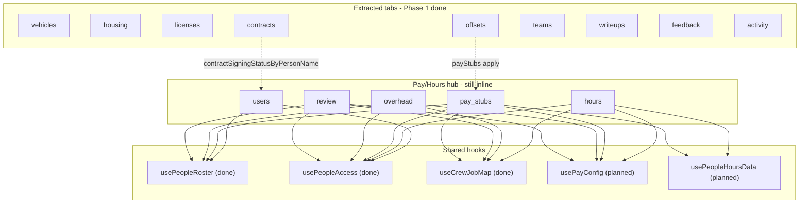

# People Tabs Architecture Map

---
file: docs/PEOPLE_TABS_ARCHITECTURE.md
type: Engineering / Refactor Map
purpose: Inventory what every tab in src/pages/People.tsx touches (state, loaders, handlers, sub-components, supabase tables, cross-tab coupling) to prioritize decomposition of the ~21.4k-line God component.
audience: Developers, AI Agents
last_updated: 2026-05-31
---

## Overview

[`src/pages/People.tsx`](../src/pages/People.tsx) was a ~21,435-line "God component"; decomposition is well underway and it is now **~5,034 lines**. This map is a refactoring aid: for each tab it records what state, derived data, handlers, sub-components, and external systems the tab touches, plus its extraction status and risk. It is **coupling/refactor-oriented**. It mirrors the approach proven on [`BIDS_TABS_ARCHITECTURE.md`](./BIDS_TABS_ARCHITECTURE.md), which took `Bids.tsx` from ~18,800 lines to ~3,650.

### Progress
- **Phase 1 (low/med-coupling tab extractions) — DONE.** `vehicles`, `housing`, `licenses`, `offsets`, `contracts` extracted to `src/components/people/People<Tab>Tab.tsx`; `activity` + `writeups` cleaned up (state/loaders moved into their existing components). With `teams`/`feedback` already thin, the tabs still inline are `users`, `hours` (the remaining pay/hours hub).
- **Phase 2 (shared hooks) — DONE.** Extracted: `usePeopleAccess`, `usePeopleRoster`, `useCrewJobMap`, `usePayConfig`, `usePeopleHoursData` (under `src/hooks/`). `useTeamSummaryData` was folded into the `review` extraction (intricate review-UI orchestration) rather than a standalone hook; its pure kernel lives at `src/lib/people/derivePersonTeamSummary.ts`.
- **Phase 3 (hub tabs) — IN PROGRESS.** ~~`overhead`~~ (`PeopleOverheadTab`), ~~`review`~~ (`PeopleReviewTab`), ~~`pay_stubs`~~ (`PeoplePayStubsTab`, the **Ledger** half only — see the dossier), and ~~`users`~~ (`PeopleUsersTab` + `useUsersTabTags`/`PeopleUserTagsPanel`) are extracted. The only inline tab left is `hours` (the pay/hours hub), which is too large for a single component — it is being decomposed **sub-section by sub-section**, each its own reviewable PR. Shared hours-section primitives (`HOURS_TAB_SECTION_*` styles, `hoursTabSectionHeaderGap`, `textColorForBackground`, `getDaysInRange`) now live in [`peopleHoursTabShared`](../src/components/people/peopleHoursTabShared.ts). Sub-sections extracted so far: **Sharing & tag colors** → [`PeopleHoursSharing`](../src/components/people/PeopleHoursSharing.tsx); **Teams** (incl. its delete-team modal) → [`PeopleHoursTeams`](../src/components/people/PeopleHoursTeams.tsx) (the `PeopleHoursTeam` type now lives there; `getCostForPersonDateTeams`/`addTeam`/`deleteTeam` etc. stay in the parent as props since they mutate shared hours state); **Due by Trade/Team** (incl. its two ledger modals) → [`PeopleHoursDueSummaries`](../src/components/people/PeopleHoursDueSummaries.tsx) (the `tagLedgerModalTag`/`teamLedgerModalTeam` modal state moved into the component since nothing else reads it; `matrixDays`/`getCostForPersonDateMatrix`/`getEffectiveHours` stay in the parent as props, shared with the inline cost-matrix section); **Clock sessions** (active/pending/approved/rejected tables, search, the salaried-workdays button, and the nested rejected sub-section) → [`PeopleHoursSessions`](../src/components/people/PeopleHoursSessions.tsx) (the inline force-clock-out/approve/reject/revoke mutations moved into the component, which imports `supabase`/`approveClockSessions`/`useToastContext` directly; the parent passes the session lists, search state, `reloadSessions`/`reloadHours` callbacks wired to its load refs, and `setEditClockSession`/`setError`/`openHoursMyTimeFromSession`); **Week range** (the prev/next-week nav + custom start/end date inputs, with narrow vs wide layouts) → [`PeopleHoursWeekRange`](../src/components/people/PeopleHoursWeekRange.tsx) (a pure presentational section — props are `narrowViewport`, `hoursDateStart`/`hoursDateEnd` + setters, and `shiftHoursWeek`; it imports `formatDateRangeLabel` directly). Separately, the `WeekdayCostTable` totals math was lifted to the tested kernel [`computeWeekdayCostTotals`](../src/lib/people/computeWeekdayCostTotals.ts). The first vertical carved off the large **Hours grid** section is its **"Highlight by job" search** (the debounced `search_jobs_ledger` lookup + selected-job chip) → [`PeopleHoursGridJobHighlight`](../src/components/people/PeopleHoursGridJobHighlight.tsx) (owns its own search/results/list-open/blur-ref state + the debounce effect; the parent keeps `selectedJobHighlight` state — read by the `jobHighlightPeople`/`jobHighlightCells` memo and the grid render — and passes it down with its setter; the `HoursGridJobHighlightPick` type now lives in that component). Remaining hours sub-sections (rough seam order): the rest of the grid/nav, the trivial clock-strip wrapper, and the cost-matrix grid.

Tabs switch on a single `activeTab` state ([`People.tsx:537`](../src/pages/People.tsx)), type `PeopleTab` at [line 417](../src/pages/People.tsx):

```
'review' | 'users' | 'teams' | 'overhead' | 'pay_stubs' | 'hours' | 'offsets'
| 'vehicles' | 'housing' | 'licenses' | 'contracts' | 'writeups' | 'feedback' | 'activity'
```

### How to maintain this doc
- Update the relevant dossier whenever a tab is extracted or its state/handlers change; flip its Status to `extracted` and point at the new file.
- Treat line numbers as approximate anchors — they drift. Search for the symbol (`activeTab === '...'`, the state name, the modal name) when in doubt.

### Key structural difference from Bids
**There is no single shared "person pointer."** Bids has one `setSharedBid` fanning a click out to 8 `selectedBidFor*` selections. People instead gives **each tab its own independent selection pointer**, and identity is keyed by **person name (string)**, not id. The real shared substrate is the `people`/`users` roster plus the `person_name` columns across `people_hours`/`people_pay_config`/`person_offsets`/`person_licenses`/`person_contract_*`. The name↔id bridge is `cascadePersonNameInPayTables` / `resolvePersonIdFromRosterName` (line 67-68). So there is no cross-tab UI selection to lift — only shared *data*.

---

## Master summary table

| Tab key | Render lines | ~Lines | Status | Owned state | Cross-tab coupling | Coupling / risk | Recommended action |
|---|---|---|---|---|---|---|---|
| `users` | `PeopleUsersTab` | ~3 (`{activeTab === 'users' && <PeopleUsersTab .../>}`) | extracted (`PeopleUsersTab` + `useUsersTabTags`/`PeopleUserTagsPanel`; shared consts/`byKind` in `peopleUsersTabShared`) | — | reads `people`/`users`, `contractSigningStatusByPersonName`, push/location | done | Person-edit form stays in `usePeopleRoster`; the edit-user-note modal stays in the parent |
| `teams` | 12359-12361 | ~3 | extracted (`PeopleTeamsTab`) | 0 in parent | `authUser`/`authRole` | low | Done |
| `overhead` | thin wrapper | ~1,989 | extracted (`PeopleOverheadTab`) | 0 in parent | reads `payConfig` only (NOT `crewJobsByDatePerson`) | low data / dev-master | Done |
| `pay_stubs` | thin wrapper (Ledger) | ~883 | extracted (`PeoplePayStubsTab`, Ledger half) | draft-payroll + mark-paid clusters stay in parent | high | Done — conservative seam (see dossier) |
| `hours` | inline (sub-sections extracting) | ~1,280 | partial | ~39 (`hours*`, `costMatrix*`, clock sessions) | **owns** `payConfig`/`teams`/`crewJobsByDatePerson` | very high | Phase 3 — decomposing sub-section by sub-section; Sharing → `PeopleHoursSharing`, Teams → `PeopleHoursTeams`, Due-Summaries → `PeopleHoursDueSummaries`, Sessions → `PeopleHoursSessions`, Week → `PeopleHoursWeekRange` done |
| `vehicles` | thin wrapper | ~235 | extracted (`PeopleVehiclesTab`) | 0 in parent | `users` prop | low | Done (PR #19) |
| `housing` | thin wrapper | ~200 | extracted (`PeopleHousingTab`) | 0 in parent | `users` prop | low | Done (PR #20) |
| `offsets` | thin wrapper | ~195 | extracted (`PeopleOffsetsTab`) | 0 in parent | `payStubs`/`loadPayStubs` props | low-med | Done (PR #22) |
| `licenses` | thin wrapper | ~320 | extracted (`PeopleLicensesTab`) | 0 in parent | `people`/`users` props | low | Done (PR #21) |
| `contracts` | thin wrapper | ~1,583 | extracted (`PeopleContractsTab`) | `contractSigningStatusByPersonName` stays in parent | `people`/`users`/`canDeletePeopleContracts` props | med-high lines / low data | Done (PR #23) |
| `writeups` | thin wrapper | ~13 | extracted (`WriteupsContractsSubTab`, self-loads) | 0 | props only | low | Done (PR #24) |
| `review` | thin wrapper | ~4,889 | extracted (`PeopleReviewTab` + `lib/people/derivePersonTeamSummary`) | bridge refs (Review↔Hours shared My-Time modal) passed as props | reads `payConfig`, `archivedUserNames`, `people` | med-high | Done |
| `feedback` | 20496-20500 | ~5 | thin (`TeamFeedbackDevSettingsBlock`) | 0 | `isDev` | low | Done |
| `activity` | thin wrapper | ~180 | extracted (`PeopleAppActivityPanel`) | `isActivityViewer`/`activityAccessResolved` stay in parent (feed `canSeeActivityTab`) | props only | low | Done (PR #24) |

> Status legend: `inline` = rendered directly in `People.tsx`; `thin` = a few lines delegating to an imported component; `partial` = panel extracted but the tab still owns inline UI/state; `extracted` = fully moved.

---

## Per-tab dossiers

> For the **extracted** tabs (`vehicles`/`housing`/`licenses`/`offsets`/`contracts`/`activity`/`writeups`/`teams`/`feedback`), the dossier below is the **pre-extraction inventory** — a record of what each tab contained before it moved to its `src/components/people/*` component. Current status/owner is in the master summary table above. The remaining inline tabs (`overhead`/`pay_stubs`/`hours`/`review`) are still accurate as-is. Line numbers are pre-extraction anchors; search by symbol.

### `users` — Roster
> **Fully extracted (Stage 1 + Stage 2).** Stage 1 moved the dev-only tag/label subsystem (~580 lines) into the [`useUsersTabTags`](../src/hooks/useUsersTabTags.ts) hook + presentational [`PeopleUserTagsPanel`](../src/components/people/PeopleUserTagsPanel.tsx). Stage 2 moved the **roster UI** (~890 lines: 7,132 → 6,243) into [`PeopleUsersTab`](../src/components/people/PeopleUsersTab.tsx): the full users render, the per-row `renderUsersTabRosterListItem`, the roster search vars (`usersTabSearch*`), and the tag-anchor builders (`resolvePersonIdForUsersRow`/`resolveUsersTabTagAnchor`). Shared roster constants (`KINDS`/`KIND_LABELS`/`KIND_TO_USER_ROLE`/`USERS_TAB_SECTIONS`), the contact-row style, the search matcher, and the pure `buildUsersTabKindRoster` (was `byKind`) live in [`peopleUsersTabShared`](../src/components/people/peopleUsersTabShared.ts) so the parent's `payConfigRosterSections` still consumes them.
>
> **Deliberately left in the parent:** the person create/edit form already lives in `usePeopleRoster` (the tab calls `openAdd`/`openEdit`); the edit-user-note modal and the invite-confirm modal still render in `People.tsx`; roster CRUD/invite/login-as handlers (`archivePerson`/`restorePerson`/`isAlreadyUser`/`loginAsUser` wiring) stay in the parent and are passed as props. The dossier below is the pre-extraction inventory.

- **Render:** [`11845-12357`](../src/pages/People.tsx) (~513); tab button at 11617; person create/edit form modal at 20986-21025; invite-confirm modal at 21026.
- **Owned state (~30):** person form (`formOpen` 518, `editing` 519, `kind` 520, `name`/`email`/`phone`/`notes`/`saving` 521-525), roster actions (`archivingId` 526, `archivedPeople` 527, `archivedSectionOpen` 528, `restoringId` 529, `invitingId` 530, `inviteConfirm` 531, `loggingInAsId` 532), `personProjects` 533, `creatorNames` 536, `editingUserNote`/`userNoteSaving` 832-833. **Tag subsystem (~17 vars, 552-579):** `showUsersTabTags`, `usersTabLabels*`, `usersTabMasterByUserId`, `usersTabTagSignalsByUserId`, `usersTabTags*`, `usersTabSearch`, etc. Push/location: `canSeePushStatus`/`pushEnabledUserIds`/`locationEnabledUserIds` (588-590).
- **Cross-tab/shared:** owns/reads `people`(506)/`users`(498) (the master rosters used by nearly every tab); reads `contractSigningStatusByPersonName`(591) (written by the contracts loader) for the signing traffic light; reads `payConfig` for duplicate detection.
- **Loaders:** `loadPeople`(1591), `loadPersonProjects`(1639), `loadArchivedPeople`(2263), `handleSave`(2196), `handleMergeDuplicate`(2359), push/location loader (2031).
- **Supabase:** `people`, `users`, `project_workflow*`/`projects`, `push_subscriptions`, `person_contract_documents`, label/tag tables.
- **Coupling/risk:** **high** — owns the shared rosters + the person-edit form other tabs implicitly depend on. The tag subsystem is the cleanest sub-extraction. The `people`/`users` loaders must become `usePeopleRoster` first.

### `teams` — Teams
- **Render:** [`12359-12361`](../src/pages/People.tsx) (~3). Thin wrapper around `PeopleTeamsTab` ([`src/components/people/PeopleTeamsTab.tsx`](../src/components/people/PeopleTeamsTab.tsx)). **Done.** Note: the parent still owns `teams`(719) + `loadTeams`(4428) + team CRUD (7351-7381) for the **Hours** cost-matrix, not for this tab.

### `overhead` — Overhead
> **Extracted** to [`src/components/people/PeopleOverheadTab.tsx`](../src/components/people/PeopleOverheadTab.tsx) (~2,037 lines). The parent renders a thin gate `{activeTab === 'overhead' && canAccessOverheadTab && <PeopleOverheadTab .../>}` and shrank ~1,989 lines (15,970 → 13,981). All ~28 `overhead*` state vars, the `useMercuryLedgerNicknames` call, the 2 daily-labor memos, the 8 load effects (their `activeTab !== 'overhead'` early-returns dropped since the component only mounts when active), and the render + breakdown modal moved into the child. **Props:** `payConfig`, `authUser`, `setError`, `canAccessOverheadTab`, `isDev`, `loadPayConfig`. **Correction:** it reads **`payConfig` only** — the earlier note that it reads `crewJobsByDatePerson` was stale (that symbol is Hours-tab-only). **Stayed in the parent:** the overhead tab-nav button, the `tab=overhead` URL deep-link guard, and the **`review` tab's 90-day overhead-rate calc** (which also imports `buildOverheadDailyLabor`). The dossier below is the pre-extraction inventory.

- **Render:** [`12363-13633`](../src/pages/People.tsx) (~1,271). Dev/master only (`canAccessOverheadTab`).
- **Owned state (~28):** `overheadDateStart`/`End`, `overheadOfficeJob*`, `overheadSessions`, `overheadTableSimpleView`, `overheadOfficeParts*`, `overheadAvgDailyCost`, `overheadOtherJobs*`, `overheadBreakdownModal`.
- **Cross-tab/shared:** reads `payConfig` (for the office/other-jobs daily-labor memos). Load effects gated on `activeTab === 'overhead'`.
- **Supabase:** `clock_sessions`, `jobs_ledger*`, `people_pay_config`, `mercury_*`, `app_settings`, `people_crew_jobs`/`people_crew_bids`.
- **Coupling/risk:** **med.** Self-contained data; shares only `payConfig`. Dev/master gate → low blast radius.

### `pay_stubs` — Pay Stubs
> **Extracted (conservative seam)** to [`src/components/people/PeoplePayStubsTab.tsx`](../src/components/people/PeoplePayStubsTab.tsx) (~883 lines). The parent renders a thin gate `{activeTab === 'pay_stubs' && canAccessPay && <PeoplePayStubsTab .../>}` and shrank ~886 lines (8,598 → 7,712). **Only the self-contained Ledger half moved** — the table, the **Less/Additional/Note/Calendar** modals + their tab-local state, the `ledgerFilteredPayStubs`/`ledgerOpenBalanceSummary` memos, the `ledgerPersonSearch`, the mount load effect (calls the injected `loadPayConfig`/`loadPayStubs`), and the calendar load effect. Stage A lifted the pure print-HTML builder to [`src/lib/peopleDocuments/buildPayStubHtml.ts`](../src/lib/peopleDocuments/buildPayStubHtml.ts) (+`openPayStubWindow`, with tests); the three callers (`printPayStub`/`viewPayStub`/`generatePayStub`) now call it.
>
> **Props:** `payStubs` + the 3 `*ByStubId` maps + `loadPayStubs` (the shared data layer, parent-owned because `offsets` + draft-payroll also read it), `payConfig`, `users`, `authUser`, `isDev`, `error`/`onError`, `loadPayConfig`, `markingPayStubId`, `deletingPayStubId`, and callbacks `onPrintStub`, `onRecordPayment`, `onRequestDeleteStub`, `onOpenMyTimeForDay`, `onOpenForecast`/`forecastDisabled`, `onOpenDraftPayroll`/`draftPayrollDisabled`. It also **re-exports `type PayStubRow`** (the parent now imports it).
>
> **Stayed in the parent — two deliberate bridges (no tests cover these flows):** (1) the **Draft Payroll / Forecast** cluster — `DraftPayrollModal`/`PayrollForecastModal`/`DraftPayrollPersonHoursBreakdownModal` + their state + `generatePayStub`/`viewPayStub`/`bulkGenerateMissingPayStubsInModal`/`shiftPayStubWeek`/`getPriorWeekPayStubRangeEnCa` + the realtime `draftPayrollRealtimeSnapRef`/`loadDraftPayrollPendingApprovals` — because it consumes Hours-owned compute (`showPeopleForHours`/`getCostForPersonDate`/`getEffectiveHours`/`getRunPayrollReviewDayItems`) that moves to **Hours (last)**; the child opens it via `onOpenForecast`/`onOpenDraftPayroll` callbacks. (2) the **Record-payment / mark-paid** cluster — `payStubMarkPaid*` state + modal + `confirmPayStubMarkPaid` + `openEmployeeCreditFromRecordPayment` + `recordPaymentRefreshAfterEmployeeCreditRef` — because the "Record employee credit…" path is wired to the **parent-owned `PersonOffsetFormModal`** (shared with `offsets`), whose `onSaved` reaches back into the mark-paid target/amount; the child opens it via `onRecordPayment`. The **delete-confirm** modal also stays (its `deletePayStub` does an optimistic `setPayStubs` on parent state); the child requests deletes via `onRequestDeleteStub`. The dossier below is the pre-extraction inventory.

- **Render:** [`13634-14388`](../src/pages/People.tsx) + modal cluster (PayStubLess/Additional/Delete/Note/MarkPaid 14030-14318, Forecast 14321, DraftPayroll 14330, breakdown 14374) + **calendar modal 21314-21431** (~870 total). `canAccessPay` only.
- **Owned state (~35):** `payStubs`(752), `payStub*ByStubId` (753-755), modal stubs (756-757), `payStubsLoading`(768), period (769/776), calendar (783-786), action flags (787-796), confirm/mark-paid (807-814), `ledgerPersonSearch`(816).
- **Cross-tab/shared:** reads `payConfig`(594), `peopleHours`(643) + `loadPeopleHours`, `hoursDaysCorrect`(717), rosters. `payStubCalendarPerson`(783) is a pay_stubs-local pointer.
- **Loaders:** `loadPayStubs`(3487), `loadPayStubCalendarData`(3578), `generatePayStub`(~3897), print builders (4065-4287), `loadDraftPayrollPendingApprovals`(3385).
- **Sub-components (extracted):** `PayStubLessModal`, `PayStubAdditionalModal`, `DraftPayrollModal`, `PayrollForecastModal`, `DraftPayrollPersonHoursBreakdownModal`. Inline: stub table + mark-paid/note/delete + calendar modals.
- **Supabase:** `pay_stubs`, `pay_stub_payments`/`_deductions`/`_additional_lines`/`_days`, `people_hours`, `people_crew_*`, `people_pay_config`.
- **Coupling/risk:** **high.** Hard-depends on pay-config + people-hours layers. Extract after `usePayConfig` + `usePeopleHoursData`.

### `hours` — Hours / Pay grid (the hub)
- **Render:** [`14391-16725`](../src/pages/People.tsx) (~2,335 — **largest tab**). `canOpenHoursTab` = `canAccessPay || canAccessHours || canViewCostMatrixShared` (550).
- **Owned state (~45):** `peopleHours`(643), clock-session queues (`pendingClockSessions` 644, approved/rejected 653-654, search 655), grid highlight/edit state (695-825), cost-matrix (628-640, 731-734), date range (737/817), various modals (634-635, 941-942), and **shared-owner** state: `payConfig`(594)/`payConfigDraft`(596)/`payConfigSaving`(595), `teams`(719), `crewJobsByDatePerson`(940), `salaryTemplateByPersonName`(608).
- **Cross-tab/shared (OWNS, others read):** `payConfig` (pay_stubs/overhead/review read), `teams` (teams tab + cost-matrix), `crewJobsByDatePerson` (overhead/pay_stubs read).
- **Loaders:** `loadPeopleHours`(3349), clock-session loaders (3363-3454), `loadHoursReviewed`(3339), `loadPayConfig`(3306), cost-matrix loaders (4444-4480), `savePayConfig`(7181/7255), `saveHours`(7279). Big load effect ~1584-4618. **Realtime-subscribed** (484-487, 7083).
- **Sub-components (extracted):** `PersonTimeDetailModal`, `ReviewHoursModal`, `TeamSummaryInline`, `PeoplePayConfigModal`, `SalariedWorkdaysBulkModal`, `PeopleHoursPendingCellPopover`, `PeopleHoursBulkApprovePendingModal`, `ClockSessionEditSplitModal`, `HoursUnassignedModal`, `PeopleHoursDayAuditModal`. Inline: the grid + cost-matrix + approval queues.
- **Supabase:** `clock_sessions`, `people_hours`, `people_pay_config`, `hours_reviewed`, `hours_days_correct`, `people_hours_display_order`, `people_cost_matrix_*`, `people_teams`/`_team_members`, `people_crew_*`, `salary_work_schedule_templates`.
- **Coupling/risk:** **very high.** The central hub. Extract **last**, after the shared hooks exist.

### `vehicles` — Vehicles
- **Render:** table [`16726-16855`](../src/pages/People.tsx) (~130) + form modals 20814-20918 (~105). Total ~235.
- **Owned state (~23):** `vehicles`(945)/Loading/Error, `vehicleFormOpen`(948)/`editingVehicle`(949)/`selectedVehicleId`(950), `odometerEntries`(951)/`replacementValueEntries`(952)/`possessions`(953)/`vehicleAssignees`(954), form fields (955-981).
- **Cross-tab/shared:** reads `users` only (assignee names). `selectedVehicleId`(950) local pointer.
- **Loaders:** `loadVehicles`(4682), `loadOdometerEntries`(4724)/`loadReplacementValueEntries`(4734)/`loadPossessions`(4744); effect 6296.
- **Supabase:** `vehicles`, `vehicle_odometer_entries`, `vehicle_replacement_value_entries`, `vehicle_possessions`, `users`.
- **Coupling/risk:** **low — best first target.** Fully domain-isolated. Establishes the `People<Domain>Tab` prop pattern.

### `housing` — Housing
- **Render:** table [`16856-16989`](../src/pages/People.tsx) (~134) + form modals 20919-20985. Mirror of vehicles.
- **Owned state (~16):** `housingUnits`(984)/Loading/Error, `housingFormOpen`(987)/`editingHousingUnit`(988)/`selectedHousingId`(989), `housingPossessions`(990)/`housingAssignees`(991), form fields (992-998).
- **Loaders:** `loadHousingUnits`(4883)/`loadHousingPossessions`(4926); effect 6302.
- **Supabase:** `housing_units`, `housing_possessions`, `users`.
- **Coupling/risk:** **low — second target** (copy of the vehicles extraction).

### `offsets` — Offsets
- **Render:** [`16990-17163`](../src/pages/People.tsx) (~174) + apply modal 20792; `PersonOffsetFormModal` (imported) opened via `offsetFormOpen`.
- **Owned state (~10):** `offsets`(969)/Loading/Error, `offsetFormOpen`(972)/`offsetFormInitialCreateDraft`(973)/`editingOffset`(974), `offsetApplyModalOpen`(975)/`offsetToApply`(976)/`offsetApplyPayStubId`(977), `offsetsTabSearch`(978).
- **Cross-tab/shared:** reads `payStubs` (apply-offset-to-stub; its effect 6309 also calls `loadPayStubs`), `offsetPersonNameOptions`(509).
- **Loaders:** `loadOffsets`(5039).
- **Supabase:** `person_offsets`.
- **Coupling/risk:** **low-med.** Self-contained except the pay-stub apply linkage — pass `payStubs` (or its loader) as a prop.

### `licenses` — Licenses
- **Render:** [`17164-17376`](../src/pages/People.tsx) (~213) + form modals 20682-20791 (license + cost-line).
- **Owned state (~18):** `licenses`(1002)/Loading/Error/`licensesExpiringSoon`(1005), `selectedLicensePersonName`(1006), `licenseFormOpen`(1007)/`editingLicense`(1008) + fields, `costLineFormOpen`(1013)/`editingCostLine`(1014) + fields, `expandedCostLinesLicenseId`(1019).
- **Loaders:** `loadLicenses`(5099), cost-line CRUD (6192-6287); effect 6319.
- **Supabase:** `person_licenses`, `person_license_cost_lines`.
- **Coupling/risk:** **low — third target.** `canAccessLicenses`-gated.

### `contracts` — Contracts
- **Render:** main table [`17377-17891`](../src/pages/People.tsx) (~515) + **big inline modal cluster 17906-18974** (template 17906, assign 18098, document editor 18314, delete-confirm 18740, signed-record 18828, book 18836, send 18848) (~1,068). Total ~1,583.
- **Owned state (~50):** `contractTemplates`(1062)/`contractTemplateDocuments`(1063)/`personContractAssignments`(1064)/`personContractDocuments`(1065), modal flags (1070-1097), `contractDocumentForm*` (1073-1112), `contractSend*` (1098-1102), `templateForm*` (1118-1125).
- **Cross-tab/shared:** **writes `contractSigningStatusByPersonName`(591)** which the **users** tab reads (the only real cross-tab write). Reads `people` names.
- **Loaders:** `loadContracts`(5116), template/assignment/document CRUD (5542-6140); effects 6328-6341.
- **Sub-components (extracted):** `ContractBookModal`, `PersonContractSignedRecordModal`. Inline: template/assign/document/send modals.
- **External coupling:** `checkGoogleDriveAttachmentUrl`, `hasContractSigningContent`, `buildContractSendEmailPreview`. `canAccessContracts` + `canDeletePeopleContracts`(839).
- **Coupling/risk:** **med-high by line count, low by data-coupling** — only the signing-status write escapes. Biggest cheap win; move the modal cluster into `PeopleContractsTab` and surface `contractSigningStatusByPersonName` as a callback.

### `writeups` — Writeups
- **Render:** [`17892-17904`](../src/pages/People.tsx) (~13). Thin wrapper `WriteupsContractsSubTab`. **Mostly done** — remaining seam: move `loadWriteupsData`(5148) + its 5 rows (`writeupTemplatesRows`/`writeupsRows`/`ncnsRows`/`writeupsLoading`/`writeupsError`, 1126-1130) into the child.

### `review` — Review (dev-only)
> **Extracted** to [`src/components/people/PeopleReviewTab.tsx`](../src/components/people/PeopleReviewTab.tsx) (~4,980 lines) + the pure kernel [`src/lib/people/derivePersonTeamSummary.ts`](../src/lib/people/derivePersonTeamSummary.ts) (Stage A, with tests; shared types in [`src/lib/people/teamReviewTypes.ts`](../src/lib/people/teamReviewTypes.ts)). The parent shrank ~4,889 lines (13,487 → 8,598). **`useTeamSummaryData` folded in** (per the deferral note) — the team-summary load/derive lives in the component, not a standalone hook. **Props:** `payConfig`, `archivedUserNames`, `authUser`, `isDev`, `users`, `people`, plus the **Review↔Hours bridge** kept in the parent and passed down (Option 1): `onOpenDayEditor`/`onDrilldownOpenChange`, `teamSummaryInlineRef`, `teamSummaryDataCacheRef`/`teamSummaryModalOpenRef`/`teamSummaryRefreshPendingRef`/`reviewHoursReopenAfterLoadRef`, `teamSummaryDrainTick`, and the shared `getDaysInRange`. **Stayed in the parent:** the shared `DashboardMyTimeDayEditorModal` (also used by Hours) + its `onSaved`, `handleInlineOpenDayEditor`, the bridge refs/tick, `archivedUserNames` + `loadArchivedUserNames` (shared), `reviewHoursModalOpen` + `ReviewHoursModal` (a Hours feature despite the name), the draft-payroll `*Review*` helpers, the review tab-nav button, and the `tab=review` URL guard. `reviewOverheadRates` (left in the parent during the overhead extraction) moved out with this tab. The dossier below is the pre-extraction inventory.

- **Render:** [`18975-20494`](../src/pages/People.tsx) (~1,520). Gate `activeTab === 'review' && isDev`.
- **Owned state (~35):** `selectedReviewPersonIndex`(1411), `reviewPeriod`(1412)/range (1415-1416), `reviewLoading`(1417), `reviewLaborJobs`/`reviewCrewJobs`/`reviewAllocated*`/`reviewHours`/`reviewReports`/`reviewTasks*` (1478-1497), `teamSummaryRows`(1530)/Loading/Error + refs (1531-1563), `reviewLaborBreakdownContext`(1577)/`reviewOnlyPaidInFull`(1579).
- **Cross-tab/shared:** reads `payConfig`, `archivedUserNames`; shares `TeamSummaryInline` + `loadTeamSummaryData`(9377) machinery with **hours**. `selectedReviewPersonIndex`(1411) local pointer.
- **Loaders:** `loadReviewData`(7895), `loadTeamReviewUnion`(8721), `loadTeamSummaryData`(9377); effect 6351.
- **Supabase:** `people_labor_job*`, `people_crew_*`, `people_hours`, `checklist_instances`, `app_settings`, `jobs_ledger_materials`, `clock_sessions`.
- **Coupling/risk:** **med-high.** Big analytics block, dev-only (low blast radius) but tangled with the Team-Summary machinery shared with hours. Extract `useTeamSummaryData` first.

### `feedback` — Feedback (dev-only)
- **Render:** [`20496-20500`](../src/pages/People.tsx) (~5). Thin wrapper `TeamFeedbackDevSettingsBlock`. **Done.**

### `activity` — App Activity
- **Render:** [`20502-20681`](../src/pages/People.tsx) (~180). Renders `PeopleAppActivityPanel` at 20676 but keeps inline **grant-management UI** above it.
- **Owned state (6):** `activityAccessResolved`(581)/`isActivityViewer`(582)/`activityViewerGrantSet`(583)/`activityGrantListLoading`(584)/`activityGrantBusyId`(585)/`activityGrantsSectionOpen`(586).
- **Loaders:** access-resolution 1953-1990; grant toggle 20602/20637.
- **Supabase:** `user_app_activity_viewers`, `users`.
- **Coupling/risk:** **low.** Move the inline grant UI + 6 vars into `PeopleAppActivityPanel` (or a `PeopleActivityGrantsSection`).

---

## Shared infrastructure

### Per-tab selection pointers (no shared pointer)
| Pointer | Line | Tab |
|---|---|---|
| `selectedVehicleId` | 950 | vehicles |
| `selectedHousingId` | 989 | housing |
| `selectedLicensePersonName` | 1006 | licenses |
| `selectedContractsPersonName` | 1069 | contracts |
| `payStubCalendarPerson` | 783 | pay_stubs |
| `personTimeDetailModalPerson` | 634 | hours |
| `selectedReviewPersonIndex` | 1411 | review |
| `offsetToApply` | 976 | offsets |

Each is tab-local; keep it that way during extraction.

### Top-level shared state
| Variable | Line | Used by |
|---|---|---|
| `activeTab` | 537 | all tabs (render gate + ~40 effect gates) |
| `users` / `people` (+ refs) | 498/506 | users, hours, pay_stubs, offsets, licenses, contracts, review, vehicles/housing (assignees) |
| `payConfig` / `Draft` | 594/596 | hours (owner); pay_stubs/overhead/review (readers) |
| `peopleHours` | 643 | hours (owner); pay_stubs |
| `crewJobsByDatePerson` | 940 | hours, overhead, review, pay_stubs |
| `teams` | 719 | teams tab + hours cost-matrix |
| Permission flags | 545-551, 835-840, 11372 | every tab (gates) |

### Permission / role flags (loaded once by `loadPayAccess` @1903)
`canAccessPay`(545), `canAccessHours`(546), `canAccessLicenses`(547), `canAccessContracts`(548), `canViewCostMatrixShared`(549), `isDev`(551), `canOpenHoursTab`(550), `canSeeActivityTab`(587), `canAccessTeamsTab`(835), `canAccessOverheadTab`(837), `canDeletePeopleContracts`(839), `canEditUserNotes`(11372). The URL deep-link router (1730-1791) redirects unauthorized `tab=` values back to `users`.

### Shared layers lifted into hooks (the `useBidPricingEngine` analog)
| Hook | Status | Owns | Consumed by |
|---|---|---|---|
| [`usePeopleAccess`](../src/hooks/usePeopleAccess.ts) | **extracted (PR #25)** | `loadPayAccess` + the 7 raw flags (`canAccessPay`/`Hours`/`Licenses`/`Contracts`, `canViewCostMatrixShared`, `isDev`, `canSeePushStatus`). Derived flags (`canOpenHoursTab`, `canSeeActivityTab`, `canAccessTeamsTab`/`Overhead`/`canDeletePeopleContracts`) stay in the parent. | every tab (gates) |
| [`usePeopleRoster`](../src/hooks/usePeopleRoster.ts) | **extracted (PR #26)** | `people`/`users` + refs, `loadPeople`, `loadArchivedPeople`, person create/edit form + `handleSave` (via a 6-field deps ref). `handleMergeDuplicate` stays in the parent (pay/hours-entangled). | nearly all tabs |
| [`useCrewJobMap`](../src/hooks/useCrewJobMap.ts) | **extracted (PR #27)** | `crewJobsByDatePerson` + `loadCrewJobsForHoursRange` + `mergeCrewJobsForDateRange` + refs (input: `hoursDateStart`/`End`). The two orchestration effects stay in the parent. | hours, overhead, review, pay_stubs |
| [`usePayConfig`](../src/hooks/usePayConfig.ts) | **extracted** | `payConfig`/`Draft`/`Saving` (+ internal `payConfigRef`/`payConfigDraftRef`/`payConfigDebounceRef`/`lastPersistedPayConfigRef`), `salaryTemplateByPersonName`, `loadPayConfig`, `loadPayConfigSalaryTemplateIndicators`, `upsertPayConfig` (debounced, incl. salaried-schedule sync side effects), `updatePayConfigHourlyWage` (debounced), and the debounce-timeout unmount cleanup. **Stays in the parent:** `payConfigModalOpen`, the `payConfigRosterSections` memo (passed in via a ref), and the salary-template trigger effect (kept its `payConfigRosterSections`/`users` deps so indicators still refresh while the modal is open). Inputs: access flags, `setError`, `showToast`, `peopleRosterRef`, `usersRef`, `payConfigRosterSectionsRef`. | hours (editor), pay_stubs, overhead, review |
| [`usePeopleHoursData`](../src/hooks/usePeopleHoursData.ts) | **extracted (2 PRs)** | `peopleHours` + the pending/approved/rejected `clock_sessions` queues, their search + 6 filtered selectors, the 4 range loaders + `loadAllClockSessions`, the optimistic `saveHours` (PR1), and the live Realtime channel + debounce/visibility/filter (PR2). **Stays in the parent:** `hoursReviewed`/`loadHoursReviewed` (different table), `hoursDaysCorrect` (passed in via `hoursDaysCorrectRef`), draft-payroll (`draftPayrollRealtimeSnapRef` + `loadDraftPayrollPendingApprovals`), and the `loadPeopleHoursRef`/`loadAllClockSessionsRef` refresh refs (shared by ~20 clock-session mutator callbacks). The Realtime fan-out is decoupled via a stable `realtimeCallbacksRef` (`onPeopleHoursChange`/`onClockSessionsChange`) the parent assigns each render. Inputs: access flags, `prefixMap`, `peopleRosterRef`, `authUser`, `hoursDaysCorrectRef`, `setError`, `activeTab`, `hoursDateStart`/`End`, `isDocVisible`, `peopleHoursClockRealtimeInFilter`, `realtimeCallbacksRef`. | hours (owner), pay_stubs, review |
| `useTeamSummaryData` | **folded into `PeopleReviewTab`** | `teamSummary*` + `loadTeamSummaryData` + the pure `derivePersonTeamSummary` kernel (now in `lib/people/`) | review (extracted as a component, not a standalone hook, as predicted). The Review↔Hours shared-modal bridge refs/tick stayed parent-owned and are passed in as props. |

`payConfig`, `peopleHours`/`clock_sessions`, and `crewJobsByDatePerson` are the People analogs of `bids_count_rows` — the shared sources of truth that resist extraction. Lift the remaining ones into hooks **before** touching hours/pay_stubs/overhead/review.

---

## Cross-tab coupling diagram



---

## Recommended extraction order (value ÷ risk)

Lowest-coupling, domain-isolated, permission-gated tabs first; the pay/hours hub last.

1. ~~`vehicles`~~ — **DONE (PR #19)**. Established the `People<Domain>Tab` prop pattern (`users` prop).
2. ~~`housing`~~ — **DONE (PR #20)** (twin of vehicles).
3. ~~`licenses`~~ — **DONE (PR #21)**.
4. ~~`offsets`~~ — **DONE (PR #22)** (`payStubs`/`loadPayStubs` passed as props; the record-payment `PersonOffsetFormModal` instance stayed in the parent).
5. ~~`contracts`~~ — **DONE (PR #23)** (`contractSigningStatusByPersonName` + its populate effect kept in the parent for the users-tab traffic light).
6. ~~`activity` + `writeups` cleanup~~ — **DONE (PR #24)**.
7. **Shared-hook prep (refactor, not a move):** `usePeopleAccess` ~~DONE (PR #25)~~, `usePeopleRoster` ~~DONE (PR #26)~~, `useCrewJobMap` ~~DONE (PR #27)~~, `usePayConfig` ~~DONE~~, `usePeopleHoursData` ~~DONE (2 PRs)~~. `useTeamSummaryData` ~~folded into the `review` extraction~~ (review-UI-centric; its pure kernel is `lib/people/derivePersonTeamSummary`). **Phase 2 complete.**
8. ~~**`overhead`**~~ — **DONE** (`PeopleOverheadTab`; `payConfig`-only prop). First Phase-3 hub-tab move; `People.tsx` 15,970 → 13,981.
9. ~~**`review`**~~ — **DONE** (`PeopleReviewTab` + `lib/people/derivePersonTeamSummary` kernel/tests; Review↔Hours bridge kept in the parent). `People.tsx` 13,487 → 8,598.
10. ~~**`pay_stubs`**~~ — **DONE** (`PeoplePayStubsTab` + `lib/peopleDocuments/buildPayStubHtml` Stage-A builder/tests). Conservative seam: only the Ledger half moved; the draft-payroll/forecast cluster (Hours-coupled) and the mark-paid/employee-credit cluster (offset-modal-coupled) stayed in the parent. `People.tsx` 8,598 → 7,712.
11. ~~**`users`**~~ — **DONE** (two-stage). **Stage 1: tag subsystem** — `useUsersTabTags` hook + `PeopleUserTagsPanel` component (hook-first to avoid prop-drilling the per-row panel); `People.tsx` 7,712 → 7,132. **Stage 2: roster UI** — `PeopleUsersTab` (full roster render + `renderUsersTabRosterListItem` + roster search vars + tag-anchor builders) with shared consts/`buildUsersTabKindRoster` in `peopleUsersTabShared`; the person-edit form already lives in `usePeopleRoster`, the edit-note/invite-confirm modals stay in the parent. `People.tsx` 7,132 → 6,243.
12. **`hours`** — **last.** The hub; extract once everything it feeds is on the shared hooks.

> Already thin/extracted: `teams` (`PeopleTeamsTab`), `writeups` (`WriteupsContractsSubTab`), `feedback` (`TeamFeedbackDevSettingsBlock`), `activity` panel (`PeopleAppActivityPanel`). Many domain modals are already components (`PayStubLessModal`, `DraftPayrollModal`, `PersonOffsetFormModal`, `ContractBookModal`, `PersonTimeDetailModal`, `ReviewHoursModal`, `TeamSummaryInline`); the parent mostly orchestrates state around them.
