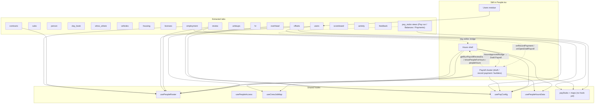

# People Tabs Architecture Map

---
file: docs/PEOPLE_TABS_ARCHITECTURE.md
type: Engineering / Refactor Map
purpose: Step-0 map of src/pages/People.tsx (4,700 lines at a05cef4c4). Covers what every tab and every parent-owned region touches (state, loaders, handlers, sub-components, supabase tables/RPCs, cross-tab coupling, tests), which tabs are extracted, and the value ÷ risk order for the Payroll, Hours and Users code still in the parent.
covers:
  - src/pages/People.tsx
mapped_at: a05cef4c4
audience: Developers, AI Agents
last_updated: 2026-09-25
---

## Overview

[`src/pages/People.tsx`](../src/pages/People.tsx) was a ~21,435-line "God component". Every tab now renders an extracted component, and the file is **4,700 lines** at a05cef4c4. That is one component, `People` (246–4700), with **99 `useState`**, **36 effects**, 16 `useMemo`, 12 `useCallback`, 21 `useRef` and 17 custom-hook calls. It has 105 local imports and **72 commits in 90 days**, 20 of them since 2026-09-05. The file grew ~320 lines after the previous refresh (~4,378). The growth came from People spine PRs 1–6 (v2.3698–v2.3705: roster view, Leave, Hire, Users lenses), Balances and Payments on Payroll (v2.3577, v2.3689, v2.3691), pay-source methods (v2.3717) and Day book / Who's where (v2.3542, v2.3607, v2.3732). This map is coupling- and refactor-oriented. It mirrors [`BIDS_TABS_ARCHITECTURE.md`](./BIDS_TABS_ARCHITECTURE.md).

**Line numbers are exact as of a05cef4c4.** They come from the `npm run map -- src/pages/People.tsx` fact sheet and go stale with every edit. Search for the symbol name and treat the range as a hint.

**The code still inline is no longer tab code. It is four parent-held clusters.** The `useState` and effect counts partition the fact sheet's 99 and 36 exactly. Line counts are approximate, summed from the ranges anchored in [Parent-owned regions](#parent-owned-regions-a05cef4c4):

| Cluster | `useState` | Effects | Refs | ~Lines | Why it is still here |
|---|---|---|---|---|---|
| **Payroll**: pay-report builders, record payment, draft payroll / forecast / catch-up, delete / bulk, the Pay run · Balances · Payments switch | 38 | 9 | 5 | ~1,700 | Consumes Hours compute (`getHoursForPersonDate`, `getRunPayrollReviewDayItems`, `showPeopleForHours`) and the shared `payStubs` data layer. Opened from 5 doors. |
| **Hours shell**: orchestration, 10 page-level Hours modals, teams, merge-duplicates | 37 | 15 | 7 | ~1,500 | Owns the hours range, `hoursDaysCorrect`, teams, and the refresh refs that every clock-session mutator calls. |
| **Users residue**: roster actions, signals, 3 modals, the Hire mount | 16 | 5 | 3 | ~550 | Handlers that predate `PeopleUsersTab`. The signals load page-wide. |
| **Shell / router**, Activity access, Review bridge, employment + contracts/offsets load effects | 8 | 7 | 6 | ~300 | The router, the shared day editor and the Review↔Hours bridge. |

### Progress
- **Phase 1 (low/med-coupling tab extractions): DONE.** `vehicles`, `housing`, `licenses`, `offsets` and `contracts` → `src/components/people/People<Tab>Tab.tsx`. `activity` and `writeups` were cleaned up: the grant UI (4 state) now lives in `PeopleAppActivityPanel`, and `loadWriteupsData` in `WriteupsContractsSubTab`.
- **Phase 2 (shared hooks): DONE.** `usePeopleAccess`, `usePeopleRoster`, `useCrewJobMap`, `usePayConfig` and `usePeopleHoursData` (under `src/hooks/`). `useTeamSummaryData` was folded into `PeopleReviewTab`; its kernel is `lib/people/derivePersonTeamSummary.ts`.
- **Phase 3 (hub tabs): tabs DONE, residue open.** `overhead`, `review`, `pay_stubs` (the Pay run table only), `users`, and every Hours sub-section are components (see the [Hours sub-sections table](#hours--hours--pay-grid-the-hub)). The Cost matrix, trade tags and view sharing were retired on 2026-07-15 (PRs #322/#324/#326, v2.671–v2.677; `PeopleCostMatrix.tsx` and `PeopleHoursSharing.tsx` deleted). What remains is the four clusters above. The [Recommended extraction order](#recommended-extraction-order-value--risk) ranks them.

Tabs switch on a single `activeTab` state (330, `useState<PeopleTab>`). The `PeopleTab` type has **20 keys** and lives in [`src/lib/people/peopleTabGroups.ts`](../src/lib/people/peopleTabGroups.ts) (v2.2811). Subs landed in v2.1214, Teams was removed in v2.1292 (`?tab=teams` redirects to Users), HR in v2.2221 and Person in v2.2710:

```
'scoreboard' | 'review' | 'hr' | 'person' | 'users' | 'subs' | 'overhead' | 'employment'
| 'pay_stubs' | 'hours' | 'offsets' | 'vehicles' | 'housing' | 'licenses'
| 'contracts' | 'writeups' | 'feedback' | 'activity' | 'day_book' (v2.3542) | 'whos_where' (v2.3607)
```

### Six top-level groups (v2.2811)
The strip shows **six group tabs** and a **second row** listing the active group's views. Every view keeps its own render gate and its own `?tab=<view key>` URL. The map is `PEOPLE_TAB_GROUPS` in the kernel above, which is pure and tested in `peopleTabGroups.test.ts`. The gates come from `visiblePeopleTabs` (3138–3159):

| Group | Views (row order) | Shows when |
|---|---|---|
| People | `users` · `subs` · `person` · `day_book` · `whos_where` | Always. `person` needs `canOpenPersonDesk(authRole)`. `day_book` needs `canSeeDayBook` (devs and controllers since v2.3732). `whos_where` needs `canSeeWhosWhere`. |
| Pay | `hours` · `pay_stubs` · `offsets` · `employment` · `overhead` | `canOpenHoursTab` / `canAccessPay` / `canAccessOverheadTab` |
| Paperwork | `contracts` · `licenses` · `writeups` · `hr` | `canAccessContracts` / `canAccessLicenses` / `isDev` (HR) |
| Fleet & Housing | `vehicles` · `housing` | `canAccessVehicles` / `canAccessPay` |
| Review | `review` · `scoreboard` · `activity` | `isDev` / `canSeeActivityTab` |
| Feedback | `feedback` (no row) | `isDev` |

`visibleTabGroups()` drops any group with no visible view (3160). `groupOfTab(activeTab)` picks the active group (3161–3162). The second row (3202–3222) renders only when the group offers more than one view. A group click (3182–3197) lands on `landingViewForGroup(group, tabGroupMemory)`: the device-local per-group memory `people.tabGroupMemory.v1` (state 332, effect 339–351), or else the first visible view. `goToPeopleTab` (3165–3172) sets `activeTab` and `?tab=`. Sub-tab pills use `pageSubTabStyle` ([`pageTabStyle.ts`](../src/lib/pageTabStyle.ts)).

### How to maintain this doc
- On a refresh, regenerate the fact sheet (`npm run map -- src/pages/People.tsx`), re-anchor every range, re-count the cluster table, and bump `mapped_at`.
- When a region is extracted, flip its Status in the master table, point at the new file, and move it out of [Parent-owned regions](#parent-owned-regions-a05cef4c4).

### Key structural difference from Bids
**There is no single shared "person pointer."** Bids has one `setSharedBid` that fans a click out to 8 `selectedBidFor*` selections. People gives **each tab its own independent selection pointer**, and every one of them now lives in its tab component (see [Per-tab selection pointers](#per-tab-selection-pointers-no-shared-pointer)). Identity is keyed by **person name (string)**, not id. The real shared substrate is the `people`/`users` roster plus the `person_name` columns across `people_hours`/`people_pay_config`/`person_offsets`/`person_licenses`/`person_contract_*`. The name↔id bridge is `cascadePersonNameInPayTables` / `resolvePersonIdFromRosterName`. So there is no cross-tab UI selection to lift, only shared *data*.

---

## Person Desk (v2.2701): the per-person drawer

> Not a tab. It is a global drawer opened from a person's **name** (People → Users rows, People → Subs rows; more doors in later PRs) or from `?person=u:<users.id>` / `?person=p:<people.id>` on any route. Owner-approved proposal: artifact 321baa3e. In `People.tsx` the Desk appears only as `useOptionalPersonDesk()` (317; used by `handleRosterFormSubmit` 318–325 to open the new person's desk) and the `person` tab mount `<PersonDeskPage />` (4152).

- **Identity spine**: [`lib/people/personKey.ts`](../src/lib/people/personKey.ts) resolves `{ userId, personId, payName, gaps }` from either id. The pay name is the trimmed account name when an account exists, else the roster name (the Phase A finding). Each gap (`no_roster_row`, `no_login`, `unlinked_email_match`, `pay_name_mismatch`, `no_pay_config`) renders in the header as one amber line with the one existing fix: Link account → `people.account_user_id`; Reconcile → `people.name` + `cascadePersonNameInPayTables`; Create roster row → the Employment-tab insert. **Nothing is created or linked silently.**
- **Gates**: [`lib/people/personDeskGates.ts`](../src/lib/people/personDeskGates.ts) restates each surface's existing gate, one function per control. Widening a gate is a one-line change here plus the enforcing edge function / policy. The Desk adds no permissions; locked rows stay visible with a `dev only` tag.
- **Pieces**: [`contexts/PersonDeskContext.tsx`](../src/contexts/PersonDeskContext.tsx) (opener + `changeKey`), [`hooks/usePersonDesk.ts`](../src/hooks/usePersonDesk.ts) (loader), and [`components/personDesk/`](../src/components/personDesk/):
  - `PersonDeskDrawer` (z 60; full-screen ≤ 640px), `PersonDeskHeader`, `PersonDeskDeepLinkHandler`, and `personDeskShared` (`DeskSection` / `DeskRow` / `Chip` / `LockTag`).
  - `sections/` Hours & approvals: the v2.2694 queue modal with `pinUserId`.
  - `sections/` Portal & paperwork (subs): `SubPortalGlobeButton` inline plus compliance chips. Since v2.2907 the globe is tinted by state via the shared `portalGlobeTint.ts` kernel: faint = never minted, blue = live, red = off.
  - `sections/` Team & alerts: deleted in v2.3616 with the team-leads list. Later PRs added `sections/` Work orders (v2.2790) and Push notifications (v2.2810).
  - `sections/` Access & account: mirrors the Active Accounts row. Since v2.3700, Archive… opens the End employment flow, which finishes the final pay report, the salary clear, customer reassignment and both archives on the desk. The headless writes live in [`lib/people/leaveWrites.ts`](../src/lib/people/leaveWrites.ts) and the pay-report kernel in [`lib/pay/generatePayStub.ts`](../src/lib/pay/generatePayStub.ts).
- **PR 2 (v2.2706)**: `sections/PersonDeskPaySection` does a name-keyed `people_pay_config` upsert with the `usePayConfig` salary side effects, and covers roster-row dates, `user_time_off`, `SalaryWorkScheduleSettings` in a modal, and `PersonOffsetFormModal`. The PR also added the lifecycle kernel [`lib/people/lifecycleChecklist.ts`](../src/lib/people/lifecycleChecklist.ts), the facts loader [`lib/people/personDeskFacts.ts`](../src/lib/people/personDeskFacts.ts), and `PersonDeskLifecycleModal` (End / Start employment checklists). The only new write is one append-only, dev-only `person_file_entries` line.
- **PR 3 (v2.2710)**: `PersonDeskBody` (header + registry + flows, shared by the drawer and the page) and the **People → Person tab** [`PersonDeskPage`](../src/components/personDesk/PersonDeskPage.tsx) (`?tab=person&id=u:|p:`). Its rail is grouped by kind, with attention dots from [`lib/people/deskRailAttention.ts`](../src/lib/people/deskRailAttention.ts). New sections:
  - **Field**: vehicle hand-off via `handOffWrites`, housing possessions, and licenses + `PersonLicenseHoursLogModal`.
  - **Paperwork**: [`lib/people/paperworkRollup.ts`](../src/lib/people/paperworkRollup.ts), plus the Contracts tab's packet materialize copied to [`lib/people/materializePacket.ts`](../src/lib/people/materializePacket.ts) (the Desk and `hireWrites` call it; the tab still runs its own inline copy), and a nag toggle. Send and upload stay on Contracts. **v2.2857** adds `Add document` on the On-file row: the shared [`SubDocumentAddForm`](../src/components/people/SubDocumentAddForm.tsx) files a typed COI / W-9 / license, and chip tooltips name the type.
  - **Records**: HR freshness via `personFileFreshness`, pending `person_reports`, write-ups + `attendance_incidents`, and a Rate deep link.
  - **Schedule**: `UserDayScheduleSection` inline.
  - `PeopleHrTab` accepts `?person=<people.id>`.
- **PR 4 (v2.2717)**: [`PersonNameDoor`](../src/components/personDesk/PersonNameDoor.tsx) (name → Desk, with a `fallback` for non-office viewers) was swept over the Hours grid, `ClockSessionsTable`, My Team, Crew Day, the clock strip, Contracts rows and the approvals queue. `PersonDeskOpenArgs.payName` resolves name-keyed surfaces. [`PersonQuickSheet`](../src/components/personDesk/PersonQuickSheet.tsx) binds `/` for office roles.
- **PR 5 (v2.2713)**: gate widenings (archive/restore + training mode → controller / pay-approved master) and the `person_file_summary_counts` existence RPC.
- **Assistant view (journey-map J32-F1, verified in code v2.2915):** `PersonDeskBody` derives `viewer.canAccessPay` from `usePeopleAccess`, which is false for an assistant. When it is false, `PersonDeskPaySection` skips all of its loads and returns `null`, so an assistant's Desk fires no wage / stub / offsets query and shows no Pay section. Every section reads only its own person's rows (`usePersonDesk` resolves one `users` / `people` row by id), and the rail loads the roster once.
- **Train**:
  - ~~PR 2 Pay & schedule + End / Start employment flows~~ (shipped).
  - PR 3: Field, Paperwork, Records, Schedule, plus a People → Person tab (the same section registry in a page).
  - PR 4: doors everywhere, plus the `/` quick sheet.
  - Then the gate widenings and an optional summary RPC.

## Master summary table

Render anchors are line ranges in `People.tsx` at a05cef4c4. Component line counts are `wc -l` of the tab file.

| Tab key | Render anchor | Component (lines) | Status | Owned state left in parent | Props / coupling | Tests | Risk / next |
|---|---|---|---|---|---|---|---|
| `users` | 3226–3274 | [`PeopleUsersTab`](../src/components/people/PeopleUsersTab.tsx) (1,033) | extracted, with a **residue** in the parent | **16 `useState`, 5 effects**, 3 modals + the Hire mount ([Users residue](#users-residue)) | **41 props**: rosters, `payLens` (the `usePayConfig` cluster), `contractSigningStatusByPersonName`, push/location sets, and roster-action state + setters | `UsersTabPhoneRow.render`, `UsersTabStatusColumn.render`, `usersTabRows`/`usersTabPhone`/`usersTabLens`/`hireWrites` kernels. No render test of `PeopleUsersTab`. | low-med → **order #2** |
| `subs` | 3224 | [`PeopleSubsTab`](../src/components/people/PeopleSubsTab.tsx) (883) | extracted, self-contained (v2.1214) | 0 | none; loads under the caller's RLS | `PeopleSubsTab.render`, `subsHqRows`, `subCompliance`, `subSheetNameSuggestion`, `subDocumentDraft` | Done |
| `person` | 4152 | [`PersonDeskPage`](../src/components/personDesk/PersonDeskPage.tsx) (188) | extracted from birth (v2.2710) | 0 | gate `canOpenPersonDesk(authRole)` | `personDeskGates` + desk kernels | Done |
| `day_book` | 4180–4182 | [`PeopleDayBookTab`](../src/components/people/PeopleDayBookTab.tsx) (471) | extracted from birth (v2.3542; kernel `lib/people/dayBook.ts`, door `dayBookDoor.ts`, RPC `get_day_book_payload`) | 0 | `authUserId`, `authRole`, `canPickPerson` (= `canPickDayBookPerson`); gate `canSeeDayBook` | `PeopleDayBookTab.render`, `dayBook*` (8 lib test files) | Done |
| `whos_where` | 4183 | [`PeopleWhosWhereTab`](../src/components/people/PeopleWhosWhereTab.tsx) (559) + `WhosWhereWeek` (227) | extracted from birth (v2.3607 day, v2.3609 week; `lib/people/whosWhere.ts`, `fetchWhosWhereWeek.ts`; reads `clock_sessions` + `job_schedule_blocks`) | 0 | `authRole`; gate **`canSeeWhosWhere`** | `PeopleWhosWhereTab.render`, `whosWhere`, `whosWhereWeek` | Done |
| `hours` | 3699–4084, + 10 page-level modals 4380–4696 | every section is a component ([table](#hours--hours--pay-grid-the-hub)) | **partial**: the shell is inline | **37 `useState`, 15 effects, 7 refs** | **Owns** the hours range, `hoursDaysCorrect`, teams, display order. Feeds Payroll (`peopleHours`, `getRunPayrollReviewDayItems`, `showPeopleForHours`). | see dossier | very high → **last (#8)** |
| `pay_stubs` | 3287–3378; modals 3394–3696, 4199–4228, 4597–4604 | [`PeoplePayStubsTab`](../src/components/people/PeoplePayStubsTab.tsx) (1,420) · [`PeoplePayLedgerView`](../src/components/people/PeoplePayLedgerView.tsx) (960) · [`PayRunPaymentsView`](../src/components/people/PayRunPaymentsView.tsx) (289) | **partial**: the three views are extracted; the Payroll cluster stays in the parent | **38 `useState`, 9 effects, 5 refs** ([Payroll cluster](#payroll-cluster)) | the `payStubs` data layer + 3 maps; Hours compute into Draft Payroll | see dossier; **untested money** flagged | high → **#1, #4, #5, #7** |
| `offsets` | 4111–4120 | [`PeopleOffsetsTab`](../src/components/people/PeopleOffsetsTab.tsx) (615) | extracted (PR #22) | 0. The Record-payment `PersonOffsetFormModal` instance is Payroll's. | `people`, `users`, `payStubs`, `loadPayStubs`, `archivedUserNames`, `archivedPeople` | `PeopleOffsetsTab.render` | Done |
| `employment` | 4086–4101 | [`PeopleEmploymentTab`](../src/components/people/PeopleEmploymentTab.tsx) (1,160) | extracted from birth | 0, plus the load effect 2237–2244 | the `usePayConfig` cluster (9 props) + `users`, `authUserId`, `onViewPayReport` | `employmentPayTotals` | Done |
| `overhead` | 3276–3285 | [`PeopleOverheadTab`](../src/components/people/PeopleOverheadTab.tsx) (2,557) | extracted; sub-map [`PEOPLE_CONTRACTS_OVERHEAD_TABS_ARCHITECTURE.md`](./PEOPLE_CONTRACTS_OVERHEAD_TABS_ARCHITECTURE.md) | 0 | `payConfig`, `authUser`, `setError`, `canAccessOverheadTab`, `isDev`, `loadPayConfig` | see sub-map | Done here |
| `contracts` | 4126–4136 | [`PeopleContractsTab`](../src/components/people/PeopleContractsTab.tsx) (3,670) | extracted (PR #23); sub-map as above | 0, plus the archived-names effect 2327–2335 (shared with offsets) | `people`, `users`, `archivedPeople`, `archivedUserNames`, `canDeletePeopleContracts`, `currentUserId`, `isDev` | `ContractsTabHelpModal.render` only | Done here |
| `licenses` | 4122–4124 | [`PeopleLicensesTab`](../src/components/people/PeopleLicensesTab.tsx) (532) | extracted (PR #21) | 0 | `people`, `users` | none | Done |
| `writeups` | 4138–4146 | [`WriteupsContractsSubTab`](../src/components/writeups/WriteupsContractsSubTab.tsx) (745) | extracted, self-loading (`loadWriteupsData` in the component) | the `writeupUserSelectOptions` memo 3127–3134 | `users`, `userOptions`, `authUserId`, `isDev`, `myRole`; URL gate 905–913 | none | Done. The memo could move in. |
| `hr` | 4150 | [`PeopleHrTab`](../src/components/people/PeopleHrTab.tsx) (739) | extracted from birth (v2.2221, dev-only; `docs/HR_FILES.md`) | 0 | none | `PeopleHrTab.render` | Done |
| `vehicles` | 4103–4105 | [`PeopleVehiclesTab`](../src/components/people/PeopleVehiclesTab.tsx) (2,946) | extracted (PR #19; rebuilt v2.1644 as the fleet board). **Own map: [`PEOPLE_VEHICLES_TAB_ARCHITECTURE.md`](./PEOPLE_VEHICLES_TAB_ARCHITECTURE.md)** | 0 | `users`; gate **`canAccessVehicles`** | `PeopleVehiclesTab.render` | Sub-decompose per its map |
| `housing` | 4107–4109 | [`PeopleHousingTab`](../src/components/people/PeopleHousingTab.tsx) (414) | extracted (PR #20) | 0 | `users`; gate `canAccessPay` | none | Done |
| `review` | 4153–4172 | [`PeopleReviewTab`](../src/components/people/PeopleReviewTab.tsx) (4,167); sub-map [`PEOPLE_REVIEW_TAB_ARCHITECTURE.md`](./PEOPLE_REVIEW_TAB_ARCHITECTURE.md) | extracted | the Review↔Hours bridge: 1 `useState`, 6 refs, load effect 2315–2324 | 16 props (`payConfig`, `archivedUserNames`, `payRoster`, `authUser`, `isDev`, `users`, `people`, bridge callbacks/refs/tick, `getDaysInRange`) | `derivePersonTeamSummary` + `review*` kernels | Done here |
| `scoreboard` | 4148 | [`PeopleScoreboardTab`](../src/components/people/PeopleScoreboardTab.tsx) (285) | extracted from birth (v2.1312) | 0 | none; `isDev` at the render site only | `PeopleScoreboardTab.render`, `scoreboardGauge` | Done |
| `activity` | 4184–4197 | [`PeopleAppActivityPanel`](../src/components/people/PeopleAppActivityPanel.tsx) (383) | extracted; the grant UI now lives in the panel | `activityAccessResolved`/`isActivityViewer` (372–373), effect 1048–1086 | `enabled`, `isDev`, `users`, `authUserId` | none | low → **#6** (fold access into `usePeopleAccess`) |
| `feedback` | 4174–4178 | `TeamFeedbackDevSettingsBlock layout="standalone"` (203) | thin | 0 | `isDev` gate | `feedbackTabRows`, `crewReview` | Done |

> Status legend: `inline` = rendered directly in `People.tsx`; `thin` = a few lines delegating to an imported component; `partial` = the tab's UI is extracted but the parent still owns a cluster of its state and handlers; `extracted` = fully moved. `People.tsx` itself has **no render test**. Its only automated coverage is `e2e/viewport-smoke.spec.ts` visiting `/people`.

---

## Parent-owned regions (a05cef4c4)

Everything below is still in `People.tsx`. Money math with no test is marked **⚠ untested money**.

### Page shell / router
| Region | Anchors | State / hooks | Data | Tests |
|---|---|---|---|---|
| Module helpers | `todayYyyyMmDdLocal` 180–182, `paidAtIsoFromYyyyMmDd` 184–186, z-layers `Z_PEOPLE_PAY_MODAL`/`_NESTED`/`Z_PEOPLE_OFFSET_FORM`/`Z_PEOPLE_DRAFT_PAYROLL_HOURS_BREAKDOWN` 189–194, Hours section ids/consts 197–233, `PEOPLE_HOURS_CLOCK_REALTIME_MAX_USER_IDS` 244 | n/a | n/a | untested |
| Tab state + group memory | `activeTab` 330, `tabGroupMemory` 332 + effect 339–351 | `loading` 307 (flipped by `usePeopleRoster` via `rosterDepsRef`), `error` 308 | localStorage | `peopleTabGroups.test.ts` |
| URL router | effect 841–922 (`team_costs`/`pay` → hours, `teams` → users, overhead/activity/writeups gates, pay-group bounce via `useRoleGate` 363 once `accessResolved`); `contracts_sub=writeups` redirect 924–933 | n/a | n/a | untested |
| Access | `usePeopleAccess` 359, `canOpenHoursTab` 360, `canAccessOverheadTab` 692–693, `canDeletePeopleContracts` 694–695; `authUserRole` 675 (set by `usePeopleRoster`) | 1 `useState` | n/a | untested (`personDeskGates.test.ts` covers `canOpenPersonDesk`) |
| Tab strip | `visiblePeopleTabs` 3138–3159, groups 3160–3164, `goToPeopleTab` 3165–3172, `if (loading)` 3174, render 3176–3222 | n/a | n/a | kernel only |

### Users residue
| Region | Anchors | State | Data | Tests |
|---|---|---|---|---|
| Roster hook wiring | `usePeopleRoster` 263–290, `rosterDepsRef` 262 + deps 680–687 (`setLoading`, `setError`, `setAuthUserRole`, `loadPersonProjects`, `isDev`, `authUserRole`), `usersRef` 291, `peopleRosterRef` 298 | n/a | `people`, `users` (in hook) | no hook test |
| Roster actions | `archivePerson` 1152–1167, `restorePerson` 1169–1179, `isAlreadyUser` 1181–1185, `inviteAsUser` 1187–1244, `confirmAndInvite` 1246–1251, `handleRosterFormSubmit` 318–325 | `archivingId` 309, `archivedSectionOpen` 310, `restoringId` 311, `invitingId` 312, `inviteConfirm` 313, `rosterFormInviteAfter`/`OpenDeskAfter` 315–316, `loggingInAsId` 326, `externalSubProjectsExpanded` 329 | `people`, `users`, **fn `invite-user`** | untested |
| Users-only signals (load page-wide, read only by Users) | push 1112–1121, location 1123–1134, contract signing 1136–1150, `loadPersonProjects` 769–839 (called from `usePeopleRoster.loadPeople`) | `pushEnabledUserIds` 375, `locationEnabledUserIds` 376, `contractSigningStatusByPersonName` 377, `personProjects` 327 | `push_subscriptions`, rpc `get_location_enabled_user_ids`, `person_contract_documents`, `project_workflow_steps`/`project_workflows`/`projects` | `rollupContractSigningStatusByPersonName` **untested** |
| Pay lens loads | effects 1285–1289 (`loadPayConfig`), 1290–1293 (template indicators) | n/a | `people_pay_config` (hook) | n/a |
| Account writes | `setTrainingMode` 1296–1304, `setNeedsSupervision` 3106–3123 (v2.3611); gates `canEditUserNotes` 3103, `canSetNeedsSupervision` 3105, `canCreatePeopleInRoster` 3124 | n/a | `users` (`read_only`, `needs_supervision`) | untested |
| Modals | Hire 3381–3393 (`hireOpen` 403, v2.3701); roster form 4230–4303 (form state lives in `usePeopleRoster`); invite confirm 4304–4314; user note 4316–4378 (`editingUserNote` 673, `userNoteSaving` 674) | 3 | `users` | `hireWrites.test.ts` (Hire kernel) |

### Payroll cluster
| Region | Anchors | State / refs | Data | Tests |
|---|---|---|---|---|
| View switch | `payrollView` 249–253 (`reports`/`ledger`/`payments`, `?view=`); dev-only switch 3287–3321; Balances `loadPayConfig` effect 2248–2253 | 1 | n/a | untested |
| Stub data layer | `payStubs` + 3 `*ByStubId` maps 485–490, `loadPayStubs` 1396–1485 (**all** stubs; child rows `.in()` in 200-id chunks; returns a `PayStubsLoadSnapshot`) | 4 | `pay_stubs`, `pay_stub_payments`, `pay_stub_deductions`, `pay_stub_additional_lines` | untested |
| Pay period | 491–504; `getPriorWeekPayStubRangeEnCa` 2929–2942, `shiftPayStubWeek` 2944–2951; hours-for-period effect 2255–2263 (reloads the **shared** `peopleHours` + `hoursDaysCorrect` over the pay week) | 2 | `people_hours`, `hours_days_correct` | untested |
| Pay-report assembly | `getVehiclesForPersonInPeriod` 1487–1519, `getHousingForPersonInPeriod` 1521–1567, `getPendingOffsetsForPayReport` 1569–1582, `getPersonContact` 1584–1591, `generatePayStub` 1593–1716 (money + inserts in `generatePayStubRecord`; the preview half is inline), `buildPayStubViewHtml` 1759–1872, `viewPayStub` 1874–1876, `viewPayStubInModal` 1879–1885, **`printPayStub` 1887–2000**, `PayStubViewModal` 4597–4604 | `payStubViewModal` 488 | `vehicle_possessions`/`vehicles`, `housing_possessions`/`housing_units`, `person_offsets`, `pay_stub_days`, `people_hours`, `people_crew_jobs`/`_bids`, `pay_stub_payments`/`_deductions`/`_additional_lines`, rpcs `get_jobs_ledger_by_ids`, `get_bids_by_ids` | `buildPayStubHtml.test.ts` (not `openPayStubWindow`), `pay/generatePayStub.test.ts` (day rows + totals only; `generatePayStubRecord` untested), `officeJobRateSplit.test.ts`. `computePayReportAssignmentsBreakdown` **⚠ untested money**. **`printPayStub` is a line-for-line copy of `buildPayStubViewHtml`.** Only local names and the last line differ (`openPayStubWindow(html, true)` vs `return html`). |
| Bulk + delete | `bulkGenerateMissingPayStubsInModal` 1718–1736, `runBulkGeneratePayStubs` 1739–1756, confirm 3429–3461; `deletePayStub` 2002–2028 (optimistic), confirm 3394–3427 | `deletingPayStubId` 505, `bulkGeneratingPayStubs` 508, `payStubDeleteConfirm` 543, `bulkGenerateConfirm` 545 | `pay_stubs` | untested. ⚠ The candidate filter (1725–1730) prices with the grid's `getCostForPersonDate` (flat salaried 8/0, single rate), not the preview's `getPayrollCostForPersonDate`. |
| Record payment | `openPayStubMarkPaidModal` 2030–2040, `closePayStubMarkPaidModal` 2042–2049, `openEmployeeCreditFromRecordPayment` 2051–2076, `confirmPayStubMarkPaid` 2078–2141; modal 3463–3598 (136 lines, `PaySourcePicker`); offset form `openOffsetFormWithDraft` 2303–2306, `closeOffsetForm` 2308–2313, `offsetPersonNameOptions` memo 300–306, `PersonOffsetFormModal` 4199–4228 | `payStubMarkPaidTarget`/`Date`/`Amount`/`Note`/`CashAppId`/`Kind` 546–553, `markingPayStubId` 506 (written only by `confirmPayStubMarkPaid`, but Pay run, Draft Payroll and Catch-up read it too), `offsetFormOpen` 713, `offsetFormInitialCreateDraft` 714, write-only error 715, ref `recordPaymentRefreshAfterEmployeeCreditRef` 555 | `pay_stub_payments` (`source_kind`/`source_id`, v2.3717), `cashapp_transactions` (lane → `recorded`) | `paySources.test.ts`, `payStubPayments.test.ts`, `PaySourcePicker.render`. **⚠ untested money:** the clamp 2085–2104 (parse → `stubNetPay` → remaining → `applied = round2(min)`), the offset-saved amount reset 4206–4226, and `stubNetPay`/`sumPayStub*Amounts` (`payStubDeductions.ts` has no test file). |
| Draft Payroll | `draftPayrollModalOpen` 509; Hours door `hoursApprovedNudge` 511 + `noteHoursApproved` 512 + `openDraftPayrollFromHours` 513–527; `generatingPayStubPerson` 507 (written by the modal's `onGenerateReport` 3634–3639, read only as its prop 3646); `draftPayrollHoursBreakdownPerson` 529; pending approvals 530–532 + `loadDraftPayrollPendingApprovals` 1328–1359 + refs 533, 1325–1326; effects 2265–2273 (realtime snap), 2275–2281, 2283–2301, 2414–2425 (days-correct + crew merge); salary windows 2611 + effect 2613–2631 + `getPayrollEffectiveHours` 2633–2642; rate buckets 2648 + effect 2652–2697 + `getPayrollCostForPersonDate` 2699–2706; `openHoursForDraftPayrollPeriod` 2954–2967; `handleDraftPayrollBreakdownOpenDayEditor` 2373–2401; `DraftPayrollModal` 3609–3653 (36 props), breakdown 3681–3696 | 8 (`hoursApprovedNudge` is counted under Hours) | `clock_sessions` (dual-rate buckets, pending count); the office job id from `app_settings` (`fetchOverheadOfficeJobLedgerIdFromAppSettings`, 2671); salary windows via `fetchSalariedPayrollWindows` (2621) | `salariedPayrollDays.test.ts`, `draftPayrollPreviewCost.test.ts`, `officeJobRateSplit.test.ts`, `payWeekLinks.test.ts`, `overheadOfficeJobSettings.test.ts`. No render test of `DraftPayrollModal`. |
| Catch-up (v2.2034) | 2709–2714 + ref 2717; scan effect 2720–2770; `catchUpUnreportedCount` 2773–2781; `loadUnreportedWeeksForPerson` 2789–2812 (Balances, v2.3689); `generateCatchUpReport` 2814–2826; `PayrollCatchUpModal` 3655–3679 | 6 | `people_hours` | `unreportedPayrollWeeks.test.ts`; the count's stub-overlap rule (also at 1727) is untested |
| Forecast | `forecastUnpaidRows` 2870–2902, `PayrollForecastModal` 3600–3607 | `forecastModalOpen` 528 (opened by the Pay run's `onOpenForecast`, 3368) | n/a | `payStubPayments` kernels tested; `stubNetPay`/`sumPayStub{Deduction,Additional}Amounts` **⚠ untested money**; filter/sort **untested** |
| Views mounted | `PeoplePayLedgerView` 3323–3338, `PayRunPaymentsView` 3340–3342, `PeoplePayStubsTab` 3344–3378 (24 props); `ledgerUpcomingRefreshTick` 445 | 1 | n/a | `personLedger`, `openReports`, `payRunPayments`, `payRunPaymentBands` (child kernels) |

### Hours shell
See the [`hours` dossier](#hours--hours--pay-grid-the-hub) for the section table. The parent-side regions:

| Region | Anchors | State / refs | Data | Tests |
|---|---|---|---|---|
| Range + assistant floor | `hoursDateStart` 471, `hoursDateEnd` 556; floor 564–604 (`app_settings` load 567–581, `hoursFloorYmd` 583–589, snap-back 591–596, clamped setters 597–604); `shiftHoursWeek` 2914–2926; `ensureHoursRangeIncludesDate` 2838–2841 | 3 | `app_settings` | `assistantHoursWindow.test.ts`, `appSettingsKeys.test.ts` |
| Data hooks | `usePeopleHoursData` 610–646, `useCrewJobMap` 647–653, `usePendingHoursApprovalsNudge` 706; realtime fan-out 2440–2454 (`realtimeCallbacksRef` 606); refresh refs `loadPeopleHoursRef` 750, `loadAllClockSessionsRef` 2433 | n/a | `people_hours`, `clock_sessions`, `people_crew_*` (hooks) | no hook tests |
| Load cycle | effect 2199–2233 (80 ms delay; pay config, hours, display order, days-correct, 3 session queues, teams, archived names, roster view); crew effect 2427–2431; `loadArchivedUserNames` 1306–1313, `loadRosterPeople` 1316–1323 | `hoursTabLoading` 354, `archivedUserNames` 412, `payRoster` 414; ref 356 | rpc `get_archived_user_names`, roster view via `fetchRosterPeople` | `rosterPeople.test.ts`, `hoursGridRoster.test.ts` |
| Deep links | `#cost-matrix` 935–948 (**dead**, see quick wins); `?approvals=1` 952–963; `?section=rejected` 965–992; review-date focus/flash 994–1046 | `hoursFocusRequest` 540, `hoursFlashWorkDate`/`PersonName` 541–542; refs 357–358 (`hoursTableScrollRef` 357 also goes to `PeopleHoursGrid`) | n/a | untested |
| Days correct | `loadHoursDaysCorrect` 1363–1380, `toggleHoursDayCorrect` 1382–1394 | `hoursDaysCorrect` 455 + ref 457 | `hours_days_correct` | untested |
| Teams | `loadTeams` 2143–2157, `addTeam`/`updateTeamName`/`addTeamMember`/`removeTeamMember`/`deleteTeam` 2515–2556, `teamsFiltered` 2904–2911, `getCostForPersonDateTeams` 2828–2835 | `teams` 459, `teamPeriodStart`/`End` 461–467, `showMaxHoursTeams` 468, `teamToDelete` 469, `teamDeletingId` 470 | `people_teams`, `people_team_members` | **⚠ untested money** (weekday flat-8 "max hours" cost) |
| Display order | `loadHoursDisplayOrder` 2168–2176, `moveHoursRow` 2178–2196 | `hoursDisplayOrder` 460 | `people_hours_display_order` | untested |
| Hours compute | `getHoursForPersonDate` 2558–2561 (linear `find`), `getEffectiveHours` 2564–2566, `canEditHours` 2568–2570, `getDisplayHours` 2573–2575, `hoursGridNameJoin` 2583, `pendingHoursSumsByCell` 2585–2588, `getHoursGridDisplayHours` 2594–2600, **`getCostForPersonDate` 2602–2607**, `showPeopleForHours` 2847, `addSessionPeople` 2848–2851, `showPeopleForMatrix` 2855–2860, `hoursDays` 2980 | n/a | n/a | `salariedEffectiveHours.test.ts`, `peopleHoursPendingByCell.test.ts`, `buildAddSessionPeople.test.ts`. The cost wrappers and the cost-desc sort are **⚠ untested money**. |
| Grid memos + predicates | `peopleHoursPendingByCellMap` 2984–2996, `hoursGridLiveByWorkDate` 2998–3009, `peopleHoursPendingSummary` 3010–3013, `pendingOutsideWeekLine` 3015–3023, popover/bulk sync effects 3026–3046, job highlight 3048–3067, `hasAssignmentsForDate` 3069–3074, `isCorrectDayMissingJob` 3076–3081, `getRunPayrollReviewDayItems` 3083–3097, `hasUnassignedCorrectDays` 3099–3101 | `selectedJobHighlight` 429, `pendingCellPopover` 655, `bulkApprovePendingOpen` 659 | n/a | `hoursGridLiveByCell.test.ts`, `payWeekAnchor.test.ts` |
| Manual-hours draft | `openManualHoursDraftFromBlur` 2457–2513, `openHoursMyTimeFromSession` 1090–1097, `openHoursMyTimeForGridCell` 1099–1107; manual-draft editor 4498–4595 | `hoursManualDraftEditor` 446 | n/a | `peopleHoursProportionalScale.test.ts`; `peopleHoursManualDraftSession.ts` has no test file of its own |
| Merge duplicates | effect 2159–2166, `handleMergeDuplicate` 1253–1280, banner 4046–4067 | `mergeDuplicates` 400 (also pruned by the Users residue's `inviteAsUser`, 1239), `mergingPersonName` 401 | via `mergePersonIntoUser` | `mergePersonUserDuplicates.test.ts` |
| Modal flags | `salariedWorkdaysModalOpen` 404 (+ close effect 406–410), `reviewHoursModalOpen` 411, `rejectedSectionOpen` 415, `hoursTabSectionsOpen` 416 (+ `jumpToHoursTabSection` 420–428), `editClockSession` 430, `approvalsQueueOpen`/`ReloadKey` 661–662, `alignHoursOpen` 664 (+ memos 665–672), `hoursUnassignedModal` 702, `matchSessionsOpen` 703, `unassignedSessionCount` 704 (+ 761–767), `hoursDayAuditModal` 709 | 12 | n/a | `alignHoursQueue.test.ts` |
| Gates | `canEditCrewJobs` 1088, `hoursAllowNcnsFromMyTime` 1109–1110, `showSalariedWorkdaysHoursButton` 3125 | n/a | n/a | untested |

### Review bridge + shared day editor
| Region | Anchors | State / refs | Tests |
|---|---|---|---|
| Review↔Hours bridge | refs `teamSummaryModalOpenRef` 722, `teamSummaryRefreshPendingRef` 723, `teamSummaryInlineRef` 738, `reviewHoursDayEditorPersonRef` 739, `reviewHoursReopenAfterLoadRef` 740, `teamSummaryDataCacheRef` 746; `teamSummaryDrainTick` 724; `handleInlineOpenDayEditor` 2345–2368, `handleInlineDrilldownOpenChange` 2405–2411; review load effect 2315–2324 | 1 `useState`, 6 refs | untested |
| Shared day editor | `hoursMyTimeEditor` 431–443; `DashboardMyTimeDayEditorModal` 4619–4696. Three origins: Hours grid/sessions, the Review bridge, and Payroll (`payrollOrigin` from the Draft Payroll breakdown; `saveableRange` from the Pay run upcoming week). `onSaved` fans out to clock sessions, hours, `ledgerUpcomingRefreshTick`, and either the payroll-period reloads or the Review drain. | 1 (counted under Hours) | the modal's own map: [`MY_TIME_DAY_EDITOR_MODAL_ARCHITECTURE.md`](./MY_TIME_DAY_EDITOR_MODAL_ARCHITECTURE.md) |
| Activity access | effect 1048–1086 (re-selects `users.role`, then `user_app_activity_viewers`), `canSeeActivityTab` 374 | 2 | untested |

### Quick wins found at a05cef4c4 (no ordering; behavior-preserving except where noted)
- **Dead `#cost-matrix` handler** (effect 935–948). No element has `id="cost-matrix"`, and `costMatrix` is not a `HoursTabCollapsibleSectionId` (207). Old deep links scroll to nothing. Delete it, or retarget it to `people-hours-grid`.
- **Swallowed offset-form errors.** `const [, setOffsetFormError]` (715) is write-only, and `PersonOffsetFormModal` (4199–4228) reports "Amount must be a positive number", "Select a person" and save failures only through `onError`. On the Record payment → employee credit path those messages are lost. This is a behavior fix: route them to `setError` or a visible line.
- **Stale empty-state copy** (3927). It tells the user to "open People pay config". That modal was retired in v2.3702; the Pay lens lives on Users.
- **Memos that recompute every render.** `hoursDays` (2980) and `showPeopleForHours` (2847) are rebuilt on every render, so the `addSessionPeople` (2848–2851) and job-highlight (3048–3067) memos never hit their cache. `showPeopleForMatrix` (2855–2860) re-sorts every render and calls `getDaysInRange` inside its comparator.
- **Three reads of the viewer's role:** `authRole` (`useAuth`, 254), `authUserRole` (675, from `usePeopleRoster.loadPeople`), and the activity effect's own `users.role` select (1058). The gates mix the first two.

---

## Per-tab dossiers

> The extracted tabs are summarized in the master table. The dossiers below keep only what matters for the parent: props, what stayed behind, and the tab's own map when it has one. Pre-extraction inventories were dropped. They no longer resolve in this file, and the component files are the source of truth.

### `users`: Roster
> **Extracted in two stages.** Stage 1 moved the dev-only tag/label subsystem into [`useUsersTabTags`](../src/hooks/useUsersTabTags.ts) (called by the parent at 364) and [`PeopleUserTagsPanel`](../src/components/people/PeopleUserTagsPanel.tsx). Stage 2 moved the roster UI into [`PeopleUsersTab`](../src/components/people/PeopleUsersTab.tsx). Shared roster constants (`KINDS`/`KIND_LABELS`/`KIND_TO_USER_ROLE`/`USERS_TAB_SECTIONS`), the search matcher and `buildUsersTabKindRoster` live in [`peopleUsersTabShared`](../src/components/people/peopleUsersTabShared.ts). The parent still imports `KIND_LABELS`/`KIND_TO_USER_ROLE`/`KINDS` for the roster form (4246–4256) and `inviteAsUser` (1198).

- **Row + groups (v2.2762):** one [`UsersTabRow`](../src/components/people/UsersTabRow.tsx) serves account rows and roster-only rows (imitate · dot · `PersonNameDoor` · login chip · signal chips from [`loadRailFacts`](../src/lib/people/loadRailFacts.ts) via `useUsersTabSignals` · ⋯ menu). Groups are ordered, filtered and folded by [`usersTabRows.ts`](../src/lib/people/usersTabRows.ts). The page has a sticky toolbar and filter chips. The External Subcontractors / External Helpers groups are retired.
- **Phone branch (v2.3185, `narrowViewport`):** a non-sticky search + Add + ⋯ toolbar, one row of scrolling filter chips with counts, and one card per kind with a sticky header. Rows are [`UsersTabPhoneRow`](../src/components/people/UsersTabPhoneRow.tsx): tap opens the desk; swipe left shows Desk · Imitate · More. The logic is the pure [`usersTabPhone.ts`](../src/lib/people/usersTabPhone.ts).
- **Lenses (v2.3702, People spine PR 5):** `?lens=contact|account|pay` ([`usersTabLens.ts`](../src/lib/people/usersTabLens.ts)) gives three column sets over the same grouped rows. **Account** shows role, sign-in, training, supervision and a Desk door. **Pay** shows the `usePayConfig` inputs and *Workday…*. The cells come from [`UsersTabLensCells`](../src/components/people/UsersTabLensCells.tsx), and `UsersTabRow` takes a `cells` prop. The parent passes the pay cluster as `payLens` (3243–3247, only when `canAccessPay` and pay config has loaded) and loads it through effects 1285–1293. `PeoplePayConfigModal` is gone. The Payroll tab's *People pay config* is now a link to this lens. v2.3705 removed the *Accounts · dev* button.
- **+ Hire (v2.3701, People spine PR 3):** the primary door is [`HirePersonModal`](../src/components/people/HirePersonModal.tsx), opened with `onOpenHire` and mounted by the page (3381–3393). It is one form run as ordered writes through [`hireWrites.ts`](../src/lib/people/hireWrites.ts): `hirePlan` (pure) does invite → born-linked roster row, pay row, salaried workday, packet, with a Retry per step. *+ Add to roster* is the secondary door and creates the roster row only, through the page's roster form (4230–4303). On that form, `handleRosterFormSubmit` (318–325) follows up with the invite-confirm and open-desk options. Since v2.3701, `invite-user` / `create-user` write the linked `people` row themselves (`_shared/rosterRow.ts`).
- **Supervision (v2.3611):** `setNeedsSupervision` (3106–3123) is passed only when `canSetNeedsSupervision`. It mirrors `users_guard_privileged_columns` and reconciles from the returned row.
- **Team leads modal: retired in v2.3616.** Supervision replaced the list with a switch on each helper's and sub's account. `TeamLeadsManager`, `useTeamLeaderAssignments` and `teamLeadsGrouping` are deleted.
- **Residue:** see [Users residue](#users-residue). Everything under *Users-only signals*, plus `archivedSectionOpen`/`loggingInAsId`/`externalSubProjectsExpanded`, is read **only** by `PeopleUsersTab`. It is tab-local state that never moved.

### `subs`: Subs (added v2.1214)
Thin wrapper `{activeTab === 'subs' && <PeopleSubsTab />}` (3224). The component is fully self-contained and loads everything itself under the caller's RLS. It shows the roster, junction-attributed sub-sheet balances, open work orders, compliance badges and a track record. The per-sub Documents expander is the compliance micro-editor. Since v2.2857 it has `+ Add document` → [`SubDocumentAddForm`](../src/components/people/SubDocumentAddForm.tsx), with kernel [`subDocumentDraft.ts`](../src/lib/people/subDocumentDraft.ts). An **Unattributed sheets** panel offers Open → / Assign… / a ✨ suggestion from [`subSheetNameSuggestion`](../src/lib/people/subSheetNameSuggestion.ts). Assigning writes `people_labor_jobs.assigned_to_name`, and the `sync_people_labor_job_assignees` trigger rebuilds the junction. Kernels: [`subsHqRows`](../src/lib/people/subsHqRows.ts), [`subCompliance`](../src/lib/people/subCompliance.ts). **Coupling: none.**

### `teams`: Teams
**REMOVED in v2.1292.** `?tab=teams` redirects to Users (router 857–865). The parent still owns the unrelated **crew teams** (`people_teams`) for the Hours tab's Teams / Due-by-Team sections. See [Hours shell → Teams](#hours-shell).

### `overhead`: Overhead
Extracted to [`PeopleOverheadTab`](../src/components/people/PeopleOverheadTab.tsx) (2,557 lines). The parent shrank 15,970 → 13,981 at the move. Gate `{activeTab === 'overhead' && canAccessOverheadTab && …}` (3276–3285). `canAccessOverheadTab` is `dev`, or `master_technician` with `canAccessPay` (692–693). It reads **`payConfig` only**, not `crewJobsByDatePerson`. Staying in the parent are the URL guard (870–878) and nothing else. Sub-map: [`PEOPLE_CONTRACTS_OVERHEAD_TABS_ARCHITECTURE.md`](./PEOPLE_CONTRACTS_OVERHEAD_TABS_ARCHITECTURE.md).

### `employment`: Employment (extracted from day one)
[`PeopleEmploymentTab`](../src/components/people/PeopleEmploymentTab.tsx) (1,160 lines) renders at 4086–4101 under `canAccessPay`. It self-loads its roster (login users + external `people` rows), `user_time_off`, and pay stats (`pay_stubs` family + `buildUpcomingPayrollSummary`). Props are the `usePayConfig` cluster (`payConfig`, `payConfigById`, `payConfigDraft`, `payConfigOfficeWageDraft`, `payConfigSaving`, `salaryTemplateByPersonName`, `onUpsertPayConfig`, `onHourlyWageChange`, `onOfficeHourlyWageChange`) plus `users`, `authUserId` and `onViewPayReport` (→ `viewPayStubInModal`). The parent-side load effect 2237–2244 exists because the Hours load cycle may never have run. Kernel [`employmentPayTotals.ts`](../src/lib/employmentPayTotals.ts), which is tested.

### `pay_stubs`: Payroll (key `pay_stubs`)
> The tab reads **Payroll** (v2.1257). Pay reports were renamed **Pay Report** in v2.1254. The key, the URL `tab=pay_stubs` and the table names are unchanged.

- **Three views (dev-only switch 3287–3321, `?view=`):** `reports` → **Pay run** = [`PeoplePayStubsTab`](../src/components/people/PeoplePayStubsTab.tsx) (3344–3378; the only view non-devs see). `ledger` → **Balances** = [`PeoplePayLedgerView`](../src/components/people/PeoplePayLedgerView.tsx) (3323–3338; v2.2168, labels v2.3317, open reports first v2.3689, residue doors v2.3691). `payments` → **Payments** = [`PayRunPaymentsView`](../src/components/people/PayRunPaymentsView.tsx) (3340–3342; v2.3577, one row per payment, self-loading; method chip + filter v2.3717).
  - Balances kernels: [`personLedger.ts`](../src/lib/people/personLedger.ts) and [`openReports.ts`](../src/lib/people/openReports.ts). The parent passes `loadUnreportedWeeks` (= `loadUnreportedWeeksForPerson` 2789–2812), `onGenerateReport` (= `generateCatchUpReport`), `onRecordPayment` and `onViewStub`.
  - Payments kernels: [`payRunPayments.ts`](../src/lib/people/payRunPayments.ts) and `payRunPaymentBands.ts`.
- **Pay run props (24):**
  - Shared data layer: `payStubs` + the 3 `*ByStubId` maps + `loadPayStubs`, parent-owned because offsets, Balances, Draft Payroll, catch-up, forecast and record payment all read them.
  - `payConfig`, `users`, `authUser`, `isDev`, `error`/`onError`, `loadPayConfig`, `markingPayStubId`, `deletingPayStubId`, `upcomingRefreshTick`.
  - Callbacks: `onPrintStub`, `onViewStub`, `onRecordPayment`, `onRequestDeleteStub`, `onOpenMyTimeForDay`, `onOpenForecast`/`forecastDisabled`, `onOpenDraftPayroll`/`draftPayrollDisabled`.
  - It re-exports `type PayStubRow`.
- **Stage A done:** the print-HTML builder is [`buildPayStubHtml.ts`](../src/lib/peopleDocuments/buildPayStubHtml.ts) (`buildPayStubHtml` tested; `openPayStubWindow` has no test). The v2.3700 **Leave** flow lifted the stub money + inserts to [`generatePayStubRecord`](../src/lib/pay/generatePayStub.ts) (its pure `buildPayStubDayRows`/`payStubTotals`/`payStubDaysInRange` are tested; `generatePayStubRecord` itself is not). `generatePayStub` (1593–1716) calls it and then builds its own preview.
- **Still in the parent:** the whole [Payroll cluster](#payroll-cluster).
  - (1) **Draft Payroll / Forecast / Catch-up.** It consumes Hours compute: `showPeopleForHours`, `getRunPayrollReviewDayItems` (→ `isCorrectDayMissingJob` → `peopleHours` + `crewJobsByDatePerson` + `hoursDaysCorrect`), and `getHoursForPersonDate` via `getPayrollEffectiveHours`.
  - (2) **Record payment.** It is wired to the parent-owned `PersonOffsetFormModal` for "Record employee credit…", and the modal's `onSaved` (4206–4226) reaches back into the mark-paid target and amount. Doors: Pay run, Balances, Draft Payroll, Catch-up, and Balances' own moves.
  - (3) **Delete confirm and bulk generate.**
  - (4) **The pay-report assembly** (3 near-copies).
- **Coupling/risk: high.** The dependencies run one way, Payroll → Hours compute, so Hours cannot move before a `useDraftPayroll` seam exists.

### `hours`: Hours / Pay grid (the hub)
- **Gate:** `activeTab === 'hours' && canOpenHoursTab` (3699), where `canOpenHoursTab` = `canAccessPay || canAccessHours` (360). The pay-only parts (pay tools, Due by team, Teams, merge duplicates) sit behind `canAccessPay`. The grid, the clock strip and Sessions sit behind `canAccessHours`.
- **Sections (every one a component; only the shell is inline):**

| Section | Anchor | Component (lines, props) | Notes |
|---|---|---|---|
| Pay tools | 3707–3765 | `HoursApprovedNudgeChip` (v2.2946), `ReviewHoursModal` | The nudge (`foldHoursApproved`, tested) opens Draft Payroll via `openDraftPayrollFromHours` 513–527. `onReviewedChange` is a no-op (the `hours_reviewed` loader left the parent). |
| Section nav | 3767–3812 | inline | `jumpToHoursTabSection` 420–428 |
| Clock strip | 3813–3881 | inline header (Match sessions + Approvals buttons with amber badges) + [`PeopleHoursDashboardClockStrip`](../src/components/people/PeopleHoursDashboardClockStrip.tsx) (528) | badges from `unassignedSessionCount` (704, `fetchUnassignedClockSessionCount`) and `usePendingHoursApprovalsNudge` (706) |
| Week range | 3882–3890 | [`PeopleHoursWeekRange`](../src/components/people/PeopleHoursWeekRange.tsx) (174; 7 props) | assistant floor (`minDateYmd`, v2.1592) |
| Hours grid | 3893–3980 | [`PeopleHoursGridJobHighlight`](../src/components/people/PeopleHoursGridJobHighlight.tsx) (173), [`PeopleHoursPendingBanner`](../src/components/people/PeopleHoursPendingBanner.tsx) (123; `onOpenQueue` v2.2694, `outsideWeekLine` v2.2858), [`PeopleHoursGrid`](../src/components/people/PeopleHoursGrid.tsx) (863; **27 props**) | Align hours button (`canEditCrewJobs`, v2.1098). The grid owns its cell-edit state. The parent passes the shared predicates as function props. |
| Sessions | 3981–4008 | [`PeopleHoursSessions`](../src/components/people/PeopleHoursSessions.tsx) (371; 26 props) | Force-clock-out / approve / reject / revoke happen inside. Reloads go through `loadAllClockSessionsRef` / `loadPeopleHoursRef`. |
| Due by team | 4015–4022 | [`PeopleHoursDueSummaries`](../src/components/people/PeopleHoursDueSummaries.tsx) (137) | `teamLedgerModalTeam` lives inside |
| Teams | 4023–4045 | [`PeopleHoursTeams`](../src/components/people/PeopleHoursTeams.tsx) (288; **21 props**) | Team CRUD + 6 state stay in the parent |
| Merge duplicates | 4046–4067 | inline | `findPersonUserDuplicates` / `mergePersonIntoUser` |
| Salaried workdays | 4075–4082 | `SalariedWorkdaysBulkModal` | `canAccessHours` |
| Page-level Hours modals | 4380–4617 | `MatchClockSessionsModal` 4380–4391 (v2.1584), `HoursUnassignedModal` 4393–4402, `PeopleHoursDayAuditModal` 4404–4417, `PeopleHoursPendingCellPopover` 4419–4441, [`PeopleHoursApprovalsQueueModal`](../src/components/people/PeopleHoursApprovalsQueueModal.tsx) 4443–4459 (v2.2694, self-loading), `PeopleHoursBulkApprovePendingModal` 4461–4474 (`payConfigFor` chips, v2.2858), `ClockSessionEditSplitModal` 4476–4496, manual-draft `DashboardMyTimeDayEditorModal` 4498–4595, `PeopleHoursAlignModal` 4606–4617 | These render outside the tab gate, so they survive tab switches. |

- **Shared hours primitives** (`HOURS_TAB_SECTION_*` styles, `hoursTabSectionHeaderGap`, `getDaysInRange`) live in [`peopleHoursTabShared`](../src/components/people/peopleHoursTabShared.ts).
- **Grid roster (v2.2915 J7-6; v2.3698):** `showPeopleForHours` = `buildHoursGridRoster({ payConfigRows, archivedUserNames, payRoster, displayOrder })` (2847; [`hoursGridRoster.ts`](../src/lib/people/hoursGridRoster.ts)). It takes the pay-config rows, removes archived account names, removes whatever the roster view (`public.roster_people` via [`rosterPeople.ts`](../src/lib/people/rosterPeople.ts)) says is not a person, and keeps org display order. A null index means "no verdict". Every hours-or-pay viewer loads both, so an assistant sees the owner's grid. The header's **"+N on the clock"** comes from [`hoursGridLiveByCell.ts`](../src/lib/people/hoursGridLiveByCell.ts) (J7-4). The pending chip copy comes from [`hoursGridPendingChipCopy.ts`](../src/lib/people/hoursGridPendingChipCopy.ts) (J7-N1).
- **Owned state:** 37 `useState` + 7 refs ([Hours shell](#hours-shell)). **Shared-owner** of `hoursDaysCorrect` (Payroll reads), `archivedUserNames` (review, offsets, contracts read), `payRoster` (review reads), and `hoursMyTimeEditor` (with Review and Payroll).
- **Supabase (parent side):** `hours_days_correct`, `people_teams`, `people_team_members`, `people_hours_display_order`, `app_settings`, rpc `get_archived_user_names`, the roster view. Through the hooks: `people_hours`, `clock_sessions`, `people_crew_jobs`/`_bids`. `hours_reviewed` and `salary_work_schedule_templates` are no longer touched by the parent. `people_cost_matrix_*` was dropped by `20260715090000`.
- **Render tests:** `PeopleHoursGrid.render`, `PeopleHoursGridDaySheet.render`, `PeopleHoursWeekRange.render`, `MatchClockSessionsModal.render`, `HoursUnassignedModal.render`. There are none for the shell, Sessions, Teams, DueSummaries or the approvals modals.
- **Coupling/risk: very high.** Extract **last**, after Payroll's `useDraftPayroll` seam.

### `vehicles`: Vehicles
Thin wrapper at 4103–4105, gated on **`canAccessVehicles`**, with a `users` prop. [`PeopleVehiclesTab`](../src/components/people/PeopleVehiclesTab.tsx) has grown to **2,946 lines** since it was rebuilt in v2.1644 as the fleet board (kernels in `src/lib/vehicleFleet.ts`). Its internals are mapped in **[`PEOPLE_VEHICLES_TAB_ARCHITECTURE.md`](./PEOPLE_VEHICLES_TAB_ARCHITECTURE.md)**. `selectedVehicleId` stays tab-local.

### `housing`, `offsets`, `licenses`
- **`housing`** (4107–4109, `canAccessPay`): [`PeopleHousingTab`](../src/components/people/PeopleHousingTab.tsx) (414), with a `users` prop. It is the mirror of vehicles and has no test.
- **`offsets`** (4111–4120, `canAccessPay`): [`PeopleOffsetsTab`](../src/components/people/PeopleOffsetsTab.tsx) (615). It gets `payStubs` + `loadPayStubs` for apply-to-stub, and `archivedUserNames`/`archivedPeople` for the Archived users fold (v2.1669; the loader is effect 2327–2335). The parent's `PersonOffsetFormModal` (4199–4228) serves only Record payment.
- **`licenses`** (4122–4124, `canAccessLicenses`): [`PeopleLicensesTab`](../src/components/people/PeopleLicensesTab.tsx) (532), with `people` and `users` props.

### `contracts`: Contracts
[`PeopleContractsTab`](../src/components/people/PeopleContractsTab.tsx) (3,670) renders at 4126–4136. The signing traffic light that Users shows (`contractSigningStatusByPersonName`) is **not** written by this tab. The parent computes it itself (effect 1136–1150, `rollupContractSigningStatusByPersonName` over `person_contract_documents`, gated on `canAccessContracts`), and only Users reads it. Sub-map: [`PEOPLE_CONTRACTS_OVERHEAD_TABS_ARCHITECTURE.md`](./PEOPLE_CONTRACTS_OVERHEAD_TABS_ARCHITECTURE.md).

### `writeups`: Writeups
[`WriteupsContractsSubTab`](../src/components/writeups/WriteupsContractsSubTab.tsx) (745) renders at 4138–4146 and owns `loadWriteupsData` and its rows. The parent keeps only `writeupUserSelectOptions` (3127–3134, derived from `users`) and the URL gate (905–913). `?tab=contracts&contracts_sub=writeups` redirects here (924–933).

### `review`: Review (dev-only)
Extracted to [`PeopleReviewTab`](../src/components/people/PeopleReviewTab.tsx) (4,167) + [`derivePersonTeamSummary.ts`](../src/lib/people/derivePersonTeamSummary.ts). The parent shrank 13,487 → 8,598 at the move. **Props (16):** `payConfig`, `archivedUserNames`, `payRoster`, `authUser`, `isDev`, `users`, `people`, `onOpenDayEditor`, `onDrilldownOpenChange`, `teamSummaryInlineRef`, `teamSummaryDataCacheRef`, `teamSummaryModalOpenRef`, `teamSummaryRefreshPendingRef`, `reviewHoursReopenAfterLoadRef`, `teamSummaryDrainTick`, `getDaysInRange`. **Stayed in the parent:** the [Review bridge + shared day editor](#review-bridge--shared-day-editor) and the load effect 2315–2324 (pay config, archived names, roster view). Sub-map: [`PEOPLE_REVIEW_TAB_ARCHITECTURE.md`](./PEOPLE_REVIEW_TAB_ARCHITECTURE.md).

### `feedback`: Feedback (dev-only)
Thin wrapper `TeamFeedbackDevSettingsBlock layout="standalone"` (4174–4178). Since v2.2835 it follows "one table, one feed": `FeedbackStatusStrip` + `FeedbackPeopleTable` → `FeedbackPersonDrawer` + `OpenWordsFeed` + `FeedbackSettingsDrawer`. Kernels [`feedbackTabRows.ts`](../src/lib/people/feedbackTabRows.ts) (v2.2915 adds the `skippedLately` stat) and [`crewReview.ts`](../src/lib/people/crewReview.ts), both tested. `layout="settings"` renders only a pointer link. **Owned state in the parent: none.**

### `activity`: App Activity
`PeopleAppActivityPanel` (383) renders at 4184–4197 and now owns the grant-management UI (`activityViewerGrantSet`, `activityGrantListLoading`, `activityGrantBusyId`, `activityGrantsSectionOpen`). The parent keeps the access resolution: `activityAccessResolved`/`isActivityViewer` (372–373), effect 1048–1086 over `users` and `user_app_activity_viewers`, and `canSeeActivityTab = isDev || isActivityViewer` (374), which feeds the router and the strip. **Next:** fold it into `usePeopleAccess` (order #6).

---

## Shared infrastructure

### Per-tab selection pointers (no shared pointer)
| Pointer | Lives in |
|---|---|
| `selectedVehicleId` | `PeopleVehiclesTab` |
| `selectedHousingId` | `PeopleHousingTab` |
| `selectedLicensePersonName` | `PeopleLicensesTab` |
| `selectedContractsPersonName` | `PeopleContractsTab` |
| `payStubCalendarPerson` | `PeoplePayStubsTab` |
| `selectedReviewPersonIndex` | `PeopleReviewTab` |
| `offsetToApply` | `PeopleOffsetsTab` |

None remain in `People.tsx`. Keep them tab-local.

### Top-level shared state
| Variable | Anchor | Written by | Read by |
|---|---|---|---|
| `activeTab` | 330 | router 841–922, `?approvals=1` 952–963, `openDraftPayrollFromHours`, `openHoursForDraftPayrollPeriod`, `navigateToHoursForReviewDate`, `goToPeopleTab` | every render gate; 20+ effect gates |
| `users` / `people` (+ `usersRef` 291, `peopleRosterRef` 298) | `usePeopleRoster` 263 | `loadPeople`; `archivePerson` filters `people` optimistically (1164) | users, hours, pay_stubs, offsets, licenses, contracts, writeups, review, vehicles, housing, employment, activity, Draft Payroll rate buckets |
| `payConfig` cluster | `usePayConfig` 380 | `loadPayConfig`, called from **5** load effects (users 1285, hours cycle 2199, employment 2237, balances 2248, review 2315) | hours, pay_stubs, Draft Payroll, catch-up, employment, users (`payLens`), overhead, review, `SalariedWorkdaysBulkModal`, bulk-approve chips |
| `peopleHours` | `usePeopleHoursData` 610 | `loadPeopleHours` over the **hours range** (2199, refresh ref 750) **and** the **pay week** (2255, day-editor `payrollOrigin` saves) | the Hours grid / `ReviewHoursModal`, and Draft Payroll through `getPayrollEffectiveHours` / `getRunPayrollReviewDayItems`. ⚠ One array holds two ranges; the last load wins. |
| `crewJobsByDatePerson` | `useCrewJobMap` 647 | `loadCrewJobsForHoursRange` (2427), `mergeCrewJobsForDateRange` (2414, Draft Payroll) | Hours job highlight, `PeopleHoursDayAuditModal` (4404–4417), `hasAssignmentsForDate` → Draft Payroll review items. Review and overhead do **not** read it. |
| `hoursDaysCorrect` | 455 (+ ref 457 for `saveHours`) | `loadHoursDaysCorrect` (hours cycle, pay week 2255, 2414, day-editor saves), `toggleHoursDayCorrect` | Hours grid, Draft Payroll review items |
| `payStubs` + 3 maps | 485–490 | `loadPayStubs`, `deletePayStub` | pay_stubs views, offsets, Draft Payroll, catch-up, forecast, the bulk-generate candidate filter (1727), record payment, the offset-saved handler |
| `archivedUserNames` / `payRoster` | 412 / 414 | `loadArchivedUserNames` / `loadRosterPeople` (hours cycle; review 2315; contracts + offsets 2327, names only) | hours roster, `teamsFiltered`, `hoursGridLiveByWorkDate`, review, offsets, contracts |
| `hoursMyTimeEditor` | 431 | Hours grid/sessions, Review bridge, Pay run (`onOpenMyTimeForDay`), Draft Payroll breakdown | the shared day editor 4619–4696 |
| Permission flags | 359–374, 692–695 | `usePeopleAccess`, `useAuth`, `usePeopleRoster` (`authUserRole`) | every gate |

### Permission / role flags
[`usePeopleAccess`](../src/hooks/usePeopleAccess.ts) returns **11 flags + `accessResolved`**: `canAccessPay`, `canAccessVehicles`, `canAccessHours`, `canAccessLicenses`, `canAccessContracts`, `isDev`, `isAssistant`, `canSeePushStatus`, `canSeeDayBook`, `canPickDayBookPerson`, `canSeeWhosWhere`. Flags derived in the parent:

- `canOpenHoursTab` (360), `canSeeActivityTab` (374), `canAccessOverheadTab` (692–693), `canDeletePeopleContracts` (694–695)
- `canEditCrewJobs` (1088), `hoursAllowNcnsFromMyTime` (1109–1110)
- `canEditUserNotes` (3103), `canSetNeedsSupervision` (3105), `canCreatePeopleInRoster` (3124), `showSalariedWorkdaysHoursButton` (3125)
- `canOpenPersonDesk(authRole)` (lib)

The router behaves as follows:

- It bounces overhead, activity and writeups to `users`.
- Pay-group deep links (`employment`/`pay_stubs`/`offsets` without `canAccessPay`, or `hours` without `canOpenHoursTab`) go through `useRoleGate.bounce`. It toasts once and lands somewhere useful (v2.2882), but only after `accessResolved`.
- `scoreboard` and `hr` deliberately have **no URL gate**, because `isDev` resolves async and a gate would bounce cold dev links.

### Shared layers lifted into hooks (the `useBidPricingEngine` analog)
| Hook | Lines | Owns | Parent inputs → notable returns | Tests |
|---|---|---|---|---|
| [`usePeopleAccess`](../src/hooks/usePeopleAccess.ts) | 122 | the raw flags above | `authUser?.id` | none |
| [`usePeopleRoster`](../src/hooks/usePeopleRoster.ts) | 318 | `people`/`users`, `archivedPeople`, `creatorNames`, the person form (`formOpen`/`editing`/`kind`/`name`/`email`/`phone`/`notes`/`saving`), `loadPeople`, `loadArchivedPeople`, `linkPersonToAccount`, `handleSave` (returns the saved `Person`), `openAdd`/`openEdit`/`closeForm` | `authUser?.id` + a 6-field `rosterDepsRef` (680–687) | none |
| [`useCrewJobMap`](../src/hooks/useCrewJobMap.ts) | 86 | `crewJobsByDatePerson`, `loadCrewJobsForHoursRange`, `mergeCrewJobsForDateRange`, `loadCrewJobsRef`, `draftPayrollCrewMergeFetchIdRef` | `hoursDateStart`/`End`; the 2 orchestration effects stay in the parent | none |
| [`usePayConfig`](../src/hooks/usePayConfig.ts) | 330 | `payConfig`, `payConfigById`, `payConfigDraft`, `payConfigOfficeWageDraft`, `payConfigSaving`, `salaryTemplateByPersonName`, `loadPayConfig`, `loadPayConfigSalaryTemplateIndicators`, `upsertPayConfig` (debounced, salaried-schedule side effects), `updatePayConfigHourlyWage`, `updatePayConfigOfficeHourlyWage` | `canAccessPay`, `canAccessHours`, `setError`, `showToast`, `peopleRosterRef`, `usersRef`. `payConfigModalOpen` / `payConfigRosterSections` went with v2.3702, though the hook's header comment still names them. | none |
| [`usePeopleHoursData`](../src/hooks/usePeopleHoursData.ts) | 305 | `peopleHours`; the pending/approved/rejected/active `clock_sessions` queues + 6 filtered selectors + search; the 4 range loaders + `loadAllClockSessions`; optimistic `saveHours`; the Realtime channel | `canAccessHours`, `canAccessPay`, `prefixMap`, `peopleRosterRef`, `authUser`, `hoursDaysCorrectRef`, `setError`, `showToast`, `activeTab`, `hoursDateStart`/`End`, `isDocVisible`, `peopleHoursClockRealtimeInFilter` (293–297), `realtimeCallbacksRef` (fan-out assigned each render, 2440–2454) | none |
| [`useUsersTabTags`](../src/hooks/useUsersTabTags.ts) | 358 | the dev-only tag subsystem | `isDev`, `activeTab`, `people`, `users`, `authUserId`, `showToast` | none |
| [`usePendingHoursApprovalsNudge`](../src/hooks/usePendingHoursApprovalsNudge.ts) | 89 | the all-weeks pending count | `activeTab === 'hours' && canOpenHoursTab` | none |
| `useTeamSummaryData` | n/a | **folded into `PeopleReviewTab`** | n/a | `derivePersonTeamSummary.test.ts` |

`payConfig`, `peopleHours`/`clock_sessions`, `crewJobsByDatePerson` and now **`payStubs` + maps** are the People analogs of `bids_count_rows`. They are the shared sources of truth that resist extraction. The first three are in hooks. `payStubs` is the missing seam (order #4).

---

## Cross-tab coupling diagram


```mermaid
graph TD
    subgraph done [Extracted tabs]
        US[users]
        SU[subs]
        PE[person]
        DB[day_book]
        WW[whos_where]
        VH[vehicles]
        HO[housing]
        LI[licenses]
        OF[offsets]
        CT[contracts]
        WR[writeups]
        HRT[hr]
        EM[employment]
        OV[overhead]
        RV[review]
        SC[scoreboard]
        AC[activity]
        FB[feedback]
        PSV["pay_stubs views (Pay run / Balances / Payments)"]
    end
    subgraph parent [Still in People.tsx]
        HR[Hours shell]
        PAY["Payroll cluster (draft / record payment / builders)"]
        UR[Users residue]
    end
    subgraph hooks [Shared hooks]
        ROSTER["usePeopleRoster"]
        PERMS["usePeopleAccess"]
        CREW["useCrewJobMap"]
        PAYCFG["usePayConfig"]
        HOURS["usePeopleHoursData"]
        STUBS["payStubs + maps (no hook yet)"]
    end

    UR --> US
    US & HR & PAY & RV & OF & CT & EM --> ROSTER
    US & HR & PAY & EM & OV & RV --> PAYCFG
    HR & PAY --> HOURS
    HR & PAY --> CREW
    PSV & PAY & OF --> STUBS
    PAY -.getRunPayrollReviewDayItems / showPeopleForHours / peopleHours.-> HR
    RV -.day-editor bridge.-> HR
    PSV -.onRecordPayment / onOpenDraftPayroll.-> PAY
    HR -.hoursApprovedNudge → Draft Payroll.-> PAY
```

---

## Recommended extraction order (value ÷ risk)

**Done:** tabs 1–11 of the previous order: vehicles (PR #19), housing (#20), licenses (#21), offsets (#22), contracts (#23), activity + writeups (#24), the five shared hooks (#25–#27 + 2), overhead, review, pay_stubs (Pay run table), and users in two stages. Every Hours sub-section is also done.

The remaining work is the four parent clusters, ranked by value ÷ risk at a05cef4c4:

1. **Stage A: pay-report assembly.** Collapse `printPayStub` (1887–2000) into `openPayStubWindow(await buildPayStubViewHtml(stub), true)`. Lift the shared input fetch (crew rows → job/bid maps via the two RPCs → `computePayReportAssignmentsBreakdown`, plus vehicles/housing/offsets/deductions/additional; three copies across 1593–2000) into `src/lib/pay/payReportInputs.ts`, which takes `supabase` and is shared with the Leave flow. **First add tests for `payStubDeductions.ts` (`stubNetPay`, the sums) and `payReportAssignmentsBreakdown.ts`.** Both are untested money kernels. Value: about −230 lines and one copy of the report. Risk: **low**, because the HTML builder is already tested.
2. **Users residue → `PeopleUsersTab`.** Move the four Users-only loaders (push 1112–1121, location 1123–1134, contract signing 1136–1150, `personProjects` 769–839) with their 4 state (`pushEnabledUserIds`, `locationEnabledUserIds`, `contractSigningStatusByPersonName`, `personProjects`), and the three Users-only UI flags (`archivedSectionOpen`, `loggingInAsId`, `externalSubProjectsExpanded`) into the tab. Drop `loadPersonProjects` from `rosterDepsRef`. The `setTrainingMode` / `setNeedsSupervision` writes can move too. The 41-prop contract loses about 10. Side effect: the signals stop loading on non-Users tabs. Risk: **low-med**, because the roster form, invite confirm and Hire stay page-level (Hire's `onHired` reloads the page roster and pay config, 3388–3391).
3. **`usePeopleHoursTeams` hook.** It takes `teams`, the team period, `showMaxHoursTeams`, `teamToDelete`, `teamDeletingId`, `loadTeams`, the 5 CRUD handlers, `teamsFiltered` and `getCostForPersonDateTeams` (lift its weekday flat-8 rule to a tested kernel). The only consumers are `PeopleHoursTeams` and `PeopleHoursDueSummaries`. `PeopleHoursTeams` also takes `setTeams` (it renames a team in place), so the hook returns the setter too. Risk: **low**. It removes 6 `useState` (the team period is two) and 7 functions plus the `teamsFiltered` memo.
4. **`usePayStubsData` seam (Step 2).** It takes `payStubs` + the 3 maps (485–490), `loadPayStubs` (1396–1485) and `deletePayStub` (2002–2028), which also writes `deletingPayStubId` and `payStubDeleteConfirm`. This enables #5 and #7. Risk: **low**. The destructured names stay the same.
5. **Record payment → `RecordPayStubPaymentModal`.** Stage A: a `planPayStubPayment({ amountText, stub, maps })` kernel for the clamp (2085–2104) and the offset-saved reset (4217–4223), with tests. Stage B: state 546–555, open/close/confirm 2030–2141, the modal at 3463–3598 and the employee-credit bridge (2051–2076, the offset form's state 713–715 and open/close 2303–2313, + 4199–4228). `markingPayStubId` (506) stays parent-side or goes to the #4 seam, because Pay run, Draft Payroll and Catch-up read it. Fix the swallowed `setOffsetFormError` in the same PR. Risk: **medium**, because of the offset-form round trip and the Cash App side write.
6. **Activity access → `usePeopleAccess`.** Effect 1048–1086 + 2 state. This also removes the third role read. Risk: **low**, but the value is small. Do it any time.
7. **`useDraftPayroll` hook.** It covers Draft Payroll, Forecast and Catch-up: the state at 507/509/528–532/2611/2648/2709–2714, effects 2265–2301, 2414–2425, 2613–2697 and 2720–2770, `loadDraftPayrollPendingApprovals`, `getPayrollEffectiveHours`/`getPayrollCostForPersonDate`, and the realtime snapshot. Its inputs are the Hours compute callbacks. Align the bulk-generate candidate filter with `getPayrollCostForPersonDate` while here (behavior change; decide explicitly). Risk: **high**.
8. **`PeopleHoursTab` shell: last.** It covers the 386-line render (3699–4084), the clock-strip header, merge duplicates (keep a way for the page-level `inviteAsUser` to prune `mergeDuplicates`, 1239) and the page-level Hours modals. The refresh refs, `hoursDaysCorrect`, `peopleHours` and the range stay parent-owned or move into a `usePeopleHoursPage` seam, because Payroll reads them. Do the quick wins (dead `#cost-matrix` effect, unmemoized `hoursDays`/`showPeopleForHours`, stale copy) before this move.

> Already thin or extracted: `writeups`, `feedback`, `activity` (panel), `subs`, `hr`, `scoreboard`, `person`, `day_book`, `whos_where`. Many domain modals are already components (`DraftPayrollModal`, `PayrollForecastModal`, `PayrollCatchUpModal`, `DraftPayrollPersonHoursBreakdownModal`, `PersonOffsetFormModal`, `PayStubViewModal`, `ReviewHoursModal`, `HirePersonModal`). The parent orchestrates the state around them.

## Scoreboard tab (v2.1312, dev-only, sample data)

Second in the Review group (after `review`), `?tab=scoreboard`, rendered at 4148. [`PeopleScoreboardTab.tsx`](../src/components/people/PeopleScoreboardTab.tsx) has been extracted since day one and is self-contained (no page state, no props). Its kernel is [`lib/people/scoreboardGauge.ts`](../src/lib/people/scoreboardGauge.ts). It is gated on `isDev` at the render site only, with deliberately NO gate in the `?tab=` router (867–869): `isDev` resolves async, and a URL gate would bounce cold dev deep links to Users (the activity-tab race). It shows sample data until the band-positions RPC ships; the component header has the production data-spine plan.
