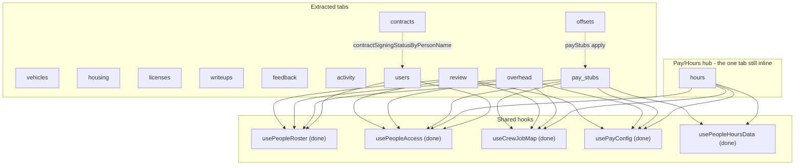

# People Tabs Architecture Map

---
file: docs/PEOPLE_TABS_ARCHITECTURE.md
type: Engineering / Refactor Map
purpose: Inventory what every tab in src/pages/People.tsx touches (state, loaders, handlers, sub-components, supabase tables, cross-tab coupling) to prioritize decomposition of the ~21.4k-line God component.
audience: Developers, AI Agents
last_updated: 2026-09-03
---

## Overview

[`src/pages/People.tsx`](../src/pages/People.tsx) was a ~21,435-line "God component"; decomposition is essentially done and it is now **~4,378 lines**. This map is a refactoring aid: for each tab it records what state, derived data, handlers, sub-components, and external systems the tab touches, plus its extraction status and risk. It is **coupling/refactor-oriented**. It mirrors the approach proven on [`BIDS_TABS_ARCHITECTURE.md`](./BIDS_TABS_ARCHITECTURE.md), which took `Bids.tsx` from ~18,800 lines to ~3,787.

### Progress
- **Phase 1 (low/med-coupling tab extractions) — DONE.** `vehicles`, `housing`, `licenses`, `offsets`, `contracts` extracted to `src/components/people/People<Tab>Tab.tsx`; `activity` + `writeups` cleaned up (state/loaders moved into their existing components). With `teams`/`feedback` already thin, the tabs still inline are `users`, `hours` (the remaining pay/hours hub).
- **Phase 2 (shared hooks) — DONE.** Extracted: `usePeopleAccess`, `usePeopleRoster`, `useCrewJobMap`, `usePayConfig`, `usePeopleHoursData` (under `src/hooks/`). `useTeamSummaryData` was folded into the `review` extraction (intricate review-UI orchestration) rather than a standalone hook; its pure kernel lives at `src/lib/people/derivePersonTeamSummary.ts`.
- **Phase 3 (hub tabs) — IN PROGRESS.** ~~`overhead`~~ (`PeopleOverheadTab`), ~~`review`~~ (`PeopleReviewTab`), ~~`pay_stubs`~~ (`PeoplePayStubsTab`, the **Ledger** half only — see the dossier), and ~~`users`~~ (`PeopleUsersTab` + `useUsersTabTags`/`PeopleUserTagsPanel`) are extracted. The only inline tab left is `hours` (the pay/hours hub), which is too large for a single component — it is being decomposed **sub-section by sub-section**, each its own reviewable PR. Shared hours-section primitives (`HOURS_TAB_SECTION_*` styles, `hoursTabSectionHeaderGap`, `textColorForBackground`, `getDaysInRange`) now live in [`peopleHoursTabShared`](../src/components/people/peopleHoursTabShared.ts). Sub-sections extracted so far: **Teams** (incl. its delete-team modal) → [`PeopleHoursTeams`](../src/components/people/PeopleHoursTeams.tsx) (the `PeopleHoursTeam` type now lives there; `getCostForPersonDateTeams`/`addTeam`/`deleteTeam` etc. stay in the parent as props since they mutate shared hours state); **Due by Team** (formerly Due by Trade/Team, incl. its ledger modal) → [`PeopleHoursDueSummaries`](../src/components/people/PeopleHoursDueSummaries.tsx) (the `teamLedgerModalTeam` modal state moved into the component since nothing else reads it; the trade-tag half died with the cost-matrix retirement — see below); **Clock sessions** (active/pending/approved/rejected tables, search, the salaried-workdays button, and the nested rejected sub-section) → [`PeopleHoursSessions`](../src/components/people/PeopleHoursSessions.tsx) (the inline force-clock-out/approve/reject/revoke mutations moved into the component, which imports `supabase`/`approveClockSessions`/`useToastContext` directly; the parent passes the session lists, search state, `reloadSessions`/`reloadHours` callbacks wired to its load refs, and `setEditClockSession`/`setError`/`openHoursMyTimeFromSession`); **Week range** (the prev/next-week nav + custom start/end date inputs, with narrow vs wide layouts) → [`PeopleHoursWeekRange`](../src/components/people/PeopleHoursWeekRange.tsx) (a pure presentational section — props are `narrowViewport`, `hoursDateStart`/`hoursDateEnd` + setters, `shiftHoursWeek`, and the optional `minDateYmd` assistant-window floor (v2.1592: prev-week disables at the floor, date inputs carry `min`, a muted note names the cutoff; the parent computes the floor from `app_settings.assistant_hours_window_weeks_v1` via the [`assistantHoursWindow`](../src/lib/people/assistantHoursWindow.ts) kernel and clamps its setters/`shiftHoursWeek` plus a snap-back effect); it imports `formatDateRangeLabel` directly). Separately, the `WeekdayCostTable` totals math was lifted to the tested kernel [`computeWeekdayCostTotals`](../src/lib/people/computeWeekdayCostTotals.ts). The first vertical carved off the large **Hours grid** section is its **"Highlight by job" search** (the debounced `search_jobs_ledger` lookup + selected-job chip) → [`PeopleHoursGridJobHighlight`](../src/components/people/PeopleHoursGridJobHighlight.tsx) (owns its own search/results/list-open/blur-ref state + the debounce effect; the parent keeps `selectedJobHighlight` state — read by the `jobHighlightPeople`/`jobHighlightCells` memo and the grid render — and passes it down with its setter; the `HoursGridJobHighlightPick` type now lives in that component). The grid's **pending-hours warning banner** (the "N people · X h not yet in payroll" status + bulk Review &amp; approve CTA) also came out → [`PeopleHoursPendingBanner`](../src/components/people/PeopleHoursPendingBanner.tsx) (a pure presentational banner that returns null when nothing is pending; props are the `PeopleHoursPendingSummary`, `canAccessHours`/`canAccessPay`, and an `onReviewApprove` callback), plus an optional `onOpenQueue` for its **All weeks** button (v2.2694)). The **all-weeks approvals queue** → [`PeopleHoursApprovalsQueueModal`](../src/components/people/PeopleHoursApprovalsQueueModal.tsx) (v2.2694) is self-contained: it fetches every pending session itself ([`fetchAllPendingClockSessions`](../src/lib/people/fetchAllPendingClockSessions.ts)), shapes it with the tested kernel [`approvalsQueue`](../src/lib/people/approvalsQueue.ts) (person → week → session, long/near-zero/no-job flags), and approves/rejects/assigns directly; the parent owns only the `approvalsQueueOpen` flag (set by the Hours header **Approvals** button, the banner, and the `?tab=hours&approvals=1` deep link from the Dashboard Needs You card), a `reloadKey` bumped when the edit modal saves, and the `onEditSession` bridge into `ClockSessionEditSplitModal`. **Cost matrix — RETIRED (2026-07-15, PRs #322/#324/#326, v2.671–v2.677):** the Cost matrix grid, per-person trade tags, and the view-sharing mechanism were removed entirely — `PeopleCostMatrix.tsx` and `PeopleHoursSharing.tsx` are **deleted**, and migrations `20260715090000`/`20260715120000` dropped the share/tag tables and `show_in_cost_matrix`. "See costs without pay admin" is now the **controller** role's job (v2.662). The only vestige in `People.tsx` is the `#cost-matrix` hash handler that still opens/scrolls the Hours-tab section for old deep links. The hard core — the **Hours grid `<table>`** itself (per-person daily-hours matrix with inline cell editing, pending badges, job-highlight/flash styling, and the totals/Correct footer) — is now extracted → [`PeopleHoursGrid`](../src/components/people/PeopleHoursGrid.tsx). The grid-local cell-edit state (`editingHoursCell`/`editingHoursValue`) moved **into** the component as local `useState`; the blur handler `openManualHoursDraftFromBlur` (kept in the parent and passed as a prop) no longer clears the edit cell since the grid clears its own. The shared helpers (`getHoursGridDisplayHours`/`canEditHours`/`isCorrectDayMissingJob`/`hasUnassignedCorrectDays`) stay parent-owned and pass as function props because other sections call them; `setPendingCellPopover` stays in the parent (its sync effect + the popover render live outside the grid). As prep, two pure kernels were lifted out first: the time formatters [`hoursGridTime`](../src/lib/people/hoursGridTime.ts) (`decimalToHms`/`hmsToDecimal`) and the blur predicate [`shouldOfferManualHoursSession`](../src/lib/people/shouldOfferManualHoursSession.ts); the Add-session people list is the tested kernel [`buildAddSessionPeople`](../src/lib/people/buildAddSessionPeople.ts). Remaining hours sub-section: only the trivial clock-strip wrapper.

Tabs switch on a single `activeTab` state ([`People.tsx`](../src/pages/People.tsx), search `useState<PeopleTab>`), type `PeopleTab` (search `type PeopleTab`) — **17 keys** — Subs landed v2.1214, Teams removed v2.1292 (`?tab=teams` redirects to Users), HR landed v2.2221:

```
'scoreboard' | 'review' | 'hr' | 'users' | 'subs' | 'overhead' | 'employment'
| 'person' (v2.2710) | 'pay_stubs' | 'hours' | 'offsets' | 'vehicles' | 'housing' | 'licenses'
| 'contracts' | 'writeups' | 'feedback' | 'activity'
```

### How to maintain this doc
- Update the relevant dossier whenever a tab is extracted or its state/handlers change; flip its Status to `extracted` and point at the new file.
- Treat line numbers as approximate anchors — they drift. Search for the symbol (`activeTab === '...'`, the state name, the modal name) when in doubt.

### Key structural difference from Bids
**There is no single shared "person pointer."** Bids has one `setSharedBid` fanning a click out to 8 `selectedBidFor*` selections. People instead gives **each tab its own independent selection pointer**, and identity is keyed by **person name (string)**, not id. The real shared substrate is the `people`/`users` roster plus the `person_name` columns across `people_hours`/`people_pay_config`/`person_offsets`/`person_licenses`/`person_contract_*`. The name↔id bridge is `cascadePersonNameInPayTables` / `resolvePersonIdFromRosterName`. So there is no cross-tab UI selection to lift — only shared *data*.

---

## Person Desk (v2.2701) — the per-person drawer

> Not a tab: a global drawer opened from a person's **name** (People → Users rows, People → Subs rows; more doors in later PRs) or from `?person=u:<users.id>` / `?person=p:<people.id>` on any route. Owner-approved proposal: artifact 321baa3e.

- **Identity spine**: [`lib/people/personKey.ts`](../src/lib/people/personKey.ts) resolves `{ userId, personId, payName, gaps }` from either id (pay name = trimmed account name when an account exists, else the roster name — the Phase A finding). Gaps (`no_roster_row`, `no_login`, `unlinked_email_match`, `pay_name_mismatch`, `no_pay_config`) render in the header as one amber line each with the one existing fix (Link account → `people.account_user_id`; Reconcile → `people.name` + `cascadePersonNameInPayTables`; Create roster row → the Employment-tab insert). **Nothing is created or linked silently.**
- **Gates**: [`lib/people/personDeskGates.ts`](../src/lib/people/personDeskGates.ts) restates each surface's existing gate, one function per control, so widening is a one-line change here plus the enforcing edge function / policy. The Desk adds no permissions; locked rows stay visible with a `dev only` tag.
- **Pieces**: [`contexts/PersonDeskContext.tsx`](../src/contexts/PersonDeskContext.tsx) (opener + `changeKey`), [`hooks/usePersonDesk.ts`](../src/hooks/usePersonDesk.ts) (loader), [`components/personDesk/`](../src/components/personDesk/) — `PersonDeskDrawer` (z 60; full-screen ≤ 640px), `PersonDeskHeader`, `PersonDeskDeepLinkHandler`, `personDeskShared` (`DeskSection` / `DeskRow` / `Chip` / `LockTag`), and `sections/` — Hours & approvals (the v2.2694 queue modal with `pinUserId`), Portal & paperwork (subs; `SubPortalGlobeButton` inline + compliance chips), Team & alerts, Access & account (mirrors the Active Accounts row; Archive routes to that modal for customer reassignment).
- **PR 2 (v2.2706)**: `sections/PersonDeskPaySection` (name-keyed `people_pay_config` upsert with the `usePayConfig` salary side effects; roster-row dates; `user_time_off`; `SalaryWorkScheduleSettings` in a modal; `PersonOffsetFormModal`), the lifecycle kernel [`lib/people/lifecycleChecklist.ts`](../src/lib/people/lifecycleChecklist.ts) + facts loader [`lib/people/personDeskFacts.ts`](../src/lib/people/personDeskFacts.ts), and `PersonDeskLifecycleModal` (End / Start employment checklists; the only new write is one append-only `person_file_entries` line, dev-only).
- **PR 3 (v2.2710)**: `PersonDeskBody` (header + registry + flows, shared by the drawer and the page) and the **People → Person tab** [`PersonDeskPage`](../src/components/personDesk/PersonDeskPage.tsx) (`?tab=person&id=u:|p:`; rail grouped by kind with attention dots from [`lib/people/deskRailAttention.ts`](../src/lib/people/deskRailAttention.ts)); sections Field (vehicle hand-off via `handOffWrites`, housing possessions, licenses + `PersonLicenseHoursLogModal`), Paperwork ([`lib/people/paperworkRollup.ts`](../src/lib/people/paperworkRollup.ts) + the Contracts tab's packet materialize lifted to [`lib/people/materializePacket.ts`](../src/lib/people/materializePacket.ts); nag toggle; send/upload stay on Contracts), Records (HR freshness via `personFileFreshness`, pending `person_reports`, write-ups + `attendance_incidents`, Rate deep link), Schedule (`UserDayScheduleSection` inline). `PeopleHrTab` accepts `?person=<people.id>`.
- **Train**: ~~PR 2 Pay & schedule + End / Start employment flows~~ (shipped); PR 3 Field, Paperwork, Records, Schedule + a People → Person tab (the same section registry in a page); PR 4 doors everywhere + the `/` quick sheet; then the gate widenings and an optional summary RPC.

## Master summary table

| Tab key | Render lines | ~Lines | Status | Owned state | Cross-tab coupling | Coupling / risk | Recommended action |
|---|---|---|---|---|---|---|---|
| `subs` | thin wrapper (`{activeTab === 'subs' && <PeopleSubsTab />}`) | ~293 (component) | extracted (`PeopleSubsTab`, self-contained, v2.1214) | 0 in parent | none — loads everything itself under the caller's RLS | low | Done (see dossier) |
| `users` | `PeopleUsersTab` | ~3 (`{activeTab === 'users' && <PeopleUsersTab .../>}`) | extracted (`PeopleUsersTab` + `useUsersTabTags`/`PeopleUserTagsPanel`; shared consts/`byKind` in `peopleUsersTabShared`; hosts the **Team leads** modal, 2026-08-02) | — | reads `people`/`users`, `contractSigningStatusByPersonName`, push/location | done | Person-edit form stays in `usePeopleRoster`; the edit-user-note modal stays in the parent |
| `overhead` | thin wrapper | ~1,989 | extracted (`PeopleOverheadTab`) | 0 in parent | reads `payConfig` only (NOT `crewJobsByDatePerson`) | low data / dev-master | Done |
| `employment` | thin wrapper | ~1,151 (component) | extracted (`PeopleEmploymentTab`, self-loading) | 0 in parent | reads the `usePayConfig` cluster + `users` via props | low-med | Done (see dossier) |
| `pay_stubs` | thin wrapper (tab button reads **Payroll**, v2.1257; Ledger half) | ~1,331 | extracted (`PeoplePayStubsTab`, Ledger half) | draft-payroll + mark-paid clusters stay in parent | high | Done — conservative seam (see dossier) |
| `hours` | inline orchestration only (~320 render lines; every major sub-section is an extracted component) | ~320 render + parent-owned state/loaders | partial | ~39 (`hours*`, clock sessions) | **owns** `payConfig`/`teams`/`crewJobsByDatePerson` | very high | Phase 3 sub-section decomposition done: Teams → `PeopleHoursTeams`, Due-Summaries → `PeopleHoursDueSummaries`, Sessions → `PeopleHoursSessions`, Week → `PeopleHoursWeekRange`, Hours grid → `PeopleHoursGrid` (+ `PeopleHoursGridJobHighlight`/`PeopleHoursPendingBanner`) (Cost matrix + Sharing sections retired 2026-07-15); inline remains the clock-strip wrapper + the orchestration/wiring |
| `vehicles` | thin wrapper | ~235 | extracted (`PeopleVehiclesTab`; rebuilt v2.1644 as the fleet board — cards + ledger + hand-off, kernels in `src/lib/vehicleFleet.ts`) | 0 in parent | `users` prop | low | Done (PR #19) |
| `housing` | thin wrapper | ~200 | extracted (`PeopleHousingTab`) | 0 in parent | `users` prop | low | Done (PR #20) |
| `offsets` | thin wrapper | ~195 | extracted (`PeopleOffsetsTab`) | 0 in parent | `payStubs`/`loadPayStubs` props | low-med | Done (PR #22) |
| `licenses` | thin wrapper | ~320 | extracted (`PeopleLicensesTab`) | 0 in parent | `people`/`users` props | low | Done (PR #21) |
| `contracts` | thin wrapper | ~1,583 | extracted (`PeopleContractsTab`) | `contractSigningStatusByPersonName` stays in parent | `people`/`users`/`canDeletePeopleContracts` props | med-high lines / low data | Done (PR #23) |
| `writeups` | thin wrapper | ~13 | extracted (`WriteupsContractsSubTab`, self-loads) | 0 | props only | low | Done (PR #24) |
| `review` | thin wrapper | ~4,889 | extracted (`PeopleReviewTab` + `lib/people/derivePersonTeamSummary`) | bridge refs (Review↔Hours shared My-Time modal) passed as props | reads `payConfig`, `archivedUserNames`, `people` | med-high | Done |
| `feedback` | thin wrapper | ~5 | thin (`TeamFeedbackDevSettingsBlock`) | 0 | `isDev` | low | Done |
| `hr` | thin wrapper (`{activeTab === 'hr' && isDev && <PeopleHrTab />}`) | ~470 (component) | extracted-from-birth (`PeopleHrTab`, self-contained, dev-only, v2.2221) | 0 in parent | none — loads `people`/`person_files`/`person_file_entries`/`users` itself under dev-only RLS | low | Done (see `docs/HR_FILES.md`) |
| `activity` | thin wrapper | ~180 | extracted (`PeopleAppActivityPanel`) | `isActivityViewer`/`activityAccessResolved` stay in parent (feed `canSeeActivityTab`) | props only | low | Done (PR #24) |

> Status legend: `inline` = rendered directly in `People.tsx`; `thin` = a few lines delegating to an imported component; `partial` = panel extracted but the tab still owns inline UI/state; `extracted` = fully moved.

---

## Per-tab dossiers

> For the **extracted** tabs (`vehicles`/`housing`/`licenses`/`offsets`/`contracts`/`activity`/`writeups`/`teams`/`feedback`), the dossier below is the **pre-extraction inventory** — a record of what each tab contained before it moved to its `src/components/people/*` component. Current status/owner is in the master summary table above. The remaining inline tab (`hours`) is still accurate as-is. The pre-extraction line-number anchors were removed (they no longer resolve in the ~4,378-line file); search by symbol.

### `users` — Roster
> **Fully extracted (Stage 1 + Stage 2).** Stage 1 moved the dev-only tag/label subsystem (~580 lines) into the [`useUsersTabTags`](../src/hooks/useUsersTabTags.ts) hook + presentational [`PeopleUserTagsPanel`](../src/components/people/PeopleUserTagsPanel.tsx). Stage 2 moved the **roster UI** (~890 lines: 7,132 → 6,243) into [`PeopleUsersTab`](../src/components/people/PeopleUsersTab.tsx): the full users render, the per-row `renderUsersTabRosterListItem`, the roster search vars (`usersTabSearch*`), and the tag-anchor builders (`resolvePersonIdForUsersRow`/`resolveUsersTabTagAnchor`). Shared roster constants (`KINDS`/`KIND_LABELS`/`KIND_TO_USER_ROLE`/`USERS_TAB_SECTIONS`), the contact-row style, the search matcher, and the pure `buildUsersTabKindRoster` (was `byKind`) live in [`peopleUsersTabShared`](../src/components/people/peopleUsersTabShared.ts) so the parent's `payConfigRosterSections` still consumes them.
>
> **Deliberately left in the parent:** the person create/edit form already lives in `usePeopleRoster` (the tab calls `openAdd`/`openEdit`); the edit-user-note modal and the invite-confirm modal still render in `People.tsx`; roster CRUD/invite/login-as handlers (`archivePerson`/`restorePerson`/`isAlreadyUser`/`loginAsUser` wiring) stay in the parent and are passed as props. The dossier below is the pre-extraction inventory.
>
> **Team leads modal (2026-08-02):** the `team_leader_assignments` manager that lived on Settings → Dashboard & alerts ("Team Hours Sharing") moved here as [`TeamLeadsModal`](../src/components/people/TeamLeadsModal.tsx), opened from a **Team leads** button beside the roster search (next to the dev-only Manage accounts button). The modal is now pure chrome (backdrop/panel/title/close/scroll-lock) around the shared leader-centric [`TeamLeadsManager`](../src/components/people/TeamLeadsManager.tsx), which was briefly also rendered by the **Teams** tab until that tab was removed in v2.1292 (`?tab=teams` now redirects to Users) — the modal is the single surface. The manager is self-contained: gets `user`/`role` from `useAuth` (gate: dev / master_technician / assistant / controller — the same set as `canAccessTeamsTab`), loads its own roster (labels include archived users; pickers stay non-archived), drives rows through the slimmed [`useTeamLeaderAssignments`](../src/hooks/useTeamLeaderAssignments.ts) hook, and groups/searches via the pure kernel [`teamLeadsGrouping`](../src/lib/people/teamLeadsGrouping.ts). One collapsible card per leader (search matches leader OR member), per-member **Full/Strip** segmented toggle for `dashboard_hours_visibility` (still dev-only editable), × remove with confirm (**Remove stale link** for archived members), per-card **+ Add member**, and a **+ New leader** flow. Settings keeps a one-line pointer.

- **Render:** ~513 pre-extraction lines; person create/edit form modal + invite-confirm modal render at page level.
- **Owned state (~30):** person form (`formOpen`, `editing`, `kind`, `name`/`email`/`phone`/`notes`/`saving`), roster actions (`archivingId`, `archivedPeople`, `archivedSectionOpen`, `restoringId`, `invitingId`, `inviteConfirm`, `loggingInAsId`), `personProjects`, `creatorNames`, `editingUserNote`/`userNoteSaving`. **Tag subsystem (~17 vars):** `showUsersTabTags`, `usersTabLabels*`, `usersTabMasterByUserId`, `usersTabTagSignalsByUserId`, `usersTabTags*`, `usersTabSearch`, etc. Push/location: `canSeePushStatus`/`pushEnabledUserIds`/`locationEnabledUserIds`.
- **Cross-tab/shared:** owns/reads `people`/`users` (the master rosters used by nearly every tab); reads `contractSigningStatusByPersonName` (written by the contracts loader) for the signing traffic light; reads `payConfig` for duplicate detection.
- **Loaders:** `loadPeople`, `loadPersonProjects`, `loadArchivedPeople`, `handleSave`, `handleMergeDuplicate`, push/location loader.
- **Supabase:** `people`, `users`, `project_workflow*`/`projects`, `push_subscriptions`, `person_contract_documents`, label/tag tables.
- **Coupling/risk:** **high** — owns the shared rosters + the person-edit form other tabs implicitly depend on. The tag subsystem is the cleanest sub-extraction. The `people`/`users` loaders must become `usePeopleRoster` first.

### `subs` — Subs (added v2.1214)
- **Render:** thin wrapper `{activeTab === 'subs' && <PeopleSubsTab />}`. Fully self-contained: [`PeopleSubsTab`](../src/components/people/PeopleSubsTab.tsx) (~509 lines) loads everything itself under the caller's RLS.
- **What it shows:** one row per subcontractor relationship — roster, junction-attributed sub-sheet balances, open work orders, compliance badges (`agreement`/`coi`/`w9`/`license`/`other` doc types with expiry states), and a simple track record. The per-sub Documents expander is the compliance micro-editor (writes `person_contract_documents` directly); sending/signing stays on the Contracts tab.
- **Unattributed sheets panel:** amber card at the top (replaces the old bottom text blob) listing sheets the junction resolves to no one (`unmatched`) or several people (`shared`), deduped per (job label, raw `assigned_to_name`, reason) via `groupUnattributedSheets`, sorted by open balance desc, 3 rows + expander. Actions per row: **Open →** deep-links `/jobs?tab=sub_sheet_ledger&editLabor=<sheetId>` (the Jobs handler accepts a sheet id ahead of the HCP match), **Assign…** roster picker, and a conservative ✨ one-tap suggestion ([`subSheetNameSuggestion`](../src/lib/people/subSheetNameSuggestion.ts) — exact normalized / first-initial+last-name / unambiguous single-token containment; never on multi-name or ambiguous raw names). Assign writes `people_labor_jobs.assigned_to_name` = the canonical roster name (the `sync_people_labor_job_assignees` trigger rebuilds the junction — a bare junction insert would be wiped on the next name edit) plus a belt-and-braces junction upsert, then reloads.
- **Kernels:** [`buildSubsHqRows`](../src/lib/people/subsHqRows.ts) (+ `groupUnattributedSheets`) + [`subCompliance`](../src/lib/people/subCompliance.ts) + [`subSheetNameSuggestion`](../src/lib/people/subSheetNameSuggestion.ts).
- **Coupling/risk:** **low** — 0 parent state; no props.

### `teams` — Teams
- **REMOVED (v2.1292):** the Teams tab and `PeopleTeamsTab.tsx` were deleted; the shared [`TeamLeadsManager`](../src/components/people/TeamLeadsManager.tsx) lives solely in the Users tab's **Team leads** modal. `?tab=teams` deep links redirect to Users. Note: the parent still owns `teams` + `loadTeams` + team CRUD for the **Hours** tab's Teams / Due-by-Team sections — that crew-teams feature (`people_teams`) is unrelated and unchanged.

### `overhead` — Overhead
> **Extracted** to [`src/components/people/PeopleOverheadTab.tsx`](../src/components/people/PeopleOverheadTab.tsx) (~2,037 lines). The parent renders a thin gate `{activeTab === 'overhead' && canAccessOverheadTab && <PeopleOverheadTab .../>}` and shrank ~1,989 lines (15,970 → 13,981). All ~28 `overhead*` state vars, the `useMercuryLedgerNicknames` call, the 2 daily-labor memos, the 8 load effects (their `activeTab !== 'overhead'` early-returns dropped since the component only mounts when active), and the render + breakdown modal moved into the child. **Props:** `payConfig`, `authUser`, `setError`, `canAccessOverheadTab`, `isDev`, `loadPayConfig`. **Correction:** it reads **`payConfig` only** — the earlier note that it reads `crewJobsByDatePerson` was stale (that symbol is Hours-tab-only). **Stayed in the parent:** the overhead tab-nav button, the `tab=overhead` URL deep-link guard, and the **`review` tab's 90-day overhead-rate calc** (which also imports `buildOverheadDailyLabor`). The dossier below is the pre-extraction inventory.

- **Render:** ~1,271 pre-extraction lines. Dev/master only (`canAccessOverheadTab`).
- **Owned state (~28):** `overheadDateStart`/`End`, `overheadOfficeJob*`, `overheadSessions`, `overheadTableSimpleView`, `overheadOfficeParts*`, `overheadAvgDailyCost`, `overheadOtherJobs*`, `overheadBreakdownModal`.
- **Cross-tab/shared:** reads `payConfig` (for the office/other-jobs daily-labor memos). Load effects gated on `activeTab === 'overhead'`.
- **Supabase:** `clock_sessions`, `jobs_ledger*`, `people_pay_config`, `mercury_*`, `app_settings`, `people_crew_jobs`/`people_crew_bids`.
- **Coupling/risk:** **med.** Self-contained data; shares only `payConfig`. Dev/master gate → low blast radius.

### `employment` — Employment (extracted from day one)

> Born as its own component — never inline in `People.tsx`. [`src/components/people/PeopleEmploymentTab.tsx`](../src/components/people/PeopleEmploymentTab.tsx) (~1,151 lines); the parent renders `{activeTab === 'employment' && canAccessPay && <PeopleEmploymentTab .../>}` in [`People.tsx`](../src/pages/People.tsx). Major upgrade wave: v2.672–v2.674 (PR #322, 2026-07-15 — grouped roster, schedule/pay-history modals, header pay stats, safer Salaried toggle).

- **Render:** thin gate in the parent; everything else lives in the component.
- **Owned state (~20, all in the component):** roster `rows` + `loading`/`loadError`, `selectedKey`, `archivedOpen`, `search`, employment-date drafts (`draftStart`/`draftEnd`, `saving`), modal opens (`scheduleOpen`, `payHistoryOpen`), `salaryOffConfirm` (red-confirm before turning Salaried off), pay stats (`payTotals` + `payTotalsLoading`), and the time-off block (`timeOffRows`/`timeOffLoading`, `toStart`/`toEnd`/`toKind`/`toNote`/`toSaving`).
- **Data model:** builds an `EmploymentEntry` union of **login users** (`users`, mapped via `ROLE_TO_KIND`; subcontractors deliberately excluded) and **external `people` rows** with no matching account — mirrors the Users tab's users+people union. A `people` row is created on first employment-date save for user-only entries. `entryLinkHealth` surfaces account↔roster linkage problems.
- **Cross-tab/shared (via props):** the `usePayConfig` cluster — `payConfig`, `payConfigDraft`, `payConfigOfficeWageDraft`, `payConfigSaving`, `salaryTemplateByPersonName`, `onUpsertPayConfig`, `onHourlyWageChange`, `onOfficeHourlyWageChange` (pay-setup editing writes through the parent's debounced upsert) — plus `users`, `authUserId`, and `onViewPayReport` (opens the parent-owned pay-report modal, `viewPayStubInModal`).
- **Loaders/effects (in the component):** roster load from `people` + the `users` prop; per-person `user_time_off` load; pay-stats load (`pay_stubs` + `pay_stub_payments`/`_deductions`/`_additional_lines`, upcoming weeks via `buildUpcomingPayrollSummary` over `clock_sessions`).
- **Handlers:** employment-date save (UPDATE/INSERT `people`), time-off add/delete (`user_time_off`), Salaried toggle (ON immediate; OFF behind `salaryOffConfirm` — deletes templates/overrides via `SalaryWorkScheduleSettings` machinery + `syncSalaryClockSessionsForUserDay`).
- **Supabase:** `people`, `user_time_off`, `pay_stubs`, `pay_stub_payments`/`_deductions`/`_additional_lines`, `clock_sessions` (upcoming-pay window); `people_pay_config` only indirectly through the parent's `onUpsertPayConfig`.
- **Sub-components:** [`EmploymentMonthScheduleModal`](../src/components/people/EmploymentMonthScheduleModal.tsx) (near-fullscreen month view hosting `UserMonthScheduleSection`), [`EmploymentPayHistoryModal`](../src/components/people/EmploymentPayHistoryModal.tsx) (payment installments + stacked pay-report view), `SalaryWorkScheduleSettings`.
- **Pure kernels:** [`src/lib/employmentPayTotals.ts`](../src/lib/employmentPayTotals.ts) (`computeEmploymentStubTotals`, 7 tests) for the Avg/Paid/Due header stats; reuses [`upcomingPayrollSummary`](../src/lib/upcomingPayrollSummary.ts).
- **Coupling/risk:** **low-med** — self-loading; the only shared surface is the pay-config prop cluster and the pay-report modal callback.

### `pay_stubs` — Payroll (key `pay_stubs`)

> Tab button relabeled **Pay Stubs → Payroll** and the pay-config button moved from the Hours tab header to Payroll's (**v2.1257**); pay reports themselves were renamed **Pay Report** in v2.1254. Key, URL `tab=pay_stubs`, and table names are unchanged.
>
> **v2.2168 — Ledger view (dev-only):** a `Pay reports | Ledger` switch above the tab (`?view=ledger&person=<name>`) swaps `PeoplePayStubsTab` for [`PeoplePayLedgerView`](../src/components/people/PeoplePayLedgerView.tsx) — roster of per-person balances + one dated journal with running balance, on the kernel [`src/lib/people/personLedger.ts`](../src/lib/people/personLedger.ts) (wraps `buildPartnerJournal`; every offset books at its date). The view loads `person_offsets` itself and calls the parent's `loadPayStubs()` on mount; the stub/payment/deduction/additional maps stay parent-owned.
> **Extracted (conservative seam)** to [`src/components/people/PeoplePayStubsTab.tsx`](../src/components/people/PeoplePayStubsTab.tsx) (~1,331 lines). The parent renders a thin gate `{activeTab === 'pay_stubs' && canAccessPay && <PeoplePayStubsTab .../>}` and shrank ~886 lines (8,598 → 7,712). **Only the self-contained Ledger half moved** — the table, the **Less/Additional/Note/Calendar** modals + their tab-local state, the `ledgerFilteredPayStubs`/`ledgerOpenBalanceSummary` memos, the `ledgerPersonSearch`, the mount load effect (calls the injected `loadPayConfig`/`loadPayStubs`), and the calendar load effect. Stage A lifted the pure print-HTML builder to [`src/lib/peopleDocuments/buildPayStubHtml.ts`](../src/lib/peopleDocuments/buildPayStubHtml.ts) (+`openPayStubWindow`, with tests); the three callers (`printPayStub`/`viewPayStub`/`generatePayStub`) now call it.
>
> **Props:** `payStubs` + the 3 `*ByStubId` maps + `loadPayStubs` (the shared data layer, parent-owned because `offsets` + draft-payroll also read it), `payConfig`, `users`, `authUser`, `isDev`, `error`/`onError`, `loadPayConfig`, `markingPayStubId`, `deletingPayStubId`, and callbacks `onPrintStub`, `onRecordPayment`, `onRequestDeleteStub`, `onOpenMyTimeForDay`, `onOpenForecast`/`forecastDisabled`, `onOpenDraftPayroll`/`draftPayrollDisabled`. It also **re-exports `type PayStubRow`** (the parent now imports it).
>
> **Stayed in the parent — two deliberate bridges (no tests cover these flows):** (1) the **Draft Payroll / Forecast** cluster — `DraftPayrollModal`/`PayrollForecastModal`/`DraftPayrollPersonHoursBreakdownModal` + their state + `generatePayStub`/`viewPayStub`/`bulkGenerateMissingPayStubsInModal`/`shiftPayStubWeek`/`getPriorWeekPayStubRangeEnCa` + the realtime `draftPayrollRealtimeSnapRef`/`loadDraftPayrollPendingApprovals` — because it consumes Hours-owned compute (`showPeopleForHours`/`getCostForPersonDate`/`getEffectiveHours`/`getRunPayrollReviewDayItems`) that moves to **Hours (last)**; the child opens it via `onOpenForecast`/`onOpenDraftPayroll` callbacks. (2) the **Record-payment / mark-paid** cluster — `payStubMarkPaid*` state + modal + `confirmPayStubMarkPaid` + `openEmployeeCreditFromRecordPayment` + `recordPaymentRefreshAfterEmployeeCreditRef` — because the "Record employee credit…" path is wired to the **parent-owned `PersonOffsetFormModal`** (shared with `offsets`), whose `onSaved` reaches back into the mark-paid target/amount; the child opens it via `onRecordPayment`. The **delete-confirm** modal also stays (its `deletePayStub` does an optimistic `setPayStubs` on parent state); the child requests deletes via `onRequestDeleteStub`. The dossier below is the pre-extraction inventory.

- **Render:** pre-extraction: the stub table + modal cluster (PayStubLess/Additional/Delete/Note/MarkPaid, Forecast, DraftPayroll, breakdown) + the calendar modal (~870 total). `canAccessPay` only.
- **Owned state (~35):** `payStubs`, `payStub*ByStubId`, modal stubs, `payStubsLoading`, period, calendar, action flags, confirm/mark-paid, `ledgerPersonSearch`.
- **Cross-tab/shared:** reads `payConfig`, `peopleHours` + `loadPeopleHours`, `hoursDaysCorrect`, rosters. `payStubCalendarPerson` is a pay_stubs-local pointer.
- **Loaders:** `loadPayStubs`, `loadPayStubCalendarData`, `generatePayStub`, print builders, `loadDraftPayrollPendingApprovals`.
- **Sub-components (extracted):** `PayStubLessModal`, `PayStubAdditionalModal`, `DraftPayrollModal`, `PayrollForecastModal`, `DraftPayrollPersonHoursBreakdownModal`. Inline: stub table + mark-paid/note/delete + calendar modals.
- **Supabase:** `pay_stubs`, `pay_stub_payments`/`_deductions`/`_additional_lines`/`_days`, `people_hours`, `people_crew_*`, `people_pay_config`.
- **Coupling/risk:** **high.** Hard-depends on pay-config + people-hours layers. Extract after `usePayConfig` + `usePeopleHoursData`.

### `hours` — Hours / Pay grid (the hub)
- **Render:** ~2,335 pre-extraction lines — **largest tab**. `canOpenHoursTab` = `canAccessPay || canAccessHours` ([`People.tsx`](../src/pages/People.tsx), search the symbol; the `canViewCostMatrixShared` term died with the cost-matrix retirement).
- **Owned state (~40):** `peopleHours`, clock-session queues (`pendingClockSessions`, approved/rejected, search), grid highlight/edit state, date range, various modals, and **shared-owner** state: `payConfig`/`payConfigDraft`/`payConfigSaving`, `teams`, `crewJobsByDatePerson`, `salaryTemplateByPersonName`. (All `costMatrix*` state removed in the 2026-07-15 retirement.)
- **Cross-tab/shared (OWNS, others read):** `payConfig` (pay_stubs/overhead/review/employment read), `teams` (teams tab + the Hours Teams / Due-by-Team sections), `crewJobsByDatePerson` (pay_stubs reads; overhead does NOT — it reads `payConfig` only).
- **Loaders:** `loadPeopleHours`, the clock-session loaders, `loadHoursReviewed`, `loadPayConfig`, `savePayConfig`, `saveHours` (line anchors dropped — search the symbols; the cost-matrix loaders are gone). **Realtime-subscribed** via `usePeopleHoursData`.
- **Sub-components (extracted):** `ReviewHoursModal`, `TeamSummaryInline`, `SalariedWorkdaysBulkModal`, `PeopleHoursPendingCellPopover`, `PeopleHoursBulkApprovePendingModal`, `ClockSessionEditSplitModal`, `HoursUnassignedModal`, `MatchClockSessionsModal` (v2.1584 — "Match sessions" button on the Currently-clocked-in header, amber-badged with the 7-day unassigned-session count; one-tap dispatch/crew/note suggestions from the [`lib/matchClockSessions.ts`](../src/lib/matchClockSessions.ts) kernel, search fallback via `AssignSessionJobPopover`), `PeopleHoursDayAuditModal`, `PeopleHoursGrid`, `PeopleHoursAlignModal` (v2.1098 — "Align hours" one-pass linker for the week's unmarked sessions; button in the Hours-grid section header, gated `canEditCrewJobs`; queue kernel in [`lib/people/alignHoursQueue.ts`](../src/lib/people/alignHoursQueue.ts), snapshot-on-mount, parent refetches via the load refs on close; opens the day editor through `openHoursMyTimeFromSession` as its escape hatch). Inline: only the clock-strip wrapper. (`PeoplePayConfigModal` is no longer opened from this tab — the pay-config button moved to the Payroll tab's header in v2.1257 and the modal mounts tab-independent, gated on `canAccessPay`. `PeopleCostMatrix` + `PeopleHoursSharing` deleted in the 2026-07-15 retirement; `PersonTimeDetailModal` deleted 2026-07-24 — its last importer had already gone, see v2.992.)
- **Supabase:** `clock_sessions`, `people_hours`, `people_pay_config`, `hours_reviewed`, `hours_days_correct`, `people_hours_display_order`, `people_teams`/`_team_members`, `people_crew_*`, `salary_work_schedule_templates`. (The `people_cost_matrix_*` / share tables were dropped by migration `20260715090000`.)
- **Coupling/risk:** **very high.** The central hub. Extract **last**, after the shared hooks exist.

### `vehicles` — Vehicles
- **Render:** pre-extraction: table (~130) + form modals (~105). Total ~235.
- **Owned state (~23):** `vehicles`/Loading/Error, `vehicleFormOpen`/`editingVehicle`/`selectedVehicleId`, `odometerEntries`/`replacementValueEntries`/`possessions`/`vehicleAssignees`, form fields.
- **Cross-tab/shared:** reads `users` only (assignee names). `selectedVehicleId` local pointer.
- **Loaders:** `loadVehicles`, `loadOdometerEntries`/`loadReplacementValueEntries`/`loadPossessions` + a load effect.
- **Supabase:** `vehicles`, `vehicle_odometer_entries`, `vehicle_replacement_value_entries`, `vehicle_possessions`, `users`.
- **Coupling/risk:** **low — best first target.** Fully domain-isolated. Establishes the `People<Domain>Tab` prop pattern.

### `housing` — Housing
- **Render:** pre-extraction: table (~134) + form modals. Mirror of vehicles.
- **Owned state (~16):** `housingUnits`/Loading/Error, `housingFormOpen`/`editingHousingUnit`/`selectedHousingId`, `housingPossessions`/`housingAssignees`, form fields.
- **Loaders:** `loadHousingUnits`/`loadHousingPossessions` + a load effect.
- **Supabase:** `housing_units`, `housing_possessions`, `users`.
- **Coupling/risk:** **low — second target** (copy of the vehicles extraction).

### `offsets` — Offsets
- **Render:** pre-extraction: ~174 lines + the apply modal; `PersonOffsetFormModal` (imported) opened via `offsetFormOpen`.
- **Owned state (~10):** `offsets`/Loading/Error, `offsetFormOpen`/`offsetFormInitialCreateDraft`/`editingOffset`, `offsetApplyModalOpen`/`offsetToApply`/`offsetApplyPayStubId`, `offsetsTabSearch`.
- **Cross-tab/shared:** reads `payStubs` (apply-offset-to-stub; its load effect also calls `loadPayStubs`), `offsetPersonNameOptions`.
- **Loaders:** `loadOffsets`.
- **Supabase:** `person_offsets`.
- **Coupling/risk:** **low-med.** Self-contained except the pay-stub apply linkage — pass `payStubs` (or its loader) as a prop.

### `licenses` — Licenses
- **Render:** pre-extraction: ~213 lines + form modals (license + cost-line).
- **Owned state (~18):** `licenses`/Loading/Error/`licensesExpiringSoon`, `selectedLicensePersonName`, `licenseFormOpen`/`editingLicense` + fields, `costLineFormOpen`/`editingCostLine` + fields, `expandedCostLinesLicenseId`.
- **Loaders:** `loadLicenses`, cost-line CRUD + a load effect.
- **Supabase:** `person_licenses`, `person_license_cost_lines`.
- **Coupling/risk:** **low — third target.** `canAccessLicenses`-gated.

### `contracts` — Contracts
- **Render:** pre-extraction: main table (~515) + big inline modal cluster (template, assign, document editor, delete-confirm, signed-record, book, send) (~1,068). Total ~1,583.
- **Owned state (~50):** `contractTemplates`/`contractTemplateDocuments`/`personContractAssignments`/`personContractDocuments`, modal flags, `contractDocumentForm*`, `contractSend*`, `templateForm*`.
- **Cross-tab/shared:** **writes `contractSigningStatusByPersonName`** which the **users** tab reads (the only real cross-tab write). Reads `people` names.
- **Loaders:** `loadContracts`, template/assignment/document CRUD + load effects.
- **Sub-components (extracted):** `ContractBookModal`, `PersonContractSignedRecordModal`. Inline: template/assign/document/send modals.
- **External coupling:** `checkGoogleDriveAttachmentUrl`, `hasContractSigningContent`, `buildContractSendEmailPreview`. `canAccessContracts` + `canDeletePeopleContracts`.
- **Coupling/risk:** **med-high by line count, low by data-coupling** — only the signing-status write escapes. Biggest cheap win; move the modal cluster into `PeopleContractsTab` and surface `contractSigningStatusByPersonName` as a callback.

### `writeups` — Writeups
- **Render:** ~13 lines. Thin wrapper `WriteupsContractsSubTab`. **Mostly done** — remaining seam: move `loadWriteupsData` + its 5 rows (`writeupTemplatesRows`/`writeupsRows`/`ncnsRows`/`writeupsLoading`/`writeupsError`) into the child.

### `review` — Review (dev-only)
> **Extracted** to [`src/components/people/PeopleReviewTab.tsx`](../src/components/people/PeopleReviewTab.tsx) (~4,980 lines) + the pure kernel [`src/lib/people/derivePersonTeamSummary.ts`](../src/lib/people/derivePersonTeamSummary.ts) (Stage A, with tests; shared types in [`src/lib/people/teamReviewTypes.ts`](../src/lib/people/teamReviewTypes.ts)). The parent shrank ~4,889 lines (13,487 → 8,598). **`useTeamSummaryData` folded in** (per the deferral note) — the team-summary load/derive lives in the component, not a standalone hook. **Props:** `payConfig`, `archivedUserNames`, `authUser`, `isDev`, `users`, `people`, plus the **Review↔Hours bridge** kept in the parent and passed down (Option 1): `onOpenDayEditor`/`onDrilldownOpenChange`, `teamSummaryInlineRef`, `teamSummaryDataCacheRef`/`teamSummaryModalOpenRef`/`teamSummaryRefreshPendingRef`/`reviewHoursReopenAfterLoadRef`, `teamSummaryDrainTick`, and the shared `getDaysInRange`. **Stayed in the parent:** the shared `DashboardMyTimeDayEditorModal` (also used by Hours) + its `onSaved`, `handleInlineOpenDayEditor`, the bridge refs/tick, `archivedUserNames` + `loadArchivedUserNames` (shared), `reviewHoursModalOpen` + `ReviewHoursModal` (a Hours feature despite the name), the draft-payroll `*Review*` helpers, the review tab-nav button, and the `tab=review` URL guard. `reviewOverheadRates` (left in the parent during the overhead extraction) moved out with this tab. The dossier below is the pre-extraction inventory.

- **Render:** ~1,520 pre-extraction lines. Gate `activeTab === 'review' && isDev`.
- **Owned state (~35):** `selectedReviewPersonIndex`, `reviewPeriod`/range, `reviewLoading`, `reviewLaborJobs`/`reviewCrewJobs`/`reviewAllocated*`/`reviewHours`/`reviewReports`/`reviewTasks*`, `teamSummaryRows`/Loading/Error + refs, `reviewLaborBreakdownContext`/`reviewOnlyPaidInFull`.
- **Cross-tab/shared:** reads `payConfig`, `archivedUserNames`; shares `TeamSummaryInline` + `loadTeamSummaryData` machinery with **hours**. `selectedReviewPersonIndex` local pointer.
- **Loaders:** `loadReviewData`, `loadTeamReviewUnion`, `loadTeamSummaryData` + a load effect.
- **Supabase:** `people_labor_job*`, `people_crew_*`, `people_hours`, `checklist_instances`, `app_settings`, `jobs_ledger_materials`, `clock_sessions`.
- **Coupling/risk:** **med-high.** Big analytics block, dev-only (low blast radius) but tangled with the Team-Summary machinery shared with hours. Extract `useTeamSummaryData` first.

### `feedback` — Feedback (dev-only)
- **Render:** ~5 lines. Thin wrapper `TeamFeedbackDevSettingsBlock`. **Done.**

### `activity` — App Activity
- **Render:** ~180 lines. Renders `PeopleAppActivityPanel` but keeps inline **grant-management UI** above it.
- **Owned state (6):** `activityAccessResolved`/`isActivityViewer`/`activityViewerGrantSet`/`activityGrantListLoading`/`activityGrantBusyId`/`activityGrantsSectionOpen`.
- **Loaders:** access-resolution + grant-toggle handlers.
- **Supabase:** `user_app_activity_viewers`, `users`.
- **Coupling/risk:** **low.** Move the inline grant UI + 6 vars into `PeopleAppActivityPanel` (or a `PeopleActivityGrantsSection`).

---

## Shared infrastructure

### Per-tab selection pointers (no shared pointer)
| Pointer | Tab |
|---|---|
| `selectedVehicleId` | vehicles |
| `selectedHousingId` | housing |
| `selectedLicensePersonName` | licenses |
| `selectedContractsPersonName` | contracts |
| `payStubCalendarPerson` | pay_stubs |
| `selectedReviewPersonIndex` | review |
| `offsetToApply` | offsets |

Each is tab-local; keep it that way during extraction.

### Top-level shared state
| Variable | Used by |
|---|---|
| `activeTab` | all tabs (render gate + ~40 effect gates) |
| `users` / `people` (+ refs) | users, hours, pay_stubs, offsets, licenses, contracts, review, vehicles/housing (assignees) |
| `payConfig` / `Draft` | hours (owner); pay_stubs/overhead/review (readers) |
| `peopleHours` | hours (owner); pay_stubs |
| `crewJobsByDatePerson` | hours, review, pay_stubs (NOT overhead — it reads `payConfig` only) |
| `teams` | teams tab + the Hours Teams / Due-by-Team sections |
| Permission flags | every tab (gates) |

### Permission / role flags (loaded once by `loadPayAccess`)
From [`usePeopleAccess`](../src/hooks/usePeopleAccess.ts) (**6 flags**): `canAccessPay`, `canAccessHours`, `canAccessLicenses`, `canAccessContracts`, `isDev`, `canSeePushStatus` — no `canViewCostMatrixShared` anymore (retired 2026-07-15). Derived in the parent: `canOpenHoursTab` = `canAccessPay || canAccessHours`, `canSeeActivityTab`, `canAccessTeamsTab`, `canAccessOverheadTab`, `canDeletePeopleContracts`, `canEditUserNotes`. The URL deep-link router redirects unauthorized `tab=` values back to `users`.

### Shared layers lifted into hooks (the `useBidPricingEngine` analog)
| Hook | Status | Owns | Consumed by |
|---|---|---|---|
| [`usePeopleAccess`](../src/hooks/usePeopleAccess.ts) | **extracted (PR #25)** | `loadPayAccess` + the **6** raw flags (`canAccessPay`/`Hours`/`Licenses`/`Contracts`, `isDev`, `canSeePushStatus`; `canViewCostMatrixShared` removed in the 2026-07-15 cost-matrix retirement). Derived flags (`canOpenHoursTab`, `canSeeActivityTab`, `canAccessTeamsTab`/`Overhead`/`canDeletePeopleContracts`) stay in the parent. | every tab (gates) |
| [`usePeopleRoster`](../src/hooks/usePeopleRoster.ts) | **extracted (PR #26)** | `people`/`users` + refs, `loadPeople`, `loadArchivedPeople`, person create/edit form + `handleSave` (via a 6-field deps ref). `handleMergeDuplicate` stays in the parent (pay/hours-entangled). | nearly all tabs |
| [`useCrewJobMap`](../src/hooks/useCrewJobMap.ts) | **extracted (PR #27)** | `crewJobsByDatePerson` + `loadCrewJobsForHoursRange` + `mergeCrewJobsForDateRange` + refs (input: `hoursDateStart`/`End`). The two orchestration effects stay in the parent. | hours, review, pay_stubs |
| [`usePayConfig`](../src/hooks/usePayConfig.ts) | **extracted** | `payConfig`/`Draft`/`Saving` (+ internal `payConfigRef`/`payConfigDraftRef`/`payConfigDebounceRef`/`lastPersistedPayConfigRef`), `salaryTemplateByPersonName`, `loadPayConfig`, `loadPayConfigSalaryTemplateIndicators`, `upsertPayConfig` (debounced, incl. salaried-schedule sync side effects), `updatePayConfigHourlyWage` (debounced), and the debounce-timeout unmount cleanup. **Stays in the parent:** `payConfigModalOpen`, the `payConfigRosterSections` memo (passed in via a ref), and the salary-template trigger effect (kept its `payConfigRosterSections`/`users` deps so indicators still refresh while the modal is open). Inputs: access flags, `setError`, `showToast`, `peopleRosterRef`, `usersRef`, `payConfigRosterSectionsRef`. | hours (editor), pay_stubs, overhead, review |
| [`usePeopleHoursData`](../src/hooks/usePeopleHoursData.ts) | **extracted (2 PRs)** | `peopleHours` + the pending/approved/rejected `clock_sessions` queues, their search + 6 filtered selectors, the 4 range loaders + `loadAllClockSessions`, the optimistic `saveHours` (PR1), and the live Realtime channel + debounce/visibility/filter (PR2). **Stays in the parent:** `hoursReviewed`/`loadHoursReviewed` (different table), `hoursDaysCorrect` (passed in via `hoursDaysCorrectRef`), draft-payroll (`draftPayrollRealtimeSnapRef` + `loadDraftPayrollPendingApprovals`), and the `loadPeopleHoursRef`/`loadAllClockSessionsRef` refresh refs (shared by ~20 clock-session mutator callbacks). The Realtime fan-out is decoupled via a stable `realtimeCallbacksRef` (`onPeopleHoursChange`/`onClockSessionsChange`) the parent assigns each render. Inputs: access flags, `prefixMap`, `peopleRosterRef`, `authUser`, `hoursDaysCorrectRef`, `setError`, `activeTab`, `hoursDateStart`/`End`, `isDocVisible`, `peopleHoursClockRealtimeInFilter`, `realtimeCallbacksRef`. | hours (owner), pay_stubs, review |
| `useTeamSummaryData` | **folded into `PeopleReviewTab`** | `teamSummary*` + `loadTeamSummaryData` + the pure `derivePersonTeamSummary` kernel (now in `lib/people/`) | review (extracted as a component, not a standalone hook, as predicted). The Review↔Hours shared-modal bridge refs/tick stayed parent-owned and are passed in as props. |

`payConfig`, `peopleHours`/`clock_sessions`, and `crewJobsByDatePerson` are the People analogs of `bids_count_rows` — the shared sources of truth that resist extraction. Lift the remaining ones into hooks **before** touching hours/pay_stubs/overhead/review.

---

## Cross-tab coupling diagram


```mermaid
graph TD
    subgraph done [Extracted tabs]
        VH[vehicles]
        HO[housing]
        LI[licenses]
        OF[offsets]
        CT[contracts]
        WR[writeups]
        FB[feedback]
        AC[activity]
        US[users]
        PS[pay_stubs]
        OV[overhead]
        RV[review]
    end
    subgraph hub [Pay/Hours hub - the one tab still inline]
        HR[hours]
    end
    subgraph hooks [Shared hooks]
        ROSTER["usePeopleRoster (done)"]
        PERMS["usePeopleAccess (done)"]
        CREW["useCrewJobMap (done)"]
        PAYCFG["usePayConfig (done)"]
        HOURS["usePeopleHoursData (done)"]
    end

    US & PS & OV & RV --> ROSTER
    US & HR & PS & OV & RV --> PERMS
    HR --> PAYCFG
    PS & OV & RV --> PAYCFG
    HR & PS --> HOURS
    HR & OV & RV & PS --> CREW
    CT -.contractSigningStatusByPersonName.-> US
    OF -.payStubs apply.-> PS
```

---

## Recommended extraction order (value ÷ risk)

Lowest-coupling, domain-isolated, permission-gated tabs first; the pay/hours hub last.

1. ~~`vehicles`~~ — **DONE (PR #19)**. Established the `People<Domain>Tab` prop pattern (`users` prop).
2. ~~`housing`~~ — **DONE (PR #20)** (twin of vehicles).
3. ~~`licenses`~~ — **DONE (PR #21)**.
4. ~~`offsets`~~ — **DONE (PR #22)** (`payStubs`/`loadPayStubs` passed as props; the record-payment `PersonOffsetFormModal` instance stayed in the parent).
5. ~~`contracts`~~ — **DONE (PR #23)** (`contractSigningStatusByPersonName` + its populate effect kept in the parent for the users-tab traffic light).
6. ~~`activity` + `writeups` cleanup~~ — **DONE (PR #24)**.
7. **Shared-hook prep (refactor, not a move):** `usePeopleAccess` ~~DONE (PR #25)~~, `usePeopleRoster` ~~DONE (PR #26)~~, `useCrewJobMap` ~~DONE (PR #27)~~, `usePayConfig` ~~DONE~~, `usePeopleHoursData` ~~DONE (2 PRs)~~. `useTeamSummaryData` ~~folded into the `review` extraction~~ (review-UI-centric; its pure kernel is `lib/people/derivePersonTeamSummary`). **Phase 2 complete.**
8. ~~**`overhead`**~~ — **DONE** (`PeopleOverheadTab`; `payConfig`-only prop). First Phase-3 hub-tab move; `People.tsx` 15,970 → 13,981.
9. ~~**`review`**~~ — **DONE** (`PeopleReviewTab` + `lib/people/derivePersonTeamSummary` kernel/tests; Review↔Hours bridge kept in the parent). `People.tsx` 13,487 → 8,598.
10. ~~**`pay_stubs`**~~ — **DONE** (`PeoplePayStubsTab` + `lib/peopleDocuments/buildPayStubHtml` Stage-A builder/tests). Conservative seam: only the Ledger half moved; the draft-payroll/forecast cluster (Hours-coupled) and the mark-paid/employee-credit cluster (offset-modal-coupled) stayed in the parent. `People.tsx` 8,598 → 7,712.
11. ~~**`users`**~~ — **DONE** (two-stage). **Stage 1: tag subsystem** — `useUsersTabTags` hook + `PeopleUserTagsPanel` component (hook-first to avoid prop-drilling the per-row panel); `People.tsx` 7,712 → 7,132. **Stage 2: roster UI** — `PeopleUsersTab` (full roster render + `renderUsersTabRosterListItem` + roster search vars + tag-anchor builders) with shared consts/`buildUsersTabKindRoster` in `peopleUsersTabShared`; the person-edit form already lives in `usePeopleRoster`, the edit-note/invite-confirm modals stay in the parent. `People.tsx` 7,132 → 6,243.
12. **`hours`** — **last.** The hub; extract once everything it feeds is on the shared hooks.

> Already thin/extracted: `writeups` (`WriteupsContractsSubTab`), `feedback` (`TeamFeedbackDevSettingsBlock`), `activity` panel (`PeopleAppActivityPanel`). Many domain modals are already components (`PayStubLessModal`, `DraftPayrollModal`, `PersonOffsetFormModal`, `ContractBookModal`, `ReviewHoursModal`, `TeamSummaryInline`); the parent mostly orchestrates state around them.

## Scoreboard tab (v2.1312 — dev-only, sample data)

Far-left tab, `?tab=scoreboard`. Fully extracted from day one: [`PeopleScoreboardTab.tsx`](../src/components/people/PeopleScoreboardTab.tsx) is self-contained (no page state, no props), kernel in [`lib/people/scoreboardGauge.ts`](../src/lib/people/scoreboardGauge.ts). Render-site `isDev` gate only — deliberately NO gate in the `?tab=` URL effect (isDev resolves async; a URL gate bounces dev cold deep links to Users, the activity-tab race). Sample data until the band-positions RPC ships; see the component header for the production data-spine plan.
