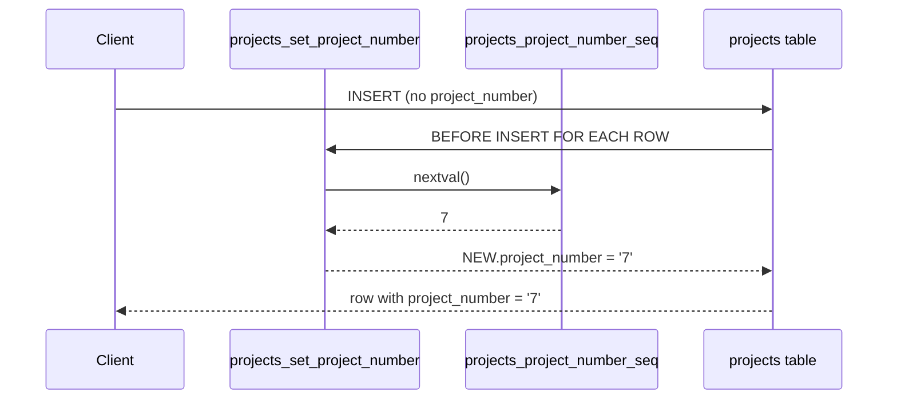
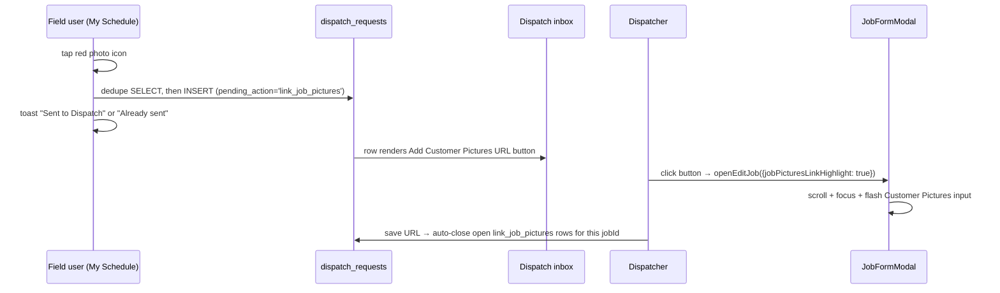

# Recent Features and Updates

This document summarizes all recent features and improvements added to PipeTooling.

---
file: RECENT_FEATURES.md
type: Changelog
purpose: Chronological log of all features and updates by version
audience: All users (developers, product managers, AI agents)
last_updated: 2026-07-18 (v2.741)
 estimated_read_time: 30-45 minutes
 difficulty: Beginner to Intermediate
 
 format: "Reverse chronological (newest first)"
 version_range: "v2.581+ (reverse chronological)"
 
 key_sections:
   - name: "Latest Version (v2.670)"
     line: ~2022
     description: "App-wide: page content (tab bars) sits much closer under the header — .appMain top padding 1.5rem → 0.5rem, .pageWrap top padding 2rem → 0."
   - name: "Previous Version (v2.664)"
     line: ~2030
     description: "Controller users now render on People → Users (own Controllers section after Assistants) and in Quickfill Schedule role grouping — multi-user UI test caught that the PersonKind chain lacked controller, so such users vanished from the roster entirely."
   - name: "Previous Version (v2.663)"
     line: ~2030
     description: "Controller payroll-capability sweep (Phase 3 fix-up): every policy/function still gating on is_pay_approved_master() directly now uses has_payroll_access(), closing the gap where a controller could read pay stubs but not wages/cost-matrix tables. Role-simulated verification: 21 wage rows + 218 pay stubs readable, clock powers intact, is_dev false."
   - name: "Previous Version (v2.662)"
     line: ~2032
     description: "New controller role (Phase 3): acts like an assistant everywhere (DB is_assistant() and client isAssistantLike() are assistant-LIKE; ~230 role-gate conversions across ~70 files) plus dev-level financial visibility — has_payroll_access(), People Payroll/Hours, cost matrix, unredacted dashboards, Job Summary labor/profit. Not dev admin. Enum + capabilities migrations; create-user/invite-user accept controller (redeploy required)."
   - name: "Previous Version (v2.661)"
     line: ~2032
     description: "Phase 2 of the pay-visibility overhaul: is_assistant_of_pay_approved_master() dissolved — every assistant gets the identical clock-management toolset (clock sessions, crew, hours, attendance, write-ups, contracts, licenses, vehicles, housing, week-fence bypass) via is_assistant(); pay stays locked per v2.660; master_assistants is now pure team structure."
   - name: "Previous Version (v2.660)"
     line: ~2032
     description: "Assistant pay lockdown (Phase 1): assistants — pay-linked or not — can no longer read wages or pay stubs at the DB level (people_pay_config assistant SELECT dropped; pay-stub family onto new has_payroll_access()); new list_people_pay_flags() + get_dashboard_payroll_totals() SECURITY DEFINER RPCs keep Hours/Quickfill/Crew rosters and AP-card org totals working; Job Summary labor/profit and Projects day-modal team labor now dev/master-only; cost-matrix shares restricted to dev/master grantees."
   - name: "Previous Version (v2.659)"
     line: ~2030
     description: "Job Detail — Assigned Team no longer shows raw UUIDs for archived users: the users RLS hides archived rows from non-dev viewers, so the team_members name embed came back null; missing names now resolve through the RPC-backed fetchUserNamesForIds (list_user_display_names)."
   - name: "Previous Version (v2.658)"
     line: ~2028
     description: "Job Detail / Edit Job — Cost breakdown team-labor stream gated to devs + masters (showJobCostBreakdownTeamLabor; per-person hours x wage let other roles derive employee pay rates — UI layer of a two-layer fix, people_pay_config RLS audit tracked separately); Billing Pipeline Job detail / Edit job icon buttons lose their border (keep the 36px hit area)."
   - name: "Previous Version (v2.657)"
     line: ~2026
     description: "Dashboard & Job Detail — billing pipeline UX pass: Financials cards read top-down; Bill Customer + Open age go side-by-side in a measured container-query band; the dashboard View Details button + JobBillDetailsModal are removed in favor of Job Detail, which gains a dev/master-only Profit band (sub labor via laborJobSubCost, tally parts, revenue, profit); the Job detail / Edit job icon toolbar becomes full-size bordered buttons on desktop."
   - name: "Previous Version (v2.656)"
     line: ~1944
     description: "Bids → Labor — **Travel (Meals + Hotels) cost section with GSA per-diem lookup**. New amber **`Travel`** parameter box on the Labor tab between **Driving Cost Parameters** and **Estimator Cost Parameters** in [`src/pages/Bids.tsx`](../src/pages/Bids.tsx). Four editable inputs — **Travelers**, **Nights**, **Meals/day ($)**, **Hotel/night ($)** — plus a **ZIP** field and a **`Look up GSA per diem`** button. Cost formula is `travelCost = people × nights × (mealsRate + hotelRate)` (meals-days = nights, so a no-overnight job adds $0); a right-aligned summary renders `Meals: … = $X`, `Hotels: … = $Y`, `Travel total: $Z` with only the dollar amounts bold (matching the Driving/Estimator lines). **Persistence**: migration `20270603120000_cost_estimates_travel_and_gsa_per_diem_cache.sql` adds `travel_people int NOT NULL DEFAULT 1`, `travel_nights int NOT NULL DEFAULT 0`, `travel_meals_rate numeric`, `travel_hotel_rate numeric` to `cost_estimates`; the four values hydrate in `loadCostEstimate` and save in BOTH the explicit `saveCostEstimate` and the 1.5s debounced Labor autosave (with the new state added to the autosave dep array). **GSA lookup**: same migration creates `gsa_per_diem_cache (zip, year)` (RLS: `is_dev_or_master_or_assistant() OR is_estimator()`); new Edge Function [`supabase/functions/gsa-per-diem/index.ts`](../supabase/functions/gsa-per-diem/index.ts) (modeled on `geocode-one`, `verify_jwt = false` + in-handler JWT/role gate for dev/master_technician/assistant/estimator) checks the cache, else calls `https://api.gsa.gov/travel/perdiem/v2/rates/zip/{zip}/year/{year}` using the new **`GSA_API_KEY`** secret, returns `{ ok, meals_rate (M&IE), hotel_rate (max month lodging), city, state }`, and upserts the cache; non-CONUS ZIPs (`oconusInfo`) and missing keys return a friendly `{ ok:false }` envelope so the user just keeps the manual override. The client invokes via `supabase.functions.invoke('gsa-per-diem', { body: { zip } })`; the ZIP field is best-effort prefilled by regex-extracting a 5-digit ZIP from the bid customer's address (not persisted; resets per bid). **Full roll-up**: new top-level pure helper `computeTravelCost(ce)` is summed into every internal-cost total — the on-screen Pricing `Our cost breakdown` (`totalCost`, plus a new gated **Travel (meals + hotels)** `<tr>` beside Team Labor), the Pricing CSV `totalBidCost`, both cost-estimate HTML print builders (`laborCostWithDriving`/`grandTotal` + a `Travel:` line in detail and summary), both pricing-package HTML print exports (`totalCost`), and the jsPDF builder (a `Travel cost` line + `Travel` summary row). Also in this pass: the bottom **`TOTAL`** block on the Labor tab (previously trimmed to Driving/Estimator) was removed entirely, and the Driving/Estimator parameter summary lines were right-aligned with only the dollar amount bold. **Setup note**: `GSA_API_KEY` (free from api.data.gov) must be set via `supabase secrets set GSA_API_KEY=…` before the lookup returns rates; until then it reports `unconfigured` and manual entry still works. Verified: `npx supabase db push` clean, `npm run gen-types:linked` regenerated [`src/types/database.ts`](../src/types/database.ts), `npx tsc --noEmit` clean, zero new lints, function deployed, no new security advisors. Files: new [`supabase/archive/migrations-pre-baseline/20270603120000_cost_estimates_travel_and_gsa_per_diem_cache.sql`](../supabase/archive/migrations-pre-baseline/20270603120000_cost_estimates_travel_and_gsa_per_diem_cache.sql), new [`supabase/functions/gsa-per-diem/index.ts`](../supabase/functions/gsa-per-diem/index.ts); modified [`src/pages/Bids.tsx`](../src/pages/Bids.tsx), [`supabase/config.toml`](../supabase/config.toml); regenerated [`src/types/database.ts`](../src/types/database.ts). Out of scope: M&IE first/last-day 75% proration (flat per-night meals), seasonal lodging (uses the max month value), and a user-editable per-diem year selector."
   - name: "Previous Version (v2.588)"
     line: ~1944
     description: "Bids — **`Cost Estimate` tab renamed to `Labor`**. URL slug renamed `cost-estimate` -> `labor` across [`src/pages/Bids.tsx`](../src/pages/Bids.tsx) (the `activeTab` union type, the materials-model-switch `sourceTab` state + `openMaterialsModelSwitch` param types, `BIDS_TABS`, the `bidTabs` deep-link array, every `activeTab === 'cost-estimate'` check, the tab button's `setActiveTab`/`setSearchParams`/`tabStyle`, the `openMaterialsModelSwitch`/`selectBidAndSyncUrl`/`setActiveTab` call sites), [`src/lib/pinnedTabs.ts`](../src/lib/pinnedTabs.ts) (`PATH_TABS['/bids']`), and the `BidPreviewTabUrl` union in [`src/components/bids/BidPreviewModal.tsx`](../src/components/bids/BidPreviewModal.tsx). Back-compat: the Bids deep-link effect normalizes any incoming `?tab=cost-estimate` to `?tab=labor` (replace-nav) so old bookmarks/links still resolve, and `getPinned` migrates existing localStorage pins (`{path:'/bids', tab:'cost-estimate'}` -> `tab:'labor'`); existing Supabase `user_pinned_tabs` rows keep working via the URL alias (no SQL migration). All user-facing `Cost Estimate` strings became `Labor`: the tab button, the `Go to Cost Estimate` button (-> `Go to Labor`), the print/PDF page titles (`… — Labor`), and the helper/empty-state sentences (`…ensure Counts and Labor are set up/exist`; the margin-comparison empty state reworded to `Add fixtures in Counts and set up Labor first…`). Internal identifiers (`costEstimate*` state/refs, `CostEstimate` / `CostEstimateLaborRow` types, `selectedBidForCostEstimate`, `ensureCostEstimateForBid`) and the `cost_estimates` / `cost_estimate_labor_rows` DB tables are unchanged, so no DB / migration / type / RPC changes. Note: the tab still builds total internal cost (labor + materials + driving + estimator) and contains the `Labor Book` section; the rename is a label/slug change only. Follow-up: the Pricing `Our cost breakdown` footer gained two clickable, link-styled group sub-headers — **`Takeoffs`** (above the Materials row) and **`Labor`** (above the Manhours/Driving/Estimator/Team Labor rows) — each a full-width `<td colSpan={7}>` holding a `<button>` styled as a blue underlined link that calls `selectBidAndSyncUrl(selectedBidForPricing, 'takeoffs' | 'labor')` to switch tabs while keeping the same bid loaded; the component rows keep their `1.5rem` indent so they read as nested under each header. Follow-up: on the Labor tab the bottom **`TOTAL`** summary block was trimmed to show only **`Driving`** and **`Estimator`** — the `Materials with tax`, `Manhours`, `Labor total`, and `Grand total` rows were removed, along with the now-unused `totalMaterials` / `rate` / `laborCost` / `laborCostWithDriving` / `materialsWithTax` / `grandTotal` computations in that footer IIFE (the kept lines reuse the existing `totalHours` → `numTrips` → `drivingCost` and `estimatorCost` derivations unchanged). The companion print/PDF builders (which still emit the full `Labor total` / `Grand total` breakdown) are out of scope. Verified: `npx tsc --noEmit` clean (the `activeTab` + `BidPreviewTabUrl` union renames would surface any missed `'cost-estimate'` literal); zero new lints. Files: modified [`src/pages/Bids.tsx`](../src/pages/Bids.tsx), [`src/lib/pinnedTabs.ts`](../src/lib/pinnedTabs.ts), [`src/components/bids/BidPreviewModal.tsx`](../src/components/bids/BidPreviewModal.tsx)."
   - name: "Previous Version (v2.587)"
     line: ~1944
     description: "Materials — **`Price Book` tab renamed to `Parts Book`**. Disambiguates the materials cost ledger (the per-part cost catalog) from the **Bids** price book (`price_book_entries`, what we charge), which is left entirely untouched. URL slug renamed `price-book` -> `parts-book` across [`src/pages/Materials.tsx`](../src/pages/Materials.tsx) (`MATERIALS_TABS`, the `activeTab` union type + `useState` default, all `setActiveTab`/`setSearchParams` call sites, and the infinite-scroll + tab-content guards) and [`src/lib/pinnedTabs.ts`](../src/lib/pinnedTabs.ts) (`PATH_TABS['/materials']`). Back-compat: the Materials URL effect normalizes any incoming `?tab=price-book` to `?tab=parts-book` (replace-nav) so old bookmarks/links still land correctly, and `getPinned` migrates existing localStorage pins (`{path:'/materials', tab:'price-book'}` -> `tab:'parts-book'`); existing Supabase `user_pinned_tabs` rows keep working via the URL alias (no SQL migration). Cross-page link updated in [`src/pages/Dashboard.tsx`](../src/pages/Dashboard.tsx) (the `Part` quick-add now points at `/materials?tab=parts-book&addPart=true`). Visible labels updated: the tab button and `View Price Book` button in Materials, plus the materials-only sentences in [`src/pages/Settings.tsx`](../src/pages/Settings.tsx) (orphaned-prices and duplicate-materials/maintenance copy) and [`src/pages/Duplicates.tsx`](../src/pages/Duplicates.tsx). The feature was already modeled internally as `parts` (`MaterialPart` / `PartWithPrices`, tables `parts` / `part_prices`), so no DB / migration / type / RPC changes and no internal identifier renames. Verified: `npx tsc --noEmit` clean (the `activeTab` union rename would surface any missed `'price-book'` literal); zero new lints. Files: modified [`src/pages/Materials.tsx`](../src/pages/Materials.tsx), [`src/lib/pinnedTabs.ts`](../src/lib/pinnedTabs.ts), [`src/pages/Dashboard.tsx`](../src/pages/Dashboard.tsx), [`src/pages/Settings.tsx`](../src/pages/Settings.tsx), [`src/pages/Duplicates.tsx`](../src/pages/Duplicates.tsx)."
   - name: "Previous Version (v2.586)"
     line: ~1944
     description: "Bids → Pricing — **merged `Margin/Total` column**. The pricing table's last data column previously showed `Margin %` in Cost Model view and `% of Total` in Price Model view (one number, gated on `pricingViewModel`). It now shows a single column headed **`Margin/Total`** that always renders **both** numbers as `{margin}% / {pctOfTotal}%` (e.g. `500.0% / 1.2%`) in both view modes — on every row and the Total footer (footer reads `{overallMargin}% / 100%` since the grand total's share is always 100%). Implementation in [`src/pages/Bids.tsx`](../src/pages/Bids.tsx): the header ternary is replaced with the literal `Margin/Total`; the per-row cell drops its `pricingViewModel === 'cost' ? … : …` branch in favor of a single `inline-flex` holding a margin `<span>` (`row.margin != null ? \`${row.margin.toFixed(1)}%\` : '—'`), a muted `/` separator, and the **existing** `pctOfGrandTotal` IIFE reused verbatim so the omit-from-submission eye toggle and all its `canToggleOmitSubmission` / `savingPricingAssignment` disabled-state logic are preserved. Two consequences of always showing both values: the omit-from-submission eye toggle (previously Price-view only) and the red/yellow/green margin flag dot (previously Cost-view only) now both render in **both** views — the eye toggle's gating was already view-independent, and the flag dot gates were simplified from `pricingViewModel === 'cost' && row.flag` / `… && totalRevenue > 0` to just `row.flag` / `totalRevenue > 0`. Number format keeps the existing `toFixed(1)` on both sides; rows with null margin or null pct render `—` on that side. The `View: Cost Model / Price Model` toggle still drives the `Our cost` / `Unit Cost` column header and the cost-breakdown box. Out of scope: the print table header (`'Margin %'`, line ~5894) and CSV export columns are unchanged. No DB / migration / RLS / RPC / Edge / type-gen changes; `computeBidPricingRows` / `marginFlag` / `pctOfGrandTotal` / `marginPct` calculations untouched. Follow-up: the margin half of each per-row cell now renders `—` (instead of a proportional-fallback margin number) when a fixture has no takeoff materials — `row.materialsFromTakeoff == null || row.materialsFromTakeoff === 0`, covering both the By Stage no-assembly-mapping (`null`) and Combined no-rough-part-line (`0`) cases — so a synthetic margin is no longer shown as if it were real; the `/ {pctOfTotal}%` half and the flag dot are unchanged. Follow-up: the **`Our cost breakdown`** (Materials / Manhours / Driving / Estimator / Team Labor / Total cost) was moved out of the standalone amber card and folded into the **pricing table footer** as muted rows directly above the bold Total row — a light-amber section row carries the **Total cost** (so it stays visible in Price Model, where the Total row's `Our cost` cell is blank) and each component renders as an indented muted row with its dollar amount and `| X.X%` share of total cost in the `Our cost` column (Driving keeps its `trips × $/mi × mi` detail; Driving/Estimator/Team Labor rows stay conditional on non-zero values). Now shown in **both** Cost Model and Price Model; all figures were already computed view-independently in the surrounding IIFE, so no data plumbing changed. Verified: `npx tsc --noEmit` clean; zero new lints on [`src/pages/Bids.tsx`](../src/pages/Bids.tsx). Files: modified [`src/pages/Bids.tsx`](../src/pages/Bids.tsx)."
   - name: "Previous Version (v2.585)"
     line: ~1944
     description: "Bids — **materials-model selector labels renamed + Cost Estimate selector repositioned**. The two-button toggle that sits above the Takeoffs, Cost Estimate, and Pricing tabs (previously `Materials  Exact  Rough`) now reads **`Materials  By Stage  Combined`** in all three tabs. The shared switch-confirmation modal body copy follows: `Exact and Rough data are stored separately. Switching does not copy lines from the other mode.` → `By Stage and Combined data are stored separately. Switching does not copy lines from the other mode.` Pure display-string change in [`src/pages/Bids.tsx`](../src/pages/Bids.tsx) — seven literals total (six button labels at the three selector sites plus the one modal sentence). Companion **layout tweak in the Cost Estimate tab only**: the Materials selector previously lived inline next to the bid title in the header's left flex group, which crowded long bid titles on narrow viewports; it now renders on its own full-width row immediately under the `Print | ×` row, styled `display: flex; justifyContent: 'flex-end'; gap: '0.25rem'; flexWrap: 'wrap'; marginBottom: '0.75rem'` — mirroring the Pricing tab's flex-end row at lines ~16022–16080 so the three workflow tabs now share a consistent header shape. The selector remains **always visible** (not data-gated on `costEstimateCountRows.length`) so the empty-state path (`Add fixtures in the Counts tab first.`) is visually unchanged from current behavior. The underlying `type MaterialsModel = 'exact' | 'rough'` enum, `materials_model` column on the `bids` table, all `normalizeMaterialsModel` / `openMaterialsModelSwitch('exact'|'rough', …)` call sites, every `*MaterialsModel === 'exact' | 'rough'` comparison, the unrelated `STAGE_LABELS.rough_in = 'Rough In'` takeoff-stage map, the `takeoffRoughPartLines` / `roughLineCatalogApplyModal` / `pricingEntryRoughIn` / `setRoughQtyNumpadLineId` internal identifiers, and the Prospects default `materials_model: 'rough'` are all untouched. The `Print` button / `×` close button (both desktop and narrow-viewport floating variants) / Takeoffs / Pricing layouts are also untouched. Also right-aligned the blue `Add version` button in the expanded **Takeoff book** (Takeoffs tab), **Labor book** (Cost Estimate tab), and **Price book** (Pricing tab) sections via `marginLeft: 'auto'` on each button's inline `style`, so the version chips flow left-to-right and `Add version` anchors flush to the right edge of the row (chip rendering, flexWrap, and the `openNewTakeoffBookVersion` / `openNewLaborVersion` / `openNewPricingVersion` handlers are untouched). No DB / migration / RLS / RPC / Edge / type-gen changes. Verified: `npx tsc --noEmit` clean; zero new lints on [`src/pages/Bids.tsx`](../src/pages/Bids.tsx). Files: modified [`src/pages/Bids.tsx`](../src/pages/Bids.tsx)."
   - name: "Previous Version (v2.584)"
     line: ~1944
     description: "Bids → Takeoffs → Exact — **Assembly picker dropdown portaled to document.body**. The per-row Assembly search dropdown used to be an absolutely-positioned `<ul>` inside a `<div style={{ overflow: 'hidden' }}>` table wrapper (clipping the inner table to the rounded border) so the dropdown got cut off at the table edge whenever it opened on a row near the bottom. Fixed via `ReactDOM.createPortal` to `document.body` modeled after the existing rough-quantity numpad portal already in the same file. New top-level state in [`Bids.tsx`](../src/pages/Bids.tsx): `takeoffTemplatePickerInputRefs = useRef<Map<string, HTMLInputElement>>(new Map())` (per-mapping input refs so the open-picker effect can resolve the correct anchor input regardless of which row is active) and `takeoffTemplatePickerAnchor: { top, left, width } | null` (computed viewport-anchored position). New `useEffect` keyed on `takeoffTemplatePickerOpenMappingId` reads `inputRefs.current.get(openMappingId)?.getBoundingClientRect()` and sets `{ top: rect.bottom + 2, left: rect.left, width: rect.width }`; registers `resize` and `scroll` (capture phase, so any scrolling ancestor fires it) listeners while the picker is open and tears them down on close. The assembly `<input>` gains a callback ref that registers/unregisters in the Map by `mapping.id`. Existing `onFocus` / `onBlur` (the 150 ms `setTimeout` close) / `onKeyDown` (Escape) / `readOnly` behavior is untouched. The inline `<ul style={{ position: 'absolute', left: 0, right: 0, top: '100%', zIndex: 50 }}>` block (53 lines) is removed from the Assembly cell and replaced by a single `createPortal(<ul style={{ position: 'fixed', top, left, width, zIndex: 1200, ... }}>, document.body)` rendered as a sibling next to the existing `roughQtyNumpadLineId` portal at the end of the main `Bids` component JSX. Belt-and-suspenders: `onMouseDown={(e) => e.preventDefault()}` on the `<ul>`, each `<li>`, and the 'Add assembly' fallback button prevents the input from blurring mid-scroll (the existing 150 ms blur close still works since the portal sits outside the input subtree). `zIndex: 1200` matches the rough numpad portal (above standard modals at 1000). The `overflow: 'hidden'` on the table wrapper is left in place — no longer relevant for the dropdown, still useful for the rounded clip on the table body. No DB / migration / RPC / type-gen changes. Verified: `npx tsc --noEmit` clean; zero new lints. Files: modified [`src/pages/Bids.tsx`](../src/pages/Bids.tsx) (new state + ref Map, new useEffect, callback ref on the input, removed inline `<ul>`, new portal alongside the rough numpad portal). Out of scope: applying the same portal pattern to any Rough takeoff dropdown (same `overflow: 'hidden'` wrapper at line ~13787 — trivial follow-up if needed), and extracting the takeoffs section out of the 22k-line `Bids.tsx`."
   - name: "Previous Version (v2.583)"
     line: ~1944
     description: "Materials → Supply Houses — **Show last payment** toggle. New per-user checkbox stacked directly below the existing **Show paid invoices** toggle in the page header; when on, reveals a new **Last Paid** column on the summary table between **Updated** and the actions column showing `MAX(paid_at)` per supply house as a relative phrase via `longTimeAgoPhrase` (matching the adjacent **Updated** column verbatim) with the full ISO timestamp in the `title` hover tooltip. Toggle defaults **off** so existing UI is unchanged on first load. Component-local state (not persisted), matching the existing `showPaidInvoices` sibling — explicit non-goal in this pass. Data path: [`loadSupplyHouseSummary`](../src/components/SupplyHousesTab.tsx) extends its existing `supply_house_invoices` projection from `(supply_house_id, amount, is_paid, updated_at)` to `(supply_house_id, amount, is_paid, updated_at, paid_at)`, adds a parallel `maxPaidByHouse: Map<string, string>` alongside the existing `maxUpdatedByHouse`, filters `inv.is_paid && inv.paid_at` (so unpaid rows with NULL `paid_at` don't poison the max), and folds `lastInvoicePaidAt: maxPaidByHouse.get(h.id) ?? null` into each `SupplyHouseSummaryRow`. Toggling the checkbox does not refetch — `paid_at` is always present in the loaded summary and the toggle only gates rendering. Expanded-detail row `colSpan` flexes from 5 to 6 when the toggle is on. Houses with zero paid invoices show `—`. No DB / migration / RPC / type-gen changes (the `paid_at` column + auto-stamp trigger landed in v2.582). Verified: `npx tsc --noEmit` clean; zero new lints on the touched file. Files: modified [`src/components/SupplyHousesTab.tsx`](../src/components/SupplyHousesTab.tsx). Out of scope: persisting either toggle to `localStorage`, making the column sortable, and re-sorting by Last Paid when toggled on."
   - name: "Previous Version (v2.582)"
     line: ~1944
     description: "Materials → Supply Houses — **invoice paid-at timestamp**. New `paid_at TIMESTAMPTZ` column on `supply_house_invoices` plus a `BEFORE INSERT OR UPDATE` trigger (`sync_supply_house_invoice_paid_at` / `sync_supply_house_invoice_paid_at_trigger`) that auto-stamps `paid_at = now()` when `is_paid` flips false→true (and clears it on true→false). Trigger lives in [`supabase/archive/migrations-pre-baseline/20270602120000_supply_house_invoices_paid_at.sql`](../supabase/archive/migrations-pre-baseline/20270602120000_supply_house_invoices_paid_at.sql) with `SET search_path = public` per the project lint convention. All three UI write paths in [`src/components/SupplyHousesTab.tsx`](../src/components/SupplyHousesTab.tsx) — the per-row `toggleInvoicePaid` checkbox, the bulk `applyPayment` flow, and the edit-invoice `saveInvoice` form — keep their existing `UPDATE … SET is_paid` shape and just inherit the stamp from the trigger (no app-side `new Date().toISOString()` to remember in any call site; editing amount/link/etc. without flipping `is_paid` deliberately leaves `paid_at` untouched). Legacy rows backfilled best-effort via `UPDATE … SET paid_at = COALESCE(updated_at, created_at, NOW()) WHERE is_paid = true AND paid_at IS NULL;` (149 rows touched in prod). New index `idx_supply_house_invoices_paid_at`. UI surfaces it as a new **Paid On** column in the per–supply-house Invoices table (between Paid and Link), with `inv.paid_at ? new Date(inv.paid_at).toLocaleDateString() : '—'` and a `title` attribute carrying the full ISO timestamp for hover detail; the empty-state `colSpan` bumps from 9 to 10. The **Apply Payment** modal's per-invoice line now reads `Paid {MM/DD/YYYY}` (same `title` ISO tooltip) when `inv.is_paid` is true and `paid_at` is set. Types regenerated via `npm run gen-types:linked` so `Database['public']['Tables']['supply_house_invoices']` Row/Insert/Update each include `paid_at: string | null`. Trigger verified end-to-end via a transactional DO block (insert unpaid → null; flip to paid → stamped; amount-only update → unchanged; flip to unpaid → cleared; insert already-paid → auto-stamped). Out of scope: a 'Last Paid' aggregate column on the Supply Houses summary table, a user-editable paid-date input in the edit-invoice modal, and any filtering / sorting by paid date — all easy follow-ups now that the column exists. Verified: `npx supabase db push` clean, `npx tsc --noEmit` clean, zero new advisor warnings on the touched table / function. Files: new [`supabase/archive/migrations-pre-baseline/20270602120000_supply_house_invoices_paid_at.sql`](../supabase/archive/migrations-pre-baseline/20270602120000_supply_house_invoices_paid_at.sql); modified [`src/components/SupplyHousesTab.tsx`](../src/components/SupplyHousesTab.tsx); regenerated [`src/types/database.ts`](../src/types/database.ts)."
   - name: "Previous Version (v2.581)"
     line: ~1944
     description: "Banking Mercury Accounting — **Approve by default** toggle. New per-user checkbox below the **Approve all (N)** button on the Accounting tab's Approvals section (defaults **off**: presence of `'1'` = on, anything else = off). When on, the existing `handleApproveAll` flow is auto-fired every time a new pending suggestion appears — closes the loop after v2.580 (rules auto-create suggestions; this auto-commits them). Internal Transfers conflicts (suggestions whose label is Internal Transfers and whose tx already has job splits in `mercury_transaction_splits`) are still skipped by `handleApproveAll` itself, so those persist in the pending list and surface for manual review. **Toast-spam-free residue handling**: the auto-approve effect derives a pre-filtered `autoApprovablePending` list (mirrors the conflict-skip predicate inside `handleApproveAll`) and only the filtered list goes into the signature. Once a load settles into a stable conflict-only set the signature shrinks to `''` and the gate's `pendingCount === 0` branch quiets the effect — so `handleApproveAll`'s `All pending suggestions would label a transaction with job splits as Internal Transfers. Clear the splits first.` toast never fires from auto-mode. New storage helpers `readAccountingApproveByDefault` / `writeAccountingApproveByDefault` in [`bankingDragSortStorage.ts`](../src/lib/bankingDragSortStorage.ts) under prefix `banking_accounting_approve_by_default_v1_`. New pure helper module [`accountingApproveByDefaultAutoTrigger.ts`](../src/lib/accountingApproveByDefaultAutoTrigger.ts) — `buildApproveByDefaultSignature(pending)` returns `pending.map(p => p.suggestionId).sort().join(',')` (sort independence keeps the signature stable across upstream re-orderings); `shouldAutoApproveAccountingSuggestions(state)` walks the gate set (`enabled`, `pendingLoading`, `approveAllBusy`, `pendingCount > 0`, `currentSignature !== lastSignature`). 11 unit tests in [`accountingApproveByDefaultAutoTrigger.test.ts`](../src/lib/accountingApproveByDefaultAutoTrigger.test.ts) cover sort independence, empty-list signature, single-id add/remove, every gate flip, and signature equality / inequality. State lifted to [`Banking.tsx`](../src/pages/Banking.tsx) alongside the v2.579/v2.580 lifts: `approveByDefault` boolean (hydrated per user via `useEffect` keyed on `user?.id`), `onApproveByDefaultChange` callback (state setter + `writeAccountingApproveByDefault`). Two new props on `BankingMercuryAccountingTabProps`: `approveByDefault`, `onApproveByDefaultChange`. New `<label>` checkbox in [`BankingMercuryAccountingTab.tsx`](../src/components/banking/BankingMercuryAccountingTab.tsx) inside the Approvals `<section>`, in a right-aligned flex row immediately below the green **Approve all (N)** button (same checkbox styling as the v2.580 toolbar — `display: flex; alignItems: center; gap: 8`, `title` attribute explains the conflict-skip behavior for hover discoverability). Auto-approve effect threads the gate predicate, signature ref `lastAutoApprovedSignatureRef`, and the new memoized `autoApprovablePending` filter (`isInternalTransfersLabel(label) && allocationsByTxId.get(txId).length > 0` → drop). Concurrent-click safety is free — `approveAllBusy` gates both the manual button and the effect, so a click during an in-flight auto-approve (or vice versa) returns early with no double approve. Tab gating is free — the effect lives inside `BankingMercuryAccountingTab`, which only mounts when `bankingView.mercuryTab === 'accounting'`. No DB / migration / RLS / RPC / Edge / type-gen changes — `bulk_approve_accounting_label_suggestions` and the chunked-insert math in `handleApproveAll` are untouched. Verified: `npx tsc --noEmit` clean; `npx vitest run` **1130 / 1130** pass (1119 pre-existing + 11 new); zero new lints on touched files. Files: new [`src/lib/accountingApproveByDefaultAutoTrigger.ts`](../src/lib/accountingApproveByDefaultAutoTrigger.ts), new [`src/lib/accountingApproveByDefaultAutoTrigger.test.ts`](../src/lib/accountingApproveByDefaultAutoTrigger.test.ts), modified [`src/lib/bankingDragSortStorage.ts`](../src/lib/bankingDragSortStorage.ts), [`src/pages/Banking.tsx`](../src/pages/Banking.tsx), [`src/components/banking/BankingMercuryAccountingTab.tsx`](../src/components/banking/BankingMercuryAccountingTab.tsx)."
   - name: "Previous Version (v2.580)"
     line: ~2010
     description: "Banking Mercury Accounting — **Apply rules by default** toggle. New per-user toolbar checkbox below `Hide labeled transactions` (defaults **off**: presence of `'1'` = on, anything else = off). When on, every successful transaction load on the Accounting tab — initial mount, **Refresh from Mercury**, **Backfill from Mercury…**, the Sorting/Ledger **Reload table** buttons, and the silent reload after the v2.579 `onAfterAssignmentChange` callback — auto-runs `computeApplyRulesPreflight(rules)` followed by `executeApplyRules(preflight)`. Deliberately bypasses `applyRulesWithSnapshot` (so it skips `APPLY_RULES_CONFIRM_THRESHOLD = 200` and never pops the confirm modal) but still routes through `executeApplyRules` so the **`APPLY_RULES_PER_CLICK_CAP = 500`** per-pass cap and the `Created N. M more match — apply again after reviewing.` toast both apply unchanged. New storage helpers `readAccountingApplyRulesByDefault` / `writeAccountingApplyRulesByDefault` in [`bankingDragSortStorage.ts`](../src/lib/bankingDragSortStorage.ts) under prefix `banking_accounting_apply_rules_default_v1_`. New pure helper module [`accountingApplyRulesAutoTrigger.ts`](../src/lib/accountingApplyRulesAutoTrigger.ts) — `buildAutoApplySignature(txs, rules)` returns `${sortedTxIds}|${sortedEnabledRuleIds}` (sort independence keeps the signature stable across upstream re-orderings; disabled rules drop out so toggling enabled doesn't poison the cache); `shouldAutoApplyAccountingRules(state)` walks the gate set (`enabled`, `loading`, `rulesLoading`, `assignmentsLoading`, `applyRulesBusy`, `rulesCount > 0`, `currentSignature !== lastSignature`). 13 unit tests in [`accountingApplyRulesAutoTrigger.test.ts`](../src/lib/accountingApplyRulesAutoTrigger.test.ts) cover every gate flip, sort independence, enabled-flag filtering, both-empty stability, and signature equality / inequality. State lifted to [`Banking.tsx`](../src/pages/Banking.tsx) alongside the v2.579 `hideLabeledTransactions` lift: `applyRulesByDefault` boolean (hydrated per user via `useEffect` keyed on `user?.id`), `onApplyRulesByDefaultChange` callback (state setter + `writeAccountingApplyRulesByDefault`), and a monotonic **`autoApplyResetTick: number`** counter the parent bumps after `handleSync` and `handleBackfill` so a fresh sync still fires one auto-apply pass even when the unlabeled id set didn't change (e.g. a sync that only updated counterparties / amounts). Three new props on `BankingMercuryAccountingTabProps`: `applyRulesByDefault`, `onApplyRulesByDefaultChange`, `autoApplyResetTick`. New toolbar `<label>` checkbox in [`BankingMercuryAccountingTab.tsx`](../src/components/banking/BankingMercuryAccountingTab.tsx) immediately after the existing **Hide labeled transactions** label (same `display: flex; alignItems: center; gap: 8` styling, `title` attribute explains the bypass + 500 cap for hover discoverability). Auto-apply effect threads the gate predicate, signature ref `lastAutoAppliedSignatureRef`, and a separate ref-reset effect keyed on `autoApplyResetTick`. New callback `runAutoApply` jumps straight from `computeApplyRulesPreflight(rules)` to `executeApplyRules(preflight)`, returning early on a null preflight (no rules / no enabled / no matches). Tab gating is free — the effect lives inside `BankingMercuryAccountingTab`, which only mounts when `bankingView.mercuryTab === 'accounting'`. Concurrent-click safety is also free — `applyRulesBusy` gates both the manual button and the effect, so a click during an in-flight auto-apply (or vice versa) returns early with no double insert. No DB / migration / RLS / RPC / Edge / type-gen changes — `bulk_insert_accounting_label_suggestions` and the `executeApplyRules` slice/insert math are untouched. Verified: `npx tsc --noEmit` clean; `npx vitest run` **1119 / 1119** pass (1106 pre-existing + 13 new); zero new lints on touched files. Files: new [`src/lib/accountingApplyRulesAutoTrigger.ts`](../src/lib/accountingApplyRulesAutoTrigger.ts), new [`src/lib/accountingApplyRulesAutoTrigger.test.ts`](../src/lib/accountingApplyRulesAutoTrigger.test.ts), modified [`src/lib/bankingDragSortStorage.ts`](../src/lib/bankingDragSortStorage.ts), [`src/pages/Banking.tsx`](../src/pages/Banking.tsx), [`src/components/banking/BankingMercuryAccountingTab.tsx`](../src/components/banking/BankingMercuryAccountingTab.tsx)."
   - name: "Previous Version (v2.579)"
     line: ~2010
     description: "Banking Mercury Accounting — **server-side unlabeled fetch**. Default-on path on the Accounting tab now skips fetching the labeled 88% of rows entirely. New SECURITY INVOKER RPC **`list_unlabeled_mercury_transactions(p_limit int default null)`** does a `LEFT JOIN ... WHERE assignments.mercury_transaction_id IS NULL` against `mercury_transaction_drag_sort_assignments` (anti-join hits the existing PK index, no new index needed); returns the same column shape as a `mercury_transactions` SELECT (typed via `npm run gen-types:linked`). `Banking.tsx` lifts `hideLabeledTransactions` state out of `BankingMercuryAccountingTab` and adds `loadAllRows` (existing 15k fetch unchanged) + `loadUnlabeledRows` (the new RPC) + `loadRowsForActiveView` — a tab-aware dispatcher that picks the unlabeled-only RPC only when (`mercuryTab === 'accounting' && hideLabeledTransactions === true`). Drag Sort, User Review, Category Review, Sorting, and Ledger continue to use the master 15k fetch. The mount effect, the `mercury_transactions` Realtime callback, post-sync, post-backfill, the Sorting tab Reload button, and the Ledger Advanced menu Reload all route through `loadRowsForActiveView`, so the toggle and the active tab fully drive what gets fetched. **`BankingMercuryAccountingTab`** drops its local `hideLabeledTransactions` state + the userId-change re-sync `useEffect` + the two storage helper imports (`readAccountingHideLabeledTransactions` / `writeAccountingHideLabeledTransactions`); accepts `hideLabeledTransactions` + `onHideLabeledTransactionsChange` props (the toolbar checkbox now calls the prop, parent persists per-user); derives `inputIsUnlabeledOnly = hideLabeledTransactions` and short-circuits both `loadAssignmentsForList` (returns immediately with an empty map — by definition every row is unlabeled, so the per-page assignment-marking sweep is pure waste) and `displayTransactions` (when input is already unlabeled-only, returns `afterLedgerFilters` directly without re-filtering). New optional `onAfterAssignmentChange?: () => void` prop wired by the parent to `() => void loadRowsForActiveView({ silent: true })`; the tab fires it after `clearRowDragSortLabel`, `handleQuickAssignLabel`, `handleApprove`, and `handleApproveAll` — the four mutation paths that add or remove rows in `mercury_transaction_drag_sort_assignments` — so the unlabeled list shrinks (or grows) in place. `handleReject`, `executeApplyRules`, and rule edits don't touch the assignments table directly, so they don't call back. Migration **`20260525204531_list_unlabeled_mercury_transactions.sql`**. Verified: types regen succeeds (RPC typed `Args: { p_limit?: number }`, returns `mercury_transactions` row shape); `npx tsc --noEmit` clean; `npx tsc -b` clean; `npx vitest run` **1,106 / 1,106** pass; zero new lints; manual sanity check via `execute_sql` confirms the RPC returns 1,284 unlabeled rows on the linked DB (vs ~10k+ total). New file `supabase/migrations/20260525204531_list_unlabeled_mercury_transactions.sql`; modified [`src/pages/Banking.tsx`](../src/pages/Banking.tsx) and [`src/components/banking/BankingMercuryAccountingTab.tsx`](../src/components/banking/BankingMercuryAccountingTab.tsx); regenerated [`src/types/database.ts`](../src/types/database.ts)."
   - name: "Previous Version (v2.578)"
     line: ~1935
     description: "Banking Mercury Accounting — **Rules modal**. The inline collapsible Rules section on the Accounting tab is replaced by a single **`Rules (N)`** trigger button that opens a new dedicated modal containing the full toolbar (**New rule**, **Audit overlaps**, **Apply rules to transactions**), the **`Search rules…`** input, and the sortable rules table (Name / Label / Enabled / Approved uses / Edit / Delete). The Accounting tab page is now a clean two-section flow (Approvals → Sorting Ledger) with a thin trigger row between them. New file [`BankingMercuryAccountingRulesModal.tsx`](../src/components/banking/BankingMercuryAccountingRulesModal.tsx) — modeled after [`MercuryCounterpartyFrequencyModal.tsx`](../src/components/banking/MercuryCounterpartyFrequencyModal.tsx) (backdrop click + Escape close, `role=\"dialog\"` + `aria-modal=\"true\"`, sticky title + scope description, scrollable body); presentational only — every value comes in from props, so refresh/busy/persistence behavior is unchanged. **Stacking strategy**: the Rules modal renders at **`zIndex: 1100`**, deliberately below every child modal already mounted in the same component, so existing z-indices stay untouched: Edit Rule (`AccountingRuleFormModal`, 1200), Audit Overlaps (`BankingMercuryAccountingOverlapsModal`, 1250), Apply Rules confirm (`BankingMercuryAccountingApplyRulesConfirmModal`, 1260), and Edit Rule's nested delete confirm (1201) all sit naturally above the Rules modal. The user keeps the rules table visible behind every child interaction. The pre-existing **`auditPendingReopenAfterRuleModalRef` / `useEffect`** hide-and-restore handoff (audit → Edit Rule → audit returns) continues to work unchanged — Rules modal stays at 1100 throughout the cycle. **Cleanup**: dead code from the previous accordion is gone — `[rulesSectionExpanded, setRulesSectionExpanded]` state, the `useEffect` that resynced the flag on `userId` change, the `ACCOUNTING_RULES_SECTION_BODY_ID` constant, and the two storage-helper imports (`readAccountingRulesSectionExpanded` / `writeAccountingRulesSectionExpanded`) are deleted from [`BankingMercuryAccountingTab.tsx`](../src/components/banking/BankingMercuryAccountingTab.tsx). The storage helpers themselves stay in [`bankingDragSortStorage.ts`](../src/lib/bankingDragSortStorage.ts) for one PR — stale localStorage keys are harmless. Files: new [`src/components/banking/BankingMercuryAccountingRulesModal.tsx`](../src/components/banking/BankingMercuryAccountingRulesModal.tsx); modified [`BankingMercuryAccountingTab.tsx`](../src/components/banking/BankingMercuryAccountingTab.tsx) (imports, dropped accordion state + effect + constant, new `rulesModalOpen` state, replaced 279-line inline `<section>` with a 17-line trigger button row, mounted the new modal next to its peers). No DB / migration / RLS / RPC / Edge / type-gen changes. Verified: `npx tsc --noEmit` clean, `npx tsc -b` clean, **1106 / 1106** vitest tests pass, no new lints."
   - name: "Previous Version (v2.576)"
     line: ~1932
     description: "Banking Mercury Accounting — **Apply rules crash fix**. The Approvals section used to dump every newly-created `mercury_accounting_label_suggestions` row into the DOM at once. With **5,000+ pending approvals** that meant ~5,000 React cards × a `<select>` with ~50 label `<option>`s each ≈ **250,000+ DOM nodes**, and any state change anywhere in the component (hover, dropdown change, tab focus) re-reconciled the whole list — Chrome would freeze for 10–30 s, then crash. Fix is layered, the runtime never touches the wedge again. **(1) Cap creation per click** — new constant **`APPLY_RULES_PER_CLICK_CAP = 500`** in [`BankingMercuryAccountingTab.tsx`](../src/components/banking/BankingMercuryAccountingTab.tsx). Old `applyRulesWithSnapshot` was split into two pieces: pure-ish **`computeApplyRulesPreflight(ruleRows)`** (fetches the current pending-tx id set, builds the assigned tx id set, parses every rule's criteria once, calls new shared helper **`buildAccountingRulesToInsert`** in [`src/lib/applyAccountingRulesPreflight.ts`](../src/lib/applyAccountingRulesPreflight.ts)) and side-effecting **`executeApplyRules(preflight)`** (slices to the cap, chunks the insert at `INSERT_CHUNK = 2000`, toasts the result, calls `loadPending()`). The orchestrating `applyRulesWithSnapshot` runs the preflight, returns early on no-rules / no-enabled / no-matches, and either fires the modal (above threshold) or executes inline. **(2) Confirm modal** — new constant **`APPLY_RULES_CONFIRM_THRESHOLD = 200`** + new component [`BankingMercuryAccountingApplyRulesConfirmModal.tsx`](../src/components/banking/BankingMercuryAccountingApplyRulesConfirmModal.tsx). Above threshold, **Apply rules** stops and shows `N transactions match your rules. The first 500 will be created as pending suggestions for review. The remaining N-500 stay unmatched until you approve some and click Apply rules again.` Cancel + Escape + backdrop close (Escape gated on `!busy`); confirm fires `executeApplyRules` and closes. Below threshold the modal never mounts — common case is unchanged. **(3) Memoized approval cards** — new component [`AccountingApprovalCard.tsx`](../src/components/banking/AccountingApprovalCard.tsx) wraps the 90-line per-approval card render in `React.memo`. Parent passes stable callbacks (**`handleApproveCard`** / **`handleRejectCard`** / **`handleLabelChangeCard`** / `openEditRuleById`) wrapped in `useCallback` and resolves the live `PendingApproval` row from a new **`pendingApprovalsRef: useRef<PendingApproval[]>`** mirror (synced via `useEffect`) so the callback identities don't churn on every state change. Net: changing one card's dropdown re-renders **only that card**, not the other 499 / 4,999. **(4) Pagination** — new constant **`APPROVALS_PAGE_SIZE = 50`** + `approvalsVisibleCount` state + a fresh-load effect (`prevPendingLenRef` → `0 → N` triggers reset to 50; same-list edits keep the user's expanded window). Below the visible cards, a `Showing X of N.` footer renders **`Show 50 more`** + **`Show all (N)`** when there are more rows. **`Approve all`** now reads **`Approve all (N)`** including the live count. **(5) Tests** — pure helper [`applyAccountingRulesPreflight.test.ts`](../src/lib/applyAccountingRulesPreflight.test.ts) covers 13 cases (empty rules, empty txs, disabled rule skip, null criteria skip, zero-clause skip, assigned tx skip, pending tx skip, first-match-wins by `sort_order` then `id`, output ordering matches input tx order, no-cap behavior at 1500-row scale, dedupe of doubled-id input). Acceptance: **0 matches** → no-op toast; **50 / 150** matches → silent insert + paint **50** cards; **300 / 5,000** matches → modal asks → confirm inserts **300 / 500** + paints **50** cards with `Show 50 more` and `Show all (300 / 500)` controls; **Approve all (500)** approves the **whole queue**, not just the 50 visible. No DB / migration / RLS / RPC / Edge / type-gen changes (engine SQL semantics unchanged — `bulk_insert_accounting_label_suggestions` still does the chunked insert). Verified: `npx tsc --noEmit` clean, no new lints on the four touched files, **26 / 26** preflight + overlap tests pass."
   - name: "Previous Version (v2.575)"
     line: ~1920
     description: "Banking Mercury — **1-year backfill control + raised display cap**. The everyday **Refresh from Mercury** button is hardcoded to **`lookback_days: 90`** so daily refresh stays fast (~10s, idempotent). To pull a longer window without redeploying, devs now have a separate **Backfill from Mercury…** menu item under **Advanced** (between **Refresh from Mercury** and **Reload table**); it's gated on **`isDevBanking`** so non-dev viewers (assistant / master_technician) don't see it. Click opens new **[`MercuryBackfillModal.tsx`](../src/components/banking/MercuryBackfillModal.tsx)** — two `<input type=\"date\">` fields seeded to **`[today − 365, today]`** in **`APP_CALENDAR_TZ`** (via `denverCalendarDayKey(Date.now())` + `ymdAddDays(today, -365)`), cross-bounded via `min`/`max` (start.max = end, end.min = start; both clamped to today). Client validation runs on every render: both required, `start <= end`, `end <= today`, range ≤ **`MAX_RANGE_DAYS = 3650`** (matches the Edge clamp; surfaces a friendly amber inline message instead of letting the function silently truncate). Pre-validation errors render in an amber pill; submit failures from the Edge function render in a red pill and the modal stays open with `submitting === false` so the user can retry without re-opening it. **`Run backfill`** posts **`{ start, end }`** to existing Edge function **[`sync-mercury-transactions`](../supabase/functions/sync-mercury-transactions/index.ts)** which already accepts that shape (alongside `lookback_days`); no Edge change. The function paginates Mercury **`/api/v1/transactions`** at 500/page × **`MAX_PAGES = 120`** = up to **60,000 tx** per invocation, upserts on **`mercury_id`** (idempotent — re-running over the same range rewrites the same rows). On success the modal closes itself and the parent's **`handleBackfill`** toasts `Synced N transactions from Mercury (start → end).` then runs **`Promise.all([loadRows(), loadNicknames(), loadDebitCardNicknames()])`** so the Banking table reflects the new rows immediately. **`handleBackfill`** flips **`syncing`** during the run so the **Refresh from Mercury** button (top-of-page) and the new **Backfill** menu item both disable; the rest of the page is unaffected. Display-side companion change: in [`src/pages/Banking.tsx`](../src/pages/Banking.tsx) `loadRows`, the in-memory cap moves from a hardcoded **`.limit(5000)`** to a named constant **`MERCURY_TRANSACTIONS_BANKING_LIST_LIMIT = 15000`** so a full year (~10k tx) plus headroom fits in one scrollable list. Trade-off: the existing `useMemo` chain that walks `rows` (filtering, sorting, counterparty frequencies, per-row maps) gets ~3× heavier on first paint; banking is desktop-first dev / master / assistant only, so the slow-phone case isn't relevant. Search and rules continue to filter via the DB, not the in-memory list. Files: new **[`MercuryBackfillModal.tsx`](../src/components/banking/MercuryBackfillModal.tsx)** (`ymdDaysBetween` helper, `MercuryBackfillResult` / `MercuryBackfillModalProps` types, default-on-open seeding effect, Escape-to-close gated on `!submitting`); modified **[`Banking.tsx`](../src/pages/Banking.tsx)** (new constant + import + `backfillModalOpen` state + `handleBackfill` async function + `BankingLedgerAdvancedMenuProps.onBackfillFromMercury?` prop + menuitem render + dev-gated mount alongside other nicknames modals + `.limit(MERCURY_TRANSACTIONS_BANKING_LIST_LIMIT)` swap). No DB / migration / RLS / RPC / Edge / type-gen changes — Edge function already supported `{ start, end }`; Mercury API itself accepts arbitrary `YYYY-MM-DD` windows. Verified: `npx tsc --noEmit` clean, no new lints on either touched file."
   - name: "Previous Version (v2.574)"
     line: ~1920
     description: "Banking Mercury Accounting — **Edit Rule modal Delete**. Adds a red trash icon in the [`AccountingRuleFormModal`](../src/components/banking/AccountingRuleFormModal.tsx) header (Edit mode only — gated on `editingRuleId !== null && onDelete !== undefined`, so New rule still has a clean header) styled with [`PayStubDeleteIcon`](../src/components/pay/PayStubDeleteIcon.tsx) at `#b91c1c` (matches the Rules-table Delete-link red and Edit Job's confirm-Delete background). Click opens a nested confirm overlay at `zIndex: 1201` (parent modal sits at 1200, mirroring Edit Job's `parent + 1` convention) with the rule name in bold, a *Pending suggestions tied to this rule will be removed. This cannot be undone.* warning, and Cancel + Delete buttons; backdrop click + Cancel are gated on `!deleting` so a click can't dismiss the confirm mid-flight, and the parent modal's outer-presentation `onMouseDown` already short-circuits via `e.target === e.currentTarget` so the confirm's overlay div never closes the parent on bubble. **`deleteRuleCore`** refactored out of [`BankingMercuryAccountingTab.deleteRule`](../src/components/banking/BankingMercuryAccountingTab.tsx) (new pure delete-and-toast-and-reload function with no `window.confirm`); the modal calls it via the new optional `onDelete?: () => Promise<void>` prop, the existing Rules-table Delete link still wraps it with `window.confirm` (regression-safe). On failure `deleteRuleCore` toasts and re-throws so the modal's `handleConfirmDelete` keeps the nested confirm open with `deleting === false` for retry. On success the parent calls `setRuleModalOpen(false)`, which fires the **v2.573 audit handoff** `useEffect` watching `ruleModalOpen` (`true → false`) and re-opens the audit modal underneath with the deleted rule absent from `overlapReport.txRows` / `pairCounts` (the `useMemo` rebuilds from refreshed `rules` after `loadRulesAndUsage()`) — completing the *open audit → click rule name → delete → audit reopens* workflow that v2.573 made discoverable. Form `controlsDisabled` extended to include `deleting` so Save / Save and apply / Test / form fields all lock during delete; the trash icon disables itself on the same flag. New local state `deleteConfirmOpen` + `deleting`; new handler `handleConfirmDelete` (try/finally on `setDeleting`, catches re-thrown errors so toast already shown). Files: modified [`AccountingRuleFormModal.tsx`](../src/components/banking/AccountingRuleFormModal.tsx) (props type, state, header flex row, nested confirm overlay JSX, `handleConfirmDelete`, `controlsDisabled` extension), modified [`BankingMercuryAccountingTab.tsx`](../src/components/banking/BankingMercuryAccountingTab.tsx) (`deleteRuleCore` extraction, `deleteRule` thin wrapper, `onDelete` prop wired on `<AccountingRuleFormModal>` mount). No DB / migration / RLS / RPC / Edge / type-gen changes (`mercury_accounting_label_rules` already supports DELETE via the existing RLS policy). Verified: `npx tsc --noEmit` clean, no new lints on either touched file."
   - name: "Previous Version (v2.573)"
     line: ~1920
     description: "Banking Mercury Accounting — **rule overlap audit**. Mercury accounting rules are first-match-wins (sorted by `sort_order, id`; the engine in `BankingMercuryAccountingTab.applyRulesWithSnapshot` `break`s on the first hit), which silently shadows every other rule that would have matched the same tx. New **Audit overlaps** button on the Rules section toolbar opens **`BankingMercuryAccountingOverlapsModal`** with two tabs: **By rule pair** (winner / shadowed / tx count, sorted desc by count, click rule names to open Edit Rule) and **By transaction** (one row per overlapping tx with all matching rule names — winner bolded — plus an amber *Currently labeled X · winning rule labels Y* line when an existing assignment disagrees with the winning rule). Audit scope = currently filtered Banking transactions, **including already-labeled ones** (so disagreements between the rule engine and live assignments surface as the highest-signal flavour of overlap). Modal is gated behind the button click so the O(rules × txs) compute pays only on demand. **Audit ↔ Edit Rule handoff**: clicking a rule name routes through `openEditRuleByIdFromOverlaps` which sets `auditPendingReopenAfterRuleModalRef = true`, closes the audit modal, then opens Edit Rule. A `useEffect` watching `ruleModalOpen` detects the `true → false` transition (Cancel / Save / Save and apply / backdrop) and re-opens the audit with the flag cleared and `overlapReport` memo re-computed against the freshly-saved rules. Hide-and-restore avoids stacking the audit (1250) above the Edit Rule modal (1200), which would have hidden Edit Rule behind audit, and avoids bumping Edit Rule above 1250 — which would have hidden the Test results modal (also 1250) that Edit Rule itself spawns. User-initiated audit Close (button / backdrop) clears the flag so accidental later edits don't auto-reopen. The existing per-rule **Test** preview (`runTestFromCriteria`) now also enriches each matched row with an `Also matched by: <rule names>` line, computed from the saved rules snapshot minus the rule being edited (when `editingRuleId != null`); same matcher / same engine sort. New pure helper **`buildAccountingRuleOverlapReport`** in [`src/lib/accountingRuleOverlap.ts`](../src/lib/accountingRuleOverlap.ts) — mirrors the engine's sort/tiebreak verbatim, walks every match per tx (no `break`), aggregates `perRule` stats (matched / winner / shadowed) and `pairCounts` (winner → shadowed pair counts, sorted desc), exposes optional `assignmentLabelByTxId` for the conflict path and `includeDisabled` flag for future toggle work; 13 unit tests in [`accountingRuleOverlap.test.ts`](../src/lib/accountingRuleOverlap.test.ts) cover empty inputs, single-match silent path, two-rule overlap, tied `sort_order` → `id.localeCompare` tiebreak, disabled-rule exclusion + `includeDisabled` opt-in, null/empty-criteria exclusion, three-rule pair-counting, multi-tx pair aggregation + sort, and the assignment-vs-winner conflict path with both single-match and overlap variants. Engine itself (`applyRulesWithSnapshot`, `matchAccountingLabelRuleCriteria`) untouched — audit is a pure read of in-memory state, no DB / migration / RPC / RLS / Edge changes. Files: new [`src/lib/accountingRuleOverlap.ts`](../src/lib/accountingRuleOverlap.ts), new [`src/lib/accountingRuleOverlap.test.ts`](../src/lib/accountingRuleOverlap.test.ts), new [`src/components/banking/BankingMercuryAccountingOverlapsModal.tsx`](../src/components/banking/BankingMercuryAccountingOverlapsModal.tsx); modified [`src/components/banking/BankingMercuryAccountingTab.tsx`](../src/components/banking/BankingMercuryAccountingTab.tsx) (toolbar button + state + memoized report + `txById` map + Test preview enrichment + audit handoff `useRef` / `useEffect` + modal mount). Verified: `npx tsc --noEmit` clean, 26 / 26 tests pass across `accountingLabelRuleMatch.test.ts` + `accountingRuleOverlap.test.ts`."
   - name: "Previous Version (v2.572)"
     line: ~1917
     description: "Banking Mercury Drag Sort — new built-in **Internal Transfers** label for movement between the org's own accounts. Treated as a non-expense throughout the app: excluded from Schedule C totals and from the Materials cost rollup in **People → Overhead** (the **Field Total ($) / Hours** modal's Materials header now subtracts the bucket via new `sumMaterialsTotalUsdExcludingInternalTransfer` in [`overheadPartsAccountingBuckets.ts`](../src/lib/overheadPartsAccountingBuckets.ts); the breakdown still surfaces an Internal Transfers section with a slate accent + *not counted in Materials* hint so the audit trail stays visible). Mutually exclusive with `mercury_transaction_splits` — both directions hard-blocked at the UI: applying the label to a transaction with existing job splits toasts an error in **`BankingMercuryDragSortTab.applyDragSortAssignment`** (covers DnD + Quick Sort focus modal `onPickLabel`), in **`BankingMercuryAccountingTab`**'s `handleQuickAssignLabel` / `handleApprove` / `handleApproveAll` (bulk path skips the conflicting rows + reports `Skipped N Internal Transfers suggestions with job splits`); creating job splits on a transaction already labeled Internal Transfers is locked in **`MercuryTransactionAllocationsModal`** via a one-shot probe of `mercury_transaction_drag_sort_assignments` + `mercury_drag_sort_labels.default_key`, which sets `internalTransfersLabelLocked` → renders a slate banner above the form (*Locked: Internal Transfers — This transaction is labeled Internal Transfers and cannot be split onto jobs. Remove the label in Banking → Mercury → Drag Sort first.*), disables the job search input + per-line `$/%` toggles + value input + note input + Fill remainder + Remove buttons, and gates Save (`canSave` returns false; `handleSave` shows the same error toast). Also adds early-return guard in `addJobLine` so cached `JobSearchRow` clicks can't bypass the disabled search. Sidebar bucket card carries a subtle slate accent (`#94a3b8` border, `#f1f5f9` background) when the new optional **`defaultKey`** prop equals `'internal_transfers'` — both **`LabelDropZone`** in `BankingMercuryDragSortTab` and the grid card in `BankingMercuryDragSortFocusModal` thread it through. New helper exports in [`dragSortDefaultLabels.ts`](../src/lib/dragSortDefaultLabels.ts): **`INTERNAL_TRANSFERS_DEFAULT_KEY = 'internal_transfers'`** + **`isInternalTransfersLabel(label)`**. New helper in [`overheadPartsAccountingBuckets.ts`](../src/lib/overheadPartsAccountingBuckets.ts): widened `OverheadPartsAccountingBucketKey` from 3 to 4 keys (adds `'internal_transfer'` last in the display order so the new bucket renders below `Other`), `OVERHEAD_PARTS_ACCOUNTING_BUCKET_LABEL.internal_transfer = 'Internal Transfers'`, **`isMaterialsBucketKey(key)`**, **`sumMaterialsTotalUsdExcludingInternalTransfer(sections)`**. Migration **`20260525160339_add_drag_sort_internal_transfers_builtin.sql`** — `INSERT … ON CONFLICT (default_key) DO NOTHING` with `is_system_default=true`, `sort_order=9999` (parks at the bottom for new orgs; the existing client-side `ensureDragSortDefaultLabels` upsert beats the migration for orgs that load Drag Sort before deploy and lands the row at the end of `DRAG_SORT_DEFAULT_LABELS` × 10 = 270, also bottom). Rules in [`mercury_drag_sort_labels_guard_system_fields`](../supabase/migrations/20260502224616_mercury_drag_sort_org_wide_labels.sql) protect `name` / `schedule_c_line` / `description` from drift. Out of scope: auto-suggestion rules in `mercury_accounting_label_rules` (users add their own once the label exists), migrating existing `excludeCounterpartyContains` filter strings (left untouched per plan), Schedule C export (none yet — when it lands, skip rows whose `default_key === 'internal_transfers'`). Tests: 11 new unit tests in [`overheadPartsAccountingBuckets.test.ts`](../src/lib/overheadPartsAccountingBuckets.test.ts) (`isMaterialsBucketKey` × 4, `internal_transfers` → bucket key, routes Mercury internal_transfer tx to internal_transfer bucket, isolates internal_transfer dollars in their own bucket, `sumMaterialsTotalUsdExcludingInternalTransfer` × 2, four-bucket fixed display order, four-bucket totals conservation) — full **1080 / 1080** vitest pass. Verified: `npm run gen-types:linked` clean (no schema column changes — INSERT-only migration). Files: [`src/lib/dragSortDefaultLabels.ts`](../src/lib/dragSortDefaultLabels.ts), [`src/lib/overheadPartsAccountingBuckets.ts`](../src/lib/overheadPartsAccountingBuckets.ts), [`src/lib/overheadPartsAccountingBuckets.test.ts`](../src/lib/overheadPartsAccountingBuckets.test.ts), [`src/components/banking/BankingMercuryDragSortTab.tsx`](../src/components/banking/BankingMercuryDragSortTab.tsx), [`src/components/banking/BankingMercuryAccountingTab.tsx`](../src/components/banking/BankingMercuryAccountingTab.tsx), [`src/components/banking/BankingMercuryDragSortFocusModal.tsx`](../src/components/banking/BankingMercuryDragSortFocusModal.tsx), [`src/components/banking/dragSortLabelBucketCard.tsx`](../src/components/banking/dragSortLabelBucketCard.tsx), [`src/components/MercuryTransactionAllocationsModal.tsx`](../src/components/MercuryTransactionAllocationsModal.tsx), [`src/pages/People.tsx`](../src/pages/People.tsx), `supabase/migrations/20260525160339_add_drag_sort_internal_transfers_builtin.sql`."
   - name: "Previous Version (v2.571)"
     line: ~1917
     description: "**Dashboard My Time / Edit time** modal — new **Add disjoint session** affordance. A small ghost-grey `+` button now sits at the bottom-right of `myTimeDayTimelineScroll` (right-aligned, vertically tucked under the last cluster's bottom border to match the `×` reject buttons inside Visual-mode cluster cards). Click opens [`AddDisjointSessionModal`](../src/components/my-time-day-editor/AddDisjointSessionModal.tsx) — a sub-modal with Clock in / Clock out `datetime-local` inputs (same shape as the existing Adjust times modal). Defaults are computed by **`computeAddDisjointDefaults`** in [`DashboardMyTimeDayEditorModal.tsx`](../src/components/DashboardMyTimeDayEditorModal.tsx): last session end + 1 h gap, +2 h duration; for empty days it falls back to **8 AM** Chicago wall (`salaryZonedWallClockToUtcMs(dateStr, 8, 0, 0, APP_CALENDAR_TZ)`) + 2 h. Validation inside the modal blocks blank fields, `out <= in`, sessions shorter than `MIN_SEGMENT_MS`, future-stamped times, and overlap with any **existing session** (open punches treated as extending to `nowMs`); the error line names the conflicting range (`Overlaps an existing session at 13:00 – 14:00`). On confirm, **`handleAddDisjointConfirm`** appends a normalized `DayEditorSession` with a synthetic `DRAFT_PEOPLE_HOURS_SESSION_ID_PREFIX` id and a seeded `notes='Disjoint session'` (non-empty so `buildPayloads` doesn't reject the segment on Save) into local `fetchedSessions`. The save path already INSERTs draft-id rows via the `isDraftPeopleHoursSessionId` branch in `persistDirtyChangesAsync` — no new DB / RPC / migration. Gating: button only renders when `effectiveEditable && allowPunchTimeActions && !priorWeekGateActive && sessionsProp.length === 0 && !sessionsLoading && !pendingAuthForFetch` — i.e. only on editor instances that self-fetch their day (People Hours-seeded callers that pass `sessionsProp` explicitly never see it, since pushing a synthetic draft into their controlled state is unsafe). `closeTopmostSubFlow` learns the new branch so Escape / backdrop / discard-on-dirty close the disjoint modal before any other sub-flow. The wrapper around the `+` button uses `marginTop: -4` to overlap the last cluster's 0.5 rem internal bottom padding for tight visual alignment with the `×` buttons two pixels above. New file [`AddDisjointSessionModal.tsx`](../src/components/my-time-day-editor/AddDisjointSessionModal.tsx). Modified [`DashboardMyTimeDayEditorModal.tsx`](../src/components/DashboardMyTimeDayEditorModal.tsx) (imports + `addDisjointOpen` state + `addDisjointExistingIntervals` memo + `computeAddDisjointDefaults` + `handleAddDisjointConfirm` + `closeTopmostSubFlow` branch + button render + modal mount). No DB / migration / RLS / RPC / Edge changes. Verified: `npx tsc --noEmit` clean; full test suite still passes; manual QA — empty-day defaults to 8–10 AM Chicago, last-session-end + 1h defaults, overlap rejected against open and closed sessions, future rejection, sub-`MIN_SEGMENT_MS` rejection, Escape / backdrop / Cancel dismissal cascade, Save persists via existing draft INSERT branch."
  - name: "Previous Version (v2.570)"
    line: ~1914
    description: "Bids → Pricing tab — new **Package and send** button left of **Export CSV**. Staff (`dev` / `master_technician` / `assistant` / `estimator`) can mail a bid's external pricing package (Job Plans link + 4-column table: Fixture/Tie-in, Count, Unit price, Revenue) to a roster user without leaving the tab. Two paths: (a) **Send via my mail** opens a `mailto:` with a plain-text fallback body via [`bidPackageMailto.ts`](../src/lib/bidPackageMailto.ts) and copies the HTML table to the clipboard via `navigator.clipboard.write([new ClipboardItem({ 'text/html': … })])` so the user pastes it into their compose window; (b) **Send for me** invokes new Edge function [`send-bid-pricing-package`](../supabase/functions/send-bid-pricing-package/index.ts) which re-computes pricing rows server-side from `bid_count_rows` + `bid_pricing_assignments` + `bid_count_row_custom_prices` + `bid_count_row_submission_hides` + `price_book_entries` (no trust in any client-built HTML — guarantees the email always matches the live Pricing tab), then calls `sendResendHtmlEmail` from [`recurringJobReportCore.ts`](../supabase/functions/_shared/recurringJobReportCore.ts). Both paths respect `submissionHiddenIdsForVersion` so the same rows hidden on Counts / Cover Letter are hidden from the email. Modal preview uses scoped `dangerouslySetInnerHTML` of the shared table HTML so what the recipient sees is exactly what the sender saw. New audit table **`bid_pricing_package_sends`** (migration **`20260521221622_bid_pricing_package_sends.sql`** — `bid_id` / `price_book_version_id` / `sent_by_user_id` / `recipient_user_id` / `recipient_email` / `sent_via` check'd `'resend' | 'mailto_logged'` / `resend_id` / `plans_link` / `revenue_total_cents` / `row_count` / `created_at`; index on `(bid_id, created_at DESC)`; RLS for all 6 roles — SELECT for dev/master/assistant/estimator gated on `can_access_bid_for_pricing(bid_id)`, INSERT same plus `sent_by_user_id = auth.uid()`, UPDATE/DELETE dev only). SECURITY INVOKER RPC **`log_bid_pricing_package_send`** (gated through the INSERT policy) writes the mailto attempt row from the client; the Edge function uses service-role for the resend row. Recipient picker is `SearchableSelect` over the existing `estimatorUsers` roster (non-archived, no helpers, no `name='delete'`) and requires a non-empty email. Toolbar button shares the same data preconditions as Export CSV (`selectedPricingVersionId && pricingCountRows.length > 0 && pricingCostEstimate`); blocked when `plans_link` is blank with an inline **Edit bid** button that opens `JobFormModal` via the existing `openEditBid`. New shared helpers: [`src/lib/buildBidPricingPackageHtml.ts`](../src/lib/buildBidPricingPackageHtml.ts) (+ [test](../src/lib/buildBidPricingPackageHtml.test.ts), 18 cases) — pure HTML / plain-text builders + external-row filter + cents totaler, mirrored byte-for-byte in [`supabase/functions/_shared/bidPricingPackage.ts`](../supabase/functions/_shared/bidPricingPackage.ts) (keep-in-sync convention from `physicalInvoiceFixtureScaling.ts` ↔ `stripeInvoiceItemsFromFixtures.ts`). New mailto helper [`src/lib/bidPackageMailto.ts`](../src/lib/bidPackageMailto.ts) (+ [test](../src/lib/bidPackageMailto.test.ts), 6 cases) — full URL-encoding, plans-link line, simple email-shape validation. New modal [`src/components/bids/PackageAndSendBidPricingModal.tsx`](../src/components/bids/PackageAndSendBidPricingModal.tsx). `Bids.tsx` adds one shared `pricingPackageSource = useMemo(...)` so the preview / mailto / Resend paths all read the same numbers as the on-screen Pricing table (one source of truth)."
  - name: "Previous Version (v2.569)"
    line: ~1900
    description: "User Review modal — **schedule-rail stretch** (extends v2.568). The grey rail no longer just clips, it **rescales**: when a view (Day / Week per-day rows / Month per-day rows) has activity, every strip stretches its visible `[lo, hi]` window edge-to-edge so the user can see more of the active part of the day. The shared-window invariant is preserved (one window per view, every row gets the same window) so wall-time x-coords still line up across rows (`9 AM` lands at the same screen x on every visible row in Week / Month). Three coordinated changes inside the shared rail component [`DispatchAddBlockTimeRange.tsx`](../src/components/schedule/DispatchAddBlockTimeRange.tsx): (1) new internal **`slotToTrackT(slotIndex, slotCount, window)`** and **`trackTToSlotIndex(t, slotCount, window)`** helpers centralize the slot↔track mapping — when `window` is undefined the math is the un-rescaled `slotIndex / maxIdx` (Quickfill / Schedule Dispatch path unchanged); when window is `{ lo, hi }` the math is `(clamp(slotIndex, lo, hi) - lo) / (hi - lo)` so `lo` lands at t=0 and `hi` at t=1. Forward exports `dispatchAddBlockTrackThumbLeftPct` and inverse helpers `clientXToSlotIndex` / `clientXToDispatchMinutes` / `thumbPixelX` all route through these helpers (inverse mappings update too — User Review strips are `disabled` so drag is unreachable, but the inverse stays honest for future interactive opt-in). (2) Rail under the rescale spans full track width when `{ lo, hi }` is provided (the visible strip *is* the window now — edge-clipping would double-trim); `null` still hides, `undefined` still draws the full un-trimmed rail. (3) Occupied / secondary bands and proposed-range fill all use `slotToTrackT` so they paint at their wall-time x in the rescaled strip; defensive `display: none` when `hi <= lo` after rescale. Orientation labels (the bottom row in `DispatchAddBlockTimeRange` and the shared header **`QuickfillScheduleOrientationLabelsRow`** above the strips) **filter** to inside-window marks only and **reposition** to their wall-time x in the rescaled space — so a stretched view that only covers 7 AM–11 AM shows just `8 AM` at the correct rescaled x, not all three labels at original positions. **4-hour minimum window floor** via new helper **`applyRailWindowMinFloor(window, USER_REVIEW_RAIL_MIN_FLOOR_SLOTS = 8)`** in [`src/lib/userReviewSharedSlotWindow.ts`](../src/lib/userReviewSharedSlotWindow.ts) — `null` passes through (empty view stays empty), already-wide windows pass through, otherwise expands symmetrically around the midpoint then re-clamps to `[0, DISPATCH_ADD_BLOCK_SLOT_COUNT - 1]` with deficit-shift to the opposite side when clamping shrinks one edge (so a 30-min punch at 9 AM expands to ~7 AM-11 AM and a 30-min punch at 4 AM expands to 4 AM-8 AM, never to a misleading sliver). The floor lives at the **orchestrator boundary** — each of `UserDayScheduleSection.tsx`, `UserWeekScheduleSection.tsx`, `UserMonthScheduleSection.tsx` wraps the existing `computeUserReviewSharedSlotWindow(...)` `useMemo` result with `applyRailWindowMinFloor(raw, USER_REVIEW_RAIL_MIN_FLOOR_SLOTS)`. **`QuickfillScheduleOrientationLabelsRow`** gains an optional `railTrimWindow` prop (default-undefined keeps existing Quickfill positioning) so the User Review section headers track the rescale too. **Intentional reversal of v2.568's non-goal**: v2.568 explicitly kept bands and labels on the un-rescaled track to preserve absolute wall-time x; v2.569 rescales them but maintains the cross-row alignment via the shared-window invariant. Empty view: window is still `null`, rail still hidden, no rescale, no labels — v2.568 behavior preserved on empty days. Quickfill, Schedule Dispatch hub / job week, schedule-block modals stay untouched because none of them pass `railTrimWindow` — `slotToTrackT(idx, count, undefined)` returns the original `idx / maxIdx` math byte-for-byte. New helper + constant in [`src/lib/userReviewSharedSlotWindow.ts`](../src/lib/userReviewSharedSlotWindow.ts) (6 new unit tests; 14 total in file — null passthrough, already-wide passthrough, symmetric expand around mid with room, left-edge clamp with right shift, right-edge clamp with left shift, floor exceeding track → returns full `[0, maxIdx]`). Modified: [`DispatchAddBlockTimeRange.tsx`](../src/components/schedule/DispatchAddBlockTimeRange.tsx) (helper extraction + widened exported helper + rescaled bands / fill / rail / orientation marks / inverse mappings), [`QuickfillScheduleUserRow.tsx`](../src/components/schedule/QuickfillScheduleUserRow.tsx) (`QuickfillScheduleOrientationLabelsRow` accepts `railTrimWindow`), [`UserDayScheduleSection.tsx`](../src/components/userReview/UserDayScheduleSection.tsx) + [`UserWeekScheduleSection.tsx`](../src/components/userReview/UserWeekScheduleSection.tsx) + [`UserMonthScheduleSection.tsx`](../src/components/userReview/UserMonthScheduleSection.tsx) (apply floor + thread window into the header). No DB / migration / RLS / RPC / Edge changes. Verified: `npx tsc --noEmit` clean; **14 / 14** unit tests in `userReviewSharedSlotWindow.test.ts` pass (6 new); **1014 / 1014** total tests pass; zero new lints on touched files."
  - name: "Previous Version (v2.568)"
    line: ~1900
    description: "User Review modal — **shared schedule-rail trim** across Day / Week / Month per-day rows. The grey rail under each row's schedule strip now clips to the earliest band start and the latest band end across **every row in the view** (Day = 1 row, Week = 7 rows, Month = active days), so a wall-time x-coordinate like `9 AM` lines up identically on every row's bands. Each orchestrator computes one `{ loSlotIndex, hiSlotIndex } | null` via the new pure helper **`computeUserReviewSharedSlotWindow(rows)`** from the day's already-derived `segments` (`blocksToSegments` → `segmentsToOccupiedBands`) + `secondaryBands` (`clockSessionsToDispatchSecondaryBands`), normalizing reversed `(start > end)` bands via `Math.min` / `Math.max` and clamping to `[0, DISPATCH_ADD_BLOCK_SLOT_COUNT - 1]`. Returns `null` when zero bands exist anywhere — every rail then hides. Bands, thumbs, proposed-range fill, orientation labels (8 AM / 12 PM / 4 PM chips), and click handlers stay on the full track unchanged — the load-bearing constraint that keeps cross-row alignment honest. **(Note: v2.569 deliberately reverses this fixed-x behavior by rescaling the window edge-to-edge while preserving cross-row alignment via the shared-window invariant.)** Opt-in additive prop **`railTrimWindow?: { loSlotIndex; hiSlotIndex } | null`** on `DispatchAddBlockTimeRange` (default `undefined` = current full-rail behavior, `null` = hide rail, `{ lo, hi }` = clip to `left: calc(THUMB_HALF + (100% - THUMB_PX) * lo/maxIdx)` / `right: calc(THUMB_HALF + (100% - THUMB_PX) * (1 - hi/maxIdx))`); threaded passthrough on **`QuickfillScheduleUserRow`** and **`UserScheduleDayRow`**. Quickfill, Schedule Dispatch hub / job week, and every other consumer of the shared range component stay untouched because they don't pass the prop. New files [`src/lib/userReviewSharedSlotWindow.ts`](../src/lib/userReviewSharedSlotWindow.ts) + [`src/lib/userReviewSharedSlotWindow.test.ts`](../src/lib/userReviewSharedSlotWindow.test.ts) (8 unit tests — empty input, occupied-only, secondary-only, multi-row union, mixed empty/populated rows, reversed-band normalization, defensive out-of-range clamp). Modified: [`DispatchAddBlockTimeRange.tsx`](../src/components/schedule/DispatchAddBlockTimeRange.tsx) (railStyle branch on the new prop), [`QuickfillScheduleUserRow.tsx`](../src/components/schedule/QuickfillScheduleUserRow.tsx), [`UserScheduleDayRow.tsx`](../src/components/userReview/UserScheduleDayRow.tsx), [`UserDayScheduleSection.tsx`](../src/components/userReview/UserDayScheduleSection.tsx), [`UserWeekScheduleSection.tsx`](../src/components/userReview/UserWeekScheduleSection.tsx), [`UserMonthScheduleSection.tsx`](../src/components/userReview/UserMonthScheduleSection.tsx). No DB / migration / RLS / RPC / Edge changes. Verified: `npx tsc --noEmit` clean; **8 / 8** new unit tests pass; zero lints on touched files."
  - name: "Previous Version (v2.567)"
    line: ~1953
    description: "User Review modal — **switch-user modal** mounted above the parent. Clicking the subject's name in the title (Day / Week / Month modes, both viewports) opens a new **`UserReviewSwitchUserModal`** for staff viewers (`dev` / `master_technician` / `assistant` / `superintendent`); other roles render the name as plain text with no caret affordance. The picker is a single **`SearchableSelect`** seeded from a new lazy **`useUserReviewRoster`** hook that fetches distinct **`clock_sessions.user_id`** values over the last 30 days (Chicago calendar via `denverCalendarDayKey` + `ymdAddDays`) in parallel with a **`users.archived_at`** lookup to drop archived people; display names resolve via the existing **`fetchUserNamesForIds`**. Roster is cached in a ref keyed on `(authUserId, currentUserId)` for the lifetime of the parent modal session so re-opening the switcher within one session is instant (no network). The current subject is omitted from the dropdown (the modal title already names them) — `SearchableSelect` doesn't support per-option `disabled`, so omission is the cleanest way to mark current as not-a-destination. Picking a user calls `modal.open({ userId, displayName, workDateYmd })` with the existing anchor day; `rangeMode` is local state and is intentionally not threaded through `open` so toggling Day / Week / Month survives the swap. Day-mode behavior change: the name `<h2>` button on Day used to open `DashboardMyTimeDayEditorModal` directly for staff — it now prefers the switcher (with a MyTime fallback retained for the unlikely path where `onOpenSwitchUser` isn't wired); MyTime remains one click deeper via clock-band clicks on the dispatch strip. Week / Month name headers are newly clickable for staff (previously plain text). Z-index stacking: parent overlay 1200, switcher dialog 1310, dropdown panel 1320. New helper **`buildSwitchUserOptions`** (pure transformer, sorts case-insensitive ascending with deterministic id tiebreak, skips empty names) covered by **8** unit tests. New files **`src/lib/userReviewSwitchOptions.ts`**, **`src/lib/userReviewSwitchOptions.test.ts`**, **`src/hooks/useUserReviewRoster.ts`**, **`src/components/userReview/UserReviewSwitchUserModal.tsx`**. Modified: **`UserReviewModal.tsx`**, **`UserDayScheduleSection.tsx`**, **`UserWeekScheduleSection.tsx`**, **`UserMonthScheduleSection.tsx`** (each adds optional `onOpenSwitchUser` / `canSwitchUser` props). No DB / migration / RLS / RPC / Edge changes. Verified: `npx tsc --noEmit` clean; **8 / 8** new unit tests pass; zero lints on touched files."
  - name: "Previous Version (v2.566)"
    line: ~1953
    description: "User Review modal — per-day **User Day Summary modal** opened by clicking the **`Sat · 05/16 (3 days ago)`** date header in **Week** and **Month** modes (both desktop and mobile). The modal is read-only and lists every **`job_schedule_blocks`** row (sorted by `time_start` asc, label = job title, optional muted note) and every **`clock_sessions`** row (sorted by `clocked_in_at` asc, label via the newly-exported `associationLabel`, with a duration chip on the right) for that one person-day. Row click-through: a scheduled-block row closes Summary then opens the existing **`ScheduleBlockPreviewModal`**; a clock-session row closes Summary then opens **`DashboardMyTimeDayEditorModal`** — but **only when** `showOpenMyTime === true` (dev / master_technician / assistant / superintendent), so non-staff roles see the same session list as read-only `<div>` rows. The trigger replaces the desktop name-column click that previously opened MyTime editor directly — staff lose a one-click MyTime path but gain a one-click view of *what was supposed to happen vs what actually happened* on that day; MyTime stays reachable one click deeper via the clock-session rows. On mobile (≤640px) the date header `<div>` becomes a `<button>` styled identically (looks like text), so the date is now tappable on a viewport where it previously did nothing. **Day mode is intentionally skipped** (already a single-day focus view, no per-day trigger needed). New file [`src/components/userReview/UserDaySummaryModal.tsx`](../src/components/userReview/UserDaySummaryModal.tsx) — pure presentational; chrome mirrors `ScheduleBlockPreviewModal` (`zIndex: 1300`, backdrop click + Escape close, `role=\"dialog\"`, footer Close button). New file [`src/lib/userDaySummaryFormat.ts`](../src/lib/userDaySummaryFormat.ts) with `formatSessionTimeRange(clockedInAt, clockedOutAt, dayYmd, todayYmd)` (mirrors the open-punch convention from `clockSessionsToDispatchSecondaryBands`: open punch today → `…–now`, open punch past day → `…–no clock out`, closed → `…–end`), `formatSessionDuration(ms)` (`Xh Ym` / `Ym` / `0m`), and `computeSessionDurationMs(...)` (returns `null` for open punches on past days so the caller decides whether to render a duration); helpers take `todayYmd` as a string instead of computing it internally so they're deterministic across Intl/ICU environments (test environment's `en-CA` returns `05/21/2026` not `2026-05-21`). New tests [`src/lib/userDaySummaryFormat.test.ts`](../src/lib/userDaySummaryFormat.test.ts) — 15 tests covering open punch on today, open punch on past day, closed sessions, midnight boundary in `APP_CALENDAR_TZ`, duration formatting (hours+min, min-only, zero/negative/NaN, sub-minute floor), `computeSessionDurationMs` branches, and re-exported `associationLabel` smoke (job hit, bid hit, both null → `'No job'`). Helper extraction in [`src/lib/clockSessionsToDispatchSecondaryBands.ts`](../src/lib/clockSessionsToDispatchSecondaryBands.ts) — the previously-private `associationLabel` is now an `export function` accepting `Map | ReadonlyMap` so Summary modal callers can pass the read-only `jobTitleById` / `bidTitleById` props through without copying into a writable Map. Additive prop in [`src/components/schedule/QuickfillScheduleUserRow.tsx`](../src/components/schedule/QuickfillScheduleUserRow.tsx) — new `onNameColumnClick?: (uid, name) => void` takes precedence over `onOpenPersonMyTime` in the name-column ternary with neutral `Open day summary for {name} ({dayYmd})` `title` / `aria-label`. Strictly additive: Quickfill and Schedule Dispatch callsites that still pass `onOpenPersonMyTime` keep current behavior. Main wiring in [`src/components/userReview/UserScheduleDayRow.tsx`](../src/components/userReview/UserScheduleDayRow.tsx) — adds local `summaryOpen` state + new optional `onOpenBlockPreviewForBlock?: (blockId: string) => void` prop, converts the mobile narrow header `<div>` to a `<button>` (zero visual change — `font: inherit`, no border, no background), passes `onNameColumnClick={() => setSummaryOpen(true)}` to `QuickfillScheduleUserRow` instead of `onOpenPersonMyTime`, mounts `<UserDaySummaryModal>` with the day's blocks/sessions/maps and wires `onSelectBlock` to `setSummaryOpen(false)` + `onOpenBlockPreviewForBlock?.(b.id)` and `onSelectSession` to `setSummaryOpen(false)` + `onOpenMyTimeForSessionStrip(userId, displayName, dayYmd)` (Summary closes first so the next modal never z-index-stacks behind it). Wiring in [`src/components/userReview/UserWeekScheduleSection.tsx`](../src/components/userReview/UserWeekScheduleSection.tsx) and [`src/components/userReview/UserMonthScheduleSection.tsx`](../src/components/userReview/UserMonthScheduleSection.tsx) — each passes `onOpenBlockPreviewForBlock={(blockId) => openBlockPreviewForDay(dayYmd, blockId)}` through to `<UserScheduleDayRow>`, reusing the singleton block-preview state the sections already manage for occupied-band clicks. Empty Month days render through `UserScheduleEmptyDayRow` so they remain non-clickable (no Summary trigger on a day with zero activity). No DB / migration / RLS / RPC / Edge changes. Verified: `npx tsc --noEmit` clean; **57 / 57** unit tests pass across `userDaySummaryFormat` (15) + `buildUserJobLabelBreakdown` (28) + `relativeDayPhrase` (14); zero lints on every touched file."
  - name: "Previous Version (v2.565)"
    line: ~1944
    description: "User Review modal Transactions section — three coordinated tweaks. (1) Segmented **By Job / By Label / By Date** sort directly below the centered `Transactions: -$X · N tx` total, mirroring `RangeToggle` (`aria-pressed`, `role=\"group\"`, `aria-label=\"Transaction sort\"`); default `'job'`, persisted under `localStorage` key `user_review_tx_sort_v1`. **By Label** collapses Unallocated into a synthetic `Unlabeled` bucket and hides the pinned red Unallocated card; **By Date** is a flat list sorted newest-first with one row per distinct tx (multi-allocation winner = largest `|allocation_amount|`, tiebreak by `allocation_id` asc, muted `split` pill on the Job cell). Three pure pivots in [`src/lib/buildUserJobLabelBreakdown.ts`](../src/lib/buildUserJobLabelBreakdown.ts) share a private `scanDistinctTxs(rows)` first-pass scan so `grandTotal` / `totals.byUser` / `totals.byPerson` are byte-identical across modes — the centered total never changes when sort mode flips. New exports: `buildUserLabelTopBreakdown`, `buildUserDateFlatBreakdown`, `UserReviewBreakdownTxWithJob`, `UserReviewLabelTopRow`, `UserReviewLabelBreakdown`, `UserReviewDateRow`, `UserReviewDateBreakdown`. All three breakdowns are `useMemo`-ized off the same `rows` so sort-mode switches are instant. (2) Shared `TransactionsTable` columns reordered from `Posted | Counterparty | Job | Label | Amount | Edit` to **`Amount | Posted | Counterparty | Job | Label | Edit`**; Amount stays right-aligned `tabular-nums` bold. Applies to all four call sites (By-Job per-label rows, By-Label cards, By-Date flat list, Unallocated card). (3) `formatBankingDate` drops `year: 'numeric'` so Posted cells now read **`May 8`** instead of `May 8, 2026`. `TransactionsTable` was also widened to `<R extends UserReviewBreakdownTx>` with optional `showJobColumn` + `jobLabelOf` + `hasMultipleAllocationsOf` accessors so the four call sites stay strictly typed without unions; new local `LabelCard` component (near-copy of `JobCard`'s top row, italic muted when `labelId == null`). 15 new unit tests + cross-helper consistency block = **28 / 28** pass. Files: [`src/components/userReview/UserMercuryWindowSection.tsx`](../src/components/userReview/UserMercuryWindowSection.tsx), [`src/lib/buildUserJobLabelBreakdown.ts`](../src/lib/buildUserJobLabelBreakdown.ts), [`src/lib/buildUserJobLabelBreakdown.test.ts`](../src/lib/buildUserJobLabelBreakdown.test.ts). No DB / migration / RLS / RPC / Edge changes. `npx tsc --noEmit` clean; zero lints on touched files."
  - name: "Previous Version (v2.564)"
    line: ~1942
    description: "Tier 1 Realtime load mitigation — migration `20260520172210_drop_unused_realtime_publication_tables.sql` drops 5 zero-subscriber tables from `supabase_realtime`; new `RealtimeLifecycleProvider` in [`src/contexts/RealtimeLifecycleContext.tsx`](../src/contexts/RealtimeLifecycleContext.tsx) drops all channels after 5 min hidden and bumps a `realtimeEpoch` on resume; new [`src/hooks/useRealtimeChannel.ts`](../src/hooks/useRealtimeChannel.ts) bundles debounce + visibility gate + epoch dep + `removeChannel`; ~14 unmitigated listeners converted (HoursSection, useDevRejectedSessionsCount, QuickfillUnassignedFieldTimeSection, DashboardMyTimeSection, CrewJobsBlock, QuickfillScheduleSection, usePersonDayScheduleData, DashboardJobModeCard, useEstimatorInbox, useDispatchInbox, DashboardFieldCollectPaymentQueue, Banking, Dashboard estimator/financial-pins/reports). Dead listeners on `app_settings` / `user_dashboard_preferences` / `user_pinned_tabs` removed (those tables are no longer in / never were in the publication). Codified by always-applied Cursor rule `.cursor/rules/supabase-realtime.mdc` and AGENTS.md Critical Constraint #8."
  - name: "Previous Version (v2.563)"
    line: ~1953
    description: "Jobs **Sub Labor** **Link Invoice** — optional subcontractor invoice URL on `people_labor_jobs.invoice_link` (migration **`20260520151915`**). New/Edit Sub Labor modal: **Link Invoice** button left of **Add line item** below Specific Work; expands inline URL field with **Save** / **Cancel** (Edit inline Save persists immediately; New commits locally until main **Save**). Expanded Sub Labor table row shows clickable **Invoice link** or *No invoice linked.* Uses shared **`normalizeUrl`** from [`projectsForecastStageLineItems.ts`](../src/lib/projectsForecastStageLineItems.ts)."
  - name: "Latest Version (v2.562)"
    line: ~1883
    description: "Forecast Specific **`percent_complete` save persistence** — gutter `%` edits now feel instant and survive toggling **Edit** off. Root cause: Supabase writes succeeded but the UI relied solely on Realtime refetch (~280 ms debounce), which did not always fire in dev — read-only cells kept showing stale values and typing **`0`** then clicking **Edit** could lose the commit when the input unmounted before `onBlur`. Fix in [`ProjectsForecastSpecificTab.tsx`](../src/components/projects/ProjectsForecastSpecificTab.tsx): new **`pendingPercentByStageId`** optimistic overlay (merged into **`effectiveResolvedBars`**, reconciler drops entries once **`resolvedBars`** matches, cleared on job switch); **`onCommitPercentComplete`** stamps the overlay immediately then calls parent **`refreshStages()`** after a successful `withSupabaseRetry` update (reverts overlay + toast on error); **`onToggleDragEdit`** blurs any focused gutter input (`data-forecast-pct=\"true\"`) before leaving edit mode so **`0 → null`** clears commit before unmount; **`anyStageHasPercent`** also counts pending overlay entries so the column stays visible after the first save. Parent [`ProjectsForecastTab.tsx`](../src/components/projects/ProjectsForecastTab.tsx) passes **`refreshStages: () => void loadStages(true)`** via **`sharedProps`**. No DB / migration / RLS changes. Verified: debug session confirmed DB `rowCount: 1` while UI stayed stale pre-fix; post-fix manual smoke — set `%`, exit Edit, clear with `0`, hard refresh — all green; **920 / 920** tests pass."
  - name: "Previous Version (v2.561)"
    line: ~1920
    description: "Schedule Dispatch Hub fast first paint — `loadHub` in [`ScheduleDispatchHubPage.tsx`](../src/components/schedule/ScheduleDispatchHubPage.tsx) reshaped from a serial chain into 4 awaited phases (A: jobs ledger + week blocks + users-tab roster in parallel; B: team-members for the resolved `jobIds`; C: names + archived set + `user_time_off` in parallel; D: salaried set + `people_pay_config` wages in parallel, both keyed by the already-fetched name map). [`fetchSalariedUserIdSetFromUserIds`](../src/lib/salaryPayConfigGate.ts) now accepts an optional `opts.nameByUserId?: ReadonlyMap<string, string>` and, when provided, skips its own `users` round-trip and reuses the caller's id→name map (back-compat: all five existing callers — `Dashboard.tsx`, `ScheduleDispatchJobWeek.tsx`, `PeopleHoursDashboardClockStrip.tsx`, `useDashboardMyTeamSectionState.ts`, and the updated hub page — keep working). [`fetchUsersTabUserIdsForScheduleDispatchHub`](../src/lib/scheduleDispatchHub.ts) + [`fetchUsersTabRosterForScheduleDispatchHub`](../src/lib/scheduleDispatchHub.ts) collapse the dev-viewer branch's second `users` query into a single `.in('role', allowedRoles)` over the union (`['dev', ...USERS_TAB_BASE_ROLES]` when `includeDevUsers`, base roles otherwise); shared typed const `USERS_TAB_BASE_ROLES: readonly SupabaseUserRole[]` is used by both functions. New `hubUserTimeOffPrimedRef: useRef<{ weekStart, weekEnd, rosterKey } | null>` records which `(week, roster)` `loadHub` just seeded `hubUserTimeOffByCell` for; the standalone time-off refresh effect now consults the ref and short-circuits when the trio matches (so first paint no longer issues a second `user_time_off` request immediately after `loadHub` already loaded it). The effect still fires on later roster changes (quiet refreshes, new assignee dropped in, etc.). Phase D uses `Promise.allSettled` so a wages failure no longer drops the salaried set and vice versa — mirrors the previous try/catch granularity. Toast strings + error paths unchanged. **Net: sequential first-paint round-trips drop from ~7–8 to 4; dev viewers' `users` queries drop from 2 to 1; first paint includes time-off chips in the same step (no flash of empty cells, no double `user_time_off` network call).** No DB / migration / RLS / RPC / Edge changes. Verified: `npx vitest run` — 918/918 pass (no test file changes needed; the helper signature change is back-compatible); `npx tsc --noEmit` clean after clearing the stale `tsconfig.tsbuildinfo`; `npm run build` clean."
  - name: "Previous Version (v2.560)"
    line: ~1953
    description: "Forecast Specific dense calendar is now anchored to **today** with a 180-day window centered on it (`[today − 90, today + 90]`) instead of the resolved-bar envelope, and the timeline grows in 90-day chunks via in-line `←` / `→` pillar columns sitting AT the rail's start / end (visible only when scrolled to the corresponding edge — e.g. `... | 22 | 23 | 24 | →`). Defaults to today centered on every job switch (no persistence, `reset_per_job`); a toolbar `Today` button (left of `Edit`) re-applies the same reset on demand. New helper [`src/lib/projectsForecastSpecificWindow.ts`](../src/lib/projectsForecastSpecificWindow.ts) exposes `computeForecastSpecificDefaultWindow(today) → { startYmd, endYmd }`, `computeForecastSpecificEffectiveWindow(today, extendedLeftYmd, extendedRightYmd)` (per-edge override that only-grows from the default — defensive guard ignores any override that would shrink the window), `extendForecastSpecificWindowLeft(currentStartYmd)` and `extendForecastSpecificWindowRight(currentEndYmd)` (both add `FORECAST_SPECIFIC_EXTEND_DAYS = 90`), plus exported `FORECAST_SPECIFIC_DEFAULT_BACK_DAYS = 90` and `FORECAST_SPECIFIC_DEFAULT_FORWARD_DAYS = 90` constants — 13 unit tests in `projectsForecastSpecificWindow.test.ts` cover defaults, single-edge overrides, both-edge overrides, only-grow guard for each side, and chained extensions. `ProjectsForecastTimelineGrid` is now wrapped with `forwardRef` and exposes a `ForecastTimelineGridHandle` with `scrollToEdge(side: 'left' | 'right')` so the Specific tab can snap the scroller to the freshly-loaded edge inside `useLayoutEffect` after a pan (no flash of 'stuck at old edge'). Two new optional grid props gate the pillar UI: `onPanLeft` / `onPanRight` (each renders a `position: absolute` button at its edge — left at `gutter`, right at `0` (full-bleed), height matches the timeline, `zIndex: 5`, `e.stopPropagation()` on click + pointerdown so future drag handlers can't pick up pillar clicks; `aria-label` / `title` default to `'Load 90 more days back'` / `'Load 90 more days forward'`). Auto-scroll behavior is now branched on a new optional `autoCenterTodayResetKey` prop — when provided (Specific passes `selectedJobId ?? ''`), the grid re-centers today **only** when the key changes (via `todayIndexRef` so the effect doesn't depend on `todayIndex`); when omitted (All Stages), the legacy `[rangeStart, rangeEnd, todayIndex]` deps run, preserving existing behavior unchanged. `ProjectsForecastSpecificTab` adds two `useState<string | null>` for the pan overrides, a `useRef<ForecastTimelineGridHandle | null>` for the grid handle, a `useRef<'left' | 'right' | null>` for the pending scroll intent, and a `useLayoutEffect` keyed on `denseDayKeys.length` that consumes the intent. The existing `selectedJobId`-reset effect was extended to also clear both pan overrides (so every job opens at the default window). `SHOW_DATES_TRAILING_DAYS`, the `denseEnvelope` memo, the `resolvedStagesEnvelope` import, and the `ymdAddDays` import in the tab all dropped — `denseDayKeys` now derives from `computeForecastSpecificEffectiveWindow(todayYmd, extendedRangeLeftYmd, extendedRangeRightYmd)` + `enumerateDaysInRange`. Trade-off: stages outside `[today − 90, today + 90]` are hidden until panned to — acceptable per the chosen `90 days from today` UX answer; the pillars give explicit, discoverable access to historical and future stages. Sparse mode (`showDates === false`) is unchanged — no day rail means no pillars. Verified: `npx tsc --noEmit` clean (only two unrelated pre-existing `ChipsWithSearchPicker.tsx` errors remain), `ReadLints` clean on all four touched files, 918 / 918 tests pass."
  - name: "Previous Version (v2.559)"
    line: ~1874
    description: "Workflow step `percent_complete` (0-100 INT, nullable) on `project_workflow_steps` (migration `20260519214147_add_percent_complete_to_project_workflow_steps.sql`, CHECK 0-100). Editable from three surfaces: (1) Forecast Specific gutter — `%` column in sticky gutter header + per-row cell inside `StageGutterLabel` (edit gate **`dragEdit && canAlignStages(myRole)`**; **hide-when-empty** via `showPercentColumn = dragEdit || resolvedBars.some(...) || pendingPercentByStageId.size > 0`; `labelGutterWidth` 260 vs 300). (2) Forecast Specific stage detail modal header — compact **`Complete [N] %`** editor (`canEditExpectedDates(myRole)`). (3) Workflow expanded stage card — `Complete: [ N ] %` row under Expected dates (`canManageStages || assignee === currentUserName`). Shared **`parsePercentCompleteInput`** (14 tests) maps empty / non-numeric / **`0`** (and values that clamp or round to 0) → `null`. **v2.562** (client-only) — gutter commits stamp optimistic **`pendingPercentByStageId`** merged into **`effectiveResolvedBars`**, call parent **`refreshStages()`** after successful write, and blur focused gutter inputs (`data-forecast-pct=\"true\"`) when **Edit** toggles off. Forecast pipeline: `ForecastStage` SELECT widened; `ResolvedStageBar.percentComplete`; grids opt-in `gutterHeader`; Workflow `updatePercentComplete` optimistic `setSteps`. Verified: MCP `apply_migration`, `gen-types:linked`, 920/920 tests."
  - name: "Previous Version (v2.558)"
    line: ~1965
    description: "Calendar page polish — the **My Day** single-day card (previously mobile-only) now renders on **both** mobile and desktop above the month grid, full-width, with prev/next arrows that scrub one calendar day at a time, a centered heading (`My Day · Today / Yesterday / Tomorrow / Weekday Mon DD`), and the shared `renderPlannedWorkChips` planned-work list (long-form `573 · Johnny Ingram` / `8:00 AM–12:00 PM` labels, dispatch notes rendered as a muted indigo subline under each time row, chip click → `JobDetailModalContext.openJobDetail`). The card auto-bumps `currentMonth` when scrubbing crosses a month boundary so the existing planned-work load effect refreshes `plannedByWorkDate` for the new range; **Today** in the header resets `myDayKey` alongside `currentMonth`. **Show weekends** toggle now defaults to **viewport** state (`useState(() => !mobileCalendarLayout)`) with **no localStorage hydration or persistence** — every page open the mobile viewport starts unchecked and desktop starts checked; in-session flips work but are forgotten on refresh, so per-viewport behavior is consistent across devices. **Show my workday** and **Show recorded time** both default to `false` (still persisted per user under `calendar_show_my_workday_{uid}` / `calendar_show_recorded_time_{uid}`). On narrow viewports (`max-width: 640px`, **`CALENDAR_MOBILE_CHROME_MQ`**), all three toggles move from the month-header row to a centered flex cluster **below** the grid. Planned-work mini-chips inside the calendar grid cells use a viewport-conditional compact format on mobile only (`573 Johnny Ingram` with a space separator + `8 AM – 12 PM` via new `compactScheduleWindow` helper that drops `:00` minutes and adds spaces around an en-dash); desktop grid cells, the My Day card, and the day-detail modal all keep the long-form `573 · Johnny Ingram` / `8:00 AM–12:00 PM` label. Dispatch notes (`job_schedule_blocks.note`) now flow through the planned-block fetch (`PlannedBlockRow.note: string | null`) and render under the time line inside `renderPlannedWorkChips`, matching how the Dashboard My Schedule subcontractor surface displays them. Empty-state copy **No planned work.** is centered (`textAlign: 'center'` on the `<p>` inside `renderPlannedWorkChips`) — applies to both the My Day card and the day-detail modal because the renderer is shared. Dashboard **My Schedule** section gets two minor centering tweaks for symmetry with the Calendar work: the **Today** / **Tomorrow** `<h3>` headers now have `textAlign: 'center'` and the **No blocks scheduled.** `<p>` placeholder is centered too. Files: [`src/pages/Calendar.tsx`](../src/pages/Calendar.tsx) (new helpers `compactScheduleWindow`, `shiftYmd`, `formatMyDayHeadingLabel`, `PlannedBlockRow.note` field, `note` column added to the `job_schedule_blocks` SELECT, `renderShowMyWorkdayToggle` / `renderShowRecordedTimeToggle` / `renderShowWeekendsToggle` extracted, `renderPlannedWorkChips` extracted and reused in the My Day card + day-detail modal, ungated My Day card, `showWeekends` initial state `() => !mobileCalendarLayout` with no hydration effect and no `localStorage.setItem` write, mobile-conditional compact mini-chip in the grid cells, `useEffect` that bumps `currentMonth` when `myDayKey` falls outside `[gridStart, gridEnd]`, `today()` resets `myDayKey` to today's date), [`src/pages/Dashboard.tsx`](../src/pages/Dashboard.tsx) (`textAlign: 'center'` on the My Schedule day `<h3>` and on the `No blocks scheduled.` `<p>`). No DB / migration / RLS / RPC / Edge changes. Verified: no new lints in either touched file; `mobileCalendarLayout` is still actively referenced for the below-grid toggle cluster and for the compact mini-chip predicate so the existing import and state remain in use."
  - name: "Previous Version (v2.557)"
    line: ~1900
    description: "Auto-assigned and now-editable **Project #**. Two rounds in one session. **Round 1 (auto-assign + display)** — new migration `20260519170221_add_project_number_to_projects.sql` adds **`projects.project_number TEXT DEFAULT ''`** + **`idx_projects_project_number`** index, creates org-global **`projects_project_number_seq`**, backfills every existing row oldest-first via `row_number() OVER (ORDER BY created_at ASC NULLS LAST, id ASC)`, pins the sequence to `MAX(project_number) + 1`, and installs `set_project_number_if_empty()` as a **`BEFORE INSERT FOR EACH ROW`** trigger — so manually-passed `project_number` values are honored verbatim and only blanks get auto-filled (same contract as **`bids.bid_number`**). Backfill verified: 6 / 6 rows numbered 1–6 in `created_at` order, sequence `last_value=7, is_called=true`. New helper [`src/lib/projectNumberLabel.ts`](../src/lib/projectNumberLabel.ts) exposes `formatProjectNumberLabel` (`'Project #42'` or `null`) and `formatProjectNumberBadge` (`'#42'` or `null`), both null-safe + trim-safe; 11 unit tests in [`projectNumberLabel.test.ts`](../src/lib/projectNumberLabel.test.ts) cover null / undefined / empty / whitespace / numeric / leading-and-trailing whitespace. Display surfaces: Projects list row (muted grey label inline next to the project name link), Workflow header chip (`Project #N · {name}` with graceful `Project: {name}` fallback when blank), Dashboard subscribed-stages line (`Project #N: {project_name}` with `Project` fallback — `SubscribedStep` extended with `project_number: string | null`, the loader's `select('id, name')` widened to `'id, name, project_number'`, and the in-memory `projectMap` carries `{ name, project_number }`). **Round 2 (editable)** — the read-only blue title-row badge from Round 1 was replaced by a free-text **Project #** input that is now the **first** form field on the Edit Project modal (matches Jobs putting HCP # near the top). Mirrors `housecallpro_number` styling (`INPUT_STYLE` / `LABEL_STYLE` / `HELPER_STYLE`); helper text reads *Auto-assigned when the project is created. Edit if you need to renumber.* Live duplicate-warning effect keyed on `(projectNumber, projectId)` queries `projects.select('id, name').eq('project_number', trimmed).neq('id', projectId).limit(1)` on every keystroke (no debounce — `projects` is a few hundred rows max) and surfaces *Already used by \"{Other Project}\". Save anyway?* under the input in amber `#b45309` via the new `WARNING_HELPER_STYLE` constant. Save still works through the warning (warn-but-allow design choice — no DB uniqueness constraint on `project_number`, consistent with `hcp_number` / `housecallpro_number`); `handleSubmit` payload type extended with `project_number: string` and value populated as `projectNumber.trim()` — blank trims to `''` and `formatProjectNumberLabel` null-fallbacks gracefully so cleared numbers render as `Project: {name}` everywhere downstream. The `BEFORE INSERT` trigger doesn't fire on UPDATE so cleared numbers stay cleared (matches Jobs HCP # cleared = stays cleared). No new RLS — existing `projects` UPDATE policy governs the column. Files: new [`src/lib/projectNumberLabel.ts`](../src/lib/projectNumberLabel.ts) + [`projectNumberLabel.test.ts`](../src/lib/projectNumberLabel.test.ts), new migration `20260519170221_add_project_number_to_projects.sql`, modified [`EditProjectForm.tsx`](../src/components/projects/EditProjectForm.tsx) (state + warning effect + first-position form field + payload extension), [`Projects.tsx`](../src/pages/Projects.tsx) (inline label next to the project-name `<Link>`), [`Workflow.tsx`](../src/pages/Workflow.tsx) (chip text helper), [`Dashboard.tsx`](../src/pages/Dashboard.tsx) (`SubscribedStep` type, projects loader select, projectMap shape, JSX rendering). Verified: `npx tsc -b --noEmit` clean both rounds, 834 / 834 vitest pass, 11 / 11 new helper tests, MCP `apply_migration` returned `{success: true}`, `npm run gen-types:linked` confirms `project_number: string | null` lands on `Database['public']['Tables']['projects']['Row']`."
  - name: "Previous Version (v2.556)"
    line: ~1900
    description: "My Schedule photo icon → Dispatch task with Edit Job deep-link. When a field user taps the red customer-photos icon on a My Schedule row that has no `jobs_ledger.job_pictures_link`, the Dashboard now inserts a `dispatch_requests` row tagged `pending_action = 'link_job_pictures'` and fires `notify-dispatch-request` (instead of showing the old *Contact Dispatch and ask them to link a folder…* toast). Inserts are deduplicated per (`job_ledger_id`, `pending_action`, `status='open'`) so a second tap shows *Already sent to Dispatch.* and creates nothing. The dispatch inbox row renders an inline blue-outlined **Add Customer Pictures URL** button on rows with that token; clicking it calls `onLinkJobPictures(jobId)` → `useJobFormModal().openEditJob(jobId, { jobPicturesLinkHighlight: true })` and the Edit Job modal scrolls to the **Customer Pictures** input, focuses it, and flashes a 2.5 s blue highlight (same mechanism as the existing `fixturesSectionHighlight` / `billingCustomerHighlight` patterns). Saving a non-empty `job_pictures_link` on the same job auto-closes any open `link_job_pictures` dispatch rows for that `job_ledger_id` with `closed_note = 'Customer Pictures URL added'`. New migration `20260519171140_dispatch_requests_pending_action` adds the nullable `pending_action` text column + a partial `(job_ledger_id, pending_action)` index gated on `pending_action IS NOT NULL AND status='open'` (keeps the dedupe lookup cheap). Edge `notify-dispatch-request` already tolerates empty `links[]` (no code change needed). DispatchInboxSection extended with `pending_action`, `job_ledger_id`, and an `onLinkJobPictures?` prop; `useDispatchInbox.DISPATCH_REQUEST_SELECT` hydrates the new fields. Wired through Dashboard, Quickfill, and ChecklistReviewInboxes. The missing-icon button copy/title is now *No customer photos link — tap to ask Dispatch to set one* so the affordance reads as an action."
  - name: "Previous Version (v2.555)"
    line: ~1880
    description: "Dashboard mobile — subcontractor-style **Last Activity** column on Assigned Jobs collapses from three stacked lines (`Last activity:` / `23 hours ago` / `Field report`) to a single terse line `Last Activity 23h ago: Field report`. Only affects the two `isSubcontractorLikeRole(role) && isMobile` callsites in [`Dashboard.tsx`](../src/pages/Dashboard.tsx) (around lines ~7440 and ~7726); desktop (`!isMobile`) keeps the existing three-line layout unchanged. Compact relative phrase: `5m ago / 23h ago / 2d ago / 3w ago / 4mo ago / 1y ago` (`mo` for months avoids the `m` (minute) collision; <1m and any future instant collapse to `just now` with no `ago` suffix). Multi-source ms-ties comma-join into the single line (e.g. `Last Activity 23h ago: Thread note, Field report`) following the existing `SUBCONTRACTOR_ACTIVITY_SOURCE_ORDER` from [`subcontractorJobActivityCopy.ts`](../src/lib/subcontractorJobActivityCopy.ts). The whole compact line is the tap target (a `<button className=\"subcontractorLastActivityTypeBtn\">`), so tapping anywhere on the line still opens `SubcontractorJobActivityModal` (the existing source-type explainer) — discoverability stays the same. `title` reuses the existing `formatDatetime` for the long datetime tooltip; explicit `aria-label` like `Last activity: 23 hours ago, Field report` preserves the full phrase for screen readers. No-activity rows render as plain text `Last Activity: No activity yet` (not a button) and carry the existing long explainer (`No thread notes, field reports, work sessions, or schedule activity on this job yet`) as `title`. New pure helper module [`src/lib/subcontractorLastActivityCompact.ts`](../src/lib/subcontractorLastActivityCompact.ts) with `compactTimeAgo`, `longTimeAgoPhrase`, `subcontractorLastActivitySourceLine`, and `subcontractorLastActivityMobileLine` — the last accepts an injectable `formatTitle` callback so the lib has zero locale dependency (tests pass a deterministic stub, Dashboard passes its existing `formatDatetime`). 22 unit tests in [`subcontractorLastActivityCompact.test.ts`](../src/lib/subcontractorLastActivityCompact.test.ts) cover unit-bucket boundaries, null/blank/invalid ISO, just-now and future-instant collapse, single-source labels, tie-comma-joining in fixed order, no-source-aligned fallback, no-activity copy, and the default-passthrough `formatTitle`. Reuses existing `.subcontractorLastActivityTypeBtn` CSS (font/color/text-align inherit, hover underline, focus ring, `max-width: 100%` so long ties wrap on narrow phones). No DB / migration / RLS / RPC / Edge changes — fields already exist on `DashboardTeamAssignedJobRow` (`last_job_activity_at` + per-source `last_*_at`). Verified: `npx tsc --noEmit` clean, 22 / 22 unit tests pass, no new lints."
  - name: "Previous Version (v2.554)"
    line: ~1853
    description: "Projects → new **Forecast** tab right of Job History — visualizes `project_workflow_steps` as Gantt bars driven by the `scheduled_start_date` / `scheduled_end_date` columns + the actual `started_at` / `ended_at` timestamps from Workflow. Two independent sub-tabs (`?forecastSub=specific|all-stages`, default `specific`). **Specific** — job search typeahead (substring match on HCP / name / address / project name via [`projectsForecastJobSearch.ts`](../src/lib/projectsForecastJobSearch.ts), persists selection to `?forecastJob=` + `localStorage` `projects_forecast_specific_selected_job_v1`) shows one row per stage in `sequence_order` ASC, each row a colored Gantt bar spanning the stage's resolved `[startYmd, endYmd]`; range auto-fits to `min(start) → max(end)` padded ±3 days (user can override via From/To inputs; override persists under `projects_forecast_specific_range_v1`; **Reset to fit** chip restores auto-fit when overridden); click a stage bar or its left-gutter label opens `/workflows/${project_id}#step-${stage_id}` in a new tab. **All Stages** — one row per job-with-project (any `jobs_ledger.status`), stages laid out side-by-side horizontally so dispatchers can spot crew-assignment gaps at a glance; default range today − 7d → today + 90d (forward-leaning, persisted under `projects_forecast_all_range_v1`); **Only show jobs with active stages** checkbox filters out jobs whose every stage is `completed` / `approved` / `skipped` (persisted under `projects_forecast_all_active_only_v1`); job-row label or stage bar deep-links to Workflow. **Pure resolver** [`projectsForecastStageResolver.ts`](../src/lib/projectsForecastStageResolver.ts) (`resolveForecastStages(stagesIn, todayYmd)`, 19 unit tests) chains every stage: `start = scheduled_start_date ?? prior.endYmd ?? actual(started_at) ?? todayYmd`, `end = scheduled_end_date ?? actual(ended_at) ?? ymdAddDays(start, 1)`, and flags `isUnscheduled = !scheduled_start && !scheduled_end && !started_at && !ended_at` so stages with no dates render as 1-day **grey dashed** placeholders at the chained position (never invisible). `colorKey` honors explicit `skipped` over the inferred `unscheduled` look. **Shared grid** [`ProjectsForecastTimelineGrid.tsx`](../src/components/projects/ProjectsForecastTimelineGrid.tsx) is generic over row shape — sticky 2-tier date header (month run + day digit), today vertical line, weekend tints, optional sticky label gutter, `renderRow` callback so both sub-tabs share day-column math; auto-scrolls to center `todayYmd` on mount. Color map [`projectsForecastColors.ts`](../src/lib/projectsForecastColors.ts) mirrors `getStepStatusStyle` from Workflow (green for completed/approved, orange `#E87600` in_progress, red `#b91c1c` rejected, light grey pending, muted strikethrough skipped, grey dashed unscheduled). **Realtime** channel `projects-forecast-${authUserId}` on `project_workflow_steps` with `workflow_id=in.(...)` filter (cap 80, unfiltered fallback) + unfiltered `jobs_ledger`, 280 ms debounce + `useDocumentVisibility` gate — mirrors the Job History pattern. Permissions ride existing `project_workflow_steps` RLS (dev / master see all, assistant / superintendent see via `can_access_project_via_workflow`, subcontractor / helpers see only assigned stages). New files: [`projectsForecastData.ts`](../src/lib/projectsForecastData.ts) (`fetchForecastJobs` + `fetchForecastStages` + `groupStagesByWorkflow`), [`projectsForecastStageResolver.ts`](../src/lib/projectsForecastStageResolver.ts) + tests, [`projectsForecastColors.ts`](../src/lib/projectsForecastColors.ts), [`projectsForecastJobSearch.ts`](../src/lib/projectsForecastJobSearch.ts) + 12 unit tests, [`projectsForecastToolbarStyles.ts`](../src/lib/projectsForecastToolbarStyles.ts); [`ProjectsForecastTab.tsx`](../src/components/projects/ProjectsForecastTab.tsx), [`ProjectsForecastSpecificTab.tsx`](../src/components/projects/ProjectsForecastSpecificTab.tsx), [`ProjectsForecastAllStagesTab.tsx`](../src/components/projects/ProjectsForecastAllStagesTab.tsx), [`ProjectsForecastTimelineGrid.tsx`](../src/components/projects/ProjectsForecastTimelineGrid.tsx). Modified: [`Projects.tsx`](../src/pages/Projects.tsx) (added `'forecast'` to `ProjectsPageTab`, parser, third tab button, mount). Verified: `npx tsc --noEmit` clean, no new lints, 31 / 31 vitest pass across the two new test files (resolver + job search) + 88 / 88 across the wider Projects + Forecast suite."
  - name: "Previous Version (v2.553)"
    line: ~1853
    description: "Projects → **Job Schedule** tab renamed to **Job History** (full namespace rename), plus two small UX changes on the renamed tab: an **Only show jobs with projects** toggle and a flip of the default layout mode from **Expanded** to **Compact**. The rename was done deep so the **Job Schedule** name is free for a future tab — 12 files and every PascalCase / camelCase / snake_case / kebab-case / display-string token was systematically updated: components `ProjectsJobScheduleTab/DayModal/Timeline` → `ProjectsJobHistoryTab/DayModal/Timeline`, libs `projectsJobScheduleData/BarSearch/LanePacking/DayCosts` → `projectsJobHistoryData/BarSearch/LanePacking/DayCosts` (all `.test.ts` files renamed too), fetcher `fetchProjectsJobScheduleClockSessions` → `fetchProjectsJobHistoryClockSessions`. `localStorage` keys, Supabase Realtime channel name, DOM `data-*` attributes, and the `?tab=` URL value all moved to `job-history` so links written before the rename will land on the renamed tab. Toolbar **Only show jobs with projects** — a checkbox below the search bar in [`ProjectsJobHistoryTab.tsx`](../src/components/projects/ProjectsJobHistoryTab.tsx); when on, `projectFilteredBars = bars.filter(b => b.projectId != null)` is applied **before** the search filter so the match counter (`k of N matches`) reflects the same population the user sees on screen. `ProjectsJobHistoryJob` and `ProjectsJobHistoryBar` types now carry `project_id`; the `jobs_ledger` SELECT was extended to pull `project_id`; `aggregateClockSessionsToBars` propagates it through to `bar.projectId`. Toggle persists per browser under `localStorage` key `projects_job_history_only_with_projects_v1`. **Default layout = Compact** — [`readProjectsJobHistoryLayoutMode`](../src/lib/projectsJobHistoryLanePacking.ts) returns `'compact'` instead of `'expanded'` when the key is unset (or unknown / on SSR); existing user choices in `localStorage` are still honored verbatim (no migration needed — the key value is the same string). The default-compact change is appropriate now that the tab is named **Job History** because the lane-packed view is the more useful at-a-glance read of *what jobs we've worked on recently*. Tests in `projectsJobHistoryLanePacking.test.ts` and `projectsJobHistoryData.test.ts` were updated for the new default and the `project_id`-carrying fixture; 88 / 88 vitest pass. Files: 12 renames (with content rewrite) + new `ONLY_WITH_PROJECTS_STORAGE_KEY` / `readOnlyWithProjects` / `writeOnlyWithProjects` helpers + new `onlyWithProjects` state + filter logic in `ProjectsJobHistoryTab.tsx` + one-line default flip in `projectsJobHistoryLanePacking.ts`. No DB / migration / RLS / Edge changes."
  - name: "Previous Version (v2.552)"
    line: ~1853
    description: "Workflow page (`/workflows/:projectId`) — three additions to every stage card. **(1) Assignee contact popup** — assignees on a stage now render as just their **name** (no inline email / phone) styled as a blue underline button; clicking it opens a small **Person contact info** modal showing **email** and **phone** (sourced from the same maps Workflow already loads). Replaces the older inline `name • email` display so the stage card stays scannable. New `PersonContactInfo` type + `PersonDisplayWithContact` button component + `personContactModal` state in [`src/pages/Workflow.tsx`](../src/pages/Workflow.tsx). **(2) Default-collapsed empty notes** — `isSectionDefaultExpanded(step, section)` now returns `false` for `notes` and `privateNotes` when the corresponding `notes` / `private_notes` field is empty / whitespace-only. Tech and Office note sections still default to expanded when they contain content, so existing notes-rich stages look unchanged; pristine stages no longer waste vertical space on three empty *Add note…* fields. **(3) Expected start / end dates** — every stage card now shows an `Expected: Start [date] · End [date]` line under the actual Start / End row (or `Expected: Start set · End set` when one is empty — both words are clickable). Collapsed cards show an abbreviated `Exp: MM/DD → MM/DD` chip. Clicking any of those words opens an **Expected dates** modal with two date inputs and a **Duration (days)** field — typing a duration auto-computes the end date from the start (and vice versa) so dispatchers can say *“rough-in takes 5 days starting Thursday”* and the modal fills in the end automatically. The next stage's `scheduled_start_date` defaults to the prior stage's `scheduled_end_date` when unset (cascade), giving the Forecast Gantt (**v2.554**) a coherent default timeline straight out of the modal. Pure date helpers `ymdFromDateLike`, `formatScheduledDateShort`, `ymdAddDays`, and `ymdDaysBetween` (last two reused from `src/utils/dateUtils.ts`). All three changes ship in [`Workflow.tsx`](../src/pages/Workflow.tsx); no DB / migration changes (the `scheduled_start_date` / `scheduled_end_date` columns already existed)."
  - name: "Previous Version (v2.551)"
    line: ~1853
    description: "Projects → toolbar + tab-label polish (follow-ups to v2.550 Compact mode). **(1) Tab rename** — the first tab on `/projects` now reads **Overview** instead of **Stages**. URL param and state value are intentionally still `?tab=stages` so any existing bookmarks / deep links keep working; only the visible button text changed. **(2) Job Schedule search bar** — new rounded `<input type=\"search\">` at the far left of the toolbar matches case-insensitive substrings across the **full display label** (`{prefix}{HCP} · {Job Name}`, e.g. `JP740 · San Marcos`), the **prefix + number** alone (`JP740`), the **raw HCP number** alone (`740`), the **job name**, and the **address**. Works with legacy `J` fallback when a service type has no mapping. Filter applies to both Expanded and Compact lane-packing (Compact mode re-runs `packBarsIntoLanes` on the filtered subset via the existing `useMemo` dep array). Job Detail's job-picker `assignedJobsRows` snapshot also rebuilds from the filtered bars so the in-modal navigation matches what's on screen. New pure helpers in [`src/lib/projectsJobScheduleBarSearch.ts`](../src/lib/projectsJobScheduleBarSearch.ts) (`normalizeBarSearchQuery`, `barMatchesSearch`, `filterBarsBySearch` — returns the same array reference when the query is blank so downstream memos don't recompute) covered by **16 unit tests** in `projectsJobScheduleBarSearch.test.ts`. **(3) Counter merged into the search input** — the right-side `N jobs · D days` line was removed; the count now renders as the search input's **placeholder** (`Loading…` / `No working jobs…` / `29 jobs · 91 days` depending on state). When the user starts typing and the placeholder is naturally hidden, the match count surfaces as a small inline `k of N matches` status label next to the input with `aria-live=\"polite\"` for screen-reader announcement. **(4) Toolbar reorder** — the Last 90d / Last 365d / Expanded / Compact controls moved to the **right** of the From / To inputs (previously stacked above them). Toolbar is now one wrapping flex row: `Search | From | To | Last 90d | Last 365d | Expanded | Compact`. Outer container switched from `alignItems: 'flex-end'` + `justify-content: space-between` to `alignItems: 'center'` (no right-side item left to push). **(5) Compact From / To inputs** — both `<input type=\"date\">` instances narrowed to `width: 92px` (`dateInputStyle`) so the browser visually clips the trailing `YYYY` while still showing `MM/DD/` plus the native calendar-picker icon. Underlying `value` remains a full `YYYY-MM-DD` ISO string; full date exposed on hover via the `title` attribute; clicking the field still opens the native picker with year navigation. **(6) Extra breathing column between Compact lane-shared bars** — new `LABEL_BREATHING_COLS = 1` constant in [`ProjectsJobScheduleTimeline.tsx`](../src/components/projects/ProjectsJobScheduleTimeline.tsx) adds one empty calendar column on top of every bar's measured `labelDayCols` before packing, so the right edge of one bar and the leading edge of the next bar's label always have at least one empty column (36 px) of visual separation. Without this, lane-shared labels could render flush against the previous bar's day cells. The `MAX_LABEL_DAY_COLS = 14` cap is still applied after the breathing column. Files: edited [`src/pages/Projects.tsx`](../src/pages/Projects.tsx) (label rename), [`src/components/projects/ProjectsJobScheduleTab.tsx`](../src/components/projects/ProjectsJobScheduleTab.tsx) (search state + UI + filteredBars memo + new toolbar order, dateInputStyle, removed inputStyle, removed right-side counter, summaryText placeholder, searchMatchStatus inline label), [`src/components/projects/ProjectsJobScheduleTimeline.tsx`](../src/components/projects/ProjectsJobScheduleTimeline.tsx) (LABEL_BREATHING_COLS = 1 + comment), new [`src/lib/projectsJobScheduleBarSearch.ts`](../src/lib/projectsJobScheduleBarSearch.ts) + new [`src/lib/projectsJobScheduleBarSearch.test.ts`](../src/lib/projectsJobScheduleBarSearch.test.ts). Verified: `npx tsc --noEmit` clean, no new lints, 37 / 37 vitest pass across `projectsJobScheduleBarSearch.test.ts` (16) + `projectsJobScheduleLanePacking.test.ts` (21)."
  - name: "Previous Version (v2.550)"
    line: ~1847
    description: "Projects → Job Schedule — **Compact mode** toggle. New segmented control next to the Last 90d / Last 365d chips: **Expanded** (default, one row per job — unchanged) or **Compact** (non-overlapping jobs pack onto shared rows). The pack predicate is **label-width-aware**: each bar reserves a left-side label slot sized from its own label text width (`{HCP} · {Job Name}` measured via a hidden `<canvas>` at the runtime page font), so two bars only share a lane when the calendar gap between them is at least as wide as the later bar's label. Result: labels never overlap previous bars in the same lane, even with long job names. **Pure helper** [`packBarsIntoLanes`](../src/lib/projectsJobScheduleLanePacking.ts) (`PackInputBar` ASC by `firstWorkDateYmd`, jobId tie-break, strict `<` predicate against `lastWorkDateYmd`, lane display order by `max(lastWorkDateYmd) DESC` so the lane with the most recent activity sits on top). **`MAX_LABEL_DAY_COLS = 14`** cap so one absurdly long job name can't create a 30-column reservation; clipped labels still render full-text via the existing `title` attribute. Open-ended bars (no closed clock-out yet) have `lastWorkDateYmd = todayYmd` already at the data layer, so the predicate naturally blocks the lane out to today. **Persistence** in `localStorage` under `projects_job_schedule_layout_mode_v1` (read on mount via [`readProjectsJobScheduleLayoutMode`](../src/lib/projectsJobScheduleLanePacking.ts), written on toggle via `writeProjectsJobScheduleLayoutMode`; default `'expanded'`; SSR-safe — `typeof window === 'undefined'` short-circuits both helpers). **Refactor** — extracted the per-bar render into a new `<JobBarContent>` subcomponent shared by `<JobRow>` (Expanded) and the new `<CompactLaneRow>` so the three click targets (label → Edit Job, bar background → Job Detail, numbered cell → day-detail modal) behave identically in both modes. Expanded-mode DOM is byte-identical to v2.549. Files: new [`src/lib/projectsJobScheduleLanePacking.ts`](../src/lib/projectsJobScheduleLanePacking.ts) (`packBarsIntoLanes`, `labelDayColsFromPx`, `measureLabelWidthPx`, `readProjectsJobScheduleLayoutMode`, `writeProjectsJobScheduleLayoutMode`, `PROJECTS_JOB_SCHEDULE_LAYOUT_MODE_STORAGE_KEY`); new [`src/lib/projectsJobScheduleLanePacking.test.ts`](../src/lib/projectsJobScheduleLanePacking.test.ts) (21 unit tests — empty / single / two-bars with gap / two-bars without gap / adjacent / same-start / first-fit three-bars / open-ended / jobId tie-break / lane display order / per-bar label width / generic preservation / pixel-to-cols helpers / measureText fallback / canvas-context happy path / storage round-trip / SSR-safety); edited [`ProjectsJobScheduleTimeline.tsx`](../src/components/projects/ProjectsJobScheduleTimeline.tsx) (extracted `JobBarContent`, added `layoutMode` prop, `MAX_LABEL_DAY_COLS` cap, canvas-measured `compactLanes` memo keyed on `[layoutMode, bars, prefixMap]`); edited [`ProjectsJobScheduleTab.tsx`](../src/components/projects/ProjectsJobScheduleTab.tsx) (layoutMode state with localStorage persistence, segmented Expanded/Compact toggle in the toolbar, passes `layoutMode` to the timeline). Verified: `npx tsc --noEmit` clean, no new lints, 69 / 69 vitest pass across `projectsJobScheduleLanePacking.test.ts` (21) + `projectsJobScheduleData.test.ts` (19) + `projectsJobScheduleDayCosts.test.ts` (29)."
  - name: "Previous Version (v2.549)"
    line: ~1844
    description: "Projects → Job Schedule Gantt — three distinct click targets per row + new day-detail modal. (1) **Job name label** (the `{HCP} · {Job Name}` pill that now sits at `position: absolute; right: 100%` *to the left of* the bar instead of floating on top of it) → `useJobFormModal().openEditJob(jobId)` (Edit Job). (2) **Bar background** (any un-highlighted area between numbered cells) → `useJobDetailModal().openJobDetail({...})` (Job Detail). (3) **Numbered day cell** (a highlighted day with a distinct-user count badge) → new [`ProjectsJobScheduleDayModal`](../src/components/projects/ProjectsJobScheduleDayModal.tsx) showing: top-of-modal **Open Edit Job** + **Open Job Detail** buttons, a `People & sessions` section listing every person who clocked on that (job, Chicago `work_date`) with each session's clock-in → clock-out times + duration + notes (approved-closed only, `approved_at IS NOT NULL AND rejected_at IS NULL AND revoked_at IS NULL`), and a `Reports filed on this day` section sourced from the `list_reports_with_job_info` RPC filtered to `job_ledger_id === jobId && calendarYmdInAppTzFromIso(created_at) === workDateYmd` and rendered via the shared `ReportDetailBody` component used elsewhere in the app. Modal dismisses on backdrop click / Escape / Close button. Implementation: the timeline bar is now `<div role=\"button\" tabIndex={0}>` (so it can host nested `<button>` children — HTML doesn't allow nested buttons) with Enter/Space keyboard handlers; day cells are now `<button type=\"button\">` with `e.stopPropagation()` (previously `<div>` with `pointerEvents: 'none'`) so a cell click never bubbles up to fire the bar's Job Detail handler; the label is a separate `<button>` with `e.stopPropagation()` so clicking it never opens Job Detail. `ProjectsJobScheduleTab` now owns `dayModal: { bar, workDateYmd } | null` state and exposes three callbacks (`onJobLabelClick`, `onBarClick`, `onDayCellClick`) to the timeline. The day modal's `onOpenEditJob` / `onOpenJobDetail` callbacks close the day modal first then delegate to the global `JobFormModalContext` / `JobDetailModalContext` so the parent modal stacks cleanly without nested overlays. No DB / migration / RLS / RPC / Edge changes — all data comes from existing tables + the existing reports RPC. Files: new [`ProjectsJobScheduleDayModal.tsx`](../src/components/projects/ProjectsJobScheduleDayModal.tsx); edited [`ProjectsJobScheduleTimeline.tsx`](../src/components/projects/ProjectsJobScheduleTimeline.tsx) (label + bar + cell click structure rewrite); edited [`ProjectsJobScheduleTab.tsx`](../src/components/projects/ProjectsJobScheduleTab.tsx) (three handlers + mount day modal). Verified: `npx tsc --noEmit` clean, no new lints, 656 / 656 vitest pass, `npx vite build` clean."
  - name: "Previous Version (v2.548)"
    line: ~1920
    description: "Projects \u2192 Job Schedule Gantt \u2014 the \"Coming soon.\" placeholder on the Job Schedule tab of `/projects` is replaced with a horizontally-scrollable timeline. Each row is a `jobs_ledger.status = 'working'` job (respecting `?customer=`), each column is one Chicago calendar day (`APP_CALENDAR_TZ`). Bars span from a job's first approved `clock_sessions.work_date` to its last approved + closed `work_date` (`min` and `max` with `approved_at IS NOT NULL AND rejected_at IS NULL AND revoked_at IS NULL`); jobs without a closed clock-out yet extend to today with a **dashed** right edge. Inside each bar, days with approved sessions are shaded by **distinct user count** on a 5-step blue palette (`#dbeafe \u2192 #bfdbfe \u2192 #93c5fd \u2192 #60a5fa \u2192 #3b82f6`, foreground flips to white at count\u00a04+) with a numeric badge; gap days inside the bar show the bar's neutral background. The HCP # + job name pill **floats on the bar** via `position: sticky; left: 8px` inside the row's grid-positioned bar \u2014 when the bar's natural left edge scrolls past the scroll viewport's left edge, the label re-anchors to the visible portion of the bar (the bar's containing block constrains the sticky), and disappears with the bar when it scrolls off entirely. Today is marked with a 2\u00a0px orange vertical accent line and an `inset 0 0 0 1px #fb923c` outline on any bar cell that lands on today. **Range picker** mirrors the People \u2192 Review custom-range UX: two `<input type=\"date\">` From / To inputs with cross-bounding `min` / `max` + the *Pick both dates to set the range.* hint, plus three quick-pick chips (`Last 30d`, `Last 90d`, `Last 365d`). Default seed = Today \u2212 90d \u2192 Today (Chicago); last-used range persists under `localStorage` key `projects_job_schedule_range_v1`. The window is a **viewport** \u2014 not a query filter \u2014 so bar bounds remain correct (the clock-sessions fetch is unbounded by date); bars extending outside the visible window are clipped at the edge with a **dashed** border to signal continuation. **Click a bar** navigates to `/jobs?edit=${jobId}&tab=stages` (same pattern as Projects \u2192 Stages job chips). **Realtime** mirrors [`useDashboardMyTeamSectionState`](../src/hooks/useDashboardMyTeamSectionState.ts) lines 833\u2013867: channel `projects-job-schedule-${authUserId}` subscribes to `clock_sessions` with `filter: \\`job_ledger_id=in.(${jobIds.join(',')})\\`` when there are \u2264 80 jobs in scope (unfiltered otherwise), and unfiltered to `jobs_ledger` `event: '*'` so jobs flipping INTO or OUT OF the `working` set re-render the row list. Both paths coalesce into one 280 ms debounce gated on `document.visibilityState === 'visible'`. Trade prefix on the floating label comes from `service_types.ledger_job_prefix` via [`buildLedgerPrefixMap`](../src/lib/ledgerDisplayPrefixes.ts) with a `J` fallback. **Files** (all new except `Projects.tsx`): pure data lib [`src/lib/projectsJobScheduleData.ts`](../src/lib/projectsJobScheduleData.ts) (`ProjectsJobScheduleBar`, `aggregateClockSessionsToBars`, `peopleCountColor`, `enumerateDaysInRange`) + 19 unit tests in [`projectsJobScheduleData.test.ts`](../src/lib/projectsJobScheduleData.test.ts) covering open-ended bar, multi-day distinct-user count, gap days, palette boundaries (0 / 1 / 2 / 3 / 4 / 5+), defensive future-stamp clamp, sort order, blank inputs; chunked fetcher [`src/lib/fetchProjectsJobScheduleClockSessions.ts`](../src/lib/fetchProjectsJobScheduleClockSessions.ts) (100 ids per `IN`); orchestration component [`src/components/projects/ProjectsJobScheduleTab.tsx`](../src/components/projects/ProjectsJobScheduleTab.tsx) (jobs + sessions + service-types loader, range state, Realtime subscription, debounced reloads, document-visibility gate); pure presentational [`src/components/projects/ProjectsJobScheduleTimeline.tsx`](../src/components/projects/ProjectsJobScheduleTimeline.tsx) (sticky 2-tier header with month-run band + day-digit band, today vertical line, per-job row as CSS grid `repeat(N, 36px)`, bar via `grid-column: start / end + 1`, sticky label inside the bar, absolutely-positioned highlight cells inside the bar at `(idx \u2212 startIdx) \u00d7 36px`); wire-up in [`src/pages/Projects.tsx`](../src/pages/Projects.tsx) replacing the `Coming soon.` block at lines 671\u2013674 with `<ProjectsJobScheduleTab customerId={customerId} />`. No DB / migration / RLS / RPC / Edge changes \u2014 all data comes from existing tables; `npx tsc --noEmit` clean."
  - name: "Previous Version (v2.547)"
    line: ~1995
    description: "People \u2192 Review **Team Summary** drilldown modals \u2014 uniform layout & visibility polish across all eight modals (**Hours**, **Overhead hours**, **Overhead labor**, **Field hours**, **Gross Revenue**, **Net Revenue**, **Profit (after overhead)**, **Gross Revenue/hr**, **Profit/hr (after overhead)**). **(1) Hours breakdown** \u2014 day list now includes Office and Bid allocations (previously the modal-only `crewByDateForPerson` builder filtered out the configured Office job and didn't read `people_crew_bids` at all, so Paige-shaped *whole day on Office* / *whole day on a bid* days surfaced as `No crew assignment`); each allocation line gets the **address** appended (`(percent) Job # | Job Name - 12921 FM 20 Kingsbury TX`); running total moved into the title (`Hours breakdown \u2014 Abraham \u00b7 50.8 hrs`); the redundant top-and-bottom `Total: N hrs` lines + the `Daily hours` `<h3>` + the `Total = sum of daily hours = N hrs. Each line under a day reads (pct) Job # | Job Name.` legend caption are gone; the *Sub labor hours are not added in this mode \u2014 toggle Only paid jobs in Review to count them.* hint is now always rendered (was previously gated on `subLaborRows.length > 0`, which hid it precisely when discoverability mattered most). **(2) Overhead hours breakdown** \u2014 the static *Bucket | Hours | Share of overhead* table is replaced with a hierarchical session-level layout that matches the Hours breakdown idiom: **`Office \u00b7 17.7 hrs`** + **`Bids \u00b7 12.9 hrs`** centered section headers, per-day blocks underneath each (**`{DOW} {YYYY-MM-DD} \u00b7 N.N hrs`**), and per-session lines indented under each day (Office: `(pct) 8:00 AM \u2192 5:30 PM \u00b7 N hrs`, Bids: `(pct) B249 | Project Name - address \u00b7 N hrs`). Running total moved into the title (`Overhead hours breakdown \u2014 Abraham \u00b7 30.5 hrs`); intro paragraph moved to the bottom as a `.caption`; the *Where overhead fits in this person's work* `<h3>` is hidden (the column headers carry enough context); the **Share of total work** column header + cells are left-aligned within their rightmost column position via inline `text-align: left;` so percentages don't bump up against the right edge of the table. **(3) Overhead labor breakdown** \u2014 intro paragraph moved to the bottom; `Overhead labor: -$X (X hrs \u00d7 $Y/hr)` line is centered; **Share** column header + cells left-aligned within their rightmost column; the *Where it shows up* cell on the Field row trimmed from `Already in Net Revenue via job-level revenue \u2212 parts \u2212 total labor; not added to this column to avoid double-counting.` to just `Already in Net Revenue.` (the long version is still in the bottom captions). **(4) Field hours breakdown** \u2014 running total moved into the title (`Field hours breakdown \u2014 Abraham \u00b7 17.9 hrs`); redundant `Field hrs:` line removed; the `How field hrs is computed` `<h3>` is collapsed into the table's first column header (the column that used to read `Step` is now `How field hrs is computed`); `Where the field hrs went` `<h3>` is centered; **Share of field hrs** column header + cells left-aligned within rightmost column. **(5) Gross Revenue breakdown** \u2014 every column header and every body cell is centered (`text-align: center;` inline on each `<th>` and `<td>`, `font-variant-numeric: tabular-nums` from `class=\"num\"` preserved); running total moved into the title (`Gross Revenue breakdown \u2014 Abraham \u00b7 $872`); explanation paragraph moved to the bottom. **(6) Net Revenue breakdown** \u2014 running total moved into the title (`Net Revenue breakdown \u2014 Abraham \u00b7 $1,766`); explanation paragraph moved to the bottom. **(7) Profit (after overhead) breakdown** \u2014 explanation paragraph moved to the bottom. **(8) Gross Revenue/hr breakdown** \u2014 explanation paragraph moved to the bottom. **(9) Profit/hr (after overhead) breakdown** \u2014 explanation paragraph moved to the bottom. **Cross-cutting typography**: the `· N hrs` muted suffix on per-day headers (`Mon 2026-05-04 · 6.8 hrs`) and on Overhead-hours section headers (`Office · 17.7 hrs`) now inherits the parent's color / weight / size verbatim (only `margin-left: 0.5rem` retained for spacing) so all label-and-total pairings read with one typography rather than two. **Schema / state plumbing** that landed alongside (1) and (2): **`TeamReviewUnion`** gains `periodCrewBidRows: Array<{work_date, person_name, bid_assignments}>`, `bidsById: Map<bid_id, { bid_number, project_name, address }>`, and `overheadSessionsByPerson: Record<person_name, Array<{ sessionId, workDate, bucket, clockedInIso, clockedOutIso, hours, bidId }>>`. **`loadTeamReviewUnion`** adds a period-only `people_crew_bids` fetch to the parallel `Promise.all`, a conditional `get_bids_by_ids` RPC keyed on the union of bid IDs, and a per-person session list collected during the existing `overheadSessionsAllTime` iteration (period-filtered, approved-closed only, open sessions skipped because they have no end time to render). **`HoursBreakdown.dailyRows[].crewAllocations`** widened from `{ hcp, pct, hours }` to `{ hcp, jobName, address, pct, hours }`; the `crewByDateForPerson` builder in `derivePersonTeamSummary` iterates `union.periodCrewRows` (no Office filter) and `union.periodCrewBidRows` directly \u2014 revenue / profit math still uses `crewJobsWithLeadFiltered` so Office and bids stay out of field-revenue allocation. New **`OverheadSessionLine`** type + **`TeamSummaryRow.overheadSessions: OverheadSessionLine[]`**: `derivePersonTeamSummary` formats `clocked_in_at` / `clocked_out_at` to `8:00 AM`-style strings via `Intl.DateTimeFormat` in `APP_CALENDAR_TZ`, resolves bid display fields via `union.bidsById` (`B{bid_number}` with auto-`B` prefix when the raw number doesn't already start with one, `\\u2014` fallback for missing project name), sorts by `(workDate, startTime)` ascending. **`breakdownsPayload`** forwards `overheadSessions`. **New iframe helpers**: `buildOverheadSessionsSection(label, sessions, bucketTotalHrs)` groups sessions by `workDate`, computes `(session.hours / dayBucketTotal) \u00d7 100` for the per-line pct, and reuses the existing `.hours-day-section` / `.hours-day-header` / `.hours-day-allocs` / `.hours-day-alloc` / `.alloc-pct` / `.alloc-jobnum` / `.alloc-jobname` / `.alloc-address` / `.alloc-counted` styles. New CSS: `.modal .hours-day-alloc .alloc-address { color: #6b7280; }`. None of the math changes: revenue / profit / overhead pool / field-hour rate are exactly as they were after **v2.539** Convention 1 + **v2.540** Overhead labor + **v2.544** hierarchical layout. This is purely a presentation pass that makes the modals consistent with each other, surfaces the *whole story* of where someone's hours went (Office and Bids included), and gets totals into titles so the modal headers carry the headline metric. Files: [`src/pages/People.tsx`](../src/pages/People.tsx) \u2014 `TeamReviewUnion` type, `loadTeamReviewUnion` (period bids fetch, `get_bids_by_ids`, `overheadSessionsByPerson` populate, return), `HoursBreakdown.dailyRows[].crewAllocations` type, `OverheadSessionLine` type + `TeamSummaryRow.overheadSessions` field, `derivePersonTeamSummary` (`crewByDateForPerson` rewrite, `Intl.DateTimeFormat` + bid metadata resolution for `overheadSessions`), `breakdownsPayload` extended, iframe `<style>` (`.alloc-address`, `.day-hours` typography reset to inherit), iframe `buildHoursBody` / `buildOverheadHoursBody` / `buildOverheadLaborBody` / `buildFieldHoursBody` / `buildGrossBody` / `buildNetBody` / `buildProfitBody` / `buildGrossPerHourBody` / `buildProfitPerHourBody` rewrites, new iframe helper `buildOverheadSessionsSection`, modal `openModal` title constructors for Hours / Overhead-hours / Field / Gross / Net (running totals appended via `\\u00b7` + `fmtH` / `fmtMoney`). Verified: `npx tsc --noEmit` clean; no new lints; 17 / 17 `peopleHoursUnallocatedRows` + 15 / 15 `peopleHoursPendingByCell` unit tests still pass; one additional period-only `people_crew_bids` fetch + one conditional `get_bids_by_ids` RPC added to `loadTeamReviewUnion` (both gated to skip empty inputs, so cost is zero when no bids are crew-linked in the period)."
  - name: "Previous Version (v2.546)"
    line: ~1825
    description: "**Quickfill** **Unassigned field time** — every input now comes from approved-closed `clock_sessions` only. New pure helper [`buildApprovedClosedHoursByPersonByDate`](../src/lib/peopleHoursUnallocatedRows.ts) sums approved-closed clock hours per (person, work_date) across every bucket (office, bid, field, unassigned); `computeUnallocatedFieldRows` uses that map as the source for both candidate keys and `dayHoursRaw` instead of the legacy `people_hours.hours` lookup. Hourly people now read `dayHoursRaw` directly from approved clock — manual grid overrides in `people_hours` no longer create phantom unassigned rows when no clock backs them up. Salary people still get `8` on weekdays, but **only** when they have at least one approved closed session that day; no clock activity → no row (the long-standing phantom 8h on PTO/no-show salary days is gone). Pending closed sessions are excluded by the caller's Supabase query (`approved_at IS NOT NULL`) and additionally by `buildApprovedClosedHoursByPersonByDate` itself, so the section never reflects something that hasn't actually been approved into payroll yet — Pending Sessions UI is the canonical home for those. [`ComputeUnallocatedFieldRowsArgs.peopleHours`](../src/lib/peopleHoursUnallocatedRows.ts) is now optional + ignored (kept for caller-side compile during rollout). [`QuickfillUnassignedFieldTimeSection.tsx`](../src/components/quickfill/QuickfillUnassignedFieldTimeSection.tsx) drops the `people_hours` Supabase query, `HoursRow` type, `peopleHours` state, and the `people_hours` Realtime subscription — Realtime now only reacts to `people_crew_jobs` / `people_crew_bids` / `clock_sessions` (the actual sources of truth). Tests in [`peopleHoursUnallocatedRows.test.ts`](../src/lib/peopleHoursUnallocatedRows.test.ts) rewritten to seed approved sessions instead of `peopleHours`; new test suite for `buildApprovedClosedHoursByPersonByDate` (2 tests), new gate tests (`skips salary weekdays with NO approved clock`, `skips when a closed session is still pending approval`, `does not emit weekend rows for salaried people even with approved weekend clock`, `uses approved-clock hours (not people_hours) for hourly people`). 21 / 21 vitest pass; full suite 548 / 548 green; `npx tsc --noEmit` clean."
  - name: "Previous Version (v2.545)"
    line: ~1825
    description: "**`PeopleHoursDayAuditModal`** per-clock-session **Assign** popover — every clock-session row whose `job_ledger_id` and `bid_id` are both null and where `canEditCrewJobs && !sessionsUserMissing && !!s.user_id` now shows the shared **`AssignSessionJobPopover`** trigger right alongside the existing **Approve** / **Edit** buttons in the row's right-side actions cluster. The popover is the same portal-rendered component the Dashboard clock strip uses (`src/components/clock-sessions/AssignSessionJobPopover.tsx`) — `popoverZIndex={1110}` so it floats above the audit modal's `zIndex: 1002`, dispatch quick-picks seeded from `dispatchScheduleAssigneeUserId={s.user_id}` + `dispatchScheduleWorkDateYmd={workDate}`, unified `search_jobs_ledger` + `search_bids_for_clock` results with trade pills, on-save it `UPDATE`s `clock_sessions.job_ledger_id` (or `bid_id`) for **just that session**. The **`clock_sessions_sync_crew_assignments_after_job_bid`** trigger (migration `20260402120000`) fires on the update and re-runs `sync_crew_jobs_from_clock` for `(person, work_date)`; per **v2.538** the RPC always rewrites `people_crew_jobs.job_assignments` so for already-approved sessions the crew row updates server-side immediately. The modal's `onSaved` hook calls `refreshSessions()` + bubbles `onCrewSaved` so the Quickfill Unassigned section re-runs `loadAll` + `computeUnallocatedFieldRows` and the row drops from the list as soon as `unallocatedHrs ≤ thresholdHours`. **This is the canonical fix for the *Darren has 6.02 unassigned hours but his clock session has free-text notes about the ATV job* case** that motivated **v2.543**: rather than manually adding a `people_crew_jobs.job_assignments` entry, the dispatcher links the session to the actual `job_ledger_id` and the team summary stays consistent with payroll forever. **v2.543** mechanisms (`Assign a job or bid` blue CTA on the empty assignments panel, view-mode subtitle ternary, pending-approval banner from **v2.537**) remain unchanged — together they cover all three repair paths from the audit modal: (a) the session was never linked to a job in the first place → per-row **Assign** popover; (b) the session is linked but not yet approved → pending-approval banner with **Approve all**; (c) the session was overhead and shouldn't allocate at all → override `people_crew_jobs.job_assignments` directly via the **Assign a job or bid** CTA. Files: [`src/components/PeopleHoursDayAuditModal.tsx`](../src/components/PeopleHoursDayAuditModal.tsx) — added `import { AssignSessionJobPopover } from './clock-sessions/AssignSessionJobPopover'`, new `canAssignSessionJob` predicate per session row, popover rendered inside the existing `(showClockEdit || canApprove || canAssignSessionJob) ? <actions> : null` flex cluster. No prop additions, no caller-side breaking changes — the three call sites ([`Quickfill.tsx`](../src/pages/Quickfill.tsx) via `QuickfillUnassignedFieldTimeSection`, [`QuickfillUnassignedFieldTimeSection.tsx`](../src/components/quickfill/QuickfillUnassignedFieldTimeSection.tsx), [`HoursSection.tsx`](../src/components/quickfill/HoursSection.tsx), [`People.tsx`](../src/pages/People.tsx)) get the new affordance for free. Verified: `npx tsc --noEmit` clean for touched files (two unrelated pre-existing errors in untracked `src/lib/jobModePickCurrentNext.ts` from a parallel work stream); 544 / 544 vitest pass; no new lints."
  - name: "Previous Version (v2.544)"
    line: ~1825
    description: "People → Review **Team Summary** **Hours breakdown** drilldown reformatted as a hierarchical Day \u2192 indented allocation list. The old `Date | Hours | Crew jobs (per day)` table (where the third column was a comma-joined `JP787 (32%), JP737 (23%), JP796 (15%)` string) is replaced with a per-day block: bolded header `{DOW} {YYYY-MM-DD} \u00b7 N.N hrs` and an indented allocation list where each crew assignment renders as **`(percent) Job # | Job Name`** on its own line. In **Only paid jobs** mode the day header also shows `\u00b7 {counted} hrs counted` and each allocation line carries `\u00b7 {hours} hrs counted` for traceability against the Crew subtotal. Allocations within a day are sorted by descending pct so the biggest share rises to the top of each day's list. Days with no crew assignment surface a muted *No crew assignment* line under the header (default mode only \u2014 Only-paid mode skips empty-allocation days, unchanged). Implementation extends `HoursBreakdown.dailyRows[].crewAllocations` from `{ hcp, pct, hours }` to `{ hcp, jobName, pct, hours }`; the `crewByDateForPerson` builder in `derivePersonTeamSummary` reads `union.jobsById.get(c.job_id)?.job_name` and trims it (empty string falls back to `\u2014` at render time). Iframe `buildHoursBody` adds four pure helpers \u2014 `dowShort(dateStr)`, `dayHeaderLabel(dateStr)`, `buildAllocLineHtml(a, opts)`, `buildDaySectionHtml(d, opts)` \u2014 backed by new `.hours-day-list` / `.hours-day-section` / `.hours-day-header` / `.hours-day-allocs` / `.hours-day-alloc` / `.alloc-pct` / `.alloc-jobnum` / `.alloc-jobname` / `.alloc-counted` / `.hours-day-noalloc` / `.hours-day-total` styles in the iframe `<style>`. Sub-labor section keeps its prior tabular layout (rare and already short-form). Print-modal mode (v2.542) inherits the new layout for free since the styling lives under `.modal` which is what `body.printing-modal` exposes. Files: [`src/pages/People.tsx`](../src/pages/People.tsx) (`HoursBreakdown` type, `crewByDateForPerson` populate, iframe CSS, `buildHoursBody` rewrite). Verified: `npx tsc --noEmit` clean, no lints. The same allocation data already drives the Team Summary table; this is purely a presentation change in the drilldown."
  - name: "Previous Version (v2.543)"
    line: ~1825
    description: "**`PeopleHoursDayAuditModal`** (Open day audit from Quickfill **Unassigned field time**, People → Hours grid correct-day audit, Quickfill Hours section) — discoverability fix so adding a job/bid is one click from the empty state. (1) **Assign a job or bid CTA** — when `canEditCrewJobs && !isEditMode` and the day has zero crew assignments, the **Job / bid assignments** panel now renders an `Assign a job or bid` blue-outline button right next to the *No job or bid assignments for this day.* text; clicking it sets `isEditMode = true`, `jobSearchOpen = true`, `jobSearchText = ''`, and `jobSearchResults = []` in one click so the search input is already mounted, focused, and ready for the dispatcher to type (no need to discover the small `Edit` button at the top-right then the `+` button inside the assignments row). Once a result is picked, it lands in `unifiedAssignments` at 100%, and the existing **Save crew** button persists via the two upserts to `people_crew_jobs` / `people_crew_bids`; the Quickfill Unassigned section then drops the row from its list on the parent's `onCrewSaved` → `loadAll` refresh. (2) **View-mode subtitle fix** — the subtitle used to hardcode *“This day is marked Correct (view only).”* in every non-edit state, but the modal never actually consults `hours_reviewed` and the user often opens it from the Unassigned section *because* the day is the opposite of correct. New wording: `Editing` keeps the existing *“Editing — save crew assignments with Save…”* copy; `view + canEditCrewJobs` becomes *“Click Edit to change assignments or sessions.”* (points at the existing top-right Edit affordance for users who want to add to an already-populated day); `view + !canEditCrewJobs` becomes *“View only — you don't have permission to edit this day.”* Apostrophe written as `\\u2019` so the inline `style={...}` string literal survives both the TS parser and Prettier without escape gymnastics. Files: [`src/components/PeopleHoursDayAuditModal.tsx`](../src/components/PeopleHoursDayAuditModal.tsx) — subtitle ternary at the top of the dialog body, new flex wrapper around the empty-state `<p>` so the button can sit inline, button styled to match the existing `Open in Schedule Dispatch` blue-outline aesthetic. No new state, no new effects, no new exports. Verified: `npx tsc --noEmit` clean, no new lints; visible behavior is unchanged for users who land in Edit mode directly via the top-right button. Three caller sites unchanged ([`Quickfill.tsx`](../src/pages/Quickfill.tsx) — via `QuickfillUnassignedFieldTimeSection`, [`QuickfillUnassignedFieldTimeSection.tsx`](../src/components/quickfill/QuickfillUnassignedFieldTimeSection.tsx), [`HoursSection.tsx`](../src/components/quickfill/HoursSection.tsx), [`People.tsx`](../src/pages/People.tsx))."
  - name: "Previous Version (v2.542)"
    line: ~1816
    description: "People → Review **Team Summary** medium-impact polish (items 5 / 6 / 7 from the v2.541 holistic review). **(5) Popup no longer double-fetches** — clicking the popup button on the embedded summary used to issue a fresh `loadTeamSummaryData()` even though the inline iframe had just rendered the same rows. New `teamSummaryDataCacheRef` (a `useRef<{ rows, cacheKey }>`) holds the inline iframe's most recent rows; `buildTeamSummaryCacheKey()` joins the effective `[start, end]`, `reviewOnlyPaidInFull`, sorted `showPeopleForReview` membership, and a salary-flag + wage signature of every `payConfig` entry into one comparable string. Auto-refresh effect clears the cache unconditionally on any dep change so the popup can never show data older than the inline view. After a successful inline load the cache is stamped with the cache key snapshotted *before* the network round-trip, so a dep-driven invalidation that races the load still gets caught on the next popup click. Popup path checks `cached != null && cached.cacheKey === buildTeamSummaryCacheKey()`; on a hit, `dataPromise = Promise.resolve(cached.rows)` resolves in a microtask and the new window paints instantly with no Supabase traffic and no `Loading Team Summary…` toast (the toast's still shown on a cache miss). Button **renamed** from `Open in print view` to `Open in new window` (the popup is fully interactive — print is one of many things you can do with it); title updated to *“Open the same fully-interactive summary in a new browser window (handy for printing or sharing)”*. **(6) Period selector expanded** — `ReviewPeriod` gains `'this_week'` (Sunday → today, running-week monitoring), `'last_30_days'` (rolling 30 days; replaces the misnamed `'last_month'` which was 30-day rolling, not the previous calendar month), `'last_90_days'`, `'this_year'` (Jan 1 → today), and `'custom'` (two `<input type=\"date\">` From/To fields with `min` / `max` cross-bounding, swapped if entered out of order, and a *“Pick both dates to set the range.”* hint when one input is empty). Switching to **Custom range…** seeds the inputs with the *current* effective range so the picker isn't empty. The auto-refresh effect now skips loads while the custom pair is half-finished so the network doesn't thrash mid-typing. `getReviewDateRange` and `getReviewPeriodLabel` learned all five new periods. Both data-loading effects (`selectedReviewPersonIndex` / Team Summary auto-refresh) include `reviewCustomRangeStart` + `reviewCustomRangeEnd` in their dep arrays. **(7) Drilldown modals are now printable** — Print button added to the modal header (next to Close); clicking it adds `body.printing-modal`, calls `window.print()`, and an `afterprint` listener strips the class so the screen view restores. New `@media print` rules scope the existing modal-hide to `body:not(.printing-modal)` and, when `.printing-modal` is set, hide everything outside `.modal` (`<h1>`, `.meta`, `.meta-sub`, `.tools`, `> table`, `.footer-caption`, `.modal-backdrop`, `.modal-print`, `.modal-close`) and reset the modal to a static, full-width, no-shadow block so it fills the printable page cleanly. Defensive cleanup: `closeModal()` always strips `.printing-modal` (in case the user cancelled the print dialog and the browser didn't fire `afterprint`), and the Escape-key handler does the same. Print button styled to match the existing toolbar buttons (white bg / 1px border / `:focus-visible` 2px blue outline / `Print` text). Files: [`src/pages/People.tsx`](../src/pages/People.tsx) — `ReviewPeriod` type, `reviewCustomRange{Start,End}` state, `getReviewDateRange`, `getReviewPeriodLabel`, period dropdown UI, custom range inputs, two effect dep arrays, `teamSummaryDataCacheRef`, `buildTeamSummaryCacheKey`, popup short-circuit, button rename, modal-header `<button class=\"modal-print\">`, scoped `@media print` rules, `modal-print` JS handler, `closeModal` cleanup. Verified: `npx tsc --noEmit` clean, no new lints."
  - name: "Previous Version (v2.541)"
    line: ~1816
    description: "People → Review **Team Summary** high-impact polish: (1) **Drilldown cells are now keyboard accessible** — every clickable cell (Hours / Overhead hrs / Overhead labor / Field hrs / Gross / Net / Profit / Gross-, Net-, Profit-per-hr) gets `tabindex=\"0\"`, `role=\"button\"`, a descriptive `aria-label` (e.g. *“Profit after overhead breakdown for Robert: $4,250”*), and Enter / Space keydown handlers that match the existing click behavior; `:focus-visible` outline (2px `#2563eb`) so the focused cell is obviously highlighted; opening a modal pulls focus to the close button and closing it returns focus to the originating cell — keyboard-only users and screen readers can now reach every drilldown that mouse users can. (2) **Open drilldowns survive auto-refresh** — the iframe now posts `team-summary-modal-open` / `team-summary-modal-close` messages to the parent; the auto-refresh `useEffect` that previously rebuilt the entire `srcDoc` whenever `reviewOverheadRates.ratePerHour`, `reviewPeriod`, `payConfig`, or any review dep changed (and silently wiped any open modal) now sets `teamSummaryRefreshPendingRef` while the modal is open and drains the pending refresh once the modal closes (via a `teamSummaryDrainTick` state bump that re-runs the same effect). The user's investigation is preserved; the refresh runs as soon as they're done. (3) **In-table search + click-to-sort** — a tools row above the table renders a 220px-min `<input type=\"search\">` (Filter people by name, case-insensitive substring) and a `Reset sort` button (disabled when already at the default Profit-after-overhead-desc sort). Every `<th>` is `data-sort=\"key\"` + `tabindex=\"0\"` + `role=\"columnheader\"` with `aria-sort` and a `▲` / `▼` indicator; clicking or pressing Enter / Space toggles direction (text columns default asc on first click, numeric columns default desc); null values (e.g. a row missing `profitAfterOverhead` because `overheadRate` hasn't loaded) sort to the bottom regardless of direction so they don't claim ranks. Sort + filter happen entirely client-side off a single `breakdowns` payload — no parent round-trip. (4) **Footer transparency** — when the search filter is active the footer label switches from `Team total · N people` to `Filtered total · k of N people` and the totals reflect the filtered subset (so the user can see *“these eight people generated $X”* directly); a `aria-live=\"polite\"` *Showing k of N* status sits next to the search input. A persistent `<p class=\"footer-caption\">` below the table notes that **archived or external-only workers contribute to job revenue but are not in this table, so their share of those jobs is not summed in the totals** — addressing the silent-undercount risk where the roster filter excludes someone who worked on a job. (5) **Print mode** hides the tools row, sort cursors, and sort indicators via `@media print`, plus the existing modal/click-cell suppressions, so printed output is identical to the pre-v2.541 layout. **Architectural change**: the row HTML and footer HTML are no longer built on the parent (server-side TS) and shipped as static strings — they're now built inside the iframe IIFE from a single `breakdowns` payload that carries `idx`, `name`, all numeric fields (`totalHours`, `overheadHours`, `overheadLaborCost`, `fieldHours`, `gross`, `net`, `profitAfterOverhead`, `revPerHour`, `netPerHour`, `profitPerHourAfterOverhead`, `payConfigSource`, `hourlyWage`), and the per-person breakdown sub-objects (`hb` / `gb` / `nb` / `pb`). The pre-v2.541 TS cell builders (`cellMoney`, `cellHoursClickable`, `cellOverheadLaborClickable`, etc.) and the `tableRows.join('\\n')` / `footerRow` HTML strings are gone; the iframe's new `renderTable()` function filters → sorts → emits row HTML → emits footer HTML → updates `aria-sort` indicators → updates `Showing k of N` → re-attaches click + keydown handlers in one pass. The unused parent-side `fmtMoney` / `fmtHours` / `negStyle` helpers were removed (they only formatted strings that are now produced inside the iframe). Files: [`src/pages/People.tsx`](../src/pages/People.tsx) — single edit site (~9100 LOC area inside `openTeamSummaryWindow`); the data-load path, `derivePersonTeamSummary`, and modal builders (`buildHoursBody`, `buildOverheadLaborBody`, …) are unchanged. Verified: `npx tsc --noEmit` clean, no new lints, Vite HMR push clean."
  - name: "Previous Version (v2.540)"
    line: ~1816
    description: "People → Review **Team Summary** gains an **Overhead labor** column positioned **between Overhead hrs and Field hrs** (so the four overhead-related cells — Overhead hrs / Overhead labor — sit adjacent before the field-revenue side of the table), showing each person's `(officeHours + bidHours) × people_pay_config.hourly_wage` for the period as a **negative dollar amount** (cost convention) with red `negStyle` styling and `-$X` via `fmtMoney`, plus a negative footer Team total. Office workers who used to render `$0` across Gross / Net / Profit (after overhead) — because their wage was folded into the rolling 90-day overhead pool and silently redistributed to field workers via the `$/field-hour` rate — now show their actual contribution to that pool right in their own row. **Field labor is intentionally excluded** from this column: it is already subtracted at the per-job level inside Net Revenue (`job_net = revenue \u2212 parts \u2212 total_labor`), so listing it again here would visually double-count. None of the existing math changes: the overhead-pool model, the `$/field-hour` rate, and the **Profit (after overhead)** deduction (still `r.fieldHours × overheadRate`) all stay exactly as they were after **v2.539** Convention 1. **`TeamSummaryRow`** gains `hourlyWage: number; overheadLaborCost: number` (stored as `-(overheadHours × hourlyWage)` where `overheadHours = officeHours + bidHours`); `derivePersonTeamSummary` populates both from the same `payConfigSnapshot[personName]` already in scope; the totals reducer accumulates `acc.overheadLaborCost += r.overheadLaborCost` and naturally sums to a negative team total; new `cellOverheadLaborClickable` helper renders `-$X` red via `negStyle(n)` with the same dotted-underline drilldown affordance, falling back to `—` when wage is unset or all hours were field (`n >= 0`); `breakdownsPayload` forwards `hourlyWage`, `overheadLaborCost`, and `payConfigSource` (`'salary' | 'hourly' | 'unknown'`). Click the cell to open an **Overhead labor breakdown** modal (`buildOverheadLaborBody`) showing source, hourly_wage, and a focused Office / Bid split (`-(hours × wage)`) with shares and a negative subtotal — plus a separate **For context: this person's field labor** section that lists `fieldHours × wage` greyed out with a clear *“Already in Net Revenue via job-level revenue \u2212 parts \u2212 total labor; not added to this column to avoid double-counting”* note, and an amber caption when `hourly_wage` is missing on `people_pay_config`. Files: [`src/pages/People.tsx`](../src/pages/People.tsx) (type field rename, formula `-(overheadHours × hourlyWage)`, totals reducer + init key, `cellOverheadLaborClickable`, `<th>Overhead<br>labor</th>`, table row, footer cell, breakdownsPayload, `buildOverheadLaborBody`, `overhead_labor` click branch + modal title). Verified: `npx tsc --noEmit` clean; 17 / 17 `peopleHoursUnallocatedRows` + 15 / 15 `peopleHoursPendingByCell` unit tests still pass; lints clean. Print-iframe escape audit: every JS string literal in `buildOverheadLaborBody` either uses HTML entities (`&mdash;`, `&ldquo;`, …), unicode escapes (`\u00d7`, `\u2014`, `\u2192`, `\u2212`), or the `\\'` template-literal-survival pattern for the two `person\\'s` apostrophes — same trap that bit v2.539 doesn't recur."
  - name: "Previous Version (v2.539)"
    line: ~1820
    description: "Align two `field × pct` consumers (`peopleHoursUnallocatedRows.computeUnallocatedFieldRows` and `derivePersonTeamSummary` block in `src/pages/People.tsx`) with the `sync_crew_jobs_from_clock` trigger semantic so all six labor-attribution call sites multiply crew percentages by **`dayHoursRaw`** (Convention 1, share-of-total-day) instead of `(dayHoursRaw - overheadOnDay)` (Convention 2, share-of-field-only). The trigger writes pct as share of total session hours including the configured Office overhead job, and four consumers (`loadReviewData`, `teamLabor.ts`, `payReportAssignmentsBreakdown`, `draftPayrollPersonBreakdown`) already read it that way; the two Convention-2 consumers under-credited non-Office jobs by exactly the Office share of the day and surfaced a phantom remainder as 'unallocated'. Practical effect: Quickfill **Unassigned field time** drops Paige-shaped rows (9.19h day with 2.72h Office clock + 70.4% non-Office crew → 1.91h phantom remainder collapses to ~0); People → Hours **Team Summary** print drops the 'Unallocated hours' row in well-formed days (existing `> 0.01` gate auto-hides); profit/hr and rev/hr shift slightly because period numerator and lifetime denominator both move on the same convention. Real unattributed cases (no sessions on a salary day, sub-labor unmatched, manual sub-100% pct) still surface. No DB migration, no schema change. Edits: `src/lib/peopleHoursUnallocatedRows.ts` (1 numerical line + JSDoc rewrite), `src/pages/People.tsx` (Site A — `loadTeamReviewUnion` lifetime denominator + `overheadHoursByPersonByDateAllTime` build step removed; Site B — `derivePersonTeamSummary` `crewJobs` numerator; Site C — `crewByDateForPerson` daily breakdown; Site D — print footnote at ~L9628 rewritten from 'subtract office + bid clock' to 'day total × pct, Office filtered as overhead'). Tests: 1 new Paige-shaped regression test in `peopleHoursUnallocatedRows.test.ts` (existing 16 stay green because they all use `overheadOnDay = 0` or no non-Office crew, so both conventions agree); 17 / 17 vitest pass; `npx tsc --noEmit` clean."
  - name: "Previous Version (v2.538)"
    line: ~1898
    description: "Freeze 'inherit from crew lead' across crew tables, sync RPCs, and the React UI. The Team Costs Crew column / lead picker, dual-write paths, lookup map in `HoursUnassignedModal`, read-only inheritance label in `PeopleHoursDayAuditModal`, and every `crew_lead_person_name` dereference in `payReportAssignmentsBreakdown`, `draftPayrollPersonBreakdown`, `teamLabor.ts`, `crewAssignments.ts`, `peopleHoursUnallocatedRows`, `cascadePersonName`, `src/pages/People.tsx`, `src/pages/Jobs.tsx`, and `src/pages/Quickfill.tsx` callers are removed; every SELECT and Supabase upsert now omits `crew_lead_person_name`. Schema: migration `20260516154601_freeze_crew_lead_inheritance` materialized 116 inherited job follower rows + 29 bid follower rows into per-person assignments and set every `crew_lead_person_name` to NULL (backup tables `_freeze_crew_lead_jobs_backup` / `_freeze_crew_lead_bids_backup` capture the pre-freeze state for rollback). Migration `20260516162434_drop_crew_lead_inheritance_from_sync_rpcs` rewrites `sync_crew_jobs_from_clock` + `sync_crew_bids_from_clock` to remove the early-return `IF v_crew_lead IS NOT NULL THEN RETURN; END IF` branch and keep writing NULL into the deprecated column on INSERT / UPDATE; the column stays in place for now to keep historical SELECTs valid. `ReviewCrewJob.viaLead` / `crewMemberNames` are dropped from the Run Payroll review UI (every row was always a non-follower after the freeze, so the `with {lead}` / `with {members}` lines never fired). Verified with 529 unit tests passing, `npx tsc --noEmit` clean, and `gen-types:linked` re-generation."
  - name: "Previous Version (v2.537)"
    line: ~1949
    description: "People → Hours and Quickfill audit hardening. (1) Revoked clock sessions no longer count on the People → Hours grid: per-cell display sum and the cost-matrix Unapproved row both delegate to new pure helpers (`sumClosedPendingClockHoursForCell`, `pendingUnapprovedCountsByWorkDate`) in `peopleHoursPendingByCell.ts` that explicitly skip `rejected_at || revoked_at`. Without this, revoke (which clears `approved_at` but leaves `rejected_at` null) kept revoked hours on the cell because `loadPendingClockSessions` only filters on `approved_at IS NULL AND rejected_at IS NULL`. Now `getHoursGridDisplayHours = max(people_hours, pendingSum)` and the unapproved column count both drop the revoked row immediately. 9 new unit tests in `peopleHoursPendingByCell.test.ts` cover open / rejected / revoked / zero-duration / invalid-timestamp variants. (2) New Quickfill section **Unassigned field time** (`quickfill_section_marks.section_id = 'unassigned-field-time'`, dev / master_technician / assistant) — `QuickfillUnassignedFieldTimeSection.tsx` lists per (person, work_date) cells where the person was paid for field-type time (salary 8h on weekdays, hourly = `people_hours`) that the team summary cannot allocate to a specific revenue-generating job. Pure compute in `peopleHoursUnallocatedRows.ts` (`computeUnallocatedFieldRows` mirrors `derivePersonTeamSummary` math: `fieldHours = max(0, dayHoursRaw - overheadOnDay)`, then subtract `crewAttributedHrs` from `people_crew_jobs` + `people_crew_bids` and any `subLaborHrs`; emits rows where remainder exceeds threshold). 16 unit tests. Window 3 / 7 / 14 / 30 days, threshold 0.25 / 0.5 / 1 / 2 / 4 h (defaults 14 days · 1 h, persisted in `localStorage`). Realtime on `people_crew_jobs` / `people_crew_bids` / `people_hours` / `clock_sessions`. Each row has **Open day audit** which mounts the existing `PeopleHoursDayAuditModal` for that person+day. (3) Audit modal upgrades — read-only **Dispatch** panel above **Clock sessions** (uses `usePersonDayScheduleData` + `QuickfillScheduleUserRow` for the same hourly timeline rendered on Quickfill Schedule and the User day schedule modal; `clockSessionsToDispatchSecondaryBands` paints approved clock time as the secondary band; plain-text block list with `time_start–time_end · job/HCP · note`; **Open in Schedule Dispatch** deep-link). Each clock-session row gets a status badge (**Approved** green / **Pending** amber / **Open** grey, with explanatory tooltips) and an inline **Approve** button next to **Edit** for closed pending sessions when `canEditCrewJobs` (calls `approveClockSessions` and refreshes both sessions and the parent unassigned list). Pending-approval banner appears in the **Job / bid assignments** panel when there are no crew assignments yet but pending closed sessions are linked to a job/bid: `\"{N} pending session(s) link to {Job/Bid label}. Approve {it/them} above to auto-assign these hours.\"` plus an **Approve all (N)** button for ≥2 sessions. (4) Clock sessions section in the audit modal grows naturally (no inner `maxHeight: 220` / `overflowY: auto`); the modal's outer `maxHeight: 90vh` handles overflow so there is no nested scrollbar. No DB / RLS / Edge changes; `tsc --noEmit` clean."
  - name: "Latest Version (v2.536)"
    line: ~1869
    description: "Schedule Dispatch polish pass. (1) Full-bleed table: Hub people / Hub jobs / JobWeek scroll containers break out of both `<main>`'s `var(--app-main-pad)` and the inner page wrapper's `1rem 1.25rem` padding via `marginLeft/Right: calc(-1 * (var(--app-main-pad) + 1.25rem))`. WeekNav lifted out of the JobWeek `scrollRootRef` so only the table is full-width; toolbars / view tabs stay in the padded area. Sticky Person column now pins to the screen edge. (2) Salaried `(s)` suffix renders on its own line under the name (`scheduleGridSalarySuffix` / `hubPeopleSalarySuffix` → `display: block` + `lineHeight: 1.1`); works inside the mobile `inline-block` name pill because block children create a line break regardless of `white-space: nowrap`. (3) Archived users hidden from Dispatch — new `fetchArchivedUserIdSetForIds(ids)` helper in `scheduleDispatchHub.ts` (single non-`archived_at` query, empty input short-circuits, errors return empty so a blip can't hide everyone). Hub stores `hubArchivedUserIds` and filters `hubAllPeopleRows` (covers Hub people + Hub jobs + Quickfill paths since they share the same memo). JobWeek runs the helper in `Promise.all` with `fetchUserNamesForIds` and filters `rosterIds` before building `mergedRoster`. All four roster sources covered (`fetchUsersTabUserIdsForScheduleDispatchHub`, `jobs_ledger_team_members`, `job_schedule_blocks.assignee_user_id`, embedded `users(name)` via `fetchScheduleJobContext`); DnD / picker / multi-cell add are implicitly safe via the rendered roster. (4) Twin white-circle action chrome: edit-note button now uses `scheduleBlockControlPlateBackgroundStyle` (extracted from `scheduleBlockLinkedControlPlateStyle`) — same 16×16 plate, same `size={10}` glyph, same subtle 1px `scheduleBlockActionLinkedIconButtonStyle` filter as the linked badge; the heavy halation `scheduleBlockActionIconButtonStyle` was deleted (no callers). Container `gap: 0` + `marginLeft: 0` make the two circles sit edge-to-edge for an `almost touching` look. No migrations / RPCs / RLS changes; `tsc --noEmit` clean."
  - name: "Latest Version (v2.535)"
    line: ~1801
    description: "Schedule Dispatch — Not coming in today (full lifecycle). Dispatcher can mark someone Not coming in for a single day from the Add job to schedule modal footer (delete-existing-blocks confirm; uses `recordNotComingInForUserAsStaff` / `pay_staff_bulk_insert_user_time_off`). Each affected cell on the Hub and JobWeek grids now renders a chip — red Not coming in / amber Off (PTO etc.) — centered when the cell is otherwise empty. While the chip is on, that cell hides Add block / Add to schedule triangles, drops `useDroppable` (so DnD bounces), greys out during placement / picker flows, and ignores click-to-add — existing blocks still edit / delete normally. Click the red Not coming in chip to undo: opens `ScheduleDispatchUndoNotComingInModal` (Cancel / Mark as coming in); confirm calls new SECURITY DEFINER RPC `pay_staff_remove_not_coming_in_for_user_day` (migration `20260515233801`, same authz as the insert RPC, scoped to single-day kind=unpaid + note='Not coming in') and resyncs salary sessions for the day. New helpers `removeNotComingInForUserAsStaff` + `parseRemoveNotComingInResult` (9 unit tests); chip + helpers in `userTimeOffByCell.ts` (14 tests) + new `ScheduleDispatchTimeOffChip` becomes a button when interactive. Amber Off chip stays informational — those ranges are managed from People / Calendar."
  - name: "Latest Version (v2.534)"
    line: ~1801
    description: "Bids → Estimators tab: full-width search bar matches each bid's ledger label (e.g. `BE249`, prefix or digits), project name, and GC/Builder name (`customers.name` with `bids_gc_builders.name` legacy fallback). Matching is pure substring, case-insensitive. When a search is active, only day rows that contain at least one matching bid render; estimator columns stay stable (no column hiding) so layout doesn't jump as the operator types. Matching chips get an amber pill (`#fef3c7` + `#fcd34d` inset border) and a bolded bid number so the eye lands on them inside dense cells. Result counter live-region: `{N} bid(s) · {K} day(s)`. Empty-state when no bids in the last 30 days match. Pure predicate `bidEstimatorsBidMatchesSearch` + `normalizeBidEstimatorsSearchQuery` covered by 12 new unit tests (label match, prefix, digits-only, project, GC/builder, null fields, whitespace query)."
  - name: "Latest Version (v2.533)"
    line: ~1795
    description: "People → Hours: visible amber 'n pending' badge on grid cells where pending closed clock sessions sum to more than `people_hours` (so payroll currently undercounts that day). Click opens a popover listing the pending sessions with per-row reject and a one-click 'Approve all (n)' that calls `approve_clock_sessions`. Week-strip roll-up banner 'Pending: N people · H h not yet in payroll' with bulk Review & approve modal. Day-column header dot + person row total `+X.XX pending` annotation. Helpers in `src/lib/peopleHoursPendingByCell.ts` (6 unit tests). Also: fix `DashboardMyTimeDayEditorModal` so a draft session created by typing into an empty People → Hours cell now persists on Close even when no job/bid is assigned and no other edits were made (`draftClusterIds` always merged into `effectiveDirty`)."
  - name: "Latest Version (v2.532)"
    line: ~1810
    description: "Bid Board → Bid Value column: red filled-circle `$` button replaces the em-dash when a bid is in 'Not yet won or lost' (sent + outcome not won/lost/started_or_complete) AND `bid_value` is empty; click opens Edit Bid pre-filled and auto-scrolls to the Bid Value field, selects its contents, and flashes it with an amber outline so the user can type a value immediately. Predicate `shouldShowEmptyBidValueAlert` covered by 12 unit tests (sent gates, terminal-outcome gates, null/0/negative/NaN/string variants)."
  - name: "Latest Version (v2.531)"
    line: ~1810
    description: "Bids → Estimators tab (everyone): days × estimators pivot of clock_sessions linked to bids over the last 30 days; each cell stacks bid chips with that estimator's that-day hours as a % of the bid's lifetime team clock time; columns = users with role 'estimator' plus an org-wide augmentation list `bid_estimators_extra_users` (dev / master_technician / assistant can edit via Manage columns); two SECURITY DEFINER RPCs `list_bid_estimators_window_hours` + `list_bid_estimators_all_time_hours` so non pay-access roles can read the pivot; bid chips open the existing Bid Preview modal; Cost mode toggle (dev only) appends `{bidValue × pct}k | {bidValue}k` per chip with red 'no bid value' when missing"
  - name: "Latest Version (v2.530)"
    line: ~1801
    description: "Dead-code cleanup: delete 5 orphan files (CustomPayReportsModal, ReceivablesSection, useMyMercuryTallyNotesByTxId, estimateCustomerEmail, useJobScheduleBlocks) — 761 lines / ~33 KB removed; current-state docs scrubbed (AGENTS, AI_CONTEXT, PROJECT_DOCUMENTATION); historical RECENT_FEATURES entries preserved; build green"
  - name: "Latest Version (v2.529)"
    line: ~1815
    description: "Salary sync — re-apply latest body (drift repair) + tail consolidation (20270601000000); approved-but-open continuous + split rows now close at t_end (no longer fall through to 23:59 EOD); degenerate split (segment B = A) remap; indexed (1..N) salary_schedule fragment close at t_end"
  - name: "Latest Version (v2.528)"
    line: ~1773
    description: "Stripe staff UI: multi-line reverse lines.data/listLineItems via stripeInvoiceLinesDataForFixtureOrderDisplay for invoice.stripe.com parity"
  - name: "Latest Version (v2.527)"
    line: ~1796
    description: "Stripe multi-line: invoice_items in sequence_order asc (remove creation reverse); matches Physical + Bill Customer"
  - name: "Latest Version (v2.526)"
    line: ~1790
    description: "Stripe multi-line ordering investigation; get-stripe-invoice-details uses shared line-list helper"
  - name: "Latest Version (v2.525)"
    line: ~1802
    description: "Bill Customer Stripe preview + invoice_preview: sequence_order-aligned invoice_items (v2.525); v2.528 multi-line reverse on staff lines payloads for invoice.stripe.com parity"
  - name: "Latest Version (v2.524)"
    line: ~1780
    description: "Edit Job — Outstanding billing Discount (RPC + Stripe credit note Edge)"
  - name: "Latest Version (v2.523)"
    line: ~1756
    description: "Email schedule modal — dev Send to any user (RLS dev policies)"
  - name: "Latest Version (v2.522)"
    line: ~1775
    description: "Dashboard clock strip — Email schedule (queue dispatch blocks email; schedule-day-email-dispatch cron)"
  - name: "Latest Version (v2.521)"
    line: ~1775
    description: "Mercury alloc modal — Transaction's Job Assignment UX; TallyPreClockOutModal — Continue only (no Skip for now)"
  - name: "Latest Version (v2.520)"
    line: ~1767
    description: "Job Parts Tally Assign to jobs — self-service schedule + clock day context (MercuryTransactionAllocationsModal, fetchDispatchScheduledJobsForAssigneeDay, denverCalendarDayKey)"
  - name: "Latest Version (v2.519)"
    line: ~1747
    description: "Dashboard Clock Out — TallyPreClockOutModal when unlinked Mercury; mercuryTxRowFromTally.ts + fetchRecentClockJobPicksForUser"
  - name: "Latest Version (v2.518)"
    line: ~1747
    description: "Bids — Working-board archive only from Edit bid (Archive from board footer; confirm above modal)"
  - name: "Latest Version (v2.517)"
    line: ~1759
    description: "Bids — working_board_archived_* schema + Archived modal + eligible/visible placements"
  - name: "Latest Version (v2.516)"
    line: ~1773
    description: "Jobs Stages — Combine / Separate modal (toolbar right; migrate + split_job_ledger RPCs)"
  - name: "Latest Version (v2.515)"
    line: ~1783
    description: "Jobs Migrate and Delete — merge source revenue into target (migrate_job_ledger_costs_and_delete); JobFormModal copy + toast"
  - name: "Latest Version (v2.514)"
    line: ~1746
    description: "People Payroll tab label; Draft Payroll Cash Due, print summary + ISO week, hours breakdown modal, dev delete, grey View"
  - name: "Latest Version (v2.513)"
    line: ~1759
    description: "Quickfill jump row — compact mark subline (e.g. 2d Name); Difficult people — minimal section chrome"
  - name: "Latest Version (v2.512)"
    line: ~1715
    description: "Quickfill Office Arriving — per-day checks table + Realtime; Office Leaving JSON unchanged; app_settings UPDATE leaving key only"
  - name: "Latest Version (v2.511)"
    line: ~1715
    description: "Quickfill Difficult people — daily_checks per company work_date; checkbox UI; items template dev-only UPDATE"
  - name: "Latest Version (v2.510)"
    line: ~1727
    description: "Quickfill Difficult people initial items table (completed_* superseded in v2.511)"
  - name: "Latest Version (v2.509)"
    line: ~1717
    description: "Schedule Dispatch hub — fetchTeamMemberUserIdsForJobIds chunks jobs_ledger_team_members.in(job_id) (150/job batch) to avoid PostgREST 400 Bad Request URL limits"
  - name: "Latest Version (v2.508)"
    line: ~1720
    description: "Quickfill People Hours (new) — shared 11-day mini calendar + pending counts; pendingWorkDateRange spans visible pills (PeopleHoursClockStripMiniCalendar)"
  - name: "Latest Version (v2.507)"
    line: ~1715
    description: "Bids Bid Board — compareBidsForBidBoardDueDate (due date ascending, unmarked last, id tie-break); Win/Loss save — bids_submission_entries audit line + last_contact via outcomeChangeBidNote / insertOutcomeChangeBidNoteAfterSave"
  - name: "Latest Version (v2.506)"
    line: ~1715
    description: "Banking Mercury — shared Counterparty frequency modal (MercuryCounterpartyFrequencyModal, counterpartyFrequenciesAboveMin); Accounting + Drag Sort ledger headers"
  - name: "Latest Version (v2.505)"
    line: ~1727
    description: "Banking Accounting Rules — Name/Label column header sort (aria-sort, sortAccountingRulesForTable); AccountingRuleFormModal SearchableSelect + list_mercury_drag_sort_label_assignment_counts"
  - name: "Latest Version (v2.504)"
    line: ~1722
    description: "Banking Accounting Rules section — search rules table by name or label (in-memory)"
  - name: "Latest Version (v2.503)"
    line: ~1732
    description: "Banking Accounting Sorting Ledger — Counterparty (Name (n)); section title Sorting Ledger (visible count); trimmed grouping"
  - name: "Latest Version (v2.502)"
    line: ~1744
    description: "People Overhead — Advanced column order (Office Total before Overhead %); no border between Office parts and Office Total in Advanced"
  - name: "Latest Version (v2.501)"
    line: ~1695
    description: "People Overhead — Overhead % column (rounded ratio×100); header tooltip, aria-labels, Overhead office job modal"
  - name: "Latest Version (v2.500)"
    line: ~1705
    description: "Bids Pricing — GenerateUnitCostModal: New row total label; hide redundant unit preview when non-fixed count is 1; bold count digit in multi-count preview"
  - name: "Latest Version (v2.499)"
    line: ~1685
    description: "Bids Pricing — bid_count_row_submission_hides (Cover Letter / Approval omit); % of bid revenue click-toggle + hidden-only eye; GenerateUnitCostModal line share % × bid total (unitPriceFromTargetPctOfTotal) → updateUnitPriceOverride"
  - name: "Latest Version (v2.498)"
    line: ~1698
    description: "Bids Bid Board Bid # — BidBoardBidNumberMark scales full ledger_bid_prefix at 0.7em vs digits (BP multi-letter prefix uniform)"
  - name: "Latest Version (v2.497)"
    line: ~1708
    description: "Dashboard Unallocated bank deposits banner — dev + assistant only (canRoleSeeArBankUnallocatedDashboardBanner); master_technician omits Dashboard banner; Quickfill /accounts-receivable unchanged (OrgNudge)"
  - name: "Latest Version (v2.496)"
    line: ~1720
    description: "Dashboard — Lost bids need a reason banner (lost + estimator/account manager + blank loss_reason); deep link to Bids bid-board opens Bid Tabs on Lost with staff tab; BidBoardLostSummaryModal initialStaffTabUserId"
  - name: "Latest Version (v2.495)"
    line: ~1734
    description: "People Hours — section chips first below pay tools (#people-hours-sections-nav); Week range non-collapsible, flat shell, layout polish; Dashboard strip jobs-worked-today report icon flicker fix (stable reports lookup key)"
  - name: "Latest Version (v2.494)"
    line: ~1747
    description: "Dashboard My Bids (n) title; primary — My Bids + Recent Reports collapsed by default; unallocated-deposits org banner staff-only (primary keeps Jobs Stages AR count/modal)"
  - name: "Latest Version (v2.493)"
    line: ~1760
    description: "Bids Edit/New — Copy Bid dialog (was Other trades); Open Job from bid uses JobFormModalContext prefillBidId + applyPrefillFromBid after init"
  - name: "Latest Version (v2.492)"
    line: ~1653
    description: "Banking Accounting More filters — exclude counterparty list (case-insensitive contains); cap 50 phrases; same v1 localStorage JSON"
  - name: "Latest Version (v2.491)"
    line: ~1647
    description: "Banking Accounting Rules section — collapsible body (table/loading); New rule + Apply stay visible; localStorage like labels cards expanded"
  - name: "Latest Version (v2.490)"
    line: ~1659
    description: "Banking Accounting More filters — transaction type (mercury_transactions.kind) multi-select; all-selected clears badge; same localStorage v1 JSON"
  - name: "Latest Version (v2.489)"
    line: ~1643
    description: "Banking Accounting Sorting Ledger — More filters modal (date, amount, job split, person); localStorage; Apply rules / Test still Banking slice only"
  - name: "Latest Version (v2.488)"
    line: ~1638
    description: "Banking Accounting — Hide labeled default on (localStorage invert); legacy no-key users see hide until they uncheck once"
  - name: "Latest Version (v2.487)"
    line: ~1640
    description: "Banking Accounting Approvals — Approve all button (bulk confirm pending suggestions)"
  - name: "Latest Version (v2.486)"
    line: ~1650
    description: "Banking Accounting rules — amount Min/Max normalized to inclusive interval (swap when reversed); same matcher for Test/Apply"
  - name: "Latest Version (v2.485)"
    line: ~1661
    description: "Banking Mercury Accounting tab — rules, approvals queue, ledger without drag; migration 20260504011219"
  - name: "Latest Version (v2.484)"
    line: ~1674
    description: "Banking Drag Sort Quick label — modal layout polish (preview row, grid title stats, progress+search, tighter chrome)"
  - name: "Latest Version (v2.483)"
    line: ~1628
    description: "Banking Drag Sort Quick label — Undo (2 steps); applyDragSortAssignment revert; stack clears on close"
  - name: "Latest Version (v2.482)"
    line: ~1654
    description: "Banking Drag Sort Quick label — label tiles match sidebar LabelDropZone + shared Collapse/Expand; dragSortLabelBucketCard"
  - name: "Latest Version (v2.481)"
    line: ~1672
    description: "Banking Drag Sort — Quick label full-screen modal beside search; one-at-a-time assign + slide-off; applyDragSortAssignment"
  - name: "Latest Version (v2.480)"
    line: ~1687
    description: "Banking Mercury team notes preview/editor row aligned to Counterparty column (split colspan); symmetric inner padding"
  - name: "Latest Version (v2.479)"
    line: ~1615
    description: "Banking Mercury team notes — divider under bank/note band, tight summary-to-band spacing, Drag Sort pipe preview (bank | note)"
  - name: "Latest Version (v2.478)"
    line: ~1606
    description: "Banking Mercury team notes — preview band polish; editor focus, auto-grow, Save closes, Close when empty, right-aligned actions"
  - name: "Latest Version (v2.477)"
    line: ~1603
    description: "Banking Mercury preview — org Transaction note single-line indented ellipsis"
  - name: "Latest Version (v2.476)"
    line: ~1613
    description: "Banking Mercury — default read-only note preview row; Edit note / Hide edit toggles org editor only"
  - name: "Latest Version (v2.475)"
    line: ~1625
    description: "Banking Mercury — Team Notes toggle under Amount (Ledger, User Sort, Drag Sort); no Notes column"
  - name: "Latest Version (v2.474)"
    line: ~1637
    description: "Banking Drag Sort — Accounting Label / Accounting Labels copy; section Collapse-Expand for label cards; ledger column name-only + tooltip"
  - name: "Latest Version (v2.473)"
    line: ~1595
    description: "Banking Drag Sort — built-in rent_lease_20a/20b renamed Equipment Lease / Property Lease; migration 20260502202929"
  - name: "Latest Version (v2.472)"
    line: ~1608
    description: "Banking Drag Sort — optimistic bucket stats + memo rows; pointerWithin/overlay; label cards [C] footer; fire-and-forget save"
  - name: "Latest Version (v2.471)"
    line: ~1595
    description: "Banking Drag Sort — built-in Schedule C default labels; is_system_default; 20260502193138"
  - name: "Latest Version (v2.470)"
    line: ~1612
    description: "Banking Drag Sort labels — schedule_c_line + description; migration 20260502191955"
  - name: "Latest Version (v2.469)"
    line: ~1573
    description: "Banking Drag Sort — DragOverlay preview; PointerSensor distance 4; dim handle while dragging"
  - name: "Latest Version (v2.468)"
    line: ~1570
    description: "Banking Drag Sort — Hide labeled transactions checkbox; bankingDragSortStorage; bucket stats unchanged"
  - name: "Latest Version (v2.467)"
    line: ~1562
    description: "Banking Mercury Drag Sort tab; mercury_drag_sort_labels; assignments"
  - name: "Latest Version (v2.466)"
    line: ~1578
    description: "People Overhead — Detail column removed; per-day session lines via breakdown modals only; colSpan 4/7"
  - name: "Latest Version (v2.465)"
    line: ~1562
    description: "People Overhead — Simple vs Advanced table (hide Bid/Office labor/Office parts); overheadTableViewStorage"
  - name: "Latest Version (v2.464)"
    line: ~1574
    description: "People Contracts — assistants no delete (UI + RLS); ContractBookModal canDeleteLibraryEntries; unassign gated"
  - name: "Latest Version (v2.463)"
    line: ~1588
    description: "People Overhead tab — dev + master_technician only (canAccessOverheadTab); assistant retains Teams"
  - name: "Latest Version (v2.462)"
    line: ~1598
    description: "People Overhead — Overhead ratio column (overheadFactorTotalOverOtherJobs; UI **Overhead %** since v2.501); table + intro; Vitest"
  - name: "Latest Version (v2.461)"
    line: ~1610
    description: "People Overhead — Field Total ($) / Hours (dollars unchanged + jobs-ledger labor hours); buildOtherJobsLaborByDay.laborHoursByDay, OverheadDayMergedRow.otherJobsLaborHours, mergeOverheadDayTableRows"
  - name: "Latest Version (v2.460)"
    line: ~1622
    description: "People Overhead — Office Total ($) / Hours column (dollars unchanged + office+bid labor hours); OverheadDayAggregate.laborHours, OverheadDayMergedRow.totalLaborHours"
  - name: "Latest Version (v2.459)"
    line: ~1532
    description: "People Overhead — Field Total ($) column (non-office jobs ledger labor + materials; not in office total); fetchOtherJobsPartsByDay, mergeOverheadDayTableRows, otherJobs breakdown modal"
  - name: "Latest Version (v2.458)"
    line: ~1532
    description: "People Overhead — Office parts ($) column (Mercury + supply + tally on office job by day); Total ($) includes materials; fetchOverheadOfficePartsByDay, mergeOfficePartsIntoOverheadDays + modal"
  - name: "Latest Version (v2.457)"
    line: ~1532
    description: "People Overhead — clickable Office/Bid/Total $ cells open breakdown modal (per-person hours + $, session detail); overheadDailyLabor aggregation helpers + tests"
  - name: "Latest Version (v2.456)"
    line: ~1539
    description: "People Overhead tab — office job app_settings + daily bid/office approved clock labor $; overheadDailyLabor, overheadOfficeJobSettings"
  - name: "Latest Version (v2.455)"
    line: ~1513
    description: "People Hours — merged former Pay tab into Hours; section jump row + collapsible cards; ?tab=pay / team_costs → hours; #cost-matrix and ?section=rejected deep links; PROJECT_DOCUMENTATION / ACCESS_CONTROL"
  - name: "Latest Version (v2.454)"
    line: ~1535
    description: "Supabase load reduction — Realtime debounce + document visibility + narrower clock_sessions filters (Dashboard financial pins, team strip, People Hours, Banking Mercury); Cursor rule supabase-incident-triage.mdc"
  - name: "Latest Version (v2.453)"
    line: ~1555
    description: "People Hours — Dashboard-style clock strip above Pending; dashboard_clock_strip_scope parity; selectable calendar day (+ Quickfill-aligned nav); live open sessions when selected day is today Denver; shared peopleHoursClockStripSelectedDay; dashboardClockStripScopeStorage"
  - name: "Latest Version (v2.452)"
    line: ~1520
    description: "Dashboard / Quickfill / Checklist Review — Dispatch & Estimator inbox mobile layout (useNarrowViewport640); Dismiss beside stats; Expand for thread under Dismiss; hint when note_count > 0 only"
  - name: "Latest Version (v2.451)"
    line: ~1515
    description: "Map — estimator route + geocode RLS; batch geocode load + UI (table below, filter on title row, Resolving…); estimator mobile Dashboard in hamburger"
  - name: "Latest Version (v2.450)"
    line: ~1518
    description: "Header Task Dispatch / Estimator / Task for subcontractor + helpers; checklist Task modal RLS (can_define_task_style_checklist_items); RLS recursion fix (SECURITY DEFINER ownership helpers)"
  - name: "Latest Version (v2.449)"
    line: ~1512
    description: "Bids New/Edit — Estimator & Account Man pickers (loadEstimatorUsers): non-archived, not helpers, not name delete; withSupabaseRetry"
  - name: "Latest Version (v2.448)"
    line: ~1500
    description: "Settings — Most recent push notifications (top): notification_history push/both, limit 5; jump nav Recent push"
  - name: "Latest Version (v2.446)"
    line: ~1504
    description: "Job activity / notes — Arrived & Leaving stamp buttons Job Detail only (omit jobThreadStampActions on Jobs Stages + Workflow JobThreadNotesPanel)"
  - name: "Latest Version (v2.445)"
    line: ~1515
    description: "Job activity / notes — merged Dispatch schedule block notes (job_schedule_blocks.note) as read-only Schedule rows; dedupe linked crew; useJobThreadNotes + modal + realtime job_schedule_blocks"
  - name: "Latest Version (v2.444)"
    line: ~1551
    description: "Job activity / notes — Arrived & Leaving stamp mechanics (jobThreadNoteStampBody; submitStamp / submitJobThreadStamp); composer auto-grow; activity scroll region scroll-to-newest (activityListMaxHeight); Detail modal outer scroll removed"
  - name: "Latest Version (v2.443)"
    line: ~1532
    description: "People Users tab — search hides empty roster sections; single global No matches when no section has hits (usersTabSectionHasVisibleRows, usersTabSearchShowsNoSections)"
  - name: "Latest Version (v2.442)"
    line: ~1487
    description: "Bids Bid Board — dev-only estimator labor cost table under Weekly bids sent (clock hours × wage / sent count / bid value)"
  - name: "Latest Version (v2.441)"
    line: ~1476
    description: "Bids Bid Board — Weekly bids sent cell drilldown modal + bidIds in stats/pivot"
  - name: "Latest Version (v2.440)"
    line: ~1473
    description: "Bids Bid Board — Weekly bids sent Outcomes row W · L only; H in aria-label"
  - name: "Latest Version (v2.439)"
    line: ~1473
    description: "Bids Bid Board — Weekly bids sent pivot table (weeks as columns); buildBidBoardWeeklySentPivot"
  - name: "Latest Version (v2.438)"
    line: ~1484
    description: "Bids Bid Board — Weekly bids sent $ column as thousands K (formatDollarsAsThousandsK in format.ts)"
  - name: "Latest Version (v2.437)"
    line: ~1486
    description: "Bids Bid Board — Weekly bids sent (Chicago Sunday-start week); per-week Won / Lost / Haven't heard back; estimator Sent count and $ sum; bidBoardWeeklySentStats; BidBoardWeeklySentSection"
  - name: "Latest Version (v2.436)"
    line: ~1494
    description: "Jobs Edit Billing — remove_jobs_ledger_payment_and_reconcile RPC; Mercury Unlink and remove + persisted non-Stripe payment removal; Stripe-hosted invoice guard"
  - name: "Latest Version (v2.435)"
    line: ~1490
    description: "Jobs New Job Import: centered header Import + Link to cluster; JobFormImportEstimateOrBidModal (title Import from estimate or bid, minimal chrome); newJobFormHasBlockingContent; search_estimates_for_nav + search_bids_for_clock; prefill bid/estimate"
  - name: "Latest Version (v2.434)"
    line: ~1450
    description: "Estimates — Email when customer accepts: Notify me + SearchableMultiSelect Also notify (role groups + separator labels); accept_notify NULL draft default self + all master_technician; SearchableSelect separator label preserved in search filter"
  - name: "Latest Version (v2.433)"
    line: ~1448
    description: "Unified job/bid search — trade pills on job rows (service_type_name); search_jobs_ledger JOIN; list_assigned_jobs_for_dashboard; serviceTypeTagForUnifiedRow; Clock In, header search, strip assign, Dispatch/Estimator, People Hours audit"
  - name: "Latest Version (v2.432)"
    line: ~1448
    description: "Trade-specific ledger prefixes — service_types ledger_job_prefix/ledger_bid_prefix; Settings; ledgerDisplayPrefixes; search_jobs_ledger + search_bids_for_clock; UI + Edge notify"
  - name: "Latest Version (v2.431)"
    line: ~1448
    description: "Clock In / Update Focus — empty-notes toast refocuses notes field; Update Focus keeps hydrated session job/bid selected (dispatch/working highlights + showUpdateFocusAssociationChip when off pick lists)"
  - name: "Latest Version (v2.430)"
    line: ~1440
    description: "Estimates mobile layout — estimatesPageShellCss (width/min-width, max-width min caps, ≤640px padding); EstimateListCards + useNarrowViewport640; table scroll wrappers; email preview overflow + responsive imgs; CustomerNotesTable overflow-x; AcceptHeaderBrandPicker min(900px,100%)"
  - name: "Latest Version (v2.429)"
    line: ~1455
    description: "Dashboard clock strip — default Organization scope when localStorage unset; Everyone / Organization labels for assistants; merged Clocked in + Jobs header single-line scroll ≤640px"
  - name: "Latest Version (v2.428)"
    line: ~1468
    description: "Dashboard clock strip — Mix + Show all / Needs attention same height (stripClockedInChromeBtnLayout)"
  - name: "Latest Version (v2.427)"
    line: ~1478
    description: "Dashboard — collapsible Projects: Subscribed Stages; Assigned Stages panel aria-controls / region ids"
  - name: "Latest Version (v2.426)"
    line: ~1489
    description: "Dashboard Clock In / Update Focus / clock-out review — associationChipFromSearch chip; missing-reports heading; modal copy trims; v2.416 daily-report checkbox docs retired"
  - name: "Latest Version (v2.425)"
    line: ~1445
    description: "Recurring Email Reports — per-recipient include_costs + wage-derived Cost column (HTML + text); migrations + Edge + modal"
  - name: "Latest Version (v2.424)"
    line: ~1409
    description: "People → Teams tab — team_leader_assignments tree + compact per-leader Add member; docs (ACCESS_CONTROL, PROJECT_DOCUMENTATION, MIGRATIONS, AGENTS, AI_CONTEXT)"
  - name: "Latest Version (v2.423)"
    line: ~1406
    description: "Recurring Email Reports digest — jobs_ledger.job_address under each job heading (HTML + text fallback)"
  - name: "Latest Version (v2.422)"
    line: ~1403
    description: "Recurring Email Reports — calendar_last_week scope + reporting_window_calendar_week_prior_to_anchor"
  - name: "Latest Version (v2.421)"
    line: ~1415
    description: "Recurring Email Reports — org-wide activity digest; activity_scope + crew_filter (team_leader_assignments); drop schedule/job_scope job filtering"
  - name: "Latest Version (v2.420)"
    line: ~1428
    description: "Jobs Reports — Recurring Email Reports modal; schedules/recipients tables, cron dispatch, preview & test-send Edge functions"
  - name: "Latest Version (v2.419)"
    line: ~1440
    description: "Salary sync — continuous template + My Time split: indexed salary_schedule fragments close at continuous t_end (20270516120000); SALARY_CLOCK_SESSIONS.md, PROJECT_DOCUMENTATION, GLOSSARY"
  - name: "Latest Version (v2.418)"
    line: ~1403
    description: "Reports — superintendent report anchor RLS + team parity + list_reports_* RPC alignment; reported_at_lat/lng in list RPCs for primary/superintendent/estimator + own rows helpers/subcontractor; JobReportsModal inline ReportDetailBody + ReportLocationMapsLink (ReportViewModal)"
  - name: "Latest Version (v2.417)"
    line: ~1410
    description: "Docs — agent app crash playbook, AGENTS.md row, capture-supabase-incident.sh, README/TROUBLESHOOTING/AI_CONTEXT/PROJECT_DOCUMENTATION/runbook cross-links; 28P01 note in SUPABASE_INCIDENT_RUNBOOK"
  - name: "Latest Version (v2.416)"
    line: ~1400
    description: "Checklist Manage client-side search; People Users narrow email/phone line"
  - name: "Latest Version (v2.415)"
    line: ~1384
    description: "Product copy — Customer Files / Customer Pictures (was Job Files / Job Pictures): JobFormModal, DetailJobModal, EditCustomerForm, Jobs/Quickfill Stages alerts, Quickfill section label, Dashboard link, Documents job ledger; docs"
  - name: "Latest Version (v2.414)"
    line: ~1395
    description: "Dashboard — Job pictures link under address on Assigned Jobs, Team Ready to Bill, Superintendent Jobs (job_pictures_link on list_assigned_jobs_for_dashboard RPCs; DashboardJobPicturesLinkRow; openInExternalBrowser)"
  - name: "Latest Version (v2.413)"
    line: ~1395
    description: "Quickfill — Stages alerts (no-customer-stages): working without job_pictures_link + no customer; union metric; buildStagesWorkingJobsWithoutPicturesList; QuickfillStagesNoCustomerSection + StagesAlertJobListModal (UI labels updated v2.415)"
  - name: "Latest Version (v2.412)"
    line: ~1371
    description: "Materials PO Generator ledger (material_po_generator_entries); Supply Houses invoice PO # vs ledger warning (house or null supply_house_id); parsePoGeneratorCodeFromPurchaseOrderName dash-suffix rule"
  - name: "Latest Version (v2.411)"
    line: ~1367
    description: "Dashboard — Leave Report schedule nag (12h silence via my_last_report_at); helpers omit Send to Billing + update_job_status; migrations 20270506 / 20270507"
  - name: "Latest Version (v2.410)"
    line: ~1378
    description: "Product copy — Helper role display (singular); enum stays helpers — userRoleDisplay.ts, Users/Roster, Settings matrix + dropdowns, ACCESS_CONTROL"
  - name: "Latest Version (v2.409)"
    line: ~1388
    description: "Dashboard Assigned Jobs / Superintendent Jobs — Send to Billing white outline (#2563eb) vs Leave Report solid blue; disabled opacity — Dashboard.tsx"
  - name: "Latest Version (v2.408)"
    line: ~1398
    description: "Checklist Roadmap: multiple roadmaps (picker, ?roadmap=), Members modal (viewer/editor), Default backfill; checklist_tech_tree_roadmaps + roadmap_members + RLS"
  - name: "Latest Version (v2.407)"
    line: ~1352
    description: "Checklist Roadmap (tech tree): canvas icon row (enter full screen, Organize, Add group, Edit tasks, Show/Collapse); toolbar text for empty graph; header row in graph full screen + plain icon exit; ChecklistTechTreeMapActionIconButtons"
  - name: "Latest Version (v2.406)"
    line: ~1345
    description: "Jobs Job Summary Mercury drilldown: Reassign → MercuryTransactionAllocationsModal (canAccessBankingForParts); refresh splits + card totals; modal hint for move-to-job"
  - name: "Latest Version (v2.405)"
    line: ~1340
    description: "Jobs Job Summary: hide duplicate Invoices from supply houses block before Team Labor; print supply lines under Parts Cost only"
  - name: "Latest Version (v2.404)"
    line: ~1351
    description: "Jobs Job Summary Person summary: cell drilldown modals (Mercury, team labor, supply, footer); Print/CSV in modal; link affordance CSS; inert empty cells; zero hours not clickable"
  - name: "Latest Version (v2.403)"
    line: ~1364
    description: "Jobs Job Summary: printJobSummaryCostBreakdown, Print/Save as PDF, Preparing, printCostBreakdownJobId (order refined v2.405)"
  - name: "Latest Version (v2.402)"
    line: ~1376
    description: "Jobs Parts: toolbar Unattributed (all jobs modal) + per-job list/assign; Card/Account columns; quick Add user from card nickname; mercuryAllocModalData + refresh"
  - name: "Latest Version (v2.401)"
    line: ~1388
    description: "Banking Sorting: floating top-right (Config, User Card Link, Nicknames) + toolbar; auto_assign_user_id on card links; Jobs Parts: Unattributed right; Cost by person omits job-level row"
  - name: "Latest Version (v2.400)"
    line: ~1401
    description: "Dashboard Currently In: first column min-width for full name + (s); colgroup + stripCurrentlyInFirstCol"
  - name: "Latest Version (v2.399)"
    line: ~1412
    description: "Dashboard User day schedule modal: header/footer layout, chevrons on 8-12-4 row, Dispatch link label"
  - name: "Latest Version (v2.398)"
    line: ~1427
    description: "AIA G702-G703: showAiaG702G703 (job/invoice ready_to_bill|billed), Stages + View bill; modal Change Orders <details> group + centered summary"
  - name: "Latest Version (v2.397)"
    line: ~1440
    description: "Jobs Stages Billed Awaiting Payment: Lien Tooling prefill modal (wrenches, field labels, job address split for city/state/ZIP), VITE_LIEN_TOOLING_ORIGIN"
  - name: "Latest Version (v2.396)"
    line: ~1452
    description: "Jobs Job Summary: HCP # floor filter (default 500, localStorage), unnumbered HCP first in table, centered footer + copy order"
  - name: "Latest Version (v2.395)"
    line: ~1463
    description: "Jobs Job Summary: all accessible jobs, all pipeline statuses, ignores ?customer=; dedicated fetch + Mercury scope"
  - name: "Latest Version (v2.394)"
    line: ~1473
    description: "Migrate and Delete: allow source job Ready to bill (RPC + JobFormModal); same other billing guards"
  - name: "Latest Version (v2.393)"
    line: ~1439
    description: "Migrate and Delete (jobs_ledger): RPC migrate_job_ledger_costs_and_delete + billing guard + JobFormModal"
  - name: "Latest Version (v2.392)"
    line: ~1450
    description: "Jobs Stages Paid in Full collapsed header: (Expand to load) instead of (—) before lazy merge"
  - name: "Latest Version (v2.391)"
    line: ~1460
    description: "Jobs Stages pipeline jump bar: Working → Ready to Bill → Billed Awaiting Payment counts + scroll"
  - name: "Latest Version (v2.390)"
    line: ~1470
    description: "Header search job/bid pick opens modals in place; no navigate to Jobs or Bids"
  - name: "Latest Version (v2.389)"
    line: ~1480
    description: "Global JobDetailModalProvider; header job pick opens detail immediately"
  - name: "Latest Version (v2.388)"
    line: ~1490
    description: "Header global search: minimum 2 characters before RPCs and results panel"
  - name: "Latest Version (v2.387)"
    line: ~1500
    description: "Header search: job → Job Detail modal (jobDetail); bid → Bid Preview + bidId URL"
  - name: "Latest Version (v2.386)"
    line: ~1510
    description: "Layout header global search (dev/master/assistant): jobs, bids, estimates; search_estimates_for_nav RPC"
  - name: "Latest Version (v2.385)"
    line: ~1521
    description: "Jobs: lazy Paid in Full fetch on expand + fetchPaidJobsIfNeeded; Edit/New guarded until list idle (tryOpenEditJob)"
  - name: "Latest Version (v2.384)"
    line: ~1260
    description: "Bids Submission & Followup: Last Update + stale tint (lists + Bid Preview modal) from note activity only; submissionFollowupStale + BidPreviewModalContext overlay"
  - name: "Latest Version (v2.383)"
    line: ~1272
    description: "Schedule Dispatch mobile: transparent sticky Person/Team member column + white name pills; Bids Confirm bid sent optional Adds to bid note → bids_submission_entries on save"
  - name: "Latest Version (v2.382)"
    line: ~1262
    description: "Quickfill Prospects: Team line chart (recharts), Y = Marked+Updated per day per person, prospectTeamActivityChartData; Prospects page Team tab still table"
  - name: "Latest Version (v2.381)"
    line: ~1254
    description: "Quickfill Prospects section: warmth 0–3 and 4+; Open Prospects; Team data via prospectTeamActivity (v2.382 line chart in Quickfill; Prospects Team tab tables); prospectWarmthCounts"
  - name: "Latest Version (v2.380)"
    line: ~1248
    description: "Checklist Review: Outstanding by person above dispatch/estimator inboxes; ScheduleDispatch page split (HubPage / JobWeek); Map default view in Settings (dev); JobsListCache; Documents search + supply-invoices tabs; Layout gear Banking"
  - name: "Latest Version (v2.379)"
    line: ~1278
    description: "Map: Filter search (mapEntitySearch) narrows markers + table; Debug (bottom-right) details holds Review geocodes"
  - name: "Latest Version (v2.378)"
    line: ~1289
    description: "Schedule Dispatch: block note quick-edit (modal, 500 char; Cancel | Clear | Save); transparent block chrome + linked circular chip (`scheduleBlockActionChromeStyle`, Hub + Grid)"
  - name: "Latest Version (v2.377)"
    line: ~1250
    description: "Dev Map: Review geocodes modal; `geocode-one` `refresh_google_only` Google-only re-geocode; invoke helper + 200ms pacing"
  - name: "Latest Version (v2.376)"
    line: ~1224
    description: "Dev Map geocoding: Nominatim then Google (GOOGLE_MAPS_API_KEY) in geocode-one + geocode-address-batch; response `source`; client 1100ms only after Nominatim"
  - name: "Latest Version (v2.375)"
    line: ~1236
    description: "Dev Map: per-address `geocode-one` Edge + sequential client pacing; collapsible geocode progress list in MapPageView; batch function kept for scripts"
  - name: "Latest Version (v2.374)"
    line: ~1236
    description: "Dev Map page: jobs/bids/estimates on OSM + Geoman draw; Turf filter table; `address_geocodes` + Edge `geocode-address-batch` (Nominatim)"
  - name: "Latest Version (v2.373)"
    line: ~1215
    description: "Bids: Bid Board notes Customer tab and customer notes use green (tab pill, Add row, list shell); `useBidBoardCustomerChrome` on `CustomerNotesTable`"
  - name: "Latest Version (v2.372)"
    line: ~1228
    description: "Clock In/Out: punch writes first, GPS/IP location patched async; shorter getCurrentPosition timeout (3.5s); post-success Promise.all (sessions + goals / team feedback)"
  - name: "Latest Version (v2.371)"
    line: ~1218
    description: "My Time coalesced save: per-row focus notes for mixed clusters (partitionMixedClusterEditorSegmentsToRowNotes); not one merged note on every clock_sessions row"
  - name: "Latest Version (v2.370)"
    line: ~1215
    description: "Task Dispatch + Estimator send modals: shared toggles, clockBidsSearchParams, layout parity with full-width link rows; Clock In uses shared toggles"
  - name: "Latest Version (v2.369)"
    line: ~1235
    description: "Bids Unsent/Working Kanban: system Working column + Clock In quick picks; Bid Board / tab copy and pipe grouping; inbox badge position"
  - name: "Latest Version (v2.368)"
    line: ~1249
    description: "Public /contract/accept: no For line; title-only thank-you + pup.jpg + Dashboard/Sign-in CTA (list_my_contract_dashboard_prompts)"
  - name: "Latest Version (v2.367)"
    line: ~1260
    description: "Dashboard Jobs worked today: aggregate row for no job/no bid (split salary unassigned segments); JOBS_WORKED_TODAY_UNASSIGNED_ID; muted label, no job link"
  - name: "Latest Version (v2.366)"
    line: ~1272
    description: "Bill Customer: job → billed when fully invoiced out (Stripe / HCP / Physical) via maybePromoteJobToBilledAfterCustomerInvoice; send-physical-invoice-email no longer updates job status"
  - name: "Latest Version (v2.365)"
    line: ~1284
    description: "People Contracts: contract lineage (Ver. column), applied version pin, Edit in ⋯ menu; create_pending_contract_versions_after_book_save on Contract Book save"
  - name: "Latest Version (v2.364)"
    line: ~1296
    description: "Dashboard contract signing prompt after clock-in; People Contracts Dashboard checkbox; list_my_contract_dashboard_prompts + get-contract-signing-link-for-self"
  - name: "Latest Version (v2.363)"
    line: ~1309
    description: "OOB unwind Stripe edge cases (total + out_of_band credit note); Edit Job Payments received + Bill Customer refresh after unwind"
  - name: "Latest Version (v2.362)"
    line: ~1322
    description: "Undo Stripe out-of-band payment (credit note + RPC + Hosted bill UI)"
  - name: "Latest Version (v2.361)"
    line: ~1298
    description: "Stale tally follow-up Posted column adds local time (APP_CALENDAR_TZ)"
  - name: "Latest Version (v2.360)"
    line: ~1258
    description: "Stale tally follow-up modal Posted column: April 16 (Thu) in APP_CALENDAR_TZ"
  - name: "Latest Version (v2.359)"
    line: ~1268
    description: "People Contracts Edit document: Delete unsent with confirm (person_contract_documents DELETE)"
  - name: "Latest Version (v2.358)"
    line: ~1184
    description: "People Contracts Send for signature modal: live email preview (contractSendEmailPreview.ts)"
  - name: "Latest Version (v2.357)"
    line: ~1180
    description: "People Contracts Add document Request Signature: Send button saves and opens Send for signature modal"
  - name: "Latest Version (v2.356)"
    line: ~1194
    description: "People Contracts Send for signature: optional email subject + opening message; send-contract-for-signature"
  - name: "Latest Version (v2.355)"
    line: ~1208
    description: "People Contracts tab: full-width search by person or contract + matching document lines"
  - name: "Latest Version (v2.354)"
    line: ~1148
    description: "People Contracts Manage templates: document names as indented bullets under template title"
  - name: "Latest Version (v2.353)"
    line: ~1142
    description: "People Contracts Assign template modal: search + selectable radiogroup list (no select)"
  - name: "Latest Version (v2.352)"
    line: ~1140
    description: "People Contracts Contract Book View + row cleanup + icon style; Upload Signed save always signed; no Status UI"
  - name: "Latest Version (v2.351)"
    line: ~1132
    description: "People Contracts Contract Book modal; contract_template_documents book_body_html + tags; header + Add document icon"
  - name: "Latest Version (v2.350)"
    line: ~1132
    description: "People Contracts Add → Upload Signed: hide optional signing-page block; save clears signing_body_html + canonical_document_url for that tab"
  - name: "Latest Version (v2.349)"
    line: ~1128
    description: "People Contracts Add → Request Signature: hide Optional after signing block; save clears url/signed_at/note for that tab"
  - name: "Latest Version (v2.348)"
    line: ~1138
    description: "People Contracts Add → Request Signature: no Status dropdown; save forces unsent; helper copy"
  - name: "Latest Version (v2.347)"
    line: ~1148
    description: "People Contracts Add document: Upload Signed vs Request Signature tabs (Edit unchanged); aria tablist + ArrowLeft/ArrowRight"
  - name: "Latest Version (v2.346)"
    line: ~1112
    description: "People Contracts: signing_body_html + canonical_document_url; digital signing via /contract/accept + Edge functions; contract-signer-signatures bucket"
  - name: "Latest Version (v2.345)"
    line: ~1112
    description: "People Pay History Additional: prevailing-wage lines use human description + source_clock_session_id; strip legacy [pw:uuid] in modal and pay report HTML (payStubPrevailingWageLine.ts)"
  - name: "Latest Version (v2.344)"
    line: ~1112
    description: "Edit Job Delete: nested confirm modal (no window.confirm); Collect Payment hosted Stripe invoice flow (webhook completes flow; Realtime jobs_ledger_invoices; return_collect_payment_to_dispatch); Edge removes terminal-connection-token + create-terminal-collect-payment-intent; update-collect-payment-stripe-customer-email"
  - name: "Latest Version (v2.343)"
    line: ~1128
    description: "Collect Payment Step 1: Job Book always on (search, collapsible default closed), Ready-to-Bill warning gated on fixtures; Step 2 Call Dispatch in footer; JobBookEditorPanel Work focus+select on Add line, Cost select-all at zero"
  - name: "Latest Version (v2.342)"
    line: ~1142
    description: "Job Book (job_book_entries): Collect Payment Step 1 add lines from catalog; Settings CRUD + Jobs Stages toolbar modal (JobBookEditorPanel); add_collect_payment_fixture_from_job_book; job_service_type_id on certify payload"
  - name: "Latest Version (v2.341)"
    line: ~1155
    description: "Field queue Line Items + Stripe line match (red rows, footer); Prepare Bill blue/green; Add Line Items → Edit Job Specific Work highlight; Collect Payment step headers centered; stripeInvoiceDetailsResponse"
  - name: "Latest Version (v2.340)"
    line: ~1170
    description: "Send Back (RTB→Working) cancels in-progress collect payment flow; modal notice; update_job_status"
  - name: "Latest Version (v2.339)"
    line: ~1182
    description: "Subcontractor Collect Payment: certify → dispatch queue → Stripe Terminal; job_collect_payment_flows; dashboard button variants (hosted invoice + webhook completion in v2.344)"
  - name: "Latest Version (v2.338)"
    line: ~1196
    description: "Dashboard team Ready to Bill; subcontractor Job Detail Job Total hidden; Assigned Jobs title opens Job Detail"
  - name: "Latest Version (v2.337)"
    line: ~1088
    description: "Job Detail modal: section heading Team → Assigned Team for read-only team_members list (DetailJobModal.tsx)"
  - name: "Latest Version (v2.336)"
    line: ~1083
    description: "Jobs Stages Accounts Receivable: button always on (role-only); BankPaymentsModal billedRows from buildJobsStagesBoardLists(jobs,''); Edit Job Mercury Unlink (client DELETE in v2.336 → **`remove_jobs_ledger_payment_and_reconcile`** RPC in v2.436); Ref abbrev+copy; AR Memo (optional)"
  - name: "Latest Version (v2.335)"
    line: ~1094
    description: "AR Bank Payments: mercury_transaction_ar_returned + Mark mode Returned checkbox; p_filter includeHiddenArDeposits (legacy includeFullyApplied fallback) hides fully applied and returned deposits by default; set_mercury_transaction_ar_returned RPC"
  - name: "Latest Version (v2.334)"
    line: ~1073
    description: "Accounts Receivable Sorting filter JSON in app_settings (bank_payments_sorting_config_v1, dev writes); company-wide for Bank Payments RPCs + unallocated count; legacy per-user localStorage only when no server row; global localStorage cache after fetch/save"
  - name: "Latest Version (v2.333)"
    line: ~1068
    description: "Bank Payments Kind badges in app_settings (global); dev-only badge editor; localStorage cache; auto-publish local to server when no row (dev)"
  - name: "Latest Version (v2.332)"
    line: ~1078
    description: "Dashboard unallocated bank deposits banner (count_mercury_transactions_for_bank_payments); AR sorting counterparty/note exclusions; Bank Payments allocation layout (amount row + Add allocation footer)"
  - name: "Latest Version (v2.331)"
    line: ~1062
    description: "Bank Payments: per-kind badge nickname + color in Accounts Receivable Sorting (dev editor); bank_payments_kind_badges_v1 localStorage; pills on transaction rows"
  - name: "Latest Version (v2.330)"
    line: ~1068
    description: "People Pay History: Generate Custom Pay Report modal + toolbar; Jobs Bank payments Accounts Receivable Sorting modal title + Mercury nicknames (AR filter storage superseded by org-wide app_settings in v2.334)"
  - name: "Latest Version (v2.329)"
    line: ~1070
    description: "Bids: Cover Letter combined HTML for Google Docs paste (single p, pre-wrap, HTML-only clipboard); Submission deep link pending ref; bid/customer note datetime-local via datetimeLocal.ts"
  - name: "Latest Version (v2.328)"
    line: ~1084
    description: "Jobs Stages Billed Awaiting Payment: Edit icon immediately after Open … (merged job + standalone invoice rows); editJobIconBesideTimeOpen in renderUnifiedStagesTable"
  - name: "Latest Version (v2.327)"
    line: ~1096
    description: "Documents Jobs: billed invoice child rows; DocumentsJobBilledInvoiceModal (HostedStripeBillPanel + PipeTooling PDF preview); jobBillingContext + physicalInvoice helpers in lib"
  - name: "Latest Version (v2.326)"
    line: ~1050
    description: "Physical invoice Resend subject: Click Plumbing Invoice [#…]; physicalInvoiceEmailSubject"
  - name: "Latest Version (v2.325)"
    line: ~1062
    description: "Bill Customer collapsible Line/Memo; memo preset normalization; physical invoice email tagline bold, no Service date/Issuer in summary"
  - name: "Latest Version (v2.324)"
    line: ~1074
    description: "Physical invoice Services proportional split matches Stripe (blank line on bill); physicalInvoiceFixtureScaling"
  - name: "Latest Version (v2.323)"
    line: ~1085
    description: "Physical invoice detailed HCP-style PDF (fixtures/materials/payments); Settings company block; physicalInvoiceLineItems"
  - name: "Latest Version (v2.322)"
    line: ~1097
    description: "Bill Customer Physical invoice: email customer with matching PDF; send-physical-invoice-email Edge"
  - name: "Latest Version (v2.321)"
    line: ~1108
    description: "Bill Customer: HouseCall Pro + Physical invoice as top tabs (with Stripe bill); remove Outside bill"
  - name: "Latest Version (v2.320)"
    line: ~1119
    description: "Legacy revenue → first Specific Work row (migration); Edit Job break-off slider 5% snap + % of job total hint"
  - name: "Latest Version (v2.319)"
    line: ~1130
    description: "NCNS when scheduled no clock: record_ncns + job_schedule_blocks branch; My Time schedule probe"
  - name: "Latest Version (v2.318)"
    line: ~1141
    description: "My Time: Not coming in uses stacked confirm dialog (replaces window.confirm); z-index 1320, Escape/backdrop"
  - name: "Latest Version (v2.317)"
    line: ~1052
    description: "Quickfill Schedule: roster rows grouped by auth role (People-style headings); usersTabRosterRoleSections.ts"
  - name: "Latest Version (v2.316)"
    line: ~1065
    description: "Dashboard: block My Time modal when work_date is hours-correct; RLS SELECT on hours_days_correct for authenticated"
  - name: "Latest Version (v2.315)"
    line: ~1077
    description: "My Time cross-row merge (mixed punch/salary): affine partition save, merge gates, salary-sync toast; SALARY_CLOCK_SESSIONS.md"
  - name: "Latest Version (v2.314)"
    line: ~1028
    description: "Documents page: Jobs ledger, add-link modal (+), full-width search, compact header (no visible title)"
  - name: "Latest Version (v2.313)"
    line: ~1001
    description: "Stripe multi-line from Specific Work; Edit Job Stripe char count + scope disclosure; Bill Customer line-on-bill defaults"
  - name: "Latest Version (v2.312)"
    line: ~1013
    description: "Jobs Specific Work: unit price + description per jobs_ledger_fixtures row; Detail + Billing grid"
  - name: "Latest Version (v2.311)"
    line: ~1026
    description: "Bids Pricing price book New/Edit entry: decimal dollars (step 0.01, inputMode decimal)"
  - name: "Latest Version (v2.310)"
    line: ~1037
    description: "Quickfill Schedule/Office/Email/Texts/Physical UX + stale tally Assign modal seed fix; DispatchAddBlockTimeRange session strip sizing"
  - name: "Latest Version (v2.309)"
    line: ~1051
    description: "Quickfill Physical inbox section + Schedule Dispatch hub Day tab (hubTab=day, day= URL focus)"
  - name: "Latest Version (v2.308)"
    line: ~1071
    description: "Quickfill Schedule: hide assistants/estimators toggle + fetchUsersTabRosterForScheduleDispatchHub (id, role)"
  - name: "Latest Version (v2.307)"
    line: ~1064
    description: "Quickfill Schedule: client-side search by person or job (filteredSortedUsers, Clear)"
  - name: "Latest Version (v2.306)"
    line: ~1074
    description: "Quickfill Schedule section: per-user read-only DispatchAddBlockTimeRange day preview + Schedule Dispatch link"
  - name: "Latest Version (v2.305)"
    line: ~1089
    description: "Jobs Sub Labor modal: crew search UX, Add Sub, line items + footer layout, Itemize label, collapsed section headers"
  - name: "Latest Version (v2.304)"
    line: ~1103
    description: "Stripe send confirm modal: PipeTooling send history from jobs_ledger_invoice_stripe_email_sends; Edge log append"
  - name: "Latest Version (v2.303)"
    line: ~1115
    description: "Jobs Stages Last activity: Stripe emailed customer + Resend invoice email (send-stripe-invoice); StripeInvoiceSendFromStripeButton variants"
  - name: "Latest Version (v2.302)"
    line: ~1128
    description: "Jobs Stages Ready to Bill: row amounts (unallocated / draft / remainder) + exposure total; jobsStagesBoard helpers + tests"
  - name: "Latest Version (v2.301)"
    line: ~1140
    description: "Partial RTB + primary remainder: ensure_single_ready_to_bill_invoice_for_job multi-row; Jobs/Edit Job call ensure after partial insert"
  - name: "Latest Version (v2.300)"
    line: ~1153
    description: "Send back from Billed: void-stripe-invoice-for-revert Edge + Jobs/Dashboard/ham + job-level pre-flight"
  - name: "Latest Version (v2.299)"
    line: ~1165
    description: "Public /estimate/accept: AuthPublicLandingLayout + wide sign-in stack + white card; authPublicLanding.css --wide + thank-you inner chrome strip"
  - name: "Latest Version (v2.298)"
    line: ~1176
    description: "Estimators: /customers route + nav; UPDATE RLS + trigger lock master_user_id and stripe_customer_id; EditCustomerForm omits master on save for estimators; ACCESS_CONTROL + Settings matrix"
  - name: "Latest Version (v2.297)"
    line: ~1189
    description: "People Hours grid blur: proportional scale of closed clock_sessions into My Time (preserve share of day); open session → fetch modal + toast; draft fallback; peopleHoursProportionalScale.ts"
  - name: "Latest Version (v2.296)"
    line: ~1207
    description: "Schedule Dispatch Add schedule block: occupied timeline (person-day), drag existing blocks as drafts, gap-clamped new range, batch save updates+insert; scheduleDispatchAddBlockTimeline.ts"
  - name: "Latest Version (v2.295)"
    line: ~1220
    description: "Schedule Dispatch hub People: ++ multi-cell add mode, FAB choose job, applyHubMultiCellJob bulk insert; parseHubPersonDayKey"
  - name: "Latest Version (v2.294)"
    line: ~1233
    description: "Schedule Dispatch hub People day cell: bottom-left triangle + opens Add job to schedule when cell has blocks (onHubAddJobToScheduleForCell)"
  - name: "Latest Version (v2.293)"
    line: ~1243
    description: "Schedule Dispatch hub: empty People cell opens Add job to schedule directly (hubCellAddContext); picker Create new job; no Add schedule block modal"
  - name: "Latest Version (v2.292)"
    line: ~1255
    description: "Clock In / Update Focus / Review before clock out: On schedule Dispatch job quick-picks (fetchDispatchScheduledJobsForAssigneeDay); work_date on open session for clock-out day; dedupe assigned list; info toast only when no assignments and no schedule"
  - name: "Latest Version (v2.291)"
    line: ~1268
    description: "People Hours matrix: blur with hours>0 opens My Time draft (8am APP_CALENDAR_TZ) directly—no choice modal; draft INSERT in DashboardMyTimeDayEditorModal; grid max(people_hours, pending clock); saveHours(0) after draft save; no NCNS in that modal; roster name without users match → toast + grid-only save; peopleHoursManualDraftSession.ts"
  - name: "Latest Version (v2.290)"
    line: ~1284
    description: "People dev-only Feedback tab (?tab=feedback): TeamFeedbackDevSettingsBlock standalone — Enabled persists to team_feedback_settings; Settings + Eligibility modals; raw submissions detail modal, CSV, dev delete; same block as Settings People & accounts"
  - name: "Latest Version (v2.289)"
    line: ~1296
    description: "My Time: pairwise-overlap cluster split (one card per session), Form/Visual separators + overlap double border, compact list chrome, prior-week footer trim, time+jobs layout; Quickfill People Hours (new) mobile day nav"
  - name: "Latest Version (v2.288)"
    line: ~1310
    description: "Estimates accepted-detail layout, Customer activity order/defaults, thank-you + chick, terms link line, footer tagline, link-view dedupe, CustomerSnapshotModal from detail"
  - name: "Latest Version (v2.287)"
    line: ~1324
    description: "Estimates customer_accepted: read-only accepted snapshot (superseded layout in v2.288)"
  - name: "Latest Version (v2.286)"
    line: ~1334
    description: "Jobs Stages: linked quote in Job column footer (estimates.job_ledger_id); loadJobs + pickLinkedEstimateForStagesBanner; project strip unchanged"
  - name: "Latest Version (v2.285)"
    line: ~1346
    description: "Edit Job Billing: Outstanding billing table (date + (+n), See in Stages / Bill — See in Stages omitted when one billed row equals Job Total from Specific Work, Stripe share icons, full-width Note/Memo row); Payments received (Date, Amount ($), Memo; Stripe row vs header, Record Payment); Partial invoice layout; StripeInvoiceSharePanel inlineRow"
  - name: "Latest Version (v2.284)"
    line: ~1357
    description: "Banking: product+tab URL (Mercury Ledger/Sorting vs Stripe Invoices/Data, dev-only Stripe); BankingStripeInvoicesPanel + BankingStripeWebhookEventsPanel; Jobs Stages: narrow loadJobs customer param, thread stats chunk 200 + generation guard, 320ms debounce"
  - name: "Latest Version (v2.283)"
    line: ~1371
    description: "Bill Customer Stripe pre-create preview (preview-stripe-invoice); StripeBillPreSubmitPreview; stripeInvoiceShareCopy; BillCustomerModalProvider + Edit Job Preview/Stripe bill; modal z-index over Edit Job"
  - name: "Latest Version (v2.282)"
    line: ~1388
    description: "Bill Customer Stripe tab (create-stripe-invoice); StripeInvoiceSharePanel (pay page, Dashboard, copy link, email, SMS text); webhook invoice.updated/voided/payment_failed; external_send_channel stripe"
  - name: "Latest Version (v2.281)"
    line: ~874
    description: "Dashboard Clocked in today: Mix (copy day job %); salary closed-day gate; My Time preview from Clock (punch locked); strip clockStripWorkDateYmd"
  - name: "Latest Version (v2.280)"
    line: ~871
    description: "Bids Rough takeoffs: unit price from lowest material_part_prices, source row on line, reset/save to catalog; migration source_material_part_price_id"
  - name: "Latest Version (v2.279)"
    line: ~884
    description: "Bids Bid Preview from B# (workflow + Bid Board); Submission notes toolbar + mobile center; notify-dispatch-request verify_jwt in config"
  - name: "Latest Version (v2.278)"
    line: ~847
    description: "DetailJobModalFilesPlansRow hide when both links empty; numbered Specific Work [1][2]; Repair in section title"
  - name: "Latest Version (v2.277)"
    line: ~858
    description: "Stacked Edit Job over Detail (JobFormModal z-index); JobDetail materials accordions + fetchJobMaterialsCostSnapshot; Other job charges label; Mercury Posted short date + Card column + useMercuryLedgerNicknames"
  - name: "Latest Version (v2.276)"
    line: ~871
    description: "DetailJobModal: three dates (derived Last bill date), formatJobDetailModalDateYmd, JobLedgerStatusPipeline, 640px layout, thread notes chrome; Edit stacking → v2.277"
  - name: "Latest Version (v2.275)"
    line: ~887
    description: "Jobs Stages j:/b: derived lines; loadJobs job_schedule_blocks batch; stagesJobReferenceDates; RTB Missing Billed Date separate"
  - name: "Latest Version (v2.274)"
    line: ~903
    description: "jobs_ledger last_work_date cache + clock_sessions triggers; last_bill_date rename; Ready to Bill RPC; Jobs UI + DetailJobModal"
  - name: "Latest Version (v2.273)"
    line: ~916
    description: "DetailJobModal: Scheduled block title includes weekday; date + time on second line; jobScheduleChicago formatters"
  - name: "Latest Version (v2.272)"
    line: ~926
    description: "DetailJobModal: Customer title + three stacked lines; tel/mailto; beside Address/schedule"
  - name: "Latest Version (v2.271)"
    line: ~936
    description: "DetailJobModal: Address + Scheduled block responsive CSS grid; Street View below"
  - name: "Latest Version (v2.270)"
    line: ~946
    description: "Schedule Dispatch hub People card title opens DetailJobModal (not PreviewJobModal); onOpenHubJobDetail"
  - name: "Latest Version (v2.269)"
    line: ~957
    description: "Schedule Dispatch: + Linked/Solo copy menu via portal (fixed); scroll/resize; Escape/outside close"
  - name: "Latest Version (v2.268)"
    line: ~967
    description: "Schedule Dispatch: linked badge pure overlay — no extra content padding (Grid + Hub)"
  - name: "Latest Version (v2.267)"
    line: ~977
    description: "Schedule Dispatch: Linked chain badge absolute top-right + content padding (Grid + Hub); minus/plus stay bottom-right"
  - name: "Latest Version (v2.266)"
    line: ~987
    description: "Schedule Dispatch: Hide weekend default on (localStorage unset); explicit 0/1 preserved; WeekNav default prop"
  - name: "Latest Version (v2.265)"
    line: ~998
    description: "Schedule Dispatch linked crew pill: FA chain icon (ScheduleDispatchLinkedChainsIcon) vs Linked text; Grid + Hub"
  - name: "Latest Version (v2.264)"
    line: ~1009
    description: "DetailJobModal Job activity / notes: useJobThreadNotesForModal + JobThreadNotesPanel (composer); Realtime INSERT"
  - name: "Latest Version (v2.263)"
    line: ~802
    description: "DetailJobModal Street View preview (Edge street-view-preview + GOOGLE_MAPS_API_KEY); fetchStreetViewPreview; open pano vs Maps fallback"
  - name: "Latest Version (v2.262)"
    line: ~798
    description: "DetailJobModal top Address → Google Maps (openInExternalBrowser); prefillAddress from assignedJobs; body Job address row deduped"
  - name: "Latest Version (v2.261)"
    line: ~798
    description: "DetailJobModal heading Job Detail: HCP, job name; prefillRowLabel from My schedule row; splitScheduleDetailRowLabel"
  - name: "Latest Version (v2.260)"
    line: ~810
    description: "Dashboard My schedule row → DetailJobModal; staff full JobWithDetails; subcontractor limited snapshot + assignedJobs fallback"
  - name: "Latest Version (v2.259)"
    line: ~792
    description: "Dashboard subcontractor My schedule: today + tomorrow Chicago job_schedule_blocks (read-only), Calendar link; dedupe linked mirror rows"
  - name: "Latest Version (v2.258)"
    line: ~802
    description: "Schedule dispatch DnD: solo cross-day + assignee; linked crew cross-day via move_job_schedule_block_group RPC"
  - name: "Latest Version (v2.257)"
    line: ~790
    description: "Linked schedule blocks (shared_block_group_id); Dispatch + Linked copy + group edit; Banking Mercury RPC null args vs gen types"
  - name: "Latest Version (v2.256)"
    line: ~810
    description: "Schedule dispatch hub: People | Jobs tabs, fetchJobScheduleBlocksForHubDateRange; Week overview link on detail"
  - name: "Latest Version (v2.255)"
    line: ~828
    description: "Schedule dispatch week grid: rows = team, columns = Central week days; DnD reassign same day; fetchJobScheduleBlocksForJobDateRange; Jobs Week dispatch link"
  - name: "Latest Version (v2.254)"
    line: ~842
    description: "job_schedule_blocks + Schedule modal (Jobs Stages thread); list_assigned_jobs project_id; Calendar Job preview + planned chips; PreviewJobModal, ScheduleJobModal, jobScheduleBlocks lib"
  - name: "Latest Version (v2.253)"
    line: ~775
    description: "Calendar month: enriched clock_sessions fetch (job/bid embeds); non-rejected/non-revoked per-session chips (cap +N, Central time) + Clock sessions list in day modal; recorded hours aggregate unchanged; calendarClockSessionDisplay + CLOCK_SESSION_CALENDAR_SELECT"
  - name: "Latest Version (v2.252)"
    line: ~788
    description: "Pay History: Draft Payroll prior Sun–Sat week + crew merge; person_offsets employee_credit; Record payment min(amount, remaining) + optional credit; Job Summary get_invoice_allocation_lines_for_jobs; tally staff split save align"
  - name: "Latest Version (v2.251)"
    line: ~786
    description: "Dashboard strip Jobs worked today: ClockSessionStripApproveControl parity with Clocked in today detail rows"
  - name: "Latest Version (v2.250)"
    line: ~797
    description: "My Time day editor: prior-week acknowledgment + this+last week save window (getThisAndLastWeekRange); editableRange prop ignored"
  - name: "Latest Version (v2.249)"
    line: ~808
    description: "Salary split sync: overlap guard uses work_date or clock-in civil date in template TZ (20270408153000); avoids duplicate empty canonical slot 1"
  - name: "Latest Version (v2.248)"
    line: ~820
    description: "Stale tally Assign: dev/master_technician/assistant search all jobs_ledger for non-sub targets (LIMIT 50); sub targets team-only"
  - name: "Latest Version (v2.247)"
    line: ~832
    description: "Stale tally Assign to jobs: search_jobs_for_tally_mercury_assign_as_user uses staff invoker job visibility except subcontractor targets (team-only)"
  - name: "Latest Version (v2.246)"
    line: ~844
    description: "Stale tally follow-up: assistant scope = adopted masters job teams (Option A staff_can_view_user_for_tally_followup)"
  - name: "Latest Version (v2.245)"
    line: ~855
    description: "Stale tally staff follow-up: assistant same target scope as dev (staff_can_view_user_for_tally_followup)"
  - name: "Latest Version (v2.244)"
    line: ~867
    description: "Estimates Customer activity: DB trigger + record_estimate_public_link_view RPC; timeline IP for link + accept; accept-estimate alreadyAccepted audit"
  - name: "Latest Version (v2.243)"
    line: ~879
    description: "Settings (dev): list_job_counts_by_master_for_dev_settings RPC replaces full jobs_ledger scan; batched app_settings keys; parallel adoption + dev template loaders"
  - name: "Latest Version (v2.242)"
    line: ~890
    description: "Quickfill Warnings section (first in SECTIONS): stale tally staff banner + modal when RPC has rows; useStaleTallyStaffFollowUp + tallyStaleMinAgeDays; Dashboard refactored to same hook"
  - name: "Latest Version (v2.241)"
    line: ~902
    description: "Dashboard stale tally staff follow-up: list_stale_unlinked_mercury_transactions_for_tally_staff; blue banner + modal; replace_mercury_job_splits_for_linked_card_as_staff + search_jobs_for_tally_mercury_assign_as_user via MercuryTransactionAllocationsModal tallyActAsUserId"
  - name: "Latest Version (v2.240)"
    line: ~913
    description: "Dashboard stale tally banner: count_unlinked_mercury_transactions_for_tally_stale; DashboardTallyStaleBanner above Job Parts Tally row; Chicago calendar age > min_age_days"
  - name: "Latest Version (v2.239)"
    line: ~924
    description: "Estimates: Unlink job (clear job_ledger_id) + confirm modal; sent — Copy/Open customer link under waiting copy; EstimateCustomerAcceptLinkButtons DRY; no duplicate link buttons in Customer experience when sent"
  - name: "Latest Version (v2.238)"
    line: ~935
    description: "Estimates → Jobs: create_job_from_estimate RPC; Create job from estimate modal; Jobs Source estimate + CustomerAcceptanceRecordModal"
  - name: "Latest Version (v2.237)"
    line: ~947
    description: "Estimates accept UX: modal omit accept_instructions + centered submit; EstimateCustomerDocument total right-aligned; Estimates detail # inline in h1; inline Customer acceptance disclosure + agreement checkbox"
  - name: "Latest Version (v2.236)"
    line: ~960
    description: "Estimates Line item catalog modal: Insert from catalog + Edit book in one header row (title, tabs, ×); Estimates.tsx"
  - name: "Latest Version (v2.235)"
    line: ~767
    description: "Estimates Preview as customer: staff snapshot in localStorage + TTL + parse-then-remove (cross-tab); estimateStaffAcceptPreview.ts"
  - name: "Latest Version (v2.234)"
    line: ~778
    description: "Estimates: customer_experience app_settings defaults (Settings dev), per-draft overrides + customer_experience_sent at send; estimateCustomerExperience shared lib + Edge; customer_experience on get-estimate"
  - name: "Latest Version (v2.233)"
    line: ~791
    description: "Estimates global Quote # (estimate_number), staff /estimates/{n} URLs, Customer experience previews (Email / Acceptance / Thank you), shared estimateCustomerEmail + EstimateCustomerDocument / EstimateCustomerThankYou"
  - name: "Latest Version (v2.232)"
    line: ~806
    description: "Estimates Approach A — ship: estimates table, Edge get/accept/send, Estimates + EstimateAccept routes, docs cross-links"
  - name: "Latest Version (v2.231)"
    line: ~819
    description: "Dashboard Jobs worked today → My Time; clock interval Overlap badges + day-editor callout + multiAlloc label; impersonation Back (Layout) / Back to my Account (Settings)"
  - name: "Latest Version (v2.230)"
    line: ~831
    description: "People Users tab: Subcontractors with accounts first; roster-only subs under External Subcontractors; pay roster label aligned; People.tsx renderUsersTabRosterListItem"
  - name: "Latest Version (v2.229)"
    line: ~681
    description: "Salaried sessions: indexed-slot split RPCs → user_punch children; salary_sync split-mode overlap guard (20270403180000); SALARY_CLOCK_SESSIONS.md runbook"
  - name: "Latest Version (v2.228)"
    line: ~680
    description: "Settings Salaried workday: Day end / session end labels (formatSalaryBlockEndDisplay); split layout default first block; salary_sync_one_user_clock_sessions continuous INSERT guard (20270402100000); migration history cleanup"
  - name: "Latest Version (v2.227)"
    line: ~675
    description: "Mercury ledger Realtime (mercury_transactions publication); Banking + Quickfill debounced refetch; mercury-webhook ops checklist in EDGE_FUNCTIONS"
  - name: "Latest Version (v2.226)"
    line: ~672
    description: "Dashboard Job Parts Tally icon: unlinked Mercury count badge (count_unlinked_mercury_transactions_for_tally); focus refresh; Dashboard.tsx"
  - name: "Latest Version (v2.225)"
    line: ~668
    description: "Job Parts Tally Transactions: client search (tallyTransactionSearch); Mercury note icon (MercuryTransactionNoteIcon); parseTallyJobSplitsJson in tallyJobSplits; search above table headers"
  - name: "Latest Version (v2.224)"
    line: ~665
    description: "Quickfill: Banking-style section headers + dividers; Banking sorting inline Link; People Hours (new) assistance notice; Jobs Billing min HCP"
  - name: "Latest Version (v2.223)"
    line: ~688
    description: "Crew Jobs / Bids: Realtime refetch in CrewJobsBlock; clock_sessions trigger resyncs crew rows on job/bid assign"
  - name: "Latest Version (v2.222)"
    line: ~700
    description: "Quickfill Banking sorting: parallel relations + nickname maps; Total available summary"
  - name: "Latest Version (v2.221)"
    line: ~682
    description: "Mercury Link to jobs: equal % auto-split on add/remove (redistributeEqualSplit); saved DB splits unchanged on open"
  - name: "Latest Version (v2.220)"
    line: ~690
    description: "Jobs Parts: mercuryCardChargesByJobId Math.abs(allocation amount); card cost display positive"
  - name: "Latest Version (v2.219)"
    line: ~675
    description: "Banking Mercury Link to jobs: charge UI; $/% splits; note on mercury_transaction_job_allocations; replace_mercury_transaction_splits note"
  - name: "Latest Version (v2.218)"
    line: ~688
    description: "Banking Mercury person: user_id on mercury_transaction_attributions; list_users_for_banking_attribution; replace_mercury_transaction_splits p_user_id"
  - name: "Latest Version (v2.217)"
    line: ~700
    description: "Banking sortable columns (posted_at, account, Mercury id); mercury_account_nicknames + filter labels + manage nicknames UI"
  - name: "Latest Version (v2.216)"
    line: ~712
    description: "AuthProvider + useAuth; Bids bidWorkflowTabHeading; can_edit_clock_sessions_for_user Option A (master/assistant/superintendent); My Time merge reducer guard fix"
  - name: "Latest Version (v2.215)"
    line: ~725
    description: "Banking dev-only page; mercury_transactions RLS; sync-mercury-transactions + mercury-webhook; Layout nav between Jobs and Materials"
  - name: "Latest Version (v2.214)"
    line: ~738
    description: "Layout header shared button height; Dashboard strip Assign optimistic + parallel loadPending; Calendar bottom stack chip centering"
  - name: "Latest Version (v2.213)"
    line: ~682
    description: "Calendar month grid: blue day affordance (hover #eff6ff, focus-visible outline, in-month numeral #1d4ed8), aria-label; Calendar.css calendar-grid-day"
  - name: "Latest Version (v2.212)"
    line: ~694
    description: "Calendar: green scheduled workday only after today; unpaid time off (purple) all days; showScheduledSalaryProjectionForYmd"
  - name: "Latest Version (v2.211)"
    line: ~706
    description: "Calendar: NCNS chip + day-modal detail (subject read-own RLS); optional Show recorded time vs salary workday; calendarClockedHoursByDate"
  - name: "Latest Version (v2.210)"
    line: ~719
    description: "People Writeups tab: unified timeline table (template writeups + read-only NCNS from attendance_incidents); NcnsDetailModal; filters hide NCNS when Template/Status/Disclosure not All"
  - name: "Latest Version (v2.209)"
    line: ~625
    description: "Dashboard team My Time: NCNS from day editor (attendance_incidents + reject day); extra confirm if approved sessions (payroll + trust)"
  - name: "Latest Version (v2.208)"
    line: ~618
    description: "People Writeups own tab (?tab=writeups): writeup_templates + writeups; legacy contracts_sub=writeups redirects"
  - name: "Latest Version (v2.207)"
    line: ~605
    description: "People Salaried workdays bulk modal: org bulk unpaid time off via pay_staff_bulk_insert_user_time_off (+ internal row helper); payStaffBulkTimeOff.ts; PL/pgSQL-safe per-user failures (helper, not savepoint inside EXCEPTION)"
  - name: "Latest Version (v2.206)"
    line: ~595
    description: "Settings Salaried workday collapsible; people_pay_config self-read RLS for salary Settings; Dashboard clock strip stripScopeOverlay wrapper removed (My team/Everyone, Needs attention)"
  - name: "Latest Version (v2.205)"
    line: ~596
    description: "Company calendar America/Chicago: dateUtils APP_CALENDAR_TZ, getDefaultWeekRange Sunday week in Chicago, salary SQL + split RPCs v_tz, sync-salary-sessions, bulk UPDATE templates"
  - name: "Latest Version (v2.203)"
    line: ~600
    description: "Dashboard Jobs worked today: two-column layout; job link + inline [ hours • people ] on line 1, address line 2; JOBS_WORKED_TODAY_COL_SPAN 2; DashboardTeamActiveClockStrip"
  - name: "Latest Version (v2.202)"
    line: ~590
    description: "Dashboard Jobs worked today: group by job (jobsWorkedTodayStripRows), collapsible + per-job sessions; localStorage dashboard_clock_strip_jobs_worked_today_collapsed"
  - name: "Latest Version (v2.201)"
    line: ~586
    description: "Clocked in today focused filter: unassigned or pending approval; stripRowInFocusedClockedInView + optimistic merge (Needs attention button)"
  - name: "Latest Version (v2.200)"
    line: ~600
    description: "Clocked in today: optimistic approved icon after approve RPC (stripApproveStatusForSession, optimisticStripApprovedIds)"
  - name: "Latest Version (v2.199)"
    line: ~614
    description: "Session actions modal: **Current assignment** display, Open job/bid, Change assignment (collapse search), Clear; stripActionsPayloadFromSession"
  - name: "Latest Version (v2.198)"
    line: ~628
    description: "Clock strip **Session actions** modal (long-press / Shift+click / SR): Approve, Reject… → confirm, Edit memo + job/bid, Revoke; ClockSessionStripActionsModal; z-index above assign popover"
  - name: "Latest Version (v2.197)"
    line: ~644
    description: "Clocked in today expanded sessions: approve (click) + reject (hold or Shift+click → in-app modal); ClockSessionStripApproveControl; strip refreshes via loadPending"
  - name: "Latest Version (v2.196)"
    line: ~649
    description: "Clocked in today **Show all** vs **Show missing** (default **Show missing**; rows with no job+bid); DashboardTeamActiveClockStrip"
  - name: "Latest Version (v2.195)"
    line: ~659
    description: "Dashboard clock strip: collapsible Clocked in today; unified table thead row; localStorage dashboard_clock_strip_clocked_in_today_collapsed"
  - name: "Latest Version (v2.194)"
    line: ~671
    description: "My Time Visual: split boundary drag ends on pointerup over handle; slimmer handle + grabbing cursor (body class); coarse-pointer touch sizing in index.css"
  - name: "Latest Version (v2.193)"
    line: ~554
    description: "My Time merge job-choice modal + segmentJobOverrides on SplitEditorState; attachAllocationsToPayloads + labels; drag/nudge clears overrides; MyTimeMergeSegmentsModal"
  - name: "Latest Version (v2.192)"
    line: ~549
    description: "Dashboard My Time / Edit time: Merge up / Merge down to remove a virtual segment (adjacent merge + combined notes); min segment + allocation confirm; splitReducer removeSegmentMergeWithPrev/Next"
  - name: "Latest Version (v2.191)"
    line: ~556
    description: "SPA Hard Reload via /?nocache + index.html replaceState; Clock In no-assigned-jobs toast loop fix (ToastContext useMemo + ClockInOutButton ref + one-shot guard)"
  - name: "Latest Version (v2.190)"
    line: ~545
    description: "Customer required for RTB Invoice/Update + Ham billed; Dashboard RPC customer_id; Edit Job billing highlight + Record Payment + Open invoices order; RTB send-back copy"
  - name: "Latest Version (v2.189)"
    line: ~545
    description: "Primary RTB bundle (is_primary_rtb_bundle); merged Ready to Bill rows in Jobs Stages + Dashboard; ensure RPC sets flag"
  - name: "Latest Version (v2.186)"
    line: ~537
    description: "Settings Templates & testing: collapsible Workflow email (Edge Function) smoke test for send-workflow-notification; test-email / send-workflow-notification gateway verify_jwt in config.toml"
  - name: "Latest Version (v2.185)"
    line: ~533
    description: "Jobs Stages: Last activity column (latest thread preview, Central Time); DROP stage_notes; jobs_ledger_thread_note_stats + body/author"
  - name: "Latest Version (v2.184)"
    line: ~535
    description: "Job thread notes composer: Enter to post, Shift+Enter new line (JobThreadNotesPanel)"
  - name: "Latest Version (v2.183)"
    line: ~545
    description: "Jobs Stages + Workflow: job ledger thread notes (expand row, stats RPC, realtime); useJobThreadNotes hook"
  - name: "Latest Version (v2.182)"
    line: ~561
    description: "Dashboard Clock In / Update Focus: assigned jobs auto-loaded; no Choose button/labels; hidden single-type Filtering by line; stronger field borders + focus rings"
  - name: "Latest Version (v2.181)"
    line: ~574
    description: "Jobs Edit billing: comma formatting for Job Total and payment amounts; Workflow line items optional item_date + clipboard bulk import (tab-separated)"
  - name: "Latest Version (v2.180)"
    line: ~591
    description: "Bids New/Edit modal: SearchableSelect pickers; top field grid + mobile layout; Address / Distance+Plan Pages; wider modal; estimator header Bid button height"
  - name: "Latest Version (v2.179)"
    line: ~508
    description: "Dashboard My Time / Edit time: this-week-only save (Denver `getDefaultWeekRange()`); Form vs Visual defaults; form grid, splits, Ends at, datetime inputs; Assign popover chip"
  - name: "Latest Version (v2.178)"
    line: ~521
    description: "People: primary/superintendent on `people` roster (`20260329042321`); Pay/Hours via `allRosterNames`; Jobs/Quickfill roster"
  - name: "Latest Version (v2.177)"
    line: ~517
    description: "People: Housing tab (units + possessions); pay stub HTML Housing after vehicles (`housing_units`, `housing_possessions`)"
  - name: "Latest Version (v2.176)"
    line: ~512
    description: "People Pay History: Ledger header — open stub count + total remaining balance (search-filtered)"
  - name: "Latest Version (v2.175)"
    line: ~469
    description: "People Pay History: bulk modal button and title Run Payroll → Draft Payroll (state draftPayrollModalOpen)"
  - name: "Latest Version (v2.174)"
    line: ~469
    description: "People Pay History: pay_stub_additional_lines Additional (qty×rate), Net Pay gross−Less+Additional; Additional modal + solver; print"
  - name: "Latest Version (v2.173)"
    line: ~469
    description: "People Pay History: pay_stub_deductions Less + Net Pay; installment cap vs net; Less modal; print Less/Net Pay"
  - name: "Latest Version (v2.172)"
    line: ~485
    description: "People Pay History: pay_stub_payments partial installments; ledger Paid to date / Balance; Record payment / Clear; Run Payroll Partial; HTML footer"
  - name: "Latest Version (v2.171)"
    line: ~480
    description: "People Hours: Correct-day audit modal edit mode (crew + clock + add session); clock edit extracted; Highlight by job on grid"
  - name: "Latest Version (v2.170)"
    line: ~495
    description: "People Pay History: Ledger search by name; View removed from ledger (Print + dev trash icon); Generate Pay Reports modal/header UX"
  - name: "Latest Version (v2.169)"
    line: ~494
    description: "Dashboard Dispatch inbox thread notes (expand row, presets, CST + days ago, closed as final block); dispatch_request_notes migration"
  - name: "Latest Version (v2.168)"
    line: ~451
    description: "Bids: Bid Date Sent attestation modal (three checkboxes), persistence on bids, days ago + acknowledger under field"
  - name: "Latest Version (v2.167)"
    line: ~464
    description: "Settings: Pay Approved Masters, team feedback, Additional People moved into People & accounts; Advanced group and Role & access jump removed"
  - name: "Latest Version (v2.166)"
    line: ~458
    description: "Settings (dev): Your account shows days since last successful Export all backup; localStorage per auth user"
  - name: "Latest Version (v2.165)"
    line: ~470
    description: "Settings: Sharing and Adoption merged into People & accounts; jump link settings-people for dev and master; docs updated"
  - name: "Latest Version (v2.164)"
    line: ~468
    description: "Settings (dev): Ignored task types under Dashboard & alerts; list and Un-ignore for dev_ignored_checklist_items"
  - name: "Latest Version (v2.163)"
    line: ~448
    description: "Dashboard clock strip (Today, My team/Everyone); Materials supply house website in expanded row"
  - name: "Latest Version (v2.162)"
    line: ~450
    description: "Team feedback: dev eligibility reset, submit uses auth user id, SELECT-own migration, raw submission names"
  - name: "Latest Version (v2.161)"
    line: ~450
    description: "Migration 20270329120000: list_feedback_peer_candidates label-only RPC final (supersedes June 2026 roster variants)"
  - name: "Latest Version (v2.160)"
    line: ~460
    description: "Team feedback list_feedback_peer_candidates: peers by shared label_id only (users + people), no roster union"
  - name: "Latest Version (v2.159)"
    line: ~472
    description: "Team feedback peer picker: list_feedback_peer_candidates shared_tag_count, sort by shared labels"
  - name: "Latest Version (v2.156)"
    line: ~418
    description: "People Activity tab, user_app_activity_viewers allowlist, RLS for granted assistant/master/primary"
  - name: "v2.154"
    line: ~430
    description: "People Licenses: Dispatch Inbox task when license first qualifies as expiring within 30 days"
  - name: "v2.153"
    line: ~430
    description: "Dashboard My Team: Clock activity order/label; pending banner full-bar jump to Pending sessions"
  - name: "v2.152"
    line: ~430
    description: "My Team: People you lead Pending/Approved/Total hours table (clock_sessions, Start–End range)"
  - name: "v2.151"
    line: ~448
    description: "My Team: clock notify prefs + ledger; team_leader_clock_notify_prefs; notify-team-lead-clock Edge Function"
  - name: "v2.150"
    line: ~461
    description: "Dashboard My Team: People you lead roster (names from team_leader_assignments + users)"
  - name: "v2.149"
    line: ~455
    description: "Clock sessions table UX; pending action order; My Roles Goals gate; user_dashboard_goals + user_daily_goals_ack"
  - name: "v2.148"
    line: ~445
    description: "Bid Board All notes unified stack; customer notes card UX; customer_contacts contact_method"
  - name: "v2.147"
    line: ~332
    description: "Remove specific pins, Page pins for all roles, assistant tally layout, last_report_at"
  - name: "v2.146"
    line: ~340
    description: "Billing sections above Checklist for Dev/Master"
  - name: "v2.145"
    line: ~345
    description: "Master tech mobile nav Quickfill and Review in hamburger"
  - name: "v2.144"
    line: ~340
    description: "Assistant billing sections at top of Dashboard"
  - name: "v2.143"
    line: ~340
    description: "Assistant Dashboard section reorder"
  - name: "v2.142"
    line: ~340
    description: "Dashboard Assigned Jobs and Superintendent Jobs UX"
  - name: "v2.141"
    line: ~380
    description: "Hours reviewed ledger for Pay tab"
  - name: "v2.140"
    line: ~365
    description: "RLS policy name truncation fix, AbortError non-retryable"
  - name: "v2.139"
    line: ~365
    description: "Fix cost_estimates RLS for assistants"
  - name: "v2.138"
    line: ~365
    description: "Revoke superintendent Jobs Billing access"
  - name: "v2.137"
    line: ~355
    description: "Superintendents: Approve and Send Back: Previous Work Incomplete"
  - name: "v2.136"
    line: ~365
    description: "Line Items For Office, supply house invoice linking, clock pay INSERT, dispatch dismissals"
  - name: "v2.135"
    line: ~362
    description: "Workflow: Collapse old stages toggle, breadcrumb below buttons, no-wrap scroll"
  - name: "v2.134"
    line: ~352
    description: "Assistants: private notes and Approve/Previous work incomplete"
  - name: "v2.133"
    line: ~352
    description: "Approve/Previous work incomplete restricted to dev/master, visual separation"
  - name: "v2.132"
    line: ~352
    description: "Workflow step cards row collapse, button modernization"
  - name: "v2.131"
    line: ~352
    description: "People Contracts tab"
  - name: "v2.125"
    line: ~330
    description: "approve_clock_sessions fix, approveClockSessions helper, db.schema"
  - name: "v2.123"
    line: ~330
    description: "Stages paid/left/bid labels, to bill formula, Job Total in Edit/New Job"
  - name: "v2.122"
    line: ~345
    description: "Bids Counts drag-and-drop reordering, removed up/down arrows"
  - name: "v2.121"
    line: ~340
    description: "Stages ClickTooling icon, Billing UX refactor, Report count styling"
  - name: "v2.115"
    line: ~340
    description: "Cover Letter trip charge, Customers search, Layout mobile"
  - name: "v2.111"
    line: ~330
    description: "Recently Completed Tasks button icons"
  - name: "v2.110"
    line: ~330
    description: "Dev Ignored Tasks section in Recently Completed Tasks"
  - name: "v2.109"
    line: ~330
    description: "Checklist item links; Per-task mute preferences"
  - name: "v2.108"
    line: ~330
    description: "Stages: Ham mode date buttons, Stage Notes, job name wrap, View Reports keyboard close"
  - name: "v2.107"
    line: ~340
    description: "Checklist multi-assignee support"
  - name: "v2.106"
    line: ~335
    description: "Dev login for testing without credentials"
  - name: "v2.105"
    line: ~355
    description: "Revoke Approved; Accountability; Quickfill clock sessions; Job Cost hidden"
  - name: "v2.103"
    line: ~325
    description: "Bids Pricing Print uses user-entered unit cost overrides"
  - name: "v2.101"
    line: ~345
    description: "Location capture at clock-in/out; Location column in Pending sessions"
  - name: "v2.100"
    line: ~330
    description: "Clock In/Out with required notes modal; Pending clock sessions; edge cases"
  - name: "v2.99"
    line: ~355
    description: "External Team removed; Sub Labor Due pin; Supply Houses tab only"
  - name: "v2.98"
    line: ~318
    description: "Supply Houses: Show paid invoices toggle, Monthly payment date, fallback when migration not applied"
  - name: "v2.97"
    line: ~330
    description: "Bids Counts: Save & Add label, Cancel styling; Bids Pricing: Price book centered, total row cleanup"
  - name: "v2.96"
    line: ~318
    description: "PWA auto-update: removed New version available banner, app reloads automatically on deploy"
  - name: "v2.95"
    line: ~335
    description: "Edit Sub Labor: Remove in Edit Payment modal, number inputs blur on scroll; Bids persistent New Bid button"
  - name: "v2.94"
    line: ~320
    description: "Bid Board Counts icon, Cover Letter inclusions fix, Apply buttons hidden when synced"
  - name: "v2.93"
    line: ~325
    description: "Primaries full Bids access (all tabs, create/edit/delete)"
  - name: "v2.92"
    line: ~325
    description: "Bids Counts Group/Tag column"
  - name: "v2.90"
    line: ~310
    description: "Jobs New Job Labor: labor rate per row, field layout, Add Subcontractor placement, default $20 rate"
  - name: "v2.89"
    line: ~325
    description: "Jobs Team Labor expandable rows, hidden from assistants; Job Summary Team Labor fix; Prospects Team tab for assistants"
  - name: "v2.88"
    line: ~305
    description: "People Review: Total Labor fix, Rest of Teams Labor, Sub Labor label, User on Job Rev/hr Profit/hr"
  - name: "v2.87"
    line: ~275
    description: "Timezone fix across app, People mobile tabs, Jobs search bars, Review Last Month = 30 days"
  - name: "v2.86"
    line: ~275
    description: "People Review: Profit labels, Formula B, sub labor fix, Team Labor excludes subs; Crew Jobs Hours column"
  - name: "v2.85"
    line: ~240
    description: "People Review: Team Summary, Only Count Paid in Full, exclude labor from non-paid"
  - name: "v2.84"
    line: ~256
    description: "Team Summary removed, Jobs tab order, Review Profit, SECURITY DEFINER RPCs"
  - name: "v2.83"
    line: ~256
    description: "Sync to Testing script, Archive/Restore user flow"
  - name: "v2.82"
    line: ~268
    description: "Person/User duplicate merge, Pay tab detection, cascade pay_stubs"
  - name: "v2.81"
    line: ~230
    description: "Bids Counts Import from /Tooling, Pricing partial-fill, Inspections, Reports"
  - name: "v2.80"
    line: ~230
    description: "Prospects Address field, Follow Up quick notes"
  - name: "v2.79"
    line: ~210
    description: "Quickfill feedback loop, section nav, Prospects Team tab, label updates"
  - name: "v2.78"
    line: ~240
    description: "AR removed, Billed Awaiting Payment, Quickfill Billed section, Total by Name modal"
  - name: "v2.77"
    line: ~186
    description: "Settings Data backup top, Maintenance minimizable, Fixture type badges, Bids Counts Import"
  - name: "v2.76"
    line: ~186
    description: "Prospects copy templates, mail icon, subject line, email sent tracking; Settings My Profile"
  - name: "v2.73"
    line: ~200
    description: "Checkbox modals restored, unified stages table, invoice buttons green"
  - name: "v2.72"
    line: ~200
    description: "Whole Jobs Through Stages alongside Partial Invoices"
  - name: "v2.68"
    line: ~200
    description: "Primary Bids RFI/Change Order/Lien Release, Projects hidden"
  - name: "v2.67"
    line: ~200
    description: "Team Costs, Crew Jobs in Quickfill, Fixture Send to Office, Show my jobs only, Quick task removal"
  - name: "v2.65"
    line: ~230
    description: "Job Bill Details Edit actions, Jobs/Dashboard button labels, Edit Parts, Stages default"
  - name: "v2.62"
    line: ~210
    description: "Prospects enhancements: New Prospect button, Convert tab, callbacks, timer, comments"
  - name: "v2.60"
    line: ~210
    description: "Dashboard button visibility, impersonation redirects, back-button fix"
  - name: "v2.59"
    line: ~200
    description: "Workflow collapsible sections, notify defaults, line items total"
  - name: "v2.58"
    line: ~200
    description: "Subcontractor Job Tally Submit for Review RLS fix"
  - name: "v2.57"
    line: ~200
    description: "Dashboard reports modal, icons, hide, delete dev-only; Settings save confirmation toast; ToastContext"
  - name: "v2.56"
    line: ~165
    description: "Job Tally quantity, Materials abbreviations, Primary role"
  - name: "v2.55"
    line: ~165
    description: "Dashboard and Jobs UI label updates"
  - name: "v2.53"
    line: ~165
    description: "Supply Houses & External Subs, Jobs Receivables, Dashboard pins"
  - name: "v2.52"
    line: ~165
    description: "People Pay layout, Cost matrix mobile dates, Builder Review PIA"
  - name: "v2.51"
    line: ~165
    description: "Fix app page, Cost matrix pins, Builder Review, Supabase troubleshooting"
  - name: "v2.49"
    line: ~165
    description: "Labor and Sub Sheet Ledger moved from People to Jobs"
  - name: "v2.48"
    line: ~165
    description: "Checklist FWD, Estimator Dashboard, iOS Safe Area, Jobs Fix"
  - name: "v2.47"
    line: ~195
    description: "Hours Update Pay Sync via Supabase Realtime; Pay tab updates when any user changes hours"
  - name: "v2.46"
    line: ~175
    description: "Supabase disk IO optimizations, Materials batching, Load All default off"
  - name: "v2.45"
    line: ~130
    description: "Impersonation fix (localStorage), Teams compact, Yesterday label"
  - name: "v2.41"
    line: ~140
    description: "People Pay/Hours tabs, Cost matrix, Hours totals, People pay config collapsible"
  - name: "v2.40"
    line: ~140
    description: "People Labor/Ledger, Master Shares, Edit button, Estimators see masters"
  - name: "v2.37"
    line: ~140
    description: "Add missing fixtures, driving in pricing, cover letter inclusions/design date, price book default"
  - name: "v2.34"
    line: ~220
    description: "Duplicates page enhancements, Materials filter fixes, Part Type category removal"
  - name: "v2.32"
    line: ~116
    description: "Settings renames, Materials Load All, Cost Estimate distance"
  - name: "v2.29"
    line: ~110
    description: "Price/Labor book enhancements and fixed price feature"
  - name: "Bids System Updates"
    versions: "v2.25, v2.24, v2.23, v2.22"
    description: "Book systems, driving costs, pricing features"
  - name: "Materials Enhancements"
    versions: "v2.24, v2.20, v2.19"
    description: "Load All mode, infinite scroll, PO features"
  - name: "Database Improvements"
    versions: "v2.22"
    description: "Triggers, constraints, transaction functions"

quick_navigation:
  - "Latest features at top (v2.80)"
  - "Search for specific version: v2.XX"
  - "Search for feature name (e.g., 'Load All', 'Driving Cost')"

related_docs:
  - "[PROJECT_DOCUMENTATION.md](./PROJECT_DOCUMENTATION.md) - Technical details"
  - "[BIDS_SYSTEM.md](./BIDS_SYSTEM.md) - Bids features"
  - "[MIGRATIONS.md](./MIGRATIONS.md) - Database changes"

when_to_read:
  - Understanding what changed recently
  - Finding when a feature was added
  - Reviewing project evolution
  - Catching up after time away
---

## Table of Contents
**New:** [v2.641 — **Job Parts Tally** — **"Mark as payroll" + auto-mark rules (dev-only)**. Robert pays payroll on the company card; splitting those charges across jobs would double-count against clocked labor. A dev-only per-row **Mark payroll** toggle resolves a transaction (drops it from the unlinked queue) **without** any job allocation — so per-job spend is untouched. **Block+warn** if the tx already has job splits. A **Payroll rules** manager (counterparty / amount / bank-description criteria, reusing the banking match kernel) auto-marks matches — direct apply (manual mark/unmark always wins via a tombstone), with an **Apply now** button, an **auto-apply-on-load** toggle, and a live test-match count. A **Payroll: N · $X** chip gives a reconciliation surface vs the Payroll ledger. New tables `mercury_tally_payroll_flags` / `mercury_tally_payroll_rules` (dev-only RLS) + RPCs `set_tally_payroll_flag` / `bulk_apply_tally_payroll_rule_flags` enforcing the no-split invariant; migration `20260704140000` applied to prod. Pure kernel `tallyPayrollRules.ts` (4 tests)](#latest-updates-v2641)
**New:** [v2.640 — **Jobs → Stages** — **"Follow cards I move" toggle**. New toolbar pill (after the ham-mode toggle, persisted in `localStorage['jobs-stages-follow-moves']`, default off): after any stage move — Waiting↔Working, Working↔Ready to Bill, Bill Customer, all send-backs incl. billed-invoice reverts — the destination section opens (if collapsed) and the page smooth-scrolls to the moved card, which flashes amber for ~2.6s (the invoice-focus idiom, cloned for jobs). One hook in `executeUpdateJobStatus` covers ham-mode and confirm-modal paths alike; job rows gained `data-stages-job-id` in both Stages renderers; scroll effect retries once at ~950ms for late-rendering rows. Mark Paid intentionally not followed (paid jobs leave the board). New kernel helper `stagesSectionKeyForJobStatus` (+1 test)](#latest-updates-v2640)
**New:** [v2.639 — **Jobs** — **fix: "Create customer from job" minted assistant-mastered customers** (Taunya's P0001 "Job linked customer must belong to the job master" on job 886). [`JobFormModal.tsx`](../src/components/jobs/JobFormModal.tsx) set the new customer's `master_user_id` to the **creator** (an assistant), not the job's master — the v2.612 invariant trigger then rejected the link and every retry left an orphan duplicate (5× "Richard Visiko"). Client now resolves the JOB's master (`resolveEditJobMasterUserId`; new-job path maps assistants via `master_assistants`). **Prod healed** (migration `20260703150000` + surgery): 95 mis-mastered customers repointed to their master (cascade moved their **104 linked jobs** off Taunya to Malachi), 4 orphan duplicates deleted, job 886 linked; new backstop trigger `customers_master_role_check` requires `customers.master_user_id` to be a dev/master. All verified: 0 mis-mastered rows, 0 invariant violations](#latest-updates-v2639)
**New:** [v2.638 — **Materials → Supply Houses** — **view toggles inline with the heading**: the `Show paid invoices` / `Show last payment` checkboxes moved from the standalone header row down into the same band as the `Supply Houses: $X` heading and `Summary | Aging map` pills (absolutely positioned right of the centered block). [`SupplyHousesTab.tsx`](../src/components/SupplyHousesTab.tsx) only](#latest-updates-v2638)
**New:** [v2.637 — **Dashboard → Financials** — **AP supply rows show due date + allocated jobs inline**. The AP drill-down's date column is now headed **Due** and supply rows show the bill's `due_date` with a compact **`Nd`** past-due chip (orange <60d, red ≥60d) instead of the invoice date; each supply row also gets a muted second line listing its job allocations (`500 · Smith House (60%), …`) from the v2.635 `apBills` map. Payroll-due rows keep their period-end date under the same `Due` header; other cards keep `Date`. [`DashboardFinancialsSection.tsx`](../src/components/DashboardFinancialsSection.tsx) only](#latest-updates-v2637)
**New:** [v2.636 — **Dashboard → Financials** — **AP drill-down grouped into Supplies / Payroll due / Upcoming payroll sections**. Previously payroll-due rows interleaved with ~130 supply rows by amount and the v2.629 "Upcoming payroll (estimate)" section sat invisibly at the very bottom — payroll was effectively unfindable. The AP modal now uses the same grey section headers as Not Billed Out: **Supplies — N bills · $X** (per-row "Supply invoice" sublabel dropped as redundant), **Payroll due — N items · $Y** (period sublabels kept), then the existing **Upcoming payroll (estimate) — N person-weeks · $Z**; footer stays `Total due`. Assistant's aggregate rows land in the same sections. Section-header machinery generalized (per-section noun + sublabel-hiding flag). [`DashboardFinancialsSection.tsx`](../src/components/DashboardFinancialsSection.tsx) only](#latest-updates-v2636)
**New:** [v2.635 — **Dashboard → Financials** — **AP bill modal shows allocated jobs**. The v2.632 bill detail gains a **Job(s)** fact row: each `supply_house_invoice_job_allocations` entry renders as `500 · Smith House (60%)` (pct desc), clickable → **Job Detail** modal (both stacked modals close first); bills with no allocation show `—`. Hook fetches allocations per unpaid bill (chunked, best-effort) + labels for allocated jobs outside the status-filtered jobs fetch; 125 of 138 unpaid bills have job allocations in prod](#latest-updates-v2635)
**New:** [v2.634 — **Materials → Supply Houses** — **fix: invoice/due dates displayed one day early**. Reported by Taunya ("I enter the 10th, it shows the 9th"): `invoice_date`/`due_date` are DATE-only strings and `new Date('2026-07-10')` parses as **UTC midnight** → renders as the previous day in US timezones. New `formatYmdLocal` (parses at local noon; non-YMD values fall back) replaces the three affected `toLocaleDateString()` call sites in [`SupplyHousesTab.tsx`](../src/components/SupplyHousesTab.tsx) (detail Date + Due columns, Apply Payment list date). **Stored data was always correct** — display-only; `Paid On` (real timestamp) unaffected; the aging buckets and Financials modals already used safe parsing](#latest-updates-v2634)
**New:** [v2.633 — **Dashboard → Financials** — **"Financials" section title removed + tighter bottom gap**: the three cards now sit directly at the top of the dashboard without the `Financials` h2 (they're self-describing), and the section's bottom margin shrank 1.5rem → 0.5rem so the quick actions / Clock In row sits closer. [`DashboardFinancialsSection.tsx`](../src/components/DashboardFinancialsSection.tsx) only](#latest-updates-v2633)
**New:** [v2.632 — **Dashboard → Financials** — **AP supply rows open a bill detail modal with attachment preview**. Supply-house rows in the Accounts Payable drill-down are now clickable (dotted-underline, like job rows) → **`ApBillModal`** (z 1110): supply house + amount header, fact rows (Invoice #, PO #, invoice date, due date with the orange/red **`Nd past due`** chip, amount), and at the bottom the **attached file previewed inline** via the Google Drive `/preview` embed (reuses `googleDrivePreviewEmbedUrl`) — collapsed to 300px with click-to-zoom / **Expand** button that widens the modal to ~1100px with a 68vh preview, plus an **Open in Drive ↗** link. Hook now fetches `due_date/link/invoice_number/purchase_order_number` and exposes an `apBills` map keyed by item key. Payroll and aggregate rows unchanged; 131/138 unpaid bills already have Drive links](#latest-updates-v2632)
**New:** [v2.631 — **Materials → Supply Houses** — **AP aging map (`Summary | Aging map` toggle)**. New matrix view of unpaid dollars by days past due, computed from the already-recorded `supply_house_invoices.due_date`: rows = houses (total desc, click to open the house), columns **Current | 1–30 | 30–60 | 60–90 | 90+ | No due date | Total** with green→red heat cells and a column-totals footer — the hand-drawn AP aging sheet, live. Caption nudges when unpaid invoices lack a due date. Companions: unpaid invoice rows in the house detail get a red **`Nd past due`** chip, and Add Invoice **prefills the due date** from the house's `monthly_payment_day` (next occurrence, clamped to month length; editable). Pure kernel [`supplyHouseAging.ts`](../src/lib/supplyHouseAging.ts) (**6 tests**); no DB changes — 131 of 138 unpaid invoices already had due dates](#latest-updates-v2631)
**New:** [v2.630 — **Ops** — **edge-function drift check (CI + local) after the Apply Discount incident**. Apply discount on a **Stripe-hosted** invoice failed for everyone ("Failed to send a request to the Edge Function") because `stripe-invoice-agreed-write-down` (v2.524) was never deployed — third stale-function incident (create-user, invite-user). Function **deployed to prod** (CORS preflight verified 200; the in-handler role gate already includes `assistant`, both write-down RPCs already existed). Prevention: new [`scripts/check-edge-function-drift.mjs`](../scripts/check-edge-function-drift.mjs) (`npm run check:edge-drift`) diffs `supabase/functions/*` against `supabase functions list` — repo-but-not-deployed **fails** with the exact deploy command; deployed-but-not-in-repo warns. New workflow [`edge-function-drift.yml`](../.github/workflows/edge-function-drift.yml): main pushes touching functions + daily cron + manual dispatch. **Setup: add the `SUPABASE_ACCESS_TOKEN` repo secret**](#latest-updates-v2630)
**New:** [v2.629 — **Dashboard → Financials** — **AP shows upcoming payroll (due / upcoming split)**. The AP card sub-line becomes **`Supplies $X · Payroll: $Y due / $Z upcoming`**, where `$Z` is the Payroll ledger header's "upcoming" figure computed by the **same kernel** (`buildUpcomingPayrollSummary` — person-weeks with clocked time incl. pending but no pay report, hours × wage). The AP drill-down gains an **`Upcoming payroll (estimate)`** section after the due items (grey header with person-week count + subtotal; per person-week rows `Name · 6/28–7/4 · 12.3h (est.)`), excluded from the footer total, which relabels to **`Total due`**. **Assistants** get a single aggregate `Payroll — $Z` line (`redactUpcomingApSection`, same rule as v2.628). Hook fetches `users` + `people_pay_config` + bounded `clock_sessions` (best-effort — failures degrade to no upcoming section); new kernel mappers `buildUpcomingApSection`/`redactUpcomingApSection` (+4 tests)](#latest-updates-v2629)
**New:** [v2.628 — **Dashboard → Financials** — **assistants see the payroll total, not per-person lines**. For role `assistant`, the Accounts Payable drill-down collapses all per-person pay-stub rows into one aggregate **`Payroll — $Y`** line (`N open pay stubs` sublabel, oldest period-end as the date); supplies stay itemized and the card totals / `Supplies $X · Payroll $Y` subtotals are unchanged. New pure kernel helper `redactApPayrollItems` (+2 tests) applied only when opening the AP modal as an assistant — mirrors the existing `canAccessPay: false` convention that hides the People → Payroll tab from assistants. Display rule, not a data barrier (RLS intentionally grants assistants-of-pay-approved-masters the rows for their other pay duties)](#latest-updates-v2628)
**New:** [v2.627 — **Dashboard → Financials** — **drill-down hint spans the full header width**: the explanatory subtitle no longer shares a flex cell with the `Open Jobs Stages →` link + close button (which squeezed it into a narrow wrapped column) — the header is now title-row (title | link | ×) over a full-width hint line. [`DashboardFinancialsSection.tsx`](../src/components/DashboardFinancialsSection.tsx) only](#latest-updates-v2627)
**New:** [v2.626 — **Dashboard → Financials** — **drill-down header layout**: item count moved up into the title line as a muted `(10 items)` suffix — `Not Billed Out — $57,727.50 (10 items)` — leaving the subtitle as just the explanatory hint. Applies to all three drill-downs (AR / AP / Not billed); [`DashboardFinancialsSection.tsx`](../src/components/DashboardFinancialsSection.tsx) only](#latest-updates-v2626)
**New:** [v2.625 — **Dashboard → Financials + Jobs Stages** — **section headers deep-link to Jobs Stages**. The **Ready to Bill** / **Working** headers in the Not Billed Out drill-down are now blue links to `/jobs?tab=stages&stagesSection=readyToBill|working`. New generic **`?stagesSection=waiting|working|readyToBill|billed`** param on [`Jobs.tsx`](../src/pages/Jobs.tsx) (mirrors the `stagesInvoice` idiom): once the Stages tab has data it calls the existing `focusStagesSection` (opens the collapsed section + smooth-scrolls to its anchor) and strips itself from the URL — reusable for any future "jump to a Stages section" link](#latest-updates-v2625)
**New:** [v2.624 — **Dashboard → Financials** — **Not Billed Out modal grouped by status**. The drill-down now renders two sections — **Ready to Bill** on top (closest to money), **Working** below — each with a grey header row showing the section's job count and dollar subtotal; rows keep their amount-desc order within sections and the per-row `· Ready to Bill / · Working` sublabel is dropped (the header says it). Presentational only ([`DashboardFinancialsSection.tsx`](../src/components/DashboardFinancialsSection.tsx)); AR / AP modals and all math unchanged](#latest-updates-v2624)
**New:** [v2.623 — **Dashboard → Financials** — **Not Billed Out modal shows job addresses**. Each job row in the Not Billed Out drill-down now renders the job's street address as a muted second line under the label (`jobs_ledger.job_address`, blank-trimmed to hidden). New `address` field on `FinancialItem` — populated only by `buildUnbilledBucket` (AR / AP rows unchanged); hook select extended; +1 kernel test](#latest-updates-v2623)
**New:** [v2.622 — **Dispatch inbox** — **live updates fixed (was reload-only)**. The inbox's Realtime subscriptions had been silent since the 2026-06-05 incident cleanup dropped `dispatch_requests` / `dispatch_request_notes` from the `supabase_realtime` publication — new requests and thread notes only appeared after a page reload. Migration `20260703130000` (applied to prod) re-adds both low-volume tables, restoring cross-client live refresh. Plus a **same-tab nudge**: every dispatch-request mutation site (Financials "→ Send to Dispatch", the Dispatch task composer, Dashboard link-job-pictures, Job-form auto-close) now fires a `pipetooling:dispatch-requests-changed` window event that [`useDispatchInbox`](../src/hooks/useDispatchInbox.ts) listens for — so sending from a page that also hosts the inbox (the Dashboard) shows the new item instantly, without waiting on the Realtime round-trip](#latest-updates-v2622)
**New:** [v2.621 — **Dashboard → Financials** — **Not Billed Out rows send to Dispatch**. Each job row in the Not Billed Out drill-down gains a **`→`** button right of Amount opening a mini-composer (z 1110): the job label + amount pre-filled as context, an optional note, and **Send to Dispatch** — creating a `dispatch_requests` inbox item (`Not billed out: 500 · Smith House — $12,345.67. <note>`) with `pending_action: 'bill_out_job'` **dedupe** (one open request per job; a second send toasts "Already open with Dispatch") and a fire-and-forget `notify-dispatch-request` push. New reusable helper [`dispatchRequestHelpers.ts`](../src/lib/dispatchRequestHelpers.ts) (`createDispatchRequest` — insert + dedupe + notify, extracted from the Dashboard link-job-pictures pattern — and pure `buildUnbilledDispatchTitle`, 3 tests). AR / AP modals unchanged](#latest-updates-v2621)
**New:** [v2.620 — **Dashboard** — **Financials one-pager (AR / AP / Not billed)** for dev / master_technician / assistant. New **[`DashboardFinancialsSection`](../src/components/DashboardFinancialsSection.tsx)** above Recent activity: three clickable cards — **Accounts Receivable** (open remainders on billed invoices + billed jobs without invoice rows; mirrors `useBilledTotal`), **Accounts Payable** (unpaid supply-house invoices **+** open payroll balances via `stubNetPay − payments`, with per-source subtotals on the card; mirrors Supply Houses + the Payroll ledger header exactly), **Not Billed Out** (working / ready_to_bill jobs: `(revenue − payments) − Σ billed invoice amounts`; RTB draft lines deliberately not subtracted — they aren't on a customer invoice yet). Each card shows total + item count + oldest-item date and opens a drill-down modal (Item | Date | Amount, largest first, totals footer, link to Jobs Stages / Supply Houses). Pure kernel [`dashboardFinancials.ts`](../src/lib/dashboardFinancials.ts) (**7 tests**) + one batched hook [`useDashboardFinancials.ts`](../src/hooks/useDashboardFinancials.ts); all four totals cross-checked against prod SQL (payroll AP matched the Payroll ledger's `$4,949.48 remaining` to the cent). No DB changes](#latest-updates-v2620)
**New:** [v2.619 — **People → Activity** — **per-person drilldown with page-level time**. Names in the Activity table are now links opening **[`PersonActivityDetailModal`](../src/components/people/PersonActivityDetailModal.tsx)**: a **90-day** day-by-day list (date, active h:mm, first–last seen) with each day expandable to its **per-page split**, plus a "Where (90d)" totals strip (`Bids · Pricing 12:40 …`). Collection: new **`user_app_activity_page_daily`** table (UTC day × page key; RLS mirrors the daily table — own rows / dev / granted viewers; writes via RPC only) and **`bump_user_app_activity`** recreated with `p_page text DEFAULT NULL` (migration `20260703120000`, applied to prod via MCP after body-md5 verification — old deployed clients calling one-arg keep working). The heartbeat is now **page-aware**: [`useAppActivityHeartbeat`](../src/hooks/useAppActivityHeartbeat.ts) takes a `pageKey` (new pure kernel [`appActivityPage.ts`](../src/lib/appActivityPage.ts): `appActivityPageKey('/bids','?tab=pricing') → 'bids:pricing'`, first path segment + sanitized tab param, bounded cardinality) and is keyed on it — in-app navigation flushes the old page's partial segment via effect cleanup and restarts the minute clock on the new page, so mid-minute navigation attributes correctly. Zero-second "seen" pings carry no page (last-seen only). **Page data accrues from deploy day**; historical days show totals with no page rows. +6 kernel tests](#latest-updates-v2619)
**New:** [v2.618 — **App activity heartbeat** — **short visits now register** ([`useAppActivityHeartbeat`](../src/hooks/useAppActivityHeartbeat.ts)). Previously the first bump only fired after **60 continuous seconds** of tab visibility and the timer reset on every hide — so a 30-second clock-in/out visit recorded *nothing*, leaving People → Activity "Last seen" up to weeks older than real clock actions (prod check: one tech 26 days stale). Now: (1) an **instant `bump(0)`** on becoming visible updates `last_seen_at` without adding hours (throttled to once/min against tab-flicker spam; the deployed `bump_user_app_activity` RPC already clamps `p_seconds ≥ 0` — no DB change); (2) on hide/**pagehide**/unmount the **partial minute flushes** (≥5s), so a 40-second visit adds ~40s of active time; (3) the 60s tick continues for sustained use, with the partial-segment clock reset on each tick. Still strictly non-retrying (2026-06-04 incident lesson)](#latest-updates-v2618)
**New:** [v2.617 — **People → Payroll ledger** — **upcoming week drilldown lists sessions with approve/reject**. The v2.616 per-day-totals drilldown is rebuilt as **[`UpcomingWeekSessionsModal`](../src/components/people/UpcomingWeekSessionsModal.tsx)** — every clock session for the person-week, grouped by day (clickable day headers still open My Time with the widened fence), each row showing time range, hours, job/bid short label (`shortJobOrBidLabelFromEmbeds` + prefix map), notes tooltip, and an **Approved / Pending / Open** badge. Closed pending sessions get per-session **Approve** + two-click **Reject** (direct `rejected_at/rejected_by` update, popover idiom); the header has **`Approve all (N)`**. Approval goes through the **`approve_clock_sessions`** RPC (`approveClockSessions` wrapper) — writes `people_hours` incrementally, so approved weeks become payable in Draft Payroll; server-side gating (pay roles / team leads) re-validates. Fresh per-open fetch with embeds; after any mutation the modal refetches and a new `upcomingLocalTick` refetches the tab's upcoming data (a reject shrinks the week's hours + header estimate). Kernel: `upcomingWeekDayBreakdown` replaced by **`groupUpcomingWeekSessions`** (+`upcomingSessionHours`) — 14 kernel tests](#latest-updates-v2617)
**New:** [v2.616 — **People → Payroll ledger** — **upcoming week drilldown → My Time day editor**. In the Upcoming payroll modal, each row's **Period** is now a link opening a nested per-week modal (z `Z_PEOPLE_PAY_MODAL + 10`) listing the **contributing days** (`Wed 7/1 · 8.25` rows via new kernel helper `upcomingWeekDayBreakdown` — per-day sums from the already-fetched sessions, open sessions clip at now) with a week-total footer; clicking a day opens **`DashboardMyTimeDayEditorModal`** for that person+day (editor z 1200 stacks above both modals — no hide choreography needed). `onOpenMyTimeForDay` gains an optional `saveableRange` arg → new plain `saveableRange` field on the shared `hoursMyTimeEditor` state feeds `saveableRangeOverride`, so days in weeks older than the standard two-week fence stay saveable (scoped to that pay week; the v2.597 server-side leader-RPC bypass applies). After a save, new `ledgerUpcomingRefreshTick` prop refetches the upcoming sessions so the modals + header segment update in place](#latest-updates-v2616)
**New:** [v2.615 — **People → Payroll ledger** — **Upcoming payroll modal caption hidden**: the subtitle trims to `15 person-weeks · $12,408.74 estimated`; the explanatory sentence (pending-approval basis, hours × wage, Draft Payroll hint) moves to the line's hover `title` tooltip. Display-only](#latest-updates-v2615)
**New:** [v2.614 — **People → Payroll ledger** — **current week shown in the Upcoming payroll modal** header (`Current week: 6/28–7/4 (w27)` via `payWeekStartYmd` + `ledgerPayPeriodShortLabel`, between the title and the totals subtitle). Display-only](#latest-updates-v2614)
**New:** [v2.613 — **People → Payroll ledger** — **body scroll locked while the Upcoming payroll modal is open** (`document.body.style.overflow = 'hidden'` effect keyed on the modal state, previous value restored on close — same idiom as `UserReviewModal`). Display-only](#latest-updates-v2613)
**New:** [v2.612 — **People → Payroll ledger** — **upcoming segment opens a detail modal**. The v2.611 amber `15 upcoming: $12,408.74` becomes a dotted-underline button opening an **Upcoming payroll — not yet reported** modal: **Person | Period | Hours | Est. Gross** rows (Period as `6/28–7/4 (w27)` via `ledgerPayPeriodShortLabel`) + totals footer. `buildUpcomingPayrollSummary` now also returns the `lines` it walks (person-asc, week-asc) with the totals **derived from them**, so the modal can never disagree with the header number; the modal reads the same search-filtered summary. 10 kernel tests](#latest-updates-v2612)
**New:** [v2.611 — **People → Payroll ledger** — **"upcoming" segment on the summary line**. The header line extends to `7 open · $4,949.48 remaining | 12 upcoming: $10,000` — **person-weeks** with clocked time (approved **and** pending approval; rejected/revoked excluded) but **no pay report overlapping the week**, from each person's **last stub period end** forward (stub-less people capped at 8 weeks back; gaps before the last stub deliberately out of window), estimated as clocked hours × `people_pay_config.hourly_wage` (salaried people flow through their materialized schedule sessions). Amber segment with explanatory tooltip; hidden at 0; the person search box filters it like the open segment. New pure kernel [`upcomingPayrollSummary.ts`](../src/lib/upcomingPayrollSummary.ts) (`payWeekStartYmd` local Sun–Sat weeks matching the tab's period init, `upcomingPayrollFetchStartYmd` bounds the single `clock_sessions` query, `buildUpcomingPayrollSummary` with open-session now-clipping + stub-overlap suppression + 104-week loop guard) — **9 unit tests**; semantics cross-checked against prod SQL aggregates](#latest-updates-v2611)
**New:** [v2.610 — **People → Payroll ledger** — **Less | Additional column centered** (header + body cells `textAlign: 'right'` → `'center'`). Display-only](#latest-updates-v2610)
**New:** [v2.609 — **People → Payroll ledger** — **week label abbreviated**: `6/21–27 (week 26)` → `6/21–27 (w26)` in `ledgerPayPeriodShortLabel`. Display-only](#latest-updates-v2609)
**New:** [v2.608 — **People → Payroll ledger** — **Period label with week number**. `ledgerPayPeriodShortLabel` now renders `6/21–27 (week 26)` instead of `6/21–6/27`: the end month is elided when it matches the start (cross-month stays `6/28–7/4`), and the ISO week number — anchored at periodStart+4 (midweek), same convention as the Draft Payroll print header (`isoWeekNumberFromGregorianYmd` + `ymdAddDays`) — is appended in parens. Flows to every use of the label (Period column, Less/Additional aria-labels). Display-only](#latest-updates-v2608)
**New:** [v2.607 — **People → Payroll ledger** — **Less / Additional merged into one column**. The two columns collapse into a single right-aligned **`Less | Additional`** column rendering `-0.00 | 0.00` (Less shown with a minus prefix, `$` dropped for compactness, muted gray ` | ` separator, tabular numerals). Both halves keep their click-to-edit buttons (Less / Additional modals), the fully-paid read-only gating, and their `title`/`aria-label` texts (aria still spells out the `$` amounts). Display-only](#latest-updates-v2607)
**New:** [v2.606 — **People → Payroll ledger** — **View button opens the pay report in a modal**. New blue **View** button (first in Actions, before Print) opens the stub in a new **[`PayStubViewModal`](../src/components/pay/PayStubViewModal.tsx)** — the full built pay-stub HTML document renders in an `<iframe srcDoc>` (own styles intact) with a header **Print** button that calls the iframe window's `print()` so only the stub prints, not the app page. `People.tsx` refactor: the HTML assembly in `viewPayStub` extracted into shared `buildPayStubViewHtml(stub)`; the Draft Payroll window-view path (`viewPayStub` → `openPayStubWindow`) is unchanged; new `viewPayStubInModal` + `payStubViewModal` state feed the ledger's `onViewStub` prop](#latest-updates-v2606)
**New:** [v2.605 — **People → Payroll ledger** — **Payment column shrink-to-fit**. The Payment column (status label + detail icon + Record payment button) absorbed the table's leftover width, leaving dead white space after its contents. Header + body cells now use the `width: '1%'` + `white-space: nowrap` shrink-to-fit idiom (and the cell's inline-flex drops `flexWrap`), so the column hugs its content and the slack flows to the text columns (Person/Period). Display-only](#latest-updates-v2605)
**New:** [v2.604 — **People → Payroll ledger** — **Created / Paid / Delay merged into one column**. The three v2.600–v2.603 columns collapse into a single **`Created | Paid | Delay`** column rendering `7/2 - 7/2 - 5d` (muted gray dashes; missing parts show `—`; unpaid-aging delay keeps its amber `Nd…`). Per-part hover tooltips: `Created {full date}`, `Last paid {full date}`, and the delay explanation. Display-only](#latest-updates-v2604)
**New:** [v2.603 — **People → Payroll ledger** — **tighter Created / Last Paid / Delay columns**. Header **Payment Delay** → **Delay** (tooltip unchanged) and the three columns' cell padding narrows `0.75rem` → `0.4rem` horizontal (headers + body cells); `Last Paid` header gains `nowrap`. Display-only](#latest-updates-v2603)
**New:** [v2.602 — **People → Payroll ledger** — **compact Created / Last Paid dates**. Both cells drop the year (`7/2/2026` → `7/2`) via a local `shortMonthDay` helper (explicit local date parts, `—` on unparseable input); the full locale date moves to a hover `title` tooltip so cross-year rows stay unambiguous](#latest-updates-v2602)
**New:** [v2.601 — **People → Payroll ledger** — **Payment Delay column**. New column after **Last Paid** showing signed days between the stub's **period end** and its **last payment** (`3d`, `0d`, `-2d` for early pay) via new pure kernel **`payStubPaymentDelay`** in [`payStubPayments.ts`](../src/lib/payStubPayments.ts), reusing the DST-safe `relativeDayOffset` day math. **Unpaid rows whose period has ended** show a live amber **`Nd…`** days-outstanding aging indicator; unpaid rows whose period hasn't ended show `—`. Also new **`localYmdFromDate`** helper (explicit date parts — `toLocaleDateString('en-CA')` is ICU-dependent: Node small-ICU yields `7/1/2026`). Zero new queries; +4 unit tests](#latest-updates-v2601)
**New:** [v2.600 — **People → Payroll ledger** — **Last Paid column**. New column between **Created** and **Actions** on the pay-reports ledger table showing the date of the most recent payment recorded against each stub — `max(paid_at)` over the stub's `pay_stub_payments` rows via new pure helper **`lastPayStubPaymentPaidAt`** in [`payStubPayments.ts`](../src/lib/payStubPayments.ts) (explicit max, not last-row, so client-side edits can't skew it), falling back to the legacy `pay_stubs.paid_at` mark-paid timestamp for stubs paid before per-payment rows existed; `—` when never paid. Zero new queries — the payments map was already bulk-loaded for every ledger row. +4 unit tests (new [`payStubPayments.test.ts`](../src/lib/payStubPayments.test.ts), incl. regression coverage of the existing payment math)](#latest-updates-v2600)
**New:** [v2.599 — **Draft Payroll Hours breakdown** — **pending-approval hours surfaced + payroll refresh after Adjust times**. Two fixes for "I adjusted a day's hours but the breakdown didn't move": (1) the breakdown (and all payroll numbers) read **`people_hours`**, which is only written on **approval** — editing a pending session can never move payroll, so each day row (hourly people) now shows a muted amber **`+X.XX pending`** under the Hours value (and on the Period total) when closed unapproved sessions exist that day, with a tooltip explaining approval is the missing step. New pure kernel `sumPendingClockHoursByDay` in [`draftPayrollPersonBreakdown.ts`](../src/lib/draftPayrollPersonBreakdown.ts) (+5 tests); pending sessions resolved via the standard trimmed-name→user match, filtered `approved_at/rejected_at/revoked_at IS NULL`, closed only; salary rows unchanged. (2) For **approved** sessions, an **Adjust times** save followed by closing the day editor exited via `onClose` (not `onSaved`), leaving the Draft Payroll rows stale behind the fresh breakdown — the payroll-origin `onLinkedSessionsUpdated` now reloads the period's `people_hours` + days-correct + pending-approvals immediately](#latest-updates-v2599)
**New:** [v2.598 — **Adjust times** — **approved-session confirms are now in-app modals**. The two `window.confirm` prompts in [`AdjustClockSessionTimesModal.tsx`](../src/components/AdjustClockSessionTimesModal.tsx) ("This session is approved. Saving updates the recorded payroll hours…" on closed sessions, and the clock-in-only variant on open sessions) are replaced by a nested **Approved session** confirm dialog stacked at `zIndex + 1` above the Adjust-times modal (`role="alertdialog"`, Cancel autofocused, Escape/backdrop dismiss, **Continue** runs the save). `handleSubmit` refactored: validation stays synchronous, the two save paths collapse into one `saveTimes(update)` helper, and approved sessions route through `approvedConfirm` state instead of the browser dialog. No behavior change for unapproved sessions](#latest-updates-v2598)
**New:** [v2.597 — **People → Payroll → Draft Payroll** — **Hours breakdown day rows open the My Time day editor**. In the per-person **Hours breakdown** modal, each **Date** cell (hourly people only — salaried rows are synthetic 8h/weekday and stay plain text) is now a dotted-underline link that opens **`DashboardMyTimeDayEditorModal`** for that person+day in place: the breakdown hides (the editor's overlay z 1200 sits below the breakdown's 1215), the editor opens above the Draft Payroll modal, and on close/save the breakdown re-mounts with fresh rows while the payroll totals reload explicitly. **Relaxed save fence for payroll origin**: new `saveableRangeOverride?: { start; end }` prop on the day editor replaces the default this+last-week (America/Chicago) fence with the snapshotted pay period; non-current-week days keep the acknowledgment screen with payroll-specific copy; overridden saves always route through the **leader_*** split/replace RPCs (the `own_*` variants stay week-fenced). **Server side** (migration `20260702150000`): new helper **`pay_access_clock_week_fence_bypass()`** (pay-approved master / their assistants / dev, `search_path=public`) added to the week fence of `leader_split_clock_session_segments` / `leader_split_clock_session_cluster` / `leader_replace_clock_session_cluster_mixed` — bodies re-created verbatim from prod (md5-verified) apart from the one-line fence change; grants no new capability class (pay-access users already write `clock_sessions` on any date via role-only RLS). Name→user bridge + toast reuse the Review→Hours drilldown pattern in `People.tsx`](#latest-updates-v2597)
**New:** [v2.596 — **Bids → Cover Letter** — **Schedule of Values (payment schedule)**. New opt-in per-bid section in the cover letter: rows of **payment timing + percent of the contract amount** (timing ∈ Before start / Before–After Rough In / Top Out / Trim Set), rendered after **Terms and Warranty** and before the "No work shall commence…" closing as `Due before Rough In: 30% — $45,000.00` lines. First enable seeds the company-standard **30/30/30/10** preset (30% before each phase + 10% retainage after Trim Set). Persisted per bid — new **`bid_payment_schedule_rows`** table + **`bids.include_payment_schedule`** flag (migration `20260702120000`, applied to prod via MCP ahead of client). Editor in the Cover Letter tab (add/remove/reorder rows, timing dropdown, blur-commit percent input, live `= $` per row from the effective amount, amber ≠100% warning). **Bundled pricings**: each per-Pricing letter computes dollars from **that pricing's** revenue, same percentages. Approval PDF page 4 fetches flag+rows fresh and renders the section with a bold heading. Pure kernel [`paymentSchedule.ts`](../src/lib/bidDocuments/paymentSchedule.ts) + 10 unit tests; builders take an optional trailing `paymentSchedule` param (default `null` — zero churn at other call sites)](#latest-updates-v2596)
**New:** [v2.595 — **Jobs → Job activity / notes** — **activity ledger (Phase 2: append-only `job_activity_events`)**. Replaces Phase 1's live-merge with a durable, append-only ledger table written by DB triggers, so the feed now also captures what Phase 1 couldn't: **payment/crew removals**, **field edits** (customer / address / job total), and **combine/separate**. New `job_activity_events` table (RLS via `can_read_job_activity` — operational rows = status family incl. team members, financial rows = payments family, role-gated), a `list_job_activity_events` SECURITY DEFINER reader RPC (role-aware, resolves actor names), triggers on `job_status_events`/payments/invoices/team_members/`jobs_ledger` field edits/materials/fixtures + the split RPC, and an idempotent backfill (**3,094** historical events). Client cut over to ONE RPC fetch + ONE realtime subscription, replacing the five Phase-1 per-table fetchers/subscriptions (their kernels deleted; the generic `event` chassis + filter kept). Applied to prod via `supabase db push` + `gen-types:linked`](#latest-updates-v2595)
**New:** [v2.594 — **Jobs → Job activity / notes** — **activity ledger (Phase 1)**. The activity feed becomes a chronological **ledger of important job actions**: it now merges **status changes**, **payments**, **invoice milestones** (created / billed / sent / write-down), **Stripe invoice emails**, and **crew added** alongside the existing notes / reports / schedule / clock sources, on **Stages**, **Workflow**, and the **Job Detail** modal. All system actions render through ONE generic `event` item kind + a render registry (`src/lib/jobActivityEvent.ts`), so each action is a colored left-border + uppercase tag + humanized summary. A new segmented **filter** (All / Notes / Status / Billing / Crew) sits above the feed. Financial events (payments/invoices) are auto-gated by existing RLS — viewers without financial access simply see none. Phase 1 is **client-only (no schema change)**: each source = a pure kernel + fetcher (mirroring the clock-session pattern) merged into both thread hooks with realtime. Phase 2 (append-only `job_activity_events` table + triggers) follows to capture deletes/edits/transitions](#latest-updates-v2594)
**New:** [v2.593 — **Jobs → Job activity / notes** — **clock in/out sessions in the activity feed**. Clock sessions now appear as a read-only source in the merged Job activity / notes feed (alongside thread notes, field reports, and dispatch schedule blocks), on the **Stages** board, the **Workflow** page, and the **Job Detail** modal. Each row shows person · in → out · duration (open sessions read "still on the clock"), with an amber **Pending approval** chip on unapproved time and the session note when present. Mirrors the v2.445 schedule-block pattern: new pure kernel `clockSessionsToActivityItems` (+ unit tests), merged in both thread hooks, with a `clock_sessions` Realtime subscription. Reuses the existing `fetchClockSessionsForJobLedger` — **no DB / migration / type changes**; RLS already gates visibility (roles without labor access see no clock rows). Surfaces clocked-but-unapproved time that hasn't yet rolled into man-hours](#latest-updates-v2593)
**New:** [v2.592 — **Jobs → Stages** — **man-hours applied per job** + DB type-drift reconciliation. Each Stages-board card gains a read-only clock-icon line showing total **man-hours applied** to the job (with a per-person breakdown on hover), backed by a new `SECURITY INVOKER` RPC **`get_man_hours_by_job()`** (migration `20260607234914`) that mirrors the canonical `teamLabor.ts` allocation kernel (salaried = 8h Mon–Fri, hourly = `people_hours`, each crew day split across that day's `job_assignments` by `pct`). Loaded once per Stages visit; RLS-governed, so roles without labor access just see `—`. Plus: `src/types/database.ts` regenerated from prod to clear ~169 lines of drift — dropped backup-table types removed, `graphql_public` block + `list_present_mercury_ids` RPC added](#latest-updates-v2592)
**New:** [v2.591 — **Bids / Materials / People** — three small features + migration-history reconciliation. **Bids → Takeoffs → Edit Assembly**: the assembly name (shown only in **By Stage** mode) is now an editable input with a contextual **Save name** button (Enter saves) that writes `material_templates.name` and calls `loadMaterialTemplates()` so the rename propagates to takeoff rows / assembly picker / nested-item lookups. **Materials / Bids → Add Part**: **part type is now optional** — migration `20260605225013` drops `NOT NULL` on `material_parts.part_type_id`, types → `string | null`, modal relabeled **Part Type (optional)** / **No part type**, inserts send `part_type_id || null`. **People → Review → Team Summary**: the Hours drilldown shows a per-day green `[$value]` **Value Created** per allocation (cost-share of the job's Value Created, reconciles with Gross). Plus five prod-applied RLS/Realtime migrations recovered into the repo so `db push` is unblocked](#latest-updates-v2591)
**New:** [v2.584 — **Bids → Takeoffs → Exact** — **Assembly picker dropdown portaled to `document.body`**. The per-row Assembly search dropdown used to be an absolutely-positioned `<ul>` inside a `<div style={{ overflow: 'hidden' }}>` table wrapper (rounded-border clip), so opening the picker on a row near the bottom of the table cut the dropdown off at the table edge. Fixed via `ReactDOM.createPortal` to `document.body`, modeled after the existing rough-quantity numpad portal already in the same file. New top-level `takeoffTemplatePickerInputRefs: Map<mapping.id, HTMLInputElement>` + `takeoffTemplatePickerAnchor` state + `useEffect` that reads `getBoundingClientRect()` and re-anchors on `resize` and `scroll` (capture phase, so any scrolling ancestor fires it). The assembly `<input>` gains a callback ref; the inline `<ul>` (53 lines) is replaced by a single `createPortal(<ul style={{ position: 'fixed', top, left, width, zIndex: 1200 }}>, document.body)` rendered next to the existing rough numpad portal. `onMouseDown={(e) => e.preventDefault()}` on `<ul>` / `<li>` / fallback button prevents the input from blurring mid-scroll. No DB / migration / RPC / type-gen changes](#latest-updates-v2584)
**New:** [v2.583 — **Materials → Supply Houses** — **Show last payment** toggle. New per-user checkbox stacked directly below the existing **Show paid invoices** toggle; when on, reveals a new **Last Paid** column on the summary table between **Updated** and the actions column showing `MAX(paid_at)` per supply house as a relative phrase ("5 days ago") via `longTimeAgoPhrase` — matches the adjacent **Updated** column verbatim, full ISO timestamp in the hover `title` tooltip. Defaults off; component-local state (not persisted). `loadSupplyHouseSummary` extends its existing `supply_house_invoices` projection to include `paid_at` and folds `lastInvoicePaidAt: MAX(paid_at) per house` into `SupplyHouseSummaryRow`; toggling does not refetch. Expanded-detail row `colSpan` flexes 5 → 6 when on. Houses with zero paid invoices show `—`. No DB / migration / RPC / type-gen changes — the `paid_at` column + auto-stamp trigger landed in v2.582](#latest-updates-v2583)
**New:** [v2.582 — **Materials → Supply Houses** — **invoice paid-at timestamp**. New `paid_at TIMESTAMPTZ` column on **`supply_house_invoices`** with a `BEFORE INSERT OR UPDATE` trigger (**`sync_supply_house_invoice_paid_at`**) that auto-stamps `paid_at = NOW()` when `is_paid` flips false→true and clears it on true→false. Single source of truth at the DB level — none of the three UI write paths in [`src/components/SupplyHousesTab.tsx`](../src/components/SupplyHousesTab.tsx) (the per-row Paid checkbox, the bulk Apply Payment flow, and the edit-invoice form) need app-side stamping; editing amount/link without flipping `is_paid` deliberately leaves `paid_at` untouched. Legacy paid rows backfilled best-effort to `COALESCE(updated_at, created_at, NOW())` (149 rows). New index `idx_supply_house_invoices_paid_at`. UI shows a new **Paid On** column in the per–supply-house Invoices table (full ISO timestamp in `title` tooltip), and the **Apply Payment** modal's per-invoice line now reads `Paid {MM/DD/YYYY}` when paid. Types regenerated via `npm run gen-types:linked`. Trigger verified end-to-end via a transactional `DO` block (insert unpaid → NULL; flip paid → stamped; amount-only update → unchanged; flip unpaid → cleared; insert already-paid → auto-stamped)](#latest-updates-v2582)
**New:** [v2.568 — **User Review modal** — **shared schedule-rail trim** across **Day** / **Week** / **Month** per-day rows. The grey rail under each strip now clips to the earliest band start and latest band end across **every row in the view** via the new pure helper **`computeUserReviewSharedSlotWindow`** ([`src/lib/userReviewSharedSlotWindow.ts`](../src/lib/userReviewSharedSlotWindow.ts), 8 unit tests) — one shared `{ loSlotIndex, hiSlotIndex } | null` window per view so a wall-time x-coordinate like `9 AM` lines up identically on every row's bands. Empty view → window is `null` → every rail hides. Bands, thumbs, proposed-range fill, orientation labels, and click handlers stay on the full track (load-bearing constraint that keeps cross-row alignment). Opt-in additive **`railTrimWindow?: { loSlotIndex; hiSlotIndex } | null`** prop on **`DispatchAddBlockTimeRange`** (default `undefined` = full rail, `null` = hide rail, `{ lo, hi }` = clip), passthroughs on **`QuickfillScheduleUserRow`** and **`UserScheduleDayRow`**. Quickfill / Schedule Dispatch / every other consumer untouched (none pass the prop). Each User Review section adds one `useMemo` over its already-computed segments + secondary bands](#latest-updates-v2568)
**New:** [v2.567 — **User Review modal** — **switch-user modal** mounted above the parent. Clicking the subject's name in the title (Day / Week / Month modes, both viewports) opens a new **`UserReviewSwitchUserModal`** for staff viewers (`dev` / `master_technician` / `assistant` / `superintendent`); other roles render the name as plain text with no caret affordance. The picker is a single **`SearchableSelect`** seeded from a new lazy **`useUserReviewRoster`** hook that fetches distinct **`clock_sessions.user_id`** over the last 30 days (Chicago calendar) in parallel with **`users.archived_at`** to drop archived people; roster is ref-cached for the parent modal session so re-opening is instant. Picking re-opens the parent via `modal.open({ userId, displayName, workDateYmd })` — preserves Day/Week/Month tab and the anchor day. Day-mode name now opens the switcher instead of MyTime (MyTime still one click deeper via clock-band clicks); Week/Month names newly clickable for staff. New helper **`buildSwitchUserOptions`** + **8 / 8** unit tests](#latest-updates-v2567)
**New:** [v2.566 — **User Review modal** — per-day **User Day Summary modal** opened by clicking the **`Sat · 05/16 (3 days ago)`** date header in **Week** and **Month** modes (both desktop and mobile). Read-only list of scheduled blocks + clock sessions for the day; rows close Summary then open the existing **`ScheduleBlockPreviewModal`** / **`DashboardMyTimeDayEditorModal`** (session rows gated by staff `showOpenMyTime` role). Replaces the desktop name-column click that previously jumped straight to MyTime editor — MyTime stays reachable one click deeper inside Summary; mobile gains a tappable date header that previously did nothing. **Day mode** untouched (already a single-day focus view). New **`UserDaySummaryModal.tsx`**; new helpers **`userDaySummaryFormat.ts`** (`formatSessionTimeRange` / `formatSessionDuration` / `computeSessionDurationMs`, 15 tests); **`associationLabel`** now exported from **`clockSessionsToDispatchSecondaryBands.ts`**; additive **`onNameColumnClick`** prop on **`QuickfillScheduleUserRow.tsx`** preserves all existing Quickfill / Schedule-Dispatch callsites. **57 / 57** unit tests pass](#latest-updates-v2566)
**New:** [v2.565 — **User Review modal Transactions** — segmented **By Job / By Label / By Date** sort (default `'job'`, persisted via **`user_review_tx_sort_v1`**); **Amount-first** column reorder (`Amount | Posted | Counterparty | Job | Label | Edit`); **`formatBankingDate`** drops year so Posted reads **`May 8`**. New pure pivots **`buildUserLabelTopBreakdown`** + **`buildUserDateFlatBreakdown`** share a private **`scanDistinctTxs`** first-pass scan so `grandTotal` / `totals.byUser` / `totals.byPerson` stay byte-identical across modes; **`TransactionsTable`** widened to `<R extends UserReviewBreakdownTx>` with `showJobColumn` + `jobLabelOf` + `hasMultipleAllocationsOf` accessors; new local **`LabelCard`** component. **28 / 28** unit tests pass](#previous-updates-v2565)
**New:** [v2.545 — **Dashboard** **Job Mode** — **gear-menu toggle** (per-user `localStorage`, **[`useJobModeEnabled`](../src/hooks/useJobModeEnabled.ts)** + **[`jobModeToggle.ts`](../src/lib/jobModeToggle.ts)**) replaces top of Dashboard with **[`DashboardJobModeCard`](../src/components/jobMode/DashboardJobModeCard.tsx)**: stacked **HCP / Job Name / Address** header, big **Leave Report** + **Next Job** buttons. Clock-driven advance — Leave Report opens existing **`AdditionalReportModal`**; Next Job opens **[`JobModeAdvanceNotesModal`](../src/components/jobMode/JobModeAdvanceNotesModal.tsx)** (single-line notes, Skip notes / Confirm) and calls **`applyUpdateFocusDirect`** on **[`UpdateFocusOpenerBridgeContext`](../src/contexts/UpdateFocusOpenerBridgeContext.tsx)**, which `ClockInOutButton` registers — closes the open `clock_sessions` row and inserts a new one for the next scheduled `job_schedule_blocks` block (or clocks in to the first block when no open session). Pure picker **[`pickCurrentAndNextScheduleBlock`](../src/lib/jobModePickCurrentNext.ts)** + **14** unit tests cover empty schedule, clocked-on-first/middle/last, off-schedule job, on-bid, multi-window same job. Rest of Dashboard hidden until **Show full dashboard** (component-local, resets every load). Toggle gated by **`canLeaveJobFieldReport(role)`**](#latest-updates-v2545)
**New:** [v2.518 — **Bids** — **Working-board archive** — single entry **Archive from board** in **[`BidFormModal`](../src/components/bids/BidFormModal.tsx)** footer (next to **Delete bid**); visibility from **saved** **`editingBid`** only (**[`bidEligibleForWorkingBoardArchive`](../src/lib/workingBoardArchiveEligibility.ts)**, **`canUserArchiveBidOnWorkingBoard`**); **`promptArchiveWorkingBoardBid`** confirm overlay **`z-index` 1005** above the form; removed **Archive** from **[`BidsWorkingBoard`](../src/components/bids/BidsWorkingBoard.tsx)** cards, Bid Board row, Submission **unsent** table; **`archiveWorkingBoardBid`** merges **`editingBid`** after **`loadBids`** when the form stays open](#latest-updates-v2518)
**New:** [v2.517 — **Bids** — **Unsent/Working** **archive** — **`bids.working_board_archived_at`** / **`_by`** (**`20260511015410`**); **Bid Board** toolbar **Archived** modal (**[`BidWorkingBoardArchivedModal.tsx`](../src/components/bids/BidWorkingBoardArchivedModal.tsx)**) + **Un-archive**; **eligible** vs **visible** bids in **[`BidsWorkingBoard.tsx`](../src/components/bids/BidsWorkingBoard.tsx)** preserves **placements** for archived rows; **Clock In** quick picks (**[`fetchWorkingBoardClockBidPicks.ts`](../src/lib/fetchWorkingBoardClockBidPicks.ts)**) + inbox badge + Bid Board **Unsent / Working Bids** + Submission **unsent** omit archived; deep link toast when archived](#latest-updates-v2517)
**New:** [v2.516 — **Jobs** **Stages** — **Combine / Separate** — **[`JobsCombineSeparateModal`](../src/components/jobs/JobsCombineSeparateModal.tsx)** on the **right** of the Stages toolbar (after **Total by Name**; narrow **C / S**); **Combine** **`migrate_job_ledger_costs_and_delete`**; **Separate** **`split_job_ledger_fixtures_to_new_job`** (**`20260511012922`**) — **Working** source, **Specific Work** + optional **clock_sessions**, new HCP/name/address; limitations callout (**`Jobs.tsx`**)](#latest-updates-v2516)
**New:** [v2.515 — **Jobs** **Migrate and Delete** — **`migrate_job_ledger_costs_and_delete`** adds **source `revenue`** to **target `revenue`** before **`DELETE` source `jobs_ledger`**: migration **[`20260511011751_migrate_job_ledger_merge_target_revenue.sql`](../supabase/migrations/20260511011751_migrate_job_ledger_merge_target_revenue.sql)**; **[`JobFormModal.tsx`](../src/components/jobs/JobFormModal.tsx)** migrate dialog + success toast](#latest-updates-v2515)
**New:** [v2.514 — **People → Payroll** tab (**UI** rename from Pay History; **`?tab=pay_stubs`** unchanged); **Draft Payroll** — **Cash Due** column (**hours × wage**); grey **View**; **Print** — **Period … (Week N)** (**ISO** week via **`ymdAddDays` + `isoWeekNumberFromGregorianYmd`**), **`N of M paid · Total · Left`** summary (**left-aligned**); clickable **Hours** → **`DraftPayrollPersonHoursBreakdownModal`** (**`fetchDraftPayrollPersonBreakdown`**, **`payReportAssignmentsBreakdown.ts`**); **dev** trash beside **View** (ledger-parity delete confirm **`Z_PEOPLE_PAY_MODAL_NESTED`**)](#latest-updates-v2514)
**New:** [v2.513 — **Quickfill** — section **jump** buttons: one **muted** subline (**compact** relative time + **marker** **name**, e.g. **`2d Taunya`**; button **`title`** / **`aria-label`** keep **Last marked … ago … by …**); **Difficult** **people** — removed intro, **Today's checklist** heading, template/role hint, **Added** meta, **`created_user`** join (**[`Quickfill.tsx`](../src/pages/Quickfill.tsx)**, **`QuickfillDifficultPeopleSection.tsx`**)](#latest-updates-v2513)
**New:** [v2.512 — **Quickfill** **Office Arriving** — **`quickfill_office_arriving_daily_checks`** per company **`work_date`**; **`QuickfillOfficeSection`** **arriving** **INSERT**/**DELETE** + **Realtime**; **Office Leaving** still **`quickfill_office_leaving_done`**; **`app_settings` UPDATE** staff policy **leaving** key only (**`20260510215603`**)](#latest-updates-v2512)
**New:** [v2.511 — **Quickfill** **Difficult people** — **`quickfill_difficult_people_daily_checks`** per company **`work_date`**; Office-style **checkboxes**; **`denverCalendarDayKey`** + **`visibilitychange`** reload; template **`quickfill_difficult_people_items`** drops **`completed_*`** (**`20260510215023`**)](#latest-updates-v2511)
**New:** [v2.510 — **Quickfill** **Difficult people** — **`quickfill_difficult_people_items`** (**[`QuickfillDifficultPeopleSection.tsx`](../src/components/quickfill/QuickfillDifficultPeopleSection.tsx)**): dev **add** / **edit** / **delete**; **master_technician** / **assistant** **read** + **mark done**; **`Quickfill.tsx`** **`section_id`** **`difficult-people`** hidden from **estimator** ( **`sectionWouldRenderOnPage`** ); **RLS** + **`BEFORE UPDATE`** trigger **`quickfill_difficult_people_items_non_dev_update_guard`** (**`MIGRATIONS.md`** **`20260510213434`**)](#latest-updates-v2510)
**New:** [v2.509 — **Schedule Dispatch** **hub** — **`fetchTeamMemberUserIdsForJobIds`** (**[`scheduleDispatchHub.ts`](../src/lib/scheduleDispatchHub.ts)**): sequential **`jobs_ledger_team_members`** queries with **`in('job_id', …)`** limited to **`JOBS_LEDGER_TEAM_MEMBERS_JOB_ID_CHUNK`** (**150**) per request — avoids PostgREST **400 Bad Request** on large **`jobs_ledger`** hubs. **`ScheduleDispatchHubPage`** roster merge unchanged](#latest-updates-v2509)
**New:** [v2.508 — **Quickfill** — **People Hours (new)** — **11-day mini calendar** + **unapproved counts** row (parity with **People → Hours** strip); shared **[`PeopleHoursClockStripMiniCalendar.tsx`](../src/components/people/PeopleHoursClockStripMiniCalendar.tsx)**; **`pendingWorkDateRange`** spans all **11** visible pills — **[`QuickfillPeopleHoursNewSection.tsx`](../src/components/quickfill/QuickfillPeopleHoursNewSection.tsx)**, **[`PeopleHoursDashboardClockStrip.tsx`](../src/components/people/PeopleHoursDashboardClockStrip.tsx)**](#latest-updates-v2508)
**New:** [v2.507 — **Bids** — **Bid Board** — **`compareBidsForBidBoardDueDate`**: **`bid_due_date`** ascending, **no due date** (unmarked) **after** dated rows (**`id`** tie-break); **Win/Loss** change on **Save** / **Save and start Counts** → **`bids_submission_entries`** audit **`notes`** + **`bids.last_contact`** (**`Changed by`** — **`profileName`** or session email fallback; optional **Loss reason** when **Lost**) — **`outcomeChangeBidNote.ts`**, **`insertOutcomeChangeBidNoteAfterSave`** in **[`Bids.tsx`](../src/pages/Bids.tsx)** (before optional **Confirm bid sent** note)](#latest-updates-v2507)
**New:** [v2.506 — **Banking** **Mercury** — **Counterparty frequency** modal — shared **[`MercuryCounterpartyFrequencyModal.tsx`](../src/components/banking/MercuryCounterpartyFrequencyModal.tsx)** (**`counterpartyFrequenciesAboveMin`** in **[`bankingMercuryCounterpartyFrequency.ts`](../src/lib/bankingMercuryCounterpartyFrequency.ts)** — **3+** transactions per trimmed name in the current ledger view, sorted by count **desc**); **Accounting** **Sorting Ledger** + **Drag Sort** **Counterparty** header (**[`BankingMercuryDragSortLedgerThead`](../src/components/banking/bankingMercuryDragSortLedger.tsx)** **`onCounterpartyHeaderClick`**) — **[`BankingMercuryAccountingTab.tsx`](../src/components/banking/BankingMercuryAccountingTab.tsx)**, **[`BankingMercuryDragSortTab.tsx`](../src/components/banking/BankingMercuryDragSortTab.tsx)**](#latest-updates-v2506)
**New:** [v2.505 — **Banking** **Mercury** **Accounting** — **Rules** **Name** / **Label** headers toggle **asc**/**desc** sort (**`aria-sort`**, **`sortAccountingRulesForTable`**); **New/Edit rule** **`SearchableSelect`** + **`list_mercury_drag_sort_label_assignment_counts`** (**`MIGRATIONS.md`** **`20260505231245`**) — **[`BankingMercuryAccountingTab.tsx`](../src/components/banking/BankingMercuryAccountingTab.tsx)**, **[`AccountingRuleFormModal.tsx`](../src/components/banking/AccountingRuleFormModal.tsx)**, **[`accountingRulesTableSearch.ts`](../src/lib/accountingRulesTableSearch.ts)**](#latest-updates-v2505)
**New:** [v2.504 — **Banking** **Mercury** **Accounting** — **Rules** — **Search rules…** filters the rules **table** by **Name** or **Label** (in-memory) — **[`BankingMercuryAccountingTab.tsx`](../src/components/banking/BankingMercuryAccountingTab.tsx)**, **[`accountingRulesTableSearch.ts`](../src/lib/accountingRulesTableSearch.ts)**](#latest-updates-v2504)
**New:** [v2.503 — **Banking** **Mercury** **Accounting** — **Sorting Ledger** — **`Sorting Ledger (n)`** visible-row section title; **Counterparty** **`Name (n)`** counts same trimmed name in the visible list — **[`BankingMercuryAccountingTab.tsx`](../src/components/banking/BankingMercuryAccountingTab.tsx)**, **[`bankingMercuryCounterpartyFrequency.ts`](../src/lib/bankingMercuryCounterpartyFrequency.ts)**](#latest-updates-v2503)
**New:** [v2.502 — **People → Overhead** — **Advanced** — **Office Total ($) / Hours** before **Overhead %**; **no** vertical rule between **Office parts ($)** and **Office Total** ( **`borderLeft`** only on **Overhead %** + **Field Total** in Advanced); **Simple** unchanged — [`People.tsx`](../src/pages/People.tsx)](#latest-updates-v2502)
**New:** [v2.501 — **People → Overhead** — **Overhead %** column — whole-number percent (**`Math.round(ratio × 100)`**); **`<th title>`** + row **`aria-label`** + **Overhead office job** modal copy; ratio from **`overheadFactorTotalOverOtherJobs`** unchanged — [`People.tsx`](../src/pages/People.tsx)](#latest-updates-v2501)
**New:** [v2.500 — **Bids** — **Pricing** — **`GenerateUnitCostModal`** — preview **New row total**; omit second preview line (**unit amount**) when row is **non–fixed-price** and **count** floors to **1**; **bold** quantity in **N count(s), unit amount** — [`GenerateUnitCostModal.tsx`](../src/components/bids/GenerateUnitCostModal.tsx)](#latest-updates-v2500)
**New:** [v2.499 — **Bids** — **Pricing** — **`bid_count_row_submission_hides`** ( **`bid_id`**, **`count_row_id`**, **`price_book_version_id`** ) persists **omit from Cover Letter / Approval** lists; migrations **`20270521120000`** / **`20270521120100`** (**`duplicate_bid_to_service_type`** copies hides). **`% of bid revenue`**: click percent to toggle (**eye** only when hidden). **Unit cost**: empty editable unit → **`GenerateUnitCostModal`** (**Line share of total (%)** × **current bid total** → **[`unitPriceFromTargetPctOfTotal`](../src/lib/unitPriceFromTargetPctOfTotal.ts)** → **`updateUnitPriceOverride`**) — [`GenerateUnitCostModal.tsx`](../src/components/bids/GenerateUnitCostModal.tsx), [`bidPricingRowCalculations.ts`](../src/lib/bidPricingRowCalculations.ts) (**`hiddenSubmissionCountRowIds`**)](#latest-updates-v2499)
**New:** [v2.498 — **Bids** — **Bid Board** **Bid #** cell — full **`ledger_bid_prefix`** (e.g. **BP**) at **`0.7em`** together; **`bid_number`** at inherited size (**`BidBoardBidNumberMark`** in **[`Bids.tsx`](../src/pages/Bids.tsx)**) — fixes multi-letter prefix second letter matching digit size](#latest-updates-v2498)
**New:** [v2.497 — **Dashboard** — **Unallocated bank deposits** banner **dev** + **assistant** only (**`canRoleSeeArBankUnallocatedDashboardBanner`**); **`master_technician`** omits **Dashboard** banner (**`useArBankUnallocatedCount`** **disabled** there); **Quickfill** **Warnings** / **`/accounts-receivable`** / Jobs **`openBankPayments`** still **`canRoleSeeArBankUnallocatedOrgNudge`**; **`canRoleUseArBankCount`** on Jobs **Stages** unchanged — **[`useArBankUnallocatedCount.ts`](../src/hooks/useArBankUnallocatedCount.ts)**, **[`Dashboard.tsx`](../src/pages/Dashboard.tsx)**, **`ACCESS_CONTROL.md`, `PROJECT_DOCUMENTATION.md`**](#latest-updates-v2497)
**New:** [v2.496 — **Dashboard** — **Lost bids need a reason** amber banner when **lost** bids assign you as **estimator** / **account manager** and **`loss_reason`** is blank (≤500 row count); opens **Bids → Bid board** (**`lostSummary=1`**, **`lostSummaryTab=`** stripped on open), **Lost** section expanded, **Bid Tabs on Lost** with your staff tab when valid (**[`DashboardLostBidsMissingReasonBanner.tsx`](../src/components/DashboardLostBidsMissingReasonBanner.tsx)**, **[`Dashboard.tsx`](../src/pages/Dashboard.tsx)**, **`initialStaffTabUserId`** on **[`BidBoardLostSummaryModal.tsx`](../src/components/bids/BidBoardLostSummaryModal.tsx)** / **[`Bids.tsx`](../src/pages/Bids.tsx)**)](#latest-updates-v2496)
**New:** [v2.495 — **People → Hours** — section chips **first** in stack (**`people-hours-sections-nav`**, below **`people-hours-pay-tools`** when shown); **Week range** always visible (not collapsible, no card shell); **Start**/**End** above date inputs; wide **← last week** before dates; centered chip row. **Dashboard** / **People strip** — **jobs worked today** missing-report icon less flicker (**`useDashboardMyTeamSectionState`**)](#latest-updates-v2495)
**New:** [v2.494 — **Dashboard** — **My Bids** **`My Bids (n)`** after load (**`myBidsVisibleCount`**, hidden bids excluded; plain **My Bids** while loading; desktop **`aria-label`**) — **primary**: **My Bids** + **Recent Reports** **collapsed** by default (**`myBidsPrimaryCollapseAppliedRef`**, no auto-expand reports on unread); **Unallocated bank deposits** org nudge (**Quickfill** / **`/accounts-receivable`** / Jobs — **`canRoleSeeArBankUnallocatedOrgNudge`**); **Dashboard** tally banner narrowed to **`canRoleSeeArBankUnallocatedDashboardBanner`** in **v2.497**; **`primary`** keeps **`canRoleUseArBankCount`** on **Jobs** **Stages** (**[`useArBankUnallocatedCount.ts`](../src/hooks/useArBankUnallocatedCount.ts)**, **[`Dashboard.tsx`](../src/pages/Dashboard.tsx)**, **[`Quickfill.tsx`](../src/pages/Quickfill.tsx)**, **[`JobsAccountsReceivable.tsx`](../src/pages/JobsAccountsReceivable.tsx)**, **`Jobs.tsx`**)](#latest-updates-v2494)
**New:** [v2.493 — **Bids** — **Copy Bid** dialog (title **Copy Bid**; service-type control in **Edit/New Bid** modal): **other trades** list (open sibling bid, **Copy to new … bid**) unchanged; bottom **Job** section — **Open Job** opens global **New Job** with **`openNewJob({ prefillBidId })`** (**[`JobFormModalContext`](../src/contexts/JobFormModalContext.tsx)** **`prefillBidId`** → **`newJobPrefillBidId`** on **`JobFormModal`**) — after **`initDone`**, **`applyPrefillFromBid`** (same as **Import → bid**); **Save the bid first** when unsaved — **[`BidFormModal.tsx`](../src/components/bids/BidFormModal.tsx)**, **`JobFormModal.tsx`**](#latest-updates-v2493)
**New:** [v2.492 — **Banking** **Mercury** **Accounting** — **More filters** — **Exclude counterparty** (**`excludeCounterpartyContains`**, case-insensitive **contains** on **`counterparty_name`**, max **50** phrases; same **`v:1`** **`localStorage`** JSON) — **[`bankingAccountingLedgerFilters.ts`](../src/lib/bankingAccountingLedgerFilters.ts)**, **[`BankingMercuryAccountingLedgerFilterModal.tsx`](../src/components/banking/BankingMercuryAccountingLedgerFilterModal.tsx)**](#latest-updates-v2492)
**New:** [v2.491 — **Banking** **Mercury** **Accounting** — **Rules** section **collapse** (chevron toggles table/loading only); **New rule** / **Apply rules** stay on the header row; **`readAccountingRulesSectionExpanded`** / **`writeAccountingRulesSectionExpanded`** in **[`bankingDragSortStorage.ts`](../src/lib/bankingDragSortStorage.ts)** (default expanded, **`'0'`** = collapsed) — **[`BankingMercuryAccountingTab.tsx`](../src/components/banking/BankingMercuryAccountingTab.tsx)**](#latest-updates-v2491)
**New:** [v2.490 — **Banking** **Mercury** **Accounting** — **More filters** — **Transaction type** (`mercury_transactions`.`kind`) **multi-select** from current Banking-filtered list; **`formatMercuryKind`** labels; **Apply** clears **`kinds`** when every type is selected (no redundant badge); persisted in same **`v:1`** JSON — **[`bankingAccountingLedgerFilters.ts`](../src/lib/bankingAccountingLedgerFilters.ts)**, **[`BankingMercuryAccountingLedgerFilterModal.tsx`](../src/components/banking/BankingMercuryAccountingLedgerFilterModal.tsx)**](#latest-updates-v2490)
**New:** [v2.489 — **Banking** **Mercury** **Accounting** — **More filters** modal on **Ledger** (**posted date**, **amount** min/max, **job split**, **Person unassigned only**); **`localStorage`**; pipeline after Accounting search, before **Hide labeled** — **[`BankingMercuryAccountingLedgerFilterModal.tsx`](../src/components/banking/BankingMercuryAccountingLedgerFilterModal.tsx)**, **[`bankingAccountingLedgerFilters.ts`](../src/lib/bankingAccountingLedgerFilters.ts)**](#latest-updates-v2489)
**New:** [v2.488 — **Banking** **Mercury** **Accounting** — **Hide labeled** defaults **on** (`localStorage` **unset** = hide; **`'0'`** = show all labeled); legacy **`'1'`** unchanged; **breaking** for users who left hide **off** with **no** stored key — **[`bankingDragSortStorage.ts`](../src/lib/bankingDragSortStorage.ts)**, **[`BankingMercuryAccountingTab.tsx`](../src/components/banking/BankingMercuryAccountingTab.tsx)**](#latest-updates-v2488)
**New:** [v2.484 — **Banking** **Drag Sort** — **Quick label** modal **layout polish**: **`FocusTransactionCard`** amount + date·kind header; counterparty + bank **flex-wrap** line; **`DragSortLabelBucketCard`** **`variant="grid"`** inlines **`N tx · $`** **`[C…]`** on label **title**; **Remaining…** + **Search labels…** toolbar row; tighter card **`padding`** / **`margin`** — **[`BankingMercuryDragSortFocusModal.tsx`](../src/components/banking/BankingMercuryDragSortFocusModal.tsx)**, **[`dragSortLabelBucketCard.tsx`](../src/components/banking/dragSortLabelBucketCard.tsx)**](#latest-updates-v2484)
**New:** [v2.483 — **Banking** **Drag Sort** — **Quick label** **Undo** beside **Close** (**max 2** modal-only assignments); **`applyDragSortAssignment`** restore; disabled during **slide-out**; stack clears when modal closes (**`BankingMercuryDragSortTab`**, **`BankingMercuryDragSortFocusModal`**)](#latest-updates-v2483)
**New:** [v2.482 — **Banking** **Drag Sort** — **Quick label** modal tiles match sidebar **`LabelDropZone`** (**dashed**, **`[C]`**, **`N tx · $`** footer); **`DragSortLabelBucketCard`** (**[`dragSortLabelBucketCard.tsx`](../src/components/banking/dragSortLabelBucketCard.tsx)**); modal **Collapse** / **Expand** syncs **`labelsCardsExpanded`** with **Accounting Labels** sidebar](#latest-updates-v2482)
**New:** [v2.481 — **Banking** **Drag Sort** — **Quick label** full-screen **dialog** beside **Search** (**`ListOrdered`**); one unlabeled row at a time (same **filters** as **Hide labeled** / ledger list); **Accounting Label** grid + **label filter**; optimistic assign + **slide-right** exit (**`BankingMercuryDragSortFocusModal`**, **`applyDragSortAssignment`**)](#latest-updates-v2481)
**New:** [v2.480 — **Banking** **Mercury** — **Team notes** preview/editor **aligned** to **Counterparty** (**split **`colSpan`** spacer + content**); **`bankingMercuryNotesSubRowColSpans`** (**[`bankingMercuryNotesSubRowColSpan.ts`](../src/lib/bankingMercuryNotesSubRowColSpan.ts)**); **Drag Sort** **Posted \| Amount \| …** spacer — **[`Banking.tsx`](../src/pages/Banking.tsx)**, **[`BankingMercuryDragSortTab.tsx`](../src/components/banking/BankingMercuryDragSortTab.tsx)**, **`MercuryTxNotesDisclosure`**](#latest-updates-v2480)
**New:** [v2.479 — **Banking** **Mercury** — **Team notes** **band grouping** (**divider under** bank/note row; **minimal gap** from summary row); **Drag Sort** read-only **bank \| note** line (**`mercuryBankDescriptionFromRaw`**, **`dragSortPipe`**) — **[`MercuryTxNotesDisclosure.tsx`](../src/components/banking/MercuryTxNotesDisclosure.tsx)**, **[`Banking.tsx`](../src/pages/Banking.tsx)**, **[`BankingMercuryDragSortTab.tsx`](../src/components/banking/BankingMercuryDragSortTab.tsx)**](#latest-updates-v2479)
**New:** [v2.478 — **Banking** **Mercury** — **Team notes** **preview** band + **editor** polish (**Save** closes, **Close** when draft empty, **focus** + auto-grow **textarea**, actions **right**) — **[`MercuryTxNotesDisclosure.tsx`](../src/components/banking/MercuryTxNotesDisclosure.tsx)**](#latest-updates-v2478)
**New:** [v2.477 — **Banking** **Mercury** — preview **Transaction note** (org) as one **indented** muted line, **ellipsis** + **`title`** full text — **[`MercuryTxNotesReadOnlyPreview`](../src/components/banking/MercuryTxNotesDisclosure.tsx)**](#latest-updates-v2477)
**New:** [v2.476 — **Banking** **Mercury** — **read-only** transaction note **preview** row when Mercury memo / external memo / org note exists; **Edit note** / **Hide edit** opens **org** editor only (**`MercuryTxNotesReadOnlyPreview`**, **`MercuryTxNotesEditorPanel`**) — **[`MercuryTxNotesDisclosure.tsx`](../src/components/banking/MercuryTxNotesDisclosure.tsx)**](#latest-updates-v2476)
**New:** [v2.475 — **Banking** **Mercury** — **Notes** / **Hide notes** under **Amount** (**Ledger**, **User Sort**, **Drag Sort**); no separate **Notes** column; grey underlined toggle; row expand unchanged from amount cell — **[`Banking.tsx`](../src/pages/Banking.tsx)**, **[`BankingMercuryDragSortTab.tsx`](../src/components/banking/BankingMercuryDragSortTab.tsx)**](#latest-updates-v2475)
**New:** [v2.466 — **People → Overhead** — **Detail** column removed; per-day session lines only in **$** breakdown modals; **`overheadTableColCount`** **4** / **7** — **[`People.tsx`](../src/pages/People.tsx)**](#latest-updates-v2466)
**New:** [v2.455 — **People → Hours** — merged **Pay** into **Hours** (**`?tab=hours`**; **`?tab=pay`** / **`team_costs`** rewrite); **section jump** row + collapsible cards (**`HoursTabSectionId`**, **`jumpToHoursTabSection`**); **`#cost-matrix`**, **`?tab=hours&section=rejected`** → **`people-hours-rejected`**; shared week range + stack spacing — **[`People.tsx`](../src/pages/People.tsx)**](#latest-updates-v2455)
**New:** [v2.454 — **Supabase load reduction** — **`useDocumentVisibility`** + debounced **Dashboard** financial-pin Realtime (**`financialRefreshKey`** ~1200ms); **team strip** **`clock_sessions`** **`user_id=in.(…)`** (≤80) / org-wide debounce; **People** Hours **`clock_sessions`** debounce + optional **`user_id`** filter (≤150 **`users`**); **Banking** Mercury visibility gate; **Cursor** **[`.cursor/rules/supabase-incident-triage.mdc`](../.cursor/rules/supabase-incident-triage.mdc)** natural-language outage triage](#latest-updates-v2454)
**New:** [v2.453 — **People → Hours** — **Dashboard-style active clock strip** above **Pending** (**[`PeopleHoursDashboardClockStrip.tsx`](../src/components/people/PeopleHoursDashboardClockStrip.tsx)** → **`DashboardTeamActiveClockStrip`**); **`stripWorkDateYmd`** / **`clockStripWorkDateYmd`** for selected **Denver** calendar day; **live open-session rows** only when **`selectedYmd`** is **today**; **`Everyone`/`Organization`** via shared **`dashboard_clock_strip_scope`** (**[`dashboardClockStripScopeStorage.ts`](../src/lib/dashboardClockStripScopeStorage.ts)**); **Previous \| Next \| Today** day nav (narrow **`useNarrowViewport640`** aligns with **[`QuickfillPeopleHoursNewSection.tsx`](../src/components/quickfill/QuickfillPeopleHoursNewSection.tsx)**); shared **`shiftWorkDateYmd`**, **`enCaWeekRangeContainingYmd`** — **[`peopleHoursClockStripSelectedDay.ts`](../src/lib/peopleHoursClockStripSelectedDay.ts)**; **`onSessionsChanged`** → **`People.tsx`** **`loadAllClockSessionsRef`** refresh](#latest-updates-v2453)
**New:** [v2.449 — **Bids** — **New/Edit bid** — **Estimator** and **Account Man** **`SearchableSelect`** options loaded by **`loadEstimatorUsers`**: omit **`helpers`** role, **`users`** with **`archived_at`** set, and users whose **name** is exactly **`delete`** (trim, case-insensitive); **`withSupabaseRetry`**; same list drives attestation name lookup (**[`Bids.tsx`](../src/pages/Bids.tsx)**)](#latest-updates-v2449)
**New:** [v2.448 — **Settings** — **Most recent push notifications** at top (after **Jump to**): last **5** rows from **`notification_history`** with **`channel`** **push** or **both**; **`SettingsRecentPushNotifications`**; **`#settings-recent-push`** jump link **Recent push** — server-logged sends only troubleshooting](#latest-updates-v2448)
**New:** [v2.447 — **Job Detail** modal — **trade** pill (**PLUM** / **ELEC** / **HVAC**) on the **title** row (**`buildServiceTypeTradePill`**, **`serviceTypeTradePill.ts`**, parity with Jobs Stages subline); **Close** moved to **bottom-right** footer (scrolls with body); **limited** snapshot footnotes **centered**; **Service type** row under **Status** **removed**](#latest-updates-v2447)
**New:** [v2.446 — **Jobs** / **Workflow** — **Job activity / notes**: **Arrived** / **Leaving** stamp toolbar **Job Detail** only — **`jobThreadStampActions`** omitted on **Jobs** Stages + **Workflow** linked-job **`JobThreadNotesPanel`** ([**`Jobs.tsx`**](../src/pages/Jobs.tsx), [**`Workflow.tsx`**](../src/pages/Workflow.tsx)); **`DetailJobModal`** unchanged (**`submitStamp`**)](#latest-updates-v2446)
**New:** [v2.445 — **Jobs** / **Workflow** / **Job Detail** — **Job activity / notes**: Dispatch **schedule block** notes (**`job_schedule_blocks.note`**) merged into the same timeline as thread notes + field reports — read-only **Schedule** rows (**`jobThreadScheduleActivity.ts`**, **`scheduleBlocksToScheduleActivityItems`**); linked **`shared_block_group_id`** legs **deduped**; sort by **`updated_at`** / **`created_at`**; **`fetchJobScheduleBlocksForJob`** in **`useJobThreadNotes`** / **`useJobThreadNotesForModal`**; Realtime **`job_schedule_blocks`** — **Stages Last activity column unchanged** (still **`jobs_ledger_thread_note_stats`** only)](#latest-updates-v2445)
**New:** [v2.444 — **Jobs** / **Workflow** / **Job Detail** — **Job activity / notes**: **Arrived** / **Leaving** stamp buttons (**`buildJobThreadStampBody`**, **`jobThreadNoteStampBody.ts`**, **`submitJobThreadStamp`** / modal **`submitStamp`**); composer **auto-grow** textarea; activity list **`max-height`** + snap **scroll** to **newest** (**`activityListMaxHeight`**, **`activityScrollRef`**); **Detail** modal — no outer scroll around panel (**[`JobThreadNotesPanel.tsx`](../src/components/JobThreadNotesPanel.tsx)**, **`DetailJobModal.tsx`**)](#latest-updates-v2444)
**New:** [v2.443 — **People** **Users** tab — **Search**: roster sections (**Master Technicians**, … **Devs**) with **no** matching rows are **hidden** (no per-section **No matches.**); one **`role="status"`** **No matches.** under the search when **every** section is empty — **`usersTabSectionHasVisibleRows`**, **`usersTabSearchShowsNoSections`** in **[`People.tsx`](../src/pages/People.tsx)**](#latest-updates-v2443)
**New:** [v2.442 — **Bids** **Bid Board** — **dev only** — **Estimator labor cost** below **Weekly bids sent**: labor **$ / estimate sent** and **¢ / $ bid value** from **`clock_sessions`** (all hours that week) × **`people_pay_config`** vs same pivot **sent** counts and **`bid_value`** sums — **[`bidBoardWeeklyEstimatorLaborCost.ts`](../src/lib/bidBoardWeeklyEstimatorLaborCost.ts)**, **[`BidBoardWeeklyEstimatorLaborDevSection.tsx`](../src/components/bids/BidBoardWeeklyEstimatorLaborDevSection.tsx)**, **[`Bids.tsx`](../src/pages/Bids.tsx)**](#latest-updates-v2442)
**New:** [v2.441 — **Bids** **Bid Board** — **Weekly bids sent** — **click** non-zero cell → **[`BidBoardWeeklySentCellModal`](../src/components/bids/BidBoardWeeklySentCellModal.tsx)** lists bids → **Bid preview**; **`bidIds`** on pivot cells — **[`bidBoardWeeklySentStats.ts`](../src/lib/bidBoardWeeklySentStats.ts)**, **[`BidBoardWeeklySentSection.tsx`](../src/components/bids/BidBoardWeeklySentSection.tsx)**, **[`Bids.tsx`](../src/pages/Bids.tsx)**](#latest-updates-v2441)
**New:** [v2.440 — **Bids** **Bid Board** — **Weekly bids sent** **Outcomes** row: **W** · **L** only (hide **H** visually); **haven’t heard back** still in **`aria-label`** — **[`BidBoardWeeklySentSection.tsx`](../src/components/bids/BidBoardWeeklySentSection.tsx)**](#latest-updates-v2440)
**New:** [v2.439 — **Bids** **Bid Board** — **Weekly bids sent** **one table**: **columns** = weeks (horizontal scroll, sticky **Estimator** column); **Outcomes** row per week; cells = compact **$K-n** (**$** in **K**, hyphen, **sent** count); **`buildBidBoardWeeklySentPivot`** — **[`bidBoardWeeklySentStats.ts`](../src/lib/bidBoardWeeklySentStats.ts)**, **[`BidBoardWeeklySentSection.tsx`](../src/components/bids/BidBoardWeeklySentSection.tsx)**](#latest-updates-v2439)
**New:** [v2.438 — **Bids** **Bid Board** — **Weekly bids sent** **$** column: thousands **`K`** labels (**`formatDollarsAsThousandsK`** in **[`format.ts`](../src/lib/format.ts)**; e.g. $625,073 → **$625K**; **Details** copy updated) — **[`BidBoardWeeklySentSection.tsx`](../src/components/bids/BidBoardWeeklySentSection.tsx)**](#latest-updates-v2438)
**New:** [v2.437 — **Bids** **Bid Board** — **Weekly bids sent**: Chicago **Sunday–Saturday** weeks; per-week **Won** / **Lost** / **Haven’t heard back**; per-**estimator** **Sent** count and **$** (**`bid_value`** sum); **Unassigned** when no **`estimator_id`**; same **service type** + board **search** as main table; **[`bidBoardWeeklySentStats.ts`](../src/lib/bidBoardWeeklySentStats.ts)**, **[`BidBoardWeeklySentSection.tsx`](../src/components/bids/BidBoardWeeklySentSection.tsx)**](#latest-updates-v2437)
**New:** [v2.436 — **Jobs** **Edit Job** — **Payments received**: **`remove_jobs_ledger_payment_and_reconcile`** RPC (delete row, **`payments_made`**, invoice **`paid`/`billed`**, job **`paid`→`billed`**); Mercury **Unlink and remove** + persisted non-Stripe manual removal; Stripe-hosted invoice guard — **[`JobFormModal.tsx`](../src/components/jobs/JobFormModal.tsx)**; migration **`20260501030427`**](#latest-updates-v2436)
**New:** [v2.435 — **Jobs** **New Job** — **Import**: header **Import** centered between title and **Link to: Bid | Project**; **`aria-label`** full phrase; nested **[`JobFormImportEstimateOrBidModal`](../src/components/jobs/JobFormImportEstimateOrBidModal.tsx)** — dialog title **Import from estimate or bid**, search + list only; **`search_estimates_for_nav`** + **`search_bids_for_clock`** (debounced, no jobs); **`newJobFormHasBlockingContent`** hides **Import** when form has content; **bid** / **estimate** prefills; **HCP #** never auto — **[`JobFormModal.tsx`](../src/components/jobs/JobFormModal.tsx)**](#latest-updates-v2435)
**New:** [v2.434 — **Estimates** — **Email when customer accepts**: **Notify me** + **[`SearchableMultiSelect`](../src/components/SearchableMultiSelect.tsx)** **Also notify** (role groups **Master technicians → Assistants → Superintendents → everyone else**, tiny captions on **[`SearchableSelectSeparatorListRow`](../src/components/SearchableSelect.tsx)**); draft **`accept_notify_user_ids` `NULL`**: load default **current user + all `master_technician`** (query in detail load; fallback **self only** on error); **`[]`** = explicitly no recipients; group-aware search keeps separator **`label`** via **`splitOptionGroups` / `filterSearchableSelectOptionsByQuery`** — **[`Estimates.tsx`](../src/pages/Estimates.tsx)**; migration **`20260430213314`**](#latest-updates-v2434)
**New:** [v2.433 — **Unified job/bid search** — **trade** color pills (**`[plum]`** / **`[elec]`** / **`[hvac]`**) on **job** rows (same mapping as bids: Plumbing / Electrical / HVAC); **`search_jobs_ledger`** + **`list_assigned_jobs_for_dashboard`** return **`service_type_name`**; **`serviceTypeTagForUnifiedRow`** in **[`unifiedJobBidSearch.ts`](../src/utils/unifiedJobBidSearch.ts)** — **[`ClockInOutButton`](../src/components/ClockInOutButton.tsx)**, **[`HeaderGlobalSearch`](../src/components/HeaderGlobalSearch.tsx)**, **[`ClockSessionStripActionsModal`](../src/components/ClockSessionStripActionsModal.tsx)**, **[`AssignSessionJobPopover`](../src/components/clock-sessions/AssignSessionJobPopover.tsx)**, **[`DispatchTaskModal`](../src/components/DispatchTaskModal.tsx)**, **[`EstimatorTaskModal`](../src/components/EstimatorTaskModal.tsx)**, **[`PeopleHoursDayAuditModal`](../src/components/PeopleHoursDayAuditModal.tsx)**; migrations **`20260430205318`**, **`20270518120000`**](#latest-updates-v2433)
**New:** [v2.432 — **Ledger display prefixes** — per–**`service_types`** **`ledger_job_prefix`** / **`ledger_bid_prefix`** (dev **Settings** → Service types; backfill **JP/BP**, **JE/BE**, **JH/BH**); null/blank → legacy **`J`**/**`B`**; **`search_jobs_ledger`** / **`search_bids_for_clock`** return **`service_type_id`** and match **J/B** or configured prefix + digits; **[`ledgerDisplayPrefixes.ts`](../src/lib/ledgerDisplayPrefixes.ts)** + UI surfaces (Clock In, Jobs, Bids, Documents, My Time, banking alloc search); Edge **`notify-dispatch-request`** / **`notify-estimator-request`** — migrations **`20260430201832`**, **`20260430202750`**, **`20260430203800`**](#latest-updates-v2432)
**New:** [v2.431 — **Dashboard** **Clock In** / **Update Focus** — **Complete Clock In** with empty required notes: toast then caret returns to **What do you plan to accomplish?** (**`queueMicrotask`** + **`clockInNotesRef`**); **Update Focus** opens with blank notes + focused textarea; **session job/bid** rehydrated like clock-out review (**`updateFocusModalOpen`** in hydration **`useEffect`**); opening no longer clears **`selectedAssociation`**; **Dispatch** / **Working** rows highlight current session; gray **summary + Clear** when hydrated association is **not** on those lists after picks load (**`showUpdateFocusAssociationChip`**) — **[`ClockInOutButton.tsx`](../src/components/ClockInOutButton.tsx)**](#latest-updates-v2431)
**New:** [v2.430 — **Estimates** mobile-friendly layout — **`estimatesPageShellCss`** (**`.estimates-page-modern`**, **`estimates-page-shell--list`** / **`--detail`**, **`≤640px`** padding); **`EstimateListCards`** + **`useNarrowViewport640`** (`≤640px` replaces **`EstimateListTable`** on Ledger / Stages); **`estimateListTableScrollWrapStyle`**; Customer experience **Email** preview **`overflow-x`** + **`estimate-email-html-preview-root`** **`img`** scaling; expanded draft **`CustomerNotesTable`** **`overflow-x`**; **`AcceptHeaderBrandPicker`** **`max-width: min(900px, 100%)`** — **[`Estimates.tsx`](../src/pages/Estimates.tsx)**, **[`AcceptHeaderBrandPicker.tsx`](../src/components/estimates/AcceptHeaderBrandPicker.tsx)**](#latest-updates-v2430)
**New:** [v2.429 — **Dashboard** clock strip — **Organization** default when **`dashboard_clock_strip_scope`** absent (**`readClockStripScopeFromStorage`**, **`stripScopeEligible`**); **Everyone** / **Organization** labels for **assistant** (parity); **≤640px** merged **Clocked in today** + **Jobs worked today** header — **nowrap** + horizontal scroll (**`mergedJobsHeaderTitlesOverflowWrap`**) — **[`Dashboard.tsx`](../src/pages/Dashboard.tsx)**, **[`DashboardTeamActiveClockStrip.tsx`](../src/components/DashboardTeamActiveClockStrip.tsx)**](#latest-updates-v2429)
**New:** [v2.428 — **Dashboard** clock strip — **Mix** matches **Show all** / **Needs attention** height (**`stripClockedInChromeBtnLayout`**, shared **`scopeBtn`** typography) — **[`DashboardTeamActiveClockStrip.tsx`](../src/components/DashboardTeamActiveClockStrip.tsx)**](#latest-updates-v2428)
**New:** [v2.427 — **Dashboard** — **Projects: Subscribed Stages** disclosure (chevron + expand/collapse); **Projects: Assigned Stages** **`aria-controls`** + **`dashboard-assigned-stages-panel`** region (**[`Dashboard.tsx`](../src/pages/Dashboard.tsx)**)](#latest-updates-v2427)
**New:** [v2.426 — **Dashboard** **Clock In** / **Update Focus** / **Review before clock out** — job/bid **summary + Clear** only after **typed search** (`associationChipFromSearch`); **Missing reports from today (click to make report)**; shorter modal copy; retired **v2.416** checkbox from product — **[`ClockInOutButton.tsx`](../src/components/ClockInOutButton.tsx)**](#latest-updates-v2426)
**New:** [v2.419 — **Salary sync** — **continuous** workday split in **My Time**: open **indexed** **`salary_schedule`** fragments (**`salary_segment_index`** 1..N) **close at **`t_end`** once **`p_now ≥ t_end`** (non-final, **`clocked_out_at IS NULL`**, **`clocked_in_at < t_end`**); **`salary_sync_one_user_clock_sessions`** — **[`20270516120000_salary_sync_close_continuous_fragments_at_t_end.sql`](../supabase/archive/migrations-pre-baseline/20270516120000_salary_sync_close_continuous_fragments_at_t_end.sql)**; docs — **`SALARY_CLOCK_SESSIONS.md`**, **`PROJECT_DOCUMENTATION.md`** (**`clock_sessions`**), **`GLOSSARY.md`**, **`MIGRATIONS.md`](#latest-updates-v2419)
**New:** [v2.418 — **Reports** — superintendent **`reports`** anchor (**`superintendent_report_job_anchor_allowed`**, SECURITY DEFINER + **`row_security` off**, team-member branch); **`list_reports_with_job_info`** / **`list_reports_for_job_ledger`** parity; **`reported_at_lat/lng`** in list RPCs (**primary**, **superintendent**, **estimator**, **helpers**/**subcontractor** own rows); **`list_my_reports`** coords on own rows (**`20270511120000`** … **`20270515120000`**); **[`JobReportsModal`](../src/components/JobReportsModal.tsx)** — **`ReportDetailBody`** **`fieldLayout="inline"`**, **`ReportLocationMapsLink`** on collapsed row + detail (**[`ReportViewModal.tsx`](../src/components/ReportViewModal.tsx)**)](#latest-updates-v2418)
**New:** [v2.417 — **Docs / operations** — **App crash triage for AI agents**: **`docs/runbooks/AGENT_APP_CRASH_INVESTIGATION.md`** (playbook), **`AGENTS.md`** table row, **`scripts/capture-supabase-incident.sh`**; **README** / **TROUBLESHOOTING** / **AI_CONTEXT** / **PROJECT_DOCUMENTATION** / **`SUPABASE_INCIDENT_RUNBOOK`** cross-links; **28P01** DB password note in runbook](#latest-updates-v2417)
**New:** [v2.416 — **Checklist** **Manage** — **Search by title or assignee** (client-side); **People** **Users** — **email** / **phone** second line **≤640px** — **[`Checklist.tsx`](../src/pages/Checklist.tsx)**, **[`People.tsx`](../src/pages/People.tsx)**](#latest-updates-v2416)
**New:** [v2.415 — **Product copy** — **Customer Files** / **Customer Pictures** (replaces **Job Files** / **Job Pictures**): Edit Job, Job Detail, Edit Customer, **Jobs** / **Quickfill** Stages pipeline (**No customer pictures**), Quickfill **`Stages: customer link & customer pictures`**, Dashboard **Open customer pictures**, **Documents** job **Docs**; **`job_pictures_link`** / column names unchanged](#latest-updates-v2415)
**New:** [v2.414 — **Dashboard** — **Job pictures** under job **address** on **Assigned Jobs**, **Team Ready to Bill**, and **Superintendent Jobs**: **`jobs_ledger.job_pictures_link`** on **`list_assigned_jobs_for_dashboard`**, **`list_ready_to_bill_assigned_jobs_for_dashboard`**, **`list_superintendent_jobs_for_dashboard`** ([**`20260429181022_dashboard_list_jobs_job_pictures_link.sql`**](../supabase/migrations/20260429181022_dashboard_list_jobs_job_pictures_link.sql)); images **`DashboardJobPicturesLinkRow`** + **`openInExternalBrowser`** ([**`Dashboard.tsx`**](../src/pages/Dashboard.tsx))](#latest-updates-v2414)
**New:** [v2.413 — **Quickfill** — **Stages: customer link & customer pictures** (`no-customer-stages`): **No customer pictures (n)** for **working** jobs with empty **`job_pictures_link`** (**`buildStagesWorkingJobsWithoutPicturesList`**, **`StagesAlertJobListModal`**, **`stages-no-job-pictures-quickfill-modal-title`**); **`Open list`** no-customer (**`StagesNoCustomerJobsModal`**); **union** job-id metric + **`sectionWouldRenderOnPage`**; **[`useQuickfillStagesJobsWithoutCustomer`](../src/hooks/useQuickfillStagesJobsWithoutCustomer.ts)**, **[`QuickfillStagesNoCustomerSection`](../src/components/quickfill/QuickfillStagesNoCustomerSection.tsx)**](#latest-updates-v2413)
**New:** [v2.412 — **Materials** — **PO Generator** tab + ledger (**`material_po_generator_entries`**, **`insert_material_po_generator_entry`**); **Supply Houses** — invoice **Purchase Order #** warning vs ledger (**`SupplyHousesTab`**, **`parsePoGeneratorCodeFromPurchaseOrderName`** — **10000–99999**, not `NNNNN-N` shop suffix; ledger codes for **this house** **or** **null** **`supply_house_id`**)](#latest-updates-v2412)
**New:** [v2.411 — **Dashboard** — **Leave Report** schedule nag (**[`leaveReportScheduleReminder.ts`](../src/lib/leaveReportScheduleReminder.ts)**; **12-hour** silence via **`my_last_report_at`**); **yellow** bell on **Leave Report**; **`helpers`** — no **Assigned Jobs** **Send to Billing** (**`update_job_status`**; migrations **`20270506120000`**, **`20270507120000`**)](#latest-updates-v2411)
**New:** [v2.410 — **Product copy** — **`user_role`** enum value stays **`helpers`**; UI shows **Helper** (singular) — [**`displayLabelForUserRole`](../src/lib/userRoleDisplay.ts)**, **[`ACCESS_CONTROL.md`](ACCESS_CONTROL.md)** **`helpers (Helper)`**, People (**Helper (with account)**), Settings matrix + dropdowns + report copy (**Helper users**)](#latest-updates-v2410)
**New:** [v2.409 — **Dashboard** **Assigned Jobs** / **Superintendent Jobs** — **Send to Billing** outlined (**white** background, **`#2563eb`** border + text); **Leave Report** stays solid primary blue — matches **View Reports** chrome; **`opacity`** when **`jobStatusUpdatingId`** — **[`Dashboard.tsx`](../src/pages/Dashboard.tsx)**](#latest-updates-v2409)
**New:** [v2.408 — **Checklist** **Roadmap** — **multiple roadmaps** + **members**: **`checklist_tech_tree_roadmaps`**, **`roadmap_id`** on groups, **`checklist_tech_tree_roadmap_members`** (viewer / editor); **staff/primary** see all roadmaps; others by membership; migration backfills **Default** + viewer rows for non-archived users; UI — **[`ChecklistTechTreeRoadmapBar`](../src/components/checklist/ChecklistTechTreeRoadmapBar.tsx)** (select, **New roadmap**, **Members**), **[`ChecklistTechTreeRoadmapMembersModal`](../src/components/checklist/ChecklistTechTreeRoadmapMembersModal.tsx)**; URL **`?tab=roadmap&roadmap=<uuid>`**; graph load scoped by roadmap (**[`ChecklistTechTreeTab`](../src/components/checklist/ChecklistTechTreeTab.tsx)**); **`MIGRATIONS.md`** → **`20270427120000_checklist_tech_tree_multi_roadmap.sql`**](#latest-updates-v2408)
**New:** [v2.407 — **Checklist** **Roadmap** (`?tab=roadmap`): **canvas** icon controls (enter full screen, **Organize**, **Add group**, **Edit tasks**, **Show all** / **Collapse all**); empty graph keeps **Add group** / **Edit tasks** in **TechTreeRoadmapToolbarActions**; **full screen** — same icons in top strip left of **exit** (no corner duplicate); **exit** = circle-**X** icon (**`checklistTechTreeExitFs`**, no chip border); shared **[`ChecklistTechTreeMapActionIconButtons`](../src/components/checklist/ChecklistTechTreeMapActionIconButtons.tsx)**](#latest-updates-v2407)
**New:** [v2.406 — **Jobs** **Job Summary** — **Mercury** drilldown **Reassign** (**`JobSummaryDrilldownMercuryTable`**) → shared **`MercuryTransactionAllocationsModal`**; **`mercury_transaction_id`** on summary rows; **`loadJobSummaryMercuryAllocationsForJob(..., force)`**](#latest-updates-v2406)
**New:** [v2.405 — **Jobs** **Job Summary** — **Cost breakdown** — single **Invoices from supply** UI (**Parts Cost** only) + print supply lines under **Parts Cost** (not before **Team Labor**); **`printJobSummaryCostBreakdown`** order](#latest-updates-v2405)
**New:** [v2.404 — **Jobs** **Job Summary** — **Person summary** **Cost breakdown** — per-cell **drilldown** modals (**`JobSummaryCostCellDrilldownModal`**, **Print** / **Export CSV** in header, **`domTableToCsv`**, **Unassigned** + **Total** row; link affordance **`.jobSummaryBreakdownInteractive`**; **not clickable** for empty/`—` cells, person **Supply** column, **zero hours**)](#latest-updates-v2404)
**New:** [v2.403 — **Jobs** **Job Summary** — **Cost breakdown** **print** — **`printJobSummaryCostBreakdown`**, **Print / Save as PDF**, **Preparing…**, **`aria-busy`**, **`printCostBreakdownJobId`** (section order updated in v2.405)](#latest-updates-v2403)
**New:** [v2.401 — **Banking** **Mercury** **Sorting**: **top-right** header cluster (**Configuration**, **User Card Link**, **Nicknames**; in-page, scrolls with content); **sorting** toolbar — **search** flexes between **Show unsplit** / **Show unlinked** and **Refresh from Mercury** / **Reload table**; no visible **Search transactions** label (**`aria-label`** on input); **`mercury_debit_card_user_links.auto_assign_user_id`** (same roster as Tally) + trigger/backfill — **`BankingUserCardLinkModal`**; **Jobs** → **Parts**: **Unattributed** right of search row; **Cost by person** omits redundant **Job (no per-person split)** line (**`partsPerPersonCostSummary`**, **`buildPartsPerPersonCostRows`**)](#latest-updates-v2401)
**New:** [v2.400 — **Dashboard** **Currently In** (clock strip): first column **min-width** from full **name + (s)**; **`<colgroup>`** + **`stripCurrentlyInFirstCol`**; **`stripCurrentlyInNameWithSuffix`** + nowrap (**[`DashboardTeamActiveClockStrip`](../src/components/DashboardTeamActiveClockStrip.tsx)**)](#latest-updates-v2400)
**New:** [v2.399 — **Dashboard** **User day schedule** modal (**clock strip** **name**); **`UserDayScheduleModal`**, responsive **date** header, day **chevrons** on **8 / 12 / 4** row, footer **Dispatch** + **+** + **Close**](#latest-updates-v2399)
**New:** [v2.398 — **AIA G702-G703**: **`showAiaG702G703`** ([`aiaG702G703Eligibility.ts`](../src/lib/aiaG702G703Eligibility.ts)) — **Stages** job + standalone invoice rows + **View bill** **`BilledBillViewModal`**; **[`AiaG702G703Modal`](../src/components/jobs/AiaG702G703Modal.tsx)** **Change Orders** **`<details>`** (collapsed; centered summary + chevron) — **`detailsGroupId`** on **[`aiaG702G703Template.ts`](../src/lib/aiaG702G703Template.ts)**](#latest-updates-v2398)
**New:** [v2.397 — **Jobs** **Stages** **Billed Awaiting Payment**: **Lien Tooling** safety orange **wrenches** → **[`LienToolingPrefillModal`](../src/components/jobs/LienToolingPrefillModal.tsx)** (**Demand letter** / **Mechanic's lien** / **Release**; guided labels; **`job_address`** → city/state/ZIP via **[`txLocalityAddressSplit.ts`](../src/lib/txLocalityAddressSplit.ts)**); **`#d=`** link; optional **`VITE_LIEN_TOOLING_ORIGIN`**](#latest-updates-v2397)
**New:** [v2.396 — **Jobs** **Job Summary**: **HCP #** min filter ([`applyMinHcpFilter`](../src/lib/jobSummaryHcpFilter.ts), default **500**, **`localStorage`** **`jobs_jobSummary_minHcpExclusive`**); unnumbered HCP rows **first**; **Mercury** uses filtered IDs; centered footer—**Showing N of M** then help (**`Jobs.tsx`**)](#latest-updates-v2396)
**New:** [v2.392 — **Jobs** **Stages** **Paid in Full**: collapsed header **(Expand to load)** when paid list not merged yet (**`Jobs.tsx`**)](#latest-updates-v2392)
**New:** [v2.391 — **Jobs** **Stages**: **Working** → **Ready to Bill** → **Billed Awaiting Payment** pipeline bar (**`focusStagesSection`**, **`stages-ready-to-bill`**)](#latest-updates-v2391)
**New:** [v2.390 — **Header** **search**: **job** / **bid** result → **`openJobDetail`** / **`openBidPreview`** on **current** route (**no** **`/jobs`** or **`/bids?bidId=`**)](#latest-updates-v2390)
**New:** [v2.389 — **`JobDetailModalProvider`** (**`useJobDetailModal`**, **`openJobDetail`**) — single **`DetailJobModal`** in app shell; **Jobs** / **Dashboard** / **Schedule Dispatch hub** / **Field Collect Payment** queue + **header** **job** search](#latest-updates-v2389)
**New:** [v2.388 — **Header** **search**: **≥ 2** trimmed characters before **`search_*`** RPCs and **results** panel (**`MIN_HEADER_SEARCH_CHARS`**)](#latest-updates-v2388)
**New:** [v2.387 — **Header** **search** result: **job** → **`/jobs?jobDetail=`** opens **`DetailJobModal`**; **bid** → **`openBidPreview`** + **`/bids?bidId=`**](#latest-updates-v2387)
**New:** [v2.386 — **Layout** **header** **search** (**dev** / **master** / **assistant**): **jobs**, **bids**, **estimates** (`search_jobs_ledger`, `search_bids_for_clock`, **`search_estimates_for_nav`**); **`HeaderGlobalSearch`** overlay + **Back**](#latest-updates-v2386)
**New:** [v2.385 — **Jobs** **Stages**: **Paid in Full** loads **`status: paid`** jobs only on **expand** (or **Stages search**); **`fetchPaidJobsIfNeeded`** in **`JobsListCacheContext`**; **Edit** / **New Job** toast if list still **loading**/**refreshing** (**`tryOpenEditJob`**)](#latest-updates-v2385)
**New:** [v2.384 — **Bids** **Submission & Followup**: **Last Update** + **Highlight no update** stale tint on **lists** and **Bid Preview** (note-based; **`submissionFollowupStale`**, **`BidPreviewModalContext`**)](#latest-updates-v2384)
**New:** [v2.383 — **Schedule Dispatch** **mobile**: transparent sticky **Person** / **Team member** + white **name pills** (`scheduleDispatchMobileNamePill`); **Bids** **Confirm bid sent** optional **Adds to bid note:** → **`bids_submission_entries`** on save](#latest-updates-v2383)
**New:** [v2.382 — **Quickfill** **Prospects**: **Team** **line** chart (last **30** days, **Y** = **Marked + Updated** per person, **`recharts`**) + **`prospectTeamActivityChartData.ts`** — **`ProspectTeamActivityLineChart`**](#latest-updates-v2382)
**New:** [v2.381 — **Quickfill** **Prospects** section: **warmth** pipeline (**0–3** + **4+**), **Open Prospects**, shared **Team** activity (**`prospectTeamActivity`**, last **30** days; chart UI in **v2.382**) — **`QuickfillProspectsSection`**, **`canAccessProspects`**](#latest-updates-v2381)
**New:** [v2.380 — **Checklist** **Review**: **Outstanding by person** above inboxes; **`ScheduleDispatch`** **HubPage** / **JobWeek**; **Map** org **default view** (**Settings**); **`JobsListCache`**; **Documents** **`search`** + **`supply-invoices`**; **Layout** gear **Banking**](#latest-updates-v2380)
**New:** [v2.379 — **Map**: **Filter** search ([`mapEntitySearch`](../src/lib/map/mapEntitySearch.ts)) narrows **pins** + **table**; **Debug** (bottom-right `<details>`) + **Review geocodes**](#latest-updates-v2379)
**New:** [v2.378 — **Schedule Dispatch**: **block note** quick-edit (500 char; **Cancel** / **Clear** / **Save**); transparent **block chrome** + **linked** circular chip (Hub + job-week **Grid**; **`scheduleBlockActionChromeStyle`**)](#latest-updates-v2378)
**New:** [v2.368 — **Public** **`/contract/accept`**: no **For:** signer line; **title-only** thank-you + **`public/pup.jpg`** + **`list_my_contract_dashboard_prompts`** CTA (**Go to dashboard** / **Return to PipeTooling** / **Sign in**) — **`ContractAccept.tsx`**, **`EstimateCustomerThankYou`** **`footerImageSrc`**](#latest-updates-v2368)
**New:** [v2.367 — **Dashboard** **Jobs worked today**: **No job or bid** aggregate row (**split-day** / unassigned segments); **`JOBS_WORKED_TODAY_UNASSIGNED_ID`**; muted label (**no** job **`Link`**) — **`useDashboardMyTeamSectionState`**, **`DashboardTeamActiveClockStrip`**](#latest-updates-v2367)
**New:** [v2.366 — **Bill Customer**: **`jobs_ledger.status`** → **billed** when the job is **fully invoiced out** (**Stripe**, **HouseCall Pro**, **Physical**) — **`maybePromoteJobToBilledAfterCustomerInvoice`** (**`promoteJobToBilledIfFullyInvoiced.ts`**); Edge **`send-physical-invoice-email`** persists invoice only](#latest-updates-v2366)
**New:** [v2.365 — **People** **Contracts**: **lineage** (**Ver.**), **Applied version** pin, **Edit** in **⋯**; **Contract Book** save → **`create_pending_contract_versions_after_book_save`** (signed → new **`unsent`** row)](#latest-updates-v2365)
**New:** [v2.364 — **Dashboard** **contract signing** prompt after **clock-in**; **People** per-document **Dashboard** checkbox; **`list_my_contract_dashboard_prompts`** + **`get-contract-signing-link-for-self`**](#latest-updates-v2364)
**New:** [v2.363 — **Undo OOB** **Stripe** fixes + **Payments received** / **Bill Customer** refresh after unwind (`onAfterOobUnwindSuccess`, **`refreshEditingJobAndHydratePayments`**)](#latest-updates-v2363)
**New:** [v2.362 — **Stripe** **hosted bill**: **Undo out-of-band payment** (credit note + **`revert_stripe_oob_invoice_payment`**, **`reverse-stripe-invoice-out-of-band-payment`**, **`UnwindStripeOobPaymentModal`**)](#latest-updates-v2362)
**New:** [v2.361 — **Stale tally follow-up**: **Posted** column adds **time of day** (**`April 16 (Thu) · 3:45 PM`**, **`APP_CALENDAR_TZ`**) — **`DashboardStaleTallyStaffFollowUpModal.tsx`**](#latest-updates-v2361)
**New:** [v2.360 — **Stale tally follow-up** (**`DashboardStaleTallyStaffFollowUpModal`**): **Posted** column **`April 16 (Thu)`** (**`APP_CALENDAR_TZ`**)](#latest-updates-v2360)
**New:** [v2.359 — **People** **Contracts** **Edit document**: **Delete** for **`unsent`** rows + **confirm** modal (`People.tsx`, **`person_contract_documents` DELETE**)](#latest-updates-v2359)
**New:** [v2.358 — **People** **Contracts** **Send for signature**: **Email preview** (subject + HTML body; placeholder signing link) — **`contractSendEmailPreview.ts`** + **`People.tsx`**](#latest-updates-v2358)
**New:** [v2.357 — **People** **Contracts** **Add document** → **Request Signature**: **Send** saves then opens **Send for signature** (`People.tsx`)](#latest-updates-v2357)
**New:** [v2.356 — **People** **Contracts** **Send for signature**: optional **email subject** + **opening message** (`People.tsx`, Edge **`send-contract-for-signature`**)](#latest-updates-v2356)
**New:** [v2.355 — **People** **Contracts** tab: **search** (person + contract) + **matching documents** lines (`People.tsx`)](#latest-updates-v2355)
**New:** [v2.354 — **People** **Contracts** **Manage templates**: indented document list under each template (`People.tsx`)](#latest-updates-v2354)
**New:** [v2.353 — **People** **Contracts** **Assign template** modal: **search** + **radiogroup** list (`People.tsx`)](#latest-updates-v2353)
**New:** [v2.352 — **People** **Contracts** **Contract Book** **View** + **Upload Signed** **status** polish (`ContractBookModal.tsx`, `People.tsx`)](#latest-updates-v2352)
**New:** [v2.351 — **People** **Contracts** **Contract Book**: migration **`book_body_html`** + **`tags`** on **`contract_template_documents`**; modal (**`ContractBookModal`**) + **Contracts** header + icon by **Contract text** (`People.tsx`)](#latest-updates-v2351)
**New:** [v2.350 — **People** **Contracts** **Add document** **Upload Signed**: no **Optional — signing page content** block; **Save** clears **`signing_body_html`** / **`canonical_document_url`** for that tab (`People.tsx`)](#latest-updates-v2350)
**New:** [v2.349 — **People** **Contracts** **Add document** **Request Signature**: no **Optional — after signing** block; **Save** clears **`url`** / **`signed_at`** / **`note`** for that tab (`People.tsx`)](#latest-updates-v2349)
**New:** [v2.348 — **People** **Contracts** **Add document** **Request Signature**: **Status** not editable; **Save** forces **`unsent`**; helper explains **Send** → **Sent** / signer → **Signed** (`People.tsx`)](#latest-updates-v2348)
**New:** [v2.347 — **People** **Contracts** **Add document**: **Upload Signed** / **Request Signature** tabs (field grouping + helpers; **Edit document** unchanged); **`role="tablist"`** + Arrow keys](#latest-updates-v2347)
**New:** [v2.346 — **People** **Contracts**: **`signing_body_html`** + **`canonical_document_url`**; **Send**/**Resend** signing email; public **`/contract/accept`** + Edge **`get-contract-for-signer`** / **`accept-contract`** / **`send-contract-for-signature`** (`sanitizeContractSigningHtml`, **`contract-signer-signatures`**)](#latest-updates-v2346)
**New:** [v2.345 — **Pay History** **Additional**: **prevailing wage** top-up lines — human **`description`** + **`source_clock_session_id`**; legacy **`[pw:uuid]`** prefix stripped in **modal** + **pay report** (`stripPrevailingWageTag`, **`payStubPrevailingWageLine.ts`**)](#latest-updates-v2345)
**New:** [v2.344 — **Edit Job** **Delete** in-app **confirm** modal; **Collect Payment** **hosted Stripe invoice** + **`update-collect-payment-stripe-customer-email`** (Terminal device Edge functions removed; **`complete_job_collect_payment_flow_for_invoice`**, Realtime **`jobs_ledger_invoices`**, **`return_collect_payment_to_dispatch`**)](#latest-updates-v2344)
**New:** [v2.343 — **Collect Payment** Step 1: **Job Book** always available (**search**, collapsible **default closed**), **Ready-to-Bill** warning only with no fixtures; Step 2 **Call Dispatch** in **footer**; **`JobBookEditorPanel`** **Work**/**Cost** typing UX](#latest-updates-v2343)
**New:** [v2.342 — **Job Book** (`job_book_entries`): **Collect Payment** Step 1 **Add** from read-only **Work**/**Cost** catalog; **Settings** CRUD (dev/master/assistant); **`add_collect_payment_fixture_from_job_book`** + **`job_service_type_id`** on certify payload](#latest-updates-v2342)
**New:** [v2.341 — **Field queue** **Line Items** + Stripe **line match** (red rows, Job total footer); **Prepare Bill** blue/green; **Add Line Items** → **Edit Job** **Specific Work** highlight; **Collect Payment** step titles **centered** (`fieldQueueFixtureStripeLineMatch`, `stripeInvoiceDetailsResponse`)](#latest-updates-v2341)
**New:** [v2.340 — **Send Back** (RTB→Working) **cancels** in-progress **Collect payment** flow; modal notice (`update_job_status`, `useSendBackCollectPaymentFlowNotice`)](#latest-updates-v2340)
**New:** [v2.339 — **Subcontractor** **Collect Payment**: certify → dispatch → **Stripe Terminal** (`job_collect_payment_flows`, field queue; **v2.344** replaces device Terminal with **hosted invoice** + webhook completion)](#latest-updates-v2339)
**New:** [v2.338 — **Dashboard**: team **Ready to Bill**; **Job Detail**: **Job Total** hidden for subcontractors; **Assigned Jobs** title → **Job Detail**](#latest-updates-v2338)
**New:** [v2.337 — **Job Detail**: section heading **Assigned Team** (read-only **`team_members`**)](#latest-updates-v2337)
**New:** [v2.336 — **Jobs** **Stages** **Accounts Receivable**: always clickable (role-only); modal targets ignore Stages search; **Edit Job** Mercury **Unlink and remove** + **Ref** abbrev + copy; **Memo (optional)** in AR modal](#latest-updates-v2336)
**New:** [v2.328 — **Jobs** **Stages** **Billed Awaiting Payment**: **Edit** immediately after **Open …** (same row); standalone invoice rows show **Open …** from billing line age](#latest-updates-v2328)
**New:** [v2.327 — **Documents** → **Jobs**: **billed** invoice rows under each job; **View bill** + **PipeTooling PDF** preview (`DocumentsJobBilledInvoiceModal`)](#latest-updates-v2327)
**New:** [v2.326 — **Physical invoice** Resend **subject**: **Click Plumbing Invoice [#…]** (`physicalInvoiceEmailSubject`)](#latest-updates-v2326)
**New:** [v2.325 — **Bill Customer** collapsible **Line on bill** / **Memo**; memo presets normalized like footer; **physical** email: bold **tagline**, no Service date or Issuer block in summary](#latest-updates-v2325)
**New:** [v2.315 — **My Time**: cross-row **Merge** on mixed punch/salary rows (affine partition save); salary-sync notice](#latest-updates-v2315)
**New:** [v2.314 — **Documents** (`/documents`): **Jobs** tab, **+** add Drive links, full-width search, tabs tight under nav](#latest-updates-v2314)
**New:** [v2.313 — **Stripe** invoice lines from **Specific Work**; Edit Job **(n/500)** counter; **Bill Customer** line-on-bill](#latest-updates-v2313)
**New:** [v2.312 — Jobs **Specific Work**: **Unit price** + **Description** per row (`jobs_ledger_fixtures`)](#latest-updates-v2312)
**New:** [v2.311 — Bids **Pricing** price book **New/Edit entry**: **decimal** dollars (`step` 0.01)](#latest-updates-v2311)
**New:** [v2.310 — Quickfill **Schedule** / **Office** / **Email** / **Texts** / **Physical** UX + **stale tally Assign** input fix](#latest-updates-v2310)
**New:** [v2.309 — Quickfill **Physical inbox** + Schedule Dispatch hub **Day** tab (`hubTab=day`, `day=`)](#latest-updates-v2309)
**New:** [v2.308 — Quickfill **Schedule**: hide assistants and estimators (`fetchUsersTabRosterForScheduleDispatchHub`)](#latest-updates-v2308)
**New:** [v2.307 — Quickfill **Schedule**: search by person or job (client-side filter)](#latest-updates-v2307)
**New:** [v2.306 — Quickfill **Schedule**: per-user read-only dispatch timeline + day nav](#latest-updates-v2306)
**New:** [v2.305 — **Sub Labor** modal: crew search, **Add Sub**, line items + action bar UX](#latest-updates-v2305)
**New:** [v2.304 — **Send Email invoice from Stripe?** modal: recent sends list (DB log)](#latest-updates-v2304)
**New:** [v2.303 — Jobs Stages **Last activity**: Stripe emailed customer + **Resend invoice email**](#latest-updates-v2303)
**New:** [v2.302 — Jobs Stages **Ready to Bill**: unallocated row amounts, draft/remainder labels, exposure total](#latest-updates-v2302)
**New:** [v2.301 — Partial **Ready to Bill**: primary remainder line + fixed partials; `ensure` + Jobs / Edit Job](#latest-updates-v2301)
**New:** [v2.299 — Public **Estimate accept**: same landing shell as Sign-In; wide card (`/estimate/accept`)](#latest-updates-v2299)
**New:** [v2.297 — People Hours: grid blur proportional scale into My Time (closed sessions); open session → live fetch](#latest-updates-v2297)
**New:** [v2.296 — Schedule Dispatch: Add schedule block occupied timeline + draft moves + batch save](#latest-updates-v2296)
**New:** [v2.295 — Schedule Dispatch hub: ++ multi-cell add, FAB, bulk blocks (08:00–12:00)](#latest-updates-v2295)
**New:** [v2.294 — Schedule Dispatch hub: People day cell triangle + → Add job to schedule (filled cell)](#latest-updates-v2294)
**New:** [v2.293 — Schedule Dispatch hub: empty People cell → Add job to schedule directly](#latest-updates-v2293)
**New:** [v2.292 — Clock In: On schedule (Dispatch) job rows; open-session work_date; dedupe + toast](#latest-updates-v2292)
**New:** [v2.291 — People Hours: manual cell blur → My Time draft session (no modal); NCNS off for that path](#latest-updates-v2291)
**New:** [v2.290 — People Feedback tab (dev): team feedback modals, Enabled DB persist, raw detail + CSV](#latest-updates-v2290)
**New:** [v2.289 — My Time: overlap split cards, Form UX + separators; Quickfill People Hours (new) mobile nav](#latest-updates-v2289)
**New:** [v2.288 — Estimates: accepted detail layout, thank-you + chick, terms/footer copy, activity dedupe](#latest-updates-v2288)
**New:** [v2.285 — Edit Job Billing: Outstanding billing + Payments received + Partial invoice UX; StripeInvoiceSharePanel toolbar](#latest-updates-v2285)
**New:** [v2.284 — Banking: Mercury/Stripe tabs + URL; Stripe invoice & webhook grids; Jobs Stages thread-stats perf](#latest-updates-v2284)
**New:** [v2.283 — Bill Customer: Stripe preview before create; global modal; Edit Job entry](#latest-updates-v2283)
**New:** [v2.282 — Bill Customer: Stripe invoice + share panel; webhook lifecycle](#latest-updates-v2282)
**New:** [v2.281 — Dashboard: copy day job mix (Mix); My Time preview from Clock (punch locked)](#latest-updates-v2281)
**New:** [v2.280 — Bids Rough takeoffs: catalog unit price, source row, reset / save to catalog](#latest-updates-v2280)
**New:** [v2.278 — Job Detail: Customer Files/Plans when set; numbered Specific Work](#latest-updates-v2278)
**New:** [v2.277 — Job Detail: stacked Edit Job, materials accordions, Mercury Card column, Other job charges](#latest-updates-v2277)
**New:** [v2.276 — DetailJobModal: three dates, pipeline, 640px layout, notes chrome](#latest-updates-v2276)
**New:** [v2.273 — DetailJobModal: Scheduled block weekday in title](#latest-updates-v2273)
**New:** [v2.272 — DetailJobModal: Customer panel beside Address/schedule](#latest-updates-v2272)
**New:** [v2.530 — Dead-code cleanup: delete 5 orphan source files (**`CustomPayReportsModal.tsx`** / **`ReceivablesSection.tsx`** / **`useMyMercuryTallyNotesByTxId.ts`** / **`estimateCustomerEmail.ts`** / **`useJobScheduleBlocks.ts`**) — 761 lines / ~33 KB removed; current-state docs scrubbed (**`AGENTS.md`**, **`AI_CONTEXT.md`**, **`PROJECT_DOCUMENTATION.md`**); historical **`RECENT_FEATURES.md`** entries preserved as accurate changelog; build green](#latest-updates-v2530)
**New:** [v2.529 — Salary sync — drift repair + approved-but-open close at **`t_end`**: re-apply latest body of **`salary_sync_one_user_clock_sessions`** (had been recorded as applied but the live body was older); continuous canonical + indexed (1..N) **`salary_schedule`** fragments and split slots **1**/**2** close at **`t_end`** / **`t_end2`** when **`p_now`** has passed — including approved-but-open rows (rejected / revoked never modified); degenerate split template (**`segment_b_start_local = segment_a_start_local`**) remap of slot 2 to **`t_start := t_end`**; **tail** **`20270601000000`** with the same body so fresh **`supabase db reset`** lands on this body](#latest-updates-v2529)
**New:** [v2.528 — Stripe staff UI: **`stripeInvoiceLinesDataForFixtureOrderDisplay`** multi-line **`reverse`** — Bill Customer preview / **`get-stripe-invoice-details`** / **`invoice_preview`** match **invoice.stripe.com** row order when Stripe API line arrays invert](#latest-updates-v2528)
**New:** [v2.527 — Stripe multi-line: **`buildStripeInvoiceItemsFromFixtures`** emits **`invoice_items`** in **`sequence_order`** ascending (drops creation **`items.reverse()`**); matches **Physical** and hosted Stripe amount lines](#latest-updates-v2527)
**New:** [v2.526 — Stripe multi-line: **`get-stripe-invoice-details`** **`listLineItems`** + shared **`stripeInvoiceLinesDataForFixtureOrderDisplay`** (**v2.528** multi-line **`reverse`** for hosted parity)](#latest-updates-v2526)
**New:** [v2.525 — Bill Customer: Stripe preview + **invoice_preview** line order matches **Specific Work** (`sequence_order`; `stripeInvoiceLinesForFixtureOrderDisplay`)](#latest-updates-v2525)
**New:** [v2.271 — DetailJobModal: Address + schedule row responsive grid](#latest-updates-v2271)
**New:** [v2.270 — Schedule Dispatch hub: block title opens Detail Job modal](#latest-updates-v2270)
**New:** [v2.269 — Schedule Dispatch: + copy menu portal (no overflow clip)](#latest-updates-v2269)
**New:** [v2.268 — Schedule Dispatch: linked badge overlay without layout padding](#latest-updates-v2268)
**New:** [v2.267 — Schedule Dispatch: linked chain badge top-right (floating) + content padding](#latest-updates-v2267)
**New:** [v2.257 — Linked schedule blocks + Dispatch linked copy (`+`); Mercury splits RPC typing](#latest-updates-v2257)
**New:** [v2.256 — Schedule dispatch hub: all jobs + week counts (Scope B)](#latest-updates-v2256)
**New:** [v2.255 — Schedule dispatch: people × week grid + drag reassign](#latest-updates-v2255)
**New:** [v2.254 — Jobs Schedule modal + Calendar Job preview & planned chips](#latest-updates-v2254)
**New:** [v2.253 — Calendar: per-session chips + day modal clock sessions](#latest-updates-v2253)
**New:** [v2.252 — Pay History: Draft Payroll week + crew merge + employee credit + Record payment](#latest-updates-v2252)
**New:** [v2.333 — **Bank Payments** Kind badges: **`app_settings`** (`bank_payments_kind_badges_v1`); dev-only editor; local cache](#latest-updates-v2333)
**New:** [v2.332 — Dashboard **Unallocated bank deposits**; AR sorting **counterparty/note** excludes; **Bank Payments** allocation layout (amount row + footer **Add allocation**)](#latest-updates-v2332)
**New:** [v2.331 — **Bank Payments**: Mercury **Kind** badge label + color (`bank_payments_kind_badges_v1`)](#latest-updates-v2331)
**New:** [v2.330 — Pay History: **Generate Custom Pay Report** modal; Jobs **Bank payments** **Accounts Receivable Sorting** UI (nicknames); AR filter blob later moved to org-wide **`app_settings`** in **v2.334**](#latest-updates-v2330)
**New:** [v2.371 — My Time: coalesced mixed-cluster **Save** applies **per-row** focus notes (`partitionMixedClusterEditorSegmentsToRowNotes`, `coalescedMixedClusterPartitionForSave`)](#latest-updates-v2371)
**New:** [v2.329 — Bids: **Cover Letter** Google Docs paste HTML; **Submission** URL deep link; note **datetime-local**](#latest-updates-v2329)
**New:** [v2.279 — Bids: Bid Preview from **B#**; Submission notes toolbar; **notify-dispatch-request** gateway JWT](#latest-updates-v2279)
**New:** [v2.251 — Jobs worked today: approve controls (Clocked in today parity)](#latest-updates-v2251)
**New:** [v2.250 — My Time: prior-week acknowledgment + two-week edit window](#latest-updates-v2250)
**New:** [v2.249 — Salary split sync: overlap guard (work_date + clock-in TZ date)](#latest-updates-v2249)
**New:** [v2.248 — Stale tally Assign: all jobs in search (dev / master / assistant)](#latest-updates-v2248)
**New:** [v2.247 — Stale tally Assign: staff-scoped job search (hybrid)](#latest-updates-v2247)
**New:** [v2.246 — Stale tally follow-up: assistants adopted masters job teams](#latest-updates-v2246)
**New:** [v2.245 — Stale tally follow-up: assistants see all targets](#latest-updates-v2245)
**New:** [v2.244 — Estimates customer activity audit + timeline IP](#latest-updates-v2244)
1. [Latest Updates (v2.239)](#latest-updates-v2239) — **Estimates**: **Unlink job** clears **`job_ledger_id`** (confirm **modal**); **sent** — **Copy customer link** / **Open customer link** under waiting message; [`EstimateCustomerAcceptLinkButtons.tsx`](../src/components/estimates/EstimateCustomerAcceptLinkButtons.tsx); no duplicate link row in **Customer experience** when **`sent`**. [`Estimates.tsx`](../src/pages/Estimates.tsx).
2. [Latest Updates (v2.238)](#latest-updates-v2238) — **Estimates → Jobs**: **`create_job_from_estimate`** RPC; **Create job from estimate** modal; **Jobs** **Source estimate** + **View contract & acceptance** ([`CustomerAcceptanceRecordModal`](../src/components/estimates/CustomerAcceptanceRecordModal.tsx)).
3. [Latest Updates (v2.237)](#latest-updates-v2237) — **Estimates**: **Approve** modal layout (**`accept_instructions`** hidden; centered **Submit acceptance**); **Total** right-aligned on quote document; staff detail **`# n` + title** one **`h1`** line; inline **Customer acceptance** shows signature disclosure + checked disabled agreement before **Full name**.
4. [Latest Updates (v2.236)](#latest-updates-v2236) — **Estimates**: **Line item catalog** modal — **Insert from catalog** and **Edit book** in one header row between the title and **×** (close uses **`marginLeft: 'auto'`**); [`Estimates.tsx`](../src/pages/Estimates.tsx).
5. [Latest Updates (v2.233)](#latest-updates-v2233) — **Estimates**: global **Quote #** ([`20260405003103_estimates_global_estimate_number.sql`](../supabase/migrations/20260405003103_estimates_global_estimate_number.sql)); staff **`/estimates/{estimate_number}`** (UUID legacy **`replace`**); **Customer experience** tab (**Email** / **Acceptance** / **Thank you**); [`estimateCustomerEmail.ts`](../src/lib/estimateCustomerEmail.ts) + [`EstimateCustomerDocument.tsx`](../src/components/estimates/EstimateCustomerDocument.tsx) / [`EstimateCustomerThankYou.tsx`](../src/components/estimates/EstimateCustomerThankYou.tsx); **`accept_url`** after send when returned.
6. [Latest Updates (v2.232)](#latest-updates-v2232) — **Estimates (Approach A)**: `public.estimates`, Edge **get/accept/send**, [`Estimates.tsx`](../src/pages/Estimates.tsx) + [`EstimateAccept.tsx`](../src/pages/EstimateAccept.tsx), routing + docs ([`20260404212052_estimates_approach_a.sql`](../supabase/migrations/20260404212052_estimates_approach_a.sql)).
7. [Latest Updates (v2.231)](#latest-updates-v2231) — **Jobs worked today** duration → **Edit time**; **Overlap** badges + My Time **Overlapping clock times** / **Multiple jobs/bids in this span**; impersonation **Back** ([`Layout.tsx`](../src/components/Layout.tsx)) vs **Back to my Account** ([`Settings.tsx`](../src/pages/Settings.tsx)); [`hasPairwiseClockIntervalOverlap`](../src/lib/myTimeDayTimeline.ts).
8. [Latest Updates (v2.226)](#latest-updates-v2226) — **Dashboard** **Job Parts Tally** icon: amber **unlinked** count badge when the caller has linked-card Mercury transactions with no **`mercury_transaction_job_allocations`** (matches **Show unlinked** on Job Tally); RPC **`count_unlinked_mercury_transactions_for_tally`** ([`20260403044517_count_unlinked_mercury_transactions_for_tally.sql`](../supabase/migrations/20260403044517_count_unlinked_mercury_transactions_for_tally.sql)); **`window` `focus`** refresh; accessible **`title`** / **`aria-label`** on the tally link ([`Dashboard.tsx`](../src/pages/Dashboard.tsx)).
9. [Latest Updates (v2.225)](#latest-updates-v2225) — **Job Parts Tally** **Transactions**: client-side **search** ([`tallyTransactionSearch.ts`](../src/lib/tallyTransactionSearch.ts)); **Mercury note** icon toggle ([`MercuryTransactionNoteIcon.tsx`](../src/components/icons/MercuryTransactionNoteIcon.tsx)); **`parseTallyJobSplitsJson`** ([`tallyJobSplits.ts`](../src/lib/tallyJobSplits.ts)) + [`TallyJobTransactionsModal.tsx`](../src/components/tally/TallyJobTransactionsModal.tsx); search UI above **Posted** / **Amount** / **Counterparty**; **Escape** closes an expanded note. [`JobTally.tsx`](../src/pages/JobTally.tsx).
10. [Latest Updates (v2.224)](#latest-updates-v2224) — **Quickfill** UX: **`QuickfillSectionWrapper`** left **`h2`** titles (**`1.5rem` / 700**, same weight as Banking **h1**); **`firstVisibleSectionId`** + **`withTopDivider`** (**`2px`** **`#94a3b8`**) between blocks; **People Hours (Old)** wrapper label; duplicate titles dropped (**[`BankingSortingSnapshotSection`](../src/components/quickfill/BankingSortingSnapshotSection.tsx)**, **[`HoursSection`](../src/components/quickfill/HoursSection.tsx)**, **[`BilledAwaitingPaymentSection`](../src/components/quickfill/BilledAwaitingPaymentSection.tsx)**; **[`CrewJobsSection`](../src/components/quickfill/CrewJobsSection.tsx)** / **[`SupplyHousesSection`](../src/components/quickfill/SupplyHousesSection.tsx)** **`showTitle={false}`**). **Banking sorting** snapshot: **Link…** in **Person** / **Jobs** cells when missing (no Link column); **safety yellow** buttons. **People Hours (new)**: amber notice *Assistance only makes sure hours are correct…* under day nav ([`QuickfillPeopleHoursNewSection.tsx`](../src/components/quickfill/QuickfillPeopleHoursNewSection.tsx)). **Jobs Billing** reminder: **Min HCP** filter + **`JobsBillingReminderSection`** **`minHcpNumber`**. [`Quickfill.tsx`](../src/pages/Quickfill.tsx).
11. [Latest Updates (v2.223)](#latest-updates-v2223) — **Crew Jobs / Bids** live refresh: Supabase **`postgres_changes`** on **`people_crew_jobs`** / **`people_crew_bids`** (filter by selected **`work_date`**) + Team Job Labor reload in **`CrewJobsBlock`**; migration **`20260402120000_clock_sessions_sync_crew_assignments_trigger.sql`** adds **`clock_sessions_sync_crew_assignments_tr`** (resync from **`sync_crew_*_from_clock`** when **`job_ledger_id`** / **`bid_id`** changes on approved sessions) and **`supabase_realtime`** publication entries for crew tables if missing ([`CrewJobsBlock.tsx`](../src/components/CrewJobsBlock.tsx)).
12. [Latest Updates (v2.222)](#latest-updates-v2222) — **Quickfill** **Banking sorting** snapshot: parallel **`Promise.all`** (**`fetchMercuryRelationsState`** + **`fetchMercuryNicknameMaps`**); summary line **Total available** (transactions matching sorting filters); [`BankingSortingSnapshotSection.tsx`](../src/components/quickfill/BankingSortingSnapshotSection.tsx)
13. [Latest Updates (v2.221)](#latest-updates-v2221) — **Banking** **Mercury** **Link to jobs**: auto **equal %** on **add/remove** ([`MercuryTransactionAllocationsModal.tsx`](../src/components/MercuryTransactionAllocationsModal.tsx) **`redistributeEqualSplit`**); existing saved splits still load from DB unchanged.
14. [Latest Updates (v2.220)](#latest-updates-v2220) — **Jobs** **Parts**: **`mercuryCardChargesByJobId`** uses **`Math.abs`** per allocation ([`Jobs.tsx`](../src/pages/Jobs.tsx)).
15. [Latest Updates (v2.219)](#latest-updates-v2219) — **Banking** **Link to jobs & person**: positive **charge** UI; **$** / **%**; **`note`** on allocations ([`20260402003356_mercury_job_allocation_note.sql`](../supabase/migrations/20260402003356_mercury_job_allocation_note.sql)); [`MercuryTransactionAllocationsModal.tsx`](../src/components/MercuryTransactionAllocationsModal.tsx), [`Banking.tsx`](../src/pages/Banking.tsx).
16. [Latest Updates (v2.218)](#latest-updates-v2218) — **Banking** Mercury **Person**: optional **`user_id`** on **`mercury_transaction_attributions`**; **`list_users_for_banking_attribution`**, **`replace_mercury_transaction_splits`** **`p_user_id`** ([`20260402001226_mercury_attribution_user_id.sql`](../supabase/migrations/20260402001226_mercury_attribution_user_id.sql)); [`Banking.tsx`](../src/pages/Banking.tsx), [`MercuryTransactionAllocationsModal.tsx`](../src/components/MercuryTransactionAllocationsModal.tsx).
17. [Latest Updates (v2.217)](#latest-updates-v2217) — **Banking**: sort **Posted** / **Account** / **Mercury ID**; **`mercury_account_nicknames`** ([`20260401195701_mercury_account_nicknames.sql`](../supabase/migrations/20260401195701_mercury_account_nicknames.sql)); filter labels + **Account nicknames** editor ([`Banking.tsx`](../src/pages/Banking.tsx))
18. [Latest Updates (v2.216)](#latest-updates-v2216) — **Auth** **`AuthProvider`** + **`useAuth`**; **Bids** workflow tabs **`B{num}`** + **`bidDisplayName`**; **My Time** **`can_edit_clock_sessions_for_user`** for **master / assistant / superintendent** ([**`20260401190823`**](../supabase/migrations/20260401190823_can_edit_clock_sessions_option_a_roles.sql)); **merge up/down** reducer fix ([`myTimeDayTimeline.ts`](../src/lib/myTimeDayTimeline.ts))
19. [Latest Updates (v2.215)](#latest-updates-v2215) - **Banking** (dev-only): **`mercury_transactions`** ledger; **`sync-mercury-transactions`** + **`mercury-webhook`**; nav between **Jobs** and **Materials** ([`Banking.tsx`](../src/pages/Banking.tsx), [`EDGE_FUNCTIONS.md`](EDGE_FUNCTIONS.md))
20. [Latest Updates (v2.214)](#latest-updates-v2214) - **Layout** header shared **height** (dispatch icons + **Bid**); **Dashboard** strip **Assign** **optimistic** job/bid + **`Promise.all`** in **`loadPending`**; **Calendar** bottom chips **centered** ([`Layout.tsx`](../src/components/Layout.tsx), [`AssignSessionJobPopover.tsx`](../src/components/clock-sessions/AssignSessionJobPopover.tsx), [`useDashboardMyTeamSectionState.ts`](../src/hooks/useDashboardMyTeamSectionState.ts), [`DashboardTeamActiveClockStrip.tsx`](../src/components/DashboardTeamActiveClockStrip.tsx), [`Calendar.tsx`](../src/pages/Calendar.tsx))
21. [Latest Updates (v2.207)](#latest-updates-v2207) - People **Salaried workdays** bulk modal: **Bulk unpaid time off** (`pay_staff_bulk_insert_user_time_off`, [`payStaffBulkTimeOff.ts`](../src/lib/payStaffBulkTimeOff.ts)); [`SalariedWorkdaysBulkModal.tsx`](../src/components/people/SalariedWorkdaysBulkModal.tsx), [`People.tsx`](../src/pages/People.tsx), [`20270331192000_pay_staff_bulk_insert_user_time_off.sql`](../supabase/archive/migrations-pre-baseline/20270331192000_pay_staff_bulk_insert_user_time_off.sql)
22. [Latest Updates (v2.206)](#latest-updates-v2206) - **Salaried workday** collapsible in Settings; **`people_pay_config`** self-read SELECT RLS; Dashboard **Currently In** corner toggles: removed **`stripScopeOverlay`** wrapper; [`Settings.tsx`](../src/pages/Settings.tsx), [`20270331160000_users_read_own_people_pay_config.sql`](../supabase/archive/migrations-pre-baseline/20270331160000_users_read_own_people_pay_config.sql), [`DashboardTeamActiveClockStrip.tsx`](../src/components/DashboardTeamActiveClockStrip.tsx)
23. [Latest Updates (v2.203)](#latest-updates-v2203) - Dashboard **Jobs worked today**: two-column table; **job link** + inline **`[ hours • people ]`** on line 1, **address** line 2; [`DashboardTeamActiveClockStrip.tsx`](../src/components/DashboardTeamActiveClockStrip.tsx)
24. [Latest Updates (v2.202)](#latest-updates-v2202) - Dashboard **Jobs worked today**: strip subsection by **`job_ledger_id`**; total hours + people; **`jobsWorkedTodayStripRows`**; [`DashboardTeamActiveClockStrip.tsx`](../src/components/DashboardTeamActiveClockStrip.tsx), [`useDashboardMyTeamSectionState.ts`](../src/hooks/useDashboardMyTeamSectionState.ts)
25. [Latest Updates (v2.200)](#latest-updates-v2200) - Dashboard **Clocked in today**: **optimistic** approved checkmark after successful **`approve_clock_sessions`** (before **`loadPending`**); [`DashboardTeamActiveClockStrip.tsx`](../src/components/DashboardTeamActiveClockStrip.tsx)
26. [Latest Updates (v2.199)](#latest-updates-v2199) - **Session actions** modal: **Current assignment** line, **Open job** / **Open bid**, **Change assignment** + collapsed search, **Clear assignment**; [`ClockSessionStripActionsModal.tsx`](../src/components/ClockSessionStripActionsModal.tsx), [`DashboardTeamActiveClockStrip.tsx`](../src/components/DashboardTeamActiveClockStrip.tsx)
27. [Latest Updates (v2.198)](#latest-updates-v2198) - Dashboard **Clocked in today**: **Session actions** modal (**long-press** / **Shift+click** / SR) — **Approve**, **Reject…** (then confirm), **Edit** memo + job/bid, **Revoke approval**; [`ClockSessionStripActionsModal.tsx`](../src/components/ClockSessionStripActionsModal.tsx), [`ClockSessionStripApproveControl.tsx`](../src/components/ClockSessionStripApproveControl.tsx), [`DashboardTeamActiveClockStrip.tsx`](../src/components/DashboardTeamActiveClockStrip.tsx)
28. [Latest Updates (v2.197)](#latest-updates-v2197) - Dashboard **Clocked in today**: per-session **approve** (click) + **reject** (long-press or **Shift+click**, then **in-app confirm modal**); [`ClockSessionStripApproveControl.tsx`](../src/components/ClockSessionStripApproveControl.tsx), [`DashboardTeamActiveClockStrip.tsx`](../src/components/DashboardTeamActiveClockStrip.tsx)
29. [Latest Updates (v2.196)](#latest-updates-v2196) - Dashboard **Clocked in today**: **Show all** vs **Show missing** (sessions with no job and no bid); [`DashboardTeamActiveClockStrip.tsx`](../src/components/DashboardTeamActiveClockStrip.tsx)
30. [Latest Updates (v2.195)](#latest-updates-v2195) - Dashboard **Currently clocked in** strip: **Clocked in today** unified **thead** row + collapse (`dashboard_clock_strip_clocked_in_today_collapsed`)
31. [Latest Updates (v2.194)](#latest-updates-v2194) - **My Time** Visual: **split boundary** drag **ends on release over handle** (removed `pointerup` `stopPropagation`); **slimmer** handle + **`grabbing`** via `body.my-time-boundary-dragging`; coarse-pointer sizing ([`index.css`](../src/index.css) `.myTimeBoundaryHandle`)
32. [Latest Updates (v2.193)](#latest-updates-v2193) - **My Time**: merge **job-choice modal** when allocations differ (`MyTimeMergeSegmentsModal`, `segmentJobOverrides`, `setSegmentJobOverride`, `mergeAllocChoiceRequired`)
33. [Latest Updates (v2.192)](#latest-updates-v2192) - Dashboard **My Time** / **Edit time**: **Merge up** / **Merge down** (remove a segment by merging with neighbor; notes + optional job/bid confirm); [`splitReducer`](../src/lib/myTimeDayTimeline.ts) `removeSegmentMergeWithPrev` / `removeSegmentMergeWithNext`
34. [Latest Updates (v2.191)](#latest-updates-v2191) - **Hard Reload** / force reload: document loads **`/`** then restores route (`hardReload.ts`, `index.html`); **Clock In**: single “no assigned jobs” info toast (`ToastContext`, `ClockInOutButton`)
35. [Latest Updates (v2.186)](#latest-updates-v2186) - Settings **Templates & testing** (dev): collapsible **Workflow email (Edge Function)** one-shot test invoking `send-workflow-notification` (DB template + Resend; no `notification_history`); [`supabase/config.toml`](../supabase/config.toml) `verify_jwt = false` for `test-email` and `send-workflow-notification`
36. [Latest Updates (v2.185)](#latest-updates-v2185) - Jobs **Stages** **Last activity** column (latest thread note preview, Central Time); remove `jobs_ledger.stage_notes`; [`jobs_ledger_thread_note_stats`](../supabase/migrations/20260330023918_extend_thread_note_stats_drop_stage_notes.sql) `last_note_body` / `last_note_author_name`
37. [Latest Updates (v2.184)](#latest-updates-v2184) - Job thread notes: **Enter** submits note; **Shift+Enter** new line ([`JobThreadNotesPanel`](../src/components/JobThreadNotesPanel.tsx))
38. [Latest Updates (v2.183)](#latest-updates-v2183) - Jobs **Stages** + **Workflow** linked jobs: **thread notes** column (`jobs_ledger_thread_notes`, Dispatch-style panel); `jobs_ledger_thread_note_stats`; [`useJobThreadNotes`](../src/hooks/useJobThreadNotes.ts)
39. [Latest Updates (v2.182)](#latest-updates-v2182) - Dashboard **Clock In** / **Update Focus**: assigned jobs **auto-load** (`list_assigned_jobs_for_dashboard`); no **Choose from my jobs** control; **Filtering by** line hidden when a single service type; stronger notes/search **borders** and **focus** styles
40. [Latest Updates (v2.181)](#latest-updates-v2181) - Jobs **Edit Job** billing: **comma** thousands on Job Total and payment amounts; Workflow **line items** optional **item_date** + **clipboard** bulk import (Add mode)
41. [Latest Updates (v2.180)](#latest-updates-v2180) - Bids **New/Edit** modal: **SearchableSelect**, layout + mobile grid, Distance + Plan Pages row; estimator **Bid** header
42. [Latest Updates (v2.179)](#latest-updates-v2179) - Dashboard **My Time** / **Edit time** (this-week-only editor, Form/Visual defaults, timeline UX)
43. [Latest Updates (v2.178)](#latest-updates-v2178) - People **Primary** / **Superintendent** on `people` roster + Pay/Hours (`20260329042321`)
44. [Latest Updates (v2.177)](#latest-updates-v2177) - People **Housing** tab + pay report **Housing** block (`20270329180000`)
45. [Latest Updates (v2.176)](#latest-updates-v2176) - People Pay History: Ledger **open count** + **total remaining** (filtered rows)
46. [Latest Updates (v2.175)](#latest-updates-v2175) - People Pay History: **Draft Payroll** (renamed from Run Payroll); bulk modal copy only
47. [Latest Updates (v2.172)](#latest-updates-v2172) - Pay History: partial payments (`pay_stub_payments`), ledger balance, Run Payroll Partial
48. [Latest Updates (v2.171)](#latest-updates-v2171) - People Hours: audit modal edit, job highlight on grid, shared clock edit modal
49. [Latest Updates (v2.170)](#latest-updates-v2170) - People Pay History: ledger search, actions UX, bulk modal layout
50. [Latest Updates (v2.164)](#latest-updates-v2164) - Settings (dev): Ignored task types list under Dashboard & alerts
51. [Latest Updates (v2.163)](#latest-updates-v2163) - Dashboard clock strip; supply house website in expanded row
52. [Latest Updates (v2.162)](#latest-updates-v2162) - Team feedback: dev eligibility reset, submissions RLS, raw submission names
53. [Latest Updates (v2.153)](#latest-updates-v2153) - Dashboard My Team layout; pending banner jump UX
54. [Latest Updates (v2.152)](#latest-updates-v2152) - My Team: People you lead hours table (Pending/Approved/Total)
55. [Latest Updates (v2.151)](#latest-updates-v2151) - My Team clock notify + ledger; Edge Function
56. [Latest Updates (v2.150)](#latest-updates-v2150) - Dashboard My Team: People you lead roster
57. [Latest Updates (v2.149)](#latest-updates-v2149) - Clock sessions UX; daily goals gate; goals tables
58. [Latest Updates (v2.148)](#latest-updates-v2148) - Bid Board All notes; customer notes UX; contact_method
59. [Latest Updates (v2.145)](#latest-updates-v2145) - Master tech mobile nav Quickfill and Review in hamburger
60. [Latest Updates (v2.144)](#latest-updates-v2144) - Assistant billing sections at top of Dashboard
61. [Latest Updates (v2.143)](#latest-updates-v2143) - Assistant Dashboard section reorder
62. [Latest Updates (v2.142)](#latest-updates-v2142) - Dashboard Assigned Jobs and Superintendent Jobs UX
63. [Latest Updates (v2.139)](#latest-updates-v2139) - Fix cost_estimates RLS for assistants
64. [Latest Updates (v2.138)](#latest-updates-v2138) - Revoke superintendent Jobs Billing access
65. [Latest Updates (v2.135)](#latest-updates-v2135) - Workflow: Collapse old stages toggle, breadcrumb below buttons, no-wrap scroll
66. [Latest Updates (v2.126)](#latest-updates-v2126) - Split clock session in Edit modal
67. [Latest Updates (v2.121)](#latest-updates-v2121) - Stages ClickTooling icon, Billing UX refactor, Report count styling
68. [Latest Updates (v2.97)](#latest-updates-v297) - Bids Counts: Save & Add, Cancel styling; Bids Pricing: Price book centered
69. [Latest Updates (v2.94)](#latest-updates-v294) - Bid Board Counts icon, Cover Letter inclusions fix, Apply buttons hidden when synced
70. [Latest Updates (v2.93)](#latest-updates-v293) - Primaries full Bids access (all tabs, create/edit/delete)
71. [Latest Updates (v2.88)](#latest-updates-v288) - People Review: Total Labor fix, Rest of Teams Labor, Sub Labor label, User on Job Rev/hr Profit/hr
72. [Latest Updates (v2.86)](#latest-updates-v286) - People Review: Profit labels, Formula B, sub labor fix; Crew Jobs Hours
73. [Latest Updates (v2.85)](#latest-updates-v285) - People Review: Team Summary, Only Count Paid in Full, exclude labor
74. [Latest Updates (v2.84)](#latest-updates-v284) - Team Summary removed, Jobs tab order, Review Profit, SECURITY DEFINER RPCs
75. [Latest Updates (v2.83)](#latest-updates-v283) - Sync to Testing script, Archive/Restore user flow
76. [Latest Updates (v2.82)](#latest-updates-v282) - Person/User duplicate merge, Pay tab detection, cascade pay_stubs
77. [Latest Updates (v2.81)](#latest-updates-v281) - Bids Counts Import from /Tooling, Pricing partial-fill, Inspections, Reports
78. [Latest Updates (v2.80)](#latest-updates-v280) - Prospects Address field, Follow Up quick notes
79. [Latest Updates (v2.79)](#latest-updates-v279) - Quickfill feedback loop, section nav, Prospects Team tab, label updates
80. [Latest Updates (v2.78)](#latest-updates-v278) - AR removed, Billed Awaiting Payment, Quickfill Billed section, Total by Name modal
81. [Latest Updates (v2.77)](#latest-updates-v277) - Settings Data backup top, Maintenance minimizable, Fixture type badges, Bids Counts Import
82. [Latest Updates (v2.76)](#latest-updates-v276) - Prospects copy templates, mail icon, subject line, email sent tracking; Settings My Profile
83. [Latest Updates (v2.75)](#latest-updates-v275) - Jobs default tab, tab labels, Prospects Option D
84. [Latest Updates (v2.74)](#latest-updates-v274) - Create Partial Invoice modal, Ready to Bill, Paid in Full
85. [Latest Updates (v2.73)](#latest-updates-v273) - Checkbox modals, unified stages, invoice buttons
86. [Latest Updates (v2.72)](#latest-updates-v272) - Whole Jobs Through Stages
87. [Latest Updates (v2.71)](#latest-updates-v271) - Partial Invoices (Option A)
88. [Latest Updates (v2.70)](#latest-updates-v270) - Payments Made, Remaining, Stages enhancements
89. [Latest Updates (v2.69)](#latest-updates-v269) - Prospects timer enhancements, my time modal, Prospect List time
90. [Latest Updates (v2.68)](#latest-updates-v268) - Primary Bids RFI/Change Order/Lien Release, Projects hidden
91. [Latest Updates (v2.67)](#latest-updates-v267) - Team Costs, Crew Jobs in Quickfill, Fixture Send to Office, Show my jobs only
92. [Latest Updates (v2.66)](#latest-updates-v266) - RFI tab, Bids submitted_to, placeholder updates
93. [Latest Updates (v2.65)](#latest-updates-v265) - Job Bill Details actions, Jobs/Dashboard button labels, Edit Parts
94. [Latest Updates (v2.64)](#latest-updates-v264) - Dashboard layout, Jobs/Prospects/Bids/People, RLS
95. [Latest Updates (v2.63)](#latest-updates-v263) - Jobs Labor Distance inline edit
96. [Latest Updates (v2.62)](#latest-updates-v262) - Prospects enhancements
97. [Latest Updates (v2.61)](#latest-updates-v261) - User notes on People page, Add button styling
98. [Latest Updates (v2.59)](#latest-updates-v259) - Workflow collapsible sections, notify defaults, line items total
99. [Latest Updates (v2.58)](#latest-updates-v258) - Subcontractor Job Tally Submit for Review RLS fix
100. [Latest Updates (v2.57)](#latest-updates-v257) - Dashboard reports modal, icons, hide, delete dev-only; Settings save confirmation; ToastContext
101. [Latest Updates (v2.56)](#latest-updates-v256) - Job Tally quantity, Materials abbreviations, Primary role
102. [Latest Updates (v2.55)](#latest-updates-v255) - Dashboard and Jobs UI label updates
103. [Latest Updates (v2.54)](#latest-updates-v254) - Quickfill page, nav icon, section order
104. [Latest Updates (v2.53)](#latest-updates-v253) - Supply Houses & External Subs, Jobs Receivables, Dashboard pins
105. [Latest Updates (v2.52)](#latest-updates-v252) - People Pay layout, Cost matrix mobile, Builder Review PIA
106. [Latest Updates (v2.51)](#latest-updates-v251) - Fix app, Cost matrix pins, Builder Review, People Pay
107. [Latest Updates (v2.50)](#latest-updates-v250) - Jobs tab order, Labor user lists, HCP row alignment
108. [Latest Updates (v2.49)](#latest-updates-v249) - Labor and Sub Sheet Ledger moved to Jobs
109. [Latest Updates (v2.48)](#latest-updates-v248) - Checklist FWD, Estimator Dashboard, iOS Safe Area
110. [Latest Updates (v2.47)](#latest-updates-v247) - Hours Update Pay Sync (Realtime)
111. [Latest Updates (v2.46)](#latest-updates-v246) - Supabase Disk IO Optimizations
112. [Latest Updates (v2.45)](#latest-updates-v245) - Impersonation Fix, Teams Compact, Yesterday Label
113. [Latest Updates (v2.44)](#latest-updates-v244) - Share Cost Matrix and Teams, Green Dot, Cost Matrix Nav
114. [Latest Updates (v2.43)](#latest-updates-v243) - Navigation, Settings, Global Reload
115. [Latest Updates (v2.42)](#latest-updates-v242) - Checklist, Dashboard, Settings, PipeTooling
116. [Latest Updates (v2.41)](#latest-updates-v241) - People Pay/Hours Tabs, Cost Matrix, Hours Totals
117. [Latest Updates (v2.40)](#latest-updates-v240) - People Labor/Ledger, Master Shares, Edit Button
118. [Latest Updates (v2.39)](#latest-updates-v239) - Takeoff Print Breakdown
119. [Latest Updates (v2.38)](#latest-updates-v238) - Estimator Cost Parameters, Price Book Closed by Default
120. [Latest Updates (v2.37)](#latest-updates-v237) - Add Missing Fixtures, Driving in Pricing, Cover Letter, Price Book Default
121. [Latest Updates (v2.36)](#latest-updates-v236) - Assembly Types & Assembly Book
122. [Latest Updates (v2.35)](#latest-updates-v235) - Service-Type-Specific Books, Assistant Access
123. [Latest Updates (v2.34)](#latest-updates-v234) - Duplicates Page, Materials Filters, Part Type Category Removal
124. [Latest Updates (v2.33)](#latest-updates-v233) - Labor Step, Delete in Modals, Template→Assembly, Bid Board
125. [Latest Updates (v2.32)](#latest-updates-v232) - Settings Renames, Materials Load All, Cost Estimate Distance
126. [Latest Updates (v2.31)](#latest-updates-v231) - Pricing Takeoff-Based Cost, Counts Quick-adds, Settings Improvements
127. [Latest Updates (v2.30)](#latest-updates-v230) - Estimator Service Type Filtering
128. [Latest Updates (v2.29)](#latest-updates-v229) - Price/Labor Book Enhancements, Fixed Price Feature
129. [Latest Updates (v2.28)](#latest-updates-v228) - Part Types vs Fixture Types Separation
130. [Latest Updates (v2.27)](#latest-updates-v227) - Service Type System
131. [Latest Updates (v2.26)](#latest-updates-v226)
132. [Latest Updates (v2.25)](#latest-updates-v225)
133. [Latest Updates (v2.24)](#latest-updates-v224)
134. [Latest Updates (v2.23)](#latest-updates-v223)
135. [Latest Updates (v2.22)](#latest-updates-v222)
136. [Latest Updates (v2.21)](#latest-updates-v221)
137. [Latest Updates (v2.20)](#latest-updates-v220)
138. [Latest Updates (v2.19)](#latest-updates-v219)
139. [Latest Updates (v2.18)](#latest-updates-v218)
140. [Latest Updates (v2.17)](#latest-updates-v217)
141. [Latest Updates (v2.16)](#latest-updates-v216)
142. [Latest Updates (v2.15)](#latest-updates-v215)
143. [Latest Updates (v2.14)](#latest-updates-v214)
144. [Latest Updates (v2.13)](#latest-updates-v213)
145. [Latest Updates (v2.12)](#latest-updates-v212)
146. [Latest Updates (v2.11)](#latest-updates-v211)
147. [Latest Updates (v2.10)](#latest-updates-v210)
148. [Latest Updates (v2.9)](#latest-updates-v29)
149. [Latest Updates (v2.8)](#latest-updates-v28)
150. [Latest Updates (v2.7)](#latest-updates-v27)
151. [Latest Updates (v2.6)](#latest-updates-v26)
150. [Workflow Features](#workflow-features)
151. [Calendar Updates](#calendar-updates)
152. [Access Control](#access-control)
153. [Email Templates](#email-templates)
154. [Financial Tracking](#financial-tracking)
155. [Customer and Project Management](#customer-and-project-management)
---

## Latest Updates (v2.741)

### Jobs Stages — "% Complete/Value Created/Could Bill" + "Paid/Left/Total Bill" merged into one Progress & payment cell (2026-07-18)
The two three-line money columns on the Waiting and Working stage tables required mapping header line N to value line N, with mismatched vocabulary (header "Total Bill" over a "$41,550 bid" value; "Value Created" over "done"; "Could Bill" over "to bill"). They're now **one "Progress & payment" column**: the editable **% done** input and the **bid** total on top, a **bar of the whole bid** (green = paid, amber = work done but not yet paid for, empty track = not done) and a self-labeled legend — **Paid**, **Unbilled**, and bold **Owed** (bid − payments) with hover tooltips defining each. No % + no bid renders a dashed empty bar. The table drops from 6 columns to 5. Math lives in kernel [`stagesMoneyBar.ts`](../src/lib/stagesMoneyBar.ts) (clamping, overpaid, paid-ahead-of-progress; 9 tests); presentation in [`StagesProgressPaymentCell.tsx`](../src/components/jobs/StagesProgressPaymentCell.tsx). The Paid section's "Final Bill" column and the Ready to Bill/Billed unified tables' invoice-level money cells are unchanged (candidate follow-up). Help guide *bill a customer and get paid* gains a "Reading the Progress & payment bar" section.

## Latest Updates (v2.740)

### Jobs Stages — compact Last activity timestamp (2026-07-18)
The stamp line at the top of each Stages **Last activity** cell now reads `Taunya · Tue 2:57 PM (18d ago)` instead of `Taunya · Tuesday 2:57 PM (18 days ago)` — short weekday, compact age. New [`formatDispatchNoteWeekdayShortTimeChicago`](../src/utils/dispatchNoteDisplay.ts) ("Tue 2:57 PM", America/Chicago; +2 tests) paired with the existing `formatDispatchNoteDaysAgoShortPhrase` ("18d ago" / "today"). Scoped to the Stages activity cell only — the Stripe "emailed customer" hint and every other `getDispatchNoteDisplayMeta` consumer keep the long form.

## Latest Updates (v2.739)

### Jobs Stages — Reports button folded into the Last activity cell (2026-07-18)
Follow-up to v2.738: the dedicated Reports column is gone entirely. The compact **"N Reports"** button now sits at the bottom of each card's **Last activity** cell (below the activity preview and any Open Invoice chips), freeing a whole column of width on every Stages table. The button looks the same at every count (compact blue outline). Same action — opens the job's Reports modal. Implemented once in the shared `renderStagesLastActivityCell` (all three of its render paths), so all stage tables — Waiting / Working / Ready to Bill and the billed tables' job and invoice rows — get it automatically; the standalone Reports header/cells and their column counts are removed. [`Jobs.tsx`](../src/pages/Jobs.tsx)

## Latest Updates (v2.738)

### Jobs Stages — Reports column moved next to Job, condensed to one button (2026-07-18)
On every Stages table (Waiting / Working / Ready to Bill and the billed tables), the reports column used to sit at the far right as a two-part cell — a "N reports" count over a two-line **View Reports** button. It's now a single compact **"N Reports"** button (same action: opens the job's Reports modal), and the column moved to sit **between Job and Last activity**, where it's visible without scanning to the row's end. The header shrank from "View Reports" to **Reports**. Both table renderers in [`Jobs.tsx`](../src/pages/Jobs.tsx) updated (the shared stage table and the unified billed/collections table, job and invoice rows). Layout/copy only — no behavior or data changes.

## Latest Updates (v2.737)

### Settings — deep links restored (`?tab=` and `#section`) (2026-07-19)
`src/pages/Settings.tsx` read no URL state after its sections→tabs conversion, so every inbound deep link silently landed on the default "Recent push" tab. Now fixed: **`/settings?tab=<group-id>`** activates that tab, and **`/settings#<section-anchor>`** activates the owning tab and scrolls the section into view. This repairs the 8 live inbound links — **Dashboard bulk-delete banner** → `?tab=settings-data`, **claim-dev attempts banner** → `?tab=settings-people`, and **Calendar** (×6) → `#settings-time-off` / `#settings-salary-workday` (both under "Your account"). New pure resolver [`settingsDeepLink.ts`](../src/lib/settingsDeepLink.ts) (`resolveSettingsDeepLink` + the anchor→tab map, **6 tests**): `?tab=` wins over a tab-shaped hash, a section-anchor hash still scrolls, unknown values are ignored. The apply effect retries when the role-filtered jump groups arrive (so a valid target isn't lost to load order) and polls up to ~5 s for the anchor element (the scheduling tab mounts conditionally and hydrates async). Verified all four link shapes live. Gap was documented in [`SETTINGS_TABS_ARCHITECTURE.md`](SETTINGS_TABS_ARCHITECTURE.md).

## Latest Updates (v2.736)

### Customers — soft archive: archive/unarchive, list toggle, picker filtering (2026-07-18)
Customers can now be **archived** (patterned on user archival — soft, reversible, nothing deleted). Migration `20260718172650_customer_soft_archive.sql` adds nullable `customers.archived_at timestamptz` + `archived_by uuid` (FK → users, ON DELETE SET NULL); **no RLS change** — archiving is a same-row UPDATE already covered by the existing customers UPDATE policies. **Edit customer** ([`EditCustomerForm.tsx`](../src/components/EditCustomerForm.tsx), dev/master/assistant-like) gains an **Archive customer** button with a confirm modal spelling out the effects (and **Unarchive** + an "Archived <date>" banner when archived). The **Customers page** hides archived rows by default behind a **Show archived (n)** toggle; archived cards get an amber **Archived** badge. Pickers that link **NEW** records exclude archived customers via the new pure kernel [`customerArchive.ts`](../src/lib/customerArchive.ts) (`isCustomerArchived` / `partitionCustomersByArchived` / `filterActiveCustomersForPicker`, **8 tests**; tolerates the column not existing yet): job form customer search (keeps the currently-linked row selectable), estimate customer combobox (same), Bids GC picker + Builder Review roster, new-project picker, create-job-from-estimate picker, and Jobs' link-implication list. **Display of existing links is unchanged everywhere** — by-id lookups, embedded joins (`customers(*)`), snapshot/clock/print surfaces, backups, merge picker (archived duplicates stay mergeable), and header global search (still finds archived customers for navigation) are untouched. Apply the migration with `supabase db push` immediately after merge — the new explicit-select `archived_at` columns 400 until it lands.

## Latest Updates (v2.735)

### Fix — Stages partial-invoice modal uses unallocated remaining (2026-07-18)
Live-confirmed billing bug (2026-07-18): the Jobs → Stages "Create partial invoice" modal ([`Jobs.tsx`](../src/pages/Jobs.tsx) `createInvoiceFromModal`) computed "Remaining" as `revenue − payments_made` only, ignoring existing ready_to_bill/billed invoice allocations — a $600 job with a $200 billed invoice and a $400 RTB primary showed "Remaining: $600.00" (true unallocated remaining: $0) and would accept an over-allocating amount; the `ensure_single_ready_to_bill_invoice_for_job` RPC only guards the primary row, so a too-large partial left the job over-invoiced. The modal's Remaining display, its input blur-clamp, `createInvoiceFromModal`'s clamp/reject, and both green partial-invoice icons' disabled gates now all use the billing-unallocated basis via the existing `jobBillingUnallocatedDollars` kernel ([`jobsStagesBoard.ts`](../src/lib/jobsStagesBoard.ts)) plus a new thin clamp wrapper `clampPartialInvoiceCentsToUnallocated` — matching `JobFormModal.createInvoice`'s semantics (over-entries clamp with an "Adjusted to remaining unallocated" toast; zero remaining rejects with "No remaining balance to bill"; a full-remainder amount on an RTB job still opens Bill Customer). 8 new kernel tests (no invoices, RTB-only, billed-only, mixed live-repro, non-billing statuses, over-allocation clamp, zero remaining, over-allocated never negative). **Visible change**: the modal's Remaining figure now subtracts existing invoice lines, and the icon disables when nothing is left to allocate.

## Latest Updates (v2.734)

### Fix — payment modal no longer receives leaked dashboard fields (2026-07-18)
Billing bug-review pass #6 (issue 1 from PR #385's seed list — the last of the pass; issue 7, the render-body ref assignments, is deliberately deferred to its own architectural pass). `dashboardInvoiceToPaymentModal` ([`dashboardBillingInvoiceUnits.ts`](../src/lib/dashboardBillingInvoiceUnits.ts)) destructured most dashboard-flattened fields off the invoice before spreading it into the `InvoiceWithJobLike` object handed to `BilledPaymentConfirmationModal`, but missed `customer_phone` and `last_work_date` — those two rode the spread into the modal's invoice object as undeclared extras (harmless today: the modal never reads them, but they made the object shape lie about its type and would silently feed any future spread of it). Both are now stripped in the same destructure. The pinning test flipped to assert all 13 dashboard-only fields are stripped, plus a new exhaustive shape test: the modal invoice's keys are exactly the invoice-table columns + `job`. **No visible change** — the modal ignored the extras. Kernel suite 27 → 28 tests.

## Latest Updates (v2.733)

### Fix — billing loaders clear stale rows and cancel on ineligibility (2026-07-18)
Billing bug-review pass #5 (issue 6 from PR #385's seed list). The two loader effects in [`useDashboardBillingInvoices`](../src/hooks/useDashboardBillingInvoices.ts) (Ready to Bill and Billed Waiting for Payment) had no cancellation cleanup and simply early-returned when `authUserId`/`role` became ineligible — leaving stale invoice/job rows in state (hidden today only by the render gates) and letting in-flight responses land after a dep change or unmount. Now each effect (1) **clears its lists and loading flag** in the ineligible branch (sign-out or role change makes the state truthful, not merely hidden), and (2) carries a **cancelled-flag cleanup** so a superseded run's responses are dropped — including a re-check after the billed loader's second await (the payments fetch). The triple-duplicated role gate (`dev`/`master_technician`/assistant-like, also in `refreshInvoices`) is extracted to a tested kernel predicate `isDashboardBillingInvoicesRole` in [`dashboardBillingInvoiceUnits.ts`](../src/lib/dashboardBillingInvoiceUnits.ts) (2 new tests; 27 kernel tests total). **No visible change expected** — the render gates already hid the stale rows; this makes the underlying state truthful and removes the stale-response window.

## Latest Updates (v2.732)

### Fix — billing mutation locks serialize per id (2026-07-18)
Billing bug-review pass #4 (issue 5 from PR #385's seed list). The two id-keyed mutation locks in [`useDashboardBillingInvoices`](../src/hooks/useDashboardBillingInvoices.ts) (`updateJobStatus`'s job lock; the invoice lock shared by `revertBilledDashboardInvoiceToReadyToBill` and `deleteInvoice`) were single-slot `string | null` refs: they only guarded same-id double-clicks. Starting a mutation on a *different* id while one was in flight overwrote the slot — the first mutation's guarded finally-cleanup (`if (ref.current === id) ref.current = null`) then skipped clearing, and the second mutation's cleanup cleared the slot while the first was still running, so concurrent different-id mutations were effectively unguarded. Replaced with per-id lock Sets via a new pure kernel [`mutationLockSet.ts`](../src/lib/mutationLockSet.ts) (`tryAcquireMutationLock`/`releaseMutationLock`, 7 unit tests incl. the old single-slot interleaving failure mode): the same-id guard semantics are preserved exactly (second click on the same row still returns early), and each id now locks and releases independently. The send-back confirm boolean lock is untouched — it guards a single modal's confirm button (only one send-back modal exists at a time), so it has no different-id flaw. **No visible change** — clicking two different rows in quick succession behaves as before (both mutations run); the fix makes the double-click guard hold reliably while other mutations are in flight.

## Latest Updates (v2.731)

### Fix — `updateJobStatus` awaits the invoice refresh (2026-07-18)
Billing bug-review pass #3 (issue 4 from PR #385's seed list). In [`useDashboardBillingInvoices`](../src/hooks/useDashboardBillingInvoices.ts), the success path of `updateJobStatus` fired `refreshInvoices()` without awaiting it while awaiting the three job-list RPC reloads — so a caller that awaited `updateJobStatus` (the send-back job confirm in the Billing Pipeline section, and the Send-to-Billing confirm via `moveJobToReadyToBillWithStripePrep`) could resolve while the Ready to Bill / Billed Waiting for Payment lists were still stale, and the invoice and job refreshes could land in either order relative to the returned promise. Now the refresh still starts at the same point and runs **concurrently** with the job-list reloads (no serialization added), but its completion is awaited before `return true`, making it part of the returned promise. Both callers were checked for timing assumptions: each just awaits the boolean and closes its confirm modal on success — they now do so with guaranteed-fresh invoice state. **No visible change** in the common case (the refresh usually finished during the reloads anyway); the modals can close marginally later when the invoice refresh is the slowest call. No test added: the fix is promise-ordering inside a React hook and this repo's vitest harness is node-env pure-kernel only (no hook/render harness).

## Latest Updates (v2.730)

### Fix — Ready to Bill cards: dead Applied/Open sub-line removed (2026-07-18)
Billing bug-review pass #2 (issue 3 from PR #385's seed list). The standalone-invoice cards in Dashboard → Billing Pipeline → Ready to Bill carried an "Applied: $… · Open: $…" sub-line that could never render: the RTB loaders and `refreshInvoices` map ready-to-bill invoices with an empty payments map, so `invoice_payments` is always `[]` there and the `applied > 0` gate never passes. Investigation verdict: this is correct, not a missing fetch — payments **cannot legitimately exist** on `ready_to_bill` invoices. Every server path that inserts an invoice-linked `jobs_ledger_payments` row (`mark_invoice_paid`, `mark_invoice_paid_from_stripe`, `apply_mercury_bank_payment_allocations`, the `mark_job_paid` allocation variant) hard-requires invoice status `billed`; no path ever reverts an invoice to `ready_to_bill` (send-back **deletes** billed invoices and is blocked while payments reference them — `delete_billed_invoice_on_send_back` + the `void-stripe-invoice-for-revert` edge function; `update_job_status` billed→ready_to_bill leaves invoice rows untouched); and the only client-side payment insert (`JobFormModal` re-save) preserves existing links and creates new rows with `invoice_id: null`. The dead render branch in [`DashboardBillingPipelineSection.tsx`](../src/components/dashboard/DashboardBillingPipelineSection.tsx) is removed with an explanatory comment; the billed-stage Applied/Open sub-line (which is live) is unchanged. **No visible change** — the branch never rendered. No kernel change (`dashboardBilledInvoiceAmounts` is untouched and still serves the billed stage).

## Latest Updates (v2.729)

### Fix — Billed Waiting for Payment: jobs with multiple invoices keep their job card (2026-07-18)
First fix of the post-extraction billing bug-review pass (seed list in PR #385). `buildBilledWaitingDashboardUnits` ([`dashboardBillingInvoiceUnits.ts`](../src/lib/dashboardBillingInvoiceUnits.ts)) silently dropped the job's own row when a job in billed status had **2 or more** billed invoices — only the standalone invoice cards rendered, so the job's "Remaining" card (and with it the job-level **Mark Paid** and **Send back** actions) disappeared, asymmetric with the 0-invoice (plain job card) and 1-invoice (merged job+invoice card) cases. **User-visible change:** in Dashboard → Billing Pipeline → Billed Waiting for Payment, a job with 2+ billed invoices now shows its own job card — "Remaining: $…" computed job-side as revenue − payments_made, exactly as in the 0-invoice case — followed by each invoice as its own card (the stage count goes up accordingly). Jobs with 0 or 1 invoices render exactly as before. Pinning test flipped to assert the fix; new cases cover 2 and 3 invoices with mixed amounts and a mixed multi-job scenario (25 kernel tests).

## Latest Updates (v2.728)

### Dashboard — Billing Pipeline section extracted (2026-07-18)
Extraction #13 — the final major extraction — of the Dashboard decomposition ([`DASHBOARD_SECTIONS_ARCHITECTURE.md`](DASHBOARD_SECTIONS_ARCHITECTURE.md)): the whole `BillingPipelineCard` — Stage 1 field collect-payment queue (`DashboardFieldCollectPaymentQueue`, self-loading), Stage 2 "Ready to Bill" invoice units, Stage 3 "Billed Waiting for Payment" — moved into [`DashboardBillingPipelineSection.tsx`](../src/components/dashboard/DashboardBillingPipelineSection.tsx), **collapsing duplicated-render quirk #1**: the two literal ~350-line role-branch copies (re-verified byte-identical under whitespace normalization before deletion; component body derives from the assistant copy) became ONE component mounted at BOTH positions — assistant branch and dev/master branch, positions and per-branch page order preserved exactly, mutually exclusive gates so exactly one copy mounts. **Moved with it** (each verified single-opener-inside-the-card): `readyToBillExpanded`/`waitingForPaymentExpanded`, the `ReadyToBillJobIconToolbar` module component, and the modal cluster — `BilledPaymentConfirmationModal` ×2 with `markPaidJob`/`markPaidInvoice`, the inline send-back invoice confirm (`DELETE_DRAFT_BILL_LABEL`) and send-back job confirm with `sendBackJob`/`sendBackInvoice`/`sendBackChecked`/`sendBackStatusEventLine`/`sendBackInvoiceStripeExplainerAfterFailure`, the send-back status-event + explainer-reset effects, and `useSendBackCollectPaymentFlowNotice` (all fixed overlays — DOM position inert). **Stayed in the parent:** `sendRecordJobMeta` + its job-fetch effect + loading overlay (also opened by the parent-side `handlePrepareBillFromFieldQueue`), the `readyForBillingJob` Send-to-Billing confirm (opened from the Assigned/Superintendent rows), the context glue (`openReadyToBillEditJob`/`openReadyToBillDetailJobModal`/`openDashboardBillCustomerInvoice`/`handlePrepareBillFromFieldQueue` + `refreshInvoicesRef`), and `setViewReportsJob` (shared `JobReportsModal`) — all passed down via one `billingPipelineSectionProps` object alongside the `useDashboardBillingInvoices` seam outputs. The component calls `useToastContext()`/`useJobFormModal()` itself. **No behavior change** (MONEY PATH — whitespace-normalized diff proofs per block in the PR; the only substitution is the Stage-1 gate `authUser?.id` → the `authUserId` prop). `Dashboard.tsx` is down to 2,076 lines (3,072 → 2,076); Dashboard extraction-order items 12–13 complete.

## Latest Updates (v2.727)

### Dashboard — billing kernels + `useDashboardBillingInvoices` seam (2026-07-18)
Extraction #12 of the Dashboard decomposition ([`DASHBOARD_SECTIONS_ARCHITECTURE.md`](DASHBOARD_SECTIONS_ARCHITECTURE.md)) — the billing-invoices engine seam, MONEY-PATH code moved **verbatim** (behavior-preserving; whitespace-normalized diff proofs in the PR), in two stages. **Stage A:** the pure module-scope billing helpers — `buildPaymentsByInvoiceIdMap`, `mapJoinedInvoiceToDashboard`, `dashboardBilledInvoiceAmounts`, `dashboardInvoiceToPaymentModal`, `jobBillingFromDashboardInvoice`, `dashboardJobHasCustomerForBilling`, `countDashboardRtbDraftsForJob`, `buildBilledWaitingDashboardUnits` — plus the shared row types (`InvoiceForDashboard`/`JobForDashboard`/`DashboardInvoiceJoinRow`/`BilledWaitingDashboardUnit`) and `DASHBOARD_INVOICES_JOBS_LEDGER_SELECT` moved into new kernel [`dashboardBillingInvoiceUnits.ts`](../src/lib/dashboardBillingInvoiceUnits.ts) (23 unit tests on the money math: payment grouping/applied-open amounts with clamping, invoice→modal/billing-context mapping, billed-waiting bucketing incl. the 2+-invoices-drops-the-job-row behavior, and a select/mapper drift guard). **Seam:** new hook [`useDashboardBillingInvoices.ts`](../src/hooks/useDashboardBillingInvoices.ts) owns the Ready to Bill / Billed Waiting for Payment invoice+job lists, their loader effects, `refreshInvoices`, `updateJobStatus` (+ `moveJobToReadyToBillWithStripePrep`), `revertBilledDashboardInvoiceToReadyToBill`, `deleteInvoice`, the three mutation-lock refs, `invoiceStatusUpdatingId`/`jobStatusUpdatingId`, and the derived units/memos (`readyToBillDashboardUnits`, `billedWaitingDashboardUnits`, `fieldQueueCombinedBillInvoices`, `shouldShowPrepareBillForFieldQueue`, `readyToBillDetailModalAssignedRows`); inputs are `authUserId`/`role` plus the `useDashboardAssignedJobs` setters and resync ref. **Quirk #10 resolution:** the `resyncDashboardAfterUpdateJobStatusFailureRef.current` closure now lives in — and is render-body-assigned by — the billing hook (its target finally moved with `refreshInvoices`); `refreshInvoicesRef` + its render-body assignment stay in the parent verbatim (every consumer — edit-job/detail-modal `onSaved`, the `sendRecordJobMeta` effect, `CreateTripChargeModal.onCreated` — is parent-side, and a parent-local `useRef` keeps the lint profile identical). Modal state (`sendBack*`, `markPaid*`, `sendRecordJobMeta`, `readyForBillingJob`) and the context glue that opens app-level modals stay in the parent for the section extraction (item 13). `Dashboard.tsx` is down to 3,072 lines (3,566 → 3,072).

## Latest Updates (v2.726)

### Dashboard — Team Ready to Bill section extracted (2026-07-17)
Extraction #11a of the Dashboard decomposition ([`DASHBOARD_SECTIONS_ARCHITECTURE.md`](DASHBOARD_SECTIONS_ARCHITECTURE.md)) — first of the three job-row-family sections, in two stages. **Stage A (shared by the family):** the pure module-level row helpers — `formatTimeSince` (also used by the billing-pipeline "Open …" chips), `subcontractorAssignedJobStageDisplay`, `subcontractorLastActivityTypeLine`, and `subcontractorLastActivityBlock` — moved verbatim from `Dashboard.tsx` module scope into new kernel [`dashboardJobRowActivity.ts`](../src/lib/dashboardJobRowActivity.ts) (18 unit tests; `formatTimeSince`/`subcontractorLastActivityBlock` take `now` as a parameter defaulting to `new Date()` for determinism, call sites unchanged; `formatDatetime` stays imported from `dashboardProjectsCard.ts`, not duplicated). **Stage B:** the `isDashboardTeamReadyToBillRole(role)`-gated "Ready to Bill (N)" section — the third, distinct "Ready to Bill" heading (quirk #5, preserved exactly; team-assigned jobs via RPC, not the billing-invoice pipeline) — moved into [`DashboardTeamReadyToBillSection.tsx`](../src/components/dashboard/DashboardTeamReadyToBillSection.tsx) (self-gates on role; parent renders it unconditionally at the section's position), taking with it `assignedReadyToBillExpanded`, and `collectPaymentJob` + the `CollectPaymentModal` tail render (its only opener is these rows' subcontractor-like Collect Payment buttons; the modal is a fixed overlay, so the earlier DOM position is inert — `onFlowChanged` still calls the seam's `refreshAssignedReadyToBill`, now passed as a prop). **No behavior change** — seam choices: the data stays in the parent's [`useDashboardAssignedJobs`](../src/hooks/useDashboardAssignedJobs.ts) seam (`assignedReadyToBillJobs`/`Loading` + `refreshAssignedReadyToBill` passed down); the shared modal openers stay in the parent as callbacks (`setViewReportsJob` → `JobReportsModal`, `setLeaveReportJob` → `AdditionalReportModal`, `setSubcontractorJobActivityModalJob` → `SubcontractorJobActivityModal` — each also opened from the Assigned Jobs rows); `openJobDetailFromDashboardJobRow` + `leaveReportReminderForJobRow` (quirk #11) pass down unchanged. `Dashboard.tsx` is down to 3,566 lines (3,975 → 3,566).

## Latest Updates (v2.725)

### Dashboard — `useDashboardAssignedJobs` seam (2026-07-17)
Extraction #10 of the Dashboard decomposition ([`DASHBOARD_SECTIONS_ARCHITECTURE.md`](DASHBOARD_SECTIONS_ARCHITECTURE.md)) — the assigned-jobs shared-hook seam (playbook Step 2), a **refactor, not a move; no behavior change**; unblocks the job-row family extractions (Team Ready to Bill / Assigned Jobs / Superintendent Jobs, item 11). The assigned-jobs data trio — `assignedJobs`/`assignedJobsLoading` + its `list_assigned_jobs_for_dashboard` loader effect, `assignedReadyToBillJobs`/`assignedReadyToBillLoading` + its `list_ready_to_bill_assigned_jobs_for_dashboard` loader effect, `superintendentJobs`/`superintendentJobsLoading` + its `list_superintendent_jobs_for_dashboard` loader effect — plus `refreshDashboardAssignedJobLists` (report modals + ClockInOutButton field-report save + the billing engine's `updateJobStatus`), `refreshAssignedReadyToBill` (`CollectPaymentModal.onFlowChanged`), and the `resyncDashboardAfterUpdateJobStatusFailureRef` **declaration** moved verbatim from `Dashboard.tsx` into [`useDashboardAssignedJobs.ts`](../src/hooks/useDashboardAssignedJobs.ts); the parent destructures the returned object so every downstream reference is textually unchanged. Seam choices: the three **setters are returned** because the billing engine's `updateJobStatus` (parent-side until the `useDashboardBillingInvoices` seam, item 12) optimistically prunes and then reloads the lists inline; the resync ref's render-body **assignment stays in the parent** (quirk #10 preserved — the closure calls the parent-scope `refreshInvoices` before reloading the lists, so its target cannot move until the billing seam exists); the `assignedReadyToBillExpanded`/`superintendentJobsExpanded` flags stay in the parent (render state for the upcoming section extractions); `isDashboardTeamReadyToBillRole` moved verbatim from Dashboard's module scope into [`dashboardTeamAssignedJobRow.ts`](../src/lib/dashboardTeamAssignedJobRow.ts) so the hook and the page share one definition. `Dashboard.tsx` is down to 3,975 lines (4,053 → 3,975).

## Latest Updates (v2.724)

### Dashboard — My Schedule section + useDashboardSubSchedule seam (2026-07-17)
Extraction #9 of the Dashboard decomposition ([`DASHBOARD_SECTIONS_ARCHITECTURE.md`](DASHBOARD_SECTIONS_ARCHITECTURE.md)), in two parts. **Seam:** the sub-schedule data engine — `subScheduleRows`/`subScheduleLoading` + the schedule-blocks loader effect (`fetchScheduleBlocksForAssigneeDateRange`), `subScheduleLabels` + labels effect, `subSchedulePhones` + phones effect, `scheduleReminderNow` + its 60s interval, and the derived `subScheduleDayPartition` memo + `leaveReportReminderForJobRow` callback — moved from `Dashboard.tsx` into new hook [`useDashboardSubSchedule.ts`](../src/hooks/useDashboardSubSchedule.ts), which **stays in the parent**: the loader's gate is `canLeaveJobFieldReport(role)` (quirk #11 — the rows drive the leave-report reminder icons on the Team Ready to Bill / Assigned Jobs rows for every leave-report-capable role, not just the subcontractor-like roles that render the section), and the parent destructures `leaveReportReminderForJobRow` so those job-row call sites are unchanged. **Section:** the `isSubcontractorLikeRole(role)`-gated "My Schedule" render (call-dispatch header + Calendar link, today/tomorrow day groups, customer-call buttons, pictures-link row, Leave Report buttons) moved into [`DashboardMyScheduleSection.tsx`](../src/components/dashboard/DashboardMyScheduleSection.tsx) (self-gates on role; parent renders it unconditionally at the same position). Pure logic went to new kernel [`dashboardSubSchedule.ts`](../src/lib/dashboardSubSchedule.ts) (9 unit tests): `dedupeSubScheduleBlocks` (moved verbatim from the module scope), `subScheduleJobLabel` (the "HCP · name" fallback label used twice in the labels effect), `partitionSubScheduleBlocksByDay`, and `sortSubScheduleBlocksByStart` (the render's inline day-row sort). **No behavior change** — seam choices: `assignedJobs`/`assignedReadyToBillJobs` stay parent-owned (read-only props for labels/pictures-link/reminder lookups); the shared modal openers stay in the parent and pass down as callbacks (`setLeaveReportJob` → `AdditionalReportModal`, `submitLinkJobPicturesDispatchRequest` — shared with the Team RTB rows); `detailModalAssignedJobsRows` stays a parent memo (shared with `openJobDetailFromDashboardJobRow`) and the section calls `useJobDetailModal()` itself; `firstAssistantDispatchPhone` stays a parent hook, passed down. The shared module-level row pieces `DashboardJobPicturesLinkRow` and `DashboardLeaveReportButton` moved verbatim to their own files in [`src/components/dashboard/`](../src/components/dashboard/DashboardJobPicturesLinkRow.tsx) (imported by both `Dashboard.tsx` and the section — they belong to the job-row family, extraction item 11), and the `DashboardTeamAssignedJobRow` type moved verbatim to [`dashboardTeamAssignedJobRow.ts`](../src/lib/dashboardTeamAssignedJobRow.ts). `Dashboard.tsx` is down to 4,053 lines (4,614 → 4,053).

## Latest Updates (v2.723)

### Dashboard — pins + quick actions row extracted (2026-07-17)
Extraction #8 of the Dashboard decomposition ([`DASHBOARD_SECTIONS_ARCHITECTURE.md`](DASHBOARD_SECTIONS_ARCHITECTURE.md)): the banners + tally + quick actions + pins block (the old `tallyAndPinnedBlock`) — the six banners (`DashboardArBankUnallocatedBanner` + `useArBankUnallocatedCount`, `DashboardTallyStaleBanner`, `DashboardTallyStaleStaffBanner` + `useStaleTallyStaffFollowUp`, `DashboardLostBidsMissingReasonBanner` + its lost-bids count loader, `DashboardBulkDeleteAlertBanner`, `DashboardClaimDevAttemptsBanner`), the tally icon + badge (`loadTallyUnlinkedCount`/`loadTallyStaleUnlinkedCount` RPC loaders + focus-refresh effect), the "Job Report" button, the with-pins quick-action chips, the pins row, and the two tail modals (`NewReportModal`, `DashboardStaleTallyStaffFollowUpModal`) — moved from `Dashboard.tsx` into [`DashboardPinnedQuickRow.tsx`](../src/components/dashboard/DashboardPinnedQuickRow.tsx), mounted at **both** positions (the Job Mode early return and the main return; a `renderModals={false}` prop at the Job Mode mount preserves that the tail modals never rendered in that branch). Pure logic went to new kernel [`dashboardPinnedRow.ts`](../src/lib/dashboardPinnedRow.ts) (18 unit tests): the role path Sets + `getAllowedPathsForRole`/`filterPinnedByRole` (the parent now imports `filterPinnedByRole` from the kernel — single source), `filterPinsToShow`, the pin chip route/label calc `getPinnedChipDisplay` (Internal Team / Billed Awaiting Payment / Supply Houses / Sub Labor Due totals), and `getTallyLinkAccessibleName`. **No behavior change** — seam choices: `dashboardButtonVisibility` + `quickButtonsPlacement` + their loaders + `quickActionDefs` + the top-placement quick-buttons render **stay in the parent** (the visibility map also gates the Upcoming-inspection section — quirk #9 untouched — and the top placement renders outside the block), passed down as props; `pinnedRoutes`/`refreshPinned`/`visiblePins` and the financial pin machinery (`financialRefreshKey`, the `dashboard-financial-pins` realtime channel, and the five total hooks) **stay in the parent** because the `has*Pin` flags derived from `visiblePins` enable the hooks + the realtime channel — the totals are passed down. `Dashboard.tsx` is down to 4,614 lines (4,951 → 4,614).

## Latest Updates (v2.722)

### Dashboard — My Inbox card extracted (2026-07-17)
Extraction #7 of the Dashboard decomposition ([`DASHBOARD_SECTIONS_ARCHITECTURE.md`](DASHBOARD_SECTIONS_ARCHITECTURE.md)): the "My Inbox" group card — Due Today / Overdue checklists, the dev-only Recently Completed corner section (read/unread, ignore/un-ignore, per-completer grouping), the checklist CRUD engine (`loadTodayChecklist`/`loadOutstanding`, optimistic `toggleChecklistComplete`/`toggleOutstandingComplete` with in-flight refs, `saveFwd`, `sendChecklistCompletionNotifications` via edge fn `send-checklist-notification`, `maybeCreateNextChecklistInstance`), and the Forward + `ChecklistItemMuteModal` modal wiring — moved from `Dashboard.tsx` into [`DashboardMyInboxCard.tsx`](../src/components/dashboard/DashboardMyInboxCard.tsx), with the Overdue "T-days" helpers (`getDaysUntilDue`, `formatTDays`) in new kernel [`dashboardMyInbox.ts`](../src/lib/dashboardMyInbox.ts) (10 unit tests; `getDaysUntilDue` takes `today` as a parameter defaulting to `new Date()` for determinism). **No behavior change** — the parent still builds one `myInboxCard` element and mounts it at the same three role positions (quirk #4); today-checklist data keeps flowing from the parent's `useDashboardBoot` seam (`todayChecklist` + setter, `checklistLoading`, `userLoading`, `setUserError` as props); `getCurrentUserName` stays parent-owned (also feeds the Projects card) and is passed down; the Recently Completed corner-link semantics (quirk #13 — link only when `completedItems.length > 0`; unread count filters ignored task types first) are preserved verbatim. The `showMyInboxCard` gate now lives in the child (its outstanding/completed halves moved with the state) and is reported up via an `onVisibleChange` callback for the parent's SectionDock entry — the same seam as My Bids' `onContentVisibleChange`. `Dashboard.tsx` is down to 4,956 lines (6,014 → 4,956).

## Latest Updates (v2.721)

### Dashboard — Projects card extracted (2026-07-17)
Extraction #6 of the Dashboard decomposition ([`DASHBOARD_SECTIONS_ARCHITECTURE.md`](DASHBOARD_SECTIONS_ARCHITECTURE.md)): the "Projects" group card — Assigned Stages (+ Complete sub-list), Subscribed Stages, the workflow-step action engine (`recordAction`, `findPreviousStep`/`findNextStep`, `markStarted`/`submitSetStart`, `markCompleted`, `markApproved`, `submitReject`, `submitSkip`), the three reject/skip/set-start step modals, and the section's expand toggles incl. the one-time expand heuristic — moved from `Dashboard.tsx` into [`DashboardProjectsCard.tsx`](../src/components/dashboard/DashboardProjectsCard.tsx), with the pure display helpers (`formatDatetime`, `daysOpen`, `personDisplay`) in new kernel [`dashboardProjectsCard.ts`](../src/lib/dashboardProjectsCard.ts) (13 unit tests; `formatDatetime` stays shared — `Dashboard.tsx` re-imports it for the subcontractor last-activity job-row lines). **No behavior change** — step data still flows from the parent's `useDashboardBoot` seam (`assignedSteps`/`subscribedSteps`/`userNames`/`loadAssignedSteps` passed as props); `getCurrentUserName` stays in the parent (shared with My Inbox checklist notifications) and is passed down; the `showAssigned`/`showSubscribed`/`projectsCardVisible` gates stay in the parent (the SectionDock entry reads `projectsCardVisible`); the step modals keep rendering inside the card's conditional (quirk #14, now inside the component); name-keyed identity (`p_user_name`) unchanged. `Dashboard.tsx` is down to 6,014 lines (6,562 → 6,014).

## Latest Updates (v2.720)

### Dashboard — `useDashboardBoot` seam (2026-07-17)
Extraction #5 of the Dashboard decomposition ([`DASHBOARD_SECTIONS_ARCHITECTURE.md`](DASHBOARD_SECTIONS_ARCHITECTURE.md)) — the shared-hook seam (playbook Step 2), a **refactor, not a move; no behavior change**. The phase-1 boot effect (four-query `fetchDashboardPhase1` + day-scoped sessionStorage cache hydrate/write via `dashboardBootCache` — key format unchanged), its derived state (`userName`, `userNames`, today-checklist seed, subscribed/assigned steps, the four loading flags, `userError`), the phase-2 `loadSubscribed`/`loadAssigned` follow-ups, and the `loadAssignedSteps` reload used by the workflow-step action handlers moved verbatim from `Dashboard.tsx` into [`useDashboardBoot.ts`](../src/hooks/useDashboardBoot.ts) (shared types in [`dashboardBootTypes.ts`](../src/lib/dashboardBootTypes.ts)); the parent destructures the returned object so every downstream reference is textually unchanged. Boot-seeded state still mutated by parent handlers (today checklist via the My Inbox toggle/forward flow, `userError` via forward errors) is returned with its setter; those handlers stay in the parent for the section 6/16 extractions this seam unblocks (My Inbox, Projects card). `Dashboard.tsx` is down to 6,562 lines (6,898 → 6,562).

## Latest Updates (v2.719)

### Dashboard — Teams Inbox card: `useEstimatorInbox` adopted, duplicate render collapsed (2026-07-17)
Extraction #4 of the Dashboard decomposition ([`DASHBOARD_SECTIONS_ARCHITECTURE.md`](DASHBOARD_SECTIONS_ARCHITECTURE.md)), in two moves. First, the fully inline estimator-inbox engine (~10 state vars, eligibility check, requests/notes loaders, `estimator_inbox_note_stats` merge, note submit/close/reopen/dismiss handlers, and both realtime channels) was replaced by the existing [`useEstimatorInbox`](../src/hooks/useEstimatorInbox.ts) hook it near-duplicated (already used by `ChecklistReviewInboxes`) — a line-by-line parity check found the inline engine byte-identical to the hook except client-side channel names (`dashboard-estimator-*` → the hook's `checklist-estimator-*`; Dashboard and Checklist are separate routes, so the names never coexist). Second, the two role-position copies of the "Teams Inbox" group card collapsed into one [`DashboardTeamsInboxCard.tsx`](../src/components/dashboard/DashboardTeamsInboxCard.tsx) rendered at both branch positions, parameterized by the two real differences (`showHelpFeedback`; `onCreateTripCharge` gated to dev/master in the non-assistant copy). **No behavior change** — both inbox engines stay in the parent (SectionDock gates + dismissed-items modal need them); the dismissed-archive and trip-charge modals stay parent-side with openers passed down; the card owns only the two section open/closed toggles. `Dashboard.tsx` is down to 6,898 lines (7,335 → 6,898).

## Latest Updates (v2.718)

### Dashboard — My Bids section extracted (2026-07-17)
Extraction #3 of the Dashboard decomposition ([`DASHBOARD_SECTIONS_ARCHITECTURE.md`](DASHBOARD_SECTIONS_ARCHITECTURE.md)): the "My Bids" section — its ~10 state vars (incl. the `dashboard_my_bids_hidden_${uid}` localStorage), the big bids/read-state/submission-entries/customer-contacts loader, hide/unhide, mark-read watermark, "from others" note panels, and the ~680-line render block — moved from `Dashboard.tsx` into [`DashboardMyBidsSection.tsx`](../src/components/dashboard/DashboardMyBidsSection.tsx), with the unread-flag computation, "from others" bucketing/sorting, and the section's formatters in new kernel [`dashboardMyBids.ts`](../src/lib/dashboardMyBids.ts) (17 unit tests). **No behavior change** — the loader-includes-superintendent / render-excludes-superintendent quirk and both `myBidsSectionExpanded` primary-collapse mechanisms are preserved; the SectionDock gate's data half now flows up via a visibility callback since the state moved into the child. `Dashboard.tsx` is down to 7,335 lines (8,446 → 7,335).

## Latest Updates (v2.717)

### Dashboard — Recent Reports section extracted (2026-07-17)
Extraction #2 of the Dashboard decomposition ([`DASHBOARD_SECTIONS_ARCHITECTURE.md`](DASHBOARD_SECTIONS_ARCHITECTURE.md)): the "Recent Reports" section — its 11 state vars, loader, `reports` realtime channel, hide-on-refresh localStorage, and the (dead) edit-modal wiring — moved from `Dashboard.tsx` into [`DashboardRecentReportsSection.tsx`](../src/components/dashboard/DashboardRecentReportsSection.tsx), with the unread/visible filtering in new kernel [`dashboardRecentReports.ts`](../src/lib/dashboardRecentReports.ts) (8 unit tests). **No behavior change.** `Dashboard.tsx` is down ~450 lines across the first two extractions (8,899 → 8,446).

## Latest Updates (v2.716)

### Dashboard — Upcoming inspection section extracted (2026-07-17)
First extraction of the Dashboard decomposition ([`DASHBOARD_SECTIONS_ARCHITECTURE.md`](DASHBOARD_SECTIONS_ARCHITECTURE.md)): the "Upcoming inspection (3 days)" section moved from `Dashboard.tsx` into [`DashboardUpcomingInspectionsSection.tsx`](../src/components/dashboard/DashboardUpcomingInspectionsSection.tsx), with its date-line formatting in new kernel [`dashboardUpcomingInspections.ts`](../src/lib/dashboardUpcomingInspections.ts) (6 unit tests). **No behavior change** — same role gates (dev/master/assistant-like/primary, hidden when the `inspections` quick button is off), same query, same rendering.

## Latest Updates (v2.715)

### Prospects Team board — Source success tracking (2026-07-17)
Requested by William: which candidate source is actually working? A collapsible **Source success** table below the board rolls up every candidate by their **Source** field — Candidates | Active | Hired | Passed | **Hire rate** — sorted with the most hires first. The rate is **Hired ÷ (Hired + Passed)**: undecided candidates don't count against a source that's still warming up (shown as — until a source has its first decision). Sources are free text, so the rollup groups case-/whitespace-insensitively ("Referral" = "referral "), and the Add/Edit **Source** field now autocompletes from spellings already in use so the stats don't fragment. Client-only — no migration. Kernel [`teamProspectSourceSummary.ts`](../src/lib/teamProspectSourceSummary.ts) (9 unit tests); help guide updated.

## Latest Updates (v2.714)

### Prospects — Team hiring board is now per-user (2026-07-17)
The Team board should only be visible to the few people actually running hiring (initially William, Malachi, and Robert), not every prospects-staff user. New per-user flag `users.team_prospects_access`, **default off for everyone including devs** — a dev grants it per account in **Settings → Active accounts → Edit → "Can see Prospects → Team (hiring board)"** (shown for dev/master/assistant/estimator accounts). Without the flag the Team tab disappears, `?tab=team` bounces to Follow Up, and — the part that actually matters — the `team_prospects` / `team_prospect_roles` RLS now runs through `user_has_team_prospects_access()` (prospects staff AND the flag), so the data itself is unreadable without it. The flag is also added to the `users_guard_privileged_columns` trigger (only a dev can change it — no self-granting through the own-profile update policy). The Customers pipeline is untouched. See [`MIGRATIONS.md`](MIGRATIONS.md).

## Latest Updates (v2.713)

### Prospects — page title moved to the right of the tabs (2026-07-17)
The Prospects page now uses the same top-row layout as Jobs and People: the **Customers | Team** tabs sit on the left (scrollable when narrow) with the **Prospects** title on the right of the same row, instead of a separate title row above the tabs. The **New Prospect** button moved from the old title row to the right end of the Customers sub-tab row (Follow Up | Prospect List | Convert | Activity). No behavior changes.

## Latest Updates (v2.712)

### Prospects — Team tab is now a board with one column per role (2026-07-17)
Hiring rarely means one list: you're filling several roles at once. The Team tab (v2.709) is now a board — **one drag-ranked column per role** you're hiring for. **+ Add role** creates a column (name + Enter); each column has its own **+ Add candidate** and its own #1-at-the-top ranking. Drag a card **within** a column to re-rank or **across** columns to move a candidate to a different role (also available as a "Role column" picker in Edit). Candidates from before this change (or added without a role) sit in a virtual **Unsorted** column that appears only while it has people. A role column can be deleted **only after every candidate in it has been individually deleted** — the ✕ stays disabled while anyone (including Hired/Passed) is still assigned, and the database enforces the same rule with an `ON DELETE RESTRICT` foreign key, so it can't be bypassed. New `team_prospect_roles` table + `team_prospects.role_id`; ranking is now scoped per column ([`teamProspectRanking.ts`](../src/lib/teamProspectRanking.ts), 21 unit tests; board drag pattern shared with the Bids Working board). See [`MIGRATIONS.md`](MIGRATIONS.md); help guide *track and rank prospective hires* updated.

## Latest Updates (v2.711)

### Materials/Takeoff — Add Part prices are one step shorter (2026-07-17)
Field feedback (Wendi): about half of new parts get a price at entry, and the **Add Part** modal (Bids → Takeoff → Add part line, and Materials) made each one cost two extra clicks — expand the collapsed **Add Prices (Optional)** accordion, then press **+ Add Price**. The accordion and that button are gone: the **Prices** section is now always visible with one blank price row ready to fill (supply house / price / effective date). Leave it blank and Save skips it (blank rows were already dropped on save); **+ Add another price** appends more rows. Edit Part is unchanged (prices there are managed in the price book as before). [`PartFormModal.tsx`](../src/components/PartFormModal.tsx)

## Latest Updates (v2.710)

### Safety — deleting a person is now recoverable (2026-07-17)
The v2.707 copy sweep surfaced the last archive gap: a **person** (People roster) could be hard-deleted with no snapshot, so it was the one covered-tables gap left after tier 2 — which is exactly why its delete dialog's "cannot be undone" was left standing then. New migration `20260717210000_deleted_records_archive_people.sql` attaches the archive trigger to `people` and its four cascade children, so deleting a person now captures the whole bundle and a dev can put it back for 90 days from Recently deleted (it lists as a *person* with their name). The dialog copy is updated to match. `people_hours` remains excluded (it's derived data the system recomputes). No cross-table blocker existed, and restore needed no change. See [`MIGRATIONS.md`](MIGRATIONS.md).

## Latest Updates (v2.709)

### Prospects — Team tab: track and rank prospective hires (2026-07-17)
The Prospects page's top-level **Team** tab (next to **Customers**) is a recruiting pipeline: candidates for the crew, kept as a ranked list where **#1 is the top candidate**. **Add candidate** takes a name (required) plus phone, email, trade, source, and notes. Drag the ⠿ handle to re-rank — the order persists (`rank_order`) and is shared by everyone with access. **Talked today** stamps last contact (each card shows "Contacted N days ago"); **Hired** / **Passed** move a candidate into collapsed buckets below the list, and **Back to active** returns them to the bottom of the ranking. Deep link: `/prospects?tab=team`. Access matches the rest of Prospects (`user_has_prospects_staff_access()`: dev / master / assistant, or estimator with Prospects access). New `team_prospects` table (status CHECK, deleted-records archive coverage, read-only blocks) — see [`MIGRATIONS.md`](MIGRATIONS.md); ranking math in [`teamProspectRanking.ts`](../src/lib/teamProspectRanking.ts) (16 unit tests). New help guide: *track and rank prospective hires*.

## Latest Updates (v2.708)

### Prospects — tabs regrouped under a top-level Customers tab (2026-07-17)
The Prospects page now has a top-level tab row with **Customers**, containing the existing sub-tabs: **Follow Up | Prospect List | Convert | Activity**. **Activity** is the new name for the old "Team" tab (the per-day Cards Marked / Cards Updated tables for dev/assistant) — renamed to free up "Team" for the upcoming hiring-pipeline tab where prospective crew members are entered and ranked. No behavior changes: all tools work exactly as before, and legacy `?tab=team` links redirect to `?tab=activity`. Groundwork for the Team prospects (prospective hires) tab landing next.

## Latest Updates (v2.707)

### Safety — honest delete wording + a wipe-everything button removed (2026-07-17)
Two cleanups riding on the archive work. **(1)** Since v2.702, deleting a **pay report**, **orphaned material prices**, or a **workflow step** archives it — recoverable for 90 days from Recently deleted — but those three dialogs still said "This cannot be undone." Fixed, so the copy matches reality. (Left correctly alone: customer *merge*, contract documents, and deleting a **person** — none of which restore, so their warnings stand.) **(2)** Removed `dev_reset_estimates_for_testing` — a dev-only **"Delete all estimates"** button that ran `DELETE FROM estimates WHERE true` against the live database. With no staging environment, a "reset for testing" control that wipes the real estimate book in one click is a footgun; it's gone (button + function), and if estimates ever genuinely need clearing it should be done deliberately by hand. See [`MIGRATIONS.md`](MIGRATIONS.md).

## Latest Updates (v2.706)

### Security — the admin code is now break-glass only, and every attempt is recorded (2026-07-17)
Settings → Advanced had a box labelled only **"Enter code"**, visible to every role except subcontractors. The right code made you a **dev instantly** — no record, no notification, nobody told. It sidestepped the v2.695 guard that was supposed to make "nobody promotes themselves" true, because it promoted through a service-role client. Anyone who had ever seen that code — a contractor, a former employee, a screenshot — could become a dev at any time, silently. The code now works **only when no dev is available** (all archived or read-only, or none at all) — the genuine lockout it exists for. Otherwise it is refused and you're pointed at Settings → People & accounts. **Every attempt is logged**, and repeated refusals raise a **"Someone tried to become a dev"** notice on the dev Dashboard, because someone probing the code while you're here is exactly what you'd want to know. A refused attempt looks identical to a wrong code on purpose, so it can't be used to confirm a guess. A frozen (read-only) account is refused even in a real lockout.

Also removed: the **`delete-user`** function, which was live in production but not in this repo, called by nothing, and superseded by Archive. Its one operation hard-deleted a user — which cascades across **100 foreign keys**, taking their jobs, customers, projects, estimates, prospects, people and reports with them. That data would have been archived but **not restorable**, since restoring a job needs the user it belongs to. It was the only known way to lose work permanently; it's gone, and its source is kept in `supabase/archive/functions-removed/` for the record. See [`MIGRATIONS.md`](MIGRATIONS.md) and [`EDGE_FUNCTIONS.md`](EDGE_FUNCTIONS.md).

## Latest Updates (v2.705)

### Safety — the dashboard now tells you when someone deletes a lot at once (2026-07-17)
Deleted work has been archived and restorable since v2.696, and read-only can freeze an account since v2.704 — but both assumed **somebody notices**, and nothing told you. A red **Bulk deletion detected** notice now appears on the dev Dashboard alongside the other notices when one person deletes a burst of things, with **Snooze 24h** / **Dismiss until count increases** and a link straight to Recently deleted. It counts **things, not rows**: deleting one job archives roughly twenty rows behind the scenes, so a row-based alarm would fire on every ordinary delete — one job is one thing. A second row-based trigger still catches a single enormous deletion (a customer that takes fifty projects with it). Your own deletions never trigger it, and only devs see it. Thresholds (on/off, things, rows, window, lookback) are configurable in **Settings → Data & migration → Bulk-deletion alert (dev)**; blank uses the default, and a blank or invalid value falls back rather than silencing the alarm. New help guide: *know when someone deletes a lot at once*. See [`MIGRATIONS.md`](MIGRATIONS.md).

## Latest Updates (v2.704)

### Read-only training mode now works for every role — and actually blocks everything (2026-07-17)
The **Read-only** checkbox in Active Accounts only appeared on Assistant/Controller rows; it now appears on **every** role, so you can put any teammate — a new hire, or an account you have questions about — into training mode. The database was always role-agnostic here; only the UI was narrow. Two things were fixed to make that safe. First, read-only **didn't do what it said**: it was enforced purely by row-level security, which `SECURITY DEFINER` database functions bypass — so a flagged user could still delete invoices and delete jobs through those paths while being shown the amber "changes won't save" banner. A statement-level trigger on every table now blocks those too (triggers, unlike row-level security, still fire inside those functions), so "no change will save" is finally literally true. Blocked saves now show a clear error instead of silently doing nothing. Second, **you can no longer put your own account into read-only mode** — a read-only user can't undo it and only a dev can change the flag, so doing it to yourself (or to your only dev) was an unrecoverable lockout. Passive browsing is untouched. Help guide updated. See [`MIGRATIONS.md`](MIGRATIONS.md) and [`ACCESS_CONTROL.md`](ACCESS_CONTROL.md).

## Latest Updates (v2.703)

### Fix — pay stubs with deductions can be deleted again (2026-07-16)
Deleting a pay stub that had **any** deduction failed with `pay stub not found for pay_stub_id …` and rolled the delete back, so those stubs were simply undeletable from People → Pay. A validation trigger on `pay_stub_deductions` fires during the stub's own cascade delete, looked up the parent stub, found it already gone, and raised — the same shape as the job-activity cascade bug fixed in `20260619120000`. `20260716235000_fix_pay_stub_deductions_cascade_delete.sql` makes that lookup return quietly on DELETE when the parent is gone (exactly as the sibling `validate_pay_stub_payments_vs_net()` already did), while leaving the deductions-cannot-exceed-gross cap fully intact on insert and update. This bug pre-dates the deleted-records archive — it reproduces with the archive trigger removed — and was found while testing tier-2 coverage. No client change.

## Latest Updates (v2.702)

### Safety — deleted-records archive now covers 83 tables (tier 2, 2026-07-16)
The archive protected jobs and bids; everything else — customers, projects, estimates, payroll, time, supply-house invoices, sub labor, purchase orders, the material catalog — was still hard-deleted with nothing kept. `20260716230000_deleted_records_archive_tier2.sql` takes coverage from **42 to 83 tables**, chosen by walking the live foreign-key catalog rather than by hand. It also closes three silent holes: deleting a **supply house** or **material template** used to orphan archived rows that pointed at them (so those could never be restored), and **project-anchored reports were archived but unrestorable** because `projects` wasn't covered. Worth knowing: **deleting a customer cascades into their projects**, workflows and reports — that whole tree is now captured and restorable as one bundle. `people_hours` is deliberately excluded: it's derived data the system recomputes, so archiving it would only add noise. Restore needed no changes — it reads the FK graph live. No client change. See [`MIGRATIONS.md`](MIGRATIONS.md).

## Latest Updates (v2.701)

### Fix — delete dialogs no longer claim "this cannot be undone" (2026-07-16)
Since v2.696–v2.700 a deleted job, bid, invoice, report, count row or price book **can** be put back by a dev, but every delete dialog still said the opposite — misleading people at the exact moment they make the decision, and in the scarier direction. Updated the five now-false claims: **Delete job from Billing** ("This permanently removes the job… This cannot be undone." → now names what goes with it and points at Settings → Data & migration → Recently deleted, 90 days), **Migrate costs and delete** and **Combine/Separate** (the *cost move* genuinely can't be reversed, but the removed job and its invoices/payments can be restored — the dialogs now draw that distinction instead of a blanket "cannot be undone"), **Clear all counts**, and **Delete price book version**. The Edit-Job costs warning no longer says tally parts & materials are "permanently lost". Copy elsewhere is untouched and still correct: customers, pay stubs, teams, contracts, banking accounts, job-book entries, checklist groups, merges and job *reassignment* are **not** archive-covered, so "cannot be undone" remains true there. Copy only — no behaviour change.

## Latest Updates (v2.700)

### Fix — restoring a deleted bid hung (2026-07-16)
`restore_deleted_records` (v2.698) was verified end-to-end against deleted **jobs**, but the **bids** tree contains a foreign-key cycle that jobs does not: a bid points at its selected version, and a version points back at its bid. The insert-order sort walked that cycle and spun, so restoring — or even *previewing* — a deleted bid would hang until the connection was dropped, and no valid parent→child order existed anyway. `20260716210000_deleted_records_restore_fk_cycles.sql` detects genuine cycle back-edges and defers just those columns: the row goes in without them, then they're filled back in once their target exists. Everything else still orders normally — deliberately narrow, because blanket-deferring nullable columns would have broken reports (whose anchor is nullable but required by a CHECK). Deleted bids now restore correctly, including their versions, count rows, bid-scoped price books and cost estimates. Found by testing a bid restore rather than assuming the job result generalised.

## Latest Updates (v2.699)

### Safety — "Recently deleted" restore UI (Phase 2b, 2026-07-16)
The restore RPCs (v2.698) are now driveable from the app. **Settings → Data & migration → Recently deleted (dev)** lists every deleted job/bid bundle from the last 90 days — label (e.g. `J-1042 · Smith Remodel`), row count, tables, who deleted it and when — with **Preview restore** and **Restore** per entry. Preview gates Restore (same interlock as the merge-users dialog): Restore stays disabled until you've previewed, and because the preview is a real execution that rolls back, its per-table counts are true rather than estimated. Warnings render amber (e.g. a nullable reference cleared because its target was deleted later — the job returns minus its customer); blockers render red and Restore stays disabled (e.g. the job's master account is gone), with nothing committed. New [`DeletedRecordsSection`](../src/components/settings/DeletedRecordsSection.tsx) is self-contained (owns state via `useDeletedRecordsArchive`) and rendered by [`SettingsDataTab`](../src/components/settings/SettingsDataTab.tsx), so `Settings.tsx` is untouched; RPC calls go through [`deletedRecordsArchive.ts`](../src/lib/deletedRecordsArchive.ts) with `withSupabaseRetry`. Help guide: `recover-a-deleted-job.md`.

## Latest Updates (v2.698)

### Safety — deleted records can now be restored (Phase 2 RPCs, 2026-07-16)
The archive (v2.696/v2.697) captured every deleted row, but recovery still meant a dev hand-reconstructing JSONB. New migration `20260716180000_deleted_records_restore.sql` adds two **dev-only** RPCs: `list_deleted_records()` returns one row per restorable bundle (kind, label like `J-1042 · Smith Remodel`, row count, tables, who deleted it and when), and `restore_deleted_records(group_key, dry_run)` puts a whole job/bid bundle back. It is **all-or-nothing with a real dry-run preview** — the preview genuinely executes and rolls back, so its per-table counts are true, not estimated. A reference to something since deleted through a **nullable** column (e.g. the job's customer) is cleared with a warning so the job still comes back; through a **required** column (e.g. `master_user_id`) it is reported as a blocker and nothing is committed. Rows are re-inserted parent→child in an order computed from the live foreign-key catalog rather than a hardcoded list, and restored bundles drop off the list (`restored_at`). Backend only — the "Recently deleted" Settings UI follows in v2.699. See [`MIGRATIONS.md`](MIGRATIONS.md) and [`ACCESS_CONTROL.md`](ACCESS_CONTROL.md).

## Latest Updates (v2.697)

### Safety — deleted-records archive now covers four missed bid tables (2026-07-16)
The Phase 1 archive (v2.696) enumerated its tables from the baseline, so four `ON DELETE CASCADE` children of **bids** that were added later were missed: `bid_versions`, `bid_payment_schedule_rows`, `price_book_versions` (bid-scoped price books) and `price_book_entries`. Deleting a bid destroyed those rows with **no snapshot**. New migration `20260716150000_deleted_records_archive_coverage_bids.sql` attaches the existing archive trigger to all four, taking coverage from 38 to **42 tables**. This also unblocks Phase 2 bid restore: several archived rows (`bid_count_row_custom_prices`, `bid_count_row_submission_hides`, `bid_pricing_assignments`) hold **NOT NULL** foreign keys to `price_book_versions`, so with that parent gone unarchived they could never have been re-inserted. Template (non-bid-scoped) price books archive as their own bundle, since `price_book_versions.bid_id` is nullable. No client change. See [`MIGRATIONS.md`](MIGRATIONS.md).

## Latest Updates (v2.696)

### Safety — deleted records are now archived for recovery (Phase 1, 2026-07-16)
High-value rows were hard-deleted and irrecoverable: deleting a job (`jobs_ledger`) cascades across ~17 child tables (invoices, payments, materials, crew, reports…); bids and reports/invoices delete the same way. With Supabase PITR off — and PITR being a whole-database rollback anyway — there was no way to surgically undo one hostile or accidental deletion. New migration `20260716120000_deleted_records_archive.sql` adds `public.deleted_records_archive` plus a generic `BEFORE DELETE` trigger (`archive_deleted_record()`, `SECURITY DEFINER`) that snapshots the full deleted row (`to_jsonb(OLD)`) of the covered tables — `jobs_ledger` + its cascade closure, `jobs_ledger_invoices`, `reports`, and `bids` + its cascade closure (~38 tables) — grouped under its top-level job/bid bundle, with who deleted it and when. It fires for every delete path (direct delete, delete RPCs, cascade) and is guarded so it can never block a delete. Rows auto-purge after 90 days (`pg_cron`). The archive is dev-only (RLS `SELECT is_dev()`), written solely by the trigger. This is **Phase 1 (capture)** — deletions are recoverable-from-data immediately; **Phase 2** will add a dev-only restore RPC + a "Recently deleted" Settings view. No client change. See [`MIGRATIONS.md`](MIGRATIONS.md) and [`ACCESS_CONTROL.md`](ACCESS_CONTROL.md).

## Latest Updates (v2.695)

### Security — users can no longer self-escalate their role (2026-07-16)
The `"Users can update own profile"` RLS policy on `public.users` checked only row ownership (`auth.uid() = id`), not which columns changed, and `authenticated` holds column UPDATE on the table — so any authenticated user could PATCH their own row to `role = 'dev'` (inheriting full admin, including the `jobs_ledger` hard-delete that cascades across ~18 child tables and erases its own audit trail) or clear their own `read_only` training-mode flag. New migration `20260716090000_guard_users_privileged_columns.sql` adds a `BEFORE UPDATE OF role, read_only, archived_at` trigger: only a `dev` may change `role`/`read_only`, and `archived_at` is changeable only by the archive/restore edge flow. Service-role edge functions and the dev Active Accounts UI are unaffected (they carry no JWT / run as a dev). Blocks self-escalation for every non-dev role; no client change. See [`MIGRATIONS.md`](MIGRATIONS.md) and [`ACCESS_CONTROL.md`](ACCESS_CONTROL.md).

## Latest Updates (v2.694)

### Dashboard — expanded Recent Report readable in dark mode (2026-07-15)
Expanding a report in the Dashboard **Recent Reports** section forced a hardcoded white background (`#fff`) on the row while its text stayed theme-driven — so in dark mode you got light-gray text on a white block, effectively unreadable. The literal had slipped past the `theme-tokenize.mjs` CI check because it sat in the head of a nested ternary (the codemod only rewrites the tail branch). The expanded-row background now uses `var(--surface)` — pixel-identical in light mode, correct dark slate (`#1f2937`) in dark mode — so the already-tokenized body text lands on a real surface with proper contrast. The "hide from dashboard reports…on refresh" checkbox `accentColor` also moved from raw `#9ca3af` to `var(--text-faint)` for dark-mode polish. [`Dashboard.tsx`](../src/pages/Dashboard.tsx).

## Latest Updates (v2.693)

### Dashboard — My Inbox moved above Teams Inbox (2026-07-15)
The section order is now `ClockedIn → My Inbox → Teams Inbox → Billing` (was `… → Teams Inbox → Billing → My Inbox`). Because My Inbox is one shared block while the clock strip and Teams Inbox live in each role path, the ~515-line card was extracted to a single `myInboxCard` element and rendered in gated spots — inside the assistant path, before the dev/master Teams Inbox, and a fallback for roles with no Teams Inbox — so it still renders exactly once per role with no duplication. The bottom-dock **My Inbox** chip moves before **Teams Inbox** to match. [`Dashboard.tsx`](../src/pages/Dashboard.tsx).

### Dashboard — Assigned Jobs restyled as one card (2026-07-15)
The **Assigned Jobs** section was a bare collapsible heading over a stack of individually bordered job boxes — which read as card-heavy and too similar to the new Projects card. It's now one titled **Assigned Jobs (N)** card (same `DashboardGroupCard` chrome) whose jobs render as lightweight rows separated by thin dividers, matching the Billing Pipeline look. Always open (the section-level collapse toggle is dropped; `assignedJobsExpanded` state removed). The in-progress-stage footer bar loses its box-flush negative margins and becomes a normal rounded bar within the row. [`Dashboard.tsx`](../src/pages/Dashboard.tsx).

### Dashboard — Projects stages grouped into one "Projects" card (2026-07-15)
The two standalone headings **Projects: Assigned Stages (N)** and **Projects: Subscribed Stages (N)** now sit inside one bordered **Projects** [`DashboardGroupCard`](../src/components/dashboard/DashboardGroupCard.tsx) (matching Teams Inbox / My Inbox), so they read as one section belonging to the user instead of two loose headings. Each sub-section stays independently collapsible; with the card title carrying "Projects", the sub-headings drop the redundant prefix → **Assigned Stages (N)** / **Subscribed Stages (N)**. The card's `id="dash-projects"` doubles as the scrollspy anchor and adds a **Projects** chip to the bottom section dock (previously these sections had no dock representation). The card shows whenever either sub-section qualifies (Assigned is data-gated, Subscribed is dev/master/assistant-gated) and hides — with its chip — when neither does. [`Dashboard.tsx`](../src/pages/Dashboard.tsx); help guide `dashboard-section-bar.md` updated.

## Latest Updates (v2.692)

### People → Payroll — reject now resyncs payroll hours (bug fix) (2026-07-15)
Rejecting a clock session from the My Time day editor set `rejected_at` with a raw update but never subtracted the hours from `people_hours` (which is maintained incrementally — approve adds, reject/revoke subtracts). So an already-approved session that was later rejected left its hours frozen in payroll totals, and the Draft Payroll / Hours breakdown kept showing them. `confirmRejectSession` now calls `recompute_people_hours_after_session_edit` right after the reject — the same resync the Adjust-times save path uses — so the day's payroll hours drop to the true approved-and-not-rejected sum. Fixes stale Hours / Cash Due everywhere the shared day editor is used (People → Hours, dashboard, the breakdown). [`DashboardMyTimeDayEditorModal.tsx`](../src/components/DashboardMyTimeDayEditorModal.tsx). (One pre-existing stale `people_hours` row was corrected directly in prod.)

### Draft Payroll → Hours breakdown — "Date & Time" column (2026-07-15)
The breakdown's first column is now **Date & Time**: each day shows the short date (`07-05`) plus that day's clock span — earliest clock-in to latest clock-out, e.g. `6:40am–11:00am` — in Chicago business time. Days with no clock sessions (salaried synthetic days, manual entries) show just the date. The kernel [`draftPayrollPersonBreakdown.ts`](../src/lib/draftPayrollPersonBreakdown.ts) gains a pure `firstLastClockByDay` helper (+ tests) and now retains the session timestamps it already reads (widened to approved + pending, from one query) instead of summing them away. [`DraftPayrollPersonHoursBreakdownModal.tsx`](../src/components/pay/DraftPayrollPersonHoursBreakdownModal.tsx).

### People → Payroll ledger — column layout polish (2026-07-15)
Several refinements to the pay-stubs ledger ([`PeoplePayStubsTab.tsx`](../src/components/people/PeoplePayStubsTab.tsx)): the **Period** column header is a toggle that shows/hides the ISO week (`6/28–7/4` by default, `6/28–7/4 (w27)` when clicked) and is centered; the **Created \| Paid \| Delay** column is centered and its unpaid marker dropped the trailing `…` (amber `11d` alone signals still-accruing); and Person names left-align when they wrap to two lines.

## Latest Updates (v2.691)

### Jobs → Sub Labor — Date / Contractor sort toggle (2026-07-15)
A **Sort:** segmented toggle sits to the right of the ledger search box: **Date** (job date, newest first, falling back to created date) or **Contractor** (alphabetical). Defaults to **Contractor**, so the ledger opens grouped by sub. Sorting applies to the already search-/due-filtered rows. [`JobsSubLaborTab.tsx`](../src/components/jobs/JobsSubLaborTab.tsx).

## Latest Updates (v2.690)

### Jobs → Sub Labor — Edit + Print grouped in one column (2026-07-15)
On the ledger, the Edit button moved out of the far-right money-actions column to join Print in what was the "Sub Sheet" column (header cleared), stacked **Edit over Print**. The money actions (Payment / Backcharge) now keep their own column, separating "manage this job" from money movements. The Print button is now light blue (was gray) to stand apart from the green Payment / red Backcharge buttons. [`JobsSubLaborTab.tsx`](../src/components/jobs/JobsSubLaborTab.tsx).

## Latest Updates (v2.689)

### Jobs → Sub Labor — layout pass + "Only show due" default filter (2026-07-15)
A round of layout refinements to the Sub Labor tab, all in [`JobsSubLaborTab.tsx`](../src/components/jobs/JobsSubLaborTab.tsx):
- **Ledger:** `Total cost` moved to the second column (right after Contractor).
- **"Outstanding by contractor" summary:** columns regrouped to **Total cost · Paid · Outstanding · Contractor** — the three money figures sit together, Outstanding immediately left of the contractor name — and the table sizes to its content (was stretched full-width) so the numbers read close together.
- **Search box:** moved out of the top toolbar to its own full-width row below the summary and above the ledger.
- **"Only show due" checkbox** (next to the search box, **ticked by default**): hides everything except jobs that still owe money (the red "$X due" rows), so the tab opens showing only outstanding work; untick to see the full ledger. Empty result reads "No payments due." The balance is computed once per job into a shared visible-rows list that both the filter and the row render reuse. Help guide `sub-labor-outstanding.md` updated.

## Latest Updates (v2.688)

### Jobs → Sub Labor — "Outstanding by contractor" summary at the top of the tab (2026-07-15)
The Sub Labor (Sub Sheet Ledger) tab showed only a single grand-total `Sub Labor Due: $X`; there was no way to see how much is owed to each contractor without scanning every row. A compact ranked table now sits above the ledger — one row per contractor with a positive balance, sorted highest-owed first, with **Total cost / Paid / Outstanding** columns (scoped to that contractor's unpaid jobs, so each row reads `Total − Paid = Outstanding`) and a bold totals row that always equals the toolbar's `Sub Labor Due`. It follows the search box, collapses to the top 8 with a Show-all toggle, groups blank names under `(No name)`, and floors over-paid jobs per-job (a credit never nets against another job's debt). [`JobsSubLaborTab.tsx`](../src/components/jobs/JobsSubLaborTab.tsx), computed in [`Jobs.tsx`](../src/pages/Jobs.tsx).

The per-job balance formula and the search predicate — previously duplicated verbatim in the tab's row render and the `subLaborDueTotal` memo — were extracted into a tested pure kernel [`subLaborOutstanding.ts`](../src/lib/subLaborOutstanding.ts) (`subLaborJobBalance`, `subLaborJobMatchesSearch`, `buildSubLaborOutstandingByPerson`), so the new summary and the existing total can no longer drift. New help guide `sub-labor-outstanding.md`.

## Latest Updates (v2.687)

### Dashboard — Team inboxes grouped into one "Teams Inbox" card; row + empty-state polish (2026-07-15)
The Help feedback, Dispatch, and Estimator inboxes were three separate stacked cards; they now sit inside one bordered **Teams Inbox** [`DashboardGroupCard`](../src/components/dashboard/DashboardGroupCard.tsx) (matching the Billing Pipeline card), carrying the existing `dash-teams-inbox` section-dock anchor. Several row-level refinements landed with it, in both [`DispatchInboxSection`](../src/components/DispatchInboxSection.tsx) and [`EstimatorInboxSection`](../src/components/EstimatorInboxSection.tsx):
- **Title-first rows**: the request title leads; the `▶ From <sender> · <date> · <thread>` meta drops below it (was meta-first).
- **Compact meta line**: one line reads `From Robert · 5/15/26 (61d) · 1 message, 1d ago` — short date + abbreviated ages (`61d`, `1d ago`, `today`), full timestamp on hover. New `formatDispatchNoteDaysAgoShort` / `…ShortPhrase` helpers in [`dispatchNoteDisplay.ts`](../src/utils/dispatchNoteDisplay.ts) (with tests); also fixed a latent `en-CA` small-ICU date-parsing bug there (`format` → `formatToParts`) that returned `NaN` days on some runtimes.
- **Slim empty state**: an inbox with no rows compresses to a single muted line (`Dispatch inbox — empty`, with `View dismissed…` kept) at every viewport (previously desktop-only).
- **Dismiss affordance for closed items**: a full-height green **✓ Dismiss** rail on the left of closed rows on desktop (>640px), and a full-width green **✓ Dismiss** bar across the card bottom on narrow viewports — signalling "done, ready to archive".

Help guide `dashboard-section-bar.md` updated (Teams Inbox chip now points at the grouped card).

## Latest Updates (v2.686)

### Dashboard — Dispatch/Estimator inbox rows expand from anywhere in the box (2026-07-15)
Clicking a closed inbox row's thread previously only worked on the message-text column (left side); the stats, "Expand for thread" hint, and empty space did nothing, which read as broken. The click/keyboard toggle now lives on the whole collapsed row container in both [`DispatchInboxSection`](../src/components/DispatchInboxSection.tsx) and [`EstimatorInboxSection`](../src/components/EstimatorInboxSection.tsx), guarded so clicks on links and action buttons (Dismiss, Add Customer Pictures URL, Create Trip Charge) still do their own thing. Hint text updated "Expand for thread" → "Click to expand thread".

## Latest Updates (v2.685)

### Dashboard — AR Collections reads as one line (2026-07-15)
The AR card's Collections figure was two stacked spans (`Collections:` / `$19,657 (3 bills)`) — fine as a right-hand column, awkward once the column wraps under the invoice-count footer at narrow widths. Now a single `Collections: $19,657 (3 bills)` line (the AP card's `Label: $value` form) in both states. [`DashboardFinancialsSection.tsx`](../src/components/DashboardFinancialsSection.tsx).

## Latest Updates (v2.684)

### Dashboard — Billing Pipeline job icons sit closer together (2026-07-15)
The Job detail / Edit job icon pair on Billing Pipeline rows (`ReadyToBillJobIconToolbar`) dropped its flex gap (0.35rem desktop / 0.25rem mobile) — the buttons' own padding already separates the glyphs (~14px) and keeps the 36px hit targets apart. [`Dashboard.tsx`](../src/pages/Dashboard.tsx).

## Latest Updates (v2.683)

### Dashboard — Recently Completed hides when empty; corner link in My Inbox (2026-07-15)
The dev-only **Recently Completed Tasks** block no longer renders a big collapsible heading that's always present: it hides entirely when nothing was completed in the last 7 days, and otherwise appears as a small link-styled toggle in the **My Inbox** card's top-right corner — `▶ Recently Completed (N unread)` — that expands the same grouped-by-completer list in place (unread markers, mark-read/ignore/re-send unchanged). `DashboardGroupCard` gains a `headerRight` slot for the title row; the My Inbox card/dock gate now requires actual completed items on the dev leg instead of bare `isDev`. Help guide `dashboard-my-inbox.md` updated.

## Latest Updates (v2.682)

### Dashboard — AR Collections count reads "bills" (2026-07-15)
The Accounts Receivable card's Collections line (`$19,657 (3 items)`) and the AR drill-down's Collections section header now count **bills** instead of the generic "items" — parked difficult-to-collect receivables are customer bills. [`DashboardFinancialsSection.tsx`](../src/components/DashboardFinancialsSection.tsx).

## Latest Updates (v2.681)

### Dashboard — "My Inbox" card groups Due Today / Overdue / Recently Completed Tasks (2026-07-15)
The three personal checklist sections now read as one unit, matching the Billing Pipeline treatment: a bordered **My Inbox** card (new reusable [`DashboardGroupCard`](../src/components/dashboard/DashboardGroupCard.tsx)) wraps **Due Today** (was "Checklist: Due Today"), **Overdue** (was "Checklist: Outstanding" — renamed so the past-due `T+N` items read as an inbox demanding action), and the dev-only **Recently Completed Tasks** block (moved up from below the bids sections). The section-dock's existing **My Inbox** chip now anchors to the card and shows whenever the card renders (previously only when something was due today). New help guide `dashboard-my-inbox.md`; `dashboard-section-bar.md` chip table updated.

## Latest Updates (v2.680)

### Dashboard — Accounts Payable includes estimated upcoming payroll: all team labor owed (2026-07-15)
The AP Financials card counted team labor only for weeks with a pay report made; the clocked-but-unstubbed **Upcoming payroll (estimate)** rendered as a side section excluded from the headline (card read `$85.3k` with `Team: $8,563+12,388`, the `+12,388` uncounted). New [`mergeUpcomingIntoAp`](../src/lib/dashboardFinancials.ts) folds the upcoming section into the AP bucket — headline total, item count, and drill-down footer (now **"Total (incl. estimate)"**) — on both viewer paths (per-person rows and the assistant RPC-aggregate path), with the estimate subtotal on a new `upcomingTotal` field; the drill-down still breaks the estimate out as its own collapsible section, and `redactApPayrollItems` now also collapses merged-in per-person upcoming rows into an aggregate for assistants. The card `Team: $due+est` split line is unchanged. Kernel tests cover the merge and redaction.

## Latest Updates (v2.679)

### Dashboard — Billing Pipeline action clusters right-align (2026-07-15)
The right-hand action column on every Billing Pipeline row (Ready to Bill and Billed Waiting for Payment, both invoice-draft and job rows) now sets `justifyContent: 'flex-end'`, so when the buttons wrap at narrow widths each row (job detail/edit icons · View Reports · Send Back/Delete draft bill, then Bill Customer · Open N weeks) hugs the right edge instead of left-aligning — matching the Field approval stage's existing alignment. 8 clusters in [`Dashboard.tsx`](../src/pages/Dashboard.tsx).

## Latest Updates (v2.678)

### Dashboard — Accounts Payable now includes Sub Labor from jobs; Quickfill "Email" → "Email Inbox" (2026-07-15)
The AP Financials card folds **outstanding sub-labor balances** (Jobs → Sub Labor: labor items × rate − payments − backcharges, per `people_labor_jobs`) into the headline total, the bill count/oldest footer, and the drill-down list (rows labeled `Sub labor · #N` with the assignee and address), plus a new **`Sub Labor: $X`** line between Supply Houses and Team. The per-job math moved to a shared [`fetchSubLaborDueJobRows`](../src/hooks/useSubLaborDueTotal.ts) (the Sub Labor Due pin total and `fetchSubLaborDueTotal` now derive from it — one source of truth), and [`buildApBucket`](../src/lib/dashboardFinancials.ts)/`buildApBucketFromAggregates` take the rows on both viewer paths (best-effort: fetch failure degrades to $0, not a failed card). Also: the Quickfill section-dock chip and mark-history label **"Email" → "Email Inbox"**.

## Latest Updates (v2.677)

### People — "Include in Hours & crew costing" retired: everyone with a pay config is in (2026-07-15)
The checkbox is gone from the Employment tab's Pay setup and the Hours-tab pay-config modal (now a 5-column table). Every non-archived person with a `people_pay_config` row now appears on the Hours grid, Quickfill hours sections, Crew Jobs / Bids rosters, the Teams pickers, and counts in the weekly Internal Team labor total — the roster filters keep only the archived-user exclusion. The unassigned-field-time kernel ([`peopleHoursUnallocatedRows.ts`](../src/lib/peopleHoursUnallocatedRows.ts)) likewise stops skipping flag-off people (it still skips people with no pay-config row). `show_in_hours` is removed from `PayConfigRow` and every `.select()`; the DB column and its `list_people_pay_flags()` field remain but are inert (a later cleanup migration can drop them). Net visible change in current data: one subcontractor row (no wage, no hours) joins the rosters; the other previously-excluded person is archived and stays hidden. To remove someone from these surfaces now: archive them.

## Latest Updates (v2.676)

### People/Dashboard — Hours dark-mode & clock-strip polish; post-drop types regen (2026-07-15)
Seven fixes across the Hours tab and the shared clock strip, most of them pre-token-sweep light-mode literals that were unreadable in dark mode. **Mini-calendar day chips** ([`PeopleHoursClockStripMiniCalendar.tsx`](../src/components/people/PeopleHoursClockStripMiniCalendar.tsx)): weekend/selected/today pastels (`#faf5ff`/`#bfdbfe`/`#eef2ff`) → `--bg-muted`/`--bg-blue-200`/`--bg-blue-tint`. **Scope toggle renamed** "Everyone | Organization" → **"My Team | Company"** via the [`DashboardTeamActiveClockStrip`](../src/components/DashboardTeamActiveClockStrip.tsx) defaults (per-mount overrides deleted), which also unifies Quickfill's strip that had been showing the old "My team | Everyone" defaults. **Mix button** is icon-only (tooltip + aria labels unchanged). **Hours grid highlight geometry**: day columns 72→88px so the fixed-layout cell fits its 72px input + padding — highlight rings/tints no longer render offset 8px left of the input. **Sticky Person column** (`'white'` + translucent washes → opaque `--surface`/`--bg-amber-100`/`--bg-blue-200`): names visible in dark mode, no more scrolled-content bleed-through. **Pending badge** text uses new theme-invariant `--text-on-amber-solid` (dark-on-amber in both themes; `--text-amber-900` flipped light in dark mode). **Collapsible section headers** ([`CollapsibleSection.tsx`](../src/components/CollapsibleSection.tsx), Approved/Rejected/Pending Sessions): `#f9fafb` → `--bg-subtle`. Also: `database.ts` regenerated from prod after migration `20260715120000` (zero `show_in_cost_matrix` references remain).

## Latest Updates (v2.675)

### People — cost-matrix retirement phase 5: `show_in_cost_matrix` column dropped (2026-07-15)
The soak was replaced with proof: all 21 prod rows had `show_in_cost_matrix` ≡ `show_in_hours`, and every writer has written both since v2.673 — so the column carried no information. Every remaining reader now uses `show_in_hours` (CrewJobsBlock roster, [`useWeeklyTeamLaborTotal`](../src/hooks/useWeeklyTeamLaborTotal.ts), People.tsx costing roster, Settings pay-config loads), the merged "Include in Hours & crew costing" checkbox writes only `show_in_hours`, and the column is gone from `PayConfigRow` and every `.select()`. Migration `20260715120000` (apply AFTER this client deploys) recreates `list_people_pay_flags()` without the column (DROP + CREATE — RETURNS TABLE changes shape) and drops it from `people_pay_config`. The new client works against both pre- and post-drop schemas; stale bundles self-replace via the `autoUpdate` service worker.

## Latest Updates (v2.674)

### People — cost matrix retired: matrix grid, trade tags, and view-sharing removed (2026-07-15)
Phases 3–4 of the cost-matrix retirement. The **Cost matrix** section on People → Hours is gone ([`PeopleCostMatrix.tsx`](../src/components/people/PeopleCostMatrix.tsx) deleted), along with per-person **trade tags** everywhere they surfaced: the **Due by Trade** block and its tag-ledger drilldown in [`PeopleHoursDueSummaries.tsx`](../src/components/people/PeopleHoursDueSummaries.tsx) (section renamed **Due by Team**, now with an empty-state hint), the **Sharing / tags** section ([`PeopleHoursSharing.tsx`](../src/components/people/PeopleHoursSharing.tsx) deleted), and the tag rename hop in `cascadePersonName.ts`. The **view-share mechanism** is fully retired: `canViewCostMatrixShared` removed from `usePeopleAccess` / `usePayConfig` / `usePeopleHoursData` / `CrewJobsBlock` / `PeopleHoursTeams` — "see costs without pay admin" is now the **controller** role's job (v2.662). Migration `20260715090000` (apply AFTER this client deploys) strips the shared-with term from the `people_hours` / `people_crew_jobs` / `people_crew_bids` / `common_jobs` / `people_pay_config` / `people_teams` / `people_team_members` RLS policies (bodies otherwise identical — access only narrows) and drops `cost_matrix_teams_shares`, `people_cost_matrix_tags`, `cost_matrix_tag_colors`, and both helper functions. The Dashboard "Internal Team" pin now lands on the Hours tab without the dead `#cost-matrix` anchor.

## Latest Updates (v2.673)

### People — one visibility knob; the weekly team-labor total sheds its matrix name (2026-07-15)
Phases 1–2 of the cost-matrix retirement. **"Show in Cost Matrix"** and the dev-only **"Show in Hours"** merge into a single **"Include in Hours & crew costing"** checkbox (Employment tab Pay setup + the Hours-tab pay-config modal, now one column) that reads as checked if either legacy `people_pay_config` column is set and always writes both — they were already identical for every person, so behavior is unchanged; the merged knob is editable by anyone on those pay surfaces (the old dev-gate died with the merge, and the now-unused `isDev` prop left both components). `useCostMatrixTotal` → [`useWeeklyTeamLaborTotal`](../src/hooks/useWeeklyTeamLaborTotal.ts) (same math: current-week `people_hours` × wages, salaried 8/0), and Settings copy becomes "Pin **Internal Team labor** to Dashboard" — the Dashboard card already said "Internal Team: $X" and is untouched.

## Latest Updates (v2.672)

### People — Employment tab command center: grouped roster, schedule + pay-history modals, pay stats, safer Salaried toggle (2026-07-15)
Six upgrades to People → Employment ([`PeopleEmploymentTab.tsx`](../src/components/people/PeopleEmploymentTab.tsx)). **Roster groups**: the left list splits into **Salaried (N)** / **Hourly (N)** sections (grouping only when someone is salaried); inside the Salaried group the redundant blue chip gives way to an amber **no workday template** warning. **Schedule button** next to the selected name opens a near-fullscreen month view ([`EmploymentMonthScheduleModal.tsx`](../src/components/people/EmploymentMonthScheduleModal.tsx)) hosting the User Review modal's `UserMonthScheduleSection`, anchored to the **coming** month with ±30-day paging; disabled for roster rows with no login user. **Pay history button** opens payment installments (`pay_stub_payments`) newest-first with date / amount / memo and a per-row **Pay report** button that stacks the full report view above; the window starts at 90 days and a bottom button extends **+90 days** per click ([`EmploymentPayHistoryModal.tsx`](../src/components/people/EmploymentPayHistoryModal.tsx)). **Header pay stats** (right of the name): **Avg** ($/wk + or $/yr — total paid ÷ distinct pay-weeks with ≥1 payment; same-week stubs count once), **Paid** (all-time installments), **Due** (Σ max(0, stub net − payments), orange when nonzero), **Upcoming** (unstubbed weeks via `buildUpcomingPayrollSummary`) — stub math in the new tested kernel [`employmentPayTotals.ts`](../src/lib/employmentPayTotals.ts) (7 tests), mirroring `useDashboardFinancials`. **Salaried is a slider switch** whose OFF direction opens a red-confirm modal spelling out the irreversible template/override deletion before anything saves (ON stays immediate); **Record hours anyway** now renders only for salaried people. Employment-dates helper copy trimmed.

## Latest Updates (v2.671)

### People — Teams tab: archived users resolve by name, roles shown, archived leaders collapse (2026-07-15)
Fixes raw UUIDs on People → Teams: assignments referencing **archived** users (the tab loaded only active users for label resolution) now resolve from the full user list with an **"(archived)"** suffix ([`PeopleTeamsTab.tsx`](../src/components/people/PeopleTeamsTab.tsx)). Every leader header, member row, and picker option also shows the person's **role** ("Name — Role"; singular labels incl. `subcontractor`). Teams led by an archived user move to a collapsed **"▸ Archived leaders (N)"** section at the bottom (dimmed when expanded, still removable); archived members under active leaders stay inline. Search spans both sections, with a "No active-leader assignments match your search" note when only archived teams match. Pickers still offer active users only.

## Latest Updates (v2.670)

### UI — page content sits much closer under the header, app-wide (2026-07-14)
The vertical gap between the header chrome and the start of page content (typically the tab bar) shrinks from up to ~3.5rem to a uniform **0.5rem**: [`index.css`](../src/index.css) `.appMain` gains `padding-top: 0.5rem` (side/bottom padding unchanged at `--app-main-pad`) and `.pageWrap` (Materials, Bids) gains `padding-top: 0` since `.appMain` already provides the gap. The Banking-only inline `paddingTop: '0.25rem'` special case in [`Layout.tsx`](../src/components/Layout.tsx) is removed — Banking now uses the same 0.5rem as every other page. Mobile was already tight (`--app-main-pad` 0.5rem); `.pageWrap` pages lose their extra 0.5rem mobile top padding for consistency.

## Latest Updates (v2.669)

### Dashboard — all three Financials card footers share one format (2026-07-14)
Accounts Receivable and Not Billed Out adopt the AP footer form introduced in v2.667: `45 items · oldest 4/22/25` → **`45 invoices, oldest: 4/22 (448d)`** and `8 items · oldest 60 days ago` → **`8 jobs, oldest: 5/15 (60d)`**. Per-card nouns name what the rows actually are — **invoices** (AR: billed invoices + billed jobs without invoice rows), **bills** (AP: supply bills + open pay stubs), **jobs** (Not Billed Out) — and every card uses `oldestShortWithAge` (month/day + age in days; age suffix omitted for today/future). The v2.667 per-card `footer` override and the old `oldestAsDaysAgo`/`daysAgoLabel` path are removed in favor of the single shared line — [`DashboardFinancialsSection.tsx`](../src/components/DashboardFinancialsSection.tsx) only.

## Latest Updates (v2.668)

### UI — selected tabs are filled blue boxes with inverted text, app-wide (2026-07-14)
Every underline-style tab bar switches its selected state from a blue bottom border + blue text to a **filled blue box (`#3b82f6`, 6px radius) with white bold text**; inactive tabs are unchanged (muted text, no box). The shared helper is renamed [`pageTabStyle`](../src/lib/pageTabStyle.ts) (was `pageUnderlineTabStyle`) and now also backs the previously-duplicated local copies: People, Checklist (aliases), Prospects, JobTally (size overrides), Materials (six inline blocks → helper calls), and Bids ([`bidStyles.ts`](../src/lib/bids/bidStyles.ts) `tabStyle` spreads it; safety-orange highlighted tabs become an orange box with white text when active). Converted in place with the same look: Send/Record Invoice modal top tabs, Schedule Dispatch hub People/Jobs/Day tabs, Jobs Combine/Separate modal tabs (these previously used `#2563eb` underlines — now the standard blue box). Existing helper consumers (Jobs, Estimates, Banking, Projects, Documents, Settings, Projects Forecast, Banking sorting modal) pick the style up automatically. Not touched: SectionDock pills (already a box pattern), focus outlines, and selection-border cards.

## Latest Updates (v2.667)

### Dashboard — AP card footer reads "140 bills, oldest: 2/26 (95d)" (2026-07-14)
The Accounts Payable card's line under the amount changes from `140 items · oldest 2/26/26` to **`140 bills, oldest: 2/26 (95d)`** — "bills" instead of "items", month/day without the year, and the oldest item's age in days appended (`(95d)`; the age suffix is omitted for today/future dates). AP only — the AR card keeps `items · oldest M/D/YY` and Not Billed Out keeps its `days ago` form. New `oldestShortWithAge` helper + per-card `footer` override in [`DashboardFinancialsSection.tsx`](../src/components/DashboardFinancialsSection.tsx); the count is unchanged (supply bills + open pay stubs — the aggregate payroll row for assistants).

## Latest Updates (v2.666)

### Dashboard — AP card payroll sub-lines become one "Team" line (2026-07-14)
The Accounts Payable card's two payroll glance lines ("Payroll: $8,563 due" / "($11,124 upcoming)") collapse into one: **`Team: $8,563+11,124`** — remaining balance on issued pay stubs, plus the estimated gross for worked-but-unstubbed weeks when there is any (the `+…` part is omitted at zero upcoming person-weeks). Same numbers, same sources (`buildApBucket` net-due / `get_dashboard_payroll_totals()` aggregates for assistants / `buildUpcomingPayrollSummary` estimate), one line — [`DashboardFinancialsSection.tsx`](../src/components/DashboardFinancialsSection.tsx) card `extraLines` only; the AP drill-down modal still says "Payroll" and itemizes per stub (per-person for payroll-access holders, aggregate for assistants). Supply Houses line unchanged.

## Latest Updates (v2.665)

### Docs — catch-up for the pay-visibility overhaul and controller role (2026-07-14, PR #315)
Documentation sweep for v2.657–v2.664 (no code changes). Role counts and lists **6/8 → 9** with controller added: [`README.md`](../README.md) (RLS rules, test-roles list, features), [`AGENTS.md`](../AGENTS.md) (quick orientation, golden rules), [`AI_CONTEXT.md`](AI_CONTEXT.md). [`ACCESS_CONTROL.md`](ACCESS_CONTROL.md): new **`### controller`** detail section (assistant-everywhere + `has_payroll_access()`, not dev admin; matrices note — read the assistant column, add pay surfaces) and the assistant section's stale pay bullets rewritten for the lockdown era ("Hours tab if master is Pay Approved" → all assistants, wage-free flags RPC; "Payroll tab (if master is Pay Approved)" → no Payroll tab, aggregate totals only; cost matrix no longer assistant-shareable). [`GLOSSARY.md`](GLOSSARY.md): new **Payroll access (`has_payroll_access()`)** entry (holders, the never-assistants rule, don't reintroduce `is_pay_approved_master()` in policies). [`EDGE_FUNCTIONS.md`](EDGE_FUNCTIONS.md): both create-user/invite-user invalid-role examples gain `controller`. [`ADDING_A_NEW_ROLE.md`](ADDING_A_NEW_ROLE.md): controller (v2.662) added as the most-recent worked example — capability-function pattern, two-migration enum rule, `PersonKind` roster-chain gotcha (v2.664), Edge `validRoles` redeploys. MIGRATIONS.md and RECENT_FEATURES were already current from the shipping PRs.

## Latest Updates (v2.664)

### People — controller users render on the Users roster (2026-07-14, PR #314)
Live multi-user testing of v2.662 (dev imitation as assistant/controller) caught that a controller user **disappeared from People → Users entirely**: the tab renders only known `PersonKind` sections and `controller` mapped to none (the fetches already included the role). Added `controller` through the kind chain — [`usePeopleRoster`](../src/hooks/usePeopleRoster.ts) `PersonKind`, [`peopleUsersTabShared`](../src/components/people/peopleUsersTabShared.ts) `KINDS`/`KIND_LABELS` ("Controllers")/`KIND_TO_USER_ROLE`/`USERS_TAB_SECTIONS` (after Assistants), and [`usersTabRosterRoleSections`](../src/lib/usersTabRosterRoleSections.ts) (Quickfill Schedule grouping). Verified live: Controllers section renders with the imitate controls, and the full role battery passed — dev (12 per-person payroll rows), assistant ×2 (aggregate-only totals, 0/1-own wage rows, 0 stubs, Hours rosters intact, no Payroll tab), controller (21 wage rows, 218 stubs, per-person AP drill-down, Payroll tab + ledger, zero dev-admin controls).

## Latest Updates (v2.663)

### Roles — controller payroll-capability sweep (fix-up) + post-apply type regen (2026-07-14, PR #313)
Verifying v2.662 with a role-simulated controller caught a gap: pre-capability policies still gated on `is_pay_approved_master()` directly (the `people_pay_config` manage policy, the cost-matrix/teams family, `people_hours_display_order`, clock-session pay branches), so a controller could read pay stubs but **not wages**. [`20260714230000`](../supabase/migrations/20260714230000_controller_payroll_capability_sweep.sql) sweeps `is_pay_approved_master` → `has_payroll_access` across every policy (public + storage) and function body (recursion-guarded), asserts zero leftovers, and is verified by rolled-back simulation: controller reads 21 wage rows + 218 pay stubs, keeps clock powers, `is_dev()` stays false. Also: `database.ts` regenerated post-apply (drops `is_assistant_of_pay_approved_master`, adds `is_controller`).

## Latest Updates (v2.662)

### Roles — new `controller`: acts like an assistant, sees like a dev on money (2026-07-14, PR #312)
Phase 3 of the pay-visibility overhaul. A bookkeeper/financial-controller role for when someone who is not a dev must process wages — the durable answer to "assistants never see pay".
- **DB** ([`20260714210000`](../supabase/migrations/20260714210000_add_user_role_controller.sql) enum + [`20260714213000`](../supabase/migrations/20260714213000_controller_capabilities.sql) capabilities): **`is_controller()`**; **`is_assistant()` redefined assistant-LIKE** (`role IN ('assistant','controller')`) so every assistant grant consolidated in Phases 1–2 (clock sessions, crew, hours, attendance, write-ups, contracts, licenses, vehicles, housing, week-fence bypass) extends to controller via one function edit; **`has_payroll_access()`** gains controller (wages, pay-stub family, `person_offsets`); users-visibility policy, `list_people_pay_flags` / `get_man_hours_by_job` gates, cost-matrix grantee trigger, and `handle_new_user` invite list each add `'controller'`.
- **Client**: new [`isAssistantLike()`](../src/lib/subcontractorLikeRole.ts) mirrors the DB helper; **~230 viewer-gate conversions across ~70 files** (Dashboard 33, Jobs 15, Layout 12, Banking 12, Workflow 10, quickfill/hooks/lib sweep) — role labels, pickers, and the v2.660 pay-redaction paths stay strictly-assistant, so a controller takes the FULL dashboard-financials path (unredacted). [`usePeopleAccess`](../src/hooks/usePeopleAccess.ts): controller gets `canAccessPay` + Hours/Licenses/Contracts (`isDev` stays false — no user management, impersonation, backups, or dev deletes). Wage gates (`showJobDetailProfitSection`, `showJobCostBreakdownTeamLabor`, Job Summary `showTeamLaborAndProfit`, Projects day-modal) include controller. `ROLES` picker offers Controller; `UserRole` + `database.ts` enum extended.
- **Edge**: `create-user` / `invite-user` `validRoles` gain `'controller'` — **both must be redeployed** (CI does not deploy edge functions).
- **Known follow-ups**: controller users bucket under "Other" on People→Users roster sections; Employment tab `ROLE_TO_KIND` omits controller; six `as`-casts removable after the post-apply type regen.

## Latest Updates (v2.661)

### Security — pay-linkage dissolved: being under a pay-approved master no longer changes what an assistant can do (2026-07-14, PR #311)
Phase 2 of the pay-visibility overhaul. With pay locked down in v2.660, `is_assistant_of_pay_approved_master()` had become a pure operational gate — it decided which assistants could manage clock sessions, crew grids, hours, attendance incidents, write-ups, contracts, licenses, vehicles, and housing (Taunya could; Grace could not). Migration [`20260714200000_dissolve_assistant_pay_linkage.sql`](../supabase/migrations/20260714200000_dissolve_assistant_pay_linkage.sql) rewrites every policy (~25 tables incl. `storage.objects`) and all 14 clock/HR functions onto **`is_assistant()`** via generic pg_policies / pg_get_functiondef rewriters, asserts zero leftover references in-migration, then **drops the function** — `master_assistants` is pure team structure from here on. The week-fence bypass becomes `is_pay_approved_master() OR is_assistant()` (assistants do historical clock-card corrections). Verified by rolled-back prod dry-run with role simulation: Grace's `can_edit_clock_sessions_for_user` flips false→true, licenses/write-ups become visible, and her pay-config/pay-stub reads stay at **0 rows**. No client changes. Phase 3 (the `controller` role) is next.

## Latest Updates (v2.660)

### Security — assistant pay lockdown: assistants can never read individual pay (2026-07-14, PR #308)
Phase 1 of the pay-visibility overhaul (decisions 2026-07-14: totals-yes / hours-markers-all-assistants / matrix-shares-masters-only). Principle: assistants manage clock cards and hours; **what an individual makes is never readable by an assistant**, pay-linked or not. Previously the UI hid the Payroll tab but the DB did not: `is_assistant_of_pay_approved_master()` gave a pay-linked assistant full **read/write** on the pay-stub family via the API, `people_pay_config` granted ALL assistants wage SELECT, and `person_offsets` was assistant-readable.
- **Migration [`20260714120000_assistant_pay_lockdown.sql`](../supabase/migrations/20260714120000_assistant_pay_lockdown.sql)** — see `MIGRATIONS.md` for the 8-part breakdown (capability fn **`has_payroll_access()`**, policy rewrites, **`list_people_pay_flags()`**, **`get_dashboard_payroll_totals()`**, definer **`get_man_hours_by_job`**, cost-matrix grantee trigger).
- **Client**: flag consumers ([`usePayConfig`](../src/hooks/usePayConfig.ts), Quickfill [`HoursSection`](../src/components/quickfill/HoursSection.tsx) + [`QuickfillUnassignedFieldTimeSection`](../src/components/quickfill/QuickfillUnassignedFieldTimeSection.tsx), [`CrewJobsBlock`](../src/components/CrewJobsBlock.tsx), [`HoursUnassignedModal`](../src/components/HoursUnassignedModal.tsx), [`salaryPayConfigGate`](../src/lib/salaryPayConfigGate.ts)) load non-wage flags via the RPC; [`teamLabor.ts`](../src/utils/teamLabor.ts) splits flags (RPC) from wages (direct select — empty for assistants, so salaried HOURS stay correct while labor DOLLARS read $0); [`useDashboardFinancials`](../src/hooks/useDashboardFinancials.ts) assistant path skips every per-person payroll fetch and renders the AP card from **`get_dashboard_payroll_totals()`** aggregates (new kernel fns `buildApBucketFromAggregates` / `upcomingApSectionFromAggregates`, 4 tests); Jobs → Job Summary **Team Labor** and **profit** cells render `—` for non-dev/master ([`JobsJobSummaryTab`](../src/components/jobs/JobsJobSummaryTab.tsx) `showTeamLaborAndProfit`); Projects → Job History day modal hides the **Team labor** row and re-labels the total `Total (excl. team labor)` for non-dev/master.
- **Parity-verified before shipping**: RPC due total matched the live client to the cent ($8,562.99); upcoming matched within open-session time drift (8 open sessions). Taunya (pay-linked assistant) and Grace (non-linked) land on identical capability sets.
- Phases 2 (dissolve pay-linkage meaning for assistants) and 3 (**controller** role: assistant powers + dev-level financial visibility) tracked next.

## Latest Updates (v2.659)

### Job Detail — Assigned Team resolves archived users' names instead of showing raw UUIDs (2026-07-14, PR #307)
Reported on job 258: five team members rendered as raw UUIDs between the named ones. The `users` RLS SELECT policy hides **archived** rows from every viewer except devs (`archived_at IS NULL OR is_dev()`), so the `team_members` embed's `users(name)` came back null for archived people (Mike Z, Juan, Chelsea, Jesse, Mario) and the list fell back to `tm.user_id`. [`DetailJobModal.tsx`](../src/components/jobs/DetailJobModal.tsx) now collects team members whose embedded name is missing and resolves them via the existing RPC-backed [`fetchUserNamesForIds`](../src/lib/scheduleDispatchHub.ts) (`list_user_display_names` — built for exactly this RLS gap in dispatch); render order: embedded name → RPC fallback → `…` placeholder while loading. Verified live in an assistant session on job 258: all nine names, zero UUIDs. No other raw-`user_id` display fallbacks exist in the codebase (grepped). No DB changes.

## Latest Updates (v2.658)

### Job Detail / Edit Job — Cost breakdown team labor gated to masters + devs; borderless pipeline icon buttons (2026-07-14, PR #306)
The Cost breakdown timeline charted per-person, per-day **team labor** events (`Name — team labor (6.5h)` + dollars) for every role that sees the materials section — one division away from an employee's hourly wage, a morale risk if an assistant does the math. New gate **`showJobCostBreakdownTeamLabor`** in [`jobDetailModalRole.ts`](../src/lib/jobDetailModalRole.ts) (dev + master_technician only, 3 tests in [`jobDetailModalRole.test.ts`](../src/lib/jobDetailModalRole.test.ts)); [`JobChargesTimelineStandalone`](../src/components/jobs/JobChargesTimelineStandalone.tsx) takes a required **`includeTeamLabor`** prop and when false **never runs `fetchTeamLaborBreakdownForJob`** — wage-derived dollars don't reach the browser from this surface (materials, tally parts, supply invoices, sub-labor books, reports, and payments still chart). Both callers wired: Job Detail ([`DetailJobModal.tsx`](../src/components/jobs/DetailJobModal.tsx)) and Edit Job ([`JobFormModal.tsx`](../src/components/jobs/JobFormModal.tsx)). **This is the UI layer only**: the `people_pay_config` RLS policy "Assistants can read people pay config for Hours tab" still lets assistants SELECT raw `hourly_wage` via the API — tightening that (data layer) is tracked as a follow-up requiring an assistant-Hours-flow audit. Also in this pass: the Billing Pipeline **Job detail / Edit job icon buttons drop their border and background** (kept the 22px icons, side-by-side desktop layout, and ~36px padded hit area; mobile unchanged).

## Latest Updates (v2.657)

### Dashboard & Job Detail — billing pipeline UX pass: aligned cards, adaptive Bill Customer row, View Details → Profit band, bigger icon buttons (2026-07-14, PR #305)
Five related cleanups to the dashboard billing surfaces, each verified live in a dev session:
- **Financials cards read top-down**: the AR / AP / Not Billed Out cards used `alignItems: 'flex-end'`, so the grid stretching shorter cards to the tallest one sank their text to the bottom (mixed top-down/bottom-up at narrow widths). Now `flex-start` + `alignContent: 'flex-start'` — all three titles sit on one line at every width. [`DashboardFinancialsSection.tsx`](../src/components/DashboardFinancialsSection.tsx).
- **Bill Customer + "Open N weeks" side-by-side in a measured band**: the stacked button+age pair in pipeline cards goes inline **only** when the pipeline card's content width is **566–776px** (container query `billing-pipeline`, declared on [`BillingPipelineCard`](../src/components/dashboard/BillingPipelineCard.tsx) via the new `billingPipelineCard` class; pair class `billingPipelineActionAgePair` in [`index.css`](../src/index.css), replacing 8 inline-styled wrappers). Band edges were measured live across 17 Ready-to-Bill cards (width sweep 1280→340px): inside the band the action row has already wrapped so inline saves ~21px/card (12–13 of 17 cards); outside it the wider pair steals width from the job name/address column, which wraps instead and makes cards TALLER — hence the deliberately narrow band (comment in the CSS records this).
- **Dashboard "View Details" removed**: all 10 buttons (two Billing Pipeline render sites + the assigned Ready-to-Bill / Assigned Jobs sections, where clicking the row already opens Job Detail) and `JobBillDetailsModal.tsx` (deleted, 276 lines, no other users). Its `/jobs?editLabor=` / `/jobs?editParts=` deep links still work — only the dashboard entry point is gone.
- **Job Detail gains a Profit band (dev + master_technician only)**: Sub Labor Cost · Parts Cost (tally) · Total Bill · Profit (green ≥ 0 / red < 0; "—" on fetch failure, never a fake $0), rendered after Parts cost in [`DetailJobModal.tsx`](../src/components/jobs/DetailJobModal.tsx) via new [`JobDetailProfitSection.tsx`](../src/components/jobs/JobDetailProfitSection.tsx). Gate `showJobDetailProfitSection` in [`jobDetailModalRole.ts`](../src/lib/jobDetailModalRole.ts) — the labor fetch doesn't even run for other roles. New pure kernel [`jobProfitSummary.ts`](../src/lib/jobs/jobProfitSummary.ts) (`laborJobMatchesHcp` trimmed/case-insensitive + `buildJobProfitSummary`, 7 tests) reuses `laborJobSubCost`, so per-line rate overrides and `direct_labor_amount` are honored (the old modal's inline math ignored both); parts total reuses the already-loaded materials snapshot's tally lines (no extra fetch); labor books + drive settings via new [`useJobDetailSubLaborCost.ts`](../src/hooks/useJobDetailSubLaborCost.ts). Verified against prod job 813: section shows $1,050.00 sub labor, independently confirmed by SQL.
- **Job detail / Edit job icon buttons full-size on desktop**: `ReadyToBillJobIconToolbar` ([`Dashboard.tsx`](../src/pages/Dashboard.tsx)) renders 22px icons in bordered 38×38px buttons laid **side-by-side** (row) on desktop — stacked big buttons measured +24px on short cards, side-by-side is height-neutral (95/119px unchanged). Mobile (≤640px) keeps the compact stacked 16px icons. Edit button aria-label now names the job.

## Latest Updates (v2.656)

### Jobs — Teams tab rebuilt as **Crew P&L** (2026-07-12, PR #233)
Per-person P&L replacing the placeholder table. **Billing credit is hours-weighted** (job total × person's share of the job's clocked crew hours); equal split survives only as a **≈-marked estimate** for revenue jobs with no clocked hours (windowed by `last_work_date`). Identity resolves account users, crew `person_name`s, and sub-sheet free-text onto **roster people** (*unmatched* tag otherwise). Columns **Hours / Labor Cost / Billing / Profit / $-per-hr**, sortable + searchable; date presets (month/quarter/year/custom — labor filters by work date, billing follows in-range hours); row drill-down to per-job lines → Job Detail; totals = visible row sums (the old "matched jobs only" footer is gone). Kernel [`crewPnlSummary.ts`](../src/lib/crewPnlSummary.ts) (11 tests) + [`JobsCrewPnlTab.tsx`](../src/components/jobs/JobsCrewPnlTab.tsx); tab key stays `teams-summary`; dev-only. Guide `crew-pnl.md`.

## Latest Updates (v2.655)

### Jobs — Cost breakdown chart in Job Detail + Edit Job, horizontally scrollable (2026-07-12, PR #232)
The Charges & Value timeline renders at the bottom of **Parts cost** in both modals via self-fetching [`JobChargesTimelineStandalone.tsx`](../src/components/jobs/JobChargesTimelineStandalone.tsx): materials snapshot lines (tally lines gain `createdAt`/`createdByName`), one-job reports, sub-labor by HCP #, and per-job team labor via new **`fetchTeamLaborBreakdownForJob`** ([`teamLabor.ts`](../src/utils/teamLabor.ts), jsonb-contains crew query, math parity with `loadTeamLaborData`) — no org-wide scans in modals. Shared renderer `JobChargesTimelineChartView`; the plot sits in an `overflow-x: auto` container (~56px per day bucket) so busy jobs **scroll left–right** everywhere, Job Summary included.

## Latest Updates (v2.654)

### Jobs — quick links + Stages info header atop Job Summary expansion (2026-07-12, PR #231)
Expanded rows open with **Job Detail** / **Edit Job** buttons (both refresh the ledger on save) plus the Stages **Assigned / HCP / Last-Activity** info: crew names, effective job # + trade with `j:`/`b:` reference-date lines (shared `stagesJobReferenceDates` helpers), and the latest note/report preview (thread stats fetched for expanded ids only).

## Latest Updates (v2.653)

### Jobs — profit-oriented Charges & Value timeline + clarity pass (2026-07-12, PR #230)
The money line flips to **PROFIT (payments − charges)**: charges step **down in red** with source icons, payments step **up in green** (💵); above the dashed **$0** reference line = money made; bold signed **end-of-line value labels** on the profit + blue value lines; x-axis padding + icon clamps stop edge clipping; y-domain hugs the data; caption split into a short color legend + muted glossary; tooltip footer **Cost / Paid / Profit / Value created**. Kernel renames: `profit`, `paymentRiseSegments`, `endProfit`.

## Latest Updates (v2.652)

### Users — archive fixes + **Merge users** (2026-07-12, PRs #225–#229)
**archive-user** now answers "That user is already archived (May 21, 2026)." (409) instead of "User not found" (#225). People → Users roster **Archive** button shows for **devs on rows they didn't create** (RLS already allowed it; #226). **Merge users** in Active Accounts (#227–#228): pick keep + merge-away accounts (same role; absorbed archived or never signed in; live account survives), **Preview merge** dry-run shows per-table counts, commit reassigns everything via `merge_user_accounts` (dynamic FK sweep + coverage assert) and bans the absorbed login (Edge `merge-users`); kernel [`mergeUserAccounts.ts`](../src/lib/mergeUserAccounts.ts). Per-row **Archive** with an effects confirm (login banned · hidden from lists · nothing deleted · restorable; customer-count warning → Archive & Reassign) in the Edit actions (#229). Guides `merge-user-accounts.md`, `archive-user-accounts.md`.

## Latest Updates (v2.651)

### Prospects — access-granted estimators in Team activity (2026-07-12, PR #224)
`loadProspectTeamActivity`'s roster now includes `role=estimator` users with `estimator_prospects_access` — their Marked/Updated activity was always recorded, just filtered out. Affects both the Quickfill Prospects chart and Prospects → Team (shared loader).

## Latest Updates (v2.650)

### Jobs — **Job Detail** button at the top of Edit Job (2026-07-12, PR #222)
Edit mode's header (centered, where New Job shows Import) gains a blue **Job Detail** button that closes the form and opens Job Detail for the same job. New ref-based [`JobDetailOpenerBridgeContext`](../src/contexts/JobDetailOpenerBridgeContext.tsx) (mirrors `UpdateFocusOpenerBridge`) because the Edit Job singleton renders **above** `JobDetailModalProvider`.

## Latest Updates (v2.649)

### Quickfill — **Complete, no Total Bill** section (2026-07-12, PRs #220, #221, #223)
New section (`complete-no-bill`, after Jobs Billing): **non-paid jobs resolved 100% complete** (same rule as the Job Summary % column, RPC `list_latest_report_completion_pct`) whose `revenue` is empty/$0, shown as an **inline card list** — job # · name · address, "Started ⟨first clock-in⟩ · N clock sessions · Xh Ym" (hover = every work date; kernel `buildJobClockSummaries`), **Job Detail** + **Edit job** buttons, and **Activity ▾** accordion embedding the Job-Detail feed (`JobThreadNotesPanel`, one expanded row at a time). Reuses the Jobs Billing min-HCP threshold; dev/master/assistant. Kernel [`quickfillCompleteNoBill.ts`](../src/lib/quickfillCompleteNoBill.ts).

## Latest Updates (v2.648)

### Jobs — payments as green movements on the Charges & Value timeline (2026-07-12, PR #219)
`jobs_ledger_payments` (already on Job Summary rows) join the timeline: payment stretches render **green** with a 💵 marker via one thin `<Line>` per merged payment segment (function `dataKey` — recharts can't per-segment color one line); value-created line recolored **blue**; tooltip payment rows + running totals. (Line orientation later flipped to profit in v2.653.) Also **v2.647-adjacent**: source icons enlarged to 22px (PR #218).

## Latest Updates (v2.647)

### Jobs — Job Summary **%** column (2026-07-11/12, PRs #216–#217)
New last column after Revenue before Overhead: **100% when all invoices are paid with a positive total** (fully collected = done) → else the **latest field report %** (server-side parse via new RPC `list_latest_report_completion_pct` — `reports.field_values` carries signature data-URLs, so no client JSON bulk-fetch) → else Edit Job `pct_complete` → "—". Kernel [`jobSummaryPercentComplete.ts`](../src/lib/jobSummaryPercentComplete.ts). Migration `20260711120000` applied via db push from the PR.

## Latest Updates (v2.646)

### Jobs — **Charges & Value timeline chart** in Job Summary expanded rows (2026-07-11, PR #215)
First chart on the Jobs page (recharts): step chart of the six cost streams (team labor, sub labor, Mercury card, supply-house allocations, tally parts, other job charges) with per-source emoji icons, plus a value line stepping to (report completion % × job total) at each field report (🚩 = report without a %); "No date" bucket keeps totals reconciled with the row's cost columns. Pure kernel [`jobChargesTimeline.ts`](../src/lib/jobChargesTimeline.ts) + lazy per-expand reports fetch. Guide `job-charges-timeline.md`.

## Latest Updates (v2.645)

### Bids — cover letter fixes + org-editable defaults (2026-07-05/06, PRs #211–#214)
Takeoff part pickers: dropdown **blur-race** fix (`onMouseDown` preventDefault on in-dropdown elements) + `PartFormModal` as leaf dialog (z 1300) (#211). `numberToWords` handles **$1M+** (Million/Billion scales) (#212). Cover letter closing adds a **building-permit line** (#213). **Closing + terms/exclusions org-editable** via `app_settings` in Settings → Templates & testing (dev) (#214).

## Latest Updates (v2.644)

### Tally — payroll rules + Mark payroll confirm (2026-07-04/05, PRs #206–#210)
**Mark payroll** now confirms; **"Create rule…"** seeds the rules modal from the transaction (counterparty-contains — and description-contains — never amount); saving auto-runs apply; manual tombstones beat rules (migration `20260704140000`). Fixes: payroll-marked transactions count as **linked** in all unlinked counters (`20260709160000`), silent flag-merge failure, rule seed names from the bank description.

## Latest Updates (v2.643)

### Help — **/help** documentation page (2026-07-04/05, PRs #201–#205)
Bundled markdown guides (`src/content/help/`, offline via SW) with search + role-aware visibility + header **?** icon; **guide feedback** form → `help_feedback` dev inbox with push (Edge `notify-help-feedback`, migration `20260709150000`); illustrated guides via mock-UI tokens (`{{button:…}}`, `{{chip:…}}`, `{{icon:…}}`, `:::example` panels — [`helpGuideIllustrations.ts`](../src/lib/helpGuideIllustrations.ts)); "How do I…" question-completion titles (validated in CI by `helpGuideContent.test.ts`); embedded screen recordings via `{{gif:…}}`. **New convention (CLAUDE.md): help guides ship with feature PRs.**

## Latest Updates (v2.642)

### Turnaway trip charges (2026-07-04, PRs #199–#200)
Tech files **Turnaway** ("client not home" / "site not ready") from the Job Mode card → report + dispatch alert; office clicks **Create trip charge** on the dispatch item → `create_turnaway_trip_charge` RPC inserts a **non-primary ready-to-bill invoice** and bumps `jobs_ledger.revenue` (primary-RTB invariant preserved); per-reason default amounts in `app_settings`. Migrations `20260709120000`/`130000`. Guide `turnaway-trip-charges.md`.

## Latest Updates (v2.641)

**Date**: 2026-07-04

### Bid Board — Customer review modal (PR #198)

New button row above the Bid Board search (home for future board tools) with **Customer review**: per-customer section counts across the boards plus **estimating and job hours** via new RPC `list_customer_review_job_hours` (migration `20260704170000`, applied 2026-07-04). UI: [`BidBoardCustomerReviewModal.tsx`](../src/components/bids/BidBoardCustomerReviewModal.tsx); pure data prep in [`bidBoardCustomerReview.ts`](../src/lib/bidBoardCustomerReview.ts).

### Job Parts Tally — "Mark as payroll" + auto-mark rules (dev-only)

Robert sometimes pays **payroll with the company card**. Payroll cost already reaches per-job numbers via **clocked labor** (hours × wage), so splitting the card charge across jobs would **double-count**. But leaving it unassigned strands it in the "unlinked" queue. Fix: mark such transactions **payroll** — resolved (out of the queue) with **no job allocation**, so no job's spend moves.

- **Per-row toggle** (dev-only, transactions tab): **Mark payroll** on an unassigned row → a **Payroll ✓** chip with **Unmark**. Marking is **blocked with a warning** if the transaction already has job splits (remove them first). Un-marking writes a tombstone so a rule can't silently re-mark it.
- **Payroll rules** manager (toolbar, dev-only): create rules on **counterparty / amount / bank-description** (contains|equals) — reusing the banking accounting match kernel ([`accountingLabelRuleMatch.ts`](../src/lib/accountingLabelRuleMatch.ts)) with a live "matches N of M loaded" test count. **Apply payroll rules now** button + **Auto-apply on load** toggle (`localStorage['jobs-tally-payroll-autoapply']`). Direct auto-mark (no review queue); rules never touch a transaction with an existing manual decision or job splits (those are reported as skipped).
- **Reconciliation chip**: `Payroll: N · $X` over the current scope — a glance-check against People → Payroll stub payments.
- **Correctness by construction**: a payroll-flagged transaction is never written to `mercury_transaction_job_allocations`, so [`fetchMercuryJobAllocationsWithAttributionForJob`](../src/lib/fetchMercuryJobAllocationsWithAttributionForJob.ts) (per-job card spend) is unaffected. The RPCs enforce the flag↔splits mutual exclusion server-side.

**Data**: new dev-only tables `mercury_tally_payroll_flags` (per-tx `is_payroll` + `source` manual/rule, with tombstones) and `mercury_tally_payroll_rules` (V1 criteria jsonb); RPCs `set_tally_payroll_flag(tx, bool)` (P0001 block when split) and `bulk_apply_tally_payroll_rule_flags(rows)` (insert source='rule' only where undecided + split-free). Migration `20260704140000_tally_payroll_flags_and_rules.sql` **applied to prod** via MCP after a `BEGIN…ROLLBACK` dry-run; `gen-types:linked` regenerated; no new security advisors.

#### Verification

`tsc -b` clean; `vitest run` **1810/1810** (4 new kernel tests: match→flag, decided-skip, split-conflict routing, disabled/empty rules); JobTally.tsx lint at its pre-existing 1-warning baseline. Prod: both RPCs present, block-invariant guard confirmed against a real allocated transaction.

#### Files

New: [`src/lib/tallyPayrollRules.ts`](../src/lib/tallyPayrollRules.ts) (+ test), [`src/components/tally/TallyPayrollRulesModal.tsx`](../src/components/tally/TallyPayrollRulesModal.tsx), [`supabase/migrations/20260704140000_tally_payroll_flags_and_rules.sql`](../supabase/migrations/20260704140000_tally_payroll_flags_and_rules.sql). Modified: [`src/pages/JobTally.tsx`](../src/pages/JobTally.tsx), [`src/lib/mercuryTxRowFromTally.ts`](../src/lib/mercuryTxRowFromTally.ts), [`src/types/database.ts`](../src/types/database.ts) (regenerated).

---

## Latest Updates (v2.640)

**Date**: 2026-07-04

### Jobs → Stages — "Follow cards I move" toggle

When you move a card between stages, it silently jumps to another section and you lose it. New toolbar toggle — **`Follow cards I move`** (pill button after the ham-mode toggle; per-browser persisted via `localStorage['jobs-stages-follow-moves']`; default **off**) — makes the board follow your moves:

- After a move, the **destination section opens** (if collapsed), the page **smooth-scrolls to the card** in its new home, and the row **flashes amber ~2.6s** (same styling as the existing invoice focus flash).
- **Covered moves**: Waiting → Working, Working → Ready to Bill (incl. Stripe prep), Working → Waiting, Ready to Bill → Working, Billed → Ready to Bill (job- and invoice-level send-backs), and **Bill Customer** (follows into Billed) — in both ham-mode and confirmation-modal paths, because the hook lives in the central `executeUpdateJobStatus` pipeline (plus the revert + Bill Customer callbacks).
- **Mark Paid is intentionally not followed** — paid jobs leave the visible board.
- Mechanics: job rows in both Stages renderers gained `data-stages-job-id`; a cloned pair of the invoice focus/flash effects scrolls (250ms, one retry at ~950ms for rows that render late) and clears the flash; new kernel helper [`stagesSectionKeyForJobStatus`](../src/lib/jobsStagesBoard.ts) maps status → section (+1 test).

#### Verification

`tsc -b` clean; `vitest run` **1806/1806** (1 new); Jobs.tsx lint at its pre-existing 12-warning baseline (verified no new).

#### Files

Modified: [`src/pages/Jobs.tsx`](../src/pages/Jobs.tsx), [`src/lib/jobsStagesBoard.ts`](../src/lib/jobsStagesBoard.ts) (+ test). No DB changes.

---

## Latest Updates (v2.639)

**Date**: 2026-07-03

### Jobs — fix: "Create customer from job" minted assistant-mastered customers

Taunya hit `Job linked customer must belong to the job master … Code: P0001` creating a customer from job 886, with duplicate "possible matches" she also couldn't link.

**Root cause**: `handleCreateCustomerFromJob` in [`JobFormModal.tsx`](../src/components/jobs/JobFormModal.tsx) inserted the customer with `master_user_id: authUser.id` — the person clicking. For an assistant editing a master's job, that minted a customer mastered to the *assistant*; the job↔customer invariant backstop (migration `20260630200000`) then correctly rejected the link, and each retry left another orphan duplicate (five "Richard Visiko" rows by the time it was reported). Pre-invariant creations sailed through silently: **95 customers and their 104 consistently-linked jobs were "mastered" to assistants** (back to April 3).

- **Client fix**: the created customer now takes the **job's** master — `resolveEditJobMasterUserId` (project's master else the job's) when editing; for a not-yet-saved job, the assistant's master via `master_assistants`, falling back to the creator only when they're the master themselves. Mirrors what `NewCustomerForm` already did correctly.
- **Prod healed** (migration [`20260703150000_customers_master_role_heal_and_guard.sql`](../supabase/migrations/20260703150000_customers_master_role_heal_and_guard.sql), applied via MCP after a full `BEGIN…ROLLBACK` dry-run): all mis-mastered customers repointed (assistant's master via `master_assistants`, else the org's single master) — the #141 cascade triggers moved their **104 linked jobs** from Taunya to Malachi automatically; plus one-off surgery deleting the 4 reference-free Visiko orphans and linking job 886 to the healed keeper.
- **New backstop**: `customers_master_role_check` trigger — `customers.master_user_id` must reference a `dev`/`master_technician`, so no path can mint assistant-mastered customers again (`NewCustomerForm`/Prospects flows already comply).
- **Post-heal verification**: 0 customers mastered to non-masters, 0 assistant-mastered jobs, 0 job↔customer invariant violations, exactly 1 Richard Visiko, job 886's customer master = Malachi.

#### Files

Modified: [`src/components/jobs/JobFormModal.tsx`](../src/components/jobs/JobFormModal.tsx). New: [`supabase/migrations/20260703150000_customers_master_role_heal_and_guard.sql`](../supabase/migrations/20260703150000_customers_master_role_heal_and_guard.sql). `tsc -b` clean; `vitest run` 1805/1805; no new lints. See also [`MIGRATIONS.md`](MIGRATIONS.md).

---

## Latest Updates (v2.638)

**Date**: 2026-07-03

### Materials → Supply Houses — view toggles inline with the heading

The `Show paid invoices` and `Show last payment` checkboxes no longer sit in their own header row above the section — they're now right-aligned within the same band as the centered `Supply Houses: $X` heading and the `Summary | Aging map` pills. The standalone header row remains only when the tab renders its `Supply Houses` page title (`showTitle`).

#### Files

Modified: [`src/components/SupplyHousesTab.tsx`](../src/components/SupplyHousesTab.tsx). `tsc -b` clean; no new lint warnings.

---

## Latest Updates (v2.637)

**Date**: 2026-07-03

### Dashboard → Financials — AP rows show due date + allocated jobs

Each supply row in the Accounts Payable drill-down now carries the two facts you'd otherwise open the bill for:

- **Due date instead of invoice date**: the date column is headed **`Due`** (AP only; other cards keep `Date`) and supply rows show `supply_house_invoices.due_date` with a compact **`Nd`** past-due chip — orange under 60 days, red at 60+ — matching the Supply Houses tab chips. Bills without a due date show `—`. Payroll-due rows keep their period-end date under the same header.
- **Allocated jobs as a muted second line** under the supply-house name: `500 · Smith House (60%), 402 · Jones (40%)` — same `apBills` data (v2.635) that powers the bill modal, where the jobs remain clickable.

#### Files

Modified: [`src/components/DashboardFinancialsSection.tsx`](../src/components/DashboardFinancialsSection.tsx). `tsc -b` + kernel tests + eslint clean. No DB / hook changes.

---

## Latest Updates (v2.636)

**Date**: 2026-07-03

### Dashboard → Financials — AP drill-down grouped into sections

Reported: "I see `Payroll: $4,949.48 due` on the card but can't find upcoming payroll in the AP ledger." The upcoming section (v2.629) *was* there — but rendered below ~130 supply rows, and the payroll-due rows were interleaved with supplies by amount, so neither read as a payroll figure. The AP drill-down now groups like Not Billed Out:

- **Supplies — 131 bills · $54,363.28** (per-row `Supply invoice` sublabel dropped; the header says it)
- **Payroll due — 7 items · $4,949.48** (per-person period sublabels kept; the assistant's single aggregate row lands here too)
- **Upcoming payroll (estimate) — 15 person-weeks · $13,557.31** (unchanged v2.629 section, now visually consistent with the ones above)
- Footer stays **`Total due`** (upcoming excluded, as before). Bill click-through, → dispatch, and all totals unchanged.

Mechanically: the ItemsModal section machinery gained a per-section `noun` ("job"/"bill"/"item") and `hideSublabels` flag; AP partitions items by key prefix (`supply:` vs stub/aggregate).

#### Files

Modified: [`src/components/DashboardFinancialsSection.tsx`](../src/components/DashboardFinancialsSection.tsx). `tsc -b` + kernel tests + eslint clean. No DB changes.

---

## Latest Updates (v2.635)

**Date**: 2026-07-03

### Dashboard → Financials — AP bill modal shows allocated jobs

Follow-up to v2.632: the Accounts Payable bill detail modal now shows **which jobs the bill is assigned to**, between the Amount fact and the attachment preview.

- One line per `supply_house_invoice_job_allocations` entry — `500 · Smith House (60%)`, sorted by percent desc; a bill with no allocations shows `—`. In prod, 125 of 138 unpaid bills have allocations.
- **Each job is clickable** → opens the **Job Detail** modal (the bill modal and items modal close first — the Job Detail backdrop stacks lower), consistent with job rows elsewhere in Financials.
- Plumbing in [`useDashboardFinancials.ts`](../src/hooks/useDashboardFinancials.ts): chunked allocations fetch per unpaid bill (best-effort — failure just leaves the row as `—`), plus a label lookup for allocated jobs outside the hook's status-filtered jobs fetch (labels via the kernel's `financialJobLabel`, HCP → Click → name). `DashboardApBill` gains `jobs: Array<{jobId, label, pct}>`.

#### Verification

`tsc -b` clean; `vitest run` **1805/1805**; zero lint warnings on touched files.

#### Files

Modified: [`src/hooks/useDashboardFinancials.ts`](../src/hooks/useDashboardFinancials.ts), [`src/components/DashboardFinancialsSection.tsx`](../src/components/DashboardFinancialsSection.tsx). No DB changes.

---

## Latest Updates (v2.634)

**Date**: 2026-07-03

### Materials → Supply Houses — fix: dates displayed one day early

Taunya reported entering a due date of the 10th and seeing the 9th. **Bug, not user error**: `invoice_date` and `due_date` are DATE-only columns (`YYYY-MM-DD`), and `new Date('2026-07-10')` parses as **UTC midnight** — 6–7pm the *previous* evening in America/Chicago — so `toLocaleDateString()` rendered every date one day early.

- New local `formatYmdLocal(ymd)` in [`SupplyHousesTab.tsx`](../src/components/SupplyHousesTab.tsx): parses `YYYY-MM-DD` at **local noon** (the same idiom the Financials modals already use); non-YMD values fall back to normal parsing.
- Replaced the three affected call sites: the invoice detail table's **Date** and **Due** columns, and the Apply Payment list's invoice date. `Paid On` uses a real timestamp and was always correct.
- **Stored data was always right** — the `<input type="date">` writes the exact YMD string; only the display was off. Nothing needs re-entering. The aging map buckets compare YMD strings directly and were never affected.

#### Files

Modified: [`src/components/SupplyHousesTab.tsx`](../src/components/SupplyHousesTab.tsx). `tsc -b` clean; no new lint warnings.

---

## Latest Updates (v2.633)

**Date**: 2026-07-03

### Dashboard → Financials — section title removed + tighter bottom gap

The `Financials` heading above the three cards is gone — the AR / AP / Not Billed Out cards sit directly at the top of the dashboard and describe themselves. Follow-up in the same version: the section's bottom margin shrank from `1.5rem` to `0.5rem`, pulling the quick-action buttons / **Clock In** row up closer to the cards.

#### Files

Modified: [`src/components/DashboardFinancialsSection.tsx`](../src/components/DashboardFinancialsSection.tsx). `tsc -b` + eslint clean.

---

## Latest Updates (v2.632)

**Date**: 2026-07-03

### Dashboard → Financials — AP bill detail modal with attachment preview

Supply-house rows in the **Accounts Payable** drill-down are now clickable, opening a bill detail modal:

- **Header**: `{Supply house} — ${amount}`; **fact rows**: Invoice #, Purchase Order #, Invoice date, Due date (with the same orange/red `Nd past due` chip as the Supply Houses tab, via `daysPastDue`), Amount.
- **Attached file at the bottom**: the invoice's Drive link renders inline through the Google Drive `/preview` embed (reusing [`googleDrivePreviewEmbedUrl`](../src/lib/estimateCustomerAttachment.ts)) — collapsed to 300px with `pointer-events` off and a zoom-in cursor; **clicking it (or the Expand button) widens the modal to ~1100px with a 68vh preview**; Shrink restores. An **Open in Drive ↗** link is always available; non-Drive links fall back to that link, and bills without a link say so.
- **Plumbing**: [`useDashboardFinancials.ts`](../src/hooks/useDashboardFinancials.ts) extends the supply select with `due_date, link, invoice_number, purchase_order_number` and exposes `apBills: Record<itemKey, DashboardApBill>`; [`DashboardFinancialsSection.tsx`](../src/components/DashboardFinancialsSection.tsx) adds the `onOpenApBill` row handler (AP modal only) + `ApBillModal` (z 1110 above the items modal at 1100). Payroll rows, the assistant's aggregate rows, and the upcoming section are unchanged (aggregates have non-`supply:` keys, so they're inherently not clickable).

#### Verification

`tsc -b` clean; `vitest run` **1805/1805**; zero lint warnings on touched files. Prod data check: 131 of 138 unpaid supply invoices carry a Drive link (the only host present), so nearly every row previews inline.

#### Files

Modified: [`src/hooks/useDashboardFinancials.ts`](../src/hooks/useDashboardFinancials.ts), [`src/components/DashboardFinancialsSection.tsx`](../src/components/DashboardFinancialsSection.tsx). No DB / migration / type changes.

---

## Latest Updates (v2.631)

**Date**: 2026-07-03

### Materials → Supply Houses — AP aging map

The Supply Houses tab gains a **`Summary | Aging map`** toggle (pill buttons under the outstanding-total heading). The Aging map is the classic AP aging matrix — the hand-drawn sheet, computed live:

- **Rows**: supply houses with an unpaid balance, largest first; clicking a row switches back to Summary with that house's detail expanded.
- **Columns**: **Current** (not yet due) | **1–30** | **30–60** | **60–90** | **90+** (days past due, from `supply_house_invoices.due_date`) | **No due date** | **Total**, with green→amber→red heat-colored cells, hover tooltips on the headers, and a column-totals footer.
- A caption above the table calls out unpaid invoices missing a due date (`N unpaid invoices have no due date — open the house and add one to place them`).
- **Past-due chips**: in the expanded house detail, unpaid invoice rows show a red/orange **`42d past due`** badge next to the due date (orange < 60 days, red ≥ 60).
- **Due-date prefill**: Add Invoice now prefills Due date with the next occurrence of the house's `monthly_payment_day` after today (clamped to month length — the 31st in February → Feb 28/29), still fully editable. Houses without a payment day behave as before.
- **No DB changes** — `due_date` and `monthly_payment_day` already existed and were already being recorded (131 of 138 unpaid invoices had due dates at build time). Pure kernel [`supplyHouseAging.ts`](../src/lib/supplyHouseAging.ts): `daysPastDue` / `agingBucketFor` (30/60/90 cutoffs) / `buildSupplyHouseAgingMatrix` / `nextMonthlyPaymentDueYmd` — **6 unit tests** including bucket boundaries and leap-year clamping. Matrix cross-checked against prod SQL at build time (Texas Plumbing Supply $18,477.59 across four buckets; grand total matches the tab's outstanding header).

#### Verification

`tsc -b` clean; `vitest run` **1805/1805** (6 new); no new lint warnings (the tab's 1 pre-exists).

#### Files

New: [`src/lib/supplyHouseAging.ts`](../src/lib/supplyHouseAging.ts) (+ test). Modified: [`src/components/SupplyHousesTab.tsx`](../src/components/SupplyHousesTab.tsx). No DB / migration / type changes.

---

## Latest Updates (v2.630)

**Date**: 2026-07-03

### Ops — edge-function drift check (CI + local), after the Apply Discount incident

**Incident**: Apply Discount on a **Stripe-hosted** invoice failed with "Failed to send a request to the Edge Function" (reported by Taunya; would hit any role). Root cause: [`AgreedWriteDownModal`](../src/components/jobs/AgreedWriteDownModal.tsx)'s Stripe path invokes the `stripe-invoice-agreed-write-down` Edge Function, which shipped in-repo in v2.524 but **was never deployed** — the third stale-function incident (create-user, invite-user prior). Non-Stripe invoices use the `apply_agreed_write_down_to_billed_invoice` RPC and always worked, which kept this hidden.

**Fix (prod, 2026-07-03)**: `npx supabase functions deploy stripe-invoice-agreed-write-down` (bundles `_shared/stripeSecrets.ts`). Verified: CORS preflight 200 from the app origin; the function's in-handler gate (`BILLING_ROLES` = dev / master_technician / assistant / primary) already authorizes assistants; both DB RPCs (`apply_agreed_write_down_to_billed_invoice`, `service_apply_agreed_write_down_from_stripe`) already existed in prod. Post-deploy audit: **all 54 repo functions now deployed** (2 deployed-only extras: legacy `delete-user`, parallel-branch `send-sign-in-email`).

**Prevention**: new drift check that fails loudly before a user finds the gap.

- [`scripts/check-edge-function-drift.mjs`](../scripts/check-edge-function-drift.mjs) (**`npm run check:edge-drift`**): diffs `supabase/functions/*` (dirs with an `index.ts`, `_shared` excluded) against `supabase functions list --output json`. Repo-but-not-deployed → **exit 1** listing the exact `npx supabase functions deploy <slug>` commands; deployed-but-not-in-repo → warning only. Auth follows the CLI (local `supabase login` session, or `SUPABASE_ACCESS_TOKEN` env in CI).
- [`.github/workflows/edge-function-drift.yml`](../.github/workflows/edge-function-drift.yml): runs on main pushes touching `supabase/functions/**` (catches "merged but forgot to deploy"), a **daily 15:00 UTC cron** (catches dashboard-side drift), and manual dispatch.
- **Setup required**: add a `SUPABASE_ACCESS_TOKEN` repository secret (personal access token from supabase.com/dashboard/account/tokens) — until then the workflow fails with that instruction.

#### Files

New: [`scripts/check-edge-function-drift.mjs`](../scripts/check-edge-function-drift.mjs), [`.github/workflows/edge-function-drift.yml`](../.github/workflows/edge-function-drift.yml). Modified: [`package.json`](../package.json) (`check:edge-drift` script). No client / DB changes (the function deploy itself was a prod-only action).

---

## Latest Updates (v2.629)

**Date**: 2026-07-03

### Dashboard → Financials — AP shows upcoming payroll (due / upcoming split)

The Payroll ledger header has long shown two payroll numbers — open balances (`$4,949.48 remaining`) and **upcoming** (`15 upcoming: $13,441.87`: person-weeks with clocked time, including pending approval, not yet covered by a pay report; estimated hours × wage). The Financials AP card only showed the due side. Now:

- **Card sub-line**: `Supplies $54,363.28 · Payroll: $4,949.48 due / $13,441.87 upcoming` (the upcoming tail is hidden when there are no upcoming person-weeks). The card's big number stays **due-only** — upcoming is an estimate, not yet payable.
- **AP drill-down**: new **`Upcoming payroll (estimate)`** section after the due items — grey header row with `N person-weeks · $Z` subtotal, then one row per person-week (`Bryan · 6/28–7/4 · 12.3h (est.)` with the week-end date and estimated dollars). Excluded from the footer total, which relabels to **`Total due`** when the section is present.
- **Assistant redaction** (v2.628 rule extended): role `assistant` sees a single aggregate `Payroll — $Z` line with an `N person-weeks` sublabel instead of per-person rows.
- **Same math as the ledger, by construction**: [`useDashboardFinancials.ts`](../src/hooks/useDashboardFinancials.ts) reuses `buildUpcomingPayrollSummary` / `upcomingPayrollFetchStartYmd` from [`upcomingPayrollSummary.ts`](../src/lib/upcomingPayrollSummary.ts) verbatim, with the same input assembly as the ledger tab (wages from `people_pay_config.hourly_wage`, trimmed-name user match, stub coverage from `pay_stubs`) and the same bounded `clock_sessions` fetch. New kernel mappers `buildUpcomingApSection` / `redactUpcomingApSection` in [`dashboardFinancials.ts`](../src/lib/dashboardFinancials.ts) (**+4 tests**).
- **Graceful degradation**: the `users` / `people_pay_config` / `clock_sessions` fetches are best-effort — any failure yields an empty upcoming section (card shows due-only, no section in the modal) without failing the whole Financials load. Non-pay-approved master techs, whose RLS already returns no stubs/wages, simply see no upcoming figures — same as their due-payroll behavior.

#### Verification

`tsc -b` clean; `vitest run` **1799/1799** (4 new); zero lint warnings on touched files. On-screen parity check: the card's `$Z upcoming` should equal the Payroll ledger header's upcoming figure (same kernel + inputs, no person-search filter).

#### Files

Modified: [`src/lib/dashboardFinancials.ts`](../src/lib/dashboardFinancials.ts) (+ test), [`src/hooks/useDashboardFinancials.ts`](../src/hooks/useDashboardFinancials.ts), [`src/components/DashboardFinancialsSection.tsx`](../src/components/DashboardFinancialsSection.tsx). No DB changes.

---

## Latest Updates (v2.628)

**Date**: 2026-07-03

### Dashboard → Financials — assistants see the payroll total, not per-person lines

Assistants should know the total payroll outstanding but not what individuals get paid. For role `assistant`, the **Accounts Payable** drill-down now collapses all per-person pay-stub rows into a single aggregate line — **`Payroll — $4,949.48`** with an `N open pay stubs` sublabel and the oldest period-end as its date. Supplies stay itemized per invoice, and everything total-shaped is unchanged: the AP card, its `Supplies $X · Payroll $Y` subtotal line, and the modal's grand-total footer.

- New pure kernel helper `redactApPayrollItems` in [`dashboardFinancials.ts`](../src/lib/dashboardFinancials.ts) (**+2 tests**: collapse preserves totals/subtotals + oldest date; payroll-free bucket passes through by reference). Applied in [`DashboardFinancialsSection.tsx`](../src/components/DashboardFinancialsSection.tsx) only when the AP modal opens with `role === 'assistant'` (via the already-imported `useAuth`).
- Consistent with the app's existing convention: `usePeopleAccess` gives assistants `canAccessPay: false`, hiding the whole People → Payroll tab — the Financials AP modal was the only remaining UI surface showing them per-person pay.
- **Display rule, not a data barrier**: RLS intentionally grants assistants-of-pay-approved-masters SELECT on the pay-stub tables (their other pay-access duties depend on it), so the rows still reach the browser; this matches the Payroll-tab precedent.

#### Verification

`tsc -b` clean; `vitest run` **1795/1795** (2 new); zero lint warnings on touched files.

#### Files

Modified: [`src/lib/dashboardFinancials.ts`](../src/lib/dashboardFinancials.ts) (+ test), [`src/components/DashboardFinancialsSection.tsx`](../src/components/DashboardFinancialsSection.tsx). No DB changes.

---

## Latest Updates (v2.627)

**Date**: 2026-07-03

### Dashboard → Financials — drill-down hint spans the full header width

Follow-up to v2.626: the explanatory hint (`Working and Ready-to-Bill jobs whose revenue is not yet on a billed customer invoice.`) was inside the same flex cell as the title, next to the `Open Jobs Stages →` link and × button — so it wrapped in a narrow column instead of running across the modal. The header is restructured into a title row (`title (count) | link | ×`) with the hint on its own full-width line beneath. All three drill-downs (AR / AP / Not billed).

#### Verification

`tsc -b` clean; zero lint warnings on the touched file.

#### Files

Modified: [`src/components/DashboardFinancialsSection.tsx`](../src/components/DashboardFinancialsSection.tsx). No DB changes.

---

## Latest Updates (v2.626)

**Date**: 2026-07-03

### Dashboard → Financials — drill-down header layout

The drill-down modal header now reads **`Not Billed Out — $57,727.50 (10 items)`** — the item count moved up into the title line as a muted, non-bold suffix — and the subtitle line is just the explanatory hint (`Working and Ready-to-Bill jobs whose revenue is not yet on a billed customer invoice.`). Applies to all three drill-downs (AR / AP / Not billed).

#### Verification

`tsc -b` clean; zero lint warnings on the touched file.

#### Files

Modified: [`src/components/DashboardFinancialsSection.tsx`](../src/components/DashboardFinancialsSection.tsx). No DB changes.

---

## Latest Updates (v2.625)

**Date**: 2026-07-03

### Dashboard → Financials — section headers link into Jobs Stages

The **Ready to Bill** and **Working** section headers in the Not Billed Out drill-down are now links that land you on the matching section of the **Jobs Stages** board.

- **New `?stagesSection=` deep link** on [`Jobs.tsx`](../src/pages/Jobs.tsx): `/jobs?tab=stages&stagesSection=waiting|working|readyToBill|billed`. Mirrors the existing `stagesInvoice` param idiom — waits for the jobs list to load on the Stages tab, calls the existing `focusStagesSection` (opens the collapsed section and smooth-scrolls to its `stages-*` anchor), then strips the param from the URL (replace-nav). Unknown values just strip silently. Reusable for any future "jump to a Stages section" link.
- **Modal side** ([`DashboardFinancialsSection.tsx`](../src/components/DashboardFinancialsSection.tsx)): the grey section-header rows render their title as a blue underlined `Link` (`STAGES_SECTION_LINKS` map); count + subtotal on the right unchanged. Navigating away unmounts the Dashboard, so the modal closes itself.

#### Verification

`tsc -b` clean; `vitest run` **1793/1793**; zero new lint warnings (Jobs.tsx's 12 pre-exist — verified identical against the pre-change tree).

#### Files

Modified: [`src/pages/Jobs.tsx`](../src/pages/Jobs.tsx), [`src/components/DashboardFinancialsSection.tsx`](../src/components/DashboardFinancialsSection.tsx). No DB changes.

---

## Latest Updates (v2.624)

**Date**: 2026-07-03

### Dashboard → Financials — Not Billed Out modal grouped by status

The **Not Billed Out** drill-down is now split into two sections: **Ready to Bill** on top, **Working** below. Each section gets a grey header row with the job count and dollar subtotal (e.g. `Ready to Bill — 4 jobs · $22,150.00`), so the "could bill today" money is separated from the "still in progress" money at a glance.

- Rows keep their largest-first order within each section; empty sections are hidden.
- The per-row `· Ready to Bill` / `· Working` sublabel is dropped inside sections (the header already says it); addresses, click-to-open-job, and the → Send to Dispatch button are unchanged.
- Presentational only in [`DashboardFinancialsSection.tsx`](../src/components/DashboardFinancialsSection.tsx) — section membership comes from the kernel's existing per-item status sublabel; AR / AP modals and all totals unchanged.

#### Verification

`tsc -b` clean; kernel tests 8/8; zero lint warnings on the touched file.

#### Files

Modified: [`src/components/DashboardFinancialsSection.tsx`](../src/components/DashboardFinancialsSection.tsx). No DB changes.

---

## Latest Updates (v2.623)

**Date**: 2026-07-03

### Dashboard → Financials — Not Billed Out modal shows job addresses

Job rows in the **Not Billed Out** drill-down now show the job's street address as a muted line under the `HCP · name` label, so you can tell similar jobs apart without opening each one.

- Kernel: `FinancialItem` gains `address: string | null` — set only by `buildUnbilledBucket` from `jobs_ledger.job_address` (trimmed; blank → null → line hidden). AR and AP rows keep `address: null`, so their modals are unchanged.
- [`useDashboardFinancials.ts`](../src/hooks/useDashboardFinancials.ts) adds `job_address` to the jobs select; [`DashboardFinancialsSection.tsx`](../src/components/DashboardFinancialsSection.tsx) renders the line in the items table.

#### Verification

`tsc -b` clean; `vitest run` **1793/1793** (1 new: address pass-through + blank-trim); zero lint warnings on touched files.

#### Files

Modified: [`src/lib/dashboardFinancials.ts`](../src/lib/dashboardFinancials.ts) (+ test), [`src/hooks/useDashboardFinancials.ts`](../src/hooks/useDashboardFinancials.ts), [`src/components/DashboardFinancialsSection.tsx`](../src/components/DashboardFinancialsSection.tsx). No DB changes.

---

## Latest Updates (v2.622)

**Date**: 2026-07-03

### Dispatch inbox — live updates fixed (Realtime restored + same-tab nudge)

Diagnosed while testing v2.621: a sent dispatch request didn't appear in the inbox. The row was created fine — the **inbox never live-refreshes**, because `dispatch_requests` and `dispatch_request_notes` were dropped from the **`supabase_realtime` publication** during the 2026-06-05 connection-incident cleanup, leaving [`useDispatchInbox`](../src/hooks/useDispatchInbox.ts)'s `postgres_changes` subscriptions connected but permanently silent. Two-part fix:

- **Realtime restored** — migration `20260703130000_dispatch_realtime_publication.sql` (idempotent `DO` block, **applied to prod ahead of client**) re-adds both tables to the publication. They're low-volume (a handful of rows/day), so the pool-exhaustion concern behind the original trim doesn't apply. Cross-client updates (e.g. Dispatch members seeing new tasks/notes without reloading) work again with no client change.
- **Same-tab nudge** — Realtime has round-trip latency and the sender's own page shouldn't wait on it (the common case: sending from the Dashboard, which also hosts the inbox). New `notifyDispatchRequestsChanged()` + `DISPATCH_REQUESTS_CHANGED_EVENT` in [`dispatchRequestHelpers.ts`](../src/lib/dispatchRequestHelpers.ts) fires a window event; `useDispatchInbox` listens and reloads. Emitted from every dispatch-request mutation site: `createDispatchRequest` (Financials "→"), the Dispatch task composer ([`DispatchTaskModal.tsx`](../src/components/DispatchTaskModal.tsx)), the Dashboard link-job-pictures request, and the Job-form auto-close of `link_job_pictures` requests ([`JobFormModal.tsx`](../src/components/jobs/JobFormModal.tsx)).

#### Verification

`tsc -b` clean; `vitest run` **1792/1792**; zero new lint warnings (Dashboard.tsx's 8 pre-exist). Publication verified in prod post-apply (`pg_publication_tables` lists both). The missing v2.621 test request (`Not billed out: 363 · Michael Palmer…`) confirmed present/open in `dispatch_requests` — appears after reload today, live after this client deploys.

#### Files

New: [`supabase/migrations/20260703130000_dispatch_realtime_publication.sql`](../supabase/migrations/20260703130000_dispatch_realtime_publication.sql). Modified: [`src/lib/dispatchRequestHelpers.ts`](../src/lib/dispatchRequestHelpers.ts), [`src/hooks/useDispatchInbox.ts`](../src/hooks/useDispatchInbox.ts), [`src/components/DispatchTaskModal.tsx`](../src/components/DispatchTaskModal.tsx), [`src/pages/Dashboard.tsx`](../src/pages/Dashboard.tsx), [`src/components/jobs/JobFormModal.tsx`](../src/components/jobs/JobFormModal.tsx), [`docs/MIGRATIONS.md`](MIGRATIONS.md). No type regen (no schema change).

---

## Latest Updates (v2.621)

**Date**: 2026-07-03

### Dashboard → Financials — send Not Billed Out jobs to Dispatch

Follow-up to v2.620: in the **Not Billed Out** drill-down modal, every job row now has a **`→`** button to the right of Amount that opens a small composer for sending the job to the **Task Dispatch inbox**.

- **Composer** (`SendToDispatchModal`, z 1110 above the items modal at 1100): shows `Not billed out: <job label> — $<amount>` as context, an optional note textarea (autofocused), Cancel / **Send to Dispatch** with a busy state; Escape/backdrop close (disabled while sending).
- **The request**: `dispatch_requests` insert with `title = "Not billed out: 500 · Smith House — $12,345.67. <note>"` (clipped to the 2000-char title constraint), `job_ledger_id`, `reference_summary` = the job label, and `pending_action: 'bill_out_job'` — then a fire-and-forget `notify-dispatch-request` Edge-function push to Dispatch members (the task exists even if the push fails).
- **Dedupe**: one *open* `bill_out_job` request per job — a second send finds the existing open row and toasts "Already open with Dispatch for this job." instead of inserting a duplicate.
- **New reusable helper** [`dispatchRequestHelpers.ts`](../src/lib/dispatchRequestHelpers.ts): `createDispatchRequest({fromUserId, title, jobId, referenceSummary, pendingAction})` — the check-existing → insert → notify pattern extracted from the Dashboard's link-job-pictures flow — plus pure `buildUnbilledDispatchTitle(label, amount, note)` (**3 unit tests** incl. the 2000-char clip).
- The `→` column renders **only in the Not Billed Out modal** (AR / AP drill-downs unchanged); rows without a job id (none today in this bucket) simply omit the button.

#### Verification

`tsc -b` clean; `vitest run` **1792/1792** (3 new); zero lint warnings on touched files.

#### Files

New: [`src/lib/dispatchRequestHelpers.ts`](../src/lib/dispatchRequestHelpers.ts) (+ test). Modified: [`src/components/DashboardFinancialsSection.tsx`](../src/components/DashboardFinancialsSection.tsx). No DB / migration / type changes (`dispatch_requests` RLS already allows any authenticated insert).

---

## Latest Updates (v2.620)

**Date**: 2026-07-03

### Dashboard — Financials one-pager (AR / AP / Not billed)

New **Financials** section on the Dashboard (dev / master_technician / assistant, placed above Recent activity): three clickable cards giving the one-glance money picture, each opening a drill-down modal of the contributing items.

| Card | Formula | Mirrors |
|---|---|---|
| **Accounts Receivable** | per billed invoice `max(0, amount − payments applied)` (write-downs already reduce `amount`) + billed jobs with no billed invoice rows `max(0, revenue − payments_made)` | `useBilledTotal` / [`invoiceBilling.ts`](../src/lib/jobs/invoiceBilling.ts) |
| **Accounts Payable** | unpaid `supply_house_invoices` **+** open payroll balances (`stubNetPay(gross, less, additional) − payments`); card shows the two subtotals | Supply Houses tab + the Payroll ledger header |
| **Not Billed Out** | working / ready_to_bill jobs: `max(0, (revenue − payments_made) − Σ billed invoice amounts)` — RTB draft lines deliberately **not** subtracted (not on a customer invoice yet) | Jobs Stages gross/alloc basis ([`jobsStagesBoard.ts`](../src/lib/jobsStagesBoard.ts)) |

- Cards show **total + item count + oldest-item date**; the drill-down modal lists **Item | Date | Amount** largest-first with a totals footer and a header link to the owning screen (Jobs Stages / Supply Houses). A job can legitimately appear in both AR and Not-billed (billed portion outstanding *and* an unbilled remainder) — dollars are never double-counted.
- **Pure kernel** [`dashboardFinancials.ts`](../src/lib/dashboardFinancials.ts) (`buildArBucket` / `buildApBucket` / `buildUnbilledBucket`, **7 unit tests**) + one batched hook [`useDashboardFinancials.ts`](../src/hooks/useDashboardFinancials.ts) (jobs/invoices/payments + unpaid supply invoices + stubs with chunked payments/deductions/additional-lines; fetches only when the section renders for privileged roles).

#### Verification

`tsc -b` clean; `vitest run` **1789/1789** (7 new); zero new lint warnings (Dashboard.tsx's 8 pre-exist). All four totals cross-checked against prod SQL — AR $84,784.82 / 34 items, AP $49,645.79 supplies + $4,949.48 payroll, Not billed $57,727.50 / 10 jobs — and the payroll AP figure matches the Payroll ledger's "$4,949.48 remaining" to the cent.

#### Files

New: [`src/lib/dashboardFinancials.ts`](../src/lib/dashboardFinancials.ts) (+ test), [`src/hooks/useDashboardFinancials.ts`](../src/hooks/useDashboardFinancials.ts), [`src/components/DashboardFinancialsSection.tsx`](../src/components/DashboardFinancialsSection.tsx). Modified: [`src/pages/Dashboard.tsx`](../src/pages/Dashboard.tsx). No DB / migration / type changes.

---

## Latest Updates (v2.619)

**Date**: 2026-07-03

### People → Activity — per-person drilldown with page-level time

Building on v2.618's heartbeat accuracy fixes: the Activity table's **names are now links** opening a per-person drilldown, and the heartbeat starts recording **which page** time is spent on.

- **[`PersonActivityDetailModal`](../src/components/people/PersonActivityDetailModal.tsx)**: last **90 days**, newest first — each day shows active h:mm and first–last seen (local times), expandable (`<details>`) to that day's **per-page split**; a **"Where (90d)"** pill strip totals time per page across the window (`Bids · Pricing 12:40`, `Dashboard 8:15`, …). Header notes the UTC day bucketing and that page data collects from deploy day (historical days show totals with no page rows).
- **Collection** (migration [`20260703120000_user_app_activity_page_daily.sql`](../supabase/migrations/20260703120000_user_app_activity_page_daily.sql), validated via transactional dry-run then applied to prod via MCP): new **`user_app_activity_page_daily`** `(user_id, activity_date, page, active_seconds)` with RLS mirroring the daily table (own rows / `is_dev()` / `user_app_activity_viewers` grantees; writes only via the RPC). **`bump_user_app_activity`** recreated (body md5-verified against prod first) with **`p_page text DEFAULT NULL`** — one-arg calls from already-deployed clients keep working, so the migration is client-deploy-safe; zero-second "seen" pings skip the page write.
- **Page-aware heartbeat**: [`useAppActivityHeartbeat`](../src/hooks/useAppActivityHeartbeat.ts) now takes a `pageKey` from Layout and the effect is **keyed on it** — in-app navigation flushes the old page's partial segment (≥5s) through effect cleanup and restarts the minute clock on the new page, so mid-minute navigation attributes time to each page correctly. Still non-retrying.
- **Page keys**: new pure kernel [`appActivityPage.ts`](../src/lib/appActivityPage.ts) — `appActivityPageKey(pathname, search)` = first path segment + sanitized `?tab=` (`bids:pricing`, `people:pay_stubs`, `jobs`, `home`; bounded cardinality, RPC clips to 80 chars), `formatAppActivityPageLabel` (`bids:pricing → Bids · Pricing`), and `buildPersonActivityDetail` (merges daily totals with sparse page rows). **+6 unit tests**.

#### Verification

Migration dry-run on prod inside a rolled-back transaction (table + policy + all three RPC call shapes), then MCP `apply_migration`; `npm run gen-types:linked`. `tsc -b` clean; `vitest run` **1782/1782**; zero new lint warnings (the two on touched files pre-exist).

#### Files

New: [`supabase/migrations/20260703120000_user_app_activity_page_daily.sql`](../supabase/migrations/20260703120000_user_app_activity_page_daily.sql), [`src/lib/appActivityPage.ts`](../src/lib/appActivityPage.ts) (+ test), [`src/components/people/PersonActivityDetailModal.tsx`](../src/components/people/PersonActivityDetailModal.tsx). Modified: [`src/hooks/useAppActivityHeartbeat.ts`](../src/hooks/useAppActivityHeartbeat.ts), [`src/components/Layout.tsx`](../src/components/Layout.tsx), [`src/components/people/PeopleAppActivityPanel.tsx`](../src/components/people/PeopleAppActivityPanel.tsx), regenerated [`src/types/database.ts`](../src/types/database.ts).

---

## Latest Updates (v2.618)

**Date**: 2026-07-02

### App activity heartbeat — short visits now register

The People → Activity data (`user_app_activity_daily`, v2.155/156) had a structural blind spot: [`useAppActivityHeartbeat`](../src/hooks/useAppActivityHeartbeat.ts) fired its first bump only after **60 continuous seconds** of tab visibility, and the timer reset to zero on every hide/re-show. A field tech's typical interaction — open the app, clock in/out in 20–40 seconds, background it — recorded **nothing**: no `last_seen_at`, no active time. Prod comparison of last clock action vs Activity "Last seen" showed staleness up to **26 days** for field-heavy users, while desk users tracked accurately.

Fixes (hook only — the deployed `bump_user_app_activity` RPC already clamps `p_seconds` to `[0, 300]`, so no DB change):

1. **Instant "seen" bump**: on the tab becoming visible, `bump(0)` updates `last_seen_at` without adding hours — throttled to once per minute so rapid tab flicker can't spam the RPC.
2. **Partial-minute flush**: the hook tracks the current visible segment's start; on `visibilitychange → hidden`, **`pagehide`** (mobile Safari / tab close), or unmount, it flushes the elapsed seconds (ignoring spans under 5s). A 40-second clock-out visit now adds ~40s of active time instead of zero.
3. The 60s tick continues for sustained use, resetting the partial-segment clock each time it fires so time is never double-counted.

Still strictly **non-retrying** (the 2026-06-04 522 burst was dominated by this heartbeat retrying; that property is preserved). Remaining known caveats: UTC day bucketing, and time only accrues while the tab is visible.

#### Verification

`tsc -b` clean; `vitest run` **1776/1776**; eslint clean on the touched file. RPC zero-second behavior verified against the deployed definition (`LEAST(GREATEST(COALESCE(p_seconds,0),0),300)`; conflict path adds 0 and sets `last_seen_at = now()`).

#### Files

Modified: [`src/hooks/useAppActivityHeartbeat.ts`](../src/hooks/useAppActivityHeartbeat.ts). No DB / migration / type changes.

---

## Latest Updates (v2.617)

**Date**: 2026-07-02

### People → Payroll ledger — upcoming week drilldown lists sessions with approve/reject

The v2.616 week drilldown (per-day hour totals) is rebuilt as a session-level approval surface, modeled on the Dashboard clock strip / Hours pending-popover flows and scoped to one person's week — approve time right where you can see it's holding payroll up.

- **New [`UpcomingWeekSessionsModal`](../src/components/people/UpcomingWeekSessionsModal.tsx)** (extracted from the tab): fetches the user-week's `clock_sessions` fresh with `jobs_ledger` / `bids` embeds (rejected/revoked excluded); rows grouped by day — day headers stay clickable → My Time editor with the week-widened save fence (v2.616 behavior preserved). Each session row: time range, hours (open sessions clip at now), job/bid short label via `shortJobOrBidLabelFromEmbeds` + `useLedgerPrefixMap`, notes in the hover title, and an **Approved** (green) / **Pending** (amber) / **Open** (grey) badge.
- **Approve**: per-session button on closed pending sessions + header **`Approve all (N)`** — both via the [`approveClockSessions`](../src/lib/approveClockSessions.ts) wrapper → **`approve_clock_sessions`** RPC (validates pay roles / team-lead server-side; writes `people_hours` incrementally and syncs crew jobs/bids), so approved weeks immediately become payable in Draft Payroll.
- **Reject**: two-click confirm per session (auto-resets ~2.5s) → direct `rejected_at`/`rejected_by` update (the `PeopleHoursPendingCellPopover` idiom). Approved sessions show no actions (revoke stays in My Time / Hours flows); open sessions show neither.
- **Refresh**: after any mutation the modal refetches its sessions and bumps a new `upcomingLocalTick` in the tab (added to the upcoming-fetch effect deps) — a reject shrinks the week's hours and the amber header estimate; approvals update badges and Draft Payroll's pending count.
- **Kernel**: `upcomingWeekDayBreakdown` (now unused) replaced by **`groupUpcomingWeekSessions`** + **`upcomingSessionHours`** in [`upcomingPayrollSummary.ts`](../src/lib/upcomingPayrollSummary.ts) — day-asc grouping with clock-in-asc sessions, day/total hour sums, `pendingClosedIds` bulk set; **14 kernel tests**.

#### Verification

`tsc -b` clean; `vitest run` **1776/1776**; eslint clean on touched files. Prod sanity via read-only SQL: the sample user's current week shows 13 closed-pending sessions across 4 days / 0 approved / 0 open — matching exactly what the modal will render (4 day groups, 13 Pending badges, `Approve all (13)`).

#### Files

New: [`src/components/people/UpcomingWeekSessionsModal.tsx`](../src/components/people/UpcomingWeekSessionsModal.tsx). Modified: [`src/lib/upcomingPayrollSummary.ts`](../src/lib/upcomingPayrollSummary.ts) (+ test), [`src/components/people/PeoplePayStubsTab.tsx`](../src/components/people/PeoplePayStubsTab.tsx). No DB / migration / type changes.

---

## Latest Updates (v2.616)

**Date**: 2026-07-02

### People → Payroll ledger — upcoming week drilldown → My Time day editor

Follow-up to v2.612: in the **Upcoming payroll** modal, each row's **Period** is now a dotted-underline link that opens a nested per-week modal listing the **contributing days** for that person-week, and each day opens the shared **My Time day editor** — investigate and fix time without leaving the payroll flow.

- **Week-detail modal** (z `Z_PEOPLE_PAY_MODAL + 10`, above the Upcoming modal): title `{person} — {period (wN)}`, one row per clocked day (`Wed 7/1 · 8.25`), week-total footer. Day hours come from the **already-fetched** upcoming sessions via new kernel helper **`upcomingWeekDayBreakdown`** ([`upcomingPayrollSummary.ts`](../src/lib/upcomingPayrollSummary.ts)) — per-day sums, other users/weeks excluded, open sessions clip at now; **11** kernel tests.
- **Day click** → the existing `onOpenMyTimeForDay` bridge (now with an optional **`saveableRange`** arg) opens `DashboardMyTimeDayEditorModal` for that person+day. The editor's hardcoded z 1200 stacks **above** both modals, so no hide/reopen choreography. A new plain **`saveableRange`** field on the shared `hoursMyTimeEditor` state feeds `saveableRangeOverride` — days in weeks older than the standard two-week fence stay saveable, scoped to exactly that pay week (the v2.597 server-side leader-RPC bypass covers the split paths; no reopen side effects, unlike `payrollOrigin`).
- **Refresh**: the editor's `onSaved` bumps a new **`ledgerUpcomingRefreshTick`** (People.tsx → tab prop) that refetches the upcoming sessions, so the day list, week line, and header segment all update in place after an edit.

#### Verification

`tsc -b` clean; `vitest run` **1773/1773** (11 kernel tests incl. the new per-day breakdown case); eslint clean on touched files (the 10 People.tsx warnings pre-exist).

#### Files

Modified: [`src/lib/upcomingPayrollSummary.ts`](../src/lib/upcomingPayrollSummary.ts) (+ test), [`src/components/people/PeoplePayStubsTab.tsx`](../src/components/people/PeoplePayStubsTab.tsx), [`src/pages/People.tsx`](../src/pages/People.tsx). No DB / migration / type changes.

---

## Latest Updates (v2.615)

**Date**: 2026-07-02

### People → Payroll ledger — Upcoming payroll modal caption hidden

Follow-up to v2.612/v2.614: the modal subtitle trims to just the counts — `15 person-weeks · $12,408.74 estimated` — and the explanatory sentence (*"Clocked time (including pending approval) with no pay report covering the week — estimate is hours × wage. Use Draft Payroll to generate these reports."*) moves to the line's hover `title` tooltip instead of rendering inline ([`PeoplePayStubsTab.tsx`](../src/components/people/PeoplePayStubsTab.tsx)). Display-only.

#### Verification

`tsc -b` clean; `vitest run` **1772/1772**; eslint clean on the touched file.

#### Files

Modified: [`src/components/people/PeoplePayStubsTab.tsx`](../src/components/people/PeoplePayStubsTab.tsx).

---

## Latest Updates (v2.614)

**Date**: 2026-07-02

### People → Payroll ledger — current week shown in the Upcoming payroll modal

Follow-up to v2.612: the **Upcoming payroll** modal header now shows the current pay week directly under the title — **`Current week: 6/28–7/4 (w27)`** — computed via the kernel's `payWeekStartYmd(todayYmd)` and formatted with the same `ledgerPayPeriodShortLabel` used by the Period column and the modal's rows, so a glance tells you which listed week is the in-progress one ([`PeoplePayStubsTab.tsx`](../src/components/people/PeoplePayStubsTab.tsx)). Display-only.

#### Verification

`tsc -b` clean; `vitest run` **1772/1772**; eslint clean on the touched file.

#### Files

Modified: [`src/components/people/PeoplePayStubsTab.tsx`](../src/components/people/PeoplePayStubsTab.tsx).

---

## Latest Updates (v2.613)

**Date**: 2026-07-02

### People → Payroll ledger — body scroll locked under the Upcoming payroll modal

Follow-up to v2.612: while the **Upcoming payroll** modal is open, the page behind it no longer scrolls — an effect keyed on the modal state sets `document.body.style.overflow = 'hidden'` and restores the previous value on close ([`PeoplePayStubsTab.tsx`](../src/components/people/PeoplePayStubsTab.tsx)); same idiom as [`UserReviewModal.tsx`](../src/components/UserReviewModal.tsx). The modal's own content still scrolls (`maxHeight: 90vh; overflow: auto`). Display-only.

#### Verification

`tsc -b` clean; `vitest run` **1772/1772**; eslint clean on the touched file.

#### Files

Modified: [`src/components/people/PeoplePayStubsTab.tsx`](../src/components/people/PeoplePayStubsTab.tsx).

---

## Latest Updates (v2.612)

**Date**: 2026-07-02

### People → Payroll ledger — upcoming segment opens a detail modal

Follow-up to v2.611: the amber **`15 upcoming: $12,408.74`** header segment ([`PeoplePayStubsTab.tsx`](../src/components/people/PeoplePayStubsTab.tsx)) is now a dotted-underline button that opens an **Upcoming payroll — not yet reported** modal listing every not-yet-reported person-week:

- Table **Person | Period | Hours | Est. Gross** — Period rendered as `6/28–7/4 (w27)` via the existing `ledgerPayPeriodShortLabel`; totals footer (hours + estimated gross); subtitle repeats the counts and explains the estimate (includes pending-approval time; hours × wage; "Use Draft Payroll to generate these reports"). Escape / backdrop / × close; overlay at `Z_PEOPLE_PAY_MODAL`.
- Kernel: `buildUpcomingPayrollSummary` ([`upcomingPayrollSummary.ts`](../src/lib/upcomingPayrollSummary.ts)) now also returns the **`lines`** it walks (`{ personName, weekStartYmd, weekEndYmd, hours, estimatedGrossDollars }`, sorted person-asc then week-asc) — `personWeekCount` / `estimatedGrossDollars` are **derived from the lines**, so the modal and header can never disagree.
- The modal reads the same search-filtered summary as the header, so searching a person then clicking shows just their weeks.

#### Verification

`tsc -b` clean; `vitest run` **1772/1772** (10 kernel tests, incl. a new sort/derivation case + line-content assertions); eslint clean on touched files.

#### Files

Modified: [`src/lib/upcomingPayrollSummary.ts`](../src/lib/upcomingPayrollSummary.ts) (+ test), [`src/components/people/PeoplePayStubsTab.tsx`](../src/components/people/PeoplePayStubsTab.tsx). No DB / migration / type changes.

---

## Latest Updates (v2.611)

**Date**: 2026-07-02

### People → Payroll ledger — "upcoming" segment on the summary line

The ledger header line ([`PeoplePayStubsTab.tsx`](../src/components/people/PeoplePayStubsTab.tsx)) extends from `7 open · $4,949.48 remaining` to:

```
7 open · $4,949.48 remaining | 12 upcoming: $10,000
```

**Semantics** (amber segment, hidden when 0, tooltip: *"Weeks with clocked time (including pending approval) but no pay report yet — estimated hours × wage. Use Draft Payroll to generate them."*):
- **Unit = person-weeks**: one would-be pay report per person per uncovered local Sun–Sat week (same week convention as the tab's period init).
- **Hours basis = all clock time**: approved + pending-approval sessions; rejected/revoked excluded at fetch; open sessions clip at *now*. Salaried people flow through their materialized `salary_schedule` sessions — no special branch.
- **Window = since each person's last stub `period_end`** forward through the current week; people with no stubs ever are capped at the last **8 weeks**. Gaps *before* a person's latest stub are deliberately out of window. A week is suppressed when **any** stub overlaps it (overlap test, not exact match).
- Estimate = week hours × `people_pay_config.hourly_wage`. The person search box filters the segment the same way it filters the open count.

**Implementation**: new pure kernel [`upcomingPayrollSummary.ts`](../src/lib/upcomingPayrollSummary.ts) — `payWeekStartYmd`, `upcomingPayrollFetchStartYmd` (bounds the fetch to the earliest week anyone could still owe), `buildUpcomingPayrollSummary` (one pass builds per-user-week hour sums; per-person week walk with stub-overlap suppression and a 104-week loop guard) — **9 unit tests** in [`upcomingPayrollSummary.test.ts`](../src/lib/upcomingPayrollSummary.test.ts). The tab adds one bounded `clock_sessions` query (`user_id in roster, work_date >= fetchStart, rejected/revoked null`, 4 columns) keyed on stubs/roster/pay-config; fetch failure quietly leaves the header on the open segment.

#### Verification

`tsc -b` clean; `vitest run` **1771/1771** (9 new); eslint clean on touched files. Semantics cross-checked against prod via SQL weekly aggregates (last-stub ends, per-week hours, stub-overlap coverage) — e.g. a person whose last stub ended 6/20 correctly contributes two uncovered weeks, zero-hour middle weeks skip, and covered weeks suppress.

#### Files

New: [`src/lib/upcomingPayrollSummary.ts`](../src/lib/upcomingPayrollSummary.ts) (+ test). Modified: [`src/components/people/PeoplePayStubsTab.tsx`](../src/components/people/PeoplePayStubsTab.tsx). No DB / migration / type changes.

---

## Latest Updates (v2.610)

**Date**: 2026-07-02

### People → Payroll ledger — Less | Additional column centered

Follow-up to v2.607: the merged **`Less | Additional`** column's header and body cells switch from right-aligned to **centered** ([`PeoplePayStubsTab.tsx`](../src/components/people/PeoplePayStubsTab.tsx)). Display-only.

#### Verification

`tsc -b` clean; `vitest run` **1762/1762**; eslint clean on the touched file.

#### Files

Modified: [`src/components/people/PeoplePayStubsTab.tsx`](../src/components/people/PeoplePayStubsTab.tsx).

---

## Latest Updates (v2.609)

**Date**: 2026-07-02

### People → Payroll ledger — week label abbreviated

Follow-up to v2.608: the Period label's week suffix shortens from `(week 26)` to **`(w26)`** — `6/21–27 (w26)` — in `ledgerPayPeriodShortLabel` ([`PeoplePayStubsTab.tsx`](../src/components/people/PeoplePayStubsTab.tsx)). Display-only.

#### Verification

`tsc -b` clean; `vitest run` **1762/1762**; eslint clean on the touched file.

#### Files

Modified: [`src/components/people/PeoplePayStubsTab.tsx`](../src/components/people/PeoplePayStubsTab.tsx).

---

## Latest Updates (v2.608)

**Date**: 2026-07-02

### People → Payroll ledger — Period label with week number

The **Period** column label on the pay-reports ledger ([`PeoplePayStubsTab.tsx`](../src/components/people/PeoplePayStubsTab.tsx)) changes from `6/21–6/27` to:

```
6/21–27 (week 26)
```

- The **end month is elided** when it matches the start month/year; cross-month periods keep the full form (`6/28–7/4`).
- The **ISO week number** is appended in parens, anchored at `periodStart + 4` days (midweek) — the same convention the Draft Payroll print header already uses (`isoWeekNumberFromGregorianYmd` + `ymdAddDays` from [`dateUtils.ts`](../src/utils/dateUtils.ts)); if the week number can't be computed the parens are omitted.
- The change flows to every consumer of `ledgerPayPeriodShortLabel` (the Period column and the Less/Additional `aria-label`s). Display-only.

#### Verification

`tsc -b` clean; `vitest run` **1762/1762**; eslint clean on the touched file.

#### Files

Modified: [`src/components/people/PeoplePayStubsTab.tsx`](../src/components/people/PeoplePayStubsTab.tsx).

---

## Latest Updates (v2.607)

**Date**: 2026-07-02

### People → Payroll ledger — Less / Additional merged into one column

Continuing the ledger compaction (v2.603–v2.605): the **Less** and **Additional** columns on the pay-reports ledger ([`PeoplePayStubsTab.tsx`](../src/components/people/PeoplePayStubsTab.tsx)) collapse into a single right-aligned **`Less | Additional`** column rendering one compact value per row:

```
-0.00 | 0.00
```

- Less renders with a **minus prefix** and the `$` is dropped for compactness (both amounts use tabular numerals; muted gray ` | ` separator, `nowrap`).
- Both halves keep their existing behavior: click-to-edit buttons opening the **Less** ([`PayStubLessModal`](../src/components/pay/PayStubLessModal.tsx)) / **Additional** ([`PayStubAdditionalModal`](../src/components/pay/PayStubAdditionalModal.tsx)) modals, the fully-paid read-only gating (plain span + explanatory tooltip), and the `title` / `aria-label` texts (aria still spells out the `$` amounts and period).
- Header tooltip explains both halves; display-only — sums, net-pay math, and modals unchanged.

#### Verification

`tsc -b` clean; `vitest run` **1762/1762**; eslint clean on the touched file.

#### Files

Modified: [`src/components/people/PeoplePayStubsTab.tsx`](../src/components/people/PeoplePayStubsTab.tsx).

---

## Latest Updates (v2.606)

**Date**: 2026-07-02

### People → Payroll ledger — View button opens the pay report in a modal

The Actions column on the pay-reports ledger ([`PeoplePayStubsTab.tsx`](../src/components/people/PeoplePayStubsTab.tsx)) gains a blue **View** button (first, before Print) that opens the pay report in an in-app modal instead of a new browser window.

- New **[`PayStubViewModal`](../src/components/pay/PayStubViewModal.tsx)**: title `Pay report — {person} ({period})`, header **Print** + **×** buttons, body = the full built pay-stub HTML document rendered in an `<iframe srcDoc>` (the document carries its own styles, so it displays exactly as the print/window versions do). **Print** calls the iframe window's `focus()` + `print()` — only the stub document prints, never the app page. Escape / backdrop close.
- [`People.tsx`](../src/pages/People.tsx) refactor: the ~110-line HTML assembly inside `viewPayStub` is extracted into **`buildPayStubViewHtml(stub)`**, now shared by three paths — `viewPayStub` (Draft Payroll's window view, unchanged behavior), the new `viewPayStubInModal` (sets `payStubViewModal { title, html }` state), and print stays on its own builder. Modal mounts at `Z_PEOPLE_PAY_MODAL` (1100).
- Actions cell gains `nowrap` so View / Print / delete stay on one line.

#### Verification

`tsc -b` clean; `vitest run` **1762/1762**; lint clean on touched files (the 10 People.tsx warnings pre-exist).

#### Files

New: [`src/components/pay/PayStubViewModal.tsx`](../src/components/pay/PayStubViewModal.tsx). Modified: [`src/pages/People.tsx`](../src/pages/People.tsx), [`src/components/people/PeoplePayStubsTab.tsx`](../src/components/people/PeoplePayStubsTab.tsx). No DB / migration / type changes.

---

## Latest Updates (v2.605)

**Date**: 2026-07-02

### People → Payroll ledger — Payment column shrink-to-fit

The pay-reports ledger table is `width: 100%` with automatic layout, so the browser distributed leftover viewport width into the flexible **Payment** column (status label + payment-detail icon + **Record payment** button), leaving dead white space after its contents. The column's header and body cells now use the classic shrink-to-fit idiom — `width: '1%'` + `white-space: nowrap` — and the cell's inline-flex wrapper drops `flexWrap`, so the column hugs its content on one line and the freed width flows to the text columns (Person / Period) where it's useful. Display-only ([`PeoplePayStubsTab.tsx`](../src/components/people/PeoplePayStubsTab.tsx)).

#### Verification

`tsc -b` clean; `vitest run` **1762/1762**; eslint clean on the touched file.

#### Files

Modified: [`src/components/people/PeoplePayStubsTab.tsx`](../src/components/people/PeoplePayStubsTab.tsx).

---

## Latest Updates (v2.604)

**Date**: 2026-07-02

### People → Payroll ledger — Created / Paid / Delay merged into one column

The three columns added across v2.600–v2.603 collapse into a single **`Created | Paid | Delay`** column on the pay-reports ledger ([`PeoplePayStubsTab.tsx`](../src/components/people/PeoplePayStubsTab.tsx)), rendering one compact value per row:

```
7/2 - 7/2 - 5d
```

- Parts separated by muted gray ` - `; any missing part renders `—` in place (e.g. `7/2 - — - 12d…` for an unpaid stub aging since period end, which keeps the amber `Nd…` styling and tooltip).
- Per-part hover tooltips preserved: `Created {full locale date}`, `Last paid {full locale date}`, and the delay explanation (`Days between period end and the last payment.` / `No payment yet — days since period end.`); the column header's tooltip explains all three positions.
- Display-only — the v2.601 `payStubPaymentDelay` kernel and data plumbing are unchanged.

#### Verification

`tsc -b` clean; `vitest run` **1762/1762**; eslint clean on the touched file.

#### Files

Modified: [`src/components/people/PeoplePayStubsTab.tsx`](../src/components/people/PeoplePayStubsTab.tsx).

---

## Latest Updates (v2.603)

**Date**: 2026-07-02

### People → Payroll ledger — tighter Created / Last Paid / Delay columns

Follow-up to v2.601/v2.602 on the pay-reports ledger ([`PeoplePayStubsTab.tsx`](../src/components/people/PeoplePayStubsTab.tsx)): the **Payment Delay** header shortens to **Delay** (the explanatory tooltip is unchanged), and the **Created** / **Last Paid** / **Delay** headers and body cells tighten their horizontal padding from `0.75rem` to `0.4rem`; the `Last Paid` header gains `white-space: nowrap` so it never wraps at the narrower width. Display-only — no data, kernel, or query changes.

#### Verification

`tsc -b` clean; `vitest run` **1762/1762**; eslint clean on the touched file.

#### Files

Modified: [`src/components/people/PeoplePayStubsTab.tsx`](../src/components/people/PeoplePayStubsTab.tsx).

---

## Latest Updates (v2.602)

**Date**: 2026-07-02

### People → Payroll ledger — compact Created / Last Paid dates

The **Created** and **Last Paid** cells on the pay-reports ledger ([`PeoplePayStubsTab.tsx`](../src/components/people/PeoplePayStubsTab.tsx)) now render as compact **`7/2`** (local month/day, no year) instead of `7/2/2026`. The full locale date stays available as a hover `title` tooltip on each cell, so rows from previous years remain unambiguous. New module-local `shortMonthDay(timestamp)` helper builds the label from explicit local date parts (`—` on unparseable input). Display-only — no data or query changes.

#### Verification

`tsc -b` clean; `vitest run` **1762/1762**; eslint clean on the touched file.

#### Files

Modified: [`src/components/people/PeoplePayStubsTab.tsx`](../src/components/people/PeoplePayStubsTab.tsx).

---

## Latest Updates (v2.601)

**Date**: 2026-07-02

### People → Payroll ledger — Payment Delay column

Companion to v2.600's Last Paid: the pay-reports ledger ([`PeoplePayStubsTab.tsx`](../src/components/people/PeoplePayStubsTab.tsx)) gains a **Payment Delay** column after **Last Paid** — the number of days between the stub's **period end** and the **last payment** on that row. Header tooltip: *"Days between period end and the last payment. Amber = no payment yet (days outstanding so far)."*

- **Paid rows**: signed day count — `3d` (paid 3 days after period end), `0d` (same day), `-2d` (paid 2 days early; deliberately unclamped).
- **Unpaid rows whose period has ended**: live amber **`Nd…`** days-outstanding aging indicator (tooltip *"No payment yet — days since period end."*).
- **Unpaid rows whose period hasn't ended** (or unparseable dates): `—`.

Implementation: new pure kernel **`payStubPaymentDelay(periodEndYmd, lastPaidAt, todayYmd)`** in [`payStubPayments.ts`](../src/lib/payStubPayments.ts) returning a `{ kind: 'paid' | 'outstanding' | 'none' }` discriminated result — reuses **`relativeDayOffset`** ([`relativeDayPhrase.ts`](../src/lib/relativeDayPhrase.ts)) for DST-safe UTC-noon day math; the paid timestamp converts to a local calendar day via new **`localYmdFromDate`** (explicit date parts — `toLocaleDateString('en-CA')` output is ICU-dependent: browsers give `YYYY-MM-DD` but Node small-ICU gives `7/1/2026`, which broke the first test run). `todayYmd` is caller-supplied for deterministic tests. Zero new queries — derives entirely from `stub.period_end` + the v2.600 `lastPaidAt` (payments max, legacy `stub.paid_at` fallback).

#### Verification

`tsc -b` clean; `vitest run` **1762/1762** (4 new: signed paid math incl. same-day and early-pay, outstanding aging incl. period-end day, not-yet-ended → none, unparseable dates → none); eslint clean on touched files.

#### Files

Modified: [`src/lib/payStubPayments.ts`](../src/lib/payStubPayments.ts) (+ test), [`src/components/people/PeoplePayStubsTab.tsx`](../src/components/people/PeoplePayStubsTab.tsx). No DB / migration / type changes.

---

## Latest Updates (v2.600)

**Date**: 2026-07-02

### People → Payroll ledger — Last Paid column

The pay-reports ledger table ([`PeoplePayStubsTab.tsx`](../src/components/people/PeoplePayStubsTab.tsx)) gains a **Last Paid** column between **Created** and **Actions**: the date the most recent payment went out against that stub. Header tooltip: *"Date of the most recent payment recorded against this pay report."*

- Value = `max(paid_at)` over the stub's `pay_stub_payments` rows via new pure helper **`lastPayStubPaymentPaidAt`** in [`payStubPayments.ts`](../src/lib/payStubPayments.ts) — explicit max rather than "last fetched row" so client-side payment edits can't skew it. Falls back to the legacy `pay_stubs.paid_at` mark-paid timestamp (stubs paid before per-payment rows existed); `—` when never paid.
- Rendered with the same `toLocaleDateString()` idiom as the adjacent Created column (`paid_at` values are noon-anchored ISO timestamps, so no timezone day-shift).
- **Zero new queries** — `payStubPaymentsByStubId` was already bulk-loaded for every ledger row (it drives Paid to date / Balance / Payment).

#### Verification

`tsc -b` clean; `vitest run` **1758/1758** — 4 new tests in [`payStubPayments.test.ts`](../src/lib/payStubPayments.test.ts) (max regardless of order, single payment, blank `paid_at` skipped, null/empty rows, plus regression coverage of `sumPayStubPaymentAmounts` / `remainingPayStubBalance` / `isPayStubFullyPaid`); lint clean.

#### Files

Modified: [`src/lib/payStubPayments.ts`](../src/lib/payStubPayments.ts) (+ new test file), [`src/components/people/PeoplePayStubsTab.tsx`](../src/components/people/PeoplePayStubsTab.tsx). No DB / migration / type changes.

---

## Latest Updates (v2.599)

**Date**: 2026-07-02

### Draft Payroll Hours breakdown — pending-approval hours surfaced + payroll refresh after Adjust times

Follow-up to v2.597 after field testing ("I adjusted a day's hours but the Hours breakdown didn't update"). Root cause was **approval semantics**, plus one real refresh gap:

**1. Pending hours are now visible.** All payroll numbers — the Hours breakdown, Draft Payroll rows, pay stubs — read **`people_hours`**, which is only written when a lead **approves** sessions. Editing a *pending* session therefore never moves payroll, by design; previously nothing said so. Each breakdown day row (hourly people) now shows a muted amber **`+X.XX pending`** under the Hours value when that day has closed, unapproved (not rejected/revoked) clock sessions, and the **Period total** shows the summed pending line — both with a tooltip: *"Clocked hours awaiting approval — not included in payroll hours or Cash Due until a lead approves the sessions."* Cash Due stays approved-hours-only. Salary rows unchanged (synthetic 8h/weekday; pending fetch skipped).

- Data: [`fetchDraftPayrollPersonBreakdown`](../src/lib/draftPayrollPersonBreakdown.ts) resolves the payroll `person_name` → `users.id` via the standard trimmed-name match, fetches the period's pending closed sessions, and folds per-day sums into a new `pendingHours` field on `DraftPayrollBreakdownAssignmentRow` (every period day has a row, so pending-only days display too).
- New pure kernel `sumPendingClockHoursByDay(sessions)` — skips open sessions and zero/negative/unparseable durations; keys strictly by `work_date` (midnight-crossing sessions stay on their assigned day). **5** unit tests in [`draftPayrollPersonBreakdown.test.ts`](../src/lib/draftPayrollPersonBreakdown.test.ts).

**2. Payroll rows refresh after Adjust times.** For **approved** sessions, an Adjust-times save inside the day editor followed by closing the editor exits via `onClose` (the editor's `requestSave` with zero dirty timeline clusters never calls `onSaved`) — the breakdown re-mount was fresh, but the Draft Payroll rows behind it stayed stale. The payroll-origin `onLinkedSessionsUpdated` handler in [`People.tsx`](../src/pages/People.tsx) (which Adjust-times saves fire) now reloads the period's `people_hours`, days-correct data, and pending-approvals count immediately.

#### Verification

`tsc -b` clean; `vitest run` **1754/1754** (5 new kernel tests); lint clean on touched files (the 10 People.tsx warnings pre-exist). Diagnosis confirmed against prod data: the tested person's edited sessions were all unapproved with zero `people_hours` rows — exactly the state the new pending line surfaces.

#### Files

Modified: [`src/lib/draftPayrollPersonBreakdown.ts`](../src/lib/draftPayrollPersonBreakdown.ts) (+ new test file), [`src/components/pay/DraftPayrollPersonHoursBreakdownModal.tsx`](../src/components/pay/DraftPayrollPersonHoursBreakdownModal.tsx), [`src/pages/People.tsx`](../src/pages/People.tsx). No DB / migration / type changes.

---

## Latest Updates (v2.598)

**Date**: 2026-07-02

### Adjust times — approved-session confirms are now in-app modals

The **Adjust times** dialog ([`AdjustClockSessionTimesModal.tsx`](../src/components/AdjustClockSessionTimesModal.tsx)) previously used browser `window.confirm` prompts when saving an **approved** session — jarring inside the payroll/My Time flow and unstyleable. Both prompts (closed session: *"This session is approved. Saving updates the recorded payroll hours for this day to match the new times. Continue?"*; open session clock-in-only: *"This session was already approved. Changing clock-in will change recorded hours and may require re-approval. Continue?"*) now open a nested **Approved session** confirm modal stacked at `zIndex + 1` above the Adjust-times dialog.

- `role="alertdialog"` with title/description ids; **Cancel** autofocused; Escape (with `stopPropagation` so the parent dialog stays open) and backdrop click dismiss; **Continue** closes the confirm and runs the save (the parent Save button shows *Saving…* as before).
- Refactor: `handleSubmit` is now synchronous validation only; the two duplicated save blocks collapsed into one `saveTimes(update)` helper (same `people_hours` resync via `recompute_people_hours_after_session_edit`, same toast/close behavior); approved sessions set `approvedConfirm { message, proceed }` state instead of calling `window.confirm`. Unapproved sessions save immediately — no behavior change.
- The confirm state resets when the session prop changes (same effect that reseeds the time inputs).

#### Verification

`tsc -b` clean; `vitest run` **1749/1749**; `eslint` clean on the touched file. UI flow is the same two-step it was — only the confirm surface changed.

#### Files

Modified: [`src/components/AdjustClockSessionTimesModal.tsx`](../src/components/AdjustClockSessionTimesModal.tsx). No DB / migration / type changes.

---

## Latest Updates (v2.597)

**Date**: 2026-07-02

### People → Payroll → Draft Payroll — Hours breakdown day rows open the My Time day editor

In the Draft Payroll **Hours breakdown** modal ([`DraftPayrollPersonHoursBreakdownModal.tsx`](../src/components/pay/DraftPayrollPersonHoursBreakdownModal.tsx)), each **Date** cell is now a dotted-underline link (mirrors the Team Summary day-link affordance) that opens **[`DashboardMyTimeDayEditorModal`](../src/components/DashboardMyTimeDayEditorModal.tsx)** for that person+day — edit clock sessions, save, and land back on a refreshed breakdown without leaving payroll. **Hourly people only**: salaried rows are synthetic 8h/weekday (nothing a clock-session edit would change) and stay plain text.

**Flow** (wired in [`People.tsx`](../src/pages/People.tsx)): day click → trimmed-name lookup against the users roster (miss → same "No user account is linked…" toast as the Review→Hours bridge; breakdown stays open) → the breakdown hides (**mandatory**: the editor's overlay z-index is hardcoded 1200, below the breakdown's 1215) → the shared `hoursMyTimeEditor` mount opens with a new `payrollOrigin` marker in the state (person + snapshotted `payStubPeriodStart/End`). On **close**: breakdown re-opens unchanged. On **save**: explicit payroll refresh — `loadPeopleHours` + `loadHoursDaysCorrect` + `loadDraftPayrollPendingApprovals` for the period (the hours-tab refreshers are gated to `activeTab === 'hours'` and the realtime clock-sessions handler only reloads pending-approval counts, so realtime does NOT suffice) — then the breakdown re-mounts and refetches fresh rows (`people_hours` was already resynced server-side by the save path). A payroll-origin editor is force-closed if Draft Payroll closes underneath it.

**Relaxed save fence (payroll origin)**: new opt-in prop on the day editor —

```ts
saveableRangeOverride?: { start: string; end: string } | null
```

replaces the default this+last-week (America/Chicago) `getThisAndLastWeekRange()` fence with the pay period, preserving `inSaveableRange` semantics so all downstream gating (`effectiveEditable`, `allowTimelineEdits`, `allowPunchTimeActions`, NCNS, timeline handlers) works untouched. Non-current-week days still show the **acknowledgment screen**, with payroll-specific copy ("Editing a payroll-period day … changes affect this pay period's totals and can reset approval status"). While overridden, saves **always route through the `leader_*` RPCs** — even self-edits — because the `own_*` split RPCs stay week-fenced (pay-access users pass `can_edit_clock_sessions_for_user` for themselves).

**Server side** (migration [`20260702150000_leader_split_week_fence_pay_access_bypass.sql`](../supabase/migrations/20260702150000_leader_split_week_fence_pay_access_bypass.sql), applied to prod via MCP ahead of client): the week fence lived in **two** places — the client AND the split/replace RPCs, which hard-reject `'Session is outside the editable this or last week (America/Chicago)'`. New helper **`pay_access_clock_week_fence_bypass()`** (`is_pay_approved_master() OR is_assistant_of_pay_approved_master()`; the former already includes `is_dev()`; `SET search_path = public` per the 20260605212302 hardening) is ANDed into the fence of `leader_split_clock_session_segments`, `leader_split_clock_session_cluster`, and `leader_replace_clock_session_cluster_mixed` — bodies re-created **verbatim from prod** (md5(prosrc) verified before and after) apart from the one-line fence change each. Grants no new capability class: pay-access users could already adjust/insert/delete `clock_sessions` on any date via direct table writes (role-only RLS, no date predicates), and `AdjustClockSessionTimesModal` / `recompute_people_hours_after_session_edit` / the NCNS RPC have no date checks. The `own_*` RPCs remain fenced.

**Out of scope**: creating hours from scratch on a zero-session day (the editor shows "No sessions this day." with no create affordance — the Hours-grid manual-entry path remains the way to add hours), and the Dashboard/Review/Hours-grid entry points, which keep the standard two-week fence (no override passed).

#### Verification

Migration validated via transactional `BEGIN;…;ROLLBACK;` dry-run on prod (helper + largest patched function created, executed, rolled back), then MCP `apply_migration`; post-apply `md5(prosrc)` matches the repo file for all three functions; advisor sweep shows no new items (the helper's `function_search_path_mutable` WARN was fixed with `SET search_path = public`). `tsc -b` clean; `vitest run` **1749/1749**; zero new lints (the 10 warnings on the touched files all pre-exist on main).

#### Files

New migration: [`supabase/migrations/20260702150000_leader_split_week_fence_pay_access_bypass.sql`](../supabase/migrations/20260702150000_leader_split_week_fence_pay_access_bypass.sql). Modified: [`src/components/DashboardMyTimeDayEditorModal.tsx`](../src/components/DashboardMyTimeDayEditorModal.tsx) (prop, fence, ack copy, RPC routing), [`src/components/pay/DraftPayrollPersonHoursBreakdownModal.tsx`](../src/components/pay/DraftPayrollPersonHoursBreakdownModal.tsx) (`onOpenDayEditor` + clickable Date cells), [`src/pages/People.tsx`](../src/pages/People.tsx) (`payrollOrigin` state, bridge handler, mount wiring, hardening effect). No type-gen changes (RPC signatures unchanged).

---

## Latest Updates (v2.596)

**Date**: 2026-07-02

### Bids → Cover Letter — Schedule of Values (payment schedule)

The cover letter can now include a **Schedule of Values**: a per-bid payment schedule where each row is a **timing** (Before start, Before/After Rough In, Before/After Top Out, Before/After Trim Set) + a **percent of the contract amount**. Opt-in per bid and **off by default** — existing letters are unchanged until the new **Include Schedule of Values (payment schedule) in document** checkbox is turned on. The first enable seeds the company standard **30/30/30/10** (30% before each phase, 10% retainage after Trim Set).

**Rendering** (both `buildCoverLetterHtml` and `buildCoverLetterText`): a bold **`Schedule of Values:`** heading after the **Terms and Warranty** paragraph and before the *"No work shall commence…"* closing, with one line per row — `Due before Rough In: 30% — $45,000.00`. Dollar amounts come from the letter's **effective amount** (custom-amount override respected). **Bundled pricings** (2+ Pricings included in submission): each per-Pricing letter computes its dollars from **that pricing's** revenue with the same percentages. The **Approval PDF** page 4 fetches the flag + rows fresh from the DB (no `ApprovalPdfContext` change) and bolds the heading like Inclusions/Exclusions.

**Editor** (Cover Letter tab, grouped with the other include checkboxes): visible while the toggle is on; rows persist even while off. Timing `<select>` (immediate write), percent input with a per-row draft buffer (**commit on blur/Enter**, clamped 0–100, invalid reverts), live `= $X` per row, ▲▼ reorder (adjacent `sort_order` swap, same pattern as the submission-versions list), × remove, **+ Add row** (`Before start · 0%`), a `Total: N%` readout, and an amber **⚠ Percents sum to N%, not 100%** warning (warn-only, never blocks).

**Database** (migration `20260702120000_bid_payment_schedule.sql`, validated via transactional rollback then applied to prod via Supabase MCP ahead of the client): `bids.include_payment_schedule boolean NOT NULL DEFAULT false` + **`bid_payment_schedule_rows`** `(id, bid_id FK cascade, timing text CHECK(7 values), percent numeric CHECK 0–100, sort_order, created_at)` with index `(bid_id, sort_order)`; RLS = the same role-list + `can_access_bid_for_pricing(bid_id)` predicate as the other bid-scoped pricing overlay tables, one policy per verb.

**Pure kernel** [`src/lib/bidDocuments/paymentSchedule.ts`](../src/lib/bidDocuments/paymentSchedule.ts): `PaymentScheduleTiming` union + `PAYMENT_SCHEDULE_TIMINGS` / `PAYMENT_SCHEDULE_TIMING_LABELS`, `DEFAULT_PAYMENT_SCHEDULE_ROWS` (30/30/30/10), `paymentSchedulePercentTotal`, `formatPaymentSchedulePercent`, `computePaymentScheduleLines`, `buildPaymentScheduleSectionLines` (shared by HTML/text builders; unknown timing strings fall back to the raw value so a timing added in SQL first can't crash old clients). Builders take an optional trailing `paymentSchedule: { rows, amountDollars } | null = null` param — default `null` means zero churn at other call sites and all existing snapshots pass untouched.

#### Verification

Migration dry-run inside a rolled-back transaction on prod (DDL + policy + FK insert), then applied via MCP `apply_migration`; `npm run gen-types:linked` regenerated [`database.ts`](../src/types/database.ts). `tsc -b` clean; full `vitest run` green (**1749 tests**, incl. 10 new kernel tests + 4 new builder-integration tests); lint clean on touched files (one pre-existing `exhaustive-deps` warning in the tab predates this change).

#### Files

New: [`supabase/migrations/20260702120000_bid_payment_schedule.sql`](../supabase/migrations/20260702120000_bid_payment_schedule.sql), [`src/lib/bidDocuments/paymentSchedule.ts`](../src/lib/bidDocuments/paymentSchedule.ts) (+ test). Modified: [`src/lib/bidDocuments/coverLetter.ts`](../src/lib/bidDocuments/coverLetter.ts) (+ test), [`src/components/bids/BidsCoverLetterTab.tsx`](../src/components/bids/BidsCoverLetterTab.tsx), [`src/lib/bidDocuments/approvalPdf.ts`](../src/lib/bidDocuments/approvalPdf.ts), [`src/lib/bids/bidPricingEngineTypes.ts`](../src/lib/bids/bidPricingEngineTypes.ts), regenerated [`src/types/database.ts`](../src/types/database.ts).

---

## Latest Updates (v2.595)

**Date**: 2026-06-08

### Jobs → Job activity / notes — activity ledger Phase 2 (append-only `job_activity_events`)

Phase 1 (v2.594) live-merged already-rowed sources into the feed. Phase 2 introduces the **durable, append-only ledger** that captures the actions Phase 1 structurally could not — **deletions** (payment / crew removed), **field edits**, and **combine / separate** — and collapses the feed's per-expand work to a single role-aware query + one realtime subscription.

**Database** (applied to prod via `supabase db push`; backfill seeded **3,094** historical events):
- **`job_activity_events`** table — `(id, job_id, event_type, occurred_at, actor_user_id, summary, detail jsonb, financial)`; indexes on `(job_id, occurred_at desc)` and `(event_type, detail->>'source_id')` (dedup); added to the realtime publication.
- **`can_read_job_activity(job_id, financial)`** — the single visibility predicate used by **both** the table RLS and the reader RPC (so they can't diverge): operational rows mirror `job_status_events` visibility (master / dev / primary / adopted+shared assistants / **team members**); financial rows mirror `jobs_ledger_payments` (role ∈ dev/master/assistant/primary **and** job access).
- **`list_job_activity_events(p_job_id)`** — SECURITY DEFINER reader RPC, role-aware, resolves actor names, oldest-first, cap 200.
- **Triggers** (AFTER, SECURITY DEFINER, `search_path`, `source_id`-deduped): status (single writer on `job_status_events` — covers both the `update_job_status` RPC and the clock-out auto-promote paths), payments (insert/**delete**), invoices (insert + NULL→set on `billed_at`/`sent_to_customer_at`/`agreed_write_down_at`), team_members (insert/**delete**), `jobs_ledger` field edits (`customer`/`job_address`/`revenue`), materials, fixtures; `split_job_ledger_fixtures_to_new_job` records `job_separated` on both jobs.
- **Idempotent backfill** from the existing dated tables, guarded on `(event_type, detail->>'source_id')` so triggers + backfill never duplicate.

**Client cutover**: both thread hooks ([`useJobThreadNotes.ts`](../src/hooks/useJobThreadNotes.ts), [`useJobThreadNotesForModal.ts`](../src/hooks/useJobThreadNotesForModal.ts)) now fetch the single [`list_job_activity_events`](../src/lib/fetchJobActivityEventsForJobLedger.ts) RPC (mapped by [`jobActivityEventsFromRpc.ts`](../src/lib/jobActivityEventsFromRpc.ts)) and subscribe to one `job_activity_events` realtime channel, replacing the five Phase-1 per-table fetchers + four subscriptions. The redundant Phase-1 kernels/fetchers/tests were deleted; the generic `event` chassis ([`jobActivityEvent.ts`](../src/lib/jobActivityEvent.ts)) + the segmented filter are unchanged. Validation: the migration was exercised against prod inside a rolled-back transaction (triggers fired with correct counts; split RPC compiled; backfill = 3,094) before applying.

#### Verification

Migration validated via transactional rollback on prod, then `supabase db push` (clean) + `npm run gen-types:linked` (table + RPC types only). `tsc -b` clean; full `vitest run` green (**1560 tests**); lint clean. RPC role gating confirmed (returns rows only with an authenticated caller).

#### Files

New migrations: `supabase/migrations/20260608010000_job_activity_events.sql`, `20260608010050_split_job_combine_separate_activity.sql`, `20260608010100_job_activity_events_backfill.sql`. New client: [`fetchJobActivityEventsForJobLedger.ts`](../src/lib/fetchJobActivityEventsForJobLedger.ts), [`jobActivityEventsFromRpc.ts`](../src/lib/jobActivityEventsFromRpc.ts) (+ test). Modified: both thread hooks, [`database.ts`](../src/types/database.ts). Removed: the five Phase-1 `fetch*`/`jobThread*Activity` kernel/test pairs.

---

## Latest Updates (v2.594)

**Date**: 2026-06-07

### Jobs → Job activity / notes — activity ledger (Phase 1)

The **Job activity / notes** feed (Jobs **Stages**, **Workflow**, and the **Job Detail** modal) becomes a chronological **ledger of important job actions**. On top of the existing sources (thread notes, field reports, dispatch schedule blocks, clock sessions) it now merges five more **read-only system-event sources**:

- **Status changes** — from `job_status_events` (e.g. `Working → Ready to Bill`).
- **Payments** — from `jobs_ledger_payments` (`Payment $X (type · ref)`).
- **Invoice milestones** — from `jobs_ledger_invoices`, one row emitting up to four items: **created / billed / sent / agreed write-down**.
- **Stripe invoice emails** — from `jobs_ledger_invoice_stripe_email_sends` (joined via invoice ids).
- **Crew added** — from `jobs_ledger_team_members`.

**Design — one generic `event` kind.** Rather than a new union member per action, all system actions use a single `{ kind: 'event' }` item ([`src/lib/jobActivityEvent.ts`](../src/lib/jobActivityEvent.ts)) with a `type` enum + a **render registry** (tag label / accent colors / `financial` flag / filter bucket). The panel ([`JobThreadNotesPanel.tsx`](../src/components/JobThreadNotesPanel.tsx)) gets exactly ONE new render branch (colored left-border + uppercase tag + humanized `summary`), and [`jobThreadActivitySort.ts`](../src/lib/jobThreadActivitySort.ts) one sort case.

**Per-source pattern (mirrors clock sessions).** Each source is a pure kernel (`jobThread*Activity.ts` / `statusEventsToActivityItems`, `paymentsToActivityItems`, `invoicesToActivityItems`, `stripeEmailSendsToActivityItems`, `teamMembersToActivityItems`) + a `fetch*ForJob*.ts`, each unit-tested. Both hooks ([`useJobThreadNotes.ts`](../src/hooks/useJobThreadNotes.ts) for Stages/Workflow, [`useJobThreadNotesForModal.ts`](../src/hooks/useJobThreadNotesForModal.ts) for Job Detail) fetch them in parallel, merge into the sorted timeline, and subscribe to each source table via realtime.

**Filter control.** A segmented **All / Notes / Status / Billing / Crew** filter ([`jobActivityFilter.ts`](../src/lib/jobActivityFilter.ts)) sits above the feed (auto-on when the panel is in merged-`activity` mode; Estimates' note-only feed is unaffected). `'other'` events (future field-edits/combine) show only under **All**.

**Role gating (free in Phase 1).** Financial sources (`jobs_ledger_payments` / `jobs_ledger_invoices` / stripe email sends) are already RLS-restricted to dev/master_technician/assistant/primary, so non-privileged viewers receive zero rows and see no financial events (each hook already treats a per-source error/empty as `[]`).

**Realtime note.** Of the new sources, `jobs_ledger_invoices` is in the realtime publication (billing events update live); `job_status_events` / `jobs_ledger_payments` / `jobs_ledger_team_members` are not yet published, so those refresh on the next thread expand (same as the existing `job_schedule_blocks` subscription). Phase 2 consolidates to a single published `job_activity_events` table.

**Phase 2 (next).** An append-only `job_activity_events` table + DB triggers will additionally capture **deletes** (payment/crew removed), **field edits**, and **combine/separate**, collapse the ~9 per-expand queries to one indexed read behind a `list_job_activity_events` reader RPC, and use one realtime subscription.

#### Verification

`tsc -b` clean; `npm run lint` clean on touched files; full `vitest run` green (**1568 tests**, incl. 18 new kernel/filter/registry tests). No DB / migration / type-gen changes in Phase 1.

#### Files

New: [`src/lib/jobActivityEvent.ts`](../src/lib/jobActivityEvent.ts), [`src/lib/jobActivityFilter.ts`](../src/lib/jobActivityFilter.ts), and the five `fetch*` + `jobThread*Activity` kernel/test pairs (status / payment / invoice / invoice-email / crew). Modified: [`src/components/JobThreadNotesPanel.tsx`](../src/components/JobThreadNotesPanel.tsx), [`src/lib/jobThreadActivitySort.ts`](../src/lib/jobThreadActivitySort.ts), [`src/hooks/useJobThreadNotes.ts`](../src/hooks/useJobThreadNotes.ts), [`src/hooks/useJobThreadNotesForModal.ts`](../src/hooks/useJobThreadNotesForModal.ts), [`src/utils/dispatchNoteDisplay.ts`](../src/utils/dispatchNoteDisplay.ts).

---

## Latest Updates (v2.593)

**Date**: 2026-06-07

### Jobs → Job activity / notes — clock in/out sessions in the activity feed

The **Job activity / notes** feed is a merged, chronological timeline of read-only and interactive sources. It already combined thread notes, field reports, and dispatch schedule blocks (v2.445); this adds **clock in/out sessions** as a fourth source, so you can see who clocked into a job and when — right next to the notes and reports — on the **Jobs → Stages** board, the **Workflow** page, and the **Job Detail** modal.

Each clock row renders with an indigo left-border and a **CLOCK** tag: `person · weekday/time · N days ago`, then `clock-in → clock-out · duration` (open sessions show `clock-in → still on the clock`), an amber **Pending approval** chip when `approved_at` is null, and the session's note when present.

- **Pure kernel** — new [`src/lib/jobThreadClockActivity.ts`](../src/lib/jobThreadClockActivity.ts) (`clockSessionsToActivityItems`): one timeline item per session (`dedupeKey: cs:${id}`, `sortAt` = `clocked_in_at`), computing decimal duration, `approved`/`pending` status, and trimmed note. Drops **rejected** sessions; keeps **open** and **pending** ones — which is exactly what surfaces clocked-but-unapproved time that hasn't rolled into man-hours yet. Covered by 7 unit tests ([`jobThreadClockActivity.test.ts`](../src/lib/jobThreadClockActivity.test.ts)), per the repo's pure-kernel convention.
- **Merge + realtime** — both thread hooks ([`useJobThreadNotes.ts`](../src/hooks/useJobThreadNotes.ts) for Stages/Workflow, [`useJobThreadNotesForModal.ts`](../src/hooks/useJobThreadNotesForModal.ts) for Job Detail) fetch sessions via the existing [`fetchClockSessionsForJobLedger`](../src/lib/fetchClockSessionsForJobLedger.ts), merge them through `clockSessionsToActivityItems`, and add a `clock_sessions` Realtime subscription (matched on `job_ledger_id`). Sort is handled by a new `clock_session` case in [`jobThreadActivitySort.ts`](../src/lib/jobThreadActivitySort.ts).
- **Render** — new `clock_session` branch in [`JobThreadNotesPanel.tsx`](../src/components/JobThreadNotesPanel.tsx) (added to the `JobThreadActivityItem` union + the scroll-to-newest key); times via a new `formatDispatchNoteTimeChicago` helper in [`dispatchNoteDisplay.ts`](../src/utils/dispatchNoteDisplay.ts); duration via the existing `formatDecimalWorkHoursToHhMm`.
- **No DB / migration / type-gen changes** — reuses the existing fetcher; **RLS** already governs `clock_sessions`, so roles without labor read-access get zero clock rows (the feed simply shows none — no leak). The collapsed **Last activity** preview stays thread-stats-only (clock sessions, like schedule blocks, appear only in the **expanded** feed).

#### Verification

`tsc -b` clean; `npm run lint` clean on touched files; full `vitest run` green (**1550 tests**, incl. the 7 new kernel tests).

#### Files

New: [`src/lib/jobThreadClockActivity.ts`](../src/lib/jobThreadClockActivity.ts), [`src/lib/jobThreadClockActivity.test.ts`](../src/lib/jobThreadClockActivity.test.ts). Modified: [`src/components/JobThreadNotesPanel.tsx`](../src/components/JobThreadNotesPanel.tsx), [`src/hooks/useJobThreadNotes.ts`](../src/hooks/useJobThreadNotes.ts), [`src/hooks/useJobThreadNotesForModal.ts`](../src/hooks/useJobThreadNotesForModal.ts), [`src/lib/jobThreadActivitySort.ts`](../src/lib/jobThreadActivitySort.ts), [`src/utils/dispatchNoteDisplay.ts`](../src/utils/dispatchNoteDisplay.ts).

---

## Latest Updates (v2.592)

**Date**: 2026-06-07

A new **man-hours applied** read-out on the Jobs → Stages board, plus a `src/types/database.ts` drift reconciliation (two separate PRs, #94 and #93).

### Jobs → Stages — man-hours applied per job

Each card on the **Jobs → Stages** board now shows a read-only **man-hours applied** line (a small clock icon + a compact `8h 15m` / `45m` figure) directly under the existing **`b:`** billing line, with a **per-person breakdown on hover** (`title` tooltip — `Name 8h 15m · Name 45m …`, descending). It answers "how much labor has actually been poured into this job so far" at a glance, without opening the Team Labor / Teams Summary tabs.

- **New RPC `get_man_hours_by_job()`** — migration **`20260607234914_add_get_man_hours_by_job_rpc.sql`**. `language sql`, `stable`, **`SECURITY INVOKER`**, `set search_path = public`; returns `table (job_id text, person_name text, man_hours numeric)`, one row per `(job_id, person_name)`. It mirrors the canonical client kernel in [`teamLabor.ts`](../src/lib/teamLabor.ts) exactly: salaried people → **8h Mon–Fri** (0 on weekends, `people_hours` ignored); hourly people → `people_hours.hours` for that person/day within the last 2 years; each crew day's hours split across that day's `job_assignments` by `pct`. Because `(work_date, person_name)` is unique in `people_crew_jobs`, the aggregation matches the Combined-Labor / Teams-Summary tabs. `SECURITY INVOKER` means it runs under the caller's RLS — roles without read access to the labor tables simply get no rows and the line shows `—`, so there is no privilege escalation. `grant execute … to authenticated`.
- **Client** ([`Jobs.tsx`](../src/pages/Jobs.tsx)) — `loadStagesManHours()` calls the RPC **once per Stages visit** (load-once `useRef` guard, cleared on error so the next visit retries), fired by a debounced `useEffect` gated on `activeTab === 'stages'`. Two `useMemo`s derive `stagesManHoursByJobId` (per-job total) and `stagesLaborBreakdownByJobId` (descending per-person list for the tooltip); hours render via the existing `formatDecimalWorkHoursToHhMm` helper, showing `…` while loading and `—` when the job has no allocated hours.
- The TS type for the RPC (`get_man_hours_by_job: { Args: never; Returns: { job_id; man_hours; person_name }[] }`) is part of `src/types/database.ts` — it landed via the drift reconciliation below, since the migration was already applied to prod.

### Database — `src/types/database.ts` drift reconciliation

`src/types/database.ts` had drifted ~169 lines from the live prod schema (project `yewfzhbofbbyvkvtaatw`), unrelated to any feature work. Regenerated via **`npm run gen-types:linked`** so the committed types match prod again:

- **Removed** the dropped backup-table types `_freeze_crew_lead_bids_backup` / `_freeze_crew_lead_jobs_backup` (dropped in prod by `20260605212913_drop_backup_tables`; no app code referenced them).
- **Added** the `graphql_public` schema block + `Constants.graphql_public`.
- **Added** the `list_present_mercury_ids` RPC type (present in prod, missing locally).
- **Alphabetized** the `cost_estimate_*` table blocks (column shapes unchanged — the line diff only looks like column changes because it diffs across the reorder).
- Includes the `get_man_hours_by_job` RPC type (its migration is already applied to prod, so it is part of the current prod schema).

#### Verification

`tsc -b` clean; full `vitest run` green (**1543 tests**); no app code referenced the removed backup tables. Both PRs passed CI (typecheck / lint / test / build) and squash-merged to `main`.

#### Files

**v2.592 feature (PR #94)** — modified [`Jobs.tsx`](../src/pages/Jobs.tsx); new `supabase/migrations/20260607234914_add_get_man_hours_by_job_rpc.sql`. **Type drift (PR #93)** — regenerated [`database.ts`](../src/types/database.ts).

---

## Latest Updates (v2.591)

**Date**: 2026-06-05

Three small, independent estimating/people features plus a migration-history reconciliation (one combined release).

### Bids → Takeoffs → Edit Assembly — editable assembly name

The **Edit Assembly** modal (Bids → Takeoffs → assembly bundle → pencil; the pencil only shows in **By Stage** / exact materials mode) previously rendered the assembly name as read-only text (`Edit Assembly: {name}`). It's now an editable input with a contextual **Save name** button that appears only when the name differs from the saved value (Enter also saves). Saving writes `material_templates.name` via `supabase.from('material_templates').update({ name })` and then calls the injected `loadMaterialTemplates()` so the rename propagates to the takeoff rows, the assembly picker, and nested-assembly item lookups. New state `editTemplateNameDraft` + `editTemplateNameSaving` in [`BidsTakeoffTab.tsx`](../src/components/bids/BidsTakeoffTab.tsx). No DB / migration / type changes.

### Materials / Bids → Add Part — part type is now optional

Part type was mandatory in the Add/Edit Part modal ([`PartFormModal.tsx`](../src/components/PartFormModal.tsx)), reachable from **Materials → Parts Book** and from **Bids → Takeoffs → Add Part**. It's now optional across all three layers:
- **DB**: migration **`20260605225013_make_material_parts_part_type_id_nullable.sql`** drops `NOT NULL` on `material_parts.part_type_id` (the FK to `part_types` and its index both tolerate `NULL` and are left unchanged).
- **Types**: `material_parts.part_type_id` is now `string | null` in [`database.ts`](../src/types/database.ts).
- **UI**: removed the `Part type is required` guard, relabeled the field to **Part Type (optional)**, defaulted the select to **No part type**, and the insert/update now send `part_type_id || null`.

Downstream spots surfaced by the now-nullable column were fixed: `openEditPart`'s param in [`Materials.tsx`](../src/pages/Materials.tsx) was widened to `part_type_id?: string | null`, and the `partTypeMap[...]` lookup in [`Duplicates.tsx`](../src/pages/Duplicates.tsx) is now null-guarded. Existing display code already rendered `—` for a missing type; the Materials catalog only hides a no-type part when filtered to a specific part type (expected).

### People → Review → Team Summary — per-day Value Created in the Hours drilldown

Each crew allocation in the **Hours breakdown** drilldown now carries a per-day **Value Created** figure, rendered as a green `[$value]` prefix on each `(pct) HCP | Job — Address` line (with a legend caption). It's the person's cost-share — `dayCost / totalLaborOnJob` (the same `cost / lifetime labor` ratio as the **Gross Revenue** column) — of the job's Value Created, so per-day values reconcile with that person's Gross for the job; `pct_complete` null counts as 100%, and Office/bids (no field revenue) contribute $0. `crewAllocations` gained a `valueCreated: number` field ([`types.ts`](../src/components/people/teamSummary/types.ts)); the math lives in [`derivePersonTeamSummary.ts`](../src/lib/people/derivePersonTeamSummary.ts) and is covered by a reconciliation unit test. The modal also widened (90vw → 95vw) and keeps each alloc line on one line (`white-space: nowrap`).

### Database / migration history

- **`material_parts.part_type_id` made nullable** — migration `20260605225013` (applied to prod via the Supabase MCP).
- **Migration-history reconciliation** — five migrations that were applied to prod during the 2026-06-05 RLS/Realtime hardening but whose `.sql` files had never landed on `main` were recovered into `supabase/migrations/`: `20260605202851` (consolidate RLS), `20260605210913` (wrap no-arg helpers), `20260605212302` (harden helper search_path), `20260605212913` (drop backup tables), `20260605222106` (drop mercury attribution/allocation realtime). `supabase migration list` now shows local == remote for all versions and `db push --dry-run` reports the remote is up to date — no schema change, repo reconciliation only. See [`MIGRATIONS.md`](./MIGRATIONS.md) and the [migration drift runbook](../AGENTS.md#migration-history-drift-linked-project).

#### Verification

`tsc -b` clean; `npm run lint` clean (pre-existing warnings only); full `vitest run` green (**1543 tests**, incl. the new Team Summary reconciliation test); `npm run build` clean. The `part_type_id` migration was verified on prod (`is_nullable = YES`; a `NULL` insert succeeds). The browser was driven to the Add Part modal (**Part Type (optional)** / **No part type**) and the editable assembly-name field.

#### Files

Modified: [`BidsTakeoffTab.tsx`](../src/components/bids/BidsTakeoffTab.tsx), [`PartFormModal.tsx`](../src/components/PartFormModal.tsx), [`Materials.tsx`](../src/pages/Materials.tsx), [`Duplicates.tsx`](../src/pages/Duplicates.tsx), [`database.ts`](../src/types/database.ts), [`teamSummary/types.ts`](../src/components/people/teamSummary/types.ts), [`teamSummary/drilldowns.tsx`](../src/components/people/teamSummary/drilldowns.tsx), [`teamSummary/teamSummaryStyles.ts`](../src/components/people/teamSummary/teamSummaryStyles.ts), [`derivePersonTeamSummary.ts`](../src/lib/people/derivePersonTeamSummary.ts) (+ test). New: `supabase/migrations/20260605225013_make_material_parts_part_type_id_nullable.sql` (plus the five recovered migration files above). PRs #90, #91.

---

## Latest Updates (v2.590)

**Date**: 2026-06-02

Banking → Mercury review, attribution, performance, and ingest hardening (one combined release).

### Banking → Mercury — TransactionDetail modal

New reusable [`TransactionDetailModal`](../src/components/banking/TransactionDetailModal.tsx): click a transaction to open one screen with all of its facts (Date, Posted, Amount, Counterparty, Kind + debit-card nickname, Account, Bank Description) and every editable user field — **Assigned person**, **Jobs** (inline dollar/percent split editor), **Accounting label**, read-only **Applicable rules** (which accounting rules match → the label they'd assign), and the org **Transaction note** — plus a collapsed **Raw (Mercury API)** JSON section at the bottom (matches the Ledger's raw block). Each section saves independently; the modal self-loads the transaction's current state on open and hydrates `raw` via `fetchMercuryTransactionRawById`.

- **Opened from** the **User Review** cell modal (click the counterparty name) and the **Category Review** drill-in (click the transaction date).
- Reuses tested split math ([`src/lib/mercurySplitMath.ts`](../src/lib/mercurySplitMath.ts)) — the existing `MercuryTransactionAllocationsModal` is **left untouched** (no regression to Drag Sort / Accounting / Tally) — and `matchingAccountingRulesForTx` in [`src/lib/accountingLabelRuleMatch.ts`](../src/lib/accountingLabelRuleMatch.ts).

### Banking → User Review — inline assignment, Unassigned-first, richer rows

- Per-row **"Assign to" person picker** plus a **bulk "assign all shown"** control (and Unassign) in the cell ledger modal, writing attribution via [`mercurySetTransactionAttribution`](../src/lib/mercurySetUserAttribution.ts) (preserves job splits; works on split-less transactions).
- The **Unassigned** row sorts **first** in the pivot (was last) — [`src/lib/bankingMercuryUserReviewPivot.ts`](../src/lib/bankingMercuryUserReviewPivot.ts).
- Each transaction shows its **bankDescription** and, for debit-card transactions, the **debit-card nickname** (fallback to a compact card id) in place of the meaningless transaction id — both via one projected fetch (`raw->>bankDescription`, `raw->details->debitCardInfo->>id`) in [`fetchMercuryUserReviewTxMetaByTxIds`](../src/lib/fetchMercuryTransactionRaws.ts).

### Banking — attribution picker widened to all users + roster people (incl. External Subcontractors)

The "Assign to" picker (User Review + TransactionDetail) now lists **every non-archived user** (`list_users_for_banking_attribution` dropped its 9-role allowlist — migration `20270605160000`) **and roster people** tagged by kind (e.g. "Joe · Sub"), so **External Subcontractors** (`people.kind='sub'`) are selectable. New SECURITY DEFINER RPC `list_people_with_kind_for_banking_attribution` (migration `20270605170000`) + combined type-prefixed options (`u:`/`p:`) in [`src/lib/bankingAttributionOptions.ts`](../src/lib/bankingAttributionOptions.ts); the save writes `user_id` XOR `person_id`. Attribution is banking categorization only — it does **not** feed any person's overhead/pay/cost-matrix. The allocations + card-link modals stay user-only.

### Banking — Stale tally follow-up modal

The Dashboard "Stale tally follow-up" modal shows **bankDescription** under the counterparty name ([`DashboardStaleTallyStaffFollowUpModal.tsx`](../src/components/DashboardStaleTallyStaffFollowUpModal.tsx)).

### Banking — load performance

- **User Review** load: replaced ~80+ sequential chunked-by-id round-trips with **single full-table fetches** for attributions/allocations/assignments (relation tables are small; the page loads all transactions anyway) — `fetchAllAttributions`/`fetchAllJobAllocations` in [`fetchMercuryRelationsByTxIds.ts`](../src/lib/fetchMercuryRelationsByTxIds.ts).
- **Accounting** tab: `loadAssignmentsForList` (hide-labeled-OFF path) collapsed ~28 sequential batches into one select.

### Mercury ingest — webhook hardening + reconciliation cron

`mercury-webhook` now **dedupes** deliveries (`mercury_webhook_events`) and **pre-tags** each transaction with a server-side accounting-label suggestion (service-role RPC `insert_accounting_label_suggestion_service`); `sync-mercury-transactions` gained an `X-Cron-Secret` bypass and a **30-min reconciliation cron** (2-day lookback) to backfill missed webhooks. Shared mapper in `supabase/functions/_shared/mercuryTransaction.ts`. See [`EDGE_FUNCTIONS.md`](./EDGE_FUNCTIONS.md) (migrations `20270605120000`–`20270605150000`).

### Database / infra

- **RLS `auth_rls_initplan` fix** — wrapped `auth.uid()`/`auth.role()` as `(select …)` across **509 policies** (one InitPlan eval per query instead of per row) — migration `20270604160000`. Was the dominant cost behind slow `clock_sessions` / `job_schedule_blocks` reads during a connection-saturation incident.
- **FK indexes** on 21 hot/sizable foreign keys — migration `20270604170000`.
- **Supabase MCP** connected for the project ([`.mcp.json`](../.mcp.json); hosted HTTP + OAuth) — enables `get_logs` / `execute_sql` / advisors for incident triage (the prior CLI-only caveat in the incident runbook).

#### Verification

`npx tsc -b` clean; `npm run lint` clean; full `vitest run` green (**1466 tests**, incl. new split-math, attribution-options, matching-rules, and pivot tests). DB migrations + both Edge functions applied to **production** via the Supabase MCP.

#### Files

New: [`TransactionDetailModal.tsx`](../src/components/banking/TransactionDetailModal.tsx), [`mercurySplitMath.ts`](../src/lib/mercurySplitMath.ts), [`mercurySetUserAttribution.ts`](../src/lib/mercurySetUserAttribution.ts), [`bankingAttributionOptions.ts`](../src/lib/bankingAttributionOptions.ts) (+ tests); `supabase/functions/_shared/{mercuryTransaction,accountingLabelRuleMatch}.ts`; migrations `20270604160000`, `20270604170000`, `20270605120000`–`20270605170000`. Modified: [`Banking.tsx`](../src/pages/Banking.tsx), the User Review + Category Review tabs + ledger modal, `mercury-webhook` + `sync-mercury-transactions`, [`DashboardStaleTallyStaffFollowUpModal.tsx`](../src/components/DashboardStaleTallyStaffFollowUpModal.tsx), [`fetchMercuryTransactionRaws.ts`](../src/lib/fetchMercuryTransactionRaws.ts), [`fetchMercuryRelationsByTxIds.ts`](../src/lib/fetchMercuryRelationsByTxIds.ts), [`accountingLabelRuleMatch.ts`](../src/lib/accountingLabelRuleMatch.ts), [`bankingMercuryUserReviewPivot.ts`](../src/lib/bankingMercuryUserReviewPivot.ts).

---

## Latest Updates (v2.584)

**Date**: 2026-05-28

### Bids → Takeoffs → Exact — Assembly picker dropdown portaled

The per-row **Assembly** search dropdown in the Exact takeoffs table used to be clipped at the table edge whenever it opened on a row near the bottom. The table wrapper at [`src/pages/Bids.tsx`](../src/pages/Bids.tsx) line ~13396 carries `overflow: 'hidden'` (to clip the inner table to the rounded border), and the inline `<ul>` dropdown was absolutely-positioned inside that wrapper — so its visible region was clipped by the wrapper. Fixed by portaling the dropdown into `document.body` via `ReactDOM.createPortal`, modeled after the existing rough-quantity numpad portal already in the same file.

#### What's new

- **New top-level state and refs** in the main `Bids` component:
  - `takeoffTemplatePickerInputRefs: useRef<Map<string, HTMLInputElement>>(new Map())` — keyed by `mapping.id`, populated via a callback ref on each Assembly input. Only one picker is open at a time, but every Exact-row input is mounted simultaneously, so a Map (rather than a single ref) is needed to resolve the correct anchor input.
  - `takeoffTemplatePickerAnchor: { top: number; left: number; width: number } | null` — viewport-anchored coordinates fed straight to the portal's `position: 'fixed'` style.
- **Anchor recompute effect** keyed on `takeoffTemplatePickerOpenMappingId`:
  - On open, reads `inputRefs.current.get(openMappingId)?.getBoundingClientRect()` and sets `{ top: rect.bottom + 2, left: rect.left, width: rect.width }` (the `+ 2` matches the original `marginTop: 2`).
  - Registers `window.addEventListener('resize', recompute)` and `window.addEventListener('scroll', recompute, true)` while the picker is open — the `true` puts the scroll listener in capture phase so any scrolling ancestor (modal body, takeoffs section, window) fires the recompute.
  - Clears the anchor and tears down listeners on close.
- **Callback ref on the assembly `<input>`** registers / unregisters the element in the Map by `mapping.id`. The existing `onFocus` / `onBlur` (the 150 ms `setTimeout` close) / `onKeyDown` (Escape) / `readOnly` behavior is left untouched.
- **Inline `<ul>` deleted** (53 lines) from the Assembly cell. It was `position: 'absolute', left: 0, right: 0, top: '100%', zIndex: 50` — the absolute position was the original anchor, the `zIndex` was a band-aid that couldn't overcome `overflow: hidden`.
- **New portaled `<ul>`** rendered as a sibling next to the existing rough numpad portal at the end of the main `Bids` component JSX:
  - `createPortal(<ul style={{ position: 'fixed', top, left, width, zIndex: 1200, maxHeight: 240, overflowY: 'auto', ... }}>, document.body)` — `zIndex: 1200` matches the rough numpad portal (above standard modals at 1000).
  - `onMouseDown={(e) => e.preventDefault()}` on the `<ul>`, each `<li>` option, and the "Add assembly" fallback button. The existing 150 ms `setTimeout` blur close still works (clicking an `<li>` still triggers `blur` on the input, and `onClick` runs before the timer), but `preventDefault` avoids a visible flicker when the user mouse-downs on a scrollbar or option boundary mid-scroll.
  - Body resolves the open mapping via `takeoffMappings.find((m) => m.id === takeoffTemplatePickerOpenMappingId)` and renders `takeoffTemplatePickerOptions(openMapping)` — same options shape as before. The empty-state "No templates match · Add assembly" branch is preserved.

#### Verification

- `npx tsc --noEmit` clean.
- Zero new lints on the touched file.
- Open the picker on any row (including rows near the bottom of the table): dropdown floats above the table border, not clipped.
- Scroll the modal / page with the picker open: dropdown follows the input via the capture-phase scroll listener.
- Resize the window: dropdown re-anchors.
- Click an option: selects + closes, no flicker.
- Press Escape: closes via the existing `onKeyDown` on the input.
- Click outside the input: blurs, 150 ms later the picker closes via the existing `onBlur` `setTimeout`.

#### Files

- Modified: [`src/pages/Bids.tsx`](../src/pages/Bids.tsx) — new state + ref Map, new useEffect, callback ref on the assembly input, deleted the inline 53-line `<ul>`, new portaled `<ul>` alongside the rough numpad portal.

#### Out of scope

- Applying the same portal pattern to any **Rough** takeoff dropdown. The Rough table wrapper at line ~13787 has the same `overflow: 'hidden'` shape, so any absolutely-positioned dropdown inside it would have the same clipping problem; trivial follow-up if needed.
- Extracting the takeoffs section out of the 22k-line [`src/pages/Bids.tsx`](../src/pages/Bids.tsx).
- Removing `overflow: 'hidden'` from the Exact table wrapper — no longer needed for the dropdown but left in place because it still keeps the rounded clip clean on the table body.

---

## Latest Updates (v2.583)

**Date**: 2026-05-28

### Materials → Supply Houses — Show last payment toggle

Follow-up to v2.582 (which added the `paid_at` column + auto-stamp trigger). The summary table on **Materials → Supply Houses** can now show a per-house "Last Paid" column on demand, gated behind a small toggle so the default UI stays unchanged.

#### What's new

- **New checkbox** stacked directly below the existing **Show paid invoices** toggle in the page header. Same styling (`fontSize: 0.875rem`, `whiteSpace: 'nowrap'`, gap-aligned checkbox). Both toggles now share a flex column wrapper anchored to the existing `justifySelf: 'end'` grid slot.
- **Defaults off** so first-load looks identical to v2.582. Component-local state (`useState`, not persisted), matching the existing `showPaidInvoices` sibling — explicit non-goal in this pass.
- **Last Paid column** in the summary table between **Updated** and the actions column. Cell renders:
  - `longTimeAgoPhrase(row.lastInvoicePaidAt)` (e.g. `5 days ago`) when set — same helper as the adjacent **Updated** column for visual parity.
  - `—` when the supply house has zero paid invoices.
  - Full ISO timestamp in the `title` hover tooltip either way.
- **Data path** — [`loadSupplyHouseSummary`](../src/components/SupplyHousesTab.tsx) extends its existing `supply_house_invoices` projection from `(supply_house_id, amount, is_paid, updated_at)` to `(supply_house_id, amount, is_paid, updated_at, paid_at)`. A new `maxPaidByHouse: Map<string, string>` runs alongside the existing `maxUpdatedByHouse` and folds into each row as `lastInvoicePaidAt`. The fold filters `inv.is_paid && inv.paid_at` so unpaid rows (where `paid_at` is NULL by trigger) don't poison the max. ISO 8601 timestamp lexicographic comparison is safe.
- **No refetch on toggle** — `paid_at` is always present in the loaded summary; the checkbox only gates rendering of the new header + body cells.
- **Expanded-detail row `colSpan`** flexes from 5 → 6 when the toggle is on so the per-supply-house panel still spans the full table width.
- **No DB / migration / RPC / type-gen changes** — the `paid_at` column and `sync_supply_house_invoice_paid_at` trigger landed in v2.582.

#### Verification

- `npx tsc --noEmit` clean.
- Zero new lints on the touched file.
- Toggle off → summary table looks identical to v2.582 (5 columns, expanded row `colSpan={5}`).
- Toggle on → 6th "Last Paid" column appears with relative phrases; hover tooltip shows the ISO timestamp; expanded row `colSpan={6}`.
- Houses with zero paid invoices render `—`.
- Outstanding totals, sort order, and the per-invoice "Paid On" column inside the expanded panel are all unchanged.

#### Files

- Modified: [`src/components/SupplyHousesTab.tsx`](../src/components/SupplyHousesTab.tsx) — new `showLastPayment` state, `lastInvoicePaidAt` on `SupplyHouseSummaryRow`, projection + map in `loadSupplyHouseSummary`, stacked-checkbox flex column, conditional `<th>` / `<td>`, dynamic `colSpan`.

#### Out of scope (easy follow-ups)

- Persisting either toggle to `localStorage` (current behavior: lost on page refresh).
- Making the **Last Paid** column sortable.
- Auto re-sorting summary rows by Last Paid when the toggle flips on.
- A user-editable `paid_at` field in the edit-invoice modal.

---

## Latest Updates (v2.582)

**Date**: 2026-05-28

### Materials → Supply Houses — Invoice paid-at timestamp

The per–supply-house Invoices table on **Materials → Supply Houses** used to show only an `is_paid` checkbox — there was no reliable record of *when* an invoice was marked paid (the existing `updated_at` got bumped on any edit, so it couldn't double as a paid-date). This version adds a real `paid_at` timestamp, auto-maintained at the DB level, and surfaces it in the UI.

#### What's new

- **New column** `paid_at TIMESTAMPTZ` on `public.supply_house_invoices` (nullable; NULL means unpaid).
- **Auto-sync trigger** `sync_supply_house_invoice_paid_at_trigger` (`BEFORE INSERT OR UPDATE`) defined in [`supabase/archive/migrations-pre-baseline/20270602120000_supply_house_invoices_paid_at.sql`](../supabase/archive/migrations-pre-baseline/20270602120000_supply_house_invoices_paid_at.sql). Function `public.sync_supply_house_invoice_paid_at` (with `SET search_path = public` per the project lint convention) implements:
  - `INSERT` with `is_paid = true` and `paid_at IS NULL` → `paid_at = NOW()`.
  - `UPDATE` flipping `is_paid` false → true and `paid_at` not explicitly set → `paid_at = NOW()`.
  - `UPDATE` flipping `is_paid` true → false → `paid_at = NULL`.
  - `UPDATE` with no `is_paid` change → leave `paid_at` untouched (so editing amount, link, due date, allocations, etc. doesn't bump the paid date).
- **Backfill** for legacy paid rows: `UPDATE … SET paid_at = COALESCE(updated_at, created_at, NOW()) WHERE is_paid = true AND paid_at IS NULL;`. Touched 149 rows in prod; 0 unpaid rows changed.
- **Index** `idx_supply_house_invoices_paid_at` on `paid_at` (cheap; supports any future `MAX(paid_at)` per supply house / "paid this month" filter without a sequential scan).
- **Single source of truth** — all three UI write paths in [`src/components/SupplyHousesTab.tsx`](../src/components/SupplyHousesTab.tsx) keep their existing `UPDATE … SET is_paid` shape and just inherit the stamp from the trigger:
  - `toggleInvoicePaid(inv)` — the per-row Paid checkbox.
  - `applyPayment(e)` — the bulk Apply Payment modal that flips `is_paid` on N selected invoices.
  - `saveInvoice(e)` — the Add / Edit Invoice modal (does not touch `paid_at`; the trigger handles flips).
  No `new Date().toISOString()` to remember in any call site, so the three paths can't drift.
- **Types regenerated** via `npm run gen-types:linked` — `Database['public']['Tables']['supply_house_invoices']` Row / Insert / Update each now include `paid_at: string | null`. `loadSupplyHouseDetail`'s existing `select('*')` against `supply_house_invoices` picks up the column with no query change.
- **Paid On column** in the per–supply-house Invoices table (between **Paid** and **Link**) renders `inv.paid_at ? new Date(inv.paid_at).toLocaleDateString() : '—'` with a `title` attribute carrying the full ISO timestamp for hover detail. Empty-state `colSpan` bumps from 9 to 10.
- **Apply Payment modal** — the per-invoice row now reads `Paid {MM/DD/YYYY}` (same `title` ISO tooltip) when `inv.is_paid` is true and `paid_at` is set; falls back to bare `Paid` if `paid_at` is null for any reason.

#### Verification

- `npx supabase db push` applied the migration cleanly to the linked DB.
- `npx tsc --noEmit` clean.
- Schema sanity: `information_schema.columns` confirms `paid_at` is `timestamp with time zone, nullable`; `pg_trigger` confirms the trigger is enabled.
- Backfill: 149 paid rows now have `paid_at` set; 134 unpaid rows have `paid_at IS NULL`.
- End-to-end trigger behavior verified via a single transactional `DO` block (cleaned itself up): insert unpaid → `paid_at` NULL; UPDATE `is_paid = true` → `paid_at` stamped to `NOW()`; UPDATE amount only → `paid_at` unchanged (RAISE EXCEPTION assertion); UPDATE `is_paid = false` → `paid_at` NULL (RAISE EXCEPTION assertion); INSERT with `is_paid = true` directly → `paid_at` auto-stamped. All assertions passed, zero leftover test rows.
- `get_advisors` on the linked DB surfaced no new warnings tied to the new column / function / trigger / index.

#### Files

- New: [`supabase/archive/migrations-pre-baseline/20270602120000_supply_house_invoices_paid_at.sql`](../supabase/archive/migrations-pre-baseline/20270602120000_supply_house_invoices_paid_at.sql)
- Modified: [`src/components/SupplyHousesTab.tsx`](../src/components/SupplyHousesTab.tsx) (Paid On header + body cell, colSpan 9 → 10, Apply Payment modal Paid-label date)
- Regenerated: [`src/types/database.ts`](../src/types/database.ts)

#### Out of scope (easy follow-ups)

- A **Last Paid** aggregate column on the Supply Houses summary table (`MAX(paid_at)` per supply house in `loadSupplyHouseSummary`).
- A user-editable **Paid On** date input in the edit-invoice modal (for reconciling a payment whose effective date differs from the click date).
- Filtering / sorting the invoices table by paid date.

---

## Latest Updates (v2.581)

**Date**: 2026-05-25

### Banking Mercury Accounting — Approve by default toggle

New per-user checkbox on **Banking → Mercury → Accounting** that, when on, auto-runs the existing **Approve all (N)** flow every time a new pending suggestion appears. Closes the loop after v2.580 — rules auto-create suggestions, and approve-by-default auto-commits them. Internal Transfers conflicts (suggestions whose label is Internal Transfers and whose tx already has job splits) are still skipped by `handleApproveAll` and remain pending for manual cleanup.

#### What's new

- **Checkbox** in [`BankingMercuryAccountingTab.tsx`](../src/components/banking/BankingMercuryAccountingTab.tsx) inserted in a right-aligned flex row immediately below the green **Approve all (N)** button inside the Approvals `<section>`. Same `display: flex; alignItems: center; gap: 8` styling as the v2.580 toolbar checkbox so the two toggles pair visually. `title` attribute explains the conflict-skip behavior for hover discoverability: *When on, runs Approve all automatically every time new pending suggestions appear. Internal Transfers conflicts (rows with job splits) are still skipped and stay pending for manual review.*
- **Per-user persistence** via two new storage helpers in [`bankingDragSortStorage.ts`](../src/lib/bankingDragSortStorage.ts):
  - `readAccountingApproveByDefault(userId)` — reads `localStorage.getItem('banking_accounting_approve_by_default_v1_' + userId) === '1'`, returns `false` when the key is missing or unreadable (private mode / quota).
  - `writeAccountingApproveByDefault(userId, value)` — sets `'1'` when on, `removeItem` when off (presence-based so removing the key restores the off default).
  - **Default off** (opt-in for safety; flipping it on commits assignments without per-row review on every refresh).
- **State lift to [`Banking.tsx`](../src/pages/Banking.tsx)** alongside the v2.579/v2.580 lifts:
  - `approveByDefault: boolean` state, hydrated per user via `useEffect` keyed on `user?.id`.
  - `onApproveByDefaultChange(v: boolean)` callback wired to `setApproveByDefault(v)` + `writeAccountingApproveByDefault(user.id, v)` (persists per-user).
  - Two new props on `BankingMercuryAccountingTab`: `approveByDefault`, `onApproveByDefaultChange`.
- **Pure helper module** [`accountingApproveByDefaultAutoTrigger.ts`](../src/lib/accountingApproveByDefaultAutoTrigger.ts) (new):
  - `buildApproveByDefaultSignature(pending): string` — returns `pending.map(p => p.suggestionId).sort().join(',')`. Sort independence keeps the signature stable across upstream re-orderings (e.g. a different `created_at` tiebreak in `loadPending`).
  - `shouldAutoApproveAccountingSuggestions(state): boolean` — walks the gate set (`enabled`, `pendingLoading`, `approveAllBusy`, `pendingCount > 0`, `currentSignature !== lastSignature`).
- **`autoApprovablePending` memo** in `BankingMercuryAccountingTab` mirrors the conflict-skip predicate inside `handleApproveAll` (drop suggestions whose label is Internal Transfers and whose tx has at least one row in `allocationsByTxId`). The memo is what feeds the signature builder — so a stable conflict-only residue produces an empty signature, the gate's `pendingCount === 0` branch quiets the effect, and `handleApproveAll`'s "All pending suggestions are conflicts" error toast never fires from auto-mode.
- **Auto-approve effect** runs after every render when:
  1. Toggle is on.
  2. `pendingLoading` is false (the list isn't mid-fetch).
  3. `approveAllBusy` is false (no manual click in flight, no double approve).
  4. `autoApprovablePending.length > 0` (something to approve after conflict filtering).
  5. The `pendingSuggestionId-set` signature has changed since the last auto-approve — guards against re-firing on residues and re-renders.
- **Loop prevention** via `lastAutoApprovedSignatureRef = useRef<string | null>(null)`. Effect short-circuits when `currentSignature === lastSignature`. The signature naturally shrinks as `bulk_approve_accounting_label_suggestions` flips suggestions to `'approved'` server-side and `loadPending` filters them out, so the effect quiets without explicit reset machinery (no `autoApplyResetTick` analogue needed — pending IDs are inherently transient).
- **Tab gating is free** — the effect lives inside `BankingMercuryAccountingTab`, which only mounts when `bankingView.mercuryTab === 'accounting'`. No per-tab `if` needed in the effect itself.
- **Concurrent-click safety is free** — `approveAllBusy` is gated by both the manual button and the auto-approve effect. A manual click during an in-flight auto-approve (or vice versa) returns early; same handler, same flag, no double approve.

#### Coverage

11 unit tests in [`accountingApproveByDefaultAutoTrigger.test.ts`](../src/lib/accountingApproveByDefaultAutoTrigger.test.ts):

- `buildApproveByDefaultSignature`: sort independence (3 ids, two orderings, same signature), empty-list signature `''`, single-id add flips signature, single-id remove flips signature.
- `shouldAutoApproveAccountingSuggestions`: all gates pass + signature changed → `true`; each gate independently → `false` (`enabled`, `pendingLoading`, `approveAllBusy`, `pendingCount === 0`); signature equality → `false`; signature inequality → `true`.

#### Files

- New: [`src/lib/accountingApproveByDefaultAutoTrigger.ts`](../src/lib/accountingApproveByDefaultAutoTrigger.ts), [`src/lib/accountingApproveByDefaultAutoTrigger.test.ts`](../src/lib/accountingApproveByDefaultAutoTrigger.test.ts)
- Modified: [`src/lib/bankingDragSortStorage.ts`](../src/lib/bankingDragSortStorage.ts) (two new helpers + the `Approve by default` block comment), [`src/pages/Banking.tsx`](../src/pages/Banking.tsx) (state, hydrate effect, change handler, two new props on `<BankingMercuryAccountingTab>`), [`src/components/banking/BankingMercuryAccountingTab.tsx`](../src/components/banking/BankingMercuryAccountingTab.tsx) (props extension, Approvals-section checkbox, `autoApprovablePending` memo, `lastAutoApprovedSignatureRef`, auto-approve effect, helper imports)

#### Out of scope

- No DB migration, no RPC, no Edge function, no type-gen changes — `bulk_approve_accounting_label_suggestions` and the chunked-approve math in `handleApproveAll` are untouched.
- No change to the manual **Approve all (N)** button — same handler, same chunking, same Internal Transfers skip + toast.
- No change to v2.580 **Apply rules by default** — the two toggles compose (v2.580 creates pending suggestions; v2.581 commits them) but the effects are independent.

#### Verification

- `npx tsc --noEmit` clean.
- `npx vitest run` — **1130 / 1130** tests pass (1119 pre-existing + 11 new).
- Zero new lints on the five touched files.
- Smoke test plan: enable v2.580 + v2.581 with rules defined → reload Banking → confirm rules create pending suggestions, then suggestions auto-approve and drop off the list, leaving only Internal Transfers conflicts. Toggle v2.581 off → confirm new pending suggestions sit until manual **Approve all** click.

---

## Previous Updates (v2.580)

**Date**: 2026-05-25

### Banking Mercury Accounting — Apply rules by default toggle

New per-user toolbar checkbox on **Banking → Mercury → Accounting** that, when on, auto-runs the existing **Apply rules to transactions** flow on every successful transaction load. Closes the loop after v2.579's server-side unlabeled fetch — the Accounting tab now fetches only unlabeled rows *and* automatically labels the matchable ones — without trapping users behind the 200-confirm modal that was added in v2.576 to prevent the Approvals-list crash.

#### What's new

- **Toolbar checkbox** in [`BankingMercuryAccountingTab.tsx`](../src/components/banking/BankingMercuryAccountingTab.tsx) inserted immediately after the **Hide labeled transactions** label, in the same flex row as **Search transactions** + **Hide labeled** + **More filters**. Same `display: flex; alignItems: center; gap: 8; fontSize: 0.875rem; cursor: pointer` styling so the two boxes pair visually. `title` attribute explains the bypass + the 500 cap for hover discoverability: *When on, runs Apply rules to transactions automatically after every load. Skips the confirm modal but still caps each pass at 500 new pending suggestions.*
- **Per-user persistence** via two new storage helpers in [`bankingDragSortStorage.ts`](../src/lib/bankingDragSortStorage.ts):
  - `readAccountingApplyRulesByDefault(userId)` — reads `localStorage.getItem('banking_accounting_apply_rules_default_v1_' + userId) === '1'`, returns `false` when the key is missing or unreadable (private mode / quota).
  - `writeAccountingApplyRulesByDefault(userId, value)` — sets `'1'` when on, `removeItem` when off (presence-based so removing the key restores the off default).
  - **Default off** (opt-in for safety; flipping it on can immediately spawn up to 500 pending suggestions on first Accounting visit).
- **State lift to [`Banking.tsx`](../src/pages/Banking.tsx)** alongside the v2.579 `hideLabeledTransactions` lift:
  - `applyRulesByDefault: boolean` state, hydrated per user via `useEffect` keyed on `user?.id`.
  - `onApplyRulesByDefaultChange(v: boolean)` callback wired to `setApplyRulesByDefault(v)` + `writeAccountingApplyRulesByDefault(user.id, v)` (persists per-user).
  - Monotonic `autoApplyResetTick: number` counter — bumped in `handleSync` (after `loadRowsForActiveView()`) and `handleBackfill` (after the `Promise.all`) so a fresh Mercury sync re-fires one auto-apply pass even when the unlabeled id set didn't change (e.g. a sync that only updated counterparties or amounts).
  - Three new props on `BankingMercuryAccountingTab`: `applyRulesByDefault`, `onApplyRulesByDefaultChange`, `autoApplyResetTick`.
- **Pure helper module** [`accountingApplyRulesAutoTrigger.ts`](../src/lib/accountingApplyRulesAutoTrigger.ts) (new):
  - `buildAutoApplySignature(txs, rules): string` — returns `${sortedTxIds}|${sortedEnabledRuleIds}`. Sort independence keeps the signature stable across upstream re-orderings (different `posted_at` tiebreak, etc.); disabled rules drop out so toggling `enabled` doesn't poison the cache.
  - `shouldAutoApplyAccountingRules(state): boolean` — walks the gate set (`enabled`, `loading`, `rulesLoading`, `assignmentsLoading`, `applyRulesBusy`, `rulesCount > 0`, `currentSignature !== lastSignature`). Used by the effect inside the tab.
- **Auto-apply effect** in `BankingMercuryAccountingTab` runs after every render when:
  1. Toggle is on.
  2. None of `loading` / `rulesLoading` / `assignmentsLoading` / `applyRulesBusy` is true.
  3. `rules.length > 0` (no enabled rules → silent skip, same as the manual button).
  4. The `(tx-id-set, enabled-rule-id-set)` signature has changed since the last auto-apply — guards against infinite re-fire when the silent reload after `onAfterAssignmentChange` round-trips with no meaningful change.
- **`runAutoApply` callback** is the only divergence from manual click — calls `computeApplyRulesPreflight(rules)` then jumps straight to `executeApplyRules(preflight)`, deliberately bypassing `applyRulesWithSnapshot` (which gates on `APPLY_RULES_CONFIRM_THRESHOLD = 200` and pops `BankingMercuryAccountingApplyRulesConfirmModal`). The `APPLY_RULES_PER_CLICK_CAP = 500` per-pass cap is preserved because it lives inside `executeApplyRules`, and its `Created N. M more match — apply again after reviewing.` toast is exactly the right cue for the recurring-pass cadence — toggle stays on, next reload runs the next batch of up to 500.
- **Loop prevention** via `lastAutoAppliedSignatureRef = useRef<string | null>(null)`. Effect short-circuits when `currentSignature === lastSignature`. A separate `useEffect` keyed on `autoApplyResetTick` nulls the ref so a fresh sync still triggers one auto-apply pass even on identical id sets.
- **Tab gating is free** — the effect lives inside `BankingMercuryAccountingTab`, which only mounts when `bankingView.mercuryTab === 'accounting'`. No per-tab `if` needed in the effect itself.
- **Concurrent-click safety is free** — `applyRulesBusy` is gated by both the manual button and the auto-apply effect. A manual click during an in-flight auto-apply (or vice versa) returns early; same handler, same flag, no double insert.

#### Coverage

13 unit tests in [`accountingApplyRulesAutoTrigger.test.ts`](../src/lib/accountingApplyRulesAutoTrigger.test.ts):

- `buildAutoApplySignature`: sort independence (3 ids, two orderings, same signature), `enabled === false` rules drop out, both-empty stable signature `'|'`, single-tx-id change flips the signature.
- `shouldAutoApplyAccountingRules`: all gates pass + signature changed → `true`; each gate independently → `false` (`enabled`, `loading`, `rulesLoading`, `assignmentsLoading`, `applyRulesBusy`, `rulesCount === 0`); signature equality → `false`; signature inequality → `true`.

#### Files

- New: [`src/lib/accountingApplyRulesAutoTrigger.ts`](../src/lib/accountingApplyRulesAutoTrigger.ts), [`src/lib/accountingApplyRulesAutoTrigger.test.ts`](../src/lib/accountingApplyRulesAutoTrigger.test.ts)
- Modified: [`src/lib/bankingDragSortStorage.ts`](../src/lib/bankingDragSortStorage.ts) (two new helpers), [`src/pages/Banking.tsx`](../src/pages/Banking.tsx) (state lift, hydrate effect, change handler, `autoApplyResetTick` counter + bumps in `handleSync` / `handleBackfill`, three new props on `<BankingMercuryAccountingTab>`), [`src/components/banking/BankingMercuryAccountingTab.tsx`](../src/components/banking/BankingMercuryAccountingTab.tsx) (props extension, toolbar checkbox, `runAutoApply` callback, `lastAutoAppliedSignatureRef` + reset effect + auto-apply effect, helper imports)

#### Out of scope

- No DB migration, no RPC, no Edge function, no type-gen changes — the `bulk_insert_accounting_label_suggestions` RPC and the `executeApplyRules` slice/insert math are untouched.
- No change to the manual **Apply rules to transactions** button — it still goes through `applyRulesWithSnapshot` and pops the 200-confirm modal as before.
- No change to other Mercury tabs (Drag Sort, User Review, Category Review, Sorting, Ledger).

#### Verification

- `npx tsc --noEmit` clean.
- `npx vitest run` — **1119 / 1119** tests pass (1106 pre-existing + 13 new).
- Zero new lints on the five touched files.
- Smoke test plan: toggle on with rules defined → reload Banking → confirm pending suggestions appear in the Approvals section without clicking the manual button. Toggle off → confirm no auto-apply. With 5000 matches and toggle on, confirm the 200-confirm modal does **not** pop, only 500 pending suggestions are created, and the toast reads `Created 500. 4500 more match — apply again after reviewing.`

---

## Previous Updates (v2.579)

**Date**: 2026-05-25

### Banking Mercury Accounting — server-side unlabeled fetch

Default-on path on **Banking → Mercury → Accounting** stops fetching the labeled 88% of rows entirely. **Hide labeled transactions** is on by default for the Accounting tab; previously the page pulled up to 15,000 `mercury_transactions` rows, then mapped them against `mercury_transaction_drag_sort_assignments` in batches of 400 ids per request, then filtered the labeled ones out client-side — burning the wire and CPU on ~10,000 rows just to display ~1,200. The Accounting tab now goes directly to a server-side anti-join.

#### What's new

- **New RPC** **`list_unlabeled_mercury_transactions(p_limit int default null)`** — `SECURITY INVOKER`, `stable`, `LANGUAGE sql`. Performs a `LEFT JOIN public.mercury_transaction_drag_sort_assignments a ON a.mercury_transaction_id = t.id WHERE a.mercury_transaction_id IS NULL`, ordered `posted_at DESC NULLS LAST, id DESC` to match the existing master list ordering. `LIMIT p_limit` with `null` default returns all unlabeled rows (Postgres treats `LIMIT NULL` as no limit; PostgREST's project-level row cap stays the ultimate ceiling, same as before). Anti-join hits the primary key index on `mercury_transaction_drag_sort_assignments(mercury_transaction_id)` (declared in `20260502224616_mercury_drag_sort_org_wide_labels.sql`), so no new index is required. RLS on both tables runs as the caller — existing dev / master_technician / assistant gating on `mercury_transactions` carries through.
- **Tab-aware loader in [`Banking.tsx`](../src/pages/Banking.tsx)** — `loadRows` is split into:
  - **`loadAllRows`** — the existing 15k `mercury_transactions` fetch, unchanged. Used by Drag Sort, User Review, Category Review, Sorting, and Ledger.
  - **`loadUnlabeledRows`** — `supabase.rpc('list_unlabeled_mercury_transactions', { p_limit: undefined })`. Used only when (Accounting tab + Hide labeled = on).
  - **`loadRowsForActiveView`** — picks one of the two based on `(bankingView.product, bankingView.mercuryTab, hideLabeledTransactions)`. Replaces every previous `loadRows()` call site (mount effect, `mercury_transactions` Realtime callback, post-sync `handleSync`, post-backfill `handleBackfill`, Sorting tab header **Reload table** button, Ledger Advanced menu **Reload table** menuitem). The mount effect's dep set already includes the dispatcher's identity, so the loader naturally re-fires when the user toggles the checkbox or switches tabs — no separate watcher effect.
- **Lifted `hideLabeledTransactions` to the parent** — moved out of [`BankingMercuryAccountingTab.tsx`](../src/components/banking/BankingMercuryAccountingTab.tsx) into `Banking.tsx`. The toolbar checkbox in the Accounting tab now calls `onHideLabeledTransactionsChange(checked)`; the parent persists per-user via `writeAccountingHideLabeledTransactions(user.id, value)` and seeds the state on `user.id` change via `readAccountingHideLabeledTransactions(user.id)`. State default is **on** (matches the existing storage helper's null-userId default) until hydrated.
- **Skip the assignment-marking sweep when input is already unlabeled-only** — new derived `inputIsUnlabeledOnly = hideLabeledTransactions` flag inside the tab. `loadAssignmentsForList` short-circuits with an empty `Map` (every row in `filteredTransactions` is unlabeled by construction, so the 26-batch round-trip is pure waste). `displayTransactions` returns `afterLedgerFilters` directly when `inputIsUnlabeledOnly` is true (the redundant `.filter((tx) => !assignmentLabelByTxId.has(tx.id))` step is skipped).
- **In-place refresh after assignment mutations** — new optional `onAfterAssignmentChange?: () => void` prop on `BankingMercuryAccountingTab`. Parent passes `() => void loadRowsForActiveView({ silent: true })`. The tab fires it after the four side-effecting flows that add or remove rows in `mercury_transaction_drag_sort_assignments`:
  - `clearRowDragSortLabel` (manual label removal — unlabeled count goes up; row appears in the unlabeled list).
  - `handleQuickAssignLabel` (manual label apply via the **Quick label** modal — unlabeled count goes down; row drops out).
  - `handleApprove` (single-row approve — same flow, single row).
  - `handleApproveAll` (bulk approve via `bulk_approve_accounting_label_suggestions` RPC — unlabeled count drops by N rows in one shot).
  - **Not** `handleReject`, **not** `executeApplyRules`, **not** rule add / edit / delete — those touch `mercury_accounting_label_suggestions` or `mercury_accounting_label_rules` only, never the assignments table.

#### Why

`Sorting Ledger (1178)` is what the user sees by default — meaning ~9,086 of the 10,264 fetched rows were filtered away client-side every time the page loaded. The new path replaces that with a single RPC call that returns the 1,178 rows directly. The redundant per-page `mercury_transaction_drag_sort_assignments` mapping (one call per chunk of 400 ids, ~26 calls per load) goes away on the default path because it's logically pointless once the input is already unlabeled-only.

When the user toggles **Hide labeled transactions** off, or switches to any non-Accounting tab, the parent re-fires `loadAllRows` and the previous behavior returns verbatim — assignment map populates lazily, all existing surfaces (counterparty header counts, frequency modal, sorting filters, search) read off `displayTransactions` exactly as before.

#### Edge cases

| Case | Behavior |
| --- | --- |
| Toggle off **Hide labeled** | Parent re-fires `loadAllRows`. One round-trip; full list returns. |
| Switch to Drag Sort / User Review / Category Review / Sorting / Ledger | Parent re-fires `loadAllRows`. Other tabs always see the full list. |
| **Refresh from Mercury** while in Accounting + Hide on | Routes through `loadRowsForActiveView` after the sync — refreshes the unlabeled view (cheaper). New labeled rows from the sync show up only when the user toggles off. |
| Realtime label assignment lands while Hide on | Parent's `mercury_transactions` Realtime callback already runs `loadRowsForActiveView({ silent: true })`; row drops out of the unlabeled list. |
| Approve / Approve all / Apply manual label / Clear label | `onAfterAssignmentChange` fires; parent re-fetches the unlabeled list; the affected row leaves (or returns to) the list in place. |
| Backfill from Mercury (15k+ rows possible) | RPC has no cap; returns whatever PostgREST will serialize. PostgREST's project-level row cap was always the ceiling — the previous client-side `MERCURY_TRANSACTIONS_BANKING_LIST_LIMIT = 15000` constant only narrowed `loadAllRows`, never the server. |

#### Files

- **New** `supabase/migrations/20260525204531_list_unlabeled_mercury_transactions.sql` — `SECURITY INVOKER` anti-join RPC + `grant execute … to authenticated`.
- **Regenerated** [`src/types/database.ts`](../src/types/database.ts) via `npm run gen-types:linked`. New entry: `list_unlabeled_mercury_transactions: { Args: { p_limit?: number }, Returns: mercury_transactions row shape[] }`.
- **Modified** [`src/pages/Banking.tsx`](../src/pages/Banking.tsx) — added storage-helper imports, `hideLabeledTransactions` state + sync effect + `onHideLabeledTransactionsChange` callback, split `loadRows` into `loadAllRows` + `loadUnlabeledRows` + `loadRowsForActiveView`, replaced every `loadRows()` callsite, threaded the three new props on `<BankingMercuryAccountingTab>`.
- **Modified** [`src/components/banking/BankingMercuryAccountingTab.tsx`](../src/components/banking/BankingMercuryAccountingTab.tsx) — dropped `useState` for `hideLabeledTransactions`, the userId re-sync `useEffect`, and the two storage-helper imports; added three new props (`hideLabeledTransactions`, `onHideLabeledTransactionsChange`, `onAfterAssignmentChange?`); added derived `inputIsUnlabeledOnly`; short-circuited `loadAssignmentsForList` and `displayTransactions`; rewrote the toolbar checkbox handler to use the prop callback; wired `onAfterAssignmentChange?.()` after the four assignment-table mutation flows.

#### Verification

- `npx tsc --noEmit` clean.
- `npx tsc -b` clean.
- `npx vitest run` — **1,106 / 1,106** tests pass.
- No new lints on touched files.
- Sanity check: `execute_sql` against the linked DB returns **1,284** unlabeled rows from `list_unlabeled_mercury_transactions(null)` (vs ~10k+ total `mercury_transactions`) — matches the user's observed `Sorting Ledger (1178)` order of magnitude.

---

## Latest Updates (v2.578)

**Date**: 2026-05-25

### Banking Mercury Accounting — Rules modal

The inline collapsible Rules section on **Banking → Mercury → Accounting** is replaced by a single **`Rules (N)`** trigger button that opens a dedicated modal containing the full Rules toolbar, search input, and sortable rules table. The page now reads as a clean two-section flow (**Approvals** → **Sorting Ledger**) with a thin trigger row between them.

#### What's new

- **Trigger button** — a single primary blue **`Rules (N)`** button on the Accounting tab page, between Approvals and Sorting Ledger, where the inline accordion used to live. Disabled while `rulesLoading`. `aria-label` reads `Open rules manager (N rules)`.
- **Rules modal** — new component [`BankingMercuryAccountingRulesModal.tsx`](../src/components/banking/BankingMercuryAccountingRulesModal.tsx). Contains:
  - **Toolbar**: **New rule** (primary, disabled when no labels exist), **Audit overlaps** (disabled when there are zero rules), **Apply rules to transactions** (disabled while busy or while rules are loading; busy label `Applying…`). Same handlers and disabled rules as before — moved into the modal verbatim.
  - **`Search rules…`** input (`type="search"`, `aria-label="Search rules"`).
  - Sortable table — **Name** / **Label** / **Enabled** / **Approved uses** / actions (Edit / Delete). `aria-sort` and `▲` / `▼` indicators on the Name and Label headers behave identically to the previous inline behavior.
  - Backdrop click + Escape close. `role="dialog"`, `aria-modal="true"`, sticky title row, scrollable body, `maxWidth: 760`, `maxHeight: min(88vh, 44rem)`, `overflowX: 'auto'` so the 5-column table stays usable on narrow viewports. Patterned after [`MercuryCounterpartyFrequencyModal.tsx`](../src/components/banking/MercuryCounterpartyFrequencyModal.tsx).
  - Presentational only — every value comes in from props, so refresh / busy / persistence behavior is unchanged.

#### Stacking strategy

The Rules modal renders at **`zIndex: 1100`**, deliberately below every child modal already mounted by `BankingMercuryAccountingTab`. No other z-indices change:

| Modal | z-index | Behavior |
| --- | --- | --- |
| **Rules modal** (new) | **1100** | Background of every child interaction |
| **Edit Rule** ([`AccountingRuleFormModal`](../src/components/banking/AccountingRuleFormModal.tsx)) | 1200 | Opens above Rules modal; Save closes Edit Rule and the table behind refreshes via existing `loadRulesAndUsage` flow |
| **Edit Rule → nested delete confirm** | 1201 | Existing v2.574 nested confirm; sits above Edit Rule, above Rules modal |
| **Audit Overlaps** ([`BankingMercuryAccountingOverlapsModal`](../src/components/banking/BankingMercuryAccountingOverlapsModal.tsx)) | 1250 | Opens from Rules modal toolbar; Rules modal stays at 1100 underneath |
| **Apply Rules confirm** ([`BankingMercuryAccountingApplyRulesConfirmModal`](../src/components/banking/BankingMercuryAccountingApplyRulesConfirmModal.tsx)) | 1260 | Opens above Rules modal when matches exceed `APPLY_RULES_CONFIRM_THRESHOLD = 200`; Cancel returns to Rules modal; Confirm executes the chunked insert and closes only the confirm |

The pre-existing **v2.573** audit-handoff cycle (audit → click rule name → Edit Rule → audit reopens) continues to work unchanged: Rules modal stays at 1100 throughout, so the user always has visual continuity back to the rules table.

#### Cleanup

Dead code from the previous accordion is gone in [`BankingMercuryAccountingTab.tsx`](../src/components/banking/BankingMercuryAccountingTab.tsx):

- `[rulesSectionExpanded, setRulesSectionExpanded]` state.
- The `useEffect` that re-synced the flag on `userId` change.
- The `ACCOUNTING_RULES_SECTION_BODY_ID` constant.
- The two storage-helper imports `readAccountingRulesSectionExpanded` / `writeAccountingRulesSectionExpanded`.

The storage helpers themselves stay in [`bankingDragSortStorage.ts`](../src/lib/bankingDragSortStorage.ts) for one PR — stale `localStorage` keys are harmless and can be reaped in a future cleanup.

#### Files

- New [`src/components/banking/BankingMercuryAccountingRulesModal.tsx`](../src/components/banking/BankingMercuryAccountingRulesModal.tsx) — presentational modal with the toolbar, search, and table.
- Modified [`src/components/banking/BankingMercuryAccountingTab.tsx`](../src/components/banking/BankingMercuryAccountingTab.tsx):
  - Dropped the two storage-helper imports; added the new modal import.
  - Removed `ACCOUNTING_RULES_SECTION_BODY_ID` constant.
  - Replaced `rulesSectionExpanded` state with `rulesModalOpen` state; removed the userId-change re-sync `useEffect`.
  - Replaced the 279-line inline `<section>` (Rules accordion) with a 17-line trigger button row.
  - Mounted `<BankingMercuryAccountingRulesModal>` next to its peers (after the Apply Rules confirm modal).

No DB / migration / RLS / RPC / Edge / type-gen changes.

#### Verification

- `npx tsc --noEmit` clean.
- `npx tsc -b` clean.
- `npx vitest run` — **1,106 / 1,106** tests pass.
- No new lints on either touched file.

---

## Latest Updates (v2.576)

**Date**: 2026-05-25

### Banking Mercury Accounting — Apply rules crash fix

The Approvals section used to render every row of `mercury_accounting_label_suggestions` at once. With **5,000+ pending approvals** that meant ~5,000 React cards × a `<select>` with ~50 label `<option>`s each ≈ **250,000+ DOM nodes** — Chrome would freeze, then crash. Any state change anywhere in the tab (hover, dropdown change, tab focus) re-reconciled the whole list. Fix is layered so the runtime never reaches the wedge again.

#### What's new

- **Cap creation per click** — new constant **`APPLY_RULES_PER_CLICK_CAP = 500`** in [`BankingMercuryAccountingTab.tsx`](../src/components/banking/BankingMercuryAccountingTab.tsx). The old `applyRulesWithSnapshot` was split into `computeApplyRulesPreflight(ruleRows)` (fetches the current pending-tx id set, builds the assigned tx id set, parses every rule's criteria once, calls the new shared helper, returns `{ toInsert, totalMatches } | null`) and `executeApplyRules(preflight)` (slices to the cap, chunks the insert at `INSERT_CHUNK = 2000`, toasts the result, calls `loadPending()`).
- **Confirm modal above 200 matches** — new constant **`APPLY_RULES_CONFIRM_THRESHOLD = 200`** + new component [`BankingMercuryAccountingApplyRulesConfirmModal.tsx`](../src/components/banking/BankingMercuryAccountingApplyRulesConfirmModal.tsx). Above the threshold, **Apply rules** stops and shows `N transactions match. The first 500 will be created as pending suggestions for review. The remaining N-500 stay unmatched until you approve some and click Apply rules again.` Cancel + Escape + backdrop close (Escape gated on `!busy`); confirm fires `executeApplyRules` and closes. Below the threshold the modal never mounts — the common case is unchanged.
- **Memoized approval cards** — new component [`AccountingApprovalCard.tsx`](../src/components/banking/AccountingApprovalCard.tsx) wraps the per-approval card render in `React.memo`. Parent passes stable callbacks (`handleApproveCard`, `handleRejectCard`, `handleLabelChangeCard`, `openEditRuleById`) wrapped in `useCallback`, and resolves the live `PendingApproval` row from a new **`pendingApprovalsRef: useRef<PendingApproval[]>`** mirror (synced via `useEffect`) so the callback identities don't churn on every state change. Net: changing one card's dropdown re-renders **only that card**, not the other 499 / 4,999.
- **Pagination** — new constant **`APPROVALS_PAGE_SIZE = 50`** + `approvalsVisibleCount` state + a fresh-load effect (`prevPendingLenRef` → `0 → N` triggers reset to 50; same-list edits keep the user's expanded window). Below the visible cards, a `Showing X of N.` footer renders **`Show 50 more`** + **`Show all (N)`** when there are more rows.
- **Approve all label** now reads **`Approve all (N)`** including the live count.

#### Pure helper + tests

New [`src/lib/applyAccountingRulesPreflight.ts`](../src/lib/applyAccountingRulesPreflight.ts) exports `buildAccountingRulesToInsert({ rules, filteredTransactions, assignedTxIds, pendingTxIds })`. Mirrors the engine semantics from the old inline loop verbatim:

- Filter to enabled rules with `accountingRuleEffectiveClauseCount > 0` and non-null criteria.
- Sort by `sort_order ASC, id ASC` (engine ordering, same comparator the audit overlap helper uses).
- Walk every transaction in input order, skip if already-assigned or already-pending, walk eligible rules in sort order, `break` on first match (first-match-wins).
- Returns the **uncapped** `{ mercury_transaction_id, rule_id, suggested_label_id }` rows. The cap lives one layer up so the preflight can show `N total match` before the cap is applied.

13 unit tests in [`applyAccountingRulesPreflight.test.ts`](../src/lib/applyAccountingRulesPreflight.test.ts) — empty rules, empty txs, disabled rule skip, null criteria skip, zero-clause skip, assigned tx skip, pending tx skip, first-match-wins by `sort_order` then `id`, output ordering matches input tx order, no-cap behavior at 1,500-row scale, dedupe of doubled-id input.

#### Acceptance

- **0 matches** → no-op toast.
- **50 matches** → silent insert + paint **50** cards.
- **150 matches** → silent insert + paint **50** cards + `Show 50 more` / `Show all (150)`.
- **300 matches** → modal asks → confirm inserts **300** pending + paints **50** cards + `Show 50 more` / `Show all (300)`.
- **5,000 matches** → modal asks → confirm inserts **500** pending (4,500 stay unmatched) + paints **50** cards + `Show 50 more` / `Show all (500)`.
- **Approve all (500)** approves the **whole queue**, not just the 50 visible.

#### Files

- New [`src/lib/applyAccountingRulesPreflight.ts`](../src/lib/applyAccountingRulesPreflight.ts) + [`applyAccountingRulesPreflight.test.ts`](../src/lib/applyAccountingRulesPreflight.test.ts).
- New [`src/components/banking/BankingMercuryAccountingApplyRulesConfirmModal.tsx`](../src/components/banking/BankingMercuryAccountingApplyRulesConfirmModal.tsx).
- New [`src/components/banking/AccountingApprovalCard.tsx`](../src/components/banking/AccountingApprovalCard.tsx).
- Modified [`src/components/banking/BankingMercuryAccountingTab.tsx`](../src/components/banking/BankingMercuryAccountingTab.tsx): added the three constants, the `ApplyRulesPreflight` type, `applyRulesConfirm` / `approvalsVisibleCount` state + ref + reset effect, `computeApplyRulesPreflight` / `executeApplyRules` / `cancelApplyRulesConfirm` / `confirmApplyRulesAfterModal` callbacks, `handleApproveCard` / `handleRejectCard` / `handleLabelChangeCard` callbacks, `pendingApprovalsRef` sync effect, replaced inline approval-card map with the memoized component, added `Show 50 more` + `Show all (N)` footer, updated **Approve all** label, mounted the new confirm modal. Removed the now-unused `mercuryDebitCardIdFromRaw` / `formatMercuryDebitCardIdCompact` imports (moved into `AccountingApprovalCard`).

No DB / migration / RLS / RPC / Edge / type-gen changes — engine SQL semantics are unchanged (`bulk_insert_accounting_label_suggestions` still does the chunked insert).

#### Verification

- `npx tsc --noEmit` clean.
- No new lints on the four touched files.
- **26 / 26** preflight + overlap tests pass (`applyAccountingRulesPreflight.test.ts` 13, `accountingRuleOverlap.test.ts` 13).

---

## Latest Updates (v2.575)

**Date**: 2026-05-25

### Banking Mercury — 1-year backfill control + raised display cap

The everyday **Refresh from Mercury** button at [`src/pages/Banking.tsx`](../src/pages/Banking.tsx) (handler `handleSync`) is hardcoded to `lookback_days: 90` so daily refresh stays fast (~10s, idempotent). To backfill a longer window without redeploying, devs now have a separate **Backfill from Mercury…** menu item that runs the same Edge function with an explicit `{ start, end }` payload. The Banking → Mercury list cap was also raised from 5,000 to 15,000 rows so a full year of synced transactions stays visible.

#### What's new

- **Advanced menu** picks up a new dev-only **Backfill from Mercury…** item between **Refresh from Mercury** and **Reload table**, gated via the new optional `onBackfillFromMercury?: () => void` prop on `BankingLedgerAdvancedMenuProps` — non-dev viewers don't see the item, the prop, or the modal mount.
- New [`MercuryBackfillModal.tsx`](../src/components/banking/MercuryBackfillModal.tsx) — two `<input type="date">` fields seeded to `[today − 365, today]` in `APP_CALENDAR_TZ` (`denverCalendarDayKey(Date.now())` + `ymdAddDays(today, -365)`), cross-bounded `min`/`max` so the picker can't even render an out-of-range value, both clamped to today.
- **Run backfill** posts `{ start, end }` to existing Edge function [`sync-mercury-transactions`](../supabase/functions/sync-mercury-transactions/index.ts) — no Edge change; the function already accepts that shape and clamps `lookback_days` to `[1, 3650]` while leaving explicit `start/end` as-is.
- On success the modal closes, the parent's `handleBackfill` toasts `Synced N transactions from Mercury (start → end).`, and runs `Promise.all([loadRows(), loadNicknames(), loadDebitCardNicknames()])` so the Banking table reflects the new rows immediately.
- The existing **Refresh from Mercury** path (`handleSync`) is byte-identical — daily refresh still posts `{ lookback_days: 90 }` and never touches the new modal.

#### Validation

The modal computes a `validationError: string | null` on every render and disables **Run backfill** when non-null:

- Both Start and End must be set.
- `start <= end` (otherwise Mercury returns zero rows).
- `end <= today` (Mercury rejects future ends).
- Range ≤ `MAX_RANGE_DAYS = 3650` (matches the Edge function's `lookback_days` clamp; explicit `start/end` aren't clamped on the server, so we surface a friendly amber message client-side instead of silently truncating).

Pre-submit errors render in an amber pill; Edge-function failures render in a red pill and the modal stays open with `submitting === false` so the user can retry, change the range, or cancel.

#### Display-cap raise

In [`src/pages/Banking.tsx`](../src/pages/Banking.tsx) `loadRows`, the in-memory cap moves from a hardcoded `.limit(5000)` to a named constant `MERCURY_TRANSACTIONS_BANKING_LIST_LIMIT = 15000` so a full year (~10k tx) plus headroom fits in one scrollable list. The `useMemo` chain that walks `rows` (filtering, sorting, counterparty frequencies, per-row allocation/person/user maps) gets ~3× heavier on first paint; banking is desktop-first (dev / master / assistant only), so the slow-phone case isn't relevant. Search and rules still filter via the DB, not the in-memory list — those work the same regardless of the cap.

#### Implementation notes

- **`ymdDaysBetween`** local helper inside the modal converts both YMD strings to UTC midnight `Date.UTC` and divides by `86400000`. Pure civil math — no TZ surprises across the date-input boundary.
- **Default seeding** uses `useMemo(() => denverCalendarDayKey(Date.now()), [])` so the today value is captured once when the modal mounts; the seed then re-fires on every `open` transition via the `useEffect([open, defaultStartYmd, todayYmd])` reset block (also clears `errorMsg` and `submitting` defensively in case the modal is being reopened after an error).
- **Escape-to-close** is gated on `!submitting` so a stray keypress can't dismiss the modal mid-run.
- **Backdrop click** also gates on `!submitting` via `handleCancel`.
- **`syncing` shared state** — `handleBackfill` flips the same `syncing` flag `handleSync` uses, so the top-of-page **Refresh from Mercury** button and the new menu item both disable while a backfill runs (mutual-exclusion comes for free, no extra coordination needed).
- **Idempotency** — Mercury's `start_after` cursor + the function's `onConflict: 'mercury_id'` upsert mean re-running over an overlapping range is safe and cheap. Already-synced rows just rewrite the same row.

#### Files

- New [`src/components/banking/MercuryBackfillModal.tsx`](../src/components/banking/MercuryBackfillModal.tsx).
- Modified [`src/pages/Banking.tsx`](../src/pages/Banking.tsx):
  - Added `MERCURY_TRANSACTIONS_BANKING_LIST_LIMIT = 15000` top-of-file constant.
  - Added `MercuryBackfillModal` import.
  - Added `onBackfillFromMercury?: () => void` to `BankingLedgerAdvancedMenuProps` + destructured + rendered new menu item.
  - Added `backfillModalOpen` state + `handleBackfill` async function + dev-gated `<MercuryBackfillModal>` mount.
  - Replaced `.limit(5000)` in `loadRows` with `.limit(MERCURY_TRANSACTIONS_BANKING_LIST_LIMIT)`.

No DB / migration / RLS / RPC / Edge / type-gen changes — the Edge function already supported `{ start, end }`, Mercury's API itself accepts arbitrary `YYYY-MM-DD` windows, and the cap raise is a pure client constant.

#### Verification

- `npx tsc --noEmit` clean.
- No new lints on either touched file.
- Manual smoke (per the plan):
  - Non-dev viewers (assistant / master_technician): Advanced menu shows **Refresh from Mercury** + **Reload table** only. No Backfill item.
  - Dev viewer: Advanced menu shows **Refresh from Mercury** + **Backfill from Mercury…** + **Reload table**.
  - Click **Backfill from Mercury…**: modal opens with Start = today − 365, End = today.
  - Submit with default range: button shows **Running…**, takes ~20–30s, success toast, modal closes, Banking table reloads with up to 15,000 rows visible.
  - Future end / reverse range: blocked by amber inline validation.
  - Range > 3650 days: blocked by amber inline validation.
  - Edge fn 502 / 5xx: red inline error, modal stays open, retry succeeds.
  - Everyday **Refresh from Mercury** (top-right of dev banking): still syncs `lookback_days: 90`, no behavior change.

#### Out of scope

- Streaming progress (Mercury batch responses arrive in ~2s chunks; surfacing per-page progress would need an SSE / WebSocket channel — not worth the complexity for a once-in-a-while action).
- Posted-date range filter on the main Banking list. The Sorting Ledger More-filters modal already has one; the raise-limit option was preferred here.
- Pagination of the main Banking list. Deferred unless 15k proves too heavy in practice.
- Surfacing the 60k Edge-function page cap (`MAX_PAGES × DEFAULT_LIMIT`). Not a real risk for 1-year ranges.
- Stripe equivalent — Stripe data is webhook-mirrored, no "load last N months" knob needed.

---

## Latest Updates (v2.574)

**Date**: 2026-05-25

### Banking Mercury Accounting — Edit Rule modal Delete

The Edit Rule modal at [`src/components/banking/AccountingRuleFormModal.tsx`](../src/components/banking/AccountingRuleFormModal.tsx) had no Delete affordance — to remove a rule the user had to close the modal, find the row in the Rules table, and click its red **Delete** link. That round-trip is especially awkward when the user opened the modal *from the v2.573 audit overlaps modal* specifically to fix or remove a redundant rule. This release adds a trash icon in the modal header (Edit mode only) that opens a nested confirm modal and runs the same delete logic the Rules-table link uses.

#### What's new

- Red trash icon in the Edit Rule modal header, right-aligned next to the **Edit rule** title. Hidden on **New rule** (gated on `editingRuleId !== null && onDelete !== undefined`).
- Click → nested confirm modal at `zIndex: 1201` (parent modal at 1200, mirroring Edit Job's `parent + 1` convention) with the rule name in bold and a *Pending suggestions tied to this rule will be removed. This cannot be undone.* warning. Cancel + Delete buttons.
- On confirm Delete: the parent's `deleteRuleCore` runs (extracted from the existing `deleteRule` so the Rules-table Delete link still works the same way with `window.confirm`), the toast says *Rule deleted.*, the Edit Rule modal closes, and `loadRulesAndUsage()` + `loadPending()` refresh.
- After the Edit Rule modal closes, the v2.573 **audit handoff** `useEffect` watching `ruleModalOpen` (`true → false`) re-opens the audit modal underneath with the deleted rule absent from `overlapReport.txRows` / `pairCounts`. Completes the *open audit → click rule name → delete → audit reopens* workflow.

#### Implementation

- New `onDelete?: () => Promise<void>` prop on `AccountingRuleFormModalProps`, mirroring the optional shape of `onSaveAndApply` so existing callsites stay safe.
- New local state `deleteConfirmOpen` + `deleting`; `controlsDisabled = submitBusy || applyRulesBusy || deleting` so the rest of the form locks during delete and the trash icon disables itself.
- New handler `handleConfirmDelete`: try/finally on `setDeleting`, awaits `onDelete()`, defensively closes the nested confirm on success (parent typically closes the parent modal first, but the nested confirm is closed on this side too in case the parent leaves it open). On failure the catch block is empty — `deleteRuleCore` re-throws after toasting, so the nested confirm stays open with `deleting === false` for retry without re-opening.
- Backdrop `onMouseDown` on the confirm overlay short-circuits on `deleting === true` so a misclick can't dismiss the confirm mid-flight; the parent modal's outer-presentation `onMouseDown` already gates on `e.target === e.currentTarget`, so the confirm's overlay never bubbles a close to the parent.
- `deleteRuleCore` extracted from `deleteRule` in [`BankingMercuryAccountingTab.tsx`](../src/components/banking/BankingMercuryAccountingTab.tsx): same `withSupabaseRetry` DELETE on `mercury_accounting_label_rules`, same toasts, same `loadRulesAndUsage()` + `loadPending()`, **but** re-throws on error so the modal can keep its nested confirm open. `deleteRule` is now a thin wrapper that calls `deleteRuleCore` after `window.confirm`. The Rules-table Delete link (`onClick={() => deleteRule(rule)}`) is untouched.
- Modal mount in `BankingMercuryAccountingTab.tsx` passes `onDelete` only when `editingRuleId !== null`; the callback looks up the rule via the existing `ruleById` map, awaits `deleteRuleCore(rule)`, then calls `setRuleModalOpen(false)`. Missing-rule defensive branch toasts an error.

#### Trash icon styling

Reuses [`PayStubDeleteIcon`](../src/components/pay/PayStubDeleteIcon.tsx) (the project's existing trash SVG, already used in `DraftPayrollModal`). 32×32 transparent button, color `#b91c1c` (matches the Rules-table Delete-link red and Edit Job's confirm-Delete background); disabled state recolors to `#9ca3af` and switches cursor to `not-allowed`. `aria-label` / `title` = *Delete rule*.

#### Confirm modal styling

Mirrors Edit Job's `deleteJobConfirmOpen` overlay: white card, 8 px radius, 1.5 rem padding, 480 px max width, drop shadow at `rgba(0,0,0,0.18)`. Cancel button is a neutral white-with-border button; Delete button is `#b91c1c` solid filled, switches to `#9ca3af` while `deleting === true` and the label changes to **Deleting…**.

#### Files

- [`src/components/banking/AccountingRuleFormModal.tsx`](../src/components/banking/AccountingRuleFormModal.tsx) — `onDelete` prop, state, header flex row + trash icon, nested confirm overlay JSX, `handleConfirmDelete`, `controlsDisabled` extension, `PayStubDeleteIcon` import.
- [`src/components/banking/BankingMercuryAccountingTab.tsx`](../src/components/banking/BankingMercuryAccountingTab.tsx) — `deleteRuleCore` extraction, `deleteRule` thin wrapper, `onDelete` wiring on `<AccountingRuleFormModal>` mount.

No DB / migration / RLS / RPC / Edge / type-gen changes — `mercury_accounting_label_rules` already supports DELETE via the existing RLS policy, and the existing Rules-table Delete link was already exercising the same SQL path.

#### Verification

- `npx tsc --noEmit` clean.
- No new lints on either touched file.
- Manual smoke (per the plan):
  - **New rule** mode: no trash icon in the header.
  - **Edit rule** mode: red trash icon at right of *Edit rule* heading.
  - Click trash icon: nested confirm modal opens at `z-index: 1201`, shows current rule name, shows *Pending suggestions tied to this rule will be removed. This cannot be undone.* warning.
  - **Cancel** on confirm: returns to Edit Rule modal unchanged.
  - **Delete** on confirm: button shows **Deleting…**, all form controls + the trash icon disable, on success the Edit Rule modal closes and a green toast says *Rule deleted.*
  - After delete with the audit modal open underneath: audit modal automatically re-opens with the deleted rule absent from both tabs.
  - Rules-table Delete link: still uses `window.confirm` (regression-safe).
  - Delete failure path: confirm modal stays open, toast shows the error, user can click Delete again.
  - `applyRulesBusy === true`: trash icon disabled; clicking does nothing.

#### Out of scope

- Bulk delete of overlapping rules from the audit modal — deferred; single-rule delete from Edit Rule is the requested scope.
- Soft-delete / undo — existing `deleteRule` is hard-delete via Supabase; matching that is the simpler choice and consistent with the Rules table.
- Migrating the Rules-table Delete link to the same nested confirm modal — out of scope; can be a follow-up if we want to standardize.

---

## Latest Updates (v2.573)

**Date**: 2026-05-25

### Banking Mercury Accounting — Rule overlap audit

Mercury accounting rules at [`src/components/banking/BankingMercuryAccountingTab.tsx`](../src/components/banking/BankingMercuryAccountingTab.tsx) are **first-match-wins**: rules are sorted by `sort_order, id` and `applyRulesWithSnapshot` `break`s on the first match. That's correct semantics for Apply, but every other rule that would have matched the same tx is silently shadowed — over time redundant or contradictory rules accumulate without warning. This release surfaces those overlaps without changing how Apply tie-breaks.

#### What's new

- **Audit overlaps** button on the Rules section toolbar (between the existing **New rule** cluster and **Apply rules to transactions**). Opens a new modal that scans every transaction in the current Banking-filtered list and lists every enabled rule that matches it, not just the first.
- The existing per-rule **Test results** modal (run from the Edit Rule modal's **Test** action) now adds a muted `Also matched by: <rule names>` line under each matched tx when other enabled rules also match the same tx. Excludes the rule currently being edited.

#### Audit modal layout

[`src/components/banking/BankingMercuryAccountingOverlapsModal.tsx`](../src/components/banking/BankingMercuryAccountingOverlapsModal.tsx) — backdrop + dialog styled identically to the existing Test results modal (z-index 1250, max-width 720, `maxHeight: 85vh`).

- Header: *N transaction(s) match 2 or more rules · K disagree(s) with the existing label.*
- Sub-line: *Scope: currently filtered Banking transactions, including already-labeled ones.* (matches Apply's scope, but intentionally **does not** skip already-labeled or already-pending txs — the rule-vs-assignment disagreement is the highest-signal overlap flavour and must be visible.)
- **By rule pair** tab — table sorted desc by tx count, columns *Winner rule* / *Shadowed rule* / *Transactions*. Both rule names are clickable buttons that fire `openEditRuleById` so the user can edit either side of the conflict directly. Empty state: *No overlapping rule pairs.*
- **By transaction** tab — one row per overlapping tx, posted-date sorted newest-first with id tiebreak. Each row shows the standard `formatUsd · counterparty · formatBankingDate` summary plus a `Matched by: <Winner> (winner), <Shadowed1>, <Shadowed2>...` line (winner rendered as a bold link, others as plain links). Conflict rows additionally render an amber `Currently labeled X · winning rule labels Y` line when the tx is already assigned to a different label than the winner would apply.
- Footer: **Close**.

Audit ↔ Edit Rule handoff: clicking a rule name in the audit modal calls a new wrapped handler `openEditRuleByIdFromOverlaps` that sets a `auditPendingReopenAfterRuleModalRef = true` flag, closes the audit modal, then calls the existing `openEditRuleById`. The Edit Rule modal (`AccountingRuleFormModal`, z-index 1200) can't simply stack above the audit modal (z-index 1250) because the **Test results** modal it spawns is also at 1250 — bumping Edit Rule above 1250 would hide Test behind it. Hide-and-restore avoids that whole class of stacking bug. A `useEffect` watching `ruleModalOpen` detects the `true → false` transition (covers Cancel, Save, Save and apply, backdrop click — every Edit Rule close path) and re-opens the audit modal with the flag cleared. Because `overlapReport` is memoized off `rules`, the audit re-renders with fresh data after a save. User-initiated audit Close (button or backdrop) clears the flag so accidental later edits don't auto-reopen.

#### Pure helper + tests

[`src/lib/accountingRuleOverlap.ts`](../src/lib/accountingRuleOverlap.ts) exports a single pure function `buildAccountingRuleOverlapReport(rules, txs, opts)`:

- Filters rules to enabled (or all when `includeDisabled: true`), drops rules with `null` criteria or `accountingRuleEffectiveClauseCount === 0`.
- Sorts via `(a, b) => a.sort_order - b.sort_order || a.id.localeCompare(b.id)` — **must mirror the engine tiebreak exactly** so winner determination stays consistent.
- For each tx, walks the sorted list and collects every match. First match is `isWinner`. If `assignmentLabelByTxId.get(tx.id)` exists and `winner.labelId !== assigned`, sets `conflictWithAssignedLabelId` to the assigned label id (so the modal can render *Currently labeled X · winning rule labels Y* with both names).
- Aggregates `perRule` (matched / winner / shadowed counts) and `pairCounts` ((winner, shadowed) pair counts, sorted desc with deterministic id tiebreak).
- Returns only txs with 2+ matches **or** an assignment-vs-winner conflict in `txRows` — single-match no-conflict txs are silently dropped.

[`src/lib/accountingRuleOverlap.test.ts`](../src/lib/accountingRuleOverlap.test.ts) — 13 unit tests modeled after [`accountingLabelRuleMatch.test.ts`](../src/lib/accountingLabelRuleMatch.test.ts):

- Empty inputs, single-match (not in `txRows`).
- Two-rule overlap → winner is lower `sort_order`, shadowed appears in `pairCounts`.
- Tied `sort_order` → falls back to `id.localeCompare` (`'a'` beats `'b'`).
- Disabled rule excluded by default; included when `includeDisabled: true`.
- Null criteria, empty criteria, and whitespace-only criteria all excluded.
- Three rules matching same tx → two `(winner, shadowed)` entries, both with shared winner.
- Multi-tx aggregation + desc-sorted `pairCounts`.
- Assignment-conflict path covering single-match conflict and overlap-with-conflict.

#### Test preview enrichment

`runTestFromCriteria` in [`BankingMercuryAccountingTab.tsx`](../src/components/banking/BankingMercuryAccountingTab.tsx) now additionally builds an `otherMatchingRulesByTxId: Map<string, string[]>` after computing the matched txs:

- Filters `rules` to enabled rules other than the one being edited (`editingRuleId`).
- Parses each rule's criteria once via `parseAccountingLabelRuleCriteria`.
- Filters out null / empty-clause criteria so empty-draft rules don't pollute the line.
- Sorts via the engine comparator so the listed names appear in the same order they would in Apply.
- Walks every visible matched tx through every other rule and records the matching rule ids.

The Test results modal's `<li>` rendering grew an `Also matched by: <Comma-separated names>` line when the map is non-empty for that tx. Rules with zero overlap render unchanged. The intentional non-goal: don't try to compute "would the draft be a winner?" — the user is exploring criteria; we don't yet know where this rule will sort, and the existing Audit modal already covers that question for saved rules.

#### What didn't change

- `applyRulesWithSnapshot` is byte-identical — no `break` semantics change, no rule re-ordering, no compute path tweak. Apply still skips already-assigned and already-pending txs as before. The audit is a separate, read-only path.
- `matchAccountingLabelRuleCriteria` and the rest of [`accountingLabelRuleMatch.ts`](../src/lib/accountingLabelRuleMatch.ts) untouched.
- [`AccountingRuleFormModal.tsx`](../src/components/banking/AccountingRuleFormModal.tsx) untouched — the Test results modal lives in the parent so the enrichment is a parent-side change.
- No DB / migration / RLS / RPC / Edge changes. The audit is purely a client-side reading of state already loaded for Apply.

#### Out of scope

- DB-level uniqueness or trigger preventing overlaps — overlaps are sometimes intentional (broad fallback rule + specific override).
- Inline *Shadowed by N rules* column on the rules table — modal already covers the workflow; deferred.
- Auto-resolution suggestions ("merge these two rules"). User-driven only.
- Scope beyond `filteredTransactions` (same caveat as Apply; called out in the modal subheader).
- Persisting the active modal tab to `localStorage` — local component state only.

#### Verification

- `npx tsc --noEmit` clean.
- `npx vitest run src/lib/accountingRuleOverlap.test.ts src/lib/accountingLabelRuleMatch.test.ts` → **26 / 26** pass.
- Manual smoke: created two rules with overlapping criteria, opened **Audit overlaps**, confirmed both rules appear under **By rule pair** with correct winner / shadowed assignment and tx count; switched to **By transaction**, confirmed the same tx lists both rule names with the winner bolded; clicked the winner name and verified `AccountingRuleFormModal` mounts on top; assigned a tx to a different label than the winning rule's label and confirmed the amber *Currently labeled X · winning rule labels Y* line surfaces.

#### Files

- New: [`src/lib/accountingRuleOverlap.ts`](../src/lib/accountingRuleOverlap.ts), [`src/lib/accountingRuleOverlap.test.ts`](../src/lib/accountingRuleOverlap.test.ts), [`src/components/banking/BankingMercuryAccountingOverlapsModal.tsx`](../src/components/banking/BankingMercuryAccountingOverlapsModal.tsx).
- Modified: [`src/components/banking/BankingMercuryAccountingTab.tsx`](../src/components/banking/BankingMercuryAccountingTab.tsx).

---

## Previous Updates (v2.572)

**Date**: 2026-05-25

### Banking Mercury Drag Sort — Internal Transfers built-in label

A new built-in **Internal Transfers** accounting label for Mercury transactions that move money between the org's own accounts (Mercury Checking → Mercury Savings, internal sweep, etc.). Until now users worked around this with the **Exclude counterparty** filter on the **Banking → Mercury → Accounting** tab — a fragile approach that didn't compose with the rest of the labeling system. The new label is a first-class `mercury_drag_sort_labels` row with `is_system_default = true`, `default_key = 'internal_transfers'`, and explicit non-expense semantics throughout the app.

#### Where it lives

- **Drag Sort sidebar** — appears at the bottom of the **Accounting Labels** tile (sort order parks it after the Schedule C buckets). Card has a subtle slate accent (left border `#94a3b8`, background `#f1f5f9`) so it visually reads as "not a Schedule C bucket".
- **Quick Sort focus modal** — same slate-accented card.
- **Banking Accounting tab** — selectable in the quick-assign label picker, the rule-builder dropdown, and the suggestion approval flow.
- **People → Overhead** — surfaces in the **Field Total ($) / Hours** modal Materials breakdown as its own section labeled *Internal Transfers · (not counted in Materials)*.

#### Hard block: Internal Transfers ⊥ job splits

Internal Transfers and `mercury_transaction_splits` are **mutually exclusive**, enforced in both directions at the UI layer:

- **Apply label → block when splits exist.** `BankingMercuryDragSortTab.applyDragSortAssignment` checks `allocationsByTxId.get(txId)?.length > 0` before any optimistic state update; if true, toasts *Internal Transfers cannot be applied to a transaction with job splits. Clear the splits first.* and aborts. Same guard runs on `handleQuickAssignLabel` / `handleApprove` in the **Banking Accounting** tab. **Approve all** in the Accounting tab silently filters out conflicting suggestions and reports *Skipped N Internal Transfers suggestions with job splits.* alongside the success count.
- **Create splits → block when labeled.** `MercuryTransactionAllocationsModal` runs a one-shot probe at modal open against `mercury_transaction_drag_sort_assignments` + `mercury_drag_sort_labels.default_key`; when the result is `'internal_transfers'`, it sets a local `internalTransfersLabelLocked` flag that:
  - Renders a slate banner above the form: *Locked: Internal Transfers — This transaction is labeled Internal Transfers and cannot be split onto jobs. Remove the label in Banking → Mercury → Drag Sort first.*
  - Disables the job search input, the per-line `$` / `%` mode toggles, the value input, the note input, the **Fill remainder** button, and the **Remove** button.
  - Forces `canSave` to false; `handleSave` short-circuits with the same error toast.
  - Defensive early-return in `addJobLine` so cached `JobSearchRow` clicks (Today's schedule, day-session jobs, day-session bids — all of which call `addJobLine`) can't bypass the disabled search field.

This is a UX-only client-side guard — there is no DB trigger. Acceptable because the modal is dev / master_technician / assistant only, the probe is a single round-trip, and the apply-label guard symmetrically covers the other direction. A belt-and-suspenders DB trigger could be added in a follow-up migration if needed.

#### Materials cost carve-out

The **Field Total ($) / Hours** modal in **People → Overhead** previously rolled all Mercury parts lines (other than `fuel_gas` / `cogs_part_iii`) into an `'other'` bucket that summed into the Materials header total. With the new label, an Internal Transfers tx that somehow ended up in `mercury_transaction_splits` (legacy data, manual import, etc.) would silently inflate the Materials cost.

Fix in [`src/lib/overheadPartsAccountingBuckets.ts`](../src/lib/overheadPartsAccountingBuckets.ts):

- `OverheadPartsAccountingBucketKey` widened from 3 to 4 keys: `'fuel_gas' | 'cogs_part_iii' | 'internal_transfer' | 'other'`.
- New ordering pins `'internal_transfer'` last (renders below Other in the breakdown).
- `OVERHEAD_PARTS_ACCOUNTING_BUCKET_LABEL.internal_transfer = 'Internal Transfers'`.
- `overheadPartsAccountingBucketFromDefaultKey('internal_transfers') === 'internal_transfer'`.
- New `isMaterialsBucketKey(key)` returns `true` for everything except `'internal_transfer'`.
- New `sumMaterialsTotalUsdExcludingInternalTransfer(sections)` sums `totalUsd` across only Materials buckets — used by the modal consumer in [`src/pages/People.tsx`](../src/pages/People.tsx) to override `totalPartsUsd` (and `grandTotalUsd`) with the bucket-corrected total. The header now shows an italic muted line *Internal Transfers (excluded): $X* when nonzero, between the **Materials** and **Combined** lines.

The breakdown still renders the Internal Transfers section (with the slate accent + *not counted in Materials* hint) so the audit trail stays visible. The bucket render now reads from a memoized `partsSections` on the model instead of recomputing on render.

11 new unit tests in [`overheadPartsAccountingBuckets.test.ts`](../src/lib/overheadPartsAccountingBuckets.test.ts) cover: `isMaterialsBucketKey` × 4, default-key → bucket key for Internal Transfers, Mercury tx routing to the new bucket, isolation of internal_transfer dollars from the others, `sumMaterialsTotalUsdExcludingInternalTransfer` × 2, four-bucket fixed display order, four-bucket totals-conservation invariant.

#### Catalog seed + backfill

Seeded both ways for resilience:

- **Client-side** — appended to `DRAG_SORT_DEFAULT_LABELS` in [`src/lib/dragSortDefaultLabels.ts`](../src/lib/dragSortDefaultLabels.ts) (28th entry, idx 27 → `sort_order = 270`). The existing `ensureDragSortDefaultLabels()` runs on every Drag Sort tab load with `onConflict: 'default_key', ignoreDuplicates: true`, so the row arrives the moment a staff user opens Drag Sort.
- **Migration** — new `supabase/migrations/20260525160339_add_drag_sort_internal_transfers_builtin.sql` runs `INSERT … ON CONFLICT (default_key) DO NOTHING` with `is_system_default = true`, `sort_order = 9999`. Whichever path lands first wins; the other is a no-op. `9999` would park the row even further down the list for orgs that haven't visited Drag Sort yet.

The existing `mercury_drag_sort_labels_guard_system_fields` trigger (from migration `20260502224616`) immutably pins the `name` / `schedule_c_line` / `description` of `is_system_default = true` rows, so the label can't drift via UI edits.

#### New helper exports

[`src/lib/dragSortDefaultLabels.ts`](../src/lib/dragSortDefaultLabels.ts):

- `INTERNAL_TRANSFERS_DEFAULT_KEY = 'internal_transfers' as const` — referenced by every guard.
- `isInternalTransfersLabel(label)` — null-safe predicate over `{ default_key: string | null }`. Used in the Drag Sort tab and Accounting tab guards.

[`src/components/MercuryTransactionAllocationsModal.tsx`](../src/components/MercuryTransactionAllocationsModal.tsx) imports `INTERNAL_TRANSFERS_DEFAULT_KEY` directly for the probe-result comparison.

#### Sidebar visual cue

[`src/components/banking/dragSortLabelBucketCard.tsx`](../src/components/banking/dragSortLabelBucketCard.tsx) gains an optional `defaultKey?: string | null` prop. When the value matches `INTERNAL_TRANSFERS_DEFAULT_KEY`, the card's idle palette switches from neutral grey (`#d1d5db` border, `#f9fafb` bg) to slate (`#94a3b8` border, `#f1f5f9` bg). Hover/drop states are unchanged. The prop is threaded through:

- `LabelDropZone` in [`BankingMercuryDragSortTab.tsx`](../src/components/banking/BankingMercuryDragSortTab.tsx) — passes `L.default_key` from the loaded `DragLabelRow`.
- The grid card in [`BankingMercuryDragSortFocusModal.tsx`](../src/components/banking/BankingMercuryDragSortFocusModal.tsx) — same `L.default_key`.

Other callers don't pass the prop (default `null`), so existing custom org labels render unchanged.

#### Out of scope

- **Auto-suggestion rules.** Users can create their own rule (e.g. counterparty contains *Mercury Checking*) on the Accounting tab once the label exists. Deferred.
- **Migrating existing `excludeCounterpartyContains` filter strings** in [`bankingAccountingLedgerFilters.ts`](../src/lib/bankingAccountingLedgerFilters.ts). Too risky — left alone.
- **Schedule C export.** None exists today; when it lands, it should skip rows whose `default_key === 'internal_transfers'`.
- **Category Review and User Review pivots.** They pivot the label catalog as-is, so the new column appears automatically with count + sum. No code change needed.

#### Verification

- `npx vitest run` — **1080 / 1080** pass (11 new tests in `overheadPartsAccountingBuckets.test.ts`, rest unchanged).
- `npm run gen-types:linked` — clean (no schema column changes; the migration is INSERT-only).
- Manual: dragging a transaction with existing job splits onto the Internal Transfers bucket toasts the error; opening the allocations modal on a tx labeled Internal Transfers shows the banner + disables Save; the **Field Total ($) / Hours** modal's Materials header excludes Internal-Transfer-labeled rows; the breakdown still surfaces the bucket so the audit trail is visible.

#### Files

- New migration: `supabase/migrations/20260525160339_add_drag_sort_internal_transfers_builtin.sql`
- Modified: [`src/lib/dragSortDefaultLabels.ts`](../src/lib/dragSortDefaultLabels.ts), [`src/lib/overheadPartsAccountingBuckets.ts`](../src/lib/overheadPartsAccountingBuckets.ts), [`src/lib/overheadPartsAccountingBuckets.test.ts`](../src/lib/overheadPartsAccountingBuckets.test.ts), [`src/components/banking/BankingMercuryDragSortTab.tsx`](../src/components/banking/BankingMercuryDragSortTab.tsx), [`src/components/banking/BankingMercuryAccountingTab.tsx`](../src/components/banking/BankingMercuryAccountingTab.tsx), [`src/components/banking/BankingMercuryDragSortFocusModal.tsx`](../src/components/banking/BankingMercuryDragSortFocusModal.tsx), [`src/components/banking/dragSortLabelBucketCard.tsx`](../src/components/banking/dragSortLabelBucketCard.tsx), [`src/components/MercuryTransactionAllocationsModal.tsx`](../src/components/MercuryTransactionAllocationsModal.tsx), [`src/pages/People.tsx`](../src/pages/People.tsx).

---

## Previous Updates (v2.571)

**Date**: 2026-05-21

### Dashboard My Time / Edit time — Add disjoint session

The Dashboard **My Time → Edit time** modal ([`DashboardMyTimeDayEditorModal.tsx`](../src/components/DashboardMyTimeDayEditorModal.tsx)) gains a small **`+`** button at the bottom-right of the timeline scroll area for inserting a new closed clock session on the current day without leaving the editor. The intended use case is the "I worked a second shift after dinner and forgot to clock back in" pattern — previously this required closing the editor, going to People → Hours, opening a manual entry there, then coming back. Now it's one inline click.

#### Where the button lives

The `+` sits at the bottom-right of the `myTimeDayTimelineScroll` flex column, vertically aligned with the per-cluster `×` reject buttons in Visual mode. Wrapper uses `marginTop: -4` to overlap the last cluster's 0.5 rem internal bottom padding so the button tucks right under the cluster's bottom border — visually it reads as the same column of small grey controls.

Styling mirrors the per-segment `×`: `padding: '0 4px'`, transparent background, `color: '#9ca3af'`, `fontSize: '1rem'`, `lineHeight: 1`. `title` / `aria-label` both say *Add disjoint session*.

#### When it shows

Strict gate (all five must be true):

```ts
effectiveEditable          // editor is editable at all (not read-only)
&& allowPunchTimeActions   // punch-time edits allowed (off for the "View today's time" preview path)
&& !priorWeekGateActive    // not currently inside the prior-week confirmation step
&& sessionsProp.length === 0  // editor owns its sessions (self-fetched), not driven by a parent's controlled state
&& !sessionsLoading        // initial fetch finished
&& !pendingAuthForFetch    // auth resolved
```

The `sessionsProp.length === 0` clause is load-bearing: People Hours seed paths pass a controlled `sessionsProp` and bypass the editor's internal fetch — pushing a synthetic draft into their state from inside the modal would desync the parent. The button is intentionally hidden in those cases; staff can still add disjoint sessions via the existing People Hours manual-entry flow.

#### The sub-modal

New file [`AddDisjointSessionModal.tsx`](../src/components/my-time-day-editor/AddDisjointSessionModal.tsx) — a small dialog with:

- **Title** *Add disjoint session*.
- **Subtitle** *Insert a new closed clock session. Notes and job/bid can be edited after Save.*
- **Clock in** + **Clock out** `<input type="datetime-local">` fields (same shape as the existing Adjust times modal). Local state via `toDatetimeLocal` / `fromDatetimeLocal` from [`src/utils/datetimeLocal.ts`](../src/utils/datetimeLocal.ts).
- **Cancel** / **Save** footer buttons (right-aligned).
- Backdrop click + Escape close. `zIndex` defaults to 1300 (above the parent My Time editor's 1002, below the highest-priority confirmations).

#### Default times

`computeAddDisjointDefaults` in the parent computes:

- **With existing sessions** — `defaultClockInIso = lastSession.clocked_out_at + 1h` (or `nowTick + 1h` when the last session is still open), `defaultClockOutIso = defaultClockInIso + 2h`. Example: last session was 1 PM–2 PM, defaults are 3 PM–5 PM.
- **Empty day** — `defaultClockInIso = salaryZonedWallClockToUtcMs(dateStr, 8, 0, 0, APP_CALENDAR_TZ)`, `defaultClockOutIso = defaultClockInIso + 2h`. Example: 8 AM–10 AM in `America/Chicago`.
- If the computed window slips into the future (e.g. current time is 4 PM and the last session ended at 4 PM → default 5 PM–7 PM), the inner modal's *no future* validator surfaces the error on Save; the user picks an earlier time manually.

#### Validation (in order)

Inside `handleSubmit`:

1. **Required** — blank clock-in or clock-out → *Clock in is required.* / *Clock out is required.*
2. **Order** — `outMs <= inMs` → *Clock out must be after clock in.*
3. **Minimum duration** — `outMs - inMs < MIN_SEGMENT_MS` → *Session must be at least 0.01 hours (~36 seconds).* (`MIN_SEGMENT_MS` shared with the existing splits/merges so a disjoint session can't violate the modal's own minimum-segment invariant.)
4. **No future** — `inMs > nowMs` or `outMs > nowMs` → *Clock-in cannot be in the future.* / *Clock-out cannot be in the future.*
5. **No overlap** — `firstOverlap(inMs, outMs, existingIntervals, nowMs)` returns the first conflicting existing session (open punches treated as extending to `nowMs` so the user can't slot a closed session "underneath" an in-progress one) → *Overlaps an existing session at 13:00 – 14:00. Adjust the times or close the other session.*

`addDisjointExistingIntervals` in the parent precomputes the `{ startMs, endMs }[]` array from `sortedSessions` so the overlap check is O(N) without per-keystroke re-parsing.

#### Confirm path

`handleAddDisjointConfirm` builds a normalized draft session:

```ts
const draft = normalizeDayEditorSession({
  id: `${DRAFT_PEOPLE_HOURS_SESSION_ID_PREFIX}${crypto.randomUUID()}`,
  clocked_in_at: clockedInIso,
  clocked_out_at: clockedOutIso,
  work_date: workDateYmd,
  notes: 'Disjoint session',  // non-empty so buildPayloads doesn't reject the segment on Save
  job_ledger_id: null,
  bid_id: null,
  approved_at: null,
})
setFetchedSessions((prev) => [...(prev ?? []), draft])
```

The seeded `notes` value matters: `buildPayloads` (inside the modal's save pipeline) rejects empty per-segment notes via `notes[i]?.trim()`. Pre-populating *Disjoint session* keeps the first Save path working immediately; users overwrite it via the per-segment textarea before or after Save.

No new DB / RPC code is needed — the existing `isDraftPeopleHoursSessionId(id)` branch in `persistDirtyChangesAsync` already handles `INSERT` for synthetic draft ids. The new draft is just another row in `fetchedSessions`, picked up by `sortedSessions` → `sessionClusters` → save plan exactly like a manual People Hours draft would be.

#### Dismissal cascade

`closeTopmostSubFlow` was extended with a new branch:

```ts
if (addDisjointOpen) {
  setAddDisjointOpen(null)
  return true
}
```

placed before the `adjustTimesSession` branch so Escape / backdrop click on the parent / *Discard* on a dirty close all dismiss the disjoint modal first. The branch is added to the callback's dep array so the closure captures the current state correctly.

#### Files touched

- New: [`src/components/my-time-day-editor/AddDisjointSessionModal.tsx`](../src/components/my-time-day-editor/AddDisjointSessionModal.tsx) (sub-modal component + `firstOverlap` helper + `formatExistingRangeForError` formatter).
- Modified: [`src/components/DashboardMyTimeDayEditorModal.tsx`](../src/components/DashboardMyTimeDayEditorModal.tsx) — imports (`AddDisjointSessionModal`, `DRAFT_PEOPLE_HOURS_SESSION_ID_PREFIX`, `salaryZonedWallClockToUtcMs`, `APP_CALENDAR_TZ`), `addDisjointOpen` state, `addDisjointExistingIntervals` memo, `computeAddDisjointDefaults` callback, `handleAddDisjointConfirm` callback, `closeTopmostSubFlow` extension, `+` button JSX, `<AddDisjointSessionModal>` mount.

No DB / migration / RLS / RPC / Edge function changes.

#### Verified

- `npx tsc --noEmit` clean.
- Full vitest suite still passes (no test file changes — the feature is purely UI + local state).
- Manual QA: empty-day → 8–10 AM Chicago wall; last-session-end + 1 h default chained correctly; open-punch overlap rejected against `nowMs`; closed-session overlap rejected against actual end; sub-`MIN_SEGMENT_MS` rejected; future stamps rejected; Cancel / backdrop / Escape dismiss only the inner modal; *Discard* on the parent dirty-close path also dismisses the inner modal first; Save through the existing pipeline inserts a fresh `clock_sessions` row with `notes='Disjoint session'`, `job_ledger_id=null`, `bid_id=null`.

#### Out of scope (v2)

- Inline job/bid picker in the disjoint sub-modal (currently users edit job/bid via the per-segment chip after Save — same as People Hours manual entry).
- Multi-row insert in one Save (one disjoint session per click; click the `+` twice to add two).
- Re-enabling the button on People-Hours-seeded callers (would require a parent-side draft-merge handshake — not justified for the current call sites).

---

## Latest Updates (v2.570)

**Date**: 2026-05-21

### Bids → Pricing tab — Package and send

A new **Package and send** button sits left of **Export CSV** on the Bids Pricing tab toolbar. Clicking it opens a modal that gives staff (`dev` / `master_technician` / `assistant` / `estimator`) a one-stop way to mail a bid's external pricing package (Job Plans link + the 4-column external table: **Fixture or Tie-in**, **Count**, **Unit price**, **Revenue**) to a teammate without leaving the tab.

The button shares the same data preconditions as Export CSV — `selectedPricingVersionId && pricingCountRows.length > 0 && pricingCostEstimate` — so it never appears with stale or partial pricing state. Disabled hover title spells out the missing piece. Superintendents and field roles never see the button (the rest of the Pricing tab already excludes them).

#### Modal layout (top → bottom)

1. **Job plans** — mirrors `BidPreviewModal`'s **Open plans** affordance. When `bid.plans_link` is set, an **Open plans** button opens the URL via `openInExternalBrowser` and the URL itself prints muted on the second line. When the link is blank, an amber **No job plans URL on this bid.** message renders alongside an **Edit bid** button that closes the modal and routes through the existing `openEditBid(bid)`; both send buttons stay disabled until a URL is saved.
2. **Pricing preview** — scoped `<div>` containing `dangerouslySetInnerHTML={{ __html: tableHtml }}`. The table is built by the shared helper so the preview, the mailto plain-text body, the clipboard HTML, and the Resend email body are all rendered from the same pivot — what the recipient sees is exactly what the sender saw, and the footer total still matches the live Pricing tab even when fixtures are hidden from submission.
3. **Send to** — `SearchableSelect` over the existing `estimatorUsers` roster (the same `loadEstimatorUsers` query used everywhere on the Bids page: non-archived, no `helpers`, no `name='delete'`). Only users with a non-empty email become valid recipients.

#### Two send paths

**Send via my mail** (neutral grey button)

- Builds a `mailto:` URL via the new pure helper [`bidPackageMailto.ts`](../src/lib/bidPackageMailto.ts). Subject is `Pricing — {bidLabel}`. Body is a fixed-width plain-text version of the same 4-column table (mail clients render `mailto:` bodies as plain text only) plus an optional `Job plans:` line at the top.
- Copies the HTML table to the clipboard via `navigator.clipboard.write([new ClipboardItem({ 'text/html': new Blob([tableHtml], { type: 'text/html' }), 'text/plain': new Blob([tableHtml], { type: 'text/plain' }) })])` so the user can paste a rich table into their compose window beside the link.
- Opens the mail client with `openInExternalBrowser(mailtoUrl)` (same iOS-PWA-aware path the rest of the app uses for external links).
- Calls SECURITY INVOKER RPC `log_bid_pricing_package_send` so the attempt is captured in the audit table with `sent_via='mailto_logged'`. RPC failures are swallowed silently because the user already opened their compose window — best-effort logging.
- Success toast: `Mail draft opened — table copied to clipboard, paste into the email.` (or a soft fallback when clipboard write fails).

**Send for me** (primary blue button)

- POSTs `{ bid_id, price_book_version_id, recipient_user_id }` to a new Edge function [`send-bid-pricing-package`](../supabase/functions/send-bid-pricing-package/index.ts).
- The Edge function authenticates the JWT, confirms the sender's role and the recipient's existence/email, then **re-computes the pricing rows server-side** from `bid_count_rows` + `bid_pricing_assignments` + `bid_count_row_custom_prices` + `bid_count_row_submission_hides` + `price_book_entries` (joined with `fixture_types(name)` so the no-assignment fallback can match by fixture name like the client does). This guarantees the email always matches truth — a tab that's been open for hours can't ship a stale snapshot.
- Builds the email body via the same shared helper used by the modal preview, then dispatches via `sendResendHtmlEmail` from [`recurringJobReportCore.ts`](../supabase/functions/_shared/recurringJobReportCore.ts).
- Writes a `sent_via='resend'` row to the audit table (with the Resend message id when present) using the service-role client.
- Returns `{ ok: true, resend_id }` on success or `{ ok: false, error }` otherwise. Modal toasts success / error and auto-closes ~900 ms after a successful send.

#### Audit table — `bid_pricing_package_sends`

Migration **`20260521221622_bid_pricing_package_sends.sql`** creates the table with `id` / `bid_id` / `price_book_version_id` / `sent_by_user_id` / `recipient_user_id` / `recipient_email` / `sent_via` (check `'resend' | 'mailto_logged'`) / `resend_id` / `plans_link` / `revenue_total_cents` / `row_count` / `created_at`. Index on `(bid_id, created_at DESC)` for a future *Last sent…* subline. RLS for all 6 roles per AGENTS.md:

- **SELECT** — `dev | master_technician | assistant | estimator` gated on `can_access_bid_for_pricing(bid_id)`. Subcontractor / helpers / primary / superintendent: no policy match → denied.
- **INSERT** — same role gate, plus `sent_by_user_id = auth.uid()` so the RPC can't impersonate a different sender. The Edge function uses service-role and bypasses this policy.
- **UPDATE** / **DELETE** — dev only.

The SECURITY INVOKER function `log_bid_pricing_package_send` runs the mailto INSERT under the caller's JWT so the policy gate stays the source of truth.

#### Shared helpers + tests

- [`src/lib/buildBidPricingPackageHtml.ts`](../src/lib/buildBidPricingPackageHtml.ts) + [test](../src/lib/buildBidPricingPackageHtml.test.ts) — pure HTML / plain-text builders, external-row filter (`omitFromSubmissionDocuments` + `count > 0`), `escapeHtml`, currency formatter, cents totaler. 18 unit tests.
- [`supabase/functions/_shared/bidPricingPackage.ts`](../supabase/functions/_shared/bidPricingPackage.ts) — mirrors the file above byte-for-byte for the Deno runtime. Edge bundles can't import from `src/lib/`, so the project's existing "keep in sync" convention (`physicalInvoiceFixtureScaling.ts` ↔ `stripeInvoiceItemsFromFixtures.ts`) applies.
- [`src/lib/bidPackageMailto.ts`](../src/lib/bidPackageMailto.ts) + [test](../src/lib/bidPackageMailto.test.ts) — `buildBidPackageMailtoUrl({ recipientEmail, bidLabel, plansLink, plainTextBody })` with full `encodeURIComponent` of every user-controllable segment + a simple email shape check that throws on a bad recipient. 6 unit tests.
- [`src/components/bids/PackageAndSendBidPricingModal.tsx`](../src/components/bids/PackageAndSendBidPricingModal.tsx) — the modal itself; pulls `pricingPackageSource` / `priceBookVersionName` / `estimatorUsers` / `prefixMap` / `profileName` from the Bids page, so the modal does zero new Supabase reads.

#### `Bids.tsx` wiring

- New `useMemo` `pricingPackageSource` near the existing `teamLaborByBidId` block reproduces the same `computeBidPricingRows` call that the Pricing tab's JSX IIFE makes — so the modal preview, mailto body, clipboard HTML, and Edge-function expected-shape all originate from one source of truth.
- New role gate `canPackageAndSendBidPricing` for the staff allowlist.
- New `packageSendOpen` state.
- New toolbar button left of Export CSV (same neutral `#f3f4f6` background and identical disabled treatment).
- The modal is mounted alongside `GenerateUnitCostModal` and only renders when `packageSendOpen && selectedBidForPricing && selectedPricingVersionId && pricingPackageSource` (avoids `useMemo`-after-conditional-render bugs and never sends `undefined` props).

#### Out of scope (v2)

- *Last sent …* subline in `BidPreviewModal` reading `bid_pricing_package_sends` (table is ready, index exists, just no surface yet).
- Free-text recipient email (GC/builder direct send).
- *Cc me* toggle on the Resend path.
- Resend webhook updating delivery status on the audit row.

---

## Latest Updates (v2.569)

**Date**: 2026-05-21

### User Review modal — schedule-rail stretch (extends v2.568)

The shared rail trim from **v2.568** evolves from *clipping* into *rescaling*: when a view has activity, every strip stretches its visible `[lo, hi]` window edge-to-edge so the user sees the active part of the day at full size. Cross-row alignment is preserved by the same shared-window invariant — every row in a Week / Month view gets the same window, so a band at `9 AM` still lights up at the same screen x on every row.

This deliberately reverses v2.568's "bands stay at their wall-time x" non-goal. The new invariant is: *every row in the same view uses the same rescale, so wall-time stays aligned across rows within a view (but not across Day / Week / Month switches).*

#### Centralized slot↔track mapping

[`DispatchAddBlockTimeRange.tsx`](../src/components/schedule/DispatchAddBlockTimeRange.tsx) gains a single forward helper `slotToTrackT(slotIndex, slotCount, window)` and an inverse `trackTToSlotIndex(t, slotCount, window)`:

```ts
function slotToTrackT(slotIndex, slotCount, window): number {
  const maxIdx = Math.max(0, slotCount - 1)
  if (maxIdx === 0) return 0
  if (!window) return clampInt(slotIndex / maxIdx, 0, 1)  // legacy path, unchanged
  const lo = Math.max(0, Math.min(window.loSlotIndex, maxIdx))
  const hi = Math.max(lo, Math.min(window.hiSlotIndex, maxIdx))
  if (hi === lo) return 0
  return (Math.max(lo, Math.min(slotIndex, hi)) - lo) / (hi - lo)
}
```

- `undefined` window → original `slotIndex / maxIdx` math byte-for-byte, so every non-User-Review caller stays on the existing geometry.
- `null` window → still hides the rail (v2.568 empty-view behavior preserved).
- `{ lo, hi }` window → `lo` lands at t=0, `hi` lands at t=1, the visible strip *is* the window.

Forward helpers (`dispatchAddBlockTrackThumbLeftPct`, the internal `thumbLeftPct`, occupied-band positioning, secondary-band positioning, proposed-range `fillStyle`, inline tick marks, the bottom-row orientation labels) all route through `slotToTrackT`. Inverse helpers (`clientXToSlotIndex`, `clientXToDispatchMinutes`, `thumbPixelX`) all route through `trackTToSlotIndex` — User Review strips are `disabled` so drag is unreachable, but the inverse stays honest in case a future interactive caller threads a window.

The exported `dispatchAddBlockTrackThumbLeftPct(slotIndex, slotCount, window?)` gains an optional third arg. Default-`undefined` keeps existing Quickfill and Schedule Dispatch callsites on the un-rescaled path with zero edits.

#### Rail goes full-width inside the rescaled window

Under v2.568, `{ lo, hi }` meant *clip the rail to those slot positions on the un-rescaled track*. Under v2.569, `{ lo, hi }` means *the visible strip IS the window*, so the rail simply spans full track width:

```ts
if (railTrimWindow === null) return { display: 'none' }
return { left: THUMB_HALF, right: THUMB_HALF, ...baseStyle }
```

Edge-clipping here would double-trim because the bands have already been pushed to the strip edges by the rescale.

#### Orientation labels filter and reposition

`8 AM` / `12 PM` / `4 PM` chips filter to inside-window marks only and use `dispatchAddBlockTrackThumbLeftPct` so they land at their wall-time x in the rescaled strip. A view stretched to cover 7 AM-11 AM shows just `8 AM` at the correct rescaled position, not all three labels at original positions.

The shared header [`QuickfillScheduleOrientationLabelsRow`](../src/components/schedule/QuickfillScheduleUserRow.tsx) (which renders the chips above the per-strip rows in Week / Month) gains an optional `railTrimWindow` prop so it tracks the same rescale as the strips below. Default-`undefined` keeps existing Quickfill positioning unchanged.

#### 4-hour minimum window floor

A single 30-min punch at 9 AM shouldn't rescale into a misleading sliver. New helper in [`src/lib/userReviewSharedSlotWindow.ts`](../src/lib/userReviewSharedSlotWindow.ts):

```ts
export const USER_REVIEW_RAIL_MIN_FLOOR_SLOTS = 8 // 4 hours at 30-min granularity

export function applyRailWindowMinFloor(
  window: SharedSlotWindow | null,
  minSpanSlots: number,
): SharedSlotWindow | null
```

- `null` passes through (empty view stays empty).
- Already-wide windows pass through unchanged.
- Otherwise expands symmetrically around the original midpoint, then defensively re-clamps to `[0, DISPATCH_ADD_BLOCK_SLOT_COUNT - 1]`. If clamping shrinks one side, the deficit shifts to the other so the final span hits the floor whenever the track is wide enough (16h track vs 4h floor → 12h of slack, so this almost always succeeds; the only exception is `minSpanSlots` larger than the entire track, which returns the full `[0, maxIdx]`).

So:
- 30-min punch at 9 AM → window `[18, 19]` → floor expands to `[15, 22]` → user sees 7:30 AM-11 AM.
- 30-min punch at 4 AM → window `[0, 1]` → floor expands to ideal `[-3, 4]` → clamp left to `0`, shift 3 right → `[0, 7]` → user sees 4 AM-8 AM.
- 30-min punch at 8 PM (last slot 32) → window `[31, 32]` → ideal `[28, 35]` → clamp right to `32`, shift 3 left → `[25, 32]` → user sees 4:30 PM-8 PM.

The floor lives at the **orchestrator boundary** — each User Review section wraps the existing `useMemo` result:

```ts
const sharedRailWindow = useMemo(() => {
  const raw = computeUserReviewSharedSlotWindow(rows)
  return applyRailWindowMinFloor(raw, USER_REVIEW_RAIL_MIN_FLOOR_SLOTS)
}, [/* same deps as v2.568 */])
```

This keeps the prop opt-in: any future non-User-Review caller of `DispatchAddBlockTimeRange` would get the raw window (or its own floor choice).

#### Files

- New constant + helper in [`src/lib/userReviewSharedSlotWindow.ts`](../src/lib/userReviewSharedSlotWindow.ts).
- 6 new unit tests in [`src/lib/userReviewSharedSlotWindow.test.ts`](../src/lib/userReviewSharedSlotWindow.test.ts) (14 total in file): null passthrough, already-wide passthrough, symmetric expand around mid with room on both sides, left-edge clamp with right shift, right-edge clamp with left shift, floor exceeding track → full `[0, maxIdx]`.
- Modified [`src/components/schedule/DispatchAddBlockTimeRange.tsx`](../src/components/schedule/DispatchAddBlockTimeRange.tsx) — new `slotToTrackT` / `trackTToSlotIndex` helpers, widened `dispatchAddBlockTrackThumbLeftPct` (optional `window?`), rail full-width inside the window, bands / fill / orientation marks / inverse mappings all rescaled, defensive `display: none` when `hi <= lo` after rescale.
- Modified [`src/components/schedule/QuickfillScheduleUserRow.tsx`](../src/components/schedule/QuickfillScheduleUserRow.tsx) — `QuickfillScheduleOrientationLabelsRow` accepts optional `railTrimWindow`.
- Modified [`src/components/userReview/UserDayScheduleSection.tsx`](../src/components/userReview/UserDayScheduleSection.tsx), [`src/components/userReview/UserWeekScheduleSection.tsx`](../src/components/userReview/UserWeekScheduleSection.tsx), [`src/components/userReview/UserMonthScheduleSection.tsx`](../src/components/userReview/UserMonthScheduleSection.tsx) — wrap `computeUserReviewSharedSlotWindow` result with `applyRailWindowMinFloor`, thread the floored window into the shared `QuickfillScheduleOrientationLabelsRow`.

#### Trade-offs

- **Cross-view x meaning shifts**: `9 AM` lives at different screen x in Day vs Week vs Month because each view's window can differ. Inside any one view, x is consistent.
- **Read-only assumption**: User Review strips are `disabled` + `showProposedRange={false}`. Interactive paths (thumb drag, proposed-range fill) are inert there. The inverse-mapping update keeps a future interactive caller honest.
- **Quickfill / Schedule Dispatch unchanged**: every non-User-Review consumer hits `slotToTrackT(idx, count, undefined)`, which returns the original `slotIndex / maxIdx` math byte-for-byte.

#### Verification

- `npx tsc --noEmit` clean.
- `npx vitest run src/lib/userReviewSharedSlotWindow.test.ts` → **14 / 14** pass (6 new for the floor helper, plus the 8 from v2.568).
- `npx vitest run` (full suite) → **1014 / 1014** pass.
- No new lints on any touched file.

---

## Latest Updates (v2.568)

**Date**: 2026-05-21

### User Review modal — shared schedule-rail trim

The grey schedule rail under each per-day strip in the User Review modal now clips to the active part of the day — from the earliest band start to the latest band end across **every row in the current view** — instead of always spanning the full **4 AM → 8 PM** track. One shared `{ loSlotIndex, hiSlotIndex } | null` window is computed per view (Day = 1 row, Week = 7 rows, Month = active days) and threaded into every row's strip, so wall-time x-coordinates stay aligned across rows: a band at `9 AM` lights up at the same screen x on every visible row.

#### What stays on the full track

Only the grey **rail underlay** is clipped. **Bands** (occupied + secondary), **thumbs**, **proposed-range fill**, **orientation labels** (`8 AM` / `12 PM` / `4 PM` chips), **click handlers**, and **keyboard nav** all stay positioned against the full 4 AM → 8 PM slot grid. This is the load-bearing constraint: if bands re-scaled into the trim window, the same wall time would land at different x-coords per row and cross-row alignment would break.

#### Pure helper

New module [`src/lib/userReviewSharedSlotWindow.ts`](../src/lib/userReviewSharedSlotWindow.ts):

```ts
computeUserReviewSharedSlotWindow(rows: ReadonlyArray<{
  occupiedStartHiSlots: ReadonlyArray<{ startSlotIndex: number; endSlotIndex: number }>
  secondaryStartHiSlots: ReadonlyArray<{ startSlotIndex: number; endSlotIndex: number }>
}>): { loSlotIndex: number; hiSlotIndex: number } | null
```

- Returns `null` when zero bands exist across all rows (callers treat as "hide every rail" — `<DispatchAddBlockTimeRange railTrimWindow={null}>`).
- Otherwise returns the min/max slot indices across the union of occupied + secondary bands from every row.
- Normalizes reversed `(start > end)` bands via `Math.min` / `Math.max` so a defensive band can't invert the window.
- Defensive clamp to `[0, DISPATCH_ADD_BLOCK_SLOT_COUNT - 1]` so out-of-range inputs can't escape the legal slot space.

Covered by **8** unit tests in [`src/lib/userReviewSharedSlotWindow.test.ts`](../src/lib/userReviewSharedSlotWindow.test.ts): empty input → `null`, all-empty rows → `null`, occupied-only single row, secondary-only single row, multi-row union (min from row A, max from row C), mixed empty + populated rows (empties don't pollute), reversed-band normalization, defensive out-of-range clamp.

#### Opt-in additive prop on the shared range component

[`src/components/schedule/DispatchAddBlockTimeRange.tsx`](../src/components/schedule/DispatchAddBlockTimeRange.tsx) gets one new optional prop:

```ts
railTrimWindow?: { loSlotIndex: number; hiSlotIndex: number } | null
```

- **`undefined`** (default) — rail spans the full track. Quickfill, Schedule Dispatch hub, Schedule Dispatch job week, and every other consumer keep their existing full-rail behavior because none of them pass the prop.
- **`null`** — rail is hidden entirely (`display: none`). Used by empty views where no bands exist on any row.
- **`{ lo, hi }`** — rail is positioned with `left: calc(THUMB_HALF + (100% - THUMB_PX) * lo/maxIdx)` and `right: calc(THUMB_HALF + (100% - THUMB_PX) * (1 - hi/maxIdx))`, defensively clamped to `[0, maxIdx]` with `lo ≤ hi`.

Nothing else in the component changes: bands, thumbs, proposed-range fill (`fillStyle`), orientation labels, occupied/secondary click handlers, keyboard nav are all untouched. The User Review strips already pass `showProposedRange={false}` so the proposed-range path is inert anyway.

#### Wrapper plumbing (strictly additive)

[`src/components/schedule/QuickfillScheduleUserRow.tsx`](../src/components/schedule/QuickfillScheduleUserRow.tsx) and [`src/components/userReview/UserScheduleDayRow.tsx`](../src/components/userReview/UserScheduleDayRow.tsx) each add the same optional `railTrimWindow?: { loSlotIndex; hiSlotIndex } | null` prop, threaded directly into the inner component (the row down to the range component, the range component onto its rail). Both default `undefined` so non-User-Review callsites stay untouched.

#### Orchestrator wiring

All three User Review sections add one `useMemo` that derives the shared window from the data they already hold:

- **Day** ([`UserDayScheduleSection.tsx`](../src/components/userReview/UserDayScheduleSection.tsx)) — reuses the already-computed `segments` (run through `segmentsToOccupiedBands` to get slot indices) + `secondaryBands` and feeds a one-element row array.
- **Week** ([`UserWeekScheduleSection.tsx`](../src/components/userReview/UserWeekScheduleSection.tsx)) — walks `daysYmd`, runs `blocksToSegments` + `segmentsToOccupiedBands` + `clockSessionsToDispatchSecondaryBands` per day, builds an N-row array.
- **Month** ([`UserMonthScheduleSection.tsx`](../src/components/userReview/UserMonthScheduleSection.tsx)) — identical shape to Week. Empty days render through `UserScheduleEmptyDayRow` and never reach the strip, so they're naturally excluded.

Each section passes the resulting `sharedRailWindow` into every `<UserScheduleDayRow railTrimWindow={sharedRailWindow}>` (Week / Month) or directly into its inline `<QuickfillScheduleUserRow railTrimWindow={sharedRailWindow}>` (Day).

#### Duplicate band computation

Week and Month orchestrators re-run `blocksToSegments` + `clockSessionsToDispatchSecondaryBands` to derive the window, while `UserScheduleDayRow` still runs them internally for render. Arrays are small (one user, 1 – 30 days) and both calls are memoized, so the cost is negligible. Lifting band ownership to the orchestrators would eliminate the duplication but is a bigger refactor than this feature warrants.

#### Files

- **New** [`src/lib/userReviewSharedSlotWindow.ts`](../src/lib/userReviewSharedSlotWindow.ts) — pure helper.
- **New** [`src/lib/userReviewSharedSlotWindow.test.ts`](../src/lib/userReviewSharedSlotWindow.test.ts) — 8 unit tests.
- **Modified** [`src/components/schedule/DispatchAddBlockTimeRange.tsx`](../src/components/schedule/DispatchAddBlockTimeRange.tsx) — new opt-in `railTrimWindow` prop; railStyle branched on the new prop.
- **Modified** [`src/components/schedule/QuickfillScheduleUserRow.tsx`](../src/components/schedule/QuickfillScheduleUserRow.tsx) — passthrough prop.
- **Modified** [`src/components/userReview/UserScheduleDayRow.tsx`](../src/components/userReview/UserScheduleDayRow.tsx) — passthrough prop.
- **Modified** [`src/components/userReview/UserDayScheduleSection.tsx`](../src/components/userReview/UserDayScheduleSection.tsx) — `useMemo` for shared window; passes to its inline strip.
- **Modified** [`src/components/userReview/UserWeekScheduleSection.tsx`](../src/components/userReview/UserWeekScheduleSection.tsx) — `useMemo` over `daysYmd`; passes to every day row.
- **Modified** [`src/components/userReview/UserMonthScheduleSection.tsx`](../src/components/userReview/UserMonthScheduleSection.tsx) — same pattern as Week.

#### Verification

- `npx tsc --noEmit` — clean.
- `npx vitest run src/lib/userReviewSharedSlotWindow.test.ts` — **8 / 8** pass.
- Zero new lints on any of the seven touched files.
- No DB / migration / RLS / RPC / Edge changes.

---

## Latest Updates (v2.567)

**Date**: 2026-05-21

### User Review modal — switch-user modal

Clicking the subject's name in the User Review modal title now opens a new **`UserReviewSwitchUserModal`** that lets a staff viewer jump to another recently-active user without closing the parent modal. Works in **Day**, **Week**, and **Month** modes, on both desktop and mobile (`≤640px`). Non-staff viewers see the name as plain text — no caret, no clickable affordance, no roster fetch.

#### Viewer gate

`dev` / `master_technician` / `assistant` / `superintendent` — matches the existing **`SWITCH_SUBJECT_ROLES`** cohort. Helpers, subcontractors, estimators, and primaries get the read-only plain-text name; the switcher hook stays idle for them so there's zero network overhead.

#### Roster source

New lazy hook **`useUserReviewRoster`** in [`src/hooks/useUserReviewRoster.ts`](../src/hooks/useUserReviewRoster.ts) — no-op until `enabled` flips to `true`. On first open for a given `(authUserId, currentUserId)`:

- **Distinct user IDs** from **`clock_sessions.user_id`** with **`work_date >= today − 30d`** (Chicago calendar via `denverCalendarDayKey(Date.now())` + `ymdAddDays(today, -30)`) — same shape and indexes that already power People Hours / Dashboard strip queries.
- **`users.archived_at`** for those IDs in parallel — archived rows are dropped from the result.
- **Display names** via the existing **`fetchUserNamesForIds`** helper (drops anything that resolves to `Unnamed` / `Unknown` so the picker never shows a label-less option).
- **Current subject** is always appended if not already in the result — defensive guard so the picker is never empty when someone's viewing a user with zero recent activity.
- **Ref cache** keyed on `(authUserId, currentUserId)` for the lifetime of the parent modal session — re-opening the switcher within one session paints instantly, no network.

#### Helper: `buildSwitchUserOptions`

New pure transformer in [`src/lib/userReviewSwitchOptions.ts`](../src/lib/userReviewSwitchOptions.ts):

- Omits the current user from the dropdown (the modal title already names them; `SearchableSelect` doesn't support per-option `disabled`, so omission is the cleanest way to mark current as not-a-destination).
- Skips entries with empty / whitespace-only names (would break `filterSearchableSelectOptionsByQuery`'s substring match).
- Sorts by `name` ascending case-insensitive; deterministic tiebreak by `id` ascending so the order is stable across reloads.
- Returns `SearchableSelectSelectableOption[]` ready to feed directly into the picker.

Covered by **8** unit tests in [`src/lib/userReviewSwitchOptions.test.ts`](../src/lib/userReviewSwitchOptions.test.ts): empty roster, current omitted, current kept when `currentUserId` is empty, case-insensitive sort, deterministic id tiebreak on identical names, empty / whitespace name skipping, empty id skipping, label whitespace trim.

#### Modal chrome

New component in [`src/components/userReview/UserReviewSwitchUserModal.tsx`](../src/components/userReview/UserReviewSwitchUserModal.tsx) — pure presentational, mirrors the chrome of `UserDaySummaryModal` so the two switcher / summary dialogs feel consistent:

- **Z-index stacking**: parent modal overlay `1200`, this dialog `1310`, dropdown panel `1320` (via `portalZIndex` on the `SearchableSelect`). The summary modal `1300` and the switcher `1310` are mutually exclusive triggers so they can never coexist.
- **Dismiss**: backdrop click, `Escape` (with `stopPropagation` so it doesn't bubble to the parent's own Escape handler), or footer **Close** button.
- **Loading / error / empty states** are surfaced inline above the picker. The picker itself only renders when `options.length > 0`; otherwise an `"No other users with recent activity."` helper line shows under the current-user breadcrumb.
- **Picker**: single `SearchableSelect` with `searchReplacesTrigger` (the search field replaces the trigger when open — same UX as Dispatch's assignee picker), `listAriaLabel="Switch user"`, placeholder `"Pick a user…"`. On change, the modal resolves the option label and calls `onPick({ userId, displayName })` so the parent re-opens the User Review modal for the new subject in one round-trip.

#### Wiring in `UserReviewModal`

[`src/components/UserReviewModal.tsx`](../src/components/UserReviewModal.tsx) adds:

- Module-scope `SWITCH_SUBJECT_ROLES = new Set(['dev', 'master_technician', 'assistant', 'superintendent'])`.
- `const [switchOpen, setSwitchOpen] = useState(false)` plus two defensive effects: close switcher when parent closes, close switcher when subject changes (so a stale switcher dialog never hangs over a freshly-opened subject).
- `const { roster, loading, error } = useUserReviewRoster({ enabled: switchOpen && canSwitchUser, currentUserId, currentDisplayName })` — hook stays idle for non-staff and stays idle while the switcher is closed.
- Memoized `switchOptions = buildSwitchUserOptions(roster, currentUserId)`.
- `handlePickSwitchUser` calls `modal?.open({ userId, displayName, workDateYmd })` — re-using the current `workDateYmd` from local state preserves the date; `rangeMode` is local state and is intentionally not threaded through `open` so Day / Week / Month toggle state survives the payload swap.
- `<UserReviewSwitchUserModal>` mounted at the bottom of the JSX, outside the parent dialog's inner `<div>` so it overlays cleanly.

#### Header buttons

All three sections thread two new optional props — `onOpenSwitchUser?: () => void` and `canSwitchUser?: boolean`:

- **Day** ([`UserDayScheduleSection.tsx`](../src/components/userReview/UserDayScheduleSection.tsx)) — the `<h2>` already wraps the name in a `<button>` for staff via `showStripSubjectMyTimeEditor`. Re-pointed: `onClick` prefers `onOpenSwitchUser` (with a MyTime-editor fallback retained for the unlikely path where the handler isn't wired). `title` / `aria-label` switch to `Switch user from {displayName}` when the switcher is wired; muted `▾` glyph appended to the right of the name as an affordance hint when `canSwitchUser`.
- **Week** ([`UserWeekScheduleSection.tsx`](../src/components/userReview/UserWeekScheduleSection.tsx)) and **Month** ([`UserMonthScheduleSection.tsx`](../src/components/userReview/UserMonthScheduleSection.tsx)) — name in the title was previously plain text; now wrapped in an identically-styled `<button>` (`font: inherit`, no border / background / padding, `cursor: pointer`) when `onOpenSwitchUser` is provided. Same `title` / `aria-label` and `▾` glyph as Day mode. Falls back to plain text for non-staff.

#### Behavior change for staff on desktop

The Day-mode name `<h2>` button used to open `DashboardMyTimeDayEditorModal` directly — it now opens the switcher. Staff lose a one-click MyTime path from the Day name chip, but **MyTime stays reachable one click deeper** via a clock-band click on the dispatch strip (the existing `onOpenMyTimeForSessionStrip` path). Week and Month modes had already moved this affordance to the band click in v2.566, so Day now matches the rest.

#### Files

- **New** [`src/lib/userReviewSwitchOptions.ts`](../src/lib/userReviewSwitchOptions.ts) — pure helper (`buildSwitchUserOptions`, `SwitchableUser` type).
- **New** [`src/lib/userReviewSwitchOptions.test.ts`](../src/lib/userReviewSwitchOptions.test.ts) — 8 unit tests.
- **New** [`src/hooks/useUserReviewRoster.ts`](../src/hooks/useUserReviewRoster.ts) — lazy roster fetch hook with ref cache.
- **New** [`src/components/userReview/UserReviewSwitchUserModal.tsx`](../src/components/userReview/UserReviewSwitchUserModal.tsx) — presentational dialog.
- **Modified** [`src/components/UserReviewModal.tsx`](../src/components/UserReviewModal.tsx) — state, hook call, memo, prop threading, mount.
- **Modified** [`src/components/userReview/UserDayScheduleSection.tsx`](../src/components/userReview/UserDayScheduleSection.tsx) — new optional `onOpenSwitchUser` / `canSwitchUser` props; `<h2>` button repointed; affordance caret.
- **Modified** [`src/components/userReview/UserWeekScheduleSection.tsx`](../src/components/userReview/UserWeekScheduleSection.tsx) — same prop pattern; name wrapped in a button for staff.
- **Modified** [`src/components/userReview/UserMonthScheduleSection.tsx`](../src/components/userReview/UserMonthScheduleSection.tsx) — same prop pattern; name wrapped in a button for staff.

#### Verification

- `npx tsc --noEmit` — clean.
- `npx vitest run src/lib/userReviewSwitchOptions.test.ts` — **8 / 8** pass.
- Zero new lints on any of the eight touched files.
- No DB / migration / RLS / RPC / Edge changes.

---

## Latest Updates (v2.566)

**Date**: 2026-05-21

### User Review modal — per-day User Day Summary modal

Clicking the **`Sat · 05/16 (3 days ago)`** date header in **Week** or **Month** mode of the User Review modal now opens a new read-only **User Day Summary modal** for that one person-day. Works on both desktop and mobile (`≤640px`). Applies to **Week** and **Month** only — **Day** mode is unchanged (already a single-day focus view, no per-day trigger needed).

#### What the modal shows

Two stacked sections, both populated from the day's already-loaded data in the parent section (no extra fetch):

- **Scheduled blocks** — sorted by `time_start` asc. Each row is a `<button>` showing `scheduleFormatWindow(time_start, time_end)` on the left (`tabular-nums`), the job title from the parent's `jobTitleById` map on the right (ellipsized at the row edge), and an optional muted note subline underneath. Empty state: *No scheduled blocks.*
- **Clock sessions** — sorted by `clocked_in_at` asc. Each row shows the time range (via the new `formatSessionTimeRange` helper — open punch on today renders as `8:00 AM–now`, open punch on a past day renders as `8:00 AM–no clock out`, closed sessions render as `8:00 AM–12:11 PM`, all in `APP_CALENDAR_TZ`), the association label from the newly-exported `associationLabel` (`'JP740 · San Marcos'`, `'B249 · Diamondback'`, or `'No job'` fallback), a duration chip on the right via `formatSessionDuration(ms)` (`4h 8m` / `45m` / `0m`; `null` for open punches on past days so the chip is omitted), and an optional muted note subline underneath. Empty state: *No clock sessions.*

The title carries the same weekday-and-date-with-relative-phrase pattern as the inline rows: **`Sat · 05/16 (3 days ago)`** (computed via `formatDenverWeekday` + `formatDateMdYDisplay` + `formatRelativeDayPhrase`).

#### Click-through behavior

Each row in the modal is a click target that closes Summary first then opens the existing next-level modal so there's never any z-index stacking:

- **Block row** → `setSummaryOpen(false)` + `onOpenBlockPreviewForBlock?.(b.id)` → **`ScheduleBlockPreviewModal`** (Week / Month section already mounts this for the occupied-band click path, so we reuse its singleton state).
- **Clock-session row** → `setSummaryOpen(false)` + `onOpenMyTimeForSessionStrip(userId, displayName, dayYmd)` → **`DashboardMyTimeDayEditorModal`**. **But only when `showOpenMyTime === true`** (dev / master_technician / assistant / superintendent) — non-staff roles see the same session list rendered as read-only `<div>` rows (no button, no cursor change, no click handler), matching the existing role gate on the dispatch strip itself.

#### Behavior change for staff on desktop

The desktop name-column click used to open `DashboardMyTimeDayEditorModal` directly. It now opens the Summary modal instead — staff lose a one-click MyTime path from the name chip, but gain a one-click view of *what was supposed to happen vs what actually happened* on that day. MyTime stays reachable one click deeper inside Summary via any clock-session row. Session-strip clicks on the strip itself (`onOpenMyTimeForSessionStrip` on a clock band) remain a one-click path, so the every-day MyTime workflow still has direct access.

Mobile (`≤640px`) wasn't tappable on the date line before — that header was a plain `<div>` — so this change is purely additive on mobile.

#### Files

- **New** [`src/components/userReview/UserDaySummaryModal.tsx`](../src/components/userReview/UserDaySummaryModal.tsx) — pure presentational. Chrome mirrors [`src/components/userReview/ScheduleBlockPreviewModal.tsx`](../src/components/userReview/ScheduleBlockPreviewModal.tsx) (`zIndex: 1300`, backdrop click + Escape close, `role="dialog"`, footer Close button).
- **New** [`src/lib/userDaySummaryFormat.ts`](../src/lib/userDaySummaryFormat.ts) — `formatSessionTimeRange(clockedInAt, clockedOutAt, dayYmd, todayYmd)`, `formatSessionDuration(ms)`, `computeSessionDurationMs(clockedInAt, clockedOutAt, nowMs, dayYmd, todayYmd)`. Helpers take `todayYmd` as a string instead of computing it from `nowMs` internally — caller derives it once via `denverCalendarDayKey(nowMs)` (same pattern as `clockSessionsToDispatchSecondaryBands`) and threads it through. This makes the helpers deterministic across Intl/ICU environments (the test environment's `en-CA` Intl format returns `05/21/2026`, not `2026-05-21`, so an internal `denverCalendarDayKey` call would have caused tests to fail in CI / vitest).
- **New** [`src/lib/userDaySummaryFormat.test.ts`](../src/lib/userDaySummaryFormat.test.ts) — **15** unit tests across `formatSessionTimeRange` (closed, open-today, open-past-day, midnight-boundary), `formatSessionDuration` (hours+min, min-only, zero / negative / NaN, sub-minute floor), `computeSessionDurationMs` (closed diff, open-on-today now-start, open-on-past-day returns null, invalid timestamp), and re-exported `associationLabel` smoke (job hit, bid hit, both null → `'No job'`).
- **Modified** [`src/lib/clockSessionsToDispatchSecondaryBands.ts`](../src/lib/clockSessionsToDispatchSecondaryBands.ts) — `associationLabel` promoted from private to `export function`; signature widened to accept `Map<string, string> | ReadonlyMap<string, string>` so Summary modal callers can pass the read-only `jobTitleById` / `bidTitleById` props through without copying into a writable Map. Existing in-file callsite still works (writable `Map` satisfies the union).
- **Modified** [`src/components/schedule/QuickfillScheduleUserRow.tsx`](../src/components/schedule/QuickfillScheduleUserRow.tsx) — strictly additive new optional prop `onNameColumnClick?: (uid: string, name: string) => void`. When set, takes precedence over `onOpenPersonMyTime` in the name-column ternary and renders the same `<button>` with neutral `title="Open day summary for {name} ({dayYmd})"` and `aria-label="Open day summary for {name} on {dayYmd}"`. Quickfill and Schedule Dispatch callsites that still pass `onOpenPersonMyTime` keep current behavior — they never set `onNameColumnClick`, so the ternary falls through unchanged.
- **Modified** [`src/components/userReview/UserScheduleDayRow.tsx`](../src/components/userReview/UserScheduleDayRow.tsx) — adds local `const [summaryOpen, setSummaryOpen] = useState(false)`, new optional prop `onOpenBlockPreviewForBlock?: (blockId: string) => void`, converts the mobile narrow header `<div>` to a `<button>` styled identically (`font: inherit`, no border, no background — looks like text), passes `onNameColumnClick={() => setSummaryOpen(true)}` to `QuickfillScheduleUserRow` instead of `onOpenPersonMyTime`, mounts `<UserDaySummaryModal>` at the bottom of the returned JSX with the day's blocks/sessions/maps and wires `onSelectBlock` / `onSelectSession` to close Summary first then call the parent.
- **Modified** [`src/components/userReview/UserWeekScheduleSection.tsx`](../src/components/userReview/UserWeekScheduleSection.tsx) and [`src/components/userReview/UserMonthScheduleSection.tsx`](../src/components/userReview/UserMonthScheduleSection.tsx) — each passes `onOpenBlockPreviewForBlock={(blockId) => openBlockPreviewForDay(dayYmd, blockId)}` to its `<UserScheduleDayRow>`, reusing the singleton block-preview state the sections already manage for occupied-band clicks. No new state, no new effects.
- **Empty Month days** stay non-clickable — they render through `UserScheduleEmptyDayRow` which doesn't include the `<UserScheduleDayRow>` wiring, so there's no Summary trigger on a day with zero activity.

#### Verification

- `npx tsc --noEmit` — clean.
- `npx vitest run src/lib/userDaySummaryFormat.test.ts src/lib/buildUserJobLabelBreakdown.test.ts src/lib/relativeDayPhrase.test.ts` — **57 / 57** pass.
- No new lints on any of the six touched files.
- No DB / migration / RLS / RPC / Edge changes.

---

## Previous Updates (v2.565)

**Date**: 2026-05-21

### User Review modal — Transactions section: sort modes, Amount-first column, short Posted date

Three coordinated tweaks to the Transactions section of the User Review modal (opened from the Dashboard clock strip when you click a name). All three flow through the same shared `TransactionsTable` in [`src/components/userReview/UserMercuryWindowSection.tsx`](../src/components/userReview/UserMercuryWindowSection.tsx).

#### Sort modes — By Job (default) / By Label / By Date

Segmented control directly below the centered `Transactions: -$X · N tx` total (mirrors `RangeToggle` from [`src/components/UserReviewModal.tsx`](../src/components/UserReviewModal.tsx) — rounded segmented buttons, `aria-pressed`, `role="group"`, `aria-label="Transaction sort"`). Default `'job'`; persisted per user under `localStorage` key **`user_review_tx_sort_v1`**; `readSortModeFromStorage` / `writeSortModeToStorage` helpers + write-through effect.

- **By Job** (unchanged) — pinned red Unallocated card at the top when count > 0, then a list of `JobCard`s, each expanding into accounting-label sub-groups.
- **By Label** — top-level cards are accounting labels across all jobs (sorted by `|totalAmount|` desc, name asc); each expanded card shows per-tx rows with a Job column. Unallocated txs fall into the synthetic **`Unlabeled`** bucket here — the pinned red Unallocated card is hidden in this mode.
- **By Date** — flat scrollable list, **one row per distinct `mercury_transaction_id`**, sorted by `posted_at` desc with `created_at` fallback and tx id tiebreak. Multi-allocation txs surface once and pick the largest `|allocation_amount|` for their display Job / Label (tiebreak by `allocation_id` asc); a muted **`split`** pill on the Job cell flags them, and the existing **Edit…** button opens the full `MercuryTransactionAllocationsModal` split.

Three pure pivots in [`src/lib/buildUserJobLabelBreakdown.ts`](../src/lib/buildUserJobLabelBreakdown.ts) share a private **`scanDistinctTxs(rows)`** first-pass scan so `grandTotal` / `totals.byUser` / `totals.byPerson` are byte-identical across all three modes — the centered total never changes when you flip sort mode. New exports: **`buildUserLabelTopBreakdown`**, **`buildUserDateFlatBreakdown`**, plus types **`UserReviewBreakdownTxWithJob`**, **`UserReviewLabelTopRow`**, **`UserReviewLabelBreakdown`**, **`UserReviewDateRow`**, **`UserReviewDateBreakdown`**. The existing `buildUserJobLabelBreakdown` was refactored to consume the shared scan — behavior-identical.

All three breakdowns are `useMemo`-ized off the same `rows`, so switching sort modes is instant (no refetch); Realtime edits to `mercury_transaction_attributions` / `mercury_transaction_job_allocations` refresh all three together.

#### Amount-first column reorder

`TransactionsTable` columns reordered from `Posted | Counterparty | Job | Label | Amount | Edit` to **`Amount | Posted | Counterparty | Job | Label | Edit`**. Amount stays right-aligned (`textAlign: 'right'`, `tabular-nums`, bold) per banking convention. Single component, applies to all four call sites: By-Job per-label rows (`Amount Posted Counterparty Edit`), By-Label cards (`Amount Posted Counterparty Job Edit`), By-Date flat list (`Amount Posted Counterparty Job Label Edit`), and the pinned Unallocated card body in By-Job (`Amount Posted Counterparty Label Edit`). `<th>` and `<td>` moves are identical promote-to-position-0 so header and body stay aligned; conditional columns (`showJobColumn` / `showLabelColumn`) keep their relative positions.

#### Short Posted date

`formatBankingDate` dropped `year: 'numeric'` from its `Intl.DateTimeFormat` config, so Posted cells now read **`May 8`** instead of `May 8, 2026`. Year is gone everywhere `TransactionsTable` is mounted — same component, same helper.

#### Generic widening of `TransactionsTable`

Component is now `<R extends UserReviewBreakdownTx>` with three optional knobs:
- **`showJobColumn?: boolean`** — when true, renders a `<th>Job</th>` after Counterparty.
- **`jobLabelOf?: (row: R) => string | null`** — accessor for the Job cell; required when `showJobColumn` is true.
- **`hasMultipleAllocationsOf?: (row: R) => boolean`** — when provided, returns true for txs with 2+ allocations so the Job cell can render the muted `split` pill.

Keeps the four call sites strictly typed without forcing every row shape through a union.

#### New local component `LabelCard`

Near-copy of `JobCard`'s top row, body is a single `TransactionsTable<UserReviewBreakdownTxWithJob>` with `showLabelColumn={false}`, `showJobColumn={true}`, `amountField="allocation"`. Italic muted styling when the bucket is the synthetic `Unlabeled` (i.e. `labelId == null`).

#### Tests

15 new unit tests in [`src/lib/buildUserJobLabelBreakdown.test.ts`](../src/lib/buildUserJobLabelBreakdown.test.ts) (**28 total, all green**) cover By-Label bucket splitting / `Unlabeled` fallback / `jobLabel` resolution / sort ordering, By-Date single-row-per-tx invariant / multi-alloc winner / allocation_id tiebreak / unallocated rendering / sort with `createdAt` fallback, and a cross-helper consistency block proving the three helpers' `grandTotal` and `totals` are exactly equal for the same input.

Files: [`src/components/userReview/UserMercuryWindowSection.tsx`](../src/components/userReview/UserMercuryWindowSection.tsx), [`src/lib/buildUserJobLabelBreakdown.ts`](../src/lib/buildUserJobLabelBreakdown.ts), [`src/lib/buildUserJobLabelBreakdown.test.ts`](../src/lib/buildUserJobLabelBreakdown.test.ts). No DB / migration / RLS / RPC / Edge changes. No `database.ts` regeneration. Verified: `npx tsc --noEmit` clean; **28 / 28** unit tests pass; zero lints on the three touched files.

---

## Previous Updates (v2.564)

**Date**: 2026-05-20

### Tier 1 Realtime load mitigation — publication trim, global hidden-tab gate, useRealtimeChannel

Same crash class as **v2.454** (Realtime tenant terminating with `queue_timeout`, then 522 fan-out across REST). v2.454 narrowed individual subscriptions; this round attacks the structural drivers.

- **Migration `20260520172210_drop_unused_realtime_publication_tables.sql`** drops five tables from `supabase_realtime` that had **zero** client `postgres_changes` subscribers — pure wire waste: `team_leader_assignments`, `user_pinned_tabs`, `user_dashboard_preferences`, `bid_working_board_columns`, `bid_working_board_placements`. Each `DROP TABLE` wrapped in `DO $$ ... EXCEPTION WHEN undefined_object THEN NULL` so the migration is idempotent.
- **Global hidden-tab gate** — new [`src/contexts/RealtimeLifecycleContext.tsx`](../src/contexts/RealtimeLifecycleContext.tsx) (mounted as outermost provider inside `ProtectedRoute` in [`src/App.tsx`](../src/App.tsx)) starts a 5-minute timer on `visibilitychange → hidden`; if it fires, all Supabase channels are dropped via `removeAllChannels()` and a **`realtimeEpoch`** counter is bumped on next resume. No more zombie WebSockets in background tabs holding pool slots for hours.
- **New hook [`src/hooks/useRealtimeChannel.ts`](../src/hooks/useRealtimeChannel.ts)** bundles the four required mitigations into a single API: debounce (default 250 ms), `useDocumentVisibility` gate, `realtimeEpoch` in the effect dep array (so the global drop rebuilds cleanly on resume), and `removeChannel` cleanup. Filter strings are Postgres-style (`user_id=eq.<uuid>`, `id=in.(a,b,c)`, `rejected_at=not.is.null`); the hook accepts an array of filters per channel and dispatches per-table via the `event.table` payload. `JSON.stringify(filters)` fingerprint avoids identity churn.
- **Listener migrations.** Every unmitigated client `postgres_changes` subscription was converted: [`src/components/quickfill/HoursSection.tsx`](../src/components/quickfill/HoursSection.tsx) (5-table channel), [`src/hooks/useDevRejectedSessionsCount.ts`](../src/hooks/useDevRejectedSessionsCount.ts) (full-table → `rejected_at=not.is.null`), [`src/components/quickfill/QuickfillUnassignedFieldTimeSection.tsx`](../src/components/quickfill/QuickfillUnassignedFieldTimeSection.tsx) (3-table channel), [`src/components/DashboardMyTimeSection.tsx`](../src/components/DashboardMyTimeSection.tsx) (client-side `user_id` filter → server-side), [`src/components/CrewJobsBlock.tsx`](../src/components/CrewJobsBlock.tsx), [`src/components/quickfill/QuickfillScheduleSection.tsx`](../src/components/quickfill/QuickfillScheduleSection.tsx) (work_date filter), [`src/hooks/usePersonDayScheduleData.ts`](../src/hooks/usePersonDayScheduleData.ts), [`src/components/jobMode/DashboardJobModeCard.tsx`](../src/components/jobMode/DashboardJobModeCard.tsx) (single-column server filter), [`src/hooks/useEstimatorInbox.ts`](../src/hooks/useEstimatorInbox.ts), [`src/hooks/useDispatchInbox.ts`](../src/hooks/useDispatchInbox.ts), [`src/components/dashboard/DashboardFieldCollectPaymentQueue.tsx`](../src/components/dashboard/DashboardFieldCollectPaymentQueue.tsx), [`src/pages/Banking.tsx`](../src/pages/Banking.tsx) (drops the bespoke `bankingMercuryDebounceRef` / `isDocVisible` glue), and [`src/pages/Dashboard.tsx`](../src/pages/Dashboard.tsx) (estimator inbox, financial pins, recent reports). Dead listeners that targeted tables not in the publication (`app_settings` listeners in [`src/pages/Quickfill.tsx`](../src/pages/Quickfill.tsx) / [`src/pages/JobTally.tsx`](../src/pages/JobTally.tsx) / [`src/components/quickfill/QuickfillOfficeSection.tsx`](../src/components/quickfill/QuickfillOfficeSection.tsx); `user_dashboard_preferences` and `user_pinned_tabs` listeners in [`src/pages/Dashboard.tsx`](../src/pages/Dashboard.tsx)) were removed; comments at the call sites point at this changelog and the migration.
- **Codified the rule.** New always-applied Cursor rule [`.cursor/rules/supabase-realtime.mdc`](../.cursor/rules/supabase-realtime.mdc): use `useRealtimeChannel` for every `postgres_changes` subscription; filter at the server, not from `payload.new`; do not add a table to `supabase_realtime` unless a subscriber lands in the same PR. [`AGENTS.md`](../AGENTS.md) Critical Constraint **#8** added pointing at the rule.

Trade-offs accepted:
- Per-payload state-update optimizations (e.g. estimator/dispatch note inserts that previously updated only the affected request) are gone — on event we always refetch the open request's notes plus the requests list. Volume on those tables is low so this is cheap and dramatically reduces the surface area where a missed `useDocumentVisibility` gate could re-introduce the crash class.
- Realtime supports a single column filter per subscription, so [`src/components/jobMode/DashboardJobModeCard.tsx`](../src/components/jobMode/DashboardJobModeCard.tsx) scopes by `assignee_user_id` and refetches when an unrelated date's row arrives (small fan-in).

Verified: `npx tsc --noEmit` clean across the project.

Files: see above.

---

## Latest Updates (v2.563)

**Date**: 2026-05-20

### Jobs Sub Labor — Link Invoice

Optional subcontractor invoice URL on Sub Labor jobs.

- Migration **`20260520151915_people_labor_jobs_invoice_link.sql`** adds nullable **`people_labor_jobs.invoice_link`**.
- **New / Edit Sub Labor** modal — below **Specific Work (Line Items)**, **Link Invoice** (left) across from **Add line item** (right). Clicking **Link Invoice** expands an inline URL field with **Save** / **Cancel**. URLs are normalized via **`normalizeUrl`** (prepend `https://` when missing). **Edit**: inline **Save** updates the DB immediately. **New**: inline **Save** commits locally; main modal **Save** persists on insert.
- **Sub Labor** table — expanded row shows **Invoice link** (clickable) or *No invoice linked.*

Files: [`src/pages/Jobs.tsx`](../src/pages/Jobs.tsx), [`src/lib/projectsForecastStageLineItems.ts`](../src/lib/projectsForecastStageLineItems.ts) (`normalizeUrl`).

---

## Previous Updates (v2.562)

**Date**: 2026-05-19

### Forecast Specific — `%` save persistence (optimistic overlay + manual refetch + Edit-exit blur)

Gutter **`percent_complete`** edits on **Projects → Forecast → Specific** now update the read-only **`NN%`** cell immediately and persist correctly when the user toggles **Edit** off — including clearing a value by typing **`0`**.

#### Problem

Runtime debugging showed Supabase `.update({ percent_complete })` calls succeeded (`rowCount: 1`), but the UI kept showing the old value because:

1. **No local state refresh** — the tab waited for Realtime on `project_workflow_steps` to trigger `loadStages`, which did not always fire promptly in dev.
2. **Edit toggle unmount** — clicking **Edit** to exit edit mode removed the `<input>` before `onBlur` could fire when the field still had focus, so typed values (especially **`0` → clear**) were never committed.

#### Fix

[`ProjectsForecastSpecificTab.tsx`](../src/components/projects/ProjectsForecastSpecificTab.tsx):

- **`pendingPercentByStageId: ReadonlyMap<string, number | null>`** — optimistic overlay applied on commit, merged into **`effectiveResolvedBars`** (same idiom as `dragOverrides` / `pendingInsertedRows`). Reconciler effect drops an entry once **`resolvedBars`** reflects the same value. Cleared on job switch alongside the other overlays.
- **`onCommitPercentComplete`** — stamps the overlay immediately, then `withSupabaseRetry(supabase.from('project_workflow_steps').update({ percent_complete: next }).eq('id', stageId))`; on success calls **`refreshStages?.()`**; on error reverts the overlay entry and toasts.
- **`onToggleDragEdit`** — when leaving edit mode (`dragEdit === true`), blurs any focused gutter input marked **`data-forecast-pct="true"`** so `onBlur` runs before the input unmounts.
- **`anyStageHasPercent`** — also true when **`pendingPercentByStageId.size > 0`** so the `%` column stays visible right after the first save even before refetch lands.

[`ProjectsForecastTab.tsx`](../src/components/projects/ProjectsForecastTab.tsx) — passes **`refreshStages: () => void loadStages(true)`** through **`sharedProps`** to both Forecast sub-tabs.

#### Unchanged from v2.559

- Shared **`parsePercentCompleteInput`** still maps **`0`** (and values that clamp/round to 0) → **`null`**.
- **Stage detail modal** header **`Complete [N] %`** editor (third surface) still saves on blur via its own **`savePercent`** path.
- No DB / migration / RLS / RPC changes.

#### Verification

- Debug session: pre-fix logs showed successful DB writes with stale `percentComplete` prop on next blur; post-fix manual smoke — set `%`, exit **Edit**, clear with **`0`**, hard refresh — all correct.
- **`npm test`** → **920 / 920** pass.

---

## Previous Updates (v2.561)

**Date**: 2026-05-19

### Schedule Dispatch Hub — fast first paint (4 parallel phases, dropped redundant `users` + `user_time_off` round-trips)

Opening `/schedule-dispatch` (Hub) used to walk through ~7–8 awaited Supabase round-trips before the People grid and time-off chips were both populated:

```text
loadHub start → Promise.all [jobs + blocks]
  → fetchTeamMemberUserIdsForJobIds
  → fetchUsersTabUserIdsForScheduleDispatchHub   (+ 2nd users query for dev viewers)
  → fetchUserNamesForIds
  → fetchArchivedUserIdSetForIds
  → fetchSalariedUserIdSetFromUserIds            (users + pay_config — 2 RTs)
  → people_pay_config wages query (conditional)
  → done
       └─ effect later: refreshHubUserTimeOff    (user_time_off RT)
```

The biggest cost wasn't any one query — it was that everything was strung together with `await`. After this change, the body of `loadHub` in [`ScheduleDispatchHubPage.tsx`](../src/components/schedule/ScheduleDispatchHubPage.tsx) is reshaped into four awaited **phases** that each run their independent reads in parallel, and the standalone time-off effect skips its initial duplicate fetch once `loadHub` has already seeded the cell map for the same `(week, roster)`:

```text
loadHub start → Phase A: Promise.all [jobs + blocks + usersTab roster]
  → Phase B: fetchTeamMemberUserIdsForJobIds  (depends on jobIds)
  → Phase C: Promise.all [names + archived + user_time_off]
  → Phase D: Promise.allSettled [salaried (reuses nameMap) + wages (reuses nameMap)]
  → done   (time-off chips already painted in Phase C — no follow-up effect round-trip)
```

**Sequential awaits drop from ~7–8 to 4. Dev viewers' `users` queries drop from 2 to 1. First paint includes time-off chips in the same step (no flash of empty cells, no double `user_time_off` request).** No DB / migration / RLS / RPC / Edge changes. No user-visible behavior change other than the page being noticeably snappier on first open and on every week-nav.

#### Phase-by-phase what's parallelized

- **Phase A (`Promise.all`)** — jobs ledger preload ([`fetchJobsLedgerForScheduleDispatchHub`](../src/lib/scheduleDispatchHub.ts), kept unfiltered per the latest UX choice so the Jobs tab still shows every status), week-wide blocks fetch ([`fetchJobScheduleBlocksForHubDateRange`](../src/lib/jobScheduleBlocks.ts)), and the users-tab roster ([`fetchUsersTabUserIdsForScheduleDispatchHub`](../src/lib/scheduleDispatchHub.ts) with the viewer-role flag). These three are fully independent on entry to `loadHub`.
- **Phase B** — team-members for the resolved `jobIds` ([`fetchTeamMemberUserIdsForJobIds`](../src/lib/scheduleDispatchHub.ts)). Sequential because it depends on phase A's `hubJobsData`.
- **Phase C (`Promise.all`)** — names ([`fetchUserNamesForIds`](../src/lib/fetchUserNamesForIds.ts)), archived-user set ([`fetchArchivedUserIdSetForIds`](../src/lib/scheduleDispatchHub.ts)), and **time-off rows** ([`fetchUserTimeOffForUsersInRange`](../src/lib/userTimeOffByCell.ts)) all keyed by the same `rosterIds`. The time-off cell map is built inline via the existing `buildUserTimeOffByCell` helper and dropped straight into `setHubUserTimeOffByCell`, so the chips render in the very first paint pass — no flash of empty cells. The hub then stamps `hubUserTimeOffPrimedRef.current = { weekStart, weekEnd, rosterKey }` to tell the standalone effect "I already loaded this exact `(week, roster)`."
- **Phase D (`Promise.allSettled`)** — salaried-user set ([`fetchSalariedUserIdSetFromUserIds`](../src/lib/salaryPayConfigGate.ts)) + the conditional `people_pay_config` wages lookup (gated on `canShowHubExpectedManpowerPayroll`). `allSettled` (not `all`) so a wages failure no longer drops the salaried set and vice versa — mirrors the granularity of the previous nested try/catch blocks. Toast strings and error paths are unchanged.

#### Drop the redundant `users` query inside the salary gate

[`fetchSalariedUserIdSetFromUserIds`](../src/lib/salaryPayConfigGate.ts) used to issue its own `supabase.from('users').select('id, name').in('id', unique)` query before joining against `people_pay_config`, even though `loadHub` had just fetched the exact same `id → name` map from `fetchUserNamesForIds`. The helper now accepts an optional `opts?: { nameByUserId?: ReadonlyMap<string, string> }` argument; when provided, the inner `users` lookup is skipped and `idToPayName` is built from the caller's map with the same `.trim()` / non-empty filter the helper already used. When `opts` is omitted, behavior is unchanged — so the five existing callers ([`Dashboard.tsx`](../src/pages/Dashboard.tsx), [`ScheduleDispatchJobWeek.tsx`](../src/components/schedule/ScheduleDispatchJobWeek.tsx), [`PeopleHoursDashboardClockStrip.tsx`](../src/components/people/PeopleHoursDashboardClockStrip.tsx), and three call sites in [`useDashboardMyTeamSectionState.ts`](../src/hooks/useDashboardMyTeamSectionState.ts)) all keep working. Only the updated `ScheduleDispatchHubPage.tsx` passes `{ nameByUserId: nameRes.data }`. The wages branch on Phase D reads from the same `nameRes.data` map for the same reason.

#### Collapse the dev-viewer branch into one `users` query

[`fetchUsersTabUserIdsForScheduleDispatchHub`](../src/lib/scheduleDispatchHub.ts) + [`fetchUsersTabRosterForScheduleDispatchHub`](../src/lib/scheduleDispatchHub.ts) previously issued a second `users` query when `includeDevUsers` was true (one `.in('role', [...base roles])` for non-dev, then a separate `.eq('role', 'dev')`). Both helpers now compute `allowedRoles: SupabaseUserRole[] = includeDevUsers ? ['dev', ...USERS_TAB_BASE_ROLES] : [...USERS_TAB_BASE_ROLES]` and run a single `.in('role', allowedRoles)`. Shared typed const `USERS_TAB_BASE_ROLES: readonly SupabaseUserRole[]` lives at module scope. The set of returned ids is identical to before (the union is the same); dev viewers' `users` round-trips drop from 2 to 1.

`SupabaseUserRole` is `Database['public']['Enums']['user_role']` — the Supabase-generated enum (broader than the app-side `UserRole` from `src/hooks/useAuth.ts` because it also includes legacy `owner` / `master`). Typing the array as `readonly SupabaseUserRole[]` keeps `.in('role', …)` type-safe and matches the pattern already used in [`BidsEstimatorsTab.tsx`](../src/components/bids/BidsEstimatorsTab.tsx) and [`BidsEstimatorsExtraUsersModal.tsx`](../src/components/bids/BidsEstimatorsExtraUsersModal.tsx).

#### Fold the initial time-off fetch into `loadHub`

Previously the time-off chips were filled by a standalone `useEffect` that called `refreshHubUserTimeOff()` whenever `hubVisibleUserIdsSerialized` changed. On first paint of the Hub this meant two `user_time_off` round-trips back-to-back: the initial fire when the roster IDs first materialized, then the effect re-firing (and re-fetching) every time `loadHub`'s state updates churned the serialized roster string. The effect now consults a new `hubUserTimeOffPrimedRef` and short-circuits when its tracked `(weekStart, weekEnd, rosterKey)` exactly matches the current `(weekStart, weekEnd, hubVisibleUserIdsSerialized)`:

```ts
useEffect(() => {
  const primed = hubUserTimeOffPrimedRef.current
  if (
    primed &&
    primed.weekStart === weekStart &&
    primed.weekEnd === weekEnd &&
    primed.rosterKey === hubVisibleUserIdsSerialized
  ) {
    // `loadHub` just seeded the cell map for this exact (week, roster); skip the refetch.
    return
  }
  void refreshHubUserTimeOff()
}, [refreshHubUserTimeOff, hubVisibleUserIdsSerialized, weekStart, weekEnd])
```

The effect still fires for everything else it used to handle — quiet refreshes that surface a new assignee, a block edit that brings a new user into the roster, a week-nav that pre-empts `loadHub` mid-flight — because in all those cases the primed `(weekStart, weekEnd, rosterKey)` won't match the new triple and the early-return is bypassed. Just the immediate first-paint duplicate goes away.

#### Files

- [`src/components/schedule/ScheduleDispatchHubPage.tsx`](../src/components/schedule/ScheduleDispatchHubPage.tsx) — `loadHub` rewritten into Phases A / B / C / D (90+ line diff); new `hubUserTimeOffPrimedRef` adjacent to the existing `hubUserTimeOffByCell` state; the standalone time-off effect rewritten to consult the ref and include `weekStart` / `weekEnd` in its dep array so a week-nav between the seed and the next render still works.
- [`src/lib/salaryPayConfigGate.ts`](../src/lib/salaryPayConfigGate.ts) — `fetchSalariedUserIdSetFromUserIds(userIds, opts?)` signature change. When `opts.nameByUserId` is provided, the helper builds `idToPayName` from the passed-in map; otherwise behavior matches the pre-change implementation byte-for-byte.
- [`src/lib/scheduleDispatchHub.ts`](../src/lib/scheduleDispatchHub.ts) — new `SupabaseUserRole` alias (`Database['public']['Enums']['user_role']`), shared `USERS_TAB_BASE_ROLES: readonly SupabaseUserRole[]` const, both users-tab helpers rewritten to use a single `.in('role', allowedRoles)` query.

#### Verification

- `npx vitest run` — **918 / 918 tests pass** (the helper signature change is back-compatible — no test file edits needed).
- `npx tsc --noEmit` — clean after clearing the stale `tsconfig.tsbuildinfo` (the incremental cache was a step behind the on-disk `appSettingsKeys.ts`; the constant referenced by `dispatchNoteRequirements.ts` is in fact exported on line 55 of [`appSettingsKeys.ts`](../src/lib/appSettingsKeys.ts), so a fresh full build runs clean).
- `npm run build` — clean.
- Manual sanity expectations on `/schedule-dispatch`: first open paints the People grid + time-off chips in a single visible step (no flash of empty cells); DevTools Network panel shows no double `user_time_off` request on first open; dev viewers still see `dev`-role users on the People grid; wage-gated columns still populate for `dev` and approved `master_technician`; week-nav refreshes both the grid and the time-off chips in one paint.

#### Out of scope

- The `pay_approved_masters` effect (fires once per `authUser?.id`, not per week) was left alone — it doesn't block first paint after the first render.
- Job-week view (`ScheduleDispatchJobWeek`) was untouched; this round targeted only the Hub.
- The `jobs_ledger` preload remains unfiltered (the Jobs tab still shows every status). A status filter was explicitly NOT applied per the latest UX choice.
- No client-side cross-visit cache yet. That's the next planned round when this lands.

---

## Previous Updates (v2.560)

**Date**: 2026-05-19

### Forecast Specific — today-centered window + in-line `←` / `→` pan-pillar columns at rail ends + `Today` toolbar button

The dense calendar on **Forecast Specific** (`/projects?tab=forecast`, **Specific** sub-tab) no longer derives its column range from the selected job's stage envelope. It opens at a fixed 180-day window centered on today (`[today − 90, today + 90]`), with in-line `←` / `→` pillar columns sitting at the rail's start and end — the user only sees them after scrolling all the way to the corresponding edge (`... | 22 | 23 | 24 | →`). Each click loads another 90 days in that direction. Resets to the default window on every job switch — no persistence. A `Today` toolbar button (left of `Edit`) re-runs the same reset on demand: clear both pan overrides, snap the window back to `[today − 90, today + 90]`, and re-center the scroller on today.

**Why this is a change worth scoping**: previously, opening a historical job (e.g. one with an Approved stage from a year ago) scrolled the rail back to that stage every time, even when the user just wanted to see "what's happening now." Now every job opens at the same temporal anchor (today centered), and stages outside the visible window are reached explicitly by clicking the pillar buttons. This makes job-to-job comparison predictable and surfaces "the recent past + the near future" by default.

#### Behavior

| | Default open | Click `→` once | Click `→` twice | Click `←` once |
|---|---|---|---|---|
| Visible window | `[today − 90, today + 90]` | `[today − 90, today + 180]` | `[today − 90, today + 270]` | `[today − 180, today + 90]` |
| Scroll position after | Centered on today | Visually unchanged (`scrollLeft` preserved) | Visually unchanged | Visually unchanged (`scrollLeft += 90 × COL_W` to cancel the left-insertion shift) |
| Pillar visible | Neither | None (pillar is now off-screen 90 days to the right) | None | None (pillar is now off-screen 90 days to the left) |
| Day cells obscured | None | None | None | None |

Each pan-pillar click adds 90 days to one edge and **deliberately does NOT snap the scroller** to the freshly-loaded edge — the user explicitly asked for "load the days but don't move me." `→` clicks need no scroll adjustment (new columns appear off-screen to the right, so already-visible cells stay put). `←` clicks need an explicit `scrollLeft += 90 × FORECAST_COL_W` adjustment because inserting columns at the START of the rail shifts every existing cell right by the same amount; the parent applies this via `ForecastTimelineGridHandle.adjustScrollLeftByPx` from a `useLayoutEffect` so the cells the user was reading stay at the same on-screen position. To see the freshly-loaded days, the user scrolls in that direction manually. Window only grows — no slide semantic, no upper bound, no decreasing the window size. Because the pillars are in-line columns at the ends of the rail (not floating overlays), no day cells are ever obscured.

Reset trigger: when `selectedJobId` changes, both pan overrides clear to `null`. The next render uses the default `[today − 90, today + 90]` and the grid's auto-center-on-today effect re-fires.

Gating: only in dense mode (`showDates === true`). Sparse mode (the column-per-stage layout when `showDates` is off) has no day rail, so the pillars don't render.

#### Pure helpers

New helper [`src/lib/projectsForecastSpecificWindow.ts`](../src/lib/projectsForecastSpecificWindow.ts) exposes:

- `computeForecastSpecificDefaultWindow(todayYmd: string): { startYmd, endYmd }` — returns `[ymdAddDays(today, -90), ymdAddDays(today, +90)]`. Pure.
- `computeForecastSpecificEffectiveWindow(todayYmd, extendedLeftYmd, extendedRightYmd): { startYmd, endYmd }` — per-edge override that **only grows** from the default. Defensive guard: any override that would shrink the window is ignored, so corrupted state can't produce a window narrower than `[today − 90, today + 90]`.
- `extendForecastSpecificWindowLeft(currentStartYmd): string` — returns `ymdAddDays(currentStartYmd, -FORECAST_SPECIFIC_EXTEND_DAYS)`.
- `extendForecastSpecificWindowRight(currentEndYmd): string` — returns `ymdAddDays(currentEndYmd, +FORECAST_SPECIFIC_EXTEND_DAYS)`.
- Exported constants `FORECAST_SPECIFIC_DEFAULT_BACK_DAYS = 90`, `FORECAST_SPECIFIC_DEFAULT_FORWARD_DAYS = 90`, `FORECAST_SPECIFIC_EXTEND_DAYS = 90` so math and UI copy share the same anchors.

13 unit tests in [`projectsForecastSpecificWindow.test.ts`](../src/lib/projectsForecastSpecificWindow.test.ts) cover default math, single-edge overrides, both-edge overrides, the only-grow guard on each edge, chained extensions, and a round-trip through `computeForecastSpecificEffectiveWindow`.

#### Grid changes (`ProjectsForecastTimelineGrid`)

The grid is now wrapped with `forwardRef` and exposes `ForecastTimelineGridHandle { adjustScrollLeftByPx(deltaPx: number): void }` so callers can shift the scroller's horizontal position by a relative pixel delta (used by Forecast Specific's `←` pan to preserve visual position after the rail extends on the left). Generics are preserved via the standard `forwardRef(...) as <TRow>(...) => ReactElement | null` re-cast.

Four new optional props (all backward-compatible — All Stages omits all of them and behaves identically):

- `onPanLeft?: () => void` / `onPanRight?: () => void` — when provided, the grid renders an in-line pillar column at the START / END of the day rail. Inside the horizontal scroller, the day-grid block is wrapped in a `display: flex` container (`alignItems: 'stretch', minWidth: '100%'`); the left pillar is the first flex child, the day-grid block the middle child (`flex: '1 0 auto', width: totalWidth, position: relative`), the right pillar the last. The pillars scroll WITH the rail, so the user only sees them after scrolling to the corresponding edge. Each pillar is 36px wide (`flex: '0 0 36px'`), stretches the full container height (no `top`/`bottom`/`zIndex`/`position: absolute` needed), with a centered chevron glyph and `e.stopPropagation()` on `onClick` + `onPointerDown` so future drag handlers can't pick up pillar clicks as drag starts. The outer flex container that hosts the gutter + scroller no longer needs `position: relative` (the absolute-positioned overlay model is gone).
- `panLeftLabel?: string` / `panRightLabel?: string` — `aria-label` + `title` text. Defaults: `'Load 90 more days back'` / `'Load 90 more days forward'`.
- `autoCenterTodayResetKey?: string` — when set, the grid's auto-center-on-today effect re-fires **only** when this key changes. Forecast Specific passes `selectedJobId ?? ''`; pan clicks mutate `rangeStart` / `rangeEnd` but keep the key stable, so the scroll position survives a pan (the parent then applies a relative `scrollLeft` adjustment via `adjustScrollLeftByPx` on `←` clicks to preserve visual position — `→` clicks need no adjustment). When omitted (All Stages), the legacy `[rangeStart, rangeEnd, todayIndex]` deps are used — existing behavior preserved. The new-style effect closes over a `todayIndexRef` so `todayIndex` itself isn't in the deps (it would shift on every pan and defeat the purpose). Both auto-center effects also add a `leftPillarOffsetPx = onPanLeft != null ? PAN_PILLAR_W_PX : 0` term to the scroll-target math so "today" still visually centers in the viewport when the left pillar (a 36px-wide leading sibling) is present.

#### Tab changes (`ProjectsForecastSpecificTab`)

- Two new `useState<string | null>` (`extendedRangeLeftYmd`, `extendedRangeRightYmd`), both default `null`.
- One `useRef<ForecastTimelineGridHandle | null>` (`denseGridRef`) attached to the dense grid; sparse grid doesn't need it (no day rail).
- One `useRef<number | null>` (`pendingScrollAdjustPxRef`) — a one-shot relative-pixel delta set by the pan callbacks and consumed by a `useLayoutEffect` keyed on `denseDayKeys.length`. Non-null means "add this many px to `scrollLeft` after the rail re-flows so the visible cells stay in the same on-screen position." A ref instead of state because the signal is a side-effect cue, not something that should trigger a re-render.
- Two `useCallback` handlers (`onPanLeft`, `onPanRight`) that set their respective override (using the current value, or the default's edge when `null`). `onPanLeft` stamps `FORECAST_SPECIFIC_EXTEND_DAYS * FORECAST_COL_W` (= 90 × 36 = 3240 px) so the visual-preservation effect cancels the left-insertion shift; `onPanRight` stamps nothing because new columns appear off-screen to the right and no already-visible cell moves.
- One `useState<number>` (`todayResetTick`) + one `useCallback` (`onTodayClick`) for the toolbar's new `Today` button. `onTodayClick` clears both pan overrides and bumps `todayResetTick`. The grid's `autoCenterTodayResetKey` is composed as `` `${selectedJobId ?? ''}::${todayResetTick}` ``, so two paths re-fire the auto-center-on-today effect: (a) switching jobs (legacy), and (b) clicking `Today`. The button is gated on `hasJob && showDates` (no day rail in sparse mode → nothing to recenter), rendered to the left of `Edit` in the right-side toolbar cluster.
- The existing `selectedJobId`-reset effect was extended to also clear both pan overrides on job switch (alongside the existing drag overrides / pending inserts / pending sequence-order bumps clears).
- `denseDayKeys` derivation rewritten: `if (!showDates) return []; eff = computeForecastSpecificEffectiveWindow(todayYmd, extendedRangeLeftYmd, extendedRangeRightYmd); return enumerateDaysInRange(eff.startYmd, eff.endYmd)`. Stable across drags because the window only changes on job switch or explicit pan; drag overrides modify bar positions, not column structure.

Dropped: `SHOW_DATES_TRAILING_DAYS` constant, the `denseEnvelope` memo, the `resolvedStagesEnvelope` import, and the `ymdAddDays` import in the tab — all rendered dead by the new window derivation.

#### Files

- New: [`src/lib/projectsForecastSpecificWindow.ts`](../src/lib/projectsForecastSpecificWindow.ts), [`src/lib/projectsForecastSpecificWindow.test.ts`](../src/lib/projectsForecastSpecificWindow.test.ts).
- Modified: [`src/components/projects/ProjectsForecastTimelineGrid.tsx`](../src/components/projects/ProjectsForecastTimelineGrid.tsx) (forwardRef + `adjustScrollLeftByPx` handle, new optional props, branched auto-center effect with `leftPillarOffsetPx` term, in-line pillar columns as flex siblings of the day-grid block inside the scroller), [`src/components/projects/ProjectsForecastSpecificTab.tsx`](../src/components/projects/ProjectsForecastSpecificTab.tsx) (pan state + callbacks + visual-preservation layout effect on `←`, new `denseDayKeys` derivation, reset effect extended, dead imports/constants removed, grid call site gets `ref={denseGridRef}`, `onPanLeft`, `onPanRight`, `autoCenterTodayResetKey={selectedJobId ?? ''}`).

#### Verification

- `npx tsc --noEmit` clean for all four touched files; two unrelated pre-existing errors in `ChipsWithSearchPicker.tsx` remain (not on this change).
- `ReadLints` clean on `projectsForecastSpecificWindow.ts`, `projectsForecastSpecificWindow.test.ts`, `ProjectsForecastTimelineGrid.tsx`, `ProjectsForecastSpecificTab.tsx`.
- `npm test`: 918 / 918 tests pass across 95 files (was 884 / 95; +13 new tests for the window helpers and 21 unrelated tests from other recent work).

---

## Previous Updates (v2.559)

**Date**: 2026-05-19

### Workflow step percent complete — Forecast Specific `%` column + Workflow expanded `Complete:` row

New optional `percent_complete` (0–100 INT, nullable) on `project_workflow_steps`, editable from three surfaces:

- **Forecast Specific gutter** (`/projects?tab=forecast`, **Specific** sub-tab) — new right-aligned cell inside the sticky left gutter on every row, with a `%` column header in the gutter header (Forecast Specific only — All Stages is unchanged). Click the field, type a number, blur → saves. Empty = `NULL` (not tracked). Typing **`0`** clears (maps to `NULL` via shared helper).
- **Forecast Specific stage detail modal** ([`ProjectsForecastSpecificStageModal.tsx`](../src/components/projects/ProjectsForecastSpecificStageModal.tsx)) — compact **`Complete [N] %`** editor in the modal header top-right (between title and close button); save-on-blur when `canEditExpectedDates(myRole)`.
- **Workflow expanded stage card** (`/workflow/<projectId>`) — new `Complete: [ N ] %` row directly under the existing `Expected: Start ... · End ... · N days planned` row in every expanded stage. Same edit gate as the Expected dates row (`canManageStages || assignee === currentUserName`), so assignees can update their own % progress without needing manager rights.

Designed so a single source of truth flows across surfaces: an edit on the gutter, the stage detail modal header, or the Workflow expanded card lands in the same column. The Forecast tab's realtime subscription on `project_workflow_steps` re-fetches within `REALTIME_DEBOUNCE_MS` (~280ms) when it fires; **v2.562** adds an optimistic **`pendingPercentByStageId`** overlay plus an explicit **`refreshStages()`** after each successful gutter commit so the UI does not depend on Realtime alone. The Workflow page's optimistic `setSteps` keeps its own input snappy.

#### Migration + shared validation helper

New migration `20260519214147_add_percent_complete_to_project_workflow_steps.sql` adds `percent_complete INTEGER NULL` with a `CHECK (percent_complete IS NULL OR (percent_complete BETWEEN 0 AND 100))` constraint and a column comment. Append-only per the migrations rule (no edit to existing files, no second file sharing the same `YYYYMMDDHHMMSS` prefix). Applied via Supabase MCP `apply_migration` after generating the file with `supabase migration new`; `npm run gen-types:linked` confirmed `percent_complete: number | null` on Row / Insert / Update.

New shared helper [`src/lib/parsePercentCompleteInput.ts`](../src/lib/parsePercentCompleteInput.ts) (`parsePercentCompleteInput(raw: string): number | null`) — empty/whitespace/non-numeric → `null`, **`0` (explicit, or anything that clamps/rounds to 0 such as negatives and `0.4`) → `null` (treated as "clear" — a 0% progress estimate is functionally identical to "not tracked")**, `> 100` → `100`, fractionals → `Math.round`. Used by all three edit surfaces (Forecast Specific gutter, stage detail modal header, Workflow expanded card) so they produce identical persisted values for identical keystrokes. 14 unit tests in [`parsePercentCompleteInput.test.ts`](../src/lib/parsePercentCompleteInput.test.ts) cover empty / whitespace / non-numeric / in-range / negative-clears-via-0 / over-100-clamp / round-down / round-up / explicit-`0`-clears / fractional-rounds-to-0-clears / boundary `100` / `100.4` / `NaN`.

#### Forecast pipeline

- [`src/lib/projectsForecastData.ts`](../src/lib/projectsForecastData.ts) — added `percent_complete: number | null` to `ForecastStage` and to the explicit SELECT in `fetchForecastStages`. All Forecast tabs now load the field; only Specific renders it.
- [`src/lib/projectsForecastStageResolver.ts`](../src/lib/projectsForecastStageResolver.ts) — added `percent_complete?: number | null` to `ForecastStageInput` (optional so legacy callers stay compatible) and `percentComplete: number | null` to `ResolvedStageBar`. Resolver passes the value through unchanged (`s.percent_complete ?? null`). 3 new unit tests in [`projectsForecastStageResolver.test.ts`](../src/lib/projectsForecastStageResolver.test.ts) confirm round-trip of a set value, normalization of `undefined` → `null`, and pass-through of explicit `null`.
- [`src/components/projects/ProjectsForecastSpecificTab.tsx`](../src/components/projects/ProjectsForecastSpecificTab.tsx) — the optimistic-inserted bar (from the existing v2.5xx "Add stage" flow) now includes `percentComplete: null` to satisfy the new required field on `ResolvedStageBar`.

#### Shared grid header opt-in

Both grid components got an optional `gutterHeader?: ReactNode` prop:

- [`src/components/projects/ProjectsForecastTimelineGrid.tsx`](../src/components/projects/ProjectsForecastTimelineGrid.tsx) — renders into the previously-empty sticky gutter header spacer (above the row labels, height-matched to the 2-tier date header). All Stages tab keeps its default (no prop = empty header, preserving current visuals).
- [`src/components/projects/ProjectsForecastSpecificGrid.tsx`](../src/components/projects/ProjectsForecastSpecificGrid.tsx) — same prop on the sparse grid so both layout modes (Show dates ON / OFF) render the header consistently.

Forecast Specific passes a small `<PercentColumnGutterHeader />` (right-aligned `%`, padded `PERCENT_HEADER_RIGHT_PADDING_PX = 28` to sit over the per-row percent cell which itself sits before the optional `+` insert button + 2px gap).

#### Forecast Specific gutter cell

[`StageGutterLabel`](../src/components/projects/ProjectsForecastSpecificTab.tsx) widened with `percentComplete: number | null`, `percentEditable: boolean`, and `onPercentCommit: (next: number | null) => void`. Layout becomes a 3-zone flex row:

```
[ button (chip + name + assignee)  flex 1, minWidth 0 ]   [ % cell  PERCENT_CELL_WIDTH_PX=58 ]   [ "+" 18x18 ]
```

The percent cell renders an uncontrolled `<input type="number" min={0} max={100}>` with `defaultValue={percentComplete ?? ''}` and a stable `key={\`pct-${stageId}-${percentComplete ?? 'null'}\`}` so an incoming realtime refresh re-keys the input and picks up the new persisted value without us managing a controlled value. `e.stopPropagation()` on click / mousedown / keydown keeps typing from triggering the surrounding gutter button (which opens the stage detail modal). Enter blurs to commit. On blur, `parsePercentCompleteInput` runs (which itself maps `0` and clear → null), then we imperatively blank the DOM value when the parser returned null but the field still shows non-empty text (covers two flaky cases: (a) user typed `0` over a real value — the field would briefly flash "0" until the ~280ms realtime re-key arrived; (b) user typed `0` into an already-empty cell — the `next === percentComplete` early-return below skips the commit, so the field would otherwise keep showing the stale "0"). After the visual clear, `onPercentCommit(next)` is only called when `next !== percentComplete` to avoid pointless writes. Read-only mode (`percentEditable: false`) renders `45%` or empty.

Edit gate: **`dragEdit && canAlignStages(myRole)`** — both the role set (`dev / master_technician / assistant / superintendent`) that owns drag-edit and insert on this tab AND the page's Edit toggle have to be on (mirrors the `+` insert button's gate). When Edit is off, every role sees the same muted read-only `NN%` text — the column header stays visible so values are still legible, and `labelGutterWidth: 300` stays constant across Edit toggles to avoid a horizontal reflow of the entire timeline.

**Hide-when-empty** (also v2.559): when the currently-selected job has **no** stage with a `percent_complete` value AND the user isn't in Edit mode, the entire column (header + per-row cells) is omitted and `labelGutterWidth` drops back to the pre-v2.559 **260**, reclaiming the freed space into the stage name's ellipsis budget. Driven by `showPercentColumn = dragEdit || resolvedBars.some(b => b.percentComplete != null) || pendingPercentByStageId.size > 0`, plumbed through `renderGutterLabel` as a new `showPercentCell` prop on `StageGutterLabel` (defaults to `true` so any future caller keeps the original contract). The flip only fires on `dragEdit` change or when the per-job presence signal changes, so toggling Edit on a job that already has at least one value does **not** reflow the timeline — once the column is unlocked it stays unlocked while the user keeps editing. The persistence callback `onCommitPercentComplete(stageId, next)` applies an optimistic **`pendingPercentByStageId`** overlay immediately, then `withSupabaseRetry(supabase.from('project_workflow_steps').update({ percent_complete: next }).eq('id', stageId))`; on success it calls parent **`refreshStages()`**; on error it reverts the overlay and surfaces `formatErrorMessage(err)` as a toast. **v2.562** also blurs any focused gutter input (`data-forecast-pct="true"`) when **Edit** toggles off so `0 → null` clears commit before the input unmounts.

The `labelGutterWidth` for Forecast Specific was bumped from `260` → `300` (on both grid call sites — dense `ProjectsForecastTimelineGrid` and sparse `ProjectsForecastSpecificGrid`) so the new % cell + `+` button fit without squeezing the stage name's ellipsis budget.

#### Workflow expanded card

[`src/pages/Workflow.tsx`](../src/pages/Workflow.tsx) — new "Row 2c: Percent complete" rendered directly under the existing Expected dates row inside every expanded stage card. Same `canManageStages || s.assigned_to_name === currentUserName` gate as the Expected row, so an assignee can update their own % without manager rights. Edit affordance is identical to the Forecast Specific cell (uncontrolled input, re-keyed off the persisted value, `parsePercentCompleteInput` on blur, Enter blurs to commit, `placeholder="—"` so the field has visible affordance when null). Read-only mode renders `Complete: 45%` or `Complete: —`.

New `updatePercentComplete(step: Step, value: number | null)` function next to `submitExpectedDates` — same shape (Supabase `.update()` with error toast on failure, then optimistic `setSteps` merge). The Workflow page does NOT subscribe to realtime on `project_workflow_steps`, so the optimistic merge is the only fast-path; a Forecast Specific edit will land here on the next `refreshSteps()` (manual / next mount).

#### Where it does NOT show up (intentional)

- **Forecast All Stages** — column not rendered; gutter header stays empty (the `gutterHeader` prop is omitted). `ResolvedStageBar.percentComplete` is still loaded into the resolver for that tab but unused.
- **Collapsed Workflow stage rows** — only expanded cards show the field, matching the existing Expected dates pattern.
- **No bar fill in Forecast Specific** — numeric display only. A future enhancement could overlay a darker shade across N% of the bar's width, but for now the gutter cell is the single visual signal.

#### Verification

- New migration applied via MCP (`{success: true}`); `npm run gen-types:linked` regenerated `database.ts` with the new column on Row / Insert / Update.
- `npx tsc --noEmit` clean after every step.
- `ReadLints` clean on every modified file.
- `npm test` → **884 / 884** tests pass (was 869; +12 helper tests + +3 resolver tests = +15 new tests).
- Manual smoke checklist: set % from Forecast Specific → reload → value persists; set from Workflow expanded card → reload → persists; Forecast All Stages still has no `%` header; collapsed Workflow rows do not render `Complete:`.

### Calendar — My Day card on every viewport, viewport-default Show weekends, dispatch notes on planned work

Continued polish of the `/calendar` page that started in the prior conversation thread, plus two paired centering tweaks on Dashboard **My Schedule** for visual symmetry with the Calendar's empty-state line. No DB / migration / RLS / RPC / Edge changes — all four feature areas ship inside [`src/pages/Calendar.tsx`](../src/pages/Calendar.tsx) (and a two-line tweak in [`src/pages/Dashboard.tsx`](../src/pages/Dashboard.tsx)).

#### My Day single-day card now renders on both viewports

The **My Day** card that sits above the month grid was previously gated to `mobileCalendarLayout` only. It now renders for every authenticated user on both desktop and mobile, sized to the full width of the calendar container so the left/right arrows sit at the far edges with the centered heading floating in the middle:

```tsx
{authUser?.id ? (
  <div aria-label="My day planned work" style={{ border: '1px solid #e5e7eb', borderRadius: 8, padding: '0.75rem', marginBottom: '1rem', background: '#fff' }}>
    <div style={{ display: 'flex', alignItems: 'center', gap: '0.5rem', marginBottom: '0.5rem' }}>
      <button type="button" aria-label="Previous day" onClick={() => setMyDayKey((k) => shiftYmd(k, -1))}>←</button>
      <div style={{ flex: 1, textAlign: 'center', fontWeight: 600, fontSize: '0.9375rem' }}>
        My Day · {formatMyDayHeadingLabel(myDayKey, todayKey)}
      </div>
      <button type="button" aria-label="Next day" onClick={() => setMyDayKey((k) => shiftYmd(k, 1))}>→</button>
    </div>
    {renderPlannedWorkChips(plannedByWorkDate[myDayKey] ?? [])}
  </div>
) : null}
```

Heading label comes from a new `formatMyDayHeadingLabel(ymd, todayKey)` helper that resolves to `Today` / `Yesterday` / `Tomorrow` for ±1 day around `todayKey` (Chicago) and otherwise falls back to a localized `weekday, MMM D` (with the year appended only when the target year differs from today's). `shiftYmd(ymd, delta)` does the day math directly on the `YYYY-MM-DD` calendar key with no timezone conversion. When the user scrubs past the grid range, the existing month-load effect refreshes `plannedByWorkDate` because a `useEffect` watching `myDayKey` bumps `currentMonth` to the month containing the new key:

```ts
useEffect(() => {
  const { gridStart, gridEnd } = getVisibleGridDateRange(currentMonth)
  if (myDayKey < gridStart || myDayKey > gridEnd) {
    const parts = myDayKey.split('-').map(Number)
    const y = parts[0] ?? currentMonth.getFullYear()
    const m = parts[1] ?? currentMonth.getMonth() + 1
    setCurrentMonth(new Date(y, m - 1, 1))
  }
}, [myDayKey, currentMonth])
```

**Today** in the header resets both `currentMonth` and `myDayKey` to today's date. The chip list is rendered by a new shared helper `renderPlannedWorkChips(planned, opts?)` so the My Day card and the day-detail modal display identical chips (long-form `573 · Johnny Ingram` label + `8:00 AM–12:00 PM` time + optional dispatch note); clicking a chip calls `useJobDetailModal().openJobDetail({ jobId })`, and the day-modal callsite passes an `onChipClick` that also closes the modal first.

#### Show weekends — viewport default, no persistence

`showWeekends` was previously seeded from a `localStorage` key (`calendar_show_weekends_${uid}`) that overrode the viewport default after auth landed. That meant toggling weekends off on mobile would also hide weekends on desktop the next time the user opened the page, which broke the natural per-viewport expectation. The hydration `useEffect` and the matching `localStorage.setItem` write inside the toggle handler are both **gone**:

```ts
const [showWeekends, setShowWeekends] = useState(() => !mobileCalendarLayout)
```

Every page open the toggle is recomputed from the current `useMatchMedia(CALENDAR_MOBILE_CHROME_MQ)` reading — mobile (`max-width: 640px`) starts **unchecked**, desktop starts **checked**. In-session flips still work (`setShowWeekends(e.target.checked)`), but a refresh resets to the viewport default. Nothing else in the codebase reads the dropped storage key, so old keys sitting in user `localStorage` are harmless dead data.

#### Show my workday / Show recorded time defaults to off

Both `showMyWorkday` and `showRecordedTime` now initialize to `false` (`useState(false)`) instead of `true`. Each still persists per user under `calendar_show_my_workday_${uid}` / `calendar_show_recorded_time_${uid}` so once a user opts in, the choice sticks across sessions on that device.

#### Mobile-only toggle placement and compact mini-chip format

On narrow viewports (`CALENDAR_MOBILE_CHROME_MQ = '(max-width: 640px)'`), the **Show my workday** / **Show recorded time** / **Show weekends** cluster moves from the month-header row to a centered flex group **below** the grid (`marginTop: 0.75rem`, `flexWrap: 'wrap'`, `justify-content: center`). Three render helpers were extracted (`renderShowMyWorkdayToggle`, `renderShowRecordedTimeToggle`, `renderShowWeekendsToggle`) so the same checkbox can mount in either location.

Inside the month grid cells (only — My Day card and day-detail modal keep the long form), the planned-work mini-chip uses a new `compactScheduleWindow` helper on mobile to drop the `:00` minutes and add spaces around the en-dash:

```ts
function compactScheduleWindow(timeStart: string, timeEnd: string): string {
  const start = scheduleFormatTimeHm(timeStart).replace(':00 ', ' ')
  const end = scheduleFormatTimeHm(timeEnd).replace(':00 ', ' ')
  return `${start} – ${end}`
}
```

The mini-chip label separator also flips per viewport:

```ts
const labelSeparator = mobileCalendarLayout ? ' ' : ' · '
const timeWindow = mobileCalendarLayout
  ? compactScheduleWindow(p.time_start, p.time_end)
  : scheduleFormatWindow(p.time_start, p.time_end)
```

So on a phone, a cell that would have read `573 · Johnny Ingram` / `8:00 AM–12:00 PM` renders as `573 Johnny Ingram` / `8 AM – 12 PM` — the kind of two-character savings that lets three planned blocks actually fit inside a 120 px grid cell without truncating. Desktop grid cells, the My Day card chips, and the day-detail modal chips all keep the long form (which has higher information density and reads naturally at wider widths).

#### Dispatch notes on planned-work chips

`PlannedBlockRow` gains `note: string | null`, and the `job_schedule_blocks` SELECT was widened to include the `note` column. `renderPlannedWorkChips` renders the trimmed note as a muted indigo subline under the time row when present:

```tsx
{noteText ? (
  <div style={{ marginTop: 6, whiteSpace: 'pre-wrap', wordBreak: 'break-word', color: '#4338ca', fontSize: '0.8125rem' }}>
    {noteText}
  </div>
) : null}
```

This matches how the Dashboard **My Schedule** surfaces dispatch notes on its own schedule rows so a dispatcher's free-text *"Bring the snake — basement access from the side"* is visible from either entry point.

#### Centered empty-state text

The empty-state line `No planned work.` inside `renderPlannedWorkChips` is now `textAlign: 'center'` on its `<p>`, applying to both the My Day card (when a scrubbed day has nothing scheduled) and the day-detail modal (when the user opens a day with no planned work).

#### Dashboard My Schedule — matching centering tweaks

For visual symmetry with the Calendar's centered empty state, the Dashboard **My Schedule** section now centers its day headers (`Today` / `Tomorrow`) and its own `No blocks scheduled.` placeholder:

```tsx
<h3 style={{ ..., textAlign: 'center' }}>
  {dayTitle}
  <span style={{ fontWeight: 400, color: '#6b7280', fontSize: '0.875rem', marginLeft: '0.5rem' }}>
    {scheduleFormatWeekdayLong(ymd)}
  </span>
</h3>
{sorted.length === 0 ? (
  <p style={{ margin: 0, color: '#9ca3af', fontSize: '0.875rem', textAlign: 'center' }}>No blocks scheduled.</p>
) : ( /* … */ )}
```

#### Files touched

- [`src/pages/Calendar.tsx`](../src/pages/Calendar.tsx) — new helpers (`compactScheduleWindow`, `shiftYmd`, `formatMyDayHeadingLabel`), `PlannedBlockRow.note` field, `note` column on the `job_schedule_blocks` SELECT, three extracted toggle render helpers, extracted `renderPlannedWorkChips` (shared between My Day card and day-detail modal), ungated My Day card, `showWeekends` initial state changed to `() => !mobileCalendarLayout` with the localStorage hydration `useEffect` and the `setItem` write both removed, `showMyWorkday` / `showRecordedTime` initial state flipped to `false`, mobile-conditional compact mini-chip format, scroll-to-month `useEffect` keyed on `myDayKey`, `today()` resets `myDayKey`.
- [`src/pages/Dashboard.tsx`](../src/pages/Dashboard.tsx) — `textAlign: 'center'` on the My Schedule `Today` / `Tomorrow` `<h3>` headers and the `No blocks scheduled.` `<p>`.

#### Notes

- `mobileCalendarLayout = useMatchMedia(CALENDAR_MOBILE_CHROME_MQ)` is still actively used (toggle-cluster placement, compact mini-chip predicate), so the existing import / state stay in place.
- The `calendar_show_weekends_${uid}` localStorage key is no longer read or written; old keys in user storage are harmless dead data.

---

## Previous Updates (v2.557)

**Date**: 2026-05-19

### Auto-assigned and editable Project #

Every project now carries an org-global short identifier (`Project #1`, `#2`, …) that the database fills in automatically on insert and that staff can rename later from the Edit Project modal — same contract as `bids.bid_number`, with a non-blocking duplicate warning when two projects collide on the same number.



#### Round 1 — auto-assign + display

Migration `supabase/migrations/20260519170221_add_project_number_to_projects.sql`:

```sql
ALTER TABLE public.projects
  ADD COLUMN IF NOT EXISTS project_number TEXT DEFAULT '';
CREATE INDEX IF NOT EXISTS idx_projects_project_number
  ON public.projects(project_number);

CREATE SEQUENCE IF NOT EXISTS public.projects_project_number_seq START 1;

WITH numbered AS (
  SELECT id, row_number() OVER (ORDER BY created_at ASC NULLS LAST, id ASC) AS rn
  FROM public.projects
  WHERE project_number IS NULL OR trim(project_number) = ''
)
UPDATE public.projects p SET project_number = n.rn::TEXT
FROM numbered n WHERE p.id = n.id;

SELECT setval(
  'public.projects_project_number_seq',
  COALESCE((SELECT MAX(CAST(NULLIF(trim(project_number), '') AS INTEGER))
            FROM public.projects
            WHERE project_number ~ '^\s*\d+\s*$'), 0) + 1
);

CREATE OR REPLACE FUNCTION public.set_project_number_if_empty()
RETURNS trigger LANGUAGE plpgsql AS $$
BEGIN
  IF NEW.project_number IS NULL OR trim(COALESCE(NEW.project_number, '')) = '' THEN
    NEW.project_number := nextval('public.projects_project_number_seq')::TEXT;
  END IF;
  RETURN NEW;
END;
$$;

DROP TRIGGER IF EXISTS projects_set_project_number ON public.projects;
CREATE TRIGGER projects_set_project_number
  BEFORE INSERT ON public.projects
  FOR EACH ROW EXECUTE FUNCTION public.set_project_number_if_empty();
```

Backfill verified end-to-end: 6 / 6 existing projects numbered 1 through 6 in ascending `created_at` order; `projects_project_number_seq.last_value = 7, is_called = true`, so the next insert lands at `Project #7`. The trigger only fills when the column is null / blank, so manual override on INSERT is honored verbatim — same contract as `bids.bid_number`. No new RLS — the column inherits existing `projects` policies.

New helper [`src/lib/projectNumberLabel.ts`](../src/lib/projectNumberLabel.ts):

```ts
export function formatProjectNumberLabel(
  projectNumber: string | null | undefined,
): string | null {
  const trimmed = (projectNumber ?? '').trim()
  if (!trimmed) return null
  return `Project #${trimmed}`
}

export function formatProjectNumberBadge(
  projectNumber: string | null | undefined,
): string | null {
  const trimmed = (projectNumber ?? '').trim()
  if (!trimmed) return null
  return `#${trimmed}`
}
```

11 unit tests in [`src/lib/projectNumberLabel.test.ts`](../src/lib/projectNumberLabel.test.ts) cover null / undefined / empty / whitespace-only / numeric / leading-and-trailing whitespace for both formatters.

Display surfaces wired to the helper:

- **Projects list rows** ([`src/pages/Projects.tsx`](../src/pages/Projects.tsx)) — muted grey `Project #N` label inline next to the project-name `<Link to={`/workflows/${p.id}`}>`. The list query is already `select('*, customers(name), users!projects_master_user_id_fkey(...)')`, so `p.project_number` arrives without changes to the loader.
- **Workflow header chip** ([`src/pages/Workflow.tsx`](../src/pages/Workflow.tsx)) — chip text changed from `Project: {project.name}` to `Project #N · {project.name}` (with graceful `Project: {project.name}` fallback when `project_number` is blank). `loadProject` already does `select('*')` so `project.project_number` flows through.
- **Dashboard subscribed-stages line** ([`src/pages/Dashboard.tsx`](../src/pages/Dashboard.tsx)) — `SubscribedStep` type extended with `project_number: string | null`; the projects loader select widened from `'id, name'` to `'id, name, project_number'`; the in-memory `projectMap` carries `{ name, project_number }` instead of just the name; the JSX renders `{formatProjectNumberLabel(sub.project_number) ?? 'Project'}: {sub.project_name}`.

#### Round 2 — editable

The read-only blue title-row badge from Round 1 was replaced by a free-text **Project #** input that's now the **first form field** on the Edit Project modal (matches Jobs putting HCP # near the top of `JobFormModal`). Implementation in [`src/components/projects/EditProjectForm.tsx`](../src/components/projects/EditProjectForm.tsx):

```tsx
<div>
  <label htmlFor="project-number" style={LABEL_STYLE}>Project #</label>
  <input
    id="project-number"
    type="text"
    value={projectNumber}
    onChange={(e) => setProjectNumber(e.target.value)}
    placeholder="42"
    autoComplete="off"
    style={INPUT_STYLE}
  />
  {duplicateWarning && (
    <div style={WARNING_HELPER_STYLE}>{duplicateWarning}</div>
  )}
  <div style={HELPER_STYLE}>
    Auto-assigned when the project is created. Edit if you need to renumber.
  </div>
</div>
```

Live duplicate-warning effect keyed on `(projectNumber, projectId)` (no debounce — `projects` is a few hundred rows max):

```ts
useEffect(() => {
  const trimmed = projectNumber.trim()
  if (!trimmed) { setDuplicateWarning(null); return }
  let cancelled = false
  ;(async () => {
    const { data } = await supabase
      .from('projects')
      .select('id, name')
      .eq('project_number', trimmed)
      .neq('id', projectId)
      .limit(1)
    if (cancelled) return
    const other = (data as Array<{ id: string; name: string }> | null)?.[0]
    setDuplicateWarning(
      other ? `Already used by "${other.name}". Save anyway?` : null,
    )
  })()
  return () => { cancelled = true }
}, [projectNumber, projectId])
```

The warning renders below the input in amber `#b45309` via the new `WARNING_HELPER_STYLE` constant. **Save still works through the warning** — warn-but-allow, no DB uniqueness constraint, consistent with `hcp_number` and `housecallpro_number`. `handleSubmit` payload type extended with `project_number: string` and the value populated as `projectNumber.trim()`. Blank trims to `''` and `formatProjectNumberLabel` null-fallbacks gracefully so cleared numbers render as `Project: {name}` in Workflow / Dashboard and the inline label simply hides on the Projects list. The `BEFORE INSERT` trigger doesn't fire on UPDATE, so cleared numbers stay cleared — matches Jobs HCP # cleared = stays cleared.

#### Edge cases

- **Manual override on INSERT** (advanced flows) — trigger only assigns when blank; passing `project_number: '999'` is honored.
- **Backfill collisions** — backfill targets only null / blank rows; sequence pinned to `MAX + 1` so the next insert can't collide with a backfilled row.
- **`created_at IS NULL`** — sorted last (`NULLS LAST`).
- **Renamed projects** — number is stable across renames (only the BEFORE INSERT trigger fires on INSERT).
- **Duplicate / re-create** — deletion + recreation gets a new number; historical references in jobs / reports use `project_id` so nothing breaks.
- **Whitespace-only manual entry** — trimmed to `''` on save; behaves as blank.
- **Concurrent rename race** — duplicate warning is a snapshot at fetch time; warn-but-allow means saves are still allowed.
- **Realtime / cached lists** — `Projects.tsx` `onSaved` already fires `setRefreshKey`; `Workflow.tsx` re-fetches via `loadProject(project.id)`; Dashboard subscribed loader runs on next subscription change.

#### Files

- New: [`supabase/migrations/20260519170221_add_project_number_to_projects.sql`](../supabase/migrations/20260519170221_add_project_number_to_projects.sql), [`src/lib/projectNumberLabel.ts`](../src/lib/projectNumberLabel.ts), [`src/lib/projectNumberLabel.test.ts`](../src/lib/projectNumberLabel.test.ts).
- Modified: [`src/components/projects/EditProjectForm.tsx`](../src/components/projects/EditProjectForm.tsx) (state + duplicate-warning effect + first-position form field + payload extension), [`src/pages/Projects.tsx`](../src/pages/Projects.tsx) (inline label), [`src/pages/Workflow.tsx`](../src/pages/Workflow.tsx) (chip text), [`src/pages/Dashboard.tsx`](../src/pages/Dashboard.tsx) (`SubscribedStep` type + loader select + map shape + JSX), [`src/types/database.ts`](../src/types/database.ts) (regenerated via `npm run gen-types:linked`).
- Unchanged: `NewProjectForm.tsx` — INSERT payload omits `project_number`, the trigger fills it in. Other surfaces showing project names (Jobs Stages, DetailJobModal, Calendar, ForecastSpecific, People active projects) are intentionally untouched per the visibility decision (Edit Project modal + Projects list + Workflow chip + Dashboard subscribed stages only).

#### Verification

- `npx tsc -b --noEmit` clean both rounds.
- `npm test -- --run` — 834 / 834 pass (includes 11 new `projectNumberLabel` tests).
- MCP `apply_migration` returned `{ success: true }`; `npm run gen-types:linked` confirms `project_number: string | null` on `Database['public']['Tables']['projects']['Row']`.
- Manual database verification: 6 / 6 existing projects numbered 1 through 6 by `created_at` ASC, sequence `last_value=7` so `Project #7` is the next auto-assigned number.

---

## Previous Updates (v2.556)

**Date**: 2026-05-19

### My Schedule photo icon → Dispatch task with Edit Job deep-link

Field users see a red customer-photos icon on every My Schedule row whose `jobs_ledger.job_pictures_link` is empty. The old behavior was a 5-second toast telling them to contact Dispatch out-of-band. The new behavior sends a structured task into the Dispatch inbox with a one-click action that opens Edit Job already focused on the right input.



#### Database

Migration `supabase/migrations/20260519171140_dispatch_requests_pending_action.sql`:

```sql
ALTER TABLE public.dispatch_requests
  ADD COLUMN IF NOT EXISTS pending_action text NULL;

COMMENT ON COLUMN public.dispatch_requests.pending_action IS
  'Stable token for in-app action affordances on the dispatch inbox row (NULL for plain text tasks). Known values: ''link_job_pictures'' (open Edit Job and focus the Customer Pictures input).';

CREATE INDEX IF NOT EXISTS dispatch_requests_pending_action_open_job_idx
  ON public.dispatch_requests (job_ledger_id, pending_action)
  WHERE pending_action IS NOT NULL AND status = 'open';
```

The partial index keeps the dedupe lookup (`job_ledger_id = :jobId AND pending_action = 'link_job_pictures' AND status = 'open'`) cheap. Existing RLS on `dispatch_requests` covers the new column. No new policies; no RPCs.

#### Submit flow (Dashboard)

The old constants `MY_SCHEDULE_MISSING_JOB_PICTURES_TOAST{,_MS}` were removed. New helper `submitLinkJobPicturesDispatchRequest` on `Dashboard`:

1. Dedupe pre-check via `withSupabaseRetry<{ id: string } | null>`: if an open `link_job_pictures` row already exists for this `job_ledger_id`, show *Already sent to Dispatch. They will add the folder soon.* and return.
2. INSERT into `dispatch_requests` with `from_user_id: authUser.id`, `title: \`Add a Customer Pictures folder for HCP ${hcp} - ${jobName}\`` (omits the `HCP ${hcp} - ` prefix when missing), `links: []`, `job_ledger_id: jobId`, `bid_id: null`, `reference_summary: \`HCP ${hcp} | ${jobName} - ${jobAddress}\`` (parts gracefully drop when blank), `pending_action: 'link_job_pictures'`.
3. Fire-and-forget `supabase.functions.invoke('notify-dispatch-request', { body: { dispatch_request_id } })` so the dispatch group receives the same push notification shape as `DispatchTaskModal` sends.
4. Toast *Sent to Dispatch. They will add the customer pictures folder soon.*

The button copy / title on `DashboardJobPicturesLinkRow` was updated to *No customer photos link — tap to ask Dispatch to set one* so the affordance reads as a dispatch action, not a passive instruction.

#### Edit Job highlight + auto-close

`OpenEditJobOptions` in [`src/contexts/JobFormModalContext.tsx`](../src/contexts/JobFormModalContext.tsx) gains `jobPicturesLinkHighlight?: boolean`; the provider passes it through as `jobPicturesLinkHighlightInitial` to [`JobFormModal`](../src/components/jobs/JobFormModal.tsx). Inside the modal, the flag mirrors the existing `fixturesSectionHighlight` / `billingCustomerHighlight` mechanism: new state, new `ref` on the Customer Pictures `<div>`, new `ref` on the `<input id="job-form-customer-job-pictures">`, plus two `useEffect`s — one to `scrollIntoView({behavior:'smooth', block:'nearest'})` + `.focus()` + `.select()` the input on the next `requestAnimationFrame`, and one to clear the flag after 2500 ms (same timeout as fixtures). The wrapper `<div>` picks up the same blue highlight style (`padding: 0.75rem`, `background: '#eff6ff'`, `border: '2px solid #93c5fd'`, `borderRadius: 8`) while the flag is set. When the flag is set on open, `applyEditJob` also force-expands the **Customer** accordion so the input is reachable even when `customer_id` is already linked.

After the `jobs_ledger` UPDATE succeeds, the save handler compares `jobPicturesLink.trim()` against the snapshot's `editing.job_pictures_link?.trim()`. If the new value is non-empty and the previous value was empty, it issues a non-fatal `withSupabaseRetry` UPDATE on `dispatch_requests` for `(job_ledger_id = editing.id, pending_action = 'link_job_pictures', status = 'open')` setting `status='closed'`, `closed_at = now()`, `closed_by_user_id = authUser.id`, `closed_note = 'Customer Pictures URL added'`. Existing RLS already lets dispatch group members close requests, which matches the roles allowed to edit the job. Failure is logged and swallowed — saving the URL is the success path; the dispatch row falls into the next inbox load if the close blip recovers.

#### Dispatch inbox affordance

[`DispatchInboxRow`](../src/components/DispatchInboxSection.tsx) gains `pending_action: string | null` and `job_ledger_id: string | null`. [`useDispatchInbox.DISPATCH_REQUEST_SELECT`](../src/hooks/useDispatchInbox.ts) was extended to hydrate both. A new optional `onLinkJobPictures?: (jobId: string) => void` prop on `DispatchInboxSection` drives an inline blue-outlined button **Add Customer Pictures URL** rendered next to `statsEl` on rows where `!isClosed && pending_action === 'link_job_pictures' && job_ledger_id && onLinkJobPictures`. Visible in both narrow and wide layouts; hidden on closed rows so the auto-closed history stays clean.

#### Wire-up

Both `DispatchInboxSection` mounts in [`Dashboard.tsx`](../src/pages/Dashboard.tsx), [`Quickfill.tsx`](../src/pages/Quickfill.tsx), and [`ChecklistReviewInboxes.tsx`](../src/components/checklist/ChecklistReviewInboxes.tsx) now pass `onLinkJobPictures={jobFormModal ? (jobId) => jobFormModal.openEditJob(jobId, { jobPicturesLinkHighlight: true }) : undefined}`. Quickfill and ChecklistReviewInboxes additionally import `useJobFormModal` (Dashboard already had it). `DispatchDismissedItemsModal` only imports the type — no UI wire-up needed.

#### Edge function

`supabase/functions/notify-dispatch-request/index.ts` builds the push body from `title + senderLabel + (reference_summary or job/bid lookup)` and never reads `links[]`, so passing `links: []` works as-is. No code change required.

#### Files

- New: [`supabase/migrations/20260519171140_dispatch_requests_pending_action.sql`](../supabase/migrations/20260519171140_dispatch_requests_pending_action.sql).
- Modified: [`src/contexts/JobFormModalContext.tsx`](../src/contexts/JobFormModalContext.tsx) (option + provider plumbing), [`src/components/jobs/JobFormModal.tsx`](../src/components/jobs/JobFormModal.tsx) (prop, state, refs, scroll/focus effect, clear effect, ref on Customer Pictures `<div>`/`<input>`, force-expand customer accordion, auto-close `dispatch_requests` after URL save), [`src/pages/Dashboard.tsx`](../src/pages/Dashboard.tsx) (drop toast constants, `submitLinkJobPicturesDispatchRequest`, button copy update, two `onLinkJobPictures` wire-ups), [`src/pages/Quickfill.tsx`](../src/pages/Quickfill.tsx) (`useJobFormModal` import, one wire-up), [`src/components/checklist/ChecklistReviewInboxes.tsx`](../src/components/checklist/ChecklistReviewInboxes.tsx) (same), [`src/components/DispatchInboxSection.tsx`](../src/components/DispatchInboxSection.tsx) (row type, prop, button render), [`src/hooks/useDispatchInbox.ts`](../src/hooks/useDispatchInbox.ts) (select column list), [`src/types/database.ts`](../src/types/database.ts) (regenerated via `npm run gen-types:linked`).

#### Verification

- `npx tsc --noEmit` clean.
- `npm test -- --run` — 834 / 834 pass (no new pure-logic helpers to test directly; the auto-close + dedupe paths are exercised end-to-end through Supabase).
- No new lints in any touched file.

---

## Previous Updates (v2.555)

**Date**: 2026-05-19

### Dashboard mobile: single-line "Last Activity"

The subcontractor-style Assigned Jobs rows on the Dashboard used to render the "Last activity" cell as three stacked lines on mobile — `Last activity:` / `23 hours ago` / `Field report` — which ate a lot of vertical real estate for what's essentially one small status. This change collapses it into a single terse line prefixed with **Last Activity**:

```
Last Activity 23h ago: Field report
```

#### Scope

Only the two `isSubcontractorLikeRole(role) && isMobile` callsites in [`src/pages/Dashboard.tsx`](../src/pages/Dashboard.tsx) (around lines ~7440 and ~7726) are affected. Desktop (`!isMobile`) keeps the existing three-line layout unchanged. Jobs Stages' "Last activity" column in [`src/pages/Jobs.tsx`](../src/pages/Jobs.tsx) is a different concept and is untouched.

#### Compact format

The relative time phrase: `5m ago / 23h ago / 2d ago / 3w ago / 4mo ago / 1y ago`. Two-letter `mo` for months avoids colliding with the one-letter `m` (minutes). `<1m` and any future-stamped activity collapse to `just now` (no `ago` suffix). Blank / invalid ISO surfaces through the wrapper as the no-activity row (see below); the raw helper returns `—` defensively.

Multi-source ms-ties (when two activity types share the exact same timestamp) comma-join the source labels into the single line, using the existing fixed `SUBCONTRACTOR_ACTIVITY_SOURCE_ORDER` from [`src/lib/subcontractorJobActivityCopy.ts`](../src/lib/subcontractorJobActivityCopy.ts):

```
Last Activity 23h ago: Thread note, Field report
```

Just-now drops the `ago` suffix but keeps the `Last Activity` prefix:

```
Last Activity just now: Thread note
```

When the activity timestamp doesn't align with any source's `last_*_at` (defensive fallback), the line drops the trailing colon and shows the prefix + compact rel alone:

```
Last Activity 5h ago
```

No-activity rows render as plain text (not a button) and carry the existing long explainer (`No thread notes, field reports, work sessions, or schedule activity on this job yet`) as `title`:

```
Last Activity: No activity yet
```

#### Tap behavior

The whole compact line is the tap target — a `<button className="subcontractorLastActivityTypeBtn">` — so tapping anywhere on it opens the existing `SubcontractorJobActivityModal` (the source-type explainer). Previously only the third line ("Field report") was the tap target; the new single-line affordance is strictly larger and easier to hit on a phone.

#### Accessibility

- `title` reuses Dashboard's existing `formatDatetime` for the long datetime tooltip (`Latest activity: Wed, 5/19/26, 11:41 AM`).
- `aria-label` carries the spelled-out phrase for screen readers (`Last activity: 23 hours ago, Field report`), independent of the visible terse text.
- `:focus-visible` ring on the button is the existing 2 px `#2563eb` outline from [`src/index.css`](../src/index.css).

#### New pure helper

New module [`src/lib/subcontractorLastActivityCompact.ts`](../src/lib/subcontractorLastActivityCompact.ts):

- `compactTimeAgo(iso, now?): string` — terse `Nunit ago` phrase (`23h ago`, `5d ago`, `just now`, `—`) with optional injected `now` for testability.
- `longTimeAgoPhrase(iso, now?): string` — spelled-out phrase (`23 hours ago`, `Just now`, `No activity yet`) for `aria-label`.
- `subcontractorLastActivitySourceLine(j): string | null` — comma-joined source labels matching the activity instant, in fixed source order.
- `subcontractorLastActivityMobileLine(j, opts?): { text, clickable, title, aria }` — the top-level helper Dashboard wires into. Composes `Last Activity {compactTimeAgo}: {sourceLine}` (or drops the trailing `: {sourceLine}` when no source aligns, or returns `Last Activity: No activity yet` when there's no activity). Accepts an injectable `formatTitle` callback so the lib has zero locale dependency (tests pass a deterministic stub; Dashboard passes its existing `formatDatetime`).

The mobile helper deliberately duplicates the source-ms-tie logic from `subcontractorLastActivityBlock` in [`Dashboard.tsx`](../src/pages/Dashboard.tsx) rather than coupling to the page module — the desktop block stays as-is.

#### Tests

22 unit tests in [`src/lib/subcontractorLastActivityCompact.test.ts`](../src/lib/subcontractorLastActivityCompact.test.ts) cover:

- `compactTimeAgo`: null / blank / invalid ISO → `—`; future / <1m / just-now → `just now`; minutes / hours / days / weeks / months / years bucket boundaries with the `Nunit ago` suffix.
- `longTimeAgoPhrase`: blank → `No activity yet`; `Just now` for sub-minute; singular vs plural pluralization across all units.
- `subcontractorLastActivitySourceLine`: blank `last_job_activity_at` → null; single-source happy paths (each of the four sources); ms-tie comma-joining in fixed `SUBCONTRACTOR_ACTIVITY_SOURCE_ORDER`; defensive `null` return when no source aligns.
- `subcontractorLastActivityMobileLine`: `Last Activity 23h ago: Field report` happy path with title + aria; just-now (no `ago` suffix); ms-tie comma-joining; activity-with-no-aligned-source (`Last Activity 5h ago` with no trailing colon); no-activity (`Last Activity: No activity yet`, not clickable, long title); invalid ISO falls through to no-activity; `formatTitle` defaults to ISO passthrough.

#### CSS

Reuses existing `.subcontractorLastActivityTypeBtn` from [`src/index.css`](../src/index.css) — `font: inherit`, `color: inherit`, `text-align: inherit`, `cursor: pointer`, `max-width: 100%` (so long ties wrap on narrow phones), hover underline, focus ring. No CSS changes.

#### Verification

- `npx tsc --noEmit` clean.
- `npx vitest run src/lib/subcontractorLastActivityCompact.test.ts` — 22 / 22 pass.
- No new lints across `src/lib/subcontractorLastActivityCompact.{ts,test.ts}` and `src/pages/Dashboard.tsx`.

#### Files

- New: [`src/lib/subcontractorLastActivityCompact.ts`](../src/lib/subcontractorLastActivityCompact.ts), [`src/lib/subcontractorLastActivityCompact.test.ts`](../src/lib/subcontractorLastActivityCompact.test.ts).
- Modified: [`src/pages/Dashboard.tsx`](../src/pages/Dashboard.tsx) — new import, two `isMobile` mobile callsites replaced with the single-button render; the existing `subcontractorLastActivityBlock` (desktop multi-line) is unchanged and still used by the two `!isMobile` callsites.

No DB / migration / RLS / RPC / Edge / docs-table changes. Existing `DashboardTeamAssignedJobRow` fields (`last_job_activity_at` + per-source `last_*_at`) already provide everything the helper needs.

---

## Previous Updates (v2.554)

**Date**: 2026-05-18

### Projects → Forecast tab (Specific + All Stages sub-tabs)

A new top-level **Forecast** tab on `/projects` (right of **Job History**) that visualizes every project's `project_workflow_steps` as Gantt bars on a date axis. Driven by the `scheduled_start_date` / `scheduled_end_date` columns the **Expected dates** modal writes (v2.552) plus each stage's actual `started_at` / `ended_at` timestamps. Two sub-tabs that share data but keep their own filter state.

**URL**:

```
/projects?tab=forecast                              # default sub-tab = specific
/projects?tab=forecast&forecastSub=all-stages
/projects?tab=forecast&forecastJob=<jobId>          # specific tab only
```

#### Scope

- **Jobs**: every `jobs_ledger` row with `project_id IS NOT NULL`, any `status` (working / ready_to_bill / billed). RLS on `project_workflow_steps` keeps role-based visibility tight (dev / master see all; assistant / superintendent via `can_access_project_via_workflow`; subcontractor / helpers see only assigned stages — their view will be sparse but still works).
- **Stages**: every step of each job's workflow, all `status` values.
- **Unscheduled stages**: render as **1-day grey dashed** placeholders chained to the prior stage's resolved end so they're always positioned somewhere and never invisible.

#### Sub-tab 1: **Specific** — one job, vertical Gantt of its stages

Pick a job from the typeahead at the top of the tab; the rest of the tab redraws as a vertical timeline where each row is one stage in `sequence_order` ASC. Selection persists to `?forecastJob=<jobId>` + `localStorage` (`projects_forecast_specific_selected_job_v1`).

- **Search**: substring match on HCP + name + address + project name via [`projectsForecastJobSearch.ts`](../src/lib/projectsForecastJobSearch.ts) (12 unit tests). Dropdown shows the current selection at the top + 15 other suggestions; outside-click closes.
- **Range picker**: defaults to **auto-fit** — `[min(resolvedStart), max(resolvedEnd)]` padded ±3 days. User can override via From / To inputs; override persists under `projects_forecast_specific_range_v1`. A **Reset to fit** chip appears once an override is in place and restores the auto-fit.
- **Stage row**:
  - Left gutter (sticky) shows the sequence number in a status-colored chip, the stage name (status text-decoration applied — strikethrough for skipped), and the assignee in blue underline.
  - Body is the Gantt bar spanning `[startYmd, endYmd]`, colored from the status palette; bar label is the stage name with `(inferred)` suffix when at least one of the dates was filled in by the resolver.
  - Click anywhere on a row → opens `/workflows/${project_id}#step-${stage_id}` in a new tab.

#### Sub-tab 2: **All Stages** — every job, stages laid out horizontally

One row per job-with-project; stages within the row are positioned side-by-side via `gridColumn`. Designed to make crew-assignment gaps obvious — the whitespace between consecutive stage bars on a row is the gap.

- **Range picker**: default **today − 7d → today + 90d** (forward-leaning since you're forecasting), persisted under `projects_forecast_all_range_v1`. **Reset to default** chip restores it. From / To inputs cross-bound via `min` / `max` plus the *Pick both dates to set the range.* hint.
- **Search**: same substring matcher as Specific; matched rows shown, others hidden; `k of N matches` inline status with `aria-live="polite"`.
- **Only show jobs with active stages**: checkbox below the range picker; filters out jobs whose every stage is `completed` / `approved` / `skipped`. Persisted under `projects_forecast_all_active_only_v1`.
- **Row label** (sticky left gutter): `{prefix}{HCP} · {Job Name}` with `{project_name}` on a second line when present. Click → opens `/workflows/${project_id}` (no `#step-` anchor) in a new tab.
- **Stage bar**: same swatch + tooltip as Specific; clicking a bar opens the same Workflow deep-link with `#step-${stage_id}` for that specific stage.

Row windowing — a row only renders when at least one of its bars overlaps the visible date range (`r.endYmd >= rangeStart && r.startYmd <= rangeEnd`), so a job whose stages are all outside the window doesn't take up a blank line.

#### Pure resolver: [`projectsForecastStageResolver.ts`](../src/lib/projectsForecastStageResolver.ts)

Every visible bar comes from `resolveForecastStages(stagesIn, todayYmd)` which walks the stages in `sequence_order` and emits a `ResolvedStageBar[]`. Per stage:

1. `start = scheduled_start_date ?? prior.endYmd ?? actual(started_at) ?? todayYmd`
2. `end = scheduled_end_date ?? actual(ended_at) ?? ymdAddDays(start, 1)`
3. `isUnscheduled = !scheduled_start && !scheduled_end && !started_at && !ended_at` → grey dashed 1-day swatch at the chained position.
4. `isInferred = startInferred || endInferred` — true whenever at least one YMD came from a fallback (so the bar tooltip can show `(some dates inferred)`).
5. `colorKey` = stage status (`pending` / `in_progress` / `completed` / `approved` / `rejected` / `skipped`), with two overrides: **explicit `skipped` wins over `unscheduled`** (so an intentionally-skipped stage keeps its strikethrough swatch even when it has no dates), and `unscheduled` wins over everything else.

The resolver intentionally **does not clamp** `endYmd >= startYmd` — bad data in the DB (end before start) surfaces as a visibly-flipped bar instead of silently being hidden. It also keeps `skipped` stages in the chain (they need a position) but never compresses them out.

19 unit tests cover: empty input, all-scheduled, none-scheduled chained from today, mixed, only-start / only-end, skipped at various positions, rejected status preservation, completed past stages keep actual dates, `sequence_order` ties preserve input order, out-of-order input is sorted, assignee passthrough, contradictory dates not clamped, and the inferred-flag semantics.

#### Color palette: [`projectsForecastColors.ts`](../src/lib/projectsForecastColors.ts)

Mirrors `getStepStatusStyle` from [`Workflow.tsx`](../src/pages/Workflow.tsx) so colors map 1:1 between the two pages:

- `pending` → light grey `#e2e8f0` + `#94a3b8` border
- `in_progress` → orange `#fed7aa` + `#E87600` border
- `completed` / `approved` → green `#bbf7d0` + `#059669` border
- `rejected` → red `#fecaca` + `#b91c1c` border
- `skipped` → muted `#f1f5f9` + `#cbd5e1` border + strikethrough text
- `unscheduled` → `#f1f5f9` + `#9ca3af` dashed border, exactly 1 calendar day wide

#### Shared grid: [`ProjectsForecastTimelineGrid.tsx`](../src/components/projects/ProjectsForecastTimelineGrid.tsx)

Generic Gantt primitive used by both sub-tabs. Sticky 2-tier date header (month-run band + day-digit band), today vertical line in orange, weekend tints (Sat / Sun light slate backdrop), optional sticky label gutter with caller-controlled width, and a `renderRow(row, idx, ctx)` callback so each sub-tab decides what goes in each row (one bar in Specific; N bars in All Stages). Auto-scrolls to **center** `todayYmd` on mount (or parks at left edge when today is outside the visible range). Bar placement helper `forecastBarColumnSpan(startYmd, endYmd, dayKeyIndex, rangeStart, rangeEnd)` computes the `gridColumn` span and reports `clipLeft` / `clipRight` so callers can dash the appropriate edge.

#### Data loaders: [`projectsForecastData.ts`](../src/lib/projectsForecastData.ts)

- `fetchForecastJobs({ customerId })` → `{ jobs: ForecastJob[], workflowByProject: Map<projectId, workflowId> }` — joins `jobs_ledger.project_id` to `projects(name)` to `project_workflows.id` (one workflow per project; ties broken by `id ASC` for determinism). Jobs whose project has no workflow row are dropped.
- `fetchForecastStages(workflowIds)` → `ForecastStage[]` sorted by `(workflow_id, sequence_order)`. Empty input → no round-trip.
- `groupStagesByWorkflow(stages)` → `Map<workflowId, ForecastStage[]>` for in-memory join in the sub-tabs.

#### Realtime

Channel `projects-forecast-${authUserId}` (one per session). Subscribes to:

- `project_workflow_steps` filtered by `workflow_id=in.(...)` when ≤ 80 workflows in scope (unfiltered fallback) — debounced refresh of the stages map.
- `jobs_ledger` unfiltered — catches new jobs flipping into the project-linked set and existing jobs gaining / losing `project_id`. Volume is low compared to `clock_sessions`.

Both paths coalesce into one 280 ms `setTimeout` debounce, gated on `document.visibilityState === 'visible'` via [`useDocumentVisibility`](../src/hooks/useDocumentVisibility.ts). Mirrors the Job History pattern from [`ProjectsJobHistoryTab.tsx`](../src/components/projects/ProjectsJobHistoryTab.tsx).

#### Permissions

No new RLS or policies — relies entirely on existing `project_workflow_steps` policies:

- dev / master_technician → all stages.
- assistant / superintendent → stages where `can_access_project_via_workflow(workflow_id)` returns true.
- subcontractor / helpers → stages where `assigned_to_name = current user's name` (their Forecast view will be sparse but still functional).

The Forecast tab is visible to all roles; what they see in the bars is whatever RLS returns.

#### Files

New:

- [`src/lib/projectsForecastData.ts`](../src/lib/projectsForecastData.ts) — types + loaders (`fetchForecastJobs`, `fetchForecastStages`, `groupStagesByWorkflow`).
- [`src/lib/projectsForecastStageResolver.ts`](../src/lib/projectsForecastStageResolver.ts) — pure resolver + `resolvedStagesEnvelope`.
- [`src/lib/projectsForecastStageResolver.test.ts`](../src/lib/projectsForecastStageResolver.test.ts) — 19 unit tests.
- [`src/lib/projectsForecastColors.ts`](../src/lib/projectsForecastColors.ts) — palette + `forecastBarSwatch` / `forecastStageColorKey`.
- [`src/lib/projectsForecastJobSearch.ts`](../src/lib/projectsForecastJobSearch.ts) — substring matcher.
- [`src/lib/projectsForecastJobSearch.test.ts`](../src/lib/projectsForecastJobSearch.test.ts) — 12 unit tests.
- [`src/lib/projectsForecastToolbarStyles.ts`](../src/lib/projectsForecastToolbarStyles.ts) — shared toolbar `CSSProperties` so both sub-tabs ship identical date / search / chip styles.
- [`src/components/projects/ProjectsForecastTab.tsx`](../src/components/projects/ProjectsForecastTab.tsx) — parent + sub-tab routing + shared data + Realtime channel.
- [`src/components/projects/ProjectsForecastSpecificTab.tsx`](../src/components/projects/ProjectsForecastSpecificTab.tsx) — Specific sub-tab.
- [`src/components/projects/ProjectsForecastAllStagesTab.tsx`](../src/components/projects/ProjectsForecastAllStagesTab.tsx) — All Stages sub-tab.
- [`src/components/projects/ProjectsForecastTimelineGrid.tsx`](../src/components/projects/ProjectsForecastTimelineGrid.tsx) — generic shared grid + `forecastBarColumnSpan` + `buildForecastDayKeyIndex`.

Modified:

- [`src/pages/Projects.tsx`](../src/pages/Projects.tsx) — `ProjectsPageTab` extended to `'stages' | 'job-history' | 'forecast'`, `parseProjectsPageTab` accepts `'forecast'`, third tab button rendered right of **Job History**, `<ProjectsForecastTab customerId={customerId} />` mounts when active.

#### Out of scope for v1

- Inline stage edit from the Forecast view (click → deep-link to Workflow is enough for v1).
- Drag-to-resize / drag-to-move stages in the Gantt.
- Cross-job dependency visualization.
- PDF / print view.
- Compact lane-packing for All Stages (each job already gets its own row).

#### Verification

- `npx tsc --noEmit` clean.
- No new lints across the 12 new / modified files.
- 31 / 31 vitest pass on the two new test files (resolver 19 + search 12).
- 88 / 88 vitest pass on the wider Projects + Forecast suite (resolver, search, lane packing, Job History data + bar search).

---

## Previous Updates (v2.553)

**Date**: 2026-05-18

### Projects → Job Schedule renamed to Job History (+ Only-with-projects toggle, default Compact layout)

The **Job Schedule** tab on `/projects` is renamed to **Job History**. The rename was done *deep* — every file, symbol, type, test, `localStorage` key, Supabase Realtime channel name, DOM `data-*` attribute, and URL `?tab=` value moved from the `JobSchedule` namespace to `JobHistory` — so the old name is fully free for a future tab.

#### What moved

12 files renamed (with content rewrite of every internal reference):

| Before | After |
|---|---|
| `src/components/projects/ProjectsJobScheduleTab.tsx` | `src/components/projects/ProjectsJobHistoryTab.tsx` |
| `src/components/projects/ProjectsJobScheduleDayModal.tsx` | `src/components/projects/ProjectsJobHistoryDayModal.tsx` |
| `src/components/projects/ProjectsJobScheduleTimeline.tsx` | `src/components/projects/ProjectsJobHistoryTimeline.tsx` |
| `src/lib/projectsJobScheduleData.ts` | `src/lib/projectsJobHistoryData.ts` |
| `src/lib/projectsJobScheduleData.test.ts` | `src/lib/projectsJobHistoryData.test.ts` |
| `src/lib/projectsJobScheduleBarSearch.ts` | `src/lib/projectsJobHistoryBarSearch.ts` |
| `src/lib/projectsJobScheduleBarSearch.test.ts` | `src/lib/projectsJobHistoryBarSearch.test.ts` |
| `src/lib/projectsJobScheduleLanePacking.ts` | `src/lib/projectsJobHistoryLanePacking.ts` |
| `src/lib/projectsJobScheduleLanePacking.test.ts` | `src/lib/projectsJobHistoryLanePacking.test.ts` |
| `src/lib/projectsJobScheduleDayCosts.ts` | `src/lib/projectsJobHistoryDayCosts.ts` |
| `src/lib/projectsJobScheduleDayCosts.test.ts` | `src/lib/projectsJobHistoryDayCosts.test.ts` |
| `src/lib/fetchProjectsJobScheduleClockSessions.ts` | `src/lib/fetchProjectsJobHistoryClockSessions.ts` |

Tokens that moved with them: `ProjectsJobSchedule*` → `ProjectsJobHistory*` (types, components, props), `projectsJobSchedule*` → `projectsJobHistory*` (variables, functions), `projects_job_schedule_*` → `projects_job_history_*` (`localStorage` keys including range + layout-mode + the new only-with-projects toggle below), `projects-job-schedule-${authUserId}` → `projects-job-history-${authUserId}` (Supabase Realtime channel name), `data-projects-job-schedule-*` → `data-projects-job-history-*` (DOM attributes used by the day-cell click handler), and the URL value `?tab=job-schedule` → `?tab=job-history`. `parseProjectsPageTab` in [`Projects.tsx`](../src/pages/Projects.tsx) was updated accordingly.

#### Toolbar: **Only show jobs with projects**

A new checkbox under the search bar in [`ProjectsJobHistoryTab.tsx`](../src/components/projects/ProjectsJobHistoryTab.tsx) filters the visible rows down to jobs that have `jobs_ledger.project_id IS NOT NULL`. Useful for crews working primarily on projects and ignoring one-off jobs. When the toggle is on, the search-match counter (`k of N matches`) and the loaded-row summary text both reflect the filtered population so the user never sees mismatched counts.

Implementation:

- `ProjectsJobHistoryJob` and `ProjectsJobHistoryBar` types gained a `project_id: string | null` field.
- The `jobs_ledger` SELECT now pulls `project_id` alongside the existing columns.
- `aggregateClockSessionsToBars` propagates `project_id` through to `bar.projectId` (1 new unit test confirms this).
- New `projectFilteredBars = useMemo(() => onlyWithProjects ? bars.filter(b => b.projectId != null) : bars, [bars, onlyWithProjects])` is applied **before** the existing search filter so search match counts stay in sync.
- Toggle state persists per browser under `localStorage` key `projects_job_history_only_with_projects_v1`; default `false`.

#### Default layout mode flipped to **Compact**

[`readProjectsJobHistoryLayoutMode`](../src/lib/projectsJobHistoryLanePacking.ts) now returns `'compact'` instead of `'expanded'` when the `localStorage` key is unset, unknown, or on SSR. Users who explicitly chose **Expanded** in the past keep that preference verbatim — the stored value is still the same `'expanded'` / `'compact'` string, no migration needed.

Rationale: now that the tab is named **Job History**, the lane-packed view is the more useful at-a-glance read of *what jobs we've worked on recently*; the one-row-per-job Expanded view was great for the previous **Job Schedule** framing but visually noisy when scanning a 90-day window of mixed jobs.

#### Tests updated

`projectsJobHistoryLanePacking.test.ts` — default-mode assertions flipped to expect `'compact'`; existing `'expanded'` round-trip case unchanged. `projectsJobHistoryData.test.ts` — `JOB_A` / `JOB_B` / `JOB_C` fixtures gained `project_id` (1 with, 1 null, 1 with), plus a new test asserting `aggregateClockSessionsToBars` carries `project_id` → `bar.projectId`. 88 / 88 vitest pass across all renamed test files.

#### Verification

- `npx tsc --noEmit` clean across all 12 renamed files.
- `git mv` history preserved by IDE so blame chains stay intact.
- No DB / migration / RLS / Edge changes.

---

## Previous Updates (v2.552)

**Date**: 2026-05-18

### Workflow stage cards — assignee contact popup, default-collapsed empty notes, expected dates with cascade modal

Three layered additions to every stage card on the Workflow page (`/workflows/:projectId`). All ship in [`src/pages/Workflow.tsx`](../src/pages/Workflow.tsx); no DB migrations (the `scheduled_start_date` / `scheduled_end_date` columns already existed on `project_workflow_steps`).

#### 1. Assignee contact popup

Stages used to render assignees as `{name} • {email}` inline. That was noisy in stage lists where the email rarely changes anyone's behavior. The new pattern:

- Assignees render as **name only**, styled as a blue underlined `<button>`.
- Clicking the name opens a **Person contact info** modal showing `email`, `phone`, and a `User` / `Guest` chip.
- Contact data comes from the same `contacts` map Workflow already loads (no new query). When the assignee isn't found in the lookup, the modal falls back to *(no contact info on file)*.

New `PersonContactInfo` type, `PersonDisplayWithContact` component, and a `personContactModal: PersonContactInfo | null` state on the page. The component is reused in every place a stage shows an assignee (Tech, Office, Inspector, etc.).

#### 2. Empty Tech / Office notes default to collapsed

`isSectionDefaultExpanded(step, section)` previously returned `true` for `notes` and `privateNotes` so the textareas were always visible. New rule:

```ts
if (section === 'notes')        return !!(step.notes?.trim())
if (section === 'privateNotes') return !!(step.private_notes?.trim())
```

Sections collapse by default when the corresponding field is blank, expand when there's content. Existing notes-rich stages look exactly the same; pristine stages no longer waste three lines of vertical space on empty *Add note…* fields. The user can still click the disclosure to expand and add a note — just one extra click instead of always-visible.

#### 3. Expected start / end dates with cascade modal

Each stage card now surfaces an **Expected:** line right below the actual Start / End line:

- **Expanded card**: `Expected: Start [MM/DD/YYYY] · End [MM/DD/YYYY]` when both are set, with the dates as inline clickable buttons; when either side is empty, the missing word becomes `Start set` / `End set` (still clickable). Wording is deliberately compact so the row stays single-line.
- **Collapsed card**: `Exp: MM/DD → MM/DD` (or `Exp: — → —` when unset).

Clicking any of those words opens the **Expected dates** modal with:

- **Start date** input (`<input type="date">`)
- **End date** input
- **Duration (days)** input — typing into this auto-computes the end date from the start (or vice versa: editing the end date auto-fills the duration). Dispatchers can say *"rough-in takes 5 days starting Thursday"* and the modal fills in the end automatically.
- **Cancel** / **Clear dates** / **Save**.

**Cascade rule**: the next stage's `scheduled_start_date` defaults to the prior stage's `scheduled_end_date` when the next stage doesn't have its own scheduled start yet. So once a user fills in the modal for stage 1, stages 2, 3, … automatically chain off it on the Forecast Gantt (**v2.554**). Updating a stage's `scheduled_end_date` later does **not** silently retroactively rewrite downstream stages — the cascade only fires when downstream is null, so explicit user choices are never overwritten.

`openExpectedDates(step)`, `submitExpectedDates(start, end)`, `clearExpectedDates()` handlers in `Workflow.tsx`. Pure date helpers `ymdFromDateLike`, `formatScheduledDateShort` (renders `MM/DD/YYYY` from a YMD), plus reuse of `ymdAddDays` / `ymdDaysBetween` from `src/utils/dateUtils.ts`. All save paths go through `withSupabaseRetry` and refresh the local steps list in place — no full page reload.

#### Why these three landed together

The Forecast Gantt (**v2.554**) needs every workflow stage to have a position on the timeline, and the cleanest way to give it that information is via expected dates the team already maintains. Items 1 and 2 are quality-of-life polish that landed at the same time because the stage card was already getting a structural rewrite for item 3.

---

## Previous Updates (v2.551)

**Date**: 2026-05-18

### Projects → toolbar polish + tab rename (search bar, compact dates, Overview label)

Six small but user-visible changes layered on top of v2.550 (Compact mode). All polish; no DB / RLS / Edge changes.

#### 1. **Stages** tab → **Overview**

The first tab on `/projects` now reads **Overview** instead of **Stages**. Purely a label change — the URL param (`?tab=stages`) and React state (`activeTab === 'stages'`) intentionally stay the same so anyone who has the route bookmarked or linked from chat / docs still lands on the same tab. The change is one line in [`src/pages/Projects.tsx`](../src/pages/Projects.tsx); both the tab button rendering and the conditional `{activeTab === 'stages' ? stagesContent : null}` work exactly as they did. The runtime check (parse `?tab=stages|job-schedule`, default `'stages'`) was left alone.

#### 2. Job Schedule — search bar

A rounded `<input type="search">` now sits at the far left of the Job Schedule toolbar. Match semantics (case-insensitive substring):

- **Full display label** (`{prefix}{HCP} · {Job Name}`, e.g. `JP740 · San Marcos Housing Authority`)
- **Prefix + HCP number** alone (`JP740`)
- **Raw HCP number** alone (`740`)
- **Job name** alone (`San Marcos`)
- **Address** (`12921 FM 20`)

Works with the legacy `J` fallback when a service type has no prefix mapping. Filter applies to both Expanded and Compact modes — Compact's lane-packing memo automatically re-runs on the filtered subset because its dep array is `[layoutMode, bars, prefixMap]` and the timeline now receives `filteredBars` instead of `bars`. Job Detail's `assignedJobsRows` snapshot also rebuilds from `filteredBars` so the in-modal navigation matches the visible timeline.

New pure helpers in [`src/lib/projectsJobScheduleBarSearch.ts`](../src/lib/projectsJobScheduleBarSearch.ts):

- `normalizeBarSearchQuery(raw)` — lowercase, trim, collapse whitespace; returns `''` on blank.
- `barMatchesSearch(bar, query, prefixMap)` — single-bar predicate.
- `filterBarsBySearch(bars, query, prefixMap)` — array filter; **returns the same array reference** when the query normalizes to `''` so downstream `useMemo` callsites don't recompute.

16 unit tests in [`src/lib/projectsJobScheduleBarSearch.test.ts`](../src/lib/projectsJobScheduleBarSearch.test.ts) cover normalization, all five match fields, case-insensitivity, legacy-`J` fallback, blank fields, and `filterBarsBySearch` referential equality.

#### 3. Counter merged into the search input

The right-hand `N jobs · D days` text was removed. The count now renders **inside the search input as its placeholder**:

- Loading → placeholder = `Loading…`
- No working jobs in range → placeholder = `No working jobs with approved clock sessions in scope.`
- Default → placeholder = `29 jobs · 91 days` (or whatever the current totals are)

When the user types and the placeholder is naturally hidden, a small `k of N matches` status label appears next to the input (with `aria-live="polite"` so screen readers announce the result count as the query changes). Clear button (`×`) sits inside the input and wipes the query in one click.

#### 4. Toolbar reorder

The toolbar is now one wrapping flex row, left-to-right:

```
[ Search ]  [ From ] [ To ]  [ Last 90d ] [ Last 365d ]  [ Expanded | Compact ]
```

Previously the Last 90d / Last 365d chips and the Expanded / Compact segmented toggle were stacked above From / To in their own row; now they sit to the right of the date inputs. Outer flex container switched from `alignItems: 'flex-end'` + `justify-content: space-between` (which the right-side counter used to anchor against) to `alignItems: 'center'` since nothing pushes to the right anymore.

#### 5. Compact From / To inputs

Both `<input type="date">` instances narrowed from `~140 px` (filling the year) to `92 px` via the new `dateInputStyle`. Native `<input type="date">` doesn't expose a way to hide the year — the browser owns the visible rendering — so the field is sized just wide enough to show `MM/DD/` plus the calendar-picker icon, and the browser visually clips the trailing `YYYY` (default `text-overflow: clip` behavior).

The underlying `value` remains a full `YYYY-MM-DD` ISO string, so all the existing range logic, `localStorage` persistence (`projects_job_schedule_range_v1`), and `aggregateClockSessionsToBars` math keep working. The full date is exposed on hover via the `title` attribute, and clicking the field still opens the native calendar picker with year navigation. The previous shared `inputStyle` was removed (no other callers).

#### 6. Extra breathing column between Compact lane-shared bars

New `LABEL_BREATHING_COLS = 1` constant in [`ProjectsJobScheduleTimeline.tsx`](../src/components/projects/ProjectsJobScheduleTimeline.tsx) adds one empty calendar column on top of every bar's measured `labelDayCols` before packing. With `COL_W = 36px`, that puts at least a 36 px visual gap between the previous bar's right edge and the next bar's leading label edge whenever they share a lane.

Without this, the pack predicate (`tail.lastWorkDateYmd < ymdAddDays(bar.firstWorkDateYmd, -labelDayCols)`) would let a bar's label render exactly flush against the previous bar's day cells — visually they'd look like one continuous bar, which defeats the purpose of label separation. The `MAX_LABEL_DAY_COLS = 14` cap still applies *after* the breathing column is added, so a 13-col label still clamps to 14 instead of 15.

If user testing shows the gap is still too tight, bump to `LABEL_BREATHING_COLS = 2` for two empty columns. The lane-packing pure helper is unchanged — this is a cosmetic adjustment at the consumer site.

#### Files

- Edited [`src/pages/Projects.tsx`](../src/pages/Projects.tsx) — one-line tab label rename.
- Edited [`src/components/projects/ProjectsJobScheduleTab.tsx`](../src/components/projects/ProjectsJobScheduleTab.tsx) — `searchQuery` state + `filteredBars` memo + `summaryText` / `searchMatchStatus` derived values; new search input UI with clear button; toolbar reorder; `dateInputStyle` for compact From / To; right-side counter removed; `detailAssignedRows` now sourced from `filteredBars`.
- Edited [`src/components/projects/ProjectsJobScheduleTimeline.tsx`](../src/components/projects/ProjectsJobScheduleTimeline.tsx) — `LABEL_BREATHING_COLS = 1` added to the per-bar `labelDayCols` computation inside the compact-mode pack-inputs builder.
- New [`src/lib/projectsJobScheduleBarSearch.ts`](../src/lib/projectsJobScheduleBarSearch.ts) + [`src/lib/projectsJobScheduleBarSearch.test.ts`](../src/lib/projectsJobScheduleBarSearch.test.ts).

#### Verification

- `npx tsc --noEmit` clean.
- No new lints across the four touched files.
- 37 / 37 vitest pass across `projectsJobScheduleBarSearch.test.ts` (16) + `projectsJobScheduleLanePacking.test.ts` (21).

---

## Latest Updates (v2.550)

**Date**: 2026-05-18

### Projects → Job Schedule — Compact mode (label-width-aware lane packing)

**Why this exists.** v2.548 / v2.549 shipped the Job Schedule Gantt with strictly one row per `working` job. That's the right default — staff scanning the timeline always know exactly where to find a specific job — but on accounts with 25+ concurrent working jobs the vertical scroll burden grows quickly, and most of the screen is empty space between bars whose date ranges don't overlap at all. Many of those bars could share a row without any visual ambiguity.

This version adds an opt-in **Compact** layout that packs non-overlapping bars onto shared rows ("lanes") to claw back vertical real estate, while leaving Expanded mode (and its DOM) byte-identical for users who prefer the one-row-per-job invariant.

The tricky bit isn't the lane-packing math itself — it's the **job-name label**. v2.549 moved the label from floating on top of the bar to sitting just outside the bar's left edge (`position: absolute; right: 100%; marginRight: 6`). That works perfectly in Expanded mode because the row is empty to the left of every bar; in Compact mode the empty space to the left of a bar might actually be the right edge of a *previous* bar in the same lane, and then the label would render on top of that bar and look broken. So the pack predicate has to know each bar's label width and use that to decide which bars are allowed to share a lane.

#### The toggle

A two-button segmented control sits inline with the existing **Last 90d** / **Last 365d** date-range chips on the Job Schedule toolbar:

```
[ Last 90d ] [ Last 365d ]   [ Expanded ][ Compact ]
```

The active button picks up `background: #dbeafe`, `border: 1px solid #1d4ed8`, `color: #1d4ed8`, and `fontWeight: 700` so it visually distinguishes from the chip aesthetic. Click `Expanded` to revert to one row per job; click `Compact` to pack. Choice persists per browser via `localStorage` (key: `projects_job_schedule_layout_mode_v1`); SSR-safe (helpers short-circuit on `typeof window === 'undefined'`), defaults to `'expanded'` on first visit / corrupted storage.

#### How the packing works

Pure helper [`packBarsIntoLanes`](../src/lib/projectsJobScheduleLanePacking.ts) with type-generic input so the timeline can attach the original `ProjectsJobScheduleBar` to each lane entry without losing type safety:

```ts
type PackInputBar = {
  jobId: string
  firstWorkDateYmd: string
  lastWorkDateYmd: string
  /** Calendar columns the bar's label occupies to the LEFT of `firstWorkDateYmd`. */
  labelDayCols: number
}
```

Algorithm:

1. **Sort** input bars by `firstWorkDateYmd` ASC, tie-break by `jobId` lexicographic (deterministic across refreshes).
2. **First-fit** each bar `B` against existing lanes: lane `L` accepts `B` iff `L.lastBar.lastWorkDateYmd < ymdAddDays(B.firstWorkDateYmd, -B.labelDayCols)`. That predicate says *"there must be at least `B.labelDayCols` empty calendar days between the lane's tail and `B`'s first work day"* — exactly the room `B`'s label needs.
3. On no-fit, append a new lane.
4. **Display order**: sort lanes by `max(lastWorkDateYmd) DESC` so the lane with the most recent activity appears at the top — matches the "newest first" intuition Expanded mode already uses. Ties resolve by `max(firstWorkDateYmd) DESC` then by first bar's `jobId`.

Edge cases worth calling out:

- **Strict `<` predicate** + `labelDayCols >= 1` guarantee that two bars in the same lane never visually touch (there's always at least one empty calendar column between them, even before considering the label).
- **Open-ended bars** (no closed clock-out yet) already have `lastWorkDateYmd = todayYmd` at the data layer (`aggregateClockSessionsToBars` does this), so the predicate naturally blocks the lane out to today.
- **Same-day starts** (two bars where `firstWorkDateYmd` ties): their footprints overlap by definition, so they always land in separate lanes — `jobId` tie-break keeps the resulting order stable across refreshes.
- **Generic preservation**: bars carry whatever extra fields the caller attaches; the test suite covers this so an HCP number or revenue field can be threaded through without an `as unknown as` cast.

#### Measuring labels

The pack predicate needs `labelDayCols` per bar. Computing that means actually measuring the rendered label text width in pixels and dividing by the column width.

[`measureLabelWidthPx(text, fontCss, paddingAndBorderPx, ctx)`](../src/lib/projectsJobScheduleLanePacking.ts) takes a `CanvasRenderingContext2D` and returns `ceil(ctx.measureText(text).width) + paddingAndBorderPx`. When `ctx` is `null` (SSR / very old browsers / unit tests), it falls back to a character-count estimate (`text.length * 7 + paddingAndBorderPx`) so the algorithm still runs deterministically.

[`labelDayColsFromPx(labelPx, colWidthPx)`](../src/lib/projectsJobScheduleLanePacking.ts) returns `max(1, ceil(labelPx / colWidthPx))` so a defensive 0-width label still reserves one column (small visual separator).

In the timeline component, the measurement happens once per render inside a `useMemo` keyed on `[layoutMode, bars, prefixMap]`:

- Resolve the runtime font family from `getComputedStyle(document.body).fontFamily` so the canvas measurement matches what the user actually sees (system font on iOS / SF Pro, Roboto on Android, etc.). Fall back to a sensible system-stack default if the lookup fails.
- Build the canvas font shorthand: `'600 13px {fontFamily}'` — matches the label `<button>`'s `fontSize: '0.8125rem'` (13px at the default 16px root) + `fontWeight: 600`.
- `paddingAndBorderPx = 6 (padding-left) + 6 (padding-right) + 2 (1px border each side) + 6 (margin-right) = 20`.
- Apply `MAX_LABEL_DAY_COLS = 14` as a hard ceiling so one absurdly long job name can't reserve 30+ days and defeat the point of Compact mode; the rendered label still shows full text via the existing `title` attribute when text overflow happens.

Expanded mode skips the entire measurement step (the memo returns `null` early).

#### Refactor: `<JobBarContent>` shared subcomponent

The pre-existing `JobRow` rendered both the outer grid row + weekend tints **and** the bar `<div>` (with its day-cell `<button>`s and label `<button>`) inline. To share the bar's DOM exactly between Expanded and Compact modes, the bar's contents were extracted into a `<JobBarContent>` subcomponent. The two row wrappers now look like this:

- **`<JobRow>`** (Expanded): renders one grid row of height `ROW_H`, the weekend column tints, and exactly one `<JobBarContent>`.
- **`<CompactLaneRow>`** (Compact): renders one grid row of height `ROW_H`, the weekend column tints (once per lane, covering the whole lane width — the bars share the backdrop), and N `<JobBarContent>` placements where each one's `gridColumn: ${barColumnStart} / ${barColumnEnd}` puts it in the right horizontal slot.

The three click targets (`onJobLabelClick` → Edit Job, `onBarClick` → Job Detail, `onDayCellClick` → day-detail modal) live entirely inside `<JobBarContent>`, so they behave identically in both modes with zero duplicated wiring. `e.stopPropagation()` on the label and day-cell buttons keeps the nested `<button>`-inside-`<div role="button">` event model clean.

Expanded mode is intentionally byte-equivalent to v2.549 after this refactor — no visual diff, no behavioral change, no DOM diff except for the `JobBarContent` function in the React tree (which the user can't see).

#### Files

- New [`src/lib/projectsJobScheduleLanePacking.ts`](../src/lib/projectsJobScheduleLanePacking.ts) — pure helpers: `packBarsIntoLanes` (first-fit), `labelDayColsFromPx` (pixel → column), `measureLabelWidthPx` (canvas measurement with null-ctx fallback), `readProjectsJobScheduleLayoutMode` / `writeProjectsJobScheduleLayoutMode` (localStorage round-trip, SSR-safe), `PROJECTS_JOB_SCHEDULE_LAYOUT_MODE_STORAGE_KEY` constant. No React, no DOM (the canvas is injected by the caller).
- New [`src/lib/projectsJobScheduleLanePacking.test.ts`](../src/lib/projectsJobScheduleLanePacking.test.ts) — 21 unit tests covering empty input, single bar, two non-overlapping bars with/without sufficient gap, directly adjacent bars, same-day starts, three-bar first-fit (`A` + `C` share lane while `B` is alone), open-ended bars blocking a lane to today, `jobId` tie-break determinism, lane display order, per-bar `labelDayCols` variation (a fat label forces a separate lane that a thin one would have fit), generic field preservation, `labelDayColsFromPx` edge cases (zero, negative, NaN, `ceil` boundaries), `measureLabelWidthPx` fallback estimate + ctx happy path, and storage helpers (default, round-trip, gibberish guard, SSR-safety).
- Edited [`src/components/projects/ProjectsJobScheduleTimeline.tsx`](../src/components/projects/ProjectsJobScheduleTimeline.tsx) — extracted `<JobBarContent>` subcomponent; added `layoutMode?: 'expanded' | 'compact'` prop (defaults to `'expanded'`); added `compactLanes` `useMemo` keyed on `[layoutMode, bars, prefixMap]` that resolves the runtime font, creates a hidden canvas + 2d context, measures each bar's label, applies the `MAX_LABEL_DAY_COLS` cap, and calls `packBarsIntoLanes`; render path branches once on `layoutMode` to choose between mapping over `bars` (Expanded) or `compactLanes` (Compact); added `CompactLaneRow` row wrapper that mirrors `JobRow`'s weekend backdrop + grid layout but places N bars per row.
- Edited [`src/components/projects/ProjectsJobScheduleTab.tsx`](../src/components/projects/ProjectsJobScheduleTab.tsx) — `layoutMode` state seeded from `readProjectsJobScheduleLayoutMode()`, `setLayoutMode` callback that updates state + writes to storage in one shot, segmented `<button>` toggle inside the existing chips row with `aria-pressed` + `title` per side, `layoutModeToggleStyle(active, side)` helper for the segmented border-radius (`999px 0 0 999px` left / `0 999px 999px 0` right) and inset blue active state, `layoutMode={layoutMode}` passed to `<ProjectsJobScheduleTimeline>`.

#### Constraints / non-goals

- The day-detail modal's own `DayContextMiniGantt` is unchanged — it shows a single job, so lane packing isn't relevant there.
- No drag-to-reorder lanes (lane assignment is fully deterministic from the input bar order + `jobId` tie-break).
- No per-user (DB) persistence — `localStorage` only, matches `projects_job_schedule_range_v1`.
- No "N jobs · K lanes" footer text on the toolbar — Expanded and Compact both show the same `N jobs · D days` summary. Lane count is trivial to add later if it turns out to be useful.
- No mobile-specific tap tooltip for clipped labels — the existing `title` attribute already exposes the full label, and the bar-click → Job Detail flow already shows the full name in the modal.
- No `box-shadow` / colored vertical accent to visually group lane-internal bars — relied on the calendar-column gap (enforced by the pack predicate) for visual separation. Easy to add later if user testing shows confusion.

#### Verification

- `npx tsc --noEmit` clean.
- No new lints across the four touched files.
- 69 / 69 vitest pass across `projectsJobScheduleLanePacking.test.ts` (21), `projectsJobScheduleData.test.ts` (19), `projectsJobScheduleDayCosts.test.ts` (29).
- Manual review confirmed `JobBarContent` extraction is a pure refactor — Expanded mode renders the same DOM (outer grid row → weekend tints → bar `<div role="button">` → day-cell `<button>`s → label `<button>`) as v2.549. Compact mode adds `CompactLaneRow` rows that share the same `<JobBarContent>`.

---

## Latest Updates (v2.549)

**Date**: 2026-05-18

### Projects → Job Schedule Gantt — three distinct click targets per row + day-detail modal

**Why this exists.** v2.548 shipped the Job Schedule Gantt with a single click target per row: clicking *anywhere* on a bar navigated to `/jobs?edit=…&tab=stages`. That conflated three distinct user intents the team actually has when reading the timeline:

1. *"Tell me about this job overall"* (open Job Detail — the same modal staff already use everywhere else in the app for at-a-glance reads).
2. *"Take me into the job editor"* (open Edit Job — what the existing deep-link did, but only when the user is intentionally heading to edit).
3. *"Who worked this specific cell, what did they say in their notes, and what reports did they file?"* (a per-day investigation that previously required leaving the Gantt entirely, opening the job in Stages, scrolling thread notes, etc.).

This version splits the row into three click targets and adds a focused day-detail modal for the third intent. It also moves the HCP # / Job Name pill from floating *on top of* the bar (`position: sticky; left: 8px` overlaying the highlight cells) to sitting *just outside* the bar's left edge (`position: absolute; right: 100%`) so the pill never occludes the data it labels.

#### Click target #1 — Job name label → Edit Job

The label (`{HCP} · {Job Name}`) is now its own `<button>` positioned at `position: absolute; right: 100%; marginRight: 6` inside the bar's containing `<div>`. Because the bar is `position: relative`, the label anchors to the bar's left edge with a 6 px gap — it scrolls with the bar in lock-step but never overlaps a cell.

Clicking it calls `useJobFormModal().openEditJob(bar.jobId)`. `e.stopPropagation()` keeps the click from also firing the bar background's handler.

#### Click target #2 — Bar background → Job Detail

The bar wrapper changed from `<button>` to `<div role="button" tabIndex={0}>` so it can host nested `<button>` children (HTML doesn't allow a button inside a button). It still owns the `cursor: pointer`, the dashed/solid border edges, and the grid placement (`grid-column: ${barColumnStart} / ${barColumnEnd}`).

Clicking any un-highlighted area (the neutral `#f1f5f9` background between numbered cells, or to either side of the label) opens `useJobDetailModal().openJobDetail({ jobId, prefillRowLabel, prefillAddress, scheduleContext: null, assignedJobsRows })`. The `assignedJobsRows` snapshot was already being built off `bars` (v2.548's `detailAssignedRows`) so Job Detail's job-picker has the full Gantt context to navigate between jobs without re-querying. `Enter` / `Space` on the focused bar trigger the same handler.

#### Click target #3 — Numbered day cell → day-detail modal

Each highlighted (numbered) cell — previously a `<div>` with `pointer-events: none` so the click bubbled to the bar's link — is now a `<button type="button">` that calls `onDayCellClick(bar, ymd)` with `e.stopPropagation()`. The `pointer-events: none` is gone; cells are first-class click targets.

The handler opens a new modal: [`ProjectsJobScheduleDayModal`](../src/components/projects/ProjectsJobScheduleDayModal.tsx). Layout from top to bottom:

1. **Header.** `{HCP} · {Job Name}` (the same prefix-resolved label that floats on the bar) + the long-form Chicago date (`Wednesday, May 13, 2026`) + a Close button. ESC, backdrop click, and Close all dismiss; the dialog uses `role="dialog"` / `aria-modal="true"`.
2. **Action row.** Two buttons at the very top of the modal body:
   - **Open Edit Job** (primary blue) → closes the day modal and calls `useJobFormModal().openEditJob(jobId)`.
   - **Open Job Detail** (outlined blue) → closes the day modal and calls `useJobDetailModal().openJobDetail({...})` with the same prefill context used by the bar background click.
   Closing first means the parent modal opens on a clean stack instead of overlapping the day modal — no nested overlays, no z-index gymnastics.
3. **People & sessions.** A single Supabase query (`clock_sessions` with `job_ledger_id=eq.{jobId} AND work_date=eq.{ymd} AND approved_at IS NOT NULL AND rejected_at IS NULL AND revoked_at IS NULL`, ordered by `clocked_in_at` asc) plus a `fetchUserNamesForIds` call resolves to sessions grouped by user. Each user shows their name once and lists every session under it with `7:32 AM → 4:15 PM · 8h 43m` and the session's `notes` text on a second line if present (`white-space: pre-wrap` so multi-line notes survive). Sessions still open (`clocked_out_at` null) show `— still clocked in` instead of an arrow and skip the duration. The list is `<ul>` / `<li>` so screen readers announce the group structure cleanly.
4. **Reports filed on this day.** A single `list_reports_with_job_info` RPC call is filtered to `job_ledger_id === jobId && calendarYmdInAppTzFromIso(created_at) === workDateYmd` — the same Chicago-day predicate the rest of the app uses for cross-day correctness during the central-time DST transitions. Each report renders as an expandable card (default expanded so the user lands on the data) with the template name, author, full timestamp, and the shared [`ReportDetailBody`](../src/components/ReportViewModal.tsx) component — so the modal shows the *same* report body the user sees in Job Reports modal or Report View modal, without re-implementing field rendering.

All three sections respect a single `loading` / `error` state; failures from either query surface as a `role="alert"` line above the sections.

#### Data flow

- `ProjectsJobScheduleTab` now owns `dayModal: { bar, workDateYmd } | null` and exposes three callbacks to the timeline:
  - `onJobLabelClick(bar)` → `jobFormModal.openEditJob(bar.jobId)`
  - `onBarClick(bar)` → `jobDetailModal.openJobDetail({...})`
  - `onDayCellClick(bar, ymd)` → `setDayModal({ bar, workDateYmd: ymd })`
- A pure `buildJobLabel(bar)` helper consolidates the prefix lookup (`resolveJobLedgerPrefix(serviceTypeId, prefixMap)` + `formatJobLedgerNumberLabel`) so the bar, the label, the Job Detail prefill, and the day modal title all agree on one canonical string.
- `useAuth().role` is now read alongside `user` so the day modal can pass `userRole` into `displayReportTemplateName` (legacy *Superintendent Report* → *Status Report* aliasing) for the role-aware report names already used by the rest of the app.

#### Files

- New [`src/components/projects/ProjectsJobScheduleDayModal.tsx`](../src/components/projects/ProjectsJobScheduleDayModal.tsx) — the focused per-cell modal described above. Pure read view: no mutation. Reuses `ReportDetailBody` from `ReportViewModal.tsx`, `fetchUserNamesForIds` from `scheduleDispatchHub.ts`, `calendarYmdInAppTzFromIso` from `dateUtils.ts`, `displayReportTemplateName` from `reportTemplateDisplayName.ts`.
- Edited [`src/components/projects/ProjectsJobScheduleTimeline.tsx`](../src/components/projects/ProjectsJobScheduleTimeline.tsx) — bar wrapper changed from `<button>` to `<div role="button" tabIndex={0}>` with `onKeyDown` handling Enter/Space; day cells changed from `<div>` (`pointer-events: none`) to `<button type="button">` with `stopPropagation`; label moved from `position: sticky; left: 8px` to `position: absolute; right: 100%; marginRight: 6` and changed from `<span pointerEvents: none>` to `<button>` with `stopPropagation`. Props rewritten from a single `onJobClick` to `onJobLabelClick` / `onBarClick` / `onDayCellClick`.
- Edited [`src/components/projects/ProjectsJobScheduleTab.tsx`](../src/components/projects/ProjectsJobScheduleTab.tsx) — three click handlers, `buildJobLabel` helper, `dayModal` state, `closeDayModal` / `onDayModalOpenEditJob` / `onDayModalOpenJobDetail` callbacks, mount of `<ProjectsJobScheduleDayModal>` at the bottom of the JSX, `useJobFormModal` import, `role` from `useAuth`.

#### Constraints / non-goals

- No DB / migration / RLS / RPC / Edge changes. Sessions come from `clock_sessions` directly; reports come from the pre-existing `list_reports_with_job_info` SECURITY DEFINER RPC.
- No in-modal report creation. If staff want to file a report from the day modal, they go through the Edit Job → Reports flow that already exists (or click **Open Job Detail** then the existing Reports button — both are one click from the day modal's action row). The `authUserId` prop is reserved for a future *Add report on this day* affordance.
- The day modal does not show *scheduled* (`job_schedule_blocks`) bands — it only reflects what was actually clocked. Schedule planning lives in Schedule Dispatch.
- No client-side filter for which reports show. The same Chicago-day predicate the rest of the app uses (`calendarYmdInAppTzFromIso`) handles all DST / midnight boundary cases.

#### Verification

- `npx tsc --noEmit` clean.
- No new lints reported across the three touched files.
- 656 / 656 vitest pass (no new tests required — the new modal is presentational glue over the existing aggregator + RPC, and the click-target restructure doesn't change any pure helper).
- `npx vite build` clean — 12.1 s build, 70 modules transformed, no warnings except the pre-existing `chunkSizeWarningLimit` advisory.

---

## Latest Updates (v2.548)

**Date**: 2026-05-18

### Projects → Job Schedule Gantt

**Why this exists.** The Projects page has always been a stage-tracker view: each row shows a `working` job's customer / address / pictures count and lets staff jump into Stages or Workflow. There was no surface in the app that answered the simpler "what is the team currently spread across, and how concentrated were each of those jobs?" question — that read requires walking `clock_sessions` and grouping by job and day, which the Stages list doesn't visualize. The Projects → Job Schedule tab was added as a placeholder (`Coming soon.`) in the previous Projects re-tab pass; this version fills it in.

#### What it shows

- **Rows**: every job with `jobs_ledger.status = 'working'`. The customer filter from the URL (`?customer=…`) is respected so the page reduces to a single customer's working jobs when navigated from a customer link. Jobs with zero approved `clock_sessions` are omitted (no bar to draw).
- **Columns**: one Chicago calendar day each, 36 px wide.
- **Bars**: span from the earliest `clock_sessions.work_date` for the job to the latest `work_date` whose `clocked_out_at IS NOT NULL`. If no closed clock-out exists yet, the bar extends to today and renders a **dashed** right edge (open-ended). The session query is filtered to `approved_at IS NOT NULL AND rejected_at IS NULL AND revoked_at IS NULL` so pending / rejected / revoked sessions cannot move a bar.
- **Per-day highlight inside the bar**: each `work_date` with at least one matching session paints a sub-cell. Background scales with the **distinct user count** that day on a 5-step blue palette (`peopleCountColor`):
  - `1` → `#dbeafe` / dark-blue text
  - `2` → `#bfdbfe` / dark-blue text
  - `3` → `#93c5fd` / dark-blue text
  - `4` → `#60a5fa` / white text
  - `≥5` → `#3b82f6` / white text
  Each highlighted cell shows the count as a small bold digit; gap days inside the bar show through the bar's neutral background (`#f1f5f9`) so the eye can immediately separate "scheduled but no clock activity" from "actually worked".
- **Floating job label**: the HCP + job name pill sits at the bar's left edge by default; when the user scrolls horizontally past the bar's start, the pill *re-anchors* to the left edge of the scroll viewport via `position: sticky; left: 8 px`. Because the sticky element's containing block is the bar itself (CSS-grid-positioned, `position: relative`), the pill can never exceed the bar's bounds — it slides along with the visible portion of the bar and disappears once the bar scrolls off entirely. HCP prefix comes from `service_types.ledger_job_prefix` via `buildLedgerPrefixMap` (defaults to `J`).
- **Today**: a 2 px orange (`#fb923c`) vertical accent line drops through the timeline at today's column; any bar cell that lands on today also gets an `inset 0 0 0 1px #fb923c` outline so it's still distinguishable when the bar's background is bright blue.
- **Click a bar**: navigates to `/jobs?edit=${jobId}&tab=stages` — same affordance as the Projects → Stages job chips.

#### Range picker

Mirrors the People → Review custom-range block: two `<input type="date">` From / To fields with cross-bounding `min` / `max` so the inputs can't produce an inverted range, plus the *"Pick both dates to set the range."* hint when either is empty. Three quick-pick chips (`Last 30d`, `Last 90d`, `Last 365d`) seed both inputs from today. Defaults to Today − 90d → Today on first load. The chosen range persists under `localStorage` key `projects_job_schedule_range_v1` (validated against `^\d{4}-\d{2}-\d{2}$` on read).

The range is a **viewport, not a query filter** — the underlying `clock_sessions` fetch is unbounded by date so bar `firstWorkDateYmd` / `lastWorkDateYmd` are always correct. Bars whose start or end fall outside the visible window are *clipped* at the edge and the clipped side renders a **dashed** border to signal continuation; bars entirely outside the window are not rendered.

#### Realtime

Mirrors `useDashboardMyTeamSectionState` lines 833–867. Channel name `projects-job-schedule-${authUserId}`. When `jobIds.length <= 80` the `clock_sessions` subscription uses `filter: \`job_ledger_id=in.(${idsSorted.join(',')})\``; otherwise it falls back to unfiltered. A second listener subscribes **unfiltered** to `jobs_ledger` `event: '*'` so jobs flipping INTO `working` (not yet in the IN-list) and OUT of `working` (would still match the IN-list at the moment of the update) both trigger a re-paint. Both callbacks coalesce into a single 280 ms debounce keyed on `document.visibilityState === 'visible'` so background tabs don't re-fetch.

#### Data model + aggregation

```ts
type ProjectsJobScheduleBar = {
  jobId: string
  hcpNumber: string
  jobName: string
  serviceTypeId: string | null
  firstWorkDateYmd: string
  lastWorkDateYmd: string  // = today if openEnded
  openEnded: boolean
  perDayCounts: Map<string, number>  // YMD → distinct users, > 0 only
}
```

The reducer (`aggregateClockSessionsToBars`) takes the working-jobs roster + the approved-session rows + a Chicago `todayYmd`. Per job it computes `firstWorkDate = min(work_date)`, `lastClosedWorkDate = max(work_date WHERE clocked_out_at IS NOT NULL)`, and a `Map<YMD, Set<userId>>` deduplicating sessions where the same person clocked twice on the same day. Bars sort `firstWorkDate` descending then HCP numerically for tie stability across refreshes.

#### Files

- New [`src/lib/projectsJobScheduleData.ts`](../src/lib/projectsJobScheduleData.ts) — types, `aggregateClockSessionsToBars`, `peopleCountColor`, `enumerateDaysInRange`. Hard caps `enumerateDaysInRange` at 4 years of daily columns so a degenerate range can't melt the browser.
- New [`src/lib/projectsJobScheduleData.test.ts`](../src/lib/projectsJobScheduleData.test.ts) — 19 unit tests covering inclusive single-day range, month/year rollover, blank inputs, palette boundaries (0 / 1 / 2 / 3 / 4 / 5+), open-ended bar extending to today, defensive future-stamp clamp (`lastWorkDate >= firstWorkDate`), distinct-user dedup, jobs with no matching sessions omitted, sort order, partition of unknown-job sessions.
- New [`src/lib/fetchProjectsJobScheduleClockSessions.ts`](../src/lib/fetchProjectsJobScheduleClockSessions.ts) — chunked Supabase fetch (100 ids per `IN`) returning only `{ job_ledger_id, user_id, work_date, clocked_out_at }`. `withSupabaseRetry` wrapped, errors surfaced as `{ ok: false, error }`.
- New [`src/components/projects/ProjectsJobScheduleTab.tsx`](../src/components/projects/ProjectsJobScheduleTab.tsx) — orchestration component. Loads working jobs (with `customerId` filter), loads `service_types` once for the prefix map, loads sessions, builds bars, owns range state + Realtime + debounce, surfaces a count line (`{N} jobs · {M} days`) or `No working jobs with approved clock sessions in scope.` when empty.
- New [`src/components/projects/ProjectsJobScheduleTimeline.tsx`](../src/components/projects/ProjectsJobScheduleTimeline.tsx) — pure presentational. Full-bleed scroll wrapper (`marginLeft/Right: calc(-1 * (var(--app-main-pad) + 1.25rem))`) matches the Schedule Dispatch grid pattern. Sticky 2-tier header (month-run band + day-digit band) anchored with `position: sticky; top: 0; zIndex: 3`. Today vertical line as an absolutely-positioned `<div>` below the header. Each row is `display: grid; grid-template-columns: repeat(N, 36px)`; the bar is a grid child with `grid-column: ${startIdx + 1} / ${endIdx + 2}` and `position: relative` so the sticky label and absolutely-positioned highlight cells use it as their containing block. Weekend tint is rendered as empty grid cells layered behind the bar.
- Edited [`src/pages/Projects.tsx`](../src/pages/Projects.tsx) — single edit: replaced the `Coming soon.` placeholder at the original lines 671–674 with `<ProjectsJobScheduleTab customerId={customerId} />` and added the import. No other change.

#### Constraints / non-goals

- No new tables / migrations / RLS / RPCs / Edge functions. All data comes from existing `jobs_ledger`, `clock_sessions`, and `service_types`.
- No vertical virtualization — working job counts are typically < 50, so DOM weight stays trivial.
- No planned-schedule overlay (`job_schedule_blocks` ghost cells underneath the actual-session highlights) — deferred.
- No per-day session detail popover on cell click — deferred. The hover `aria-label` on each highlight cell (`{N} people on {YMD}`) gives screen readers and pointer hover users the same count info.
- No `DetailJobModal` mounted in-place — clicking a bar uses the standard `/jobs?edit=` deep-link the rest of the app uses.

#### Verification

- `npx tsc --noEmit` clean.
- 19 / 19 new unit tests pass (`npx vitest run src/lib/projectsJobScheduleData.test.ts`).
- No new lints reported by IDE / `ReadLints` across the five new files + the one-line `Projects.tsx` edit.

---

## Latest Updates (v2.547)

**Date**: 2026-05-16

### Team Summary drilldown modals — uniform layout & visibility polish

**Why this exists.** The eight drilldown modals reachable from People → Review **Team Summary** (`Hours`, `Overhead hours`, `Overhead labor`, `Field hours`, `Gross Revenue`, `Net Revenue`, `Profit (after overhead)`, `Gross Revenue/hr`, `Profit/hr (after overhead)`) had drifted apart in layout convention as each one was added. Some put their headline metric in a body line (`Total: $X`), others in the title; some led with a paragraph of explanation that pushed the data below the fold; a few muted-color suffixes on day headers (`· N hrs`) used a different size/weight than the date next to them. The **Hours breakdown** in particular had two visibility bugs that motivated the broader pass: (a) it filtered out the configured Office job and never read `people_crew_bids` at all, so days that were 100% Office work or 100% on a bid surfaced as `No crew assignment`, contradicting the time the person actually clocked; and (b) it showed neither the job address nor the running total in the title, so the modal title wasn't self-describing.

#### What changed — modal-by-modal

**Hours breakdown.**

- Day list now includes Office and Bid allocations. The modal-only `crewByDateForPerson` builder used to feed off `crewJobsWithLeadFiltered` (Office filtered out — it's overhead, not field revenue), and `people_crew_bids` was never queried for this period. Now it iterates the full `union.periodCrewRows` (no Office filter) plus a new `union.periodCrewBidRows` so the modal shows every job/bid the person was credited to, regardless of whether it contributes to *field* revenue. Field-revenue math (`derivePersonTeamSummary` `crewJobs` numerator, etc.) is unchanged — the wider build only feeds the modal display.
- Each allocation line gets the **address** appended: `(percent) Job # | Job Name - 12921 FM 20 Kingsbury TX`. Required widening `HoursBreakdown.dailyRows[].crewAllocations` from `{ hcp, pct, hours }` to `{ hcp, jobName, address, pct, hours }`, with `address` resolved from `union.jobsById.get(c.job_id)?.job_address` for jobs and from `union.bidsById.get(b.bid_id)?.address` for bids; address is omitted (no trailing dash) when the source row is empty.
- Running total moved into the modal title (`Hours breakdown — Abraham · 50.8 hrs`); the redundant top-and-bottom `Total: N hrs` lines are gone. The `Daily hours` `<h3>` and the `Total = sum of daily hours = N hrs. Each line under a day reads (pct) Job # | Job Name.` legend caption are removed (the title carries the total; the layout itself documents the line format).
- The *Sub labor hours are not added in this mode — toggle Only paid jobs in Review to count them.* hint is now always rendered as a `.caption`. Previously it was gated on `hb.subLaborRows.length > 0`, which suppressed it precisely when there was no sub labor — the case where discoverability matters most because the user can't see why the toggle exists.

**Overhead hours breakdown.**

- The static *Bucket | Hours | Share of overhead* table is replaced with a hierarchical session-level layout that matches the Hours breakdown idiom. **`Office · 17.7 hrs`** and **`Bids · 12.9 hrs`** centered section headers (`<h3 style="text-align:center;">`), per-day blocks underneath each (`{DOW} {YYYY-MM-DD} · N.N hrs`), and per-session lines indented under each day. Office sessions render as `(pct) 8:00 AM → 5:30 PM · N hrs`; bid sessions render as `(pct) B249 | Project Name - address · N hrs`. The pct on each line is `session.hours / dayBucketTotal × 100` so percentages within a day always add to 100% within their bucket.
- Plumbing for this lives in three places: (a) **`TeamReviewUnion`** gains `overheadSessionsByPerson: Record<person_name, Array<{ sessionId, workDate, bucket, clockedInIso, clockedOutIso, hours, bidId }>>`, populated during the existing `overheadSessionsAllTime` iteration in `loadTeamReviewUnion` (period-filtered, approved-closed only, open sessions skipped because they have no end time to render); (b) `derivePersonTeamSummary` adds an **`OverheadSessionLine`** type and emits `TeamSummaryRow.overheadSessions` by formatting `clocked_in_at` / `clocked_out_at` with `Intl.DateTimeFormat` in `APP_CALENDAR_TZ` and resolving bid display fields (`B{bid_number}`, project, address) from `union.bidsById`; (c) the iframe gets a new `buildOverheadSessionsSection(label, sessions, bucketTotalHrs)` helper that groups by `workDate` and reuses the existing `.hours-day-section` / `.hours-day-header` / `.hours-day-allocs` / `.hours-day-alloc` / `.alloc-pct` / `.alloc-jobnum` / `.alloc-jobname` / `.alloc-address` / `.alloc-counted` styles.
- Running total moved into the title (`Overhead hours breakdown — Abraham · 30.5 hrs`); intro paragraph (`Overhead hours are approved clock sessions on the configured Office job or on any bid — the same buckets that feed the rolling 90-day overhead rate.`) moved to the bottom as a `.caption`.
- The *Where overhead fits in this person's work* `<h3>` is hidden (the column headers carry enough context to identify the table). The **Share of total work** column header + cells now use inline `text-align: left;` so percentages align against their label rather than the right edge of the table.

**Overhead labor breakdown.**

- Intro paragraph (`Overhead labor is what the company paid this person for hours that are not billed to a field job…`) moved to the bottom as a `.caption`.
- Summary line `Overhead labor: -$X (X overhead hrs × $Y/hr)` is centered.
- **Share** column header + cells left-aligned within their rightmost column.
- The *Where it shows up* cell on the Field-labor row trimmed from `Already in **Net Revenue** via job-level revenue − parts − total labor; not added to this column to avoid double-counting.` to just `Already in **Net Revenue**.` — the long version still lives in the bottom captions, but the cell-level explanation no longer competes for attention.

**Field hours breakdown.**

- Running total moved into the title (`Field hours breakdown — Abraham · 17.9 hrs`); redundant `Field hrs:` line removed.
- The standalone `<h3>How field hrs is computed</h3>` is collapsed into the table's first column header — the column that used to read `Step` is now `How field hrs is computed`.
- `Where the field hrs went` `<h3>` is centered.
- **Share of field hrs** column header + cells left-aligned within their rightmost column.

**Gross Revenue breakdown.**

- Every column header and every body cell is centered (`text-align: center;` inline on each `<th>` and `<td>`); `font-variant-numeric: tabular-nums` from `class="num"` is preserved so dollar amounts still align vertically.
- Running total moved into the title (`Gross Revenue breakdown — Abraham · $872`); explanation paragraph moved to the bottom.

**Net Revenue breakdown.**

- Running total moved into the title (`Net Revenue breakdown — Abraham · $1,766`); explanation paragraph moved to the bottom.

**Profit (after overhead) breakdown.**

- Explanation paragraph moved to the bottom.

**Gross Revenue/hr breakdown.**

- Explanation paragraph moved to the bottom.

**Profit/hr (after overhead) breakdown.**

- Explanation paragraph moved to the bottom.

#### Cross-cutting typography

The `· N hrs` muted suffix on per-day headers (`Mon 2026-05-04 · 6.8 hrs`) and on Overhead-hours section headers (`Office · 17.7 hrs`) now inherits the parent's color / weight / size verbatim — only `margin-left: 0.5rem` is retained for spacing. Pre-v2.547 the `.day-hours` rule shrank the suffix to a smaller muted style, which made each label look like two unrelated pieces of typography rather than one composite metric.

#### Files

- [`src/pages/People.tsx`](../src/pages/People.tsx) — `TeamReviewUnion` type (`periodCrewBidRows`, `bidsById`, `overheadSessionsByPerson`); `loadTeamReviewUnion` (period bids fetch, conditional `get_bids_by_ids` RPC keyed on the union of bid IDs, `overheadSessionsByPerson` populate); `HoursBreakdown.dailyRows[].crewAllocations` widened with `jobName + address`; new `OverheadSessionLine` type + `TeamSummaryRow.overheadSessions: OverheadSessionLine[]`; `derivePersonTeamSummary` (`crewByDateForPerson` rewrite to drop the Office filter and read `periodCrewBidRows`, plus `Intl.DateTimeFormat` time formatting + bid metadata resolution); `breakdownsPayload` extended with `overheadSessions`; iframe `<style>` (`.alloc-address` muted color, `.day-hours` typography reset to inherit); iframe `buildHoursBody` / `buildOverheadHoursBody` / `buildOverheadLaborBody` / `buildFieldHoursBody` / `buildGrossBody` / `buildNetBody` / `buildProfitBody` / `buildGrossPerHourBody` / `buildProfitPerHourBody` rewrites; new iframe helper `buildOverheadSessionsSection`; modal `openModal` title constructors append running totals via `\u00b7` + `fmtH` / `fmtMoney` for Hours / Overhead-hours / Field / Gross / Net.

#### Verified

- `npx tsc --noEmit` — clean.
- 17 / 17 `peopleHoursUnallocatedRows` + 15 / 15 `peopleHoursPendingByCell` unit tests still pass.
- No new lints.
- One additional period-only `people_crew_bids` fetch + one conditional `get_bids_by_ids` RPC added to `loadTeamReviewUnion` — both gated to skip empty inputs, so the cost is zero when no bids are crew-linked in the period.

#### Behavior preserved

- None of the math changes: revenue / profit / overhead pool / field-hour rate are exactly as they were after **v2.539** Convention 1 + **v2.540** Overhead labor + **v2.544** hierarchical Hours layout. This is purely a presentation pass that (i) makes the modals consistent with each other, (ii) surfaces the *whole story* of where someone's hours went (Office and Bids included in the Hours and Overhead-hours modals), and (iii) gets totals into titles so the modal headers carry the headline metric.

---

## Updates (v2.546)

**Date**: 2026-05-16

### Quickfill Unassigned field time: approved-clock-only sourcing

**Why this exists.** Pre-v2.546 the "Unassigned field time" section read `dayHoursRaw` from `people_hours.hours` for hourly people and from a flat `8h` weekday template for salary people. Two failure modes followed: (a) manual edits to the People → Hours grid that weren't backed by approved clock could create phantom rows, and (b) salary people who took PTO / no-clocked a weekday still surfaced as "8h unallocated" even though no actual work happened. The section's whole job is "find approved time that payroll covers but the team summary can't tie to a revenue job" — so the inputs should *be* approved time, not a payroll alias that may diverge from the underlying clock.

#### What changed

New pure helper [`buildApprovedClosedHoursByPersonByDate`](../src/lib/peopleHoursUnallocatedRows.ts) sums **approved-closed `clock_sessions`** hours per `(personName, work_date)` across every bucket (office, bid, field, unassigned) — no overhead-bucket filter, just "did this person have approved time this day, and how much". The helper enforces the same exclusion gates as `buildOverheadHoursByPersonByDate`: `rejected_at IS NULL`, `revoked_at IS NULL`, `approved_at IS NOT NULL`, `clocked_out_at IS NOT NULL`. Two unit tests cover the math: one verifies it sums across all four buckets, one verifies it ignores pending / rejected / revoked / open sessions.

`computeUnallocatedFieldRows` now drives every input off that map:

| Aspect | Pre-v2.546 | v2.546 |
|---|---|---|
| **Candidate keys** | Every (salary, weekday) in window ∪ every `people_hours.hours > 0` row | Every `(person, work_date)` with approved closed clock activity |
| **Hourly `dayHoursRaw`** | `people_hours.hours` | `Σ approved-closed clock hours` |
| **Salary `dayHoursRaw`** | `8` on weekdays (always) | `8` on weekdays **only when** that person has approved clock that day |
| **Pending sessions** | Indirectly excluded (only via `people_hours` flow) | Explicitly excluded (`approved_at IS NULL` → 0 hours, no candidate) |

The function still preserves Convention 1 (share-of-total-day) for crew attribution, still subtracts overhead via `buildOverheadHoursByPersonByDate`, still applies the `thresholdHours` filter and the same sort. Job assignments coming from `people_crew_jobs` are unchanged — they were already approved-only via the `sync_crew_jobs_from_clock` trigger.

The `ComputeUnallocatedFieldRowsArgs.peopleHours` field is kept optional + documented as deprecated/ignored so the type doesn't break stale callers during rollout.

#### Caller cleanup

[`QuickfillUnassignedFieldTimeSection.tsx`](../src/components/quickfill/QuickfillUnassignedFieldTimeSection.tsx) drops every `people_hours` touchpoint that's no longer needed:

- `HoursRow` type definition.
- `const [peopleHours, setPeopleHours] = useState<HoursRow[]>([])` state.
- The `supabase.from('people_hours').select(...)` line in the parallel load (one less Supabase round-trip per refresh).
- `setPeopleHours((hoursRes.data ?? []) as HoursRow[])`.
- The `people_hours` Realtime subscription on the `quickfill-unassigned-field-time` channel — Realtime now only reacts to `people_crew_jobs`, `people_crew_bids`, and `clock_sessions` (the actual sources of truth, in dependency order). Manual grid edits no longer trigger a needless reload of a section that doesn't read them.
- The `peopleHours` arg passed to `computeUnallocatedFieldRows` and its corresponding `useMemo` dep.

#### Tests

[`peopleHoursUnallocatedRows.test.ts`](../src/lib/peopleHoursUnallocatedRows.test.ts) was substantially rewritten — every test that used to seed `peopleHours: [...]` now seeds approved sessions via a new `fieldSession({ id, userId, userName, workDate, hours })` helper that builds an approved-closed clock row with no `job_ledger_id` / `bid_id` (so it registers as approved activity without contributing to overhead or implying a crew sync). New / changed test coverage:

- **`buildApprovedClosedHoursByPersonByDate` — sums across all buckets** (office + bid + field-job + unassigned).
- **`buildApprovedClosedHoursByPersonByDate` — ignores pending / rejected / revoked / open**.
- **`emits a salary-day row when there IS approved clock activity but no crew sync`** — confirms the salary 8h template still fires when justified.
- **`skips salary weekdays with NO approved clock activity`** — the v2.546 phantom-row fix.
- **`skips when a closed session is still pending approval`** — confirms pending clock can't surface a row, even if the underlying session would have produced one once approved.
- **`does not emit weekend rows for salaried people even with approved weekend clock`** — weekend gate still wins over clock activity.
- **`uses approved-clock hours (not people_hours) for hourly people`** — the helper is fed a deliberately wrong `peopleHours: [{ ... hours: 99 }]` arg alongside a real 6.5h session; the row's `dayHoursRaw === 6.5` proves the deprecated input is ignored.
- The Paige-shaped Convention-1 regression test (v2.539) was updated to seed approved field clock alongside the office clock so total approved hours still ≈ 9.19; assertion unchanged (`unallocatedHrs ≈ 0` → row suppressed).
- `sorts by date desc then unallocated desc`, `summarizeUnallocatedFieldRows`, and `groupUnallocatedFieldRowsByDate` all gained per-day approved sessions for Alex + Sally so the existing 6-row / 48h totals still emit under the new gate.

21 / 21 unit tests pass. Full repo suite 548 / 548 green. `npx tsc --noEmit` clean.

#### Verified

- `npx vitest run src/lib/peopleHoursUnallocatedRows.test.ts` — 21 / 21 pass.
- `npx vitest run` — 548 / 548 pass across 73 test files.
- `npx tsc --noEmit` — clean.

#### Files

**Modified**

- [`src/lib/peopleHoursUnallocatedRows.ts`](../src/lib/peopleHoursUnallocatedRows.ts) — new exported `buildApprovedClosedHoursByPersonByDate` helper, `effectiveDayHoursRaw` reads approved hours, candidate iteration rewritten, doc comment + `dayHoursRaw` JSDoc updated, `peopleHours` arg marked deprecated.
- [`src/lib/peopleHoursUnallocatedRows.test.ts`](../src/lib/peopleHoursUnallocatedRows.test.ts) — new `fieldSession` helper, every `peopleHours: [...]` swapped for sessions, three new gate tests plus two helper tests.
- [`src/components/quickfill/QuickfillUnassignedFieldTimeSection.tsx`](../src/components/quickfill/QuickfillUnassignedFieldTimeSection.tsx) — `HoursRow` type + `peopleHours` state + `people_hours` query + `people_hours` Realtime subscription + arg removed.

#### Out of scope

- Backfilling existing audit-modal artifacts: the modal still surfaces `people_hours` cells for reference; only the gate that puts a row on the Unassigned list changed.
- People → Hours grid behavior (still shows manual / payroll hours independently — that's the right surface for "what's payroll going to pay vs what's pending").
- The Pending Sessions UI (v2.537) remains the canonical home for "session is closed but not yet approved" — Unassigned field time defers to it.

---

## Latest Updates (v2.545)

**Date**: 2026-05-16

### Dashboard: Job Mode focused field-worker view

**Why this exists.** Field workers on a phone don't need the full Dashboard — pinned tabs, ready-to-bill queues, recent reports, my-bids, my-team. They need to know what job they're on right now and tap two buttons: file a report, or move to the next job on their schedule. Job Mode is a per-user, per-device toggle in the header gear menu that swaps the top of the Dashboard for that focused card and hides everything else behind a single "Show full dashboard" link.

#### What changed

A new toggle ("Job Mode") sits at the top of the gear-icon dropdown (visible to every role that can leave field reports — all 8 roles: `dev`, `master_technician`, `assistant`, `helpers`, `subcontractor`, `estimator`, `primary`, `superintendent` per **[`canLeaveJobFieldReport(role)`](../src/lib/canLeaveJobFieldReport.ts)**). It writes a per-user localStorage key (`dashboard_job_mode_${userId}`) so a shared phone doesn't leak the toggle between accounts and a tab change syncs via the `storage` event.

When the flag is on, [`Dashboard.tsx`](../src/pages/Dashboard.tsx) takes an early-return code path. Above the fold the user sees:

- The existing tally / pinned-tabs banner (kept — AR-unallocated, lost-bids and stale-tally nudges still need to surface).
- One big card ([`DashboardJobModeCard`](../src/components/jobMode/DashboardJobModeCard.tsx)) with three stacked lines (HCP number / Job Name / Address) and two large buttons side-by-side: **Leave Report** (blue) and **Next Job** (green).
- A small "Show full dashboard" button.
- The same `AdditionalReportModal` mount the regular Dashboard uses, so Leave Report behaves identically.

The "Show full dashboard" toggle is component-local React state — every page load resets to the focused view, but the user can expand mid-session if they need the full Dashboard.

#### Card behavior (clock-driven)

The card derives "current" and "next" from the user's open `clock_sessions` row (current focus job) and today's `job_schedule_blocks` (sorted by `time_start`). Pure helper [`pickCurrentAndNextScheduleBlock`](../src/lib/jobModePickCurrentNext.ts) handles every state branch:

| Open session | Schedule | State | Next-button label | Action |
|---|---|---|---|---|
| None | None | `no-clock-no-schedule` | Clock In | Opens the existing Clock In flow |
| None | One+ blocks | `not-clocked-in-with-schedule` | Start First Job | Inserts a new `clock_sessions` row pointing at the first block |
| On scheduled job, more after | Multiple jobs | `on-scheduled-job-not-last` | Next Job | Closes current row + inserts new row for next *different* job |
| On scheduled job, last | One+ blocks | `on-scheduled-job-last` | Last job of the day | Disabled |
| On off-schedule job | One+ blocks | `on-off-schedule-job` | Switch to Scheduled Job | Closes + inserts for first block; current job header still shows |
| On off-schedule job | None | `on-off-schedule-job` | Choose Next Job | Opens existing Update Focus modal |
| On a bid | One+ blocks | `on-bid` | Start First Scheduled Job | Closes bid session + inserts new row for first block |
| On a bid | None | `on-bid` | Choose Next Job | Opens existing Update Focus modal |

Job continuation windows (same `job_id` split into morning + afternoon blocks) are skipped when picking "next" — Next Job means a *different* job. Multi-window same-job-only-rest-of-day correctly resolves to `on-scheduled-job-last`.

#### Notes prompt

Tapping Next Job opens [`JobModeAdvanceNotesModal`](../src/components/jobMode/JobModeAdvanceNotesModal.tsx) — a single-line text input with three actions: **Cancel**, **Skip notes** (writes empty notes), **Confirm** (writes typed notes). Enter submits, Escape cancels. The destination job line is shown above the input ("`JP523 · Mission Hills`") so the user sees what they're switching to.

#### One-source-of-truth clock mutation

Job Mode never re-implements the close-and-insert mutation. [`UpdateFocusOpenerBridgeContext`](../src/contexts/UpdateFocusOpenerBridgeContext.tsx) gained `applyUpdateFocusDirect`, paralleling the existing `requestOpenUpdateFocus` opener. [`ClockInOutButton`](../src/components/ClockInOutButton.tsx) registers a `useCallback` that:

- If no open session: `INSERT clock_sessions` + `scheduleClockInLocationPatch` + `notifyFirstClockInOfDay` + `onClockInSuccess()`.
- If open session and salaried: in-place `UPDATE` of `job_ledger_id` / `bid_id` / `notes`.
- If open session and hourly: `UPDATE clocked_out_at = now`, then `INSERT` a new row with new association, then `scheduleUpdateFocusLocationPatches` for both ids.

`ClockInOutButton` remains the sole owner of these mutations; the existing Update Focus modal uses `handleUpdateFocus` (unchanged), and Job Mode uses the bridge to call the same logic. After the mutation, the card's Realtime subscription on `clock_sessions` (`postgres_changes` filtered to `user_id`) re-renders the new state automatically — the open session refresh handles the visible jump from "current job A" to "current job B".

#### Realtime + day rollover

The card subscribes to `postgres_changes` on `clock_sessions` (this user) and `job_schedule_blocks` (this user, this work_date). A 1-minute interval also re-checks `denverCalendarDayKey(Date.now())`; if the day rolls over while the page stays open the schedule reloads.

#### Files

**New**

- [`src/lib/jobModeToggle.ts`](../src/lib/jobModeToggle.ts) — `readJobModeEnabled` / `writeJobModeEnabled` / `jobModeStorageKey`. Per-user key, fail-closed `try/catch`.
- [`src/hooks/useJobModeEnabled.ts`](../src/hooks/useJobModeEnabled.ts) — `[boolean, (next: boolean) => void]`; `storage`-event subscription for cross-tab sync.
- [`src/lib/jobModePickCurrentNext.ts`](../src/lib/jobModePickCurrentNext.ts) — pure picker with deterministic ordering (`time_start`, then `time_end`, then `id` for stability).
- [`src/lib/jobModePickCurrentNext.test.ts`](../src/lib/jobModePickCurrentNext.test.ts) — 14 tests covering every state and the multi-window edge cases.
- [`src/components/jobMode/DashboardJobModeCard.tsx`](../src/components/jobMode/DashboardJobModeCard.tsx) — the card. Loads schedule + open session in parallel via `withSupabaseRetry`; embeds `jobs_ledger(hcp_number, job_name, job_address, service_type_id)` so a single round trip backs the picker; falls back to a `jobs_ledger` lookup when the user is clocked on a job not on today's schedule, or a `bids` lookup when on a bid.
- [`src/components/jobMode/JobModeAdvanceNotesModal.tsx`](../src/components/jobMode/JobModeAdvanceNotesModal.tsx) — small overlay (z-index 1100, above the standard Update Focus overlay).

**Modified**

- [`src/contexts/UpdateFocusOpenerBridgeContext.tsx`](../src/contexts/UpdateFocusOpenerBridgeContext.tsx) — added `registerUpdateFocusApplyDirect` + `applyUpdateFocusDirect: (opts) => Promise<{ ok, error }>`. Bridge fails closed when no register has happened yet.
- [`src/components/ClockInOutButton.tsx`](../src/components/ClockInOutButton.tsx) — added `applyUpdateFocusDirectImpl` (the reusable mutation) and a register/unregister `useEffect`.
- [`src/components/Layout.tsx`](../src/components/Layout.tsx) — Job Mode gear-dropdown item with checkbox indicator (green `#16a34a` when on); `aria-pressed` for screen readers.
- [`src/pages/Dashboard.tsx`](../src/pages/Dashboard.tsx) — `useJobModeEnabled` + `jobModeShowFullDashboard` state + early return path.

#### Verified

- `npx tsc --noEmit` clean for all touched files (pre-existing `src/pages/People.tsx` parse error from the in-flight working tree is unrelated).
- 14 picker tests pass (`npx vitest run src/lib/jobModePickCurrentNext.test.ts`).

#### Out of scope (later)

- Server-side persistence (sticking with localStorage per device — matches `dashboard_clock_strip_scope`).
- Bid-aware scheduling (`job_schedule_blocks` is jobs-only).
- Geolocation gating on Next Job.
- Push notification when a scheduled block's `time_start` is reached.

---

## Latest Updates (v2.545)

**Date**: 2026-05-16

### Day audit modal: per-clock-session `Assign` popover (the canonical fix path)

**Why this exists.** **v2.543** added two ways to fix an "Unassigned field time" row from the audit modal: an inline **Assign a job or bid** CTA in the **Job / bid assignments** panel, and a corrected view-mode subtitle. But that CTA wrote to `people_crew_jobs.job_assignments` directly — which works, but is a band-aid: the underlying `clock_sessions.job_ledger_id` is still null, so if anyone re-runs `sync_crew_jobs_from_clock` (e.g. by approving another session for the same day) the manual assignment is recomputed away. The real fix is to set the link on the clock session itself; everything downstream then derives from the source of truth.

The user's request was direct: *"from that modal, when a clock session has no job, I would like a button to be able to assign it a job without having to go into edit."* This delivers that.

#### What changed in `PeopleHoursDayAuditModal.tsx`

1. **Per-row `Assign` button on unlinked clock sessions.** Every clock-session row now computes `canAssignSessionJob = canEditCrewJobs && !sessionsUserMissing && !!s.user_id && !s.job_ledger_id && !s.bid_id`. When true, the right-side actions cluster (previously **Approve** + **Edit**) renders the shared **`AssignSessionJobPopover`** *before* those buttons. Layout: same flex container with `gap: 0.35rem`; popover trigger / Approve / Edit sit left-to-right in that order.

2. **The popover is the existing Dashboard component, not a new one.** Imported from `src/components/clock-sessions/AssignSessionJobPopover.tsx` — the same portal-rendered control that lets dispatchers reassign jobs on the live clock strip. Props passed:
   - `session={{ id: s.id, job_ledger_id: s.job_ledger_id, bid_id: s.bid_id }}` — minimal shape required.
   - `popoverZIndex={1110}` — floats above the audit modal's `zIndex: 1002` and is consistent with the `ClockSessionEditSplitModal` portal it sits next to.
   - `dispatchScheduleAssigneeUserId={s.user_id}` + `dispatchScheduleWorkDateYmd={workDate}` — surfaces Dispatch quick-picks for that assignee + day above the search field, so a one-click pick is possible when the day's `job_schedule_blocks` already named the job.
   - `onSaved={() => { refreshSessions(); onCrewSaved?.(); showToast?.('Job assigned to clock session.', 'success') }}` — refreshes the local sessions list, bubbles `onCrewSaved` to the parent (Quickfill `loadAll` + `computeUnallocatedFieldRows`), and toasts confirmation.
   - `onError={(msg) => showToast?.(msg, 'error')}` — propagates RLS / network / validation errors back to the user.

3. **Why it works end-to-end (no new DB code needed).** On save, `AssignSessionJobPopover` `UPDATE`s `clock_sessions.job_ledger_id` (or `bid_id`) for that one row. The **`clock_sessions_sync_crew_assignments_after_job_bid`** trigger (migration **`20260402120000`**) fires whenever `job_ledger_id` or `bid_id` changes and calls **`sync_crew_jobs_from_clock(person_name, work_date)`**. Per the **v2.538** rewrite, that RPC always recomputes `job_assignments` from approved closed `clock_sessions` for the day — it no longer skips rows whose `crew_lead_person_name` is set. So:
   - **Already-approved session, no `job_ledger_id`** → setting the link via the popover → trigger fires → `sync_crew_jobs_from_clock` runs → `people_crew_jobs.job_assignments` is written with the new `(job_id, pct)` entry → audit modal **`Job / bid assignments`** panel + Quickfill Unassigned list both update on the next refresh.
   - **Pending session, no `job_ledger_id`** → setting the link → trigger fires → RPC runs but only sees approved sessions → still no crew row → row stays in Unassigned list. User then approves via the inline **Approve** button (v2.537) → `sync_crew_jobs_from_clock` runs again with this session now eligible → crew row populates.

4. **Three repair paths now coexist in the same modal.** The user has a clear path for every shape of "unallocated time":
   - *(a) Session was never linked to a job in the first place* → use the new per-row **Assign** popover (this change).
   - *(b) Session is linked to a job but not yet approved* → use the **Approve** button on that row, or **Approve all (N)** in the pending-approval banner (v2.537).
   - *(c) Session was overhead / non-billable and shouldn't allocate at all* → override `people_crew_jobs.job_assignments` directly via the **Assign a job or bid** CTA on the empty assignments panel (v2.543).

#### What did *not* change

- No new state, no new effects, no new exports on `PeopleHoursDayAuditModal`. The popover encapsulates its own state.
- The existing **Approve** + **Edit** buttons are untouched in both look and behavior.
- The v2.543 `Assign a job or bid` CTA on the empty assignments panel stays in place — it's the right answer for case (c) above.
- The v2.537 pending-approval banner stays in place — it's the right answer for case (b).
- No DB migration, RPC, RLS, or schema change required.

#### Files

- [`src/components/PeopleHoursDayAuditModal.tsx`](../src/components/PeopleHoursDayAuditModal.tsx) — `import { AssignSessionJobPopover } from './clock-sessions/AssignSessionJobPopover'`; new `canAssignSessionJob` predicate per row; popover rendered inside the existing actions cluster gated on `(showClockEdit || canApprove || canAssignSessionJob)`.

#### Verified

- `npx tsc --noEmit` clean for touched files (two unrelated pre-existing errors in untracked `src/lib/jobModePickCurrentNext.ts` from a parallel work stream — neither touches the audit modal).
- `npx vitest run` — **73 files, 544 tests passed**.
- No new lint errors.
- The three caller sites of `PeopleHoursDayAuditModal` ([`Quickfill.tsx`](../src/pages/Quickfill.tsx) via `QuickfillUnassignedFieldTimeSection`, [`QuickfillUnassignedFieldTimeSection.tsx`](../src/components/quickfill/QuickfillUnassignedFieldTimeSection.tsx), [`HoursSection.tsx`](../src/components/quickfill/HoursSection.tsx), [`People.tsx`](../src/pages/People.tsx)) require no changes; the new affordance shows up automatically wherever they already pass `canEditCrewJobs`.

---

## Latest Updates (v2.544)

**Date**: 2026-05-16

### People → Review Team Summary: Hours breakdown drilldown reformatted as Day → indented allocations

**Why this exists.** Operators reading the Hours drilldown for someone on a multi-job day were squinting at a comma-joined string in the third column to figure out what each piece meant — *“`JP787 (32%), JP737 (23%), JP796 (15%)` … which job is which? Where's the customer name?”*. The visual shape didn't match how they think about a day verbally (*“Mon: I spent a third on Holly Garza, then Mike Holub, then Done Right”*), and there was no job name anywhere — only the HCP number.

#### What changed

The previous Hours-modal table (`Date | Hours | Crew jobs (per day)`) is replaced with a hierarchical block layout: each day is its own section, with the day-of-week + ISO date + day hours as a bold header, and each crew allocation indented under it as `(percent) Job # | Job Name` on its own line. Allocations within a day are sorted by descending pct so the biggest share rises to the top.

##### New layout — default mode (`Only paid jobs` off)

```
Daily hours

  Mon 2026-05-12 · 8.0 hrs
        (32.0%) JP787 | Holly Garza
        (23.0%) JP737 | Mike Holub
        (15.4%) JP796 | Done Right
        (29.6%) JP000 | Office

  Tue 2026-05-13 · 8.0 hrs
        (50.0%) JP787 | Holly Garza
        (50.0%) JP000 | Office

  Wed 2026-05-14 · 7.5 hrs
        No crew assignment

  Total: 38.5 hrs
```

##### New layout — Only paid jobs mode (`Only paid jobs` on)

```
Crew jobs (per day)

  Mon 2026-05-12 · 8.0 hrs · 5.6 hrs counted
        (32.0%) JP787 | Holly Garza · 2.6 hrs counted
        (23.0%) JP737 | Mike Holub · 1.8 hrs counted
        (15.4%) JP796 | Done Right · 1.2 hrs counted

  Crew subtotal: 5.6 hrs

Sub labor jobs
  …

Total = crew (…) + sub labor (…) = … hrs.
```

(Only-paid mode skips days with zero crew allocations, same as before.)

#### Implementation

- **`HoursBreakdown.dailyRows[].crewAllocations`** type extended from `{ hcp, pct, hours }` to `{ hcp, jobName, pct, hours }`.
- **`crewByDateForPerson` builder** inside `derivePersonTeamSummary` (`src/pages/People.tsx`) now reads `union.jobsById.get(c.job_id)?.job_name`, trims it, and falls back to empty string. The render step substitutes a `—` for empty.
- **Iframe `buildHoursBody`** adds four pure helpers in the IIFE:
  - `dowShort(dateStr)` — local-noon parse to dodge UTC drift, returns `Sun` / `Mon` / …
  - `dayHeaderLabel(dateStr)` — `{DOW} {YYYY-MM-DD}`
  - `buildAllocLineHtml(a, opts)` — emits one allocation line; `opts.showCounted` adds the `· {hours} hrs counted` tail used in Only-paid mode.
  - `buildDaySectionHtml(d, opts)` — emits one day block including the no-allocation muted line for default mode.
- **Iframe CSS** gains `.hours-day-list`, `.hours-day-section` (with `:last-child { border-bottom: none }`), `.hours-day-header` (with a muted `.day-hours` span), `.hours-day-allocs` (1.5rem left indent), `.hours-day-alloc`, `.alloc-pct` (right-aligned-ish min-width 3.4rem so the percentages line up), `.alloc-jobnum`, `.alloc-jobname`, `.alloc-counted`, `.hours-day-noalloc`, and `.hours-day-total`.
- **Sub-labor section** keeps its prior tabular layout — sub-labor rows are short-form (HCP + hours) and don't benefit from hierarchical reformatting.
- **Print** mode inherits the new layout because the `.hours-day-*` styles live under the `.modal` selector — when `body.printing-modal` is on (v2.542), the modal still renders with the same hierarchy.

#### Files

- `src/pages/People.tsx` — `HoursBreakdown.dailyRows[].crewAllocations` type, `crewByDateForPerson` populate site, iframe `<style>` block (added `.hours-day-*` rules), iframe IIFE (added four helpers + rewrote both branches of `buildHoursBody`).

#### Verified

- `npx tsc --noEmit` clean.
- No new lints.
- The same allocation data already drives the Team Summary table — this is purely a presentation change in the drilldown.

---

## Latest Updates (v2.543)

**Date**: 2026-05-16

### Day audit modal: one-click "Assign a job or bid" + truthful view-mode subtitle

**Why this exists.** When a dispatcher opens **Open day audit** from Quickfill **Unassigned field time** (the section that lists per-day paid time the team summary can't tie to a job), the most common next step is to assign the missing job. But the existing modal hid that path behind two clicks: first the small **Edit** button at the top-right, then the **+** chip inside the assignments row. The empty-state line *"No job or bid assignments for this day."* looked like a dead end, and the subtitle *"This day is marked Correct (view only)."* actively suggested no edits were possible — even though the modal never actually consulted `people_hours.hours_reviewed`. End result: dispatchers clicked Edit by accident or asked *“why is Darren in this list if his job is assigned?”* (it wasn't — the session had free-text notes but `job_ledger_id IS NULL`, so `sync_crew_jobs_from_clock` had nothing to insert; see v2.537 for the math).

#### What changed in `PeopleHoursDayAuditModal.tsx`

1. **`Assign a job or bid` CTA.** When `canEditCrewJobs && !isEditMode` and `unifiedAssignments.length === 0`, the **Job / bid assignments** panel now renders an inline blue-outline button next to the *No job or bid assignments for this day.* text. Click it and the modal:
   - sets `isEditMode = true` (mounts the full assignments editor + Save button),
   - sets `jobSearchOpen = true` so the **Search HCP, bid #, job name, project, address…** input is mounted with `autoFocus`,
   - clears `jobSearchText` and `jobSearchResults` so the previous search isn't sticky.

   Pick a result → it lands in `unifiedAssignments` at 100% → click **Save crew** → the existing `await supabase.from('people_crew_jobs').upsert(...)` and `await supabase.from('people_crew_bids').upsert(...)` calls run with `{ onConflict: 'work_date,person_name' }` → `onCrewSaved` fires → the parent (Quickfill `QuickfillUnassignedFieldTimeSection` or People → Hours grid) reloads, recomputes `computeUnallocatedFieldRows`, and the row drops out of the list as soon as `unallocatedHrs ≤ thresholdHours`.

2. **View-mode subtitle now matches reality.** The hardcoded *"This day is marked Correct (view only)."* was misleading on two axes — the modal doesn't check `hours_reviewed`, and `canEditCrewJobs` users could always click **Edit**. New ternary covers all three real states:

   | State | Subtitle |
   |---|---|
   | `isEditMode && canEditCrewJobs` | `Editing — save crew assignments with Save; clock changes apply when you confirm in the clock dialog.` *(unchanged)* |
   | `!isEditMode && canEditCrewJobs` | `Click Edit to change assignments or sessions.` |
   | `!isEditMode && !canEditCrewJobs` | `View only — you don\u2019t have permission to edit this day.` |

   The apostrophe in the last variant is written as `\\u2019` so the inline `style={…}` JSX string literal survives the TS parser and Prettier without escape gymnastics.

3. **No other state, hook, prop, or callback changes.** The CTA is purely a `<button>` that mutates four existing state setters; there's no new `useEffect`, no new RPC, no new context, no new prop on the public API. All three caller sites ([`Quickfill.tsx`](../src/pages/Quickfill.tsx) via `QuickfillUnassignedFieldTimeSection`, [`QuickfillUnassignedFieldTimeSection.tsx`](../src/components/quickfill/QuickfillUnassignedFieldTimeSection.tsx), [`HoursSection.tsx`](../src/components/quickfill/HoursSection.tsx), [`People.tsx`](../src/pages/People.tsx)) get the new affordance for free because they already pass `canEditCrewJobs={canAccess}` for dev / master_technician / assistant.

#### What did *not* change

- The audit logic (`computeUnallocatedFieldRows`, `derivePersonTeamSummary`) is untouched — this is purely a UX fix on top of the v2.537 / v2.539 math.
- The top-right **Edit** button still works the same way for the “already has assignments, want to add another” path.
- The pending-approval banner that says *“N pending sessions link to {Job} — Approve them above to auto-assign”* is unchanged; the CTA below it lets dispatchers also handle the *“session was never linked to a job in the first place”* case without leaving the modal.
- The **Open in Schedule Dispatch** deep-link, the read-only Dispatch panel, the Clock sessions list with **Approve** / **Edit** per-row, and the **Save crew** flow all stay the same.

#### Files

- [`src/components/PeopleHoursDayAuditModal.tsx`](../src/components/PeopleHoursDayAuditModal.tsx) — subtitle ternary at the top of the dialog body; empty-state `<p>` wrapped in a flex container so the new button sits inline; new `<button>` styled to match the existing `Open in Schedule Dispatch` blue-outline aesthetic.

#### Verified

- `npx tsc --noEmit` clean.
- No new lint errors on the touched file.
- Behavior unchanged for users who enter Edit mode via the top-right button; the new CTA is purely additive and only renders in the previously dead-end empty state.

---

## Latest Updates (v2.542)

**Date**: 2026-05-16

### People → Review Team Summary: cached popup, expanded period selector, printable drilldown modals

**Why this exists.** Three medium-impact items from the v2.541 holistic review, which together close the most common operational papercuts on the page:

5. **The popup re-fetched data the inline view already had.** Clicking *Open in print view* on the embedded summary issued a duplicate `loadTeamSummaryData()` against Supabase even though the inline iframe had just rendered the exact same rows. On a real-world team with 30+ people that's a noticeable wait + an unnecessary Supabase hit per click. The button name was also misleading — the popup is fully interactive, so calling it *“print view”* misled people into thinking it was a different document.
6. **The period selector was rigid.** Five fixed options (*Today / Yesterday / Last week / Last two weeks / Last month*) couldn't answer *“how is this week shaping up so far?”*, *“how was the last quarter?”*, or *“what did we do all year?”* without timezone gymnastics. *Last month* was also a misnomer — it was rolling 30 days back from today, not the previous calendar month.
7. **Drilldown modals couldn't be printed.** The existing `@media print` rule was `.modal-backdrop, .modal { display: none !important }`, so all the per-job context users actually study lived in modals that vanished on paper.

#### What changed

##### 5. Popup row cache + button rename

- New ref `teamSummaryDataCacheRef = useRef<{ rows: TeamSummaryRow[]; cacheKey: string } | null>(null)` holds the most-recently-rendered rows from the inline iframe.
- New helper `buildTeamSummaryCacheKey()` joins the effective `[start, end]`, the `reviewOnlyPaidInFull` flag, the sorted `showPeopleForReview` membership, and a *salary-flag + wage* signature of every `payConfig` entry into one comparable string. The wage portion is the key — without it, an operator editing a wage in another tab would silently get stale rows on the popup.
- The Team Summary auto-refresh `useEffect` now does `teamSummaryDataCacheRef.current = null` *unconditionally* at the top, *before* the early-returns. Any dep change → cache wiped → the next popup click falls back to a fresh fetch (pre-v2.542 behavior). This is more conservative than gating on cache-key equality alone.
- After `loadTeamSummaryData().then(rows => …)` resolves on the inline path, the cache is stamped with the cache key snapshotted *before* the network round-trip:

```typescript
const currentCacheKey = buildTeamSummaryCacheKey()
// … later, inside .then(rows => …):
if (isEmbedded) {
  teamSummaryDataCacheRef.current = { rows, cacheKey: currentCacheKey }
}
```

  This handles the race where deps change mid-load. The cache key reflects *what we asked for*, so if `buildTeamSummaryCacheKey()` returns something different by the time the user clicks the popup, the cache is invalidated naturally.
- Popup-only short-circuit:

```typescript
const cached = teamSummaryDataCacheRef.current
const canReuseCache = !isEmbedded && cached != null && cached.cacheKey === currentCacheKey
const dataPromise = canReuseCache && cached
  ? Promise.resolve(cached.rows)
  : loadTeamSummaryData()
```

  On a cache hit the popup paints in a single microtask — the *Loading Team Summary…* toast is also suppressed (it'd just look stale).
- Button renamed: **Open in print view** → **Open in new window**; title updated to *“Open the same fully-interactive summary in a new browser window (handy for printing or sharing)”* so the affordance accurately describes what happens.

##### 6. Period selector expansion

- `ReviewPeriod` gained five new variants and renamed one:
  - `'this_week'` — Sunday → today (running-week monitoring; *"how are we doing so far this week?"*).
  - `'last_30_days'` — rolling 30 days back from today. **Replaces** `'last_month'`, whose label was a misnomer — it was always rolling, not calendar-month.
  - `'last_90_days'` — rolling 90 days. Useful for trend comparisons.
  - `'this_year'` — Jan 1 of the current year → today (calendar YTD).
  - `'custom'` — two `<input type="date">` From / To inputs.
- Switching the dropdown to *Custom range…* now seeds the inputs with the current effective range so the picker doesn't open empty:

```typescript
if (next === 'custom' && !reviewCustomRangeStart && !reviewCustomRangeEnd) {
  const [seedStart, seedEnd] = getReviewDateRange()
  setReviewCustomRangeStart(seedStart)
  setReviewCustomRangeEnd(seedEnd)
}
```

- Custom-range UX safeguards:
  - Both inputs cross-bound (`max={reviewCustomRangeEnd}` on the From input, `min={reviewCustomRangeStart}` on the To input) so the native date picker stops users from picking impossible ranges.
  - If the user does pick them out of order anyway, `getReviewDateRange()` swaps them.
  - When only one input is set, the range collapses to that single date — keeps the table responsive while the user finishes picking.
  - When both inputs are empty, a muted hint *“Pick both dates to set the range.”* renders next to the inputs.
- Auto-refresh skips loads while a custom range is half-finished so the network doesn't thrash mid-typing:

```typescript
if (
  reviewPeriod === 'custom' &&
  (!reviewCustomRangeStart || !reviewCustomRangeEnd)
) {
  return
}
```

- `getReviewPeriodLabel()` learned all five new period labels (*This week (running)*, *Last 30 days*, *Last 90 days*, *This year*, *Custom range*).
- Both data-loading effects — the per-person `selectedReviewPersonIndex` / `loadReviewData` effect (~L8309) and the Team Summary auto-refresh effect (~L7385) — include `reviewCustomRangeStart` + `reviewCustomRangeEnd` in their dep arrays so changing the dates triggers a reload.

##### 7. Printable drilldown modals

- Added a **Print** button to the modal header next to Close:

```html
<div class="modal-header">
  <h2 id="modal-title"></h2>
  <div class="modal-header-actions">
    <button class="modal-print" id="modal-print" type="button" aria-label="Print this breakdown" title="Print only this breakdown">Print</button>
    <button class="modal-close" id="modal-close" type="button" aria-label="Close">&times;</button>
  </div>
</div>
```

- Click handler adds `body.printing-modal`, calls `window.print()`, and an `afterprint` listener strips the class so the screen view comes back identical to before:

```javascript
modalPrintBtn.addEventListener('click', function(){
  document.body.classList.add('printing-modal');
  function onAfterPrint(){
    clearPrintingModalClass();
    window.removeEventListener('afterprint', onAfterPrint);
  }
  window.addEventListener('afterprint', onAfterPrint);
  try { window.print(); } catch (e) { clearPrintingModalClass(); }
});
```

- `@media print` rules now split into two modes:
  - **Default print** (whole-table) is gated on `body:not(.printing-modal)` and keeps the existing *hide-modal* behavior.
  - **Modal-only print** (`body.printing-modal`) hides `<h1>`, `.meta`, `.meta-sub`, `.tools`, `> table`, `.footer-caption`, `.modal-backdrop`, `.modal-print`, `.modal-close` and resets the modal to a static, full-width, no-shadow, no-padding block so it fills the printable page cleanly.
- Defensive cleanup: `closeModal()` always strips `.printing-modal` (in case the user cancelled the print dialog and the browser didn't fire `afterprint`), and the Escape-key handler does the same. The `try { window.print(); } catch` arm also clears the class so a print failure doesn't lock the user into modal-only print mode.
- Print button styled to match the existing toolbar buttons (white background, 1px `#d1d5db` border, `:hover` `#f9fafb`, `:focus-visible` 2px `#2563eb` outline, `font-size: 0.8rem`).

#### Behavioral deltas

- **Cache hit on popup**: opens in one microtask with no Supabase load and no *Loading…* toast.
- **Cache miss on popup**: identical to pre-v2.542 — fresh load with the toast.
- **Period dropdown**: nine options instead of five; *Custom range…* reveals two date inputs inline; *Last month* renamed to *Last 30 days* (semantics unchanged).
- **Modal Print**: prints just the modal body, fills the page, no surrounding chrome. Whole-table print still works via Ctrl/Cmd+P or print-via-popup.
- **Auto-refresh**: skips loads when `reviewPeriod === 'custom'` and either input is empty.

#### Files

- `src/pages/People.tsx` — single edit site:
  - Type/state: `ReviewPeriod` type expansion, `reviewCustomRangeStart` / `reviewCustomRangeEnd` state, `teamSummaryDataCacheRef`.
  - Helpers: `getReviewDateRange()` learned 5 new branches, `getReviewPeriodLabel()` labels map updated, new `buildTeamSummaryCacheKey()`.
  - Effects: Team Summary auto-refresh effect + `selectedReviewPersonIndex` effect dep arrays now include the custom range; auto-refresh moves the cache clear above the early-returns; auto-refresh adds the `reviewPeriod === 'custom'` half-finished guard.
  - Iframe builder (`openTeamSummaryWindow`): popup-only `canReuseCache` short-circuit; `dataPromise` ternary; cache populate inside `.then`; suppressed *Loading…* toast on hit.
  - UI: dropdown options expanded; custom-range From / To inputs with cross-bounding; *“Pick both dates to set the range.”* hint; button rename to *Open in new window* with updated title; modal header gains a `Print` button inside `.modal-header-actions`; scoped `@media print` rules.
  - JS: `modal-print` click handler with `afterprint` cleanup; defensive cleanup in `closeModal()` and the Escape handler.

#### Verified

- `npx tsc --noEmit` clean.
- No new lints.

---

## Latest Updates (v2.541)

**Date**: 2026-05-16

### People → Review Team Summary: keyboard a11y, modal-safe refresh, in-table search + sort, transparent footer

**Why this exists.** A holistic review of the Team Summary surfaced four high-impact quality issues:

1. **Keyboard accessibility was broken.** Every drilldown was a bare `<td class="click-cell">` — not focusable, not announced as interactive, no Enter / Space activation. Keyboard-only users and screen-reader users had no way to reach any breakdown the table offered.
2. **Auto-refresh wiped open drilldowns.** The auto-refresh `useEffect` rebuilt the entire `srcDoc` whenever `reviewOverheadRates.ratePerHour`, `payConfig`, `reviewPeriod`, or any review dep changed. Any open modal vanished mid-investigation.
3. **No in-table interactions.** 11 fixed-sort columns, no search, no re-sort. With 30+ people the operator had to scroll to find anyone, and there was no way to ask *“who's our highest gross-per-hour right now?”*.
4. **Footer could silently undercount.** The roster filter (archived, external-only) excluded workers from the table without acknowledging that their share of any given job *isn't* in the team total.

#### What changed

##### 1. Keyboard a11y on every drilldown cell

- Each clickable cell now renders with `tabindex="0"`, `role="button"`, and a descriptive `aria-label` (e.g. *“Profit after overhead breakdown for Robert: $4,250”*) so screen readers announce both column type and value before activation.
- Enter and Space both trigger the same `openModal(idx, type)` route as a click, with `preventDefault` on Space to avoid scrolling.
- `:focus-visible` outline (2px `#2563eb`, `outline-offset: -2px`) gives a clear keyboard ring without showing on mouse focus.
- Modal lifecycle now manages focus correctly: opening captures `document.activeElement` into `lastFocusedTrigger`, focuses the close button; closing returns focus to the originating cell. Escape still closes (existing behavior).
- Implementation lives entirely in the iframe IIFE inside `clickCellTd(opts)`; every cell builder (`hoursClickableTd`, `overheadHoursClickableTd`, `overheadLaborClickableTd`, `fieldHoursClickableTd`, `grossClickableTd`, `netClickableTd`, `profitClickableTd`, `grossPerHrClickableTd`, `netPerHrClickableTd`, `profitPerHrClickableTd`) routes through it.

##### 2. Modal-safe auto-refresh

- The iframe posts two new messages to the parent: `team-summary-modal-open` (immediately after `openModal` paints), `team-summary-modal-close` (only when a modal was actually open, to avoid duplicate sends).
- Parent maintains `teamSummaryModalOpenRef` (boolean) and `teamSummaryRefreshPendingRef` (boolean). The auto-refresh effect now checks `teamSummaryModalOpenRef.current` *before* calling `openTeamSummaryWindow('inline')`; if the modal is open, the effect sets `teamSummaryRefreshPendingRef = true` and returns without rebuilding.
- When the iframe posts `team-summary-modal-close`, the parent clears `teamSummaryModalOpenRef`; if `teamSummaryRefreshPendingRef` is set, it bumps a new `teamSummaryDrainTick` state — added to the effect's dep list — which re-runs the effect with the latest dep values and produces the deferred refresh.
- Result: data still stays current (rate finishes loading, new clock sessions land, etc.), but never at the cost of clobbering an open investigation.

##### 3. Search + click-to-sort

- New tools row above the table: `<input type="search" id="search-input" aria-label="Filter people by name" placeholder="Search by name…">`, an `aria-live="polite"` `<span id="filter-status">`, and a `Reset sort` button (disabled when at the default Profit-after-overhead-desc).
- Search is plain substring + case-insensitive on `r.name`. As the user types, `searchQuery` updates and `renderTable()` re-runs (filter → sort → re-emit `<tbody>` + `<tfoot>` → re-attach handlers).
- Every `<th>` now carries `data-sort="key"` + `tabindex="0"` + `role="columnheader"` + `aria-sort` and a `<span class="sort-indicator">` that switches between empty / `▲` / `▼`.
  - First click on a column with `data-sort="name"` defaults to ascending; numeric columns default to descending.
  - Subsequent clicks on the same column toggle direction; clicking a different column resets to that column's default direction.
  - Enter / Space on a focused header have the same effect.
  - `aria-sort` flips between `none` / `ascending` / `descending` so screen readers announce the active sort.
- Null-safe comparator: rows where the sort value is `null` (e.g. `profitAfterOverhead` is `null` until `overheadRate` loads) sort to the bottom regardless of direction so they never claim ranks.
- Default sort matches the pre-v2.541 server-side order: Profit (after overhead) descending, with Name as the tiebreaker — so the initial paint is identical to before.

##### 4. Footer transparency

- When the search filter narrows the visible set, the footer's first-column label switches from `Team total · N people` to `Filtered total · k of N people`, and the totals reflect only the filtered subset (so the operator can see *“these eight people generated $X”* directly).
- The `<span id="filter-status">` next to the search input mirrors the same state in an `aria-live="polite"` region — *“Showing 8 of 24 people”* — so screen readers announce the change.
- A persistent `<p class="footer-caption">` below the table notes that **archived or external-only workers contribute to job revenue but are not in this table, so their share of those jobs is not summed in the totals**. When a filter is active it gains a leading sentence — *“Footer totals reflect only the people shown above.”* — to make the relationship between filter + totals explicit.

##### 5. Print mode unchanged

`@media print` hides the new `.tools` row, drops the `cursor: pointer` on `th[data-sort]`, hides `.sort-indicator` spans, and (as before) suppresses `.click-cell` colors / underlines and `.modal-backdrop` / `.modal`. Printed output is visually identical to the pre-v2.541 layout.

#### Architectural change

Previously the row HTML and footer HTML were built on the parent (server-side TS) inside `openTeamSummaryWindow` and shipped as static template-literal strings into the iframe `srcDoc`. To support client-side filter / sort / re-render *without* a parent round-trip, both are now built **inside the iframe IIFE** from a single `breakdowns` payload.

- `breakdownsPayload` (parent → iframe) gains row-level numeric fields: `idx`, `totalHours`, `gross`, `net`, `profitAfterOverhead`, `revPerHour`, `netPerHour`, `profitPerHourAfterOverhead`. These join the existing per-person breakdown sub-objects (`hb` / `gb` / `nb` / `pb`) and the v2.540 cost fields (`overheadHours`, `officeHours`, `bidHours`, `fieldHours`, `hourlyWage`, `overheadLaborCost`, `payConfigSource`).
- `idx` is stable across sort/filter and references the original index in `breakdowns`, so `breakdowns[idx]` lookups in the modal click router stay valid no matter how the table is currently displayed.
- The pre-v2.541 TS cell builders (`cellMoney`, `cellHoursClickable`, `cellOverheadLaborClickable`, etc.) and the `tableRows.join('\n')` / `footerRow` HTML strings are gone. The iframe now has JS equivalents (`plainMoneyTd`, `plainHoursTd`, `clickCellTd(opts)`, `hoursClickableTd`, `overheadHoursClickableTd`, `overheadLaborClickableTd`, `fieldHoursClickableTd`, `grossClickableTd`, `netClickableTd`, `profitClickableTd`, `grossPerHrClickableTd`, `netPerHrClickableTd`, `profitPerHrClickableTd`) plus `buildRowHtml(r)`, `buildFooterHtml(visibleRows)`, and `renderTable()`.
- The unused parent-side `fmtMoney` / `fmtHours` / `negStyle` helpers were removed (they only formatted strings that are now produced inside the iframe). `escapeHtml` stays — the parent still escapes the period label that goes into the static `<div class="meta">`.
- The data-load path, `derivePersonTeamSummary`, and the per-cell modal builders (`buildHoursBody`, `buildOverheadHoursBody`, `buildOverheadLaborBody`, `buildGrossBody`, `buildNetBody`, `buildProfitBody`, `buildGrossPerHourBody`, `buildNetPerHourBody`, `buildProfitPerHourBody`, `buildOverheadRateBody`) are all unchanged.

#### Behavioral deltas

- **Initial paint** is identical to v2.540 — same default sort, same numbers, same totals. The only new chrome is the tools row above the table and the footer caption below it.
- **Drilldown numbers** are unchanged; the modal builders still consume the same `entry` shape.
- **Print layout** is identical to v2.540 (tools row hidden via `@media print`).
- **Timing**: client-side re-renders on sort / filter run in a single tick off the in-iframe `breakdowns` array. No parent re-render, no `srcDoc` swap, no scroll-position loss.

#### Files

- `src/pages/People.tsx` — single edit site inside `openTeamSummaryWindow`:
  - Removed: parent-side cell builders, `tableRows.map(...)`, `footerRow`, `totals` reducer, unused `fmtMoney` / `fmtHours` / `negStyle` helpers.
  - Added (parent): `idx`/`totalHours`/`gross`/`net`/`profitAfterOverhead`/`revPerHour`/`netPerHour`/`profitPerHourAfterOverhead` fields on `breakdownsPayload`; `teamSummaryModalOpenRef` / `teamSummaryRefreshPendingRef` / `teamSummaryDrainTick` state; modal-aware deferral inside the auto-refresh effect; new `team-summary-modal-open` / `team-summary-modal-close` cases on the existing `message` listener.
  - Added (iframe HTML): tools row, sortable headers with `data-sort` + `tabindex="0"` + `role="columnheader"` + `aria-sort` + `.sort-indicator`, `<tbody id="tbody">`, `<tfoot id="tfoot">`, footer caption, expanded `@media print` rules.
  - Added (iframe JS): cell builders mirroring the pre-v2.541 TS versions, `buildRowHtml(r)`, `buildFooterHtml(visibleRows)`, sort + filter state (`sortKey`, `sortDir`, `searchQuery`), `compareRows(a, b)`, `getVisibleRows()`, `updateSortIndicators()`, `updateFilterStatus(visible)`, `updateFooterCaption(visible)`, `attachClickCellHandlers()`, `renderTable()`, header / search / reset wiring, modal focus management, `postParent(type)` helper, initial `renderTable()` call.

#### Verified

- `npx tsc --noEmit` clean.
- No new lints (the previously-warned unused parent helpers were removed, not silenced).
- Vite HMR push clean (no syntax errors in the IIFE template literal).
- Pre-existing tests (`peopleHoursPendingByCell.test.ts`, `peopleHoursUnallocatedRows.test.ts`) untouched and unaffected — these are pure helpers and weren't part of the iframe rewrite.

---

## Latest Updates (v2.540)

**Date**: 2026-05-16

### People → Review Team Summary: surface overhead labor cost via a new `Overhead labor` column

#### Why

Previously, anyone clocked into the configured **Office** job all day showed up in the **Team Summary** as `totalHours = 8`, `overheadHours = 8`, `fieldHours = 0`, and **`$0` across Gross / Net / Profit (after overhead)**. The company paid them, but their row made them look free.

The math wasn't actually wrong — their wage *was* in the model, just hidden:

1. Office labor is part of the rolling 90-day overhead pool numerator (along with bid labor and office parts).
2. That pool is divided by team field hours to produce `$/field-hour`.
3. Field workers are charged that rate × their field hours in **Profit (after overhead)**.

So office workers' wages were silently redistributed to field workers as a deduction. The Team Summary just never re-surfaced the office worker's own cost in their own row.

#### What changed

A new **Overhead labor** column lands **between Overhead hrs and Field hrs** (so the two overhead-side cells sit adjacent before the field-revenue half of the table), **stored and displayed as a negative dollar amount** (cost convention) so it reads `-$X` in red, matches the rest of the P&L styling, and sums into a negative footer total without any special-casing.

Crucially, this column is scoped to **overhead labor only** — `(officeHours + bidHours) × hourly_wage`. Field labor is **intentionally excluded** because it is already subtracted at the per-job level inside the existing Net Revenue formula (`job_net = revenue − parts − total_labor`), so adding it here too would visually double-count for field workers.

- Per row: `-(r.overheadHours × people_pay_config.hourly_wage)` for that person, formatted via `fmtMoney` (`-$400`) and red-shaded via `negStyle(n)` (the same `#b91c1c` used by other negative dollar cells).
- Footer: team-total `overheadLaborCost` (negative sum of every visible row), rendered through `cellMoney` which also applies `negStyle`.
- Cell uses the same dotted-underline drilldown affordance; rows with no overhead labor (pure field workers, or no wage configured — `r.overheadLaborCost >= 0`) render `—` and aren't clickable.
- Click any cell → **Overhead labor breakdown** modal showing **source** (Salaried / Hourly / Unknown), **hourly_wage**, and a focused **Office** / **Bid** split where each bucket cost is `-(hours × wage)` (so each row reads `-$X` in the modal too) with per-bucket share, and a negative subtotal. Bucket shares come out positive because both numerator and denominator are negative (`(-officeCost) / (-overheadLaborCost)`).
- The modal also includes a separate **For context: this person's field labor** section that lists `fieldHours × wage` greyed out with the explanatory note *"Already in Net Revenue via job-level `revenue − parts − total labor`; not added to this column to avoid double-counting."* This makes the "where did my field labor go" question answerable in one click without misleading anyone into thinking it should be added.
- When `hourly_wage` isn't set on `people_pay_config`, the modal shows an amber caption pointing the user at the People → Hours pay-config row to fix it.

Importantly, **none of the existing math changes**:

- Overhead pool numerator / denominator / `$/field-hour` rate (Method A) are unchanged.
- `Profit (after overhead) = r.profit − r.fieldHours × overheadRate` is unchanged (still uses field hours, not labor cost).
- All other columns (Gross Revenue, Net Revenue, Profit, per-hour metrics) are unchanged.
- The Convention 1 alignment from v2.539 remains in place.

This is purely visibility — pure office workers now show e.g. `-$400` in their row even though their gross/net are still `$0`, so it's no longer easy to misread the page as "office workers cost nothing." Field workers' rows show `—` (no overhead labor) which is correct: their pay is already reflected in their Net Revenue allocation.

#### Files

[`src/pages/People.tsx`](../src/pages/People.tsx):

- `TeamSummaryRow` type gains `hourlyWage: number; overheadLaborCost: number` (where `overheadLaborCost <= 0`).
- `derivePersonTeamSummary` reads `cfg = payConfigSnapshot[personName]` (already in scope), computes `hourlyWage = cfg?.hourly_wage ?? 0` and `overheadLaborCost = -(overheadHours × hourlyWage)` (negative), and forwards both fields on the returned row. A short comment explains why field hours are excluded.
- The totals reducer initializes `overheadLaborCost: 0` and accumulates `acc.overheadLaborCost += r.overheadLaborCost` alongside `fieldHours` — produces a negative team total that flows through `cellMoney` + `negStyle`.
- New `cellOverheadLaborClickable(n, idx)` helper renders the `-$X` cell red via `negStyle(n)` when `n < 0` (with `data-type="overhead_labor"`), `—` otherwise.
- New `<th class="num">Overhead<br>labor</th>` inserted **between `Overhead<br>hrs` and `Field<br>hrs`** so the two overhead-side cells (hours then dollars) read together, then the page transitions to the field-revenue half of the table. The matching cell is inserted in `tableRows` in the same position and `cellMoney(totals.overheadLaborCost)` is placed in the footer row in the matching slot.
- `breakdownsPayload` forwards `hourlyWage`, `overheadLaborCost`, and `payConfigSource: 'salary' | 'hourly' | 'unknown'` (derived once via a hoisted `const cfg = payConfig[r.personName]` to satisfy `noUncheckedIndexedAccess`).
- `buildOverheadLaborBody(entry)` lives inside the print-iframe IIFE script (right after `buildOverheadHoursBody`, before `buildFieldHoursBody`); a new `else if (type === 'overhead_labor')` branch in the click-router calls it.

#### Verified

- `npx tsc --noEmit` clean.
- 17 / 17 `peopleHoursUnallocatedRows.test.ts` and 15 / 15 `peopleHoursPendingByCell.test.ts` still pass (no behavioral overlap with this column, so no test changes were needed).
- Lints clean.
- Print iframe escape audit: every JS string in `buildOverheadLaborBody` either uses HTML entities (`&mdash;`, `&ldquo;`, …), `\u00d7` / `\u2014` / `\u2192` / `\u2212` unicode escapes, or the `\\'` template-literal-survival pattern for the two `person\\'s` apostrophes — so the same template-literal-collapse trap that bit v2.539 doesn't recur.

---

## Latest Updates (v2.539)

**Date**: 2026-05-16

### Align "field × pct" consumers with the trigger's "day × pct" semantic (Option E)

`sync_crew_jobs_from_clock` writes each `people_crew_jobs.job_assignments[].pct` as **share of total session hours** including the configured Office overhead job — that is, pct sums to 100 across all crew rows for a person+date (Office included). Four consumers were already designed around that semantic and multiply by `dayHoursRaw` (Convention 1): `loadReviewData` in [`src/pages/People.tsx`](../src/pages/People.tsx), [`src/utils/teamLabor.ts`](../src/utils/teamLabor.ts), [`src/lib/payReportAssignmentsBreakdown.ts`](../src/lib/payReportAssignmentsBreakdown.ts), and (transitively) [`src/lib/draftPayrollPersonBreakdown.ts`](../src/lib/draftPayrollPersonBreakdown.ts). Two consumers were on the wrong convention — they multiplied by `(dayHoursRaw - overheadOnDay)`, i.e. field-only hours — which under-credited non-Office jobs by exactly the Office share of the day and surfaced a phantom remainder as "unallocated":

- **Quickfill → Unassigned field time** ([`src/lib/peopleHoursUnallocatedRows.ts`](../src/lib/peopleHoursUnallocatedRows.ts) `computeUnallocatedFieldRows`).
- **People → Hours Team Summary** (`derivePersonTeamSummary` block in [`src/pages/People.tsx`](../src/pages/People.tsx) and its lifetime denominator `teamLaborCostByJobId` in `loadTeamReviewUnion`).

#### The Paige regression that motivated this

Reported case from `src/components/quickfill/QuickfillUnassignedFieldTimeSection.tsx`:

```
sessions:    Holly 2:56:32, Office 2:43:13, Mike 2:06:31, Done 1:24:55
peopleHours: 9.19h
trigger pct: Holly 32, Office 29.6, Mike 23, Done 15.4   (sums to 100)
overheadOnDay (Office session): 2.72h
fieldHours = 9.19 − 2.72 = 6.47

Convention 2 (before):
  crewAttributedHrs = 6.47 × (32+23+15.4)/100 = 6.47 × 0.704 = 4.56
  unallocated       = max(0, 6.47 − 4.56 − 0) = 1.91h          <-- phantom

Convention 1 (Option E):
  crewAttributedHrs = 9.19 × 0.704 = 6.47
  unallocated       = max(0, 6.47 − 6.47 − 0) = 0              <-- correct
```

When sessions cover the paid day, `Σ_{non-Office} dayHoursRaw × pct/100 = (1 − officePct) × dayHoursRaw = fieldHours`, so the unallocated remainder collapses to ~0. Real unattributed cases — no sessions on a salary day, sub-labor unmatched, manual sub-100% pct — still surface.

#### Code changes

- [`src/lib/peopleHoursUnallocatedRows.ts`](../src/lib/peopleHoursUnallocatedRows.ts) — `crewAttributedHrs = (dayHoursRaw * crewPct) / 100` (was `fieldHours * crewPct / 100`); file-header JSDoc rewritten to describe Convention 1 with an explicit note that pct matches the `sync_crew_jobs_from_clock` trigger and the `payReportAssignmentsBreakdown` / `teamLabor.ts` consumers.
- [`src/pages/People.tsx`](../src/pages/People.tsx) — four sites:
  - **Site A** — `loadTeamReviewUnion` lifetime denominator (`teamLaborCostByJobId`): switch to `dayHoursRaw × pct / 100`. The supporting `overheadHoursByPersonByDateAllTime` build step (~L8364, L8375-L8376) is removed because it had no other consumer; the period-only `overheadHoursByPerson` and `overheadHoursByPersonByDate` maps stay (still used by `derivePersonTeamSummary`'s overhead bucket display and the period `fieldHours`).
  - **Site B** — `derivePersonTeamSummary` `crewJobs` numerator: `hours = dayHoursRaw × pct / 100`.
  - **Site C** — `derivePersonTeamSummary` `crewByDateForPerson` daily breakdown: same change, keeps the per-day list aligned with `crewJobs`.
  - **Site D** — print footnote at ~L9628: rewritten from "Crew assignments subtract office + bid clock from the day before applying the percentage…" to "Each crew assignment's hours = day total × pct. The day total is `peopleHours` (or 8 hrs on a salary weekday). Office time has its own crew row and is filtered from this field-revenue rollup; its share of the day appears as overhead." The existing `> 0.01` gates above (~L9291, L9358, L9421, L9503, L9598, L9615) auto-hide the now-zero "Unallocated hours" rows.

#### Tests / verification

- 1 new regression test in [`src/lib/peopleHoursUnallocatedRows.test.ts`](../src/lib/peopleHoursUnallocatedRows.test.ts) — `'emits zero unallocated when sessions cover the day across Office + field crew (Option E regression)'` — uses Blake (hourly in `PAY_CONFIG`) with a 2.72h Office session and pct {Office 29.6, Holly 32, Mike 23, Done 15.4}; asserts the row is suppressed by the 0.5h threshold.
- All 16 existing assertions stay green: every existing test either has `overheadOnDay = 0` (so `fieldHours == dayHoursRaw` and both conventions match) or has no non-Office crew assignment (so `crewAttributedHrs = 0` either way). No expectation values needed adjustment.
- **17 / 17** unit tests pass (`npx vitest run src/lib/peopleHoursUnallocatedRows.test.ts`).
- `npx tsc -b` clean across the codebase.

#### What does **not** change

- `sync_crew_jobs_from_clock` and `sync_crew_bids_from_clock` SQL — unchanged. No DB migration needed.
- `clock_sessions_sync_crew_assignments_after_job_bid` trigger — unchanged.
- `loadReviewData` (Person Review path), `teamLabor.ts`, `payReportAssignmentsBreakdown.ts`, `draftPayrollPersonBreakdown.ts` — all already on Convention 1.
- [`src/components/PeopleHoursDayAuditModal.tsx`](../src/components/PeopleHoursDayAuditModal.tsx) — already enforces sum-to-100 across all crew assignments on add/remove (verified at the rebalance step), so manual edits stay compatible.
- DB schema, RLS, RPCs, `src/types/database.ts` — no changes.

#### Behavioural delta for users

- Quickfill **Unassigned field time**: Paige-shaped rows (Office overhead clock + non-Office crew on the same day) disappear. Truly unattributed rows still surface.
- People → Hours **Team Summary** print: "Unallocated hours" row drops below the existing `> 0.01` gate in well-formed days. Footnote rewritten.
- **Profit per hour / Rev per hour**: shift slightly. Period numerator and lifetime denominator both move on the same convention so ratios stay stable; magnitude is bounded by `officePct × wage`.

#### Risks

- Salary partial-coverage days (paid 8h, only 5h of sessions) now extrapolate session shares onto paid time (e.g. 80% × 8 = 6.4h on Holly even when Holly only had 4h of clocked sessions). This is the same assumption Pay Stubs and `teamLabor.ts` already make, so the change increases consistency rather than introducing a new model.
- Footnote rewrite is the only user-visible string change; literal text, no semantics depend on it.

#### Files

- **Updated**: [`src/lib/peopleHoursUnallocatedRows.ts`](../src/lib/peopleHoursUnallocatedRows.ts), [`src/lib/peopleHoursUnallocatedRows.test.ts`](../src/lib/peopleHoursUnallocatedRows.test.ts), [`src/pages/People.tsx`](../src/pages/People.tsx).
- **Docs**: AGENTS.md (Quick Index hint), RECENT_FEATURES.md.

---

## Latest Updates (v2.538)

**Date**: 2026-05-16

### Freeze "inherit from crew lead" across crew tables, sync RPCs, and the React UI

The "inherit jobs from crew lead" feature on `people_crew_jobs` / `people_crew_bids` is removed end-to-end. Going forward every row owns its own `job_assignments` / `bid_assignments`; the `crew_lead_person_name` column is retained as a deprecated artifact (always NULL) so historical SELECTs and the freeze backup tables stay valid. The business shift is that **clock sessions** now drive per-person pay: hourly people count their own approved closed clock hours, salaried people split their salary across the same hours, and crew-lead inheritance can no longer hide a follower's actual time behind a lead's job mix.

#### 1. Data freeze migration (`20260516154601_freeze_crew_lead_inheritance`)

Idempotent SQL — safe to re-run — that:

- Creates audit backup tables **`public._freeze_crew_lead_jobs_backup`** (work_date, person_name, crew_lead_person_name, job_assignments, captured_at) and **`public._freeze_crew_lead_bids_backup`** (… bid_assignments …) via `CREATE TABLE IF NOT EXISTS … AS SELECT …` and snapshots every current follower row before mutating it. The tables are unprivileged (no RLS enabled, no grants to `authenticated` / `anon`), so only the migration owner / service role can read them — they exist purely as a one-shot rollback / audit trail and will be dropped alongside the column in a future cleanup migration.
- For each `people_crew_jobs` follower (`crew_lead_person_name IS NOT NULL`), looks up the lead's `(work_date, person_name)` row and **materializes** the lead's `job_assignments` into the follower's row (so the follower keeps the same proportional pay attribution they had via inheritance). Orphan followers (the lead row no longer exists) collapse to `'[]'::jsonb` and a NULL `crew_lead_person_name`.
- Runs the same logic for `people_crew_bids` / `bid_assignments`.
- Sets `crew_lead_person_name = NULL` on every row in both tables.
- Updates the column COMMENTs to mark `crew_lead_person_name` deprecated.

Pre-flight audit found **116** job follower rows and **29** bid follower rows; after the migration, **`SELECT COUNT(*) FROM people_crew_jobs WHERE crew_lead_person_name IS NOT NULL`** returns **0** on both tables.

#### 2. Sync RPC freeze migration (`20260516162434_drop_crew_lead_inheritance_from_sync_rpcs`)

`CREATE OR REPLACE` on both **`public.sync_crew_jobs_from_clock(p_person_name, p_work_date)`** and **`public.sync_crew_bids_from_clock(p_person_name, p_work_date)`** to **delete the early-return**:

```sql
SELECT crew_lead_person_name INTO v_crew_lead FROM public.people_crew_jobs WHERE …;
IF v_crew_lead IS NOT NULL THEN RETURN; END IF;
```

Before this freeze the RPCs **skipped** any row whose `crew_lead_person_name` was set so they would not overwrite the inherited mix. After the freeze every row is its own owner, so we always compute and write. The INSERT / UPDATE still **writes NULL** into `crew_lead_person_name` explicitly so the column behavior stays well-defined while the column itself is around. Function COMMENTs were rewritten accordingly (`"Always writes the computed assignments and keeps crew_lead_person_name NULL (inherit-from-crew-lead is deprecated)."`).

The trigger **`clock_sessions_sync_crew_assignments_after_job_bid`** (migration `20260402120000_clock_sessions_sync_crew_assignments_trigger`) is unchanged because it already calls these two RPCs.

#### 3. React UI / helpers

- **`CrewJobsBlock.tsx`** — drop the **Crew** column and the per-person **crew lead** `<select>`. The Assignments cell is now editable for every row when `canEdit`; the `crew_lead_person_name` field is no longer in `CrewRow`, no longer read from `loadCrewJobs`, and no longer written by `saveCrewRow` / `addAssignmentToPerson`. `getEffectiveAssignments` was deleted.
- **`HoursUnassignedModal.tsx`** — drop the "Crew lead (inherit jobs from)" picker, the `getEffectiveAssignmentsFromCrewMap` helper, the `showPeople` prop, the read-only `Inherits {lead}` chip, and every `crew_lead_person_name` field from the draft / save payload. The header copy changes from "Assign a crew lead or add jobs/bids" to "Add jobs or bids".
- **`PeopleHoursDayAuditModal.tsx`** — drop the same crew-lead picker, the `availableCrewLeads` / `hasCrewLead` / `jobsEditable` / `crewEditable` calculations, the inherit-from-lead read-only banner, the `showPeople` prop (and its three caller updates in **`People.tsx`** / **`QuickfillUnassignedFieldTimeSection.tsx`** / **`HoursSection.tsx`**), and `crew_lead_person_name` from the `upsert` payload.
- **Helpers** simplified to plain "row owns its own assignments":
  - **`src/utils/teamLabor.ts`** — `CrewJobRow` / `CrewBidRow` drop the column; `getEffectiveAssignments` renamed to `getCrewJobAssignments` / `getCrewBidAssignments` and now returns `row.job_assignments` (or `bid_assignments`) directly.
  - **`src/utils/crewAssignments.ts`** — `MergedCrewMapRow` drops the column; `buildCrewMapFromJobsAndBidRows` no longer carries it on the input rows or output map.
  - **`src/lib/payReportAssignmentsBreakdown.ts`** — `getEffectiveJobAssignments` / `getEffectiveBidAssignments` renamed to `getJobAssignmentsForDay` / `getBidAssignmentsForDay`, and the body becomes `row?.job_assignments ?? []` (no lead dereference).
  - **`src/lib/draftPayrollPersonBreakdown.ts`** — drops the column from the Supabase `select(...)` calls, the row arrays, and the `crewByDatePerson` / `crewBidsByDatePerson` maps.
  - **`src/lib/cascadePersonName.ts`** — removes the two follow-up `update(...)` calls that used to rename `crew_lead_person_name` whenever a person's name changed.
  - **`src/lib/peopleHoursUnallocatedRows.ts`** — drops `crew_lead_person_name` from `PeopleHoursUnallocatedCrewInput`, the internal `CrewBucket`, and `PeopleHoursUnallocatedRow` (so the Quickfill section no longer shows a `Lead: {name}` chip). Phase-1's lookup-map workaround for the inheritance read-side bug is unwound.
- **Page sweeps** — every `crew_lead_person_name` SELECT clause and every `row.crew_lead_person_name ? leadAssignments : row.job_assignments` dereference in **`src/pages/People.tsx`** (~20 sites across `payJobsBreakdown`, `loadCrewJobsForHoursRange`, `mergeCrewJobsForDateRange`, `loadReviewData`, `loadTeamReviewUnion`, `derivePersonTeamSummary`, `hasAssignmentsForDate`) and **`src/pages/Jobs.tsx`** (`loadTeamLaborData` + its own `getEffectiveAssignments` duplicate at ~line 2495) are removed.
- **Review CrewJobs UI** — `ReviewCrewJob.viaLead` / `crewMemberNames` were dropped because, after the freeze, every emitted row is a `viaLead === null` non-follower row, so the `with {lead}` / `with {member1, member2}` JSX never fired. `crewMembersByDateAndLead` map is gone with it.

#### 4. Quickfill `crew_lead_person_name` cleanup

The Quickfill `loadAll` paths in **`HoursSection.tsx`** and **`QuickfillUnassignedFieldTimeSection.tsx`** drop the column from `select('work_date, person_name, …, job_assignments')` calls, the `CrewRow` / `CrewJobsRow` / `CrewBidsRow` type aliases, and the `hasAssignmentsForDate` predicate (which now reads `(row.unifiedAssignments?.length ?? 0) > 0`). The "Open day audit" entry point keeps working; the audit modal no longer shows the inherit-from-lead read-only banner because there's nothing to inherit.

#### 5. Tests / verification

- 4 inheritance-specific tests dropped from `peopleHoursUnallocatedRows.test.ts`; remaining **16 unit tests** still pass.
- Pre-flight audit confirmed **0** follower rows after the freeze on both `people_crew_jobs` and `people_crew_bids`; backup tables hold **116** + **29** original rows respectively.
- **529** total unit tests pass (`npx vitest run`).
- `npx tsc --noEmit` clean across the codebase.
- `npm run gen-types:linked` ran after the RPC migration to regenerate `src/types/database.ts` with the new function bodies.
- Migration history for the two new files (`20260516154601`, `20260516162434`) repaired with `supabase migration repair --status applied --linked` after MCP `apply_migration` so `migration list --linked` shows both local and remote columns aligned.

#### Files

- **New migrations**: [`supabase/migrations/20260516154601_freeze_crew_lead_inheritance.sql`](../supabase/migrations/20260516154601_freeze_crew_lead_inheritance.sql), [`supabase/migrations/20260516162434_drop_crew_lead_inheritance_from_sync_rpcs.sql`](../supabase/migrations/20260516162434_drop_crew_lead_inheritance_from_sync_rpcs.sql).
- **Updated**: [`src/components/CrewJobsBlock.tsx`](../src/components/CrewJobsBlock.tsx), [`src/components/HoursUnassignedModal.tsx`](../src/components/HoursUnassignedModal.tsx), [`src/components/PeopleHoursDayAuditModal.tsx`](../src/components/PeopleHoursDayAuditModal.tsx), [`src/components/quickfill/HoursSection.tsx`](../src/components/quickfill/HoursSection.tsx), [`src/components/quickfill/QuickfillUnassignedFieldTimeSection.tsx`](../src/components/quickfill/QuickfillUnassignedFieldTimeSection.tsx), [`src/pages/People.tsx`](../src/pages/People.tsx), [`src/pages/Jobs.tsx`](../src/pages/Jobs.tsx), [`src/utils/teamLabor.ts`](../src/utils/teamLabor.ts), [`src/utils/crewAssignments.ts`](../src/utils/crewAssignments.ts), [`src/lib/payReportAssignmentsBreakdown.ts`](../src/lib/payReportAssignmentsBreakdown.ts), [`src/lib/draftPayrollPersonBreakdown.ts`](../src/lib/draftPayrollPersonBreakdown.ts), [`src/lib/cascadePersonName.ts`](../src/lib/cascadePersonName.ts), [`src/lib/peopleHoursUnallocatedRows.ts`](../src/lib/peopleHoursUnallocatedRows.ts), [`src/lib/peopleHoursUnallocatedRows.test.ts`](../src/lib/peopleHoursUnallocatedRows.test.ts), [`src/types/database.ts`](../src/types/database.ts) (regenerated).
- **Docs**: AGENTS.md, PROJECT_DOCUMENTATION.md, GLOSSARY.md, MIGRATIONS.md, RECENT_FEATURES.md.

---

## Latest Updates (v2.537)

**Date**: 2026-05-16

### People → Hours: revoked hours leave the grid; new Quickfill "Unassigned field time" with rebuilt Open day audit

A two-part audit hardening pass focused on the gap between **what payroll knows** and **what the team summary can attribute to a job**. The Hours grid stops counting revoked sessions in the cell display and the Unapproved column. Quickfill gets a new section that lists the days where the org paid for field-type time but no crew assignment exists for it, and the **Open day audit** modal opened from those rows now shows the dispatcher's plan for that day, plus inline session approval, so a dispatcher can resolve "why does Trace have 8 unassigned hours?" without leaving the audit.

#### 1. Revoked clock sessions no longer leak into the Hours grid

The Hours grid cell value is **`max(people_hours, sum-of-closed-pending-clock-hours)`** so a manually entered hour or a freshly-clocked closed session is visible **before** approval merges into `people_hours`. The `pendingClockSessions` source list is loaded with **`approved_at IS NULL AND rejected_at IS NULL`**, which is correct for **rejected** rows but **wrong** for **revoked** rows: revoke clears `approved_at` and sets `revoked_at`, but `rejected_at` stays null, so a revoked session still shows up in `pendingClockSessions`. Until this version, `sumClosedPendingClockHoursForPersonDate` and the `pendingUnapprovedCountByWorkDate` memo had no `revoked_at` filter, so the cell value and the cost-matrix **Unapproved** column kept the hours after `revoke_clock_sessions` had already subtracted them from `people_hours` server-side. The amber pending-vs-payroll badge introduced in **v2.533** **did** filter revoked correctly, which made the inconsistency obvious to operators.

- **Pure helpers** in **[`src/lib/peopleHoursPendingByCell.ts`](../src/lib/peopleHoursPendingByCell.ts)**:
  - **`sumClosedPendingClockHoursForCell(pendingClockSessions, userId, workDate)`** — sums durations only for `clocked_out_at != null && !rejected_at && !revoked_at`, with `Number.isFinite` checks on both timestamps and `dur > 0`.
  - **`pendingUnapprovedCountsByWorkDate(pendingClockSessions)`** — returns `{ [workDate]: n }`, skipping `rejected_at || revoked_at` so a revoked row does not keep the column count high after the hours are reversed. Open and closed sessions are still both counted otherwise (matches prior behavior since revoke only ever fires on closed rows).
- **`People.tsx`** rewires both call sites: `sumClosedPendingClockHoursForPersonDate(personName, workDate)` becomes a thin wrapper that resolves `users.id` from `personName` and delegates to the helper; `pendingUnapprovedCountByWorkDate` is now a one-line `useMemo` over the helper. The doc comment on the wrapper explicitly calls out the revoked-load behavior so the next reader does not have to relearn the gotcha.
- **9 new unit tests** in **[`src/lib/peopleHoursPendingByCell.test.ts`](../src/lib/peopleHoursPendingByCell.test.ts)** cover: open sessions skipped, rejected skipped, revoked skipped, mixed sessions sum only valid ones, sub-millisecond duration treated as 0, invalid `clocked_in_at` / `clocked_out_at` strings ignored, count helper skips rejected, count helper skips revoked, count helper sums approved + pending of every status that is neither rejected nor revoked.
- **No** schema or RPC change. Revoke flow (RPC `revoke_clock_sessions` from `20260315120005_revoke_set_revoked_by_approve_clear`) and the trigger sync `clock_sessions_sync_crew_assignments_after_job_bid` are unchanged. The fix is entirely in the read-side filter.

#### 2. Quickfill → "Unassigned field time" section

A new collapsible section on **Quickfill** (id `unassigned-field-time`, gated on **dev** / **master_technician** / **assistant**) that lists the days where someone was paid for **field-type** time the team summary cannot tie back to a job. The classic case: a salaried tech worked Monday with no `people_crew_jobs` row for that day, so the **Team Summary** Field column has hours that contribute to **Total** but nothing in the per-job breakdown — those hours are real cost without a revenue attribution.

- **Pure compute** in **[`src/lib/peopleHoursUnallocatedRows.ts`](../src/lib/peopleHoursUnallocatedRows.ts)** mirrors the `derivePersonTeamSummary` math:
  - `dayHoursRaw = is_salary ? (weekday ? 8 : 0) : people_hours.hours`
  - `overheadOnDay = Σ approved-closed (office + bid) clock for that person+date`, where office = `job_ledger_id === overheadOfficeJobLedgerId` and bid = `bid_id` set (matches `overheadBucketForSession`).
  - `fieldHours = max(0, dayHoursRaw - overheadOnDay)`
  - `crewAttributedHrs = Σ over crew assignments (excluding `overheadOfficeJobLedgerId`) of `fieldHours * pct/100`.
  - `subLaborHrs` (optional) folded in per (person, date).
  - `unallocatedHrs = max(0, fieldHours - crewAttributedHrs - subLaborHrs)`. Only emit rows where `unallocatedHrs > thresholdHours`.
- **`computeUnallocatedFieldRows`** + **`summarizeUnallocatedFieldRows`** + **`groupUnallocatedFieldRowsByDate`** + **`buildWorkDateListInclusive`** are pure and exhaustively covered — **16 unit tests** in **[`src/lib/peopleHoursUnallocatedRows.test.ts`](../src/lib/peopleHoursUnallocatedRows.test.ts)** cover: empty inputs, hourly with full crew assignment, hourly with no assignment, salary weekday default to 8, salary weekend skip, overhead reduces field, sub-labor reduces field, threshold gate, multiple people same day, sort order, summarize counts, day-grouping order, malformed inputs.
- **UI** in **[`src/components/quickfill/QuickfillUnassignedFieldTimeSection.tsx`](../src/components/quickfill/QuickfillUnassignedFieldTimeSection.tsx)**:
  - Window selector — **3 / 7 / 14 / 30** days (default **14**, persisted to `localStorage` `quickfill_unassigned_field_window_days`).
  - Threshold selector — **≥ 0.25 / 0.5 / 1 / 2 / 4 h** (default **1 h**, persisted to `quickfill_unassigned_field_threshold`).
  - Single-line summary: `{H} h across {N} {person|people} · {K} {day|days}`.
  - Day groups, each with a header `{Weekday, Mon Day Year} · {H} h unassigned` and a row table: **Person**, **Day hrs**, **Overhead**, **Field**, **Unalloc.** (amber bold), **Context** (`Lead: {name} · {n} crew assignments` or `No crew assignments`), and an **Open day audit** button that opens the existing `PeopleHoursDayAuditModal` for that person + workDate.
  - Realtime: subscribes to `people_crew_jobs`, `people_crew_bids`, `people_hours`, `clock_sessions` postgres_changes and reloads via a `loadAllRef` so the section reflects approve / reject / revoke / save without a manual refresh.
  - Salaried people are tagged with a small `salary` chip on the name.
- **Why threshold defaults to 1 h** — Quickfill's surface is "things that need attention this week"; 1 h cuts the long tail of 5–15 minute drift (geocoded clock-out latencies, pre-shift line items) without hiding genuine half-day gaps.

#### 3. Open day audit — Dispatch panel + inline approve + dynamic clock-sessions section

The **Open day audit** modal (`PeopleHoursDayAuditModal`) was already used by the Hours grid correct-day audit and now also from Quickfill **Unassigned field time**. With the new entry point, the audit needed two new things: **what was the person scheduled to do that day** (so the operator can compare schedule vs actual without leaving the modal), and **why aren't pending-but-linked sessions auto-assigning** (so they can fix it in one click).

- **Dispatch panel** above **Clock sessions** — uses **`usePersonDayScheduleData(resolvedClockUserId, workDate)`** to load the day's `job_schedule_blocks` plus the same approved closed `clock_sessions` already on screen, and renders the same `QuickfillScheduleUserRow` strip the **User day schedule** modal and Quickfill **Schedule** show: hourly track with primary (scheduled) and secondary (recorded) bands. Below the strip: a plain-text `<ul>` of every block — `time_start–time_end · {job/HCP label} · — {note}` (note shown only when non-empty). Header has **Open in Schedule Dispatch** that links to `/schedule-dispatch?week={Sunday}&day={workDate}` (computed from `companyWeekStartSundayContaining` with `getDefaultWeekRange` fallback). When the person's name does not resolve to a `users` row (no login), the panel shows `No login account linked to this name in Users — dispatch cannot be shown.`; while loading, `Loading…`; when there are no blocks, `No dispatch blocks for this day.`.
- **Per-row session badge** on the **Clock sessions** list — every row now shows a **status pill** to the right of the time / link label:
  - **Approved** — green (`#16a34a` border, `#f0fdf4` bg, `#166534` text), tooltip *"Hours approved and merged into payroll."*
  - **Pending** — amber (`#d97706` / `#fffbeb` / `#b45309`), tooltip *"Hours not yet approved — they will not appear in payroll until approved."*
  - **Open** — grey (`#6b7280` / `#f3f4f6` / `#374151`), tooltip *"Session is still open (no clock-out yet)."*
- **Inline Approve button** — for **closed pending** rows when **`canEditCrewJobs`**, an **Approve** button appears next to **Edit**. Calls **`approveClockSessions`** ([`src/lib/approveClockSessions.ts`](../src/lib/approveClockSessions.ts)) which invokes the existing **`approve_clock_sessions`** RPC — same path as the Pending Sessions section, so `sync_crew_jobs_from_clock` (migration `20260422120000`) and the trigger sync still run server-side. Per-session in-flight state via `approvingSessionIds: Set<string>` disables only the row being approved (`Approving…`); on success the modal refreshes its sessions list and bubbles `onCrewSaved?.()` so the parent Quickfill list re-runs `loadAll` and the **Unassigned field time** row drops off if the approve filled the gap. Failures show a toast via `showToast`.
- **Pending-approval hint banner** in the **Job / bid assignments** panel — when there are **no** crew assignments yet (`unifiedAssignments` empty + no crew lead) **and** at least one closed pending session links to a `job_ledger_id` or `bid_id`, the banner reads `"{N} pending session(s) link to {Job/Bid label}{, {Job/Bid label2} and {extra} more}. Approve {it/them} above to auto-assign these hours."`. For 1–2 distinct labels the banner names them; for 3+ it shows two then `and {n} more`. Job/bid labels are resolved through `formatJobLedgerShortLine` / `formatBidLedgerShortLine` with the trade-aware `prefixMap` (matches v2.432 ledger display prefix support — e.g. `BE249` when `service_types.ledger_bid_prefix='BE'`). When there are 2+ pending linked sessions, an **Approve all (N)** button on the banner approves them in one RPC call.
- **Why this fixes "Trace has 8 unassigned hours but a dispatched job"** — the diagnosis chain goes **`people_crew_jobs` → trigger `clock_sessions_sync_crew_assignments_after_job_bid` → requires `approved_at IS NOT NULL`**. A clocked but unapproved session never populates the crew row, so the team summary's Field column has no attribution. Before this version the audit modal showed the session and the (empty) crew assignments side-by-side with no UI cue that approving was the missing step. Now the **Pending** badge and the inline **Approve** button (or banner **Approve all**) give a one-click resolution from the same modal that surfaced the issue.
- **Clock sessions section grows naturally** — the modal's outer container is `maxHeight: '90vh'` + `overflow: 'auto'`; the inner sessions list previously had its own `maxHeight: 220` + `overflowY: 'auto'`, which produced a nested scrollbar that was awkward when only 3–4 sessions existed but the modal had room. That cap was removed, so the sessions list lays out at full height and the modal scrolls when total content exceeds the viewport.

#### Files

- **New**: [`src/lib/peopleHoursUnallocatedRows.ts`](../src/lib/peopleHoursUnallocatedRows.ts), [`src/lib/peopleHoursUnallocatedRows.test.ts`](../src/lib/peopleHoursUnallocatedRows.test.ts) (16 tests), [`src/components/quickfill/QuickfillUnassignedFieldTimeSection.tsx`](../src/components/quickfill/QuickfillUnassignedFieldTimeSection.tsx).
- **Updated**: [`src/lib/peopleHoursPendingByCell.ts`](../src/lib/peopleHoursPendingByCell.ts) (`sumClosedPendingClockHoursForCell`, `pendingUnapprovedCountsByWorkDate`); [`src/lib/peopleHoursPendingByCell.test.ts`](../src/lib/peopleHoursPendingByCell.test.ts) (+9 tests; suite total 15); [`src/pages/People.tsx`](../src/pages/People.tsx) (delegate to helpers; doc comment on the wrapper); [`src/pages/Quickfill.tsx`](../src/pages/Quickfill.tsx) (`SECTIONS` entry, role gate, render case for `unassigned-field-time`); [`src/components/PeopleHoursDayAuditModal.tsx`](../src/components/PeopleHoursDayAuditModal.tsx) (Dispatch panel, badges, inline Approve + handler, pending-approval banner, removed inner scroll cap).
- **No** migrations, no RPCs, no Edge functions, no RLS changes; type-gen unchanged. `tsc --noEmit` clean; all helper tests pass.

---

## Latest Updates (v2.536)

**Date**: 2026-05-15

### Schedule Dispatch — full-bleed table, salary on its own line, archived users hidden, twin white-circle action chrome

A small, focused polish pass on **Schedule Dispatch** that touches every card and every row. None of these change data or RPCs — they're entirely in the rendering layer and a single client-side filter — but together they reclaim a lot of horizontal space, calm down the action chrome, and keep stale users from cluttering the roster.

#### 1. Schedule table breaks out of the page padding (full screen width)

The Hub's by-people / by-jobs tables and the JobWeek Grid now extend edge-to-edge through both layers of horizontal padding the dispatch page used to sit inside (`<main>`'s **`var(--app-main-pad)`** = 1.5rem desktop / 0.5rem narrow + the inner **`ScheduleDispatchHubPage`** / **`ScheduleDispatchJobWeek`** wrapper's **`padding: '1rem 1.25rem'`**).

- **Negative-margin breakout** on the scroll container `<div>` in all three places: `marginLeft: calc(-1 * (var(--app-main-pad) + 1.25rem))` + matching `marginRight`. The toolbar / view tabs / week nav stay inside the padded area; only the scrolling table is full-bleed. Naturally adapts to the narrow-viewport `--app-main-pad: 0.5rem` override without a media query.
- **Job-Week restructure** — in **[`ScheduleDispatchGrid.tsx`](../src/components/schedule/ScheduleDispatchGrid.tsx)** the **`scrollRootRef`** previously wrapped both `ScheduleDispatchWeekNav` and the table; the WeekNav was lifted out of the scroll container so it stays in the padded area, then only the `<table>` is wrapped in the breakout `<div>`. The component returns a fragment (`<>…</>`) so there's no extra DOM node above either child.
- **Why not `100vw`** — `100vw` includes the vertical scrollbar gutter on platforms that render one, which would cause a horizontal scrollbar on the body. Cancelling the known padding values is exact and avoids that.
- **Sticky Person column unchanged** — the sticky-left `<th>` / `<td>` still pin to the visible left edge of the now-wider scroll area (which is now the screen edge) so Abraham (and friends) stay glued where you expect.

#### 2. Salaried "(s)" rides on a second line under the name

Every person row in **Schedule Dispatch** that is salaried (matched via **`fetchSalariedUserIdSetFromUserIds`** earlier) used to render the salary indicator inline — `Abraham (s)` — which made long names ride right up against the gray suffix and forced wider Person columns. The suffix is now block-level so it falls on its own line:

```
Abraham
(s)
```

- Both **`scheduleGridSalarySuffix`** ([`ScheduleDispatchGrid.tsx`](../src/components/schedule/ScheduleDispatchGrid.tsx)) and **`hubPeopleSalarySuffix`** ([`ScheduleDispatchHub.tsx`](../src/components/schedule/ScheduleDispatchHub.tsx)) switched from inline (with `marginLeft: '0.15rem'`) to **`display: 'block'`** + **`lineHeight: 1.1`**. The leading **`{' '}`** space before each `(s)` was removed since it no longer flows inline.
- **Works inside the mobile name pill** — the mobile **`scheduleDispatchMobileNamePill`** is `display: inline-block` with `white-space: nowrap`, but block-level children create their own line-break inside an inline-block parent regardless of the parent's `white-space` (which only governs inline content). So the pill grows vertically to wrap "Abraham" on the first line and "(s)" on the second, on both desktop and mobile, in both the Job-Week Grid and the Hub by-people view.
- **No change to non-salaried rows** — the suffix is only rendered when **`salariedUserIds.has(userId)`** is true, so non-salaried people render single-line as before.

#### 3. Archived users are hidden from Dispatch

Archived users (where **`users.archived_at IS NOT NULL`**) used to leak into Dispatch through two gaps that bypassed the People → Users cohort filter: **`jobs_ledger_team_members`** rows on a job, and stale **`job_schedule_blocks.assignee_user_id`** rows from before the user was archived. Both surfaces — the Hub (by-people and by-jobs) and the per-job Job-Week — now filter them out client-side.

- **New helper** — **`fetchArchivedUserIdSetForIds(ids: string[])`** in **[`src/lib/scheduleDispatchHub.ts`](../src/lib/scheduleDispatchHub.ts)**. Given a candidate set of user ids, it issues a single **`from('users').select('id').in('id', unique).not('archived_at', 'is', null)`** and returns just the archived subset as a `Set<string>`. Empty input short-circuits without hitting Supabase. Errors return an empty set (we'd rather temporarily show one too many users than hide everyone if the network blips during load).
- **Hub** — **[`ScheduleDispatchHubPage.tsx`](../src/components/schedule/ScheduleDispatchHubPage.tsx)** now owns **`hubArchivedUserIds: ReadonlySet<string>`** state. **`loadHub`** awaits the helper after computing the merged roster (`mergedHubBaseIds ∪ blocks.assignee_user_id`) and writes the result. **`hubAllPeopleRows`** then filters out **`hubArchivedUserIds`** before mapping/sorting, so the Hub Person column and downstream **`hubUserIdsWithBlocksThisWeek`** filter implicitly exclude them.
- **Job-Week** — **[`ScheduleDispatchJobWeek.tsx`](../src/components/schedule/ScheduleDispatchJobWeek.tsx)** runs **`fetchUserNamesForIds`** + **`fetchArchivedUserIdSetForIds`** in parallel (`Promise.all`) and then filters the merged `rosterIds` with **`!archivedSet.has(uid)`** before building **`ScheduleTeamMember[]`** for **`setTeamMembers`**.
- **Effective coverage** — all four Dispatch roster sources are now filtered: the People → Users non-archived cohort (already filtered server-side in **`fetchUsersTabUserIdsForScheduleDispatchHub`**), the **`jobs_ledger_team_members`** union, the **`job_schedule_blocks.assignee_user_id`** union, and the **`fetchScheduleJobContext`** embedded **`users(name)`** path. An archived user with leftover blocks no longer renders a row; their blocks are still in the database but have no row to render on, so they're effectively hidden until cleaned up.
- **Drag-drop / picker / multi-cell add are implicitly safe** — those flows all key off the rendered roster (`teamMembers` / `hubAllPeopleRows`), so an archived person can't be a drop target or a placement pick if they're not in the rendered list.
- **No RLS / migration changes** — purely a client roster filter; nothing was loosened on the server, no schema impact.

#### 4. Twin white-circle action chrome on every schedule card

The two top-right controls on each schedule block — the **linked chains** badge and the **edit block note** button — are now visually identical sibling badges instead of one badge plus one bare-glyph button. This makes the card chrome read as a coherent set, removes the heavy halation that was bleeding white into surrounding cells, and gives the block-note button a clear hit target without enlarging it past the linked badge.

- **Shared plate background** — extracted the visual portion of the linked plate into a new **`scheduleBlockControlPlateBackgroundStyle`** in **[`src/lib/scheduleBlockActionChromeStyle.ts`](../src/lib/scheduleBlockActionChromeStyle.ts)** (just `borderRadius: '50%'`, `background: 'rgba(255,255,255,0.92)'`, `border: 'none'`, `boxShadow: '0 1px 2px rgba(0,0,0,0.06)'`). The pre-existing **`scheduleBlockLinkedControlPlateStyle`** now composes that base with the 16×16 sizing keys, so the linked badge is byte-for-byte unchanged.
- **Edit-note button uses the same plate** — in both **[`ScheduleDispatchGrid.tsx`](../src/components/schedule/ScheduleDispatchGrid.tsx)** and **[`ScheduleDispatchHub.tsx`](../src/components/schedule/ScheduleDispatchHub.tsx)** the edit-note `<button>` spreads **`scheduleBlockControlPlateBackgroundStyle`**. Its prior **`background: 'transparent'`**, **`border: 'none'`**, **`borderRadius: 4`** are all replaced by the plate.
- **Identical sizing** — the edit-note button shrank from **20×20** to **16×16** with **`minWidth/minHeight: 16`** and the inner **`<ScheduleDispatchBlockNoteIcon>`** went from **`size={12}`** to **`size={10}`** so it matches the chains icon glyph inside the linked plate. Both badges are now the same dimensions and the same density.
- **Removed the heavy halation** — the edit-note button used to layer a five-stop white drop-shadow filter (`scheduleBlockActionIconButtonStyle`, reaching out to ~40px) for legibility against transparent backgrounds. With the white plate doing that job, the wide aura was bleeding outward and visually overpowering the linked badge. Both icons now use the subtle 1px white edge filter **`scheduleBlockActionLinkedIconButtonStyle`**. The orphan **`scheduleBlockActionIconButtonStyle`** export was removed from the chrome module.
- **Zero gap between the badges** — the previous **`marginLeft: 2`** (Grid) / **`marginLeft: 2`** (Hub when **`showLinkedFloat`** was true) was dropped. The parent container already has **`gap: 0`**, so the two perfect-circle plates sit at zero margin and naturally taper away from each other at the contact point — `border-radius: 50%` makes them visually "almost touching" without any negative-margin trick.
- **Tap target note** — the edit-note button's clickable area is now 16×16 instead of 20×20 to match the linked plate. That's still finger-friendly inside the dense schedule grid, and **`e.stopPropagation()`** still prevents the card-level handlers from firing alongside the click.

#### Files

- **Updated** — [`src/components/schedule/ScheduleDispatchHub.tsx`](../src/components/schedule/ScheduleDispatchHub.tsx) (full-bleed scroll containers; `(s)` suffix `display: block`; archived filter via `hubArchivedUserIds`; edit-note button → 16×16 + plate background + subtle filter, `marginLeft` dropped); [`src/components/schedule/ScheduleDispatchHubPage.tsx`](../src/components/schedule/ScheduleDispatchHubPage.tsx) (`hubArchivedUserIds` state + load wiring); [`src/components/schedule/ScheduleDispatchGrid.tsx`](../src/components/schedule/ScheduleDispatchGrid.tsx) (WeekNav lifted out of `scrollRootRef`; full-bleed scroll container; salary suffix block; matching edit-note plate); [`src/components/schedule/ScheduleDispatchJobWeek.tsx`](../src/components/schedule/ScheduleDispatchJobWeek.tsx) (`fetchArchivedUserIdSetForIds` filter on `rosterIds`); [`src/lib/scheduleDispatchHub.ts`](../src/lib/scheduleDispatchHub.ts) (`fetchArchivedUserIdSetForIds` export); [`src/lib/scheduleBlockActionChromeStyle.ts`](../src/lib/scheduleBlockActionChromeStyle.ts) (new `scheduleBlockControlPlateBackgroundStyle`; `scheduleBlockLinkedControlPlateStyle` composes the base; `scheduleBlockActionIconButtonStyle` removed).
- **No** migrations, no RPCs, no RLS changes, no Edge function changes. `tsc --noEmit` clean; existing lints unchanged.

---

## Latest Updates (v2.535)

**Date**: 2026-05-15

### Schedule Dispatch — "Not coming in today" full lifecycle (mark, see, undo)

Closes the loop on calling out of work from the dispatcher's seat. Previously a dispatcher could only record a no-call/no-show retroactively (NCNS in **My Time** after the day had passed) or fall back to creating an unpaid **`user_time_off`** row from Settings; either way the schedule dispatch grid was the wrong tool for the job and the most natural surface — the cell where you were already trying to add work — had no affordance for "skip this person today." This version puts the entire mark / show / undo lifecycle on **Schedule Dispatch**, scoped to a single calendar day, with no tab-switching, no salary-template editing, and no surprise scheduling once the mark is on.

#### 1. Mark "Not coming in today" from the picker

The dispatcher's first signal that someone won't be in is usually right when they try to assign a job. The **Add job to schedule** modal (the picker that opens from a cell's `+` or the Hub multi-cell add) now ends with a `Not coming in today` link in its footer when it was opened for a single person + single day (`notComingIn` prop on **[`ScheduleDispatchAssignJobPickerModal.tsx`](../src/components/schedule/ScheduleDispatchAssignJobPickerModal.tsx)**).

- Click the link → an inline `role="alertdialog"` confirm panel replaces the footer with a soft red band (**`#fef2f2`** / **`#fecaca`**): copy is **`Mark {Name} as not coming in on {Weekday, Mon Day Year}? This will remove the {N} schedule block(s) on that day.`** with **Cancel** / **Yes, mark not coming in** buttons (red **`#dc2626`** primary).
- Confirm runs **`recordNotComingInForUserAsStaff`** ([`src/lib/notComingInTimeOff.ts`](../src/lib/notComingInTimeOff.ts)) which calls the existing **`pay_staff_bulk_insert_user_time_off`** RPC for a single-day **`kind='unpaid'`**, **`note='Not coming in'`** row. The RPC's `salary_schedule_staff_or_self_target` gate is reused as-is so authz parity with the rest of People / Hours is automatic. If the user already had **any** overlapping time-off range (PTO etc.), the helper short-circuits with `alreadyMarked: true` and a warning toast — no duplicate row.
- After the time-off insert succeeds, the handler walks the day's existing schedule blocks for that user (from `hubPersonDayBlocks` on the Hub, from the live `blocks` list on JobWeek) and runs **`deleteJobScheduleBlock`** in `Promise.all` so all blocks for **every** job on that day are cleared at once — not just the job that was about to be added. Removed-count and removal-failures are surfaced in toasts so the dispatcher can re-clean if a row was protected.
- Same handler then closes the picker and reloads schedule data (`load()` for JobWeek, `loadHub({ quiet: true })` for Hub) plus `refreshHubUserTimeOff()` so the new chip shows up on the same render the picker closes on. `setNotComingInBusy` keeps the inline button disabled with `Saving…` copy throughout.
- The picker's `notComingIn` prop is **only** wired for single-cell intent. Multi-cell add (the Hub's lasso flow) intentionally omits it — bulk no-call routing belongs to People → Hours / Settings, not the dispatch picker.

#### 2. See it on the cell — `ScheduleDispatchTimeOffChip`

Every Schedule Dispatch cell (Hub people grid + JobWeek grid) now renders a small pill at the top of the cell whenever the assignee has a `user_time_off` row that overlaps that **`work_date`**. The chip is the single source of truth for "this cell is blocked for time-off reasons" and drives all the disable logic in §3.

- **Two variants** — **red** **Not coming in** for single-day **`kind='unpaid'`** + **`note='Not coming in'`** rows, **amber** **Off** for everything else (PTO, doctor's note, multi-day unpaid, anything inserted from Settings / Calendar / People). Pill copy is short on purpose so it fits in a 132–200px cell. Tooltip / aria-label expands to `{label} — {note}` when the row's note is meaningful (i.e. not just `'Not coming in'`).
- **Pure mapping module** — All variant + label logic lives in **[`src/lib/userTimeOffByCell.ts`](../src/lib/userTimeOffByCell.ts)** and is exhaustively covered by **[`src/lib/userTimeOffByCell.test.ts`](../src/lib/userTimeOffByCell.test.ts)** (14 tests: key generation, NCI-vs-PTO precedence, single-day-vs-multi-day precedence, variant classification by `kind` × `note` × range length). The module also exports **`fetchUserTimeOffForUsersInRange`** (chunked Supabase query keyed on `user_id` set + week range) and **`buildUserTimeOffByCell`** (folds rows into a `Map<userTimeOffCellKey, UserTimeOffCellInfo>`).
- **Hub data hookup** — **[`ScheduleDispatchHubPage.tsx`](../src/components/schedule/ScheduleDispatchHubPage.tsx)** owns `hubUserTimeOffByCell` state and `hubVisibleUserIdsSerialized` memo (so the fetch effect doesn't re-fire on unrelated re-renders). The fetch covers the visible week range and every user_id rendered in any of the Hub's people lanes (incl. people who appear only via existing blocks). Result is passed to **[`ScheduleDispatchHub.tsx`](../src/components/schedule/ScheduleDispatchHub.tsx)** → both `HubPeoplePanel` mounts → `HubPeopleDayCell`. Realtime is not required — the chip refreshes whenever `recordNotComingInForUserAsStaff` or the new undo helper completes (parent calls `refreshHubUserTimeOff`).
- **JobWeek data hookup** — **[`ScheduleDispatchJobWeek.tsx`](../src/components/schedule/ScheduleDispatchJobWeek.tsx)** mirrors the Hub pattern with its own `userTimeOffByCell` state and `visibleUserIdsForTimeOffSerialized` memo (union of `teamMembers` + every `assignee_user_id` in `blocks`). Passed straight to **[`ScheduleDispatchGrid.tsx`](../src/components/schedule/ScheduleDispatchGrid.tsx)** → `ScheduleDispatchCell`.
- **Centering** — When the cell has **no** blocks, the chip is absolutely positioned and centered both horizontally and vertically (the cell still occupies its `min-height: 48` so the row doesn't collapse). When blocks **are** present, the chip sits on a top row centered horizontally with `marginBottom: 4` and the blocks render below it. Wrapper carries `pointerEvents: 'none'` so empty area still routes to the cell, but the chip itself is in a `pointerEvents: 'auto'` `<span>` so it can still be clicked once it becomes interactive (§3).

#### 3. Tasteful disable while the chip is on

A **Not coming in** or **Off** chip means the dispatcher should not be adding work to that cell — but the surface area is dense (drag-drop, plus-menu, multi-cell lasso, click-to-add, placement-mode highlights). All entry points were updated together so a chip in any cell looks consistently inert:

- `cellHasTimeOff = timeOffInfo != null` is computed once at the top of both **`HubPeopleDayCell`** ([`ScheduleDispatchHub.tsx`](../src/components/schedule/ScheduleDispatchHub.tsx)) and **`ScheduleDispatchCell`** ([`ScheduleDispatchGrid.tsx`](../src/components/schedule/ScheduleDispatchGrid.tsx)).
- `useDroppable({ id, disabled: cellHasTimeOff })` — DnD reassign / linked copy bounces back to the source cell instead of dropping onto a covered day. The `isOver` blue tint also stops appearing.
- `cellBg` greys out (`#f3f4f6`) during `placementPickingActive` / `assignJobPickingActive` / `placementPickingActive` so the cell looks like it's already disabled in any picker / placement mode (same grey reused from the existing "linked wrong day" branch).
- `placementPickingTargetable` (`= placementPickingActive && !cellHasTimeOff`) gates `onClick`, the `cursor: pointer`, and the `onCardPlacementCellPick` call so a missed click on a covered cell is a no-op rather than a silent placement on the wrong person.
- `cellClickable` / `emptyCellClickable` / `multiSelectCellActive` / `showCellAddJobTriangle` all gain `&& !cellHasTimeOff` so the **`+`** triangle, click-to-add empty cells, and Hub multi-cell lasso toggles are all hidden / inert.
- The **Add block** button on JobWeek (`canEdit && !cellHasTimeOff` branch) is hidden, not just disabled, so the cell stays visually quiet.
- Existing schedule blocks **still render** and remain fully interactive (edit / delete / link copy / drag) — the disable scope is strictly "creating new work on a covered cell," nothing else. This matters for cleanup edge cases: a block that survived the bulk-delete pass (e.g. RLS quirk) can still be removed by the dispatcher right from the cell.

#### 4. Undo via chip click — `ScheduleDispatchUndoNotComingInModal`

Once the mark is on, the obvious affordance to remove it is to click the chip itself. The chip becomes a button when (a) the variant is `not_coming_in`, (b) the role can edit the dispatch (`CAN_USE_SCHEDULE_DISPATCH_EDIT_ROLES`: dev / master_technician / assistant / superintendent), and (c) the parent supplies an `onRequestUndoNotComingIn` callback. Otherwise the chip stays a non-interactive `<span>` (this is how the **Off** PTO variant continues to behave — those rows are managed in People / Calendar where they were created, not from the dispatch grid).

- **Interactive chip** — **[`ScheduleDispatchTimeOffChip.tsx`](../src/components/schedule/ScheduleDispatchTimeOffChip.tsx)** now accepts `onClick`, `busy`, and `interactiveTitle` props. With `onClick`, the chip renders as a `<button type="button">`, swaps `cursor: pointer` (or `cursor: wait` while busy), drops opacity to `0.6` while busy, and uses the `interactiveTitle` (defaults to `"Click to mark as coming in"`) for both `title` and `aria-label`. `e.stopPropagation()` on the click handler so the cell click logic in §3 never fires alongside the undo.
- **Confirm modal** — **[`ScheduleDispatchUndoNotComingInModal.tsx`](../src/components/schedule/ScheduleDispatchUndoNotComingInModal.tsx)** styled to match `RemoveScheduleBlockConfirmModal` (same backdrop / shadow / rounded panel) but with a positive blue **`#2563eb`** primary button — this restores normal scheduling, it isn't destructive. Title `Remove the Not coming in mark?`, body `{Name} on {Weekday, Mon Day Year} — they'll be schedulable again.`, footer `Cancel` / `Mark as coming in`. `Updating…` while busy. Backdrop click + Escape dismiss when not busy.
- **Server-side delete** — Migration **[`20260515233801_pay_staff_remove_not_coming_in_for_user_day.sql`](../supabase/migrations/20260515233801_pay_staff_remove_not_coming_in_for_user_day.sql)** adds RPC **`pay_staff_remove_not_coming_in_for_user_day(p_user_id uuid, p_work_date date)`**. SECURITY DEFINER, same authz gate as `pay_staff_bulk_insert_user_time_off` (`is_dev` / `is_pay_approved_master` / `is_assistant_of_pay_approved_master` / `is_assistant`), and same per-target check (`salary_schedule_staff_or_self_target`). The DELETE is **tightly scoped** server-side: only rows where `user_id = p_user_id AND start_date = p_work_date AND end_date = p_work_date AND kind = 'unpaid' AND note = 'Not coming in'` — PTO ranges and any other variant are intentionally not touched, so we can keep the table-level RLS DELETE policy strict (self-only) without giving staff a wide delete door. Deleted-count and salary `sync_warning` (post-delete `sync_salary_clock_sessions_for_user_day` failures) come back in the JSONB result.
- **Client helper** — **`removeNotComingInForUserAsStaff`** in [`notComingInTimeOff.ts`](../src/lib/notComingInTimeOff.ts) wraps the RPC with `withSupabaseRetry`; **`parseRemoveNotComingInResult`** is exported (and **`9` unit tests** in [`notComingInTimeOff.test.ts`](../src/lib/notComingInTimeOff.test.ts) cover null / non-object / `ok=false` with and without message / `ok=true` with deleted=0/1/missing / `sync_warning` passthrough / empty `sync_warning` ignored). Result shape: `{ ok: true, deleted, syncWarning? } | { ok: false, message }`.
- **Hub + JobWeek wiring** — Both pages now own `undoNotComingInTarget` (`{ personUserId, personLabel, workDate, workDateLabel }`) + `undoNotComingInBusy` state, plus `handleRequestUndoNotComingIn` / `handleCancelUndoNotComingIn` / `handleConfirmUndoNotComingIn` callbacks. The `onRequestUndoNotComingIn` prop is plumbed down: **HubPage → ScheduleDispatchHub → HubPeoplePanel → HubPeopleDayCell → chip**, and **JobWeek → ScheduleDispatchGrid → ScheduleDispatchCell → chip**. After a successful undo the parent reloads schedule (`load()` / `loadHub({ quiet: true })`) and re-runs `refreshHubUserTimeOff` / `refreshUserTimeOff` so the chip vanishes and the cell becomes interactive again on the next render. Toasts: `"{Name} is no longer marked Not coming in ({YYYY-MM-DD})"` on success, `"Salary sync: {message}"` on `syncWarning`, `"{Name} was already cleared for {YYYY-MM-DD}"` when `deleted=0` (race / already-removed), error toast on the `ok=false` branch.
- **Why no NCNS / blocks restore** — The previous schedule blocks that were deleted when the dispatcher marked the day off **are not restored on undo** (they're hard-deleted, not soft). This is intentional: the dispatcher who clicked **Not coming in today** seconds ago knows what got removed, and re-adding is one click in the picker. Surfacing a "blocks aren't restored" warning would just train people to ignore the dialog.

#### Files

- **Migration** — `supabase/migrations/20260515233801_pay_staff_remove_not_coming_in_for_user_day.sql` (applied to the linked DB; `src/types/database.ts` regenerated to include the new RPC signature).
- **New** — `src/components/schedule/ScheduleDispatchTimeOffChip.tsx`, `src/components/schedule/ScheduleDispatchUndoNotComingInModal.tsx`, `src/lib/userTimeOffByCell.ts`, `src/lib/userTimeOffByCell.test.ts`, `src/lib/notComingInTimeOff.test.ts`.
- **Updated** — `src/lib/notComingInTimeOff.ts` (`removeNotComingInForUserAsStaff` + `parseRemoveNotComingInResult` exports), `src/components/schedule/ScheduleDispatchAssignJobPickerModal.tsx` (`notComingIn` prop + inline confirm), `src/components/schedule/ScheduleDispatchHubPage.tsx` (state, fetch effect, handlers, modal mount, prop wiring), `src/components/schedule/ScheduleDispatchHub.tsx` (`onRequestUndoNotComingIn` prop on `Props` / `HubPeoplePanelProps` / `HubPeopleDayCell`, chip click wiring, `cellHasTimeOff` disable logic), `src/components/schedule/ScheduleDispatchJobWeek.tsx` (state + fetch effect mirroring Hub, modal mount), `src/components/schedule/ScheduleDispatchGrid.tsx` (`onRequestUndoNotComingIn` prop on `ScheduleDispatchGridProps` / `ScheduleDispatchCell`, chip click wiring, `cellHasTimeOff` disable logic + greyed `cellBg` during placement).
- **No edge-function changes**, no client-side RLS loosening (the RPC is the only delete path for staff). All 23 new + existing local helper tests pass; lints clean across all touched files.

---

## Latest Updates (v2.534)

**Date**: 2026-05-15

### Bids → Estimators tab — search bids by number, project, or GC/Builder

Operators on the **Estimators** tab needed a way to focus the 30-day × estimators pivot on a single bid (or a fuzzy set) without scanning every cell. A search bar above the table now does that — type any substring (bid number, project name, GC/Builder name) and the table shrinks to the day rows where that bid actually appears, with the matching chip highlighted inside each cell.

- **Search bar** — full-width **`<input type="search">`** above the table, placeholder **`Search bids — number, project name, or GC/Builder`**, **`aria-label="Search bids on the Estimators tab"`**. Sits below the title / Cost mode / Manage columns row so it doesn't collide with the existing toolbar. When the query is non-empty, a live-region status (**`aria-live="polite"`**) reads **`{N} bid(s) · {K} day(s)`** and a small **Clear** button appears beside it.
- **What is searched** — Each bid in the visible window has four searchable fields: the **ledger label** (e.g. **`BE249`** when **`service_types.ledger_bid_prefix` = `BE`**, **`B412`** when blank — same trade-aware label rendered in the chip — **v2.432**), the raw **`bid_number`** digits, the **`project_name`**, and the **GC/Builder name** (preferred **`customers.name`** via nested PostgREST select, fallback to legacy **`bids_gc_builders.name`**). Match is pure substring, case-insensitive, after trim. So **`BE2`** matches **`BE249`**, **`249`** also matches, **`oil`** matches **`Take 5 Oil Change`**, **`vernon`** matches **`Vernon Construction`**.
- **Row filtering** — When the search is active, **`visibleDays`** filters the full 30-day list down to days where at least one cell contains a bid in **`matchedBidIds`**. Non-matching days are not rendered at all (no greyed-out rows or empty placeholders). The estimator **columns are intentionally not filtered** — the operator picked this in the question form so the visual layout stays stable across searches. A wide estimator team that has nothing to do with the searched bid still gets a column, but every cell on every visible day will be empty for that estimator unless they have other matching bid time.
- **Chip highlight inside matching cells** — Inside each visible row, **all chips still render** so the operator can see context (e.g. the matched bid only consumed 20% of that estimator's day; the other 80% was on another bid). The matching chip gets an amber pill background (**`#fef3c7`** with a **`1px`** **`#fcd34d`** inset shadow), the bid number itself goes to **`fontWeight: 600`**, and the rest of the chip layout (percentage, project clip, optional Cost mode `{scaled}k | {total}k`) is unchanged. Non-matching chips render at their normal styling.
- **Empty state** — If the query matches zero bids across all 30 days, the table is replaced by a muted line: **`No bids in the last {windowDays} days match {query}.`** The toolbar and search input remain visible so the operator can clear or refine the query without scrolling.
- **GC/Builder fetch** — **`loadBidLabels`** now selects **`id, bid_number, service_type_id, project_name, bid_value, customers(name), bids_gc_builders(name)`** and collapses the nested rows into a single **`gc_builder_name: string | null`** field. **`pickNestedName`** handles both the **`array` vs `object`** shapes PostgREST returns depending on the FK cardinality. Customer name wins over the legacy GC/Builder name when both are present, matching the rest of the Bids surface area.
- **Pure predicate** — All matching lives in **[`bidEstimatorsTab.ts`](../src/lib/bidEstimatorsTab.ts)**: **`normalizeBidEstimatorsSearchQuery`** (trim + lowercase, empty for whitespace-only) and **`bidEstimatorsBidMatchesSearch(query, fields)`** where **`fields: BidEstimatorsSearchFields`** has **`ledgerLabel`** / **`bidNumber`** / **`projectName`** / **`gcBuilderName`**. Empty query returns **`true`** so callers can apply it uniformly without an extra branch. **12** new unit tests in **[`bidEstimatorsTab.test.ts`](../src/lib/bidEstimatorsTab.test.ts)** cover: full-label match, prefix-only, digits-only without prefix, case-insensitivity, project substring, GC/builder substring, mixed fields, null/undefined fields, and the empty-query gate. Test suite total: **481** passing.
- **Visible-days memo + matched set** — **`matchedBidIds`** is a **`Set<string>`** built once per `(bidLabels, ledgerPrefixMap, normalizedQuery)` change by scanning **`bidLabels`** through the predicate. **`visibleDays`** is a derived array that walks each day in **`days`** and keeps it only if **`columnUsers.some(u => lookupBidEstimatorsCell(...).some(e => matchedBidIds.has(e.bidId)))`**. Both are **`useMemo`** so paging through search keystrokes doesn't re-walk the whole pivot on every render.
- **Why we kept columns** — Hiding columns when an estimator had no matching cells would have been tighter but unstable: typing one character at a time would collapse / restore columns mid-keystroke, jumping the eye. The operator explicitly chose **rows-only filtering** in the question form, with all estimator columns always visible. Tradeoff: more whitespace at the right of the table when the query matches a single estimator, but stable layout.
- **Files** — **[`bidEstimatorsTab.ts`](../src/lib/bidEstimatorsTab.ts)** new **`BidEstimatorsSearchFields`** type, **`normalizeBidEstimatorsSearchQuery`**, **`bidEstimatorsBidMatchesSearch`**; **[`bidEstimatorsTab.test.ts`](../src/lib/bidEstimatorsTab.test.ts)** **+12** tests; **[`BidsEstimatorsTab.tsx`](../src/components/bids/BidsEstimatorsTab.tsx)** **`searchInput`** state, **`normalizedQuery`** / **`searchActive`** / **`matchedBidIds`** / **`visibleDays`** memos, search-input UI block, empty-state branch, chip highlight in the entry render, **`gc_builder_name`** column added to **`BidLabelRow`**, **`BidLabelRowRaw`** type for the nested PostgREST shape, **`pickNestedName`** helper, **`loadBidLabels`** select extended. No DB / RLS / Edge / migration / type-gen changes.

---

## Latest Updates (v2.533)

**Date**: 2026-05-15

### People → Hours — pending hours visible in the grid + draft sessions persist on Close

Two related fixes for the long-standing class of bugs where new times entered on **People → Hours** silently failed to add to the **Draft Payroll** total: the grid now exposes the pending vs approved gap (so an operator can never run payroll on phantom hours without seeing the gap first), and the **My Time** modal opened from an empty cell now actually persists the draft it builds even when the operator just closes the modal without touching anything else.

- **Why payroll was undercounting** — **`people_hours`** is the source of truth for **`DraftPayrollModal`**'s **Cash Due** column. Closed clock sessions that have not been approved yet do **not** contribute to **`people_hours`** until a pay-access user runs **`approve_clock_sessions`**. The Hours grid masked the gap by displaying **`max(people_hours, sumClosedPendingClockHoursForPersonDate)`** so the cell always *showed* the right number, but payroll read **`people_hours`** alone and could be off by hours per person per day.
- **Pending badge on the cell** — Each grid cell now renders a small amber **`! n`** pill in the top-right corner whenever pending closed clock sessions for that person+day sum to **more** than the saved **`people_hours`** value. The cell also gets a soft amber background tint (**`rgba(254, 243, 199, 0.55)`**) and a **`1px`** inset amber outline so the cell stands out without changing the displayed hour value. **`title`** / **`aria-label`** read e.g. `+2.50 h pending — click to approve`. The badge is gated on **`canAccessHours || canAccessPay`** so subcontractors / helpers / estimators / primary do not see it.
- **Inline popover** — Clicking the badge opens **[`PeopleHoursPendingCellPopover.tsx`](../src/components/people/PeopleHoursPendingCellPopover.tsx)** anchored to the cell (portal into **`document.body`**, repositions on resize / scroll). The popover lists every pending session for that person+day with **`HH:MM – HH:MM (X.XXh)`** time + the job/bid label (via the shared **`shortJobOrBidLabelFromEmbeds`** helper that honors trade-specific ledger prefixes from **`service_types.ledger_*_prefix`** — **v2.432**), with per-row **✕** reject (two-click confirm) and a footer **Approve all (n)** button. Approve all calls **`approveClockSessions(entry.sessionIds)`** ([`src/lib/approveClockSessions.ts`](../src/lib/approveClockSessions.ts)) which in turn invokes the existing **`approve_clock_sessions`** RPC — same path as the Pending Sessions section, so crew jobs / crew bids stay in sync. **View in My Time** opens the existing **`DashboardMyTimeDayEditorModal`** for that person+day for callers that prefer to inspect time on a timeline before approving. Per-row reject writes **`rejected_at`** + **`rejected_by`** directly via **`supabase.from('clock_sessions').update(...)`**; on success the popover closes if no sessions remain.
- **Week-strip roll-up banner** — Above the Hours grid, a single amber banner now surfaces the org-wide gap when any visible cell has pending > saved: **`⚠ Pending: N people · H h not yet in payroll across K days. Review & approve`**. The **Review & approve** button opens **[`PeopleHoursBulkApprovePendingModal.tsx`](../src/components/people/PeopleHoursBulkApprovePendingModal.tsx)** which lists every affected person/day with **`+H.HH h`** delta and runs **`approve_clock_sessions`** against every session id at once. The banner only renders when **`canAccessHours || canAccessPay`** and there is at least one pending session in scope.
- **Day column header + person row total** — Each visible day column header now gets a small amber dot next to the date when **any** person on that day has pending excess (**`workDateHasAnyPendingExcess`**). Each person row's right-most total cell gets a muted **`+X.XX pending`** subline below the **`HH:MM:SS`** total when that person has any pending excess (**`personPendingExcessHours`**). Both indicators give an at-a-glance scan target without forcing the operator to look at every cell.
- **Pure helper module** — All gap detection lives in **[`src/lib/peopleHoursPendingByCell.ts`](../src/lib/peopleHoursPendingByCell.ts)**: **`buildPeopleHoursPendingByCellMap`** folds **`pendingClockSessions`** + **`peopleHours`** + roster + visible day window into a `Map<personName|workDate, {count, pendingHours, peopleHoursValue, diffHours, sessionIds, sessions}>` (only emits keys where **`pendingHours > peopleHoursValue + 1e-9`** so equality / off-by-rounding never produces noise). **`summarizePeopleHoursPendingByCell`** aggregates for the banner; **`workDateHasAnyPendingExcess`** / **`personPendingExcessHours`** drive the column / row indicators. Salary-only people are skipped via the caller-provided **`isSalaryOnly`** predicate so the badge does not appear on non-editable salary rows. Closed sessions only (`clocked_out_at` non-null), excluding rejected / revoked. **6 unit tests** in **[`src/lib/peopleHoursPendingByCell.test.ts`](../src/lib/peopleHoursPendingByCell.test.ts)** cover empty input, salary-only skip, exact-equality skip, the canonical excess case, multi-day summary, and exclusion of rejected / revoked rows.
- **Draft on Close — silent loss fix** — Typing a value into an **empty** Hours grid cell builds a **draft** clock session in **`peopleHoursManualDraftSession.ts`** (8:00 AM **`America/Chicago`** on **`work_date`**, closed span for the entered duration, `draft:people-hours:` id prefix) and opens **`DashboardMyTimeDayEditorModal`** with that draft already loaded. Previously, **`requestClose`** computed **`effectiveDirty`** from **`splitDirty`** + **`jobBidDirty`** only — so if the operator typed the value, looked at the timeline, and hit **Close** without splitting / assigning a job, **`effectiveDirty.length === 0`** and the modal called **`onClose()`** without ever running **`persistDirtyChangesAsync`**. The draft was thrown away. Worse, the People grid had already speculatively run **`saveHours(..., 0)`** in some branches to keep approve from double-counting, so the **`people_hours`** row could end up at **0** with no clock session to back it up.
- **Fix in `DashboardMyTimeDayEditorModal.tsx`** ([`src/components/DashboardMyTimeDayEditorModal.tsx`](../src/components/DashboardMyTimeDayEditorModal.tsx)) — **`requestClose`** now collects every cluster id whose sessions include an **`isDraftPeopleHoursSessionId`** member into **`draftClusterIds`** and merges them into **`dirty`** before the **`effectiveDirty`** fallback runs:
  ```ts
  const draftClusterIds = sessionClusters
    .filter((c) => c.some((s) => isDraftPeopleHoursSessionId(s.id)))
    .map((c) => sessionClusterId(c))
  const dirty = [...new Set([...splitDirty, ...jobBidDirty, ...draftClusterIds])]
  ```
  A draft cluster is, by definition, not in the database yet, so it must always be persisted on save. **`persistDirtyChangesAsync`** then **`INSERT`**s a real **`clock_sessions`** row (status: pending, closed) which immediately surfaces in the new **`! n`** badge on the same Hours grid cell, ready for one-click approve. The job/bid is optional and can be left blank — the modal no longer requires a job assignment to make Close persist the draft.
- **Toast copy** — When the operator clicks the per-session **Edit** for a draft row inside the modal, the existing toast no longer says *"Close the editor to discard it"* — it now reads `This block isn't saved yet — Close will save it as a pending session that can be approved or rejected from People → Hours.` so the new behavior is discoverable from the modal itself.
- **Why no NCNS path here** — The manual-blur draft path passes **`allowNcnsFromMyTime={false}`** (existing behavior) so the **NCNS** button is hidden. Opening My Time from the clock strip / pending session row still allows NCNS per role rules.
- **Files** — new **[`src/lib/peopleHoursPendingByCell.ts`](../src/lib/peopleHoursPendingByCell.ts)** + **[`src/lib/peopleHoursPendingByCell.test.ts`](../src/lib/peopleHoursPendingByCell.test.ts)**; new **[`src/components/people/PeopleHoursPendingCellPopover.tsx`](../src/components/people/PeopleHoursPendingCellPopover.tsx)**; new **[`src/components/people/PeopleHoursBulkApprovePendingModal.tsx`](../src/components/people/PeopleHoursBulkApprovePendingModal.tsx)**; **[`src/pages/People.tsx`](../src/pages/People.tsx)** wiring (memoized **`peopleHoursPendingByCellMap`** + **`peopleHoursPendingSummary`**, badge / banner / dot / row annotation, popover + bulk modal render); **[`src/components/DashboardMyTimeDayEditorModal.tsx`](../src/components/DashboardMyTimeDayEditorModal.tsx)** **`draftClusterIds`** in **`requestClose`** + toast copy. No DB / RLS / Edge / migration / type changes — everything routes through the existing **`approve_clock_sessions`** RPC and **`clock_sessions`** **`INSERT`**.

---

## Latest Updates (v2.532)

**Date**: 2026-05-15

### Bid Board → Bid Value column — red `$` alert for missing values on sent bids

- **Trigger** — a bid is sent (**`bid_date_sent`** non-empty) AND its **`outcome`** is **not** **`won`** / **`lost`** / **`started_or_complete`** (same gate as the existing **`submissionPending`** / **`bidCostsPending`** "Not yet won or lost" sections) AND **`bid_value`** is empty (**`null`**, **`0`**, negative, **`NaN`**, or unparseable string). When all three hold, the bid's **Bid Value** cell on the **Bid Board** renders a small red filled-circle button with a white **`$`** glyph in place of the usual **`—`** em-dash from **`formatBidValueShort(null)`**.
- **Click** — calls **`openEditBid(bid, { focus: 'bidValue' })`** (which sets **`setBidFormOpen(true)`** + pre-fills all the inline state from the bid + records the pending focus target). The existing **`pendingBidFormFocus`** effect then runs after the modal mounts: it looks up **`bid-form-bid-value`** by id, calls **`focus()`** + **`select()`**, scrolls it into view (**`block: 'center'`** — works inside the modal's overflow container), and applies a transient **`#d97706`** outline + **`#fffbeb`** background that auto-clears after **1.6s** so the field is unmistakable. The focus union is extended to **`'projectName' | 'gcBuilder' | 'bidValue' | null`**. **`e.stopPropagation()`** on the button so it doesn't bubble to any row-level handler.
- **Accessibility** — **`title`** and **`aria-label`** both read `Bid sent without a value. Click to edit and add a bid value.` Button is keyboard-focusable; pressing **Enter**/**Space** opens Edit Bid the same way.
- **Visual** — **`#dc2626`** circle (same red as the "no bid value" chip on the Estimators tab Cost mode, **v2.531**), 18×18 px, white **`$`** glyph at **`fontWeight: 700`**. Fits inside the existing tight **`fontSize: 0.6875rem`** Bid Board row layout.
- **Pure predicate** — **[`shouldShowEmptyBidValueAlert`](../src/lib/bidBoardEmptyBidValueAlert.ts)** owns the rule, isolating it from the **`Bids.tsx`** render path so the same icon can be dropped onto other bid surfaces later (Submission & Followup, Working board) without duplicating logic. **12** unit tests in **[`bidBoardEmptyBidValueAlert.test.ts`](../src/lib/bidBoardEmptyBidValueAlert.test.ts)** cover: canonical positive case, missing sent date, each terminal outcome, non-terminal outcome strings, positive number, zero, negative, **`NaN`**, empty string, whitespace, unparseable string, parseable string. Test suite total: **469** passing.
- **Files** — new **[`src/lib/bidBoardEmptyBidValueAlert.ts`](../src/lib/bidBoardEmptyBidValueAlert.ts)** + **`.test.ts`**; **[`Bids.tsx`](../src/pages/Bids.tsx)** import, **`<td>`** branch in **`renderBidBoardTableRow`**, plus **`pendingBidFormFocus`** union + effect extension; **[`BidFormModal.tsx`](../src/components/bids/BidFormModal.tsx)** adds **`id="bid-form-bid-value"`** + **`htmlFor`** on the label. No DB / RLS / Edge / type changes.

---

## Latest Updates (v2.531)

**Date**: 2026-05-15

### Bids → Estimators tab — days × estimators clock-session pivot

- **New tab** — **Bids** primary row, immediately to the right of **Bid Costs**. Visible to **all** roles (Bid Costs remains dev-only). Tab id `estimators`; URL `?tab=estimators`. See [`src/pages/Bids.tsx`](../src/pages/Bids.tsx) (added to `BIDS_TABS`, `activeTab` union, tab-button render in all four primary-tab layout branches).
- **Pivot** — Rows are the last **30** days (most recent at top, **America/Chicago** wall date via **`calendarYmdInAppTzFromIso`**). Columns are users that should appear as estimators:
  - **Always included** — every non-archived user with **`role = 'estimator'`** (and name ≠ `delete`).
  - **Also included** — any user added to **`bid_estimators_extra_users`** (org-wide augmentation list). Dev / master_technician / assistant edit this list via the **Manage columns** button on the tab; the modal lists candidates (non-archived, non-helpers, non-estimator) with a checkbox each. See **[`BidsEstimatorsExtraUsersModal.tsx`](../src/components/bids/BidsEstimatorsExtraUsersModal.tsx)**.
- **Cell content** — Each day cell stacks one line per bid the user clocked into that day:
  - **`B{n}`** chip (clickable) → opens the existing **Bid Preview** modal via **`useBidPreview()`**. Label uses **`formatBidLedgerNumberLabel(resolveBidLedgerPrefix(serviceTypeId, ledgerPrefixMap), bid_number)`** so trade-specific prefixes from **`service_types.ledger_bid_prefix`** (v2.432) are honored.
  - **`— N%`** — `N = userHoursThatDay / bidAllTimeHours × 100`, rounded to integer. Denominator is the bid's **lifetime** team clock time across the entire company (matches "how much of this bid's total effort did this estimator contribute on this day"). Tooltip shows full hours: `B123 · Project — 2.0h of 25.0h total (8%)`.
  - Per-day per-user entries sorted by hoursOnDay desc, then bid id (stable).
- **Today's row** highlighted with a warm background (`#fffbeb`) to make it scannable.
- **Session filter** — Excludes **rejected** and **revoked** sessions (matches the existing `bidBoardWeeklyEstimatorLaborCost.ts` semantics); includes **pending** and **approved**. Open sessions (`clocked_out_at IS NULL`) clip at **`now()`** so an actively-running clock contributes correctly.
- **Server-side aggregation** — Two **SECURITY DEFINER** RPCs in migration **[`20260515102040_bid_estimators_tab.sql`](../supabase/migrations/20260515102040_bid_estimators_tab.sql)** expose only the aggregated numbers, so non pay-access roles (estimator, primary, helpers, subcontractor, superintendent) can read the pivot without unlocking direct `clock_sessions` SELECT on other users' rows:
  - **`list_bid_estimators_window_hours(p_user_ids uuid[], p_start_date date, p_end_date date)`** → per `(user_id, bid_id, work_date)` decimal hours inside the visible window.
  - **`list_bid_estimators_all_time_hours(p_bid_ids uuid[])`** → lifetime decimal hours per bid (denominator).
- **Pure helpers** — **[`src/lib/bidEstimatorsTab.ts`](../src/lib/bidEstimatorsTab.ts)** owns the window-day list, the pivot folding logic, % formatting, and hours formatting. Covered by 14 unit tests in **[`bidEstimatorsTab.test.ts`](../src/lib/bidEstimatorsTab.test.ts)**.
- **Schema** — Migration **`20260515102040_bid_estimators_tab.sql`** also creates **`bid_estimators_extra_users(user_id PK, added_at, added_by)`** with RLS: authenticated read; dev / master_technician / assistant insert/delete (inlined role check — `is_dev_or_master_or_assistant()` was redefined to include `'primary'` historically, so this table's policy keeps `primary` out intentionally).
- **Why this denominator** — Captured the user's intent ("what % of the total time that was spent on a bid by everyone's total session that session represented"): the % shows each estimator's share of the bid's overall effort on a per-day basis. Useful for reading contribution density at a glance — a 40% chip on Tuesday for Estimator A on Bid B means A drove ~40% of all the time ever spent on Bid B during that single day.
- **Files** — Tab UI **[`BidsEstimatorsTab.tsx`](../src/components/bids/BidsEstimatorsTab.tsx)** (table render + RPC fetch + bid label fetch); column-manager **[`BidsEstimatorsExtraUsersModal.tsx`](../src/components/bids/BidsEstimatorsExtraUsersModal.tsx)**; pure lib **[`bidEstimatorsTab.ts`](../src/lib/bidEstimatorsTab.ts)**; migration **[`20260515102040_bid_estimators_tab.sql`](../supabase/migrations/20260515102040_bid_estimators_tab.sql)**; **[`Bids.tsx`](../src/pages/Bids.tsx)** wiring.

---

## Latest Updates (v2.530)

**Date**: 2026-05-15

### Dead-code cleanup — remove 5 orphan source files

- **Deleted** — five source files with **zero** external imports (verified by combined `from '...'` + `lazy(() => import('...'))` + `import('...')` scan across `src/`):
  - **[`src/components/pay/CustomPayReportsModal.tsx`](#)** (366 lines / 14 KB) — bulk pay-report modal that the Payroll toolbar used to open. Superseded by **`DraftPayrollModal.tsx`** during **v2.514**'s Draft Payroll work; the modal was unhooked from **`People.tsx`** but the file remained on disk. No tests, no remaining call sites, no Edge Function references.
  - **[`src/components/quickfill/ReceivablesSection.tsx`](#)** (306 lines / 16 KB) — original `jobs_receivables` UI block on Quickfill (history: v2.81 introduced it; later versions removed it from the page render — *"ReceivablesSection removed from Quickfill"* in the v2.81 entry of this file). The **`jobs_receivables`** table itself is still queried from **`Settings.tsx`** and typed in **`database.ts`**, so only the section component is removed.
  - **[`src/hooks/useMyMercuryTallyNotesByTxId.ts`](#)** (59 lines / 1.8 KB) — loaded the current user's **`mercury_tally_transaction_notes`** for a list of transaction IDs. Banking moved to org-wide **`mercury_transaction_org_notes`** (**v2.475**+) and the per-user tally hook was never wired in.
  - **[`src/lib/estimateCustomerEmail.ts`](#)** (17 lines / 0.6 KB) — explicitly self-documented as *"Legacy static estimate email helpers (unused by app after v2.234). Kept for reference."* Send path uses **`estimateCustomerExperience.ts`** + **`app_settings`** / overrides / snapshot. The Edge Function shared file at **`supabase/functions/_shared/estimateCustomerEmail.ts`** is independent and untouched.
  - **[`src/hooks/useJobScheduleBlocks.ts`](#)** (13 lines / 0.4 KB) — pure re-export shim from **`../lib/jobScheduleBlocks`**; header comment already recommended *"prefer importing from `../lib/jobScheduleBlocks` for tree-shaking."* Every consumer already does.
- **Total** — 761 lines / ~33 KB of source removed. No test files referenced the deleted modules. No bundle change (orphan files weren't imported, so they weren't in any chunk); savings are source-tree only.
- **Docs scrubbed** — current-state mentions removed from:
  - **[`AGENTS.md`](../AGENTS.md)** — People Payroll table row (drop *"Generate Custom Pay Report / `CustomPayReportsModal`"* parenthetical + file-list entry); People roster row (drop dangling **`ReceivablesSection.tsx`** entry).
  - **[`AI_CONTEXT.md`](AI_CONTEXT.md)** — People Payroll table row (drop *"toolbar Generate Custom Pay Report (`CustomPayReportsModal`, bulk View)"* + file-list entry).
  - **[`PROJECT_DOCUMENTATION.md`](PROJECT_DOCUMENTATION.md)** — Payroll tab paragraph (drop *"Toolbar: Generate Custom Pay Report opens [CustomPayReportsModal] …"* opening clause; rewrite empty-state copy line to point at **Draft Payroll** only; drop trailing *"row View is not shown — use Generate Custom Pay Report for bulk View"*).
- **Historical entries preserved** — **`RECENT_FEATURES.md`** mentions inside historical version sections (**v2.81**, **v2.233**, **v2.252**, **v2.330**, **v2.345**, etc.) are intentionally **left intact**. The changelog is a chronological record; rewriting prior entries would misrepresent what was true at the time.
- **Verification** — `tsc -b && vite build` → exit 0; build time / chunk inventory unchanged from pre-cleanup run earlier in the session.
- **Scan tooling** — One-shot bash scan over `src/{lib,components,hooks,contexts}` (617 candidate files) using `grep -RIE "(from |import\()['\"]([^'\"]*/)?STEM(\.types?)?['\"]"`. False-positive class noted: barrel `index.ts` files matched by folder path (e.g. **`src/components/clock-sessions/index.ts`**) require a manual second look — not deleted.

---

## Latest Updates (v2.529)

**Date**: 2026-05-15

### Salary sync — drift repair + approved-but-open rows close at `t_end`

- **Drift repair** — Migrations **`20270408153000`**, **`20270408162000`**, **`20270410130200`**, **`20270421130000`**, **`20270421140000`**, **`20270516120000`** were recorded in **`supabase_migrations.schema_migrations`** but the live **`salary_sync_one_user_clock_sessions`** body was an older version (no degenerate split-B remap, no indexed-fragment close at **`t_end`**, no work-date-or-clock-in-tz-date split overlap). Migration **[`20260515092032_salary_sync_close_at_t_end_including_approved_open.sql`](../supabase/migrations/20260515092032_salary_sync_close_at_t_end_including_approved_open.sql)** **`CREATE OR REPLACE`**s the function with the latest body.
- **Tail consolidation** — Migration **[`20270601000000_salary_sync_consolidated_tail.sql`](../supabase/archive/migrations-pre-baseline/20270601000000_salary_sync_consolidated_tail.sql)** is **identical** to **`20260515092032`** but timestamped after every other salary migration. Without it, a future **`supabase db reset`** would replay the six `2027*` salary files **after** the 2026 drift-repair file and silently regress the function body to **`20270516120000`**'s snapshot (close, but missing the approved-but-open product change). With the tail in place, fresh-DB rebuilds always land on the same body the linked DB has. No-op on the linked DB beyond a single idempotent `CREATE OR REPLACE FUNCTION`.
- **Continuous mode** — When **`p_now ≥ t_end`**, the function now closes:
  - the **canonical** **`salary_segment_index IS NULL`** row, **and**
  - any open **indexed** (**`salary_segment_index 1..N`** from My Time splits) **`salary_schedule`** rows where **`clocked_in_at < t_end`**
  
  Both branches set **`clocked_out_at = t_end`** when the row is open and **`rejected_at IS NULL AND revoked_at IS NULL`** (the previous body’s extra **`approved_at IS NULL`** filter is removed). Approving an open salary row no longer prevents sync from closing it at the template end; rows that were previously stuck open until the **23:59 CT** **`auto_clock_out_open_sessions_eod`** safety net (inflating one row to ~16 h) are now closed at the correct **`t_end`**.
- **Split mode** — Slot **1** and slot **2** canonical close branches use the same gate (**`rejected_at IS NULL AND revoked_at IS NULL`**); approved-but-open rows close at **`t_end`** / **`t_end2`**. Half-open overlap on canonical INSERT continues to use **`(work_date = p_work_date OR (clocked_in_at AT TIME ZONE tz)::date = p_work_date)`** (matches **`20270408153000`** intent). **Degenerate** templates where **`segment_b_start_local = segment_a_start_local`** now remap **`t_start2 := t_end`** (and recompute **`t_end2`** from **`segment_b_duration_minutes`**) so the slot-1 row’s window does not block slot-2 INSERT — restores both slots for users with **`8:00 → 8:00`** split layouts (matches **`20270421140000`** intent).
- **Final flags** — Rejected and revoked rows are still untouched; only those two states are terminal for sync.
- **Cron path** unchanged — pg_cron **`sync-salary-sessions`** every **5 minutes** → Edge **`sync-salary-sessions`** → **`sync_salary_clock_sessions_for_day`** loops every templated user for **`d-1`** and **`d`** in **America/Chicago**. EOD safety net **`auto_clock_out_open_sessions_eod`** at **23:59 CT** is unchanged but now rarely needed for salary rows.
- **Related** — **`SALARY_CLOCK_SESSIONS.md`** (Continuous template mode + Split template mode + Migration index updated).

---

## Latest Updates (v2.528)

**Date**: 2026-05-15

### Stripe — staff previews: line list matches hosted invoice

- **`stripeInvoiceLinesDataForFixtureOrderDisplay`** ([**`stripeInvoiceLinesForFixtureOrderDisplay.ts`**](../supabase/functions/_shared/stripeInvoiceLinesForFixtureOrderDisplay.ts)) — **`invoice_items`** still follow **`sequence_order`** ascending ([**`stripeInvoiceItemsFromFixtures.ts`**](../supabase/functions/_shared/stripeInvoiceItemsFromFixtures.ts) — **v2.527**), but Stripe **`lines.data`** / **`listLineItems`** arrays for **multi-line** invoices can disagree with hosted **invoice.stripe.com** top-to-bottom order. For **more than one** line, the helper returns **`[...data].reverse()`** (shallow copy) so **`preview-stripe-invoice`**, **`stripeInvoiceSnapshot`** (**`invoice_preview`** JSON), and **`get-stripe-invoice-details`** match the customer-facing Stripe page. Single-line unchanged.

---

## Latest Updates (v2.527)

**Date**: 2026-05-15

### Stripe — multi-line: creation order matches Specific Work ascending

- **`buildStripeInvoiceItemsFromFixtures`** ([**`stripeInvoiceItemsFromFixtures.ts`**](../supabase/functions/_shared/stripeInvoiceItemsFromFixtures.ts)) — Multi-line **`invoice_items`** are returned in **`jobs_ledger_fixtures`** **`sequence_order`** ascending (same top-to-bottom as Edit Job **Specific Work** and **Physical** services). Removed the previous multi-line **`items.reverse()`** after proportional allocation; penny drift remains on the **last** ascending billable line (**`create-stripe-invoice`** / **`preview-stripe-invoice`** unchanged aside from item order). Staff-facing **line arrays** vs **hosted** display parity: **v2.528**.
- **Out of scope** — Existing finalized Stripe invoices unchanged; **`line_description` override** paths stay single-line.

---

## Latest Updates (v2.526)

**Date**: 2026-05-15

### Stripe — multi-line invoices (ordering / preview plumbing)

- **`get-stripe-invoice-details`** ([**`get-stripe-invoice-details/index.ts`**](../supabase/functions/get-stripe-invoice-details/index.ts)) — **`listLineItems`** passed through **`stripeInvoiceLinesDataForFixtureOrderDisplay`** before building response **`lines`**. Bill Customer preview uses the same helper on **`preview-stripe-invoice`** / snapshot paths. Creation **`sequence_order`**: **v2.527**; hosted UI parity for line arrays: **v2.528**.

---

## Latest Updates (v2.525)

**Date**: 2026-05-15

### Bill Customer (+ invoice summary) — Stripe line order matches Specific Work

- Edge **`preview-stripe-invoice`** and shared **`stripeInvoiceToPreviewPayload`** (**[`stripeInvoiceSnapshot.ts`](../supabase/functions/_shared/stripeInvoiceSnapshot.ts)**) route multi-line Stripe **`lines.data`** through **`stripeInvoiceLinesDataForFixtureOrderDisplay`** (**[`stripeInvoiceLinesForFixtureOrderDisplay.ts`](../supabase/functions/_shared/stripeInvoiceLinesForFixtureOrderDisplay.ts)**) for a single normalization point (**v2.527** emission vs **v2.528** hosted-array alignment). Single-line invoices unchanged.

---

## Latest Updates (v2.524)

**Date**: 2026-05-11

### **Edit Job** — **Outstanding billing** — **Discount**

- **[`JobFormModal.tsx`](../src/components/jobs/JobFormModal.tsx)** — **Actions** row per **billed** line: **Discount** ( **`dev`** / **`master_technician`** / **`assistant`** / **`primary`**; disabled when open balance on the line is ~0). Opens **[`AgreedWriteDownModal.tsx`](../src/components/jobs/AgreedWriteDownModal.tsx)** (**new total**, **note** ≥ 3 chars). Success: **`refreshEditingJobAndHydratePayments`** + toast.
- **Non-Stripe** — RPC **`apply_agreed_write_down_to_billed_invoice`** (**[`20270523140000_agreed_write_down_billed_invoice.sql`](../supabase/archive/migrations-pre-baseline/20270523140000_agreed_write_down_billed_invoice.sql)**): lowers **`jobs_ledger_invoices.amount`** with validation vs payments on the invoice; audit **`agreed_write_down_*`**; may mark invoice/job **paid** when **`payments_made >= revenue`**. Rejects rows with **`stripe_invoice_id`** (use Edge path).
- **Stripe-hosted** — Edge **`stripe-invoice-agreed-write-down`** (**[`EDGE_FUNCTIONS.md`](EDGE_FUNCTIONS.md)**): **`creditNotes.create`** for the concession, **`invoices.retrieve`**, then **`service_apply_agreed_write_down_from_stripe`** (service role) to align **`amount`** and audit (append credit note id to note). Rejects if Stripe invoice is already **paid**.
- **Tests** — **[`agreedWriteDownBounds.ts`](../src/lib/agreedWriteDownBounds.ts)** (**[`agreedWriteDownBounds.test.ts`](../src/lib/agreedWriteDownBounds.test.ts)**).

---

## Latest Updates (v2.523)

**Date**: 2026-05-11

### **Email schedule** — dev **Send to** (queue for others)

- **`dev`** — **[`ScheduleDayEmailModal.tsx`](../src/components/ScheduleDayEmailModal.tsx)** **Send to** **`SearchableSelect`**: non-archived **`users`** (first 500 by name). Inserts **`schedule_day_email_requests`** with chosen **`recipient_user_id`**; **RLS** **[`20270523120000_dev_schedule_day_email_for_other.sql`](../supabase/archive/migrations-pre-baseline/20270523120000_dev_schedule_day_email_for_other.sql)** (**`schedule_day_email_requests_insert_dev_any_recipient`**, **`schedule_day_email_requests_select_dev`**). Master/assistant unchanged (self only).

---

## Latest Updates (v2.522)

**Date**: 2026-05-11

### Dashboard — **Email schedule** on **Clocked in today** strip

- **[`DashboardTeamActiveClockStrip.tsx`](../src/components/DashboardTeamActiveClockStrip.tsx)** — When **`enableScheduleDayEmail`** (**[`Dashboard.tsx`](../src/pages/Dashboard.tsx)** mirrors **`showClockStripScopeToggle`** with **Mix**), **Email schedule** sits left of **Mix**. Opens **[`ScheduleDayEmailModal.tsx`](../src/components/ScheduleDayEmailModal.tsx)** (**Schedule** at a Central wall time, **Queue soon** for a due-now row). Inserts **`schedule_day_email_requests`** (**`20270522120000_schedule_day_email_requests_and_rpc.sql`**; one **pending** row per recipient + **`work_date`**). **[`list_job_schedule_blocks_for_schedule_email`](../supabase/archive/migrations-pre-baseline/20270522120000_schedule_day_email_requests_and_rpc.sql)** mirrors **`job_schedule_blocks`** SELECT for the recipient; **[`schedule-day-email-dispatch`](../supabase/functions/schedule-day-email-dispatch/index.ts)** pg_cron `*/15` + Resend. Distinct from **Jobs → Reports → Recurring Email Reports** (**`recurring-job-report-dispatch`**, activity digests).

---

## Latest Updates (v2.521)

**Date**: 2026-05-11

### Job Parts Tally — **Assign** modal copy; pre–**Clock Out** gate footer

- **[`MercuryTransactionAllocationsModal.tsx`](../src/components/MercuryTransactionAllocationsModal.tsx)** — Section title **Transaction's Job Assignment** (centered). When there are no job lines yet, helper text explains that **adding multiple jobs splits the cost across those jobs** and that this is uncommon. Removed the old muted blurb about moving a charge by removing a line and adding a job from search.
- **[`TallyPreClockOutModal.tsx`](../src/components/tally/TallyPreClockOutModal.tsx)** — Footer: **Continue to clock out** only (**Skip for now** removed as redundant with the primary action). Backdrop click and **Escape** still call **`onContinueToClockOut`** (same as **Continue**).

---

## Latest Updates (v2.520)

**Date**: 2026-05-11

### Job Parts Tally — **Assign to jobs** shows **my Dispatch schedule** for the transaction day

- **[`MercuryTransactionAllocationsModal.tsx`](../src/components/MercuryTransactionAllocationsModal.tsx)** — When **`tallySelfService`** (self-service or stale follow-up), loads **`fetchDispatchScheduledJobsForAssigneeDay`** + same-day **`clock_sessions`** for **`tallyActAsUserId ?? auth user`**, keyed off **`denverCalendarDayKey(transaction.posted_at)`**. Section titles: **Jobs on my schedule** when the posted calendar day is today; otherwise **Jobs on my schedule that day** with a muted company-TZ date line; clock subsection mirrors (**Clock sessions today** / **Clock sessions that day**).

---

## Latest Updates (v2.519)

**Date**: 2026-05-11

### Dashboard **Clock Out** — assign Mercury spending first (optional gate)

- **[`ClockInOutButton.tsx`](../src/components/ClockInOutButton.tsx)** — Non-salary **Clock Out** runs a gate: **`list_my_linked_mercury_transactions_for_tally`** + org floor **`job_tally_min_posted_ymd`** (**[`app_settings`](../src/lib/appSettingsKeys.ts)**) + **`list_my_linked_mercury_debit_cards_for_tally`** + **[`fetchRecentClockJobPicksForUser`](../src/lib/fetchRecentClockJobPicksForUser.ts)**; filters with **`filterTallyRowsToUnlinkedWithOptionalMinPosted`** in **[`mercuryTxRowFromTally.ts`](../src/lib/mercuryTxRowFromTally.ts)** (same unlinked rule as Job Tally). If any rows → **[`TallyPreClockOutModal.tsx`](../src/components/tally/TallyPreClockOutModal.tsx)** (**Assign your spending before you clock out**); **Assign** uses **`MercuryTransactionAllocationsModal`** **`tallySelfService`**; **Continue to clock out** (and backdrop / **Escape**) → existing **Review before clock out** (duplicate **Skip for now** removed in **v2.521**). Button shows **Checking…** while the gate runs; on RPC failure, toast + proceed to review.
- **[`JobTally.tsx`](../src/pages/JobTally.tsx)** — **`mercuryTxRowFromTallyRpc`**, **`tallyRowHasJobAllocations`**, **`tallyUniqueJobSplitEntries`** moved to shared **[`mercuryTxRowFromTally.ts`](../src/lib/mercuryTxRowFromTally.ts)**.

---

## Latest Updates (v2.518)

**Date**: 2026-05-11

### **Bids** — **Working-board archive** in **Edit bid** only

- **[`BidFormModal.tsx`](../src/components/bids/BidFormModal.tsx)** — **`Archive from board`** outline button beside **Delete bid** when the parent passes **`showArchiveFromUnsentWorking`** (from **saved** **`editingBid`**, not draft fields), **`onRequestArchiveFromUnsentWorking`**, and optional busy flag; disabled while **`archiveFromUnsentWorkingBusy`** or **`savingBid`**.
- **[`Bids.tsx`](../src/pages/Bids.tsx)** — Wires **`promptArchiveWorkingBoardBid`** from the footer; working-board **confirm** overlay **`z-index` 1005** so it stacks above the modal (**~1000**). **`archiveWorkingBoardBid`** after success runs **`loadBids`** and updates **`setEditingBid`** when the open row matches so **`working_board_archived_at`** is reflected without a misleading **Archive** button.
- **Removed** — Per-card **Archive** on **[`BidsWorkingBoard.tsx`](../src/components/bids/BidsWorkingBoard.tsx)**; dev **Archive** on Bid Board table row and Submission **unsent** table (single entry point is **Edit bid**).

---

## Latest Updates (v2.517)

**Date**: 2026-05-11

### **Bids** — **Unsent/Working** archive (schema + lists)

- **Schema** — **`bids.working_board_archived_at`**, **`working_board_archived_by`**; trigger clears both when the bid is **sent** or **outcome** is terminal (**[`20260511015410_bids_working_board_archive.sql`](../supabase/migrations/20260511015410_bids_working_board_archive.sql)**).
- **[`Bids.tsx`](../src/pages/Bids.tsx)** — **Bid Board** search row: **Archived** (count) opens modal; **eligible** vs **visible** working bids; archived omitted from **Unsent / Working Bids**, **Submission** unsent list, **Bid Costs** unsent, **working** tab inbox tally; working URL deep link shows restore hint when archived.
- **[`BidsWorkingBoard.tsx`](../src/components/bids/BidsWorkingBoard.tsx)** — **eligibleBids** drive orphan/placement map, **visibleBids** drive rendered cards so placements are not deleted for archived rows. *(Per-card **Archive** removed in **v2.518** — use **Edit bid → Archive from board**.)*
- **[`BidWorkingBoardArchivedModal.tsx`](../src/components/bids/BidWorkingBoardArchivedModal.tsx)** — list + column title + **Un-archive**.
- **[`fetchWorkingBoardClockBidPicks.ts`](../src/lib/fetchWorkingBoardClockBidPicks.ts)** — excludes archived bids from **Working** column quick picks.

---

## Latest Updates (v2.516)

**Date**: 2026-05-11

### **Jobs** — **Stages** — **Combine / Separate** jobs

- **[`Jobs.tsx`](../src/pages/Jobs.tsx)** — Stages toolbar (**dev**, **master_technician**, **assistant**): **Combine / Separate** sits at the **right end** of the top toolbar row (**after** **Total by Name** and the other icon controls; **`useMatchMedia`** narrow label **C / S**). Opens **[`JobsCombineSeparateModal.tsx`](../src/components/jobs/JobsCombineSeparateModal.tsx)** (`z-index` **1050**, above **Edit Job**). **Combine** — search **source** (removed) and **target** (kept); summary **Parts-style** / **Billed materials** / **Team labor**; confirm calls **`migrate_job_ledger_costs_and_delete`** (same RPC + guards as **Edit Job → Migrate and Delete**). **Separate** — search **Working** source; checkboxes for **Specific Work** (`jobs_ledger_fixtures`); optional **Clock sessions** repoint; new **HCP** / name / address; amber **Limitations** (v1: no auto-split tally / Mercury / supply % / crew JSON / schedule / reports); submit **`split_job_ledger_fixtures_to_new_job`** ([**`20260511012922_split_job_ledger_fixtures_to_new_job.sql`](../supabase/migrations/20260511012922_split_job_ledger_fixtures_to_new_job.sql)**). Success: serialized **`loadJobs`** + toast; **Edit new job** follow-up uses **`JobFormModalContext`**.

---

## Latest Updates (v2.515)

**Date**: 2026-05-11

### **Jobs** — **Migrate and Delete** — merge **Job total** on target

- **`migrate_job_ledger_costs_and_delete`** — After repointing child rows, **`UPDATE`** target **`jobs_ledger.revenue`** **`+=`** source **`revenue`** (both **`COALESCE`** to 0), then **`DELETE`** source job. Same transaction, auth, and billing guards as before ([**`20260511011751_migrate_job_ledger_merge_target_revenue.sql`](../supabase/migrations/20260511011751_migrate_job_ledger_merge_target_revenue.sql)** replaces function).
- **[`JobFormModal.tsx`](../src/components/jobs/JobFormModal.tsx)** — Migrate dialog explains **Job total (revenue)** is added to the target; success toast mentions **job total** and verifying **Specific Work** on the target.

---

## Latest Updates (v2.514)

**Date**: 2026-05-10

### People **Payroll** tab + **Draft Payroll** polish

- **`People.tsx`** — Tab strip label **Payroll** (replaces **Pay History**). Internal route **`?tab=pay_stubs`** unchanged.
- **[`DraftPayrollModal.tsx`](../src/components/pay/DraftPayrollModal.tsx)** — Grid column **Cash Due** (**`hours × people_pay_config.hourly_wage`**, same as modal **`getCostForPersonDate`**); row **View** uses neutral grey (**`#6b7280`**) fill; **dev** **`PayStubDeleteIcon`** beside **View** opens shared **`payStubDeleteConfirm`** (**[`People.tsx`](../src/pages/People.tsx)** **`Z_PEOPLE_PAY_MODAL_NESTED`** so confirm stacks above the modal).
- **Print** — **`buildDraftPayrollPrintHtml`**: **`<title>`** / period line **`YYYY-MM-DD – YYYY-MM-DD (Week N)`** (Thursday midpoint ISO week — **`dateUtils`**); body **`Cash Due`** column; **`N of M paid · Total: $… | Left: $…`** roster summary (**same math as modal banner**, left-aligned **`.summary`**).
- **Hours drill-down** — Non-zero **Hours** cells open **[`DraftPayrollPersonHoursBreakdownModal.tsx`](../src/components/pay/DraftPayrollPersonHoursBreakdownModal.tsx)** (per calendar day: hours, dollars, crew job/bid split text). Data **`fetchDraftPayrollPersonBreakdown`** (**[`draftPayrollPersonBreakdown.ts`](../src/lib/draftPayrollPersonBreakdown.ts)**) + **`withSupabaseRetry`**; breakdown composition **`computePayReportAssignmentsBreakdown`** (**[`payReportAssignmentsBreakdown.ts`](../src/lib/payReportAssignmentsBreakdown.ts)** — extracted from **`People.tsx`** for parity with pay stub generation).

---

## Latest Updates (v2.513)

**Date**: 2026-05-10

### **Quickfill** — jump buttons + **Difficult people** chrome

- **[`Quickfill.tsx`](../src/pages/Quickfill.tsx)** — under the page **`h1`**, each section **jump** button shows a **single** gray subline: **`formatJumpMarkSublineRelative`** strips trailing **` ago`** from **`formatRelativeTime`**, then **`{compact} {marked_by_name}`** (no visible **`by`**). **`title`** and **`aria-label`** on the button still use **`Last marked {relative} by {name}`** (or **`Never marked`**) for hover and screen readers.
- **[`QuickfillDifficultPeopleSection.tsx`](../src/components/quickfill/QuickfillDifficultPeopleSection.tsx)** — removed intro paragraph (**internal staff / company calendar**), **Today's checklist** **`h3`**, gray **template / checkbox roles** line, and per-row **Added … · …** line; **`select`** no longer joins **`created_user`**.

---

## Latest Updates (v2.512)

**Date**: 2026-05-10

### **Quickfill** — **Office Arriving** — daily reset (company calendar)

- **`20260510215603_quickfill_office_arriving_daily_checks.sql`**: **`quickfill_office_arriving_daily_checks`** (**`item_id`**, **`work_date`**, **`checked_at`**, **`checked_by`**); staff **RLS** mirrors **Difficult people** daily checks; **Realtime** publication. **`app_settings`**: **`authenticated_update_quickfill_office_leaving_done`** — **authenticated** may **UPDATE** only **`quickfill_office_leaving_done`** (arriving **done** JSON legacy / unused by UI).
- **[`QuickfillOfficeSection.tsx`](../src/components/quickfill/QuickfillOfficeSection.tsx)** — **Office Arriving**: load today’s checks, **visibilitychange** refetch, **INSERT**/**DELETE** toggles, **Remove** clears **all** **`work_date`** rows for that **`item_id`**; **Office Leaving** unchanged (**JSON** **`persistDone`**).

---

## Latest Updates (v2.511)

**Date**: 2026-05-10

### **Quickfill** — **Difficult people** — daily checkbox (company calendar)

- **`20260510215023_quickfill_difficult_people_daily_checks.sql`**: **`quickfill_difficult_people_daily_checks`** (**`item_id`**, **`work_date`**, **`checked_at`**, **`checked_by`**); **CASCADE** delete with items. **Removes** **`completed_at`/`completed_by`**, completion trigger, and staff **UPDATE** on **`quickfill_difficult_people_items`** (**template** edits **dev-only**).
- **[`QuickfillDifficultPeopleSection.tsx`](../src/components/quickfill/QuickfillDifficultPeopleSection.tsx)** — **`denverCalendarDayKey`**: check/uncheck **INSERT**/**DELETE** for **today**; section metric = unchecked count **today**; **`visibilitychange`** refetch.

---

## Latest Updates (v2.510)

**Date**: 2026-05-10

### **Quickfill** — **Difficult people** — internal follow-up list (initial)

- **`quickfill_difficult_people_items`** (**[`20260510213434_quickfill_difficult_people_items.sql`](../supabase/migrations/20260510213434_quickfill_difficult_people_items.sql)**): first shipped with **`completed_*`** and a non-dev completion trigger — **superseded** by **v2.511** / **`20260510215023`**.

---

## Latest Updates (v2.509)

**Date**: 2026-05-09

### **Schedule Dispatch** — **hub** roster — chunked **`jobs_ledger_team_members`**

- **`fetchTeamMemberUserIdsForJobIds`** in **[`scheduleDispatchHub.ts`](../src/lib/scheduleDispatchHub.ts)** — **`JOBS_LEDGER_TEAM_MEMBERS_JOB_ID_CHUNK`** = **150**: sequential **`withSupabaseRetry`** **`select user_id`** + **`.in('job_id', slice)`** across all unique ids; **`user_id`** **dedupe** unchanged. Prevents intermittent **Bad Request** on very large **`jobs_ledger`** hubs (PostgREST **GET** **`in`** URL limits). **`ScheduleDispatchHubPage`** roster merge (**team** + **`fetchUsersTabUserIdsForScheduleDispatchHub`**) unchanged.

---

## Latest Updates (v2.508)

**Date**: 2026-05-08

### **Quickfill** — **People Hours (new)** — **11-day mini calendar** + aligned **pending fetch**

- **[`PeopleHoursClockStripMiniCalendar.tsx`](../src/components/people/PeopleHoursClockStripMiniCalendar.tsx)** — Shared **Jump to day in last 11 days** pills + row of **unapproved session counts** (same UX as **People → Hours → Currently clocked in**). Exports **`buildPeopleHoursClockStripMiniCalendarYmds`**, **`pendingWorkDateRangeFromMiniCalendarYmds`**.
- **[`PeopleHoursDashboardClockStrip.tsx`](../src/components/people/PeopleHoursDashboardClockStrip.tsx)** — Refactor: renders **`PeopleHoursClockStripMiniCalendar`** (behavior unchanged).
- **[`QuickfillPeopleHoursNewSection.tsx`](../src/components/quickfill/QuickfillPeopleHoursNewSection.tsx)** — Mini calendar **above** **Previous day** / **Next day** / **Today**; **`useNarrowViewport640`** for horizontal scroll on small viewports; **`pendingWorkDateRange`** = min/max of the **11** pill dates (replacing **`enCaWeekRangeContainingYmd`** for **`useDashboardMyTeamSectionState`**) so pill counts stay accurate. Pending breakdown empty copy references the mini-calendar range.

---

## Latest Updates (v2.507)

**Date**: 2026-05-16

### **Bids** — **Bid Board** row order + **Win/Loss** change audit notes

- **[`compareBidsForBidBoardDueDate.ts`](../src/lib/compareBidsForBidBoardDueDate.ts)** — Within each Bid Board collapsible section, bids sort by **`bid_due_date`** ascending (earliest first). Bids with **no due date** (unmarked) sort **after** all dated bids. **`id`** tie-break when dates match or both absent. **`Bids.tsx`** applies this to **`bidBoardBuckets`** after filters.
- **[`outcomeChangeBidNote.ts`](../src/lib/outcomeChangeBidNote.ts)** — Builds the **`notes`** body for programmatic outcome rows: readable **from → to** (**`formatOutcomeForBidNote`**), **Changed by** (**`resolveActorDisplayName`** from **`profileName`** or **`user.email`**), optional **Loss reason** line when outcome is **Lost**.
- **[`Bids.tsx`](../src/pages/Bids.tsx)** — After successful **`saveBid`** / **`saveBidAndOpenCounts`**, **`insertOutcomeChangeBidNoteAfterSave`** compares **`normalizedOutcomePayload(previous)` vs `normalizedOutcomePayload(saved)`**. When they differ (**new bid** vs first saved **`outcome`** included), **`withSupabaseRetry`** inserts **`bids_submission_entries`** (**`notes`**, **`occurred_at`**, **`contact_method`** **`NULL`**) and PATCHes **`bids.last_contact`** to **`occurred_at`**. Runs **before** the **Confirm bid sent** modal’s optional bid note so the confirm path can supersede **`last_contact`**.

---

## Latest Updates (v2.506)

**Date**: 2026-05-15

### **Banking** — **Mercury** — **Drag Sort** + **Accounting** — **Counterparty frequency** dialog

- **[`MercuryCounterpartyFrequencyModal.tsx`](../src/components/banking/MercuryCounterpartyFrequencyModal.tsx)** — Shared **Counterparty frequency** dialog: lists distinct trimmed **`counterparty_name`** values that appear **more than twice** (**`counterpartyFrequenciesAboveMin`**, default **`minCountExclusive`** = **2** → **3+** rows) in the **same transaction slice** as the visible ledger, sorted by count **descending** then label. **Close**, backdrop click, and **Escape**. Empty state: *No counterparty appears more than twice in this view.*
- **[`BankingMercuryDragSortTab.tsx`](../src/components/banking/BankingMercuryDragSortTab.tsx)** — Replaced inline modal with **`MercuryCounterpartyFrequencyModal`**; **`scopeDescription`** unchanged in meaning: current table after filters and **Hide labeled transactions**.
- **[`BankingMercuryAccountingTab.tsx`](../src/components/banking/BankingMercuryAccountingTab.tsx)** — **Sorting Ledger** **`BankingMercuryDragSortLedgerThead`** passes **`onCounterpartyHeaderClick`**; modal **`scopeDescription`** matches **`displayTransactions`**: **Search**, **More filters**, and **Hide labeled transactions** when that option is on. Same **`counterpartyFrequencyRows`** derivation as Drag Sort (**`displayTransactions`**).

---

## Latest Updates (v2.505)

**Date**: 2026-05-14

### **Banking** — **Mercury** — **Accounting** — **Rules** table sort + label picker RPC

- **[`BankingMercuryAccountingTab.tsx`](../src/components/banking/BankingMercuryAccountingTab.tsx)** — **Rules** table **Name** and **Label** column headers are full-width **`button`** controls (**Sort by name** / **Sort by label** **`aria-label`**). **`aria-sort`** on each **`th`** is **`ascending`**, **`descending`**, or **`none`**. First click on a column sorts **asc** by that column; clicking the **same** column toggles **asc** ↔ **desc**; switching columns selects the new column at **asc**. **`sortAccountingRulesForTable`** in **[`accountingRulesTableSearch.ts`](../src/lib/accountingRulesTableSearch.ts)** applies after **`Search rules…`** (tie-break **`sort_order`**, then **`id`**). Unicode **▲** / **▼** beside the active header.
- **[`AccountingRuleFormModal.tsx`](../src/components/banking/AccountingRuleFormModal.tsx)** — **Accounting Label** uses **`SearchableSelect`**; options ordered by **`list_mercury_drag_sort_label_assignment_counts`** (assignment-frequency RPC — **`MIGRATIONS.md`** **`20260505231245_list_mercury_drag_sort_label_assignment_counts.sql`**).

---

## Latest Updates (v2.504)

**Date**: 2026-05-13

### **Banking** — **Mercury** — **Accounting** — **Rules** table search

- **[`BankingMercuryAccountingTab.tsx`](../src/components/banking/BankingMercuryAccountingTab.tsx)** — Expanded **Rules** section: **`Search rules…`** (`type="search"`, **`aria-label="Search rules"`**) above the table; filters rows by case-insensitive substring on **Name** or **Label** (same label fallback as the table). **No rules match this search.** when the query filters everything out; query kept in-memory only. Helpers **[`accountingRulesTableSearch.ts`](../src/lib/accountingRulesTableSearch.ts)** (**`accountingRuleRowMatchesSearch`**, **`accountingRuleLabelDisplayText`**).

---

## Latest Updates (v2.503)

**Date**: 2026-05-12

### **Banking** — **Mercury** — **Accounting** — **Sorting Ledger** counterparty counts

- **[`BankingMercuryAccountingTab.tsx`](../src/components/banking/BankingMercuryAccountingTab.tsx)** — Each visible row’s **Counterparty** shows **`Name (n)`** where **`n`** counts rows sharing the same **trimmed** `counterparty_name` within the **Sorting Ledger** list (**search**, **More filters**, **Hide labeled** included — same as `displayTransactions`). Blank counterparties share one bucket (**—**). **`BankingMercuryDragSortLedgerRow`** optional **`counterpartyOccurrenceCount`** ([**`bankingMercuryDragSortLedger.tsx`](../src/components/banking/bankingMercuryDragSortLedger.tsx)); **Drag Sort** unchanged. Helpers [**`bankingMercuryCounterpartyFrequency.ts`**](../src/lib/bankingMercuryCounterpartyFrequency.ts). Section heading **`Sorting Ledger (n)`** shows **`n`** = **`displayTransactions.length`** (**`aria-label`**: “Sorting Ledger, **n** transactions”).

---

## Latest Updates (v2.502)

**Date**: 2026-05-11

### **People → Overhead** — **Advanced** table column order + borders

- **[`People.tsx`](../src/pages/People.tsx)** — **Advanced** column order: **Bid labor ($) | Office labor ($) | Office parts ($) | Office Total ($) / Hours | Overhead % | Field Total ($) / Hours** (office **Total** immediately after the parts breakdown; **Overhead %** sits between office and field totals). **No** `border-left` on **Office Total ($) / Hours** in **Advanced** (no vertical line between **Office parts ($)** and **Office Total**). **Overhead %** and **Field Total ($) / Hours** keep **`1px #d1d5db`** left borders. **Simple** unchanged: **Date | Overhead % | Office Total ($) / Hours | Field Total ($) / Hours** with a rule before **Overhead %** after **Date**.

---

## Latest Updates (v2.501)

**Date**: 2026-05-10

### **People → Overhead** — **Overhead %** (Office Total ÷ Field Total as a whole-number percent)

- **[`People.tsx`](../src/pages/People.tsx)** — Column label **Overhead %**; cell **`Math.round((Office Total $ ÷ Field Total $) × 100)%`** (**—** when field total dollars are not positive). **`<th title>`** and factor **`aria-label`** describe a **percent** of field-total dollars; **Overhead office job** modal explains **Office Total ($) ÷ Field Total ($) × 100**. **[`overheadFactorTotalOverOtherJobs`](../src/lib/overheadDailyLabor.ts)** unchanged (still returns the ratio). For **Advanced** column order and table borders, see **v2.502**.

---

## Latest Updates (v2.500)

**Date**: 2026-05-08

### **Bids** — **Pricing** — **`GenerateUnitCostModal`** preview polish

- **[`GenerateUnitCostModal.tsx`](../src/components/bids/GenerateUnitCostModal.tsx)** — Revenue preview labeled **New row total** (was *Implied row revenue*). For **non–fixed-price** rows whose **count** floors to **1**, the **unit amount** preview line is omitted (same value as the row total). When **multi-count**, the quantity in **N count(s), unit amount** is **bold**. **Fixed-price** rows still show **Fixed amount to apply** as the second preview line.

---

## Latest Updates (v2.499)

**Date**: 2026-05-07

### **Bids** — **Pricing** — **Submission hides**, **revenue-%** omit UX, **Generate unit selling price**

- **Schema** — **`bid_count_row_submission_hides`** (**`bid_id`**, **`count_row_id`**, **`price_book_version_id`**, PK composite): row present ⇒ fixture line omitted from **Cover Letter** and **Approval** pricing fixture lists; **revenue totals** still include the row. **RLS** via **`can_access_bid_for_pricing`**. Prior **`bid_pricing_assignments.omit_from_submission_documents`** values backfilled into this table, then cleared on assignments; column removed in a follow-up migration. **`duplicate_bid_to_service_type`** copies hides to the duplicated bid’s mapped count rows / same version scope (**`20270521120100_drop_bid_pricing_assignments_omit_from_submission_documents.sql`**).
- **[`Bids.tsx`](../src/pages/Bids.tsx)** — Loads hides for the selected price-book version; toggle **INSERT**/**DELETE** on **`bid_count_row_submission_hides`**; PDF / print paths load hides where needed. **`computeBidPricingRows`** receives **`hiddenSubmissionCountRowIds`** (**[`bidPricingRowCalculations.ts`](../src/lib/bidPricingRowCalculations.ts)**).
- **`% of bid revenue`** — When a version is selected and the row is not mid-save: **click the percentage** to toggle omit; **hover underline** affordance; **eye** SVG **only when hidden** (no separate boxed control).
- **Unit cost field** — When the editable unit string is **empty** (and not saving), a **borderless** left **FA-style** button (**[`GenerateUnitCostTriggerIcon`](../src/components/bids/GenerateUnitCostModal.tsx)**) opens **`GenerateUnitCostModal`**: **Line share of total (%)** applies to **current priced bid total** → row revenue, then **[`unitPriceFromTargetPctOfTotal`](../src/lib/unitPriceFromTargetPctOfTotal.ts)** derives **unit price** (non-fixed) or uses row revenue as the **fixed** lump; **Apply** calls **`updateUnitPriceOverride`**. Invalid total or count disables **Apply**. Tests: **`unitPriceFromTargetPctOfTotal.test.ts`**. Preview copy/layout tweaks: **v2.500**.

---

## Latest Updates (v2.498)

**Date**: 2026-05-06

### **Bids** — **Bid Board** — **Bid #** multi-letter **prefix** sizing

- **[`Bids.tsx`](../src/pages/Bids.tsx)** — **`BidBoardBidNumberMark`**: entire **`ledger_bid_prefix`** (via **`resolveBidLedgerPrefix`**) renders in one **`0.7em`** / semibold span; **`bid_number`** only in the second span at inherited size — so **B** and **P** match for **`BP`**+**`233`** (previously only the first prefix glyph was scaled and the rest shared the digit size).

---

## Latest Updates (v2.497)

**Date**: 2026-05-06

### **Dashboard** — **Unallocated bank deposits** banner — **dev** + **assistant** only

- **[`useArBankUnallocatedCount.ts`](../src/hooks/useArBankUnallocatedCount.ts)** — **`canRoleSeeArBankUnallocatedDashboardBanner`** (**`dev`**, **`assistant`**); **`canRoleSeeArBankUnallocatedOrgNudge`** unchanged (**`dev`**, **`master_technician`**, **`assistant`**) for **Quickfill**, **`/accounts-receivable`**, Jobs **`openBankPayments`** deep link. **`canRoleUseArBankCount`** unchanged (Jobs **Stages** AR badge / modal includes **master_technician** and **primary**).
- **[`Dashboard.tsx`](../src/pages/Dashboard.tsx)** — **`arBankCountEnabled`** uses **`canRoleSeeArBankUnallocatedDashboardBanner`** instead of **OrgNudge**.
- **[`ACCESS_CONTROL.md`](ACCESS_CONTROL.md)** / **[`PROJECT_DOCUMENTATION.md`](PROJECT_DOCUMENTATION.md)** — Dashboard vs Quickfill / route matrix and Dashboard §8 copy.

---

## Latest Updates (v2.496)

**Date**: 2026-05-06

### **Dashboard** — **Lost bids need a reason** → **Bids** **Bid Tabs on Lost**

- **[`Dashboard.tsx`](../src/pages/Dashboard.tsx)** — Same **`hasBidsAccess`** gate as **My Bids**; **`withSupabaseRetry`** loads up to **500** **`bids`** with **`outcome === 'lost'`** and **`estimator_id`** or **`account_manager_id`** = viewer; client counts rows where **`loss_reason`** is null/empty/whitespace. **[`DashboardLostBidsMissingReasonBanner.tsx`](../src/components/DashboardLostBidsMissingReasonBanner.tsx)** (amber/orange styling, count pill, **`aria-label`**) renders in the tally block when count &gt; **0**; click **`navigate`** to **`/bids?tab=bid-board&lostSummary=1&lostSummaryTab=<user id>`**.
- **[`Bids.tsx`](../src/pages/Bids.tsx)** — **`useEffect`** on **`location.search`**: when **`lostSummary=1`**, sets **`lostSummaryInitialStaffTab`** from **`lostSummaryTab`**, expands bid-board **Lost** section, opens **`BidBoardLostSummaryModal`**, switches tab to **`bid-board`**, then **`setSearchParams`** removes **`lostSummary`** / **`lostSummaryTab`** (**`replace: true`**). **`closeLostSummaryModal`** clears **`lostSummaryInitialStaffTab`** so a manual reopen defaults to **All**.
- **[`BidBoardLostSummaryModal.tsx`](../src/components/bids/BidBoardLostSummaryModal.tsx)** — Optional **`initialStaffTabUserId`**; when **`open`**, if the id appears on any lost row as **estimator** or **account manager**, **`setActiveTab`** to that id; else **`'all'`** (stale/invalid deep link tab falls back).

---

## Latest Updates (v2.495)

**Date**: 2026-05-06

### **People → Hours** layout + **Dashboard**/**People** strip **jobs worked today** report chips

- **[`People.tsx`](../src/pages/People.tsx)** — **Hours sections** navigation (**Clock strip**, **Week**, **Sessions**, **Hours grid**, **Due totals**, **Cost matrix**, **Teams**, **Sharing / tags**) renders **first** inside **`HOURS_TAB_SECTIONS_STACK`** (still **below** **`people-hours-pay-tools`** when **`canAccessPay`**). Wrapper **`id="people-hours-sections-nav"`**, **`role="navigation"`**, **`justifyContent: center`**. **`Week range`** (**`people-hours-week`**): **not** collapsible (**`Exclude<…, 'week'>`** **`HoursTabCollapsibleSectionId`**); **`jumpToHoursTabSection('week')`** scrolls only; left-aligned **`h3`** heading; **no** **`HOURS_TAB_SECTION_SHELL`** (anchor **`scroll-margin-top`** only). Wide week row: **← last week** before **Start**/**End**; labels **above** **`type="date"`** inputs (centered stacks); narrow **Custom dates** matches. Chips row order matches scrolling order for the main blocks.
- **[`useDashboardMyTeamSectionState.ts`](../src/hooks/useDashboardMyTeamSectionState.ts)** — **`loadReportsForStrip`**: **`jobLedgerIdsForReportsLookupKey`** (sorted join primitive) avoids refetch when session lists refresh without job-ID set changes; **`prevStripDayForReportsEffectRef`** clears **`jobsWorkedTodayJobLedgerIdsWithReport`** **`null`** only on **strip calendar day** change — reduces **Jobs worked today** red **missing report** icon **flicker** after **approve** (Dashboard **[`DashboardTeamActiveClockStrip`](../src/components/DashboardTeamActiveClockStrip.tsx)** / People Hours strip).

---

## Latest Updates (v2.494)

**Date**: 2026-05-05

### **Dashboard** — **My Bids (n)**; **primary** section defaults; unallocated-deposits **org** banner **staff-only**

- **[`Dashboard.tsx`](../src/pages/Dashboard.tsx)** — **My Bids** heading: **`My Bids (n)`** after **`myBids`** load (**`myBidsVisibleCount`** = visible rows, not in **`hiddenBidIds`**); **`My Bids`** only (no parenthetical) while **`myBidsLoading`**; desktop collapse button **`aria-label`** (**My Bids, loading** / **My Bids, N bid(s)**). **Primary** (**`role === 'primary'`**): **My Bids** subsection defaults **collapsed** (**`useState(role === 'primary' ? false : true)`** + **`myBidsPrimaryCollapseAppliedRef`** **`useEffect`** when **`role`** hydrates). **Recent Reports**: auto-**open** when any loaded report is unread is **skipped** for **primary** (other roles unchanged).
- **[`useArBankUnallocatedCount.ts`](../src/hooks/useArBankUnallocatedCount.ts)** — **`canRoleSeeArBankUnallocatedOrgNudge`** (**dev** / **master_technician** / **assistant**) for Dashboard / Quickfill **Unallocated bank deposits** banner and RPC **`enabled`**; **`canRoleUseArBankCount`** unchanged (includes **`primary`**) for **Jobs** **Stages** orange badge + **`count_mercury_transactions_for_bank_payments`**. **[`Dashboard.tsx`](../src/pages/Dashboard.tsx)** / **[`Quickfill.tsx`](../src/pages/Quickfill.tsx)** — **`arBankCountEnabled`** uses **OrgNudge** only. *Superseded for **Dashboard** tally banner:* **v2.497** **`canRoleSeeArBankUnallocatedDashboardBanner`** (**dev** + **assistant**); **Quickfill** unchanged.
- **[`JobsAccountsReceivable.tsx`](../src/pages/JobsAccountsReceivable.tsx)** — route guard uses **`canRoleSeeArBankUnallocatedOrgNudge`** (was misleading for **primary** who were redirected).
- **[`Jobs.tsx`](../src/pages/Jobs.tsx)** — **`openBankPayments`** deep-link tab force + modal opener use **`canRoleSeeArBankUnallocatedOrgNudge`** (drop redundant **`isPrimary`** branch).

---

## Latest Updates (v2.493)

**Date**: 2026-05-04

### **Bids** — **Copy Bid** dialog — **Open Job** from bid

- **[`BidFormModal.tsx`](../src/components/bids/BidFormModal.tsx)** — The overlay opened from the **Service Type** chip in **Edit Bid** / **New Bid** is titled **Copy Bid** (replacing *Other trades for this job*). Top content: helper copy; per–other-trade **Open B…** / **Copy to new … bid** (saved bid required for copy). New bottom **Job** section: **Open Job** closes the overlay and calls **`useJobFormModal().openNewJob({ prefillBidId })`** when the bid is saved; disabled with *Save the bid first* when there is no **`editingBid`** id.
- **[`JobFormModalContext.tsx`](../src/contexts/JobFormModalContext.tsx)** — **`OpenNewJobOptions.prefillBidId`** stored on **`new`** open state; passed as **`newJobPrefillBidId`**.
- **[`JobFormModal.tsx`](../src/components/jobs/JobFormModal.tsx)** — **`useEffect`** when **`initDone`** and **`mode === 'new'`** runs **`applyPrefillFromBid`** once (ref guard + **`bidId`** match) so customer / catalog state is ready — same prefill path as header **Import** → bid; works alongside optional **`newJobProjectId`**.

---

## Latest Updates (v2.492)

**Date**: 2026-05-03

### **Banking** — **Mercury** — **Accounting** — **More filters** — **Exclude counterparty**

- **[`bankingAccountingLedgerFilters.ts`](../src/lib/bankingAccountingLedgerFilters.ts)** — Ledger filters gain **`excludeCounterpartyContains`**: rows are dropped when **`counterparty_name`** contains any phrase (**case-insensitive**); **`null`**/empty counterparties are not excluded by non-empty phrases; **`LEDGER_FILTER_EXCLUDE_COUNTERPARTY_PHRASES_MAX`** (**50**); parse/sort/dedupe like **`kinds`**; missing key in stored JSON → **`[]`**; one badge **dimension** when the list is non-empty.
- **[`BankingMercuryAccountingLedgerFilterModal.tsx`](../src/components/banking/BankingMercuryAccountingLedgerFilterModal.tsx)** — **Exclude counterparty** multiline field + short helper copy.

---

## Latest Updates (v2.491)

**Date**: 2026-05-04

### **Banking** — **Mercury** — **Accounting** — **Rules** section collapse

- **[`bankingDragSortStorage.ts`](../src/lib/bankingDragSortStorage.ts)** — **`readAccountingRulesSectionExpanded`** / **`writeAccountingRulesSectionExpanded`** (**`'0'`** = collapsed body; default expanded, same pattern as **`readDragSortLabelsCardsExpanded`**).
- **[`BankingMercuryAccountingTab.tsx`](../src/components/banking/BankingMercuryAccountingTab.tsx)** — Disclosure control (**`aria-expanded`**, **`aria-controls`**) beside **Rules** title; collapsed state hides loading / empty / rules table only.

---

## Latest Updates (v2.490)

**Date**: 2026-05-04

### **Banking** — **Mercury** — **Accounting** — **More filters** — **Transaction type**

- **[`bankingAccountingLedgerFilters.ts`](../src/lib/bankingAccountingLedgerFilters.ts)** — Filter state gains **`kinds`** (API `kind` strings); **`applyBankingAccountingLedgerFilters`** rejects rows outside the set; **`withLedgerFilterKindsNormalizedIfAllSelected`** drops **`kinds`** when the user selects every type in the current list (**`accountingKindOptions`** from **`filteredTransactions`**). Missing **`kinds`** in stored JSON parses as **`[]`**.
- **[`BankingMercuryAccountingLedgerFilterModal.tsx`](../src/components/banking/BankingMercuryAccountingLedgerFilterModal.tsx)** — **Transaction type** checkboxes (**[`formatMercuryKind`](../src/lib/mercuryKindLabels.ts)**); empty list copy when no rows in scope.
- **[`BankingMercuryAccountingTab.tsx`](../src/components/banking/BankingMercuryAccountingTab.tsx)** — **`accountingKindOptions`** **`useMemo`** + pass-through to modal; **Apply** runs normalization before persist.

---

## Latest Updates (v2.489)

**Date**: 2026-05-04

### **Banking** — **Mercury** — **Accounting** — **More filters** (ledger)

- **[`BankingMercuryAccountingTab.tsx`](../src/components/banking/BankingMercuryAccountingTab.tsx)** — **More filters** beside **Hide labeled** opens a modal: **posted date** range (company calendar, **`APP_CALENDAR_TZ`** wall dates via [`calendarYmdInAppTzFromIso`](../src/utils/dateUtils.ts)), **amount** min/max (same **reversed min/max** normalization as rules via [`bankingAccountingLedgerFilters.ts`](../src/lib/bankingAccountingLedgerFilters.ts)), **job split** (any / has / none), **Person unassigned only**. Active filter **count** badge on the button. **Apply** persists JSON in [`bankingDragSortStorage.ts`](../src/lib/bankingDragSortStorage.ts) (`readAccountingLedgerFiltersRaw` / `writeAccountingLedgerFiltersRaw`); **Clear all** removes storage. Pipeline: Banking list → Accounting search → **modal filters** → **Hide labeled** → table.
- **[`BankingMercuryAccountingLedgerFilterModal.tsx`](../src/components/banking/BankingMercuryAccountingLedgerFilterModal.tsx)** — dialog + **Escape** / backdrop cancel.
- **Apply rules** / rule **Test** still scan **`filteredTransactions`** only (main Banking table slice), not Accounting search or modal filters — see comments in [`BankingMercuryAccountingTab.tsx`](../src/components/banking/BankingMercuryAccountingTab.tsx).

---

## Latest Updates (v2.488)

**Date**: 2026-05-03

### **Banking** — **Mercury** — **Accounting** — **Hide labeled** default **on**

- **[`bankingDragSortStorage.ts`](../src/lib/bankingDragSortStorage.ts)** — **`readAccountingHideLabeledTransactions`** / **`writeAccountingHideLabeledTransactions`**: **unset** key ⇒ **hide** labeled rows (canonical **on** removes the key; **off** persists **`'0'`**, same idea as **`readDragSortLabelsCardsExpanded`**). Legacy **`'1'`** still evaluates as hide **on** (**`!== '0'`**). SSR / no-**`window`**: default **on** (**`true`**).
- **[`BankingMercuryAccountingTab.tsx`](../src/components/banking/BankingMercuryAccountingTab.tsx)** — **`useState(() => readAccountingHideLabeledTransactions(userId))`** so the first client paint matches storage; existing **`useEffect`** on **`userId`** unchanged (impersonation / account switch).

**Breaking (preference migration):** Under the old convention, **Hide labeled** **off** left **no** `localStorage` key. Those users now get **hide on** until they **uncheck** once (writes **`'0'`**). Users who had explicitly chosen hide **on** (**`'1'`**) behave the same.

---

## Latest Updates (v2.487)

**Date**: 2026-05-05

### **Banking** — **Mercury** — **Accounting** — **Approvals** **Approve all**

- Header **[`BankingMercuryAccountingTab.tsx`](../src/components/banking/BankingMercuryAccountingTab.tsx)** — **Approve all** beside **Approvals** approves every pending suggestion in one pass (each row’s **Accounting Label** dropdown value); same **`mercury_transaction_drag_sort_assignments`** upsert + suggestion **`approved`** update as single **Approve**. **Approving…** / disabled state; per-row **Approve**/**Reject**/dropdown off while running. On failure: revert local assignment map, reload pending + assignments.

---

## Latest Updates (v2.486)

**Date**: 2026-05-04

### **Banking** — **Mercury** — **Accounting** — rule **amount** bounds

- **Inclusive interval** — When both **Min** and **Max** are set, matching uses the inclusive range on the number line. If the two fields are **reversed** (e.g. **Min** `-20` and **Max** `-120` for a band **-120 … -20**), **`resolveAccountingRuleAmountBounds`** in [`accountingLabelRuleMatch.ts`](../src/lib/accountingLabelRuleMatch.ts) swaps them so **Test** and **Apply rules** behave as intended (`accountingLabelRuleMatch.test.ts`).
- **Docs** — **Test** / **Apply** still use the same Mercury row list as the main Banking table (**account** / **kind** / **toolbar search**); they do not use the Accounting tab’s separate ledger search (**`GLOSSARY.md`** — **Accounting rules**).

---

## Latest Updates (v2.485)

**Date**: 2026-05-04

### **Banking** — **Mercury** — **Accounting** tab (`?tab=accounting`)

- **Approvals** — Pending rows from **`mercury_accounting_label_suggestions`** (rule name, editable **Accounting Label** dropdown, **Approve** / header **Approve all** (**v2.487**) write **`mercury_transaction_drag_sort_assignments`** + mark suggestion **approved**; **Reject** deletes the pending row).
- **Rules** — **`mercury_accounting_label_rules`**: name, enabled, target label, criteria (**amount** min/max, **counterparty** contains/equals, **bank description** from **`raw`** — [`accountingLabelRuleMatch.ts`](../src/lib/accountingLabelRuleMatch.ts)); clauses combine with **AND**. **Test** previews matches on the **loaded Banking Mercury list** (same filters as the main table — not the Sorting Ledger’s own search); **Apply rules** enqueues unlabeled, non-pending transactions (first matching rule wins by **`sort_order`**). List shows **Approved uses** count. Later UX (**v2.504**–**v2.506**): **`Search rules…`** on **Name**/**Label**; **Name**/**Label** header sort (**`sortAccountingRulesForTable`**); **New/Edit rule** **`SearchableSelect`** + **`list_mercury_drag_sort_label_assignment_counts`**. **Sorting Ledger** visible count + counterparty **`(n)`** suffixes — **v2.503** (**`bankingMercuryCounterpartyFrequency.ts`**). **v2.506** — **Counterparty** column header opens the shared **Counterparty frequency** modal ([**`MercuryCounterpartyFrequencyModal.tsx`**](../src/components/banking/MercuryCounterpartyFrequencyModal.tsx); **`counterpartyFrequenciesAboveMin`**) on **Accounting** Sorting Ledger and **Drag Sort** (lists counterparties with **3+** rows in the current view).
- **Sorting Ledger** — Shared Drag Sort table [**`bankingMercuryDragSortLedger.tsx`**](../src/components/banking/bankingMercuryDragSortLedger.tsx) **without** the drag column; local **search** + **Hide labeled** (separate **`localStorage`** from Drag Sort via [`bankingDragSortStorage.ts`](../src/lib/bankingDragSortStorage.ts)).
- **DB**: **`20260504011219_mercury_accounting_label_rules_and_suggestions.sql`** — see [`MIGRATIONS.md`](MIGRATIONS.md).

---

## Latest Updates (v2.484)

**Date**: 2026-05-03

### **Banking** — **Drag Sort** — **Quick label** modal layout polish

- **Focus transaction preview** (**`FocusTransactionCard`**) — **Amount** and **posted date** · **`formatMercuryKind`** share the header row; **counterparty** and **`mercuryBankDescriptionFromRaw`** bank line share a **`flex-wrap`** row when they fit (**[`BankingMercuryDragSortFocusModal.tsx`](../src/components/banking/BankingMercuryDragSortFocusModal.tsx)**).
- **Modal Accounting Label tiles** (**`DragSortLabelBucketCard`**, **`variant="grid"`**, **expanded**) — **`N tx · $`** plus **`[C…]`** move inline with the **label name**; **`variant="sidebar"`** (**`LabelDropZone`**) keeps title → optional description → footer stats (**[`dragSortLabelBucketCard.tsx`](../src/components/banking/dragSortLabelBucketCard.tsx)**).
- **Toolbar** — **`Remaining unlabeled in this view`** and **`Search labels…`** use one **`flex`** row (**wrap** when narrow).
- **Vertical spacing** — card region no longer uses a blanket **`min-height: 200px`** (small **`minHeight`** only while **slide-off** runs and the modal queue has just emptied); lighter scroll-area **`padding`** and margins above the tile grid (**[`BankingMercuryDragSortFocusModal.tsx`](../src/components/banking/BankingMercuryDragSortFocusModal.tsx)**).

**Related**: **Undo** (**v2.483**) — **`BankingMercuryDragSortTab`** **`quickLabelUndoStack`**.

---

## Latest Updates (v2.483)

**Date**: 2026-05-03

### **Banking** — **Drag Sort** — **Quick label** **Undo** (two steps)

- **Undo** — Header **Undo** then **Close**; reverts the last **Quick label** pick only (not ledger drag-and-drop), up to **two** steps (**FIFO** cap: a third pick drops the oldest undo entry).
- **Implementation** — Before each modal assign, parent records **`prevLabelId`** from **`assignmentLabelByTxId`**; **Undo** pops the stack and calls **`applyDragSortAssignment(txId, prevLabelId)`** (same optimistic path as assign). **Disabled** when the stack is empty or while the **slide-right** exit layer is active; stack **clears** when the modal closes.

---

## Latest Updates (v2.482)

**Date**: 2026-05-03

### **Banking** — **Drag Sort** — **Quick label** tiles parity with sidebar buckets

- **Shared presentational **`DragSortLabelBucketCard`** (**[`dragSortLabelBucketCard.tsx`](../src/components/banking/dragSortLabelBucketCard.tsx)**) powers **`LabelDropZone`** (**`variant="sidebar"`**, **`forwardRef`** for **`useDroppable`**) and the modal pick grid (**`variant="grid"`**).
- **Modal header** — **Collapse** / **Expand** toggles **`labelCardsExpanded`** with the same **`writeDragSortLabelsCardsExpanded`** (**`bankingDragSortStorage`**) as **Accounting Labels** (sidebar stays in sync).
- **Modal grid** — Live **`bucketStats.byLabel`** per tile (`tx` counts + **`$`** sum); **`clickableHover`** border/background parity with sidebar drag-hover.

---

## Latest Updates (v2.481)

**Date**: 2026-05-03

### **Banking** — **Mercury** **Drag Sort** — **Quick label** (one-at-a-time)

- **Open** — Toolbar **Search** row: **Open one-at-a-time labeling** (**`ListOrdered`**, title **Quick label…**). Full-viewport **`aria-modal`** dialog (**`z-index` ~1120**); **Close** + **Escape** (backdrop does not dismiss).
- **Queue** — **`displayTransactions`** order, rows with **no** drag-sort assignment (`mercury_transaction_drag_sort_assignments`); respects **Hide labeled transactions** + account / kind / search (**same slice** as the ledger).
- **Assign** — Tap an **Accounting Label** → same **`mercury_transaction_drag_sort_assignments`** **upsert** as DnD (**`applyDragSortAssignment`**, shared with **`handleDragEnd`**); **slide-right** exit layer on the departing card; **`aria-live`** progress for remaining count; **Search labels…** filters the button grid.
- **Files** — [`BankingMercuryDragSortFocusModal.tsx`](../src/components/banking/BankingMercuryDragSortFocusModal.tsx), [`BankingMercuryDragSortTab.tsx`](../src/components/banking/BankingMercuryDragSortTab.tsx).

---

## Latest Updates (v2.480)

**Date**: 2026-05-03

### **Banking** — **Mercury** — **Team notes** **Counterparty-aligned** grid

- **Split sub-row** — Preview and editor use **two **`td`**s**: **`aria-hidden`** spacer **`colSpan`** = columns before **Counterparty** (`Expand` \| `Posted` \| `Amount` \| optional **Kind**, optional early **Debit** / **Account**), content cell **`colSpan`** = remainder through row end — **[`bankingMercuryNotesSubRowColSpans`](../src/lib/bankingMercuryNotesSubRowColSpan.ts)** keyed to **`BankingMercuryTable`** thead; Vitest **`bankingMercuryNotesSubRowColSpan.test.ts`**. **Ledger** vs **User Sort** slice differ by **`hideKindColumn`**, **`debitAndAccountAfterAmount`**, **`counterpartyNoteCombined`**.
- **Drag Sort** — Spacer **`colSpan`** = **2** (**Posted**, **Amount**); content **`colSpan`** = **`DRAG_SORT_LEDGER_COL_COUNT` − 2** ([`BankingMercuryDragSortTab.tsx`](../src/components/banking/BankingMercuryDragSortTab.tsx), **`DRAG_SORT_NOTES_BEFORE_COUNTERPARTY_COLS`**).
- **Inner chrome** — Removed fixed **`3rem`** left gutter from **`mercuryTxNotesSubRowInnerStyle`**; horizontal padding **`0.75rem`** matches body cells (**[`MercuryTxNotesDisclosure.tsx`](../src/components/banking/MercuryTxNotesDisclosure.tsx)**).

---

## Latest Updates (v2.479)

**Date**: 2026-05-03

### **Banking** — **Mercury** — **Team notes** band layout + **Drag Sort** bank line

- **One visual band** — The read-only preview row and the org **editor** row use a **transparent** full-width **`td`** (**`mercuryTxNotesSubRowTdStyle`**): **no** **`border-top`** between the summary row and the child row; the **horizontal rule** is **`border-bottom`** **`#e5e7eb`** on that cell (**after** the bank/note content, before the next table row). **[`BankingMercuryTable`](../src/pages/Banking.tsx)** (**`notesContinuationBelow`**) and **[`DragSortLedgerRow`](../src/components/banking/BankingMercuryDragSortTab.tsx)** (**`suppressBottomDivider`**) omit the summary row’s **cell bottom borders** and use **no extra bottom padding** on those cells when the notes band follows so the line does not appear *between* summary and child.
- **Tighter vertical rhythm** — **`mercuryTxNotesSubRowInnerStyle`** uses **no top padding** and **`0.125rem`** below the text so the band sits close under the **Amount** row (see **v2.478** editor / preview behavior unchanged).
- **Drag Sort** — When a **bank description** parsed from sync **raw** (**[`mercuryBankDescriptionFromRaw`](../src/lib/mercuryBankDescriptionFromRaw.ts)**) and/or Mercury + org note content should show, the preview can render a **single pipe line** (**`notePreviewVariant="dragSortPipe"`**, **`MercuryTxNotesPipeLineBox`**) instead of separate boxes. **Ledger** and **User Sort** keep the stacked Mercury / external / org read-only layout.

---

## Latest Updates (v2.478)

**Date**: 2026-05-03

### **Banking** — **Mercury** — **Team notes** preview + editor polish

- **Preview layout** — Full-width read-only sub-row styles (**`mercuryTxNotesSubRowTdStyle`**, **`mercuryTxNotesSubRowInnerStyle`**) so preview height tracks content; tighter preview stack (**[`MercuryTxNotesReadOnlyPreview`](../src/components/banking/MercuryTxNotesDisclosure.tsx)**). (**Subsequent v2.479** refines chrome: transparent **`td`**, rule under the notes band only, less gap from the summary row.)
- **Editor** (**[`MercuryTxNotesEditorPanel`](../src/components/banking/MercuryTxNotesDisclosure.tsx)**) — **Edit note** opens with **focus** in the org field and caret at **end**; org **`textarea`** starts **one line** tall, **grows** with wrapped text (**`syncOrgNoteTextareaHeight`**), **`max-height`** **`12rem`** then scrolls; **Save** and **Clear** / **Close** are **right-aligned** under the field; **Save** **collapses** the editor after success (**`onSaveSuccess`**).
- **Close** — When the org draft is **empty**, the secondary control is **Close** and dismisses the editor **without** **`upsert_mercury_org_transaction_note`** (**`onCloseRequest`**); when non-empty it stays **Clear** (clears stored org note).
- **Parity** — **[`Banking.tsx`](../src/pages/Banking.tsx)** **`BankingMercuryTable`**, **[`BankingMercuryDragSortTab.tsx`](../src/components/banking/BankingMercuryDragSortTab.tsx)**.

---

## Latest Updates (v2.477)

**Date**: 2026-05-03

### **Banking** — **Mercury** — compact **Transaction note** in preview

- **Org note** in the read-only preview ([`MercuryTxNotesReadOnlyPreview`](../src/components/banking/MercuryTxNotesDisclosure.tsx)) is a **single indented line** (body text only, no boxed label): muted small type, **ellipsis** when long, **`title`** / hover for full text (newlines collapsed for display). Mercury / external memo blocks unchanged.

---

## Latest Updates (v2.476)

**Date**: 2026-05-03

### **Banking** — **Mercury** — default **note preview** + **Edit note**

- **Preview row** — When **`mercuryTxHasNotePreview`** (non-empty Mercury **`note`**, **`external_memo`**, or org **`mercury_transaction_org_notes`** body), a full-width read-only sub-row appears under the transaction without opening an editor ([`MercuryTxNotesReadOnlyPreview`](../src/components/banking/MercuryTxNotesDisclosure.tsx)).
- **Toggle** — Under **Amount**, **Edit note** / **Hide edit** only toggles the **editor** sub-row (`MercuryTxNotesEditorPanel`: sync read-only blocks + org textarea / Save / Clear). **`aria-expanded`** / **`aria-controls`** reference the editor **`id`** (`mercuryTxNotesPanelDomId`). Preview uses **`mercuryTxNotesPreviewDomId`** when present.
- **Parity** — **`BankingMercuryTable`** ([`Banking.tsx`](../src/pages/Banking.tsx)) and **Drag Sort** ([`BankingMercuryDragSortTab.tsx`](../src/components/banking/BankingMercuryDragSortTab.tsx)).

---

## Latest Updates (v2.475)

**Date**: 2026-05-03

### **Banking** — **Mercury** — **Team notes** toggle under **Amount**

- **Ledger** (`BankingMercuryTable`), **User Sort**, and **Drag Sort** — Removed the dedicated **Notes** table column. **Notes** / **Hide notes** (organization scratch note panel — [`MercuryTxNotesDisclosure.tsx`](../src/components/banking/MercuryTxNotesDisclosure.tsx)) is a **second line** under the formatted **Amount** (muted grey, small type, underlined text button).
- **Interaction** — Toggle button **`stopPropagation`** so **clicking the dollar amount** still expands/collapses the transaction detail row like other body cells; **clicking Notes** only opens/closes the notes panel.
- **`colSpan`** — Full-width notes sub-row and **`TransactionDetailPanel`** sub-row use the reduced column count (no `+1` for a Notes column in [`Banking.tsx`](../src/pages/Banking.tsx); Drag Sort **`DRAG_SORT_LEDGER_COL_COUNT`** = **6** in [`BankingMercuryDragSortTab.tsx`](../src/components/banking/BankingMercuryDragSortTab.tsx)).

---

## Latest Updates (v2.474)

**Date**: 2026-05-03

### **Banking** — **Mercury** **Drag Sort** — **Accounting Label** naming + section collapse

- **Names** — Ledger column **Accounting Label**; right sidebar heading **Accounting Labels** (tab strip stays **Drag Sort**). User-facing toasts, confirm, **`aria-label`**s, and helper copy use **Accounting Label(s)** ([`BankingMercuryDragSortTab.tsx`](../src/components/banking/BankingMercuryDragSortTab.tsx)).
- **Ledger cell** — Column shows assigned label **name** only; **`title`** tooltip still includes **Schedule C** line + **description** when set.
- **Sidebar** — **Collapse** / **Expand** next to **Accounting Labels** hides or shows **description**, **tx · $**, **`[C…]`**, and **Delete** on **all** label cards at once; **Unlabeled** and the add-label form stay full height. Per-card expand/collapse removed in favor of this control.

---

## Latest Updates (v2.473)

**Date**: 2026-05-03

### **Banking** — **Mercury** **Drag Sort** — distinguish **20a** / **20b** rent-or-lease built-ins

- **Names** — **`rent_lease_20a`** → **Equipment Lease**; **`rent_lease_20b`** → **Property Lease** ([`dragSortDefaultLabels.ts`](../src/lib/dragSortDefaultLabels.ts)). **`default_key`** and **`schedule_c_line`** unchanged.
- **Existing rows** — Migration **`20260502202929_rename_drag_sort_rent_lease_builtin_names.sql`** updates **`mercury_drag_sort_labels`** (trigger disabled for this **UPDATE** only).

---

## Latest Updates (v2.472)

**Date**: 2026-05-03

### **Banking** — **Mercury** **Drag Sort** — faster drops + label card layout

- **Optimistic UI** — Sidebar **Unlabeled** / per-label **tx · $** totals update on drag or **Remove** via **incremental** **`applyAssignmentDelta`**; **`buildBucketStats`** on assignment reload and on API **revert** after failure ([`BankingMercuryDragSortTab.tsx`](../src/components/banking/BankingMercuryDragSortTab.tsx)).
- **Ledger rows** — **`DragSortLedgerRow`** **`memo`** so assignment changes re-render targeted rows instead of the whole table body.
- **Network** — **`upsert` / delete** assignment run **fire-and-forget** (`.catch` restores map + stats + toast) so the gesture is not blocked on **`await`**.
- **DnD feel** — **`collisionDetection={pointerWithin}`** (lighter with many label drop zones); drag handle **hidden** during drag (**`opacity: 0`**) so only **`DragOverlay`** moves; **`DragOverlay`** **`dropAnimation={{ duration: 0, easing: 'linear' }}`** so the source list does not animate a “snap back.”
- **Label cards** — Card title is **name** only; **Schedule C** shown as **`[C{line}]`** on the **bottom-right** of the card row with **tx · $** (left); no separate **Built-in** pill on the card (system labels still omit **Delete**).

---

## Latest Updates (v2.471)

**Date**: 2026-05-02

### **Banking** — **Mercury** **Drag Sort** — **built-in** **Schedule C** default labels

- **Catalog** — Org-wide seed from [`dragSortDefaultLabels.ts`](../src/lib/dragSortDefaultLabels.ts) (~26 labels: Advertising through Income / Cost of Goods Sold); **`ensureDragSortDefaultLabels`** on tab load ([`BankingMercuryDragSortTab.tsx`](../src/components/banking/BankingMercuryDragSortTab.tsx)).
- **Schema** — **`mercury_drag_sort_labels`**: **`is_system_default`**, **`default_key`**; partial unique **`(default_key)`** where **`default_key IS NOT NULL`** for idempotent built-in inserts (org-wide — **`20260502224616_mercury_drag_sort_org_wide_labels.sql`**; previously **`(user_id, default_key)`**); **BEFORE UPDATE** trigger blocks changing **name** / **schedule_c_line** / **description** / identity columns on system rows (**`sort_order`** still editable). Migration **`20260502193138_mercury_drag_sort_label_system_defaults.sql`**.
- **UI** — **Delete** hidden for system labels (toast if invoked). Label card chrome for built-ins updated in **v2.472** (**`[C{n}]`** footer + no separate **Built-in** pill).

---

## Latest Updates (v2.470)

**Date**: 2026-05-02

### **Banking** — **Mercury** **Drag Sort** — label **Schedule C** + **description**

- **Schema** — **`mercury_drag_sort_labels`**: optional **`schedule_c_line`** (text, max **32**) and **`description`** (max **2000**); migration **`20260502191955_mercury_drag_sort_labels_schedule_c.sql`**.
- **UI** — Add label form: **Name** (required), **Schedule C line**, **Description**; label cards show line + truncated description; table **Accounting Label** column shows name only; **`title`** includes description when set ([`BankingMercuryDragSortTab.tsx`](../src/components/banking/BankingMercuryDragSortTab.tsx)).

---

## Latest Updates (v2.469)

**Date**: 2026-05-02

### **Banking** — **Mercury** **Drag Sort** — snappier drag

- **`DragOverlay`** — Cursor follows a compact card (**amount**, **counterparty**, **kind**, **posted**) while dragging from **⋮⋮** ([`BankingMercuryDragSortTab.tsx`](../src/components/banking/BankingMercuryDragSortTab.tsx)); first use of **`DragOverlay`** in the app.
- **Activation** — **`PointerSensor`** distance **8 → 4** so drag starts sooner.
- **Handle** — Opacity **~0.35** while dragging so the overlay reads as the primary preview.

---

## Latest Updates (v2.468)

**Date**: 2026-05-02

### **Banking** — **Mercury** **Drag Sort** — **Hide labeled transactions**

- **Checkbox** — **`Hide labeled transactions`** in the filter row; the table lists only rows **without** an Accounting Label. **Unlabeled** and per-label counts on the right still reflect **all** transactions matching the current filters (assignment batch load unchanged).
- **Persistence** — Per-user **`localStorage`** ([`bankingDragSortStorage.ts`](../src/lib/bankingDragSortStorage.ts), key **`banking_drag_sort_hide_labeled_v1_{userId}`**).
- **Empty state** — When every filtered row is labeled and hide is on, shows a short message to turn the option off.

---

## Latest Updates (v2.467)

**Date**: 2026-05-02

### **Banking** — **Mercury** **Drag Sort** tab

- **Tab** — **Drag Sort** (after **User Sort**); URL **`?tab=drag_sort`**. **Dev** opens from tab strip; **master_technician** / **assistant** may bookmark or navigate with **`tab=drag_sort`** (same URL normalization as **User Sort** when **`product`** is missing).
- **UI** — [`BankingMercuryDragSortTab.tsx`](../src/components/banking/BankingMercuryDragSortTab.tsx): left = **Ledger-style filters** (account, kind, search) + table with **⋮⋮** drag handle; right = **Unlabeled** drop zone, **Accounting Labels** (user + built-in cards), **Add** / **Delete** (custom only); drag onto a card **upserts** assignment, onto **Unlabeled** **deletes** assignment (**`@dnd-kit/core`**).
- **Data** — Org-wide **`mercury_drag_sort_labels`** and **`mercury_transaction_drag_sort_assignments`** (**`20260502224616_mercury_drag_sort_org_wide_labels.sql`** merges prior per-user data); originally per-user in **`20260502183057_mercury_drag_sort_labels.sql`**.

---

## Latest Updates (v2.466)

**Date**: 2026-05-01

### **People → Overhead** — no **Detail** column (inline expand removed)

- **Table** — The **Detail** / **Hide** column and the second table row that listed per-session lines under a date are removed (**[`People.tsx`](../src/pages/People.tsx)**).
- **Session detail** — Same **by-person** and **session** content remains in the **breakdown modals** opened from the clickable **$** cells (**Bid** / **Office** / **Office parts** / **Office Total** / **Field Total** scopes — see v2.457).
- **Layout** — **`overheadTableColCount`**: **4** columns in **Simple** view, **7** in **Advanced** (empty state `colSpan` matches).

---

## Latest Updates (v2.465)

**Date**: 2026-05-02

### **People → Overhead** — **Simple** vs **Advanced** table

- **Toolbar** — Segmented **View: Advanced | Simple** next to week navigation (**[`People.tsx`](../src/pages/People.tsx)**).
- **Simple** — Hides **Bid labor ($)**, **Office labor ($)**, **Office parts ($)**. **Office Total ($) / Hours**, **Field Total ($) / Hours**, and **Overhead %** are unchanged (same merged row data from **`mergeOverheadDayTableRows`**).
- **Persistence** — [`overheadTableViewStorage.ts`](../src/lib/overheadTableViewStorage.ts) (`localStorage` **`people_overhead_table_simple_view_v1`**: `1` = Simple, `0` = Advanced; default Advanced).

---

## Latest Updates (v2.464)

**Date**: 2026-05-02

### **People → Contracts** — **assistant** cannot delete

- **Product** — **`canDeletePeopleContracts`** (**[`People.tsx`](../src/pages/People.tsx)**): **`dev`** and **`master_technician`** only. **Assistant** keeps tab access but **no** row **Delete**, template **Delete**, edit-modal **Delete**, **Unassign** (assign modal), or **Manage templates** save that **removes** checklist lines (**`toRemove`** guard).
- **Contract Book** — **`canDeleteLibraryEntries`** (**[`ContractBookModal.tsx`](../src/components/contracts/ContractBookModal.tsx)**); **`People.tsx`** passes the same flag as delete rights.
- **RLS** — Migration **`20260502070926_contract_tables_assistant_no_delete.sql`**: splits **`FOR ALL`** on **`contract_templates`**, **`contract_template_documents`**, **`person_contract_assignments`**, **`person_contract_documents`** into **SELECT/INSERT/UPDATE** (unchanged, includes **`is_assistant()`**) vs **DELETE** (excludes plain **`assistant`**).
- **Docs** — **`ACCESS_CONTROL.md`**, **`PROJECT_DOCUMENTATION.md`**, **`MIGRATIONS.md`**.

---

## Latest Updates (v2.463)

**Date**: 2026-05-02

### **People → Overhead** — **dev** and **master_technician** only

- **Access** — **`canAccessOverheadTab`** (**[`People.tsx`](../src/pages/People.tsx)**): **`dev`** and **`master_technician`** only; **`assistant`** no longer sees **Overhead** (still **Teams**). **`?tab=overhead`** redirects to **`users`** when ineligible.
- **Docs** — **`ACCESS_CONTROL.md`** matrix + assistant role bullets; **`PROJECT_DOCUMENTATION.md`** Overhead tab line.

---

## Latest Updates (v2.462)

**Date**: 2026-05-02

### **People → Overhead** — **Overhead factor** column (Office Total ($) ÷ Field Total ($)) — UI **Overhead %** since **v2.501**

- **Column** — Right of **Field Total ($) / Hours** (column order updated in later releases; see **v2.501**): **`totalUsd / otherJobsUsd`** displayed as **`N.NN×`** (superseded by **Overhead %** in **v2.501**); **—** when **field total** dollars are not positive (not margin—overhead dollars per $1 of field-total activity). Header **`title`** explains the ratio.
- **Lib** — **`overheadFactorTotalOverOtherJobs`** in **[`overheadDailyLabor.ts`](../src/lib/overheadDailyLabor.ts)** (+ **Vitest**). **UI** — **[`People.tsx`](../src/pages/People.tsx)** (`colSpan` **7** Advanced / **4** Simple after v2.466; was **8** / **5** with **Detail**).

---

## Latest Updates (v2.461)

**Date**: 2026-05-02

### **People → Overhead** — **Field Total ($) / Hours** (dollars + jobs-ledger labor hours)

- **Layout** — **Field Total ($) / Hours** follows **Office Total ($) / Hours** with a left border (vertical rule) separating field totals from office totals ([`People.tsx`](../src/pages/People.tsx); **Detail** column removed in v2.466).
- **Column** — Cell shows **`formatCurrency(otherJobsUsd)` · `N.NNh`**. **Dollars** remain field jobs ledger labor + materials; **hours** are approved, closed **jobs-ledger** (non–bid-only) labor only—materials add no hours (parts-only days **0.00h**).
- **Lib** — **`buildOtherJobsLaborByDay`** returns **`laborHoursByDay`**; **`mergeOverheadDayTableRows`** takes **`otherJobsLaborHoursByDay`**; **`OverheadDayMergedRow.otherJobsLaborHours`** (+ **Vitest**).

---

## Latest Updates (v2.460)

**Date**: 2026-05-02

### **People → Overhead** — **Office Total ($) / Hours** (dollars + office/bid labor hours)

- **Column** — Renamed from **Total ($)**; cell shows **`formatCurrency(total)` · `N.NNh`** (materials-only days show **0.00h**). Hours are approved, closed **office + bid** overhead clock time only (same basis as the **Total** modal labor line).
- **Lib** — **[`overheadDailyLabor.ts`](../src/lib/overheadDailyLabor.ts)** — **`OverheadDayAggregate.laborHours`**, **`OverheadDayMergedRow.totalLaborHours`** in **`mergeOverheadDayTableRows`** (+ **Vitest**).

---

## Latest Updates (v2.459)

**Date**: 2026-05-02

### **People → Overhead** — **Field Total ($) / Hours** column (labor + materials, excluded from overhead **Office Total ($)**)

- **Column** — Separated from overhead totals by a left border (after **Office Total ($) / Hours**): approved, closed **jobs ledger** labor (not bid-only) excluding the configured office overhead job when set, plus **Mercury** / **supply** / **tally** materials on those jobs (same date rules as office parts). **Total ($)** (dollar part of that column) remains office labor + bid labor + office parts only.
- **Load** — Separate **`clock_sessions`** query for non-office **`job_ledger_id`** rows; **`fetchOtherJobsPartsByDay`** for parts. Table merge via **`mergeOverheadDayTableRows`**. Cell opens a **breakdown modal** (by-person labor, session list, materials).

---

## Latest Updates (v2.458)

**Date**: 2026-05-02

### **People → Overhead** — **Office parts ($)** column + **Total ($)** includes materials

- **Column** — **Office parts ($)** sums **Mercury** job allocations (|amount| by transaction **posted** date, company TZ), **supply** **`supply_house_invoice_job_allocations`** shares (by **invoice** date), and **tally** **`list_tally_parts_with_po`** lines (by **`created_at`**, company TZ), all scoped to the configured **office** **`jobs_ledger`**. **Total ($)** = office labor + bid labor + office parts.
- **Loading** — Fetched with **`fetchOverheadOfficePartsByDay`**; merged via **`mergeOfficePartsIntoOverheadDays`** (union of labor and parts days). **Office parts** cell opens a **line-item modal**; **Total** modal summarizes labor + materials + grand total with **Materials (office job)** detail.

---

## Latest Updates (v2.457)

**Date**: 2026-05-02

### **People → Overhead** — **click-through breakdown modal** (per person + sessions)

- **Table** — **Office labor ($)**, **Bid labor ($)**, and **Total** values are **buttons** (underlined); each opens a modal for that **date** and **scope** with **summary hours + $**, a **by-person** table (**Total** scope: **Office ($)** / **Bid ($)** / **Total ($)** per person), and collapsible **Session detail**.
- **Lib** — **[`overheadDailyLabor.ts`](../src/lib/overheadDailyLabor.ts)** — **`filterOverheadDetailLines`**, **`aggregateOverheadDetailByPerson`**, **`aggregateOverheadDetailByPersonTotalScope`** (+ **Vitest**).

---

## Latest Updates (v2.456)

**Date**: 2026-05-02

### **People → Overhead** — daily office + bid clock labor $

- **Tab** — **`?tab=overhead`** (access **dev** / **master_technician** only since **v2.463**; was also **assistant** when this shipped). **Office job** UUID stored in **`app_settings`** **`overhead_office_job_ledger_id_v1`** (**[`overheadOfficeJobSettings.ts`](../src/lib/overheadOfficeJobSettings.ts)**); dev **Overhead office job** modal — **Choose / Change / Clear** via job search.
- **Totals** — **Approved, closed** **`clock_sessions`** only; **office** bucket = linked office **`jobs_ledger`**; **bid** bucket = **`bid_id`** set; office wins if both match. **$** = session hours × **`people_pay_config.hourly_wage`** (user display name). Detail rows show **no hourly wage** when pay config is missing.
- **Lib** — **[`overheadDailyLabor.ts`](../src/lib/overheadDailyLabor.ts)** (pure aggregation + **Vitest**); key constant in **[`appSettingsKeys.ts`](../src/lib/appSettingsKeys.ts)**.

---

## Latest Updates (v2.455)

**Date**: 2026-05-02

### **People → Hours** — **Pay** merged into **Hours**; **section navigation**; collapsible layout

- **Single tab** — Former **Pay** tools and **Hours** timesheet live under **`?tab=hours`**. **`?tab=pay`** and **`?tab=team_costs`** replace to **`hours`** (**[`People.tsx`](../src/pages/People.tsx)** query sync).
- **Jump row** — Buttons (**Week**, **Clock strip**, **Sessions**, **Grid**, **Pay tools**, **Due**, **Cost matrix**, **Teams**, **Sharing**) call **`jumpToHoursTabSection`**: expand the target block, smooth-scroll to **`people-hours-*`** / **`cost-matrix`** anchors; **`scroll-margin-top`** keeps content clear of the sticky header.
- **Deep links** — **`#cost-matrix`**: open the cost matrix card, then scroll. **`?tab=hours&section=rejected`**: expand **Sessions**, open **Rejected**, scroll to **`people-hours-rejected`**, then drop **`section`** from the URL.
- **UX** — Shared **`HOURS_TAB_SECTION_SHELL`** / toggle styling; **`HOURS_TAB_SECTIONS_STACK`** spacing between lower blocks.
- **Docs** — **`PROJECT_DOCUMENTATION.md`** §5 People; **`ACCESS_CONTROL.md`** People Management + role bullets.

---

## Latest Updates (v2.454)

**Date**: 2026-05-02

### **Supabase load reduction** — **Realtime debounce**, **tab visibility**, **narrower `clock_sessions` filters** + **Cursor incident triage rule**

- **Goal** — Cut Postgres/API pressure from broad **`postgres_changes`** listeners firing rapid full-table REST refetches (stalls, timeouts, unhealthy DB symptoms under load).
- **`useDocumentVisibility`** — **[`src/hooks/useDocumentVisibility.ts`](../src/hooks/useDocumentVisibility.ts)** — `document.visibilityState` + **`visibilitychange`**; used to skip scheduling refetches while the tab is hidden and to re-check visibility inside debounced callbacks where applicable.
- **Dashboard — financial pins** — **`dashboard-financial-pins`** channel handlers coalesce WAL bursts into one **`financialRefreshKey`** bump (**~1200ms** trailing debounce). Focus / pins-changed / tab-visible paths still refresh pin totals immediately — **[`Dashboard.tsx`](../src/pages/Dashboard.tsx)**.
- **Dashboard — team clock strip** — **`my-team-clock-sessions-*`**: when **not** org-wide and team UUID count **≤80**, subscribe with **`user_id=in.(uuid,…)`** on **`clock_sessions`**; org-wide mode uses **650ms** debounce vs **280ms** when filtered; **`loadPending`** gated when document not visible — **[`useDashboardMyTeamSectionState.ts`](../src/hooks/useDashboardMyTeamSectionState.ts)**.
- **People — Hours / Pay / pay_stubs** — **`people-hours-changes`**: **`clock_sessions`** reloads (pending + approved + rejected + draft payroll pending count path) debounced (**~450ms**); optional **`user_id=in.(…)`** when **1–150** loaded roster **`users`** IDs (else full table subscription under RLS); **`people_hours`** row still triggers immediate **`loadPeopleHours`** — **[`People.tsx`](../src/pages/People.tsx)**.
- **Banking — Mercury** — Realtime **`mercury_transactions`** refetch not scheduled while tab hidden; **`loadRows`** skipped if still hidden when debounce fires — **[`Banking.tsx`](../src/pages/Banking.tsx)**.
- **Incident triage for Cursor agents** — **[`.cursor/rules/supabase-incident-triage.mdc`](../.cursor/rules/supabase-incident-triage.mdc)** (**`alwaysApply: true`**) instructs agents to run **`./scripts/capture-supabase-incident.sh`** / **`supabase inspect db … --linked`** and follow **`docs/runbooks/AGENT_APP_CRASH_INVESTIGATION.md`** when users report outages in natural language (**Supabase crashed**, **503**, **Postgres slow**, etc.). **`AGENTS.md`** table row links this rule with the runbooks.
- **Docs** — This section; **`AI_CONTEXT.md`**, **`TROUBLESHOOTING.md`**, **`README.md`**, **`PROJECT_DOCUMENTATION.md`** (Performance), **`docs/runbooks/AGENT_APP_CRASH_INVESTIGATION.md`** (See also).

---

## Latest Updates (v2.453)

**Date**: 2026-05-01

### **People** — **Hours** tab — **Dashboard-style clock strip** + **selectable strip day**

- **Placement** — **[`PeopleHoursDashboardClockStrip.tsx`](../src/components/people/PeopleHoursDashboardClockStrip.tsx)** renders above **Pending clock sessions** on **People → Hours** (**[`People.tsx`](../src/pages/People.tsx)**). It wraps **`DashboardTeamActiveClockStrip`** with **`useDashboardMyTeamSectionState`** so parity with Dashboard **currently clocked in** / **My Time** tooling (**[**`Dashboard.tsx`](../src/pages/Dashboard.tsx)** uses the same scope helpers module).
- **Scope** — **Everyone** / **Organization** (**`stripScopeEligible`**: dev / master_technician / assistant) persists in **`dashboard_clock_strip_scope`** via **`readClockStripScopeFromStorage`** + **`dashboardClockStripScopeStorage.ts`** (**shared extraction** from Dashboard so one **localStorage** key applies to both surfaces).
- **Strip day** — **`selectedYmd`** (**`denverCalendarDayKey`**) is passed into the hook as **`stripWorkDateYmd`** and into the strip as **`clockStripWorkDateYmd`**. **`pendingWorkDateRange`**, **`sessionsForPeopleStrip`**, and **`hideCurrentlyInTable`** keep **currently open** / **today-summary** semantics aligned with Dashboard only when the selected day equals **today** in company calendar mode; browsing another day shows that day’s **closed-session** snapshot without implying live clocks.
- **Day navigation** — **Previous day \| Next day \| Today** (narrow **≤640px** stacks like **Quickfill** **People Hours (new)**). **`shiftWorkDateYmd`** in **`peopleHoursClockStripSelectedDay.ts`**. (**Quickfill** later added the shared **11-day** mini strip + **`pendingWorkDateRange`** spanning those pills — **v2.508**.)
- **Reload Hours grids** — Optional **`onSessionsChanged`** notifies **`People.tsx`** (**`loadAllClockSessionsRef`**) after strip-driven changes (e.g. approve flow, salary sync hooks, **NCNS** paths) so **Pending / Approved Sessions** lists stay current.
- **Superintendent** — **`showStripSubjectMyTimeEditor`** extends **My Time** / **Edit time** eligibility on the strip to superintendent where the wrapping component allows (scope toggles remain staff-only).

---

## Latest Updates (v2.452)

**Date**: 2026-05-01

### **Dashboard** / **Quickfill** / **Checklist Review** — **Dispatch inbox** and **Estimator inbox** — **narrow layout** (≤640px)

- **Layout** — **[`useNarrowViewport640`](../src/hooks/useNarrowViewport640.ts)** in **[`DispatchInboxSection.tsx`](../src/components/DispatchInboxSection.tsx)** and **[`EstimatorInboxSection.tsx`](../src/components/EstimatorInboxSection.tsx)** — main row stacks **vertically** (title block full width, then message stats) instead of a squeezed side column.
- **Closed rows (narrow)** — **Dismiss** sits on the **same row** as message count / last activity (**stats** `flex: 1`, button **right**); muted helper **Expand for thread** appears **under** **Dismiss** (right-aligned with the button column).
- **Wide** — Unchanged column: stats, **Dismiss**, then **Expand for thread** below.
- **Hint visibility** — **Expand for thread** only when **`note_count` > 0** (no “expand” line for empty threads). Copy replaces prior **Closed · expand for thread**.
- **Surfaces** — **Dashboard** (**[`Dashboard.tsx`](../src/pages/Dashboard.tsx)**), **Quickfill** dispatch block (**[`Quickfill.tsx`](../src/pages/Quickfill.tsx)**), **Checklist → Review** (**[`ChecklistReviewInboxes.tsx`](../src/components/checklist/ChecklistReviewInboxes.tsx)**).

---

## Latest Updates (v2.451)

**Date**: 2026-05-01

### **Map** + **Layout** — **estimator** access, quicker geocoding load, desktop layout, estimator **mobile Dashboard**

- **Roles** — **[`layoutRouteAccess.ts`](../src/lib/layoutRouteAccess.ts)** **`estimatorAllowedPaths`** includes **`/map`**; **[`Map.tsx`](../src/pages/Map.tsx)** and **[`Layout.tsx`](../src/components/Layout.tsx)** **`canShowMapNav`** (**pin** desktop / narrow **gear**); Edge **`geocode-one`** / **`geocode-address-batch`** allow **`estimator`** (403 messages aligned).
- **Database** — **[`20270520120000_address_geocodes_estimator_map_access.sql`](../supabase/archive/migrations-pre-baseline/20270520120000_address_geocodes_estimator_map_access.sql)** — **`address_geocodes`** SELECT/INSERT/UPDATE/DELETE for **`estimator`** with existing map roles (`MIGRATIONS.md`).
- **Load** — **[`useMapPageData.ts`](../src/hooks/useMapPageData.ts)** — clears **Loading…** after cache merge + **generation** guard on reload; invokes **`geocode-address-batch`** in chunks (≤20) for misses (not sequential **`geocode-one`** bulk); **`MapPageView`** **Resolving addresses…** (+ collapsible address list during resolution).
- **UI** — **[`MapPageView.tsx`](../src/components/map/MapPageView.tsx)** — **scrollable entity table below** Leaflet column; **`MapEntityTable`** **`titleRight`** carries **Filter** beside the heading (**All visible layers** / filtered counts).
- **Estimator narrow** — **[`Layout.tsx`](../src/components/Layout.tsx)** — **Dashboard** is **only** first row in **hamburger** on mobile for **estimator** (not duplicated in strip beside menu); desktop unchanged (`ACCESS_CONTROL.md` **Layout Behavior**).

---

## Latest Updates (v2.450)

**Date**: 2026-05-01

### **Layout** — **Task Dispatch**, **Estimator Inbox**, **Task** — **subcontractor** / **helpers** / **estimator** + checklist **RLS**

- **Header** — **[`headerTaskDispatchEstimatorEligible.ts`](../src/lib/headerTaskDispatchEstimatorEligible.ts)** gates **`Layout.tsx`** toolbar buttons: **Task Dispatch** and **Estimator Inbox** include **`isSubcontractorLikeRole`** (**subcontractor**, **helpers**) plus existing staff/estimator; **Task** (checklist add) adds **`primary`** and **`isSubcontractorLikeRole`** (same file).
- **Modal** — **[`ChecklistAddModal.tsx`](../src/components/ChecklistAddModal.tsx)** **`canManage`** includes **subcontractor**, **helpers**, and **estimator** so the header **Task** button is not a no-op for field roles.
- **Database** — **[`20270519120000_subcontractor_helpers_estimator_checklist_task_definitions.sql`](../supabase/archive/migrations-pre-baseline/20270519120000_subcontractor_helpers_estimator_checklist_task_definitions.sql)** adds **`can_define_task_style_checklist_items()`** and widens **`checklist_items`** / **`checklist_item_assignees`** / **`checklist_instance_assignees`** / **`checklist_instances`** policies only (ownership: **`created_by_user_id = auth.uid()`** for field roles; **`is_dev_or_master_or_assistant()`** unchanged elsewhere — Quickfill marks, tech tree, etc.).
- **Regression fix** — **[`20260501205038_fix_checklist_items_rls_recursion.sql`](../supabase/migrations/20260501205038_fix_checklist_items_rls_recursion.sql)** — **`checklist_item_created_by_auth_user(uuid)`** and **`checklist_instance_parent_item_created_by_auth_user(uuid)`** (**`SECURITY DEFINER`**, **`SET row_security = off`**) replace in-policy **`EXISTS (SELECT … FROM checklist_items …)`** on junction/instance paths so **estimators** (and other non-staff roles using **`can_define_task_style_checklist_items()`**) do not hit **infinite recursion detected in policy for relation "checklist_items"** when saving a task (e.g. from **Bids**). **`checklist_items`** SELECT policy orders **`created_by_user_id = auth.uid()`** before assignee **`EXISTS`** as a fast path.
- **Docs** — **`ACCESS_CONTROL.md`** (Dashboard send vs inbox, Checklist RLS notes); **`MIGRATIONS.md`**; **`PROJECT_DOCUMENTATION.md`** / **`AI_CONTEXT.md`** / **`AGENTS.md`** cross-links.

---

## Latest Updates (v2.449)

**Date**: 2026-05-01

### **Bids** — **New/Edit bid** — **Estimator** and **Account Man** user lists

- **Behavior** — Both pickers use the same in-memory list from **`loadEstimatorUsers`** in [**`Bids.tsx`**](../src/pages/Bids.tsx). The query selects **`users`** with **`archived_at` IS NULL**, **`role` ≠ `helpers`**, ordered by name; results pass through **`withSupabaseRetry`**. Rows whose **display name** is exactly **`delete`** after trim (case-insensitive) are dropped client-side (guards junk accounts).
- **Edge case** — If an existing bid still has **`estimator_id`** / **`account_manager_id`** pointing at an excluded user (for example legacy **Helper** or archived row), that UUID may not appear in the dropdown; **`SearchableSelect`** can show the empty placeholder while state still holds the id until the editor changes selection or saves.
- **Docs** — **`BIDS_SYSTEM.md`** (Edit Bid Modal pickers); **`PROJECT_DOCUMENTATION.md`** (Bids); **`AGENTS.md`**; **`AI_CONTEXT.md`**.

---

## Latest Updates (v2.448)

**Date**: 2026-05-01

### **Settings** — **Most recent push notifications** (top of page)

- **Placement** — New card **below** **Jump to** and **above** **Your account** (**[`Settings.tsx`](../src/pages/Settings.tsx)**). Anchor **`settings-recent-push`**; jump nav label **Recent push** (**[`getSettingsJumpGroups`](../src/pages/Settings.tsx)**).
- **Data** — Query **`notification_history`** for **`recipient_user_id`** = viewer, **`channel`** **`push`** or **`both`**, **`sent_at`** desc, **`limit` 5**; **`withSupabaseRetry`**.
- **UI** — Heading **Most recent push notifications**; explainer that rows are **server-logged sends** only (not browser delivery proof); loading / error / empty; each row shows time (**`formatNotificationDatetime`**), title, **`template_type`** / **`body_preview`**, channel badge (**Push** or **Push + email**), optional **View →** link (workflow step or checklist) when FKs present.
- **Code** — [**`SettingsRecentPushNotifications.tsx`](../src/components/settings/SettingsRecentPushNotifications.tsx)**.

---

## Latest Updates (v2.447)

**Date**: 2026-05-01

### **Jobs** — **Job Detail** modal — **layout** + **trade** pill

- **Title row** — When the job has a **service type** name (full **`JobWithDetails`** or **limited** snapshot), an uppercase **trade pill** (**PLUM**, **ELEC**, **HVAC**, or gray fallback for unknown types) appears on the **same flex row** as **`Job Detail: …`** — to the **left of** **Edit** when the gear is shown, or alone on the right when the viewer has no Edit (e.g. subcontractor). Styling matches the Jobs **Stages** board job subline pill via [**`buildServiceTypeTradePill`**](../src/lib/serviceTypeTradePill.ts) (**`getBidServiceTypeTag`** in [**`unifiedJobBidSearch.ts`**](../src/utils/unifiedJobBidSearch.ts)). Optional **`title`** on the pill shows the full type name (e.g. **Plumbing**) on hover.
- **Service type row** — The separate **Service type** **DetailRow** below **Status** is **removed**; the pill replaces that surface.
- **Close** — **Close** is no longer in the header; it sits in a **bottom-right** row at the end of the white dialog (**scrolls** with modal content inside the **`maxHeight`** card).
- **Limited detail** — Muted lines *Payments and invoices are not shown in this view.* and (subcontractor) *You are assigned on this job.* are **centered** (flex column + **`textAlign`**).
- **Code** — [**`DetailJobModal.tsx`](../src/components/jobs/DetailJobModal.tsx)**; shared pill builder [**`serviceTypeTradePill.ts`](../src/lib/serviceTypeTradePill.ts)**.

---

## Latest Updates (v2.446)

**Date**: 2026-05-01

### **Jobs** / **Workflow** — **Job activity / notes** — **Arrived** / **Leaving** stamps **Job Detail** only

- **Behavior** — **`JobThreadNotesPanel`** shows **Arrived at job** / **Leaving job** only when **`jobThreadStampActions`** is passed. **Jobs** Stages expanded rows and **Workflow** project **linked jobs** thread expand no longer pass it; stamps remain on **Job Detail** via **`useJobThreadNotesForModal`** **`submitStamp`** (**[`DetailJobModal.tsx`](../src/components/jobs/DetailJobModal.tsx)**).
- **Code** — Removed **`jobThreadStampActions`** from three **`JobThreadNotesPanel`** call sites in [**`Jobs.tsx`**](../src/pages/Jobs.tsx) and one in [**`Workflow.tsx`**](../src/pages/Workflow.tsx); prop JSDoc in [**`JobThreadNotesPanel.tsx`**](../src/components/JobThreadNotesPanel.tsx).

---

## Latest Updates (v2.445)

**Date**: 2026-05-01

### **Jobs** / **Workflow** / **Job Detail** — **Dispatch schedule notes** in **Job activity / notes**

- **Behavior** — Non-empty **`job_schedule_blocks.note`** values load with the existing thread (**`jobs_ledger_thread_notes`**) and field-report (**`list_reports_for_job_ledger`**) rows inside **`JobThreadNotesPanel`**. Each block renders as a read-only **Schedule** row (green accent): meta from **`updated_at`** (fallback **`created_at`**) via **`getDispatchNoteDisplayMeta`**, line with calendar date · time window · assignee label(s), then note body (**`pre-wrap`**). Editing stays in Dispatch.
- **Linked crew** — Rows sharing **`shared_block_group_id`** collapse to **one** timeline row; assignee names are sorted and comma-joined; **`sortAt`** is the latest leg **`updated_at`** / **`created_at`**.
- **Source cap** — Uses **`fetchJobScheduleBlocksForJob`** (same **101**-row cap as elsewhere); blocks without notes are omitted from the merged activity list.
- **Realtime** — **`job_schedule_blocks`** **`INSERT`/`UPDATE`/`DELETE`** triggers a quiet reload for the expanded Stages thread and for **Job Detail** when the modal hook is active (**`useJobThreadNotes`** / **`useJobThreadNotesForModal`**).
- **Stages Last activity column** — Unchanged: preview still comes only from **`jobs_ledger_thread_note_stats`** (thread notes / reports), not schedule notes.
- **Code** — **`scheduleBlocksToScheduleActivityItems`**, **`blocksWithNotesFromFetch`** — [**`jobThreadScheduleActivity.ts`**](../src/lib/jobThreadScheduleActivity.ts); **`sortJobThreadActivity`** / **`activitySortMs`** — [**`jobThreadActivitySort.ts`**](../src/lib/jobThreadActivitySort.ts); Vitest [**`jobThreadScheduleActivity.test.ts`**](../src/lib/jobThreadScheduleActivity.test.ts); [**`JobThreadNotesPanel.tsx`**](../src/components/JobThreadNotesPanel.tsx); [**`useJobThreadNotes.ts`**](../src/hooks/useJobThreadNotes.ts); [**`useJobThreadNotesForModal.ts`**](../src/hooks/useJobThreadNotesForModal.ts); [**`DetailJobModal.tsx`**](../src/components/jobs/DetailJobModal.tsx) (**`activity=`**).

---

## Latest Updates (v2.444)

**Date**: 2026-05-01

### **Jobs** / **Workflow** — **Job activity / notes** (`JobThreadNotesPanel`)

- **Arrived / Leaving stamps** — When **`jobThreadStampActions`** is wired, the header toolbar (left cluster with **Schedule** / **Week dispatch** when present) shows **Arrived** (green) and **Leaving** (amber); they insert normal **`jobs_ledger_thread_notes`** rows: poster name + wall time in **`APP_CALENDAR_TZ`** + fixed phrase (**Arrived at job** / **Leaving job**) via **`buildJobThreadStampBody`** — [**`jobThreadNoteStampBody.ts`**](../src/lib/jobThreadNoteStampBody.ts). Disabled gray while submitting. **`submitJobThreadStamp`** in [**`useJobThreadNotes.ts`**](../src/hooks/useJobThreadNotes.ts) vs modal **`submitStamp`** in [**`useJobThreadNotesForModal.ts`**](../src/hooks/useJobThreadNotesForModal.ts). **v2.446**: only **Job Detail** passes **`jobThreadStampActions`**; **Jobs** Stages and **Workflow** linked-job expand omit it.
- **Composer** — The **Add a note** field starts ~one line and **auto-grows** as text wraps (**`syncNoteTextareaHeight`**, **`rows={1}`**, **`resize: none`**, capped **`maxHeight`** ~10rem). **Enter** posts; **Shift+Enter** newline (unchanged).
- **Activity list** — Notes render in an inner scroll region with **`max-height`** (**`activityListMaxHeight`**, default **`min(280px, 45vh)`**). After layout, **`scrollTop`** snaps to **`scrollHeight`** so the **newest** (bottom of chronological order) stays in view (**`activityScrollRef`**, **`useLayoutEffect`** + **`requestAnimationFrame`**).
- **Job Detail modal** — Removed the outer **`maxHeight` / overflow-y`** wrapper around **`JobThreadNotesPanel`** so long threads scroll **inside** the panel instead of scrolling the whole modal body ([**`DetailJobModal.tsx`**](../src/components/jobs/DetailJobModal.tsx)).
- **Where shown** — **Job Detail** (minimal chrome props): stamps + composer + activity. **Jobs** Stages expanded rows and **Workflow** linked-job expand: composer + activity (stamps **Detail**-only since **v2.446**). Estimates job-linked panel unchanged (no stamps).

---

## Latest Updates (v2.443)

**Date**: 2026-05-01

### **People** — **Users** tab — **Search** hides empty sections

- **Behavior** — With a non-empty **Search by name, email, phone…** query, each roster section in **`USERS_TAB_SECTIONS`** (Master Technicians through Helpers, plus **Devs** for **`dev`**) is omitted entirely when no row in that section matches (same fields as before: name, email, phone, notes). Empty sections no longer show a gray **No matches.** line under their heading. With no query, behavior is unchanged (sections still show **None yet.** when the slice has no people).
- **Global empty** — When the query matches nobody in **any** visible section, a single muted **No matches.** appears below the search field (**`role="status"`**).
- **Code** — **[`People.tsx`](../src/pages/People.tsx)** — **`usersTabSectionHasVisibleRows`** (`useCallback`), **`usersTabSearchShowsNoSections`** (`useMemo`).
- **Docs** — **`PROJECT_DOCUMENTATION.md`** §5 People **Users**; **`AGENTS.md`**; **`AI_CONTEXT.md`**.

---

## Latest Updates (v2.442)

**Date**: 2026-04-30

### **Bids** — **Bid Board** — **dev only** — **Estimator labor cost** (Weekly bids sent)

- **Audience** — Shown only when **`users.role`** is **`dev`**, directly under **Weekly bids sent** and above **Estimating Health**.
- **Behavior** — Same **Sunday–Saturday** week columns and assigned **estimator** rows as **Weekly bids sent** (**Unassigned** omitted). **Labor $ / estimate** = (sum of that user’s eligible **`clock_sessions`** duration for **`work_date`** in the week × matched **`people_pay_config.hourly_wage`**) ÷ **sent** count for that cell. **Cents per $ of bid value sent** = same labor cost ÷ **`bid_value`** sum for sent bids in that cell. **Hours** use all clock time that week (not bid-only); open punches extend to load time; **`rejected_at`** / **`revoked_at`** excluded. Wage match: normalized **`users.name`** ↔ **`people_pay_config.person_name`**; missing config or divide-by-zero → **—** in UI.
- **Code** — **[`bidBoardWeeklyEstimatorLaborCost.ts`](../src/lib/bidBoardWeeklyEstimatorLaborCost.ts)** (aggregate + matrix), Vitest **[`bidBoardWeeklyEstimatorLaborCost.test.ts`](../src/lib/bidBoardWeeklyEstimatorLaborCost.test.ts)**; **[`BidBoardWeeklyEstimatorLaborDevSection.tsx`](../src/components/bids/BidBoardWeeklyEstimatorLaborDevSection.tsx)** (batched **`clock_sessions`** read with range paging, **`users`**, **`people_pay_config`**); **[`Bids.tsx`](../src/pages/Bids.tsx)** gate **`myRole === 'dev'`**.
- **Docs** — **`BIDS_SYSTEM.md`** (Weekly bids sent).

---

## Latest Updates (v2.441)

**Date**: 2026-04-30

### **Bids** — **Bid Board** — **Weekly bids sent** — cell drilldown

- **UI** — **[`BidBoardWeeklySentSection.tsx`](../src/components/bids/BidBoardWeeklySentSection.tsx)**: non-zero **$K-n** cells open **[`BidBoardWeeklySentCellModal`](../src/components/bids/BidBoardWeeklySentCellModal.tsx)** (week + estimator context); each bid row opens **Bid preview** via **`openBidPreviewFromBid`** (**`BidPreviewModalContext`**). **`Bids.tsx`** passes **`filteredBidsForBidBoard`** for list hydration.
- **Code** — **`bidIds`** on **`BidBoardWeekEstimatorRow`** / **`BidBoardWeeklySentPivotCell`**; **`buildBidBoardWeeklySentSummaries`** collects ids in input order — **[`bidBoardWeeklySentStats.ts`](../src/lib/bidBoardWeeklySentStats.ts)**; Vitest **[`bidBoardWeeklySentStats.test.ts`](../src/lib/bidBoardWeeklySentStats.test.ts)**.
- **Docs** — **`BIDS_SYSTEM.md`** (Weekly bids sent).

---

## Latest Updates (v2.440)

**Date**: 2026-04-30

### **Bids** — **Bid Board** — **Weekly bids sent** — **Outcomes** row **W · L** only

- **UI** — **[`BidBoardWeeklySentSection.tsx`](../src/components/bids/BidBoardWeeklySentSection.tsx)**: **Outcomes** cells show **Won** and **Lost** counts only (**W** · **L**). **Haven’t heard back** remains in each cell’s **`aria-label`** with **W** and **L**. **Details** copy updated.
- **Docs** — **`BIDS_SYSTEM.md`** (Bid Board — Weekly bids sent).

---

## Latest Updates (v2.439)

**Date**: 2026-05-02

### **Bids** — **Bid Board** — **Weekly bids sent** pivot (weeks as columns)

- **UI** — **[`BidBoardWeeklySentSection.tsx`](../src/components/bids/BidBoardWeeklySentSection.tsx)**: single horizontally scrollable table; **Estimator** column **sticky** left; each **week** is a column (newest first); second header row **Outcomes** (**W** / **L** / **H**) per week; body cells are one token **$K-n** (**`formatDollarsAsThousandsK`**, hyphen, **sent** count; e.g. **$625K-3**).
- **Code** — **`buildBidBoardWeeklySentPivot`** in **[`bidBoardWeeklySentStats.ts`](../src/lib/bidBoardWeeklySentStats.ts)**; Vitest extended in **[`bidBoardWeeklySentStats.test.ts`](../src/lib/bidBoardWeeklySentStats.test.ts)**.

---

## Latest Updates (v2.438)

**Date**: 2026-05-02

### **Bids** — **Bid Board** — **Weekly bids sent** — **$** column in thousands (**K**)

- **UI** — **[`BidBoardWeeklySentSection.tsx`](../src/components/bids/BidBoardWeeklySentSection.tsx)**: dollar totals use **`formatDollarsAsThousandsK`** (e.g. **$625,073** → **$625K**; **$0**; one decimal when round thousands would be **$0** but the total is positive, e.g. **$0.4K**). **Details** explains **K** display.
- **Code** — **[`formatDollarsAsThousandsK`](../src/lib/format.ts)**; Vitest **[`format.test.ts`](../src/lib/format.test.ts)**.

---

## Latest Updates (v2.437)

**Date**: 2026-05-02

### **Bids** — **Bid Board** — **Weekly bids sent** (by estimator)

- **Behavior** — Below the collapsible board sections and above **Estimating Health**: **Weekly bids sent** groups bids with **`bid_date_sent`** into **Sunday–Saturday** weeks in **`APP_CALENDAR_TZ`**. Each week shows **Won**, **Lost**, and **Haven’t heard back** (same rules as the Scoreboard: Won includes **Started or complete**). Then a table per **estimator** (**Sent** count and **$** sum of **`bid_value`**, null as $0 in the sum). Bids without **`estimator_id`** roll into **Unassigned**. Respects the same **service type** and Bid Board **search** filter as the main table. Up to **26** recent weeks.
- **Code** — **[`bidBoardWeeklySentStats.ts`](../src/lib/bidBoardWeeklySentStats.ts)** (`buildBidBoardWeeklySentSummaries`), **[`BidBoardWeeklySentSection.tsx`](../src/components/bids/BidBoardWeeklySentSection.tsx)**, **[`Bids.tsx`](../src/pages/Bids.tsx)**; Vitest **[`bidBoardWeeklySentStats.test.ts`](../src/lib/bidBoardWeeklySentStats.test.ts)**.
- **Docs** — **`BIDS_SYSTEM.md`** (Bid Board).

---

## Latest Updates (v2.436)

**Date**: 2026-05-01

### **Jobs** — **Edit Job** — **Payments received** server unlink and reconcile

- **Database** — **`remove_jobs_ledger_payment_and_reconcile`** ([**`20260501030427_remove_jobs_ledger_payment_and_reconcile.sql`**](../supabase/migrations/20260501030427_remove_jobs_ledger_payment_and_reconcile.sql)): deletes one **`jobs_ledger_payments`** row; **`payments_made`** = sum of remaining rows; invoice **`paid`/`billed`** from remaining amounts for **`invoice_id`** (non-Stripe only); **`paid`→`billed`** job transition when revenue exceeds payments; **rejects** Stripe-hosted **`jobs_ledger_invoices`** (**`stripe_invoice_id`** set).
- **UI** — **[`JobFormModal.tsx`](../src/components/jobs/JobFormModal.tsx)**: Mercury **Unlink and remove** calls the RPC (no client-only delete); **Unlink** hidden when linked invoice is Stripe-hosted; persisted non-Mercury payments on non-Stripe invoices remove via the same RPC after confirm; busy/error handling on RPC path.
- **Docs** — **`MIGRATIONS.md`**, **`src/types/database.ts`** (**`gen-types:linked`** includes **`remove_jobs_ledger_payment_and_reconcile`**).

---

## Latest Updates (v2.435)

**Date**: 2026-04-30

### **Jobs** — **New Job** — **Import** from estimate or bid

- **Header** — [`JobFormModal.tsx`](../src/components/jobs/JobFormModal.tsx): **New Job** title (left), **Import** in a centered flex column (label **Import**; **`aria-label`** describes estimate/bid), **Link to: Bid | Project** (right, `flexShrink: 0`); **`flexWrap`** for narrow `maxWidth`.
- **Modal** — [`JobFormImportEstimateOrBidModal.tsx`](../src/components/jobs/JobFormImportEstimateOrBidModal.tsx): dialog title **Import from estimate or bid**; debounced search (≥2 chars, 300ms), **`search_estimates_for_nav`** + **`search_bids_for_clock`** only; **Estimate** / **Bid** rows; overlay **`JOB_FORM_IMPORT_SOURCE_OVERLAY_Z_INDEX`** (above migrate overlay). No explanatory paragraph above the search field.
- **Prefill** — **Bid**: link bid, name/address/customer/service type (role-visible types), optional drive/plans when form fields empty. **Estimate**: title/address/customer or **`customer_email`**, **Specific Work** from snapshot; toast block when **`job_ledger_id`** set; clears bid link; **`normalizeEstimateLineItemsFromJson`** + **`fixturesPayloadForCreateJobFromEstimate`**. **HCP #** never auto-filled.
- **Import visibility** — **`newJobFormHasBlockingContent`**: **Import** only while the new-job form is still empty (any project/bid/customer/address/HCP/links/fixtures/materials/payments/team content, or a **trade** change after load, hides **Import**; the default auto-picked **trade** on open does not hide **Import** until the user changes it). Sub-modal auto-closes if the sheet becomes non-empty while open.
- **Docs** — **`PROJECT_DOCUMENTATION.md`** (Jobs), this file.

---

## Latest Updates (v2.434)

**Date**: 2026-04-30

### **Estimates** — **Email when customer accepts** (staff recipients)

- **Database** — **`estimates.accept_notify_user_ids`** (`uuid[]`, nullable) + **`estimate_accept_notify_filter_eligible_user_ids`** — [**`20260430213314_estimates_accept_notify_user_ids.sql`**](../supabase/migrations/20260430213314_estimates_accept_notify_user_ids.sql). **`NULL`**: not yet persisted for this field. **`[]`**: explicitly no staff notify email. Non-null arrays: used as stored after **`accept-estimate`** filters ids.
- **Draft default** — When **`accept_notify_user_ids`** is **`NULL`** on load and the row is **`draft`**, **[`Estimates.tsx`](../src/pages/Estimates.tsx)** sets selection to **deduped `[current user, …every master_technician id]`** via **`users`** query in the detail **`load`** path; on failure, **`[current user]`** only (previous behavior).
- **UI** — **Notify me** (self) + **[`SearchableMultiSelect`](../src/components/SearchableMultiSelect.tsx)** **Also notify** (self excluded from option list). Options: **Master technicians → Assistants → Superintendents → everyone else**, alphabetical within group; **[`SearchableSelectSeparatorOption`](../src/components/SearchableSelect.tsx)** optional **`label`** (Assistants / Superintendents / Everyone else) on **[`SearchableSelectSeparatorListRow`](../src/components/SearchableSelect.tsx)**; search filter rebuild preserves full separator rows so captions survive filtering.
- **Docs** — **`PROJECT_DOCUMENTATION.md`** (Estimates), **`EDGE_FUNCTIONS.md`** (**accept-estimate**), **`MIGRATIONS.md`**, **`AGENTS.md`**, **`AI_CONTEXT.md`**.

---

## Latest Updates (v2.433)

**Date**: 2026-04-30

### **Clock / Dispatch / Search** — **trade** pills on **job** rows in unified job/bid search

- **Database** — **`search_jobs_ledger`**: **`service_type_name`** (LEFT JOIN **`service_types`**) — [**`20260430205318_search_jobs_ledger_service_type_name.sql`**](../supabase/migrations/20260430205318_search_jobs_ledger_service_type_name.sql). **`list_assigned_jobs_for_dashboard`**: **`service_type_name`** (scalar subquery; reapplies columns dropped by later RPC versions) — [**`20270518120000_list_assigned_jobs_service_type_name.sql`**](../supabase/archive/migrations-pre-baseline/20270518120000_list_assigned_jobs_service_type_name.sql).
- **Shared types** — **[`unifiedJobBidSearch.ts`](../src/utils/unifiedJobBidSearch.ts)**: **`JobSearchResult`**, job branch of **`UnifiedSearchResult`**, **`serviceTypeTagForUnifiedRow`** → same **`BID_SERVICE_TYPE_TAGS`** / **`getBidServiceTypeTag`** as bids; **`estimate`** rows return no pill.
- **UI** — Pills on job + bid rows: **[`ClockInOutButton.tsx`](../src/components/ClockInOutButton.tsx)** (search lists + association chips; dashboard rows + **`jobs_ledger`** hydrate **`service_types(name)`**), **[`HeaderGlobalSearch.tsx`](../src/components/HeaderGlobalSearch.tsx)**, **[`ClockSessionStripActionsModal.tsx`](../src/components/ClockSessionStripActionsModal.tsx)**, **[`AssignSessionJobPopover.tsx`](../src/components/clock-sessions/AssignSessionJobPopover.tsx)**, **[`DispatchTaskModal.tsx`](../src/components/DispatchTaskModal.tsx)**, **[`EstimatorTaskModal.tsx`](../src/components/EstimatorTaskModal.tsx)**, **[`PeopleHoursDayAuditModal.tsx`](../src/components/PeopleHoursDayAuditModal.tsx)**. **`BidServiceTypeSearchToggles`** still affect **bid** RPC params only.
- **Docs** — **`PROJECT_DOCUMENTATION.md`**, **`MIGRATIONS.md`**, **`AGENTS.md`**, **`AI_CONTEXT.md`**.

---

## Latest Updates (v2.432)

**Date**: 2026-04-30

### **Settings / Jobs / Bids** — trade-specific **ledger** prefixes (HCP / bid #)

- **Database** — **`service_types`**: nullable **`ledger_job_prefix`**, **`ledger_bid_prefix`** ([**`20260430201832_service_types_ledger_display_prefixes.sql`**](../supabase/migrations/20260430201832_service_types_ledger_display_prefixes.sql)). Backfill: **Plumbing** `JP`/`BP`, **Electrical** `JE`/`BE`, **HVAC** `JH`/`BH`; other rows **null** → app uses **`J`** / **`B`**.
- **Settings (dev)** — Service type modal: load/save/validate prefix fields (trim, max length, uniqueness). [`Settings.tsx`](../src/pages/Settings.tsx).
- **Client** — [`ledgerDisplayPrefixes.ts`](../src/lib/ledgerDisplayPrefixes.ts): **`buildPrefixMap`**, **`resolveJobPrefix`** / **`resolveBidPrefix`**, format helpers for labels; **[`LedgerDisplayPrefixContext`](../src/contexts/LedgerDisplayPrefixContext.tsx)** (**`useLedgerPrefixMap`**) supplies the map app-wide; [`unifiedJobBidSearch.ts`](../src/utils/unifiedJobBidSearch.ts) **`JobSearchResult`/`BidSearchResult`** include **`service_type_id`**.
- **Search RPCs** — **`search_jobs_ledger`**, **`search_bids_for_clock`**: **`service_type_id`** in results; matching accepts legacy **`J`/`B` + remainder** and **dynamic `ledger_*_prefix` + remainder** (case-insensitive).
- **Other RPCs** — Crew/detail functions gain **`service_type_id`** ([**`20260430202750_crew_rpcs_service_type_id_for_ledger_prefixes.sql`**](../supabase/migrations/20260430202750_crew_rpcs_service_type_id_for_ledger_prefixes.sql)); **`pct_complete`** restored on **`get_jobs_ledger_by_ids*`** / **`get_jobs_ledger_by_hcp_numbers*`** ([**`20260430203800_restore_pct_complete_on_jobs_ledger_detail_rpcs.sql`**](../supabase/migrations/20260430203800_restore_pct_complete_on_jobs_ledger_detail_rpcs.sql)).
- **Edge** — [`supabase/functions/_shared/ledgerDisplayPrefixes.ts`](../supabase/functions/_shared/ledgerDisplayPrefixes.ts); **Task Dispatch** / **Estimator Inbox** push body lines use trade prefixes when a referenced job/bid loads **`service_types`**.
- **Estimates** — **Quote #** remains **`E…`** (out of scope for trade prefixes).
- **Tests** — [`ledgerDisplayPrefixes.test.ts`](../src/lib/ledgerDisplayPrefixes.test.ts).
- **Docs** — **`PROJECT_DOCUMENTATION.md`** (**Service Types** table), **`GLOSSARY.md`** (**Bid Number**, **Ledger display prefix**), **`MIGRATIONS.md`**, **`AGENTS.md`**, **`AI_CONTEXT.md`**, **`EDGE_FUNCTIONS.md`**.

---

## Latest Updates (v2.431)

**Date**: 2026-04-30

### **Dashboard** — **Clock In** / **Update Focus** modal UX

- **Clock In** — **[`ClockInOutButton.tsx`](../src/components/ClockInOutButton.tsx)** **`handleCompleteClockIn`**: submitting with empty required **What do you plan to accomplish?** still shows the existing error toast; **`queueMicrotask(() => clockInNotesRef.current?.focus())`** returns the caret to that textarea.
- **Update Focus** — Notes (**What are you now going to work on?**) still opens **blank** with focus in the field (**`handleOpenUpdateFocusModal`** + existing **`updateFocusModalOpen`** focus **`useEffect`**).
- **Session job/bid** — Opening **Update Focus** no longer clears **`selectedAssociation`** in the reset **`useEffect`** (search fields only). The same **hydrate-from-`openSession`** logic used for **Review before clock out** runs when **`updateFocusModalOpen`** is true: **`jobs_ledger`** / **`bids`** + customer load into **`selectedAssociation`**. **Dispatch** / **Working** pick buttons already highlight when **`selectedAssociation`** matches.
- **Gray chip when off pick lists** — **`showUpdateFocusAssociationChip`** (**`useMemo`**): after **`assignedJobsListLoading`** is false, if there is a **`selectedAssociation`** that is **not** on today's **`scheduledDispatchJobs`** or **`workingBoardBidPicks`**, the **Update Focus** modal shows the gray **summary + Clear** row (**`associationChipFromSearch || showUpdateFocusAssociationChip`**). Avoids a flash before picks load.
- **Docs** — **`PROJECT_DOCUMENTATION.md`** (Dashboard **Clock In/Out**), **`AGENTS.md`**, **`AI_CONTEXT.md`**.

---

## Latest Updates (v2.430)

**Date**: 2026-04-30

### **Estimates** — mobile-friendly layout (list, detail, previews)

- **Shell** — **[`Estimates.tsx`](../src/pages/Estimates.tsx)** injects **`estimatesPageShellCss`**: **`.estimates-page-modern`** gets **`width: 100%`**, **`min-width: 0`**, centered margins; **`estimates-page-shell--list`** caps **`max-width: min(1100px, 100%)`**; **`estimates-page-shell--detail`** caps **`max-width: min(900px, 100%)`**; **`@media (max-width: 640px)`** reduces page padding.
- **Tables** — Ledger + Stages **`EstimateListTable`** wrappers use **`estimateListTableScrollWrapStyle`** (**`overflow-x: auto`**, **`max-width: 100%`**, **`min-width: 0`**) so wide grids scroll inside the page.
- **Cards** — **`useNarrowViewport640`** (**`≤640px`**): **`EstimateListCards`** replaces the multi-column table on Ledger and Stages (same row data: quote **#**, title link, customer snapshot, status / acceptance / job actions, total, updated, expandable estimate thread + **`JobThreadNotesPanel`**).
- **Customer experience / draft** — **Email** tab HTML preview wrapped for horizontal scroll; inner **`estimate-email-html-preview-root`** plus CSS **`img { max-width: 100%; height: auto }`**. Expanded draft **`CustomerNotesTable`** sits in **`overflow-x: auto`**. Acceptance / Thank you preview shells use **`max-width: min(640px, 100%)`** + **`width: 100%`**. **`customer_accepted`** quote snapshot card matches that pattern.
- **Draft picker** — **[`AcceptHeaderBrandPicker.tsx`](../src/components/estimates/AcceptHeaderBrandPicker.tsx)** root **`max-width: min(900px, 100%)`**, **`width: 100%`**.
- **Docs** — **`PROJECT_DOCUMENTATION.md`** (Estimates UI), **`AI_CONTEXT.md`** (Estimates bullet).

---

## Latest Updates (v2.429)

**Date**: 2026-04-30

### **Dashboard** clock strip — scope default, labels, merged mobile header

- **Scope** — For **dev**, **master_technician**, and **assistant**, when **`localStorage`** key **`dashboard_clock_strip_scope`** is missing, **`readClockStripScopeFromStorage`** returns **`everyone`** (**Organization** in the UI). A **`useEffect`** in **[`Dashboard.tsx`](../src/pages/Dashboard.tsx)** persists **`everyone`** once **`role`** hydrates so first paint and stored preference stay aligned. Explicit **`team`** or **`everyone`** values always win.
- **Labels** — Assistants see the same **Everyone** | **Organization** toggle labels as dev/master (was **My team** wording).
- **Merged header** — When **`mergeClockedInHeaderIntoJobs`** combines **Clocked in today** and **Jobs worked today** titles on narrow viewports (**≤640px**, **`shortCurrentlyInHeader`**), **`wrapMergedJobsHeaderTitles`** + **`mergedJobsHeaderTitlesOverflowWrap`** keep both titles on one line with horizontal scroll instead of stacking.
- **Docs** — **`PROJECT_DOCUMENTATION.md`** (Dashboard **Currently clocked in** / workflow stages lists), **`AGENTS.md`**, **`AI_CONTEXT.md`**, **`ACCESS_CONTROL.md`** (**Copy day job mix** row).

---

## Latest Updates (v2.428)

**Date**: 2026-04-30

### **Dashboard** clock strip — **Mix** / **Needs attention** / **Show all**

- **Chrome** — **`stripClockedInChromeBtnLayout`** (**`minHeight`**, **`inline-flex`**, **`boxSizing`**) on **Mix** and the filter toggle; **Mix** uses **`scopeBtn`** padding/font only (removed larger padding / **`STRIP_SUMMARY_CELL_FONT_REM`** label). **[`DashboardTeamActiveClockStrip.tsx`](../src/components/DashboardTeamActiveClockStrip.tsx)**.

---

## Latest Updates (v2.427)

**Date**: 2026-04-30

### **Dashboard** — **Projects: Assigned Stages** / **Projects: Subscribed Stages**

- **Subscribed Stages** — Same disclosure pattern as Assigned: ▶/▼ toggle, **`subscribedStagesExpanded`** (default expanded), **`aria-controls`** → **`dashboard-subscribed-stages-panel`**, **`role="region"`** + **`aria-labelledby`** (**[`Dashboard.tsx`](../src/pages/Dashboard.tsx)**). Title includes count **`({subscribedSteps.length})`**.
- **Assigned Stages** — **`aria-controls="dashboard-assigned-stages-panel"`**, heading **`id="dashboard-assigned-stages-heading"`**, skeleton + card list wrapped in the labeled region for assistive tech.

---

## Latest Updates (v2.426)

**Date**: 2026-04-30

### **Dashboard** — **Clock In** / **Update Focus** / **Review before clock out**

- **Job/bid chip** — **[`ClockInOutButton.tsx`](../src/components/ClockInOutButton.tsx)** **`associationChipFromSearch`**: the **summary row + Clear** (**Clock In** orange chip; **Review before clock out** gray chip) appears only after picking a row from the **typed** unified search. **Update Focus** gray chip also appears when the hydrated session job/bid is **not** on today’s **Dispatch** / **Working** pick lists (**`showUpdateFocusAssociationChip`** after picks load — **v2.431**). **Dispatch** schedule picks, **Working** bid quick-picks, **Use last**, and row highlights for hydrated IDs do **not** require **`associationChipFromSearch`** for schedule/working matches. Flag resets when **Clock In** / clock-out review modals open as before; **Update Focus** opening clears search only (**`selectedAssociation`** preserved until hydrate replaces it). **`onAssociatePickBefore`** on non-search picks clears **`associationChipFromSearch`**.
- **Review before clock out** — Removed the gray intro line under the modal title (*Confirm or update what you worked on…*). **Missing reports from today (click to make report):** lists schedule jobs missing a same-day field report (when **`canLeaveJobFieldReport`**); row tap opens **`AdditionalReportModal`**. The **v2.416** optional **I have left a report on all my jobs** checkbox was **removed** from the product earlier; use this list instead — docs (**`PROJECT_DOCUMENTATION.md`**, **`AI_CONTEXT.md`**, **`AGENTS.md`**, **v2.416** entry here) updated to match.
- **Update Focus** — For **hourly** flows, removed the subtitle that explained clock-out + new session; **salaried** **Link this shift to a different job or bid…** line unchanged.

---

## Latest Updates (v2.425)

**Date**: 2026-04-30

### **Jobs Reports — Recurring Email Reports** — **Include costs**

- **Product** — Per-recipient **`include_costs`** (preview sandbox checkbox + recipient grid). When enabled, the **Clock time** table adds **Cost** (**hours × `people_pay_config.hourly_wage`**) keyed by **`trim(users.name)` ↔ `person_name`**; missing or null hourly wage shows **—** (salary / no pay row). Plain-text fallback matches.
- **Migration** — **`[20260430071645_recurring_job_report_include_costs.sql](../supabase/migrations/20260430071645_recurring_job_report_include_costs.sql)**.
- **Edge** — **`recurringJobReportCore`**: **`buildRecurringJobReportPayload`**, **`buildRecurringJobReportHtml`**, **`buildRecurringJobReportTextFallback`**; **`recurring-job-report-preview`** / **`recurring-job-report-test-send`** optional body **`include_costs`**; **`recurring-job-report-dispatch`** reads **`recurring_job_report_schedule_recipients.include_costs`**.
- **UI** — **[`RecurringEmailReportsModal.tsx`](../src/components/jobs/RecurringEmailReportsModal.tsx)**; **`EDGE_FUNCTIONS.md`**, **`MIGRATIONS.md`**, **`AGENTS.md`** (Where to Look For), **`AI_CONTEXT.md`** (Jobs), **`PROJECT_DOCUMENTATION.md`** (Jobs Reports tab), **`ACCESS_CONTROL.md`** (dev / master / assistant).

---

## Latest Updates (v2.424)

**Date**: 2026-04-30

### **People → Teams** — Team Hours assignments tree (**`team_leader_assignments`**)

- **UI** — **[`PeopleTeamsTab.tsx`](../src/components/people/PeopleTeamsTab.tsx)** (**`/people?tab=teams`**, tab after **Users**): leaders grouped with members below; global Leader/Member **Add**; search; per-row **Leader dashboard** (`full` | `strip_only`, **dev-only**); **Add member** + select + **Add** in the **leader header row** (compact layout).
- **Access** — **dev**, **master_technician**, **assistant** only (same **`can_manage_team_leader_assignments`** as Settings); deep-link **`?tab=teams`** redirects for other roles — **[`People.tsx`](../src/pages/People.tsx)**.
- **Docs** — **`ACCESS_CONTROL.md`** (People Management + Settings Team Hours Sharing), **`PROJECT_DOCUMENTATION.md`** (`team_leader_assignments`), **`MIGRATIONS.md`** impact line, **`AGENTS.md`**, **`AI_CONTEXT.md`**.

---

## Latest Updates (v2.423)

**Date**: 2026-04-30

### **Jobs Reports — Recurring Email Reports** — job **address** in digest

- **Edge** — [**`recurringJobReportCore.ts`**](../supabase/functions/_shared/recurringJobReportCore.ts): load **`jobs_ledger.job_address`**; HTML and Resend **`text`** fallback show address under each job heading when set.

---

## Latest Updates (v2.422)

**Date**: 2026-04-30

### **Jobs Reports — Recurring Email Reports** — **Jobs last week** scope

- **Product** — New **`activity_scope`** **`calendar_last_week`**: full Sun–Sat week **before** the week that contains **anchor** (schedule TZ “today”), same half-open rules as **this week**. Dispatch dedup uses that week’s **Sunday** as **`reporting_date`**.
- **Migration** — **[`20260430064919_recurring_job_report_activity_scope_last_week.sql`](../supabase/migrations/20260430064919_recurring_job_report_activity_scope_last_week.sql)** — **`reporting_window_calendar_week_prior_to_anchor`**, CHECK constraint.
- **Edge + UI** — **`recurringJobReportCore`**, preview/test **`isActivityScope`**; modal **Jobs last week (Sun–Sat)** option — **[`RecurringEmailReportsModal.tsx`](../src/components/jobs/RecurringEmailReportsModal.tsx)**.

---

## Latest Updates (v2.421)

**Date**: 2026-04-30

### **Jobs Reports — Recurring Email Reports** — **org-wide** digest (**activity scope** + **crew filter**)

- **Product** — Each email lists **master org jobs** (**`jobs_ledger.master_user_id = scope_master_user_id`**) that have **clock sessions** or **field reports** in the selected **calendar window**. **Recipient schedule blocks are not** used for job selection. **Scope**: Jobs yesterday / today / this week (**`calendar_yesterday`**, **`calendar_today`**, **`calendar_week`**). **Filter**: **All users** vs **My team** — **`my_team`** = recipient + **`team_leader_assignments`** where **`leader_user_id = recipient`** (same roster as Dashboard **My team**).
- **Migration** — **[`20260430063059_recurring_job_report_activity_scope_crew_filter.sql`](../supabase/migrations/20260430063059_recurring_job_report_activity_scope_crew_filter.sql)** replaces **`job_scope`** with **`activity_scope`** + **`crew_filter`**; **`reporting_window_calendar_civil_day`**; **`reporting_window_for_recurring_job_email`** accepts **`calendar_yesterday`** like **`prior_calendar_day`**.
- **Edge** — **`recurringJobReportCore`**: window from **`activity_scope`**, crew filter queries; **`recurring-job-report-preview`** / **`test-send`** bodies use **`activity_scope`**, **`crew_filter`**, **`anchor_date`**; **`dispatch`** reads new columns per recipient.
- **UI** — **[`RecurringEmailReportsModal.tsx`](../src/components/jobs/RecurringEmailReportsModal.tsx)**: Org · Recipient · **Scope** · **Filter** columns; **`EDGE_FUNCTIONS.md`**, **`MIGRATIONS.md`**.

---

## Latest Updates (v2.420)

**Date**: 2026-04-30

### **Jobs Reports** — recurring email summaries (**Recurring Email Reports**)

- **UI** — **`Recurring Email Reports`** on the Jobs **Reports** tab ([`Jobs.tsx`](../src/pages/Jobs.tsx)); modal [`RecurringEmailReportsModal.tsx`](../src/components/jobs/RecurringEmailReportsModal.tsx): schedules (**15-minute** wall times aligned with **`*/15` pg_cron**), weekdays (**0–6**), timezone (defaults **`APP_CALENDAR_TZ`**), recipients with **scope** (**Jobs yesterday · today · this week**) and **crew filter** (**All users · My team** via **`team_leader_assignments`**); **Preview HTML** / **test send** use **`anchor_date`** (schedule timezone civil “today”). *(Recipient semantics refined in **v2.421**.)*
- **Backend** — Tables `recurring_job_report_schedules`, `recurring_job_report_schedule_recipients`, `recurring_job_report_dispatch_log`; RLS mirrors checklist-style dev/master/assistant access to **`scope_master_user_id`**; **`user_can_manage_recurring_job_report_scope`**, **`reporting_window_for_recurring_job_email`**, **`reporting_window_calendar_week_containing_anchor`**; **`[20260430054614_recurring_job_report_schedules.sql](../supabase/migrations/20260430054614_recurring_job_report_schedules.sql)`** + historical **`[20260430060716_recurring_job_report_recipient_job_scopes_schedule.sql](../supabase/migrations/20260430060716_recurring_job_report_recipient_job_scopes_schedule.sql)`** register **`pg_cron` `recurring-job-report-dispatch`**. *(Column model: **v2.421** → **`activity_scope`** / **`crew_filter`** in **`[20260430063059_recurring_job_report_activity_scope_crew_filter.sql](../supabase/migrations/20260430063059_recurring_job_report_activity_scope_crew_filter.sql)`**.)*
- **Edge** — **`recurring-job-report-preview`** (JWT + scope RPC check), **`recurring-job-report-test-send`**, **`recurring-job-report-dispatch`** (`X-Cron-Secret` **`CRON_SECRET`**); summaries include crew clock hours/notes (**non-rejected, non-revoked**) and **field reports** in the window (**`reports.created_at`**); Resend **`RESEND_API_KEY`**. **`EDGE_FUNCTIONS.md`**, **`MIGRATIONS.md`**.

---

## Latest Updates (v2.419)

**Date**: 2026-04-30

### **Salary sync** — close **continuous** split **`salary_schedule`** rows at **`t_end`**

- **Problem**: With template **`mode = continuous`**, after **My Time** splits the single auto block into **indexed** **`salary_schedule`** segments (**`salary_segment_index`** 1..N), **`salary_sync`** no longer INSERTs the NULL-index row (**`20270402100000`**) — but prior logic did **not** set **`clocked_out_at`** on those fragments at the planned end of day, so a segment could stay **open**.
- **Change**: **`salary_sync_one_user_clock_sessions`** — when **`v_mode = 'continuous'`** and **`p_now ≥ t_end`**, **`UPDATE`** open (**`clocked_out_at IS NULL`**), non-final indexed **`salary_schedule`** rows for that user/**`work_date`** with **`clocked_in_at < t_end`** to **`clocked_out_at = t_end`**, **before** the NULL-index canonical path — **[`20270516120000_salary_sync_close_continuous_fragments_at_t_end.sql`](../supabase/archive/migrations-pre-baseline/20270516120000_salary_sync_close_continuous_fragments_at_t_end.sql)**.
- **Documentation**: **`SALARY_CLOCK_SESSIONS.md`** (Continuous template mode + migration index), **`PROJECT_DOCUMENTATION.md`** (`clock_sessions`), **`GLOSSARY.md`**, **`MIGRATIONS.md`**.

---

## Latest Updates (v2.418)

**Date**: 2026-04-29

### **Reports** — superintendent anchor + list parity; coordinate visibility in RPCs; **View Reports** inline layout + Maps link

- **Superintendent job anchor** — **`superintendent_report_job_anchor_allowed`** (**`SECURITY DEFINER`**, **`SET row_security = off`** inside so **`jobs_ledger`** reads in the helper are not masked by caller RLS): superintendent **`reports`** INSERT policy delegates to this helper instead of an inline **`jobs_ledger`** **`EXISTS`**. Team assignment branch (**`jobs_ledger_team_members`**) matches **`list_assigned_jobs_for_dashboard`** scope so anchors work when the job has **no** **`project_id`** but the superintendent is on the crew — **[`20270511120000_superintendent_reports_job_anchor_security_definer.sql`](../supabase/archive/migrations-pre-baseline/20270511120000_superintendent_reports_job_anchor_security_definer.sql)**, **[`20270512120000_superintendent_report_anchor_row_security_off.sql`](../supabase/archive/migrations-pre-baseline/20270512120000_superintendent_report_anchor_row_security_off.sql)**, **[`20270513120000_superintendent_report_anchor_team_assignment.sql`](../supabase/archive/migrations-pre-baseline/20270513120000_superintendent_report_anchor_team_assignment.sql)**.
- **List RPC parity** — **`list_reports_with_job_info`** / **`list_reports_for_job_ledger`** superintendent filters use the same anchor helper so rows listed after save match INSERT rules (**empty modal after save** resolved) — **[`20270514120000_list_reports_rpc_superintendent_job_anchor.sql`](../supabase/archive/migrations-pre-baseline/20270514120000_list_reports_rpc_superintendent_job_anchor.sql)**.
- **Coordinates in list outputs** — **`reported_at_lat`** / **`reported_at_lng`** returned for **primary**, **superintendent**, **estimator**, and for **helpers** / **subcontractor** on **their own** report rows (replacing earlier office-only NULL masking from **`20260415120006`** / **`20260415120007`**); **`list_my_reports`** returns coordinates on the viewer’s own rows — **[`20270515120000_report_list_rpc_include_coordinates.sql`](../supabase/archive/migrations-pre-baseline/20270515120000_report_list_rpc_include_coordinates.sql)**.
- **UI** — **[`ReportViewModal.tsx`](../src/components/ReportViewModal.tsx)**: **`ReportLocationMapsLink`** opens Google Maps (**`aria-label`**); **`ReportDetailBody`** **`fieldLayout`** **`'stacked'`** (default) | **`'inline'`** — inline renders non-signature fields as **`Label — value`** on one line. **[`JobReportsModal.tsx`](../src/components/JobReportsModal.tsx)** passes **`fieldLayout="inline"`** for full-screen report detail and shows **`ReportLocationMapsLink`** on collapsed rows when coordinates exist.

---

## Latest Updates (v2.417)

**Date**: 2026-04-29

### **Documentation** — AI / operator triage when the app *crashes* or Supabase is under load

- **`docs/runbooks/AGENT_APP_CRASH_INVESTIGATION.md`** — Short ordered checklist for agents (phrases like *find why the app crashed*); when to use **`supabase inspect`**, **28P01** / **`SUPABASE_DB_PASSWORD`**, CLI vs Dashboard logs; points to **`SUPABASE_INCIDENT_RUNBOOK.md`** Phase D–E.
- **`AGENTS.md`** — **Where to Look For** row: app crash / outage / Supabase load → agent playbook → full runbook.
- **`scripts/capture-supabase-incident.sh`** — One-shot **`supabase inspect`** + **`inspect report`**; writes **`docs/runbooks/supabase-inspect-snapshot/incident-<UTC>/`** (gitignored).
- **`README.md`** — Agent task table + **Troubleshooting & incidents** bullets (playbook, runbook, script).
- **`TROUBLESHOOTING.md`** — *Investigating errors under load* lists agent playbook, runbook, capture script; **Related docs** updated.
- **`AI_CONTEXT.md`** — **Documentation (Start Here)** bullets for runbooks; **Where to Look For** row; **Supabase load** subsection already starts with agent playbook.
- **`PROJECT_DOCUMENTATION.md`** — **related_docs** YAML entries for agent playbook + runbook; expanded **TROUBLESHOOTING** line.
- **`docs/runbooks/SUPABASE_INCIDENT_RUNBOOK.md`** — Top: agents start at **AGENT_APP_CRASH_INVESTIGATION**; link to capture script; **Preconditions** **28P01** troubleshooting sentence.

---

## Latest Updates (v2.416)

**Date**: 2026-04-29

### **Checklist Manage** — search; **People Users** — mobile contact line

- **Checklist → Manage** ([`Checklist.tsx`](../src/pages/Checklist.tsx) **`ChecklistManageTab`**): Full-width **Search by title or assignee** above **Add checklist item** / **Filter by assignee**; **`manageSearchQuery`** + **`useMemo`** **`filteredItems`** (trimmed, case-folded match on **`item.title`** and assignee **`users.name`** / **`users.email`**). **No** change to **`loadItems`**. Empty list → *No checklist items yet.*; no matches → *No items match your search.*
- **People → Users** ([`People.tsx`](../src/pages/People.tsx)): At **`useNarrowViewport640`** (**≤640px**), **`usersTabContactRowStyle`** + **`alignItems: flex-start`** on roster / Devs rows puts **email** · **phone** on a **second line** below the name / **(account)** row (**`renderUsersTabRosterListItem`** and Devs list).

*(**v2.426** retired the short-lived clock-out optional daily-report checkbox that had been summarized under this header; **`ClockInOutButton`** uses the **Missing reports from today…** interactive list instead.)*

---

## Latest Updates (v2.415)

**Date**: 2026-04-29

### **Product copy** — **Customer Files** / **Customer Pictures**

- User-facing labels **Job Files** and **Job Pictures** are **Customer Files** and **Customer Pictures** (data still in **`google_drive_link`** / **`job_pictures_link`** on **`jobs_ledger`** and **`customers`**).
- **UI**: **[`JobFormModal.tsx`](../src/components/jobs/JobFormModal.tsx)**, **[`DetailJobModal.tsx`](../src/components/jobs/DetailJobModal.tsx)**, **[`EditCustomerForm.tsx`](../src/components/EditCustomerForm.tsx)** (**Customer Files** replaces *Customer Folder* on customer form for parity), **Jobs** / **Quickfill** Stages pipeline (**No customer pictures**, modals), **[`Quickfill.tsx`](../src/pages/Quickfill.tsx)** section **Stages: customer link & customer pictures**, **[`Dashboard.tsx`](../src/pages/Dashboard.tsx)** (**Open customer pictures**), **[`Documents.tsx`](../src/pages/Documents.tsx)** (**Add** / **Open customer files** affordances on job ledger).

---

## Latest Updates (v2.414)

**Date**: 2026-04-29

### **Dashboard** — **Customer pictures** link under address

- **`jobs_ledger.job_pictures_link`** is returned by **`list_assigned_jobs_for_dashboard`**, **`list_ready_to_bill_assigned_jobs_for_dashboard`**, and **`list_superintendent_jobs_for_dashboard`** ([**`20260429181022_dashboard_list_jobs_job_pictures_link.sql`**](../supabase/migrations/20260429181022_dashboard_list_jobs_job_pictures_link.sql)).
- When non-empty after trim, job cards show an **images** icon **below** the Maps **address** row; click uses **`openInExternalBrowser`** (same pattern as **Google Drive** / **Job Plans**). **UI**: **`DashboardJobPicturesLinkRow`** in [**`Dashboard.tsx`**](../src/pages/Dashboard.tsx) on **Assigned Jobs**, **Team Ready to Bill**, and **Superintendent Jobs**. (**v2.415**: link **title** / **`aria-label`** say **customer pictures**.)

---

## Latest Updates (v2.413)

**Date**: 2026-04-29

### **Quickfill** — **Stages: customer link & customer pictures** (`no-customer-stages`)

- **Section label** (**`SECTIONS`** in **[`Quickfill.tsx`](../src/pages/Quickfill.tsx)**): **Stages: customer link & customer pictures** (was *No linked customer (Stages)*, then *Stages: customer & job pictures* until **v2.415**).
- **Same scope as Jobs → Stages with an empty search**: **[`useQuickfillStagesJobsWithoutCustomer`](../src/hooks/useQuickfillStagesJobsWithoutCustomer.ts)** keeps **`jobsWithoutCustomer`** via **[`buildStagesJobsWithoutCustomerList`](../src/lib/jobsStagesBoard.ts)** and adds **`workingJobsWithoutPictures`** via **[`buildStagesWorkingJobsWithoutPicturesList`](../src/lib/jobsStagesBoard.ts)** (**[`stagesWorkingJobsWithoutPicturesFromWorking`](../src/lib/jobsStagesBoard.ts)** on the board **`working`** list).
- **UI** (**[`QuickfillStagesNoCustomerSection.tsx`](../src/components/quickfill/QuickfillStagesNoCustomerSection.tsx)**): red-outline **Open list (n)** when there are jobs without a linked customer; **No customer pictures (n)** when there are **working** jobs with no **`jobs_ledger.job_pictures_link`** (after trim). Row click → **Edit Job** (**`JobFormModalContext`**), **`runFetchJobs`** on save; **`jobsListBusy`** toast guard.
- **Modals**: **[`StagesNoCustomerJobsModal`](../src/components/jobs/StagesNoCustomerJobsModal.tsx)** + **[`StagesAlertJobListModal`](../src/components/jobs/StagesAlertJobListModal.tsx)** with **`titleId`** **`stages-no-job-pictures-quickfill-modal-title`** (distinct from Jobs).
- **Metrics / visibility**: **`quickfillStagesAlertsUnionCount`** = distinct job **`id`**s across both lists (no double-count); **`useReportQuickfillSectionMetric`** and **`sectionWouldRenderOnPage`** use **`fetchEnabled && !loading && union > 0`**.
- **Jobs** → **Stages**: same **No customer** / **No customer pictures** pipeline buttons and modals on the top row (**[`Jobs.tsx`](../src/pages/Jobs.tsx)**; Jobs modal **`titleId`** **`stages-no-job-pictures-modal-title`**).

---

## Latest Updates (v2.412)

**Date**: 2026-04-29

### **Materials** — **PO Generator** + **Supply Houses** invoice **PO #** vs ledger

- **PO Generator** (`/materials?tab=po-generator`): **dev**, **master_technician**, **assistant** — form (**job**, **for user**, optional **supply house** searchable picker, optional **notes**) → **Generate** calls **`insert_material_po_generator_entry`**; **`material_po_generator_entries`** stores unique **`po_code`** (10000–99999), **`job_ledger_id`**, **`for_user_id`**, optional **`supply_house_id`**, **`created_by`**. Ledger table on the tab; service-type chip filters job search/ledger via **`jobs_ledger`**. **Migrations**: **`20260428231416_material_po_generator.sql`**, **`20260428232212_material_po_generator_supply_house_optional.sql`**.
- **Supply Houses** expanded row — **Invoices** table **Purchase Order #** column: red **`AlertCircle`** when the field parses to a **PO Generator-style** five-digit code (10000–99999) that is **not** in visible **`material_po_generator_entries`** rows for **`supply_house_id =` this house `OR supply_house_id IS NULL`** (so codes generated without a supply house still match). **Parser** (**[`parsePoGeneratorCodeFromPurchaseOrderName.ts`](../src/lib/parsePoGeneratorCodeFromPurchaseOrderName.ts)**): shop-style **`40326-1`** (**`NNNNN-N`**) is **not** treated as code **`40326`**. If the ledger query fails, **no** icons (fail open). **UI**: **[`SupplyHousesTab.tsx`](../src/components/SupplyHousesTab.tsx)**.

---

## Latest Updates (v2.411)

**Date**: 2026-04-28

### **Dashboard** — **Leave Report** schedule reminder — **`my_last_report_at`**; **`helpers`** and **Send to Billing**

- **Schedule nag** ([`leaveReportScheduleReminder.ts`](../src/lib/leaveReportScheduleReminder.ts), **`shouldShowLeaveReportScheduleReminder`**) — After at least one **`job_schedule_block`** on **today** (company calendar TZ) for the job has **`time_end`** in the past, the **Leave Report** button (**[`DashboardLeaveReportButton`](../src/pages/Dashboard.tsx)**) may show a **yellow** **`faBell`** overlay (**centered** on the blue button, **`pointer-events: none`**). Nag is **suppressed** when the viewer has a **reports** row for that job with **`created_by_user_id = auth.uid()`** and **`created_at`** within the last **`LEAVE_REPORT_REMINDER_MY_REPORT_SILENCE_MS`** (**12** elapsed hours). Dashboard job rows carry **`my_last_report_at`** = max such timestamp from [**`20270507120000_dashboard_my_last_report_at.sql`**](../supabase/archive/migrations-pre-baseline/20270507120000_dashboard_my_last_report_at.sql) on **`list_assigned_jobs_for_dashboard`**, **`list_ready_to_bill_assigned_jobs_for_dashboard`**, and **`list_superintendent_jobs_for_dashboard`**.
- **Helpers** (**`user_role` = `helpers`**): **Assigned Jobs** omits **Send to Billing**. Server: **`update_job_status`** denies **Working → ready_to_bill** for helpers on the plain team-member path — [**`20270506120000_update_job_status_disallow_helpers_send_to_billing.sql`**](../supabase/archive/migrations-pre-baseline/20270506120000_update_job_status_disallow_helpers_send_to_billing.sql). See **`[ACCESS_CONTROL.md](./ACCESS_CONTROL.md)`** **`### helpers (Helper)`**.

---

## Latest Updates (v2.410)

**Date**: 2026-04-28

### Product copy — **`helpers`** role labeled **Helper** (display)

The PostgreSQL **`user_role`** value stays **`helpers`** (RLS, APIs, **`users.helpers_service_type_ids`**). **User-visible** naming uses singular **Helper** (People → Users **`AUTH_USER_ROLE_SECTION_LABEL`**, Settings page access matrix column + invite / manual-add / roster role dropdowns via **[`displayLabelForUserRole`](../src/lib/userRoleDisplay.ts)**, Dashboard report-review helper text: **Helper users**). Labor-pool labeling **External Helpers** (People) stays plural — many off‑roster people. Docs: **`[ACCESS_CONTROL.md](./ACCESS_CONTROL.md)`** **`### helpers (Helper)`**; glossary **Helper (`helpers`)** role.

---

## Latest Updates (v2.409)

**Date**: 2026-04-28

### **Dashboard** — **Assigned Jobs** / **Superintendent Jobs** — **Send to Billing** button (secondary outline)

On working-job cards (**`list_assigned_jobs_for_dashboard`** and the superintendent supplemental list), the **Send to Billing** control uses a **white** fill with **`#2563eb`** border and label text so it sits visually with **View Reports** as a secondary action; **Leave Report** remains the filled primary blue button (see **`DashboardLeaveReportButton`** in **[`Dashboard.tsx`](../src/pages/Dashboard.tsx)**). While a row’s status mutation is in flight (`jobStatusUpdatingId` set to that job), the billing button dims (**`opacity: 0.6`**) with **`cursor: not-allowed`**.

---

## Latest Updates (v2.408)

**Date**: 2026-04-27

### **Checklist** — **Roadmap** — **multiple roadmaps** and **members** (viewer / editor)

- **Schema** ([`20270427120000_checklist_tech_tree_multi_roadmap.sql`](../supabase/archive/migrations-pre-baseline/20270427120000_checklist_tech_tree_multi_roadmap.sql)): **`checklist_tech_tree_roadmaps`**; **`checklist_tech_tree_groups.roadmap_id`**; **`checklist_tech_tree_roadmap_members`** (`viewer` | `editor`). Existing data → one **Default** roadmap; all non-archived users get **viewer** on Default. RLS helpers: **`is_checklist_tech_tree_staff_or_primary`**, **`can_select_checklist_tech_tree_roadmap`**, **`can_edit_checklist_tech_tree_structure_for_roadmap`**, **`can_manage_checklist_tech_tree_roadmap_members`** — access is per roadmap (staff/primary bypass; others need a member row).
- **UI** ([`ChecklistTechTreeTab.tsx`](../src/components/checklist/ChecklistTechTreeTab.tsx), [`Checklist.tsx`](../src/pages/Checklist.tsx)): Bar **[`ChecklistTechTreeRoadmapBar`](../src/components/checklist/ChecklistTechTreeRoadmapBar.tsx)** — roadmap **select**, **New roadmap** (dev/master/assistant/primary), **Members**; deep link **`?tab=roadmap&roadmap=<uuid>`**. **[`ChecklistTechTreeRoadmapMembersModal`](../src/components/checklist/ChecklistTechTreeRoadmapMembersModal.tsx)** — list members, roles, add/remove (editors and staff manage). **Structural editing** (graph edits) for **staff/primary** or roadmap **editor** members (`canEditStructure`).
- **Related**: v2.407 canvas icons and full-screen behavior unchanged aside from roadmap scoping.

---

## Latest Updates (v2.407)

**Date**: 2026-04-26

### **Checklist** — **Roadmap** tab — graph **canvas** icons, **full screen** header, plain **exit**

- **Roadmap** ([`ChecklistTechTreeTab.tsx`](../src/components/checklist/ChecklistTechTreeTab.tsx), URL **`?tab=roadmap`**): When the graph has groups, primary actions use a **top-right** floating icon row on the map (not the old text **Organize** / collapse / show cluster only in the page bar): **Enter full screen** (when not already full screen), **Organize**, **Add group**, **Edit tasks** (reorder mode; editors), **Show all**, **Collapse all** (viewers get the last three + Organize). **Empty** graph: **Add group** and **Edit tasks** stay as text in [`TechTreeRoadmapToolbarActions`](../src/components/checklist/ChecklistTechTreeRoadmapToolbar.tsx); with groups, those move to the canvas (same pattern as earlier Add group work).
- **Shared UI** ([`ChecklistTechTreeMapActionIconButtons.tsx`](../src/components/checklist/ChecklistTechTreeMapActionIconButtons.tsx)): **`layout="corner"`** vs **`layout="header"`** (left-to-right order for the strip). **Full screen**: the icon set is in the **overlay** strip (search + **Link Groups** / **Edit tasks** toolbar + icons + exit); the **corner** float is **hidden** while full screen so controls are not duplicated.
- **Exit full screen**: **Circle X** icon only — [`roadmapExitFullscreenIconButtonStyle`](../src/components/checklist/ChecklistTechTreeTab.tsx) (no chip border/shadow); hover / **:focus-visible** via **`.checklistTechTreeExitFs`** in [`index.css`](../src/index.css). Still exits on click and **Esc** ([`exitCanvasFullscreen`](../src/components/checklist/ChecklistTechTreeTab.tsx)).

---

## Latest Updates (v2.406)

**Date**: 2026-04-25

### **Jobs** — **Job Summary** — **Person summary** drilldown — **Reassign** on Mercury lines

- **`JobSummaryMercuryAllocationRow`** carries **`mercury_transaction_id`**; print-path mercury rows match ([`Jobs.tsx`](../src/pages/Jobs.tsx)).
- **[`JobSummaryDrilldownMercuryTable`](../src/components/jobs/JobSummaryCostCellDrilldownModal.tsx)**: optional **Actions** column — **Reassign** (roles with **`canAccessBankingForParts`**) calls **`handleJobSummaryMercuryReassignFromDrilldown`** → **`loadMercuryAllocModalDataForTransaction`** → shared **`MercuryTransactionAllocationsModal`** (same as Parts **Assign**). Drilldown closes so the alloc modal stacks above.
- **Save** (**`onPartsAllocSaved`**): clears drilldown; **`loadJobSummaryMercuryAllocationsForJob(jid, true)`** for source job and any **`job_id`** in saved splits; **`updateMercuryCardTotalForOneJob`** per touched job.
- **[`MercuryTransactionAllocationsModal`](../src/components/MercuryTransactionAllocationsModal.tsx)**: shared Mercury/job allocation modal (section **Transaction's Job Assignment** — see **`RECENT_FEATURES`** **v2.521**).

---

## Latest Updates (v2.405)

**Date**: 2026-04-25

### **Jobs** — **Job Summary** — **Cost breakdown** — one **Invoices from supply** surface (UI + print)

- **On-screen** ([`Jobs.tsx`](../src/pages/Jobs.tsx)): Removed the freestanding **Invoices from supply houses** **`<details>`** block between **Person summary** and **Team Labor**; the same line-level content remains under **Parts Cost** → **Invoices from Supply Houses** (`loadJobSummaryInvoiceLinesForJob` on open).
- **Print** ([`printJobSummaryCostBreakdown`](../src/pages/Jobs.tsx)): Supply subtotal and allocation line table are printed **under** the **Parts Cost** heading, after **Other job charges** and before **Card charges** (not a separate section before **Team Labor**). Order: **Summary**, **Person summary**, **Team Labor**, **Sub Labor**, **Parts Cost** (including supply rows), **Total bill**.

---

## Latest Updates (v2.404)

**Date**: 2026-04-25

### **Jobs** — **Job Summary** — **Person summary** (expanded **Cost breakdown**) — cell drilldowns, Print/CSV, affordance, inert empty cells

- **Per-cell modals** ([`JobSummaryCostCellDrilldownModal`](../src/components/jobs/JobSummaryCostCellDrilldownModal.tsx) in [`Jobs.tsx`](../src/pages/Jobs.tsx)): click money/name cells in the **Person summary** table, **Unassigned** row, and **Total** row to open line-level or explanatory detail (Mercury: [`filterJobSummaryMercuryRowsForPersonName`](../src/lib/jobSummaryDrilldownMercuryFilter.ts) / **Unattributed** / [`filterJobSummaryMercuryRowsForPersonNames`](../src/lib/jobSummaryDrilldownMercuryFilter.ts) for filtered footer card; team labor: [`JobSummaryDrilldownTeamLaborByWorkDate`](../src/components/jobs/JobSummaryCostCellDrilldownModal.tsx); supply: [`renderJobSummarySupplyHouseInvoiceTableContent`](../src/pages/Jobs.tsx) when needed). Clicks use **`e.stopPropagation()`** so the parent job row does not toggle. **Escape** / backdrop close; keyboard **Enter** on focused cells. State: **`jobSummaryCostDrilldown`** (`title` + `body`).
- **Modal header**: **Print** (new window + `print()`, same style family as other Jobs print helpers) and **Export CSV** (UTF-8 BOM; table walk + fallback text in [`elementToLikelyCsv`](../src/lib/domTableToCsv.ts)); filename `job-summary-drilldown_<title>_<date>.csv`. Toasts on blocked pop-up or success.
- **Click affordance**: helper line *Click a name or value…*; **`th` `title`** tooltips; **`.jobSummaryBreakdownInteractive`** / **`.jobSummaryBreakdownInteractiveMuted`** in [`index.css`](../src/index.css) (dotted underline, hover, `:focus-visible`).
- **Inert when empty (no link / no button)**: person-row **Supply** is always `—` (per-person supply not split) — **not** interactive; person **Hours** at **0** show `—` and are **not** interactive; **Card** / line **Total** attach **`onClick` / `onKeyDown`** only when the drilldown applies; Unassigned/Total `—` cells unchanged. **`openHours`** guards **`jobSummaryPartsCostIsZero(r.hours)`**.

---

## Latest Updates (v2.403)

**Date**: 2026-04-25

### **Jobs** — **Job Summary** — cost breakdown **print** matches expanded UI

- **Print / Save as PDF** (replaces a plain **Print** label) in the expanded row **Cost breakdown** header; shows **Preparing…** and is **disabled** with **`aria-busy`** while **`printJobSummaryCostBreakdown`** loads invoice RPC lines and Mercury allocations (state: **`printCostBreakdownJobId`** in [`Jobs.tsx`](../src/pages/Jobs.tsx)); loading clears in **`finally`** (including when the browser blocks the print pop-up and the existing error toast shows).
- **Print document order** (see also **v2.405** for the current order): **Summary**; **Person summary** (full job; in-app person search not applied) — same logic as the screen via **`buildJobSummaryPersonSummaryRows`** + **`buildPartsPerPersonCostRows`**; **Team Labor**; **Sub Labor**; **Parts Cost** — Parts from Tally, Other job charges, **Invoices from supply houses** (allocated + line table), Card charges, **Cost by person** (tally and card) when shown; **Total bill** + revenue before overhead. As of **v2.405**, supply invoice lines are **not** a separate section before **Team Labor**. Implementation: [`printJobSummaryCostBreakdown`](../src/pages/Jobs.tsx); print **CSS** uses **`.print-section`**, **`.print-key-table`**, **`.print-note`**.


---

## Latest Updates (v2.402)

**Date**: 2026-04-24

### **Jobs** — **Parts** tab — **Unattributed** Mercury (single job, all jobs, Banking parity)

- **Toolbar**: **Unattributed** button (same row as search + **Show my jobs only**) toggles an **all jobs** modal — unattributed Mercury card lines across **scoped jobs** (current `jobs` list, `mercuryCardChargesByJobId` &gt; 0, optional **Show my jobs only** via `myJobIds`). Loads with **bounded concurrency** ([`fetchUnattributedMercuryLinesForManyJobs`](../src/lib/fetchUnattributedMercuryForManyJobs.ts)); reuses [`partsTabMercuryAllocationsByJobId`](../src/pages/Jobs.tsx) cache when present. Table: **Job** (HCP · name), **Posted**, **Card**, **Account**, **Counterparty**, **Allocated to this job**, **Assign** / **Add {user}** (composite row key `jobId::mercury_transaction_id`). Component: [`PartsUnattributedAllJobsModal.tsx`](../src/components/jobs/PartsUnattributedAllJobsModal.tsx).
- **Expanded job** — **Cost by person** row **Unattributed** (when card &gt; 0 and Banking-style access): opens the per-job list ([`PartsUnattributedMercuryListModal.tsx`](../src/components/jobs/PartsUnattributedMercuryListModal.tsx)). **Assign** opens [`MercuryTransactionAllocationsModal`](../src/components/MercuryTransactionAllocationsModal.tsx) via [`loadMercuryAllocModalDataForTransaction`](../src/lib/mercuryAllocModalData.ts); **Add {name}** uses first word of **debit card nickname** vs `list_users_for_banking_attribution` ([`mercuryCardNicknameUserMatch.ts`](../src/lib/mercuryCardNicknameUserMatch.ts), **one** unambiguous match only) and [`mercuryQuickAssignUserAttribution`](../src/lib/mercuryQuickAssignUserAttribution.ts) (`replace_mercury_transaction_splits`).
- **Data**: [`fetchMercuryJobAllocationsWithAttributionForJob`](../src/lib/fetchMercuryJobAllocationsWithAttributionForJob.ts) embeds `mercury_account_id` on `mercury_transactions` for Account column; card id from [`mercuryDebitCardIdFromRaw`](../src/lib/mercuryRawDebitCard.ts). **Dedupe** helper: [`dedupeUnattributedMercuryRows.ts`](../src/lib/dedupeUnattributedMercuryRows.ts).
- **Access**: edit actions for `dev` / `master_technician` / `assistant` ([`canAccessBankingForParts`](../src/pages/Jobs.tsx)); read-only table when not.
- **Refresh**: [`refreshPartsTabMercuryForJob`](../src/pages/Jobs.tsx) + `updateMercuryCardTotalForOneJob` after save or quick-add; all-jobs modal refetches when open.

### **Banking** — **Mercury** — **Sorting** layout and **User Card Link** (auto-assign by **user**)

- **Top-right header cluster** (only on **Mercury** → **Sorting**): **Configuration**, **User Card Link**, and **Ledger** nicknames (**Nicknames**) sit in the Banking page header row (aligned end), in normal document flow — they scroll away with the header, not pinned to the viewport ([`Banking.tsx`](../src/pages/Banking.tsx)).
- **Toolbar row**: **Show unsplit only** and **Show unlinked only** stay on the left; the **search** field grows to fill space between the left group and **Refresh from Mercury** and **Reload table** on the right. There is no visible **Search transactions** label — the input uses **`aria-label="Search transactions"`** (same a11y pattern as Tally **Transactions**).
- **User Card Link** modal: links a Mercury card to a Tally user and optional **Auto-assign to user** — stored as **`mercury_debit_card_user_links.auto_assign_user_id`** (FK to **`public.users`**, same roster as Tally). New and backfilled card transactions fill **`mercury_transaction_attributions.user_id`** when still unattributed. Migration: [`20260424161028_mercury_debit_card_auto_assign_user.sql`](../supabase/migrations/20260424161028_mercury_debit_card_auto_assign_user.sql) (replaces removed **`auto_assign_person_id`**). UI: [`BankingUserCardLinkModal.tsx`](../src/components/BankingUserCardLinkModal.tsx).

### **Jobs** — **Parts** tab — toolbar **Unattributed** placement and **Cost by person** expanded table (see **v2.402** for full Unattributed flows)

- **Toolbar**: the **Unattributed** control (see **v2.402** for all-jobs + per-job modals) sits after **Show my jobs only** on the **Search** + checkbox row ([`Jobs.tsx`](../src/pages/Jobs.tsx)).
- **Expanded** job row **Cost by person** table: the internal **Job (no per-person split)** line is **not** shown as its own table row (it duplicated the **Total** footer). **Total** and **`sumsOk`** still include job-level *other* / *invoice* amounts from [`buildPartsPerPersonCostRows`](../src/lib/partsPerPersonCostSummary.ts) (filter **`g:job`** from displayed rows; footer uses full aggregation).

---

## Latest Updates (v2.400)

**Date**: 2026-04-24

### **Dashboard** — **Currently In** table — name column width (name + **(s)**)

- The **Currently In** inner table (open sessions) sizes its **first column** so table layout includes the full **name + optional salary suffix `(s)`** (not the longest *name* alone), reducing awkward wrapping on narrow viewports. Styles: **`stripCurrentlyInFirstCol`** (`minWidth: max-content` on first **`<th>`** / **`<td>`**), **`<colgroup>`** with a first **`<col />`** using the same token, and **`stripCurrentlyInNameWithSuffix`** (`inline-flex`, `nowrap` on the name **button** / **span** + suffix). Wrapper **`overflowX: auto`** scrolls the table when it exceeds the strip width.
- **Files**: [`DashboardTeamActiveClockStrip.tsx`](../src/components/DashboardTeamActiveClockStrip.tsx) (only the **Currently In** `table`, not the merged **Clocked in today** + Jobs table).

---

## Latest Updates (v2.399)

**Date**: 2026-04-24

### **Dashboard** — **User day schedule** modal (clock strip name)

- **Entry**: From **[`DashboardTeamActiveClockStrip`](../src/components/DashboardTeamActiveClockStrip.tsx)**, click a person **name** to open the global dialog (**[`useUserDayScheduleModal`](../src/contexts/UserDayScheduleModalContext.tsx)**, provider in [`App.tsx`](../src/App.tsx); component in [`Layout.tsx`](../src/components/Layout.tsx)).
- **Data**: **[`usePersonDayScheduleData`](../src/hooks/usePersonDayScheduleData.ts)** for **`job_schedule_blocks`**, clock sessions, and job labels; **[`QuickfillScheduleUserRow`](../src/components/schedule/QuickfillScheduleUserRow.tsx)** with **`showNameColumn={false}`** (person in the header, not beside the track).
- **Header**: **`displayName`** as the dialog title (not “Schedule”); optional **Today**; **weekday** + **MM/DD/YYYY** date control — **layout**: **`useNarrowViewport640`** (≤640px: date in body only); when wider, **`useMatchMedia('(min-width: 900px)')`** for a single **3-column** row (name | date | Today), else a **two-line** header before squeezing to mobile. **My Time** on the name when the role has strip **My Time** (same as prior name-column behavior).
- **Day nav — chevrons**: **Previous / next day** are **not** on the date line. They sit on the same row as the small **8 AM / 12 PM / 4 PM** orientation labels, **absolutely positioned** at the **left and right** of that strip so the **percentage**-based marks stay aligned with the **grey** [`DispatchAddBlockTimeRange`](../src/components/schedule/DispatchAddBlockTimeRange.tsx) track. Row is shown **while loading** as well as when the schedule is ready.
- **Footer**: 3-column grid — **Dispatch** (link to Schedule Dispatch for that week/day; label shortened from “Open Dispatch”), centered **+** to add a schedule block (roles with edit), **Close**. Backdrop click closes the modal.
- **Files**: [`UserDayScheduleModal.tsx`](../src/components/UserDayScheduleModal.tsx) (`UserDayScheduleDateNav` fragment for weekday+date only; `scheduleDayChevronButtonStyle` for the marks-row chevrons).

---

## Latest Updates (v2.398)

**Date**: 2026-04-24

### **AIA G702-G703** — invoice surfaces + **Change Orders** group in modal

- **[`aiaG702G703Eligibility.ts`](../src/lib/aiaG702G703Eligibility.ts)** — **`showAiaG702G703(authRole, job, invoice?)`**: same staff roles as full Job Detail (**`isStaffFullJobLedgerDetailRole`**). Visible when **`jobs_ledger.status`** is **ready_to_bill** or **billed**, or (when an invoice row / bill view passes **`jobs_ledger_invoices`**) when **`invoice.status`** is **ready_to_bill** or **billed** — fixes standalone invoice rows whose job is still **working** but the billing line is ready/billed. Unit tests in **[`aiaG702G703Eligibility.test.ts`](../src/lib/aiaG702G703Eligibility.test.ts)**.
- **[`Jobs.tsx`](../src/pages/Jobs.tsx)** — green **FileSpreadsheet** control on **Stages** uses **`showAiaG702G703`** (job-only rows: two args; unified **invoice** rows: pass **`inv`**). Existing **`AiaG702G703Modal`** + **`setAiaG702StagesJob`** unchanged.
- **[`BilledBillViewModal.tsx`](../src/components/jobs/BilledBillViewModal.tsx)** — same icon + **`title`** / **`aria-label`** as Stages when eligible; opens **`AiaG702G703Modal`** with **`job`** from the invoice (**z-index** 1006 stacks above bill overlay).
- **[`aiaG702G703Template.ts`](../src/lib/aiaG702G703Template.ts)** / **[`AiaG702G703Modal.tsx`](../src/components/jobs/AiaG702G703Modal.tsx)** — four change-order amount fields share **`detailsGroupId: 'change_orders'`**; modal renders them inside a native **`<details>`** (collapsed by default) labeled from **`AIA_MODAL_DETAILS_GROUP_SUMMARY`**. Summary row is **centered** (flex + hidden native marker + small **▼** chevron) so the disclosure control does not clip past the dialog edge.

---

## Latest Updates (v2.397)

**Date**: 2026-04-24

### **Jobs** — **Stages** — **Billed Awaiting Payment** — **Lien Tooling** prefill

- **[`LienToolingPrefillModal.tsx`](../src/components/jobs/LienToolingPrefillModal.tsx)**: Safety orange **wrenches** icon (Font Awesome Free, same **`#FF6600`** as **Click Tooling**) in the same control column as **Edit** / **Job detail** (and **View Bill** when shown) on **Billed Awaiting Payment** rows only — opens a modal to review or edit mapped fields, choose **Demand letter**, **Mechanic's lien**, or **Release of lien**, then **Copy link** or **Open Lien Tooling** (external). Payload uses the same **`#d=`** base64url(JSON) contract as Lien Tooling’s shareable links ([**Developers** / prefill](https://lientooling.com/prefill-urls.html)). **UI labels** (Lien Tooling field keys unchanged): **Mechanic's lien** — **Legal description (Pull from county records)** (`legal-description`); **Release of lien** — **Legal description (should match filed lien)** (`property-description`).
- **[`lienToolingPrefillUrl.ts`](../src/lib/lienToolingPrefillUrl.ts)**, **[`buildLienToolingPrefillFromJob.ts`](../src/lib/buildLienToolingPrefillFromJob.ts)**: Encoding + field mapping from **`JobWithDetails`** and the row’s **billed** **`jobs_ledger_invoices`** line when present (else first billed line, or job-level totals). Sender block is seeded from **Settings → Physical invoice issuer** (`getPhysicalInvoiceIssuerDraft`). **Your full name / title** prefers **People → Users** **Full name and title** (`users.notes`) for the job’s **`master_user_id`**, then that user’s **`name`**, then the signed-in profile name; email remains the signed-in user’s. **Client / property address lines**: **[`splitJobAddressForPrefill`](../src/lib/txLocalityAddressSplit.ts)** (re-exported from **`buildLienToolingPrefillFromJob`**) splits **`job_address`** into **street**, **city**, **state**, and **ZIP** when possible — strict **`Street, City, ST ZIP`** commas first, else trailing **`ST ZIP`** (incl. ZIP+4), shared **TX locality** keywords (same list as Jobs two-line address display), optional last-comma **city** segment; best-effort only.
- **`VITE_LIEN_TOOLING_ORIGIN`**: Optional env override (default **`https://lientooling.com`**); documented in [`src/vite-env.d.ts`](../src/vite-env.d.ts).

---

## Latest Updates (v2.396)

**Date**: 2026-04-23

### **Jobs** — **Job Summary** — HCP # floor, sort, footer

- **[`jobSummaryHcpFilter.ts`](../src/lib/jobSummaryHcpFilter.ts)**: **`applyMinHcpFilter`** — only **all-digit** HCP values are compared: include row if **HCP &gt; min** (exclusive; default min **500** from **`readJobSummaryMinHcpExclusiveFromStorage`**, key **`jobs_jobSummary_minHcpExclusive`**) or if HCP is **empty**, or **not** a plain digit string (non-numeric / alphanumeric codes stay visible). **−1** includes every numeric HCP.
- **[`Jobs.tsx`](../src/pages/Jobs.tsx)**: **`jobSummaryLedgerAllJobs`** holds the unfiltered **[`fetchJobsLedgerWithDetailsForStages`](../src/lib/fetchJobsLedgerWithDetailsForStages.ts)** snapshot; the displayed list is derived with **`useMemo`**, so changing the min **does not** refetch. **`jobSummaryData`** table sort: jobs **without** an HCP # **first**, then by numeric HCP (same **`localeCompare` … `numeric: true`** pattern as elsewhere). **Mercury** **`jobListForCardCharges`** uses the **filtered** job list. Bottom control: **centered**; **“Showing N of M jobs after filter.”** above the unnumbered/−1 help line.

---

## Latest Updates (v2.395)

**Date**: 2026-04-23

### **Jobs** — **Job Summary** — full ledger snapshot

- **[`Jobs.tsx`](../src/pages/Jobs.tsx)**: the **Job Summary** tab loads its own list via [`fetchJobsLedgerWithDetailsForStages`](../src/lib/fetchJobsLedgerWithDetailsForStages.ts) with **`statusScope: 'all'`** and **`customerFilter: null`**, so rows include every pipeline status (e.g. **Paid in Full**) and are **not** limited by the `?customer=` URL filter. Refetches when the tab opens and when job mutations run [`scheduleLoadJobsAfterMutation`](../src/pages/Jobs.tsx) (if the tab is active or a prior snapshot was loaded). **Mercury** card-charge bucketing uses the same job ID set when the full snapshot is loaded (see **v2.396** for HCP min filter: totals follow **filtered** rows).

---

## Latest Updates (v2.394)

**Date**: 2026-04-23

### **Jobs** — **Billing** — **Migrate and Delete** — **Ready to bill** source jobs

- **[`20270425120000_allow_ready_to_bill_migrate_job_ledger_delete.sql`](../supabase/archive/migrations-pre-baseline/20270425120000_allow_ready_to_bill_migrate_job_ledger_delete.sql)**: **`CREATE OR REPLACE`** **`migrate_job_ledger_costs_and_delete`** — source job **`jobs_ledger.status`** may be **Working** or **Ready to bill** (all other billing guards unchanged: any invoice or payment row, `payments_made` nonzero, collect payment flow, etc.).
- **[`JobFormModal.tsx`](../src/components/jobs/JobFormModal.tsx)**: **`billingBlockedForMigrate`** allows the same two statuses for the **Migrate and Delete** button.

---

## Latest Updates (v2.393)

**Date**: 2026-04-23

### **Jobs** — **Billing** — **Migrate and Delete** (duplicate / wrong job cleanup)

- **`migrate_job_ledger_costs_and_delete`**: `SECURITY DEFINER` RPC ([`20270424120000_migrate_job_ledger_costs_and_delete.sql`](../supabase/archive/migrations-pre-baseline/20270424120000_migrate_job_ledger_costs_and_delete.sql)) moves tally parts, billed materials, supply and Mercury allocations (with merge), clock sessions, crew `people_crew_jobs` JSON (replace job id, merge pcts, renormalize), team members, fixtures, schedule blocks, reports, inspections, thread notes, status events, estimates / estimator / dispatch links, salary template overrides, Stripe OOB audit rows, then deletes the source `jobs_ledger` row. **Billing guard** on the source: status must be **Working** (v2.394 adds **Ready to bill**), no invoices, no payments, `payments_made` zero, no **Collect payment** flow row.
- **[`JobFormModal.tsx`](../src/components/jobs/JobFormModal.tsx)**: red **Migrate and Delete** next to **Delete** when the job has migrateable cost signals and passes the guard; helper modal with **`search_jobs_ledger`** target picker and source vs target summaries; success path matches delete (refresh + close).

---

## Latest Updates (v2.392)

**Date**: 2026-04-23

### **Jobs** — **Stages** — **Paid in Full** header before lazy load

- **[`Jobs.tsx`](../src/pages/Jobs.tsx)**: when **`paid`** jobs are not merged for the current **`jobsListDataKey`**, the section title uses **Paid in Full (Expand to load)** instead of **(—)**.

---

## Latest Updates (v2.391)

**Date**: 2026-04-23

### **Jobs** — **Stages** — pipeline **jump** bar

- **[`Jobs.tsx`](../src/pages/Jobs.tsx)**: below the Stages toolbar, **Working** (*n*) **→** **Ready to Bill** (*n*) **→** **Billed Awaiting Payment** (*n*) — counts from **`stagesBoardLists`** (same filter as the board). Each segment opens that section and **`scrollIntoView`** (**`focusStagesSection`**). Anchor **`id="stages-ready-to-bill"`** on the Ready to Bill header.

---

## Latest Updates (v2.390)

**Date**: 2026-04-23

### **Layout** — **header** **search** — **job** / **bid** **in place**

- **[`HeaderGlobalSearch.tsx`](../src/components/HeaderGlobalSearch.tsx)**: choosing a **job** or **bid** calls **`JobDetailModalContext`** **`openJobDetail`** or **`BidPreviewModalContext`** **`openBidPreview`** only — **no** **`navigate('/jobs')`** or **`/bids?bidId=`**; the user stays on the current page. **Estimates** still **`navigate`** to **`/estimates/{estimate_number}`**.

---

## Latest Updates (v2.389)

**Date**: 2026-04-23

### **Job Detail** — global **`JobDetailModalProvider`**

- **[`JobDetailModalContext.tsx`](../src/contexts/JobDetailModalContext.tsx)** (inside **[`JobsListCacheProvider`](../src/contexts/JobsListCacheContext.tsx)** in **[`App.tsx`](../src/App.tsx)**): **`openJobDetail`**, **`closeJobDetail`**; default **`assignedJobsRows`** from **`JobsListCache`** when omitted; optional per-open **`assignedJobsRows`**, **`scheduleContext`**, **`onEditJobSaved`**. **[`HeaderGlobalSearch.tsx`](../src/components/HeaderGlobalSearch.tsx)** **job** pick: **`openJobDetail`** (**v2.390**: no route change). **[`Jobs.tsx`](../src/pages/Jobs.tsx)** **`?jobDetail=`** deep link opens via context without waiting on list load. Replaced local **`DetailJobModal`** on **[`Dashboard.tsx`](../src/pages/Dashboard.tsx)**, **[`ScheduleDispatchHubPage.tsx`](../src/components/schedule/ScheduleDispatchHubPage.tsx)**, **[`DashboardFieldCollectPaymentQueue.tsx`](../src/components/dashboard/DashboardFieldCollectPaymentQueue.tsx)**.

---

## Latest Updates (v2.388)

**Date**: 2026-04-23

### **Layout** — **header** **search** — minimum query length

- **[`HeaderGlobalSearch.tsx`](../src/components/HeaderGlobalSearch.tsx)**: **`MIN_HEADER_SEARCH_CHARS` = 2** — no **`search_jobs_ledger`** / **`search_bids_for_clock`** / **`search_estimates_for_nav`** until the trimmed query is at least **2** characters; the dropdown (**list** or **No matches.**) appears only then. Shortening the query below **2** clears **`results`** immediately.

---

## Latest Updates (v2.387)

**Date**: 2026-04-23

### **Layout** — **header** **search** — **Job Detail** / **Bid Preview** on result pick

- **[`HeaderGlobalSearch.tsx`](../src/components/HeaderGlobalSearch.tsx)**: **(through v2.389)** **job** pick: **`openJobDetail`** + **`navigate('/jobs')`**; **bid** pick: **`navigate('/bids?bidId=`)** + **`openBidPreview`**. **v2.390**: **job** / **bid** picks use the modals only (**no** route change). **Estimates** unchanged (**`/estimates/{estimate_number}`**).

---

## Latest Updates (v2.386)

**Date**: 2026-04-23

### **Layout** — **header** **global** **search** (**dev** / **master** / **assistant**)

- **[`HeaderGlobalSearch.tsx`](../src/components/HeaderGlobalSearch.tsx)** + **[`Layout.tsx`](../src/components/Layout.tsx)**: magnifying-glass control (mobile **strip** + desktop **toolbar**); full-nav overlay with **search** input and **Back**; debounced **`search_jobs_ledger`**, **`search_bids_for_clock`** (service-type rules aligned with **Clock In** / **Dispatch**), **`search_estimates_for_nav`**. Result pick → **job** / **bid** behavior as of **v2.387** (**Job Detail** + **Bid Preview**); **estimate** → **`/estimates/{estimate_number}`**. **`UnifiedSearchResult`** **`estimate`** branch in **[`unifiedJobBidSearch.ts`](../src/utils/unifiedJobBidSearch.ts)**; dashboard optimistic patch ignores **estimate** selections. **`appNavChrome`** wrapper: results panel **`position: absolute; top: 100%`** over **`appMain`** (shadow + **`--app-nav-pad-x`** inset). **Escape** closes like **Back** (**`keydown`** capture on **`window`**, **`preventDefault`** / **`stopPropagation`**). **⌘K** / **Ctrl+K** toggles open/close (skip open when focus is in another **`input`** / **`textarea`** / **`select`** / **`contenteditable`**).
- **Database**: **[`20270423120000_search_estimates_for_nav.sql`](../supabase/archive/migrations-pre-baseline/20270423120000_search_estimates_for_nav.sql)** — **SECURITY INVOKER** (RLS), **E** prefix on quote #, **`GRANT`** **`authenticated`**.

---

## Latest Updates (v2.385)

**Date**: 2026-04-23

### **Jobs** — **Stages** — lazy **Paid in Full** + **Edit** guard during load

- **[`JobsListCacheContext.tsx`](../src/contexts/JobsListCacheContext.tsx)**: main **`runFetchJobs`** loads **non-paid** jobs only (no automatic second wave). **`fetchPaidJobsIfNeeded(customerFilter)`** merges **`statusScope: 'paid'`** once per cache key; **`paidJobsLoading`**, **`jobsListDataKey`**, **`paidJobsMergedForKey`**. Removed **`jobsListPaidPending`**.
- **[`Jobs.tsx`](../src/pages/Jobs.tsx)**: expanding **Paid in Full** calls **`fetchPaidJobsIfNeeded`**; header shows **(—)** until merged, then count; **Loading paid jobs…** in section when applicable. **Stages search** prefetches paid so matches still work.
- **`tryOpenEditJob`** + **`openNew`** guard: toast *Please wait until jobs finish loading.* while **`jobsListLoading`** or **`jobsListRefreshing`**; **`?newJob=`** waits the same. URL **`edit=`**, **Bank Payments**, **Capable to bill**, **Back to Edit Job** use the guard.

---

## Latest Updates (v2.384)

**Date**: 2026-04-23

### **Bids** — **Submission & Followup** — **Last Update** + stale highlight (note-based)

- **Last Update** column (**Unsent**, **Not yet won or lost**): relative time from the **latest note activity** for follow-up — the later of the bid’s latest **`bids_submission_entries`** time (`lastContactFromEntries`) and the customer’s latest **`customer_contacts.contact_date`** for **`bid.customer_id`**. **`bids.last_contact`** alone does **not** move this column unless it is reflected in those paths.
- Toolbar (left: **Highlight no update in last** [number] **days**; **Followup sheet for:** and print on the right): Empty = off. When set, those table rows use a light red background (`#fef2f2`) if that **same** note-based timestamp is missing or more than **N** whole **company-calendar** days behind today (**[`denverCalendarDaysBetweenInstantAndNow`](../src/utils/dateUtils.ts)**). Selected row stays **`#eff6ff`**. Stale logic: [`submissionFollowupStale.ts`](../src/lib/submissionFollowupStale.ts) (**`effectiveSubmissionBidLastNoteIso`**, **`isSubmissionBidStaleForThreshold`**), [`Bids.tsx`](../src/pages/Bids.tsx) **`submissionFollowupStaleDaysInput`**.
- **Bid Preview** modal: while you are on **Submission & Followup** with a valid **Highlight no update** threshold, the preview dialog panel uses the same **`#fef2f2`** tint when the open bid is stale by that rule. [`Bids.tsx`](../src/pages/Bids.tsx) registers maps via **`setSubmissionFollowupStaleOverlay`** on [`BidPreviewModalContext.tsx`](../src/contexts/BidPreviewModalContext.tsx); [`BidPreviewModal.tsx`](../src/components/bids/BidPreviewModal.tsx) **`staleNoUpdateHighlight`**.

---

## Latest Updates (v2.383)

**Date**: 2026-04-23

### **Schedule Dispatch** — mobile sticky column + name **pills**

- On **narrow viewports** (`useIsMobile`, `max-width: 640px`), the hub **People** grid ([`ScheduleDispatchHub.tsx`](../src/components/schedule/ScheduleDispatchHub.tsx) **`HubPeoplePanel`**) and job-week **Team member** column ([`ScheduleDispatchGrid.tsx`](../src/components/schedule/ScheduleDispatchGrid.tsx)) use a **transparent** background on the sticky first `th`/`td` so horizontally scrolling day columns show through except on the label. **Person** / **Team member** header text and each **name** line (plus optional salaried `(s)` suffix) sit on a compact white badge (**[`scheduleDispatchMobileNamePill.ts`](../src/lib/scheduleDispatchMobileNamePill.ts)** — padding, radius, light shadow). **Job-week** rows keep **Not on job** / **Add to job** outside the pill. Tables use `width: max-content` + `minWidth: 100%` so the first column shrink-wraps to content (existing desktop behavior unchanged when not mobile).

### **Bids** — **Confirm bid sent** — optional **Adds to bid note:**

- The attestation modal (three checkboxes + **Confirm sent date**) includes an optional textarea labeled **Adds to bid note:** with placeholder *What happened when you called them or left a voicemail?* Non-empty text is stored only after **Save** / **Save and start Counts**: a row is inserted into **`bids_submission_entries`** (same pipeline as **Bid Notes** / [`BidNotesTable`](../src/components/bidNotes/BidNotesTable.tsx)) and **`bids.last_contact`** is set to that entry’s **`occurred_at`**. Implementation: [`Bids.tsx`](../src/pages/Bids.tsx) **`insertPendingBidSentFollowupSubmissionNoteAfterSave`**, draft + pending state **`bidSentAttestFollowupNoteDraft`** / **`pendingBidSentFollowupSubmissionNote`**.

---

## Latest Updates (v2.382)

**Date**: 2026-04-23

### **Quickfill** — **Prospects** — **Team** line chart

- Replaces the per-day **Team** tables in Quickfill with a **multi-line chart** ([`ProspectTeamActivityLineChart.tsx`](../src/components/quickfill/ProspectTeamActivityLineChart.tsx)): **X** = last **30** days (oldest → newest), **Y** = **Marked + Updated** per calendar day per staff user (same underlying data as **Prospects → Team** from **[`loadProspectTeamActivity`](../src/lib/prospectTeamActivity.ts)**). One **`<Line>`** per user (**dev** / **master_technician** / **assistant** roster). **[`recharts`](https://recharts.org/)** added to [`package.json`](../package.json). Chart rows built by **[`prospectTeamActivityChartData.ts`](../src/lib/prospectTeamActivityChartData.ts)** (`buildProspectTeamActivityChartData`, `getOrderedDateKeysLast30Days`). **Prospects → Team** tab stays **date-grouped tables** ([`Prospects.tsx`](../src/pages/Prospects.tsx)).

---

## Latest Updates (v2.381)

**Date**: 2026-04-23

### **Quickfill** — **Prospects** section

- New **`SECTIONS`** block **`prospects`** in [`Quickfill.tsx`](../src/pages/Quickfill.tsx): shown when **`canAccessProspects`** (same gating as **Prospects** follow-up: **dev** / **master_technician** / **assistant** / **estimator** with **`estimator_prospects_access`**). **`quickfill_section_marks.section_id` = `prospects`**.
- **[`QuickfillProspectsSection.tsx`](../src/components/quickfill/QuickfillProspectsSection.tsx)**: **Active** prospect counts by **warmth** (Warmth **3** / **2** / **1** / **0**, plus **Warmth 4+** when any), matching **Prospect List** bucketing ([`prospectWarmthCounts.ts`](../src/lib/prospectWarmthCounts.ts)) — excludes **`not_a_fit`** and **`cant_reach`**. **Open Prospects** (primary CTA) → **`/prospects?tab=prospect-list`**. **Team (last 30 days)** reuses the same aggregation as **Prospects → Team** via shared **[`loadProspectTeamActivity`](../src/lib/prospectTeamActivity.ts)** (unique prospect_ids per day from **`prospect_timer_events`** = **Marked**, **`prospect_comments`** = **Updated**); visible to **dev**, **master_technician**, and **assistant** in Quickfill (**estimators** with access see warmth + CTA only). *Quickfill Team display is a **line chart** as of **v2.382**; **Prospects → Team** remains **per-day tables**.* **Outstanding** metric: total **active** prospects. **[`ACCESS_CONTROL.md`](ACCESS_CONTROL.md)** Quickfill table documents the section.
- **Prospects** page ([`Prospects.tsx`](../src/pages/Prospects.tsx)) **Team** tab now calls **`loadProspectTeamActivity`** (behavior unchanged; **Team** tab remains **dev** + **assistant** only in the app).

---

## Latest Updates (v2.380)

**Date**: 2026-04-23

### **Checklist** — **Review** tab layout

- **Outstanding by person** (date-range filters, per-person counts, expand rows, **Remind**) now appears **above** **[`ChecklistReviewInboxes`](../src/components/checklist/ChecklistReviewInboxes.tsx)** — the paired **Task Dispatch** and **Estimator Inbox** cards (open rows first, then closed). **[`ChecklistOutstandingTab`](../src/pages/Checklist.tsx)** wraps the outstanding block in bottom margin so spacing matches the prior order. **Review** / **Manage** remain gated on **`canManageChecklists`**; inbox cards stay hidden for **assistant** (unchanged).

### **Schedule Dispatch** — page split + shared **Add block** modal

- **[`ScheduleDispatch.tsx`](../src/pages/ScheduleDispatch.tsx)** is a thin **router**: role gate via **`CAN_USE_SCHEDULE_DISPATCH`**; no **`jobId`** query → **[`ScheduleDispatchHubPage`](../src/components/schedule/ScheduleDispatchHubPage.tsx)** (`variant="url"`); with **`jobId`** → **[`ScheduleDispatchJobWeek`](../src/components/schedule/ScheduleDispatchJobWeek.tsx)** (people×day grid). **Add schedule block** UI lives in **[`ScheduleDispatchAddBlockModal`](../src/components/schedule/ScheduleDispatchAddBlockModal.tsx)** (imported from hub, job-week, and Quickfill schedule).

### **Map** — org **default view** (**Settings**, **dev**)

- **[`MapDefaultViewSettingsBlock`](../src/components/settings/MapDefaultViewSettingsBlock.tsx)** (Settings): save **center** + **zoom** + address label from a typed address (Edge **`geocode-one`**); persist **`app_settings`** **`map_default_view_v1`** ([`mapDefaultViewSettings.ts`](../src/lib/mapDefaultViewSettings.ts), [`appSettingsKeys.ts`](../src/lib/appSettingsKeys.ts)). **[`MapPageView`](../src/components/map/MapPageView.tsx)** loads that default when the map is not driven by fit-bounds from visible entities; **Clear saved view** removes the row.

### **Jobs** — shared list cache

- **[`JobsListCacheProvider`](../src/contexts/JobsListCacheContext.tsx)** wraps the app in **[`App.tsx`](../src/App.tsx)**. **[`Jobs.tsx`](../src/pages/Jobs.tsx)** and **[`JobsAccountsReceivable.tsx`](../src/pages/JobsAccountsReceivable.tsx)** use **`useJobsListCache`** so one jobs fetch (keyed by user + optional customer filter) can serve Stages and AR without duplicate loads.

### **Documents** (`/documents`) — **Search** + **Supply house invoices** tabs

- Primary **`?tab=`** values include **`search`** (cross-ledger search) and **`supply-invoices`** plus existing **`estimates`**, **`bid-proposals`**, **`jobs`**, **`upload`** ([`documentsPageTab.ts`](../src/lib/documentsPageTab.ts)). Legacy **`ledger=`** parsing unchanged.

### **Layout** — **Banking** in gear menu

- **[`Layout.tsx`](../src/components/Layout.tsx)** header **gear** dropdown includes **Banking** (alongside other shortcuts), for quick access without a dedicated nav item where applicable.

---

## Latest Updates (v2.379)

**Date**: 2026-04-23

### **Map** (`/map`) — **Filter** search + **Debug** **Review geocodes**

- **Filter** — Top-of-page **Filter** field ([`MapPageView`](../src/components/map/MapPageView.tsx)) applies [`mapEntityMatchesSearch`](../src/lib/map/mapEntitySearch.ts) after **Jobs** / **Bids** / **Estimates** layer toggles: case-insensitive **whitespace token AND** over **`kind`**, **`tableLabel`**, **`addressLabel`**, **`sublabel`**, **`meta`**. **Markers**, **fit-bounds** points, **Geocode review** list, and the **table** (before **Geoman** polygon) use the narrowed set; **Clear** clears the field; empty query shows all visible layers. Table heading **Search results** when a filter is active.
- **Debug** — **Review geocodes** (opens [`MapGeocodeReviewModal`](../src/components/map/MapGeocodeReviewModal.tsx) unchanged) moved from the header row to a **viewport-fixed** bottom-right **Debug** **`<details>`** / **`<summary>`** (`z-index` below full-screen map dialogs).

---

## Latest Updates (v2.378)

**Date**: 2026-04-23

### **Schedule Dispatch** — block **note** quick-edit + block **chrome** (Hub + **Grid**)

- **Block note** — From the hub (**[`ScheduleDispatchHub`](../src/components/schedule/ScheduleDispatchHub.tsx)**) and job-week grid (**[`ScheduleDispatchGrid`](../src/components/schedule/ScheduleDispatchGrid.tsx)**), the note control opens **[`ScheduleDispatchBlockNoteModal`](../src/components/schedule/ScheduleDispatchBlockNoteModal.tsx)** (up to **500** characters on **`job_schedule_blocks`**.**`note`**; updates single blocks or **linked** groups via **`updateJobScheduleBlock`** / **`updateJobScheduleBlockGroup`**). Modal footer: **Cancel** (left) | **Clear** (center) | **Save** (right).
- **Chrome** — Shared styles in **[`scheduleBlockActionChromeStyle.ts`](../src/lib/scheduleBlockActionChromeStyle.ts)**: borderless, tight-spaced **Linked** / **note** / **−** / **+** row; light halation on generic **±**; **Linked** control uses a small **circular plate** + **9px** chains icon (**[`scheduleBlockLinkedControlPlateStyle`](../src/lib/scheduleBlockActionChromeStyle.ts)**, **[`scheduleBlockActionLinkedIconButtonStyle`](../src/lib/scheduleBlockActionChromeStyle.ts)**), soft **shadow** + subtle **filter** on the plate only. [`ScheduleDispatchHubPage`](../src/components/schedule/ScheduleDispatchHubPage.tsx) / [`ScheduleDispatchJobWeek`](../src/components/schedule/ScheduleDispatchJobWeek.tsx) wire the modal; hub vs grid use the same pattern (note nudges when **Linked** is present).

---

## Latest Updates (v2.377)

**Date**: 2026-04-22

### **Dev** **Map** — Review geocodes + Google-only refresh

- **Edge** — [`geocode-one`](../supabase/functions/geocode-one/index.ts): JSON **`refresh_google_only: true`** with **`address`** bypasses cache and Nominatim, calls only Google, upserts; **`google_unconfigured`** when the key is missing; success may include **`refreshed: true`**. See [`EDGE_FUNCTIONS.md`](EDGE_FUNCTIONS.md).
- **App** — [`MapPageView`](../src/components/map/MapPageView.tsx) **Review geocodes** opens [`MapGeocodeReviewModal`](../src/components/map/MapGeocodeReviewModal.tsx): unique geocoded addresses (current layer view), last **`geocoded_at`**, references by kind; **Rerun Google for selected** uses [`invokeGeocodeOneRefreshGoogleOnly`](../src/lib/map/invokeGeocodeOneRefreshGoogleOnly.ts) with **200ms** pacing, then **Reload data** to refresh pins. **[`mapGeocodeErrorMessage`](../src/hooks/useMapPageData.ts)** includes **`google_unconfigured`**.

---

## Latest Updates (v2.376)

**Date**: 2026-04-22

### **Dev** **Map** — Google Geocoding fallback (after Nominatim)

- **Edge** — [`googleGeocode.ts`](../supabase/functions/_shared/googleGeocode.ts) calls **Google Geocoding API** with **`GOOGLE_MAPS_API_KEY`** (enable **Geocoding API** in Google Cloud; same key as Street View). [**`geocode-one`**](../supabase/functions/geocode-one/index.ts) and [**`geocode-address-batch`**](../supabase/functions/geocode-address-batch/index.ts) try Nominatim first, then Google on miss; success JSON includes **`source`**: `cache` | `nominatim` | `google` on `geocode-one`.
- **App** — [`useMapPageData.ts`](../src/hooks/useMapPageData.ts) applies the **~1100ms** inter-call delay only when **`source === 'nominatim'`** (not cache / not Google). See [`EDGE_FUNCTIONS.md`](EDGE_FUNCTIONS.md).

---

## Latest Updates (v2.375)

**Date**: 2026-04-21

### **Dev** **Map** (`/map`) — per-address geocoding + progress

- **Edge** — **`geocode-one`**: dev-only, single `POST { address }`, same cache and Nominatim policy as **`geocode-address-batch`**; response includes **`fromCache`**. **`geocode-address-batch`** unchanged for bulk/scripts.
- **App** — [`useMapPageData`](../src/hooks/useMapPageData.ts) invokes **`geocode-one`** sequentially with **~1100ms** between non-cache calls; map entities merge after each success. [`MapPageView`](../src/components/map/MapPageView.tsx) collapsible **Geocoding (n/total)** list with per-row status. See [`EDGE_FUNCTIONS.md`](EDGE_FUNCTIONS.md).

---

## Latest Updates (v2.374)

**Date**: 2026-04-22

### **Dev** **Map** (`/map`) — jobs, bids, estimates, draw + table

- **DB** — Migration **`20270422160000_address_geocodes_for_map`**: **`address_geocodes`** (normalized key, lat/lng, dev RLS). Regenerate types if needed.
- **Edge** — **`geocode-address-batch`**: dev-only, Nominatim batch with delay, upsert cache; **`config.toml`** `verify_jwt = false`; see [`EDGE_FUNCTIONS.md`](EDGE_FUNCTIONS.md).
- **App** — [`MapPageView`](../src/components/map/MapPageView.tsx) + [`useMapPageData`](../src/hooks/useMapPageData.ts): Leaflet/OSM, **Geoman** rectangle/polygon, **Turf** `booleanPointInPolygon`, layer toggles, table with links (`/jobs?edit=`, `/bids?bidId=`, `/estimates/:id`). Estimates: address from `for_address`, then job, then customer.

---

## Latest Updates (v2.373)

**Date**: 2026-04-22

### **Bids** — **Bid Board notes** / **Submission & Followup** — **Customer** lane (green)

- **UI** — [`BidBoardNotesPanel`](../src/components/bids/BidBoardNotesPanel.tsx) **Customer** tab pill uses **green** when selected (aligned with `UnifiedBidCustomerNotes` customer styling). [`CustomerNotesTable`](../src/components/customerNotes/CustomerNotesTable.tsx) **`useBidBoardCustomerChrome`**: green **Add row** button, list shell (`#f0fdf4` + left **#16a34a** border), optional heading color when a title is shown. Enabled from Bid Board and **Submission & Followup** in [`Bids.tsx`](../src/pages/Bids.tsx). Other `CustomerNotesTable` embeds (Customers, Estimates) unchanged (default blue **Add row**).

---

## Latest Updates (v2.372)

**Date**: 2026-04-22

### **Dashboard** **Clock In / Out** — faster punch (deferred location, parallel refresh)

- **Perf** — [`resolveClockPunchCoordinates.ts`](../src/lib/resolveClockPunchCoordinates.ts): **`timeout` 8s → 3.5s** for `getCurrentPosition` (IP fallback unchanged).
- **Two-phase location** — [`patchClockPunchSessionLocations.ts`](../src/lib/patchClockPunchSessionLocations.ts): after a successful **clock in**, **clock out**, or hourly **Update focus** (close + open session), **`schedule*LocationPatch`** runs in the background: **`resolveClockPunchCoordinates`** then **`UPDATE`** the same row(s) with **`clock_*_lat` / `clock_*_lng` / `clock_*_location_source`**. Brief window where a new row has **null** coordinates until the patch completes; reporting already tolerates nulls.
- **Parallel post-success** — [`ClockInOutButton.tsx`](../src/components/ClockInOutButton.tsx): **`Promise.all([fetchSessions(), notifyFirstClockInOfDay(...)])`** on clock in and update focus; **`Promise.all([fetchSessions(), getTeamFeedbackEligibility(...)])`** on clock out before team feedback gate.

**Manual QA** — Slow or denied GPS: punch should complete without waiting the full old GPS cap; list/strip should refresh; coordinates appear shortly after on the session row if GPS/IP succeeded. Salaried **Update focus** (job/bid only) unchanged.

---

## Latest Updates (v2.371)

**Date**: 2026-04-22

### **Dashboard** **My Time** — **Coalesced save**: per-row focus notes on mixed clusters

- **Problem** — When a **mixed-metadata** session cluster had **fewer editor segments than** `clock_sessions` **rows** (e.g. **Merge up** / **Merge down** left two segments over three rows), the coalesced persist path wrote **one** globally merged focus string to **`notes`** on **every** row.
- **Fix** — [`partitionMixedClusterEditorSegmentsToRowNotes`](../src/lib/myTimeMixedClusterSingleSegmentPartition.ts) (and [`partitionMixedClusterEditorSegmentsToRowIntervals`](../src/lib/myTimeMixedClusterSingleSegmentPartition.ts) as intervals-only) assigns **`rowNotes[i]`** from the same geometry as the time partition: **1:1** segment↔row when counts match; when **nSeg < n**, all rows in a segment’s slice share that segment’s note; when **nSeg > n** (multiple segments on one row), **mergeSegmentNotes** in segment order for that row only. [`coalescedMixedClusterPartitionForSave`](../src/lib/myTimeDaySavePlan.ts) returns **`{ intervals, rowNotes }`**; [`DashboardMyTimeDayEditorModal.tsx`](../src/components/DashboardMyTimeDayEditorModal.tsx) **`UPDATE`** uses **`notes: rowNotes[i]`**. Tests: [`myTimeDaySavePlan.coalescedPartition.test.ts`](../src/lib/myTimeDaySavePlan.coalescedPartition.test.ts).

---

## Latest Updates (v2.370)

**Date**: 2026-04-22

### **Layout** / **Task Dispatch** / **Estimator Inbox** — **Send** modals aligned with **Clock In** job/bid search

- **Lib** — [`clockBidsSearchParams.ts`](../src/lib/clockBidsSearchParams.ts): **`buildClockBidsSearchParams`** builds **`search_bids_for_clock`** arguments from **`enabledBidServiceTypeIds`**, **`serviceTypes`**, and **subcontractor** allowlist rules (moved out of [`ClockInOutButton.tsx`](../src/components/ClockInOutButton.tsx)).
- **UI** — [`BidServiceTypeSearchToggles.tsx`](../src/components/BidServiceTypeSearchToggles.tsx): shared tag-style **multi-select** for bid service types (at least one on), **`getBidServiceTypeTag`** / **`aria-pressed`**, used by **Clock** and both send modals.
- **Clock In** — [`ClockInOutButton.tsx`](../src/components/ClockInOutButton.tsx) **`renderUnifiedJobBidSearchRow`** uses **`BidServiceTypeSearchToggles`** + imported **`buildClockBidsSearchParams`**.
- **Send to Estimator Inbox** — [`EstimatorTaskModal.tsx`](../src/components/EstimatorTaskModal.tsx): optional block — **Reference Job or Bid** (full width) with toggles or single-type hint; then **Attach this location** (left) + **Links** / **[+ add]** (right, **flex 1 1 160px**); **URL** row(s) and placeholder hint in a **full-width** group (**`estimator-modal-links-label`**, **`role="group"`**); no **“Optional — add any of:”** line; **Links** / **[+ add]** centered in the right column; state **`enabledBidServiceTypeIds`** (replaces **All Types** **`<select>`**).
- **Send a task to Dispatch** — [`DispatchTaskModal.tsx`](../src/components/DispatchTaskModal.tsx): same structure and state as the estimator send modal; **`dispatch-modal-links-label`** for the links group.

---

## Latest Updates (v2.369)

**Date**: 2026-04-22

### **Bids** — **Unsent/Working** board, **Clock In** quick picks, labels, tab layout

- **DB** — [`20260422001732_bid_working_board_working_column.sql`](../supabase/migrations/20260422001732_bid_working_board_working_column.sql): **`bid_working_board_columns.system_key`** may be **`working`**; backfill inserts **Working** at position **1** between **Inbox** and **Ready** (safe position bump + renumber). See **`MIGRATIONS.md`**.
- **Kanban** — [`BidsWorkingBoard.tsx`](../src/components/bids/BidsWorkingBoard.tsx): bootstrap **Inbox (0)**, **Working (1)**, **Ready for Submission (2)**; **Working** column shows muted hint **shows on clock** (tooltip explains Clock In quick picks). **Working-board archive** (soft-hide): use **Edit bid → Archive from board** (**v2.518**).
- **Clock In** — [`fetchWorkingBoardClockBidPicks.ts`](../src/lib/fetchWorkingBoardClockBidPicks.ts) + [`ClockInOutButton.tsx`](../src/components/ClockInOutButton.tsx): bids placed in the user’s **Working** column load as green quick-pick buttons **after** Dispatch schedule jobs (also **Update Focus** / **clock-out review** modals); **“no quick picks…”** toast counts Working bids.
- **Bid Board** — First collapsible section label **Unsent / Working Bids** (**`BID_BOARD_UNSENT_SECTION_LABEL`** in [`Bids.tsx`](../src/pages/Bids.tsx)); same label on **Submission & Followup** and dev **Bid Costs** unsent section.
- **Tabs** — Bids **Working** tab button text **`Unsent/Working`** (**`BIDS_WORKING_TAB_LABEL`**); inbox count badge offset adjusted (**`top`/`right`**). Center tab strip: **Counts … Cover Letter** **|** **Submission & Followup** **|** **RFI …** (superintendent: still **Cost Estimate | RFI** with one separator).

---

## Latest Updates (v2.368)

**Date**: 2026-04-21

### **People / public signing** — **`/contract/accept`** thank-you and signing page polish

- **Signing view** — [`ContractAccept.tsx`](../src/pages/ContractAccept.tsx): document **title**, optional **Open full document** / scrollable signing body, and [`ContractAcceptSignatureForm`](../src/components/contracts/ContractAcceptSignatureForm.tsx). The **For:** **`person_name`** line is **not** shown ( **`person_name`** remains on **`person_contract_documents`** for staff in **People** and in Resend email context).
- **Thank-you** — Reuses [`EstimateCustomerThankYou`](../src/components/estimates/EstimateCustomerThankYou.tsx): **`footerImageSrc`** **`public/pup.jpg`** on this page only (estimate accept still uses **`chick.png`** via default). **Body** paragraph omitted (**title-only** “Thank you”); [`EstimateCustomerThankYou`](../src/components/estimates/EstimateCustomerThankYou.tsx) skips the **body** `<p>` when **`body`** trims empty so other callers are unchanged.
- **Post-sign CTA** — [`useAuth`](../src/hooks/useAuth.ts) + **`list_my_contract_dashboard_prompts`** ([`20260420234856_person_contract_documents_dashboard_prompt_after_clock_in.sql`](../supabase/migrations/20260420234856_person_contract_documents_dashboard_prompt_after_clock_in.sql)): while resolving, **Checking for more contracts…**; if signed in and RPC returns rows, primary link **Go to dashboard** → **`/dashboard`**; if signed in and none, **Return to PipeTooling** → **`/dashboard`**; if logged out, **Sign in** → **`/sign-in`**. **`get-contract-for-signer`** **409** **`already_signed`** thank-you strings from the Edge response are not applied to this UI (same title-only treatment).

---

## Latest Updates (v2.367)

**Date**: 2026-04-22

### **Dashboard** — **Jobs worked today** includes **unassigned** time (**no job**, **no bid**)

- **Hook** — [`useDashboardMyTeamSectionState.ts`](../src/hooks/useDashboardMyTeamSectionState.ts): **`jobsWorkedTodayStripRows`** collects sessions where **`!job_ledger_id && !bid_id`** (same **`rejected_at`** / **`revoked_at`** filters as job rows), sorts by **`clocked_in_at`**, and **`unshift`**s one **[`JobsWorkedTodayStripRow`](../src/hooks/useDashboardMyTeamSectionState.ts)** **first** with **`jobLedgerId: JOBS_WORKED_TODAY_UNASSIGNED_ID`** (**`'__no_job_or_bid__'`**), **`label`** **No job or bid**, **`addressLine: null`**, plus **`totalSeconds`** / **`distinctPeopleCount`**. Real job rows remain sorted alphabetically by **`label`** after that. **Bid-only** sessions (no job, bid set) are still omitted here (same as before).
- **Strip** — [`DashboardTeamActiveClockStrip.tsx`](../src/components/DashboardTeamActiveClockStrip.tsx): that row renders a **muted** **`span`** instead of a **`Link`** to **`/jobs?edit=…`** (no “open job” **`aria-label`**). Expand/collapse still keys off **`job.jobLedgerId`** (sentinel works like a stable id).
- **Why** — On **split salary** days, the **first** segment can be **unassigned** while a **second** segment is job-linked; **Clocked in today** already listed both—**Jobs worked today** previously only grouped by **`job_ledger_id`**, so the unassigned block was invisible in that subsection.

---

## Latest Updates (v2.366)

**Date**: 2026-04-22

### **Bill Customer** — Job and invoice move together (all billing channels)

- **Client** — [`promoteJobToBilledIfFullyInvoiced.ts`](../src/lib/promoteJobToBilledIfFullyInvoiced.ts): **`maybePromoteJobToBilledAfterCustomerInvoice(jobId)`** runs after a bill is successfully recorded from **`SendRecordInvoiceModal`** on **Stripe bill** (**`create-stripe-invoice`**), **HouseCall Pro** (**`confirmOutsideBill`**), and **Physical invoice** (**`send-physical-invoice-email`**). It refetches the job and, when there are no **`ready_to_bill`** **`jobs_ledger_invoices`** rows and **`jobBillingUnallocatedDollars`** ([`jobsStagesBoard.ts`](../src/lib/jobsStagesBoard.ts)) is within **±$0.005** of zero (same “fully allocated” notion as Stages), calls **`update_job_status`** to set **`jobs_ledger.status`** to **billed**, chaining **working** → **ready_to_bill** first when **`update_job_status`** requires it. If promotion fails, the modal shows the error on the tab that just succeeded (**Stripe** / **outside** / **Physical**).
- **Edge** — [`send-physical-invoice-email`](../supabase/functions/send-physical-invoice-email/index.ts): removed **`billing_kind`** and **`update_job_status`** from this path so **Physical** does not double-promote or diverge from **Stripe**/**HCP**; job promotion is owned by the shared client helper above.
- **Docs** — [`PROJECT_DOCUMENTATION.md`](PROJECT_DOCUMENTATION.md) Jobs §6 **Bill Customer**; [`EDGE_FUNCTIONS.md`](EDGE_FUNCTIONS.md) **send-physical-invoice-email**.

---

## Latest Updates (v2.365)

**Date**: 2026-04-21

### **People** — **Contracts** — **Lineage**, **Applied version**, **Contract Book** → **pending re-sign**

- **DB** — [`20260421055733_contract_lineage_versions.sql`](../supabase/migrations/20260421055733_contract_lineage_versions.sql): **`person_contract_documents`**: **`contract_lineage_id`**, **`lineage_version`**, **`supersedes_person_contract_document_id`**; unique **`(person_name, contract_lineage_id, lineage_version)`** (replaces one-row-per-name unique). **`create_pending_contract_versions_after_book_save(p_contract_template_document_id)`**: after **Contract Book** updates, for each assignee whose **latest** row for that document name is **`signed`**, inserts a new **`unsent`** row (next **`lineage_version`**, current book body + format + canonical URL, **`applied_contract_template_document_id`** = saved library row). **`update_contract_book_entry`** ends with **`PERFORM create_pending_contract_versions_after_book_save(...)`** (does not overwrite **`unsent`**/**`sent`** rows in place).
- **DB** — [`20260421054257_applied_contract_template_document_id.sql`](../supabase/migrations/20260421054257_applied_contract_template_document_id.sql): **`applied_contract_template_document_id`** → **`contract_template_documents`** (optional pin for which library row drives **Applied version** display; **`NULL`** = latest **`updated_at`** among assigned templates’ matching document names — legacy behavior).
- **DB** — [`20260421053919_revert_update_contract_book_entry_person_signing_sync.sql`](../supabase/migrations/20260421053919_revert_update_contract_book_entry_person_signing_sync.sql): **Reverts** bulk copy of book text into all assignee **`person_contract_documents`** on save — person signing copies are maintained per assignee; book save still updates the library row and renames matching person rows when the **document name** changes (see **`20260421053133`** for the superseded sync behavior). **`create_pending_contract_versions_after_book_save`** is added in **`20260421055733`** (below).
- **UI** — [`People.tsx`](../src/pages/People.tsx): **Contracts** table shows multiple rows per logical contract (**Ver.** = **`lineage_version`**); **Applied version** uses pinned template doc or max **`contract_template_documents.updated_at`**; row **⋯** menu holds **Edit** (and related actions) for a cleaner primary row.

---

## Latest Updates (v2.364)

**Date**: 2026-04-20

### **People / Dashboard** — **Contract signing** reminder after **clock-in**

- **DB** — [`20260420234856_person_contract_documents_dashboard_prompt_after_clock_in.sql`](../supabase/migrations/20260420234856_person_contract_documents_dashboard_prompt_after_clock_in.sql): **`person_contract_documents.dashboard_prompt_after_clock_in`**; RPC **`list_my_contract_dashboard_prompts()`** (signer identity via roster email + name or **`users.name`**).
- **Edge** — [`get-contract-signing-link-for-self`](../supabase/functions/get-contract-signing-link-for-self/index.ts): authenticated signer mints **`/contract/accept`** URL without email (same token rotation as send).
- **People** — [`People.tsx`](../src/pages/People.tsx): per-document **Dashboard** checkbox in the expanded row **Actions**; edit/add form option **Remind on Dashboard after clock-in (until signed)**.
- **Dashboard** — [`ClockInOutButton.tsx`](../src/components/ClockInOutButton.tsx) **`onClockInSuccess`**; [`DashboardContractSigningPromptModal.tsx`](../src/components/DashboardContractSigningPromptModal.tsx); [`Dashboard.tsx`](../src/pages/Dashboard.tsx) opens the modal when the RPC returns rows after a successful clock-in.

---

## Latest Updates (v2.363)

**Date**: 2026-04-21

### **Billing** — **Undo OOB** Stripe reliability + **Payments received** sync

- **Edge** — [`reverse-stripe-invoice-out-of-band-payment`](../supabase/functions/reverse-stripe-invoice-out-of-band-payment/index.ts): When Stripe marks an out-of-band close **`paid`** but leaves **`amount_paid`** at **0**, the credit-note amount falls back to invoice **`total`**. **`creditNotes.create`** sets **`out_of_band_amount`** to the note amount in that path so Stripe’s **`post_payment_amount`** allocation rule is satisfied (refund / **`credit_amount`** / **`out_of_band_amount`** sum).
- **Edit Job** — [`JobFormModal.tsx`](../src/components/jobs/JobFormModal.tsx): **`paymentRowsFromJob`**, **`refreshEditingJobAndHydratePayments`** — after a successful unwind, refetches the job, reapplies **Payments received** form rows from **`jobs_ledger_payments`**, and refreshes **[`BilledBillViewModal`](../src/components/jobs/BilledBillViewModal.tsx)** invoice snapshot when View bill is open (local **`payments`** state is no longer stuck on pre-unwind rows).
- **Hosted bill** — [`HostedStripeBillPanel.tsx`](../src/components/jobs/HostedStripeBillPanel.tsx) optional **`onAfterOobUnwindSuccess`** (invoked only from **`UnwindStripeOobPaymentModal`** success — not on every **`get-stripe-invoice-details`** load, so unsaved payment edits are not wiped when opening View bill).
- **Bill Customer** — [`BillCustomerModalContext.tsx`](../src/contexts/BillCustomerModalContext.tsx) **`openBillCustomer`** option **`onAfterOobUnwindSuccess`**; [`SendRecordInvoiceModal.tsx`](../src/components/jobs/SendRecordInvoiceModal.tsx) refetches the job and updates **`stripeSuccessInvoice`** after unwind so the success-screen hosted panel shows current applied amounts.

---

## Latest Updates (v2.362)

**Date**: 2026-04-21

### **Billing** — **Undo Stripe out-of-band payment**

- **Edge** — [`reverse-stripe-invoice-out-of-band-payment`](../supabase/functions/reverse-stripe-invoice-out-of-band-payment/index.ts): Stripe **credit note** (credits **`amount_paid`** when &gt; **0**, else invoice **`total`**; minus existing credit notes) when invoice has PipeTooling OOB metadata (**`pt_payment_type`**) and **no** Stripe **charge**; **`out_of_band_amount`** on the credit note when **`amount_paid`** was **0**; then RPC **`revert_stripe_oob_invoice_payment`**.
- **DB** — Migration **`20260420220523_revert_stripe_oob_invoice_payment`**: RPC + audit **`stripe_oob_payment_reverts`**; **`job_collect_payment_flows`** **`terminal_completed`** → **`approved_for_terminal`** when **`stripe_invoice_id`** matches.
- **Webhook** — [`stripe-webhook`](../supabase/functions/stripe-webhook/index.ts): **`credit_note.created`** re-**`retrieve`** invoice and **`syncJobsLedgerStripeInvoiceStatus`**.
- **UI** — [`UnwindStripeOobPaymentModal.tsx`](../src/components/jobs/UnwindStripeOobPaymentModal.tsx), [`HostedStripeBillPanel.tsx`](../src/components/jobs/HostedStripeBillPanel.tsx) (**Undo out-of-band payment…** when invoice **Paid**, dev/master/assistant/primary). **v2.363** adds ledger/UI refresh after unwind (see above).
- **Docs** — [`EDGE_FUNCTIONS.md`](EDGE_FUNCTIONS.md) **reverse-stripe-invoice-out-of-band-payment**; [`ACCESS_CONTROL.md`](ACCESS_CONTROL.md) billing matrix note.

---

## Latest Updates (v2.361)

**Date**: 2026-04-21

### **Dashboard** / **Quickfill** — **Stale tally follow-up** — **Posted** (time)

- **[`DashboardStaleTallyStaffFollowUpModal.tsx`](../src/components/DashboardStaleTallyStaffFollowUpModal.tsx)** — **Posted** appends local **time** (12-hour, **`posted_at`** in **`APP_CALENDAR_TZ`**), e.g. **April 16 (Thu) · 3:45 PM**.

---

## Latest Updates (v2.360)

**Date**: 2026-04-21

### **Dashboard** / **Quickfill** — **Stale tally follow-up** — **Posted** column

- **[`DashboardStaleTallyStaffFollowUpModal.tsx`](../src/components/DashboardStaleTallyStaffFollowUpModal.tsx)** — **Posted** uses full month + day + short weekday in **`APP_CALENDAR_TZ`** (e.g. **April 16 (Thu)**) instead of short month + year.

---

## Latest Updates (v2.359)

**Date**: 2026-04-21

### **People** — **Contracts** — **Edit document** — delete **unsent**

- **[`People.tsx`](../src/pages/People.tsx)** — **Edit document** modal: **Delete** (beside **Cancel**) when the saved status is **`unsent`**; nested **Delete document?** confirm (`z-index` 12); **`withSupabaseRetry`** + **`DELETE`** on **`person_contract_documents`**; not shown for **sent** / **signed**.

---

## Latest Updates (v2.358)

**Date**: 2026-04-21

### **People** — **Contracts** — **Send for signature** — email preview

- **[`contractSendEmailPreview.ts`](../src/lib/contractSendEmailPreview.ts)** — Builds subject + HTML/text matching Edge **`send-contract-for-signature`** (placeholder URL until send).
- **[`People.tsx`](../src/pages/People.tsx)** — **Send for signature** modal: **Email preview** block (subject + scrollable HTML); **Unable to load preview** if the document row is missing from local state.

---

## Latest Updates (v2.357)

**Date**: 2026-04-21

### **People** — **Contracts** — **Add document** → **Request Signature** — **Send**

- **[`People.tsx`](../src/pages/People.tsx)** — **Add document** on **Request Signature**: **Send** (beside **Save**) saves the row, then opens the existing **Send for signature** modal when contract text or canonical URL is present; **Upload Signed** / **Edit document** unchanged. **contractsError** shown in the add/edit modal; cleared when opening **Add document**.

---

## Latest Updates (v2.356)

**Date**: 2026-04-21

### **People** — **Contracts** — **Send for signature** email

- **[`People.tsx`](../src/pages/People.tsx)** — **Send for signature** / **Resend** modal: optional **Email subject** and **Opening message** (plain text); omitted fields keep prior defaults.
- **[`send-contract-for-signature`](../supabase/functions/send-contract-for-signature/index.ts)** — Request body **`email_subject`** (max 200, clamped) and **`email_intro_plain`** (max 4000, clamped; HTML-escaped for the HTML part). Document line and signing link are always appended server-side.

---

## Latest Updates (v2.355)

**Date**: 2026-04-21

### **People** — **Contracts** tab — search

- **[`People.tsx`](../src/pages/People.tsx)** — **Contracts** tab: full-width **Search people and contracts** field above the **Person** / **Status** table (case-insensitive substring). Filters rows to people whose **name** matches or who have a **contract document name** that matches. When the query is non-empty and any **document names** match, a **Matching contract documents** region lists single-line **`Person — document — status`** entries (`unsent` / `sent` / `signed`). **No matches** row when the filter matches nobody and the search is active.

---

## Latest Updates (v2.354)

**Date**: 2026-04-21

### **People** — **Contracts** — **Manage templates** list layout

- **[`People.tsx`](../src/pages/People.tsx)** — **Manage templates** modal: each template shows its **document names** as an **indented bulleted list** below the template title (replaces inline **`(Doc1, Doc2)`**). Row uses **`alignItems: 'flex-start'`** so **Edit** / **Delete** stay top-aligned when there are many documents.

---

## Latest Updates (v2.353)

**Date**: 2026-04-21

### **People** — **Contracts** — **Assign template** modal

- **[`People.tsx`](../src/pages/People.tsx)** — **Assign template to {person}** (expanded person row): **Search templates** filters template **names** (case-insensitive); scrollable list with **`role="radiogroup"`** / per-row **`role="radio"`**, **`aria-checked`** / **`aria-disabled`** for **already assigned**; selection clears if filtered out. Replaces native **`<select>`**; search resets on open, cancel, and successful assign.

---

## Latest Updates (v2.352)

**Date**: 2026-04-21

### **People** — **Contracts** — **Contract Book** UX + **Upload Signed** status

- **Contract Book** — [`ContractBookModal.tsx`](../src/components/contracts/ContractBookModal.tsx): **View** per row (toggle) shows full library body via **`sanitizeContractSigningHtml`** + **`dangerouslySetInnerHTML`**; empty body shows **No library body yet** only inside the panel. List rows no longer show a text preview or empty-state line under the document name. **Edit** still clears the expanded view. Top helper paragraph removed from the modal.
- **Add/Edit document** — [`People.tsx`](../src/pages/People.tsx): **Contract text** book icon is **blue** (`#2563eb`), borderless / transparent (not a boxed button).
- **Add document** — **Upload Signed** — [`People.tsx`](../src/pages/People.tsx): **`saveContractDocument`** sets **`status: 'signed'`** whenever **`isAddUploadSignedTab`** (add flow is not tied to a **Status** control). **`Upload Signed`** / **`Request Signature`** tab clicks and Arrow Left/Right sync **`contractDocumentFormStatus`** (**`signed`** vs **`unsent`**). **Upload Signed** panel: link, signed date, note only (no **Status** row). **Edit document** remains a full form with **Status** `<select>`.

---

## Latest Updates (v2.351)

**Date**: 2026-04-21

### **People** — **Contracts** — **Contract Book**

- **Schema** — [`20260420175612_contract_template_documents_book_body_and_tags.sql`](../supabase/migrations/20260420175612_contract_template_documents_book_body_and_tags.sql): **`contract_template_documents.book_body_html`**, **`tags`** (`TEXT[]`).
- **UI** — [`ContractBookModal.tsx`](../src/components/contracts/ContractBookModal.tsx): list template documents with template name + tag badges; **Edit** saves sanitized HTML and tags. **Contracts** tab header **Contract Book** button; **Add/Edit document** modal: book icon beside **Contract text**. [`ContractBookIcon.tsx`](../src/components/icons/ContractBookIcon.tsx).

---

## Latest Updates (v2.350)

**Date**: 2026-04-21

### **People** — **Contracts** — **Add document** — **Upload Signed** — no optional signing-page block

- **[`People.tsx`](../src/pages/People.tsx)** — **Add document** → **Upload Signed**: removed the **Optional — signing page content if you also use Send for signature** section (contract text + canonical URL). **`saveContractDocument`** sets **`signing_body_html`** and **`canonical_document_url`** to **`null`** when saving from that tab (`!editingContractDocument && contractDocumentAddTab === 'upload_signed'`). **Request Signature** and **Edit document** unchanged.

---

## Latest Updates (v2.349)

**Date**: 2026-04-21

### **People** — **Contracts** — **Add document** — **Request Signature** — no after-signing block

- **[`People.tsx`](../src/pages/People.tsx)** — **Add document** → **Request Signature**: removed the **Optional — after signing** section (signed/reference link, signed date, note). **`saveContractDocument`** also sets **`url`**, **`signed_at`**, and **`note`** to **`null`** when saving from that tab so tab-switching does not persist hidden fields. **Upload Signed** and **Edit document** unchanged.

---

## Latest Updates (v2.348)

**Date**: 2026-04-21

### **People** — **Contracts** — **Add document** — **Request Signature** — application-owned **status**

- **[`People.tsx`](../src/pages/People.tsx)** — **Add document** → **Request Signature**: **Status** dropdown removed; short helper explains **Unsent** until row **Send**, then **Sent** / **Signed** via Edge; **`saveContractDocument`** sets **`status: 'unsent'`** when saving from that tab (`!editingContractDocument && contractDocumentAddTab === 'request_signature'`). **Upload Signed** tab does not use a **Status** control; **`saveContractDocument`** forces **`status: 'signed'`** for that add path (**v2.352**). **Edit document** still uses the full **Status** `<select>`.

---

## Latest Updates (v2.347)

**Date**: 2026-04-21

### **People** — **Contracts** — **Add document** — **Upload Signed** / **Request Signature** tabs

- **[`People.tsx`](../src/pages/People.tsx)** — **Add document** only: tab strip (**Upload Signed** | **Request Signature**) with `role="tablist"`, `aria-selected`, `aria-controls`, and Arrow Left/Right to switch tabs; **Upload Signed** emphasizes signed/reference link, signed date, note (optional signing-page subsection removed in **v2.350**; **saved status** is always **signed** for that add path in **v2.352**); **Request Signature** emphasizes contract text + canonical **Check link** (**Status** / after-signing UI refined in **v2.348** / **v2.349**). **Edit document** remains a single full form (no tabs). `contractDocumentAddTab` resets to **Request Signature** on **+ Add document**.

---

## Latest Updates (v2.346)

**Date**: 2026-04-20

### **People** — **Contracts** — inline HTML, canonical URL, digital signing

- **Schema** — [`20260420164136_person_contract_documents_signing_and_content.sql`](../supabase/migrations/20260420164136_person_contract_documents_signing_and_content.sql): **`person_contract_documents.signing_body_html`**, **`canonical_document_url`**, **`public_token_hash`**, **`public_token_expires_at`**, signer fields; Storage bucket **`contract-signer-signatures`** (staff read policy).
- **Staff UI** — [`People.tsx`](../src/pages/People.tsx) Contracts tab: edit modal fields for contract text and canonical URL; **Signed / reference link** (legacy **`url`**); **Send** / **Resend** email modal; HTML/Link badges on rows; Users tab document-dot indicator counts any of HTML, canonical URL, or reference link.
- **Public** — [`ContractAccept.tsx`](../src/pages/ContractAccept.tsx) route **`/contract/accept?t=<token>`**; [`sanitizeContractSigningHtml`](../src/lib/sanitizeContractSigningHtml.ts) (browser **DOMParser** allowlist, no extra bundle); [`ContractAcceptSignatureForm`](../src/components/contracts/ContractAcceptSignatureForm.tsx) reuses Estimates **typed/draw** signature pattern.
- **Edge** — **`get-contract-for-signer`**, **`accept-contract`**, **`send-contract-for-signature`** (see [`EDGE_FUNCTIONS.md`](EDGE_FUNCTIONS.md)).

---

## Latest Updates (v2.345)

**Date**: 2026-04-21

### **People** — **Payroll** — **Additional** — **prevailing wage** description UX

- **Behavior**: New prevailing-wage top-up rows store a **human-readable** **`description`** only (for example `Prevailing top-up YYYY-MM-DD: $…/hr − $…/hr`). **`source_clock_session_id`** links the line to the **clock session** and enforces **one row per stub per session** (migration **[`20260420051645_pay_stub_additional_lines_source_clock_session.sql`](../supabase/migrations/20260420051645_pay_stub_additional_lines_source_clock_session.sql)**). The app **no longer** prefixes **`[pw:<uuid>] `** in **`description`** for dedup.
- **Legacy**: Older rows may still have that prefix. **[`stripPrevailingWageTag`](../src/lib/payStubPrevailingWageLine.ts)** removes it for the **Additional** modal (**`LineEditor`**, target line **`<select>`**, **Change Line to hit Target** saves) and for itemized **Additional** lines in **pay stub HTML** (**[`buildPayStubHtml`](../src/pages/People.tsx)**). **[`parsePrevailingSessionId`](../src/lib/payStubPrevailingWageLine.ts)** still reads the tag when present so **`existingLineForSession`** keeps working until a row is re-saved without the prefix.
- **Files**: [`PayStubAdditionalModal.tsx`](../src/components/pay/PayStubAdditionalModal.tsx), [`payStubPrevailingWageLine.ts`](../src/lib/payStubPrevailingWageLine.ts), [`People.tsx`](../src/pages/People.tsx)

---

## Latest Updates (v2.344)

**Date**: 2026-04-21

### **Edit Job** — **Delete** confirmation **modal**

- **[`JobFormModal.tsx`](../src/components/jobs/JobFormModal.tsx)** — Footer **Delete** opens a nested overlay (**`JOB_FORM_NESTED_OVERLAY_Z_INDEX`**, same pattern as payment-remove confirm): title **Delete job from Billing?**, **HCP** + **Job** lines (em dash when blank), warning that removal is permanent; **Cancel** / **Delete**; destructive **Delete** shows **Deleting…** while **`deleteJob`** runs. Replaces **`window.confirm('Delete this job from Billing?')`**. **`deleteJobConfirmOpen`** is cleared in **`closeForm`**, **`applyEditJob`**, and **`resetNewForm`** so switching jobs cannot leave a stale dialog.

### **Collect Payment** — **hosted Stripe invoice** (device Terminal Edge functions removed)

- **Edge** — **`terminal-connection-token`** and **`create-terminal-collect-payment-intent`** removed from the repo (no longer used). Step 3 uses the **hosted invoice** URL from **`jobs_ledger_invoices`** (and **`send-stripe-invoice`** / **`get-stripe-invoice-details`** as before). **`update-collect-payment-stripe-customer-email`** updates Stripe Customer + open invoice email + syncs **`jobs_ledger.customer_email`** / **`customers.contact_info`** for subcontractors on the flow. **`stripe-webhook`** **`invoice.paid`** / **`invoice.payment_succeeded`**: after **`mark_invoice_paid_from_stripe`**, calls **`complete_job_collect_payment_flow_for_invoice`** so **`job_collect_payment_flows`** moves from **`approved_for_terminal`** to **`terminal_completed`** when the paid Stripe invoice matches the flow’s **`stripe_invoice_id`** (DB status name kept for compatibility). **`get-stripe-invoice-details`**, **`send-stripe-invoice`**, **`void-stripe-invoice-for-revert`** updated for the same gates and payload shapes where needed.
- **Migrations** — **[`20260419180746_collect_payment_complete_on_invoice_paid.sql`](../supabase/migrations/20260419180746_collect_payment_complete_on_invoice_paid.sql)** — **`complete_job_collect_payment_flow_for_invoice(text)`**; **`get_collect_payment_certify_payload`** adds **`collect_invoice`** (billed row + **`hosted_invoice_url`** / **`stripe_invoice_id`**); **[`20260419183243_collect_payment_certify_payload_customer_email.sql`](../supabase/migrations/20260419183243_collect_payment_certify_payload_customer_email.sql)** — **`billing_customer`** on certify payload; **[`20260419201229_collect_payment_return_to_dispatch.sql`](../supabase/migrations/20260419201229_collect_payment_return_to_dispatch.sql)** + **[`20260419202031_collect_payment_return_set_initiated_by.sql`](../supabase/migrations/20260419202031_collect_payment_return_set_initiated_by.sql)** — **`return_collect_payment_to_dispatch`** (subcontractor send-back to dispatch queue; **`certify_mode`** **`returned_from_terminal`**); **[`20260419223818_jobs_ledger_invoices_supabase_realtime.sql`](../supabase/migrations/20260419223818_jobs_ledger_invoices_supabase_realtime.sql)** — **`jobs_ledger_invoices`** on **`supabase_realtime`** (field queue without mutating **`job_collect_payment_flows`**); **[`20260419231724_collect_payment_payload_invoice_sent_at.sql`](../supabase/migrations/20260419231724_collect_payment_payload_invoice_sent_at.sql)** — **`sent_to_customer_at`** on **`collect_invoice`** in payload. See **`MIGRATIONS.md`** (April 21, 2026).
- **[`CollectPaymentModal.tsx`](../src/components/jobs/CollectPaymentModal.tsx)** / **[`DashboardFieldCollectPaymentQueue.tsx`](../src/components/dashboard/DashboardFieldCollectPaymentQueue.tsx)** — Staff primary action label **Approve for payment** (opens hosted payment page for the subcontractor after approval).

---

## Latest Updates (v2.343)

**Date**: 2026-04-21

### **Collect Payment** — Step 1 **Job Book** polish + Step 2 **Call Dispatch** placement

- **[`CollectPaymentModal.tsx`](../src/components/jobs/CollectPaymentModal.tsx)** — Step 1 always loads **`job_book_entries`** when the modal is open on certify (not only when the fixtures list is empty). **Add line items from Job Book** is a collapsible block (**default collapsed**) below the line-items table and above **Certify** / **Request correction**; full-width **search** narrows catalog rows by **Work** label (case-insensitive). Amber **No Ready-to-Bill invoice row yet** appears only when there is **no** draft **`invoice`** and **zero** **`fixtures`** (after adding a line from Job Book, the message hides). **Step 2**: **Call Dispatch** **`tel:`** link moved from the dialog header to the **footer** beside **Close** (**Close** left, call control right).

### **Job Book** editor — empty-feel typing (**Settings** + **Jobs** modal)

- **[`JobBookEditorPanel.tsx`](../src/components/settings/JobBookEditorPanel.tsx)** — After **Add line**, **Work** receives focus with **New line** fully selected so the first keystroke replaces the placeholder; **Cost ($)** selects all on focus when the amount is **0**. Uses **`useLayoutEffect`** + **`requestAnimationFrame`** so focus works after insert. Shared by **Settings → Job Book** and **[`JobBookModal.tsx`](../src/components/jobs/JobBookModal.tsx)**.

---

## Latest Updates (v2.342)

**Date**: 2026-04-20

### **Job Book** — **Collect Payment** Step 1 + **Settings**

- **Migration** — [`20260420021701_job_book_entries_collect_payment.sql`](../supabase/migrations/20260420021701_job_book_entries_collect_payment.sql): **`job_book_entries`** (**`work_label`**, **`unit_cost`**, optional **`service_type_id`**); **RLS** **SELECT** all **`authenticated`**; **IUD** **`dev`** / **`master_technician`** / **`assistant`**. **`get_collect_payment_certify_payload`** returns **`job_service_type_id`** (from **`jobs_ledger`** → **`bids.service_type_id`**) for client-side catalog filtering. **`add_collect_payment_fixture_from_job_book`**: **subcontractor** on **RTB** team job appends **`jobs_ledger_fixtures`** and recomputes **`jobs_ledger.revenue`**.
- **[`JobBookSettingsSection.tsx`](../src/components/settings/JobBookSettingsSection.tsx)** / **[`JobBookEditorPanel.tsx`](../src/components/settings/JobBookEditorPanel.tsx)**, **[`Settings.tsx`](../src/pages/Settings.tsx)** — Collapsible **Job Book (Collect Payment line items)** for staff: table **Work**, **Cost ($)**, **Service type** (**All types** or one **`service_types`** row), **Reorder** column with **@dnd-kit** drag handle (persists **`sequence_order`** 0..n−1), **Add line**, trash icon with in-app **Delete Job Book line?** confirm modal (`z-index` above **`JobBookModal`**).
- **[`Jobs.tsx`](../src/pages/Jobs.tsx)** — **Stages** toolbar (after search): book icon opens **[`JobBookModal.tsx`](../src/components/jobs/JobBookModal.tsx)** with the same editor (**dev** / **master_technician** / **assistant**); errors as toast.
- **[`CollectPaymentModal.tsx`](../src/components/jobs/CollectPaymentModal.tsx)** — Initial ship: read-only **Work** | **Cost** + **Add** per catalog row; filters universal + matching **`job_service_type_id`**. (**v2.343** — catalog fetch + UI always on Step 1; search, collapse default, invoice warning gate, Step 2 call control in footer — see **v2.343** above.)

---

## Latest Updates (v2.341)

**Date**: 2026-04-19

### **Dashboard** — **Field: Waiting for Approval** — **Line Items** vs Stripe invoice

- **[`DashboardFieldCollectPaymentQueue.tsx`](../src/components/dashboard/DashboardFieldCollectPaymentQueue.tsx)** — Staff queue (**dev** / **master_technician** / **assistant**): read-only **Line Items** grid (job **`jobs_ledger_fixtures`** + Stripe **`get-stripe-invoice-details`** for the subcontractor’s invoice pick). **[`fieldQueueFixtureStripeLineMatch.ts`](../src/lib/fieldQueueFixtureStripeLineMatch.ts)** (**[`fieldQueueFixtureStripeLineMatch.test.ts`](../src/lib/fieldQueueFixtureStripeLineMatch.test.ts)**) heuristically pairs fixtures to invoice lines; **unmatched** rows use a **red** row background. **Job total** footer row: helper *Items in red are not included on the selected invoice.* in **`#b91c1c`**, shown only when at least one row is red (**`hasUnmatchedInvoiceRows`**). **Prepare Bill**: **blue** when the job has **no** billed Stripe invoice options, **green** when at least one exists. **Add Line Items** (when there are no named fixtures): opens **Edit Job** with **`fixturesSectionHighlight`** — scroll + short highlight on **Specific Work** (**[`JobFormModalContext.tsx`](../src/contexts/JobFormModalContext.tsx)**, **[`JobFormModal.tsx`](../src/components/jobs/JobFormModal.tsx)**). Invoice details cache clears on queue **`load`**.
- **[`stripeInvoiceDetailsResponse.ts`](../src/lib/stripeInvoiceDetailsResponse.ts)** — Shared **`parseStripeInvoiceDetailsResponse`** + types; **[`HostedStripeBillPanel.tsx`](../src/components/jobs/HostedStripeBillPanel.tsx)** consumes the same parser.

### **Collect Payment** — centered step titles

- **[`CollectPaymentModal.tsx`](../src/components/jobs/CollectPaymentModal.tsx)** — **Step N of M: …** label uses **`textAlign: 'center'`** for **all** steps (matches steps 2–3; step 1 was previously left-aligned).

---

## Latest Updates (v2.340)

**Date**: 2026-04-19

### **Ready to Bill — Send Back** cancels **Collect payment** flow

- **Migration** — [`20260419230155_update_job_status_cancel_collect_payment_flow.sql`](../supabase/migrations/20260419230155_update_job_status_cancel_collect_payment_flow.sql): **`update_job_status`** on **ready_to_bill → working** also sets **`job_collect_payment_flows`** to **`cancelled`** when status is **`draft`**, **`pending_dispatch`**, or **`approved_for_terminal`** (clears dispatch/Stripe scratch fields). JSON return adds **`cancelled_collect_payment_flows`** (row count).
- **[`Dashboard.tsx`](../src/pages/Dashboard.tsx)** / **[`Jobs.tsx`](../src/pages/Jobs.tsx)** — Send Back confirmation modal loads flow status and shows an amber paragraph when a cancellable step is in progress (**step 1–3** copy aligned with **`CollectPaymentModal`**).
- **[`useSendBackCollectPaymentFlowNotice.ts`](../src/hooks/useSendBackCollectPaymentFlowNotice.ts)**, **[`collectPaymentFlowSendBackNotice.ts`](../src/lib/collectPaymentFlowSendBackNotice.ts)** — shared fetch + copy; unit test on copy helper.

---

## Latest Updates (v2.339)

**Date**: 2026-04-19

### **Subcontractor field collect payment** (certify → dispatch → Terminal)

- **Migration** — [`20260419161731_job_collect_payment_flows.sql`](../supabase/migrations/20260419161731_job_collect_payment_flows.sql): **`job_collect_payment_flows`**, RPCs **`get_collect_payment_certify_payload`**, **`submit_collect_payment_certification`**, **`approve_collect_payment_for_terminal`**, **`complete_job_collect_payment_flow_terminal`**; **`list_ready_to_bill_assigned_jobs_for_dashboard()`** adds **`collect_payment_button_variant`** (`default` | `pending_dispatch` | `ready_terminal`).
- **[`CollectPaymentModal.tsx`](../src/components/jobs/CollectPaymentModal.tsx)** — Three-step wizard: certify or request correction; await dispatch (**Realtime** on flow row + refresh); Stripe Terminal via **`@stripe/terminal-js`** (**simulated** readers in dev). Depends on office **Stripe billed** invoice + dispatch approval.
- **[`Dashboard.tsx`](../src/pages/Dashboard.tsx)** — Subcontractor **Collect Payment** button: amber **pending** after certify, **green / white** when **`ready_terminal`**; opens **`CollectPaymentModal`**; **`DashboardFieldCollectPaymentQueue`** for dev / master / assistant (**Approve for Terminal**).
- **Edge** — **`terminal-connection-token`**, **`create-terminal-collect-payment-intent`** (removed in **v2.344**; use **`stripe-webhook`** **`invoice.paid`** + **`complete_job_collect_payment_flow_for_invoice`** for hosted invoice completion). [`stripe-webhook`](../supabase/functions/stripe-webhook/index.ts) may still handle legacy **`payment_intent.succeeded`** paths where applicable.
- **Migration** — [`20270419120002_list_mercury_bank_payments_returned_column.sql`](../supabase/archive/migrations-pre-baseline/20270419120002_list_mercury_bank_payments_returned_column.sql): restores **`returned`** + **`includeHiddenArDeposits`** / legacy **`includeFullyApplied`** visibility on Mercury AR list/count (**`20270419120001`** had dropped them).

---

## Latest Updates (v2.338)

**Date**: 2026-04-19

### **Dashboard** — **team Ready to Bill** (non-staff)

- **Migration** — [`20260419154440_list_ready_to_bill_assigned_jobs_for_dashboard.sql`](../supabase/migrations/20260419154440_list_ready_to_bill_assigned_jobs_for_dashboard.sql): RPC **`list_ready_to_bill_assigned_jobs_for_dashboard()`** — same columns as **`list_assigned_jobs_for_dashboard()`** but **`WHERE jl.status = 'ready_to_bill'`** and **`jobs_ledger_team_members`** on **`auth.uid()`** (team-scoped; not org-wide **`get_jobs_ledger_by_status`**).
- **[`Dashboard.tsx`](../src/pages/Dashboard.tsx)** — Collapsible **Ready to Bill** section **above** **Assigned Jobs** for **`subcontractor`**, **`primary`**, **`superintendent`**, **`estimator`** (not dev / master / assistant, who already have org-wide Ready to Bill). **`detailModalAssignedJobsRows`** = assigned working + team RTB for **`DetailJobModal`**; **`updateJobStatus`** and subcontractor schedule labels refresh RTB list as needed.

### **Job Detail** — **Job Total** hidden for subcontractors

- **[`jobDetailModalRole.ts`](../src/lib/jobDetailModalRole.ts)** — **`showJobDetailJobTotal(role)`** — **`false`** for **`subcontractor`**.
- **[`DetailJobModal.tsx`](../src/components/jobs/DetailJobModal.tsx)** — Full and limited job **Job Total** **`DetailRow`** gated by **`showJobDetailJobTotal(authRole)`**.

### **Dashboard** — **Assigned Jobs** / **Superintendent Jobs** — open **Job Detail** from title

- **[`Dashboard.tsx`](../src/pages/Dashboard.tsx)** — **HCP · job name** line is keyboard-focusable (`role="button"`, `tabIndex={0}`) and opens **`DetailJobModal`** via **`scheduleJobDetail`** with **`scheduleContext: null`**; **`prefillRowLabel`** / **`prefillAddress`**. Styling: dark text (`#111827`), pointer cursor.

---

## Latest Updates (v2.337)

**Date**: 2026-04-18

### **Jobs** — **Job Detail** — **Assigned Team** heading

- **[`DetailJobModal.tsx`](../src/components/jobs/DetailJobModal.tsx)** — Full job detail: the team list section label is **Assigned Team** (was **Team**). Same data: read-only **`team_members`**; muted **No team members listed.** when empty.

---

## Latest Updates (v2.336)

**Date**: 2026-04-18

### **Jobs** — **Stages** — **Accounts Receivable** ignores Stages search

- **[`Jobs.tsx`](../src/pages/Jobs.tsx)** — **`bankPaymentsModalBilledRows`**: `useMemo(() => buildJobsStagesBoardLists(jobs, '').billedRows, [jobs])`. **[`BankPaymentsModal`](../src/components/jobs/BankPaymentsModal.tsx)** receives **`billedRows={bankPaymentsModalBilledRows}`** so allocation targets and Stripe-skip counts match the **full** billed board. **Accounts Receivable** beside **Billed Awaiting Payment** is **disabled** only for roles outside dev / master_technician / assistant / primary (no longer tied to **filtered** billed row count). **`accountsReceivableButtonAccessibleName`** uses **`bankPaymentsModalBilledRows.length`** for the “No billed rows” tooltip. **Print** beside AR still uses **search-filtered** `billedRows`.

### **Edit Job** — **Payments received** — Mercury **Unlink and remove**; **Ref** copy UX

- **[`JobFormModal.tsx`](../src/components/jobs/JobFormModal.tsx)** — Mercury-linked rows: **Unlink and remove** confirms then ran client **`DELETE`** + **`payments_made`** update + **`update_job_status`** when needed (**v2.436** replaces this with RPC **`remove_jobs_ledger_payment_and_reconcile`** — see **Latest Updates (v2.436)**). Removing the **only** payment line still seeds **`[newEmptyPaymentRow()]`** after refresh so the grid stays usable.
- **[`abbreviatePaymentReference.ts`](../src/lib/abbreviatePaymentReference.ts)** — **`abbreviatePaymentReferenceLabel`**: long / UUID-shaped **Ref** read-only text shows **`first3..last3`**; **`ReadOnlyPaymentRefCopy`** button copies full **`reference_number`**, success toast (**clipboard** fallback errors).

### **Bank Payments** modal — copy

- **[`BankPaymentsModal.tsx`](../src/components/jobs/BankPaymentsModal.tsx)** — Label **Memo (optional)** (replaces **Internal note (optional)**); still sent as **`p_note`** → **`jobs_ledger_payments.note`** per allocation apply.

---

## Latest Updates (v2.335)

**Date**: 2026-04-18

### **Jobs** — **Bank Payments**: **Returned** deposits; **`includeHiddenArDeposits`**

- **Migration** — [`20260418184112_mercury_transaction_ar_returned_and_include_hidden.sql`](../supabase/migrations/20260418184112_mercury_transaction_ar_returned_and_include_hidden.sql): table **`mercury_transaction_ar_returned`** (FK **`mercury_transactions`**, RLS for dev / master_technician / assistant / primary); RPC **`set_mercury_transaction_ar_returned`**; **`list_mercury_transactions_for_bank_payments`** / **`count_mercury_transactions_for_bank_payments`** add **`p_filter.includeHiddenArDeposits`** (fallback: legacy **`includeFullyApplied`**), **`returned`** column on list, and default visibility excludes rows marked returned and fully applied zero-remainder rows.
- **[`BankPaymentsModal.tsx`](../src/components/jobs/BankPaymentsModal.tsx)** — Header **Mark** toggles per-row **Returned** checkbox ( **`stopPropagation`** ); checkbox label **Show fully applied and returned deposits** sends **`includeHiddenArDeposits`**.
- **`GLOSSARY.md`** — **Returned deposit (AR Bank Payments)** under Accounts Receivable Sorting.

---

## Latest Updates (v2.334)

**Date**: 2026-04-18

### **Jobs** / **Dashboard** — **Accounts Receivable Sorting** filter: org-wide **`app_settings`** (dev writes)

- **[`APP_SETTINGS_KEY_BANK_PAYMENTS_SORTING_CONFIG`](../src/lib/appSettingsKeys.ts)** — Key **`bank_payments_sorting_config_v1`**; JSON **`BankingSortingConfigV1`** in **`value_text`** (kinds, accounts, debit cards, start date, counterparty/note exclusions). **RLS**: same as Kind badges — all authenticated **SELECT**; **dev** **upsert** only.
- **[`bankingSortingConfig.ts`](../src/lib/bankingSortingConfig.ts)** — **`fetchBankPaymentsSortingConfigFromAppSettings`**, **`upsertBankPaymentsSortingConfigToAppSettings`**, **`resolveBankPaymentsSortingConfigForAr`**; **`loadBankPaymentsSortingConfig`** reads legacy per-user **`bank_payments_sorting_config_v1_<userId>`** (no write) or falls back to Banking/Quickfill **`banking_sorting_config_v1_<userId>`** when no **`app_settings`** row yet; **`BANK_PAYMENTS_SORTING_LOCAL_CACHE_KEY`** (**`bank_payments_sorting_config_v1__cache`**) mirrors the server after fetch/save.
- **[`BankPaymentsModal.tsx`](../src/components/jobs/BankPaymentsModal.tsx)** — On open: server wins when a row exists; if **no** row, uses legacy local-derived filters and **dev** **one-time** upsert publishes them (same pattern as Kind badges). **Save** on **Accounts Receivable Sorting** persists with **`upsertBankPaymentsSortingConfigToAppSettings`** (dev-only UI).
- **[`useArBankUnallocatedCount.ts`](../src/hooks/useArBankUnallocatedCount.ts)** — **`p_filter`** from **`resolveBankPaymentsSortingConfigForAr`** so the Dashboard banner matches Jobs **Bank Payments** for all roles.
- **[`BankingSortingConfigModal.tsx`](../src/components/BankingSortingConfigModal.tsx)** — Sorting **`onSave`** may return **`Promise`**; **Save** awaits it before close.
- **Migration** — [`20260418074400_bank_payments_sorting_config_app_settings_doc.sql`](../supabase/migrations/20260418074400_bank_payments_sorting_config_app_settings_doc.sql) documents the key (no seed row).
- **`GLOSSARY.md`** — Term **Accounts Receivable Sorting (Jobs Stages → Bank payments)** (org-wide filter vs Banking sorting, fallbacks, RPC parity).

---

## Latest Updates (v2.333)

**Date**: 2026-04-18

### **Jobs** — **Bank Payments** Kind badges: org-wide **`app_settings`** (dev writes)

- **[`APP_SETTINGS_KEY_BANK_PAYMENTS_KIND_BADGES`](../src/lib/appSettingsKeys.ts)** — Key **`bank_payments_kind_badges_v1`**; JSON in **`value_text`** (same shape as before). **RLS**: all authenticated **SELECT**; **dev** **upsert** only ([`20260220180000_create_app_settings.sql`](../supabase/migrations/20260220180000_create_app_settings.sql)).
- **[`bankPaymentsKindBadges.ts`](../src/lib/bankPaymentsKindBadges.ts)** — **`fetchBankPaymentsKindBadgesFromAppSettings`**, **`upsertBankPaymentsKindBadgesToAppSettings`**, **`parseBankPaymentsKindBadgesObject`**; **`localStorage`** key unchanged as **cache** after fetch/save (**`saveBankPaymentsKindBadgesLocalCache`**).
- **[`BankPaymentsModal.tsx`](../src/components/jobs/BankPaymentsModal.tsx)** — On open: **server wins** when a row exists; if **no** row and **dev** has **local-only** badges, **one-time** upsert publishes them. **`enableKindBadgeEditor`** only when **`authRole === 'dev'`** (badge label/color rows; sorting filters unchanged for all AR roles).
- **[`BankingSortingConfigModal.tsx`](../src/components/BankingSortingConfigModal.tsx)** — **`onSaveKindBadges`** may return **`Promise`**; **Save** awaits Kind badges before sorting **`onSave`**; **`saveError`** on failure.
- **Migration** — [`20260418073359_bank_payments_kind_badges_app_settings_doc.sql`](../supabase/migrations/20260418073359_bank_payments_kind_badges_app_settings_doc.sql) documents the key (no seed row).

---

## Latest Updates (v2.332)

**Date**: 2026-04-18

### **Dashboard** — **Unallocated bank deposits** banner (AR-ready Mercury rows)

- **[`useArBankUnallocatedCount.ts`](../src/hooks/useArBankUnallocatedCount.ts)** — Calls RPC **`count_mercury_transactions_for_bank_payments`** with the same **`p_filter`** shape as **`list_mercury_transactions_for_bank_payments`** (company **Accounts Receivable Sorting** via [`resolveBankPaymentsSortingConfigForAr`](../src/lib/bankingSortingConfig.ts); see **v2.334**). Roles: **dev**, **master_technician**, **assistant**, **primary**. Refetch on **`window` `focus`**; optional **`bankPaymentsModalOpen`** from **Jobs** refetches when the modal closes so the count drops after Apply.
- **[`DashboardArBankUnallocatedBanner.tsx`](../src/components/DashboardArBankUnallocatedBanner.tsx)** — Blue call-to-action above the Job Tally / stale-tally row when count &gt; 0; navigates to **`/jobs?tab=stages&openBankPayments=true`**.

### **Jobs** — **Bank Payments** / **Accounts Receivable Sorting**: counterparty + note exclusions; allocation layout

- **[`bankingSortingConfig.ts`](../src/lib/bankingSortingConfig.ts)** — Sorting config includes **`excludeCounterpartyContains`** and **`excludeNoteContains`** (case-insensitive substring lists; max count/length caps). With **v2.334**, canonical persistence is org-wide **`app_settings`** **`bank_payments_sorting_config_v1`** (dev writes); legacy per-user key retained only for migration when no server row.
- **[`BankingSortingConfigModal.tsx`](../src/components/BankingSortingConfigModal.tsx)** — **Accounts Receivable Sorting** can edit **Exclude counterparty contains** and **Exclude note contains** (multi-line); applied by **`list_mercury_transactions_for_bank_payments`** / count RPC (see **`20260418063154_ar_sorting_exclude_counterparty_note.sql`**).
- **[`BankPaymentsModal.tsx`](../src/components/jobs/BankPaymentsModal.tsx)** — **Allocations**: each line uses two rows — **billed line** [`SearchableSelect`](../src/components/SearchableSelect.tsx) + **Remove** on the first row, **Amount** on the second; **Add allocation** sits on a **footer** row (right-aligned flex). Apply still calls **`apply_mercury_bank_payment_allocations`**.

### **Quickfill** — **Warnings**: **Unallocated bank deposits** (with stale-tally block)

- **[`Quickfill.tsx`](../src/pages/Quickfill.tsx)** — When the **Warnings** section is visible (stale tally staff follow-up), it also shows **`DashboardArBankUnallocatedBanner`** and **`QuickfillMetricReporter`** (**`ar-bank-unallocated`**) for positive **`useArBankUnallocatedCount`** (same navigation to **`/jobs?tab=stages&openBankPayments=true`**). **Dashboard** shows the AR banner independently (above the tally row) for **dev** / **master_technician** / **assistant** / **primary**.

---

## Latest Updates (v2.331)

**Date**: 2026-04-18

### **Jobs** — **Bank Payments** / **Accounts Receivable Sorting**: **Kind** nicknames + colors as badges

- **[`bankPaymentsKindBadges.ts`](../src/lib/bankPaymentsKindBadges.ts)** — Shared per-origin **`localStorage`** key **`bank_payments_kind_badges_v1`**: map Mercury **`kind`** → optional **nickname** + **`#rrggbb`** color; **`pickTextOnBackground`** for readable badge text; **`pruneKindBadgesToChoices`** on save keeps only kinds present in the current Mercury sample query.
- **[`BankingSortingConfigModal.tsx`](../src/components/BankingSortingConfigModal.tsx)** — Optional **`enableKindBadgeEditor`**, **`kindBadges`**, **`onSaveKindBadges`**: **Kinds** tab rows include **Badge label** + **Color** when enabled; merged list = sample kinds ∪ saved badge keys (orphan kinds show a short note; pruned on save if not in sample).
- **[`BankPaymentsModal.tsx`](../src/components/jobs/BankPaymentsModal.tsx)** — Loads badges on open; **Bank transactions** list and selected-transaction header show colored **Kind** pills (empty nickname → **`formatMercuryKind`**).

---

## Latest Updates (v2.330)

**Date**: 2026-04-17

### **People** — **Payroll**: **Generate Custom Pay Report** modal; full-width ledger **Search**

- **[`People.tsx`](../src/pages/People.tsx)** — Toolbar row: **Generate Custom Pay Report** opens **[`CustomPayReportsModal`](../src/components/pay/CustomPayReportsModal.tsx)** (bulk period + per-person status; **View** on stubs); **Draft Payroll** remains on the right. Ledger **Search** is full width with a helper line under **Ledger** (filtered unpaid count + balance sum). Empty ledger copy points users to **Generate Custom Pay Report** and **Draft Payroll** when no stubs match.

### **Jobs** — **Stages** **Bank payments**: **Accounts Receivable Sorting** (separate config from Banking)

- **[`bankingSortingConfig.ts`](../src/lib/bankingSortingConfig.ts)** — AR sorting was introduced as per-user **`bank_payments_sorting_config_v1_<userId>`** with seed from **`banking_sorting_config_v1_<userId>`**; **v2.334** moves the canonical filter blob to **`app_settings`** **`bank_payments_sorting_config_v1`** (see **Latest Updates (v2.334)**). Banking / Quickfill **`banking_sorting_config_v1_*`** remains per-user.
- **[`BankPaymentsModal.tsx`](../src/components/jobs/BankPaymentsModal.tsx)** — **Sorting configuration…** opens **[`BankingSortingConfigModal`](../src/components/BankingSortingConfigModal.tsx)** with **`title="Accounts Receivable Sorting"`**, optional **`contextNote`**, and **[`useMercuryLedgerNicknames`](../src/hooks/useMercuryLedgerNicknames.ts)** (`{ enabled: open }`) so account / debit lists show nicknames where the hook applies (dev / master_technician / assistant).
- **[`BankingSortingConfigModal.tsx`](../src/components/BankingSortingConfigModal.tsx)** — Optional **`title`**, **`contextNote`**, **`dialogAriaSuffix`** for distinct accessible titles when reused from Banking vs Jobs.

---

## Latest Updates (v2.329)

**Date**: 2026-04-17

### **Bids** — **Cover Letter** paste for **Google Docs**; **Submission & Followup** deep link; note **times** (`datetime-local`)

- **[`buildCoverLetterHtml`](../src/pages/Bids.tsx)** — Combined document is one **`<p>`** with **`<br/>`** (and double breaks between major sections) so Google Docs does not get one paragraph per old block. **`white-space:pre-wrap`** preserves leading spaces for inclusion/exclusion indents; **`line-height:1`** for single spacing. **Copy to clipboard** writes **`text/html` only** (minimal full HTML document with **StartFragment** / **EndFragment** comments around the body) so Docs does not prefer **`text/plain`** (**[`buildCoverLetterText`](../src/pages/Bids.tsx)** uses a newline per line and caused a paragraph mark per line when plain was chosen). Fallback **`writeText(combinedText)`** unchanged. Use **normal paste** in Docs, not paste without formatting.
- **[`Bids.tsx`](../src/pages/Bids.tsx)** — **`submissionFollowupPendingDeepLinkBidIdRef`** + **`applySubmissionFollowupDeepLinkToBid`**: **`/bids?bidId=…&tab=submission-followup`** applies when the bid appears after a service-type filter switch (same pattern as Bid Board pending scroll).
- **[`BidNotesTable.tsx`](../src/components/bidNotes/BidNotesTable.tsx)**, **[`UnifiedBidCustomerNotes.tsx`](../src/components/bidBoard/UnifiedBidCustomerNotes.tsx)** — **`datetime-local`** inputs use **`toDatetimeLocal`** / **`fromDatetimeLocal`** from **[`datetimeLocal.ts`](../src/utils/datetimeLocal.ts)** so stored UTC ISO matches the picker (no offset skew from **`slice(0,16)`** on UTC strings).

---

## Latest Updates (v2.328)

**Date**: 2026-04-17

### **Jobs** — **Stages** **Billed Awaiting Payment**: **Edit** beside **Open …**

- **[`Jobs.tsx`](../src/pages/Jobs.tsx)** — **`renderUnifiedStagesTable`** option **`editJobIconBesideTimeOpen`** (default **`false`**; **`true`** only for the **Billed Awaiting Payment** section). **Merged** job rows: **Edit** follows the **Open …** span (job **`created_at`**). **Standalone** partial-invoice rows: **Open …** uses the billing line **`created_at`**; **Edit** on the same flex row as **Mark Paid** / **View Bill**. **Ready to Bill** and other callers unchanged (**Edit** stays in the secondary icon row with wrench / partial invoice when shown). When **`showTimeOpen`** is off, **Edit** is not moved up (no orphan control).

---

## Latest Updates (v2.327)

**Date**: 2026-04-17

### **Documents** → **Jobs** — **Billed** invoices as child rows; **View bill** + **PDF** preview

- **[`Documents.tsx`](../src/pages/Documents.tsx)** — After loading the jobs ledger, second query **`jobs_ledger_invoices`** **`.in('job_id', …)`** **`.eq('status', 'billed')`**; nested rows per job (**Invoice #**, channel via **`billingTypeLabel`**, amount, sent date). Search matches invoice fields. **[`DocumentsJobBilledInvoiceModal.tsx`](../src/components/documents/DocumentsJobBilledInvoiceModal.tsx)** — **[`HostedStripeBillPanel`](../src/components/jobs/HostedStripeBillPanel.tsx)** + reconstructed **`PhysicalInvoicePreview`** / open PDF tab; **`fetchJobWithDetailsById`**. **`billingTypeLabel`** exported from **`HostedStripeBillPanel`**. Shared: **[`jobBillingContext.ts`](../src/lib/jobBillingContext.ts)**, **[`physicalInvoiceJobContext.ts`](../src/lib/physicalInvoiceJobContext.ts)**, **[`physicalInvoiceDocumentForBilledInvoice.ts`](../src/lib/physicalInvoiceDocumentForBilledInvoice.ts)**.

---

## Latest Updates (v2.326)

**Date**: 2026-04-17

### **Bill Customer** — **Physical invoice** email **subject** line

- **[`physicalInvoiceDocument.ts`](../src/lib/physicalInvoiceDocument.ts)** — **[`physicalInvoiceEmailSubject`](../src/lib/physicalInvoiceDocument.ts)** uses the fixed pattern **`Click Plumbing Invoice [#…]`** (invoice number from the document, or **`#${hcp}`** when the display placeholder is **—**). **[`SendRecordInvoiceModal.tsx`](../src/components/jobs/SendRecordInvoiceModal.tsx)** passes it as **`subject`** to **`send-physical-invoice-email`**.

---

## Latest Updates (v2.325)

**Date**: 2026-04-17

### **Bill Customer** — collapsible **Line on bill** / **Memo**; memo preset normalization; **physical invoice** email summary

- **[`SendRecordInvoiceModal.tsx`](../src/components/jobs/SendRecordInvoiceModal.tsx)** — **Line on bill** and **Memo** are **disclosure** sections (**collapsed by default**) on **Stripe bill** and **Physical invoice** (same pattern as **Footer**). **HouseCall Pro** collapses **Memo** only. Shared **`lineOnBillSectionOpen`** / **`memoSectionOpen`** reset when the modal opens. Collapsed headers show a short summary (**[`billCustomerMemoSummaryLine`](../src/lib/billCustomerMemoPresets.ts)**, truncated line-on-bill preview).
- **[`billCustomerMemoPresets.ts`](../src/lib/billCustomerMemoPresets.ts)** — Preset bodies use **`capMemoBody`**: **[`normalizePhysicalInvoiceFooterPlainText`](../src/lib/physicalInvoiceDocument.ts)** then length cap (same semantics as physical invoice footer). Read/save, custom presets, and **`billCustomerMemoActivePresetId`** compare **normalized** text so messy pastes still match the active preset chip.
- **[`physicalInvoiceDocument.ts`](../src/lib/physicalInvoiceDocument.ts)** — **[`buildPhysicalInvoiceEmailBodies`](../src/lib/physicalInvoiceDocument.ts)** (customer email with PDF): **detailed** summary no longer includes **Service date** or the former **Issuer** block (license/tagline section). **Issuer tagline** alone is included **bold** (`<strong>`) under the intro paragraph, before the metadata table, for both **detailed** and **simple** layouts when non-empty. PDF / preview unchanged as source of truth.

---

## Latest Updates (v2.324)

**Date**: 2026-04-17

### **Bill Customer** — **Physical invoice** Services rows match **Stripe** (proportional Specific Work)

- **[`physicalInvoiceFixtureScaling.ts`](../src/lib/physicalInvoiceFixtureScaling.ts)** — Same **largest-remainder** cent allocation as Edge **`stripeInvoiceItemsFromFixtures`**; comment to keep in sync on changes.
- **[`resolvePhysicalInvoiceLinePresentation`](../src/lib/physicalInvoiceLineItems.ts)** — **Materials** are summed first; the **service** portion (**bill − materials**) is split across billable fixtures when **line on bill** is blank (partial bills no longer collapse to one opaque line). **Non-empty line on bill** → one service line for the **full** invoice and **no** Materials rows (Stripe override parity). **[`SendRecordInvoiceModal.tsx`](../src/components/jobs/SendRecordInvoiceModal.tsx)** passes **`physicalLineOnBillRaw`** from the same field as Stripe.

---

## Latest Updates (v2.323)

**Date**: 2026-04-17

### **Bill Customer** — **Physical invoice** detailed layout (job line items + payments)

- **[`physicalInvoiceLineItems.ts`](../src/lib/physicalInvoiceLineItems.ts)** — Builds **Services** / **Materials** rows from **`jobs_ledger_fixtures`** / **`jobs_ledger_materials`** with the same **billable** rule as Stripe; **payment history** prefers **`jobs_ledger_payments.invoice_id`** when billing an invoice row. When fixture+material **subtotal** does not match the **bill amount** (±$0.02), the PDF uses **one synthetic service line** for the full amount so totals stay honest.
- **[`physicalInvoiceDocument.ts`](../src/lib/physicalInvoiceDocument.ts)** — **`layout: detailed | simple`**; **`buildPhysicalInvoiceDocument`** accepts optional **`detailFromJob`**; **`PhysicalInvoiceIssuer`** from **[`physicalInvoiceIssuer.ts`](../src/lib/physicalInvoiceIssuer.ts)** (localStorage). **[`buildPhysicalInvoiceEmailBodies`](../src/lib/physicalInvoiceDocument.ts)** includes **Services** / **Materials** / **Payment history** in the HTML/text summary when **`layout === 'detailed'`** (PDF remains authoritative; **v2.325** trims some meta rows from the email and adds a bold **tagline**—see **Latest Updates (v2.325)**).
- **[`physicalInvoicePdf.ts`](../src/lib/physicalInvoicePdf.ts)** — **Detailed** path: **INVOICE** header, narrative + meta column, issuer / service / contact blocks, **Services** & **Materials** tables, subtotal, **Payment history**, memo; **footer** + license on **page 2**; **`-- n of m --`** footers. **Simple** path unchanged for builds without job detail fetch.
- **[`SendRecordInvoiceModal.tsx`](../src/components/jobs/SendRecordInvoiceModal.tsx)** — Reuses **`fetchJobWithDetailsById`** for **`billCustomerJobDetails`**; extends **`JobBillingContext`** with **`job_address`**, **`customer_phone`**, **`last_work_date`**. **[`Jobs.tsx`](../src/pages/Jobs.tsx)**, **[`Dashboard.tsx`](../src/pages/Dashboard.tsx)** (invoice join + job load select), **[`JobFormModal.tsx`](../src/components/jobs/JobFormModal.tsx)** pass through.
- **[`PhysicalInvoiceIssuerDevSettingsBlock.tsx`](../src/components/settings/PhysicalInvoiceIssuerDevSettingsBlock.tsx)** — Dev **Settings → Templates & testing**: company name, address, phone, email, tagline, license line for PDF header / page 2.

---

## Latest Updates (v2.322)

**Date**: 2026-04-16

### **Bill Customer** — **Physical invoice** emails **PDF** to customer

- **[`SendRecordInvoiceModal.tsx`](../src/components/jobs/SendRecordInvoiceModal.tsx)** — **Physical invoice** tab: preview (matches PDF), line on bill / memo / invoice date / due date, **Send email**. **HouseCall Pro** tab unchanged (date, memo, Save). Client builds PDF via **`jspdf`** ([`physicalInvoicePdf.ts`](../src/lib/physicalInvoicePdf.ts)) from the same document model as **[`PhysicalInvoicePreview`](../src/components/jobs/PhysicalInvoicePreview.tsx)** ([`physicalInvoiceDocument.ts`](../src/lib/physicalInvoiceDocument.ts)).
- **Edge [`send-physical-invoice-email`](../supabase/functions/send-physical-invoice-email/index.ts)** — Validates JWT + RLS; verifies **`customer_email`** matches **`jobs_ledger.customer_email`**; **Resend** with attachment; then updates **`jobs_ledger_invoices`** (**`external_send_channel: physical`**). **`RESEND_API_KEY`**, **`verify_jwt = false`** in [`config.toml`](../supabase/config.toml). **v2.366**: job **`billed`** promotion is **not** done here — **[`maybePromoteJobToBilledAfterCustomerInvoice`](../src/lib/promoteJobToBilledIfFullyInvoiced.ts)** in **`SendRecordInvoiceModal`** runs after success for **Physical** (and **Stripe** / **HouseCall Pro**) so all channels stay consistent. Documented in **[`EDGE_FUNCTIONS.md`](EDGE_FUNCTIONS.md)**.

---

## Latest Updates (v2.321)

**Date**: 2026-04-16

### **Bill Customer** — **HouseCall Pro** and **Physical invoice** as **top tabs**

- **[`SendRecordInvoiceModal.tsx`](../src/components/jobs/SendRecordInvoiceModal.tsx)** — Three primary tabs: **Stripe bill** | **HouseCall Pro** | **Physical invoice** (replaces **Outside bill** + nested channel toggles). Shared date/memo/Save form for the two external channels; **`external_send_channel`** unchanged (**`housecallpro`** / **`physical`**). Default tab when the job has no customer email remains **HouseCall Pro** (was first option under Outside bill).

---

## Latest Updates (v2.320)

**Date**: 2026-04-16

### **Jobs** — Legacy **`revenue`** into **Specific Work**; **Edit Job** break-off **slider** and **billing %** hint

- **Migration [`20260416182749_migrate_legacy_revenue_to_first_fixture.sql`](../supabase/migrations/20260416182749_migrate_legacy_revenue_to_first_fixture.sql)** — One-time **data** backfill: jobs with **`jobs_ledger.revenue` > 0** and **no** named Specific Work extended dollars (`jobs_ledger_fixtures` with non-blank **`name`**, **`round(count × line_unit_price, 2)`** sum = 0) get **`line_unit_price`** on the **first** fixture row (by **`sequence_order`**, **`created_at`**, **`id`**) or a new row **`Job total (migrated)`** if none exist. **`jobs_ledger.revenue`** unchanged. Idempotent by eligibility. See **`MIGRATIONS.md`**.
- **[`JobFormModal.tsx`](../src/components/jobs/JobFormModal.tsx)** — **Partial invoice** / **Break off Invoice** track: green thumb snaps to **5%** ticks while dragging (**`snapBreakOffCombinedPctToStep`**, **`BREAK_OFF_COMBINED_SLIDER_STEP_PCT`**); drag uses an **unsnapped** ref so small pointer moves accumulate (fixes “stuck” thumb). Muted **`N% of job total`** after **`+`** / **Ready to Bill** — **payments + draft amount** vs Job Total (same basis as the slider); **hidden** at **100%**. Keyboard / amount blur still snap to 5%.

---

## Latest Updates (v2.319)

**Date**: 2026-04-16

### **My Time** — **NCNS** when **scheduled** but **no clock sessions**

- **Migration [`20260416154325_ncns_when_scheduled_no_clock.sql`](../supabase/migrations/20260416154325_ncns_when_scheduled_no_clock.sql)** — **`record_ncns_and_reject_sessions_for_day`**: zero sessions + **`job_schedule_blocks`** for assignee/day → insert **`attendance_incidents`** only (**`scheduled_without_clock`** in **`metadata`**); duplicate NCNS same day → error; no sessions and no schedule → **`No sessions or schedule for this day`**.
- **[`DashboardMyTimeDayEditorModal.tsx`](../src/components/DashboardMyTimeDayEditorModal.tsx)** — Probes **`job_schedule_blocks`** for team NCNS; enables **NCNS** when sessions exist **or** schedule row exists; tooltips updated.

---

## Latest Updates (v2.318)

**Date**: 2026-04-16

### **My Time** — **Not coming in** confirmation **modal** (staff marking another user)

- **[`DashboardMyTimeDayEditorModal.tsx`](../src/components/DashboardMyTimeDayEditorModal.tsx)** — **Not coming in** opens a stacked **`role="dialog"`** confirm (same copy as before) at **`zIndex: 1320`** above the day editor; **Cancel**, backdrop (when not busy), and **Escape** dismiss; **Mark not coming in** runs the existing **`onMarkNotComingIn`** path. Applies everywhere that control is used (e.g. Quickfill Schedule name/strip, Dashboard strip, Quickfill People Hours).

---

## Latest Updates (v2.317)

**Date**: 2026-04-16

### **Quickfill Schedule** — Roster grouped by **role** (People → Users order)

- **[`usersTabRosterRoleSections.ts`](../src/lib/usersTabRosterRoleSections.ts)** — Canonical **`users.role`** section order and labels (Master Technicians, Assistants, Primaries, Estimators, Superintendents, Subcontractors, Devs); **`groupRosterUsersByAuthRoleSection`** buckets the visible list; unknown roles → trailing **Other**.
- **[`QuickfillScheduleSection.tsx`](../src/components/quickfill/QuickfillScheduleSection.tsx)** — After search and “Hide assistants and estimators”, rows render under **`h2`** sections with a single shared time-scale header; **`section`** + **`aria-labelledby`** per group.

---

## Latest Updates (v2.316)

**Date**: 2026-04-16

### **Dashboard** — No **My Time** / strip editor when day is **Correct** (People → Hours)

- **`hours_days_correct`** — Migration **`20260416062502_hours_days_correct_authenticated_select.sql`**: **`SELECT`** for **`authenticated`** (read-only); insert/delete still pay-approved master / assistant only.
- **[`Dashboard.tsx`](../src/pages/Dashboard.tsx)** — Loads correct **`work_date`** keys for this week, last week, strip **`clockStripWorkDateYmd`**, and today; **Edit time** on the clock strip and **View today’s time** show a warning toast and do not open **[`DashboardMyTimeDayEditorModal`](../src/components/DashboardMyTimeDayEditorModal.tsx)** when that date is marked correct. Strip modal **`dateStr`** matches **`clockStripWorkDateYmd`** (and clock preview uses **`denverCalendarDayKey`** for today).
- **[`DashboardMyTimeSection.tsx`](../src/components/DashboardMyTimeSection.tsx)** — **This week** day cells for correct days are not interactive; if the modal was open and the day becomes correct, it closes.
- **Ops / payroll:** Apply migration; QA mark **Correct** on a day, confirm Dashboard cannot open My Time for that **`work_date`** until unmarked.

---

## Latest Updates (v2.315)

**Date**: 2026-04-16

### **My Time** — Cross-row **merge** when rows differ by punch vs salary (affine partition)

- **Merge up / Merge down** can collapse a contiguous multi-row cluster into **one** segment even when `origin` / `salary_segment_index` differ across rows. **Save** writes **per-row** `UPDATE`s (clock times + shared focus note); **job/bid per row are unchanged** on this path ([`partitionMixedClusterSingleSegmentToRowIntervals`](../src/lib/myTimeMixedClusterSingleSegmentPartition.ts), [`mixedClusterSegmentsAllowPerRowPersist`](../src/lib/myTimeDaySavePlan.ts), [`DashboardMyTimeDayEditorModal.tsx`](../src/components/DashboardMyTimeDayEditorModal.tsx)).
- **Dashboard** My Time preview (`clockTimesReadOnly`): merges and this save path still apply; punch-only actions (adjust times, force clock-out, etc.) stay disabled.
- **After save**, if any row in that persist path was **`salary_schedule`**, an **info** toast notes that **salary template sync** may later adjust auto salary rows—see [`SALARY_CLOCK_SESSIONS.md`](SALARY_CLOCK_SESSIONS.md) (**My Time: cross-row merge**).
- **Ops / payroll:** No migration; QA mixed cluster (salary row + punch row), merge, save, verify DB seams; spot-check approved-session confirm when times change.

---

## Latest Updates (v2.314)

**Date**: 2026-04-16

### **Documents** (`/documents`) — **Jobs** ledger, **+** add links, search and header layout

- **Tabs** — **Estimates**, **Bid proposals**, **Jobs**, **Upload** (placeholder). URL **`?tab=`**: `estimates`, `bid-proposals`, `jobs`, `upload` ([`documentsPageTab.ts`](../src/lib/documentsPageTab.ts); dashboard pins: [`pinnedTabs.ts`](../src/lib/pinnedTabs.ts)).
- **Ledgers** — Shared columns **Docs | Title | Job | Customer | Status | Total**. **Estimates**: doc icons + modals for **sent** / **customer_accepted**; **Bid proposals**: submission + project folder links, service-type chip, lost bids hidden unless searching; **Jobs**: `jobs_ledger` list, **Customer Files** from **`google_drive_link`**, title links to **`/jobs?edit=`**, status via [`jobsLedgerStatusPipeline.ts`](../src/lib/jobsLedgerStatusPipeline.ts) ([`Documents.tsx`](../src/pages/Documents.tsx)).
- **Docs “+”** — When a link is missing, soft **+** opens [`DocumentsAddDriveLinkModal`](../src/components/documents/DocumentsAddDriveLinkModal.tsx): https URL, **Check link** ([`checkGoogleDriveAttachmentUrl`](../src/lib/checkGoogleDriveAttachmentUrl.ts) → Edge **`check-estimate-attachment-url`**), **Save** updates **`estimates.customer_attachment_url`** (**draft** only, with row check), **`bids.bid_submission_link`** / **`drive_link`**, or **`jobs_ledger.google_drive_link`**.
- **Search** — Full width of the page column; no visible **Search** label (`aria-label` on inputs).
- **Header** — No visible **Documents** title; visually hidden **`h1`**; reduced top padding so tabs sit just under the app nav ([`Documents.tsx`](../src/pages/Documents.tsx)).

---

## Latest Updates (v2.313)

**Date**: 2026-04-16

### **Stripe** lines from job **Specific Work**; Edit Job **Stripe length** hint; **Bill Customer** defaults

- **Edge** — **[`create-stripe-invoice`](../supabase/functions/create-stripe-invoice/index.ts)** and **[`preview-stripe-invoice`](../supabase/functions/preview-stripe-invoice/index.ts)** load **`jobs_ledger_fixtures`** for the invoice’s job. With **billable** rows (non-empty trimmed **`name`**, **`count × line_unit_price` > 0**) and **no** non-empty body **`line_description`** (Bill Customer “Line on bill” override), they create **one** Stripe invoice line per fixture row (ordered by **`sequence_order`**), descriptions from **`name`** + optional **` — `** + trimmed **`line_description`** (scope), cent amounts **scaled proportionally** to **`amount_dollars`** when the bill is below the fixture subtotal. Shared builder: [`stripeInvoiceItemsFromFixtures.ts`](../supabase/functions/_shared/stripeInvoiceItemsFromFixtures.ts). Responses that surface **`lines`** to staff (**`preview-stripe-invoice`**, **`invoice_preview`**, **`get-stripe-invoice-details`**) normalize **multi-line** Stripe **`lines.data`** / **`listLineItems`** with [`stripeInvoiceLinesDataForFixtureOrderDisplay`](../supabase/functions/_shared/stripeInvoiceLinesForFixtureOrderDisplay.ts) (**v2.528**). Non-empty body **`line_description`** forces the legacy **single** Stripe line for the full amount.
- **Bill Customer** ([`SendRecordInvoiceModal.tsx`](../src/components/jobs/SendRecordInvoiceModal.tsx)) — **Line on bill** starts **empty** after fixtures load when the job has billable Specific Work so preview/create omit the override and use multi-line items; otherwise the default line text is restored. Hint when billable: custom text replaces separate Stripe lines from Specific Work; leave blank for one line per row.
- **Edit Job** ([`JobFormModal.tsx`](../src/components/jobs/JobFormModal.tsx)) — Under each Specific Work line: **`(n / 500) · name and optional scope for Stripe`** using [`stripeInvoiceFixtureLineLength`](../src/lib/stripeInvoiceLineDescription.ts) (same trim + separator rule as Edge); **warning** color when **n > 500**. Visible **Description** label removed; **Add scope or notes** discloses the scope **`textarea`** with a visually hidden label + **`aria-describedby`** to the length line.

---

## Latest Updates (v2.312)

**Date**: 2026-04-15

### Jobs **Specific Work** — **Unit price** + **Description** per fixture row

- **Schema** — Migration **`20260415222916_add_jobs_ledger_fixtures_unit_price_description.sql`**: **`jobs_ledger_fixtures.line_unit_price`** (**`numeric(12,2)`** nullable), **`line_description`** (**`text`** nullable). Optional scope/pricing per line; **not** **`jobs_ledger.revenue`**. Per-row **`line_description`** is **scope** text on that row’s Stripe invoice line when **multi-line Specific Work** billing runs (v2.313); it is **not** the Bill Customer modal’s single-line **`line_description`** body field.
- **New/Edit Job** ([`JobFormModal.tsx`](../src/components/jobs/JobFormModal.tsx)) — Specific Work: **3-column** table; first row **Line item**, **Count**, third cell **Unit price** + **+** / remove (**flex**, tight gap); second row scope notes (**`textarea`**, **`colSpan` 3**); save/reload via existing delete-all + insert pattern. (v2.313: collapsible scope + Stripe length line — see above.)
- **Job Detail** ([`DetailJobModal.tsx`](../src/components/jobs/DetailJobModal.tsx)) — **`@ $… ea.`** when unit price set; description on a second line.
- **Billing grid** ([`Jobs.tsx`](../src/pages/Jobs.tsx)) — **Specific Work** column includes unit price and description lines when set.

---

## Latest Updates (v2.311)

**Date**: 2026-04-15

### Bids **Pricing** — price book **New entry** / **Edit entry** modal ([`Bids.tsx`](../src/pages/Bids.tsx))

- **Rough In**, **Top Out**, **Trim Set**, and **Total** number inputs use **`step={0.01}`** (was **`step={1}`**) so values like **5.54** pass HTML5 constraint validation; DB columns were already **`numeric(10,2)`**.
- Editable stage fields use **`inputMode="decimal"`** for mobile decimal entry.

---

## Latest Updates (v2.310)

**Date**: 2026-04-15

### Quickfill — **Schedule**, **Office**, **inbox sections**, **`DispatchAddBlockTimeRange`**

- **Schedule** ([`QuickfillScheduleSection.tsx`](../src/components/quickfill/QuickfillScheduleSection.tsx), [`Quickfill.tsx`](../src/pages/Quickfill.tsx)) — Section header **omits** the **N open** line and **Mark history** icon (**`QuickfillSectionWrapper`** **`showOutstandingInHeader={false}`** **`showMarkHistoryButton={false}`** on the **`schedule`** case only). **`useReportQuickfillSectionMetric('schedule', null, false)`** so **`quickfill_section_mark_events.outstanding_count`** is not filled with the old “roster users with no blocks” number. **Conflicts** prompt (*Are there any obvious schedule conflicts?*) is a **centered amber** callout (`role="note"`).
- **Timeline** ([`DispatchAddBlockTimeRange.tsx`](../src/components/schedule/DispatchAddBlockTimeRange.tsx)) — **Secondary** (clock session) bands use the same **bar height** and **label font size** as **occupied** (schedule block) bands; shared constants **`DISPATCH_TIMELINE_STRIP_BAR_HEIGHT_PX`** / **`DISPATCH_TIMELINE_STRIP_LABEL_FONT_SIZE`**; **`SECONDARY_STRIP_EXTRA_BASE_PX`** and **`trackH`** math updated so nothing clips.
- **Office Arriving / Office Leaving** ([`QuickfillOfficeSection.tsx`](../src/components/quickfill/QuickfillOfficeSection.tsx)) — **Dev** **Edit checklist** / **Done editing** for **both** variants (separate **`localStorage`** keys per variant); default off: normal checklist; on: drag reorder, **Remove**, dev add panel. Checklist rows **`alignItems: 'center'`** (checkbox inline with label). **Edit checklist** control **right-aligned** (**`justifyContent: 'flex-end'`**).
- **Email / Texts / Physical inbox** — Outer **`section`** **grey border** removed ([`QuickfillEmailInboxSection.tsx`](../src/components/quickfill/QuickfillEmailInboxSection.tsx), [`QuickfillTextsSection.tsx`](../src/components/quickfill/QuickfillTextsSection.tsx), [`QuickfillPhysicalInboxSection.tsx`](../src/components/quickfill/QuickfillPhysicalInboxSection.tsx)). **Email** / **Texts** use one **intro row**: *Open Gmail \| Still in inbox - …* / *Open SMS \| Still to text - …* (flex wrap; **`id`** preserved for **`aria-describedby`**).
- **Stale tally follow-up → Assign to jobs** ([`MercuryTransactionAllocationsModal.tsx`](../src/components/MercuryTransactionAllocationsModal.tsx), [`DashboardStaleTallyStaffFollowUpModal.tsx`](../src/components/DashboardStaleTallyStaffFollowUpModal.tsx)) — Split-line **seed** **`useEffect`** depends on **`open`**, **`transaction?.id`**, **`initialUserId`** only (not unstable **`transaction`** / **`initialAllocations`** / **`jobLabelById`** refs), so typing in **job splits** is not reset every parent re-render; stale modal memoizes **`parseTallyJobSplitsJson`** and uses **`EMPTY_JOB_LABEL_BY_ID`**.

---

## Latest Updates (v2.309)

**Date**: 2026-04-15

### Quickfill **Physical inbox** ([`QuickfillPhysicalInboxSection.tsx`](../src/components/quickfill/QuickfillPhysicalInboxSection.tsx), [`Quickfill.tsx`](../src/pages/Quickfill.tsx))

- **Section** — **`physical-inbox`** in **`SECTIONS`** (after **Texts**, before **Office Leaving**); same chrome as **Email** / **Texts** (**`omitDefaultMarkButton`**, inner **Mark Physical inbox up to date!**).
- **Prompts** — Physical inbox clarity + reminder to add tasks for items that cannot be cleared quickly.
- **Actions** — Inline **Task Dispatch**, **Estimator Inbox**, and **Task** icon buttons (same colors and modal hooks as [`Layout.tsx`](../src/components/Layout.tsx): **`useDispatchTaskModal`**, **`useEstimatorTaskModal`**, **`useChecklistAddModal`**); role gates match the header (**Task**: dev / master_technician / assistant / primary / estimator / subcontractor / helpers when **`headerTaskDispatchEstimatorEligible`** passes — **v2.450** expands header parity; Quickfill page remains unreachable for subcontractor/helpers so they only see header actions on allowed routes). **Dispatch** + **Estimator**: same eligibility helper as header.
- **Note + mark** — Textarea (**Still in physical inbox**); empty mark → warning toast; **`markSectionUpToDate('physical-inbox', { noteText })`** → **`quickfill_section_marks`** / **`quickfill_section_mark_events`** (no migration; **`section_id`** is free text).
- **Metric** — **`useReportQuickfillSectionMetric('physical-inbox', …)`** (line count from textarea).

### Schedule Dispatch hub — **Day** tab ([`ScheduleDispatchHub.tsx`](../src/components/schedule/ScheduleDispatchHub.tsx), [`ScheduleDispatch.tsx`](../src/pages/ScheduleDispatch.tsx))

- **Tabs** — **People** | **Jobs** | **Day**; URL **`hubTab=people|jobs|day`**.
- **Day** — Renders **[`QuickfillScheduleSection`](../src/components/quickfill/QuickfillScheduleSection.tsx)** (read-only day timeline) inside the hub.
- **URL** — Optional **`day=YYYY-MM-DD`** (Chicago calendar day): column tint + scroll on **People** / **Jobs**; **Dispatch** link from Quickfill Schedule includes **`week`** + **`day`** (and **`jobId`** when opening from an occupied band).

---

## Latest Updates (v2.308)

**Date**: 2026-04-15

### Quickfill **Schedule** — hide assistants and estimators (`scheduleDispatchHub.ts`, `QuickfillScheduleSection.tsx`)

- **`fetchUsersTabRosterForScheduleDispatchHub`** — same hub cohort as **`fetchUsersTabUserIdsForScheduleDispatchHub`** with **`id`** + **`role`**; Quickfill loads roster via this helper; blocks still fetched for the **full** id list.
- **Toggle** — **Hide assistants and estimators** (`aria-pressed`, **`localStorage`** **`quickfill_schedule_hide_assistant_estimator`**); **`rosterFilteredUsers`** then search; empty copy when everyone is filtered out; section **metric** unchanged (full **`sortedUsers`**).

---

## Latest Updates (v2.307)

**Date**: 2026-04-15

### Quickfill **Schedule** — search by person or job (`QuickfillScheduleSection.tsx`)

- **`type="search"`** above day nav; **`filteredSortedUsers`** — case-insensitive substring on display name or any block’s hub job title (**`jobTitleById.get(job_id) ?? formatScheduleDispatchHubJobTitle(null, null)`**); **Clear** when non-empty; **No people match this search.** when the roster is non-empty but the filter matches nobody. Section **metric** unchanged (roster users with no blocks that day).

---

## Latest Updates (v2.306)

**Date**: 2026-04-15

### Quickfill **Schedule** — per-person day timeline (`QuickfillScheduleSection.tsx`, `Quickfill.tsx`)

- **Section** — **`schedule`** in **`SECTIONS`** (after **Dispatch inbox**): roster from **`fetchUsersTabUserIdsForScheduleDispatchHub`**, batched **`fetchScheduleBlocksForAssigneesOnDay`**, job labels from **`fetchJobsLedgerForScheduleDispatchHub`**; each row uses **`DispatchAddBlockTimeRange`** (**`compact`**, **`disabled`**) with **`occupiedBands`** and default thumb span from **`defaultNewBlockRangeInFirstGap`** (else **08:00–12:00**).
- **Day nav** — Previous / Next / Today; company calendar copy via **`denverCalendarDayKey`** / **`formatDenverCalendarDayWithWeekdayAndYear`**.
- **Link** — **`/schedule-dispatch?week=`** Sunday (**`companyWeekStartSundayContaining`**) for the selected day.
- **Visibility** — **`sectionWouldRenderOnPage`**: **`dev`**, **`master_technician`**, **`assistant`**, **`superintendent`** (same gate as Schedule Dispatch).
- **Metric** — **`useReportQuickfillSectionMetric('schedule', …)`**: count of roster users with **no** blocks that day.
- **Realtime** — **`job_schedule_blocks`** changes for the selected **`work_date`** refetch the section.

---

## Latest Updates (v2.305)

**Date**: 2026-04-15

### Jobs **Sub Labor** — New / Edit modal UX (`Jobs.tsx`)

- **Search for crew** — Centered search field; no separate label above the box (**placeholder** + **`aria-label`**). When the search string is non-empty, **External Subs**, **Internal Subs**, and **Office Team** each render only if that group has at least one name match; if all three are empty, a single muted line **No crew match this search** appears (no per-section empty chrome).
- **Add Sub** — External list action and add-person modal title use the short label **Add Sub** (was **Add Subcontractor**).
- **Specific Work (Line Items)** — **Add line item** sits **below** the bordered table. **Itemize hours and rate** (totals row checkbox) uses a **muted grey** label (**`#6b7280`**).
- **Internal Subs** / **Office Team** — Collapse headers are **full-width**; when **collapsed** (**▶**), the triangle + title are **centered**; when **expanded** (**▼**), the header aligns **left** above the checkbox list.
- **Modal footer** — Primary actions on the **right**, order **Cancel** → **Print** → **Save** → (**Required:** missing-field list when Save is disabled, immediately **right of Save**) → **Delete** (when editing an existing job).

---

## Latest Updates (v2.304)

**Date**: 2026-04-14

### **Send Email invoice from Stripe?** — recent sends in confirm modal

- **DB** — [`20260414064105_jobs_ledger_invoice_stripe_email_sends.sql`](../supabase/migrations/20260414064105_jobs_ledger_invoice_stripe_email_sends.sql): **`jobs_ledger_invoice_stripe_email_sends`** append-only rows (**`sent_at`**, **`stripe_invoice_id`**); **SELECT** RLS matches **`jobs_ledger_invoices`** job visibility.
- **Edge** — [`send-stripe-invoice`](../supabase/functions/send-stripe-invoice/index.ts): after successful **`jobs_ledger_invoices`** update, **INSERT** log row (failure **logs only**; send still **200**).
- **UI** — [`StripeInvoiceSendFromStripeButton.tsx`](../src/components/jobs/StripeInvoiceSendFromStripeButton.tsx): on modal open, **`withSupabaseRetry`** loads up to **20** sends; **Most recent sends (PipeTooling)** list (**`getDispatchNoteDisplayMeta`**, Chicago); empty state + optional **`recordedLastSendAt`** fallback when log has no rows (pre-log **sends**); wider dialog (**480px**). **`recordedLastSendAt`** passed from [`Jobs.tsx`](../src/pages/Jobs.tsx) Stages resend, [`HostedStripeBillPanel.tsx`](../src/components/jobs/HostedStripeBillPanel.tsx).

---

## Latest Updates (v2.303)

**Date**: 2026-04-14

### Jobs **Stages** — **Last activity**: Stripe send hint + resend

- **When it shows** — [`stagesJobLevelStripeEmailedHintInvoice`](../src/pages/Jobs.tsx): exactly **one** **billed** line per job with **`external_send_channel === 'stripe'`**, non-empty **`stripe_invoice_id`**, and **`sent_to_customer_at`** set (ambiguous multi-line jobs omit the block).
- **UI** — [`renderStagesStripeEmailedCustomerHint`](../src/pages/Jobs.tsx): three centered lines — **Stripe emailed customer**; Central Time + days-ago from [`getDispatchNoteDisplayMeta`](../src/utils/dispatchNoteDisplay.ts); **[`StripeInvoiceSendFromStripeButton`](../src/components/jobs/StripeInvoiceSendFromStripeButton.tsx)** with **`buttonLabel="Resend invoice email"`**, **`micro`**, **`unboxed`**, **`hideInlineSuccessLine`** (success toast only; avoids duplicating the hint), **`sendDisabled`** when **`stripe_invoice_status`** is **paid** (tooltip explains Stripe will not resend). Same Edge **`send-stripe-invoice`** path and confirm modal as **Send Email invoice from Stripe** elsewhere (**[`HostedStripeBillPanel`](../src/components/jobs/HostedStripeBillPanel.tsx)**, **`SendRecordInvoiceModal`**). **`onSent`** → **`loadJobs()`** so **`sent_to_customer_at`** refreshes.
- **Shared button** — Optional props: **`buttonLabel`**, **`unboxed`**, **`micro`** (tiny inline control), **`sendDisabled`** / **`sendDisabledTitle`**, **`hideInlineSuccessLine`**, **`stripeModeForBilling`** via [`stripeModeForBillingFromRole`](../src/lib/voidStripeInvoiceForRevert.ts) on Stages.
- **Data note** — **`jobs_ledger_invoices.sent_to_customer_at`** stores the **latest** send only (each **`send-stripe-invoice`** success overwrites it). Per-send history for the confirm modal lives in **`jobs_ledger_invoice_stripe_email_sends`** ([v2.304](#latest-updates-v2304)).

---

## Latest Updates (v2.302)

**Date**: 2026-04-14

### Jobs **Stages** — Ready to Bill amounts and section total

- **Lib** — [`jobsStagesBoard.ts`](../src/lib/jobsStagesBoard.ts): **`jobBillingUnallocatedDollars`**, **`readyToBillRowsExposureTotal`** (aligned with **`ensure_single_ready_to_bill_invoice_for_job`** allocation).
- **UI** — [`Jobs.tsx`](../src/pages/Jobs.tsx) **`renderUnifiedStagesTable`**: bare job row middle line = **unallocated** (tooltip); standalone RTB invoice row = **draft** + optional **unallocated** subline; primary bundle middle line = **remainder**; section header total uses exposure sum (no gross + draft double-count).
- **Tests** — [`jobsStagesBoard.test.ts`](../src/lib/jobsStagesBoard.test.ts): **`readyToBillRowsExposureTotal`** cases.

---

## Latest Updates (v2.301)

**Date**: 2026-04-14

### Partial **Ready to Bill** — remainder line + fixed partial amounts

- **DB** — [`20260414031557_ensure_rtb_primary_remainder_and_partials.sql`](../supabase/migrations/20260414031557_ensure_rtb_primary_remainder_and_partials.sql): **`ensure_single_ready_to_bill_invoice_for_job`** allows multiple **`ready_to_bill`** rows; syncs **`amount`** only on **`is_primary_rtb_bundle = true`**; inserts that row when missing and **`v_unalloc` &gt; 0**; errors if more than one primary; does not change partial rows.
- **Client** — [`Jobs.tsx`](../src/pages/Jobs.tsx) **Create Partial Invoice** and [`JobFormModal.tsx`](../src/components/jobs/JobFormModal.tsx) **Partial invoice**: inserts with **`is_primary_rtb_bundle: false`**, then **`ensure_single_ready_to_bill_invoice_for_job`** (with **`withSupabaseRetry`**); removed “first RTB line becomes primary” behavior so partials are never overwritten.
- **Dashboard** — [`buildReadyToBillDashboardUnits`](../src/lib/buildReadyToBillDashboardUnits.ts) already prefers **`is_primary_rtb_bundle`**; test covers **job_bundle** + standalone **invoice** for primary + partial.
- **Manual QA** — (1) Job RTB: add partial $X → two rows, partial fixed, primary remainder = unallocated balance; **Bill Customer** from job bills primary only. (2) Stages: job row + separate row for partial. (3) Legacy single primary RTB: **ensure** still updates amount. (4) Duplicate **`is_primary_rtb_bundle`** on two rows → RPC error until data fixed.

---

## Latest Updates (v2.300)

**Date**: 2026-04-13

### **Billed** send back — void Stripe invoice + clear billing row

- **Edge** — [`void-stripe-invoice-for-revert`](../supabase/functions/void-stripe-invoice-for-revert/index.ts): for **`jobs_ledger_invoices`** in **billed** with Stripe, **delete** draft / **void** open (unpaid) in Stripe, then **UPDATE** to **ready_to_bill** and null Stripe columns. **409** if paid / **`amount_paid` &gt; 0**. Idempotent if Stripe invoice already missing.
- **Client** — [`voidStripeInvoiceForRevert.ts`](../src/lib/voidStripeInvoiceForRevert.ts): **`prepareBilledInvoicesBeforeJobRevertToReadyToBill`** before **`update_job_status`** (**billed** → **ready_to_bill**) on Jobs + Dashboard. Invoice-line send back / ham mode use the same Edge path when **`stripe_invoice_id`** or **`external_send_channel === 'stripe'`**.
- **Docs** — [`EDGE_FUNCTIONS.md`](EDGE_FUNCTIONS.md) **void-stripe-invoice-for-revert**; [`supabase/config.toml`](../supabase/config.toml) **`verify_jwt = false`**.

---

## Latest Updates (v2.299)

**Date**: 2026-04-13

### Public **Estimate accept** — Sign-In landing + boxed content

- **UI** — [`EstimateAccept.tsx`](../src/pages/EstimateAccept.tsx): [`AuthPublicLandingLayout`](../src/components/AuthPublicLandingLayout.tsx) for loading, error, interactive body, and thank-you (same hero/header/icons as `/sign-in`). Content sits in **`auth-public-landing__signin-box`** inside **`auth-public-landing__signin-stack--wide`** (640px). Staff/in-app flows using [`EstimateAcceptBody`](../src/components/estimates/EstimateAcceptBody.tsx) / [`EstimateCustomerThankYou`](../src/components/estimates/EstimateCustomerThankYou.tsx) unchanged.
- **CSS** — [`authPublicLanding.css`](../src/components/authPublicLanding.css): **`.auth-public-landing__signin-stack--wide`**; **`.auth-public-landing__estimate-thankyou-inner`** strips redundant outer padding on thank-you when nested in the card.

---

## Latest Updates (v2.298)

**Date**: 2026-04-13

### Estimators — **Customers** page (limited edit, no Advanced / delete)

- **Routing** — [`Layout.tsx`](../src/components/Layout.tsx) and [`layoutRouteAccess.ts`](../src/lib/layoutRouteAccess.ts): `/customers` on estimator allowlist (no redirect to `/bids`). [`Dashboard.tsx`](../src/pages/Dashboard.tsx) pinned-path set includes `/customers`. Estimator nav: **Customers** link next to Bids.
- **DB** — Migration [`20260413194354_estimator_customers_update_safe.sql`](../supabase/migrations/20260413194354_estimator_customers_update_safe.sql): policy **Estimators can update customers**; **`BEFORE UPDATE`** trigger **`customers_estimator_update_immutable_fields`** calls **`enforce_customers_estimator_update_immutable_fields`** to block **`master_user_id`** or **`stripe_customer_id`** changes when the caller is an estimator.
- **Client** — [`EditCustomerForm.tsx`](../src/components/EditCustomerForm.tsx): estimators do not send **`master_user_id`** on update (defense in depth). UI already hides Advanced, merge, and delete for estimators.
- **Docs / Settings** — [`ACCESS_CONTROL.md`](ACCESS_CONTROL.md) matrices and estimator section; Settings **PAGE_ACCESS** Customers row: estimator **yes limited**.

---

## Latest Updates (v2.297)

**Date**: 2026-04-13

### People **Hours** — grid blur **proportional** session scale in **My Time**

- **Behavior** — Entering a new total in the matrix and blurring opens **[`DashboardMyTimeDayEditorModal`](../src/components/DashboardMyTimeDayEditorModal.tsx)** with that day’s **closed** `clock_sessions` **scaled** so each segment keeps the same **share** of the previous total (e.g. 2h + 6h → enter 4h →1h + 3h). Segments are **packed contiguously** from the **original** clock-in of the **earliest** session. Durations use **integer ms** with **largest-remainder** so the sum matches the entered hours and each segment stays at least **[`MIN_SEGMENT_MS`](../src/lib/myTimeDayTimeline.ts)** when physically possible.
- **Open session** — If any session that day has no `clocked_out_at`, **no** proportional seed: **info** toast and the usual **fetch** My Time modal (**[`hoursMyTimeEditor`](../src/pages/People.tsx)** with `sessions={[]}`).
- **Fallback** — No closed sessions (or target too small for min segment count) → same **single draft** block as v2.291 ([`buildPeopleHoursManualDraftSession`](../src/lib/peopleHoursManualDraftSession.ts)).
- **Labels** — Job/bid labels for the modal are filled from list row embeds when scaling ([`buildJobBidLabelMapsFromClockRows`](../src/lib/peopleHoursProportionalScale.ts)).
- **Manual QA** — (1) Two closed sessions 2h + 6h, enter 4h → 1h + 3h contiguous. (2) Single 8h → 4h. (3) No sessions → 8:00 draft. (4) One open session that day → toast + fetch editor. (5) Many tiny segments + low target → draft fallback if `n * MIN_SEGMENT_MS` exceeds target.
- **Fix** — After **Save** from this modal, **`people_hours`** was always cleared (`saveHours(0)`). That is correct for **draft-only** inserts (grid uses `max(people_hours, pending)`). For **real** sessions (proportional scale / edits to existing rows), **`people_hours`** is now set to the sum of **approved** closed session durations for that day (pending stays out of `people_hours`); see **`onSaved`** on **`hoursManualDraftEditor`** in [`People.tsx`](../src/pages/People.tsx).
- **Fix** — **Close** on proportional seed saw **no dirty** clusters (initial snapshot matched scaled props), so nothing persisted. **`peopleHoursGridProportionalSeed`** on [`DashboardMyTimeDayEditorModal`](../src/components/DashboardMyTimeDayEditorModal.tsx) forces persist of all clusters when **Close** would otherwise skip; set from [`People.tsx`](../src/pages/People.tsx) when any session is not a draft id.
- **Fix** — After that, persist still used the **note-only** branch because `singleSegmentTimesMatchSession` compared **seeded** props to the split (both scaled), while **Postgres** still had old clock times—so **`people_hours`** sync read stale durations (e.g. ~10h vs modal 7h). When **`peopleHoursGridProportionalSeed`**, single-segment save now **`UPDATE`s `clocked_in_at` / `clocked_out_at`** (same fields as **Adjust times**); multi-row “boundaries unchanged” note-only path is skipped so **`leader_replace_clock_session_cluster_mixed`** runs instead.
- **Fix** — **Reject** in **My Time** called `UPDATE … WHERE id = …` with **`draft:people-hours:`** ids (not UUIDs). Draft blocks now show an **info** toast instead; **`confirmRejectSession`** no-ops for draft ids.

---

## Latest Updates (v2.296)

**Date**: 2026-04-13

### Schedule Dispatch — **Add schedule block** occupied timeline (job week + hub)

- **UX** — **[`AddBlockModal`](../src/pages/ScheduleDispatch.tsx)** (add mode only): the time slider shows **this person’s other blocks that day** as orange **occupied** segments with **job title** (HCP · name) above each band. **Drag** a band (or **ArrowLeft** / **ArrowRight** on the band) to **draft** a new start/end for that block without saving yet. **Linked** rows (**`shared_block_group_id`**) on the same person-day move together (same as group edit semantics).
- **New block range** — Dual thumbs stay in **free gaps** between occupied intervals (4:00–20:00 Central, 30-minute steps). Opening the modal picks the **first gap** that fits the default duration (~4h) when possible, otherwise falls back to 08:00–12:00. You can still place the new block **before** existing blocks if a gap exists (not “must be after all blocks”).
- **Save** — **[`saveBlockModal`](../src/pages/ScheduleDispatch.tsx)** (add path): validates **draft** times against overlap (`virtualDayBlocksForOverlap`, `scheduleHasInternalOverlap`, `scheduleOverlapsAny`); applies **`updateJobScheduleBlock`** / **`updateJobScheduleBlockGroup`** for moved rows (stop on first error); then **`insertJobScheduleBlock`** for the new assignment.
- **Code** — **[`scheduleDispatchAddBlockTimeline.ts`](../src/lib/scheduleDispatchAddBlockTimeline.ts)** (gaps, clamp, segment drag); **[`DispatchAddBlockTimeRange.tsx`](../src/components/schedule/DispatchAddBlockTimeRange.tsx)** (`occupiedBands`, `onOccupiedAbsoluteStart`).

---

## Latest Updates (v2.295)

**Date**: 2026-04-12

### Schedule Dispatch **hub** — **People** multi-cell add (**++**)

- **Toolbar** — **[`ScheduleDispatchHub.tsx`](../src/components/schedule/ScheduleDispatchHub.tsx)** next to **+**: **++** toggles multi-select mode (amber active styling); clears placement, assign-job arm, single-cell picker context, **`placeJob`** URL.
- **Grid** — **[`HubPeopleDayCell`](../src/components/schedule/ScheduleDispatchHub.tsx)**: click toggles selection (**[`hubPersonDayKey`](../src/lib/scheduleDispatchHub.ts)** in a **`Set`**); selected cells amber border/background; **Esc** exits mode. Triangle **+** and empty-cell add are off while mode is on. **[`HubPeopleBlockCard`](../src/components/schedule/ScheduleDispatchHub.tsx)** drag disabled during multi mode.
- **FAB** — **[`ScheduleDispatch.tsx`](../src/pages/ScheduleDispatch.tsx)** fixed bottom **Choose job for multi-cell add** (count); opens **Add job to schedule** with **`hubAssignJobPickerIntent`** **`multi`**; row pick runs **`applyHubMultiCellJob`** (default **08:00–12:00**, overlap skip, summary toast). **Create new job** from picker applies the new job to all selected cells via the same bulk path.
- **Helpers** — **`parseHubPersonDayKey`** in **[`scheduleDispatchHub.ts`](../src/lib/scheduleDispatchHub.ts)**. **`closeHubAssignJobPicker`** exits multi mode and clears selection.

---

## Latest Updates (v2.294)

**Date**: 2026-04-12

### Schedule Dispatch **hub** — **People** day cell: add another job for the same person and day

- **UX** — **[`HubPeopleDayCell`](../src/components/schedule/ScheduleDispatchHub.tsx)** (`<td>`): when **`canEdit`**, the cell **has at least one block**, assign-job and copy/placement picking are off, a **single** **bottom-left** right-triangle control with **+** (**`position: absolute`**, **`left: 0`**, **`bottom: 0`**, **`zIndex: 6`**) opens **Add job to schedule** with the same **`hubCellAddContext`** as an empty cell (**[`ScheduleDispatch.tsx`](../src/pages/ScheduleDispatch.tsx)** **`onHubAddJobToScheduleForCell`** → **`onHubEmptyCellOpenChoice`**), using the row **`personUserId`** and column **`workDate`**. The control **overlaps** block cards in the corner. Distinct **`aria-label` / `title`** from each block card’s bottom-right **+** (copy to another cell).

---

## Latest Updates (v2.293)

**Date**: 2026-04-12

### Schedule Dispatch **hub** — empty **People** cell opens **Add job to schedule** directly

- **UX** — **[`ScheduleDispatchHub.tsx`](../src/components/schedule/ScheduleDispatchHub.tsx)** **`HubPeopleDayCell`**: when **`canEdit`**, the cell has no blocks, and placement / assign-job modes are off, click opens **Add job to schedule** immediately (**[`ScheduleDispatch.tsx`](../src/pages/ScheduleDispatch.tsx)** **`onHubEmptyCellOpenChoice`**) with person + date subtitle; no separate **Add schedule block** choice modal.
- **Context** — **`hubCellAddContext`** stores **`assigneeUserId`** + **`work_date`**; picking or **Create new job** (picker header) calls **`openAddBlock`** or placement + toast as before. Toolbar **+** only opens the job list (no preset cell).
- **Picker** — **`closeHubAssignJobPicker`** clears context on cancel; row select branches on **`hubCellAddContext`**. **Add job to schedule** dialog header includes **Create new job** (**`onCreateNewJobFromHubJobPicker`**) — placement + toast when no cell context, or empty-cell **`openAddBlock`** when **`hubCellAddContext`** is set. Hub toolbar **New job** removed (use **+** then **Create new job**).

---

## Latest Updates (v2.292)

**Date**: 2026-04-12

### Dashboard **Clock In/Out** — **On schedule** job quick-picks (Schedule Dispatch)

- **Data** — **[`ClockInOutButton.tsx`](../src/components/ClockInOutButton.tsx)**: Parallel load **`list_assigned_jobs_for_dashboard`** and **`fetchDispatchScheduledJobsForAssigneeDay`** (**[`jobScheduleBlocks.ts`](../src/lib/jobScheduleBlocks.ts)**) for company-calendar **today** on **Clock In** and **Update Focus**, and for the **open session `work_date`** on **Review before clock out** ( **`OpenSession.work_date`** on the open-session select, with **`clocked_in_at`** fallback when null).
- **Dedupe** — Assigned jobs that already appear on the Dispatch schedule for that day are omitted from the default search dropdown list so each job shows once (**On schedule** block first).
- **UI** — Below **Use last**, bordered rows **On schedule:** + unified job label; optional **`windowsLabel`** as subtitle and **`title`**; click sets **`selectedAssociation`** like a search result and clears the search field.
- **Toast** — One-time info toast only when **both** the deduped assigned list and the schedule list are empty (copy mentions assignments and Dispatch schedule).

---

## Latest Updates (v2.291)

**Date**: 2026-04-12

### People **Hours** matrix — manual entry opens **My Time** with a **draft clock session** (no intermediate modal)

- **Blur flow** — **[`People.tsx`](../src/pages/People.tsx)**: When an editable hours cell blurs with **hours &gt; 0**, the day is **not** marked **Correct**, and the user has pay/hours access, **`openManualHoursDraftFromBlur`** runs immediately (no **Save to grid vs My Time** modal). **`users.find`** matches roster **`person_name`** to **`users.name`** (trim).
- **No user match** — Toast explains hours are **saved to the grid only**; **`saveHours`** runs so the typed total is kept.
- **Draft session** — **[`peopleHoursManualDraftSession.ts`](../src/lib/peopleHoursManualDraftSession.ts)**: **`buildPeopleHoursManualDraftSession`**: 8:00 AM wall (**`APP_CALENDAR_TZ`**) on **`work_date`**, duration from entered hours; id prefix **`draft:people-hours:`** + UUID; default notes so the day editor can save. Modal receives **`sessions={[draft]}`** (fetch skipped).
- **Persist** — **[`DashboardMyTimeDayEditorModal.tsx`](../src/components/DashboardMyTimeDayEditorModal.tsx)**: **`persistDirtyChangesAsync`** **`INSERT`**s **`clock_sessions`** for draft ids; splitting a draft before first save is blocked with a clear error.
- **After successful draft save** — **`onSaved`** in People calls **`saveHours(personName, work_date, 0)`** so stale **`people_hours`** does not stack with **`approve_clock_sessions`** (RPC **adds** session hours onto existing grid totals). Then refresh clock + **`people_hours`** lists.
- **Grid display** — **`getHoursGridDisplayHours`**: **`max(people_hours, sum of closed pending clock hours)`** for the matrix so cells do not show **0** while a session is pending approval.
- **NCNS** — The **manual-draft** **`DashboardMyTimeDayEditorModal`** instance sets **`allowNcnsFromMyTime={false}`** so **NCNS** is hidden for this entry path; opening My Time from a clock session row (**`hoursMyTimeEditor`**) still uses the role-based NCNS flag.

---

## Latest Updates (v2.290)

**Date**: 2026-04-12

### People — dev-only **Feedback** tab (`?tab=feedback`); **Team feedback** UX parity with Settings

- **Route** — **[`People.tsx`](../src/pages/People.tsx)**: **`PeopleTab`** includes **`feedback`**; dev-only tab after **Review**; renders **[`TeamFeedbackDevSettingsBlock`](../src/components/team-feedback/TeamFeedbackDevSettingsBlock.tsx)** with **`layout="standalone"`** (same admin surface as **Settings → People & accounts**).
- **Header** — **Enabled** toggles **`team_feedback_settings.enabled`** (and **`updated_at`**) via Supabase update + **`withSupabaseRetry`** so the switch persists across reloads. **Last collected** and **Settings** (opens modal) sit on the right.
- **Modals** — **Settings**: full **[`TeamFeedbackSettingsSection`](../src/components/team-feedback/TeamFeedbackSettingsSection.tsx)** in a portal (**`hideEnabled`** in modal). **Eligibility**: **[`TeamFeedbackEligibilityOverview`](../src/components/team-feedback/TeamFeedbackEligibilityOverview.tsx)** — **Eligibility** button opens overview + per-user **Reset** in a portal. **Raw submissions**: **[`TeamFeedbackDevReports`](../src/components/team-feedback/TeamFeedbackDevReports.tsx)** — row click opens **`TeamFeedbackSubmissionDetailModal`** (same file; Q&A, long-form, peer ratings from **`team_feedback_peer_ratings`**); dev row delete (existing RLS); **Refresh** top-right; **Include reviewer_user_id** + **Download CSV** bottom-right.

---

## Latest Updates (v2.289)

**Date**: 2026-04-12

### Dashboard **My Time** / **Edit time** — overlapping clusters split per session; Form/Visual chrome; prior-week gate; Quickfill **People Hours (new)** mobile nav

- **Timeline clustering** — **[`myTimeDayTimeline.ts`](../src/lib/myTimeDayTimeline.ts)**: optional **`splitClustersWithPairwiseOverlap`** on **`buildDayTimeline`** (same rule as **`hasPairwiseClockIntervalOverlap`** / **`CLUSTER_CONTIGUITY_EPS_MS`**) so structurally overlapping sessions never share one strip/card; **`expandClustersSplitPairwiseOverlaps`** + **`getNextSessionClusterInTimeline`** drive list expansion and Form **overlap** divider hints. Modal seeds and tick refresh use the same expansion (**[`DashboardMyTimeDayEditorModal.tsx`](../src/components/DashboardMyTimeDayEditorModal.tsx)**).
- **Form** — **[`MyTimeDayClusterForm.tsx`](../src/components/my-time-day-editor/MyTimeDayClusterForm.tsx)**: block header one line **`Apr 8, 2026 | 8:00 AM – 4:00 PM`**; **time range + duration** on one line (like Visual), no separate **Span** label; long job labels **truncate** with ellipsis (**grid `minmax(0, …)`**, overflow rules in **`index.css`**); **Split** and **×** align **right** on narrow widths; job row can stack below **≤560px**. **Double** gray bottom border on a cluster when the **next** cluster **overlaps** (**`formOverlapDividerBelow`**); thicker **`#d1d5db`** separators between clusters (Form + **[`MyTimeDayClusterVisual.tsx`](../src/components/my-time-day-editor/MyTimeDayClusterVisual.tsx)**). Segment divider styling in **`index.css`** (**.`myTimeDayClusterFormSegmentDivider`**).
- **Compact list** — **`myTimeDayTimelineScroll`**: no border / no radius on the session scroll area when **`myTimeCompactLayout`** (narrow modal).
- **Prior week** — Footer **Not coming in**, extra **Close**, and **NCNS** stay hidden on the **Editing a prior week** acknowledgment screen (**`priorWeekGateActive`**); **Cancel** / **Continue editing** and backdrop / Escape unchanged. Narrow title width when the Visual/Form header toggle is absent (**`desktopHeaderTitleNarrow`**).
- **Quickfill** — **[`QuickfillPeopleHoursNewSection.tsx`](../src/components/quickfill/QuickfillPeopleHoursNewSection.tsx)**: at **≤640px**, day line1 = full date label; line 2 = **`Previous day | Next day | Today`** (pipes); desktop layout unchanged.

---

## Latest Updates (v2.288)

**Date**: 2026-04-12

### **Estimates** & **public accept** — accepted detail UX, thank-you, terms/footer, audit dedupe

- **[`Estimates.tsx`](../src/pages/Estimates.tsx)** — **`customer_accepted`**: header shows **`# {estimate_number}`** + status only (no duplicate title); **For** / **Acceptance page logo** / **Line items** hidden (snapshot lives in the card); first block is a padded **[`EstimateCustomerDocument`](../src/components/estimates/EstimateCustomerDocument.tsx)** + optional **`EstimateCustomerAttachmentCard`**; no standalone **Total**; **Customer:** name opens **[`CustomerSnapshotModal`](../src/components/customers/CustomerSnapshotModal.tsx)**; order **Customer acceptance** → **`EstimateDetailCustomerActivitySection`** (**Customer activity**, collapsible, **default closed**) → **Job** (**centered** heading + actions); **Create job from estimate** uses primary blue (**`estimateDetailCreateJobButtonStyle`**). **`sent`**: **For** / logo / line items unchanged; **Customer activity** **default open**; activity block still before waiting copy.
- **DB / Edge** — **[`20260412184127_dedupe_record_estimate_public_link_view.sql`](../supabase/migrations/20260412184127_dedupe_record_estimate_public_link_view.sql)**: **`record_estimate_public_link_view`** skips duplicate **same IP + UA** within **5s** (+ advisory lock). **[`EstimateAccept.tsx`](../src/pages/EstimateAccept.tsx)** — **`AbortController`** on load to reduce double-fetch under React Strict Mode.
- **Thank you** — **[`EstimateCustomerThankYou.tsx`](../src/components/estimates/EstimateCustomerThankYou.tsx)**: centered title + body; **`public/chick.png`** below; default body includes *We are excited to see you soon.*; **`import.meta.env.BASE_URL`** for asset path. Builtin + **[`20260412190051_update_estimate_thank_you_body_default.sql`](../supabase/migrations/20260412190051_update_estimate_thank_you_body_default.sql)** update **`estimate_thank_you_body`** in **`app_settings`**.
- **Accept page chrome** — **[`EstimateTermsHeaderNotice.tsx`](../src/components/estimates/EstimateTermsHeaderNotice.tsx)**: bottom line is linked **Terms and Conditions.** only (no “Please make sure to read our…”).
- **Footer tagline** — **`BUILTIN_ACCEPT_PAGE_FOOTER`** first line **Reliable service today…** (app + Edge **`estimateCustomerExperience`**); **[`20260412190601_update_estimate_accept_page_footer_tagline.sql`](../supabase/migrations/20260412190601_update_estimate_accept_page_footer_tagline.sql)** updates **`estimate_accept_page_footer`** when the old plumbing line is present.

---

## Latest Updates (v2.287)

**Date**: 2026-04-12

### **Estimates** — **Accepted** quote snapshot (initial ship; layout refined in **v2.288**)

- Introduced read-only **accepted** snapshot above **Customer acceptance** using **`EstimateCustomerDocument`**. **v2.288** removes the **`<details>`** wrapper, reorders sections, and trims duplicate header fields.

---

## Latest Updates (v2.286)

**Date**: 2026-04-12

### Jobs **Stages** — **linked quote** in **Job** column (when `estimates.job_ledger_id` matches)

- **[`Jobs.tsx`](../src/pages/Jobs.tsx)** — After **`loadJobs`** schedule batch, chunked **`estimates`** select by **`job_ledger_id`**; **`linkedEstimateForStages`** on **`JobWithDetails`**. **`renderStagesJobColumnEstimateFooter`**: subline at bottom of **Job** `<td>` (name / address / customer), link **`/estimates/{estimate_number}`**; **project** remains full-width **`renderStagesProjectBannerRow`** only; main row **`borderBottom`** follows project banner only. Standalone + unified Stages (job and invoice rows).
- **[`pickLinkedEstimateForStagesBanner.ts`](../src/lib/pickLinkedEstimateForStagesBanner.ts)** — Prefer **`customer_accepted`** (newest **`updated_at`**, then higher **`estimate_number`**); else newest **`updated_at`**.
- **[`jobWithDetails.ts`](../src/types/jobWithDetails.ts)** — **`JobLinkedEstimateForStages`**, **`linkedEstimateForStages`**.

---

## Latest Updates (v2.285)

**Date**: 2026-04-11

### Edit Job — **Billing**: **Outstanding billing** table; **Payments received** chrome; **Partial invoice** layout; **`StripeInvoiceSharePanel`** toolbar

- **[`JobFormModal.tsx`](../src/components/jobs/JobFormModal.tsx)** — **Partial invoice** card (no **Partial invoice** title) sits **above** **Outstanding billing** (after **Ready to Bill** when present): **Make Invoice:** / **Create invoice** centered; gray helper *Break off an amount to send through Ready to Bill. Job stays in Working.* only (**Remaining (billable)** / **Use full remaining** hidden). **Outstanding billing** (billed invoices): columns **Date**, **Billed**, **Actions** (`table-layout: fixed`, spread columns). **Date**: [`formatWorkDateYmdMonthDayShort`](../src/utils/dateUtils.ts) (e.g. **Apr 10**) plus **`(+n)`** from [`invoiceCreatedCalendarDayOffset`](../src/lib/invoiceCreatedRelative.ts) (company calendar days since invoice **`created_at`**). **Actions**: **See in Stages** (omitted when there is exactly one billed row and its amount equals **Job Total** from Specific Work in the form), **Bill** (opens View Bill when Stripe hosted invoice exists); **[`StripeInvoiceSharePanel`](../src/components/jobs/StripeInvoiceSharePanel.tsx)** copy / SMS / email as compact **icons** in the same row (`omitPaymentLinksLabel`, `unboxed`, `inlineRow`); **Customer pay page** / **Open in Stripe** omitted (use **Bill**). **Outside send note** + **Stripe invoice memo**: optional **second table row**, full width (`colSpan` 3), default background (no gray “card”, no rule above the row). **Payments received**: section title **Payments received** (matches **Outstanding billing** `h4` + `overflow-x` wrapper); table columns **Date**, **Amount ($)**, **Memo**; gray **`thead`** only—body rows use default background; **Stripe-linked** payment rows: **blue left inset** only (not header-colored fill); **Record Payment** right-aligned; no divider rule between payments table and **Record Payment** block.
- **[`StripeInvoiceSharePanel.tsx`](../src/components/jobs/StripeInvoiceSharePanel.tsx)** — **`inlineRow`**: no extra top margin / inner row stretch when icons sit beside sibling buttons; **compact** payment-link icons use tighter padding and **gap: 0** so the cluster is narrow in **Actions**.

---

## Latest Updates (v2.284)

**Date**: 2026-04-10

### Banking — **Mercury | Stripe** rows, **`product` + `tab`** URL; **Stripe Invoices** & **Data** (dev); Jobs **Stages** thread-stats **debounce + chunks**

- **[`Banking.tsx`](../src/pages/Banking.tsx)** — **Row 1**: **Mercury** | **Stripe** (Stripe visible to **dev** only). **Row 2**: Mercury **Ledger** / **Sorting** (and Configuration where applicable); Stripe **Invoices** / **Data**. Query model: **`?product=mercury|stripe`** and **`?tab=…`** — Mercury uses **`ledger`** / **`sorting`**; Stripe uses **`invoices`** / **`data`**. Legacy **`?tab=sorting`** (no product) still opens Mercury **Sorting**. Master/assistant deep links with **`product=stripe`** are normalized to Mercury **Sorting**.
- **[`BankingStripeInvoicesPanel.tsx`](../src/components/BankingStripeInvoicesPanel.tsx)** — Lists **`jobs_ledger_invoices`** with job embed (HCP, name, customer). **Seq** = per-job **`sequence_order`**. Rows with no **`stripe_invoice_id`** use a light red row background.
- **[`BankingStripeWebhookEventsPanel.tsx`](../src/components/BankingStripeWebhookEventsPanel.tsx)** — Read-only grid of **`stripe_webhook_events`** (dev RLS). Populated by Edge **[`stripe-webhook`](../supabase/functions/stripe-webhook/index.ts)** dedupe insert (**[`20270410130300_stripe_webhook_events_dedupe.sql`](../supabase/archive/migrations-pre-baseline/20270410130300_stripe_webhook_events_dedupe.sql)**).
- **[`Jobs.tsx`](../src/pages/Jobs.tsx)** — Main **`loadJobs`** effect depends on **`searchParams.get('customer')`** (**`customerParamForJobsReload`**) so unrelated query-string churn does not refetch the full jobs payload. **Stages** **Last activity** refreshes: **`refreshJobThreadStatsForJobIds`** is debounced (**`THREAD_STATS_STAGES_DEBOUNCE_MS` = 320**) to avoid overlapping **`jobs_ledger_thread_note_stats`** calls while typing search.
- **[`useJobThreadNotes.ts`](../src/hooks/useJobThreadNotes.ts)** — Thread stats RPC calls split into chunks of **200** job IDs; **`threadStatsRefreshGenRef`** drops stale in-flight work when a newer refresh starts.

---

## Latest Updates (v2.283)

**Date**: 2026-04-10

### Bill Customer — **Stripe preview** before create; **`BillCustomerModalProvider`**; **Edit Job** entry

- **[`BillCustomerModalContext.tsx`](../src/contexts/BillCustomerModalContext.tsx)** — Global **`openBillCustomer` / `closeBillCustomer`**; renders **[`SendRecordInvoiceModal`](../src/components/jobs/SendRecordInvoiceModal.tsx)** once (overlay **z-index 1020**, above **Edit Job** `1010`). **`Jobs`** and **`Dashboard`** open billing via **`useBillCustomerModal()`** instead of mounting the modal locally.
- **[`preview-stripe-invoice`](../supabase/functions/preview-stripe-invoice/index.ts)** — Edge function: same auth/validation as **`create-stripe-invoice`**, **no DB writes**, no Stripe customer creation; **`invoices.createPreview`** with **`customer`** or **`customer_details`**; returns totals + line amounts (cents). **`supabase/config.toml`** **`verify_jwt = false`**. Docs: **[`EDGE_FUNCTIONS.md`](EDGE_FUNCTIONS.md)**.
- **[`SendRecordInvoiceModal.tsx`](../src/components/jobs/SendRecordInvoiceModal.tsx)** — **Stripe** tab: debounced **`preview-stripe-invoice`** while amount / due date / memo change; optional **`overlayZIndex`** (provider passes **1020**).
- **[`StripeBillPreSubmitPreview.tsx`](../src/components/jobs/StripeBillPreSubmitPreview.tsx)** — Pre-submit **Invoice (Stripe)** block, **Bill to**, payment-link placeholder, read-only **email** / **SMS** drafts.
- **[`stripeInvoiceShareCopy.ts`](../src/lib/stripeInvoiceShareCopy.ts)** — Shared email/SMS templates; **[`StripeInvoiceSharePanel.tsx`](../src/components/jobs/StripeInvoiceSharePanel.tsx)** imports them (behavior unchanged).
- **[`stripeInvoicePreview.ts`](../src/lib/stripeInvoicePreview.ts)** — Preview response typing + **`formatStripeCents`**.
- **[`JobFormModal.tsx`](../src/components/jobs/JobFormModal.tsx)** — **Open invoices** → **Ready to Bill**: **Preview / Stripe bill…** opens the same Bill Customer flow (**`kind: 'invoice'`**); refreshes the edit form after success via **`fetchJobWithDetailsById`**.
- **[`App.tsx`](../src/App.tsx)** — **`BillCustomerModalProvider`** wraps **`JobFormModalProvider`** so **Edit Job** and routed pages share the modal.

---

## Latest Updates (v2.282)

**Date**: 2026-04-09

### Jobs — **Bill Customer** Stripe tab; **Edit Job** share actions; **stripe-webhook** lifecycle

- **[`SendRecordInvoiceModal.tsx`](../src/components/jobs/SendRecordInvoiceModal.tsx)** — **Stripe bill** tab: amount, due date (default +30 days), memo; **`supabase.functions.invoke('create-stripe-invoice')`** with Bearer session; after success calls **`update_job_status` → `billed`** when opened from a **job** row (parity with outside bill). Customer email required. Shows **[`StripeInvoiceSharePanel`](../src/components/jobs/StripeInvoiceSharePanel.tsx)** after create / idempotent hit.
- **[`StripeInvoiceSharePanel.tsx`](../src/components/jobs/StripeInvoiceSharePanel.tsx)** — Customer pay page, **Open in Stripe** (Dashboard), **Copy payment link**, **Copy text for SMS**, **Send email…** (`mailto` with template). Used in the modal and **Edit Job** outstanding Stripe invoices ([`JobFormModal.tsx`](../src/components/jobs/JobFormModal.tsx)).
- **Edge [`create-stripe-invoice`](../supabase/functions/create-stripe-invoice/index.ts)** — Persists **`external_send_channel: 'stripe'`** and **`sent_to_customer_at`** on finalize.
- **Migration [`20260409032340_external_send_channel_stripe_value.sql`](../supabase/migrations/20260409032340_external_send_channel_stripe_value.sql)** — CHECK allows **`stripe`** on **`jobs_ledger_invoices.external_send_channel`**.
- **Edge [`stripe-webhook`](../supabase/functions/stripe-webhook/index.ts)** — **`invoice.updated`**, **`invoice.voided`**, **`invoice.payment_failed`**: sync **`stripe_invoice_status`**; does not downgrade when app row is already **`paid`** and Stripe is not **`paid`**. **Ops**: add these events in Stripe Dashboard for the same endpoint. Docs: **[`EDGE_FUNCTIONS.md`](EDGE_FUNCTIONS.md)**.

---

## Latest Updates (v2.281)

**Date**: 2026-04-08

### Dashboard — **Copy day job mix** on **Clocked in today**; **My Time** preview from **Clock** row

- **Copy job time mix** (**dev**, **master_technician**, **assistant** — same strip scope as **My team / Everyone**): When **Clocked in today** has rows, the subsection header can show a **Mix** toggle ([`DashboardTeamActiveClockStrip.tsx`](../src/components/DashboardTeamActiveClockStrip.tsx)). Turn **Mix** on, use the per-row **copy** control to choose a **source** person whose closed-today sessions define a **% job mix**, then apply to a **target** person for the strip’s calendar **`work_date`** ([`clockStripWorkDateYmd`](../src/hooks/useDashboardMyTeamSectionState.ts) from the my-team hook; falls back to company-calendar today). Modal **[`CopyDayJobMixModal.tsx`](../src/components/day-job-mix/CopyDayJobMixModal.tsx)** + helpers **[`dayJobMixPercentages.ts`](../src/lib/dayJobMixPercentages.ts)**, **[`dayJobMixApply.ts`](../src/lib/dayJobMixApply.ts)** build segment plans; **`leader_replace_clock_session_cluster_mixed`** applies replacement (**[`leaderClockSessionSplit.ts`](../src/lib/leaderClockSessionSplit.ts)**). Client guard **[`copyDayJobMixTargetGate.ts`](../src/lib/copyDayJobMixTargetGate.ts)** (**`assertTargetSessionsAllowJobMixReplace`**) blocks the target when any eligible session has **`origin === 'salary_schedule'`** and **any** of those salary rows is still **open** (`clocked_out_at` null)—user must close the salary session first (My Time or People → Hours). Confirm copy text summarizes cluster count; cluster-level RPC errors surface in the modal.
- **Dashboard** passes **`enableCopyDayJobMix={showClockStripScopeToggle}`** and **`clockStripWorkDateYmd`** on both assistant and non-assistant strip instances ([`Dashboard.tsx`](../src/pages/Dashboard.tsx)). Strip session loads include **`approved_at`** where needed (**[`CLOCK_SESSION_CALENDAR_SELECT`](../src/lib/clockSessionSelect.ts)** / related selects) for editor and mix flows.
- **View today’s time** — **[`ClockInOutButton.tsx`](../src/components/ClockInOutButton.tsx)**: when **`onOpenMyTimeDayEditor`** is set, the user has **no open** session, but **today’s `work_date`** already has at least one row in **`clock_sessions`**, a compact **blue clock** button opens **[`DashboardMyTimeDayEditorModal`](../src/components/DashboardMyTimeDayEditorModal.tsx)** via **`openMyTimePreviewFromClock`** in **Dashboard** with **`clockTimesReadOnly`**: **Form** / **Visual** timeline edits, bulk assign, merges/splits, and **Save on close** (`requestClose`) behave like the full editor for in-range days; **punch-time** actions (**Adjust times**, force clock-out, reject, NCNS) are disabled; modal title suffix **— punch times locked**.

---

## Latest Updates (v2.280)

**Date**: 2026-04-08

### Bids Takeoffs — **Rough** unit price from catalog (`material_part_prices`); override; push to catalog

- **Default**: Choosing a part on a rough takeoff line fills **unit price** from the **lowest** `material_part_prices.price` for that part (same rule as PO expansion in **[`materialPOUtils.ts`](../src/lib/materialPOUtils.ts)**). Helper **[`fetchLowestPartPrice`](../src/lib/materialPartCatalogPrice.ts)** / **`fetchLowestPartPricesBatch`** use **`withSupabaseRetry`**.
- **Persistence**: Migration **[`20260408192820_rough_takeoff_line_catalog_price_source.sql`](../supabase/migrations/20260408192820_rough_takeoff_line_catalog_price_source.sql)** adds nullable **`source_material_part_price_id`** on **`bids_takeoff_rough_part_lines`** — set when the price came from that catalog row; **cleared** when the user edits unit price (**bid override**).
- **UI** (under unit price): **Reset to catalog**, **Catalog prices** (existing modal), **Apply line price to catalog…** (picker when overridden). Inline hints: **`lowest: [supply house]`** when the line **unit price** matches the live minimum **`material_part_prices.price`** (batch **`fetchLowestPartPricesBatch`** + small tolerance); **No catalog price** or **Bid override** otherwise (independent of **`source_material_part_price_id`** for the label).
- **Rough part line order**: Reorder lines **within the same fixture** by dragging the **reorder** handle (**`@dnd-kit`** + **`SortableRoughPartLineRow`** in **[`Bids.tsx`](../src/pages/Bids.tsx)**); **`sequence_order`** persisted on drop (**`handleRoughPartLinesDragEnd`**).

---

## Latest Updates (v2.279)

**Date**: 2026-04-08

### Bids — **Bid Preview** from **Bid #**; **Submission & Followup** notes toolbar; Task Dispatch **notify-dispatch-request** gateway auth

- **Workflow tab titles** (**Counts**, **Takeoffs**, **Cost Estimate**, **Pricing**, **Cover Letter**, **Submission & Followup**, **RFI**, **Change Order**, **Lien Release**): when the bid has a **`bid_number`**, **`B{n}`** in the heading is a link-style control that opens the global bid preview (**[`BidWorkflowTabTitleWithPreview`](../src/pages/Bids.tsx)** via **[`BidPreviewModalContext`](../src/contexts/BidPreviewModalContext.tsx)**). Unnumbered bids stay plain text.
- **Bid Board** **Bid #** column: **`B{n}`** opens the same preview (when preview context is available), consistent with the **Preview** (eye) column.
- **Submission & Followup** selected-bid panel: **+ bid note** / **+ customer note** sit on one row with **All | Bid | Customer** (**desktop**: actions left, tab pills right; **`narrowViewport640`**: column stack, **centered**). **`BidNotesTable`** / **`CustomerNotesTable`** accept **controlled** add-row state and **`hideFooterAddButton`** so the footer **Add row** is not duplicated (**[`UnifiedBidCustomerNotesActionButtons`](../src/components/bidBoard/UnifiedBidCustomerNotes.tsx)** in the toolbar).
- **Edge Function `notify-dispatch-request`**: **`[functions.notify-dispatch-request] verify_jwt = false`** in **[`supabase/config.toml`](../supabase/config.toml)** (same gateway behavior as **`notify-estimator-request`**). Without it the API gateway can return **401** before the function runs **`auth.getUser`**. Redeploy with **`supabase functions deploy notify-dispatch-request --no-verify-jwt`** when needed. Docs: **[`EDGE_FUNCTIONS.md`](EDGE_FUNCTIONS.md)** (notify-dispatch-request).

---

## Latest Updates (v2.278)

**Date**: 2026-04-07

### DetailJobModal — **Customer Files** / **Job Plans** when links exist; numbered **Specific Work**

- **`DetailJobModalFilesPlansRow`** in **[`DetailJobModal.tsx`](../src/components/jobs/DetailJobModal.tsx)**: the whole row is omitted when both **`google_drive_link`** and **`job_plans_link`** are empty after trim; **Customer Files** or **Job Plans** appears only when that link is set.
- **Specific Work (Fixtures / Tie-ins / Repair)**: each fixture line is **`[1]`**, **`[2]`, …** then **name × count** (plain lines; previous bordered cards removed). UI section title includes **Repair**.

---

## Latest Updates (v2.277)

**Date**: 2026-04-07

### Job Detail — stacked **Edit Job**; **Materials cost** accordions; **Mercury** **Posted** / **Card**; **Other job charges** label

- **Stacked modals**: **[`DetailJobModal.tsx`](../src/components/jobs/DetailJobModal.tsx)** stays open when **Edit job** runs; **[`JobFormModal.tsx`](../src/components/jobs/JobFormModal.tsx)** **`JOB_FORM_OVERLAY_Z_INDEX`** **1010** sits above Detail backdrop **1004**. On save, Detail reloads (**`loadDetail`**, **`materialsCostRefreshKey`**); **`onEditJobSaved`** / parent refresh (e.g. **[`ScheduleDispatch.tsx`](../src/pages/ScheduleDispatch.tsx)** **`loadHub`**).
- **Materials cost**: **[`JobDetailMaterialsCostSection.tsx`](../src/components/jobs/JobDetailMaterialsCostSection.tsx)** — four accordions aligned with **Edit Job** (supply house, Mercury card charges, tally, **Other job charges**); **[`fetchJobMaterialsCostSnapshot.ts`](../src/lib/fetchJobMaterialsCostSnapshot.ts)** + **[`useJobMaterialsCostSnapshot.ts`](../src/hooks/useJobMaterialsCostSnapshot.ts)**; **[`jobDetailModalRole.ts`](../src/lib/jobDetailModalRole.ts)** **`canExpandJobDetailMaterials`** (expand for dev / master_technician / assistant / primary / superintendent / estimator; **subcontractor** non-expandable summary). Shared accordion behavior via **[`JobFormMaterialsCostAccordion.tsx`](../src/components/jobs/JobFormMaterialsCostAccordion.tsx)** **`expandable`**.
- **Copy**: UI label **Other job charges** for manual **`jobs_ledger_materials`** rows (replaces **Billed materials**) in **Edit Job**, **Detail**, **Jobs** Parts tab, Quickfill billing reminder, etc.
- **Mercury** allocation table (Edit + Detail): **Posted** — short US date via **[`formatMercuryCardChargesPostedDate.ts`](../src/lib/formatMercuryCardChargesPostedDate.ts)**; **Card** — debit card id from allocation **`raw`** (**`mercuryDebitCardIdFromRaw`**); display nicknames from **[`useMercuryLedgerNicknames.ts`](../src/hooks/useMercuryLedgerNicknames.ts)**.

---

## Latest Updates (v2.276)

**Date**: 2026-04-07

### DetailJobModal — dates band, billing pipeline, layout, thread notes chrome

- **[`DetailJobModal.tsx`](../src/components/jobs/DetailJobModal.tsx)** — **Three date rows**: **Last work date** (read-only **`last_work_date`**); **Last bill date** from **`deriveRecordedBillingActivityDetail`** ([`stagesJobReferenceDates.ts`](../src/lib/stagesJobReferenceDates.ts)) on **full** job fetch — **invoice / payment activity only** (`sent_to_customer_at` / `billed_at` / `paid_on`; **excludes** **`last_bill_date`**, which is the third row); **`—`** when no qualifying activity or on **limited** snapshot (**invoices/payments not loaded**). **Last manual bill date** = column **`last_bill_date`** (user-editable in **Edit Job**). Contrast Stages **`b:`**, which uses **`deriveStagesBillingActivityDetail`** (includes **`last_bill_date`**).
- **Friendly date lines** + **title** tooltips: [`formatJobDetailModalDateYmd.ts`](../src/lib/formatJobDetailModalDateYmd.ts) (`formatJobDetailModalDateFromYmd`, `formatJobDetailModalDateTitleFromYmd`); **Last bill date** hover merges ISO + activity detail via **`jobDetailBillingHoverTitle`**.
- **Layout**: **`useNarrowViewport640`** — at ~640px and below, the **3-date** band stacks vertically (**`DetailRow`** **`softBox`**); wider viewports use a **3-column** date grid. **Status** is centered below the dates; **Job Total** sits below **Specific Work (Fixtures / Tie-ins / Repair)** (full detail) or below **Materials cost** (limited snapshot).
- **Status**: **[`JobLedgerStatusPipeline`](../src/components/jobs/JobLedgerStatusPipeline.tsx)** + **[`jobsLedgerStatusPipeline.ts`](../src/lib/jobsLedgerStatusPipeline.ts)** — **Working → Ready to bill → Billed → Paid**; current step emphasized (**`aria-current`**). Used for both full and limited job rows.
- **Lists**: section headings **Other job charges** and **Specific Work (Fixtures / Tie-ins / Repair)** (full load). **Customer Files** / **Job Plans** visibility + numbered fixtures: [v2.278](#latest-updates-v2278). **Materials cost** rows + **Edit job** stacking: [v2.277](#latest-updates-v2277).
- **Edit job**: gear control left of **Close** — see [v2.277](#latest-updates-v2277) (**`JobFormModal`** stacked above Detail; optional **`onEditJobSaved`**).
- **Thread notes**: **`JobThreadNotesPanel`** with **`showSectionTitle={false}`**, **`showEmptyPlaceholder={false}`**, **`showComposerLabel={false}`** — chrome-light in Detail (see [v2.264](#latest-updates-v2264) for composer + Realtime). Detail modal backdrop **`z-index` 1004**.

---

## Latest Updates (v2.275)

**Date**: 2026-04-07

### Jobs Stages — `j:` / `b:` reference lines (derived)

- **[`Jobs.tsx`](../src/pages/Jobs.tsx)**: **Assigned / HCP** shows **`j:`** (max of **`last_work_date`** and max **`job_schedule_blocks.work_date`**) and **`b:`** (calendar-**max** of **`last_bill_date`**, invoice **`sent_to_customer_at`** / **`billed_at`**, and payment **`paid_on`**; **`—`** when all unset). Tooltips via **`deriveStagesFieldTooltip`** / **`deriveStagesBillingActivityDetail`**. Removed job-row Ham **±1** for **`last_bill_date`**.
- **`b:`** / **last manual bill date**: **[`stagesJobReferenceDates.ts`](../src/lib/stagesJobReferenceDates.ts)** **`deriveStagesBillingActivityDetail`** includes **`last_bill_date`** as a candidate so Edit Job / When Billed updates the line; later invoice send/billed/payment dates **win** when later.
- **`loadJobs`**: chunked **`.in('job_id', …)`** fetch on **`job_schedule_blocks`**; sets **`last_schedule_work_date`** on each **[`JobWithDetails`](../src/types/jobWithDetails.ts)**.
- **[`stagesJobReferenceDates.ts`](../src/lib/stagesJobReferenceDates.ts)** — pure derivations + **`mergeMaxScheduleWorkDateByJobId`**.
- **[`fetchJobWithDetailsById.ts`](../src/lib/fetchJobWithDetailsById.ts)**: **`last_schedule_work_date: null`** on single-job fetch (schedule max only on full Jobs load).
- **Ready to Bill**: **Missing Billed Date** remains for unset **`last_bill_date`**, rendered beside **`j:`/`b:`**, not as empty **`b:`**.
- **Copy**: **Edit Job**, **Detail Job**, **When was this job billed?** modal, and Stages **`b:`** tooltip use the label **Last manual bill date** (column **`last_bill_date`** unchanged).

---

## Latest Updates (v2.274)

**Date**: 2026-04-08

### Jobs ledger — Last work date (cached) + Last bill date (column rename)

- **Schema**: **`jobs_ledger.last_work_date`** (nullable **DATE**) — cache of **`MAX(work_date)`** from **`clock_sessions`** where the session is **approved**, not rejected, not revoked, and linked to the job. **`refresh_jobs_ledger_last_work_date`** (**`SECURITY DEFINER`**) + **`touch_jobs_ledger_last_work_date_from_clock_sessions`** on **`clock_sessions`** INSERT / DELETE / UPDATE of relevant columns; backfill + optional index **`idx_jobs_ledger_last_work_date`** — **[`20260408013952_jobs_ledger_last_work_date_clock_sessions_trigger.sql`](../supabase/migrations/20260408013952_jobs_ledger_last_work_date_clock_sessions_trigger.sql)**.
- **Rename**: **`estimated_completion_date` → `last_bill_date`**; **`ensure_single_ready_to_bill_invoice_for_job`** updated — **[`20260408014106_rename_estimated_completion_to_last_bill_date_and_fix_rtb_rpc.sql`](../supabase/migrations/20260408014106_rename_estimated_completion_to_last_bill_date_and_fix_rtb_rpc.sql)**.
- **App**: **[`JobFormModal.tsx`](../src/components/jobs/JobFormModal.tsx)** **Last manual bill date**; **[`DetailJobModal.tsx`](../src/components/jobs/DetailJobModal.tsx)** **Last work date** (read-only) + **Last manual bill date** (v2.276 adds derived **Last bill date** row—see [v2.276](#latest-updates-v2276)); **[`Jobs.tsx`](../src/pages/Jobs.tsx)** and invoice fallbacks use **`last_bill_date`**; **[`limitedJobDetailSnapshot.ts`](../src/types/limitedJobDetailSnapshot.ts)** / **`database.ts`** types.
- **Docs**: **`GLOSSARY.md`**, **`PROJECT_DOCUMENTATION.md`** (Jobs), **`MIGRATIONS.md`**.

---

## Latest Updates (v2.273)

**Date**: 2026-04-07

### DetailJobModal — Scheduled block layout

- **[`DetailJobModal.tsx`](../src/components/jobs/DetailJobModal.tsx)** / **[`jobScheduleChicago.ts`](../src/lib/jobScheduleChicago.ts)**: **Scheduled block** bold line is **`Scheduled block - {weekday}`** (Chicago). Second line is **calendar date without weekday** **`·`** **time window** via **`scheduleFormatDateLongNoWeekday`** + **`scheduleFormatWindow`**. New helpers **`scheduleFormatWeekdayOnly`**, **`scheduleFormatDateLongNoWeekday`**; invalid **`workDate`** still falls back to raw string like **`scheduleFormatWeekdayLong`**.

---

## Latest Updates (v2.272)

**Date**: 2026-04-07

### DetailJobModal — Customer panel beside Address / schedule

- **[`DetailJobModal.tsx`](../src/components/jobs/DetailJobModal.tsx)**: Top band uses **`detailJob`** only when **`!loading && !error`** (no empty customer column while fetching). **Customer** section is title plus **three stacked value lines** (name, phone, email; no per-field sublabels); **`tel:`** / **`mailto:`** via **`openInExternalBrowser`** when set. **Missing** name / phone / email show muted **`[missing name]`** / **`[missing phone]`** / **`[missing email]`** (`#9ca3af`). Outer grid **`minmax(min(100%, 240px), 1fr)`** with **Address** + **Scheduled block** stacked in the left cell; **Street View** unchanged below. **Customer** **DetailRow** duplicates removed from full and limited body sections.

---

## Latest Updates (v2.271)

**Date**: 2026-04-08

### DetailJobModal — Address and scheduled block row

- **[`DetailJobModal.tsx`](../src/components/jobs/DetailJobModal.tsx)**: **Address** and **Scheduled block** share a **`display: grid`** row with **`repeat(auto-fit, minmax(min(100%, 260px), 1fr))`** (side-by-side on wide modals, stacked on narrow); DOM order Address then schedule; **Street View** remains full-width below.

---

## Latest Updates (v2.270)

**Date**: 2026-04-07

### Schedule Dispatch hub — Job detail from block title

- **[`ScheduleDispatch.tsx`](../src/pages/ScheduleDispatch.tsx)**: People hub block **top row** (job title) opens **`DetailJobModal`** with **`jobId`**, **`scheduleContext`** from the block + cell date, **`assignedJobsRows={[]}`**; clears with week/job navigation. Removed hub **`PreviewJobModal`** path and **`hubJobProjectIdById`**.
- **[`ScheduleDispatchHub.tsx`](../src/components/schedule/ScheduleDispatchHub.tsx)**: **`onOpenHubJobDetail(block, workDateYmd)`** replaces **`onOpenJobPreview`**. Job-week overview still uses **`PreviewJobModal`** from the header when linked to a project.

---

## Latest Updates (v2.269)

**Date**: 2026-04-07

### Schedule Dispatch — + copy menu portal

- **[`ScheduleDispatchPlusCopyMenu`](../src/components/schedule/ScheduleDispatchPlusCopyMenu.tsx)**: **`createPortal`** to **`document.body`**, **`position: fixed`** from **+** **`getBoundingClientRect`** (prefer above, flip below, viewport clamp); **`zIndex` 200**; **`scroll`** (capture) + **`resize`** reposition; **Escape** + outside **mousedown** close. **[`ScheduleDispatchGrid`](../src/components/schedule/ScheduleDispatchGrid.tsx)** / **[`ScheduleDispatchHub`](../src/components/schedule/ScheduleDispatchHub.tsx)** block cards: **+** **`ref`**, removes inline **`absolute`** menu (fixes clip in hub **`td`** **`maxHeight`** / **`overflowY`** and grid **`overflowX`**).

---

## Latest Updates (v2.268)

**Date**: 2026-04-07

### Schedule Dispatch — Linked badge no layout inset

- **[`ScheduleDispatchGrid`](../src/components/schedule/ScheduleDispatchGrid.tsx)** / **[`ScheduleDispatchHub`](../src/components/schedule/ScheduleDispatchHub.tsx)**: removed linked-only **right padding** so job/time/note use the same width as unlinked cards; chain chip remains **`absolute`** top-right (**long lines may pass under** the 20×20 control).

---

## Latest Updates (v2.267)

**Date**: 2026-04-07

### Schedule Dispatch — Linked badge top-right

- **[`ScheduleDispatchGrid`](../src/components/schedule/ScheduleDispatchGrid.tsx)** / **[`ScheduleDispatchHub`](../src/components/schedule/ScheduleDispatchHub.tsx)**: linked chain control **`position: absolute`**, **`top: 2`**, **`right: 2`**, **`zIndex: 3`** (same overlay layer as **−** / **+** at bottom-right); main content gets **`paddingRight: 28`** when linked so time/note/title do not run under the icon.

---

## Latest Updates (v2.266)

**Date**: 2026-04-07

### Schedule Dispatch — Hide weekend default on

- **[`ScheduleDispatch.tsx`](../src/pages/ScheduleDispatch.tsx)** **`readScheduleDispatchHideWeekend`**: default **`true`** when **`scheduleDispatchHideWeekend`** is unset; **`'0'`** / **`'1'`** still turn weekends off/on. First load persists **`'1'`** via existing **`useEffect`**.
- **[`ScheduleDispatchWeekNav.tsx`](../src/components/schedule/ScheduleDispatchWeekNav.tsx)** **`hideWeekend`** fallback prop **`true`**.

---

## Latest Updates (v2.265)

**Date**: 2026-04-07

### Schedule Dispatch — Linked pill icon

- **[`ScheduleDispatchLinkedChainsIcon`](../src/components/icons/ScheduleDispatchLinkedChainsIcon.tsx)** (Font Awesome Free): chain glyph, **`currentColor`**, default size **13**.
- **[`ScheduleDispatchGrid`](../src/components/schedule/ScheduleDispatchGrid.tsx)** / **[`ScheduleDispatchHub`](../src/components/schedule/ScheduleDispatchHub.tsx)**: linked-group badge shows icon instead of **Linked** text; Grid **`role="img"`** **`aria-label="Linked"`**; Hub button **`aria-label`** / **`title`** unchanged. **Linked copy** menu labels unchanged.

---

## Latest Updates (v2.264)

**Date**: 2026-04-07

### DetailJobModal — Job activity / notes

- **[`useJobThreadNotesForModal`](../src/hooks/useJobThreadNotesForModal.ts)**: Loads **`jobs_ledger_thread_notes`** when the modal is open; **Realtime** **INSERT** refreshes the list; **`submitNote`** matches Jobs Stages insert + **toast** on errors; **`canPost`** when signed in (**RLS** enforces insert).
- **[`DetailJobModal`](../src/components/jobs/DetailJobModal.tsx)**: **[`JobThreadNotesPanel`](../src/components/JobThreadNotesPanel.tsx)** after **Scheduled block** (scroll **`maxHeight`**); **`useAuth`** + **`useToastContext`**. No Schedule / Week dispatch actions in the modal. Later: **v2.276** adds **`showSectionTitle` / `showEmptyPlaceholder` / `showComposerLabel`** off for chrome-light Detail + expanded dates/status layout.

---

## Latest Updates (v2.263)

**Date**: 2026-04-07

### DetailJobModal — Street View preview

- **[`street-view-preview`](../supabase/functions/street-view-preview/index.ts)** Edge Function: **`GET`** with **`location`**; **`meta=1`** returns **lat/lng** from Google Street View metadata; default path proxies **Street View Static** (**640×320**) using **`GOOGLE_MAPS_API_KEY`** (**[`EDGE_FUNCTIONS.md`](EDGE_FUNCTIONS.md)**). **`verify_jwt = false`**; **`auth.getUser()`** inside.
- **[`fetchStreetViewPreview.ts`](../src/lib/fetchStreetViewPreview.ts)**: **`fetchStreetViewMeta`**, **`fetchStreetViewImageBlob`**, **`googleStreetViewPanoUrl`** (session **`fetch`** + **`apikey`**).
- **[`DetailJobModal`](../src/components/jobs/DetailJobModal.tsx)**: **Street View** labeled block under **Address**; loading text; **16:9** thumbnail via **blob URL**; **`openInExternalBrowser`** opens **`map_action=pano`** when coordinates exist, else Maps search.

---

## Latest Updates (v2.262)

**Date**: 2026-04-07

### DetailJobModal — Address opens Google Maps

- **[`DetailJobModal`](../src/components/jobs/DetailJobModal.tsx)**: **Address** row below the title (above **Scheduled block**); underlined link opens **`https://www.google.com/maps/search/?api=1&query=…`** via **`openInExternalBrowser`**. **`role="link"`**, **Enter** / **Space**. **`prefillAddress`** from **[`Dashboard`](../src/pages/Dashboard.tsx)** **Assigned Jobs** match on My schedule open so the line can show before fetch. Removed duplicate **Job address** **`DetailRow`** in the body.

---

## Latest Updates (v2.261)

**Date**: 2026-04-07

### DetailJobModal — Dynamic dialog title

- **[`DetailJobModal`](../src/components/jobs/DetailJobModal.tsx)** heading: **`Job Detail: [hcp], [job name]`** from loaded job; **`Job Detail`** while loading or on error. **Prefill** from My schedule row label ([`prefillRowLabel`](../src/pages/Dashboard.tsx)) via **`splitScheduleDetailRowLabel`** (first ` · ` only) so the title is correct before fetch. **`wordBreak`** on **`h2`** for long names.

---

## Latest Updates (v2.260)

**Date**: 2026-04-07

### Dashboard — My schedule Job details modal

- **My schedule** ([`Dashboard.tsx`](../src/pages/Dashboard.tsx)): whole row (**click** / **Enter** / **Space**) opens read-only **[`DetailJobModal`](../src/components/jobs/DetailJobModal.tsx)** with **Scheduled block** (Chicago date + [`scheduleFormatWindow`](../src/lib/jobScheduleChicago.ts) + note). **Staff** (`dev` / `master_technician` / `assistant` / `primary` per [`isStaffFullJobLedgerDetailRole`](../src/lib/jobDetailModalRole.ts)): full **[`fetchJobWithDetailsById`](../src/lib/fetchJobWithDetailsById.ts)** — Edit Job–parity sections (**Assigned Team** / `team_members`, materials, fixtures, payments, invoices). **Others** (e.g. **subcontractor**): [`jobs_ledger`](../src/types/database.ts) column-only snapshot when RLS allows, else **[`assignedJobs`](../src/pages/Dashboard.tsx)** fallback; muted copy that billing line items are not shown. **Workflow** link only when `authRole !== 'subcontractor'`. **[`LimitedJobDetailSnapshot`](../src/types/limitedJobDetailSnapshot.ts)** for the limited tier.

---

## Latest Updates (v2.259)

**Date**: 2026-04-07

### Dashboard — Subcontractor My schedule (today / tomorrow)

- **Subcontractors only** ([`Dashboard.tsx`](../src/pages/Dashboard.tsx)): read-only **My schedule** after **Checklist: Outstanding** — **Today** and **Tomorrow** (America/Chicago dates) from [`fetchScheduleBlocksForAssigneeDateRange`](../src/lib/jobScheduleBlocks.ts); [`scheduleFormatWindow`](../src/lib/jobScheduleChicago.ts) + optional note; job labels from assigned jobs + `jobs_ledger` gap fill. **Calendar →** links to [`/calendar`](../src/pages/Calendar.tsx) (not Schedule Dispatch). Mirrored **Linked** legs deduped in-app (`dedupeSubScheduleBlocks` by `shared_block_group_id` + date + window).

---

## Latest Updates (v2.258)

**Date**: 2026-04-07

### Schedule dispatch — Cross-day drag + linked crew day move

- **RPC** **[`move_job_schedule_block_group`](../supabase/migrations/20260407165443_move_job_schedule_block_group.sql)** (`p_job_id`, `p_shared_block_group_id`, `p_new_work_date`): locks all legs, no-op if already on target date, overlap-check per assignee on the target day (same interval rule as [`jobScheduleOverlap.ts`](../src/lib/jobScheduleOverlap.ts)), then updates `work_date` for the whole group. **`moveJobScheduleBlockGroupViaRpc`** in [`jobScheduleBlocks.ts`](../src/lib/jobScheduleBlocks.ts).
- **DnD** [`executeScheduleDispatchBlockReassign`](../src/lib/scheduleDispatchDragEnd.ts): **Solo** legs can move to another **day** and/or **assignee** with existing overlap checks (`excludeIds: [blockId]`). **Linked** legs move **day only** for the full group (drop target column sets the new date; assignee-only change same day → info toast, not supported in v1). Hub + job week grid allow dragging **Linked** cards (no longer disabled when multiple legs show in the week); [`scheduleDispatchDragHelp.ts`](../src/lib/scheduleDispatchDragHelp.ts) copy updated.

---

## Latest Updates (v2.257)

**Date**: 2026-04-09

### Schedule — Linked blocks (crew mirror) + Banking types workaround

- **`job_schedule_blocks.shared_block_group_id`** (nullable UUID, migration **[`20260407061043_job_schedule_blocks_shared_block_group.sql`](../supabase/migrations/20260407061043_job_schedule_blocks_shared_block_group.sql)**): rows with the same non-null value share one logical block (same job, work date, `time_start` / `time_end`, `note`); each leg still has its own `assignee_user_id` and row id. **Legacy** rows keep `NULL` (solo). **New inserts** (Jobs **[`ScheduleJobModal`](../src/components/jobs/ScheduleJobModal.tsx)**, Dispatch add) set a fresh UUID on every row so mirroring always has a group id.
- **API** ([`jobScheduleBlocks.ts`](../src/lib/jobScheduleBlocks.ts)): `newJobScheduleSharedBlockGroupId()`, `updateJobScheduleBlockGroup(jobId, groupId, patch)` for synced time/note, `ensureSharedBlockGroupForRow(id)` when mirroring from a legacy solo source.
- **Overlap** ([`jobScheduleOverlap.ts`](../src/lib/jobScheduleOverlap.ts)): `scheduleOverlapsAny(candidate, existing, excludeIds?)` supports excluding multiple row ids (group save validates per assignee).
- **Dispatch job grid** ([`ScheduleDispatch.tsx`](../src/pages/ScheduleDispatch.tsx), [`ScheduleDispatchGrid.tsx`](../src/components/schedule/ScheduleDispatchGrid.tsx)): **+ → Linked copy** (or **Solo copy**) on a card starts placement (banner + Esc / Cancel); click a team member’s day cell to add a leg with overlap check; **Linked** badge when the group has more than one leg in the loaded week. **Edit** modal updates all legs in a group. **DnD**: solo → another day/assignee; linked → cross-day group move (**v2.258**). (Older **Mirror block** under **Add block** was removed as redundant.)
- **Mercury splits**: [`MercuryTransactionAllocationsModal.tsx`](../src/components/MercuryTransactionAllocationsModal.tsx) uses **`ReplaceMercuryTransactionSplitsCall`** + assertion into generated **`Database['public']['Functions']['replace_mercury_transaction_splits']['Args']`** because **`supabase gen types`** omits **`null`** for **`p_person_id`** / **`p_user_id`** even though Postgres allows both null (clear attribution).

---

## Latest Updates (v2.256)

**Date**: 2026-04-07

### Schedule dispatch — Week hub (all visible jobs, Scope B)

- **Landing** (`/schedule-dispatch` without **`jobId`**): **[`ScheduleDispatchHub.tsx`](../src/components/schedule/ScheduleDispatchHub.tsx)** — **People** (default) | **Jobs** | **Day** tabs; URL **`hubTab=people|jobs|day`** preserved with **`week`**; **Day** embeds **[`QuickfillScheduleSection`](../src/components/quickfill/QuickfillScheduleSection.tsx)** (see [v2.309](#latest-updates-v2309)); optional **`day=`** for column focus on People/Jobs. Week nav; **`jobs_ledger`** + one week-wide blocks fetch ([`fetchJobsLedgerForScheduleDispatchHub`](../src/lib/scheduleDispatchHub.ts), [`fetchJobScheduleBlocksForHubDateRange`](../src/lib/jobScheduleBlocks.ts)); derive per-job counts via [`blocksToJobWeekSummaries`](../src/lib/scheduleDispatchHub.ts) + [`aggregateWeekSummariesByJob`](../src/lib/scheduleDispatchHub.ts). **Jobs** tab: per-job **total** and **Sun–Sat** columns; search; **Only jobs with blocks this week** (on by default); sort by block count then HCP. **People** tab: roster = hub job team members ([`fetchTeamMemberUserIdsForJobIds`](../src/lib/scheduleDispatchHub.ts)) plus block assignees, names via [`fetchUserNamesForIds`](../src/lib/scheduleDispatchHub.ts); **Only people with blocks this week** (on by default); uncheck to show full roster with empty cells; muted **· Salary** suffix from [`fetchSalariedUserIdSetFromUserIds`](../src/lib/salaryPayConfigGate.ts) (`people_pay_config.is_salary` by user name); Sun–Sat stacked chips open **`jobId`** + **`week`** grid.
- **Detail**: **Week overview (all jobs)** link returns to hub with same **`week`**. **`week`** in URL normalized when hub or detail loads ([`ScheduleDispatch.tsx`](../src/pages/ScheduleDispatch.tsx)).
- **Errors**: schedule summary fetch failure → toast + **0** counts; jobs fetch failure → inline error.

---

## Latest Updates (v2.255)

**Date**: 2026-04-07

### Schedule dispatch — Week grid (team rows × day columns)

- **Route**: [`/schedule-dispatch`](../src/pages/ScheduleDispatch.tsx) with **`jobId`** (required for grid) and optional **`week`** (Sunday `YYYY-MM-DD`, normalized to Chicago week start via [`companyWeekStartSundayContaining`](../src/utils/dateUtils.ts)).
- **UI**: [`ScheduleDispatchGrid.tsx`](../src/components/schedule/ScheduleDispatchGrid.tsx) — sticky name column; **Add block** per cell; **+** on cards for **Linked** / **Solo** copy; **Remove** on cards; **@dnd-kit** drag: solo → another day or person; linked crew → cross-day group move (**v2.258**).
- **Data**: [`fetchJobScheduleBlocksForJobDateRange`](../src/lib/jobScheduleBlocks.ts); add/save uses same overlap rules as [`ScheduleJobModal`](../src/components/jobs/ScheduleJobModal.tsx) ([`fetchScheduleBlocksForAssigneesOnDay`](../src/lib/jobScheduleBlocks.ts)).
- **Nav**: **Dispatch** link (dev / master / assistant / superintendent); superintendent [`SUPERINTENDENT_PATHS`](../src/components/Layout.tsx). **Jobs** thread panel: **Week dispatch** next to **Schedule** ([`JobThreadNotesPanel`](../src/components/JobThreadNotesPanel.tsx)); **Schedule** + **Week dispatch** also for superintendent when the job has team members.
- **Docs**: [ACCESS_CONTROL.md](ACCESS_CONTROL.md) page matrix.

---

## Latest Updates (v2.254)

**Date**: 2026-04-07

### Jobs & Calendar — Schedule modal, Job preview, planned work chips

- **Database**: **`job_schedule_blocks`** ([`20260407033913_job_schedule_blocks.sql`](../supabase/migrations/20260407033913_job_schedule_blocks.sql)) — assignee, **`work_date`**, Central **4:00–20:00** window, note; RLS read like job thread / team; write for dev / master_technician / assistant / superintendent with job access. **`list_assigned_jobs_for_dashboard`** + **`project_id`** ([`20260407034037_list_assigned_jobs_project_id.sql`](../supabase/migrations/20260407034037_list_assigned_jobs_project_id.sql)).
- **Jobs Stages**: **[`JobThreadNotesPanel`](../src/components/JobThreadNotesPanel.tsx)** header **Schedule** (dev / master / assistant) → **[`ScheduleJobModal`](../src/components/jobs/ScheduleJobModal.tsx)** (day pager, team timeline, add/remove blocks). **[`Jobs.tsx`](../src/pages/Jobs.tsx)**.
- **Calendar**: Workflow chips open **[`PreviewJobModal`](../src/components/calendar/PreviewJobModal.tsx)** (stages, team jobs, your schedule rows; subs no **Open in Jobs**); indigo **planned** chips + day modal **Planned work**. **[`Calendar.tsx`](../src/pages/Calendar.tsx)**.
- **Lib**: [`jobScheduleBlocks.ts`](../src/lib/jobScheduleBlocks.ts), [`jobScheduleChicago.ts`](../src/lib/jobScheduleChicago.ts), [`jobScheduleOverlap.ts`](../src/lib/jobScheduleOverlap.ts), [`ScheduleDayTimeline.tsx`](../src/components/jobs/ScheduleDayTimeline.tsx)

---

## Latest Updates (v2.253)

**Date**: 2026-04-06

### Calendar — Per-session chips and day modal detail

- **Data**: Single month fetch uses **`CLOCK_SESSION_CALENDAR_SELECT`** ([`clockSessionSelect.ts`](../src/lib/clockSessionSelect.ts)) with **`jobs_ledger`** / **`bids`** embeds; **`rejected_at`** / **`revoked_at`** null only (same semantics as recorded-hour totals via [`aggregateCalendarClockedHoursByDate`](../src/lib/calendarClockedHoursByDate.ts)).
- **Grid** (when **Show recorded time** is on): existing **Recorded Xh** summary chip unchanged; added capped per-session chips (**America/Chicago** range + job/bid label; tooltips with notes) via [`calendarClockSessionDisplay.ts`](../src/lib/calendarClockSessionDisplay.ts).
- **Day modal**: **Clock sessions** section lists all sessions for that day (job line, duration, **Scheduled** when **`origin === 'salary_schedule'`**, notes).
- **Page**: [`Calendar.tsx`](../src/pages/Calendar.tsx)

---

## Latest Updates (v2.252)

**Date**: 2026-04-08

### People — Payroll: Draft Payroll, crew data, employee credits, Record payment

- **Draft Payroll**: Opening **Draft Payroll** seeds the pay period with the **prior** Sunday–Saturday week (**`en-CA`**) via **`getPriorWeekPayStubRangeEnCa()`** in **[`People.tsx`](../src/pages/People.tsx)**.
- **Crew data for review**: While Draft Payroll is open, **`mergeCrewJobsForDateRange`** loads **`people_crew_jobs`** / **`people_crew_bids`** for that period and merges into **`crewJobsByDatePerson`**; **`draftPayrollCrewMergeFetchIdRef`** ignores stale async results.
- **`employee_credit` on `person_offsets`**: Migration **[`20270408163000_person_offsets_employee_credit_type.sql`](../supabase/archive/migrations-pre-baseline/20270408163000_person_offsets_employee_credit_type.sql)** extends **`person_offsets.type`** with **`employee_credit`** (amount owed *to* the person, e.g. overpayment stored as a pending offset). **[`PersonOffsetFormModal.tsx`](../src/components/pay/PersonOffsetFormModal.tsx)**; **Offsets** tab + pay stub HTML in **[`People.tsx`](../src/pages/People.tsx)**; **[`PayStubLessModal.tsx`](../src/components/pay/PayStubLessModal.tsx)** lists **Employee credit** but does **not** offer **Apply** (credits are not **Less** deductions).
- **Record payment**: One **Amount paid** field; **Confirm** records **`min(parsed, remaining)`** (no error when the typed amount exceeds balance). When over, an optional block explains the excess and offers **Record employee credit…** into a pending **`person_offsets`** row.
- **Jobs — Job Summary**: RPC **`get_invoice_allocation_lines_for_jobs`** (**[`20270408160000_invoice_allocation_lines_for_job_summary.sql`](../supabase/archive/migrations-pre-baseline/20270408160000_invoice_allocation_lines_for_job_summary.sql)**) returns per-invoice supply-house allocation lines for **Parts Cost** (visibility aligned with **`get_invoice_amounts_for_jobs`**); **[`Jobs.tsx`](../src/pages/Jobs.tsx)**.
- **Stale tally (staff split save)**: **`replace_mercury_job_splits_for_linked_card_as_staff`** (**[`20270408161000_tally_staff_split_save_align_subcontractor_targets.sql`](../supabase/archive/migrations-pre-baseline/20270408161000_tally_staff_split_save_align_subcontractor_targets.sql)**) aligns saved splits with staff job search for subcontractor targets (full **`jobs_ledger`** visibility where search allows it, not **`jobs_ledger_team_members`** per row).

---

## Latest Updates (v2.251)

**Date**: 2026-04-06

### Dashboard — Jobs worked today: approve controls (parity with Clocked in today)

- **UI**: [`DashboardTeamActiveClockStrip.tsx`](../src/components/DashboardTeamActiveClockStrip.tsx) — expanded **Jobs worked today** per-session rows include **`ClockSessionStripApproveControl`** (short approve, long-press actions modal) with the same wiring as **Clocked in today** detail lines.
- **Docs**: [`PROJECT_DOCUMENTATION.md`](PROJECT_DOCUMENTATION.md) Dashboard **Currently clocked in** / **Jobs worked today**

---

## Latest Updates (v2.250)

**Date**: 2026-04-06

### Dashboard / Quickfill — My Time: prior-week acknowledgment + two-week edit window

- **UI**: [`DashboardMyTimeDayEditorModal.tsx`](../src/components/DashboardMyTimeDayEditorModal.tsx) — save/edit window is **America/Chicago** **this week + last week** via [`getThisAndLastWeekRange()`](../src/utils/dateUtils.ts). Days in **last week** show an **Editing a prior week** step (**Continue editing** / **Cancel**) before the timeline; days **older** than last week stay read-only with copy pointing to **People → Hours**. **`editableRange`** prop is **ignored** for gating (callers no longer pass it).
- **Docs**: [`PROJECT_DOCUMENTATION.md`](PROJECT_DOCUMENTATION.md) Dashboard **My Time**

---

## Latest Updates (v2.249)

**Date**: 2026-04-08

### Salary split sync: overlap guard uses `work_date` or clock-in civil date (template TZ)

- **Database**: [`20270408153000_salary_sync_split_overlap_clock_in_tz_date.sql`](../supabase/archive/migrations-pre-baseline/20270408153000_salary_sync_split_overlap_clock_in_tz_date.sql) — **`salary_sync_one_user_clock_sessions`**: in **split** template mode, the **NOT EXISTS** overlap checks for canonical slots **1** and **2** treat a session as on the sync day when **`cs.work_date = p_work_date`** **or** **`(cs.clocked_in_at AT TIME ZONE tz)::date = p_work_date`** ( **`tz`** from effective template or day override), not **`work_date` alone**.
- **Why**: avoids a duplicate empty canonical **`salary_segment_index = 1`** row when a **`user_punch`** segment’s **`work_date`** differs from **`p_work_date`** but clock-in civil date in template TZ matches the sync day (overnight / boundary cases).
- **Docs**: [`SALARY_CLOCK_SESSIONS.md`](SALARY_CLOCK_SESSIONS.md), [`MIGRATIONS.md`](MIGRATIONS.md)

---

## Latest Updates (v2.248)

**Date**: 2026-04-06

### Dashboard / Quickfill — stale tally Assign to jobs: full ledger search for staff

- **Database**: [`20260406175808_tally_assign_search_all_jobs_staff.sql`](../supabase/migrations/20260406175808_tally_assign_search_all_jobs_staff.sql) — **`search_jobs_for_tally_mercury_assign_as_user`**: **non-subcontractor** targets + invoker **`dev`** / **`master_technician`** / **`assistant`** → no **`jobs_ledger_row_visible_for_tally_assign`** row filter (all **`jobs_ledger`** matches **`search_text`**, **`LIMIT 50`** per query); **subcontractor** targets unchanged (team-only); other invokers use **`jobs_ledger_row_visible_for_tally_assign(jl.id, auth.uid())`**
- **Impact**: [`MercuryTransactionAllocationsModal.tsx`](../src/components/MercuryTransactionAllocationsModal.tsx) (**`tallyActAsUserId`** path unchanged)
- **Docs**: [`MIGRATIONS.md`](MIGRATIONS.md)

---

## Latest Updates (v2.247)

**Date**: 2026-04-06

### Dashboard / Quickfill — stale tally Assign to jobs: staff job search

- **Database**: [`20260406173212_stale_tally_staff_job_search_scope.sql`](../supabase/migrations/20260406173212_stale_tally_staff_job_search_scope.sql) — **`search_jobs_for_tally_mercury_assign_as_user`**: for **non-subcontractor** **`p_for_user_id`**, **`jobs_ledger_row_visible_for_tally_assign`** uses **`auth.uid()`** (staff invoker); **subcontractor** targets still use **`p_for_user_id`** (team-only, save-safe with **`replace_mercury_job_splits_for_linked_card_as_staff`**)
- **Impact**: [`MercuryTransactionAllocationsModal.tsx`](../src/components/MercuryTransactionAllocationsModal.tsx) (**`tallyActAsUserId`** path unchanged)
- **Docs**: [`MIGRATIONS.md`](MIGRATIONS.md)

---

## Latest Updates (v2.246)

**Date**: 2027-04-09

### Dashboard / Quickfill — stale tally follow-up: assistant scope (Option A)

- **Database**: [`20270408151000_tally_staff_followup_assistant_adopted_masters_job_team.sql`](../supabase/archive/migrations-pre-baseline/20270408151000_tally_staff_followup_assistant_adopted_masters_job_team.sql) — **`staff_can_view_user_for_tally_followup`**: **assistant** limited to **`assistants_share_master`**, adopting **master**, or **`jobs_ledger`** team members on jobs for any adopted master (reverts Option B / **`20270408150000`** company-wide behavior)
- **Docs**: [`ACCESS_CONTROL.md`](ACCESS_CONTROL.md), [`MIGRATIONS.md`](MIGRATIONS.md)

---

## Latest Updates (v2.245)

**Date**: 2027-04-08

### Dashboard / Quickfill — stale tally follow-up: assistants see all targets

- **Database**: [`20270408150000_tally_staff_followup_assistant_any_target.sql`](../supabase/archive/migrations-pre-baseline/20270408150000_tally_staff_followup_assistant_any_target.sql) — **`staff_can_view_user_for_tally_followup`**: **`assistant`** matches **dev** (any **`p_target`**); **master_technician** rules unchanged
- **Docs**: [`ACCESS_CONTROL.md`](ACCESS_CONTROL.md) stale tally staff follow-up row
- **Impact**: Assistants get the same company-wide stale Mercury follow-up list and staff assign eligibility as dev (downstream job/split validation unchanged)

---

## Latest Updates (v2.244)

**Date**: 2026-04-06

### Estimates — Customer activity audit and timeline IP

- **Database**: [`20260406033952_estimates_audit_customer_accepted_trigger.sql`](../supabase/migrations/20260406033952_estimates_audit_customer_accepted_trigger.sql) — **`AFTER UPDATE OF status`** on **`estimates`**: on **`sent` → `customer_accepted`**, inserts **`estimate_customer_events`** (**`public_accept_submitted`**) with **`client_ip` / `user_agent` / metadata** aligned with **`acceptor_*`** columns; [`20260406034514_record_estimate_public_link_view_rpc.sql`](../supabase/migrations/20260406034514_record_estimate_public_link_view_rpc.sql) — **`record_estimate_public_link_view`** ( **`service_role`** only) appends **`public_link_view`** while the quote is still **`sent`**
- **Edge**: [`get-estimate-for-customer`](../supabase/functions/get-estimate-for-customer/index.ts) — **`rpc('record_estimate_public_link_view', …)`** before **200**; [`accept-estimate`](../supabase/functions/accept-estimate/index.ts) — first accept relies on trigger only; **`alreadyAccepted`** path calls [`insertEstimateCustomerEvent`](../supabase/functions/_shared/logEstimateCustomerEvent.ts) (**`log_estimate_customer_event`** + insert fallback, **`metadata.repeat_after_accepted`**)
- **UI**: [`Estimates.tsx`](../src/pages/Estimates.tsx) **Customer activity** — same **` · {ip}`** treatment for **link** and **accept** lines when **`client_ip`** is present

---

## Latest Updates (v2.243)

**Date**: 2026-04-05

### Settings (dev) — faster initial load

- **Database**: [`20260405213504_settings_job_counts_by_master.sql`](../supabase/migrations/20260405213504_settings_job_counts_by_master.sql) — **`list_job_counts_by_master_for_dev_settings()`** (`SECURITY DEFINER`, **`is_dev()`** only) returns **`jobs_ledger`** counts grouped by **`master_user_id`** (non-null), replacing a full-table **`master_user_id`** select on the client
- **UI**: [`Settings.tsx`](../src/pages/Settings.tsx) **`loadData`** — dev-only RPC via **`withSupabaseRetry`** (failure yields empty counts, page still finishes loading); **`Promise.all`** for master/dev adoption loaders and for dev notification/email/pay-approved loaders; single **`app_settings`** **`in('key', …)`** batch for labor rate, prospect copy, estimate experience keys, report window settings; parallel batch for catalog fetch, job-owner overrides, archived users, report/dispatch/estimator membership

---

## Latest Updates (v2.242)

**Date**: 2026-04-13

### Quickfill — Warnings (stale tally staff follow-up)

- **Shared**: [`useStaleTallyStaffFollowUp.ts`](../src/hooks/useStaleTallyStaffFollowUp.ts), [`tallyStaleMinAgeDays.ts`](../src/lib/tallyStaleMinAgeDays.ts) — Dashboard and Quickfill use the same RPC refresh (mount + **`window` `focus`** + post-assign **`refetch`**)
- **Quickfill**: [`Quickfill.tsx`](../src/pages/Quickfill.tsx) — **`warnings`** first in **`SECTIONS`**; section + jump chip only when follow-up rows exist (Option A); **`QuickfillSectionWrapper`** with mark/collapse like other sections
- **Dashboard**: [`Dashboard.tsx`](../src/pages/Dashboard.tsx) — removed duplicate staff follow-up loader/effects in favor of the hook

---

## Latest Updates (v2.241)

**Date**: 2026-04-12

### Dashboard — stale tally staff follow-up (banner + modal)

- **Database**: [`20260405211552_tally_stale_staff_followup.sql`](../supabase/migrations/20260405211552_tally_stale_staff_followup.sql) — **`staff_can_view_user_for_tally_followup`**, **`list_stale_unlinked_mercury_transactions_for_tally_staff`**, **`search_jobs_for_tally_mercury_assign_as_user`**, **`replace_mercury_job_splits_for_linked_card_as_staff`**
- **UI**: **[`DashboardTallyStaleStaffBanner.tsx`](../src/components/DashboardTallyStaleStaffBanner.tsx)** (dev / master_technician / assistant only) below the orange personal stale banner; opens **[`DashboardStaleTallyStaffFollowUpModal.tsx`](../src/components/DashboardStaleTallyStaffFollowUpModal.tsx)** with per-person contact links (**mailto** / **tel**) and **Assign** → **[`MercuryTransactionAllocationsModal`](../src/components/MercuryTransactionAllocationsModal.tsx)** with **`tallyActAsUserId`**. **[`Dashboard.tsx`](../src/pages/Dashboard.tsx)** refreshes list counts on mount, **`window` `focus`**, and after save

---

## Latest Updates (v2.240)

**Date**: 2026-04-05

### Dashboard — stale Job Parts Tally transactions banner

- **Database**: [`20260405101849_count_unlinked_tally_stale_by_age.sql`](../supabase/migrations/20260405101849_count_unlinked_tally_stale_by_age.sql) — **`count_unlinked_mercury_transactions_for_tally_stale(min_age_days)`** (default **2**); same scope as **`count_unlinked_mercury_transactions_for_tally`** (**`job_tally_min_posted_ymd`**, linked card, no **`mercury_transaction_job_allocations`**), plus **`posted_at`** Chicago calendar-day age **strictly greater than** **`min_age_days`**
- **UI**: **[`DashboardTallyStaleBanner.tsx`](../src/components/DashboardTallyStaleBanner.tsx)** above the tally + Job Report row when count **> 0** (full-width button, count chip, navigates **`/tally?tab=transactions`**); **[`Dashboard.tsx`](../src/pages/Dashboard.tsx)** loads with **`withSupabaseRetry`** and refreshes on **`window` `focus`** alongside the existing unlinked tally badge count

---

## Latest Updates (v2.239)

**Date**: 2026-04-11

### Estimates — unlink job, sent customer links, confirm modal

- **Unlink job** ([`Estimates.tsx`](../src/pages/Estimates.tsx)): on **customer_accepted** detail, when **`job_ledger_id`** is set, **Unlink job** clears only the estimate’s link (**`job_ledger_id` → null**); the **Jobs** row is unchanged. Confirmation uses an in-app **modal** (title **Unlink job**; **Cancel** / **Unlink**; overlay **`zIndex` 1002**), not **`window.confirm`**.
- **Sent** — **Copy customer link** / **Open customer link** appear **below** the amber *Waiting for customer…* paragraph. Shared control: [`EstimateCustomerAcceptLinkButtons.tsx`](../src/components/estimates/EstimateCustomerAcceptLinkButtons.tsx). When status is **`sent`**, that pair is **not** repeated at the top of the **Customer experience** `<details>` ( **`draft`** and **`customer_accepted`** unchanged).

---

## Latest Updates (v2.238)

**Date**: 2026-04-11

### Estimates → Jobs — create job and reverse link

- **Database**: [`20260405072854_estimate_create_job_rpc.sql`](../supabase/migrations/20260405072854_estimate_create_job_rpc.sql) — **`create_job_from_estimate`** RPC; partial unique **`estimates(job_ledger_id)`**
- **Estimates** ([`Estimates.tsx`](../src/pages/Estimates.tsx)): accepted, unlinked estimates — **Create job from estimate** modal (HCP #, optional name/address/revenue); success navigates **`/jobs?edit={id}`**; linked jobs use **Open in Jobs**; shared helpers [`jobLedgerCustomer.ts`](../src/lib/jobLedgerCustomer.ts), [`jobFromEstimateDefaults.ts`](../src/lib/jobFromEstimateDefaults.ts), [`resolveEffectiveJobMasterUserId.ts`](../src/lib/resolveEffectiveJobMasterUserId.ts)
- **Jobs** ([`Jobs.tsx`](../src/pages/Jobs.tsx)): **Edit Job** shows **Source estimate** when **`estimates.job_ledger_id`** points at this job; **View contract & acceptance** opens [`CustomerAcceptanceRecordModal`](../src/components/estimates/CustomerAcceptanceRecordModal.tsx) (read-only snapshot + signature)

---

## Latest Updates (v2.237)

**Date**: 2026-04-11

### Estimates — acceptance layout and quote header

- **Approve Estimate modal** ([`EstimateAcceptBody.tsx`](../src/components/estimates/EstimateAcceptBody.tsx)): the **`accept_instructions`** line is omitted in the modal only; **Submit acceptance** (and staff preview disabled submit state) are centered below the agreement checkbox.
- **Quote document** ([`EstimateCustomerDocument.tsx`](../src/components/estimates/EstimateCustomerDocument.tsx)): **Line items** total row (**`doc_total_label`** + amount) is **right-aligned** for public accept and any UI that reuses the component.
- **Staff estimate detail** ([`Estimates.tsx`](../src/pages/Estimates.tsx)): header uses one **`h1`** line with a muted **`# {estimate_number}`** prefix before the title (**Edit title** unchanged for drafts).
- **Customer acceptance** record (inline, when an estimate is already accepted and staff view shows the record): below the **Customer acceptance** heading, show the same signature **disclosure** as the modal (`ESTIMATE_ACCEPT_MODAL_SIGNATURE_DISCLOSURE`) and a **checked, disabled** agreement checkbox whose label is the resolved **`acceptCheckboxLabel`** (**`accept_checkbox_label`** / Settings), then **Full name** and signature.

---

## Latest Updates (v2.236)

**Date**: 2026-04-10

### Estimates — Line item catalog modal header

- **UI**: Single header row for the **Line item catalog** dialog: **Line item catalog** (title), then **Insert from catalog** and **Edit book** tab buttons when the user can manage the catalog (`canManageEstimateCatalog`), then **×**; close button uses **`marginLeft: 'auto'`** so it stays on the trailing edge; row **`flexWrap`** for narrow viewports. Filter and list / edit body unchanged. [`Estimates.tsx`](../src/pages/Estimates.tsx).

---

## Latest Updates (v2.235)

**Date**: 2026-04-09

### Estimates — Preview as customer matches unsaved draft (cross-tab)

- **Cause**: The staff preview snapshot used **`sessionStorage`**, which is **not** shared with a tab opened via **`window.open`**, so [`EstimateAcceptStaffPreview`](../src/pages/EstimateAcceptStaffPreview.tsx) often fell back to **DB** title and body (e.g. stale **"New estimate"**).
- **Fix**: [`estimateStaffAcceptPreview.ts`](../src/lib/estimateStaffAcceptPreview.ts) — write a **v2** envelope to **`localStorage`** (`writtenAt` + payload, **1 hour TTL**), **parse-then-`removeItem`** only after validation; try legacy **`sessionStorage`** if **`localStorage`** miss; clear key on corrupt or expired payload.

---

## Latest Updates (v2.234)

**Date**: 2026-04-08

### Estimates — configurable customer copy (defaults + per-draft + send snapshot)

- **Database**: [`20260405010252_estimate_customer_experience_defaults_snapshot.sql`](../supabase/migrations/20260405010252_estimate_customer_experience_defaults_snapshot.sql) — **`estimate_*`** rows in **`app_settings`**; **`customer_experience_overrides`** / **`customer_experience_sent`** on **`public.estimates`**; post-accept trigger freezes both json columns.
- **Shared logic**: [`src/lib/estimateCustomerExperience.ts`](../src/lib/estimateCustomerExperience.ts) and [`supabase/functions/_shared/estimateCustomerExperience.ts`](../supabase/functions/_shared/estimateCustomerExperience.ts) — merge builtins → **`app_settings`** → overrides; template substitution; snapshot parse.
- **Edge**: [`send-estimate-to-customer`](../supabase/functions/send-estimate-to-customer/index.ts) writes **`customer_experience_sent`** with the email that was sent; [`get-estimate-for-customer`](../supabase/functions/get-estimate-for-customer/index.ts) returns **`customer_experience`** (public UI only, no email fields) on **200** and on **409** **`already_accepted`** for thank-you.
- **App**: [`Settings.tsx`](../src/pages/Settings.tsx) (dev) **Estimate customer experience defaults**; [`Estimates.tsx`](../src/pages/Estimates.tsx) optional per-draft overrides + previews from resolver; [`EstimateAccept.tsx`](../src/pages/EstimateAccept.tsx), [`EstimateCustomerDocument.tsx`](../src/components/estimates/EstimateCustomerDocument.tsx), [`EstimateCustomerThankYou.tsx`](../src/components/estimates/EstimateCustomerThankYou.tsx).

---

## Latest Updates (v2.233)

**Date**: 2026-04-07

### Estimates — global Quote #, quote URLs, customer experience previews

- **Database**: [`20260405003103_estimates_global_estimate_number.sql`](../supabase/migrations/20260405003103_estimates_global_estimate_number.sql) — **`estimate_number`** (global sequence, immutable after assignment; gaps possible if drafts deleted); post-accept trigger extended so **`estimate_number`** cannot change once accepted.
- **Staff URLs**: Canonical **`/estimates/{estimate_number}`**; legacy **`/estimates/{uuid}`** still loads and **`replace`**-navigates to the numeric segment ([`Estimates.tsx`](../src/pages/Estimates.tsx)). New draft navigates to the assigned quote URL after insert.
- **List / detail**: **Quote #** column; detail header **Quote #:** line.
- **Customer experience** (collapsible on estimate detail): **Email**, **Acceptance page**, **Thank you** (v2.234+: [`estimateCustomerExperience.ts`](../src/lib/estimateCustomerExperience.ts)); [`EstimateCustomerDocument.tsx`](../src/components/estimates/EstimateCustomerDocument.tsx) / [`EstimateCustomerThankYou.tsx`](../src/components/estimates/EstimateCustomerThankYou.tsx) with [`EstimateAccept.tsx`](../src/pages/EstimateAccept.tsx).
- **Send flow**: API/Edge may return **`accept_url`**; staff can copy/open the customer link after send when Resend is skipped or for verification.
- **Docs**: [`PROJECT_DOCUMENTATION.md`](PROJECT_DOCUMENTATION.md) Estimates section, [`MIGRATIONS.md`](MIGRATIONS.md), [`EDGE_FUNCTIONS.md`](EDGE_FUNCTIONS.md) **send-estimate-to-customer**.

---

## Latest Updates (v2.232)

**Date**: 2026-04-04

### Estimates (Approach A) — customer acceptance

- **Database**: [`20260404212052_estimates_approach_a.sql`](../supabase/migrations/20260404212052_estimates_approach_a.sql) — `public.estimates`, `estimate_status`, RLS (`user_can_access_estimate`, `superintendent_can_access_estimate`), trigger protecting rows after `customer_accepted`.
- **Edge**: [`get-estimate-for-customer`](../supabase/functions/get-estimate-for-customer/index.ts), [`accept-estimate`](../supabase/functions/accept-estimate/index.ts), [`send-estimate-to-customer`](../supabase/functions/send-estimate-to-customer/index.ts); [`supabase/config.toml`](../supabase/config.toml) `verify_jwt = false` for all three.
- **App**: [`Estimates.tsx`](../src/pages/Estimates.tsx) (list + detail, send link), public [`EstimateAccept.tsx`](../src/pages/EstimateAccept.tsx), [`App.tsx`](../src/App.tsx) routes; [`Layout.tsx`](../src/components/Layout.tsx) nav between Materials and Bids; [`pinnedTabs.ts`](../src/lib/pinnedTabs.ts) `/estimates`.
- **Docs**: [`EDGE_FUNCTIONS.md`](EDGE_FUNCTIONS.md), [`PROJECT_DOCUMENTATION.md`](PROJECT_DOCUMENTATION.md) Estimates section, [`ACCESS_CONTROL.md`](ACCESS_CONTROL.md).

---

## Latest Updates (v2.231)

**Date**: 2026-04-03

### Dashboard / My Time / impersonation — strip editor entry, overlap visibility, labels

- **Jobs worked today**: In [`DashboardTeamActiveClockStrip.tsx`](../src/components/DashboardTeamActiveClockStrip.tsx), each per-job session **duration** is a button when **`onOpenStripMyTimeEditor`** is set (dev / master / assistant / superintendent), opening **`DashboardMyTimeDayEditorModal`** for that **`user_id`** — same parent wiring as **Clocked in today** **Today** hours ([`Dashboard.tsx`](../src/pages/Dashboard.tsx), [`QuickfillPeopleHoursNewSection.tsx`](../src/components/quickfill/QuickfillPeopleHoursNewSection.tsx)).
- **Clock interval overlap UX** (client-only): **[`hasPairwiseClockIntervalOverlap`](../src/lib/myTimeDayTimeline.ts)** (`ClockIntervalRow`, intersection **`> CLUSTER_CONTIGUITY_EPS_MS`**). **[`ClockedInTodayStripRow`](../src/hooks/useDashboardMyTeamSectionState.ts)** includes **`hasIntervalOverlapToday`**; amber **Overlap** badge in **Clocked in today** and **Jobs worked today** detail ([`StripClockOverlapBadge`](../src/components/DashboardTeamActiveClockStrip.tsx)). **[`DashboardMyTimeDayEditorModal.tsx`](../src/components/DashboardMyTimeDayEditorModal.tsx)** — per-cluster **Overlapping clock times** callout. **[`MyTimeDayClusterForm`](../src/components/my-time-day-editor/MyTimeDayClusterForm.tsx)** / **[`MyTimeDayClusterVisual`](../src/components/my-time-day-editor/MyTimeDayClusterVisual.tsx)** — **Multiple jobs/bids in this span** when **`multiAlloc`**.
- **Impersonation**: **[`Layout.tsx`](../src/components/Layout.tsx)** (desktop nav): visible **Back** with **`title="Back to my account"`** and descriptive **`aria-label`**. **[`Settings.tsx`](../src/pages/Settings.tsx)** yellow banner: **Back to my Account** (full label).

---

## Latest Updates (v2.230)

**Date**: 2026-04-03

### People — Users tab: External Subcontractors

- **Users tab**: **Subcontractors** lists accounts **(with account)** first; roster-only subcontractor rows (**no** matching login email) appear under **External Subcontractors** ([`People.tsx`](../src/pages/People.tsx) **`renderUsersTabRosterListItem`**, **`byKind('sub')`** partition).
- **Pay config roster**: label **Subcontractors (roster only)** renamed to **External Subcontractors** for consistency.

---

## Latest Updates (v2.229)

**Date**: 2026-04-03

### Salaried sessions — split indexed slots + sync overlap guard

- **Database**: [`20270403180000_salary_split_indexed_segments_overlap_sync_guard.sql`](../supabase/archive/migrations-pre-baseline/20270403180000_salary_split_indexed_segments_overlap_sync_guard.sql) — **`split_own_clock_session_segments`**, **`split_own_clock_session_cluster`**, **`leader_split_clock_session_segments`**, **`leader_split_clock_session_cluster`**: when the parent row is **`salary_schedule`** with **`salary_segment_index` 1 or 2** (an auto split slot), replacement segments are **`user_punch`** with **`salary_segment_index` null** so cron sync does not treat them as canonical template rows. A **continuous** `salary_schedule` parent (`NULL` index) still yields indexed **`salary_schedule`** children when split into multiple parts.
- **`salary_sync_one_user_clock_sessions`**: in **split** template mode, before INSERT for canonical slot **1** or **2**, skip INSERT if **any** non-rejected/non-revoked session for that user/day **overlaps** the template window **`[t_start,t_end)`** or **`[t_start2,t_end2)`** (same half-open overlap test used for both slots).
- **Documentation**: **[`SALARY_CLOCK_SESSIONS.md`](SALARY_CLOCK_SESSIONS.md)** — operator/AI runbook (tables, RPCs, guards, migrations, **`db push`** without Docker vs **`db pull`** shadow DB). Updates in [`PROJECT_DOCUMENTATION.md`](PROJECT_DOCUMENTATION.md) (`clock_sessions`), [`GLOSSARY.md`](GLOSSARY.md), [`MIGRATIONS.md`](MIGRATIONS.md), [`EDGE_FUNCTIONS.md`](EDGE_FUNCTIONS.md) (**sync-salary-sessions**).

---

## Latest Updates (v2.228)

**Date**: 2026-04-02

### Settings — Salaried workday clarity and salary sync after split

- **Computed end times** ([`SalaryWorkScheduleSettings.tsx`](../src/components/SalaryWorkScheduleSettings.tsx), [`salaryScheduleEndTimeDisplay.ts`](../src/lib/salaryScheduleEndTimeDisplay.ts)): **Day end** (continuous 8h), **First Session End**, and **Second Session End** show the wall-clock end in the template timezone with **`(+1 day)`** when the block crosses midnight relative to the anchor work date (company calendar day for overrides).
- **Split layout default**: Switching **8 hours straight** → **Two sessions** coerces the first block to **4 h** when it was still a full **8 h**, so the first segment end label is not stuck at “8h from start” until the user changes the dropdown (`SPLIT_FIRST_BLOCK_DEFAULT_MINUTES`; same behavior on **Custom schedule for this date** when Straight → Split).
- **Database**: [`20270402100000_salary_sync_continuous_skip_insert_when_split_segments_exist.sql`](../supabase/archive/migrations-pre-baseline/20270402100000_salary_sync_continuous_skip_insert_when_split_segments_exist.sql) — **`salary_sync_one_user_clock_sessions`** skips the **continuous** auto-INSERT path when pending **`salary_schedule`** rows already exist with **`salary_segment_index IS NOT NULL`** (after a continuous row was split into segments), preventing a duplicate session at the day start on sync.
- **Migration history**: Three accidental **empty** CLI-generated files (`20260403062347`, `20260403062432`, `20260403062639`, same slug) were **reverted** on the linked project via **`supabase migration repair --status reverted`** and **removed** from the repo; the canonical migration is **`20270402100000`** (see [`MIGRATIONS.md`](MIGRATIONS.md)).

---

## Latest Updates (v2.227)

**Date**: 2026-04-10

### Banking / Quickfill — live Mercury ledger refresh

- **Database**: [**`20260403051729_mercury_transactions_supabase_realtime.sql`**](../supabase/migrations/20260403051729_mercury_transactions_supabase_realtime.sql) — add **`public.mercury_transactions`** to **`supabase_realtime`** (guarded) so clients receive **`postgres_changes`** for webhook/sync upserts.
- **UI**: [**`BankingSortingSnapshotSection.tsx`**](../src/components/quickfill/BankingSortingSnapshotSection.tsx) — **`loadMercurySnapshot`** + **800 ms** debounced channel on **`mercury_transactions`** (**`silent`** refresh avoids loading flicker); [**`Banking.tsx`**](../src/pages/Banking.tsx) — **`loadRows({ silent: true })`** with same debounce.
- **Docs**: [**`EDGE_FUNCTIONS.md`**](EDGE_FUNCTIONS.md) **`mercury-webhook`** — deployment + secrets + Mercury registration checklist; [**`MIGRATIONS.md`**](MIGRATIONS.md) April 3, 2026 entry; [**`PROJECT_DOCUMENTATION.md`**](PROJECT_DOCUMENTATION.md) Quickfill **Banking sorting** Realtime note.

---

## Latest Updates (v2.226)

**Date**: 2026-04-09

### Dashboard — Job Parts Tally unlinked count badge

- **Database**: [`count_unlinked_mercury_transactions_for_tally`](../supabase/migrations/20260403044517_count_unlinked_mercury_transactions_for_tally.sql) — **`SECURITY DEFINER`** RPC returns how many **`mercury_transactions`** rows belong to the caller’s linked debit card(s) (**same JOIN as** **`list_my_linked_mercury_transactions_for_tally`**) and have **no** rows in **`mercury_transaction_job_allocations`** (matches Job Tally **Show unlinked**).
- **UI** ([`Dashboard.tsx`](../src/pages/Dashboard.tsx)): Blue **Job Parts Tally** link is wrapped in a **`position: relative`** container; when the count is **> 0**, an amber pill shows **`1`–`99`** or **`99+`**; **`title`** and **`aria-label`** include the count; **`window` `focus`** re-fetches so returning from Tally can clear/update the badge without a full reload. No badge when count is **0** or load failed (**`null`**).

---

## Latest Updates (v2.225)

**Date**: 2026-04-08

### Job Parts Tally — Transactions search and Mercury note icon

- **Search** ([`src/lib/tallyTransactionSearch.ts`](../src/lib/tallyTransactionSearch.ts)): Client-side filter applied after **Filter by card** and **Show all** / **Show unlinked** (`tallyTxRowsForSearch` → sort). **`buildTallyLinkedMercuryRowSearchHaystack`** includes counterparty, note, jobs summary, Mercury transaction id, amount, job labels from **`tallyJobLabelById`**, and raw split `hcp_number` / `job_name`. Empty query shows full scoped list; non-empty query with no matches shows **No transactions match your search** and **Clear search** (search controls stay visible).
- **UI** ([`src/pages/JobTally.tsx`](../src/pages/JobTally.tsx)): **`type="search"`** field with placeholder **Counterparty, note, job, amount…**, **`aria-label="Search transactions"`** (no visible **Search transactions** heading), **Clear** when non-empty; **Transactions to sort** line adds **· Showing m of k** when filtering. Search block is **directly above** the table header row (**Posted**, **Amount**, **Counterparty**).
- **Mercury memo** ([`src/components/icons/MercuryTransactionNoteIcon.tsx`](../src/components/icons/MercuryTransactionNoteIcon.tsx)): When `row.note` is non-empty, a **note** button (Font Awesome–style clipboard icon) appears in the **Counterparty** cell; click toggles the memo text in-row. Only one row’s note expanded at a time (`tallyOpenNoteTxId`); **Escape** closes; **`aria-expanded`**, **`aria-controls`**, and a note panel with **`role="region"`** and **`hidden`** when collapsed.
- **Splits helper** ([`src/lib/tallyJobSplits.ts`](../src/lib/tallyJobSplits.ts)): **`parseTallyJobSplitsJson`** shared by Job Tally allocations, [`TallyJobTransactionsModal`](../src/components/tally/TallyJobTransactionsModal.tsx), and search haystack enrichment.

---

## Latest Updates (v2.224)

**Date**: 2026-04-07

### Quickfill — section layout, Banking sorting snapshot, People Hours notice, Jobs Billing filter

- **Sections** ([`Quickfill.tsx`](../src/pages/Quickfill.tsx)): Each block uses **`QuickfillSectionWrapper`** with a left-aligned **`h2`** (**`fontSize: 1.5rem`**, **`fontWeight: 700`**, same weight as the Banking page **`h1`**). **`firstVisibleSectionId`** (`useMemo`, same visibility order as **`SECTIONS`**) suppresses the top rule on the first visible section; others use **`withTopDivider`** (**`borderTop: 2px solid #94a3b8`**, **`paddingTop: 1.5rem`**). The hours section wrapper label matches **People Hours (Old)**.
- **No duplicate page titles**: Centered **`h2`** removed from [`BankingSortingSnapshotSection.tsx`](../src/components/quickfill/BankingSortingSnapshotSection.tsx) and [`HoursSection.tsx`](../src/components/quickfill/HoursSection.tsx); [`BilledAwaitingPaymentSection.tsx`](../src/components/quickfill/BilledAwaitingPaymentSection.tsx) uses a left **summary** line (row count · total remaining). [`CrewJobsSection.tsx`](../src/components/quickfill/CrewJobsSection.tsx) and [`SupplyHousesSection.tsx`](../src/components/quickfill/SupplyHousesSection.tsx) pass **`showTitle={false}`** into **`CrewJobsBlock`** / **`SupplyHousesTab`**.
- **Banking sorting** ([`BankingSortingSnapshotSection.tsx`](../src/components/quickfill/BankingSortingSnapshotSection.tsx)): No **Link** column; **Link…** (safety yellow) appears in **Person** when unassigned and in **Jobs** when not split; same **`MercuryTransactionAllocationsModal`** flow.
- **People Hours (new)** ([`QuickfillPeopleHoursNewSection.tsx`](../src/components/quickfill/QuickfillPeopleHoursNewSection.tsx)): Amber notice — *Assistance only makes sure hours are correct, they do not approve!* — directly under the **Previous day** / date / **Next day** row (and **Today** when shown).
- **Jobs Billing** ([`JobsBillingReminderSection.tsx`](../src/components/quickfill/JobsBillingReminderSection.tsx), [`Quickfill.tsx`](../src/pages/Quickfill.tsx)): Yellow reminder counts only jobs with **`hcp_number`** parsing as an integer **≥ Min HCP** (default **406**); **Active sections** includes **Min HCP (inclusive)** for **Jobs Billing**; persisted as **`pipetooling_quickfill_jobs_billing_min_hcp`**.

---

## Latest Updates (v2.223)

**Date**: 2026-04-06

### Quickfill / Jobs — Crew Jobs / Bids live refresh and clock assign sync

- **UI**: [`CrewJobsBlock.tsx`](../src/components/CrewJobsBlock.tsx) subscribes to Supabase **`postgres_changes`** on **`people_crew_jobs`** and **`people_crew_bids`** with filter **`work_date=eq.<selected date>`** (channel per date). On change, reloads that day’s grid plus **Team Job Labor** (**`loadTeamLaborData`**). Same component is used on **Quickfill** and **Jobs → Team Labor**.
- **Database**: [**`20260402120000_clock_sessions_sync_crew_assignments_trigger.sql`**](../supabase/migrations/20260402120000_clock_sessions_sync_crew_assignments_trigger.sql) — trigger **`clock_sessions_sync_crew_assignments_tr`** (**`AFTER UPDATE OF job_ledger_id, bid_id`**) runs **`sync_crew_jobs_from_clock`** and **`sync_crew_bids_from_clock`** when the row is **approved**, not **rejected**, not **revoked**, and the user’s name is non-empty (e.g. **Assign** on the Dashboard strip after approval). Adds **`people_crew_jobs`** / **`people_crew_bids`** to **`supabase_realtime`** publication if absent so clients receive events.
- **Unchanged**: Auto-% from clocks still **skips** rows where **`crew_lead_person_name` is set** (followers inherit the lead); existing **`approve_clock_sessions`** / revoke paths still drive sync when only **`approved_at`** changes.

---

## Latest Updates (v2.222)

**Date**: 2026-04-05

### Quickfill — Banking sorting snapshot load and summary

- **Performance**: After loading Mercury transaction rows, [`BankingSortingSnapshotSection.tsx`](../src/components/quickfill/BankingSortingSnapshotSection.tsx) runs **`fetchMercuryRelationsState`** and **`fetchMercuryNicknameMaps`** in parallel via **`Promise.all`** (same work as before; shorter wall-clock when the DB allows concurrency). Nickname fetch failures remain non-fatal (empty maps).
- **UI**: Summary row includes **Total available** (count of transactions matching the user’s Banking sorting filters, including rows already fully attributed). The long centered paragraph about incomplete rows and “paginated preview” was removed; **Showing x–y of n** above the table still describes pagination.

---

## Latest Updates (v2.221)

**Date**: 2026-03-31

### Banking — Mercury: Link to jobs equal split on add/remove

- **UI**: [`MercuryTransactionAllocationsModal.tsx`](../src/components/MercuryTransactionAllocationsModal.tsx) **`redistributeEqualSplit`**: searching in **Link to jobs & person** and **removing** a row rebalance lines to **equal %** (100%, 50/50, equal thirds, …). **Notes** and labels are preserved; if rounded % to dollars drifts by a cent vs the charge total, the **last** row switches to **$** for the remainder so **Save** stays valid. **Opening** the modal with **saved** splits still loads **$** amounts from the DB (unchanged **`initialAllocations`** hydration).

---

## Latest Updates (v2.220)

**Date**: 2026-04-04

### Jobs — Parts: Mercury card charges as positive cost

- **Behavior**: [`Jobs.tsx`](../src/pages/Jobs.tsx) aggregates **`mercury_transaction_job_allocations.amount`** with **`Math.abs`** per job when building **`mercuryCardChargesByJobId`**, so the Parts **card** column, combined parts total, and **`partsCost` / profit** treat Banking splits as positive dollars (DB still stores Mercury-signed rows for validation).

---

## Latest Updates (v2.219)

**Date**: 2026-04-03

### Banking — Link to jobs & person (positive charge UI, % / $, notes)

- **Schema**: **`mercury_transaction_job_allocations.note`** ([**`20260402003356_mercury_job_allocation_note.sql`**](../supabase/migrations/20260402003356_mercury_job_allocation_note.sql)); **`replace_mercury_transaction_splits`** reads optional **`note`** from each **`p_rows`** element.
- **UI**: [`MercuryTransactionAllocationsModal.tsx`](../src/components/MercuryTransactionAllocationsModal.tsx) shows **charge total** as **`abs(mercury_transactions.amount)`**; per-line **$** or **%** of that total; **Fill remainder**; optional **note**; saves signed amounts matching Mercury. [`Banking.tsx`](../src/pages/Banking.tsx) loads **`note`**; **Jobs** chip total uses **absolute** split amounts.

---

## Latest Updates (v2.218)

**Date**: 2026-04-02

### Banking — Mercury person attribution (users + legacy people)

- **Schema**: Optional **`user_id`** on **`mercury_transaction_attributions`** (exactly one of **`user_id`** or legacy **`person_id`**); RPCs **`list_users_for_banking_attribution`** and **`replace_mercury_transaction_splits`** **`p_user_id`** ([**`20260402001226_mercury_attribution_user_id.sql`**](../supabase/migrations/20260402001226_mercury_attribution_user_id.sql)).
- **UI**: [`Banking.tsx`](../src/pages/Banking.tsx) and [`MercuryTransactionAllocationsModal.tsx`](../src/components/MercuryTransactionAllocationsModal.tsx) attribute Mercury splits to an **auth user** or legacy **people** row where applicable.

---

## Latest Updates (v2.217)

**Date**: 2026-04-01

### Banking — sort columns and account nicknames

- **Sort**: Table headers **Posted**, **Account**, and **Mercury ID** toggle sort (**asc** / **desc**); default **Posted** newest first. **Filtered total** uses the same visible row order as the grid.
- **Nicknames**: Table **`mercury_account_nicknames`** ([**`20260401195701_mercury_account_nicknames.sql`**](../supabase/migrations/20260401195701_mercury_account_nicknames.sql)); **RLS** dev **`SELECT` / `INSERT` / `UPDATE` / `DELETE`**. [`Banking.tsx`](../src/pages/Banking.tsx) loads labels, shows **nickname** (or short id) in the **Account** column and in the account filter **select**; **Account nicknames** block: **Save** (upsert), **Clear** (delete row when a label exists).

---

## Latest Updates (v2.216)

**Date**: 2026-04-01

### Auth — single `AuthProvider`

- **`AuthProvider`** in [`src/hooks/useAuth.ts`](../src/hooks/useAuth.ts) supplies auth user + role via React context; **`useAuth()`** consumes it (throws if there is no provider).
- [`src/main.tsx`](../src/main.tsx) wraps **`App`** with **`AuthProvider`** inside **`BrowserRouter`** so the tree shares one session subscription and avoids redundant reload behavior.

### Bids — workflow tab titles

- **`bidWorkflowTabHeading`** in [`src/pages/Bids.tsx`](../src/pages/Bids.tsx): Bid workflow **`h2`** tabs use **`B{bid_number}`** plus **`bidDisplayName`** (space-separated) when **`bid_number`** is set — no em dash between number and title.

### My Time — leader clock edits for master, assistant, superintendent

- Migration [**`20260401190823_can_edit_clock_sessions_option_a_roles.sql`**](../supabase/migrations/20260401190823_can_edit_clock_sessions_option_a_roles.sql) **`CREATE OR REPLACE`s** **`can_edit_clock_sessions_for_user`**: **`master_technician`**, **`assistant`**, and **`superintendent`** satisfy the helper when applying leader **split/replace** RPCs for another user’s sessions (same “team lead” path as dev). See **`ACCESS_CONTROL.md`** for the security breadth note.

### My Time — merge up / down after a split

- **Bug**: **`removeSegmentMergeWithPrev` / `removeSegmentMergeWithNext`** in [`src/lib/myTimeDayTimeline.ts`](../src/lib/myTimeDayTimeline.ts) used **`nextBounds.length < 3`**, which prevented merging **two** segments **into one** (e.g. after a single split — merge buttons appeared but the reducer rejected the update).
- **Fix**: guard **`nextBounds.length < 2`** so a single remaining segment is allowed; **MIN_SEGMENT_MS** rules unchanged.

---

## Latest Updates (v2.215)

**Date**: 2026-04-01

### Banking (dev-only) — Mercury transaction ledger

- **Table**: **`mercury_transactions`** ([`20260401052909_mercury_transactions_ledger.sql`](../supabase/migrations/20260401052909_mercury_transactions_ledger.sql)); RLS: dev **`SELECT`** only; service-role upserts from Edge Functions.
- **Sync**: [`sync-mercury-transactions`](../supabase/functions/sync-mercury-transactions/index.ts) pulls [Mercury List transactions](https://docs.mercury.com/reference/listtransactions) (default **90**-day **`createdAt`** window); **Refresh** on [`Banking.tsx`](../src/pages/Banking.tsx) calls **`supabase.functions.invoke`**.
- **Webhook**: [`mercury-webhook`](../supabase/functions/mercury-webhook/index.ts) verifies **`Mercury-Signature`**, loads full tx via **`GET /transaction/{id}`**, upserts (see [`EDGE_FUNCTIONS.md`](EDGE_FUNCTIONS.md)).
- **Nav**: Dev-only **Banking** link between **Jobs** and **Materials** in [`Layout.tsx`](../src/components/Layout.tsx); route **`/banking`** in [`App.tsx`](../src/App.tsx); pin path in [`pinnedTabs.ts`](../src/lib/pinnedTabs.ts).

---

## Latest Updates (v2.214)

**Date**: 2026-04-01

### Layout, Dashboard clock strip, Calendar — polish and perceived speed

#### Header — shared height for action buttons (estimators)

- **Problem**: **Bid** (text) beside **Task Dispatch** / **Estimator Inbox** / **Task** (icons) could look misaligned (`minHeight` vs implicit icon row height).
- **Change**: Module constants **`HEADER_ACTION_BUTTON_HEIGHT`** (`calc(1rem + 1.25em)`) and **`headerActionButtonBase`** (`height`, `boxSizing: border-box`, flex centering, `borderRadius`, `cursor`, `border`) in [`Layout.tsx`](../src/components/Layout.tsx); all **four** header buttons spread the base and keep per-button **padding** (icons `0.5rem 0.5rem`, Bid `0.5rem 1rem`) and colors. Calendar / Checklist / gear **unchanged**.

#### Dashboard — **Assign** job/bid feels instant on **Currently In** / **Clocked in today**

- **Cause**: After a successful assign, **`loadPending({ silent: true })`** ran **`loadTeamHoursSummary`**, **`loadTodayClockSessions`**, and org-wide / salary loaders **sequentially**, so labels waited on several round-trips.
- **Optimistic UI**: [`AssignSessionJobPopover`](../src/components/clock-sessions/AssignSessionJobPopover.tsx) exports **`AssignSessionJobSavedPatch`** (`sessionId`, `selection: UnifiedSearchResult | null` for clear); **`onSaved(patch)`** after successful assign or clear. **[`useDashboardMyTeamSectionState`](../src/hooks/useDashboardMyTeamSectionState.ts)** **`applyOptimisticClockSessionAssign`** patches **`pendingSessions`**, **`orgWidePendingSessions`**, **`todaySessionsRows`**, **`todaySessionsRowsOrg`** via **`optimisticPatchClockSessionRow`** / **`optimisticPatchTodayStripRow`** (job/bid embeds from RPC-shaped fields; bid **`customer_name`** → **`bids.customers.name`**).
- **Dashboard strip**: [`DashboardTeamActiveClockStrip`](../src/components/DashboardTeamActiveClockStrip.tsx) **`onJobBidSaved(patch)`**; [`Dashboard.tsx`](../src/pages/Dashboard.tsx) calls **`applyOptimisticClockSessionAssign(patch)`** then **`void loadPending({ silent: true })`** (reconcile). Other **`AssignSessionJobPopover`** sites may ignore **`patch`**.
- **Parallel refresh**: **`loadPending`** uses **`Promise.all`** for **`loadTeamHoursSummary`**, **`loadTodayClockSessions`**, and **`loadOrgWidePending` | `loadSalaryStripContext`**; **`loadOrgWidePending`** runs **`loadTodayClockSessionsOrg`** and **`loadSalaryStripContext`** in **`Promise.all`**.

#### Calendar — bottom stack chips centered (month grid only)

- **Change**: Bottom column (**PTO**, scheduled **workday** link(s), **NCNS**, **Recorded**) uses **`alignItems: 'center'`** on the flex column so rows shrink-wrap and center; redundant **`alignSelf` / `width`** removed from **NCNS** when parent supplies alignment. Top stack (workflow / bid / prospect) and day modal layout **unchanged** by default.

---

## Latest Updates (v2.213)

**Date**: 2026-04-01

### Calendar — month grid day click affordance (blue accent)

- **Grid cells**: [`Calendar.css`](../src/pages/Calendar.css) **`.calendar-grid-day`** — default white background, **hover** `#eff6ff`, **`:focus-visible`** outline `#2563eb` (+ offset); **`aria-label`** per day (`…, open day details`).
- **Numerals**: In-month dates use **`#1d4ed8`**; out-of-month unchanged gray; **today** still bold + **`CALENDAR_DAY_ACCENT`** border.
- **Constants** in [`Calendar.tsx`](../src/pages/Calendar.tsx): `CALENDAR_DAY_ACCENT`, `CALENDAR_DAY_HOVER_BG`, `calendarGridDayAriaLabel`; workflow active chip background uses `CALENDAR_DAY_HOVER_BG`.

---

## Latest Updates (v2.212)

**Date**: 2026-04-01

### Calendar — scheduled workday forward-only (PTO unchanged)

- **Green (`scheduled`)** chips and modal **Workday** block: only when **`work_date` > today** (same **`todayKey`** as calendar; [`showScheduledSalaryProjectionForYmd`](../src/pages/Calendar.tsx)).
- **Purple (`time_off`)** unpaid leave: still shown **every day** in grid and modal (factual leave).
- **Show my workday** label **`title`** explains forward-only schedule vs PTO vs recorded time on past days.

---

## Latest Updates (v2.211)

**Date**: 2026-04-01

### Calendar — NCNS indicator and recorded vs scheduled time

- **RLS**: [`20260401004452_attendance_incidents_subject_select_own.sql`](../supabase/migrations/20260401004452_attendance_incidents_subject_select_own.sql) — subjects **`SELECT`** own **`attendance_incidents`** rows (`subject_user_id = auth.uid()`).
- **NCNS**: Month grid chip + day modal (recorded at, optional **details**) for **`no_call_no_show`** in visible range; distinct styling from PTO / workday chips.
- **Recorded time**: Optional checkbox **Show recorded time** (persisted per user) sums closed, non-rejected, non-revoked **`clock_sessions`** per **`work_date`** via [`calendarClockedHoursByDate.ts`](../src/lib/calendarClockedHoursByDate.ts); **Show my workday** remains scheduled salary layer from [`resolveCalendarWorkday`](../src/lib/resolveCalendarWorkday.ts).
- **Data**: Dedicated **`useEffect`** in [`Calendar.tsx`](../src/pages/Calendar.tsx) (not salary-only fetch) so **hourly** users still get NCNS + recorded aggregates.

---

## Latest Updates (v2.210)

**Date**: 2026-03-31

### People — Writeups tab: unified timeline with NCNS

- **Single table**: Template **writeups** and **no-call, no-show** rows from **`attendance_incidents`** (**`incident_type = 'no_call_no_show'`**) appear in one list sorted by Date / Subject / Template (NCNS sorts under **No-call, no-show**).
- **Filters**: **Subject search** applies to both. **NCNS** rows appear only when **Template**, **Status**, and **Disclosure** are all **All**; narrowing template/status/disclosure shows writeups-only (avoids implying NCNS matches template or draft/submitted semantics).
- **NCNS rows**: Read-only **View** opens **[`NcnsDetailModal.tsx`](../src/components/writeups/NcnsDetailModal.tsx)** (work date, recorded by/at, payroll note from **`metadata.had_approved_sessions`**, **source**). Slight row highlight (`#fffbeb`).
- **Data**: **[`People.tsx`](../src/pages/People.tsx)** **`loadWriteupsData`** fetches writeups and incidents in parallel; **`ncnsRows`** passed to **[`WriteupsContractsSubTab.tsx`](../src/components/writeups/WriteupsContractsSubTab.tsx)**. Types **[`writeupsTimelineTypes.ts`](../src/components/writeups/writeupsTimelineTypes.ts)**.

---

## Latest Updates (v2.209)

**Date**: 2026-03-31

### Dashboard — NCNS from team My Time day editor

- **Flow**: Dev / master / assistant open a **team member’s** day from the clock strip (**My Time** editor). Header **NCNS** records a **no-call, no-show**, rejects **every closed** session for that calendar **`work_date`**, and inserts **`attendance_incidents`** with **`metadata.had_approved_sessions`**. **Open sessions** must be clocked out first; **no sessions** disables the action.
- **Approved sessions**: RPC **`record_ncns_and_reject_sessions_for_day`** unwinds **`people_hours`** the same way as **`revoke_clock_sessions`**, then sets **`rejected_at`** (not pending). UI **two-step** confirmation (payroll + trust + checkbox) when any session is already approved; single confirm otherwise.
- **Access**: Same authorization as approve/revoke for that person (**pay** bundle or **team lead**). UI entry matches clock strip scope (**dev** / **master_technician** / **assistant**).
- **Data**: [`20260331232529_ncns_reject_day_sessions.sql`](../supabase/migrations/20260331232529_ncns_reject_day_sessions.sql) — **`attendance_incidents`**, RLS (staff bundle + team lead for subject; dev update/delete), **`record_ncns_and_reject_sessions_for_day`**.
- **UI**: [`DashboardMyTimeDayEditorModal.tsx`](../src/components/DashboardMyTimeDayEditorModal.tsx) **`allowNcnsFromMyTime`**, [`Dashboard.tsx`](../src/pages/Dashboard.tsx).

---

## Latest Updates (v2.208)

**Date**: 2026-03-31

### People — Writeups tab (HR-style forms)

- **URL**: People → **Writeups**, or **`/people?tab=writeups`** (same access gate as **Contracts**). Legacy **`/people?tab=contracts&contracts_sub=writeups`** is replaced with **`tab=writeups`** ( **`contracts_sub`** removed).
- **Data**: Migration **[`20270331193000_writeups_templates_and_submissions.sql`](../supabase/archive/migrations-pre-baseline/20270331193000_writeups_templates_and_submissions.sql)** — `writeup_templates` (JSON block schema), `writeups` (`subject_user_id`, `filled_by_user_id`, `status` draft/submitted, `disclosure` enum). RLS matches contract staff bundle; no subject SELECT in v1.
- **UI**: **[`WriteupsContractsSubTab.tsx`](../src/components/writeups/WriteupsContractsSubTab.tsx)** (list/filters), **[`WriteupTemplateManagerModal.tsx`](../src/components/writeups/WriteupTemplateManagerModal.tsx)**, **[`WriteupEditorModal.tsx`](../src/components/writeups/WriteupEditorModal.tsx)**; schema/validation **[`writeupTemplateSchema.ts`](../src/lib/writeupTemplateSchema.ts)**; wired in **[`People.tsx`](../src/pages/People.tsx)**.

---

## Latest Updates (v2.206)

**Date**: 2026-03-31

### Settings — Salaried workday UX; pay config self-read; clock strip overlays

- **Salaried workday (collapsible)**: **[`Settings.tsx`](../src/pages/Settings.tsx)** wraps **[`SalaryWorkScheduleSettings`](../src/components/SalaryWorkScheduleSettings.tsx)** in a bordered panel with a header button (▼/▶), **`aria-expanded`** / **`aria-controls`**, default **expanded** (`salaryWorkdaySectionOpen`). Anchor remains **`#settings-salary-workday`**.
- **`people_pay_config` RLS**: Migration **[`20270331160000_users_read_own_people_pay_config.sql`](../supabase/archive/migrations-pre-baseline/20270331160000_users_read_own_people_pay_config.sql)** adds **`Users can read own people pay config row`** — **`FOR SELECT`** when **`btrim(users.name) = btrim(person_name)`** for **`auth.uid()`** — so salaried **superintendent**, **primary**, etc. can load **`is_salary`** in Settings (not only pay masters / assistants / cost-matrix shared). **`DROP POLICY IF EXISTS`** before **`CREATE`** keeps re-apply idempotent.
- **Dashboard — Currently In corner controls**: **[`stripScopeOverlay`](../src/components/DashboardTeamActiveClockStrip.tsx)** keeps absolute positioning only; removed frosted **`background`**, **`padding`**, **`borderRadius`**, and **`boxShadow`** ring so **My team / Everyone** and **Needs attention / Show all** sit flush on the orange header without a nested frame.

---

## Latest Updates (v2.205)

**Date**: 2026-03-31

### Company calendar: America/Chicago

- **Semantics**: `work_date` “today,” Dashboard **My Time** week range (`getDefaultWeekRange` / `getLastWeekRange`), `denverCalendarDayKey` and Denver-named formatters in [`dateUtils.ts`](../src/utils/dateUtils.ts) now use **`APP_CALENDAR_TZ` = `America/Chicago`** (matching server RPC week gates).
- **Database**: [`20270331150000_company_calendar_america_chicago.sql`](../supabase/archive/migrations-pre-baseline/20270331150000_company_calendar_america_chicago.sql) — `UPDATE` salary template/override rows from Mountain default; `ALTER` default; salary override RLS “today”; replaced salary sync + `split_own_*` / `replace_own_*` / `leader_*` clock RPCs (`v_tz`).
- **Edge**: [`sync-salary-sessions`](../supabase/functions/sync-salary-sessions/index.ts) uses Chicago calendar date for `p_work_date`.
- **Release note**: Near midnight, Mountain vs Central can shift which calendar day is “today” for clock and salary override rules compared to pre-migration Denver.

---

## Latest Updates (v2.204)

**Date**: 2026-03-31

### Salaried workday and auto clock sessions

- **Settings → Salaried workday**: Users marked salaried in `people_pay_config` can save an 8-hour **continuous** or **split** schedule (15-minute steps), optional **today-only override** (Central Time company date), in [`SalaryWorkScheduleSettings.tsx`](../src/components/SalaryWorkScheduleSettings.tsx). Tables: `salary_work_schedule_templates`, `salary_work_schedule_day_overrides`; `clock_sessions.origin` / `salary_segment_index`.
- **RPCs**: `sync_salary_clock_sessions_for_day` (service role) and `sync_salary_clock_sessions_for_user_day` (self or pay staff). Edge Function [`sync-salary-sessions`](../supabase/functions/sync-salary-sessions/index.ts) for cron (`CRON_SECRET`).
- **Dashboard**: [`ClockInOutButton.tsx`](../src/components/ClockInOutButton.tsx) shows **On shift** / **Off shift** and **Update focus** without clock out/in when a template exists; **Save focus** updates job/bid on the open salary session only.

---

## Latest Updates (v2.203)

**Date**: 2026-03-31

### Dashboard — Jobs worked today: inline totals, two columns

- **[`DashboardTeamActiveClockStrip`](../src/components/DashboardTeamActiveClockStrip.tsx)** **Jobs worked today** is a **two-column** table (section chevron | job cell). Each row: **line 1** — job **`Link`** plus inline **`[ `** **`formatHoursH(total)`** **` • `** distinct **people** count **` ]`** immediately after the title (**`flex: 0 1 auto`** on the link so the bracket group does not pin to the far right); **line 2** — **`addressLine`** when present (ellipsis + **`title`**). No separate **Total / People** column. **`JOBS_WORKED_TODAY_COL_SPAN`** is **`2`** for expanded per-job session detail rows. Scope-toggle gutter (**`paddingRight: clamp(8rem, 20vw, 12rem)`**) applies to the job **`th`/`td`** when **My team / Everyone** is visible. Job link **`title`** / **`aria-label`** include today’s hours and people count. Data unchanged: **`jobsWorkedTodayStripRows`** in **[`useDashboardMyTeamSectionState`](../src/hooks/useDashboardMyTeamSectionState.ts)**.

---

## Latest Updates (v2.202)

**Date**: 2026-03-30

### Dashboard — Jobs worked today (clock strip)

- Below **Clocked in today**, when there is at least one **job-linked** session today in strip scope, **[`DashboardTeamActiveClockStrip`](../src/components/DashboardTeamActiveClockStrip.tsx)** shows a collapsible **Jobs worked today (n)** table (**`dashboard_clock_strip_jobs_worked_today_collapsed`**). Row layout and inline **`[ hours • people ]`** next to the job link are described in **v2.203**; data remains **`jobsWorkedTodayStripRows`** from **`todaySessionsForStripScope`** (rejects/revokes excluded; bid-only sessions excluded).

---

## Latest Updates (v2.201)

**Date**: 2026-03-30

### Dashboard — Clocked in today: focused filter + pending approval

- Default **focused** mode (formerly **Show missing**) lists people with at least one today session that is **unassigned** (no job and no bid) **or** **pending approval** (merged **`stripApproveStatusForSession`**, including **`optimisticStripApprovedIds`** so an approved session leaves the list on the next paint). Toggle label **Needs attention** ↔ **Show all**; empty copy and **`title`** / **`aria-label`** describe both criteria. Helpers: **`stripRowInFocusedClockedInView`**, **`clockedInTodayFocusedRows`** in [`DashboardTeamActiveClockStrip.tsx`](../src/components/DashboardTeamActiveClockStrip.tsx).

---

## Latest Updates (v2.200)

**Date**: 2026-03-30

### Dashboard — Clocked in today: optimistic approved icon

- After a successful **`approve_clock_sessions`** RPC from the strip (short **Approve** tap or **Session actions** **Approve**), **[`DashboardTeamActiveClockStrip`](../src/components/DashboardTeamActiveClockStrip.tsx)** merges **`optimisticStripApprovedIds`** via **`stripApproveStatusForSession`** so the green check appears on the next paint, without waiting for **`loadPending`** to refresh **`approved_at`**. Entries are dropped when merged data shows **`approved_at`**, the session disappears from the strip, or after **revoke** / strip **reject** (clear id from the set).

---

## Latest Updates (v2.199)

**Date**: 2026-03-30

### Dashboard — Session actions: current assignment in modal

- **[`ClockSessionStripActionsModal`](../src/components/ClockSessionStripActionsModal.tsx)** shows **Current assignment** (same embed-based line as the strip via [`stripActionsPayloadFromSession`](../src/components/DashboardTeamActiveClockStrip.tsx)), **Open job** / **Open bid** (**`Link`** routes), **Change assignment** (expands the search UI and focuses the field), **Clear assignment**, then **Focus memo** and search (**Replace assignment** vs **Search for a job or bid** copy). Assigned sessions open with search **collapsed**; unassigned sessions show search expanded. Payload fields: `assignmentLabel`, `assignmentShortLabel`, `jobEditHref`, `bidEditHref`.

---

## Latest Updates (v2.198)

**Date**: 2026-03-30

### Dashboard — Clocked in today: Session actions modal (long-press)

- When **dev** / **master_technician** / **assistant** can approve strip sessions (`canApproveClockSessions`), **pending** and **approved** **closed** rows use **[`ClockSessionStripApproveControl`](../src/components/ClockSessionStripApproveControl.tsx)** with **`actionsEligible`**: **short press** on **pending** still **quick-approves** (`approve_clock_sessions`). **Long-press** (~0.56s), **Shift+click**, and the screen-reader **Session actions** control open **[`ClockSessionStripActionsModal`](../src/components/ClockSessionStripActionsModal.tsx)** — **Edit** (**focus memo** + **job/bid** search using `search_jobs_ledger` / `search_bids_for_clock`, same update pattern as assign popover), **Approve** / **Reject…** (**pending**), **Revoke approval…** (**approved**, `revoke_clock_sessions` after **`window.confirm`**). **Reject…** closes the actions dialog and opens the existing **Reject clock session?** overlay in [`DashboardTeamActiveClockStrip`](../src/components/DashboardTeamActiveClockStrip.tsx) (stacked **z-index**: assign popover, then actions modal, then reject confirm). **Approved** rows: long-press / keyboard open actions; **short click** does not revoke. **Open** (incomplete) sessions stay read-only for this flow. `onClockSessionsMutated` / `loadPending` refresh strip data after mutations.

---

## Latest Updates (v2.197)

**Date**: 2026-03-30

### Dashboard — Clocked in today: per-session approve + reject

- **Expanded** session rows under **Clocked in today** ([`DashboardTeamActiveClockStrip.tsx`](../src/components/DashboardTeamActiveClockStrip.tsx)) show a **status control**: **open** sessions (not clocked out) are read-only gray square; **pending** closed sessions use **`approve_clock_sessions`** on **click** (short press). **v2.198** routes **long-press**, **Shift+click**, and the SR control through **Session actions** before **Reject…** chains to the in-app **Reject clock session?** modal (person + time range) for `rejected_at` / `rejected_by`. **v2.197** initially opened that reject confirm **directly** from long-press/Shift/SR. **Approved** sessions show a green check; **v2.198** makes the check **focusable** when eligible so approvers can open **Session actions** (revoke/edit). **RLS** remains authoritative; errors use the job/bid assign toast path. Component: [`ClockSessionStripApproveControl.tsx`](../src/components/ClockSessionStripApproveControl.tsx). Refresh: `onClockSessionsMutated` → `loadPending({ silent: true })` (today rows + pending).

---

## Latest Updates (v2.196)

**Date**: 2026-03-30

### Dashboard — Clocked in today: Show all vs Show missing

- The **Clocked in today** table ([`DashboardTeamActiveClockStrip.tsx`](../src/components/DashboardTeamActiveClockStrip.tsx)) toggles **Show all** (everyone with time today in scope) and **Show missing** (only people who have at least one today session with **no** `job_ledger_id` and **no** `bid_id`). The control is a top-right overlay when the subsection is expanded and filtering applies; default mode is **Show missing** (subsection stays **expanded** by default via existing **`dashboard_clock_strip_clocked_in_today_collapsed`** behavior unless the user has collapsed it).

---

## Latest Updates (v2.195)

**Date**: 2026-03-30

### Dashboard — Currently clocked in strip: collapsible Clocked in today

- When there is at least one **Clocked in today** row ([`DashboardTeamActiveClockStrip.tsx`](../src/components/DashboardTeamActiveClockStrip.tsx)), the block is a **single table**: the first **`thead`** row aligns with body columns (**▶/▼** in the expand gutter, **Clocked in today** in the name column, **Today | First clock-in** in the third column **only when expanded**); **`tbody`** is **`hidden`** when the subsection is collapsed.
- **Disclosure** **`aria-label`** includes **person count** (visible middle header is **Clocked in today** only; **`aria-label` on the name column** supplements **Name** for assistive tech).
- Preference **`dashboard_clock_strip_clocked_in_today_collapsed`** in **`localStorage`** (`0` / `1`); default expanded.

---

## Latest Updates (v2.194)

**Date**: 2026-03-30

### Dashboard — My Time Visual: split boundary drag

- **Drag release on handle**: Inner boundary handles no longer call `stopPropagation` on `pointerup`, so the `window` listener can run [`endBoundaryDragListeners`](../src/components/DashboardMyTimeDayEditorModal.tsx) and clear **`dragRef`** when the user releases over the blue control (previously the boundary kept tracking until a later `pointerup` elsewhere).
- **Slimmer handle** ([`MyTimeDayClusterVisual.tsx`](../src/components/my-time-day-editor/MyTimeDayClusterVisual.tsx) `.myTimeBoundaryHandle`): default **24×28px** (was **32×44**); **[`index.css`](../src/index.css)** `@media (pointer: coarse)` restores larger touch sizing with `!important` overrides.
- **`grabbing` cursor**: While dragging, [`document.body.classList`](../src/components/DashboardMyTimeDayEditorModal.tsx) adds **`my-time-boundary-dragging`**; removed on drag end, cancel, unmount, and layout reset (**`MY_TIME_BOUNDARY_DRAG_BODY_CLASS`**).
- **Strip click vs focused handle**: Plain (or **Shift+**) click on the gray timeline always runs the **add-split** tap; **Option/Alt+click** moves the **currently focused** inner boundary to that time (was: plain click moved the boundary, which blocked splitting until you clicked away).
- **Merge up / down focus notes**: [`mergeSegmentNotes`](../src/lib/myTimeDayTimeline.ts) drops **duplicate paragraphs** (blank-line–separated blocks; exact trim match) and **identical whole notes** so same text is not repeated when merging segments.
- **Merge up / down** (same allocation labels): **immediate** merge in **Form** and **Visual** — no `window.confirm` with Denver time ranges ([`MyTimeDayClusterForm.tsx`](../src/components/my-time-day-editor/MyTimeDayClusterForm.tsx), [`MyTimeDayClusterVisual.tsx`](../src/components/my-time-day-editor/MyTimeDayClusterVisual.tsx)); **Combine segments** modal unchanged when [`mergeAllocChoiceRequired`](../src/lib/myTimeDaySavePlan.ts). Removed dead **`mergeSegmentAdjAllocConfirmSuffix`** helper from [`myTimeDaySavePlan.ts`](../src/lib/myTimeDaySavePlan.ts).

---

## Latest Updates (v2.193)

**Date**: 2026-03-30

### Dashboard — My Time: merge job-choice modal + segment allocation overrides

- When **Merge up** / **Merge down** would combine segments with **different** job/bid allocation labels (including mixed overlap), [`MyTimeMergeSegmentsModal`](../src/components/my-time-day-editor/MyTimeMergeSegmentsModal.tsx) opens: **Combine segments** title, job-only choice tiles (radiogroup, `aria-label` per option), **default job** matches the segment **merged into** (above vs below), **editable merged focus notes** (default from [`mergeSegmentNotes`](../src/lib/myTimeDayTimeline.ts), **Restore default merge**), tertiary **No job or bid linked**, then **Merge segments** runs merge + **override** + final note text in one update.
- [`SplitEditorState`](../src/lib/myTimeDayTimeline.ts) gains optional **`segmentJobOverrides`** and **`setSegmentJobOverride`** action; merge/split actions **remap** override keys; **drag** / **keyboard nudge** on inner boundaries **clear** overrides (v1). [`cloneSplitState`](../src/lib/myTimeDayTimeline.ts) copies overrides for strip drag undo.
- [`attachAllocationsToPayloads`](../src/lib/myTimeDaySavePlan.ts) and [`segmentAllocationLabelsForOverlap`](../src/lib/myTimeDaySavePlan.ts) honor overrides. [`mergeAllocChoiceRequired`](../src/lib/myTimeDaySavePlan.ts) gates **Combine segments** vs **immediate** merge (no `window.confirm` when labels align); [`effectiveSegmentJobBid`](../src/lib/myTimeDaySavePlan.ts) resolves display/save ids.
- **Edit time** ([`DashboardMyTimeDayEditorModal.tsx`](../src/components/DashboardMyTimeDayEditorModal.tsx)): **Close** replaces Cancel + Save day—**save on close** when edits are dirty and valid (**Saving…** while persisting); backdrop and **Escape** use the same path; **Escape** first dismisses **Combine segments** / assign overlays; invalid dirty state blocks close with an error.

---

## Latest Updates (v2.192)

**Date**: 2026-03-30

### Dashboard — My Time: merge adjacent segments (remove virtual split)

- **Edit time** (**Form** and **Visual**): per-segment **Merge up** / **Merge down** (when the block has 3+ boundaries) combines the current span with the neighbor above or below, removes the inner boundary, and joins **focus notes** (non-empty parts separated with a blank line). **No confirm** when job/bid labels match; **Combine segments** modal when they differ. (Removed redundant `window.confirm` for the aligned case, 2026-03-30.)
- **Reducer**: [`src/lib/myTimeDayTimeline.ts`](../src/lib/myTimeDayTimeline.ts) — `removeSegmentMergeWithPrev` / `removeSegmentMergeWithNext` (with `nowMs` + `openLastCluster` for min-duration checks on an open last segment), plus exported `mergeSegmentNotes`. Merging may collapse to a **single** segment (guard: **`nextBounds.length < 2`** is rejected); each segment must stay ≥ **MIN_SEGMENT_MS** (same as splits). See **v2.216** if merge appeared to do nothing after a split.
- **Save**: No new RPC; fewer segments reuse existing `buildPayloads` + day-editor persist branches (including `replaceOwnClockSessionClusterMixed` when segments no longer sit fully inside single rows).

---

## Latest Updates (v2.191)

**Date**: 2026-03-30

### SPA hard reload and Clock In toast stability

- **GitHub Pages document 404**: **Hard Reload** (gear menu) and **broadcast force reload** no longer navigate to `currentPath?nocache=…` (which produced **`GET /dashboard?nocache=…` 404** in DevTools). They clear caches, save path in `sessionStorage`, load **`/?nocache=…`**, then an inline script in [`index.html`](../index.html) runs **`history.replaceState`** before React loads ([`src/lib/hardReload.ts`](../src/lib/hardReload.ts), [`ForceReloadContext.tsx`](../src/contexts/ForceReloadContext.tsx), [`Layout.tsx`](../src/components/Layout.tsx)). See `TROUBLESHOOT_404.md`.
- **Clock In / Update Focus**: Stopped repeat **“You have no assigned jobs”** toasts: [`ToastContext.tsx`](../src/contexts/ToastContext.tsx) exposes a **memoized** context value; [`ClockInOutButton.tsx`](../src/components/ClockInOutButton.tsx) uses **`showToastRef`**, omits **`showToast`** from the assigned-jobs **`useEffect`** deps, and shows the info toast **once per modal session** (`noAssignedJobsInfoToastShownRef`, reset when both modals close).

---

## Latest Updates (v2.190)

**Date**: 2026-03-30

### Billing — linked customer, Edit Job UX, RTB labels

- **Customer gate** ([`Jobs.tsx`](../src/pages/Jobs.tsx), [`Dashboard.tsx`](../src/pages/Dashboard.tsx)): **Ready to Bill** **Invoice / Update** and **Ham mode** instant **billed** require **`jobs_ledger.customer_id`**. If missing: **toast**; Jobs calls **`openEdit(job, { billingCustomerHighlight: true })`** (or invoice’s parent job) so **Edit Job** opens with **Customer** expanded and a **red callout** around **Link to customer**, search, and **Create customer from job** (`billingCustomerHighlight` state, `scrollIntoView`, cleared on link or close). Dashboard blocks the modal with a toast only (no navigation).
- **RPC**: [`20260330065236_add_customer_id_to_get_jobs_ledger_by_status.sql`](../supabase/migrations/20260330065236_add_customer_id_to_get_jobs_ledger_by_status.sql) — **`get_jobs_ledger_by_status`** returns **`customer_id`** (DROP/CREATE; Postgres cannot widen **`CREATE OR REPLACE`** return row type). See [`MIGRATIONS.md`](MIGRATIONS.md).
- **Safety nets**: [`SendRecordInvoiceModal.tsx`](../src/components/jobs/SendRecordInvoiceModal.tsx) — minimal shell if **`job.customer_id`** is missing. Edge **[`create-stripe-invoice`](../supabase/functions/create-stripe-invoice/index.ts)** returns **400** when the job has no linked customer or body **`customer_id`** ≠ job (**[`EDGE_FUNCTIONS.md`](EDGE_FUNCTIONS.md)**).
- **Edit Job — Billing**: **Open invoices** list appears **above** **Payments received**; payments action button label **Record Payment** (was Add Payment). Section title is **Payments received** without **`($)`** (see v2.285).
- **Ready to Bill copy** (Jobs **Stages** + Dashboard RTB cards): Secondary actions **Job: Send Job Back** (job row) and **Delete draft bill** (invoice-only / bundle remove draft); **Billed** section keeps **Send back** / **Remove line**. Confirmation modals use matching titles / primary buttons (`sendBackJob` **`toStatus === 'working'`**, `sendBackInvoice` **`action === 'delete'`**).

---

## Latest Updates (v2.189)

**Date**: 2026-03-29

### Ready to Bill — primary bundle row (Stages + Dashboard)

- **Schema**: [`20260330055116_add_jobs_ledger_invoices_primary_rtb_bundle.sql`](../supabase/migrations/20260330055116_add_jobs_ledger_invoices_primary_rtb_bundle.sql) — **`jobs_ledger_invoices.is_primary_rtb_bundle`** (default **`false`**); partial **unique** index on **`job_id`** where **`status = 'ready_to_bill'`** and the flag is true; **`ensure_single_ready_to_bill_invoice_for_job`** **INSERT**/**UPDATE** (sync) paths set the flag to **`true`**.
- **Client**: Manual invoice inserts in **[`Jobs.tsx`](../src/pages/Jobs.tsx)** use **`is_primary_rtb_bundle: false`**.
- **Jobs Stages**: **`buildReadyToBillStageRows`** (**`job_with_primary_rtb`**); **`renderUnifiedStagesTable`** merged row UX; header count/total avoid double-counting the bundle line.
- **Dashboard**: **`buildReadyToBillDashboardUnits`** / **`readyToBillDashboardUnits`** for dev, master_technician, and assistant **Ready to Bill** lists.

---

## Latest Updates (v2.186)

**Date**: 2026-03-29

### Settings — Templates & testing: workflow email Edge Function smoke test

- **[`Settings.tsx`](../src/pages/Settings.tsx)** (`settings-templates`, dev only): Collapsible **Workflow email (Edge Function)** sends one email via **`send-workflow-notification`** (server reads **`email_templates`** by `template_type`, Resend). Uses the same **Test target** as other template tests; **does not** send **`recipient_user_id`**, so **no `notification_history`** row (avoids placeholder `step_id` FK issues). **`refreshSession`** + explicit **`Authorization: Bearer`** on **`functions.invoke`**. Template type dropdown covers the eight **`stage_*`** workflow email types; **Send test** is disabled until that row exists under Email Templates.
- **`supabase/config.toml`**: **`[functions.send-workflow-notification] verify_jwt = false`** (same pattern as **`test-email`**: JWT checked inside the function). Redeploy hosted functions with **`--no-verify-jwt`** when needed so the browser is not blocked by gateway JWT verification.
- **Docs**: This entry; **[`EDGE_FUNCTIONS.md`](EDGE_FUNCTIONS.md)** **`send-workflow-notification`** request shape; **`WORKFLOW_EMAIL_TESTING.md`** quick smoke test.

---

## Latest Updates (v2.185)

**Date**: 2026-03-30

### Jobs — Stages Last activity (thread preview) and remove `stage_notes`

- **Migration**: [`20260330023918_extend_thread_note_stats_drop_stage_notes.sql`](../supabase/migrations/20260330023918_extend_thread_note_stats_drop_stage_notes.sql) — optional backfill from legacy `stage_notes` into `jobs_ledger_thread_notes` (master as author, skip jobs that already have thread rows); **`jobs_ledger_thread_note_stats`** returns **`last_note_body`** (400-char cap) and **`last_note_author_name`**; **`DROP COLUMN jobs_ledger.stage_notes`**
- **UI**: [`Jobs.tsx`](../src/pages/Jobs.tsx) — **Last activity** column replaces Stage Notes textarea: author + Central Time meta ([`getDispatchNoteDisplayMeta`](../src/utils/dispatchNoteDisplay.ts)) + clamped preview; **—** when no notes
- **Hook**: [`useJobThreadNotes`](../src/hooks/useJobThreadNotes.ts) — extended stats shape; realtime **INSERT** merges stats via targeted RPC refresh

---

## Latest Updates (v2.184)

**Date**: 2026-03-31

### Jobs / Workflow — Job thread notes composer

- **[`JobThreadNotesPanel`](../src/components/JobThreadNotesPanel.tsx)**: **Enter** submits the note (same rules as **Post note**: non-empty trimmed body, not while submitting). **Shift+Enter** inserts a newline. Placeholder documents the shortcuts.

---

## Latest Updates (v2.183)

**Date**: 2026-03-30

### Jobs — Stages thread notes

- **Schema**: [`jobs_ledger_thread_notes`](../supabase/migrations/20260330021739_jobs_ledger_thread_notes.sql) — append-only rows per `jobs_ledger.id` (`body` 1–2000 chars); RLS **SELECT** / **INSERT** matches [`job_status_events`](../supabase/migrations/20260623190000_revoke_superintendent_jobs_billing.sql) job visibility; **`jobs_ledger_thread_note_stats(p_job_ids)`** for collapsed note counts; **`supabase_realtime`** publication for live inserts.
- **UI**: New leading column (chevron + optional count) on **Working**, **Ready to Bill**, **Billed**, and **Paid in Full** stage tables ([`renderStagesTable`](../src/pages/Jobs.tsx), [`renderUnifiedStagesTable`](../src/pages/Jobs.tsx)); expanded row shows [`JobThreadNotesPanel`](../src/components/JobThreadNotesPanel.tsx) (Central Time / days-ago from [`getDispatchNoteDisplayMeta`](../src/utils/dispatchNoteDisplay.ts)).
- **Hook**: [`useJobThreadNotes`](../src/hooks/useJobThreadNotes.ts) — load, submit, draft, stats batch helper, realtime refresh.

### Workflow — Linked jobs

- Project header **Jobs** chips: chevron beside each link opens the same thread panel for that `jobs_ledger` row (shared hook).

---

## Latest Updates (v2.182)

**Date**: 2026-03-29

### Dashboard — Clock In and Update Focus modals

- **Assigned jobs**: Opening **Ready to clock in?** or **Update Focus** automatically loads the user’s assigned jobs via `list_assigned_jobs_for_dashboard` (wrapped in `withSupabaseRetry` in [`ClockInOutButton.tsx`](../src/components/ClockInOutButton.tsx)); results appear in the shared list with a **Loading…** state while fetching. Stale responses are ignored if the modal closes or the user types in the search box before the RPC returns (generation ref + `assignedJobsShownRef` / debounce behavior unchanged in spirit from the prior Clock-In-only prefetch).
- **Removed**: Separate **Choose from my jobs?** button and the **Choose from my jobs:** label (both modals).
- **Single service type**: When the user has exactly one bid filter type (e.g. subcontractor with one trade), the **Filtering by: [name]** line is **hidden** in both modals; search still uses that type.
- **Field borders**: Required notes textarea and unified job/bid search input use a stronger **2px** border (`#64748b`). **Clock In** uses an orange **focus** outline (`#ff6600`); **Update Focus** uses blue (`#3b82f6`) for those fields.

---

## Latest Updates (v2.181)

**Date**: 2026-03-29

### Jobs — Edit Job billing comma formatting

- **Job Total ($)** and **Payments received** → **Amount ($)** use text inputs with **thousands separators** on blur (`toLocaleString('en-US')` via existing [`formatCurrency`](../src/pages/Jobs.tsx)).
- Helpers: [`sanitizeMoneyTyping`](../src/pages/Jobs.tsx), [`parseMoneyInputToNumber`](../src/pages/Jobs.tsx), [`parseMoneyInputToNumberOrNull`](../src/pages/Jobs.tsx) for save, **Remaining ($)**, and invoice remaining checks.
- Payment amounts: [`MoneyDecimalAmountInput`](../src/components/MoneyDecimalAmountInput.tsx) (focus = raw decimal, blur = formatted; zero stays blank).

### Workflow — Line item date and clipboard bulk import

- **`item_date`** on [`workflow_step_line_items`](../src/types/database.ts): optional **Date** on Add/Edit Line Item; **Date** column in **Line Items For Office**; delete confirm shows date when set. Migration [`20270329210000_workflow_step_line_items_item_date.sql`](../supabase/archive/migrations-pre-baseline/20270329210000_workflow_step_line_items_item_date.sql).
- **Bulk import (Add mode only)**: Header **clipboard** icon reads [`navigator.clipboard.readText()`](https://developer.mozilla.org/en-US/docs/Web/API/Clipboard_API), parses **tab-separated** lines (`M/D/YYYY`, memo, `$` amount) via [`parseWorkflowLineItemPaste`](../src/lib/parseWorkflowLineItemPaste.ts), **bulk insert** + refresh. Superintendents included in line-item reload after save/delete/bulk import (parity with [`loadLineItemsForSteps`](../src/pages/Workflow.tsx)).

---

## Latest Updates (v2.180)

**Date**: 2026-03-29

### Bids — New/Edit Bid modal and header

- **[`SearchableSelect`](../src/components/SearchableSelect.tsx)**: Custom single-select with optional search, client-side label filter, **`createPortal`** list (`z-index` 1100 above bid overlay 1000), positioning aligned with [`PeerTeammatePicker`](../src/components/team-feedback/PeerTeammatePicker.tsx). Used in the modal for **Estimator**, **Account Man**, **Service Type** (search on), and **Win/Loss** (`searchable={false}`). Trigger uses ~44px min height; search field uses **16px** font to reduce iOS zoom.
- **Submit validation**: [`bidFormMissingFields`](../src/pages/Bids.tsx) / `bidFormCanSubmit` now include **Service Type** when empty (replacing native `<select required>` on Service Type).
- **Top field layout** (CSS grid `bid-form-top-fields`): **Desktop** — row 1: Estimator, Account Man, Bid Date; row 2: Bid #, Project Name (name spans two columns). **Mobile** (`@media (max-width: 640px)`) — row 1: Estimator | Account Man; row 2: Bid # | Bid Date; row 3: Project Name full width.
- **Modal**: `maxWidth` **720px** on `.bid-form-modal`.
- **Project Address / Distance / Plan Pages**: **Project Address** on its own full-width block; **Distance to Office (miles)** and **Plan Pages** on a **shared two-column row** below (map link still beside distance input).
- **Header**: Estimator **Bid** shortcut in [`Layout.tsx`](../src/components/Layout.tsx) uses **`inline-flex`**, **`minHeight: calc(1rem + 1.25em)`** to match **Task** / **Task Dispatch** icon buttons.

---

## Latest Updates (v2.179)

**Date**: 2026-03-28

### Dashboard — My Time / Edit time

- **Edit scope** (superseded in **v2.250**): Previously the modal used a narrow `editableRange` (**this week** only). As of **v2.250**, [`DashboardMyTimeDayEditorModal.tsx`](../src/components/DashboardMyTimeDayEditorModal.tsx) uses [`getThisAndLastWeekRange()`](../src/utils/dateUtils.ts) with a **prior-week confirmation** for **last week**; the **My Time** grid still limits cell clicks to **this week** — see **v2.250** and [`PROJECT_DOCUMENTATION.md`](PROJECT_DOCUMENTATION.md) Dashboard **My Time**.
- **Visual vs Form**: On mount, **Form** when `matchMedia('(max-width: 560px)')`, otherwise **Visual** — aligned with [`.myTimeDayClusterFormGrid`](../src/index.css). Toggle remains available. Modal width uses `min(920px, 96vw)`.
- **Form layout**: Two-column grid — **times** (**Span**, **Split**, **Ends at**) on the **left**; **duration**, job/bid, and **notes** on the **right**; **block header** (weekday / date / range) at the **top-left** of the grid; soft segment divider ([`.myTimeDayClusterFormSegmentDivider`](../src/index.css)). **Duration** styling matches **Span**.
- **Boundaries & splits**: Inner boundaries adjust via **Ends at** on the **earlier** segment only; **Split** is per segment ([`addSplitMidInSegment`](../src/lib/myTimeDayTimeline.ts)). Cluster-level “Add split at” time picker removed; reducer keeps ends deduped.
- **Time inputs**: Same calendar-day segments use `type="time"`; cross-day clusters use `datetime-local` — [`myTimeDayEditorDatetime.ts`](../src/components/my-time-day-editor/myTimeDayEditorDatetime.ts), [`MyTimeDayClusterForm.tsx`](../src/components/my-time-day-editor/MyTimeDayClusterForm.tsx).
- **Assign UI**: Combined unassigned chip label **No Job or Bid | Add** in [`AssignSessionJobPopover.tsx`](../src/components/clock-sessions/AssignSessionJobPopover.tsx).

---

## Latest Updates (v2.178)

**Date**: 2026-03-29

### People — Primary and Superintendent on roster

- `people.kind` allows **`primary`** and **`superintendent`**; idempotent backfill from **`master_primaries`** / **`master_superintendents`**. Migration [`20260329042321_add_primary_superintendent_to_people_kind.sql`](../supabase/migrations/20260329042321_add_primary_superintendent_to_people_kind.sql).
- **Users** tab: Primaries and Superintendents use the same **`byKind`** sections as other roster kinds (Add, merge with accounts, invite); **Active projects** line hidden for those two kinds.
- **`allRosterNames`** includes them (removed user-only primary shortcut). **Jobs** / **Quickfill Receivables** roster helpers extended; Settings dev people tables show kind labels.

---

## Latest Updates (v2.177)

**Date**: 2026-03-29

### People — Housing tab and pay reports

- **Housing** tab after **Vehicles** (same pay gate: dev, pay-approved master, assistant-of): CRUD on `housing_units` (address; rent, utilities, insurance per week) and `housing_possessions` (user, start/end dates). [`src/pages/People.tsx`](../src/pages/People.tsx); migration [`20270329180000_housing_units_and_possessions.sql`](../supabase/archive/migrations-pre-baseline/20270329180000_housing_units_and_possessions.sql).
- Pay stub HTML: **Housing** section after **Vehicles** when the person has an overlapping possession in the stub period (`getHousingForPersonInPeriod`, `buildPayStubHtml`).

---

## Latest Updates (v2.176)

**Date**: 2026-03-29

### People — Payroll (Ledger balance summary)

- Under **Ledger**, a line shows **N open** (stubs not fully paid vs Net Pay) and **total remaining** (sum of **Balance** for visible rows). **Search** filters both the table and the summary. [`src/pages/People.tsx`](../src/pages/People.tsx) (`ledgerOpenBalanceSummary`).

---

## Latest Updates (v2.175)

**Date**: 2026-03-29

### People — Payroll (copy: Draft Payroll)

- **Payroll** tab → **Generate Pay Reports**: the bulk-period button and modal title are labeled **Draft Payroll** instead of **Run Payroll**. Internal state renamed `draftPayrollModalOpen` / `setDraftPayrollModalOpen` in [`src/pages/People.tsx`](../src/pages/People.tsx). Behavior unchanged.

---

## Latest Updates (v2.174)

**Date**: 2026-03-29

### People — Payroll (Additional lines, Net Pay)

- **`pay_stub_additional_lines`**: Per-stub lines with `quantity`, `rate`, and generated `line_total` (nearest cent). **Net Pay** = gross − sum(**Less**) + sum(**Additional**). Triggers keep installment totals ≤ Net Pay when Additional changes (`validate_pay_stub_payments_vs_net` / `pay_stub_payments_enforce_total_fn` updated). Optional **`source_clock_session_id`** links a line to a **clock session** (prevailing-wage top-up); **`description`** is human-readable (**v2.345** — no **`[pw:uuid]`** prefix on new rows; legacy prefix stripped in UI and pay report HTML via [`stripPrevailingWageTag`](../src/lib/payStubPrevailingWageLine.ts)).
- **Ledger**: Column **Additional** (clickable, including **$0.00**) opens **Additional** modal ([`src/components/pay/PayStubAdditionalModal.tsx`](../src/components/pay/PayStubAdditionalModal.tsx)): add/remove lines, quick flat amount (qty 1), **target total Additional** with solve for **rate** or **quantity** on a chosen line, **prevailing wage** table from **approved** sessions in the stub period. Locked when installments fully cover Net Pay.
- **Less modal** takes **`additionalSum`** so Net Pay and locks stay aligned ([`PayStubLessModal.tsx`](../src/components/pay/PayStubLessModal.tsx)).
- **Pay report HTML**: **Additional** (if any), then **Less** (if any), then **Net Pay** always; pending offsets unchanged after that block.
- **Helpers**: [`stubNetPay(gross, less, additional?)`](../src/lib/payStubDeductions.ts), [`sumPayStubAdditionalAmounts`](../src/lib/payStubDeductions.ts).

**Files**: [`supabase/archive/migrations-pre-baseline/20270329150000_pay_stub_additional_lines.sql`](../supabase/archive/migrations-pre-baseline/20270329150000_pay_stub_additional_lines.sql), [`supabase/migrations/20260420051645_pay_stub_additional_lines_source_clock_session.sql`](../supabase/migrations/20260420051645_pay_stub_additional_lines_source_clock_session.sql), [`src/pages/People.tsx`](../src/pages/People.tsx), [`src/components/pay/PayStubAdditionalModal.tsx`](../src/components/pay/PayStubAdditionalModal.tsx), [`src/lib/payStubPrevailingWageLine.ts`](../src/lib/payStubPrevailingWageLine.ts), [`src/components/pay/PayStubLessModal.tsx`](../src/components/pay/PayStubLessModal.tsx), [`src/lib/payStubDeductions.ts`](../src/lib/payStubDeductions.ts), [`src/types/database.ts`](../src/types/database.ts)

---

## Latest Updates (v2.173)

**Date**: 2026-03-29

### People — Payroll (Less, Net Pay, installments vs net)

- **`pay_stub_deductions`**: Manual or offset-linked lines; **Net Pay** = gross − sum(deductions). Triggers: deductions total ≤ gross; installments total ≤ Net Pay; backfill from **`person_offsets`** already tied to a stub.
- **Ledger**: Columns **Less** (always show dollar amount, including **$0.00**; click opens **Less** modal) and **Net Pay**; **Balance** and **Record payment** use Net Pay; Run Payroll “fully paid” uses Net Pay.
- **Less modal** ([`src/components/pay/PayStubLessModal.tsx`](../src/components/pay/PayStubLessModal.tsx)): add manual charge; apply pending **person_offsets** (inserts deduction + sets `pay_stub_id`); remove line (clears offset link when applicable). Locked when installments fully cover Net Pay.
- **Pay report HTML**: Itemized **Less**, **Net Pay**, then **Physical payments**.
- **Helpers**: [`src/lib/payStubDeductions.ts`](../src/lib/payStubDeductions.ts).

**Files**: [`supabase/migrations/20260329002111_pay_stub_deductions.sql`](../supabase/migrations/20260329002111_pay_stub_deductions.sql), [`src/pages/People.tsx`](../src/pages/People.tsx), [`src/components/pay/PayStubLessModal.tsx`](../src/components/pay/PayStubLessModal.tsx), [`src/types/database.ts`](../src/types/database.ts), [`src/lib/payStubDeductions.ts`](../src/lib/payStubDeductions.ts)

---

## Latest Updates (v2.172)

**Date**: 2026-03-28

### People — Payroll (partial payments per stub)

- **`pay_stub_payments`**: Multiple installments per pay stub (`amount`, `paid_at`, `memo`, `created_by`); trigger prevents total paid from exceeding **`gross_pay`** (within one cent). RLS matches **`pay_stub_days`**. Migration backfills one row per stub that already had **`paid_at`** set.
- **Ledger**: Columns **Paid to date**, **Balance**, **Payment** status (Unpaid / Partial / Paid); **Record payment** modal (amount + sent date + optional note). Detail icon lists installments with optional **Delete** per row.
- **Run Payroll** modal: **Partial** status; paid checkbox summary counts only **fully** paid stubs; **Record payment** aligned with ledger.
- **Pay report HTML / print**: **Physical payments** block with lines and total.
- **Helpers**: [`src/lib/payStubPayments.ts`](../src/lib/payStubPayments.ts).

**Files**: [`supabase/migrations/20260328215252_pay_stub_payments.sql`](../supabase/migrations/20260328215252_pay_stub_payments.sql), [`src/pages/People.tsx`](../src/pages/People.tsx), [`src/types/database.ts`](../src/types/database.ts), [`src/lib/payStubPayments.ts`](../src/lib/payStubPayments.ts)

---

## Latest Updates (v2.171)

**Date**: 2026-03-27

### People — Hours (correct-day audit, shared clock modal, highlight by job)

- **Correct-day audit** (`PeopleHoursDayAuditModal`): From weekly grid cells in the “correct day” flow. **Read-only** by default; users who can edit crew jobs see **Edit** / **Done**. In edit mode: crew draft + **Save** uses the same upserts as the unassigned-hours path; each clock row **Edit** opens **`ClockSessionEditSplitModal`**; **Add session** when the day has no sessions (inserts a closed session for the audited person and work date, with resolved clock user id for inserts).
- **Clock edit / split / create** (`ClockSessionEditSplitModal`): Shared between People and Quickfill—edit and split existing sessions; **create** path via `createFor: { userId, workDate }`. Local datetime fields use **`src/utils/datetimeLocal.ts`** (`toDatetimeLocal` / `fromDatetimeLocal`).
- **Highlight by job**: Bar above the weekly grid—debounced **`search_jobs_ledger`**, selected job chip with clear. Highlights people and day cells when crew assignments for that week include the selected job (from raw **`unifiedAssignments`** job ids). Existing highlights (**missing job**, merge-order **flash**, hours **flash**) still take precedence so auditing cues are not lost.
- **Quickfill Hours** (`HoursSection`): Passes the same audit modal props (including `onCrewSaved`) so correct-day refresh stays aligned with People.

**Files**: [`src/components/PeopleHoursDayAuditModal.tsx`](../src/components/PeopleHoursDayAuditModal.tsx), [`src/components/ClockSessionEditSplitModal.tsx`](../src/components/ClockSessionEditSplitModal.tsx), [`src/utils/datetimeLocal.ts`](../src/utils/datetimeLocal.ts), [`src/pages/People.tsx`](../src/pages/People.tsx), [`src/components/quickfill/HoursSection.tsx`](../src/components/quickfill/HoursSection.tsx)

---

## Latest Updates (v2.170)

**Date**: 2026-03-27

### People — Payroll (ledger and bulk pay reports)

- **Ledger**: **Search** field filters rows by person name (case-insensitive substring). **Actions**: **Print** opens the pay stub HTML flow; **View** was removed from the ledger row (preview remains via **View** in the **Generate Pay Reports** modal). **Dev delete**: red trash icon only (no filled button); confirm in dialog. Person name still links to **Annual Pay to Date** (year calendar: earned vs paid by day).
- **Generate Pay Reports** (bulk): Header bar uses **Last week** / **Next week** for the pay period; compact date inputs; centered period controls and “N of M paid · Total” summary above the people table; optional payment memo on mark-paid; **`src/index.css`** tightens WebKit date control spacing for the modal.
- **Payroll tab layout**: **Generate Pay Reports** control is aligned on the right in the section header row with the heading.

**Files**: [`src/pages/People.tsx`](../src/pages/People.tsx), [`src/components/pay/PayStubDeleteIcon.tsx`](../src/components/pay/PayStubDeleteIcon.tsx), [`src/index.css`](../src/index.css)

---

## Latest Updates (v2.169)

**Date**: 2026-03-27

### Dashboard — Dispatch inbox thread notes

- Expand a dispatch request (click the row; title links still open without toggling). **Activity / notes** loads `dispatch_request_notes` with author name, weekday + time in **America/Chicago**, and **calendar days ago** in that timezone.
- Dev and dispatch group members add notes via a **single combobox** ([`src/components/DispatchNoteCombobox.tsx`](../src/components/DispatchNoteCombobox.tsx)): type freely or filter/pick from `DISPATCH_NOTE_PRESETS` (arrows + Enter on a highlighted row, or click). Submit rejects empty notes and text over 2000 characters. Inserts use `withSupabaseRetry`. Closed requests show **Marked closed (final)** after notes, using existing `closed_by`, `closed_at`, and `closed_note`.
- Shared UI: [`src/components/DispatchInboxSection.tsx`](../src/components/DispatchInboxSection.tsx); helpers [`src/utils/dispatchNoteDisplay.ts`](../src/utils/dispatchNoteDisplay.ts), [`src/lib/dispatchNotePresets.ts`](../src/lib/dispatchNotePresets.ts). Realtime channel on `dispatch_request_notes` refreshes the expanded thread on `INSERT` when replication is available.

**Files**: [`supabase/migrations/20260327220610_dispatch_request_notes.sql`](../supabase/migrations/20260327220610_dispatch_request_notes.sql), [`src/pages/Dashboard.tsx`](../src/pages/Dashboard.tsx), [`src/types/database.ts`](../src/types/database.ts), [`src/components/DispatchNoteCombobox.tsx`](../src/components/DispatchNoteCombobox.tsx)

---

## Latest Updates (v2.168)

**Date**: 2026-03-27

### Bids — Bid Date Sent attestation

- Setting or changing **Bid Date Sent** in the New/Edit Bid modal opens an attestation dialog: email sent (client knew), phone follow-up, and honesty/suspension acknowledgment. Each checked line shows the current user’s display name and local time; **Confirm** requires all three. **Cancel** restores the previous date.
- On save, the app persists `bid_date_sent_attested_at` / `bid_date_sent_attested_by` and per-checkbox `bid_date_sent_ack_{email,phone,honesty}_{at,by}` (FK to `users`). Clearing **Bid Date Sent** clears all attestation columns.
- Below the date field: **Sent N days ago** (whole calendar days) and **Acknowledged by …** when attested; legacy rows with a sent date but no attestation show an optional “no attestation on file” line.

**Files**: [`supabase/migrations/20260327201115_bid_date_sent_attestation.sql`](../supabase/migrations/20260327201115_bid_date_sent_attestation.sql), [`src/pages/Bids.tsx`](../src/pages/Bids.tsx), [`src/types/database.ts`](../src/types/database.ts)

---

## Latest Updates (v2.167)

**Date**: 2026-03-27

### Settings — People & accounts consolidation

- **Pay Approved Masters**, **Team feedback** (dev tools and pay-approved master aggregates), and **Additional People** (People Created by Me / Other Users) now live inside **People & accounts** (`settings-people`), in that order before **Sharing and Adoption** (master aggregates remain after sharing). No behavior or RLS changes—layout only.
- Removed the empty **Advanced** `SettingsGroup` and the dev jump link **Role & access** (`settings-advanced`).

**Files**: [`src/pages/Settings.tsx`](../src/pages/Settings.tsx)

---

## Latest Updates (v2.166)

**Date**: 2026-03-27

### Settings — Days since last full backup (dev)

- **Your account**: Next to the **Export all backup** icon, shows **Time since manual DB backup: N days** (whole elapsed days) or **Never** if no successful full export yet. Timestamp is saved only after a successful **Export all backup** (`downloadJson` completes), in **`localStorage`** under `pipetooling_last_full_backup_at_<userId>` (or prefix-only key if no user id). Same write path for the header icon and **Data & migration → Export all backup**.

**Files**: [`src/pages/Settings.tsx`](../src/pages/Settings.tsx)

---

## Latest Updates (v2.165)

**Date**: 2026-03-27

### Settings — Sharing merged into People & accounts

- **People & accounts** (`settings-people`): All **Sharing and Adoption** UI (adopt assistants/primaries/superintendents, master-to-master sharing, **Share Cost Matrix and Teams**, etc.) now lives in the same `SettingsGroup` as dev-only people tools (Active Accounts, role visibility, job overrides, Task Dispatch). **Masters** only see the sharing block in this group; **devs** see dev blocks first, then sharing. (Orphaned material prices review remains under **Catalogs & trades**.)
- **Jump navigation**: Removed separate **Sharing & access** (`settings-sharing`). **Dev** and **master_technician** use a single **People & accounts** jump link to `#settings-people`.
- **Docs**: `PROJECT_DOCUMENTATION.md` (Settings §9, roles), `ACCESS_CONTROL.md` (master Settings bullets, Settings matrix), this file.

**Files**: [`src/pages/Settings.tsx`](../src/pages/Settings.tsx)

---

## Latest Updates (v2.164)

**Date**: 2026-03-27

### Settings — Ignored task types (dev)

- **Dashboard & alerts**: Collapsible **Ignored task types (Dashboard)** (below Muted Tasks) lists `dev_ignored_checklist_items` for the signed-in dev with titles from `checklist_items`, **Un-ignore** deletes the row (same as Dashboard Recently Completed Tasks). Helper copy distinguishes this from **Muted Tasks** (notifications). **File**: [`Settings.tsx`](../src/pages/Settings.tsx).

---

## Latest Updates (v2.163)

**Date**: 2026-03-30

### Dashboard — Currently clocked in strip; Materials — supply house website

- **Currently clocked in** (team leads and roles that see pending clocks): Compact table **below pinned tabs** on the Dashboard (above the yellow pending banner when shown): **Currently clocked in (n)** as the first column header, then **Clocked in**, **Elapsed**, **Today** (total **clock session** hours for `work_date` = today per person; `people_hours` grid not included). Data from [`useDashboardMyTeamSectionState`](../src/hooks/useDashboardMyTeamSectionState.ts) ([`Dashboard.tsx`](../src/pages/Dashboard.tsx), [`DashboardTeamActiveClockStrip`](../src/components/DashboardTeamActiveClockStrip.tsx)).

- **My team / Everyone** (dev, **master_technician**, **assistant** only): Toggle persisted in **`localStorage`** key `dashboard_clock_strip_scope`. **My team** = open sessions for people you lead (same as My Team pending query). **Everyone** = same date/approval filters **without** `user_id` filter; rows are **RLS-bounded** (e.g. dev and pay-access paths see broadly; team leads still only members unless policy allows more). **Today** column uses org-wide today totals when **Everyone** is selected. Hook: `orgWidePendingSessions`, `hoursTodayByUserIdOrg`, `loadOrgWidePending`, `loadTodayClockSessionsOrg`.

- **Materials → Supply Houses**: Expanded supply house row shows **Open website** beside phone when **`supply_houses.website_url`** is set ([`SupplyHousesTab`](../src/components/SupplyHousesTab.tsx), [`SupplyHouseWebsiteLink`](../src/components/SupplyHouseWebsiteLink.tsx)). Dropdowns elsewhere already offer **Open website** for selected houses.

---

## Latest Updates (v2.162)

**Date**: 2026-03-29

### Team feedback — dev eligibility reset, submission RLS, raw submission names

- **Eligibility overview (dev)**: Per-user **Reset** on [`TeamFeedbackEligibilityOverview`](../src/components/team-feedback/TeamFeedbackEligibilityOverview.tsx) clears `snooze_until`, `last_completed_at`, `last_skipped_at`, and `last_prompt_at` on `team_feedback_user_state` via **`resetTeamFeedbackUserStateEligibilityForDev`** in [`teamFeedback.ts`](../src/lib/teamFeedback.ts) using **UPDATE only** (no upsert for another user’s row; RLS allows dev UPDATE). **Reset** is disabled when no row exists; success and info toasts; reload after update.

- **Submit feedback**: [`submitTeamFeedback`](../src/lib/teamFeedback.ts) sets **`reviewer_user_id`** from **`supabase.auth.getUser()`** so inserts satisfy **`team_feedback_submissions_insert_own`** (`reviewer_user_id = auth.uid()`). **`upsertTeamFeedbackUserState`** after submit uses the same id for completion state.

- **Migration** [`20270329140000_team_feedback_submissions_select_own.sql`](../supabase/archive/migrations-pre-baseline/20270329140000_team_feedback_submissions_select_own.sql): Policy **`team_feedback_submissions_select_own`** — authenticated users may **SELECT** rows where **`reviewer_user_id = auth.uid()`**. Fixes PostgREST **`insert().select('id')`** returning **403** for non-dev users (raw SELECT was previously dev-only).

- **Raw submissions (dev)**: [`TeamFeedbackDevReports`](../src/components/team-feedback/TeamFeedbackDevReports.tsx) loads nested **`users`** (`name`, `email`) for reviewer and manager FKs; table shows display names; CSV export includes **`reviewer_name`** and **`manager_name`** (copy notes dev-only audit).

---

## Latest Updates (v2.161)

**Date**: 2026-03-27

### Team feedback — `list_feedback_peer_candidates` final migration

- **Migration** [`20270329120000_list_feedback_peer_candidates_shared_labels_final.sql`](../supabase/archive/migrations-pre-baseline/20270329120000_list_feedback_peer_candidates_shared_labels_final.sql): Re-applies the shared-label **`list_feedback_peer_candidates`** body so it **wins** over later June 2026 migrations that had replaced it with roster/dev-resolution logic. Behavior matches v2.160 (label intersection, `shared_tag_count`, cap 5000).

---

## Latest Updates (v2.160)

**Date**: 2026-03-27

### Team feedback — peer list by shared labels only

- **`list_feedback_peer_candidates`** (replaces master/roster union): Peers are **`users`** and **`people`** with at least one **`label_id`** in common with the reviewer. Reviewer labels come only from **`user_labels`** (`auth.uid()`). Peer match uses **`user_labels`** (other accounts) or **`people_labels`** (roster rows). **`shared_tag_count`** is the intersection size. **Empty** when the reviewer has no **`user_labels`**. Ordered **`shared_tag_count` DESC**, **`peer_name` ASC**, cap **5000**. Same human may appear twice in edge cases (`person_id` and `peer_user_id` rows).

**Files**: [`supabase/migrations/20260327150000_team_feedback_peer_candidates_by_shared_labels.sql`](../supabase/migrations/20260327150000_team_feedback_peer_candidates_by_shared_labels.sql)

---

## Latest Updates (v2.159)

**Date**: 2026-03-26

### Team feedback — peer picker ordered by shared tags

- **`list_feedback_peer_candidates`**: Returns **`shared_tag_count`** (count of label IDs shared between the reviewer’s `user_labels` and each peer’s `people_labels` when `person_id` is set, else peer’s `user_labels`). Result set ordered by **`shared_tag_count` DESC**, then **`peer_name` ASC** (within the 5000 cap).
- **`PeerTeammatePicker`**: After filtering by name, re-sorts options by shared count, then name; muted line **N shared tag(s)** when count is greater than zero.

**Files**: [`supabase/migrations/20260326120200_list_feedback_peer_candidates_shared_tag_count.sql`](../supabase/migrations/20260326120200_list_feedback_peer_candidates_shared_tag_count.sql), [`src/types/database.ts`](../src/types/database.ts), [`src/lib/teamFeedback.ts`](../src/lib/teamFeedback.ts), [`src/components/team-feedback/PeerTeammatePicker.tsx`](../src/components/team-feedback/PeerTeammatePicker.tsx)

---

## Latest Updates (v2.158)

**Date**: 2026-03-28

### People — Tag org override and signals (dev)

- **`user_tag_org`**: Optional `user_id` → `master_user_id` for which master’s `labels` catalog applies to that login user; dev **INSERT**/**UPDATE**/**DELETE**/**SELECT** all; others **SELECT** own row only. **`enforce_user_labels_scope_master`** extended so `user_labels` inserts succeed when override matches label master.
- **People → Users** (tags enabled): **Tag org (saved)** dropdown + **Clear override**; read-only **Signals** from `master_assistants`, `master_superintendents`, `master_primaries`, job team (`jobs_ledger` masters), and people-email roster match; warning when saved org matches no signal.
- **`src/lib/tagOrg.ts`**: Batch overrides, signals, `upsertUserTagOrg` / `deleteUserTagOrg`; resolution = override first, else `resolveManagerUserIdForFeedback`.

**Files**: [`supabase/archive/migrations-pre-baseline/20270328120000_user_tag_org.sql`](../supabase/archive/migrations-pre-baseline/20270328120000_user_tag_org.sql), [`src/lib/tagOrg.ts`](../src/lib/tagOrg.ts), [`src/pages/People.tsx`](../src/pages/People.tsx)

---

## Latest Updates (v2.157)

**Date**: 2026-03-26

### Team feedback / peer survey

- **Tables**: `team_feedback_settings` (singleton), `team_feedback_submissions`, `team_feedback_user_state`, `team_feedback_peer_ratings`; RPCs `list_feedback_peer_candidates`, `team_feedback_aggregates_by_manager` (dev: all managers; pay-approved masters: own aggregates only).
- **UX**: Post clock-out intro (cadence/snooze via `team_feedback_user_state`); optional Dashboard **Quick feedback** when `home_entry_enabled`; Section A (Likert + overall + open texts), optional Section B peers, comments-only path.
- **Settings (dev)**: Feature flags and copy; raw list + CSV export (optional `reviewer_user_id` column). Pay-approved masters: trend block without reviewer identity.

**Files**: [`supabase/migrations/20260628140000_team_feedback_foundation.sql`](../supabase/migrations/20260628140000_team_feedback_foundation.sql), [`supabase/migrations/20260628141000_team_feedback_peers_and_aggregates.sql`](../supabase/migrations/20260628141000_team_feedback_peers_and_aggregates.sql), [`src/lib/teamFeedback.ts`](../src/lib/teamFeedback.ts), [`src/components/team-feedback/`](../src/components/team-feedback/), [`src/components/ClockInOutButton.tsx`](../src/components/ClockInOutButton.tsx), [`src/pages/Dashboard.tsx`](../src/pages/Dashboard.tsx), [`src/pages/Settings.tsx`](../src/pages/Settings.tsx)

---

## Latest Updates (v2.156)

**Date**: 2026-03-25

### People — Activity tab and selective org-wide access

- **`user_app_activity_viewers`**: `viewer_user_id` (assistant, master_technician, or primary only), optional `granted_by`, `created_at`. **RLS**: dev **INSERT**/**DELETE**/**SELECT** all; others **SELECT** own row only. **Trigger** rejects non-eligible roles.
- **`user_app_activity_daily`**: **SELECT** extended so users in the allowlist see **all** rows (same as dev), in addition to own rows and dev.
- **People**: New **Activity** tab (`?tab=activity`) for **dev** always (includes grant/revoke UI for eligible users) and for **granted** assistant / master / primary. **Deep link** `?tab=activity` redirects to **Users** if not allowed.
- **Settings**: Dev-only collapsible Activity section **removed**; use **People → Activity**.

**Files**: [`supabase/archive/migrations-pre-baseline/20270327120000_user_app_activity_viewers.sql`](../supabase/archive/migrations-pre-baseline/20270327120000_user_app_activity_viewers.sql), [`src/pages/People.tsx`](../src/pages/People.tsx), [`src/components/people/PeopleAppActivityPanel.tsx`](../src/components/people/PeopleAppActivityPanel.tsx), [`src/utils/formatActiveSeconds.ts`](../src/utils/formatActiveSeconds.ts), [`src/utils/formatNotificationDatetime.ts`](../src/utils/formatNotificationDatetime.ts), [`src/pages/Settings.tsx`](../src/pages/Settings.tsx)

---

## Latest Updates (v2.155)

**Date**: 2026-03-26

### Settings — Activity (dev): first-party app usage

- **`user_app_activity_daily`**: UTC calendar-day aggregates (`active_seconds`, `first_seen_at`, `last_seen_at`). **RLS**: users **SELECT** own rows or **dev** sees all; writes only via **`bump_user_app_activity`** (SECURITY DEFINER).
- **Layout**: **`useAppActivityHeartbeat`** calls the RPC every **60s** while the tab is **visible** (first bump after the first interval).
- **Settings**: Dev-only collapsible **Activity** lists **Name**, **Email**, **Last seen**, **Active (7d)** / **(30d)** (h:mm). **Superseded by v2.156** (People → Activity).

**Files**: [`supabase/archive/migrations-pre-baseline/20270326120000_user_app_activity_daily.sql`](../supabase/archive/migrations-pre-baseline/20270326120000_user_app_activity_daily.sql), [`src/hooks/useAppActivityHeartbeat.ts`](../src/hooks/useAppActivityHeartbeat.ts), [`src/components/Layout.tsx`](../src/components/Layout.tsx), [`src/pages/Settings.tsx`](../src/pages/Settings.tsx)

---

## Latest Updates (v2.154)

**Date**: 2026-03-26

### People — Licenses: Dispatch when expiring within 30 days

- When a license is **saved** (insert or update) and **date of expiry** falls between **today** and **today + 30 days** (same window as the Licenses “expiring soon” list), the app creates **at most one** **`dispatch_requests`** row for the Dispatch Inbox: title includes person, license type, and expiry date, with **`[1]`** linking to **People → Licenses** (`/people?tab=licenses`).
- **`person_licenses.expiry_dispatch_notified_at`** records that a task was sent (dedupe). **`notify_dispatch_license_expiry_if_needed`** (SECURITY DEFINER RPC) inserts the row and sets the timestamp atomically; the client then invokes **`notify-dispatch-request`** for Web Push to Dispatch members (same flow as Task Dispatch).

**Files**: [`supabase/migrations/20260325140000_person_license_expiry_dispatch_notification.sql`](../supabase/migrations/20260325140000_person_license_expiry_dispatch_notification.sql), [`src/pages/People.tsx`](../src/pages/People.tsx)

---

## Latest Updates (v2.153)

**Date**: 2026-03-26

### Dashboard — My Team: layout and pending banner

- **Section order** (below **Start–End** / **People you lead**): **Clock activity** (expandable ledger) appears **above** **Active clock sessions**, then **Pending sessions** (same `#dashboard-my-team-pending` wrapper).
- **Clock activity** toggle label is **Clock activity** only (session count suffix removed).
- **Pending clock sessions** banner (yellow bar when approvals are waiting): no separate **Jump to pending table** link; the **entire bar** is a **button** (`aria-label`: go to pending sessions in My Team). Click **expands My Team** if collapsed and **smooth-scrolls** to the **Pending sessions** card (`id="dashboard-my-team-pending-sessions"`).
- Pending session **data** in **`useDashboardMyTeamSectionState`** still **loads** while **My Team** is collapsed (not gated on expand state).

**Files**: [`src/components/DashboardMyTeamSection.tsx`](../src/components/DashboardMyTeamSection.tsx), [`src/components/DashboardMyTeamPendingBanner.tsx`](../src/components/DashboardMyTeamPendingBanner.tsx), [`src/pages/Dashboard.tsx`](../src/pages/Dashboard.tsx)

---

## Latest Updates (v2.152)

**Date**: 2026-03-25

### Dashboard — My Team: People you lead hours

- **People you lead** shows a compact table: **Pending**, **Approved**, and **Total** hours per direct report for the selected **Start–End** range (same as pending sessions and clock activity). Totals come from **`clock_sessions`**; duration matches **My Time** (open sessions use elapsed time through now). Rejected and revoked sessions add **0** to all columns.

**Files**: [`src/components/DashboardMyTeamSection.tsx`](../src/components/DashboardMyTeamSection.tsx)

---

## Latest Updates (v2.151)

**Date**: 2026-03-24

### Dashboard — My Team: clock notifications and activity ledger

- **Notify on clock in/out** (per person you lead): stores opt-in in **`team_leader_clock_notify_prefs`** (FK to **`team_leader_assignments`**). Leaders toggle only their own rows; dev/master/assistant can manage via existing assignment powers.
- **Web Push**: Edge Function **`notify-team-lead-clock`** sends pushes to opted-in leaders when a member **clocks in** (`clock_sessions` INSERT) or **clocks out** (`clocked_out_at` set on UPDATE). Configure a **Database Webhook** on `clock_sessions` (INSERT + UPDATE) in the Supabase project (see [EDGE_FUNCTIONS.md](EDGE_FUNCTIONS.md)). Optional env **`TEAM_LEAD_CLOCK_WEBHOOK_SECRET`** for webhook `Authorization` instead of the service role key.
- **Clock activity**: Expandable ledger lists all **`clock_sessions`** for your team in the **same date range** as the pending week controls (`work_date` + `clocked_*_at` display matches existing clock tables).

**Files**: [`supabase/migrations/20260330170000_team_leader_clock_notify_prefs.sql`](../supabase/migrations/20260330170000_team_leader_clock_notify_prefs.sql), [`supabase/functions/notify-team-lead-clock/index.ts`](../supabase/functions/notify-team-lead-clock/index.ts), [`src/components/DashboardMyTeamSection.tsx`](../src/components/DashboardMyTeamSection.tsx)

---

## Latest Updates (v2.150)

**Date**: 2026-03-24

### Dashboard — My Team: “People you lead” roster

- Team leads see a **sorted list** of people assigned to them (**Team Hours Sharing** in Settings **or** **People → Teams**), with display names from **`users`** (name, then email, then a short id suffix if the row is not visible under RLS).
- The list appears **above** the pending clock sessions description so it stays visible when there are **no** pending sessions in the selected date range.

**Files**: [`src/components/DashboardMyTeamSection.tsx`](../src/components/DashboardMyTeamSection.tsx)

---

## Latest Updates (v2.149)

**Date**: 2026-03-29

### Dashboard — “My Roles Goals” full-screen gate

- **When**: After the **first successful clock-in of the calendar day** (local work date), users who have at least one goal row see a full-screen overlay titled **“My Roles Goals”** with large checkboxes per goal and a **Continue** button.
- **Dismissal**: **Continue** records acknowledgment in **`user_daily_goals_ack`** for that calendar day; the gate does not reappear until the next calendar day (even if the user clocks in again the same day).
- **Editing goals**: **Dev**, **master_technician**, and **assistant** can manage another user’s goal lines in **Settings** (picker + add/edit/delete/reorder). Goals are stored in **`user_dashboard_goals`** (`user_id`, `body`, `sort_order`).
- **Layout**: While the gate is open, the main app shell is **inert** (no interaction behind the overlay).

**Files**: [`src/lib/dailyGoalsGate.ts`](../src/lib/dailyGoalsGate.ts), [`src/contexts/DailyGoalsGateContext.tsx`](../src/contexts/DailyGoalsGateContext.tsx), [`src/components/DailyGoalsGateOverlay.tsx`](../src/components/DailyGoalsGateOverlay.tsx), [`src/components/ClockInOutButton.tsx`](../src/components/ClockInOutButton.tsx), [`src/components/Layout.tsx`](../src/components/Layout.tsx), [`src/pages/Settings.tsx`](../src/pages/Settings.tsx), [`supabase/migrations/20260329120000_user_dashboard_goals_and_ack.sql`](../supabase/migrations/20260329120000_user_dashboard_goals_and_ack.sql)

---

### People / Quickfill — Pending clock sessions table UX

- **Time & location column**: Line 1 shows clock-in/out times and duration; line 2 shows **work date** and **location** (or **In: — | Out: —** when GPS was not captured).
- **Notes & job**: **Notes** and **Job or Bid** are merged into one **two-column-wide** cell: notes on top; assigned job/bid label below (assignment controls stay in the Job column where applicable). Shared formatter: `formatClockSessionJobOrBidLabel` in [`src/types/clockSessions.ts`](../src/types/clockSessions.ts).
- **Status / accountability**: “Approved/Rejected/Revoked by … at” and the timestamp render on **two lines**; timestamps use **short locale date/time** (no seconds).
- **Actions column** (pending sessions): Button order is **Approve → Reject → Edit** (People Hours and Quickfill Hours).

**Files**: [`src/components/clock-sessions/ClockSessionsTable.tsx`](../src/components/clock-sessions/ClockSessionsTable.tsx), [`src/components/clock-sessions/ClockSessionLocationCell.tsx`](../src/components/clock-sessions/ClockSessionLocationCell.tsx), [`src/pages/People.tsx`](../src/pages/People.tsx), [`src/components/quickfill/HoursSection.tsx`](../src/components/quickfill/HoursSection.tsx)

---

## Latest Updates (v2.148)

**Date**: 2026-03-24

### Bids – Bid Board: All notes and notes tabs

- **All notes** (third notes mode, first in the tab strip): Merges **bid submission entries** (`bids_submission_entries`) and **general customer contacts** (`customer_contacts`) for the bid’s linked customer into one list sorted **newest first**. Rows show a **Bid note** or **Customer note** badge plus distinct background / left border. **Add bid note** and **Add customer note** open inline drafts (customer add disabled when the bid has no linked customer). New/edited bid notes still update **`bids.last_contact`** when applicable.
- **Tab order**: **All notes** | **Bid notes** | **Customer notes**. Expanding the Notes row defaults to **All notes** (state sync when `expandedBidBoardBidId` is set).
- **Bid notes** and **Customer notes** tabs unchanged: still use `BidNotesTable` and `CustomerNotesTable` alone.

**Files**: [`src/components/bidBoard/UnifiedBidCustomerNotes.tsx`](../src/components/bidBoard/UnifiedBidCustomerNotes.tsx), [`src/pages/Bids.tsx`](../src/pages/Bids.tsx)

---

### Bids – Customer notes UX parity and `contact_method`

- **Builder Review** and Bid Board **Customer notes** tab: **Customer notes** use the same stacked-card pattern as bid notes (inline add row, edit/delete, contact method quick picks, `datetime-local`), not a table + modal.
- **Database**: Nullable **`customer_contacts.contact_method`** (append-only migration); aligns with bid submission entry contact method. Regenerate [`src/types/database.ts`](../src/types/database.ts) after apply.
- **Shared UI**: [`src/components/shared/ContactMethodQuickPicks.tsx`](../src/components/shared/ContactMethodQuickPicks.tsx) (Font Awesome–licensed icons) used by bid notes and customer notes.

**Files**: [`src/components/customerNotes/CustomerNotesTable.tsx`](../src/components/customerNotes/CustomerNotesTable.tsx), [`src/components/bidNotes/BidNotesTable.tsx`](../src/components/bidNotes/BidNotesTable.tsx), [`supabase/migrations/20260324120000_add_customer_contacts_contact_method.sql`](../supabase/migrations/20260324120000_add_customer_contacts_contact_method.sql)

---

## Latest Updates (v2.147)

**Date**: 2026-07-23

### Settings: Remove Specific Pins and Page Pins for All Roles

- **Remove specific pins**: Per-pin Remove button in Settings → Dashboard Page Pins → Page pins. Users can remove individual pins instead of only "Clear all". Uses `removePin()` and `getMergedFilteredPins()` from `pinnedTabs.ts`.
- **Dashboard Page Pins visible to all roles**: The section is no longer dev-only. Assistants, masters, subcontractors, estimators, primaries, and superintendents see the Page pins card (Clear all + per-pin Remove list). Dev-only cards (Pin Billed, Cost matrix, Supply Houses AP, Sub Labor Due) remain dev-only.

**Files**: `src/pages/Settings.tsx`, `src/lib/pinnedTabs.ts`

---

### Assistant Dashboard: Tally and Pinned Below Clock In

- **Change**: For assistants, the Tally and Job Report row and pinned pages now appear directly below Clock In/Out, before Ready to Bill and Dispatch.
- **Order**: Clock In → Tally + Job Report + pinned pages → Ready to Bill / Dispatch / Billed → Inspections → rest. Non-assistant roles keep the original order.

**Files**: `src/pages/Dashboard.tsx`

---

### Subcontractor Assigned Jobs: last_report_at

- **Change**: `list_assigned_jobs_for_dashboard` RPC now returns `last_report_at` (max `reports.created_at` for the job) for subcontractor Dashboard cards, showing "time since last report" (e.g. "Open 1 week").

**Files**: `supabase/archive/migrations-pre-baseline/20270324120000_add_last_report_at_to_list_assigned_jobs.sql`

---

### Hours Review Modals

- **ReviewHoursModal**: Person/week navigation and "Mark as reviewed" checkbox for Pay tab hours workflow.
- **PersonTimeDetailModal**: Detailed time breakdown for a person.
- **AssignFocusModal**: Assign clock focus from Clock In / Update Focus flow.

**Files**: `src/components/ReviewHoursModal.tsx`, `src/components/PersonTimeDetailModal.tsx`, `src/components/AssignFocusModal.tsx`, `src/pages/People.tsx`

---

## Latest Updates (v2.146)

**Date**: 2026-07-23

### Dashboard: Billing Sections Above Checklist for Dev/Master

- **Change**: For dev and master_technician, Ready to Bill and Billed Waiting for Payment now appear above Checklist Due Today (along with Dispatch inbox, which was already there).
- **Order**: Ready to Bill, Dispatch inbox, Billed Waiting for Payment, then Checklist Due Today, Checklist Outstanding, My Bids, and the rest.
- **Files**: `src/pages/Dashboard.tsx`

---

## Latest Updates (v2.145)

**Date**: 2026-07-23

### Master Technician Mobile Nav: Quickfill and Review in Hamburger Menu

- **Change**: On mobile, master technicians no longer see the Quickfill icon in the header. Instead, Quickfill and Review (People Review tab) appear as links at the top of the hamburger menu, reducing header crowding.
- **Files**: `src/components/Layout.tsx`

---

## Latest Updates (v2.144)

**Date**: 2026-07-23

### Assistant Billing Sections at Top of Dashboard

- **Change**: For assistants, the billing sections (Ready to Bill, Dispatch inbox, Billed Waiting for Payment) now appear at the top of the Dashboard, directly below Clock In/Out and above Upcoming inspections, My Bids, and the rest of the content.
- **Files**: `src/pages/Dashboard.tsx`

---

## Latest Updates (v2.143)

**Date**: 2026-07-23

### Assistant Dashboard Section Reorder

- **Change**: For assistants, the billing-related Dashboard sections now appear in this order: (1) Ready to Bill, (2) Dispatch inbox, (3) Billed Waiting for Payment.
- **Implementation**: Assistants see a grouped block at the top of the Dashboard (above My Bids); dev and master_technician keep the previous layout (Dispatch inbox near My Bids, Ready to Bill and Billed Waiting for Payment lower).
- **Files**: `src/pages/Dashboard.tsx`

---

## Latest Updates (v2.142)

**Date**: 2026-07-23

### Dashboard: Assigned Jobs and Superintendent Jobs UX

- **Clock In modal**: "Choose from my jobs?" button moved from the first row (next to "Use last") to the right of "Filtering by: [service type]" (or right of the service type dropdown when multiple types). Same placement in Update Focus modal when multiple service types; when no service types, button appears right-aligned on its own row.
- **Superintendent Jobs expanded by default**: Section is now expanded when superintendents load the Dashboard (`superintendentJobsExpanded` initial state `true`).
- **Superintendent Jobs button layout**: Matches subcontractor Assigned Jobs layout. Row 1: View Reports | Send to Billing (side by side). Row 2: Open X (time since created). View link removed for superintendents in both Assigned Jobs and Superintendent Jobs.
- **Superintendent Send to Billing**: Migration `20260624000000_allow_superintendent_send_to_billing.sql` extends `update_job_status` so superintendents can mark jobs Ready for Billing when the job belongs to a project they supervise (via `project_superintendents` or `master_superintendents`).
- **Open X single line on mobile**: In Assigned Jobs and Superintendent Jobs, "Open 1 week" (or similar) displays on one continuous line on mobile instead of two lines; desktop keeps two-line layout.
- **In progress stage banner**: In-progress stage moved from inline text to a full-width banner at the bottom of job cards (Assigned Jobs and Superintendent Jobs). Banner uses soft purple background (`#ede9fe`) and dark purple text (`#6d28d9`). Click navigates to Workflow page at the in-progress step (`/workflows/{project_id}#step-{step_id}`). Fallback: `/workflows` when `project_id` or `in_progress_step_id` missing.
- **Superintendent Jobs mobile flex**: Left column uses same `flex: 0 0 50%` on mobile as Assigned Jobs for consistent layout.

**Files**: `src/pages/Dashboard.tsx`, `src/components/ClockInOutButton.tsx`, `supabase/migrations/20260624000000_allow_superintendent_send_to_billing.sql`

---

## Latest Updates (v2.141)

**Date**: 2026-07-01

### Hours Reviewed Ledger

- **Feature**: Weekly "hours reviewed" workflow for Pay tab. Dev, pay-approved masters, and assistants can mark that they have reviewed a person's hours for a given week.
- **Review Hours modal**: "Mark as reviewed" checkbox below the breakdown (when viewing a person's hours). Toggle persists to `hours_reviewed` table.
- **Hours reviewed ledger**: New section on Pay tab (after Due by Team) showing one row per person with checkmark (reviewed) or dash (not reviewed). Summary: "X of Y reviewed".
- **Data**: New `hours_reviewed` table (person_name, start_date, end_date, reviewed_by, reviewed_at); UNIQUE(person_name, start_date). RLS mirrors person_offsets.

**Files**: `supabase/migrations/20260701000000_create_hours_reviewed.sql`, `src/components/ReviewHoursModal.tsx`, `src/pages/People.tsx`, `src/types/database.ts`

---

## Latest Updates (v2.140)

**Date**: 2026-06-25

### RLS Policy Name Truncation Fix

- **Problem**: Devs and assistants got "new row violates row-level security policy for table 'cost_estimates'" when adding Bids Counts rows. Logs showed only the DELETE policy was present; INSERT/UPDATE/SELECT policies were missing.
- **Cause**: Postgres truncates policy names to 63 characters. Long descriptive names (e.g. "Devs masters assistants estimators primaries superintendents can insert cost estimates") collided or caused policies to be dropped during migration application.
- **Fix**: Drop all policies on `cost_estimates`, `cost_estimate_labor_rows`, and `bid_pricing_assignments` via `pg_policies` loop; recreate with short names (ce_select, ce_insert, ce_update, ce_delete; celr_*; bpa_*). Use only `can_access_bid_for_pricing` (SECURITY DEFINER).
- **Tables**: cost_estimates, cost_estimate_labor_rows, bid_pricing_assignments

### AbortError Non-Retryable

- **Problem**: When switching Bids tabs or navigating away, aborted Supabase requests triggered retry logic and log spam.
- **Fix**: `isRetryableError` in `src/utils/errorHandling.ts` now treats `AbortError` (and errors with "abort" in the message) as non-retryable. `withSupabaseRetry` no longer retries when the user has navigated away or cancelled the request.

**Files**: `supabase/migrations/20260625140000_cost_estimates_rls_recreate_all.sql`, `20260625150000_cost_estimate_labor_rows_rls_recreate_all.sql`, `20260625160000_bid_pricing_assignments_rls_recreate_all.sql`, `src/utils/errorHandling.ts`

---

## Latest Updates (v2.139)

**Date**: 2026-06-24

### Fix cost_estimates RLS for Assistants and Devs

- **Problem**: Assistants and devs got "Failed to create cost estimate: new row violates row-level security policy for table 'cost_estimates'" when adding a Bids Counts row or opening the Cost Estimate tab.
- **Cause**: (1) Policies used inline subqueries on `bids` and `users` (subject to RLS). (2) Even after switching to `can_access_bid_for_pricing`, the redundant `EXISTS (SELECT 1 FROM users ...)` ran as invoker and could fail under users RLS.
- **Fix**: (1) Replace inline subqueries with `can_access_bid_for_pricing(bid_id)`. (2) Drop the users subquery; use only `can_access_bid_for_pricing` (it validates role via SECURITY DEFINER internally).
- **Tables**: cost_estimates (4 policies), cost_estimate_labor_rows (4 policies).

**Files**: `supabase/migrations/20260624000100_fix_cost_estimates_rls_use_helper.sql`, `supabase/migrations/20260624120000_cost_estimates_rls_drop_users_subquery.sql`

---

## Latest Updates (v2.138)

**Date**: 2026-06-23

### Revoke Superintendent Jobs Billing Access

- **Background**: Migration `20260623170000_superintendent_ledger_assigned_only` had incorrectly granted superintendents access to the Jobs Billing tab (`jobs_ledger` and child tables). The correct ledger for superintendents is **Workflow Line Items For Office**, which was already fixed. Superintendents should not see Jobs billing data.

- **RLS revoked** on 8 tables (removed `superintendent` from role checks and removed `can_access_project_row` project-assignment branch):
  - jobs_ledger, jobs_ledger_materials, jobs_ledger_invoices, jobs_ledger_payments
  - jobs_ledger_fixtures, jobs_ledger_team_members, jobs_tally_parts, job_status_events

- **Jobs page**: Superintendent tabs reduced from Reports, Stages, Billing, Sub Sheet Ledger → **Reports, Sub Sheet Ledger only**. Stages and Billing tabs hidden; default tab changed from `stages` to `reports`. Direct URLs `/jobs?tab=billing` and `/jobs?tab=stages` redirect to Reports.

- **Unchanged**: Reports tab and `list_reports_with_job_info` remain accessible to superintendents. Workflow Line Items For Office, Dashboard Assigned Jobs, and in-progress stage links still work (SECURITY DEFINER RPCs).

**Files**: `supabase/migrations/20260623190000_revoke_superintendent_jobs_billing.sql`, `src/pages/Jobs.tsx`, `ACCESS_CONTROL.md`

---

## Latest Updates (v2.137)

**Date**: 2026-06-22

### Superintendents: Approve and Send Back: Previous Work Incomplete

- **Superintendents can use Approve and Send Back: Previous Work Incomplete** on the Workflow page and Dashboard Assigned Stages (previously dev, master, and assistant only).
- **AssignedStageCard**: Added superintendent to `canApproveReject` so Approve/Send Back buttons appear on Dashboard Assigned Stage cards.
- **Backend**: Updated `can_access_step_for_action` to allow superintendents with workflow access to INSERT into `project_workflow_step_actions` (action ledger) when they Approve or Reject.

**Files**: `src/components/AssignedStageCard.tsx`, `supabase/migrations/20260622130000_superintendent_approve_step_actions.sql`, `ACCESS_CONTROL.md`, `WORKFLOW_FEATURES.md`, `PROJECT_DOCUMENTATION.md`

---

## Latest Updates (v2.136)

**Date**: 2026-03-22

### Line Items For Office – Rename, UX, Supply House Invoice Integration

- **Renamed**: "Line Items (Master and Assistants only)" → "Line Items For Office"
- **Fit-content table**: Table box width matches content; centered via flex wrapper (`display: flex`, `justifyContent: center`)
- **Button styling**: Add Line Item, Add PO buttons use `wf-btn-success-soft` class
- **Supply House Invoice integration**:
  - "Add Supply House Invoice" button when supply house invoices exist
  - Modal with search by invoice #, supply house name, amount, date, PO #, paid/unpaid
  - Row display: supply house, date, amount, PO #; secondary: invoice #, due date, Paid badge
  - Line items can link to `supply_house_invoices` via `supply_house_invoice_id`; "View Invoice" button opens details modal
  - `loadInvoiceDetails` modal shows invoice #, supply house, amount, link

### Clock Sessions Pay INSERT

- **New RLS policy**: Pay-access users (dev, pay-approved master, assistant) can INSERT into `clock_sessions` for split session operation in People Hours Edit modal

### Task Dispatch – Dismissals and Closed Note

- **Per-user dismissals**: `dispatch_request_dismissals` table; when a user dismisses a closed request, it is hidden from their inbox; other users still see it until they dismiss it
- **Closed note**: `dispatch_requests.closed_note` (text); required when closing (enforced in app)

### Contracts RLS – All Masters

- **RLS expanded**: All masters (not just Pay Approved) can manage contract templates, template documents, person contract assignments, and person contract documents via `is_master_or_dev()`

**Files**: `src/pages/Workflow.tsx`, `src/components/SupplyHousesTab.tsx`, `supabase/migrations/20260320130000_clock_sessions_pay_insert.sql`, `20260321120000_add_supply_house_invoice_to_line_items.sql`, `20260322140000_contracts_rls_all_masters.sql`, `20260621120000_dispatch_request_dismissals.sql`, `20260622120000_add_dispatch_closed_note.sql`

---

## Latest Updates (v2.135)

**Date**: 2026-03-21

### Workflow – Collapse Old Stages Toggle, Breadcrumb Layout, No-Wrap Scroll

- **Collapse old stages toggle**: Replaced "Collapse completed" button with a toggle ("Collapse old stages" / "Expand old stages"). When toggled on, all completed stages except the most recent (by `sequence_order`) are replaced by a single summary row: `X previous stages · Started 8/1/25`. Most recent completed stays visible; summary row is clickable to expand.
- **Stage breadcrumb below buttons**: Moved the stage list (Initial Site Walk → ... → Warranty) from the left column to a dedicated row below the title and "Expand old stages" / "Add step" buttons. Breadcrumb now has full width.
- **Prevent breadcrumb wrapping**: Added `overflow: hidden` to header wrapper, `minWidth: 0`, `overflowY: hidden`, `WebkitOverflowScrolling: touch` to breadcrumb container, and wrapped content in `inline-block` span so stages stay on one line with horizontal scroll when needed.

**Files**: `src/pages/Workflow.tsx`

---

## Latest Updates (v2.134)

**Date**: 2026-03-21

### Assistants: Private Notes and Approve/Previous Work Incomplete Access

- **Assistants can see and edit private notes** on workflow steps (previously dev/master only).
- **Assistants can use Approve and Previous work incomplete** buttons (Workflow page and Dashboard Assigned Stages).
- Backend already permitted this; changes were frontend-only (`canSeePrivateNotesAndApprove` flag).
- Settings copy updated: assistants "cannot see financial totals" (not private notes or financials).

**Files**: `src/pages/Workflow.tsx`, `src/pages/Dashboard.tsx`, `src/pages/Settings.tsx`, `ACCESS_CONTROL.md`

---

## Latest Updates (v2.133)

**Date**: 2026-03-21

### Workflow – Approve/Previous Work Incomplete Restricted, Visual Separation

- **Approve/Previous work incomplete restricted to dev and master only** (v2.134 adds assistants). Superintendents do not see Approve/Previous work incomplete; they use Complete on assigned stages.
- **Visual separation**: Approve and Previous work incomplete are wrapped in a bordered group with left divider and extra spacing, distinct from Set Start and Complete (worker actions).
- **Approve color**: Approve is now blue (wf-btn-info) to distinguish manager sign-off from Complete (green, worker done).

**Files**: `src/pages/Workflow.tsx`, `src/pages/Dashboard.tsx`

---

## Latest Updates (v2.132)

**Date**: 2026-03-21

### Workflow Step Cards – Row Collapse, Collapsed Header, Button Modernization

- **Row collapse**: Each step card can collapse to 1–2 lines; completed/approved cards default collapsed; chevron in header toggles expand/collapse.
- **Collapsed header**: Shows Start/End dates, line items (count + total amount), Notes/Pvt word counts.
- **When collapsed**: Assign and Notify hidden; action buttons (Set Start, Complete, Approve, Previous work incomplete) remain visible.
- **Notes/Private Notes**: Section labels show word count (e.g. "Notes (12 words)", "Private Notes (5 words)").
- **Notify**: Right-aligned when expanded.
- **Button modernization**: Workflow-scoped CSS classes (`wf-btn-ghost`, `wf-btn-primary`, `wf-btn-success`, `wf-btn-danger`, `wf-btn-info`, `wf-btn-secondary`, etc.) with hover states and transitions.
- **Action button colors**: Set Start blue (initiate), Complete/Approve green (success), Previous work incomplete red (destructive).

**Files**: `src/pages/Workflow.tsx`, `src/index.css`

---

## Latest Updates (v2.131)

**Date**: 2026-03-21

### People – Contracts Tab

- **Contracts tab**: New tab on People page (next to Licenses) for tracking documents users need to sign. Same access as Licenses: devs, pay-approved masters, assistants.
- **Templates**: Manage templates (Farm Work, Government Projects, Master Plumber, etc.) with document lists. Create, edit, delete templates; add/remove documents per template.
- **Assign template**: Assign a template to a person; creates `person_contract_documents` for each template document (status: unsent).
- **Person rows**: Expandable rows with aggregate status dot (red: any unsent; yellow: any sent; green: all signed). Per-document table: Document, Status, URL, Signed date, Note, Edit.
- **Edit document modal**: URL, status (unsent/sent/signed), signed date, note. Upsert `person_contract_documents`.
- **Ad-hoc documents**: "+ Add document" for documents not from a template.
- **Schema**: `contract_templates`, `contract_template_documents`, `person_contract_assignments`, `person_contract_documents` with RLS (same pattern as person_licenses).

**Files**: `supabase/migrations/20260322120000_create_contract_templates.sql`, `20260322120001_create_contract_template_documents.sql`, `20260322120002_create_person_contract_assignments.sql`, `20260322120003_create_person_contract_documents.sql`, `src/pages/People.tsx`, `src/types/database.ts`, `ACCESS_CONTROL.md`

---

## Latest Updates (v2.130)

**Date**: 2026-03-21

### People – Archive Instead of Remove

- **Archive people**: People page now offers **Archive** instead of **Remove**. Archived people are soft-deleted (hidden from roster) but can be restored.
- **Schema**: `people.archived_at` (timestamptz, nullable). When set, person is excluded from roster and assign dropdowns.
- **People page**: Archive button (replaces Remove); collapsible "Archived people" section with Restore button. Creators see their own archived; devs see all archived.
- **Queries**: All people roster/assign queries now filter `.is('archived_at', null)` (People, Settings, Jobs, Workflow, ReceivablesSection, Prospects, SignUp).

**Files**: `supabase/migrations/20260321120000_add_archived_at_to_people.sql`, `src/pages/People.tsx`, `src/pages/Settings.tsx`, `src/pages/Jobs.tsx`, `src/pages/Workflow.tsx`, `src/components/quickfill/ReceivablesSection.tsx`, `src/pages/Prospects.tsx`, `src/pages/SignUp.tsx`, `src/types/database.ts`

---

## Latest Updates (v2.129)

**Date**: 2026-03-20

### Jobs–Projects Link

- **Schema**: `jobs_ledger.project_id` (nullable FK → projects, ON DELETE SET NULL). Trigger `jobs_ledger_project_master_match`: when project_id is set, job owner must match project owner.
- **Jobs page**: Project dropdown in Edit/New Job modal; when project selected, auto-fills customer; project badge with link to Workflow on job rows. **Edit**: When linking a job to a project, `master_user_id` is automatically updated to the project owner so the trigger passes.
- **Projects page**: Linked jobs displayed per project; "Create Job" link opens New Job form with project pre-filled.
- **RLS**: Superintendents with project-level assignment can see jobs linked to that project; INSERT allows creating jobs for projects user can access.
- **Create from project**: `/jobs?newJob=true&project=xxx` opens New Job with project and customer pre-filled.

**Files**: `supabase/migrations/20260320140000_add_project_id_to_jobs_ledger.sql`, `src/pages/Jobs.tsx`, `src/pages/Projects.tsx`, `src/types/database.ts`

---

## Latest Updates (v2.128)

**Date**: 2026-03-20

### Projects Page - Master and Superintendents Display

- **Projects list**: Each project row shows Master badge (blue) and Superintendents badges (green) with access.
- **Superintendents**: Union of adoption (master_superintendents) and project assignment (project_superintendents).
- **Display**: Dedicated Access row with badge-style layout; Master and Superintendents labels.

**Files**: `src/pages/Projects.tsx`

---

## Latest Updates (v2.127)

**Date**: 2026-03-20

### Project Superintendent Assignment

- **Project-level assignment**: Devs, masters, and assistants can assign superintendents to specific projects via the Workflow page. New "Assigned Superintendents" section between project header and Projections.
- **Access paths**: Superintendents gain access via adoption (master_superintendents, all master's projects) OR project assignment (project_superintendents, specific projects only).
- **Table**: `project_superintendents(project_id, superintendent_id)` with RLS; `can_access_project_row` updated to include project assignment.
- **UI**: Add/remove superintendents from dropdown; list shows assigned superintendents with Remove button.

**Files**: `supabase/migrations/20260520120010_create_project_superintendents.sql`, `src/pages/Workflow.tsx`, `src/types/database.ts`

---

## Latest Updates (v2.126)

**Date**: 2026-03-20

### People Hours – Split Clock Session

- **Split session**: In the Edit clock session modal, pay-access users can split a pending session into two at a chosen time. Enables assigning different jobs to each part (e.g. 4h Job A, 4h Job B).
- **Flow**: Click Edit on a pending session → "Split session" link → pick split time (default: midpoint) → preview shows Part 1 and Part 2 hours → Split button creates two sessions and deletes the original.
- **Validation**: Split time must be strictly between clock in and out; each part must be at least 0.01 hours (~36 seconds).
- **RLS**: New policy allows pay-access (masters, assistants) to INSERT clock sessions for any user (required for split).
- **sync_crew_jobs_from_clock** already handles multiple sessions per person/day; percentages computed from hours when approved.

**Files**: `src/pages/People.tsx`, `supabase/migrations/20260320130000_clock_sessions_pay_insert.sql`

---

## Latest Updates (v2.125)

**Date**: 2026-04-27

### approve_clock_sessions Fix and Client Helper

- **Bug fix**: "missing FROM-clause entry for table cs" in `approve_clock_sessions` RPC. Replaced `cs.clocked_in_at` with `v_session.clocked_in_at` in loop body (cs alias is only in scope inside the FOR SELECT).
- **approveClockSessions helper**: New [src/lib/approveClockSessions.ts](../src/lib/approveClockSessions.ts) with explicit `schema('public')` and fetch fallback when RPC returns 404.
- **Supabase client**: Added `db: { schema: 'public' }` to createClient to avoid RPC schema mismatches.

**Files**: `src/lib/approveClockSessions.ts`, `src/lib/supabase.ts`, `src/pages/People.tsx`, `src/components/quickfill/HoursSection.tsx`, `supabase/migrations/20260427120000_fix_approve_clock_sessions_cs_scope.sql`

---

## Latest Updates (v2.124)

**Date**: 2026-04-25

### Jobs – Job Owner Override

- **Create jobs as another user**: When a user creates a new job, it can be assigned to a different owner (master or assistant) instead of themselves. Useful for devs who create jobs on behalf of a master.
- **app_settings**: Per-user override stored as `job_owner_override_<user_id>` = target user ID in `app_settings`.
- **Settings → Jobs & dispatch → Job creation overrides**: Dev-only section to configure which user each creator (dev, master, assistant) creates jobs as. Dropdown: Self (default) or pick a master/assistant.
- **Migration**: `20260425120000_add_job_owner_override_robert.sql` sets Robert (dev) to create jobs as Malachi (by name matching).

**Files**: `src/pages/Jobs.tsx`, `src/pages/Settings.tsx`, `supabase/migrations/20260425120000_add_job_owner_override_robert.sql`

---

## Latest Updates (v2.123)

**Date**: 2026-03-20

### Jobs – Stages: Paid / Left / Bid Column

- **Paid, left, bid labels**: Remaining / Total Bill column now shows three labeled lines: "[value] paid" (or "—" when 0), "[value] left", "[value] bid". Paid line always visible; shows "—" when payments_made is 0.
- **To bill formula**: "To bill" = Value Created - (Total Bill - Remaining) = Value Created - payments_made. Always shown below Value Created; displays "—" when value created is 0 or toBill is 0.
- **Value Created**: Appends "done" after the currency value (e.g. 76,632 done).
- **% Complete above Value Created**: Column order and header updated to "% Complete / Value Created".

**Files**: `src/pages/Jobs.tsx`

### Jobs – Edit/New Job Form

- **Job Total ($)**: Billing section label is **Job Total ($)** (was "Total Bill ($)", then "Job Total / Bid ($)").

**Files**: `src/pages/Jobs.tsx`

---

## Latest Updates (v2.122)

**Date**: 2026-04-23

### Bids – Counts: Drag-and-Drop Reordering

- **Drag handle**: Each count row has a grip icon (⋮⋮) in a new Reorder column; drag to reorder rows.
- **Batch RPC**: New `update_bids_count_rows_order` RPC persists order in one database call instead of N sequential updates.
- **Removed up/down arrows**: The previous ▲/▼ move buttons were removed; drag-and-drop is the sole reorder method.
- **Dependencies**: `@dnd-kit/core`, `@dnd-kit/sortable`, `@dnd-kit/utilities` for sortable table rows.

**Files**: `src/pages/Bids.tsx`, `supabase/migrations/20260423120001_update_bids_count_rows_order_rpc.sql`, `package.json`

### Single Service Type UX

- **Clock In, Update Focus, Dispatch**: When a user has only one service type (e.g. subcontractor with Plumbing only), the modals now show "Filtering by: Plumbing" instead of a dropdown with redundant "All types" + single option. Search automatically uses the single type.
- **Auto-select**: When `serviceTypes.length === 1`, `selectedBidServiceTypeId` is set to that type so bid search filters correctly.

**Files**: `src/components/ClockInOutButton.tsx`, `src/components/DispatchTaskModal.tsx`

---

## Latest Updates (v2.121)

**Date**: 2026-03-19

### Jobs – Stages: ClickTooling Icon, Report Count Styling

- **ClickTooling wrench icon**: Safety-orange wrench icon added to the left of Edit and Create partial invoice in all Stages sections (Working, Ready to Bill, Billed Awaiting Payment, Paid in Full). Click opens https://clicktooling.com/ in a new tab with job customer name, email, phone, and address pre-filled as URL query params (`?name=...&email=...&phone=...&location=...`).
- **View Reports column**: When a job has reports (count > 0), the "X report(s)" text displays in bold and darker color (#111); when 0 reports, remains muted gray.

**Files**: `src/pages/Jobs.tsx`

### Jobs – Billing Section UX Refactor

- **Payments received**: Label changed from "Payments Made ($)" to "Payments received ($)"; later **Payments received** without **`($)`** (v2.285).
- **Total Bill + Remaining**: Remaining ($) moved next to Total Bill ($) in a flex row (side by side).
- **Create invoice inline**: Create partial invoice block compacted; Amount input and Create invoice button placed inline with Add Payment button in a single action row, with subtle separator above. Long description moved to input `title` tooltip.

**Files**: `src/pages/Jobs.tsx`

---

## Latest Updates (v2.95)

**Date**: 2026-03-11

### Jobs – Other job charges reflect in Parts

- **Parts Cost includes Other job charges**: Job Summary Parts Cost and Jobs Parts tab Total Parts Cost now include the sum of Other job charges (manual line items from Edit Job) in addition to Parts from Tally and Invoices from Supply Houses.
- **Parts tab Other job charges column**: New "Other job charges" column in Jobs Parts tab shows the other job charges sum per job.
- **Parts tab Other job charges section**: When expanding a job row in Parts tab, an "Other job charges" section appears below the tally parts table when the job has those line items, listing each line item with Description and Amount.
- **Link Other job charges to parts**: Optional `part_id` on `jobs_ledger_materials` links a line item to `material_parts`. Migration: `20260311120002_add_part_id_to_jobs_ledger_materials.sql`. Part picker was removed from Edit Job modal for simplicity; Other job charges now uses description + amount only.

### People – Review Tab (Parts Cost)

- **Parts Cost includes Other job charges**: People Review Parts Cost (labor jobs, crew jobs, allocation) now includes Other job charges from `jobs_ledger_materials` in addition to tally parts and supply house invoice amounts.

### Jobs – Parts Tab: Materials-Only and Invoice-Only Jobs

- **Jobs with Other job charges only**: Parts tab now includes jobs that have Other job charges but no tally parts. Previously these jobs appeared in the Billing tab but not in Parts. They now show with Parts from Tally = $0, Other job charges column populated; when expanded, only the Other job charges section is shown (no empty tally parts table).
- **Jobs with Invoices from Supply Houses only**: Parts tab now includes jobs that have supply house invoice allocations (from Materials Supply Houses) but no tally parts and no Other job charges. `loadTallyParts` merges job IDs from `supply_house_invoice_job_allocations` with tally parts job IDs before calling `get_invoice_amounts_for_jobs`, so all jobs with invoice allocations get their amounts in the "Invoices from Supply Houses" column.

---

## Latest Updates (v2.108)

**Date**: 2026-04-15

### Jobs – Stages Tab: Ham Mode Date Buttons, Stage Notes, Job Name Wrap, View Reports Modal

- **Ham mode -1 / +1 buttons**: When Ham mode is ON (dev/assistant only), -1 and +1 buttons appear below the T-2 (tue) last bill date display. Clicking adjusts the job's `last_bill_date` by one day without opening Edit Job. If no date exists, +1 sets tomorrow, -1 sets yesterday.
- **Stage Notes**: Input changed to textarea for text wrapping; no placeholder when empty; transparent background; maxWidth removed, column minWidth 200 so the box expands to fill available space.
- **Job name wrap at comma**: When a job name contains a comma (e.g. "Smith Residence, Phase 2"), the text after the comma displays on a second line in gray, matching the address display pattern.
- **View Reports modal**: Escape and Spacebar close the full-screen modal. If a nested modal (viewing a report or adding an additional report) is open, that closes first. Spacebar is ignored when focus is in an input or textarea.

**Files**: `src/pages/Jobs.tsx`, `src/components/JobReportsModal.tsx`

---

## Latest Updates (v2.109)

**Date**: 2026-04-16

### Checklist – Item Links

- **`links` column**: Added `links text[] DEFAULT '{}'` to `checklist_items`. Placeholders `[1]`, `[2]`, etc. in the title map to `links[0]`, `links[1]`, etc.
- **Add/Edit modal**: Links section with `[1]`, `[2]`, URL inputs, `[+ add]`, and insert-at-cursor buttons to insert placeholders into the title.
- **`ChecklistTitleWithLinks` component**: Renders checklist item titles with `[1]`, `[2]`, etc. as clickable links (opens in new tab).
- **Dashboard, Checklist, People**: Fetch `checklist_items(title, links)` and use `ChecklistTitleWithLinks` for display.
- **Migration**: `20260415120003_add_checklist_item_links.sql`

### Per-Task Mute Preferences

- **`user_checklist_item_mute_preferences` table**: Per-task mute (user_id, checklist_item_id, muted_until). Users mute completed-task push notifications for specific checklist items.
- **Inline bell-off icon**: Checklist Today, Manage, Dashboard show mute icon for notification recipients (notify_on_complete_user_id or creator when notify_creator_on_complete). Click opens `ChecklistItemMuteModal` with Turn on / 1 week / 1 month / Forever.
- **Settings "Muted Tasks" list**: Shows per-task mutes with Unmute/Change; replaces global mute modal.
- **`send-checklist-notification` Edge Function**: Parses checklist_instance_id from tag, gets checklist_item_id; queries `user_checklist_item_mute_preferences` for (recipient, checklist_item_id) where muted_until > now; skips sending if match found (returns success with `push_sent: 0`).
- **Migrations**: `20260417120000_create_user_checklist_item_mute_preferences.sql`, `20260417120001_drop_user_completed_task_mute_preferences.sql`

---

## Latest Updates (v2.119)

**Date**: 2026-04-23

### Bids – Team Labor (clocked) in Cost Breakdown

- **people_crew_bids table**: Mirrors `people_crew_jobs` for bids; stores `bid_assignments` JSONB `[{ bid_id, pct }]` per person per work date.
- **Sync from clock**: When a clock session with `bid_id` is approved, `approve_clock_sessions` calls `sync_crew_bids_from_clock`; when revoked, `revoke_clock_sessions` recomputes or removes the row.
- **Bids Pricing cost breakdown**: When viewing a bid's Cost Model, "Team Labor (clocked)" line shows the cost of hours clocked to that bid; included in total cost.
- **loadTeamLaborDataForBids**: Fetches `people_crew_bids`, `people_hours`, `people_pay_config`; uses `get_bids_by_ids` RPC to resolve bid details; powers the display.
- **Cascade person name**: `people_crew_bids` updated when person names change (same as `people_crew_jobs`).

**Files**: `supabase/migrations/20260423120000_people_crew_bids.sql`, `src/utils/teamLabor.ts`, `src/pages/Bids.tsx`, `src/lib/cascadePersonName.ts`

---

## Latest Updates (v2.120)

**Date**: 2026-03-22

### Bid Search – Fix 0 Results for Subcontractors and Service Type Filter

- **Root cause**: `search_bids_for_clock` used SECURITY INVOKER; bids RLS blocks subcontractors (and only allows dev, master, assistant, estimator, primary). Subcontractors got 0 bids when searching in Clock In, Dispatch, and Add job or bid.
- **Fix**: Migration `20260322120000_search_bids_for_clock_security_definer.sql` changes the function to SECURITY DEFINER so it bypasses RLS. Filtering by `p_service_type_id` / `p_service_type_ids` remains enforced in the function.
- **2-arg overload fix**: Frontend calls with `{ p_search_text: q }` were matching the 2-arg overload (still SECURITY INVOKER). Migration `20260322120001_fix_bid_search_and_j_prefix.sql` drops the 2-arg overload so only the 3-arg SECURITY DEFINER version exists.
- **J/B prefix normalization**: "J651" now matches job with hcp_number "651"; "B88" matches bid with bid_number "88". Jobs store hcp_number as "651"; bids store bid_number as "88"; users often type the display prefix.
- **"All types" option**: Clock In, Update Focus, and Dispatch modals now default to "All types" in the service type dropdown and show the dropdown whenever service types exist (not only when multiple). Users can search across all service types or narrow by one.

**Files**: `supabase/migrations/20260322120000_search_bids_for_clock_security_definer.sql`, `supabase/migrations/20260322120001_fix_bid_search_and_j_prefix.sql`, `src/components/ClockInOutButton.tsx`, `src/components/DispatchTaskModal.tsx`

### Pay Report – Jobs and Bids

- **Pay Report table**: Now shows **Jobs / Bids** column (was "Jobs"). Fetches `people_crew_bids` alongside `people_crew_jobs`; uses `get_bids_by_ids` to resolve bid details. Per-day breakdown merges job and bid assignments, e.g. "Job 651 (Dudley Mason) 2.5 hrs, Bid 88 (Hagedorn) 1.5 hrs". Respects crew_lead inheritance for both.
- **Crew Jobs / Bids labeling**: Section headers and nav buttons updated from "Crew Jobs" to "Crew Jobs / Bids" in Quickfill and Jobs Team Labor tab. Assignments column supports both jobs and bids; Add job or bid modal searches both.

**Files**: `src/pages/People.tsx`, `src/components/CrewJobsBlock.tsx`, `src/pages/Quickfill.tsx`, `src/components/quickfill/HoursSection.tsx`

---

## Latest Updates (v2.118)

**Date**: 2026-04-22

### People / Hours – Auto-Create Crew Jobs from Approved Clock Sessions

- **Approve**: When a clock session with `job_ledger_id` is approved, `approve_clock_sessions` now creates or updates `people_crew_jobs` for that person and date. Percentages are computed from hours across all approved sessions (e.g. 2h Job A + 3h Job B → 40% A, 60% B).
- **Revoke**: When a session with `job_ledger_id` is revoked, `revoke_clock_sessions` recomputes `people_crew_jobs` from remaining approved sessions; if none remain, the row is deleted.
- **Crew lead skip**: If the person has `crew_lead_person_name` set (inherits from lead), we do not overwrite their crew job row.
- **Helper**: `sync_crew_jobs_from_clock(p_person_name, p_work_date)` centralizes the logic.

**Files**: `supabase/migrations/20260422120000_approve_clock_sessions_crew_jobs.sql`

---

## Latest Updates (v2.117)

**Date**: 2026-04-21

### Task Dispatch Modal UI

- **Modal title**: "Message the Dispatch team" (replaces "Task Dispatch")
- **Fields**: Task (required), Reference (optional), Links (optional) — Reference moved above Links
- **Hint**: "Use [1], [2] in the title for link placeholders." moved below [+ add] in Links section

### Subcontractor Service Type Restrictions

- **Settings → Active Accounts**: Devs can restrict subcontractors to specific service types (Plumbing, Electrical, HVAC) when editing a user or manually adding one. Same pattern as estimator/primary.
- **Clock In / Update Focus**: Restricted subcontractors see only bids matching their allowed service types in the job/bid search. Unrestricted (NULL/empty) = all types.
- **Task Dispatch**: Same restriction applies when attaching a job/bid reference in the Dispatch modal.
- **Database**: `subcontractor_service_type_ids UUID[]` on `users`; `search_bids_for_clock` extended with optional `p_service_type_ids` for multi-type filtering.
- **create-user Edge Function**: Accepts `service_type_ids` when role is subcontractor.

**Files**: `src/pages/Settings.tsx`, `src/components/ClockInOutButton.tsx`, `src/components/DispatchTaskModal.tsx`, `supabase/functions/create-user/index.ts`, `supabase/migrations/20260421120000_add_subcontractor_service_type_ids.sql`, `supabase/migrations/20260421120001_search_bids_for_clock_service_type_ids.sql`

---

## Latest Updates (v2.116)

**Date**: 2026-03-19

### Task Dispatch (messages to Dispatch group)

- **`dispatch_requests` / `dispatch_group_members`**: Any signed-in user can send a short request (task + optional reference + optional links, same `[1]` placeholders as checklist). Modal titled "Message the Dispatch team". Devs pick which **assistants** are Dispatch in Settings. Dispatch members and devs see **Dispatch inbox** on Dashboard and can mark requests closed.
- **Header**: **Task Dispatch** button (cyan) for all roles; mobile header includes compact **Dispatch**.
- **Edge Function `notify-dispatch-request`**: After insert, notifies all group members via Web Push without exposing the member list to the client; logs `notification_history` with `template_type: dispatch_request`.
- **Migration**: `20260419120000_dispatch_group_and_requests.sql`

**Files**: `src/components/DispatchTaskModal.tsx`, `src/contexts/DispatchTaskModalContext.tsx`, `src/components/Layout.tsx`, `src/pages/Settings.tsx`, `src/pages/Dashboard.tsx`, `supabase/functions/notify-dispatch-request/index.ts`

---

## Latest Updates (v2.115)

**Date**: 2026-03-20

### Bids – Bid # Auto-Generate, Backfill, Edit Restriction

- **Auto-generation**: New bids get the next sequential number via `bids_bid_number_seq` and `set_bid_number_if_empty` trigger. Bid # field is read-only ("Auto") when creating.
- **Backfill**: Existing bids assigned numbers 1, 2, 3... by `created_at` (oldest first).
- **Edit restriction**: Only dev, master_technician, and assistant can edit Bid #. Estimator and primary see Bid # as read-only when editing; database trigger blocks their updates.
- **Migrations**: `20260320120002_bid_number_auto_generate.sql`, `20260320120004_prevent_estimator_primary_edit_bid_number.sql`

**Files**: `src/pages/Bids.tsx`

---

## Latest Updates (v2.114)

**Date**: 2026-03-20

### Bids – Bid Number (like HCP for Jobs)

- **`bid_number` column**: Added to `bids` table for short identifiers (e.g. "456"). Displayed as `B456` in search and clock session displays.
- **Bids page**: Bid # input in create/edit form (near Project Name); Bid # column in bid board table; included in bid detail view and search filter.
- **Migrations**: `20260320120000_add_bid_number_to_bids.sql`, `20260320120001_search_bids_for_clock_add_bid_number.sql`

**Files**: `src/pages/Bids.tsx`, `src/types/database.ts`

### Clock In / Update Focus – Unified Job and Bid Search

- **Single search**: Replaced Job/Bid/None toggle with one search input. Searches both jobs (via `search_jobs_ledger`) and bids (via `search_bids_for_clock`) in parallel.
- **Display format**: Jobs show as `J123 · [job name] - [job address]`; bids show as `B456 · [project name] - [project address]`.
- **Placeholder**: "Search by HCP #, bid #, project name, or address"
- **Optional service type**: Dropdown filters bid results for estimator/primary roles.
- **Selected chip**: Shows formatted result with Clear button; stores full result so display persists after results clear.

**Files**: `src/components/ClockInOutButton.tsx`

### People / Hours – Clock Session Job and Bid Display

- **`bid_number` in selects**: People and HoursSection clock session queries include `bid_number` in bids join.
- **Display format**: Jobs as `J123 · [name] - [address]`; bids as `B456 · [project name] - [address]` in ClockSessionsTable.

**Files**: `src/pages/People.tsx`, `src/components/quickfill/HoursSection.tsx`, `src/components/clock-sessions/ClockSessionsTable.tsx`, `src/types/clockSessions.ts`

### People – get_archived_user_names Type Fix

- **RPC in types**: Added `get_archived_user_names` to `database.ts` Functions (Args: none, Returns: string[]).
- **Type guard**: `loadArchivedUserNames` uses `arr.filter((x): x is string => typeof x === 'string' && x.trim() !== '')` so `setArchivedUserNames` receives `Set<string>`.

**Files**: `src/types/database.ts`, `src/pages/People.tsx`

---

## Latest Updates (v2.113)

**Date**: 2026-03-17

### Bids – Cover Letter: Trip Charge Paragraph

- **Default Terms and Warranty**: Added paragraph after the rock excavation sentence: "Anything outside the scope of work described in this estimate, including any additional trips or visits beyond the standard rough-in, top-out, and trim phases, will be charged as a change order and will include a trip charge. Additionally, any trips or delays caused by builder, general contractor error, scheduling issues, or failure to provide timely access will be charged as a trip charge."
- **Applies to**: New bids and bids using default terms; combined document and Approval PDF

**File**: `src/pages/Bids.tsx` (DEFAULT_TERMS_AND_WARRANTY)

### Customers – Search

- **Search input**: Full-width search at top of Customers page (below header, above list)
- **Filters by**: Name, address, master user name/email, phone, email (case-insensitive substring match)
- **Empty state**: "No customers match your search." when query returns no results
- **Pattern**: Client-side filtering (same as Prospects Prospect List)

**File**: `src/pages/Customers.tsx`

### Layout – Customers Icon on Mobile (Devs Only)

- **Dev on mobile**: Customers icon removed from header; "Customers" link added to hamburger dropdown menu
- **Dev on desktop**: No change; Customers icon stays in header
- **Other roles**: No change; Customers icon stays in header on all viewports

**File**: `src/components/Layout.tsx`

---

## Latest Updates (v2.112)

**Date**: 2026-03-16

### Dashboard – Recent Reports: Persistent Read State

- **`report_reads` table**: New table stores which reports each user has marked as read. Read state persists across sessions and devices.
- **Load on dashboard**: When loading Recent Reports, the app fetches the user's read report IDs from `report_reads` and applies them.
- **Mark as read**: Expanding a report card inserts a row into `report_reads` for the current user.
- **Mark as unread**: Clicking "Mark as unread" deletes the row from `report_reads`.

**Files**: `src/pages/Dashboard.tsx`  
**Migrations**: `20260316120000_create_report_reads.sql`

---

## Latest Updates (v2.111)

**Date**: 2026-04-19

### Dashboard – Recently Completed Tasks: Button Icons

- **Mark as read**: Replaced text with envelope icon (Font Awesome); outline blue button with `title="Mark as read"`.
- **Re-send**: Replaced text with arrow-turn-up icon; filled blue button with `title="Re-send"`.
- **Read**: Replaced text with envelope-open icon when item is marked read; green (#059669) with `title="Read"`.
- **Ignore**: Uses ban/slash icon; outline gray button with `title="Ignore"`.

All buttons use `display: inline-flex`, `alignItems: center`, `justifyContent: center` for consistent icon centering.

**File**: `src/pages/Dashboard.tsx`

---

## Latest Updates (v2.110)

**Date**: 2026-04-18

### Dev Ignored Tasks Section

- **`dev_ignored_checklist_items` table**: Task types a dev has chosen to move to the Ignored section (dev_user_id, checklist_item_id, ignored_at). Dev-only RLS.
- **Dashboard Recently Completed Tasks**: Main section shows only task types not in dev's ignore list; UNREAD count excludes ignored items.
- **Collapsible "Ignored" section** (collapsed by default): Shows task types dev has ignored; grouped by completer; each item has Un-ignore button.
- **Ignore button**: On each item in main section; adds that task type to ignore list (moves to Ignored section).
- **Migration**: `20260418120000_create_dev_ignored_checklist_items.sql`

---

## Latest Updates (v2.106)

**Date**: 2026-03-15

### Dev Login (Testing Without Credentials)

- **`/dev-login` route**: Sign in as any user by email when running the dev server. No password required. Enables AI agents and automated tests to authenticate for checklist testing, E2E, etc.
- **Flow**: Frontend calls `dev-login` Edge Function with email + shared secret; function returns magic link; browser redirects; user lands authenticated.
- **Security**: Only active when `import.meta.env.DEV` is true. Requires `VITE_DEV_LOGIN_SECRET` in `.env.local` and `DEV_LOGIN_SECRET` for the Edge Function. Production builds redirect to sign-in.
- **Usage**: Open `http://localhost:5175/dev-login?as=user@example.com` or use the form at `/dev-login`. The email must exist in `auth.users`; use an existing user email for testing.
- **Docs**: `EDGE_FUNCTIONS.md` → dev-login; `AGENTS.md` and `AI_CONTEXT.md` → "Testing without credentials" in Where to Look For.

---

## Latest Updates (v2.107)

**Date**: 2026-03-15

### Checklist – Multi-assignee Support

- **Add/Edit modal**: Assign to uses checkboxes (multiple users) instead of single dropdown. At least one assignee required.
- **New junction tables**: `checklist_item_assignees` (item, user) and `checklist_instance_assignees` (instance, user). Dropped `assigned_to_user_id` from `checklist_items` and `checklist_instances`.
- **Dashboard, Checklist, People**: Fetch instances via `checklist_instance_assignees!inner(user_id)`; Today/History filter by assignee.
- **FWD and Reschedule flows**: Updated to use junction tables; FWD modal assigns to one user; Manage tab shows comma-separated assignees.
- **`send-scheduled-reminders` Edge Function**: Uses `checklist_instance_assignees` for assignee lookup.
- **Migrations**: `20260415120004_create_checklist_item_assignees`, `20260415120001_create_checklist_instance_assignees`, `20260415120002_drop_checklist_assigned_to_user_id`.

---

## Latest Updates (v2.105)

**Date**: 2026-03-15

### People – Hours Tab: Revoke, Accountability, UX

- **Revoke button**: Approved Sessions section now has a Revoke button. Revoking moves the session back to Pending and subtracts its hours from `people_hours`. Uses `revoke_clock_sessions` RPC.
- **Accountability**: Clock session rows show who performed the last action and when. Action column displays "Approved by [name] at [timestamp]", "Rejected by [name] at [timestamp]", or "Revoked by [name] at [timestamp]" as applicable.
- **Duration column**: Format changed to `0.00h | 1:52 PM | 1:52 PM | Sun, Mar 15` (times without seconds, date at end). Separate Date column removed.
- **Location cell**: When no Out location (e.g. active session), Out and the point-to-point route icon are hidden. Compact variant uses map pin icon instead of "map" text.

### Quickfill – Hours Section

- **Pending clock sessions**: Added above the hours grid. Same actions as People Hours (Force clock out, Edit link to People, Approve, Reject).
- **Approved Sessions**: Collapsible section with Revoke button. Both sections use the same date range as the hours grid and subscribe to `clock_sessions` Realtime.

### Quickfill – Crew Jobs

- **Job Cost column hidden**: Team Job Labor table in Quickfill hides the Job Cost column. `CrewJobsBlock` accepts `hideJobCostColumn` prop; `CrewJobsSection` passes it for Quickfill only.

### Database

- **`clock_sessions`**: Added `revoked_at`, `revoked_by` for accountability when sessions are revoked.
- **RPCs**: `revoke_clock_sessions(p_session_ids UUID[])` subtracts hours from `people_hours` and clears approved state; sets `revoked_at`/`revoked_by`; for sessions with `job_ledger_id`, recomputes or removes `people_crew_jobs`. `approve_clock_sessions` updated to clear `revoked_at`/`revoked_by` when approving; for sessions with `job_ledger_id`, auto-creates/updates `people_crew_jobs`.
- **Migrations**: `20260315120003_revoke_clock_sessions_rpc`, `20260315120004_add_revoked_to_clock_sessions`, `20260315120005_revoke_set_revoked_by_approve_clear`.

---

## Latest Updates (v2.104)

**Date**: 2026-03-13

### Clock In/Out – Job Selection

- **Optional job picker**: Below "What are you working on?" in both Clock In and Update Focus modals. Users can search jobs by HCP #, project name, or address via `search_jobs_ledger`, select a job (or leave blank), and the session stores `job_ledger_id` for reporting and payroll.
- **Label**: Notes field label changed from "What are you working on today?" to "What are you working on?"
- **Update Focus modal**: Starts blank (notes and job) with cursor in the notes textarea.
- **Button styling**: Clock Out and Update Focus buttons use solid colors with white text (Clock Out: solid red; Update Focus: solid blue).

### Database

- **`clock_sessions`**: Added `job_ledger_id` (UUID, nullable, FK → `jobs_ledger.id` ON DELETE SET NULL). Migration: `20260313180000_add_job_ledger_id_to_clock_sessions.sql`.

---

## Latest Updates (v2.103)

**Date**: 2026-03-13

### Bids – Pricing Print Unit Cost

- **Print uses user-entered unit cost**: When a user enters a custom Unit Cost in Bids → Pricing and clicks **Print** or **Print All**, the printed output now shows the entered unit price (from `bid_pricing_assignments.unit_price_override` or `bid_count_row_custom_prices`) instead of always using the price book value.
- **Consistency with on-screen display**: Print and Print All now use the same unit price resolution logic as the on-screen table: override first, then price book entry, then custom price.
- **Print All**: Fetches `bid_count_row_custom_prices` for all versions so custom prices are correctly applied per price book version.

---

## Latest Updates (v2.102)

**Date**: 2026-04-15

### Reports – Location Capture

- **Location at report submit**: When submitting a report (NewReportModal, AdditionalReportModal), the app requests geolocation. On success, `reported_at_lat` and `reported_at_lng` are stored in the `reports` table. On permission denied or timeout, submit proceeds without location.
- **Location icon in ReportViewModal**: When both coordinates exist, a location pin icon links to Google Maps. Visible only to devs, masters, and assistants—subcontractors, estimators, and primaries receive null from RPCs and do not see the icon.
- **Migrations**: `add_location_to_reports`, `insert_report_add_location_params`, `list_reports_with_job_info_add_location`, `list_my_reports_add_location`.

### Subcontractor Restrictions

- **Calendar hidden**: Calendar link removed from header for subcontractors; `/calendar` removed from allowed paths. Redirect to `/dashboard` if they try to access it.
- **Settings – Name read-only**: Subcontractors cannot edit their name in My Profile. Field is disabled with hint "Name is managed by admins. Contact a master or dev to change it."
- **Settings – Advanced hidden**: Advanced section (Fix app, admin code) is not shown to subcontractors.

### Settings – My Notification History

- **Hide when empty**: The "My Notification History" section is shown only when the user has at least one notification. A lightweight existence check runs on Settings load.
- **UX improvements**: Button instead of h2 for expand/collapse; error message displayed when fetch fails; scroll into view when expanded.

### Layout – Gear Dropdown

- **Fixed thick black bar**: For non-devs, the Hard Reload button now has `borderBottom: 'none'` explicitly to prevent browser default border from appearing as a thick black bar below the last item.

---

## Latest Updates (v2.101)

**Date**: 2026-03-15

### Clock In/Out – Location Capture

- **Location at clock-in**: When completing clock-in, the app requests geolocation (if available). On success, `clock_in_lat` and `clock_in_lng` are stored. On permission denied, timeout, or unavailable, clock-in proceeds without location.
- **Location at clock-out**: Same behavior when clocking out; `clock_out_lat` and `clock_out_lng` stored when available.
- **Pending clock sessions**: People Hours tab pending table now includes a **Location** column. Shows "In: lat, lng" and "Out: lat, lng" (each links to Google Maps when present); "—" when both missing. Coordinates truncated to 4 decimal places.
- **Optional**: Location is never required; clock-in/out always succeed. Users can pre-grant permission via Settings → Push Notifications → Enable Location based Reminders.

### Database

- **`clock_sessions`**: Added `clock_in_lat`, `clock_in_lng`, `clock_out_lat`, `clock_out_lng` (all NUMERIC, nullable). Migration: `20260315120000_add_location_to_clock_sessions.sql`.

---

## Latest Updates (v2.100)

**Date**: 2026-03-12

### Dashboard – Clock In/Out

- **Clock In button**: Full-width, safety orange (#ff6600), same height and text size as Job Report button. Visible to all authenticated users. Requires user to have a name set in Settings.
- **Clock In modal**: Clicking Clock In opens a modal with darkened backdrop (70% opacity). Required "What are you working on today?" notes field—cannot be skipped. Complete Clock In and Cancel buttons; Cancel on left, Complete on right. Body scroll lock when modal is open (iOS and Android). Auto-focus on notes textarea.
- **Total hours today**: When clocked in, the button shows total time worked during the current calendar day (sum of all sessions today), not just the current session. Updates every second.
- **Clock Out**: Red button with elapsed time and "Clock Out" label.

### People – Hours Tab: Pending Clock Sessions

- **Pending clock sessions**: Collapsible section above the Hours grid. Shows sessions where user has clocked out but approval has not yet been applied. Table: Person, Date, In, Out, Duration, Notes, Actions (Edit, Approve, Delete). Pay-access users only.
- **Approve**: Calls `approve_clock_sessions` RPC. Merges hours into `people_hours` (adds to existing for same person/date). For sessions with `job_ledger_id`, auto-creates/updates `people_crew_jobs` (percentages by hours). Marks session approved. Session disappears from pending list. Does not check `people_pay_config` or Show in Hours—approval succeeds for anyone.
- **Edit modal**: Edit clocked in/out times and notes. Notes required. Save disabled until notes are non-empty.
- **Realtime**: Hours tab subscribes to `clock_sessions` for live updates.

### Edge Cases and Behavior

- **Person without Show in Hours**: Approval succeeds; hours are written to `people_hours`. Person does not appear in the Hours grid (grid is built from `showPeopleForHours`). Hours exist but are not visible in the main Hours UI.
- **Devs**: Devs do not appear in the People Pay config roster (`allRosterNames` excludes devs). If a dev's clock session is approved, hours are written to `people_hours` but the dev has no pay config, so hours are not visible in the Hours grid or pay stub flows.
- **Cross-midnight work (e.g. 11pm–1am)**: `work_date` is set from the clock-in date. All hours are attributed to that date. The hour after midnight is not split across days. "Total hours today" on the Dashboard uses `work_date`—a session from 11pm–1am would not count toward "today" when viewed the next day.

### Database

- **`clock_sessions`**: `user_id`, `clocked_in_at`, `clocked_out_at`, `work_date`, `notes` (required), `approved_at`, `approved_by`. Migration: `20260312130000_add_notes_to_clock_sessions.sql`.
- **Realtime**: `clock_sessions` added to `supabase_realtime` publication.

---

## Latest Updates (v2.99)

**Date**: 2026-03-12

### Materials – Supply Houses Tab

- **Tab order**: Supply Houses tab moved to first position (before Price Book). A vertical-bar separator (`|`) appears between Supply Houses and Price Book, matching the Bids Builder Review | Counts pattern.
- **Tab title**: Renamed from "Supply Houses & External Subs" to "Supply Houses". Section header in SupplyHousesTab also simplified to "Supply Houses".
- **External Team section removed**: The External Team table (External Subcontractor, Sub Manager, Outstanding, Add Job Payment, Add External Subcontractor) has been removed from the Materials Supply Houses tab. Sub Labor Due data lives in Jobs Sub Labor tab (`people_labor_jobs` + `people_labor_job_payments`).
- **Dashboard pin**: "Pin Sub Labor Due to Dashboard" in Settings pins to Jobs Sub Labor tab instead. The pin shows "Sub Labor Due: $X" and links to `/jobs?tab=sub_sheet_ledger`.
- **Backup exports**: Removed `external_team_sub_managers` and `external_team_job_payments` from Jobs backup and Full backup exports.

---

## Latest Updates (v2.98)

**Date**: 2026-03-12

### Materials – Supply Houses Tab

- **Show paid invoices toggle**: Toggle in the top-right corner. When off (default), paid supply house invoices are hidden. When on, all invoices are shown.
- **Monthly payment date**: Supply house list Due column now uses `monthly_payment_day` from the supply house (e.g. "15th") instead of invoice due dates. Edit Supply House form includes "Monthly payment date" field (day 1–31). Migration: `20260311120000_add_monthly_payment_day_to_supply_houses.sql`.
- **Fallback when migration not applied**: If `monthly_payment_day` column does not exist, supply houses and invoices still load using fallback queries (id, name, etc.) so the tab works before the migration is applied.

---

## Latest Updates (v2.97)

**Date**: 2026-03-12

### Bids – Counts Tab

- **Save & Add label**: The "Save and Add" button now displays as two lines: "Save" and "& Add" for a more compact layout.
- **Cancel button styling**: Cancel button now matches Save and Save & Add styling (filled, no border): `background: #e5e7eb`, `color: #374151`, `border: none`.

### Bids – Pricing Tab

- **Price book dropdown centered**: The Price book label and version dropdown are now centered on the page, in a three-column layout: Bid name (left), Price book + dropdown (center), Print / Review / Close buttons (right).
- **Total row in price view**: The Unit Cost column in the total row no longer shows "—" when in Price Model view; the cell is empty since unit costs are not summed.

---

## Latest Updates (v2.96)

**Date**: 2026-03-11

### PWA – Auto-Update

- **Removed "New version available" banner**: The update prompt (orange banner with Later/Reload) has been removed. The app now uses `registerType: 'autoUpdate'` so when a new service worker is detected, the page reloads automatically to load the latest version.
- **Removed UpdatePromptContext and UpdatePrompt component**: Deleted `src/contexts/UpdatePromptContext.tsx` and `src/components/UpdatePrompt.tsx`. App.tsx now calls `registerSW({ immediate: true })` from `virtual:pwa-register` directly.
- **Removed "Reload to update" from Settings**: The conditional button in Settings header is gone.
- **Trade-off**: Users may lose unsaved form data if the app reloads while they have the app open during a deploy.

---

## Latest Updates (v2.95)

**Date**: 2026-03-11

### Jobs – Edit Sub Labor

- **Remove button in Edit Payment modal**: The Remove button has been moved from each payment row into the Edit Payment modal. Click Edit on a payment, then use Remove (with confirmation) in the modal footer. Cancel and Save remain on the right; Remove is on the left.
- **Number inputs blur on scroll**: Count, hrs/unit, and Rate inputs in the line-items table now blur when the user scrolls over them. This prevents the browser from incrementing/decrementing values when scrolling the modal content with the mouse wheel.

### Bids – Service Type Filter Row

- **Persistent New Bid button**: A New Bid button is now always visible on the right side of the service type filter row (in line with Plumbing, Electrical, HVAC). It uses the same `openNewBid` handler and styling as before. The duplicate New Bid button was removed from the Bid Board tab toolbar. On Builder Review tab, the button is grayed out (inherits parent opacity and pointer-events).

---

## Latest Updates (v2.94)

**Date**: 2026-03-10

### Bids – Bid Board

- **Counts column**: New column with hexagon icon between Last Contact and Edit. Clicking the icon opens that bid in the Counts tab (same as `selectBidAndSyncUrl(bid, 'counts')`). Tooltip: "Open in Counts".

### Bids – Cover Letter Tab

- **Additional Inclusions default in combined document**: When the user has not modified the Additional Inclusions field, the default "Permits" now appears in both the textarea and the Combined document (copy to send). Previously, "Permits" showed in the textarea but only appeared in the combined document after the user edited the field. Fix: use `DEFAULT_INCLUSIONS` as fallback for `inclusions` when building the combined document and PDF/print output, matching the textarea display.
- **Apply Proposed amount / Apply custom amount hidden when synced**: When `bid.bid_value` already matches the effective amount (proposed from Pricing or custom amount when "Use custom amount in document" is checked), both "Apply Proposed amount to Bid Value" and "Apply custom amount to Bid Value" buttons are hidden. The "✓ Applied successfully" toast is also hidden in that state. Buttons reappear when the proposed or custom amount changes and no longer matches the stored bid value.

---

## Latest Updates (v2.86)

**Date**: 2026-03-09

### People – Review Tab

- **Profit Before Overhead**: Renamed "Total Revenue Before Overhead" to "Profit Before Overhead".
- **Users Contribution to Profit**: Renamed "Users Contribution to Revenue" to "Users Contribution to Profit".
- **Users Profit this Day**: Renamed "Users Revenue this Day" to "Users Profit this Day".
- **Formula B for Profit**: Profit Before Overhead now uses `valueCreated - partsCost - totalJobLabor` (direct formula) instead of the proportional scaling formula.
- **Sub labor in crew-only jobs**: Fixed allocationJobsMap crew-only branch to include sub labor (`laborCostByHcp`) so Profit Before Overhead correctly subtracts Parts and Subs for all jobs.
- **Team Labor excludes Subs**: "Total Labor on Job" now shows team labor only (`otherTeammatesLabor + userTotalLaborOnJob`). Subs remain displayed separately under "Subs:" and are still subtracted in the Profit formula.

### Jobs – Job Summary Tab

- **Parts Cost from Total Parts Cost**: Job Summary Parts Cost now matches Total Parts Cost in Jobs Parts tab: Parts from Tally (including `fixture_cost` for fixture-only parts) + Invoices from Supply Houses.

### People – Review Tab (Parts Cost)

- **Parts Cost from Total Parts Cost**: People Review job dropdown "Parts:" now matches Total Parts Cost: Parts from Tally + Invoices from Supply Houses. Uses `get_invoice_amounts_for_jobs` RPC and `fixture_cost` for `part_id == null` tally parts.

### People – Team Costs Tab

- **Crew Jobs Hours column**: Added "Hours" column between Name and Crew in the Crew Jobs table. Shows each person's reported hours from `people_hours` for the selected date. Displays "—" when no hours are logged for that date.

---

## Latest Updates (v2.87)

**Date**: 2026-03-09

### Timezone Fix Across App

- **Local date formatting**: Replaced `toISOString().slice(0, 10)` with `toLocaleDateString('en-CA')` for user-facing dates across the app. Fixes timezone bugs where late-evening users (e.g. CST) saw wrong dates (e.g. Crew Jobs showing today instead of yesterday).
- **Files updated**: People.tsx, Jobs.tsx, Checklist.tsx, Prospects.tsx, Materials.tsx, Bids.tsx, SupplyHousesSection, ChecklistItemEditModal, HoursUnassignedModal, HoursSection, useCostMatrixTotal, CrewJobsSection. Settings backup filenames remain UTC.

### People Page

- **Mobile tabs**: Tabs now scroll horizontally on narrow screens (overflowX: auto, WebkitOverflowScrolling: touch). Matches Jobs page pattern.
- **Team Costs – Crew Jobs**: Removed thin grey border between header and content.

### Jobs Page

- **Search bars**: Added search to Team Labor, Sub Labor, and Jobs Summary tabs. Filter by HCP, job name, address (and contractor for Sub Labor).
- **Team Labor**: Removed "Combined Job Labor" title; search bar full width.
- **Job Summary**: Search bar full width.

### People – Review Tab

- **Last Month = last 30 days**: "Last Month" period now uses a rolling 30-day window (today minus 30 days through today) instead of the previous calendar month.

---

## Latest Updates (v2.93)

**Date**: 2026-04-10

### Bids – Primaries Full Access

- **Primaries unrestricted on Bids**: Primaries now have the same access as estimators on the Bids system. They can see all bids, create/edit/delete bids, and access all tabs: Bid Board, Builder Review, Counts, Takeoff, Cost Estimate, Pricing, Cover Letter, Submission, RFI, Change Order, Lien Release.
- **Migration**: `20260410130000_primaries_full_bids_access.sql` updates RLS policies on bids, bids_gc_builders, bids_count_rows, bids_submission_entries, cost_estimates, cost_estimate_labor_rows, bids_takeoff_template_mappings, bid_pricing_assignments, bid_count_row_custom_prices, customers; adds primary to all bid-related policies; updates `can_access_bid_for_pricing` helper; primaries see all customers (for New Bid GC picker).
- **UI**: Removed primary tab redirect, tab button restrictions, and Edit column hiding. Primaries now see Checklist, New Bid, and Edit on Bid Board; Builder Review data loads for primaries.

---

## Latest Updates (v2.92)

**Date**: 2026-04-10

### Bids – Counts Tab

- **Group/Tag column**: New column between Fixture or Tie-in and Plan Page. User can enter optional group or tag (e.g., area label) per count row. Migration `20260410120000_add_group_tag_to_bids_count_rows.sql` adds `group_tag` to `bids_count_rows`. Import supports 4-column format: Fixture, Count, Group/Tag, Plan Page (3-column format remains backward compatible).

---

## Latest Updates (v2.91)

**Date**: 2026-03-10

### Bids – Counts Tab

- **Count row move**: ▲▼ swap the clicked row with its neighbor (above/below). Migration `20250310120000_normalize_bids_count_rows_sequence_order.sql` normalizes `sequence_order`; index-based move with functional state updater; buttons disabled during persist; skip count refetch to avoid overwrite. Tooltips: "Swap with row above/below".

### Crew Jobs Shared Component

- **CrewJobsBlock**: Extracted Crew Jobs (editing table + Team Job Labor display) into a shared `CrewJobsBlock` component. Used in Quickfill and Jobs (Team Labor tab).
- **teamLabor.ts**: Added `src/utils/teamLabor.ts` with `loadTeamLaborData()` for reusable team labor aggregation.
- **Quickfill**: `CrewJobsSection` is now a thin wrapper around `CrewJobsBlock`.
- **People Team Costs tab** (removed): Previously used `CrewJobsBlock`; functionality moved to Jobs Team Labor tab and Quickfill Crew Jobs. Kept `crewJobsByDatePerson` and `loadCrewJobsRef` in People for Hours tab.
- **Jobs → Team Labor**: Replaced custom expandable table with `CrewJobsBlock`; uses `jobIdsFilter` to show only ledger jobs. Removed `teamLaborSearch`, `expandedCombinedLaborJobId`, `combinedLaborRows`.

---

## Latest Updates (v2.90)

**Date**: 2026-03-10

### Jobs – Sub Sheet Ledger / New Job Labor Modal

- **Labor rate per row**: Moved Labor rate ($/hr) from the top flex row into the Specific Work (Line Items) table. Each line item now has its own Rate ($/hr) input and Cost column (hours × rate). New rows prefill with the app default labor rate when available.
- **Migration**: `20260310180000_add_labor_rate_to_people_labor_job_items.sql` adds `labor_rate` to `people_labor_job_items` and backfills from `people_labor_jobs`. Job-level `labor_rate` remains for Sub Labor table display and is set from the first row when saving.
- **Rate ($/hr) empty when 0**: When rate is 0, the field shows empty (placeholder "0") so the user can type immediately without clearing.
- **Add Subcontractor button**: Moved to the left of the External Subs list; same height as the list.
- **Field layout**: Date of Labor and Service type moved after Distance (mi) in the top row.
- **Service type dropdown**: Width of longest option, height matches Date of Labor.
- **Top-row input heights**: HCP, Address, Distance (mi), Date of Labor, and Service type all use height 38px.
- **Date of Labor input**: Sized to fit date text (11ch width).
- **Default Rate ($/hr) $20**: New rows default to $20 when no app default is set.

---

## Latest Updates (v2.89)

**Date**: 2026-03-10

### Jobs – Team Labor Tab

- **Expandable rows**: Click a job row to expand and see per-person breakdown: Person | Crew Job Costs | Crew Man Hours. Consolidates data from People Team Costs for eventual deprecation.
- **Hidden from assistants**: Team Labor tab is not visible to assistants; direct URL redirects to Stages.

### Jobs – Job Summary Tab

- **Team Labor column fix**: Team Labor data now loads when Job Summary tab is active. Previously, the column showed "—" until the user had visited Team Labor or another tab that triggered the load.

### Prospects – Team Tab

- **Assistants can access**: Team tab is now visible to dev and assistant roles (was dev-only). Shows last 30 days of prospect activity: User | Cards Marked | Cards Updated.
- **Migration**: `20260310120000_assistants_see_prospect_timer_events.sql` adds RLS policy for assistants to SELECT all `prospect_timer_events`.

---

## Latest Updates (v2.88)

**Date**: 2026-03-10

### People – Review Tab

- **Total Labor double-count fix**: For Sub Labor jobs, "Total Labor on Job" no longer double-counts the user's crew labor. `otherTeammatesLabor` now excludes the current person's crew labor via `personCrewLaborByJobId`.
- **Labor display reorganization**: "Total Labor on Job" now shows `otherTeammatesLabor` (team crew labor); "Rest of Teams Labor" (renamed from "Teams Labor") shows Total minus User; summary totals use the new Total Labor $ per job.
- **Sub Labor source label**: Jobs from the Sub Labor tab (Jobs page) now display "Sub Labor" in the Source column instead of "Labor".
- **Rest of Teams Labor**: Renamed "Teams Labor" to "Rest of Teams Labor" in expanded job details.
- **User on Job Rev/hr and Profit/hr**: Renamed "Rev/hr" and "Profit/hr" to "User on Job Rev/hr" and "User on Job Profit/hr" in the Jobs Worked table and expanded details to clarify these are per-person, per-job metrics.

---

## Latest Updates (v2.85)

**Date**: 2026-04-09

### People – Review Tab

- **Team Summary restored**: Team Summary button opens a new window with per-person metrics (Name, Period Profit, Rev/MH, Profit/MH) for the selected period.
- **Only Count Jobs Marked Paid in Full**: Checkbox next to Team Summary. When checked, revenue and profit include only jobs with `jobs_ledger.status = 'paid'`; labor hours and cost are also excluded from non-paid jobs. Rev/MH and Profit/MH use hours-from-paid-jobs only.
- **Paid-only RPCs**: `get_jobs_ledger_by_ids_paid_only` and `get_jobs_ledger_by_hcp_numbers_paid_only` filter jobs by status; labor jobs and crew jobs are filtered to paid-only when the checkbox is enabled.
- **Migration**: `20260409120000_add_get_jobs_ledger_paid_only_rpcs.sql`

---

## Latest Updates (v2.84)

**Date**: 2026-04-08

### People – Review Tab

- **Team Summary modal removed**: The Team Summary button and modal (company-wide Profit, Revenue per Man Hour, Profit per Man Hour for the period) have been removed from the Review tab.
- **Profit for this period**: Added "Profit for this period" above Revenue per Man Hour and Profit per Man Hour in the per-person Review metrics box.

### Jobs – Tab Order

- **Team Labor before Sub Labor**: The Team Labor and Sub Labor tabs have been flipped; Team Labor now appears before Sub Labor in the tab bar.

### Database – SECURITY DEFINER RPC Hardening

- **New RPCs**: `get_jobs_ledger_office()` (Office job lookup), `get_projects_by_ids(p_ids)` (project details by ID), `get_jobs_ledger_by_status(p_status)` (jobs by status).
- **Replaced direct table access**: People pay stubs, HoursUnassignedModal, AddInspectionModal, NewReportModal, Dashboard, BilledAwaitingPaymentSection now use SECURITY DEFINER RPCs instead of direct `jobs_ledger`/`projects` reads where RLS could block display.
- **Projects search enrichment**: AddInspectionModal and NewReportModal no longer fetch projects for address enrichment; `search_jobs_for_reports` already returns address.
- **Migrations**: `20260408160000_create_get_jobs_ledger_office.sql`, `20260408170000_create_get_projects_by_ids.sql`, `20260408180000_create_get_jobs_ledger_by_status.sql`
- **Types**: `src/types/database.ts` updated with new RPC function signatures.

---

## Latest Updates (v2.83)

**Date**: 2026-03-07

### Development Tools – Sync to Testing Script

- **Sync to Testing.command**: Double-clickable macOS script at project root that clears `testing-pipetooling.github.io` and copies the full contents of `pipetooling.github.io` into it (including hidden files like `.git`).
- **Location**: `Sync to Testing.command` (in the pipetooling root folder, alongside `pipetooling.github.io` and `testing-pipetooling.github.io`).
- **Usage**: Double-click in Finder; Terminal opens, runs the sync, and waits for Enter before closing.
- **Use case**: Quickly refresh the testing site with a copy of production before deploying or testing changes.

### Settings – Archive and Restore User Flow

- **Archive instead of delete**: Replaced permanent user deletion with archive (soft delete). Archived users are hidden across the app and cannot sign in, but can be restored later.
- **Archive user**: Button and modal (email + name confirmation) now call `archive-user` edge function. Sets `archived_at` in `public.users` and `banned_until` in `auth.users`.
- **Archive User & Reassign Customers**: Same flow as before; reassigns customers to another master before archiving.
- **Archived users section**: Collapsible "Archived users (N)" table below Active Accounts. Shows email, name, role, archived date, and Restore button.
- **Restore**: `restore-user` edge function clears `archived_at` and `banned_until`; user reappears in Active Accounts and can sign in again.
- **RLS**: Non-devs see only active users (`archived_at IS NULL`); devs see all including archived.
- **Migrations**: `20260307000000_add_users_archived_at.sql`, `20260307000001_users_rls_exclude_archived.sql`
- **Edge functions**: `archive-user`, `restore-user` (replaces `delete-user`)

---

## Latest Updates (v2.82)

**Date**: 2026-03-07

### People – Person/User Duplicate Merge

- **Merge process**: When a roster person and a user share the same email (e.g., person "Jesse" and user "Jesse (Assistant)"), both can appear in the Hours tab. New merge process consolidates them into a single canonical identity (the user).
- **Detection**: On Pay tab load, detects duplicates (person_name in pay_config where person's email matches a user and names differ).
- **Merge UI**: Yellow notice above "People pay config" lists duplicates with "Merge" button. Click to consolidate person's pay config into user's, delete person's row, and cascade name change across pay tables.
- **Proactive merge on invite**: When inviting a person as user, automatically merges if a duplicate exists (e.g., user was created with different name).
- **Cascade extended**: `cascadePersonNameInPayTables` now includes `pay_stubs` and `pay_stub_days` so pay stub history stays consistent after merges.
- **Files**: `src/lib/mergePersonUserDuplicates.ts` (find + merge), `src/lib/cascadePersonName.ts` (pay_stubs, pay_stub_days), `src/pages/People.tsx` (detection, UI, invite hook).

---

## Latest Updates (v2.81)

**Date**: 2026-03-26

### Bids – Counts Tab

- **Import from /Tooling**: New button at top of Counts tab (next to Edit Bid). Reads from clipboard and imports tab-delimited rows (Fixture, Count, Plan Page). Copy from /Tooling app using "Copy to /Tooling" export, then click to auto-add rows. Format: `WC\t4\t1`, `ft of 4in PVC\t28.29\t1`, etc.

### Bids – Pricing Tab

- **partial-fill button**: In Price book entry column header. Click to pre-fill each row's search with the first 3 letters of its Fixture or Tie-in. Speeds up assigning price book entries.
- **Performance**: Parallelized fetches, deduplicated expandTemplate calls, progressive loading for per-fixture materials. Pricing tab loads faster, especially for bids with many takeoff mappings.

### Jobs – Inspections Tab

- **Inspections tab**: New tab (right of Job Summary) with Quick Links to permit portals, Inspection Schedule (calendar + Upcoming), Add Inspection modal.
- **Edit Inspection Types**: Button to manage inspection types (Plumbing Rough-In, Gas Final, etc.) in a lookup table.
- **Edit Quick Inspection Links**: Button to manage Quick Links (City of New Braunfels, Alamo Heights, etc.) in a lookup table.
- **Upcoming**: Shows date, days until, day of week (e.g. `2026-03-09 (3) Monday`). Layout: type + address on separate lines; map icon next to address opens Google Maps.
- **Dashboard**: "Upcoming inspection (3 days)" for assistants; Inspections button in Dashboard quick buttons (Settings).

### Reports – New Report

- **Address in search**: Job search shows `Suzy Wilson (HCP: 612) - 8201 Wilke Rd. Kingsbury Tx 78638`. Selected job: name on first line, address on second line.
- **Search placeholder**: "Search by HCP #, project name, or address" (all job searches).

### Add Inspection Modal

- **Address in search**: Same as New Report; job search results include address.

### RLS Fixes

- **cost_estimate_labor_rows**: Fix 500 for assistants on Bids Pricing; use `is_bid_pricing_user()` SECURITY DEFINER helper. Migration: `20260326000000_fix_cost_estimate_labor_rows_rls_assistants.sql`.
- **Estimators insert reports**: Use `is_estimator()` helper to avoid RLS recursion. Migration: `20260318000000_estimators_insert_reports_use_helper.sql`.

---

## Latest Updates (v2.80)

**Date**: 2026-03-03

### Prospects – Address Field

- **Address**: New field for all prospects. Shown in New Prospect modal, Edit modal, Prospect List (desktop table and mobile cards), Follow Up info block (below Links to Website), Convert tab summary, and Cant Reach section.
- **Convert**: When converting a prospect to a customer, address pre-fills the customer form.
- **Migration**: `20260309000000_add_address_to_prospects.sql`

### Prospects – Quick Notes (Follow Up)

- **Quick note buttons**: Below the comments textarea, above saved comments. Per-user buttons (e.g. "left voicemail") that each user can add and delete.
- **Behavior**: Clicking a quick note fills the comments box; user can then click Didn't Answer or Answered to add with that tag (or press Enter for plain comment).
- **+ Add**: Prompts for label; inserts into `user_prospect_quick_notes`. × removes a quick note.
- **Migration**: `20260310000001_create_user_prospect_quick_notes.sql`

---

## Latest Updates (v2.79)

**Date**: 2026-03-11

### Quickfill – Section Navigation and Feedback Loop

- **Section nav buttons**: Row of buttons below the title (labels follow current **`SECTIONS`** order). Click to scroll to section. Each button shows one muted subline under the label: compact relative time and marker name (e.g. **`2d Taunya`**), or **Never marked**; the button **`title`** / **`aria-label`** include full **Last marked …** wording (**`RECENT_FEATURES`** **v2.513**).
- **Mark up to date**: Below each section, a "Mark [section] up to date!" button. When clicked: section collapses for 12 hours, nav button turns green. Button hidden when section is collapsed; re-marking collapses the section.
- **Color states**: Nav buttons green (marked within 12h), yellow (12–30h), red (>30h or never).
- **Open now**: Collapsed sections show "Open now" button to expand immediately. Collapsed message: "Marked up to date at X by [user]. Expands automatically in Yh."
- **Section order**: Hours first; then Billing Awaiting Payments, Unpriced Fixtures, Crew Jobs / Bids, Unreachable Prospects, Supply Houses, Jobs Billing last.
- **Unpriced Fixtures**: Nav button and section hidden when no unpriced fixtures.

### Quickfill – Label and Layout Updates

- **Billed Awaiting** → **Billing Awaiting Payments**
- **Can't Reach** → **Unreachable Prospects** (expanded by default).
- **Supply Houses** — Quickfill section title (Materials **Supply Houses** tab content via **`SupplyHousesSection`**)
- **Unreachable Prospects** moved after Crew Jobs / Bids.
- **Team Job Labor** (in Crew Jobs / Bids): Collapsible, collapsed by default.

### Quickfill – Database

- **quickfill_section_marks** table: `section_id`, `marked_at`, `marked_by`. RLS: dev, master_technician, assistant can SELECT and UPSERT.
- **useUnpricedFixturesCount** hook: Fetches unpriced fixtures count for conditional Unpriced Fixtures visibility.

### Prospects – Team Tab (Dev and Assistant)

- **Team tab**: Shows last 30 days of prospect activity on one scrollable page. Each day: User | Cards Marked | Cards Updated. Rows with 0/0 hidden; days with no activity hidden. Visible to dev and assistant (v2.89).
- **Migrations**: `prospect_devs_see_timer_events` allows devs to SELECT all `prospect_timer_events`; `20260310120000_assistants_see_prospect_timer_events` extends access to assistants.

### Prospects – Other Updates

- **Search bar**: Full width in Prospect List.
- **Last updated by**: Between Last Contact and Last Successful Contact, shows "Last updated by: [user]" (from most recent comment).
- **Can't reach expanded**: In Prospect List, "Can't reach (N)" section expanded by default.

**Files**: `src/pages/Quickfill.tsx`, `src/components/quickfill/CrewJobsSection.tsx`, `src/components/quickfill/CantReachSection.tsx`, `src/hooks/useUnpricedFixturesCount.ts`, `src/pages/Prospects.tsx`, `supabase/migrations/20260311000010_quickfill_section_marks.sql`, `src/types/database.ts`

---

## Latest Updates (v2.78)

**Date**: 2026-02-11

### AR Removed, Billed Awaiting Payment

- **AR tab removed from Jobs**: The Receivables tab has been removed from the Jobs page. Old URLs (`/jobs?tab=receivables`) redirect to Reports.
- **AR pin removed**: The "Pin AR to Dashboard" section has been removed from Settings. Existing AR pins were cleaned up via migration.
- **ReceivablesSection removed from Quickfill**: The AR total and Payer table have been removed from the Quickfill page.
- **Billed renamed to Billed Awaiting Payment**: In Jobs Stages, the "Billed" stage is now labeled "Billed Awaiting Payment". Dashboard pin and Settings pin use the same label.
- **Billed Dashboard pin**: Devs can pin "Billed Awaiting Payment" to masters/devs dashboards (Settings → Pin Billed to Dashboard). Pin shows live count and total, e.g. "Billed Awaiting Payment (22) - $52,326.13". Loading state shows "Billed Awaiting Payment…" to avoid flash of stale label.

### Quickfill – Billed Awaiting Payment Section

- **New section**: Quickfill now includes a "Billed Awaiting Payment" summary section (below Jobs Billing Reminder). Shows header with count and total, table with HCP, Job, Assigned, Remaining columns, and "View in Jobs Stages" link. Visible to dev, master_technician, assistant.

### Jobs Stages – Total by Name Modal

- **Total by Name button**: Next to the Billed Awaiting Payment header, a "Total by Name" button opens a modal with a breakdown of job names and their remaining totals (sorted by total descending).
- **Dashboard integration**: Clicking the Billed Awaiting Payment pin on the Dashboard navigates to Jobs Stages and opens the Total by Name modal automatically.
- **take me to Job: Stages: Billed**: In the modal footer (bottom left), a link closes the modal, expands the Billed section if collapsed, and scrolls to the Billed Awaiting Payment section on the Jobs Stages page.

**Files**: `src/pages/Jobs.tsx`, `src/pages/Dashboard.tsx`, `src/pages/Quickfill.tsx`, `src/components/quickfill/BilledAwaitingPaymentSection.tsx`, `src/hooks/useBilledTotal.ts`, `src/lib/pinnedTabs.ts`, `src/pages/Settings.tsx`, `supabase/migrations/20260305120000_remove_ar_pins.sql`

---

## Latest Updates (v2.77)

**Date**: 2026-03-02

### Settings – Data Backup and Maintenance

- **Data backup (dev) moved to top**: The Data backup section (export projects, materials, bids) is now at the very top of the Settings page, directly below the header.
- **Maintenance: Materials prices minimizable**: The "Maintenance: Materials prices" subsection (Review orphaned material prices) is now collapsible. Click the header to expand/collapse. Minimized by default.

### Settings – Fixture Types

- **Fixture type badges**: The fixture type list now shows only the three book systems: **takeoff**, **labor**, and **price** (removed "counts"). Order: takeoff, labor, price. Takeoff badge uses purple styling; labor and price retain blue and green.

### Bids Counts – Import

- **Import button**: Next to "Add row" in the Counts tab, an **Import** button opens a modal. Paste tab- or comma-separated text (Fixture, Count, Plan Page per line) to bulk-import count rows.
- **Format**: One line per row. Columns: Fixture or Tie-in (required), Count (required), Plan Page (optional). Use tab or comma as delimiter. Supports paste from Excel.
- **Example**: `Toilet	5	A-101` or `Lavatory Sink,3,`
- **Success**: Toast shows "Imported X rows" (and "Y lines skipped" if any), modal closes, count list refreshes.

---

## Latest Updates (v2.76)

**Date**: 2026-02-27

### Prospects – Copy Templates, Mail Icon, Subject Line, Email Sent Tracking

- **Copy section** (Follow Up, below Add Notes): Three template buttons—No Response Email, Phone call Follow up Email, Just checking in Email. Each has: copy button (copies substituted text to clipboard), mail icon (opens default mail client with prospect email, subject, and body), edit icon (opens modal to edit body and subject).
- **Placeholders**: User placeholders `[User name]`, `[user email]`, `[user phone number]`, `[company name]`; prospect placeholders `[prospect phone number]`, `[prospect contact name]`, `[prospect last contact]`, `[prospect last successful contact]`; `_______` for Phone call (contact name) and Just checking in (contact info). Clickable chips in edit modal insert placeholders at cursor.
- **Subject line**: Edit modal includes Subject field; subject supports same placeholders as body. Stored per-user in `user_prospect_copy_templates.subject_text`; dev defaults in `app_settings` (e.g. `prospect_copy_no_response_email_subject`).
- **Blank-fields modal**: When copying or opening mail, if any placeholder used in the template has blank data (e.g. prospect email, user phone), a modal lists missing fields and blocks the action until dismissed.
- **Email sent tracking**: Mail icon (envelope SVG) opens `mailto:`; after click, icon changes to envelope-check (green) for that template+prospect. State persisted in `prospect_email_sent` table.
- **Dev defaults**: Settings → Prospect copy templates (dev) — devs can edit default body and subject for all three templates.

### Settings – My Profile

- **My Profile section** (all users): Form to edit own name, email, and phone. Stored in `users` table. Phone is used for `[user phone number]` in prospect copy templates.
- **Database**: `users.phone` column; RLS policy allows users to update own row.

### Prospects – UI Updates

- **Field order**: Last Contact and Last Successful Contact moved below Company Name, above Contact Name; labels no longer bolded.
- **Checkbox label**: "Automatically move to the next prospect when I click Didn't Answer" (clearer than previous text).
- **Icons**: Mail and edit buttons use Font Awesome SVG icons (envelope, envelope-check, pen-to-square).

**Files**: `src/pages/Prospects.tsx`, `src/pages/Settings.tsx`, `supabase/migrations/20260304000000_prospect_copy_templates.sql`, `20260305000000_add_users_phone.sql`, `20260306000000_prospect_copy_subject.sql`, `20260307000002_prospect_email_sent.sql`

---

## Latest Updates (v2.75)

**Date**: 2026-03-26

### Jobs – Default Tab and Tab Labels

- **Stages default**: When a user clicks Jobs, the Stages tab now opens by default (previously Billing).
- **Team Labor**: The "Labor" tab (combined-labor) is renamed to "Team Labor".
- **Sub Labor**: The "SubLabor" tab is renamed to "Sub Labor" (with space); same label in empty-state message and Team Labor table header.

**Files**: `src/pages/Jobs.tsx`

### Prospects – Option D (Hybrid): Calling Locks and Due-for-Follow-up

- **Calling lock**: When a user views a prospect in Follow Up, a row is inserted into `prospect_calling_locks` so others cannot work it. Lock is released when user clicks Next Prospect, Cant reach, or No longer fit (or when switching away).
- **Exclude locked**: `loadFollowUpProspects` excludes prospects locked by other users.
- **Sort**: Prospects sorted by `last_contact ASC NULLS FIRST` (oldest first) so overdue prospects appear first.
- **"Due X days" badge**: Amber pill badge shown near Last Contact when `last_contact` is null or more than 7 days ago.
- **handleSendBack**: Sort updated to oldest-first to match new order.

**Database**: New table `prospect_calling_locks` (prospect_id, user_id, locked_at); RLS for SELECT (all), INSERT/UPDATE/DELETE (own).

**Files**: `src/pages/Prospects.tsx`, `supabase/migrations/20260303000001_prospect_calling_locks.sql`

---

## Latest Updates (v2.74)

**Date**: 2026-02-27

### Jobs – Stages Tab Updates

- **Ready to Bill label**: Button and modal changed from "Ready for Billing" to "Ready to Bill" in Working stage.
- **Create Partial Invoice modal**: Green document icon button (to the left of Edit) in Working and Ready to Bill job rows. Opens standalone modal to create a partial invoice without opening Edit Job. Icon disabled when remaining amount is zero.
- **Open X hours centered**: "Open 4 hours" (and similar) centered in Actions column for Working, Ready to Bill, and Billed.
- **Paid in Full**: Total amount hidden; stage title shows count only, e.g. `Paid in Full (5)`.

**Files**: `src/pages/Jobs.tsx`

---

## Latest Updates (v2.73)

**Date**: 2026-03-26

### Jobs & Dashboard – Checkbox Confirmation Modals Restored

- **Ready to Bill**: Modal with checkboxes "I have reported all the Job Parts I've used" and "The customer knows the work is done and is satisfied" before moving job to Ready to Bill.
- **Mark as Billed**: Modal with checkbox "Invoice has been sent to the customer" (jobs and invoices).
- **Mark Paid**: Modal with checkbox "Payment has been received and recorded" (jobs and invoices).
- **Send back**: Modal with checkbox "I am going to call the Subcontractor and explain why" (jobs and invoices).
- **Ham mode** (Jobs page): When Ham mode is ON, modals are skipped and actions call APIs directly.
- **Dashboard**: No Ham mode; modals always show for Ready to Bill, Billed, and Paid actions.

### Jobs – Stages Tab: Unified Table & Layout

- **Unified table**: Ready to Bill and Billed now show jobs and invoices in a **single table** instead of two tables. Jobs use blue action buttons; invoices use green buttons for visual distinction.
- **Layout**: Mark Paid button moved to the left (reduced row height); Send back moved below Remaining amount; "Open X days" and "X reports" centered.

### Jobs & Dashboard – Invoice Button Styling

- **Invoice buttons**: "Mark as Billed" and "Mark Paid" for invoice rows use green background (`#16a34a`) instead of blue (`#3b82f6`) to distinguish from job buttons.

### Build Fix

- **Database types**: Added `cost_matrix_tag_colors` to `src/types/database.ts` (table existed in migration but was missing from generated types; fixes People.tsx build error).

**Files**: `src/pages/Jobs.tsx`, `src/pages/Dashboard.tsx`, `src/types/database.ts`

---

## Latest Updates (v2.72)

**Date**: 2026-03-03

### Jobs – Whole Jobs Through Stages (Alongside Partial Invoices)

- **Working**: Added "Ready for Billing" button to move jobs to Ready to Bill
- **Ready to Bill**: Now shows both **jobs** (status=ready_to_bill) and **invoices**; jobs have Mark as Billed, Send back (to working)
- **Billed**: Now shows both **jobs** and **invoices**; jobs have Mark Paid (via `mark_job_paid` RPC), Send back (to ready_to_bill)
- **Database**: New RPC `mark_job_paid(p_job_id)` adds remaining amount to payments when marking whole job paid
- **Dashboard**: Ready to Bill and Waiting for Payment now include job cards (in addition to invoice cards); same actions

**Files**: `src/pages/Jobs.tsx`, `src/pages/Dashboard.tsx`, `supabase/migrations/20260303000000_add_mark_job_paid.sql`

---

## Latest Updates (v2.71)

**Date**: 2026-03-02

### Jobs – Partial Invoices (Option A)

- **Edit Job modal**: New **Create partial invoice** section (after Remaining, before Save): amount input (validated ≤ Remaining), Create invoice button. Lists open invoices (ready_to_bill, billed) with "See in Stages".
- **Database**: `jobs_ledger_invoices` table (job_id, amount, status: ready_to_bill | billed | paid); RPC `mark_invoice_paid(p_invoice_id)` inserts payment, updates payments_made, marks invoice paid.
- **Stages tab**: **Working** unchanged (jobs). **Ready to Bill** and **Billed** now show **invoices** (not jobs): each row shows job info + invoice amount; Mark as Billed, Mark Paid, Send back. **Paid in Full** unchanged (jobs where payments_made ≥ revenue). Removed "Ready for Billing" from Working; invoices created from Edit Job only.
- **Dashboard**: Ready to Bill and Waiting for Payment sections now display **invoice rows** (job name, HCP, address, invoice amount); Mark as Billed, Mark Paid, Send back use invoice actions.

**Files**: `src/pages/Jobs.tsx`, `src/pages/Dashboard.tsx`, `supabase/migrations/20260302000000_create_jobs_ledger_invoices.sql`

---

## Latest Updates (v2.70)

**Date**: 2026-03-01

### Jobs – Payments Made, Remaining, Stages enhancements

- **New Job / Edit Job modals**: Below Total Bill ($), added **Payments Made ($)** as a table of multiple payment rows (Add Payment, Remove per row). **Remaining ($)** displays Total Bill minus sum of payments. Mirrors Other job charges pattern.
- **Database**: `jobs_ledger_payments` table (job_id, amount, sequence_order); `jobs_ledger.payments_made` kept in sync (sum) for Stages/Dashboard. Existing payments_made values migrated to jobs_ledger_payments.
- **Stages tab**: Working, Ready to Bill, Billed show **Remaining** (revenue - payments_made) instead of Revenue. **Paid in Full** (renamed from Paid) shows **Final Bill** (revenue). Stage titles include total amount, e.g. `Billed (5) - $3,250.00`.
- **Dashboard**: Ready to Bill and Waiting for Payment sections show Remaining instead of Revenue.

**Files**: `src/pages/Jobs.tsx`, `src/pages/Dashboard.tsx`, `supabase/migrations/20260226220000_add_payments_made_to_jobs_ledger.sql`, `supabase/migrations/20260301000000_create_jobs_ledger_payments.sql`

---

## Latest Updates (v2.69)

**Date**: 2026-02-26

### Prospects – Timer enhancements and time tracking

- **Follow Up timers**: Added "this time" (session timer) and "all time" (ledger + session) labels above the two timers. Session timer resets when switching prospects via No Longer a Fit, Can't reach, or Next Prospect.
- **my day**: New display to the right of "all time" showing total time prospecting today (persisted events + current session). Loaded when entering Follow Up tab; refreshed after saving timer events.
- **my time modal**: "my time" link at bottom-right of Follow Up opens a modal with: Today, Yesterday, Last 7 days, Lifetime. Includes current session in Today/Last 7/Lifetime when on Follow Up. Zero values show "—" instead of "00:00".
- **Prospect List Time column**: Added Time column (to the left of Email/Links) showing total time spent per prospect. Desktop table and mobile cards. Zero shows "—".
- **UI changes**: Set Callback Date & Time button is green; Can't reach moved left of Next Prospect; "my time" link aligned right.
- **Removed debug instrumentation**: Removed leftover fetch calls to local ingest server in Bids.tsx and Jobs.tsx (was causing ERR_BLOCKED_BY_CLIENT).
- **Meta tag**: Replaced deprecated `apple-mobile-web-app-capable` with `mobile-web-app-capable` in index.html.

**Database**: `prospect_timer_events` table (user_id, prospect_id, timer_seconds, button_name, created_at) – see migration 20260231000025.

**Files**: `src/pages/Prospects.tsx`, `src/pages/Bids.tsx`, `src/pages/Jobs.tsx`, `index.html`

---

## Latest Updates (v2.68)

**Date**: 2026-02-26

### Primary role – Bids and Projects access

- **Bids**: Primaries can now access RFI, Change Order, and Lien Release tabs in addition to Bid Board. They can view bids (from adopted masters) and generate RFI, Change Order, and Lien Release documents. Other Bids tabs (Builder Review, Counts, Takeoff, Cost Estimate, Pricing, Cover Letter, Submission) remain restricted.
- **Projects**: Projects tab and navigation link hidden from primaries. Primaries are redirected to `/dashboard` if they navigate to `/projects`.

**Files**: `src/pages/Bids.tsx`, `src/components/Layout.tsx`, `src/pages/Dashboard.tsx`, `src/lib/pinnedTabs.ts`

---

## Latest Updates (v2.67)

**Date**: 2026-02-26

### People – Team Costs tab

- **New tab**: Team Costs (same visibility as Pay: canAccessPay or canViewCostMatrixShared)
- **Crew Jobs / Bids table**: Per-day assignment of crew leads and job/bid percentages. Date picker (calendar input) + prev/next day buttons. Columns: Name (from cost matrix), Crew (dropdown to set crew lead; crew members inherit lead's job/bid breakdown), Jobs/Bids (add multiple jobs or bids with %; auto-split 100%; editable percentages).
- **Team Job Labor table**: All-time aggregate of jobs from Crew Jobs / Bids. Columns: HCP, Job name + address, People on job, Man hours (clickable → breakdown modal), Job cost (clickable → breakdown modal). Searchable by HCP, job name, address.
- **Database**: `people_crew_jobs` table; `search_jobs_ledger(search_text)` RPC. Cascade person name updates to people_crew_jobs. Crew jobs are auto-created/updated when clock sessions with `job_ledger_id` are approved (see v2.118).

**Files**: `src/pages/People.tsx`, `src/lib/cascadePersonName.ts`, `supabase/migrations/20260231000020_create_people_crew_jobs.sql`, `supabase/migrations/20260231000021_search_jobs_ledger.sql`

### Job Parts Tally – Fixture Send to Office

- **Send button**: Below "Fixture or tie-in" input: "Fill in parts or send this item to the office for them to price." Clicking send adds fixture-only entry to Parts to save list (green background).
- **Fixture entries**: Stored with part_id NULL; office enters fixture_cost in Jobs Parts tab.
- **Database**: `jobs_tally_parts.part_id` nullable; `fixture_cost` column; `list_tally_parts_with_po` returns fixture_cost, part_id; `create_po_from_job_tally` skips fixture-only entries.

**Files**: `src/pages/JobTally.tsx`, `supabase/migrations/20260231000010_add_fixture_sent_for_pricing.sql`, `supabase/migrations/20260231000011_fixture_cost_list_and_po.sql`

### Jobs – Parts tab: Fixture cost, unpriced highlight

- **Fixture rows**: part_id null rows show "Fixture (sent for pricing)" with editable cost input. Fixture cost included in parts total.
- **Red highlight**: Jobs with unpriced fixtures (part_id null and fixture_cost null/0) have red background (#fef2f2).
- **Show my jobs only**: Checkbox to right of search box (hidden for subcontractors); filters to jobs where user is in jobs_ledger_team_members.

**Files**: `src/pages/Jobs.tsx`

### Quick Fill – Crew Jobs / Bids section

- **CrewJobsSection**: Same as Jobs Team Labor tab. Placed below Hours, above Receivables. Crew Jobs / Bids table (date picker, prev/next, Name, Crew, Jobs/Bids with % and remove). Team Job Labor table (HCP, Job, People, Man hours with clickable breakdown; Job Cost column hidden). Visible to dev, pay-approved masters, assistants, cost-matrix-shared users.

**Files**: `src/components/quickfill/CrewJobsSection.tsx`, `src/pages/Quickfill.tsx`

### Quick Fill – Unpriced fixtures notice

- **UnpricedFixturesSection**: Shows "X jobs with unpriced fixtures" with link to `/jobs?tab=parts`. Visible to dev, master_technician, assistant only.

**Files**: `src/components/quickfill/UnpricedFixturesSection.tsx`, `src/pages/Quickfill.tsx`

### Job Parts Tally (/tally) – Show my jobs only

- **Checkbox**: Below Job/HCP selector: "Show my jobs only" (hidden for subcontractors). Filters job picker to jobs where user is team member.

**Files**: `src/pages/JobTally.tsx`

### Dashboard – Quick task removed

- **Removed**: Send task quick-action block (Task, Assigned To, Remind, Notify, Send) from Dashboard; already available in header for relevant roles.

**Files**: `src/pages/Dashboard.tsx`

---

## Latest Updates (v2.66)

**Date**: 2026-02-26

### Bids – iOS PWA: Open in Safari

- **Open in Google Docs / Drive / Job Plans**: When the app runs as an installed PWA on iOS, these links open in Safari (external browser) instead of the in-app browser. Uses `x-safari-https://` URL scheme. Applies to Cover Letter, RFI, Change Order, Lien Release, Submission links, Dashboard and Jobs Drive/Plans icons.

**Files**: `src/lib/openInExternalBrowser.ts`, `src/pages/Bids.tsx`, `src/pages/Dashboard.tsx`, `src/pages/Jobs.tsx`

### Bids – RFI Tab

- **RFI tab**: Full RFI document generation (mirrors Cover Letter workflow). Search/select bid, fill form, preview combined document. Copy to clipboard or Open in Google Docs (same templates by service type).
- **Read-only from bid**: Bid was submitted date, The bid was submitted to, Company Information (Click Plumbing and Electrical).
- **Editable fields**: Project Lead Contact, Project Lead Contact Phone/Email, Response request date (1 week default), Detailed Description (with checklist), Impact Statement (with checklist).
- **Document format**: Customer/Project blocks, Bid was submitted / The bid was submitted to / Response requested by, Question/Issue, Impact, From block at end.
- **Change Order tab**: Placeholder "Coming soon".

### Bids – Submitted to field

- **New field**: "Submitted to (name, phone, email):" in Edit Bid and New Bid modals, below Bid Date Sent.
- **Database**: Migration `20260231000000_add_bids_submitted_to.sql` adds `submitted_to TEXT` to `bids` table.
- **RFI integration**: RFI "The bid was submitted to" pulls from `bid.submitted_to` (read-only; edit bid to change).

### Bids – RFI placeholders

- Project Lead Contact placeholder: `e.g. yourname@clickplumbing.com`
- Project Lead Contact Phone/Email placeholder: `e.g. 512 360 0599`

### Bids – Lien Release Combined Document

- **Paragraph layout**: Matches Change Order: `margin: 0 0 0.5em 0`, double `<br/>` between Project and Owner, spacer paragraphs between sections.
- **Claimant address**: Street + suite on one line, city/state/zip on next (e.g. `5501 Balcones Dr Ste A141` / `Austin, Texas 78731`). Same line spacing as Invoice block.
- **Pre-fill button**: Next to "Description of Work / Period Covered"; inserts template with formatted bid amount.
- **Bold formatting**: Section labels (Project, Owner, Claimant, Invoice, Lien Status Verification), header lines 1 and 3, conditional waiver phrases, amounts, 45 days, 1.5% per month, lien phone. Texas Property Code line not bolded.
- **Header spacing**: Three header lines use same spacing as Phone/Email.

**Files**: `src/pages/Bids.tsx`, `BIDS_SYSTEM.md`

---

## Latest Updates (v2.65)

**Date**: 2026-02-24

### Job Bill Details modal – Edit actions

- **Edit Job**: Button opens the Edit Job modal on the Jobs page (navigates to `/jobs?edit=jobId`).
- **Edit Job Labor**: Button navigates to Jobs → Sub Sheet Ledger and opens the Edit Job Labor modal for the job’s HCP (or New Job Labor if none exists).
- **Edit Parts**: Button shown only when the job has tally parts; navigates to Jobs → Parts tab, expands the job row, and scrolls it into view. Fixed tab navigation so it stays on Parts instead of defaulting to Stages.

### Jobs – Dashboard, Ready to Bill, Waiting for Payment – Button labels

- Two-line labels: `Mark as Billed` → `Mark as` / `Billed`; `Mark as Paid` → `Mark` / `Paid`; `Send back` → `Send` / `back`; `View Reports` → `View` / `Reports`; `View Details` → `View` / `Details`; `Ready for billing` → `Send to` / `Billing`; `Leave Report` → `Leave` / `Report`.
- **Open X days/hours**: Moved to the right of the main action buttons (Send to Billing, Mark as Billed, Mark as Paid).

### Jobs – Dashboard – Icons and layout

- **Google Drive and Job Plans icons**: Stacked vertically; each icon only shown when the corresponding link field has content.
- **Job Plans**: Link field below Google Drive in New/Edit Job; shown in Dashboard and Jobs when filled.

### Jobs – Edit button icons

- **Billing**: Edit pencil icon visible for all roles (removed primary-only restriction).
- **Stages**: Edit column added to Working, Ready to Bill, Billed, and Paid tables; pencil icon opens Edit Job modal.

### Jobs – Stages default tab

- Stages tab opens by default instead of Reports for non-primary users.

**Files**: `src/components/JobBillDetailsModal.tsx`, `src/pages/Dashboard.tsx`, `src/pages/Jobs.tsx`

---

## Latest Updates (v2.64)

**Date**: 2026-02-24

### Jobs – New Job modal required fields

- Added required-field indicators: helper text "Required: Job Name, Job Address" and red asterisks on Job Name and Job Address labels.

### Prospect List – Links to website

- Made website links clickable; cleaned display by removing `https://`, `http://`, `www.`, and trailing slashes.
- Added `formatWebsiteDisplay()` and `getWebsiteHref()` helpers in Prospects.tsx.

### Cost estimate duplicate key fix

- In Bids.tsx, `ensureCostEstimateForBid()` now handles unique constraint violations (`cost_estimates_bid_id_key`): on duplicate key, loads the existing cost estimate and returns it instead of failing.

### Dashboard – Layout and UX

- **Job Parts Tally**: Replaced text with wrench icon only; added `title="Job Parts Tally"` for accessibility.
- **Job Report**: Placed next to wrench in a flex row; wrench is a 48×48 square on the left; both buttons same height (48px).
- **Recent Reports**: Moved below My Reports; made collapsible (collapsed by default).
- **Pins**: Moved pinned items above the Dashboard buttons.
- **Subscribed stage link**: Added `#step-${sub.step_id}` so the link scrolls to the correct step (fixes crash).

### People – Primaries in list

- Added `'primary'` to the users query in `loadPeople()`.
- Added a "Primaries" section (similar to Devs) between Devs and Assistants.
- Included primaries in `allRosterNames()` for assignment dropdowns.

### Primary user – Send task Notify list

- Migration `20260230000015_primaries_see_adopted_masters.sql`: `master_adopted_current_user()` now checks `master_primaries` (not just `master_assistants`), so primary users (e.g. Trace) can see their adopting master (e.g. Malachi) in the Dashboard Send task Notify list.

### Projects RLS optimization

- Migration `20260230000016_optimize_projects_rls.sql`: Added `can_access_project_row()` and simplified the projects RLS policy to avoid timeouts.

---

## Latest Updates (v2.63)

### Jobs Labor Distance column with inline edit

**Date**: 2026-02-23

**Overview**:
Sub Sheet Ledger table (Jobs → Labor tab) now shows a **Distance** column between Address and Labor rate. Each row displays the distance in miles (or "—" if empty) with an **Edit** button for inline editing.

**Distance column**:
- **Position**: Between Address and Labor rate
- **Display**: Value as "X mi" or "—" when empty
- **Inline edit**: Edit button opens number input; Enter or blur saves; Escape cancels
- **Persistence**: Saves to `people_labor_jobs.distance_miles`; used by Drive cost calculation

**Files**: `src/pages/Jobs.tsx`

---

## Latest Updates (v2.62)

### Prospects enhancements: New Prospect button, Convert tab, callbacks, timer, comments

**Date**: 2026-02-24

**Overview**:
Prospects page improvements: New Prospect added to Dashboard buttons; modernized Convert tab; callback notes; Call back scheduled for display; Follow Up timer; comment author attribution; Edit Prospect delete; Prospect List "No longer a fit" minimized by default.

**Dashboard buttons**:
- **New Prospect**: Added to Settings → Dashboard buttons and Dashboard quick-action buttons; links to Prospects with New Prospect modal open
- **Button list**: Job, Job Labor, Bid, Project, Part, Assembly, New Prospect

**Prospects Convert tab**:
- **Modernized UI**: Numbered sections (1. Customer details, 2. Contact persons, 3. Bids); card layout; improved empty state
- **Address**: No longer pre-filled from prospect's Links to Website; left blank
- **Date met**: Pre-filled from first interaction (earliest prospect_comment) when converting

**Prospects Follow Up**:
- **Call back scheduled for**: Displays above Last Contact when user has an upcoming callback; shows date/time and optional note, e.g. `2/24/26, 9:26 PM (discuss pricing)`
- **Set Call back modal**: Added Note field for optional callback notes; stored in `prospect_callbacks.note`
- **Timer**: Count-up timer (MM:SS) next to Next Prospect button; resets when user leaves browser tab and returns
- **Comment authors**: Each comment shows who added it (name or email) next to the timestamp

**Prospects Edit modal**:
- **Delete**: Trash icon in header to delete prospect; confirmation required

**Prospect List**:
- **No longer a fit**: Section minimized (collapsed) by default

**Files**: `src/pages/Prospects.tsx`, `src/pages/Dashboard.tsx`, `src/pages/Settings.tsx`, `src/components/NewCustomerForm.tsx`, `src/index.css`

**Migrations**: `20260230000012_add_note_to_prospect_callbacks.sql` (adds `note` column to prospect_callbacks)

---

## Latest Updates (v2.61)

### User notes on People page, Add button styling

**Date**: 2026-02-29

**Overview**:
Masters, Assistants, and Devs can add and edit general notes on each user in People → Users. Notes appear after the user's email. Add button in People Users tab uses modern blue styling.

**User notes**:
- **People → Users**: Each user row (Devs section and KINDS sections) shows notes after email, e.g. `email@example.com — General note text`
- **Edit button**: Card/ID icon (replaces "Edit" text) opens modal to edit note; visible to dev, master_technician, assistant
- **Database**: `users.notes` (text, nullable); RLS policy allows dev/master/assistant to UPDATE users
- **Migration**: `20260229000004_add_users_notes.sql`

**People Add button**:
- **Styling**: Add button in Assistants, Master Technicians, Subcontractors, Estimators sections now uses blue background (#3b82f6), white text, rounded corners—matches other primary buttons in the app

**Files**: `src/pages/People.tsx`, `src/types/database.ts`

**Migrations**: `20260229000004_add_users_notes.sql`

---

## Latest Updates (v2.60)

### Dashboard button visibility, impersonation redirects, back-button fix

**Date**: 2026-02-22

**Overview**:
Users can configure which Dashboard quick-action buttons (Job, Job Labor, Bid, Project, Part, Assembly) are visible. Impersonation uses different redirect URLs for Settings vs People. Back-button crash when impersonating is fixed. Dev-only imitate icon on People → Users.

**Dashboard button visibility**:
- **Settings → Dashboard buttons**: Checkboxes for each button (Job, Job Labor, Bid, Project, Part, Assembly); dev, master_technician, assistant can configure
- **Table**: `user_dashboard_buttons` (user_id, button_key, visible); migration `20260228190000_create_user_dashboard_buttons.sql`
- **Dashboard**: Filters buttons by visibility; defaults to all visible when no preferences stored

**Impersonation redirect URLs**:
- **Settings imitate**: Redirects to `http://localhost:5173/dashboard` (for local dev)
- **People → Users imitate** (dev-only): Redirects to `https://pipetooling.com/dashboard` (production)

**Impersonation back-button fix**:
- Hash cleared synchronously before async `setSession` to avoid bfcache issues
- `pageshow` handler reloads when page restored from bfcache
- `popstate` handler redirects to dashboard when user hits back

**People imitate**:
- Dev-only imitate icon on People → Users table; redirects to pipetooling.com

**Files**: `src/pages/Dashboard.tsx`, `src/pages/Settings.tsx`, `src/pages/People.tsx`, `src/App.tsx`, `src/components/Layout.tsx`, `src/lib/loginAsUser.ts`

**Migrations**: `20260228190000_create_user_dashboard_buttons.sql`

---

## Latest Updates (v2.59)

### Workflow collapsible sections, notify defaults, line items total

**Date**: 2026-02-22

**Overview**:
Workflow stage card UI improvements: collapsible sections for Notify, Notes, Private Notes, and Line Items; Notify section collapsed by default; cross-step notification checkboxes default to on; consistent font sizes; removed blue boxes; Line Items shows total when collapsed.

**Notify when stage**:
- **Collapsed by default**: Section always starts collapsed (no longer expands based on in-progress or content)
- **Cross-step checkboxes default to on**: "Notify next card assignee when complete or approved" and "Notify prior card assignee when marked incomplete" are checked by default (null/undefined treated as true)
- **Expansion logic**: These two checkboxes are excluded from the "has content" check that would expand the section

**Notes, Private Notes, Line Items**:
- **Collapsible**: All three sections are collapsible; expand/collapse via click on header
- **Default expansion**: Notes, Private Notes, and Line Items expand when stage is in progress or when they have content
- **Font size**: Private Notes and Line Items headers use same font size (1rem) as Notes
- **Blue boxes removed**: Private Notes and Line Items no longer have light blue background/border; match Notes styling

**Line Items when collapsed**:
- **Total displayed**: When collapsed, header shows "Line Items (Master and Assistants only) | $3,000.00" (sum of all line item amounts for that stage)
- **Format**: Uses `formatAmount()` for currency display (commas, 2 decimals)

**Files**: `src/pages/Workflow.tsx`

---

## Latest Updates (v2.57)

### Dashboard reports modal, icons, hide, delete dev-only

**Date**: 2026-02-22

**Overview**:
Dashboard Recent Reports: click to view in modal, envelope icon on unread, hide button on read reports; Reports realtime updates; Primary Job Tally RLS; devs-only report delete on Jobs page; Settings Save report settings green confirmation toast; shared ToastContext for app-wide toasts.

**Settings Report Settings**:
- **Save confirmation**: Clicking "Save report settings" shows a green success toast ("Report settings saved.") in the top-right
- **ToastContext**: New shared toast system so any component (e.g. Settings) can trigger toasts that App displays; `useToastContext()` provides `showToast(message, type)`; types: info, warning, error, success

**Dashboard Recent Reports**:
- **ReportViewModal**: Click a report to open a modal showing full contents (template, job, created by, field values)
- **Read state**: After opening, report is grayed (light background, reduced opacity)
- **Envelope icon**: Unread reports show an envelope SVG on the left
- **Hide button**: Read reports show an X icon on the right; click to remove from dashboard (session-only; refresh restores)
- **Realtime**: Dashboard updates immediately when a report is added (reports table in supabase_realtime)

**Jobs Reports**:
- **Delete (devs only)**: Devs see a Delete button on each report; RLS restricts DELETE to dev role only

**Primary Job Tally**:
- **RLS**: Primaries can add parts in Job Tally (jobs_tally_parts policies updated)

**Files**: `src/pages/Dashboard.tsx`, `src/components/ReportViewModal.tsx`, `src/pages/Jobs.tsx`, `src/pages/Settings.tsx`, `src/App.tsx`, `src/contexts/ToastContext.tsx`

**Migrations**: `20260225000000_primary_jobs_tally_parts.sql`, `20260225000001_reports_to_realtime.sql`, `20260226000000_reports_delete_dev_only.sql`

---

## Latest Updates (v2.58)

### Subcontractor Job Tally Submit for Review RLS fix

**Date**: 2026-02-22

**Overview**:
Subcontractors (e.g. Abraham) could not submit for review in Job Tally; they saw "new row violates row-level security policy for table jobs_tally_parts". The jobs_tally_parts INSERT policy for subcontractors checks team membership via `jobs_ledger_team_members`, but subcontractors had no SELECT policy on that table, so the subquery returned no rows and the INSERT failed.

**Fix**:
- Add policy "Subcontractors can read own jobs ledger team member rows" on jobs_ledger_team_members: subcontractors can SELECT rows where user_id = auth.uid()
- Allows subs to verify they are on a job's team without exposing other team members

**Files**: `supabase/migrations/20260228100000_subcontractors_read_jobs_ledger_team_members.sql`

---

## Latest Updates (v2.56)

### Job Tally quantity, Materials abbreviations, Primary role

**Date**: 2026-02-21

**Overview**:
Job Tally quantity controls now use whole numbers with improved UX; Materials page shows abbreviated service type labels; Primary role enhancements including service type filtering and adoption-based access.

**Job Tally**:
- **Quantity arrows**: Up/down arrows increment/decrement by 1 (1 → 2 → 3 → …); minimum quantity is 1
- **Hide down arrow when 1**: Down arrow hidden when quantity is 1 (both in add-part section and in entries list)
- **Whole numbers only**: Quantity input and entry adjustments enforce integers; no fractional quantities

**Materials**:
- **Service type abbreviations**: Top service type buttons show abbreviated labels: Plumbing → PLUM, Electrical → ELEC; hover shows full name
- **Fallback**: Service types without a mapping display full name

**Primary role** (migrations and UI):
- **primary_service_type_ids**: Devs can restrict primaries to specific service types in Materials (like estimator_service_type_ids)
- **Adoption-based access**: master_primaries table; primaries see bids, projects, materials from adopting masters
- **Jobs Billing**: Edit/Delete hidden for primaries
- **Materials Price Book**: Supply house name fallback for primaries when supply house not loaded
- **Task assignees**: Primaries appear in task assignee dropdown
- **Layout**: Treat `role === null` as primary during load to avoid header flash; hide Customers/People while role loads
- **Dashboard**: Filter pinned routes by role; treat `role === null` as primary

**Files**: `src/pages/JobTally.tsx`, `src/pages/Materials.tsx`, `src/components/Layout.tsx`, `src/pages/Dashboard.tsx`, `src/pages/Jobs.tsx`, `src/pages/Settings.tsx`

**Migrations**: `20260224000000_add_primary_service_type_ids.sql`, `20260223100000_create_master_primaries.sql`, `20260223000000_primary_add_materials_to_jobs.sql`, `20260224100000_primary_bids_bid_board_access.sql`, `20260224110000_primary_bids_adoption_access.sql`, `20260224120000_primary_projects_adoption_access.sql`, `20260224130000_allow_users_see_primaries.sql`, `20260224140000_primary_supply_houses_read.sql`, `20260224150000_primary_assembly_book_read.sql`

---

## Latest Updates (v2.55)

### Dashboard and Jobs UI label updates

**Date**: 2026-02-20

**Overview**:
Dashboard section labels updated for consistency; Jobs page header aligned with People page; Dashboard title removed.

**Dashboard**:
- **Page title removed**: "Dashboard" heading no longer displayed
- **Recently Completed Tasks (7 days)**: Renamed from "Completed (last 7 days)"
- **Projects: Assigned Stages**: Renamed from "My Assigned Stages"
- **Projects: Subscribed Stages**: Renamed from "Subscribed Stages"
- **My Notification History**: Renamed from "Notification history"

**Jobs page**:
- **Header**: "Jobs" title added on the right of the tab bar (matches People page pattern)

**Files**: `src/pages/Dashboard.tsx`, `src/pages/Jobs.tsx`

---

## Latest Updates (v2.54)

### Quickfill page, nav icon, section order

**Date**: 2026-02-21

**Overview**:
New Quickfill page at `/quickfill` combining People Hours, Jobs Receivables, and Materials Supply Houses & External Subs on one page for assistants. Nav bar shows icon-only link (heart icon) to the left of Dashboard. Access restricted to Assistants, Masters, and Devs.

**Quickfill page**:
- **Route**: `/quickfill`; pinnable from Settings.
- **Sections** (top to bottom): People Hours (timesheet with date range, HH:MM:SS inputs); Jobs Receivables (AR total, payer table, Add Payer); Materials Supply Houses & External Subs (expandable supply houses, invoices, External Team with job payments).
- **Add Payer**: Button aligned to the right in Receivables section.
- **Access**: Visible only to dev, master_technician, assistant roles.

**Navigation**:
- **Quickfill link**: Heart icon only (no text) to the left of Dashboard; `title="Quickfill"` and `aria-label="Quickfill"` for accessibility.
- **Icon alignment**: Uses `1em` size and `inline-flex` / `alignItems: center` to align with other nav text.

**Files**: `src/pages/Quickfill.tsx`, `src/components/quickfill/HoursSection.tsx`, `src/components/quickfill/ReceivablesSection.tsx`, `src/components/quickfill/SupplyHousesSection.tsx`, `src/components/Layout.tsx`, `src/App.tsx`, `src/lib/pinnedTabs.ts`, `src/lib/format.ts`

---

## Latest Updates (v2.53)

### Supply Houses & External Subs, Jobs Receivables, Dashboard pins

**Date**: 2026-02-21

**Overview**:
Materials tab renamed to Supply Houses & External Subs with full vendor/invoice management and External Team (subcontractors with job payments). Jobs Receivables tab for AR tracking. Settings sections for pinning AR, Supply Houses AP, External Team, and Cost matrix to Dashboard. People Pay "Due by Tag" renamed to "Due by Trade". Dashboard pin labels updated.

**Materials – Supply Houses & External Subs tab**:
- **Tab name**: "Supply Houses" renamed to "Supply Houses & External Subs" (hidden from estimators).
- **Supply Houses section**: Summary table at top with AP total (Supply Houses: $X); expandable rows per supply house; Add Supply House button; per-supply-house invoices (Invoice #, Date, Due Date, Amount, Link, Paid); purchase orders linked via `supply_house_id`.
- **External Team section**: Table of external subcontractors (from `people` kind='sub') with External Subcontractor, Sub Manager (User), Outstanding, Add Job Payment; expandable rows show job payments (note, amount, paid checkbox); Add External Subcontractor button; Sub Manager assignable from users dropdown.
- **Tables**: `supply_house_invoices`, `external_team_sub_managers`, `external_team_job_payments`; `purchase_orders.supply_house_id` added.

**Jobs – Receivables tab**:
- **New tab**: Receivables tab (first tab, left of Billing) for assistants to enter Payer, Point Of Contact, Account Rep (Master or Sub from dropdown), Amount to Collect.
- **AR total**: Displayed at top (AR: $X,XXX.XX).
- **Table**: `jobs_receivables` with RLS matching jobs_ledger visibility (dev, master, assistant; assistants see master's data).
- **Add Payer button**: At bottom to add new receivables entries.

**Settings – Pin to Dashboard** (dev-only):
- **Pin AR to Dashboard**: Pin Jobs Receivables total to masters/devs; label "AR | $X,XXX".
- **Pin Supply Houses AP to Dashboard**: Pin Materials Supply Houses AP total; label "Supply Houses: $X".
- **Pin External Team to Dashboard**: Pin External Team outstanding total; label "External Team: $X,XXX".
- **Pin Cost matrix / Share Cost Matrix**: Moved from People Pay to Settings; "Share Cost Matrix and Teams" and "Pin Cost matrix to Dashboard" sections below AR pin.
- **Display labels**: Internal Team: $X (Cost matrix), Supply Houses: $X, AR | $X, External Team: $X.

**People Pay**:
- **Due by Tag** renamed to **Due by Trade**.

**Files**: `src/pages/Materials.tsx`, `src/pages/Jobs.tsx`, `src/pages/Settings.tsx`, `src/pages/Dashboard.tsx`, `src/lib/pinnedTabs.ts`, `supabase/migrations/20260220190000_create_supply_house_invoices_and_po_link.sql`, `supabase/migrations/20260220200000_create_jobs_receivables.sql`, `supabase/migrations/20260220210000_create_external_team.sql`

---

## Latest Updates (v2.52)

### People Pay layout, Cost matrix mobile dates, Builder Review PIA

**Date**: 2026-02-19

**Overview**:
People Pay tab section order, Cost matrix date headers on mobile, and Builder Review PIA checkbox to exclude customers when Oldest first is selected.

**People Pay tab**:
- **Section order**: People pay config, Share Cost Matrix and Teams, and Tag colors moved to the bottom of the Pay tab. Order is now: Due by Tag → Due by Team → Cost matrix → Teams → People pay config → Share Cost Matrix and Teams → Tag colors.

**Cost matrix**:
- **Mobile date headers**: On mobile (≤640px), date column headers display on two lines (e.g. "Mon" above "2/16") instead of "Mon, 2/16" on one line. Improves readability on narrow screens.

**Builder Review**:
- **PIA checkbox**: Each customer card has a "[ ] PIA" checkbox. When checked, that customer is excluded from the list when "Oldest first" is selected. PIA = "ignore when Oldest first."
- **Persistence**: PIA selections stored per user in localStorage (`bids_builder_review_pia_${userId}`).
- **PIA (excluded) section**: When Oldest first is active and some customers are marked PIA, a section at the bottom lists them with checkboxes so users can uncheck PIA without switching to Newest first.

**Files**: `src/pages/People.tsx`, `src/index.css`, `src/pages/Bids.tsx`

---

## Latest Updates (v2.51)

### Fix app page, Cost matrix pins, Builder Review, People Pay

**Date**: 2026-02-19

**Overview**:
Fix app page for white-screen recovery, Cost matrix Pin To Dashboard with total display and Unpin All, Builder Review improvements, People Pay config collapsed by default, cost matrix comma formatting, and duplicate pin handling.

**Fix app (white screen recovery)**:
- **`/fix-cache.html`**: Standalone page (no React dependency) to recover from white screen after app updates. Unregisters service workers, clears Cache API caches, clears app localStorage keys (`pipetooling_*`, `impersonation_original`, `materials_loadAllMode_*`), then reloads. Accessible when the main app won't load. Link in Settings under "Fix app".
- **Use case**: User had phone open during deploy; app showed white screen. Navigate to `https://yoursite.com/fix-cache.html`, click "Fix app", app reloads fresh.

**Cost matrix Pin To Dashboard**:
- **Display**: Pins now show "Total | $12,354" (current week total) on Dashboard instead of "People – Cost matrix · pay". Link goes to `/people?tab=hours#cost-matrix` (legacy `tab=pay` rewrites to **Hours**) and scrolls to Cost matrix.
- **Unpin All**: Button next to "Pin To Dashboard" removes Cost matrix pin from all users. Requires dev RLS policy (`allow_devs_delete_user_pinned_tabs`).
- **Duplicate handling**: `addPinForUser` treats duplicate key (23505 or message containing constraint name) as success; no error shown when re-pinning.

**Builder Review**:
- **Service Types**: Grayed out (opacity 0.5, pointer-events none) when Builder Review tab is active.
- **All customers**: When Builder Review is open, loads all customers and all bids (no service type filter). Switching back to Bid Board reloads with selected service type.

**People Pay**:
- **Pay config**: "People pay config" section collapsed by default.
- **Cost matrix totals**: All dollar amounts use comma formatting (e.g. $12,354).

**Realtime for pins**: `user_pinned_tabs` added to Supabase Realtime publication; Dashboard subscribes so new pins appear immediately without refresh. `visibilitychange` listener also refreshes pins when tab becomes visible.

**Files**: `public/fix-cache.html`, `src/pages/People.tsx`, `src/pages/Dashboard.tsx`, `src/pages/Settings.tsx`, `src/pages/Bids.tsx`, `src/lib/pinnedTabs.ts`, `supabase/migrations/20260219220000_add_user_pinned_tabs_to_realtime.sql`, `supabase/migrations/20260219230000_allow_devs_delete_user_pinned_tabs.sql`

---

## Latest Updates (v2.50)

### Jobs page: tab order, Labor user lists, HCP Jobs row alignment

**Date**: 2026-02-19

**Overview**:
Jobs page UI updates: tab order reordered, Labor/Edit job User picker split into two lists by role, HCP Jobs table actions vertically centered per row.

**Tab order**:
- **Before**: Labor | Sub Sheet Ledger | HCP Jobs | Upcoming | Teams Summary
- **After**: Labor | HCP Jobs | Sub Sheet Ledger | Upcoming | Teams Summary

**Labor tab & Edit Labor Job modal**:
- **User** picker is now two labeled lists: **Everyone else** (Masters, Assistants, Estimators, Devs) and **Subcontractors**. Each list shows radio options; selection applies to the same field. Empty lists show "None".

**HCP Jobs tab**:
- **Edit** and **Delete** buttons are vertically centered in each row (same line as Revenue value when row is single-line; centered in row when row is taller).

**Files**: `src/pages/Jobs.tsx`

---

## Latest Updates (v2.49)

### Labor and Sub Sheet Ledger moved from People to Jobs

**Date**: 2026-02-19

**Overview**:
Labor and Sub Sheet Ledger tabs were moved from the People page to the Jobs page. People now has only **Users**, **Pay**, and **Hours** (default tab: Users). Jobs has Labor, HCP Jobs, Sub Sheet Ledger, Upcoming, and Teams Summary (tab order and Labor/HCP UI refined in v2.50).

**People page** (`/people`):
- **Tabs**: Users (default), Pay, Hours. Labor and Sub Sheet Ledger tabs and all related state, handlers, and UI removed.
- No route or URL change; only which tabs appear.

**Jobs page** (`/jobs`):
- **Tabs** (in order): Labor | HCP Jobs | Sub Sheet Ledger | Upcoming | Teams Summary (see v2.50 for Labor user lists and HCP row alignment).
- **Labor tab**: User from roster (two lists: Everyone else / Subcontractors in v2.50), Address, Job #, Service type, Labor rate, Date, fixture rows, Save Job, Print for sub, collapsible Labor book. Uses `people_labor_jobs` and `people_labor_job_items`.
- **Sub Sheet Ledger tab**: Table of labor jobs; Edit modal uses same User two-list picker.
- Jobs loads roster when Labor or Sub Sheet Ledger is active; helpers include `byKind`, `rosterNamesEveryoneElse`, `rosterNamesSubcontractors`, `isAlreadyUser`.

**Cross-checks**:
- No route changes. No backend or migration changes; same RLS and tables.

**Files**: `src/pages/Jobs.tsx`, `src/pages/People.tsx`

---

## Latest Updates (v2.48)

### Checklist FWD, Estimator Dashboard, iOS Safe Area, Jobs Fix

**Date**: 2026-02-18

**Overview**:
Checklist Forward (FWD) feature for devs, estimator access to Dashboard, iOS safe-area fix for nav bar, and Jobs TypeScript build fix.

**Checklist FWD (dev-only)**:
- **FWD button**: On Checklist page (Today, Upcoming, Outstanding tabs) and Dashboard, devs see an "fwd" link/button on the far right of each task. On Checklist desktop it appears as a blue FWD button; on Dashboard it appears as a light grey "fwd" link.
- **Forward modal**: Clicking FWD opens a modal to edit the task title and assign it to another user via dropdown. Creates a new checklist item (repeat_type: once) with the edited title and assignee, copies notifications/reminders from the source, and **removes the original task**.
- **Visibility**: FWD button hidden on mobile (max-width: 640px) on Checklist; Dashboard "fwd" link always visible for devs.

**Estimator Dashboard Access**:
- Estimators can now access the Dashboard. Added `/dashboard` to `ESTIMATOR_PATHS` in Layout; Dashboard nav link shown for estimators; redirect logic updated so estimators are not redirected away from `/dashboard`.
- Dashboard sets `role` to `'estimator'` (no longer null) so estimators see Builder Review and their checklist items.

**iOS Safe Area**:
- Nav bar (menu and settings buttons) was stuck under the iOS status bar/notch on subcontractor devices. Added `padding-top: max(var(--app-nav-pad-y), env(safe-area-inset-top, 0px))` to `.appNav` in `index.css` so the nav content sits below the safe area.

**Jobs TypeScript Fix**:
- Fixed "m is possibly undefined" build errors in `Jobs.tsx` (lines 187–188, 221–222) by using `for (const [i, m] of validMaterials.entries())` instead of index access.

**Files**: `src/pages/Checklist.tsx`, `src/pages/Dashboard.tsx`, `src/components/Layout.tsx`, `src/index.css`, `src/pages/Jobs.tsx`

---

## Latest Updates (v2.47)

### Hours Update Pay Sync (Realtime)

**Date**: 2026-02-18

**Overview**:
When any user (Dev, Master, or Assistant) updates hours in the People > Hours tab, the Pay section Cost matrix now updates automatically for all users viewing it—no refresh or tab switch required.

**People > Pay / Hours**:
- **Realtime subscription**: People page subscribes to Postgres changes on `people_hours` when Pay or Hours tab is active. On INSERT/UPDATE/DELETE, clients refetch `peopleHours` for their current date range.
- **Cross-user sync**: User A edits hours; User B (viewing Pay) sees the Cost matrix update within seconds.
- **Database**: `people_hours` added to `supabase_realtime` publication so changes are broadcast to subscribers.

**Migration**: `20260218000002_add_people_hours_to_realtime.sql`

**Files**: `src/pages/People.tsx`, `supabase/migrations/20260218000002_add_people_hours_to_realtime.sql`

---

## Latest Updates (v2.46)

### Supabase Disk IO Optimizations

**Date**: 2026-02-17

**Overview**:
Reduced Supabase disk IO usage to address "Disk IO Budget" depletion. Materials page and related features now use batched queries, conditional loading, and targeted indexes.

**Materials – Price Book**:
- **Batch price fetching**: Replaced N+1 queries (one per part) with a single batch query for all prices per page. New `fetchPricesForParts()` helper fetches prices for multiple parts in one or few queries, then joins in memory.
- **Conditional Load All**: `loadAllParts` runs only when Load All mode is on. When off, only paginated `loadParts` runs—avoids redundant full-table loads on service type change.
- **Load All default off**: Default changed from on to off to reduce initial load. Users can still enable via the mountain icon; preference persists in localStorage.
- **Template items batching**: `loadTemplateItems` now batch-fetches parts, prices, and nested templates instead of N+1 queries per item.
- **Template stats filter**: `loadAllTemplateItemsForStats` now filters by selected service type (only templates for Plumbing/Electrical/HVAC) instead of loading all template items globally.

**Dashboard**:
- **Assigned steps limit**: Added `.limit(100)` to assigned workflow steps queries to cap result size.

**Settings**:
- **Export warning**: Added note that export "may take several minutes for large datasets and uses significant database resources."

**Database**:
- **Composite index**: `idx_material_parts_service_type_name` on `(service_type_id, name)` for faster Materials Price Book queries when filtering by service type and ordering by name.

**Migration**: `20260217230000_add_material_parts_service_type_name_index.sql`

**Files**: `src/pages/Materials.tsx`, `src/pages/Dashboard.tsx`, `src/pages/Settings.tsx`, `supabase/migrations/20260217230000_add_material_parts_service_type_name_index.sql`

---

## Latest Updates (v2.45)

### Impersonation Fix, Teams Compact, Yesterday Label

**Date**: 2026-02-17

**Overview**:
Bug fix for impersonation when a reload occurs; Teams section made more compact; Yesterday label restored.

**Impersonation**:
- **Bug**: When a dev was impersonating another account and a change was pushed (Global Reload, new version reload, or service worker update), the original session was lost and the dev could not go back to their account, logout, or log back in
- **Fix**: Store original session in `localStorage` instead of `sessionStorage` (key: `impersonation_original`). localStorage persists across reloads, so "Back to my account" works after any reload

**People > Pay > Teams**:
- **Compact layout**: Reduced padding, gaps, and font sizes; cost summary on single horizontal line (Period, 7d, 3d, Yesterday)
- **Yesterday**: Restored full "Yesterday" label (was briefly "Yest")

---

## Latest Updates (v2.44)

### Share Cost Matrix and Teams, Green Dot, Cost Matrix Navigation

**Date**: 2026-02-17

**Overview**:
Dev can share Cost Matrix and Teams with selected masters and assistants (view-only). Masters and assistants can see the green dot for push notifications in People. Cost matrix has week navigation like Hours.

**Share Cost Matrix and Teams** (People > Pay):
- **Dev-only section**: Collapsible "Share Cost Matrix and Teams" above Cost matrix with checkboxes for each master and assistant
- **Shared users**: Get view-only access to Cost matrix and Teams (no People pay config, no Add team, no rename/add/remove members)
- **Database**: `cost_matrix_teams_shares` (shared_with_user_id); RLS allows dev to manage, shared users to SELECT people_pay_config, people_teams, people_team_members, people_hours

**People Page**:
- **Green dot**: Masters and assistants (in addition to devs) now see the green dot next to users with push notifications enabled in People > Users tab
- **Cost matrix**: "← last week" and "next week →" buttons added (same as Hours tab)

**Migrations**: `20260217200000_allow_masters_assistants_read_push_subscriptions.sql`, `20260217210000_create_cost_matrix_teams_shares.sql`

---

## Latest Updates (v2.43)

### Navigation, Settings, and Global Reload

**Date**: 2026-02-17

**Overview**:
Navigation and Settings reorganization: gear menu, Sign out and Hard Reload moved to Settings, Global Reload for devs.

**Gear Menu** (top-right):
- **Settings**: Link to Settings page (all users)
- **Global Reload**: Dev-only option that broadcasts a reload signal to all connected clients via Supabase Realtime; all clients clear caches and hard reload

**Settings Page** (top button row):
- **Sign out**: Moved from gear menu; now at top of Settings for all users
- **Hard Reload**: Moved from nav bar; clears caches and reloads current user only
- **Change password**: Unchanged

**Technical**:
- `ForceReloadContext`: Supabase Realtime Broadcast channel `force-reload`; all authenticated clients subscribe on mount; dev triggers broadcast via gear menu
- Layout: Gear dropdown shows Settings + Global Reload (dev-only); removed Sign out and Hard Reload from nav

**Dashboard**:
- **Notification history ledger**: Expandable section showing recent notifications (timestamp, title, channel badge, links to project/workflow/checklist)
- **Performance**: Parallel fetches (Phase 1: user, allUsers, subs, checklist; Phase 2: subscribed and assigned in parallel); progressive rendering with per-section loading flags; skeleton UI for Checklist, Assigned, Subscribed

---

## Latest Updates (v2.42)

### Checklist, Dashboard, Settings, and UI Updates

**Date**: 2026-02-17

**Overview**:
Checklist enhancements, Dashboard integration, Settings reorganization, app rebrand to PipeTooling, and various UI improvements.

**Checklist**:
- **Multiple days of week**: Add/Edit checklist item now supports selecting multiple days (checkboxes for Sun–Sat) for weekly repeats instead of a single day
- **Database**: `repeat_day_of_week` migrated to `repeat_days_of_week` (integer array)
- **Removed page title**: "Checklist" heading removed from `/checklist` page
- **Nav**: Checklist changed from button to NavLink in header (matches Bids, Calendar styling)

**Dashboard**:
- **Checklist items due today**: New section at top showing user's checklist items due today with checkboxes (complete/uncomplete), link to full checklist
- **Subscribed Stages**: Section now always visible for devs/masters/assistants; shows empty-state message when no subscriptions ("Go to a workflow and enable Notify when...")
- **Moved to Settings**: "Your role" and "How It Works" (PipeTooling helps Masters...) text moved from Dashboard to Settings

**Settings**:
- **Your role**: Now displayed under Settings heading
- **How It Works**: PipeTooling intro, Sharing, Subcontractors info moved here (visible to masters/devs)
- **Test notification**: Success feedback when test succeeds; note about iOS foreground behavior

**App**:
- **Rebrand**: Pipetooling → PipeTooling (title, PWA manifest, push notifications, email sender name)
- **Favicon**: White wrench overlay on orange gear icon

**Edge Functions**:
- **send-checklist-notification**: Deployed with `verify_jwt: false` (matches other functions; fixes 401 on test)

**Migrations**: `20260217070000_checklist_repeat_days_of_week_array.sql` (adds `repeat_days_of_week`, migrates from `repeat_day_of_week`)

---

## Latest Updates (v2.41)

### People Page: Pay and Hours Tabs

**Date**: 2026-02-13

**Overview**:
The People page now includes **Pay** and **Hours** tabs for wage configuration, cost tracking, and timesheet entry. Access is controlled via Pay Approved Masters (dev and approved masters only).

**Pay Tab**:
- **People pay config** (collapsible): Set hourly wage, Salary (8 hrs/day), Show in Hours, and Show in Cost Matrix per person. Click the header to collapse/expand.
- **Cost matrix**: Date-range table showing daily cost per person (hours × wage). First column shows `Person | $periodTotal`; bottom row shows `Total | $cumulative` with per-day sums and grand total.
- **Teams**: Add teams and assign people; view combined cost for a date range.

**Hours Tab**:
- Timesheet table: Person column, day columns (editable HH:MM:SS), two total columns (HH:MM:SS and Decimal) per person.
- Footer: Two rows—"Total (HH:MM:SS):" and "Total (Decimal):"—with per-day sums and grand total in the final column.
- Salary people show read-only hours (8 hrs/day default); hourly people can edit.

**Database**: `pay_approved_masters`, `people_pay_config`, `people_hours`, `people_hours_display_order`, `people_teams`, `people_team_members`

**Migrations**: `20260213000000_create_pay_approved_masters.sql` through `20260213000007_create_people_hours_display_order.sql`

---

## Latest Updates (v2.40)

### People Page: Labor Tab and Ledger

**Date**: 2026-02-12

**Overview**:
The People page now includes a **Labor** tab and **Ledger** tab for tracking labor jobs per person. Masters and assistants can add labor jobs with fixture rows (fixture, count, hrs/unit, fixed), and the Ledger displays all jobs in a table with Edit and Delete actions.

**Labor Tab**:
- Select a person from roster; form fields: User (assigned_to_name), Address, Job # (max 10 chars), Date, Labor rate
- Fixture rows table: Fixture, Count, hrs/unit, Fixed checkbox, Remove
- Add Row and Save create a new labor job with items
- Validation: assigned and address required; at least one valid fixture row

**Ledger Tab**:
- Table: User, Address, Job #, Date, Labor rate, Total hrs, Actions (Edit, Delete)
- **Edit button**: Opens modal with same form structure; Save updates the job and replaces all fixture items
- **Delete button**: Removes job and its items
- Print for sub: Uses job_date when set, otherwise created_at; includes Job # in output

**Database**: `people_labor_jobs` (assigned_to_name, address, job_number, job_date, labor_rate), `people_labor_job_items` (fixture, count, hrs_per_unit, is_fixed)

**Migrations**: `20260212190000_create_people_labor_jobs.sql`, `20260212200000_add_is_fixed_to_people_labor_job_items.sql`, `20260212250000_add_job_number_to_people_labor_jobs.sql`, `20260212260000_add_job_date_to_people_labor_jobs.sql`

---

### People: Master Shares RLS

**Date**: 2026-02-12

**Overview**:
When a Dev shares with another Master (e.g., Malachi), Malachi and his assistants can now see the shared people (including subs) and their labor jobs/ledger.

**Changes**:
- **people**: New SELECT policy for shared access via `master_shares` and `master_assistants`
- **people_labor_jobs** / **people_labor_job_items**: Updated SELECT policies to include shared access
- **master_shares**: Assistants can read shares where they assist the viewing master
- **users**: Viewing masters and their assistants can see sharing masters' user rows (enables "Created by [name]" instead of "Unknown")
- Uses `can_see_sharing_master()` SECURITY DEFINER function to avoid RLS recursion

**UI**: Shared people show "Created by [name]" instead of Remove button; creator names resolve correctly

**Migrations**: `20260212210000_add_master_shares_to_people.sql`, `20260212220000_allow_assistants_read_master_shares_for_viewing.sql`, `20260212230000_allow_viewing_masters_see_sharing_masters.sql`

---

### Estimators: See Masters for Customer Owner Dropdown

**Date**: 2026-02-12

**Overview**:
Estimators can now see master_technician and dev users in the Customer Owner dropdown when adding a new customer (Add Customer modal from Bids). Previously this showed "No masters found" due to RLS.

**Changes**:
- New `is_estimator()` SECURITY DEFINER function
- New policy: Estimators can SELECT users where role IN ('master_technician', 'dev')

**Migration**: `20260212240000_allow_estimators_see_masters.sql`

---

## Latest Updates (v2.39)

### Takeoff Tab: Print Breakdown

**Date**: 2026-02-13

**Overview**:
Added a **Print Breakdown** button on the Takeoff tab that produces a printable report showing what parts and assemblies make up the purchase orders per stage. The report is designed for master plumber audit.

**Location**: Takeoff tab, next to "Create purchase orders for Stages" and "Add to selected PO"

**Report Structure**:
- **Per stage** (Rough In, Top Out, Trim Set): Only stages with mappings are shown
- **Per count line item** (fixture + count): Parts are grouped by each fixture/count row
- **Parts table** for each fixture: Part name | Qty | Assembly (template the part comes from)
- Parts are not merged across assemblies; each row shows the assembly it belongs to for full traceability

**Features**:
- Disabled when no assemblies are mapped
- Shows "Preparing…" while expanding templates
- Opens print preview in new window; closes after print/cancel
- Uses same print styling as Cost Estimate (sans-serif, bordered tables, print margins)

**Implementation**: `src/pages/Bids.tsx` – `printTakeoffBreakdown()`, `expandTemplate()` from `materialPOUtils.ts`

---

## Latest Updates (v2.38)

### Estimator Cost Parameters

**Date**: 2026-02-12

**Overview**:
Added an "Estimator Cost Parameters" section to the Cost Estimate tab, allowing a per-count-type cost (default $10 per Count Type) or a flat amount to be included in Labor Total. This cost is added alongside labor and driving in all cost calculations.

**Changes**:
- **Location**: Yellow-highlighted section below "Driving Cost Parameters" on Cost Estimate tab
- **Options**: "Use flat amount" checkbox | Per count row ($) input (default $10) or Flat amount ($) when checked
- **Display**: "Estimator cost: X Count Types × $Y = $Z" or "Estimator cost: $Z" when using flat amount
- **Integration**: Included in Labor Total (Labor + Driving + Estimator) everywhere: Cost Estimate tab, Pricing cost breakdown, prints, PDFs, Submission cost
- **Database**: `estimator_cost_per_count` (default 10), `estimator_cost_flat_amount` (nullable) on `cost_estimates`

**Migration**: `20260212180000_add_estimator_cost_to_cost_estimates.sql`

---

### Pricing Tab: Price Book Section Closed by Default

**Date**: 2026-02-12

**Overview**:
The collapsible "Price book" section on the Pricing tab (containing version management and entries) is now **closed by default** to reduce visual clutter. Users can click to expand when needed.

---

## Latest Updates (v2.37)

### Add Missing Fixture Types to Labor Books

**Date**: 2026-02-12

**Overview**:
Estimators can now add new fixture types directly when applying labor book hours from the Cost Estimate tab, instead of seeing "fixture type not found" and having to create the fixture in Settings first.

**Changes**:
- **"Add missing fixture" modal**: When a count row has a free-text fixture (e.g., "Lights") that doesn't exist in `fixture_types`, clicking "Add" creates the fixture type automatically
- Uses existing `getOrCreateFixtureTypeId` helper: looks up by name, creates with `category: 'Other'` if not found
- Eliminates the need to switch to Settings to add fixture types before applying labor

---

### Driving Cost in Cost Estimate Print Preview

**Date**: 2026-02-12

**Overview**:
The cost estimate print preview now includes driving cost in the output, matching the on-screen display.

**Changes**:
- **Labor section**: Shows Manhours, Driving (with trips × $/mi × distance breakdown when applicable), and Labor total
- **Summary section**: Materials, Manhours, Driving, Labor total, and Grand total
- **Grand total**: Now includes driving cost (materials + labor + driving)

---

### Driving Cost in Pricing Tab

**Date**: 2026-02-12

**Overview**:
The Pricing tab now includes driving cost in the total cost and margin calculation, with a visible cost breakdown.

**Changes**:
- **Cost breakdown box**: Yellow box (right-aligned, fit-content width) showing Materials, Manhours, Driving, and Total cost
- **Percentage of total**: Each line shows its share of total cost (e.g., "Manhours: $330.00 | 91.3%")
- **Driving calculation**: Uses bid distance, cost estimate's driving_cost_rate and hours_per_trip
- **Margin**: Total cost (including driving) is used for margin % calculation
- **Print**: Pricing print and Review (all price books) include driving in totals

---

### Price Book Default Selection

**Date**: 2026-02-12

**Overview**:
When a bid has no saved price book version, the "Default" price book is now auto-selected (or the first version if Default doesn't exist).

**Changes**:
- **Auto-select on bid change**: When selecting a bid for pricing, Default (or first version) is selected if no version was previously saved
- **Fixed loading**: Version ID is correctly passed to load functions when auto-selecting (previously used null)

---

### Service Type Switch Closes Price Book Modals

**Date**: 2026-02-12

**Overview**:
When switching service types, any open price book modals are automatically closed.

**Changes**:
- **Modals closed**: Version form, entry form, and delete version modal
- **State reset**: Form fields and editing state cleared when service type changes

---

### Pricing Table Search Dropdown Overflow Fix

**Date**: 2026-02-12

**Overview**:
The price book entry search dropdown in the Pricing tab no longer gets cut off by the table container.

**Changes**:
- Table container `overflow` changed from `hidden` to `visible` so the dropdown can extend below the table

---

### Cover Letter: Inclusions Blank Removes Permits

**Date**: 2026-02-12

**Overview**:
When the Additional Inclusions field is blank, "Permits" no longer appears in the combined document.

**Changes**:
- **buildCoverLetterHtml / buildCoverLetterText**: When inclusions is blank, no default text is used (previously used "Permits")
- **PDF export**: Uses empty string when inclusions not set (no DEFAULT_INCLUSIONS fallback)
- Inclusions section shows "(none)" when both fixtures and inclusions are empty

---

### Cover Letter: Design Drawing Date Selected by Default

**Date**: 2026-02-12

**Overview**:
The "Include in combined document" checkbox for Design Drawings Plan Date is now checked by default.

**Changes**:
- **Checkbox default**: Checked when value is undefined or true (only unchecked when explicitly set to false)
- **Document generation**: Design date included in PDF and combined document when not explicitly unchecked
- **Toggle**: User can uncheck to exclude; checking again re-includes

---

## Latest Updates (v2.34)

### Duplicate Materials Page Enhancements

**Date**: 2026-02-12

**Overview**:
The Duplicate Materials page (Settings → Duplicate Materials, dev-only) now includes Best Price and Supply House columns, plus filters for exact name matches and service types.

**Changes**:
- **Best Price & Supply House columns**: Each duplicate group shows the lowest price and which supply house offers it
- **"Only show 100% name match"**: Checkbox to filter to groups where all parts have identical names
- **Service type filter**: Checkboxes (Plumbing, Electrical, HVAC, etc.) to show only duplicates for selected service types

---

### Materials Price Book Filter Fixes

**Date**: 2026-02-12

**Overview**:
Part Type and Manufacturer filter dropdowns in the Materials Price Book tab now work correctly in both paginated and Load All modes.

**Changes**:
- **Reset on service type change**: Filters clear when switching between Plumbing, Electrical, HVAC
- **Load All mode**: Filters apply client-side; dropdowns no longer disabled
- **Sort by #**: Part type and manufacturer filters work when "Sort by price count" is active (falls back to standard query path)
- **RPC updated**: `get_parts_ordered_by_price_count` now accepts `filter_service_type_id` so the "#" column sort respects the selected service type

---

### Material Part Type Category Removed

**Date**: 2026-02-12

**Overview**:
The optional Category field was removed from Edit Material Part Type (Settings → Material Part Types).

**Changes**:
- Category input and help text removed from the form
- Category badge removed from the Part Types list
- Part Type dropdowns (Materials, Add Part modal) no longer show category in parentheses
- Existing category values in the database are no longer displayed or editable

---

## Latest Updates (v2.33)

### Labor Section Increment Step

**Date**: 2026-02-11

**Overview**:
Rough In, Top Out, and Trim Set labor hour inputs in the Cost Estimate tab now use a step of 0.25 instead of 0.01 for the up/down arrows, making it easier to adjust labor hours in quarter-hour increments.

---

### Delete Buttons Moved to Edit Modals

**Date**: 2026-02-11

**Overview**:
In-row delete buttons were removed from Takeoff, Labor, and Pricing books. Delete actions are now only available inside the edit modal for each entry, reducing accidental deletions and keeping the table row layout cleaner.

---

### Template → Assembly Terminology

**Date**: 2026-02-11

**Overview**:
All user-facing "Template"/"Templates" labels for material templates were renamed to "Assembly"/"Assemblies" across Materials, Bids, and Settings.

**Changes**:
- **Tab**: "Templates & Purchase Orders" → "Assemblies & Purchase Orders"
- **Section**: "Material Templates" → "Material Assemblies"
- Labels, placeholders, error messages, and related copy updated throughout
- **Note**: Database tables and code still use `material_templates`; only UI text changed

---

### Bid Board Changes

**Date**: 2026-02-11

**Overview**:
The Bid Board tab was simplified and reorganized for cleaner layout and focused workflow.

**Removed columns**:
- Notes
- Win/Loss (W/L)
- Sent Date

**Lost bids**:
- Lost bids are now always hidden on the Bid Board (no toggle)
- Empty state message when all matching bids are lost: "No bids to show (all matching bids are lost)."

**Layout updates**:
- **Column headers** split across lines: Project/Folder, Job/Plans, Account/Man, Bid/Date, Last/Contact, Distance/to Office
- **Address**: Line break after first comma (e.g., street on line 1; city/state on line 2)
- **Last Contact**: Weekday and date on separate lines (e.g., "Wed" / "2/11")
- **Project Folder**: Folder SVG icon instead of "Link" text
- **Job Plans**: Document SVG icon instead of "Link" text

---

## Latest Updates (v2.32)

### Settings Renames and Category Removal

**Date**: 2026-02-11

**Overview**:
Settings section names and labels were clarified for better clarity. The category field was removed from Book Names.

**Changes**:
- **Fixture Types** → **Takeoff, Labor, and Price Book Names**
- **Part Types** → **Material Part Types**
- **Counts Quick-adds** → **Counts Quick-add Names** (label only; section was already named Counts Quick-adds)
- **Book Names**: Removed category field from form and badge; simplified display

---

### Book Names and Price Book Ordering

**Date**: 2026-02-11

**Overview**:
Items in Settings and Bids are now sorted alphabetically. Price Book entries are sorted by fixture name with `localeCompare` (alphanumeric). Move up/down buttons were removed from Book Names.

**Implementation**:
- Settings and Bids: Book names sorted alphabetically by name
- Price Book: Entries sorted by fixture name using `localeCompare`
- Removed move up/down buttons from Book Names section

---

### Email Templates Layout

**Date**: 2026-02-11

**Overview**:
Email Templates section is now collapsible and collapsed by default. Full-width layout with no border for a cleaner appearance.

---

### Materials Price Book – Load All Mode

**Date**: 2026-02-11

**Overview**:
The mountain icon (Load All) in the Materials Price Book was fixed for clickability and now persists per user. Load All mode is on by default for new users.

**Implementation**:
- **Clickability fix**: Added `pointerEvents: 'none'` to the SVG to prevent child elements from blocking clicks
- **Persistence**: Preference saved per user in `localStorage` (`materials_loadAllMode_${userId}`)
- **Default**: Load All mode is on by default for new users

---

### Cost Estimate – Update Bid Distance

**Date**: 2026-02-11

**Overview**:
Added a distance input and **Update bid distance** button next to Edit bid in the Driving Cost Parameters section. Users can quickly update the bid distance without leaving the Cost Estimate view.

**Implementation**:
- Added `[ ___ mi]` distance input and **Update bid distance** button next to Edit bid
- Shows success message ("✓ Distance updated") for 3 seconds after a successful update
- Located in the Driving Cost Parameters section of the Cost Estimate view

---

## Latest Updates (v2.31)

### Bids Pricing Tab: Takeoff-Based Our Cost and Row Breakdown

**Date**: 2026-02-11

**Overview**:
The Pricing tab "Our cost" now uses takeoff parts prices per fixture (with tax) plus labor instead of allocating total materials proportionally by labor hours. Clicking a row opens a modal showing the cost breakdown.

**Implementation**:
- **Our cost formula**: `(takeoff materials for fixture × (1 + tax%)) + labor`. Falls back to proportional allocation when fixture has no takeoff mappings.
- **Takeoff integration**: Loads `bids_takeoff_template_mappings` and PO items from Cost Estimate POs; uses `expandTemplate()` to compute per-fixture materials from templates and part prices.
- **Tax**: Uses `costEstimatePOModalTaxPercent` (default 8.25%) for takeoff-based materials.
- **Breakdown modal**: Shows Materials (from takeoff or proportional), Tax, Labor, and Our cost. Closes on backdrop click or Close button.

---

### Counts Quick-adds (formerly Counts Fixtures)

**Date**: 2026-02-11

**Overview**:
The hardcoded fixture quick-select buttons in Bids Counts (when adding a row) are now configurable per service type in Settings. Renamed from "Counts Fixtures" to "Counts Quick-adds."

**Implementation**:
- **Database**: New tables `counts_fixture_groups` and `counts_fixture_group_items`. Each service type (Plumbing, Electrical, HVAC) has its own groups and fixture names.
- **Settings**: Devs can add/edit/delete groups and fixtures per service type. One fixture per row for easier organization.
- **Bids**: NewCountRow loads the appropriate groups from the database based on the bid's service type.

---

### Settings Improvements

**Date**: 2026-02-11

**Overview**:
Multiple UX and capability improvements in Settings for devs.

**Changes**:
1. **Convert Master to Assistant/Subcontractor**: Section is now collapsible and collapsed by default.
2. **User actions**: Edit, Send email to sign in, imitate, Set password buttons display next to each other (horizontal layout).
3. **People Created by Other Users**: Devs can now edit (rename, email, phone, notes) and delete people entries created by other users. RLS policies added for devs to update/delete any people.
4. **Fixture Types**: "Remove unused" button next to "+ Add Fixture Type" removes all fixture types with 0 takeoff, 0 labor, 0 price. Useful for cleaning up the labor book fixture list. Counts are unaffected (count rows store fixture as free text).

---

## Latest Updates (v2.30)

### Estimator Service Type Filtering

**Date**: 2026-02-11

**Overview**:
Devs can restrict estimators to specific service types (Plumbing, Electrical, HVAC). Estimators with restrictions see only their allowed service types in Bids and Materials; estimators with no restriction continue to see all service types.

**Implementation**:
- **Database**: Added `estimator_service_type_ids uuid[]` to `users` (nullable). NULL or empty = all types; non-empty = only those types
- **RLS**: Helper function `estimator_can_access_service_type()` used in policies for bids, materials, books, and reference tables
- **Settings**: Manual Add User and Edit User show service type checkboxes when role is estimator
- **create-user Edge Function**: Accepts optional `service_type_ids` when creating estimators
- **Materials & Bids pages**: Filter service type tabs/selector to only show allowed types for restricted estimators

**User Flow**:
1. Dev creates or edits an estimator in Settings
2. When role is estimator, service type checkboxes appear (Plumbing, Electrical, HVAC)
3. Leave all unchecked = estimator sees all types (default)
4. Check specific types = estimator sees only those (e.g., Electrical only)
5. Restricted estimator sees only their allowed tabs in Bids and Materials

---

## Latest Updates (v2.29)

### Bids System: Price/Labor Book Enhancements and Fixed Price Feature

**Date**: 2026-02-10

**Overview**:
Enhanced the Price and Labor book entry workflows with plain text autocomplete input, automatic fixture type creation, and added a fixed price feature for flat-rate pricing in the Pricing tab. Improved Cost Estimate print output with PO summaries and split cost columns.

#### 1. Plain Text Fixture Input with Auto-Creation

**Problem**: 
- Pricing and Labor book entry modals used strict dropdowns for fixture types
- Users couldn't add entries for fixtures not already in the system
- Save button failed silently when typed names didn't match exactly

**Solution**:
- Replaced `<select>` dropdowns with `<input>` + `<datalist>` combobox
- Users can now type freely or select from autocomplete suggestions
- New fixture types are automatically created when custom names are entered
- Added error display in modals for better feedback

**Implementation**:
- Created `getOrCreateFixtureTypeId()` helper function
- Automatically assigns new fixtures to "Other" category
- Reloads fixture types after creation so suggestions update immediately
- Applied to both Pricing and Labor entry modals

**User Flow**:
1. User opens "Add entry" modal in Pricing or Labor tabs
2. Types fixture name (e.g., "Water Softener")
3. If not in system, autocomplete shows existing similar fixtures
4. On save, new fixture type is created automatically
5. All future users see the new fixture in suggestions

#### 2. Fixed Price Checkbox in Pricing Tab

**Problem**:
Revenue calculations always multiplied price book entry by count, which doesn't work for flat-rate items (e.g., permits, delivery fees, one-time charges).

**Solution**:
Added "Fixed" checkbox next to each pricing assignment that bypasses count multiplication.

**Database Changes**:
```sql
-- Migration: 20260210193624_add_fixed_price_to_pricing_assignments.sql
ALTER TABLE public.bid_pricing_assignments
ADD COLUMN is_fixed_price BOOLEAN NOT NULL DEFAULT false;
```

**Behavior**:
- **Unchecked (default)**: `Revenue = Price × Count`
- **Checked**: `Revenue = Price` (ignores count)

**Implementation Details**:
- Added `togglePricingAssignmentFixedPrice()` function
- Updated revenue calculations in 5 locations:
  - Main pricing table display
  - Single price book print
  - All price books print
  - Cover letter revenue calculation (2 locations)
- Checkbox appears inline with assignment input field

**UI Layout**:
```
[Search or assign...] [☑ Fixed] [×]
```

#### 3. Cost Estimate Print Improvements

**A. PO Summaries in Print View**

**Enhancement**: When printing Cost Estimate, each PO stage (Rough In, Top Out, Trim Set) now displays a detailed summary table showing:
- Part name
- Quantity (formatted with commas for 1,000+)
- Price per unit (formatted with commas)
- Line total (formatted with commas)
- PO subtotal

**Implementation**:
- Made `printCostEstimatePage()` async to load PO items
- Created `loadPOItems()` helper to fetch from `purchase_order_items`
- Created `generatePOSummary()` to render HTML table
- Applied `toLocaleString()` formatting for all numbers

**B. Split Cost Columns in Pricing Print**

**Enhancement**: Pricing tab print view now shows separate "Our Labor" and "Our Materials" columns instead of combined "Our cost".

**Before**:
| Fixture | Count | Entry | Our cost | Revenue | Margin % |
|---------|-------|-------|----------|---------|----------|
| Toilet  | 5     | Toilet| $2,000   | $2,500  | 20.0%    |

**After**:
| Fixture | Count | Entry | Our Labor | Our Materials | Revenue | Margin % |
|---------|-------|-------|-----------|---------------|---------|----------|
| Toilet  | 5     | Toilet| $1,250    | $750          | $2,500  | 20.0%    |

**Benefits**:
- Clear visibility into labor vs materials costs per fixture
- Separate totals row for each cost type
- Better cost analysis and margin understanding

#### 4. Cost Estimate UI Improvements

**Changes**:
- Centered "Materials" and "Labor" section headings in print view
- Centered Save button at bottom of Cost Estimate tab
- Changed "Grand total:" to "Our total cost is:" in print summary

#### 5. Settings Documentation Update

Updated Fixture Types description to reflect:
- Distinction from Part Types (Materials)
- Auto-creation capability
- Examples of fixture types (Toilet, Sink, Water Heater)
- Clarified usage across Bids and book systems

#### 6. Bug Fixes

**Issue**: Pricing assignment input showed blank after selecting entry
**Fix**: Updated value logic to check for `undefined` instead of using nullish coalescing, properly delete search state keys

#### Summary of Changes

**Database**:
- `bid_pricing_assignments.is_fixed_price` column added
- Index on `is_fixed_price` for query performance

**Frontend** (`Bids.tsx`):
- `getOrCreateFixtureTypeId()` helper function
- Replaced fixture dropdowns with text input + datalist (2 modals)
- `togglePricingAssignmentFixedPrice()` function
- Updated revenue calculations (5 locations)
- Made `printCostEstimatePage()` async with PO summaries
- Split cost columns in pricing prints (2 functions)
- Fixed pricing assignment display bug
- Centered UI elements in print views

**Settings** (`Settings.tsx`):
- Updated Fixture Types description

**Files Modified**:
- `pipetooling.github.io/src/pages/Bids.tsx`
- `pipetooling.github.io/src/pages/Settings.tsx`
- `pipetooling.github.io/supabase/migrations/20260210193624_add_fixed_price_to_pricing_assignments.sql` (new)

**User Benefits**:
- Faster data entry with autocomplete
- No more blocked workflows from missing fixtures
- Flexible pricing for flat-rate vs per-unit items
- Better cost visibility in reports
- More accurate revenue calculations

---

## Latest Updates (v2.36)

**Date**: February 13, 2026

### Assembly Types System

Added comprehensive assembly type categorization system for material assemblies/templates.

**Database Changes**:
- Created `assembly_types` table with service-type-specific categorization
- Structure mirrors `part_types`: `id`, `service_type_id`, `name`, `category`, `sequence_order`
- Added `assembly_type_id` column to `material_templates` (nullable, ON DELETE SET NULL)
- Unique constraint on `(service_type_id, name)` per assembly type
- RLS policies for authenticated viewing and authorized management
- Seeded initial assembly types for Plumbing: Bathroom, Kitchen, Utility, Commercial, Residential, Other

**Settings Page Enhancements**:
- Added "Material Assembly Types" section (dev-only)
- Service type selector for managing types per service
- CRUD operations: Create, Edit, Delete, Reorder (up/down arrows)
- Assembly count badges showing usage per type
- "Remove All Unused Assembly Types" bulk action
- Form modal for adding/editing assembly types

**Materials Page Enhancements**:
- Assembly type filter dropdown in Assemblies section
- Search now includes assembly type names
- Assembly type field in Add/Edit Assembly modal
- Templates can be categorized and filtered by type

### Assembly Book Tab

Added new dedicated "Assembly Book" tab in Materials for focused assembly management.

**Tab Navigation**:
- New tab positioned between "Price Book" and "Assemblies & Purchase Orders"
- Clear separation: Assembly Book for building/checking assemblies, Assemblies & POs for creating purchase orders

**Assembly List View**:
- Filter by assembly type dropdown
- Search by name, description, or type
- Each assembly card displays:
  - Assembly name and description
  - Assembly type badge (blue)
  - Pricing status badge:
    - Green "All Priced" - All parts have prices
    - Yellow "X Missing" - Some parts missing prices
    - Red "No Prices" - No parts have prices
    - Gray "Empty" - No parts in assembly
  - Part count and nested assembly count
  - Total estimated cost
  - Edit button
- Click assembly to view details

**Assembly Details Panel**:
- Appears on right when assembly selected
- Assembly name, description, and type displayed at top

**Parts Section**:
- Lists all parts in assembly with:
  - Part name, manufacturer, and part type
  - Quantity in assembly with inline edit capability
  - Current price (lowest available from all supply houses)
  - Line total (quantity × price)
  - Price per unit
- Click any part to expand details showing:
  - Quantity editor: View and edit quantity in assembly
  - All prices at different supply houses (sorted low to high)
  - "LOWEST" badge on cheapest option
  - "Edit Prices" button (green) - Opens price management
  - "Edit Part" button (blue) - Opens part editor
- Missing price warnings highlighted in red

**Nested Assemblies Section**:
- Lists nested assemblies with:
  - Assembly name
  - Quantity
  - Recursive part counts
  - Calculated cost (includes all nested parts)
- Blue background to distinguish from direct parts

**Cost Summary**:
- Direct parts subtotal
- Nested assemblies subtotal (if any)
- Grand total estimated cost (green, bold)
- Warning badge if any prices missing

**Cost Calculation**:
- Recursive calculation through nested assemblies
- Uses lowest available price per part
- Accounts for quantities at all levels
- Prevents infinite recursion with visited tracking

**Quick Actions**:
- "View Price Book" button to jump to pricing tab

---

## Latest Updates (v2.35)

### Service-Type-Specific Book Systems

**Date**: 2026-02-10

**Overview**:
Made price books, labor books, and takeoff books service-type-specific so each trade (Plumbing, Electrical, HVAC) has completely separate book libraries.

**Features**:
- Each service type now has its own isolated set of books
- Switching service types shows only that type's books
- Creating new book versions automatically tags them with the current service type
- All existing books (4 price books, 1 labor book, 1 takeoff book) migrated to Plumbing
- Electrical and HVAC start with empty book lists for clean setup

**Database Changes**:
- Added `service_type_id` (UUID, NOT NULL, FK to service_types) to:
  - `price_book_versions`
  - `labor_book_versions`
  - `takeoff_book_versions`
- All existing books automatically assigned to Plumbing service type
- Foreign key with CASCADE for data integrity
- Indexes added for performance

**Frontend Changes**:
- Load functions filter by `selectedServiceTypeId`:
  - `loadPriceBookVersions()`
  - `loadLaborBookVersions()`
  - `loadTakeoffBookVersions()`
- Create functions include `service_type_id` in INSERT
- Books automatically reload when switching service types
- Empty states for Electrical/HVAC until books are created

**Files Modified**:
- `src/pages/Bids.tsx` - Book filtering, creation, and reload logic
- `src/types/database.ts` - Type regeneration with service_type_id

**Migration File**:
- `supabase/migrations/20260210_add_service_type_to_book_versions.sql`

### Service-Type-Specific Google Docs Templates

**Date**: 2026-02-10

**Overview**:
Cover Letter "Open in Google Docs" button now uses different proposal templates based on the bid's service type.

**Features**:
- Electrical bids open Electrical proposal template
- Plumbing bids open Plumbing proposal template
- HVAC bids open Plumbing template (until HVAC template available)
- Document title format: `ClickProposal_YYMMDD_ProjectName`

**Template URLs**:
- Plumbing: `1Xs76a1fAZfj4GGyIQ-wH_x98rtjnfoB7RVt7cMBmPP8`
- Electrical: `1WO7egdTaavsl3YABBc7cR9va-IwmF9PTdIubxDw7ips`
- HVAC: Uses Plumbing template (TODO: update when available)

**Implementation**:
- Dynamically selects template ID based on `bid.service_type_id`
- Looks up service type name from `serviceTypes` state
- Falls back to Plumbing template if service type not found

**Files Modified**:
- `src/pages/Bids.tsx` - Google Docs URL generation (line ~7702)

### Assistant Access to Estimators

**Date**: 2026-02-10

**Overview**:
Added RLS policy allowing assistants to see estimator users in the Bids estimator and account manager dropdowns.

**Problem Fixed**:
- Previously, assistants couldn't see estimator users (like "Bryan")
- RLS policies only allowed viewing own user, assistants, and adopted masters
- Estimators were blocked from all user queries

**Solution**:
- Added new RLS policy: "Users can see all estimators"
- Allows any authenticated user to SELECT users where `role = 'estimator'`
- Follows same pattern as existing "Masters and devs can see all assistants" policy

**Database Changes**:
- New RLS policy on `public.users` table
- Read-only access (SELECT only)
- Authenticated users only

**Impact**:
- Assistants can now see and assign estimators to bids
- Estimators visible in both "Estimator" and "Account Man" dropdowns
- Enables proper bid assignment workflow for all user roles

**Migration File**:
- `supabase/migrations/20260210_allow_users_to_see_estimators.sql`

### Bug Fixes

**Materials Service Type Switching**:
- Fixed race condition where switching service types would show parts from the previous type
- Root cause: `loadParts()` and `loadAllParts()` captured stale `selectedServiceTypeId` from closure
- Solution: Pass service type ID as explicit parameter to avoid closure capture
- Now correctly filters parts immediately when switching between Plumbing/Electrical/HVAC

**Bids Count Rows Invalid Join**:
- Fixed 5 queries attempting to join `bids_count_rows` with `fixture_types`
- These joins were invalid after reverting count rows to free text
- Removed `fixture_types(name)` joins from count row queries
- Affected: Counts tab, Takeoff tab, Cost Estimate tab, Pricing tab, Submission & Followup

**Price Book Entries Invalid Column**:
- Fixed queries attempting to order by non-existent `fixture_name` column
- `price_book_entries` now use `fixture_type_id` FK (no text column)
- Removed invalid `.order('fixture_name')` clauses
- Now orders only by `sequence_order`

**Part Type Update Refresh**:
- Fixed issue where updating a part's part type didn't show immediately
- PartFormModal now includes `part_types(*)` join when fetching updated part
- UI updates immediately without requiring page refresh

**Files Modified**:
- `src/pages/Materials.tsx` - Service type switching fix
- `src/pages/Bids.tsx` - Count row joins, price book ordering
- `src/components/PartFormModal.tsx` - Part type join on update

---

## Latest Updates (v2.28)

### Part Types vs Fixture Types: Complete Domain Separation

**Date**: 2026-02-10

**Overview**:
Major architectural refactor splitting the overloaded "Fixture Type" concept into two distinct domains: Part Types (for Materials) and Fixture Types (for Bids/Books). This resolves semantic confusion and properly separates material catalog management from bid estimation workflows.

#### The Problem

The original implementation used "Fixture Type" for two unrelated purposes:
1. **Materials Price Book**: Categorizing parts like pipes, fittings, valves (should be "Part Type")
2. **Bids/Books**: Categorizing installed fixtures like toilets, sinks for labor/pricing calculations

This caused confusion and data model issues where plumbing supply parts were being treated as installed fixtures.

#### The Solution

**Created separate tables and workflows:**

1. **Part Types** (`part_types` table) - for Materials system
   - Used in Materials Price Book to categorize material parts
   - Examples: Pipe, Fitting, Valve, Coupling, Adapter
   - Foreign key: `material_parts.part_type_id`
   - Management: Settings page, Part Types section (appears first)

2. **Fixture Types** (`fixture_types` table) - for Bids/Books system
   - Used in Labor Books and Price Books for calculations
   - Examples: Toilet, Sink, Tub, Water Heater, Faucet
   - Foreign keys: `labor_book_entries.fixture_type_id`, `price_book_entries.fixture_type_id`
   - Management: Settings page, Fixture Types section (appears second)
   - Count rows usage: Count rows (`bids_count_rows`) use free text `fixture` field for flexibility

#### Database Changes

**New Tables**:
- `part_types` - Service-type-specific part categorization for materials

**Migrations**:
1. `20260210122816_create_part_types.sql` - Creates `part_types` table, copies Plumbing data from `fixture_types`
2. `20260210122817_add_part_type_id_to_material_parts.sql` - Adds `part_type_id` FK to `material_parts`, backfills data
3. `20260210122818_remove_fixture_type_from_material_parts.sql` - Removes old `fixture_type_id` from `material_parts`
4. `20260210_revert_count_rows_to_text.sql` - Reverts `bids_count_rows` from FK to free text

**Schema Summary**:
- `material_parts.part_type_id` → `part_types.id` (FK)
- `labor_book_entries.fixture_type_id` → `fixture_types.id` (FK)
- `price_book_entries.fixture_type_id` → `fixture_types.id` (FK)
- `bids_count_rows.fixture` (TEXT, not FK - free text for flexibility)

#### Frontend Refactor (47 TypeScript Errors Fixed)

**Comprehensive code updates across 8 files:**

1. **Materials.tsx** (5 errors fixed)
   - Renamed all `fixtureType` references to `partType`
   - Updated queries to use `part_types` table
   - Changed display logic to show `part_type?.name`
   - Added validation for required `part_type_id`
   - Fixed initial page load issue (added `loadParts(0)` to service type change effect)

2. **Bids.tsx** (36+ errors fixed)
   - Created extended types with joined fixture data: `LaborBookEntryWithFixture`, `PriceBookEntryWithFixture`
   - Added `fixture_types(name)` joins to all labor/price book queries
   - Updated all display logic to use `fixture_types?.name ?? ''`
   - Converted INSERT/UPDATE to use `fixture_type_id` with name lookup helper
   - Reverted count rows to use free text `fixture` field
   - Added `service_type_id` to material template and bid inserts
   - Added `loadFixtureTypes()` function and state management

3. **Settings.tsx** (4 errors fixed)
   - Duplicated fixture type management UI for part types
   - Added part count display and cleanup feature
   - Added fixture type usage counts (labor, price, count rows)
   - Fixed undefined checks in count badges
   - Reordered sections: Part Types first, Fixture Types second
   - Updated count row matching to use free text name matching

4. **Other Files** (7 errors fixed)
   - CustomerForm/NewCustomerForm: Fixed `master_user_id` null handling
   - Dashboard/Workflow: Added null coalescing for boolean fields

#### Key Technical Decisions

1. **Count Rows Stay Free Text**: 
   - `bids_count_rows.fixture` remains TEXT (not FK) for flexibility
   - Users can enter any text, not restricted to fixture types
   - Settings counts match by name for display purposes only

2. **Books Use Structured FKs**:
   - Labor and Price books need structured data for calculations
   - Forms now use fixture type lookup by name
   - Validation ensures fixture type exists before saving

3. **Helper Function Pattern**:
   - Added `getFixtureTypeIdByName()` for name-to-ID lookups
   - Preserves text-based UI while using structured database

#### Benefits

- Clear semantic separation between Materials and Bids domains
- Better data integrity with proper foreign keys
- Flexible count rows for field notes
- Structured books for reliable calculations
- Settings UI properly organized by domain
- All TypeScript errors resolved

#### Build Verification

```
npm run build
✓ built in 1.54s
```

All 47 TypeScript errors resolved and production build succeeds.

#### Files Modified (8)

- `src/pages/Materials.tsx` - Part type refactor, initial load fix
- `src/pages/Bids.tsx` - Count rows revert, fixture type joins, inserts
- `src/pages/Settings.tsx` - Dual management UI, count badges, reordering
- `src/components/NewCustomerForm.tsx` - Null handling
- `src/pages/CustomerForm.tsx` - Null handling
- `src/pages/Dashboard.tsx` - Boolean null coalescing
- `src/pages/Workflow.tsx` - Boolean null coalescing
- `src/types/database.ts` - Regenerated types

#### Migration Files (4)

- `supabase/migrations/20260210122816_create_part_types.sql`
- `supabase/migrations/20260210122817_add_part_type_id_to_material_parts.sql`
- `supabase/migrations/20260210122818_remove_fixture_type_from_material_parts.sql`
- `supabase/migrations/20260210_revert_count_rows_to_text.sql`

#### Updated Documentation

- `GLOSSARY.md` - Updated Fixture, Part Type, Count Row, Labor Book, and Price Book definitions

---

## Latest Updates (v2.27)

### Service Type System

**Date**: 2026-02-10

**Overview**:
Implemented comprehensive Service Type system for categorizing materials (parts, templates, purchase orders) and bids by trade type (Plumbing, Electrical, HVAC), with filtering UI in both Materials and Bids sections.

**Features**:
- Three initial service types: Plumbing, Electrical, HVAC
- Dev-only management interface in Settings for adding/editing/reordering service types
- Filter buttons above tabs in `/materials` to show only items of selected type
- Filter buttons above tabs in `/bids` to show only bids of selected type
- All existing data automatically assigned to Plumbing service type
- Service type displayed when adding new parts in Materials
- Service type required field for all new bids and materials
- Color-coded service type buttons for visual distinction

**UI Components**:
- Materials: Service type filter buttons above Price Book, Templates, and PO tabs
- Bids: Service type filter buttons above all bid tabs
- Settings: Service Types management section (dev-only)

**Database**:
- New table: `service_types` (id, name, description, color, sequence_order)
- New columns: `service_type_id` added to `material_parts`, `material_templates`, `purchase_orders`, `bids`
- RLS: Dev-only write access, all authenticated read access

**Bug Fix**: Fixed stale data issue where switching service types in Materials would briefly show parts from previous type

**Files Modified**:
- `src/pages/Materials.tsx`: Service type filtering and UI
- `src/pages/Bids.tsx`: Service type filtering and UI
- `src/pages/Settings.tsx`: Service type management (CRUD operations)

### Followup Sheet Print and PDF

**Date**: 2026-02-09

**Overview**:
Added print preview and downloadable PDF functionality for account manager follow-up sheets in Submission & Followup tab.

**Features**:
- Dropdown to select specific account manager or "ALL" or "UNASSIGNED"
- Print button opens printable preview window (similar to Pricing tab)
- PDF button downloads formatted PDF with clickable phone numbers and emails
- Shows projects grouped by status: "Not Yet Won or Lost" and "Won"
- Includes complete project details, builder information, and latest 3 submission entries
- Phone numbers are clickable (tel: links) in PDF for mobile devices
- Emails are clickable (mailto: links) for quick composition

**UI Location**:
Located within Submission & Followup tab, above the search bar

**Print Format**:
- Project name and address
- Builder Phone (clickable in PDF)
- Builder Address
- Builder Email (clickable in PDF)
- Project Contact name, phone, email
- Win/Loss status, Bid Date, Sent Date, Design Drawing Date
- Bid Value, Agreed Value, Distance to Office, Notes
- Latest 3 submission entries with contact method, notes, timestamp
- Builder details indented 10 spaces for visual separation

**Technical Implementation**:
- `printFollowupSheet()`: Opens print preview window with HTML generation
- `downloadFollowupSheetPdf()`: Generates downloadable PDF using jsPDF library
- Filters bids by account manager and status
- Fetches latest 3 submission entries per project
- Formats contact information with clickable links

**Files Modified**:
- `src/pages/Bids.tsx`: Print/PDF functions and UI controls

### Bid Board Display Improvements

**Date**: 2026-02-09

**Overview**:
Improved bid date display formatting in Bid Board for better readability.

**Changes**:
- Bid Date and Sent Date now display on two separate lines
- Format: "02/06" on first line, "[+4]" (days ago) on second line
- Previous format was single line: "02/06 [+4]"

**Implementation**:
- Added `formatDateYYMMDDParts()` helper function to split date and days-ago into separate strings
- Updated Bid Board table cells to render dates vertically

**Files Modified**:
- `src/pages/Bids.tsx`: Date formatting in Bid Board table

---

## Latest Updates (v2.25)

### Cost Estimate: Driving Cost Calculation and Labor Book Improvements

**Date**: 2026-02-06

**Overview**:
Enhanced the Cost Estimate tab with automated driving cost calculations based on total man-hours and distance to office, plus improved labor book application workflow.

#### Driving Cost Calculation

**Feature**: Automatic calculation of driving costs based on job parameters.

**How It Works**:
- Formula: (Total Man Hours / Hours Per Trip) × Rate Per Mile × Distance to Office
- Example: 40 hrs / 2 hrs/trip × $0.70/mi × 50 miles = $700

**Features**:
- Editable rate per mile (default: $0.70)
- Editable hours per trip (default: 2.0 hours)
- Displays distance to office from bid data
- "Edit Bid" button for quick distance updates
- Automatically included in labor total and grand total
- Appears in Summary section and PDF exports

**UI Location**:
Yellow-highlighted "Driving Cost Parameters" section appears after the labor hours table in Cost Estimate tab.

**Database**:
- Added `driving_cost_rate` column to `cost_estimates` table
- Added `hours_per_trip` column to `cost_estimates` table
- Migration: `add_cost_estimate_driving_cost_fields.sql`

**Technical Details**:
- Values persist per cost estimate
- Updates save to database with other cost estimate changes
- PDF export includes driving cost breakdown
- Submission preview calculations include driving cost in margins

#### Labor Book Application Improvements

**Enhancement**: Streamlined workflow for applying labor book templates to cost estimates.

**Features**:
- "Apply matching Labor Hours" button moved to top-right header (next to Print button)
- Auto-selects first labor book version when opening Cost Estimate tab
- One-click application (no confirmation dialogs)
- Blue button styling matches "Apply matching Fixture Templates" pattern
- Success message appears inline next to button
- Button only visible when labor book is selected

**Smart Matching**:
- Only updates fixtures that match entries in the selected labor book
- Non-matching fixtures preserve their existing hours or fall back to system defaults
- Uses fixture name and alias name matching (case-insensitive)

**Fallback Logic**:
When creating new labor rows:
1. First attempts to use hours from selected labor book
2. Falls back to `fixture_labor_defaults` table for non-matching fixtures
3. Defaults to 0 only if fixture exists in neither source

**Impact**:
- Faster workflow - button always visible and ready to use
- Consistent UX - matches takeoffs tab pattern
- Safer - preserves non-matching fixture hours
- Better discoverability - prominent header placement

#### Pricing Tab: Searchable Price Book Features

**Enhancement**: Added search functionality to price book entries and assignments for faster navigation and entry creation.

**Features Added**:

##### 1. Price Book Entries Search

**Location**: Pricing tab, price book management section (below price book dropdown)

**Features**:
- Search input field filters price book entries in real-time by fixture/tie-in name
- Case-insensitive matching
- Table updates instantly as you type
- When no matches found, displays "No entries match '{search term}'" message
- "Add to Price Book" button appears when no matches exist
- Clicking the button opens the entry form modal with fixture name pre-filled

**Usage Example**:
1. Select a price book
2. Type "toilet" in search - only "Toilet", "Toilet ADA", etc. appear
3. Type "bidet" (if not in price book) - "Add 'bidet' to Price Book" button appears
4. Click button - form opens with "bidet" already filled in

##### 2. Searchable Assignment Dropdowns

**Location**: Pricing tab, fixture assignment table (when comparing costs to price book)

**Old Behavior**: Standard dropdown requiring scrolling through all entries

**New Behavior**: Searchable input field with dropdown results

**Features**:
- Click input field to open dropdown showing all price book entries
- Type to filter entries in real-time
- Matching entries appear in dropdown below input
- Click entry to assign it to the fixture
- When assigned, entry name displays in input field
- Clear button (×) appears to remove assignment
- Dropdown closes when clicking outside

**No Matches Flow**:
- Type fixture name that doesn't exist in price book
- Shows "No matches for '{search term}'" message
- "Add '{search term}' to Price Book" button appears in dropdown
- Click button to open entry form with name pre-filled
- After saving new entry, can immediately assign it

**Technical Implementation**:
- Per-row search state tracking
- Click-outside handler to close dropdowns
- Real-time filtering with case-insensitive matching
- Hover effects on dropdown items
- Disabled state support during save operations

**Benefits**:
- Faster assignment workflow - no scrolling through long lists
- Quick creation of missing entries without leaving the assignment flow
- Consistent search experience across price book management and assignments
- Reduced errors from similar fixture names
- Better UX for price books with many entries

**Usage Tips**:
- Start typing immediately when field is focused
- Use clear button (×) to quickly reassign a fixture
- Create new entries on-the-fly when needed
- Dropdown shows all entries when field is empty

---

## Latest Updates (v2.25)

### Cost Estimate: Driving Cost Calculation and Labor Book Improvements

**Date**: 2026-02-06

**Overview**:
Enhanced the Cost Estimate tab with automated driving cost calculations and streamlined labor book application workflow.

#### Driving Cost Calculation

**Feature**: Automatic calculation of driving costs based on job parameters and editable cost factors.

**How It Works**:
- **Formula**: (Total Man Hours ÷ Hours Per Trip) × Rate Per Mile × Distance to Office
- **Example**: 40 hrs ÷ 2 hrs/trip × $0.70/mi × 50 miles = $700 driving cost

**Editable Parameters**:
- **Rate per mile**: Default $0.70, adjustable per estimate
- **Hours per trip**: Default 2.0 hours, adjustable per estimate
- Parameters persist with the cost estimate when saved

**UI Features**:
- Yellow-highlighted "Driving Cost Parameters" section after labor table
- Displays current distance to office from bid data
- "Edit Bid" button for quick access to update distance
- Real-time calculation display showing trips, rate, distance, and total cost
- Shows "Distance to office: Not set" when no distance is configured

**Summary Integration**:
- Driving cost appears as separate line item in Summary section
- Included in "Labor total" (Labor + Driving)
- Incorporated into Grand total calculation
- Format: `Driving: $700.00` (always visible, shows $0.00 if no distance)

**PDF Export**:
- Driving cost calculation included in Cost Estimate PDF
- Shows breakdown: "Driving cost: 20.0 trips × $0.70/mi × 50mi = $700.00"
- Appears in summary table with Labor and Materials totals
- Included in Submission & Followup preview calculations for margin analysis

**Database Changes**:
- Table: `cost_estimates`
- New columns: `driving_cost_rate` (NUMERIC(10,2), default 0.70), `hours_per_trip` (NUMERIC(10,2), default 2.0)
- Migration file: `supabase/archive/add_cost_estimate_driving_cost_fields.sql`

#### Labor Book Application Workflow

**Enhancement**: Streamlined labor book template application with better visibility and user experience.

**Button Placement**:
- Moved to top-right header next to Print button (previously below labor rate input)
- Renamed to "Apply matching Labor Hours" for consistency with Takeoffs tab
- Blue styling matching "Apply matching Fixture Templates" pattern
- Compact size (0.35rem × 0.75rem padding)

**Auto-Selection**:
- First labor book version automatically selected when opening Cost Estimate tab
- Preserves any previously saved labor book selection for the bid
- Button immediately clickable without manual selection

**Simplified Workflow**:
- One-click operation (no confirmation dialogs)
- Success message appears inline next to button
- Shows "Applying..." state while processing
- Green success message displays for 3 seconds after completion

**Smart Matching Behavior**:
- Only updates fixtures that exist in the selected labor book
- Matches by fixture name and alias names (case-insensitive)
- Non-matching fixtures remain unchanged

**Fallback Logic for New Fixtures**:
When adding new fixtures to cost estimate:
1. Uses hours from selected labor book if fixture matches
2. Falls back to `fixture_labor_defaults` table for non-matching fixtures (e.g., Toilet: 1/1/1 hrs)
3. Defaults to 0 only if fixture not found in either source

**Technical Details**:
- Function: `applyLaborBookHoursToEstimate()` (line 2005)
- Sync function: `loadCostEstimateLaborRowsAndSync()` (line 1082)
- Auto-selection logic in Cost Estimate tab useEffect (line 3326)
- Button only visible when labor rows exist and labor book is selected

**Benefits**:
- More discoverable - prominent header placement
- Faster workflow - auto-selection and one-click application
- Consistent UX - matches patterns from other tabs
- Safer - preserves non-matching fixture hours using fallback defaults
- Better visibility - success feedback right at the button

---

## Latest Updates (v2.24)

### Materials Price Book: Performance, Search, and Bulk Editing Enhancements

**Date**: 2026-02-05

**Overview**:
Major performance improvements and workflow enhancements for the Materials Price Book, including server-side search across all parts, infinite scroll, "Load All" mode for bulk editing, and comprehensive supply house statistics.

#### Supply House Statistics in Modal

**Enhancement**: Global materials statistics now appear at the top of the Supply Houses modal.

**Features**:
- Total parts count across entire database
- Percentage of parts with prices
- Percentage of parts with multiple prices
- Per-supply-house price coverage sorted by count (highest first)
- Stats refresh automatically every time the modal is opened

**Benefits**:
- Quick visibility into pricing coverage across all supply houses
- Identify which supply houses need more pricing data
- See comprehensive stats without leaving supply house management

**Database**:
- New SQL function: `get_supply_house_price_counts()` 
- Efficiently counts prices per supply house using LEFT JOIN
- Returns all supply houses including those with 0 prices
- Migration: `create_supply_house_stats_function.sql`

---

#### Server-Side Search Across All Parts

**Enhancement**: Search box now queries the entire database, not just the current page.

**How It Works**:
- Search queries filter parts server-side using Supabase `.ilike` (case-insensitive)
- 300ms debounce prevents excessive queries while typing
- Searches across name, manufacturer, fixture type, and notes fields
- Pagination continues to work with filtered results
- Fixture type and manufacturer filters also work server-side

**Benefits**:
- Find any part in the database instantly
- No need to paginate through pages to find a specific part
- Efficient database queries instead of loading everything

**Technical Details**:
- Modified `loadParts()` to accept search/filter options
- Applies filters before pagination with `.or()` query
- Debounced `useEffect` triggers reload on search/filter changes

---

#### Infinite Scroll Pagination

**Enhancement**: Parts automatically load as you scroll to the bottom of the page.

**Features**:
- Loads next 50 parts when within 200px of page bottom
- Shows loading indicator: "Loading more parts…" or "Scroll down to load more"
- Prevents duplicate requests when scrolling quickly
- Only active on Price Book tab
- Respects current search and filter state

**Benefits**:
- No manual button clicking needed
- Seamless browsing experience
- Faster navigation through large part lists

**Technical Details**:
- Window scroll event listener with distance calculation
- `loadingPartsRef` prevents race conditions
- Automatically disabled in "Load All" mode

---

#### Server-Side Sorting by Price Count

**Enhancement**: Clicking the "#" column header now sorts all parts in the database by price count.

**How It Works**:
- Database function counts and sorts all parts by price count
- Returns ordered part IDs to frontend
- Frontend fetches only the needed page of parts in correct order
- Maintains pagination while ensuring global sort order

**Benefits**:
- See which parts need pricing across entire database
- Quickly identify parts with 0 prices
- Efficient sorting without loading all data client-side

**Database**:
- New SQL function: `get_parts_ordered_by_price_count(ascending_order)`
- Uses LEFT JOIN and COUNT aggregation
- Migration: `create_parts_with_price_count_function.sql`

**Technical Details**:
- When sorting is active, uses RPC to get ordered part IDs
- Fetches parts by ID for current page
- Maintains sort order from database

---

#### "Load All" Mode for Bulk Editing

**Enhancement**: New toggle mode that loads all parts at once with instant client-side search.

**Features**:
- **Toggle button**: Speed icon (triangle SVG) next to filter dropdowns
- **Progressive loading**: Shows "Loading all parts... (X loaded)" with count
- **Instant search**: Client-side filtering with no network delay
- **Client-side sorting**: Click "#" to sort all loaded parts immediately
- **Visual indicators**: 
  - Button turns blue when active
  - Search box background turns light blue
  - Search placeholder changes to "Search all parts (instant)..."
- **Default mode**: Load All mode is enabled by default for optimal bulk editing workflow

**How It Works**:
- Fetches all parts from database in batches of 50
- Loads prices for each part progressively
- Stores all parts in `allParts` state array
- Search and sort happen client-side (instant)
- Toggle button switches between Load All and paginated modes

**Benefits**:
- Perfect for assistants doing bulk price updates
- Instant search across all parts (no waiting)
- No pagination interruption when editing multiple parts
- Fast sorting without server calls
- Can still toggle to paginated mode if needed

**Technical Details**:
- `loadAllParts()` function with batched loading
- Separate `clientSearchQuery` state for instant filtering
- `displayParts` computed with client-side filtering and sorting
- Fixture type/manufacturer filters disabled in Load All mode
- Infinite scroll automatically disabled in Load All mode

**Dependencies**:
- Installed `@tanstack/react-virtual` (available for future virtual scrolling optimization)

---

#### Summary of Changes

**Migrations Created (2)**:
1. `create_supply_house_stats_function.sql` - Supply house price counting and sorting
2. `create_parts_with_price_count_function.sql` - Parts sorting by price count

**Code Files Modified (2)**:
1. `src/pages/Materials.tsx` - All performance and UX enhancements
2. `src/pages/Bids.tsx` - Fixed TypeScript null checks in `formatAddressWithoutZip()`

**Key Functions Added/Modified**:
1. `loadGlobalPriceBookStats()` - Uses RPC for accurate supply house counts
2. `loadParts()` - Accepts search/filter/sort options, applies server-side
3. `loadAllParts()` - Loads all parts in batches with progress indicator
4. `openSupplyHousesModal()` - Refreshes stats when modal opens
5. `displayParts` - Smart calculation for Load All vs paginated mode

**State Variables Added**:
- `loadAllMode` - Tracks bulk editing mode
- `allParts` - Stores all parts when loaded
- `loadingAllParts` - Loading state for bulk load
- `clientSearchQuery` - Separate search for instant filtering
- `loadingPartsRef` - Prevents duplicate pagination requests

**Impact**:
- ✅ Search works across all 1000+ parts in database
- ✅ Infinite scroll eliminates manual "Load more" clicking
- ✅ Sorting by "#" works globally, not just per page
- ✅ Supply house stats show accurate counts for all supply houses
- ✅ "Load All" mode enables rapid bulk editing workflows
- ✅ Fixed bug where supply houses showed 0 prices due to row limits
- ✅ Supply houses sorted by price count (most prices first)
- ✅ All changes work seamlessly together

**Performance Characteristics**:
- Normal mode: Loads 50 parts at a time (fast initial load)
- Load All mode: Loads all parts in 10-30 seconds (instant search after)
- Server-side operations: Efficient database queries with proper indexing
- Client-side operations: Fast filtering/sorting on loaded data

**Backward Compatibility**:
All changes are backward compatible. Users can toggle between paginated and Load All modes at any time.

---

## Latest Updates (v2.23)

### Bids Submissions and Followup UI Improvements

**Date**: 2026-02-04

**Overview**:
Streamlined the Submissions and Followup section of the Bids page with more concise labels and enhanced data display for better readability and quick scanning.

#### Label Updates

**Simplified Column Headers**:
- "Time to/from bid due date" → "Bid Date"
- "Bid Due Date" → "Bid Date" (applied across all bid tables)
- "Time since last contact" → "Last Contact"
- "Estimated Job Start Date" → "Start Date"

**Benefits**:
- More concise headers save space
- Easier to scan at a glance
- Consistent naming across all tables

---

#### Compact Date Formats

**Bid Date Time Display** (Unsent and Pending Follow-up tables):

Changed from verbose text to concise +/- notation:
- **Old format**: "1 day since deadline", "2 days until due", "Due today"
- **New format**: "+1", "-2", "-0"

**Logic**:
- Negative numbers indicate days until deadline (e.g., "-15" means 15 days until bid is due)
- Positive numbers indicate days past deadline (e.g., "+5" means 5 days overdue)
- "-0" indicates due today

**Start Date Display** (Won Bids table):

Shows both the date and countdown/countup:
- **Format**: "MM/DD [±X]"
- **Examples**:
  - "04/15 [-15]" = April 15, starting in 15 days
  - "03/01 [+10]" = March 1, started 10 days ago
  - "02/05 [-0]" = February 5, starting today

**Benefits**:
- Quick visual scanning for urgency
- No mental math required to assess timelines
- Consistent format across both date columns

---

#### Bid Values in Project Names

**Enhancement**: Bid values now display in thousands next to project names across all Submissions and Followup tables.

**Format**: "Project Name (X.X)" where the number represents bid value in thousands

**Examples**:
- Bid value $3,800: "Gibbs Residence Grinder Pump (3.8)"
- Bid value $11,700: "Project Name (11)" ← No decimal for values ≥ $10k
- Bid value $500: "Project Name (0.5)"
- No bid value: "Project Name" (no suffix)

**Smart Decimal Formatting**:
- Values under $10k: Show 1 decimal (e.g., 3.8, 9.5)
- Values $10k and above: No decimal (e.g., 11, 25, 150)

**Benefits**:
- Quickly assess bid size without opening each bid
- Prioritize larger opportunities at a glance
- Cleaner display for large values

---

#### Won Bids Sorting

**Enhancement**: Won bids are now automatically sorted by start date in ascending order.

**Behavior**:
- Jobs starting soonest appear at the top
- Jobs further out appear below
- Jobs without start dates appear at the end

**Benefits**:
- Easy to identify which won projects need immediate attention
- Better scheduling visibility
- Logical ordering for project planning

---

#### Summary of Changes

**Modified Files**:
- `src/pages/Bids.tsx`

**Functions Modified/Created**:
1. `formatTimeSinceDueDate()` - Updated to return "+X" or "-X" format
2. `formatDateYYMMDD()` - Enhanced to show "MM/DD [±X]" with countdown
3. `formatBidNameWithValue()` - New function to append bid value in thousands

**Impact**:
- 9 label updates for consistency
- 3 formatting functions improved
- 5 submission tables enhanced with bid values
- 1 table sorted by relevance

All changes maintain backward compatibility and require no database modifications.

---

## Latest Updates (v2.22)

### Comprehensive Database Layer Improvements

**Date**: 2026-02-04

**Overview**:
Major systematic improvements to the database layer addressing timestamp management, data integrity, transaction handling, and error recovery. These changes make the application more robust, maintainable, and prevent data corruption.

#### 1. Automatic `updated_at` Timestamp Management

**What Changed**:
- Added database triggers to automatically set `updated_at` on all UPDATE operations
- Covers 20 tables: bids, customers, projects, material_parts, purchase_orders, workflow_steps, and 14 others
- Removed 9 manual timestamp sets from frontend code (Settings, Bids, People pages)

**Benefits**:
- Eliminates developer errors and forgotten timestamps
- Ensures consistency across all updates
- Cleaner, more maintainable code
- Automatic and transparent to application code

**Technical Details**:
- Created reusable trigger function `update_updated_at_column()`
- Applied BEFORE UPDATE triggers to all tables with `updated_at` columns
- Migration: `add_updated_at_triggers.sql`

---

#### 2. Cascading Update Triggers

**What Changed**:
- Customer master ownership changes now automatically cascade to all their projects
- Maintains data consistency between customers and projects

**Benefits**:
- No orphaned projects with wrong master assignment
- Automatic synchronization eliminates manual updates
- Prevents data integrity issues

**Technical Details**:
- Trigger function: `cascade_customer_master_to_projects()`
- Automatically updates `project.master_user_id` when `customer.master_user_id` changes
- Migration: `add_cascading_customer_master_to_projects.sql`

---

#### 3. Data Integrity Constraints

**What Changed**:
Added database-level constraints to prevent invalid data:
- **Positive quantities**: Purchase order items must have `quantity > 0`
- **Non-negative counts**: Bid count rows must have `count >= 0`
- **Non-negative prices**: Material prices and PO prices must be `>= 0`
- **Unique parts per template**: Same part cannot be added twice to a template
- **Improved cascading**: Project master user FKs now use `ON DELETE SET NULL`

**Benefits**:
- Prevents data corruption at database level
- Clear error messages for validation failures
- Enforces business rules consistently
- Catches errors before they propagate

**Technical Details**:
- 4 CHECK constraints for validation
- 1 partial unique index on `material_template_items(template_id, part_id)`
- Cleaned up 1 duplicate data entry during migration
- Migration: `add_data_integrity_constraints.sql`

---

#### 4. Atomic Transaction Functions

**What Changed**:
Created 4 database functions for complex multi-step operations with automatic rollback:

**4a. `create_project_with_template`**
- Atomically creates project, workflow, and all steps from template
- All-or-nothing operation - if any step fails, entire operation rolls back
- Parameters: name, customer_id, address, master_user_id, template_id, notes
- Returns: `{project_id, workflow_id, success}`

**4b. `duplicate_purchase_order`**
- Atomically duplicates PO with all items as a draft
- Guaranteed no orphaned PO if item copying fails
- Parameters: source_po_id, created_by
- Returns: `{new_po_id, items_copied, success}`

**4c. `copy_workflow_step`**
- Atomically copies step and updates sequence order
- No gaps or inconsistencies in sequence numbers
- Parameters: step_id, insert_after_sequence
- Returns: `{new_step_id, new_sequence, success}`

**4d. `create_takeoff_entry_with_items`**
- Atomically creates takeoff entry with multiple items
- Parameters: bid_id, page, entry_data, items
- Returns: `{entry_id, items_created, success}`

**Benefits**:
- Guaranteed all-or-nothing operations (no partial data on failures)
- Automatic rollback eliminates cleanup code
- Reduced network round-trips
- Better performance for multi-step operations

**Technical Details**:
- All functions use PL/pgSQL with EXCEPTION handlers
- SECURITY DEFINER to run with proper permissions
- Migration: `create_transaction_functions.sql`

**Usage Example**:
```typescript
// Call from frontend using Supabase RPC
const { data, error } = await supabase.rpc('create_project_with_template', {
  p_name: 'New Project',
  p_customer_id: customerId,
  p_address: '123 Main St',
  p_master_user_id: userId,
  p_template_id: templateId,
  p_notes: 'Project notes'
})
```

---

#### 5. Frontend Error Handling Improvements

**What Changed**:
- Created comprehensive error handling utilities (`src/utils/errorHandling.ts`)
- Improved error handling in ProjectForm and Workflow delete operations
- Added retry logic for transient network/database failures

**New Utilities**:
- `withRetry()`: Automatic retry with exponential backoff
- `withSupabaseRetry()`: Type-safe Supabase operations with retry
- `checkSupabaseError()`: Consistent error checking
- `executeDeleteChain()`: Multi-step delete with proper error handling
- `DatabaseError`: Structured error handling class

**Benefits**:
- Resilient to transient failures
- Clear error messages for users
- Proper error propagation and logging
- Consistent error handling patterns

**Updated Files**:
- `src/pages/ProjectForm.tsx`: Improved delete operation with comprehensive error checking
- `src/pages/Workflow.tsx`: Added proper error handling to step deletion

**Usage Example**:
```typescript
import { withSupabaseRetry } from '@/utils/errorHandling'

// Automatically retries on transient failures
const users = await withSupabaseRetry(
  () => supabase.from('users').select('*'),
  'fetch users',
  { maxRetries: 3, initialDelay: 1000 }
)
```

---

#### 6. TypeScript Type Safety

**What Changed**:
- Created TypeScript interfaces for all database functions
- Added type-safe parameter and return types
- Created helper interface for RPC calls

**New File**: `src/types/database-functions.ts`

**Benefits**:
- Type safety for database function calls
- IntelliSense support in IDE
- Compile-time error detection
- Self-documenting code

**Usage Example**:
```typescript
import type { CreateProjectWithTemplateParams } from '@/types/database-functions'

const params: CreateProjectWithTemplateParams = {
  p_name: 'Project',
  p_customer_id: customerId,
  p_address: '123 Main St',
  p_master_user_id: userId
}
```

---

#### Summary of Changes

**Migrations Created (4)**:
1. `add_updated_at_triggers.sql` - 20 automatic timestamp triggers
2. `add_cascading_customer_master_to_projects.sql` - Cascading customer updates
3. `add_data_integrity_constraints.sql` - 4 constraints + 1 unique index
4. `create_transaction_functions.sql` - 4 atomic transaction functions

**Code Files Created (2)**:
1. `src/utils/errorHandling.ts` - Error handling utilities
2. `src/types/database-functions.ts` - TypeScript types

**Code Files Modified (5)**:
1. `src/pages/ProjectForm.tsx` - Improved error handling
2. `src/pages/Workflow.tsx` - Improved error handling
3. `src/pages/Settings.tsx` - Removed manual timestamps
4. `src/pages/Bids.tsx` - Removed manual timestamps
5. `src/pages/People.tsx` - Removed manual timestamps

**Documentation Created (2)**:
1. `DATABASE_FIXES_TEST_PLAN.md` - Comprehensive test plan
2. `DATABASE_IMPROVEMENTS_SUMMARY.md` - Complete implementation summary

**Impact**:
- ✅ 20 tables with automatic timestamp management
- ✅ 4 new check constraints preventing invalid data
- ✅ 1 unique constraint preventing duplicates
- ✅ 1 cascading trigger maintaining consistency
- ✅ 4 atomic database functions eliminating partial failures
- ✅ Improved error handling preventing silent failures
- ✅ Removed 9 manual timestamp sets
- ✅ Added comprehensive retry logic

**Backward Compatibility**:
All changes are backward compatible. Existing code continues to work unchanged. The new database functions are optional enhancements available for gradual adoption.

---

## Latest Updates (v2.21)

### Materials Price Book: Fixed Missing Prices in Expanded Row

**Date**: 2026-02-04

**Issue**:
- Prices added or updated via the "Edit prices" modal were not appearing in the expanded row details
- Prices would briefly appear after closing the modal, then disappear
- The "Edit prices" modal showed all prices correctly
- Problem affected parts with prices beyond the cheapest 1,000 prices across the entire database

**Root Cause**:
- The `loadParts()` function was loading ALL prices for ALL parts in a single query
- Supabase has a default 1,000-row limit per query
- With 1,241+ total prices in the database, prices beyond row 1,000 were being truncated
- The "Edit prices" modal worked correctly because it filtered by `part_id` first, loading only that specific part's prices

**Solution**:
- Changed `loadParts()` to load prices per-part instead of loading all prices at once
- Uses `Promise.all()` to load prices for each part in parallel
- Each part's query filters by `part_id` first: `.eq('part_id', part.id)`
- Matches the same query pattern used by the working "Edit prices" modal

**Benefits**:
- No row limit issues (each part's prices are loaded separately)
- Consistent behavior between expanded row and modal
- Scales to any number of total prices in the database
- Better performance with parallel loading

**Files modified**:
- `src/pages/Materials.tsx` (lines 194-217) - Changed `loadParts()` from single bulk query to per-part parallel queries
- `src/pages/Settings.tsx` (lines 256, 280) - Fixed TypeScript errors in orphaned prices feature

---

## Latest Updates (v2.20)

### Takeoff Book: Aliases, Multiple Templates/Stages per Entry, Default Version Selection

**Date**: 2026-02-04

**Changes**:

- **Takeoff Book entries – additional names (aliases)**
  - Takeoff Book entries can include optional **additional names** (comma-separated) that match count rows’ **Fixture or Tie-in** (case-insensitive).
  - When applying the Takeoff Book, a count row matches if its Fixture or Tie-in equals the entry’s primary name or any alias.
- **Takeoff Book entries – multiple Templates & Stages per entry**
  - A single Takeoff Book entry (one Fixture or Tie-in + aliases) can now have **multiple (Template, Stage)** pairs.
  - Entry form supports adding/removing multiple Template/Stage rows.
  - Applying the Takeoff Book adds mappings for **each** Template/Stage pair on a matching entry.
- **Takeoff book version default**
  - When a bid has no takeoff book version selected, the Takeoffs tab will default to the version named **“Default”** (and persist that choice to the bid).

**Database**:
- Added `takeoff_book_entries.alias_names` (TEXT[], default `'{}'`).
- Added `takeoff_book_entry_items` (Template/Stage pairs per entry) and migrated existing `takeoff_book_entries.template_id`/`stage` into items; `template_id` and `stage` are now stored on items instead of entries.

**Files modified**:
- `src/pages/Bids.tsx` – Takeoff Book entry form supports alias names and multiple Template/Stage rows; apply logic loads entries + items; default version selection to “Default” when unset.
- `src/types/database.ts` – Updated `takeoff_book_entries`; added `takeoff_book_entry_items`.

**Files added**:
- `supabase/archive/add_takeoff_book_entries_alias_names.sql`
- `supabase/archive/add_takeoff_book_entry_items.sql`

### Materials Price Book improvements

- Price details are now visible inline when you expand a part: you see notes (SKU, etc.), a `$price SupplyHouse` list for all prices, and an **Edit prices** button directly beneath the list.
- The Best Price column hides the “No prices” label when a part has no prices (the cell is blank), making the table easier to scan.
- You can click the `#` column header to sort parts by how many prices they have (fewest first), with a small arrow indicator showing when that sort is active.
- A new **Supply house price coverage** summary at the bottom shows each supply house name and how many prices are defined for it.

### Settings cleanup

- The **Sign out** and **Change password** actions have been moved into the Settings header as buttons, instead of separate boxes.
- The dev-only **Force Check Prices** maintenance button has been removed; Materials now refreshes prices automatically after you add, edit, or delete prices in the Part Prices Manager.

---

## Latest Updates (v2.19)

### Submission & Followup: Clickable GC/Builder, All-bids Modal, Navigation Buttons

**Date**: 2026-02-04

**Changes**:

- **Clickable GC/Builder (customer) in Submission & Followup tables**
  - In **Not yet won or lost**, **Won**, and **Started or Complete**, the GC/Builder (customer) cell is clickable and opens the existing Customer / GC Builder modal.
- **Customer / GC Builder modal: “All bids” list with status**
  - The modal now includes an **All bids** section showing each bid and its computed status:
    - Unsent
    - Not yet won or lost
    - Won
    - Started or Complete
    - Lost
- **Submission & Followup navigation buttons**
  - **Up-arrow** next to the row Edit/settings button scrolls back to the selected-bid summary at the top.
  - **Down-arrow** near the Approval PDF area scrolls to the selected bid’s row in the correct table section and auto-expands that section if collapsed.
- **Copy update (PO / templates)**
  - Updated instruction text to mention staged billing: “Materials broken down by stage allows for staged billing.”

**Files modified**:
- `src/pages/Bids.tsx` – Clickable GC/Builder cells, “All bids” modal sections, status helper, up/down scroll buttons, and small copy update.

---

## Latest Updates (v2.18)

### Bid outcome: Started or Complete

**Date**: 2026-02-03

**Changes**:

- Added a new bid outcome **Started or Complete** and a dedicated collapsible section in Submission & Followup between Won and Lost.
- Bid Board Win/Loss column shows “Started or Complete” when applicable.

**Database**:
- Updated `bids.outcome` constraint via `supabase/archive/add_bids_outcome_started_or_complete.sql`.

**Files modified**:
- `src/pages/Bids.tsx`
- `src/types/database.ts`

---

## Latest Updates (v2.17)

### Labor Book: Multiple Fixture/Tie-in Names (Aliases)

**Date**: 2026-02-03

**Changes**:

- Labor Book entries can include optional **additional names** (aliases) that match count rows’ Fixture or Tie-in (case-insensitive); first match wins by entry order.

**Database**:
- Added `labor_book_entries.alias_names` via `supabase/archive/add_labor_book_entries_alias_names.sql`.

**Files modified**:
- `src/pages/Bids.tsx`
- `src/types/database.ts`

---

## Latest Updates (v2.16)

### Dev Feature: Set User Password

**Date**: 2026-02-03

**Changes**:

- Devs can set another user’s password from Settings (modal + confirmation).
- Added Edge Function `set-user-password` with dev-role enforcement and password validation.

**Files modified**:
- `src/pages/Settings.tsx`

**Files added**:
- `supabase/functions/set-user-password/index.ts`

---

## Latest Updates (v2.15)

### Cover Letter and Edit Bid Modal

**Date**: 2026-02-02

**Changes**:

- **Cover Letter tab**
  - **Default Inclusions**: Textarea and combined document are pre-filled with **"Permits"** when the user has not entered custom inclusions. Constant `DEFAULT_INCLUSIONS`.
  - **Default Exclusions**: Textarea and combined document are pre-filled with four lines when empty: concrete cutting/removal/pour back excluded; impact fees excluded; work not specifically described excluded; electrical, fire protection, fire alarm, drywall, framing, architectural finishes excluded. Constant `DEFAULT_EXCLUSIONS`.
  - **Default Terms and Warranty**: Textarea and combined document are pre-filled with the full default paragraph (workmanlike manner, one-year workmanship warranty, material warranty, no warranty on customer materials, contingencies, 30-day acceptance, Click Plumbing void option, extra charges for alterations/rock/debris). Constant `DEFAULT_TERMS_AND_WARRANTY`. When the user clears the field, the combined document still shows this default.
  - **Labels**: "Terms and Warranty (collapsible)" → **"Terms and Warranty"**; "Exclusions and Scope (one per line)" → **"Exclusions and Scope (one per line, shown as bullets)"**.
  - **Project section**: At the top of the Cover Letter (and in the combined document), **Project** shows **Project Name** then **Project Address** (two lines only). Data from `bid.project_name` and `bid.address`.
  - **Edit bid button**: When a bid is selected in the Cover Letter tab, the header now has an **"Edit bid"** button (next to Close) that opens the Edit Bid modal for that bid.

- **Edit Bid modal**
  - **Field order**: **Project Name \*** is the first field at the top of the form. **Project Address** (renamed from "Address") is the second field, directly below Project Name.
  - Remaining fields follow: Project Folder, Job Plans, GC/Builder, Project Contact Name/Phone/Email, Estimator, Bid Due Date, etc.

**Files modified**:
- `src/pages/Bids.tsx` – Cover Letter: `DEFAULT_INCLUSIONS`, `DEFAULT_EXCLUSIONS`, `DEFAULT_TERMS_AND_WARRANTY`; pre-filled textareas and combined document logic; Project section (name + address); Edit bid button. Edit Bid modal: Project Name and Project Address at top; label "Address" → "Project Address".

---

## Latest Updates (v2.14)

### Cost Estimate Tab: Labor Book and Version Prefill

**Date**: 2026-02-01

**Changes**:

- **Labor book (Cost Estimate tab)**
  - **Labor book versions**: Create, edit, and delete named labor book versions. Each version has a list of entries.
  - **Labor book entries**: Per version, add/edit/delete fixture or tie-in entries with hours per stage: Rough In, Top Out, Trim Set. Each entry has a primary name and optional **additional names** (aliases); if any name matches a count row's Fixture or Tie-in (case-insensitive), that labor rate is applied. Entries ordered by sequence and fixture name.
  - **Bid-level version selection**: Each bid can have a selected labor book version (`selected_labor_book_version_id`). A "Labor book version" dropdown on the Cost Estimate tab (when a bid is selected) lets you choose a version or "— Use defaults —".
  - **Prefill for new labor rows**: When syncing cost estimate labor rows from count rows, **new** labor rows get hours from the selected labor book version's entries (match by primary name or any alias). If no version is selected, or a fixture has no matching entry, the app uses global `fixture_labor_defaults` (or 0). Existing labor rows are not overwritten when the version changes.

**Database**:
- **`labor_book_versions`**: `id`, `name`, `created_at`. RLS: dev, master_technician, assistant, estimator (full CRUD).
- **`labor_book_entries`**: `id`, `version_id` (FK, CASCADE), `fixture_name`, `alias_names` (TEXT[], optional additional names for same rate), `rough_in_hrs`, `top_out_hrs`, `trim_set_hrs`, `sequence_order`, `created_at`. Unique `(version_id, fixture_name)`. RLS: same roles.
- **`bids.selected_labor_book_version_id`**: Nullable FK to `labor_book_versions` (ON DELETE SET NULL).

**Files modified**:
- `src/types/database.ts` – Added `labor_book_versions`, `labor_book_entries`; extended `bids` with `selected_labor_book_version_id`.
- `src/pages/Bids.tsx` – Cost Estimate tab: labor book state, loaders, version dropdown, sync prefill from labor book, Labor Book management (versions + entries CRUD, modals).
- `src/pages/Settings.tsx` – Bids backup export includes price book (`price_book_versions`, `price_book_entries`), labor book (`labor_book_versions`, `labor_book_entries`), takeoff book (`takeoff_book_versions`, `takeoff_book_entries`), and full `purchase_orders` and `purchase_order_items` (all rows under RLS, including Takeoffs-created POs).

**Files added**:
- `supabase/archive/create_labor_book_versions_and_entries.sql` – Creates `labor_book_versions` and `labor_book_entries` with RLS; seeds one "Default" version and sample entries.
- `supabase/archive/add_bids_selected_labor_book_version.sql` – Adds `bids.selected_labor_book_version_id` column.

---

## Latest Updates (v2.13)

### Pricing Tab: Price Book and Margin Comparison

**Date**: 2026-02-01

**Changes**:

- **Pricing tab – full implementation**
  - **Price book versions**: Create, edit, and delete named price book versions. Each version has a list of entries.
  - **Price book entries**: Per version, add/edit/delete fixture or tie-in entries with prices per stage: Rough In, Top Out, Trim Set, and Total. Entries ordered by sequence and fixture name.
  - **Bid margin comparison**: Select a bid and a price book version. For each count row (fixture) on the bid, assign a price book entry (dropdown). Compare our cost (labor + allocated materials) to price book revenue; show margin % and flag: red (&lt; 20%), yellow (&lt; 40%), green (≥ 40%). Totals row shows total cost, total revenue, overall margin %, and overall flag.
  - **Cost allocation**: Per-fixture labor cost from cost estimate labor rows; materials allocated to fixtures proportionally by labor hours. Margin = (revenue − cost) / revenue.
  - **Version persistence**: Selected price book version for a bid is stored on the bid (`selected_price_book_version_id`) and restored when reopening the Pricing tab.
  - **Create Cost Estimate prompt**: If the selected bid has count rows but no cost estimate, a message and "Go to Cost Estimate" button are shown so the user can create one first.

**Database**:
- **`price_book_versions`**: `id`, `name`, `created_at`. RLS: dev, master_technician, assistant, estimator (full CRUD).
- **`price_book_entries`**: `id`, `version_id` (FK, CASCADE), `fixture_name`, `rough_in_price`, `top_out_price`, `trim_set_price`, `total_price`, `sequence_order`, `created_at`. Unique `(version_id, fixture_name)`. RLS: same roles.
- **`bid_pricing_assignments`**: `id`, `bid_id` (FK, CASCADE), `count_row_id` (FK to `bids_count_rows`, CASCADE), `price_book_entry_id` (FK, CASCADE). Unique `(bid_id, count_row_id)`. RLS: same as bids (access via bid).
- **`bids.selected_price_book_version_id`**: Nullable FK to `price_book_versions` (ON DELETE SET NULL).

**Files modified**:
- `src/types/database.ts` – Added `price_book_versions`, `price_book_entries`, `bid_pricing_assignments` table types; extended `bids` Row/Insert/Update with `selected_price_book_version_id`.
- `src/pages/Bids.tsx` – Pricing tab state and loaders; price book version/entry CRUD; bid pricing assignments; margin comparison table with assignment dropdowns and flags; version dropdown and "Go to Cost Estimate" prompt.

**Files added**:
- `supabase/archive/create_price_book_versions_and_entries.sql` – Creates `price_book_versions` and `price_book_entries` with RLS.
- `supabase/archive/create_bid_pricing_assignments.sql` – Creates `bid_pricing_assignments` with RLS.
- `supabase/archive/add_bids_selected_price_book_version.sql` – Adds `bids.selected_price_book_version_id` column.

---

## Latest Updates (v2.12)

### Submissions Cost Estimate Indicator, Currency Formatting, Pricing Tab, Revert Migration

**Date**: 2026-02-01

**Changes**:

- **Submission & Followup – Cost estimate indicator and link**
  - When a bid is selected in the Submission & Followup tab, the bid preview panel now shows whether a cost estimate exists for that bid.
  - **Cost estimate:** Displays the computed grand total (materials + labor) with comma formatting (e.g. $12,345.67) when a cost estimate exists, or "Not yet created" when it does not. Loading state shows "Loading cost estimate info…".
  - **View cost estimate** / **Create cost estimate** button: Switches to the Cost Estimate tab and preselects the same bid so the user can view or create the cost estimate.

- **Cost estimate totals and Submission preview – Comma formatting**
  - Numbers over 999 now display with commas (e.g. $1,000.00, $12,345.67) in:
    - Cost Estimate tab: Rough In / Top Out / Trim Set materials, Total materials, Labor total line, Summary (Total materials, Labor total, Grand total).
    - Submission & Followup cost estimate preview (the amount shown next to "Cost estimate:").
  - New helper **`formatCurrency(n)`** in Bids.tsx uses `toLocaleString('en-US', { minimumFractionDigits: 2, maximumFractionDigits: 2 })`.

- **Pricing tab**
  - New **Pricing** tab added between Cost Estimate and Cover Letter on the Bids page. Placeholder content: "Pricing – coming soon."

- **Revert migration (price book)**
  - Migration **`revert_price_book_and_bids_job_type.sql`** reverses previously applied price-book–related schema changes: drops `bid_pricing_assignments`, `price_book_entries`, `price_book_versions`, and the `bids.job_type` column. Use this if the price book feature was reverted in code but migrations had already been run.

**Files modified**:
- `src/pages/Bids.tsx` – `submissionBidHasCostEstimate` and `submissionBidCostEstimateAmount` state; `useEffect` to load cost estimate existence and amount for selected Submission bid; cost estimate indicator and View/Create button in Submission panel; `formatCurrency` helper; Cost Estimate tab and Submission preview use `formatCurrency`; Pricing tab (placeholder); `activeTab` type includes `'pricing'`.

**Files added**:
- `supabase/archive/revert_price_book_and_bids_job_type.sql` – Drops price book tables and `bids.job_type` in dependency order.

---

## Latest Updates (v2.11)

### Bids UI, Counts, Takeoff, Purchase Orders

**Date**: 2026-01-31

**Changes**:

- **Bid Board**
  - **Edit column**: Header text hidden (only gear icon visible; `title` and `aria-label` kept for accessibility). Edit button wrapper styled invisible (no background/border/padding) so only the SVG icon shows.

- **Edit Bid modal**
  - **Cancel button** moved from bottom row to **top right**, next to the modal title.

- **New Bid modal**
  - **"Save and start Counts"** button (bottom left): Saves the bid and opens it in the Counts tab (creates or updates bid, then sets `activeTab` to counts and `selectedBidForCounts` to the saved bid).
  - **Project Name required**: Label shows "Project Name *"; client-side validation prevents save when empty and shows "Project Name is required."; input has `required` and clears error on change.

- **Counts tab**
  - **Search box** moved **below** the selected-bid panel (above the bids list table). Search bar is **full width** (`boxSizing: 'border-box'`).
  - **Column header**: "Project / GC" changed to **"Project Name"**.
  - **"Edit Bid" button** in tab header (next to Close) opens the Edit Bid modal for the selected bid.
  - **NewCountRow (add row)**:
    - **Fixture quick-select**: Buttons below Fixture input (Bathrooms, Kitchen, Laundry, Plumbing Fixtures, Appliances, etc.) populate the Fixture field when clicked.
    - **Number pad** below Count: digits 0–9, **C** (all clear), **0**, **Delete** (backspace); layout 1–9 then C, 0, Delete; centered.
    - **Combined inputs**: Fixture, Count, and Plan Page in a single cell (`colSpan={3}`), arranged horizontally; table headers **Fixture\***, **Count\***, **Plan Page**, **Actions** centered.
    - **Save** (renamed from "Add") and **Save and Add**: Save and Add saves the row, clears form, refreshes counts, keeps form open for another row; styled to match "Add row" (blue).
    - Fixture and Count are required (placeholders show "Fixture*", "Count*").

- **Takeoff tab**
  - **Full implementation** (replaces "Coming soon"): Select a bid; table maps fixture counts to material templates and quantities. **Create purchase order** creates a new draft PO from current mappings; **Add to selected PO** adds items to an existing draft PO (uses shared `materialPOUtils`: `expandTemplate`, `addExpandedPartsToPO`).
  - **Multiple templates per fixture**: Each fixture can have multiple template mappings (Add template / Remove per row); each mapping has a unique `id`.
  - **Template search**: Centered filter above table ("only show templates with these words", 360px width); template dropdowns use filtered options while always including selected templates.
  - **View purchase order**: After creating or adding to a PO, a "View purchase order" link appears; it navigates to `/materials` with `state.openPOId` so the Materials page opens the Purchase Orders tab and displays that PO. Materials page clears `location.state` after handling to avoid re-opening on refresh.

- **Cover Letter tab**
  - Content: "Cover Letter – coming soon" and "Until then, please use [BidTooling.com](https://BidTooling.com)" (link opens in new tab).

- **Purchase Orders (Materials page)**
  - **Grand Total**: `colSpan` in footer set to **5** for finalized POs; totals coerce `price_at_time` and `quantity` to number with NaN fallback to 0.
  - **With Tax row**: New row below Grand Total: label "With Tax", editable tax % (default 8.25, width 6rem), and calculated total (Grand Total × (1 + tax% / 100)); state `viewedPOTaxPercent`.
  - **Column headers**: "Quantity" changed to **"Qty"** in PO tables.

- **RLS (workflow_templates)**
  - Migration `optimize_workflow_templates_rls.sql`: Replaces bare `auth.uid()`/`auth.jwt()` with `(select auth.uid())`/`(select auth.jwt())` in RLS policies on `public.workflow_templates` so they are evaluated once per query (see Supabase RLS performance best practices).

**Files modified**:
- `src/pages/Bids.tsx` – Bid Board Edit column/button, Edit Bid Cancel position, New Bid "Save and start Counts" and Project Name required, Counts search/column/Edit Bid button, NewCountRow (Fixture quick-select, number pad, Save/Save and Add, combined inputs, required labels), Takeoff (state, loaders, mappings, template search, Create PO / Add to PO, View purchase order link)
- `src/pages/Materials.tsx` – PO Grand Total colspan and NaN handling, With Tax row and `viewedPOTaxPercent`, "Qty" headers, `location.state.openPOId` handling to open PO from Bids
- `src/lib/materialPOUtils.ts` – Shared `expandTemplate`, `addExpandedPartsToPO` (used by Materials and Bids Takeoff)

**Files added**:
- `supabase/archive/optimize_workflow_templates_rls.sql` – RLS optimization for workflow_templates

---

## Latest Updates (v2.10)

### Add Customer from Edit Bid Modal, Estimator Customer Access, Quick Fill UI

**Date**: 2026-01-31

**Changes**:

- **Add Customer from Edit Bid modal**
  - In the Edit/New Bid modal, the GC/Builder (customer) dropdown now includes a **"+ Add new customer"** option at the top (for dev, master_technician, assistant, and estimator).
  - Clicking it opens an **Add Customer** modal with the same form as `/customers/new` but **without** the Quick Fill block (Name, Address, Phone, Email, Date Met, Customer Owner (Master)).
  - On save, the new customer is created, the customer list is refetched, the new customer is selected as the bid’s GC/Builder, and the Add Customer modal closes.
  - Shared component **`NewCustomerForm`** (`src/components/NewCustomerForm.tsx`) is used for both `/customers/new` (with Quick Fill) and the Add Customer modal (without Quick Fill). CustomerForm uses it for the create path; Bids renders it inside the Add Customer modal with `showQuickFill={false}`, `mode="modal"`, `onCancel`, and `onCreated`.

- **Estimators: see and add customers in Bids only**
  - **Customers RLS**: New migration `allow_estimators_select_customers.sql` lets estimators **SELECT** all customers (for the GC/Builder dropdown and joined customer data on bids) and **INSERT** into `customers` only when `master_user_id` is set to a valid master (dev or master_technician). Estimators cannot UPDATE or DELETE customers.
  - **Bids page**: Estimators now load the customer list (`loadCustomers()` is called for estimators as well as dev/master/assistant), so the GC/Builder dropdown is populated. Estimators also see the "+ Add new customer" option and can open the Add Customer modal.
  - **NewCustomerForm**: Estimator role is supported: estimators see the Customer Owner (Master) dropdown (all masters), must select a master when creating a customer, and can create customers from the Add Customer modal in Bids. Estimators still have **no access** to `/customers` or `/projects` (Layout redirects them to `/bids` for those paths).

- **Quick Fill on New Customer page**
  - On `/customers/new`, the **Quick Fill** block (paste tab-separated data to fill Name, Address, Email, Phone, Date) is now **expandable** and **collapsed by default**.
  - A **Quick Fill** button (with ▶ when collapsed, ▼ when expanded) sits **next to** the "New customer" title. Clicking it toggles the textarea and "Fill Fields" button.
  - When expanded, the label "Paste: Name	Address	Email	Phone	Date (M/D/YYYY)" and the textarea and "Fill Fields" button are shown below the title row.

**Files added**:
- `src/components/NewCustomerForm.tsx` – shared create-only customer form (used by CustomerForm for create and by Bids Add Customer modal).
- `supabase/archive/allow_estimators_select_customers.sql` – customers SELECT policy includes estimator; new INSERT policy for estimators when master is assigned.

**Files modified**:
- `src/pages/CustomerForm.tsx` – uses `NewCustomerForm` when `isNew`; edit/delete flow unchanged.
- `src/pages/Bids.tsx` – `addCustomerModalOpen` state; "+ Add new customer" in GC/Builder dropdown (all four roles); Add Customer modal with `NewCustomerForm`; `loadCustomers()` called for estimators.
- `src/components/NewCustomerForm.tsx` – `estimator` in UserRole; load all masters for estimator; require master selection for estimator; show Customer Owner dropdown for estimator; Quick Fill expandable (default collapsed), Quick Fill button next to title.

---

## Latest Updates (v2.9)

### Bids Page Enhancements

**Date**: 2026-01-31

**Changes**:
- ✅ **Estimated Job Start Date**
  - Added nullable `estimated_job_start_date` column to `public.bids` (migration: `add_bids_estimated_job_start_date.sql`).
  - New/Edit Bid modal: when outcome is "Won", a date input for "Estimated Job Start Date" is shown and saved.
  - Submission & Followup tab: Won table header is "Estimated Job Start Date"; cell shows the date (YY/MM/DD format).
  - Types updated in `src/types/database.ts` (Row, Insert, Update).

- ✅ **Collapsible Submission & Followup tables**
  - Each of the four sections (Unsent bids, Not yet won or lost, Won, Lost) has a clickable header with chevron (▼ expanded, ▶ collapsed) and item count (e.g. "Unsent bids (3)").
  - Tables are shown or hidden based on section state. "Lost" is collapsed by default.

- ✅ **Bid Board search**
  - Full-width search input on Bid Board tab. Filters bids by project name, address, customer name, or GC/builder name (case-insensitive). Empty state reflects search and "hide lost" filter.

- ✅ **Bid Board columns**
  - Removed "Agreed Value" and "Maximum Profit" columns from the Bid Board table.
  - "Win/ Loss" and "Bid Value" moved to appear after "Address" and before "Estimator".
  - "Win/ Loss" header is a button that toggles hiding/showing lost bids; when hiding lost, the label shows "(hiding lost)" and is underlined.

- ✅ **Delete Bid confirmation modal**
  - Edit Bid modal: inline delete replaced with a "Delete bid" button that opens a separate confirmation modal.
  - Confirmation modal requires typing the project name (or leaving empty if no project name) to enable Delete. Cancel closes only the delete modal. Delete uses existing `deleteBid()` and closes both modals on success.

- ✅ **Submission & Followup Edit column**
  - Each of the four Submission & Followup tables has an "Edit" column (last column) with a gear icon button per row when that row is the selected bid. Clicking it opens that bid's full edit modal; click uses `stopPropagation` so row selection does not fire.

- ✅ **Wording**
  - "X day(s) overdue" in Time to/from bid due date is now "X day(s) since deadline".

- ✅ **GC/Builder contact fields (per bid)**
  - Added nullable columns to `public.bids`: `gc_contact_name`, `gc_contact_phone`, `gc_contact_email` (migration: `add_bids_gc_contact.sql`).
  - **New/Edit Bid modal**: After the GC/Builder (customer) picker and before Project Name, three fields: **Project Contact Name**, **Project Contact Phone**, **Project Contact Email**. Saved with the bid; types updated in `src/types/database.ts`.
  - **Submission & Followup only**: When a bid is selected, the panel above the submission entries table shows Builder Name, Builder Address, **Builder Phone Number**, **Builder Email** (from customer or legacy GC/Builder), Project Name, Project Address, **Project Contact Name**, **Project Contact Phone**, **Project Contact Email**, Bid Size. Project contact fields are **not** shown on the Bid Board table.

**Files Modified**:
- `supabase/archive/add_bids_gc_contact.sql` – New migration for gc_contact_name, gc_contact_phone, gc_contact_email
- `src/types/database.ts` – `bids`: added `estimated_job_start_date`, `gc_contact_name`, `gc_contact_phone`, `gc_contact_email`
- `src/pages/Bids.tsx` – state, form field, save payload, collapsible sections, search, column order/visibility, delete modal, Edit column, Won table column, wording, GC/Builder contact state/form/panel

---

## Latest Updates (v2.8)

### Purchase Order and Price Book Enhancements

**Date**: 2026-01-26

**Changes**:
- ✅ **Supply house dropdown with active prices**
  - In the draft PO items table and in the selected PO section, each line item’s Supply House cell is now a **dropdown** instead of plain text or a generic list.
  - Options show supply houses that have a price for that part, formatted as "Supply House Name - $X.XX" (from the price book).
  - Selecting an option immediately updates the PO item’s supply house and price and recalculates the PO total (no Edit/Update step).
  - "None" option clears the supply house and sets price to 0. Options load when the dropdown is opened (on focus).

- ✅ **Finalized POs: read-only supply house and hidden Confirmed**
  - When a PO is **finalized**, the Supply House cell shows read-only text (supply house name or "—") instead of the dropdown; users cannot change prices or supply house.
  - The **Confirmed** column is **hidden** for finalized POs (header and body); the table shows Part, Quantity, Supply House, Price, Total only. Footer colspan is adjusted so Grand Total aligns correctly.

- ✅ **Update price to zero removes part from supply house**
  - In the PO modal’s supply-house price table (when "Update" is expanded), setting the New Price to **0** and clicking "Update price" now **deletes** that price record from the price book (removes the part from that supply house) instead of saving a zero price. The button label changes to "Remove from supply house" when the value is 0.

- ✅ **Price book refresh on close of Part Prices modal**
  - When the user closes the "Prices" modal (Part Prices Manager) after editing or adding prices for a part, the Price Book table now **refetches parts** so the "Best Price" and part data update without a full page refresh.

- ✅ **View purchase order inline (no modal)**
  - Viewing a purchase order no longer opens a fixed overlay modal. The selected PO details (name, notes, status, items table, Grand Total, Delete/Close/Print/Duplicate/Go to Projects) now appear in an **inline section** on the Purchase Orders tab, **above** the "Search purchase orders" bar and table. Close hides the section; the search and table remain visible.

- ✅ **Print purchase order**
  - A **Print** button appears in the selected PO section (next to Close). Clicking it opens a new window with a print-friendly document and triggers the browser print dialog.
  - **Draft POs**: Print view shows **all prices** for each part (every supply house and price from the price book for that part), plus the currently chosen supply house and price and line total. Columns: Part, Qty, All prices, Chosen, Total; Grand Total.
  - **Finalized POs**: Print view shows only the **chosen price** per line. Columns: Part, Qty, Supply House, Price, Total; Grand Total. The print window closes after the user prints or cancels.

- ✅ **Reliable refresh after "Update price" in PO modal**
  - The "Update price" action in the PO modal’s supply-house table now passes the part id from the row into the update function so the price list refreshes correctly even when selection state is stale. "Use for PO" and "Add price" are unchanged.

**Files Modified**:
- `src/pages/Materials.tsx` - Supply house dropdown state and loader, inline PO section, Print button and printPO handler, fetchPricesForPart helper, finalized read-only/hidden Confirmed, loadParts on Part Prices modal close, updatePartPriceInBook partId and zero-price delete, updatePOItemSupplyHouse for draft-only PO

---

## Latest Updates (v2.7)

### Materials Management Enhancements

**Date**: 2026-01-21

**Changes**:
- ✅ **Finalized Purchase Order Notes**
  - Added ability to add notes to finalized purchase orders (add-only, cannot be edited once added)
  - Notes display prominently at the top of the PO view modal
  - Shows user name and timestamp: "Added by [Name] on [Date]"
  - Use cases: final bill amounts, pickup difficulties, special instructions
  - Database: Added `notes_added_by` and `notes_added_at` columns to `purchase_orders` table
  - RLS: New policy allows updating notes fields on finalized POs, but only when `notes` is null (enforcing add-only behavior)

- ✅ **Duplicate as Draft Feature**
  - Added "Duplicate as Draft" button to finalized purchase order view modal
  - Creates a new draft PO with all items copied from the finalized PO
  - Name format: "Copy of [original name]"
  - Resets confirmation status (price_confirmed_at, price_confirmed_by cleared)
  - Automatically opens the new draft PO for editing in Templates & Purchase Orders tab

- ✅ **UI Improvements - Delete Buttons Moved to Modals**
  - Moved delete buttons from list views to edit/view modals for better UX
  - **Templates**: Delete button now in Edit Template modal (left side)
  - **Parts**: Delete button now in Edit Part modal (left side)
  - **Supply Houses**: Delete button now in Edit Supply House form (left side)
  - **Purchase Orders**: Delete button now in PO view modal (left side)
  - Delete buttons only appear when editing/viewing existing items (not when creating new ones)
  - Consistent styling and positioning across all modals

**Database Changes**:
- ✅ Created `add_finalized_notes_tracking.sql` migration
  - Adds `notes_added_by` (UUID) and `notes_added_at` (TIMESTAMPTZ) columns
  - Creates RLS policy for updating notes on finalized POs (add-only enforcement)
  - Index on `notes_added_by` for faster lookups

**Files Modified**:
- `supabase/archive/add_finalized_notes_tracking.sql` - New migration for notes tracking
- `supabase/archive/optimize_rls_for_master_sharing.sql` - Fixed UPDATE policy for assistants
- `src/types/database.ts` - Updated `purchase_orders` table types
- `src/pages/Materials.tsx` - Added notes functionality, duplicate feature, moved delete buttons

**Technical Details**:
- **Add-Only Enforcement**: Database RLS policy ensures notes can only be added when `notes` is null, preventing edits
- **User Name Loading**: User names are loaded and cached in `userNamesMap` for efficient display
- **Optimistic UI Updates**: Notes form updates UI immediately, with rollback on error
- **RLS Policy Fix**: Updated `project_workflow_steps` UPDATE policy to allow assistants to update steps in workflows they can access (not just steps assigned to them), fixing 400 errors when changing assignments

---

## Latest Updates (v2.6)

### Workflow Data Persistence & Performance Fixes

**Date**: 2026-01-21

**Changes**:
- ✅ **Fixed data persistence issues** for projections and workflow steps
  - **Problem**: Projections and steps added to new projects would disappear when navigating away and coming back
  - **Root Cause**: Race condition where `workflow?.id` from React state was `null` during immediate save operations, causing saves to silently fail
  - **Solution**: Modified all save/delete operations (`saveProjection`, `deleteProjection`, `saveStep`, `refreshSteps`, `createFromTemplate`, `copyStep`) to always obtain a valid `workflowId` by calling `ensureWorkflow(projectId)` if state is null
  - **Result**: Data now persists correctly on first navigation back

- ✅ **Prevented concurrent workflow creation**
  - **Problem**: Multiple workflows being created for the same project, causing duplicate entries
  - **Root Cause**: Race condition where multiple concurrent calls to `ensureWorkflow` could all pass the initial check before any stored their promise
  - **Solution**: Implemented mutex pattern using `useRef` and placeholder promises
    - Creates and stores a placeholder promise immediately before executing async logic
    - Subsequent concurrent calls await the placeholder promise, serializing workflow creation
    - Added retry logic for insert errors to handle unique constraint violations gracefully
  - **Result**: Only one workflow is created per project, even with concurrent calls

- ✅ **Optimized redundant loadSteps calls**
  - **Problem**: Excessive `loadSteps` calls (7+ times) for the same workflow_id, causing performance issues
  - **Root Cause**: `useEffect` with `workflow?.id` in dependency array re-running when workflow state updates
  - **Solution**: Added ref tracking to prevent redundant loads
    - Added `lastLoadedWorkflowId` ref to track which workflow_id has been loaded
    - `loadSteps` sets the ref after successful load
    - `useEffect` checks if we've already loaded for the workflow_id before calling `loadSteps`
    - `refreshSteps` resets tracking to force reload when explicitly called
    - Tracking resets when `projectId` changes (new project)
    - Added cleanup function to handle React Strict Mode properly
  - **Result**: Reduced to 1-2 `loadSteps` calls per page load, significantly improving performance

**Files Modified**:
- `src/pages/Workflow.tsx` - Added mutex pattern, ref tracking, workflow_id lookup pattern, and TypeScript type fixes

**Technical Details**:
- **Mutex Pattern**: Uses `useRef<Map<string, Promise<string | null>>>` to track pending `ensureWorkflow` calls per project
- **Ref Tracking**: Uses `useRef<string | null>` to track last loaded workflow_id
- **Workflow State Sync**: After `ensureWorkflow` returns, workflow state is updated to ensure consistency
- **Cleanup Function**: Added to useEffect to handle React Strict Mode double-invocation
- **TypeScript Type Fixes**: Explicitly typed `workflowId` variables as `string | null` (7 locations) to match `ensureWorkflow` return type, using `?? null` to convert `undefined` to `null`

## Latest Updates (v2.5)

### Master-to-Master Sharing

**Date**: 2026-01-21

**Changes**:
- ✅ **Added "Share with other Master" feature** in Settings
  - Masters can grant other masters assistant-level access to their customers and projects
  - Similar to "Adopt Assistants" but for master-to-master relationships
  - Shared masters can see customers, projects, workflows, and steps
  - Shared masters cannot see private notes or financial totals (same restrictions as assistants)
  - Shared masters cannot modify/delete resources (same restrictions as assistants)

**Database Changes**:
- ✅ Created `master_shares` table to track sharing relationships
- ✅ Updated RLS policies for customers, projects, workflows, steps, line items, and projections
- ✅ All policies now check for `master_shares` relationships in addition to `master_assistants`
- ✅ **Added RLS timeout fix migration** for master sharing
  - Introduces helper-function-based policies to avoid statement timeouts (`57014`)
  - File: `supabase/archive/optimize_rls_for_master_sharing.sql`

**Files Modified**:
- `supabase/archive/create_master_shares.sql` - New table
- `supabase/archive/update_*_rls_for_master_sharing.sql` - 6 legacy SQL files (archived; not CLI migrations) updating RLS policies
- `supabase/archive/optimize_rls_for_master_sharing.sql` - Fix statement timeout errors
- `src/types/database.ts` - Added master_shares table types
- `src/pages/Settings.tsx` - Added UI for master sharing

### Re-open Functionality Updates

**Date**: 2026-01-21

**Changes**:
- ✅ **Re-open button now available for completed, approved, and marked-incomplete stages**
  - Previously only available for marked-incomplete stages
  - Now available to devs, masters, and assistants (on Workflow page)
  - Button appears inline with Edit and Delete buttons (bottom right of card)
  - Removed from Dashboard (only available on Workflow page)
- ✅ **Re-open clears next step rejection notices**
  - When reopening a step, clears `next_step_rejected_notice` and `next_step_rejection_reason` if set
  - Ensures clean state when manually reopening

**Files Modified**:
- `src/pages/Workflow.tsx` - Updated re-open button visibility and location
- `src/pages/Dashboard.tsx` - Removed re-open button

### Dashboard UI Updates

**Date**: 2026-01-21

**Changes**:
- ✅ **Updated "How It Works" section**
  - Added intro line: "PipeTooling helps Masters better manage Projects with Subs. Three types of People: Masters, Assistants, Subs"
  - Updated bullets to the new “Customers/Projects/Stages” wording
- ✅ **Updated "Sharing" + Subcontractors help text**
  - Added explanation lines (→) under sharing bullets
  - Removed the separate "Access Control" section from the help box
  - Simplified Subcontractor bullets (cannot see private notes or financials)

**Files Modified**:
- `src/pages/Dashboard.tsx` - Updated help text sections

### Login-as-User Improvements

**Date**: 2026-01-21

**Changes**:
- ✅ **Fixed magic link authentication handling**
  - Added `AuthHandler` component to process authentication tokens from URL hash
  - Automatically sets session and redirects to dashboard when coming from magic link
  - Fixed redirect URL construction to use `window.location.origin`
- ✅ **Updated button text**: "Login as user" → "imitate"

**Files Modified**:
- `src/App.tsx` - Added AuthHandler component
- `src/pages/Settings.tsx` - Updated button text and redirect URL

## Latest Updates (v2.4)

### Assistant Workflow Access Improvements

**Date**: 2026-01-21

**Changes**:
- ✅ **Assistants can now see ALL stages** in workflows they have access to (via master adoption)
  - Previously, assistants were incorrectly filtered to only see assigned stages (same as subcontractors)
  - Now assistants have broader visibility while subcontractors remain restricted to assigned stages only
- ✅ **Line items update immediately** for assistants after adding/editing
  - Fixed issue where assistants couldn't see newly added line items until page refresh
  - Updated `useEffect` to include assistants in line items loading
  - Added explicit reload after save/delete operations

**Files Modified**:
- `src/pages/Workflow.tsx` - Removed assistant filtering from `loadSteps()`, updated line items loading

### Financial Tracking Updates

**Changes**:
- ✅ **Assistants can add line items** but cannot see financial totals
  - Assistants can view and edit the Ledger table (all line items)
  - Assistants cannot see "Ledger Total" or "Total Left on Job" (devs/masters only)
  - Projections section remains dev/master-only
- ✅ **Updated label**: "Line Items (You and your assistant only)" → "Line Items (Master and Assistants only)"

**Files Modified**:
- `src/pages/Workflow.tsx` - Split Projections and Ledger sections, hid totals from assistants

### Workflow Stage Status Display

**Changes**:
- ✅ **Status moved to top of card**: Now displays right below "Assigned to" line
  - Format: `Status: {status}` for all status types
  - Previous work incomplete status includes reason inline: `Status: Previous work incomplete - {rejection_reason}`
  - Previous work incomplete status shown in red (#b91c1c) with bold font
- ✅ **Removed duplicate status display** from bottom of card

**Files Modified**:
- `src/pages/Workflow.tsx` - Moved status display, removed separate rejection reason display

### Re-open Marked-Incomplete Stages

**Changes**:
- ✅ **Added "Re-open" button** for stages marked incomplete
  - Visible to devs/masters and assigned person
  - Resets stage to `pending` status
  - Clears `ended_at`, `rejection_reason`, `approved_by`, and `approved_at`
  - Records 'reopened' action in action ledger
  - Sends notifications to subscribed users

**Files Modified**:
- `src/pages/Workflow.tsx` - Added `markReopened()` function and button

### Database RLS Optimizations

**Changes**:
- ✅ **Optimized `workflow_step_line_items` RLS policies**
  - Created `can_access_project_via_step()` helper function
  - Prevents timeout errors when loading line items
  - Uses SECURITY DEFINER to bypass RLS and avoid recursion
- ✅ **Fixed `project_workflow_step_actions` RLS policies**
  - Created `can_access_step_for_action()` helper function
  - Allows authenticated users to insert actions for accessible steps
  - Fixes 403/500 errors when recording workflow actions

**Migration Files Created**:
- `supabase/archive/optimize_workflow_step_line_items_rls.sql`
- `supabase/archive/fix_project_workflow_step_actions_rls.sql`

**Key Functions**:
- `public.can_access_project_via_step(step_id_param UUID)` - Checks project access via step
- `public.can_access_step_for_action(step_id_param UUID)` - Checks step access for actions

---

## Workflow Features

### Private Notes and Line Items

**Location**: Each workflow stage card

**Features**:
- **Private Notes**: Text area visible only to owners and master technicians
- **Line Items**: Track expenses/credits per stage with memo and amount
- **Ledger**: Aggregated view of all line items across all stages, shown in the shared Projections/Ledger panel at the top of the workflow

**See**: `PRIVATE_NOTES_SETUP.md` for complete documentation

### Projections

**Location**: Shared financial panel at top of workflow page (combined with Ledger)

**Features**:
- Track projected costs for the entire workflow
- Fields: Stage name, Memo, Amount
- Supports negative numbers (for credits/adjustments)
- Amounts formatted with commas (e.g., `$1,234.56`)
- Projections Total and Ledger Total both shown
- **Total Left on Job: Projections - Ledger = ...** displayed at bottom of the panel

**Database**: `workflow_projections` table
**Migration**: `supabase/archive/create_workflow_projections.sql`

### Set Start Date/Time

**Location**: "Set Start" button on pending stages

**Features**:
- Changed from immediate start to date/time picker
- Modal opens with datetime-local input
- Pre-filled with current date/time
- Allows setting historical start times

**Implementation**: `setStartStep` state and modal

### Action Ledger

**Location**: Bottom of each workflow stage card

**Features**:
- Complete history of all actions (started, completed, approved, rejected, reopened)
- Shows who performed each action and when
- Displays action notes if provided
- Chronologically ordered (newest first)
- **Re-open functionality**: Stages marked incomplete can be reopened via "Re-open" button
  - Resets stage to `pending` status
  - Clears rejection reason and approval info
  - Records 'reopened' action in ledger
  - Sends notifications to subscribed users

**Database**: `project_workflow_step_actions` table
**RLS**: Optimized with helper function `can_access_step_for_action()` to prevent timeout errors

---

## Calendar Updates

### Central Time Zone

**Feature**: All calendar dates and times display in Central Time (America/Chicago)

**Implementation**:
- Uses `Intl.DateTimeFormat` with `timeZone: 'America/Chicago'`
- Automatically handles DST (CST/CDT)
- Converts UTC timestamps from database to Central Time before display

**Functions**:
- `getCentralDateFromUTC()` - Converts UTC to Central Time date string
- `getCentralDate()` - Gets current date in Central Time

### Two-Line Display

**Feature**: Each calendar item shows:
- **Top line**: Stage name (bold)
- **Bottom line**: Project name (smaller, gray)

**Visual**: Better organization and readability

---

## Access Control

### Assistant and Subcontractor Restrictions

**Dashboard**:
- Only shows stages assigned to the current user (by name match)
- Filters by `assigned_to_name` matching user's name

**Calendar**:
- Only shows stages assigned to the current user
- Filters by `assigned_to_name` matching user's name

**Workflow Page**:
- **Assistants**: Can see ALL stages in workflows they have access to (via master adoption)
- **Subcontractors**: Only shows stages assigned to them (by name match)
- Error message for subcontractors if no assigned stages: "You do not have access to this workflow..."
- Action buttons (Set Start, Complete, Re-open) visible if:
  - User is dev/master, OR
  - User is assigned to that specific stage
- Management buttons (Edit, Delete, Assign) only visible to owners/masters
- Notification settings:
  - "ASSIGNED" column hidden for assistants/subcontractors
  - "ME" column visible if user is assigned to the stage
  - Cross-step notifications only visible to owners/masters

### Current User in Person Assignment

**Feature**: "Add person to:" modal always shows the signed-in user first

**Implementation**:
- Current user appears at top with blue highlight
- Label: "(You)" after name
- Excluded from roster list below to prevent duplicates

---

## Email Templates

**Location**: Settings page → Email Templates section

**Features**:
- 11 template types:
  - User Management: `invitation`, `sign_in`, `login_as`
  - Workflow Notifications: 8 stage-related types
- Customizable subject and body
- Variable support (e.g., `{{name}}`, `{{email}}`, `{{link}}`)
- Test email functionality
- Integration with Resend email service

**Database**: `email_templates` table
**Edge Function**: `test-email` for sending test emails

**See**: `EMAIL_TEMPLATES_SETUP.md` and `EMAIL_TESTING.md` for complete documentation

---

## Financial Tracking

### Amount Formatting

**Feature**: All monetary amounts display with comma separators

**Examples**:
- `$1,234.56` instead of `$1234.56`
- `($1,234.56)` for negative amounts
- `$1,234,567.89` for large numbers

**Implementation**: `formatAmount()` function uses `toLocaleString('en-US')`

### Line Items

**Purpose**: Track actual expenses/credits per workflow stage

**Features**:
- Memo and amount fields
- Supports negative numbers
- Aggregated in Ledger inside the shared Projections/Ledger panel at top of workflow
- **Assistants**: Can view Ledger table and add/edit line items, but cannot see "Ledger Total" or "Total Left on Job"
- **Devs/Masters**: Can see all line items and financial totals
- Projections section remains dev/master-only
- Line items update immediately after adding/editing (no page refresh needed)

### Projections

**Purpose**: Track projected costs for entire workflow

**Features**:
- Stage name, memo, and amount
- Supports negative numbers
- Total calculation, shown alongside Ledger Total and "Total Left on Job: Projections - Ledger = ..."
- Visible only to owners and masters

**Note**: Projections are separate from Line Items - projections are workflow-level, line items are stage-level.

---

## Customer and Project Management

### Customer Delete Functionality

**Location**: Customer edit form (`CustomerForm.tsx`)

**Features**:
- **Delete button** appears below the form when editing a customer (not when creating)
- Only visible to **devs and masters**
- **Masters**: Can only delete customers they own (`master_user_id = auth.uid()`)
- **Devs**: Can delete any customer
- **Confirmation modal** requires typing the customer name to confirm deletion
- Navigates to customer list after successful deletion

**Database**: RLS policy in `supabase/archive/add_customers_delete_rls.sql`
- Masters can delete their own customers
- Devs can delete any customer

### Projects Page Enhancements

**Location**: Projects list page (`Projects.tsx`)

**Features**:
- **Stage Summary**: Shows complete workflow stage sequence with color coding
  - Green (`#059669`) for completed/approved stages
  - Red (`#b91c1c`) for stages marked incomplete
  - Orange (`#E87600`) and bold for in_progress stages
  - Gray (`#6b7280`) for pending stages
  - Displayed below project description, above plans link
- **Current Stage Display**: Shows current stage with progress indicator
  - Format: `Current stage: check subs work [3 / 5]`
  - Shows stage position (1-indexed) and total stages
  - **Position calculation**: Uses sorted step list position, not raw `sequence_order` (fixes display issues when sequence_order has gaps)
  - **Stages marked incomplete stop progress**: If any stage is marked incomplete, it's shown as the current stage (prevents progress past those stages)
- **Map Link**: Clickable map icon next to "Link to plans" (if project has address)
  - Opens Google Maps with project address
  - Same icon and styling as customer list
- **Empty State**: When filtering by customer with no projects, shows: `**[Customer Name]** has no projects yet. Add one.`
  - Customer name is bolded
  - "Add one" link includes customer parameter for pre-filling

### UI Improvements

**Customer List**:
- Removed redundant "Edit" link (clicking customer name goes to edit page)
- Clicking customer name navigates to edit form

**Projects List**:
- Removed redundant "Workflow" link (clicking project name goes to workflow page)
- Clicking project name navigates to workflow page
- Only "Edit" link remains in action area

---

## Database Migrations Required

Run these migrations in order:

1. **Private Notes**: `supabase/archive/add_private_notes_to_workflow_steps.sql`
2. **Line Items**: `supabase/archive/create_workflow_step_line_items.sql`
3. **Email Templates**: `supabase/archive/create_email_templates.sql` (see `EMAIL_TEMPLATES_SETUP.md`)
4. **Projections**: `supabase/archive/create_workflow_projections.sql`
5. **Customer Delete RLS**: `supabase/archive/add_customers_delete_rls.sql`
6. **Projects RLS for Assistants**: `supabase/archive/verify_projects_rls_for_assistants.sql` - Ensures assistants can see all projects from masters who adopted them
7. **Users RLS Fix**: `supabase/archive/fix_users_rls_for_project_masters.sql` - Fixes 406 errors when assistants try to load master information (uses SECURITY DEFINER function to avoid recursion)
8. **Line Items RLS Optimization**: `supabase/archive/optimize_workflow_step_line_items_rls.sql` - Optimizes RLS policies to prevent timeout errors when loading line items (uses helper function `can_access_project_via_step()`)
9. **Step Actions RLS Fix**: `supabase/archive/fix_project_workflow_step_actions_rls.sql` - Fixes 403/500 errors when recording workflow actions (uses helper function `can_access_step_for_action()`)

---

## UI/UX Improvements

### Visual Hierarchy
- Private Notes and Line Items: No background/border (matches Notes styling; blue boxes removed in v2.59)
- Projections & Ledger: Combined light blue financial panel (`#f0f9ff`) at top of workflow
- Inner Ledger table rows use neutral/gray backgrounds with red for negative amounts
- Collected projections: Green background highlight (future enhancement)

### Button Organization
- Action buttons grouped by function
- Management buttons (Edit, Delete, Assign) only for owners/masters
- Collected button in Projections uses green color scheme

### Error Messages
- Improved error parsing for Edge Functions
- Shows HTTP status codes and specific error messages
- Better user feedback for debugging

---

## Technical Details

### TypeScript Types
- Updated `src/types/database.ts` with all new table types
- Added type aliases: `LineItem`, `Projection`

### State Management
- Role-based state: `userRole`, `currentUserName`
- Feature-specific state: `lineItems`, `projections`, `editingLineItem`, `editingProjection`

### Functions
- `formatAmount()` - Currency formatting with commas
- `calculateLedgerTotal()` - Sum of all line items
- `calculateProjectionsTotal()` - Sum of all projections
- `getCentralDateFromUTC()` - Timezone conversion
- `loadLineItemsForSteps()` - Batch loading
- `loadProjections()` - Workflow-level projections

---

## Future Enhancements

### Email Integration
- ~~Update `invite-user` Edge Function to use templates~~ Done 2026-07-02 — invite-user rebuilt in-repo on Resend + the `invitation` template (see EDGE_FUNCTIONS.md)
- Update `login-as-user` Edge Function to use templates
- Implement workflow stage notification sending
- Connect email templates to actual notification triggers

### Financial Features
- Add "Collected" functionality to Projections (track payments received)
- Export financial reports

### Access Control
- Consider RLS policies for `private_notes` field
- Database-level filtering for assistants/subcontractors

---

## Migration Checklist

Before deploying, ensure all migrations are run:

- [ ] Private Notes field added to `project_workflow_steps`
- [ ] `workflow_step_line_items` table created
- [ ] `workflow_projections` table created
- [ ] `email_templates` table created
- [ ] Customer DELETE RLS policy configured (`add_customers_delete_rls.sql`)
- [ ] RLS policies configured for all new tables
- [ ] Edge Functions deployed (`test-email`)
- [ ] Resend API key configured as Supabase secret
- [ ] Domain verified in Resend dashboard

---

## Testing

### Manual Testing Checklist

1. **Private Notes**:
   - [ ] Owner can see and edit private notes
   - [ ] Master can see and edit private notes
   - [ ] Assistant cannot see private notes
   - [ ] Subcontractor cannot see private notes

2. **Line Items**:
   - [ ] Can add line items to stages
   - [ ] Can edit line items
   - [ ] Can delete line items
   - [ ] Negative amounts display correctly
   - [ ] Ledger shows all line items
   - [ ] Amounts have comma formatting

3. **Projections**:
   - [ ] Can add projections
   - [ ] Can edit projections
   - [ ] Can delete projections
   - [ ] Total calculates correctly
   - [ ] Amounts have comma formatting

4. **Set Start**:
   - [ ] Modal opens with date/time picker
   - [ ] Can set custom start time
   - [ ] Start time saves correctly

5. **Calendar**:
   - [ ] Dates display in Central Time
   - [ ] Two-line format (stage + project)
   - [ ] Only shows assigned stages for assistants/subcontractors

6. **Access Control**:
   - [ ] Assistants only see assigned stages
   - [ ] Subcontractors only see assigned stages
   - [ ] Current user appears first in person assignment modal

7. **Email Templates**:
   - [ ] Can create/edit templates
   - [ ] Test email function works
   - [ ] Variables replace correctly

---

## Known Issues

1. **RLS Policy for People Table**: Owners may not see all people entries due to RLS restrictions. Consider updating RLS policy to allow owners to see all entries.

2. **Email Template Integration**: `invite-user` uses the `invitation` template and `send-sign-in-email` uses the `sign_in` template (2026-07-02/03); `login_as` remains unused (login-as-user hands the link to the client without emailing).

3. **Workflow Notifications**: Stage notifications are tracked but not yet sent. Need to implement email sending in workflow stage transitions.

---

## Workflow Step Assignment Enhancements

### Autocomplete with Add Person Feature

**Location**: "Add Step" modal → "Assigned to" field

**Features**:
- **Searchable autocomplete dropdown** showing all masters and subcontractors
- **Real-time filtering** as you type (case-insensitive)
- **Source indicators**: Shows "(user)" for signed-up users, "(not user)" for roster entries
- **Add new person**: If name entered doesn't match any existing person, shows "Add [name]" option
- **Add person modal**: Prompts to add name, email, phone, and notes (similar to Add Subcontractor flow)
- **Automatic selection**: After adding, automatically selects the newly added person
- **Duplicate prevention**: Checks for duplicate names (case-insensitive) before saving

**Implementation**: 
- Queries `users` table for roles `'master_technician'` and `'subcontractor'`
- Queries `people` table for kind `'master_technician'` and `'sub'`
- Combines and deduplicates by name
- New persons default to `kind: 'sub'` (subcontractor)

**See**: `src/pages/Workflow.tsx` - `StepFormModal` component

---

## Related Documentation

- `PRIVATE_NOTES_SETUP.md` - Detailed private notes and line items documentation
- `EMAIL_TEMPLATES_SETUP.md` - Email templates database setup
- `EMAIL_TESTING.md` - Email testing and integration status
- `PROJECT_DOCUMENTATION.md` - Overall project architecture and patterns
