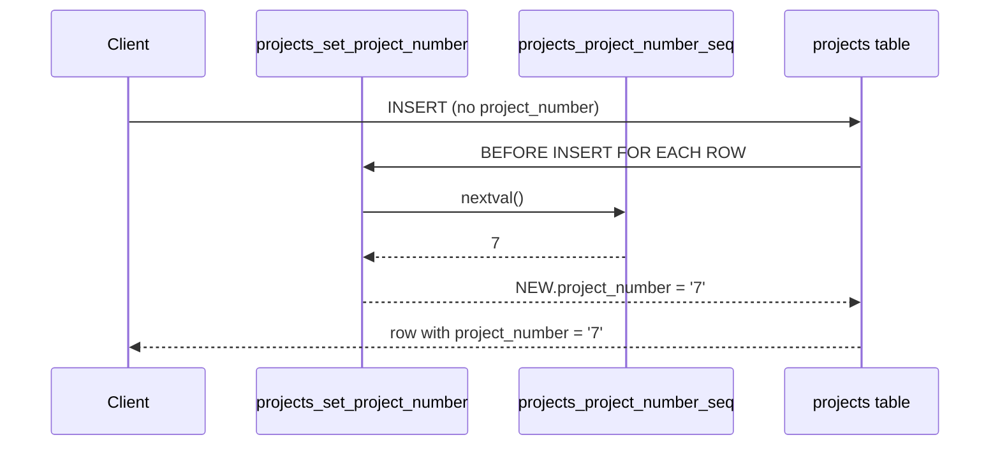
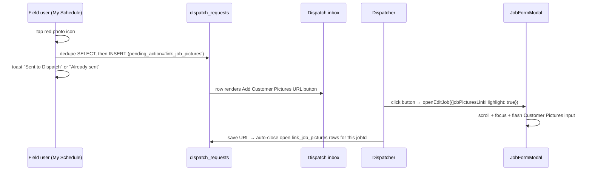

# Recent Features and Updates

This document summarizes all recent features and improvements added to PipeTooling.

---
file: RECENT_FEATURES.md
type: Changelog
purpose: Chronological log of all features and updates, one v2.NNN entry per PR
audience: All users (developers, product managers, AI agents)
last_updated: 2026-08-16 (v2.1745)
format: "Reverse chronological, newest first"
navigation: "No table of contents — find entries by grepping for the version (v2.NNN) or a feature name"
---

## Latest Updates (v2.1745)

### Banking: Sorting Ledger shows "Accounting Label | Person"; the + sets both (2026-08-16)
Owner picked from the "Label + Person Quick Assign" mockups: **option C on desktop, option A on mobile**. **Column**: the ledger's label cell appends the attributed person in muted text (reusing the row's existing person-line data), the header reads **Accounting Label | Person**, and a labeled row with no person gets a dotted **| add person** link that opens a person-only picker. **Popup** ([`AccountingLabelQuickAssignModal`](../src/components/banking/AccountingLabelQuickAssignModal.tsx), responsive via `useIsNarrowScreen`): desktop = side-by-side label list + person `SearchableSelect` with explicit Save (click selects with a ✓; Enter twice on the same row also saves); mobile = person select above the list, tapping a label commits both in one tap (no person = identical to the old one-click); both reuse the standard person picker (archived last, **Add … as a sub** mint via `createPersonFromRuleForm`). **Writes**: label via the existing assignment upsert; person via a full `mercury_transaction_attributions` upsert (hand-set overwrites a rule-set person, same precedence as the tx detail modal); label-succeeds-person-fails degrades to a partial-error toast. New `onAttributionChange` callback lets `Banking.tsx` patch its `personIdByTxId`/`userIdByTxId`/name maps so the row (label suffix AND Job-column person line) updates live without a reload. Verified live on prod: desktop C assigned COGS + Abraham to a Southwest Wheel charge (row re-rendered "Cost of Goods Sold | Abraham"), person-only tagged Robert on his McCormick purchase, mobile A layout confirmed at 375px. Help guide `banking-visuals` updated. Client-only — no migration.

## Latest Updates (v2.1744)

### Follow-ups: line items + Job total inside the Pipeline row (2026-08-16)
Owner picked mockup Option C. Each deck card's Pipeline row block gains a **Line items** footer: the job's named Bill-tab rows (`jobs_ledger_fixtures`, sequence order) as `name · qty × unit` with right-aligned extended amounts, capped at 6 with a "+N more…" expander (state keyed per job), then a bold **Job total** — computed by the same kernel the Bill tab uses ([`revenueDollarsFromFixtures`](../src/lib/revenueFromJobFixtures.ts), including its 0-count-bills-as-1 rule) so the two screens can never disagree. When the bid and the itemization differ by ≥$1, an amber delta reads "Bid is $17,800 — $17,150 not itemized" (or "Line items exceed the bid by …"); an empty Bill tab shows "None yet" with an **Add line items ↗** link that opens the Job window straight on its Bill tab (`requestOpenJobWindowEdit(initialTab: 'bill')`). Zero new queries: `JobsStagesTab` computes the items from the `JobWithDetails.fixtures` it already holds and passes them through `renderFollowupStageRow`'s result (`JobsFollowupLineItem[]` + totals). Verified live across three stage cards (billed/working/waiting) — items and totals match prod. Client-only — no migration.

## Latest Updates (v2.1743)

### Follow-ups: the Pipeline-row label jumps to the row on the board (2026-08-16)
Owner request: clicking "Pipeline row · [stage]" on a follow-up card should land you on that job's row on the Pipeline board, highlighted. The centered label (+ chip) is now a button ("Show this row on the Pipeline board", with a ↗): [`JobsStagesTab`](../src/components/jobs/JobsStagesTab.tsx) passes `onOpenBoardRow(jobId, stage)` alongside `renderStageRow`, and the handler closes the deck, opens the row's section (`setStagesSectionOpen` — Collections jobs open the Collections section, not Billed), then reuses the board's existing focus/flash machinery: `setPendingStagesJobFocusId` (scroll-to-row with the late-render retry) + `setStagesJobFlashId` (the 2.6s amber row flash, same as "Follow cards I move"). Verified live: click on the Billed card → deck closes, board scrolls to the 226 PLUM row mid-viewport, exactly one row carries the flash tint. Client-only — no migration. (v2.1743 was released back by this branch earlier today, then re-claimed by it — the ledger's release/re-claim flow working as designed.)

## Latest Updates (v2.1742)

### Follow-ups: the Pipeline row names its stage, drops its header (2026-08-16)
Owner picked mockup Option A (stage chip). The deck card's "Pipeline row" label line now carries a colored stage chip in the deck's own chip palette — **Waiting / Working / Ready to Bill / Billed Awaiting Payment / Collections** (board section names). The chip reports **which board section the row was actually drawn from**, not the card's header stage: `renderFollowupStageRow` now returns `{ node, stage }` (exported `JobsFollowupStageRowResult`), so a collections-flagged job whose header chip says "Billed" gets a **Collections** chip on its row. Second ask on the same screenshot: the embedded row's `Crew & Dates / Job / Progress & payment` header row is gone — new opt-in `hideHeader` prop on [`JobsStagesTable`](../src/components/jobs/JobsStagesTable.tsx) + [`JobsStagesUnifiedTable`](../src/components/jobs/JobsStagesUnifiedTable.tsx) (skips the `<thead>`; the Pipeline board itself is untouched, and the mobile card lists ignore the flag). Verified live: Billed card shows the red "Billed Awaiting Payment" chip with no header row; Working card shows the blue "Working" chip; the board behind still has its headers. Client-only — no migration. (v2.1741 is a parallel session's claim; v2.1743 was double-minted for this branch and released.)

## Latest Updates (v2.1741)

### Banking: Rules table "Approved uses" column renamed "Uses" (2026-08-16)
Owner request, following v2.1740's column trims in [`BankingMercuryAccountingRulesModal`](../src/components/banking/BankingMercuryAccountingRulesModal.tsx). The count is unchanged (approved suggestion uses per rule) — only the header shortens. Client-only — no migration.

## Latest Updates (v2.1740)

### Banking: Rules table shows "Label | Person", drops Enabled (2026-08-16)
Owner request (screenshot). The Rules modal's Label column becomes **Label | Person** — a rule with a People-in-Rules attribution (v2.1725) appends `| <person>` in muted text after the label ([`BankingMercuryAccountingRulesModal`](../src/components/banking/BankingMercuryAccountingRulesModal.tsx), fed by the tab's existing `ruleAttributionNameById` memo, same display names as the approval chips incl. `· Sub`-style kind tags). The **Enabled column is hidden** (all 522 rules read "Yes"; Edit still exposes the toggle). Bonus the change surfaced: the rules search now also matches the attributed person's name ([`accountingRuleRowMatchesSearch`](../src/lib/accountingRulesTableSearch.ts) gains an optional person arg, +1 test) — searching "Mike Z" previously found nothing because his rule is named "Michael Zinna - Contract Labor"; verified live that it now finds it. Client-only — no migration.

## Latest Updates (v2.1739)

### Follow-ups: every deck card carries the job's live Pipeline row (2026-08-16)
Owner request: the Stages board's row — Crew & Dates / Job / Progress & payment — at the bottom of each follow-up card. Implemented as **full reuse, not a replica**: [`JobsStagesTab`](../src/components/jobs/JobsStagesTab.tsx) passes the deck a `renderFollowupStageRow(jobId)` callback that renders the REAL section renderers (`JobsStagesTable` / `JobsStagesUnifiedTable`, or their card-list variants in mobile-cards mode) with the exact per-stage section props — jobList/rows narrowed to the one job — so every affordance works from the deck: editable % done, Ready to Bill / Mark Waiting / Mark Paid / Bill Customer / Send back / Collections, quick-action stack, thread toggle. Board lists are rebuilt without the page's search/exclusion filters (`buildJobsStagesBoardLists(jobs, '')`) so a filtered-out job still gets its row; a collections-flagged job gets the Collections row. Enabling all this: **`DECK_Z` drops 1040 → 58** — above the nav chrome (50), *below* the page's entire modal band (confirm modals 60, tools popover 120, Job window 1010) — so the modals row actions open float above the deck instead of opening invisibly underneath (the v2.1738 bug class, killed at the root); the overlay's bottom padding grows to clear the Dispatch tab bar (z 1000), which now stays visible. Deck cards widen to 920px on desktop for the row; on phones it scrolls sideways. Verified live: Billed card → Send back confirm on top → cancel; Working card row shows crew/dates/8h/100% bar; Open job → Esc → same card. Client-only — no migration.

## Latest Updates (v2.1738)

### Follow-ups: "Open job ↗" actually opens the Job window (2026-08-16)
The deck's "Open job ↗" button looked dead: it went through `JobDetailOpenerBridgeContext`, which DID open the Job window — at `zIndex` 1010, underneath the deck's own overlay (`DECK_Z` 1040), so nothing visibly happened. [`JobsFollowupModal`](../src/components/jobs/JobsFollowupModal.tsx) now calls [`useJobDetailModal()`](../src/contexts/JobDetailModalContext.tsx) directly (it renders below the provider — the bridge is for components above it) and, while the context reports the Job window open, hides its own overlay with `display: none` — deck state (current card, note draft, scroll) survives untouched and reappears when the window closes. The deck's window-level Escape handler also stands down while the Job window is on top, so Esc closes only the window, not both. Verified live: deck → Open job → Job window (Job/Edit/Bill tabs) → Esc → same card, same scroll. Client-only — no migration.
## Latest Updates (v2.1737)

### Sub Labor: "Outstanding by contractor" keys by person, not name text (2026-08-16)
Closes the RUN_SUBS_PLAN PR 3.4 item that shipped unflipped: [`buildSubLaborOutstandingByPerson`](../src/lib/subLaborOutstanding.ts) grouped "who is owed what" by `normalizePersonNameKey(assigned_to_name)`, so a renamed sub split into two rows. Now: a sheet with exactly ONE junction assignee (`people_labor_job_assignees`) groups under `id:<people.id>` and displays the person's **current** roster name (junction fetched in [`useSubLaborLedger`](../src/hooks/useSubLaborLedger.ts) with a `people(name)` embed, fail-soft). Multi-assignee sheets deliberately keep the combined-name row — this is AP, you pay the sheet, not half of it — and junction-less sheets degrade to the legacy name key (+3 tests; pre-existing cases pass unchanged as the parity check). Verified live: panel renders, totals match the Sub Labor Due figure, zero failed requests across a full ledger reload. Client-only — no migration.


## Latest Updates (v2.1736)

### Team Summary: multi-assignee sub sheets stop vanishing (2026-08-16)
Bug found while mapping the identity Phase-D writers (v2.1732 entry flagged it): [`derivePersonTeamSummary`](../src/lib/people/derivePersonTeamSummary.ts) matched the `' | '`-delimited `assigned_to_name` by bare equality, so a sheet assigned to "Alice | Bob" matched NO person — its hours and cost silently vanished from every row of the Team Summary (same C1-7 bug class PeopleReviewTab fixed in v2.1266). Now segment-matched via new kernel helper [`laborJobShareForPerson`](../src/lib/people/laborJobPersonMatch.ts): each of a sheet's N distinct assignees gets an even **1/N share** of its hours and cost, so the sheet is counted exactly once across the team (full-to-each would double-count). Single-assignee sheets get share 1 — answer-preserving, proven by the pre-existing tests passing unchanged plus an explicit parity case (+2 tests; invariant 3 of `PERSON_IDENTITY_PLAN.md`). Client-only — no migration.

## Latest Updates (v2.1735)

### People identity: pay config resolves id-first on the Employment tab (Phase D) (2026-08-16)
Fifth PR of the Phase D close-out. `usePayConfig`'s state map deliberately stays name-keyed (it's the roster join for dozens of People-page call sites and `people_pay_config`'s PRIMARY KEY is still `person_name`) — but the hook now derives [`payConfigById`](../src/lib/people/payConfigLookup.ts) (`buildPayConfigById` + `payConfigForPerson`, 4 tests; same pattern as `payFlagsIndex` v2.1122 and PeopleReviewTab v2.1266) and [`PeopleEmploymentTab`](../src/components/people/PeopleEmploymentTab.tsx) resolves every pay-config lookup through it (`EmploymentEntry.personId` first, name fallback): salaried/hourly grouping, selected person's config, wage header, and the salaried chips all survive name drift between users/people/pay rows. Answer-preserving today (id and name agree on every row); the win is future renames. Full suite green (4,566 tests). Client-only — no migration.

## Latest Updates (v2.1734)

### People identity: the two "deliberately skipped" hot-path reads flip id-first (Phase D) (2026-08-16)
Fourth PR of the Phase D close-out — C1-5 and the C1-6 remainder, skipped in July because flipping them looked like extra hot-path queries. Both now flip while getting CHEAPER. **Salary self-probes**: new one-round-trip RPC `self_salary_clock_state()` (migration `20260817012837`, see `MIGRATIONS.md`) resolves the caller `people.account_user_id` → `person_id` first, `btrim(users.name)` fallback, and returns is_salary + has_template together; [`ClockInOutButton`](../src/components/ClockInOutButton.tsx) (was 2 queries) and both Dashboard effects (were 3 queries across 2 effects, now one shared effect) consume it via [`fetchSelfSalaryClockState`](../src/lib/selfSalaryClockState.ts), which falls back to the legacy name queries if the RPC errors. **My Team manual hours**: [`useDashboardMyTeamSectionState`](../src/hooks/useDashboardMyTeamSectionState.ts) now queries `people_hours` by `person_id` AND name in one `or()` (names double-quoted so "Tristen (Assistant)"-style names can't break the filter — verified live against prod), matching rows id-first; new [`getPersonKeysForUser`](../src/lib/cascadePersonName.ts) returns `{names, personIds}` and also picks up account-linked people rows (`account_user_id`) the old email-only lookup missed. Parity verified live: RPC answer matches the legacy name query for the signed-in user. Deploy: db push applied during this PR (types regenerated).

## Latest Updates (v2.1733)

### People identity: workflow step assignment goes id-first end-to-end (Phase D) (2026-08-16)
Third PR of the Phase D close-out — the reader flip deferred since v2.1201. **Server** (migration `20260817012110`, see `MIGRATIONS.md`): new shared predicate `step_assignee_matches_user` (assigned_person_id → `people.account_user_id` first, `lower(btrim(name))` fallback) now backs the three step/workflow RLS policies (sub SELECT/UPDATE, workflow SELECT), both dashboard RPCs (`get_assigned_steps_for_dashboard`, `get_assigned_steps_with_projects_for_dashboard`), `can_access_step_for_action`, `user_has_assigned_step_in_project`, and `update_step_assignment`'s assistant self-match — renaming a user no longer silently revokes their step visibility, dashboard lists, or update rights. **Writers**: [`StepFormModal`](../src/components/workflow/StepFormModal.tsx) dropdown picks and its Add-person flow now carry `people.id` into `assigned_person_id` on insert/edit (free-typed names still resolve via the trigger; explicit null is never written); Workflow's copy-step preserves the id. **Notifications**: [`stepLifecycleNotifications`](../src/lib/workflow/stepLifecycleNotifications.ts) resolves recipients id-first (person → account user → email) with the name path as fallback. Fail-soft everywhere: steps with an unfilled id behave exactly as before. Deploy: db push with this PR.

## Latest Updates (v2.1732)

### People identity: sub-sheet writers id-link their assignees (Phase D) (2026-08-16)
Second PR of the Phase D close-out. Both sub-sheet writers that only wrote the `' | '`-delimited `assigned_to_name` string now also id-link the junction: [`JobsSubLaborFormModal`](../src/components/jobs/JobsSubLaborFormModal.tsx) resolves picker names → `people.id` via the new kernel [`assigneePersonIds.ts`](../src/lib/people/assigneePersonIds.ts) (people by trimmed name, account users via their email-linked people row; 5 tests) and upserts `people_labor_job_assignees` after both save paths (best-effort, mirroring PeopleSubsTab's `assignGroup`); and `settle_step_commitment` (migration `20260817011025`, see `MIGRATIONS.md`) inserts the junction row directly from `step_commitments.person_id` instead of relying on the display name resolving. The name string stays the durable write (the sync trigger rebuilds the junction from it) — these writes only backstop names `resolve_pay_person_id` can't map. No visible behavior change.

## Latest Updates (v2.1730)

### Follow-ups: mobile polish — safe area, chip rail, thumb-sized actions (2026-08-16)
Owner screenshot: on a phone the deck slid under the OS status bar (the header collided with the clock), the filter chips piled into three rows, and the action buttons wrapped raggedly. Fixes in [`JobsFollowupModal`](../src/components/jobs/JobsFollowupModal.tsx) via the house [`useIsNarrowScreen`](../src/hooks/useIsNarrowScreen.ts) hook (≤768px): the overlay gains `env(safe-area-inset-top/bottom)` padding (JobReportsModal idiom); the header splits into two rows — count + ⚙ + ✕ up top, then the stage chips and Deck|List|History toggle as a **single horizontally-scrollable rail** (`nowrap` + `overflowX: auto`, chips `flexShrink: 0`); the card's actions become thumb-sized with **Post & next full-width** on its own row and Looks fine / Snooze / Open job sharing the second; the Snooze menu now opens **upward** (it sat near the bottom edge); street view trims to 145px; settings steppers drop their description column and get bigger ± targets; history rows wrap the job onto its own line. Desktop layout unchanged except the header's two-row split. (Merge-order note: most of this code reached `main` inside #1438 — a parallel session's PR that carried the in-progress commit; this PR contributes the history-row wrap, the corrected version stamp, and these docs.) Client-only — no migration.

## Latest Updates (v2.1729)

### People identity: duplicate people blocked at the database (Phase D0) (2026-08-16)
First PR of the Phase D/E close-out in `docs/PERSON_IDENTITY_PLAN.md`. Migration `20260817010403` (see `MIGRATIONS.md`) adds the three unique indexes the baseline was missing: `people_crew_jobs(person_id, work_date)`, `people_crew_bids(person_id, work_date)`, and — the one that blocks the "two Kyles" class at the source — `people_active_name_uniq` on `lower(btrim(name))` where `archived_at IS NULL`, so two ACTIVE roster rows can no longer share a name the pay joins would conflate (same-named archived rows stay allowed; Combine people archives, never deletes). Preflight against prod ran clean on all three keys the same day. Plan-doc discovery recorded: the Phase-B baseline already carried unique `person_id` indexes on the five other pay tables AND `people(id)` FKs on all ten — Phase E is smaller than the doc implied. No client changes.

## Latest Updates (v2.1728)

### Banking: archived people stay taggable — listed last, tagged (2026-08-16)
Owner design question, answered by fixing the gap it exposed: the attribution RPC previously HID archived people (`archived_at IS NULL`), which made departed subs untaggable and let the new Add-person action mint duplicates of archived people. Migration `20260816232749` (see `MIGRATIONS.md`) returns everyone with an `archived` flag; [`buildBankingAttributionOptions`](../src/lib/bankingAttributionOptions.ts) lists archived people after an **Archived** separator, tagged `· archived` (+2 tests). All attribution pickers inherit (Card Review, Category Review, rule form, tx detail modal). Bonus cleanup: gen-types now types the RPC, so `Banking.tsx` retires the last `as unknown as` cast (arch-map quirk #17 fully closed). Verified live: 8 archived people render behind the separator. Deploy: db push applied during this PR.

## Latest Updates (v2.1727)

### Banking: person pickers can mint a missing person (2026-08-16)
Owner request (screenshot: "Je" → No matches with no way forward). Both People-in-Rules pickers — the rule form's "Also attribute to person" ([`AccountingRuleFormModal`](../src/components/banking/AccountingRuleFormModal.tsx)) and the tx detail modal's Person field ([`BankingMercuryTxDetailModal`](../src/components/banking/BankingMercuryTxDetailModal.tsx)) — now use `SearchableSelect`'s existing `noMatchesAction`: typing an unknown name shows **Add "NAME" to People as a sub**, which inserts the roster row (`people`: `master_user_id` = operator, `kind: 'sub'` — same insert shape as PeopleEmploymentTab), toasts, appends the option locally (session-scoped `createdPersonOptions`; the parent's options list refreshes on reload), and auto-selects it (rule form sets the draft; detail modal saves the attribution immediately). A `mintedPersonNameByValueRef` feeds the backfill prompt's display name so a just-created person isn't announced as "this person". Callbacks: `createPersonFromRuleForm` (Accounting tab) / `createPersonFromPicker` (Visuals tab). Verified live: created Jessica White (sub) from the JESSICA WHITE rule, auto-selected, saved, 63-tx backfill prompt offered (skipped). Client-only — no migration.

## Latest Updates (v2.1726)

### Banking: saving a person-rule offers to tag its history (2026-08-16)
Owner request, completing People in Rules (v2.1725). Saving an existing rule that names a person now checks the rule's **approved suggestions** (= the transactions it sorted) and, when any exist, opens a confirm: "…has sorted N transactions. Tag the ones without a person as X? A person set by hand is never changed." — [Tag transactions] runs the backfill, [Skip for now] declines (re-saving the rule re-offers). Mechanics in [`BankingMercuryAccountingTab`](../src/components/banking/BankingMercuryAccountingTab.tsx): candidates = distinct tx ids of `status='approved'` suggestions for the rule; existing attributions read in 200-id chunks; kernel [`ruleAttributionBackfill.ts`](../src/lib/banking/ruleAttributionBackfill.ts) (`planAttributionBackfill` dedup + skip-attributed, `chunkIds`; 5 tests) plans; writes are 500-row `ignoreDuplicates` upserts (hand-set wins, same semantics as the approve RPC); toast reports tagged/kept counts. Offer is best-effort (a failed count never blocks the rule save); fires on both Save and Save-and-apply, edit-mode only (new rules have no history). `attributionNameByValue` memo extracted from `ruleAttributionNameById` for the prompt's display name. Verified live on "Taunya Villarreal - Contract Labor": 54 approved uses → prompt offered 27 distinct transactions (skipped without tagging). Client-only — no migration.

## Latest Updates (v2.1725)

### Banking: People in Rules — rules attribute a person; inline Person picker on tx detail (2026-08-16)
Owner picked the proposal mockup. **Schema** (migration `20260816220436`, see `MIGRATIONS.md`): rules gain `attributed_person_id`/`attributed_user_id` (XOR, `ON DELETE SET NULL`); `bulk_approve_accounting_label_suggestions` replaced to also INSERT the rule's attribution with `ON CONFLICT DO NOTHING` — a hand-set attribution always wins. **Rule form** ([`AccountingRuleFormModal`](../src/components/banking/AccountingRuleFormModal.tsx)): optional "Also attribute to person" SearchableSelect (u:/p: values via `parseBankingAttributionValue`); `ruleRowToForm`/`AccountingRuleSaveDraft` carry it; both save paths in [`BankingMercuryAccountingTab`](../src/components/banking/BankingMercuryAccountingTab.tsx) write the columns; the tab gains an `attributionOptions` prop from the parent. **Approvals**: [`AccountingApprovalCard`](../src/components/banking/AccountingApprovalCard.tsx) wears a green 👤 chip (or "already attributed · kept as-is" when the tx has one); single-card approve writes the attribution client-side (`ignoreDuplicates` upsert), mirroring the RPC. **Tx detail modal** ([`BankingMercuryTxDetailModal`](../src/components/banking/BankingMercuryTxDetailModal.tsx)): Person becomes a first-class inline picker between Accounting label and Job splits — saves person-only changes through `replace_mercury_transaction_splits` (current splits pass through untouched), "set by rule …" provenance line from the latest approved suggestion, and the Sankey caches refresh silently on save. The Visuals tab now also fetches `list_people_with_kind_for_banking_attribution` — **which the gen-types run finally typed, retiring quirk #17's `as unknown as` cast** (Banking.tsx still carries the old cast until its own cleanup). Verified live: person set → saved ✓ → cleared (net zero); rule form field renders on a real rule. Help guide `banking-visuals` updated.

## Latest Updates (v2.1724)

### Banking Visuals: Bank description joins the transaction detail (2026-08-16)
Owner request: the raw bank description ("CASH APP*ABE WHITES", "Send Money transaction initiated on Mercury") is often the most identifying line on a transaction and was only visible inside the Raw JSON disclosure. [`BankingMercuryTxDetailModal`](../src/components/banking/BankingMercuryTxDetailModal.tsx) now shows **Bank description** as its own read-only fact, directly above Bank memo (typed read of `raw.bankDescription`; em-dash when absent). Client-only — no migration.

## Latest Updates (v2.1722)

### Follow-ups: review history — who reviewed what (2026-08-16)
Owner request. The follow-ups toggle grows a third view — **Deck | List | History** — listing every review stamp newest-first: company-tz time, reviewer name, job (pill + name; jobs that have since left the open stages resolve via [`fetchJobFollowupJobLabels`](../src/lib/jobs/jobFollowupStore.ts)), and an action chip (green **✓ Looks fine** / slate **Snoozed until Aug 19**, via kernel `jobFollowupReviewActionLabel`, +1 test → 11). The reviews fetch now selects `reviewed_by` (`JobFollowupReview.reviewedBy`, optional — queue math ignores it); reviewer names load on first History open. Session actions appear immediately (local pushes carry the operator id). Notes posted from cards aren't duplicated here — they live on each job's thread, and the empty state says so. 200-row render cap. Client-only — no migration.

## Latest Updates (v2.1721)

### Follow-ups: queue list view — the triage table behind the deck (2026-08-16)
Last piece of the Follow-Up Mode mockup. The follow-ups modal grows a **Deck | List** toggle: List shows the whole queue at once, quietest first — per row a severity badge (`jobFollowupQuietSeverity`: red ≥14d, amber ≥7d, else slate), job number + name, address · why-it's-here reason, stage chip, and **Review →**, which *pins* that job and flips to Deck so the cards deal from there (`pinnedJobId` in [`JobsFollowupModal`](../src/components/jobs/JobsFollowupModal.tsx); the pin clears when the job leaves the queue and the deck resumes stalest-first). Stage filter chips apply to both views; the all-caught-up state is shared. Verified live: 56 rows, Review → on a mid-list row dealt the deck on that job. Street-view thumbnails from the mockup were deliberately dropped — one imagery call per row is real money at 56 rows; the deck carries the big image. Kernel +1 test (10). Client-only — no migration.

## Latest Updates (v2.1720)

### Dashboard: "jobs waiting on a follow-up" attention card (2026-08-16)
Second piece of the Follow-Up Mode mockup. [`DashboardJobFollowupsBanner`](../src/components/DashboardJobFollowupsBanner.tsx) joins the attention-card row (amber, count badge, "Start review →"): it runs the same queue kernel as the deck (`computeJobFollowupQueue` over the store fetches) and summarizes by stage, money first — "37 billed with no nudge · 11 working with no recent notes · 5 waiting with nothing scheduled". Self-gating (renders nothing while loading/empty/on error); mounted in [`DashboardPinnedQuickRow`](../src/components/dashboard/DashboardPinnedQuickRow.tsx) behind the office-role gate (dev, master tech, assistant-like). Clicking navigates to `/jobs?tab=stages&followups=1`; [`JobsStagesTab`](../src/components/jobs/JobsStagesTab.tsx) consumes the param once — opens the deck, then strips it (`replace`) so refresh/back doesn't re-deal. Verified live: card showed 56 waiting, deep link opened the deck on the stalest card, URL left clean. Client-only — no migration.

## Latest Updates (v2.1719)

### Follow-Up Mode: no gray tile when Street View has no imagery (2026-08-16)
Found in the post-push live pass (job 102's address has no Google imagery): the deck card showed Google's gray "location could not be found" tile. [`JobsFollowupModal`](../src/components/jobs/JobsFollowupModal.tsx) now checks `fetchStreetViewMeta` FIRST — null means no imagery, so the banner is skipped entirely and the plain address line shows instead; the image blob is only fetched after meta resolves (also saves the wasted image call). Client-only — no migration.

## Latest Updates (v2.1718)

### Jobs: Follow-Up Mode — review quiet jobs one card at a time (2026-08-16)
Owner request ("jobs fall through the cracks"), built from the approved deck mockup. New **Follow-ups** button on the Jobs Pipeline toolbar opens a full-screen deck ([`JobsFollowupModal`](../src/components/jobs/JobsFollowupModal.tsx)): the queue is every open job **quiet too long for its stage**, stalest first — each card shows the job pill + stage + "quiet N days" chip, the **Street View banner with address pill** (same `fetchStreetViewPreview` kernel as the Job window; click → pano), a "Why it's here" line, money chips, the last 3 thread notes, and a pre-focused note box. **Enter posts to the job's real activity thread** (`postJobThreadNoteBody`) and advances; **✓ Looks fine** stamps a quiet review (rests the job `rest_days`); **Snooze** 3d/1w/2w; **Open job ↗** via the job-detail opener bridge. Stage filter chips + **⚙ Review periods** (org-wide per-stage day steppers; RLS lets Master/dev write). Pure kernel [`jobFollowupQueue.ts`](../src/lib/jobs/jobFollowupQueue.ts) (8 tests): per-stage thresholds, reviews count as activity, snooze/rest exclusion windows, future-scheduled Waiting/Working jobs exempt. IO [`jobFollowupStore.ts`](../src/lib/jobs/jobFollowupStore.ts) — table/RPC names cast until `gen-types` runs post-push (Banking quirk-#17 pattern); every fetch degrades so a client deployed ahead of the migration shows an empty queue, never a crash. **Migration** [`20260816193117_job_followups.sql`](../supabase/migrations/20260816193117_job_followups.sql) (see `MIGRATIONS.md`). **Deploy**: `supabase db push` with this merge; regen types after. Follow-ups (planned): Dashboard attention card + queue list view.

## Latest Updates (v2.1717)

### Banking Visuals: focus mode — click a bar, see the payees (2026-08-16)
Owner picked mockup Option 2 (focus mode) with Cash App memo-splitting. On **Where the money goes**, family and label bars are now clickable (`SankeyNodeInput.focusable`, `cursor: zoom-in`, widened hit target): clicking re-roots the chart on that target — one root node fanning into its top-12 payees + "Other payees (N)" — with a **‹ All flows** breadcrumb (Esc works too; never underneath an open modal) and a stats line (total · tx count · payee count). Payee ribbons carry txIds so the drill-down list and tx detail modal work unchanged; focus is shareable via `?focus=label:Contract Labor` / `family:People` and composes with the period zoom. **Payee resolution** ([`resolveVisualsPayee`](../src/lib/banking/mercuryVisualsFlows.ts)): Cash App is a platform, not a person — the real name rides in `external_memo` or (far more often, found live) `raw.bankDescription` ("CASH APP*JESSICA WHITE"); the fetch pulls just that string server-side via `raw->>bankDescription` (the raw column stays unfetched), and matches split + title-case. Live effect: Contract Labor 2026 went from "Cash App $296K" to 46 real payees (369 payments split; top now Trace Whites $64K). Kernels `visualsFocusTxs` (label / Unlabeled pseudo-label / family; generic over row type) + `buildLabelFocusSankey` + focus URL round-trip — 8 new tests (42 in the banking suite). Client-only — no migration.

## Latest Updates (v2.1716)

### Banking Visuals: zoom to a year or quarter (2026-08-16)
Owner picked mockup Option 1 (year chips → quarter chips). The Visuals period row grows a **Zoom** section: year chips (only years with activity, via `visualsYearsPresent`) and, once a year is picked, a second row — **Full year · Q1–Q4** — with future quarters disabled and a caption spelling the window ("Q2 2025 · Apr 1 – Jun 30, 2025"). Selecting a preset clears the zoom and vice versa; clicking the active year toggles back to YTD. Kernels ([`mercuryVisualsFlows.ts`](../src/lib/banking/mercuryVisualsFlows.ts), +4 tests → 22): `VisualsSelection` (preset | zoom), `visualsZoomWindow` (inclusive YMD bounds + labels), `visualsSelectionWindow`, `filterVisualsTxsByWindow` — absolute windows need an END bound; the old preset filter only had a start and now delegates. **Shareable**: the selection round-trips through `?period=2025q2` / `?period=2026` (`parseVisualsPeriodParam` / `serializeVisualsSelection`; the ytd default keeps the URL clean; junk params fall back to YTD). Verified live: Q2 2025 zoom redraws all three views, deep link restores, 2026 Q4 correctly disabled. All drill-downs and the tx detail modal operate inside the window unchanged. Client-only — no migration.

## Latest Updates (v2.1715)

### Banking Visuals: transaction detail modal — dig in and fix from the drill-down (2026-08-16)
Owner picked mockup Option 2 (two panes). Drill-down rows on Banking → Mercury → Visuals are now buttons; clicking one opens [`BankingMercuryTxDetailModal`](../src/components/banking/BankingMercuryTxDetailModal.tsx): **left pane** = Mercury's record, read-only (posted in `APP_CALENDAR_TZ`, status, kind via `formatMercuryKind`, card nickname via `mercuryDebitCardIdFromRaw`, counterparty, bank memo, source, raw-JSON disclosure, "Open in Mercury ↗" from `dashboard_link`); **right pane** = the qualities the app computes from: **accounting label** (SearchableSelect over the Drag Sort labels; same `{mercury_transaction_id, label_id}` upsert; the Internal-Transfers × job-splits guard via `isInternalTransfersLabel` becomes its fifth call site), **person & job splits** (summary + Edit splits button opening the shared [`MercuryTransactionAllocationsModal`](../src/components/MercuryTransactionAllocationsModal.tsx) unchanged), and **note** (`mercury_transactions.note`). The modal self-fetches its full row + relations on open (the list loads narrow columns). Label saves patch the tab's caches so the Sankey behind the modals updates instantly (verified live: labeling an unlabeled tx moved Office Expense $25K→$26K, clearing reverted it); splits saves trigger a **silent** full refresh (`load({silent})` keeps open modals mounted). Z-stack: drill-down 1080 → detail 1100 → splits modal 1150 (its hardcoded z made the layers-below approach the only safe one). Tab now also fetches debit-card nicknames + `list_users_for_banking_attribution`. Help guide `banking-visuals` updated. Client-only — no migration.

## Latest Updates (v2.1714)

### Banking Visuals: external money flanks the Between-accounts view (2026-08-16)
Owner request, third piece of the Sankey arc. The **Between accounts** view grows from two columns to four: external sources (Check deposits, Wires in, Card refunds, External transfers in, Other money in) → account in-sides → account out-sides → external uses (Card spend, Payments out, External transfers out, Other out) — [`buildTransferSankey`](../src/lib/banking/mercuryVisualsFlows.ts) rewritten (+3 tests, 31 total). Mechanics: transfers still run between the two account columns; a same-account **passthrough** ribbon carries money that leaves the account it landed in; per-account balancing makes both sides conserve exactly, with gray **From balances** / **Kept in accounts** bands absorbing money that crosses the period boundary (or funds chained transfers) — explicit, never hidden. Unpaired transfer legs surface as their own source/use group, excluded from the external totals. Source→account and account→use ribbons are click-through (the deposit/spend txs); synthetic bands are not. Tone assignment gains `accountIsNamed`: nicknamed accounts claim the six series colors first (found live: alphabetical fallback ids like "Account 8f49…" were eating the palette and graying Savings 0382), still stable across period switches. Caption: "In X · between accounts Y · out Z". Client-only — no migration.

## Latest Updates (v2.1713)

### Banking Visuals: click a ribbon → the transactions behind it (2026-08-16)
Follow-up to v2.1712, second half of the proposal. Every Sankey ribbon on Banking → Mercury → Visuals is now click-through: kernels attach the underlying transaction ids to each link (`SankeyLinkInput.txIds`, carried through [`mercurySankeyLayout.ts`](../src/lib/banking/mercurySankeyLayout.ts); [`mercuryVisualsFlows.ts`](../src/lib/banking/mercuryVisualsFlows.ts) — A: label + family ribbons carry their expense txs; B: edges carry both legs of every paired transfer, unmatched-leg ribbons their single leg; C: person→job ribbons carry the contributing card txs, deduplicated when a split tx feeds the same ribbon twice), and [`BankingMercuryVisualsTab`](../src/components/banking/BankingMercuryVisualsTab.tsx) opens a drill-down modal (date · counterparty · account · signed amount; count + total in the header; 400 most-recent row cap; backdrop/Close dismissal; cleared on view/period switch). Transaction fetch adds `counterparty_name`. Clickable paths get `role="button"`, pointer cursor, and a "click for transactions" tooltip suffix. Help guide `banking-visuals` updated. Client-only — no migration.

## Latest Updates (v2.1712)

### Banking: Visuals sub-tab — three Sankey money-flow views (2026-08-16)
Owner picked all three mockups from the Sankey proposal round. New **Banking → Mercury → Visuals** tab (self-contained, Reconciliation mold — zero props, own fetches; the parent dispatcher skips the master 15k list while it's active) with a view switcher + period picker (This month / Quarter / YTD / All time, bounded by `APP_CALENDAR_TZ` wall dates): **(A) Where the money goes** — income → expense families → Drag Sort labels, with automatic "From reserves" (spend > money in) and "Kept" (money in > spend) bands and an "Unlabeled" band that nudges toward Drag Sort; **(B) Between accounts** — internal-transfer legs paired into account→account edges (same cents, opposite signs, ≤3-day gap, different accounts; unmatched legs surfaced, never guessed); **(C) Cards → jobs** — `debitCardTransaction` spend by attributed person → job splits, remainder to an amber "⚠ No job yet" band (kind is the RAW value — the Ledger's "Debit Card" is display formatting; first cut used the display string and drew $0). Pure kernels + 18 tests: [`mercurySankeyLayout.ts`](../src/lib/banking/mercurySankeyLayout.ts) (column layout, ribbon paths, tones — no chart library) and [`mercuryVisualsFlows.ts`](../src/lib/banking/mercuryVisualsFlows.ts) (period filter, family map with unknown-label fallback, transfer pairing, top-N folding; tones assigned alphabetically so period changes never repaint an entity). Component [`BankingMercuryVisualsTab`](../src/components/banking/BankingMercuryVisualsTab.tsx); router union + tab button + dispatcher early-return in [`Banking.tsx`](../src/pages/Banking.tsx). Books rules: duplicates excluded everywhere; Internal Transfers excluded from A, the subject of B. Help guide `banking-visuals` added. Client-only — no migration.

## Latest Updates (v2.1711)

### Edit tab: green "linked" chip retires from the Customer row (2026-08-16)
Owner call: the Customer fact row on the Job window's Edit tab drops the green **linked** chip — a linked customer is the normal state and needs no badge. The amber **Not in Customers** warning (free-typed contact with no customer record) still shows; it's now the row's only chip, so a chip on that row always means something needs attention. [`JobFormEditFactRows`](../src/components/jobs/JobFormEditFactRows.tsx): the two-variant `chipStyle` helper collapses to a warn-only style; render smoke asserts the chip's absence. Kernel [`jobFormFactRows.ts`](../src/lib/jobs/jobFormFactRows.ts) unchanged (`linked` still drives the address tail). Client-only — no migration.

## Latest Updates (v2.1710)

### Bid Board: pick your own "that's you" colors — per theme (2026-08-16)
Owner request (mockup approved): a small **color wheel** at the far right of the jump strip (the Health line) opens a popover where each user picks how their OWN name is boxed when they're a bid's **Estimator or Account Man** — box color (8 swatches + custom) and text color (**Auto** contrast-picked by luminance, or White/Black/custom) — **separately for ☀ light mode and 🌙 dark mode**, with a preview chip rendered on the edited theme's surface and per-mode reset. Found while building: the old box was hardcoded `#111827`/white and **disappeared on the dark theme**; the new theme-aware defaults fix that for everyone (light keeps the historical pair, dark gets it inverted). Pieces: kernel [`bidBoardSelfHighlight.ts`](../src/lib/bids/bidBoardSelfHighlight.ts) (parse/validate/resolve/auto-contrast, 9 tests), [`BidBoardSelfHighlightWheel.tsx`](../src/components/bids/BidBoardSelfHighlightWheel.tsx) (wheel + popover + `useBidBoardSelfHighlight` load/save hook), [`BidsBidBoardTab`](../src/components/bids/BidsBidBoardTab.tsx) `selfLineStyle` now reads the resolved pref. Storage: migration [`20260816064152_bid_board_self_highlight.sql`](../supabase/migrations/20260816064152_bid_board_self_highlight.sql) — `users.bid_board_self_highlight` jsonb, written through the existing "update own profile" policy, so colors follow the user across devices; malformed values degrade to defaults. Saves on every click, error-toasted on failure. Help guide `bid-board-your-color` added. **Deploy**: `supabase db push` with this merge; `gen-types` committed.

## Latest Updates (v2.1709)

### Cost Timeline leads its section, paid email left of the calendar, Reports card trims, Bids search aligns (2026-08-16)
Four owner calls. **(1)** The **Cost Timeline** moves from the tail of the parts accordions to the top of **Labor and Parts Cost**, right under the header ([`JobFormLaborCostPanel`](../src/components/jobs/JobFormLaborCostPanel.tsx) now renders [`JobChargesTimelineStandalone`](../src/components/jobs/JobChargesTimelineStandalone.tsx); removed from [`JobFormPartsCostSection`](../src/components/jobs/JobFormPartsCostSection.tsx)). **(2)** The paid-in-full **$-envelope moves left of the calendar** in the Job window header — order now supply house · paid-mail($) · calendar · send-task · share ([`DetailJobModal`](../src/components/jobs/DetailJobModal.tsx)). **(3)** The Job tab's Reports card meta drops the template name — "Abraham · 4d ago", not "… · Status Report" (the link says what it is). **(4)** Bids → Bid Board: the search input pins to 36px, flush with the Archived and Customer review buttons ([`BidsBidBoardTab`](../src/components/bids/BidsBidBoardTab.tsx)); measured 36/36/36. Client-only — no migration.

## Latest Updates (v2.1708)

### Bill tab: ③ Payments received joins the section rhythm (2026-08-16)
Owner call: the air above **③ Payments received** now matches the address → **① Line Items** distance ([`JobFormPaymentsTable`](../src/components/jobs/JobFormPaymentsTable.tsx) root gains `marginTop: 1.5rem` — it must exceed the invoices block's 1rem bottom margin, since block-flow margin collapse eats anything smaller; the first attempt at 0.4rem changed nothing for exactly that reason). Measured 35px, matching the perceived gap in the owner's screenshot. Client-only — no migration.

## Latest Updates (v2.1707)

### Bill tab: "% done" flush under the Job Total; Line Items air matches the section rhythm (2026-08-16)
Three owner calls. **(1)** The "Job total: add a line item to set it" nudge retires ([`MoneyLifecycleBar`](../src/components/jobs/MoneyLifecycleBar.tsx); the top row is now just the centered % done). **(2)** "% done" sits FLUSH under "Job Total: $X" — measured 0px — via an embedded-only negative margin canceling the region's flex gap ([`JobFormModal`](../src/components/jobs/JobFormModal.tsx)). **(3)** The air above "① Line Items" now matches the Remaining-to-bill → "② Invoices" rhythm — 27px vs 28px measured ([`JobFormFixturesSection`](../src/components/jobs/JobFormFixturesSection.tsx) `marginTop` 1.65rem). Client-only — no migration.

## Latest Updates (v2.1706)

### Job window header: icons right-aligned, reordered, and the paid email wears a $ (2026-08-16)
Four owner calls on the header's action row ([`DetailJobModal`](../src/components/jobs/DetailJobModal.tsx)): the icon cluster moves to the modal's right edge (pill stays left — a zero-width auto-margin spacer splits the row in pane mode), the **calendar** moves one slot left (now before send-task), **Share** anchors the far right, and the **paid-in-full email** envelope gains a small green **$** badge so it reads as the money email at a glance. New order: supply house · calendar · send-task · paid-mail($) · share. Verified live (order + badge measured in the DOM). Client-only — no migration.

## Latest Updates (v2.1705)

### Edit tab: phone numbers call, emails open mail (2026-08-16)
Owner call: the Phone and Email values on the Edit tab's fact rows — the Customer block and the GC block alike — are now `tel:` / `mailto:` links: tap the number to call, tap the address to email ([`JobFormEditFactRows`](../src/components/jobs/JobFormEditFactRows.tsx) `contactLink`; tel strips formatting to digits). Taps stopPropagation so they don't also open the row's editor; the pencil still edits. Render test pins the hrefs. Client-only — no migration.

## Latest Updates (v2.1704)

### Pipeline: the row button reads "Edit" (2026-08-16)
Owner call: the v2.1686 "Edit Job" button on Pipeline rows shortens to **"Edit"** — the row is already a job, so "Job" was noise ([`JobsStagesUnifiedTable`](../src/components/jobs/JobsStagesUnifiedTable.tsx) + [`JobsStagesTable`](../src/components/jobs/JobsStagesTable.tsx); tooltip unchanged). Client-only — no migration.

## Latest Updates (v2.1703)

### Bill tab: centered % done, "bid" readout retired, tighter spacing; Development leads the links (2026-08-16)
Four owner calls. **(1)** The money bar's "$X bid" top-right readout retires — the Job Total above already says it ([`MoneyLifecycleBar`](../src/components/jobs/MoneyLifecycleBar.tsx) drops its `total` prop; the "add a line item to set it" nudge stays for bar-less jobs). **(2)** The "% done" control centers over the bar (1fr·auto·1fr grid). **(3)** The gap between Job Total and the % row shrinks to the region's flex gap alone ([`JobFormFixturesSection`](../src/components/jobs/JobFormFixturesSection.tsx) `marginBottom` 1rem → 0) and the section gains a little air above "① Line Items" (`marginTop` 0.35rem). **(4)** **Development** moves above Project in the Edit tab's links block ([`JobFormEditFactRows`](../src/components/jobs/JobFormEditFactRows.tsx)). Client-only — no migration.

## Latest Updates (v2.1702)

### Edit tab: 3-digit HCP box, flush field heights, Folders above Customer (2026-08-16)
Three owner calls. **(1)** The HCP box shrinks to a fixed ~3-digit width (56px) — HCP numbers are short ([`JobFormIdentityFields`](../src/components/jobs/JobFormIdentityFields.tsx)). **(2)** Job Name and Job Address pin to the same 36px as Service type and the number boxes (the clipboard-wrapper style gains `height: 36`; inner inputs drop vertical padding) — measured 36/36/36 live. **(3)** The **Folders** row moves above the Customer block, right below Team ([`JobFormEditFactRows`](../src/components/jobs/JobFormEditFactRows.tsx)) — the Drive links are what crews reach for most. Client-only — no migration.

## Latest Updates (v2.1701)

### Edit tab: the GC/Builder grows Phone / Email / Date met sub-rows (2026-08-16)
Owner call: a linked GC now reads like the Customer block — the **GC/Builder** row carries the GC's name **· address**, and beneath it indented **Phone**, **Email**, and **Date met** (with the "(2 months ago)" age) pulled straight off the GC's customers record. The sub-rows are **read-only** — no pencil, no click — because the job keeps no copy of GC contact info (unlike the customer fields); edits happen in Customers. [`JobFormFactRow`](../src/components/jobs/JobFormFactRow.tsx) gains a static-row variant (`onToggle`/`children` optional → no toggle button, default cursor); the rows render only while a GC is linked. Render smoke covers values + the no-pencil contract. Client-only — no migration.

## Latest Updates (v2.1700)

### Date met reads as an age: "06/09/26 (2 months ago)" (2026-08-16)
Owner call: the Edit tab's Date met row goes from "6/9/2026 (edit in Customers)" to **zero-padded MM/DD/YY plus a relative age** — "(2 days ago)", "(2 weeks ago)", "(2 months ago)", "(today)" for same-day — using the same buckets as the Pipeline's "Open N" (`formatTimeSince`). New kernel fn `dateMetRowAgo` in [`jobFormFactRows.ts`](../src/lib/jobs/jobFormFactRows.ts) (unit-tested, injectable now). The lock and first-clock-in provenance didn't vanish — they moved into the opened editor as a one-line note ("Set automatically from the first clock-in — edit it in Customers."). Client-only — no migration.

## Latest Updates (v2.1699)

### Line Items: tidier header, Stripe preview above the Job Total (2026-08-16)
Three owner calls on the Bill tab's ① Line Items section ([`JobFormFixturesSection`](../src/components/jobs/JobFormFixturesSection.tsx)): the "ⓘ What are line items?" helper toggle retires (the help guide covers it; its `helperOpen` state is gone), **Multiple Segment Generator** moves to the header's right edge (`marginLeft: auto`), and **Stripe preview** swaps above the **Job Total** in the footer's right column. Client-only — no migration.

## Latest Updates (v2.1698)

### Date met: manual entries stamp themselves manual; clock-filled dates say so (2026-08-16)
The client half of v2.1696. The three human write paths — [`EditCustomerForm`](../src/components/EditCustomerForm.tsx) save, [`CustomerForm`](../src/pages/CustomerForm.tsx) update, and [`JobFormModal`](../src/components/jobs/JobFormModal.tsx)'s create-customer insert + close-time backfill — now stamp `date_met_source: 'manual'` (clearing the date resets source to null, so the clock-session fill may repopulate). The Edit tab's Date met row reads provenance: a clock-filled date shows **"(first clock-in · edit in Customers)"** instead of the plain lock (customers selects gained `date_met_source`; `database.ts` regenerated post-`db push`). Verified live on job 961: the v2.1696 backfill's 6/9/2026 renders with the first-clock-in hint. Client-only — the paired migration shipped in v2.1696.

## Latest Updates (v2.1697)

### Edit tab: one identity row, Date met joins the customer sub-rows (2026-08-16)
Two owner calls on the Job window's Edit tab. **(1) Identity row** ([`JobFormIdentityFields`](../src/components/jobs/JobFormIdentityFields.tsx)): Job Name moves up beside Service type — C# · Service type · Job Name read as one desktop row (wrap keeps phones stacking); the C# box shrinks to a fixed ~5-digit width (99% of C#s are shorter), and the HCP/C# inputs pin to the SearchableSelect trigger's 36px so the boxes sit flush (measured equal live). **(2) Date met** moves up under Email with the same customer-sub-row indent as Phone/Email — it lives on the customers record like they do ([`JobFormEditFactRows`](../src/components/jobs/JobFormEditFactRows.tsx)). Bonus proof from v2.1696's backfill: job 961's customer now shows Date met 6/9/2026 from his first clock session. Client-only — no migration.

## Latest Updates (v2.1696)

### Customers: Date met fills itself from the first clock session (2026-08-16)
Owner call: `customers.date_met` now defaults to the **date of the first clock session** on any of the customer's jobs — a typed date always wins. DB-side (migration `20260816030716_customer_date_met_from_clock.sql`, entry in `docs/MIGRATIONS.md`): new `customers.date_met_source` (`'manual'` | `'clock'` | NULL-legacy), a shared SECURITY DEFINER fill rule (fills NULL; lowers a clock-sourced date when a backdated session appears; never touches manual or legacy-set values), an AFTER INSERT trigger on `clock_sessions` (skips bid-only and rejected/revoked sessions), an AFTER UPDATE OF `customer_id` trigger on `jobs_ledger` so late-linked customers fill from existing sessions, and a NULL-only backfill for history. Zero read-path changes — every surface that shows `date_met` just starts seeing values. The client-side half (manual writes stamping `'manual'`, provenance hint) ships next as v2.1697. **Apply with `supabase db push` after this merges.**

## Latest Updates (v2.1695)

### Job window: the header's "Link to: Bid | Project" cluster retires (2026-08-15)
Owner call: the portaled quick-link cluster (v2.1677) is redundant since the Edit tab's fact rows gave Bid and Project their own rows with the same link/unlink flows. [`JobFormHeaderRow`](../src/components/jobs/JobFormHeaderRow.tsx) renders nothing when embedded; the slot span and `jobWindowHeaderSlot.ts` (the import-cycle portal workaround) are deleted; the pane's icon row pins pill + icons left now that the cluster's `marginLeft:auto` no longer splits it. **Capability preserved**: the linked-project one-click open moved into the Project row's editor as an "Open project" link ([`JobFormProjectEditor`](../src/components/jobs/JobFormLinksSection.tsx)), twin to the Bid editor's "Open cover letter"; the standalone New Job form keeps its classic header row untouched. Client-only — no migration.

## Latest Updates (v2.1694)

### Edit tab: the Team row wears the crew icon (2026-08-15)
Owner call (icon supplied): the Team fact row gains the Font Awesome users glyph — new [`TeamCrewIcon`](../src/components/icons/TeamCrewIcon.tsx), 12px like its neighbors — so every people-ish row carries its mark: person = Account man, crew = Team, card = Customer, hard hat = GC/Builder, house = Development. Client-only — no migration.

## Latest Updates (v2.1693)

### Edit tab: Phone and Email indent under Customer (2026-08-15)
Owner call on the fact rows: Phone and Email hold the job's copy of the linked customer's contact info (jobs_ledger.customer_phone / customer_email, seeded by the link picker), so their labels now indent by exactly the Customer row's contact-card icon width — the label text starts where "Customer" starts, reading as children of that row ([`JobFormEditFactRows`](../src/components/jobs/JobFormEditFactRows.tsx), a 12px spacer as `labelIcon`; measured pixel-equal live). Team and Date met stay flush. Client-only — no migration.

## Latest Updates (v2.1692)

### Cost Timeline: legend details fold behind an ⓘ (2026-08-15)
Owner call: the chart's two-line legend crammed the marker key (💵 payment received, 🚩 field report), every cost-source icon, and the conditional hidden-line notes under the chart. The visible line now stops at **Red = cost to date · Green = profit** (+ Blue when the value line shows) followed by "ⓘ what do the markers mean?" — clicking reveals the full key and flips the link to "ⓘ hide key" ([`JobSummaryChargesTimelineChart`](../src/components/jobs/JobSummaryChargesTimelineChart.tsx); same ⓘ helper pattern as "What are line items?"). Collapsed by default. Client-only — no migration.

## Latest Updates (v2.1691)

### Bill tab: "Record non-Stripe payment received" left-aligns (2026-08-15)
Owner call: the ③ Payments received section's reveal button was centered; it now left-aligns with the section title and content ([`JobFormPaymentsTable`](../src/components/jobs/JobFormPaymentsTable.tsx), `justifyContent: flex-start`). Client-only — no migration.

## Latest Updates (v2.1690)

### Pipeline: Waiting/Working put "Open N" above Edit Job like every other stage (2026-08-15)
Owner call: the job-only sections ([`JobsStagesTable`](../src/components/jobs/JobsStagesTable.tsx) — Waiting, Working, Paid in Full) rendered the "Open N months" age label at the TOP of the Progress & payment stack, while the billing stages (unified table) put it between the action buttons and Edit Job. The label moves to the end of the button flex — the stack now reads status buttons → **Open N** → **Edit Job** everywhere. Verified live on a Working row: Mark Waiting → Ready to Bill → Open label → Edit Job. Client-only — no migration.

## Latest Updates (v2.1689)

### Line Items: Stripe preview moves under the Job Total (2026-08-15)
Owner call: the "Stripe preview" link leaves the ① Line Items title row and now sits directly under **Job Total** at the footer's right edge — beside the number it previews ([`JobFormFixturesSection`](../src/components/jobs/JobFormFixturesSection.tsx); same dialog, same aria wiring). The title row keeps "What are line items?" and "Multiple Segment Generator". Verified live: right-aligned, 3px under the total. Client-only — no migration.

## Latest Updates (v2.1688)

### Pipeline: equal spacing across the Mark Waiting / Ready to Bill / Edit Job stack (2026-08-15)
Owner follow-up on v2.1686: the gap above the new Edit Job button measured 4px (the outer stack's `0.25rem` gap) while Mark Waiting ↔ Ready to Bill sat at 8px (the status buttons' own wrap-flex `0.5rem` row gap). The Edit Job column in [`JobsStagesUnifiedTable`](../src/components/jobs/JobsStagesUnifiedTable.tsx) and [`JobsStagesTable`](../src/components/jobs/JobsStagesTable.tsx) gains `marginTop: '0.25rem'`, topping the boundary up to the same 8px — measured equal live after the change. Client-only — no migration.

## Latest Updates (v2.1687)

### Bill tab: Line Items merge into the billing flow, "Billing" title retired (2026-08-15)
Owner follow-up on v2.1683: in the Job window's Bill tab, the half-width `<hr>` and the orange-striped **Billing** section header are gone — the tab already says "Bill", so the content reads as ONE section from ① Line Items through the money bar, ② Invoices, and ③ Payments. The autosave indicator that lived in that header survives as a right-aligned status line that renders only while saving or failed (same aria-live semantics). The standalone/New Job form keeps the divider and the Billing header — it has no tab naming the section for it. Gated on `embedded` in [`JobFormModal`](../src/components/jobs/JobFormModal.tsx). Client-only — no migration.

## Latest Updates (v2.1686)

### Pipeline: one "Edit Job" button replaces the three-icon cluster (2026-08-15)
Owner call after a mockup round ("option C"): the Progress & payment cell's icon trio — green **Create partial invoice** doc, **Edit** pencil, **Job detail** briefcase — becomes a single full-width **Edit Job** button styled like the status buttons above it, opening the Job window's Edit tab (`openEdit`). Applied to both desktop job-row stacks ([`JobsStagesUnifiedTable`](../src/components/jobs/JobsStagesUnifiedTable.tsx) job rows + [`JobsStagesTable`](../src/components/jobs/JobsStagesTable.tsx)); the leftover Share / Click Tooling / Lien / AIA / Hazmat icons collapse into one quiet right-aligned row beneath. **Dropped**: the row-level partial-invoice icon (owner call) — partial billing lives on the Bill tab's Break off slider (and the mobile ⋯ menu keeps its Partial invoice item); and the Job detail briefcase (the job name opens the same window, one tab away). The unified table's *invoice-merged* rows keep their inline icon strip (different context, follow-up candidate). Help guide `ready-to-bill-pipeline` updated. Client-only — no migration.

## Latest Updates (v2.1685)

### Job activity: full-screen shells open report answers by default (2026-08-15)
Owner call: in the big activity surfaces — the floating expand modal ([`JobsStagesActivityExpandModal`](../src/components/jobs/JobsStagesActivityExpandModal.tsx)) and the row panel's full-screen mode ([`JobsStagesThreadPanel`](../src/components/jobs/JobsStagesThreadPanel.tsx)) — report lines now show all their answers expanded on open; there's room, and the reports are usually why you went big. The compact inline panel keeps folding reports to `Template · ▸ N answers`. Mechanism: [`JobActivityFeed`](../src/components/jobs/JobActivityFeed.tsx) gains `reportsOpenByDefault` (threaded through [`JobActivityView`](../src/components/jobs/JobActivityView.tsx)); `openKeys` still stores toggles away from the default, so clicking a line folds it, and stored toggles reset when the default flips (inline ⇄ fullscreen) so nothing reads inverted. Render smokes cover both shells; help guide `open-job-activity-full-screen` updated. Client-only — no migration.

## Latest Updates (v2.1684)

### Contact-card icon: the four inline SVG copies adopt the shared component (2026-08-15)
Follow-up to v2.1682, which extracted the customer address-card glyph as [`CustomerContactCardIcon`](../src/components/icons/CustomerContactCardIcon.tsx) but left the four pre-existing inline copies in place. All five inline sites now render the shared component instead of duplicated raw SVG: the top-bar Customers nav link ([`Layout`](../src/components/Layout.tsx), 20px), Builder Review's "Add contact person" button ([`BidsBuilderReviewTab`](../src/components/bids/BidsBuilderReviewTab.tsx), 16px), the Assigned Jobs customer line ([`DashboardAssignedJobsSection`](../src/components/dashboard/DashboardAssignedJobsSection.tsx), 13px), and both the desktop and mobile-card customer lines in [`jobsStagesRowShared`](../src/components/jobs/jobsStagesRowShared.tsx) (13px each). Each site keeps its exact size and `flexShrink` styling; no visual change. Pure refactor, client-only — no migration.

## Latest Updates (v2.1683)

### Job window: Line Items move to the top of the Bill tab (2026-08-15)
Owner call, revisiting v2.1675's "decision 02" (line items with the job's scope on Edit): **Line Items now lead the Bill tab** — scope and Job Total sit right where invoices are cut. In [`JobFormModal`](../src/components/jobs/JobFormModal.tsx) the `JobFormFixturesSection` block (with its hazmat rider rows and the half-width `<hr>`) moved from the tail of the EDIT region into the head of the BILL region — same single form instance, so autosave and state are untouched; the standalone/New Job form keeps the same overall order since both regions render inline there. Guided flows follow it: [`JobDetailModalContext`](../src/contexts/JobDetailModalContext.tsx)'s `openJobWindowEdit` now defaults to the **Bill** tab when `fixturesSectionHighlight` is set (the Pipeline's "no bid value" click and the field collect-payment queue), so the highlight lands on a visible section. Help guide `job-window-tabs` updated. Client-only — no migration.

## Latest Updates (v2.1682)

### Edit tab: the Customer row wears the contact-card icon (2026-08-15)
Owner follow-up on the v2.1681 fact rows: the Customer row now carries the same address-card glyph the Pipeline job column, Assigned Jobs, and Builder Review use beside customer names — so the row list's icons (person = Account man, card = Customer, hard hat = GC/Builder, house = Development) match the vocabulary everywhere else. The glyph was inline-duplicated SVG in four files; it's now extracted as [`CustomerContactCardIcon`](../src/components/icons/CustomerContactCardIcon.tsx) (the four older copies are unchanged for now). Client-only — no migration.

## Latest Updates (v2.1681)

### Edit tab: people, customer, and links read as fact rows (2026-08-15)
Owner call after a three-option mockup round ("option C"): the Edit tab's middle — previously the boxed Account Man section, the Team chip row, the collapsible Customer block (link picker, GC, name/phone/email, Date Met, two raw Drive URLs), and the "Project | Plans | Bid | Development" fold — now reads as a settings-style list of twelve rows: **Account man · Team · Customer · Phone · Email · GC/Builder · Date met · Folders · Project · Plans · Bid · Development**. Each row shows label · current value (muted **—** when unset) · pencil; tapping opens the classic editor for that field inline, so behavior and autosave semantics are unchanged. The Folders and Plans rows keep their Drive links clickable without expanding. New [`JobFormFactRow`](../src/components/jobs/JobFormFactRow.tsx) primitive + [`JobFormEditFactRows`](../src/components/jobs/JobFormEditFactRows.tsx) composition + pure kernel [`jobFormFactRows.ts`](../src/lib/jobs/jobFormFactRows.ts) (unit-tested value formatting). The classic editors were extracted for reuse — `JobFormCustomerLinkPicker`/`JobFormGcPicker` out of [`JobFormCustomerSection`](../src/components/jobs/JobFormCustomerSection.tsx), `JobFormProjectEditor`/`JobFormBidEditor`/`JobFormDevelopmentEditor` out of [`JobFormLinksSection`](../src/components/jobs/JobFormLinksSection.tsx) — so the **New Job form keeps the classic always-open layout** (first entry is typing-first). Guided gates still work: the billing "link a customer" and pictures highlights force the matching row open with the shell's scroll/focus refs attached; the project-link modal's onLinked opens the Project row. Edit-mode only, all roles that can edit; render smokes + kernel tests; help guides `job-window-tabs` (new "The Edit tab reads as rows" section) and `set-an-account-man-on-a-job` updated. Client-only — no migration.

## Latest Updates (v2.1680)

### Job form: the Service type list drops its "Select service type…" row (2026-08-15)
Owner call: opening the Service type picker (Job window Edit tab / New Job form) offered "Select service type…" as the first selectable row — a placeholder masquerading as an option on a required field. [`JobFormIdentityFields`](../src/components/jobs/JobFormIdentityFields.tsx) drops the `emptyOption` from its [`SearchableSelect`](../src/components/SearchableSelect.tsx); the text survives only as the trigger placeholder while nothing is selected, and the open list offers real trades only (Plumbing / Electrical / HVAC). A set value can no longer be cleared back to empty from the list — intended, the field is required. The Bid form's service type picker keeps the same old pattern for now (separate surface, separate call). Verified live on job 961. Client-only — no migration.

## Latest Updates (v2.1679)

### Job window: the title tucks up under the tab bar (2026-08-15)
Owner follow-up on the v2.1677 whitespace pass: the gap between the Job · Edit · Bill tab bar and the job title still read as excessive. The remaining space was the window's scroll container ([`JobWindowModal`](../src/components/jobs/JobWindowModal.tsx)) padding `1.25rem` on all four sides — 20px of it above the title, on top of the tab bar's own bottom padding. The container's top padding drops to `0.5rem` (sides and bottom keep `1.25rem`); tab-bar-to-title gap measured 8px after (was 20px), verified live on job 961 from the Edit tab. Client-only — no migration.

## Latest Updates (v2.1678)

### JobThreadNotesPanel sheds its dead Stages-era props (2026-08-15)
Cleanup behind the v2.1673 activity unification: with every Pipeline (Stages) shell now on [`JobsStagesThreadPanel`](../src/components/jobs/JobsStagesThreadPanel.tsx) / the shared Job Activity view, [`JobThreadNotesPanel`](../src/components/JobThreadNotesPanel.tsx) is down to four callers (Job detail modal, Job Mode details, Quickfill complete-no-bill, Estimates ×2 call sites) — none of which used the Stages-only surface. Removed: `fullscreenControl` + `fullscreenHeader` and the whole createPortal fullscreen overlay path (body scroll lock, Esc handler, z-1001 shell), `nextAppointment` pinned strip, `peopleAction` button, `scheduleAction` / `scheduleDispatchAction` buttons (and their two private button components), `showFilter` (the filter row now simply follows `activity` being provided), and `activityListMaxHeight` (all callers used the default; now a constant). Still-used props are untouched: `teamMembers`, `pctComplete` / `canEditPct` editor, `jobThreadStampActions`. Docstrings scrubbed of stale Stages references. −216 net lines, no behavior change for any remaining caller. Client-only — no migration.

## Latest Updates (v2.1677)

### Job window: tighter header, the pill carries the job number ("961 PLUM"), old ⓘ retired (2026-08-15)
Three owner calls on the fresh shared header (v2.1676). **(1) Whitespace**: in pane mode [`DetailJobModal`](../src/components/jobs/DetailJobModal.tsx)'s card kept its own `1.25rem` padding on top of the window scroll container's — doubled space under the tab bar. Pane padding drops to 0 (the shell provides it); tab-bar-to-title gap measured 20px after (was ~55px). **(2) The trade pill reads "961 PLUM"**: new `paneJobNumber` (HCP first, else C# — the app-wide precedence) prefixes the pill label in pane mode; the title's HCP number chip hides in pane mode so jobs like 523 don't show the number twice. Standalone Job Detail is unchanged. **(3) The HCP#/C# ⓘ help popover** ([`JobFormHeaderRow`](../src/components/jobs/JobFormHeaderRow.tsx)) hides in embedded mode — the pill above already shows the resolved number; the standalone New Job form keeps it. **(4) The ⚙ Edit gear** leaves the pane-mode icon cluster (with its `onRequestEditTab` plumbing) — the window's Edit tab replaced it. **(5) The Edit tab's Service type shrinks** ([`JobFormIdentityFields`](../src/components/jobs/JobFormIdentityFields.tsx) `embedded` prop): the select caps near the label's width instead of flexing across the row, and the label-side trade pill hides — the window header's "523 PLUM" already says it. **(6) "Link to: Bid | Project" moves into the shared header's icon row**: the cluster's state and link-choice modals live in the form shell, so the embedded [`JobFormHeaderRow`](../src/components/jobs/JobFormHeaderRow.tsx) PORTALS it into a slot the Job pane renders at the far right of the icon row ([`jobWindowHeaderSlot.ts`](../src/components/jobs/jobWindowHeaderSlot.ts) — a portal because the two components sit across an import cycle); the pane's action row goes full-width in pane mode so pill+icons sit left, links right, one line, on every tab. Verified live on jobs 961 · Cop Properties (C#) and 523 · Mission Hills (HCP). Client-only — no migration.

## Latest Updates (v2.1676)

### Job window: the job header — name, action icons, Street View — rides along on every tab (2026-08-15)
Owner request on the fresh Job window (v2.1675), mockup approved: the Edit and Bill tabs should carry the same job-name line, action-icon cluster (share · supply house · send-task · calendar · mail · ⚙), and the Street View / map band the Job tab has. Implementation is "stop hiding the header": [`DetailJobModal`](../src/components/jobs/DetailJobModal.tsx) gains `paneBodyHidden` — a display-toggle wrapper from the customer band down — and [`JobWindowModal`](../src/components/jobs/JobWindowModal.tsx) now renders the Job pane on EVERY tab, passing `paneBodyHidden={tab !== 'job'}` instead of hiding the whole pane. The title, icons, and Street View stay the SAME live elements (one fetch, real handlers): clicking 🗓 from the Bill tab opens the Job Calendar on top, and the existing `onEscBlockedChange` gate means Esc closes the satellite, never the window under it (verified live from Bill). ~10-line diff + shell wiring; render smoke extended (header visible + ⚙ works from Bill, body hidden). Help guide `job-window-tabs` updated. Client-only — no migration.

## Latest Updates (v2.1675)

### Jobs: the tabbed Job window — Job · Edit · Bill in one modal (2026-08-15)
Owner request (mockup approved): the Job Detail and Edit Job modals — which bridged into each other with buttons — merge into **one window with three tabs and one ✕**. New shell [`JobWindowModal.tsx`](../src/components/jobs/JobWindowModal.tsx) mounts both existing components as display-toggled panes (nothing unmounts on tab switch, so typed-but-unsaved form state survives): **Job** = [`DetailJobModal`](../src/components/jobs/DetailJobModal.tsx) in new `paneMode` (no own overlay/Esc/✕; its ⚙ becomes a tab switch; new `externalRefreshKey` reloads it after form saves); **Edit** + **Bill** = ONE [`JobFormModal`](../src/components/jobs/JobFormModal.tsx) in new embedded mode (`embeddedRegion`) showing one region at a time — Edit carries identity/Account Man/Team/Customer/links/**Line Items** (moved above the Billing header, decision 02 — scope with scope, and it makes the regions contiguous), Bill carries the billing half (summary bar, segments + break-off slider, invoices, payments, Labor & Parts Cost + Cost Timeline, decision 03). **Wiring**: the window lives in [`JobDetailModalContext`](../src/contexts/JobDetailModalContext.tsx) (editor roles only — subcontractor-like roles keep the plain read-only Job Detail unchanged); `openEditJob` delegates down through a new opener on [`JobDetailOpenerBridgeContext`](../src/contexts/JobDetailOpenerBridgeContext.tsx) (standalone-form fallback when no window is registered keeps partial trees + tests working); `openNewJob` is untouched (a new job has no Job/Bill content). `OpenEditJobOptions` gains `initialTab: 'edit' | 'bill'`. **Close semantics**: ✕/Esc/backdrop all route through the form's guarded autosave flush; the Job pane reports its stacked-satellite state up (new `onEscBlockedChange` → `externalEscBlocked`) so Esc closes Reports/Calendar/etc., never the window underneath. Delete lives on the Edit tab only; the footer Close and both modal-to-modal bridge buttons retire inside the window. The save engine, autosave slices, and every satellite modal are untouched — the diff is chrome and wrappers. Render smoke `JobWindowModal.render.test.tsx` (4: tabs, region split, state survival, guarded ✕). Help guide `job-window-tabs` added; `edit-job-autosave` updated. Verified live on job 951: all three tabs, typed-state survival across switches, autosave flush on Esc, row-Edit delegation, New Job unchanged. Client-only — no migration.

## Latest Updates (v2.1674)

### Pipeline: schedule lines name their scheduler; clock/schedule notes open by default (2026-08-15)
Owner report on the unified Job Activity view (v2.1673): a schedule line's assignee floated in the body while the name column sat empty — "is this a bug?" It read as one because the mockup showed the scheduler there, but the app never plumbed that name through. Now it does: [`jobScheduleBlocks.ts`](../src/lib/jobScheduleBlocks.ts) joins the creator (`job_schedule_blocks.created_by` → `users`, FK + trigger already in the baseline) alongside the assignee, [`jobThreadScheduleActivity.ts`](../src/lib/jobThreadScheduleActivity.ts) carries it as `createdByName`, and the [`jobActivityLine`](../src/lib/jobs/jobActivityLine.ts) kernel puts it in the name column — who **scheduled** it on the left (consistent with every other line's actor), who's **assigned to go** in the body. Rows predating the `created_by` trigger fall back to a blank column. Second owner call in the same pass: **clock and schedule notes now show expanded by default** in [`JobActivityFeed`](../src/components/jobs/JobActivityFeed.tsx) — they're a sentence, not a report; only report answers still fold (clicking a default-open line collapses it, so the toggle now stores deviations from each line's default). Kernel + mapper + render tests extended. Help guide `open-job-activity-full-screen` updated. Client-only — no migration.

## Latest Updates (v2.1673)

### Pipeline: one Job Activity view — numbered, compact, shared by every shell (2026-08-15)
Owner request ("unify the content of both to what the floating modal currently is … make all the lines more compact and numbered just like the preview"), mockup approved through several refinement rounds. The same job thread rendered three ways — the numbered row preview box, the roomier numbered floating modal, and the expanded-row [`JobThreadNotesPanel`](../src/components/JobThreadNotesPanel.tsx) (unnumbered, two lines per item, no day separators). Now ONE body serves every Pipeline shell: new kernel [`jobActivityLine.ts`](../src/lib/jobs/jobActivityLine.ts) collapses each activity item to a single line with **every line numbered** (owner call), oldest-first pre-filter so numbers never move when the reader changes buckets (deliberate mismatch: the row preview box still numbers notes/reports only). **No kind/tag column** — the body text says what each line is; hierarchy is carried by treatment instead: notes+reports (speech) sit on a faint `--bg-subtle` band, system rows (clock/schedule/crew/status) render muted with de-emphasised names. Report answers and clock/schedule notes fold into a click-to-open `detail`; day groups carry date + age **left-aligned** ("Wed, Aug 12 · 3d ago"), letting lines drop to bare clock times. Rendered by [`JobActivityFeed`](../src/components/jobs/JobActivityFeed.tsx) inside [`JobActivityView`](../src/components/jobs/JobActivityView.tsx) (toolbar: crew + % complete pinned to ONE row at every width — owner follow-up; filter pills below; pinned Next strip; pill composer with the % editor; **no Schedule/Week dispatch buttons** — owner call, scheduling lives on its own surfaces). Wide shells align number · time · person · body into columns; narrow shells (≤700px) render each item as one flowing line with a hanging indent (the preview box's own format) instead of a metadata row + body row. Rows are keyboard-operable divs, not buttons — an opened report's answers are selectable and clicks inside the detail don't collapse it. Shells: [`JobsStagesActivityExpandModal`](../src/components/jobs/JobsStagesActivityExpandModal.tsx) reduced to the floating frame (edge-to-edge ≤700px, now body-scroll-locked) and new [`JobsStagesThreadPanel`](../src/components/jobs/JobsStagesThreadPanel.tsx) replaces `JobThreadNotesPanel` in both Stages tables + the mobile card list (inline + portal fullscreen; `JobThreadNotesPanel` itself is untouched for Job Detail/Job Mode/Quickfill/Estimates — follow-up candidates once this proves out). Fixes shipped with it: `submitJobThreadNoteWithBody` now reports success so a failed post **restores the typed draft** (box + view; it used to eat the note); the fullscreen scroll lock moved to the shared ref-counted [`useBodyScrollLock`](../src/hooks/useBodyScrollLock.ts) — billed jobs mount the panel twice (job row + invoice row) and the old hand-rolled save/restore left the page **unscrollable after exit** (caught live); the feed re-pins to the newest item only when the reader is already at the bottom (filter changes and realtime inserts no longer yank someone reading an old report); unparseable timestamps render "—" instead of throwing. Dead modal-item builders removed from [`jobActivityBoxFeed.ts`](../src/lib/jobs/jobActivityBoxFeed.ts). Render smokes: panel (8) + modal rewritten. Help guide `open-job-activity-full-screen` rewritten. Client-only — no migration.

## Latest Updates (v2.1672)

### Vehicles: Trim field (2026-08-15)
Owner request ("as a full row above the VIN"). Migration [`20260815154623_vehicle_trim.sql`](../supabase/migrations/20260815154623_vehicle_trim.sql) adds nullable `vehicles.trim`; the Add/Edit vehicle dialog gains a full-width **Trim** row above VIN (placeholder "XLT Crew Cab Long Bed"), and the open vehicle shows the trim muted beside the VIN. Fleet was already smuggling trim into model names ("2015 Chevy 2500HD Regular Cab Long Bed 4x4 5.3l") — now it has a home. Help guide `manage-company-vehicles` updated. **Deploy**: `supabase db push` with this merge (applied), `gen-types` committed.

## Latest Updates (v2.1671)

### Vehicles: compact Add/Edit vehicle dialog that always fits (2026-08-15)
Owner report: on some viewports the nine stacked full-width fields clipped the dialog top and bottom with no scroll — no way to reach Save or escape. Redesign (mockup approved) in [`PeopleVehiclesTab`](../src/components/people/PeopleVehiclesTab.tsx): Year/Make/Model share a row (90px year), VIN full-width mono, **Weekly costs ($)** as a labeled Insurance/Registration pair, **Oil change reminders (miles)** as a labeled Interval/Suggest-within/Require-past trio — roughly half the height. The dialog itself caps at `90vh` with internal scroll (`width: min(440px, 94vw)`, overlay padding), gains a ✕ close button and a **window Escape handler**, and the footer moves to right-aligned Cancel/**Save** (primary). Verified live at 1280×560: every row visible, Save reachable, Escape closes. Client-only — no migration.

## Latest Updates (v2.1670)

### Offsets entry list folds away; Pipeline activity box at 1100px (2026-08-15)
Two owner requests in one pass. **(1)** The Offsets tab's raw entry table (Person/Type/Amount/Description/Date/Status/Actions) now sits under a titled, collapsed-by-default **"All offset entries (N)"** toggle below the Settle-up board ([`PeopleOffsetsTab`](../src/components/people/PeopleOffsetsTab.tsx)); an active search forces it open (the roster-search convention) so matches are never hidden. **(2)** The Pipeline **Job activity box** appears at much smaller viewports: the gate hook renamed [`useWideViewport1440` → `useWideViewport1100`](../src/hooks/useWideViewport1100.ts) (`min-width: 1100px`), consumers + box docs + help guide `ready-to-bill-pipeline` updated ("about 1100px and up"). Verified live: boxes render at 1200px and vanish below 1100 on fresh load; the fold shows "All offset entries (31)" collapsed with the full table on expand. Render smoke extended (fold hidden-until-toggle). Help guide `see-where-someone-stands-on-pay` updated. Client-only — no migration.

## Latest Updates (v2.1669)

### Settle-up board folds archived people into a collapsed section (2026-08-14)
Owner request. [`PeopleOffsetsTab`](../src/components/people/PeopleOffsetsTab.tsx) splits the Settle-up table: current people render as before; anyone matching the archived-user-name set (RPC `get_archived_user_names`, the v2.1409 Contracts pattern) or an archived roster person (`people.archived_at`) folds into a collapsed-by-default **"Archived users (N)"** section below — same table, out of the way, balances preserved. New props `archivedUserNames`/`archivedPeople` from [`People.tsx`](../src/pages/People.tsx), whose archived-names loader effect now also fires on the offsets tab; the table markup extracted to a shared `settleTable(rows)` helper. Render smoke covers the fold (archived row hidden until the toggle). Verified live: 19 current people up top, 9 archived folded — including the Kyle/Chelsea/Joseph unreported-week balances v2.1668 surfaced, now explained (they're departed crew). Help guide updated. Client-only — no migration.

## Latest Updates (v2.1668)

### Offsets: Settle-up redesign — the equation, priced unreported weeks, action verbs (2026-08-14)
Owner clicked through prod in Chrome with the agent and called it: the v2.1666 page was a history viewer, not the "quickly identify pay and compare against offsets" tool intended (board showed offset nets only; the all-time balance chip contradicted range-scoped stat cards; the signal drowned under green Paid rows; nobody did the math). Redesign (mockups approved, "price in the unreported weeks too"): **Board → Settle-up table** — per person: Unpaid reports (gross − recorded payments), **No report yet priced at the hourly wage** (`fetchLaborPayConfigMap` now exported from [`teamLabor.ts`](../src/utils/teamLabor.ts); `* = hours with no wage on file, unpriced`), Credits, Charges, and **Settle up** = unpaid + unreported-est + credits − charges ("pay $X" green / "owes $X" red / settled last), everything **all-time** (no range picker to hide 2025 charges); inputs paged past the 1000-row cap (`people_hours`, `pay_stub_payments`). Kernels ([`personMoneyLedger.ts`](../src/lib/people/personMoneyLedger.ts), 18 tests total): `priceUncoveredWeeks`, `personSettleUp`, `buildSettleUpBoard` (action rows most-negative-first), `buildWeeklyHistoryGroups` (week block = report + its payments + same-week offsets — ends Darren's two-green-rows-per-week confusion). **Ledger modal rewritten** ([`PersonMoneyLedgerModal`](../src/components/people/PersonMoneyLedgerModal.tsx)): equation banner in words ("… = Tristen owes the company $3,082.49"), **Needs action** list with verbs — Unpaid → **Record payment** (deep-links `?tab=payroll`), No-report weeks → **Draft reports**, Charges → **Apply to report** (closes the ledger into the existing apply dialog via new `onApplyOffset` prop), Credits annotated "counts toward next payment" — with History (weekly blocks) and Jobs (Crew P&L attribution, own range select) folded behind toggles; the pay statement is now always all-payments. Render smoke rewritten (column pricing, sort, equation, verbs, week blocks). Help guide `see-where-someone-stands-on-pay` rewritten. Client-only — no migration.

## Latest Updates (v2.1667)

### Person ledger: recorded payments + "no pay report yet" weeks (2026-08-14)
Owner caught it minutes after v2.1666 shipped ("what does pending mean?"): the ledger read only the LEGACY `pay_stubs.paid_at` marker, but the Payroll **Record payment** flow writes `pay_stub_payments` rows (date/amount/memo) without setting it — so every modern-paid report showed amber Pending. [`personMoneyLedger.ts`](../src/lib/people/personMoneyLedger.ts): `buildOffsetPaymentTimeline` takes `stubPayments` — one green **Paid** row per recorded installment dated by its actual paid date (memo appended, e.g. "· Cashapp"), a **Balance remaining** pending row for partially paid reports (tolerance $0.01 matching `isPayStubFullyPaid`), legacy `paid_at`-only reports still count whole, and truly unrecorded reports stay Pending (now meaningful). New `paidTotalInRange` (payments + legacy without double counting) powers the stat card; `buildPayStatementPayments` emits one statement entry per recorded payment (report offsets listed once, on its newest payment). [`PersonMoneyLedgerModal`](../src/components/people/PersonMoneyLedgerModal.tsx) fetches `pay_stub_payments` for the person's reports. **Plus the third state (owner follow-up "paid, unpaid, and un-recorded as a pay report yet")**: kernel `uncoveredApprovedWeeks` groups approved Hours-grid days (`people_hours` by person) covered by NO pay report period into Sunday–Saturday weeks → red **No report** timeline rows ("No pay report yet · 2026-03-08 – 2026-03-14 · 32.21 h approved", dated by week end, no dollar figure) and a red header chip ("6 weeks with no pay report"). +7 kernel tests. Verified live: Tristen flipped from all-Pending to $12,079.23 paid in range with Cashapp memos, one genuinely unrecorded report surfaced, and six pre-first-report weeks (Feb–Mar, ~194 h) came out of hiding. Client-only — no migration.

## Latest Updates (v2.1666)

### Offsets: Balances board, person money ledger, shareable pay statement (2026-08-14)
Owner-designed (mockup approved): People → Offsets opens with a **Balances** board — one row per person with offset history, headline = **pending** net (credits +green / backcharges+damages −red; what hits the next pay report), settled people last; the existing offset table is unchanged below. Kernels ([`personMoneyLedger.ts`](../src/lib/people/personMoneyLedger.ts), +6 tests): `personOffsetBalances` (pending/lifetime split + sort), `buildOffsetPaymentTimeline` (offsets signed + pay reports dated by paid_at, unpaid flagged pending), `buildPayStatementPayments`/`buildPayStatementHtml` (statement build — asserts NO revenue words in output). Clicking a person opens [`PersonMoneyLedgerModal`](../src/components/people/PersonMoneyLedgerModal.tsx): balance chip, range presets (reusing `crewPnlRangeForPreset`), stat cards (**Paid in range / Billing credit / Offsets net**), All/Offsets/Payments/Jobs pills — the Jobs table reuses **Crew P&L attribution** ([`buildCrewPnlSummary`](../src/lib/crewPnlSummary.ts)) with the tab's own paginated jobs fetch (v2.978 lesson) + `loadTeamLaborData`, subLabor `[]` for now (footnoted: clocked crew labor only). **Pay statement** button builds a printable per-range document via the pay-report window helper: each payment's paid date + gross, the period's per-job hours from the person's day-level labor allocation, and offsets applied to that report ("Less: windshield damage") — hours and job names only, deliberately no company revenue. New render smoke (balances signs/sort → ledger open → timeline + statement button). Help guide `see-where-someone-stands-on-pay` (new). Client-only — no migration.

## Latest Updates (v2.1665)

### Vehicles: assignable maintenance tasks riding the Checklist (2026-08-14)
Owner-designed (mockup approved): per-vehicle maintenance to-dos ("change battery", "fix a thing") that can be **assigned** — and assignment integrates with the existing Checklist system instead of inventing a new inbox. Migration [`20260814233006_vehicle_maintenance_tasks.sql`](../supabase/migrations/20260814233006_vehicle_maintenance_tasks.sql): `vehicle_maintenance_tasks` (title/note, optional `source_problem_report_id`, denormalized `assigned_user_id`/`due_date`, `checklist_item_id`/`checklist_instance_id` links, completion fields), office-pool RLS + both read-only blocks, and SECURITY DEFINER trigger `sync_vehicle_maintenance_task_completion` on `checklist_instances` (completing/un-completing the linked instance from Today/My Inbox marks/reopens the vehicle task — field completers can't write the office-pool table directly). **Assigning** copies the Checklist Forward pattern ([`submitAssignTask`](../src/components/people/PeopleVehiclesTab.tsx)): one-off `checklist_items` row (`repeat_type 'once'`, `show_until_completed`, title via kernel [`maintenanceChecklistTitle`](../src/lib/vehicleFleet.ts) with a `{{1:vehicle}}` link token → `/people?tab=vehicles`, optional notify-on-complete back to the assigner) + item-assignee (`getNextDisplayOrders`) + instance + instance-assignee, then links + denormalizes onto the task; reassignment replaces the old checklist rows. **UI**: open vehicle gains a **Maintenance** section (checkbox completes — also clears the assignee's checklist — then opens a **prefilled Log service** nudge, Cancel to skip; assignee/Unassigned chips; Assign/Reassign; inline Add; × delete cleans linked checklist rows); open problems gain **Create task** (prefills from the description, links the report); cards wear an amber **N tasks** chip and the board summary counts **N maintenance tasks**; completed tasks land in the ledger as green **Task** rows (`task_done` kind, shown under the Service filter). Kernels `maintenanceTaskCounts`/`openMaintenanceTasks` + ledger rows (+3 tests); render smoke extended (chips, section, both entry points, ledger row). Help guide `manage-company-vehicles` updated. **Deploy**: `supabase db push` with this merge, then `npm run gen-types:linked` (types committed in this PR).

## Latest Updates (v2.1664)

### Quickfill odometer collection + holder-facing oil change prompts (2026-08-14)
Owner-designed (mockups approved): two features closing the fleet loop. **(1) Quickfill "Vehicle odometers" station** — new section in the framework (registry + eligibility gate matching Unassigned field time: dev / pay-approved master / assistant-like) listing vehicles **held by a PERSON** with no odometer reading in **over a week** (motor pool + unassigned skipped) — kernel [`staleOdometerCallList`](../src/lib/vehicleFleet.ts) (never-read first, then oldest; boundary day not stale). Each row: vehicle + VIN tail, last reading with amber age, holder as a **tap-to-call `tel:` link** (roster phone; "(no phone)" note when missing), inline Miles box → Save inserts a normal `vehicle_odometer_entries` row credited to the collector and the row drops off; count badge via `useReportQuickfillSectionMetric`. **(2) Oil change prompts in the holder's environment** — the Dashboard [`DashboardMyVehicleCard`](../src/components/DashboardMyVehicleCard.tsx) promotes oil state to banners: amber **"Oil change suggested — due in X mi (next at N)"**, red **"Oil change required — X mi overdue"**; the ok-state chip stays. Thresholds are per-vehicle: migration [`20260814230114_vehicle_oil_thresholds.sql`](../supabase/migrations/20260814230114_vehicle_oil_thresholds.sql) adds `vehicles.oil_suggest_window_miles` (default 1000 = old hardcoded window) + `oil_require_past_due_miles` (default 0 = required at the interval), edited in Edit vehicle ("Suggest within / Require past due by"); [`oilStatus`](../src/lib/vehicleFleet.ts) takes an `OilThresholds` arg (due_soon spans the past-due grace zone with negative `milesRemaining`; `oilChipLabel` renders "Oil due · X mi past") and `oilThresholdsForVehicle` feeds every surface — holder banners, fleet board chips, `fleetOilCounts` (+5 kernel tests). New render smoke for the section (call links, no-phone, skip rules); My Vehicle card smoke extended (both banners). Help guides `quickfill` + `report-a-vehicle-problem` updated. **Deploy**: `supabase db push` with this merge, then `npm run gen-types:linked` (types committed in this PR).

## Latest Updates (v2.1663)

### Vehicles: motor pool + Active/Inactive board groups (2026-08-14)
Owner-designed (both mockups approved): "Motor pool" becomes a real hand-off destination — deliberately parked, no one using it — distinct from amber **Unassigned** (never tracked / unknown). Migration [`20260814223807_vehicle_motor_pool_possessions.sql`](../supabase/migrations/20260814223807_vehicle_motor_pool_possessions.sql): `vehicle_possessions.user_id` drops NOT NULL; **NULL user = the pool holds it** (metadata-only ALTER; every other consumer — Dashboard My Vehicle card, payroll vehicle lookups, `holds_vehicle()` RLS — filters by a specific user_id, so pool rows are invisible to them). Kernels ([`vehicleFleet.ts`](../src/lib/vehicleFleet.ts)): `FleetPossession.user_id` nullable + `isMotorPoolPossession`/`MOTOR_POOL_LABEL`; ledger labels park/unpark moves ("Parked in the motor pool", "Trace → Motor pool", "Motor pool → Abraham"; pool rows emit no return row); `fleetSummary` gains `motorPool` and excludes pool vehicles from `unassigned`; `handOffWrites` takes `toUserId: null` (+5 kernel tests). [`PeopleVehiclesTab`](../src/components/people/PeopleVehiclesTab.tsx): the board splits into **Active (N)** "someone is using these" / **Inactive (N)** "parked or waiting for a holder" groups (inactive cards on the subtle background); pool cards show a calm gray **Motor pool · parked since** holder row ('P' avatar) with Hand off; the hand-off dialog's New holder select gains **"Motor pool — parked, no one using it"** at the top (hidden when already parked) with its own explainer + "Parked in the motor pool." toast; summary chips add a quiet **N in motor pool**; the open-vehicle header chip and search ("pool") follow. Insurance nudge: a parked card still on a plan appends amber **"still insured while parked"** to its insurance line — parked trucks burning premium are visible at a glance. Render test extended (groups, pool card, chip, nudge). Help guide `manage-company-vehicles` + `MIGRATIONS.md` updated. **Deploy**: `supabase db push` with this merge, then `npm run gen-types:linked` (types committed in this PR).

## Latest Updates (v2.1662)

### Vehicles: search box moves under the title (2026-08-14)
Owner request. [`PeopleVehiclesTab`](../src/components/people/PeopleVehiclesTab.tsx): the "Search vehicles or people" input moves out of the header's right-side button group to its own left-aligned row directly below the **Vehicles** title (above the summary chips); **Insurance plans** and **+ Add Vehicle** stay on the right of the title row. Layout-only — no behavior change (verified live: filtering works from the new spot). Client-only — no migration.
## Latest Updates (v2.1661)

### Quickfill: Match sessions spreads out on the page (2026-08-14)
Owner request ("I would like to see the contents of the modal spread out instead of behind that button"). The v2.1656 **Match sessions** button + modal on Quickfill's **Unassigned field time** section is now the content itself: [`MatchClockSessionsModal.tsx`](../src/components/people/MatchClockSessionsModal.tsx) split into a shared `useMatchClockSessions` state hook + `MatchSessionGroups` card renderer with two hosts — the People → Hours modal (unchanged, still opened from the Currently clocked in header) and a new **`MatchClockSessionsInline`** that [`QuickfillUnassignedFieldTimeSection`](../src/components/quickfill/QuickfillUnassignedFieldTimeSection.tsx) renders under its controls row in place of the button. Inline particulars: person groups flow in a responsive grid (`repeat(auto-fill, minmax(340px, 1fr))` — 3 columns at 1280px), the header line carries the same "N sessions in the last 7 days have no job or bid" summary (amber while sessions wait), the **Apply all N** bulk row sits at the bottom, and the whole block **renders nothing when the window is clear** so the section stays quiet at zero. All card behavior (one-tap Assign, search popover fallback, Skip, ✓ Matched + Undo) is the shared code path. The section's count badge state/effect went away with the button. Render tests: +1 (inline renders nothing on an empty window; 10 total across modal + kernel). Help guide `quickfill` updated. Client-only — no migration.

## Latest Updates (v2.1660)

### Vehicles: insurance plans with dated on/off coverage (2026-08-14)
Owner-designed (mockup approved): the company may carry several insurance policies; each vehicle sits on **at most one plan at a time** with a dated coverage history as vehicles come on and off (parked trucks, driver changes). Migration [`20260814214226_vehicle_insurance_plans.sql`](../supabase/migrations/20260814214226_vehicle_insurance_plans.sql): `vehicle_insurance_plans` (name/carrier/policy_number/renewal_date/note) + `vehicle_insurance_periods` (vehicle→plan, `start_date`/`end_date` NULL = current — the `vehicle_possessions` pattern), office-pool RLS + both read-only blocks. Kernels in [`vehicleFleet.ts`](../src/lib/vehicleFleet.ts): `currentDatedPeriod` generalizes `currentPossession` (unchanged API) to also power `currentInsurancePeriod`; `lastEndedInsurancePeriod` supplies "off since"; `buildVehicleLedger` gains `insurance_on`/`insurance_off` rows ("Added to / Taken off <plan>", ordered with hand-offs above readings; off-rows undeletable like returns) + an **Insurance** ledger filter pill (+4 kernel tests). [`PeopleVehiclesTab`](../src/components/people/PeopleVehiclesTab.tsx): every card gains a bottom insurance line (plan name + "on plan since", or amber **Not on insurance** + "off since") with **Add to plan / Change**; the open-vehicle header gets the matching chip + Insurance action; the board summary counts **N not on insurance**; a header **Insurance plans** button opens the manager modal (plan CRUD + per-plan current vehicles with **Take off**). Add/Change closes any open coverage on the new start date (no overlaps); Take off (also reachable from the change dialog) sets the end date. Render test extended (covered + lapsed cards, summary chip, manager button). Help guide `manage-company-vehicles` + `MIGRATIONS.md` updated. **Deploy**: `supabase db push` with this merge, then `npm run gen-types:linked` (types committed in this PR).

## Latest Updates (v2.1659)

### Pipeline activity stats stop timing out — precomputed last-note cache (2026-08-14)
Chronic-statement-timeout fix found while investigating the 2026-08-14 Postgres error spike: `jobs_ledger_thread_note_stats(p_job_ids)` was the **#1 chronic timeout offender** (26% of all statement timeouts Aug 10–14 in the Postgres logs, and the only query that timed out on quiet no-deploy days — 28 of ~40 on Aug 10). Root cause: the RPC ranked every thread note of up to 200 jobs per call (window function + stamp regex) with the per-NOTE `jobs_ledger_thread_notes_select` RLS policy chasing `jobs_ledger` → adoptions/shares/team-members for each row. Migration [`20260814214439_thread_note_stats_cache.sql`](../supabase/migrations/20260814214439_thread_note_stats_cache.sql) adds **`jobs_ledger_thread_note_stats_cache`** — one trigger-maintained row per job (note count + newest substantive note, clock stamps deprioritized by the same `— (Arrived at job|Leaving job)$` rule) written only by SECURITY DEFINER `recompute_jobs_ledger_thread_note_stats(uuid)` via an AFTER trigger on `jobs_ledger_thread_notes`, backfilled in the migration. The RPC keeps its exact signature/result shape but now reads the cache (one indexed row + one job-level RLS check per job, policy mirrors note visibility) and joins `users` for the author name at read time; the reports side is unchanged. **No client change** — [`useJobThreadNotes`](../src/hooks/useJobThreadNotes.ts) callers are untouched. DB-only; deploy order safe either way (old RPC keeps working until push).

## Latest Updates (v2.1658)

### Pipeline: empty Job activity boxes match one-line boxes (2026-08-14)
Owner request ("for jobs with no activity, I would like the bar to be the same size as jobs with one line of activity"). The [`JobsStagesActivityBox`](../src/components/jobs/JobsStagesActivityBox.tsx) "No activity yet — post the first note" placeholder carried `padding: 6px 0` that real activity lines don't have, rendering empty boxes 48px tall vs 37px for a one-line box. The placeholder now uses the one-line teaser's exact vertical metrics (`marginTop 2`, `lineHeight 1.45`, no vertical padding) — measured live: all plain empty boxes now 37px, matching one-liners. Empty boxes with a pinned green NEXT line stay taller for the same reason scheduled one-line boxes do (real content). Render tests unchanged (placeholder text untouched). Client-only — no migration.

## Latest Updates (v2.1657)

### Pipeline job activity expands to a full-page view (2026-08-14)
Owner-designed feature (mockup approved, then "fold all of the dropdown's pieces in"). New [`JobsStagesActivityExpandModal`](../src/components/jobs/JobsStagesActivityExpandModal.tsx) — a full-page overlay over the board (z 1001, ✕ / Escape / backdrop close; Escape while typing first blurs the composer, draft kept) — opened from **two entry points**: a new corner expand button on the wide-screen Job activity box and the row's **"N Reports" chip** (which previously opened the thread panel's fullscreen mode; the panel's own ⛶ toggle is untouched). One instance lives at tab level behind a new `StagesRowRenderContext.openJobActivityExpand(job)` (threaded through both Stages tables + the card list), reading live from the thread store so realtime posts appear in place. **Content is the full timeline**: notes/reports keep the box's stable circled numbers (1 = oldest, assigned pre-filter by the same comparator — "check note 3" never shifts) rendered unclamped with **full report field lines** (`displayReportTemplateName` + `allReportFieldLinesForThread`), while schedule blocks, clock sessions (pending-approval badge), and status/billing/crew events interleave as unnumbered tag-styled rows, all grouped under **Chicago day separators** ("Wed, Aug 12" / "Fri, Aug 14 · Today"). Folded in from the dropdown panel: the **All/Notes/Reports/Status/Billing/Crew filter pills** with counts (shared `jobActivityFilter` kernels; empty buckets demote to quiet text), the **% complete readout + Set-%-complete editor** (same `clampCompletenessPct`/`validatePctCommit` validation, committing through `commitStagesPctWithNote` and patching the modal's snapshot), and the **team-members / manage-people header** (opens the existing modal at z 1002). The pinned green NEXT line and always-open composer (same `submitNoteWithBody` pipeline) carry over from the box design. Rode along: activity meta lines in the box + modal now read **`Thu 3:45 PM (1d)`** / `(today)` instead of `· 1d ago` (owner request), and the box's NEXT line switched to border longhands (the v2.770 shorthand-mix warning surfaced by the new sibling button). Kernel: [`buildJobActivityModalItems` / `filterJobActivityModalItems` / `groupJobActivityModalItemsByDay`](../src/lib/jobs/jobActivityBoxFeed.ts) (+6 tests, day-splits on Chicago midnight); render tests: modal 6 cases (mixed timeline, filters, team/people, % validation+commit, loading, composer Escape-blur), box asserts the shared opener. Help guides `open-job-activity-full-screen` + `ready-to-bill-pipeline` updated. Client-only — no migration.
## Latest Updates (v2.1656)

### Quickfill: Match sessions joins the Unassigned field time station (2026-08-14)
Owner request ("I would like to add this to the assistant quickfill page"). The People → Hours **Match sessions** button (v2.1584 flow: last-7-days clock sessions with no job/bid, grouped by person, one-tap dispatch/crew/note suggestions) now also lives in Quickfill's **Unassigned field time** section toolbar — the natural neighbor, since both stations chase field time that isn't tied to a job. [`QuickfillUnassignedFieldTimeSection`](../src/components/quickfill/QuickfillUnassignedFieldTimeSection.tsx) mounts the self-contained [`MatchClockSessionsModal`](../src/components/people/MatchClockSessionsModal.tsx) directly and reuses `fetchUnassignedClockSessionCount` for the same amber count badge (quiet outline at zero); the count refreshes on open/close and after each assignment. No modal or kernel changes — pure second mount point behind the section's existing access gate. Help guide `quickfill` updated. Client-only — no migration.

## Latest Updates (v2.1655)

### Hours grid on phones: one tap target per cell, actions in a day sheet (2026-08-14)
Owner-approved mockup ("these icons are okay on desktop but hard to click on mobile"). Below 640px ([`useNarrowViewport640`](../src/hooks/useNarrowViewport640.ts)), each [`PeopleHoursGrid`](../src/components/people/PeopleHoursGrid.tsx) cell becomes ONE 44px-min button — the 72px inline input, the `!N` pending badge, and the 24px My Time corner are gone from cells, replaced by passive status (the existing tints + a small word: amber `2 pending`, red `no job`, a teal dot for My Time) with precedence pinned by kernel [`hoursGridCellStatus`](../src/lib/people/hoursGridDaySheet.ts). Tapping opens a **bottom day sheet** ("Bryan · Wed Aug 12", locale-safe label from `formatDaySheetDayLabel`): a full-size hours box + Save that commits through the exact desktop blur path (`shouldOfferManualHoursSession` → manual-session offer or `saveHours`), an amber **Review and approve** row opening the same pending popover (anchored to the row, z-under the popover's 50), a teal **Open My Time** row, a **view audit** row on Correct-locked days, and the missing-job notice. Desktop is untouched (`!isNarrow` guards the old overlays; existing keyboard-commit render tests unchanged). Kernel +2 tests; new render smoke mocks the hook narrow and walks cell → sheet → pending/My Time wiring. Verified live at 375px on real data (Bryan Aug 12: 3 pending +1.42h → popover with the session list) and desktop restored (105 inputs / 42 corners / 25 badges). Help guide `work-the-hours-grid-on-a-phone` (new). Client-only — no migration.

## Latest Updates (v2.1654)

### Hours: Pending sessions collapses, collapsed by default (2026-08-14)
Owner request — the list runs 30+ rows and pushed the Hours grid below the fold. [`PeopleHoursSessions`](../src/components/people/PeopleHoursSessions.tsx): the Pending sessions block swaps its static header for the shared [`CollapsibleSection`](../src/components/CollapsibleSection.tsx) (the Approved/Rejected sections' chrome), **collapsed by default**; an active session search forces it open so matches are never hidden (the Users-tab roster-search convention), with the same "N of M matching" header label. All pending-row particulars (assign-job popover, Approve/Reject/Edit actions, job/bid label line) unchanged — only the wrapper. Client-only — no migration.

## Latest Updates (v2.1653)

### Edit Job: Send back an unpaid bill from the ② Invoices row (2026-08-14)
Owner request after a deep-dive on the bills-ahead situation (job 258: 86-day-old partially-paid bill + a new invoice pushing past 100% of a 70%-done job). The Invoices table's billed rows gain **Send back** — the same primitives as the Pipeline/Dashboard send-backs ([`voidStripeInvoiceForRevert`](../src/lib/voidStripeInvoiceForRevert.ts) branch for Stripe-backed bills, RPC `delete_billed_invoice_on_send_back` otherwise, then `syncJobToReadyToBillIfNoBilledInvoicesRemain`), so the bill that shouldn't have gone out is fixable without leaving Edit Job. Guardrails: the button renders **disabled with an explainer when any payment links to the bill** (mirroring the server's hard block — verified live on job 258, whose $8,900 bill turned out to carry the $6,220 payment); the confirm requires an acknowledgment ("customer can no longer pay or reference this bill…") and adds a Stripe void warning when a payment link was emailed. New kernel [`editJobInvoiceSendBack.ts`](../src/lib/jobs/editJobInvoiceSendBack.ts) (+3 tests) also computes the **remedy hint appended to the "Would bill through 100%" warning** ("Or send back the unpaid $8,900.00 bill below and rebill to match the field.") whenever an eligible unpaid bill exists — passed from the shell into [`JobFormBreakOffTrack`](../src/components/jobs/JobFormBreakOffSection.tsx). Render tests +2 (4 total on the list; the pre-existing pair gained the useAuth mock). Docs: `BILLING_FLOWS.md` send-back table, help guide `ready-to-bill-pipeline`. Client-only — no migration.

## Latest Updates (v2.1652)

### Archived crew resolve to names everywhere — no more raw uuids for assistants (2026-08-14)
Owner screenshot (job 258's Edit Job): assistants saw six raw uuids in the Team chips — all six are **archived** users (Mario, Juan, Chelsea, Zack, Mike Z, Jesse). Root cause: the `users` SELECT policy requires `archived_at IS NULL` for every non-dev viewer, so the modal's missing-id fallback fetch (which exists precisely to prevent raw-uuid chips) silently returned nothing for assistants while devs resolved fine. Fix: new SECURITY DEFINER RPC [`get_user_display_names(uuid[])`](../supabase/migrations/20260814191048_get_user_display_names.sql) — id/name/role/archived only (no contact info), any authenticated caller — plus client kernel [`userDisplayNames.ts`](../src/lib/userDisplayNames.ts) (`userDisplayLabel` → "Mario (archived)", `missingUserIds`; +2 tests). [`JobFormModal`](../src/components/jobs/JobFormModal.tsx)'s fallback switches from the direct `users` select to the RPC, and [`PeopleVehiclesTab`](../src/components/people/PeopleVehiclesTab.tsx) resolves possession holders / reading authors / problem reporters the same way (archived holders showed an id slice on the fleet board). Archived people now label as **"Name (archived)"** for every role. **Deploy: `supabase db push` with the merge** — additive RPC; the fallback fails soft (empty) until applied.

## Latest Updates (v2.1651)

### Migration pushes stop freezing app reads — stmt-blocks reruns go incremental (2026-08-14)
Root-cause fix for the office-visible "Failed to load …: canceling statement due to statement timeout" toasts during today's Vehicles migration pushes (Roxi hit one at 18:42 UTC, ~4 min after the v2.1647 merge → push). [`apply_read_only_stmt_blocks()`](../supabase/migrations/20260814185815_read_only_stmt_blocks_skip_existing.sql) — which every CREATE TABLE migration must call — ran `DROP TRIGGER` + `CREATE TRIGGER` on **all ~250 RLS-enabled tables unconditionally**; DROP TRIGGER takes an ACCESS EXCLUSIVE lock (blocks even SELECTs) and every lock is held until the migration transaction commits, so each push queued all reads app-wide past `statement_timeout`. The migration's `lock_timeout = '3s'` guards the DDL from waiting on the app, not the app from waiting on the DDL. Redefined to skip tables that already carry the `read_only_block_stmt` trigger (matching `apply_read_only_write_blocks()`'s existing IF-NOT-EXISTS discipline), so the routine new-table rerun locks exactly the new table; changing the trigger definition itself now requires a one-off migration that DROPs first (the established pattern — `20260728235607` dropped `clock_sessions`' trigger explicitly). Migration is `CREATE OR REPLACE FUNCTION` + a self-test rerun — near-zero lock risk to apply. **Deploy: `supabase db push` after merge** (any time; no client coupling).

## Latest Updates (v2.1650)

### Vehicles tab opens to all assistants (2026-08-14)
Owner decision ("All Assistants should be able to see the Vehicles tab") closing the gap the v2.1644–48 fleet build surfaced: the tab was still hidden behind `canAccessPay` from the v2.660–663 pay bundle, while the vehicle-table RLS had admitted plain `is_assistant()` since v2.661 (the "latent grant"). New **`canAccessVehicles`** flag in [`usePeopleAccess.ts`](../src/hooks/usePeopleAccess.ts) — dev / controller / Pay-Approved master / **assistant** — gates the tab button and render site in [`People.tsx`](../src/pages/People.tsx) instead of `canAccessPay`. No DB change (RLS already matched); Housing/Payroll/Offsets stay pay-gated. `ACCESS_CONTROL.md` matrix + assistants note updated. Client-only — no migration.
## Latest Updates (v2.1649)

### Edit-Job New Invoice amount: typed dollars survive blur (2026-08-14)
Owner-reported bug (Job 523): typing **81,916.60** into the ② Invoices New Invoice input snapped to **80,340** on blur — the handler converted the typed dollars to a combined percent of the job total and ran it through the break-off track's 5% grid (`snapBreakOffCombinedPctToStep`), rewriting any amount not on a 5% boundary (81,916.60 = 66.28% of the $123,600 job → 65% → 80,340; in the code since April 2026, predating the #434 extraction). The blur now only rounds to cents and clamps to the remaining unallocated dollars via new kernel [`clampTypedBreakOffAmount`](../src/lib/jobs/jobFormBreakOff.ts) (+3 tests); [`useBreakOffSlider`](../src/components/jobs/useBreakOffSlider.ts)'s handle percent drops its matching unfocused-display snap so the thumb/badge sit at the true typed amount. The track drag, arrow keys, and quick-set % buttons keep the 5% grid — it's a pointer affordance, not an input rule. The Stages board's Create-partial-invoice modal was checked and already clamps without snapping. Client-only — no migration.

## Latest Updates (v2.1648)

### Vehicles phase 4: the Dashboard "My Vehicle" card — field self-service (2026-08-14)
Final phase of the owner-approved Vehicles plan ("for the on the tech's dashboard, I would like it to show up at the bottom just below my time"). New [`DashboardMyVehicleCard`](../src/components/DashboardMyVehicleCard.tsx) renders **directly below My Time** for whoever currently holds a company vehicle (open possession) and nothing for everyone else: vehicle name + mileage/oil/open-problem chips, an **Odometer today** input (Enter or Send reading → writes an attributed reading), and **Report problem** (inline description + severity pills → files a `vehicle_problem_reports` row the office sees on the fleet board). A `reading requested` amber chip nudges when the last reading is >30 days old. RLS (migration [`20260814183650_vehicle_holder_access.sql`](../supabase/migrations/20260814183650_vehicle_holder_access.sql)): new SECURITY DEFINER `holds_vehicle(uuid)` (open possession on the company calendar day) powers additional permissive policies — holders SELECT their vehicle/readings/service events/problem reports/own possessions and INSERT readings (`created_by = auth.uid()`) + problem reports (`reported_by = auth.uid()`); no UPDATE/DELETE, office pool untouched, read-only training blocks still apply. Render smoke (chips, actions, inline report form). Docs: `ACCESS_CONTROL.md` holder note, `DASHBOARD_SECTIONS_ARCHITECTURE.md` section 18b; new field help guide `report-a-vehicle-problem`. **Deploy: `supabase db push` with the merge** — policies only, additive.

## Latest Updates (v2.1647)

### Vehicles phase 3: reported problems (2026-08-14)
Phase 3 of the owner-approved Vehicles plan. New table [`vehicle_problem_reports`](../supabase/migrations/20260814182450_vehicle_problem_reports.sql) — description, severity (`monitor` / `needs_service` / `urgent`), report date + reporter; open until `resolved_at` is stamped (with resolver, optional resolution note, and an optional FK to the `vehicle_service_events` row that fixed it); office RLS pool + both read-only blocks. **Report problem** on the vehicle panel (description + severity pills); the **Open problems** block sits above the ledger with per-problem severity chips, reporter/date, and a **Resolve** button (optional "how was it fixed" note). Open counts surface as red chips on the cards and a fleet-total summary chip, so nothing reported gets forgotten. The ledger gains `Problem` (red) and `Resolved` (green) rows — a resolution shows on its own date with the note — plus a Problems filter pill. Kernel [`openProblems`/`openProblemCounts`](../src/lib/vehicleFleet.ts) + ledger stream (+2 tests, 23 total); render smoke extended. Help guide `manage-company-vehicles` updated. Phase 4 (tech dashboard card + holder RLS) is next. **Deploy: `supabase db push` with the merge** — additive table, old clients unaffected.

## Latest Updates (v2.1646)

### Vehicles phase 2: service log + oil-change tracking (2026-08-14)
Phase 2 of the owner-approved Vehicles plan (v2.1644 shipped the fleet board). New table [`vehicle_service_events`](../supabase/migrations/20260814180643_vehicle_service_events.sql) (oil_change / tires / repair / inspection / registration / other; date, odometer, cost, note, created_by; office RLS pool matching the other vehicle tables + both read-only blocks) and `vehicles.oil_change_interval_miles` (default 5000, editable in the vehicle form). **Log service** on the vehicle panel records the visit and — when miles are entered — also saves an odometer reading, so every service feeds the mileage history. **Oil chips** are pure kernel math ([`oilStatus`](../src/lib/vehicleFleet.ts): last oil change odometer + interval vs latest reading): green `Oil OK · next 120,000`, amber `Oil due in 800 mi` (inside 1,000 mi), red `Oil overdue 1,480 mi`, hidden when unknown — on cards, the panel header, and two new fleet summary chips (due-soon / overdue counts). Service rows join the ledger (label `Oil change · Take 5, Bandera Rd · $89.00`, miles right-aligned, deletable) with a new Service filter pill. Kernel +5 tests (21 total), render smoke extended. Help guide `manage-company-vehicles` updated. **Deploy: `supabase db push` with the merge** — additive table + column, old clients unaffected.

## Latest Updates (v2.1645)

### database.ts regenerated from the linked prod schema (2026-08-14)
Maintenance: [`src/types/database.ts`](../src/types/database.ts) had drifted from prod (project `yewfzhbofbbyvkvtaatw`) — regenerated via `npm run gen-types:linked` (~245-line diff). Picks up types that shipped without a regen: the `job_property_owners` and `supply_house_contacts` tables, the self-scheduling RPCs (`search_jobs_for_self_schedule`, `self_schedule_add_block`, `self_move_schedule_block`, `self_remove_schedule_block`, `request_field_job`), `supply_house_job_accounts`' job FK relationship, plus generator re-sorting of previously hand-appended sections. One hand-edit was reverted by the regen: `move_job_schedule_block_group`'s `p_job_id` is non-null again in the generated types (gen-types can't express nullable SQL args), so [`moveJobScheduleBlockGroupViaRpc`](../src/lib/jobScheduleBlocks.ts) now casts its nullable `jobId` at the call site instead (RPC behavior unchanged — it accepts NULL for bid-anchored groups per v2.1613). Client-only — no migration.

## Latest Updates (v2.1644)

### Vehicles becomes a fleet board: cards, one-step hand-off, per-vehicle ledger (2026-08-14)
Owner-approved plan (Phase 1 of 4 — the mockup session's "assistants better manage who has what vehicle" goal). [`PeopleVehiclesTab`](../src/components/people/PeopleVehiclesTab.tsx) drops the admin table + three flat sub-lists for: **(1) a card per vehicle** — name + VIN tail, current holder with since-date (amber Unassigned when nobody), latest odometer + age, amber `needs a reading` chip past 30 days — with summary chips (total / unassigned / need-a-reading / weekly ins+reg cost) and a search box (matches vehicle AND holder). **(2) One-step hand-off** — the card's Hand off/Assign button ends the open possession on the hand-off date, starts the new one, and saves the odometer reading in one dialog (previously a manual end-one-add-one dance that allowed overlapping possessions). **(3) The vehicle ledger** — clicking a card opens a panel whose FIRST control is a quick odometer entry (autofocused, Enter saves) above a unified newest-first ledger merging readings ("Reading entered by Danielle"), hand-offs ("Malachi → Tristen", return rows), and replacement-value updates, with filter pills. New kernel [`vehicleFleet.ts`](../src/lib/vehicleFleet.ts) (+16 tests: holder resolution incl. same-day hand-off overlap, freshness at the 30-day line, ledger merge/chaining/return suppression, hand-off write plan) + a render smoke (2 more). Migration [`20260814174524_vehicle_odometer_created_by.sql`](../supabase/migrations/20260814174524_vehicle_odometer_created_by.sql) adds `vehicle_odometer_entries.created_by` (nullable, additive) for ledger attribution. Edit-vehicle fields, weekly ins/reg costs (pay stubs consume them), and replacement-value tracking all preserved. Help guide `manage-company-vehicles` (new). Phases 2–4 (service log + oil tracking, problem reports, tech dashboard card) follow. **Deploy: `supabase db push` with the merge** — the client inserts the new column.

## Latest Updates (v2.1643)

### Billing labor icon narrows to jobs with NO labor of either kind (2026-08-14)
Owner request ("if a job has either one I would not like to see the icon"). The Billing tab's red icon (and the mirrored **Needs labor** filter/count) flagged a job when **either** the Sub Labor book (by HCP) or Team Job Labor rows were missing (v2.1619/v2.1627); now it flags only when **both** are missing — either kind recorded clears it. [`billingJobNeedsAttention`](../src/lib/jobs/billingTab.ts) flips `||` → `&&`; the graduated `billingAttentionLabel` (three messages naming the missing kinds) collapses to the constant `BILLING_ATTENTION_LABEL` ("No team labor or sub labor recorded for this job.") since the single-kind branches are unreachable, and [`JobsBillingTab`](../src/components/jobs/JobsBillingTab.tsx)'s icon render now calls the shared predicate directly instead of re-deriving the two flags. Kernel tests updated (both-missing is the only flagged case). Help guide `audit-job-bills-on-the-billing-tab` rewritten for the rule (its copy still described the pre-v2.1627 two-icon design). Client-only — no migration.

## Latest Updates (v2.1642)

### Collections flag clears automatically when a job is paid (2026-08-14)
Owner decision ("When it goes to Paid, clear the collections flag automatically"), reversing the deliberate sticky-flag semantics from the flag's introduction (`20260704150000_job_collections_flag.sql` — the flag used to survive status transitions so Collections context resurrected on a paid→billed revert; worse, it could not even be cleared manually while Paid because `set_job_collections_flag` requires `billed`). New migration [`20260814171357_clear_collections_on_paid.sql`](../supabase/migrations/20260814171357_clear_collections_on_paid.sql): BEFORE UPDATE trigger `jobs_ledger_clear_collections_on_paid` on `jobs_ledger` — when `status` transitions into `paid` with `collections_at` set, it NULLs `collections_at/by/note` on the same write (no second UPDATE, no recursion) and logs the same `collections_change` activity event a manual unflag writes (summary "Removed from Collections — job paid", `detail.auto=true`, actor NULL for service-role writers like the Stripe webhook). **One writer covers every path to Paid** — Stripe webhook (`mark_invoice_paid_from_stripe`), `mark_invoice_paid`, `mark_job_paid`, AR allocations, `update_job_status` — same single-writer reasoning as the v2.1435 status-event trigger; no RPC gains its own clearing logic. Client-side nothing changes (`jobInCollections` already required `billed`); comment updated in [`jobsStagesBoard.ts`](../src/lib/jobsStagesBoard.ts). Docs: `BILLING_FLOWS.md` Collections paragraph + `update_job_status` side-effects note, `MIGRATIONS.md`, help guide `ready-to-bill-pipeline`. **Deploy: `supabase db push` after merge** — behavior-only trigger, no schema change, old clients unaffected.

## Latest Updates (v2.1641)

### Hosted bill shows the day the money arrived, not the day Stripe was told (2026-08-14)
Owner catch on the v2.1639 production test ("the paid_at should not be the day it is applied, it should be the day the transaction came in"). The app ledger and the Stripe OOB metadata already recorded the deposit's posted day — only Stripe's `status_transitions.paid_at` (stamped at the API call; Stripe offers no backdating) and the Hosted bill panel that displayed it showed the apply day. Fix: [`get-stripe-invoice-details`](../supabase/functions/get-stripe-invoice-details/index.ts) now returns **`oob_paid_on`** (the `pt_paid_on` metadata ymd), [`stripeInvoiceDetailsResponse`](../src/lib/stripeInvoiceDetailsResponse.ts) parses it, and [`HostedStripeBillPanel`](../src/components/jobs/HostedStripeBillPanel.tsx)'s "Amount paid (…)" prefers it whenever the invoice was paid **out-of-band** (`amount_paid === 0` — Stripe collected nothing), rendered as a plain calendar day. Stripe-charged invoices keep the real Stripe timestamp. Verified against the live Keith Stadtmueller invoice: deployed function returns `oob_paid_on: 2026-08-10` (the check's posted day) alongside `paid_at` = the Aug 14 apply instant. **Deploy: `get-stripe-invoice-details` redeployed 2026-08-14 (additive field, old clients unaffected); client is this PR.** No migration.

## Latest Updates (v2.1640)

### Pipeline activity box: time before name, stamp lines deduplicated (2026-08-14)
Owner request ("[time] [person] | [detail] instead of [person] [time] | [detail]" + "these lines are duplicate in some ways"). [`JobsStagesActivityBox`](../src/components/jobs/JobsStagesActivityBox.tsx): entry lines, the pre-load teaser, and the hover title all reorder to muted time (`Fri 9:25 AM · today`) then bold author then `| body`. The duplication was the arrive/leave **stamp notes** — `buildJobThreadStampBody` stores `"Name · Wed, Aug 12, 2026 at 11:58 AM — Leaving job"` as the note BODY, which this box then prefixed with the same author + time meta. New display-only kernel export [`stripRedundantStampBody`](../src/lib/jobs/jobActivityBoxFeed.ts) (in `jobActivityBoxFeed`): a body matching the exact stamp shape (`^.+ · .+ — (Arrived at job|Leaving job)$`) reduces to its phrase; manual notes and near-misses pass through (+3 tests, 11 total). Applied in the numbered feed AND the teaser; the full thread panel keeps the complete stamp body. Verified live on Pondhill demo: `Fri 9:25 AM · today Abraham | Arrived at job` next to Paige's untouched manual "Arrived at 11:20 am". Client-only — no migration.

## Latest Updates (v2.1639)

### AR auto-closes Stripe invoices when the allocation matches the full balance (2026-08-14)
Owner request following the v2.1614 deep-dive ("if the amount matches, apply the amount and have the app void the stripe invoice"). Mechanism is **paid out-of-band**, not a literal void (the invoice WAS paid; OOB kills the emailed link AND keeps Stripe's books truthful — void would tell the customer the invoice was cancelled). **Order matters**: the allocation RPC applies FIRST (payment row + invoice flips `paid`), THEN the client calls [`record-stripe-invoice-out-of-band-payment`](../supabase/functions/record-stripe-invoice-out-of-band-payment/index.ts) with its new `allow_app_paid` flag (accepts app-status `paid`; default false keeps the classic Billed-only guard) — the webhook's `invoice.paid` handler no-ops on already-paid rows, so **no second payment row**. New kernel [`arStripeAutoClose.ts`](../src/lib/arStripeAutoClose.ts) (+8 tests) picks candidates: direct Stripe-hosted allocations whose per-invoice SUM exactly matches the outstanding (half-cent tolerance; partials never auto-close — OOB is invoice-level); the function re-verifies against Stripe's own `amount_remaining`. [`BankPaymentsModal`](../src/components/jobs/BankPaymentsModal.tsx): the amber confirmation copy turns dynamic ("applying will also mark the Stripe invoice paid" vs the manual reminder), and a Stripe-close failure keeps the modal open on a **Retry Stripe close** panel (the allocation already stands; the function is idempotent so retries are safe). **E2E-verified in Stripe test mode** (dev-login curl session): test job + test Stripe invoice → `mark_invoice_paid` simulated the post-AR state → flag-less call correctly 400'd → `allow_app_paid` call marked Stripe paid → webhook synced `stripe_invoice_status` and payments stayed at exactly 1 → idempotent re-call → test data deleted. Recorded-payment links (the second v2.1614 path) deliberately deferred. Docs: `BILLING_FLOWS.md`, `EDGE_FUNCTIONS.md`, help guide `ready-to-bill-pipeline`. **Deploy: edge function redeployed 2026-08-14 (already live, backward-compatible); client is this PR.** No migration.

## Latest Updates (v2.1638)

### Takeoff Prices modal: "Use" pins a supply house's price on the line (2026-08-14)
Assistant request via the owner ("I have added Moore's pricing, but it won't let me select my part pricing because it is more expensive"). Part lines auto-price at the LOWEST supply house and the Prices modal only edited the catalog — there was no way to CHOOSE a house (bundle lines already had this via `applyBundleQuoteToLine`; part lines only had silent hand-typing). [`TakeoffPartPricesModal`](../src/components/bids/TakeoffPartPricesModal.tsx): when opened from a takeoff rough line (new optional `lineId` on the open target, passed by [`SortableRoughPartLineRow`](../src/components/bids/SortableRoughPartLineRow.tsx)'s Catalog prices link), every supply-house row gains a blue **Use** button — it sets that price on the line via the new `applyCatalogPriceToLine` in [`BidsTakeoffTab`](../src/components/bids/BidsTakeoffTab.tsx) (bid override, `sourceMaterialPartPriceId` nulled, toast, modal closes). The other open sites (Add Assembly / Edit Template rows) pass no lineId → no button. Verified live on a lost bid: Use on the pricier house set 282.19 + "Bid override" + line total recomputed, Reset to catalog restored. Render tests 4/4. Help guide `create-an-assembly-while-doing-a-takeoff` updated. Client-only — no migration.

## Latest Updates (v2.1637)

### Parts tab: zero money cells read — instead of 0.00 (2026-08-14)
Owner request ("on jobs?tab=parts, when it is 0.00, show -"). [`JobsPartsTab`](../src/components/jobs/JobsPartsTab.tsx): new module helper `currencyOrDash` renders — for $0 in the five summary money columns of the main job table (Parts from Tally / Other job charges / Invoices from Supply Houses / Card charges / Total Parts Cost) and throughout the expanded **Cost by person** breakdown + its Total footer. Per-part price cells inside the parts detail keep showing 0.00 — a zero there flags missing pricing (the red-tint audit). Verified live: rows with only card charges now read `— — — 475.84 475.84`. Client-only — no migration.

## Latest Updates (v2.1636)

### Crew Jobs / Bids: clock-owned days lock, Team Labor editing narrows to dev + controller (2026-08-14)
Owner decision after a deep-dive on the section's hybrid nature (clock-synced for days with approved job/bid-anchored sessions, manual-only otherwise). **(1) Clock-derived locking** in the shared [`CrewJobsBlock`](../src/components/CrewJobsBlock.tsx) (Jobs → Team Labor AND Quickfill): `loadCrewJobs` now also fetches the date's approved closed anchored `clock_sessions`; any person with one gets a **⏱ from clock** badge (tooltip explains the overwrite mechanics) and their row renders read-only — `sync_crew_jobs_from_clock` / `sync_crew_bids_from_clock` recompute those days on every approval/adjust, so the previous editability was a silent-overwrite trap. `saveCrewRow` also hard-guards. Fail-soft: if the sessions fetch errors, nothing locks. Unanchored/unclocked days stay editable — they're the unassigned-hours → payroll workflow. **(2) Role gate**: the Jobs → Team Labor mount passes `canEdit` = dev/controller only (UI-level; RLS unchanged), so pay-approved masters see it read-only there; Quickfill keeps the wider pay-access editing. Verified live: Aug 7 rows all badge + lock, yesterday's unapproved rows keep the + button. `ACCESS_CONTROL.md` + `quickfill` help guide updated. Client-only — no migration.

## Latest Updates (v2.1635)

### Billing tab: Stages' vertical EDIT rail replaces the action icons (2026-08-14)
Owner request ("rather than the icons currently in the actions column, I would like to see the Edit button with the word 'edit' vertical just like in edit mode on Jobs, Stages"). [`JobsBillingTab`](../src/components/jobs/JobsBillingTab.tsx): the actions column's Google Drive / Job Plans link icons and pencil Edit button are gone — the whole cell is now the Stages edit-mode rail (`renderStagesEditModeRail` from [`jobsStagesRowShared`](../src/components/jobs/jobsStagesRowShared.tsx), v2.1236), a thin full-height vertical E-D-I-T tab right of Total Bill that opens the Edit Job modal (Drive/Plans links remain reachable inside it). The shared rail gains an optional `side: 'left' | 'right'` param (border flips to the inner edge; longhand border override kept AFTER the `border: 'none'` shorthand — the v2.770 gotcha); Stages call sites unchanged. Column shrinks from 100px to the 18px rail. Verified live: rail renders on all 120 rows, click opens Edit Job #926. Render tests 5/5. Help guide `audit-job-bills-on-the-billing-tab` updated. Client-only — no migration.

## Latest Updates (v2.1634)

### Sub Labor itemize view: line-item cards replace the 8-column table (2026-08-14)
Owner request ("in the itemize hours and rate view, on desktop and mobile it looks horrible") — built from an approved mockup. [`JobsSubLaborFormModal`](../src/components/jobs/JobsSubLaborFormModal.tsx): the itemized `<table>` (8 columns, wrapping headers, horizontal cut-off on phones) becomes **one card per line item** — Specific Work as the v2.1630 wrap-as-you-type textarea on top, then a self-labeled math row (**Count × Hrs each**, **Rate $/hr**) with the line's computed hrs + cost right-aligned; the cryptic per-row `fixed` checkbox is now a **Fixed hrs pill** that hides Count and relabels to plain **Hrs** when active. A totals bar under the cards holds the Itemize checkbox (shared `itemizeToggleLabel` with the simple-mode table) plus `N items · X hrs · $Y`. The wizard's bottom **Remove** (last row) now covers itemized mode too; per-card Remove renders in edit mode only. Simple mode untouched. Verified live at desktop + 375px mobile (wrap, live math, pill toggle both ways, add/remove). Render tests 7/7. Help guide `record-sub-labor-on-a-job` updated. Client-only — no migration.

## Latest Updates (v2.1633)

### Sub Labor payments get a user-set "Date sent" (2026-08-14)
Owner request on the Make Payment modal ("I would like to be able to set the date the payment was sent"). New nullable `people_labor_job_payments.payment_date date` (migration [`20260814060000_labor_payment_date.sql`](../supabase/migrations/20260814060000_labor_payment_date.sql)). [`SubLaborPaymentModals`](../src/components/jobs/SubLaborPaymentModals.tsx): **Make Payment** gains a **Date sent** date input (defaults to today) and **Edit Payment/Backcharge** gains the same field seeded from the stored date (falling back to the recorded timestamp's day), so wrong dates are fixable. [`useSubLaborLedger`](../src/hooks/useSubLaborLedger.ts) record/update functions carry the new param; both Payments tables ([`JobsSubLaborTab`](../src/components/jobs/JobsSubLaborTab.tsx) expanded row + the form modal's edit-mode list) display `payment_date` when set, else `created_at` as before (plain-date rendering avoids the UTC off-by-one). The Backcharge modal itself is unchanged (its rows can be dated via Edit). Help guide `sub-labor-outstanding` updated. **Deploy: `supabase db push` BEFORE the client** — additive column, old client unaffected.

## Latest Updates (v2.1632)

### Sub Labor step 3: Link Invoice moves below the buttons, total line retired (2026-08-14)
Owner request ("move Link invoice to below Total Labor Cost and then remove the total labor cost line"). [`JobsSubLaborFormModal`](../src/components/jobs/JobsSubLaborFormModal.tsx), Work and cost section (wizard + edit mode): **(1)** the **Link Invoice** button leaves the Remove/Add button row and gets its own row directly below it (its expanding link editor opens right under it, "Linked" note unchanged); Remove + Add line item now sit together right-aligned. **(2)** The mostly-redundant **"Total labor cost: $X" paragraph is removed** — the simple-mode subtotal beside "Itemize hours and rate" and the itemize table's totals row still show the same number. Verified live through the wizard (line item typed, no total line, expander opens in place). Render tests 7/7. Client-only — no migration.

## Latest Updates (v2.1631)

### Sub Labor retires drive cost: modals removed, legacy miles zeroed (2026-08-13)
Owner follow-through on v2.1617's distance removal ("now that Sub Labor doesn't care about Drive Settings and Default Labor Rate I would like to remove them… we can remove all the legacy drive rows that were stored"). **Client**: the Drive Settings and Default Labor Rate buttons + their parent-side modals leave the Sub Labor tab ([`JobsSubLaborTab`](../src/components/jobs/JobsSubLaborTab.tsx), [`Jobs.tsx`](../src/pages/Jobs.tsx)); the edit-modal's Distance field is gone too (it could only show 0 now). The default-labor-rate VALUE still auto-loads with the tab (it seeds new line-item rates); editing it moves to a future Settings home if ever needed. **Data** (migration [`20260814044113_zero_legacy_drive_miles.sql`](../supabase/migrations/20260814044113_zero_legacy_drive_miles.sql)): `people_labor_jobs.distance_miles` zeroed on every legacy row and the `drive_mileage_cost` / `drive_time_per_mile` app_settings rows deleted — every `laborJobSubCost` consumer (Sub Labor Due, job rollups, Crew P&L, People Review, charges timeline) now computes a **0 drive component**, deliberately changing legacy cost totals. The inert drive-math plumbing (settings loads + formula params across 5 surfaces) is left for a later dedicated sweep. **Deploy: `supabase db push` after merge.**

## Latest Updates (v2.1630)

### Sub Labor step 3: line items wrap, Cost self-sizes, one bottom Remove (2026-08-13)
Owner request on the wizard's Work and cost table. [`JobsSubLaborFormModal`](../src/components/jobs/JobsSubLaborFormModal.tsx), simple mode: **(1)** the per-row Remove column is gone in the wizard — a bottom **Remove** button beside Add line item drops the LAST row (edit mode keeps per-row Remove for legacy entries); **(2)** the Specific Work cell is a **wrapping auto-growing textarea** (`field-sizing: content` — auto-grows in Chromium, degrades to a fixed one-row textarea elsewhere); **(3)** the **Cost input sizes itself in `ch` units to the longest entered amount**, so Specific Work takes all the freed width. Verified live: an 11-word line wrapped to 86px tall, Cost hugged `12345.67`, bottom Remove dropped only the last row. Render tests 7/7. Client-only — no migration.

## Latest Updates (v2.1629)

### Settings backup exports page past PostgREST's 1,000-row cap (2026-08-13)
The spin-off flagged in v2.1625: every Settings → Data backup export (all 10 handlers in [`useSettingsBackupExports`](../src/hooks/useSettingsBackupExports.ts)) fetched whole tables with un-ranged `select('*')`, which PostgREST silently truncates at 1,000 rows — `people_crew_jobs` (~1,504 rows in prod), `people_hours`, `jobs_tally_parts`, and `supply_house_invoices` were all being cut off in the downloaded "backup" JSON with NO error. All 146 table fetches now go through a new `fetchBackupRows` wrapper around the shared [`fetchAllRows`](../src/lib/supabasePaging.ts) kernel: each pages `.range()` with a stable `.order()` on the table's primary key (verified against the migrations — 13 tables order by their non-`id` PK, e.g. `app_settings.key`, `people_crew_jobs (work_date, person_name)`, `user_report_notification_preferences (user_id, template_id)`), and a page failure surfaces through the handlers' existing `{ data, error }` collection instead of throwing. Client-only — no migration.

## Latest Updates (v2.1628)

### New Sub Labor polish: short date, centered fields, Add New Sub row, Labor book gated (2026-08-13)
Three owner requests on the wizard, one PR. [`JobsSubLaborFormModal`](../src/components/jobs/JobsSubLaborFormModal.tsx): **(1)** Date of Labor shows **08/13/26** — native date inputs can't render a two-digit year, so the short date renders as text with the real (invisible) picker stretched over it; tapping anywhere opens the calendar and picks flow through (verified live); Date + Service type sit **centered** on step 1; edit mode keeps the classic input. **(2)** Crew step: the blue "Add Sub" button becomes a dashed **`+ Add New Sub`** pill in ONE control row under the full-width External Subs box, with the collapsed **▶ Internal Subs / ▶ Office Team** toggles inline beside it — expanding moves a group into its own section below (▼ collapses it back); search still auto-opens both. **(3)** The **Labor book** collapsible is gated to step 3 (it floated on every step). All display:none step gating — state survives Back. Render tests 7/7. Client-only — no migration.

## Latest Updates (v2.1627)

### Billing tab: the red flag covers both labor kinds, explains itself on hover and tap (2026-08-13)
Owner request ("when a user hovers over it I would like a tool tip and if clicked … a toast … include sub labor as a criteria"). [`JobsBillingTab`](../src/components/jobs/JobsBillingTab.tsx): the row's red person-slipping icon now fires on the SAME predicate as the Needs labor filter — missing Sub Labor book OR missing Team Job Labor — instead of team-labor-only. It's a button: **hover** shows a precise tooltip and **tap/click** toasts the same line, worded per row by the new kernel [`billingAttentionLabel`](../src/lib/jobs/billingTab.ts) ("No team labor or sub labor recorded for this job." / team-only / sub-only variants; +1 test, 13 total). Verified live: 65 icons — 36 sub-only, 26 both, 3 team-only — and the click toast renders. Client-only — no migration.

## Latest Updates (v2.1626)

### Billing tab: Specific Work gets the width; Contractors stops hogging it (2026-08-13)
Owner request. [`JobsBillingTab`](../src/components/jobs/JobsBillingTab.tsx): Contractors pins to a 130px column (smaller type, names wrap), Other job charges to 140px, and **Specific Work takes 42% of the table** — line items that wrapped across five short lines now read in one or two, and rows are visibly shorter. Verified live against prod. Client-only — no migration.

## Latest Updates (v2.1625)

### Team Labor no longer computed from a silently truncated fetch (2026-08-13)
PostgREST caps un-ranged selects at 1,000 rows with NO error, and `people_crew_jobs` (~1,504 rows in prod) plus the 2-year `people_hours` window are both past it — so the Jobs → Team Labor tab, the Billing tab's "Needs labor" audit (`teamLaborJobIds`), Edit-Job's labor panel, migrate/combine previews, and Bid Costs were all aggregating an arbitrary subset. Fix in [`utils/teamLabor.ts`](../src/utils/teamLabor.ts): `loadTeamLaborData` and `loadTeamLaborDataForBids` now page their crew + hours fetches with the shared `fetchAllRows` kernel (stable `work_date, person_name` order — the PeopleReviewTab v2.976/v2.978 pattern). [`Jobs.tsx`](../src/pages/Jobs.tsx) drops its ~75-line pre-identity inline copy of the same aggregation and delegates to the shared util, so the tab also picks up the person_id-first wage/salary resolution (v2.1010–v2.1123) it had been missing. New regression test [`utils/teamLabor.test.ts`](../src/utils/teamLabor.test.ts) fakes the 1,000-row cap and fails if the fetches stop paging. Swept every other `people_crew_jobs`/`people_hours` fetch in the app: the rest are person- or period-scoped (safely under the cap) or already paged; the Settings backup exports' `select('*')` truncation is spun off as its own task. Client-only — no migration.

## Latest Updates (v2.1624)

### Bid blocks reach schedule emails, share links, and the job→bid migration (2026-08-13)
The three deferrals from v2.1613's bid-anchored schedule blocks, closed in one DB-only migration ([`20260814033856_schedule_email_bid_blocks.sql`](../supabase/migrations/20260814033856_schedule_email_bid_blocks.sql)): **(1)** `list_job_schedule_blocks_for_schedule_email` and **(2)** `list_schedule_blocks_for_share` swap their `INNER JOIN jobs_ledger` for LEFT JOINs + a bids join — bid rows render as `B123 · project name · bid address` through the SAME display columns, behind a bid-visibility branch (assignee self, or the bids-read roles dev/master/assistant/estimator/primary); return shapes unchanged, so the deployed `schedule-day-email-dispatch` / `schedule-share-dispatch` edge functions and every client need nothing. **(3)** `migrate_job_ledger_costs_to_bid_and_delete` now **converts** the job's schedule blocks to bid anchors (`job_id → NULL, bid_id → target`, repointed before the job row deletes so the FK cascade never sees them) instead of destroying them — reported under `moved.schedule_blocks`; the Delete-job modal's report renders the new key generically with zero client changes. All three bodies are copies of the live definitions with only these edits. **Deploy: `supabase db push` after merge** — nothing else.

## Latest Updates (v2.1623)

### Billing tab: Pipeline's merged number chip; Add-Labor icon retired (2026-08-13)
Owner request ("remove the add labor button… plum J926 can become plum J926 like on jobs pipeline"). [`JobsBillingTab`](../src/components/jobs/JobsBillingTab.tsx): the identity swaps from `JobIdentityCell` (separate pill + `J926`, which could stack in the narrow merged cell) to Pipeline's **merged `926 PLUM` chip** (`renderStagesJobHcpChip` — one unwrappable badge, trade color, `Job: N` fallback). The **red Add-Labor fill icon is removed** — labor-capture gaps still surface through the v2.1619 "Needs labor" filter (predicate unchanged) and Sub Labor's own job picker made the fill flow redundant; the no-Team-Job-Labor icon stays. Dead code swept: `onFillLaborFromBilling` prop and Jobs.tsx's `fillLaborFromBillingJobAndSwitch` (the Sub Labor modal's `openWithBillingPrefill` handle remains for the ?editLabor deep link). Render tests updated (5/5). Client-only — no migration.

## Latest Updates (v2.1622)

### Billing tab: Contractors column moves next to Job (2026-08-13)
Owner follow-up on the v2.1620 column merge. [`JobsBillingTab`](../src/components/jobs/JobsBillingTab.tsx): column order becomes Job · Contractors · Specific Work · Other job charges · Total Bill — who's on the job reads immediately after which job it is. Header + body cells reordered; nothing else changes. Client-only — no migration.

## Latest Updates (v2.1621)

### Sub Labor step 1: address is the job's — read-only, under the name (2026-08-13)
Owner request ("address non editable since it is set by the job, and to show up below the job name"). [`JobsSubLaborFormModal`](../src/components/jobs/JobsSubLaborFormModal.tsx): the new-entry Address input is gone — the picked job's address renders as a muted read-only line INSIDE the Job field, under `J964 · Pondhill demo`; the address-less-job gate message now points at Edit Job ("add it in Edit Job first"). Edit mode keeps its editable Address field for legacy rows. **Rode along — deep-link bug fix**: `/jobs?tab=sub_sheet_ledger` opened cold left the job picker with ZERO rows ("No jobs match") because the shared jobs cache only loaded for stages/billing/parts; `sub_sheet_ledger` joins `shouldLoadJobsListForActiveTab` in [`Jobs.tsx`](../src/pages/Jobs.tsx). Render tests updated (7/7); help guide wording follows. Verified live on a cold deep link: picker found Pondhill, field shows name + address subline. (Entry restored after the v2.1622 branch-update merge silently dropped it — same-anchor insertion.) Client-only — no migration.

## Latest Updates (v2.1620)

### Billing tab: Job # and Job columns merge into one (2026-08-13)
Owner follow-up on the v2.1619 refit. [`JobsBillingTab`](../src/components/jobs/JobsBillingTab.tsx): the identity cell (trade pill + number + stage chip + the red labor-capture icons) and the name/address cell become ONE Job column — identity row on top, name and muted two-line address beneath; the freed width goes to Specific Work / Other job charges. Footer colSpan follows (5→4); render-smoke sort assertions read the leading job number from the merged cell. Verified live against prod. Client-only — no migration.

## Latest Updates (v2.1619)

### Billing tab audit refit — stage context, line-item search, the labor audit surfaced (2026-08-13)
Owner review ("I don't think the tab serves its original purpose as well as it used to"), direction picked from three options. The tab is the old pre-invoice "ledger" (legacy `?tab=ledger` still redirects here): itemized bills + the two red labor-capture icons — but it never learned the invoice model, its search couldn't reach the line-item text it displays, and the audit had no filter. Refit in [`JobsBillingTab`](../src/components/jobs/JobsBillingTab.tsx) + [`lib/jobs/billingTab.ts`](../src/lib/jobs/billingTab.ts): **(1)** every row wears its **stage chip** (shared `jobPickerStatusChip`) under the trade pill and a colored **money-state stack** under Total Bill — `paid $X` / `billed $Y open` / `unbilled $Z` via new `billingRowMoneyTokens` (invoice-aware through `jobBilledUnpaidDollars`); **(2)** **search matches Specific Work + Other job charges text** (+ customer name) — `billingJobMatchesSearch` extended; **(3)** the red-icon audit becomes a **"Needs labor (N)" toolbar chip** backed by `billingJobNeedsAttention` (exact mirror of the icon conditions so filter and icons can't drift) plus an **All-stages dropdown** — the two compose ("Billed jobs with uncaptured labor"); **(4)** a **footer totals row** (`billingTotals`) sums the filtered rows' count / Total Bill / paid. Kernel tests 8→12; render-smoke expectations updated for the chip text. Verified live against prod: "water heater" found 3 jobs by line text ($1,577.50 footer), Needs labor showed 65 ($313.5k), + Working narrowed to 7 ($128.7k). New help guide [`audit-job-bills-on-the-billing-tab`](../src/content/help/audit-job-bills-on-the-billing-tab.md). Client-only — no migration.

## Latest Updates (v2.1618)

### Sub Labor's Job field opens the app-standard job picker (2026-08-13)
Owner follow-up on the v2.1617 wizard ("use the standard search used across the app… the standard search shows what stage jobs are in", and type-in-the-field rather than a dropdown-with-its-own-search). Step 1's SearchableSelect is replaced by a field-styled button that opens [`ScheduleDispatchAssignJobPickerModal`](../src/components/schedule/ScheduleDispatchAssignJobPickerModal.tsx) — the same picker as Schedule's Assign work — stacked above the labor modal (z1003 > z50): autofocused search you type straight into, rows with **trade pills, stage chips (Waiting/Working/Ready to Bill/Billed/Paid), and the date-added | address subline**, finished jobs under their divider, plus the # digits-only chip. New kernel rows builder [`subLaborAssignPickerRows`](../src/lib/jobs/subLaborJobPicker.ts) (filter by number/name/customer/address, `compareJobsByCreatedAtDesc`, `sortJobPickerRowsFinishedLast`; +3 tests, 8 total). Picking still fills Job #, Address, and pre-selects the job's crew; the field then shows `J925 · Keith Stadtmueller` with a "change" affordance. Client-only — no migration.

## Latest Updates (v2.1617)

### New Sub Labor becomes a 3-step sheet; Distance is gone from new entries (2026-08-13)
Owner picked mockup A from the mobile-friendly options ("remove the distance field and let's go build A"). NEW entries in [`JobsSubLaborFormModal`](../src/components/jobs/JobsSubLaborFormModal.tsx) now walk **Job → Crew → Work and cost** with a progress bar and step label — same at every viewport (the modal was already phone-width). Mechanics: the existing form regions gate with `display:none` (state stays mounted, Back never loses input); Enter advances a step instead of submitting early; per-step gates replace the old required-fields paragraph (step 1 needs a picked job + address, step 2 needs ≥1 contractor, the step-3 Save button itself names what's missing — "Needs: Fixtures"). **Crew is chips now, in BOTH modes** — the three checkbox groups render as tappable `aria-pressed` chips, with a Selected row on top (the job's pre-selected team shows up front, per the mockup); search + collapsible groups + Add Sub unchanged. **Distance (mi) removed from new entries** — field hidden, validation gated, rows save `distance_miles: 0` so no drive cost is applied to them; EDIT mode keeps the classic single-scroll form incl. the Distance field, and old rows' stored miles keep paying out in every rollup ([`laborJobSubCost`](../src/lib/jobs/subLaborCost.ts) untouched). Render tests updated (wizard-walk case exercises the Next flow; chip assertions replace checkbox checks; 7/7). Help guide [`record-sub-labor-on-a-job`](../src/content/help/record-sub-labor-on-a-job.md) rewritten for the steps. Verified live end-to-end against prod: created a $1 test entry on the Pondhill demo job through all three steps and deleted it. Client-only — no migration.

## Latest Updates (v2.1616)

### New Sub Labor starts with the standard job search (2026-08-13)
Owner request with screenshot ("I would rather use the new standard search instead of Job # / Address / Distance… especially since I always want sub labor associated with a job"). NEW entries in [`JobsSubLaborFormModal`](../src/components/jobs/JobsSubLaborFormModal.tsx) now lead with a **required job picker** (SearchableSelect over the already-loaded jobs list — searches number/name/address/customer, newest first) instead of the hand-typed Job # + Address + "fill" link: picking fills **Job #** (effective number via new kernel [`subLaborJobPicker.ts`](../src/lib/jobs/subLaborJobPicker.ts), +9 tests), **Address** (prefilled, still editable for odd cases), and **pre-checks the job's roster-known crew** (the old fill behavior, automatic). Distance stays — it drives the drive-cost formula in every rollup. **Storage unchanged** (`people_labor_jobs.job_number`/`address` text, so the HCP-matching aggregations in Job Detail / Crew P&L / sub sheets are untouched); **edit mode keeps the classic fields** for legacy rows. Deep-link/billing seeds resolve through `resolveSubLaborJobByNumber` (effective/HCP/Click, trim+case-insensitive) — Billing "Add Labor" now lands with the job picked and its own crew list still winning. Render tests rewritten for the new anatomy (7/7; +1 unknown-number fallback case). Verified live: picked J925 from the picker — address `106 Lenz Dr` filled, footer's missing-fields dropped to `Fixtures` only. New help guide [`record-sub-labor-on-a-job`](../src/content/help/record-sub-labor-on-a-job.md). Client-only — no migration.

## Latest Updates (v2.1615)

### Find-the-owner errand carries WHICH supply house the requester wants (2026-08-13)
Owner request ("valuable for a user, but not required, to specify what supply house they want a supply house account setup with"). The v2.1610 **Send to Dispatch — find the owner** flow lost the requester's intent about the supply house; now the **Send to** chips picked before filing ride along. Three pieces: **(1)** migration [`20260814000431_dispatch_request_pending_payload.sql`](../supabase/migrations/20260814000431_dispatch_request_pending_payload.sql) adds the generic `dispatch_requests.pending_payload jsonb` (deliberately reusable by other pending actions; existing RLS covers it) — find_property_owner stores `{"supply_houses":[{"id","label","email"}]}`; **(2)** [`findPropertyOwnerDispatchRequest.ts`](../src/lib/findPropertyOwnerDispatchRequest.ts) gains pure kernels `buildFindOwnerPendingPayload` / `parseFindOwnerPendingPayload` / `findOwnerRequestTitle` (+9 tests) — the request **title** also names the wanted houses ("…send the job account to Ferguson — Central desk"), so the Dispatch inbox card carries the intent with zero card changes; **(3)** [`SupplyHouseShareModal`](../src/components/jobs/SupplyHouseShareModal.tsx) — below the dispatch button a faint nudge either lists what Dispatch will be told or suggests picking chips first; "Dispatch is on it" shows "wants the account at …"; and when Dispatch opens the modal to complete the errand, the requested chips are **preselected** (one-shot, never clobbers later toggles; unknown/deleted contacts are skipped). Choice fully optional — empty selection files the exact v2.1610 request. Help guide `share-job-with-supply-house.md` updated. **Deploy: `supabase db push` BEFORE the client** (the client inserts the new column; additive and invisible to the old client).

## Latest Updates (v2.1614)

### Accounts Receivable can allocate to Stripe-hosted bills — behind a paid-outside-Stripe gate (2026-08-13)
Owner request from a live case (job 925: Stripe invoice emailed, customer mailed a $600 check — the AR "Billed line" search found nothing because Stripe-hosted lines were excluded end-to-end). The exclusion is now an **opt-in**: [`bankPaymentTargetsFromStageRows`](../src/lib/jobsStagesBoard.ts) includes Stripe-hosted billed lines flagged `stripeHosted` (labels gain "· Stripe", searchable), and [`BankPaymentsModal`](../src/components/jobs/BankPaymentsModal.tsx) gates any allocation touching one behind an amber **confirmation checkbox** — "the customer paid outside Stripe (check/cash/ACH); afterwards void the invoice or mark it paid out-of-band in Stripe so the emailed link can't be paid twice" — Apply stays disabled until checked, and only then does the client send the new `p_allow_stripe_hosted` flag. **Server** (migration [`20260813234538_ar_stripe_hosted_allocations.sql`](../supabase/migrations/20260813234538_ar_stripe_hosted_allocations.sql)): `apply_mercury_bank_payment_allocations` gains a defaulted `p_allow_stripe_hosted` param (old 5-arg signature dropped first — a defaulted param would otherwise mint a second overload; old deployed clients resolve against the new function with the default and keep byte-identical guards) relaxing BOTH Stripe rejections — direct invoice allocations and linking recorded payments applied to Stripe bills; `list_unlinked_payments_for_bank_payments` is recreated (return-shape change) to list check payments recorded against Stripe bills with a new `stripe_hosted` column, so the "Payment received" path works for this case too and inherits the same gate. Modal header copy updated (the "(N Stripe-hosted lines excluded)" note is gone). Kernel tests +3 (flag + label + fully-paid dropout); help guide `ready-to-bill-pipeline.md` gains "Customer paid a Stripe invoice by check?". **Deploy: `supabase db push` BEFORE the client** (the client calls with 6 args; the function change is invisible to the old client).

## Latest Updates (v2.1613)

### Bids on the dispatch calendar — schedule people onto bid work (2026-08-13)
Assistant report ("I can't assign bids to people on the dispatch calendar") — the schedule was structurally jobs-only: `job_schedule_blocks.job_id` was NOT NULL and every RLS policy resolved through `jobs_ledger`. The block anchor is now a union: **exactly one of `job_id` / `bid_id`** (migration [`20260813224521_bid_schedule_blocks.sql`](../supabase/migrations/20260813224521_bid_schedule_blocks.sql) — nullable job_id, `bid_id` FK→bids CASCADE, `one_anchor` CHECK on the `reports_one_anchor` pattern, partial index, **additive** `_bid_` RLS policies that inherit bid visibility from the bids table's own RLS via bare EXISTS with the same office-role write gate, `move_job_schedule_block_group` relaxed to `(p_job_id IS NULL OR …)`, and `self_move_schedule_block` guarded so a field move of a bid block skips the job-thread note instead of aborting). **Client**: the Dispatch hub's Assign-work picker lists schedulable bids (not lost, not board-archived) after the jobs under a violet **Bid** chip — searched by number/project/address, `B{n} · project` identity everywhere via new `formatScheduleDispatchHubBidTitle` / `fetchBidsForScheduleDispatchHub` ([`scheduleDispatchHub.ts`](../src/lib/scheduleDispatchHub.ts)); picked bids flow through the whole hub machinery (add block, multi-cell apply, drag, linked copies, notes, delete) as an opaque **anchor id** (`bid:<uuid>`, helpers in [`jobScheduleBlocks.ts`](../src/lib/jobScheduleBlocks.ts)) — decoded only at insert and title/address lookup, so the id-keyed plumbing needed no rework. **Linked-group primitives went group-keyed** (`updateJobScheduleBlockGroup`, `fetchJobScheduleBlockGroupLegs`, the move RPC): group ids are unique UUIDs, so the old job filter was redundant AND silently no-oped cross-anchor groups. Every downstream schedule reader is anchor-aware or null-safe: Dashboard My Schedule labels bid visits (`B{n} · project`) and drops job-only affordances (detail/call/pictures/report/%) on bid rows — its label/phone `.in()` queries no longer receive nulls; Quickfill, User Review day/week/month, Day audit, My-Day editor, Reorder, Linked-crew modal (leg keys now anchor-scoped), expected manpower, and the Currently-In counts all guard or label. Job-only surfaces (job calendar, quick-picks, stages banners, per-job week counts) cleanly skip bid blocks. Kernel tests +3 (null-anchor RPC pass-through, `bid:` insert split, plain-job regression); suite 4,327 green. **Deferred, documented**: schedule-email RPCs still INNER JOIN jobs (bid blocks absent from emails), no bid week grid, Jobs-tab counts stay job-only. **Deploy: `supabase db push` BEFORE the client** (the new client selects `bid_id`; the migration is invisible to the old client).

## Latest Updates (v2.1612)

### Pipeline crew cell: the inline "Change assigned" pencil is gone (2026-08-13)
Owner report with screenshot ("I don't love how the edit button looks for the people on a job — perhaps we should remove the edit persons from the view"). The Ham-mode-gated pencil beside the crew names — a 24px inline button opening a checkbox dropdown to edit `jobs_ledger_team_members` — is removed from BOTH Stages tables ([`JobsStagesTable`](../src/components/jobs/JobsStagesTable.tsx), [`JobsStagesUnifiedTable`](../src/components/jobs/JobsStagesUnifiedTable.tsx)); the crew cell now always renders the plain joined-names line both modes shared. Crew editing stays available through the Edit Job modal and the green Assign-work quick action. Full apparatus removed with it: the `assignedEdit*` state + outside-click effect + `updateJobTeamMembers` handler in [`JobsStagesTab`](../src/components/jobs/JobsStagesTab.tsx), the eight now-dead props on both table prop types (card lists share those types), and `stagesHamMode` from the job-only table entirely (its ONLY consumer there was the pencil; the unified table keeps it for the est-bill-date ±1 bumpers — Ham mode itself is unchanged). Render tests updated (28/28 stages tests, full suite 4,324 green). Verified live with Ham mode ON against the reported row (job 925, Malachi/Isiah/Abraham/Paige): names + trade pill + dates render clean, zero "Change assigned" buttons in the DOM, quick-action stack intact. Client-only — no migration.

## Latest Updates (v2.1611)

### Share modal: the Send-to-Dispatch button centers in dispatch purple (2026-08-13)
Owner polish request ("center and make the same color as the header icon to send to dispatch"). The v2.1610 **"Send to Dispatch — find the owner"** button in [`SupplyHouseShareModal`](../src/components/jobs/SupplyHouseShareModal.tsx) now centers in the owner section and wears the send-to-dispatch **purple `#7c3aed`** (text + border) of the Job Detail header's send-as-task icon, replacing the blue; the "Dispatch is on it" line centers with it. Verified live: computed color/border rgb(124, 58, 237), centered within the dialog. Client-only — no migration.

## Latest Updates (v2.1610)

### Supply house share: "Send to Dispatch — find the owner" with a one-click way back (2026-08-13)
Owner request ("dispatch a request to have them fill out and setup a job account… come back to this screen to send it off"; "so dispatch can get back to the Share with supply house modal in one click with the Job Detail modal in the background"). The v2.1609 hard block gets a productive exit on the `add_job_phone`/`link_job_pictures` pattern: **(1)** the blocked owner section grows a **"Send to Dispatch — find the owner"** button — new [`findPropertyOwnerDispatchRequest`](../src/lib/findPropertyOwnerDispatchRequest.ts) files a `dispatch_requests` row (`pending_action: 'find_property_owner'`, job attached, dedupe on an open request, best-effort push), and the modal shows **"✓ Dispatch is on it — requested M/D/YY"** whenever one is open (checked on every open); **(2)** the Dispatch inbox renders an **"Open Share with supply house"** action on those requests ([`DispatchInboxSection`](../src/components/DispatchInboxSection.tsx), threaded through `DashboardTeamsInboxCard` → both Dashboard positions AND Dispatch Mode's inbox) — one click opens **Job Detail with the share modal already on top** via new `openSupplyHouseShare` option on `JobDetailModalContext.openJobDetail` → `DetailJobModal.autoOpenSupplyHouseShare` (one-shot, waits for the full job); **(3)** a successful send **auto-closes** any open find-owner request ("Job account sent to the supply house — owner info filled." — the `link_job_pictures` self-heal pattern), so the errand completes itself. Verified live against prod end-to-end: filed from the blocked modal, the Dashboard inbox button opened Job Detail + share modal in one click, filling the owner + sending closed the request (status/closed_note confirmed via PostgREST); test artifacts pruned. Client-only — no migration (dispatch_requests existed), no edge change.

## Latest Updates (v2.1609)

### Supply house share: the owner is not the GC — honest sections, hard gate, mailing address (2026-08-12)
Owner design review of v2.1605 ("what is being auto entered is the GC info but that is not the homeowners info… A user may have to google the owner after"), mockup-approved with two calls: **send blocks until the owner is known** (no escape hatch) and the owner carries a **mailing address instead of a phone** (lien-notice material). Rework in [`supplyHouseJobAccount`](../src/lib/supplyHouseJobAccount.ts) + [`SupplyHouseShareModal`](../src/components/jobs/SupplyHouseShareModal.tsx): **(1)** three honest sections — Property, **General contractor** (read-only, from the job's GC customer incl. its phone/email), **Property owner**; **(2)** owner prefill only when truly known — residential-no-GC → the customer as homeowner (name + customer address as mailing), commercial-no-GC → the customer as building owner, **GC-routed → blank** with an amber-bordered section and "The GC is not the owner — get the property owner from the GC before sending"; **(3)** hard gate — `jobAccountSendBlocked` (owner name/company + mailing address) grays Send and the footer names what's missing ("Owner required: …"); property/site fields stay soft gaps; **(4)** owner memory — new table **`job_property_owners`** (migration `20260812210000`, one row per job, office-role RLS all ops, both sweeps) upserted on send and always winning the prefill, so the office googles an owner once ever; the old save-back-to-customer is removed (the owner may not be the customer). Email recomposed into Property / General contractor / Property owner sections with Mailing address. Kernel tests rewritten (12→10, all four prefill rules + the gate pinned). Verified live against prod on the GC job 964: GC section filled from H &amp; I, owner blank + amber + "Owner required: Owner company, Owner mailing address", Send gray; filling company + mailing flipped the footer to "Ready to send". **Deploy: client → `supabase db push`** (no edge change — composition is client-side).

## Latest Updates (v2.1608)

### Supply house email: names the company and offers the office number (2026-08-12)
Owner follow-up to the v2.1605 email ("help me include the company that is asking (Click Plumbing) and offer the office number"). [`composeJobAccountEmail`](../src/lib/supplyHouseJobAccount.ts) gains an `org` param and the intro now reads "Please set up a job account for **{company}** for the property below. Reply to this email **or call the office at {phone}** with any questions — {sender}." — sourced from the **physical-invoice issuer settings** (`physical_invoice_issuer_v1`, Settings → Templates &amp; testing), not hardcoded, so the identity stays dev-editable; the share modal fetches the issuer on open ([`SupplyHouseShareModal`](../src/components/jobs/SupplyHouseShareModal.tsx), session-pinned fetch + `getPhysicalInvoiceIssuerForDocument`). Blank settings fall back to "our office" with the phone clause omitted (test-pinned; kernel tests 10→12). Prod already carries "Click Plumbing and Electrical" + "(512) 360-0599", so the change lands fully worded. Client-only — no migration, no edge change (composition is client-side).

## Latest Updates (v2.1607)

### Job Detail mobile header: safe-area inset + one-row actions (2026-08-12)
Owner report with phone screenshot ("On mobile, the job detail at the top doesn't look right") — two defects in [`DetailJobModal`](../src/components/jobs/DetailJobModal.tsx): **(1)** in the installed app the webview runs under the iOS status bar / in-call pill and the overlay's flat `padding: 1rem` let the title render beneath it — the overlay's vertical padding now adds `env(safe-area-inset-top/bottom, 0px)` (zero in plain browsers, so desktop is untouched); **(2)** the header action cluster (which v2.1605's storefront icon grew to 8 controls) was capped at `maxWidth: 55%`, forcing a ragged two-line centered wrap on phones — under the existing `useNarrowViewport640` gate it now takes the full row beneath the title with a slightly larger gap, landing as ONE tidy right-aligned row. Verified live at the 375px mobile preset: title on its own line at the dialog top, all 8 controls in a single row band (DOM-measured), desktop layout unchanged; the safe-area inset is standard CSS not provable in the preview (env()=0 outside standalone) — confirm on the phone. Client-only — no migration.

## Latest Updates (v2.1606)

### Supply Houses: "Job accounts" ledger + already-shared hint (2026-08-12)
Owner request, mockup-approved ("I would like to see on /materials?tab=supply-houses all the jobs that have job accounts… include that 'already shared' but clarify when it was shared and to who when clicked on"). **(1) The record**: new table **`supply_house_job_accounts`** (migration `20260812200000` — one row per recipient per v2.1605 send; office-role SELECT, dev-only DELETE for pruning, INSERTs service-role only, both read-only sweeps) written by [`send-supply-house-job-account`](../supabase/functions/send-supply-house-job-account/index.ts) post-send (new labeled `recipients` payload, v2.1605 `to_emails` still accepted). **(2) The section**: collapsible **Job accounts** on Materials → Supply Houses ([`SupplyHouseJobAccountsSection`](../src/components/materials/SupplyHouseJobAccountsSection.tsx), between the aging matrix and the house list) — one row per job (link → Job Detail via the app-level modal), address subline, deduped contact chips, "Last sent M/D/YY · by name", header search; **invisible while the ledger is empty** so the AP workflow sees zero noise. **(3) The hint**: [`SupplyHouseShareModal`](../src/components/jobs/SupplyHouseShareModal.tsx) now shows a blue "Already shared with {newest} · {date} · +N more" pill when the job was shared before — **click it** for the full when/to-who list (every send: date+time · contact · by sender). New kernel [`supplyHouseJobAccountsLedger`](../src/lib/supplyHouseJobAccountsLedger.ts) (+5 tests): per-job grouping with contact dedup + the hint summary. The ledger starts at deploy (earlier sends were never recorded). **Deploy: client → `supabase db push` → `supabase functions deploy send-supply-house-job-account`.**

## Latest Updates (v2.1605)

### Job Detail: "Share with supply house" — job account setup email (2026-08-12)
Owner request, mockup-approved ("share a jobs info with a supply house to setup a job account… Name address Phone numbers of the property and specifically the Home owners info or building owners info if it is different the Company name if it is a building owner"). New storefront icon in the Job Detail header (office roles: dev/master/assistant/controller) opens [`SupplyHouseShareModal`](../src/components/jobs/SupplyHouseShareModal.tsx): **(1)** the job-account packet prefilled from the job + its customer — property/address/site phone, a **Homeowner / Building owner** toggle (auto: GC on the job or commercial customer → building owner, company prefilled from the GC), amber **missing** chips with inline fields for gaps (footer lists them honestly; sending anyway allowed), owner phone/email fills **saved back** to `customers.contact_info` when they were blank; **(2)** an org-wide contact shortlist — new table **`supply_house_contacts`** (migration `20260812180000`, office-role RLS, both read-only sweeps) with tap-to-select chips + inline Add; **(3)** send via new edge function **`send-supply-house-job-account`** (Resend, from team@noreply.pipetooling.com, reply-to the sender, JWT + role check in-handler, job readable through caller RLS, `email_send_log` best-effort). Pure kernel [`supplyHouseJobAccount`](../src/lib/supplyHouseJobAccount.ts) (+10 tests): prefill/owner-mode rules, gap labels, and the composed subject/text/HTML the function sends verbatim. `database.ts` hand-extended with the table (matches regeneration). Verified live against prod pre-migration: Pondhill demo opened fully prefilled (building owner via GC "H &amp; I Construction", real phones/email, "All fields filled"); contacts/send verified post-deploy. New help guide [`share-job-with-supply-house`](../src/content/help/share-job-with-supply-house.md). **Deploy: client → `supabase db push` → `supabase functions deploy send-supply-house-job-account`.**

## Latest Updates (v2.1604)

### Assign work: the 8 AM–4 PM default is a real selection (2026-08-12)
Owner bug report with screenshot ("when I select a team the Schedule 2 people stays grayed but shows the default time of 8-4… it is making me click once on the time slider"). Root cause in [`QuickAssignSheet`](../src/components/dispatchMode/QuickAssignSheet.tsx): picking people resets `windowSel` to null, and the slider then merely *drew* an 8–4 fallback that wasn't state — so the sheet looked time-picked while `effectiveWindow` was null and the Schedule button stayed gray until any slider nudge flipped it to Custom. Fix: new `QUICK_ASSIGN_DEFAULT_WINDOW` (8 AM–4 PM) becomes the `effectiveWindow` fallback whenever people are selected and no suggestion/custom window is chosen — the button goes live immediately, the dashed per-person window and conflict highlights render against the real default, and the slider constant now shares the same source. Suggestion chips and Custom still override; with nobody selected the sheet behaves exactly as before ("Pick people and a time"). Verified live against prod: job → Team Abraham crew-select → button immediately blue "Schedule 2 people 8:00 AM–4:00 PM" (aria-disabled false) with the slider untouched; deselecting reverts the label; closed without scheduling. Client-only — no migration.

## Latest Updates (v2.1603)

### Linked crew: Remove confirms in-app, not with a browser dialog (2026-08-12)
Owner request with screenshot of the raw `pipetooling.com says…` browser confirm ("Help me turn this into a modal"). The Linked crew modal's per-person **Remove** ([`LinkedScheduleGroupModal`](../src/components/schedule/LinkedScheduleGroupModal.tsx)) dropped its `window.confirm` — the row's Unlink/Remove pair now swaps in place for a red **"Delete {name}'s block?" Remove · Cancel** strip (same inline-confirm pattern as the person-day modal's remove); the confirming Remove carries the full date in its tooltip, Cancel or closing/switching groups resets the pending state, and the delete path is byte-identical after confirmation. Render tests 4→5 (strip appears, no `window.confirm` call, Cancel restores the pair). Verified live against prod on the real 961 crew: a spied `window.confirm` never fired, the strip read "Delete Abraham's block?", Cancel restored the row (no writes). Client-only — no migration.

## Latest Updates (v2.1602)

### Pipeline: the "964 PLUM" trade pill never wraps (2026-08-12)
Owner bug report with screenshot ("950 PLUM should never wrap to two lines") — with the v2.1594 activity box absorbing the row's middle, squeezed Crew &amp; Dates columns broke the merged number+trade chip between the number and the tag. One-line fix in [`jobsStagesRowShared`](../src/components/jobs/jobsStagesRowShared.tsx): `stagesJobSublinePillBoxBase` gains `whiteSpace: 'nowrap'`, covering the merged "964 PLUM" chip, the no-tag "Job: N" badge, and the fullscreen-header service pill (same fix family as v2.1586's j:/b: lines and v2.1590's invoice badge) — the auto-layout column widens instead. Verified live against the real board: 96 pills at 1600px AND at a squeezed 1460px, zero wrapped, all a uniform 20px tall. Client-only — no migration.

## Latest Updates (v2.1601)

### Person-day modal: the linked-crew chip names the crew (2026-08-12)
Owner-requested follow-up to v2.1600 (the enrichment deferred there). The purple **⛓ linked crew** chip in [`ManagePersonDayModal`](../src/components/dispatchMode/ManagePersonDayModal.tsx) now reads "⛓ linked crew — Abraham, Paige": after the day's blocks load, ONE `job_schedule_blocks` query covering every `shared_block_group_id` on the day (with the `users` name join) feeds the new kernel [`crewNamesByGroup`](../src/lib/dispatchManagePersonDay.ts) (+2 tests — dedup per group, query order, blank/ungrouped legs dropped). Best-effort: a failed fetch just leaves the chips as before. Applies in both contexts (clock-strip standalone and the Assign work sheet). Verified live against prod on Abraham's day: 951 · Shearer Pinpoint chip read "linked crew — Abraham, Paige"; 964 · Pondhill demo truthfully read "linked crew — Abraham" (a one-leg group). Client-only — no migration.

## Latest Updates (v2.1600)

### Clock strip: the blue calendar icon opens the person-day modal (2026-08-12)
Owner follow-up to v2.1599, mockup-approved ("I like it but have the bars at the top list the job number in them and then build this"). The strip's **blue count icon** now opens [`ManagePersonDayModal`](../src/components/dispatchMode/ManagePersonDayModal.tsx) **standalone** (lazy) instead of navigating to the Dispatch hub — the same person-day card the Assign work sheet uses: day header + ‹/› day nav, "2 blocks · 8h 0m · free after 4:00 PM" summary, the 6 AM–6 PM ribbon, and the block rows with working edit/delete. Additions: **(1)** the ribbon bars now carry the **job number inside them** (clip-no-wrap, `effectiveJobLedgerNumber`) — shows in the sheet context too; **(2)** additive footer props for the standalone context — `onAssignMoreWork` (dashed "+ Assign more work" → closes and opens the Assign work sheet pre-picked to the person, the v2.1599 wiring) and `dispatchLinkTo` (quiet "Open full Dispatch board →" preserving the old navigation); the sheet's "Select <name> for this assignment" CTA is untouched. Any edit/delete in the modal bumps the strip's count-refresh tick. Together with v2.1599: **gray icon → assign work; blue icon → see/edit the day.** Verified live against prod: Abraham's icon opened the centered modal with bars labeled 951/964, "+ Assign more work" handed off to the sheet with Abraham pre-selected, day modal closed itself. Crew-names-on-chip enrichment deferred (needs a per-group fetch). Client-only — no migration.

## Latest Updates (v2.1599)

### Clock strip: the empty calendar icon opens Assign work for that person (2026-08-12)
Owner request with screenshot ("when a user presses on an empty calendar icon (to the left of the users name), I would like it to offer that flow" — the Assign work sheet, identified in the preceding Q&A). On the Currently-In strip's dispatch icon ([`DashboardTeamActiveClockStrip`](../src/components/DashboardTeamActiveClockStrip.tsx), dispatch-editor roles): the **gray "nothing scheduled" calendar** is now a button opening the **Assign work sheet** ([`QuickAssignSheet`](../src/components/dispatchMode/QuickAssignSheet.tsx), lazy-loaded) **pre-picked to that person** and the strip's day, instead of navigating away to the Dispatch hub; scheduling through it bumps a refresh tick so the icon flips to the blue count immediately. The blue has-jobs icon keeps its existing Dispatch-hub link (unchanged). Sheet gains additive `initialSelectedUserIds` — seeded into `selected` on open; the job picker still shows first, and the person wears the blue selected row once a job is picked. Verified live against prod: 3 gray icons on the real strip, Isiah's opened the sheet, picking J964 · Pondhill demo showed Isiah pre-selected (blue row), closed without scheduling. Client-only — no migration.

## Latest Updates (v2.1598)

### My Time day editor: nothing truncates anymore (2026-08-12)
Owner design review with screenshot + approved mockup ("I like this, but NCNS can stay 'NCNS'"). Presentational-only polish of the shared clock-day editor ([`DashboardMyTimeDayEditorModal`](../src/components/DashboardMyTimeDayEditorModal.tsx) — the 13-call-site payroll-path modal; the save engine is untouched). **(1) Header**: title goes short-date via new `formatWorkDateYmdWeekdayShortFriendly` ("Paige · Wed, Aug 12" — the old long form ellipsized to "…Aug 12, 20…"); the day total moves out of the title into a new subtitle line "3.38 h clocked · 1 session". **(2) Truncation root-cause fix** in [`MyTimeDayClusterVisual`](../src/components/my-time-day-editor/MyTimeDayClusterVisual.tsx): the segment header row's two columns used zero-basis flex, so they *shrank and ellipsized* ("7:26 AM – 10:…", "No Jo…") instead of using the row's wrap — columns now get content-sized bases and the row always wraps; both the full time range "[3.38 h]" and the full chip render. **(3)** The combined unassigned chip's action renames "Add" → **"Assign"** (the `combined` trigger is exclusive to this modal's two layouts). **(4)** The anonymous "+" under the note becomes a bordered **"+ Add session"** button (same Add-disjoint flow). NCNS deliberately stays "NCNS" (owner call). The note textarea intentionally keeps its flex-fill — segment heights mirror the timeline proportions on multi-segment days. Verified live against prod on Paige's real day, both Visual and Form layouts (`scrollWidth <= clientWidth` on the link and chip — nothing clipped). Client-only — no migration.

## Latest Updates (v2.1597)

### Dashboard Not-Billed modal: line items, job-total context, "done — nothing billed" flag (2026-08-12)
Owner request with screenshot + mockup approval ("I would like to see line items on this page as well much like accounts receivable… make the change"). The **Not Billed Out** drill-down gets the AR treatment plus two of its own: **(1) Line items** — the v2.1595 fixtures fetch + "N line items ▾" chip now also runs for `cardKey='unbilled'` (shared `arRowExtras` seam in [`DashboardFinancialsSection`](../src/components/DashboardFinancialsSection.tsx)); the address moves inline after the name (zip-stripped) matching AR, block addresses now AP-only. **(2) Job-total context line** — the unbilled figure alone can't distinguish an untouched job from a sliver: the amount cell now reads "of $X job total · N% done" (`FinancialItem.jobTotal` populated in `buildUnbilledBucket`; live specimen: 523 Mission Hills "$43,260.00 · of $123,600 job total" — mostly billed, which the old row hid). **(3) "done — nothing billed" flag** — amber pill on rows 100% done with the ENTIRE job total still unbilled (`fullyUnbilledDone`; the same population Quickfill's "Complete, no Total Bill" chases), deliberately NOT firing on 100%-done-but-partially-billed rows (test-pinned, +1 builder test). Verified live against prod: 17 chips, real context lines ("$6,700.00 · of $33,500 job total · 80% done"), pill on exactly one row (914 · H & I, $85.23 fully unbilled at 100%) with a 100%-done partially-billed row correctly unflagged. Client-only — no migration.

## Latest Updates (v2.1596)

### Dashboard AP modal: per-person payroll groups, honest sections, $$ fix (2026-08-12)
Owner asked what could improve the AP drill-down; four items shipped together. **(1) The `$$` bug**: the desktop aging strip rendered "0–14d $$12.2k" in all three drill modals — the template prefixed `$` onto `formatMoneyShortK`'s own `$` ([`DashboardFinancialsSection`](../src/components/DashboardFinancialsSection.tsx)). **(2) Per-person payroll groups**: the old section listed one open pay-report week per row (Malachi = 7 scattered rows hiding his real total); new kernel [`apPayrollGroups.ts`](../src/lib/apPayrollGroups.ts) (+5 tests) collapses 2+ weeks per person into one row — total owed, aging chip from the **oldest** week, "N open weeks ▾" chip expanding to indented per-week rows (v2.1595's AR chip pattern; grouping applies after search/sort/aging-filter so those still work per week; single-week people stay flat). **(3) Honest sections**: "Payroll due" silently mixed sub-labor rows into its subtotal — split into **Team payroll** (noun "weeks") and **Sub labor** (noun "jobs"), each with its own count + subtotal, matching the card's Supply/Subs/Team detail lines (live check: $22,031.79 + $11,660.49 = the old mixed $33,692.28). **(4) Payroll deep links + polish**: person names (grouped rows and flat) now open **People → Payroll** with the person pre-searched via new `?payrollSearch=` param (read once on mount in [`PeoplePayStubsTab`](../src/components/people/PeoplePayStubsTab.tsx)); sub-labor/unbilled block addresses get the zip-strip treatment. Verified live against prod: no `$$`, Malachi grouped to "8 open weeks · $14,123.60 · 60d", expansion listed his real weeks (6/07–6/13 $2,309.20 60d …), and clicking him landed on `/people?tab=pay_stubs&payrollSearch=Malachi` with the ledger search pre-filled. Client-only — no migration.

## Latest Updates (v2.1595)

### Dashboard AR modal: address + expandable line items per row (2026-08-12)
Owner request with screenshot, mockup-approved "Variant B" ("I would like to add the address and line items to it… Build B"). Every row in the Dashboard Financials **Accounts Receivable** drill-down now carries: **(1)** the job's zip-stripped address inline after the name/kind ("891 · Take 5- Liberty Hill · Billed invoice · 11730 TX-29 Liberty Hill, TX") — `buildArBuckets` in [`dashboardFinancials.ts`](../src/lib/dashboardFinancials.ts) now populates `FinancialItem.address` for both AR branches (the field existed for Not-billed rows; the desktop block-address render is gated to non-AR so AR stays inline); **(2)** an **"N line items ▾"** chip expanding in place to an indented list with per-line dollars. Lines are the job's Specific Work fixtures — invoices don't store lines; bills are composed from `jobs_ledger_fixtures` (BILLING_FLOWS "Bill composition") — via the new kernel [`arModalLineItems.ts`](../src/lib/arModalLineItems.ts) (+4 tests; billable rule matches the bill builders: non-empty name AND count×unit > 0, sequence order, "×N" count suffix). One `.in('job_id', …)` fixtures fetch when the AR drill opens covers every row incl. the Collections sub-section; both the desktop table and the phone sheet render the chip (phone: address joins the meta line). Verified live against prod: 77 chips across the real 74-item modal, first row "650 · ATI Schertz · … · 5498 Cibolo Valley Dr 200 Schertz, TX", and the 813 Reliant Health row expanded to its real 5 lines (Rough In $5,718.40 · Top Out $5,718.40 · two change orders · Trim Set $2,859.20). Client-only — no migration.

## Latest Updates (v2.1594)

### Pipeline: the Job activity box spans the entire middle (2026-08-12)
Owner request with screenshot ("I would like to have this middle section span the entire middle"). The v2.1587 box grew with the row but capped at `maxWidth: 460`, leaving dead space between the box and Progress & payment on wide boards. One-line fix in [`JobsStagesActivityBox`](../src/components/jobs/JobsStagesActivityBox.tsx): the cap is removed — `flex: 1 1 260px` now takes every remaining pixel of the Job cell in BOTH desktop tables (identity keeps its natural width, same v2.1587 seam). Verified live at 1600px against the real board: 95 boxes measured 841–907px wide inside the 1076px Job cell, flush to the cell's right padding (gap 0). Below 1440px nothing renders, unchanged. Client-only — no migration.

## Latest Updates (v2.1593)

### Clock strip day navigation joins the assistant hours window (2026-08-12)
Owner follow-up audit of v2.1592 ("is there any other surface area where an assistant can see more than three weeks now?"). One gap found: the Hours-tab clock strip's **Previous day** button ([`PeopleHoursDashboardClockStrip`](../src/components/people/PeopleHoursDashboardClockStrip.tsx)) shifted `selectedYmd` with no floor — an assistant could walk day-by-day arbitrarily far back and view any past day's org-wide sessions, bypassing the new week-range clamp in the same tab. Now the strip takes `minDateYmd` (People.tsx passes the same `hoursFloorYmd`): every day selection routes through the new kernel helper `clampYmdToFloor` (mini-calendar pills, both Previous/Next day button pairs), both Previous-day buttons disable at the floor with the "Earlier days are not available for your role" tooltip, and a snap-back effect covers a late-arriving floor. Kernel tests 11→14. Audit found everything else bounded or gated: mini-calendar pills fixed 11 days, Match sessions 7 days, Teams/Due-by-Team + Review Hours behind `canAccessPay`, Dashboard strip today-only (no day nav), dispatch Manage-person-day shows schedules not hours. Verified live against prod as assistant Grace: 25 rapid Previous-day clicks stopped exactly at Sunday Jul 26 (floor) with the button disabled, Next day re-enabled it; dev walked past the floor freely (Jul 23, button live). Client-only — no migration.

## Latest Updates (v2.1592)

### Assistants see a three-week hours window (2026-08-12)
Owner request ("Assistants can see back as many hours as they want in the people hours section. I would like this to be limited to three weeks, the current week and two weeks back, and I would like this to be a setting a dev can set in settings"). Assistants on **People → Hours** are now clamped to a rolling window — default **3 weeks** (current + two back) — while devs, controllers, and pay-approved masters stay unlimited. New pure kernel [`assistantHoursWindow`](../src/lib/people/assistantHoursWindow.ts) (+11 tests) computes the Sunday-anchored floor and clamps ranges; `usePeopleAccess` gains `isAssistant`; People.tsx loads the new `app_settings` key **`assistant_hours_window_weeks_v1`** (`value_num`; missing = 3 via `parseAssistantHoursWindowWeeks`, **0 = unlimited**), wraps the range setters, clamps `shiftHoursWeek`/`ensureHoursRangeIncludesDate`, and holds a snap-back effect so no code path can leave the range below the floor. [`PeopleHoursWeekRange`](../src/components/people/PeopleHoursWeekRange.tsx) gains `minDateYmd`: both prev-week buttons disable at the floor, the date inputs carry `min`, and a muted note names the cutoff ("Hours history before Jul 26, 2026 is not available for your role."). Dev control: self-contained [`AssistantHoursWindowSettingsBlock`](../src/components/settings/AssistantHoursWindowSettingsBlock.tsx) (Weeks visible + No limit) in Settings → People & accounts. UI-level enforcement only (RLS untouched — a phase-2 hardening if ever needed). Render tests +4 pin the week-range contract; new help guide [`assistant-hours-window`](../src/content/help/assistant-hours-window.md). Verified live against prod as assistant Grace via the localhost imitate button: floor Jul 26 with today Aug 12, two back-clicks landed 07/26–08/01 with the button disabled, and typing 2026-06-01 into Start snapped back to 07/26; dev view unchanged. Client-only — no migration (the setting row is upserted on first save).

## Latest Updates (v2.1591)

### My Schedule: the % done stack anchors directly under Leave Report (2026-08-11)
Owner report with phone screenshot ("I would like the '0% done' to always be just under the leave report button and not at varying distances from it"). The v2.1567 % stack rode the number/address line's right edge, so its gap to the button grew with every wrapped title line. [`DashboardMyScheduleSection`](../src/components/dashboard/DashboardMyScheduleSection.tsx) now wraps the Leave Report button and the % stack in one flex COLUMN inside the card's right cluster — the stack sits a fixed 0.5rem under the button on every card (and still renders top-right for roles without the button); the number/address line returns to full width. Render tests 8→9 (the stack's immediate previous sibling IS the button — the v2.1591 contract). Movement bar at the card foot unchanged. Live verification deferred (needs a field-role schedule; render test pins the layout). Client-only — no migration.

## Latest Updates (v2.1590)

### Pipeline: the "Invoice: N" badge never wraps (2026-08-11)
Owner report ("On some browsers I am seeing 'Invoice: 891' wrapping to two lines"). The standalone invoice rows' green Crew &amp; Dates badge (`stagesInvoiceHcpBadgeStyle` in [`JobsStagesUnifiedTable`](../src/components/jobs/JobsStagesUnifiedTable.tsx)) and its muted no-badge fallback line both lacked `white-space: nowrap`, so narrow columns broke the label after the colon. Both get nowrap — same fix family as v2.1586's j:/b:/hours lines. Verified live: all 15 badges on the real board (incl. "Invoice: 891") single-line. Client-only — no migration.

## Latest Updates (v2.1589)

### ELEC trade pill: gold → owner-picked amber-orange (2026-08-11)
Owner request with a color swatch ("'ELEC' is too yellow — change to the color of this ring"). `BID_SERVICE_TYPE_TAGS.Electrical` in [`unifiedJobBidSearch.ts`](../src/utils/unifiedJobBidSearch.ts) — the single source every trade pill, chip, and search row derives from — goes `#FFD700` → `#EE9310` (sampled from the owner's ring image; the old pure gold also made the white pill text near-unreadable). Verified live on the board's real "813 ELEC" pill (computed rgb(238,147,16)), clearly distinct from Plumbing's `#e17235` burnt orange. Client-only — no migration.

## Latest Updates (v2.1588)

### Pipeline: the title chevron yields to the activity box on wide screens (2026-08-11)
Owner follow-up to v2.1587 ("at the end of every title is a ▼ 3 — hidden when the middle box is present, showing when it is not"). Both desktop tables now render `renderStagesThreadExpandButton` beside the job name only when `!wideViewport` — the same gate the activity box uses, so the chevron+count and the box are exactly complementary: box-less rows (below 1440px, and standalone invoice rows at any width) keep the chevron; rows wearing the box drop it (the box carries the count's information and row click still expands the thread). Verified live: 1600px → 94 boxes, 17 chevrons, zero overlap (all 17 on box-less invoice rows); 1200px → 0 boxes, 111 chevrons. Client-only — no migration.

## Latest Updates (v2.1587)

### Pipeline wide screens: the Job activity box fills the dead middle (2026-08-11)
Owner idea, iterated through three mockup rounds ("instead of all this space in the middle… an outlined box containing the Job activity / notes" → scrollable feed + floating Post + numbered notes). New [`JobsStagesActivityBox`](../src/components/jobs/JobsStagesActivityBox.tsx) renders in BOTH desktop tables' Job cell (identity keeps natural width, box absorbs the slack; standalone invoice rows excluded) behind the new [`useWideViewport1440`](../src/hooks/useWideViewport1440.ts) gate — below 1440px nothing changes, and mobile cards keep their pulse. Anatomy: pinned green NEXT appointment (→ job calendar), a **scrolling feed** (~3 entries tall, rows never grow) of notes + reports numbered by the new kernel [`jobActivityBoxFeed`](../src/lib/jobs/jobActivityBoxFeed.ts) (+4 tests) — **1 = oldest, numbers never shift**, so "check note 3" stays note 3; schedule/clock/event synthetic items stay panel-only — a floating **Post** pill, and a sliding composer bar (Enter posts, ✕/Escape dismisses) that submits through `submitJobThreadNoteWithBody` (optimistic entry + realtime, same pipeline as the panel). Data: the pre-load teaser renders from the board-wide `jobThreadStatsByJobId` (zero extra queries); the full feed lazy-loads per row on first pointerover/focus via `loadJobThreadNotesForJob` (both newly threaded Jobs.tsx → JobsStagesTab → tables as optional props the card list ignores). Render tests +4; help guide `ready-to-bill-pipeline.md` gains the box section. Verified live at 1600px against the real board: 94 boxes (teasers, numbered feeds after hover-load, dashed empty states), composer open/Escape cycle on a real row. Client-only — no migration.

## Latest Updates (v2.1586)

### Pipeline tables: the j:/b:/hours stack never wraps (2026-08-11)
Owner report with screenshot: on the desktop Pipeline board, long Crew & Dates values like "j: T+106 (mon)" wrapped their "(mon)" onto its own line, reading as a fourth row of the stack. One-line fix in [`jobsStagesRowShared`](../src/components/jobs/jobsStagesRowShared.tsx): `renderStagesFieldAndBillingLines`'s shared `lineStyle` gains `whiteSpace: 'nowrap'`, covering all three lines (j:, b:, and the man-hours "22h 46m") in both desktop tables — the auto-layout table column widens slightly instead of wrapping. Verified live at a squeezed 900px viewport against real long values ("b: T+148 (mon)", "j: T+110 (thu)"): 222 lines on the board, zero wrapped. (The mobile cards' chip variants already carried nowrap.) Client-only — no migration.

## Latest Updates (v2.1585)

### Every % complete change now posts a Job activity note (2026-08-11)
Owner question ("am I seeing every time a user changes the % complete? If not I would like to, even if someone in the office changes it from the Jobs Pipeline page"). Answer was no: of the four pct writers, the thread panels' Set-%-complete flow and the Job Detail % editor post the "N% complete — note" thread note, but the **Pipeline inline "% done" input** (`updateJobPctComplete` in [`useJobsStagesMutations`](../src/hooks/useJobsStagesMutations.ts) — tables + mobile cards) and the **Edit Job "% done" field** ([`JobFormModal`](../src/components/jobs/JobFormModal.tsx) `commitPctComplete`) wrote silently — the exact v2.1567 "pct writes that skipped the note flow" baseline gap. Now both post an auto note, attributed to whoever made the change: new kernel [`composePctAutoNoteBody`](../src/lib/jobs/stagesPctNote.ts) — sets compose the standard parseable "62% complete"; clears compose "Cleared % complete — was 62%", which `parsePctCompleteNoteBody` deliberately ignores (test-pinned) so a clear can never read as a 0% set in the My Schedule day-delta baseline. Guards: `updateJobPctComplete` gains a `previous` param (all 6 commit sites pass the row's pct) and **no-ops on unchanged blurs** — the % input commits on EVERY blur, so without the guard idle blurs would spam notes; same guard in Edit Job. Notes are best-effort (a notes hiccup never blocks the pct save); Edit Job posts via new [`postJobThreadNoteBody`](../src/lib/jobs/postJobThreadNote.ts) (plain insert, no hook). Side effect: the v2.1567 % movement baselines become complete going forward. Kernel tests +4. Verified live against prod on the "ZZ Split Bill Test" job: set 25 → "25% complete" note authored Robert; clear → "Cleared % complete — was 25%" + pct back to null; repeated unchanged blur → no note. Help guide `ready-to-bill-pipeline.md` updated. Client-only — no migration.

## Latest Updates (v2.1584)

### People → Hours: "Match sessions" — one modal to match unassigned clock sessions (2026-08-11)
Owner-approved mockup ("add a button that opens a modal to help the matching of clock sessions without assignments to jobs and bids"). **(1) The button** rides the Currently-clocked-in section header ([`People.tsx`](../src/pages/People.tsx)), amber with a count badge when the last 7 days hold sessions with no job AND no bid (salary-materialized segments and rejected/revoked excluded — `fetchUnassignedClockSessionCount`), quiet outline at zero. **(2) The modal** ([`MatchClockSessionsModal`](../src/components/people/MatchClockSessionsModal.tsx)) lists those sessions grouped by person (day · time span · open-session marker · clock note) and leads each with up to three one-tap suggestions from the new pure kernel [`matchClockSessions.ts`](../src/lib/matchClockSessions.ts) (+7 tests): **Dispatch** (a `job_schedule_blocks` row for that person+day, via the popover's existing `fetchDispatchScheduledJobsForAssigneeDay`), **Crew that day** (the same person's other session that day already on a job/bid), **From note** (3–4 digit numbers in the clock note resolved against `hcp_number`, ambiguous numbers suppressed) — deduped by target, stronger kind wins, capped at 3. Assign performs the popover's exact `clock_sessions` update; matched rows collapse to a green line with Undo (ids back to null). Search fallback embeds [`AssignSessionJobPopover`](../src/components/clock-sessions/AssignSessionJobPopover.tsx) (new `assignTriggerLabel` prop relabels its trigger "Search jobs & bids…"), Skip hides per-visit only, and the footer bulk-applies only sessions with EXACTLY one Dispatch match. Render smoke +2; new help guide [`match-clock-sessions`](../src/content/help/match-clock-sessions.md); `PEOPLE_TABS_ARCHITECTURE.md` hours dossier updated. Verified live: button badged "1" against prod, the modal listed William's real 35m Friday session with a correct Crew-that-day → Office suggestion, and the embedded search popover rendered the v2.1583 split rows (name / address / line items / rail) with real results. Client-only — no migration.

## Latest Updates (v2.1583)

### Assign job or bid popover: address and line items each get their own line (2026-08-11)
Owner follow-up to v2.1582 ("help me put the address on the 2nd line and the line items on the 3rd line"). The combined identity label ("J941 · Berg AirBnb… - 6288 River Rd…") still ate the name in the ~360px popover because the address rode the same line. New kernel [`formatUnifiedResultSplit`](../src/utils/unifiedJobBidSearch.ts) splits the label at the " - " joint (`title` = prefix · name; `secondary` = zip-stripped address, bids/estimates falling back to customer/subtitle, null when absent); `formatUnifiedResult` now joins through the split so the two can never drift (byte-identical output, covered by test). [`UnifiedSearchResultRow`](../src/components/search/UnifiedSearchResultRow.tsx) gains `splitAddressLine` (implies stacked): **line 1** number + name (full combined label in the tooltip), **line 2** muted address, **line 3** the line-items summary, **line 4** the evidence rail (status chip · $ · paid/unpaid · N this wk) as the row's footer. [`AssignSessionJobPopover`](../src/components/clock-sessions/AssignSessionJobPopover.tsx) turns it on; every other consumer (header search, dispatch pickers, PO generator, …) keeps the joined single-line identity. Kernel tests +3 (split shapes + join fidelity), row render tests +1 (per-line order via DOM position). Live verification deferred as in v2.1582 — no pending/active clock session existed to open the popover against. Client-only — no migration.

## Latest Updates (v2.1582)

### Assign job or bid popover: search results stack so the name survives (2026-08-11)
Owner report with screenshot ("when assigning clock sessions I can't always see the name" — rows read "J891 · …", "B319 · TAKE…"). Root cause: [`AssignSessionJobPopover`](../src/components/clock-sessions/AssignSessionJobPopover.tsx) caps its panel at `min(360px, 100vw - 16px)` on EVERY viewport, but the shared [`UnifiedSearchResultRow`](../src/components/search/UnifiedSearchResultRow.tsx) only switches to its stacked layout (evidence rail below the identity line) when the *viewport* is under 640px — so on desktop the side-by-side layout ran inside 360px and the name ellipsized to almost nothing while the status chip + $ + unpaid + "N this wk" rail kept its full width. Fix: the row gains an optional `stacked` prop that overrides the viewport heuristic (documented for always-narrow hosts), and the popover passes it — name gets the full 360px line, evidence drops to a second line, exactly the layout phones already render. Other consumers (header search, dispatch pickers, PO generator, …) are untouched — the prop defaults to the existing heuristic. Render tests 7→8 (forced-stacked on a wide viewport: the chip must leave the identity row). Live verification deferred: no pending/active clock session existed at ship time to open the popover against — the layout is the same stacked mode covered by the existing narrow-viewport test. Client-only — no migration.

## Latest Updates (v2.1581)

### Job Detail: the Reports box shows the count + newest report (2026-08-11)
Owner report ("On the job detail, I don't think reports are showing up"). Diagnosis: nothing was broken — the reports load fine behind "View all reports" — but the box was count-blind: identical for 0 or 10 reports, while every other surface (Pipeline card pill) shows the count, so Job Detail read as "no reports." The count was already fetched (`report_count` from the reports embed) and just never rendered. Fix: **(1)** the box link becomes **"N report(s)"** (bold, link-blue) or a quiet "No reports yet" — same tap target, still opens [`JobReportsModal`](../src/components/JobReportsModal.tsx); **(2)** a new muted subline shows the newest report's meta — "Paige · today · Status Report" (author · age via `formatDispatchNoteDaysAgoShortPhrase` · template via `displayReportTemplateName`, so legacy "Superintendent Report" rows still read "Status Report"). Plumbing: [`buildJobsLedgerFullDetailSelect`](../src/lib/jobsLedgerEmbedSelects.ts)'s reports embed widens (detail fetch ONLY — the Stages list embed stays `job_ledger_id`) to `created_at` + author/template name joins; [`fetchJobWithDetailsById`](../src/lib/fetchJobWithDetailsById.ts) picks the newest row client-side (embeds are unordered) into the new optional `JobWithDetails.latestReport`. Verified live both states (job 961: "1 report · Paige · today · Status Report"; a report-less job: "No reports yet"). Client-only — no migration.

## Latest Updates (v2.1580)

### Pipeline mobile cards: elevation so light mode shows card edges (2026-08-11)
Owner report on the zoned cards: "on light mode it is hard to see the start and end of cards, it is easier on dark mode." Root cause is token arithmetic — light `--bg-page` (#fafafa) vs `--surface` (#fff) is a ~2% step outlined by a near-identical `--border` (#e5e7eb) hairline, while dark's page→surface step (#111827→#1f2937) is ~4× larger. Fix on [`JobsStagesCardList`](../src/components/jobs/JobsStagesCardList.tsx)'s shared `cardStyle` (both layouts): border upgrades to `--border-strong` and the card gains a soft two-layer elevation shadow (`0 1px 2px rgba(0,0,0,0.06), 0 2px 10px rgba(0,0,0,0.07)`) — the shadow carries the edge in light mode and fades to harmless on the dark ground, where the surface contrast already separates (verified in both themes at 375px; option picked from a live A/B against alternating real cards). Desktop tables untouched. Client-only — no migration.

## Latest Updates (v2.1579)

### Pipeline mobile cards: pulse moves to the card foot (2026-08-11)
Owner follow-up to the v2.1578 zoned card ("I would like the Next and job related items that show up on Job Activity / notes to show up at the bottom of the card"). The **pulse zone** — `cardNextChip` (green NEXT appointment chip) and `cardActivityTeaser` (one-line author · age — body) in [`JobsStagesCardList`](../src/components/jobs/JobsStagesCardList.tsx) — now renders LAST in both card layouts, below the hairline action row, instead of between the money zone and the actions. Both are previews of the Job activity / notes panel, and the tap-to-expand thread panel renders directly beneath them, so the preview now sits flush against what it expands into. Pure reorder — no renderer changes; anatomy doc comment + `search-the-stages-board.md` guide updated. Verified live at 375px (Working cards: action row, then NEXT · Thu Aug 13 8–11 AM · crew, then "Paige today — I think the job is 1% complete" as the final rows). Client-only — no migration.

## Latest Updates (v2.1578)

### Pipeline mobile cards: zoned-card redesign (Option B) (2026-08-11)
Owner picked "Option B — zoned card" from the mockup artifact (follow-up to v2.1576's chip move; same diagnosis: ~13 stacked rows stating the money three times and the people three times). Both card layouts in [`JobsStagesCardList`](../src/components/jobs/JobsStagesCardList.tsx) now read in zones: **(1) identity** — chip+name title row, then new shared [`renderJobCustomerAndAddressLine`](../src/components/jobs/jobsStagesRowShared.tsx) (customer button · ONE-line address on a single muted row; GC/development/Account-Man/Not-in-Customers keep their conditional rows; desktop tables keep the old two-renderer stack); **(2) a tinted money zone** (`--bg-subtle`) that is the only place money renders — the compact `StagesProgressPaymentCell` plus, folded in, the old standalone rows: the invoice line now appears ONLY when it adds facts the Billed/Left legend can't carry (standalone #N rows, multi-invoice jobs, unbilled remainder — the single-invoice "Invoice $X · remaining $0" duplication is gone) and the Stripe hint compacts to right-aligned "✉ Sent {age} · Resend"; **(3) pulse** — the activity teaser is strictly one line (author · age — body, full stamp in the tooltip) and disappears entirely when the job has no activity and no notes (was a lone "—" row); **(4) a hairline action row** — Reports + invoice jump chips + the j/b/hours meta chips (each chip now omitted when valueless instead of rendering "job —"), then call + ⋯. The always-visible icon rail is gone: Assign work / Send to Dispatch / Send as task join the ⋯ sheet (Job detail/Share were already there), and the sheet grows a `subtitle` line carrying the **crew names** ([`StagesCardMoreActionsSheet`](../src/components/jobs/StagesCardMoreActionsSheet.tsx)), replacing the card's crew row. Render tests 4→5 (demoted rail actions + crew subtitle; the v2.1241 toggle test updated for value-gated chips); help guides `search-the-stages-board.md` + `ready-to-bill-pipeline.md` rewritten to the new anatomy. Verified live at 375px against real Billed Awaiting Payment / Working cards (~35–40% shorter; sheet shows crew + new actions). Client-only — no migration.

## Latest Updates (v2.1577)

### teamLabor hourly-hours join resolves person-id-first (2026-08-11)
[`utils/teamLabor.ts`](../src/utils/teamLabor.ts) — step **C1-6** (v2.1577) of [`FRAGILITY_REMEDIATION_PLAN.md`](./FRAGILITY_REMEDIATION_PLAN.md) / PERSON_IDENTITY_PLAN. The last name-keyed join in the costing loaders: hourly people's hours paired `people_hours` to crew rows by `${person_name}:${work_date}` in all three loaders (jobs / one-job / bids). New shared `buildHoursMap` (keys by `person_id` when the row carries it — ~97% post-Phase-B — and by name) + `hoursForCrewRow` (crew-row id first, name fallback) replace the three inline builds/lookups; the `people_hours` selects add `person_id` (the one-job loader keeps its `.in('person_name', …)` fetch scope). Closes the residual divergence window (partial rename-cascade failure, name variants) for hourly hours in Job Summary / Crew P&L / Team Labor, and duplicate active names no longer collide onto one hours key when ids exist. **The costing loaders are now fully id-first end-to-end** (wages v2.1012, salary flags v2.1123, hours v2.1577). Deliberately NOT flipped, same hot-path rationale as the C1-5 skip: `useDashboardMyTeamSectionState`'s display-only `people_hours` name-IN read. Client-only.

## Latest Updates (v2.1576)

### Pipeline mobile cards: job-number chip joins the title line (2026-08-11)
Owner request from a phone screenshot of Jobs → Pipeline in Mobile cards mode ("I don't love this view — move 941 PLUM up to the same line as the job name"). The merged number+trade chip ("941 PLUM") sat on its own line under the job-name link, wasting a row on every card. New [`renderStagesJobHcpChip`](../src/components/jobs/jobsStagesRowShared.tsx) extracts just the chip (null when the job has no number) from `renderStagesJobHcpSubline`, which now wraps it — the desktop/table sublines are unchanged, including their "—" no-number fallback. Both mobile card layouts in [`JobsStagesCardList`](../src/components/jobs/JobsStagesCardList.tsx) (plain job cards and the job+invoice rows used by Ready to Bill / Billed Awaiting Payment / Collections) now lead the title row with the chip: chip (flex-shrink 0, nudged 0.1rem down to center on the first text line) then the name link, with the primary action (Bill Customer / Send back) still pinned right; long names wrap in their own column beside the chip. Cards with no job number simply omit the chip instead of rendering a dash line. Verified live at 375px against real Billed Awaiting Payment and Ready to Bill cards (one-line and three-line names). Client-only — no migration.

## Latest Updates (v2.1575)

### payments_made hard guard + webhook double-payment race fix (2026-08-11)
Migration [`20260811200048_b6_payments_guard_and_race_fix.sql`](../supabase/migrations/20260811200048_b6_payments_guard_and_race_fix.sql) — step **B6** of [`FRAGILITY_REMEDIATION_PLAN.md`](./FRAGILITY_REMEDIATION_PLAN.md), closing Workstream B. The gated re-audit (due ~2026-08-06) found a **real incident**: jobs #925/#921 each carried two identical Stripe payment rows created milliseconds apart with `payments_made` at exactly half the row sum. Two stacked races: Stripe's dual `invoice.paid`+`invoice.payment_succeeded` events (distinct ids — dedupe passes both) raced `mark_invoice_paid_from_stripe`'s remaining-check, AND the B3 recompute trigger summed on a pre-commit snapshot so the loser's stale half-sum overwrote the winner's (the stored pm was coincidentally the TRUE single-payment amount; the rows were doubled, so invoice-remaining/Edit-Job lists showed doubles). One migration: (1) lock-first recompute — job-row `FOR UPDATE` before summing so the post-lock SELECT's fresh READ COMMITTED snapshot sees the concurrent committed row, plus transaction-local GUC `pipetooling.payments_recompute`; (2) `jobs_ledger_payments_made_guard` BEFORE-UPDATE trigger rejecting any pm change without that GUC (stale clients/scripts now error instead of silently desyncing); (3) `FOR UPDATE` row locks in all five payment RPCs — the second dual-event call now waits and exits on `status='paid'`/remaining≤0 (bodies byte-identical to their CURRENT definitions: four from `20260730174929`, `apply_mercury_bank_payment_allocations` from `20260801020903`); (4) repair DELETE of the two duplicate rows (idempotent; pm values unchanged — already the true amounts). Verified post-push: audit all-consistent; guard rejects a direct pm write in a rolled-back transaction. DB-only (`supabase db push` after merge).

## Latest Updates (v2.1574)

### Job Reports view: clear the iOS status bar + strip HCP-import UUID prefixes (2026-08-11)
Two mobile-report polish fixes from an owner screenshot (job 758, Johnny Ingram). **(1)** The full-screen Reports view ([`JobReportsModal`](../src/components/JobReportsModal.tsx)) is a `position:fixed; inset:0` overlay but its header had no safe-area padding, so under `viewport-fit=cover` the title rendered beneath the iPhone status bar (clock over "Reports · 758 · …"). Header top padding is now `calc(0.75rem + env(safe-area-inset-top))` — the same clamp the thread-notes panel and dispatch pickers already use. **(2)** HCP-imported "Note" reports open with the job's then-raw name as their first line ("`e4e6647f-… - [HCP] Kitchen hook up…`") — an import artifact in historical rows, not something the app writes today. New display kernel [`stripLeadingRawJobIdPrefix`](../src/lib/jobs/jobFormatting.ts) (sibling of v2.975's `looksLikeRawJobIdName`; +2 tests) drops the `<uuid> - ` prefix while keeping the human part of the line ("[HCP] Kitchen hook up…" is the HCP job description). Wired into both render paths: `ReportDetailBody` field values ([`ReportViewModal`](../src/components/ReportViewModal.tsx)) and the collapsed timeline preview line ([`jobReportsTimeline`](../src/lib/jobReportsTimeline.ts), +1 test). Display-only — historical report rows are untouched. Client-only — no migration.

## Latest Updates (v2.1573)

### Unassigned field time: name Office-only days + re-sync assignments from clock (2026-08-11)
Root-caused from Taunya's report ("All ready assigned to job and won't clear under unassigned list") on Darren's Wed 7/29: his 6h approved session is on JP878 but the crew row says Office 100% — which the unallocated kernel excludes BY DESIGN, while the UI said the contradictory "No crew assignments" (office-only rows weren't counted at all) and the audit modal showed the assignment with no hint Office doesn't count. Three fixes, all display/affordance — the allocation math is unchanged: **(1)** [`peopleHoursUnallocatedRows`](../src/lib/peopleHoursUnallocatedRows.ts) counts skipped Office assignments (`officeAssignmentCount`, kernel tests 22→23 incl. the exact Darren case) and the Quickfill row ([`QuickfillUnassignedFieldTimeSection`](../src/components/quickfill/QuickfillUnassignedFieldTimeSection.tsx)) says **"Office only — doesn't cover field time"** (tooltip spells out why) instead of "No crew assignments". **(2)** The day audit ([`PeopleHoursDayAuditModal`](../src/components/PeopleHoursDayAuditModal.tsx)) fetches the overhead Office job id and badges Office assignments **"not counted toward field allocation"** (read-only list) / **"overhead"** (edit chips), amber with explanatory tooltips. **(3)** New **↺ Re-sync from clock** button on the Job/bid assignments panel (gated `canEditCrewJobs`) calls the existing `sync_crew_jobs_from_clock` + `sync_crew_bids_from_clock` RPCs — one-click repair when a manual crew save drifted from the approved sessions. Help guide `quickfill.md` bullet expanded. Verified live against Darren's real day (label, badges, button render; re-sync NOT clicked — office to confirm the attribution). Client-only — no migration.

## Latest Updates (v2.1572)

### Effective % done: one shared fallback rule, rolled out to the read-only % surfaces (2026-08-11)
Follow-up to v2.1571 (owner: "i want to improve it"). The null-reads-as-0/100 rule moves from the My Schedule kernel into a shared display kernel [`effectivePctComplete`](../src/lib/jobs/effectivePctComplete.ts) (`pct ?? (status === 'paid' ? 100 : 0)`; recorded pct always wins; +3 tests) whose doc comment carries the guardrails: display-only — never write it back, never seed a % editor with it (the Stages "% done" input commits on blur, so prefilling would mint fake assessments — the Stages board cell deliberately does NOT adopt it), never feed money math, and movement UI (deltas/bars/the yellow field-progress dot) stays recorded-only. Adopted by: **(1)** [`jobPctDayDelta`](../src/lib/jobPctDayDelta.ts) (refactor, same behavior); **(2)** the Dashboard **Ready to Bill** cards' meta line ([`DashboardTeamReadyToBillSection`](../src/components/dashboard/DashboardTeamReadyToBillSection.tsx)) — `undefined` (column absent from a pre-20260722266000 RPC deploy) still hides, only a true null reads 0; **(3)** the **Financials** Not Billed Out / AR / Collections rows — resolved at row-build time in [`dashboardFinancials`](../src/lib/dashboardFinancials.ts) where status is in hand (`FinancialItem.pctComplete` is now the effective value; "Unknown job" invoice rows stay null, +1 test). Left alone on purpose: the Stages board Progress & payment cell (editable input + blank-bar-means-needs-assessment office signal) and Job Summary's own invoice-first % chain. Client-only — no migration.

## Latest Updates (v2.1571)

### My Schedule: jobs with no recorded % show 0% done (100% when Paid in Full) (2026-08-11)
Owner request: the v2.1567 % stack skipped jobs whose `jobs_ledger.pct_complete` was null, so a My Schedule card with no recorded progress showed nothing where its siblings showed "0% done". [`computeJobPctToday`](../src/lib/jobPctDayDelta.ts) now takes `{ pct, status }` per job instead of a bare pct and synthesizes a value when pct is null: **100** when the job is Paid in Full (`status = 'paid'`), else **0** — always with `delta: null` (the value is synthesized, not recorded, so no movement line/bar can be claimed; a stray % note cannot invent one, covered by test). A recorded pct always wins over the fallback, including on paid jobs. `useMyScheduleJobPct` ([`DashboardMyScheduleSection`](../src/components/dashboard/DashboardMyScheduleSection.tsx)) adds `status` to its jobs_ledger select. Kernel tests 7→9 (fallback trio + paid-with-recorded-pct). Client-only — no migration.

## Latest Updates (v2.1570)

### Dashboard Ready to Bill: My Schedule card anatomy at every width (2026-08-11)
Owner-approved mockup ("clean like My Schedule regardless of viewport"). The team "Ready to Bill (N)" cards ([`DashboardTeamReadyToBillSection`](../src/components/dashboard/DashboardTeamReadyToBillSection.tsx)) previously forked at 660px and threw phone, doc icons, a floating 220px 3-line "Last activity" column, Collect, Leave Report, and a loose "Open X" label into one `flexWrap` row — every card wrapped differently at in-between widths. New fixed anatomy, all widths: **(1)** title with the icon trio (call / Drive / Pictures / Plans) pinned top-right (doc cluster always horizontal); **(2)** address; **(3)** ONE muted meta line — "Open 1 month · 60% done · Schedule 23h ago" (the activity part keeps opening the job-activity modal for subcontractor-like roles; % done rides along free — same figure as My Schedule/Stages); **(4)** an action row — View Reports (office/superintendent, single-line label, previously two duplicated `View<br/>Reports` blocks) or Collect + Leave Report (badge intact) — right-aligned on desktop, stretched on phones (the only remaining responsive behavior). Deleted: the `narrowViewport660` prop/fork, the desktop `subcontractorLastActivityBlock` column, and the floating "Open" span (`Dashboard.tsx` drops the now-unused `useNarrowViewport660`). Render tests 2→4 (anatomy contract: single meta line + single-line buttons; superintendent View Reports). Verified live as Abraham (imitation): all 6 real cards uniform 820px/no overflow at the previously-messy 900px viewport, no overflow at 375px, meta lines like "Open 2 months · 100% done · Clock session 2w ago". Client-only — no migration.

## Latest Updates (v2.1569)

### Dev imitation stays on the current origin (2026-08-11)
Dev-only fix, caught during v2.1567/68 verification: the People → Users "imitate" flow followed the Supabase-hosted magic link, whose redirect allow-list only knows a couple of localhost ports — from a parallel worktree's port (5183) the imitation bounced to **production**, landing on whatever stale prod session the browser held. [`loginAsUser`](../src/lib/loginAsUser.ts) now verifies the magic-link token **on the current origin** (`verifyOtp`, the same v2.1526 fix dev-login got) and only falls back to following the hosted link if token extraction/verification fails; the localhost imitate button ([`PeopleUsersTab`](../src/components/people/PeopleUsersTab.tsx)) drops its hardcoded `localhost:5173` redirect for `window.location.origin`. Verified live: imitation from the 5183 worktree now lands on 5183 as the imitated user. Client-only — no migration.

## Latest Updates (v2.1568)

### My Schedule: self-scheduling — add any active job, reflow your own day, request jobs from the field (2026-08-11)
Owner-approved plan + mockups (both phases, including "anyone can move any block that's theirs — silence is what we prevent"). **(1) + Add job** (all roles) on the My Schedule header opens [`DashboardAddJobToMyScheduleModal`](../src/components/dashboard/DashboardAddJobToMyScheduleModal.tsx): debounced search over ANY waiting/working/ready_to_bill/billed job (`search_jobs_for_self_schedule` — identity fields only, an owner-approved read widening for field roles), then Today/Tomorrow/date + time window with a warn-not-block own-overlap check, an "Add me to the job crew" toggle (default ON — crew membership is what keeps the job visible to field roles elsewhere), and `self_schedule_add_block`. **(2) My day editor** ([`DashboardMyDayEditorModal`](../src/components/dashboard/DashboardMyDayEditorModal.tsx), ✎ beside the button): every block assigned to you is movable (±30m nudges, retime, change day; draft-level overlap outlines); **dispatch-created moves leave the trail** — `self_move_schedule_block` stamps `field_moved_at` + first `field_moved_from`, unlinks the crew group (Manage-day semantic), and posts a job thread note; the office Schedule hub row ([`ScheduleDispatchHub`](../src/components/schedule/ScheduleDispatchHub.tsx)) shows an amber "moved by tech · was …" badge (`formatFieldMovedFrom`). Deleting stays self-created-only (`self_remove_schedule_block`); cards you added wear an "added by you" chip. **(3) Request a job** (search empty state): job name/address, customer as TEXT fields (office links/creates the real customer on review — the customers table stays clean), free-text GC, name-only line items → `request_field_job` creates a real Waiting job owned by the earliest active master, schedules the requester, posts a thread note, and files a `review_field_job` dispatch request (renders in the Dispatch inbox generically). New kernel [`selfScheduleJobs.ts`](../src/lib/selfScheduleJobs.ts) (RPC wrappers + `findOwnScheduleOverlap`/`shiftPgTime`/`formatFieldMovedFrom`, +5 tests); `useDashboardSubSchedule` gains `reloadSubSchedule`; block fetches select the two new columns (hence the push-right-after-merge note in `MIGRATIONS.md`); hand-synced `database.ts` entries pending the next gen-types. Docs: migration entry, `ACCESS_CONTROL.md` self-scheduling block, new help guide [`add-a-job-to-my-schedule`](../src/content/help/add-a-job-to-my-schedule.md). Verified live pre-push: button + modal + graceful empty search; post-push roundtrip planned (add → chip → move → remove). Migration [`20260811140701_self_schedule_and_field_job_request.sql`](../supabase/migrations/20260811140701_self_schedule_and_field_job_request.sql).

## Latest Updates (v2.1567)

### My Schedule: % done + today's movement on every job card (2026-08-11)
Owner picked "A on the card + C's bar only when the job moved today" from the mockups. Each My Schedule card ([`DashboardMyScheduleSection`](../src/components/dashboard/DashboardMyScheduleSection.tsx)) now shows a **% stack** at the right edge of the number/address line — exactly the dead corner under the Leave Report button the owner circled — with the job's `pct_complete` big ("62% done") and today's movement under it (green "▲ 13 today", amber "▼ N today" for corrections, quiet "no change today"; the line is absent when history is unknowable). On days the job actually moved, a **thin progress bar** also spans the card foot: blue = where the job started the day, green segment = today's gain (amber = a downward correction), labeled "62% done / ▲ 13 today". New pure kernel [`jobPctDayDelta.ts`](../src/lib/jobPctDayDelta.ts) (+7 tests): the baseline is the latest "N% complete" thread note (the body every Stages % commit writes — `stagesPctNote.ts`) BEFORE today in company time (`companyYmdOf` via `APP_CALENDAR_TZ`); a job whose first-ever % note landed today baselines at 0; no notes at all → delta null (known, accepted gap: pct writes that skipped the note flow are invisible to the baseline). Self-contained `useMyScheduleJobPct` hook: two small queries over the schedule's job ids (`jobs_ledger.pct_complete` + thread notes `LIKE '%\% complete%'`); roles whose RLS hides thread notes just get the % with no delta; failures render nothing (additive layer). Render smokes +2 (moved-today: stack + bar both present; unmoved: "no change today", no bar). Client-only — no migration.

## Latest Updates (v2.1566)

### Recently deleted: malice-triage redesign — type-aware summaries, consequence badges, burst groups (2026-08-11)
Owner-requested ("a lot of clicking to figure out what exactly was deleted… gauge why it was deleted to determine if it was malicious"), plan approved as Phase 1+2. **(1) Type-aware summaries** ([`deletedRecordContents.ts`](../src/lib/deletedRecordContents.ts), +12 kernel tests): `summarizeDeletedRowForTable` renders clock sessions as "Paige — 6:32 AM–4:15 PM · 9.7h · pending approval · “Abe”" (company time; "in at 7:32 AM (no clock-out)" when open), reports as template/author/date, schedule blocks, invoices (#seq · $ · status), and bid custom prices — replacing generic lines that rendered as bare "row" (those now drop from card previews entirely; `summarizePreviewItems` gains a name-resolution ctx). **(2) Consequence badges** (`deriveBundleBadges`): per-card chips for money in money tables (red, exact $), job value removed via fixtures/line items (red), **age at deletion** ("created 1m/4h before deletion" red/amber vs "existed N d / N months" neutral), approved-session / paid-invoice deletions (red), and **owner ≠ deleter** ("belonged to Paige", blue). **(3) Burst groups** (`groupBundlesByBurst`): alert-window bundles render under amber "Burst — Taunya · Fri 8/7, 11:00 AM–12:00 PM · 6 deletions" headers with the rest under "Outside the active alert windows"; [`DeletedRecordsSection`](../src/components/settings/DeletedRecordsSection.tsx) auto-fetches full rows for up to 12 alert-window bundles (shared with the "What's inside" cache, which also goes type-aware) so the set under investigation is fully described without clicks, loads the roster once for id→name resolution, and re-stamps sublines in company time. **(4) Phase 2 migration** [`20260811060705_recently_deleted_triage_digest.sql`](../supabase/migrations/20260811060705_recently_deleted_triage_digest.sql) (see `MIGRATIONS.md`) extends the digest RPC with `money_total` / `head_created_at` / `owner_user_id` / `owner_name` + a wider preview-field whitelist so ALL cards get badges without row fetches; the client treats every new field as optional, so deploy order is free. Help guide [`bulk-deletion-alert`](../src/content/help/bulk-deletion-alert.md) updated. Verified live against the real Taunya burst: burst header, "created 4h before deletion / pending approval / belonged to Paige" badges, and the no-clock-out line that explains the deletion at a glance.

## Latest Updates (v2.1565)

### Bulk-deletion banner: one line per burst, reconciled numbers, company-time stamps (2026-08-11)
Owner-approved rewording (with the reassurance line dropped at their direction). The dev-only red banner ([`DashboardBulkDeleteAlertBanner`](../src/components/DashboardBulkDeleteAlertBanner.tsx)) mixed altitudes in one paragraph — newest burst detail ("6 things (34 rows) around 8/7/2026, 11:00:00 AM") followed by an all-bursts aggregate ("2 bursts, 26 in total") that read as contradicting it. Now: **each burst is its own line** ("**Taunya** — 6 records · Fri 8/7, 11:00 AM (4d ago)"), capped at 3 with "+N more bursts — see Recently deleted"; the aggregate moves to a quiet title suffix ("Bulk deletions detected · 2 bursts · 26 records · 2 people", singular title for one burst); **"things" becomes "records"** with the row count demoted to a hover tooltip ("34 database rows including attached items"); and timestamps switch from browser-timezone `toLocaleString()` (a latent `APP_CALENDAR_TZ` violation) to a new company-time formatter **`formatDispatchNoteWeekdayShortDateTimeChicago`** ("Thu 8/7, 11:00 AM"; [`dispatchNoteDisplay.ts`](../src/utils/dispatchNoteDisplay.ts), +2 tests) plus the existing days-ago phrase. Badge, Snooze 24h, Dismiss-until-count-increases, and Review deletions unchanged. Vocabulary swept for consistency: the Settings **Active bulk-deletion alert** box ([`DeletedRecordsSection`](../src/components/settings/DeletedRecordsSection.tsx)) gets the same record/tooltip/company-time treatment, the threshold setting relabels to "Alert at this many records deleted" ([`BulkDeleteAlertSettingsBlock`](../src/components/settings/BulkDeleteAlertSettingsBlock.tsx)), and the [`bulk-deletion-alert`](../src/content/help/bulk-deletion-alert.md) guide teaches "records" with the new example card. Verified live with the real active alert: "Taunya — 6 records · Fri 8/7, 11:00 AM (4d ago)" + "Wendi — 20 records · Tue 8/4, 9:00 AM (7d ago)" under "· 2 bursts · 26 records · 2 people" — 6+20=26 finally reconciles on sight. Client-only — no migration.

## Latest Updates (v2.1564)

### Team reviews due: banner lands on the person it named; Rate deck gets due markers + next-due hop (2026-08-11)
Owner-reported: clicking "Team reviews due — Roxi hasn't had your review…" opened the Rate deck on card 1 of 18 (whoever sorts first), not Roxi — the banner computes exactly who's overdue (`overdueReviewSubjects`) then threw that away. Three pieces, mockup-approved: **(1) Deep link** — [`DashboardTeamReviewsDueBanner`](../src/components/DashboardTeamReviewsDueBanner.tsx) now navigates to `?tab=team&stage=review&rate=<first overdue id>`; [`TeamProspectsTab`](../src/components/prospects/TeamProspectsTab.tsx) captures `rate` in its existing applied-once-then-stripped `?stage=` effect and passes `initialRateUserId` to [`TeamReviewSection`](../src/components/prospects/TeamReviewSection.tsx), whose loader opens the deck ON that person. **(2) Due awareness** — the section loads the same cadence setting the banner reads and computes the same due set (stamps from its already-loaded reviews; `TeamMemberReviewRow` gains optional `updated_at`): due people get "● Name — Role · due" in the jump dropdown, an amber "N due" counter sits beside it, and the card's "You last rated" stamp gains an amber "· due". **(3) Next-due hop** — `saveAndAdvance` prefers the next cadence-due person (new tested kernel `nextDueIndexAfter` in [`teamReviewDue.ts`](../src/lib/prospects/teamReviewDue.ts), +4 tests; skips the just-saved card by recomputing due from the post-save rows) before falling back to the existing next-unrated-this-month behavior; the save button reads "… go to next due" while others remain. Help guide [`team-prospects`](../src/content/help/team-prospects.md) updated. Verified live end-to-end as dev: banner ("Roxi hasn't…") → deck opened on "● Roxi — Assistant · due", 3 of 18, amber "1 due", card stamp "You haven't rated them yet · due". Client-only — no migration.

## Latest Updates (v2.1563)

### Calendar: day-cell chips stop clipping at both edges on phones (2026-08-11)
Owner-reported (screenshot: month-view chips reading "ob AM – 4:26" / "3 · Jason Ve"). Root cause was a rendering bug, not tight space: the bottom chip cluster in each [`Calendar.tsx`](../src/pages/Calendar.tsx) day cell used `alignItems: 'center'`, so each chip sized to its full text width, overflowed the ~71–90px phone cell on **both sides**, and the cell's `overflow: hidden` sliced both edges — the chips' own `textOverflow: ellipsis` never engaged. The cluster now uses `alignItems: 'stretch'` + `minWidth: 0` (chips clamp to the cell and ellipsize properly: "473 · Mike Hol…"), with the short badges re-centering themselves via `alignSelf: 'center'` (NCNS, the Recorded line, both "+N" chips) and the workday Link gaining center/ellipsis text styling. Applies to every chip type — clock sessions, planned blocks, workday, time-off. Verified at 375px via DOM: cluster computed `align-items: stretch`, zero chips wider than their 71px cell. Desktop unchanged apart from long chips now ellipsizing instead of clipping. Client-only — no migration.

## Latest Updates (v2.1562)

### Dashboard: finance cards get aging bars and at-risk lead lines (2026-08-11)
Owner approved the mockup ("the cards state totals but hide risk"). The AR / AP / Not Billed Out cards ([`DashboardFinancialsSection.tsx`](../src/components/DashboardFinancialsSection.tsx)) restructure from two-column (total + right-side extras) to a single column: **total → thin stacked aging bar → at-risk lead line → quiet detail lines**. The bar reuses the drill-down modals' `financeAgingBuckets` kernel verbatim (same 0–14 green / 15–30 amber / 30d+ red bands, same per-card date semantics — AP ages by bill **due date** via `apBills`, AR by billed date, Not Billed by last work), sized as % of the card total with the uncolored track = fresh/undated money, so card and modal strip always agree. The lead line shows the 30d+ dollars in red ("**$78.9k** over 30 days · oldest 148d"; Not Billed says "idle over"), falls back to 15–30d amber, else quiet "Nothing aged over 15 days"; the old faint "oldest: 3/16 (147d)" footer folds into it (full date keeps living in the card tooltip). Detail lines go glance-consistent short-k: AR "67 invoices · Collections $19.6k (3)", AP "Supply $92.3k · Subs $10.4k" + "Team $20.1k (+ $11.9k est. payroll)" (the cryptic "$20,169+11,957" form is gone), Not Billed "24 jobs with unbilled work". New pure kernel [`financeCardAging.ts`](../src/lib/financeCardAging.ts) (`financeCardBarSegments` + `financeCardRisk`, 6 tests). Help guide [`drill-into-the-dashboard-money-cards`](../src/content/help/drill-into-the-dashboard-money-cards.md) gains the card-bar paragraph. Verified live (dev dashboard): AR $199k/40% red, AP $134k/41% red, Not Billed $175k/**65% red — $114k idle over 30 days**, which the old cards never surfaced. Client-only — no migration.

## Latest Updates (v2.1561)

### Dashboard: staff tally banner + follow-up modal join the plain-language rename (2026-08-10)
Follow-up to v2.1560 ("as well", owner-directed): the **blue staff banner** ([`DashboardTallyStaleStaffBanner`](../src/components/DashboardTallyStaleStaffBanner.tsx)) drops "Stale tally follow-up / N people · M unlinked transactions — Posted more than 2 calendar days ago. Assign jobs on their behalf." for **"Team purchases waiting to be sorted / N people have M purchases over {minAgeDays} days old with no job yet — tap to sort them on their behalf."** (person/has and it/them singulars handled; `aria-label` matches). The modal it opens ([`DashboardStaleTallyStaffFollowUpModal`](../src/components/DashboardStaleTallyStaffFollowUpModal.tsx)) retitles to **"Team purchases follow-up"** (header keeps its "· N to sort" count), the dev hide-toggle tooltip says "Team purchases follow-up", and both empty states move to the same vocabulary ("Nothing overdue — every remaining purchase is newer than the cutoff." / "No purchases waiting for the people you can follow up with."). Verified live: blue badge 7 · 77 with the new body, modal "Team purchases follow-up · 86 to sort". Client-only — no migration.

## Latest Updates (v2.1560)

### Dashboard: stale-tally banner rewritten in plain language (2026-08-10)
Owner picked **option A** of the wording mockups. The orange dashboard banner ([`DashboardTallyStaleBanner`](../src/components/DashboardTallyStaleBanner.tsx)) drops its system-speak — title "Stale tally transactions" becomes **"Purchases waiting to be sorted"**, and the body "N unlinked transactions — Posted more than 2 calendar days ago. Sort to jobs in Job Parts Tally (Transactions)." becomes **"N purchases over 2 days old aren't on a job yet — tap to sort them in Job Parts Tally."** (singular: "One purchase … isn't on a job yet — tap to sort it …"). The age number stays driven by the `minAgeDays` prop (no hardcoded "2"), the "(Transactions)" tab path is gone (the banner is one tap to that exact tab), and the `aria-label` matches the new vocabulary. The blue staff follow-up banner ("Stale tally follow-up") is deliberately untouched pending owner direction. Verified live on the dashboard (badge 49 + new title/body). Client-only — no migration.

## Latest Updates (v2.1559)

### Checklist: Roadmap tab temporarily dev-only (2026-08-10)
Owner-requested ("hide the roadmap tab from all users other than the devs at this time"). [`Checklist.tsx`](../src/pages/Checklist.tsx) gains a `canSeeRoadmap = role === 'dev'` gate applied in three places: the **Roadmap tab button renders for dev only**, a **non-dev deep link** (`?tab=roadmap[&roadmap=…]`) is **rewritten** (`replace: true`) to the role's default tab (`review` for master/assistant-like, `today` otherwise) with the `roadmap` param dropped, and the tab body render is also gated as belt-and-braces. **UI-only and temporary** — no RLS/data change (`can_select_checklist_tech_tree_roadmap` and friends untouched; members/bypass semantics unchanged — see the new UI-visibility row in [`ACCESS_CONTROL.md`](./ACCESS_CONTROL.md) → Checklist); widening `canSeeRoadmap` re-releases the tab. No other surface links to `tab=roadmap`. Verified live as dev: all five tabs render and the roadmap deep link (with `roadmap=<uuid>`) still opens; non-dev path covered by the three-way gate (dev-login pins to the dev identity, so it was code-reviewed rather than exercised live). Client-only — no migration.

## Latest Updates (v2.1558)

### Job activity filter pills: per-bucket counts, empty buckets go quiet (2026-08-10)
Owner picked **option A** of the filter-pill mockups. The Job activity / notes panel's All / Notes / Reports / Status / Billing / Crew row ([`JobThreadNotesPanel`](../src/components/JobThreadNotesPanel.tsx)) now shows **how many items each bucket holds** — a blue count trails each non-empty pill's label (white on the active pill; tabular numerals) — and **empty buckets demote to quiet borderless `var(--text-faint)` text** (the v2.1475 Reports-pill pattern): not clickable, `aria-disabled` + tooltip "No <bucket> yet", still in the row so the category vocabulary stays fixed. **All stays uncounted and always clickable** — deliberately, because 'other' events (material/fixture/field-edit/combine) appear only under All, so an All count would exceed the pills' sum and read as a bug. New pure kernel **`countActivityByFilter`** in [`jobActivityFilter.ts`](../src/lib/jobActivityFilter.ts) (+4 unit tests) computes counts from the same array `filterActivity` reads, so a pill's number always matches what clicking it reveals; a guard effect resets a selection back to All if its bucket empties (item reload/deletion) rather than stranding the user on a blank feed behind a now-demoted pill. Applies everywhere the panel mounts with activity: Pipeline inline + fullscreen, Job Detail, mobile cards, Job Mode, and Dispatch Mode's customer summary (guide sentence updated in [`dispatch-mode`](../src/content/help/dispatch-mode.md)). Verified live on the board: `Notes 1` / `Crew 8` clickable with counts, Reports/Status/Billing demoted with tooltips. Client-only — no migration.

## Latest Updates (v2.1557)

### My Schedule call button matches the header dispatch color (2026-08-10)
Owner-requested: the round call-dispatch phone button beside the My Schedule title ([`DashboardMyScheduleSection`](../src/components/dashboard/DashboardMyScheduleSection.tsx), added in v2.1553) switches from outline styling to the **solid sky blue (`#0ea5e9`) + white** of the header's dispatch task button ([`Layout.tsx`](../src/components/Layout.tsx)) — the two dispatch actions now read as one family. Verified live as Helper Paige (computed `rgb(14, 165, 233)`). Client-only — no migration.

## Latest Updates (v2.1556)

### Personal Time Off history + non-wrapping schedule times (2026-08-10)
Two owner requests. **(1) Past time off is read-only history:** [`TimeOffSettings`](../src/components/TimeOffSettings.tsx) splits rows on the company-calendar today (`denverWorkDateToday`): current/upcoming entries keep their **Remove** buttons at the top; entries whose end date has passed move to a **collapsed "Past time off (N)" section at the bottom of the modal** (below Add range), rendered muted with no Remove — users can no longer delete history. **(2) Schedule window never wraps:** the My Schedule card's time line ([`DashboardMyScheduleSection`](../src/components/dashboard/DashboardMyScheduleSection.tsx)) gets `whiteSpace: 'nowrap'` — "8:00 AM–12:00 PM" overflows rather than stranding "PM" on its own row. Also per owner review of v2.1554's header: the report form title drops its "New report · " prefix (now just `473 Mike Holub`) and the type label gains a colon (**Report type:**). Verified live as Helper Paige at 375px: times one line on every card; the PTO modal shows "No upcoming time off" with zero Remove buttons and her three historical "Not coming in" entries under the collapsed section. (v2.1555 belongs to a parallel session.) Client-only — no migration.

## Latest Updates (v2.1555)

### Pipeline: Activity column removed — survivors rehome into the Job cell (2026-08-10)
Owner-directed (with rehoming mockups approved: keep the note-count chip, invoice jump chips + Reports, and the Stripe Resend line; drop the NEXT line and the note/report mini-feed): the desktop board's **Activity column is gone** — clicking anywhere on a row already toggles the Job activity / notes thread, and the column's scannable payload wasn't earning its width a day after the v2.1546-era mini-feed redesign. Both tables go to a **4-column layout** (`colgroup` 9rem / flex / 12rem / 140; `stagesTableColCount`/`unifiedStagesColCount` 5→4; `STAGES_TABLE_MIN_WIDTH` 940→760 — the Job column now takes all flexible width, ≥ ~284px at the floor). Rehomes, all in the **Job cell**: `renderStagesThreadExpandButton` (chevron + note count) rides the job-name line — job rows wrap the name in a flex row ([`JobsStagesTable`](../src/components/jobs/JobsStagesTable.tsx), [`JobsStagesUnifiedTable`](../src/components/jobs/JobsStagesUnifiedTable.tsx)), standalone invoice rows append it to `formatJobNameTwoLines` line 1 — and a new **`renderStagesJobCellActivityFooter`** ([`jobsStagesRowShared.tsx`](../src/components/jobs/jobsStagesRowShared.tsx)) renders the invoice jump chips, the Stripe **Resend / Email sent** hint (job-level hint on job rows via `stagesJobLevelStripeEmailedHintInvoice`, per-line on invoice/bundle rows; left-aligned now), and the Reports button (still `hideReportsButton`-suppressed on billed merged rows, which keep their v2.1155 placement). **Deleted:** `renderStagesLastActivityCell` and the now-dead feed kernel `src/lib/stagesActivityFeed.ts` (+ its 6 tests, shipped v2.1546); the NEXT upcoming-appointment line leaves the desktop board (its loader stays — the activity-panel header and mobile cards still show NEXT). The **mobile card list is untouched** (it owns its zones). Help guides updated: [`see-a-jobs-calendar`](../src/content/help/see-a-jobs-calendar.md), [`open-job-activity-full-screen`](../src/content/help/open-job-activity-full-screen.md); architecture map re-based. Verified live: 183 rendered rows all 4-column, chevron on every job name (119/119), jump chips + Reports in the Job footer, Resend/Email-sent on 19 billed rows. Client-only — no migration.

### Pipeline: job number + trade merge into one colored chip (2026-08-10)
Owner-requested: the board's job subline showed two chips — a blue "Job: 961" HCP badge and a separate trade pill (PLUM) — that read as one unit anyway. [`renderStagesJobHcpSubline`](../src/components/jobs/jobsStagesRowShared.tsx) now renders **one merged chip "961 PLUM"** in the trade color (`getBidServiceTypeTag` color background, white text, white-alpha border matching the old HCP badge; unknown trade names fall back to `var(--bg-muted)` + `var(--text-700)` with a `var(--border-strong)` border; the full service-type name rides the chip's `title`). Jobs **without** a service type keep the blue "Job: 961" badge unchanged, as does the no-number "—" path. All three board views inherit it from the shared renderer — [`JobsStagesTable`](../src/components/jobs/JobsStagesTable.tsx), [`JobsStagesUnifiedTable`](../src/components/jobs/JobsStagesUnifiedTable.tsx), and the mobile [`JobsStagesCardList`](../src/components/jobs/JobsStagesCardList.tsx); the fullscreen thread/Job Calendar header (`renderStagesThreadFullscreenJobHeader`) intentionally keeps its two-chip form. Verified live on the board ("961 PLUM" / "951 PLUM" orange chips in Working); `tsc -b` clean, theme-token check OK, all 4 Stages render suites green (27/27). Client-only — no migration.

## Latest Updates (v2.1554)

### Report form polish: percent quick-picks, compact header, coached placeholders (2026-08-10)
Owner approved the report-form mockup. **(1) Percent chips:** [`ReportTemplatePercentField`](../src/components/ReportTemplatePercentField.tsx) (shared by every report form) gains five thumb-size quick-pick buttons — 0 / 25 / 50 / 75 / 100 — above the slider; the active value highlights and the slider stays for fine-tuning. **(2) Header:** [`AdditionalReportModal`](../src/components/AdditionalReportModal.tsx)'s four header lines become two — title **"New report · 473 Mike Holub"** (the "Additional Report" systems-name retired from the UI) with the zip-less address under it (`stripAddressZip` reuse). **(3) Placeholders:** the stock template questions get coaching placeholders ("What got done, what's blocking…" / "Parts, trades, or a return visit…") via a label-keyed map — unknown template fields get none. **(4) Footer:** Cancel demotes to quiet text on the left; Save report sits alone on the right above a divider. Two stacked-modal render tests updated for the new title. Verified live as Helper Paige at 375px: chip tap set 75% with the readout and slider in sync; cancelled without saving. Client-only — no migration.

## Latest Updates (v2.1553)

### My Schedule header: phone button + short dates (2026-08-10)
Owner picked **option B** of the header mockups. [`DashboardMyScheduleSection`](../src/components/dashboard/DashboardMyScheduleSection.tsx): the title is plain text again (it was itself a tel: link), and the squeezed two-line "(schedule wrong? click to call dispatch)" parenthetical becomes a **30px round phone button** beside it (same `tel:` to `firstAssistantDispatchPhone`, tooltip/aria "Schedule wrong? Call dispatch at <number>"; renders only when a dispatch number is configured, as before). Day group headers switch from "Monday, August 10, 2026" to **"Mon, Aug 10"** via new [`scheduleFormatWeekdayShort`](../src/lib/jobScheduleChicago.ts) (company-timezone, beside the existing long formatter). Verified live as Helper Paige in dark mode. Client-only — no migration.

## Latest Updates (v2.1552)

### Clock strip: per-person expand chevrons removed (2026-08-10)
Owner-requested (screenshot report): in the orange **Clocked in today** table, each person row carried a ▼/▶ chevron in a dedicated 1.75rem first column, pushing names right for a toggle nobody needed — session sub-rows default open anyway. [`DashboardTeamActiveClockStrip`](../src/components/DashboardTeamActiveClockStrip.tsx): the per-row chevron `<td>`, its `collapsedClockedInTodayUserIds` state, and the toggle handler are deleted; the name cell now `colSpan={2}`s across the old chevron column so names start at the strip's left edge. Session sub-rows render whenever the person has sessions (previous default, now unconditional) and their indent shrinks to a thin 0.45rem rail (it was sized for the deleted chevron column); the **section-level** chevron in the orange header (collapse/unassigned-peek/full cycle) and the Jobs-worked-today per-job chevrons are untouched. Verified live as Helper Paige in dark mode: "You · Paige" flush left, session row still shown, header toggle intact. Client-only — no migration.

## Latest Updates (v2.1551)

### Dashboard My Time becomes one card (2026-08-10)
Owner approved the footer-redesign mockup, with one carve-out: **the orange "Clocked in today / Jobs worked today" strip stays exactly as-is**. [`DashboardMyTimeSection`](../src/components/DashboardMyTimeSection.tsx) is restructured from four floating fragments (centered `Today: 07:23:51 | Week: …` ticking timers, left-aligned "This week detail" toggle hiding the week grid, right-aligned "Last week detail", a centered Personal Time Off button) into **one bordered card**: a "My Time" header, two **duration stat tiles** (new `formatDurationHM` — `7h 23m`; the removed `formatElapsed` seconds format survives only inside the day editor), the **week-by-day grid always visible** (day-click editor + pending markers unchanged), the per-job breakdown still behind "This week detail", and a **footer action row** — a `▶ Last week` chip (expands the last-week total/grid/breakdown in place, also as durations) with `Personal Time Off…` right-aligned. Verified live as Helper Paige in dark mode: strip untouched above the card, tiles at 7h 23m, Mon 8/10 showing 7.40 hrs + 1 pending, both toggles work. Client-only — no migration.

## Latest Updates (v2.1550)

### Assigned Jobs: one-tap header search button (2026-08-10)
Owner-requested for mobile: the Assigned Jobs card starts collapsed, so reaching its search box took expand → scroll → tap. [`DashboardGroupCard`](../src/components/dashboard/DashboardGroupCard.tsx) gains an optional **`expandRequestKey`** prop (bumping it forces the card open and persists like a manual expand); [`DashboardAssignedJobsSection`](../src/components/dashboard/DashboardAssignedJobsSection.tsx) uses it from a new **44px magnifier button** in the card header (`headerRight`, rendered collapsed or open): one tap expands the card, focuses the existing search input (`focus({ preventScroll: true })` so the keyboard opens without fighting the scroll), and `scrollIntoView`s the input to the top of the viewport. Verified live as Helper Paige at 375px: from collapsed, one tap landed the focused search box 51px from the viewport top with the job list beneath, and typing filtered immediately. Client-only — no migration.

## Latest Updates (v2.1549)

### Leave-report reminder: amber "Report due" button + card rail (2026-08-10)
Owner picked **B + C** of the reminder mockups (and dropped the reason line during review). The old treatment — a yellow circle-! overlaid dead-center on the Leave Report button, plus a separate "You haven't filed a report yet. File one" banner under the My Schedule list — is replaced by state: **(B)** [`DashboardLeaveReportButton`](../src/components/dashboard/DashboardLeaveReportButton.tsx) turns **amber and reads "Report due"** when `showReminder` is set (tooltip carries the old explanation; the report-count badge's ring goes amber to match; back to blue "Leave Report" once filed). The centered overlay and the now-unused `LeaveReportReminderIcon` are deleted. **(C)** the My Schedule card ([`DashboardMyScheduleSection`](../src/components/dashboard/DashboardMyScheduleSection.tsx)) gets a **3px amber left rail** when its job's report is due (shared `reminderDue` flag also drives the button), and the footer banner + its `anyLeaveReportReminderToday` computation are removed — the nag now lives exactly once, on the job it belongs to. All three button surfaces (My Schedule, Assigned Jobs, Team Ready to Bill) inherit B automatically. Render test reworked to pin the new treatment (amber Report due button, no footer banner). Verified live as Helper Paige in dark mode: Mike Holub's card shows the rail + amber button + amber-ringed count badge; tomorrow's cards stay blue. Client-only — no migration.

## Latest Updates (v2.1548)

### Job Reports timeline + My Schedule card layout (2026-08-10)
Two owner requests. **(1) Reports timeline (mockup option B):** [`JobReportsModal`](../src/components/JobReportsModal.tsx) is redesigned from stacked collapsible cards (four-button header, per-report "Open in popup", duplicated author/date) into a **timeline**: one-line header (`Reports · 473 · Mike Holub` + `2 reports · 0% → 60% complete` arc + ✕), then newest-first entries down an initials-avatar rail — each with author, type chip (Status blue / Walk teal / EOD purple / Note gray), relative age, the **completion percent recorded on that report**, and the GPS maps link. The newest report renders in full ([`ReportDetailBody`](../src/components/ReportViewModal.tsx) gains a `hideMeta` prop so the date/author line isn't printed twice); older ones show a one-line preview with **Show full report / Hide full report**. "Add additional report" moves below the timeline; Expand/Collapse-all, the popup button, and `ReportViewModal` usage here are gone. New pure kernel [`jobReportsTimeline.ts`](../src/lib/jobReportsTimeline.ts) (initials, per-report percent, preview line skipping percent/signature fields, oldest→newest percent arc; +6 unit tests). All three modal entry points (Dashboard badge/list, Additional Report modal, Job Detail) inherit the redesign. **(2) My Schedule card layout:** cards now read **job name** → time window → full-width `473 · 109 Tuscarora Trail Shavano Park, TX` (number + zip-less address, new kernel [`dashboardScheduleCardLines.ts`](../src/lib/dashboardScheduleCardLines.ts) `splitScheduleRowLabel` + `stripAddressZip`, +6 tests) → full-width dispatch note ([`DashboardMyScheduleSection`](../src/components/dashboard/DashboardMyScheduleSection.tsx)). Verified live as Helper Paige: schedule cards match the requested order with zips stripped; the 473 timeline showed Abraham's newest note in full and Behar's older status as a preview that expands. Client-only — no migration.

## Latest Updates (v2.1547)

### Leave Report buttons wear a tappable report-count badge (2026-08-10)
Owner picked **Option C** of the inline badge mockups: every Dashboard **Leave Report** button gets a small pill in its bottom-right corner showing how many reports already exist on the job — and the pill itself is a button that opens the job's reports list, while the main button still files a new report. [`DashboardLeaveReportButton`](../src/components/dashboard/DashboardLeaveReportButton.tsx) gains `reportCount` + `onViewReports` props (badge renders only when both are live and count > 0; file-lines glyph + count, 22px target, sits beside the existing yellow ! reminder; caps at 99+). The count is **viewer-scoped**: [`Dashboard.tsx`](../src/pages/Dashboard.tsx) fetches `list_reports_with_job_info` once (the same RPC the reports modal uses, so the badge never advertises reports the tap can't show — crew-scoped for field roles per v2.1546) into a `reportCountByJobId` map, refreshed by every `onReportSaved`/`onFieldReportSaved` handler. Threaded to all three button surfaces: [`DashboardMyScheduleSection`](../src/components/dashboard/DashboardMyScheduleSection.tsx) (new `setViewReportsJob` prop), [`DashboardAssignedJobsSection`](../src/components/dashboard/DashboardAssignedJobsSection.tsx), and [`DashboardTeamReadyToBillSection`](../src/components/dashboard/DashboardTeamReadyToBillSection.tsx) (both already had `setViewReportsJob`). Zero-report jobs show no badge. Verified live as Helper Paige: 6 badges on her dashboard (Mike Holub "2" coexisting with the ! reminder, Gerald Bennett "1"); tapping a badge opened job 926's reports directly with Abraham's crew report visible. Client-only — no migration.

## Latest Updates (v2.1546)

### Field crew see the whole crew's reports on a job (2026-08-10)
Owner-requested from the Additional Report modal: field people should see all reports on a job added by them **or any other non-office person**, not just their own. Two pieces. **(1) Migration [`20260810235431_crew_report_visibility.sql`](../supabase/migrations/20260810235431_crew_report_visibility.sql)** (see `MIGRATIONS.md`; push after merge): `list_reports_with_job_info`'s helpers/subcontractor branch widens to include job-anchored reports where the caller is on the job's team (`jobs_ledger_team_members`) AND the author is a helpers/subcontractor user — office/superintendent-authored reports stay out of the field view, the `report_sub_visibility_months()` window still applies, and GPS lat/lng stay masked on reports the caller didn't write. **(2) [`AdditionalReportModal`](../src/components/AdditionalReportModal.tsx)**: the full-width "View my reports for this job" button is replaced by a compact **"Reports for this Job"** button right-aligned on the folder/pictures icon row (owner-directed placement), and the [`JobReportsModal`](../src/components/JobReportsModal.tsx) it opens no longer passes `filterCreatedByUserId` — the server decides visibility. The Dashboard's own JobReportsModal mount was already unfiltered, so helpers get the same crew view there once the migration lands. Verified live as Helper Paige at 375px (button placement + modal open; crew rows appear after `db push`). **Migration pending `supabase db push` after merge** — client-first order safe (until pushed, subs simply keep seeing only their own reports).

## Latest Updates (v2.1545)

### My Schedule: dispatch note spans the full card width (2026-08-10)
Owner-requested (screenshot report from Helper Paige's phone view): on the Dashboard's **My Schedule** cards, the schedule block's dispatch note rendered inside the LEFT flex column — squeezed beside the phone/pictures/Leave Report icon stack, wrapping a long note onto ~5 narrow lines. [`DashboardMyScheduleSection`](../src/components/dashboard/DashboardMyScheduleSection.tsx): the note `<div>` moves out of the left column to below the title/icons flex row, directly inside the card `<li>`, so it spans the full card width (same faint styling, `wordBreak` kept). Verified live on Paige's real Tomorrow list at 375px: "repairs and meet with DRF" is one full-width line and the long Cop Properties note dropped from five squeezed lines to two (note width 303px of a 327px card). Client-only — no migration.

## Latest Updates (v2.1544)

### Personal Time Off moves from Settings to a My Time modal (2026-08-10)
Owner-requested (built from an approved inline mockup): the "▼ Personal Time Off" collapsible under Settings → Your account → Scheduling moves to the bottom of the Dashboard's **My Time** section behind a single button. New thin wrapper [`PersonalTimeOffModal`](../src/components/PersonalTimeOffModal.tsx) hosts the **unchanged** [`TimeOffSettings`](../src/components/TimeOffSettings.tsx) component (entries list, "Not coming in today", add form, salary-session sync). [`DashboardMyTimeSection`](../src/components/DashboardMyTimeSection.tsx) renders a centered outline **"Personal Time Off…"** button under the week grid. The **Calendar's two purple time-off chips** (day cell + day modal) swap their `/settings#settings-time-off` links for buttons opening the same modal in place (footer copy "Unpaid time off — Settings" → "— manage"). Settings removals: the section, its `timeOffSectionOpen` state ([`useSettingsAccount`](../src/hooks/useSettingsAccount.ts)), and prop threading through [`Settings.tsx`](../src/pages/Settings.tsx) / [`SettingsAccountSchedulingTab`](../src/components/settings/SettingsAccountSchedulingTab.tsx) are deleted; the `settings-time-off` deep-link mapping in [`settingsDeepLink.ts`](../src/lib/settingsDeepLink.ts) is **retained** so legacy bookmarks still land on the account tab (comment + `SETTINGS_TABS_ARCHITECTURE.md` updated). Render tests +2 for the modal. Verified live as Helper Paige at 375px: the button opens the modal with her three real "Not coming in" entries; Settings → Your account no longer shows the section. Client-only — no migration.

## Latest Updates (v2.1543)

### Pipeline thread panel: Schedule button opens the Assign work sheet (2026-08-10)
Owner-requested follow-up to v2.1536 (the flagged leftover): the green **Schedule** button inside a Pipeline row's expanded **Job activity / notes** panel still opened the old team-only [`ScheduleJobModal`](../src/components/jobs/ScheduleJobModal.tsx); it now calls `openQuickAssignForJob(job)` — the dispatch **Assign work** sheet pre-picked to the job — at all four `scheduleAction` call sites ([`JobsStagesTable`](../src/components/jobs/JobsStagesTable.tsx), [`JobsStagesUnifiedTable`](../src/components/jobs/JobsStagesUnifiedTable.tsx) ×2, and the mobile card thread panel in [`JobsStagesCardList`](../src/components/jobs/JobsStagesCardList.tsx)). The **no-team disable is dropped** with it (matching v2.1536/v2.1540 — the sheet offers the whole roster), so the button is always live. The panel's button label and styling are unchanged; the week-dispatch panel button keeps its existing behavior. `ScheduleJobModal`'s last Pipeline entry point is now the Job Calendar's date-seeded "Schedule…". Render test (+1) pins the panel wiring incl. team-less enablement; live browser check skipped deliberately (the preview tab holds the owner's Paige impersonation session, which dev-login would destroy — the sheet's pre-picked path was live-verified in v2.1536). Client-only — no migration.

## Latest Updates (v2.1542)

### Tally Transactions: mobile Sort mode — cards + one-purchase-at-a-time sorting (2026-08-10)
Owner approved the "Tally on a phone — sort purchases to jobs" mockup after a walkthrough of Helper Paige's live 375px view (sideways-scrolling table; the search-first Assign modal as the primary path; the schedule-based clock-window flow hidden behind tapping the posted date). For **subcontractor-like roles**, the Transactions tab now renders new [`TallySortModeCardList`](../src/components/tally/TallySortModeCardList.tsx) instead of the table: one card per purchase (merchant, absolute amount, weekday) with a **Sort to job** button, a green ✓ job-label button on sorted rows (opens the full Assign modal to edit), an inline **+ memo** editor (same `upsert_mercury_tally_transaction_note` RPC via new component-scope `saveTallyUserNoteForCard`), and a **"Sort N purchases →"** CTA. That CTA opens new [`TallySortPurchaseModal`](../src/components/tally/TallySortPurchaseModal.tsx): one purchase at a time (progress `1 of 7`, Back/Skip), with **the user's day jobs as big buttons** — new [`fetchSortModeDayJobs`](../src/lib/tally/fetchSortModeDayJobs.ts) unions clock-session jobs and schedule-block jobs across the posted day ±1 (the two sources the old modals used separately). Tap one job → armed full-amount assign; tap two+ → **split editor** starting even with per-job amount fields that auto-balance (new pure kernel [`sortModeSplit.ts`](../src/lib/tally/sortModeSplit.ts): `buildEvenSortModeSplit` / `setSortModeSplitAmount` clamp + last-line balancing / `sortModeSplitRemainder`; +8 unit tests). Saves go through the same **`replace_mercury_job_splits_for_my_linked_card`** RPC the clock-window modal uses; every save shows an in-modal **Undo** (replace back to empty, steps back to that purchase). **"Another job…"** hands off to the existing Assign modal. Stage-A extraction rode along: `formatTallyCurrency` + `formatTallyPostedParts` moved to [`lib/tally/formatTallyPosted.ts`](../src/lib/tally/formatTallyPosted.ts) (per `JOB_TALLY_ARCHITECTURE.md`, doc updated). Office/dev keep the table and payroll cluster untouched. Render tests +7 across both components. Verified live as Paige at 375px: card list with 7 purchases, Sort screen showed 4 day-job candidates for the Saturday Reece run, two taps produced the $22.78/$22.78 even split, editing to $30.00 auto-balanced $15.56 (closed without saving). New help guide `sort-card-purchases-to-jobs`. Client-only — no migration.

## Latest Updates (v2.1541)

### Helper dashboard: clock activity strip moves just above My Time (2026-08-10)
Owner-requested: for the **helpers** role, the "Clocked in today / Jobs worked today" strip should sit at the bottom of the Dashboard, just above My Time, instead of up near the inbox cards. [`Dashboard.tsx`](../src/pages/Dashboard.tsx): the two byte-identical `DashboardTeamActiveClockStrip` mounts (assistant-like and everyone-else, each with its `#dash-clocked-in` dock anchor) are extracted into ONE `clockActivityStripBlock` const (anchor + strip, gated on `authUser?.id && showClockActivityStrip`), rendered at three role-gated spots: the original assistant-like position, the original everyone-else position now excluding helpers, and a new helpers-only placement immediately before the `#dash-me` anchor + [`DashboardMyTimeSection`](../src/components/DashboardMyTimeSection.tsx). Props are unchanged — placement only; the floating dock's ClockedIn entry still works because the anchor travels with the strip. Non-helper dashboards are untouched (verified live on the dev dashboard path structurally; helper placement pinned by JSX order). Client-only — no migration.

## Latest Updates (v2.1540)

### Pipeline: team-less jobs hide the week-dispatch shortcut instead of graying it (2026-08-10)
Owner-requested: the blue week-dispatch quick action was disabled with "Assign team members to open week dispatch" when a job had no team; it should simply not render. Both the desktop quick-action stack ([`jobsStagesRowShared.tsx`](../src/components/jobs/jobsStagesRowShared.tsx)) and the mobile card icon row ([`JobsStagesCardList.tsx`](../src/components/jobs/JobsStagesCardList.tsx)) now gate the button on `canOpenJobScheduleModal && !scheduleNoTeam` and drop the disabled/tooltip branches (the card ⋯ menu already hid its Week dispatch item this way). The green Assign work action still renders on every row — since v2.1536 it schedules from the whole roster, so it has no team requirement. The expanded thread panel's schedule-dispatch button keeps its existing disabled state (different surface). Verified live: 0 disabled week-dispatch buttons on the board; 18 team-less rows hide the icon, 100 teamed rows keep it. Client-only — no migration.

## Latest Updates (v2.1539)

### Assign work timeline guide ticks + dashboard report reminder below the jobs (2026-08-10)
Two small owner requests in one pass. **(1) 4-hour guide ticks:** the Assign work sheet's per-person availability ribbons and the Manage day modal's timeline strip now draw faint 1px vertical lines at **8 AM, 12 PM, and 4 PM** (approved via an inline mockup). New pure helpers in [`quickAssignFreeWindows.ts`](../src/lib/quickAssignFreeWindows.ts) — `RIBBON_GUIDE_TICK_MINUTES` + `ribbonTickLeftPct` (null outside the 6 AM–6 PM ribbon; +2 unit tests) — feed both surfaces; ticks render **under** the busy/block fills (`var(--border-strong)`), so solid blocks stay clean while the marks show through tints and free space. One shared **8a · 12p · 4p label row** sits under the whole people list (left-padded to mirror a lane row's rail + name column), not per row. **(2) Dashboard reminder placement:** on the Dashboard's My Schedule section, the "You haven't filed a report yet. File one" nudge ([`DashboardMyScheduleSection`](../src/components/dashboard/DashboardMyScheduleSection.tsx)) moves from above the day's job list to **below** it — a footer nudge instead of pushing the jobs down (owner request while viewing Helper Paige's dashboard). Render test (+1) pins the reminder's document order after the `<ul>`. Verified live: ticks + label row visible in the sheet (clear on free ribbons, subtle under fills). Client-only — no migration.

## Latest Updates (v2.1538)

### Pipeline: Working section's "Send back" renamed "Mark Waiting" (2026-08-10)
Owner-requested: on Jobs → Pipeline, a Working job's send-back action moves it to Waiting, so the button should say so. [`JobsStagesTable`](../src/components/jobs/JobsStagesTable.tsx) gains an optional **`sendBackLabel`** prop (default `'Send back'`) applied to both send-back button variants; the mobile card ⋯ menu ([`JobsStagesCardList`](../src/components/jobs/JobsStagesCardList.tsx)) reads the same prop. [`JobsStagesTab`](../src/components/jobs/JobsStagesTab.tsx) passes `'Mark Waiting'` at the Working mount only — Ready to Bill, Billed, and Collections keep "Send back" (their confirm modal copy is unchanged too: "This will move the job back to Waiting."). Verified live: all 32 Working rows show Mark Waiting; the 67 send-back buttons elsewhere are untouched. Client-only — no migration.

## Latest Updates (v2.1537)

### Assign work: tap a person's name to manage their day (2026-08-10)
Owner-requested (built from the mockup artifact "Assign work — manage a person's day"): clicking a name in the Assign work sheet should open a stacked modal managing that person's schedule for the day. Person rows in [`QuickAssignSheet`](../src/components/dispatchMode/QuickAssignSheet.tsx) are restructured from one `<button>` into a wrapper div with TWO buttons (valid HTML, roving keyboard flow unchanged): the **name** (dashed underline + › chevron, `tabIndex={-1}`) opens new [`ManagePersonDayModal`](../src/components/dispatchMode/ManagePersonDayModal.tsx); the ribbon area keeps toggling selection. Person long-press now opens the same modal (lane-header long-press keeps the read-only crew detail overlay). The modal (z-1006 over the sheet's 1004): header `name — Today · Mon, Aug 10` + summary from new pure kernel [`computeManageDaySummary`](../src/lib/dispatchManagePersonDay.ts) (`2 blocks · 6 h · free after 3:00 PM`; +4 unit tests), **‹ › day arrows**, a **timeline strip** on the ribbons' 6 AM–6 PM scale (`ribbonSpanPct` reused), and per-block rows (time+duration, trade pill, job, note, ⛓ linked-crew badge) with **✎ edit** and **🗑 remove**. Edit expands in place with the dispatch editor's exact fields (start/end/day-move/note → `saveEditedScheduleBlockTimes`); linked blocks add a scope choice — **Whole linked crew** (group save, as dispatch does) or **person only**, which unlinks the leg (`shared_block_group_id = null`) before a solo save. Remove is an inline confirm → `deleteJobScheduleBlock` (one leg; crew-mates keep theirs). Every mutation bumps the sheet's new `dayBlocksReloadKey` so ribbons + free-window suggestions refetch; a **"+ Select <name> for this assignment"** footer adds the person to the sheet's selection. Both entry points inherit it (dispatch mode + Pipeline quick action). Render tests: +4 for the modal ([`ManagePersonDayModal.render.test.tsx`](../src/components/dispatchMode/ManagePersonDayModal.render.test.tsx)). Verified live from the Pipeline: name click opened Abraham's day (1 block, timeline, crew badge), day arrows stepped to Tue Aug 11 and back, edit expansion showed time/day/note/scope fields (cancelled — no writes), footer pick selected Abraham in the sheet, and the ribbon select-toggle still works. Help guide `dispatch-mode` updated. Client-only — no migration.

## Latest Updates (v2.1536)

### Pipeline: schedule quick action opens the dispatch "Assign work" sheet (2026-08-10)
Owner-requested: the Pipeline's green schedule shortcut should work like `dispatch-mode/schedule`'s **Add job to schedule** flow — land the user on the assign stage with the job pre-picked, as a component modal over the board, and never disturb what they were looking at. [`QuickAssignSheet`](../src/components/dispatchMode/QuickAssignSheet.tsx) gains an **`initialJob`** prop: the per-open reset now seeds the job and skips the job-picker stage (Change job still opens it; dispatch mode unchanged). New pure kernel [`jobWithDetailsToQuickAssignHubRow`](../src/lib/jobs/quickAssignFromPipeline.ts) maps a board row to the sheet's hub-row shape (+3 unit tests). The quick action in [`jobsStagesRowShared.tsx`](../src/components/jobs/jobsStagesRowShared.tsx) and the mobile card icon swap `setScheduleModalJob` for new ctx member `openQuickAssignForJob` (threaded through both tables + card lists), retitled "Assign work — pick people and a time"; the **no-team disable is gone** — the sheet offers the whole dispatch roster, so team-less jobs are schedulable. [`JobsStagesTab`](../src/components/jobs/JobsStagesTab.tsx) mounts the sheet lazily (dispatch code stays out of the Jobs bundle until first open) and `onScheduled` does a **targeted refresh only**: `fetchStagesUpcomingScheduleForJobs([jobId])` merged into `stagesUpcomingByJobId`, so the row's green NEXT feed line updates in place — no `loadJobs()`, no scroll/search/expansion loss. `ScheduleJobModal` remains for the Job Calendar's date-seeded "Schedule…" and the thread panel's Schedule button. Render test (+1) pins the wiring incl. team-less enablement. Verified live: sheet opens at the assign stage on J951 with swim lanes, availability ribbons, crew tap and free-window suggestions arming "Schedule 2 people"; closed without saving. Help guide `ready-to-bill-pipeline` updated. Client-only — no migration.

## Latest Updates (v2.1535)

### Pipeline: Activity cell becomes a mini-feed (2026-08-10)
Owner picked **Option A** of the mockup artifact "Pipeline Activity column — presentation options" (follow-up to v2.1534's flexible column). The Activity cell in both Stages tables now renders a **feed of one-line rows** — `[kind tag] [author — body, ellipsized] [age]` — instead of one author/time header over a 3-line preview: the **latest note** and **latest report** each get their own tagged line (NOTE blue `var(--text-link)`, REPORT purple, newest first), and the upcoming-appointment line is restyled into the same shape (**NEXT** green tag, `who — Wed Aug 12 8 AM–12 PM · note`, still opens the Job Calendar; the old two-line green-rail block is gone). New pure kernel [`computeStagesActivityFeedItems`](../src/lib/stagesActivityFeed.ts) builds the items from the thread stats the board already loads (no new queries; keeps the v2.1044 preview-over-template rule and the thread-derived author/body fallbacks; +6 unit tests). The expand chevron + note count ride the first row's age slot; full text lives in each row's tooltip; click-to-expand, Stripe emailed hint, invoice jump chips, Reports footer, and the empty-state dash are unchanged, as is the mobile card path (`asDiv`). Verified live on the board (85 note rows / 70 report rows / 13 next rows): rows are visibly shorter, thread expand + calendar clicks intact, 375px truncation clean. Client-only — no migration.

## Latest Updates (v2.1534)

### Pipeline: Activity column flexes with the page width (2026-08-10)
Owner-requested: the Activity column on Jobs → Pipeline was pinned at 200px while the Job column absorbed all extra page width; it should "fully expand across the page so it resizes with the page". Both Stages tables' colgroups ([`JobsStagesTable`](../src/components/jobs/JobsStagesTable.tsx), [`JobsStagesUnifiedTable`](../src/components/jobs/JobsStagesUnifiedTable.tsx)) unsize the Activity `<col>` — with `table-layout: fixed`, the two auto columns (Job, Activity) now **split the leftover width equally**, so both grow as the window widens (measured live: 200 → 245 at a 1014px viewport, 538 at 1600px). The `maxWidth: 280` clamp on the populated Activity `<td>` in [`jobsStagesRowShared.tsx`](../src/components/jobs/jobsStagesRowShared.tsx) is removed (it predates the v2.830 extraction; it would have frozen cell content while the column grew), and the now-unused `wide` shell param is dropped. `STAGES_TABLE_MIN_WIDTH` stays 940 — at the floor each flexible column gets ~232px (Activity gains 32, Job cedes 32 vs the old fixed split; the sized columns total 476px) and the table still scrolls sideways in its wrapper on phones; the doc comment carries the new math. Mobile cards (`asDiv` path) untouched. Client-only — no migration.

## Latest Updates (v2.1533)

### Dev setting: hide the legacy HCP entry field on New/Edit Job (2026-08-10)
Owner-requested: HCP numbers are no longer issued, so the entry field is noise on new jobs — but existing numbers must never be hidden or lost. New self-contained dev block [`HideHcpFieldSettingsBlock`](../src/components/settings/HideHcpFieldSettingsBlock.tsx) at the top of Settings → Jobs & dispatch: a checkbox ("Hide the HCP field on New/Edit Job") that saves on toggle to new `app_settings` key **`hide_hcp_entry_field`** (value_text 'true', delete-when-off) and mirrors into localStorage (`pt-hide-hcp-entry-field`) so the modal reads it synchronously. [`JobFormModal`](../src/components/jobs/JobFormModal.tsx) decides **once per open** via pure kernel [`shouldHideHcpEntryField`](../src/lib/hideHcpFieldSetting.ts) (flag on AND the job has no HCP value → hide; +3 unit tests): new jobs hide the empty field, jobs that already carry a number keep it fully visible and editable, and the field can never vanish mid-edit (a background `refreshHideHcpFieldCache` updates the mirror for the NEXT open). [`JobFormIdentityFields`](../src/components/jobs/JobFormIdentityFields.tsx) gains the `hideHcpNumberField` prop. Search, chips, and `effectiveJobLedgerNumber` labels are untouched — existing HCP numbers keep working everywhere. Client-only — no migration.

## Latest Updates (v2.1532)

### Dev settings: org-wide default job-creation owner (2026-08-10)
Owner-requested after today's Tyler Moore GC diagnosis (Job 960 landed mastered to its assistant creator because she had no personal `job_owner_override_*` row): Settings → Jobs & dispatch → **Job creation overrides** gains a **"Default job owner — everyone"** select at the top (masters only; saved by the same Save button as new `app_settings` key **`job_owner_override_default`**, delete-when-empty). Resolution order for NEW jobs is now: linked project's owner → the user's own `job_owner_override_<uid>` row → **the org default** → the user themselves. With a default set, each per-user row's blank option reads `Default (<name>)` and a new **"Self — always"** option pins a user to themselves (a personal row pointing at the user, honored by the resolver — that's the exemption mechanism); the default master's own row hides the pin (inherit already resolves to them). Client resolver [`resolveEffectiveJobMasterUserId.ts`](../src/lib/resolveEffectiveJobMasterUserId.ts) now fetches both keys in ONE query via new pure kernel `chooseJobOwnerFromOverrideRows` (+6 unit tests); covers the New Job modal, Import→estimate/bid, and `createJobFromEstimateSubmit`. The SQL path gets the same fallback: migration [`20260810200050_job_owner_override_default_fallback.sql`](../supabase/migrations/20260810200050_job_owner_override_default_fallback.sql) re-creates both `create_job_from_estimate` overloads with the default read (see `MIGRATIONS.md`). Settings load filters the `default` pseudo-row out of the per-user map ([`useSettingsJobsAdmin`](../src/hooks/useSettingsJobsAdmin.ts)). Verified live in Settings (labels flip reactively; nothing saved). **Migration pending `supabase db push` after merge** — client-first order safe.

## Latest Updates (v2.1531)

### Bill Customer: HouseCall Pro tucked behind a caret; Stripe always first (2026-08-10)
Owner-requested: HouseCall Pro should stay available but be "further away — harder to click", and any flow that presented HCP first should present Stripe instead. [`SendRecordInvoiceModal`](../src/components/jobs/SendRecordInvoiceModal.tsx): the method tab bar now renders **Stripe bill · Physical invoice · ▾** — the faint caret (`aria-label="Show more billing options"`) reveals the **HouseCall Pro** tab in place (new `hcpTabRevealed` state, reset on each open; the tab also self-reveals if `tab === 'housecallpro'` is ever set programmatically). The tab's content and record-external-send behavior are unchanged. The open-default `setTab(hasCustomerEmail ? 'stripe' : 'housecallpro')` is now **always `'stripe'`** — the no-email case was the one place HCP was presented first, and the existing missing-email banner above the tabs already explains and fixes the gap inline (this was the only HCP-first surface; other "HouseCall" hits in the codebase are number-field labels). Verified live on a Ready to Bill job: opens on Stripe, bar shows the caret, caret reveals HCP, HCP tab still activates. Help guide `ready-to-bill-pipeline` → "Billing a customer" updated. Client-only — no migration.

## Latest Updates (v2.1530)

### Pipeline: quick-action icon stack moves to the left edge of Crew & Dates (2026-08-10)
Owner-requested (screenshot report): the vertical quick-action stack — schedule (green), week dispatch (blue), call customer (teal), send to Dispatch (sky), send-as-task (purple) — sat at the left edge of the **Activity** cell; it now leads the row at the left edge of **Crew & Dates**. The stack's inner closure in [`jobsStagesRowShared.tsx`](../src/components/jobs/jobsStagesRowShared.tsx) is extracted to an exported **`renderStagesQuickActionsStack(ctx, job)`** (markup unchanged); `renderStagesLastActivityCell` no longer renders it (all three branches). Both Stages tables wrap their first cell's content in a stack + `flex:1` column: [`JobsStagesTable`](../src/components/jobs/JobsStagesTable.tsx) (Waiting/Working/Paid rows, ham-mode editor included) and [`JobsStagesUnifiedTable`](../src/components/jobs/JobsStagesUnifiedTable.tsx) (both row kinds — job rows AND bare invoice rows in Ready to Bill/Billed). The mobile card list keeps its own shortcut row (untouched). Verified live: all 124 rendered board rows have the stack in the first cell and none in the Activity cell. Client-only — no migration.

## Latest Updates (v2.1529)

### Job Detail: photo header (Option B) + send-as-task from the header (2026-08-10)
Owner-requested redesign of the Job Detail top (Option B of the mockup artifact "Job Detail header — refresh options") plus a header path into the checklist/inbox flow. [`DetailJobModal.tsx`](../src/components/jobs/DetailJobModal.tsx): the title is now **name-first** (`formatJobDetailModalTitleParts` — the HCP number rides as a small blue chip when present; no more `Job Detail: — |` dash), all actions collapse to **one wrapping row** (trade pill · share · **new purple send-as-task** · calendar · paid-email · gear · ✕; the header row `flexWrap`s so long names keep full width on phones), **Street View leads as a slim 110px banner** with the address pinned on it as a scrim pill (pill click → Google Maps, banner click → Street View; plain 📍 address row when no imagery), and the customer block drops its label, renders phone/email as tappable **contact chips** (faint dashed `no phone`/`no email` chips when missing), hides the **GC line when it duplicates the customer name**, and sits beside the Files/Photos icons in one row. The old two-column top-band grid and bottom 200px Street View block are gone; the schedule-context card and everything below are unchanged. **Send-as-task**: same preset as the Pipeline row quick action (`{{1:<num · name>}} — ` + `/jobs?jobDetail=<id>` link) via `useChecklistAddModal`; [`ChecklistAddModal`](../src/components/ChecklistAddModal.tsx) overlay z-index raised 1000 → **1012** so it stacks above Job Detail (1004) and Edit Job (1010). Verified live on Job 960 (desktop + 375×812: banner, scrim pill ellipsis, icon wrap, checklist modal stacking with preset). Help guide `ready-to-bill-pipeline` notes the header send arrow. Client-only — no migration.

## Latest Updates (v2.1528)

### Pipeline: creating a job clears the search and reveals the new row (2026-08-10)
Owner-requested: after adding a job from Jobs → Pipeline, the board should clear the search and navigate to the new job. Two pieces. (1) [`JobsStagesTab`](../src/components/jobs/JobsStagesTab.tsx)'s imperative `focusJob` now **clears `stagesSearchQuery` first** — a live query would filter out the very row it's about to scroll to; this also fixes the pre-existing `?stagesJob=` trade-pill deep link, which silently failed to reveal the row while a search was active. (2) [`Jobs.tsx`](../src/pages/Jobs.tsx) wires the (previously unused) `onCreatedJobId` callback on both `openNewJob` call sites (toolbar `openNew` + the `?newJob=true` router) into new `pendingNewJobFocusId` state; an effect waits until the post-save `loadJobs()` refetch actually lands the job in the shared cache (`jobs.some(...)` — no busy-flag races), then drives `focusJob` (open section, scroll + flash) and clears the pending id. Off the Pipeline tab the pending id is dropped so a later tab switch can't produce a surprise scroll. Render test (+1 in [`JobsStagesTab.render.test.tsx`](../src/components/jobs/JobsStagesTab.render.test.tsx)) pins the focusJob contract: search cleared, section opened, row visible. Verified live: with the search set to a no-match string, New Job → Create Job cleared the search, scrolled to the new row at the top of Working, and flashed it (scratch job deleted after). Help guide `ready-to-bill-pipeline` mentions the reveal. Client-only — no migration.

## Latest Updates (v2.1527)

### People pickers: type a name, press Enter (2026-08-10)
Owner-requested for the Edit Job modal: the searchable people dropdowns should let Enter select the top match, with arrow keys to navigate and Space or Enter to select. [`SearchableMultiSelect`](../src/components/SearchableMultiSelect.tsx)'s opt-in `keyboardSelect` mode (previously arrows + Space only, used only by the Checklist add modal) now also handles **Enter**: it toggles the highlighted person — or the top match before any arrowing, so *type "abra" → Enter* checks Abraham in one motion — then clears the query so the next name can be typed immediately (Space keeps the query for browsing; Enter is always `preventDefault`ed so it can never submit an enclosing form). The mode is now enabled on the three job people pickers: the Edit/New Job **Team "+" → Add people** modal ([`JobFormPeoplePicker`](../src/components/jobs/JobFormPeoplePicker.tsx)), the activity panel's **People on this job** modal ([`ManageJobPeopleModal`](../src/components/jobs/ManageJobPeopleModal.tsx)), and the **Schedule job** assignee list ([`ScheduleJobModal`](../src/components/jobs/ScheduleJobModal.tsx)). New render tests ([`SearchableMultiSelect.render.test.tsx`](../src/components/SearchableMultiSelect.render.test.tsx), 6) pin the contract: Enter-toggles-top-match-and-clears, arrow walk with wrap, Space keeps query, uncheck via Enter, no-matches no-op, and all-inert without the flag. Help guide `add-or-remove-people-on-a-job` documents the keyboard path. Client-only — no migration.

## Latest Updates (v2.1526)

### Dev login works on any port (2026-08-10)
Agent-workflow fix found the hard way in a design-spike session: with two parallel sessions holding ports 5173/5175, a third dev server on 5174/5177 couldn't dev-login — the magic-link round-trip through Supabase's redirect allow-list bounced to production (`pipetooling.com`) because the port wasn't in `additional_redirect_urls`. [`DevLogin.tsx`](../src/pages/DevLogin.tsx) no longer follows the returned `action_link`: a new `signInFromActionLink` helper parses the link's `token` and calls `supabase.auth.verifyOtp({ type: 'magiclink', token_hash })` directly, establishing the session on the current origin — no redirect, no allow-list dependency, so **any localhost port works**. Both the `?as=1` auto-fire and the manual form go through it; errors from a malformed/expired link surface in the existing error line. Edge function untouched (still returns `action_link`; no redeploy). Docs: `AGENTS.md` login section + `EDGE_FUNCTIONS.md` → dev-login auth-config note. Client-only, dev-only surface — no migration.

## Latest Updates (v2.1525)

### Dispatch schedule updates instantly + Quick Assign upgrades (2026-08-10)
Owner-reported (design-spike session): adds and time/day changes on `pipetooling.com/dispatch-mode/schedule` didn't show up without switching days. Three staleness causes fixed in [`DispatchModeSchedule.tsx`](../src/components/dispatchMode/DispatchModeSchedule.tsx): (1) Quick Assign reset to *today* regardless of the viewed day, and the page only reloaded the viewed day after a save — the sheet now opens on the viewed day (`initialYmd` prop, day strip anchored there too), `onScheduled` reports the day the blocks landed on, and the page **jumps to that day** (shifting the two-week strip when needed); (2) the calendar count badges only loaded on window shifts — every mutation (quick assign, edit incl. day move, remove, linked-crew change) now refreshes agenda + badges together (`countsRefreshKey`); (3) nothing refetched on return — a `visibilitychange` listener reloads on phone unlock/tab switch (realtime publication for `job_schedule_blocks` deliberately deferred — connection-pool history). Quick Assign sheet upgrades ([`QuickAssignSheet.tsx`](../src/components/dispatchMode/QuickAssignSheet.tsx)): weekday letters (S M T W T F S) above the day strip; a **teams & people search** (new kernel `filterSwimLaneSectionsByQuery` — team-name hit keeps the whole team, person hit keeps team context, resets per open); **keyboard flow** — day strip and people list are each ONE Tab stop (roving tabindex; arrows move, ←→ ±1 day / ↑↓ ±1 week, selection follows focus; Space/Enter selects) so Tab runs day → search → people → time → instructions → confirm (~7 stops, was ~40); **team identity** — each swim lane gets a stable accent color (`swimLaneAccentColor`, hashed from lane id; palette excludes selection-blue and conflict-amber), a 3px rail, a tinted header band with member count, and a blue "✓ crew selected" band state. Kernel tests +6 (12 total in `dispatchSwimLaneSections.test.ts`). Verified live: cross-day quick assign jumped the page and updated badges; search/keyboard/colors screenshot-verified. Client-only — no migration.

## Latest Updates (v2.1524)

### Job Detail: recorded time grouped per person with totals (2026-08-10)
Owner-requested (design-spike session): the Job Detail "Schedule and recorded time" section needed per-person total hours "at the top" and the day of the week on each clock session; a first floating-chip pass didn't blend, so the section got Option B of the mockup artifact "Schedule & recorded time — refresh options". [`JobDetailScheduleSessionsSection`](../src/components/jobs/JobDetailScheduleSessionsSection.tsx) now renders Clock sessions **grouped by person**: a `--bg-subtle` header band per person (name left; `16 h · 2 sessions` right, `· N open` when a session is still running), rows lead with the weekday date (`Fri Jul 31st (t-10)`) via new [`formatJobDetailModalDateWithWeekdayFromYmd`](../src/lib/formatJobDetailModalDateYmd.ts) (the weekday also joins the filter haystack in `jobDetailScheduleSessionsFilter.ts`, so typing "fri" matches), hours sit in a right-aligned tabular column, and Pending approval / Rejected become small amber/red pills beside the date. Groups sort most-hours-first; jobs with 2+ people get a `Total recorded` footer band. New pure kernel [`computeJobDetailSessionGroups`](../src/lib/jobDetailSessionTotals.ts): rejected sessions stay visible in rows but contribute no hours, open sessions count without fake hours (+6 unit tests). Verified live on Job 941 (16 h = 7.8 + 8.2). Client-only — no migration.

## Latest Updates (v2.1523)

### void-stripe-invoice-for-revert: fix boot-failing duplicate declaration (2026-08-10)
Found during the split-bill live test: every request to the deployed `void-stripe-invoice-for-revert` edge function returned **503 `BOOT_ERROR`** — bill send-backs and split-bill voids were dead server-side. Root cause: [`index.ts`](../supabase/functions/void-stripe-invoice-for-revert/index.ts) declared **`const r` twice in the same block scope** (the collect-payment send-back branch: the role read at ~114 and the invoice cast at ~153, both introduced by v2.1116) — a SyntaxError, so the module never parses. The running deployment had been an OLDER working bundle; the broken v2.1116 source apparently never booted, and today's routine redeploy replaced the old bundle with the unparseable source, surfacing the failure. Diagnosed by probe-bisecting the file against a scratch `zz-boot-probe` function (minimal serve → 200; full file → 503; file + rename → 200; probe deleted after). Fix: rename the invoice cast to `collectInv`, and harden the adjacent profile-role read (`(profile as … | null)?.role`) which dereferenced before its null check. **Deployed 2026-08-10**; OPTIONS returns 200 and the split-bill void step now completes. Lesson for `docs/EDGE_FUNCTIONS.md` readers: `npm run check:edge-drift` compares code, not boot health — a function can drift into an unbootable state silently.

## Latest Updates (v2.1522)

### Link-instead matches only offer the job master's customers (2026-08-10)
Owner-reported dead click (2026-08-10): in the Edit Job "Create customer from job" modal, clicking a "Possible matches – link instead?" row appeared to do nothing. The click actually fired — the row offered a customer owned by a **different master**, the `jobs_ledger_customer_master_match` backstop trigger (migration `20260630200000`) rejected the `jobs_ledger.customer_id` update, and the only evidence was a fleeting error toast ("Job linked customer must belong to the job master…") before the modal sat back unchanged. Same bug class as the create-path fix already noted in `handleCreateCustomerFromJob`. The similarity list now filters to the JOB's master: new pure kernel [`computeSimilarCustomersForCreate`](../src/lib/jobs/similarCustomersForCreate.ts) (similarity ≥ 0.7 or substring, sorted, cap 10, master filter; unnamed rows no longer match everything via `includes('')`), with [`JobFormCreateCustomerModal`](../src/components/jobs/JobFormCreateCustomerModal.tsx) resolving the master through a new `resolveJobMasterUserId` prop (edit: `resolveEditJobMasterUserId`; new job: `resolveEffectiveJobMasterUserId`). Two hardening fixes in [`handleLinkToSimilarCustomer`](../src/components/jobs/JobFormModal.tsx): the edit-mode DB write now runs BEFORE the form-state mutations (a rejected link leaves the form untouched instead of diverging), and linking a customer with no email/phone on file preserves the job's typed contact fields instead of blanking them. Kernel unit tests + a new render test pin the row-click wiring and the cross-master filter. Client-only.

## Latest Updates (v2.1521)

### Search rows: identity line never wraps (2026-08-10)
Owner feedback on the v2.1516 stacked mobile rows: a long title wrapped the identity line, stranding the trade pill ("plum") alone on line 1. [`UnifiedSearchResultRow`](../src/components/search/UnifiedSearchResultRow.tsx) identity is now a single non-wrapping line in both stacked and desktop modes — pill `flexShrink: 0`, title span `overflow: hidden; text-overflow: ellipsis; white-space: nowrap` with the full label in `title` for desktop hover. Long addresses trail off with "…" instead of wrapping (the owner's preferred remedy). All ~30 standard-row surfaces inherit it. Render test (+1) pins nowrap/ellipsis/title and the pill sharing the identity line's direct flex parent. Verified live at 375×812 on the "Hol" search from the report. Client-only.

## Latest Updates (v2.1520)

### Split bill — pay one bill with multiple credit cards (2026-08-10)
Owner-requested (a customer asked to pay with two cards; Stripe's hosted page takes only one full-amount payment). New **"Split bill…"** action on [`HostedStripeBillPanel`](../src/components/jobs/HostedStripeBillPanel.tsx) (next to "Void Stripe invoice…", same eligibility: billed + Stripe-hosted + zero payments + office roles + parent refresh callback) opens [`SplitBillModal`](../src/components/jobs/SplitBillModal.tsx): 2–4 parts, typed parts 1..N-1 with the last part an auto remainder, shared due-date input (prefilled from the Stripe due date when future), amber void warning. Confirm orchestrates existing machinery: `void-stripe-invoice-for-revert` + `ensureLedgerInvoiceRemovedAfterStripeSendBack` + `syncJobToReadyToBillIfNoBilledInvoicesRemain`, batch-insert of N `{status:'ready_to_bill', is_primary_rtb_bundle:false}` rows (memo "… — part n of m"), one `create-stripe-invoice` per row (row-mode authoritative via `inv.stripe_mode`), then `maybePromoteJobToBilledAfterCustomerInvoice`. Mid-flight failure leaves recoverable RTB drafts and says exactly that; the modal's Close fires the parent refresh once anything mutated. **Edge change** (`create-stripe-invoice`): new optional `issued_at_ms` (ignored unless within ±48h of server now) feeds `buildPipetoolingStripeInvoiceNumber`'s HHmm suffix — split parts stagger it by a minute per part so same-due-date parts never collide on the `<job digits>-YYMMDDHHmm` number (was a guaranteed 409 for same-minute creates). Pure kernel [`splitBillParts.ts`](../src/lib/splitBillParts.ts) (+11 tests: parsing, remainder, validation incl. $0.50 Stripe floor, memo, stagger); modal render tests (+2). Help guide `split-a-bill-so-a-customer-can-pay-with-multiple-cards`. Mockups: artifact "Split a bill across two cards — options & mockups" (Option A shipped). No migration; edge deploy required.

## Latest Updates (v2.1519)

### Dispatch mode Quick Assign job picker gets the standard rich rows (2026-08-10)
Owner-reported from a phone screenshot: the "Add job to schedule" picker inside Dispatch mode's Quick Assign sheet showed bare rows (pill + title + date|address subline) while the hub's identical modal shows the full standard. [`QuickAssignSheet.tsx`](../src/components/dispatchMode/QuickAssignSheet.tsx) now mirrors [`ScheduleDispatchHubPage`](../src/components/schedule/ScheduleDispatchHubPage.tsx)'s wiring for the shared [`ScheduleDispatchAssignJobPickerModal`](../src/components/schedule/ScheduleDispatchAssignJobPickerModal.tsx): rows pass `status` (pipeline chip; billed/paid demoted under the "Finished jobs" divider via `sortJobPickerRowsFinishedLast`, both search and "#" number mode) and `evidence` from a new debounced enrichment effect (hub pattern verbatim: ≤30 visible rows, 250ms, accumulating Map, failure-silent), with `evidenceMode={jobSearchEvidenceModeForRole(role)}` so office roles see the money rail (revenue + paid/unpaid recency) and field roles see lines-only. The inline `pickerRows` IIFE became a `useMemo` hoisted above the `!open` early return so the effect can key off it. Verified live in dispatch mode at 375×812: "Mike h" search renders Working/Paid chips, $46,600 · paid 4 mo ago rail, line summaries, Finished jobs divider. Client-only — no migration.

## Latest Updates (v2.1518)

### Mobile header search respects the iPhone notch (2026-08-10)
Owner-reported from a phone screenshot: opening the header search on mobile made the input jump up over the iOS status bar (covering the clock) instead of landing on the header row it replaces. Cause: the app draws under the notch (`viewport-fit=cover`), and while `.appNav` pads itself down with `padding-top: max(var(--app-nav-pad-y), env(safe-area-inset-top))` (`src/index.css`), the search overlay in [`HeaderGlobalSearch.tsx`](../src/components/HeaderGlobalSearch.tsx) covered the whole `.appNavChrome` with `inset: 0` + `padding: '0 0.25rem'` and vertically centered the input across the full chrome height — safe-area zone included. The overlay dialog now mirrors the nav's vertical padding contract (`max(var(--app-nav-pad-y), env(safe-area-inset-top, 0px))` top, `var(--app-nav-pad-y)` bottom), so the input centers on the same line as the header icons on both notched and non-notched screens. Verified at 375×812: input center exactly matches the header row center (87px = 87px); results panel unaffected. Client-only — no migration.

## Latest Updates (v2.1517)

### Dev login pinned to robert@douglasmining.com (2026-08-10)
[`DevLogin.tsx`](../src/pages/DevLogin.tsx) no longer signs in as the matching user for whatever email is typed or passed via `?as=` — the identity is a hardcoded constant, `DEV_LOGIN_EMAIL = 'robert@douglasmining.com'`, exported from the page. The email input is gone (replaced by a read-only Account display); `?as=<anything>&to=/<path>` still auto-fires on load for agent workflows, but the `as` value is ignored — it only triggers the auto-login. Client-only: the `dev-login` Edge Function is untouched (still accepts any email if called directly with the secret; no redeploy needed). New render tests ([`DevLogin.render.test.tsx`](../src/pages/DevLogin.render.test.tsx)) pin the contract: no email input, and both the form submit and the `?as=` auto-fire invoke the function with `DEV_LOGIN_EMAIL`. Docs updated: `AGENTS.md` login section, `EDGE_FUNCTIONS.md` → dev-login, `PROJECT_DOCUMENTATION.md` route list. No migration.

## Latest Updates (v2.1516)

### Search rows stack on narrow viewports (2026-08-10)
Owner-reported from a phone screenshot: the standard row's side-by-side layout crushed labels into a narrow wrapping column and scattered chips at different heights. [`UnifiedSearchResultRow`](../src/components/search/UnifiedSearchResultRow.tsx) now checks `useNarrowViewport640` and, under 640px, stacks: identity line full-width (wraps naturally), evidence rail on its own left-aligned line (`marginTop: 3`, wrap-enabled for long rails), line summary below. Desktop layout byte-identical (the render refactor extracts `identity`/`rail`/`lineSummary` and recomposes per mode). Because every campaign surface renders through this one component, all ~30 pickers inherit the mobile fix at once. New render test pins the stacked contract (chip must NOT share the identity line's flex ancestor) via a matching `matchMedia` installed ahead of the test shim. Verified live at 375×812: J951 label one line, chips in a scannable left column. Client-only.

## Latest Updates (v2.1515)

### Search standard final wave — tier-2 tables, matching gaps, dead code (2026-08-10)
The campaign closes. (1) **Identity cells** (two-tier rule): new [`JobIdentityCell`](../src/components/search/JobIdentityCell.tsx) (pill + plain `J{num}`) in Jobs → Billing and Job Summary number cells; Reports' prose `(Job: 927)` → `(J927)`. (2) **Documents** job/bid rows keep their columns (invoice sub-rows, customer lines, doc links — full row-replacement would have destroyed them; deliberate softening of the "full rows" call, flagged for veto) but adopt the standard identity (bare pill + `J927 · `/`B356 · ` titles — the `|` dialect dies), the standard status chips (`jobPickerStatusChip`/`bidSearchStatusChip` replace the parallel text vocabulary), and full-dollar bid values (`$38,600`, not `$39k`); search predicates also match the new chip labels, and the jobs query gains the `service_types(name)` embed. (3) **Click-number matching**: `billingJobMatchesSearch` (Billing + Dashboard assigned-jobs), Job Summary, and Parts (×3 clauses) now match the Click numbers they display. (4) **DispatchSettings picker**: generic [`ChipsWithSearchPicker`](../src/components/schedule/ChipsWithSearchPicker.tsx) gains `renderOption`; the jobs picker renders standard rows; `formatDispatchSettingsJobLabel` fixes its ` - ` separator and Click-number loss. (5) **Submission & Followup** rows lead with the configured bid number via `formatBidNameWithValue(bid, prefixMap)`. (6) **Dead code**: `BidProjectCell.tsx` deleted (orphaned by v2.1513). Billing render smoke updated for the new `J2002` cells. Full suite 4,098 green; Billing + Documents verified live. Campaign record: v2.1507–v2.1515, artifact "Job & Bid Search Presentation Audit".

## Latest Updates (v2.1514)

### Search standard wave 6 — Schedule titles and Combine candidates align (2026-08-10)
Two bare-number holdouts join the standard. (1) [`formatScheduleDispatchHubJobTitle`](../src/lib/scheduleDispatchHub.ts) gains the plain `J` prefix — one helper, so the hub Jobs table, add-job picker rows, Quick Assign, user-day sections, Quickfill schedule, and toasts all flip from `927 · Mike Holub` to `J927 · Mike Holub` together (typed bare numbers still match as substrings; jobs with no number render `— ·` as before). (2) [`JobsCombineSeparateModal`](../src/components/jobs/JobsCombineSeparateModal.tsx)'s `renderCandidateBody` — the v2.1502 hand-rolled identity + boxed rail — becomes `UnifiedSearchResultRow` across all three candidate lists (pill + plain J + status chip + inline rail; its ~50-line bespoke render deleted; the evidence map it already maintained plugs straight in). Verified live: hub Jobs table shows J873/J346/J951; no e2e or unit spec pinned the old format. Full suite 4,098 green. Campaign: DispatchSettings chips picker + SubmissionFollowup numbers + tier-2 tables remain (see v2.1507).

## Latest Updates (v2.1513)

### Search standard wave 5b — the eight bid pickers become full standard rows (2026-08-10)
New shared [`BidPickerStandardList`](../src/components/bids/BidPickerStandardList.tsx) replaces the two-column `Project | Bid Date` tables on all eight no-bid-selected pickers — Counts, Takeoffs, Labor, Pricing, Cover Letter (via the retired-in-these-tabs `BidProjectCell` with its 0.7em `ᴮᴾ` mark), plus Change Order / RFI / Lien Release (whose rows showed NO number at all; their duplicated filter+empty-check closures collapse into one). Rows render `UnifiedSearchResultRow` with evidence built **locally** from the already-loaded `BidWithBuilder` (`bidWithBuilderToUnified` / `bidWithBuilderEvidence` — zero extra queries): outcome chip, $value, due/sent date replace the lone Bid Date column. Labor's dead `#eff6ff` selected-tint branch (unreachable — the table only renders with no selection) is gone with the table. Verified live on Counts: Lost $104,332 sent 4/30 / Won $1,683 / Pending $146,330 rows with plum pills and plain B numbers. `BidProjectCell` remains in use nowhere — kept for now pending a dead-code sweep. Full suite 4,098 green. Campaign: Schedule/Combine alignment + DispatchSettings picker + tier-2 tables remain (see v2.1507).

## Latest Updates (v2.1512)

### Bid searches match numbers everywhere (2026-08-10)
Search-matching fixes from the standardization audit: [`BidSubmissionFollowupTab`](../src/components/bids/BidSubmissionFollowupTab.tsx), [`BidChangeOrderTab`](../src/components/bids/BidChangeOrderTab.tsx), [`BidRfiTab`](../src/components/bids/BidRfiTab.tsx), and [`BidLienReleaseTab`](../src/components/bids/BidLienReleaseTab.tsx) — whose placeholders said "Search bids" but ignored bid numbers entirely — gain the `bidNumberMatchesQuery` clause (matches both raw `356` and prefixed `BP356`; each tab reads `useLedgerPrefixMap` itself). [`BidsBidBoardTab`](../src/components/bids/BidsBidBoardTab.tsx) upgrades its raw `bid_number.includes()` (which failed on typed `BP356`) to the same kernel. Matching only — row presentation unchanged (the picker full-row conversion is the next wave). Full suite 4,098 green.

## Latest Updates (v2.1511)

### Search standard wave 4 — seven simple RPC pickers (2026-08-10)
[`PaidInFullEmailSettingsModal`](../src/components/jobs/PaidInFullEmailSettingsModal.tsx) (label no longer frozen at fetch — raw row kept), [`DispatchModePo`](../src/components/dispatchMode/DispatchModePo.tsx) (trade was fetched but never shown on rows; service type now comes straight off the search RPC), [`MaterialsPoGeneratorTab`](../src/components/materials/MaterialsPoGeneratorTab.tsx), [`PeopleHoursGridJobHighlight`](../src/components/people/PeopleHoursGridJobHighlight.tsx), [`PeopleOverheadTab`](../src/components/people/PeopleOverheadTab.tsx) (the audit's thinnest row — no address at all — now full standard), [`SupplyHousesTab`](../src/components/SupplyHousesTab.tsx) invoice job picker, and [`CreateJobFromEstimateModal`](../src/components/estimates/CreateJobFromEstimateModal.tsx) (selected line becomes `UnifiedSearchSelectionLabel`; green hex → token) all render [`UnifiedSearchResultRow`](../src/components/search/UnifiedSearchResultRow.tsx) + `useJobBidSearchEvidence`. The three hardcoded-`'J'` string concatenations (PO Generator, grid highlight, create-from-estimate) die — plain-prefix rendering now goes through the kernel. Deferred to the next wave: the Dispatch Settings job-chips picker (its generic `ChipsWithSearchPicker` needs a `renderOption` prop first). Full suite 4,098 green. Campaign: bid pickers, Schedule/Combine alignment, and tier-2 tables remain (see v2.1507).

## Latest Updates (v2.1510)

### Search standard wave 3 — the money-decision modals get the evidence rail (2026-08-10)
The audit's sharpest irony — money-allocation surfaces with zero money evidence — closes: [`MercuryTransactionAllocationsModal`](../src/components/MercuryTransactionAllocationsModal.tsx) (all three RPC modes incl. tally self-service; evidence via the row-cap'd shared hook), [`banking/TransactionDetailModal`](../src/components/banking/TransactionDetailModal.tsx), and the Migrate-and-Delete pickers ([`JobFormDeleteMigrateModals`](../src/components/jobs/JobFormDeleteMigrateModals.tsx) — BOTH the job list, formerly bare `927 —` rows, and the bid list, formerly `B`-less `356 —` rows with no outcome) now render [`UnifiedSearchResultRow`](../src/components/search/UnifiedSearchResultRow.tsx) with `useJobBidSearchEvidence`. Candidate types in [`useJobMigrate`](../src/components/jobs/useJobMigrate.ts) widen to carry `service_type_id`/`service_type_name` (the RPCs already returned them; the casts dropped them). Split-line labels, allocation cards, and the post-selection dry-run preview are unchanged — only the pick rows. Full suite 4,098 green. Campaign: waves 4–6 remain (see v2.1507).

## Latest Updates (v2.1509)

### Search standard wave 2 — Hours and crew pickers drop the bespoke two-line rows (2026-08-09)
The three surfaces that bypassed the unified kernel with a local `{type: 'job'|'bid'}` shape + `format*LedgerShortLine` two-line rows now store `UnifiedSearchResult[]` and render [`UnifiedSearchResultRow`](../src/components/search/UnifiedSearchResultRow.tsx) with evidence via `useJobBidSearchEvidence`: [`HoursUnassignedModal`](../src/components/HoursUnassignedModal.tsx) (BOTH its searches — the jobs+bids assignment `+` search and the jobs-only Common Jobs search; the two near-twin modals' pill-rule disagreement dies here), [`PeopleHoursDayAuditModal`](../src/components/PeopleHoursDayAuditModal.tsx), and [`CrewJobsBlock`](../src/components/CrewJobsBlock.tsx)'s add-job-or-bid modal. Selection handlers keep writing the existing `{type}` crew-assignment records (persistence unchanged); recent quick-pick chips and the `%` assignment chips keep their compact `formatAssignmentLabel` form for now. Verified: People → Hours cold-loads with zero console errors; full suite 4,098 green. Campaign: waves 3–6 remain (see v2.1507).

## Latest Updates (v2.1508)

### Search standard wave 1 — task modals and session pickers adopt the shared row (2026-08-09)
Five surfaces move onto [`UnifiedSearchResultRow`](../src/components/search/UnifiedSearchResultRow.tsx): [`DispatchTaskModal`](../src/components/DispatchTaskModal.tsx), [`EstimatorTaskModal`](../src/components/EstimatorTaskModal.tsx), [`AssignSessionJobPopover`](../src/components/clock-sessions/AssignSessionJobPopover.tsx) (5 hosts; its 4px trade stripe retires — the pill alone carries the trade), [`ClockSessionStripActionsModal`](../src/components/ClockSessionStripActionsModal.tsx), and [`AssignFocusModal`](../src/components/AssignFocusModal.tsx) (jobs gain the pill they never had). All five drop the bracketed `[plum]` pill + redundant `JP`/`BP` letter for the standard bare pill + plain J/B, and gain the full evidence rail via the new shared [`useJobBidSearchEvidence`](../src/hooks/useJobBidSearchEvidence.ts) hook (header pattern: 200 ms debounce, 20+20 id cap, accumulating, role-gated dollars via `jobSearchEvidenceModeForRole` — field roles see line counts). Selected chips in the two task modals render the new `UnifiedSearchSelectionLabel` (same identity language as the rows); `dispatch_requests.reference_summary` keeps configured prefixes (stored text has no pill). Also: the Stages dispatch-bell presets ([`jobsStagesRowShared`](../src/components/jobs/jobsStagesRowShared.tsx), [`JobsStagesCardList`](../src/components/jobs/JobsStagesCardList.tsx)) now pass `service_type_id`/`service_type_name`, so a preset job chip finally shows its trade pill; EstimatorTaskModal's raw `#eff6ff`/`white` selection hexes become theme tokens. Verified live: Dispatch modal "holub" rows render plum · J927 · Working / J737 · Working · $450 · unpaid + pinpoint line summary. Campaign tracker: waves 2–6 remain (see v2.1507).

## Latest Updates (v2.1507)

### Unified search row standard — shared component, status chip, this-week count (2026-08-09)
Wave 0 of the search-presentation standardization (owner-directed after the 35-surface audit: every picker adopts the header presentation; job rows gain "Ready to Bill" and "N this wk"). (1) The header row body is extracted to the shared [`UnifiedSearchResultRow`](../src/components/search/UnifiedSearchResultRow.tsx) — trade pill + plain-J/B `formatUnifiedResult` label + evidence rail + line-summary second line; `headerSearchBidDateLabel` moved there as `bidSearchDateLabel`. It takes `evidenceMode` ('money' office / 'lines-only' field — dollars swap for a line count), so non-header adopters are role-safe. (2) [`jobSearchEvidence.ts`](../src/lib/jobSearchEvidence.ts) evidence gains `status` + `blocksThisWeek` via two extra best-effort batched selects (`jobs_ledger(id,status)`, current company-week `job_schedule_blocks`) merged by the new tested kernel `mergeJobSearchEvidence` (lineless jobs with status/blocks now get evidence entries; each extra select degrades to `[]` on failure so it can never take down the money rail). The rail renders the Pipeline chip (`jobPickerStatusChip`, shared from the v2.1495 schedule picker) before the money, and a muted "N this wk" when scheduled; the amber "unpaid" marker is suppressed when the chip already says Paid (contradiction found live on J544). 3 new kernel tests + 5 render tests ([`UnifiedSearchResultRow.render.test.tsx`](../src/components/search/UnifiedSearchResultRow.render.test.tsx)). Verified live: J346 renders plum · J346 · Billed · $252 · unpaid · "1 this wk" + line summary; B346 renders Pending · due 7/17. Guide [`global-search.md`](../src/content/help/global-search.md) documents the evidence row. No DB changes. Next waves migrate the ~30 non-standard pickers onto this component.

## Latest Updates (v2.1506)

### Search polish — white trade-pill text, zip-free addresses (2026-08-09)
Two owner-requested touches. (1) Header-search trade pills switch from dark `--text-on-bright-solid` to white, matching the Clock In pills. (2) New kernel [`displayAddress.ts`](../src/lib/displayAddress.ts) `stripTrailingZip` (zip-only — the state stays, deliberately unlike PeopleReviewTab's `stripAddressZipState` which drops ", TX 78209" whole; 4 tests incl. never-strip-the-whole-string) applied to search-row addresses in [`formatUnifiedResult`](../src/utils/unifiedJobBidSearch.ts) job/bid/customer branches + `formatUnifiedJobSchedulePrimaryLine` (header + Clock In), the schedule picker's `hubJobPickerSubline`, and the Combine candidate rows. Verified live: "heron" rows end at "…San Antonio, TX", pills white. Display-only — full addresses everywhere else (documents, Job Detail, maps links) untouched.

## Latest Updates (v2.1505)

### Clock In/Out — plain J/B numbers and bracket-free trade tags (2026-08-09)
Owner-requested follow-through of the v2.1504 rule into [`ClockInOutButton`](../src/components/ClockInOutButton.tsx): (1) all seven literal `[tag]` renders lose their square brackets — the PLUM/ELEC/HVAC pills now match the header search's; (2) the three search-result lists and three selected-association chips (Clock In / Update Focus / clock-out flows) pass `plainTradePrefixes` so rows read `plum J927`, not `[plum] JP927`; the working-board bid chips hardcode the plain `B` the same way. **"Use last" deliberately keeps the configured JP/BP** — it renders no pill, so the trade letter still carries information there. Display-only; search matching untouched. Verified live in the Clock In modal ("holub" → plum J927/J737/J686; Use last: JP959) — cancelled without punching.

## Latest Updates (v2.1504)

### Header search — plain J/B numbers beside the trade pill (2026-08-09)
Owner-requested: header-search rows already lead with the trade pill (PLUM/ELEC/…), so the per-service-type ledger prefixes repeated the trade letter — "PLUM JP870". [`formatUnifiedResult`](../src/utils/unifiedJobBidSearch.ts) gains an opt-in `plainTradePrefixes` flag forcing the `DEFAULT_JOB/BID_LEDGER_PREFIX` (J/B) instead of the configured `service_types.ledger_*_prefix`; [`HeaderGlobalSearch`](../src/components/HeaderGlobalSearch.tsx) is its only caller and passes it. Display-only — `#`-mode number matching (`bidNumberMatchesQuery`) and every other surface keep the configured JP/BP prefixes. 4 new tests. Verified live: "heron" renders PLUM J931 / PLUM B356, zero "JP"/"BP" in the panel.

## Latest Updates (v2.1503)

### Header search — evidence inline on job AND bid rows (2026-08-09)
Owner-directed (explicitly *inline*, not the proposed side-by-side columns): [`HeaderGlobalSearch`](../src/components/HeaderGlobalSearch.tsx) rows in the unified list gain right-aligned evidence. **Jobs**: `$revenue` + green "paid X ago"/amber "unpaid", with the line-names summary as a second muted line (reuses `fetchJobSearchEvidence`, always money mode — the search's `enabled` prop *is* the office-role gate). **Bids**: new kernel pieces in [`jobSearchEvidence.ts`](../src/lib/jobSearchEvidence.ts) — `fetchBidSearchEvidence` (batched `bids` select) + `bidSearchStatusChip` (Won green / Started blue / Lost red / Pending amber via `bid_date_sent` / Unsent gray; the outcome column is `bids.outcome`, NOT `win_loss` — first attempt used the wrong name and the typed client caught it) — rendering chip · `$bid_value` · "due M/D" (pending only) or "sent M/D". Evidence loads in one debounced pass per settled query (top 20 jobs + 20 bids, accumulate-cached in the provider so both strip/toolbar views share it). Estimates/customers rows unchanged. Verified live ("heron"): five job rows with paid-recency spread and three bids — Won/sent 2/7, Unsent/due 5/5, Lost/$38,600.

## Latest Updates (v2.1502)

### Combine / Separate — search candidates get the money rail (2026-08-09)
Wave 2 of the design-D rows: all three job searches in [`JobsCombineSeparateModal`](../src/components/jobs/JobsCombineSeparateModal.tsx) (Combine source, Combine target, Separate source) render the shared evidence row — line names under the address and the boxed rail (revenue + paid recency for money-mode roles; the modal deduplicated its three copy-pasted candidate bodies into one `renderCandidateBody`). Same `jobSearchEvidence` kernel and lazy pattern as the schedule picker: one debounced accumulate-cache effect over all three candidate lists, failure-silent. Verified live: Combine source "mike holub" → 737 with "pinpoint" + $450/unpaid rail. Content of v2.1501's kernel unchanged; header-search bids treatment (P1 split columns / P2 sectioned / P3 customer-paired) proposed and pending owner pick.

## Latest Updates (v2.1501)

### Job search — money-rail evidence rows in the schedule picker (2026-08-09)
Wave 1 of the owner-chosen "design D" verbose job-search rows (mockup rounds picked money-rail over ledger-columns/chips/reveal). New shared kernel [`jobSearchEvidence.ts`](../src/lib/jobSearchEvidence.ts): `jobSearchEvidenceModeForRole` — **money** for dev/master/assistant/controller/primary, **lines-only** for field/estimating/superintendent (2 tests) — and `fetchJobSearchEvidence`, whose lines-only variant never selects price columns or payments (presentation gate backed by an actually narrower query). [`ScheduleDispatchAssignJobPickerModal`](../src/components/schedule/ScheduleDispatchAssignJobPickerModal.tsx) rows gain optional `evidence` + `evidenceMode`: a line-names row under the subline and a boxed right rail — money mode: rounded revenue, green "paid X ago"/amber "unpaid", "N this wk"; lines-only: line count + blocks. Wired in [`ScheduleDispatchHubPage`](../src/components/schedule/ScheduleDispatchHubPage.tsx): debounced accumulate-cache effect enriches result lists of ≤30 rows only (search latency unchanged; big unfiltered lists stay plain). The modal's other three hosts (Quickfill, Quick Assign, user-day) pass no evidence and render exactly as before — waves 2+ (Job Mode picker lines-only, Combine/Tally, report pickers) pending. Verified live: "109 t" → 473 with $46,600/paid-4-mo rail vs demoted 346 with $252/unpaid.

## Latest Updates (v2.1500)

### Duplicate finder — evidence rows: line items and payment recency (2026-08-09)
Owner-requested: each job row in the **Same address, multiple jobs** finder now carries decision evidence under the identity+status line: (1) **line items** — "N lines · $revenue — first names +N more" (revenue via `revenueDollarsFromFixtures`, so blank-named lines count in the list but not the dollars — same rule as everywhere); (2) **payment recency** — green "Last paid N wk/mo ago ($paid of $revenue)" from the newest `paid_on` (created_at fallback), or "No payments yet"; opened date moves down beside it. Data: two failure-tolerant batched `IN` queries (fixtures + payments) covering only the grouped job ids after the ledger scan — the finder stays three round-trips total regardless of group count. New kernel exports in [`duplicateJobAddressGroups.ts`](../src/lib/duplicateJobAddressGroups.ts): `buildDupJobEnrichments` + `formatDaysAgoShort` (6 tests). Verified live: 473 · Holub showed "Last paid 4 mo ago ($32,245.00 of $46,600.00)" against its $252 temp-line twin — the merge decision reads itself.

## Latest Updates (v2.1499)

### Combine jobs — duplicate-address finder (2026-08-09)
Owner-requested capstone of the Combine work: a **Find duplicates…** button on the Combine tab opens **Same address, multiple jobs** — a stacked overlay in [`JobsCombineSeparateModal`](../src/components/jobs/JobsCombineSeparateModal.tsx) that scans the whole ledger (reuses `fetchJobsLedgerForScheduleDispatchHub`) and lists every normalized-address group with 2+ jobs: each row shows number · name, the Pipeline **status chip** (shared `jobPickerStatusChip`), and opened date. **Nothing merges from the list** — "Keep this one" stages the pair into the Combine tab (keeper = target, other = source; new "Target selected:" line mirrors the source's since staged targets aren't in the search list), where the Source/Target/New summary + red confirm still gate the irreversible migrate. Groups of 3+ use a two-tap keep→"Merge into kept" flow, one pair per pass. New tested kernel [`duplicateJobAddressGroups.ts`](../src/lib/duplicateJobAddressGroups.ts): jobs sort active-first/newest-first; groups sort has-active first, then **smallest first** — live data flipped this design: the biggest group was a 29-job intentional staging address (Gun Dog Trail), so pairs (the real duplicates: Heron 931/873, Holub 473/346, Dudley Mason 305/724) lead and staging addresses sink. Verified live end-to-end: finder → Keep 473 → Combine staged 346→473 with summary and line detail populated.

## Latest Updates (v2.1498)

### Combine jobs — explainer folds behind an info toggle (2026-08-09)
Owner-requested: the Combine tab's seven-line what-this-does paragraph in [`JobsCombineSeparateModal`](../src/components/jobs/JobsCombineSeparateModal.tsx) now hides behind a right-aligned **ⓘ What does Combine do?** text-link toggle (same pattern as the Job form's "ⓘ What are line items?"), text unchanged when expanded, closed by default (`cInfoOpen`, reset on close). The modal's working area — both searches, the Source/Target/New summary, and the confirm buttons — now fits without scrolling. The irreversibility signal stays ambient via the red "Confirm migrate and delete source" button. Verified live (dark theme): collapsed by default, expands/collapses on click.

## Latest Updates (v2.1497)

### Combine jobs — Line items detail lists every specific line (2026-08-09)
Follow-up to v2.1496, owner-requested: the aggregate Line-items row now expands. A **Line items detail** disclosure under the Combine summary (same `<details>` pattern as the Separate tab's sessions) lists each job's Specific Work lines — *name · qty × unit → extended* — grouped **Source (moves to the new card)** and **Target (already on the card)** with job labels (new `cTargetRow` state mirrors the source's), a "No line items." empty state per group, and a ruled blue **New — all N lines together** total. Auto-opens when the combined count ≤ 8, starts collapsed with a count when longer (controlled open state, reset on close). Zero new queries — the preview fetch already selected name/count/unit price; `CombinePreview.lines` just stops discarding them. Verified live (737→927, dark theme): source's "pinpoint" line, empty target, exact total. [`JobsCombineSeparateModal`](../src/components/jobs/JobsCombineSeparateModal.tsx) only.

## Latest Updates (v2.1496)

### Combine jobs — summary gains Line items row and a New column (2026-08-09)
Owner-requested: the Combine tab's summary in [`JobsCombineSeparateModal`](../src/components/jobs/JobsCombineSeparateModal.tsx) showed only three cost rows for Source and Target — nothing about revenue, and no picture of the merged result. Now: (1) a **Line items (revenue)** row on top — `jobs_ledger_fixtures` revenue via `revenueDollarsFromFixtures` with the line **count** in parentheses (fetched in the preview's existing `Promise.all`); (2) a **New** column — Source + Target per row, bold blue behind an accent rule, showing the combined card after the migrate; a footnote spells that out. The three copy-pasted row renders collapsed into one row-definition map (`CombinePreview` type extracted). Loading/absent states per column ('…'/'—'; New shows only when both previews resolve). Verified live on jobs 737→927 (sums exact). Separate tab untouched.

## Latest Updates (v2.1495)

### Schedule — Add-job picker shows billing state, demotes finished jobs, flags same-address twins (2026-08-09)
Owner-reported: two jobs for the same customer at the same address looked identical in the **Add job to schedule** picker (rows only showed number, name, created date, address — a job's *birthday*, not whether it's alive). Verified live: the exact reported pair (346/473 · Mike Holub, 109 Tuscarora) had the **billed** one on the schedule. Now: (1) every row carries its Pipeline **status chip** — new `status` column in [`fetchJobsLedgerForScheduleDispatchHub`](../src/lib/scheduleDispatchHub.ts); (2) **active first, finished demoted** — new kernel `sortJobPickerRowsFinishedLast` (stable; billed/paid last; missing status counts active) + a greyed "Finished jobs" divider in [`ScheduleDispatchAssignJobPickerModal`](../src/components/schedule/ScheduleDispatchAssignJobPickerModal.tsx); (3) **same-address banner** — `findDuplicateJobAddress` (normalized largest group ≥2), shown only while searching with ≤8 results; (4) active rows show "**N this wk**" from the already-computed block totals. Kernel gets its first test file (7 tests). Sorting/notice wired in `ScheduleDispatchHubPage` only — the modal's other three hosts (Quickfill, Quick Assign, user-day) pass no `status` and render exactly as before. Ready-to-Bill chip uses literal saturated purple (no purple theme tokens exist). Guide [`schedule-dispatch.md`](../src/content/help/schedule-dispatch.md) updated.

## Latest Updates (v2.1494)

### Job Mode — Clock In / Start First Job un-broken + clocking screen recording (2026-08-09)
**Bug found while capturing the final [`HELP_MEDIA_PLAN.md`](HELP_MEDIA_PLAN.md) recording**: in Job Mode, BOTH card clock actions silently no-oped — manual **Clock In** did nothing and **Start First Job** errored "Update focus is not available right now." Root cause: the Job Mode early return in [`Dashboard.tsx`](../src/pages/Dashboard.tsx) renders `DashboardPinnedQuickRow` without `clockSlot`, so [`ClockInOutButton`](../src/components/ClockInOutButton.tsx) never mounts there — and it's the sole registrant of the `UpdateFocusOpenerBridge` opener/apply functions the card's actions call (both are ungated optional-chain/fallback paths, so nothing surfaced). Likely regressed at the v2.723 pins extraction, which replaced the old `tallyAndPinnedBlock` (clock included) with the slot-less quick row. Fix: a **visually-hidden ClockInOutButton mount** in the Job Mode branch (absolute 0×0 overflow-hidden wrapper — deliberately not `display:none`, which would suppress its position-fixed modals; fixed-position children escape a zero-size untransformed ancestor). Verified live: Start First Job on a sandbox job punched in, card flipped to the clocked-in state. That verified flow is the new recording `public/help/job-mode-clocking.gif` (~1 MB, phone width) wired into [`job-mode-clocking.md`](../src/content/help/job-mode-clocking.md) — completing all five plan captures. Sandbox (job 959, schedule block) deleted after; one 4-minute pending clock session (3:47–3:50 PM, "Rough-in walkthrough") left for the office to reject in hours review. Client-only.

## Latest Updates (v2.1493)

### Help — Bill Customer screen recording (2026-08-09)
Fourth capture from [`HELP_MEDIA_PLAN.md`](HELP_MEDIA_PLAN.md), sandbox strategy: test job 959 "ZZ TEST" ($100 line item) walked Working → Ready to Bill, customer created via Create-customer-from-job (the modal refuses to open without a linked customer — discovered on the first take), then Bill Customer recorded: the queue row, the modal with its three method tabs, the Physical-invoice PDF preview (Send email disabled — no customer email existed, a second guarantee nothing could send), ending on the HouseCall Pro record channel unsaved. The open-time draft-invoice insert landed on the test job only. Cleanup: modal cancelled, job deleted (archives the draft invoice; Recently-deleted restorable), ZZ Test Customer deleted via typed-name confirm — board and customer list verified clean. `public/help/ready-to-bill-pipeline.gif` (~2.5 MB, 11 frames) wired into [`ready-to-bill-pipeline.md`](../src/content/help/ready-to-bill-pipeline.md). Content-only.

## Latest Updates (v2.1492)

### Help — Takeoff Save-as-Assembly screen recording (2026-08-09)
Third capture from [`HELP_MEDIA_PLAN.md`](HELP_MEDIA_PLAN.md), recorded via the sandbox strategy (owner-approved): scratch bid BP374 "ZZ TEST" with two counts and part lines, the **Save as Assembly** flow captured end-to-end (form pre-loaded from part lines, rename, one-search item add, Save into the shared catalog), then everything deleted — the ZZ TEST assembly from the Assembly Book and the bid via typed-name delete; catalog and board verified clean. `public/help/create-an-assembly-while-doing-a-takeoff.gif` (~2.7 MB, 18 frames, desktop) wired into [`create-an-assembly-while-doing-a-takeoff.md`](../src/content/help/create-an-assembly-while-doing-a-takeoff.md). Ops note: the Assembly Book's Edit→Delete uses a **native confirm()**, which freezes browser automation — the one human click of the session. Content-only.

## Latest Updates (v2.1491)

### Help — Schedule Dispatch add-a-block screen recording (2026-08-09)
Second capture from [`HELP_MEDIA_PLAN.md`](HELP_MEDIA_PLAN.md): `public/help/schedule-dispatch.gif` (~1.4 MB, 7 frames, desktop width) shows the People-grid cell **+** → Add job to schedule picker → Add schedule block editor with the time slider — ending before Save (verified in code: only Save writes; the take was cancelled after export). Wired into [`schedule-dispatch.md`](../src/content/help/schedule-dispatch.md) under "Assigning someone to a job". Plan updated: this entry re-scoped from the original drag/move script (those need placed blocks, i.e. real writes — sandbox required), and the three remaining shortlist entries now carry explicit **write warnings** (Bill Customer's open-time draft-invoice insert; Job Mode's session/report writes; Takeoff autosave) so future captures don't mutate live data. Content-only.

## Latest Updates (v2.1490)

### Help — Dispatch Mode assign-work screen recording (2026-08-09)
First capture from the [`HELP_MEDIA_PLAN.md`](HELP_MEDIA_PLAN.md) shortlist: `public/help/dispatch-mode.gif` (~1 MB, 15 frames, phone width, light theme) walks the Assign work flow — blue **+** → job picker → day → crew tap (free-time ribbons) → suggested window — ending on the armed "Schedule 2 people" state **without submitting** (recorded live against prod with zero writes). Wired into [`dispatch-mode.md`](../src/content/help/dispatch-mode.md) via `{{gif:}}` under the tab-bar example panel; plan status table ticked. Content-only.

## Latest Updates (v2.1489)

### Help guides — example panels for the visual-gap guides + screen-recording plan (2026-08-09)
User-approved proposal from the help-system review (89 guides; 81 had `:::example` panels, 1 had a recording): rather than a static-screenshot pass (rejected: rot at shipping speed, real prod data in every capture with no staging, no dark-theme adaptation), the eight guides with no illustrative panel each gained a token-drawn `:::example` — the five role "start here" guides (office morning flags, master surface flow, primary job-row anatomy, superintendent attention pills, estimator bid-board life), plus `company-documents.md` (document list), `dispatch-mode.md` (pinned tab bar), and `drill-into-the-dashboard-money-cards.md` (aging-chip rows + aging strip). New [`docs/HELP_MEDIA_PLAN.md`](HELP_MEDIA_PLAN.md) (indexed in `docs/README.md`) codifies the media conventions — recordings not screenshots, captured on the read-only training account in light theme, re-record when the surface changes, `public/help/` naming, ~3 MB cap — and shortlists five recordings (Pipeline billing, Schedule Dispatch drag-assign, Dispatch Mode assign work, Job Mode clock+report, Takeoff assembly) with capture scripts and ready-to-paste `{{gif:}}` lines. Content + docs only; no code changes.

## Latest Updates (v2.1488)

### Inspections — Permit Portals with sign-ins, city search, and per-inspection jump-in (2026-08-09)
User-requested: getting into a city permit site meant knowing which portal serves the city, then digging the shared login out of loose notes. The Inspections tab's flat Quick Links grid ([`JobsInspectionsTab.tsx`](../src/components/jobs/JobsInspectionsTab.tsx)) becomes **Permit Portals**: a city search box over portal cards (label, city chips with match highlighting, Open portal, notes line) with the shared sign-in on the card — username + masked password with Show/Copy buttons (clipboard + toast). One portal serves many cities (e.g. MGO Connect), so the eight per-city links can collapse into one card. **Scheduled inspections jump straight in**: Upcoming rows and the calendar day popup match the inspection's address against portal cities (new tested kernel [`inspectionPortalSearch.ts`](../src/lib/inspectionPortalSearch.ts): filter/highlight/parse + `matchPortalForInspectionAddress`, longest-city-wins) and render an Open-portal + Copy user/password strip. Edit Portals gains Cities served / Sign-in user / Sign-in password / Notes fields; usernames stored clean (no `mailto:` artifacts). **Migration [`20260809181551_inspection_portal_credentials.sql`](../supabase/migrations/20260809181551_inspection_portal_credentials.sql)** (needs `supabase db push` after merge): `cities`/`notes` columns + `inspection_portal_credentials` table RLS-gated to dev/master/assistant/controller/primary via new `can_view_inspection_portal_credentials()` — deliberately NOT on the all-authenticated `inspection_quick_links` table. Client tolerates the pre-push schema (legacy column fallback; credentials load failure → empty map). New help guide [`permit-portals.md`](../src/content/help/permit-portals.md). Passwords are entered by the office via Edit Portals, not seeded in code.

## Latest Updates (v2.1487)

### Stale tally follow-up — phone-native cards, stale filter with counts (2026-08-09)
User-requested: the Dashboard/Quickfill "Stale tally follow-up" modal ([`DashboardStaleTallyStaffFollowUpModal.tsx`](../src/components/DashboardStaleTallyStaffFollowUpModal.tsx)) was a five-column desktop table squeezed onto phones — the Assign/Backcharge buttons sat off-screen behind horizontal scroll on every row. Under 640px (`useNarrowViewport640`, matching the v2.1483 phone-native pattern) each transaction now renders as a card: counterparty + bold no-wrap amount, short date (`Aug 5 · 11:41 AM`) + bank descriptor + an age chip (`4d old`, red when stale) from the new kernel export `unlinkedMercuryRowCalendarAgeDays` ([`tallyStaleMinAgeDays.ts`](../src/lib/tallyStaleMinAgeDays.ts), first tests for that kernel), and two full-width Assign/Backcharge tap targets. Both layouts: header (title + "N to sort" + Close + filters) is now fixed with only the list scrolling, and the old "Show stale only"/"Show all" toggle became an **All (n) / Stale (n)** segmented control — the RPC now always fetches the full unlinked set (`include_all_unlinked: true`) and staleness filters client-side, so flipping is instant. Desktop keeps the table (amount cells gain `white-space: nowrap`; group headers gain a transaction count). Supporting fix: `denverCalendarDayKey` ([`dateUtils.ts`](../src/utils/dateUtils.ts)) now builds its `YYYY-MM-DD` key via `formatToParts` instead of trusting `en-CA`'s locale pattern — identical output in browsers, but proof against runtimes whose `en-CA` data falls back to `MM/DD/YYYY` (this Node 20.0.0 did, which is why the kernel had no tests). Client-only.

## Latest Updates (v2.1486)

### Quick Assign — tapping the gray Schedule button now says what's missing (2026-08-09)
User-requested: the Assign Work sheet's schedule button sat disabled ("Pick people and a time") and swallowed taps with no explanation — in the reported case people were selected but no time window was chosen (the sliders are only a preview until a suggested window or Custom is picked). The button ([`QuickAssignSheet.tsx`](../src/components/dispatchMode/QuickAssignSheet.tsx), mounted by Dispatch Mode and both ScheduleDispatchHub composers) drops `disabled` for `aria-disabled` + an onClick that toasts the precise blocker via the new tested kernel [`dispatchQuickAssignDisabledReason.ts`](../src/lib/dispatchQuickAssignDisabledReason.ts): still scheduling / no job / no people / no window / both, e.g. "Choose a time window — tap a suggested window or set a Custom time." Visual styling unchanged. Client-only.

## Latest Updates (v2.1485)

### Sign-in — no more flash of the wrong dashboard (2026-08-09)
User-reported: right after sign-in (and on cold loads) the dashboard briefly rendered with the wrong pinned tabs, then reflowed. Root cause: [`useAuth`](../src/hooks/useAuth.ts) set `user` and dropped `loading` as soon as the session resolved, while `role` arrived from a separate async `users` query — in that window the app rendered signed-in with `role=null`, which `filterPinnedByRole` maps to the **primary** pin set and which hides every role-gated section, so the real (dev/master) dashboard popped in a round-trip later. Fix: a `roleResolved` gate — the exported `loading` now stays true until the signed-in user's role row settles, with two guards: a 4s watchdog (mirroring the v2.1051 `getSession` watchdog) so a hung role query can't hold the app on "Loading…", and a per-user ref so token-refresh auth events for the same user refetch in the background without re-raising the gate mid-session. Every `loading` consumer (ProtectedRoute, Jobs, Map, ScheduleDispatch, …) inherits the fix. Regression test `useAuth.render.test.tsx` pins the ordering: session resolved → still loading → role lands → gate drops → same-user refresh doesn't flash. Client-only.

## Latest Updates (v2.1484)

### Dashboard money cards — desktop drill-downs catch up (2026-08-09)
Follow-up to v2.1483, user-approved proposal: the desktop table borrows the phone sheet's controls and fixes its own scroll behavior. `ItemsModal` ([`DashboardFinancialsSection.tsx`](../src/components/DashboardFinancialsSection.tsx)) desktop layout: dialog widened 640→min(880px, 94vw); header/controls/total footer pinned with only the rows scrolling (sticky `thead` inside the scrollbox); search + Biggest/Oldest pills on all three modals (replacing the AR-only column-header sort); "(+34)" and the old 60d AP chip replaced by the shared 15/30-day aging chips; the mostly-"—" % Complete column folded under Amount; every titled section collapsible (previously AP + Collections only); AP's Upcoming-payroll estimate merged in as a real section so search/sort/collapse treat it uniformly. New: the **aging strip** — three clickable band totals (0–14d / 15–30d / 30d+) that filter the list, powered by `financeAgingBuckets` in the shared kernel ([`dashboardFinanceModalRows.ts`](../src/lib/dashboardFinanceModalRows.ts), renamed exports `FinanceDrillSort`/`sortFinanceItems` + date-resolver param so AP sorts by due date; 7 tests). Mobile sheet now consumes the same hoisted computations (no behavior change). Help guide updated. Client-only.

## Latest Updates (v2.1483)

### Dashboard money cards — phone-native drill-downs (2026-08-09)
User-requested (mockup-approved): the AR / AP / Not Billed Out drill-downs shared one desktop table that broke on phones — AR/Not Billed rendered ~420px wide in a 343px viewport (the Amount column and Not Billed's → dispatch action sat off-screen), and AP's ~90px Item column wrapped each of 254 rows to six lines. `ItemsModal` ([`DashboardFinancialsSection.tsx`](../src/components/DashboardFinancialsSection.tsx)) now forks on the existing `useIsMobile`: phones get a full-height sheet — pinned total/count header, search box filtering all sections at once (honest footer: "Showing N of M · $X"), Biggest/Oldest sort pills, card rows with the amount always visible top-right and color-coded aging chips (<15d green / 15–30d amber / >30d red, replacing "(+34)"), sticky collapsible section headers with subtotals on all three modals (incl. AP's Upcoming-payroll estimate section), and Not Billed's → as a 40px button. Desktop table unchanged. Search/sort/aging logic lives in the new tested kernel [`dashboardFinanceModalRows.ts`](../src/lib/dashboardFinanceModalRows.ts). New help guide `drill-into-the-dashboard-money-cards`. Client-only.

## Latest Updates (v2.1482)

### Clock In modal — readable in dark mode (2026-08-09)
User-reported on mobile: the clock-in modal panel was hardcoded `#fefcfb` while its headings/labels inherit the app text color — near-white in dark mode, so "Ready to clock in?" and both prompts vanished on the light panel (the tokenized textarea/search inputs stayed dark, making it look half-inverted). Fix: the panel is now `var(--surface)` ([`ClockInOutButton.tsx`](../src/components/ClockInOutButton.tsx)); every control inside already used tokens, so dark mode gets a dark panel with light text and light mode is unchanged apart from losing the slight cream tint. Client-only.

## Latest Updates (v2.1481)

### Dashboard — even spacing around the My Schedule card (2026-08-09)
User-reported on mobile: the gap between the Clock In stack and My Schedule (~32px: the quick row's 16px bottom margin + the card's own `marginTop: 1rem`, non-collapsing) was twice the gap between My Schedule and the finance tiles (the card's 16px `marginBottom` alone). Fix: drop the card's `marginTop` in [`DashboardMyScheduleSection.tsx`](../src/components/dashboard/DashboardMyScheduleSection.tsx) — both gaps are now the single 1rem. The no-pipeline mount keeps its own 0.75rem wrapper (Dashboard.tsx), which also reads tighter/consistent without the stacked margin. Client-only.

## Latest Updates (v2.1480)

### Dashboard — Billing Pipeline stages start collapsed (2026-08-09)
User-chosen: all three pipeline stages now load collapsed, so the dashboard leads with the stage headlines + counts and you expand what you're working. Two one-line default flips: `readyToBillExpanded` `true`→`false` in [`DashboardBillingPipelineSection.tsx`](../src/components/dashboard/DashboardBillingPipelineSection.tsx) and the stage-1 queue's `expanded` `true`→`false` in [`DashboardFieldCollectPaymentQueue.tsx`](../src/components/dashboard/DashboardFieldCollectPaymentQueue.tsx) (only mounted by the pipeline section); Billed Waiting for Payment already defaulted collapsed. Session-only state, no persistence change. Client-only.

## Latest Updates (v2.1479)

### Dashboard — Job Report button label enlarged (2026-08-09)
User-requested: the Job Report square beside the Clock In stack rendered its label at 0.625rem (compact 48px state) / 0.6875rem (tall clocked-in state) — too small to read at a glance. Both states now use 0.8125rem ([`DashboardPinnedQuickRow.tsx`](../src/components/dashboard/DashboardPinnedQuickRow.tsx) `JobReportSquareButton`); "Report" at 13px still fits the fixed 64px square in both layouts, icon and height-aware two-line stacking unchanged. Client-only.

## Latest Updates (v2.1478)

### Pipeline — "Hide groups…" sections reordered: Account Man first (2026-08-09)
User-chosen order: the modal now lists **Account Man, then Development, then GC/Builder** (was the inverse). One-line change — the order lives in `STAGES_EXCLUDE_DIMENSIONS` ([`jobsStagesExcludeFilters.ts`](../src/lib/jobsStagesExcludeFilters.ts)), whose only order-sensitive consumer is the modal; a render-test assertion now pins the order so it can't silently flip back. Help guide wording updated to match. Client-only.

## Latest Updates (v2.1477)

### Pipeline — Account Man filter + "Hide groups…" joins the Filters group (2026-08-09)
User-reported the moment v2.1476 shipped: the ⋯ Filters group showed GC and Development dropdowns but nothing for Account Man, and the new "Hide groups…" entry sat below the divider where nobody looking at "Filters" would find it. (1) New include-filter, symmetric with v2.1183's GC pattern: `accountManFilterOptionsFromJobs` / `filterJobsByAccountMan` / `STAGES_ACCOUNT_MAN_FILTER_NONE` in [`jobsStagesBoard.ts`](../src/lib/jobsStagesBoard.ts) (tested), an "All Account Men" dropdown in the ⋯ Filters group (with a "No Account Man" worklist option), a tap-to-clear applied chip in the command bar, and the ⋯ active tint keys off it. (2) The Filters group now renders unconditionally and **"Hide groups…" moved inside it**, directly under the three dropdowns — one home for everything that narrows the board. Help guide `hide-groups-from-the-pipeline` updated. Client-only.

## Latest Updates (v2.1476)

### Pipeline — hide groups from the board (2026-08-08)
User-requested (mockup-first): now that jobs carry GCs, Developments, and Account Men, the board can *exclude* any mix of them — the inverse of the v2.1183/v2.1232 include-filters, and the two compose (exclusions apply first, then include filter, then search). New kernel [`jobsStagesExcludeFilters.ts`](../src/lib/jobsStagesExcludeFilters.ts) (tested): per-dimension option lists with counts (+ a `none` pseudo-value so untagged jobs are hideable, and ghost rows for excluded ids no longer on the board so filters can't get stuck invisible), pure toggle, per-device localStorage persistence (`jobs-stages-exclude-filters`, malformed → no exclusions). UI: **⋯ tools menu → "Hide groups…"** opens [`JobsStagesHideGroupsModal.tsx`](../src/components/jobs/JobsStagesHideGroupsModal.tsx) (three sections, click-to-hide rows with counts, "Show everything"); while anything is hidden the command bar shows a red **"Hiding N groups"** chip that opens the modal (tap-to-manage rather than tap-to-clear — several hides shouldn't vanish on one accidental tap), per the v2.1232 "the bar only shows an APPLIED filter" rule, and the ⋯ button keeps its active tint. Wired in [`JobsStagesTab.tsx`](../src/components/jobs/JobsStagesTab.tsx) ahead of the include-filters in the board-lists memo. Render smokes for the modal. New help guide `hide-groups-from-the-pipeline`. Client-only.

## Latest Updates (v2.1475)

### Pipeline board — "0 Reports" pill goes quiet (2026-08-08)
User-requested: on report-less rows (most of Waiting), the bordered blue "0 Reports" pill was the loudest element in an otherwise empty Activity cell while advertising nothing. `renderStagesViewReportsButton` ([`jobsStagesRowShared.tsx`](../src/components/jobs/jobsStagesRowShared.tsx)) now branches on count: N ≥ 1 keeps the blue-bordered "N Report(s)" pill exactly as before (both placements — Activity footer and the billed-merged-row Job column spot from v2.1155); N = 0 demotes to borderless `--text-faint` "Reports" text (transparent border keeps geometry identical), still clickable through to the full-screen activity view since that view also carries notes and status history. Rows with real field activity now pop against quiet ones. Client-only.

## Latest Updates (v2.1474)

### Pipeline board — wrapped customer/development names no longer center (2026-08-08)
User-reported: a long job-level customer name ("DSI (Diamondback Solutions International)") wrapped to two lines on the Pipeline job column and rendered center-aligned, unlike every neighboring left-aligned line. Cause: the customer-name and development-filter controls in [`jobsStagesRowShared.tsx`](../src/components/jobs/jobsStagesRowShared.tsx) `renderJobCustomerLine` are `<button>`s, and the UA default `text-align: center` survives the style reset — invisible on one line, centered on wrap. The neighboring "not in customers" badge button already carried `textAlign: 'left'` from an earlier hit of the same class. Fix: `textAlign: 'left'` on both buttons. No behavior change.

## Latest Updates (v2.1473)

### Help guide mock-UI tokens — variant validation + typo sweep (2026-08-08)
`renderButton`/`renderChip` in [`helpGuideIllustrations.ts`](../src/lib/helpGuideIllustrations.ts) silently fall back to outline/gray on unknown variants, so authoring typos rendered wrong with no signal. New conformance test in [`helpGuideContent.test.ts`](../src/lib/helpGuideContent.test.ts) scans every guide's `{{button:…}}`/`{{chip:…}}` tokens against the exported `BUTTON_VARIANTS`/`CHIP_VARIANTS` and fails CI on any unknown variant. The sweep it forced fixed 42 pre-existing tokens across the guides: `chip:warning`/`chip:amber`/`chip:orange` → `yellow`, `chip:neutral` → `gray`, `button:primary` → `blue`, `button:secondary` → `outline`, `button:danger` → `red`. `chip:purple` was the one case where the intended color didn't exist — CHIP_STYLES gains a purple chip (violet tint matching the purple button) instead of flattening it to blue.

## Latest Updates (v2.1472)

### Recently deleted — contents digest upfront + alert-window sorting (2026-08-08)
User-requested: after a **Bulk deletion detected** banner, the Recently deleted cards all read "N rows across M tables" and answering *what actually died?* meant clicking **What's inside?** per bundle. Migration `20260808173225` extends `list_deleted_records()` with `table_counts` jsonb + `preview_items` jsonb — up to 5 trimmed rows per bundle (summary-field whitelist only, money tables first, head row excluded), DROP + recreate since RETURNS TABLE gains columns ([`MIGRATIONS.md`](./MIGRATIONS.md)). Cards now always show per-table count chips (money tables amber-emphasized: invoices, payments, pay stubs, supply house invoices, POs) plus up to 3 "table: summary" preview lines through the existing summarize kernel; while a bulk-delete alert is active, bundles inside a burst window sort first with an amber stripe and an "in alert window" chip. New kernels `buildBundleDigestChips` / `summarizePreviewItems` / `bundleInAlertWindows` / `sortBundlesAlertFirst` in [`deletedRecordContents.ts`](../src/lib/deletedRecordContents.ts) (tested); UI in [`DeletedRecordsSection.tsx`](../src/components/settings/DeletedRecordsSection.tsx). The client tolerates the old RPC shape (chips degrade to label-only, no preview lines), so deploy stays client-first → `supabase db push`. Help guides `recover-a-deleted-job` + `bulk-deletion-alert` updated.

## Latest Updates (v2.1471)

### Recent Reports rows drop the template chip (2026-08-08)
User-requested trim: report type doesn't matter to the reader, so the "Status Report" chip is gone from [`DashboardRecentReportsSection`](../src/components/dashboard/DashboardRecentReportsSection.tsx) rows — each row is now just job name · time · author, and long job names stop wrapping. `displayReportTemplateName` import dropped with it.

## Latest Updates (v2.1470)

### Billing Pipeline ⓘ — in-place stage explainer (2026-08-08)
User-requested. The Dashboard Billing Pipeline card title gains a round ⓘ ([`BillingPipelineCard.tsx`](../src/components/dashboard/BillingPipelineCard.tsx), optional `onInfoClick` prop) opening [`BillingPipelineInfoModal`](../src/components/dashboard/BillingPipelineInfoModal.tsx) — the ContractsTabHelpModal per-surface pattern. Static content: the card's three numbered stages (same badge style) set inside the full job pipeline (dimmed Waiting/Working above, Paid in Full below), with SUB TAPS / OFFICE TAPS chips per stage — stage 1 documents the subcontractor Collect Payment → office Approve → payment-page handshake. Footer deep-links `/help?g=ready-to-bill-pipeline`; that guide gains a matching section. Card is office-role-only, so the universal view is the right shape (no sub-facing variant needed).

## Latest Updates (v2.1469)

### Recent Reports rebuilt as an inbox (2026-08-08)
Client half of the redesign (backend v2.1468; mock approved in session). [`DashboardRecentReportsSection`](../src/components/dashboard/DashboardRecentReportsSection.tsx) drops the Unread/All tabs, the per-row Hide button, and the "hide reports I've opened, on refresh" checkbox + localStorage machinery. New model over the rewritten kernel ([`dashboardRecentReports.ts`](../src/lib/dashboardRecentReports.ts), tested incl. Chicago-tz compact timestamps): **new** (blue dot, bold), **opened** (dimmed ✓, stays in place — nothing vanishes on collapse; session-opened rows stay inline, older ones behind a "Show N opened" footer link), **done** (`report_reads.done_at` — cleared from the dashboard cross-device; View all unchanged). Header gains the blue "N new" badge + "Mark all opened"; expanded rows get an action chip row (Job detail / Map / Mark unread / ✓ Done). One-time migration converts each device's legacy hidden-ids localStorage into `done_at` so nothing floods back. Help guide `read-field-reports-on-the-dashboard`.

## Latest Updates (v2.1468)

### Recent Reports backend — done_at on report_reads (2026-08-08)
Backend for the Dashboard Recent Reports inbox redesign (user-requested; mock approved in session; UI in the follow-up PR). `report_reads` has tracked per-user READ state since the baseline — migration `20260808163615` adds nullable `done_at` + the missing own-rows UPDATE policy ([`MIGRATIONS.md`](./MIGRATIONS.md)), so "Done" durably clears a report from the dashboard on every device, replacing the section's localStorage hidden/hide-on-refresh machinery. Deploy after merge: `supabase db push`, then `gen-types:linked` for the client PR.

## Latest Updates (v2.1467)

### Clock strip: collapsed merged header no longer crushed at mid viewports (2026-08-08)
User-reported: with both sections collapsed, the "Clocked in today / Jobs worked today" merged header wrapped mid-word ("Job wor / tod:") at viewports just above the 640px phone breakpoint. Two causes in [`DashboardTeamActiveClockStrip.tsx`](../src/components/DashboardTeamActiveClockStrip.tsx): **(1)** the header paid `stripTopRightHeaderReserve` (up to 44vw right padding for the floating Mail/scope controls) even when those controls actually land on the Currently In header above — new `clockedInHeaderReserve` applies the reserve only when the clocked-in header is the actual host (its body cells follow for alignment); **(2)** section titles could break mid-word — title buttons and the merged header's plain titles are now `white-space: nowrap`, wrapping as whole units in their flex cluster (the ≤640px nowrap+scroll path is unchanged).

## Latest Updates (v2.1466)

### Account Man UI — Edit Job picker + relationship displays (2026-08-08)
Client half of Account Man (backend v2.1465). **Edit Job** gains an Account Man section between Job Address and Team ([`JobFormAccountManSection.tsx`](../src/components/jobs/JobFormAccountManSection.tsx)): Who (team members only; empty-team hint) + Relationship (Primary/Preferred/Only communicator, defaulting to primary on pick); wired through the identity autosave slice ([`jobFormAutosaveSlices.ts`](../src/lib/jobs/jobFormAutosaveSlices.ts)), undo snapshots, and the create payload, with a client-side mirror of the team-removal trigger. **Displays**: [`renderAccountManChip`](../src/components/jobs/jobsStagesRowShared.tsx) renders in the Pipeline job column (tables + mobile cards via the shared customer line) and under the DetailJobModal title — quiet icon+name (primary), amber outline chip (preferred), white-on-red chip (only). `accountManOnlyStripeStyle` puts 3px red stripes on the job cell/card and the Detail modal panel for 'only'. Kernel [`accountMan.ts`](../src/lib/jobs/accountMan.ts) (tested); `database.ts` regenerated; embeds added to both jobs selects. Help guide `set-an-account-man-on-a-job`; GLOSSARY entry.

## Latest Updates (v2.1465)

### Account Man backend — columns + team-invariant trigger (2026-08-08)
Backend half of the Account Man feature (user-requested; UI in the follow-up PR). Migration `20260808153737` adds `jobs_ledger.account_manager_user_id` + `account_manager_relationship` (`primary`/`preferred`/`only`) and a trigger that clears the Account Man whenever that user is removed from the job's team — the "must be a team member" rule enforced at the data layer, not just the form ([`MIGRATIONS.md`](./MIGRATIONS.md)). Deploy after merge: `supabase db push`, then `gen-types:linked` for the client PR.

## Latest Updates (v2.1464)

### Compact Job Report label stacks on two lines (2026-08-08)
Tiny follow-up that missed the v2.1463 squash by seconds (the auto-merge landed mid-push): the compact Job Report square's text stacks "Job" / "Report" on two lines, matching the tall state's label shape. Same file, no behavior change.

## Latest Updates (v2.1463)

### Dashboard polish: text-only Job Report square + quieter My Time modal (2026-08-08)
Two user-requested trims. **(1)** The compact (48px, clocked-out) Job Report square drops its icon — just "Job" / "Report" stacked text ([`DashboardPinnedQuickRow.tsx`](../src/components/dashboard/DashboardPinnedQuickRow.tsx)); the tall clocked-in state keeps icon + "Job"/"Report". **(2)** [`DashboardMyTimeDayEditorModal`](../src/components/DashboardMyTimeDayEditorModal.tsx) hides the "N sessions · Punch start/end cannot be changed with Adjust times…" explainer line in both layouts — it crowded the phone modal; the Visual/Form layout toggle keeps its spot.

## Latest Updates (v2.1462)

### Tally square gains a "My / Spend" label when tall (2026-08-08)
Follow-up to the v2.1461 action grid: the tally square gets the same height-aware treatment as Job Report — icon-only at 48px, icon + "My / Spend" label when stretched beside the clocked-in stack. The inline block became `TallySquareLink` in [`DashboardPinnedQuickRow.tsx`](../src/components/dashboard/DashboardPinnedQuickRow.tsx) so the ResizeObserver mounts with the element (the row appears only after `role` loads — a component-body effect would have missed it). Badge and both mounts unchanged.

## Latest Updates (v2.1461)

### Dashboard action grid: squares flank the clock stack (2026-08-08)
User-requested rearrangement — Job Report wasn't earning its full-width row. The tally wrench (48px, badge kept) and a new compact **Job Report** square now flank the clock stack in one flex row: `[tally] [Clock In / Clock Out + Update Focus] [Job Report]`. The Job Report square (`JobReportSquareButton` in [`DashboardPinnedQuickRow.tsx`](../src/components/dashboard/DashboardPinnedQuickRow.tsx)) stretches to the stack's height — one row when clocked out, spanning both Clock Out + Update Focus rows when clocked in (pure `align-self: stretch`; no clock-state plumbing) — and its label is height-aware via the JobAddressText measure pattern ("Job Report" one line at 48px, "Job"/"Report" two lines + bigger icon when tall). The tally square stretches the same way (48px square clocked out, full stack height clocked in), and the clocked-in timer drops its em dash ("00:14:07 Clock Out"). Wiring: `DashboardPinnedQuickRow` gains a `clockSlot` prop (main dashboard passes `ClockInOutButton` with the new `embedded` prop, which only drops the outer bottom margin); the Job Mode mount and `DispatchModeHome` keep their existing layouts. Desktop gets the same row (clock buttons sit side-by-side there via the existing flex-wrap).

## Latest Updates (v2.1460)

### Job Detail stamp buttons shortened to "Arrived" / "Leaving" (2026-08-07)
Copy-only: the [`JobThreadNotesPanel`](../src/components/JobThreadNotesPanel.tsx) action buttons drop the "at job" / "job" suffixes so the three-button row breathes on phones. Aria-labels, the posted note body ("… — Arrived at job", [`jobThreadNoteStampBody.ts`](../src/lib/jobThreadNoteStampBody.ts)), and all behavior unchanged. Help guide `set-job-progress-on-stages` button tokens updated.

## Latest Updates (v2.1459)

### Dispatch/estimator task title grows as you type (2026-08-07)
User-reported: the "What do you need?" field in [`DispatchTaskModal`](../src/components/DispatchTaskModal.tsx) (and its twin [`EstimatorTaskModal`](../src/components/EstimatorTaskModal.tsx)) was a single-line input that scrolled horizontally — long requests became uneditable on phones. Both now use [`AutoGrowTextarea`](../src/components/AutoGrowTextarea.tsx) (`rows={1}`): the field wraps and grows to fit the text. `AutoGrowTextarea` gains `forwardRef` (additive) so the modals' focus + link-placeholder caret insertion keep working against the underlying element. Enter is suppressed — titles stay single-logical-line (they render as one row in task lists); the wrap is visual only.

## Latest Updates (v2.1458)

### Pipeline mobile cards: address split fix + desktop actions surfaced (2026-08-07)
User-reported ("TX" orphaned on its own line). Three parts: **(1)** six San Antonio-metro cities join the built-in TX locality list ([`txLocalityAddressSplit.ts`](../src/lib/txLocalityAddressSplit.ts): Converse, Universal City, Live Oak, Cibolo, Boerne, Leon Valley) so their comma-less addresses split deliberately (street / city+state) — kernel tests updated, including the Cibolo case that previously documented the comma fallback. **(2)** [`JobAddressText`](../src/components/jobs/JobAddressText.tsx) gains `text-wrap: balance`, so any *still*-unsplittable one-liner that must wrap breaks into even lines instead of orphaning the last word — applies to every Stages address render. **(3)** The mobile card quick-icon row ([`JobsStagesCardList.tsx`](../src/components/jobs/JobsStagesCardList.tsx)) gains **Job detail** (briefcase, promoted from the ⋯ sheet's "View job") and **Share** (v2.1452 flow); both ⋯ sheets gain **Google Maps** (when the job has an address) and **Week dispatch** (when schedulable with a team) so the sheet covers the full desktop action set. Help guide `ready-to-bill-pipeline` updated.

## Latest Updates (v2.1457)

### Signed-record headers wrap as whole phrases (2026-08-07)
User-reported: on phones, the "Signed as: <name> · Signed: <timestamp>" line in [`PersonContractSignedRecordModal`](../src/components/contracts/PersonContractSignedRecordModal.tsx) wrapped mid-timestamp, orphaning "PM" onto its own line. The line is now a flex-wrap row of `white-space: nowrap` segments — each phrase ("Signed as: …", "Signed/Recorded: …") stays whole, sitting side by side when they fit and breaking onto two clean lines when they don't (the "·" separator is replaced by column-gap). Same treatment applied to the identical line in [`CustomerAcceptanceRecordModal`](../src/components/estimates/CustomerAcceptanceRecordModal.tsx) ("Signed as … · Accepted …").

## Latest Updates (v2.1456)

### Contract Book preview: mobile back link + status-bar fix (2026-08-07)
[`ContractBookPreview`](../src/pages/ContractBookPreview.tsx) (`/contract/book-preview`, the new-tab Preview from People → Contracts → Contract Book) was a dead end on phones: the fixed toolbar held only Download, rendered under the iPhone status bar (no `env(safe-area-inset-top)`), and the page has no app shell — nothing to back out with. Toolbar now carries a **← Contracts** link (to `/people?tab=contracts`) on the left, gains safe-area top padding (with the page's top margin following), and the document card gets phone-width margins/padding under 640px. Same fix pass adds the missing `!important`s to the `@media print` `.cbp-page` reset, which inline styles had been silently overriding since the page's introduction (PR #121).

## Latest Updates (v2.1455)

### GC Review email dialogs: tap-to-fill teammate chips (2026-08-07)
Both typed-email To fields in [`JobsGcReviewModal`](../src/components/jobs/JobsGcReviewModal.tsx) — the Share-all "Email once" dialog and the per-GC Email… dialog — gain a wrapped row of office-staff chips (new [`TeammateEmailChips`](../src/components/jobs/TeammateEmailChips.tsx) over the [`teammateEmailChips.ts`](../src/lib/teammateEmailChips.ts) kernel, unit-tested). Tap fills the field with that teammate's email, tapping the selected chip clears it, and typing anything else deselects — outside addresses keep working; the per-GC dialog keeps its GC-email prefill. Roster = the same office-capable cohort as the Standing copies picker (dev / master / assistant / controller / primary with an email), first-name labels with "First L." disambiguation on collisions, full email · role in the tooltip. Help guide `track-a-general-contractor-on-a-job` updated.

## Latest Updates (v2.1454)

### Shared job links now unfurl as rich cards (2026-08-07)
Client half of Share-a-job Phase 2 (backend: v2.1453). `useShareJob` ([`ShareJobButton.tsx`](../src/components/jobs/ShareJobButton.tsx)) now mints a tokenized link per share: 128-bit random token (`generateJobShareToken`), sha256 hash inserted into `job_share_links` (RLS re-checks the sharer can see the job; deliberately no `withSupabaseRetry` — `navigator.share` must fire inside the tap's transient activation, so it's one fast attempt), and the shared URL becomes the `job-share` edge function URL, which unfurls in Messages as job # + name / address · status / Street View photo and redirects taps to `/jobs?jobDetail=<id>`. Any mint failure (read-only training users, offline, backend not deployed) falls back to the plain Phase 1 deep link — sharing never breaks. Kernel additions unit-tested in [`jobShare.test.ts`](../src/lib/jobShare.test.ts); `database.ts` regenerated with `job_share_links`.

## Latest Updates (v2.1453)

### Share-a-job Phase 2 backend — token table + OG preview function (2026-08-07)
Backend for rich share cards (Phase 1: v2.1452). Migration `20260807201349` creates `job_share_links` (`token_hash` = sha256 of the raw 128-bit token — the `estimates.public_token_hash` pattern; `revoked_at` kill switch; INSERT RLS gated on the caller's own `jobs_ledger` visibility, details in [`MIGRATIONS.md`](./MIGRATIONS.md)). New public `job-share` edge function ([`EDGE_FUNCTIONS.md`](./EDGE_FUNCTIONS.md) → job-share, `verify_jwt = false`): resolves `?t=<token>` to OG meta tags (job # + name / address · status / Street View image when coverage exists) and redirects human taps to `/jobs?jobDetail=<id>`. Deploy after merge: `supabase db push` + `supabase functions deploy job-share`. No client changes here — the share buttons keep sharing plain deep links until the follow-up client PR swaps in token URLs (with deep-link fallback).

## Latest Updates (v2.1452)

### Share a job by text (2026-08-07)
Phase 1 of job sharing (design doc: two-phase plan; Phase 2 adds a tokenized OG-preview edge function). A **Share** button now sits on every Jobs → Pipeline row (both icon clusters in [`JobsStagesUnifiedTable.tsx`](../src/components/jobs/JobsStagesUnifiedTable.tsx)), in the [`DetailJobModal`](../src/components/jobs/DetailJobModal.tsx) header (always visible, outside the role-gated cluster), and as a **Share job** row in both mobile-card ⋯ sheets ([`JobsStagesCardList.tsx`](../src/components/jobs/JobsStagesCardList.tsx)). All three route through `useShareJob()` / `ShareJobButton` ([`ShareJobButton.tsx`](../src/components/jobs/ShareJobButton.tsx)) over the pure kernel [`jobShare.ts`](../src/lib/jobShare.ts) (unit-tested): payload = `Job #<hcp> — <name>` + address line + a `/jobs?jobDetail=<id>` deep link (the existing self-stripping param). `navigator.share` opens the native share sheet; where unavailable the text+link copy to the clipboard with a toast; a dismissed sheet stays silent. The link grants no access — recipients land behind their own login/RLS. Help guide: `share-a-job-with-a-teammate`.

## Latest Updates (v2.1451)

### Job % progress lands on the activity list (2026-08-07)
Every `pct_complete` change now shows on the job's activity feed — the Jobs → Pipeline thread panel, Job Detail, and the full-screen activity view — as a `progress_updated` event ("Progress 42% → 55%", teal **Progress** tag, `status` filter bucket). Migration `20260807080000` bridges `job_pct_events` (the v2.1441 history trigger) into `job_activity_events` with the ledger's one-writer-per-source + `source_id` idempotency pattern; `seed` baseline anchors never emit; prior value derived from the previous pct event; idempotent backfill covers the day of history since Phase 0. Client: `progress_updated` added to the [`jobActivityEvent.ts`](../src/lib/jobActivityEvent.ts) type union + render registry (rows with unknown types are dropped by design, so the registry entry is what lights it up). Works for every % writer automatically — Job Detail's %+note commit, Workflow stage %, Forecast gutter, and any future RPC — because the source is the column trigger, not the surfaces.

## Latest Updates (v2.1450)

### Docs: Weekly Money plan marked shipped (2026-08-07)
Docs-only. [docs/WEEKLY_MONEY_PLAN.md](./WEEKLY_MONEY_PLAN.md) gains a SHIPPED status banner (v2.1441–v2.1449 train recap, bootstrap note, pointers to the living docs) so the plan reads as the design record it now is.

## Latest Updates (v2.1449)

### Weekly Money share UI + email schedule integration — stream complete (2026-08-07)
Final PR of the Weekly Money Movement build ([docs/WEEKLY_MONEY_PLAN.md](./WEEKLY_MONEY_PLAN.md) — every phase of the plan is now shipped). The report modal gains an **Email this report** box: dev/controller recipient picker (mirrors the table RLS — wage-derived data), first-send date defaulting to next Monday 7:00 AM Central, **Repeat weekly on by default**, pending list with Cancel — IO in [`weeklyMoneyEmailRequests.ts`](../src/lib/weeklyMoneyEmailRequests.ts), types hand-added. Migration `20260807073000` rebuilds `get_my_email_schedule()` (recipient-scoped `weekly_money` one-offs branch) and `get_global_email_schedule()` (`weekly_money_requests`) from this train's own live bodies; `emailScheduleWeek.ts` unions widen with the 'Weekly money' label + green-tone chip in Settings. Help guide gains the Email-it-weekly section; REPORT_SUBSCRIPTIONS inventory marks the stream complete. Client + DB (`supabase db push` after merge).

## Latest Updates (v2.1448)

### weekly_money stream — requests table + cron dispatcher (Phase 5, backend) (2026-08-07)
[docs/WEEKLY_MONEY_PLAN.md](./WEEKLY_MONEY_PLAN.md) Phase 5, steps 2–3 of the [REPORT_SUBSCRIPTIONS.md](./REPORT_SUBSCRIPTIONS.md) checklist. Migration `20260807070000`: `weekly_money_email_requests` (internal `recipient_user_id`, `repeat_weekly`, attempts/error) with RLS requiring BOTH requester and recipient to be **dev/controller** (the email carries wage-derived job costs — tighter than weekly_movement's office cohort), plus pg_cron `weekly-money-email-dispatch` every 5 minutes. New cron-only [`weekly-money-email-dispatch`](../supabase/functions/weekly-money-email-dispatch/index.ts) edge function: drains due rows, rebuilds once per batch via `get_weekly_money_movement_payload(NULL)` (previous complete Central week) — the SAME RPC the modal reads, so **no client/SQL mirror exists to drift**; `render.ts` ports the kernel's row math (seed-bootstrap Δ% rule included); Resend send with requester reply-to; weekly chains re-insert +7 days. A quiet week still sends. Deploy after merge: `supabase db push`, then `supabase functions deploy weekly-money-email-dispatch --no-verify-jwt`. Share UI + My-email-schedule branches follow in the next PR.

## Latest Updates (v2.1447)

### Moneyfill queues: deposits, supply-invoice coverage, and the report-readiness flags (2026-08-07)
Queues 3e–3h complete the weekly close ([docs/WEEKLY_MONEY_PLAN.md](./WEEKLY_MONEY_PLAN.md) Phase 3). **Deposits not applied to jobs**: positive in-week Mercury transactions with no `jobs_ledger_payments` reference, after the org's Accounts Receivable sorting exclusions — **Apply in Bank Payments** deep-links `?openBankPayments=1`. **Supply invoices not fully allocated**: in-week invoices where Σ allocation pct < ~100 — allocation bar + red gap $, **Allocate to jobs…** → Materials → Supply Houses (the first coverage queue for this gap anywhere in the app). **Worked jobs with no % report** and **Active jobs with no job total**: computed from the SAME `get_weekly_money_movement_payload` + kernel flags as the report (no second implementation), with Job Detail / Edit job actions via the app-wide modal contexts. `fetchWeekCloseCounts` now runs all **8 registered queues in parallel**; live against prod the close header read *1 of 8 queues at zero · $81,024 still unattributed* for the closed week. Client-only.

## Latest Updates (v2.1446)

### Moneyfill queues: approved time with no job + sessions pending approval (2026-08-07)
Queues 3c + 3d of the weekly close ([docs/WEEKLY_MONEY_PLAN.md](./WEEKLY_MONEY_PLAN.md)). **Approved time with no job**: the `peopleHoursUnallocatedRows` kernel (same approved-clock-only sourcing + Convention 1 as Quickfill's Unassigned field time) run over the close week, priced **at wage** per (person, day) — day hrs / overhead / unassigned / $ table with **Open day audit** → People → Hours. **Sessions pending approval**: closed in-week `clock_sessions` nobody approved (labor cost not booked — crew rows only sync on approval), with inline **Approve** through the same `approve_clock_sessions` path as the Dashboard strip and **Review** → People → Hours. Both fetchers registered in [`moneyfillWeekClose.ts`](../src/lib/moneyfillWeekClose.ts), so the close header and the report confidence footer pick them up automatically. Live-verified against prod (last week: 6.0 h / $75 unassigned surfaced; pending queue all-clear). Client-only.

## Latest Updates (v2.1445)

### Moneyfill queue: card charges not split — and the report grows its confidence footer (2026-08-07)
Queue 3b of the weekly close ([docs/WEEKLY_MONEY_PLAN.md](./WEEKLY_MONEY_PLAN.md)). New Moneyfill section **Card charges not split to jobs**: Mercury debit-card purchases posted in the close week (Central bounds) with no `mercury_transaction_job_allocations` rows — posted/card/counterparty/amount table with per-row **Assign in Banking sorting** (links to the existing fix surface, per the plan's never-a-second-editor rule); ✓ All clear zero-state. Pure helpers + fetcher registered in [`moneyfillWeekClose.ts`](../src/lib/moneyfillWeekClose.ts) (card detection via `mercuryDebitCardIdFromRaw`, negative-amount purchases only; 3 new tests incl. Central→UTC week bounds). The **Weekly Money Movement report now renders its confidence footer** from the same `fetchWeekCloseCounts` + `buildWeekCloseConfidenceLine` lib — e.g. *"$13,624 in bank transfers unattributed · $5,959 in card charges unattributed → work Moneyfill to zero"* (plan invariant #5: report and checklist share one implementation). Client-only.

## Latest Updates (v2.1444)

### Moneyfill becomes a weekly close — shell + shared counts lib (Phase 3a) (2026-08-06)
[docs/WEEKLY_MONEY_PLAN.md](./WEEKLY_MONEY_PLAN.md) Phase 3a. `/moneyfill` gains a **Close out: Week of …** header (defaults to the previous complete Central week — the week you close Monday morning): ‹ › week nav, **N of M queues at zero · $X still unattributed** progress line + bar, and one jump chip per queue (red until zero, green at zero, — when a queue can't load). New [`moneyfillWeekClose.ts`](../src/lib/moneyfillWeekClose.ts) (9 tests) is the ONE implementation of the close-week queue counts — `fetchWeekCloseCounts` registry (each queue PR adds its fetcher; queues never throw, they report null → "some queues unavailable"), `summarizeWeekClose`, `buildWeekCloseConfidenceLine` (the report's confidence footer reads the same lib — plan invariant #5). First registered queue: **Bank transfers needing attribution**, week-scoped by Chicago posted date over the existing eligibility-probed RPC. Client-only.

## Latest Updates (v2.1443)

### Weekly Money Movement report — the modal ships (Phase 2) (2026-08-06)
The report from [docs/WEEKLY_MONEY_PLAN.md](./WEEKLY_MONEY_PLAN.md): new [`JobsWeeklyMoneyModal`](../src/components/jobs/JobsWeeklyMoneyModal.tsx) (dev + controller) — per-job money out vs money in for a Mon–Sun Central week under **Earned** (Δ% done × job total − spend) and **Cash** (in − out) lenses; KPI strip (out / in / net cash / value created / earned net), Made/Lost sections with `spend, no progress` and `no job total` flags, labor/subs/materials hover split, "Not on jobs" overhead line, week nav ‹ ›, Print. Pure kernel [`weeklyMoneyMovement.ts`](../src/lib/jobs/weeklyMoneyMovement.ts) (14 tests) shapes the `get_weekly_money_movement_payload` RPC result — all money math stays server-side (**fidelity verified against prod**: labor parity with `teamLabor.ts` exact to the cent on a sampled job-week; migration `20260807060000` fixes the Mercury sign found during verification). Entry points: stage-strip Section tools → Pipeline → **Weekly money movement** (dev/controller only, `stagesSectionToolsMenu` + tests) and `?stagesMoney=1` deep link (handle-gated + e2e cold-load spec). Help guide `see-the-weeks-money-movement.md`. Confidence footer lands with the Moneyfill weekly close (next).

## Latest Updates (v2.1442)

### Weekly Money payload RPC — one source of truth (Phase 1) (2026-08-06)
Migration `20260807053000`: `get_weekly_money_movement_payload(p_week_monday DEFAULT NULL)` — the RPC-first architecture from [docs/WEEKLY_MONEY_PLAN.md](./WEEKLY_MONEY_PLAN.md) (feeds both the coming client modal and the future `weekly_money` dispatcher; no client/SQL hand-mirroring). Per Mon–Sun Central week it returns per-job rows — crew labor in **byte-math parity with `src/utils/teamLabor.ts`** (assignment pct × day hours × wage, salary 8/0 Mon–Fri), sub sheets by `job_date` (lineLaborCost + drive-cost semantics, HCP-linked), mercury allocations by Chicago posted date, supply allocations (pct × invoice amount) by `invoice_date`, tally lines by Chicago `created_at` (fixture-cost vs price-at-time rule), manual other charges, payments by `paid_on`, and `pct_start`/`pct_end` from `job_pct_events` — plus an overhead bucket (office-job rows + crew bid labor). Gate: dev/controller for authenticated callers, service_role pass-through. NULL week = previous complete week. DB-only; fidelity verification against Crew P&L / Job Summary follows the push.

## Latest Updates (v2.1441)

### job_pct_events — % complete history trigger (Weekly Money Phase 0) (2026-08-06)
Phase 0 of [docs/WEEKLY_MONEY_PLAN.md](./WEEKLY_MONEY_PLAN.md), shipped first because history can't be backfilled. Migration `20260807051000`: new `job_pct_events` table + `jobs_ledger_log_pct_change` AFTER UPDATE trigger (single-writer pattern from `job_status_events` v2.1435; `source` = `manual` for JWT writers, `service` for service-role) + one-time `seed` anchor per job with a current `pct_complete`. RLS SELECT mirrors `job_status_events`; no client writes — the SECURITY DEFINER trigger is the only writer; both read-only guards re-applied. No client code reads it yet — the Weekly Money Movement report (Phase 2+) will derive "42% → 55% this week" from it. DB-only; `supabase db push` after merge.

## Latest Updates (v2.1440)

### Docs: Weekly Money Movement build plan (2026-08-06)
Docs-only. New [docs/WEEKLY_MONEY_PLAN.md](./WEEKLY_MONEY_PLAN.md): the phased plan for the Weekly Money Movement report (per-job money out — labor/subs/materials — vs money in, under **Earned** (Δ% done × job total − spend) and **Cash** lenses, Mon–Sun Central weeks like Weekly movement), the Moneyfill "weekly close" queues that make it trustworthy (card splits, $-weighted unassigned time, pending approvals, supply-invoice allocation coverage, worked-jobs-with-no-% and no-job-total flags), and the eventual `weekly_money` Report Subscriptions stream. Key decisions recorded: `job_pct_events` Phase-0 history trigger (the % column has no history today), **RPC-first** architecture (one SECURITY DEFINER payload RPC feeds modal AND dispatcher — no client/SQL hand-mirroring like weekly_movement needed), dev+controller gating (wage-derived data), and reconciliation invariants pinning the numbers to Crew P&L / Job Summary / Payments received. ~13-PR train sketched. docs/README.md index row added.

## Latest Updates (v2.1439)

### Docs: stratified depth layers — PROJECT_DOCUMENTATION conformance pass (2026-08-06)
Docs-only. Three new maintenance rules in [docs/README.md](./README.md): **Surface layer** (first ~30 lines of every doc = self-sufficient summary readable via `Read limit=30`), **Density** (one fact per bullet, no ~10-line-plus paragraphs, enumerations become lists/tables — greppability + partial reads), **Route, don't restate** (shallower layers link to the deeper home with at most one hook sentence; each fact has exactly one home). [PROJECT_DOCUMENTATION.md](./PROJECT_DOCUMENTATION.md) brought into conformance: new ≤30-line surface summary; **Key Features §1–19 rewritten to one surface paragraph each** (they had become a shadow changelog duplicating RECENT_FEATURES + the `*_ARCHITECTURE.md` maps, with single 3,000-token lines that defeated grep and ranged Reads); User Roles compressed to route to ACCESS_CONTROL.md (the old copies had drifted — e.g. still claimed estimators can't reach `/customers`); Bids routes to BIDS_SYSTEM.md; orphaned `jobs_ledger`-family column semantics MOVED to a new **Jobs Ledger Family (summary)** subsection under Database Schema; Known Issue #13 (fixed 2026-02-04) collapsed to a resolved note; trailing empty "Recent Updates" section deleted. File: 460KB → 183KB; every section now readable via ranged Reads. No code changes.

## Latest Updates (v2.1438)

### Weekly movement: share UI + email schedule integration — stream complete (2026-08-06)
Final PR of the Weekly movement build. The modal gains an **Email this report** section (sender cohort dev/master/assistant-like, mirroring RLS): internal recipient picker (office-capable roles with email), first-send date defaulting to **next Monday** 7:00 AM Central, **Repeat weekly on by default**, pending list with Cancel — IO in [`weeklyMovementEmailRequests.ts`](../src/lib/weeklyMovementEmailRequests.ts), types hand-added. Migration `20260807025314` rebuilds `get_my_email_schedule()` (recipient-scoped `weekly_movement` one-offs branch, like billed_report) and `get_global_email_schedule()` (`weekly_movement_requests`) from LIVE bodies; `emailScheduleWeek.ts` unions widen with the 'Weekly movement' label + blue tone chip in Settings. Live-verified: scheduled Robert weekly Mondays 7 AM (left active as the production proof — first send Aug 10 covers Aug 3–9). Help guides updated. Client + DB (`supabase db push` after merge).

## Latest Updates (v2.1437)

### weekly_movement stream: payload RPC + requests + dispatcher (2026-08-06)
Third Report Subscriptions stream, checklist steps 1–3 in one migration (`20260807024222`): service-role `get_weekly_movement_email_payload(p_week_monday DEFAULT NULL)` mirrors `stagesWeeklyMovement.ts` in SQL (forward sections by pipeline order with DISTINCT-job revenue totals, send_backs with from/to labels, 'Automatic' movers, `to_char(… 'Dy')` Central weekdays; NULL = **previous complete Central week** — the Monday-subscription semantics). **Fidelity-verified against prod**: 7 moves / 6 jobs, Working $23,600 · RTB $535 · Billed $19,800.38 — exactly the live modal. `weekly_movement_email_requests` uses INTERNAL `recipient_user_id` (report names who moved what — office-capable roles enforced at dispatch). New cron-only [`weekly-movement-email-dispatch`](../supabase/functions/weekly-movement-email-dispatch/index.ts) rebuilds once per batch; a quiet week still sends ("no moves" is information here, unlike GC statements). Deploy after merge: `supabase db push`, then `supabase functions deploy weekly-movement-email-dispatch --no-verify-jwt`. Share UI (PR D) follows.

## Latest Updates (v2.1436)

### Weekly movement report — Pipeline stage moves by week (2026-08-06)
Builds on the v2.1435 single-writer event trigger. New pure kernel [`stagesWeeklyMovement.ts`](../src/lib/jobs/stagesWeeklyMovement.ts) (7 tests): Monday-of-week/label math, Central weekday attribution, forward moves bucketed by destination stage in pipeline order (section totals count distinct jobs once), backward moves in a **Sent back** section with from → to labels, `Automatic` for service-role movers, and a printable report builder. New self-fetching [`JobsWeeklyMovementModal`](../src/components/jobs/JobsWeeklyMovementModal.tsx) (week nav ‹ ›, per-stage sections with address-under-name rows, Print) — self-fetching because the board's jobs cache omits Paid. Opened from a new **Pipeline** group at the top of the stage strip's Section tools menu, or the `?stagesWeekly=1` deep link (Jobs.tsx router effect with the v2.832 jobsListLoading handle gate + cold-load e2e spec in the same PR per the handle-gating rule). Help guide `see-what-moved-this-week.md`. Client-only; the Report Subscriptions stream (scheduled/standing emails of this report) follows.

## Latest Updates (v2.1435)

### job_status_events single-writer trigger — Weekly movement Phase 0 (2026-08-06)
Migration `20260807022001_job_status_event_single_writer_trigger.sql`. Previously only `update_job_status` and the clock-out promote trigger logged transitions; the four mark-paid RPCs, reconcile/revert paths, and client-side demotes flipped status silently — jobs going **Paid** were invisible to history. Now ONE writer: `log_job_status_transition()` (AFTER UPDATE OF status, WHEN changed) logs every transition with `auth.uid()` attribution (NULL under service role = "Stripe"); `update_job_status` and `clock_sessions_promote_job_waiting_to_working` rebuilt from LIVE bodies with their explicit INSERTs removed (no double-logging). **Rule: no function may INSERT INTO job_status_events again.** Unblocks the Weekly movement report (every stage entry now evented). DB-only; `supabase db push` after merge.

## Latest Updates (v2.1434)

### GC Review: address-sorted rows with the address under the job name (2026-08-06)
`gcReviewRollup.sortReviewRows` re-orders each group's rows **address A→Z** (case-insensitive, blank addresses last) with the old oldest-first/largest-remaining order demoted to the within-address tiebreak — same-site rows now sit together (+1 kernel test). The modal's Job cell gains the street address in small faint text under the number · name. Migration `20260807020310_gc_statement_rows_address_order.sql` gives `get_gc_statement_email_payload`'s per-group jsonb_agg the same address-first ORDER BY (live-body rebuild, closer-only semicolon) so scheduled statement emails match send-now ones. Verified live: Knight's two Kenney Fort Blvd rows adjacent, 109d before 38d within the address. Client + DB (`supabase db push` after merge).

## Latest Updates (v2.1433)

### GC Review: blue Share all button (2026-08-06)
The **⇪ Share all** button in GC Review switches from the outlined secondary style to the app's primary blue (`#3b82f6` + white — the saturated action color that stays literal per the theme-token rule), marking it as the primary action beside the outlined **🖨 Print all**. One style change in `JobsGcReviewModal.tsx`. Client-only.

## Latest Updates (v2.1432)

### Standing copies visible on the recipient's email schedule (2026-08-06)
PR 3 of standing copies. Migration `20260807013246_gc_statement_recipient_schedule_visibility.sql` rebuilds `get_my_email_schedule()` from its LIVE prod body (pg_get_functiondef; statement semicolon-terminated per the v2.1428 lesson) widening the gc_statement branch's WHERE: rows now match when `requested_by` is the caller OR `sent_to` equals the caller's own `users.email` (case-insensitive) — so a Master given a Mon/Wed standing copy sees it on THEIR Settings → My email schedule, not just on the dev's. A requester scheduling to themself still yields one row (OR, same row). DB-only; `supabase db push` after merge.

## Latest Updates (v2.1431)

### GC Review Share-all: Standing copies (2026-08-06)
PR 2 of standing copies. The Share-the-whole-report dialog reorganizes into **Print / Email once / Standing copies** strata; the new dev-only Standing copies section lets devs pick an office teammate (dev/master/assistant/controller/primary with an email; free-text outside addresses too), toggle **weekday pills** (Mon–Sun) and a Central time, and Add — creating one `repeat_weekly` chain per weekday via the v2.1430 kernel. Groups render one line per recipient ("Robert · dev — Mon · Wed — 7:00 AM Central") with **Edit** (diffs chains: weekday change touches only added/removed days, time change re-creates all) and **Remove** (cancels every chain). The pending-sends list groups standing chains the same way (one line + Cancel-all) while one-offs stay individual. Both sub-dialogs gain `maxHeight: 90vh; overflow: auto` (the taller content was unreachable on short viewports — found live). `JobsGcReviewModal` gains `users` + `isDev` props from JobsStagesTab; `chicagoTomorrowYmd` switches to the kernel's formatToParts ymd (en-CA is M/D/YYYY under small-ICU). Live-verified round-trip against prod: add Mon+Wed → grouped row → edit +Fri (single chain insert) → remove (all cancelled). Help guide + REPORT_SUBSCRIPTIONS.md pattern note updated. Client-only.

## Latest Updates (v2.1430)

### Standing-copies kernel for GC Review report (2026-08-06)
PR 1 of the Share-all "Standing copies" feature (devs pick teammates + weekdays for recurring whole-report emails). New pure kernel [`gcStatementStandingCopies.ts`](../src/lib/gcStatementStandingCopies.ts) (10 tests): a standing copy is a GROUPED VIEW of repeat_weekly whole-report chains in `gc_statement_email_requests` — no new tables. `groupStandingCopies` folds pending chains per recipient (Central weekday/time via formatToParts — NOT `toLocaleDateString('en-CA')`, which falls back to M/D/YYYY under small-ICU Node); `nextOccurrenceIso` computes first sends; `planStandingCopyEdit` diffs weekday/time edits into chain inserts + cancels (time change re-creates all chains; zero weekdays = remove). Kernel-only; the modal UI lands next.

## Latest Updates (v2.1429)

### GC Review: Schedule send defaults to tomorrow 7 AM (2026-08-06)
Walkthrough fix on v2.1427. Flipping **When → Schedule…** left the date input empty, so **Schedule send** only produced the small red "Pick a date and time." line — which read as a dead button. The Schedule… pill now pre-fills the date with **tomorrow (Central)** via `chicagoTomorrowYmd()` (en-CA `toLocaleDateString` in `APP_CALENDAR_TZ`), keeping the 07:00 default time, so the button works first-click; the validation stays as a backstop. One change in the shared `ScheduleWhenControls`, so the Share-all dialog inherits it. Client-only.

## Latest Updates (v2.1428)

### Scheduled GC statements join My email schedule — Phase 4, stream complete (2026-08-06)
Final phase of the `gc_statement` Report Subscriptions stream. Migration `20260807001317_email_schedule_gc_statement_stream.sql` rebuilds `get_my_email_schedule()` and `get_global_email_schedule()` from their LIVE prod bodies (dumped via `pg_get_functiondef` per the v2.1400 rule) adding: a **requester-scoped** `gc_statement` one-offs branch (outside recipients have no user row — the design rule in REPORT_SUBSCRIPTIONS.md), detail "{entity} → {email}", pending + sent-this-week rows (error-free only, so skipped nothing-outstanding weeks never show as sent); and a `gc_statement_requests` key in the dev global view. Client: `emailScheduleWeek.ts` stream unions widen to `gc_statement` with label "GC statement" (+1 test), `SettingsMyEmailScheduleSection` gains the green tone chip. Help guide `see-your-email-schedule.md` updated; REPORT_SUBSCRIPTIONS.md inventory marks the stream fully shipped. Deploy: `supabase db push` after merge (client tolerant of the pre-push RPC — unknown streams simply don't render).

## Latest Updates (v2.1427)

### GC Review: schedule statement emails — Phase 3 of the gc_statement stream (2026-08-06)
The per-GC **Share → Email…** dialog and the **Share all** dialog gain a **When: Send now | Schedule…** row (date + time Central via `salaryZonedWallClockToUtcMs`, optional **Repeat weekly**); scheduling is a direct RLS-gated insert into `gc_statement_email_requests` built by new pure kernel [`gcStatementSchedule.ts`](../src/lib/gcStatementSchedule.ts) (`buildGcStatementRequestInsert` routes the entity to `gc_customer_id` vs `development_id` by grouping dimension; 7 tests) with IO in [`gcStatementEmailRequests.ts`](../src/lib/gcStatementEmailRequests.ts). Scheduled sends use the standardized subject (the Subject field disables in schedule mode — the dispatcher rebuilds content at send time). A **Scheduled statement sends** list at the top of GC Review shows the caller's pending rows (entity → destination · Central time · weekly) with a Cancel each (ends a weekly chain). `gc_statement_email_requests` types hand-added to `database.ts`. Live-verified round-trip against prod: scheduled Knight → self for Aug 7 7:00 AM, row appeared in the list, cancelled cleanly. Client-only (Phase 2 shipped the table + dispatcher); Phase 4 (My email schedule integration) follows.

## Latest Updates (v2.1426)

### Scheduled GC statements: requests table + cron dispatcher — Phase 2 (2026-08-06)
Phase 2 of the `gc_statement` Report Subscriptions stream. Migration `20260806233713_gc_statement_email_requests.sql`: new `gc_statement_email_requests` table (free-text `sent_to` for outside AP inboxes — the stream's deliberate difference from the internal-only billed report; `group_by` + nullable `gc_customer_id`/`development_id`, both NULL = the whole Share-all report; `include_collections`; `repeat_weekly`; dispatch bookkeeping) + pg_cron registration. New cron-only edge function [`gc-statement-email-dispatch`](../supabase/functions/gc-statement-email-dispatch/index.ts): drains due rows, rebuilds each statement fresh via `get_gc_statement_email_payload` (v2.1425), renders in-function ([`render.ts`](../supabase/functions/gc-statement-email-dispatch/render.ts) mirrors `gcStatementEmail.ts` — keep in sync), sends via Resend with the requester's reply-to, audits into `gc_statement_emails`, and re-enqueues weekly chains; single-entity requests with nothing outstanding are skipped (stamped, chain still advances), never emailed empty. Scheduling UI (Phase 3) and My-email-schedule integration (Phase 4) follow. Deploy after merge: `supabase db push`, then `supabase functions deploy gc-statement-email-dispatch --no-verify-jwt`.

## Latest Updates (v2.1425)

### GC statement payload RPC — Phase 1 of the gc_statement stream (2026-08-06)
Phase 1 of making GC statements a Report Subscriptions stream (docs/REPORT_SUBSCRIPTIONS.md). Migration `20260806232759_gc_statement_email_payload.sql`: new service-role-only `get_gc_statement_email_payload(p_group_by, p_entity_id, p_include_collections)` rebuilds the GC Review rollup server-side — invoice-row/job-shell semantics copied from `get_billed_report_email_payload` (v2.1316), grouped by GC or development, `p_entity_id` NULL = whole report incl. the no-entity bucket, collections rows opt-in and flagged. **Fidelity-verified read-only against prod**: grand total $210,838.46 across 15 GC groups, Knight Contracting 10 jobs / $36,184.84 / oldest 108d, and the include-collections delta exactly $19,656.82 over 3 rows — all matching the live GC Review modal. DB-only (`supabase db push` after merge); the Phase-2 request table + cron dispatcher consume it next.

## Latest Updates (v2.1424)

### Report Subscriptions system named + reference doc (2026-08-06)
Stage 0 of making GC statements schedulable. New [`docs/REPORT_SUBSCRIPTIONS.md`](REPORT_SUBSCRIPTIONS.md) names the app's recurring/scheduled report-email pattern — the **Report Subscriptions system** — and defines its five pieces (share modal with scheduling, request table, pg_cron dispatcher with fresh-at-send builds + the `repeat_weekly` self-perpetuating chain, service-role payload RPC, and the `get_my_email_schedule()` → Settings "My email schedule"/"My email subscriptions" surface), the current stream inventory (`report_digest`, `billed_report`, `schedule_day`, the three event streams), design rules (recipient- vs requester-scoped listing, internal `recipient_user_id` vs external `sent_to`), and the add-a-stream checklist. GLOSSARY + docs/README index updated. Docs-only; the planned `gc_statement` stream lands as Phases 1–4.

## Latest Updates (v2.1423)

### GC Review: Share dropdown per GC + tidier header layout (2026-08-06)
Four layout changes to the GC Review modal ([`JobsGcReviewModal.tsx`](../src/components/jobs/JobsGcReviewModal.tsx)): (1) each real GC row's Email… / Copy / 🖨 buttons collapse into one **Share ▾** dropdown (`shareMenuGroupKey` state, one open at a time, backdrop z62 / menu z63; the No-GC bucket keeps its plain print button); (2) the description drops the "Set a GC in Edit Job → Customer." coaching sentence (both GC and development variants); (3) **⇪ Share all** moves out of the header into a centered row beside a relocated **🖨 Print all** (previously next to the bottom Total, which now shows just the amount); (4) the Include Collections checkbox centers under those buttons. All actions unchanged — pure layout. Help guide `track-a-general-contractor-on-a-job.md` updated. Client-only.

## Latest Updates (v2.1422)

### Pipeline: centered group labels in the section-tools dropdown (2026-08-06)
Follow-up polish to v2.1419/v2.1421. The Working / Billed Awaiting Payment / Paid in Full group headings inside the stage-strip hamburger dropdown gain `textAlign: center` + `fontWeight: 600`, so they read as section labels over their tools rather than blending in as items. One-line style change in `JobsStagesTab.tsx`. Client-only.

## Latest Updates (v2.1421)

### Pipeline: Section tools moves into the stage strip, hamburger icon (2026-08-06)
Follow-up to v2.1419. The Section tools dropdown button moves from the far left of the jump-bar row to **inside the centered stage strip, immediately left of Waiting** — it now reads as part of the Waiting → Working → … group — and [`StagesSectionToolsIcon`](../src/components/icons/StagesSectionToolsIcon.tsx) swaps the magnifying-glass-chart glyph for the Font Awesome **bars (hamburger)** icon (448×512 viewBox; component name unchanged). Button slims 32→26px to sit flush with the strip's text height. Dropdown contents, kernel, and permissions unchanged. Help guide `ready-to-bill-pipeline.md` wording updated. Client-only.

## Latest Updates (v2.1420)

### GC Review: "Share all" — print or email the whole report (2026-08-06)
The GC Review modal (Jobs → Pipeline → Billed Awaiting Payment) gains a **⇪ Share all** button in its header. It opens a dialog with the two whole-report paths: **Print / save as PDF** (the same all-sections print "Print all" makes — Save as PDF in the print window is the download), and **Email it from the app** — every GC/development section (job addresses, bill-sent dates, amounts owed) plus the grand total as one email, to **any address inside or outside the company**. New builders `gcReviewShareAllEmailSubject` / `buildGcReviewShareAllEmailHtml` / `buildGcReviewShareAllEmailText` in [`gcStatementEmail.ts`](../src/lib/jobsDocuments/gcStatementEmail.ts) (4 new tests; the per-row/thead rendering is now shared with the per-GC statement builder, output unchanged) — same recipient-safe vocabulary as per-GC statements (no days-past-due, no Collections chips). Transport reuses [`send-gc-statement-email`](../supabase/functions/send-gc-statement-email/index.ts) with new `group_by: 'all'` (no `gc_customer_id`, like development statements; audited as `All GCs` / `All developments`); migration `20260806221045` widens the audit table's `group_by` CHECK. `SendGcStatementPayload.groupBy` widens to `GcReviewGroupBy | 'all'`. The per-GC row buttons also slim down — "Copy for email" → **Copy**, "Print" → a **🖨 icon** (titles/aria unchanged) — so the header row fits on smaller widths. Deploy after merge: `supabase db push`, then `supabase functions deploy send-gc-statement-email --no-verify-jwt`. Help guide `track-a-general-contractor-on-a-job.md` gains the Share-all section.

## Latest Updates (v2.1419)

### Pipeline: Section tools dropdown on the stage jump bar (2026-08-06)
The stage jump bar (Waiting → Working → Ready to Bill → Billed Awaiting Payment → Collections) gains a **Section tools** dropdown at its left — a magnifying-glass-chart icon button that collects the action buttons living on the stage section headers down the board, so the office can reach them without scrolling. Grouped by section: **Working** → Capable of Being Billed (with the live total), **Billed Awaiting Payment** → GC Review, Accounts Receivable (with the amber unallocated-bank-transactions badge), Share / Print, Paid notifications, and **Paid in Full** → Paid In Full notifications. Each item mirrors its header button's exact visibility/disabled semantics (AR renders disabled for roles outside dev/master/assistant-like/primary; Share / Print is staff-only; the two notification settings are dev/master-only; GC Review disables while Billed + Collections are both empty) — the new pure kernel [`stagesSectionToolsMenu.ts`](../src/lib/jobs/stagesSectionToolsMenu.ts) (8 tests) builds the grouped item list. New icon [`StagesSectionToolsIcon`](../src/components/icons/StagesSectionToolsIcon.tsx) (Font Awesome magnifying-glass-chart). The menu reuses the Pipeline tools (⋯) overlay pattern and item styling. Help guide `ready-to-bill-pipeline.md` documents the dropdown. Client-only.

## Latest Updates (v2.1418)

### GC Review: "Email…" — the app sends the GC statement itself (2026-08-06)
Phase 2b of GC statements (2a = the `gc_statement_emails` audit table, v2.1417). Each real GC group in the GC Review modal gains an **Email…** button ahead of Copy for email / Print. The dialog pre-fills **To** from the GC customer record's email (editable — statements often go to an AP inbox not on file) and the same recipient-neutral subject the copy path suggests; **Send statement** posts the `gcStatementEmail.ts` HTML + plain-text pair to new edge function [`send-gc-statement-email`](../supabase/functions/send-gc-statement-email/index.ts). The function verifies the JWT in-handler (`verify_jwt = false` in config.toml), allows only the GC Review cohort (dev / master_technician / assistant / controller / primary), requires the `gc_customer_id` to be readable through the **caller's RLS** for GC-grouped statements (blocks cross-tenant sends; development statements carry no customer id), sends via Resend from `team@noreply.pipetooling.com` with the **caller's email as reply-to**, best-effort logs to `email_send_log`, and audit-inserts into `gc_statement_emails` with the **service-role** client (the table has no client write policies; audit failure never fails an already-sent email). The modal shows a small **last sent {date}** hint per GC, loaded from the audit table (best-effort — tolerates the table not existing yet pre-push). `database.ts` hand-adds the `gc_statement_emails` types. Help guide [`track-a-general-contractor-on-a-job.md`](../src/content/help/track-a-general-contractor-on-a-job.md) gains the app-send paragraph; [`EDGE_FUNCTIONS.md`](EDGE_FUNCTIONS.md) documents the function. Deploy: `supabase functions deploy send-gc-statement-email` after merge (requires migration `20260806202622`).

## Latest Updates (v2.1417)

### GC statement emails: audit table (2026-08-06)
Phase 2a of sending statements to GCs. Migration `20260806202622_gc_statement_emails.sql`: new `gc_statement_emails` table — one row per statement the app emails a GC (`gc_customer_id` SET NULL on customer delete with `gc_name` snapshotted, `group_by` gc|development, `sent_to`, `subject`, `total`, `job_count`, `sent_by(+name)`, `resend_email_id`, `sent_at`) + `(gc_customer_id, sent_at desc)` index. Writes come ONLY from the send-gc-statement-email edge function (service role), so the table deliberately has no client write policies; SELECT for dev/master_technician/assistant/controller/primary feeds the GC Review "last sent {date}" hint. Both read-only block sweeps applied. DB-only (`supabase db push` after merge; the pending contracts migration rides in the same push).

## Latest Updates (v2.1416)

### GC Review: "Copy for email" — a GC-facing statement you can paste anywhere (2026-08-06)
Phase 1 of sending statements to GCs. New builder [`gcStatementEmail.ts`](../src/lib/jobsDocuments/gcStatementEmail.ts) (4 tests) renders the statement a GC actually receives — **job address** (job # + name small underneath), **bill sent** date, **amount owed**, total row, and a reply-or-call footer; deliberately none of the internal vocabulary (no days-past-due, no Collections chips). Table-based inline-styled HTML so Gmail/Outlook/Apple Mail render it faithfully. `GcReviewRow` gains `jobAddress` ([`gcReviewRollup.ts`](../src/lib/gcReviewRollup.ts)). The GC Review modal's real groups (not the No-GC bucket) get a **Copy for email** button ahead of Print — shell glue uses the cover letter's `copyRichHtmlToClipboard` (rich HTML + plain-text fallback), with the suggested subject line ("Open balances — Click Plumbing and Electrical — {date}", deliberately recipient-neutral) riding at the top of the copied block to cut into the subject field. Works for Development grouping too. App-send (Resend + audit) is phase 2. Client-only.

## Latest Updates (v2.1415)

### Customer Pictures dispatch requests: creation guard + self-heal (2026-08-06)
Follow-on to v2.1414, which fixed the *cause* (My Schedule showing the red "no photos" button on billed/paid jobs that had a link). This closes the two remaining gaps that let such a request exist and then persist forever.

**The trap**: the only auto-close for `pending_action = 'link_job_pictures'` lives in [`JobFormModal.tsx`](../src/components/jobs/JobFormModal.tsx) `persistIdentitySlice` and fires on a **blank→set transition** of `jobs_ledger.job_pictures_link`. A request filed against a job that already has a link can therefore never auto-close — the link never goes blank, so the transition never fires. [`linkJobPicturesDispatchRequest.ts`](../src/lib/linkJobPicturesDispatchRequest.ts) deduped only against an existing **open request**, never against the job's link, so that state was reachable in one tap.

**Guard**: the creator now reads `job_pictures_link` alongside the open-request probe (one `Promise.all`, no added latency) and routes through new kernel [`picturesDispatchRequests.ts`](../src/lib/picturesDispatchRequests.ts) → `decidePicturesDispatchRequest()` returning `create` / `already-open` / `already-linked`. **`already-linked` wins over `already-open`**: when both hold, the row IS the unclosable orphan, so the truthful message plus a close is strictly better than "already sent". Toast copy lives in the kernel (`PICTURES_DISPATCH_REQUEST_MESSAGES`) so the three paths can't drift.

**Self-heal**: [`useDispatchInbox.ts`](../src/hooks/useDispatchInbox.ts) sweeps after each load — `jobIdsForPicturesRequestSweep()` collects job ids from open pictures requests, one `jobs_ledger` read fetches their links, `pickOrphanedPicturesRequestIds()` selects the redundant ones, and a single `.in('id', …).eq('status','open')` update closes them with note "Customer Pictures URL already set — closed automatically". Three deliberate safety properties: (1) a job id **absent** from the links map is never swept, so a partial or RLS-filtered read can't close a request whose link we couldn't see; (2) a `sweptPicturesRequestIdsRef` set means an update that silently no-ops (RLS, concurrent reopen) is never retried — otherwise the close→reload→sweep cycle would loop forever; (3) it runs only for `dispatchInboxEligible` viewers, i.e. exactly the people who can already close requests, and fails silently to `console.warn` rather than toasting field users about housekeeping.

Kernel has 12 tests (decision matrix incl. whitespace-only links/ids; sweep picker incl. the never-sweep-unread-job and ignore-other-pending-actions cases). Help guide [`ask-dispatch-for-missing-job-info.md`](../src/content/help/ask-dispatch-for-missing-job-info.md) gains the already-linked response and a note that stale requests clear themselves. Client-only — no migration, no edge function.

## Latest Updates (v2.1414)

### Fix: My Schedule showed "no customer photos" on jobs that had photos (2026-08-06)
Owner report: a Dispatch inbox task, "Add a Customer Pictures folder for 000 · Office", stayed open after the link was entered and survived hard reloads. Diagnosis (live data): the link was never missing — job `Office` / HCP 000 has carried `job_pictures_link` since 2026-07-22, and the 2026-07-21 request auto-closed correctly on 07-22. A **second** request was filed 2026-08-04 against the same job, and it could not auto-close: the auto-close in [`JobFormModal.tsx`](../src/components/jobs/JobFormModal.tsx) fires only on a blank→set **transition** inside `persistIdentitySlice`, which only runs when the identity slice is dirty — re-pasting the value already saved changes nothing.

Root cause of the duplicate: [`DashboardMyScheduleSection.tsx`](../src/components/dashboard/DashboardMyScheduleSection.tsx) read the pictures link off `fromAssigned` — a lookup into the Dashboard's assigned-job lists. `list_assigned_jobs_for_dashboard` filters `WHERE jl.status IN ('waiting','working')` and `list_ready_to_bill_assigned_jobs_for_dashboard` to `ready_to_bill`, but `job_schedule_blocks` carries **no status filter**, so any scheduled job that is `billed` or `paid` is absent from both lists and resolved to `undefined` — rendering [`DashboardJobPicturesLinkRow`](../src/components/dashboard/DashboardJobPicturesLinkRow.tsx)'s red "ask Dispatch" state on jobs that already had a link. Measured blast radius over the prior 60 days: **341 schedule blocks across 47 jobs** rendered the red button, **308 of them on jobs that had a link**. "Office" is permanently `paid` and scheduled constantly, so it re-armed every time. The same `fromAssigned` gap also degraded the request payload (no HCP, no address — hence the odd "…for 000 · Office" title) and the Leave Report prefill (`hcpNumber`/`jobAddress` fell back to "—").

Fix: [`useDashboardSubSchedule.ts`](../src/hooks/useDashboardSubSchedule.ts)'s existing customer-phone effect already queries `jobs_ledger` for **every** scheduled job id, so it now selects `job_pictures_link, hcp_number, click_number, job_address` alongside `customer_phone` and publishes a second `subScheduleJobMeta` map — **no extra round-trip**. New kernel `resolveSubScheduleJobMeta()` in [`dashboardSubSchedule.ts`](../src/lib/dashboardSubSchedule.ts) resolves per field, assigned-list row first, map fallback, blank/whitespace treated as absent, returning the original untrimmed string so display formatting is unchanged (6 tests). The row resolves once into `jobMeta` and uses it for the pictures control, the dispatch-request args, the detail-modal address prefill, and the Leave Report payload (`effectiveJobLedgerNumber(jobMeta.hcp_number, jobMeta.click_number)`). Prop threaded through both mounts ([`Dashboard.tsx`](../src/pages/Dashboard.tsx), [`DispatchModeHome.tsx`](../src/components/dispatchMode/DispatchModeHome.tsx)).

New render smoke [`DashboardMyScheduleSection.render.test.tsx`](../src/components/dashboard/DashboardMyScheduleSection.render.test.tsx) (5 tests) pins the regression — job in neither assigned list + link in the meta map renders the blue open-photos link, not the red button — plus the genuinely-missing, whitespace-only, map-not-loaded-yet, and assigned-list-wins cases. Verified the smoke fails against the pre-fix expression. The stuck 2026-08-04 request was closed out-of-band (note: "Customer Pictures URL already set (2026-07-22) — duplicate request"). Client-only; the creation guard and self-heal for orphaned requests follow in v2.1415.

## Latest Updates (v2.1413)

### Contract library documents: mobile card layout + quieter version line (2026-08-05)
Owner feedback with a phone screenshot of the v2.1411 Documents tab — three asks, all in [`ContractBookModal.tsx`](../src/components/contracts/ContractBookModal.tsx). **(1)** Below 660px (`useNarrowViewport660`) each entry restructures into a card: document name as its own heading (long names wrap cleanly), the packet/tag/Link chips on a dedicated row beneath it (previously they wrapped mid-flow after the title and looked accidental; name stays first — the list is scanned by document name), and the Send to…/Preview/View/Edit actions as a **centered** row. Desktop keeps the original single-line header. **(2)** The version line drops the "— from last edit" suffix everywhere — it was the default case and carried no information; "— set manually" (with the dotted underline) still shows when a custom version date is pinned, and the edit form's From-last-edit/Custom-date toggle still explains the mechanics. Sent counts stay. Verified live at 375×812 (stacked cards, centered actions) and 1280px (unchanged inline header). Client-only.

## Latest Updates (v2.1412)

### Fix: Assign job/bid popover unusable on phones (2026-08-05)
Owner report with screenshots: tapping **Assign** in the Dashboard clock strip's Job-or-bid column on a phone opened the "Assign job or bid" popover mostly **off the right edge of the screen** — the search field couldn't be used at all. Cause in [`AssignSessionJobPopover.tsx`](../src/components/clock-sessions/AssignSessionJobPopover.tsx): the portal positions at the trigger's `rect.left` with a 280–360px width and never clamped to the viewport; in that dense strip the trigger sits far right, so `left + width` overflowed. Fix: the position effect now clamps **left** into `[8, innerWidth − 8 − popoverWidth]` (popover width estimated as `min(360, innerWidth − 16)`) and **top** to ≥ 8 (the existing above/below flip could also push it past the top edge on short screens); the panel style gains `minWidth/maxWidth: min(…, calc(100vw − 16px))` and `maxHeight: calc(100vh − 16px)` with `overflowY: auto`. Applies everywhere the popover is used (clock strip, People Hours, day editor modal). Verified live at 375×812: popover opens fully on-screen from the strip's Assign, search returns tappable results inside the panel. Client-only.

## Latest Updates (v2.1411)

### People Contracts: Contract library (Documents + Packets) and the Assign packets modal (2026-08-05)
Owner-approved redesign, PR 2 of 2 (mockups reviewed 2026-08-05). The two toolbar modals — Contract Book and Manage templates — merge into one **Contract library** ([`ContractLibraryModal.tsx`](../src/components/contracts/ContractLibraryModal.tsx)) behind one toolbar button, and "templates" are renamed **Packets** in the UI (bundles of documents; tables unchanged — `contract_templates` et al; GLOSSARY gains the term). **Documents tab**: the Contract Book embedded ([`ContractBookModal.tsx`](../src/components/contracts/ContractBookModal.tsx) gains an `embedded` mode that skips its overlay/header, plus per-entry **"sent to N people"** and a quick **Send to…** hooked to the v2.1410 picker), and a new **"Outside the library"** section listing ad-hoc documents that only exist as personal copies (live data: Handbook · 16, High-Trust · 18) with their own Send to…. **Packets tab**: master-detail replaces the old stacked form — packet list shows "N documents · N people" (0-people amber, which immediately outed Farm Work · 0), detail is a name field + a **checkbox list of library documents** (replacing the add-one-at-a-time dropdown + Remove links), an **on-save consequences line** ("X is added for the N assigned people without it (created as unsent)" / "Y leaves the packet — empty unsent copies are removed; signed stays on file"), assigned-people chips, and a styled delete confirm (replacing `window.confirm`). Save mirrors the assign-flow materialization (checked additions copy the newest effective library version and update-or-insert per assignee; removals guard on `canDeletePeopleContracts`). **Assign packets** (was Assign template): checkbox multi-select with per-packet document lists, already-assigned packets shown checked+disabled with a green chip and **Unassign moved behind a ⋯ menu**, and a live consequences line via kernel [`contractPackets.ts`](../src/lib/contractPackets.ts) (`packetStats`, `packetSaveConsequence`, `assignPacketsConsequence`, 6 tests) — "Will add for {person}: … — N documents, created as unsent." The old `saveTemplate`/Manage-templates code (~500 lines incl. the copy-source dropdown) is deleted from [`PeopleContractsTab.tsx`](../src/components/people/PeopleContractsTab.tsx); quick-send picker/Send modal z-index raised above the library so in-library sends stack correctly. Docs: ACCESS_CONTROL + PROJECT_DOCUMENTATION surface renames, applied-version help guide points at the library. Verified live: Documents tab (badges, counts, outside-library section), Packets master-detail with both consequence directions (canceled without saving), Assign packets on an unassigned person (2-document consequence) and an assigned one (chip + ⋯). Client-only.

## Latest Updates (v2.1410)

### People Contracts: quick send — one document to one person (2026-08-05)
Owner-approved redesign, PR 1 of 2 (mockups reviewed 2026-08-05). Sending ONE contract to ONE person previously meant either assigning a whole template (materializing every doc as unsent noise) or the full Add-document form — real data showed the cost: Handbook (16) and High-Trust (18) were added ad-hoc one at a time. Two new paths. **(1) Agreements panel "Send to…"** ([`ContractsAgreementsPanel.tsx`](../src/components/people/ContractsAgreementsPanel.tsx) header row restructured — the expand control was a full-width `<button>`, so the new action sits beside it): opens [`ContractQuickSendPicker.tsx`](../src/components/people/ContractQuickSendPicker.tsx), a roster picker split into "Hasn't received it yet" / "Already has it (resend)" (+ signed count, searchable). Picking a person reuses their best unsent/sent copy when it has signing content, fills an empty placeholder from the resolved source, or creates a fresh ad-hoc unsent row — then opens the normal Send modal (email prefilled; canceling keeps the unsent copy, matching Add→Save semantics). Content source = newest book copy with content (effective-version compare, applied pin recorded) else the best person copy — kernel [`contractsQuickSend.ts`](../src/lib/contractsQuickSend.ts) (`resolveQuickSendSource`, `quickSendRosterSplit`, `quickSendReusablePersonRow`, `listQuickAddBookDocuments`, 9 tests); cards without any signable content anywhere hide the button. **(2) Add document is now a two-path chooser** ([`PeopleContractsTab.tsx`](../src/components/people/PeopleContractsTab.tsx)): "From Contract Book" (default; one radio list of library documents deduped to the newest effective copy — picking prefills name/text/applied pin, a "Customize text or applied date" expander holds the full editors, footer = **Send now** / **Save for later**) vs "Custom or already-signed" (today's full form, unchanged, one click away; free-text names — the "Colsolidation" typo vector — now only live there). The Applied version box was extracted to a shared `renderContractDocAppliedVersionBox()` used by edit modal + custom form + the expander. Bonus: the add-modal "Send" path now prefills the signer email from the roster (the row Send already did, v2.1403). Verified live: quick-sent the Handbook to a roster person (email + preview correct, row created with copied HTML body, then deleted), book path prefill + expander, custom path intact. Client-only.

## Latest Updates (v2.1409)

### Fix: archived people still showed as active on Contracts (2026-08-05)
Owner report: Bill, Juan, and Joseph were archived but still sat in the active roster. Diagnosis (live data): their **user accounts** were archived, but each had an **active `people` roster row linked to that same archived account** — and v2.1408 classified a name as active if ANY active record carried it. Two fixes in [`PeopleContractsTab.tsx`](../src/components/people/PeopleContractsTab.tsx) / [`People.tsx`](../src/pages/People.tsx): **(1) archived wins** — a name archived as either a user account or a roster person now lands in the Archived section, active twins notwithstanding (`contractsArchivedNameSet` excludes them from the active list and the filter counts); **(2)** `loadArchivedUserNames` only ran for pay/hours/review surfaces, so the contracts tab often had an empty archived-user set — a new effect loads it on the contracts tab. Real-data impact: the Archived section grew from 3 to **15** (the full archived-account population), and "Needs attention" dropped 18 → 12 — a third of the chase list was archived people. Client-only.

## Latest Updates (v2.1408)

### People Contracts: cards in the split view + Archived section (2026-08-05)
Two owner asks. **(1) Squeezed-table fix**: the v2.1405 card/table switch keyed on *viewport* width, but the v2.1407 Agreements panel puts the people list in a ~5/12 lane — so on a wide monitor the documents table rendered at ~460px with the ⋯ orphaned and headers breaking. New `contractsDocsAsCards` condition in [`PeopleContractsTab.tsx`](../src/components/people/PeopleContractsTab.tsx): cards whenever the list is *actually* narrow — phone viewports OR the left lane while the panel is open; the full table only renders where it fits (panel hidden, or 660–1100px). Plus mid-width table polish: the actions cluster (shared closure) is now `nowrap` (fits one line even at 375px), the header reads "Applied", and the mobile/lane cards gain the body format ("Subcontractors · HTML") in their meta line. **(2) Archived section**: archived people and archived user accounts were absent from the roster entirely (people prop excludes them; the users query filters `archived_at`). The tab now takes `archivedPeople` + `archivedUserNames` (RPC `get_archived_user_names`, its People.tsx loader gate widened to contracts access) and renders a collapsed **"Archived · N"** section at the bottom — same rows (status chips, expand for documents, full actions) plus an "archived" chip; names shadowed by an active person stay active-only. Search auto-opens the section when it has matches; the Agreements panel's jump opens it for archived names; roster filters don't apply to it. The row renderer was refactored into a shared `renderRosterRow(personName, archived)` so both sections can't drift. Verified live at 1280px (cards in lane, Archived · 3 incl. an archived person with 1 unsent · 2 signed history) and 900px (full table, one-line actions).

## Latest Updates (v2.1407)

### People Contracts: Agreements compliance panel (2026-08-05)
Owner-approved feature: the tab was person-centric only — "who still hasn\u2019t signed the Handbook?" meant expanding people one by one. On wide screens (≥1100px) a new **Agreements panel** sits beside the roster: one card per document (kernel [`contractsAgreementsPanel.ts`](../src/lib/contractsAgreementsPanel.ts)) with **assigned · signed** counts and a progress bar (assigned = template assignees ∪ ad-hoc copies; per person the best row wins — signed > sent > unsent, then newest lineage). Expanding a card shows per-person compliance — Sent / **Last viewed** / Signed — with chase states called out: amber "viewed, not signed" (nudge) vs red "never opened" (resend/call) vs "unsent"; problem rows sort first, fully-signed agreements sink to the bottom, person names jump to (and un-hide) that person in the roster. Last-viewed is new data: migration `20260805120000` adds `person_contract_documents.signer_last_viewed_at`, stamped by [`get-contract-for-signer`](../supabase/functions/get-contract-for-signer/index.ts) on every successful open of a sent document (redeploy required) — **records from 2026-08-05 onward**, older views show "—". Panel renders in [`ContractsAgreementsPanel.tsx`](../src/components/people/ContractsAgreementsPanel.tsx) with a per-device Hide toggle ("Show agreements" pill returns it); the ⓘ help modal gains an Agreements card. 9 kernel tests.

## Latest Updates (v2.1406)

### People Contracts: roster filter chips + slimmer documents table (2026-08-05)
PR 2 of the approved redesign (PR 1 = v2.1405). **Filter chips** under the search box — "Needs attention · N" (anything unsent) / "Waiting · N" (sent, nothing unsent) / "Done · N" (all signed) / "Everyone · N" — with the bucket logic in kernel [`contractsRosterFilter.ts`](../src/lib/contractsRosterFilter.ts). First visit opens on Needs attention when it has anyone (else Everyone); the choice persists per device (`people_contracts_roster_filter_v1`); a search query overrides the filter (chips disable — search always looks across everyone); a filtered-empty roster says "No one under this filter — switch to Everyone." **Slimmer desktop documents table**: 8 columns → 4 (Document / Applied version / Status / Actions). Ver. becomes a small "v2" chip only when a lineage is past version 1; Ref link and Note fold into a muted subline under the document name; Status renders as the tinted chip with the signed date beneath. The help modal's legend card updates from dots to chips and mentions the matching filter colors. Verified live: 18-person Needs-attention default vs 34 under Everyone, chips persist, slim rows carry Resend/Send · Dashboard · ⋯. Client-only.

## Latest Updates (v2.1405)

### People Contracts: mobile document cards + status counts beside names (2026-08-05)
Owner-approved redesign, PR 1 of 2. On phones the tab was partly broken: the expanded person's 8-column documents table (~600px) overflowed the viewport with **the Actions column (Send / Dashboard / ⋯) entirely off-screen**, and even the roster's far-right status dot sat past the edge — names with no status at all. Fixes in [`PeopleContractsTab.tsx`](../src/components/people/PeopleContractsTab.tsx): **(1)** the far-right dot column is gone — status renders as tinted count chips right beside the name ("1 unsent · 2 waiting · 3 signed", kernel [`personContractStatusCounts.ts`](../src/lib/personContractStatusCounts.ts), placeholders count as unsent to match the old dot); **(2)** below 660px (`useNarrowViewport660`) the documents render as cards — name + status chip, one meta line (templates · vN when >1 · applied date, "(set manually)" for pinned dates · signed date), note/reference link when present, and the full actions row always on-screen; **(3)** the actions cluster (View signed / Send / Dashboard / ⋯ menu) is extracted verbatim into a `renderContractDocActions` closure shared by the table cell and the cards, so the two can't drift. Desktop table unchanged otherwise. Verified live at 375px (zero horizontal overflow) and 1280px. PR 2 (filter chips + slimmer desktop table) follows.

## Latest Updates (v2.1404)

### People Contracts: "How this tab works" helper (2026-08-05)
Owner ask after walking the Send and Dashboard actions together: put the explanation in the product. New ⓘ button beside the Contracts heading opens [`ContractsTabHelpModal.tsx`](../src/components/people/ContractsTabHelpModal.tsx) — four plain-English cards: **Send / Resend** (private signing link by email, preview first, "sent" until signed, fresh link on Resend, only shown when the document has signable content), **Dashboard** (reminder-not-email: the person's own Dashboard prompts "you have a contract to sign" after each clock-in until signed), **Status dots** (the red/yellow/green legend — the dots previously had no legend anywhere in the UI; colors mirror the roster literals), and **Applied version** (what the date means and why a dotted underline pins it). Footer links to /help; Esc/backdrop/Close dismiss. 4 render tests pin the cards and the link/close behavior. Client-only.

## Latest Updates (v2.1403)

### Contracts Send modal prefills the signer email (2026-08-05)
Found while walking the Send flow for the owner: the Send-for-signature modal always opened with a blank signer email even though the roster knows the person's address — every send meant retyping it, with a wrong-recipient typo risk (the edge function sends wherever the client says). [`PeopleContractsTab.tsx`](../src/components/people/PeopleContractsTab.tsx): new `rosterEmailForPersonName` (people first, then users, trimmed-name match — the tab's identity convention) prefills the field when Send/Resend opens; still fully editable, and blank as before when the person has no roster email. Client-only.

## Latest Updates (v2.1402)

### Stages mobile cards: ⋯ button + action sheet (2026-08-05)
Owner report (phone): the Stages mobile cards had no way to reach View job, Edit job, and the other desktop-row tools. They actually existed — a "toolbelt" appeared when you tapped the card body — but with zero affordance nobody found it. Fix: every card's footer icon row ends with a visible **⋯** button opening the new bottom sheet [`StagesCardMoreActionsSheet.tsx`](../src/components/jobs/StagesCardMoreActionsSheet.tsx) (job number + name header, labeled rows, backdrop/Esc/Cancel close; actions run then close). Contents mirror the desktop rows per section: simple sections get View job / Edit job / Activity and notes (note-count badge) / Calendar / Click Tooling report / Partial invoice (when unallocated remains) / AIA G702-G703 (gated) / Hazmat fee (gated, "live" badge) / Send back; unified sections (Ready to Bill / Billed / Collections) get View bill, Lien Tooling, and Flag for collections in place of the simple-only items, with Click Tooling honoring `showClickTooling`. The hidden toolbelt is removed from both card variants ([`JobsStagesCardList.tsx`](../src/components/jobs/JobsStagesCardList.tsx)) — card tap now expands just the thread panel. 4 render tests pin the ⋯ button, sheet contents/gating, run-and-close, and Cancel. Verified live at 375px (sheet → View job opened Job Detail). Client-only.


## Latest Updates (v2.1401)

### Linked crew modal: leg cards instead of the cramped table (2026-08-05)
Owner report (phone screenshot from Dispatch Mode → Schedule): the Linked crew modal's 6-column bordered table collapsed on mobile — the Job column squeezed to one character per line, the Manage buttons fell off the right edge, and rows ballooned to the wrapped job title's height. Structural fix in [`LinkedScheduleGroupModal.tsx`](../src/components/schedule/LinkedScheduleGroupModal.tsx): a linked crew *shares* job/date/window by definition, so those now render **once per leg** as a header card (job title on its own full line, "Wed, Aug 5 · 8:00 AM–10:00 AM" beneath), with a "Crew · N people" list of person rows under it — initial avatar, ellipsized name, and Unlink/Remove that always stay on-screen. The "Hub week" column becomes an "outside week" badge shown only on the rows it applies to (never in Dispatch Mode, which has no week context), replacing the old amber footer note; the add-person row folds into one select ("Add a person…") + Add button. Multi-day groups render one leg card per (job, date, window) — grouping extracted to kernel [`linkedCrewLegs.ts`](../src/lib/linkedCrewLegs.ts) (`groupLinkedCrewLegs`, `linkedCrewLegKey` — now shared with the join-crew insert path — and `formatLinkedCrewWorkDate`, 7 tests). Same data, actions, and confirms; both hosts (Schedule Dispatch hub + Dispatch Mode) unchanged. 4 render tests pin the layout (header-once-per-leg, no `<table>`, badge gating, read-only variant). Verified live on the reported crew at 375px.

## Latest Updates (v2.1400)

### Fix: Contract Book saves errored after v2.1399 (2026-08-05)
Owner report: *"Failed to update contract book entry: function public.is_assistant_of_pay_approved_master() does not exist."* Root cause: migration `20260805100000` rebuilt `update_contract_book_entry` from the **baseline** body, whose role gate still called `is_assistant_of_pay_approved_master()` — a helper the 2026-07-14 assistant/pay-linkage dissolution (`20260714200000`) had rewritten to `is_assistant()` in every live function body and then **dropped**. plpgsql resolves names at execution, so the stale reference only surfaced on the first real save. Hotfix migration `20260805110000` re-`CREATE OR REPLACE`s the same 7-arg function with the post-sweep gate (`is_dev() OR is_pay_approved_master() OR is_assistant()`); signature, sentinel semantics, rename propagation, and version-minting untouched. **Lesson for future function edits: never copy a function body from the baseline — dump the live definition (or check post-baseline migrations for sweeps) first.** No client change.

## Latest Updates (v2.1399)

### Contract Book: settable document version date (2026-08-05)
Owner follow-up to v2.1398: the library documents themselves get an official, settable **version date**. New nullable `contract_template_documents.book_version_date date` (migration `20260805100000`; also replaces `update_contract_book_entry` with a 7-arg version whose `p_book_version_date` uses a `DATE '0001-01-01'` **"not provided" sentinel** so the already-deployed 6-arg client can't clobber stored dates during the deploy window — NULL means clear; **apply promptly at merge**, the new client's contracts SELECT names the column). Date resolution is now a three-level cascade, top wins: per-person `applied_version_date` (v2.1398) → book `book_version_date` (this) → book `updated_at` app-tz day. Kernel [`contractBookVersionDate.ts`](../src/lib/contractBookVersionDate.ts) (`effectiveBookVersionPlainDate`/`Label`, `bookVersionDateIsCustom`, `maxEffectiveBookVersionRow` — all comparisons on the plain-date axis, 11 tests). [`ContractBookModal.tsx`](../src/components/contracts/ContractBookModal.tsx): every entry card now shows "Version date: {date} — set manually | from last edit" (dotted underline when manual, same language as the roster column), the edit form gains the From-last-edit/Custom-date toggle (v2.1398 pattern), and the add form takes an optional version date. [`PeopleContractsTab.tsx`](../src/components/people/PeopleContractsTab.tsx) derivations (Applied version column fallback, "Automatic (latest…)" resolution, picker labels, custom-date seed) all switch from raw `updated_at` to the effective date; the local `formatContractBookLastEditedCalendarDate` helper is retired in favor of the kernels. Help guide `set-the-applied-version-date-on-a-staff-contract` extended with the Contract Book section.

## Latest Updates (v2.1398)

### People Contracts: settable "Applied version" date + Edit-document modal refresh (2026-08-05)
Owner ask: the Applied version column's date couldn't be set — it always derived from the Contract Book row's `updated_at`, so a book edit silently moved everyone's date and there was no way to record when a person's copy actually applied. New nullable `person_contract_documents.applied_version_date date` (migration `20260805090000`, additive; **apply promptly at merge** — the new client's contracts SELECT names the column, so until applied the Contracts tab load errors). In [`PeopleContractsTab.tsx`](../src/components/people/PeopleContractsTab.tsx) the Add/Edit document modal's Applied version block becomes a boxed group: the Contract Book copy dropdown (unchanged) plus an **Applied date** toggle — *From book edit* (derived, previous behavior, the default) or *Custom date* (date input, seeded from the pinned book copy's edit date in `APP_CALENDAR_TZ`, else today). The stored date rides all three write paths (edit UPDATE, add INSERT, save-and-send INSERT; Upload Signed forces null, matching its null applied-pin rule) and wins in the roster's Applied version column, rendered with a dotted underline + "set manually" tooltip; clearing back to *From book edit* saves NULL and the column re-derives. New versions minted after a book save do NOT inherit the custom date — each version row describes its own agreement. Plain-date handling lives in kernel [`personContractAppliedDate.ts`](../src/lib/personContractAppliedDate.ts) (`formatAppliedVersionPlainDate` avoids the UTC-midnight previous-day bug; `isoToPlainDateInAppTz`/`todayPlainDateInAppTz` via `formatToParts`, 8 tests). Modal layout refresh in the same pass: Person + Document name and Status + Signed date pair up on wide screens (`auto-fit minmax(200px,1fr)` grids), and the footer follows the app pattern — Delete on the left, Cancel + Save on the right. New help guide `set-the-applied-version-date-on-a-staff-contract`.

## Latest Updates (v2.1397)

### Bids Counts: delete confirm names the row (2026-08-04)
Owner report: the Counts tab's delete confirm said only "Remove this row?" — with 70+ rows on a bid it's hard to be sure the right one is selected. [`CountRow.tsx`](../src/components/bids/CountRow.tsx) `remove()` now includes the row's fixture/tie-in name and count in the native confirm — `Remove "FD" (count 7)?` — falling back to the old wording only when the fixture field is blank. Verified live on prod data with a cancel-stubbed `window.confirm` (no row deleted). Client-only.

## Latest Updates (v2.1396)

### Edit Job payments: add (+) moves below the line (2026-08-04)
Owner report: in ③ Payments received the blue **+** sat inside the last row's action cluster, wedged between the pencil and the trash icon — easy to misread as acting on *that* row rather than adding a new one. Fix in [`JobFormPaymentsTable.tsx`](../src/components/jobs/JobFormPaymentsTable.tsx): the inline + is gone; while manual entry is open, a centered blue **+** renders below the table (same spot the "+ Record non-Stripe payment received" pill occupies when entry is closed, so the add affordance always lives centered under the lines). The last-unlocked-row special case existed only to host that button, so `lastUnlockedPaymentIdx` and its branch collapse away — every unlocked row now renders the same pencil + trash cluster (the last row previously *hidden* trash when un-removable now shows the standard disabled trash, matching the other rows). New render tests ([`JobFormPaymentsTable.render.test.tsx`](../src/components/jobs/JobFormPaymentsTable.render.test.tsx)) pin the placement contract: pill when closed, centered + (outside the `<table>`) when open, click adds a row. Client-only.

## Latest Updates (v2.1395)

### Takeoffs rough part line: "Save & add" now actually adds (2026-08-04)
Bug report (Wendi): *"SAVE AND ADD DID NOT ADD BUT I SEE THE NAME IS CHANGED"* — the v2.1392 label shipped, but on the **rough part line** route the part was created and never attached. Reproduced end-to-end in the preview.

**Root cause — a focus race, not the label.** `handleBidsPartFormSave` ([`BidsTakeoffTab.tsx`](../src/components/bids/BidsTakeoffTab.tsx)) branched on the *live* `takeoffRoughPartPickerLineId`. [`PartFormModal.tsx`](../src/components/PartFormModal.tsx) focuses its Name input on open (`requestAnimationFrame` → `nameInputRef.focus()`), which blurs the row's search box, whose `onBlur` nulls that id after 150ms ([`SortableRoughPartLineRow.tsx`](../src/components/bids/SortableRoughPartLineRow.tsx)). By save time the id was gone, the chain fell through to the Add-Assembly branch (`setTakeoffNewItemPartId`), and that id is only consumed when the Add-Assembly modal is open — so nothing happened. The v2.1392 audit read the branch and trusted it; only the *label* was verified live, not this route.

**Fix.** The origin is now captured at click time: `openBidsPartFormForCreate(name, roughLineId)` stores it in `bidsPartFormRoughLineIdRef` (cleared on edit-open and after each save), which focus changes cannot touch. Routing moved into pure kernel [`partFormSaveTarget.ts`](../src/lib/bids/partFormSaveTarget.ts) (6 tests, incl. the exact regression: captured id present + live id null → still routes to the line); the captured origin wins, live picker state stays a fallback. Routing also **no longer sits inside the `if (data)` catalog-reload guard** — a failed reload used to silently skip the add too. Client-only.

## Latest Updates (v2.1394)

### Takeoffs: Add-parts-to-assembly create-flow auto-adds (2026-08-04)
Owner follow-up to v2.1392: the one pre-select hold-out now commits. New staged id `addPartsAutoAddPartId` in [`BidsTakeoffTab.tsx`](../src/components/bids/BidsTakeoffTab.tsx) — set ONLY by `handleBidsPartFormSave`'s create routing (normal picker selections never touch it), cleared on modal open/close — consumed by an effect in [`TakeoffAssemblyAuthoringModals.tsx`](../src/components/bids/TakeoffAssemblyAuthoringModals.tsx) (the v2.1326 staged-consume pattern, guarded on `savingTemplateParts` and id-matches-selection) that calls the existing `savePartsToTemplate()` — current quantity input (default 1), preview reload, modal close. `addModeSaveLabel` collapses to a constant "Save & add". Client-only.

## Latest Updates (v2.1393)

### Other-jobs materials exclude duplicate-marked Mercury transactions (2026-08-04)
Completes the v2.1317 fix: [`fetchOtherJobsPartsByDay`](../src/lib/fetchOverheadOfficePartsByDay.ts) — the sibling function in the same file feeding the "other jobs" materials figures — had the identical Mercury-allocations `!inner` join **without** the `.is('mercury_transactions.duplicate_of_transaction_id', null)` filter, so allocations belonging to duplicate-marked transactions still counted into its by-day totals. Same one-line filter applied; supply-invoice and tally sources unaffected (duplicates are a Mercury-ledger concept). Regression test mirrors the v2.1317 one on the other-jobs path (the colocated suite's mock builder already honors PostgREST embed `.is(..., null)` filters).

## Latest Updates (v2.1392)

### Takeoffs part form: "Save & add" / "Save & select" labels (2026-08-04)
Owner ask was "make Save also add the part to the entry field" — investigation showed `handleBidsPartFormSave` ([`BidsTakeoffTab.tsx`](../src/components/bids/BidsTakeoffTab.tsx)) **already routes** every takeoff-launched create back to its origin (rough part line + catalog price; Add/Edit Assembly item lists v2.1326/27; Add-Parts picker pre-select) — the button just didn't say so. Fix: new `addModeSaveLabel` prop on [`PartFormModal.tsx`](../src/components/PartFormModal.tsx) (add-mode only; edit mode always "Save"); BidsTakeoffTab passes **"Save & add"**, or **"Save & select"** when the Add-Parts-to-Template modal launched it (that path deliberately stays pre-select — it has a quantity input the user should still fill; auto-adding would silently commit qty 1 and close). Materials/Settings surfaces are untouched (no prop → "Save"). 3 render tests pin the label contract.

## Latest Updates (v2.1391)

### SearchableSelect: real keyboard navigation (2026-08-04)
Owner report (Takeoffs → Add part line, Prices rows — but it's every instance): "not easy to tab through it and use the arrow keys and spacebar to select." Root causes in [`SearchableSelect.tsx`](../src/components/SearchableSelect.tsx): the search input's ArrowDown/Up handlers always jumped to first/last (never incremental), typing reset `activeIndex` to −1 (Enter had no target until you arrowed), Tab neither committed nor closed (panel hung open as focus walked away), and Space never selected.

Fixes, all in the shared component (every dropdown in the app inherits them): **(1)** typing auto-highlights the first match (`activeIndexForQuery` — computed against the same render-filtered rows, minSearchChars-aware) so type→Enter is one motion; **(2)** arrows walk one row at a time with wrap-around, skipping separators (`nextSelectableIndex` reused); **(3)** **Tab commits the highlight and closes without `preventDefault` or refocus** (`commitActiveForTab`/`closeForTab` — focus flows to the next field, so a Prices row is type-Tab-type-Tab); Tab with no highlight just closes; **(4)** **Space selects when the query is empty** (typing keeps space literal), on both the search input and the closed-trigger open state; **(5)** Home/End jump first/last (search input: only while empty, preserving native caret behavior). Multi-select already behaved (v2.1331); single-select now matches. 6 new render tests pin the contract (auto-highlight, wrap, space-vs-typing, tab-commit, tab-no-highlight, escape). Verified live in the Add part Prices row.

## Latest Updates (v2.1390)

### Followup: quick-log fulfills an overdue promise (2026-08-04)
Gap spotted while testing v2.1389's queue bands: a builder overdue on a promised follow-up stayed pinned to the queue top even after a quick-logged call, since only a full call session touches `next_followup_at`. Now [`BidsBuilderReviewTab.tsx`](../src/components/bids/BidsBuilderReviewTab.tsx)'s `submitQuickLog` clears `next_followup_at` **iff the promise is already due** (contact happened after the promised instant); future promises are deliberately untouched — a text today doesn't cancel "call them Tuesday". Best-effort (a failed clear never fails the log). Client-only, no migration.

## Latest Updates (v2.1389)

### Followup Phase 3: call sessions + promised-date queue (2026-08-04)
The last piece of the approved Followup plan.

**(1) Migration** [`20260804130000_customer_followup_next_at.sql`](../supabase/migrations/20260804130000_customer_followup_next_at.sql): additive `next_followup_at timestamptz` on `customer_followup_prefs` (no new table → no read-only sweep). **Apply promptly after merge** — the new client's prefs SELECT names the column, and until it exists the whole prefs load fails soft (PIA/snooze/badges render empty; nothing breaks, nothing writes wrong).

**(2) Session kernel** [`builderCallSession.ts`](../src/lib/bids/builderCallSession.ts) + **queue kernel** [`callQueueOrdering.ts`](../src/lib/bids/callQueueOrdering.ts) (8 tests): `buildCallSessionWrites` (one `customer_contacts` row; entry + `last_contact` stamp per *touched* bid — outcome tapped or note typed; `bids.outcome`/`loss_reason` updates for Won/Lost only, Rebid/RFQ is an entry not an outcome; untouched bids write nothing) and `compareCustomersForCallQueue` (three bands: overdue promises by most-overdue → no-promise by staleness → future promises by due date; newest-first ignores promises). `nextFollowupQuickPickIso` lands quick picks at 8am local.

**(3) UI** — new [`BuilderCallSessionModal.tsx`](../src/components/bids/BuilderCallSessionModal.tsx) (📞 button on every card footer): dial header (first contact person + tel, win rate), per-bid outcome pills (loss-reason input on Lost), call summary, next-follow-up picks (Tomorrow/Next week/2 weeks/Custom/No date), dirty-guarded Esc/Cancel, sequential writes with retry then a prefs refetch + notes-nonce bump + reloads. Card headers gain the promise badge (red `⚠ follow-up due M/D` when due, blue when parked). Guide `follow-up-with-builders` gains the session + queue-bands sections.

## Latest Updates (v2.1388)

### Followup: notes table refreshes after a quick-log (2026-08-04)
Found during the post-merge live pass: [`CustomerNotesTable`](../src/components/customerNotes/CustomerNotesTable.tsx) owns its own per-customer fetch, so a quick-log write (which goes around the table, straight to `customer_contacts`) didn't appear until the card remounted. Fix in [`BidsBuilderReviewTab.tsx`](../src/components/bids/BidsBuilderReviewTab.tsx): a per-customer `notesRefreshNonce` bumped on quick-log success keys the table (`key={customerId:nonce}`), forcing a remount + refetch. Client-only, no migration.

## Latest Updates (v2.1387)

### Followup train PR C: the merge — one tab, two lenses (2026-08-04)
The presentational merge is deliberately key-preserving: the internal `activeTab` keys `builder-review` / `submission-followup` (and every existing deep link, effect, and loader keyed on them) are untouched — the ~30 call sites in [`Bids.tsx`](../src/pages/Bids.tsx) didn't move. What changed:

**(1) One tab button** — "Followup" (active for either key; click resumes the last-used lens) replaces the two buttons; a **By builder / By status** lens toggle renders above both bodies. Superintendents (already bounced off submission-followup by the URL effect) simply don't get the By-status lens button.

**(2) Cross-lens jump** — new `openBuilderLensForCustomer(customerId)` in the parent (same highlight/scroll plumbing as the bid deep link) passed as optional `onOpenBuilderLens` to [`BidSubmissionFollowupTab.tsx`](../src/components/bids/BidSubmissionFollowupTab.tsx); a small **↗** beside the GC/Builder cell in the pending/won/started tables jumps to that builder's card. The reverse jump (magnifier → status lens) already existed.

**(3) Shared threshold** — S&F's "Highlight no update in last N days" now initializes from and persists to the same `localStorage bids_followup_stale_days` the By-builder lens uses; the two lenses can no longer disagree about what's stale.

**(4) Call sheets** — kernel [`builderCallSheet.ts`](../src/lib/bids/builderCallSheet.ts) (3 tests, HTML-escaped): `buildBuilderCallSheetHtml` (one-pager: people + tel links, open bids with last-update ages, ruled note space) behind a **Call sheet** button on each card footer, and `buildFollowupQueueCallSheetHtml` (whole visible queue, call order) behind toolbar **Print call sheet**; both print via the existing `printHtmlInNewWindow`.

**(5) Docs** — new guide `follow-up-with-builders` (all bids roles); GLOSSARY + PROJECT_DOCUMENTATION tab lists updated (PIA localStorage note was stale since PR A).

## Latest Updates (v2.1386)

### Followup train PR B: the builder card becomes a call tool (2026-08-04)
All in [`BidsBuilderReviewTab.tsx`](../src/components/bids/BidsBuilderReviewTab.tsx); client-only (uses PR A's table + kernels).

**(1) Per-bid staleness on the card**: unsent/pending bid rows show S&F's "effective last note" (`effectiveSubmissionBidLastNoteIso` — deliberately the same rule as the status tables, so the two lenses can't disagree) and tint `--bg-red-tint` past the toolbar's **Stale after N days** input (persisted `localStorage bids_followup_stale_days`, default 14; parse rules match S&F).

**(2) Quick-log** (kernel [`builderQuickLog.ts`](../src/lib/bids/builderQuickLog.ts), 5 tests): method pills (Phone/Text/Email) + one note + per-bid ☑ (pending checked by default) → `buildBuilderQuickLogWrites` returns one `customer_contacts` insert + a `bids_submission_entries` insert and `bids.last_contact` stamp per checked bid, all at the same instant; empty note defaults to "<method> follow-up". Enter submits; per-card saving state; reloads contacts + bids.

**(3) Header**: hit-rate chip (finally rendering the kernel's `hitRatePct`), **open pipeline** chip (`builderOpenPipelineValue`/`formatOpenPipelineValue` — unsent+pending `bid_value`, `$360k`/`$1.2M` style), and the customer phone number now visible text + `tel:` (was icon-only with tooltip).

**(4) Queue hygiene**: **Snooze** modal (1 week/2 weeks/1 month/date + optional note) writes PR A's `customer_followup_prefs.snoozed_until/note/by`; snoozed builders leave the Oldest-first queue into a "Snoozed" block (wake date + note + Wake now) and auto-return once past the date (load filters expired snoozes). **Quiet builders**: zero-bid customers fold into a collapsed block (with + New Bid / Edit) instead of padding the queue bottom. Plus a real empty state for no-match searches (was blank).

## Latest Updates (v2.1385)

### Followup train PR A: shared PIA + one last-contact kernel (2026-08-04)
First PR of the Builder-Review ⊕ Submission-&-Followup merge (approved with mockups 2026-08-04; see the plan in this entry's PR).

**(1) `customer_followup_prefs`** (migration [`20260804120000_customer_followup_prefs.sql`](../supabase/migrations/20260804120000_customer_followup_prefs.sql)): one team-shared row per customer — `pia boolean` now, `snoozed_until/snooze_note/snoozed_by` for the queue snooze landing in PR B. RLS all-authenticated (bids-surface audience); ends with BOTH read-only sweeps (new table rule). Replaces the per-browser localStorage PIA list: [`BidsBuilderReviewTab.tsx`](../src/components/bids/BidsBuilderReviewTab.tsx) one-way migrates `bids_builder_review_pia_<uid>` (upsert then clear, skipped until the roster is loaded so an empty page never wipes the legacy list), toggles are optimistic with revert-on-error. `(supabase as any)` cast until types regen.

**(2) `customerLastContact.ts` kernel** (6 tests): `buildCustomerLastContactMap` (one pass; max of customer_contacts.contact_date + bids.last_contact + newest submission entry per bid) and `compareCustomersByLastContact` (never-contacted always last, alphabetical ties). Replaces the tab's two divergent inline copies (string localeCompare in the sort vs Date compare in the display — now both instant-based; mixed-offset ISO strings sort correctly). O(customers×bids) → O(bids).

## Latest Updates (v2.1384)

### Working board: one fetch per real change, not per bids refresh (2026-08-04)
Fetch instrumentation on `/bids?tab=working` showed ~30+ identical GETs each to `bid_working_board_columns` and `bid_working_board_placements` during a single Plumbing→Electrical→Plumbing toggle. Two effects were keyed on **array identity**: `loadBoard` in [`BidsWorkingBoard.tsx`](../src/components/bids/BidsWorkingBoard.tsx) (a `useCallback` over `eligibleAssigned` — a memo over the `bids` array the parent replaces on every `loadBids()` — plus an inline `onLoadError` prop) and the whole-page [`useWorkingBoardInboxCount`](../src/hooks/useWorkingBoardInboxCount.ts) tally hook (keyed on the `bids` array itself). Every bids-state replacement re-fired both, even with identical content.

**(1) New pure kernel** `workingBoardBidsSignature` in [`bidWorkingBoardColumnMap.ts`](../src/lib/bidWorkingBoardColumnMap.ts) (6 tests): an order-insensitive content signature over exactly the fields the loads consume — `id` (membership), `estimator_id`/`account_manager_id` (assignment filters), and `project_name` (the implicit inbox sort key). Identity-only replacement → same signature.

**(2) BidsWorkingBoard** auto-load effect now guards on `userId` + that signature via a ref, so the board loads once per *content* change; `loadBoard` itself is untouched (its identity may still churn, the guard absorbs it) — deliberately zero overlap with the v2.1383 cleanup change to its body, and fewer loadBoard runs during trade toggles also means fewer trips through that cleanup pass. Manual `loadBoard()` calls (column ops, persist-failure recovery) behave exactly as before.

**(3) useWorkingBoardInboxCount** keys its refetch effect on the signature instead of the `bids` array (latest array read through a ref), keeping the Realtime `bump()` path unchanged.

## Latest Updates (v2.1383)

### Working board: placement cleanup can no longer mass-delete layouts (2026-08-04)
Incident (reported by Wendi, 2026-08-04): every bid on her Unsent/Working board jumped to Inbox. Root cause: both placement-cleanup passes in [`BidsWorkingBoard.tsx`](../src/components/bids/BidsWorkingBoard.tsx) deleted `bid_working_board_placements` rows for any bid **absent from the currently loaded list** — but `Bids.tsx` loads bids **filtered by the selected trade** (`loadBids(selectedServiceTypeId)`), so flipping Plumbing → Electrical while on the Working tab made every plumbing placement look orphaned and hard-deleted it (implicit-Inbox alphabetical order in the report matched exactly).

**Fix — absence is never evidence.** New pure kernel [`workingBoardPlacementCleanup.ts`](../src/lib/workingBoardPlacementCleanup.ts) (6 tests): a placement may be deleted only when its bid is re-fetched **by id, unfiltered** and positively confirmed off the board — sent (`bid_date_sent`), terminal outcome (won/lost/started_or_complete via `bidEligibleForWorkingBoardArchive`), or reassigned away (neither `estimator_id` nor `account_manager_id`). Bids absent from the confirmation fetch are kept, so a filtered/partial/RLS-hidden list can never trigger deletion. Wiring: `loadBoard` confirmation-fetches only the placements not in the current view (zero extra queries in the common case) and the whole pass is best-effort (`try/catch` — a failed fetch skips cleanup, never blocks the board); `persistPlacements` loses its delete pass entirely and is upsert-only. Truly deleted bids need no client cleanup — the FK is `ON DELETE CASCADE`. Client-only, no migration; lost layouts aren't recoverable (rows were hard-deleted) — users re-drag once.

## Latest Updates (v2.1382)

### Customer review: click a customer for the sessions behind the hours (2026-08-04)
Owner ask: the Bid Board's Customer review modal ranked customers by hours but couldn't answer *whose* hours or *where they went*. Rows are now clickable and drill into a per-customer detail view; the list itself got a light refresh (hover highlight + chevron affordance, right-aligned tabular numerics, sticky header, an `overflowX: auto` wrapper so narrow screens scroll the table instead of clipping it, and a relative total-hours bar).

**(1) New RPC** `list_customer_review_customer_sessions(p_customer_id, p_gc_builder_id)` (migration [`20260804110000_customer_review_session_detail.sql`](../supabase/migrations/20260804110000_customer_review_session_detail.sql)): the individual clock sessions behind ONE customer's hours — user name, bid/job label + `bid_number`, in/out timestamps, hours — with the same filters as the modal's two aggregate RPCs (excludes rejected/revoked, clips open sessions at `now()`). Param semantics mirror `customerReviewGroupKey`: customer id → that customer's bids + jobs; gc-builder id → legacy no-customer bids under that GC; both NULL → the "No customer" row. Fetched only on row click and cached per key for the modal's lifetime.

**(2) New pure kernel** [`bidBoardCustomerReviewDetail.ts`](../src/lib/bidBoardCustomerReviewDetail.ts) (10 tests): `buildCustomerReviewDetail` aggregates session rows into a contributor leaderboard (per-person estimating/job split + share of total) and per-bid/per-job groups (hours-desc, sessions newest-first), plus `parseCustomerReviewGroupKey` and the display formatters (`contributorInitials`, `formatSessionDay`, `formatSessionTimeRange`, `formatContributorShare`).

**(3) Detail view** in [`BidBoardCustomerReviewModal.tsx`](../src/components/bids/BidBoardCustomerReviewModal.tsx): back link + stat tiles (Total/Estimating/Job hrs, Bids, People), **Top contributors** panel (initial-chip avatars, share bars split estimating-orange vs job-blue), and **Hours by bid & job** cards — BID/JOB pill, session count, hours, expandable to the per-session table (first group starts expanded). **Esc peels one layer at a time** (detail → list → close), the v2.1100 modal pattern. Narrow viewports (`useNarrowViewport660`) stack the two panels. Guide `read-the-bid-board` gains a Customer review section.

## Latest Updates (v2.1381)

### Edit schedule block: a Remove button (2026-08-04)
Owner ask: take a block off the schedule from the same modal that edits it, instead of hunting for the grid's delete affordance (which Dispatch Mode — a phone surface — didn't have at all).

**(1) Opt-in `onRemove` prop** on [`ScheduleDispatchAddBlockModal.tsx`](../src/components/schedule/ScheduleDispatchAddBlockModal.tsx) (the `onChangeWorkDate` pattern from v2.1377): edit mode + a handler renders a red-outline **Remove** button bottom-left of the footer (`aria-label` "Remove this block from the schedule"; disabled while saving; footer flips to `space-between` only when the button is present, so add mode and non-opted callers are byte-identical). The modal owns no deletion logic — the handler is the whole hand-off. Four render tests pin presence/absence/click/disabled.

**(2) All three edit surfaces wire it.** [`ScheduleDispatchJobWeek.tsx`](../src/components/schedule/ScheduleDispatchJobWeek.tsx) and [`ScheduleDispatchHubPage.tsx`](../src/components/schedule/ScheduleDispatchHubPage.tsx) close the modal and hand the block id to their **existing** `requestDeleteBlock` → `RemoveScheduleBlockConfirmModal` → `deleteJobScheduleBlock` flow (gated on the same `canEdit`). [`DispatchModeSchedule.tsx`](../src/components/dispatchMode/DispatchModeSchedule.tsx) had no delete path, so it grew the same confirm-modal flow locally (`deleteBlockId`/`deleteBlockBusy`, "Removed from schedule." toast, `loadDay` refresh), gated on `canEditBlocks`. The two add-only call sites (Quickfill, user-review) pass nothing and are unchanged.

**(3) Single-row semantics on purpose**: removing a block deletes just that row — a linked crew-mate's leg stays put (crew-wide removal remains the `LinkedScheduleGroupModal`'s job). Help guide (`dispatch-mode`) documents the button; client-only, no migration.

## Latest Updates (v2.1380)

### Controllers auto-hold the banking-attribution grant (2026-08-04)
Follow-on to v2.1378 (Moneyfill): there are no active controllers today, so instead of a one-time backfill, the **controller role now implies the `banking_attributors` capability** — promote someone to controller and the Moneyfill queue works for them with no separate dev step; demote or archive them and the auto-grant revokes itself.

Migration [`20260804100000_controller_banking_attributor_autogrant.sql`](../supabase/migrations/20260804100000_controller_banking_attributor_autogrant.sql): `banking_attributors.auto_role_grant` marker column + `sync_controller_banking_attributors()` reconciler + a statement trigger on `users` (`AFTER INSERT OR UPDATE OF role, archived_at` — the v2.921 `sync_company_access_grants` pattern). **Manual dev grants are never touched** (marker stays `false`), so the substrate's original use — granting the queue to someone with no other Banking access, any role — still works, and a manual grant that predates a promotion survives a later demotion. No client change; the capability probe on Moneyfill picks the grant up on next load.

## Latest Updates (v2.1379)

### Move day chips: one day back, two days forward (2026-08-03)
Owner call on the hours-old v2.1377 row: the first cut's window (the block's own day plus the **three days before it**) optimized purely for back-dating, but the everyday moves run both ways — back-date yesterday's visit, or push a job to tomorrow / the day after. The chips in [`ScheduleDispatchAddBlockModal.tsx`](../src/components/schedule/ScheduleDispatchAddBlockModal.tsx) now span **one day back through two days forward** (for a Monday block: `Sun · Mon · Tue · Wed`), still oldest-first with the block's own day pressed; any other date — further back included — stays one tap away behind the calendar button's date input. Mechanically this is the kernel's window: [`scheduleBlockMoveDayOptions.ts`](../src/lib/scheduleBlockMoveDayOptions.ts) swaps its single `backCount` parameter for `back`/`forward` counts (`SCHEDULE_MOVE_DAY_BACK_COUNT = 1`, new `SCHEDULE_MOVE_DAY_FORWARD_COUNT = 2`); save path, overlap checks, the multi-day-crew-group guard, and the banner/"Move and save" affordances are untouched. Kernel + render tests rewritten to the new window (boundary cases now exercise both directions: month/year/leap forward crossings plus both DST transitions); help guide (`dispatch-mode`) reworded. Client-only — no migration.

## Latest Updates (v2.1378)

### Moneyfill — controller/dev financial queues page; Bank transfers move off Quickfill (2026-08-03)
Owner ask: the "Bank transfers needing attribution" queue exposes org-level spending (rent, contract-labor ACHs, card bills), so it should not sit on Quickfill — the assistants' daily loop — even behind its capability probe. It now lives on a new page built for exactly this class of surface.

**(1) New page [`Moneyfill.tsx`](../src/pages/Moneyfill.tsx)** at `/moneyfill` — the controller/dev counterpart to Quickfill: financial queues worked to zero. Role-gated in the page itself (`role !== 'dev' && role !== 'controller'` → `Navigate` to `/dashboard`; `master_technician` and assistants excluded by design). First and only section is **Bank transfers needing attribution**, reusing [`useQuickfillNoncardAttribution`](../src/hooks/useQuickfillNoncardAttribution.ts) + [`QuickfillNoncardAttributionSection`](../src/components/quickfill/QuickfillNoncardAttributionSection.tsx) unchanged — the body stays **capability-probed** (count RPC succeeds for dev + `banking_attributors` holders; 42501 → a controller without the grant sees "ask a dev for the banking-attribution grant" instead of the queue). Route registered in [`App.tsx`](../src/App.tsx) with the same `ErrorBoundary` wrap as Quickfill.

**(2) Nav access points next to Quickfill** in [`Layout.tsx`](../src/components/Layout.tsx): a money-bill icon NavLink immediately after the Quickfill heart in the desktop header, and a "Moneyfill" row after Quickfill in the hamburger dropdown — both gated `role === 'dev' || role === 'controller'` (deliberately narrower than Quickfill's dev/master/assistant-like gate). No `layoutRouteAccess.ts` change: dev and assistant-like already pass every route there, and the page-level redirect is the enforcement for assistants/masters who type the URL.

**(3) Quickfill sheds the section**: the `noncard-attribution` entry left `SECTIONS`, its render case, the `sectionWouldRenderOnPage` permission-probe exception, the page-level `useQuickfillNoncardAttribution` call + metric report, and the mark-less jump-chip special-casing (now `my-inbox` only) are all removed from [`Quickfill.tsx`](../src/pages/Quickfill.tsx). Existing `quickfill_section_marks` / hidden-section prefs for the id are inert. The help guide (`label-bank-transfers.md`) now points at Moneyfill and is scoped to dev + controller.

## Latest Updates (v2.1377)

### Move a schedule block to another day from the Edit block modal (2026-08-03)
Owner ask: back-date a scheduled block by a day or three without leaving Dispatch Mode. Moving a block between days was already possible — but only by **dragging** it on the desktop week grid ([`scheduleDispatchDragEnd.ts`](../src/lib/scheduleDispatchDragEnd.ts)), and Dispatch Mode is a phone surface with no drag-and-drop, so the day a block sat on was effectively frozen there.

**(1) A "Move day" row** in [`ScheduleDispatchAddBlockModal.tsx`](../src/components/schedule/ScheduleDispatchAddBlockModal.tsx), between the person·date line and the time slider: four chips — the block's own day plus the **three days before it** — and a calendar button that reveals a date input for any other day, back or forward. Chips render weekday over month-day (`Fri` / `Jul 31`); the pressed chip is the day the block will land on. Picking a different day repoints the header date, raises a "Moving to Sunday, August 2, 2026" banner, and relabels the primary button **Save changes → Move and save**, so the move is never silent. Chip generation is the pure kernel [`scheduleBlockMoveDayOptions.ts`](../src/lib/scheduleBlockMoveDayOptions.ts) (+19 tests: month/year/leap boundaries and both DST transitions).

**(2) Opt-in, so nothing else changed.** The row renders only when a caller passes `onChangeWorkDate` **and** `mode === 'edit'`. The modal's four other call sites — the week grid, the hub page, Quickfill, and user-review — all have drag-and-drop already and pass nothing, so they render exactly as before. Only [`DispatchModeSchedule.tsx`](../src/components/dispatchMode/DispatchModeSchedule.tsx) opts in; it carries the pending day in `EditBlockState` and, because a moved block correctly disappears from the day on screen, toasts **"Moved to Sunday, August 2, 2026."** instead of the generic "Block updated."

**(3) The save path** ([`scheduleDispatchAddBlockSave.ts`](../src/lib/scheduleDispatchAddBlockSave.ts)) takes an optional `newWorkDate`; omitted, blank, or equal to the current day it is byte-identical to before (no extra query). Otherwise the overlap check runs against the **target** day rather than the original, solo blocks add `work_date` to their existing patch, and linked blocks move through the existing `move_job_schedule_block_group` RPC **before** the time/note sync — the RPC re-checks overlap under a row lock, so a target day that filled up between read and write still fails safely rather than double-booking.

**(4) Multi-day linked groups are refused, not mangled.** `move_job_schedule_block_group` keys on (job, group) with **no date predicate** — it moves every leg of a group whatever day it sits on. That was harmless when groups were single-day, but "Add person to crew" (v2.1371) deliberately writes one leg per distinct job/date/window, so multi-day crew groups are now routine and moving one day of one would **collapse the whole group onto a single date**. The save path detects `>1` distinct `work_date` among the freshly-fetched legs (they already carry `work_date`, so this costs no extra query) and returns "This crew block is scheduled across several days, so it can't be moved from here." Time-and-note edits on such a group still work normally. **The desktop drag path has this same latent bug and is unguarded** — a date-scoped RPC (`move_job_schedule_block_group_day`) would fix both properly and is the follow-up candidate; this PR ships no migration.

**Also fixed, because it blocked testing:** [`jobScheduleChicago.ts`](../src/lib/jobScheduleChicago.ts) built its `YYYY-MM-DD` keys with `Intl` locale `en-CA`, which modern browser ICU renders as `2026-08-03` but the older ICU bundled with **Node 20 renders as `08/03/2026`** — so `scheduleTodayDateKey` and `scheduleDateKeyAddDays` were correct in the browser and silently wrong under vitest, which is why neither had a single test. Both now assemble the key from `formatToParts`, which is pattern-independent. Browser behavior is unchanged (verified against Chrome 148); the functions gain their first coverage (8 tests). 17 save-path tests + 10 render tests for the new row. Client-only — no migration.

## Latest Updates (v2.1376)

### Quickfill: "Tomorrow's Schedule (Dispatch hub)" is just "Tomorrow's Schedule" (2026-08-03)
Owner call — the `(Dispatch hub)` suffix named the *implementation* (the section embeds `QuickfillTomorrowsScheduleSection`, a one-day Dispatch hub view) rather than what the reader is looking at. The `SECTIONS` label in [`Quickfill.tsx`](../src/pages/Quickfill.tsx) drops it. Three things already used the short name and now agree with the chip, the heading and each other: the **mark-history modal** (it passed `label: "Tomorrow's Schedule"` all along, so the modal title used to disagree with the section it opened from) and both help guides (`quickfill`, `schedule-dispatch`). **`sectionId: 'tomorrow-schedule'` is unchanged** — it keys mark history and hidden-section settings, exactly as the v2.1337 rename preserved `no-customer-stages`, so nobody's marks or hidden-section preferences move. Label-only; no guide edits needed since the guides were already right. Client-only — no migration.

## Latest Updates (v2.1375)

### Add job to schedule: match highlighting + a "#" number-only search (2026-08-03)
Two dispatcher asks on the shared **Add job to schedule** picker ([`ScheduleDispatchAssignJobPickerModal`](../src/components/schedule/ScheduleDispatchAssignJobPickerModal.tsx)). **(1) Match highlighting**: the parts of each result matching what the user typed render tinted+bold (`<mark>` with theme tokens) in both the title and the subline — kernel [`assignJobPickerHighlight.ts`](../src/lib/assignJobPickerHighlight.ts) (`splitTextForQueryHighlight`, +6 tests; case-insensitive, every occurrence). **(2) "#" number search**: a round **#** chip beside the search box (the Jobs → Pipeline jump-chip pattern, v2.1135) expands into a digits-only field that filters the list to **C# / HCP number matches only** — reusing the Pipeline's exact matcher [`findJobsByNumber`](../src/lib/jobs/stagesJobNumberJump.ts) (generic widened to number-fields-only; exact hits first, then prefix, HCP before C#), so "92" puts job 92 above 926/925/…. The two modes are exclusive: opening # clears the text search, typing text closes # mode; Enter with a single match picks it; Esc collapses. Wired through all four picker hosts — Dispatch Mode Assign work ([`QuickAssignSheet`](../src/components/dispatchMode/QuickAssignSheet.tsx), number mode bypasses the newest-first sort to keep tier order), Schedule Dispatch hub ([`ScheduleDispatchHubPage`](../src/components/schedule/ScheduleDispatchHubPage.tsx)), and both Quickfill schedule pickers. The search box itself sheds its browser-default look for a rounded pill with a blue focus ring, matching the # chip and the modal's button language. Verified live at 390×844 ("beck" highlights, "# 92" → 92 · 926 · 925…). Client-only — no migration.
## Latest Updates (v2.1374)

### Bid Board: the staff column sits between Due Date and Last Contact (2026-08-03)
Owner call — **Estimator / Account Man** moves out of the far-right position to sit directly after **Due Date**, so the reading order is now Bid # · Project/GC · Bid · **Due Date · Estimator · Last Contact** · Links. That puts *when it's due*, *who owns it*, and *when we last touched it* side by side, which is the follow-up question the board actually gets asked. Header `<th>` and the matching `<td>` moved together in [`BidsBidBoardTab.tsx`](../src/components/bids/BidsBidBoardTab.tsx); nothing else changed — the estimator still prints large with the account manager beneath only when it's someone else (v2.1370), and the Unsent section still hides Bid $. Phone cards have no columns and are unaffected. Client-only — no migration.

## Latest Updates (v2.1373)

### The changelog guards' allowlists are empty — eight lost entries repaired (2026-08-03)
v2.1372 landed the duplicate/orphan guards frozen around the damage they found, so they policed only *new* losses. Both allowlists in [`releaseNotes.test.ts`](../src/lib/releaseNotes.test.ts) are now `[]` and the guards enforce a **hard zero**; the arrays stay as named constants so a future temporary exemption is visible for what it is.

**Five orphaned release notes got their headings back — recovered verbatim, not rewritten.** Each of `v2.1012`, `v2.1037`, `v2.1038`, `v2.1039`, `v2.1040` *did* ship a `RECENT_FEATURES.md` entry (`git show 30f2badd|7e2e08d5|586c2e0f|6244d395|9296a876 -- docs/RECENT_FEATURES.md`). The loss mechanism is visible in those diffs and is worth knowing: the next PR in each chain **renamed the previous entry's heading** to its own version instead of inserting a new one, so the older body survived while its `## Latest Updates (v2.NNN)` line was consumed — four hazmat entries (v2.1037–v2.1040) ended up stacked under the single v2.1041 heading, and v2.1012's Phase C-4 body under v2.1013's. Restoring the five headings above their own (already-present, untouched) bodies is the whole fix.

**Three double-claimed numbers merged, no content dropped.** `v2.545` (Dashboard Job Mode + the day-audit `Assign` popover) and `v2.95` (Other-job-charges-in-Parts + Edit Sub Labor / Bid service-type row) were pairs of genuinely different features sharing one number — each is now one entry with both features as sibling `###` sections, the v2.95 halves rejoined at the in-sequence slot between v2.96 and v2.94. `v2.25` was different: two accounts of the *same* release, one a strict expansion of the other, so the fuller text survives with the shorter one's only unique material folded in — its whole "Pricing Tab: Searchable Price Book Features" section, plus the persistence note in Database Changes. Merging rather than renumbering throughout: the era around each pair has no free adjacent number (many apparent gaps are entries under older `## Previous Updates` / `## Updates` headings the regex doesn't match), and a same-dated feature parked at a distant unused number would be a worse lie than a shared one.

CLAUDE.md and `docs/SESSIONS.md` now say hard zero — a guard failure means a live PR lost an entry, and the fix is to restore it, never to widen the list. Docs + test only; no app code, no migration.

## Latest Updates (v2.1372)

### Changelog guards: duplicate versions and orphaned release notes now fail CI (2026-08-03)
The drift test (v2.944) only compared the two files' **newest** versions, so the damage a version race actually does was invisible to it. Two guards added to [`releaseNotes.ts`](../src/lib/releaseNotes.ts) + its test, both running inside `npm test` (already in `ci.yml` and `deploy.yml`, so no workflow churn and no parity risk):

1. **`duplicateRecentFeaturesVersions`** — the same `v2.NNN` carrying two `## Latest Updates` headings, which is what two sessions claiming one number produce the moment their doc heads merge. `newestRecentFeaturesVersionNumber` takes a max, so duplicates were invisible to every existing check.
2. **`releaseNotesMissingFromRecentFeatures`** — a `releaseNotes.ts` entry with no matching heading, i.e. conflict resolution that kept one file's side and dropped the other's.

**Both guards found pre-existing damage on main**, which is why each carries a frozen allowlist rather than a hard zero: **v2.25 / v2.95 / v2.545** are each documented twice, and **v2.1037–v2.1040** sit in `releaseNotes.ts` with no heading at all (**v2.1012** is named in prose but never as a heading). So the 2026-08-03 loss was not a first — it is a recurring failure that nothing was watching. The lists are a ratchet: shrink them, never extend them; a new entry on either means a PR lost its changelog entry.

Written practice, from the post-mortem of the shepherd script that caused the latest instance: `docs/SESSIONS.md` gains **"If you automate the merge wait"** (claim don't derive; rebase, never `reset --hard` + `git apply`, which discards the merge base and converts a would-be conflict into a silent overwrite; assert the outcome on `origin/main`, not the PR's `MERGED` state; separate watching from mutating), and CLAUDE.md's release-notes bullet now points at both the guards and `npm run claim`. Client tooling + docs only — no migration, no user-facing change.

## Latest Updates (v2.1371)

### Linked crews become manageable: crew chip + Unlink / Remove / Add person (2026-08-03)
Owner ask: multi-person Quick Assign jobs were already linked (`shared_block_group_id`, v2.1344 moves legs together) but the link was invisible and unmanageable. **(1) Crew chip** — Dispatch Mode → Schedule agenda rows with a linked block get a tappable "⛓ N" chip ([`DispatchModeSchedule.tsx`](../src/components/dispatchMode/DispatchModeSchedule.tsx); N = the group's legs on the loaded day). **(2) The group modal grows management** ([`LinkedScheduleGroupModal.tsx`](../src/components/schedule/LinkedScheduleGroupModal.tsx), new `canManage`/`addPeople`/`onChanged` props; `weekStart`/`weekEnd` now optional — the Hub-week column hides without them): per-leg **Unlink** (block stays, `shared_block_group_id` → null, stops moving with the crew) and **Remove** (confirm + delete), plus **Add person to crew** (one leg per distinct job/date/window in the group, note included — multi-day groups stay symmetric; roster lazy-loaded via the Quick Assign fetch pair). **(3) Schedule Dispatch hub** passes `canManage={canEdit}` + its people rows + `loadHub({quiet})`, so the previously view-only modal manages from desktop too. Writes are the existing `updateJobScheduleBlock`/`deleteJobScheduleBlock`/`insertJobScheduleBlock` helpers under the same edit-role RLS — no migration. Follow-up candidate: make the Day-tab agenda's ⛓ glyph open the same modal.

## Latest Updates (v2.1370)

### Bid Board staff column: estimator first and large, account manager only when it differs (2026-08-03)
**Changelog restoration — the code shipped in PR #1071 but its entry was lost.** #1071 and #1073 were rebased through a version race by an automated shepherd; both ended up stamped v2.1368, and when #1073 merged its copy of the two doc heads replaced #1071's, silently dropping this entry (the *code* for both landed intact — verified on main). Recording it now at the next claimed number rather than rewriting history.

What shipped: the **Account Man / Estimator** column became **Estimator / Account Man** in [`BidsBidBoardTab.tsx`](../src/components/bids/BidsBidBoardTab.tsx). The estimator prints first at 0.9375rem semibold (was ~0.6875rem, the same size as the account manager), with the account manager beneath in muted small text. **When one person holds both roles the name prints once** — matched on `id` when both sides carry one, falling back to the displayed name — and a **missing** account manager prints nothing rather than a second em dash, so an estimator with no AM is a single line instead of a name over `—`. On live data 61 of 78 rendered rows collapsed to one name; the 17 with a genuinely different account manager keep both lines. The dark "You" chip still marks whichever line is the signed-in user, and tooltips name the role (*Estimator*, *Account manager*, or *Estimator and account manager* on a collapsed line). Phone cards already showed the estimator alone and are unchanged.

Process note: the shepherd that caused this also mis-parsed `v2.NNN` from a code comment and briefly retitled a PR "v2.1" (repaired before merge). Both failures argue for the `npm run claim` ledger (v2.1367) over ad-hoc renumbering — this entry's own number came from it. Client-only — no migration.

## Latest Updates (v2.1369)

### Quick Assign polish: slider-only times, two-line Schedule button (2026-08-03)
Three owner tweaks on the v2.1366 slider ([`QuickAssignSheet.tsx`](../src/components/dispatchMode/QuickAssignSheet.tsx)): **(1)** the Custom `type="time"` input pair is removed — redundant now that the two-dot bar sets the window and the blue Schedule button echoes it (the Custom chip still toggles custom mode; the slider is its editor; effective granularity is the bar's 30-minute steps). **(2)** the Schedule button label becomes a deliberate two-line stack — "Schedule 1 person" over "9:00 AM–2:30 PM" — instead of wrapping mid-time. **(3)** the instructions placeholder drops its last word ("…scope, arrival)…"). Verified live: no time inputs, slider drives the window, button renders two lines. Client-only — no migration.

## Latest Updates (v2.1368)

### Bid Board: bid numbers read `b146`, not a bare `146` (2026-08-03)
A lone `5` in the Bid # column reads as a count, not an identifier. The number is now prefixed with a lowercase **`b`** at 0.75em semibold so the digits stay dominant. Not the full per-trade ledger prefix (the trade is already chosen above the board) — the prefixed label still carries the tooltip and screen-reader text. Client-only — no migration.

## Latest Updates (v2.1367)

### Parallel sessions: advisory claim ledger for versions and migrations (2026-08-03)
Owner ask after a triple version race (v2.1342–v2.1344 all claimed mid-flight the same afternoon): concurrent Claude sessions need a way to reserve `v2.NNN`s instead of racing `git log`. New advisory ledger, [`docs/SESSIONS.md`](./SESSIONS.md): all local sessions share one machine, so claims live in the MAIN checkout's **gitignored** `.claude/sessions/` (worktrees resolve there via `git rev-parse --git-common-dir`) — visible instantly to every session, no commits, no merge conflicts on the ledger itself. **`npm run claim`** ([`scripts/claim-version.ts`](../scripts/claim-version.ts), run via vite-node) reads the true newest version from origin/main's FILE contents (commit titles lie after rebase renumbers), sweeps claims whose number has landed, and reserves the next number by atomic `wx` file creation (simultaneous sessions can't both win; loser auto-retries). `npm run claim -- --migration <file>` registers migration stamps the same way; `--release` gives a number back. **`npm run sessions`** ([`scripts/sessions-status.ts`](../scripts/sessions-status.ts)) prints the board: outstanding claims, active session cards (`.claude/sessions/active/<branch>.md`), staleness flags (claims >24h, cards >3d). Pure allocation/parsing kernel in [`sessionClaims.ts`](../src/lib/sessionClaims.ts) (+11 tests). CLAUDE.md and `docs/README.md` route to the protocol. Advisory only — rebase conflicts in the two docs heads still occur under concurrency but become mechanical (no renumbering). **Hard-won caveat, learned shipping this very PR across eight races (v2.1354 → v2.1367):** a swept claim means the NUMBER appeared on main — possibly via another session's PR — never that YOUR PR merged (the sweep message and `docs/SESSIONS.md` say so explicitly; check `gh pr view`). The ledger only fully works once every session runs a CLAUDE.md that includes it — non-ledger sessions took v2.1351, v2.1353, its own claimed v2.1354, and finally the v2.1365 it had reserved in the ledger itself out from under this PR while it was open (1351 is a permanent hole, like v2.1217) — the claim is only as good as the sessions that read it. Client tooling only — no migration, no user-facing change.

## Latest Updates (v2.1366)

### Quick Assign: two-dot time slider (2026-08-03)
Owner ask: the Assign work sheet ([`QuickAssignSheet.tsx`](../src/components/dispatchMode/QuickAssignSheet.tsx)) gains the same **two-thumb `DispatchAddBlockTimeRange` bar** the Add/Edit-block modals use, rendered between the time chips/Custom inputs and Job instructions, rail-trimmed to **6:00 AM–8:00 PM** (`railTrimWindow`). Fully two-way synced: picking an "all free" chip moves the dots; dragging (or arrow-keying) a dot flips the window to **Custom** with the corresponding `type="time"` input updated, and the Schedule button label follows. No behavior change to the save path. Verified live: chip → thumbs 6:00 AM/6:00 PM; ArrowLeft on the end thumb → Custom active, inputs 06:00–17:30, thumbs 6:00 AM–5:30 PM. Client-only — no migration.

## Latest Updates (v2.1365)

### Bid Board: project name sits above the GC/Builder (2026-08-03)
Owner call — the project is what identifies a row, so it now leads. In [`BidsBidBoardTab.tsx`](../src/components/bids/BidsBidBoardTab.tsx) the GC/Project table cell swaps its two lines (project name first — already the larger 0.9375rem semibold line — with the blue GC/Builder link beneath), the column header follows as **Project Name / GC/Builder**, and the row dropdown's detail strip reorders **Project** ahead of **GC/Builder** so every surface agrees. Phone cards already led with the project name and are unchanged. Both lines keep their single-line ellipsis and hover tooltips; the GC link still opens the customer/GC view and the project text is still row-click-to-expand. Client-only — no migration.

## Latest Updates (v2.1364)

### Both red E2E smoke failures: the People users toolbar overflowed phones, and two Settings tabs had been renamed out from under their spec (2026-08-03)
The post-deploy **E2E Smoke** workflow had been failing on every run for at least three deploys (runs 30860901114 / 30862137270 / 30863083568, shas 2d35278f → 3c435bb8). Non-gating, so nothing blocked — exactly the silent-red state [`E2E_SMOKE.md`](./E2E_SMOKE.md) rule 6 warns about. Two independent causes, both predating the v2.1357 header work.

**1 — `/people` overflowed sideways at phone widths (real bug).** `no sideways overflow at 375px: /people` failed all 3 attempts with a 100px document overflow. Not the header: at 375px the nav is always the hamburger variant. The offender is the Users-tab toolbar in [`PeopleUsersTab.tsx`](../src/components/people/PeopleUsersTab.tsx) — a `display: flex` row with no `flex-wrap` holding a `flex: 1` search input plus the **Team leads** and **Manage accounts** buttons, both `white-space: nowrap`. `flex: 1` means `flex-basis: 0%`, but an `<input>`'s automatic `min-width` is its intrinsic size (~190px), so the row's min-content came to input + both buttons + gaps ≈ 440px and floored the whole document. Fix: `flexWrap: 'wrap'` on the row and `flex: '1 1 12rem'` + `minWidth: 0` on the input, so the buttons drop to a second line instead of panning the page. Measured live against prod at five widths — overflow went `+124/+69/+30/0/0` px at 320/375/414/768/1280 before, `0` at all five after, with the row height unchanged at 30px (single row) on tablet and desktop. Desktop layout is untouched: the input's grown width is identical either way once the row fits on one line.

**2 — the Settings tabs spec pointed at two labels that no longer exist (stale spec).** `every dev-visible Settings tab renders its marker without page errors` timed out at ~90s on all 3 attempts. Nothing was erroring or hanging: `getSettingsJumpGroups` in [`Settings.tsx`](../src/pages/Settings.tsx) renames **Recent push → Notifications** and replaces **How it works** with **Guides**, and it gained **Email & notifications**, none of which the spec knew. Because a `.click()` with no action timeout waits out the whole test budget, a one-word rename read as a mystery timeout. [`e2e/settings-tabs.spec.ts`](../e2e/settings-tabs.spec.ts) now lists all twelve dev-visible tabs in render order with the two new ones covered (`Email & notifications` → "Payment received notifications", `Guides` → "How do I"), matches names with `exact: true`, and gives each click an explicit 15s timeout so the next rename names itself instead of eating the budget. The marker assertions also switch to `useInnerText: true`: inactive tabs stay mounted under `display: none`, and `toContainText` reads `textContent`, so *every* marker matched on *every* tab — the assertion was vacuous, which is what let both renames hide in the first place. All twelve markers were confirmed present in visible text against prod before tightening.

Client + spec only — no migration.

## Latest Updates (v2.1363)

### Schedule Jobs grid: stacked day headers, narrower columns; wider two-line job column (2026-08-03)
Owner asks, same grid: **(1)** the day headers go from one line ("Mon (08/03)", `minWidth: 88`) to two stacked lines — weekday bold over the date (`hubDayColumnHeaderStacked` in [`ScheduleDispatchHub.tsx`](../src/components/schedule/ScheduleDispatchHub.tsx)) — with `minWidth` trimmed to 60; a 375px phone shows four weekday columns instead of two and a half. The one-line `hubDayColumnHeaderLabel` string helper stays for its other consumers (People-grid headers, expected-manpower label, aria strings). **(2)** the sticky **Job** column widens and its link clamps to **two lines with an ellipsis** (`-webkit-line-clamp: 2`; full title stays in the link `title` tooltip), so long names like "922 · Michael Palmer (Ivan Kopecky)" stop stretching rows five lines tall. Client-only — no migration.

## Latest Updates (v2.1362)

### Bid values read `153k`, not `153` (2026-08-03)
Owner catch on the v2.1347 phone cards: the bid value sits in a bare meta line (`Carter Lopez · William · 153 · Last contact …`) with no column header to say what the number is, so `153` read as anything but dollars. [`formatBidValueShort`](../src/lib/bids/bidFormatting.ts) now appends a **`k`** — `153000` → `153k`, `5500` → `5.5k`, null still `—`. The suffix also lands in the two table surfaces that share the kernel (Bid Board **Bid** column and the Estimating Health staff-outcome drilldown), where it's redundant with the header but consistent and harmless. Million-dollar bids keep reading in thousands (`1240k`) rather than switching units mid-column. Tests updated (+1 case for the million range). Client-only — no migration.

## Latest Updates (v2.1361)

### Schedule Jobs tab: compact phone toolbar (2026-08-03)
Completes the phone header compaction across all three hub tabs (Day v2.1356, People v2.1360). The Jobs tab's week nav was already compact via the shared `ScheduleDispatchWeekNav compact` prop; this pass reworks `HubJobsPanel`'s toolbar at phone width ([`ScheduleDispatchHub.tsx`](../src/components/schedule/ScheduleDispatchHub.tsx)): the always-open search input collapses behind the same magnifier toggle (blue while open or filtering; expands a full-width input below with × clear-and-close), and the two inline checkboxes — **Only jobs with blocks this week** and **Hide weekend** — move into a **View ▾** menu matching the People tab's (same dropdown pattern, outside-click + Escape close). ≥640px keeps the inline search + checkboxes unchanged. Verified live at 375×812: compact nav + one-row toolbar, search expand/collapse, both checkboxes reachable in the menu, document width stays 375. Client-only — no migration.

## Latest Updates (v2.1360)

### Schedule week view: compact two-row phone header (2026-08-03)
Owner-approved follow-up to the v2.1356 Day-header compaction — same treatment for the People/Jobs week header. **(1) Week nav**: [`ScheduleDispatchWeekNav`](../src/components/schedule/ScheduleDispatchWeekNav.tsx) gains `compact` (passed as `newModeHeaderActive`, i.e. phones): `‹ | Week 32 · 08/03–08/07 | ›` on one line — the stacked two-line label flattens and **tapping the label jumps to this week** (blue while viewing another week), replacing the This-week button; the Hide-weekend checkbox stays in the View menu. **(2) Toolbar**: the People-panel row keeps the four mode buttons untouched (+ add, ++ multi-cell, linked-copy, ⚡ Quick Assign — colors and toggle states preserved) and the search input collapses behind a magnifier toggle (blue while open or filtering; expands a full-width input below the row with × clear-and-close, `autoFocus`), mirroring the Day header pattern; View ▾ unchanged. ≥640px keeps the classic header (verified: ← → arrows + inline search at 1280px). Verified live at 375×812: two-row header, search expand/collapse, off-week label turns blue and taps back, View menu opens, document width stays 375. Client-only — no migration.

## Latest Updates (v2.1359)

### Bid Board polish: bigger project names, Distance into the dropdown, notes chrome reordered (2026-08-03)
Owner review pass over the v2.1347 row rework. **Table**: the **Dist** column is gone — distance now lives in the row dropdown as a plain `208 mi` line (the address there is still the Google Maps link, so the map route survives); project names render larger (0.9375rem semibold, up from 0.75rem inherited) and the GC/Project cell steps up to 0.8125rem. Column count drops to 7 (6 on Unsent, which hides Bid $) — all `colSpan`s updated. **Dropdown**: **Account manager** removed (Estimator stays — the table's Account Man/Estimator column still shows both), the address link loses its "· open in Maps" suffix (the link itself is unchanged), and **Distance** joins the strip. **Notes chrome** ([`BidBoardNotesPanel.tsx`](../src/components/bids/BidBoardNotesPanel.tsx) + [`UnifiedBidCustomerNotes.tsx`](../src/components/bidBoard/UnifiedBidCustomerNotes.tsx)): the **All / Bid / Customer / Reports** tablist left-aligns instead of centering, and **+ bid note / + customer note** move *below* the note list via a new `actionButtonsPosition` prop (`'top' | 'bottom'`, default `'top'` — the bid-preview desktop split keeps its existing top placement, so only the board dropdown changes). **Phone cards**: project name up to 1.0625rem, and the cryptic `LC` prefix is spelled out as **Last contact** (an owner asked what LC meant — it wasn't self-evident). Client-only — no migration.

## Latest Updates (v2.1357)

### Header fit-collapse no longer waits for a ResizeObserver callback (2026-08-03)
Reported as "the nav overflows the page by ~164px at tablet widths": at 760px the desktop header needs ~925px (nav links + the right-hand icon strip) against a 760px viewport, and nothing clips it, so `document.documentElement.scrollWidth - clientWidth` sat at 164 on every page. The header already has the right answer for this — [`useNavFitCollapse`](../src/hooks/useNavFitCollapse.ts) measures the real row and folds it into the hamburger when it doesn't fit (that is why there is no second breakpoint) — but it never ran. **Root cause**: the row fits at mount, because `role` is still null and the extra links, the search button and the Job Mode buttons arrive with it ~0.5s later. The only trigger for re-measuring that growth was the `ResizeObserver`, and RO callbacks are delivered on a *rendering opportunity* — a tab that never renders (opened in the background, an occluded preview pane, a headless capture) receives none, so the desktop row stayed overflowing indefinitely. Confirmed live: in that state the hook's own signal (`nav.scrollWidth - nav.clientWidth`) already read 164, and dispatching a single `resize` event collapsed the header and took the document overflow to 0 — the state machine and its hysteresis were never the problem, only what re-triggered them. Fix: the hook now also re-measures on a short **settle schedule** (0/400/1200ms, timers fire in tabs that never render) and whenever a new **`contentKey`** changes — [`Layout.tsx`](../src/components/Layout.tsx) passes `role | impersonating | jobModeFooterActive`, i.e. everything that changes the row's width without resizing the window (nothing derived from `isMobile`, which is this hook's own output). Each extra pass is a no-op once the row fits. +4 render tests in [`useNavFitCollapse.render.test.tsx`](../src/hooks/useNavFitCollapse.render.test.tsx) — jsdom has no `ResizeObserver`, which makes it exactly the environment that failed; two of them fail against the old hook. **Also in this PR**: [`e2e/viewport-smoke.spec.ts`](../e2e/viewport-smoke.spec.ts) extends the no-sideways-overflow invariant past phone widths to the tablet band (760px and 900px on `/dashboard` and `/jobs?tab=stages` — the header is global), asserted with `expect.poll` so the contract is the settled page, not a boot frame. Client-only — no migration.

## Latest Updates (v2.1356)

### Schedule Day view: compact two-row phone header (2026-08-03)
Owner-approved "Option A" follow-up to the v2.1352 agenda: at ≤640px the Day header's four control rows (Previous/Next Day + date + Dispatch, search input, hide-staff toggle) collapse into **one nav row** in [`QuickfillScheduleSection`](../src/components/quickfill/QuickfillScheduleSection.tsx): `‹ | Mon, Aug 3 | ›` (year dropped; **tapping the date jumps to Today** — it renders blue when not on today, replacing the conditional Today button), a magnifier toggle that expands the full search input below the row (blue while open or filtering; × clears and closes), and a people icon-toggle for hide-assistants-and-estimators (blue when hidden, `aria-pressed`). **Dispatch relocation is host-aware**: in the Dispatch hub the link moves into the existing ⋯ menu as "Open in Dispatch week…" (the `daySettingsApi` seam gains `dispatchHref`); in Quickfill (no ⋯ menu) it stays a visible chip on the row. ≥640px keeps the full-text header unchanged. Verified live at 375×812 on both hosts (search expand/collapse, filter hide, ⋯ menu item; document width stays 375) and at 1280px (unchanged). Client-only — no migration.

## Latest Updates (v2.1355)

### Bid Board tools collapse onto one row: Search · Archived · Customer review (2026-08-03)
Owner call: **Customer review** loses its own full-width row above the search bar and joins the button group to the **right of Archived**, on the search bar's line. The row is now `flexWrap: 'nowrap'` — the buttons never wrap off the line; the search input (`flex: 1 1 auto`, `minWidth: 0`) shrinks instead, and on phones (`useNarrowViewport660`) the placeholder shortens to "Search..." and Customer review's padding tightens so all three fit a 375px viewport with zero document overflow (verified: 42px single row, search 114px, buttons 83 + 130px). Removing the standalone row also reclaims ~50px of vertical space above the board on every viewport. [`BidsBidBoardTab.tsx`](../src/components/bids/BidsBidBoardTab.tsx) only — Customer review's modal and the Archived icon button (v2.1348) are unchanged. Guide `read-the-bid-board` notes the new spot. Client-only — no migration.

## Latest Updates (v2.1354)

### Bid Board "Checklist" becomes "Go/no-go" inside the New/Edit Bid form (2026-08-03)
Owner call: the board-toolbar **Checklist** button was mis-homed — it opened the *Evaluate Bids* go/no-go aid (location / payment terms / bid documents / competition…, ephemeral checkboxes), not the app-wide recurring-tasks Checklist its label suggested. The button leaves the Bid Board toolbar (the search row slims to Search + Archived, which also helps 375px); a compact **Go/no-go** pill now sits beside the New Bid / Edit Bid title in [`BidFormModal.tsx`](../src/components/bids/BidFormModal.tsx) (new optional `onOpenEvaluateChecklist` prop — the modal itself stays owned by `Bids.tsx` and renders above the form), so the aid appears exactly at intake/re-evaluation time. Modal heading renamed *Evaluate Bids Checklist* → **Go/no-go checklist**, killing the naming collision. Guide `read-the-bid-board` notes the new home. Client-only — no migration.

## Latest Updates (v2.1353)

### Bid Board: due-date color key (2026-08-03)
Owner follow-up to the v2.1347 row rework: the **Due Date** header gains a narrow red/yellow/grey swatch stack on its right. Clicking it opens a small **"Due date colors"** legend modal showing a sample chip per tier: red = past the due date (bottom line counts days late, e.g. (+4)), yellow = due today or within the next `DUE_SOON_WINDOW_DAYS` (3) days, grey = further out — sourced from the same `BID_BOARD_DUE_CHIP_COLORS` + [`bidBoardDateCells.ts`](../src/lib/bids/bidBoardDateCells.ts) constants the chips render with, so the legend can't drift from the behavior. Escape / click-away / × close it. Guide `read-the-bid-board` updated. Client-only — no migration.

## Latest Updates (v2.1352)

### Schedule Day view: phone agenda rows replace the squeezed time-tracks (2026-08-03)
Owner report (assistant phone screenshots): the Day view (Schedule Dispatch hub Day tab AND Quickfill's Schedule section — one component, [`QuickfillScheduleSection`](../src/components/quickfill/QuickfillScheduleSection.tsx)) compressed each person's proportional time-track into ~230px at phone width — bands collided, labels ellipsized to "891… · M… 9…", and the 8AM/12PM/4PM axis stopped meaning anything. **New `agendaVariant`** on [`QuickfillScheduleUserRow`](../src/components/schedule/QuickfillScheduleUserRow.tsx) (auto at ≤640px via `useNarrowViewport640`): each person renders as name + "6a–6p · 5 stops" summary (+ the same add/⇅ buttons), then one text row per block — orange time chip + job label + linked-crew glyph, tap → the existing `onOccupiedBandClick`; travel-gap chips interleave by time (red "— tight" when infeasible); clock sessions render as teal **Clocked** rows (tap → My Time, same as the strip); block-less people collapse to a slim "Free" row. Boundary-dot dragging is not rendered in agenda mode — edits go through band tap / add / reorder. The ≥640px proportional track + drag dots are untouched (verified: 12 bands + axis at 1280px, zero agenda chips). Fixed in review: the variant branch originally sat between the row's two `useMemo`s — crossing the 640px boundary threw "Rendered more hooks than during the previous render"; the branch now sits below all hooks. Verified live at 375×812 on both surfaces (document width stays 375). Client-only — no migration.

## Latest Updates (v2.1350)

### Add job to schedule: top-anchored + keyboard-aware on phones, newest jobs first (2026-08-03)
Dispatcher ask: on Dispatch Mode → Schedule the **Add job to schedule** picker (opened from Assign work) floated mid-screen, so the auto-focused search summoned the keyboard over half the modal. On mobile (`useIsMobile`) the shared [`ScheduleDispatchAssignJobPickerModal`](../src/components/schedule/ScheduleDispatchAssignJobPickerModal.tsx) now pins to the **top of the screen** and sizes itself to the **visual viewport** via new hook [`useVisualViewportHeight`](../src/hooks/useVisualViewportHeight.ts) (+2 tests; `100dvh` fallback where the API is missing): the picker fills everything above the software keyboard and expands/contracts live as the keyboard opens and closes — search stays at the top, the results list flexes, Cancel stays reachable. Full-width with a `safe-area-inset-top` pad; desktop rendering unchanged (centered, 80vh). Because the modal is shared, Schedule Dispatch cell-add and Quickfill schedule rows get the same phone behavior. Verified top-anchored at 390×844 (dialog box 0,0,390,844). **Also in this PR — newest jobs first**: the picker's default (and searched) order was the shared hub fetch's `hcp_number` DESC **as text** ("97" > "926"), interleaving 400-day-old jobs with this week's. New pure comparator [`compareJobsByCreatedAtDesc`](../src/lib/assignJobPickerOrder.ts) (+4 tests; `created_at` desc, missing dates last, numeric-aware job-number tiebreak) now sorts the picker rows in Dispatch Mode's Assign work ([`QuickAssignSheet.tsx`](../src/components/dispatchMode/QuickAssignSheet.tsx), sorted before the 60-row cap so the cap keeps the newest matches) and the Schedule Dispatch hub picker ([`ScheduleDispatchHubPage.tsx`](../src/components/schedule/ScheduleDispatchHubPage.tsx)). The two Quickfill pickers keep their deliberate clocked-today-first order (their tail is already numeric-newest). The hub Jobs panel's own list order is untouched. Client-only — no migration.

## Latest Updates (v2.1349)

### Dashboard: Recent Reports header matches its card neighbors (2026-08-03)
User report (screenshot): **Recent Reports** and **Assigned Jobs** sit adjacent on the Dashboard but their collapse headers didn't match — Recent Reports hand-rolled its caret inside the `h2` (full 1.125rem, text-colored ▶) while Assigned Jobs goes through `DashboardGroupCard` (0.8rem, `var(--text-muted)`, baseline-aligned, 0.45rem gap). [`DashboardRecentReportsSection.tsx`](../src/components/dashboard/DashboardRecentReportsSection.tsx) now renders the identical caret treatment and drops the extra bottom padding while collapsed (GroupCard parity). The envelope header control and all behavior (session-scoped expand state, unread count, filters) unchanged. Verified live — computed styles now identical between the two headers. Client-only — no migration.

## Latest Updates (v2.1348)

### Bid Board: Archived button becomes an icon (2026-08-03)
Owner ask: the search-row "Archived (22)" button on `/bids?tab=bid-board` shrinks to the Font Awesome **box-archive icon + count** — "🗃 (22)"-style — in [`BidsBidBoardTab.tsx`](../src/components/bids/BidsBidBoardTab.tsx). Same button, same modal (`BidWorkingBoardArchivedModal`); `aria-label` "Archived bids (n)" + `title` tooltip keep it discoverable; the count hides at zero as before. Also buys back row width for the v2.1332 phone search-row fit. Client-only — no migration.

## Latest Updates (v2.1347)

### Bid Board row rework: combined row dropdown, Links cluster, phone cards (2026-08-03)
Second slice of the approved Bid Board refresh (mockup-driven; jump strip + caps were v2.1346). **Columns**: the notes-arrow column and the trailing actions column are gone — each row leads with a right-aligned **unread-notes badge · ⬡ Counts · bid number · ⚙ Edit** cell (bare number, no ledger prefix — the page context defines the bid type; the prefixed label survives in tooltips/aria). **GC/Builder + Project** render left-aligned, one ellipsized line each (~200px; full text at the top of the row dropdown). The four artifact columns (Project Folder / Job Plans / Count Tool / Bid Send) collapse into one **Links** cluster showing only the links that exist; **Address** leaves the table entirely; **Bid $** is hidden on Unsent (nothing is priced yet); **Dist** stays and its value now opens the address in Google Maps. **Due Date and Last Contact are two-line**: weekday + date on top, signed day count below — (+4) = days after, (-2) = days until (kernel [`bidBoardDateCells.ts`](../src/lib/bids/bidBoardDateCells.ts), +9 tests; urgency: overdue red / due-within-3-days amber via theme tokens). **Row click = combined dropdown**: clicking any non-interactive part of a row (Enter works too — rows are focusable) expands a detail strip (GC/Builder, project, address → Maps, due + time, bid value, account manager, estimator) with the existing `BidBoardNotesPanel` below it — the old notes-arrow expansion state, Escape-to-close, scroll-into-view, and read-watermark behavior all carry over (opening a row now marks its notes read). **Phones (<660px)**: sections render as cards (bid # cluster + due chip / project / GC · estimator · $ · LC / links; tap to expand the same dropdown) — no horizontal scrolling; deep-link `bid-board-row-<id>` anchors and the amber highlight work on cards too. New guide `read-the-bid-board`; `bid-due-date-time` guide updated (due time now lives in the dropdown). Client-only — no migration.

## Latest Updates (v2.1346)

### Bid Board: section jump strip + 25-row caps on the giant sections (2026-08-03)
First slice of the approved Bid Board refresh (mockup-driven; row rework follows in v2.1347). **(1) Jump strip**: a sticky pill row at the top of the board — Unsent / Pending / Won / Started / Lost / Health, each with its live bid count (Pending's count renders safety-orange as the board's attention hotspot). Tapping a pill expands the section if collapsed and smooth-scrolls to it (`bid-board-section-<key>` anchors, `scroll-margin-top` clears the sticky strip). **Health** finally gets a front door — the Estimating Health block sat ~7,600px deep with no way to reach it but scrolling; it's now wrapped in `#bid-board-health-section` and one tap away. The strip inner-scrolls horizontally on phones (no document overflow). **(2) Section caps**: "Not yet won or lost" (~100 rows) and "Lost" (~100) render only their first 25 rows with a full-width **"Show all N ▾" / "Show first 25 ▴"** toggle row — pure render cap in [`BidsBidBoardTab.tsx`](../src/components/bids/BidsBidBoardTab.tsx), sorting/search/data untouched. Deep-link safety: when a bid-row highlight (`bid-board-row-<id>`, v2.1335 pins et al.) targets a row past the cap, the section auto-uncaps before the scroll fires. Client-only — no migration.

## Latest Updates (v2.1345)

### Assistant mobile polish: clock row + Due Today rows (2026-08-03)
Assistant report (screenshot at ~iPhone width): in the clocked-in state the red timer button kept its natural width while **Update Focus this Shift** got squeezed into a three-line wrap — a tall, lopsided pair. [`ClockInOutButton.tsx`](../src/components/ClockInOutButton.tsx) top row now gives both buttons `flex: 1 1 220px` + `minHeight: 48` + `nowrap`: on phones they stack as two clean full-width 48px rows (matching the Job Report row rhythm); on desktop they sit side by side as equal halves. The blue label shortens to **Update Focus** — the modal it opens is already titled that; the long-form hint stays in the button `title`. Verified at 375×812 and desktop. Client-only — no migration. **Also in this PR — My Inbox "Due Today" rows** ([`DashboardMyInboxCard.tsx`](../src/components/dashboard/DashboardMyInboxCard.tsx), shared by Dashboard and Dispatch Mode → Inbox): a completed task's full `toLocaleString()` timestamp ("8/3/2026, 2:37:50 PM") claimed its flex width first, crushing the struck-through title to one word per line at phone width. On mobile (`isMobile`) the title now owns the full row and the completion time renders as a small muted line beneath it; desktop keeps the inline timestamp. Both use `formatNotificationDatetime` ("Mon, 8/3/26, 2:37 PM" — no seconds).

## Latest Updates (v2.1344)

### Dispatch Mode Schedule: tap the time to edit the block, tap the job to open it (2026-08-03)
Dispatcher ask: fix a visit's time right from the phone agenda. Each agenda row on Dispatch Mode → Schedule ([`DispatchModeSchedule.tsx`](../src/components/dispatchMode/DispatchModeSchedule.tsx)) is now **two tap targets** for scheduling roles (`CAN_USE_SCHEDULE_DISPATCH_EDIT_ROLES`, the Quick Assign gate): the **time column opens the Edit schedule block modal** (the same `ScheduleDispatchAddBlockModal` used by Schedule Dispatch — slider + start/end inputs + note), while the rest of the row keeps opening Job Detail unchanged. Linked-crew blocks move every leg together, Schedule-Dispatch parity. The save path is a new shared kernel [`saveEditedScheduleBlockTimes`](../src/lib/scheduleDispatchAddBlockSave.ts) (+8 tests): validates the range, fresh-fetches the linked legs ([`fetchJobScheduleBlockGroupLegs`](../src/lib/jobScheduleBlocks.ts)), overlap-checks every leg's assignee day, then `updateJobScheduleBlockGroup`/`updateJobScheduleBlock` — and `ScheduleDispatchHubPage` + `ScheduleDispatchJobWeek` now call the same kernel instead of carrying verbatim copies of that logic (~120 duplicated lines removed). `fetchDispatchModeDayBlocks` gains `note` + `shared_block_group_id` for the modal prefill. Job Mode → Schedule (self view) and non-scheduling roles keep the full-width job-detail row. Help guide `dispatch-mode` updated. Client-only — no migration.

## Latest Updates (v2.1343)

### Emails-sent table: compact rows on phones (2026-08-03)
First real-data render of the v2.1338 list at 375px showed long subjects wrapping into ~275px-tall rows. The Subject cell in [`SettingsRecentEmailsSent.tsx`](../src/components/settings/SettingsRecentEmailsSent.tsx) is now single-line ellipsized (`maxWidth` 320, `title` tooltip carries the full subject); the table keeps scrolling inside its own `overflow-x: auto` wrapper per the `docs/E2E_SMOKE.md` viewport invariant (verified `documentElement.scrollWidth` = 375 at 375×812 with live rows). Client-only — no migration.

## Latest Updates (v2.1342)

### Supabase generated types re-synced with prod (2026-08-03)
`src/types/database.ts` had drifted behind the prod schema (hand-added entries plus a week of banking-attribution-era DDL). Regenerated with `npm run gen-types:linked` (CLI v2.72.7): picks up the **`banking_attributors`** and **`mercury_transaction_attribution_resolutions`** tables, the attributor RPC family (`is_banking_attributor`, `list/count_unattributed_noncard_mercury_transactions`, `attributor_allocate_transaction_to_job`, `attributor_flag_transaction_payroll`, `resolve/unresolve_noncard_transaction_attribution`), `get_billed_report_email_payload`, `user_is_assignee_of_labor_job`, and the **`jobs_ledger_invoices.stripe_mode`** column. The generator also now types defaulted RPC args as optional-without-`null` — callers of `update_step_assignment` ([`Workflow.tsx`](../src/pages/Workflow.tsx)) and `respond_to_work_order` ([`DashboardSubMoneySection.tsx`](../src/components/dashboard/DashboardSubMoneySection.tsx)) pass `undefined` instead of `null` (both args are SQL `DEFAULT NULL`, so behavior is identical), and the dashboard invoice select/mapping ([`dashboardBillingInvoiceUnits.ts`](../src/lib/dashboardBillingInvoiceUnits.ts)) + invoice test fixtures carry `stripe_mode`. Client-only — no migration.

## Latest Updates (v2.1341)

### Email log: the app now records its own sends (2026-08-03)
Owner ask on the v2.1338 email log: "instead of querying Resend, use what we know the app sends." New shared [`_shared/logEmailSend.ts`](../supabase/functions/_shared/logEmailSend.ts): a best-effort, never-throws service-role insert into `email_send_log` with `source: 'app'` and `last_event: 'sent'` (PostgREST `on_conflict=resend_email_id` + ignore-duplicates, so a webhook row that raced first — possibly already `delivered` — wins). Wired into **all 13 senders**: the shared [`resendSendEmail.ts`](../supabase/functions/_shared/resendSendEmail.ts) helper (covers its 7 callers with zero caller changes, now also captures the Resend response id) and inline calls in the 6 direct-Resend functions (`send-workflow-notification`, `send-estimate-to-customer`, `send-contract-for-signature`, `send-physical-invoice-email`, `send-hazmat-notice-email`, `test-email`). Migration `20260803200236` widens the `source` CHECK to include `'app'` — **push it before deploying the functions**. The Settings section needs no code change (it reads the table); its empty-state copy now says sends appear automatically. The Resend pull + webhook stay as enrichment (delivery status, backfill). **Ops after merge**: `supabase db push`, then redeploy all 13 sender functions (`--no-verify-jwt`). See `docs/MIGRATIONS.md`, `docs/EDGE_FUNCTIONS.md`.

## Latest Updates (v2.1340)

### sync-resend-emails: use a full-access read key (RESEND_READ_API_KEY) (2026-08-03)
First live pull of the v2.1338 email log failed with Resend 401 `restricted_api_key`: the org's `RESEND_API_KEY` is (correctly) a **sending-only** restricted key, and Resend's list-emails endpoint requires full access. [`sync-resend-emails`](../supabase/functions/sync-resend-emails/index.ts) now reads **`RESEND_READ_API_KEY`** first (falling back to `RESEND_API_KEY` when unset) so the 13 sender functions keep their least-privilege key. Ops: create a full-access key in the Resend dashboard and `supabase secrets set RESEND_READ_API_KEY=re_…`, then redeploy the function. `docs/EDGE_FUNCTIONS.md` secrets section updated. No migration.

## Latest Updates (v2.1339)

### Dispatch Mode Inbox: "Open Gmail" link at the top (2026-08-03)
Dispatcher ask: jump from the app inbox to the email inbox without hunting for a tab. The Dispatch Mode → Inbox tab ([`DispatchModeInbox.tsx`](../src/components/dispatchMode/DispatchModeInbox.tsx)) gets a compact **Open Gmail** button-style link (envelope icon) centered under the Inbox heading, above the notification banners — plain `https://mail.google.com/` in a new tab (`rel="noopener noreferrer"`), so Google lands the user in whichever account they're signed into. All Dispatch Mode roles. Help guide `dispatch-mode` updated. Client-only — no migration.

## Latest Updates (v2.1338)

### Settings → Notifications: org-wide "Most recent emails sent" (dev) above your push list (2026-08-03)
The Settings "Recent push" tab is renamed **Notifications** (group id stays `settings-recent-push` — pins and deep links keep working) and gains a new first section for **dev**: **Most recent emails sent** — every email the app produces, org-wide, since sending is spread across 13 edge functions (7 shared-helper + 6 direct Resend callers) with no single choke point. Architecture: new **`email_send_log`** table (migration `20260803193428`; dev-only SELECT RLS, service-role writes only) fed two ways — new **`resend-webhook`** edge function (Svix-signature-verified `email.*` events keep `last_event` fresh: delivered/bounced/opened/…) and new dev-gated **`sync-resend-emails`** (pulls Resend's list API on the **Refresh from Resend** button — backfill + gap repair, mirroring the Mercury sync pattern). UI: [`SettingsRecentEmailsSent.tsx`](../src/components/settings/SettingsRecentEmailsSent.tsx) (When/To/Subject/Status table, newest 25 + Load more, tone chips) above the unchanged per-user push list; display kernel [`emailSendLog.ts`](../src/lib/emailSendLog.ts) (+12 tests). `database.ts` types hand-added pending post-push regen. **Ops after merge**: `supabase db push`, deploy both functions with `--no-verify-jwt`, then register the webhook in the Resend dashboard + `supabase secrets set RESEND_WEBHOOK_SECRET` (checklist in `docs/EDGE_FUNCTIONS.md` → resend-webhook). See `docs/MIGRATIONS.md`.

## Latest Updates (v2.1337)

### Quickfill: "Missing job info" rename + phone nav moves behind the hamburger (2026-08-03)
Two small Quickfill UX cleanups. **(1) Section rename**: the `no-customer-stages` section label in `SECTIONS` ([`Quickfill.tsx`](../src/pages/Quickfill.tsx), plus its mark-history modal label) changes from *Pipeline: customer link & customer pictures* to **Missing job info** — the section checks THREE things (no linked customer, no customer-pictures link, no billing email on Ready to Bill jobs), and the help guide (`quickfill.md`) already introduced it as "Missing job info", so UI and guide now agree. `section_id` is unchanged — mark history and hidden-section settings carry over. Living docs updated (`PROJECT_DOCUMENTATION.md`, `GLOSSARY.md`, `ACCESS_CONTROL.md`). **(2) Mobile nav**: on phones the Quickfill link moves behind the left hamburger menu for **all** eligible roles. Previously dev + assistant-like saw a heart icon in the mobile header strip ([`Layout.tsx`](../src/components/Layout.tsx) `renderMobileHeaderLinks`) while master_technician alone had a hamburger row; the strip icon is removed and the hamburger "Quickfill" row's gate widens to dev / master_technician / assistant-like (matching the desktop nav gate). Desktop nav unchanged. Client-only — no migration.

## Latest Updates (v2.1336)

### Bid Board: Count Tool icon becomes a crosshair (2026-08-03)
The Count Tool link column on the Bid Board (and the same CountTooling Plans link on Submission & Followup, for consistency) swaps its file-with-code glyph for the Font Awesome crosshair/target icon — a truer read for "counting tool". Same size/color/behavior; icon path only, in [`BidsBidBoardTab.tsx`](../src/components/bids/BidsBidBoardTab.tsx) + [`BidSubmissionFollowupTab.tsx`](../src/components/bids/BidSubmissionFollowupTab.tsx). The identical glyph used for unrelated affordances (Jobs Billing "Add Labor", worked-today report icon) is untouched. Client-only — no migration.

## Latest Updates (v2.1335)

### Bid-aware pins: one click back to a specific bid's tab (2026-08-03)
Estimator ask: return to ONE bid's page constantly (e.g. BP352 → Pricing). Pins previously stored only `{path, tab}` — pinning while on a bid reopened the tab without the bid. Now `user_pinned_tabs` gains `bid_id` (migration `20260803184515`: column + FK ON DELETE CASCADE so deleting a bid cleans its pins; the unique expression index widens to `(user_id, path, COALESCE(tab,''), COALESCE(bid_id::text,''))` so several bids can pin the same tab). **On /bids with a bid selected (`?bidId=`), the Pin button becomes "Pin bid"** — the pin stores the bid and a fetched `BP352`-style label (service-type ledger prefix + bid number via `LedgerDisplayPrefixContext`), and the Dashboard chip reads **"BP352 · pricing"**, deep-linking to `/bids?tab=pricing&bidId=…`. Without a bid selected, pinning is unchanged. Everything downstream is bid-aware: [`pinnedTabs.ts`](../src/lib/pinnedTabs.ts) identity/toggle/delete/reorder (`pinKey` + `computeReorderedSort` include the bid — two same-tab bid pins reorder without colliding; +4 tests), the Dashboard quick-row chip/link, Settings pin management rows, and dev **"Pin for someone"** (drop a teammate straight onto a bid's tab). Known accepted edge: `merge_user_accounts` dedupes pins on path+tab only, so a merge could drop one of two same-tab bid pins (cosmetic; re-pin). Help guide `settings-basics` updated. See `docs/MIGRATIONS.md`.


## Latest Updates (v2.1334)

### Settings "How it works" tab removed; the orientation guide is the single source (2026-08-03)
The Settings → How it works tab (`SettingsHowItWorksTab.tsx`, deleted) was a stale duplicate of the `how-the-app-works` help guide — it still claimed three roles (there are nine), "adopt assistants in Settings" (office access is automatic), "private notes" (renamed Notes for Office), "assistants can't see financial totals" (they can — what they never see is wages, v2.660), and subs who "can only Start and Complete" (they also accept/decline work orders and see their own pay since the run-subs work). Rather than maintain two orientation texts that drift, the tab is gone (unknown deep-linked tab ids already self-heal to the first group) and the **guide** got the accuracy pass: nine-role intro with the whole-shop framing (Bids/Estimates → Projects/Jobs/Dispatch → billing/payroll/banking), Sharing corrected (Notes for Office; job/project money visible, wages never, controllers see payroll; master-shares are view-only), Subs updated (work orders + own-pay Dashboard view). "Subscribed Steps" survives — that Dashboard feature is real and the guide's wording matches the UI. `settings-basics` guide's tab reference now points at the guide; `docs/SETTINGS_TABS_ARCHITECTURE.md` rows removed. Client-only — no migration.


## Latest Updates (v2.1333)

### Edit Assembly modal: visual refresh to match the authoring family (2026-08-03)
The Edit Assembly modal (Bids → Takeoffs, via a bundle line's breakdown or a By-Stage mapping) catches up visually to the v2.1325–v2.1327 modals — behavior unchanged, shell rebuilt in [`TakeoffAssemblyAuthoringModals.tsx`](../src/components/bids/TakeoffAssemblyAuthoringModals.tsx). **Boxed sections with header-band hints**: an Items box (the search moves to the TOP — no more scrolling past a long assembly to add something; the Adding…/qty hint lives in the band) and a Bundle prices box. **The Type/Name/Qty table becomes chip rows** — the Add Assembly layout: blue P / violet A chips, ellipsized names, the same keyed inline qty inputs (blur/Enter commit), per-part Prices link, mouse-only × (`tabIndex={-1}`) replacing the red Remove buttons (the remove confirm stays — writes are immediate). **Bundle prices drop the Edit/Save/Cancel link choreography**: the price itself is the control — dashed-underline button ("Click a price to change it"), click → right-aligned input that commits on Enter/blur and cancels on Escape (no-op commit when unchanged/invalid); remove is a mouse-only ×; the v2.1327 searchable add-row keeps Enter-to-add. Editable-name header and single Close footer (everything saves as you go) unchanged. Verified live on a real bundle assembly (BP329 "NICK AND MOES T-1L"): chip rows, click-price→input→Escape-reverts, zero writes during verification. Client-only — no migration.


## Latest Updates (v2.1332)

### Bid Board search row fits a phone: no more sideways page scroll at 375px (2026-08-03)
Phone-viewport fix for `/bids?tab=bid-board` per the `docs/E2E_SMOKE.md` viewport invariant (no document-level sideways overflow; wide tables scroll inside their own wrappers) — the follow-up the v2.1331 header rebuild flagged. The spill source at 375×812 was **the search row** in [`BidsBidBoardTab.tsx`](../src/components/bids/BidsBidBoardTab.tsx): the input + Checklist/Archived button group (`flexShrink: 0`) couldn't fit one line and pushed the document to ~442px. The row now `flexWrap: wrap`s with the input at `flex: 1 1 200px` + `minWidth: 0`, so on phones the input takes the full first line and the buttons wrap below (desktop unchanged: one line, input stretches). The board section tables were already contained (their `overflow: auto` wrappers work; verified all 10 tables clip inside phone-width containers with every section + row expander open, `documentElement.scrollWidth` = clientWidth at 375×812 on top of the v2.1331 header). Client-only — no migration.

## Latest Updates (v2.1331)

### Bids header: responsive rebuild — segmented trades, scrollable tab strips (2026-08-03)
The Bids header broke at every width under ~1200px (trade chips colliding with "Bid Board" at ~760, chips stacking three-tall at ~1000, a ~700px-tall stacked header on phones). Rebuilt in [`Bids.tsx`](../src/pages/Bids.tsx): **(1) trades become a compact segmented control** (joined Plumbing | Electrical | HVAC, Builder-Review gray-out preserved); **(2) New Bid pins top-right at every width**; **(3) tab strips never wrap — they scroll**: new reusable [`ScrollableTabStrip`](../src/components/ScrollableTabStrip.tsx) centers its tabs while they fit (inner `margin-inline: auto` so the left edge stays reachable) and becomes a single scrollable row with edge fades when they don't, auto-scrolling the active tab into view on `?tab=` deep links (hidden scrollbar via the new `.tab-strip-scroll` class). Both the five board tabs and the nine bid-detail tabs (safety-orange highlights + `|` separators unchanged, Unsent/Working badge kept) use it. Layout: ≥1151px one row (`auto minmax(0,1fr) auto` grid) via new `wideBidsHeader` `useMatchMedia`; below that trades + New Bid share a row and the board tabs get their own strip — the `narrowViewport640` special-casing and the **four copy-pasted board-tab JSX blocks** are deleted (new `selectBidsTab` helper dedupes all 14 tab onClicks). Verified live at 375/760/1280 incl. deep-link auto-scroll. Pre-existing Bid Board table/search-row phone overflow flagged as a follow-up (not header-caused). Client-only — no migration.


## Latest Updates (v2.1330)

### Settings: My email subscriptions — every event stream, subscribed or not (2026-08-03)
The "Also, when it happens" tail of Settings → Your account → My email schedule grows into a proper **My email subscriptions** block ([`SettingsMyEmailScheduleSection.tsx`](../src/components/settings/SettingsMyEmailScheduleSection.tsx)): every standing event-driven email stream in the app is listed with an explicit subscribed (colored dot + trigger) or not-subscribed (hollow dot, grayed) state and a "Managed from …" hint — Paid in Full and Payment received (Jobs → Pipeline lists), plus the previously-missing **Estimate accepted** stream in both its forms: the org-wide "always notify" list (Estimates → ⚙) and **per-estimate subscriptions** (a row with the count + newest titles of not-yet-accepted estimates whose Notify list names you). Backed by migration `20260803170642` — `get_my_email_schedule()` gains additive keys `events.estimate_accepted_always` + `estimate_specific` (total + titles capped 5, status `draft`/`sent` only); the new pure normalizer [`normalizeMyEmailSubscriptions`](../src/lib/emailSchedule/emailScheduleWeek.ts) (+3 tests) defaults missing keys, so client and migration can deploy in either order. Checklist notifications are web-push and workflow notifications are per-assignment transactional — neither is a standing subscription, so the three streams above are the complete set. Help guide `see-your-email-schedule` updated. See `docs/MIGRATIONS.md`.

## Latest Updates (v2.1329)

### Takeoffs Qty: click clears for fresh entry, leaving restores the old number (2026-08-03)
Fast-entry behavior for the rough ("Combined") sheet's Qty column in [`BidsTakeoffTab.tsx`](../src/components/bids/BidsTakeoffTab.tsx) + [`SortableRoughPartLineRow.tsx`](../src/components/bids/SortableRoughPartLineRow.tsx). Clicking (or tabbing into) a Qty cell now **starts the draft BLANK** — the old quantity shows as a gray placeholder — so numpad or keyboard digits type a fresh number instead of appending to the existing one. Leaving without entering anything (blur, Escape, scroll-close, drag-start, or focusing another Qty) **restores the pre-focus quantity untouched** — previously the close paths ran `clampRoughQtyFromDraft('')` which would have stamped the 0.0001 floor. Mechanics: new `roughQtyNumpadOriginalRef` captures the pre-focus quantity; all five close paths route through the new pure kernel [`resolveRoughQtyOnClose(draft, original)`](../src/lib/bids/bidTakeoffHelpers.ts) (+5 tests) — empty draft → original (floored), anything typed → the usual clamp; the per-keystroke live commits (line-total updates as you type) are unchanged except an empty draft no longer commits. The line-switch commit in `onRoughQtyFocus` moved out of the setState updater so the previous line's draft/original refs are read before being overwritten. Verified live via dev-login (click → blank + placeholder + numpad; click away → 1 restored, no write). Client-only — no migration.


## Latest Updates (v2.1328)

### Add Part pickers: the search takes over the box (2026-08-03)
Small UX tightening of the v2.1325 [`PartFormModal`](../src/components/PartFormModal.tsx) pickers: Part Type and the price rows' supply-house selects now pass `SearchableSelect`'s existing `searchReplacesTrigger` — clicking (or keyboard-opening) the control turns the box ITSELF into the search input in the same layout slot, instead of showing a separate search field above the portal list. Click → type → pick; choosing an option (or Escape/clicking away) restores the normal closed display. No `SearchableSelect` changes — prop already existed (v2.1234 lineage). Render test added pinning the single in-place search field. Verified live via dev-login. Help guide `add-a-part-and-its-prices-fast` wording updated. Client-only — no migration.

## Latest Updates (v2.1327)

### Takeoffs sibling modals: unified search + a reusable create-new-part affordance (2026-08-03)
Follow-up to v2.1326 covering the other two assembly-authoring modals in [`TakeoffAssemblyAuthoringModals.tsx`](../src/components/bids/TakeoffAssemblyAuthoringModals.tsx) — the last hand-rolled focus/blur-timer dropdowns in the cluster are gone. **Edit Assembly**: the staged Add-item box (Type select + picker + qty + button) is replaced by the same [`TakeoffItemSearchCombobox`](../src/components/bids/TakeoffItemSearchCombobox.tsx) — picking a part or nested assembly (self excluded) **writes it to the assembly immediately at qty 1** (`addEditTemplateItemDirect`; existing parts merge +1; concurrent picks guarded by `editTemplateAddingItem`), and the Existing-items table's **Qty column is now editable** (commit on blur/Enter via `updateEditTemplateItemQuantity`, `key`ed remount on reload) since qty 1 needs adjusting somewhere. The bundle-price add row swaps its native select for `SearchableSelect` with Enter-commits. **Add Parts to [assembly]** (single-add-then-close, so a staged select is correct there): the hand-rolled dropdown becomes a `SearchableSelect` with two-line option rows (name + manufacturer · type; the searchable label also covers notes) and Enter in the Quantity field triggers Add to Assembly. **New reusable `SearchableSelect` prop `noMatchesAction`** — `{ label(query), onSelect(query) }` renders a create-new button in the no-matches panel (Enter triggers it while the list is empty); this preserves the "No parts match → Add Part" affordance and is available to every picker in the app. PartFormModal create-new routing for both modals now lands the saved part **directly** (Add Parts: staged selection as before; Edit Assembly: a consume-effect adds it to the assembly), and the dead staged search-query/dropdown states were deleted from both files (props pruned). Render tests: +4 for `noMatchesAction` in [`SearchableSelect.render.test.tsx`](../src/components/SearchableSelect.render.test.tsx). Help guide `create-an-assembly-while-doing-a-takeoff` updated. Client-only — no migration.

## Latest Updates (v2.1326)

### Add Assembly modal refresh: one unified search, items added on pick (2026-08-03)
Refresh of the Add Assembly modal in [`TakeoffAssemblyAuthoringModals.tsx`](../src/components/bids/TakeoffAssemblyAuthoringModals.tsx) (opened from Takeoffs via "Save as Assembly" on a rough fixture or "Add assembly" in a By-Stage mapping picker's no-match row). **The staged item picker is gone** — the Type select (Part / Nested Assembly), separate qty field, and "Add item" button are replaced by one new component, [`TakeoffItemSearchCombobox`](../src/components/bids/TakeoffItemSearchCombobox.tsx): a pick-and-stay-open search over parts AND assemblies together (grouped result list, part rows subtitle manufacturer · part type, capped 30 parts / 20 assemblies). **Picking a result adds the item immediately at qty 1** (parts merge by `part_id` via the existing `mergeItemIntoDrafts`, so re-picking bumps quantity), the query clears, and focus stays put for the next search. Keyboard: arrows skip group headers, Enter picks the active row or a lone match, Enter never submits the form; the "+ Add "query" as a new part…" footer row routes into the refreshed Add Part modal, and the saved part now lands **directly in the item list** — an effect consumes the parent's staged `takeoffNewItemPartId` (the pre-existing `handleBidsPartFormSave` routing contract; the now-dead search-query/dropdown staged states were deleted from both files). **Items table → compact rows**: P/A chip (blue/violet tints), ellipsized name, inline qty, per-part Prices link, mouse-only × (`tabIndex={-1}`). **"Supply house prices" → "Bundle prices"** boxed section: one-line rows, native select → `SearchableSelect` (portal above the z-1100 ModalShell), Enter in the price field commits the row; the Save-as-Assembly "Use for takeoff" radio behavior is unchanged. Name + Description share a row (stacks under 640px), Name autofocuses, footer button reads "Save assembly". Render tests (+7) in [`TakeoffItemSearchCombobox.render.test.tsx`](../src/components/bids/TakeoffItemSearchCombobox.render.test.tsx). Verified live via dev-login. New help guide `create-an-assembly-while-doing-a-takeoff`. Client-only — no migration.

## Latest Updates (v2.1325)

### Add Part modal refresh: searchable pickers + keyboard-first price entry (2026-08-03)
Refresh of the shared [`PartFormModal`](../src/components/PartFormModal.tsx) (Bids → Takeoffs part pickers, assembly authoring modals, Materials → Parts Book). **Searchable pickers:** Part Type and each price row's supply house swap from native `<select>` to the existing [`SearchableSelect`](../src/components/SearchableSelect.tsx) (type-to-filter, arrow/Enter keyboard support; `portalZIndex` 1400 since this modal is the leaf dialog at z 1300). **Fast entry:** price rows collapse from stacked cards to one-line grids (supply house | price | effective date | ×); the "×" remove buttons leave the tab order (`tabIndex={-1}`) so Tab flows row → row; and the list **always ends with one blank row** — filling anything in the last row appends a fresh blank below it, replacing the "+ Add another price" button (pure kernel [`lib/partPriceRows.ts`](../src/lib/partPriceRows.ts), +7 tests; blank rows were already dropped on save, filter unchanged). **Layout:** two-column field grid (Name+Manufacturer / Part Type+Link; stacks under 640px via `useNarrowViewport640`), Name autofocuses, service type becomes a header chip. **New optional `onSaveAndAddAnother` prop** — both render sites wire it: saves the part, refreshes the caller's parts caches WITHOUT closing, resets the form blank with focus back on Name, and shows "Saved "name"" (in Takeoffs the intermediate saves skip the picker routing; the final plain Save still routes into whichever picker opened the form). Edit mode keeps its shape (no prices section, prices managed in the Part Prices modal) but gains the two-column grid + searchable Part Type. Render tests in [`PartFormModal.render.test.tsx`](../src/components/PartFormModal.render.test.tsx) (+6) pin the combobox swap, trailing-blank contract, tab-order exclusion, and button gating. New help guide `add-a-part-and-its-prices-fast`. Client-only — no migration.

## Latest Updates (v2.1324)

### Bids Pricing: margin breakdown modal shows per-unit and extended prices (2026-08-03)
Redesign of the "How this margin was computed" modal opened from the **Margin/Total** column (or the Revenue cell) on Bids → Pricing. Previously only the Sale Price line showed a unit figure — materials, tax, labor, cost, and profit were extended-only. Now every money line renders in a two-column table: **Per unit** (`total ÷ count`, derived in-render from the existing self-contained `PricingBreakdownRow` snapshot — no data/schema changes) and **Total (× N)**. The "× Count" row is gone; the count moved to a header chip ("N units") and the Total column header. Margin is promoted from a table row to a footer band tinted by the grid's existing `marginFlag` thresholds (green ≥40%, yellow <40%, red <20%) using the theme tint tokens (`--bg-green-tint`/`--bg-amber-tint`/`--bg-red-tint` + matching border/text tokens), and Profit shows in both columns colored by sign. Edge cases: fixed-price rows show "—" per unit with the existing not-multiplied note and a plain "Total" header; the Per-unit column hides entirely at count ≤ 1; the amber no-Takeoffs-cost warning is unchanged. All inline in [`BidsPricingTab.tsx`](../src/components/bids/BidsPricingTab.tsx) (region P3 of `docs/BIDS_PRICING_LABOR_TABS_ARCHITECTURE.md` — still the lowest-risk extraction candidate). New help guide `read-a-bid-lines-margin-breakdown`. Client-only — no migration.

## Latest Updates (v2.1323)

### Billed report: repeat weekly + the week view tells the truth (2026-08-03)
Two fixes from the first real Monday. **(1) "Repeat weekly"** checkbox on the Share modal's Schedule flow: implemented as SELF-PERPETUATING rows — when the dispatcher sends a `repeat_weekly` request it enqueues next week's row (+7 days, duplicate-guarded) in the same breath (migration `20260803140000` + `billed-report-email` redeploy). No new scheduling engine; a pending row always exists, so "My email schedule" always shows next week's send, and cancelling the pending row (Share modal or the dev Email & notifications panel, chips now tagged **· weekly**) ends the chain. **(2)** The personal week grid was pending-only, so a 7 AM send vanished from view by 7:05 and Monday afternoon read as "no emails" — `get_my_email_schedule()` now also returns rows already sent during the current Chicago Mon–Sun week, rendered dimmed with **✓ 7:00 AM · sent**. Kernel + grid carry `sent`/`weekly` flags (+1 test). See `docs/MIGRATIONS.md` + `docs/EDGE_FUNCTIONS.md`.

## Latest Updates (v2.1322)

### Customer profile modal — click the customer on any Pipeline row (2026-08-03)
The contact-card icon (and the customer name) on Jobs → Pipeline rows now opens a full customer profile in a modal ([`CustomerProfileModal`](../src/components/customers/CustomerProfileModal.tsx), provided app-wide by `CustomerProfileModalContext` — the EditCustomerModal opener pattern, so any surface can call `openCustomerProfile(customerId)` later). Contents, all from existing tables under existing RLS: header (type chip, archived flag, "customer since"), contact band (tel:/mailto:/Maps + contact persons), the **money strip** — open balance with an aging chip (est-bill-date 30/90 rule, Collections included — flagged money is still owed), lifetime collected, and **"Pays in ~N days"** (median billed_at→paid_on gap over invoice-linked payments, last 12 months — a number no surface had) — and four work rails (jobs → Job Detail modal, projects with current step via `buildProjectAttention` → workflow, bids → Bid Preview, estimates → estimate page; jobs rail collapses past 6). Footer: Edit customer (existing modal), Their projects. Pure stats kernel [`lib/customers/customerProfileStats.ts`](../src/lib/customers/customerProfileStats.ts) (+7 tests); batched fetch in `lib/customers/fetchCustomerProfile.ts` (steps ride the projects→workflows embed chain). Rows with a customer NAME but no linked row route the same click to the existing link-or-create flow. New help guide `see-a-customers-profile`. Client-only — no migration.

## Latest Updates (v2.1321)

### Settings: "My email schedule" + dev "Email & notifications" panel (2026-08-03)
Two surfaces, one feature. **Personal** (Settings → Your account, all roles): a Monday-first week grid of everything configured to email YOU, Central time — recurring job-report digests on their weekday/time slots (paused schedules dimmed with "(paused)"), one-off sends addressed to you (billed-report shares, dispatch-day emails) on their exact day, and an "Also, when it happens" list for event streams (Paid in Full, Payment received). Backed by self-scoped SECURITY DEFINER RPC **`get_my_email_schedule()`** (migration `20260803120000`) — the sources have mismatched RLS the recipient can't cross (billed-report requests are SENDER-readable; a recipient couldn't see a report scheduled for their own inbox). Pure kernel [`lib/emailSchedule/emailScheduleWeek.ts`](../src/lib/emailSchedule/emailScheduleWeek.ts) (+7 tests). Read-only by design. New help guide `see-your-email-schedule`. **Global** (new dev-only Settings jump group **Email & notifications**, [`SettingsEmailStreamsSection`](../src/components/settings/SettingsEmailStreamsSection.tsx)): one card per stream — report digests with cadence + pause/resume toggle, both payment event streams, pending billed-report sends, queued dispatch-day emails — recipient chips with ×-remove running each stream's EXISTING write path; creation stays on each stream's home surface; schedule-day rows read-only (no dev mutation policy). Backed by dev-gated `get_global_email_schedule()` (migration `20260803130000`, NULL for non-devs). (Renumbered twice — v2.1317 → v2.1320 → v2.1321 — amid the 2026-08-03 multi-session version race.)

## Latest Updates (v2.1320)

### Overhead hygiene strip: pending approvals, unpriced hours, unassigned salary time (2026-08-03)
Last piece of the 2026-08-02 labor-audit batch: every labor hour/dollar in the 90-day overhead pool and the Method A/C denominators requires an approved, closed, wage-priced clock session, and three classes of maintenance debt silently corrupted the numbers with no indicator near them. New amber maintenance strip on People → Overhead (adjacent to the three-lenses strip, hidden entirely when clean), one card per dirty indicator with count + hours, a `title` tooltip stating the exact rule and 90-day window, and a where-to-fix hint. **(1) Pending approvals** — sessions with no `approved_at`/`rejected_at`/`revoked_at`, computed from the SAME two session arrays the 90-day KPI/lenses effect already fetches (zero new fetches), split closed (count + hours) vs still-open (count only); unapproved time is excluded from pool AND denominators. **(2) Unpriced hours** — per-person aggregation of the daily-labor builders' existing `missingWage` detail lines (no builder changes needed): hours count, dollars price $0, deflating pool + Method C while Method A's denominator stays full; distinct names capped at 3 + "and N more". **(3) Unassigned salary time** — ONE new paged fetch in the same effect (same `fetchAllRows`/retry pattern, same Chicago window): `clock_sessions` with `origin = 'salary_schedule'` AND `job_ledger_id IS NULL` AND `bid_id IS NULL`; this time is invisible to the pool regardless of approval. That fetch fails soft per-source (`reportOverheadLoadError('unassigned salary time')` + indicator hides) without nulling the KPIs. Classification math lives in the new pure kernel [`overheadHygiene.ts`](../src/lib/overheadHygiene.ts) (+14 colocated tests: pending split/dedupe across the two arrays for field-job-with-bid overlap, missingWage aggregation deduped by sessionId, rejected/revoked salary rows dropped, `anyAttention` gating, name capping). Help guide `understand-overhead-numbers.md` ships with it.

## Latest Updates (v2.1319)

### Overhead revenue correctness: test-mode filter, shared bucketing, Chicago anchor (2026-08-03)
Three tightly-coupled accuracy fixes in the two 90-day overhead effects (Overhead tab KPI/three-lenses effect in [`PeopleOverheadTab.tsx`](../src/components/people/PeopleOverheadTab.tsx), Review tab 90-day rates effect in [`PeopleReviewTab.tsx`](../src/components/people/PeopleReviewTab.tsx)). **(1) Stripe test-mode invoices no longer inflate the Method B revenue denominator**: both `jobs_ledger_invoices` fetches now carry `.or('stripe_mode.is.null,stripe_mode.neq.test')` — the NULL arm is load-bearing because `stripe_mode` is NULL on non-Stripe (HCP/physical) and pre-v2.1114 legacy rows, all real revenue that a bare `.neq('stripe_mode','test')` would silently drop under SQL `<>` NULL semantics. Method B (and the per-$100 KPI) reads slightly HIGHER now that fake revenue is excluded. **(2) The Review tab's inline invoice-day re-bucketing (a behaviorally-identical untested re-implementation) is replaced by the same tested kernel the Overhead tab uses** — `bucketInvoiceRevenueByAppTzDay` ([`overheadAvgDailyCost.ts`](../src/lib/overheadAvgDailyCost.ts)), summing the per-day map for `revenueTotal`; the kernel's tests pin the inclusive Chicago-day window clamp. **(3) Both effects now anchor `today` on the company calendar day** (`denverCalendarDayKey(Date.now())`, America/Chicago) instead of browser-local `new Date().toLocaleDateString('en-CA')` — the whole 90-day session/parts/revenue window keys company-calendar days, so a viewer outside Chicago near midnight no longer sees the entire window shifted by a day (no change for Chicago-daytime viewing). The Overhead tab's weekly-table week defaults keep their deliberate device-local anchor (quirk #12 in `docs/PEOPLE_CONTRACTS_OVERHEAD_TABS_ARCHITECTURE.md`).

## Latest Updates (v2.1318)

### Quickfill: bank-transfer attribution queue section (2026-08-03)
Phase 2 of the ACH/wire/check attribution plan (client-only — the v2.1308 substrate is live in prod; baseline 103 tx / $200,158.86 unattributed in 90 days, 1,121 all-time). New Quickfill section **"Bank transfers needing attribution"** works the unattributed non-card money-out queue. Data: [`hooks/useQuickfillNoncardAttribution.ts`](../src/hooks/useQuickfillNoncardAttribution.ts) calls `count/list_unattributed_noncard_mercury_transactions` via the `(supabase as any).rpc` cast precedent (RPCs not in generated types yet), with a typed pure kernel [`lib/banking/noncardAttributionQueue.ts`](../src/lib/banking/noncardAttributionQueue.ts) (+11 tests) owning row parsing, the client-side 90-day `posted_at` window (list caps at 500 newest-first; older rows behind a "Show older (N more)" toggle), outflow/kind/date formatting, and the `mercuryTxRowFromTallyRpc`-style adapter feeding the splits modal. **Gating is capability-probed, not role-derived**: the count RPC is attempted on mount and a 42501 hides the section entirely — works for dev today, `banking_attributors` holders automatically (Phase 3). Registered in `SECTIONS` on the **`my-inbox` mark-less pattern** (no mark button/collapse/history — the queue empties by resolution; neutral jump chip; metric reported page-level under `noncard-attribution`). Per-row actions in [`components/quickfill/QuickfillNoncardAttributionSection.tsx`](../src/components/quickfill/QuickfillNoncardAttributionSection.tsx), each disabling the row while in flight and surfacing RPC error messages verbatim: **→ Office** (`attributor_allocate_transaction_to_job` to the People → Overhead office job via `fetchOverheadOfficeJobLedgerIdFromAppSettings`; hidden with a hint when unset), **Payroll** (`attributor_flag_transaction_payroll`), **Card bill** / **Not an expense** (`resolve_noncard_transaction_attribution`), **Split across jobs…** (existing `MercuryTransactionAllocationsModal`, staff-RPC mode with the `usersOptions={[]}` / `recentPersonPicksStorageKey={null}` contract — NOT `tallySelfService`, whose save RPC requires a linked debit card and hard-fails on non-card tx; capability-only users will 42501 here until Phase 3's scoped modal), and per-session **Undo** (unresolve / payroll-flag-false; office/split undo routes to Banking). Help guide `label-bank-transfers.md` ships with it. See `docs/QUICKFILL_ARCHITECTURE.md`.

## Latest Updates (v2.1317)

### Overhead office parts exclude duplicate-marked Mercury transactions (2026-08-03)
Accuracy fix from the 2026-08-02 overhead parts audit: `set_mercury_transaction_duplicate` sets `mercury_transactions.duplicate_of_transaction_id` but does **not** delete the duplicate's job allocations, so a transaction split to the office job *before* being marked duplicate kept counting into the 90-day overhead pool's office-parts component. [`fetchOverheadOfficePartsByDay`](../src/lib/fetchOverheadOfficePartsByDay.ts) now adds `.is('mercury_transactions.duplicate_of_transaction_id', null)` to its Mercury-allocations `!inner` join — the same duplicate semantics the tally-queue RPCs already use (`20260619160000_click_number_remaining_rpcs_2.sql`). One fix covers both consumers via `overheadPartsBucketLoader` (v2.1307): the People → Overhead tab and the Review tab overhead line. Supply-invoice and tally sources are unaffected (duplicates are a Mercury-ledger concept). Regression test: the colocated suite's mock builder now honors PostgREST embed `.is(..., null)` filters, and a duplicate-marked tx's allocation is asserted absent from `partsUsdByDay`/`partsDetailByDay`.

## Latest Updates (v2.1316)

### Share the Billed Awaiting Payment report by email (2026-08-03)
The UI half of v2.1315: the Billed header's Print button becomes **⇪ Share / Print** (dev/master/assistant-like), opening [`BilledReportShareModal`](../src/components/jobs/BilledReportShareModal.tsx) — recipient picker (office-capable roles only, role badges), **Send now / Schedule…** (Chicago date+time via `salaryZonedWallClockToUtcMs`; scheduled sends are `billed_report_email_requests` rows the */5 cron dispatches, report rebuilt fresh at send time), **Preview** (rendered HTML in a new tab), **Email me a test** ([TEST] to your own address), **Print instead** (the exact old print path, moved one click deeper), and a **Scheduled sends** list with per-row Cancel (fail-soft when the table isn't reachable). Client lib [`billedReportEmailClient.ts`](../src/lib/billedReportEmailClient.ts) (edge invokes + table CRUD; recipient-role predicate kept in sync with the server's RECIPIENT_ROLES). Types hand-added to `database.ts`. Also ships migration `20260803110000_billed_report_payload_fidelity.sql` — the payload RPC now matches the board exactly (billed invoices from any non-paid status, Collections + paid excluded; **verified against prod to the penny**: the first pass was off by one $487.50 leftover billed row on a paid job). Help guide `ready-to-bill-pipeline` gains "Sharing the Billed report". Deploy: `supabase db push` after merge (edge function already deployed in v2.1315).

## Latest Updates (v2.1315)

### Billed-report email substrate: table + payload RPC + edge function (2026-08-03)
Backend half of "Share the Billed Awaiting Payment report" (UI ships next as v2.1316). Migration `20260803100000_billed_report_email.sql`: **`billed_report_email_requests`** (one row per requested send — requested_by, recipient, `send_at`; NO snapshot stored) with staff-insert/creator-cancel RLS + read-only blocks; service-role RPC **`get_billed_report_email_payload()`** rebuilding the billed board server-side **at send time** with kernel fidelity (buildBilledStageRows row selection incl. the merged single-invoice rows, Collections excluded, printBilledRowReferenceDate billed_at-first dates, billedStageRowAgingBucket 30/90 chips — fidelity notes on the function); pg_cron `billed-report-email` */5 (Vault pattern). New edge function **`billed-report-email`** (preview / test_send / send_now / cron dispatch — the paid-job-email skeleton): renders the print report email-safe with **tel:/mailto: contacts**, **every job deep-linking to `?jobDetail=`**, aging chips, red 90+ day counts, subtotals + grand total, "Sent by {name}" footer. Senders = dev/master/assistant/controller; recipients restricted to office-capable roles (report carries AR dollars). Renderer validated via vite-node against the real template. Deploy: `supabase db push` + `supabase functions deploy billed-report-email` (order-safe — dormant until the Share UI ships). See `docs/MIGRATIONS.md` + `docs/EDGE_FUNCTIONS.md`.

## Latest Updates (v2.1314)

### Projects: click anywhere on a row to open its workflow (2026-08-03)
Project rows now navigate to `/workflows/:id` from a click on the row's empty space — not just the name link. Implemented as an inverse guard rather than per-control stopPropagation: new kernel [`lib/rowBackgroundClick.ts`](../src/lib/rowBackgroundClick.ts) (`isRowBackgroundClick`) asks whether the click landed on/inside anything interactive (`a, button, input, select, textarea, label, [role=button], [role=link], contenteditable`) and the row only navigates when it did not — so the pencil, plans/maps links, Jobs/Bids/Estimates pills, and superintendent chips all keep working untouched, and future row controls can't regress the behavior. Releasing a text selection (sweep-selecting a customer name/address) is deliberately ignored. Rows get `cursor: pointer`, an "Open workflow" hover title, and a subtle `--bg-subtle` hover tint for discoverability; the keyboard path is unchanged (the name link). +5 kernel tests (nested-SVG-in-button, role=button spans, selection guard). Live-verified: background click navigates, pencil-SVG click stays on Projects.

## Latest Updates (v2.1313)

### Settings: "Unpaid time off" renamed to "Personal Time Off" (2026-08-03)
Label-only rename on Settings → Your account → scheduling: the collapsible section header, the description line, the submit button, and the section's toasts/confirms now say **Personal Time Off**. The pay semantics are unchanged and deliberately still stated — the description reads "Add planned Personal Time Off (unpaid)…" and entry rows keep the shared calendar kind label ("Unpaid"), so salaried users still see these days pay $0 (`user_time_off.kind` untouched; the pay-staff-granted paid kind is a separate flow). Other surfaces that say "unpaid time off" (Dashboard day editor, dispatch/user-review not-coming-in confirms, Draft Payroll breakdown, bulk modal) intentionally unchanged — this rename is scoped to the self-service Settings section. The `#settings-time-off` deep-link anchor id is unchanged (Calendar links to it).

## Latest Updates (v2.1312)

### People → Scoreboard: the two-bar bonus gauge (dev-only, sample data) (2026-08-02)
First cut of the office-facing "keep both needles in green" scoreboard, shipped as the far-left People tab for calibration. Two vertical traffic-light gauges: **Job profit ratio** (revenue ÷ cost, 0.5×–1.5× scale, green on top, 1.0× anchoring the red boundary) and **Office cost per field dollar** (green on bottom). Each carries the needle + band label with distance-to-green, "What moves it" chips (non-financial levers: 90+ unbilled, done-not-billed, unattributed sheets, office/field hours mix), a 12-week band trend strip, and a computed bonus-window banner ("N of 2 in green"). Pure kernel [`lib/people/scoreboardGauge.ts`](../src/lib/people/scoreboardGauge.ts) (band/needle/segment/distance math, +10 tests) so segments and needle can never disagree; component [`PeopleScoreboardTab.tsx`](../src/components/people/PeopleScoreboardTab.tsx) (+3 render tests: aria meters, computed banner, sample-data pill). **Dev-only and clearly badged "Sample data"** — the production data spine (one SECURITY DEFINER RPC returning band positions only, `get_dashboard_payroll_totals` precedent) and threshold calibration come later; office exposure is deliberately deferred until banking-attribution Phase 2 makes office ACH overhead visible. No URL gate on `?tab=scoreboard` (the isDev async-resolve race would bounce dev cold loads — Review's render-site-gate pattern instead). No help guide yet (dev-only sample surface).

## Latest Updates (v2.1311)

### Pipeline: Billed Awaiting Payment header matches the board (2026-08-02)
The one section header that didn't look like its siblings — inline aging text wall ("30+ days: 0 | $0 — 90+ days: 3 | $42.9k · est. bill date") plus four chunky mixed-height buttons that wrapped the title onto three lines — restyled to the board's quiet idiom (Option A of the mockup review). The title is now a clean one-liner like Waiting/Working; the aging text becomes two tinted **filter chips** (amber 30–90, red 90+, the same aging palette the rows use) that show `bucket · count · $sum` and **click to narrow the section list** to just those rows (aria-pressed, zero-count chips disabled/dimmed, a "Showing only 90+ day rows (3 of 58) · Show all" status line with a clear link; activating a chip opens the section if collapsed). The chip rule and the chip totals share one kernel — new `billedStageRowAgingBucket` in [`lib/jobs/invoiceBilling.ts`](../src/lib/jobs/invoiceBilling.ts) (`buildBilledAgingBuckets` refactored onto it, behavior-preserving; +3 tests). The four actions (GC Review, Accounts Receivable + badge, Print, ⚙ Paid notifications) drop to a uniform quiet 28px tier via `billedHeaderActionStyle` — AR stays one shade stronger as the primary action; all accessible names unchanged (the e2e print spec keys on them). Title count/total still describe the whole section; the filter narrows the list only. Live-verified on the dev server: chip filter 58 → 3 rows and back.

## Latest Updates (v2.1310)

### Payment notifications: a second email stream for payments before Paid in Full (2026-08-02)
The Stages Paid-in-Full email rail (v2.965) gains a sibling: whenever ANY positive payment lands on a job — `mark_invoice_paid`/`mark_job_paid` (Mark Paid modal), a Mercury AR allocation, the Stripe webhook's `mark_invoice_paid_from_stripe`, or a manual Edit Job payment row — the office can now get the same state-aware email (amber "$X (Y%) OF $Z PAID" banner, v2.1103 renderer) to a **separate recipient list**. Wiring: migration `20260803000000_payment_made_email.sql` adds `paid_job_email_queue.kind` ('paid_in_full' | 'payment'), an AFTER INSERT trigger on `jobs_ledger_payments` (`enqueue_payment_made_email`, positive amounts only), seeds `app_settings.payment_made_email_recipients_v1`, and ships **payload v5**: the email now renders the job's **Invoices table exactly as Edit Job shows it** (drafts first, Draft/Billed/Paid chips, sent date with the "(+N)" created→sent offset, channel + memo/note detail line, bill-to override, hazmat badge, per-invoice paid vs open sums + totals row — new `renderInvoices` in `paid-job-email/render.ts`, detailed shows dollars, summary redacts them per the v2.1103 rule). The edge function fans out both kinds on its existing cron, coalesces multiple same-job payment rows into the newest, and **suppresses payment rows superseded by a pending paid_in_full row** (the final payment fires both triggers — one email, not two). UI: the Stages gear across from Paid in Full is relabeled **"⚙ Paid In Full notifications"**; a new **"⚙ Paid notifications"** gear sits in the Billed Awaiting Payment header (dev/master open, dev-write), reusing `PaidInFullEmailSettingsModal` via a `variant` prop (separate key, payment-specific copy, same preview/test tools). Preview harness: `scripts/preview-paid-emails.ts` renders the real templates to HTML for review. Help guide `ready-to-bill-pipeline` gains "The payment made email". Deploy: `supabase db push` after merge + `supabase functions deploy paid-job-email`. See `docs/MIGRATIONS.md` + `docs/EDGE_FUNCTIONS.md`.

## Latest Updates (v2.1309)

### Edit Job: creating a customer from the search box works (2026-08-02)
Typing a new customer's name into Edit Job's "Link to customer" search box and reaching for create silently failed: the search box writes `customerSearch` while the create flow read only `customerName` (a separate input lower in the section) — on a job with no customer name the "Create customer from job" button stayed disabled, and on a job that had one, create used the stale prefill instead of what was typed. New kernel [`jobFormCreateCustomerName.ts`](../src/lib/jobs/jobFormCreateCustomerName.ts) (`resolveCreateCustomerName`: while no customer is linked, non-empty search text wins; else the Customer Name field): the button gates on the resolved name and syncs it into `customerName` before opening the modal (the modal's header, similar-match lookup, and insert all read it), and the empty dropdown gains a clickable **+ Create "name"** row (the Workflow assign-modal "Add [name]" pattern) with an onMouseDown-preventDefault guard against the input's 200ms blur-close race. Existing links are untouched (linked state hides the create affordances). Distinct from v2.1301, which fixed the later autosave-unlink step; this fixes the create never running. +7 kernel tests, +5 render tests (`JobFormCustomerSectionCreate.render.test.tsx`) pinning the repro end-to-end.

## Latest Updates (v2.1308)

### Non-card attribution substrate: banking_attributors + queue RPCs (2026-08-02)
Phase 1 of the ACH/wire/check attribution plan (DB only — no UI yet). A 2026-08-02 prod measurement found **103 non-card money-out Mercury transactions / $200,158.86 in the trailing 90 days with zero attribution of any kind** (~$106k contract-labor ACHs, ~$38k credit-card bill payments, ~$38.6k supply-house ACHs, ~$16.8k true office overhead — rent/insurance/studio), so office overhead paid by ACH never reaches the 90-day overhead pool (People → Overhead / Review, [`overheadRateMethods.ts`](../src/lib/overheadRateMethods.ts)). Migration `20260802220000_banking_attributors_substrate.sql` adds: **`banking_attributors`** (dev-granted capability — specific users can work the attribution queue with NO other Banking access), **`mercury_transaction_attribution_resolutions`** (`card_bill_payment` / `not_an_expense_other` — resolves e.g. AMEX bill payments out of the queue without a bogus job attribution), queue RPCs **`list/count_unattributed_noncard_mercury_transactions`** (minimal fields: date/amount/kind/counterparty/memo; unresolved = the linked-card tally queue's semantics — no job splits, no supply-house invoice link, no `is_payroll` — extended with no Internal Transfers label and no resolution row), and capability-gated writes **`resolve/unresolve_noncard_transaction_attribution`**, **`attributor_allocate_transaction_to_job`** (one-tap 100%-to-one-job, splits-sum invariant preserved), **`attributor_flag_transaction_payroll`** (the `set_tally_payroll_flag` invariant + `source='manual'` semantics, scoped to non-card). Mutual exclusions enforced RPC-side: job splits ⟂ payroll flag ⟂ resolution. Next: the Banking staff panel + Quickfill queue section (Phase 2), the scoped attributor modal (Phase 3), rule-driven auto-attribution (Phase 4). See `docs/MIGRATIONS.md` + `docs/ACCESS_CONTROL.md`.

## Latest Updates (v2.1307)

### Review tab overhead pool now excludes Internal Transfers (2026-08-02)
Accuracy fix closing a divergence left by the v2.1283–1285 Internal-Transfers correctness passes: the People → Overhead tab excluded Internal Transfer Mercury transactions from its 90-day office-parts pool component, but the dev-only People → Review tab kept consuming the RAW `partsUsdByDay` — so whenever a transfer hit the office job inside the window, the Review tab's 90-day pool, all three Method A/B/C rates, its `officeParts90d` decomposition figure, and (most materially) the Team Summary split model's `partsRate` (officeParts90d ÷ fieldHours90d) over-charged overhead, skewing every person's "Profit (after overhead)". The fix extracts ONE shared loader — `loadOfficePartsUsdByDayExcludingInternalTransfer` in [`lib/overheadPartsBucketLoader.ts`](../src/lib/overheadPartsBucketLoader.ts) (fetch office parts by day → resolve each Mercury tx's Banking → Accounting bucket → per-day sums excluding the `internal_transfer` bucket; bucket-fetch failure degrades to "everything counted", preserving the Overhead tab's exact rule) — and both surfaces now build their pools through it. `collectMercuryTxIds` + `fetchAccountingBucketByTxId` moved verbatim out of `PeopleOverheadTab.tsx` into the same lib (the tab's breakdown-modal bucket effect imports them from there). Overhead tab behavior unchanged; the Review tab's rates/Team Summary now match it exactly. +7 colocated tests (Internal-Transfer filtering, unfiltered detail passthrough, supply/tally always counted, degrade rule, detail-fetch rejection, tx-id collection, bucket mapping). 395 files / 3,538 tests green.

## Latest Updates (v2.1306)

### Takeoff decomposition T7: assembly authoring modal cluster extracted (2026-08-02)
The biggest single chunk of the BidsTakeoffTab train: the Add Assembly, Add Parts to Template, and Edit Template modals move as ONE unit to [`components/bids/TakeoffAssemblyAuthoringModals.tsx`](../src/components/bids/TakeoffAssemblyAuthoringModals.tsx) (~1,280 lines) with their internal edit state (25 states) and the full catalog-writing CRUD (`saveTakeoffNewTemplate` incl. the Save-as-Assembly bundle override, `savePartsToTemplate`, Edit Template item/price/rename handlers — all four merge variants still via the v2.1295 `mergeTemplateItemDrafts` kernels). **Trap doors honored:** `PartFormModal` + `handleBidsPartFormSave` (routes on which of FOUR contexts opened it) stay in the tab, so the picker states it writes (`takeoffNewItemPartId`/`addPartsSelectedPartId`/`editTemplateNewItemPartId` + search/dropdown trios) stay parent-owned as controlled props; the Save-as-Assembly bridge (`saveAsAssemblyCountRowId`, `takeoffNewTemplateApplyPriceIndex`) and the Add-Assembly name/items drafts seeded by `openSaveAsAssemblyFromRough` stay parent-owned; the shared `takeoffAddTemplateParts` catalog + both load effects and the `takeoffTemplatePreviewCache` stay in the tab until T8's catalog seam; all three modal open pointers stay parent-owned per the T5/T6 rule. Edit Template's open-time reset + item/price loads became an open-edge effect inside the cluster (keyed on open+id, deliberately not on name so renames don't reload); the parent's openers shrank to pointer-sets. The assembly parts *preview modal* deliberately stays in the tab (its state belongs to the exact region, which extracts at T8). Behavior-preserving only. BidsTakeoffTab.tsx 3,982 → 2,958 lines (5,765 at train start). 393 files / 3,517 tests green.

## Latest Updates (v2.1305)

### Behind the scenes: Team Summary popup document builder extracted (2026-08-02)
Step 1 of the [`PeopleReviewTab` sub-decomposition](./PEOPLE_REVIEW_TAB_ARCHITECTURE.md) (Stage A per the [playbook](./PAGE_DECOMPOSITION_PLAYBOOK.md)). The ~1,490-line popup Team Summary HTML/JS document builder — the standalone document's CSS, table skeleton, and ES5 IIFE script (client-side sort/search, nine drilldown modal-body builders, modal-only print mode) — moved byte-verbatim from the popup branch of `openTeamSummaryWindow` in [`PeopleReviewTab.tsx`](../src/components/people/PeopleReviewTab.tsx) into a pure kernel [`lib/peopleDocuments/buildTeamSummaryHtml.ts`](../src/lib/peopleDocuments/buildTeamSummaryHtml.ts) taking an explicit `TeamSummaryHtmlContext` (`isEmbedded`, `periodLabel`, enriched `breakdowns`, `overheadRate`/`overheadRateLoading`, `overheadDecomp`, `selectedPersonName`) — the `buildPayStubHtml` pattern. The only in-template change is threading `getReviewPeriodLabel()` as `periodLabel`; the dead `embeddedResizeScript`/`bridgeTarget` iframe branch is preserved intentionally, and the ctx types `overheadDecomp` as the raw nullable rate fields (the popup has always serialized nulls; the inline memo coerces to 0). +12 colocated tests (popup vs embedded branches, meta states, JSON `</`-escaping, script machinery, byte-determinism). `PeopleReviewTab.tsx` drops 5,267 → 3,777 lines; the window-management/cache/toast shell and the enrichment call stay put. No behavior change.

## Latest Updates (v2.1304)

### Banking decomposition: in-file table components moved to own files (2026-08-02)
The Banking map's "single best first move" (see [`BANKING_TABS_ARCHITECTURE.md`](./BANKING_TABS_ARCHITECTURE.md)): the ~830 lines of module-level components defined inside [`Banking.tsx`](../src/pages/Banking.tsx) move verbatim to `src/components/banking/` — [`BankingMercuryTable.tsx`](../src/components/banking/BankingMercuryTable.tsx) (~530 lines: the shared Ledger/User Sort table plus its private `SortTh`, `TransactionDetailPanel`, and the local `formatCurrency`/`formatDate`/`formatDateTime`/`formatMercuryCategory` helpers; `SortKey` and `formatCurrency` are exported and the page imports them back, T3-style), [`BankingNicknamesMenu.tsx`](../src/components/banking/BankingNicknamesMenu.tsx) (~120 lines), and [`BankingLedgerAdvancedMenu.tsx`](../src/components/banking/BankingLedgerAdvancedMenu.tsx) (~180 lines). Pure file move — zero state relocation: all shared filter/search state, the `rows` engine (and its three per-view meanings), `listLoadSeqRef` token discipline, caches, and modals stay in the page; `sortMercuryRowsStable` and `parseBankingView` stay put for their own Stage-A pass. Banking.tsx 3,104 → 2,181 lines. 393 files / 3,517 tests green.

## Latest Updates (v2.1303)

### Workflow decomposition: StepFormModal extracted (2026-08-02)
First component move of the Workflow page decomposition (per [`WORKFLOW_PAGE_ARCHITECTURE.md`](./WORKFLOW_PAGE_ARCHITECTURE.md)): the ~505-line Add/Edit step modal moves verbatim from the bottom of [`Workflow.tsx`](../src/pages/Workflow.tsx) to [`components/workflow/StepFormModal.tsx`](../src/components/workflow/StepFormModal.tsx), and the small `PersonDisplayWithContact` component (+ its `PersonContactInfo` type) co-moves to [`components/workflow/PersonDisplayWithContact.tsx`](../src/components/workflow/PersonDisplayWithContact.tsx) per the map's same-wave pairing. Parent wiring (`stepForm` state, `saveStep`/`copyStep`/`closeStepForm`, the page-level contact modal, the `#step-<id>` hash-scroll receiver) unchanged; quirks preserved verbatim (non-interactive first "change order:" chip, whole-table `checkDuplicateName`, noon-anchored date formatting, sequential `sequence_order` semantics, 200ms dropdown blur). Also corrects the map's stale "nothing is extracted / no src/components/workflow/ directory" claims (StepCommitmentPanel + `lib/workflow/*` already existed) and notes the 556-line `StepCommitmentPanel` in the stage-cards dossier. Workflow.tsx 4,851 → 4,288 lines. Typecheck/lint/tests green.

## Latest Updates (v2.1302)

### Subs panel: archived-person sheets go quiet (2026-08-02)
Follow-up to v2.1296. The unattributed panel treated "assigned to someone who was archived" as a problem to fix, but there is no fix — the Assign picker only offers ACTIVE roster people (matching `buildSubsHqRows`, which attributes against active people only), so those rows nagged forever with no valid action. New kernel reason **`archived`** in [`subsHqRows.ts`](../src/lib/people/subsHqRows.ts): a sheet whose junction owner is archived, or whose raw `assigned_to_name` uniquely matches an archived person (ambiguous archived names deliberately stay `unmatched`). Panel behavior: archived sheets **with nothing owed** leave the amber panel for one muted line ("N sheets belong to archived person (Edgar) — nothing owed"); archived sheets **with an open balance** stay in the panel with an amber **Archived person** badge + tooltip naming them, since owed money still deserves attention. `UnattributedGroup` carries `archivedPersonName`; +2 kernel tests (name match, junction match, ambiguity/multi-owner negatives). Live-verified: 5 Edgar sheets went quiet, the 4 genuinely-broken "MIke Rodriguez" sheets remain actionable.

## Latest Updates (v2.1301)

### Edit Job create-customer link no longer vanishes (2026-08-02)
Creating a customer from Edit Job's "Link to customer" wrote the row and linked it (`customer_id` UPDATE) — then the **identity autosave nulled the link right back**. Root cause: the locally-appended customer object in [`JobFormModal.tsx`](../src/components/jobs/JobFormModal.tsx) (~line 2626) omitted `master_user_id` (hidden by an `as CustomerRow` cast), so `resolveCustomerIdForJobPayload`'s cross-master guard saw `undefined !== jobMaster`, fell through to name re-resolution (which also filters on master), and resolved `null` — the next autosave persisted it. Deterministically reproduced via the kernel: `{withoutMasterField: null, withMasterField: 'new-cust'}`. Fix: append the row with `master_user_id: customerMasterId` (+ a comment pinning the constraint); the modal's normal customer fetches already selected the column, only the local append missed it. Typecheck clean; jobLedgerCustomer + jobFormAutosaveSlices kernels 27 tests green.

## Latest Updates (v2.1300)

### Takeoff decomposition T6: the two small modals extracted (2026-08-02)
[`TakeoffPartPricesModal`](../src/components/bids/TakeoffPartPricesModal.tsx) (~230 lines — catalog price viewer/editor with optimistic add, opened from rough rows and both authoring modals; deliberately NOT merged with Materials' spirit-twin `PartPricesManager`) and [`TakeoffBundleBreakdownModal`](../src/components/bids/TakeoffBundleBreakdownModal.tsx) (~175 lines — parts-vs-bundle comparison, data via the already-extracted `assemblyBundleBreakdown` lib). **Both open-target pointers stay parent-owned** per the shared-state rule: `partPricesModal` is watched by the parent's close-edge ref effect (rough catalog-price refresh preserved verbatim) and `bundleBreakdownModal` is written from rough rows; `applyBundleQuoteToLine` and `openEditTemplateModal` stay parent handlers passed as props. Internal data/edit states and load effects moved. Behavior-preserving only. BidsTakeoffTab.tsx 4,293 → 3,982 lines (5,765 at train start). 391 files / 3,506 tests green.

## Latest Updates (v2.1299)

### Takeoff decomposition T5: BidsTakeoffMaterialsSummarySection extracted (2026-08-02)
The cost-estimate materials section ("MATERIALS BY STAGE" three-PO selects with per-stage/grand totals for exact, the "MATERIALS" roll-up for rough) plus the PO review modal move verbatim to [`components/bids/BidsTakeoffMaterialsSummarySection.tsx`](../src/components/bids/BidsTakeoffMaterialsSummarySection.tsx) (~380 lines) with their two owned states and the `loadPOItemsSummary`-backed modal effect. Engine values arrive as props; `costEstimatePOModalTaxPercent` stays a parent-owned controlled prop (the Labor tab reads the same value). Quirks preserved: stage totals default tax to **8.25**, the modal to **0**; PO selects still list stage-null POs. One benign DOM note: the fixed-overlay modal now renders inside the workspace wrapper rather than after it (identical visually — `position: fixed`). BidsTakeoffTab.tsx 4,603 → 4,293 lines (5,765 at train start). 391 files / 3,506 tests green.

## Latest Updates (v2.1298)

### Takeoff decomposition T4: TakeoffBookAdminSection extracted (2026-08-02)
The map's momentum extraction (the tab's `po-generator` equivalent): the collapsible Takeoff-book admin section — version chips with select/edit/delete, entries table, "Add entry" — plus its two inline modals (version form, entry form) and all 11 owned states + the full CRUD handler set move verbatim to [`components/bids/TakeoffBookAdminSection.tsx`](../src/components/bids/TakeoffBookAdminSection.tsx) (~510 lines). Engine values arrive as props; the **delete-cascade quirk** is preserved exactly (deleting the bid's applied version clears the browsed entries, nulls `selectedTakeoffBookVersionId`, persists via `saveBidSelectedTakeoffBookVersion(bid.id, null)`, and reloads bids). `applyTakeoffBookTemplates` + the Apply button stay in the tab's header region per the map. Behavior-preserving only. BidsTakeoffTab.tsx 5,034 → 4,603 lines (5,765 at train start). 391 files / 3,506 tests green.

## Latest Updates (v2.1297)

### Takeoff decomposition T3: SortableRoughPartLineRow file move (2026-08-02)
The architecture map's zero-risk opener: the ~650-line module-level `SortableRoughPartLineRow` (the Rough sheet's draggable line row — dnd handle, inline part picker, numpad wiring, catalog-price display) moves verbatim from [`BidsTakeoffTab.tsx`](../src/components/bids/BidsTakeoffTab.tsx) to [`components/bids/SortableRoughPartLineRow.tsx`](../src/components/bids/SortableRoughPartLineRow.tsx). The `PartType` / `RoughTakeoffMaterialPart` types move with it (the tab imports `PartType` back); tab imports slimmed (`useSortable`/`CSS`/`MoneyDecimalAmountInput`/`TakeoffPartEditIcon`/`roughCountMultiplier`/`catalogUnitPricesEffectivelyEqual` now live at the row). Pure file move — no logic change. BidsTakeoffTab.tsx 5,696 → 5,034 lines (5,765 at train start). 391 files / 3,506 tests green.

## Latest Updates (v2.1296)

### Subs tab: actionable Unattributed sheets panel (2026-08-02)
The bottom-of-tab text blob ("Unattributed sheets (9): 892 · … — fix names or assignments in Jobs → Sub Labor") becomes an amber attention panel at the TOP of People → Subs (hidden when clean). Per sheet-group row (deduped by job label + raw name, "· K sheets" count): job-number chip, address, **the raw `assigned_to_name` that failed to match** (mono; "— (blank)" when empty), reason badge (red **No roster match** / accent **Multiple subs**), open balance (sorted desc), and actions — **Open →** (the `?editLabor=` deep link now accepts a sheet id, HCP fallback preserved), **Assign…** roster picker writing `people_labor_job_assignees` (the exact attribution `subsHqRows` counts, so fixed sheets leave the panel and land in Owed), and a conservative one-tap **"Link to <person>"** via new kernel [`subSheetNameSuggestion.ts`](../src/lib/people/subSheetNameSuggestion.ts) (exact-normalized / initial+last / unambiguous containment; never on multiple candidates). 3 rows + "Show all N". Kernels tested (`subsHqRows` gained `rawAssignedTo` + grouping; +11 tests incl. a Subs render smoke). Help guide `review-your-subs` updated. 390 files / 3,502 tests green.

## Latest Updates (v2.1295)

### Takeoff decomposition Stage A: mergeTemplateItemDrafts kernel (2026-08-02)
Preserve-quirk #15's four divergent part-merge implementations collapse into [`lib/bids/mergeTemplateItemDrafts.ts`](../src/lib/bids/mergeTemplateItemDrafts.ts) (+7 tests): `mergeTemplateItemDrafts` (the batch pre-insert loop in `saveTakeoffNewTemplate`), `mergeItemIntoDrafts` (the setState-updater form in `addTakeoffNewTemplateItem`), and `mergedPartQuantity` (the `(existing.quantity ?? 1) + qty` rule the two DB-backed variants `addEditTemplateItem`/`savePartsToTemplate` apply on UPDATE). Parts merge by `part_id`, nested templates repeat — each variant's exact semantics pinned (first-occurrence order, `?? 1` default, no input mutation). Behavior-preserving only. 391 files / 3,506 tests green.

## Latest Updates (v2.1294)

### Takeoff decomposition Stage A: loadPOItemsSummary kernel (2026-08-02)
First code PR of the BidsTakeoffTab decomposition (per [`BIDS_TAKEOFF_TAB_ARCHITECTURE.md`](./BIDS_TAKEOFF_TAB_ARCHITECTURE.md); the render-smoke net landed version-less in #995). The `purchase_order_items` summary query + `{part_name, quantity, price_at_time, template_name}` mapping was copy-pasted at **3 call sites** in [`BidsTakeoffTab.tsx`](../src/components/bids/BidsTakeoffTab.tsx) (existing-PO effect, `addTakeoffToExistingPO`, the cost-estimate PO modal effect); they now all call `loadPOItemsSummary()` in new [`lib/bids/poItemsSummary.ts`](../src/lib/bids/poItemsSummary.ts) (+4 tests). Null-on-error return preserves each site's "null = failed" state semantics; the em-dash part-name and null template fallbacks are pinned. Behavior-preserving only. 390 files / 3,499 tests green.

## Latest Updates (v2.1293)

### Materials decomposition COMPLETE: PO Builder tab extracted (2026-08-02)
The final move of the 12-PR Materials.tsx decomposition train (v2.1275–v2.1293, plus the version-less #974 smoke net). The PO Builder (`assemblies-po`) JSX (~960 lines) moves to [`components/materials/MaterialsPoBuilderTab.tsx`](../src/components/materials/MaterialsPoBuilderTab.tsx) as a pure JSX consumer (~85 props) of all three seams — it sat at the intersection of the assembly and PO engines, so every state atom and handler stays page-owned (most shared with Assembly Book, Purchase Orders, or the shared modals). The Template Form modal stays page-level (opened from 2 tabs + `?addAssembly=true`); `filteredDraftPOs` derivation moved with its only consumer. **End state: Materials.tsx 7,033 → 2,123 lines** — a pure orchestrator (role/service-type scope, URL router, 3 seam hooks, shared modals, 6 thin tab renders). All 16 preserve-quirks intact; behavior-preserving throughout. 388 files / 3,491 tests green (train added ~140 tests).

## Latest Updates (v2.1292)

### People Teams tab removed — Team leads modal is the single surface (2026-08-02)
Follow-through on v2.1284/v2.1291: with the shared `TeamLeadsManager` living in the People → Users **Team leads** modal, the Teams tab was a redundant second entrance. Removed: the `teams` key from the `PeopleTab` union (16 → 15 tabs), the tab button, `canAccessTeamsTab`, the render block, and [`PeopleTeamsTab.tsx`](../src/components/people/TeamLeadsManager.tsx) (deleted). Legacy `?tab=teams` deep links redirect to `?tab=users` (replace-state, param preserved as `tab=users`). The Hours tab's crew-teams sections (`people_teams` tables) are unrelated and unchanged. Docs (PEOPLE_TABS_ARCHITECTURE dossier → REMOVED note, ACCESS_CONTROL rows re-pointed) and help guides (`crew-pnl`, `manage-team-leads`) updated. Live-verified: no Teams tab button, `?tab=teams` lands on Users, modal renders 8 leader cards. 388 files / 3,491 tests green.

## Latest Updates (v2.1291)

### Shared leader-centric Team leads manager — modal + Teams tab (2026-08-02)
The two team-lead surfaces (Users-tab modal's flat link table, Teams tab's old 624-line implementation) consolidate into one shared [`TeamLeadsManager.tsx`](../src/components/people/TeamLeadsManager.tsx): collapsible per-leader cards (default expanded when ≤3 leaders; search auto-expands) with member rows, **Full/Strip segmented toggle** for `dashboard_hours_visibility` (dev-only editable preserved, replaces the truncating select), per-card **"+ Add member"** picker (eligible = non-archived, not leader, not already linked), **"+ New leader"** flow, search across leaders AND members, archived members "(archived)" with a dedicated **"Remove stale link"** action, archived counts in card headers. Pure kernel [`teamLeadsGrouping.ts`](../src/lib/people/teamLeadsGrouping.ts) (+tests) owns grouping/sort/search. `TeamLeadsModal` is now 92 lines of chrome; **`PeopleTeamsTab` 624 → 17 lines** — both render the shared manager, so the surfaces can't drift. `useTeamLeaderAssignments` slimmed (sort/search superseded by the kernel). New help guide `manage-team-leads`. Behavior notes: backdrop-click now always closes the modal (previously ignored mid-save; Escape already closed); the old tab's role labels and separate archived-leaders section are superseded by inline "(archived)" flags. Live-verified on the dev server: 8 leader cards on both surfaces, toggle/add/stale actions render, zero raw UUIDs. 388 files / 3,491 tests green.

## Latest Updates (v2.1290)

### Materials decomposition: Assembly Book tab extracted (2026-08-02)
The Assembly Book JSX (~565 lines) plus the Add Item to Assembly modal (~270 lines) move to [`components/materials/MaterialsAssemblyBookTab.tsx`](../src/components/materials/MaterialsAssemblyBookTab.tsx) as a **pure JSX consumer** (~60 props) of the v2.1288 `useMaterialsAssemblies` seam. The modal renders independently of the tab gate inside the component, so an open modal still survives a tab switch. **Everything stateful stayed in the page, per the playbook shared-state rule**: the `addItemModal*` cluster (written by the page's shared `handlePartSaved` when the Part Form is opened from the modal), its handlers, the inline quantity editor, the item/template CRUD, the derived `filteredTemplates`, and the shared modals. Behavior-preserving only. Materials.tsx 3,773 → 2,998 lines — under 3,000 for the first time (7,033 at train start). 387 files / 3,482 tests green. Next and last: the PO Builder tab.

## Latest Updates (v2.1289)

### Team leads modal: names for archived accounts (2026-08-02)
Follow-up to v2.1284: the modal's display labels resolved from the non-archived picker roster, so assignment rows pointing at archived accounts rendered raw UUIDs (a flaw inherited verbatim from the old Settings copy). Now one unfiltered `users` fetch feeds two rosters — pickers keep the non-archived subset, display labels use everyone, and archived accounts render as "Name (archived)". `useTeamLeaderAssignments` gained an optional `labelUsers` roster for sort/search so archived names sort and match correctly. Live-verified: 0 raw UUIDs, 14 links flagged "(archived)" in prod data. Typecheck/lint clean; render tests green.

## Latest Updates (v2.1288)

### Materials decomposition: assembly-cluster seam (useMaterialsAssemblies) (2026-08-02)
Seam #3 from the architecture map: [`hooks/useMaterialsAssemblies.ts`](../src/hooks/useMaterialsAssemblies.ts) owns the templates cache, the shared `selectedTemplate` + `templateItems` selection (the working selection of BOTH Assembly Book and PO Builder), the shared filters — including the single `filterAssemblyTypeDropdownRef` both tabs render (preserve-quirk #7: filter state deliberately carries over between the tabs) with its click-outside effect — the `allTemplateItemsForStats`/`partIdToLowestPrice` stats caches, and the three loaders (`loadMaterialTemplates`, `loadTemplateItems` with its part/price/nested hydration, `loadAllTemplateItemsForStats`). Template/item CRUD and the shared modals stay in the page (they write page-owned modal state). `MaterialTemplate`/`TemplateItemWithDetails` types export from the hook. Behavior-preserving only. Materials.tsx 3,915 → 3,773 lines (7,033 at train start). 380 files / 3,429 tests green. Next: the Assembly Book tab JSX, then PO Builder last.

## Latest Updates (v2.1287)

### Projects cards: Bids + Estimates pills, create-prelinked flows, Edit Bid project picker (2026-08-02)
Part 2 of the project commercial rail (migration in v2.1278). **(1) Two always-visible pills** under the Jobs pill on every Projects card (dev/master/assistant-like; hidden from superintendents): segmented Bids and Estimates controls sharing the Jobs pill's anatomy via a new `ProjectRailPill` extraction (Jobs pill behavior unchanged). Bid segments open Bid Preview; estimate segments navigate to the estimate. **(2) Status dots**: `bids.outcome` exists on the row so bids got outcome dots without a join ([`bidOutcomeDotColor.ts`](../src/lib/bidOutcomeDotColor.ts)); estimates dot by `status` ([`estimateStatusDotColor.ts`](../src/lib/estimateStatusDotColor.ts)); both kernels tested. **(3) Create pre-linked**: `?newBid=true&project=` handler in Bids.tsx (seeds Project Name, persists `project_id`, params self-strip) and `?newEstimate=true&project=` in Estimates.tsx (reuses the inline draft insert). **(4) Link existing**: Project picker + "Suggested" name-match affordance in `BidFormModal`; estimate drafts got the picker too. **(5)** e2e cold-load spec for `?newBid=` only — `?newEstimate=` inserts a row on load, so a nightly prod spec would create data (documented in E2E_SMOKE). New help guide `link-bids-and-estimates-to-a-project`. `src/types/database.ts` carries a surgical `bids.project_id` patch (full `gen-types:linked` pulled unrelated prod drift; next regen reconciles). 381 files / 3,429 tests green.

## Latest Updates (v2.1286)

### Materials decomposition: Parts Book tab extracted (2026-08-02)
The Parts Book (Price Book) JSX block (~260 lines) moves to [`components/materials/MaterialsPartsBookTab.tsx`](../src/components/materials/MaterialsPartsBookTab.tsx), consuming the v2.1282 `useMaterialsCatalog` seam via props, with the `displayParts` / `manufacturers` derivations computed inside from the same inputs. Always-mounted contract. **Stays page-level**: the shared modals (Part Form, Part Prices, legacy Supply House Management — quirk #16), the modal openers (`openAddPart`/`openEditPart`/`openSupplyHousesModal`, also reached from other tabs and `?addPart=true`), and `expandedPartId` (shared with Assembly Book's expandable rows) — all passed as props. Behavior-preserving only. Materials.tsx 4,153 → 3,915 lines (7,033 at train start). 380 files / 3,429 tests green.

## Latest Updates (v2.1285)

### Overhead three-lenses strip + shared rate kernel + tab cleanup (2026-08-02)
Follow-up to v2.1283. **(1) Three lenses**: new strip under the Overhead tab's KPI cards showing the 90-day overhead pool divided three ways — **Method A** $/field hour (pricing labor), **Method B** % of invoiced revenue (bidding), **Method C** $ per $1 field labor (crew burden) — each card with the live rate, formula caption, guidance blurb, and a `title` giving the exact formula/window; footer notes Team Summary's "Profit (after overhead)" uses the split model. **(2) Shared kernel**: `computeOverheadRateMethods` in [`overheadRateMethods.ts`](../src/lib/overheadRateMethods.ts) (+8 tests, incl. exact reproduction of the Review tab's previous inline math); `PeopleReviewTab` now consumes it — one implementation, no future drift. **(3) Cleanup batch**: person-id-first wage join (name fallback; rename no longer zeroes labor $), single 90-day scan (was double-fetched on mount), `setError` wired + per-source error banners (parts fetchers reject instead of swallowing), deprecated `mergeOfficePartsIntoOverheadDays` deleted, breakdown modal resets on range change, `$` on modal headlines/aria-labels, Map-based day merge, stale `crewJobsByDatePerson` doc rows fixed. 37 new kernel tests (`overheadAvgDailyCost`, `fetchOverheadOfficePartsByDay`, settings/storage helpers). 384 files / 3,466 tests green.

## Latest Updates (v2.1284)

### Team leads manager: Settings → People → Users modal (2026-08-02)
The `team_leader_assignments` manager (leader→member links driving Dashboard **My Team**, team-lead clock notifications, and lead read-scope; per-link **Leader dashboard** visibility full/strip-only, dev-only editable) moves from Settings → Dashboard into a **"Team leads" modal on People → Users**, opened by a header button beside search. New [`TeamLeadsModal.tsx`](../src/components/people/TeamLeadsModal.tsx) (+4 render smokes) reuses the manager verbatim via the renamed hook `useSettingsTeamLeaderAssignments` → [`useTeamLeaderAssignments`](../src/hooks/useTeamLeaderAssignments.ts); Settings → Dashboard sheds the section + 25 props (1,985 → 1,560 lines) and keeps a one-line pointer. Gating unchanged (dev/master/assistant-like — the Settings and People gates were already identical sets). `People.tsx` untouched (the tab component owns the button/modal). The **People → Teams tab is intentionally unchanged** — its fate is a separate decision. Live-verified on a branch dev server (modal opens with real rows, Escape closes, Settings shows the pointer). Docs: SETTINGS_TABS/PEOPLE_TABS/ACCESS_CONTROL re-pointed. 3,421 tests green.

## Latest Updates (v2.1283)

### People Overhead correctness: paging, invoice window, dual-rate wages, symmetric internal transfers, pay gate (2026-08-02)
Five fixes from the Overhead deep-dive audit, in [`PeopleOverheadTab.tsx`](../src/components/people/PeopleOverheadTab.tsx) + kernels. **(1) Paging**: every query now uses `fetchAllRows`/server-side date predicates (`mercury_transactions!inner` on `posted_at`, `supply_house_invoices!inner` on `invoice_date`, paged tally RPC, paged 90-day session/invoice scans) — previously the field-materials query had NO date filter and truncated at PostgREST's 1,000 oldest rows, silently dropping current-week field materials and **inflating Overhead % everywhere** (the v2.976/v2.1246 incident class). **(2)** The per-$100-revenue KPI ports the v2.1249 Review-tab fix (fetch a day wide both sides, re-bucket in Chicago) — evening invoices no longer fall out of the window. **(3) Dual-rate wages**: the wage lookup returns `{fieldWage, officeWage}` gated by payroll's `shouldUseDualRate`; office+bid sessions price at the office rate, matching Pay Reports exactly; `PeopleReviewTab` feeds the same kernel so both tabs agree. **(4) Internal transfers** are excluded from ALL materials totals symmetrically (office + field, table + % + KPIs + modals, shared "(not counted in Materials)" treatment) — previously only the field-side modal excluded them, so numerator and denominator used different rules. **(5)** `canAccessOverheadTab` now requires payroll access for masters (`canAccessPay`) — a non-pay-approved master used to see a silently-zero tab (RLS filtered the data underneath). Docs: ACCESS_CONTROL overhead row → "If Pay Approved"; PEOPLE_CONTRACTS_OVERHEAD quirk 15 rewritten. 379 files / 3,425 tests green. Controllers remain without access (follow-up question).

## Latest Updates (v2.1282)

### Materials decomposition: parts-catalog seam (useMaterialsCatalog) (2026-08-02)
Seam #2 from the architecture map: [`hooks/useMaterialsCatalog.ts`](../src/hooks/useMaterialsCatalog.ts) now owns the page's most-shared substrate — the paginated `parts` / Load-All `allParts` caches, search/filter/sort state, the pagination + `loadingPartsRef` infinite-scroll plumbing (still gated on `activeTab === 'parts-book'` via hook input), the per-user Load-All localStorage preference (v2.46 disk-IO defaults preserved), the 300ms debounced search-reload effect, and the `partTypes`/`assemblyTypes`/`supplyHouses` reference caches with all their loaders (`loadParts` incl. the price-count RPC special path, `loadAllParts`, `reloadPartsFirstPage`). The parent destructures the hook so the service-type master-reload effect, the `refreshPrices` navigation effect, pickers on the assembly/PO tabs, and the shared modals keep pre-extraction references. `PartType`/`AssemblyType`/`PartWithPrices` types export from the hook. `loadMaterialTemplates` / `loadSupplyHouseStatsByServiceType` (assembly + stats engines) stay in the page. Behavior-preserving only. Materials.tsx 4,458 → 4,153 lines (7,033 at train start). 379 files / 3,417 tests green. Next: the Parts Book tab JSX moves out against this seam.

## Latest Updates (v2.1281)

### Materials decomposition: PO engine seam + Purchase Orders tab extracted (2026-08-02)
The biggest Stage-B move so far. **(1) The PO engine seam**: [`hooks/useMaterialsPurchaseOrders.ts`](../src/hooks/useMaterialsPurchaseOrders.ts) now owns `allPOs`/`draftPOs`/`selectedPO`/`editingPO`/`userNamesMap`, `loadPurchaseOrders`, and the reload-on-`editingPO.id` effect; the parent destructures it so the deep-link router, `handleNavigateToPOFromSupplyHouses`, and the still-inline PO Builder keep their references unchanged. **(2) The tab**: [`components/materials/MaterialsPurchaseOrdersTab.tsx`](../src/components/materials/MaterialsPurchaseOrdersTab.tsx) (~1,070 lines) takes the ~600-line JSX block, the tab-owned state (status/search filters, tax percent, notes, duplicate/confirm spinners), and the PO-view handlers (`finalizePO`, add-only `addNotesToFinalizedPO`, `deletePO`, `duplicatePOAsDraft`, `confirmPOItemPrice`/`unconfirmPOItemPrice`, print). Always-mounted contract preserves filter-state carry-over. **What stayed in the parent, per the playbook**: the `?po=`/`openPOId` deep-link router + `selectedPODetailRef`, and — because `updatePOItemSupplyHouse` (shared with PO Builder) writes them — the price-editing-in-place cluster and draft supply-house options state + their loaders (`loadAvailablePricesForPart`, `loadSupplyHouseOptionsForPart`, `updatePartPriceInBook`, `addPartPriceFromPOModal`), all passed down as props. `updatePOName`/`startEditPOName`/`cancelEditPOName` (PO Builder-only) remain in the page. Behavior-preserving only. Materials.tsx 5,448 → 4,458 lines (7,033 at train start). 379 files / 3,417 tests green.

## Latest Updates (v2.1280)

### Materials decomposition: PartPricesManager + TemplatePricesManager file moves (2026-08-02)
The two in-file module components at the bottom of Materials.tsx move verbatim to their own files: [`components/materials/PartPricesManager.tsx`](../src/components/materials/PartPricesManager.tsx) (~370 lines — part price CRUD + per-supply-house price history viewer, takes the `PriceHistory` type with it) and [`components/materials/TemplatePricesManager.tsx`](../src/components/materials/TemplatePricesManager.tsx) (~185 lines — assembly bundle-price editor rendered by BOTH the Assembly Book and PO Builder detail panels). Both were already fully self-contained; the `onPricesUpdated` callback that patches `parts`/`allParts`/`templateItems` stays parent-owned exactly as the architecture map prescribes. Pure file moves — no logic, prop, or behavior change. Materials.tsx 5,983 → 5,448 lines (7,033 at train start). 379 files / 3,417 tests green.

## Latest Updates (v2.1279)

### Materials decomposition Stage B begins: PO Generator tab extracted (2026-08-02)
First component move of the Materials.tsx decomposition — the map's designated momentum-builder. The entire `po-generator` surface (the 14-state `poGen*` cluster, the supply-house picker memo, `loadPoGeneratorLedger`, the four tab-gated effects, `handlePoGeneratorGenerate`, the `PoGenerator*` types, and the ~410-line JSX block) moves verbatim to [`components/materials/MaterialsPoGeneratorTab.tsx`](../src/components/materials/MaterialsPoGeneratorTab.tsx) (682 lines). Props: `active`, `myRole`, `supplyHouses`, `selectedServiceTypeId`, `onError`; toasts come from `useToastContext` inside. **Always-mounted contract** (the JobsStagesTab pattern): the parent renders it unconditionally and the component returns null when inactive, so in-progress form state (selected job/user, notes) survives tab switches exactly as it did when the state lived in the page; the effects' `activeTab === 'po-generator'` gates became `active` gates. The page shed its last `useMemo` and its only `useToastContext`/`withSupabaseRetry`/`effectiveJobLedgerNumber` uses. Behavior-preserving only. Materials.tsx 6,615 → 5,983 lines (7,033 at train start). 379 files / 3,417 tests green — the render smokes now exercise the extracted component through the page.

## Latest Updates (v2.1278)

### Migration: bids.project_id (2026-08-02)
Schema groundwork for the Projects-card commercial rail: [`20260802150000_add_bids_project_id.sql`](../supabase/migrations/20260802150000_add_bids_project_id.sql) adds `bids.project_id` (FK → `projects`, ON DELETE SET NULL) mirroring `jobs_ledger.project_id`, plus partial indexes on `bids.project_id` and the dormant baseline `estimates.project_id` (that column has existed since the baseline but nothing reads it yet). No RLS changes; no owner-match trigger (bids have no `master_user_id` — company-scoped via bids RLS). Free-text `bids.project_name` unchanged. UI (always-visible Bids + Estimates pills under the Jobs pill on Projects cards) ships next. Apply: `supabase db push` after merge, then `npm run gen-types:linked`.

## Latest Updates (v2.1277)

### Materials decomposition Stage A complete: poPrint builders + remaining pure helpers (2026-08-02)
Final Stage-A PR of the Materials.tsx decomposition — every item in the [architecture map's pure-logic inventory](./MATERIALS_TABS_ARCHITECTURE.md#stage-a-pure-logic-inventory-extract-to-lib--tests-before-any-component-moves) is now extracted. **(1)** `printPO` / `printPOForSupplyHouse` become pure builders in [`lib/materialsDocuments/poPrint.ts`](../src/lib/materialsDocuments/poPrint.ts) (+10 tests): the page fetches the draft "All prices" lists and owns the `window.open` plumbing (`openPrintWindow`), the builders just return HTML — draft N+1 price fetch, escaping, em-dash fallbacks, and the finalized/draft column split preserved verbatim. **(2)** Module-level `fetchPricesForParts` (v2.46 batching: 500-ID chunks + client re-sort) and `fetchPricesForPart` move to [`lib/materials/partPrices.ts`](../src/lib/materials/partPrices.ts) (+5 tests incl. a cross-chunk re-sort case), now taking the supabase client. **(3)** The `get_supply_house_stats_by_service_type` grouping loops become pure `groupSupplyHouseStats` in [`lib/materials/supplyHouseStats.ts`](../src/lib/materials/supplyHouseStats.ts) (+3 tests, first-row-wins duplicate semantics pinned). **(4)** In-file `formatCurrency` deleted in favor of the identical existing [`lib/format.ts`](../src/lib/format.ts) export; `formatTimeSince` moves to [`lib/formatTimeSinceAgo.ts`](../src/lib/formatTimeSinceAgo.ts) (+1 test) — deliberately NOT merged with `dashboardJobRowActivity.formatTimeSince`, which omits the " ago" suffix. **(5)** [`lib/materialPOUtils.ts`](../src/lib/materialPOUtils.ts) (extracted long ago, never tested) gains 7 tests: `expandTemplate` recursion/multiplication, `getTemplatePartsPreview` merge+sort, `addExpandedPartsToPO` lowest-price pick, sequence-order continuation, `source_template_id` tagging, error propagation. Behavior-preserving only. Materials.tsx 6,807 → 6,615 lines. 379 files / 3,417 tests green.

## Latest Updates (v2.1276)

### Materials decomposition Stage A: assemblyCost + materialsFilters kernels (2026-08-02)
Second Stage-A PR of the Materials.tsx decomposition. **(1)** The recursive `calculateAssemblyCost` closure becomes [`lib/materials/assemblyCost.ts`](../src/lib/materials/assemblyCost.ts) with explicit args (`items`, `lowestPriceByPartId`) + 7 tests covering recursion, quantity multiplication through nesting, the cycle guard, the `quantity || 1` quirk, and non-positive-lowest-price counting as *missing* (not zero-cost); Materials keeps a thin closure wrapper so the 3 call sites are unchanged. **(2)** `filterPartsByQuery` / `filterTemplatesByQuery` (part/assembly picker filters, 7 call sites) and the Parts Book Load-All `displayParts` IIFE become [`lib/materials/materialsFilters.ts`](../src/lib/materials/materialsFilters.ts) (`computeLoadAllDisplayParts`) + 9 tests — generic over structural shapes, verbatim matching/limit/sort semantics (price-count sort ties broken by name; unsorted output keeps input order). Behavior-preserving only. Materials.tsx 6,884 → 6,807 lines. Typecheck/lint clean; kernels + render smokes green.

## Latest Updates (v2.1275)

### Materials decomposition Stage A: loadPOItemsWithDetails kernel (2026-08-02)
First code PR of the Materials.tsx decomposition (per [`PAGE_DECOMPOSITION_PLAYBOOK.md`](./PAGE_DECOMPOSITION_PLAYBOOK.md) + [`MATERIALS_TABS_ARCHITECTURE.md`](./MATERIALS_TABS_ARCHITECTURE.md); the render-smoke safety net landed version-less in PR #974). The `purchase_order_items` join (`*, material_parts(*), supply_houses(*), source_template:material_templates!source_template_id(id, name)` + `sequence_order` ordering) and its `itemsWithDetails` mapping were copy-pasted at **12 call sites** in [`Materials.tsx`](../src/pages/Materials.tsx); they now all call `loadPOItemsWithDetails()` in new [`lib/materials/poItemDetails.ts`](../src/lib/materials/poItemDetails.ts) (+9 tests). The helper returns `null` on query error so every call site keeps its distinct pre-extraction fallback (`?? []` vs skip-the-update gate); the mapping keeps the raw join keys via spread, exactly as before. `POItemWithDetails` / `PurchaseOrderWithItems` types moved to the lib (Materials re-imports them). Materials.tsx 7,033 → 6,884 lines. Behavior-preserving only — no UX, schema, or query-shape change. Typecheck/lint clean; 372 files / 3,376 tests green (incl. the new Materials render smokes).

## Latest Updates (v2.1274)

### Projects card rail reordered — most-used first (2026-08-02)
Follow-up to v2.1273 in [`Projects.tsx`](../src/pages/Projects.tsx): the rail's order was historical accident (Edit on top because it came first). Now ordered by frequency of use — the **segmented Jobs pill sits at the top of the right rail** (directly across from the Projected/Spent money line), **superintendents below it**, and **Edit collapses to a small pencil icon button beside the project title** (`title="Edit project"`, aria-labelled per project), leaving the rail purely "what's linked to this project". No behavior changes — same handlers, same modals; the ghost Edit button is removed from the rail. This also pre-arranges the slot where a future Bids pill would land (under Jobs). Verified live on the dev server: 3 cards, pencil renders in each title row, zero text-"Edit" buttons remain, Jobs pill on top. Typecheck/lint/theme-token check clean; 370 files / 3,356 tests green. No DB changes.

## Latest Updates (v2.1273)

### Projects card rail: segmented Jobs control, ghost Edit, no dead Superintendents row (2026-08-02)
Redesign of the project-card right rail in [`Projects.tsx`](../src/pages/Projects.tsx). **(1) Segmented Jobs control**: the "Jobs:" label, per-job chips, and "+ Create Job" link fuse into one bordered pill — a muted "Jobs" label cap, one segment per job (status dot + `hcp_number || job_name`, click opens Job Detail in place per v2.1193, `title` shows the Dashboard-style status label), and a trailing sky "+" segment linking to `/jobs?newJob=true&project=…`. Capped at 3 visible segments with a "+N more" expander (per-project `expandedJobChips` state) and 120px ellipsis on names so the pill can't overflow. Empty state = label cap + "+ Job" segment (replaces the bare "+ Create Job for this project" link). **(2)** Status dots via new kernel `jobsLedgerStatusDotColor()` in [`jobsLedgerStatusPipeline.ts`](../src/lib/jobsLedgerStatusPipeline.ts) (+ new test file, 6 tests — waiting amber, working blue, ready-to-bill teal, billed orange, paid green, unknown neutral). **(3)** "Superintendents: None" dead text is gone: the row renders only when someone is assigned or assignable; the empty-but-assignable state shows a dashed "+ Superintendent" button. **(4)** Edit is a ghost button with a lucide pencil instead of an underlined text link. Verified live on the dev server (3 cards: no "Superintendents: None", no "+ Create Job", segmented control renders on all). Typecheck/lint/theme-token check clean; 370 files / 3,356 tests green. No DB changes.

## Latest Updates (v2.1272)

### Projects/Workflow: "Master: …" owner badge removed (2026-08-02)
The per-project "Master: <name>" chip on Projects cards and the "Project Master: <name>" line on the Workflow header were adoption-era UI — they told assistants whose data silo they were in. Since v2.921's company-wide role-based access grants (`sync_company_access_grants()`), ownership no longer changes what anyone sees, so the badge repeated the same name on every card. Removed the chip render from `Projects.tsx` and the `projectMaster` state + per-project `users` fetch + render from `Workflow.tsx` (one fewer query per Workflow load). Ownership is untouched mechanically — RLS and the owner-match triggers still key on `master_user_id`, project search still matches the owner's name, and the Edit Customer form (where ownership is assigned) keeps its "(Customer Master: …)" display. Verified live on the dev server: zero "Master:"/"Project Master:" occurrences on `/projects` and a workflow page. Typecheck clean, lint 0 errors, 3,350 tests green.

## Latest Updates (v2.1271)

### Local jwt_expiry aligned with prod (10h) (2026-08-02)
`supabase/config.toml` set `jwt_expiry = 3600` (1h) while prod issues 10-hour tokens (36,000s — verified 2026-08-02 by measuring a live token's `exp - iat` via the dev test account; the dashboard Sessions setting agrees). `src/hooks/useAuth.ts`'s refresh windows (30-min proactive refresh, 15-min warning) were tuned for the 10-hour prod expiry, so local stacks exercised different session behavior. Local now matches prod: `jwt_expiry = 36000` with a comment citing the verification. Local-dev only — no prod change, no migration, no client code change.

## Latest Updates (v2.1270)

### Docs audit: Bids/People/Prospects/Quickfill doc refresh (2026-08-02)
Final wave of the 2026-08-02 documentation audit — 12 docs. **BIDS_SYSTEM.md**: "Cost Estimate" tab → **Labor** everywhere (header, TOC, button texts per `BidsPricingTab`); stale Cost Estimate Indicator section removed; Change Order Tab promoted to a peer section + TOC entry; `bid_pricing_assignments` schema block completed and `people_crew_bids.person_id` added (per `src/types/database.ts`); frontmatter line hints removed. **BIDS_TABS_ARCHITECTURE.md**: master-table labels Takeoffs/Labor; dead pre-extraction numeric anchors stripped. **PEOPLE_TABS_ARCHITECTURE.md**: 16 tab keys incl. the missing `subs` row; `pay_stubs` tab labeled **Payroll**; pay-config modal moved to the Payroll dossier; dead anchors removed. **PROSPECTS**: Team tab → **Hiring**. **QUICKFILL**: section labels current ("Billed Awaiting Payment", "People Hours"). **CREW_PNL_DATA_FLOW**: default sub-labor rate corrected to $50; role gate corrected to dev+estimator. **PROJECTS_FORECAST**: "All Steps" label + re-measured counts. **DASHBOARD_SECTIONS / SCHEDULE_DISPATCH / PAGE_DECOMPOSITION_PLAYBOOK**: line counts re-measured (Dashboard 1,678; ScheduleDispatchHub 3,302; JobFormModal 4,096; JobsStagesTab 3,664). **GLOSSARY + PROJECT_DOCUMENTATION**: "Jobs Stages" residue → Pipeline (Dashboard "User Review modal" references correctly untouched); five dead AGENTS.md "See also" pointers repointed; dead references to TROUBLESHOOT_404.md / EMAIL_TEMPLATES_SETUP.md / WORKFLOW_EMAIL_TESTING.md / DATABASE_FIXES_TEST_PLAN.md removed or repointed. Docs only — no code, DB, or RLS changes.

## Latest Updates (v2.1269)

### Docs audit: ops/incident/migration docs no longer contradict the repo's own rules (2026-08-02)
Ops-safety wave of the 2026-08-02 documentation audit, across 11 docs + DB_FREEZE_RUNBOOK cross-link. Highlights: **MIGRATIONS.md** Best Practices/Rollback rewritten to match reality (`supabase db push` only, no local/staging, `lock_timeout`, mandatory read-only block pair on CREATE TABLE, `gen-types:linked`, rollback = new forward migration); the `20260802010000` entry no longer calls its psql+hand-inserted-ledger-row application a "documented emergency path" (the only sanctioned path is MCP `apply_migration` + immediate ledger rename); frontmatter counts (155 migrations) and August heading structure fixed. **TROUBLESHOOTING.md** frozen-DB section now routes to `/db-freeze` + `DB_FREEZE_RUNBOOK.md` evidence-first triage instead of restart/upgrade-compute advice. **Runbooks**: hardcoded "90 ceiling" replaced with the monitor-view ceiling (`current_setting('max_connections')`, 120 currently), step numbering fixed, reciprocal cross-links between the two runbooks' monitoring tables added. **ACCESS_CONTROL.md** caught up on v2.1194–v2.1225: step_commitments, `settle_step_commitment`, `respond_to_work_order`, developments, contract doc types, and the first subcontractor own-row reads on `people_labor_jobs` (+`user_is_assignee_of_labor_job()` fix); Banking "Card Review" label. **EDGE_FUNCTIONS.md**: counts 58→61, all-9-roles RBAC section, three auth styles documented, dead pre-baseline links repointed. **SALARY_CLOCK_SESSIONS.md** no longer recommends `supabase migration repair` (ledger-corrupting post-reconciliation; use `npm run check:migration-drift`); "Staging verification" → post-deploy prod checklist. **PRIVATE_NOTES_SETUP.md** security section now states the real RLS enforcement instead of claiming UI-only. **ADDING_A_NEW_ROLE.md** enum template includes helpers+controller; `gen-types:linked`. **E2E_SMOKE.md** notes the always-mounted contract spec is quarantined (`test.fixme`). docs/README.md indexes DB_FREEZE_RUNBOOK + E2E_SMOKE. Docs only.

## Latest Updates (v2.1268)

### Docs audit: Jobs/Estimates/Banking/Materials/Settings architecture docs match the code (2026-08-02)
Naming-sweep wave A of the 2026-08-02 documentation audit, across nine `docs/*` files (SETTINGS/ESTIMATES/JOBS/JOBS_STAGES/JOBS_MODALS/JOB_FORM_MODAL/BANKING/MATERIALS architecture docs + BILLING_FLOWS). Label-only renames propagated with keys/slugs/DOM ids/RPCs untouched: Jobs & Estimates "Stages" → **Pipeline**, "See in Stages" → **"See in Pipeline"**, Banking "User Review" → **Card Review** (+ "User Sort" naming normalized), Materials "Assemblies & Purchase Orders" → **PO Builder** (type-union block fixed — a rename annotation had been pasted inside the code block), Quickfill "Billing Awaiting Payments" → **Billed Awaiting Payment**. Structural fixes: SETTINGS doc no longer documents `SettingsSharingAdoptionSection`/`useMasterAdoptions` (deleted v2.922; adoption grants auto-sync via `sync_company_access_grants`), its DONE-vs-pending hook contradictions resolved, and its pre-decomposition file-layout map replaced with the current 1,725-line reality; BILLING_FLOWS attributions moved from `Jobs.tsx` to `JobsStagesTab.tsx`/`useJobsStagesMutations.ts` where the code actually lives; drifted line counts re-measured (JobsStagesTab 3,664; jobsStagesRowShared 1,204; JobFormModal 4,096; Stages surface total 6,934). Docs only.

## Latest Updates (v2.1267)

### Docs audit: entry docs refreshed, changelog de-bloated, plan docs caught up (2026-08-02)
Entry/plan-doc wave of the 2026-08-02 documentation audit. **README.md** un-froze from its 2026-02-01 state: gen-types command corrected to `npm run gen-types:linked` (the `--local` form silently blanks `database.ts` with no local stack), Bids 10→14 tabs, per-role bullets replaced with one-liners + `ACCESS_CONTROL.md` pointer (the estimator bullet contradicted `layoutRouteAccess.ts`), deploy callout now covers all **three** tracks, five dead doc references removed, 44-line stale Features section replaced with a lean systems overview. **AGENTS.md / AI_CONTEXT.md**: ~234→~252 tables, ~58→~61 edge functions. **RECENT_FEATURES.md**: the 1,585-line frontmatter (527 line-hinted `key_sections` frozen at v2.670) replaced with a lean block, and the dead TOC (stopped at v2.641) deleted — body entries untouched. **Deleted** root scratch files `DECOMPOSITION_MAP.md` (superseded by `PAGE_DECOMPOSITION_PLAYBOOK.md`) and `SALARIED_RESEARCH.md` (superseded by `SALARY_CLOCK_SESSIONS.md`). **Plan docs**: RUN_SUBS_PLAN key-facts rewritten post-ship (the "Skip writes no ledger row" live-bug claim was fixed by `20260801113000`), FRAGILITY_REMEDIATION_PLAN tables gained per-row status (open: B6, C1-6, C2, C3), PERSON_IDENTITY_PLAN body updated to measured reality, C1-7 references cite v2.1266. **WORKFLOW_FEATURES.md** gained frontmatter plus the missing Sub Work Orders (step commitments), Skip action, schema catch-up, and 14 template types. Docs only — no code, DB, or RLS changes.

## Latest Updates (v2.1266)

### People Review multi-assignee sub sheets + work-order template types + send-report-email config (2026-08-02)
Three fixes from the docs audit. **(1) People → Review missed shared sub sheets**: the panel queried `people_labor_jobs` with `.eq('assigned_to_name', personName)`, but that column is a `' | '`-delimited multi-name string, so any sheet with 2+ assignees returned zero rows for every person on it (Jobs Worked, allocations, lifetime labor all undercounted). Now resolves junction-first via `people_labor_job_assignees` (identity plan C1-7) with a delimited-name-split fallback when no junction row exists; matching logic extracted to pure kernel [`laborJobPersonMatch.ts`](../src/lib/people/laborJobPersonMatch.ts) (+13 tests). **(2)** `settingsTemplates.ts` `template_type` union widened 11 → 14 with `work_order_offered/accepted/declined` (DB constraint was widened by `20260801220000_work_order_dispatch.sql`; the client type had drifted) — the three templates now render/edit in Settings → Email templates. **(3)** `supabase/config.toml` gains the missing `[functions.send-report-email] verify_jwt = false` block — its handler validates JWT in-handler like the other 58 functions but was the only such function without a config block. **Requires manual `supabase functions deploy send-report-email` to take effect.** Typecheck clean; 369 files / 3,350 tests green.

## Latest Updates (v2.1265)

### Help guides tidy-up — category unify, ordering, current names (2026-08-02)
Docs-audit follow-up on `src/content/help/`: **(1)** `dispatch-mode.md` moves from the one-off `Scheduling & Dispatch` category to **`Scheduling`**, so the Help sidebar shows one Scheduling section instead of two adjacent one-guide sections (grouping is exact-string equality in `helpGuides.ts`). **(2)** Eleven guides that omitted `order:` (and so sank to 999 per `helpGuides.ts`) get explicit positions — notably `fix-the-app-when-it-wont-load.md` now ranks 3rd in Getting Started instead of last; also `global-search`, `dashboard-section-bar`, `dashboard-my-inbox`, `map-page`, `license-hours-log`, `align-unmarked-hours`, `bid-due-date-time`, `bill-part-of-a-job-to-someone-else`, `charge-a-hazmat-fee`, `sub-labor-outstanding`. No existing guides renumbered. **(3)** `start-here-in-the-office.md` / `start-here-as-a-superintendent.md` say **Schedule** (nav label since v2.1253) instead of "Schedule Dispatch"; `?g=schedule-dispatch` slugs untouched. **(4)** Bonus: fixed dead deep link `?g=bill-a-customer-and-get-paid` → `?g=ready-to-bill-pipeline` in `start-here-in-the-office.md` and `start-here-as-a-primary.md` (no alias map in `GuideBrowser.tsx`, so the old slug silently no-opped). 15 help-content files changed; no code, DB, or RLS changes. Vitest 3,339 green incl. `helpGuideContent.test.ts`.

## Latest Updates (v2.1264)

### Dispatch Mode Schedule — day dots become job counts (2026-08-01)
On **Dispatch Mode → Schedule**, the two-week header's activity dots under each date are replaced with the **number of jobs scheduled that day** — small tabular numerals under the day number (blue on the selected day, muted otherwise; blank when nothing is scheduled). Counting is a new pure kernel `countDispatchModeJobsByDay` in [`dispatchModeSchedule.ts`](../src/lib/dispatchModeSchedule.ts) (+3 tests): **distinct jobs** per day — multiple blocks on one job count once; a job-less block counts as its own unit so a scheduled day never reads empty. `fetchDispatchModeBusyDays` (returned a busy-day `Set`) becomes `fetchDispatchModeDayJobCounts` (adds `job_id` to the select, returns a per-day `Map`). The day button's aria-label now announces the count ("Show schedule for 2026-08-01 — 3 jobs"); the visible numeral stays `aria-hidden` like the dot was. Verified live with the dev test account against real data: counts render across both weeks (7/12/6/7/11/3…) and today's count matches its agenda exactly. `tsc -b` clean, vitest 3,339 green. Files: [`DispatchModeSchedule.tsx`](../src/components/dispatchMode/DispatchModeSchedule.tsx), [`dispatchModeSchedule.ts`](../src/lib/dispatchModeSchedule.ts) (+test). No DB / migration / RLS / RPC / Edge changes.

## Latest Updates (v2.1263)

### E2E — stages-board spec follows the "Pipeline tools" rename (2026-08-01)
The full production smoke run after today's deploys came back 31/32: [`stages-board.spec.ts`](../e2e/stages-board.spec.ts) still located the board's ⋯ menu by the old `Stages tools` aria-label (renamed `Pipeline tools` in v2.1251 — that PR fixed `jobs-tabs.spec.ts` but missed this one, exactly the "move a button, fix its spec in the same PR" failure mode the e2e doc warns about). Selector updated; no app code changes.

## Latest Updates (v2.1262)

### Banking — Mercury "User Review" tab renamed "Card Review" (2026-08-01)
Naming-audit decision N13 (the last open item): the Mercury spend-review tab is now **Card Review**, ending the collision with the Dashboard **User Review modal** (clock-strip schedule review), which keeps its name. Label-only in [`Banking.tsx`](../src/pages/Banking.tsx); the `user_review` tab slug and `BankingMercuryUserReview*` component/lib identifiers stay per the audit convention. [`GLOSSARY.md`](./GLOSSARY.md) heading + cross-references updated. Verified live with the dev test account: tab renders "Card Review", `?tab=user_review` deep links still land. `tsc -b` clean, vitest green. No DB / migration / RLS / RPC / Edge changes.

## Latest Updates (v2.1261)

### PO Builder redesign — no more sideways scroll, one-tap assembly adds, drafts as a worklist (2026-08-01)
Implements the owner-approved mockup for **Materials → PO Builder**. **(1) Overflow fixed:** the two-column grid becomes `minmax(0,1fr)` with a `.po-builder-grid` media query that stacks columns under 1100px — **Drafts first** on narrow screens; the selected-PO items table (`minWidth: 640`) scrolls inside its own wrapper (`overflowX: auto`, was `overflow: hidden`). The page previously panned sideways at 1280px, hiding Create PO and the created dates. **(2) Drafts worklist:** search box, the 300px inner scrollbox removed (list grows), rows read "2 of 2 priced • $55.68", the editor header drops the redundant "Status: draft" and its Edit button becomes **Rename**; the empty state gains a Create PO button. **(3) One-tap add:** every assembly card gets **→ Add to PO** targeting the selected draft (reuses `addTemplateToPO`; disabled with "Select or create a draft PO first" until a draft is selected). **(4) Compact cards:** descriptions clamp to two lines (full text on hover) and each card shows an **estimated cost** at each part's lowest supply-house price (direct parts only; hidden while any part is unpriced). **(5)** The items table's notes-cell button says **Notes**, killing the Edit/Edit/Remove stutter. **(6) Consume-only assemblies:** the tab's Add Assembly button and per-card Edit are gone — authoring lives in **Assembly Book** (which already had full add/edit), linked from a line under the search. Verified live with the dev test account on real Electrical data: no horizontal overflow at any width (was 1370px wide at a 1280px window), quick-add gates correctly, stacked order on phones, all wording in place. `tsc -b` clean, theme-token check OK, vitest 3,336 green. Files: [`Materials.tsx`](../src/pages/Materials.tsx) + one `index.css` rule. No DB / migration / RLS / RPC / Edge changes.

## Latest Updates (v2.1260)

### Materials — "Assemblies & Purchase Orders" tab renamed "PO Builder" (2026-08-01)
Owner follow-up to the N12 convergence: Materials had three PO-flavored tab names ("Assemblies & Purchase Orders", "Purchase Orders", "PO Generator") plus Assembly Book also listing assemblies — maximum word-collision for a 30-character label. The workbench tab (pick assemblies → compose draft POs) is now **PO Builder**, giving a clean three-way contrast: PO Builder (compose) → Purchase Orders (the list) → PO Generator (job-parts ledger). Label-only in [`Materials.tsx`](../src/pages/Materials.tsx); the `assemblies-po` slug and its `templates-po` back-compat rewrite are unchanged. [`GLOSSARY.md`](./GLOSSARY.md) Assembly entry updated. Verified live with the dev test account: tab renders "PO Builder", both panels (Material Assemblies + Draft Purchase Orders) intact, and a legacy `?tab=templates-po` pin still self-rewrites and lands correctly. `tsc -b` clean, vitest green. No DB / migration / RLS / RPC / Edge changes.

## Latest Updates (v2.1259)

### Materials — Draft Purchase Orders show their created date (2026-08-01)
On **Materials → Assemblies & Purchase Orders**, each Draft Purchase Order card's bottom line now ends with the PO's **created date** on the right (items • total stays on the left; hover shows the full created timestamp). The bottom line becomes a space-between flex row in [`Materials.tsx`](../src/pages/Materials.tsx); `purchase_orders.created_at` was already in the `select('*')` load, so no query changes. Verified live with the dev test account against real drafts (Electrical): `2/2 items • $55.68 total` left, `2/21/2026` right. `tsc -b` clean, vitest green. No DB / migration / RLS / RPC / Edge changes.

## Latest Updates (v2.1258)

### "Assembly" becomes official — last template strings converge + the assemblies-po slug (2026-08-01)
Naming-audit decision N12: **Assembly** is the canonical word for material kits (the app had already mostly converged — Assembly Book, "Assemblies & Purchase Orders", "From assembly" PO headers all predate this). **Phase 1** finishes the visible-string convergence: the "Add … Template to PO" / "Adding Template…" button on [`Materials.tsx`](../src/pages/Materials.tsx) and three Takeoff strings ("Nested Assembly" option, "No parts in this assembly.", "nested assemblies") in [`BidsTakeoffTab.tsx`](../src/components/bids/BidsTakeoffTab.tsx). **Phase 2**: the tab's URL slug renames `templates-po` → **`assemblies-po`** following the v2.587 parts-book pattern — a back-compat branch rewrites the old slug in place so saved pins keep working; a NAMING comment at the `materialTemplates` state + a new **Assembly** entry in [`GLOSSARY.md`](./GLOSSARY.md) codify the convention (DB `material_templates` and code identifiers deliberately keep the original naming; the other template families — workflow/contract/email/report/salary — are unrelated and untouched). Verified live with the dev test account: `?tab=templates-po` self-rewrites to `assemblies-po` and opens the right tab; zero visible "template" text on the Assemblies tab or Takeoffs. `tsc -b` clean, vitest 3,336 green. No DB / migration / RLS / RPC / Edge changes.

## Latest Updates (v2.1257)

### People pay config moves to the Payroll tab (2026-08-01)
Naming-audit decision N11 (option B): pay *setup* now lives with pay *history*. The **People pay config** button (wages, office rates, salary flags — the parent-owned [`PeoplePayConfigModal`](../src/components/people/PeoplePayConfigModal.tsx)) moves from the Hours tab's toolbar into the **Payroll tab's** header action cluster, first in the row before Forecast / Draft Payroll ([`PeoplePayStubsTab.tsx`](../src/components/people/PeoplePayStubsTab.tsx) gains an `onOpenPayConfig` prop). The modal mount is now tab-independent in [`People.tsx`](../src/pages/People.tsx), gated on `canAccessPay`; the `usePayConfig` hook and all state stay parent-owned and unchanged (no rekeying — the identity-plan C1-4 concern is untouched). Ride-alongs: the Draft Payroll disabled-tooltip no longer says "In Hours…", and the Review tab's empty-state points at the Payroll tab. Verified live with the dev test account: button renders on Payroll, modal opens with 23 populated wage rows + salary/office columns, Hours no longer shows the button, Review Hours untouched. `tsc -b` clean, vitest 3,336 green. No DB / migration / RLS / RPC / Edge changes.

## Latest Updates (v2.1256)

### Paste Fill returns to the new-customer flow (2026-08-01)
The paste-to-autofill widget (renamed Paste Fill in v2.1253) had been unreachable — every live caller of `NewCustomerForm` passed `showQuickFill={false}` and the one `true` path (`CustomerForm.tsx`) is unrouted (`/customers/new` redirects into the modal). The shared **[`NewCustomerModal`](../src/components/NewCustomerModal.tsx)** now enables it, which restores Paste Fill everywhere a customer is created through the modal: Customers → Add customer, and both Bids add-customer flows. Collapsed by default — a small **Paste Fill ▶** toggle next to the title; expanding shows the tab-separated `Name  Address  Email  Phone  Date` textarea and **Fill Fields**. Verified live with the dev test account: toggle renders in the modal, a pasted sample fills name/address/email/phone and normalizes the date (8/1/2026 → 2026-08-01), textarea clears after applying; cancelled without creating anything. One-line change. `tsc -b` clean, vitest green. No DB / migration / RLS / RPC / Edge changes.

## Latest Updates (v2.1255)

### Pipeline rename stragglers — eight strings live testing caught (2026-08-01)
Follow-up to v2.1251: a full click-through of the app with the dev test account (every surface the naming audit touched) surfaced eight user-visible "Stages" strings the grep sweep missed — mostly end-of-line JSX text and title/aria attributes: Quickfill's "View in Jobs Pipeline" link, Dispatch Mode's "Job Pipeline" section header, Edit Job's "See in Pipeline" / "Go to this invoice row on Pipeline" / open-in-Pipeline titles ([`JobFormInvoiceList.tsx`](../src/components/jobs/JobFormInvoiceList.tsx), [`JobFormIdentityFields.tsx`](../src/components/jobs/JobFormIdentityFields.tsx)), the Dashboard "% complete from Jobs → Pipeline" tooltip, the Settings role-access table's superintendent row, and the no-customer modal's "current Pipeline search" description. Verified live: zero visible "Stages" remains on Dashboard, Jobs, Quickfill, Dispatch Mode, or Settings. Also noted during testing: the Paste Fill widget (v2.1253) is currently unreachable — every live caller passes `showQuickFill={false}` (`CustomerForm.tsx`'s true-path is unrouted); the rename is in place for when it returns. `tsc -b` clean, vitest green. Files: 7 src. No DB / migration / RLS / RPC / Edge changes.

## Latest Updates (v2.1254)

### "Pay Report" everywhere, Bids "cost estimate" residue gone, "Job #" headers (2026-08-01)
Naming-audit batch 4 (owner decisions N5+N6+N9). **(1) "Pay Report" replaces "pay stub" in every user-visible string** (~20 files: Payroll ledger, offsets modals, Dashboard AP drill-down sublabels, the printed pay document from `buildPayStubHtml`, Combine-people modal, guides) — everyone on payroll is a 1099 contractor and "pay stub" reads W-2; the `pay_stubs` tables and `PayStub*` identifiers stay. **(2)** The last three visible "cost estimate" strings (two engine error messages + the approval PDF's "No cost estimate created.") now say **labor costs**, finishing the v2.588 tab rename. **(3)** Column headers that show merged HCP/Click numbers now read **"Job #"** (Review drilldowns + popup, Sub Labor form label, Billed Awaiting Payment section) — the actual HouseCall-number input on Edit Job keeps its "HCP" label. `tsc -b` clean, vitest 3,336 green (2 sublabel expectations updated). No DB / migration / RLS / RPC / Edge changes.

## Latest Updates (v2.1253)

### Nav "Schedule", Prospects "Hiring", customer-form "Paste Fill" (2026-08-01)
Naming-audit batch 3 (owner decisions N4+N8+N10), all label-only. **(1)** The main-nav item for `/schedule-dispatch` now reads **Schedule** (it IS the schedule hub; "Dispatch Mode" and the "Dispatch inbox" keep their names) — [`Layout.tsx`](../src/components/Layout.tsx); the schedule-dispatch guide already called it "The Schedule page". **(2)** Prospects' second pipeline tab is now **Hiring** (was "Team" — the word already means People→Teams, Dashboard My Team, and Crew P&L); internal `topTab` value stays `team`, the Settings grant checkbox and team-prospects guide updated. **(3)** The customer-form paste-autofill widget is now **Paste Fill** (was "Quick Fill", one space away from the unrelated Quickfill page); code identifiers stay. `tsc -b` clean, vitest 3,336 green. Files: 4 src + 1 guide. No DB / migration / RLS / RPC / Edge changes.

## Latest Updates (v2.1252)

### Quickfill — "Billed Awaiting Payment" everywhere + "People Hours (new)" loses its stale marker (2026-08-01)
Naming-audit batch 2 (owner decisions N3+N7). The Quickfill section labeled **"Billing Awaiting Payments"** now matches the Jobs Pipeline section it mirrors: **"Billed Awaiting Payment"** is the canonical phrasing app-wide (section label + mark-history label in [`Quickfill.tsx`](../src/pages/Quickfill.tsx), plus the quickfill and ready-to-bill help guides). And the **"People Hours (new)"** section drops its long-stale "(new)" suffix. Labels only — section ids (`billed-awaiting`, `people-hours-new`) and mark-history keys unchanged, so freshness history carries over. `tsc -b` clean, vitest 3,336 green. Files: 1 src + 2 guides. No DB / migration / RLS / RPC / Edge changes.

## Latest Updates (v2.1251)

### Jobs + Estimates — "Stages" boards renamed "Pipeline" (2026-08-01)
First batch of the 2026-08-01 naming audit (owner-approved decision map): the status boards on **Jobs** and **Estimates** are now labeled **Pipeline** — their sections (Waiting/Working/Ready to Bill/Billed Awaiting Payment/Collections; Unsent/Sent/Accepted) are job/estimate *statuses*, not construction stages, and "stage" stays reserved for Bids' Rough In / Top Out / Trim Set. **Label-only by design**: the `?tab=stages` URL slug, `stagesSection`/`stagesInvoice` params, and component/file names are unchanged so pins, bookmarks, and deep links keep working. Sweep covered the tab labels ([`Jobs.tsx`](../src/pages/Jobs.tsx), [`Estimates.tsx`](../src/pages/Estimates.tsx)), toasts/aria/titles in [`JobsStagesTab.tsx`](../src/components/jobs/JobsStagesTab.tsx), Dashboard "Open Jobs Pipeline" links, JobFormModal/SegmentsBar/ThreadNotes strings, the Quickfill section label, 18 help guides, the render-test selectors, and the e2e tab selector. Bonus: two leftover "Project Stages" strings (How-it-works) now say "Project Steps" per the v2.1190 rename. Verified live on the dev server (tab labels render "Pipeline"; zero visible "Stages" on either board). `tsc -b` clean, vitest 3,336 green. Files: 14 src files + 18 guides + 1 e2e spec. No DB / migration / RLS / RPC / Edge changes.

## Latest Updates (v2.1250)

### People → Review — negative money in Jobs Worked reads -$244, not $-244 (2026-08-01)
Found during live browser verification of the v2.1245–v2.1249 fixes (dev test session, real data): the Jobs Worked rows, expanded-grid per-hour cells, and collapsed-strip `$X/hr revenue|profit` summaries still interpolated raw `$${…}` around negative values, rendering `$-244.16` / `93% of $-304` / `$-71/hr profit`. New local `signedCurrency()` (fmtMoney's sign idiom + `formatCurrency`'s cents) for the cents-precision cells; the whole-dollar and per-hour sites move to the shared `fmtMoney`. Verified live: zero `$-` occurrences remain on a fully expanded panel. Files: modified [`PeopleReviewTab.tsx`](../src/components/people/PeopleReviewTab.tsx) only. `tsc -b` clean, zero new lints, vitest 3,336 green. No DB / migration / RLS / RPC / Edge / type-gen changes.

## Latest Updates (v2.1249)

### People → Review — display fixes: ':60' seconds, self-contradicting totals, sign formatting, true 30/90-day windows (2026-08-01)
Display-layer cleanup from the Review-tab audit. **(1) `:60` seconds gone** — the tab's local `decimalToHms` floored minutes then rounded the remainder, so ~40% of whole-minute values rendered like `1:19:60` (vs the Hours tab's `1:20:00`); swapped for the canonical [`hoursGridTime.ts`](../src/lib/people/hoursGridTime.ts) version. **(2) Hours & Pay totals stop contradicting their own rows** — under "Only Count Jobs Marked Paid in Full" the Hours total switched to a paid-job basis while the per-day rows and Pay stayed on all days; the total now always sums the rendered rows, with a separate muted "On paid jobs" figure (collapsed strip + tfoot). **(3) Headline-card money formatting** — negative values now render `-$1,200` (shared `fmtMoney`) instead of `$-1,200` under "−"-prefixed labels that made the displayed arithmetic read wrong; Overhead labor shows `…`/`—` while the Team Summary row loads instead of a hard `$0`; the two "% of" footnotes regain their `$`. **(4) True 30/90-day windows** — `last_30_days`/`last_90_days` were inclusive off-by-one (31/91 days); now `today−29`/`today−89`, matching the 90-day rate engine. **(5) Timezone windows** — the rate engine's invoice revenue is re-bucketed per Chicago calendar day ([`calendarYmdInAppTzFromIso`](../src/utils/dateUtils.ts), the Overhead-tab idiom) instead of a UTC-bounded window that dropped evening invoices on the last day; Tasks Completed uses local-midnight instants matching the Reports window beside it (was UTC-shifted ~6h). Verified: `tsc -b` clean, zero new lints, vitest 3,336 green. Files: modified [`PeopleReviewTab.tsx`](../src/components/people/PeopleReviewTab.tsx) only. No DB / migration / RLS / RPC / Edge / type-gen changes.

## Latest Updates (v2.1248)

### People → Review — per-person panel agrees with the Team Summary: office job excluded, card charges counted, click-only jobs resolved (2026-08-01)
Consistency pass making `loadReviewData` (the per-person panel) and `loadTeamReviewUnion`/`derivePersonTeamSummary` (the Team Summary) compute from the same rules. **(1) Office job excluded from the panel** — the panel used to list the configured Office job as a Jobs Worked row with a large negative revenue allocation that the Team Summary row above deliberately filters out; the panel now applies the same sub-labor + crew filters. **(2) Parts cost includes Mercury card charges** — both loaders add the `mercury_transaction_job_allocations` bucket (canonical composition per Jobs/Job Summary: tally + supply invoices + billed materials + **card charges**); card-heavy jobs stop overstating profit. Kernel + union type + fixtures updated. **(3) Click-only jobs resolved** — `get_jobs_ledger_by_hcp_numbers` deliberately returns jobs whose hcp is empty but click number matches (migration `20260619140000`); both loaders' number→job maps only keyed `hcp_number`, so those jobs rendered `—`/$0 and vanished in paid-only mode. Maps now also key `click_number`, with first-resolution-wins guards on duplicate numbers. **(4) Identity hardening** — id-first pay-config resolution in all six crew-cost loops (crew rows carry `person_id` post-Phase-B; matches `utils/teamLabor.ts`, C1-6 spirit), a case-insensitive fallback for the overhead-hours person lookup (users.name vs pay-config-key casing zeroed office hours), and trimmed comparisons for the user-id/reports lookups (a trailing space blanked Tasks/Reports). **(5) "Subs:" unified** — labor and crew rows now both mean sub-labor by *others* on the job (they previously subtracted different things and disagreed on shared jobs). Verified: `tsc -b` clean, zero new lints, vitest 3,336 green. Files: modified [`PeopleReviewTab.tsx`](../src/components/people/PeopleReviewTab.tsx), [`derivePersonTeamSummary.ts`](../src/lib/people/derivePersonTeamSummary.ts) (+test), [`teamReviewTypes.ts`](../src/lib/people/teamReviewTypes.ts). No DB / migration / RLS / RPC / Edge / type-gen changes.

## Latest Updates (v2.1247)

### People → Review — popup Team Summary rejoins the split overhead model; Method B/C labels unswapped (2026-08-01)
The "Open in new window" Team Summary had kept the **retired all-hours overhead model** (`profit − totalHours × ratePerHour`, whole pool) while the inline table moved to the **split model** (own office/bid wages charged directly + field-hour share of office parts) — same person, same period, different Profit and different ranking between the two windows, with a comment claiming they matched. The popup now consumes the same [`enrichTeamSummaryRowsForInline`](../src/components/people/teamSummary/formatters.ts) payload as the inline table: identical Profit / Profit-per-hour numbers, the previously missing **Overhead Burden column** (plain cell + footer total), and split-model **Profit / Profit-per-hour modals** mirroring `drilldowns.tsx`. Rates are read through a new `reviewOverheadRatesRef` inside the row-fetch `.then()`, so a popup opened while the 90-day rate is still loading picks the rate up when it lands instead of rendering permanently rate-less/alphabetical. Ride-alongs: popup `fmtH` gains thousands separators; the popup Net modal's Parts/Total-labor now render negated like inline; **Method B/C letter swap fixed** — the rate-decomposition tables (popup + inline `drilldowns.tsx`) said B=labor/C=revenue while the Jobs Worked grids said B=revenue/C=labor; both rate tables now match the grids (B=revenue, C=labor); and the stale "all hours × rate" narration in the Field-hours/Overhead-hours/rate-decomposition drilldowns is rewritten for the split model. Docs: [`PEOPLE_REVIEW_TAB_ARCHITECTURE.md`](./PEOPLE_REVIEW_TAB_ARCHITECTURE.md) §D + preserve-quirk #5 no longer contradict §C. Verified: `tsc -b` clean, zero new lints, vitest 3,336 green. Files: modified [`PeopleReviewTab.tsx`](../src/components/people/PeopleReviewTab.tsx), [`drilldowns.tsx`](../src/components/people/teamSummary/drilldowns.tsx), architecture doc. No DB / migration / RLS / RPC / Edge / type-gen changes.

## Latest Updates (v2.1246)

### People → Review — bulk fetches paged + chunked; lookback anchored to the selected period (2026-08-01)
Every company-wide / multi-year fetch in the Review tab now pages through PostgREST's silent `max_rows` (1000) cap instead of returning an arbitrary truncated subset — the Crew P&L v2.976/v2.978 incident class, here inflating allocation ratios (a truncated `people_hours` denominator falls back to **100% of a job's value** per person) and zeroing office hours for whoever fell past the cap. New tested kernel [`supabasePaging.ts`](../src/lib/supabasePaging.ts) (`fetchAllRows` — fresh query per page, stable `.order()`, throws on page error; `fetchAllRowsChunkedIn` — 150-id `.in()` chunks, paged per chunk, kills the 414 risk on unbounded id lists; 9 tests). Applied across the 90-day rate engine (overhead/field sessions + invoices), `loadTeamReviewUnion` (7 table fetches, tally RPC, both `.in()` fetches, the three ledger RPCs — which have deterministic ORDER BYs), and `loadReviewData` (same treatment). Two window fixes ride along: **(1)** the union's overhead-session fetch narrows from an unbounded 2-year scan to the selected period (the consumer always discarded the rest); **(2)** both loaders' 2-year "all-time" lookback is now anchored to `min(periodStart, today−2y)` — a custom range older than 2 years used to fall entirely outside the lookback, rendering `—` hours and crediting each person 100% of every job. Verified: `tsc -b` clean, zero new lints, vitest 3,336 green. Files: new [`supabasePaging.ts`](../src/lib/supabasePaging.ts) + tests; modified [`PeopleReviewTab.tsx`](../src/components/people/PeopleReviewTab.tsx). No DB / migration / RLS / RPC / Edge / type-gen changes.

## Latest Updates (v2.1245)

### People → Review — loaders fail loudly: error surface, stuck-spinner fix, stale-response guard (2026-08-01)
Reliability pass on the Review tab's two big loaders, which previously unwrapped every Supabase result as `(res.data ?? [])` — a failed query (RLS, timeout, network) silently became an empty array, reading as **$0 parts / $0 labor / inflated allocation ratios** with no error UI. New module-scope `throwIfQueryError()` in [`PeopleReviewTab.tsx`](../src/components/people/PeopleReviewTab.tsx) now checks every wave in both `loadReviewData` (13-query `Promise.all` + three follow-up waves) and `loadTeamReviewUnion` (whose existing `.catch` → `teamSummaryError` banner finally fires for query failures, not just thrown JS). The per-person panel loader also gains what the Team Summary path has had since extraction: **(1)** a request-id guard (`reviewReqIdRef`) so a fast person/period switch can't land person A's jobs under person B's header — stale responses are dropped wholesale; **(2)** a wrapper `try/catch/finally` so a rejected query no longer strands the panel on "Loading…" (`reviewLoading` always clears) and the failure renders as a red `reviewError` banner (same idiom as the Team Summary error box) with a **Retry** button. The legacy `forTeamSummary` pass-through path is unchanged. No visual or numeric change on the happy path. Verified: `tsc -b` clean, zero new lints, full vitest suite green (3,327). Files: modified [`PeopleReviewTab.tsx`](../src/components/people/PeopleReviewTab.tsx) only. No DB / migration / RLS / RPC / Edge / type-gen changes.

## Latest Updates (v2.1244)

### Pipeline Mobile cards v2 — a third of the height, nothing dropped (2026-08-01)
Density pass on the v2.1241 cards, which reused the desktop cell renderers verbatim and stacked to ~2 screens per job. Four zones re-rendered phone-shaped in [`JobsStagesCardList.tsx`](../src/components/jobs/JobsStagesCardList.tsx), each fed by the SAME derivation helpers and handlers as the table: **(1)** the cryptic `j:` / `b:` / hours stack becomes one row of labeled chips — `job T+5 Mon` (→ job calendar, same tooltip), `bill T+17 Wed` (→ explainer toast), `⏱ 128h` (crew-breakdown tooltip) — with `open 5 months` joining the row (the money-cell footnote drops); **(2)** [`StagesProgressPaymentCell`](../src/components/jobs/StagesProgressPaymentCell.tsx) gains a `compact` prop (table unchanged): pct control + bar + field-progress dot intact, but the four-row legend collapses to one condensed line (`Paid — · Billed $26,800 · Left $33,500`, unbilled only when non-zero, swatches kept); **(3)** the activity cell's vertical quick-icon rail is replaced by compact card zones — a one-line `Next` chip, a one-line author·time teaser with a 2-line note clamp and the shared expand chevron (`renderStagesThreadExpandButton` now exported), and for billed Stripe invoices the `Resend · Email sent …` line (same `StripeInvoiceSendFromStripeButton` wiring); **(4)** a new always-visible footer row: invoice jump chips + View reports left, and the five quick icons (schedule, week dispatch, call, task dispatch, checklist) laid **horizontally** right — identical payloads to the desktop rail. Card padding/gap tightened (~0.5rem/0.3rem). The shared renderer's `asDiv` option stays (unused by v2 cards, harmless). Render tests: the Mobile cards case now also asserts chips-not-shorthand (`j:` absent, calendar-chip labels present) and the condensed money line (`Left …` present, `Left on Job` row absent) — 11/11. Verified: `tsc -b` clean, zero new lints, full vitest suite green. Files: modified [`JobsStagesCardList.tsx`](../src/components/jobs/JobsStagesCardList.tsx), [`StagesProgressPaymentCell.tsx`](../src/components/jobs/StagesProgressPaymentCell.tsx), [`jobsStagesRowShared.tsx`](../src/components/jobs/jobsStagesRowShared.tsx) (export), render test. No DB / migration / RLS / RPC / Edge / type-gen changes.

## Latest Updates (v2.1243)

### Schedule Dispatch — one ⋯ menu at every width: Visible hours + Dispatch settings + Share (2026-08-01)
The hub's tools consolidate into a single ⋯ menu on desktop AND phones. **Visible hours** moves off the Day nav row: the inline gear (which doubled as a status chip showing the active window) is removed from [`QuickfillScheduleSection`](../src/components/quickfill/QuickfillScheduleSection.tsx); the section instead reports `{ open, windowLabel }` through a new `onDaySettingsApiChange` prop (null on unmount/tab-leave), and the hub shell renders a **Visible hours…** menu item carrying the window as a chip — with the ⋯ trigger tinting blue while a window is active, so the state never goes invisible (Quickfill's own mount never showed the gear, so nothing changes there). **Dispatch settings** loses its standalone desktop tab-bar button — the shell's phone ⋯ menu is now a shared `moreMenu` node rendered in both the compact and classic headers, holding Visible hours (Day view only), Dispatch settings… (canEdit), a divider, and the **Share** slot (`weekNavRightSlot`). Every item routes through the existing handlers (`openDaySettings`, the Dispatch Settings modal, the page's Share button node). The Quickfill tomorrow embed is untouched. Render tests: 5 (desktop's standalone button gone + ⋯ contents; Day view registering Visible hours into the menu; the phone header/sheet suites unchanged). Docs: help guide + architecture dossier. Verified: `tsc -b` clean, zero new lints, full vitest suite green. Files: modified [`ScheduleDispatchHub.tsx`](../src/components/schedule/ScheduleDispatchHub.tsx), [`QuickfillScheduleSection.tsx`](../src/components/quickfill/QuickfillScheduleSection.tsx), render test, help guide, architecture doc. No DB / migration / RLS / RPC / Edge / type-gen changes.

## Latest Updates (v2.1242)

### Schedule Dispatch — the phone layout graduates: Old mode and its toggle removed (2026-08-01)
The v2.1240 floating **Old mode / New mode** pill is gone; the compact phone header (segmented Day-first tabs, **+ Schedule** sheet, **⋯** menu) is now the sole rendering on narrow viewports for the `/schedule-dispatch` route. Removed: the pill and its `showMobileModeToggle`/`onMobileNewModeChange` props from [`ScheduleDispatchHub.tsx`](../src/components/schedule/ScheduleDispatchHub.tsx), and the page's `hubMobileNewMode` state + `schedule-dispatch-mobile-mode` localStorage pref from [`ScheduleDispatchHubPage.tsx`](../src/components/schedule/ScheduleDispatchHubPage.tsx) (`mobileNewMode` is now simply narrow-and-not-embed; the day-first replace-redirect drops its mode condition). A stale `'old'` value in localStorage is simply ignored. Desktop and the Quickfill tomorrow embed are unchanged. Render tests updated (4): compact header without any Old/New pill, sheet→callback routing, ⋯ contents, desktop classic chrome. Docs: help guide + architecture dossier updated. Verified: `tsc -b` clean, zero new lints, full vitest suite green. Files: modified [`ScheduleDispatchHub.tsx`](../src/components/schedule/ScheduleDispatchHub.tsx), [`ScheduleDispatchHubPage.tsx`](../src/components/schedule/ScheduleDispatchHubPage.tsx), render test, help guide, architecture doc. No DB / migration / RLS / RPC / Edge / type-gen changes.

## Latest Updates (v2.1241)

### Jobs → Stages — "Mobile cards": a phone-first board behind a ⋯ menu toggle (2026-08-01)
New **Mobile cards** toggle in the Stages ⋯ tools menu (all roles — it's a layout preference, unlike the gated Ham/Edit modes; localStorage `jobs-stages-mobile-cards`, default off). When on, every section renders as full-width vertical cards via the new [`JobsStagesCardList.tsx`](../src/components/jobs/JobsStagesCardList.tsx) (default export for the job-only sections; `JobsStagesUnifiedCardList` for Ready to Bill / Billed / Collections `StageRow`s — every row kind carries its job, so bundle and standalone-invoice rows become job-anchored cards with an `Invoice $X (· #seq · remaining)` line and per-kind primary actions). **Card anatomy:** identity (`renderStagesOpenDetailJobName` + HCP subline) with the **section's primary action pinned top-right** (the table buried it in an off-screen fifth column), crew, address+map, customer line, estimate footer, field/billing lines, the full money cell (`StagesProgressPaymentCell` — % editing intact, `Open Nd` footnote), and the entire activity cell body — thread teaser, Next-appointment chip, Stripe-emailed hint, invoice jump chips, View reports, and the schedule/dispatch/call/task quick icons — via a new `asDiv` option on `renderStagesLastActivityCell` (the shared renderer's three `<td>` roots became a shell wrapper; table markup unchanged). **Tap a card** = tap a row: the job thread expands in place (`JobThreadNotesPanel`, identical prop wiring) plus a labeled toolbelt (Job detail, Edit job, Calendar, Partial invoice, AIA G702, Hazmat fee, View bill, Lien tooling, To collections, Send back — each gated exactly as its table counterpart). **Zero forked behavior:** the card lists consume the SAME exported props types as the two tables, so the six section render sites in [`JobsStagesTab.tsx`](../src/components/jobs/JobsStagesTab.tsx) just swap the component tag (`StagesSectionList` / `StagesUnifiedSectionList`), and every action routes through the table handlers. Composes with v2.1236 Edit mode (EDIT rail on the card's left edge) and flash/deep-link focus (`data-stages-job-id` / `data-stages-invoice-id` preserved). Known v1 gaps (all reachable via Job detail / bill view; the toggle is the instant fallback): the Ham-mode inline assigned-crew editor and the billed rows' est-bill-date picker stay table-only. Render tests extended to 11: toggle off→tables / on→cards, primary action on the card header, pre-expanded card shows the toolbelt, tap requests the thread via the page setter, toggle-off restores tables, and Edit-mode rails on cards. Docs: toolbar dossier in [`JOBS_STAGES_TAB_ARCHITECTURE.md`](./JOBS_STAGES_TAB_ARCHITECTURE.md); help guide [`search-the-stages-board`](../src/content/help/search-the-stages-board.md) gains the Mobile cards section. Verified: `tsc -b` clean, zero new lints, full vitest suite green. Files: new [`JobsStagesCardList.tsx`](../src/components/jobs/JobsStagesCardList.tsx); modified [`jobsStagesRowShared.tsx`](../src/components/jobs/jobsStagesRowShared.tsx), [`JobsStagesTab.tsx`](../src/components/jobs/JobsStagesTab.tsx), render test, architecture doc, help guide. No DB / migration / RLS / RPC / Edge / type-gen changes.

## Latest Updates (v2.1240)

### Schedule Dispatch — phone "new mode" behind a floating Old/New toggle (2026-08-01)
Phase 1 of the mobile rework of the `/schedule-dispatch` hub, shipped as an opt-out: on narrow viewports (route variant only — the Quickfill tomorrow embed is untouched) a floating **Old mode / New mode** pill sits in the hub's top-right corner (localStorage `schedule-dispatch-mobile-mode`, default new; page-owned state passed into the shell as `showMobileModeToggle`/`mobileNewMode`/`onMobileNewModeChange`). **New mode** replaces five rows of desktop chrome with a compact header in [`ScheduleDispatchHub.tsx`](../src/components/schedule/ScheduleDispatchHub.tsx): a segmented Day-first tab switch, a **+ Schedule** button opening a sheet that NAMES all four creation flows — Add one job… (`onRequestHubAddJob`), Quick Assign (a shell-level `QuickAssignSheet` so it works from any tab), Fill several days at once (`onRequestHubMultiCellAddMode`), Copy as a linked chain (`onStartLinkedCopyMode`; the two cell-picking modes also hop to the People tab where their cells live) — and a **⋯** menu holding the Share slot (`weekNavRightSlot`) and Dispatch settings. The week nav renders at shell level for the People tab too (its inline `weekNav` prop is withheld in new mode). **Day-first:** the page adds a one-shot `replace` redirect to `?hubTab=day` on narrow new-mode mounts, skipped when the URL carries an explicit `hubTab` or a `placeJob` deep link (that flow expects the People grid) — URL-param semantics ("no param = people") are untouched. **Old mode is byte-identical** to today's rendering, and wide viewports never see any of this. Every sheet action routes through the SAME page callbacks as the desktop toolbar — no forked behavior. First render tests for this surface: [`ScheduleDispatchHub.render.test.tsx`](../src/components/schedule/ScheduleDispatchHub.render.test.tsx) (5 tests: old-mode chrome + toggle, new-mode header + hidden classic chrome + Day-first tab order, sheet→callback routing incl. the People hop, ⋯ contents, desktop unchanged). Docs: hub-shell dossier in [`SCHEDULE_DISPATCH_ARCHITECTURE.md`](./SCHEDULE_DISPATCH_ARCHITECTURE.md); help guide [`schedule-dispatch`](../src/content/help/schedule-dispatch.md) gains the new-mode paragraph. Follow-up (phase 2, separate PR): the People-tab per-person accordion for phones. Verified: `tsc -b` clean, zero new lints, full vitest suite green. Files: modified [`ScheduleDispatchHub.tsx`](../src/components/schedule/ScheduleDispatchHub.tsx), [`ScheduleDispatchHubPage.tsx`](../src/components/schedule/ScheduleDispatchHubPage.tsx), help guide, architecture doc; new render test. No DB / migration / RLS / RPC / Edge / type-gen changes.

## Latest Updates (v2.1239)

### Edit Job — phone footer: status line above one deliberate button row (2026-08-01)
On phones the Edit Job footer's `space-between` flex-wrap broke arbitrarily — Delete stranded on its own line, with Undo changes / status / Close ragging underneath. The footer in [`JobFormModal.tsx`](../src/components/jobs/JobFormModal.tsx) is now an IIFE composing shared pieces (delete / undo button / undo-confirm cluster / required list / `aria-live` status span / close button) into two layouts: **desktop keeps today's two-cluster row unchanged**, while **narrow edit mode** (`useNarrowViewport640`) stacks a full-width centered status line — which matters because that line isn't always "All changes saved": the long error ("Autosave failed — edit the field again to retry") and blocked states wrap gracefully when they own the line — over one deliberate row: `[Delete] [Undo] [Close]`, with Delete keeping its red-tinted weight, "Undo changes" shortening to "Undo", and Close stretching (`flex: 1`, weight 500) into the biggest tap target. The undo-confirm cluster ("Revert everything since opening? Revert / Keep") renders as its own centered wrap-friendly line between the status and the buttons while open (the Undo button hides meanwhile), and the Required-fields list centers above everything. Create mode (Cancel / Create Job) is untouched on all widths. No behavior changes — same handlers, same disabled/`closeFlushState` logic, same `aria-live`. Verified: `tsc -b` clean, zero new lints, full vitest suite green. Files: modified [`src/components/jobs/JobFormModal.tsx`](../src/components/jobs/JobFormModal.tsx). No DB / migration / RLS / RPC / Edge / type-gen changes.

## Latest Updates (v2.1238)

### Teams Inbox — one-line section headers: count chip + icon-only archive button on phones (2026-08-01)
The Dispatch/Estimator inbox section headers wrapped badly on phones: the "View dismissed…" pill squeezed the title button, breaking "Dispatch inbox" onto two lines and splitting the parenthetical "(3 open)" mid-token. Three changes across [`DispatchInboxSection.tsx`](../src/components/DispatchInboxSection.tsx) and [`EstimatorInboxSection.tsx`](../src/components/EstimatorInboxSection.tsx) (the shared header pattern, so the fix lands on the Dispatch Mode Inbox tab AND the Dashboard Teams Inbox card): **(1)** the section title gets nowrap+ellipsis; **(2)** the open/closed count becomes a nowrap pill chip — solid amber with white text while open work waits (doubling the existing amber-header signal), muted gray for the closed-count variant — replacing the wrap-prone `(N open)` text; **(3)** on narrow viewports (the components' existing `useNarrowViewport640` flag) the Dispatch section's "View dismissed…" pill collapses to a 30px round lucide `Archive` icon button with matching `title`/`aria-label`; desktop keeps the labeled pill. The empty-inbox slim line and all behavior are unchanged. Verified: `tsc -b` clean, zero new lints, full vitest suite green. Files: modified [`DispatchInboxSection.tsx`](../src/components/DispatchInboxSection.tsx), [`EstimatorInboxSection.tsx`](../src/components/EstimatorInboxSection.tsx). No DB / migration / RLS / RPC / Edge / type-gen changes.

## Latest Updates (v2.1237)

### Dispatch Mode Customer Summary — name-as-title header, tappable contacts, billed summary (2026-08-01)
Three-part rework of [`CustomerSummaryModal.tsx`](../src/components/dispatchMode/CustomerSummaryModal.tsx). **Header:** the customer's name replaces the "Customer Summary" title (the duplicate name line goes away); each contact renders as an icon row (lucide `MapPin`/`Mail`/`Phone`, muted, 14px) with single-line nowrap+ellipsis text — the address keeps its Google Maps tap-through, and `contact_info`'s free strings are classified (`classifyContact`: email regex → `mailto:`, 7+ digit phone-shaped → `tel:` with `telHref` normalizing 10/11-digit US numbers to `+1…`; anything else stays plain text). **Billed summary (Option C):** a bordered strip between the header and the filter chips shows `$X outstanding of $Y` (amber; green "All N jobs paid in full" when clear), computed by the new pure kernel [`summarizeCustomerJobsBilling`](../src/lib/customerSummaryBilling.ts) — **outstanding = job total (`revenue`) minus `payments_made`**, cents-exact in integer cents, so it includes work not yet invoiced. Tapping expands (`aria-expanded` chevron) to per-job rows (`#number · address` + amount, largest first) while **paid-in-full jobs compress to a single count line** ("N jobs paid in full"); jobs without a job total are excluded from the math and noted as their own muted count. The strip hides when no job has a total. **Data:** [`customerSummaryActivity.ts`](../src/lib/customerSummaryActivity.ts)'s jobs select adds `revenue, payments_made` (`CustomerSummaryJob` gains `revenueDollars`/`paymentsMadeDollars`) — same single query, no extra round trip. 5 unit tests on the kernel (split/clamp/cents/zero-revenue/empty). Help guide [`dispatch-mode`](../src/content/help/dispatch-mode.md) Customers section rewritten. Verified: `tsc -b` clean, zero new lints, full vitest suite green. Files: new [`src/lib/customerSummaryBilling.ts`](../src/lib/customerSummaryBilling.ts) + tests; modified [`CustomerSummaryModal.tsx`](../src/components/dispatchMode/CustomerSummaryModal.tsx), [`customerSummaryActivity.ts`](../src/lib/customerSummaryActivity.ts), help guide. No DB / migration / RLS / RPC / Edge / type-gen changes.

## Latest Updates (v2.1236)

### Jobs → Stages — Edit mode: a one-tap EDIT rail on every job row (2026-08-01)
New ⋯ tools-menu toggle **Edit mode**, sitting under Ham mode with the identical pattern (per-browser `localStorage` key `jobs-stages-edit-mode`, role gate `['dev','assistant','controller']` — the dispatch/controller audience it exists for). When on, every job-backed row in BOTH Stages tables ([`JobsStagesTable`](../src/components/jobs/JobsStagesTable.tsx) job rows; [`JobsStagesUnifiedTable`](../src/components/jobs/JobsStagesUnifiedTable.tsx) job rows AND invoice-bundle rows, which carry their job) wears a thin (18px) vertical **E-D-I-T** tab on its left edge that opens that job straight in the Edit Job modal — the exact `openEdit(job)` path the tables already receive, skipping the Job Detail stop. Implementation is deliberately NOT an extra table column: the rail (`renderStagesEditModeRail` + `STAGES_EDIT_MODE_RAIL_WIDTH` in [`jobsStagesRowShared.tsx`](../src/components/jobs/jobsStagesRowShared.tsx)) absolutely positions inside each row's first cell (`position: relative` + rail-width left padding), and since table cells span the full row height the rail does too — zero colgroup/`colSpan` bookkeeping across the tables' full-width banner/expanded/empty rows. The rail `stopPropagation`s so it can't also toggle the row's thread panel, and carries `aria-label="Edit job <number>"`. Defense in depth: the tab computes `stagesEditModeActive` (state AND role gate) before passing it down, so a stale localStorage flag on a shared browser can't surface rails for roles that never saw the toggle. New render-test case in [`JobsStagesTab.render.test.tsx`](../src/components/jobs/JobsStagesTab.render.test.tsx): off by default → no rails; menu toggle on → one rail per visible row (Waiting defaults collapsed); tapping a specific row's rail calls `openEdit` with that job; toggle off → rails gone. Both table harnesses gained the `stagesEditMode: false` default. Docs: toolbar section of [`JOBS_STAGES_TAB_ARCHITECTURE.md`](./JOBS_STAGES_TAB_ARCHITECTURE.md). Verified: `tsc -b` clean, zero new lints, full vitest suite green. Files: modified [`jobsStagesRowShared.tsx`](../src/components/jobs/jobsStagesRowShared.tsx), [`JobsStagesTable.tsx`](../src/components/jobs/JobsStagesTable.tsx), [`JobsStagesUnifiedTable.tsx`](../src/components/jobs/JobsStagesUnifiedTable.tsx), [`JobsStagesTab.tsx`](../src/components/jobs/JobsStagesTab.tsx), three render-test files, architecture doc. No DB / migration / RLS / RPC / Edge / type-gen changes.

## Latest Updates (v2.1235)

### Edit Job — Close moves to the right of the autosave status (2026-08-01)
The Edit Job footer's right cluster rendered `[Undo changes] [Close] [autosave status]`, leaving "All changes saved" dangling past the button. The edit-mode order is now `[Undo changes] [status] [Close]` so Close anchors the bottom-right corner and reads as the natural last action after the status confirms the save. Real DOM reorder (not CSS `order`), so tab/screen-reader order matches the visual order; the `aria-live` status span and all button behavior (`closeForm()` guarded flush, `closeFlushState` Saving… label) are unchanged. Create mode keeps the conventional `[Cancel] [Create Job]` pair — the previously-shared Close/Cancel button now renders per branch with its mode's label. The Required-fields list renders ahead of both. Implementation in [`JobFormModal.tsx`](../src/components/jobs/JobFormModal.tsx) (footer, ~3460–3550). Verified: `tsc -b` clean, zero new lints, full vitest suite green. Files: modified [`src/components/jobs/JobFormModal.tsx`](../src/components/jobs/JobFormModal.tsx). No DB / migration / RLS / RPC / Edge / type-gen changes.

## Latest Updates (v2.1234)

### Edit Job — the Service type select matches the HCP/C# field height (2026-08-01)
The Service type control in the Edit/New Job identity row rendered visibly taller and lower than the HCP/C# inputs beside it. Two causes, both fixed. **(1) Height:** [`SearchableSelect`](../src/components/SearchableSelect.tsx) hard-coded `minHeight: 44` on its trigger (a touch-target floor); its padding (`0.5rem`) and font size (`0.875rem`) otherwise match the sibling inputs, so the floor was the entire ~10px difference. New opt-in prop **`triggerMinHeightPx`** (default 44 — all ~30 other consumers unchanged) applies to both the trigger button and the `searchReplacesTrigger` in-place search input; [`JobFormIdentityFields`](../src/components/jobs/JobFormIdentityFields.tsx) passes `0`, letting padding size the control to the inputs' natural ~34px. **(2) Vertical offset:** the select still sat ~3px lower because the trade pill made its label row taller than the plain HCP/C# labels; all three label rows now share `minHeight: '1.4rem'` (labels become flex/center) so the fields start flush at the same top. Verified in a trigger-markup-verbatim replica: all three fields measure identical height AND identical top edge (the v2.1227 replica had used a plain input as the select stand-in, which is exactly how this divergence slipped through). Verified: `tsc -b` clean, zero new lints, full vitest suite green. Files: modified [`src/components/SearchableSelect.tsx`](../src/components/SearchableSelect.tsx), [`src/components/jobs/JobFormIdentityFields.tsx`](../src/components/jobs/JobFormIdentityFields.tsx). No DB / migration / RLS / RPC / Edge / type-gen changes.

## Latest Updates (v2.1233)

### Edit Job ① Line Items — one-line collapsed rows on phones: numbered placeholder + grow-to-fit ×/$ columns (2026-08-01)
Follow-up to the v2.1229 focus expansion: the COLLAPSED row was still tall on phones because the fixed ×/$ table columns (4.5rem / ~130px) left the name cell ~90px, wrapping the 26-char placeholder "Specific work or materials" to three lines. Two changes in [`JobFormFixturesSection.tsx`](../src/components/jobs/JobFormFixturesSection.tsx), both narrow-viewport-only (`useNarrowViewport640`): **(1) numbered placeholder** — empty name fields read `Line item N` (row position); the descriptive text returns while the field is focus-expanded (full width available) and stays in the visually-hidden label for screen readers. **(2) content-sized ×/$ columns** — the `colgroup` widths become `calc(maxChars·ch + fixed-chrome)` where maxChars is the longest value across rows (`String(count).length` / `formatCurrency(line_unit_price).length`, capped 6/13 so a runaway number can't crush the name; the price column adds `1.75rem` only when a delete column exists). Because all rows share table columns, the grid stays aligned, and since the price input is `commitOnType`, the column widens live as the user types. An empty row starts at ≈45px + ≈73px, giving the name ~150px — `Line item 1` fits one line. The input groups gained a `fill` parameter (`renderCountGroup`/`renderPriceGroup`): `fill=true` stretches to the content-sized cell on phones; `fill=false` keeps the fixed widths on desktop and in the v2.1229 focus-expanded row. Desktop is entirely unchanged. Render tests extended to 7 (jsdom serializes `calc()` with reordered terms — assertions check parts): numbered placeholders per row, ch-based column widths keyed to the longest price, descriptive placeholder during focus expansion, and desktop fixed widths. Verified: `tsc -b` clean, zero new lints, full vitest suite green. Files: modified [`src/components/jobs/JobFormFixturesSection.tsx`](../src/components/jobs/JobFormFixturesSection.tsx), [`JobFormFixturesSection.render.test.tsx`](../src/components/jobs/JobFormFixturesSection.render.test.tsx). No DB / migration / RLS / RPC / Edge / type-gen changes.

## Latest Updates (v2.1232)

### Jobs → Stages — GC/development filters move from the search bar into the ⋯ tools menu (2026-08-01)
The Stages search bar carried the **All GCs** and **All developments** `<select>`s inline (v2.1183), which crowded the input, especially on phones. Both selects now live in a new **Filters** group at the top of the existing ⋯ tools menu ([`JobsStagesTab.tsx`](../src/components/jobs/JobsStagesTab.tsx), above Job Book…), rendered as icon + full-width bordered selects; picking a value deliberately does NOT close the menu, so both filters can be set in one visit. The bar instead announces an **applied** filter with a tap-to-clear chip (blue pill, hard-hat/house icon + selected name + ×, `stagesActiveFilterChipStyle`, max-width clamp with ellipsis) — a filtered board with no visible cause reads as missing jobs — and the ⋯ trigger tints blue whenever a filter is applied. Sentinel options (`No GC set` / `No development set`) label their chips accordingly. Filter state, options builders (`gcFilterOptionsFromJobs` / `developmentFilterOptionsFromJobs`), and the board filtering pipeline are untouched — this is purely a placement/affordance change. New render-test case in [`JobsStagesTab.render.test.tsx`](../src/components/jobs/JobsStagesTab.render.test.tsx): bar has no selects/chip by default, the menu holds the selects under a Filters heading, selecting filters the board + raises the named chip + keeps the menu open, and tapping the chip clears the filter. Docs: toolbar section of [`JOBS_STAGES_TAB_ARCHITECTURE.md`](./JOBS_STAGES_TAB_ARCHITECTURE.md) updated; help guide [`track-a-general-contractor-on-a-job`](../src/content/help/track-a-general-contractor-on-a-job.md) rewritten for the new location. Verified: `tsc -b` clean, zero new lints, full vitest suite green. Files: modified [`src/components/jobs/JobsStagesTab.tsx`](../src/components/jobs/JobsStagesTab.tsx), render test, architecture doc, help guide. No DB / migration / RLS / RPC / Edge / type-gen changes.

## Latest Updates (v2.1231)

### Edit Job ② Invoices — the billing equation becomes a 2×2 grid on phones (2026-08-01)
The equation row (`Paid + Billed + New Invoice → Left to bill`, [`JobFormBreakOffSection.tsx`](../src/components/jobs/JobFormBreakOffSection.tsx)) was a single wrapping flex row of content-sized chips; on a phone it broke arbitrarily — three chips crammed on line one, `→ Left to bill` stranded on line two beside dead space. On narrow viewports (`useNarrowViewport640`) the row is now a `grid-template-columns: minmax(0,1fr) auto minmax(0,1fr)` grid: row one is money already accounted for (**Paid + Billed**), row two is the decision (**New Invoice → Left to bill**), with all four chips stretched to equal width (`EquationChip` gains a `stretch` prop: fill the cell, center the label, vertically center next to the taller New Invoice chip) and the `+`/`→` operators centered in the middle column. The second `+` (between Billed and New Invoice) is deliberately dropped on the grid — the row break replaces it, and a stray operator cell would break the 3-per-row auto-placement. The amount input inside the New Invoice chip stretches to the chip width (`7.5rem` → `100%`), a larger tap target. Desktop keeps the single-line flex equation untouched. New render test [`JobFormBreakOffSection.render.test.tsx`](../src/components/jobs/JobFormBreakOffSection.render.test.tsx) (2 tests, jsdom + narrow `matchMedia` mock, partial-cast `useBreakOffSlider` mock): narrow renders the grid with one `+` and stretched chips; wide keeps flex with both `+` operators and content-sized chips. Verified: `tsc -b` clean, zero new lints, full vitest suite green. Files: modified [`src/components/jobs/JobFormBreakOffSection.tsx`](../src/components/jobs/JobFormBreakOffSection.tsx); new render test. No DB / migration / RLS / RPC / Edge / type-gen changes.

## Latest Updates (v2.1230)

### Edit Job ② Invoices — the break-off track stops reserving space for rows that can't appear (2026-08-01)
The draggable break-off track ([`JobFormBreakOffSection.tsx`](../src/components/jobs/JobFormBreakOffSection.tsx) → `JobFormBreakOffTrack`) had a fixed `height: 60` sized for its two under-track annotation rows: the handle's blue `% · $` badge and the yellow **Job N% done** field-progress caret. Jobs with no field progress set (`jobCompleteTrackPct == null` — most jobs) rendered the caret row as ~18px of dead white space between the badge and the ② segment list. The height is now computed: `60` when the field-progress caret renders, `44` when only the handle/badge row can appear (`breakOffRemaining > 0`), `24` when the track is view-only rail (nothing left to bill). Two invariants held deliberately: the badge reservation keys on the **thumb's existence**, not on `invoiceDollars` — the badge pops in mid-drag and the track must not change height under the user's finger — and the slider's pointer math was audited height-free (`useBreakOffSlider` uses only `rect.width`/`clientX`, so the shorter hit area affects nothing). All under-track children are absolutely positioned from the top, so the shrink only trims the empty bottom. Verified: `tsc -b` clean, zero new lints, full vitest suite green. Files: modified [`src/components/jobs/JobFormBreakOffSection.tsx`](../src/components/jobs/JobFormBreakOffSection.tsx). No DB / migration / RLS / RPC / Edge / type-gen changes.

## Latest Updates (v2.1229)

### Edit Job ① Line Items — the name field expands to full width while you type on phones (2026-08-01)
On a phone the line-item name input shares its grid row with the × count and $ price groups, leaving it ~2/3 width — long names wrap out of view while typing. Now, on narrow viewports (`useNarrowViewport640`), focusing a row's name field expands it: the name `<td>` takes `colSpan={3}` (full grid width) and that row's ×/$ inputs + trash drop into their own `<tr>` directly below, so the user sees what they're entering. Mechanics in [`JobFormFixturesSection.tsx`](../src/components/jobs/JobFormFixturesSection.tsx): new `nameFocusRowId` state set by the name `AutosizeTextarea`'s `onFocus` (narrow + unlocked rows only); both `<tr>`s carry `onFocus`/`onBlur` (React focusin/focusout delegation) wired to a hold/schedule pair — blur schedules the collapse on a 120ms `setTimeout` and any refocus inside the row cancels it, so (a) tapping the relocated count/price/trash keeps the row expanded (the fields would otherwise remount under the user's finger mid-tap) and (b) tap-targets don't shift until focus truly leaves the row. The ×/$/trash markup was extracted into per-row `countGroup` / `priceGroup` / `deleteButton` consts rendered in either position (styles unchanged); locked rows and desktop keep the existing static three-column layout. New render test [`JobFormFixturesSection.render.test.tsx`](../src/components/jobs/JobFormFixturesSection.render.test.tsx) (4 tests, jsdom + narrow `matchMedia` mock): focus expands + relocates only the focused row, blur + 150ms collapses, name→count focus movement stays expanded, wide viewports no-op. Verified: `tsc -b` clean, zero new lints, full vitest suite green. Files: modified [`src/components/jobs/JobFormFixturesSection.tsx`](../src/components/jobs/JobFormFixturesSection.tsx); new render test. No DB / migration / RLS / RPC / Edge / type-gen changes.

## Latest Updates (v2.1228)

### Edit Job ② Invoices — the dollar scale hugs the segment strip instead of orphaning "$0" (2026-08-01)
On phones the ② Invoices header wrapped badly: the v2.1223 combined row (`$0` + four-chip legend + `Covered by other bills` + total, one `space-between` flex row in [`JobFormSegmentsBar.tsx`](../src/components/jobs/JobFormSegmentsBar.tsx)) broke into four stacked lines — `$0` sat orphaned directly under the **② Invoices** heading where it read as a value, the legend split mid-flow, and the total (`$21,000`) stranded on its own line. The header is now two purpose-built rows: a centered legend row (the four lifecycle chips + the conditional **Covered by other bills** chip, wrapping freely with a `0.35rem` row gap) and, when `axisTotalDollars` is set, a dedicated axis row (`$0` left, total right, `space-between`) sitting 2px above the strip so the labels visibly cap the bar ends they describe. Desktop pays one extra ~12px line versus the combined row; phones drop from ~4 messy lines to legend (≤2 wrapped lines) + axis. Measured in a styles-verbatim replica: 375px and 320px → legend wraps to 2 tidy lines, axis on one line, zero overflow, header 49px tall; 700px → legend one line. Verified: `tsc -b` clean, zero new lints, vitest suite green (the component's render test asserts legend presence, unaffected). Files: modified [`src/components/jobs/JobFormSegmentsBar.tsx`](../src/components/jobs/JobFormSegmentsBar.tsx). No DB / migration / RLS / RPC / Edge / type-gen changes.

## Latest Updates (v2.1227)

### Edit Job — HCP / C# / Service type on one line on phones (2026-08-01)
The identity row of the New/Edit Job modal ([`JobFormIdentityFields.tsx`](../src/components/jobs/JobFormIdentityFields.tsx)) used to wrap on mobile: HCP `flex: 0 0 110px` + C# `flex: 0 0 110px` fit the first line, but the Service type column's `minWidth: 200` (plus the select's own `minWidth: 170`) pushed it to a second line on a 375px phone (~295px of modal content inside the 560px-max card's `1.5rem` padding). Now all three sit on one line at every width. Mechanics: the row drops `flexWrap: 'wrap'` (wrapping happens at flex-*basis* sizes before shrink ever applies, so keeping wrap defeats shrinkable fields — verified empirically in a pixel-faithful replica), HCP/C# become `flex: '0 3 90px', minWidth: 52` (shrink weight 3 so the number fields give up width three times as fast as the select column), and the Service type column becomes `flex: '1 1 170px', minWidth: 0` with the `SearchableSelect` in a `width: 100%; maxWidth: 240` wrapper (240 matches its previous desktop cap). The edit-mode trade pill (PLUM/ELEC/HVAC shortcut to Jobs → Stages) moves from beside the select up beside the **Service type** label (label gains `whiteSpace: nowrap` + ellipsis so a squeezed column truncates the label instead of two-lining it and misaligning the inputs); the pill's behavior/`title`/`aria-label` are unchanged. Placeholders shortened to fit the narrower fields: `HCP number` → `HCP`, `Click number` → `C#`. Measured in a styles-verbatim replica: 375px → 60/60/151px all on one line, label intact; 390px → 66/66/155; desktop → 90/90 + select at 240 cap; 320px (legacy devices) → still one line, label ellipsizes, zero horizontal overflow. Verified: `tsc -b` clean, zero new lints, full vitest suite green. Files: modified [`src/components/jobs/JobFormIdentityFields.tsx`](../src/components/jobs/JobFormIdentityFields.tsx). No DB / migration / RLS / RPC / Edge / type-gen changes.

## Latest Updates (v2.1226)

### Six "start here" guides — one per role, each naming what the people below see (2026-08-01)
Completes the guides work: until now no role had a day-one orientation, and the field roles were the thinnest (subs/helpers had 4 role-specific guides, primaries 3). Six new guides in **Getting Started** (orders 4–9, so they head the category): [`start-here-as-a-master`](../src/content/help/start-here-as-a-master.md) (dev + master — includes the **role-by-role table of what each role below sees and doesn't**), [`start-here-as-a-sub`](../src/content/help/start-here-as-a-sub.md) (sub + helper — the day: clock in, steps, offers, Your money, the Job Mode tabs), [`start-here-as-a-superintendent`](../src/content/help/start-here-as-a-superintendent.md) (+ "what your people see"), [`start-here-in-the-office`](../src/content/help/start-here-in-the-office.md) (assistant + controller, + "what the field sees"), [`start-here-as-a-primary`](../src/content/help/start-here-as-a-primary.md), [`start-here-as-an-estimator`](../src/content/help/start-here-as-an-estimator.md). Each supervising guide points at the v2.1224 role-lens chips as the way to see a role's real guide list. Coverage after: sub/helper 15 guides, primary 14, superintendent 18, estimator 20, controller 26. Also fixes a category typo introduced earlier the same day — `see-what-youre-owed-as-a-sub` said `Field` (a singleton) instead of the established `Field Work`. Content-only.

## Latest Updates (v2.1225)

### HOTFIX: Sub Labor reads were broken by RLS recursion (2026-08-01)
The v2.1211 sub own-row policy on `people_labor_jobs` queried `people_labor_job_assignees`, whose own `plja_select` policy (20260722270000) queries `people_labor_jobs` back — **infinite recursion (42P17)**, which errored EVERY read of the ledger for every role (Jobs → Sub Labor empty, Job Detail sub cost, the Dashboard AP figure, People → Subs) from that push until this fix. Caught by the first end-to-end Playwright run of the work-order loop (the settle succeeded; the ledger verify failed). Migration [`20260802010000_fix_labor_rls_recursion.sql`](../supabase/migrations/20260802010000_fix_labor_rls_recursion.sql): new SECURITY DEFINER helper `user_is_assignee_of_labor_job(uuid)` (the house anti-recursion pattern) replaces the junction subquery in the policy; the trimmed-name fallback branch is unchanged. **Applied via the documented emergency path** (psql + hand-inserted ledger row matching this filename, same session) because the money ledger was down during office hours; `db push` and the drift check both see it as applied once this file lands. Post-fix, the full e2e loop passes in 12s. Lesson recorded: any policy referencing a table whose policies point back must go through a SECURITY DEFINER helper.

## Latest Updates (v2.1224)

### Guides move into Settings, with a "see what they see" role lens (2026-08-01)
Per user request. **(1)** The `/help` "How do I…" browser is extracted verbatim to [`GuideBrowser.tsx`](../src/components/GuideBrowser.tsx) and mounted as a new **Settings → Guides** tab for **every role** (the Settings tab list is role-built, but this entry is unconditional — subs/helpers/primaries reach Settings from their allowlist, so guides are now one tap from anywhere). `/help` becomes a thin wrapper; every `?g=<slug>` deep link keeps working on both surfaces. The tab mounts only while active so its URL param and search autofocus stay inert elsewhere. **(2)** New **role lens**: supervising roles get "Viewing guides for:" chips — Everything plus every role *below* them on the supervision ladder — that re-filter the list exactly as that role sees it, with a banner naming the role ("Showing the guides a Sub sees on their Help page"). Pure kernel [`roleGuideLens.ts`](../src/lib/roleGuideLens.ts) (`guideLensRolesFor` ranks dev > master > controller > assistant > superintendent > estimator/primary > sub/helper; only superintendent-and-above get a lens; `guideLensRoleLabel` gives spoken names — `displayLabelForUserRole` deliberately keeps legacy dropdown formatting like "Master_technician"). 4 tests. Verified live: 61 guides for a dev, 14 through the Sub lens, 17 through Superintendent. Client-only.

## Latest Updates (v2.1223)

### Edit Job billing area: segment invoices bill the remaining; ①/②/③ compaction (2026-08-01)
Per user direction, one behavioral change plus a layout sweep across the Edit-Job billing area. **Behavioral (money-path):** "Create invoice from selected segments" became **"Create invoice from remaining on selected segments"** — new cents-exact kernel `segmentSelectionNetSummary` ([`jobSegmentsCoverage.ts`](../src/lib/jobs/jobSegmentsCoverage.ts), +3 tests) subtracts each selected row's dollar-coverage (v2.1132 waterfall) from its total; the invoice insert, button label/disable, selection→slider sync, and success toast all use the net, so a partly covered segment bills only what's left. With consistent coverage a selection can no longer exceed the slider's Remaining (the subtraction is what prevents over-billing); the red "Exceeds…" warning survives as a stale-state backstop (render test updated). **Layout:** the break-off track split out of the equation section as `JobFormBreakOffTrack`, rendered via the segment bar's new `trackSlot` between the ② strip and its rows (shared `useBreakOffSlider` instance keeps input/handle/badges in lockstep); the create action extracted as `JobFormSegmentsCreateAction`, rendered below the equation row; the $0/$total axis anchors moved onto the legend row (new `axisTotalDollars` prop); equation-chip amounts centered; the pinch thumb anchors by its tip at every position (edge clamp and 100% suppression tried and reverted per review). **① Line Items** ([`JobFormFixturesSection.tsx`](../src/components/jobs/JobFormFixturesSection.tsx)): count/unit-price became in-border `[× n]` / `[$ amount]` input groups; the per-row secondary text line is gone — the scope pencil sits INSIDE the name field's border (opens a closed box, closes an open empty one, focuses non-empty notes), and **Stripe preview moved to the ① title row**: one link (beside Multiple Segment Generator) opens the preview dialog listing EVERY named line item's Stripe line, replacing the per-row triggers (`stripeFixturePreviewRowId` state → `stripeFixturePreviewOpen` boolean; section prop → `onOpenStripeFixturePreview`); the char counter appears only within 100 of the Stripe 500 limit; row padding tightened. **③ Payments** ([`JobFormPaymentsTable.tsx`](../src/components/jobs/JobFormPaymentsTable.tsx)): explainer behind an ⓘ toggle; Date/Paid header band dropped ($-prefix amount group matches ①); Type/Ref/Memo + Applies-to fold to a one-line summary with a pencil toggle (`detailsOpenById`) — unsaved manual rows auto-expand so the record-payment flow is unchanged; locked Stripe/Mercury rows compact to one wrapping line keeping the copyable ref. Lock predicates, the last-unlocked `+`, remove/unlink flows, and aria wiring unchanged. Guides `split-a-job-into-stages` + `ready-to-bill-pipeline` updated; JOB_FORM_MODAL_ARCHITECTURE updated. Client-only.

## Latest Updates (v2.1222)

### Compliance at the moment of commitment + work-order chips on assigned steps (2026-08-01)
RUN_SUBS_PLAN Phase 4, PR 4.6 — Phase 4 complete. **(1)** New kernel fn `pickerComplianceSummary` ([`subCompliance.ts`](../src/lib/people/subCompliance.ts), +2 tests): collapses a sub's badges to one worst-finding chip and is **window-aware** — a COI/license fine today that lapses before the proposed window's END warns now ("COI lapses before the window ends (2026-09-12)"). The work-order panel shows the chip when a sub is picked in **+ Add** and inside the **offer editor** (judged against the offer's end date); docs load lazily per person, fail-soft. Warn-never-block, as always. **(2)** [`AssignedStageCard`](../src/components/AssignedStageCard.tsx) gains the deferred **💰 work-order chip** — "$6,400 · accepted" (or "2 work orders · $9,400") — loaded per assigned step on the Dashboard card; RLS scopes it, so a sub sees only their own money. Deviation noted: the step **Assign modal** chips are deferred again — the commitment moment (the work order) is where the money risk lives, and that's covered. Client-only.

## Latest Updates (v2.1221)

### Sub Board: who's booked when (2026-08-01)
RUN_SUBS_PLAN Phase 4, PR 4.5 — Option C of the Sub Dispatch mockups. Projects → Forecast gains a **Subs** sub-tab ([`ProjectsForecastSubsTab.tsx`](../src/components/projects/ProjectsForecastSubsTab.tsx), `?forecastSub=subs`): one lane per sub, bars = their live work orders positioned by the **step's expected dates** (else the offer's proposed window — the dates the 4.3/4.4 loop maintains). Offered-but-unanswered bars render ghosted with a "?"; any two overlapping bookings in a lane get the **red outline** — the double-booking warning before it happens. Bars link into the workflow; From/To window (default −7/+45 days); undated work orders are counted with a fix pointer instead of silently dropped. New pure kernel [`subBoardLanes.ts`](../src/lib/projects/subBoardLanes.ts) (`buildSubBoardLanes` — date precedence, window clamping, percent geometry, pairwise overlap; 3 tests). Read-only v1 (drag-to-reschedule deliberately out). Client-only.

## Latest Updates (v2.1220)

### Office offer loop: windows on offers, Awaiting answer, declines with paths forward (2026-08-01)
RUN_SUBS_PLAN Phase 4, PR 4.4 — Option B of the Sub Dispatch mockups. The work-order panel's **Offer** now opens an inline editor (amount + from/to dates **pre-filled from the step's expected dates**) and **Send offer** fires the `work_order_offered` push+email via [`workOrderNotifications.ts`](../src/lib/workflow/workOrderNotifications.ts) (sub contact = roster email, else linked account — office RLS reads both). The rail's second segment reads **Awaiting answer** while offered ([`stepCommitments.ts`](../src/lib/workflow/stepCommitments.ts): `commitmentRail` label + `declined` returns no rail; `nextCommitmentActions` gains `withdraw` (offered→draft) and `reoffer`; tests updated). Offered orders show the proposed window + offered date and gain **Withdraw** and **Nudge** (resend); **Mark accepted** stays as the told-you-directly fallback. **Declined** orders show the red reason banner (+date) with **Re-offer…** (same editor, new amount/window allowed — clears the decline bookkeeping) and Cancel. Accepted orders show the agreed window and an amber "differs from the step's expected dates" pill when the office had set different dates (the RPC never overwrites them). Superintendents keep accept-only. Guide `pay-a-sub-per-step` rewritten around the real loop. Client-only (needs the 4.1/4.3 migrations pushed).

## Latest Updates (v2.1219)

### Subs answer offers from their Dashboard (2026-08-01)
RUN_SUBS_PLAN Phase 4, PR 4.3 — Option A of the Sub Dispatch mockups. Offered work orders now render as **answer cards** at the top of the sub's "Your money" Dashboard card: step @ project, amount (+retainage note), the proposed window, and **Accept** / **Decline…** (reason required, inline input). Answers go through `respond_to_work_order` — own-person, offered-only, server-side; accepting fills the step's empty expected dates. The RPC now returns the notification **context** (creator contact with project-master fallback + step/project names — migration [`20260801233000_respond_rpc_returns_context.sql`](../supabase/migrations/20260801233000_respond_rpc_returns_context.sql), CREATE OR REPLACE, same signature) because sub-role RLS can't read those rows; the client fires `work_order_accepted/declined` through the existing edge function via new [`workOrderNotifications.ts`](../src/lib/workflow/workOrderNotifications.ts) (`formatWorkOrderWindow`/`formatWorkOrderAmount` pure + tested). Answered offers leave the card (accepted ones move into Committed work); loads stay fail-soft pre-push. Guide `see-what-youre-owed-as-a-sub` gains the offers section. Client + migration (`supabase db push` after merge).

## Latest Updates (v2.1218)

### Settings: Manage developments block (2026-08-01)
Completes the developments train (v2.1198–v2.1204): the missing admin surface. New self-contained [`DevelopmentsSettingsBlock.tsx`](../src/components/settings/DevelopmentsSettingsBlock.tsx) in **Settings → Jobs & dispatch** (dev-only tab; TripCharge/city-list block mold — own loads on expand: developments, customers, and a bare `jobs_ledger.development_id` pull counted client-side). Per active development: **inline rename** (Enter/blur; every linked job follows — that's the point of the FK), **Default GC/Builder** select (same-master customers only, archived kept visible when currently picked; `developments_gc_customer_master_match` backstops), linked-job count, **Archive/Un-archive** (archived rows collapse behind "Show archived (N)", render at 65% opacity, keep their jobs but leave the Edit Job picker), and **Delete** with an inline confirm strip that says the un-group count out loud (FK is ON DELETE SET NULL — jobs untouched). "+ New development" footer (insert under the acting user's account). Kernel additions in [`jobDevelopments.ts`](../src/lib/jobs/jobDevelopments.ts): `validateRenameDevelopment` (self-excluded active-name clash), `developmentUnarchiveClash` (re-entering the active namespace can collide), `sortDevelopmentsForSettings` (generic, input type preserved), `buildDevelopmentJobCountMap` (+10 tests). Guide `group-jobs-into-a-development` gains a manage section; SETTINGS_TABS_ARCHITECTURE + GLOSSARY updated. Client-only — the v2.1198 schema anticipated all four operations (soft archive, partial unique index, SET NULL delete), so no migration.

## Latest Updates (v2.1216)

### Work-order dispatch schema: declined, proposed windows, the sub's answer RPC (2026-08-01)
RUN_SUBS_PLAN **Phase 4** (approved from the "Sub Dispatch" mockups), PR 4.1 — DB-only groundwork. Migration [`20260801220000_work_order_dispatch.sql`](../supabase/migrations/20260801220000_work_order_dispatch.sql): **(1)** `step_commitments` status CHECK gains `declined`; new `declined_at`/`decline_reason` + `proposed_start`/`proposed_end` (the work window an offer carries; a declined row keeps its live (step, person) slot so re-offers reuse it). **(2)** `respond_to_work_order(p_commitment_id, p_accept, p_reason DEFAULT NULL)` — the sub's answer path: SECURITY DEFINER, callable only by the commitment's **account-linked** person (no name fallback for writes), only from `offered`, `FOR UPDATE` locked; declining requires a reason; accepting writes the step's expected dates **only when both are empty** (office-set dates are never overwritten — the report returns `dates_mismatch` instead, per the approved decision). **(3)** Three idempotent `email_templates` seeds (`work_order_offered/accepted/declined`) — `send-workflow-notification` looks templates up by type and 404s on unknowns, so seeding rows gives Phase 4 emails+push with **zero edge-function changes**. Types hand-added. DB-only (`supabase db push` after merge; nothing calls any of it until PRs 4.3/4.4).

## Latest Updates (v2.1215)

### Stages: GC and development split by spacing, not a dot (2026-08-01)
Per user direction. The shared GC/development row on Stages job cards ([`jobsStagesRowShared.tsx`](../src/components/jobs/jobsStagesRowShared.tsx) `renderJobCustomerLine`) drops the `·` separator between the hard-hat GC and the house-icon development — the icons already make the pair scannable, so the glyph was noise. The row's gap widens 0.3rem → 0.6rem so the two facts still read as separate (inner icon-to-name gaps stay 0.3rem). Verified live on the Gun Dog + DSI row. Client-only.

## Latest Updates (v2.1214)

### People → Subs: the sub relationship in one row (2026-08-01)
RUN_SUBS_PLAN Phase 3, PR 3.4 — Option C of the approved mockups; **Phase 3 complete**. New **Subs** tab on People ([`PeopleSubsTab.tsx`](../src/components/people/PeopleSubsTab.tsx), self-contained loader; tab visible to all People-page viewers, RLS scopes the data): one row per active roster sub — login status, **open work orders** (offered/accepted/approved commitments with step @ project + amount), **balance due** (junction-attributed sub-sheet balances via the canonical `subLaborJobBalance`), **compliance badges** (the 3.3 kernel), and a track record (sheets · settled count · backcharges). New pure kernel [`subsHqRows.ts`](../src/lib/people/subsHqRows.ts) (`buildSubsHqRows`, 4 tests): sheet attribution is **junction-first** — identity-plan **C1-7 done for this surface** — and sheets resolving to no one or several people land in an explicit **Unattributed** note (with the fix pointer) instead of inflating or splitting balances. The **▶ Documents** expander is the compliance micro-editor: set each contract document's `doc_type` + `expires_at` inline (badges update live); send-for-signature stays on Contracts. Deviations from the plan, deferred deliberately: assign-modal warning chips + the AssignedStageCard commitment chip (polish once the surfaces prove out in use). Guide `review-your-subs`. Client-only (needs the 3.3 migration pushed for the doc editor columns).

## Latest Updates (v2.1213)

### Contract documents gain compliance shape: type, expiry, person-id (2026-08-01)
RUN_SUBS_PLAN Phase 3, PR 3.3 (DB + kernel; the Subs HQ tab consuming this lands next). Migration [`20260801200000_contract_doc_types_expiry.sql`](../supabase/migrations/20260801200000_contract_doc_types_expiry.sql): `person_contract_documents` gains `doc_type` (CHECK `agreement|coi|w9|license|other`, DEFAULT `'agreement'` — correct for every existing row, they all came from send-for-signature), `expires_at date` (NULL = never), and `person_id` (FK people, SET NULL) with the standard resolver backfill + `contract_docs_set_person_id` trigger — contract tables were absent from the Phase-B identity backfill; this brings them into the spine. New pure kernel [`subCompliance.ts`](../src/lib/people/subCompliance.ts) (`buildSubComplianceBadges`, 6 tests): per-person badge set — Agreement judges signature status, COI/W-9 judge presence + expiry (best document wins; ≤30 days = `expiring`), License appears only when one exists, `other` ignored. Warn-never-block by design; nothing gates on any of it. Client + migration (`supabase db push` after merge; nothing reads the columns until the HQ tab ships).

## Latest Updates (v2.1212)

### Sub Dashboard: "Your money" card (2026-08-01)
RUN_SUBS_PLAN Phase 3, PR 3.2 — Option D of the approved mockups. Subcontractor-like roles get a **Your money** card on the Dashboard (no route/allowlist change — the Dashboard is already theirs): headline **balance owed** (Σ positive per-sheet balances via the canonical `subLaborJobBalance` kernel — the same math as the office's Sub Labor tab, so the two can never disagree), a **Committed work** list (their offered/accepted/approved `step_commitments` with step + project names, via the own-row SELECT that shipped with the 2.1 schema), and **Your sheets** — expandable per-sheet rows with total/paid/backcharges and the dated payment history. All reads are RLS-scoped by PR 3.1's own-row policies and **fail-soft**: before the 3.1 push (or for subs with nothing) every query returns empty and the card doesn't render, so client and migration deploy in either order. New [`DashboardSubMoneySection.tsx`](../src/components/dashboard/DashboardSubMoneySection.tsx). The plan's AssignedStageCard commitment chip is deferred to the Subs HQ PR. Guide `see-what-youre-owed-as-a-sub`. Client-only.

## Latest Updates (v2.1211)

### Subs can read their own sub sheets (2026-08-01)
RUN_SUBS_PLAN Phase 3, PR 3.1 (DB-only; the Dashboard money view that uses this lands next). Migration [`20260801190000_sub_own_row_labor_reads.sql`](../supabase/migrations/20260801190000_sub_own_row_labor_reads.sql): additive **SELECT-only** policies on the three `people_labor_*` tables, which previously had no subcontractor branch at all — a sub could not see their own balance or payments. `people_labor_jobs`: junction-first identity (`people_labor_job_assignees` × the sub's `people.account_user_id` link) OR the legacy trimmed-name segment match (the `people_pay_config` dual-path precedent); items/payments follow the parent via bare EXISTS (the `plja_select` pattern — whoever can read the sheet can read its rows). Office policies untouched; subs still cannot write. Data prerequisites landed first: Kyle combined by the owner, the "Behar Kraja (Rough In)" variant fixed on its 1 step + 2 sheets (triggers resolved ids/junction automatically) — unresolved segments are down to archived "Edgar" + the "MIke Rodriguez"/"Miguel Rodriguez" question. DB-only (`supabase db push` after merge).

## Latest Updates (v2.1210)

### Settle a work order: approve releases the money into Sub Labor (2026-08-01)
RUN_SUBS_PLAN Phase 2, PR 2.3 — Phase 2 complete. Migration [`20260801170000_settle_step_commitment_rpc.sql`](../supabase/migrations/20260801170000_settle_step_commitment_rpc.sql): `settle_step_commitment(p_commitment_id, p_dry_run DEFAULT false)` (SECURITY DEFINER, office set only — superintendents accept, they don't release money; `can_access_project_via_step` row gate; `FOR UPDATE` lock). Settlement creates (or reuses) the **`people_labor_jobs` sub sheet** — one `direct_labor_amount` line = `amount × (1 − retainage_pct/100)`, named "{step} — {project}", with the PR 0.3 `project_id`/`step_id` anchors stamped and the HCP `job_number` filled only when the project has exactly ONE linked job (ambiguity → blank) — then links `labor_job_id` and flips the commitment to `settled`. **`p_dry_run` is the rollback-sentinel preview** (`merge_user_accounts` technique): the whole settlement runs in a nested block, the report rides out as exception detail, the handler returns it — the preview IS the real settlement, zero drift; no bare DELETEs (pg_safeupdate rule). Panel ([`StepCommitmentPanel`](../src/components/workflow/StepCommitmentPanel.tsx)): **Settle → release $X** on accepted work orders (disabled until the step is completed/approved — approving the step stays its own button, no hidden coupling), amber confirm box shows the dry-run figures, settled orders link to Jobs → Sub Labor. Guide `pay-a-sub-per-step` settlement section. Client + migration (`supabase db push` after merge; the button fails soft with a clear error until pushed).

## Latest Updates (v2.1209)

### Step cards gain the Sub work-order panel (2026-08-01)
RUN_SUBS_PLAN Phase 2, PR 2.2 — Option B of the approved mockups; **first component in `src/components/workflow/`** ([`StepCommitmentPanel.tsx`](../src/components/workflow/StepCommitmentPanel.tsx)). Every expanded step card (`canManageStages`) shows the step's work orders: sub chip + agreed amount (+retainage note), the **merged rail** (Offered · Accepted · In progress · Complete · Approved · Settled — money states from the commitment, the middle two from the STEP's own status: one source of truth each), balance figures (Paid to date / Backcharges / Balance / Retainage held) read live from the linked sub sheet's payments, and the transitions — **+ Add** (roster picker, people-sourced person_id entries only), **Offer**, **Mark accepted** (the only action superintendents get, per plan decision 4), **Cancel**. New pure kernel [`stepCommitments.ts`](../src/lib/workflow/stepCommitments.ts) (`commitmentRail` / `commitmentBalance` / `nextCommitmentActions`, 7 tests). Loader piggybacks the line-items effect and is **fail-soft** (select error → panel shows empty states) so client and the 2.1 migration deploy in either order. The Projects money strip gains its **Committed** figure (Σ non-draft live commitments via the steps inner join, fail-soft). Settlement + draws land in PR 2.3. Guide `pay-a-sub-per-step`. Verified live on the branch server (panel renders on the in-progress test step). Client-only — **push the 2.1 migration before or right after merge**.

## Latest Updates (v2.1208)

### step_commitments — schema for pay-per-step sub work orders (2026-08-01)
RUN_SUBS_PLAN Phase 2, PR 2.1 (dormant groundwork, the v2.1165 pattern — nothing reads it yet). Migration [`20260801150000_step_commitments.sql`](../supabase/migrations/20260801150000_step_commitments.sql): new `public.step_commitments` — "this sub does this step for this amount." `step_id` (FK steps, CASCADE) + `person_id` (FK people, **RESTRICT** — a sub with money history can't be hard-deleted) + denormalized `display_name`, `amount` ≥ 0, `retainage_pct` 0–100 (stored now, released later), **money-lifecycle-only** status CHECK (`draft → offered → accepted → approved → settled` + `cancelled` — work progress reads from the step, one source of truth each), `labor_job_id` (FK people_labor_jobs, SET NULL) stamped by PR 2.3's settlement, timestamps per state, `created_by`. One live commitment per (step, person) via partial unique (cancelled frees the slot); `update_updated_at_column` trigger. **RLS**: SELECT = `can_access_project_via_step()` (the step-RPC helper — covers dev/master/adopted/shared/superintendent) OR the sub's own rows (`people.account_user_id` link first, trimmed-`display_name` legacy fallback — the `people_pay_config` self-read precedent, so the Phase 3 sub money view needs no new policy here); INSERT = office set (dev/master/assistant/controller/estimator) with project access; UPDATE adds superintendent (client limits them to offered→accepted); DELETE dev/master only (cancel via status). Ends with both read-only blocks. Types hand-added. DB-only (`supabase db push` after merge).

## Latest Updates (v2.1207)

### Workflow header: "Subs on this project" strip (2026-08-01)
RUN_SUBS_PLAN Phase 1, PR 1.3 — the first reader of `assigned_person_id`. The Workflow header (under the Jobs chips, `canManageStages` only) now shows one chip per distinct subcontractor assigned to any step: 🔧 name + "N open" (blue tint while steps are pending/in_progress/rejected, muted once all theirs are finished; tooltip names the current step). New pure kernel [`projectSubRoster.ts`](../src/lib/workflow/projectSubRoster.ts) (`buildProjectSubRoster`, 4 tests): groups **person-id first** with trimmed-name fallback per the identity-plan invariant; sub identity = roster `people.kind='sub'` ids + subcontractor-role login names (the page's existing roster load gains `kind`/`role` columns — additive). Known data note: "Behar Kraja (Rough In)" stays invisible until that name variant is Combined into the real roster row — the strip is only as good as the identity spine, by design. Client-only.

## Latest Updates (v2.1206)

### Projects rows: Projected / Spent money strip (2026-08-01)
RUN_SUBS_PLAN Phase 1, PR 1.2. Each project row on the Projects board gains a one-line money strip — `Projected $X · Spent $Y` — visible to **dev/master only** (the same audience as the Workflow page's Projections panel; RLS scopes the reads regardless). Projected = Σ `workflow_projections.amount` per workflow; Spent = Σ `workflow_step_line_items.amount` via a `project_workflow_steps!inner(workflow_id)` join — two batched `.in()` queries for the whole page, PostgREST numeric-string amounts coerced (the v2.1168 rule). Rows with no money render no strip. The mockup's **Committed** figure arrives with the `step_commitments` work-order panel (Phase 2, PR 2.2) rather than as a fail-soft probe here — no point shipping untyped feature-detection for a table that lands next. Guide `see-project-status-at-a-glance` gains the money line. [`Projects.tsx`](../src/pages/Projects.tsx) only. Client-only.

## Latest Updates (v2.1205)

### Projects list becomes a run-of-show board (2026-08-01)
RUN_SUBS_PLAN Phase 1, PR 1.1 — Option A of the approved mockups. The Projects rows' full text step-chain (11 step names with arrows) is replaced by a segmented **phase bar** (one flex segment per step, colored by the existing status palette — green done, orange in progress, red sent back, striped skipped, per-segment `title` tooltips), a **current-step chip** (name · [position/total] · assignee · "day N" from `started_at`), and **attention pills**: `waiting on {assignee} · {N}d` (in_progress ≥ 3 days), `current step unassigned`, `no schedule on current step`, `sent back: {step}`. New pure kernel [`projectAttention.ts`](../src/lib/projects/projectAttention.ts) (`buildProjectAttention`, 8 tests) pins the legacy current-step resolution exactly (first rejected → first in_progress → first pending) and adds the flag/score model; day math is TZ-correct via `calendarYmdInAppTzFromIso`. The list **sorts needs-attention first** (stable within equal scores). The page's steps embed widens to carry `assigned_to_name, started_at, scheduled_*` (additive, no migration). The old "· Current step:" text and inline chain colors are gone — same info, one glance. Guide `see-project-status-at-a-glance`. Verified live on the branch dev server. Client-only.

## Latest Updates (v2.1204)

### Developments part 3: Stages filter + click-to-filter + Development Review (2026-08-01)
Completes the v2.1198 + v2.1203 train. **Filter**: a house-icon dropdown next to the Stages GC filter — **All developments**, each development among loaded jobs (name-sorted), **No development set** (the fill-them-in worklist) — rendered only when at least one loaded job has a development, feeding `buildJobsStagesBoardLists` INPUT so every section, count, aging chip, print, and AR modal follow, exactly like the GC filter. New kernels `developmentFilterOptionsFromJobs` + `filterJobsByDevelopment` + `STAGES_DEVELOPMENT_FILTER_NONE` in [`jobsStagesBoard.ts`](../src/lib/jobsStagesBoard.ts) (+1 test). **Click-to-filter**: the house-icon development label on Stages rows becomes a dotted-underline button that sets the filter (new optional `onDevelopmentFilter` on `StagesRowRenderContext`, threaded through both Stages tables; absent = plain text, so other callers are untouched). **Development Review**: [`JobsGcReviewModal.tsx`](../src/components/jobs/JobsGcReviewModal.tsx) gains a **Group by: By GC | By Development** pill toggle (shown only when a billed row has a development) — [`gcReviewRollup.ts`](../src/lib/gcReviewRollup.ts) takes `groupBy: 'development'` and groups the SAME StageRows by `job.development` with a **No development set** bucket last (+1 test; grand total still reconciles with the section header by construction), and [`gcStatementReport.ts`](../src/lib/jobsDocuments/gcStatementReport.ts) titles prints "Development statement — {name}" via the new `groupBy` opt. Guides `group-jobs-into-a-development` + `track-a-general-contractor-on-a-job` updated. Client-only.

## Latest Updates (v2.1203)

### Developments part 2: Edit Job picker + Stages/Job Detail display + search (2026-08-01)
The client half of v2.1198, with the user-picked house icon (new [`DevelopmentHouseIcon.tsx`](../src/components/icons/DevelopmentHouseIcon.tsx), FA house glyph, sibling of `GcHardHatIcon`). **Edit Job**: the links row becomes **Project | Plans | Bid | Development** ([`JobFormLinksSection.tsx`](../src/components/jobs/JobFormLinksSection.tsx)) — a Development select (active developments name-sorted; the linked one kept even when archived) + inline **"+ New development"** (name-only insert under the job's effective master, auto-selected; Enter/Escape handled; create-from-the-picker per the v2.1174 precedent). The field joins the **identity autosave slice** like Plans (`developmentId` in [`jobFormAutosaveSlices.ts`](../src/lib/jobs/jobFormAutosaveSlices.ts) — autosave, close-guard flush, Undo free) and the new-job INSERT; cross-master picks drop to null via new kernel [`jobDevelopments.ts`](../src/lib/jobs/jobDevelopments.ts) (`resolveDevelopmentIdForJobPayload` + `developmentPickerOptions` + `validateNewDevelopmentName` — dupe names rejected against ACTIVE developments only, matching the partial unique index; 11 tests). **Stages**: the primary select gains `development:development_id(id, name)` ([`jobsLedgerEmbedSelects.ts`](../src/lib/jobsLedgerEmbedSelects.ts), both fetch mappings, `JobWithDetails.development`), and [`jobsStagesRowShared.tsx`](../src/components/jobs/jobsStagesRowShared.tsx) renders the development on the SAME muted line as the GC (`⛑ GC · 🏠 Development`, wrapping on narrow columns) — one "who/where does this roll up to" row instead of a third line. **Job Detail** ([`DetailJobModal.tsx`](../src/components/jobs/DetailJobModal.tsx)): house-icon line under the GC line in the Customer panel; the limited snapshot select embeds `development:development_id(name)` (`LimitedJobDetailSnapshot.development_name`). **Search**: `filterJobsByStagesSearch` matches the development name (+1 test) — typing "Sagebrush" surfaces every job in it. `developments` table + `jobs_ledger.development_id` hand-added to [`database.ts`](../src/types/database.ts) (wholesale regen pulls unrelated drift). Guide `group-jobs-into-a-development`; GLOSSARY + PROJECT_DOCUMENTATION entries. Filter dropdown + Development Review land in part 3. Client-only (v2.1198 already pushed).

## Latest Updates (v2.1202)

### Sub sheets can anchor to a project and step (2026-08-01)
RUN_SUBS_PLAN Phase 0, PR 0.3 — the last spine piece. `people_labor_jobs` (the Sub Labor ledger) knew a job only by its HCP-number string; migration [`20260801140000_sub_sheet_project_step_anchors.sql`](../supabase/migrations/20260801140000_sub_sheet_project_step_anchors.sql) adds nullable `project_id` / `step_id` anchors (FK projects / project_workflow_steps, both ON DELETE **SET NULL** — the money record outlives the project/step, mirroring the v2.1194 projection-anchor rule) + partial indexes. Nothing writes them yet (Phase 2's commitment settlement will). Read path: [`useSubLaborLedger`](../src/hooks/useSubLaborLedger.ts) selects the anchors **fail-soft** (anchored column list first, legacy list on error — client and migration deploy in either order) and resolves project names for anchored sheets; [`JobsSubLaborTab`](../src/components/jobs/JobsSubLaborTab.tsx) rows show a small project chip linking to `/workflows/:projectId#step-:stepId`. [`LaborJob`](../src/types/laborJob.ts) + `database.ts` hand-adds. The plan's `openNewWithStepContext` modal handle is deferred to Phase 2 (settlement creates sheets server-side; no client writer needed yet). Client + migration (`supabase db push` after merge).

## Latest Updates (v2.1201)

### Workflow steps join the person-id spine (2026-08-01)
RUN_SUBS_PLAN Phase 0, PR 0.2. `project_workflow_steps.assigned_to_name` was pure name-text (workflow tables were absent from the PERSON_IDENTITY_PLAN inventory) — a rename silently orphans a sub's stage access. Migration [`20260801130000_step_assigned_person_id.sql`](../supabase/migrations/20260801130000_step_assigned_person_id.sql): nullable `assigned_person_id` (FK `people`, ON DELETE SET NULL) + partial index; backfill via `resolve_pay_person_id`; `steps_set_assigned_person_id` trigger (BEFORE INSERT OR UPDATE OF `assigned_to_name`, the widened NOT-DISTINCT re-resolve semantics from 20260730164728) so **every** writer — StepFormModal inserts, the Forecast stage modal's legacy RPC, direct updates — maintains the id with zero client changes; and new 3-arg RPC `update_step_assignment(p_step_id, p_assigned_to_name, p_person_id DEFAULT NULL)` (permission block byte-copied from `update_step_assigned_to`, which stays for old clients) where an explicit id wins — the disambiguator for duplicate roster names ("Kyle" ×2). Client: the Workflow Assign modal roster carries `personId` for people-sourced entries (users-sourced resolve server-side, account-link first) and `assignPerson` tries the new RPC → legacy RPC → direct update, so client and migration deploy in either order. Names stay display + fallback per the identity-plan invariant; nothing reads the new column yet (Phase 1+ will). `database.ts` hand-adds. Client + migration (`supabase db push` after merge).

## Latest Updates (v2.1200)

### Workflow: one step-lifecycle engine for both surfaces (2026-08-01)
RUN_SUBS_PLAN Phase 0, PR 0.1. The step lifecycle was implemented twice — [`Workflow.tsx`](../src/pages/Workflow.tsx) and [`DashboardProjectsCard.tsx`](../src/components/dashboard/DashboardProjectsCard.tsx) — with real divergences: the Dashboard copy sent **no notifications at all**, and its reject cascade reopened the previous step to `pending` where the Workflow page uses `in_progress`. New pure kernel [`stepLifecycle.ts`](../src/lib/workflow/stepLifecycle.ts) (`planStepTransition`, 11 tests) plans every transition — ordered column updates, action-ledger rows, notification intents — pinning the Workflow page's exact semantics (start/complete/approve/reject/skip/reopen + both cascades). The notification dispatcher moved verbatim to [`stepLifecycleNotifications.ts`](../src/lib/workflow/stepLifecycleNotifications.ts) (`sendStepLifecycleNotifications` — same template table, name-keyed recipient resolution, best-effort). Both surfaces are now thin executors keeping their own refresh/toast/UX (v2.1189 approve-collapse untouched). **Dashboard card behavior changes**: it now fires the same emails/pushes as the Workflow page (incl. the "Your turn" next-assignee push), its reject cascade matches (previous step → `in_progress`), and Approve gains the rows-affected error toast the other actions already had. Workflow page: update failures now surface via `setError` and abort the refresh (previously some were silently ignored). First files in `src/lib/workflow/` — the directory the WORKFLOW_PAGE_ARCHITECTURE decomposition plan called for. Client-only.

## Latest Updates (v2.1199)

### Workflow: Skip finally writes its action-ledger row (2026-08-01)
RUN_SUBS_PLAN Phase 0, PR 0.0. Both Skip flows ([`Workflow.tsx`](../src/pages/Workflow.tsx) `submitSkip` and the Dashboard Projects card) have always inserted `action_type='skipped'` into `project_workflow_step_actions`, but the baseline CHECK only allowed `started|completed|approved|rejected|reopened` — every Skip's insert failed the constraint, silently, because neither `recordAction` surfaced insert errors. The step flipped to skipped with **no ledger row**, ever. Migration [`20260801113000_widen_step_action_type_check.sql`](../supabase/migrations/20260801113000_widen_step_action_type_check.sql) re-creates the CHECK with `'skipped'` added (existing rows all use old values — revalidation safe) and updates the column comment. Both `recordAction` implementations now `console.error` insert failures so the next constraint drift is visible instead of invisible. Client + migration (`supabase db push` after merge; harmless either order — skips just keep failing to log until pushed).

## Latest Updates (v2.1198)

### Developments — named groups of jobs: schema (2026-07-31)
Part 1 of 3 (schema only; the Edit Job picker + Stages display land in part 2, the filter + review rollup in part 3). A **development** is a named group of jobs (a subdivision/builder development like "Sagebrush Phase 2") for reviewing many jobs as one unit. Migration [`20260801100000_developments_on_jobs.sql`](../supabase/migrations/20260801100000_developments_on_jobs.sql): new master-scoped `public.developments` table (name, optional default `gc_customer_id` → customers, city, notes, soft `archived_at`; one ACTIVE name per master via partial unique on `(master_user_id, lower(name))` — archiving frees the name) + nullable `jobs_ledger.development_id` (FK, ON DELETE **SET NULL** — deleting a development un-groups its jobs) + partial indexes. A real table, not a free-text tag, so grouping can't fragment on typos (the name-join fragility lesson). Same-master invariants mirror the GC train (v2.1175): backstop triggers `jobs_ledger_development_master_match` (job's development must belong to the job's master) and `developments_gc_customer_master_match` (a development's default GC — future "Use development's GC" chip — must belong to its master), both firing only on INSERT or relevant-column change. RLS mirrors the customers table (read: owner/dev/adopted assistant-likes/shares + the blanket estimator/primary/superintendent branch; write: owner/dev/adopted; delete: owner/dev); ends with both read-only blocks. DB-only (`supabase db push` right after merge — part 2's embeds need the column).

## Latest Updates (v2.1197)

### Forecast Specific: balance step-line strip under the dense rail (2026-07-31)
User-picked option C on top of v2.1196 — the running balance drawn over TIME, not just per step. New pure kernel [`forecastBalanceSeries.ts`](../src/lib/forecastBalanceSeries.ts) (`buildForecastBalanceSeries(dayKeys, events)` → per-day end-of-day values + initial/min/max/final; 4 tests) turns money into dated events: step-anchored projections land on their step's resolved **start** day (`before`) or **end** day (`after`), line items land on their own `item_date` when set else their step's resolved end day; unanchored projections have no time-axis home so the curve skips them (chips still count them). [`ProjectsForecastTimelineGrid.tsx`](../src/components/projects/ProjectsForecastTimelineGrid.tsx) gains an optional `footer` prop (`{gutter, content, height}`) — the gutter cell joins the sticky label column, the content div joins the day-grid block so it pans/scrolls in lockstep and the today-line (which runs to `bottom: 0`) crosses it. [`ProjectsForecastSpecificTab.tsx`](../src/components/projects/ProjectsForecastSpecificTab.tsx) now keeps raw line items (select adds `item_date`; per-step totals derived by memo), builds the series over `denseDayKeys` × `effectiveResolvedBars`, and renders a 56px SVG strip: green step-line (flat per day, vertical risers where money lands), dashed $0 line, soft red wash on negative-balance days, plus a "Balance ±$X" gutter cell showing the window-edge value. Dense ("Showing dates") mode only, same dev/master + has-money gating as the balance column. Verified live on a throwaway project-linked job both same-day (flat 0 → +$112,880) and with a back-dated line item (0 → −$38,120 for 11 red-washed days → +$112,880, riser exactly on Jul 20); test row deleted after. Guide updated. Client-only.

## Latest Updates (v2.1196)

### Forecast Specific: running-balance gutter column + margin/balance chips (2026-07-31)
User-picked option A — the Workflow money-flow numbers folded into Projects → Forecast → Specific. [`ProjectsForecastSpecificTab.tsx`](../src/components/projects/ProjectsForecastSpecificTab.tsx) fetches the selected workflow's `workflow_projections` + per-step `workflow_step_line_items` totals (two selects, fail-soft, dev/master-gated) and runs the same [`buildWorkflowMoneyFlow`](../src/lib/workflowMoneyFlow.ts) kernel over `resolvedBars` order, so the numbers agree with the Workflow ledger rail (v2.1195) by construction. The sticky stage gutter gains a **balance** cell per row (right of the name, LEFT of the % cell so the %+"+" cluster keeps its edge; `BALANCE_CELL_WIDTH_PX = 82`, right-aligned whole dollars ±$X, green/red, read-only with an explanatory title) following the % column's hide-when-empty idiom — `labelGutterWidth` bumps by 88 only when money exists, and `PercentColumnGutterHeader` grew `showPercent`/`showBalance` props rendering both labels. Toolbar gains **margin X%** / **balance ±$X** pills next to Show dates. None of the drag/pan/insert machinery touched (the column is pure gutter). Verified live on a throwaway project-linked job: −$38,120 → +$112,880 progression, chips at margin 74.8%, and Edit mode composing balance + % + insert buttons cleanly; test job deleted after. Guide updated. Client-only.

## Latest Updates (v2.1195)

### Workflow: left ledger rail with sticky margin/balance card (2026-07-31)
User-picked design B on top of v2.1194. On viewports ≥1100px (resize-listened state; narrow screens keep the marker pills), the Workflow steps list gains a **left ledger rail**: every card and money-marker row renders a right-aligned running balance in a 150px gutter with a 2px rule (green positive / red negative, tabular-nums, whole dollars ±$X), and a **sticky summary card** (in-flow, `position: sticky` top 60 — deliberately not a zero-height overlay, which hid the first rows' values) pins **Project margin** ((projections − ledger)/projections), **Balance now**, and proj/spent lines while scrolling. Kernel [`workflowMoneyFlow.ts`](../src/lib/workflowMoneyFlow.ts) gains `stepBalance` per step — projected through the step's before-markers, spent through the step inclusive (after-markers land on the next row) — +1 test pinning the exact semantics. Rows restructure via a `railRow(value, content)` helper in [`Workflow.tsx`](../src/pages/Workflow.tsx): when the rail is on, step wrappers force full-width and collapsed cards center inside the content cell so the rail stays a straight column; markers/arrows/cards all thread through it, gated `isDevOrMaster` and only when any projections or line items exist. Rail totals reconcile with the top panel by construction (same inputs). Verified live at 1360px (stick-on-scroll, red −$38,120 → green +$112,880 progression) and 769px (rail hidden, no overflow). Guide updated. Client-only.

## Latest Updates (v2.1194)

### Workflow money flow: projections anchor to steps with running totals (2026-07-31)
User-picked design "B + C's drawer". Projections can now attach to a workflow step, placed **before** or **after** it. Migration [`20260801030726_workflow_projection_step_anchor.sql`](../supabase/migrations/20260801030726_workflow_projection_step_anchor.sql): nullable `workflow_projections.step_id` (FK `project_workflow_steps`, ON DELETE **SET NULL** — deleting a step un-anchors, never deletes, its projections) + `placement` CHECK before/after (default after) + partial index; existing rows stay unanchored. New pure kernel [`workflowMoneyFlow.ts`](../src/lib/workflowMoneyFlow.ts) (`buildWorkflowMoneyFlow`, 4 tests): walks steps in `sequence_order` and emits per-marker running totals — `runningProjected` (cumulative anchored projections incl. self, flow order befores→step→afters) and `runningSpent` (line-item dollars for steps fully before the marker: before-markers exclude their own step, after-markers include it). [`Workflow.tsx`](../src/pages/Workflow.tsx): **inline $ markers** between cards (memo + amount + blue "projected to here" / amber "spent" pills; click-to-expand box with placement, Edit, Delete), a **Money drawer** in each expanded card (`Money · $X projected · $Y items` header; before/after rows, actual-items total, "+ Add projection here" seeding the step), and the Add/Edit Projection modal gains an **Attach to step** picker + before/after radios (free-text field relabeled "Label"; unattached = top-panel-only, exactly the old behavior). All new UI is `isDevOrMaster` — same visibility as the Projections panel, whose totals are unchanged (same table). Load is order-safe (`select('*')` tolerates missing columns); anchored saves need the migration — push right after merge. Guide `see-money-flow-on-a-workflow`. Client + migration.

## Latest Updates (v2.1193)

### Projects + Workflow: job chips open Job Detail in place (2026-07-31)
Per user request. The job chips on Projects rows ([`Projects.tsx`](../src/pages/Projects.tsx)) and the Workflow header's Jobs strip ([`Workflow.tsx`](../src/pages/Workflow.tsx)) were `Link`s to `/jobs?edit=<id>&tab=stages` (full navigation into Edit Job); they're now buttons opening **`DetailJobModal`** in place via `useJobDetailModal()` (the app-level `JobDetailModalContext`, mounted in Layout — available on every page). The Workflow strip's **▶ thread-notes expander** (per-job `JobThreadNotesPanel` with note count) is removed along with its whole self-contained wiring (`useJobThreadNotes` call, stats effect, panel render) — Job Detail carries the full activity/notes thread, so the expander was redundant. "+ Create Job" links unchanged. Chip buttons keep the exact chip look (fontFamily inherit, NOT the `font` shorthand — the v2.770 shorthand-clobbers-longhand gotcha). Verified live on both pages (chip → modal; arrow gone). Client-only.

## Latest Updates (v2.1192)

### Projects: superintendent chips show real assignments only (2026-07-31)
Field report ("Mike Z shows on Gun Dog Rough In but I can't remove him"). The Projects-row superintendent chips merged two sources: real `project_superintendents` assignments (which get the ×) and `master_superintendents` adoption rows. Since the v2.921 auto-sync made adoption company-wide — and grants no project access — the merge painted every superintendent onto every project row with no × (not actually assigned) and hid the + (the "available" filter excluded anyone already shown). An archived superintendent's pre-v2.921 adoption row made it a permanent ghost. [`Projects.tsx`](../src/pages/Projects.tsx) now builds the chips from `project_superintendents` only: ghosts disappear, every chip has its ×, and + renders whenever a live superintendent is assignable (the + list already excluded archived accounts). Verified live: the ghost vanished from every row while the one real assignment kept its removable chip. The stale adoption row itself is inert (nothing user-facing reads it for archived users) and the sync maintains the table for live pairs going forward. Client-only.

## Latest Updates (v2.1191)

### Accounts Receivable: allocations can link a recorded payment (2026-07-31)
Option A from the user-picked mockups. Each allocation line in the AR modal ([`BankPaymentsModal.tsx`](../src/components/jobs/BankPaymentsModal.tsx)) gains a **Billed line / Payment received** pill toggle: *Billed line* is the unchanged existing flow (creates a payment against a billed non-Stripe target); *Payment received* LINKS the deposit to an existing `jobs_ledger_payments` row (Edit Job → Payments received) by stamping `mercury_transaction_id` — **no duplicate payment**, totals/status untouched, and the deposit's consumed/remaining picks the row up automatically since consumed is already Σ(linked payments). Amount locks to the row (whole-row link); two lines can't pick the same payment; mixed billed+payment applies work in one submit. Migration [`20260801020903_ar_link_recorded_payments.sql`](../supabase/migrations/20260801020903_ar_link_recorded_payments.sql): new `list_unlinked_payments_for_bank_payments()` (SQL, SECURITY DEFINER, role-gate WHERE → zero rows for unauthorized; unlinked + non-Stripe (no `stripe_invoice_id`, note ≠ 'Stripe') + positive + 180-day Chicago window, LIMIT 500) and `apply_mercury_bank_payment_allocations` extended with `{payment_id}` entries (row amount counts toward the cap; duplicate-in-call and already-linked guards; concurrent-link loses with a clear error; invoice/job branches byte-faithful to 20260730174929). **Order-safe both ways**: the toggle renders only when candidates load (RPC missing → fail-soft empty), and old clients never send `payment_id`. New kernel [`arRecordedPaymentTargets.ts`](../src/lib/arRecordedPaymentTargets.ts) (labels/options/locked-amount, 5 tests); RPC hand-added to `database.ts`. Verified pre-push that the modal renders byte-identical (toggle hidden). Client + migration (`supabase db push` after merge).

## Latest Updates (v2.1190)

### Terminology: Projects tab rename + workflow "stages" become "steps" (2026-07-31)
Two alignment renames per user direction, strings-only. **(1)** The Projects page's default tab, labeled *Stages* (colliding with the unrelated Jobs → Stages billing board one nav-click away), is now labeled **Projects** — the internal `?tab=` key stays `stages`, so URLs/deep links are untouched. **(2)** Every user-facing "stage" on the project-workflow surfaces now says **"step"** (matching the `project_workflow_steps` schema and the existing "Add step" button): [`Workflow.tsx`](../src/pages/Workflow.tsx) (16 strings — Hide/Show Old Steps, skip modal, expected-dates modal, projections table/labels, access error, notification title, summary-row pluralization), [`Projects.tsx`](../src/pages/Projects.tsx) ("Current step:"), the Forecast cluster ([`ProjectsForecastInsertStageModal`](../src/components/projects/ProjectsForecastInsertStageModal.tsx) incl. the "New step" default name, [`…SpecificStageModal`](../src/components/projects/ProjectsForecastSpecificStageModal.tsx), [`…SpecificGrid`](../src/components/projects/ProjectsForecastSpecificGrid.tsx) aria, [`…StageLineItemsSection`](../src/components/projects/ProjectsForecastStageLineItemsSection.tsx), the **All Steps** sub-tab in [`ProjectsForecastTab`](../src/components/projects/ProjectsForecastTab.tsx)), and the Dashboard Projects card ([`DashboardProjectsCard`](../src/components/dashboard/DashboardProjectsCard.tsx) — **Assigned Steps** / **Subscribed Steps** headings, toasts, skip modal; [`AssignedStageCard`](../src/components/AssignedStageCard.tsx) button titles). Applied via an exact-match count-asserted script; identifiers, CSS classes, element ids, `?tab=` keys, DB names, and the unrelated Jobs → Stages / Bids stage vocabulary untouched. Jobs → Stages remains "Stages" deliberately (most-used surface, deep links + e2e + muscle memory). Guides `how-the-app-works` + `dashboard-section-bar` and the GLOSSARY Stage/Step entry updated. Context: 60-day usage telemetry showed Projects/Workflow at ~0.3 h combined vs 65 h on Jobs → Stages — renames were chosen over the ~10-PR Workflow.tsx decomposition, which stays unscheduled while the surface is dormant. Client-only.

## Latest Updates (v2.1189)

### Workflow: Approve collapses the card and advances to the next stage (2026-07-31)
Per user request. In [`Workflow.tsx`](../src/pages/Workflow.tsx) `markApproved`, after `refreshSteps()` the approved card is explicitly collapsed (`rowCollapsed[step.id] = true` — status flip alone wouldn't override a manual expand), the next stage by `sequence_order` (the existing `findNextStep`, which the handler already used for the reopen-rejected branch) is explicitly expanded (`pending` defaults collapsed per `isRowDefaultCollapsed`), and the page smooth-scrolls to `#step-<nextId>` after a 120 ms paint delay (same idiom as the hash-scroll effect). Last stage approved → just collapses, no scroll. Verified live on a throwaway 3-step test project (created + deleted; in the restore archive): Approve on stage 1 tucked it to the slim approved row, expanded stage 2 with its full action set, and centered it. Client-only.

## Latest Updates (v2.1188)

### Stages: "Stripe emailed … Resend" line becomes "Resend · Email sent …" (2026-07-31)
Per user direction, the billed-row Stripe-email hint in [`jobsStagesRowShared.tsx`](../src/components/jobs/jobsStagesRowShared.tsx) (`renderStagesStripeEmailedCustomerHint`) reorders its chunks: the **Resend** control now leads, followed by an "Email sent" label (one nowrap chunk), with the timestamp as the second chunk — so narrow Activity columns wrap as "Resend Email sent" / "Fri 3:36 PM (today)" instead of the old three-line "Stripe emailed" / time / "Resend". Tooltip ("Stripe emailed the customer …"), resend confirm/disable behavior, and the v2.1042 nowrap-chunk wrapping strategy unchanged. Client-only.

## Latest Updates (v2.1187)

### Stages toolbar: unified command bar (2026-07-31)
Visual-only restyle of the Stages toolbar (user-picked from four mocked options). The search input, **#** jump chip, GC filter, and **⋯** tools button now live inside ONE rounded container (radius 10, `var(--surface)`, 1px `var(--border-strong)`) with an inline magnifier icon; **New Job** stays a separate primary button. The borderless input drives a whole-bar focus ring via new `stagesSearchBarFocused` state (border → `#3b82f6` + `0 0 0 3px var(--bg-blue-tint)` — saturated action blue stays literal per the token rule). GC select goes borderless/ghost (blue tint + `var(--text-link)` when active; `maxWidth: clamp(4.5rem, 22vw, 10rem)` so the input keeps ≥3.5rem on phones — verified no document overflow at 375×812); ⋯ becomes a 32px ghost button (menu anchoring unchanged); the two-line schedule/clock busy hint becomes a compact inline "+ schedule &amp; clock…" inside the bar. Every accessible name, placeholder, aria attribute, and behavior is unchanged — e2e locators (`button "Stages tools"`, placeholder text) untouched; verified live in light + dark + mobile. [`JobsStagesTab.tsx`](../src/components/jobs/JobsStagesTab.tsx) only. Guide `search-the-stages-board` wording updated. Client-only.

## Latest Updates (v2.1186)

### Job address split cities: dev-editable list (2026-07-31)
The hardcoded `TX_JOB_ADDRESS_LOCALITY_KEYWORDS` list (16 Central-Texas cities) decides where one-line job addresses break into street / "City ST" lines (Stages + Billing rows via `formatAddressTwoLines`, lien-tooling + AIA prefills via `splitJobAddressForPrefill`) — addresses in unlisted cities (field case: "1875 Co Rd 777 **Devine** TX") never split. Devs can now append cities in **Settings → Jobs &amp; dispatch → Job address city line breaks** ([`JobAddressCityListSettingsBlock.tsx`](../src/components/settings/JobAddressCityListSettingsBlock.tsx), modeled on the TripCharge block; new `app_settings` key `job_address_extra_localities_v1`, newline text, generic all-read/dev-write RLS — no migration). Kernel additions in [`txLocalityAddressSplit.ts`](../src/lib/txLocalityAddressSplit.ts): `parseExtraTxLocalitiesText` (newline/comma split, case-insensitive dedupe, built-ins dropped) + module-state `set/getExtraTxLocalityKeywords` so the split fns stay pure-sync in render paths; `findEarliestTxLocalityIndex` scans built-ins + extras (Blanco Rd guard untouched). Hydration: [`jobAddressLocalitySettings.ts`](../src/lib/jobAddressLocalitySettings.ts) loads once per session from [`Layout.tsx`](../src/components/Layout.tsx) (fail-soft) and re-applies immediately after a dev saves. New test file (7 tests incl. the exact Devine shape + built-in regression pins). Guide `job-address-city-line-breaks`. Client-only.

## Latest Updates (v2.1185)

### Stages schedule/clock search matches server-side (2026-07-31)
The opted-in "Schedule &amp; time in search" path (see v2.1184) no longer ships the note corpus to the browser. New SQL function `search_job_ids_matching_schedule_or_clock(p_job_ids uuid[], p_query text)` (migration [`20260731235401_stages_schedule_clock_search_rpc.sql`](../supabase/migrations/20260731235401_stages_schedule_clock_search_rpc.sql)) does the same matching in one round trip — case-insensitive **substring** via `strpos` (not ILIKE, so user-typed `%`/`_` stay literal) on block note / session notes, assignee/puncher name, and `work_date::text`; clock sessions job-linked and non-revoked; &lt;2 chars matches nothing. **SECURITY INVOKER** — runs under the caller's RLS exactly like the client queries it replaces (users LEFT JOINs behave like the old embedded `users(name)` selects: unreadable rows contribute a NULL name). [`jobsStagesScheduleSessionSearch.ts`](../src/lib/jobsStagesScheduleSessionSearch.ts) tries the RPC first and falls back to the legacy chunked client-side path on any error, so client and migration deploy in either order; new `scheduleClockSearchRpcJobIdSet` payload guard (+3 tests). RPC hand-added to [`database.ts`](../src/types/database.ts) (wholesale regen pulls unrelated drift). Client + migration (`supabase db push` after merge).

## Latest Updates (v2.1184)

### Stages search: schedule/clock note matching becomes opt-in (2026-07-31)
The Stages tools-menu toggle **Schedule &amp; time in search** now defaults **OFF** — plain searches match only job fields (HCP/Click number, name, address, GC). With the toggle on, every 2+-char search (350 ms debounce) chunks ALL loaded job ids into `.in()` queries against BOTH `job_schedule_blocks` and `clock_sessions` (up to 8,000 rows each per 150-id chunk) and substring-matches client-side — the whole note corpus shipped to the browser per keystroke settle, for a supplement most searches never use. New pure kernel fns in [`jobsStagesScheduleSessionSearch.ts`](../src/lib/jobsStagesScheduleSessionSearch.ts): `parseStagesIncludeScheduleTimePref` (missing/unreadable stored value → false; only literal `'true'` opts in) + exported `STAGES_INCLUDE_SCHEDULE_TIME_STORAGE_KEY`; [`JobsStagesTab.tsx`](../src/components/jobs/JobsStagesTab.tsx)'s initializer and toggle writer use them (same localStorage key, so prior explicit choices survive; the effect already clears `stagesSearchExtraJobIds` when off). Placeholder/busy-hint behavior unchanged — they already track the toggle. +4 kernel tests. New guide `search-the-stages-board`. Server-side matching for the opted-in path lands next (v2.1185). Client-only.

## Latest Updates (v2.1183)

### Stages: filter the board by GC (2026-07-31)
A GC dropdown (hard-hat icon) next to the Stages search — **All GCs**, each GC present among loaded jobs (name-sorted), and **No GC set** (the fill-them-in worklist). Renders only when at least one loaded job has a GC, so the toolbar stays clean until adoption starts. The filter feeds `buildJobsStagesBoardLists` INPUT, so every section, count, aging chip, print, and the GC Review modal respect it, exactly like the search. New kernels `gcFilterOptionsFromJobs` + `filterJobsByGcCustomer` (+1 test) in [`jobsStagesBoard.ts`](../src/lib/jobsStagesBoard.ts); UI in [`JobsStagesTab.tsx`](../src/components/jobs/JobsStagesTab.tsx) (select tints blue when active). Guide updated. Client-only.

## Latest Updates (v2.1182)

### Jobs created from a bid inherit the bid's GC (2026-07-31)
Two one-liners in [`JobFormModal.tsx`](../src/components/jobs/JobFormModal.tsx): **creating** a job from a bid (`applyPrefillFromBid`, the New Job → Import-from-bid flow) sets `gcCustomerId` to the bid's GC/Builder unconditionally — the bid's GC IS the job's GC; **linking** a bid to an existing job (`JobBidLinkChoiceModal` onLinked) fills the GC only when empty, never overwriting one someone set deliberately. Populates the GC data that the v2.1178 Stages line/search and v2.1181 GC Review run on. Guide `track-a-general-contractor-on-a-job` notes the inherit behavior. Client-only.

## Latest Updates (v2.1181)

### GC Review: Billed Awaiting Payment by General Contractor, with per-GC statements (2026-07-31)
New **GC Review** button (hard-hat icon) left of Accounts Receivable in the Stages Billed Awaiting Payment header. New pure kernel [`gcReviewRollup.ts`](../src/lib/gcReviewRollup.ts) (6 tests) groups the SAME StageRows the section renders by `job.gcCustomer` — per-GC subtotal, distinct-job count, oldest age — with a **No GC set** bucket last so the grand total reconciles with the section header by construction. Dates use `printBilledRowReferenceDate` (actual billed date, "(est.)" fallback) matching the existing Billed print report, NOT the header aging chips (est. bill date). [`JobsGcReviewModal.tsx`](../src/components/jobs/JobsGcReviewModal.tsx) (same z-60 overlay pattern as the by-Job-Name modal): rows show customer, job, billed-on, days, remaining; **Include Collections** toggle (off by default so numbers match the section; rows marked with a red chip). **Print** per GC row and **Print all** via new builder [`gcStatementReport.ts`](../src/lib/jobsDocuments/gcStatementReport.ts) (3 tests, `billedAwaitingPaymentReport` mold — single group titles "GC statement — {name}"). Guide `track-a-general-contractor-on-a-job` gains a GC Review section. Client-only.

## Latest Updates (v2.1180)

### Edit Job: collapsed Customer header shows the GC/Builder line (2026-07-31)
Follow-up to the v2.1175–v2.1178 GC train. The collapsed **Customer** section header in [`JobFormCustomerSection.tsx`](../src/components/jobs/JobFormCustomerSection.tsx) now stacks a second muted line — hard-hat icon + `GC/Builder: {name}` ("—" when unset, "…" while the customers list is still loading a set id) — so the GC is visible without expanding. Collapsed-only: the expanded body already shows the full picker. The header button's chevron pins to the first line (`alignItems: flex-start` when collapsed). Client-only.

## Latest Updates (v2.1179)

### Stages NEXT times drop ":00" on whole hours (2026-07-31)
Field request: "Wed Aug 5 10:00 AM–12:00 PM" reads better as "Wed Aug 5 10 AM–12 PM". `formatStagesCompactWindow` ([`stagesUpcomingSchedule.ts`](../src/lib/stagesUpcomingSchedule.ts)) now strips ":00" from whole-hour times (`scheduleFormatTimeHm` returns `H:MM AM` with exactly one colon, so a plain replace only ever hits top-of-hour minutes); non-whole times keep their minutes ("8:15–9:45 AM"). Affects the Stages Activity NEXT line and the job-thread panel header (both call the same kernel). Tests updated +1. Client-only.

## Latest Updates (v2.1178)

### GC on jobs part 3: Stages hard-hat line + search by GC (2026-07-31)
Completes the v2.1175–v2.1177 train. The Stages primary select gains the `gc_customer:gc_customer_id(id, name)` embed ([`jobsLedgerEmbedSelects.ts`](../src/lib/jobsLedgerEmbedSelects.ts)) and both [`fetchJobsLedgerWithDetailsForStages.ts`](../src/lib/fetchJobsLedgerWithDetailsForStages.ts) mappings thread it to `JobWithDetails.gcCustomer`. [`jobsStagesRowShared.tsx`](../src/components/jobs/jobsStagesRowShared.tsx)'s `renderJobCustomerLine` shows a hard-hat + GC name line under the customer (and now renders for GC-only jobs too). `filterJobsByStagesSearch` ([`jobsStagesBoard.ts`](../src/lib/jobsStagesBoard.ts)) matches the GC name — typing "Knight" surfaces every job under that GC (+1 test). New guide `track-a-general-contractor-on-a-job`; GLOSSARY + PROJECT_DOCUMENTATION entries for the whole feature. Client-only.

## Latest Updates (v2.1177)

### GC on jobs part 2: Edit Job picker + Job Detail + bid smart default (2026-07-31)
Builds on v2.1175's `gc_customer_id`. **Edit Job**: new "GC/Builder (customer)" picker (hard-hat icon, new [`GcHardHatIcon.tsx`](../src/components/icons/GcHardHatIcon.tsx)) under Link-to-customer in [`JobFormCustomerSection.tsx`](../src/components/jobs/JobFormCustomerSection.tsx) — same search UX, Clear GC button, and a **"Use bid's GC: {name}"** one-click chip when the job's linked bid has a GC (the detail fetch's bids embed now carries `customer_id + customers(id, name)`). The field joins the **identity autosave slice** (`gcCustomerId` in [`jobFormAutosaveSlices.ts`](../src/lib/jobs/jobFormAutosaveSlices.ts) — autosave, close-guard flush, and Undo all free) and the new-job INSERT; cross-master picks drop to null via new kernel `resolveGcCustomerIdForJobPayload` (+4 tests, [`jobLedgerCustomer.ts`](../src/lib/jobLedgerCustomer.ts)). **Job Detail** shows a hard-hat GC line under the customer name (limited fetch embeds `gc_customer(name)`). **Critical fix folded in**: jobs_ledger now has TWO customers FKs, so [`Documents.tsx`](../src/pages/Documents.tsx)'s bare `customers(...)` embed became ambiguous (PGRST201) the moment the migration was pushed — now pinned to `customers!jobs_ledger_customer_id_fkey`. `database.ts` gains the column by hand-add (wholesale regen pulls unrelated drift). Stages display + search land in part 3. Client-only.

## Latest Updates (v2.1176)

### People: location indicator no longer scans all clock history (2026-07-31)
The dev-only location indicator on People → Users pulled `user_id` from **every** `clock_sessions` row that ever recorded GPS coords (unbounded, no date filter — thousands of rows for a ~dozens-of-ids answer, growing with history). New read-RPC `get_location_enabled_user_ids()` (migration `20260731213000`, same SECURITY DEFINER pattern as `get_archived_user_names`) does `SELECT DISTINCT user_id` server-side; [`People.tsx`](../src/pages/People.tsx) makes one RPC call and fails soft (indicator simply absent) if the function isn't deployed yet, so client and migration are order-safe. Found auditing page loads during the 2026-07-31 DB freezes — the old query measured ~1ms server-side, so it was **not** a freeze cause (see `DB_FREEZE_RUNBOOK.md`), just wasted transfer on every dev visit. Client + migration (`supabase db push` after merge).

## Latest Updates (v2.1175)

### GC (General Contractor) on jobs — schema (2026-07-31)
Part 1 of 3 (schema only; Edit Job picker and Stages display follow). Migration `20260731205835_gc_customer_on_jobs.sql` adds nullable `jobs_ledger.gc_customer_id` (FK `customers`, ON DELETE SET NULL) + partial index — a **second** customer link so office can manage jobs by GC alongside the primary customer, using the same `customers` rows Bids already uses for GC/Builder. Nothing reads it server-side: billing stays keyed to `customer_id` (paying-as-GC is already the per-invoice bill-to override, v2.1084). Same-master invariant mirrors `customer_id`'s (20260630200000): new `jobs_ledger_gc_customer_master_match` backstop trigger, and the customer-master cascade now clears gc links a master change made cross-master. DB-only (`supabase db push` right after merge — the follow-up client PRs' embeds need the column).

## Latest Updates (v2.1174)

### Migrate-to-bid: create the target bid from the picker (2026-07-31)
The Edit Job delete flow's **A bid** target search now ends with **+ Create new bid "«search text»"** whenever 2+ characters are typed (and the empty state says "No bids match — you can create one below."). One click inserts a minimal bid — project name = the search text, the job's `service_type_id`, `customer_id` and `job_address`, `materials_model 'rough'`, bid number assigned server-side by `set_bid_number_if_empty` (same minimal insert as the Prospects convert flow) — then prepends it to the candidate list, selects it as the target, and the dry-run preview fires immediately. New `createMigrateTargetBid` in [`useJobMigrate.ts`](../src/components/jobs/useJobMigrate.ts) (error surfaced under the list; state cleared by `resetMigrate`); the row renders in [`JobFormDeleteMigrateModals.tsx`](../src/components/jobs/JobFormDeleteMigrateModals.tsx) only when the job has a `service_type_id` (bids require one). Verified live: created BP368 from the picker with inherited customer + address, dry-run counts appeared, then the test bid was deleted. Guide `move-a-jobs-costs-onto-a-bid` updated. Client-only.

## Latest Updates (v2.1173)

### Migrate-to-bid RPC: pg_safeupdate rejected the temp-table clear (2026-07-31)
Field report: the "Migrate costs and delete this job" modal's **A bid** path showed **"DELETE requires a WHERE clause"** where the What-moves preview belongs — the dry-run RPC call failed and the modal printed the raw error. `pg_safeupdate` is loaded on the PostgREST path and rejected `DELETE FROM _migrated_sessions;` (the temp-table clear) inside `migrate_job_ledger_costs_to_bid_and_delete`, so **every** call failed — the v2.1165–v2.1166 feature never worked in prod. Same trap as the April 2026 `dev_reset_estimates` fix; validation missed it because safeupdate is not loaded on direct DB connections. Migration `20260731192514_fix_migrate_to_bid_safeupdate_delete.sql` re-creates the function byte-identical except `DELETE FROM _migrated_sessions WHERE true;`. No client change. DB-only (`supabase db push` after merge — the feature stays broken until pushed).

## Latest Updates (v2.1172)

### Cover Letter: the single letter now follows the active Version's GC (2026-07-31)
Field report on BP364 (multi-GC, v2.1159): with the SPC Version active, the combined document was headed **Burd & Assoc.** over SPC's numbers — a mixed-GC document, exactly what the packet grouping was built to prevent. Root cause: the single-letter path keyed the letterhead off the one Pricing flagged `include_in_submission` (whose Version pointed at Burd) while the amount and fixtures came from the **active** Pricing — two different Pricings once the user switches the Version picker. Fix: new kernel fns in [`coverLetterGcPackets.ts`](../src/lib/bids/coverLetterGcPackets.ts) — `resolveSingleLetterGc` (active Version's override ?? bid GC; 5 tests incl. the exact BP364 shape) and `letterGcDiffersFromBid` (3 tests). [`BidsCoverLetterTab.tsx`](../src/components/bids/BidsCoverLetterTab.tsx) drops the `singleIncludedOverride` block — `include_in_submission` is back to bundle-only — and heads the single letter via the new `activeBidVersionId` prop ([`Bids.tsx`](../src/pages/Bids.tsx) passes the engine's `selectedBidVersionId`). The "· for {GC}" badge next to **Combined document** now renders whenever the letter's GC differs from the bid GC (previously multi-packet only), so the mismatch with the top Customer block explains itself. Multi-packet bundling unchanged. Guide `bid-one-project-to-multiple-gcs` gains a tip. Client-only.

## Latest Updates (v2.1171)

### RFI / Change Order / Lien Release: Google Doc titles use spaces too (2026-07-31)
Completes v2.1170 — the same underscore→space title flip, applied to the three remaining Google-Doc-copy buttons: [`BidRfiTab.tsx`](../src/components/bids/BidRfiTab.tsx) (`ClickRFI YYMMDD Project Name`), [`BidChangeOrderTab.tsx`](../src/components/bids/BidChangeOrderTab.tsx) (`ClickChangeOrder …`), and [`BidLienReleaseTab.tsx`](../src/components/bids/BidLienReleaseTab.tsx) (`ClickLienRelease …`). Same sanitizer change in each (non-alphanumeric runs → single space, trim, `Project` fallback); the title only feeds `encodeURIComponent` on the `/copy?title=` URL — nothing parses it. All four bid document-copy flows now name docs identically. Client-only.

## Latest Updates (v2.1170)

### Cover Letter: proposal Google Doc titles use spaces instead of underscores (2026-07-31)
The "Make a copy" Google Doc created from the Cover Letter tab was titled `ClickProposal_YYMMDD_Project_Name` — the project-name sanitizer in [`BidsCoverLetterTab.tsx`](../src/components/bids/BidsCoverLetterTab.tsx) collapsed every non-alphanumeric run to `_`, so multi-word project names showed up in Drive full of underscores. The title is now fully space-separated: `ClickProposal YYMMDD Project Name` (sanitizer collapses non-alphanumeric runs to a single space and trims; empty still falls back to `Project`). Nothing parses the title downstream — it only feeds `encodeURIComponent` on the `/copy?title=` URL. The RFI, Change Order, and Lien Release tabs keep their own identical underscore pattern untouched (`ClickRFI_…`, `ClickChangeOrder_…`, `ClickLienRelease_…`) — flip them the same way if the office wants matching names. Client-only.

## Latest Updates (v2.1169)

### Bids Pricing: switching Version and back could blank the price book (2026-07-31)
Field report on BP364 (two Versions, SPC + BURD & ASSOCIATES): clicking the other Version and back left Pricing showing "Select a price book…" with an empty Price book section — intermittent, three times. Root cause is an unguarded async race in `switchActiveVersion` ([`useBidPricingEngine.ts`](../src/hooks/useBidPricingEngine.ts)): it sets the active Version synchronously, then `await`s the bid's pricing copies before resolving which facet to show. Two rapid switches leave two awaits in flight and they can finish out of order, so the loser writes the facet it resolved for the Version the user already left. For a split Version with no pricing copy that is `null` **by design** (`deriveActivePricingId` deliberately has no template fallback for split bids — a Version may legitimately have no pricing yet), so the stale write lands as "no price book". It then *sticks*, because the safety-net effect that re-derives a missing pricing bails on `selectedBidVersionId != null` — i.e. it only rescues unsplit bids. Hence "disappears and stays gone until reload". Fix: new pure guard `versionSwitchStillActive` in [`pickActiveVersion.ts`](../src/lib/bids/pickActiveVersion.ts) — after the await, the switch only writes if the bid-tagged active-version ref still points at it (the same tagged-ref idiom the takeoff loaders already use); the later switch performs its own save. An A→B→A sequence leaves both A switches matching, which is harmless since they resolve identically. 8 new tests including the exact BP364 shape. Client-only.

## Latest Updates (v2.1168)

### Bid Costs tab: Labor / Parts / Materials / Total real cost (2026-07-31)
Completes v2.1165–v2.1166 — the costs you can now move onto a bid actually show up there. New pure kernel [`bidAssignedCosts.ts`](../src/lib/bids/bidAssignedCosts.ts) folds the four bid mirrors into per-bid totals (`bidAssignedCostsByBidId`, `bidRealCostTotal`, 14 tests): tally parts are quantity × fixture cost, supply-house allocations are `pct/100 × invoice amount` (same math as the job side in `fetchJobMaterialsCostSnapshot`), and card charges + supply splits + parts are grouped into one **parts-style** figure to match the vocabulary the Edit Job migrate modal already uses. Every numeric is coerced because PostgREST serialises `numeric` columns as strings — a null `fixture_cost` must read as 0, not NaN. [`loadBidAssignedCosts.ts`](../src/lib/bids/loadBidAssignedCosts.ts) reads the four tables concurrently, each failure degrading to an empty list so one missing table cannot blank the whole column, and normalises PostgREST's embedded to-one (object *or* 1-element array) on the supply invoice join. [`useBidPricingEngine.ts`](../src/hooks/useBidPricingEngine.ts) loads it only on the Bid Costs tab. [`BidsBidCostsTab.tsx`](../src/components/bids/BidsBidCostsTab.tsx) splits the old single "Total cost" column into **Labor / Parts / Materials / Total real cost** (total bolded), and the tab blurb now says what it actually shows. The four mirror tables were hand-added to [`database.ts`](../src/types/database.ts) alongside the RPC, since prod had neither until the v2.1165 `db push`. Client-only.

## Latest Updates (v2.1167)

### Job Detail's backdrop was swallowing every click in its stacked modals (2026-07-31)
Reported as "Reports → **Add additional report** does nothing" — the button looked dead, and the whole Job Detail stack vanished instead. Two independent defects, both in [`DetailJobModal.tsx`](../src/components/jobs/DetailJobModal.tsx)'s satellite-modal region.

**(1) Backdrop close-on-any-click.** The root overlay carried a bare `onClick={onClose}`. The `role="dialog"` panel stops propagation, so ordinary Job Detail clicks were safe — but the satellite modals (**JobReportsModal**, **JobCalendarModal**, **ScheduleJobModal**, **PaidJobEmailSendModal**) render their own `position: fixed` overlays as *siblings* of that panel, still inside the backdrop div, and none of them portal out. Every click inside any of them bubbled to the backdrop and called `onClose()`, unmounting Job Detail and every modal stacked on it. The two inline stacked dialogs in the same file (Add link, Add Customer Files link) already defended with `e.stopPropagation()` on their own backdrops, which is why this never surfaced there. Fixed at the source with the standard idiom — `onClick={(e) => e.target === e.currentTarget && onClose()}` — the same guard [`ReportViewModal.tsx`](../src/components/ReportViewModal.tsx) already used; backdrop-click-to-close still works, and all four satellites are fixed in one place.

**(2) Nested report modals rendered underneath.** [`JobReportsModal`](../src/components/JobReportsModal.tsx) takes a `zIndex` prop (Job Detail opens it at **1100**) but passed nothing down to its two children, which sat at their hardcoded defaults — `AdditionalReportModal` at 65, `ReportViewModal` at 60. Opened from Job Detail they mounted *below* the Reports modal's opaque `var(--surface)` backdrop: invisible and unclickable. So even with (1) fixed, the button would still have looked dead. Both are now raised off the parent's own `zIndex` (`+10` and `+5`), mirroring how `AdditionalReportModal` already raises the reports list it opens; `ReportViewModal` gained an optional `zIndex` prop defaulting to 60, so every existing caller — Dashboard opens `JobReportsModal` at the default 55 — keeps its current stacking exactly. Client-only; no migration.

## Latest Updates (v2.1166)

### Edit Job → migrate costs: a Bid can now be the target (2026-07-31)
The client half of v2.1165. [`JobFormDeleteMigrateModals.tsx`](../src/components/jobs/JobFormDeleteMigrateModals.tsx) gains an **Another job / A bid** toggle above the target search; picking Bid swaps the picker to `search_bids_for_clock` (the same RPC Clock-in uses — no new search built) and replaces the Source/Target summary table with the RPC's own **dry-run** report. [`useJobMigrate.ts`](../src/components/jobs/useJobMigrate.ts) adds the bid-target state, a debounced bid search, and a dry-run effect that calls `migrate_job_ledger_costs_to_bid_and_delete(..., p_dry_run => true)` whenever a bid is selected — the preview is the real migration rolled back, so the counts shown are exactly what Confirm does, with no second estimate to drift. [`JobFormModal.tsx`](../src/components/jobs/JobFormModal.tsx) adds the `migrateJobLedgerCostsToBidAndDelete` handler alongside the untouched job→job one. The dry-run panel lists **what moves** (non-zero rows only) and, in an amber box, **what is permanently deleted with the job** — the job total (revenue) first, since a bid has no revenue column to receive it, then schedule blocks / inspections / fixtures / thread notes / status events / team members. Zero-count rows are filtered out so the ones that matter are not buried. Modal copy is now target-aware, and the delete-confirm gate mentions reassigning to a bid. `migrate_job_ledger_costs_to_bid_and_delete` hand-added to [`database.ts`](../src/types/database.ts) (prod doesn't have the RPC until `db push`, so `gen-types:linked` can't see it yet). Guide `move-a-jobs-costs-onto-a-bid`. Client-only — **requires the v2.1165 migrations to be pushed first**.

## Latest Updates (v2.1165)

### Bid cost mirror tables — schema for "assign these job costs to a bid" (2026-07-31)
Groundwork (dormant; nothing reads it yet) for reassigning a job's real costs to a **bid** instead of another job. Crews sometimes put time and spending against a job when the work was really pre-job bid work, and the only existing escape hatch — Edit Job → "Migrate costs and delete this job" — could only target another job. Migration [`20260731170000_bid_cost_mirror_tables.sql`](../supabase/migrations/20260731170000_bid_cost_mirror_tables.sql) adds four bid-side mirrors of the job cost tables: `bids_tally_parts` (← `jobs_tally_parts`), `bids_materials` (← `jobs_ledger_materials`), `supply_house_invoice_bid_allocations` (← `supply_house_invoice_job_allocations`, PK `(invoice_id, bid_id)`), `mercury_transaction_bid_allocations` (← `mercury_transaction_job_allocations`, UNIQUE `(mercury_transaction_id, bid_id)`). Column-for-column faithful, same FK targets and delete actions (`material_parts` RESTRICT, `purchase_orders` SET NULL, `auth.users` for `created_by`), plus `migrated_from_job_id uuid` for provenance — **deliberately without an FK**, since the source job is deleted in the same transaction that moves its costs. **Team labor needed no new table**: `clock_sessions.bid_id` already exists with the `clock_sessions_job_or_bid_not_both` CHECK ("pre-job work; mutually exclusive with job_ledger_id") and `people_crew_bids.bid_assignments` already mirrors `people_crew_jobs`. RLS: the two row tables follow the bid-child pattern of `bids_count_rows` (bid roles + bid visibility, `(select auth.uid())`-wrapped for InitPlan-once evaluation); the two allocation mirrors match their job counterparts exactly — staff-role only, no per-entity gate — so bid allocations are never stricter than job ones. Ends with both `apply_read_only_write_blocks()` and `apply_read_only_stmt_blocks()`. The 100%-per-invoice supply-house ceiling now spans both the job and bid tables; it stays enforced in the callers, matching how the job-side ceiling has always worked (no DB-level total constraint exists on either allocation table today).

Migration [`20260731180000_migrate_job_costs_to_bid.sql`](../supabase/migrations/20260731180000_migrate_job_costs_to_bid.sql) adds the RPC `migrate_job_ledger_costs_to_bid_and_delete(p_from, p_to_bid, p_allow_billed, p_dry_run)` — a **sibling** of `migrate_job_ledger_costs_and_delete`, which is left byte-for-byte untouched (it is load-bearing for Combine/Separate as well as the Delete-job modal). Three things force a separate function: **(1) not everything can follow a bid** — anything with a bid anchor moves (`clock_sessions`, `reports` via the `reports_one_anchor` CHECK, `dispatch_requests`, `estimator_requests`, the salary schedule tables, `people_crew_jobs`→`people_crew_bids` with both sides renormalised to 100, plus the four cost mirrors), while job-only records (schedule blocks, fixtures, inspections, thread notes, status events, team members, estimates) die with the job; **(2) revenue is dropped, not moved** — a bid has no revenue column, so the amount is reported rather than transferred; **(3) `people_hours` is resynced** — it is maintained incrementally, so every re-anchored session is passed through `recompute_people_hours_after_session_edit` (which takes a **session** id, not a job id) or the People→Hours grid silently drifts, the exact bug migration `20260616045050` exists to fix. `p_dry_run => true` performs the whole migration, builds the report, then rolls back via a sentinel exception and returns it — same technique as `merge_user_accounts` — so the modal previews exact counts with no second, drift-prone code path. DB-only; nothing calls it yet.

## Latest Updates (v2.1164)

### E2E Smoke: the two specs that had failed every run since v2.1052 (2026-07-31)
The nightly/post-deploy suite had been red on **every** run for ~110 versions — 30 passing, the same 2 failing through all 3 retries — because two UI moves shipped without their specs. Neither was an app bug; both locators pointed at surfaces that no longer exist. [`e2e/stages-board.spec.ts`](../e2e/stages-board.spec.ts): v2.1049 collapsed the Stages toolbar into New Job + search + a ⋯ menu, so `button "Total by Name"` is never in the DOM — the spec now clicks `button "Stages tools"` first, then the `menuitem` (it also waits for the board to load before reaching for the toolbar). [`e2e/viewport-smoke.spec.ts`](../e2e/viewport-smoke.spec.ts): v2.1052 repointed the row's "N Reports" pill at the full-screen job activity view (`openJobThreadFullscreen`), which has no report composer — the v2.990 sticky-✕ pin now routes through Job Detail → "Open reports for this job" → "Add additional report", and closes with three Escapes for the three stacked modals. Found while tracing the dialog locator: [`JobsStagesTab.tsx`](../src/components/jobs/JobsStagesTab.tsx) gave the **Capable of Being Billed — Breakdown** dialog a copy-pasted `aria-label="Billed Awaiting Payment by Job Name"` — screen readers announced the wrong modal, and the two dialogs (independent state, both openable) collided in any by-name lookup; it now matches its own heading. Client + test-only.

## Latest Updates (v2.1163)

### Builder bid map: /map?builder= focus with outcome-colored pins (2026-07-31)
Per approved mockups. New pure kernel [`builderBidMapFocus.ts`](../src/lib/map/builderBidMapFocus.ts) (`BID_STAGE_MARKER_COLOR`, `BUILDER_FOCUS_BID_STAGES`, `builderBidOutcomeCounts` — startedOrComplete counts as won; hit rate = won/(won+lost); 4 tests). [`useMapPageData.ts`](../src/hooks/useMapPageData.ts): bids select + entity gain `customer_id`/`bidCustomerId`. [`MapPageView.tsx`](../src/components/map/MapPageView.tsx): `?builder=<customerId>` enters focus mode — only that customer's bids (jobs/estimates pills hidden), markers colored by Bid Board section instead of kind, scoreboard banner (name via a light customers select, won/lost/pending + hit rate, × clears the param), stage chips remain active with focus defaults (unsent off). [`BidsBuilderReviewTab.tsx`](../src/components/bids/BidsBuilderReviewTab.tsx): per-customer tallies memo; card headers gain won/lost/pending chips and a "Bid map" button (`data-builder-map-customer-id` test hook; shown only when a bid has an address) navigating to the focused map. Verified live: 54 buttons on Builder Review; click-through landed on /map?builder= with banner "Bids for Cheyenne Cook · 0 won · 1 lost · 0 pending · 0% hit rate" and a #dc2626 lost pin. Guide `see-where-you-win-and-lose-with-a-builder`. Client-only.

## Latest Updates (v2.1162)

### Dark-mode readability sweep: remaining hardcoded cream `#fef9c3` surfaces (2026-07-31)
Follow-up to v2.1161's Bids Pricing fix — the other flagged `#fef9c3` literals move onto theme tokens so text stays readable in dark mode. [`CrewJobsBlock.tsx`](../src/components/CrewJobsBlock.tsx): the team-labor highlighted row's background → `var(--bg-amber-tint)` (the `#ca8a04` inset accent stays, saturated colors stay literal). [`TransactionContextModal.tsx`](../src/components/banking/TransactionContextModal.tsx): the anchor row's cream background → `var(--bg-amber-tint)` (keeps its `#ca8a04` left border), and the row hover `#f8fafc` (near-white in dark mode) → `var(--bg-slate-tint)`. [`quickfillSectionBannerStyle.ts`](../src/lib/quickfillSectionBannerStyle.ts): the banner already used `var(--text-yellow-800)` (light yellow in dark) on the literal cream — background → `var(--bg-yellow-tint)`. [`BidBoardEstimatingHealthSliders.tsx`](../src/components/bids/BidBoardEstimatingHealthSliders.tsx): the Won% meter's cream gradient stops → `var(--bg-amber-100)` (they glared between the dark red/green token stops) and the `#111827` position marker → `var(--text-strong)` (it was invisible on the dark gradient); section divider `#e5e7eb` → `var(--border)`. Verified in a both-theme token harness: light mode pixel-equivalent, dark mode readable. Client-only.

## Latest Updates (v2.1161)

### Bids Pricing: overridden Sale Price chips readable in dark mode (2026-07-31)
[`BidsPricingTab.tsx`](../src/components/bids/BidsPricingTab.tsx): the custom-price highlight swapped its hardcoded `#fef9c3` cream background (which left near-white text on a cream chip in dark mode) for the theme pair `var(--bg-amber-tint)` + `color: var(--text-amber-800)` + weight 600 — readable in both themes. Verified live on BP266's pricing in dark mode. Other `#fef9c3` literals (CrewJobsBlock, TransactionContextModal, quickfill banner, health sliders) flagged for a follow-up sweep. Client-only.

## Latest Updates (v2.1160)

### Stages "Job" header returns to left alignment (2026-07-30)
[`JobsStagesUnifiedTable.tsx`](../src/components/jobs/JobsStagesUnifiedTable.tsx) + [`JobsStagesTable.tsx`](../src/components/jobs/JobsStagesTable.tsx): partial revert of v2.1156 — the "Job" `<th>` goes back to `textAlign: left` (it floated over left-aligned names); "Activity" stays centered. Client-only.

## Latest Updates (v2.1159)

### Multi-GC bids v1: per-Version GC + one cover-letter document per GC (2026-07-30)
Migration `20260731003000_bid_versions_customer_override.sql` adds nullable `bid_versions.customer_id` (FK customers, ON DELETE SET NULL) — null = bid-level GC, so existing bids are untouched. New pure kernel [`coverLetterGcPackets.ts`](../src/lib/bids/coverLetterGcPackets.ts) (`groupSectionsByEffectiveGc`, 5 tests): groups bundled submission sections by effective GC (version override ?? bid GC), first-seen group order, in-group order preserved. [`BidVersionPicker.tsx`](../src/components/bids/BidVersionPicker.tsx): the ✎ dialog gains a "GC/Builder (customer) for this version" select (default "Use bid default"; customers list lazy-loaded on open); chips show "GC: {name}" when overridden and "GC: bid default" on siblings once any override exists. [`BidsCoverLetterTab.tsx`](../src/components/bids/BidsCoverLetterTab.tsx): loads the bid's version overrides (customers embed via the new FK), threads `bid_version_id` through bundle sections, and when included versions span >1 GC renders a "Documents by GC" card row — the preview/Print/Copy operate on the SELECTED packet only (a mixed-GC document can never be built: leakage guard). Single included Pricing with an override heads the single letter with that GC. Package & Send is unaffected (it emails the active pricing internally). Guide `bid-one-project-to-multiple-gcs`. Deploy order: `supabase db push` immediately after merge (the new client's version query needs the column; old clients select `*` and ignore it).

## Latest Updates (v2.1158)

### "Crew & Dates" header: one line, never wraps (2026-07-30)
[`JobsStagesUnifiedTable.tsx`](../src/components/jobs/JobsStagesUnifiedTable.tsx) + [`JobsStagesTable.tsx`](../src/components/jobs/JobsStagesTable.tsx): the first column's header drops the deliberate two-line `renderStagesTwoLineHeader` split for a single `white-space: nowrap` span. Client-only.

## Latest Updates (v2.1157)

### Stages "Team & Last-update" column renamed "Crew & Dates" (2026-07-30)
[`JobsStagesUnifiedTable.tsx`](../src/components/jobs/JobsStagesUnifiedTable.tsx) + [`JobsStagesTable.tsx`](../src/components/jobs/JobsStagesTable.tsx) (`renderStagesTwoLineHeader('Crew &', 'Dates')`). Guide `see-a-jobs-calendar` updated to match. Client-only.

## Latest Updates (v2.1156)

### Stages ⏎ jump button + centered headers + Cost Timeline tooltip stacking (2026-07-30)
(1) [`StagesJobNumberJumpChip.tsx`](../src/components/jobs/StagesJobNumberJumpChip.tsx): the expanded # chip shows a 24px blue ⏎ button (mockup option A) whenever the field has digits — click and Enter share one `attemptJump()`; the no-match shake behaves as before. (2) [`JobsStagesUnifiedTable.tsx`](../src/components/jobs/JobsStagesUnifiedTable.tsx) + [`JobsStagesTable.tsx`](../src/components/jobs/JobsStagesTable.tsx): the Job and Activity `<th>`s get `textAlign: center` (outer columns stay left-aligned). (3) [`JobSummaryChargesTimelineChart.tsx`](../src/components/jobs/JobSummaryChargesTimelineChart.tsx): v2.1155's legend stacking reverted to the flat one-line legend — the user meant the hover tooltip, whose Cost / Paid / Profit / Value created summary now renders one per line. Verified via the Playwright harness (both jump paths collapse the chip on match; tooltip hover — note the chart surface is ~4300px wide inside its scroll container, so hovers must land in the viewport-visible slice). Client-only.

## Latest Updates (v2.1155)

### Stages + Cost Timeline: five small polish items (2026-07-30)
Per user direction. (1) [`JobSummaryChargesTimelineChart.tsx`](../src/components/jobs/JobSummaryChargesTimelineChart.tsx): the legend renders one item per line (Red/Green/💵/🚩, Blue when Value created is on) instead of one dot-separated sentence. (2) [`jobsStagesRowShared.tsx`](../src/components/jobs/jobsStagesRowShared.tsx): the NEXT-appointment "{date} {window}" line gets `whiteSpace: nowrap` (that line only). (3+5) [`JobsStagesUnifiedTable.tsx`](../src/components/jobs/JobsStagesUnifiedTable.tsx): billed merged rows drop the "Billed line: $X open" text (redundant with the Progress column) and render the "N Report(s)" pill there instead — extracted as exported `renderStagesViewReportsButton`; the Activity cell hides its copy on those rows via a new `opts.hideReportsButton` on `renderStagesLastActivityCell`. Ready-to-Bill "Billing line: $X" text unchanged. (4) [`JobsStagesTab.tsx`](../src/components/jobs/JobsStagesTab.tsx): the job-name open-detail button becomes `inline-block` (was block + `width: 100%`), so the click target hugs the words. Client-only.

## Latest Updates (v2.1154)

### Last manual bill date fully retired (2026-07-30)
Full code-side removal of `jobs_ledger.last_bill_date` (the **DB column stays**, with historical values — nothing reads or writes it anymore; no migration). Removed: the Edit Job field ([`JobFormIdentityFields.tsx`](../src/components/jobs/JobFormIdentityFields.tsx) — Job Address now owns that row), both Detail Job rows (the date band is two boxes), the identity autosave/save payload + undo fingerprint ([`jobFormAutosaveSlices.ts`](../src/lib/jobs/jobFormAutosaveSlices.ts), [`jobFormRows.ts`](../src/lib/jobs/jobFormRows.ts)), the Stages `b:` candidate ([`stagesJobReferenceDates.ts`](../src/lib/stagesJobReferenceDates.ts) — `b:` is now invoice/payment activity only, identical to Job Detail's Last bill date), the est.-bill-date fallback (`effectiveInvoiceEstBillDate(inv)` drops its job param; [`invoiceBilling.ts`](../src/lib/jobs/invoiceBilling.ts) job rows age as `—`), partial/segment invoice `estimated_bill_date` seeds (now null), the Ham ±1 seed, lien prefill fallback ([`buildLienToolingPrefillFromJob.ts`](../src/lib/buildLienToolingPrefillFromJob.ts)), and dashboard AR dates for invoice-less billed jobs ([`dashboardFinancials.ts`](../src/lib/dashboardFinancials.ts) + select). 5 behavior tests rewritten to pin the new semantics; full suite 3143 green. GLOSSARY/PROJECT_DOCUMENTATION/architecture docs updated (incl. deleting stale "Missing Billed Date" references — that control was already gone). Verified via the Playwright harness on job 523.

## Latest Updates (v2.1153)

### Compact "+ Add other charge" + Cost Timeline legend order (2026-07-30)
[`JobFormPartsCostSection.tsx`](../src/components/jobs/JobFormPartsCostSection.tsx): the rarely-used ghost add button shrinks to link size (0.75rem/500, hairline dashed border, 0.1rem paddings) and tucks directly under the "Other job charges" accordion header. [`JobSummaryChargesTimelineChart.tsx`](../src/components/jobs/JobSummaryChargesTimelineChart.tsx): the conditional "Blue = value created (report % × job total, right axis)" legend fragment moves after "🚩 = field report" so toggling Value created appends to the legend instead of splitting it mid-sentence. Verified via the Playwright harness on job 523. Client-only.

## Latest Updates (v2.1152)

### Segment selection previews on the Make Invoice slider (2026-07-30)
[`JobFormModal.tsx`](../src/components/jobs/JobFormModal.tsx) `toggleSegmentSelected`. Ticking/unticking segments in the ② Invoices strip now syncs `newInvoiceAmount` to the selection's total (clamped to `breakOff.breakOffRemaining` — a partially covered segment's raw total can exceed what's billable), so the break-off slider moves to show the would-be bill on the paid/billed axis. Deliberately **never locks**: the input and slider stay editable (normal 5%-snap semantics), so the user can adjust and use New Invoice instead of the segment-linked create. Deselecting everything restores `breakOffPrefillAmountStringFromJob`. Side effects moved out of the setState updater (purity). Guide updated (`split-a-job-into-stages`). Verified via the Playwright harness: select → 43,260.00 (clamped), thumb live, typing accepted, deselect → prefill. Client-only.

## Latest Updates (v2.1151)

### ② Invoices strip + slider + Cost Timeline: three visual fixes (2026-07-30)
Three per-user-direction items. (1) [`JobFormSegmentsBar.tsx`](../src/components/jobs/JobFormSegmentsBar.tsx): segment corner rounding computes first/last independently — a single-segment strip gets all four corners (the old ternary could only round one end, leaving a hard right edge). (2) [`JobFormBreakOffSection.tsx`](../src/components/jobs/JobFormBreakOffSection.tsx): the on-rail field-progress dot moves above the pinch thumb (zIndex 3 → 6) so a coinciding dot renders as a full circle centered between the arrowheads instead of a clipped diamond in their 4px sliver. (3) [`JobSummaryChargesTimelineChart.tsx`](../src/components/jobs/JobSummaryChargesTimelineChart.tsx): the end-of-line cost and profit labels get an SVG outside outline (`stroke="var(--surface)"` + `paint-order: stroke`, 2px stroke ≈ 1px halo) — dark halo in dark mode, white in light — so red numbers read over gridlines. Client-only.

## Latest Updates (v2.1150)

### ① Line Items: tighter count/price columns on mobile (2026-07-30)
[`JobFormFixturesSection.tsx`](../src/components/jobs/JobFormFixturesSection.tsx). Follow-up to v2.1149 after a phone screenshot showed the name field crushed to two lines: count column 6rem → 4.5rem (input 4rem → 3rem, horizontal padding 0.625rem → 0.25rem), price column drops its trailing 0.5rem and its cell paddings shrink to 0.25rem — the × / $ groups now hug the right edge and the reclaimed ~3rem goes to the name column. Verified at a 390px viewport via the Playwright harness. Client-only.

## Latest Updates (v2.1149)

### ① Line Items: headerless rows, self-labeling inputs (2026-07-30)
[`JobFormFixturesSection.tsx`](../src/components/jobs/JobFormFixturesSection.tsx). Option A of the declutter mockups: the `<thead>` band (Line Item / Count / Unit price) is removed — the count input gains a muted `×` prefix and an `aria-label="Count"` (it had relied on the header for its accessible name), the unit-price input a muted `$` prefix, and the columns widen slightly to fit. The always-visible helper sentence collapses behind a new "ⓘ What are line items?" toggle on the heading row (local `helperOpen` state, same pattern as the ② explainer), with the Multiple Segment Generator link moving up beside it. Verified via the Playwright harness (Browser pane was wedged); the removed-header assertion runs in that script. Client-only.

## Latest Updates (v2.1148)

### ② Invoices segment labels: 1px character outline (2026-07-30)
[`JobFormSegmentsBar.tsx`](../src/components/jobs/JobFormSegmentsBar.tsx). White segment-name labels in the strip get a 1px dark rim per character via an 8-direction `text-shadow` (`rgba(31,41,55,.9)`; CSS has no outside text stroke, and `-webkit-text-stroke` eats into 11px glyphs), keeping them crisp over the v2.1132 coverage hatch. Riders segments (dark text on light fill) are excluded. Chosen over a literal text-stroke after a live A/B on job 523. Client-only.

## Latest Updates (v2.1147)

### ② Invoices legend centered (2026-07-30)
[`JobFormSegmentsBar.tsx`](../src/components/jobs/JobFormSegmentsBar.tsx). The billing-lifecycle legend row (Unbilled / Ready to Bill / Billed / Paid, plus "Covered by other bills" when shown) centers above the segment strip instead of right-aligning — one-word change (`justifyContent: 'flex-end'` → `'center'`) on the row that has been legend-only since v2.1146 moved the explainer to the heading. Client-only.

## Latest Updates (v2.1146)

### ② Invoices tidy-ups: heading-side explainer, centered gray create, no quick sets (2026-07-30)
[`JobFormSegmentsBar.tsx`](../src/components/jobs/JobFormSegmentsBar.tsx) + [`JobFormModal.tsx`](../src/components/jobs/JobFormModal.tsx) + [`JobFormBreakOffSection.tsx`](../src/components/jobs/JobFormBreakOffSection.tsx). Three per-user-direction items: (1) the "ⓘ How invoices and jobs move" trigger + panel move out of the segment strip into a new exported `InvoicesSectionHeading` (heading + explainer on one line; modal passes `billingSegments[0]` for the sample chip; the bar's `jobLabel` prop is gone and its legend right-aligns alone); (2) "Create invoice from selected segments" centers under the strip and its disabled state goes properly gray (`bg-200` + faint text + border, was border-strong-on-white-text); (3) the 80% / Max / ⓘ quick-set row under the Make Invoice chips is removed along with the slider-explainer dialog (typing, chip %, and dragging cover it; the flow explainer lives at the heading). Render tests updated (explainer tests target the new component; a new test pins that the bar no longer renders the trigger). Guide paragraph updated. Client-only.

## Latest Updates (v2.1145)

### Make Invoice: slider badge leads with its percent (2026-07-30)
[`JobFormBreakOffSection.tsx`](../src/components/jobs/JobFormBreakOffSection.tsx) — the under-handle badge flips from `$30,900 · 25%` to `25% · $30,900`, matching the percent-first chip labels (v2.1141). Client-only.

## Latest Updates (v2.1144)

### Edit job billing polish: dot caret, right-set unit price, no steady-state "Saved" (2026-07-30)
[`JobFormBreakOffSection.tsx`](../src/components/jobs/JobFormBreakOffSection.tsx) + [`JobFormFixturesSection.tsx`](../src/components/jobs/JobFormFixturesSection.tsx) + [`JobFormModal.tsx`](../src/components/jobs/JobFormModal.tsx). Three per-user-direction trims: (1) the "Job N% done" label under the Make Invoice bar swaps its CSS triangle for the same 8px yellow dot that marks the rail; (2) the ① Line Items price cell flexes `flex-end` so the Unit price input hugs its column edge (the v2.1131 trash slot left a gap); (3) the Billing header autosave note only renders for `saving`/`error` — the steady-state "Saved" is gone (guide phrasing updated: "silence means saved"); (4) segment-strip block labels get `position: relative; zIndex: 1` so they render above the coverage hatch overlay; (5) the break-off thumb becomes a mirrored ▼▲ pair in one 12×20 SVG — each tip penetrating the 12px rail by 4px symmetrically, pinching the boundary it drags (under-track row re-seated accordingly). Client-only.

## Latest Updates (v2.1143)

### Other job charges: empty rows hidden until summoned (2026-07-30)
[`JobFormPartsCostSection.tsx`](../src/components/jobs/JobFormPartsCostSection.tsx) + new render tests. Follow-up to v2.1142 per user direction: the ever-present blank charge row is now presentation-hidden (the shell's `materials` state still keeps ≥1 row — no autosave semantics change). The accordion opens to just the dashed **+ Add other charge** button; clicking it reveals the hidden empty row (autoFocused) or appends one when none is hidden; rows with content always render; a remove tucks drafts away again. 3 render tests pin the loop. Client-only.

## Latest Updates (v2.1142)

### Other job charges: headerless rows + ghost add (2026-07-30)
[`JobFormPartsCostSection.tsx`](../src/components/jobs/JobFormPartsCostSection.tsx) — the "Other job charges" accordion's editor was a full table (bg-subtle "Line Item | Amount ($)" header, boxed inputs, per-row +) that clashed with the quiet read-only sibling accordions. Option A of the mockups: header slab deleted, rows become borderless underline inputs (description flex + right-aligned tabular amount, placeholder "Other charge…"), trash kept per canRemove rules (sole-empty-row shows a spacer), and adding moves to the ① Line Items dashed **+ Add other charge** ghost button. Verified in light AND dark themes (evening flip happened mid-test). Client-only.

## Latest Updates (v2.1141)

### Make Invoice: slider thumb apex centered on its boundary (2026-07-30)
[`JobFormBreakOffSection.tsx`](../src/components/jobs/JobFormBreakOffSection.tsx) — the thumb wrapper carried a `padding: 6px 10px; margin: -6px -10px` hit-area hack inherited from the pre-v2.1137 slider. On an absolutely-positioned box the negative margin shifts the whole element AFTER `translateX(-50%)` centering, parking the triangle's apex ~10px left of the allocation edge (its right side read as the pointer). Fix: drop the negative margin — symmetric padding alone keeps the large grab target centered. DOM-verified: apex at 85.00% of track width with `aria-valuenow` 85. Same PR: chip labels lead with their percent (`65% Paid` · `0% Billed` · `15% Left to bill`; the pill's share % moves ahead of its button) and the action button wording tightens to **New Invoice**. Also: the ahead-of-field note centers under the bar (`display: table` + auto margins), and the v2.1132 coverage banner above the ② segment strip is removed — the hatch, its "Covered by other bills" legend entry, block tooltips, and the Make Invoice chips carry the same information without a paragraph (render tests + both billing guides updated). Client-only.

## Latest Updates (v2.1140)

### Make Invoice: two-level pill matches its sibling chips (2026-07-30)
[`JobFormBreakOffSection.tsx`](../src/components/jobs/JobFormBreakOffSection.tsx) — per user direction, the pill takes the siblings' label-over-value shape: top line = legend dot + the worded action button (green **Make new Invoice** / blue **Ready to Bill**) + share %; bottom line = the amount input (widened to 7.5rem). Equal chip heights let the whole equation (Paid + Billed + pill → Left to bill) sit on one row even in the narrow modal. Second pass, same PR: every chip label carries its rounded share of the job (Paid 65% · Billed 0% · Left to bill 10% — mirroring the pill's %), the duplicated amount inside the bar's preview segment is removed (the under-track badge keeps $ · %), and the ahead-of-field note drops the "fine for deposits and draws" tail. Client-only.

## Latest Updates (v2.1139)

### Make Invoice: worded action button replaces the pill label (2026-07-30)
[`JobFormBreakOffSection.tsx`](../src/components/jobs/JobFormBreakOffSection.tsx) — final compaction pass on the v2.1137/38 pill, per user direction: the "New invoice" label text is removed entirely (the legend dot alone ties the pill to the light-blue segment) and the action button gains words in BOTH modes — green **Make new Invoice** (was a bare `+`), flipping to blue **Ready to Bill** at full remainder. Pill = dot + amount input + share % + button. Tooltips unchanged. Client-only.

## Latest Updates (v2.1138)

### Make Invoice: single-line New invoice pill (2026-07-30)
[`JobFormBreakOffSection.tsx`](../src/components/jobs/JobFormBreakOffSection.tsx) — immediate compaction feedback on v2.1137: the New invoice chip was two rows tall (label over input+share+action) and dwarfed the equation. Now a rounded single-line pill: dot + "New invoice" label inline with the amount input, the share ("35%", dropping " of job"), and the green +/blue Ready to Bill action. The "— full remainder" label suffix is gone; that mode reads from the blue button + tooltip. Client-only.

## Latest Updates (v2.1137)

### Make Invoice control: equation chips + reordered labeled track (2026-07-30)
[`JobFormBreakOffSection.tsx`](../src/components/jobs/JobFormBreakOffSection.tsx) (rewritten) + [`useBreakOffSlider.ts`](../src/components/jobs/useBreakOffSlider.ts) + [`jobFormBreakOff.ts`](../src/lib/jobs/jobFormBreakOff.ts) (doc-only param rename). The B+C hybrid: a chip row that IS the math, the legend, the input, and the action — Paid + Billed + New invoice (amount input, "% of job" share, and the green **+** / blue **Ready to Bill** action inside the chip) → Left to bill — over a draggable track whose money coalesces LEFT in lifecycle order (paid → billed → new invoice → left), replacing the old billed-wall-at-the-right geometry. Slider math rebased: the combined axis base is now `paid + billed` (bounds min = base/total, max = 100%; all `breakDollarsFromCombinedPct` call sites pass the widened base — the kernel's `paidSum` param is renamed `baseDollars`, behavior-identical). Handle carries a live `$ · %` badge (edge-pinned near 0/100%); the field-progress dot keeps its rail position plus a labeled "▲ Job N% done" caret below; quick-set percent chips (20–80 filtered to reachable, Max) are always visible (Quick set toggle removed); legend row deleted; ⓘ explainer moved beside the chips and its dialog text rewritten for the new geometry. New quiet amber note when the bill would run >10 points ahead of field progress (informative, never blocking). Kernel tests unchanged-green. Client-only.

## Latest Updates (v2.1136)

### DB freeze protection: idle-in-transaction timeout + runbook + /db-freeze skill (2026-07-30)
Migration `20260730231000_idle_in_transaction_timeout.sql` + new [`DB_FREEZE_RUNBOOK.md`](./DB_FREEZE_RUNBOOK.md) + `.claude/skills/db-freeze/SKILL.md`. Investigation of the day's three office-wide freezes established: NOT crashes (zero kill/OOM log entries; every "shutting down" was our own restart), NOT capacity (CPU peaked 12% all day, DB ~245 MB, 99% cache hit, 54/120 conns, Medium tier idle) — ordinary queries queued behind a lock holder until `canceling statement due to statement timeout` cascaded; restarts "fixed" it only by killing the holder. Protections: (1) `idle_in_transaction_session_timeout = 60s` database-wide — the classic silent blocker is a session idling inside an open transaction; PostgREST/edge functions never do this legitimately (rollback: `RESET`); (2) the runbook captures the signature, the 60-second CLI forensics (`supabase inspect db blocking/long-running-queries/locks`), the surgical `pg_terminate_backend` remedy, retroactive log searches (`still waiting`), and known non-issues so they aren't re-litigated; (3) the `/db-freeze` skill runs the playbook on demand. Note: two Supabase platform incidents (Edge deploys, Management API) were live that day and muddied diagnosis; the Database component was unaffected.

## Latest Updates (v2.1135)

### Stages: "#" micro-search jumps to a job by number (2026-07-30)
New [`StagesJobNumberJumpChip.tsx`](../src/components/jobs/StagesJobNumberJumpChip.tsx) + kernel [`stagesJobNumberJump.ts`](../src/lib/jobs/stagesJobNumberJump.ts) + wiring in [`JobsStagesTab.tsx`](../src/components/jobs/JobsStagesTab.tsx). A round `#` chip between New Job and the main search expands into a digits-only field (placeholder `C# / HCP`); Enter jumps: `findJobsByNumber` matches BOTH numbers with exact hits before prefix hits (input-order stable), the shell opens the row's section via new `stagesSectionKeyForJobRow` (covers all six sections — billed splits into Collections by `collections_at`, unlike the four-section stage-move mapper) and reuses the follow-cards focus/flash machinery (`setPendingStagesJobFocusId` / `setStagesJobFlashId`). Multi-match shows an info toast ("N jobs start with #… — showing the first"); no match red-flashes the field; Esc or empty-blur collapses. Semantics split: chip = "go to a job I know", main search = broad filter (unchanged). Kernel + render tests. Client-only.

## Latest Updates (v2.1134)

### Primary RTB remainder: resync math fixed, delete re-syncs, "auto" tag, coverage exclusion (2026-07-30)
Migration `20260730221500_ensure_rtb_primary_resync_math.sql` + [`JobFormInvoiceList.tsx`](../src/components/jobs/JobFormInvoiceList.tsx) + [`jobSegmentsCoverage.ts`](../src/lib/jobs/jobSegmentsCoverage.ts). Found via job 813: deleting two drafts left the auto remainder at $2,859.20 with $11,891.18 unallocated. Two real bugs: (1) `delete_ready_to_bill_invoice` flows never called `ensure_single_ready_to_bill_invoice_for_job` (every other invoice mutation does) — the delete handler now re-syncs (benign "Nothing left to bill" tolerated); (2) the ensure RPC's primary-RESYNC branch summed `rtb+billed` INCLUDING the primary row itself, making `UPDATE primary SET amount = v_unalloc` a broken iteration — from a correct primary it computes 0, from a stale one it oscillates ($2,859.20 ↔ $11,891.18, observed live). The migration excludes the never-sent primary from `v_allocated`, making resync idempotent at `revenue − payments − other bills`; primary-absent branches byte-identical. Plus: the primary row in the Edit-Job Invoices list wears a muted `auto` tag (tooltip explains no-delete + elasticity), and `dollarCoverageForSegments` (v2.1132) excludes the elastic primary from spoken-for dollars — a full-job primary no longer hatches the whole ② strip and clamps segment invoicing to $0 on every RTB job. Apply via `supabase db push` after merge; client/migration order safe (client tolerates old-RPC errors).

## Latest Updates (v2.1133)

### Segment invoices bill only their own line items (2026-07-30)
[`create-stripe-invoice`](../supabase/functions/create-stripe-invoice/index.ts) + [`preview-stripe-invoice`](../supabase/functions/preview-stripe-invoice/index.ts) + shared [`stripeInvoiceItemsFromFixtures.ts`](../supabase/functions/_shared/stripeInvoiceItemsFromFixtures.ts) + client [`invoiceScopedFixtures.ts`](../src/lib/invoiceScopedFixtures.ts) / [`physicalInvoiceJobContext.ts`](../src/lib/physicalInvoiceJobContext.ts) / [`SendRecordInvoiceModal.tsx`](../src/components/jobs/SendRecordInvoiceModal.tsx). Both Stripe functions loaded ALL of the job's fixtures and prorated the invoice amount across them, so an invoice created from selected segments (job 813: a $454.38 change-order pair) rendered with every stage on the bill, each carrying a fabricated sliver ($285 change order shown as $8.78). New `scopeFixturesToInvoice` (edge) / `fixturesForInvoiceBill` (client mirror): rows linked via `jobs_ledger_fixtures.invoice_id` when any exist, else all rows — dollar break-off invoices keep the whole-job proration by design. Client scoping flows through `buildPhysicalInvoiceDetailFromJob` (physical PDFs incl. the billed-invoice Bill view) and the send modal's edit refs / multi-line gate. **Redeploy `create-stripe-invoice` + `preview-stripe-invoice`.** Unit tests both sides.

## Latest Updates (v2.1132)

### ② Invoices: dollar-invoice coverage — hatch, waterfall chips, remainder clamp (2026-07-30)
[`jobSegmentsCoverage.ts`](../src/lib/jobs/jobSegmentsCoverage.ts) + [`JobFormSegmentsBar.tsx`](../src/components/jobs/JobFormSegmentsBar.tsx) + [`JobFormModal.tsx`](../src/components/jobs/JobFormModal.tsx). Segment-created invoices link their line items (blocks turn RTB/billed/paid and lock — unchanged), but slider/partial-modal invoices link nothing: the strip stayed all-amber with live checkboxes while real money was out, and `createInvoiceFromSelectedSegments` had no cap — over-billing was possible. New pure kernel `dollarCoverageForSegments`: unattributed spoken-for dollars = (payments + rtb/billed invoice amounts) − linked-segment dollars — the exact `unallocatedBillableDollars` basis, so it can never disagree with the Make Invoice slider — waterfalled over unbilled segments in display order (riders included; cents-exact). UI (all driven by one `coverage` prop; absent on New Job): (1) amber banner totting up unattributed money + remaining; (2) per-block hatch overlay sized to that block's covered share, with a boundary line when partial + "Covered by other bills" legend entry; (3) fully covered rows lose their checkbox and get a `covered` chip (tooltip: void/delete the bill to free it) — partial rows keep the checkbox with a "$X covered" chip; (4) Create-from-segments disables past the remainder with a red note, plus a cents-exact backstop inside `createInvoiceFromSelectedSegments`. 4 kernel tests + 4 render tests. Client-only.

## Latest Updates (v2.1131)

### Edit job: Add-line-item moves to the footer; every row removable (2026-07-30)
[`JobFormFixturesSection.tsx`](../src/components/jobs/JobFormFixturesSection.tsx). The blue (+) pinned inside the LAST line-item row made freshly generated rows (e.g. from the Multiple Segment Generator) read as "not added yet", and stole the slot where the trash icon lives — so the last row could never be removed directly. Now: a dashed **+ Add line item** ghost button sits in the existing footer band, left of **Job Total** (zero added height; options 1+3 of the placement mockups); every unlocked row carries the same trash icon, including the last (the sole remaining row shows none — the grid always keeps one row). Per-row scope/notes sub-rows and Stripe preview untouched. Client-only.

## Latest Updates (v2.1130)

### Edit job: line-item boundary ticks on the Billing % done bar (2026-07-30)
[`MoneyLifecycleBar.tsx`](../src/components/jobs/MoneyLifecycleBar.tsx) + [`jobSegmentsCoverage.ts`](../src/lib/jobs/jobSegmentsCoverage.ts) + [`JobFormModal.tsx`](../src/components/jobs/JobFormModal.tsx). The Billing bar gains notches where each line item's dollar share ends, so the yellow field-progress dot reads against actual scope. New pure kernel `segmentBoundaryMarks(segments)` reduces the same `buildJobSegmentsBar` math the ② Invoices strip uses to cumulative end-fractions (skips the right edge and anything within 0.5% of either edge; unit-tested). `MoneyLifecycleBar` takes an optional `marks` prop — each tick is a 7px-wide hover target with a centered 1px `var(--border-strong)` line extending 3px past the bar, `title` = "Rough In ends at 40%", rendered under the % done dot and only when `hasBar`. Render-smoke test (`MoneyLifecycleBar.render.test.tsx`) pins positions/titles and the no-marks cases. Client-only.

## Latest Updates (v2.1129)

### Recently deleted: contents view, smarter labels, filters (2026-07-30)
[`DeletedRecordsSection.tsx`](../src/components/settings/DeletedRecordsSection.tsx) + new kernel [`deletedRecordContents.ts`](../src/lib/deletedRecordContents.ts) (unit-tested) + [`deletedRecordsArchive.ts`](../src/lib/deletedRecordsArchive.ts) + migration `20260730190000_deleted_records_list_labels.sql`. Settings → Data & migration → Recently deleted (dev) now answers "what exactly was deleted": (1) per-bundle **What's inside?** expands a lazily-fetched, cached list of the archived rows grouped by table — each summarized by its natural fields via `summarizeDeletedRow` (title · date · $amount heuristics), raw `row_data` JSON in a `<details>` one click deeper (direct table SELECT under the existing dev-only RLS — no new RPC); (2) `list_deleted_records()` labels partial bundles by resolving the still-live parent ("Under job 878 · Take 5- Seguin"; jobs_ledger/bids/customers/projects/estimates) and names clock-session owners (+work date +job number) — same return shape, deploy order safe; (3) search + type + deleted-by filters (`filterDeletedBundles`, showing "N of M"); (4) table names humanized via `humanizeArchiveTable` (raw list kept in the tooltip). Dev-only surface.

## Latest Updates (v2.1128)

### Team Reflect: group latest feedback by dimension (2026-07-30)
[`TeamReviewSection.tsx`](../src/components/prospects/TeamReviewSection.tsx) + [`teamMemberReviews.ts`](../src/lib/prospects/teamMemberReviews.ts) — Prospects → Team → Review → Reflect gains a right-aligned **Group by: Reviewer | Dimension** pill toggle above the cards. Reviewer view is the existing per-reviewer rows (scores + deviation anchors + per-dimension comments). Dimension view renders three blocks per subject card (Ability / Drive / Integrity, header in the dimension's color with the cross-reviewer `avg`), each listing every reviewer's rating + comment for that one dimension via the new pure kernel `latestEntriesForDimension` (highest rating first, unrated-but-commented last, reviewers with neither omitted; unit-tested). History list unchanged. Client-only.

## Latest Updates (v2.1127)

### Unassigned field time resolves pay flags person-id-first (2026-07-30)
[`peopleHoursUnallocatedRows.ts`](../src/lib/peopleHoursUnallocatedRows.ts) + [`QuickfillUnassignedFieldTimeSection.tsx`](../src/components/quickfill/QuickfillUnassignedFieldTimeSection.tsx) — step **C1-3d** of [`FRAGILITY_REMEDIATION_PLAN.md`](./FRAGILITY_REMEDIATION_PLAN.md), the last crew-flag consumer. The tested kernel's input types gain optional `person_id` (`PeopleHoursUnallocatedPayConfigInput`, `PeopleHoursUnallocatedCrewInput`); `computeUnallocatedFieldRows` builds a `cfgById` map + crew-row `personIdByName` and resolves pay flags id-first with the trimmed-name match as fallback (new test pins the post-rename case: a renamed salaried person keeps the 8/0 rule instead of silently reading as hourly). The section threads `person_id` from its crew selects and the flags RPC into the kernel. **All four crew-flag consumers are now id-first** (v2.1124–v2.1127). Client-only.

## Latest Updates (v2.1126)

### Hours Unassigned modal salary flags resolve person-id-first (2026-07-30)
[`HoursUnassignedModal.tsx`](../src/components/HoursUnassignedModal.tsx) — step **C1-3c** of [`FRAGILITY_REMEDIATION_PLAN.md`](./FRAGILITY_REMEDIATION_PLAN.md), third crew-flag consumer. Same pattern as v2.1124/v2.1125: the range's `people_crew_jobs`/`_bids` selects add `person_id`; flags land in a separate `payConfigById` map (name map stays names-only); the single lookup site (`getEffectiveHours` → `effectiveHoursForDisplay`) resolves id-first with trimmed-name fallback. Answer-preserving per the C1-1 prod precheck. Remaining: `QuickfillUnassignedFieldTimeSection` (C1-3d). Client-only.

## Latest Updates (v2.1125)

### Quickfill Hours salary flags resolve person-id-first (2026-07-30)
[`quickfill/HoursSection.tsx`](../src/components/quickfill/HoursSection.tsx) — step **C1-3b** of [`FRAGILITY_REMEDIATION_PLAN.md`](./FRAGILITY_REMEDIATION_PLAN.md), second crew-flag consumer. Same pattern as CrewJobsBlock (v2.1124) with the same separate-map discipline: this component also derives its people lists from `Object.keys(payConfig)` (lines ~276/~392), so the id-keyed flags live in a separate `payConfigById` map; crew day selects add `person_id`; `crewPersonIdByName` + `cfgForPerson()` flip both lookup sites (`canEditHours` → `canEditRecordedHours`, `getDisplayHours` → `effectiveHoursForDisplay`). Answer-preserving per the C1-1 prod precheck. Remaining: `HoursUnassignedModal` (C1-3c), `QuickfillUnassignedFieldTimeSection` (C1-3d). Client-only.

## Latest Updates (v2.1124)

### CrewJobsBlock salary flags resolve person-id-first (2026-07-30)
[`CrewJobsBlock.tsx`](../src/components/CrewJobsBlock.tsx) — step **C1-3a** of [`FRAGILITY_REMEDIATION_PLAN.md`](./FRAGILITY_REMEDIATION_PLAN.md) (first of the four crew-flag consumers mapped in the C1 checkpoint). The component's `people_crew_jobs`/`_bids` day selects now include `person_id`; a `crewPersonIdByName` map (first non-null id per name) plus new `cfgForPerson()` helper resolve the pay-flags map id-first (`id:<uuid>` keys seeded from the RPC's `person_id`) with the trimmed-name lookup as fallback, at both call sites (`visiblePeopleForCrew` hide-zero-hours filter + the per-person effective-hours row). Same pattern as teamLabor (v2.1123); answer-preserving per the C1-1 prod precheck. Remaining crew-flag consumers: Quickfill `HoursSection`, `HoursUnassignedModal`, `QuickfillUnassignedFieldTimeSection` (one PR each). Client-only.

## Latest Updates (v2.1123)

### teamLabor salary flags resolve person-id-first (2026-07-30)
[`utils/teamLabor.ts`](../src/utils/teamLabor.ts) `fetchLaborPayConfigMap` — step **C1-2** of [`FRAGILITY_REMEDIATION_PLAN.md`](./FRAGILITY_REMEDIATION_PLAN.md) (PERSON_IDENTITY_PLAN C-4b continues). Since v2.1012 the wage map's `id:<uuid>` entries were person-first, but their `is_salary` still came from the NAME-keyed flags row — the last name dependency in the costing loaders. The flags RPC returns `person_id`, so the flags loop now seeds the `id:` entries directly, and the wage-merge preserves an id-seeded flag instead of overwriting it from the name row (the name-row flag remains the default only for wage rows whose `person_id` the RPC did not return). Covers all three loaders (`loadTeamLaborData`, bids, one-job) — Job Summary, Crew P&L, and Team Labor costing now apply the salaried 8/0 rule id-first with name fallback. Answer-preserving today per the C1-1 prod precheck (zero id-vs-name disagreements). Client-only.

## Latest Updates (v2.1122)

### Pay flags resolve person-id-first: shared index + salary gate flip (2026-07-30)
New tested kernel [`payFlagsIndex.ts`](../src/lib/people/payFlagsIndex.ts) + [`salaryPayConfigGate.ts`](../src/lib/salaryPayConfigGate.ts) — step **C1-1** of [`FRAGILITY_REMEDIATION_PLAN.md`](./FRAGILITY_REMEDIATION_PLAN.md) (PERSON_IDENTITY_PLAN C-4b begins). `list_people_pay_flags` has returned `person_id` since Phase B, but every consumer indexed flags by trimmed name only — the app-wide rename fragility. `buildPayFlagsIndex(rows)` gives id-FIRST lookup with trimmed-name fallback (`get`/`isSalaried`/`byId`/`byName`; 5 tests incl. the post-rename case). First consumer flipped: `fetchSalariedUserIdSetFromUserIds` now maps user ids to roster persons via `people.account_user_id` (archived excluded) and resolves through the index; the historical trimmed-`users.name` match remains the fallback, and a caller who cannot read `people` degrades to exactly the old name path. **Answer-preserving today, verified against prod**: zero `people_pay_config` rows where the id-first answer differs from the name answer (read-only psql check, recorded in PERSON_IDENTITY_PLAN.md). Remaining C1 flips (one PR each): `usePayConfig`, `teamLabor` `is_salary`, `CrewJobsBlock`, `HoursSection`, `HoursUnassignedModal`, `QuickfillUnassignedFieldTimeSection`, then the salary probes + hours joins + PeopleReviewTab junction read. Client-only.

## Latest Updates (v2.1121)

### Edit Job payments persist by diff — mid-edit payments survive (2026-07-30)
New tested kernel [`paymentRowsDiff.ts`](../src/lib/jobs/paymentRowsDiff.ts) + [`JobFormModal.tsx`](../src/components/jobs/JobFormModal.tsx) — step **B5** of [`FRAGILITY_REMEDIATION_PLAN.md`](./FRAGILITY_REMEDIATION_PLAN.md), closing Workstream B's behavior changes. The billing slice's payments write was delete-ALL-by-job + reinsert with fresh UUIDs — so a payment row born after form hydration (the Stripe webhook recording a payment mid-edit) was destroyed by the next autosave, and the new ids made every autosave emit fresh `payment_added` activity events (`job_activity_events` `source_id` dedupe never matched). Now: `diffPaymentRows(jobId, persistedIds, current)` returns `{deleteIds, upserts}` — persist-worthy rows (same `amount > 0` filter) upsert under their own ids (`onConflict: 'id'`; hydrated rows keep DB ids, new rows already mint real `crypto.randomUUID()` ids in `newEmptyPaymentRow`), and deletes are scoped to ids the form owns via new `hydratedPaymentIdsRef` (captured at both hydration sites — `refreshEditingJobAndHydratePayments` + job load — updated to the upsert set after each successful persist, deliberately NOT reset by Undo since it tracks DB reality). Foreign rows are invisible to the diff → the webhook-mid-edit race is closed and zeroing a hydrated row still deletes it. `createJob` keeps plain inserts (fresh job). RLS verified: full CRUD policies exist on `jobs_ledger_payments` for the office roles (upsert-update path confirmed against prod). 6 kernel tests. `JOB_FORM_MODAL_ARCHITECTURE.md` gotcha 1 + `BILLING_FLOWS.md` path E updated. Client-only.

## Latest Updates (v2.1120)

### Client stops writing payments_made (2026-07-30)
[`JobFormModal.tsx`](../src/components/jobs/JobFormModal.tsx) + [`jobFormAutosaveSlices.ts`](../src/lib/jobs/jobFormAutosaveSlices.ts) — step **B4** of [`FRAGILITY_REMEDIATION_PLAN.md`](./FRAGILITY_REMEDIATION_PLAN.md). With `payments_made` trigger-maintained since B3 (v2.1119), the Edit-Job billing slice's `jobs_ledger` UPDATE drops the column (writes `revenue` only — the payment-row rewrite converges the total via the trigger) and `createJob` no longer sends it on INSERT (DB default 0, then trigger). This also retires the documented sum-vs-filter asymmetry: `paymentInsertRows`' `amount > 0` filter now *defines* the total (rows are the truth) instead of potentially disagreeing with a separately-computed client sum. The close-time `shouldDemotePaidJobToBilled` check still computes its comparison from form refs (unchanged — it feeds the `update_job_status` RPC, not the column). Safe either deploy order vs B3 (documented in the plan): an old client's stale write is converged by the trigger after its row rewrite. Client-only. Next: B5 (diff-based payment persistence — the webhook-mid-edit race fix), B6 (DB guard rejecting direct writes).

## Latest Updates (v2.1119)

### payments_made becomes a DB-enforced derived value (2026-07-30)
Migration [`20260730174929_payments_made_trigger_invariant.sql`](../supabase/migrations/20260730174929_payments_made_trigger_invariant.sql) — step **B3** of [`FRAGILITY_REMEDIATION_PLAN.md`](./FRAGILITY_REMEDIATION_PLAN.md). `jobs_ledger.payments_made` had ~9 writers in three styles (increment RPCs / recompute RPCs / client overwrite) and no enforcement; the B1 audit found prod fully consistent (771/771 jobs to the cent), so **no data migration** (B2 skipped) — this makes rows the source of truth going forward. One migration, atomically: (1) row-level AFTER I/U/D trigger `jobs_ledger_payments_recompute_pm` (`recompute_jobs_ledger_payments_made_tr()`, SECURITY DEFINER) sets `payments_made = SUM(rows)` — skips no-op writes to keep the hot row quiet, doesn't bump `updated_at`, and recomputes both jobs when a row moves; (2) all five incrementing RPCs (`apply_mercury_bank_payment_allocations`, `mark_invoice_paid`, `mark_invoice_paid_from_stripe`, both `mark_job_paid` overloads) re-created WITHOUT their manual `payments_made` writes — **must ship together** (trigger + increment would double-count). Provably behavior-preserving: each old `SET payments_made = old + v_apply, status = CASE WHEN revenue <= old + v_apply…` becomes `SET status = CASE WHEN revenue <= payments_made…`, because post-INSERT the trigger has made `payments_made` exactly `old + v_apply`. Remaining-balance checks (which read pm BEFORE inserting) are untouched, as are all auth/validation paths and the A0 grants. JobFormModal's overwrite is now converged by the trigger regardless of ordering (B4 removes it; B6 adds the hard guard). Verified post-push by re-running [`scripts/audit-payments-made-drift.sql`](../scripts/audit-payments-made-drift.sql). DB-only (`supabase db push` after merge).

## Latest Updates (v2.1118)

### Stripe mode hygiene: last ungated pref reads closed + omitted-mode default flips to live (2026-07-30)
Step **A5** of [`FRAGILITY_REMEDIATION_PLAN.md`](./FRAGILITY_REMEDIATION_PLAN.md) — Workstream A complete. Client: the last two call sites reading the localStorage test/live pref WITHOUT the dev gate now route through `stripeModeForBillingFromRole` — [`AgreedWriteDownModal.tsx`](../src/components/jobs/AgreedWriteDownModal.tsx) (gains `useAuth`) and [`JobFormModal.tsx`](../src/components/jobs/JobFormModal.tsx)'s memo/footer backfill loop; a non-dev whose browser somehow held `test` can no longer send test-mode requests (harmless against stamped rows since A3, but the gate is now airtight client-side too). Server: [`_shared/stripeSecrets.ts`](../supabase/functions/_shared/stripeSecrets.ts) `defaultStripeBillingMode()` — when BOTH keys are configured, an omitted `stripe_mode` now defaults to **live** (was test: any script/curl caller that forgot the param silently operated in test mode). Only `create-stripe-invoice`/`preview-stripe-invoice` still consult the default (A3 made row-bound functions row-authoritative), and every app call site passes an explicit mode — **redeploy both**. New [`billingStripeModePref.test.ts`](../src/lib/billingStripeModePref.test.ts) (6 tests: default/round-trip/legacy-migration/invoke-body/dashboard-URL + the dev gate pinning all nine roles). Deploy: `supabase functions deploy create-stripe-invoice preview-stripe-invoice`.

## Latest Updates (v2.1117)

### Per-mode Stripe customer IDs — test creates can't wipe live links (2026-07-30)
Migration [`20260730173258_customers_stripe_customer_id_test.sql`](../supabase/migrations/20260730173258_customers_stripe_customer_id_test.sql) + [`create-stripe-invoice`](../supabase/functions/create-stripe-invoice/index.ts) + [`preview-stripe-invoice`](../supabase/functions/preview-stripe-invoice/index.ts) (**redeploy both**) — step **A4** of [`FRAGILITY_REMEDIATION_PLAN.md`](./FRAGILITY_REMEDIATION_PLAN.md). `customers.stripe_customer_id` was one column shared across Stripe modes, and create's stale-customer recovery **cleared and replaced it** on a cross-mode miss — a dev test-mode invoice destroyed the customer's live Stripe link (audit finding, `create-stripe-invoice:336–357` pre-A4). New `customers.stripe_customer_id_test`; shared helper `stripeCustomerIdColumnForMode(mode)` in [`_shared/stripeStaleCustomer.ts`](../supabase/functions/_shared/stripeStaleCustomer.ts); `clearCustomerStripeCustomerId` now takes the mode and clears ONLY that mode's column. `create-stripe-invoice`'s non-bill-to path reads/clears/persists the mode column; `preview-stripe-invoice` reads it (a test preview no longer burns an ephemeral customer when a test id exists). Existing values stay in `stripe_customer_id` as live (plan decision 1) — no backfill. Bill-to per-invoice customers unchanged. Out of scope: `update-collect-payment-stripe-customer-email` still reads the live column — subs are effectively live-pinned; a dev test-mode collect flow would get the existing friendly missing-customer error. Deploy: `supabase db push`, then `supabase functions deploy create-stripe-invoice preview-stripe-invoice`.

## Latest Updates (v2.1116)

### Stripe row-bound operations use the invoice's own mode (2026-07-30)
Seven edge functions + [`_shared/stripeSecrets.ts`](../supabase/functions/_shared/stripeSecrets.ts) (**redeploy all seven required**) — step **A3** of [`FRAGILITY_REMEDIATION_PLAN.md`](./FRAGILITY_REMEDIATION_PLAN.md), the step that formally defuses the cross-mode void trap. New shared helper `effectiveRowStripeMode(rowMode, requested)`: for operations bound to an existing `jobs_ledger_invoices` row, the row's recorded `stripe_mode` (v2.1114) is **authoritative** — an explicitly requested mode that disagrees returns **409 `stripe_mode_mismatch`** (`{error, code, row_mode, requested_mode}`) with zero side effects; an omitted/matching request uses the row's mode; NULL-mode legacy rows fall back to requested/default. Applied to [`void-stripe-invoice-for-revert`](../supabase/functions/void-stripe-invoice-for-revert/index.ts) (its "No such invoice" → delete-DB-row fallthrough is now safe — the query is guaranteed to run in the row's own mode, so "missing" genuinely means deleted upstream), [`send-stripe-invoice`](../supabase/functions/send-stripe-invoice/index.ts), [`get-stripe-invoice-details`](../supabase/functions/get-stripe-invoice-details/index.ts), [`record-`](../supabase/functions/record-stripe-invoice-out-of-band-payment/index.ts)/[`reverse-stripe-invoice-out-of-band-payment`](../supabase/functions/reverse-stripe-invoice-out-of-band-payment/index.ts), [`stripe-invoice-agreed-write-down`](../supabase/functions/stripe-invoice-agreed-write-down/index.ts), and [`update-collect-payment-stripe-customer-email`](../supabase/functions/update-collect-payment-stripe-customer-email/index.ts). In each, mode/key/client resolution moved **after** the invoice-row fetch; each added `stripe_mode` to its row select. Client note: the JobFormModal memo/footer backfill's ungated pref read (A5's target) is now harmless against stamped rows — the row mode wins server-side. `create-stripe-invoice`/`preview-stripe-invoice` (no pre-existing Stripe object) keep taking the param. EDGE_FUNCTIONS.md notes added to all seven sections. Deploy: `supabase functions deploy <each of the seven>`.

## Latest Updates (v2.1115)

### Stripe webhook enforces test/live mode separation (2026-07-30)
[`stripe-webhook/index.ts`](../supabase/functions/stripe-webhook/index.ts) + [`_shared/stripeSecrets.ts`](../supabase/functions/_shared/stripeSecrets.ts) (**redeploy required**) — step **A2** of [`FRAGILITY_REMEDIATION_PLAN.md`](./FRAGILITY_REMEDIATION_PLAN.md). The webhook never read `event.livemode`, so a test-mode event could mutate a live invoice row (and vice versa) — rows matched by `stripe_invoice_id` alone. Now: (1) new `stripeWebhookSecretsWithModes()` pairs each signing secret with the mode its env var claims; the secret that verifies the signature is cryptographic evidence of the endpoint's mode, cross-checked against `event.livemode` (disagreement = the live/test endpoints share a secret; warn-logged); (2) every event's `livemode` is recorded into `stripe_webhook_events`; (3) both row-touching paths (`handleStripeInvoicePaidEvent`, `syncJobsLedgerStripeInvoiceStatus`) gate on `jobs_ledger_invoices.stripe_mode` via shared `gateRowModeForEvent` — mismatch → `200 {applied:false, reason:'mode_mismatch'}` (no retry storm) with the row untouched; NULL-mode legacy rows self-heal from the verified event mode; (4) the `credit_note.created` branch retrieves with the **event-mode** API key — the old test-first `stripeInitKey` silently failed every live credit-note retrieval whenever both keys were configured (BILLING_FLOWS gotcha 20, now fixed). Dev test-mode E2E keeps working: test events match test-stamped rows (v2.1114). BILLING_FLOWS.md webhook section + gotchas 5/20 updated. Deploy: `supabase functions deploy stripe-webhook`.

## Latest Updates (v2.1114)

### Stripe invoices record their test/live mode (2026-07-30)
Migration [`20260730165312_stripe_mode_on_invoices.sql`](../supabase/migrations/20260730165312_stripe_mode_on_invoices.sql) + [`create-stripe-invoice`](../supabase/functions/create-stripe-invoice/index.ts) (**redeploy required**) — step **A1** of [`FRAGILITY_REMEDIATION_PLAN.md`](./FRAGILITY_REMEDIATION_PLAN.md). Stripe mode has been per-request and unrecorded — the root of the cross-mode bug class (a test-mode void of a live invoice reads "No such invoice" and deletes the ledger row, orphaning the live Stripe invoice; BILLING_FLOWS.md §test/live). New `jobs_ledger_invoices.stripe_mode` (`'live'|'test'` CHECK, NULL = pre-A1 legacy treated as live) is stamped by `create-stripe-invoice`'s post-finalize patch; existing Stripe-linked rows backfilled `'live'` (plan decision 1 — only devs can select test and the pref defaults live; a mislabeled row fails safe under the coming A2/A3 guards). `stripe_webhook_events.livemode` added for webhook observability (stamped from A2 on). **Deploy-order note**: the migration was applied ahead of this merge (a `db push` for v2.1113 swept the then-unmerged file — see the workflow caution added to the plan doc); the column is additive so nothing misread it. Upcoming: A2 webhook mode-match + self-heal, A3 row-authoritative mode on the seven row-bound functions. DB + edge (`supabase functions deploy create-stripe-invoice`).

## Latest Updates (v2.1113)

### Person-id triggers fire on name updates too (+ audit extensions) (2026-07-30)
Migration [`20260730164728_widen_pay_person_id_triggers.sql`](../supabase/migrations/20260730164728_widen_pay_person_id_triggers.sql) — steps **C0.3 + C0.4** of [`FRAGILITY_REMEDIATION_PLAN.md`](./FRAGILITY_REMEDIATION_PLAN.md). The Phase B/B2 `set_person_id_on_insert` triggers fired on INSERT only, so a later `person_name` UPDATE never re-resolved `person_id`: the Edit-offset modal ([`PersonOffsetFormModal.tsx`](../src/components/pay/PersonOffsetFormModal.tsx)) could swap the person and leave `person_id` pointing at the previous person (cross-person attribution once readers go id-first), and bulk name rewrites left insert-time NULLs NULL forever. `pay_tables_set_person_id()` now also handles UPDATE-of-name: when the writer didn't explicitly choose a new `person_id`, it re-resolves via `COALESCE(resolve_pay_person_id(new_name), old id)` — COALESCE because a same-person rename can transiently miss the resolver (the users/people row may rename after the cascade in the same client sequence) and keeping the id is then correct, while person-swap pickers only offer existing roster people so the resolver hits. Explicit `person_id` writes are never overwritten. Trigger recreated on **all ten** pay tables (B five + B2 five) under the accurate name `set_person_id_on_write` (old name dropped). Also extends [`scripts/audit-pay-person-id-phase0.sql`](../scripts/audit-pay-person-id-phase0.sql) with the C0.5 gates: per-table `person_id` fill rates, Phase-D unique-key preflight (duplicate `person_id` keys), `people_labor_job_assignees` junction coverage vs the delimited sheet names, and an unresolved-segment listing. DB migration (`supabase db push` after merge) + script; no client change.

## Latest Updates (v2.1112)

### Fix: renames cascade person_name to all ten pay tables (2026-07-30)
[`cascadePersonName.ts`](../src/lib/cascadePersonName.ts) — step **C0.2** of [`FRAGILITY_REMEDIATION_PLAN.md`](./FRAGILITY_REMEDIATION_PLAN.md). `cascadePersonNameInPayTables` kept its own eight-table copy of the pay-table inventory, missing `person_offsets` and `hours_reviewed` — a plain rename (Settings → user name, People roster edit; call sites in `useSettingsPeopleDirectory`, `useActiveAccountsManagement`, `useSettingsAccount`, `usePeopleRoster`, `mergePersonUserDuplicates`) left those rows keyed under the old name (Combine-people covered them; renames didn't). Fix: the cascade now loops over the shared `NAME_KEYED_TABLES` inventory from [`combinePeople.ts`](../src/lib/combinePeople.ts) (pinned by its tests against the Phase B/B2 migrations), so there is no second list to drift. New [`cascadePersonName.test.ts`](../src/lib/cascadePersonName.test.ts) pins the no-op guards. Client-only.

## Latest Updates (v2.1111)

### Fix: Combine people repoints person_id on all ten pay tables (2026-07-30)
[`combinePeople.ts`](../src/lib/combinePeople.ts) — step **C0.1** of [`FRAGILITY_REMEDIATION_PLAN.md`](./FRAGILITY_REMEDIATION_PLAN.md). `PERSON_ID_TABLES` was still the original Phase-B five (`people_pay_config`, `people_hours`, `people_crew_jobs`, `pay_stubs`, `people_team_members`), so a Combine repointed those tables' `person_id` to the keeper but left the five Phase-B2 tables (`people_crew_bids`, `pay_stub_days`, `people_hours_display_order`, `person_offsets`, `hours_reviewed` — migration `20260722270000` gave them backfill + triggers) pointing at the **archived duplicate**. Today the name rewrite (step 1 of the combine) masks it — readers fall back to `person_name` — but Phase E removes that fallback, at which point every past combine would silently orphan those rows. Fix: `PERSON_ID_TABLES = NAME_KEYED_TABLES` (identical since B2); both lists exported and pinned by new tests in [`combinePeople.test.ts`](../src/lib/combinePeople.test.ts) against the migration inventory. No behavior change for names; combines now also repoint ids on the B2 five. Client-only.

## Latest Updates (v2.1110)

### Security: Stripe-webhook RPCs no longer callable by app users (2026-07-30)
Migration [`20260730160048_revoke_stripe_webhook_rpc_public_grants.sql`](../supabase/migrations/20260730160048_revoke_stripe_webhook_rpc_public_grants.sql) — step **A0** of [`FRAGILITY_REMEDIATION_PLAN.md`](./FRAGILITY_REMEDIATION_PLAN.md). `mark_invoice_paid_from_stripe` and `complete_job_collect_payment_flow_for_invoice` are SECURITY DEFINER helpers called only by the `stripe-webhook` edge function through its service-role client, but the baseline granted them EXECUTE to `anon` and `authenticated` — any logged-in user (or the anon key) could mark an arbitrary invoice paid (inserting a remainder `jobs_ledger_payments` row and flipping the job to `paid`) or complete a collect-payment flow, by guessing/observing a UUID or Stripe invoice id. Repo-wide caller audit confirmed the webhook is the sole caller (the only other repo mentions are a doc comment in [`_shared/pipetoolingStripeOobPaymentMetadata.ts`](../supabase/functions/_shared/pipetoolingStripeOobPaymentMetadata.ts) and the generated types). Fix: `REVOKE EXECUTE ... FROM PUBLIC, anon, authenticated` on both; `service_role` keeps its grant so the webhook path is unchanged. No client change, no edge redeploy. DB-only (`supabase db push` after merge). Verified post-push with `has_function_privilege()` for the `authenticated` role = false on both functions.

## Latest Updates (v2.1109)

### People → Hours: Enter commits a grid cell edit, Escape cancels (2026-07-30)
[`PeopleHoursGrid.tsx`](../src/components/people/PeopleHoursGrid.tsx): the cell editor committed only on `onBlur` — Enter did nothing (no key handler, no wrapping form), so after typing new hours the user had to click away before the My Time modal appeared (the `shouldOfferManualHoursSession` → `openManualHoursDraftFromBlur` proportional-scale path). **Enter** now `preventDefault()`s and calls `blur()` on the input, so keyboard and click-away share the one commit path unchanged; **Tab** keeps its native focus-move (its blur already committed — behavior unchanged). New: **Escape** cancels the edit without committing, via one-shot `cancelNextCommitRef` (a ref, not state, because blur fires synchronously after the keydown that sets it) checked at the top of `onBlur`. Pinned by new render-smoke tests [`PeopleHoursGrid.render.test.tsx`](../src/components/people/PeopleHoursGrid.render.test.tsx) (Enter commit reaches the manual-session offer with the parsed hours; plain blur unchanged; Escape suppresses exactly one commit). Client-only.

## Latest Updates (v2.1108)

### Fix: People → Hours grid readability in dark mode (2026-07-30)
[`PeopleHoursGrid.tsx`](../src/components/people/PeopleHoursGrid.tsx): the grid's highlight washes were hardcoded light-mode rgba tints — near-opaque cream (`rgba(254,243,199,.9)`, focus flash on cells/header/footer), light pink (`rgba(254,242,242,.9)`, Correct-day-missing-job), pale blue (job highlight), and pale amber (pending badge) — which in dark mode put light theme text on a light background, making a column's contents illegible once marked Correct (and during focus flashes). All washes now use the matching theme tokens (`--bg-amber-100`/`--bg-amber-tint`/`--bg-red-tint`/`--bg-blue-tint`); the saturated inset rings stay literal per convention. Locked ("Correct") cell values also step up from `--text-muted` to `--text-600` — in dark mode that's `#9ca3af` → `#d1d5db`, still reading as grayed-out next to editable cells; light mode is visually unchanged (tokens match the old rendered colors). Verified in the browser in both themes. Client-only.

## Latest Updates (v2.1107)

### Paid-in-full email: Cost & payment timeline (2026-07-30)
[`paid-job-email/render.ts`](../supabase/functions/paid-job-email/render.ts) (**redeploy required**, after the v2.1106 `db push`): the detailed variant's "Month by month" table becomes a **Cost & payment timeline** — the Edit Job Cost Timeline retold email-safe (table-cell bars; no SVG, which Gmail/Outlook strip). Month header rows carry a center-$0 running-net bar (payments − costs, dated events only, widths scaled to max |running net|); beneath each month its events with source icons, payments green-tinted. Team labor folds to one row per person per week (`weekStartKey`); each month keeps its ~6 largest rows and folds the rest into a reconciling "…and N smaller charges" line — **capping trims rows, never bars**. Undated events go to a barless "No date" group; "Job end" = payments − all costs (ties to the scoreboard). Scoreboard gains the three v4 cost rows (supply house / tally / other, rendered only when present) and its Costs total spans all six streams. Falls back to the old monthly table on a pre-v4 payload. Verified via a bundled-renderer smoke test (10 structural assertions) + sample HTML review. Help guide + EDGE_FUNCTIONS.md updated. Deploy: `supabase functions deploy paid-job-email` after the v2.1106 push.

## Latest Updates (v2.1106)

### Paid-email payload v4: charge events for the email cost timeline (migration only) (2026-07-30)
`CREATE OR REPLACE public.get_paid_job_email_payload` ([`20260730050329_paid_email_charge_events.sql`](../supabase/migrations/20260730050329_paid_email_charge_events.sql)) — Stage A for the email cost timeline (v2.1107): adds `charge_events` — the Edit Job Cost Timeline's six streams ([`lib/jobChargesTimeline.ts`](../src/lib/jobChargesTimeline.ts) semantics ported to SQL: team labor per person per `work_date`, sub-labor books incl. drive cost, Mercury allocations by `posted_at`, supply-house invoice allocations at `amount × pct/100`, tally parts via `price_at_time`/`fixture_cost` parity, `jobs_ledger_materials`) flattened to `{source, date_key (Chicago), amount, label}` — plus `costs.supply_house_total`/`tally_total`/`other_total`, and **`profit` now spans all six streams** (was labor + sub + Mercury; matches Edit Job / Job Summary — the profit figure in these emails becomes more complete). `parts_total` keeps its Mercury-only meaning. Additive keys; deploy order vs the function redeploy safe both ways. DB-only (`supabase db push` after merge).

## Latest Updates (v2.1105)

### Fix: page no longer scrolls behind the paid-in-full email modal (2026-07-29)
Wheel scroll over [`PaidJobEmailSendModal`](../src/components/jobs/PaidJobEmailSendModal.tsx)'s chrome scrolled the Jobs page underneath (verified: `document.scrollingElement.scrollTop` moved with the modal open), so the backdrop drifted and closing landed the user somewhere else — it read as "the modal doesn't sit at the top". Fix: `useBodyScrollLock(true)` while mounted (the shared reference-counted lock the report/inspection modals already use) plus `overscrollBehavior: 'contain'` on the preview frame so a wheel at the email's end can't chain to the page. Related observation, deliberately NOT changed here: `DetailJobModal` locks only on narrow viewports (`useBodyScrollLock(open && narrowViewport)`, no comment explaining the gate) — desktop background scroll behind Job Detail remains possible; widening that is a product call. Client-only.

## Latest Updates (v2.1104)

### Job Detail: Escape key closes the modal (2026-07-29)
Companion to v2.1100 (Edit Job): [`DetailJobModal`](../src/components/jobs/DetailJobModal.tsx) closes on **Escape** via a window listener gated by `detailEscBlocked` — the OR of its stacked-overlay flags (`paidEmailModalOpen`, `reportsModalOpen`, `jobCalendarOpen`, `detailScheduleModalOpen`, `stackedAddFilesOpen`) — so Esc never closes Job Detail underneath a satellite modal. `JobCalendarModal` already closed itself on Esc; [`PaidJobEmailSendModal`](../src/components/jobs/PaidJobEmailSendModal.tsx) now does too (with `preventDefault`, and only when not mid-send), so Esc peels one layer at a time. Plain `onClose()` — Job Detail is read-mostly, no flush needed. `JOBS_MODALS_ARCHITECTURE.md` D3 note updated. Client-only.

## Latest Updates (v2.1103)

### Paid-in-full email is status-aware + shows line items (2026-07-29)
[`paid-job-email/render.ts`](../supabase/functions/paid-job-email/render.ts) (**redeploy required**) now derives a payment state from payload v3 (`job.status` + `money.payments_total` vs `revenue`; migration `20260730031702`, v2.1102): green **PAID IN FULL** only when actually paid; amber **"$X (Y%) OF $Z PAID"** when partial (subject → `Payment progress — …`, paid line → "Last payment …"); gray **NOT PAID** at zero — so ad-hoc sends/previews on unpaid jobs are progress emails, not false claims (per policy, the full progress line incl. job total shows in BOTH variants). New **Line items** section under the banner in both variants (fixtures + per-item invoice-status chip PAID/BILLED/DRAFT/UNBILLED via `jobs_ledger_fixtures.invoice_id`): detailed with amounts, summary names+status only. "Paid <date>" header line and footer text are paid-only now (`paid_at` is `now()`-stamped). Every new key is guarded, so the renderer works against a pre-v3 payload in either deploy order; a payload without `job.status` renders exactly as before. Client: the Bill-modal's not-paid warning becomes an informative note ("shows its payment progress"). `EDGE_FUNCTIONS.md` + help guide updated. Deploy: `supabase db push` (v2.1102) then `supabase functions deploy paid-job-email`.

## Latest Updates (v2.1102)

### Paid-email payload v3: job status + line items (migration only) (2026-07-29)
`CREATE OR REPLACE public.get_paid_job_email_payload` ([`20260730031702_paid_email_line_items_and_status.sql`](../supabase/migrations/20260730031702_paid_email_line_items_and_status.sql)) — Stage A for the status-aware paid-in-full email (v2.1103): adds `job.status` (renderer will gate the PAID IN FULL badge / "Paid <date>" line on actually-paid) and `line_items` (fixture rows, blank names skipped, `amount = max(count,1) × line_unit_price` mirroring `lib/revenueFromJobFixtures.ts`, plus the linked invoice's status via the v2.1096 `jobs_ledger_fixtures.invoice_id` FK). Person-first wage joins from `20260722272000` preserved verbatim. Additive JSON keys — the deployed renderer ignores them, so push order vs the function redeploy is safe. No behavior change until v2.1103 deploys. DB-only (`supabase db push` after merge).

## Latest Updates (v2.1101)

### Paid-in-full email modal: full-height preview + envelope icon sizing (2026-07-29)
Two follow-ups to v2.1099 from live use: the modal panel now has a real `height: 90vh` (was `maxHeight` only, so the flex-1 preview frame collapsed to its 16rem minimum and the email showed through a letterbox — it now fills the modal), and the Job Detail header ✉ SVG drops 20px → 18px (the filled envelope is optically denser than the outline calendar/pencil neighbors, so equal box size read ~10% large). Client-only.

## Latest Updates (v2.1100)

### Edit Job: Escape key closes the modal (2026-07-29)
[`JobFormModal`](../src/components/jobs/JobFormModal.tsx) closes on **Escape** through the same guarded `closeForm()` as a backdrop click (autosave flush + close-time side effects, 15s timeout, Retry/Keep-editing/Close-without-saving on failure). A window keydown listener is gated by `escCloseBlocked` — the OR of every nested-overlay shell flag (bid/import/project link choices, create-customer, segment generator, Stripe fixture preview, bill view, agreed write-down, bill-to editor) **plus** new `bannerOverlayOpen`, reported by [`JobFormSourceEstimateBanner`](../src/components/jobs/JobFormSourceEstimateBanner.tsx)'s new `onOverlayOpenChange` prop (its acceptance-record modal is child-owned and already closes itself on Esc) — so Esc never closes the form underneath a stacked modal. The listener also skips `defaultPrevented` events and calls through a `closeFormRef` to stay on the current render's closure. Help guide `edit-job-autosave.md` + JOB_FORM_MODAL_ARCHITECTURE close-path note updated. Client-only.

## Latest Updates (v2.1099)

### Job Detail: paid-in-full email is now preview-first (2026-07-29)
[`PaidJobEmailSendModal`](../src/components/jobs/PaidJobEmailSendModal.tsx) redesigned: instead of send-then-hope, it opens straight into the rendered **detailed** email inline (sandboxed `iframe srcDoc` — the email keeps its own light styling), with a **Detailed | Summary** toggle (per-variant HTML cached; `fetchPaidJobEmailPreview` unchanged), an open-in-new-tab affordance, and the send actions in the header: **Send to me** (the existing `[TEST]` self-send) and **Send to someone…** (the existing role-aware picker, now collapsible; selecting a person flips the preview to the variant their role receives — `paidEmailVariantForRole`). The not-paid amber warning stays. The Job Detail header ✉ trigger is now a 20px `currentColor` SVG envelope matching the neighboring calendar/edit icons (was an 18px text glyph). The Stages gear modal (`PaidInFullEmailSettingsModal`) and the `paid-job-email` edge function are untouched. Help guide `ready-to-bill-pipeline.md` + JOBS_MODALS_ARCHITECTURE D9 updated. Client-only.

## Latest Updates (v2.1098)

### People → Hours: "Align hours" — link the week's unmarked sessions in one pass (2026-07-29)
New button in the Hours-grid section header (gated `canEditCrewJobs`): **Align hours (N)** opens [`PeopleHoursAlignModal`](../src/components/people/PeopleHoursAlignModal.tsx), a day-grouped queue of the week's closed clock sessions with no job/bid (built by the v2.1097 kernel from the already-loaded pending+approved lists, snapshotted on mount so aligned rows stay visible with Undo). Per row: the person's Dispatch scheduled-job **chips** (batched `fetchDispatchScheduledJobsForAssigneesOnDay`, one click = direct `clock_sessions` assign), **Split by schedule %** when ≥2 scheduled jobs (reuses `useApplyScheduleProportions` + the approved-session re-approval confirm), **recent** job/bid chips from the same week when nothing was scheduled (`recentAssignedPicksForUser`), the existing `AssignSessionJobPopover` search, and a **Day editor** escape hatch via `openHoursMyTimeFromSession` (day editor stacks above at z1200 vs the modal's z1000). Single assigns are undoable in place; splits are not (day editor instead). Parent refetches sessions+hours via the load refs on close. Help guide [`align-unmarked-hours.md`](../src/content/help/align-unmarked-hours.md); `PEOPLE_TABS_ARCHITECTURE.md` hours dossier updated. Client-only.

## Latest Updates (v2.1097)

### Align Hours groundwork: queue kernel + batched schedule quick-picks (2026-07-29)
Stage A for the upcoming People → Hours "Align hours" modal (one pass to link the week's unmarked clock sessions to jobs/bids). New tested kernel [`lib/people/alignHoursQueue.ts`](../src/lib/people/alignHoursQueue.ts): `isAlignHoursCandidate` (closed + no job/bid + not rejected/revoked; approved and `salary_schedule` rows stay in; local People-Hours drafts excluded), `buildAlignHoursQueue` (dedupe → group by `work_date` ascending, rows by person name then clock-in), `alignQueueUserIdsByDay` (batched fetch plan), `formatAlignDurationHours` (13 tests). In [`lib/jobScheduleBlocks.ts`](../src/lib/jobScheduleBlocks.ts), the assign quick-pick grouping inside `fetchDispatchScheduledJobsForAssigneeDay` is extracted to pure `buildDispatchScheduledJobsForAssign` (behavior-preserving; 4 tests in [`jobScheduleBlocksAssignPicks.test.ts`](../src/lib/jobScheduleBlocksAssignPicks.test.ts)) and reused by new `fetchDispatchScheduledJobsForAssigneesOnDay` — quick-picks for many assignees on one day in a single `.in()` query, keyed by assignee. No UI yet. Client-only.

## Latest Updates (v2.1095)

### Fix: Adjust times on a draft People-Hours session no longer errors (2026-07-29)
Adjust times in the My Time day editor failed with `invalid input syntax for type uuid: "draft:people-hours:…"` when the target was a manual-entry draft (People → Hours typed value, or the editor's "+" disjoint block) — the modal ran a `clock_sessions` UPDATE against the synthetic draft id, which isn't in the DB until Save INSERTs it. [`AdjustClockSessionTimesModal`](../src/components/AdjustClockSessionTimesModal.tsx) gains an `onSaveLocal` prop (skips the UPDATE + `recompute_people_hours_after_session_edit` resync); [`DashboardMyTimeDayEditorModal`](../src/components/DashboardMyTimeDayEditorModal.tsx) passes it for draft ids only, patching `fetchedSessions` when it owns the sessions or calling the new `onPatchSeededSessionsTimes` prop when they're parent-seeded — [`People.tsx`](../src/pages/People.tsx) wires that to `hoursManualDraftEditor.draftSessions`, mirroring the existing `onPatchSeededSessionsJobBid` contract (the same draft-aware pattern Assign-job and Reject already had). The patched times then persist through the existing draft INSERT branch in `persistDirtyChangesAsync`; a toast notes the block saves with the editor. Non-draft Adjust times saves are unchanged. Client-only.

## Latest Updates (v2.1094)

### JobFormModal decomposition: header row extracted — all sections now out (2026-07-29)
The last section of the [`JOB_FORM_MODAL_ARCHITECTURE.md`](./JOB_FORM_MODAL_ARCHITECTURE.md) extraction order (§1, deliberately saved for last). New [`JobFormHeaderRow`](../src/components/jobs/JobFormHeaderRow.tsx): title, the HCP#/C# "i" help popover (state + outside-click/Esc effect moved in), the center Import (new mode, dirty-gated) / Job Detail (edit mode) button, and the "Link to: Bid | Project" quick links. The import/link-choice modals, their open flags, and the Job Detail close-then-bridge action stay shell-side as callbacks. `JobFormModal.tsx` 4,007 → 3,767 lines — **every form section is now an extracted component** (v2.1090–v2.1094 this session: banner, identity, links, customer+create-modal, header; 4,985 → 3,767 total). The shell is now lifecycle + shared form state + autosave/save machinery + shared modals, per the map's end-state; the only remaining queue item is the save-engine seam (step 18). Behavior-preserving. Client-only.

## Latest Updates (v2.1093)

### JobFormModal decomposition: Customer block + create-customer modal extracted (2026-07-29)
Step 14 (the last big JSX slice) of the [`JOB_FORM_MODAL_ARCHITECTURE.md`](./JOB_FORM_MODAL_ARCHITECTURE.md) extraction order. New [`JobFormCustomerSection`](../src/components/jobs/JobFormCustomerSection.tsx) (collapsible header + "Not in Customers" chip, link-to-customer search with archived-row filtering, name/phone/email/date-met fields, Customer Files/Pictures with highlight wrappers — owns only `customerDropdownOpen`) and [`JobFormCreateCustomerModal`](../src/components/jobs/JobFormCreateCustomerModal.tsx) (type toggle + similar-customers "link instead" list with its search effect; always-mounted so state survives close/reopen as before). Display helpers → tested [`lib/jobs/jobFormCustomerDisplay.ts`](../src/lib/jobs/jobFormCustomerDisplay.ts) (8 tests) — the shell's handlers and customerId sync effect share them. **Unchanged and shell-side:** all customer form fields (prefill appliers/project-implies-customer/autosave read-write them), `customerExpanded` + highlight gates/effects, and the immediate-DB-write handlers (`handleCreateCustomerFromJob`, `handleLinkToSimilarCustomer`, quirk #18) invoked via callbacks. `JobFormModal.tsx` 4,433 → 4,007 lines. Behavior-preserving. Client-only.

## Latest Updates (v2.1092)

### JobFormModal decomposition: Project | Plans | Bid links section extracted (2026-07-29)
Step 10 of the [`JOB_FORM_MODAL_ARCHITECTURE.md`](./JOB_FORM_MODAL_ARCHITECTURE.md) extraction order. New [`JobFormLinksSection`](../src/components/jobs/JobFormLinksSection.tsx) owns the §6 collapsible: jump-link row, Project select-or-disconnect (select still implies the project's customer when none linked), Job Plans URL, Bid link-or-disconnect + "Open cover letter" — with its 7 scroll/focus refs, the three scroll callbacks, and the `projectFilesPlans*` style consts. Stays shell-side: `projectFilesPlansExpanded` (reset + link-modal callbacks write it), `jobFormProjectDisconnectRef` (the project-link modal's `onLinked` focuses it), and both link-choice modals (opened from the header row too). Stage A rode along: `formatJobFormBidLinkTitle` + `JobFormLinkedBidSummary` → tested [`lib/jobs/jobFormBidLinkTitle.ts`](../src/lib/jobs/jobFormBidLinkTitle.ts) (4 tests) — it has a second consumer (the shell's bid-summary backfill effect). `JobFormModal.tsx` 4,743 → 4,433 lines. Behavior-preserving; map dossier flipped. Client-only.

## Latest Updates (v2.1091)

### JobFormModal decomposition: identity fields extracted (2026-07-29)
Step 9 of the [`JOB_FORM_MODAL_ARCHITECTURE.md`](./JOB_FORM_MODAL_ARCHITECTURE.md) extraction order. New fully-controlled [`JobFormIdentityFields`](../src/components/jobs/JobFormIdentityFields.tsx) renders the HCP / C# / Service type (+ edit-mode trade pill), Job Name, and Last manual bill date / Job Address rows; the six fields arrive as props+setters (shell state — save engine and identity autosave slice unchanged). The clipboard-paste affordances (`ClipboardPasteGlyph`, `pasteTextToField`, both input refs, the two `JOB_FIELD_*` style consts) moved with it — no other consumers. The `jobFormServiceTypeSelectOptions` and `headerTradePill` memos stay shell-side (they need the role-filter + serviceTypes caches) and are passed as values; the pill click is an `onTradePillClick` shell callback (close-flush → navigate to Stages). `JobFormModal.tsx` 4,901 → 4,743 lines. Behavior-preserving; map dossier flipped to extracted. Client-only.

## Latest Updates (v2.1090)

### JobFormModal decomposition: source-estimate banner extracted (+ acceptance-record stacking fix) (2026-07-29)
Step 8 of the [`JOB_FORM_MODAL_ARCHITECTURE.md`](./JOB_FORM_MODAL_ARCHITECTURE.md) extraction order. New [`JobFormSourceEstimateBanner`](../src/components/jobs/JobFormSourceEstimateBanner.tsx) owns the §2 vertical slice — `sourceEstimateForJob`/`sourceEstimateLoading`/`contractModalEstimateId`, the `estimates.job_ledger_id` loader effect, the green banner JSX, and the `CustomerAcceptanceRecordModal` render — behind a single `jobId` prop; `JobFormModal.tsx` 4,985 → 4,901 lines. `finishClose`/`resetNewForm` no longer reset the moved state (dies with the component per the remount-by-key contract; self-clears when `jobId` is null). **One deliberate behavior fix rode along:** the acceptance modal previously rendered as a root-level sibling of the Edit-Job overlay with `zIndex: 80` vs the form's 1010, so "View contract & acceptance" opened it invisibly *behind* the form; rendered inside the overlay's stacking context its z-index resolves locally and the record now appears above the form (unchanged when opened from Estimates). Map dossier flipped to extracted.

## Latest Updates (v2.1089)

### Step-0 architecture maps for every unmapped large surface (2026-07-29)
Docs-only. A 20-agent mapping sweep wrote a [`PAGE_DECOMPOSITION_PLAYBOOK.md`](./PAGE_DECOMPOSITION_PLAYBOOK.md) Step-0 architecture map for **every surface ≥2,000 lines that lacked one** — per-region dossiers (owned vs shared state, memos, handlers, supabase tables/RPCs, coupling), the shared substrate (selection pointer / data engine or explicit "none"), Stage-A pure-logic candidates, a master summary table, and a recommended extraction order, using real identifiers so extraction can start without re-reading the file. New maps (in `docs/`): [`BIDS_TAKEOFF_TAB`](./BIDS_TAKEOFF_TAB_ARCHITECTURE.md), [`BIDS_PRICING_LABOR_TABS`](./BIDS_PRICING_LABOR_TABS_ARCHITECTURE.md), [`BID_SUBMISSION_FOLLOWUP_TAB`](./BID_SUBMISSION_FOLLOWUP_TAB_ARCHITECTURE.md), [`ESTIMATES_TABS`](./ESTIMATES_TABS_ARCHITECTURE.md), [`WORKFLOW_PAGE`](./WORKFLOW_PAGE_ARCHITECTURE.md), [`PEOPLE_REVIEW_TAB`](./PEOPLE_REVIEW_TAB_ARCHITECTURE.md), [`PEOPLE_CONTRACTS_OVERHEAD_TABS`](./PEOPLE_CONTRACTS_OVERHEAD_TABS_ARCHITECTURE.md), [`MY_TIME_DAY_EDITOR_MODAL`](./MY_TIME_DAY_EDITOR_MODAL_ARCHITECTURE.md), [`CLOCK_SURFACES`](./CLOCK_SURFACES_ARCHITECTURE.md), [`JOBS_STAGES_TAB`](./JOBS_STAGES_TAB_ARCHITECTURE.md), [`JOBS_JOB_SUMMARY_TAB`](./JOBS_JOB_SUMMARY_TAB_ARCHITECTURE.md), [`SEND_RECORD_INVOICE_MODAL`](./SEND_RECORD_INVOICE_MODAL_ARCHITECTURE.md), [`JOBS_MODALS`](./JOBS_MODALS_ARCHITECTURE.md), [`BANKING_TABS`](./BANKING_TABS_ARCHITECTURE.md), [`SCHEDULE_DISPATCH`](./SCHEDULE_DISPATCH_ARCHITECTURE.md), [`PROSPECTS_TABS`](./PROSPECTS_TABS_ARCHITECTURE.md), [`CHECKLIST_TABS`](./CHECKLIST_TABS_ARCHITECTURE.md), [`QUICKFILL`](./QUICKFILL_ARCHITECTURE.md), [`JOB_TALLY`](./JOB_TALLY_ARCHITECTURE.md), [`PROJECTS_FORECAST_TABS`](./PROJECTS_FORECAST_TABS_ARCHITECTURE.md) (each `*_ARCHITECTURE.md`). The playbook's large-file inventory is refreshed with 2026-07-29 line counts and now links every map; `docs/README.md` indexes them. Every surface ≥2k lines now has a Step-0 map — extractions can begin from the maps directly. Excluded as already mapped: Materials, Jobs, People, Bids, Settings, Dashboard, JobFormModal; `SettingsDashboardTab` (1,985) stays tracked in [`SETTINGS_TABS_ARCHITECTURE.md`](./SETTINGS_TABS_ARCHITECTURE.md).

## Latest Updates (v2.1088)

### Takeoffs: "In N assemblies" — jump from a part to the assemblies containing it (2026-07-29)
Request (Wendi): while building a takeoff, see which assemblies include a chosen part and add one from right there. New tested kernel [`partAssemblyIndex.ts`](../src/lib/bids/partAssemblyIndex.ts) (`buildPartAssemblyIndex`: material_template_items → partId → assemblies with total quantity; follows nested templates multiplying quantities, cycle-safe; 8 tests). [`BidsTakeoffTab`](../src/components/bids/BidsTakeoffTab.tsx) loads the items once per rough takeoff (refreshed when templates change) and shows a blue **In N assemblies** link on each selected part line's meta row (counts restricted to the takeoff's visible templates). Clicking opens the existing Add assembly modal with a new part-filter chip ("Containing: <part> ×") — the list narrows to assemblies containing the part, each row adds "includes <part> ×N", and both actions (expand to part lines / **Add as bundle**) work unchanged; clearing the chip restores the full list. New help guide [`find-assemblies-that-include-a-part`](../src/content/help/find-assemblies-that-include-a-part.md). Client-only.

## Latest Updates (v2.1087)

### Hazmat RIDERS: "Bill separately…" — one click to make the tenant pay the fee (2026-07-29)
The Taunya flow, end to end: a hazmat fee the customer's tenant pays while the customer pays the rest. The fee's RIDERS row in [`JobFormHazmatRiderRows`](../src/components/jobs/JobFormHazmatRidersStrip.tsx) gains **Bill separately…** (hidden for voided fees and fees already on a sent bill). The shell handler `billHazmatFeeSeparately` in [`JobFormModal`](../src/components/jobs/JobFormModal.tsx) composes existing mechanics verbatim: flush billing autosave → INSERT a non-primary RTB invoice for exactly the fee (memo pre-set to "Biohazard remediation fee — incident MM/DD/YYYY") → repoint the incident via the `link_hazmat_fee_incident_to_invoice` RPC (works for folded, job-total, AND dangling-link fees) → `ensure_single_ready_to_bill_invoice_for_job` re-sync so the customer's primary bill shrinks by the fee → refetch + open the v2.1086 Bill-to editor on the new invoice ("Now choose who pays it"). A fee already sitting on its own unsent non-primary draft skips straight to the editor. With the v2.1086 roll-in guard, the tenant's invoice never folds back into the customer's bill. New help guide [`bill-part-of-a-job-to-someone-else`](../src/content/help/bill-part-of-a-job-to-someone-else.md); `charge-a-hazmat-fee` gains a "When someone else pays the fee" section. Client-only.

## Latest Updates (v2.1086)

### Bill an invoice to someone else — the "Bill to" editor + Bill Customer overlay (2026-07-29)
Client slice of the bill-to train (needs v2.1084 pushed + v2.1085 deployed first). New tested kernel [`invoiceBillTo.ts`](../src/lib/jobs/invoiceBillTo.ts) (`invoiceBillToFromRow` — active only when the email is set, `billToDisplayLabel`, `applyBillToToJobBillingContext`, `validateBillToDraft`, `billToUpdatePayload` — clearing also nulls the per-invoice Stripe customer; 10 tests). **Edit Job → Invoices**: draft rows gain **Bill to…** opening the shell-owned [`JobFormBillToEditor`](../src/components/jobs/JobFormBillToEditor.tsx) (name/email/phone; "Bill the job customer" clears), and any overridden invoice wears an amber "→ name" chip. **Bill Customer** ([`SendRecordInvoiceModal`](../src/components/jobs/SendRecordInvoiceModal.tsx)): a loader fetches the billing target's bill_to row (openers don't carry it) and overlays the recipient onto the job context — the same mechanic as the v2.936 email-fix overlay — so the banner ("Billing to Jane Tenant…"), Stripe preview/create payloads, physical email prefill + PDF, share panels, and the notice email all follow; the customer's contact persons are withheld from an overridden invoice's recipients. **Roll-in guard**: [`eligibleHazmatRollIns`](../src/lib/hazmatRollIn.ts) now skips invoices with a bill-to override (+2 tests) — a tenant's fee invoice can never fold back into the customer's bill (the default-ON checkbox would have done exactly that). Embeds + the drift-tested dashboard select carry the four new columns; `database.ts` updated for v2.1084. Deploy order: after the migration + function deploys.

## Latest Updates (v2.1085)

### Invoice "Bill to" override — edge functions honor the alternate recipient (2026-07-29)
Server slice of the bill-to train (after the v2.1084 columns). The invoice ROW is now authoritative for the recipient in four functions (**redeploy all four after `db push`**: `create-stripe-invoice`, `preview-stripe-invoice`, `send-physical-invoice-email`, `send-hazmat-notice-email`). [`create-stripe-invoice`](../supabase/functions/create-stripe-invoice/index.ts): when `bill_to_email` is set it bills the alternate payer via the invoice's OWN Stripe customer — reused from `bill_to_stripe_customer_id` (stale ids recreated), else created and persisted (service role; metadata carries the invoice id) — and the job customer's `customers.stripe_customer_id` is **never** written in that branch; line-item context uses the bill-to name. [`preview-stripe-invoice`](../supabase/functions/preview-stripe-invoice/index.ts) mirrors it (stored bill-to customer when retrievable, else an ephemeral customer with the bill-to identity; response returns the bill-to name/email). [`send-physical-invoice-email`](../supabase/functions/send-physical-invoice-email/index.ts) and [`send-hazmat-notice-email`](../supabase/functions/send-hazmat-notice-email/index.ts) accept the bill-to email as a valid recipient beside the job customer email (notice: resolved via the incident's linked fee invoice; a blank job email is OK when the bill-to matches). NULL `bill_to_email` = every function byte-identical to before. `EDGE_FUNCTIONS.md` updated. Deploy order: migration (v2.1084) → these functions → the UI (v2.1086).

## Latest Updates (v2.1084)

### Invoice "Bill to" override — DB slice (2026-07-29)
Request (Taunya): send part of an invoice to a different payer than the job's customer — a hazmat fee the customer's TENANT pays while the customer pays everything else. This is the DB slice of the train: migration [`20260729183737_jobs_ledger_invoices_bill_to.sql`](../supabase/migrations/20260729183737_jobs_ledger_invoices_bill_to.sql) (**`supabase db push` after merge**) adds four nullable columns to `jobs_ledger_invoices` — `bill_to_name` / `bill_to_email` / `bill_to_phone` (the alternate recipient; active only when the email is set) and `bill_to_stripe_customer_id` (a SEPARATE Stripe customer minted per overridden invoice so billing a tenant never rewrites the job customer's saved `customers.stripe_customer_id`). NULL everywhere = today's behavior, byte-for-byte. Follow-ups: v2.1085 makes the Stripe create/preview + physical-invoice + hazmat-notice edge functions honor the override; v2.1086 ships the Edit Job "Bill to" editor + Bill Customer banner; v2.1087 the one-click "Bill separately…" on hazmat RIDERS rows. Deploy order: this migration first, everything else after.

## Latest Updates (v2.1083)

### Migration convention: mandatory `SET lock_timeout = '3s'` preamble (2026-07-29)
Response to repeated "DB crashed during `db push`" freezes: with no staging, DDL runs against prod mid-workday, and an `ALTER TABLE` waiting on its ACCESS EXCLUSIVE lock makes every query behind it queue — an app-wide freeze that lasts as long as the blocking query. Every migration versioned after 2026-07-29 must now begin with `SET lock_timeout = '3s';` so the push **fails fast instead of blocking the world** (retry in a quieter moment). Enforced in [`scripts/check-migrations.sh`](../scripts/check-migrations.sh) (new check 3, cutoff `20260729120000` — all 124 existing files grandfathered; matcher accepts `SET [LOCAL] lock_timeout`, case-insensitive); convention documented in `CLAUDE.md`, `AGENTS.md`, and `docs/MIGRATIONS.md` Key Principles. Note: freezes NOT correlated with a `db push` are the separate infra-level class (2026-07-28 incident) — see `docs/runbooks/SUPABASE_INCIDENT_RUNBOOK.md`. Tooling/docs-only.

## Latest Updates (v2.1082)

### Jobs Stages: "no bid value" is now a red chip that opens the job (2026-07-29)
Request: a job with no bid value should show it loudly and be clickable. In [`StagesProgressPaymentCell`](../src/components/jobs/StagesProgressPaymentCell.tsx) the muted "no bid value" text becomes a red (#dc2626) white-text button when the new optional `onNoBidValueClick` prop is supplied (plain text otherwise — other consumers unaffected). All four Stages call sites ([`JobsStagesUnifiedTable`](../src/components/jobs/JobsStagesUnifiedTable.tsx) ×3, [`JobsStagesTable`](../src/components/jobs/JobsStagesTable.tsx)) pass `() => openEdit(job, { fixturesSectionHighlight: true })` — clicking opens Edit Job scrolled+flashed to ① Line Items, where line items set the Job Total. `openEdit`'s opts gain `fixturesSectionHighlight` through the chain ([`Jobs.tsx`](../src/pages/Jobs.tsx) → `tryOpenEditJob` → the existing `JobFormModalContext` option). Client-only.

## Latest Updates (v2.1081)

### Edit Job autosave step 4: Undo changes — revert to how the job looked when opened (2026-07-29)
The autosave train's counterweight: with no Save button, mistakes need an exit. New kernel [`jobFormUndo.ts`](../src/lib/jobs/jobFormUndo.ts) (+7 tests): `buildJobFormUndoSnapshot` deep-copies all four slices' form state + their slice JSONs, `jobFormUndoAvailable` (any current slice JSON ≠ snapshot), `sanitizeRestoredFixtureLinks` (clears `invoice_id`s pointing at invoices deleted since capture — reinserting the stale FK would 409), `invoiceSetKey`. [`JobFormModal`](../src/components/jobs/JobFormModal.tsx): a snapshot effect captures on hydrate and **re-bases whenever the job's invoice SET changes** (created/deleted) — so Undo never crosses an invoice-lifecycle event; the strip's segment↔invoice links can't be silently severed by a revert. Footer gains **Undo changes** (left of Close, disabled + "Nothing to undo" when clean) with an inline Revert/Keep confirm; `performUndo` restores every slice's state (segment selection cleared) and the autosave engine persists the revert like any other edit. Help guide `edit-job-autosave` gains an Undo section. Client-only.

## Latest Updates (v2.1080)

### Edit Job autosave step 3: Save button removed — status chip + close-time side effects (2026-07-29)
Edit mode is now autosave-only ([`JobFormModal`](../src/components/jobs/JobFormModal.tsx)). The footer Save button is replaced by an `aria-live` status chip aggregating the four slices worst-first (`editAutosaveAggregate`): Saving… / Autosave failed / **Waiting on required fields** (identity dirty but `identitySliceReadyToSave` false) / Unsaved changes… / All changes saved; Cancel relabels to **Close** in edit mode. `saveJob` shrinks to create-only **`createJob`** (New Job button now reads "Create Job"); the dead edit branch is deleted. Its two side effects move to the close guard as `runEditCloseSideEffects` — the `customers.date_met` backfill and the paid→billed demote (`shouldDemotePaidJobToBilled`) — and run on EVERY edit-mode close via `editCloseSideEffectsNeeded()`, not just dirty ones, since autosave may have persisted the balance change long before the close; both are best-effort (toast, never block the close) inside the same 15s guarded window. Copy updates: billing chip error drops "use Save", trade-pill tooltip now says changes save automatically. New help guide [`edit-job-autosave`](../src/content/help/edit-job-autosave.md); `how-the-app-works` updated. Client-only.

## Latest Updates (v2.1079)

### Edit Job autosave step 2: identity, Other-job-charges, and Team now auto-save (2026-07-29)
Three more [`useJobFormAutosaveSlice`](../src/components/jobs/useJobFormAutosaveSlice.ts) instances in [`JobFormModal`](../src/components/jobs/JobFormModal.tsx) (edit mode only; New Job still requires Create): **identity** — one scalar `jobs_ledger` UPDATE via `buildEditJobIdentityUpdatePayload` (owner/customer re-resolution mirrors `saveJob`), gated by `identitySliceReadyToSave` (Job Name + Address + Service type non-empty) so a half-cleared required field never persists as blank — the hook's new `needsFlush()`/enabled-gate also makes the close guard skip an invalid identity slice (those edits drop on close, exactly as before); the saveJob pictures-link blank→set dispatch auto-close moved into shared `autoClosePicturesDispatchRequests` and now also fires from identity autosave (`persistedPicturesLinkRef` tracks the persisted value, seeded in `applyEditJob`). **materials** — delete+reinsert via `materialInsertRows`. **team** — read-diff-write via `diffTeamMemberIds`, 400ms debounce. The close guard, visibility flush, `closeFormWithoutSaving`, and `saveJob`'s cancel/markSaved bookkeeping now iterate all four slices (`editAutosaveSlices`). Save button unchanged (removed next step). Client-only.

## Latest Updates (v2.1078)

### Edit Job autosave: slice kernel + generalized engine (billing-only, behavior-identical) (2026-07-29)
Stage A for the full-form autosave train. New kernel [`jobFormAutosaveSlices.ts`](../src/lib/jobs/jobFormAutosaveSlices.ts) (+15 tests): slice JSON builders (billing / identity / materials / team — dirty = JSON ≠ baseline; billing JSON ignores row ids so delete+reinsert churn is never dirt), shared insert-payload builders (`paymentInsertRows`/`fixtureInsertRows`/`materialInsertRows` — previously duplicated between `runBillingAutosave` and `saveJob`), `buildEditJobIdentityUpdatePayload` (composes `resolveEditJobMasterUserId` + `resolveCustomerIdForJobPayload`; no money columns), `identitySliceReadyToSave`, `diffTeamMemberIds`, `shouldDemotePaidJobToBilled`. New colocated hook [`useJobFormAutosaveSlice`](../src/components/jobs/useJobFormAutosaveSlice.ts) owns the per-slice bookkeeping (hydrate-commit baseline, 1.2s debounce, in-flight/queued serialization, status, `flush`/`flushForClose`/`markSavedNow`/`clearBaseline`/`cancelPending`) with the writes staying component-side. [`JobFormModal`](../src/components/jobs/JobFormModal.tsx) rewires the billing slice onto the hook (~100 lines of inline engine removed) and `saveJob`'s three insert loops + team diff now use the kernel builders. Behavior-identical; identity/materials/team slices arrive next. Client-only.

## Latest Updates (v2.1077)

### Edit Job close guard: dirty billing autosave flushes before the modal closes (2026-07-29)
Bugfix for a silent-loss window in the v2.1070-era billing autosave: the ~1.2s debounce timer is cancelled by the unmount cleanup, so "edit a line item → click away" dropped the pending change. `closeForm` in [`JobFormModal`](../src/components/jobs/JobFormModal.tsx) is now a guarded async close: cancel the debounce → if the money slice is dirty (or a write is in flight), run the new kernel [`jobFormCloseFlush.ts`](../src/lib/jobs/jobFormCloseFlush.ts) (`flushDirtySliceForClose`, +6 tests: wait-out-in-flight, save-and-recheck, failure short-circuit) wrapped in `withOperationTimeout` (15s, v2.1063 pattern) → close only on success. On failure/timeout the modal stays open with a red banner: **Retry and close / Keep editing / Close without saving** (`closeFlushState`). `runBillingAutosave` now reports success as `Promise<boolean>`. All close paths funnel through the guard — backdrop click, footer Cancel (shows "Saving…" while flushing), the header trade-pill → Stages jump and the Job Detail bridge (both now await the flush and skip navigation if it fails). Delete and migrate+delete close via new `closeFormWithoutSaving()` — flushing there would reinsert child rows for a dead job. A `visibilitychange → hidden` listener also flushes the pending debounce, covering tab switches and phone backgrounding. Client-only.

## Latest Updates (v2.1076)

### Make Invoice row grouping + ⓘ underline removed (2026-07-29)
The Make Invoice row previously wrapped into four ragged centered fragments on narrow modals (label / input+button / pct / Quick set). It now groups into two nowrap clusters ([`JobFormBreakOffSection`](../src/components/jobs/JobFormBreakOffSection.tsx)): the action ("Make Invoice: [amount] [+]") and the context ("N% of job total · Quick set ▸", which still wraps internally when the quick-set buttons expand) — one tidy line when wide, two when narrow. The segment strip's ⓘ "How invoices and jobs move" toggle loses its underline (link color alone carries the affordance). Client-only.

## Latest Updates (v2.1075)

### ② Invoices: "Make Invoice", green + button, section caption removed (2026-07-29)
Three requests in [`JobFormBreakOffSection`](../src/components/jobs/JobFormBreakOffSection.tsx) / [`JobFormModal`](../src/components/jobs/JobFormModal.tsx): the input label "Open Invoice:" becomes **"Make Invoice:"** (the full-send "Send to Ready to Bill:" branch is unchanged) and the slider legend's green marker follows ("Open Invoice" → "Make Invoice"; help guide `ready-to-bill-pipeline` updated — the Stages row "Open Invoice(s):" list label is a different concept and stays). The **+** button turns **green** (#16a34a) for invoice creation, keeping **blue** for the full-send job move — the same green-invoice/blue-job color language the v2.1074 explainer teaches. The "Creating an invoice breaks off the invoice as a card…" caption under the ② Invoices header is removed. Client-only.

## Latest Updates (v2.1074)

### ② Invoices: collapsible "How invoices and jobs move" explainer (2026-07-29)
Option B from the flow-education mockups: an ⓘ link-styled toggle sits left of the segment strip's status legend ([`JobFormSegmentsBar`](../src/components/jobs/JobFormSegmentsBar.tsx), local `explainerOpen`, `aria-expanded`). Expanded, a left-bordered panel tells the Stages story in the board's exact colors: (1) an invoice breaks off as its own **green card** (#16a34a chip — sample shows the job's real first-segment dollars) and moves Ready to Bill → Billed → Paid by itself; (2) the job stays a **blue card** (#2563eb chip — labeled with the real `Job <hcp_number>` via the new `jobLabel` prop) and floats through to Paid when its last payment lands. Zero space when collapsed. New render test [`JobFormSegmentsBar.render.test.tsx`](../src/components/jobs/JobFormSegmentsBar.render.test.tsx) (+2). Client-only.

## Latest Updates (v2.1073)

### ② Invoices declutter: strip caption removed + Quick set folds behind a toggle (2026-07-29)
Two requests. (1) The "The whole job, in line-item order…" caption above the segment strip is gone — the named blocks explain themselves; only the right-aligned status legend remains ([`JobFormSegmentsBar`](../src/components/jobs/JobFormSegmentsBar.tsx)). (2) The standalone "Quick set: 20/40/60/80/Max" row under the Open Invoice input is now a compact **Quick set ▸** toggle sitting right of "N% of job total" in the same row ([`JobFormBreakOffSection`](../src/components/jobs/JobFormBreakOffSection.tsx), local `quickSetOpen` state); clicking expands the same buttons inline (same slider-bounds filtering and `applyBreakOffCombinedPct` targets, `aria-expanded` on the toggle). Client-only.

## Latest Updates (v2.1072)

### Job stages polish: named bar blocks, synced highlights, one-per-row list, draft-delete ✕ (2026-07-29)
Feedback pass on the v2.1070 segment strip ([`JobFormSegmentsBar`](../src/components/jobs/JobFormSegmentsBar.tsx)): each bar block now carries its **segment name inside the block** (white on status colors, ellipsized — never wraps); the detail list renders **one segment per row** (checkbox/dot · ellipsized name · right-aligned $ · %) instead of wrapping chips; **clicking a bar block and its row highlight in sync** — for unbilled segments the click IS the invoice selection (checkbox ⇄ bar inset-ring + row tint), billed/rider blocks get a passive focus highlight (local `focusedKey`). Highlights use an inset ring so block widths never shift. **Invoices table** ([`JobFormInvoiceList`](../src/components/jobs/JobFormInvoiceList.tsx)): draft (`ready_to_bill`, non-primary-bundle) rows gain a red **✕** in Actions → confirm dialog ("Delete draft invoice?") → `delete_ready_to_bill_invoice` RPC → refetch. New required prop `onInvoiceDeleted` lets the shell clear local `FixtureRow.invoice_id` for the deleted invoice ([`clearFixtureLinksForDeletedInvoice`](../src/components/jobs/JobFormModal.tsx)) — the DB releases rows via ON DELETE SET NULL, but without the local mirror a later save would reinsert the stale FK and fail; the bar unbills instantly. Client-only.

## Latest Updates (v2.1071)

### Job stages step 5: caption + Multiple Segment Generator (2026-07-29)
Final slice. The ① Line Items caption becomes "Specific segments of work add to the Job Total." followed by a blue link-styled **Multiple Segment Generator** button ([`JobFormFixturesSection`](../src/components/jobs/JobFormFixturesSection.tsx)). It opens [`MultipleSegmentGeneratorModal`](../src/components/jobs/MultipleSegmentGeneratorModal.tsx): total prefilled from the current Job Total (editable), rows of segment name + % with live cents-exact dollar values, ▲▼ re-arrange (reuses `moveRowById`), add/remove rows, a "% allocated" indicator that warns off-100, and two one-click presets — **Commercial 30/30/30/10** (Rough In / Top Out / Trim Set / Final) and **Residential 40/40/20** (Rough In / Top Out / Trim Set). Cancel / **Add to Job** appends the generated lines (count 1, unit price = share) to the existing line items; a lone untouched placeholder row is replaced. Math kernel [`segmentGenerator.ts`](../src/lib/jobs/segmentGenerator.ts) (+7 tests): each row rounds to cents independently, and at exactly 100% the last dollar-bearing row absorbs the rounding remainder so segments always sum to the total. Help guide `split-a-job-into-stages` gains a generator section. Client-only.

## Latest Updates (v2.1070)

### Job stages step 4: ② Invoices segment strip + "create invoice from selected segments" (2026-07-29)
The centerpiece: ② Invoices opens with a 100%-of-the-job strip — one block per line item, in ① order, sized by dollar share, colored by the billing lifecycle of the invoice linked to it (reuses the MoneyLifecycleBar palette: unbilled amber, RTB light-blue, billed blue, paid green; hazmat riders as a trailing neutral block). Unbilled blocks carry checkboxes; the action button breaks off a **Ready to Bill** invoice for exactly the selected segments' cents-exact sum and links them (`invoice_id`). Flow in [`JobFormModal.createInvoiceFromSelectedSegments`](../src/components/jobs/JobFormModal.tsx): flush billing autosave → insert invoice → link by `sequence_order` positions (safe right after a flush — mirrors the save filter exactly) → mirror links into local fixtures state (so the next delete+reinsert keeps them) → `ensure_single_ready_to_bill_invoice_for_job` when the job is RTB → refetch + rehydrate. New kernel [`jobSegmentsCoverage.ts`](../src/lib/jobs/jobSegmentsCoverage.ts) (+7 tests) does all bar/selection math; render-only [`JobFormSegmentsBar`](../src/components/jobs/JobFormSegmentsBar.tsx). Selection clears on job hydrate/reset/import. New help guide [`split-a-job-into-stages`](../src/content/help/split-a-job-into-stages.md). Client-only (needs v2.1068/69 shipped first).

## Latest Updates (v2.1069)

### Job stages step 3: the save engine carries the fixture↔invoice link; linked rows lock (2026-07-29)
Client half of the v2.1068 migration. `FixtureRow` gains `invoice_id` ([`jobFormTypes.ts`](../src/lib/jobs/jobFormTypes.ts)); the fixtures embed selects it ([`jobsLedgerEmbedSelects.ts`](../src/lib/jobsLedgerEmbedSelects.ts)); hydration maps it; BOTH fixture write paths (billing autosave + main save) carry it through the delete+reinsert so the link survives id churn; the autosave change-slice includes it. In ① Line Items, a linked row renders **locked**: name/count/price/scope disabled, remove hidden, and a lifecycle chip (Invoiced · Ready to Bill / Billed / Paid — new kernel [`jobFormFixtureLinks.ts`](../src/lib/jobs/jobFormFixtureLinks.ts), +4 tests) with a "send the invoice back to edit" tooltip; ▲▼ re-ordering stays allowed (order is presentation, not money). `invoiceStatusById` memo in [`JobFormModal`](../src/components/jobs/JobFormModal.tsx) feeds the chip from `editing.invoices`. **Ordering**: migration `20260729002615` must be applied before this deploys (the embed select 400s without the column). Types updated by hand to match; `gen-types:linked` verified post-push.

## Latest Updates (v2.1068)

### Job stages step 2: `jobs_ledger_fixtures.invoice_id` migration (2026-07-29)
DB-only slice of the job-stages feature: migration [`20260729002615_fixture_invoice_link.sql`](../supabase/migrations/20260729002615_fixture_invoice_link.sql) adds `jobs_ledger_fixtures.invoice_id uuid REFERENCES jobs_ledger_invoices(id) ON DELETE SET NULL` + a partial index. The link lives on the **fixture** side because the save engine deletes+reinserts fixture rows on every save — the client will carry `invoice_id` in its in-memory rows and re-write the link with each reinsert (v2.1069), so it survives the id churn that would orphan a link table. `ON DELETE SET NULL` means delete-RTB-draft, send-back, and void flows release their segments automatically with zero RPC changes. One invoice per fixture, whole. No client behavior change yet.

## Latest Updates (v2.1067)

### Edit Job ① Line Items: re-order rows with ▲▼ (2026-07-28)
First slice of the job-stages feature: line items can be re-ordered so they represent stages in sequence. A compact ▲▼ stack renders left of the name field on every row (only when the job has 2+ line items; boundary buttons disable) in [`JobFormFixturesSection`](../src/components/jobs/JobFormFixturesSection.tsx), arranged inside the existing name cell so the table geometry, rider `<tr>`s, and the colSpan-3 scope sub-row are untouched. New generic kernel [`jobFormReorder.ts`](../src/lib/jobs/jobFormReorder.ts) `moveRowById(rows, id, direction)` (+7 tests; returns the same reference on no-ops so React skips the re-render). No persistence changes needed: the save engine has always written `jobs_ledger_fixtures.sequence_order` from array position and the load path orders by it — the column simply never had a UI. Client-only.

## Latest Updates (v2.1066)

### Read-only (training) mode: clock in/out now works (2026-07-28)
Request: a read-only user must still be able to clock in and clock out — trainees work real hours and payroll needs the punches. The whole clock flow ([`ClockInOutButton`](../src/components/ClockInOutButton.tsx)) writes only `clock_sessions` own rows, so migration [`20260728235607_read_only_allow_own_clock_punch.sql`](../supabase/migrations/20260728235607_read_only_allow_own_clock_punch.sql) carves out exactly that: (1) the restrictive `read_only_users_cannot_insert/update` policies on `clock_sessions` gain an own-row escape hatch (INSERT own `user_punch` row, UPDATE own rows; names preserved so the `apply_read_only_write_blocks()` sweep won't clobber them; DELETE stays blocked); (2) the blanket `read_only_block_stmt` statement trigger is replaced on this one table by row-level `block_if_read_only_clock_row()` — own rows only (both sides of an UPDATE), approval columns (`approved/rejected/revoked _at/_by`) untouchable so a read-only user with pay access cannot self-approve, DELETE allowed only for the salary-sync case (own unapproved `origin='salary_schedule'` rows), still fires inside SECURITY DEFINER RPCs; (3) `apply_read_only_stmt_blocks()` excludes `clock_sessions` so future CREATE TABLE sweeps don't re-attach the blanket trigger. Side effect: a read-only salaried user's client-invoked `sync_salary_clock_sessions_for_user_day` no longer throws. Client: amber training banner in [`Layout`](../src/components/Layout.tsx) now says clock in/out still works; help guide [`read-only-training-mode`](../src/content/help/read-only-training-mode.md) updated. `people_hours`, approvals, and every other table remain fully blocked.

## Latest Updates (v2.1065)

### Dispatch People grid: one-line ellipsized job address on every block card (2026-07-28)
Request: cards on /schedule-dispatch (People tab) show the job address on one line ending in "…" instead of wrapping. [`ScheduleDispatchHubPage`](../src/components/schedule/ScheduleDispatchHubPage.tsx) builds `hubJobAddressById` from the already-fetched `hubJobs` (the hub jobs query has carried `job_address` all along) and threads a new optional `getJobAddress?: (jobId) => string` down the existing `getJobDisplayTitle` chain in [`ScheduleDispatchHub`](../src/components/schedule/ScheduleDispatchHub.tsx) (hub component → HubPeoplePanel → HubPeopleDayCell → HubPeopleBlockCard). The card renders the address under the title as `white-space: nowrap; overflow: hidden; text-overflow: ellipsis` with the full address in `title` (hover). Prop is optional so other `getJobDisplayTitle` consumers (LinkedScheduleGroupModal, expected-manpower rows) are untouched. Client-only.

## Latest Updates (v2.1064)

### Stuck-spinner sweep: deadlines on high-traffic mutation buttons (2026-07-28)
Follow-up to v2.1063: the same hang class (frozen DB → fetch never settles → retries never fire → busy flag stuck forever) swept across the app's other high-traffic mutation buttons. Each awaited round-trip is now wrapped in `withOperationTimeout` with the busy flag guaranteed reset in try/finally, and an `OperationTimeoutError` shows a "server not responding — may or may not have saved, check before retrying" message through that surface's existing error plumbing (the request is NOT cancelled by the deadline). Covered: thread-note posting in [`useJobThreadNotes`](../src/hooks/useJobThreadNotes.ts) `submitJobThreadNoteWithBody` (15s; the post-insert stats RPC also got a deadline and is now best-effort so its failure can't mislabel a posted note as failed); Stages status moves (`executeUpdateJobStatus` — timeout toast + board resync) and both Set % complete commit paths (`updateJobPctComplete`/`commitStagesPctWithNote`) in [`useJobsStagesMutations`](../src/hooks/useJobsStagesMutations.ts) (15s, `setError`); all three Bill Customer submit paths in [`SendRecordInvoiceModal`](../src/components/jobs/SendRecordInvoiceModal.tsx) — Stripe create (30s, edge fn does upstream Stripe work), outside-bill record (15s DB write), physical invoice email (60s, uploads multi-MB PDF payloads); clock in and clock out in [`ClockInOutButton`](../src/components/ClockInOutButton.tsx) (15s, modal error states). Client-only.

## Latest Updates (v2.1063)

### Schedule save: 15s deadline + atomic multi-assignee insert (2026-07-28)
Incident: during a prod DB freeze (third that day) a schedule save from the activity panel stuck on "Saving…" forever. Root causes: (1) `withSupabaseRetry` only helps when requests FAIL — a frozen DB never settles the fetch, so `setSaving(false)` never ran (same hang class as the v2.1051 auth-gate watchdog); (2) `saveBlock` inserted one row per assignee sequentially — multiplying the hang window and risking partial schedules. Fixes: new `withOperationTimeout` + `OperationTimeoutError` in [`errorHandling.ts`](../src/utils/errorHandling.ts) (+4 tests — Promise.race with cleared timer; note the underlying request is NOT cancelled); new `insertJobScheduleBlocks(rows)` in [`jobScheduleBlocks.ts`](../src/lib/jobScheduleBlocks.ts) — all assignees in ONE PostgREST statement (atomic); [`ScheduleJobModal.saveBlock`](../src/components/jobs/ScheduleJobModal.tsx) wraps the batch in a 15s deadline with try/finally `setSaving(false)`, and the timeout message says the save "may or may not have saved — check the day view before adding again" since the in-flight request can still land. Client-only.

## Latest Updates (v2.1062)

### Jobs Stages: NEXT line reordered — crew first, date/window below (2026-07-28)
Request: "NEXT Fri, Jul 31 · 8:00 AM–9:30 AM · Abraham" becomes "NEXT · Abraham" over "Fri Jul 31 8:00–9:30 AM". New kernel formatters in [`stagesUpcomingSchedule.ts`](../src/lib/stagesUpcomingSchedule.ts) (+3 tests): `formatStagesNextDateLabel` ("Fri Jul 31", comma dropped) and `formatStagesCompactWindow` ("8:00–9:30 AM" — start meridiem dropped when both sides share it; "11:00 AM–12:30 PM" across noon). Applied to BOTH the row line ([`jobsStagesRowShared`](../src/components/jobs/jobsStagesRowShared.tsx) `renderStagesUpcomingScheduleLine` — tooltip keeps the one-line composite) and the pinned strip in [`JobThreadNotesPanel`](../src/components/JobThreadNotesPanel.tsx), so the two surfaces stay mirrored. Client-only.

## Latest Updates (v2.1061)

### Jobs Stages: Activity header wrap fix + pinned "Next appointment" strip in the thread panel (2026-07-28)
Density review ("Option C"): keep today's clamps, fix the mechanics. **(1)** In [`renderStagesLastActivityCell`](../src/components/jobs/jobsStagesRowShared.tsx) the "(ago)" phrase and the expand chevron/count now share a `white-space: nowrap` span — no more orphaned "▼ 2" line under the header on narrow rows (verified at 375px across all 65 visible headers). **(2)** [`JobThreadNotesPanel`](../src/components/JobThreadNotesPanel.tsx) gains optional `nextAppointment?: StagesUpcomingAppointment | null` — a green-left-bordered strip pinned between the filter row and the scrolling feed (inline AND fullscreen): NEXT tag + date · window · crew + full note. Passed at the three Stages panel call sites from `stagesUpcomingByJobId`; other panel surfaces (Workflow, Estimates, Detail modal, Quickfill) unaffected. Client-only.

## Latest Updates (v2.1060)

### Jobs Stages: "Next" upcoming-appointment line in the Activity column (2026-07-28)
Request: see the upcoming schedule note on the job row. New kernel [`stagesUpcomingSchedule.ts`](../src/lib/stagesUpcomingSchedule.ts) (+6 tests): one batched `job_schedule_blocks` query (`work_date >= today`, 200-id chunks, date+time ordered) → `pickNextUpcomingAppointmentPerJob` keeps each job's earliest block and merges assignees sharing that exact window (name-sorted; note filled from any shared leg). [`JobsStagesTab`](../src/components/jobs/JobsStagesTab.tsx) loads the map per jobs refresh; threaded through both tables into `StagesRowRenderContext.stagesUpcomingByJobId`. [`renderStagesLastActivityCell`](../src/components/jobs/jobsStagesRowShared.tsx) renders a green-left-bordered button in all three cell paths (matches the thread's Schedule entries): **NEXT** tag + "Fri, Jul 31 · 11:00 AM–12:30 PM · Abraham" + the note clamped to 2 lines (full text in the tooltip); clicking opens the Job Calendar (`openJobCalendar`). Rows with nothing upcoming render nothing. Client-only.

## Latest Updates (v2.1059)

### Bids Takeoffs: part-search dropdown clipped at the bottom of the sheet (2026-07-28)
The rough part-line picker's suggestion list (`position: absolute`, maxHeight 220) lives inside the takeoff table's wrapper div, which carried `overflow: hidden` for border-radius corner clipping — so on the sheet's last rows the list was amputated at the container edge (user screenshot: one visible result). Fix in [`BidsTakeoffTab`](../src/components/bids/BidsTakeoffTab.tsx): the rough-table wrapper (~line 3057) drops `overflow: hidden`; the 4px-radius corner clipping loss is imperceptible and the exact-materials wrapper (line ~2715, no absolute children) is untouched. Verified live on BP273 with an unsaved local part line: dropdown renders its full 220px/50 items extending 26px past the wrapper bottom (`extendsPastWrapper: true`, wrapper computed overflow `visible`). Client-only.

## Latest Updates (v2.1058)

### Job Calendar reachable from the Detail modal header and Job Mode (2026-07-28)
Follow-up to v2.1056/57: the calendar mounts on two more surfaces. New narrow `JobCalendarJobIdentity` type in [`jobCalendarModal.ts`](../src/lib/jobCalendarModal.ts) (structurally satisfied by `JobWithDetails`) retypes `renderStagesThreadFullscreenJobHeader` + the modal's `job` prop so lean surfaces can feed it; new optional `canOpenWeekDispatch` prop hides the dispatch button for non-planner viewers. **(1) [`DetailJobModal`](../src/components/jobs/DetailJobModal.tsx)**: the header calendar icon (planner-gated, previously a direct week-dispatch deep-link) now opens `JobCalendarModal`; week dispatch stays one click away inside it (selected-day aware via `companyWeekStartSundayContaining`) and Schedule… opens a local `ScheduleJobModal` (team members from `fullJob`, `initialWorkDate` from the highlighted day). **(2) [`DashboardJobModeCard`](../src/components/jobMode/DashboardJobModeCard.tsx)**: a small "Job calendar" link under the header (current block → off-schedule clock job → next block) opens the calendar read-only — `canOpenJobScheduleModal={false}`, week dispatch only for the planner pool (`useAuth` role). Link hidden when the card has no target job (verified live: "No schedule for today" state shows no link). Client-only.

## Latest Updates (v2.1057)

### Job Calendar: any-day selection drives Schedule… and week dispatch; quiet days grey (2026-07-28)
Request: (1) days with no activity should render faint like spill days — [`JobCalendarModal`](../src/components/jobs/JobCalendarModal.tsx) day numbers now use `var(--text-strong)` only when the day has dots or a worked ✓, else `var(--text-faint)`; (2) every day is clickable (re-click deselects) with a `var(--bg-amber-100)` highlight and a "Selected: <date>" footer note — `onOpenSchedule`/`onOpenWeekDispatch` now receive the selected ymd. [`JobsStagesTab`](../src/components/jobs/JobsStagesTab.tsx) threads it: new `scheduleModalInitialDate` state feeds [`ScheduleJobModal`](../src/components/jobs/ScheduleJobModal.tsx)'s new optional `initialWorkDate` prop (both the state initializer AND the open-reset effect — line ~132 — else the effect stomps it back to today), cleared on close; week dispatch uses `companyWeekStartSundayContaining(selectedYmd)` for the `?week=` param. Schedule button relabels to "Schedule Tue, Jul 14…" while a day is held. Client-only.

## Latest Updates (v2.1056)

### Jobs Stages: Job Calendar modal from the "j:" field-activity date (2026-07-28)
Request: click the Field / job-activity date and see which days the job is on whose calendars — schedule up top, appointment list below. New pure kernel [`jobCalendarModal.ts`](../src/lib/jobCalendarModal.ts) (+12 tests): merges `job_schedule_blocks` (shared groups → one appointment, people combined), name-sorted person palette (8 saturated colors), per-day color indexes, worked-day set (approved+closed clock sessions), upcoming/past split, summary, Sunday-start month grid math. New [`JobCalendarModal`](../src/components/jobs/JobCalendarModal.tsx): reuses the two-line job header, summary + Next line, ‹ › month grid (person dots, green ✓ worked marks, today outlined, day click scrolls the list), Upcoming (bold) / Past (dimmed) appointment rows with people dots + notes, truncation notice past 100 blocks, footer Open week dispatch + role-gated Schedule… (opens `ScheduleJobModal` at z 1002 over the calendar's z 60). Wire-up: the "j:" line's toast onClick becomes `openJobCalendar(job)` via `StagesRowRenderContext`; `calendarJob` state + modal render live in `JobsStagesTab`. New help guide [`see-a-jobs-calendar`](../src/content/help/see-a-jobs-calendar.md). Client-only.

## Latest Updates (v2.1055)

### Jobs Stages: fullscreen activity header condensed to two lines (2026-07-28)
Request: the four-line job header ("Job: 933 / Plumbing / Burt Carter / two-line address") becomes two lines — badge + service tag + name on one row, address on one line below. `renderStagesThreadFullscreenJobHeader` ([`jobsStagesRowShared`](../src/components/jobs/jobsStagesRowShared.tsx)) now puts the job name in the same wrap-row as the `Job: N` badge and swaps the full service-type name for the board's abbreviated uppercase tag (`getBidServiceTypeTag().tag`, e.g. PLUM); the address joins `formatAddressTwoLines`'s lines with a space (zip still dropped) into a single Google-Maps-linked line. Client-only.

## Latest Updates (v2.1054)

### Jobs Stages: fullscreen activity overlay escapes the table's stacking context (2026-07-28)
Mobile viewport check caught v2.1052's overlay rendering UNDER the app chrome (top `appNavChrome` z50, mobile bottom nav z1000) with sticky Job-column cells bleeding through: the panel lives inside `renderStagesExpandedRowPanel`'s `position: sticky` wrapper, which creates a stacking context, so no z-index on the overlay itself could beat the chrome. Fix in [`JobThreadNotesPanel`](../src/components/JobThreadNotesPanel.tsx): while fullscreen the panel `createPortal`s to `document.body` at z-index 1001 (above chrome, below ScheduleJobModal 1002 and toasts 9999+); [`ManageJobPeopleModal`](../src/components/jobs/ManageJobPeopleModal.tsx) bumped 70 → 1002 since the panel spawns it. The portal move recreates the list DOM, so the scroll-to-newest layout effect gains an `isFullscreen` dep. Verified in mobile/tablet/desktop viewports + dark theme + people-modal stacking. Client-only.

## Latest Updates (v2.1053)

### Jobs Stages: fullscreen activity panel shows the job identity header (2026-07-28)
Request: when Job activity / notes is full screen, show the job number, service type, job name, and address at the top. [`JobThreadNotesPanel`](../src/components/JobThreadNotesPanel.tsx) gains an optional `fullscreenHeader: ReactNode` rendered above the header row ONLY while fullscreen is active; new `renderStagesThreadFullscreenJobHeader(job)` in [`jobsStagesRowShared`](../src/components/jobs/jobsStagesRowShared.tsx) builds it — the blue `Job: N` badge (effectiveJobLedgerNumber) + a full-name service-type pill (getBidServiceTypeTag color; unlike the row subline's abbreviated tag), the job name, and a Google-Maps-linked address (`JobAddressText` two-line split). All three Stages panel call sites pass it. Client-only.

## Latest Updates (v2.1052)

### Jobs Stages: full-screen Job activity / notes + Reports button opens it (2026-07-28)
Request: a button on the Stages **Job activity / notes** panel that makes it full screen (mobile), and the per-job "N Reports" button should open that full-screen breakdown. [`JobThreadNotesPanel`](../src/components/JobThreadNotesPanel.tsx) gains an optional `fullscreenControl` prop — a Maximize2/Minimize2 header toggle; while active the panel renders as a `position:fixed; inset:0; z-index:50` overlay (safe-area padded, body scroll locked, Esc exits) with the activity list flex-filling and the composer pinned at the bottom. Fullscreen state lives in [`useJobThreadNotes`](../src/hooks/useJobThreadNotes.ts) (`jobThreadFullscreen` + `openJobThreadFullscreen(jobId)`; collapsing the thread resets it), threaded Jobs → JobsStagesTab → both stages tables. The Stages "N Reports" footer button ([`jobsStagesRowShared`](../src/components/jobs/jobsStagesRowShared.tsx)) now calls `openJobThreadFullscreen(job.id)` instead of opening `JobReportsModal` (that modal + its `viewReportsJob` state removed from `JobsStagesTab`; reports remain inline in the thread feed). z-order: overlay (50) sits below the modals the panel can spawn — ReportView 60, ManageJobPeople 70, ScheduleJob 1002. New help guide [`open-job-activity-full-screen`](../src/content/help/open-job-activity-full-screen.md). Client-only.

## Latest Updates (v2.1051)

### Auth-gate watchdog: the app can no longer hang forever on "Loading…" (2026-07-28)
Both 2026-07-28 DB freezes left phones on a black "Loading…" screen indefinitely — `supabase.auth.getSession()` hangs when the DB/auth is frozen (or when the auth client's lock is wedged after a mid-refresh kill on mobile) and [`useAuth`](../src/hooks/useAuth.ts)'s gate only cleared when it settled. Now: **(1)** an 8s watchdog renders signed-out (the sign-in screen) if the session check hangs — a late resolution still signs the user in via the existing `applySession`; timer cleared on settle/unmount. **(2)** The gate's loading screen (`AuthGateLoadingScreen` in [`App.tsx`](../src/App.tsx)) offers a **"Taking too long? Fix the app"** link to `/fix-cache.html` after 5s. New help guide [`fix-the-app-when-it-wont-load`](../src/content/help/fix-the-app-when-it-wont-load.md) (close+reopen → wait for the watchdog → pipetooling.com/fix). Client-only.

## Latest Updates (v2.1050)

### pipetooling.com/fix — memorable alias for the cache-fix page (2026-07-28)
Request: an easy-to-remember URL for the recovery page. [`public/fix/index.html`](../public/fix/index.html) is a static instant-redirect to `/fix-cache.html` (meta refresh + JS + manual link), and the service worker's navigation fallback ([`src/sw.ts`](../src/sw.ts)) now denylists `/fix` and `/fix-cache.html` so the SPA shell can never swallow the escape hatches — they always come from the network/precache even when the app is wedged. Note: devices running a pre-v2.1050 service worker won't resolve `/fix` until they update once; `/fix-cache.html` works everywhere today. Client-only.

## Latest Updates (v2.1049)

### Jobs Stages: toolbar collapses to New Job + search + a ⋯ tools menu (2026-07-28)
Request: everything in the Stages toolbar that isn't New Job or search moves into a dropdown right of search. [`JobsStagesTab`](../src/components/jobs/JobsStagesTab.tsx) replaces the six inline controls (Job Book, schedule-and-time-in-search toggle, Ham mode, Follow cards I move, Total by Name, Combine / Separate) with a 36px **⋯** trigger opening a right-aligned menu: actions on top ("Job Book…", "Total by Name…", "Combine / Separate…" — click closes the menu), a divider, then the three toggles as `menuitemcheckbox` rows with On/Off pills (click flips in place, menu stays open for flipping several). Role gates unchanged per item; a fixed transparent overlay closes on outside click; the search input inherits all the freed width. The transient "Search includes schedule and session notes" busy hint stays inline. Client-only.

## Latest Updates (v2.1048)

### Job activity / notes: no raw UUID labels, no redundant "View full report" (2026-07-28)
Follow-up to v2.1046's full inline reports: some (older) reports key `field_values` by `report_template_fields.id` instead of the label — the thread showed the raw UUID as a heading (e.g. the "Note" template's long_text field). `allReportFieldLinesForThread` ([`reportForViewFromJobLedgerRow.ts`](../src/lib/reportForViewFromJobLedgerRow.ts)) now blanks UUID labels so those lines render value-only under the template-name line (test added). And since reports are no longer condensed in the thread, the per-entry **View full report** button (and the panel's ReportViewModal) is gone — full report views remain via the "N Reports" button's viewer. Client-only.

## Latest Updates (v2.1047)

### Jobs Stages: [Send back] [Collections] side by side, Collections in red (2026-07-28)
Request: the stacked "Send back" / boxed "Move to Collections" under Billed Awaiting Payment rows become one row — **[Send back] [Collections]** — with Collections red. All three Progress & payment button sites in [`JobsStagesUnifiedTable`](../src/components/jobs/JobsStagesUnifiedTable.tsx) (job row, merged-billed row, standalone invoice row) now wrap the pair in a centered flex row (wraps on narrow columns); the Collections button keeps the outline shape but in `#dc2626` red with the shortened label. Same confirm flow and tooltips. Client-only.

## Latest Updates (v2.1046)

### Jobs Stages: the activity thread shows the whole report, not a 120-char teaser (2026-07-28)
Request: report entries in the expanded Job activity / notes thread should show the full report. New pure helper `allReportFieldLinesForThread` in [`reportForViewFromJobLedgerRow.ts`](../src/lib/reportForViewFromJobLedgerRow.ts) (3 tests) returns EVERY non-empty field as a label/value pair — same filtering as ReportViewModal (legacy who-key hidden when the new completion key exists, percent formatting, signature images → "Signature on file"). [`JobThreadNotesPanel`](../src/components/JobThreadNotesPanel.tsx) renders those lines (muted label — value, pre-wrap) in place of the old `firstNonEmptyFieldValueSummary` one-liner; **View full report** stays for the modal (drawn signature, map). The one-line summary helper still powers the Stages row preview and dispatch CustomerSummaryModal unchanged. Client-only.

## Latest Updates (v2.1045)

### Jobs Stages: activity previews prefer real notes over clock stamps (2026-07-28)
Request: a "Leaving job" stamp posted right after a substantive note buried it on the Stages board. Migration [`20260728070000`](../supabase/migrations/20260728070000_thread_stats_skip_stamps.sql) replaces `jobs_ledger_thread_note_stats`: the last-note pick ranks non-stamp notes first (stamps identified by their fixed `— Arrived at job` / `— Leaving job` body suffix from [`jobThreadNoteStampBody.ts`](../src/lib/jobThreadNoteStampBody.ts)) and only falls back to the newest stamp when the thread holds nothing else; note counts and the expanded thread are unchanged. Client ([`useJobThreadNotes.ts`](../src/hooks/useJobThreadNotes.ts)): posting a stamp no longer optimistically overwrites the row preview (it would flash and snap back). The row header follows the shown note's author/time. Verified against prod rows: the regex matches real stamp bodies and the new pick surfaces the preceding substantive note.

## Latest Updates (v2.1044)

### Jobs Stages: report previews drop the "Report: <template>" prefix line (2026-07-28)
Request: "Report: Status Report / I think the job is 57%" should read like note previews do — just "I think the job is 57%". The last-activity body in [`jobsStagesRowShared.tsx`](../src/components/jobs/jobsStagesRowShared.tsx) now shows the report's preview text alone; the "Report: <template>" label only fills in when the report has no preview text (so the cell is never blank). The "N Reports" footer chip still identifies report activity. Client-only.

## Latest Updates (v2.1043)

### Jobs Stages: the thread chevron + note count moved inline after the activity header (2026-07-28)
Request: "▼ / 3 / Abraham·Wed 5:02 PM(6d ago)" should read "Abraham·Wed 5:02 PM(6d ago) ▼ 3". `renderStagesThreadExpandButton` in [`jobsStagesRowShared.tsx`](../src/components/jobs/jobsStagesRowShared.tsx) is now an inline-flex chevron+count that trails the author/time line (and the "—" placeholder on rows with no activity) instead of rendering as a stacked column in front of the text — the Activity cell loses a whole leading column of width. It lives inside the already-clickable body, so its click stops propagation to avoid a double toggle; expand/collapse and aria-expanded behave as before. Client-only.

## Latest Updates (v2.1042)

### Jobs Stages: the emailed-customer hint no longer overflows narrow columns (2026-07-28)
Follow-up to v2.1041: on small viewports the single nowrap chunk ("✉ Stripe emailed Mon 10:28 PM (1d)") ran past the Activity column into the next one. The ✉ is gone (user request) and the text is now two nowrap chunks — "Stripe emailed" + "Mon 10:28 PM (1d)" — so tight columns wrap cleanly between label, time, and the Resend chip instead of overflowing ([`jobsStagesRowShared.tsx`](../src/components/jobs/jobsStagesRowShared.tsx)). Verified contained at phone width. Client-only.

## Latest Updates (v2.1041)

### Jobs Stages: the "Stripe emailed customer" hint compacts to one scan line (2026-07-28)
Request: shrink the three stacked lines (label / "Monday 10:28 PM (1 day ago)" / boxed "Resend invoice email" chip) under billed rows. [`jobsStagesRowShared.tsx`](../src/components/jobs/jobsStagesRowShared.tsx)'s `renderStagesStripeEmailedCustomerHint` now renders **"✉ Stripe emailed Mon 10:28 PM (1d)"** with a micro **Resend** control beside it — existing short formatters (`formatDispatchNoteWeekdayShortTimeChicago`, `formatDispatchNoteDaysAgoShort`), full wording in the tooltip, and the resend keeps its paid-invoice disable + confirm behavior. Two nowrap chunks wrap cleanly in the narrow Activity column (text line + Resend) instead of three centered rows. Client-only.

## Latest Updates (v2.1040)

### Jobs Stages: the ☣ button wears a bright green box on jobs that have a hazmat fee (2026-07-28)
Request: make the Stages biohazard button show at a glance which jobs already carry a fee. [`JobsStagesTab`](../src/components/jobs/JobsStagesTab.tsx) fetches every `job_hazmat_incidents.job_id` with `voided_at IS NULL` in one tiny query (fees are rare; skipped for non-office roles; a failure just leaves buttons plain) into a `hazmatFeeJobIds: ReadonlySet<string>` that refreshes when the wizard creates a fee. Both row renderers ([`JobsStagesTable`](../src/components/jobs/JobsStagesTable.tsx), [`JobsStagesUnifiedTable`](../src/components/jobs/JobsStagesUnifiedTable.tsx)) take the set as a prop: member rows get a **2px `#22c55e` border + faint green tint + rounded corners** around the orange ☣ icon and the tooltip flips to "This job has a hazmat fee — click to add another" (clicking still opens the create wizard — multiple incidents per job are supported). Voided-only jobs revert to the plain button. Render tests in both table test files (boxed exactly one of two rows, tooltip). Client-only.

## Latest Updates (v2.1039)

### Hazmat notice email: opt-in at billing, send-any-time after, tracked everywhere (2026-07-28)
Request: don't pre-select the notice-email box at billing, and make after-the-fact sending a real workflow. **(1)** The ☣ **Also email the notice** box in [`SendRecordInvoiceModal`](../src/components/jobs/SendRecordInvoiceModal.tsx) now defaults **unchecked**. **(2)** Every successful send is stamped — migration [`20260728050000`](../supabase/migrations/20260728050000_hazmat_notice_tracking_and_link.sql) adds `notice_emailed_at`/`notice_emailed_to`, and the [`send-hazmat-notice-email`](../supabase/functions/send-hazmat-notice-email/index.ts) edge fn (the single funnel both send paths use) writes them + a `hazmat_notice_emailed` job-activity row via service role after Resend accepts. **(3)** The RIDERS row pill shows **"Notice not emailed"** (amber) / **"Notice emailed {date}"** (green, hover for address); the button becomes **Re-email notice…** after the first send, and its browser confirm is now a proper ConfirmDialog. **(4)** The Stripe success screen offers **"Email the notice now"** when the box was left unchecked. Also fixes the **silent repoint no-op** found in the 2026-07-28 crash investigation: `job_hazmat_incidents` has no client write policies, so the billing modal's direct `invoice_id` UPDATE never persisted — new `link_hazmat_fee_incident_to_invoice` RPC (office-gated, cross-job/voided refusals, idempotent) replaces all three call sites, and the migration one-row-fixes job 857's incident onto its sent Stripe invoice (which also correctly locks its Edit/Void/Delete buttons).

## Latest Updates (v2.1038)

### Edit Job RIDERS: edit, void, or delete a hazmat fee — with an audit trail (2026-07-28)
Request: edit a Biohazard remediation fee from Edit Job's RIDERS rows (amount, description, photos, testimonials), with an audit trail, and role-split removal (devs/masters/controllers delete; assistants void). Migration [`20260728025542_hazmat_fee_edit_void_delete.sql`](../supabase/migrations/20260728025542_hazmat_fee_edit_void_delete.sql) adds `edited_at`/`voided_at`/`voided_by` columns, the `zzz_archive_on_delete` trigger (the table postdated the v2.696 sweep), and three RPCs: **`update_hazmat_fee_incident`** (jsonb patch; an amount change ripples the delta to the linked OPEN invoice and `jobs_ledger.revenue` atomically; refuses sent/billed bills and voided fees), **`void_hazmat_fee_incident`** (office incl. assistants: subtracts the fee from the open bill + revenue, keeps the record, stamps `voided_at`/`voided_by`), **`delete_hazmat_fee_incident`** (dev/master/controller only: unwinds the money unless already voided, then deletes — archive trigger snapshots it into Recently deleted). Every path writes a `job_activity_events` row (`hazmat_fee_edited` with old→new detail, `hazmat_fee_voided`, `hazmat_fee_deleted`). Client: [`hazmatFeeEdit.ts`](../src/lib/hazmatFeeEdit.ts) kernel (`hazmatFeeMutationBlocker` mirrors the server gate for disable-with-reason; `hazmatFeeRemovalCapability` maps roles → delete/void; 4 tests) + [`HazmatFeeEditDialog`](../src/components/jobs/HazmatFeeEditDialog.tsx) (leaf z 1300: amount, description, photo links, testimonial list). RIDERS rows ([`JobFormHazmatRidersStrip.tsx`](../src/components/jobs/JobFormHazmatRidersStrip.tsx)) gain **Edit… / Void… / Delete…** buttons (per-role, ConfirmDialog-confirmed, disabled with the blocker reason once the bill is sent), a gray struck-through **Voided** state, and refresh Edit Job via `useJobHazmatIncidents().refresh`. Voided fees drop out of the Job Total (`sumHazmatRiderFees`), billing fold-ins (`foldedHazmatFeeLines`), and Bill Customer detection; the printable notice + PDF show a "Record edited {date}" stamp and a red **VOIDED** banner.

## Latest Updates (v2.1037)

### Bill Customer: "Preview the email…" shows the notice email the customer will get (2026-07-28)
Request: a way to see the Biohazard Remediation Fee Notice companion email before it goes out. The subject/body builders are now exported from [`sendHazmatNoticeEmail.ts`](../src/lib/sendHazmatNoticeEmail.ts) (`hazmatNoticeEmailSubject` / `hazmatNoticeEmailText`) and shared with a new pure builder [`hazmatNoticeEmailPreview.ts`](../src/lib/hazmatNoticeEmailPreview.ts) (4 tests: exact sender text, sandboxed-iframe srcdoc escaping, per-incident numbering, HTML escaping) — so the preview can never drift from what actually sends. The ☣ box in [`SendRecordInvoiceModal`](../src/components/jobs/SendRecordInvoiceModal.tsx) gains a **"Preview the email…"** link that opens a window showing the envelope (To / Subject / 📎 attachment chip), the body text with the Stripe-invoice reference, and the attached notice inlined below an "ATTACHMENT PREVIEW" divider (customer-facing → pinned light). One email block per incident when several fees ride the bill. Verified live on 857: To brace.tj@…, Subject "…— Job 857", body + Stripe reference, notice iframe. Client-only.

## Latest Updates (v2.1036)

### Bill Customer: one ☣ box, and Line item override swallows the fee line (2026-07-28)
Feedback on the Stripe tab: the two red ☣ blocks (the "Also email the notice" checkbox and the "this bill includes a hazmat fee" info) read as duplicates, and the Line item override didn't cover the fee — the custom line shipped at `amount − fee` with the fee still split out. Now: **(1)** the two blocks merge into ONE box in [`SendRecordInvoiceModal`](../src/components/jobs/SendRecordInvoiceModal.tsx) — info sentence on top, email-notice checkbox beneath (the checkbox only governs the companion email sent after the invoice is created; the fee itself is never optional). **(2)** With a **Line item override**, the fee folds into the single custom line everywhere — Stripe submit + preview send no fee `extra_line_items` (the override line carries the full amount) and the Physical PDF/preview/hint drop the fee rows; the info copy switches to "Your Line item override covers it, so no separate fee line will appear," and job-total incidents still repoint on success (shipped inside the line). Verified live on 857: single combined box; typing an override → fee line vanishes from the Stripe preview, total stays $2,380, override text is the one line; clearing it brings the labeled fee line back. Help guide notes the override behavior.

## Latest Updates (v2.1035)

### Correction: job-total fees split INSIDE the bill — the add-on checkbox double-counted (2026-07-28)
Live evidence minutes after v2.1033: once the revenue resync landed, the auto-maintained primary bill re-priced itself to the job's full unallocated remainder (857's $1,880 → $2,380) — the `ensure_single_ready_to_bill_invoice_for_job` invariant means **the open primary always absorbs the fee via the remainder math**, so v2.1033's add-on checkbox produced a $2,880 double-count. [`SendRecordInvoiceModal`](../src/components/jobs/SendRecordInvoiceModal.tsx) reverts unlinked (job-total) fees to the v2.1031 inside-the-amount split — labeled line within the bill, "already part of the amount above" info box, repoint on success (Stripe + Physical) — and the add-on checkbox/total-growing/invoice-amount-update are removed. The v2.1034 preview plumbing stays and now proves itself: verified live on 857's $2,380 primary — Stripe preview shows the work lines allocated to $1,880 + a **"Biohazard remediation fee"** line with total $2,380 (no $2,880), and the Physical PDF preview reads Amount due $2,380 with the fee row. Client-only; no fn redeploys.

## Latest Updates (v2.1034)

### Bill Customer previews show the hazmat fee line (2026-07-28)
Report: the Stripe bill / Physical invoice previews didn't show the Biohazard remediation fee as a line item (only the checkbox promised it). Two gaps: **(1)** [`preview-stripe-invoice`](../supabase/functions/preview-stripe-invoice/index.ts) never learned `extra_line_items` — v2.1002 taught only the create fn. It now mirrors create exactly (same validation, fixtures allocate to `amount − extras`, extras appended as their own preview lines) and the client's preview invocation sends the same amount + extras as the real submit (folded fees inside, job-total fees + roll-ins on top), refreshing when the checkboxes toggle. **Deploy: `supabase functions deploy preview-stripe-invoice` after merge.** **(2)** The Physical PDF preview (and the lowercase-hint heuristic) still built the doc without job-total fees — both now grow `amountDollars` and pass the fee rows, so the on-screen PDF reads "Biohazard remediation fee — …" with Amount due $2,380. Verified live on 857's $1,880 primary: fee row + $2,380 on the physical preview.

## Latest Updates (v2.1033)

### Job-total hazmat fees ADD to the bill (checkbox) + Stages totals repaired (2026-07-28)
Report: the Stages "Progress & payment" column still showed the fee-less totals ($4,210 bid / Left on Job $1,880 on 857) and Bill Customer didn't include the rider in the total. Two roots, two fixes. **(1) Data**: migration [`20260728004043_hazmat_revenue_resync.sql`](../supabase/migrations/20260728004043_hazmat_revenue_resync.sql) (`db push` after merge) repairs `jobs_ledger.revenue = fixtures + fees` for hazmat jobs — pre-v2.1029 saves had wiped the fee bump, and the Stages board reads stored revenue (857 → bid $4,710, Left on Job $2,380). **(2) Billing semantics**: v2.1031 wrongly treated unlinked (job-total) fees as *inside* the bill amount; they are NOT on any bill, so [`SendRecordInvoiceModal`](../src/components/jobs/SendRecordInvoiceModal.tsx) now handles them like roll-ins — an **add-on with a checkbox** (default ON, mounted on BOTH the Stripe and Physical tabs): "☣ Add hazmat fee ($500.00) as a line item — invoice total becomes $2,380.00. Uncheck if this bill's amount already covers it." Stripe: `amount_dollars = amt + jobTotal fees` (+ its own labeled `extra_line_items`; the edge fn already grows the invoice row's amount). Physical: PDF total + fee rows + `amount_dollars` grow the same way, and the client updates the invoice row's amount after send (the physical fn doesn't). Successful sends **repoint** the shipped incidents so they never add on twice; linked (folded) fees keep the inside-the-amount split. Hardening found live: not every opener's invoice payload carries `is_primary_rtb_bundle` — the detection now fetches the flag itself instead of silently degrading. Verified live on 857's $1,880 primary: checkbox + $2,380 total on both tabs. No RPC changes.

## Latest Updates (v2.1032)

### Rider row: full-width layout — no title wrap, actions span the section (2026-07-27)
Desktop feedback on v2.1029's table-column rider rows: the title wrapped ("…incident Jul\n21") because it shared column 1 with the pill, and the notice buttons huddled bottom-left. The row in [`JobFormHazmatRidersStrip.tsx`](../src/components/jobs/JobFormHazmatRidersStrip.tsx) is now ONE `colSpan={3}` cell: line 1 = ☣ title + status pill with the fee right-aligned on the same line (`flex: 1` spacer, tabular nums); line 2 = the four notice actions with `flex: 1 1 0` so they stretch evenly across the section. Verified live at 1280px: title one line, fee on the title line, buttons within 12px of the row's right edge.

## Latest Updates (v2.1031)

### Hazmat fees never mint an instant rider bill — they join the job total (2026-07-27)
User direction after v2.1028: no rider invoices at creation, ever. **Migration [`20260727235515_hazmat_fee_job_total_fallback.sql`](../supabase/migrations/20260727235515_hazmat_fee_job_total_fallback.sql)** (`supabase db push` after merge): when no open never-sent primary bill exists, `create_hazmat_fee_incident` now creates **no invoice at all** — the revenue bump alone carries the fee (incident unlinked, `mode: 'job_total'`; fold-into-open-primary unchanged; wizard toast: "rides on the next bill"). Client: [`foldedHazmatFeeLines`](../src/lib/hazmatRollIn.ts) now also splits **unlinked** incidents when billing a primary bill (their fee arrived in the amount via the billable remainder), new guard `hazmatFeeLinesWithinAmount` keeps fee lines inside the bill amount (a dropped fee stays in the job total for a later bill; +4 kernel tests), and after a successful **Stripe or Physical** send the billed job-total incidents are **repointed** to that invoice so they never split twice. Edit Job rider rows show an amber **"In job total"** pill for unlinked fees ("Invoice removed" now means only a dangling link; render smokes updated). Deploy order: client first, then push. Help guide updated.

## Latest Updates (v2.1030)

### Rider row polish: ☣ inline with the title, sized to the text (2026-07-27)
Immediate feedback on v2.1029: the ☣ could wrap onto its own line above the title. The icon now lives INSIDE the title span in [`JobFormHazmatRidersStrip.tsx`](../src/components/jobs/JobFormHazmatRidersStrip.tsx) so the pair can never separate, sized `1.15em` to match the text. Verified live on 857.

## Latest Updates (v2.1029)

### Edit Job: riders live in ① Line Items and count in the Job Total (2026-07-27)
Follow-up to v2.1028 by request: riders belonged up with the work, not down in ② Invoices. [`JobFormHazmatRidersStrip.tsx`](../src/components/jobs/JobFormHazmatRidersStrip.tsx)'s component is now **`JobFormHazmatRiderRows`** — read-only, red-tinted `<tr>`s in the fixtures table's own column rhythm (☣ description + status pill under "Line Item", fee right-aligned under "Unit price", the notice actions on a quiet second line; a small `RIDERS` group label leads) — mounted inside [`JobFormFixturesSection`](../src/components/jobs/JobFormFixturesSection.tsx)'s new `riderRows` slot; the old strip mount in the invoices area is gone (bills keep their ☣ Hazmat tag). The **Job Total footer becomes fee-inclusive with a breakdown** — "Job Total: $4,710.00 ($4,210.00 work + $500.00 riders)" — and the explainer gains "— plus riders (hazmat fees)" when riders exist. **The important part is the math**: new kernel `sumHazmatRiderFees` ([`hazmatIncidents.ts`](../src/lib/hazmatIncidents.ts), tested) feeds `jobTotalWithRidersDollars` in [`JobFormModal`](../src/components/jobs/JobFormModal.tsx), which now drives the billing bar, break-off slider, billable-remaining, payment-remove preview, AND the `revenue` written by **both the full save and the billing autosave** (via `autosaveRiderFeesRef`) — previously each save recomputed revenue from fixtures alone and **silently wiped the fee's revenue bump** (confirmed live: 857's stored revenue had already lost its $500 bump this way). Render smokes updated (rows mount in a table; RIDERS label pinned). Client-only. Verified live on 857: RIDERS row + $500.00 in ①, breakdown total, strip gone from ②.

## Latest Updates (v2.1028)

### Hazmat fee folds into the main bill — billing line $1,380 + $500 fee reads $1,880 (2026-07-27)
User request after the rider-design review: a $500 rider next to a $1,380 billing line read as "$500 already handled". Now **migration [`20260727225356_hazmat_fee_folds_into_primary.sql`](../supabase/migrations/20260727225356_hazmat_fee_folds_into_primary.sql)** (`supabase db push` after merge) makes `create_hazmat_fee_incident` **add the fee to the job's open never-sent primary bill** and link the incident to it (return gains `mode: folded_into_primary`; the wizard toast says "billing line increased by $500"); the legacy separate-rider path remains only when no such bill exists (`mode: rider`) so a fee is never lost. Client (works with either RPC version): new kernel fn `foldedHazmatFeeLines` in [`hazmatRollIn.ts`](../src/lib/hazmatRollIn.ts) (incidents linked to the PRIMARY bill being billed split their `fee_amount` out as labeled lines; non-primary linked = legacy rider, untouched; +3 tests) — [`SendRecordInvoiceModal`](../src/components/jobs/SendRecordInvoiceModal.tsx) detection now branches on `invoice.is_primary_rtb_bundle`, **Stripe** sends folded fees as `extra_line_items` (amount unchanged — fees are already inside; fixtures allocate to total − fees server-side) with an info box ("already part of the amount above"), footer notice links + the also-email-notice checkbox now cover folded incidents (notice email loops per incident), and the roll-in fold/delete loop deliberately never touches folded lines. **Physical Invoice** finally carries the fee: [`buildPhysicalInvoiceDocument`](../src/lib/physicalInvoiceDocument.ts) gains `hazmatFeeLines` (fee rows appended to service lines; fixture rows allocate to amount − fees) and the attach-notice checkbox + attachment loop cover folded incidents (suffixing filenames when several). Legacy riders (857's existing $500) keep the v2.1002 roll-in flow byte-for-byte. Help guide `charge-a-hazmat-fee.md` rewritten for the fold. **Deploy order: client first, then `supabase db push`.**

## Latest Updates (v2.1027)

### Fix: Stripe invoices accept Click-number-only jobs (2026-07-27)
Reported by Taunya: Bill Customer refused with "Job must have an HCP number (digits) to create a Stripe invoice with this numbering scheme." Since the C# rollout HCP is optional (every job has a `click_number`; the app displays the effective number everywhere), but [`buildPipetoolingStripeInvoiceNumber`](../supabase/functions/_shared/pipetoolingStripeInvoiceNumber.ts) was still fed the raw `hcp_number` column — so **click-only jobs were unbillable via Stripe** (and `preview-stripe-invoice` failed identically). Fix: both [`create-stripe-invoice`](../supabase/functions/create-stripe-invoice/index.ts) and [`preview-stripe-invoice`](../supabase/functions/preview-stripe-invoice/index.ts) now select `click_number` and pass the **effective number** (trimmed HCP, else trimmed Click) to the invoice-number builder AND the fixture line-description builder, so the `Customer · Job · <number>` line text works for click-only jobs too. Numbering scheme unchanged (`<digits>-<YYMMDD><HHmm>`); HCP and Click share one global sequence so uniqueness is identical; HCP-bearing jobs are byte-for-byte unaffected. Error message now says "HCP or Click number" for the truly numberless edge case. **Deploy: `supabase functions deploy create-stripe-invoice` + `supabase functions deploy preview-stripe-invoice` after merge.** EDGE_FUNCTIONS.md numbering note updated.

## Latest Updates (v2.1026)

### No-signal errors read as "No connection", not "TypeError: Load failed" (2026-07-27)
Field screenshot (Abraham, phone in SOS mode — no service): posting a job-thread note toasted `Failed to insert jobs_ledger_thread_note modal: TypeError: Load failed`. The failure was correct — the fetch never left the phone — but the message was developer-speak: Safari reports network failure as "Load failed", Chrome as "Failed to fetch", Firefox as "NetworkError…", supabase-js folds that into `error.message`, and `checkSupabaseError` prefixes the internal operation label. New kernel [`networkErrorMessage.ts`](../src/lib/networkErrorMessage.ts) (`isNetworkFetchErrorMessage` recognizing the per-engine signatures wrapped or bare + `OFFLINE_ERROR_MESSAGE`, 3 tests) wired into both toast chokepoints in [`errorHandling.ts`](../src/utils/errorHandling.ts) — `formatErrorMessage` and `formatPostgrestOrUnknownError` — so every error toast app-wide now says **"No connection — the app couldn't reach the server, so nothing was saved. Check your signal and try again."** Real server/RLS errors pass through untouched. The note draft was already restored on failure (nothing typed is lost). Verified live: fetch stubbed to reject with `TypeError('Load failed')` on the thread-note insert → friendly toast, draft intact. (Full-fetch stubbing also reloads the app — the auth refresh dies — which is why the verification scopes the stub to the one endpoint.)

## Latest Updates (v2.1025)

### Report forms: switching report types no longer wipes what you typed (2026-07-25)
Field request: jumping between report types in the New report modal lost everything entered. Cause: the template-change effect ended with `setFieldValues({})` in both [`NewReportModal`](../src/components/NewReportModal.tsx) and [`AdditionalReportModal`](../src/components/AdditionalReportModal.tsx). The clear is removed — safe because field values key on field *label* and both submit (`fieldValueForSubmit` iterates only the current template's fields) and Copy to Text read only the active template, so retained values under other templates never leak into a save; a label shared across templates (e.g. the percent slider) deliberately carries over. `reset()` still clears everything when the modal closes, and the v2.1017 discard guard now naturally covers entries typed under any type. Verified live: type in Status → switch to Note (its field is empty) → type there → round-trip both ways with both texts intact → Escape still raises the discard dialog.

## Latest Updates (v2.1024)

### Red phone on job cards: no number on file → one tap asks Dispatch (2026-07-25)
Requested with the v2.1023 fix: jobs with no customer phone previously rendered nothing where the Call button goes. Now the three job-row sections (Ready to Bill / Assigned / Superintendent) show a **red phone** — same glyph, `--text-red-600` — that files a Dispatch request on tap, mirroring the red customer-photos affordance exactly: new [`addJobPhoneDispatchRequest.ts`](../src/lib/addJobPhoneDispatchRequest.ts) is a verbatim sibling of `linkJobPicturesDispatchRequest.ts` (pending_action `add_job_phone`, title "Add a customer phone number for HCP N - Name", dedupe on an open request per job with an "already sent" toast, best-effort `notify-dispatch-request` push, `notifyDispatchRequestsChanged`). New `JobRowMissingPhoneButton` in [`dashboardJobRowShared.tsx`](../src/components/dashboard/dashboardJobRowShared.tsx); [`useJobCustomerPhones`](../src/hooks/useJobCustomerPhones.ts) now returns `{ phones, loaded }` so the red state only renders after the fetch settles (no red flash while numbers load). Client-only; the Dispatch inbox shows these as ordinary open requests. Verified live as a subcontractor: 16 blue call buttons, exactly one red phone (846 · David and Diana Uhl — the only no-phone job), correct tooltip; the request itself was not filed (real dispatch push). New help guide `ask-dispatch-for-missing-job-info.md` documents both red icons (the photos one was never documented).

## Latest Updates (v2.1023)

### Fix: double Call button on Ready to Bill cards (2026-07-25)
Field screenshot: every phone-bearing card in the sub-facing Ready to Bill section showed **two** phone icons — one beside the job title, one in the Collect/Leave Report row. Root cause: v2.1006 added [`JobRowCallButton`](../src/components/dashboard/dashboardJobRowShared.tsx) to [`DashboardTeamReadyToBillSection`](../src/components/dashboard/DashboardTeamReadyToBillSection.tsx) on **both** sides of the `isMobile` doc-links split without the gate the doc-links cluster uses, so both instances rendered on every viewport (Assigned/Superintendent sections each got exactly one). The title-row instance is removed; the actions-cluster one survives — same placement as the sibling sections. Verified live as a subcontractor at 375×812: 9 phone-bearing RTB/Assigned cards, exactly one Call button each (jobs with no phone on file still render none).

## Latest Updates (v2.1022)

### Bulk-deletion alert: Review deletions actually lands on the deletions (2026-07-25)
Reported: clicking **Review deletions** on the dashboard's bulk-deletion banner dropped devs at the top of Settings → Data & migration — three *collapsed* accordions, with Recently deleted unopened and unloaded, and no way to clear the notice from there (Snooze/Dismiss lived only on the dashboard banner). Two fixes: **(1) the link is now a section deep-link** — new `settings-recently-deleted` anchor registered in [`settingsDeepLink.ts`](../src/lib/settingsDeepLink.ts) (tested), the banner targets `?tab=settings-data#settings-recently-deleted`, and [`DeletedRecordsSection`](../src/components/settings/DeletedRecordsSection.tsx) auto-expands (and therefore loads) when arrived at via the anchor (`location.key` in the deps so a repeat click re-opens it); Settings' existing anchor-poll scrolls it into view. **(2) the review loop closes in place**: while an alert is active, the section leads with an "Active bulk-deletion alert" box — same RPC + per-device dismiss state as the banner ([`useBulkDeleteAlerts`](../src/hooks/useBulkDeleteAlerts.ts) / [`bulkDeleteAlertDismiss.ts`](../src/lib/bulkDeleteAlertDismiss.ts)) — showing the worst burst summary with **Dismiss until count increases** / **Snooze 24h** buttons. Verified live as dev: banner click → section open with 50 bundles + alert box in view; Dismiss clears the box AND the dashboard banner. Dismissal remains per-device (a cross-device ack table is a possible follow-up). Help guide `bulk-deletion-alert.md` updated.

## Latest Updates (v2.1021)

### Discard-report confirm is a real in-app dialog (2026-07-25)
The v2.1017 discard guard used `window.confirm` — a bare browser popup. New generic [`ConfirmDialog`](../src/components/ConfirmDialog.tsx) (leaf-dialog layer z 1300, above the ResponsiveModalShell's 1100: `role="alertdialog"`, cancel button autofocused as the safe default, Escape + backdrop cancel, theme-aware) now renders "Discard this report? / Your entries will be lost." with **Keep writing** / red **Discard report**. Wiring in [`NewReportModal`](../src/components/NewReportModal.tsx): `guardedClose` opens the dialog instead of blocking on `confirm()`, and no-ops while it's up so the shell's own Escape handler can't re-trigger it. Verified live at 375×812: type → Escape opens the dialog with Keep writing focused; Keep writing returns to the form with entries intact; Escape reopens; Discard report closes both layers. Reusable for the coming sibling-modal close-guard sweep.

## Latest Updates (v2.1020)

### Report text fields grow with what you write (2026-07-25)
Field request: report entry fields should expand to the size of the text so what's written stays readable. New [`AutoGrowTextarea`](../src/components/AutoGrowTextarea.tsx) (height tracks `scrollHeight` on every value change; `rows` stays the empty/minimum height; inner scrollbar suppressed, page-level scrolling untouched) swapped in for the long-text template fields in both [`NewReportModal`](../src/components/NewReportModal.tsx) and [`AdditionalReportModal`](../src/components/AdditionalReportModal.tsx). Verified live at 375×812: 6-line entry grows 90 → 186px with every line visible, shrinks back to the 3-row minimum when shortened, pinned Save row unaffected.

## Latest Updates (v2.1019)

### New report: one-card job picker — "Reporting on" replaces the pill/box/search stack (2026-07-25)
The job section showed three artifacts of one decision (the "Same as last report" toggle pill, a "Selected:" box repeating the same job, and an always-visible search input), with a surprise: tapping the active pill *deselected* the job. Now the control has two mutually exclusive states in [`NewReportModal`](../src/components/NewReportModal.tsx): **selected** — a single card (✓ name · HCP/Bid number, address, a "Same as your last report" caption when auto-filled, and a Change button); **choosing** — just the autofocused search box with the existing suggestions dropdown, plus a "Suggested: ↩ <last job>" chip when the query is empty. Label "Job, project, or bid *" → **"Reporting on *"** (the old wording lives on in the search placeholder). Fixed in passing: the auto-select effect re-fired whenever the query returned to empty, so clearing a typed search snapped the selection back to the last job — a `suppressAutoSelectRef` (set on Change, cleared on modal reset) stops that; and the dropdown's dead selected-row highlight went away (rows only render while nothing is selected). ~90px shorter on phones — the whole Status form now fits 375×812 without scrolling. Verified live: open state, Change → focused search + chip, type-then-clear stays in search, chip re-selects with caption, dropdown pick shows card without caption. AdditionalReportModal is job-scoped (no picker) — unaffected. Help guide `reports.md` updated.

## Latest Updates (v2.1018)

### New report: short report-type labels (2026-07-24)
The New report picker chips now drop the redundant suffix — "Status Report" → **Status**, "Walk Report" → **Walk** — by reusing `additionalReportModalTemplateChipLabel` (the Additional Report modal has rendered chips this way since v2.936), so the two pickers finally read the same. Help-guide example updated.

## Latest Updates (v2.1017)

### New report: full-screen sheet on phones, pinned Save, discard guard; Job Complete retired (2026-07-24)
Field complaint: the report modal "doesn't work across viewports". Measured at 375×812: the 90vh centered panel left the app header and bottom tab bar visible around it, Save was the last row of 823px of scrolled content landing ~65px above live tab-bar buttons, `vh` heights ignored the software keyboard, and the pinned × was the only close path. New [`ResponsiveModalShell`](../src/components/ResponsiveModalShell.tsx) + `.respModal*` classes in [`index.css`](../src/index.css): **desktop keeps the 560px dialog; ≤640px becomes a true full-screen sheet** (100dvw × 100dvh, dvh so the pinned footer tracks the software keyboard and iOS URL bar; vh fallbacks first). Sticky **footer action bar** (Copy/Cancel/Save + the relocated "Required:" hint; `env(safe-area-inset-bottom)`; submits the form via `form=` attribute), sticky v2.990 title bar, Escape + backdrop close, role=dialog, and phone focus nudges fields to mid-screen. Overlay z 65 → **1100**: the app's fixed tab bar is z 1000, so the old modal always rendered UNDER it — the sheet now actually covers it. **Discard guard**: every close path (×, Cancel, Esc, backdrop) confirms "Discard this report?" once any field has content — kernel [`reportFormDirty.ts`](../src/lib/reportFormDirty.ts) (3 tests). Phone form ergonomics: 16px inputs inside the sheet (kills iOS focus-zoom), thumb-size percent-slider knob on coarse pointers (`.reportPercentSlider`). **Job Complete report type retired** (user request): filtered from both the New report and Additional Report pickers via `isJobCompleteTemplateName` ([`reportTemplateDisplayName.ts`](../src/lib/reportTemplateDisplayName.ts), tested) — the Ready-to-Bill prompt keys on the 100% field, not the template, and Status Report carries the same slider; existing Job Complete reports render unchanged. [`NewReportModal`](../src/components/NewReportModal.tsx) is the first shell adopter (sibling report modals queued as the follow-up sweep). Verified live at 375×812 (sheet covers tab bar, Save visible without scrolling, guard decline/accept/clean paths) and 1280×800 (dialog, backdrop close). Help guide `reports.md` updated.

## Latest Updates (v2.1016)

### Active Accounts: one unified Archive dialog (reassignment folded in) (2026-07-24)
The top-row "Archive User & Reassign Customers" button is gone — reassignment now lives inside the single archive confirmation. Three overlapping paths collapse into one dialog with two entries: the top **Archive user** button (account dropdown replaces the old error-prone type-an-email form) and the row **Edit → Archive** (arrives pre-selected, no picker). When the account owns customers, the old warning-that-redirected-you becomes an inline decision: **keep** them on the archived account (default) or **reassign** to a master/dev picked right there — the action button turns into "Reassign & archive" and stays disabled (with a tooltip) until a target is picked; both run as one `archive-user` edge-fn call (it already accepted `reassign_customers_to` — client-only change, also killing the stale "Delete & Reassign" submit label). New kernel [`archiveUserDialog.ts`](../src/lib/archiveUserDialog.ts): `eligibleReassignTargets` (masters/devs, never the archivee), `archiveChoiceBlocker` (submit gating incl. count-still-loading), `archiveRequestBody` (reassign rides along only when chosen AND there are customers) — 8 tests. Hook sheds the whole `delete*`/`deleteReassign*` state cluster (~130 lines). Verified live as dev: top entry shows the picker (17 accounts), Malachi shows the 184-customer decision block with correct gating in all three states, Abraham's row entry skips picker and block. Help guide `archive-user-accounts.md` rewritten ("Two ways to archive" → one dialog, two entries).

## Latest Updates (v2.1015)

### Fix: external-sub merge no longer trips people RLS when the account has no roster row (2026-07-24)
Reported immediately after v2.1014 shipped ("Merge now" failed on the real Behar pair). Root cause: the create-roster-row-on-the-fly path inserted `people` with `master_user_id` = the external row's owner, but the only INSERT policy ("Users can insert own people") requires `master_user_id = auth.uid()` even for devs — so the dev clicking Merge now hit an RLS violation. Fix in [`useActiveAccountsManagement.ts`](../src/hooks/useActiveAccountsManagement.ts): when the survivor has **no roster person row**, the merge is now a pure **account link** — `people.account_user_id = survivor` on the external row itself (devs can UPDATE any people row, and it's the correct semantic anyway: the person's hours/pay/crew/sheet records already follow that row, so nothing needs to move and nothing is archived — same as the People → Users "Link account" flow). The combine path (survivor already has a roster row) is unchanged. Preview now states which of the two will happen; no INSERT remains in the flow. Client-only. Help guide wording updated.

## Latest Updates (v2.1014)

### Merge users: external subcontractors join the merge-away list (2026-07-24)
Requested after the v2.1013 session surfaced the dead end live: an external sub ("Behar Kraja", 10 sub sheets) could not fold into its own subcontractor account — the account had no roster person row, so the Combine… picker showed "No matches", and the Merge users modal only ever listed login accounts. Now, when the picked survivor is a **live subcontractor account**, the "Merge this account away" dropdown also lists **external subcontractors** (active `people` rows, `kind='sub'`, no `account_user_id`), labeled "— external subcontractor". Selecting one routes through the **combine-people engine** ([`combinePeople.ts`](../src/lib/combinePeople.ts)), not the `merge_user_accounts` RPC: Preview maps `previewCombinePeople` counts into the existing preview box (plus warnings explaining the fold + whether a roster row will be created); Merge now finds the survivor's linked person row — **creating one on the fly when missing** (`kind` from the source, `master_user_id` from the external row's owner, `account_user_id` linked) — then `executeCombinePeople` rewrites name-keyed pay tables, repoints `person_id` rows, rewrites sub-sheet assigned lists, and archives the external row (never deletes). Kernel: `eligibleExternalAbsorbCandidates` + `EXTERNAL_MERGE_OPTION_PREFIX` in [`mergeUserAccounts.ts`](../src/lib/mergeUserAccounts.ts) (subcontractor→`sub` only, extend deliberately; 4 new tests, 11 total). Hook loads the external roster alongside users ([`useActiveAccountsManagement.ts`](../src/hooks/useActiveAccountsManagement.ts)). Client-only — no migration. Verified live: dropdown shows 5 archived sub accounts + 7 external subs; dry-run preview on the real Behar pair shows "sub sheets (assigned names): 10" + the create-roster-row warning (merge not executed). Help guide `merge-user-accounts.md` gains the external-sub section.

## Latest Updates (v2.1013)

### Active Accounts modal: search bar (2026-07-24)
The People → Users **Manage accounts** modal now opens with a search bar pinned (sticky) above the account table — autofocused, matching name, email, DB role slug, or role display label ("helper" finds `helpers` rows either way) via new kernel [`activeAccountsSearch.ts`](../src/lib/activeAccountsSearch.ts) (`filterActiveAccountUsers`, 7 tests). The same query filters the Archived users section; filtered-empty states name the query ("No accounts match …"). Modal-only — the inline Settings → People & accounts card is unchanged, except the modal also drops the "Set user class…" description line to keep the search bar tight under the title (the card keeps it). Merge/convert pickers still see the full unfiltered lists. Help guide `archive-user-accounts.md` mentions the search bar. Verified live in the modal: name query, role query, no-match state, sticky-on-scroll.

## Latest Updates (v2.1012)

### Person identity Phase C-4: labor wage lookups go person-first (2026-07-24)
Third reader flip, client-side. [`teamLabor.ts`](../src/utils/teamLabor.ts)'s `fetchLaborPayConfigMap` — the wage/salary map behind Crew P&L, Job Summary labor, and the one-job modal — joined `people_pay_config` to crew rows purely by `person_name`, so a renamed pay-config row silently zeroed wages. The wage query now selects `person_id` and the map carries `id:<uuid>` keys alongside names; all three lookup sites (`loadTeamLaborData`, the one-job loader, the bids loader — their crew selects now carry `person_id` too) prefer the id key and fall back to name. Salary flags stay name-keyed until the `list_people_pay_flags` RPC flips (queued as C-4b with D). Zero behavior change for matched names; renames stop zeroing wages.

## Latest Updates (v2.1011)

### Person identity Phase C-2: paid-email wages join person-first (2026-07-24)
Second reader flip (migration `20260722272000_paid_email_person_id_joins.sql`). Both labor sections of `get_paid_job_email_payload` joined `people_pay_config` on `lower(trim(person_name)) = lower(trim(users.name))` — a rename silently zeroed that person's wages in the paid-email financial review. Now each joins `users → people.account_user_id → people_pay_config.person_id`, keeping the exact old name-join as fallback for users without a linked person (post-Phase-B that's nobody current). Built by transforming the v2.969 definition verbatim (both sites asserted), so `money.last_payment` and everything else is preserved; CREATE OR REPLACE with unchanged signature/grants. **Deploy: `supabase db push` after merge.**

## Latest Updates (v2.1010)

### Person identity Phase C-1: Crew P&L trusts stored person ids (2026-07-24)
First reader flip. [`loadTeamLaborData`](../src/utils/teamLabor.ts) now selects `people_crew_jobs.person_id` (~100% filled post-Phase-B) and threads it through `TeamLaborBreakdownEntry`; [`crewPnlSummary`](../src/lib/crewPnlSummary.ts) gains `keyForPerson(personId, fallbackName)` — the stored `people.id` wins outright (even when the display name has drifted or the person left the active roster), name matching remains the fallback for null ids. The crew loop at the old `keyForName` site now uses it. 3 new resolver tests (20 total): id beats mismatched name, off-roster id still keys with fallback display, null id degrades to name matching. Note the resolver was already person-first via roster name/account matching — Phase B's 22 linked people rows did most of the flip on their own; this closes the rename gap for rows whose stored id and display name disagree.

## Latest Updates (v2.1009)

### Person identity Phase B2: remaining pay tables keyed + sub-sheet assignee junction (2026-07-24)
Finishes Phase B's deferred scope (migration `20260722270000_person_identity_phase_b2.sql`). Discovery: the five "remaining" tables (`people_crew_bids`, `pay_stub_days`, `people_hours_display_order`, `person_offsets`, `hours_reviewed`) **already carried `person_id`** — the plan doc was stale — so they get the NULL-only backfill via `resolve_pay_person_id` plus the Phase B insert-trigger. New **`people_labor_job_assignees`** junction (labor_job_id, person_id; both CASCADE) shadows the delimited `people_labor_jobs.assigned_to_name` (`' | '` separated): RLS inherits the parent labor job's visibility via caller-context EXISTS with office-role write gates, an AFTER INSERT/UPDATE trigger rebuilds a job's junction rows whenever the text changes (SECURITY DEFINER; unresolvable segments simply skipped), and existing rows are backfilled. Ends with both read-only training-mode blocks per the CREATE TABLE rule. Names remain display + fallback throughout.

## Latest Updates (v2.1008)

### Person identity Phase B: people.id becomes the canonical pay key (2026-07-24)
Executes the user-chosen fork from Phase A (create-people-rows): migration `20260722268000_person_identity_phase_b_backfill.sql` (1) inserts **linked people rows** for every pay-named user lacking one — `kind` mapped faithfully from `users.role` (the `people.kind` CHECK already admits internal roles: helpers→`helper`, subcontractor→`sub`, rest 1:1), `account_user_id` linked, owner = the single master; (2) new `resolve_pay_person_id(name)` — trimmed name → users → linked active person, else unique active people-name match, NULL when unknown/ambiguous; (3) **backfills `person_id` where NULL** on `people_hours`, `people_pay_config`, `people_crew_jobs`, `pay_stubs`, `people_team_members`; (4) BEFORE INSERT triggers auto-resolving `person_id` on all five. Names stay as denormalized display + read fallback, so an unresolved row degrades to today's behavior. Expected from Phase A measurement: ~24/27 names key instantly; the 3 frozen Feb–Mar orphans ("Tristen (Assistant)" → Combine-people candidate) stay name-only. Idempotent; no CREATE TABLE. Phases C–E (readers, writers, junction/remaining tables) follow per plan.

## Latest Updates (v2.1007)

### Update pill re-surfaces on navigation — no more week-old bundles (2026-07-24)
Improvement-plan item #8. "Not now" on the new-version pill used to dismiss it until the NEXT deploy — one tap and a phone rode a stale bundle for days (the v2.986 outage tail: users were on v2.963 without knowing). Now [`UpdatePrompt`](../src/components/UpdatePrompt.tsx) records the dismissal and re-shows the pill on route navigation while an update is still waiting, throttled by new kernel [`updatePillResurface.ts`](../src/lib/updatePillResurface.ts) (4 tests) to at most once per 10 minutes — a between-tasks nudge, not a nag. Reload behavior unchanged. (Version note: v2.1006 is the parallel Dashboard call-button PR, delayed by a GitHub outage.)

## Latest Updates (v2.1006)

### Dashboard: the Call button (with call logging) on every job card (2026-07-24)
Improvement-plan item #7 — and cheaper than planned: the phone lives on `jobs_ledger.customer_phone` (the same column My Schedule reads), so **no RPC migrations** — new hook [`useJobCustomerPhones`](../src/hooks/useJobCustomerPhones.ts) fetches phones for the visible job ids client-side (RLS already scopes reads). New shared [`JobRowCallButton`](../src/components/dashboard/dashboardJobRowShared.tsx) (2.5em glyph, photo-icon size) wired into all three sections — [`DashboardTeamReadyToBillSection`](../src/components/dashboard/DashboardTeamReadyToBillSection.tsx), [`DashboardAssignedJobsSection`](../src/components/dashboard/DashboardAssignedJobsSection.tsx), [`DashboardSuperintendentJobsSection`](../src/components/dashboard/DashboardSuperintendentJobsSection.tsx) — each opening the v2.995 [`CallCustomerModal`](../src/components/dashboard/CallCustomerModal.tsx) (mis-click guard: big tel: button + "Log call" notes that post to the job's activity thread everywhere). Renders only when the job has a phone. The v2.1004 extraction made this one wiring per section instead of three copies in a 2k-line page. Verified live as a subcontractor: 12 call buttons across RTB + Assigned cards, correct job label + number in the modal.


## Latest Updates (v2.1005)

### Modal sweep, part 2: field-facing job/dashboard dialogs fit phones (2026-07-24)
Improvement-plan item #6 (continues the v2.992 report-modal sweep). 15 modal panels across 7 field-facing files had `minWidth: 400–480` — permanently 25–105px wider than a 375px phone, so every one hung off-screen. Each now pins `width: min(<maxWidth>px, calc(100vw - 2rem))` (the `stickyModalHeaderStyle` lib's pattern), keeping desktop sizes intact: [`SendRecordInvoiceModal`](../src/components/jobs/SendRecordInvoiceModal.tsx) (Bill Customer ×2), [`BilledPaymentConfirmationModal`](../src/components/jobs/BilledPaymentConfirmationModal.tsx), [`BilledBillViewModal`](../src/components/jobs/BilledBillViewModal.tsx), [`SubLaborPaymentModals`](../src/components/jobs/SubLaborPaymentModals.tsx) (×3), [`DashboardBillingPipelineSection`](../src/components/dashboard/DashboardBillingPipelineSection.tsx) (×2), [`JobsSubLaborFormModal`](../src/components/jobs/JobsSubLaborFormModal.tsx), [`JobsStagesTab`](../src/components/jobs/JobsStagesTab.tsx) dialogs (×5). Verified live: Bill Customer at 375px is now a 343px panel fully on-screen (was 420 → 45px clipped). Remaining desktop/admin panels (Settings tabs, ActiveAccountsPanel, Writeups, People tabs, Bid Board health) deliberately deferred — office surfaces, larger screens.

## Latest Updates (v2.1004)

### Dashboard: Assigned Jobs + Superintendent Jobs extracted into the job-row family (2026-07-24)
Improvement-plan item #4. The two remaining inline job-row blocks in [`Dashboard.tsx`](../src/pages/Dashboard.tsx) are now components beside `DashboardTeamReadyToBillSection`: [`DashboardAssignedJobsSection`](../src/components/dashboard/DashboardAssignedJobsSection.tsx) (search, empty state, compact card rows, in-progress-stage link) and [`DashboardSuperintendentJobsSection`](../src/components/dashboard/DashboardSuperintendentJobsSection.tsx), with the shared row styles/glyphs (`DriveLinkGlyph`, `JobPlansGlyph`, `JOB_ROW_*`, `VIEW_REPORTS_BUTTON_STYLE`, `sendToBillingButtonStyle`) exported from new [`dashboardJobRowShared.tsx`](../src/components/dashboard/dashboardJobRowShared.tsx). Playbook verbatim-lift: every captured page value is a same-named prop; the lifted bodies typechecked against the props on the first pass (only import cleanup needed). Dashboard.tsx 2,142 → 1,673 lines (−506/+37). 5 new render smokes (`DashboardAssignedJobsSection.render.test.tsx`) pin the section title, both action buttons in v2.999 order, helpers-no-Send-to-Billing, the v2.997 compact meta line, the search-empty note, and superintendent gating (note: the group card is defaultCollapsed — tests seed `dash-assigned-jobs-collapsed=false`). Motivation: this week's compact-card work had to be hand-ported across three near-identical blocks; item #7 (customer phone + Call modal on these rows) now lands in one place. Verified live + protected by the v2.1003 viewport e2e (Dashboard is page #1 in its matrix). Also corrects the stale "~8.9k lines" Dashboard figure in `AI_CONTEXT.md`.

## Latest Updates (v2.1003)

### E2E: phone-viewport smoke spec pins the mobile-overflow bug class — and caught Materials (2026-07-24)
Improvement-plan item #5. New [`e2e/viewport-smoke.spec.ts`](../e2e/viewport-smoke.spec.ts) in the Tier-1 Playwright suite (prod-targeting, post-deploy + nightly, non-gating per `E2E_SMOKE.md` rules): at 375×812 it asserts (1) **no document-level sideways overflow** on Dashboard, Jobs Stages, Estimates, Quickfill, People, Materials, Settings — the exact `scrollWidth > clientWidth` signature behind the v2.980 toolbar and v2.982 header bugs; (2) Stages board **tables scroll inside their own wrappers** (v2.984 contract); (3) the Additional Report modal's **sticky ✕ stays visible at max scroll** (v2.990 pin). **Its first CI run caught a real bug**: `/materials` panned sideways at 375px (1,135px layout). Root cause: `.pageWrap` is a flex item with `min-width: auto`, so the Materials tab strip's `width: max-content` floored the whole page at its intrinsic width. Fixed globally in [`index.css`](../src/index.css) (`.pageWrap` gains `width: 100%; min-width: 0; box-sizing: border-box`), plus the Parts Book table wrapper `overflow: hidden` → `overflowX: auto` in [`Materials.tsx`](../src/pages/Materials.tsx) (hidden also made the right columns unreachable on phones). A later CI run caught **`/quickfill`** the same way (662px layout — content-dependent, so earlier runs missed it): Quickfill's root wrapper isn't `.pageWrap`, so it got the same containment inline in [`Quickfill.tsx`](../src/pages/Quickfill.tsx). Local e2e runs need Node ≥ 20.6 (`PATH=/usr/local/opt/node@22/bin:$PATH npm run e2e`) and `E2E_TEST_EMAIL`/`E2E_TEST_PASSWORD` in `.env.local`.

### Docs restore: the v2.1001 and v2.1002 changelog entries below were rebuilt (2026-07-24)
Both PRs (#685, #686) shipped WITHOUT their `RECENT_FEATURES.md`/`releaseNotes.ts` entries: deploy-watcher scripts ran `git reset --hard` in the working tree between the docs being written and committed, silently discarding them — the releaseNotes drift test passed because both files agreed with each other. Entries reconstructed verbatim below. Process rule going forward: **never `git reset --hard` in the worktree while feature work is uncommitted** — deploy steps must verify `git status --short` is clean first.

## Latest Updates (v2.1002)

### Bill Customer: unsent hazmat fees roll into the final bill as line items (2026-07-24)
Reported on job 857 (TJ Brace): a $500 unsent hazmat rider made the balance invoice $1,380 and the customer would have received two invoices. Now [`SendRecordInvoiceModal`](../src/components/jobs/SendRecordInvoiceModal.tsx) detects the job's OTHER unsent hazmat rider invoices (linked via `job_hazmat_incidents.invoice_id`; draft/RTB, no `stripe_invoice_id`, never sent) and shows a **checked-by-default** "Include hazmat fee ($X) as a line item" box with the resulting total ("Invoice total becomes $1,880.00"). Detection is the pure kernel [`hazmatRollIn.ts`](../src/lib/hazmatRollIn.ts) (`eligibleHazmatRollIns`, 5 tests: never a sent rider, never when billing the rider itself, multi-rider sum/dedupe). On submit the Stripe amount includes the fee and a new `extra_line_items` param on [`create-stripe-invoice`](../supabase/functions/create-stripe-invoice/index.ts) renders each fee as its **own labeled line** ("Biohazard remediation fee — incident MM/DD/YYYY") — fixtures allocate to `total − extras`, so the fee is never smeared across work lines (new `extra_line` line-source kind, server + client). After Stripe succeeds the rider folds: the incident is **repointed first** to the final invoice, then the rider row is deleted, so balance math counts the fee exactly once; the notice link still auto-joins the footer and the notice/PDF flow is untouched. Verified live on the real job 857. Help guide updated (`charge-a-hazmat-fee.md`). Function deployed 2026-07-24.

## Latest Updates (v2.1001)

### Stripe memo: service address on top + "Paper checks" wording (2026-07-24)
Two memo changes for Stripe invoices. (1) [`create-stripe-invoice`](../supabase/functions/create-stripe-invoice/index.ts) now prepends `Service address: <jobs_ledger.job_address>` to the invoice `description` — the Stripe email summary card shows the memo but not v2.998's `custom_fields`, so the address needed to lead the memo too; office-typed memo text follows unchanged, blank address = no line. (2) The org memo presets (`app_settings.bill_customer_memo_presets_v1`, both Check and Wire) reworded in prod (data update, no migration): "Cheques can be sent to:" → "Paper checks can be sent to:" with a new trailing "(if you do this call 512 360-0599 first)"; `supabase/seed.sql` refreshed to match. Function deployed 2026-07-24 (verified live: deployed source contains the memo block).

## Latest Updates (v2.1000)

### CI: ci.yml and deploy.yml can no longer drift apart (2026-07-24)
New [`scripts/check-workflow-parity.mjs`](../scripts/check-workflow-parity.mjs) (npm `check:workflow-parity`) asserts the `checks` jobs of `ci.yml` (PR gate) and `deploy.yml` (main-push gate) run an identical multiset of `run:` commands, and both workflows now run it — so a check added to one workflow fails CI until it's added to the other. This closes the failure class behind the v2.965–v2.985 outage, where `check:timezone` lived only in deploy.yml and every PR merged green while every deploy failed. Improvement plan item #2 (2026-07-24); negative-tested (a divergent step fails with the offending command named).

## Latest Updates (v2.999)

### Assigned Jobs: Send to Billing leads, Leave Report follows (2026-07-24)
Button order flip on the Dashboard Assigned Jobs rows ([`Dashboard.tsx`](../src/pages/Dashboard.tsx)) — **Send to Billing** now renders before **Leave Report** (both viewports; helpers still see no Send to Billing). Matches the money-action-first order the Ready to Bill cards adopted in v2.994.

## Latest Updates (v2.998)

### Stripe invoices show the job's service address in the header (2026-07-24)
[`create-stripe-invoice`](../supabase/functions/create-stripe-invoice/index.ts) now selects `jobs_ledger.job_address` and passes it as a Stripe **`custom_fields`** entry (`Service address`, value capped at Stripe's 140 chars), which renders in the invoice header block — near Invoice number / Date due — on both the hosted invoice page and the PDF. Read at invoice-creation time from the same field shown at the top of Edit Job; omitted entirely when the job has no address. Existing invoices are unchanged (Stripe invoices are immutable once created). The in-app preview (`preview-stripe-invoice`) uses `invoices.createPreview`, which doesn't support `custom_fields` (same as `number`/`footer` there), so the address appears on the real invoice only. **Deploy: `supabase functions deploy create-stripe-invoice`.**

## Latest Updates (v2.997)

### Dashboard: Assigned Jobs gets the same compact mobile cards as Ready to Bill (2026-07-24)
Applies the v2.994 compact treatment to the Assigned Jobs section in [`Dashboard.tsx`](../src/pages/Dashboard.tsx): on mobile the row header stacks (info full-width instead of a 50% column), the doc-link icon cluster turns horizontal, **Leave Report** and **Send to Billing** render single-line and share one row, and the sub meta collapses to one wrapping line — `Open <age> · <Source> <time> ago` — using `formatOpenAgeShort` + `textCompact` (activity part still clickable → activity modal). Desktop untouched (all changes `isMobile`-gated). Verified live as a subcontractor at 375px: 20 rows, buttons one row, no sideways overflow.

## Latest Updates (v2.996)

### My Schedule: phone icon aligned with photos + Leave Report; friendlier missing-photos toast (2026-07-24)
Follow-up to v2.995: the phone button lived inside the title's text flow in [`DashboardMyScheduleSection`](../src/components/dashboard/DashboardMyScheduleSection.tsx), so it drifted vertically whenever the job name wrapped. It now sits first in the right-side action cluster (phone / pictures / Leave Report), always on one line regardless of title length. Also, the [`linkJobPicturesDispatchRequest`](../src/lib/linkJobPicturesDispatchRequest.ts) toasts now read "Note sent to dispatch to add a photos link, if you need it sooner call dispatch!" (and the already-sent variant matches) per requested wording. The clocked-in Dashboard button also renamed **Update Focus → "Update Focus this Shift"** ([`ClockInOutButton`](../src/components/ClockInOutButton.tsx); modal title unchanged).

## Latest Updates (v2.995)

### Dashboard: phone icon opens a Call modal with call notes into the job thread (2026-07-24)
The My Schedule phone icon was a tiny 16px glyph next to a 2.5em pictures icon, and tapping it dialed instantly — easy to mis-tap. Now it matches the pictures icon size, and tapping opens the new [`CallCustomerModal`](../src/components/dashboard/CallCustomerModal.tsx): job label, the number as one big tel: button, and a "Notes about the call" box whose **Log call** saves a `jobs_ledger_thread_notes` row bodied `📞 Call <number>: <notes>` — so the call shows on every job activity thread across the app (Stages panel, activity modals, customer summary) with zero new render wiring. No migration/RPC: the baseline INSERT policy already admits team-member/scheduled subs & helpers. Verified live as a subcontractor at 375px.

## Latest Updates (v2.994)

### Subcontractor Ready to Bill cards: compact rebuild for phones (2026-07-24)
The subcontractor/helper **Ready to Bill** cards on the Dashboard ([`DashboardTeamReadyToBillSection`](../src/components/dashboard/DashboardTeamReadyToBillSection.tsx)) were reworked to be full-width **and** compact on phones — the first "full-width" pass actually made them taller (everything stacked), so this iterated to the most compact layout across 320–1280px. Result (mobile): title row with the **doc-link icons moved top-right** (freeing the action row), address, then a **single muted meta line** `Open <age> · <n>% complete · <Source> <time>ago`, then **[Collect] [Leave Report]** on one row. Card height at 375px went ~225px → **~160px** (four cards now visible where ~2.5 were). Specific changes: mobile header stacks (`flexDirection: column`, info `width:100%`); doc icons extracted to a per-card `docLinksCluster` rendered top-right on mobile / in the action column on desktop; **Leave Report** single-line via a new `singleLine` prop on [`DashboardLeaveReportButton`](../src/components/dashboard/DashboardLeaveReportButton.tsx) (My Schedule keeps the two-line form); **Collect Payment → "Collect"** (user-chosen; `whiteSpace: nowrap`, mobile gap/padding tightened so both buttons fit one row down to 320px); button order flipped so **Collect leads**; the **Open / % / last-activity** lines merged into one wrapping meta line (last-activity stays clickable → job-activity modal), backed by a new prefix-free `textCompact` field on [`subcontractorLastActivityMobileLine`](../src/lib/subcontractorLastActivityCompact.ts) ("Field report 23h ago" vs the old "Last Activity 23h ago: Field report"; 1 new kernel test). The **Open age** now uses a compact two-unit form via new kernel [`formatOpenAgeShort`](../src/lib/formatOpenAgeShort.ts) (7 tests) — `Open 2m 3w`, `Open 3w 2d`, `Open 1y 2m` — which also kills the old "Open 0 months" (the 28–30-day gap in `formatTimeSince`'s single-unit buckets) → now `Open 4w`. Note `m` here means months (this line never shows minutes; the adjacent activity keeps `mo`, e.g. `4mo ago`). Desktop keeps the row layout but both action buttons are now single-line. The **% complete** value needs `pct_complete` from the RTB dashboard RPC: migration `20260722266000_rtb_dashboard_pct_complete.sql` (DROP + CREATE `list_ready_to_bill_assigned_jobs_for_dashboard`, adds `pct_complete integer`, re-GRANTs); `pct_complete?` is optional on `DashboardTeamAssignedJobRow` and the result flows through by name, so **the client is safe to ship before the migration** — the card just omits the % until `supabase db push` runs. Verified live on a subcontractor with 6 RTB jobs across 320/375/414/768/1280: buttons share one row (no overflow), meta on one line, desktop unchanged.

## Latest Updates (v2.993)

### Cleanup: delete the dead `PersonTimeDetailModal` (2026-07-24)
Housekeeping fallout from the v2.992 modal audit ([#676](https://github.com/clickconstruction/pipetooling.github.io/pull/676)). `src/components/PersonTimeDetailModal.tsx` (475 lines — a per-person clock-session time breakdown for People → Hours) turned up in that sweep carrying the **same "close control inside a scrolling panel" defect** the audit was fixing: its panel was the `overflow: auto` scroller (`maxHeight: 85vh`) with the ✕ as an ordinary non-sticky first child, so on a phone the ✕ scrolled off the top. It was never fixed, because it is **dead** — zero importers (`grep -rn "PersonTimeDetailModal" src` matched only the file's own `export function` line; no dynamic `import()` and no string-keyed lazy load either), and the `personTimeDetailModalPerson` state that used to drive it is already gone from [`People.tsx`](../src/pages/People.tsx), retired somewhere in the Phase-3 hours/review extractions without the component being swept up with it. Deleting rather than fixing: the alternative was paying the sticky-header rework on a component nothing renders. No behavior change — nothing imported it, so nothing changes for any role. [`docs/PEOPLE_TABS_ARCHITECTURE.md`](PEOPLE_TABS_ARCHITECTURE.md) loses it from the `hours` sub-component inventory, the tab-local pointer table, and the "already extracted" note at the bottom of the decomposition plan. (v2.992's audit already noted this component as the one dead-code case it left for a follow-up — this is that follow-up.)

## Latest Updates (v2.992)

### The v2.990 sticky-× fix rolled out across the report/inspection modals — plus a background scroll lock (2026-07-24)
Audit of every `position: 'fixed'` modal in `src/components/` for the two defects behind v2.990: (a) a close control living inside the panel that is itself the `overflow: auto` scroller, so it scrolls out of reach on a phone, and (b) a `minWidth` floor wider than a 375px screen. The v2.990 recipe is now a shared kernel, [`stickyModalHeaderStyle.ts`](../src/lib/stickyModalHeaderStyle.ts) — `stickyModalPanelStyle(maxWidth)` (panel keeps **no top padding**; `width: min(<max>px, 100%)` + border-box), `stickyModalHeaderStyle()` (sticky at `top: 0`, opaque `--surface`, bottom border, negative side margins), and `STICKY_MODAL_CLOSE_BUTTON_STYLE` (44×44) — so the "the panel's top inset must move onto the bar" rule can't drift; 10 unit tests pin it, and `AdditionalReportModal` was retrofitted onto the kernel so there's one source of truth.

Defect (a) fixed in: [`NewReportModal`](../src/components/NewReportModal.tsx) (Dashboard's Job Report quick button — the highest-traffic field entry point), [`ReportViewModal`](../src/components/ReportViewModal.tsx) (opened from job threads, dispatch mode, bid field reports, Settings), [`ReportEditModal`](../src/components/ReportEditModal.tsx), [`AddInspectionModal`](../src/components/AddInspectionModal.tsx), [`CreateTripChargeModal`](../src/components/CreateTripChargeModal.tsx), and [`ReviewHoursModal`](../src/components/ReviewHoursModal.tsx) — the last one differed: its × was `position: absolute` against the panel, which scrolls, so the × moved *inside* the now-sticky week-nav bar (sticky is a positioned element, so it anchors there instead). Defect (b) also fixed on four panels that only had the width problem: `CrewJobsBlock`, `HoursUnassignedModal` (×2), `PeopleHoursDayAuditModal`, `SupplyHousesTab` — these size to content under `maxWidth: '90%'`, so a fixed `width` would stop them growing; they use `minWidth: phoneSafeMinWidth(400)` (`min(400px, 100%)`) plus border-box, since a content-box `minWidth: 400` floor was really 448px once padding was counted. `MyReportsModal` and `DashboardFinancialsSection`'s drilldown were checked and left alone (already a flex column with a `flexShrink: 0` header over a separate scrolling body). `PersonTimeDetailModal` has the defect but is dead code — no importers anywhere in `src/`.

Second half, from field feedback on the same pass: opening a modal now **freezes the page behind it**. Dragging inside a modal used to scroll the list underneath on a phone, and closing then landed somewhere else entirely. The existing [`useBodyScrollLock`](../src/hooks/useBodyScrollLock.ts) hook (previously used only by Detail Job, and only on narrow viewports) now delegates to a new reference-counted kernel [`bodyScrollLock.ts`](../src/lib/bodyScrollLock.ts): the first lock saves and applies `position: fixed` + the pinned negative `top`, the **last** release restores — needed because these modals stack (Additional Report → Job Reports → Report View), and un-counted, the inner modal's close would thaw the page while the outer one was still open. It also pads out the scrollbar width the fixed body removes, so desktop no longer jumps sideways when a modal opens — which is why the lock can now run on every viewport instead of narrow-only. 7 unit tests cover the stacking, the double-release, and the padding compensation.

Verified in the browser at 375×450: `gapAboveHeader` **0** on both New report and Report view with the panel scrolled to the bottom (Save/Cancel row reached, × still pinned), `document.scrollWidth` 375 (no sideways overflow, down from a 400px panel), close box 44×44, and the background frozen at `top: -300px` while open with `window.scrollY` restored to 300 on close.

## Latest Updates (v2.991)

### Estimates: org-wide "who gets emailed when an estimate is accepted" (2026-07-24)
Estimates already emailed staff on acceptance, but only per estimate (`estimates.accept_notify_user_ids`, set in the estimate form's "Email when customer accepts" fieldset) — there was no way to say "these people always hear about acceptances", the way Jobs → Paid in Full's ⚙ works. New ⚙ **Accepted notifications** next to **New estimate** (dev + master open it; **dev-write only**, masters read-only — `app_settings` RLS) editing an org-wide always-notify list: [`EstimateAcceptedNotifySettingsModal`](../src/components/estimates/EstimateAcceptedNotifySettingsModal.tsx), deliberately shaped like [`PaidInFullEmailSettingsModal`](../src/components/jobs/PaidInFullEmailSettingsModal.tsx) so the two notification editors read the same. Storage is `app_settings` key `estimate_accepted_notify_recipients_v1` (JSON `users.id` array in `value_text`) — **no migration**, `app_settings` is an existing key/value table. Semantics chosen: **always notify** (not a per-estimate default), so it covers estimates already out with customers; the per-estimate picker still adds one-off extras on top. New kernel [`estimateAcceptedNotify.ts`](../src/lib/estimateAcceptedNotify.ts) (13 tests) holds parse/serialize plus `mergeEstimateAcceptNotifyRecipients` — per-estimate ids first, then org-wide, deduped (trimmed, so a padded duplicate isn't emailed twice), non-uuids dropped; a missing/malformed setting parses to `[]`, so behavior with the feature unused is identical to before. [`accept-estimate`](../supabase/functions/accept-estimate/index.ts) applies the same union server-side before the existing `estimate_accept_notify_filter_eligible_user_ids` gate, so archived / no-email / no-access users are still dropped and the org-wide list can't leak an estimate to someone who couldn't already see it. **Deploy note: `supabase functions deploy accept-estimate` is required** — until then the ⚙ saves fine but only per-estimate recipients are emailed. Help guide: `estimate-accepted-notifications.md`.

## Latest Updates (v2.990)

### Additional Report: the × stays pinned — techs can close it without scrolling back up (2026-07-24)
Field report (Malachi, on a phone): the Additional Report modal couldn't be closed without scrolling a long way back up. Cause: in [`AdditionalReportModal`](../src/components/AdditionalReportModal.tsx) the title bar holding the × was an ordinary first child of the panel, and the panel is the `overflow: auto` scroller (`maxHeight: 90vh`) — so on a phone, where the form is taller than the screen, the × scrolled off the top the moment you started filling anything in. Fix: the title bar is now `position: sticky; top: 0` with an opaque `--surface` background, a bottom border, and negative side margins so it spans the panel's full width. The panel's **top** padding moved onto the bar itself — sticking at `top: 0` inside a padded scroller otherwise leaves a 24px strip where content scrolls through *above* the pinned bar (caught in the browser mid-fix: `gapAboveHeader` 24 → **0**). Also: the × is now a 44×44 tap target instead of a bare glyph, and the panel's `minWidth: 400` (wider than a 375px phone) became `width: min(560px, 100%)` with `box-sizing: border-box`. Verified at 375×450 — scrolled the full 372px to the Save/Cancel row with the × still pinned and no bleed-through — and at 375×812, where Save still clears the Dispatch footer.

## Latest Updates (v2.989)

### Jobs Stages: C# jobs sort in line with HCP jobs instead of sinking to the bottom (2026-07-23)
Every Stages section listed click-only jobs (no HCP number) *after* every HCP job, however high their C# — a C#928 sat below an HCP 102. Cause: the list query in [`fetchJobsLedgerWithDetailsForStages`](../src/lib/fetchJobsLedgerWithDetailsForStages.ts) orders by `hcp_number` alone, and PostgREST can't `.order()` by an expression, so `COALESCE(hcp, click)` isn't expressible there — click-only rows have an empty `hcp_number` and collapse to the end. Fix: new kernel comparator `sortStagesJobsByEffectiveNumberDesc` in [`jobsStagesBoard.ts`](../src/lib/jobsStagesBoard.ts) (effective number = HCP else Click, **numeric** collation descending, job name as tiebreak, numberless jobs last), applied once to `filtered` inside `buildJobsStagesBoardLists` — every section and both row builders preserve input order, so one sort fixes Waiting/Working/Ready to Bill/Billed/Collections/Paid together. The server `.order()` stays as a rough pre-sort with a comment pointing at the authoritative client sort. 6 new unit tests cover the reported case (204, C#203, 200, 100), numeric-not-lexical ordering (1000 > 204), HCP winning over a job's own click number, whitespace-only HCP counting as click-only, and numberless-last. Verified live against prod data: the six click-only Waiting jobs (C# 922–928) now head the section in numeric order instead of trailing it.

## Latest Updates (v2.988)

### Jobs: new jobs start in Working, not Waiting (2026-07-23)
Both creation paths — the **New Job** modal ([`JobFormModal`](../src/components/jobs/JobFormModal.tsx) client insert) and **create job from estimate** ([`create_job_from_estimate`](../src/lib/createJobFromEstimateSubmit.ts), both the 6-arg and 7-arg/`p_fixtures` overloads) — omit `status` and inherit the `jobs_ledger.status` column default, so one migration moves both: [`20260722264000_new_jobs_start_working.sql`](../supabase/migrations/20260722264000_new_jobs_start_working.sql) flips the default `'waiting'` → `'working'` (+ column comment). Verified against prod before writing it: default was `'waiting'::text` and neither live overload sets `status`. `split_job_ledger_fixtures_to_new_job` sets `status` explicitly (copies the source job's stage) and is deliberately unchanged, and no edge function inserts jobs. **Waiting keeps its place in the pipeline** as a manual send-back parking stage — the `clock_sessions_promote_job_waiting_to_working` clock-out trigger still promotes those, it just no longer fires for freshly created jobs. Existing rows keep their current stage (a default only affects new inserts); reversible with `SET DEFAULT 'waiting'`. Help guides `how-the-app-works` + `ready-to-bill-pipeline` updated to say where new jobs land. This reverses the original "new jobs start in Waiting" rule that shipped with the Waiting stage itself ([PR #82](https://github.com/clickconstruction/pipetooling.github.io/pull/82)).

## Latest Updates (v2.987)

### Jobs Stages: Billed Awaiting Payment header stacks into three rows on phones (2026-07-23)
On a phone the section header crammed the title, the aging summary, and the Accounts Receivable + Print buttons into one flex row: the title block had `flex: 1; min-width: 0` while both buttons were `flex-shrink: 0`, so the title shrank instead of the buttons wrapping — "Billed Awaiting Payment (48) - $165.8k" broke across three ragged lines with the buttons jammed alongside. [`JobsStagesTab`](../src/components/jobs/JobsStagesTab.tsx) now uses [`useIsMobile`](../src/hooks/useIsMobile.ts) (≤640px): the header container and its title/aging child both switch to `flexDirection: column`, and AR + Print gained a shared flex-row wrapper so they stay side by side rather than each becoming its own stacked row. Result on a phone — row 1 title, row 2 aging summary, row 3 the two buttons. Above 640px the wrapper is inert and the layout is byte-for-byte the old single row (verified at 1280px: title block 966px left, buttons 250px right, same line).

## Latest Updates (v2.986)

### Deploy unblocked: tz literal in paid-job-email + the missing CI check that let it merge (2026-07-23)
**Every main deploy from v2.965 through v2.985 failed** — prod sat on the v2.963 build all day (reported as "the Stages fixes aren't on my phone"; the phone was current, prod was stale). Cause: [`paid-job-email/render.ts`](../supabase/functions/paid-job-email/render.ts) (PR #649) hardcoded `'America/Chicago'` three times, which fails `npm run check:timezone` — but that check runs **only in deploy.yml's checks job, not in ci.yml's**, so every PR merged green while every subsequent deploy died. Fix: the literals now import `APP_CALENDAR_TZ` from [`_shared/appTimeZone.ts`](../supabase/functions/_shared/appTimeZone.ts) (behavior-identical — the constant is the same string; the deployed function needs no urgent redeploy), and **ci.yml now runs the App calendar timezone check** so the PR gate mirrors the deploy gate. Lesson recorded in the workflow comment: any check added to deploy.yml's checks job must be added to ci.yml too.

## Latest Updates (v2.985)

### Dispatch/Job Mode footer hides while the mobile keyboard is open (2026-07-23)
The bottom tab bar (Dashboard / Schedule / Inbox / Customers) is `position: fixed`, which anchors to the *layout* viewport — so when the on-screen keyboard opened it floated mid-screen (iOS pans the visual viewport) or rode on top of the keyboard (Android resizes it). Now it slides out of view while typing, native-app style. New kernel [`onScreenKeyboardOcclusion.ts`](../src/lib/onScreenKeyboardOcclusion.ts) (8 tests): keyboard = `window.innerHeight − visualViewport.height × visualViewport.scale ≥ 150px` — the scale factor keeps pinch-zoom (height shrinks but scale rises; product unchanged) and browser-chrome collapse (both sides move together) from false-positiving. New hook [`useOnScreenKeyboardOpen`](../src/hooks/useOnScreenKeyboardOpen.ts) (visualViewport + window resize listeners; false where `visualViewport` is unsupported) consumed by [`DispatchModeFooter`](../src/components/dispatchMode/DispatchModeFooter.tsx): `translateY(calc(100% + 1px))` + 0.15s ease, `pointer-events: none`, `aria-hidden`. Verified live at 375px by faking the viewport gap: bar slides fully off-screen and returns when the gap closes. Known residual: the bar can still drift under pinch-zoom or on any page that overflows sideways (layout-viewport anchoring) — fixing remaining overflow pages fixes the drift per page.

## Latest Updates (v2.984)

### Jobs Stages: tables no longer collapse the Job column into a mash on phones; expanded notes panel stays on-screen (2026-07-23)
The v2.967/v2.971 anti-jitter switch to `table-layout: fixed` had a phone-width side effect: both Stages tables' colgroups size four columns to a fixed 676px total and let the Job column take "the rest" — but at the old `minWidth: 700` the rest was **~24px**, so Job-column content (name link, address, customer) overflowed invisibly under the Activity column: mashed "JobActivity" headers, action icons drawn on top of job names. Fix in [`jobsStagesRowShared`](../src/components/jobs/jobsStagesRowShared.tsx): shared `STAGES_TABLE_MIN_WIDTH = 940` (Job column ≥ ~264px; the table scrolls sideways inside its own wrapper, page never overflows) used by both [`JobsStagesTable`](../src/components/jobs/JobsStagesTable.tsx) and [`JobsStagesUnifiedTable`](../src/components/jobs/JobsStagesUnifiedTable.tsx). Second half: the expanded **Job activity / notes** row spans the full 940px table, so scrolling right used to clip it half off-screen — new `renderStagesExpandedRowPanel` wraps all three panel sites in a `position: sticky; left: 0; max-width: calc(100vw - 2rem)` div that pins the panel to the visible strip at any horizontal scroll position. Verified on a 375px viewport: columns clean, panel fully visible while the table is scrolled to Progress & payment; desktop unchanged.

## Latest Updates (v2.983)

### People: "Combine…" folds duplicate identities together + person-id migration plan (2026-07-23)
Name-variant duplicates ("Behar Kraja (Rough In)") are separate identities everywhere pay/labor joins on name text. New **Combine…** on People → Users rows (owner or dev, next to Link account): pick the keeper → **preview counts** what will move (per-table rows + sub sheets) → confirm → [`executeCombinePeople`](../src/lib/combinePeople.ts) renames the 10 name-keyed pay tables, **repoints `person_id`** on the 5 tables that already have it, rewrites `people_labor_jobs.assigned_to_name` with an exact-segment, dedupe-aware kernel (`replaceNameInAssignedList`, 5 tests; the `' | '` delimiter now has one shared home), carries the account link when only the duplicate had one, **blocks when both sides have accounts** (Merge users first), and archives — never deletes — the duplicate via the tab's own archive flow. Companion: [`docs/PERSON_IDENTITY_PLAN.md`](./PERSON_IDENTITY_PLAN.md) — the staged migration off name-text identity onto `people.id` (columns already exist on 5 tables; measure → backfill+triggers → flip readers → flip writers → enforce), indexed in docs/README.

## Latest Updates (v2.982)

### Header nav collapses when it doesn't fit — no more sideways overflow at mid widths (2026-07-23)
The header switched to the mobile hamburger only at ≤640px, but the desktop header's width varies by role — for dev it needs ~950px+ — so viewports between ~641px and that requirement rendered a desktop header wider than the page, pushing buttons off-screen and (on touch devices) widening the whole layout viewport. Now [`Layout`](../src/components/Layout.tsx) collapses on **measured fit**: new kernel [`navFitCollapse.ts`](../src/lib/navFitCollapse.ts) (tested state machine — collapse on real overflow, remember the viewport width the desktop row needed, expand again at that width + 24px hysteresis) driven by [`useNavFitCollapse`](../src/hooks/useNavFitCollapse.ts) (`useLayoutEffect` measure pre-paint on mount, then window/visualViewport resize + a `ResizeObserver` on the nav row, its children, and `documentElement` — content changes and emulated viewport changes both re-measure; viewport width read from `documentElement.clientWidth` because overflowing layout viewports inflate `innerWidth`). The ≤640px floor still forces mobile unconditionally; the single `isMobile` value downstream is now `narrow || doesn't-fit`, so the whole header (links, search placement, gear) flips coherently.

## Latest Updates (v2.981)

### Crew P&L: sub equivalent rate defaults to $50/hr (2026-07-23)
`DEFAULT_SUB_LABOR_EQUIVALENT_RATE` 30 → **50** ([`crewPnlSummary.ts`](../src/lib/crewPnlSummary.ts); comments in [`appSettingsKeys.ts`](../src/lib/appSettingsKeys.ts) and [`CREW_PNL_DATA_FLOW.md`](./CREW_PNL_DATA_FLOW.md) updated). The app_settings override still wins; blank now means $50.

## Latest Updates (v2.980)

### Jobs Stages: toolbar wraps on phones — page no longer overflows sideways (2026-07-23)
On a ~390px phone the Stages tab forced the page's layout viewport to ~649px, so scrolling + pinch-zooming panned around a 1.7×-wide page with tables cut off at both edges. Two causes in [`JobsStagesTab`](../src/components/jobs/JobsStagesTab.tsx): the toolbar row (New Job, search, Job Book / schedule-search / ham toggles, "Follow cards I move", Total by Name, Combine / Separate) was `display: flex` with **no `flexWrap`**, and the alert-chips row (No customer / No customer pictures / No email) had `flexShrink: 0`, which pins its flex-basis at max-content so its own `flexWrap` never engaged. Fix: toolbar gets `flexWrap: 'wrap'` (search input `flex: '1 1 10rem'` + `minWidth: 0` so it shares the first line and the buttons wrap below), chips row swaps `flexShrink: 0` → `minWidth: 0`. Verified with a Playwright iPhone-13 probe: `document.scrollWidth` 649 → **390** (the group tables stay inside their own `overflowX: auto` scrollers, unchanged). Version note: v2.979 is the parallel Crew P&L linking-map PR (#663).

## Latest Updates (v2.979)

### Crew P&L: billing computes on first load; sheet linking uses the real jobs list (2026-07-23)
Live-debugged on localhost with the audit footer as the guide — two v2.976 edits had silently no-opped: (1) the sheet-linking map was still built from the **empty cache prop** instead of the self-loaded list → **0% linked, always**; (2) the summary memo's deps were **missing `allJobs`** → when the fetch landed nothing recomputed, so billing stayed $0 until a remount (the "all profits negative" screen). Both fixed in [`JobsCrewPnlTab`](../src/components/jobs/JobsCrewPnlTab.tsx). Verified cold-load in the browser: total billing $1.56M, profit positive, sub linkage **0% → 93%** (49 unlinked sheets → 2 — one blank job #, one unmatched "814"). [`docs/CREW_PNL_DATA_FLOW.md`](./CREW_PNL_DATA_FLOW.md) incident log updated.

## Latest Updates (v2.978)

### Crew P&L: all-negative profits fixed — the jobs fetch was silently capped at 1,000 rows (2026-07-23)
The v2.976 self-loaded "complete" jobs list used a single fetch, which PostgREST caps at config `max_rows = 1000` — an **arbitrary 1,000-job subset**, so most clock sessions found no revenue and **every profit went negative**. [`JobsCrewPnlTab`](../src/components/jobs/JobsCrewPnlTab.tsx) now **paginates in 1000-row pages** (ordered by `created_at`, discards everything on any page error — partial data is worse than the cache fallback). Companion: new [`docs/CREW_PNL_DATA_FLOW.md`](./CREW_PNL_DATA_FLOW.md) mapping all six inputs, every transform, the kernel math, and the incident log (v2.976 lazy-cache gap, v2.978 row cap) — the "check the jobs-universe size first" runbook for next time.

## Latest Updates (v2.977)

### Crew P&L: sub shares weight by dollars, always + sub-labor linkage audit (2026-07-23)
Two-part follow-through on the "subs still at the bottom" analysis. **Math** ([`crewPnlSummary.ts`](../src/lib/crewPnlSummary.ts)): sub equivalent hours are now **always `cost ÷ rate`** — v2.974's real-sheet-hours preference underweighted mixed sheets, because sheet unit-hours are piece-rate accounting units, not effort ($3,000 with 20 unit-hours now weighs 100 eq-hours at $30/hr, test-asserted); all sub shares carry the ≈ estimated flag; sheet unit-hours are display-only. **Audit**: the summary reports `subLabor { total, linkedTotal, unlinkedSheets }` and each person row an `unlinkedSubCost`; the tab shows a footer "Sub labor: $X in range · $Y linked to jobs (Z%)" with a collapsible list of unlinked sheets (raw job # text, names, $) and a red **"$N unlinked"** badge on affected rows — so a sub at the bottom is immediately attributable to bad sheet job #s vs real performance. Explainer copy updated.

## Latest Updates (v2.976)

### Crew P&L: complete jobs list — paid jobs stop showing as UUIDs with no billing (2026-07-23)
Crew P&L read the shared Jobs cache, which **lazily omits Paid in Full** (the "Expand to load" section) — fatal for a P&L, which is mostly finished jobs: clock sessions on paid jobs found no job row (drilldown showed the raw `jobId` UUID, zero revenue credit), and v2.974's sub-sheet matching couldn't link paid jobs either. [`JobsCrewPnlTab`](../src/components/jobs/JobsCrewPnlTab.tsx) now **loads its own complete `jobs_ledger` list** (all statuses; id/numbers/name/revenue/last_work_date/team members; cache prop as fallback while loading), so paid-job revenue splits, sub-sheet links, and labels all resolve. Kernel: a job genuinely missing (deleted) now labels **"Unknown job"** instead of the raw UUID.

## Latest Updates (v2.975)

### Jobs polish: Stages headers renamed; reports stop showing raw job-id names (2026-07-23)
(Entry landed a PR late — the v2.975 PR #659 shipped without it.) Stages (both tables): the stacked first-column header **Assigned / Job # / Last-Activity** becomes **Team & / Last-update**, and the **Last activity** column is now **Activity**. Reports: jobs whose `job_name` is a raw UUID + suffix (import artifacts like "…-a37229a015fd - [HCP]") now display **"Job {number}"** via [`looksLikeRawJobIdName`](../src/lib/jobs/jobFormatting.ts) (tested); rename the job in Edit Job to fix the name everywhere else.

## Latest Updates (v2.974)

### Crew P&L: sub labor gets its revenue share — equivalent-hours weighting (2026-07-23)
Per-job subs (e.g. Jonathan Bartlett) previously showed cost with **zero revenue credit**: sub sheets pushed `billing: 0` with `jobId: null`, and revenue split over clocked crew hours only. Now ([`crewPnlSummary.ts`](../src/lib/crewPnlSummary.ts), +5 tests incl. the worked example): (1) sheets **link to jobs** by matching `job_number` against HCP **and** C#; (2) each sheet gets **effective hours** — real sheet hours when present, else `cost ÷ equivalent rate` (flagged `estimated`, the ≈ affordance); (3) those hours join the **same revenue-split denominator** as clocked crew — a $3,000 flat sheet at $30/hr weighs exactly like 100 clocked hours (50/50 on a mixed job, test-asserted), a sub-only job's revenue goes wholly to the sub, and the equal-split fallback yields to hours-weighting when subs carry hours. The **equivalent rate** is dev-tunable inline on the (dev-only) Crew P&L toolbar ("Sub $/hr eq.", `app_settings` `crew_pnl_sub_equivalent_rate_v1`, default `DEFAULT_SUB_LABOR_EQUIVALENT_RATE = 30`). Unlinked sheets keep today's cost-only behavior. `billingPerHour` now works for subs (revenue per equivalent hour).

## Latest Updates (v2.973)

### Jobs Stages: section header totals abbreviate — truncated, never rounded (2026-07-23)
"Waiting (39) - $144,869.25" becomes **"Waiting (39) - $144.8k"** across all five money-bearing section headers (Waiting, Working, Ready to Bill, Billed Awaiting Payment incl. its 30+/90+ aging sums, Collections). New kernel [`formatCurrencyAbbrevTruncated`](../src/lib/jobs/jobFormatting.ts) (8 test assertions): k/m units with one decimal **truncated** ($144,999.99 → 144.9k, never 145.0k), trailing ".0" trimmed, <$1k as whole dollars, sign preserved. Table cell amounts stay exact.

## Latest Updates (v2.972)

### Quickfill: "Missing job info" becomes an inline desktop fixer — all three Stages chips (2026-07-23)
The Quickfill section that mirrored two of the Jobs → Stages completeness chips via list modals now covers **all three** ("No linked customer", "No customer pictures", new **"No billing email"** — the v2.936 Ready-to-Bill guardrail) and works the way a desk session actually flows: **every gap is a row** with the full job identity (Job # via the C# fallback, name, customer, address) and the fix **inline** — paste the pictures link or type the customer email right in the row (Enter or Save writes `jobs_ledger.job_pictures_link` / `customer_email`, toast + refresh, row disappears); customer linking keeps its one-click **Open Edit Job →**. New jobs-cache kernel [`buildStagesReadyToBillNoEmailList`](../src/lib/jobsStagesBoard.ts); hook + section + union metric extended; the two list modals are no longer used here (Stages keeps its own). All-clear state celebrates 🎉.

## Latest Updates (v2.971)

### Jobs Stages: Billed/Collections columns stop jittering too (2026-07-23)
Same fix as v2.967, same disease, sibling table: [`JobsStagesUnifiedTable.tsx`](../src/components/jobs/JobsStagesUnifiedTable.tsx) (Billed Awaiting Payment + Collections) still used auto table layout, so its Job / Last activity column edges wobbled as rows loaded or search changed content. Now `tableLayout: 'fixed'` + the identical `<colgroup>` (9rem / flexible / 200px / 12rem / 140px) — widths can never re-measure.

## Latest Updates (v2.970)

### Job Detail: ✉ send/preview the paid-in-full email for any job (2026-07-23)
New **✉** button left of Edit job in [`DetailJobModal`](../src/components/jobs/DetailJobModal.tsx) (dev + master_technician) opens [`PaidJobEmailSendModal`](../src/components/jobs/PaidJobEmailSendModal.tsx): **Preview detailed / Preview summary** (new tab), **Email me a test**, and — the new capability — **send the real email to a chosen person**: searchable picker of active users with emails, each badged Detailed/Summary; new edge mode `send_to { job_id, recipient_user_id }` where the **recipient's role picks the variant** (a sender can never mail financials to a summary-tier role) and both variants gain a *"Sent manually by {sender}"* footer distinguishing manual sends from the automatic trigger. Amber warn-don't-block when the job isn't `paid` ("the email will still say it is" — previewing an unpaid job doubles as a free job-financials report). Shared client plumbing extracted to [`src/lib/paidJobEmailClient.ts`](../src/lib/paidJobEmailClient.ts) (preview/test/send_to + open-tab helper; the Stages gear modal now uses it too, so the two surfaces can't drift). No migration. **Needs `supabase functions deploy paid-job-email` after merge.**

## Latest Updates (v2.969)

### Paid emails: exact payment time + amount on BOTH variants (2026-07-23)
Migration [`20260722262000_paid_email_last_payment.sql`](../supabase/migrations/20260722262000_paid_email_last_payment.sql) (CREATE OR REPLACE, same signature) adds `money.last_payment = { amount, at }` to `get_paid_job_email_payload` — the completing payment's exact amount and timestamp (`created_at` precision; `paid_on` fallback; always-one-row subselect so zero payments can't drop the payload). Renderer: a green **"Paid $12,400.00 — Wednesday, Jul 23, 2026 · 2:41 PM"** line under the header on **both the detailed and the sterilized email** (per the 2026-07-23 decision the paid amount is cleared for all recipients — every other dollar figure stays detailed-only), the same line in the plain-text fallback, and the amount appended to the subject. **Needs `supabase db push` + `supabase functions deploy paid-job-email` after merge.**

## Latest Updates (v2.968)

### Jobs Stages: Paid in Full gear gains a "Paid notifications" label (2026-07-23)
The v2.965 ⚙ across from the Paid in Full section header was icon-only; it now reads **⚙ Paid notifications** (dev + master_technician, same [`PaidInFullEmailSettingsModal`](../src/components/jobs/PaidInFullEmailSettingsModal.tsx) behind it). Label-only change in [`JobsStagesTab.tsx`](../src/components/jobs/JobsStagesTab.tsx).

## Latest Updates (v2.967)

### Jobs Stages: job column stops jittering on load/search (2026-07-23)
The Stages tables ([`JobsStagesTable.tsx`](../src/components/jobs/JobsStagesTable.tsx) — Waiting/Working/Paid in Full) used browser auto table layout with the Job column as the only unsized column, so every content change — the Paid in Full lazy load landing, search narrowing the rows — re-measured the other columns and shifted the Job column's edge a few pixels. Now `tableLayout: 'fixed'` + a `<colgroup>` (9rem stacked-header col, flexible Job col, 200px last-activity, 12rem progress, 140px actions): widths never derive from content, so nothing can re-measure. Text wraps within columns as before; the assigned-editor popover is position-absolute and unaffected.

## Latest Updates (v2.966)

### Jobs tabs: "HCP" column headers become "Job #" (2026-07-23)
Now that job numbers fall back to the C# when there's no HCP number (v2.962/963), the column name "HCP" was a lie. Renamed to **Job #**: Job Summary's table + expanded header, Parts, Billing, and Team Labor (`CrewJobsBlock`) `<th>`s, the shared Stages three-line header (both `JobsStagesTable` and `JobsStagesUnifiedTable`), and Reports' "(HCP: N)" suffix → "(Job: N)". Deliberately unchanged: Job Summary's numeric HCP-range filter copy (it genuinely operates on HCP numbers) and the Edit Job "HCP # vs C#" explainer (it's about the distinction itself).

## Latest Updates (v2.965)

### "Customer paid" email notifications + Paid in Full email settings gear (2026-07-22)
When a `jobs_ledger` row transitions to `status='paid'` (any writer — `update_job_status`, `mark_invoice_paid`, `mark_job_paid`, the stripe-webhook's `mark_invoice_paid_from_stripe`, `apply_mercury_bank_payment_allocations`), a new DB trigger `enqueue_paid_job_email()` (single choke point) inserts into `paid_job_email_queue`; a pg_cron `*/15` job drains it through the new [`supabase/functions/paid-job-email/index.ts`](../supabase/functions/paid-job-email/index.ts) edge function. Recipients come from `app_settings` key `paid_job_email_recipients_v1` (JSON array of user ids; empty list stamps the row `sent` with "no recipients configured" so it never retries forever): **dev/master_technician recipients get the DETAILED financial review** (PAID IN FULL badge, Job Start / Last Work with "(N days ago)", a Revenue / Payments / Costs / Profit scoreboard with per-person team-labor rows `hours × $wage = $cost`, sub-labor + Mercury parts totals, payments with dates, and a month-by-month labor/parts/payments timeline), **everyone else a STERILIZED copy** — job identity + dates, zero dollar figures. Money math lives in the new SECURITY DEFINER RPC `get_paid_job_email_payload(p_job_id)` (service_role-only EXECUTE; the function role-gates callers): team labor = approved non-revoked `clock_sessions` × `people_pay_config.hourly_wage` (trimmed-name join per docs/SALARY_CLOCK_SESSIONS.md), sub labor mirrors `laborJobSubCost` over `people_labor_jobs`/`people_labor_job_items` (+ drive cost from `drive_mileage_cost`/`drive_time_per_mile`), parts = `mercury_transaction_job_allocations` SUM(ABS(amount)) (the Job Summary cardCharges figure — tally/supply-house/billed-materials additions intentionally not mirrored, noted in SQL). Client: a **⚙ across from the "Paid in Full" section header** on Jobs → Stages (dev + master) opens the new [`PaidInFullEmailSettingsModal`](../src/components/jobs/PaidInFullEmailSettingsModal.tsx) — recipient checkboxes over active office-capable users with Detailed/Summary badges (`paidEmailVariantForRole` in the new [`src/lib/paidJobEmail.ts`](../src/lib/paidJobEmail.ts) kernel + tests; editor is dev-only since app_settings RLS is dev-write, masters read-only) plus a **Preview & test** block (dev AND master): job search via `search_jobs_ledger`, then Preview detailed / Preview summary (edge `mode:'preview'` returns `{ html }`, opened in a new tab) and **Email me a test** (`mode:'test_send'`, detailed variant to the caller's own address, `[TEST]` subject). Migration [`20260722260000_paid_job_email.sql`](../supabase/migrations/20260722260000_paid_job_email.sql) (queue table + RLS dev-read, trigger, RPC, pg_cron registration with Vault `PROJECT_URL`/`CRON_SECRET`); `supabase/config.toml` gains `[functions.paid-job-email] verify_jwt = false`. **Post-merge: needs BOTH `supabase db push` AND `supabase functions deploy paid-job-email`.** Types hand-patched in [`src/types/database.ts`](../src/types/database.ts) (`paid_job_email_queue`, `get_paid_job_email_payload`).

## Latest Updates (v2.964)

### Dispatch Mode: More tab removed (2026-07-23)
The bottom bar's **More** tab (→ /dashboard) was redundant — the regular top nav stays visible in Dispatch Mode, so the whole app is already reachable. Removed from [`DispatchModeFooter.tsx`](../src/components/dispatchMode/DispatchModeFooter.tsx): the `more` TabKey is gone, the PO tab simply appends last, and on routes outside the dispatch tabs no tab shows active (previously More lit up). Job Mode's footer is untouched. Help guide `dispatch-mode.md` updated.

## Latest Updates (v2.963)

### HCP→C# fallback: remaining raw bypass sites converted + dashboard RPCs return click_number (2026-07-22)
Tail of the v2.962 sweep — the raw `hcp_number || '—'` / `?? '—'` display sites that bypassed [`effectiveJobLedgerNumber()`](../src/lib/ledgerDisplayPrefixes.ts) now use the helper (or store an already-effective label): Dashboard Assigned/Superintendent rows + Billing Pipeline (rows, View Reports/Send Back/Leave Report/Ready for Billing modal labels), Team Ready to Bill, My Schedule leave-report label, Jobs Stages (board line labels, bank-payment targets, unified-table bill-date modal, partial-invoice + send-back modals, `%`-complete table), Jobs Billing + Parts tabs, `BilledPaymentConfirmationModal` subtitle, the Billed Awaiting Payment print + Job Summary cost-breakdown headers ([`invoiceBilling.ts`](../src/lib/jobs/invoiceBilling.ts), [`jobsStagesBoard.ts`](../src/lib/jobsStagesBoard.ts), [`jobsDocuments/*`](../src/lib/jobsDocuments/billedAwaitingPaymentReport.ts)), People Review/Overhead labels, and Materials PO Generator (its three `J`-prefixed sites keep the prefix). Data plumbed: `click_number` added to `DASHBOARD_INVOICES_JOBS_LEDGER_SELECT` (+ drift-test fixtures), `InvoiceForDashboard`/`JobForDashboard`/`DashboardTeamAssignedJobRow`/`JobLikeForPayment`, and the Materials PO selects. **Migration [`20260722258000_click_number_dashboard_rpcs.sql`](../supabase/migrations/20260722258000_click_number_dashboard_rpcs.sql)** (needs `supabase db push` after merge) appends a `click_number` column to `list_assigned_jobs_for_dashboard`, `list_ready_to_bill_assigned_jobs_for_dashboard`, and `list_superintendent_jobs_for_dashboard` (DROP+CREATE, grants restated; their `hcp_number` stays the server-baked COALESCE) — closing the v2.962 known gap: the Calendar job preview now threads the real `click_number` (typed optional so old prod RPC responses still render). Left alone on purpose: `NewReportModal`/`AddInspectionModal`/`JobTally` (their RPCs already return the effective number in `hcp_number` since `20260619160000`) and `utils/teamLabor.ts` `hcpNumber` (keyed joins on raw HCP elsewhere).

## Latest Updates (v2.962)

### Jobs without an HCP number display their C# app-wide (2026-07-22)
Jobs with a blank `hcp_number` showed "—" everywhere even though every job has a `click_number` (C#). The fallback already existed — `effectiveJobLedgerNumber()` in [`ledgerDisplayPrefixes.ts`](../src/lib/ledgerDisplayPrefixes.ts) — but its `clickNumber` parameter was optional, so ~43 call sites across 19 files silently skipped it. **`clickNumber` is now required** (compiler-enforced adoption); every helper call site threads the real `click_number` (row types + supabase selects extended where needed: clockSessions shared builder, projects Forecast/Job History data + search kernels, Documents, Banking transaction modal, My Time / hours / review / tally modals, Job Mode card, People Review, Dispatch PO — whose four raw `hcp || '—'` sites also converted to the helper). One known gap: the Calendar job preview's `list_assigned_jobs_for_dashboard` RPC doesn't return `click_number` (commented; needs an RPC change to close). Fallback now test-asserted (`''`+`'C123'` → `C123`, HCP still wins). Remaining raw `hcp || '—'` bypass sites (NewReportModal, AddInspectionModal, Billing Pipeline, etc.) tracked as a follow-up sweep.

## Latest Updates (v2.961)

### Team Prospects: pasted URLs render as short links, text stops overflowing cards (2026-07-22)
Full URLs pasted into a candidate's **Source** or **Notes** (e.g. Indeed applicant links with mile-long query strings) overflowed the Screen-board cards on mobile and were unclickable. New kernel [`linkifySegments.ts`](../src/lib/linkifySegments.ts) (7 tests) splits text into text/link segments — each URL renders as a **🔗 hostname** anchor (opens in a new tab; sentence-trailing punctuation stays text; pointer events stopped so links inside draggable/long-pressable cards never trigger card behavior) via new [`LinkifiedText.tsx`](../src/components/prospects/LinkifiedText.tsx). Applied to the Screen card's source line + notes and Interview review remarks, all with `overflowWrap: anywhere` so no unbroken token can escape a card again.

## Latest Updates (v2.960)

### Team review cadence: dev-set interval + "Team reviews due" inbox banner (2026-07-22)
Everyone with Team access is nudged to review everyone else every N days. New kernel [`teamReviewDue.ts`](../src/lib/prospects/teamReviewDue.ts) (5 tests): a subject is **overdue** when the signed-in reviewer never reviewed them or hasn't touched their review (max `updated_at` per subject, `review_month` fallback) in more than the cadence; self excluded. **Cadence** = `app_settings` `team_review_cadence_days_v1` (`value_num`, default 30 via `parseTeamReviewCadenceDays`), dev-edited in a new self-contained **Team review cadence** block on Settings → Dashboard & alerts ([`TeamReviewCadenceSettingsBlock.tsx`](../src/components/settings/TeamReviewCadenceSettingsBlock.tsx); blank = default). **Banner** [`DashboardTeamReviewsDueBanner.tsx`](../src/components/DashboardTeamReviewsDueBanner.tsx) renders in [`DashboardPinnedQuickRow`](../src/components/dashboard/DashboardPinnedQuickRow.tsx)'s banner block — so it appears on the **Dashboard and the Dispatch Mode Inbox** like the other notices; gated on `users.team_prospects_access` (one cheap query for everyone else), blue family, count pill + first 3 names, tap → `/prospects?tab=team&stage=review` via a new **stage deep-link** in `TeamProspectsTab` (applied once then stripped). No migrations — all derived client-side.

## Latest Updates (v2.959)

### Dispatch Mode PO: page title reads "PO Generator" (2026-07-22)
The tab body's heading goes from **"PO"** to **"PO Generator"**, matching the desktop Materials → PO Generator it shares a ledger with. Label-only change in [`DispatchModePo.tsx`](../src/components/dispatchMode/DispatchModePo.tsx).

## Latest Updates (v2.958)

### Dispatch Mode PO: reactive feel — optimistic moves, motion, haptics (2026-07-22)
The Other-bucket interactions stop waiting on the network: `executeMove` is now **optimistic** — the list flips and the confirm modal closes the instant the swipe lands (new pure `applyOtherMoveLocally` in [`dispatchPoOther.ts`](../src/lib/dispatchPoOther.ts), synthetic-id row deduped, +2 tests); the write runs behind it, reconciles real ids via refetch, and **rolls back with a toast** on failure ("Failed to move — change undone"). The now-pointless `moving` state and disabled Cancel are gone. **Motion**: new `dispatch-po-*` classes in [`index.css`](../src/index.css) — bottom sheet slides up, overlays fade, the confirm dialog pops, chips scale down 6% on press (`:active`), all disabled under `prefers-reduced-motion`. **Haptics**: `navigator.vibrate` ticks on long-press arm (10ms) and swipe confirm (15ms) where supported (Android; iOS ignores). Client-only.

## Latest Updates (v2.957)

### Dispatch Mode PO: selection polish — Other picks collapse, orange ring, hold-to-sort hint (2026-07-22)
Three refinements to the PO pickers ([`DispatchModePo.tsx`](../src/components/dispatchMode/DispatchModePo.tsx)): (1) picking a person/supply house **from the Other sheet** now collapses that row to just the selected name ("— tap to change"; hold still offers move-back-to-main) — previously an Other pick was invisible in the list; deselecting restores the full list. (2) **Selected chips get a 2px orange ring** (`#f97316`, the app's theme orange; padding compensates the border so chips don't shift) replacing the blue tint — applies to the Job/For/Supply chips alike. (3) A muted **"Hold down a name to sort it into Other"** hint sits under the PO title so the long-press affordance is discoverable. Client-only, no schema changes.

## Latest Updates (v2.956)

### Dispatch Mode PO: step 1 label says where the quick list comes from (2026-07-22)
The PO tab's first step label goes from **"1. Job"** to **"1. Job (On schedule today)"** — the quick-pick chips are exactly the jobs with a `job_schedule_blocks` row dated today, and the label now says so (anything else is found via the search box below). Label-only change in [`DispatchModePo.tsx`](../src/components/dispatchMode/DispatchModePo.tsx).

## Latest Updates (v2.955)

### Dispatch Mode PO: "Other" buckets for the For and Supply house pickers (2026-07-22)
Mobile declutter for the phone PO flow: both chip lists gain a company-wide **Other** bucket. **Hold** (≥450ms, the Quick Assign release-measured pattern — cancel-safe, trailing click swallowed) any chip → a confirm modal with a new **slide-to-confirm** control ([`SwipeToConfirm.tsx`](../src/components/shared/SwipeToConfirm.tsx), drag ≥85% of the track — accidental-tap-proof by construction) moves it under the **Other (N)** chip at the end of the list. **Tap Other (N)** → bottom sheet listing the demoted options: tap one to use it for this PO, hold one to slide it back to the main list. **Today's crew on the picked job never hides under Other** (the crew-first pick stays one tap). Migration [`20260722256000_dispatch_po_other_items.sql`](../supabase/migrations/20260722256000_dispatch_po_other_items.sql): `dispatch_po_other_items` (kind `for_person`|`supply_house` + `item_id`, UNIQUE pair, read-only-block footers) — **any authenticated user can read/insert/delete** (deliberate: move-only, no destructive path; recorded in ACCESS_CONTROL.md). Client loads flags additively (missing table → no buckets), so deploy order is safe. Kernel [`dispatchPoOther.ts`](../src/lib/dispatchPoOther.ts) (partition + crew override, 4 tests). Help guide `dispatch-mode.md` updated.

## Latest Updates (v2.954)

### Team → Review: Leaderboard — replace-priority focus by role (2026-07-22)
Phase 3 of the calibrated-leaderboard arc: third sub-tab **Rate | Reflect | Leaderboard** (same per-user Team gate). New kernel [`teamLeaderboard.ts`](../src/lib/prospects/teamLeaderboard.ts) (4 tests): role-grouped boards in People → Users section order — confident composites ranked best-first, insufficient-data members listed unranked below, **role average** over confident members, a **weakest** flag (only when a role has ≥2 confident members), and `replaceFocusEntries` — the bottom-3 confident composites company-wide. UI: **Replace-priority focus** strip up top (rank, name, role, tenure, composite; **"Open hiring board →"** jumps to the Screen stage via a parent callback — the leaderboard says *where* the bench is thin, the pipeline shows *who's available*); per-role cards with rank/tenure/composite rows and the red **weakest** chip; **dev-only ⚙ weights editor** persisting relative Ability/Drive/Integrity weights to `app_settings` `team_review_composite_weights_v1` (upsert; normalized on read). Client-only.

## Latest Updates (v2.953)

### Team → Review: weighted composite score with recency decay + confidence (2026-07-22)
Phase 2 of the calibrated-leaderboard arc. New kernel [`teamComposite.ts`](../src/lib/prospects/teamComposite.ts) (9 tests): per-month weighted composite of **calibration-adjusted** cross-reviewer averages (weights renormalize over rated dimensions), blended with **exponential recency decay** (`COMPOSITE_DECAY_HALF_LIFE_MONTHS = 3`) into one score per person; **confidence gate** `COMPOSITE_MIN_REVIEWERS = 2` distinct reviewers — below it the UI shows "insufficient data (N reviewer)" instead of a rankable number. Dimension **weights** ship equal-thirds and read from `app_settings` key `team_review_composite_weights_v1` ([`appSettingsKeys.ts`](../src/lib/appSettingsKeys.ts); `parseCompositeWeights` normalizes to sum 1, invalid → default; editor UI lands with the Leaderboard in v2.954). Reflect cards show the composite as a bordered pill (tooltip: months covered + reviewer count); the click-chart gains a **dashed Composite line**. Client-only.

## Latest Updates (v2.952)

### Team → Review: reviewer calibration — show and correct rater skew (2026-07-22)
Phase 1 of the calibrated-leaderboard arc. New kernel [`reviewerCalibration.ts`](../src/lib/prospects/reviewerCalibration.ts) (9 tests): per-reviewer baselines over their latest review of each subject (per-dimension means, overall mean/range, subject count), `CALIBRATION_MIN_SUBJECTS = 3` floor, mean-centering `adjusted = company mean + (rating − reviewer mean)` clamped 0–100 (uncalibrated reviewers pass through raw), per-review deviations from the reviewer's norm. Reflect UI: collapsible **Reviewer tendencies** panel ("Alice — avg 82 across 14 people (range 65–95)", uncalibrated flagged); each review line gains a muted **"(+6 · +1 · −4 vs their norm)"** anchor; person headers show **"adj A · D · I"** in blue beside the raw average (tooltip explains; hidden until ≥1 calibrated reviewer). Rate deck gains the self-calibration nudge **"Your average: 78 across 9 people"**. Valid because the Rate deck has every reviewer rate everyone — reviewer-mean differences are ~pure leniency bias. Client-only, no schema changes.

## Latest Updates (v2.951)

### Team → Review Reflect: time at company + ratings-over-time chart (2026-07-22)
Each Reflect card now shows the person's **tenure** ("2 yr 4 mo at company") beside the role chip, and the whole card header is a click target that expands a **ratings-over-time line chart** — one recharts line per dimension (Ability blue / Drive amber / Integrity green, dims matching `RATING_DEFS`), each point the cross-reviewer average for that month (new kernel fns `monthlyRatingSeries` / `formatReviewMonthShort` / `formatTenure`, +9 tests; chart in new [`TeamMemberRatingChart.tsx`](../src/components/prospects/TeamMemberRatingChart.tsx)). Tenure source: migration [`20260722254000_team_member_start_dates.sql`](../supabase/migrations/20260722254000_team_member_start_dates.sql) adds SECURITY DEFINER RPC `list_team_member_start_dates()` — prefers roster `people.start_date` (account link `people.account_user_id` first, then legacy trimmed-name match), falls back to the user's **earliest approved clock-session** `work_date`; zero rows without prospects access (v2.914 pattern). Client treats the RPC as additive (load error just hides tenure), so deploy order is safe either way.

## Latest Updates (v2.950)

### Team → Review Rate: save-and-advance + "All rated!" finish (2026-07-22)
The Rate card's save button now drives the monthly flow: **"Save July 2026 review, go to next"** saves and jumps to the next person you haven't rated this month (wrap-around search via new kernel fns `hasMonthReview` / `nextUnratedIndex` in [`teamMemberReviews.ts`](../src/lib/prospects/teamMemberReviews.ts), +7 tests). Once every active user has your current-month review the button turns green — **"All rated! Go to Reflect"** — which saves any last tweaks on the open card and switches to the Reflect sub-tab. ◀ ▶ / dropdown navigation unchanged. `saveCurrent` now returns the updated reviews list so the advance targets fresh state; [`TeamReviewSection.tsx`](../src/components/prospects/TeamReviewSection.tsx) only.

## Latest Updates (v2.949)

### Prospects reviews: per-rating comment boxes read as entry fields (2026-07-22)
The "Why this Ability/Drive/Integrity score? (optional)" inputs under the rating sliders (candidate My review modal + Team → Review Rate cards — both render shared [`ratingDimensions.tsx`](../src/components/prospects/ratingDimensions.tsx)) used the hairline `var(--border)` and tight padding, blending into the card. They now match the app's standard input affordance: `var(--border-strong)` border, roomier padding (0.45rem 0.6rem), and a subtle inset shadow. Style-only.

## Latest Updates (v2.948)

### Prospects → Team: Review stage — monthly ratings of current team members (2026-07-22)
Fourth stage tab **Review** after Screen → Interview → Hire, with two sub-tabs. **Rate**: a card deck of every **active user of every role** (People → Users section order via `AUTH_USER_ROLE_SECTION_ORDER`), ◀ ▶ / arrow-key navigation with wrap-around, a jump-to-person dropdown, and "N of M". Each card shows name, role, the person's **last 5 jobs** (from approved `clock_sessions` joined by `user_id` — no name joins — via new SECURITY DEFINER RPC `list_team_member_recent_jobs()`, zero rows for callers without prospects access per the v2.914 no-raise pattern), then the same three 0–100 sliders as candidate reviews (`RATING_DEFS`) with per-dimension comments. Sliders prefill from your latest review of that person; **Save upserts one row per (subject, reviewer, month)** (`review_month` = first-of-month in `APP_CALENDAR_TZ`) — a monthly time series, re-saves within a month update that month's row. **Reflect**: per-person cards with a **cross-reviewer average** of each reviewer's latest ratings, every reviewer's latest review (numbers + comments + month), and a History toggle of all months. Migration [`20260722252000_team_member_reviews.sql`](../supabase/migrations/20260722252000_team_member_reviews.sql): `team_member_reviews` table (UNIQUE subject+reviewer+month, first-of-month CHECK, both read-only-block calls) + the RPC; RLS = `user_has_prospects_staff_access()` reads, reviewer-owned writes. Client: new self-contained [`TeamReviewSection.tsx`](../src/components/prospects/TeamReviewSection.tsx); rating defs/sliders moved verbatim from `TeamProspectsTab.tsx` to shared [`ratingDimensions.tsx`](../src/components/prospects/ratingDimensions.tsx); kernel [`src/lib/prospects/teamMemberReviews.ts`](../src/lib/prospects/teamMemberReviews.ts) (ordering, month math, latest-per-reviewer, averages — 14 tests). Long-term slot: People → Review performance context can join by `subject_user_id` later. Help guide + ACCESS_CONTROL + GLOSSARY updated.

## Latest Updates (v2.947)

### Types catch-up: regenerate database.ts from prod (2026-07-22)
`npm run gen-types:linked` after the v2.946 push revealed the committed [`src/types/database.ts`](../src/types/database.ts) had drifted from prod: `dispatch_swim_lanes` + `dispatch_swim_lane_members` (v2.872), `job_travel_times` (v2.801), `users.dispatch_mode_enabled` (v2.905), and the `sync_company_access_grants` (v2.921) / `user_has_schedule_block_for_customer` (v2.913) functions were applied to prod but never regenerated into the file — their PRs skipped the gen-types step. This commit is the regenerated file verbatim (strict superset: the v2.946 `comment_*` columns matched codegen byte-for-byte; no existing type changed, so no code changes needed). Reminder the drift came from: **regenerate types in every schema-touching PR** (AGENTS.md constraint #3).

## Latest Updates (v2.946)

### Team Prospects: per-rating review comments (2026-07-22)
Each reviewer's **My review** (Interview stage) now takes an optional free-text comment under **each** of the three rating sliders — Ability, Drive, Integrity — answering "why this score?" right where the score is set; the overall **Remarks** box stays for the general read. Migration [`20260722250000_team_prospect_review_dimension_comments.sql`](../supabase/migrations/20260722250000_team_prospect_review_dimension_comments.sql) adds nullable `comment_ability` / `comment_drive` / `comment_integrity` to `team_prospect_reviews` (row-scoped RLS already covers them; one row per candidate+reviewer stays the shape, so every user's commented review lives on that prospect's record). Client ([`TeamProspectsTab.tsx`](../src/components/prospects/TeamProspectsTab.tsx)): `RatingSliders` gains optional `comments`/`onCommentChange` props (only the review modal passes them — the Edit-candidate sourcing sliders are unchanged); the review upsert trims empties to NULL; the Interview card's review lines render each non-empty comment as an indented `Ability — <text>` line under the reviewer's `A · D · I` numbers. Types patched in `database.ts` (verify with `gen-types:linked` after push). Help guide `team-prospects.md` updated.

## Latest Updates (v2.945)

### Team Prospects: candidate card actions look like buttons (2026-07-22)
The card actions on the Screen and Interview boards — **Talked today**, **Passed**, **Back to Screen**, **Edit my review** — previously rendered `background: none` with muted text and a hairline border, reading as chips/labels rather than tappable actions. The shared `smallButtonStyle` helper in [`src/components/prospects/TeamProspectsTab.tsx`](../src/components/prospects/TeamProspectsTab.tsx) now renders a raised button: `var(--bg-subtle)` fill, `var(--border-strong)` border, `var(--text-700)` text at weight 600, radius 6, a 1px shadow, slightly larger padding, and 0.65 opacity when busy. The filled **Advance** buttons (blue on Screen, green on Interview) keep their solid fills and inherit the weight/shadow; **Passed** keeps its red text on the new base. Style-only — no handlers, DB, or role changes.

## Latest Updates (v2.944)

### Settings: Release notes tab — one note per PR, CI-enforced (2026-07-22)
New **Release notes** tab in Settings, visible to **every role** (between Advanced and How it works), rendering the in-app update feed: current version line, then one card per release (version, date, New/Fix/Infra badge, title, 1–4 plain-language highlight bullets), newest first, with the tail collapsed behind "Show N earlier updates". Data lives in [`src/content/releaseNotes.ts`](../src/content/releaseNotes.ts) (seeded back to v2.930); types + validation in the pure kernel [`src/lib/releaseNotes.ts`](../src/lib/releaseNotes.ts); UI in [`src/components/settings/SettingsReleaseNotesSection.tsx`](../src/components/settings/SettingsReleaseNotesSection.tsx) (self-contained, no parent state). **New convention: every feature/fix PR adds a release-note entry with the same `v2.NNN` as its RECENT_FEATURES entry** — enforced by [`src/lib/releaseNotes.test.ts`](../src/lib/releaseNotes.test.ts), whose drift test parses this file's newest `## Latest Updates (v2.NNN)` heading and fails `npm test` (CI) until the matching entry exists. Deep link `/settings?tab=settings-release-notes` works via the existing `resolveSettingsDeepLink`; e2e marker added to `settings-tabs.spec.ts`; new help guide `release-notes.md`. Client-only — no DB/migration/edge changes. Conventions documented in `CLAUDE.md` + `AGENTS.md` #11; tab dossier added to `SETTINGS_TABS_ARCHITECTURE.md`.

## Latest Updates (v2.943)

### Company documents: dev editing moves behind a ⚙ gear on Documents → Company (2026-07-22)
The inline dev editor is gone from both surfaces — the list is read-only everywhere, and devs manage it via a **⚙ gear at the top-right of the Documents → Company tab** opening a "Manage company documents" modal (add / rename / re-link / reorder / delete, same behaviors). The Settings → Your account block stays view-only with a "Manage the list on Documents → Company (⚙)" pointer for devs. `SettingsCompanyDocumentsSection` gains a `showManage` prop (Documents passes it; Settings doesn't). Help guide updated.

## Latest Updates (v2.942)

### Documents page: Company tab (2026-07-22)
The v2.941 Company documents list is also exposed on **/documents** as a new far-left **Company** tab (`?tab=company`), reusing `SettingsCompanyDocumentsSection` (devs get the inline editor there too; office staff get the 📄 open-current-copy list). Tab hidden for roles outside the `company_documents` RLS read set. Help guide updated to name both locations.

## Latest Updates (v2.941)

### Settings: Company documents — dev-managed current-copy links (2026-07-22)
New **Company documents** block on Settings → Your account (the one tab every office role sees): dev-maintained name+link rows (Bank Deposit Details, I-9, Certificate of Insurance, …) rendered as 📄 buttons that open the current copy, each with an "updated <date>" freshness label (the `updated_at` trigger refreshes it whenever the dev swaps the link). Devs get inline edit/reorder/delete and an add row; assistants, controllers, estimators, and masters see the click-to-open list only (block hidden for them when empty). Migration `20260722248000_company_documents.sql` (applied): office-read/dev-write RLS. New help guide `company-documents.md`. (Entry landed separately — the feature PR #624 auto-merged before the changelog amend.)

## Latest Updates (v2.940)

### Customers: named Contacts + multi-recipient invoice emails (2026-07-22)
Taunya's multi-email ask, built on the model that already existed. **Edit Customer** gains a collapsible **Contacts (N)** editor over the existing `customer_contact_persons` table (name required; phone, email, role-note optional; per-row save/remove) — commercial customers are *people*, not comma lists, so each contact keeps a name. **Bill Customer → Physical invoice** gains a **Send to** block: the primary email labeled (primary) plus a checkbox per contact-with-email and a one-off address field; selections go to `send-physical-invoice-email` as new `additional_emails[]` (edge function updated + **needs `supabase functions deploy send-physical-invoice-email`**: ≤10, validated, deduped, merged into the same Resend `to` — one email, one recorded send). Stripe hosted invoices still go to the single primary email (Stripe models one address per customer); the guide says so explicitly. No migration — the table existed. Help guide `ready-to-bill-pipeline.md` gains "Sending to more than one person"; `EDGE_FUNCTIONS.md` updated.

## Latest Updates (v2.939)

### Fix: Add Invoice job-allocation picker opened behind its modal (2026-07-22)
Quickfill / Supply Houses → Add Invoice → Job allocations **+**: the "Add job for invoice" search modal rendered at z-index 1001 while its parent Add Invoice modal sits at 1003, so the picker appeared behind it and couldn't be used (reported by Taunya with a screenshot). Bumped to 1004; verified the search input now receives pointer hits and searching works.

## Latest Updates (v2.938)

### Dispatch Mode: PO tab — phone PO minting, gear-menu gated (2026-07-22)
New optional **PO** footer tab in Dispatch Mode (`/dispatch-mode/po`, `DispatchModePo.tsx`): mint a material PO code in three taps — job (today's scheduled jobs chip-listed first; `search_jobs_ledger` for the rest), **For** person (the picked job's crew floats first), optional supply house (last-used remembered per device) and note — via the same `insert_material_po_generator_entry` RPC + ledger as Materials → PO Generator. Result screen shows the code at 4.5rem with **Copy** and **Text to {person}** (`sms:` prefilled) plus a **Recent POs** list (last 25 ledger rows). Availability: a **PO tab** toggle in the gear menu, rendered only while Dispatch Mode is on and only for the RPC-allowed roles (dev/master/assistant); per-device localStorage (`dispatchModePoToggle.ts`), **null = assistants default ON**, everyone else opts in. Footer gains the receipt-icon tab before More. Help guide updated.

## Latest Updates (v2.937)

### Team Prospects: multiple typed links per candidate; card Edit becomes a ⚙ gear (2026-07-22)
Add/Edit candidate gains a **Links** list — any number of `{type, url}` rows (type free-text with datalist suggestions: Indeed, Resume, LinkedIn, …; urls get `https://` prepended when missing a protocol). Stored in new jsonb `team_prospects.links` (migration `20260722244000`, **requires `supabase db push` after merge**); parsed defensively (`parseCandidateLinks`) so old rows and bad shapes render as none. Cards on the Screen board and Interview stage show the links as 🔗 type-chips opening in a new tab. Also per request: the board card's **Edit** text button moves to a **⚙ gear in the card's top-right** (matching the app's gear affordances); the action row keeps Talked today / Advance / Passed. `database.ts` team_prospects entry also gains the v2.926 rating columns it was missing. Help guide gains "Candidate links".

## Latest Updates (v2.936)

### Billing: missing-customer-email guardrails at all three funnel points (2026-07-22)
Stripe/emailed invoices need `jobs_ledger.customer_email`, but the gap only surfaced at send time ("Add it on Edit Job" round-trip). Three guardrails, earliest-first: **(1)** Jobs → Stages gets an amber **No email (N)** chip beside the No-customer/No-pictures chips (new `stagesReadyToBillJobsWithoutEmail` helper over the Ready-to-Bill rows; chip opens a `StagesAlertJobListModal` list → Edit Job). **(2)** The **Bill Customer** modal shows an amber banner when the job has no email with an **inline email input** — Save writes the job's `customer_email` (optionally also filling the linked customer's blank `contact_info.email`) and overlays the payload via a single-derivation-point override, so every gate/send in the modal unlocks immediately without reopening. **(3)** Marking a job **Ready to Bill** (both the ham-mode shortcut and the confirm-modal path) fires a heads-up toast when the email is missing. Verified live: chip "No email (3)" listing the real gap jobs; job 905's Bill Customer shows the banner with input + "also add to Wildflower Springs's record" checkbox; job 917 (has email) shows none. Help guide `ready-to-bill-pipeline.md` gains "When there's no customer email".

## Latest Updates (v2.935)

### Team Prospects: stage tabs centered (2026-07-22)
The Screen → Interview → Hire tab row on Prospects → Team now centers horizontally (`justifyContent: 'center'` on the tablist) instead of hugging the left edge.

## Latest Updates (v2.934)

### Customers: "Show similar" duplicate finder (2026-07-22)
Follow-up to the John Ingram duplicate incident. New toggle on the Customers page (next to Show archived): **Show similar (N)** switches the list to likely-duplicate groups, each headed by an amber tag naming the evidence ("Possible duplicates (2) — matching name + address"). Grouping is a pure kernel (`src/lib/customerSimilarity.ts`, 9 tests): customers cluster when they share any normalized signal — name, address (≥8 chars), phone (digits, US country code stripped, ≥7), or email — with transitive union-find and no fuzzy matching, so every group is explainable. First run against prod surfaced 17 groups. Rows keep their normal click-through to Edit → Merge. New help guide `find-duplicate-customers.md`.

## Latest Updates (v2.933)

### P0 fix: Edit Job saves failed with "malformed array literal" (2026-07-22)
Since the consolidated field-edit activity trigger (`20260719120000`), **any Edit-Job save that changed a watched field** aborted with `malformed array literal: "customer email"` (22P02): `changed || 'label'` with an untyped literal resolves `||` as array‖array and Postgres parses the label as an array literal. Saves that changed nothing skipped every branch — which is why it hid for three days until a user changed a customer email. Migration `20260722242000_fix_job_activity_array_literal.sql` (**requires `supabase db push` after merge — apply immediately**) rewrites every append as `array_append` (the documented fix); trigger body otherwise identical. Rider fix: Edit Job team chips showed a **raw uuid** when a crew member's user is outside the picker's role-filtered list (e.g. a dev, invisible to non-dev viewers) — the modal now fetches any referenced ids missing from its user list so chips always show names.

## Latest Updates (v2.932)

### Dispatch Day view: travel-hint geocoding is self-healing (2026-07-22)
Travel hints silently skipped any scheduled job whose address wasn't in `address_geocodes` — and the cache filler was the rarely-visited Map page (root cause of "hints for some jobs but not all"). The Day view's coords loader now geocodes missing scheduled addresses itself via the same `geocode-address-batch` edge function the Map uses (chunks of 20, once per address per page load), refetches the cache, and shows a "📍 Mapping N new addresses…" status while running; failures render an amber note naming each address with the geocoder's reason on hover, so a bad job address is immediately actionable. No behavior change when the cache is already complete. Help guide travel-hints section updated.

## Latest Updates (v2.931)

### Team Prospects: Hire tab becomes an onboarding tracker (2026-07-22)
The Hire stage now tracks onboarding. Devs define checklist items under **⚙ Onboarding settings** (question + optional link to the document to share / where to find it + ▲▼ order). Every hire shows one **box per item**: red (pending) → tap → yellow (requested) → tap → green (done) → tap → reset; optimistic updates (upsert `team_prospect_onboarding_statuses` on conflict), a 🔗 segment opens the item's link in a new tab, and each hire carries an **n/N done** counter that turns green when complete. Migration `20260722240000_team_onboarding.sql` (**requires `supabase db push` after merge**): items table (dev-managed via RLS) + statuses (prospects staff; no row = pending). Tables added to `database.ts`; `TeamProspectsTab` gains an `isDev` prop. Help guide's Hire bullet rewritten.

## Latest Updates (v2.930)

### Team Prospects: stages become sub-tabs — Screen → Interview → Hire (2026-07-22)
The v2.929 stepper is now real navigation: the three stages are **sub-tabs** (active one boxed blue), each rendering its own view. **Screen** = the sourcing board; the card's Hired button is replaced by blue **Advance** (→ Interview; the separate Pull up button is gone). **Interview** = the same role columns in amber — tap-to-call, sourcing bars, everyone's reviews inline, My review, and green **Advance** (→ Hire, still triggering the add-to-roster offer) / Passed / Back to Screen. **Hire** = the hired list (Edit + Back to Interview) — the dedicated hiring tool comes next. Passed bucket and Source success stay on Screen. Help guide rewritten around the three stages.

## Latest Updates (v2.929)

### Team Prospects: pipeline header + Call list renamed to Interviews (2026-07-22)
The Team tab opens with a stage stepper — **Sourcing & Screening → Interviews → Hired** — live counts big under each label, chips clickable: Sourcing scrolls to the board, Interviews to the amber section, Hired scrolls to and expands the bucket (scroll fires before the expand state-update, which would cancel a queued scroll; instant not smooth — React re-renders cancel in-flight smooth scrolling). The v2.927 "📞 Call list" section is renamed **📞 Interviews** everywhere (section header, pull-up tooltip, review-modal copy) so the header and sections share one vocabulary. Help guide updated ("The pipeline at a glance" + renames).

## Latest Updates (v2.928)

### Fix: Assign-work long-press hardened for mobile (2026-07-22)
The Quick Assign long-press (schedule details for a person/crew) works on touch — verified with simulated touch pointer events (hold ≥450ms → release opens the modal; the trailing click is consumed) — but two mobile gaps were closed: lane-header crew names lacked `user-select: none`/`-webkit-touch-callout: none`, so an iOS hold could start text selection (native gesture fires `pointercancel`, never `pointerup` → nothing opened); and `onPointerCancel` wasn't handled, so a scroll-interrupted hold left a stale press-start that a later quick tap could misread as a long-press. Both fixed in `QuickAssignSheet.tsx`; behavior otherwise unchanged (fails safe: a drifting-finger hold does nothing rather than mis-toggling).

## Latest Updates (v2.927)

### Team Prospects: Call list, per-reviewer reviews, Hired→roster handoff (2026-07-22)
The sourcing board becomes a full pipeline. **📞 Pull up** on any card moves the candidate to a new amber **Call list** section (new `'calling'` status; they leave their role column and free their rank) with a tap-to-call phone button. Reviewers (e.g. master/dev) each leave **their own** three 0-100 ratings + remarks via **My review** (`team_prospect_reviews`, unique per candidate+reviewer, upsert; everyone's reviews display on the row alongside William's sourcing bars — no blind reviewing). **Hired** (from anywhere) now offers "Add to the People roster" — kind picker (sub/helper), name/phone/email carried over — landing them in People → Users (External) ready for sub payments, with the v2.920 Link account flow tying in a login later. Migration `20260722238000_team_prospect_reviews.sql` (**requires `supabase db push` after merge**). `groupTeamProspects` gains the `calling` bucket (+ test); `RatingSliders` generalized for reuse; `team_prospect_reviews` added to `database.ts`. Help guide gains "Screening calls" and "Hiring someone onto the roster".

## Latest Updates (v2.926)

### Team Prospects: candidate rating sliders + card bars (2026-07-22)
Prospects → Team: the **Edit candidate** modal widens (420 → 680px) and gains three 0-100 sliders — **Evidence of Exceptional Ability (Talent / Problem-Solving)**, **Drive / Work Ethic / Intrinsic Motivation**, **Trustworthiness / Goodness of Heart / Integrity** — each with a live readout, distinct accent color, an explicit **unrated** state (NULL, not 0) and a **clear** affordance. Every board card shows the three scores as narrow read-only fill bars at the bottom (deliberately not range inputs, so they can't fight the drag-to-rank gesture); unrated dimensions render dimmed with "—". Ratings are informational — drag order remains the ranking. Migration `20260722236000_team_prospect_ratings.sql` (**requires `supabase db push` after merge**) adds the three CHECKed nullable columns. Help guide `team-prospects.md` gains "Rating candidates".

## Latest Updates (v2.925)

### Dispatch Day view: reorder a person's jobs (2026-07-22)
Steps 2+3 of the reorder feature (kernel: v2.924). Each person's Day-view row gets a **⇅** button (editors, 2+ blocks; stacked under the + in the same column so the orientation labels stay aligned) opening `ReorderDayBlocksModal`: the day's jobs with ▲▼ controls and a live old→new time preview (`previewReorderedDay`). Save persists only the changed windows via `updateJobScheduleBlock`, and **linked crew legs move together** — every other assignee's block in the same `shared_block_group_id` shifts by the same delta. Travel-time chips/warnings recompute automatically from the new times. Modal guards a first-render race (state syncs to the blocks prop via effect; renders from live day order until then). Help guide `schedule-dispatch.md` gains a "Reordering a person's day" section.

## Latest Updates (v2.924)

### Reorder day blocks, step 1: pure kernel (2026-07-22)
Groundwork for reordering a person's jobs on the Dispatch Day tab (order = time order; there is no position column, so reordering assigns new windows). New `src/lib/reorderDayScheduleBlocks.ts`: **duration + gaps rule** — the first block keeps its start, every job keeps its own duration, and the gaps between consecutive slots stay where they were; overlapping originals collapse to zero-gap so a reorder never widens an overlap. `reorderDayScheduleBlocks` returns only changed windows, `previewReorderedDay` powers the upcoming modal's live preview. 13 unit tests. UI lands next.

## Latest Updates (v2.923)

### Fix: iOS no longer zooms in when tapping an input (2026-07-22)
iOS Safari auto-zooms the page when a focused input's font-size is under 16px (most of the app's fields are 14px), leaving users pinch-zooming back out after every field. An inline script in `index.html` appends `maximum-scale=1` to the viewport meta **on iOS only** (UA + iPadOS `MacIntel`+touch detection) — since iOS 10 Safari ignores that cap for pinch gestures, so manual zoom still works; Android is untouched because Chrome honors the cap and would lose pinch-zoom.

## Latest Updates (v2.922)

### Settings: Sharing and Adoption section removed (2026-07-22)
With v2.921 keeping the grant tables full automatically, the dev/master **Sharing and Adoption** collapsible in Settings → People & accounts had nothing left to manage — hand-unchecking a box would just be re-synced later. Removed: `SettingsSharingAdoptionSection.tsx`, `useMasterAdoptions.ts`, the Settings render, and the e2e pin (`settings-tabs.spec.ts` now uses the "Additional People" marker for the tab). Docs updated: `ACCESS_CONTROL.md` (adoption/sharing patterns note the auto-maintenance), `E2E_SMOKE.md`, and the "how the app works" guide. Archive User & Reassign Customers stays — `customers.master_user_id` still exists and archiving a master still re-homes rows.

## Latest Updates (v2.921)

### Company-wide access: adoption/sharing grants are now automatic (2026-07-22)
First step of the company-owned-customers simplification. Migration `20260722234000_company_access_grants.sql` (**requires `supabase db push` after merge**) seeds the four grant tables (`master_assistants`, `master_primaries`, `master_superintendents`, `master_shares`) with every eligible live pair and installs a `users` trigger that re-syncs on hire/role change/restore. Every one of the 82 policies and ~50 functions that consult those tables now behaves role-based — office roles see all customers/projects — with zero policy rewrites and no access ever removed. Prevents the "new office hire sees no customers because nobody adopted them" class of bug. The Settings → Sharing and Adoption UI becomes obsolete (removed in the next PR). `MIGRATIONS.md` updated.

## Latest Updates (v2.920)

### People: link an external person to an app account (2026-07-22)
External subcontractors/helpers (roster `people` rows without a login) duplicated in People → Users once the person got a real account. New **Link account** button on external rows (devs + the row's creator, matching the `people` UPDATE RLS) opens a picker of same-role accounts not already linked and writes `people.account_user_id` — the column the pay pipeline (`resolve_pay_person_id_from_clock_user`) already resolves through, so clock time, pay history, crew records, and sub payments stay on one identity. `buildUsersTabKindRoster` now also folds external rows whose `account_user_id` matches a live user (previously email-match only). No migration — the column existed; there was just no UI to set it. Also fixes the v2.918 Job Mode header phone link missing its `tel:` scheme. New help guide `link-external-person-to-account.md`.

## Latest Updates (v2.919)

### Job Mode card: trade-tag job label ("PLUM 902") (2026-07-22)
The Job Mode card header (and its Next Job destination labels) now shows the trade-tag job number — `PLUM 902 | Richard Visiko` (or ELEC / HVAC) — matching the trade pills on other job cards, instead of the ledger-prefix form (`JP902`). `DashboardJobModeCard` loads `service_types (id, name)` once and derives the tag via `getBidServiceTypeTag`; unknown service types fall back to the ledger-prefix label. Help guide example updated.

## Latest Updates (v2.918)

### Job Mode: header "Contact:" row (2026-07-22)
With Job Mode on and the viewport above the 640px mobile breakpoint, the header's three task icon buttons (Task Dispatch / Estimator Inbox / Task) become a labeled row: **Contact:** + a green phone button that `tel:`-dials the office (first assistant/controller phone via `useFirstAssistantDispatchPhone`, same number as My Schedule's "call dispatch") + **dispatch** / **estimating** / **teammate** spelled out in their existing colors, opening the same modals. On narrow viewports the compact icon buttons return, with the phone button kept on their left. `Layout.tsx` only; gated by `jobModeFooterActive` (non-Job-Mode headers unchanged). Help guide `job-mode-clocking.md` updated.

## Latest Updates (v2.917)

### Job Mode: notification banners move from Dashboard to Inbox (2026-07-22)
With Job Mode on, the Dashboard's notification banners (stale tally, AR unallocated, lost-bid reasons, dev alerts) no longer render above the job card — they now show at the top of the **Job Mode Inbox** tab, mirroring Dispatch Mode's Inbox. New `hideBanners` prop on `DashboardPinnedQuickRow` (keeps the Job Report row / pins / slots, skips banners) used by the Job Mode early return in `Dashboard.tsx`; `JobModeInbox.tsx` mounts the row with the existing `bannersOnly` prop above My Inbox. Help guide `job-mode-clocking.md` updated.

## Latest Updates (v2.916)

### Job Mode: My Schedule section below the job card (2026-07-22)
With Job Mode on, the Dashboard's focused view now renders the **My Schedule** section (the same `DashboardMyScheduleSection` the full Dashboard mounts) directly below the Job Mode card's details, just above the **Show full dashboard** button — field users see their upcoming visits without leaving Job Mode. Implementation: the `myScheduleSection` JSX in `src/pages/Dashboard.tsx` is hoisted above the Job Mode early return and mounted in both places (all its data hooks already ran before the early return). Help guide `job-mode-clocking.md` updated.

## Latest Updates (v2.915)

### Fix: Dispatch Mode help guide shipped with raw git conflict markers (2026-07-22)
`src/content/help/dispatch-mode.md` was committed with unresolved `<<<<<<<`/`>>>>>>>` conflict blocks (a stash-pop casualty), so the in-app guide showed literal marker lines and three competing drafts of the Dashboard/Schedule bullets. Resolved into one accurate description: Dashboard = clock → My Schedule → financial cards → Job Stages with crew on the right; Schedule = two-week strip with month **‹ ›** navigation and week numbers (w30, w31…), person filter chips, and the full **Assign work** flow (availability ribbons, all-free time suggestions, create-new-job from the picker, long-press schedule peek). The stale bell mention is gone — v2.908 replaced the bell with the month navigator.

## Latest Updates (v2.914)

### Fix: ~2,000 Postgres ERROR log lines/day from list_people_pay_flags (2026-07-22)
Log analysis (Management API, 48h window) showed `list_people_pay_flags: not allowed` was **95% of all Postgres errors** (1,973 of ~2,000): the RPC raises for every role outside dev/master/assistant/controller, but labor-math code paths (`teamLabor`, `CrewJobsBlock`, `usePayConfig`, `HoursUnassignedModal`) run for field roles too and swallow the error client-side — every such page view logged a database ERROR. Migration `20260722230000_pay_flags_no_raise.sql` (**requires `supabase db push` after merge**) keeps the exact access boundary but returns **zero rows** instead of raising (callers already handle an empty map). Remaining error tail is negligible: a few boot-race "not authenticated" RPC calls, 2 `report_reads` RLS denials, 1 draft-key uuid parse. `MIGRATIONS.md` updated.

## Latest Updates (v2.913)

### Fix: Job Mode Customers tab was empty for subcontractors and helpers (2026-07-22)
Confirmed report: the tab scopes to "customers on my schedule", but the `customers` SELECT RLS (owning master / dev / master / adopted assistants) gave field roles no read at all, so every query returned nothing. Migration `20260722210000_customers_field_schedule_select.sql` (**requires `supabase db push` after merge**) adds SECURITY DEFINER `user_has_schedule_block_for_customer()` + a `customers` SELECT policy: a user may read a customer when any of that customer's jobs has a schedule block assigned to them. No client change needed. `MIGRATIONS.md` updated; `ACCESS_CONTROL.md` note added.

## Latest Updates (v2.912)

### Dispatch Mode: on by default for all assistants and master technicians (2026-07-22)
Migration `20260722190000_dispatch_mode_default_assistants.sql` (**requires `supabase db push` after merge**) makes `users.dispatch_mode_enabled` nullable — `NULL` = "never chose" — and the client resolves NULL to **ON for assistant-like roles and master technicians**, off for everyone else (`useDispatchModeEnabled` gains a `defaultEnabled` param; Layout passes `isAssistantLike(role)`; the per-device cache now stores explicit '0' so an assistant's deliberate off sticks). Explicit toggles write the server as before and win over the default everywhere. `MIGRATIONS.md` updated.

## Latest Updates (v2.911)

### Fix: Job Mode tabs bounced subcontractors, helpers, primaries, superintendents, and estimators (2026-07-22)
The Job Mode footer's Schedule / Inbox / Customers tabs navigated fine — and then Layout's per-role **path allowlists** instantly redirected restricted roles back to `/dashboard`, so the tabs felt "not clickable". The `/job-mode/*` paths are now in `SUBCONTRACTOR_PATHS`, `PRIMARY_PATHS`, and `SUPERINTENDENT_PATHS` (both the Layout copies and the `layoutRouteAccess.ts` copies) and in the estimator allowlist (`/job-mode` prefix). New unit test asserts all five Job-Mode-eligible restricted roles can reach all three paths.

## Latest Updates (v2.910)

### Job Mode: details section also shows for the Ready-to-start job (2026-07-22)
The v2.886 details tail (customer contact + Job detail button, Street View, updates thread) previously required being clocked in; it now also renders for the **Ready to start** next job, so a tech can review the customer, address photo, and office updates before heading out. Clocked-in states unchanged; bid/no-schedule states still show no details.

## Latest Updates (v2.909)

### Quick Assign: create-a-job in the picker, long-press schedule details, header tip (2026-07-22)
Three additions to the v2.902 flow. **(1)** The Add-job picker's **Create new job** button opens the real New Job form on top; on save, `onCreatedJobId` refetches the ledger, auto-picks the new job, and drops the user onto the people step. **(2)** **Long-press** (≥450ms, fires on release so the release-tap can't hit the new overlay) any person row or swim-lane header opens a detail modal of that person's/crew's day — agenda-style rows (time, duration, pill, job, customer, address) built from the already-loaded day blocks; a quick tap still toggles selection (the follow-up click is consumed). **(3)** Helper text beside the title: *(tip: long press to see details)*. Rows get `user-select: none` + context-menu suppression for clean mobile long-presses.

## Latest Updates (v2.908)

### Dispatch Mode Schedule: week numbers on the strip (2026-07-22)
Each week row in the two-week strip now carries its ISO week number on the left — **w30**, **w31**, … (same Thursday-based `isoWeekNumberFromGregorianYmd` the Dispatch hub's "Week 30" title uses; hover shows the long form) — so navigating across months always says where you are. Grid gained a narrow leading column; applies to the dispatch and Job Mode variants alike.

## Latest Updates (v2.907)

### Dispatch Mode Schedule: month + window navigation replaces the bell (2026-07-22)
The top-left **send-a-note-to-dispatch bell is gone** (Task Dispatch stays reachable from the app header); in its place, the visible **month label** ("July 2026", or "July – August 2026" when the strip spans months) with **‹ ›** arrows that slide the two-week window ±14 days — so any day in any month is reachable. If the selected day scrolls out of the window, selection snaps to the window's first day; **Today** resets both. Busy-day dots re-query per window. Applies to both the dispatch and Job Mode (self) variants. Help guide updated.

## Latest Updates (v2.906)

### Job Detail: grey ✕ close button + stacked header cluster (2026-07-22)
The modal header's right side is restructured: a **grey ✕** (always present, calls the same close as the backdrop) sits at the top-right corner, and to its left the old one-row `PLUM [schedule] [edit]` cluster becomes a **two-row stack** — trade pill on top, the week-dispatch and edit-job icons right-aligned beneath it. Presentation only.

## Latest Updates (v2.905)

### Dispatch Mode: server persistence + assistants land on Schedule after 5 minutes away (2026-07-22)
Two behaviors. **(1) Persistence**: Dispatch Mode was per-device localStorage; migration `20260722120000_users_dispatch_mode.sql` (**requires `supabase db push` after merge**) adds `users.dispatch_mode_enabled` and the toggle now writes it (self-update RLS) while the hook reconciles the per-device cache from the server on mount — turn it on at the office, it's on at home. Graceful pre-migration degradation (errors keep the cache). **(2) Return focus**: **assistants** with Dispatch Mode on who open the app after **5+ minutes away** (fresh load or tab refocus; activity stamped continuously in localStorage) land on `/dispatch-mode/schedule` — the pure predicate lives in [`dispatchModeReturnFocus.ts`](../src/lib/dispatchModeReturnFocus.ts) (4 tests). `MIGRATIONS.md` updated.

## Latest Updates (v2.904)

### Header: master technicians get the Checklist / Customers / People icons (2026-07-22)
Masters previously saw those three as spelled-out text links crowding the nav row; they now share the dev-style **icon links on the right side** of the header (`role !== 'master_technician'` exclusions removed from the shared icon cluster; the text links survive only inside the mobile hamburger menu, and the Customers icon hides on mobile exactly as it does for devs). Same destinations, same permissions — presentation only.

## Latest Updates (v2.903)

### Dispatch Mode: Dashboard reordered (My Schedule + financials) and Inbox gains the dashboard notification banners (2026-07-22)
**Dashboard tab** now reads clock → **My Schedule** (`DashboardMyScheduleSection` powered by the same `useDashboardAssignedJobs` + `useDashboardSubSchedule` engines as the main Dashboard, Leave Report modal included) → the **financial cards** for eligible roles (`DashboardFinancialsSection`, self-contained) → the existing **Job Stages** list. The "send job pictures to Dispatch" callback moved to a shared lib ([`linkJobPicturesDispatchRequest.ts`](../src/lib/linkJobPicturesDispatchRequest.ts)) used by both dashboards. **Inbox tab** now leads with the Dashboard's **notification banners** (stale tally, lost-bids-need-a-reason, AR bank unallocated, staff tally, bulk-delete/dev alerts) via a new `bannersOnly` mode on `DashboardPinnedQuickRow` — banners only, no pins/quick actions/Job Report row; banner tap-throughs and their modals work. Help guide updated.

## Latest Updates (v2.902)

### Quick Assign: mobile job → people → time flow with availability ribbons (2026-07-22)
New phone-first scheduling flow for dispatchers ([`QuickAssignSheet`](../src/components/dispatchMode/QuickAssignSheet.tsx)): **pick a job** (the Add-job picker, address/customer search included) → **pick a day** (two-week strip) → **pick people** — every roster person renders an **availability ribbon** (their 6a–6p day with blocks shaded) grouped by swim lanes, lane names tap-select the whole crew → **pick a time** from suggested windows where *everyone selected is free* (pure unit-tested kernel [`quickAssignFreeWindows.ts`](../src/lib/quickAssignFreeWindows.ts): merge/gaps/intersection/ranking, 11 tests) or a custom window with per-person amber **overlap warnings** (warn, never block) → optional **job instructions** + **Linked crew** toggle → one confirm writes a `job_schedule_blocks` row per person (shared block group when linked — same shapes the People grid makes). Entry points: a blue **+** FAB on the Dispatch Mode Schedule tab (dispatch cohort) and a green **⚡** button on the People toolbar on phones. Help guides updated.

## Latest Updates (v2.901)

### Job Mode: bottom tab bar — self-scoped Schedule, Inbox, and Customers (2026-07-22)
Job Mode grows the Dispatch Mode shell, everything scoped to the signed-in tech. While Job Mode is on, `Layout` mounts the shared footer in a new **job variant** (`DispatchModeFooter variant="job"`, aria "Job Mode tabs", four tabs, no More; Dispatch Mode wins when both modes are on): **Dashboard** = the existing Job Mode card (`/dashboard`); **Schedule** = the Dispatch Mode schedule screen with a new `selfUserId` prop — only the tech's own blocks (`assignee_user_id` filter on both fetches), person chips and the dispatch bell hidden; **Inbox** = new [`JobModeInbox`](../src/components/jobMode/JobModeInbox.tsx): My Inbox card + the user's recent push notifications (`SettingsRecentPushNotifications` reused; no team inboxes); **Customers** = the Customers tab with a new `scheduleUserId` scope — only customers whose jobs have ever been on the tech's schedule (blocks → customer ids), Customer Summary modal included. Routes `/job-mode/{schedule,inbox,customers}` via [`JobModeTabs`](../src/pages/JobModeTabs.tsx). Help guide section added.

## Latest Updates (v2.900)

### Dispatch Mode Dashboard: Job Stages rows become schedule-style cards (2026-07-22)
The compact number-and-name rows now match the Schedule tab's agenda cards: trade pill + **number · name**, then **customer** and **address** lines, with the **assigned team members on the right edge** on viewports wider than mobile (first four names + "+N"; mobile stacks them under the address, matching the Schedule card behavior). Data was already on the stages fetch (`customer_name`, `job_address`, `team_members`) — display only. Help guide sentence updated.

## Latest Updates (v2.899)

### Dispatch Mode Schedule: person filter chips (2026-07-22)
A horizontally scrollable chip row above the agenda — **Everyone** plus one chip per person scheduled that day (alphabetical) — lets dispatchers isolate one or more people; multi-select toggles, Everyone clears, and the selection survives day switches (absent people just contribute nothing). The empty state distinguishes "Nothing scheduled" from "Nothing scheduled for the selected people". Row hidden when the day has 0–1 people. Help guide updated.

## Latest Updates (v2.898)

### Dispatch Mode: Customer Summary modal — all interactions across a customer's jobs (2026-07-22)
Tapping a customer on the Customers tab now opens **Customer Summary** instead of the edit flow: customer details (name, tappable address, contact info, job count) on top, then a newest-first feed of EVERY interaction across all their jobs — thread notes, field reports (tap → `ReportViewModal`), schedule blocks, clock sessions, and system events — with the Job Detail filter chips (**All / Notes / Reports / Status / Billing / Crew**) and each line tagged **#job · address**. New aggregation lib [`customerSummaryActivity.ts`](../src/lib/customerSummaryActivity.ts) reuses the exact per-job fetchers/mappers the Job Detail thread uses (role-aware RPCs included), capped at the newest 60 jobs. Help guide updated.

## Latest Updates (v2.897)

### Dispatch Mode Customers: upcoming schedule supersedes last interaction (2026-07-22)
When a customer has a job on the schedule (any `job_schedule_blocks` row from today forward), their row now shows **"in Nd"** (blue, bold; hover shows the date) instead of the "Nd ago" last-worked label — the nearest upcoming date wins the label. The **Interacted** sort puts scheduled customers on top, ranked **farthest-future first**, then past-work customers by recency, then never-worked. Kernel + 2 new tests in [`dispatchModeCustomers.ts`](../src/lib/dispatchModeCustomers.ts); one extra range query on the tab load.

## Latest Updates (v2.896)

### Job Detail: field reports inline in the updates thread + a Reports filter chip (2026-07-22)
The Job Detail modal's activity thread now includes the job's **field reports** (same role-aware `list_reports_for_job_ledger` RPC the Stages thread uses; `useJobThreadNotesForModal` merges them as report rows with template name, author, and tap-to-view). The segmented filter gains a **Reports** chip — All / Notes / **Reports** / Status / Billing / Crew — and reports now live under it instead of being lumped into Notes (`jobActivityFilter.ts` bucket split; tests updated). Motivated by the HCP notes import: imported "[HCP]" reports are now visible right in the thread where users look first.

## Latest Updates (v2.895)

### Dispatch Mode Customers: last-interaction label + Name/Interacted sort (2026-07-22)
Each customer row now shows **how long since their jobs were last worked** ("today" / "3d ago", hover shows the date) left of the job-count pill — derived as max `jobs_ledger.last_work_date` (last approved clock session) across the customer's jobs, one extra column on the existing fetch. New **Sort By: Name / Interacted** chips above the search box: Interacted puts the most recently worked customers first, never-worked customers last, ties alphabetical. Pure unit-tested kernel [`dispatchModeCustomers.ts`](../src/lib/dispatchModeCustomers.ts) (5 tests).

## Latest Updates (v2.894)

### Dispatch Mode tweaks: Waiting collapsed, two-week strip, assignee on the right (2026-07-22)
Three follow-ups from first use: **(1)** the Dashboard tab's **Waiting** stage group starts collapsed (usually the longest, least actionable list — still one tap to open); **(2)** the Schedule tab's month calendar is replaced by a **two-week strip** — the current week and the next (Sunday-first, dots preserved, `dispatchModeTwoWeekGrid` kernel + test) — with the month title/arrows removed; **(3)** on viewports wider than mobile (>640px), the agenda card shows the **assignee's name on the right edge**, vertically centered, instead of under the address (mobile keeps the stacked layout).

## Latest Updates (v2.893)

### Dispatch Mode part 6: live Inbox badge, help guide, docs (2026-07-21)
Polish pass completing the feature: the footer's **Inbox tab badge** is now live — `DispatchModeFooterLive` mounts the `useDispatchInbox`/`useEstimatorInbox` engines (only while the mode is on) and shows the open dispatch + estimator request count. New help guide **`dispatch-mode.md`** ("run the day from your phone with Dispatch Mode") covering the toggle and all five tabs; `GLOSSARY.md` and `PROJECT_DOCUMENTATION.md` gain Dispatch Mode entries alongside Job Mode.

## Latest Updates (v2.892)

### Dispatch Mode part 5: Customers tab — searchable list with job counts (2026-07-21)
`/dispatch-mode/customers` renders [`DispatchModeCustomers`](../src/components/dispatchMode/DispatchModeCustomers.tsx): non-archived customers alphabetized with a name/address search box, each row showing an **N jobs** pill (client-side count over `jobs_ledger.customer_id`). Tapping a customer routes to the full Customers page with that customer's edit view opened (existing `openEditCustomer` navigation state).

## Latest Updates (v2.891)

### Dispatch Mode part 4: Inbox tab — My + Dispatch + Estimator inboxes stacked (2026-07-21)
`/dispatch-mode/inbox` renders [`DispatchModeInbox`](../src/components/dispatchMode/DispatchModeInbox.tsx): the Dashboard's `DashboardMyInboxCard` (checklist state via `useDashboardBoot`, `loadOnMount`) followed by `DashboardTeamsInboxCard` (Dispatch + Estimator sections via the existing `useDispatchInbox` / `useEstimatorInbox` engines) — notes, dismiss, dismissed-archive modal, link-job-pictures, and trip-charge flows all reused verbatim, so behavior matches the Dashboard exactly. Role-ineligible users see a friendly empty note instead of the teams card.

## Latest Updates (v2.890)

### Dispatch Mode part 3: Schedule tab — month calendar + all-people agenda + dispatch bell (2026-07-21)
`/dispatch-mode/schedule` renders [`DispatchModeSchedule`](../src/components/dispatchMode/DispatchModeSchedule.tsx), modeled on the HCP-style mobile schedule: header with a **bell** (opens the existing **Task Dispatch** modal — "send a note to dispatch"), **Today** jump, and a Sunday-first **month mini-calendar** (‹ › month nav, blue selected circle, dots on days with any schedule block via a one-column `job_schedule_blocks` range query). Below, the selected day's agenda lists **every person's** blocks sorted by time/assignee: time + duration | trade pill, number · job, customer, address, assignee — tap opens Job Detail. Pure unit-tested kernel [`dispatchModeSchedule.ts`](../src/lib/dispatchModeSchedule.ts) (month grid, date math, agenda heading/sort) + day/busy-days fetches. Person-filter drawer is a later phase.

## Latest Updates (v2.889)

### Dispatch Mode part 2: Dashboard tab — clock in/out + compact Job Stages list (2026-07-21)
`/dispatch-mode` now renders [`DispatchModeHome`](../src/components/dispatchMode/DispatchModeHome.tsx): the full existing `ClockInOutButton` pinned at top (same component as the Dashboard — clock in/out, Update Focus, today totals), then **Job Stages** as a phone-sized list: collapsible stage groups (Waiting / Working / Ready to bill / Billed awaiting payment / Collections, counts in the headers, empty groups hidden) built from the same `fetchJobsLedgerWithDetailsForStages` + `buildJobsStagesBoardLists` data as the desktop board (`statusScope: 'non_paid'`). Rows show the trade pill + number + name; tapping opens the Job Detail modal.

## Latest Updates (v2.888)

### Dispatch Mode part 1: gear toggle + bottom tab bar scaffold (2026-07-21)
New phone-first shell for running the day (companion to Job Mode). A **Dispatch Mode** gear-menu toggle (per-user/per-device localStorage via `dispatchModeToggle.ts` + `useDispatchModeEnabled`, incl. the same-tab change event) for the schedule-dispatch edit cohort mounts a fixed bottom tab bar ([`DispatchModeFooter`](../src/components/dispatchMode/DispatchModeFooter.tsx)) on EVERY page: **Dashboard · Schedule · Inbox · Customers · More** (safe-area aware; Inbox badge slot ready). Routes `/dispatch-mode{,/schedule,/inbox,/customers}` render placeholders for now; **More** returns to the regular app with the bar persisting. Real tab screens land in parts 2–5.

## Latest Updates (v2.887)

### Job Mode: job number and name on one line (2026-07-21)
The card header now reads **JP834 | Larry Morrison** on a single line (number keeps its large weight, name its own, faint pipe between) instead of stacking them — in all three job states (clocked in, off-schedule, Ready to start). Bid headers unchanged.

## Latest Updates (v2.886)

### Job Mode: current-job details under the card — customer contact, Street View, updates thread (2026-07-21)
While clocked into a job, the Job Mode card now continues below the action buttons with a new [`JobModeDetailsSection`](../src/components/jobMode/JobModeDetailsSection.tsx): **customer contact** (name + tap-to-call `tel:` / tap-to-email `mailto:` links from `jobs_ledger.customer_*`), a **Job detail** button (briefcase, opens `DetailJobModal` via the app-wide `useJobDetailModal` context), the address **Street View photo** (edge-function meta + blob pattern reused from DetailJobModal; tap opens the Google pano), and the **Job updates** thread — the same `useJobThreadNotesForModal` + `JobThreadNotesPanel` feed/composer as Job Detail, so techs read office updates and post notes in place. Hidden when not clocked into a job (schedule-only and bid states unchanged). Help guide section added.

## Latest Updates (v2.885)

### My Schedule: shorter missing-report nudge (2026-07-21)
The Dashboard My Schedule reminder under **Today** now reads *"You haven't filed a report yet. File one"* (was the wordier "Your scheduled time on this job ended today and…"). Trigger logic unchanged (scheduled time ended today, no report in the last 12h); reports help guide quote updated.

## Latest Updates (v2.884)

### Fix: Job Mode toggle did nothing until a page reload (2026-07-21)
Toggling **Job Mode** in the gear menu while ON the Dashboard appeared to do nothing: the gear toggle and the Dashboard each own a `useJobModeEnabled` instance, and they only synced via the `storage` event — which browsers fire in OTHER tabs, never the writing tab. The Dashboard's instance stayed stale until a reload or route remount. Fix: `set()` also dispatches a same-tab `JOB_MODE_CHANGED_EVENT` (new export in `jobModeToggle.ts`) that every hook instance listens for and re-reads. Reproduced and re-verified via Playwright: toggle → Job Mode card renders immediately; toggle off → full dashboard returns.

## Latest Updates (v2.883)

### Fix: impersonation header unreadable in dark mode on mobile (2026-07-21)
While a dev impersonates a user ("login as" from People → Users) on mobile, the nav bar (and its search overlay) used the hard-coded light amber `#fef3c7` — in dark mode the nav's light text colors landed on that cream background and the header was unreadable. Both now use the theme token `var(--bg-amber-100)` (identical `#fef3c7` in light mode; dark amber `#45390f` in dark mode, so light text reads). Same-literal sweep: the "you" row highlight on People → Review tokenized too.

## Latest Updates (v2.882)

### Add checklist item: Tab now cycles Save → Cancel → back to the title (2026-07-21)
Completes the v2.880 keyboard path into a closed loop: **title → Search people → Save → Cancel → title**, with Shift+Tab walking the same ring backwards (title wraps to Cancel). Focus never escapes into the page behind the modal. Same targeted-keydown approach in `ChecklistAddModal` (new `cancelButtonRef`).

## Latest Updates (v2.881)

### Add checklist item: Space + arrow keys drive the Assign-to list from the search box (2026-07-21)
With focus in the **Search people** box, **Space** now toggles the top person in the Assign-to list, and **↓/↑** move a highlighted row (blue outline, auto-scrolled into view, `aria-activedescendant` wired) so Space can toggle any person — assign several without touching the mouse. Typing still filters (and resets the highlight); Space no longer types into the query in this picker. Implemented as an opt-in `keyboardSelect` prop on the shared `SearchableMultiSelect` (highlight tracked by option value so the pin-selected-to-top reorder keeps following the same person); the other five usages are unchanged. Pairs with the v2.880 Tab hops: title → search → Space/arrows to assign → Tab → Save.

## Latest Updates (v2.880)

### Add checklist item: Tab hops title → people search → Save (2026-07-21)
In the **Add checklist item** modal, Tab from the "What needs to be done?" field now jumps straight to the **Search people** box, and Tab again lands on **Save** — skipping the recent-assignee links, Links disclosure, checkbox list, Advanced, and notify toggle (all still mouse/Shift-Tab reachable). Shift+Tab reverses the same three-stop path (Save → search → title). Implemented as targeted keydown redirects in `ChecklistAddModal` (the people search input keeps its deterministic `checklist-add-assign-search` id from `SearchableMultiSelect`); no shared-component changes.

## Latest Updates (v2.879)

### Dispatch: "Schedule block note" renamed to "Job instructions" everywhere users see it (2026-07-21)
The per-block note is what a tech reads before heading to a job, so every user-facing string now says **job instructions**: the edit modal title + textarea label, the pencil tooltips ("Edit job instructions") on the People grid and Quickfill grid, the day-header missing-count chip, the Dispatch Settings section (header, intro, all three list labels + picker aria-labels), the linked-block tooltips ("Linked: time and instructions stay in sync" on hub/grid/LinkedScheduleGroupModal/ScheduleJobModal), and the Schedule-Job form's field label ("Job instructions (optional)"). Code identifiers, the `note` DB column, and the `dispatch_note_requirements` app-settings key are unchanged — display-only rename. Help guide wording updated.

## Latest Updates (v2.878)

### Dispatch → People: Add-job picker gets Job Detail buttons, pill-first rows, address/customer search (2026-07-21)
Three upgrades to the **Add job to schedule** picker: **(1)** every row gains the Stages-board briefcase button (left edge) that opens **Job Detail** stacked above the picker (z 1004 > 1003); **Edit job** inside Job Detail now CLOSES Job Detail as it opens the Edit Job form (`DetailJobModal.handleEditJobClick` + `onClose()` — app-wide change), and Edit Job's existing "Job Detail" footer button swaps back, so detail ↔ edit ping-pong above the picker and closing either lands back on it, search intact. **(2)** Row layout flips to trade-pill-first (`PLUM 000 · Office`) and the subline drops the parens (`136d Mar 7 | address`). **(3)** The picker search also matches **job address** and **customer name** (`jobs_ledger.customer_name` added to `fetchJobsLedgerForScheduleDispatchHub`; placeholder now "Search HCP, job, address, or customer" via a new `searchPlaceholder` prop — Quickfill's picker keeps its old placeholder/filter). Help guide updated.

## Latest Updates (v2.877)

### Dispatch: "This week" hides on the current week; Dispatch Settings fully collapsible (2026-07-21)
Two small dispatch polish items. **(1)** `ScheduleDispatchWeekNav` hides the **This week** button whenever the viewed week already is the current week (`weekStart === getDefaultWeekRange().start`) — it was a no-op there; applies to the Dispatch hub and the Quickfill schedule grid alike. **(2)** The remaining Dispatch Settings sections join the v2.875 pattern: **Swim lanes (People grid crews)** and the dev-only **Travel time hints (Day view)** are now disclosure sections, collapsed by default, with collapsed-state summaries ("4 lanes"; "on · 35 mph" / "on · live routing" / "off"). All three sections reset to collapsed each open; save/immediate-write semantics unchanged.

## Latest Updates (v2.876)

### Dispatch → People: today's column gets an orange outline on top of the yellow tint (2026-07-21)
The existing yellow today tint was easy to miss; the whole column is now also boxed in orange (`#ea580c`, saturated status literal). Implemented as inset box-shadow rails — new pure helper [`scheduleDispatchTodayColumnBoxShadow`](../src/lib/scheduleDispatchColumnFocus.ts) (unit-tested) gives the header cell a top edge, every body cell left/right rails, and the last grid row a bottom edge (`isBottomRow` prop on `HubPeopleDayCell`), joining into one closed rectangle. Composes with the column-focus underline; heading rows in role/lanes grouping span full width so the rails skip them. Help guide sentence updated.

## Latest Updates (v2.875)

### Dispatch Settings: note requirements collapse into an expandable section (2026-07-21)
The three note-requirement pickers (Require a note / Don't require a note / Jobs that don't require a note) in the **Dispatch Settings** modal now live under a single **Note requirements** disclosure header, **collapsed by default** — the modal opens straight to the more-used Swim lanes manager (and Travel hints for devs). The collapsed header shows a count summary ("2 require · 5 people skip · 1 job skips"); expanding reveals the original intro copy and pickers unchanged (aria-expanded/aria-controls wired; collapse state resets each open). Save semantics untouched — collapsed lists still save.

## Latest Updates (v2.874)

### Dispatch swim lanes, part 3: crew targets in linked copy + lane manpower + lane search (2026-07-21)
Completes the swim-lanes feature (#556/#557). Three lane-aware behaviors on Dispatch → People: **(1)** in stage 2 of the linked-copy flow with the lanes grouping active, each lane heading becomes a dashed click target ("<lane> — whole crew") that applies the selected blocks to **every member** in one click — one `onLinkedCopyApplyToLane` pass through the existing per-leg safety (`insertScheduleDispatchCopiedLeg`), one combined toast via the new unit-tested [`summarizeLinkedCopyLaneApply`](../src/lib/scheduleDispatchLinkedCopy.ts); **(2)** the Expected Manpower panel adds a per-lane breakdown line (hours + people per lane, "Everyone else" tail) via [`summarizeExpectedManpowerByLane`](../src/lib/dispatchSwimLaneSections.ts); **(3)** the **Search Person or Job** box now also matches lane names (`personMatchesLaneQuery`), so typing a crew name filters to its members. Help guide updated. (Deliberately NOT built: seeding lanes from `team_leader_assignments`.)

## Latest Updates (v2.873)

### Dispatch swim lanes, part 2: People grid lanes grouping + Dispatch Settings manager (2026-07-21)
The **Person** header sort toggle on Dispatch → People now cycles three ways: alphabetical → grouped by role → **grouped by swim lanes** (persisted per device). The lanes mode renders each lane as a section heading in lane order, members in member order, with an automatic **Everyone else** tail — via the v2.872 [`buildSwimLaneDisplaySections`](../src/lib/dispatchSwimLaneSections.ts) kernel. New [`DispatchSwimLanesSettingsSection`](../src/components/schedule/DispatchSwimLanesSettingsSection.tsx) inside **Dispatch Settings**: create/rename/delete/reorder lanes and add/remove people (assigning someone already in a lane MOVES them — the picker says "(moves from X)"); every change saves immediately and refreshes the open grid live (`onSwimLanesChanged` threading through `ScheduleDispatchHubPage` → `ScheduleDispatchHub` → `DispatchSettingsModal`). Help guide gains a "Grouping people into swim lanes" section. Lane-aware linked-copy targets, manpower totals, and search land next.

## Latest Updates (v2.872)

### Dispatch swim lanes, part 1: schema + data layer (2026-07-21)
Foundation for office-wide person groups ("crews") on Dispatch → People. Migration [`20260721230000_dispatch_swim_lanes.sql`](../supabase/migrations/20260721230000_dispatch_swim_lanes.sql) (**requires `supabase db push` after merge**) adds `dispatch_swim_lanes` + `dispatch_swim_lane_members` with strict one-lane-per-person (DB unique index), universal authenticated read, and writes gated to the schedule-dispatch edit cohort; both read-only-mode blocks applied. Client: [`lib/dispatchSwimLanes.ts`](../src/lib/dispatchSwimLanes.ts) (fetch/create/rename/delete/reorder/assign — assigning MOVES a person) and the pure, unit-tested [`buildSwimLaneDisplaySections`](../src/lib/dispatchSwimLaneSections.ts) kernel (lane sections + automatic "Everyone else" tail) + `personMatchesLaneQuery` for the upcoming lane search filter. No UI yet — the grid mode and Dispatch Settings manager land next. `MIGRATIONS.md` updated.

## Latest Updates (v2.871)

### Dispatch → People: Add-job picker shows the PLUM/ELEC/HVAC trade pill (2026-07-21)
Each row in the **Add job to schedule** picker now carries the service-type trade pill beside the job title (same [`buildServiceTypeTradePill`](../src/lib/serviceTypeTradePill.ts) styling as the Stages board and Edit Job): `834 · Larry Morrison [PLUM]` over the `(Nd) Mon D | address` subline. [`fetchJobsLedgerForScheduleDispatchHub`](../src/lib/scheduleDispatchHub.ts) embeds `service_type:service_types(name)`; the picker row type gains optional `serviceTypeName` (other pickers sharing the modal are unchanged).

## Latest Updates (v2.870)

### Dispatch → People: orange "off" button on empty days marks Not coming in (2026-07-21)
Beside the full-width **+** bar on every empty person-day (v2.868), a small orange **off** button now marks that person as not coming in for that day in one click — the same flow as the Add-job picker's "Not coming in today" (records unpaid time off, salary-sync warning surfaced, per-person toast; the picker path with its remove-blocks confirmation is unchanged and now shares one extracted core, `markNotComingInForPersonDay`). Undo stays the same: click the time-off chip in the cell. Help guide updated.

## Latest Updates (v2.869)

### Dispatch → People: two-stage "copy jobs linked to people" flow (2026-07-21)
New chains button (the "Linked: time and notes" icon) beside **++** in the People toolbar. It opens a floating bar with a two-stage flow: **1 of 2 — click the job blocks you want to copy linked** (blocks get dashed outlines; selected ones highlight; "Next: pick people"), then **2 of 2 — click the people to apply them to** (names in the Person column become click targets; each click immediately creates a **linked** copy of every selected block for that person — same day/times/note, chained via `shared_block_group_id` through the existing [`insertScheduleDispatchCopiedLeg`](../src/lib/scheduleDispatchMirrorInsert.ts) per-leg safety: overlap and already-linked copies are skipped, with an applied/skipped toast per person). Esc / Done / Cancel exit; Back returns to selection; entering any other add/placement mode cancels the flow (and vice versa). New pure kernel [`scheduleDispatchLinkedCopy.ts`](../src/lib/scheduleDispatchLinkedCopy.ts) (selection toggle + toast summary, unit-tested). Help guide `schedule-dispatch.md` gains "Copying jobs to a whole crew (linked)".

## Latest Updates (v2.868)

### Dispatch → People: empty person-days show a full-width "+" add bar (2026-07-21)
When a person has no job scheduled for a day, the cell previously showed only a faint "—" (the whole cell was clickable, but nothing said so; the blue corner "+" triangle only renders on cells that already have blocks). Empty editable cells now render a **full-width blue "+" bar** spanning the column — same action as before (opens the Add-job picker for that person/day). Read-only viewers, time-off days, and cells in placement / multi-select modes still show the plain dash; cells with blocks keep the corner triangle.

## Latest Updates (v2.867)

### Dispatch → People: Add-block end handle hops the whole block across existing events (2026-07-21)
In the Add schedule block slider, the start (left) handle could already carry the block across an existing event, but the end (right) handle pinned at the event's edge. New pure kernel [`endDragRangeAcrossGaps`](../src/lib/scheduleDispatchAddBlockTimeline.ts) (8 unit tests): while dragging the end handle, the block resists at the event's start; once the pointer clears the event's far side by ≥ the 30-minute minimum duration, the **start handle jumps to just after the event** and the end keeps following the pointer (multi-event days hop to the right-most cleared gap; dragging the end left past the current gap hops backward with a minimum-duration block). Wired only into [`ScheduleDispatchAddBlockModal`](../src/components/schedule/ScheduleDispatchAddBlockModal.tsx)'s add-mode end-drag — start-drag, band-drag, and the Quickfill/User-review sliders are unchanged.

## Latest Updates (v2.866)

### Dispatch → People: Add-job subline format revised to "(Nd) Mon D" (2026-07-21)
Same-day revision of v2.865: the age-plus-date lead of the picker subline is now parenthesized days + short date — e.g. `(49d) Jun 2 | 20027 Park Bluff St San Antonio, TX` (was `49d 06/02`). Uses `formatDenverCalendarDayShort`.

## Latest Updates (v2.865)

### Dispatch → People: Add-job subline shows age in days (2026-07-21)
Follow-up to v2.864: the picker subline's date is now **`<N>d MM/DD`** — calendar days since the job was added (app calendar timezone, via `denverCalendarDaysBetweenInstantAndNow`) plus the month/day, e.g. `49d 06/02 | 20027 Park Bluff St San Antonio, TX`. A job added today reads `0d`.

## Latest Updates (v2.864)

### Dispatch → People: "View" menu consolidates the display toggles; Add-job picker gains job sublines (2026-07-21)
Two toolbar refinements on the Dispatch hub's People tab. (1) The three display checkboxes — Hide Inactive, Hide weekend, Highlight linked — are consolidated into a single **View ▾** dropdown on the toolbar row (same checkboxes, one control; outside-click and Esc close it), shortening the header line that v2.863 merged. (2) In the **Add job to schedule** modal, every job row now shows a muted subline: **date the job was added | job address** (e.g. `06/02/26 | 20027 Park Bluff St San Antonio, TX`), formatted in the app calendar timezone. [`fetchJobsLedgerForScheduleDispatchHub`](../src/lib/scheduleDispatchHub.ts) now selects `created_at` + `job_address`; the picker row type gains an optional `subline` (other pickers using the modal are unchanged).

## Latest Updates (v2.863)

### Dispatch → People: week nav and toolbar share one line on wide screens (2026-07-21)
On the Dispatch hub's People tab, the week navigation cluster (← Week N / date range / → / This week) previously sat on its own row above the toolbar (+ / ++ / Search Person or Job / Hide Inactive / Hide weekend / Highlight linked). [`ScheduleDispatchWeekNav`](../src/components/schedule/ScheduleDispatchWeekNav.tsx) gains an `inline` mode and [`ScheduleDispatchHub`](../src/components/schedule/ScheduleDispatchHub.tsx)'s People panel a `weekNav` slot: on the People tab the nav now renders as the first item of the toolbar's wrapping flex row, so everything shares **one line when the viewport is wide** and wraps naturally when narrow. The Jobs tab and the Quickfill-tomorrow variant keep the standalone nav row unchanged.

## Latest Updates (v2.862)

### Timezone-literal drift fixed and the check now runs in CI (2026-07-21)
`npm run check:timezone` had been failing silently (it ran in no workflow): seven files hardcoded `'America/Chicago'` instead of importing `APP_CALENDAR_TZ` — the hazmat notice HTML/PDF builders (v2.849), three salary kernel tests, and the `archive-user` / `send-report-email` edge functions. All seven now import the constant ([`src/utils/dateUtils.ts`](../src/utils/dateUtils.ts) web-side, [`supabase/functions/_shared/appTimeZone.ts`](../supabase/functions/_shared/appTimeZone.ts) edge-side; zero behavior change — the value is identical), and `deploy.yml` runs the check beside lint/theme so it can't drift again. **The two edge functions require `supabase functions deploy archive-user send-report-email` after merge** (done as part of this change's rollout).

## Latest Updates (v2.861)

### E2E: Settings tabs smoke spec (2026-07-21)
[`e2e/settings-tabs.spec.ts`](../e2e/settings-tabs.spec.ts) joins the Tier-1 suite: as the dev test user, every Settings tab cold-loads its distinctive marker with zero page errors, the `?tab=settings-data` deep link activates its tab, the Sharing & Adoption section (v2.853 extraction) expands to its four adoption blocks, and the Catalogs engines (v2.855 extraction) render the five type-CRUD sections. Read-only and structural per the suite rules — pins the surfaces the v2.853–v2.859 decomposition moved into hooks. `E2E_SMOKE.md` coverage list updated.

## Latest Updates (v2.860)

### Cold-load fix: role arrival no longer remounts the whole app body (2026-07-21)
Found by the E2E smoke suite (the flaky Total-by-Name spec) and traced with an instrumented repro: [`Layout`](../src/components/Layout.tsx) returned **two different trees** — `layoutBody` bare, or wrapped in `HeaderGlobalSearchProvider` when `headerSearchEligible` (dev/master/assistant-like). On every cold load `role` is `null` for ~0.5s and then flips, changing the returned tree's type and **remounting the entire app body** — wiping route/tab state, closing anything the user opened in the first moments, and re-running every page loader (visible as duplicated jobs/users fetches). Now Layout always returns the provider-wrapped tree and [`HeaderGlobalSearchProvider`](../src/components/HeaderGlobalSearch.tsx) takes an `enabled` prop that gates its hotkeys (Cmd-K / S) and data load; the search UI entry points were already role-gated where they render. Also: the Total-by-Name modal container is now a proper `role="dialog"` (its print button shares an accessible name with the Billed section header's, which made page-level test locators ambiguous), and `e2e/stages-board.spec.ts` scopes to that dialog. Verified: 10/10 cold-load early-click runs keep the modal open (previously ~50% died); full e2e suite 20/20 green locally.

## Latest Updates (v2.859)

### Settings decomposition, step 6 (final): Your account engine extracted (2026-07-21)
Order #6 of the [`SETTINGS_TABS_ARCHITECTURE.md`](./SETTINGS_TABS_ARCHITECTURE.md) plan — the last engine move, behavior-preserving. [`useSettingsAccount`](../src/hooks/useSettingsAccount.ts) (parent-instantiated) now owns the profile form (duplicate-name check + pay-table name cascade), the password-change modal state (still *opened* from the page shell header via the returned `openPasswordChange`), the push-notification test, location permission, the self-salaried flag, and the dev-only "All salaried" picker (~26 state vars, 9 handlers, 3 effects, 2 memos). `loadData` hydrates the profile fields through the hook's `applyProfileRow` from its existing users-row fetch — no duplicate query. **Campaign result: Settings.tsx is 1,703 lines, down from 5,171 (−67%)**, with the engine rooms living in 9 focused hooks + 2 self-contained components, each independently reviewable. Remaining follow-on (tracked in the map): sub-decomposing the 1,985-line `SettingsDashboardTab` per section. No user-facing changes.

## Latest Updates (v2.858)

### Settings decomposition, step 5: Dashboard residue → three seam hooks (2026-07-21)
Order #5 of the [`SETTINGS_TABS_ARCHITECTURE.md`](./SETTINGS_TABS_ARCHITECTURE.md) plan, behavior-preserving. Three parent-instantiated hooks take the Dashboard & alerts engine out of [`Settings.tsx`](../src/pages/Settings.tsx): [`useSettingsFinancialPins`](../src/hooks/useSettingsFinancialPins.ts) (the dev-only Billed / Supply-Houses-AP / External-Team / Cost-Matrix pin cluster — 19 state vars, 4 loaders, and the `useWeeklyTeamLaborTotal` total; pin writes stay in the tab per quirk #8), [`useSettingsMyReports`](../src/hooks/useSettingsMyReports.ts) (the `list_my_reports` loader + edit-window setting + the `settings-my-reports-changes` realtime channel; the page-level view/edit modals stay in the parent and reach the reload via the returned `loadMyReportsRef`), and [`useSettingsTeamLeaderAssignments`](../src/hooks/useSettingsTeamLeaderAssignments.ts) (Team Hours Sharing rows + sort/filter/picker memos + its own load). Settings.tsx shrinks 2,121 → 1,969 lines. Sub-decomposing the 1,985-line `SettingsDashboardTab` itself remains a follow-on. No user-facing changes.

## Latest Updates (v2.857)

### Settings decomposition, step 4b: People & accounts directory engine extracted (2026-07-21)
Second half of order #4 in [`SETTINGS_TABS_ARCHITECTURE.md`](./SETTINGS_TABS_ARCHITECTURE.md), behavior-preserving. The People & accounts engine — Additional People (myPeople/nonUserPeople + person edit/delete with pay-table name cascade), Task Dispatch / Estimator Inbox group toggles, Pay Approved Masters, and the find/merge-duplicates flow (~35 state vars + 9 handlers + loads) — moved into the new [`useSettingsPeopleDirectory`](../src/hooks/useSettingsPeopleDirectory.ts) hook, parent-instantiated (the parent render still gates `TeamFeedbackMasterAggregates` on `payApprovedMasterIds`, and a merge still awaits the parent's full `loadData`). The merge-duplicates modal JSX moved from page level into [`SettingsPeopleTab`](../src/components/settings/SettingsPeopleTab.tsx). `loadData`'s dev branch now loads only the shared `users` list, `loadServiceTypes`, and dashboard-tab data. Settings.tsx shrinks 2,435 → 2,121 lines. No user-facing changes.

## Latest Updates (v2.856)

### Settings decomposition, step 4a: Advanced claim-code, Jobs admin, prospects/estimate copy (2026-07-21)
First half of order #4 in [`SETTINGS_TABS_ARCHITECTURE.md`](./SETTINGS_TABS_ARCHITECTURE.md), behavior-preserving. [`SettingsAdvancedTab`](../src/components/settings/SettingsAdvancedTab.tsx) is now fully self-contained (owns the claim-code form + `claim-dev` edge-fn call; the parent passes only `active` and an `onRoleMaybeChanged` reload callback). The Jobs & dispatch admin engine (job-owner overrides, bulk job re-assign with optimistic count fix-up, default labor rate — 12 state vars + 3 handlers + loads) moved into [`useSettingsJobsAdmin`](../src/hooks/useSettingsJobsAdmin.ts). The prospects/estimate copy engine (prospect copy defaults, estimate customer-experience defaults, public terms, line-item catalog — 17 state vars + 4 savers + loads) moved into [`useSettingsProspectsCatalog`](../src/hooks/useSettingsProspectsCatalog.ts), parent-instantiated so unsaved edits still survive the conditional-mount tab's unmounts. `loadData`'s dev-branch `app_settings` batch is gone (each hook fetches its own keys). Settings.tsx shrinks 2,677 → 2,435 lines. No user-facing changes.

## Latest Updates (v2.855)

### Settings decomposition, step 3: Catalogs & trades engine extracted (2026-07-21)
Order #3 of the [`SETTINGS_TABS_ARCHITECTURE.md`](./SETTINGS_TABS_ARCHITECTURE.md) plan — the biggest single move, behavior-preserving. Stage A: the takeoff-book fixture-name/alias count matching and orphan-material-price classification moved into [`lib/settingsCatalogs.ts`](../src/lib/settingsCatalogs.ts) with unit tests. Stage B: the five type-CRUD engines (service types, material part types, material assembly types, takeoff/labor/price book names, counts quick-add groups) plus the orphan-prices review — ~60 state vars, ~45 handlers, 9 load effects — moved into the new [`useSettingsCatalogs`](../src/hooks/useSettingsCatalogs.ts) hook. The hook is instantiated by the **parent** (not the tab) because `serviceTypes` is cross-tab substrate (estimator default-selection sync + `visibleServiceTypesForMaterials` + `loadData`'s dev|estimator `loadServiceTypes()` call). The orphan-prices modal JSX moved from page level into [`SettingsCatalogsTab`](../src/components/settings/SettingsCatalogsTab.tsx). Settings.tsx shrinks 3,826 → 2,677 lines. Preserved quirks: the duplicated parts-load/part-counts effects (double-fires kept, now annotated in the hook), catalog load effects that never clear on deselect, and FK-delete failures writing the mostly-invisible shared error. No user-facing changes.

## Latest Updates (v2.854)

### Settings decomposition, step 2: Templates & testing engine extracted (2026-07-21)
Order #2 of the [`SETTINGS_TABS_ARCHITECTURE.md`](./SETTINGS_TABS_ARCHITECTURE.md) plan, behavior-preserving. Stage A: the 11-type email-template defaults map and `replaceTemplateVariables` moved from [`Settings.tsx`](../src/pages/Settings.tsx) into [`lib/settingsTemplates.ts`](../src/lib/settingsTemplates.ts) with unit tests. Stage B: all ~33 state vars, 17 handlers (template CRUD, the three edge-function test senders, report review settings + `report_enabled_users` diff-sync), and 4 load effects moved into the new [`useSettingsTemplatesEngine`](../src/hooks/useSettingsTemplatesEngine.ts) hook, consumed inside [`SettingsTemplatesTab`](../src/components/settings/SettingsTemplatesTab.tsx) — its prop membrane collapses from ~85 props to 3 (`authUser`, `users`, `setError`). `loadData` no longer fetches templates or report settings. Settings.tsx shrinks 4,564 → 3,826 lines. Preserved quirks: `sendTestEmail`'s blocking `alert()`, the mostly-invisible shared-error write in `saveReportSettings`. No user-facing changes.

## Latest Updates (v2.853)

### Settings decomposition, step 1: Sharing & Adoption section extracted (2026-07-21)
Behavior-preserving refactor (order #1 in [`SETTINGS_TABS_ARCHITECTURE.md`](./SETTINGS_TABS_ARCHITECTURE.md)): the last fully-inline JSX section of [`Settings.tsx`](../src/pages/Settings.tsx) — the dev/master "Sharing and Adoption" collapsible (Adopt Assistants / Primaries / Superintendents + Share with other Master) — is now the self-contained [`SettingsSharingAdoptionSection`](../src/components/settings/SettingsSharingAdoptionSection.tsx) backed by the new [`useMasterAdoptions`](../src/hooks/useMasterAdoptions.ts) hook (loads on mount; `loadData` no longer fetches adoption/share data). Settings.tsx shrinks 5,171 → 4,564 lines and sheds 18 state vars. Preserved quirks: controllers fetched into the assistants list via the `'controller' as 'assistant'` cast, three identical dev master-picker `<select>`s, and sharing always acting as self. No user-facing changes.

## Latest Updates (v2.852)

### Dashboard My Schedule: explanatory line for the yellow leave-report reminder (2026-07-21)
When any of today's schedule rows has the yellow circle-exclamation reminder over its Leave Report button, [My Schedule](../src/components/dashboard/DashboardMyScheduleSection.tsx) now also shows the plain-English reason directly under the **Today** heading: "⚠ Your scheduled time on this job ended today and you haven't filed a report yet. File one". Same trigger as the badge ([`shouldShowLeaveReportScheduleReminder`](../src/lib/leaveReportScheduleReminder.ts): a today block past its end time, no own report in 12h), so filing a report clears both together. The icon moved to a shared `LeaveReportReminderIcon` export in [`DashboardLeaveReportButton`](../src/components/dashboard/DashboardLeaveReportButton.tsx) (no badge behavior change). Help guide `reports.md` updated.

## Latest Updates (v2.851)

### Hazmat notice, part 4: public tokenized notice link in the Stripe invoice footer (2026-07-21)
Final part of the series — the Stripe invoice itself now points at the notice. Migration [`20260721174539_hazmat_notice_public_token.sql`](../supabase/migrations/20260721174539_hazmat_notice_public_token.sql) (**requires `supabase db push` after merge**) adds `job_hazmat_incidents.public_token` (uuid, unique, backfilled) and anon-callable read-only RPC `get_hazmat_notice_by_token` (exact-token lookup; testimonial user_ids stripped from the public payload). New public SPA route **`/hazmat-notice?token=…`** ([`HazmatNoticePublic`](../src/pages/HazmatNoticePublic.tsx), registered beside `/estimate/terms`) renders the same printable document in an iframe with a Print button — invalid/unknown tokens get a friendly error. Bill Customer's **Stripe** tab auto-appends "**Biohazard Remediation Fee Notice: <link>**" to the invoice **footer** when billing a hazmat rider (visible and editable in the Footer disclosure; skipped if it would exceed the 5000-char cap), and Edit Job's **Riders** strip gains **Copy link**. Customer path is now complete: physical email carries the notice PDF as a second attachment (v2.849), Stripe sends a companion email (v2.850) *and* links the notice from the invoice footer (v2.851). `MIGRATIONS.md` + help guide updated.

## Latest Updates (v2.850)

### Hazmat notice, part 3: Stripe companion email + re-send from Edit Job's Riders strip (2026-07-21)
Stripe invoices **cannot carry attachments**, so the notice travels as its own email: new edge function [`send-hazmat-notice-email`](../supabase/functions/send-hazmat-notice-email/index.ts) (Resend, notice PDF attached; JWT + RLS in-body — `job_hazmat_incidents` reads are office/billing-gated; recipient must match the job's customer email; **no DB writes**, so it is safely re-sendable; `verify_jwt=false` in `config.toml`; **requires deploy**). Client helper [`sendHazmatNoticeEmail.ts`](../src/lib/sendHazmatNoticeEmail.ts) builds the PDF from the persisted incident and invokes it from two places: **(1)** the Bill Customer **Stripe** tab gains a pre-checked "**☣ Also email the Biohazard Remediation Fee Notice**" box for hazmat riders — fires right after a successful `create-stripe-invoice`, with a sent/failed status line in the success view (failure never rolls back the invoice); **(2)** Edit Job's **Riders** strip gains **Email notice…** (confirm prompt with the recipient address) so the office can send or re-send the notice any time — the "easily send again from Edit Job" ask. `EDGE_FUNCTIONS.md` + help guide updated.

## Latest Updates (v2.849)

### Hazmat notice, part 2: the physical invoice email attaches the notice as a separate PDF (2026-07-21)
When the invoice being billed is a **hazmat rider**, the Bill Customer **Physical Invoice** tab shows a pre-checked "**☣ Attach the Biohazard Remediation Fee Notice**" box ([`SendRecordInvoiceModal`](../src/components/jobs/SendRecordInvoiceModal.tsx) detects the rider by matching `job_hazmat_incidents.invoice_id`); sending emails **two PDFs** — the invoice plus `biohazard-remediation-fee-notice-….pdf` (the v2.848 PDF twin) — via [`send-physical-invoice-email`](../supabase/functions/send-physical-invoice-email/index.ts), which now accepts `extra_attachments` (max 2, per-file and combined size caps; **requires a manual edge-function redeploy**). Also fixes the standalone-charge pre-fill that never fired: the payload type documents that a stored `stripe_invoice_memo` + `is_primary_rtb_bundle=false` pre-fill the memo and Stripe line description, but both "Send bill…" call sites ([`JobFormInvoiceList`](../src/components/jobs/JobFormInvoiceList.tsx), [`JobsStagesTab`](../src/components/jobs/JobsStagesTab.tsx)) passed only `{id, amount, status}` — they now pass the memo fields through, so hazmat riders and turnaway trip charges open Bill Customer with "Hazmat remediation fee — incident {date}" (or the trip-charge memo) already on the line and memo. `EDGE_FUNCTIONS.md` updated.

## Latest Updates (v2.848)

### Hazmat notice, part 1: the Biohazard Remediation Fee Notice is re-openable — Riders strip + labeled rider invoices in Edit Job (2026-07-21)
Foundation for attaching the notice to invoices (parts 2–4 follow; design: root `HAZMAT_NOTICE_INVOICE_ATTACHMENT_BRIEF.md`). Until now the printable notice existed only inside the ☣ wizard's in-memory draft — close the modal and it was gone, though everything it needs is persisted in `job_hazmat_incidents`. New [`hazmatIncidents.ts`](../src/lib/hazmatIncidents.ts) (row→draft adapter tolerant of malformed jsonb + `hazmatNoticeJobInfoFromJob` with the Stages-button fallbacks + loader; unit-tested) re-hydrates the builders from the saved record, and new [`hazmatFeeNoticePdf.ts`](../src/lib/jobsDocuments/hazmatFeeNoticePdf.ts) renders a **real PDF twin** of the notice (jsPDF letter, clickable photo links, block model unit-tested) for downloads and the upcoming email attachments. Surfaces: **(1) Riders strip** in Edit Job's billing section ([`JobFormHazmatRidersStrip`](../src/components/jobs/JobFormHazmatRidersStrip.tsx), render-smoke-tested) — one line per incident ("☣ Biohazard remediation fee — incident {date} · $N · Draft/Billed") with **Open notice** and **Download PDF**; **(2)** the rider's row in [`JobFormInvoiceList`](../src/components/jobs/JobFormInvoiceList.tsx) gains a ☣ **Hazmat** chip, and **drafts now show their memo sub-row** (riders pre-set the memo — it was hidden until billed, leaving the rider indistinguishable from any other draft; also surfaces turnaway trip-charge memos). Also fixes `job_hazmat_incidents` missing from the generated `database.ts` types (hand-added in gen format). Data via new [`useJobHazmatIncidents`](../src/hooks/useJobHazmatIncidents.ts); no DB/RLS changes.

## Latest Updates (v2.847)

### E2E smoke suite: local runs load credentials from `.env.local` (2026-07-21)
[`playwright.config.ts`](../playwright.config.ts) now fills missing `E2E_TEST_EMAIL` / `E2E_TEST_PASSWORD` (and any other vars) from the gitignored `.env.local` before defining the config, so `npm run e2e` works locally without exporting credentials by hand. Real environment variables always win, so CI (GitHub Actions secrets) is unaffected. No new dependency — a ~8-line parser, not dotenv. `docs/E2E_SMOKE.md` updated (rule 4 + Running).

## Latest Updates (v2.846)

### Dashboard: redundant "Job: Ready to Bill" status line removed from Ready to Bill cards (2026-07-21)
Job cards in the team [Ready to Bill section](../src/components/dashboard/DashboardTeamReadyToBillSection.tsx) no longer show the `Job: <status>` line that subcontractor-like roles saw under the address — every row in this section is by definition Ready to Bill (RPC `list_ready_to_bill_assigned_jobs_for_dashboard`), so the line only repeated the section heading. The equivalent status line on Assigned Jobs rows (where the status varies) is unchanged, as are the section's actions, activity block, and "Open" age.

## Latest Updates (v2.844)

### Dashboard: the whole Last-activity block opens Activity on this job (2026-07-21)
On the [Assigned Jobs](../src/pages/Dashboard.tsx) and team [Ready to Bill](../src/components/dashboard/DashboardTeamReadyToBillSection.tsx) rows, the desktop "Last activity: / N ago / <sources>" column is now ONE click target opening the **Activity on this job** modal — previously only the third line (e.g. "Schedule") was clickable. Hover underlines the whole block; keyboard focus ring via the existing `subcontractorLastActivityTypeBtn` class; rows with no activity yet stay non-clickable. Mobile rows were already fully clickable and are unchanged.

## Latest Updates (v2.843)

### Dashboard: team Ready to Bill section boxed like the other cards (2026-07-21)
[`DashboardTeamReadyToBillSection`](../src/components/dashboard/DashboardTeamReadyToBillSection.tsx)'s bare ▼ header now sits in the same bordered card shell as Assigned Jobs and the rest of the Dashboard, via the shared [`DashboardGroupCard`](../src/components/dashboard/DashboardGroupCard.tsx) collapsible mode. Still open by default; the toggle now also persists your choice (localStorage `dash-ready-to-bill-collapsed`); the `dash-ready-to-bill` section-dock anchor is unchanged. The Billing Pipeline's own Ready to Bill stage is untouched.

## Latest Updates (v2.842)

### Dashboard: customer shown under each Assigned Jobs row (2026-07-21)
Each [Assigned Jobs](../src/pages/Dashboard.tsx) row gains a third line under the address — the Stages contact-card icon + the job's customer name (hidden when the job has no customer). Plumbing: migration `20260721160000_assigned_jobs_customer_name.sql` appends `customer_name` to the **end** of `list_assigned_jobs_for_dashboard`'s RETURNS TABLE (name-based readers unaffected; idempotent CREATE OR REPLACE), and [`DashboardTeamAssignedJobRow`](../src/lib/dashboardTeamAssignedJobRow.ts) gains the optional field. Superintendent Jobs rows are unchanged (their RPC doesn't return the column, so the line simply doesn't render). **Deploy note: run `supabase db push` after merge** — safe in either order (the client hides the line until the column exists).

## Latest Updates (v2.841)

### Dashboard: search inside the Assigned Jobs card (2026-07-21)
The [Assigned Jobs card](../src/pages/Dashboard.tsx) gains a search box at the top of its list: filters as you type across HCP number, job name, and address using the same tested predicate as the Jobs → Billing search ([`billingJobMatchesSearch`](../src/lib/jobs/billingTab.ts)), with a "No assigned jobs match your search" empty state. The title count stays the full list count; the card's v2.840 collapse behavior is unchanged.

## Latest Updates (v2.840)

### Dashboard: Assigned Jobs card is collapsible and starts collapsed (2026-07-21)
[`DashboardGroupCard`](../src/components/dashboard/DashboardGroupCard.tsx) gains an opt-in collapsible mode (`collapseStorageKey` + `defaultCollapsed`): the title becomes a ▶/▼ toggle, the body hides while collapsed, and the user's last choice persists in localStorage per key. The **Assigned Jobs** card on the [Dashboard](../src/pages/Dashboard.tsx) opts in and **starts collapsed** (key `dash-assigned-jobs-collapsed`) — the count stays visible in the title. Other DashboardGroupCard consumers (My Inbox cards) are unchanged; the section-dock anchor still scrolls to the card. Help guide updated.

## Latest Updates (v2.839)

### People → Hours: first grid entry now always sticks — three reliability fixes (2026-07-21)
User report: changing a time in the Hours grid took two tries before it updated. Three contributing weaknesses fixed in [`PeopleHoursGrid`](../src/components/people/PeopleHoursGrid.tsx) / [`usePeopleHoursData`](../src/hooks/usePeopleHoursData.ts) / [`peopleHoursPendingByCell`](../src/lib/peopleHoursPendingByCell.ts): **(1) One shared user join for cell + badge** — the grid cell resolved pending sessions with its own per-cell `users.find` name scan while the amber badge used a separately built map; new `buildHoursGridNameJoin` + memoized `buildClosedPendingHoursSumsByCell` give both surfaces the same resolution (tested for agreement), and kill the per-cell O(users) scans. **(2) Blur commits the visible value** — the cell's blur handler saved from `editingHoursValue` state (stale under batching) instead of `e.currentTarget.value`; the first entry now always commits exactly what's in the box. **(3) The silent day-locked guard now toasts** — `saveHours` no-ops on days marked Correct; that guard used to drop the entry with zero feedback, so the cell just reverted. Behavior otherwise unchanged (the positive-entry → manual-session draft flow, approval merge, and pending display rules are untouched).

## Latest Updates (v2.838)

### Jobs fix: cold `?openBankPayments=` no longer strips while the role is still resolving (2026-07-21)
Found by the new e2e smoke suite's cold-load test (its first catch): the [`?openBankPayments=`](../src/pages/Jobs.tsx) deep-link effect's **role-denial branch ran while `authRole` was still `null`** — on cold loads the role resolves after auth loading (the v2.833 role-bounce class), so the param was stripped as "denied" before the role ever arrived, and the Accounts Receivable modal never opened. The effect now waits for a non-null role before deciding (it re-runs when the role lands); the v2.832 jobs-list gate is unchanged. Also in this PR, smoke-suite corrections from the first full run: `.first()` on the two ambiguous Accounts Receivable headings, the Total-by-Name print button targeted by its exact aria-label, and the Stages tab-switch persistence spec quarantined (`test.fixme`) pending investigation of a CI-only value reset.

## Latest Updates (v2.837)

### Map: bid-stage chips default to Won + Started only (2026-07-21)
On [`/map`](../src/components/map/MapPageView.tsx), the bid-stage sub-filter chips now start with only **Won** and **Started** selected; **Unsent**, **Pending**, and **Lost** start off (previously all five were on). New tested [`DEFAULT_MAP_BID_STAGES`](../src/lib/map/mapLayerFilter.ts) constant seeds the state; `ALL_BID_STAGES_ON` remains for the filter kernel's tests. Toggling chips works exactly as before, and unclassified bids still show whenever the Bids layer is on. Help guide updated (`map-page.md`).

## Latest Updates (v2.836)

### Playwright E2E smoke suite: cold-load regressions pinned against production (2026-07-21)
Phase 4 of the post-decomposition verification plan — see the new [`docs/E2E_SMOKE.md`](./E2E_SMOKE.md). A read-only, structural-assertion Playwright suite (`e2e/`, 15 tests) runs against the deployed site as the dedicated test user (credentials via `E2E_TEST_EMAIL`/`E2E_TEST_PASSWORD` GitHub Actions secrets; storageState login in `e2e/auth.setup.ts`): the full **cold-load deep-link matrix** that the live sweep's three bug-fix rounds (v2.832/v2.833/v2.835) came from, all nine Jobs tabs with zero-page-error checks, the Stages always-mounted persistence contract, and the print-popup path (`window.print` stubbed). New non-gating workflow [`e2e-smoke.yml`](../.github/workflows/e2e-smoke.yml) runs it post-deploy, nightly, and on demand — deliberately not a PR check until it proves flake-free. Rule added: new handle-driven deep links must land with their cold-load spec (per the map's handle-gating rule).

## Latest Updates (v2.835)

### Jobs fix: Sub Labor deep links no-opped on cold loads — third handle-race instance (2026-07-21)
Live-sweep find #3, same family as v2.832's Stages deep links but on the [`JobsSubLaborFormModal`](../src/components/jobs/JobsSubLaborFormModal.tsx) ref: `?editLabor=<hcp>` and `?newJob=true&tab=sub_sheet_ledger` stripped their params on cold loads without opening anything. `?editLabor=`'s guard checked `laborJobsLoading` — which initializes **false before the load begins** — so the first pass decided against an empty list (pre-v2.823 that opened *New* instead of *Edit* for an existing HCP; post-v2.823 the unattached ref made it a total no-op); the `?newJob=` sub-labor branch was ungated. [`useSubLaborLedger`](../src/hooks/useSubLaborLedger.ts) now exposes `laborJobsLoadedOnce` (true after the first load completes) and both effects gate on it — which also fixes the pre-existing wrong-mode cold-load behavior: `?editLabor=` for an existing HCP now opens **Edit**, as the effect's own comment always intended. Map's handle-race rule extended to cover every ref, not just `stagesTabRef`.

## Latest Updates (v2.834)

### Testing: first render-test harness — render-smoke tests for the extracted Jobs components (2026-07-21)
**Test-only; no behavior change.** The repo's first component-mount test harness, closing the "no render-test harness" gap called out in CLAUDE.md now that the Jobs.tsx decomposition (v2.820–v2.831) produced extracted components worth smoking. New devDependencies `jsdom` (v25 — Node 20.0-compatible), `@testing-library/react`, `@testing-library/dom`. The **global vitest environment stays `node`**: each `*.render.test.tsx` file opts into jsdom with the per-file `// @vitest-environment jsdom` docblock, so the 2,586 pre-existing pure-logic tests run untouched ([`vite.config.ts`](../vite.config.ts) `test.include` gains `src/**/*.render.test.tsx`). Shared setup in [`src/test/renderSmokeMocks.tsx`](../src/test/renderSmokeMocks.tsx): a chainable/thenable supabase client stub (every `from()/select()/eq()/order()/rpc()` chain resolves `{ data: [], error: null }`) wired via `vi.mock` of `src/lib/supabase` (which throws at import time without env vars), a `useAuth` module mock (child modals call it unconditionally), a `renderWithProviders` helper (MemoryRouter + real ToastProvider **in the RTL wrapper** so `rerender` keeps them), jsdom gap fills (`scrollIntoView`, `matchMedia`), and house-style `as unknown as` fixture factories (`makeJob`/`makeInvoice`/`makeLaborJob`). Six colocated suites, 30 tests: [`JobsBillingTab.render.test.tsx`](../src/components/jobs/JobsBillingTab.render.test.tsx) (empty/populated incl. both red-icon conditions, search filtering, sort toggle + its `jobs_billing_sort_asc_<uid>` localStorage key), [`JobsSubLaborFormModal.render.test.tsx`](../src/components/jobs/JobsSubLaborFormModal.render.test.tsx) (closed renders nothing; every handle entry — `openNew`/`openEdit`/`openNewWithJobNumber`/`openWithBillingPrefill` — plus the v2.823 quirk: bare `open()` preserves form state, `openNew()` resets), [`SubLaborPaymentModals.render.test.tsx`](../src/components/jobs/SubLaborPaymentModals.render.test.tsx) (trio openers seed amounts; cancel/clear close), [`JobsStagesTable.render.test.tsx`](../src/components/jobs/JobsStagesTable.render.test.tsx) (empty group, `data-stages-job-id` per row, `showPctComplete` on/off), [`JobsStagesUnifiedTable.render.test.tsx`](../src/components/jobs/JobsStagesUnifiedTable.render.test.tsx) (job / invoice / merged-billed row kinds, `data-stages-invoice-id`, the `flashInvoiceId` styling branch), and [`JobsStagesTab.render.test.tsx`](../src/components/jobs/JobsStagesTab.render.test.tsx) (`active={false}` renders no board, section headers + search filter + section toggles when active, imperative-handle methods callable, and **the always-mounted contract: search text + open sections survive an active→inactive→active round trip**). No product bugs found — the extracted components all mount clean.

## Latest Updates (v2.833)

### Fix: /accounts-receivable and /map bounced allowed users to the Dashboard on cold loads (2026-07-21)
Found by the post-decomposition live sweep (pre-existing — not from the refactor). [`useAuth`](../src/hooks/useAuth.ts) resolves `loading` before the un-awaited `users`-row role fetch lands, so on a cold page load there is always a window where `user` is set but `role` is still `null`. [`JobsAccountsReceivable`](../src/pages/JobsAccountsReceivable.tsx) and [`Map`](../src/pages/Map.tsx) render-gated on the role during that window and issued `<Navigate to="/dashboard" replace />` — so a direct load of either URL redirected **every** role, dev included (warm SPA navigation worked because the role was already cached). Both pages now treat `role == null` (with a signed-in user) as still-loading, matching [`ScheduleDispatch`](../src/pages/ScheduleDispatch.tsx)'s `role != null && !allowed` pattern; signed-out visitors keep their old redirects. Once the role resolves, disallowed roles still bounce exactly as before.

## Latest Updates (v2.832)

### Jobs fix: two Stages deep links no-opped on cold page loads after the v2.831 tab extraction (2026-07-21)
Found by the post-decomposition live sweep. `?showBilledTotalByName=true` and `?openBankPayments=1` ran their router effects on the **earliest effect passes of a cold load**, before [`JobsStagesTab`](../src/components/jobs/JobsStagesTab.tsx)'s imperative handle attaches — so `stagesTabRef.current?.…()` silently no-opped and the param stripped without the modal opening (pre-v2.831 these set page state directly, which survived; warm SPA navigations were unaffected). The three loading-gated deep links (`?stagesJob=`, `?stagesInvoice=`, `?stagesSection=`) were already safe. Fix in [`Jobs.tsx`](../src/pages/Jobs.tsx): both effects now wait for `jobsListLoading` like their siblings (role-denied strips stay immediate); the map records the rule — **handle-driven router effects must gate on the jobs list load**.

## Latest Updates (v2.831)

### Jobs refactor: Stages tab extracted to JobsStagesTab — Jobs.tsx exits God-component territory (2026-07-21)
Steps 9(b)+9(c) — the **final move** of the mapped [`Jobs.tsx`](../src/pages/Jobs.tsx) decomposition ([`JOBS_TABS_ARCHITECTURE.md`](./JOBS_TABS_ARCHITECTURE.md)). The entire `activeTab === 'stages'` surface — toolbar + jump nav + loading block + the section-wiring IIFE (headers, totals, `canManageCollections` gate, the six table call sites) + the three inline modals (Total by Name / Capable of Being Billed / est-bill-date) — plus the Stages-owned state cluster (~53 vars: search + the 350 ms schedule-session debounce + paid-list prefetch, section open/close + jump-nav scroll, the `jobs-stages-ham-mode` / `jobs-stages-follow-moves` / `jobs-stages-search-include-schedule-time` localStorage toggles, the job/invoice focus+flash pairs with the 700 ms scroll retry, the assigned-edit dropdown + `updateJobTeamMembers`, the return-to-edit banner, `createInvoiceFromModal`, the collections confirm handler, and every single-opener modal state incl. the **dead `confirmJobStatusJob` modal — moved wholesale, still dead** per quirk #3) — plus the Stages-only modal tail (`JobReportsModal`, the `BankPaymentsModal` mount, `BilledBillViewModal`, `LienToolingPrefillModal`, `AiaG702G703Modal`, `HazmatFeeModal`, `ManageJobPeopleModal`, `BilledPaymentConfirmationModal` ×2, `ScheduleJobModal`, `JobBookModal`, `JobsCombineSeparateModal`, and the inline send-back ×3 / RTB double-checkbox / partial-invoice / collections / dead-confirm modals) move to [`JobsStagesTab`](../src/components/jobs/JobsStagesTab.tsx) (3,092 lines, 52 props + a forwardRef handle) — now the **single caller** of `JobsStagesTable` / `JobsStagesUnifiedTable`, absorbing their wide v2.830 prop lists into its own scope. **Always mounted:** the page renders it unconditionally with `active={activeTab === 'stages'}` (the tab body is gated on `active`; the modal tail renders regardless, exactly its old always-rendered shape), so Stages state survives tab switches precisely as it did at page level; effects formerly keyed on `activeTab === 'stages'` are keyed on `active` verbatim. The page keeps the URL deep-link router, the jobs cache wiring, `customers`/`users`, the global `error` (quirk #7), the app modal contexts, and the `useJobsStagesMutations` / `useJobThreadNotes` call sites — and drives the tab through an **imperative handle**: `followMovedJob` (input to the page-side mutations hook) plus `focusSection` / `focusJob` / `focusInvoice` / `openBankPayments` / `showBilledTotalByName` (the router effects' deep-link writes). `useArBankUnallocatedCount` (its `enabled` was exactly `activeTab === 'stages'`, now `active`) and `useSendBackCollectPaymentFlowNotice` moved with their tab-owned inputs; `bankPaymentsModalBilledRows` moved intact (quirk #9 — the AR page's verbatim copy untouched). **Machine-verified fidelity:** 24 slices / 2,784 lines byte-identical to the v2.830 source modulo the enumerated `activeTab`→`active` keys, one comment restamp, and the handle rewires. **Behavior-preserving.** Jobs.tsx 4,786 → 1,990 lines (29 `useState` / 31 `useEffect`) — a tab router + contexts + shared loaders + thin wrappers, no longer a God component.

## Latest Updates (v2.830)

### Jobs refactor: Stages section tables extracted to JobsStagesTable + JobsStagesUnifiedTable (2026-07-20)
Step 9(a) of the mapped [`Jobs.tsx`](../src/pages/Jobs.tsx) decomposition ([`JOBS_TABS_ARCHITECTURE.md`](./JOBS_TABS_ARCHITECTURE.md)) — the highest-risk Stage B move: the two Stages section renderers leave the IIFE as components. `renderStagesTable(...)` (the job-only table behind Waiting / Working / Paid in Full) becomes [`JobsStagesTable`](../src/components/jobs/JobsStagesTable.tsx) (611 lines, 54 props) and `renderUnifiedStagesTable(rows, options)` (the mixed job/invoice table behind Ready to Bill / Billed Awaiting Payment / Collections) becomes [`JobsStagesUnifiedTable`](../src/components/jobs/JobsStagesUnifiedTable.tsx) (1,328 lines, 72 props — the former ~20-key options object flattened into same-named props, defaults preserved). Every closure both renderers shared moved once into [`jobsStagesRowShared.tsx`](../src/components/jobs/jobsStagesRowShared.tsx) (899 lines) as exported helpers taking an explicit `StagesRowRenderContext` argument: `renderStagesJobHcpSubline`, `renderStagesFieldAndBillingLines`, `renderJobAddressWithMap`, `renderJobCustomerLine` (+ `customerListImpliesLinkedRow`), `shouldSuppressStagesRowJobThreadToggle`, `renderStagesThreadExpandButton`, `renderStagesLastActivityCell` (with the whole quick-action stack + Stripe hint + invoice jump chips + Reports footer nested inside, as before), `stagesRowHasProjectBanner`, `renderStagesProjectBannerRow`, `renderStagesJobColumnEstimateFooter`, and the module-scope `renderStagesThreeLineHeader`. Every captured page value became a **same-named prop** (wide prop lists accepted for this step — the step-9b `JobsStagesTab` becomes the single caller and absorbs them); only `useNavigate` + the app-global `useDispatchTaskModal`/`useChecklistAddModal` contexts are consumed inside the components instead of via props. **Machine-verified fidelity:** every moved region is byte-identical to the v2.829 source modulo the prop/ctx destructure headers (single deviation: one internal `renderStagesThreadExpandButton(jobId)` call now passes `ctx`). Focus/flash `data-stages-job-id`/`data-stages-invoice-id` attributes, row `key=`s, ham gates, send-back variants, and both % complete commit paths (quirk #17) preserved verbatim; `toggleStages`, `toggleStagesJobThreadExpanded`, section wiring, totals, and the inline modals stay in the IIFE. **Behavior-preserving.** Jobs.tsx 6,875 → 4,786 lines.

## Latest Updates (v2.829)

### Jobs refactor: last inline Stages math extracted and tested (2026-07-20)
Step 8 of the mapped [`Jobs.tsx`](../src/pages/Jobs.tsx) decomposition ([`JOBS_TABS_ARCHITECTURE.md`](./JOBS_TABS_ARCHITECTURE.md)) — Stage A for the remaining Stages money math. `buildBilledAgingBuckets` (the Billed Awaiting Payment 30/90-day aging chips, Collections excluded) moves verbatim to [`lib/jobs/invoiceBilling.ts`](../src/lib/jobs/invoiceBilling.ts); the Capable-of-Being-Billed kernel — previously **computed inline twice** (section header total + breakdown modal, map quirk #8) — collapses into `jobCapableToBillAmounts` / `capableToBillTotalFromWorking` / `buildCapableToBillBreakdownRows` in [`lib/jobsStagesBoard.ts`](../src/lib/jobsStagesBoard.ts), one tested source for both call sites. Six new unit tests. **Behavior-preserving.** Jobs.tsx 6,921 → 6,875 lines.

## Latest Updates (v2.828)

### Jobs refactor: Stages mutation engine extracted to useJobsStagesMutations (2026-07-20)
Step 7 of the mapped [`Jobs.tsx`](../src/pages/Jobs.tsx) decomposition ([`JOBS_TABS_ARCHITECTURE.md`](./JOBS_TABS_ARCHITECTURE.md)) — the seam that **unblocks the Stages Stage B** component moves (step 9): the Stages job-mutation engine moves verbatim into [`useJobsStagesMutations`](../src/hooks/useJobsStagesMutations.ts) (346 lines) — the five core status/invoice mutations (`executeUpdateJobStatus` (internal), `updateJobStatus`, `moveJobToReadyToBillWithStripePrep`, `revertBilledInvoiceToReadyToBill`, `deleteInvoice`), the movable row-level writes (`setInvoiceEstimatedBillDate`/`bumpInvoiceEstimatedBillDate`, `updateJobPctComplete`/`commitStagesPctWithNote`), their busy-id states (`stagesStatusUpdatingId`, `stagesInvoiceUpdatingId`, `invoiceEstimatedBillDateSavingId`, `pctCompleteSavingId`), and the `stagesInvoiceMutationLockRef` invoice lock. The page destructures the return so every downstream reference keeps its name (the v2.822/v2.825/v2.826 seam pattern); inputs are `{ authRole, setError, showToast, setJobs, loadJobs, scheduleLoadJobsAfterMutation, followMovedJob, submitJobThreadNoteWithBody }` (the last injected from the shared `useJobThreadNotes` engine for `commitStagesPctWithNote`, which is why the hook is called after that destructure + `followMovedJob`). **Quirks preserved:** the serialized queue stays module-level in [`lib/jobsStagesSerializedPipeline.ts`](../src/lib/jobsStagesSerializedPipeline.ts) — the hook just keeps calling `runJobsStagesSerializedPipeline` (quirk #14, shared with `JobsCombineSeparateModal.onAfterSuccess`); the optimistic `setJobs` patch + 300 ms debounced refetch timings are untouched, with `scheduleLoadJobsAfterMutation` injected so the timer stays page-side (quirk #12); both % complete commit paths share one saving flag (quirk #17). **Stayed in the page (UI-entangled; move with the step-9 tab move):** `updateJobTeamMembers` (writes `assignedEdit*` UI state), `createInvoiceFromModal` (reads `createPartialInvoice*` modal state + the bill-customer context), and the collections confirm handler (writes `collectionsConfirm`/`collectionsSaving`; the `setJobCollectionsFlag` lib call was already extracted). This seam also makes the **Dashboard engine convergence** possible — a shared `lib/jobStatusMutationCore.ts` pure request/interpret layer under both this hook and [`useDashboardBillingInvoices`](../src/hooks/useDashboardBillingInvoices.ts) — **not built in this PR; it stays future work** (see the convergence note in the architecture map). **Behavior-preserving.** Jobs.tsx 7,141 → 6,921 lines. (Version note: v2.827 was minted in parallel by the People → Hours UI pass.)

## Latest Updates (v2.827)

### People → Hours UI pass: dark-mode approved styling + Generate remaining confirm modal (2026-07-20)
Two small People → Hours UI fixes. **(1) Dark-mode approved styling**: the day-audit modal's per-session status pill ([`PeopleHoursDayAuditModal.tsx`](../src/components/PeopleHoursDayAuditModal.tsx)) hardcoded the *light-theme token values* as literals for the Approved branch — `background: '#f0fdf4'` and `color: '#166534'` are exactly light `--bg-green-tint` / `--text-green-800` — so in dark mode approved rows showed a glaring near-white chip while the Pending chip (already tokenized) themed correctly. Now `var(--bg-green-tint)` / `var(--text-green-800)`; the Open branch's raw neutral border `#6b7280` becomes `var(--border-strong)` (the saturated status borders `#16a34a`/`#d97706` stay literal per convention). Same-class one-token contrast fixes: the audit modal's Approve button text `#15803d` → `var(--text-green-800)`, and the Pending Sessions table Approve button text `#16a34a` → `var(--text-green-800)` ([`PeopleHoursSessions.tsx`](../src/components/people/PeopleHoursSessions.tsx)). Note: the raw `#6b7280` escaped `theme-tokenize --check`, likely because it sits inside a template-literal border string — checker gap tracked separately. **(2) Draft Payroll "Generate remaining" confirm modal**: `bulkGenerateMissingPayStubsInModal` in [`People.tsx`](../src/pages/People.tsx) replaced its `window.confirm` with an in-app nested modal in the exact `payStubDeleteConfirm` idiom (owned by People.tsx, `zIndex: Z_PEOPLE_PAY_MODAL_NESTED` (1200) above the Draft Payroll modal's 1100, `role="dialog"` + `aria-modal` + `aria-labelledby`). The handler now snapshots `{ start, end, candidates }` into new `bulkGenerateConfirm` state (same freeze semantics as the old browser confirm) and the loop moved verbatim to `runBulkGeneratePayStubs(candidates)`, fired from the modal's blue primary `Generate N report(s)` button after closing; Cancel is a no-op. Copy preserved: `Generate N pay report(s) for {start} through {end}?` + muted `People who already have a report for this period are skipped.` The zero-candidates path still short-circuits to the info toast without opening the modal, and the existing `bulkGenerating` flag keeps the trigger disabled during a run. Client-only; no DB / types / RPC changes. Verified: `npx tsc --noEmit` clean; zero new lints on touched files. Files: modified [`src/pages/People.tsx`](../src/pages/People.tsx), [`src/components/PeopleHoursDayAuditModal.tsx`](../src/components/PeopleHoursDayAuditModal.tsx), [`src/components/people/PeopleHoursSessions.tsx`](../src/components/people/PeopleHoursSessions.tsx).


## Latest Updates (v2.826)

### Jobs refactor: Job Summary data layer extracted to useJobSummaryData (2026-07-20)
Step 6 of the mapped [`Jobs.tsx`](../src/pages/Jobs.tsx) decomposition ([`JOBS_TABS_ARCHITECTURE.md`](./JOBS_TABS_ARCHITECTURE.md)): the Job Summary data layer moves verbatim into [`useJobSummaryData`](../src/hooks/useJobSummaryData.ts) (304 lines) — the full-org ledger snapshot (`jobSummaryLedgerAllJobs` + the min-HCP filter memo and its localStorage-backed `jobSummaryMinHcpExclusive` state, returned as value+setter since [`JobsJobSummaryTab`](../src/components/jobs/JobsJobSummaryTab.tsx) takes both as props), `loadJobSummaryLedger` + its ref/snapshot-loaded ref (still driven by the page's `scheduleLoadJobsAfterMutation`), the reset-on-signout effect, and the five lazy per-job caches + loaded/requested refs + loaders (clock sessions, invoice lines, mercury allocations, reports, report-completion %). The page destructures the return so every downstream reference keeps its name (the v2.822/v2.825 seam pattern). The report-% batch RPC effect moved **into** the hook taking `activeTab` as an input (its only page-side dep; the body transfers byte-identical), while the expanded-row lazy-load effects stay in the page calling hook loaders — the clock-sessions effect's inline fetch body became the hook's `loadJobSummaryClockSessionsForJob`, with its loaded-ref `continue` check now the loader's early-return guard (matching the other four loaders). The v2.825 temporary mercury bridge closure is absorbed: the hook exposes `touchJobSummaryMercuryAllocations` (invalidate + force-reload one job's mercury cache) and the page passes it straight to `useJobsMercuryAllocations` as `onJobSummaryMercuryTouched`; `onJobSummaryDrilldownClose` stays a page closure (the quirk-#11 drilldown ReactNode state stays parent-side, as do `jobSummarySearch` + its `?jobSummaryHcp=` seeding, the expanded sets, and `printJobSummaryCostBreakdown`). **Hook order + the one spec deviation:** `useJobSummaryData` is called before `useJobsMercuryAllocations` (which consumes its `jobSummaryLedgerJobs` via `jobListForCardCharges`, plus the touch function), so the big `jobSummaryData` P&L memo — which reads `mercuryCardChargesByJobId` back from that later hook, a render-time value that cannot flow backward — stays in the page as a join over both hooks' outputs instead of moving into the hook. **Behavior-preserving.** Jobs.tsx 7,339 → 7,141 lines.

## Latest Updates (v2.825)

### Jobs refactor: Parts/Job Summary Mercury-allocation engine extracted to useJobsMercuryAllocations (2026-07-20)
Step 5 (seam half) of the mapped [`Jobs.tsx`](../src/pages/Jobs.tsx) decomposition ([`JOBS_TABS_ARCHITECTURE.md`](./JOBS_TABS_ARCHITECTURE.md)): the Mercury-allocation engine **shared by the Parts tab and the Job Summary drilldowns** moves verbatim into [`useJobsMercuryAllocations`](../src/hooks/useJobsMercuryAllocations.ts) (379 lines) — the per-job card-charge totals batch effect, the parts-tab allocation cache (+ loaded/in-flight refs), the unattributed-list / all-jobs-unattributed / allocation-modal states, the two flow refs that route `onPartsAllocSaved` refreshes, quick-assign, and the banking-attribution users loader. The page destructures the return so every downstream reference keeps its name (following the v2.822 `useSubLaborLedger` seam pattern). Job Summary's lazy mercury cache and cost-drilldown modal stay parent-side for now, bridged by two **temporary callbacks** — `onJobSummaryMercuryTouched` (invalidate + force-reload one job) and `onJobSummaryDrilldownClose` — until the step-6 `useJobSummaryData` seam claims them. The all-jobs unattributed **scope memos moved into the hook** (they read the hook-owned card-charge totals, so they cannot stay parent-side); their parent inputs (`jobs`/`showMyJobsOnly`/`myJobIds`) arrive via `unattributedScopeInputs`. The `activeTab`-keyed effects (close-on-tab-leave, refetch-on-open, auto-load for expanded parts rows) stay in the page, UI-coupled per the playbook. The three mercury modals still render in the page's modal tail — moving them into [`JobsPartsTab`](../src/components/jobs/JobsPartsTab.tsx) is the open second half of step 5. **Behavior-preserving.** Jobs.tsx 7,598 → 7,339 lines.

## Latest Updates (v2.824)

### Jobs refactor: payment/backcharge/edit-payment modals extracted to SubLaborPaymentModals (2026-07-20)
Step 4b of the mapped [`Jobs.tsx`](../src/pages/Jobs.tsx) decomposition ([`JOBS_TABS_ARCHITECTURE.md`](./JOBS_TABS_ARCHITECTURE.md)): the Make Payment / Backcharge / Edit Payment modal trio and its 11 states move verbatim into [`SubLaborPaymentModals`](../src/components/jobs/SubLaborPaymentModals.tsx) (197 lines). Because the trio is opened from **two surfaces** — the [`JobsSubLaborTab`](../src/components/jobs/JobsSubLaborTab.tsx) ledger rows *and* [`JobsSubLaborFormModal`](../src/components/jobs/JobsSubLaborFormModal.tsx)'s payments list — it cannot fold into either one; it becomes an always-mounted sibling driven by an imperative handle (`openMakePayment`/`openBackcharge`/`openEditPayment`/`clearEditPayment`), mirroring the v2.823 form-modal pattern. The form modal's props slim from nine payment setters to three openers + `onClearEditPayment` (its `EditingPaymentTarget` type now lives in, and is exported from, the new component); the parent passes only the four `useSubLaborLedger` mutations. The Drive Settings / Default Labor Rate modals deliberately stay parent-side — their value states are shared with Crew P&L / Job Summary and the form modal. **Behavior-preserving.** Jobs.tsx 7,718 → 7,598 lines.

## Latest Updates (v2.823)

### Jobs refactor: New/Edit Sub Labor modal extracted to JobsSubLaborFormModal (2026-07-20)
Step 4a of the mapped [`Jobs.tsx`](../src/pages/Jobs.tsx) decomposition ([`JOBS_TABS_ARCHITECTURE.md`](./JOBS_TABS_ARCHITECTURE.md)): the ~900-line inline New/Edit Sub Labor modal — plus the Add Subcontractor modal, the labor-book version/entry form modals, the form state, the labor-book CRUD, and the roster partition helpers — moves verbatim into [`JobsSubLaborFormModal`](../src/components/jobs/JobsSubLaborFormModal.tsx) (2,170 lines). The component is **always mounted** so form state survives open/close exactly as before; the parent drives it through an imperative handle (`open`/`openNew`/`openEdit`/`openNewWithJobNumber`/`openWithBillingPrefill` — the last carries the Billing → Sub Labor prefill, with the roster-name intersection now inside the component). Stays in the parent: `editingLaborJob` (the `?editLabor=` deep link and `useSubLaborLedger`'s reload sync need it), the Make Payment / Backcharge / Edit Payment modals, the Drive Settings / Default Labor Rate modals, and the roster loaders (step 4b folds the payment/settings modals into `JobsSubLaborTab`). **Behavior-preserving.** Jobs.tsx 9,722 → 7,718 lines.

## Latest Updates (v2.822)

### Jobs refactor: Sub Labor ledger + payments move into useSubLaborLedger (2026-07-20)
Step 3 of the mapped [`Jobs.tsx`](../src/pages/Jobs.tsx) decomposition ([`JOBS_TABS_ARCHITECTURE.md`](./JOBS_TABS_ARCHITECTURE.md)): the `people_labor_jobs` data engine — the ledger list (items + payments + the HCP → job-name join), delete/date mutations, and the payment/backcharge CRUD — becomes [`useSubLaborLedger`](../src/hooks/useSubLaborLedger.ts). The page destructures the return so every downstream reference keeps its name; the open Edit Sub Labor modal stays in sync via an `onLaborJobsReloaded` callback. The labor form, labor-book CRUD, roster, and payment-modal open states stay in the page (UI-coupled — they move with the modal in the next step). **Behavior-preserving.** Jobs.tsx 9,852 → 9,722 lines.

## Latest Updates (v2.821)

### Jobs refactor: Billing tab extracted to JobsBillingTab (2026-07-20)
Step 2 of the mapped [`Jobs.tsx`](../src/pages/Jobs.tsx) decomposition ([`JOBS_TABS_ARCHITECTURE.md`](./JOBS_TABS_ARCHITECTURE.md)). Stage A: the search predicate, numeric HCP sort, and the Specific Work / Other job charges cell text move to [`lib/jobs/billingTab.ts`](../src/lib/jobs/billingTab.ts) (tested). Stage B: the ~235-line inline tab becomes [`JobsBillingTab`](../src/components/jobs/JobsBillingTab.tsx), which owns the search box and the per-user HCP sort toggle (localStorage `jobs_billing_sort_asc_<uid>`); the parent injects the jobs-list cache, the two red-icon sets from the shared labor loaders, and the New/Edit/fill-labor callbacks (the Billing → Sub Labor prefill stays parent-side). **Behavior-preserving.** Jobs.tsx 10,103 → 9,852 lines.

## Latest Updates (v2.820)

### Jobs refactor: the four print builders move to lib/jobsDocuments/ with tests (2026-07-20)
Step 1 of the mapped [`Jobs.tsx`](../src/pages/Jobs.tsx) decomposition ([`JOBS_TABS_ARCHITECTURE.md`](./JOBS_TABS_ARCHITECTURE.md)): the inline print builders become pure, tested HTML builders — [`subLaborSheet.ts`](../src/lib/jobsDocuments/subLaborSheet.ts) (one parameterized core replaces the near-duplicate `printLaborSubSheet`/`printJobSubSheet`, quirk #10), [`billedAwaitingPaymentReport.ts`](../src/lib/jobsDocuments/billedAwaitingPaymentReport.ts), and [`jobSummaryCostBreakdown.ts`](../src/lib/jobsDocuments/jobSummaryCostBreakdown.ts) (the page still resolves the lazy caches / fetch fallbacks and passes rows in), plus shared [`printWindow.ts`](../src/lib/jobsDocuments/printWindow.ts) window.open/print glue. **Behavior-preserving: same output bytes, same toasts.** Jobs.tsx shrinks ~580 lines (10,684 → 10,103); the four per-function `escapeHtml` copies collapse into the lib.

## Latest Updates (v2.819)

### Edit Job: trade pill moves beside a shorter Service type field; Billing / Labor / Parts Cost get real section headers (2026-07-20)
Two [`JobFormModal`](../src/components/jobs/JobFormModal.tsx) refinements on v2.818. **(1)** The Service type select no longer stretches the full row — it caps at ~240px and the PLUM/ELEC/HVAC pill (the Jobs → Stages shortcut from v2.818) moves from the modal title to **directly right of the select**, updating live with the selection; edit-mode only, same close-without-saving tooltip. **(2)** The **Billing**, **Labor and Parts Cost** (edit mode), and **Parts Cost** (new-job mode) headers now share a distinct section-header band — larger bold text on `var(--bg-muted)` with a 4px brand-orange left edge — via new [`JOB_FORM_SECTION_HEADER_STYLE`](../src/lib/jobFormSectionHeaderStyle.ts) used across `JobFormModal`, [`JobFormLaborCostPanel`](../src/components/jobs/JobFormLaborCostPanel.tsx), and [`JobFormPartsCostSection`](../src/components/jobs/JobFormPartsCostSection.tsx), replacing the three slightly-different subtle boxes. Styling only; no behavior change.

## Latest Updates (v2.818)

### Job Detail + Edit Job: the PLUM/ELEC/HVAC pill is now a shortcut to the job on Jobs → Stages (2026-07-20)
The service-type trade pill in [`DetailJobModal`](../src/components/jobs/DetailJobModal.tsx)'s header becomes a **button**: clicking it closes the modal and lands on the Jobs page's Stages board **scrolled to and flashing that job's row** (subcontractor-like roles keep the plain badge — they have no `/jobs` access). [`JobFormModal`](../src/components/jobs/JobFormModal.tsx) (Edit Job) gains the same pill next to its title in edit mode (reflects the current Service-type selection; tooltip warns it closes Edit Job without saving). Plumbing: new **`?stagesJob=<jobId>`** deep-link param on [`Jobs.tsx`](../src/pages/Jobs.tsx) — waits for the jobs list, opens the job's section via `stagesSectionKeyForJobStatus`, reuses the existing follow-moved-job focus/flash machinery (`pendingStagesJobFocusId` scroll + `data-stages-job-id` rows), strips itself like `stagesInvoice`/`stagesSection`, and toasts when the job isn't on the board. Works from any page since both modals are app-global singletons.

## Latest Updates (v2.817)

### Dispatch Day tab: "Are there any obvious schedule conflicts?" prompt removed (2026-07-20)
The Schedule Dispatch hub's **Day** tab embeds [`QuickfillScheduleSection`](../src/components/quickfill/QuickfillScheduleSection.tsx), which shows its built-in conflicts prompt by default — the hub call site ([`ScheduleDispatchHub.tsx`](../src/components/schedule/ScheduleDispatchHub.tsx)) now passes the existing `hideConflictPrompt` prop, so the banner no longer renders there. Quickfill's own Schedule and Tomorrow's Schedule sections are unchanged (they already hide the built-in prompt in favor of the section wrapper's dev-configurable banner).

## Latest Updates (v2.816)

### Quickfill: new per-user "My Inbox" section — the Dashboard inbox card embedded in the office runway (2026-07-20)
New Quickfill section **My Inbox** (default position right after Office Arriving) shows the signed-in user's **Due Today** and **Overdue** checklist tasks — the *same* engine as the Dashboard's My Inbox card, not a rebuild: new thin adapter [`QuickfillMyInboxSection`](../src/components/quickfill/QuickfillMyInboxSection.tsx) mounts [`DashboardMyInboxCard`](../src/components/dashboard/DashboardMyInboxCard.tsx) with all its behavior (optimistic checkbox toggles, completion push notifications, days-after-completion rescheduling, Forward + mute modals, dev Recently-Completed corner). Two seams enabled the reuse (Dashboard behavior unchanged): a `loadOnMount` prop (Quickfill has no boot query, so the card self-loads Due Today via its own richer today+overdue-show-until-completed query) and `getCurrentUserName` extracted to [`src/lib/getCurrentUserName.ts`](../src/lib/getCurrentUserName.ts). **Because the section is personal, the org-wide mark system deliberately does not apply**: no "Mark up to date" button, mark history, or "Last marked" stamp (new `showLastMarked` wrapper prop), it never collapses, and its jump-grid chip renders neutral (`var(--surface)`) instead of the freshness palette with the tooltip "Personal section — items are completed individually" — one user marking it would have flipped it for everyone (`quickfill_section_marks` is org-wide). Eligible for every signed-in Quickfill viewer; when the inbox is empty the card self-hides and the section shows "Nothing in your inbox right now." (the card stays mounted so it can re-report). **Prod note:** the saved section order appends unknown ids at the end — a dev should drag My Inbox into place once via Active sections (Dev Only). No DB/RLS/type changes. Help guide + `DASHBOARD_SECTIONS_ARCHITECTURE.md` updated.

## Latest Updates (v2.815)

### White-screen fix, part 4 (optional hardening): each Pages deploy keeps one release of asset overlap (2026-07-20)
Completes the v2.811–v2.813 series' optional fix 4. [`deploy.yml`](../.github/workflows/deploy.yml)'s build job gains a **"Merge previous deploy's assets"** step (after build verification, before the artifact upload): it fetches the live site's `sw.js`, extracts the embedded precache manifest's `assets/*` entries, and downloads any the new build doesn't already have into `dist/assets/` — so a tab still running the just-superseded build keeps fetching its hashed route chunks instead of 404ing (and never even needs the v2.811 auto-reload). Exactly **one** release of history with no accumulation: the live `sw.js` manifest lists only that deploy's own build output, never previously merged-in files. Best-effort by design — any fetch failure logs a warning and the deploy proceeds (first deploy / site unreachable just skips). Verified locally against prod: manifest extraction found 111 assets and a sample previous-asset download succeeded. CI-only change; no client code, DB, or types.

## Latest Updates (v2.814)

### Quickfill UX pass: marked sections leave the floating dock, section search bar, Unreachable Prospects hides at zero (2026-07-20)
Three [`Quickfill`](../src/pages/Quickfill.tsx) changes in one PR. **(1) Dock reflects your pass:** "Mark up to date" now also removes the section's chip from the floating [`SectionDock`](../src/components/SectionDock.tsx) for the rest of the visit (session-only `dockHiddenThisVisit` set — deliberately not derived from the persisted mark, so every chip returns on reload while the section itself stays collapsed ≤ 12 h); all ~25 "Open now" handlers now funnel through a shared `openSectionNow()` that also restores the chip. The top jump-button grid is untouched. **(2) Section search:** a search box between the jump grid and the first section filters section *blocks* by name (kernel [`quickfillSectionSearch.ts`](../src/lib/quickfillSectionSearch.ts), case-insensitive substring, unit-tested) — applied consistently to the block list, the first-divider logic, and the dock (`searchedSections`), with a "No sections match your search" empty state, ✕/Escape to clear, and the jump grid intentionally unfiltered as the what-exists index. **(3) Unreachable Prospects count-gates:** the `cant-reach` fetch hoisted out of [`CantReachSection`](../src/components/quickfill/CantReachSection.tsx) (now presentational, takes `prospects` + `refetch`) into new page-level hook [`useQuickfillCantReachProspects`](../src/hooks/useQuickfillCantReachProspects.ts) (adds `withSupabaseRetry`), with the metric reported from page level so it survives hiding; `sectionWouldRenderOnPage` gains a documented count-gate exception hiding chrome, jump chip, and dock chip at 0 — this also stops non-staff roles seeing the empty section chrome. Help guide `quickfill.md` updated. No DB/type changes.

## Latest Updates (v2.813)

### White-screen fix, part 3: the app actually updates — prompt-mode SW with a "new version" pill and hourly checks (2026-07-20)
Final part of the v2.811–v2.813 series. The SW update pipeline was broken end-to-end: `vite.config.ts` declared `registerType: 'autoUpdate'`, but the custom [`sw.ts`](../src/sw.ts) only calls `skipWaiting()` on a `SKIP_WAITING` message that nothing ever sent — every deploy's SW sat in `waiting` forever and open tabs stayed stale indefinitely (the raw material for stale-chunk white screens). Now the config matches the SW: **`registerType: 'prompt'`** plus new [`UpdatePrompt`](../src/components/UpdatePrompt.tsx) (owns `registerSW`, replacing the bare call in [`App.tsx`](../src/App.tsx)). When a new build's SW reaches `waiting`, a persistent bottom-center pill shows "**A new version is ready**" with **Reload** (posts `SKIP_WAITING`; vite-plugin-pwa reloads once the new SW takes control) and **Not now** (pill returns on the next deploy). Long-lived tabs discover deploys via `registration.update()` hourly **and** when a hidden tab becomes visible again (15-min throttle) — fitting this app's leave-it-open-all-day usage. New help guide [`app-updates.md`](../src/content/help/app-updates.md); `TROUBLESHOOTING.md` updated.

## Latest Updates (v2.812)

### White-screen fix, part 2: Hard Reload and magic-link cache wipes now unregister the service worker first (2026-07-20)
Follow-up to v2.811. Three code paths deleted **all** caches while leaving the old service worker registered and in control: the gear-menu **Hard Reload**, the dev **Global Reload** broadcast (both via `hardReloadFromRoot()`), and the magic-link `AuthHandler` in [`App.tsx`](../src/App.tsx). Workbox only repopulates the precache during a future SW *install*, so after such a wipe every asset fell through to the network — and 404'd as soon as the next deploy replaced the hashed files (a prime white-screen setup). New shared helper `wipeServiceWorkersAndCaches()` in [`hardReload.ts`](../src/lib/hardReload.ts) unregisters every SW registration **before** deleting caches — the same order [`fix-cache.html`](../public/fix-cache.html) already used — and both call sites now use it; the following page load runs uncontrolled, registers a fresh SW, and rebuilds a current precache. Best-effort throughout (never blocks the reload).

## Latest Updates (v2.811)

### White-screen fix, part 1: failed route-chunk loads auto-recover instead of unmounting the app (2026-07-20)
Clicking a nav button while the tab runs a superseded build used to white-screen: the route's `lazy()` chunk 404s (deploys replace all hashed assets), the rejection throws through the outlet `Suspense`, and no error boundary existed above the routes. Now a **guarded automatic reload** recovers: new kernel [`chunkLoadRecovery.ts`](../src/lib/chunkLoadRecovery.ts) (`isChunkLoadError` classifier for Chrome/Firefox/Safari import-failure messages + `tryClaimChunkRecoveryReload`, a 60-s sessionStorage one-shot that prevents reload loops; unit-tested), a `vite:preloadError` listener in [`main.tsx`](../src/main.tsx), and [`RouteChunkBoundary`](../src/components/RouteChunkBoundary.tsx) wrapping the route outlet in [`Layout`](../src/components/Layout.tsx). Chunk failures show "Updating app…" and hard-reload once; a second failure within the window (or any non-chunk render error) shows a visible fallback with a **Reload** button and **Fix app** link — the route boundary also resets on navigation so one bad page doesn't stick. Diagnosis and companion fixes (SW update flow, cache-wipe hygiene): parts 2–3 follow in v2.812/v2.813. `TROUBLESHOOTING.md` "White screen after app update" updated.

## Latest Updates (v2.810)

### Job Detail: Photos add-modal gains Company + Customer shortcuts; missing Files link stacks its own add-dialog (2026-07-20)
Follow-up to v2.809. The **Add Customer Photos link** modal ([`DetailJobModal`](../src/components/jobs/DetailJobModal.tsx)) now shows two shortcuts left of Cancel: **Company** (opens the org's Drive customers folder) and **Customer** — opens the job's Customer Files link when set; when the job has no Files link yet, it opens a second **Add Customer Files link** dialog **stacked above the Photos dialog** (z-1007, Photos stays open underneath), so the office can fix the Files link first, then paste the photos link — saving the stacked dialog writes `google_drive_link` and reloads the detail, making the Customer shortcut live immediately. Verified on job 813 (no links): Company/Customer render left of Cancel, Customer's tooltip explains the fallback, clicking stacked the Files dialog over the Photos dialog; both cancel cleanly.

## Latest Updates (v2.809)

### Job Detail: "Company Customers" shortcut in the Add Customer Files link modal (2026-07-20)
The Add-link modal from v2.808's grey Customer Files icon gains a **Company Customers** text link left of Cancel ([`DetailJobModal`](../src/components/jobs/DetailJobModal.tsx)) — opens the org's Drive customers folder externally so the user can locate the right customer folder, copy its link, and paste it without leaving the modal. Renders only in the Customer Files variant (not Customer Photos). Verified live on job 813: link present and left of Cancel in the Files modal, absent in the Photos modal.

## Latest Updates (v2.808)

### Job Detail: Customer Files + Photos become always-visible icons above Address, with click-to-add for missing links (2026-07-20)
Follow-up to v2.807. The "Customer Files / Open Drive folder" and "Customer Photos / Open photos" buttons move OUT of the lower Files/Plans row (which now carries Job Plans only) and become an icon pair at the top of [`DetailJobModal`](../src/components/jobs/DetailJobModal.tsx), directly **above the Address block**: the Drive triangle and picture glyphs, **blue** (`var(--text-blue-500)`) when the link exists → opens it externally; **grey** (`var(--text-faint)`) when missing → opens a small **Add link** modal (URL input with http(s) validation, Enter-to-save) that writes `jobs_ledger.google_drive_link` / `job_pictures_link` and reloads the detail. Editing is gated to non-subcontractor-like roles (grey icons render inert for field viewers); tooltips/aria state everything ("no link yet, click to add one"). Verified live both ways: job 919 (both links) shows two blue icons that sit above Address; job 813 (no links) shows two grey icons and clicking one opened "Add Customer Files link" with the URL input.

## Latest Updates (v2.807)

### Job Detail: Customer Photos link joins the Files/Plans row (2026-07-20)
[`DetailJobModal`](../src/components/jobs/DetailJobModal.tsx)'s Files/Plans row previously showed only "Customer Files" (`google_drive_link`) and "Job Plans" (`job_plans_link`) — the separate `job_pictures_link` (the blue/red 📷 field used across Dashboard rows) was neither fetched nor rendered. Now a **"Customer Photos" / Open photos** button renders between Customer Files and Job Plans (hidden when the job has no link). Plumbing: `job_pictures_link` added to the limited-detail select + `LimitedJobDetailSnapshot` (AIA template test fixture updated), optional field on `DetailJobModalAssignedJobRow` with the context mapper populating it from `JobWithDetails`, and both render sites pass it. Verified live (857 · TJ Brace: Photos button to the right of the Drive button). Read-only addition; no behavior change elsewhere.

## Latest Updates (v2.806)

### Jobs Stages: icon cluster splits into two rows; hazmat gets the real biohazard glyph in orange (2026-07-20)
Both stage-card icon clusters in [`Jobs.tsx`](../src/pages/Jobs.tsx) reflow from one row into two right-aligned rows: **row 1 — Create Partial Invoice, Edit, Job Detail**; **row 2 — the rest** (Click Tooling report, Lien Tooling where present, AIA G702, Hazmat Fee). The Hazmat button swaps its ☣ text glyph for the Font Awesome biohazard SVG in the brand orange (`#FF6600`, matching the Click Tooling icon). Buttons, handlers, and gating unchanged — layout/icon only. Verified live: row 1 trio shares a line (y=1219) with the hazmat/report row below (y=1246), icon renders orange SVG.

## Latest Updates (v2.805)

### Dashboard: My Schedule moves directly below the Job Report row (2026-07-20)
[`DashboardPinnedQuickRow`](../src/components/dashboard/DashboardPinnedQuickRow.tsx) gains an `afterJobReportRow` slot rendered right under the Job Report row; the main Dashboard mount passes the My Schedule card there, replacing the three per-role mounts in [`Dashboard.tsx`](../src/pages/Dashboard.tsx) (assistant-like fragment, dev/master, other-roles fallback). New top-of-page order for every role: Clock In → Job Report → **My Schedule** → notification banners → financials → pins. The `dash-my-schedule` dock chip moves to the front of the dock to match; the Job Mode early-return mount is untouched (no slot passed). Verified live (Job Report y=149 → My Schedule y=213 → banners y=618). Layout-only.

## Latest Updates (v2.804)

### Hazmat Fee: document a biohazard incident on Jobs → Stages and bill it as a $500 rider invoice (2026-07-20)
Prompted by a field exposure incident. **Terms first**: §11 "Biohazard / Hazmat Exposure Fee" was appended to the live customer terms (`app_settings.estimate_public_terms_body`, served at `/estimate/terms` and accepted in the estimate flow) — the contractual basis for the fee. **The feature**: a red ☣ button on both Jobs → Stages card variants (next to AIA G702; dev/master/assistant-like, mirroring the RPC gate) opens the 4-step [`HazmatFeeModal`](../src/components/jobs/HazmatFeeModal.tsx): (1) incident details, (2) evidence — ≥1 photo link + ≥1 technician testimonial, both mandatory, (3) liability — displays §11 from the live terms ([`extractHazmatClause`](../src/lib/hazmatFee.ts), tested) and requires confirmation; the clause is **snapshotted verbatim into the incident record** so later terms edits can't weaken the evidence, (4) fee (defaults from new `app_settings.hazmat_fee_default` = 500, editable) + Generate. Backend: migration `20260720212209_hazmat_fee_incidents.sql` — `job_hazmat_incidents` table (RLS: office SELECT, RPC-only writes, both read-only-block footers) + SECURITY DEFINER `create_hazmat_fee_incident` cloned from the turnaway-trip-charge mechanics: server-side evidence validation, independent `ready_to_bill` rider invoice (memo "Hazmat remediation fee — incident MM/DD/YYYY"), revenue bump, atomic incident insert. After generating, "Open printable notice" renders the dispute-ready packet ([`hazmatFeeNotice.ts`](../src/lib/jobsDocuments/hazmatFeeNotice.ts), escaped + tested): incident summary, photo references, statements, the clause verbatim, and the fee. +6 kernel tests. Help guide `charge-a-hazmat-fee.md`; MIGRATIONS.md entry.

## Latest Updates (v2.803)

### Section dock: collapsed stub parks at the bottom-right edge (2026-07-20)
Follow-up to v2.802 (the commit missed the auto-merge window): when collapsed, the [`SectionDock`](../src/components/SectionDock.tsx) stub now sits 12px off the screen's bottom-RIGHT edge instead of floating alone at bottom-center; expanding restores the centered pill. Verified live both ways. Help guide wording updated.

## Latest Updates (v2.802)

### Section dock: persistent collapse toggle + Supply Houses modals no longer sit under the dock (2026-07-20)
Two related fixes prompted by the Quickfill Add Invoice Save button being covered by the section bar. **(1) Root-cause z-index fix** — [`SupplyHousesTab`](../src/components/SupplyHousesTab.tsx)'s Add/Edit Invoice and sibling modal overlays sat at `zIndex: 100`, under the [`SectionDock`](../src/components/SectionDock.tsx)'s 900 (every other app modal uses 1001–1005, which is why the dock "never covers a modal" elsewhere). Both overlays bump to **1003**; the dock can no longer cover their buttons anywhere. **(2) Dock collapse control** — the dock pill splits into an inner scrollable chip strip + an always-visible toggle at the pill's right edge (hairline divider): **">"** collapses the bar down to a single small round button in the same bottom-center spot, **"<"** expands it back. `aria-expanded` + labeled; the choice persists per device (`pipetooling_section_dock_collapsed_v1`, shared across Dashboard/Quickfill); scrollspy keeps tracking while collapsed so re-expanding is instantly correct. Verified live: toggle cycles with persistence (10 chips ↔ lone button) on the Dashboard, and Quickfill's Add Invoice modal renders above the dock with Save fully in-viewport. Help guide `dashboard-section-bar.md` updated.

## Latest Updates (v2.801)

### Travel hints Option B (routed times w/ fallback) + Dispatch Settings for travel hints (2026-07-20)
Builds on v2.800. **(1) Settings** — new org-wide `app_settings` key `travel_hints_config_v1` ([`travelHintsConfig.ts`](../src/lib/travelHintsConfig.ts); dev writes / all read, defaults `{enabled:true, assumedMph:35, useRouting:false}`), edited in a new **Travel time hints** section of [`DispatchSettingsModal`](../src/components/schedule/DispatchSettingsModal.tsx) (dev-only, matching the RLS): master on/off, assumed mph (5–90) feeding the straight-line kernel (now mph-parameterized), and a "Use live routing" toggle. Saving fires a window event so an open Day view re-reads instantly. **(2) Option B plumbing** — migration `20260720202447_job_travel_times.sql` (routed-pair cache; SELECT-all-authenticated, service-role-only writes, both read-only-block footers) + new edge function [`travel-time-batch`](../supabase/functions/travel-time-batch/index.ts) (JWT + scheduling-role check in-function, ≤25 pairs, 7-day cache TTL, Google Routes computeRouteMatrix diagonal; every failure returns partial results). Client [`routedTravelTimes.ts`](../src/lib/routedTravelTimes.ts) invokes it best-effort; [`jobTravelEstimate.ts`](../src/lib/jobTravelEstimate.ts) `buildDayTravelGaps` gains `{mph, routedByPairKey}` — **routed estimates win, straight-line is the ever-present fallback** (chips read `~Nm` routed vs `≥Nm` straight-line; tooltips name the source). Kernel +2 tests (mph scaling, routed-wins/fallback). Deploy order: `supabase db push` → `supabase functions deploy travel-time-batch --no-verify-jwt`; routing stays off until the Dispatch Settings toggle is enabled. Docs: MIGRATIONS.md + EDGE_FUNCTIONS.md entries, help guide updated.

## Latest Updates (v2.800)

### Day view travel-time hints (Option A: straight-line minimum) — gap chips + red shared dots (2026-07-20)
First phase of travel estimates between a person's consecutive scheduled jobs. New pure kernel [`jobTravelEstimate.ts`](../src/lib/jobTravelEstimate.ts) (+10 tests): haversine distance × 1.3 road-winding factor ÷ 35 mph → a true MINIMUM drive in minutes (`TravelEstimate` carries `source: 'straightline' | 'routed'` — the planned Option B routing API will emit `routed` values and **fall back to these straight-line numbers**, so consumers never assume the source). `buildDayTravelGaps` pairs consecutive blocks (same-job, same-site &lt;150m, and un-geocoded pairs skipped). Coordinates come from `jobs_ledger.job_address` → the existing `address_geocodes` cache (Map-page normalize + ≤50-key batch helpers); jobs without a cached geocode show nothing. UI in [`DispatchAddBlockTimeRange`](../src/components/schedule/DispatchAddBlockTimeRange.tsx) via [`QuickfillScheduleSection`](../src/components/quickfill/QuickfillScheduleSection.tsx): open gaps get a 🚗 `≥Nm` chip centered in the gap (red-tinted when the schedule gap &lt; the drive, with an explanatory tooltip); back-to-back pairs with a ≥5-min drive turn their shared boundary dot **red** (#dc2626) with tooltip + aria. Applies wherever the Day section renders. Verified live on real data: three infeasible back-to-backs flagged immediately (two ≥46-min Reliant↔Limitless transitions, one ≥25-min 834→846). Help guide: "Travel-time hints on the Day view".

## Latest Updates (v2.799)

### Schedule Day view: day nav reads "← Previous Day · date · Next Day →" (2026-07-20)
The Day-view nav row in [`QuickfillScheduleSection`](../src/components/quickfill/QuickfillScheduleSection.tsx) reorders from "date · Previous day · Next day" to arrow-flanked: **← Previous Day**, then the day label, then **Next Day →** (matching the week nav's arrow pattern); Dispatch / Today / Visible-hours keep their spots after. Shared component, so Quickfill → Schedule matches. Verified live. Copy/layout only.

## Latest Updates (v2.798)

### Dispatch People tab: clickable "Person" header cycles alphabetical ↔ by-role grouping (2026-07-20)
The People grid's "Person" header cell in [`ScheduleDispatchHub`](../src/components/schedule/ScheduleDispatchHub.tsx) is now a button that cycles the roster sort: **alphabetical** (default, unchanged) ↔ **grouped by role** — full-width heading rows (Master Technicians / Assistants / Primaries / Estimators / Subcontractors / Helper, underlined like the Day view, sticky-left so they survive horizontal scroll) in the same section order as Dispatch → Day, via the shared `groupRosterUsersByAuthRoleSection` kernel. A small "A–Z" / "by role" hint sits beside the header label, and the choice persists per device (`pipetooling_dispatch_people_sort_v1`). Data plumbing: [`ScheduleDispatchHubPage`](../src/components/schedule/ScheduleDispatchHubPage.tsx) swaps its Phase-A roster fetch to `fetchUsersTabRosterForScheduleDispatchHub` (ids + roles; same cohort as before) and threads a `roleByUserId` map into the hub. Verified live: default A–Z (Abraham, Bryan, Darren…) → click → role headings with Malachi under Master Technicians, Grace/Taunya under Assistants, Trace under Primaries → click → back to A–Z.

## Latest Updates (v2.797)

### Dispatch: Share button moves into the tab bar, left of Dispatch Settings (2026-07-20)
The Share button (the hub's `weekNavRightSlot`) previously rode the week-nav row (and, after v2.795, a standalone right-aligned row on the Day tab). It now renders inside the People/Jobs/Day tab bar in a right-aligned cluster — Share first, then Dispatch Settings — in [`ScheduleDispatchHub`](../src/components/schedule/ScheduleDispatchHub.tsx), so it sits in the same place on every tab. The week nav below the tabs no longer carries a right slot when the tab bar is shown (the no-tabs Quickfill-tomorrow embed keeps the old slot placement). Verified live on Day and People tabs: Share and Dispatch Settings share a row, Share on the left. Layout-only.

## Latest Updates (v2.796)

### Dispatch Day tab: day-nav row moves above the conflict banner; names indented under role headings (2026-07-20)
Two Day-tab layout tweaks in [`QuickfillScheduleSection`](../src/components/quickfill/QuickfillScheduleSection.tsx) / [`QuickfillScheduleUserRow`](../src/components/schedule/QuickfillScheduleUserRow.tsx). **(1)** The day-nav row (day label + Previous/Next day + Dispatch + Today + Visible-hours gear) extracts to a `dayNavRow` element and, on the Dispatch Day tab (the `showDaySettings` variant), renders ABOVE the "Are there any obvious schedule conflicts?" banner instead of below the search row; the Quickfill → Schedule embed keeps the original order. **(2)** New `nameColumnIndent` prop on the user row adds 1rem left padding to the name column (name column width unchanged, so timelines don't shift) — the section passes it, so people's names sit visibly right of the flush-left underlined role headings. Verified live on the Day tab: nav above banner, search below it, names indented 16px relative to headings. Style/layout only.

## Latest Updates (v2.795)

### Dispatch: week nav moves below the tab bar (hidden on Day) + Day-view "Visible hours" setting (2026-07-20)
Two Dispatch hub changes. **(1) Week nav placement** — the "← Week N · date range → This week" row in [`ScheduleDispatchHub`](../src/components/schedule/ScheduleDispatchHub.tsx) rendered above the People/Jobs/Day tab bar on every tab, though it only applies to the week-scoped views. It now renders BELOW the tab bar and only on People/Jobs; on Day (which has its own Previous/Next-day controls) the week nav hides while its right slot (the Share button) stays, right-aligned. **(2) Day-view visible hours** — the Day tab gains a per-device "Visible hours ⚙" button (right of the day controls; shows the active window like "7:00 AM–5:00 PM ⚙" when set) opening a settings modal in [`QuickfillScheduleSection`](../src/components/quickfill/QuickfillScheduleSection.tsx): Start/End selects in 30-min steps within the 04:00–20:00 block bounds (min 1-hour span), Save persists to localStorage (`pipetooling_dispatch_day_rail_window_v1`), Reset returns to the full day. The window feeds the existing `railTrimWindow` geometry, stretching the chosen hours edge-to-edge — bands, boundary dots, clock-session strips, and the shared 8 AM/12 PM/4 PM orientation marks (now window-aware, filtered + repositioned) all re-scale; jobs outside the window pin to its edge. The gear renders only on the Dispatch Day tab (`showDaySettings` prop; the stored window still applies where the section renders elsewhere, e.g. Quickfill → Schedule). Verified live: nav below tabs on People, absent on Day with Share intact; 7 AM–5 PM window re-scaled an 8:00–4:00 bar from 25–75% to 11–89% of the track, persisted, and Reset restored the default. Help guide updated.

## Latest Updates (v2.794)

### Dispatch "Add job to schedule" picker: arrow-key navigation + Enter to pick (2026-07-20)
[`ScheduleDispatchAssignJobPickerModal`](../src/components/schedule/ScheduleDispatchAssignJobPickerModal.tsx) (opened from the Dispatch hub toolbar "+", People-grid cell adds, and the Day view) now supports keyboard selection while typing: ↓/↑ move a wrapping highlight through the filtered jobs (inset blue ring; functional state update so held key repeats never skip; scrolled into view), Enter picks the highlighted job, and — when the search narrows to exactly one match — Enter picks it with no highlight needed. Typing keeps the cursor in the search box and resets the highlight. Combobox a11y (`role="combobox"`, `aria-activedescendant`, `role="option"`/`aria-selected`). Verified live on the hub: type "reliant" → two rapid ↓ landed on the second result → Enter picked it and armed placement mode (canceled; nothing written); typing after arrows cleared the highlight. Help guide `schedule-dispatch.md` updated.

## Latest Updates (v2.793)

### Day view dot edits auto-save 2s after the last touch and refresh the Dispatch People/Jobs tabs (2026-07-20)
v2.792's boundary-dot edits persisted per gesture but the Dispatch hub's People/Jobs tabs kept their own week cache, so switching tabs showed stale times. Now: [`QuickfillScheduleSection`](../src/components/quickfill/QuickfillScheduleSection.tsx) holds dot edits as a draft and **auto-saves 2 seconds after the last touch** (each new drag or ←/→ nudge re-arms the timer, batching successive tweaks into one write). After the save it fires a new `onBlocksSaved` callback, threaded via `ScheduleDispatchHub.onDayScheduleChanged` from [`ScheduleDispatchHubPage`](../src/components/schedule/ScheduleDispatchHubPage.tsx) → `loadHub({ quiet: true })`, so the People and Jobs tabs re-fetch the week and show the new times. Safety rails: **switching tabs (unmounting the Day view) before the timer fires flushes the pending save first** — edits are never lost; touching a *different person's* dot while a save is pending flushes the old draft before starting the new one; separation and add-block saves also notify the host. Verified live both ways: +15 nudge → People tab within the debounce window showed 8:00 AM–4:15 PM (flush path); −15 nudge left to the natural 2s timer → People tab showed 8:00 AM–4:00 PM (restored). Help guide updated.

## Latest Updates (v2.792)

### Schedule Day view: draggable boundary dots on job bars — 15-min drags, shared dot for touching jobs, hold-to-separate (2026-07-20)
Editors on the Day view (`/schedule-dispatch?hubTab=day` + Quickfill → Schedule) get an orange dot at the start and end of every schedule bar; two touching blocks (A.end = B.start) share ONE larger double-ring dot. **Drag** a dot to change that time — 15-minute snap, live bar preview, persisted on release via `updateJobScheduleBlock` (this person's block only; linked-group legs are untouched). Dragging a **shared** dot moves both edges together (jobs stay touching). Dragging an edge **onto a neighbor clamps at the merge point** — blocks never overlap; equal times re-render as one shared dot. **Click-and-hold (~500ms) a shared dot** separates: the later job's start jumps +15 min with its end unchanged (refused with a toast if it would drop below the minimum). Durations respect the DB's `job_schedule_blocks_min_duration_30m` CHECK (30-min minimum — supersedes the 15-min minimum discussed in planning) and the 04:00–20:00 bounds; dots are `role="slider"` with ←/→ = ±15 min. Pieces: kernel [`dayScheduleDotDrag.ts`](../src/lib/dayScheduleDotDrag.ts) (+14 tests: dot derivation, clamp/merge, separation guard); dot layer + long-press in [`DispatchAddBlockTimeRange`](../src/components/schedule/DispatchAddBlockTimeRange.tsx) (dots keep base identity during a gesture so pointer capture survives a merge); draft/persist orchestration in [`QuickfillScheduleSection`](../src/components/quickfill/QuickfillScheduleSection.tsx); [`segmentsToOccupiedBands`](../src/lib/quickfillScheduleSegments.ts) now uses **fractional** slot indices (new `dispatchMinutesToFractionalSlotIndex`) so off-grid times render at their exact wall-time x (also sharpens User Review rails). Read-only viewers see no dots. Verified live end-to-end: +15 keyboard nudge persists and restores; long-press separated 2:30→2:45 with end pinned; a 300px over-drag clamped exactly at the neighbor's edge and re-merged. Also: Day-view role headings are now underlined. Help guide: `schedule-dispatch.md` → "Adjusting times on the Day view".

## Latest Updates (v2.791)

### Schedule Day view: role section headings left-aligned above the names (2026-07-20)
The Day-view role headings (Master Technicians / Assistants / Primaries / Estimators / Subcontractors / Helper) in [`QuickfillScheduleSection`](../src/components/quickfill/QuickfillScheduleSection.tsx) were centered over the timeline; they now left-align (`textAlign: 'left'`) so each heading sits directly above its people's names in the left column. Applies to `/schedule-dispatch?hubTab=day` and Quickfill → Schedule (shared component). Style-only; verified live.

## Latest Updates (v2.790)

### Schedule Day view: "Hide assistants and estimators" label flips to "Unhide…" while active (2026-07-20)
The Day-view people filter button ([`QuickfillScheduleSection`](../src/components/quickfill/QuickfillScheduleSection.tsx), shared by `/schedule-dispatch?hubTab=day` and Quickfill → Schedule) kept the static label "Hide assistants and estimators" in both states, leaving only the blue tint to signal it was on. The label now names the action a click performs — "Hide assistants and estimators" when they're shown, "Unhide assistants and estimators" while hidden — with the active styling unchanged; the redundant `aria-pressed`/`aria-label` pair is dropped since the visible label is now self-describing (avoids "pressed" + flipped-action double-speak in screen readers). The empty-state hint updates to match ("Click “Unhide assistants and estimators” to see them."). Verified live on the Day view: label flips both ways, hidden-state styling intact.

## Latest Updates (v2.789)

### People → Employment: "Turn off Salaried" confirm bullets reordered and reworded (2026-07-20)
Copy-only pass on the [`PeopleEmploymentTab`](../src/components/people/PeopleEmploymentTab.tsx) salary-off confirm modal, per owner direction. New order and wording: (1) reassurance first — "All of their history is safe — past pay reports, payments, and approved clock hours are unchanged."; (2) the action's purpose stated neutrally — "Pay switches to logged hours × hourly wage, and their dashboard returns to manual clock in / clock out."; (3) accuracy nudge — "Today's **not-yet-approved** auto-generated sessions are removed, and no new ones will be created." (approved sessions survive); (4) the template bullet (still rendered only when a workday template exists) moves last and softens "permanently deleted" to "**cleared**", spelling out that per-day overrides (including future-dated ones) go too and that re-enabling starts from a blank schedule — "note the current times if you might want them again." No behavior change; verified live against the dev server (bullets render in order, template bullet present for a templated person, Cancel leaves the flag untouched).

## Latest Updates (v2.788)

### Dashboard + People UX batch: Currently-In dispatch icons, search keyboard nav, Recent Reports job links, legend trim, collapsible External Subcontractors (2026-07-20)
Five items shipped together after local review. **(1) Currently In dispatch icons** — [`DashboardTeamActiveClockStrip`](../src/components/DashboardTeamActiveClockStrip.tsx) gains opt-in `enableCurrentlyInDispatchIcon` (Dashboard passes it for dev/master/assistant-like/superintendent): each Currently In row shows a calendar-dispatch glyph left of the name — blue (`var(--text-link)`) with a white distinct-job-count badge ("9+" cap) when the person has `job_schedule_blocks` today, grey (`var(--text-faint)`) when not — linking to `/schedule-dispatch?week=<sunday>&focusPerson=<userId>`. One query per strip load (work_date = strip's Chicago work date, `IN` open-session user ids); counting kernel [`currentlyInDispatchCounts.ts`](../src/lib/currentlyInDispatchCounts.ts) (+tests, multiple blocks on one job count once). The dispatch hub People grid ([`ScheduleDispatchHub`](../src/components/schedule/ScheduleDispatchHub.tsx)) honors the new `?focusPerson` param: blue-tinted sticky name cell + scroll-to-center once loaded. Other strip mounts (People → Hours, Quickfill) unchanged. **(2) Search keyboard navigation** — [`HeaderGlobalSearch`](../src/components/HeaderGlobalSearch.tsx): ↓/↑ move a wrapping highlight through results (blue-tint row, scrolled into view) while focus stays in the input, Enter opens the highlighted result, typing refilters and resets the highlight; combobox a11y (`aria-activedescendant`/`aria-expanded`/`aria-selected`). Enter does nothing with no highlight. **(3) Recent Reports job links** — [`DashboardRecentReportsSection`](../src/components/dashboard/DashboardRecentReportsSection.tsx): the job name atop each report row opens Job Detail (job-linked reports only), and a `DashboardJobPicturesLinkRow` icon sits beside it — blue opens customer pictures, red files the `link_job_pictures` dispatch request (shared `submitLinkJobPicturesDispatchRequest`, deduped). Data was already in `list_reports_with_job_info` (`job_ledger_id`/`job_job_pictures_link`/`job_address`) — now mapped into `RecentReportRow`. **(4) Cost Timeline legend trimmed** ([`JobSummaryChargesTimelineChart`](../src/components/jobs/JobSummaryChargesTimelineChart.tsx)): "Green = profit" drops the "(above the $0 line = collected more than it cost)" parenthetical. **(5) People → Users: External Subcontractors collapses** ([`PeopleUsersTab`](../src/components/people/PeopleUsersTab.tsx)): the heading is a chevron toggle showing the count, collapsed by default; roster search force-expands so matches are never hidden. Help guides: `global-search.md` keyboard section, `schedule-dispatch.md` "Jumping here from the Dashboard".

## Latest Updates (v2.787)

### Revert: clock strip "N Clocked In" label removed (2026-07-20)
Removes the right-aligned "{sessions.length} Clocked In" label that v2.786 added to [`DashboardTeamActiveClockStrip`](../src/components/DashboardTeamActiveClockStrip.tsx)'s merged orange header row, per owner feedback — the "Currently In (N)" table header already carries the count. The merged header's JSX and `aria-label` return byte-for-byte to their pre-v2.786 form. The v2.786 "Hours Awaiting Approval" chip removal stays.

## Latest Updates (v2.786)

### Dashboard: "Hours Awaiting Approval" chip removed; clock strip shows "N Clocked In" on the merged orange row (2026-07-20)
Two clock-related dashboard changes. **(1) "Hours Awaiting Approval: N" is gone** — the dev-only pinned-row chip (linked to `/people?tab=hours`, counted this week's unapproved+unrejected `clock_sessions`) is removed from [`DashboardPinnedQuickRow`](../src/components/dashboard/DashboardPinnedQuickRow.tsx), along with its `hoursAwaitingCount` prop, the parent hook call, and the now-orphaned `useHoursAwaitingApprovalCount` hook (file deleted). The pins/quick-actions row no longer force-shows for devs (`isDev` dropped from `showPinnedRowWithQuickActions` — the chip was the only reason). **(2) "N Clocked In" on the clock strip** — [`DashboardTeamActiveClockStrip`](../src/components/DashboardTeamActiveClockStrip.tsx)'s merged orange header row ("Clocked in today (N) Jobs worked today (N)", shown when the CIT list is collapsed and both lists are non-empty) now right-aligns a live "{sessions.length} Clocked In" label (same count as the "Currently In (N)" table header; open sessions in the current My Team/Company scope). The merged header's `aria-label` gains "; N currently clocked in" and the visible span is `aria-hidden` to avoid double-reading. Layout: the existing title cluster and the new label sit in a `space-between` flex row inside the `<th>`, left of the reserved top-right chrome area, so nothing collides when the controls land on this row (empty Currently-In case).

## Latest Updates (v2.785)

### Fix: Schedule Dispatch hub — Job Detail modal no longer closes instantly after opening from a card title (2026-07-20)
On `/schedule-dispatch` (hub view), clicking a card's job-number/name title opened the Job Detail modal and it vanished immediately. Cause: [`ScheduleDispatchHubPage`](../src/components/schedule/ScheduleDispatchHubPage.tsx) has a cleanup effect that closes a lingering Job Detail modal on view changes (`jobId` / `weekStart`), but it depended on the whole `jobDetailModal` context object — whose identity changes the moment the modal opens ([`JobDetailModalContext`](../src/contexts/JobDetailModalContext.tsx) includes `openState.kind` in its value memo, so `isOpen` flipping rebuilds the value). Open → context identity changes → effect re-runs → `closeJobDetail()` → instant close. Fix: the effect now depends on the stable `closeJobDetail` callback (a no-dep `useCallback` in the provider) instead of the context object, so it fires only on real `jobId`/`weekStart` changes. The other `[jobDetailModal]` deps in the codebase are `useCallback`s (harmless recreation, no destructive side effect) and are left alone.

## Latest Updates (v2.784)

### Dashboard: Billing Pipeline moves below Assigned Jobs + "s" opens global search from the Dashboard (2026-07-20)
Two dashboard UX items. **(1) Billing Pipeline below Assigned Jobs** — the two per-role-branch mounts of [`DashboardBillingPipelineSection`](../src/components/dashboard/DashboardBillingPipelineSection.tsx) (assistant-like fragment; dev/master pair) collapse into ONE mount gated `isAssistantLike(role) || dev || master_technician`, placed directly after the Assigned Jobs `DashboardGroupCard` (before Upcoming Inspections). The `dash-billing` dock anchor moves with it and the `dockSections` entry shifts after `dash-assigned-jobs` so chip order keeps matching visual order; My Schedule keeps its position in each role branch (the "mounted above Billing Pipeline" comment updated). **(2) Press "s" for search on the Dashboard** — [`HeaderGlobalSearch`](../src/components/HeaderGlobalSearch.tsx)'s keydown handler adds a plain-`s` binding (no ⌘/Ctrl/Alt, search closed, not in a typing surface, `location.pathname === '/dashboard'` via `useLocation`) that calls the same `openSearch` as ⌘K/Ctrl+K, focusing the input so typing starts immediately. Available to every role that has the header search (dev / master_technician / assistant-like — the provider only wraps `Layout` when `headerSearchEligible`). New help guide [`global-search.md`](../src/content/help/global-search.md); [`dashboard-section-bar.md`](../src/content/help/dashboard-section-bar.md) chip example/table refreshed to the current section order.

## Latest Updates (v2.783)

### Dashboard: My Schedule renders in a bordered card like the other boxed sections (2026-07-20)
[`DashboardMyScheduleSection`](../src/components/dashboard/DashboardMyScheduleSection.tsx)'s root `div` was unboxed while the neighboring sections (My Inbox, Teams Inbox, Billing Pipeline, Assigned Jobs, Projects) render inside the shared bordered card. The root now carries the same card styles as [`DashboardGroupCard`](../src/components/dashboard/DashboardGroupCard.tsx) (`1px solid var(--border)`, radius 8, `var(--surface)` background, `0.85rem 1rem 1rem` padding, `1rem` vertical margins — replacing the old `1.5rem`/`2rem` unboxed margins). It keeps its custom header (tel:-linked title + "schedule wrong?" dispatch note + "Calendar →"), which is why it mirrors the wrapper's styles instead of using `DashboardGroupCard` directly. Pure style change; theme tokens only, `dash-my-schedule` dock anchor unchanged.

## Latest Updates (v2.782)

### Dashboard nav + dispatch UX pass: My Schedule everywhere, dock chips, Job Detail dispatch shortcut, dispatch-grid polish (2026-07-20)
Five items shipped together. **(1) My Schedule for all roles** — [`DashboardMyScheduleSection`](../src/components/dashboard/DashboardMyScheduleSection.tsx) drops its `isSubcontractorLikeRole` self-gate; the job-label/customer-phone/loading gates in [`useDashboardSubSchedule`](../src/hooks/useDashboardSubSchedule.ts) open to every role (the blocks fetch already ran for all roles to power leave-report reminders). Office roles with no blocks see "No blocks scheduled." under Today/Tomorrow. **(2) My Schedule moves ABOVE the Billing Pipeline** — hoisted into a `myScheduleSection` element (the `myInboxCard` pattern) and mounted above `DashboardBillingPipelineSection` in both role branches (assistant-like and dev/master); roles without a Billing Pipeline keep the old position. **(3) Floating-dock chips** — new `SectionDock` entries + anchors for **Assigned Jobs** (between Reports and Projects), **My Schedule** (above Billing, all signed-in users), and **Ready to Bill** (`dash-ready-to-bill` anchor in [`DashboardTeamReadyToBillSection`](../src/components/dashboard/DashboardTeamReadyToBillSection.tsx), gated exactly like the section: `isDashboardTeamReadyToBillRole` + rows/loading). **(4) Job Detail week-dispatch button** — [`DetailJobModal`](../src/components/jobs/DetailJobModal.tsx) header gains a calendar icon button (between the trade pill and the Edit gear) that closes the modal and navigates to `/schedule-dispatch?jobId=…&week=<current>`; gated to the dispatch-editor roles (dev / master_technician / assistant-like / superintendent, mirroring Jobs.tsx `canOpenJobScheduleModal`). **(5) Dispatch grid polish** ([`ScheduleDispatchGrid`](../src/components/schedule/ScheduleDispatchGrid.tsx), applies to the job-week grid AND the hub People grid): empty editable cells render "Add block" as a full-height dashed target whose label sits on the team-member name's line (falls back to the bottom-strip layout during card placement so cell clicks still pick the target); block-card icons restack from one row (− + note) to two left-aligned rows (− + over the note icon), preserving the copy menu, note-requirement colors, and linked badge. Also committed: `DECOMPOSITION_MAP.md` (20-file decomposition roadmap from the planning fleet) and `SALARIED_RESEARCH.md` (salaried-people session notes) as untracked→tracked working docs at repo root.

## Latest Updates (v2.781)

### Dark mode: stale/alert row tints use theme tokens instead of raw light hexes (2026-07-20)
Four surfaces hard-coded the light-pink `#fef2f2` row highlight, which rendered as glaring light bands in dark mode (the raw-hex CI check only catches *neutral* hexes, so these red/blue tints slipped through): the **Stale tally follow-up** modal's stale rows ([`DashboardStaleTallyStaffFollowUpModal`](../src/components/DashboardStaleTallyStaffFollowUpModal.tsx) — also its two toggle-button borders, `#94a3b8` → `var(--border-strong)`), the **Banking Stripe invoices** panel's missing-Stripe-id rows ([`BankingStripeInvoicesPanel`](../src/components/BankingStripeInvoicesPanel.tsx)), the **Bid Submission & Followup** stale-bid rows ([`BidSubmissionFollowupTab`](../src/components/bids/BidSubmissionFollowupTab.tsx) — its selected-row `#eff6ff` also moved to `var(--bg-blue-tint)`), and the **Jobs Parts** tab's unpriced-fixture rows ([`JobsPartsTab`](../src/components/jobs/JobsPartsTab.tsx)). All now use `var(--bg-red-tint)` (`#fef2f2` light / `#3b1a1a` dark), so light mode is pixel-identical and dark mode shows a readable dark-red tint. Verified live in dark mode on the stale-tally modal and the Submission & Followup stale highlight (92 tinted rows, zero raw hexes in the DOM). Pure style change, no behavior difference.

## Latest Updates (v2.780)

### Stages polish + Cost Timeline value series follows the "%" column's fallback (2026-07-20)
Three items. **(1)** The Progress & payment legend's bold bottom row renames **"Owed" → "Left on Job"** ([`StagesProgressPaymentCell`](../src/components/jobs/StagesProgressPaymentCell.tsx); guide chips updated). **(2)** The Stages Job-column **address link's hitbox now hugs the pin + text** instead of spanning the whole cell — the `<a>` was wrapping a full-width block div; it's now the `inline-flex` container itself (measured 108px vs the 288px cell). **(3)** **Cost Timeline ↔ "%"-column parity.** Investigated why the Job Summary % column showed 100% for jobs (886/906/911) whose chart said "no report has a completion %": **not a parsing bug** — those jobs have **zero reports**; the column's percent comes from its fallback chain in [`jobSummaryPercentComplete.ts`](../src/lib/jobSummaryPercentComplete.ts) (all invoices paid → 100, else Edit-Job `pct_complete`). The chart now gets the SAME fallback: new `resolveJobCurrentPercentFallback()` + a `fallbackPercent` param on `buildJobChargesTimelineChartData()` — when no dated report carries a %, the **last bucket gets a single value point** (fallback % × job total), `valueSeriesAvailable` flips on (so the v2.779 "Value created (right axis)" toggle appears wherever the % column shows a percent), no 🚩 marker is faked, and the faint footnote says "Value point uses the job's current % (no dated field report)". Both mounts wired (Job Summary expanded rows + the Edit-Job/standalone timeline); kernel tests +5. Verified live on 886: toggle renders, checking it shows the blue $520 point on a zero-aligned right axis. **(4)** The v2.778 legend percents flip from cumulative endpoints to **each slice's own share of the job total** in BOTH legends (Stages cell + Edit-Job Billing bar): `80% Paid · 20% Billed · 0% Unbilled` — cumulative read as "80/80/80" on jobs with zero-width slices, which was confusing; now the slices (plus the un-done remainder) sum to 100%. Hover titles updated to say "slice's share of the job total"; guide sentence updated.

## Latest Updates (v2.779)

### Cost Timeline — cost + profit share the left axis; value created moves behind an opt-in right-axis toggle (2026-07-20)
Rework of v2.778's dual-axis layout after using it: profit no longer gets its own right axis. **Cost to date (red) and Profit (green) now share the LEFT axis** — they're the same scale family (profit = payments − cost), so no cross-scale tricks are needed and the default chart is a plain single-axis read. The blue **Value created** line (report % × job total; scale 0 → revenue, usually dwarfing cost/profit) moves to the **RIGHT axis behind a "Value created (right axis)" checkbox, OFF by default** — the toggle only renders when the value series is available (job total set + a report with a completion %), and turning it on shows the blue line, the blue-tick right axis, and the legend's Blue clause together. `computeChargesTimelineAxisDomains()` in [`jobChargesTimeline.ts`](../src/lib/jobChargesTimeline.ts) reworked (tests updated): the left domain spans cost+profit naturally (no half-cap needed anymore), and the right domain stretches below zero to keep the shared $0 gridline truthful. Applies everywhere the chart mounts (Job Summary expanded rows, Edit-Job Cost Timeline, standalone). Known follow-up: the Job Summary **%** column (RPC-parsed) reports a completion % for some jobs whose chart parse finds none, so the toggle can't appear there yet — tracked separately.

## Latest Updates (v2.778)

### Edit Job billing UX pass + Stages legend percents + dual-axis Cost Timeline (2026-07-20)
Three related upgrades shipped as one pass. **(1) Break-off slider — the "Billed" wall.** Invoices already carved off (ready_to_bill + billed) now paint as a **blue Billed segment at the RIGHT end** of the ② Invoices track — exactly where the bounds math lives (`slider max = 100% − billed`), so on a fully-billed job the green Paid fill meets the blue wall and it's obvious why nothing moves. Colors now match the Billing bar via `MoneyLifecycleBar`'s exported constants (**Paid green `#16a34a`**, **Billed blue `#2563eb`**, **New-Invoice preview draft-blue `#60a5fa`** — the track previously used Billed-blue for Paid). The green triangle **hides entirely when nothing is left to carve** (mirroring the yellow dot's hide-when-unset rule), the **Quick set** row hides too and otherwise **only shows percents strictly inside the slider's travel** (at/below the paid floor = $0 invoice; at/above the billed ceiling = Max in disguise), and the input label reads **"Open Invoice:"**. The legend reorders to **Paid · Billed · New Invoice · ▽ Open Invoice ⓘ · Job %** — the ⓘ opens a "How the break-off slider works" modal (can't go left of paid, can't go right of what's left to bill; the yellow dot doesn't limit the bill). New kernel fn `allocatedInvoiceDollars()` in [`jobFormBreakOff.ts`](../src/lib/jobs/jobFormBreakOff.ts) (+2 tests). **(2) Edit-Job structure/copy.** **Billing** and **Labor and Parts Cost** headers become full-width bars (`--bg-subtle` + border; the autosave Saving…/Saved note rides inside the Billing bar); the ①②③ step headers are uniformly **non-bold + underlined**; **Job Total moves below the Line-Items table** (reads as the sum of the rows above); the ② caption becomes "Creating an invoice breaks off the invoice as a card that starts in **Stage: Ready to Bill** right away separate from this form."; the ③ caption becomes "Money collected on the job. Updates automatically when customer pays through Stripe." with the **+ Record non-Stripe payment received** button centered. **(3) Legend percents + timeline.** Both the Stages **Progress & payment** cell ([`StagesProgressPaymentCell`](../src/components/jobs/StagesProgressPaymentCell.tsx)) and the Edit-Job Billing bar legend now lead each row with **where its segment ENDS on the bar** — `40% Paid · 60% Billed · 65% Unbilled` reads as collected 40%, billed 20% more, 5% of done work unbilled (Unbilled/Draft rows only get a percent when computable); the Stages row footnotes drop their "This line: " prefix. The **Cost Timeline** ([`JobSummaryChargesTimelineChart`](../src/components/jobs/JobSummaryChargesTimelineChart.tsx), also the Edit-Job/standalone mount) is now **dual-axis**: LEFT = red cumulative **Cost to date** (carries the per-source icons) + blue **Value created**; RIGHT (green ticks) = green **Profit** with the 💵 markers — new kernel `computeChargesTimelineAxisDomains()` (+4 tests) aligns **$0 to the same gridline on both axes** and caps the below-zero share at half so an all-cost job renders as a symmetric mirror instead of a squashed line; the per-segment green payment overlays are gone (the profit line itself is green) and the end-of-line $ labels anchor inside the plot. Guide [`ready-to-bill-pipeline.md`](../src/content/help/ready-to-bill-pipeline.md) updated.

## Latest Updates (v2.777)

### Edit Job — break-off track dollar labels + the green triangle joins the legend (2026-07-20)
Two readability upgrades to the break-off slider in ② Invoices. **(1)** Whole-dollar amounts now sit **above the track line** at the 20 / 40 / 60 / 80 / 100% marks (e.g. `$6,520 … $32,600` on a $32,600 job; the 100% label right-aligns so it never clips) — muted, tabular-nums, non-interactive; the **green triangle thumb deliberately floats over them** (higher z-index) when it passes. Track grew 34→46px tall to fit the row; bar/rails/field-progress dot/percent labels all shifted down together. **(2)** The legend under the track now explains the thumb: a green triangle swatch labeled **"Paid + this bill"** sits between "New Invoice" and the "Job: N%" dot — it marks where billing reaches once this new bill is included, as a percent of the job total. [`JobFormBreakOffSection`](../src/components/jobs/JobFormBreakOffSection.tsx) only; slider math untouched (fixed in v2.776).

## Latest Updates (v2.776)

### Edit Job — break-off slider clicks land where the cursor is (2026-07-20)
Live-tested the user-reported "buggy" break-off slider on prod (Summit GC job: $13,040 of $32,600 already billed) and reproduced it exactly: clicking the **40% tick set 25%**, the **80% tick set 50%**, and clicking directly on the green thumb made it jump left. Root cause in [`useBreakOffSlider.ts`](../src/components/jobs/useBreakOffSlider.ts): the pointer-down seed mapped the click ratio into the slider's clamp bounds — `min + ratio*(max−min)` — compressing the whole track into `[min..max]` whenever billed invoices lowered `max` (60% here → every click landed at 60% of its true position). The track's visual axis is always **0–100% of the job total** (ticks, paid fill, thumb all render on it), and the delta-based *drag* handler already used that axis — which is why dragging and clicking disagreed. Fix: new pure kernel fn **`combinedPctFromTrackRatio(ratio, min, max)`** (`ratio*100`, bounds clamp only) in [`jobFormBreakOff.ts`](../src/lib/jobs/jobFormBreakOff.ts) with tests pinning the prod repro numbers; the seed now uses it. Verified the math against both live mis-clicks to the decimal (drag seed 34.8% − 18.4 delta → snapped 15%, exactly as observed).

## Latest Updates (v2.775)

### Edit Job — payments section actually starts folded (2026-07-20)
Browser verification of v2.774 on prod caught that the ③ Payments received section still opened with the blank entry row visible above the new "+ Record non-Stripe payment received" button. Cause: `newEmptyPaymentRow()` seeds `paid_on` with **today's date**, and the blank-manual-row predicate counted a non-empty date as content, so the seeded row never folded. Fix: `paid_on` is deliberately excluded from blankness in [`JobFormPaymentsTable`](../src/components/jobs/JobFormPaymentsTable.tsx) — a date with no amount isn't a recordable payment (the save path only persists rows with `amount > 0`), so nothing meaningful can hide behind the fold.

## Latest Updates (v2.774)

### Edit Job — ③ Payments received starts consolidated (2026-07-20)
The payments section no longer opens with a blank entry row and its full stack of optional fields. It starts folded: recorded payments and Stripe/Mercury-locked rows always show, but the blank manual draft row hides behind a **"+ Record non-Stripe payment received"** button — click it and the entry row appears (Date, Paid, and the optional Type / Ref / Memo sub-fields plus the **Applies to** invoice selector). The inline **+** on the last row also un-folds the section for the rows it adds, and the folded state resets per job. Section caption updated for v2.773 autosave ("Saves automatically"). Implementation: local `manualEntryOpen` state + a blank-manual-row predicate in [`JobFormPaymentsTable`](../src/components/jobs/JobFormPaymentsTable.tsx) — blank rows are only *hidden*, never created/destroyed, so the autosave slice and Save path see the same rows as before. Guide [`ready-to-bill-pipeline.md`](../src/content/help/ready-to-bill-pipeline.md) Billed→Paid section updated.

## Latest Updates (v2.773)

### Edit Job — the billing money section saves itself (2026-07-20)
Closes the v2.770 caveat: line items and payments persisted only on the form's Save button, so entering work, breaking off an invoice, and closing without Save left the job total behind the invoice. Now the **money slice — line items, payments, and the derived `revenue`/`payments_made` — auto-saves ~1.2s after the user stops editing** (existing jobs only; New Job still saves on create), using the exact delete+reinsert writes as the Save path. A small **Saving… / Saved** status sits beside the Billing title; failures toast and show "Autosave failed — use Save". Safety rails: the dirty-check baseline is snapshotted **in the same React commit that hydrates the form** (hydrate sets `editing` + fixtures + payments together), so autosave can never fire against pre-hydration empty state and wipe rows; saves are single-flight with a queued trailing run; **`createInvoice` / move-to-Ready-to-Bill flush any pending autosave first** so the DB always matches the on-screen totals before invoice writes; and the full Save cancels the pending debounce, then re-baselines afterwards so nothing double-writes. Job identity fields (name, address, customer, links…) intentionally stay on explicit Save. Guide [`ready-to-bill-pipeline.md`](../src/content/help/ready-to-bill-pipeline.md) updated ("the whole money section saves itself").

## Latest Updates (v2.772)

### Edit Job — money readouts move as you type + Line Items copy trim (2026-07-20)
The Edit-Job modal's money picture (Job Total, Progress & payment bar, break-off slider, remaining-to-bill) was already derived live from the unsaved form state — but the dollar inputs ([`MoneyDecimalAmountInput`](../src/components/MoneyDecimalAmountInput.tsx)) only committed **on blur**, so typing a line-item amount visibly changed nothing until you clicked away, which read as "must hit Save first." The input now takes an opt-in **`commitOnType`** flag (commit on every keystroke; blur still commits the final parse) and the Edit-Job **line-item unit price** and **payment amount** inputs turn it on — enter an amount and the whole billing picture updates mid-keystroke, so you can break off an invoice on the new total without saving first (invoice creation already persists immediately, v2.755; the line items themselves still persist on Save). Only pure-client-state consumers get the flag — the Bids Takeoff price input keeps blur-commit. Copy: the Line Items caption becomes "Fixtures / tie-ins / repair. The work we agree to do, each line adds to the **Job Total**", and the break-off chart's "Add Specific Work lines to set Job Total for this chart." empty-state line is removed (the bar's own empty state already carries that message since v2.768).

## Latest Updates (v2.771)

### Dark mode — pastel data-palettes tokenized (indigo/violet/sky/emerald + pastel border family) (2026-07-20)
The follow-up token pass v2.766 promised: the remaining data-palette pastels that paired a literal light background with a `--text-*-800` token (which flips light in dark mode → light-on-light unreadable) now have proper theme tokens. **(1) New tokens** in `src/index.css` (light values identical to the old hexes; dark values follow the `--bg-*-100/200` and `--border-orange` precedents): backgrounds `--bg-indigo-100/200`, `--bg-violet-100/200`, `--bg-amber-200`, `--bg-emerald-100`; text `--text-indigo-800`, `--text-violet-700/800`, `--text-sky-800`; a pastel **border family** `--border-blue/green/amber/amber-soft/red/sky/indigo/indigo-soft/violet` (green-300 `#86efac` borders consolidate onto `--border-green`); and theme-invariant `--text-on-bright-solid` (dark text for bright saturated pill backgrounds). **(2) Codemod maps extended** accordingly (`scripts/theme-tokenize.mjs`) and the app re-swept — ~250 rewrites across ~95 files (the ubiquitous `1px solid #bbf7d0/#bfdbfe/#fde68a/#fcd34d/#fca5a5/#bae6fd` pastel borders, indigo `#e0e7ff`+`#3730a3` chips in Layout pins/Calendar/Materials/People tags, purple `#ede9fe`+`#6d28d9` workflow links on Dashboard/RTB, emerald `#d1fae5` badges). **(3) Hand-fixed the palettes the regex can't reach:** Subcontractor-activity badge map (thread_note/clock/schedule), Projects forecast stage-status `describeStatus` pending row, `projectStatusPillStyle`, Mercury duplicates Manual/Synced badges, unified-search customer-type chips (`com`/`res`) — plus HeaderGlobalSearch now gives trade pills (bright literal bgs) theme-invariant dark text while customer pills flip with their tokens, and `NotesCollapsible` tone/border JSX props + template-literal border ternaries (dispatch hub/grid, Mercury ledger, reconciliation, estimators) are tokenized. Deliberately still literal: print/document builders and the iframe People Review table (no app stylesheet), the Projects job-history blue heat ramp, dispatch linked-group hue palette, and saturated disabled-button states (`#86efac`/`#fca5a5` vs solid green/red).

## Latest Updates (v2.770)

### Page tabs — selected pill no longer swells to a full-height box after the first click (2026-07-20)
The v2.763 "slimmer pill" page tabs looked right on page load but reverted to the old full-height blue box the moment any tab was clicked — on every page that uses `pageTabStyle` (Jobs, People, Banking, Projects, Estimates, …). Root cause: the style set the `background` **shorthand** alongside `backgroundClip: 'padding-box'`. React re-applies only the style properties that changed on re-render, and assigning the `background` shorthand resets `background-clip` to `border-box` — so the first click flooded the blue fill under the pill's transparent top/bottom borders (full-height box) while the initially-rendered tab kept the slim pill. Verified live on prod (computed `background-clip` was `border-box` on any clicked tab, `padding-box` on untouched ones). Fix: `backgroundColor` longhand instead of the shorthand, so `background-clip` survives re-renders and the pill stays slim on load and on click alike.

## Latest Updates (v2.769)

### Edit Job — editable "% done" on the billing bar + leaner section headers (2026-07-20)
Two Edit-Job billing tweaks. **(1)** The **Progress & payment** bar's top-left "% done" slot was display-only — plain text when `pct_complete` was set, blank when not. It's now the same **editable input** as the Stages Progress & payment cell (blank underlined box reading `___ % done`, type a number, blur/Enter saves): [`MoneyLifecycleBar`](../src/components/jobs/MoneyLifecycleBar.tsx) grew the identical `onPctCommit`/`pctSaving` contract as `StagesProgressPaymentCell`, and the modal writes `jobs_ledger.pct_complete` immediately — outside the form's Save flow, which never touches `pct_complete`, so Save can't clobber it. New Job (no id yet) keeps the read-only rendering. **(2)** The numbered billing headers drop their explainer suffixes: **"① Line Items — specific work & materials" → "① Line Items"** and **"② Invoices — bills you send" → "② Invoices"** (③ Payments received already had no suffix) — continuing the v2.764 direction of letting the numbered steps carry the story without restating it.

## Latest Updates (v2.768)

### Edit Job — empty Progress & payment bar says what to do, not what's missing (2026-07-20)
When a job has no line items yet, the Edit-Job **Progress & payment** bar's top-right readout said **"no bid value"** — leftover Stages language that read like a missing document (plenty of jobs never had a bid; since v2.755 the job total is set by **line items**, step ①, right below the bar). It now says **"Job total: add a line item to set it"**, and the bar tooltip points at the Line items list specifically. [`MoneyLifecycleBar`](../src/components/jobs/MoneyLifecycleBar.tsx) is used only by the Edit-Job modal, so nothing else changes; the Stages cell's own `no bid value` copy ([`StagesProgressPaymentCell`](../src/components/jobs/StagesProgressPaymentCell.tsx)) is intentionally untouched — you can't add line items from the Stages table, so an imperative there would mislead.

## Latest Updates (v2.767)

### People → Licenses — "Hours log": per-person job hours CSV for licensing boards (2026-07-19)
For helpers working toward advanced plumbing/electrical licenses: expanding a person on **People → Licenses** now shows an **Hours log** button beside "+ Add license". The modal lists every **approved, closed** clock session the person has (same countable rule as every hours surface), **grouped by job then company week** (Sunday start), with a summary line (total hours · jobs · sessions · first–last work date) and an optional From/To range. Sessions not clocked to a job land in **Estimating (bid work)** / **Unassigned / office** buckets so the log reconciles against payroll hours. **Export CSV** produces a board-submission-style file: a certification header block (employee, registration/license #, employer, supervising licensee, period, totals — employer + supervisor persist per device via localStorage) followed by one row per job×week and a reconciling Total row — the detail behind a TSBPE/TDLR employer certification of experience. **Hours only, never wages.** Data comes from new `SECURITY DEFINER` RPC **`list_user_license_hours_log(p_user_id, p_start?, p_end?)`** (migration `20260719190000`) which gates to the Licenses-tab audience (dev / assistant-like incl. controller / Pay-Approved master) and **raises** on anyone else — a licensing log must never be silently partial, which a direct `clock_sessions` query would be under its RLS (team-lead/pay-approved-only visibility). Job numbers use the effective-number rule (HCP else C#), baked in server-side. Implementation: pure kernel [`licenseHoursLog.ts`](../src/lib/licenseHoursLog.ts) (grouping/summary/CSV; **9 unit tests**) + [`PersonLicenseHoursLogModal`](../src/components/people/PersonLicenseHoursLogModal.tsx), wired in [`PeopleLicensesTab`](../src/components/people/PeopleLicensesTab.tsx). New guide [`license-hours-log.md`](../src/content/help/license-hours-log.md). Roster people without a linked user account get an explanatory empty state (clock sessions are per app user).

## Latest Updates (v2.766)

### Theme codemod extension + app-wide dark-mode hex sweep (2026-07-19)
The Quickfill dark-mode fixes (v2.765, PR #446) were hand-applied because `scripts/theme-tokenize.mjs` didn't map those hexes — so CI's `--check` guard couldn't catch the same bugs elsewhere. The codemod's maps now cover them and the whole app was re-swept. **(1) New map entries:** TEXT `#334155` → `var(--text-slate-600)` (slate-700 text consolidated one shade up — it was near-invisible on dark surfaces); BG `#fafbfc` → `var(--bg-subtle)`, `#fef08a` → `var(--bg-yellow-200)`, `#bbf7d0` → `var(--bg-green-200)`; BORDER `#f3f4f6`/`#f1f5f9` → `var(--border)` (near-white hairlines that glare in dark mode — same consolidation precedent as the existing slate borders). **(2) Auto-rewrite:** 246 replacements across 109 files (dark-slate text in the banking/Mercury modals, People, Dashboard follow-up modal; hairline row borders app-wide). **(3) Manual pass** over mapped hexes the regex can't reach (multi-line ternaries, `bg:`/`fg:` palette keys, CSS-in-string, variable assignments): Calendar step-status chips, Customers bid-outcome pills, Materials pricing-status badges, Projects forecast grid/timeline day cells + stage-status pills, banking drag-sort bucket palette, Mercury reconciliation status pills, Banking allocation row borders, Clock-In disabled state, Estimates snapshot-button hover, Projects day-modal session dividers, Subcontractor-activity field-report badge. Print/document builders (`physicalInvoiceDocument`, `bidDocuments/*`) and the iframe-hosted People Review table keep literal hexes on purpose — those documents don't load the app stylesheet. Data-palette literals without tokens (indigo/violet pastels, trade-pill chip colors) are left for a follow-up token pass. CI's `node scripts/theme-tokenize.mjs --check src` now enforces all of the above.

## Latest Updates (v2.765)

### Quickfill — dark-mode legibility pass (2026-07-19)
Several Quickfill sections were hard to read in dark mode; all are now theme-token native. **(1)** The traffic-light **"Mark … up to date!" buttons** (Email Inbox / Next Actions / Follow Up / Texts / Physical Inbox) used pastel `red/yellow/green` hex backgrounds while the button text inherits the page color — in dark mode that meant light-gray text on a pastel chip. The palette now uses `--bg-red-200` plus two new tokens `--bg-yellow-200` / `--bg-green-200` (light values identical to the old hexes; dark values are proper dark tints), so the traffic-light state reads in both themes. **(2)** Hard-coded dark-slate `#334155` text (section collapse buttons on the page, People-Hours breakdown numbers, Unassigned-field-time labels) → `var(--text-slate-600)` — it was near-invisible on dark surfaces. **(3)** The Unassigned-field-time header row pinned a near-white `#fafbfc` background under a light text token → `var(--bg-subtle)`. **(4)** Banking sorting snapshot's green "Assigned"/"Split" cells (`#166534`) → `var(--text-green-800)`. **(5)** Hours' missing-job cell highlight (light-red `rgba` wash) → `var(--bg-red-tint)`. **(6)** Near-white hairline row borders (`#f3f4f6`/`#f1f5f9`) in Office checklist, Prospects, People-Hours and the Mark-history modal → `var(--border)`. Saturated action/status colors (solid buttons, colored borders) stay literal per convention. Note: these hexes predate the theme codemod's map (`scripts/theme-tokenize.mjs` doesn't rewrite `#334155`/`#fafbfc`), which is why CI's token check never flagged them.

## Latest Updates (v2.764)

### Edit Job — Service type joins the HCP row; Billing hint removed (2026-07-19)
Two small Edit/New Job form tweaks. **(1)** The **Job Name** and **Service type** fields swap places: Service type now sits in the top row beside **HCP** and **C#**, and Job Name gets the full-width row beneath — the two field blocks moved verbatim (clipboard-paste button, SearchableSelect, required markers all unchanged). **(2)** The **Billing** section's explainer sentence ("Line items set the total · Invoices are bills you send · Payments are money received") is removed — the numbered ①/②/③ section headers carry that story now, and the Progress & payment bar sits directly under the **Billing** title.

## Latest Updates (v2.763)

### App-wide — slimmer page-tab pills, same click target (2026-07-19)
The page tab bars (Jobs / People / Materials / Estimates / Banking / Projects / Settings / Documents / Prospects / Tally and friends — everything on the shared [`pageTabStyle`](../src/lib/pageTabStyle.ts)) keep their exact clickable area but the active tab's blue pill reads noticeably shorter. Technique: half of each side's 12px vertical padding moves into a **transparent border** and `backgroundClip: 'padding-box'` keeps the fill inside it — the hit target stays content + 24px (verified by measurement: 42px button, 30px visible pill, top/bottom edges still clickable), only the paint shrinks. Fixed px (6px border + 6px padding = the original 0.75rem per side exactly) so browser border-snapping can't shave the target.

## Latest Updates (v2.762)

### Schedule Dispatch — per-job Work history (who worked, hours by week, every session) (2026-07-19)
The per-job Dispatch view (`/schedule-dispatch?jobId=`) previously showed only the selected week's assignment grid. Below it there is now a **Work history** section: every company week (Sunday-start, `companyWeekStartSundayContaining`) the job saw approved clock time, newest first — each collapsed row shows the **week-of-year number** (`w28`, same Thursday-ISO convention as the WeekNav's "Week N" title), the week range, who worked with per-person hours, and the bold week total; expanding a row breaks out each person's individual sessions (work date, clock-in → clock-out Chicago times, duration, and the session note in italics). The header line rolls up the whole job — total hours · distinct people · first–last work date — and a green **"on the job now"** chip lists anyone with an open session (clocked in, no clock-out; open sessions never count toward hours). Hour rules match every other surface: only approved + closed sessions (`approved_at IS NOT NULL AND rejected_at/revoked_at IS NULL AND clocked_out_at IS NOT NULL`) count. **Hours only — no wages**, so the section is safe for every role that can open Dispatch; RLS trims what a viewer can't read. Implementation: pure kernel [`scheduleDispatchJobHistory.ts`](../src/lib/scheduleDispatchJobHistory.ts) (bucketing/aggregation/summary/open-sessions; **15 unit tests**) + presentational [`ScheduleDispatchJobWeekHistory`](../src/components/schedule/ScheduleDispatchJobWeekHistory.tsx) (one lean `clock_sessions` query by `job_ledger_id`, theme tokens throughout — dark-mode native), mounted below the grid in [`ScheduleDispatchJobWeek`](../src/components/schedule/ScheduleDispatchJobWeek.tsx). Verified against prod data (summary/week totals cross-checked to the cent-minute vs a direct DB aggregation) and the live chip verified end-to-end on a throwaway job with an open session (cleaned up). Guide [`schedule-dispatch.md`](../src/content/help/schedule-dispatch.md) updated. Deferred by design: scheduled-vs-worked comparison, per-week report counts.

## Latest Updates (v2.761)

### Schedule Dispatch — dark-mode legibility pass (2026-07-19)
The Schedule Dispatch hub (`/schedule-dispatch`) rendered a stark white grid inside the dark chrome — hard-coded light cell backgrounds, pastel block chips, and translucent-white icon plates that read as glaring coins on dark. The whole surface now uses theme tokens: the idle-cell kernel ([`scheduleDispatchColumnFocus`](../src/lib/scheduleDispatchColumnFocus.ts)) returns `var(--surface)` instead of `#fafafa`; cell state tints (drag-over, disabled, linked-group, availability, multi-select) map to `--bg-blue-200` / `--bg-muted` / `--bg-sky-tint` / `--bg-emerald-tint` / `--bg-green-100` / `--bg-amber-tint` / `--bg-amber-100`; the block-chip drag-handle gradients and body use the red/blue tint tokens with `var(--text-blue-900)` text; grid inset borders and list dividers use `var(--border)`. The shared block-control chrome ([`scheduleBlockActionChromeStyle`](../src/lib/scheduleBlockActionChromeStyle.ts)) becomes theme-aware in one place: the circular icon plate is `color-mix(in srgb, var(--surface) 55%, transparent)` and the icon/glyph halation glows use `var(--surface)` — white in light (pixel-faithful to the old look), dark on dark. Saturated action/status colors (blues, ambers, the orange Share button) stay literal per convention. Verified in both themes on a populated week. Files: [`src/lib/scheduleDispatchColumnFocus.ts`](../src/lib/scheduleDispatchColumnFocus.ts), [`src/lib/scheduleBlockActionChromeStyle.ts`](../src/lib/scheduleBlockActionChromeStyle.ts), [`ScheduleDispatchGrid`](../src/components/schedule/ScheduleDispatchGrid.tsx) / [`ScheduleDispatchHub`](../src/components/schedule/ScheduleDispatchHub.tsx) / [`ScheduleDispatchHubPage`](../src/components/schedule/ScheduleDispatchHubPage.tsx) / [`ChipsWithSearchPicker`](../src/components/schedule/ChipsWithSearchPicker.tsx) / [`ScheduleDispatchAssignJobPickerModal`](../src/components/schedule/ScheduleDispatchAssignJobPickerModal.tsx) / [`QuickfillScheduleUserRow`](../src/components/schedule/QuickfillScheduleUserRow.tsx).

## Latest Updates (v2.760)

### Edit Job — people picker becomes a "+" chip and modal (2026-07-19)
The Edit/New Job modal's always-visible **"Add People..."** search input (with its inline dropdown) is gone. The assigned-people chip row now starts with a **"+" chip** in the same card format as the name chips; pressing it opens an **Add people** modal — the full assignable roster with a search field ([`SearchableMultiSelect`](../src/components/SearchableMultiSelect.tsx), current selections pinned to top and checkable), the same component the Stages activity panel's people modal uses. Selections apply to the form's chip row live and save with the job (form state only — unlike the Stages ManageJobPeopleModal, nothing writes to `jobs_ledger_team_members` until Save, which also keeps the flow working for brand-new jobs with no id yet). Each chip's × still removes that person, and the row is headed by a **Team:** label in the form's field-label style. [`JobFormPeoplePicker`](../src/components/jobs/JobFormPeoplePicker.tsx) now owns its modal-open state; the shell's search/dropdown state and reset plumbing are deleted.

## Latest Updates (v2.759)

### Job Detail — Completeness card replaced by the Stages "Set % complete" flow (2026-07-19)
The Job Detail modal's **Completeness** card (the separate 0–100 mark with who/when, stored in `completeness_pct`/`completeness_marked_by`/`completeness_marked_at`) is retired — it was the field's only surface, so [`JobDetailCompletenessRow`](../src/components/jobs/JobDetailCompletenessRow.tsx) and the `job-completeness` help guide are deleted (the DB columns remain, inert). In its place the modal's embedded activity panel gains the exact **Set % complete** flow from the Jobs Stages activity panel: the button sits in the action row to the right of **Arrived at job** / **Leaving job** (with the current percent beside it), and opens the same slider + note editor — committing posts the "N% complete — note" thread note and writes `jobs_ledger.pct_complete`, then refreshes the modal. Same roles as Stages (dev / master / assistant-like / primary). Plumbing: [`useJobThreadNotesForModal`](../src/hooks/useJobThreadNotesForModal.ts) now exposes its internal `submitNoteWithBody`, and [`DetailJobModal`](../src/components/jobs/DetailJobModal.tsx) passes the panel's existing `pctComplete`/`canEditPct`/`pctSaving`/`onCommitPct` props (the editor UI itself was already shared). The panel's current-percent readout also moves from beside the Set-%-complete button to the top right of the activity filter row (right of **Crew**), on both the Job Detail modal and the Stages activity panels. Guide [`set-job-progress-on-stages.md`](../src/content/help/set-job-progress-on-stages.md) updated to cover the Detail-window entry point.

## Latest Updates (v2.758)

### Progress & payment consistency — yellow field-progress dot, matching Edit-Job bar, fixed legend (2026-07-19)
Three presentational changes that make the Stages **Progress & payment** cell and the Edit-Job **Billing** bar read as one design. **(1) Yellow dot on the Stages bar**: every Stages row's bar carries the same **field-progress dot** the Edit-Job break-off track uses (`#facc15` fill / `#ca8a04` ring), sitting at the job's **% done** across the bar — 0% pins it to the left edge, 100% to the right; rendered only when a percent is set (including on the dashed no-bid-value / no-line-items empty tracks — work progress is independent of money), and the hover tooltip gains a `field progress N% (yellow dot)` clause. [`StagesProgressPaymentCell`](../src/components/jobs/StagesProgressPaymentCell.tsx) wraps the segment bar in a relative container and absolutely positions the clamped dot over it (outside the bar's `overflow: hidden`, so edge positions don't clip). **(2) Edit-Job Billing bar restyled to match the Stages cell**: [`MoneyLifecycleBar`](../src/components/jobs/MoneyLifecycleBar.tsx) (Edit-Job-only) swaps its horizontal tile strip for the Stages layout — a `N % done · $X bid` top row, the 10px bar with the same yellow dot (from `editing.pct_complete`), then a stacked legend (swatch label left, tabular amount right): Paid / Billed / Draft (not sent, solid light blue, only when > 0) — all bar segments render full solid color (the draft stripe pattern is gone) — closed by a divider + bold **Remaining to bill** row (the Stages cell's "Owed" slot). New explicit props (`pctComplete`, `total`, `rows`, `bottomRow`) replace the `tiles` array. **(3) Fixed 4-row legend on Stages**: the cell's **Billed** row is no longer hidden when $0 — every job now shows the same **Paid / Billed / Unbilled / Owed** schema (`—` for zero/unset, matching the existing Paid and Unbilled dash convention), so the column scans vertically without per-cell layout shifts. **(4) Job Total as a running total**: the centered **Job Total ($)** / **Remaining ($)** tile pair that sat between the Line Items table and the Invoices area is gone — the job total now renders as a bold right-aligned **`Job Total: $X`** at the top of the **① Line Items** section (above the table and its Stripe preview links), recomputing live as line items change; the Remaining figure was dropped from that spot (the bar legend's **Remaining to bill** row carries it), and the ② Invoices area is simplified: the hint is tightened to "Creating an invoice saves right away separate from this form.", the inner "Invoices" sub-heading + Draft/Billed explainer above the invoice table are removed (the table's own status chips carry it), and **See in Stages** switches from gray to the same solid green as the Stages board's invoice jump chips it navigates to. The **Labor Cost** and **Parts Cost** sections merge under one **Labor and Parts Cost** title (the Parts Cost heading is hidden in edit mode via a new `hideTitle` prop — it still shows on the New-Job form, which has no labor panel — and the labor box's bottom margin tightens so Team/Sub Labor sit right above Supply house invoices). The chart at the bottom is renamed **Cost breakdown → Cost Timeline**, and its title no longer takes its own row — it floats centered over the chart's top whitespace, giving the plot the full block height (the plain title row remains for the loading/empty states). Pure presentation throughout — no model/kernel, schema, or RLS changes. Files: [`src/components/jobs/StagesProgressPaymentCell.tsx`](../src/components/jobs/StagesProgressPaymentCell.tsx), [`src/components/jobs/MoneyLifecycleBar.tsx`](../src/components/jobs/MoneyLifecycleBar.tsx), [`src/components/jobs/JobFormModal.tsx`](../src/components/jobs/JobFormModal.tsx); guide [`set-job-progress-on-stages.md`](../src/content/help/set-job-progress-on-stages.md) updated.

## Latest Updates (v2.757)

### Jobs Stages + Dashboard — "% done" shown (and editable) at every stage (2026-07-19)
The **% done** control on the Stages **Progress & payment** column previously appeared as an editable box only in **Waiting** and **Working**; Ready to Bill / Billed Awaiting Payment / Collections / Paid rows showed the percent read-only (or nothing when unset). Now every Stages section renders the same editable **% done** box (same `updateJobPctComplete` write, same role/RLS rules — jobs with several invoice rows repeat the box per row; all rows write the same job-level percent). On the **Dashboard**, the **Accounts Receivable** card (billed invoices, billed jobs, and Collections rows) gains the same **% Complete** column the Not Billed Out card already had — [`buildArBuckets`](../src/lib/dashboardFinancials.ts) now carries `pct_complete` onto invoice-level and job-level AR items (2 new kernel tests), and [`DashboardFinancialsSection`](../src/components/DashboardFinancialsSection.tsx) enables the column for `cardKey === 'ar'`. No schema, RLS, or automation changes — `pct_complete` remains a display/reporting field (Progress bars, AIA G702/G703 prefill, Quickfill complete-no-bill suggestions). Files: [`src/pages/Jobs.tsx`](../src/pages/Jobs.tsx), [`src/lib/dashboardFinancials.ts`](../src/lib/dashboardFinancials.ts), [`src/components/DashboardFinancialsSection.tsx`](../src/components/DashboardFinancialsSection.tsx); guide [`set-job-progress-on-stages.md`](../src/content/help/set-job-progress-on-stages.md) updated.

## Latest Updates (v2.756)

### Edit Job — billing Phase 2b: attach a manual payment to a specific invoice (2026-07-19)
A manual payment row in the Edit-Job **③ Payments received** table now has an **"Applies to"** dropdown (next to Type / Ref / Memo) — pick **Job (unassigned)** for a general job payment, or a specific **billed invoice** (`$26,800.00 bill · sent 2026-07-15`) to pay that bill down. Previously a payment's `invoice_id` could only be set by the Stripe/Mercury sync — recording an outside payment (cash, check, ACH) against a particular sent invoice wasn't possible from the form. The plumbing already existed (`updatePaymentRow` allows `invoice_id` on manual rows, `saveJob` persists it, and each billed invoice's open-remaining / write-down room already reads `sum(payments where invoice_id = inv.id)`); this just surfaces the control. The dropdown shows only when the job has at least one billed invoice, and is hidden on Stripe/Mercury-locked rows (their `invoice_id` stays frozen). Presentational addition — no persistence or billing math changed.

## Latest Updates (v2.755)

### Edit Job — billing Phase 2: one unified Invoices list + inline "Send bill" (2026-07-19)
Builds on the Phase-1 billing clarity (v2.754). The Edit-Job modal's **② Invoices** area previously showed the same invoices split across **two** separate blocks — a "Ready to Bill" `<ul>` of drafts and an "Outstanding billing" `<table>` of sent invoices — so you had to scan two places to see a job's bills. These are now **one "Invoices" table** with a **Status / Date / Amount / Actions** layout: each row carries a **Draft** (amber) or **Billed** (blue) status chip, drafts sort to the top, and the sent-invoice note/memo/footer detail sub-row is preserved. Each **Draft** row gets a prominent inline **"Send bill…"** action (the existing `billCustomer.openBillCustomer` flow — Stripe / HouseCall Pro / physical — surfaced right on the row) so you can bill straight from the list; **Billed** rows keep their **Bill** (view), Stripe share panel, and **Add discount** (agreed write-down) actions. The break-off control above is unchanged (carve an amount → it appears as a Draft here). Presentational merge only — no billing/save math changed; ~294 lines of duplicated list JSX collapsed to ~170. Part of the JobFormModal decomposition series (passes 1–3b extracted the billing logic into hooks/kernels first, which is what made this localized change safe).

## Latest Updates (v2.754)

### Edit Job — billing section clarity: Progress & payment bar + Line Items → Invoices → Payments steps (2026-07-19)
The Edit-Job modal's billing area stacked three delete-then-reinsert blocks (line items, invoices, payments) as unlabeled siblings, so it read as three unrelated forms. **Phase 1 (clarity, no schema change):** added the same **Progress & payment bar** the Stages board uses as an anchor at the top of the section, with a 4-tile legend that spells out the equation — **Job Total** (sum of line items) = **Paid** (green) + **Billed** (blue, sent-unpaid) + **Draft** (striped, ready-to-bill not yet sent) + **Remaining to bill**. New shared presentational component `MoneyLifecycleBar` (segment-based so both the Stages cell and the modal can render it) + a pure, unit-tested kernel `buildEditJobBillingBar` (`src/lib/jobs/editJobBillingBar.ts`) that computes the figures live from the fixture-derived total, the payments table, and the job's invoices (draft gets its own segment, unlike the Stages bar). The three blocks are now numbered/labeled steps — **① Line Items — specific work & materials** (was the ambiguous "Specific Work or Materials", which collided with the separate supplies list), **② Invoices — bills you send** (with an explicit "creating or sending a bill **saves right away** — not with the rest of the form" cue, since that flow bypasses Save), **③ Payments received** — each with a one-line caption. The break-off amount gained real **Quick set** % buttons (20/40/60/80/Max) that drive the same combined-% value as the slider (previously the 20/40/60/80 were non-interactive tick labels). Presentational + relabels only; the break-off/save math is unchanged. Phase 2 (merge the three invoice sub-blocks into one list, inline "Send bill", manual payment→invoice attach) is a follow-up.

## Latest Updates (v2.753)

### Jobs Stages — Progress & payment bar gains a "Billed" segment (2026-07-19)
The Stages **Progress & payment** bar only knew two things — money **paid** (green) and work **done but unpaid** from `pct_complete` (amber). A job that had a bill *sent* but nothing paid, with no `pct_complete` set (common in Ready to Bill / Billed Awaiting Payment), computed both segments to zero and rendered an **empty bar** — a sent $16k invoice looked like "nothing happening" (reported on job 879). Added a third, blue **Billed** segment for **invoiced-but-unpaid** dollars: `jobBilledUnpaidDollars(job)` (new, in `src/lib/jobs/invoiceBilling.ts`) sums the open remainder across the job's `status='billed'` invoices — ready-to-bill drafts excluded, since they aren't a bill the customer has received. `buildStagesMoneyBarModel` now takes an optional `billedUnpaid` and stacks the bar green → blue → amber → empty, non-overlapping (`paid ⊆ billed ⊆ done`; blue capped so paid+billed never exceed the track; amber counts only work beyond paid+billed). A **Billed** legend row appears under the bar when the amount is > 0. Omitting `billedUnpaid` reproduces the old paid/pct-only bar exactly, so Waiting/Working are unchanged. Blue is `#2563eb` (a saturated action color, not a neutral — theme check passes). Kernel-tested in `stagesMoneyBar.test.ts` and `invoiceBilling.test.ts`.

## Latest Updates (v2.752)

### Jobs Stages — Job column: address/customer icons + smart address wrapping (2026-07-19)
The Stages **Job column** now leads the address with the red **map-pin** icon (still linking to Google Maps) and replaces the "Customer:" label with the header's **customer** icon before the customer name. The three duplicated Stages address blocks are DRYed into one `renderJobAddressWithMap()` helper. Also: the street/city **two-line split now only applies while the street fits on one line** — when the street itself wraps, the forced break (street split across lines, city stranded below) is dropped and the whole address flows continuously (new `JobAddressText` component measuring the street's line-box count via `getClientRects`, a ResizeObserver on the outer flex-item span, and a next-frame re-measure). The city line now also **drops the trailing ZIP** — the compact Job column doesn't need it (new `dropTrailingZip()` in `jobAddressUrls.ts`, applied inside `formatAddressTwoLines`; only strips a ZIP trailing a state token or comma, so a unit like "Apt 12345" is safe). The Google-Maps link still carries the full address incl. ZIP. Display-only.

## Latest Updates (v2.751)

### Jobs Stages — manage a job's people from the activity panel (2026-07-19)
The expanded **Job activity / notes** panel now shows the **people assigned to the job** in the top-left, with a **people button on the far left**. Clicking it (dev / master_technician / assistant — matching the `jobs_ledger_team_members` INSERT/DELETE RLS) opens a **"People on this job"** modal: a searchable roster of assignable users with the current members pre-checked; Save diffs the selection and inserts/deletes `jobs_ledger_team_members` rows. Add/remove already fires the `crew_added` / `crew_removed` activity events via DB trigger, so the change shows up in the feed automatically; the panel refreshes via `loadJobs()`. New `ManageJobPeopleModal` (dark-mode-ready), two new `JobThreadNotesPanel` props (`teamMembers`, `peopleAction`) wired at all three Stages panel sites. Non-editors see the assigned names read-only (no button).

## Latest Updates (v2.750)

### Jobs — Edit-Job changes now show in the activity feed (2026-07-19)
Editing a job from the Edit Job modal now posts a single consolidated **"Job updated — changed A, B, C"** entry to the **Job activity / notes** feed, attributed to whoever made the edit. Previously only 4 fields (customer, customer name, address, revenue) logged anything, one event per field; now every user-edited `jobs_ledger` field is covered — job name, HCP #, Click #, address, customer email/phone, Drive/pictures/plans links, project/bid links, service type, owner — in one line per save. Revenue keeps its **own financial-gated event** ("Job total changed to $…") so dollar amounts stay hidden from non-financial roles; `payments_made` (own payment events) and `last_bill_date` (billing-set) are excluded. Implemented by rewriting the `jobs_ledger_fields_to_activity()` trigger (migration `20260719120000`) — DB-only, so every edit path is covered and the feed's existing fetch/render/realtime need no change. Attribution stays `auth.uid()`, resolved to a name by `list_job_activity_events`.

## Latest Updates (v2.749)

### Dark mode — Dispatch modal fix + modal border sweep (2026-07-19)
Fixed the **Send a task to Dispatch** modal, which rendered a near-white card in dark mode: its `#fefdfb` card, `#e2e8f0` borders, and `white`/`#eff6ff` search rows were raw light literals the theme codemod didn't know, so they slipped past CI. Tokenized them (`var(--surface)` / `var(--border)` / `var(--bg-blue-tint)`). Then closed the gap app-wide: taught `scripts/theme-tokenize.mjs` three more literals — `#fefdfb`→surface, `#e2e8f0`→border, `#cbd5e1`→border-strong (slate-200/300 borders consolidated onto the gray-200/300 border tokens; the light shift is a few units, imperceptible on a border) — and ran the codemod, tokenizing **~29 files** of modal/panel borders so they get proper dark values instead of staying light. CI's `theme-tokenize --check` now guards all three going forward. (Remaining dark-mode long-tail — multi-line-ternary color escapes and rarer stray hexes — is a follow-up; the common modal offenders are covered.)

## Latest Updates (v2.748)

### Jobs Stages — address opens Maps, and a Dispatch bell on each job (2026-07-19)
Two tweaks to the Stages job cards. (1) The red **map-pin** button is gone from the Last-activity icon stack; instead the **job address itself** (in the Job column) is now the Google-Maps link — same `https://www.google.com/maps/search/?api=1&query=…` URL, and its look is unchanged (muted, no underline; `color: inherit` + `text-decoration: none`). Helper `googleMapsSearchUrl()` in `src/lib/jobs/jobAddressUrls.ts` (+ tests). (2) A **Dispatch bell** (the same service-bell icon as the header Task Dispatch button) now sits in the icon stack **between the call button and the "send job as a task" button**, gated by `showTaskDispatchButton(role)`. Clicking it opens the existing `DispatchTaskModal` **pre-filled with that job as the reference** — the user types the note and hits Send. `DispatchTaskModalContext.openDispatchModal` now takes an optional `{ reference, titleSeed }` preset. (Note: the purple airplane "send job as a task" opens the checklist modal — a different flow — and is unchanged.)

## Latest Updates (v2.747)

### Jobs Stages — drag a slider to set a job's % complete (2026-07-19)
The Stages expanded **Job activity / notes** panel now has a **% complete** control **in the action-button row** (in line with Schedule / Week dispatch). It shows the current percent as **"N% complete"** — only when the job has a value (unset jobs just get the button) — and, for editable roles, a **Set % complete** button. Opening it turns the **Add a note** area into the editor: a marked 0–100 slider (1% steps) + exact number entry, and a row of **[note field · Cancel · Set to N%]**. **A note is required for anything under 100%.** Committing writes `jobs_ledger.pct_complete` **and** posts a thread note **"N% complete — <note>"** (via `submitJobThreadNoteWithBody`), so the percent is recorded in the activity feed. Pure note-rule kernel `src/lib/jobs/stagesPctNote.ts` (+8 tests). This is the Stages percent only; the Detail-modal completeness mark (`completeness_pct`) stays separate. It writes the same `jobs_ledger.pct_complete` the Progress & payment cell's number input sets (driving the money bar's "value created"), via the existing `updateJobPctComplete`. New `JobPctCompleteControl` (`src/components/jobs/JobPctCompleteControl.tsx`), rendered through a new optional `topSlot` on `JobThreadNotesPanel`, wired at all three Stages panel sites. Gated to dev / master_technician / assistant / primary (matches the jobs_ledger UPDATE RLS). Native range input covers touch + mouse. Note: this is the Stages progress percent, distinct from the Detail-modal completeness mark (`completeness_pct`). No migration.

## Latest Updates (v2.746)

### Reports — email reports to configured recipients (2026-07-18)
Office staff can now route reports to people by email. A mail button in the Dashboard's **Recent Reports** card header (dev / master_technician / assistant / controller only — the same gate as the clock-strip schedule email) opens **Report email recipients**: add a recipient (an app user *or* an external email address) and choose **all reports** or **only reports from selected people** (filtered on `reports.created_by_user_id`). Two delivery paths, both idempotent via a per-`(subscription, report)` dispatch ledger: **auto** (a fire-and-forget `send-report-email` invoke next to the existing `send-report-notification` web-push in `NewReportModal`/`AdditionalReportModal`, gated per subscription by an Auto-send toggle) and **manual** ("Send now" emails matching reports from the last 14 days not yet sent). Signature fields render as `[signature captured]` (no image embed) in v1. New tables `report_email_subscriptions`, `report_email_subscription_authors`, `report_email_dispatch_log` (migration `20260718180000`, RLS gated on `can_manage_report_email_subscriptions()`); new edge function `send-report-email` (deploy manually). Pure matching/validation kernel in `src/lib/reportEmailSubscriptions.ts` (17 unit tests). Reports previously fired web-push only — email is greenfield.

## Latest Updates (v2.745)

### Fix — Pages deploy unblocked: theme tokens for Stages quick-action icons (2026-07-18)
The GitHub Pages deploy had been failing since v2.743 merged: the deploy workflow's theme-token check (`theme-tokenize.mjs --check`, which doesn't run in PR CI) flagged two raw color literals in the new Stages quick-action stack. Fixed by the codemod itself — week-dispatch `#2563eb` → `var(--text-link)`, map-pin `#dc2626` → `var(--text-red-600)`. Identical in light mode, theme-aware in dark; this deploy publishes v2.738–v2.745 to the site together.

## Latest Updates (v2.744)

### Jobs Stages — send a job to someone as a task (2026-07-18)
Fifth button on the Stages quick-action stack (purple send arrow): **Send job as a task**. It opens the existing New task modal (`ChecklistAddModal`) prefilled with the job as a labeled link — title `{{1:910 · Heron Construction}} — ` (effective job # via `effectiveJobLedgerNumber`, ready for the sender's note) and the link `/jobs?jobDetail=<id>` attached as Link 1 — sender picks the assignee as with any task. When the recipient opens the task and clicks the job's name, the existing `?jobDetail=` deep-link handler opens the **Job Detail modal** directly (works even when the job isn't in their loaded list — the modal fetches by id). No new plumbing: reuses the task-modal preset API (Bids submission follow-up pattern) and the `jobDetail` param handler. Help guide updated. [`Jobs.tsx`](../src/pages/Jobs.tsx)

## Latest Updates (v2.743)

### Jobs Stages — quick-action stack beside Last activity (2026-07-18)
The lone schedule button next to each Stages row's Last activity is now a small vertical stack of coordination shortcuts: **Open schedule** (green calendar, unchanged), **Open week dispatch** (blue week-grid → `/schedule-dispatch?jobId=…&week=…`, same team-assigned gating and role gate as the schedule button), **Open in Google Maps** (red pin, `job_address` — hidden when blank), and **Call customer** (teal handset, `tel:` from `jobs_ledger.customer_phone` — hidden when the job has no phone). All four appear on every stage table since they render inside the shared `renderStagesLastActivityCell` leading controls. Help guide updated. [`Jobs.tsx`](../src/pages/Jobs.tsx)

## Latest Updates (v2.742)

### Jobs Stages — Progress & payment cell on every stage (2026-07-18)
The v2.741 merged cell (bar + Paid/Unbilled/Owed legend) now renders on **all** stage tables, not just Waiting/Working: Ready to Bill, Billed Awaiting Payment, Collections, and Paid in Full — the old "Final Bill" column and the unified billed table's Paid/Left/Total Bill stacks are gone. The bar/legend always shows the same job-level story; row-specific billing detail moved to a small **footnote** under the legend — `This bill: $X paid · $Y left` on merged billed rows, `This line: $X remainder`/`draft` on partial-invoice rows, and `$X unallocated` when job money isn't on any bill yet — with the Send back / Move to Collections buttons and note lines untouched. The **% done** input stays editable in Waiting/Working only; later stages show the % read-only ([`StagesProgressPaymentCell`](../src/components/jobs/StagesProgressPaymentCell.tsx) gains optional `onPctCommit` + `footnote`). `renderStagesTable` drops its now-dead `showRemaining`/`showFinalBill` flags. Help guide section updated.

## Latest Updates (v2.741)

### Jobs Stages — "% Complete/Value Created/Could Bill" + "Paid/Left/Total Bill" merged into one Progress & payment cell (2026-07-18)
The two three-line money columns on the Waiting and Working stage tables required mapping header line N to value line N, with mismatched vocabulary (header "Total Bill" over a "$41,550 bid" value; "Value Created" over "done"; "Could Bill" over "to bill"). They're now **one "Progress & payment" column**: the editable **% done** input and the **bid** total on top, a **bar of the whole bid** (green = paid, amber = work done but not yet paid for, empty track = not done) and a self-labeled legend — **Paid**, **Unbilled**, and bold **Owed** (bid − payments) with hover tooltips defining each. No % + no bid renders a dashed empty bar. The table drops from 6 columns to 5. Math lives in kernel [`stagesMoneyBar.ts`](../src/lib/stagesMoneyBar.ts) (clamping, overpaid, paid-ahead-of-progress; 9 tests); presentation in [`StagesProgressPaymentCell.tsx`](../src/components/jobs/StagesProgressPaymentCell.tsx). The Paid section's "Final Bill" column and the Ready to Bill/Billed unified tables' invoice-level money cells are unchanged (candidate follow-up). Help guide *bill a customer and get paid* gains a "Reading the Progress & payment bar" section.

## Latest Updates (v2.740)

### Jobs Stages — compact Last activity timestamp (2026-07-18)
The stamp line at the top of each Stages **Last activity** cell now reads `Taunya · Tue 2:57 PM (18d ago)` instead of `Taunya · Tuesday 2:57 PM (18 days ago)` — short weekday, compact age. New [`formatDispatchNoteWeekdayShortTimeChicago`](../src/utils/dispatchNoteDisplay.ts) ("Tue 2:57 PM", America/Chicago; +2 tests) paired with the existing `formatDispatchNoteDaysAgoShortPhrase` ("18d ago" / "today"). Scoped to the Stages activity cell only — the Stripe "emailed customer" hint and every other `getDispatchNoteDisplayMeta` consumer keep the long form.

## Latest Updates (v2.739)

### Jobs Stages — Reports button folded into the Last activity cell (2026-07-18)
Follow-up to v2.738: the dedicated Reports column is gone entirely. The compact **"N Reports"** button now sits at the bottom of each card's **Last activity** cell (below the activity preview and any Open Invoice chips), freeing a whole column of width on every Stages table. The button looks the same at every count (compact blue outline). Same action — opens the job's Reports modal. Implemented once in the shared `renderStagesLastActivityCell` (all three of its render paths), so all stage tables — Waiting / Working / Ready to Bill and the billed tables' job and invoice rows — get it automatically; the standalone Reports header/cells and their column counts are removed. [`Jobs.tsx`](../src/pages/Jobs.tsx)

## Latest Updates (v2.738)

### Jobs Stages — Reports column moved next to Job, condensed to one button (2026-07-18)
On every Stages table (Waiting / Working / Ready to Bill and the billed tables), the reports column used to sit at the far right as a two-part cell — a "N reports" count over a two-line **View Reports** button. It's now a single compact **"N Reports"** button (same action: opens the job's Reports modal), and the column moved to sit **between Job and Last activity**, where it's visible without scanning to the row's end. The header shrank from "View Reports" to **Reports**. Both table renderers in [`Jobs.tsx`](../src/pages/Jobs.tsx) updated (the shared stage table and the unified billed/collections table, job and invoice rows). Layout/copy only — no behavior or data changes.

## Latest Updates (v2.737)

### Settings — deep links restored (`?tab=` and `#section`) (2026-07-19)
`src/pages/Settings.tsx` read no URL state after its sections→tabs conversion, so every inbound deep link silently landed on the default "Recent push" tab. Now fixed: **`/settings?tab=<group-id>`** activates that tab, and **`/settings#<section-anchor>`** activates the owning tab and scrolls the section into view. This repairs the 8 live inbound links — **Dashboard bulk-delete banner** → `?tab=settings-data`, **claim-dev attempts banner** → `?tab=settings-people`, and **Calendar** (×6) → `#settings-time-off` / `#settings-salary-workday` (both under "Your account"). New pure resolver [`settingsDeepLink.ts`](../src/lib/settingsDeepLink.ts) (`resolveSettingsDeepLink` + the anchor→tab map, **6 tests**): `?tab=` wins over a tab-shaped hash, a section-anchor hash still scrolls, unknown values are ignored. The apply effect retries when the role-filtered jump groups arrive (so a valid target isn't lost to load order) and polls up to ~5 s for the anchor element (the scheduling tab mounts conditionally and hydrates async). Verified all four link shapes live. Gap was documented in [`SETTINGS_TABS_ARCHITECTURE.md`](SETTINGS_TABS_ARCHITECTURE.md).

## Latest Updates (v2.736)

### Customers — soft archive: archive/unarchive, list toggle, picker filtering (2026-07-18)
Customers can now be **archived** (patterned on user archival — soft, reversible, nothing deleted). Migration `20260718172650_customer_soft_archive.sql` adds nullable `customers.archived_at timestamptz` + `archived_by uuid` (FK → users, ON DELETE SET NULL); **no RLS change** — archiving is a same-row UPDATE already covered by the existing customers UPDATE policies. **Edit customer** ([`EditCustomerForm.tsx`](../src/components/EditCustomerForm.tsx), dev/master/assistant-like) gains an **Archive customer** button with a confirm modal spelling out the effects (and **Unarchive** + an "Archived <date>" banner when archived). The **Customers page** hides archived rows by default behind a **Show archived (n)** toggle; archived cards get an amber **Archived** badge. Pickers that link **NEW** records exclude archived customers via the new pure kernel [`customerArchive.ts`](../src/lib/customerArchive.ts) (`isCustomerArchived` / `partitionCustomersByArchived` / `filterActiveCustomersForPicker`, **8 tests**; tolerates the column not existing yet): job form customer search (keeps the currently-linked row selectable), estimate customer combobox (same), Bids GC picker + Builder Review roster, new-project picker, create-job-from-estimate picker, and Jobs' link-implication list. **Display of existing links is unchanged everywhere** — by-id lookups, embedded joins (`customers(*)`), snapshot/clock/print surfaces, backups, merge picker (archived duplicates stay mergeable), and header global search (still finds archived customers for navigation) are untouched. Apply the migration with `supabase db push` immediately after merge — the new explicit-select `archived_at` columns 400 until it lands.

## Latest Updates (v2.735)

### Fix — Stages partial-invoice modal uses unallocated remaining (2026-07-18)
Live-confirmed billing bug (2026-07-18): the Jobs → Stages "Create partial invoice" modal ([`Jobs.tsx`](../src/pages/Jobs.tsx) `createInvoiceFromModal`) computed "Remaining" as `revenue − payments_made` only, ignoring existing ready_to_bill/billed invoice allocations — a $600 job with a $200 billed invoice and a $400 RTB primary showed "Remaining: $600.00" (true unallocated remaining: $0) and would accept an over-allocating amount; the `ensure_single_ready_to_bill_invoice_for_job` RPC only guards the primary row, so a too-large partial left the job over-invoiced. The modal's Remaining display, its input blur-clamp, `createInvoiceFromModal`'s clamp/reject, and both green partial-invoice icons' disabled gates now all use the billing-unallocated basis via the existing `jobBillingUnallocatedDollars` kernel ([`jobsStagesBoard.ts`](../src/lib/jobsStagesBoard.ts)) plus a new thin clamp wrapper `clampPartialInvoiceCentsToUnallocated` — matching `JobFormModal.createInvoice`'s semantics (over-entries clamp with an "Adjusted to remaining unallocated" toast; zero remaining rejects with "No remaining balance to bill"; a full-remainder amount on an RTB job still opens Bill Customer). 8 new kernel tests (no invoices, RTB-only, billed-only, mixed live-repro, non-billing statuses, over-allocation clamp, zero remaining, over-allocated never negative). **Visible change**: the modal's Remaining figure now subtracts existing invoice lines, and the icon disables when nothing is left to allocate.

## Latest Updates (v2.734)

### Fix — payment modal no longer receives leaked dashboard fields (2026-07-18)
Billing bug-review pass #6 (issue 1 from PR #385's seed list — the last of the pass; issue 7, the render-body ref assignments, is deliberately deferred to its own architectural pass). `dashboardInvoiceToPaymentModal` ([`dashboardBillingInvoiceUnits.ts`](../src/lib/dashboardBillingInvoiceUnits.ts)) destructured most dashboard-flattened fields off the invoice before spreading it into the `InvoiceWithJobLike` object handed to `BilledPaymentConfirmationModal`, but missed `customer_phone` and `last_work_date` — those two rode the spread into the modal's invoice object as undeclared extras (harmless today: the modal never reads them, but they made the object shape lie about its type and would silently feed any future spread of it). Both are now stripped in the same destructure. The pinning test flipped to assert all 13 dashboard-only fields are stripped, plus a new exhaustive shape test: the modal invoice's keys are exactly the invoice-table columns + `job`. **No visible change** — the modal ignored the extras. Kernel suite 27 → 28 tests.

## Latest Updates (v2.733)

### Fix — billing loaders clear stale rows and cancel on ineligibility (2026-07-18)
Billing bug-review pass #5 (issue 6 from PR #385's seed list). The two loader effects in [`useDashboardBillingInvoices`](../src/hooks/useDashboardBillingInvoices.ts) (Ready to Bill and Billed Waiting for Payment) had no cancellation cleanup and simply early-returned when `authUserId`/`role` became ineligible — leaving stale invoice/job rows in state (hidden today only by the render gates) and letting in-flight responses land after a dep change or unmount. Now each effect (1) **clears its lists and loading flag** in the ineligible branch (sign-out or role change makes the state truthful, not merely hidden), and (2) carries a **cancelled-flag cleanup** so a superseded run's responses are dropped — including a re-check after the billed loader's second await (the payments fetch). The triple-duplicated role gate (`dev`/`master_technician`/assistant-like, also in `refreshInvoices`) is extracted to a tested kernel predicate `isDashboardBillingInvoicesRole` in [`dashboardBillingInvoiceUnits.ts`](../src/lib/dashboardBillingInvoiceUnits.ts) (2 new tests; 27 kernel tests total). **No visible change expected** — the render gates already hid the stale rows; this makes the underlying state truthful and removes the stale-response window.

## Latest Updates (v2.732)

### Fix — billing mutation locks serialize per id (2026-07-18)
Billing bug-review pass #4 (issue 5 from PR #385's seed list). The two id-keyed mutation locks in [`useDashboardBillingInvoices`](../src/hooks/useDashboardBillingInvoices.ts) (`updateJobStatus`'s job lock; the invoice lock shared by `revertBilledDashboardInvoiceToReadyToBill` and `deleteInvoice`) were single-slot `string | null` refs: they only guarded same-id double-clicks. Starting a mutation on a *different* id while one was in flight overwrote the slot — the first mutation's guarded finally-cleanup (`if (ref.current === id) ref.current = null`) then skipped clearing, and the second mutation's cleanup cleared the slot while the first was still running, so concurrent different-id mutations were effectively unguarded. Replaced with per-id lock Sets via a new pure kernel [`mutationLockSet.ts`](../src/lib/mutationLockSet.ts) (`tryAcquireMutationLock`/`releaseMutationLock`, 7 unit tests incl. the old single-slot interleaving failure mode): the same-id guard semantics are preserved exactly (second click on the same row still returns early), and each id now locks and releases independently. The send-back confirm boolean lock is untouched — it guards a single modal's confirm button (only one send-back modal exists at a time), so it has no different-id flaw. **No visible change** — clicking two different rows in quick succession behaves as before (both mutations run); the fix makes the double-click guard hold reliably while other mutations are in flight.

## Latest Updates (v2.731)

### Fix — `updateJobStatus` awaits the invoice refresh (2026-07-18)
Billing bug-review pass #3 (issue 4 from PR #385's seed list). In [`useDashboardBillingInvoices`](../src/hooks/useDashboardBillingInvoices.ts), the success path of `updateJobStatus` fired `refreshInvoices()` without awaiting it while awaiting the three job-list RPC reloads — so a caller that awaited `updateJobStatus` (the send-back job confirm in the Billing Pipeline section, and the Send-to-Billing confirm via `moveJobToReadyToBillWithStripePrep`) could resolve while the Ready to Bill / Billed Waiting for Payment lists were still stale, and the invoice and job refreshes could land in either order relative to the returned promise. Now the refresh still starts at the same point and runs **concurrently** with the job-list reloads (no serialization added), but its completion is awaited before `return true`, making it part of the returned promise. Both callers were checked for timing assumptions: each just awaits the boolean and closes its confirm modal on success — they now do so with guaranteed-fresh invoice state. **No visible change** in the common case (the refresh usually finished during the reloads anyway); the modals can close marginally later when the invoice refresh is the slowest call. No test added: the fix is promise-ordering inside a React hook and this repo's vitest harness is node-env pure-kernel only (no hook/render harness).

## Latest Updates (v2.730)

### Fix — Ready to Bill cards: dead Applied/Open sub-line removed (2026-07-18)
Billing bug-review pass #2 (issue 3 from PR #385's seed list). The standalone-invoice cards in Dashboard → Billing Pipeline → Ready to Bill carried an "Applied: $… · Open: $…" sub-line that could never render: the RTB loaders and `refreshInvoices` map ready-to-bill invoices with an empty payments map, so `invoice_payments` is always `[]` there and the `applied > 0` gate never passes. Investigation verdict: this is correct, not a missing fetch — payments **cannot legitimately exist** on `ready_to_bill` invoices. Every server path that inserts an invoice-linked `jobs_ledger_payments` row (`mark_invoice_paid`, `mark_invoice_paid_from_stripe`, `apply_mercury_bank_payment_allocations`, the `mark_job_paid` allocation variant) hard-requires invoice status `billed`; no path ever reverts an invoice to `ready_to_bill` (send-back **deletes** billed invoices and is blocked while payments reference them — `delete_billed_invoice_on_send_back` + the `void-stripe-invoice-for-revert` edge function; `update_job_status` billed→ready_to_bill leaves invoice rows untouched); and the only client-side payment insert (`JobFormModal` re-save) preserves existing links and creates new rows with `invoice_id: null`. The dead render branch in [`DashboardBillingPipelineSection.tsx`](../src/components/dashboard/DashboardBillingPipelineSection.tsx) is removed with an explanatory comment; the billed-stage Applied/Open sub-line (which is live) is unchanged. **No visible change** — the branch never rendered. No kernel change (`dashboardBilledInvoiceAmounts` is untouched and still serves the billed stage).

## Latest Updates (v2.729)

### Fix — Billed Waiting for Payment: jobs with multiple invoices keep their job card (2026-07-18)
First fix of the post-extraction billing bug-review pass (seed list in PR #385). `buildBilledWaitingDashboardUnits` ([`dashboardBillingInvoiceUnits.ts`](../src/lib/dashboardBillingInvoiceUnits.ts)) silently dropped the job's own row when a job in billed status had **2 or more** billed invoices — only the standalone invoice cards rendered, so the job's "Remaining" card (and with it the job-level **Mark Paid** and **Send back** actions) disappeared, asymmetric with the 0-invoice (plain job card) and 1-invoice (merged job+invoice card) cases. **User-visible change:** in Dashboard → Billing Pipeline → Billed Waiting for Payment, a job with 2+ billed invoices now shows its own job card — "Remaining: $…" computed job-side as revenue − payments_made, exactly as in the 0-invoice case — followed by each invoice as its own card (the stage count goes up accordingly). Jobs with 0 or 1 invoices render exactly as before. Pinning test flipped to assert the fix; new cases cover 2 and 3 invoices with mixed amounts and a mixed multi-job scenario (25 kernel tests).

## Latest Updates (v2.728)

### Dashboard — Billing Pipeline section extracted (2026-07-18)
Extraction #13 — the final major extraction — of the Dashboard decomposition ([`DASHBOARD_SECTIONS_ARCHITECTURE.md`](DASHBOARD_SECTIONS_ARCHITECTURE.md)): the whole `BillingPipelineCard` — Stage 1 field collect-payment queue (`DashboardFieldCollectPaymentQueue`, self-loading), Stage 2 "Ready to Bill" invoice units, Stage 3 "Billed Waiting for Payment" — moved into [`DashboardBillingPipelineSection.tsx`](../src/components/dashboard/DashboardBillingPipelineSection.tsx), **collapsing duplicated-render quirk #1**: the two literal ~350-line role-branch copies (re-verified byte-identical under whitespace normalization before deletion; component body derives from the assistant copy) became ONE component mounted at BOTH positions — assistant branch and dev/master branch, positions and per-branch page order preserved exactly, mutually exclusive gates so exactly one copy mounts. **Moved with it** (each verified single-opener-inside-the-card): `readyToBillExpanded`/`waitingForPaymentExpanded`, the `ReadyToBillJobIconToolbar` module component, and the modal cluster — `BilledPaymentConfirmationModal` ×2 with `markPaidJob`/`markPaidInvoice`, the inline send-back invoice confirm (`DELETE_DRAFT_BILL_LABEL`) and send-back job confirm with `sendBackJob`/`sendBackInvoice`/`sendBackChecked`/`sendBackStatusEventLine`/`sendBackInvoiceStripeExplainerAfterFailure`, the send-back status-event + explainer-reset effects, and `useSendBackCollectPaymentFlowNotice` (all fixed overlays — DOM position inert). **Stayed in the parent:** `sendRecordJobMeta` + its job-fetch effect + loading overlay (also opened by the parent-side `handlePrepareBillFromFieldQueue`), the `readyForBillingJob` Send-to-Billing confirm (opened from the Assigned/Superintendent rows), the context glue (`openReadyToBillEditJob`/`openReadyToBillDetailJobModal`/`openDashboardBillCustomerInvoice`/`handlePrepareBillFromFieldQueue` + `refreshInvoicesRef`), and `setViewReportsJob` (shared `JobReportsModal`) — all passed down via one `billingPipelineSectionProps` object alongside the `useDashboardBillingInvoices` seam outputs. The component calls `useToastContext()`/`useJobFormModal()` itself. **No behavior change** (MONEY PATH — whitespace-normalized diff proofs per block in the PR; the only substitution is the Stage-1 gate `authUser?.id` → the `authUserId` prop). `Dashboard.tsx` is down to 2,076 lines (3,072 → 2,076); Dashboard extraction-order items 12–13 complete.

## Latest Updates (v2.727)

### Dashboard — billing kernels + `useDashboardBillingInvoices` seam (2026-07-18)
Extraction #12 of the Dashboard decomposition ([`DASHBOARD_SECTIONS_ARCHITECTURE.md`](DASHBOARD_SECTIONS_ARCHITECTURE.md)) — the billing-invoices engine seam, MONEY-PATH code moved **verbatim** (behavior-preserving; whitespace-normalized diff proofs in the PR), in two stages. **Stage A:** the pure module-scope billing helpers — `buildPaymentsByInvoiceIdMap`, `mapJoinedInvoiceToDashboard`, `dashboardBilledInvoiceAmounts`, `dashboardInvoiceToPaymentModal`, `jobBillingFromDashboardInvoice`, `dashboardJobHasCustomerForBilling`, `countDashboardRtbDraftsForJob`, `buildBilledWaitingDashboardUnits` — plus the shared row types (`InvoiceForDashboard`/`JobForDashboard`/`DashboardInvoiceJoinRow`/`BilledWaitingDashboardUnit`) and `DASHBOARD_INVOICES_JOBS_LEDGER_SELECT` moved into new kernel [`dashboardBillingInvoiceUnits.ts`](../src/lib/dashboardBillingInvoiceUnits.ts) (23 unit tests on the money math: payment grouping/applied-open amounts with clamping, invoice→modal/billing-context mapping, billed-waiting bucketing incl. the 2+-invoices-drops-the-job-row behavior, and a select/mapper drift guard). **Seam:** new hook [`useDashboardBillingInvoices.ts`](../src/hooks/useDashboardBillingInvoices.ts) owns the Ready to Bill / Billed Waiting for Payment invoice+job lists, their loader effects, `refreshInvoices`, `updateJobStatus` (+ `moveJobToReadyToBillWithStripePrep`), `revertBilledDashboardInvoiceToReadyToBill`, `deleteInvoice`, the three mutation-lock refs, `invoiceStatusUpdatingId`/`jobStatusUpdatingId`, and the derived units/memos (`readyToBillDashboardUnits`, `billedWaitingDashboardUnits`, `fieldQueueCombinedBillInvoices`, `shouldShowPrepareBillForFieldQueue`, `readyToBillDetailModalAssignedRows`); inputs are `authUserId`/`role` plus the `useDashboardAssignedJobs` setters and resync ref. **Quirk #10 resolution:** the `resyncDashboardAfterUpdateJobStatusFailureRef.current` closure now lives in — and is render-body-assigned by — the billing hook (its target finally moved with `refreshInvoices`); `refreshInvoicesRef` + its render-body assignment stay in the parent verbatim (every consumer — edit-job/detail-modal `onSaved`, the `sendRecordJobMeta` effect, `CreateTripChargeModal.onCreated` — is parent-side, and a parent-local `useRef` keeps the lint profile identical). Modal state (`sendBack*`, `markPaid*`, `sendRecordJobMeta`, `readyForBillingJob`) and the context glue that opens app-level modals stay in the parent for the section extraction (item 13). `Dashboard.tsx` is down to 3,072 lines (3,566 → 3,072).

## Latest Updates (v2.726)

### Dashboard — Team Ready to Bill section extracted (2026-07-17)
Extraction #11a of the Dashboard decomposition ([`DASHBOARD_SECTIONS_ARCHITECTURE.md`](DASHBOARD_SECTIONS_ARCHITECTURE.md)) — first of the three job-row-family sections, in two stages. **Stage A (shared by the family):** the pure module-level row helpers — `formatTimeSince` (also used by the billing-pipeline "Open …" chips), `subcontractorAssignedJobStageDisplay`, `subcontractorLastActivityTypeLine`, and `subcontractorLastActivityBlock` — moved verbatim from `Dashboard.tsx` module scope into new kernel [`dashboardJobRowActivity.ts`](../src/lib/dashboardJobRowActivity.ts) (18 unit tests; `formatTimeSince`/`subcontractorLastActivityBlock` take `now` as a parameter defaulting to `new Date()` for determinism, call sites unchanged; `formatDatetime` stays imported from `dashboardProjectsCard.ts`, not duplicated). **Stage B:** the `isDashboardTeamReadyToBillRole(role)`-gated "Ready to Bill (N)" section — the third, distinct "Ready to Bill" heading (quirk #5, preserved exactly; team-assigned jobs via RPC, not the billing-invoice pipeline) — moved into [`DashboardTeamReadyToBillSection.tsx`](../src/components/dashboard/DashboardTeamReadyToBillSection.tsx) (self-gates on role; parent renders it unconditionally at the section's position), taking with it `assignedReadyToBillExpanded`, and `collectPaymentJob` + the `CollectPaymentModal` tail render (its only opener is these rows' subcontractor-like Collect Payment buttons; the modal is a fixed overlay, so the earlier DOM position is inert — `onFlowChanged` still calls the seam's `refreshAssignedReadyToBill`, now passed as a prop). **No behavior change** — seam choices: the data stays in the parent's [`useDashboardAssignedJobs`](../src/hooks/useDashboardAssignedJobs.ts) seam (`assignedReadyToBillJobs`/`Loading` + `refreshAssignedReadyToBill` passed down); the shared modal openers stay in the parent as callbacks (`setViewReportsJob` → `JobReportsModal`, `setLeaveReportJob` → `AdditionalReportModal`, `setSubcontractorJobActivityModalJob` → `SubcontractorJobActivityModal` — each also opened from the Assigned Jobs rows); `openJobDetailFromDashboardJobRow` + `leaveReportReminderForJobRow` (quirk #11) pass down unchanged. `Dashboard.tsx` is down to 3,566 lines (3,975 → 3,566).

## Latest Updates (v2.725)

### Dashboard — `useDashboardAssignedJobs` seam (2026-07-17)
Extraction #10 of the Dashboard decomposition ([`DASHBOARD_SECTIONS_ARCHITECTURE.md`](DASHBOARD_SECTIONS_ARCHITECTURE.md)) — the assigned-jobs shared-hook seam (playbook Step 2), a **refactor, not a move; no behavior change**; unblocks the job-row family extractions (Team Ready to Bill / Assigned Jobs / Superintendent Jobs, item 11). The assigned-jobs data trio — `assignedJobs`/`assignedJobsLoading` + its `list_assigned_jobs_for_dashboard` loader effect, `assignedReadyToBillJobs`/`assignedReadyToBillLoading` + its `list_ready_to_bill_assigned_jobs_for_dashboard` loader effect, `superintendentJobs`/`superintendentJobsLoading` + its `list_superintendent_jobs_for_dashboard` loader effect — plus `refreshDashboardAssignedJobLists` (report modals + ClockInOutButton field-report save + the billing engine's `updateJobStatus`), `refreshAssignedReadyToBill` (`CollectPaymentModal.onFlowChanged`), and the `resyncDashboardAfterUpdateJobStatusFailureRef` **declaration** moved verbatim from `Dashboard.tsx` into [`useDashboardAssignedJobs.ts`](../src/hooks/useDashboardAssignedJobs.ts); the parent destructures the returned object so every downstream reference is textually unchanged. Seam choices: the three **setters are returned** because the billing engine's `updateJobStatus` (parent-side until the `useDashboardBillingInvoices` seam, item 12) optimistically prunes and then reloads the lists inline; the resync ref's render-body **assignment stays in the parent** (quirk #10 preserved — the closure calls the parent-scope `refreshInvoices` before reloading the lists, so its target cannot move until the billing seam exists); the `assignedReadyToBillExpanded`/`superintendentJobsExpanded` flags stay in the parent (render state for the upcoming section extractions); `isDashboardTeamReadyToBillRole` moved verbatim from Dashboard's module scope into [`dashboardTeamAssignedJobRow.ts`](../src/lib/dashboardTeamAssignedJobRow.ts) so the hook and the page share one definition. `Dashboard.tsx` is down to 3,975 lines (4,053 → 3,975).

## Latest Updates (v2.724)

### Dashboard — My Schedule section + useDashboardSubSchedule seam (2026-07-17)
Extraction #9 of the Dashboard decomposition ([`DASHBOARD_SECTIONS_ARCHITECTURE.md`](DASHBOARD_SECTIONS_ARCHITECTURE.md)), in two parts. **Seam:** the sub-schedule data engine — `subScheduleRows`/`subScheduleLoading` + the schedule-blocks loader effect (`fetchScheduleBlocksForAssigneeDateRange`), `subScheduleLabels` + labels effect, `subSchedulePhones` + phones effect, `scheduleReminderNow` + its 60s interval, and the derived `subScheduleDayPartition` memo + `leaveReportReminderForJobRow` callback — moved from `Dashboard.tsx` into new hook [`useDashboardSubSchedule.ts`](../src/hooks/useDashboardSubSchedule.ts), which **stays in the parent**: the loader's gate is `canLeaveJobFieldReport(role)` (quirk #11 — the rows drive the leave-report reminder icons on the Team Ready to Bill / Assigned Jobs rows for every leave-report-capable role, not just the subcontractor-like roles that render the section), and the parent destructures `leaveReportReminderForJobRow` so those job-row call sites are unchanged. **Section:** the `isSubcontractorLikeRole(role)`-gated "My Schedule" render (call-dispatch header + Calendar link, today/tomorrow day groups, customer-call buttons, pictures-link row, Leave Report buttons) moved into [`DashboardMyScheduleSection.tsx`](../src/components/dashboard/DashboardMyScheduleSection.tsx) (self-gates on role; parent renders it unconditionally at the same position). Pure logic went to new kernel [`dashboardSubSchedule.ts`](../src/lib/dashboardSubSchedule.ts) (9 unit tests): `dedupeSubScheduleBlocks` (moved verbatim from the module scope), `subScheduleJobLabel` (the "HCP · name" fallback label used twice in the labels effect), `partitionSubScheduleBlocksByDay`, and `sortSubScheduleBlocksByStart` (the render's inline day-row sort). **No behavior change** — seam choices: `assignedJobs`/`assignedReadyToBillJobs` stay parent-owned (read-only props for labels/pictures-link/reminder lookups); the shared modal openers stay in the parent and pass down as callbacks (`setLeaveReportJob` → `AdditionalReportModal`, `submitLinkJobPicturesDispatchRequest` — shared with the Team RTB rows); `detailModalAssignedJobsRows` stays a parent memo (shared with `openJobDetailFromDashboardJobRow`) and the section calls `useJobDetailModal()` itself; `firstAssistantDispatchPhone` stays a parent hook, passed down. The shared module-level row pieces `DashboardJobPicturesLinkRow` and `DashboardLeaveReportButton` moved verbatim to their own files in [`src/components/dashboard/`](../src/components/dashboard/DashboardJobPicturesLinkRow.tsx) (imported by both `Dashboard.tsx` and the section — they belong to the job-row family, extraction item 11), and the `DashboardTeamAssignedJobRow` type moved verbatim to [`dashboardTeamAssignedJobRow.ts`](../src/lib/dashboardTeamAssignedJobRow.ts). `Dashboard.tsx` is down to 4,053 lines (4,614 → 4,053).

## Latest Updates (v2.723)

### Dashboard — pins + quick actions row extracted (2026-07-17)
Extraction #8 of the Dashboard decomposition ([`DASHBOARD_SECTIONS_ARCHITECTURE.md`](DASHBOARD_SECTIONS_ARCHITECTURE.md)): the banners + tally + quick actions + pins block (the old `tallyAndPinnedBlock`) — the six banners (`DashboardArBankUnallocatedBanner` + `useArBankUnallocatedCount`, `DashboardTallyStaleBanner`, `DashboardTallyStaleStaffBanner` + `useStaleTallyStaffFollowUp`, `DashboardLostBidsMissingReasonBanner` + its lost-bids count loader, `DashboardBulkDeleteAlertBanner`, `DashboardClaimDevAttemptsBanner`), the tally icon + badge (`loadTallyUnlinkedCount`/`loadTallyStaleUnlinkedCount` RPC loaders + focus-refresh effect), the "Job Report" button, the with-pins quick-action chips, the pins row, and the two tail modals (`NewReportModal`, `DashboardStaleTallyStaffFollowUpModal`) — moved from `Dashboard.tsx` into [`DashboardPinnedQuickRow.tsx`](../src/components/dashboard/DashboardPinnedQuickRow.tsx), mounted at **both** positions (the Job Mode early return and the main return; a `renderModals={false}` prop at the Job Mode mount preserves that the tail modals never rendered in that branch). Pure logic went to new kernel [`dashboardPinnedRow.ts`](../src/lib/dashboardPinnedRow.ts) (18 unit tests): the role path Sets + `getAllowedPathsForRole`/`filterPinnedByRole` (the parent now imports `filterPinnedByRole` from the kernel — single source), `filterPinsToShow`, the pin chip route/label calc `getPinnedChipDisplay` (Internal Team / Billed Awaiting Payment / Supply Houses / Sub Labor Due totals), and `getTallyLinkAccessibleName`. **No behavior change** — seam choices: `dashboardButtonVisibility` + `quickButtonsPlacement` + their loaders + `quickActionDefs` + the top-placement quick-buttons render **stay in the parent** (the visibility map also gates the Upcoming-inspection section — quirk #9 untouched — and the top placement renders outside the block), passed down as props; `pinnedRoutes`/`refreshPinned`/`visiblePins` and the financial pin machinery (`financialRefreshKey`, the `dashboard-financial-pins` realtime channel, and the five total hooks) **stay in the parent** because the `has*Pin` flags derived from `visiblePins` enable the hooks + the realtime channel — the totals are passed down. `Dashboard.tsx` is down to 4,614 lines (4,951 → 4,614).

## Latest Updates (v2.722)

### Dashboard — My Inbox card extracted (2026-07-17)
Extraction #7 of the Dashboard decomposition ([`DASHBOARD_SECTIONS_ARCHITECTURE.md`](DASHBOARD_SECTIONS_ARCHITECTURE.md)): the "My Inbox" group card — Due Today / Overdue checklists, the dev-only Recently Completed corner section (read/unread, ignore/un-ignore, per-completer grouping), the checklist CRUD engine (`loadTodayChecklist`/`loadOutstanding`, optimistic `toggleChecklistComplete`/`toggleOutstandingComplete` with in-flight refs, `saveFwd`, `sendChecklistCompletionNotifications` via edge fn `send-checklist-notification`, `maybeCreateNextChecklistInstance`), and the Forward + `ChecklistItemMuteModal` modal wiring — moved from `Dashboard.tsx` into [`DashboardMyInboxCard.tsx`](../src/components/dashboard/DashboardMyInboxCard.tsx), with the Overdue "T-days" helpers (`getDaysUntilDue`, `formatTDays`) in new kernel [`dashboardMyInbox.ts`](../src/lib/dashboardMyInbox.ts) (10 unit tests; `getDaysUntilDue` takes `today` as a parameter defaulting to `new Date()` for determinism). **No behavior change** — the parent still builds one `myInboxCard` element and mounts it at the same three role positions (quirk #4); today-checklist data keeps flowing from the parent's `useDashboardBoot` seam (`todayChecklist` + setter, `checklistLoading`, `userLoading`, `setUserError` as props); `getCurrentUserName` stays parent-owned (also feeds the Projects card) and is passed down; the Recently Completed corner-link semantics (quirk #13 — link only when `completedItems.length > 0`; unread count filters ignored task types first) are preserved verbatim. The `showMyInboxCard` gate now lives in the child (its outstanding/completed halves moved with the state) and is reported up via an `onVisibleChange` callback for the parent's SectionDock entry — the same seam as My Bids' `onContentVisibleChange`. `Dashboard.tsx` is down to 4,956 lines (6,014 → 4,956).

## Latest Updates (v2.721)

### Dashboard — Projects card extracted (2026-07-17)
Extraction #6 of the Dashboard decomposition ([`DASHBOARD_SECTIONS_ARCHITECTURE.md`](DASHBOARD_SECTIONS_ARCHITECTURE.md)): the "Projects" group card — Assigned Stages (+ Complete sub-list), Subscribed Stages, the workflow-step action engine (`recordAction`, `findPreviousStep`/`findNextStep`, `markStarted`/`submitSetStart`, `markCompleted`, `markApproved`, `submitReject`, `submitSkip`), the three reject/skip/set-start step modals, and the section's expand toggles incl. the one-time expand heuristic — moved from `Dashboard.tsx` into [`DashboardProjectsCard.tsx`](../src/components/dashboard/DashboardProjectsCard.tsx), with the pure display helpers (`formatDatetime`, `daysOpen`, `personDisplay`) in new kernel [`dashboardProjectsCard.ts`](../src/lib/dashboardProjectsCard.ts) (13 unit tests; `formatDatetime` stays shared — `Dashboard.tsx` re-imports it for the subcontractor last-activity job-row lines). **No behavior change** — step data still flows from the parent's `useDashboardBoot` seam (`assignedSteps`/`subscribedSteps`/`userNames`/`loadAssignedSteps` passed as props); `getCurrentUserName` stays in the parent (shared with My Inbox checklist notifications) and is passed down; the `showAssigned`/`showSubscribed`/`projectsCardVisible` gates stay in the parent (the SectionDock entry reads `projectsCardVisible`); the step modals keep rendering inside the card's conditional (quirk #14, now inside the component); name-keyed identity (`p_user_name`) unchanged. `Dashboard.tsx` is down to 6,014 lines (6,562 → 6,014).

## Latest Updates (v2.720)

### Dashboard — `useDashboardBoot` seam (2026-07-17)
Extraction #5 of the Dashboard decomposition ([`DASHBOARD_SECTIONS_ARCHITECTURE.md`](DASHBOARD_SECTIONS_ARCHITECTURE.md)) — the shared-hook seam (playbook Step 2), a **refactor, not a move; no behavior change**. The phase-1 boot effect (four-query `fetchDashboardPhase1` + day-scoped sessionStorage cache hydrate/write via `dashboardBootCache` — key format unchanged), its derived state (`userName`, `userNames`, today-checklist seed, subscribed/assigned steps, the four loading flags, `userError`), the phase-2 `loadSubscribed`/`loadAssigned` follow-ups, and the `loadAssignedSteps` reload used by the workflow-step action handlers moved verbatim from `Dashboard.tsx` into [`useDashboardBoot.ts`](../src/hooks/useDashboardBoot.ts) (shared types in [`dashboardBootTypes.ts`](../src/lib/dashboardBootTypes.ts)); the parent destructures the returned object so every downstream reference is textually unchanged. Boot-seeded state still mutated by parent handlers (today checklist via the My Inbox toggle/forward flow, `userError` via forward errors) is returned with its setter; those handlers stay in the parent for the section 6/16 extractions this seam unblocks (My Inbox, Projects card). `Dashboard.tsx` is down to 6,562 lines (6,898 → 6,562).

## Latest Updates (v2.719)

### Dashboard — Teams Inbox card: `useEstimatorInbox` adopted, duplicate render collapsed (2026-07-17)
Extraction #4 of the Dashboard decomposition ([`DASHBOARD_SECTIONS_ARCHITECTURE.md`](DASHBOARD_SECTIONS_ARCHITECTURE.md)), in two moves. First, the fully inline estimator-inbox engine (~10 state vars, eligibility check, requests/notes loaders, `estimator_inbox_note_stats` merge, note submit/close/reopen/dismiss handlers, and both realtime channels) was replaced by the existing [`useEstimatorInbox`](../src/hooks/useEstimatorInbox.ts) hook it near-duplicated (already used by `ChecklistReviewInboxes`) — a line-by-line parity check found the inline engine byte-identical to the hook except client-side channel names (`dashboard-estimator-*` → the hook's `checklist-estimator-*`; Dashboard and Checklist are separate routes, so the names never coexist). Second, the two role-position copies of the "Teams Inbox" group card collapsed into one [`DashboardTeamsInboxCard.tsx`](../src/components/dashboard/DashboardTeamsInboxCard.tsx) rendered at both branch positions, parameterized by the two real differences (`showHelpFeedback`; `onCreateTripCharge` gated to dev/master in the non-assistant copy). **No behavior change** — both inbox engines stay in the parent (SectionDock gates + dismissed-items modal need them); the dismissed-archive and trip-charge modals stay parent-side with openers passed down; the card owns only the two section open/closed toggles. `Dashboard.tsx` is down to 6,898 lines (7,335 → 6,898).

## Latest Updates (v2.718)

### Dashboard — My Bids section extracted (2026-07-17)
Extraction #3 of the Dashboard decomposition ([`DASHBOARD_SECTIONS_ARCHITECTURE.md`](DASHBOARD_SECTIONS_ARCHITECTURE.md)): the "My Bids" section — its ~10 state vars (incl. the `dashboard_my_bids_hidden_${uid}` localStorage), the big bids/read-state/submission-entries/customer-contacts loader, hide/unhide, mark-read watermark, "from others" note panels, and the ~680-line render block — moved from `Dashboard.tsx` into [`DashboardMyBidsSection.tsx`](../src/components/dashboard/DashboardMyBidsSection.tsx), with the unread-flag computation, "from others" bucketing/sorting, and the section's formatters in new kernel [`dashboardMyBids.ts`](../src/lib/dashboardMyBids.ts) (17 unit tests). **No behavior change** — the loader-includes-superintendent / render-excludes-superintendent quirk and both `myBidsSectionExpanded` primary-collapse mechanisms are preserved; the SectionDock gate's data half now flows up via a visibility callback since the state moved into the child. `Dashboard.tsx` is down to 7,335 lines (8,446 → 7,335).

## Latest Updates (v2.717)

### Dashboard — Recent Reports section extracted (2026-07-17)
Extraction #2 of the Dashboard decomposition ([`DASHBOARD_SECTIONS_ARCHITECTURE.md`](DASHBOARD_SECTIONS_ARCHITECTURE.md)): the "Recent Reports" section — its 11 state vars, loader, `reports` realtime channel, hide-on-refresh localStorage, and the (dead) edit-modal wiring — moved from `Dashboard.tsx` into [`DashboardRecentReportsSection.tsx`](../src/components/dashboard/DashboardRecentReportsSection.tsx), with the unread/visible filtering in new kernel [`dashboardRecentReports.ts`](../src/lib/dashboardRecentReports.ts) (8 unit tests). **No behavior change.** `Dashboard.tsx` is down ~450 lines across the first two extractions (8,899 → 8,446).

## Latest Updates (v2.716)

### Dashboard — Upcoming inspection section extracted (2026-07-17)
First extraction of the Dashboard decomposition ([`DASHBOARD_SECTIONS_ARCHITECTURE.md`](DASHBOARD_SECTIONS_ARCHITECTURE.md)): the "Upcoming inspection (3 days)" section moved from `Dashboard.tsx` into [`DashboardUpcomingInspectionsSection.tsx`](../src/components/dashboard/DashboardUpcomingInspectionsSection.tsx), with its date-line formatting in new kernel [`dashboardUpcomingInspections.ts`](../src/lib/dashboardUpcomingInspections.ts) (6 unit tests). **No behavior change** — same role gates (dev/master/assistant-like/primary, hidden when the `inspections` quick button is off), same query, same rendering.

## Latest Updates (v2.715)

### Prospects Team board — Source success tracking (2026-07-17)
Requested by William: which candidate source is actually working? A collapsible **Source success** table below the board rolls up every candidate by their **Source** field — Candidates | Active | Hired | Passed | **Hire rate** — sorted with the most hires first. The rate is **Hired ÷ (Hired + Passed)**: undecided candidates don't count against a source that's still warming up (shown as — until a source has its first decision). Sources are free text, so the rollup groups case-/whitespace-insensitively ("Referral" = "referral "), and the Add/Edit **Source** field now autocompletes from spellings already in use so the stats don't fragment. Client-only — no migration. Kernel [`teamProspectSourceSummary.ts`](../src/lib/teamProspectSourceSummary.ts) (9 unit tests); help guide updated.

## Latest Updates (v2.714)

### Prospects — Team hiring board is now per-user (2026-07-17)
The Team board should only be visible to the few people actually running hiring (initially William, Malachi, and Robert), not every prospects-staff user. New per-user flag `users.team_prospects_access`, **default off for everyone including devs** — a dev grants it per account in **Settings → Active accounts → Edit → "Can see Prospects → Team (hiring board)"** (shown for dev/master/assistant/estimator accounts). Without the flag the Team tab disappears, `?tab=team` bounces to Follow Up, and — the part that actually matters — the `team_prospects` / `team_prospect_roles` RLS now runs through `user_has_team_prospects_access()` (prospects staff AND the flag), so the data itself is unreadable without it. The flag is also added to the `users_guard_privileged_columns` trigger (only a dev can change it — no self-granting through the own-profile update policy). The Customers pipeline is untouched. See [`MIGRATIONS.md`](MIGRATIONS.md).

## Latest Updates (v2.713)

### Prospects — page title moved to the right of the tabs (2026-07-17)
The Prospects page now uses the same top-row layout as Jobs and People: the **Customers | Team** tabs sit on the left (scrollable when narrow) with the **Prospects** title on the right of the same row, instead of a separate title row above the tabs. The **New Prospect** button moved from the old title row to the right end of the Customers sub-tab row (Follow Up | Prospect List | Convert | Activity). No behavior changes.

## Latest Updates (v2.712)

### Prospects — Team tab is now a board with one column per role (2026-07-17)
Hiring rarely means one list: you're filling several roles at once. The Team tab (v2.709) is now a board — **one drag-ranked column per role** you're hiring for. **+ Add role** creates a column (name + Enter); each column has its own **+ Add candidate** and its own #1-at-the-top ranking. Drag a card **within** a column to re-rank or **across** columns to move a candidate to a different role (also available as a "Role column" picker in Edit). Candidates from before this change (or added without a role) sit in a virtual **Unsorted** column that appears only while it has people. A role column can be deleted **only after every candidate in it has been individually deleted** — the ✕ stays disabled while anyone (including Hired/Passed) is still assigned, and the database enforces the same rule with an `ON DELETE RESTRICT` foreign key, so it can't be bypassed. New `team_prospect_roles` table + `team_prospects.role_id`; ranking is now scoped per column ([`teamProspectRanking.ts`](../src/lib/teamProspectRanking.ts), 21 unit tests; board drag pattern shared with the Bids Working board). See [`MIGRATIONS.md`](MIGRATIONS.md); help guide *track and rank prospective hires* updated.

## Latest Updates (v2.711)

### Materials/Takeoff — Add Part prices are one step shorter (2026-07-17)
Field feedback (Wendi): about half of new parts get a price at entry, and the **Add Part** modal (Bids → Takeoff → Add part line, and Materials) made each one cost two extra clicks — expand the collapsed **Add Prices (Optional)** accordion, then press **+ Add Price**. The accordion and that button are gone: the **Prices** section is now always visible with one blank price row ready to fill (supply house / price / effective date). Leave it blank and Save skips it (blank rows were already dropped on save); **+ Add another price** appends more rows. Edit Part is unchanged (prices there are managed in the price book as before). [`PartFormModal.tsx`](../src/components/PartFormModal.tsx)

## Latest Updates (v2.710)

### Safety — deleting a person is now recoverable (2026-07-17)
The v2.707 copy sweep surfaced the last archive gap: a **person** (People roster) could be hard-deleted with no snapshot, so it was the one covered-tables gap left after tier 2 — which is exactly why its delete dialog's "cannot be undone" was left standing then. New migration `20260717210000_deleted_records_archive_people.sql` attaches the archive trigger to `people` and its four cascade children, so deleting a person now captures the whole bundle and a dev can put it back for 90 days from Recently deleted (it lists as a *person* with their name). The dialog copy is updated to match. `people_hours` remains excluded (it's derived data the system recomputes). No cross-table blocker existed, and restore needed no change. See [`MIGRATIONS.md`](MIGRATIONS.md).

## Latest Updates (v2.709)

### Prospects — Team tab: track and rank prospective hires (2026-07-17)
The Prospects page's top-level **Team** tab (next to **Customers**) is a recruiting pipeline: candidates for the crew, kept as a ranked list where **#1 is the top candidate**. **Add candidate** takes a name (required) plus phone, email, trade, source, and notes. Drag the ⠿ handle to re-rank — the order persists (`rank_order`) and is shared by everyone with access. **Talked today** stamps last contact (each card shows "Contacted N days ago"); **Hired** / **Passed** move a candidate into collapsed buckets below the list, and **Back to active** returns them to the bottom of the ranking. Deep link: `/prospects?tab=team`. Access matches the rest of Prospects (`user_has_prospects_staff_access()`: dev / master / assistant, or estimator with Prospects access). New `team_prospects` table (status CHECK, deleted-records archive coverage, read-only blocks) — see [`MIGRATIONS.md`](MIGRATIONS.md); ranking math in [`teamProspectRanking.ts`](../src/lib/teamProspectRanking.ts) (16 unit tests). New help guide: *track and rank prospective hires*.

## Latest Updates (v2.708)

### Prospects — tabs regrouped under a top-level Customers tab (2026-07-17)
The Prospects page now has a top-level tab row with **Customers**, containing the existing sub-tabs: **Follow Up | Prospect List | Convert | Activity**. **Activity** is the new name for the old "Team" tab (the per-day Cards Marked / Cards Updated tables for dev/assistant) — renamed to free up "Team" for the upcoming hiring-pipeline tab where prospective crew members are entered and ranked. No behavior changes: all tools work exactly as before, and legacy `?tab=team` links redirect to `?tab=activity`. Groundwork for the Team prospects (prospective hires) tab landing next.

## Latest Updates (v2.707)

### Safety — honest delete wording + a wipe-everything button removed (2026-07-17)
Two cleanups riding on the archive work. **(1)** Since v2.702, deleting a **pay report**, **orphaned material prices**, or a **workflow step** archives it — recoverable for 90 days from Recently deleted — but those three dialogs still said "This cannot be undone." Fixed, so the copy matches reality. (Left correctly alone: customer *merge*, contract documents, and deleting a **person** — none of which restore, so their warnings stand.) **(2)** Removed `dev_reset_estimates_for_testing` — a dev-only **"Delete all estimates"** button that ran `DELETE FROM estimates WHERE true` against the live database. With no staging environment, a "reset for testing" control that wipes the real estimate book in one click is a footgun; it's gone (button + function), and if estimates ever genuinely need clearing it should be done deliberately by hand. See [`MIGRATIONS.md`](MIGRATIONS.md).

## Latest Updates (v2.706)

### Security — the admin code is now break-glass only, and every attempt is recorded (2026-07-17)
Settings → Advanced had a box labelled only **"Enter code"**, visible to every role except subcontractors. The right code made you a **dev instantly** — no record, no notification, nobody told. It sidestepped the v2.695 guard that was supposed to make "nobody promotes themselves" true, because it promoted through a service-role client. Anyone who had ever seen that code — a contractor, a former employee, a screenshot — could become a dev at any time, silently. The code now works **only when no dev is available** (all archived or read-only, or none at all) — the genuine lockout it exists for. Otherwise it is refused and you're pointed at Settings → People & accounts. **Every attempt is logged**, and repeated refusals raise a **"Someone tried to become a dev"** notice on the dev Dashboard, because someone probing the code while you're here is exactly what you'd want to know. A refused attempt looks identical to a wrong code on purpose, so it can't be used to confirm a guess. A frozen (read-only) account is refused even in a real lockout.

Also removed: the **`delete-user`** function, which was live in production but not in this repo, called by nothing, and superseded by Archive. Its one operation hard-deleted a user — which cascades across **100 foreign keys**, taking their jobs, customers, projects, estimates, prospects, people and reports with them. That data would have been archived but **not restorable**, since restoring a job needs the user it belongs to. It was the only known way to lose work permanently; it's gone, and its source is kept in `supabase/archive/functions-removed/` for the record. See [`MIGRATIONS.md`](MIGRATIONS.md) and [`EDGE_FUNCTIONS.md`](EDGE_FUNCTIONS.md).

## Latest Updates (v2.705)

### Safety — the dashboard now tells you when someone deletes a lot at once (2026-07-17)
Deleted work has been archived and restorable since v2.696, and read-only can freeze an account since v2.704 — but both assumed **somebody notices**, and nothing told you. A red **Bulk deletion detected** notice now appears on the dev Dashboard alongside the other notices when one person deletes a burst of things, with **Snooze 24h** / **Dismiss until count increases** and a link straight to Recently deleted. It counts **things, not rows**: deleting one job archives roughly twenty rows behind the scenes, so a row-based alarm would fire on every ordinary delete — one job is one thing. A second row-based trigger still catches a single enormous deletion (a customer that takes fifty projects with it). Your own deletions never trigger it, and only devs see it. Thresholds (on/off, things, rows, window, lookback) are configurable in **Settings → Data & migration → Bulk-deletion alert (dev)**; blank uses the default, and a blank or invalid value falls back rather than silencing the alarm. New help guide: *know when someone deletes a lot at once*. See [`MIGRATIONS.md`](MIGRATIONS.md).

## Latest Updates (v2.704)

### Read-only training mode now works for every role — and actually blocks everything (2026-07-17)
The **Read-only** checkbox in Active Accounts only appeared on Assistant/Controller rows; it now appears on **every** role, so you can put any teammate — a new hire, or an account you have questions about — into training mode. The database was always role-agnostic here; only the UI was narrow. Two things were fixed to make that safe. First, read-only **didn't do what it said**: it was enforced purely by row-level security, which `SECURITY DEFINER` database functions bypass — so a flagged user could still delete invoices and delete jobs through those paths while being shown the amber "changes won't save" banner. A statement-level trigger on every table now blocks those too (triggers, unlike row-level security, still fire inside those functions), so "no change will save" is finally literally true. Blocked saves now show a clear error instead of silently doing nothing. Second, **you can no longer put your own account into read-only mode** — a read-only user can't undo it and only a dev can change the flag, so doing it to yourself (or to your only dev) was an unrecoverable lockout. Passive browsing is untouched. Help guide updated. See [`MIGRATIONS.md`](MIGRATIONS.md) and [`ACCESS_CONTROL.md`](ACCESS_CONTROL.md).

## Latest Updates (v2.703)

### Fix — pay stubs with deductions can be deleted again (2026-07-16)
Deleting a pay stub that had **any** deduction failed with `pay stub not found for pay_stub_id …` and rolled the delete back, so those stubs were simply undeletable from People → Pay. A validation trigger on `pay_stub_deductions` fires during the stub's own cascade delete, looked up the parent stub, found it already gone, and raised — the same shape as the job-activity cascade bug fixed in `20260619120000`. `20260716235000_fix_pay_stub_deductions_cascade_delete.sql` makes that lookup return quietly on DELETE when the parent is gone (exactly as the sibling `validate_pay_stub_payments_vs_net()` already did), while leaving the deductions-cannot-exceed-gross cap fully intact on insert and update. This bug pre-dates the deleted-records archive — it reproduces with the archive trigger removed — and was found while testing tier-2 coverage. No client change.

## Latest Updates (v2.702)

### Safety — deleted-records archive now covers 83 tables (tier 2, 2026-07-16)
The archive protected jobs and bids; everything else — customers, projects, estimates, payroll, time, supply-house invoices, sub labor, purchase orders, the material catalog — was still hard-deleted with nothing kept. `20260716230000_deleted_records_archive_tier2.sql` takes coverage from **42 to 83 tables**, chosen by walking the live foreign-key catalog rather than by hand. It also closes three silent holes: deleting a **supply house** or **material template** used to orphan archived rows that pointed at them (so those could never be restored), and **project-anchored reports were archived but unrestorable** because `projects` wasn't covered. Worth knowing: **deleting a customer cascades into their projects**, workflows and reports — that whole tree is now captured and restorable as one bundle. `people_hours` is deliberately excluded: it's derived data the system recomputes, so archiving it would only add noise. Restore needed no changes — it reads the FK graph live. No client change. See [`MIGRATIONS.md`](MIGRATIONS.md).

## Latest Updates (v2.701)

### Fix — delete dialogs no longer claim "this cannot be undone" (2026-07-16)
Since v2.696–v2.700 a deleted job, bid, invoice, report, count row or price book **can** be put back by a dev, but every delete dialog still said the opposite — misleading people at the exact moment they make the decision, and in the scarier direction. Updated the five now-false claims: **Delete job from Billing** ("This permanently removes the job… This cannot be undone." → now names what goes with it and points at Settings → Data & migration → Recently deleted, 90 days), **Migrate costs and delete** and **Combine/Separate** (the *cost move* genuinely can't be reversed, but the removed job and its invoices/payments can be restored — the dialogs now draw that distinction instead of a blanket "cannot be undone"), **Clear all counts**, and **Delete price book version**. The Edit-Job costs warning no longer says tally parts & materials are "permanently lost". Copy elsewhere is untouched and still correct: customers, pay stubs, teams, contracts, banking accounts, job-book entries, checklist groups, merges and job *reassignment* are **not** archive-covered, so "cannot be undone" remains true there. Copy only — no behaviour change.

## Latest Updates (v2.700)

### Fix — restoring a deleted bid hung (2026-07-16)
`restore_deleted_records` (v2.698) was verified end-to-end against deleted **jobs**, but the **bids** tree contains a foreign-key cycle that jobs does not: a bid points at its selected version, and a version points back at its bid. The insert-order sort walked that cycle and spun, so restoring — or even *previewing* — a deleted bid would hang until the connection was dropped, and no valid parent→child order existed anyway. `20260716210000_deleted_records_restore_fk_cycles.sql` detects genuine cycle back-edges and defers just those columns: the row goes in without them, then they're filled back in once their target exists. Everything else still orders normally — deliberately narrow, because blanket-deferring nullable columns would have broken reports (whose anchor is nullable but required by a CHECK). Deleted bids now restore correctly, including their versions, count rows, bid-scoped price books and cost estimates. Found by testing a bid restore rather than assuming the job result generalised.

## Latest Updates (v2.699)

### Safety — "Recently deleted" restore UI (Phase 2b, 2026-07-16)
The restore RPCs (v2.698) are now driveable from the app. **Settings → Data & migration → Recently deleted (dev)** lists every deleted job/bid bundle from the last 90 days — label (e.g. `J-1042 · Smith Remodel`), row count, tables, who deleted it and when — with **Preview restore** and **Restore** per entry. Preview gates Restore (same interlock as the merge-users dialog): Restore stays disabled until you've previewed, and because the preview is a real execution that rolls back, its per-table counts are true rather than estimated. Warnings render amber (e.g. a nullable reference cleared because its target was deleted later — the job returns minus its customer); blockers render red and Restore stays disabled (e.g. the job's master account is gone), with nothing committed. New [`DeletedRecordsSection`](../src/components/settings/DeletedRecordsSection.tsx) is self-contained (owns state via `useDeletedRecordsArchive`) and rendered by [`SettingsDataTab`](../src/components/settings/SettingsDataTab.tsx), so `Settings.tsx` is untouched; RPC calls go through [`deletedRecordsArchive.ts`](../src/lib/deletedRecordsArchive.ts) with `withSupabaseRetry`. Help guide: `recover-a-deleted-job.md`.

## Latest Updates (v2.698)

### Safety — deleted records can now be restored (Phase 2 RPCs, 2026-07-16)
The archive (v2.696/v2.697) captured every deleted row, but recovery still meant a dev hand-reconstructing JSONB. New migration `20260716180000_deleted_records_restore.sql` adds two **dev-only** RPCs: `list_deleted_records()` returns one row per restorable bundle (kind, label like `J-1042 · Smith Remodel`, row count, tables, who deleted it and when), and `restore_deleted_records(group_key, dry_run)` puts a whole job/bid bundle back. It is **all-or-nothing with a real dry-run preview** — the preview genuinely executes and rolls back, so its per-table counts are true, not estimated. A reference to something since deleted through a **nullable** column (e.g. the job's customer) is cleared with a warning so the job still comes back; through a **required** column (e.g. `master_user_id`) it is reported as a blocker and nothing is committed. Rows are re-inserted parent→child in an order computed from the live foreign-key catalog rather than a hardcoded list, and restored bundles drop off the list (`restored_at`). Backend only — the "Recently deleted" Settings UI follows in v2.699. See [`MIGRATIONS.md`](MIGRATIONS.md) and [`ACCESS_CONTROL.md`](ACCESS_CONTROL.md).

## Latest Updates (v2.697)

### Safety — deleted-records archive now covers four missed bid tables (2026-07-16)
The Phase 1 archive (v2.696) enumerated its tables from the baseline, so four `ON DELETE CASCADE` children of **bids** that were added later were missed: `bid_versions`, `bid_payment_schedule_rows`, `price_book_versions` (bid-scoped price books) and `price_book_entries`. Deleting a bid destroyed those rows with **no snapshot**. New migration `20260716150000_deleted_records_archive_coverage_bids.sql` attaches the existing archive trigger to all four, taking coverage from 38 to **42 tables**. This also unblocks Phase 2 bid restore: several archived rows (`bid_count_row_custom_prices`, `bid_count_row_submission_hides`, `bid_pricing_assignments`) hold **NOT NULL** foreign keys to `price_book_versions`, so with that parent gone unarchived they could never have been re-inserted. Template (non-bid-scoped) price books archive as their own bundle, since `price_book_versions.bid_id` is nullable. No client change. See [`MIGRATIONS.md`](MIGRATIONS.md).

## Latest Updates (v2.696)

### Safety — deleted records are now archived for recovery (Phase 1, 2026-07-16)
High-value rows were hard-deleted and irrecoverable: deleting a job (`jobs_ledger`) cascades across ~17 child tables (invoices, payments, materials, crew, reports…); bids and reports/invoices delete the same way. With Supabase PITR off — and PITR being a whole-database rollback anyway — there was no way to surgically undo one hostile or accidental deletion. New migration `20260716120000_deleted_records_archive.sql` adds `public.deleted_records_archive` plus a generic `BEFORE DELETE` trigger (`archive_deleted_record()`, `SECURITY DEFINER`) that snapshots the full deleted row (`to_jsonb(OLD)`) of the covered tables — `jobs_ledger` + its cascade closure, `jobs_ledger_invoices`, `reports`, and `bids` + its cascade closure (~38 tables) — grouped under its top-level job/bid bundle, with who deleted it and when. It fires for every delete path (direct delete, delete RPCs, cascade) and is guarded so it can never block a delete. Rows auto-purge after 90 days (`pg_cron`). The archive is dev-only (RLS `SELECT is_dev()`), written solely by the trigger. This is **Phase 1 (capture)** — deletions are recoverable-from-data immediately; **Phase 2** will add a dev-only restore RPC + a "Recently deleted" Settings view. No client change. See [`MIGRATIONS.md`](MIGRATIONS.md) and [`ACCESS_CONTROL.md`](ACCESS_CONTROL.md).

## Latest Updates (v2.695)

### Security — users can no longer self-escalate their role (2026-07-16)
The `"Users can update own profile"` RLS policy on `public.users` checked only row ownership (`auth.uid() = id`), not which columns changed, and `authenticated` holds column UPDATE on the table — so any authenticated user could PATCH their own row to `role = 'dev'` (inheriting full admin, including the `jobs_ledger` hard-delete that cascades across ~18 child tables and erases its own audit trail) or clear their own `read_only` training-mode flag. New migration `20260716090000_guard_users_privileged_columns.sql` adds a `BEFORE UPDATE OF role, read_only, archived_at` trigger: only a `dev` may change `role`/`read_only`, and `archived_at` is changeable only by the archive/restore edge flow. Service-role edge functions and the dev Active Accounts UI are unaffected (they carry no JWT / run as a dev). Blocks self-escalation for every non-dev role; no client change. See [`MIGRATIONS.md`](MIGRATIONS.md) and [`ACCESS_CONTROL.md`](ACCESS_CONTROL.md).

## Latest Updates (v2.694)

### Dashboard — expanded Recent Report readable in dark mode (2026-07-15)
Expanding a report in the Dashboard **Recent Reports** section forced a hardcoded white background (`#fff`) on the row while its text stayed theme-driven — so in dark mode you got light-gray text on a white block, effectively unreadable. The literal had slipped past the `theme-tokenize.mjs` CI check because it sat in the head of a nested ternary (the codemod only rewrites the tail branch). The expanded-row background now uses `var(--surface)` — pixel-identical in light mode, correct dark slate (`#1f2937`) in dark mode — so the already-tokenized body text lands on a real surface with proper contrast. The "hide from dashboard reports…on refresh" checkbox `accentColor` also moved from raw `#9ca3af` to `var(--text-faint)` for dark-mode polish. [`Dashboard.tsx`](../src/pages/Dashboard.tsx).

## Latest Updates (v2.693)

### Dashboard — My Inbox moved above Teams Inbox (2026-07-15)
The section order is now `ClockedIn → My Inbox → Teams Inbox → Billing` (was `… → Teams Inbox → Billing → My Inbox`). Because My Inbox is one shared block while the clock strip and Teams Inbox live in each role path, the ~515-line card was extracted to a single `myInboxCard` element and rendered in gated spots — inside the assistant path, before the dev/master Teams Inbox, and a fallback for roles with no Teams Inbox — so it still renders exactly once per role with no duplication. The bottom-dock **My Inbox** chip moves before **Teams Inbox** to match. [`Dashboard.tsx`](../src/pages/Dashboard.tsx).

### Dashboard — Assigned Jobs restyled as one card (2026-07-15)
The **Assigned Jobs** section was a bare collapsible heading over a stack of individually bordered job boxes — which read as card-heavy and too similar to the new Projects card. It's now one titled **Assigned Jobs (N)** card (same `DashboardGroupCard` chrome) whose jobs render as lightweight rows separated by thin dividers, matching the Billing Pipeline look. Always open (the section-level collapse toggle is dropped; `assignedJobsExpanded` state removed). The in-progress-stage footer bar loses its box-flush negative margins and becomes a normal rounded bar within the row. [`Dashboard.tsx`](../src/pages/Dashboard.tsx).

### Dashboard — Projects stages grouped into one "Projects" card (2026-07-15)
The two standalone headings **Projects: Assigned Stages (N)** and **Projects: Subscribed Stages (N)** now sit inside one bordered **Projects** [`DashboardGroupCard`](../src/components/dashboard/DashboardGroupCard.tsx) (matching Teams Inbox / My Inbox), so they read as one section belonging to the user instead of two loose headings. Each sub-section stays independently collapsible; with the card title carrying "Projects", the sub-headings drop the redundant prefix → **Assigned Stages (N)** / **Subscribed Stages (N)**. The card's `id="dash-projects"` doubles as the scrollspy anchor and adds a **Projects** chip to the bottom section dock (previously these sections had no dock representation). The card shows whenever either sub-section qualifies (Assigned is data-gated, Subscribed is dev/master/assistant-gated) and hides — with its chip — when neither does. [`Dashboard.tsx`](../src/pages/Dashboard.tsx); help guide `dashboard-section-bar.md` updated.

## Latest Updates (v2.692)

### People → Payroll — reject now resyncs payroll hours (bug fix) (2026-07-15)
Rejecting a clock session from the My Time day editor set `rejected_at` with a raw update but never subtracted the hours from `people_hours` (which is maintained incrementally — approve adds, reject/revoke subtracts). So an already-approved session that was later rejected left its hours frozen in payroll totals, and the Draft Payroll / Hours breakdown kept showing them. `confirmRejectSession` now calls `recompute_people_hours_after_session_edit` right after the reject — the same resync the Adjust-times save path uses — so the day's payroll hours drop to the true approved-and-not-rejected sum. Fixes stale Hours / Cash Due everywhere the shared day editor is used (People → Hours, dashboard, the breakdown). [`DashboardMyTimeDayEditorModal.tsx`](../src/components/DashboardMyTimeDayEditorModal.tsx). (One pre-existing stale `people_hours` row was corrected directly in prod.)

### Draft Payroll → Hours breakdown — "Date & Time" column (2026-07-15)
The breakdown's first column is now **Date & Time**: each day shows the short date (`07-05`) plus that day's clock span — earliest clock-in to latest clock-out, e.g. `6:40am–11:00am` — in Chicago business time. Days with no clock sessions (salaried synthetic days, manual entries) show just the date. The kernel [`draftPayrollPersonBreakdown.ts`](../src/lib/draftPayrollPersonBreakdown.ts) gains a pure `firstLastClockByDay` helper (+ tests) and now retains the session timestamps it already reads (widened to approved + pending, from one query) instead of summing them away. [`DraftPayrollPersonHoursBreakdownModal.tsx`](../src/components/pay/DraftPayrollPersonHoursBreakdownModal.tsx).

### People → Payroll ledger — column layout polish (2026-07-15)
Several refinements to the pay-stubs ledger ([`PeoplePayStubsTab.tsx`](../src/components/people/PeoplePayStubsTab.tsx)): the **Period** column header is a toggle that shows/hides the ISO week (`6/28–7/4` by default, `6/28–7/4 (w27)` when clicked) and is centered; the **Created \| Paid \| Delay** column is centered and its unpaid marker dropped the trailing `…` (amber `11d` alone signals still-accruing); and Person names left-align when they wrap to two lines.

## Latest Updates (v2.691)

### Jobs → Sub Labor — Date / Contractor sort toggle (2026-07-15)
A **Sort:** segmented toggle sits to the right of the ledger search box: **Date** (job date, newest first, falling back to created date) or **Contractor** (alphabetical). Defaults to **Contractor**, so the ledger opens grouped by sub. Sorting applies to the already search-/due-filtered rows. [`JobsSubLaborTab.tsx`](../src/components/jobs/JobsSubLaborTab.tsx).

## Latest Updates (v2.690)

### Jobs → Sub Labor — Edit + Print grouped in one column (2026-07-15)
On the ledger, the Edit button moved out of the far-right money-actions column to join Print in what was the "Sub Sheet" column (header cleared), stacked **Edit over Print**. The money actions (Payment / Backcharge) now keep their own column, separating "manage this job" from money movements. The Print button is now light blue (was gray) to stand apart from the green Payment / red Backcharge buttons. [`JobsSubLaborTab.tsx`](../src/components/jobs/JobsSubLaborTab.tsx).

## Latest Updates (v2.689)

### Jobs → Sub Labor — layout pass + "Only show due" default filter (2026-07-15)
A round of layout refinements to the Sub Labor tab, all in [`JobsSubLaborTab.tsx`](../src/components/jobs/JobsSubLaborTab.tsx):
- **Ledger:** `Total cost` moved to the second column (right after Contractor).
- **"Outstanding by contractor" summary:** columns regrouped to **Total cost · Paid · Outstanding · Contractor** — the three money figures sit together, Outstanding immediately left of the contractor name — and the table sizes to its content (was stretched full-width) so the numbers read close together.
- **Search box:** moved out of the top toolbar to its own full-width row below the summary and above the ledger.
- **"Only show due" checkbox** (next to the search box, **ticked by default**): hides everything except jobs that still owe money (the red "$X due" rows), so the tab opens showing only outstanding work; untick to see the full ledger. Empty result reads "No payments due." The balance is computed once per job into a shared visible-rows list that both the filter and the row render reuse. Help guide `sub-labor-outstanding.md` updated.

## Latest Updates (v2.688)

### Jobs → Sub Labor — "Outstanding by contractor" summary at the top of the tab (2026-07-15)
The Sub Labor (Sub Sheet Ledger) tab showed only a single grand-total `Sub Labor Due: $X`; there was no way to see how much is owed to each contractor without scanning every row. A compact ranked table now sits above the ledger — one row per contractor with a positive balance, sorted highest-owed first, with **Total cost / Paid / Outstanding** columns (scoped to that contractor's unpaid jobs, so each row reads `Total − Paid = Outstanding`) and a bold totals row that always equals the toolbar's `Sub Labor Due`. It follows the search box, collapses to the top 8 with a Show-all toggle, groups blank names under `(No name)`, and floors over-paid jobs per-job (a credit never nets against another job's debt). [`JobsSubLaborTab.tsx`](../src/components/jobs/JobsSubLaborTab.tsx), computed in [`Jobs.tsx`](../src/pages/Jobs.tsx).

The per-job balance formula and the search predicate — previously duplicated verbatim in the tab's row render and the `subLaborDueTotal` memo — were extracted into a tested pure kernel [`subLaborOutstanding.ts`](../src/lib/subLaborOutstanding.ts) (`subLaborJobBalance`, `subLaborJobMatchesSearch`, `buildSubLaborOutstandingByPerson`), so the new summary and the existing total can no longer drift. New help guide `sub-labor-outstanding.md`.

## Latest Updates (v2.687)

### Dashboard — Team inboxes grouped into one "Teams Inbox" card; row + empty-state polish (2026-07-15)
The Help feedback, Dispatch, and Estimator inboxes were three separate stacked cards; they now sit inside one bordered **Teams Inbox** [`DashboardGroupCard`](../src/components/dashboard/DashboardGroupCard.tsx) (matching the Billing Pipeline card), carrying the existing `dash-teams-inbox` section-dock anchor. Several row-level refinements landed with it, in both [`DispatchInboxSection`](../src/components/DispatchInboxSection.tsx) and [`EstimatorInboxSection`](../src/components/EstimatorInboxSection.tsx):
- **Title-first rows**: the request title leads; the `▶ From <sender> · <date> · <thread>` meta drops below it (was meta-first).
- **Compact meta line**: one line reads `From Robert · 5/15/26 (61d) · 1 message, 1d ago` — short date + abbreviated ages (`61d`, `1d ago`, `today`), full timestamp on hover. New `formatDispatchNoteDaysAgoShort` / `…ShortPhrase` helpers in [`dispatchNoteDisplay.ts`](../src/utils/dispatchNoteDisplay.ts) (with tests); also fixed a latent `en-CA` small-ICU date-parsing bug there (`format` → `formatToParts`) that returned `NaN` days on some runtimes.
- **Slim empty state**: an inbox with no rows compresses to a single muted line (`Dispatch inbox — empty`, with `View dismissed…` kept) at every viewport (previously desktop-only).
- **Dismiss affordance for closed items**: a full-height green **✓ Dismiss** rail on the left of closed rows on desktop (>640px), and a full-width green **✓ Dismiss** bar across the card bottom on narrow viewports — signalling "done, ready to archive".

Help guide `dashboard-section-bar.md` updated (Teams Inbox chip now points at the grouped card).

## Latest Updates (v2.686)

### Dashboard — Dispatch/Estimator inbox rows expand from anywhere in the box (2026-07-15)
Clicking a closed inbox row's thread previously only worked on the message-text column (left side); the stats, "Expand for thread" hint, and empty space did nothing, which read as broken. The click/keyboard toggle now lives on the whole collapsed row container in both [`DispatchInboxSection`](../src/components/DispatchInboxSection.tsx) and [`EstimatorInboxSection`](../src/components/EstimatorInboxSection.tsx), guarded so clicks on links and action buttons (Dismiss, Add Customer Pictures URL, Create Trip Charge) still do their own thing. Hint text updated "Expand for thread" → "Click to expand thread".

## Latest Updates (v2.685)

### Dashboard — AR Collections reads as one line (2026-07-15)
The AR card's Collections figure was two stacked spans (`Collections:` / `$19,657 (3 bills)`) — fine as a right-hand column, awkward once the column wraps under the invoice-count footer at narrow widths. Now a single `Collections: $19,657 (3 bills)` line (the AP card's `Label: $value` form) in both states. [`DashboardFinancialsSection.tsx`](../src/components/DashboardFinancialsSection.tsx).

## Latest Updates (v2.684)

### Dashboard — Billing Pipeline job icons sit closer together (2026-07-15)
The Job detail / Edit job icon pair on Billing Pipeline rows (`ReadyToBillJobIconToolbar`) dropped its flex gap (0.35rem desktop / 0.25rem mobile) — the buttons' own padding already separates the glyphs (~14px) and keeps the 36px hit targets apart. [`Dashboard.tsx`](../src/pages/Dashboard.tsx).

## Latest Updates (v2.683)

### Dashboard — Recently Completed hides when empty; corner link in My Inbox (2026-07-15)
The dev-only **Recently Completed Tasks** block no longer renders a big collapsible heading that's always present: it hides entirely when nothing was completed in the last 7 days, and otherwise appears as a small link-styled toggle in the **My Inbox** card's top-right corner — `▶ Recently Completed (N unread)` — that expands the same grouped-by-completer list in place (unread markers, mark-read/ignore/re-send unchanged). `DashboardGroupCard` gains a `headerRight` slot for the title row; the My Inbox card/dock gate now requires actual completed items on the dev leg instead of bare `isDev`. Help guide `dashboard-my-inbox.md` updated.

## Latest Updates (v2.682)

### Dashboard — AR Collections count reads "bills" (2026-07-15)
The Accounts Receivable card's Collections line (`$19,657 (3 items)`) and the AR drill-down's Collections section header now count **bills** instead of the generic "items" — parked difficult-to-collect receivables are customer bills. [`DashboardFinancialsSection.tsx`](../src/components/DashboardFinancialsSection.tsx).

## Latest Updates (v2.681)

### Dashboard — "My Inbox" card groups Due Today / Overdue / Recently Completed Tasks (2026-07-15)
The three personal checklist sections now read as one unit, matching the Billing Pipeline treatment: a bordered **My Inbox** card (new reusable [`DashboardGroupCard`](../src/components/dashboard/DashboardGroupCard.tsx)) wraps **Due Today** (was "Checklist: Due Today"), **Overdue** (was "Checklist: Outstanding" — renamed so the past-due `T+N` items read as an inbox demanding action), and the dev-only **Recently Completed Tasks** block (moved up from below the bids sections). The section-dock's existing **My Inbox** chip now anchors to the card and shows whenever the card renders (previously only when something was due today). New help guide `dashboard-my-inbox.md`; `dashboard-section-bar.md` chip table updated.

## Latest Updates (v2.680)

### Dashboard — Accounts Payable includes estimated upcoming payroll: all team labor owed (2026-07-15)
The AP Financials card counted team labor only for weeks with a pay report made; the clocked-but-unstubbed **Upcoming payroll (estimate)** rendered as a side section excluded from the headline (card read `$85.3k` with `Team: $8,563+12,388`, the `+12,388` uncounted). New [`mergeUpcomingIntoAp`](../src/lib/dashboardFinancials.ts) folds the upcoming section into the AP bucket — headline total, item count, and drill-down footer (now **"Total (incl. estimate)"**) — on both viewer paths (per-person rows and the assistant RPC-aggregate path), with the estimate subtotal on a new `upcomingTotal` field; the drill-down still breaks the estimate out as its own collapsible section, and `redactApPayrollItems` now also collapses merged-in per-person upcoming rows into an aggregate for assistants. The card `Team: $due+est` split line is unchanged. Kernel tests cover the merge and redaction.

## Latest Updates (v2.679)

### Dashboard — Billing Pipeline action clusters right-align (2026-07-15)
The right-hand action column on every Billing Pipeline row (Ready to Bill and Billed Waiting for Payment, both invoice-draft and job rows) now sets `justifyContent: 'flex-end'`, so when the buttons wrap at narrow widths each row (job detail/edit icons · View Reports · Send Back/Delete draft bill, then Bill Customer · Open N weeks) hugs the right edge instead of left-aligning — matching the Field approval stage's existing alignment. 8 clusters in [`Dashboard.tsx`](../src/pages/Dashboard.tsx).

## Latest Updates (v2.678)

### Dashboard — Accounts Payable now includes Sub Labor from jobs; Quickfill "Email" → "Email Inbox" (2026-07-15)
The AP Financials card folds **outstanding sub-labor balances** (Jobs → Sub Labor: labor items × rate − payments − backcharges, per `people_labor_jobs`) into the headline total, the bill count/oldest footer, and the drill-down list (rows labeled `Sub labor · #N` with the assignee and address), plus a new **`Sub Labor: $X`** line between Supply Houses and Team. The per-job math moved to a shared [`fetchSubLaborDueJobRows`](../src/hooks/useSubLaborDueTotal.ts) (the Sub Labor Due pin total and `fetchSubLaborDueTotal` now derive from it — one source of truth), and [`buildApBucket`](../src/lib/dashboardFinancials.ts)/`buildApBucketFromAggregates` take the rows on both viewer paths (best-effort: fetch failure degrades to $0, not a failed card). Also: the Quickfill section-dock chip and mark-history label **"Email" → "Email Inbox"**.

## Latest Updates (v2.677)

### People — "Include in Hours & crew costing" retired: everyone with a pay config is in (2026-07-15)
The checkbox is gone from the Employment tab's Pay setup and the Hours-tab pay-config modal (now a 5-column table). Every non-archived person with a `people_pay_config` row now appears on the Hours grid, Quickfill hours sections, Crew Jobs / Bids rosters, the Teams pickers, and counts in the weekly Internal Team labor total — the roster filters keep only the archived-user exclusion. The unassigned-field-time kernel ([`peopleHoursUnallocatedRows.ts`](../src/lib/peopleHoursUnallocatedRows.ts)) likewise stops skipping flag-off people (it still skips people with no pay-config row). `show_in_hours` is removed from `PayConfigRow` and every `.select()`; the DB column and its `list_people_pay_flags()` field remain but are inert (a later cleanup migration can drop them). Net visible change in current data: one subcontractor row (no wage, no hours) joins the rosters; the other previously-excluded person is archived and stays hidden. To remove someone from these surfaces now: archive them.

## Latest Updates (v2.676)

### People/Dashboard — Hours dark-mode & clock-strip polish; post-drop types regen (2026-07-15)
Seven fixes across the Hours tab and the shared clock strip, most of them pre-token-sweep light-mode literals that were unreadable in dark mode. **Mini-calendar day chips** ([`PeopleHoursClockStripMiniCalendar.tsx`](../src/components/people/PeopleHoursClockStripMiniCalendar.tsx)): weekend/selected/today pastels (`#faf5ff`/`#bfdbfe`/`#eef2ff`) → `--bg-muted`/`--bg-blue-200`/`--bg-blue-tint`. **Scope toggle renamed** "Everyone | Organization" → **"My Team | Company"** via the [`DashboardTeamActiveClockStrip`](../src/components/DashboardTeamActiveClockStrip.tsx) defaults (per-mount overrides deleted), which also unifies Quickfill's strip that had been showing the old "My team | Everyone" defaults. **Mix button** is icon-only (tooltip + aria labels unchanged). **Hours grid highlight geometry**: day columns 72→88px so the fixed-layout cell fits its 72px input + padding — highlight rings/tints no longer render offset 8px left of the input. **Sticky Person column** (`'white'` + translucent washes → opaque `--surface`/`--bg-amber-100`/`--bg-blue-200`): names visible in dark mode, no more scrolled-content bleed-through. **Pending badge** text uses new theme-invariant `--text-on-amber-solid` (dark-on-amber in both themes; `--text-amber-900` flipped light in dark mode). **Collapsible section headers** ([`CollapsibleSection.tsx`](../src/components/CollapsibleSection.tsx), Approved/Rejected/Pending Sessions): `#f9fafb` → `--bg-subtle`. Also: `database.ts` regenerated from prod after migration `20260715120000` (zero `show_in_cost_matrix` references remain).

## Latest Updates (v2.675)

### People — cost-matrix retirement phase 5: `show_in_cost_matrix` column dropped (2026-07-15)
The soak was replaced with proof: all 21 prod rows had `show_in_cost_matrix` ≡ `show_in_hours`, and every writer has written both since v2.673 — so the column carried no information. Every remaining reader now uses `show_in_hours` (CrewJobsBlock roster, [`useWeeklyTeamLaborTotal`](../src/hooks/useWeeklyTeamLaborTotal.ts), People.tsx costing roster, Settings pay-config loads), the merged "Include in Hours & crew costing" checkbox writes only `show_in_hours`, and the column is gone from `PayConfigRow` and every `.select()`. Migration `20260715120000` (apply AFTER this client deploys) recreates `list_people_pay_flags()` without the column (DROP + CREATE — RETURNS TABLE changes shape) and drops it from `people_pay_config`. The new client works against both pre- and post-drop schemas; stale bundles self-replace via the `autoUpdate` service worker.

## Latest Updates (v2.674)

### People — cost matrix retired: matrix grid, trade tags, and view-sharing removed (2026-07-15)
Phases 3–4 of the cost-matrix retirement. The **Cost matrix** section on People → Hours is gone ([`PeopleCostMatrix.tsx`](../src/components/people/PeopleCostMatrix.tsx) deleted), along with per-person **trade tags** everywhere they surfaced: the **Due by Trade** block and its tag-ledger drilldown in [`PeopleHoursDueSummaries.tsx`](../src/components/people/PeopleHoursDueSummaries.tsx) (section renamed **Due by Team**, now with an empty-state hint), the **Sharing / tags** section ([`PeopleHoursSharing.tsx`](../src/components/people/PeopleHoursSharing.tsx) deleted), and the tag rename hop in `cascadePersonName.ts`. The **view-share mechanism** is fully retired: `canViewCostMatrixShared` removed from `usePeopleAccess` / `usePayConfig` / `usePeopleHoursData` / `CrewJobsBlock` / `PeopleHoursTeams` — "see costs without pay admin" is now the **controller** role's job (v2.662). Migration `20260715090000` (apply AFTER this client deploys) strips the shared-with term from the `people_hours` / `people_crew_jobs` / `people_crew_bids` / `common_jobs` / `people_pay_config` / `people_teams` / `people_team_members` RLS policies (bodies otherwise identical — access only narrows) and drops `cost_matrix_teams_shares`, `people_cost_matrix_tags`, `cost_matrix_tag_colors`, and both helper functions. The Dashboard "Internal Team" pin now lands on the Hours tab without the dead `#cost-matrix` anchor.

## Latest Updates (v2.673)

### People — one visibility knob; the weekly team-labor total sheds its matrix name (2026-07-15)
Phases 1–2 of the cost-matrix retirement. **"Show in Cost Matrix"** and the dev-only **"Show in Hours"** merge into a single **"Include in Hours & crew costing"** checkbox (Employment tab Pay setup + the Hours-tab pay-config modal, now one column) that reads as checked if either legacy `people_pay_config` column is set and always writes both — they were already identical for every person, so behavior is unchanged; the merged knob is editable by anyone on those pay surfaces (the old dev-gate died with the merge, and the now-unused `isDev` prop left both components). `useCostMatrixTotal` → [`useWeeklyTeamLaborTotal`](../src/hooks/useWeeklyTeamLaborTotal.ts) (same math: current-week `people_hours` × wages, salaried 8/0), and Settings copy becomes "Pin **Internal Team labor** to Dashboard" — the Dashboard card already said "Internal Team: $X" and is untouched.

## Latest Updates (v2.672)

### People — Employment tab command center: grouped roster, schedule + pay-history modals, pay stats, safer Salaried toggle (2026-07-15)
Six upgrades to People → Employment ([`PeopleEmploymentTab.tsx`](../src/components/people/PeopleEmploymentTab.tsx)). **Roster groups**: the left list splits into **Salaried (N)** / **Hourly (N)** sections (grouping only when someone is salaried); inside the Salaried group the redundant blue chip gives way to an amber **no workday template** warning. **Schedule button** next to the selected name opens a near-fullscreen month view ([`EmploymentMonthScheduleModal.tsx`](../src/components/people/EmploymentMonthScheduleModal.tsx)) hosting the User Review modal's `UserMonthScheduleSection`, anchored to the **coming** month with ±30-day paging; disabled for roster rows with no login user. **Pay history button** opens payment installments (`pay_stub_payments`) newest-first with date / amount / memo and a per-row **Pay report** button that stacks the full report view above; the window starts at 90 days and a bottom button extends **+90 days** per click ([`EmploymentPayHistoryModal.tsx`](../src/components/people/EmploymentPayHistoryModal.tsx)). **Header pay stats** (right of the name): **Avg** ($/wk + or $/yr — total paid ÷ distinct pay-weeks with ≥1 payment; same-week stubs count once), **Paid** (all-time installments), **Due** (Σ max(0, stub net − payments), orange when nonzero), **Upcoming** (unstubbed weeks via `buildUpcomingPayrollSummary`) — stub math in the new tested kernel [`employmentPayTotals.ts`](../src/lib/employmentPayTotals.ts) (7 tests), mirroring `useDashboardFinancials`. **Salaried is a slider switch** whose OFF direction opens a red-confirm modal spelling out the irreversible template/override deletion before anything saves (ON stays immediate); **Record hours anyway** now renders only for salaried people. Employment-dates helper copy trimmed.

## Latest Updates (v2.671)

### People — Teams tab: archived users resolve by name, roles shown, archived leaders collapse (2026-07-15)
Fixes raw UUIDs on People → Teams: assignments referencing **archived** users (the tab loaded only active users for label resolution) now resolve from the full user list with an **"(archived)"** suffix ([`PeopleTeamsTab.tsx`](../src/components/people/PeopleTeamsTab.tsx)). Every leader header, member row, and picker option also shows the person's **role** ("Name — Role"; singular labels incl. `subcontractor`). Teams led by an archived user move to a collapsed **"▸ Archived leaders (N)"** section at the bottom (dimmed when expanded, still removable); archived members under active leaders stay inline. Search spans both sections, with a "No active-leader assignments match your search" note when only archived teams match. Pickers still offer active users only.

## Latest Updates (v2.670)

### UI — page content sits much closer under the header, app-wide (2026-07-14)
The vertical gap between the header chrome and the start of page content (typically the tab bar) shrinks from up to ~3.5rem to a uniform **0.5rem**: [`index.css`](../src/index.css) `.appMain` gains `padding-top: 0.5rem` (side/bottom padding unchanged at `--app-main-pad`) and `.pageWrap` (Materials, Bids) gains `padding-top: 0` since `.appMain` already provides the gap. The Banking-only inline `paddingTop: '0.25rem'` special case in [`Layout.tsx`](../src/components/Layout.tsx) is removed — Banking now uses the same 0.5rem as every other page. Mobile was already tight (`--app-main-pad` 0.5rem); `.pageWrap` pages lose their extra 0.5rem mobile top padding for consistency.

## Latest Updates (v2.669)

### Dashboard — all three Financials card footers share one format (2026-07-14)
Accounts Receivable and Not Billed Out adopt the AP footer form introduced in v2.667: `45 items · oldest 4/22/25` → **`45 invoices, oldest: 4/22 (448d)`** and `8 items · oldest 60 days ago` → **`8 jobs, oldest: 5/15 (60d)`**. Per-card nouns name what the rows actually are — **invoices** (AR: billed invoices + billed jobs without invoice rows), **bills** (AP: supply bills + open pay stubs), **jobs** (Not Billed Out) — and every card uses `oldestShortWithAge` (month/day + age in days; age suffix omitted for today/future). The v2.667 per-card `footer` override and the old `oldestAsDaysAgo`/`daysAgoLabel` path are removed in favor of the single shared line — [`DashboardFinancialsSection.tsx`](../src/components/DashboardFinancialsSection.tsx) only.

## Latest Updates (v2.668)

### UI — selected tabs are filled blue boxes with inverted text, app-wide (2026-07-14)
Every underline-style tab bar switches its selected state from a blue bottom border + blue text to a **filled blue box (`#3b82f6`, 6px radius) with white bold text**; inactive tabs are unchanged (muted text, no box). The shared helper is renamed [`pageTabStyle`](../src/lib/pageTabStyle.ts) (was `pageUnderlineTabStyle`) and now also backs the previously-duplicated local copies: People, Checklist (aliases), Prospects, JobTally (size overrides), Materials (six inline blocks → helper calls), and Bids ([`bidStyles.ts`](../src/lib/bids/bidStyles.ts) `tabStyle` spreads it; safety-orange highlighted tabs become an orange box with white text when active). Converted in place with the same look: Send/Record Invoice modal top tabs, Schedule Dispatch hub People/Jobs/Day tabs, Jobs Combine/Separate modal tabs (these previously used `#2563eb` underlines — now the standard blue box). Existing helper consumers (Jobs, Estimates, Banking, Projects, Documents, Settings, Projects Forecast, Banking sorting modal) pick the style up automatically. Not touched: SectionDock pills (already a box pattern), focus outlines, and selection-border cards.

## Latest Updates (v2.667)

### Dashboard — AP card footer reads "140 bills, oldest: 2/26 (95d)" (2026-07-14)
The Accounts Payable card's line under the amount changes from `140 items · oldest 2/26/26` to **`140 bills, oldest: 2/26 (95d)`** — "bills" instead of "items", month/day without the year, and the oldest item's age in days appended (`(95d)`; the age suffix is omitted for today/future dates). AP only — the AR card keeps `items · oldest M/D/YY` and Not Billed Out keeps its `days ago` form. New `oldestShortWithAge` helper + per-card `footer` override in [`DashboardFinancialsSection.tsx`](../src/components/DashboardFinancialsSection.tsx); the count is unchanged (supply bills + open pay stubs — the aggregate payroll row for assistants).

## Latest Updates (v2.666)

### Dashboard — AP card payroll sub-lines become one "Team" line (2026-07-14)
The Accounts Payable card's two payroll glance lines ("Payroll: $8,563 due" / "($11,124 upcoming)") collapse into one: **`Team: $8,563+11,124`** — remaining balance on issued pay stubs, plus the estimated gross for worked-but-unstubbed weeks when there is any (the `+…` part is omitted at zero upcoming person-weeks). Same numbers, same sources (`buildApBucket` net-due / `get_dashboard_payroll_totals()` aggregates for assistants / `buildUpcomingPayrollSummary` estimate), one line — [`DashboardFinancialsSection.tsx`](../src/components/DashboardFinancialsSection.tsx) card `extraLines` only; the AP drill-down modal still says "Payroll" and itemizes per stub (per-person for payroll-access holders, aggregate for assistants). Supply Houses line unchanged.

## Latest Updates (v2.665)

### Docs — catch-up for the pay-visibility overhaul and controller role (2026-07-14, PR #315)
Documentation sweep for v2.657–v2.664 (no code changes). Role counts and lists **6/8 → 9** with controller added: [`README.md`](../README.md) (RLS rules, test-roles list, features), [`AGENTS.md`](../AGENTS.md) (quick orientation, golden rules), [`AI_CONTEXT.md`](AI_CONTEXT.md). [`ACCESS_CONTROL.md`](ACCESS_CONTROL.md): new **`### controller`** detail section (assistant-everywhere + `has_payroll_access()`, not dev admin; matrices note — read the assistant column, add pay surfaces) and the assistant section's stale pay bullets rewritten for the lockdown era ("Hours tab if master is Pay Approved" → all assistants, wage-free flags RPC; "Payroll tab (if master is Pay Approved)" → no Payroll tab, aggregate totals only; cost matrix no longer assistant-shareable). [`GLOSSARY.md`](GLOSSARY.md): new **Payroll access (`has_payroll_access()`)** entry (holders, the never-assistants rule, don't reintroduce `is_pay_approved_master()` in policies). [`EDGE_FUNCTIONS.md`](EDGE_FUNCTIONS.md): both create-user/invite-user invalid-role examples gain `controller`. [`ADDING_A_NEW_ROLE.md`](ADDING_A_NEW_ROLE.md): controller (v2.662) added as the most-recent worked example — capability-function pattern, two-migration enum rule, `PersonKind` roster-chain gotcha (v2.664), Edge `validRoles` redeploys. MIGRATIONS.md and RECENT_FEATURES were already current from the shipping PRs.

## Latest Updates (v2.664)

### People — controller users render on the Users roster (2026-07-14, PR #314)
Live multi-user testing of v2.662 (dev imitation as assistant/controller) caught that a controller user **disappeared from People → Users entirely**: the tab renders only known `PersonKind` sections and `controller` mapped to none (the fetches already included the role). Added `controller` through the kind chain — [`usePeopleRoster`](../src/hooks/usePeopleRoster.ts) `PersonKind`, [`peopleUsersTabShared`](../src/components/people/peopleUsersTabShared.ts) `KINDS`/`KIND_LABELS` ("Controllers")/`KIND_TO_USER_ROLE`/`USERS_TAB_SECTIONS` (after Assistants), and [`usersTabRosterRoleSections`](../src/lib/usersTabRosterRoleSections.ts) (Quickfill Schedule grouping). Verified live: Controllers section renders with the imitate controls, and the full role battery passed — dev (12 per-person payroll rows), assistant ×2 (aggregate-only totals, 0/1-own wage rows, 0 stubs, Hours rosters intact, no Payroll tab), controller (21 wage rows, 218 stubs, per-person AP drill-down, Payroll tab + ledger, zero dev-admin controls).

## Latest Updates (v2.663)

### Roles — controller payroll-capability sweep (fix-up) + post-apply type regen (2026-07-14, PR #313)
Verifying v2.662 with a role-simulated controller caught a gap: pre-capability policies still gated on `is_pay_approved_master()` directly (the `people_pay_config` manage policy, the cost-matrix/teams family, `people_hours_display_order`, clock-session pay branches), so a controller could read pay stubs but **not wages**. [`20260714230000`](../supabase/migrations/20260714230000_controller_payroll_capability_sweep.sql) sweeps `is_pay_approved_master` → `has_payroll_access` across every policy (public + storage) and function body (recursion-guarded), asserts zero leftovers, and is verified by rolled-back simulation: controller reads 21 wage rows + 218 pay stubs, keeps clock powers, `is_dev()` stays false. Also: `database.ts` regenerated post-apply (drops `is_assistant_of_pay_approved_master`, adds `is_controller`).

## Latest Updates (v2.662)

### Roles — new `controller`: acts like an assistant, sees like a dev on money (2026-07-14, PR #312)
Phase 3 of the pay-visibility overhaul. A bookkeeper/financial-controller role for when someone who is not a dev must process wages — the durable answer to "assistants never see pay".
- **DB** ([`20260714210000`](../supabase/migrations/20260714210000_add_user_role_controller.sql) enum + [`20260714213000`](../supabase/migrations/20260714213000_controller_capabilities.sql) capabilities): **`is_controller()`**; **`is_assistant()` redefined assistant-LIKE** (`role IN ('assistant','controller')`) so every assistant grant consolidated in Phases 1–2 (clock sessions, crew, hours, attendance, write-ups, contracts, licenses, vehicles, housing, week-fence bypass) extends to controller via one function edit; **`has_payroll_access()`** gains controller (wages, pay-stub family, `person_offsets`); users-visibility policy, `list_people_pay_flags` / `get_man_hours_by_job` gates, cost-matrix grantee trigger, and `handle_new_user` invite list each add `'controller'`.
- **Client**: new [`isAssistantLike()`](../src/lib/subcontractorLikeRole.ts) mirrors the DB helper; **~230 viewer-gate conversions across ~70 files** (Dashboard 33, Jobs 15, Layout 12, Banking 12, Workflow 10, quickfill/hooks/lib sweep) — role labels, pickers, and the v2.660 pay-redaction paths stay strictly-assistant, so a controller takes the FULL dashboard-financials path (unredacted). [`usePeopleAccess`](../src/hooks/usePeopleAccess.ts): controller gets `canAccessPay` + Hours/Licenses/Contracts (`isDev` stays false — no user management, impersonation, backups, or dev deletes). Wage gates (`showJobDetailProfitSection`, `showJobCostBreakdownTeamLabor`, Job Summary `showTeamLaborAndProfit`, Projects day-modal) include controller. `ROLES` picker offers Controller; `UserRole` + `database.ts` enum extended.
- **Edge**: `create-user` / `invite-user` `validRoles` gain `'controller'` — **both must be redeployed** (CI does not deploy edge functions).
- **Known follow-ups**: controller users bucket under "Other" on People→Users roster sections; Employment tab `ROLE_TO_KIND` omits controller; six `as`-casts removable after the post-apply type regen.

## Latest Updates (v2.661)

### Security — pay-linkage dissolved: being under a pay-approved master no longer changes what an assistant can do (2026-07-14, PR #311)
Phase 2 of the pay-visibility overhaul. With pay locked down in v2.660, `is_assistant_of_pay_approved_master()` had become a pure operational gate — it decided which assistants could manage clock sessions, crew grids, hours, attendance incidents, write-ups, contracts, licenses, vehicles, and housing (Taunya could; Grace could not). Migration [`20260714200000_dissolve_assistant_pay_linkage.sql`](../supabase/migrations/20260714200000_dissolve_assistant_pay_linkage.sql) rewrites every policy (~25 tables incl. `storage.objects`) and all 14 clock/HR functions onto **`is_assistant()`** via generic pg_policies / pg_get_functiondef rewriters, asserts zero leftover references in-migration, then **drops the function** — `master_assistants` is pure team structure from here on. The week-fence bypass becomes `is_pay_approved_master() OR is_assistant()` (assistants do historical clock-card corrections). Verified by rolled-back prod dry-run with role simulation: Grace's `can_edit_clock_sessions_for_user` flips false→true, licenses/write-ups become visible, and her pay-config/pay-stub reads stay at **0 rows**. No client changes. Phase 3 (the `controller` role) is next.

## Latest Updates (v2.660)

### Security — assistant pay lockdown: assistants can never read individual pay (2026-07-14, PR #308)
Phase 1 of the pay-visibility overhaul (decisions 2026-07-14: totals-yes / hours-markers-all-assistants / matrix-shares-masters-only). Principle: assistants manage clock cards and hours; **what an individual makes is never readable by an assistant**, pay-linked or not. Previously the UI hid the Payroll tab but the DB did not: `is_assistant_of_pay_approved_master()` gave a pay-linked assistant full **read/write** on the pay-stub family via the API, `people_pay_config` granted ALL assistants wage SELECT, and `person_offsets` was assistant-readable.
- **Migration [`20260714120000_assistant_pay_lockdown.sql`](../supabase/migrations/20260714120000_assistant_pay_lockdown.sql)** — see `MIGRATIONS.md` for the 8-part breakdown (capability fn **`has_payroll_access()`**, policy rewrites, **`list_people_pay_flags()`**, **`get_dashboard_payroll_totals()`**, definer **`get_man_hours_by_job`**, cost-matrix grantee trigger).
- **Client**: flag consumers ([`usePayConfig`](../src/hooks/usePayConfig.ts), Quickfill [`HoursSection`](../src/components/quickfill/HoursSection.tsx) + [`QuickfillUnassignedFieldTimeSection`](../src/components/quickfill/QuickfillUnassignedFieldTimeSection.tsx), [`CrewJobsBlock`](../src/components/CrewJobsBlock.tsx), [`HoursUnassignedModal`](../src/components/HoursUnassignedModal.tsx), [`salaryPayConfigGate`](../src/lib/salaryPayConfigGate.ts)) load non-wage flags via the RPC; [`teamLabor.ts`](../src/utils/teamLabor.ts) splits flags (RPC) from wages (direct select — empty for assistants, so salaried HOURS stay correct while labor DOLLARS read $0); [`useDashboardFinancials`](../src/hooks/useDashboardFinancials.ts) assistant path skips every per-person payroll fetch and renders the AP card from **`get_dashboard_payroll_totals()`** aggregates (new kernel fns `buildApBucketFromAggregates` / `upcomingApSectionFromAggregates`, 4 tests); Jobs → Job Summary **Team Labor** and **profit** cells render `—` for non-dev/master ([`JobsJobSummaryTab`](../src/components/jobs/JobsJobSummaryTab.tsx) `showTeamLaborAndProfit`); Projects → Job History day modal hides the **Team labor** row and re-labels the total `Total (excl. team labor)` for non-dev/master.
- **Parity-verified before shipping**: RPC due total matched the live client to the cent ($8,562.99); upcoming matched within open-session time drift (8 open sessions). Taunya (pay-linked assistant) and Grace (non-linked) land on identical capability sets.
- Phases 2 (dissolve pay-linkage meaning for assistants) and 3 (**controller** role: assistant powers + dev-level financial visibility) tracked next.

## Latest Updates (v2.659)

### Job Detail — Assigned Team resolves archived users' names instead of showing raw UUIDs (2026-07-14, PR #307)
Reported on job 258: five team members rendered as raw UUIDs between the named ones. The `users` RLS SELECT policy hides **archived** rows from every viewer except devs (`archived_at IS NULL OR is_dev()`), so the `team_members` embed's `users(name)` came back null for archived people (Mike Z, Juan, Chelsea, Jesse, Mario) and the list fell back to `tm.user_id`. [`DetailJobModal.tsx`](../src/components/jobs/DetailJobModal.tsx) now collects team members whose embedded name is missing and resolves them via the existing RPC-backed [`fetchUserNamesForIds`](../src/lib/scheduleDispatchHub.ts) (`list_user_display_names` — built for exactly this RLS gap in dispatch); render order: embedded name → RPC fallback → `…` placeholder while loading. Verified live in an assistant session on job 258: all nine names, zero UUIDs. No other raw-`user_id` display fallbacks exist in the codebase (grepped). No DB changes.

## Latest Updates (v2.658)

### Job Detail / Edit Job — Cost breakdown team labor gated to masters + devs; borderless pipeline icon buttons (2026-07-14, PR #306)
The Cost breakdown timeline charted per-person, per-day **team labor** events (`Name — team labor (6.5h)` + dollars) for every role that sees the materials section — one division away from an employee's hourly wage, a morale risk if an assistant does the math. New gate **`showJobCostBreakdownTeamLabor`** in [`jobDetailModalRole.ts`](../src/lib/jobDetailModalRole.ts) (dev + master_technician only, 3 tests in [`jobDetailModalRole.test.ts`](../src/lib/jobDetailModalRole.test.ts)); [`JobChargesTimelineStandalone`](../src/components/jobs/JobChargesTimelineStandalone.tsx) takes a required **`includeTeamLabor`** prop and when false **never runs `fetchTeamLaborBreakdownForJob`** — wage-derived dollars don't reach the browser from this surface (materials, tally parts, supply invoices, sub-labor books, reports, and payments still chart). Both callers wired: Job Detail ([`DetailJobModal.tsx`](../src/components/jobs/DetailJobModal.tsx)) and Edit Job ([`JobFormModal.tsx`](../src/components/jobs/JobFormModal.tsx)). **This is the UI layer only**: the `people_pay_config` RLS policy "Assistants can read people pay config for Hours tab" still lets assistants SELECT raw `hourly_wage` via the API — tightening that (data layer) is tracked as a follow-up requiring an assistant-Hours-flow audit. Also in this pass: the Billing Pipeline **Job detail / Edit job icon buttons drop their border and background** (kept the 22px icons, side-by-side desktop layout, and ~36px padded hit area; mobile unchanged).

## Latest Updates (v2.657)

### Dashboard & Job Detail — billing pipeline UX pass: aligned cards, adaptive Bill Customer row, View Details → Profit band, bigger icon buttons (2026-07-14, PR #305)
Five related cleanups to the dashboard billing surfaces, each verified live in a dev session:
- **Financials cards read top-down**: the AR / AP / Not Billed Out cards used `alignItems: 'flex-end'`, so the grid stretching shorter cards to the tallest one sank their text to the bottom (mixed top-down/bottom-up at narrow widths). Now `flex-start` + `alignContent: 'flex-start'` — all three titles sit on one line at every width. [`DashboardFinancialsSection.tsx`](../src/components/DashboardFinancialsSection.tsx).
- **Bill Customer + "Open N weeks" side-by-side in a measured band**: the stacked button+age pair in pipeline cards goes inline **only** when the pipeline card's content width is **566–776px** (container query `billing-pipeline`, declared on [`BillingPipelineCard`](../src/components/dashboard/BillingPipelineCard.tsx) via the new `billingPipelineCard` class; pair class `billingPipelineActionAgePair` in [`index.css`](../src/index.css), replacing 8 inline-styled wrappers). Band edges were measured live across 17 Ready-to-Bill cards (width sweep 1280→340px): inside the band the action row has already wrapped so inline saves ~21px/card (12–13 of 17 cards); outside it the wider pair steals width from the job name/address column, which wraps instead and makes cards TALLER — hence the deliberately narrow band (comment in the CSS records this).
- **Dashboard "View Details" removed**: all 10 buttons (two Billing Pipeline render sites + the assigned Ready-to-Bill / Assigned Jobs sections, where clicking the row already opens Job Detail) and `JobBillDetailsModal.tsx` (deleted, 276 lines, no other users). Its `/jobs?editLabor=` / `/jobs?editParts=` deep links still work — only the dashboard entry point is gone.
- **Job Detail gains a Profit band (dev + master_technician only)**: Sub Labor Cost · Parts Cost (tally) · Total Bill · Profit (green ≥ 0 / red < 0; "—" on fetch failure, never a fake $0), rendered after Parts cost in [`DetailJobModal.tsx`](../src/components/jobs/DetailJobModal.tsx) via new [`JobDetailProfitSection.tsx`](../src/components/jobs/JobDetailProfitSection.tsx). Gate `showJobDetailProfitSection` in [`jobDetailModalRole.ts`](../src/lib/jobDetailModalRole.ts) — the labor fetch doesn't even run for other roles. New pure kernel [`jobProfitSummary.ts`](../src/lib/jobs/jobProfitSummary.ts) (`laborJobMatchesHcp` trimmed/case-insensitive + `buildJobProfitSummary`, 7 tests) reuses `laborJobSubCost`, so per-line rate overrides and `direct_labor_amount` are honored (the old modal's inline math ignored both); parts total reuses the already-loaded materials snapshot's tally lines (no extra fetch); labor books + drive settings via new [`useJobDetailSubLaborCost.ts`](../src/hooks/useJobDetailSubLaborCost.ts). Verified against prod job 813: section shows $1,050.00 sub labor, independently confirmed by SQL.
- **Job detail / Edit job icon buttons full-size on desktop**: `ReadyToBillJobIconToolbar` ([`Dashboard.tsx`](../src/pages/Dashboard.tsx)) renders 22px icons in bordered 38×38px buttons laid **side-by-side** (row) on desktop — stacked big buttons measured +24px on short cards, side-by-side is height-neutral (95/119px unchanged). Mobile (≤640px) keeps the compact stacked 16px icons. Edit button aria-label now names the job.

## Latest Updates (v2.656)

### Jobs — Teams tab rebuilt as **Crew P&L** (2026-07-12, PR #233)
Per-person P&L replacing the placeholder table. **Billing credit is hours-weighted** (job total × person's share of the job's clocked crew hours); equal split survives only as a **≈-marked estimate** for revenue jobs with no clocked hours (windowed by `last_work_date`). Identity resolves account users, crew `person_name`s, and sub-sheet free-text onto **roster people** (*unmatched* tag otherwise). Columns **Hours / Labor Cost / Billing / Profit / $-per-hr**, sortable + searchable; date presets (month/quarter/year/custom — labor filters by work date, billing follows in-range hours); row drill-down to per-job lines → Job Detail; totals = visible row sums (the old "matched jobs only" footer is gone). Kernel [`crewPnlSummary.ts`](../src/lib/crewPnlSummary.ts) (11 tests) + [`JobsCrewPnlTab.tsx`](../src/components/jobs/JobsCrewPnlTab.tsx); tab key stays `teams-summary`; dev-only. Guide `crew-pnl.md`.

## Latest Updates (v2.655)

### Jobs — Cost breakdown chart in Job Detail + Edit Job, horizontally scrollable (2026-07-12, PR #232)
The Charges & Value timeline renders at the bottom of **Parts cost** in both modals via self-fetching [`JobChargesTimelineStandalone.tsx`](../src/components/jobs/JobChargesTimelineStandalone.tsx): materials snapshot lines (tally lines gain `createdAt`/`createdByName`), one-job reports, sub-labor by HCP #, and per-job team labor via new **`fetchTeamLaborBreakdownForJob`** ([`teamLabor.ts`](../src/utils/teamLabor.ts), jsonb-contains crew query, math parity with `loadTeamLaborData`) — no org-wide scans in modals. Shared renderer `JobChargesTimelineChartView`; the plot sits in an `overflow-x: auto` container (~56px per day bucket) so busy jobs **scroll left–right** everywhere, Job Summary included.

## Latest Updates (v2.654)

### Jobs — quick links + Stages info header atop Job Summary expansion (2026-07-12, PR #231)
Expanded rows open with **Job Detail** / **Edit Job** buttons (both refresh the ledger on save) plus the Stages **Assigned / HCP / Last-Activity** info: crew names, effective job # + trade with `j:`/`b:` reference-date lines (shared `stagesJobReferenceDates` helpers), and the latest note/report preview (thread stats fetched for expanded ids only).

## Latest Updates (v2.653)

### Jobs — profit-oriented Charges & Value timeline + clarity pass (2026-07-12, PR #230)
The money line flips to **PROFIT (payments − charges)**: charges step **down in red** with source icons, payments step **up in green** (💵); above the dashed **$0** reference line = money made; bold signed **end-of-line value labels** on the profit + blue value lines; x-axis padding + icon clamps stop edge clipping; y-domain hugs the data; caption split into a short color legend + muted glossary; tooltip footer **Cost / Paid / Profit / Value created**. Kernel renames: `profit`, `paymentRiseSegments`, `endProfit`.

## Latest Updates (v2.652)

### Users — archive fixes + **Merge users** (2026-07-12, PRs #225–#229)
**archive-user** now answers "That user is already archived (May 21, 2026)." (409) instead of "User not found" (#225). People → Users roster **Archive** button shows for **devs on rows they didn't create** (RLS already allowed it; #226). **Merge users** in Active Accounts (#227–#228): pick keep + merge-away accounts (same role; absorbed archived or never signed in; live account survives), **Preview merge** dry-run shows per-table counts, commit reassigns everything via `merge_user_accounts` (dynamic FK sweep + coverage assert) and bans the absorbed login (Edge `merge-users`); kernel [`mergeUserAccounts.ts`](../src/lib/mergeUserAccounts.ts). Per-row **Archive** with an effects confirm (login banned · hidden from lists · nothing deleted · restorable; customer-count warning → Archive & Reassign) in the Edit actions (#229). Guides `merge-user-accounts.md`, `archive-user-accounts.md`.

## Latest Updates (v2.651)

### Prospects — access-granted estimators in Team activity (2026-07-12, PR #224)
`loadProspectTeamActivity`'s roster now includes `role=estimator` users with `estimator_prospects_access` — their Marked/Updated activity was always recorded, just filtered out. Affects both the Quickfill Prospects chart and Prospects → Team (shared loader).

## Latest Updates (v2.650)

### Jobs — **Job Detail** button at the top of Edit Job (2026-07-12, PR #222)
Edit mode's header (centered, where New Job shows Import) gains a blue **Job Detail** button that closes the form and opens Job Detail for the same job. New ref-based [`JobDetailOpenerBridgeContext`](../src/contexts/JobDetailOpenerBridgeContext.tsx) (mirrors `UpdateFocusOpenerBridge`) because the Edit Job singleton renders **above** `JobDetailModalProvider`.

## Latest Updates (v2.649)

### Quickfill — **Complete, no Total Bill** section (2026-07-12, PRs #220, #221, #223)
New section (`complete-no-bill`, after Jobs Billing): **non-paid jobs resolved 100% complete** (same rule as the Job Summary % column, RPC `list_latest_report_completion_pct`) whose `revenue` is empty/$0, shown as an **inline card list** — job # · name · address, "Started ⟨first clock-in⟩ · N clock sessions · Xh Ym" (hover = every work date; kernel `buildJobClockSummaries`), **Job Detail** + **Edit job** buttons, and **Activity ▾** accordion embedding the Job-Detail feed (`JobThreadNotesPanel`, one expanded row at a time). Reuses the Jobs Billing min-HCP threshold; dev/master/assistant. Kernel [`quickfillCompleteNoBill.ts`](../src/lib/quickfillCompleteNoBill.ts).

## Latest Updates (v2.648)

### Jobs — payments as green movements on the Charges & Value timeline (2026-07-12, PR #219)
`jobs_ledger_payments` (already on Job Summary rows) join the timeline: payment stretches render **green** with a 💵 marker via one thin `<Line>` per merged payment segment (function `dataKey` — recharts can't per-segment color one line); value-created line recolored **blue**; tooltip payment rows + running totals. (Line orientation later flipped to profit in v2.653.) Also **v2.647-adjacent**: source icons enlarged to 22px (PR #218).

## Latest Updates (v2.647)

### Jobs — Job Summary **%** column (2026-07-11/12, PRs #216–#217)
New last column after Revenue before Overhead: **100% when all invoices are paid with a positive total** (fully collected = done) → else the **latest field report %** (server-side parse via new RPC `list_latest_report_completion_pct` — `reports.field_values` carries signature data-URLs, so no client JSON bulk-fetch) → else Edit Job `pct_complete` → "—". Kernel [`jobSummaryPercentComplete.ts`](../src/lib/jobSummaryPercentComplete.ts). Migration `20260711120000` applied via db push from the PR.

## Latest Updates (v2.646)

### Jobs — **Charges & Value timeline chart** in Job Summary expanded rows (2026-07-11, PR #215)
First chart on the Jobs page (recharts): step chart of the six cost streams (team labor, sub labor, Mercury card, supply-house allocations, tally parts, other job charges) with per-source emoji icons, plus a value line stepping to (report completion % × job total) at each field report (🚩 = report without a %); "No date" bucket keeps totals reconciled with the row's cost columns. Pure kernel [`jobChargesTimeline.ts`](../src/lib/jobChargesTimeline.ts) + lazy per-expand reports fetch. Guide `job-charges-timeline.md`.

## Latest Updates (v2.645)

### Bids — cover letter fixes + org-editable defaults (2026-07-05/06, PRs #211–#214)
Takeoff part pickers: dropdown **blur-race** fix (`onMouseDown` preventDefault on in-dropdown elements) + `PartFormModal` as leaf dialog (z 1300) (#211). `numberToWords` handles **$1M+** (Million/Billion scales) (#212). Cover letter closing adds a **building-permit line** (#213). **Closing + terms/exclusions org-editable** via `app_settings` in Settings → Templates & testing (dev) (#214).

## Latest Updates (v2.644)

### Tally — payroll rules + Mark payroll confirm (2026-07-04/05, PRs #206–#210)
**Mark payroll** now confirms; **"Create rule…"** seeds the rules modal from the transaction (counterparty-contains — and description-contains — never amount); saving auto-runs apply; manual tombstones beat rules (migration `20260704140000`). Fixes: payroll-marked transactions count as **linked** in all unlinked counters (`20260709160000`), silent flag-merge failure, rule seed names from the bank description.

## Latest Updates (v2.643)

### Help — **/help** documentation page (2026-07-04/05, PRs #201–#205)
Bundled markdown guides (`src/content/help/`, offline via SW) with search + role-aware visibility + header **?** icon; **guide feedback** form → `help_feedback` dev inbox with push (Edge `notify-help-feedback`, migration `20260709150000`); illustrated guides via mock-UI tokens (`{{button:…}}`, `{{chip:…}}`, `{{icon:…}}`, `:::example` panels — [`helpGuideIllustrations.ts`](../src/lib/helpGuideIllustrations.ts)); "How do I…" question-completion titles (validated in CI by `helpGuideContent.test.ts`); embedded screen recordings via `{{gif:…}}`. **New convention (CLAUDE.md): help guides ship with feature PRs.**

## Latest Updates (v2.642)

### Turnaway trip charges (2026-07-04, PRs #199–#200)
Tech files **Turnaway** ("client not home" / "site not ready") from the Job Mode card → report + dispatch alert; office clicks **Create trip charge** on the dispatch item → `create_turnaway_trip_charge` RPC inserts a **non-primary ready-to-bill invoice** and bumps `jobs_ledger.revenue` (primary-RTB invariant preserved); per-reason default amounts in `app_settings`. Migrations `20260709120000`/`130000`. Guide `turnaway-trip-charges.md`.

## Latest Updates (v2.641)

**Date**: 2026-07-04

### Bid Board — Customer review modal (PR #198)

New button row above the Bid Board search (home for future board tools) with **Customer review**: per-customer section counts across the boards plus **estimating and job hours** via new RPC `list_customer_review_job_hours` (migration `20260704170000`, applied 2026-07-04). UI: [`BidBoardCustomerReviewModal.tsx`](../src/components/bids/BidBoardCustomerReviewModal.tsx); pure data prep in [`bidBoardCustomerReview.ts`](../src/lib/bidBoardCustomerReview.ts).

### Job Parts Tally — "Mark as payroll" + auto-mark rules (dev-only)

Robert sometimes pays **payroll with the company card**. Payroll cost already reaches per-job numbers via **clocked labor** (hours × wage), so splitting the card charge across jobs would **double-count**. But leaving it unassigned strands it in the "unlinked" queue. Fix: mark such transactions **payroll** — resolved (out of the queue) with **no job allocation**, so no job's spend moves.

- **Per-row toggle** (dev-only, transactions tab): **Mark payroll** on an unassigned row → a **Payroll ✓** chip with **Unmark**. Marking is **blocked with a warning** if the transaction already has job splits (remove them first). Un-marking writes a tombstone so a rule can't silently re-mark it.
- **Payroll rules** manager (toolbar, dev-only): create rules on **counterparty / amount / bank-description** (contains|equals) — reusing the banking accounting match kernel ([`accountingLabelRuleMatch.ts`](../src/lib/accountingLabelRuleMatch.ts)) with a live "matches N of M loaded" test count. **Apply payroll rules now** button + **Auto-apply on load** toggle (`localStorage['jobs-tally-payroll-autoapply']`). Direct auto-mark (no review queue); rules never touch a transaction with an existing manual decision or job splits (those are reported as skipped).
- **Reconciliation chip**: `Payroll: N · $X` over the current scope — a glance-check against People → Payroll stub payments.
- **Correctness by construction**: a payroll-flagged transaction is never written to `mercury_transaction_job_allocations`, so [`fetchMercuryJobAllocationsWithAttributionForJob`](../src/lib/fetchMercuryJobAllocationsWithAttributionForJob.ts) (per-job card spend) is unaffected. The RPCs enforce the flag↔splits mutual exclusion server-side.

**Data**: new dev-only tables `mercury_tally_payroll_flags` (per-tx `is_payroll` + `source` manual/rule, with tombstones) and `mercury_tally_payroll_rules` (V1 criteria jsonb); RPCs `set_tally_payroll_flag(tx, bool)` (P0001 block when split) and `bulk_apply_tally_payroll_rule_flags(rows)` (insert source='rule' only where undecided + split-free). Migration `20260704140000_tally_payroll_flags_and_rules.sql` **applied to prod** via MCP after a `BEGIN…ROLLBACK` dry-run; `gen-types:linked` regenerated; no new security advisors.

#### Verification

`tsc -b` clean; `vitest run` **1810/1810** (4 new kernel tests: match→flag, decided-skip, split-conflict routing, disabled/empty rules); JobTally.tsx lint at its pre-existing 1-warning baseline. Prod: both RPCs present, block-invariant guard confirmed against a real allocated transaction.

#### Files

New: [`src/lib/tallyPayrollRules.ts`](../src/lib/tallyPayrollRules.ts) (+ test), [`src/components/tally/TallyPayrollRulesModal.tsx`](../src/components/tally/TallyPayrollRulesModal.tsx), [`supabase/migrations/20260704140000_tally_payroll_flags_and_rules.sql`](../supabase/migrations/20260704140000_tally_payroll_flags_and_rules.sql). Modified: [`src/pages/JobTally.tsx`](../src/pages/JobTally.tsx), [`src/lib/mercuryTxRowFromTally.ts`](../src/lib/mercuryTxRowFromTally.ts), [`src/types/database.ts`](../src/types/database.ts) (regenerated).

---

## Latest Updates (v2.640)

**Date**: 2026-07-04

### Jobs → Stages — "Follow cards I move" toggle

When you move a card between stages, it silently jumps to another section and you lose it. New toolbar toggle — **`Follow cards I move`** (pill button after the ham-mode toggle; per-browser persisted via `localStorage['jobs-stages-follow-moves']`; default **off**) — makes the board follow your moves:

- After a move, the **destination section opens** (if collapsed), the page **smooth-scrolls to the card** in its new home, and the row **flashes amber ~2.6s** (same styling as the existing invoice focus flash).
- **Covered moves**: Waiting → Working, Working → Ready to Bill (incl. Stripe prep), Working → Waiting, Ready to Bill → Working, Billed → Ready to Bill (job- and invoice-level send-backs), and **Bill Customer** (follows into Billed) — in both ham-mode and confirmation-modal paths, because the hook lives in the central `executeUpdateJobStatus` pipeline (plus the revert + Bill Customer callbacks).
- **Mark Paid is intentionally not followed** — paid jobs leave the visible board.
- Mechanics: job rows in both Stages renderers gained `data-stages-job-id`; a cloned pair of the invoice focus/flash effects scrolls (250ms, one retry at ~950ms for rows that render late) and clears the flash; new kernel helper [`stagesSectionKeyForJobStatus`](../src/lib/jobsStagesBoard.ts) maps status → section (+1 test).

#### Verification

`tsc -b` clean; `vitest run` **1806/1806** (1 new); Jobs.tsx lint at its pre-existing 12-warning baseline (verified no new).

#### Files

Modified: [`src/pages/Jobs.tsx`](../src/pages/Jobs.tsx), [`src/lib/jobsStagesBoard.ts`](../src/lib/jobsStagesBoard.ts) (+ test). No DB changes.

---

## Latest Updates (v2.639)

**Date**: 2026-07-03

### Jobs — fix: "Create customer from job" minted assistant-mastered customers

Taunya hit `Job linked customer must belong to the job master … Code: P0001` creating a customer from job 886, with duplicate "possible matches" she also couldn't link.

**Root cause**: `handleCreateCustomerFromJob` in [`JobFormModal.tsx`](../src/components/jobs/JobFormModal.tsx) inserted the customer with `master_user_id: authUser.id` — the person clicking. For an assistant editing a master's job, that minted a customer mastered to the *assistant*; the job↔customer invariant backstop (migration `20260630200000`) then correctly rejected the link, and each retry left another orphan duplicate (five "Richard Visiko" rows by the time it was reported). Pre-invariant creations sailed through silently: **95 customers and their 104 consistently-linked jobs were "mastered" to assistants** (back to April 3).

- **Client fix**: the created customer now takes the **job's** master — `resolveEditJobMasterUserId` (project's master else the job's) when editing; for a not-yet-saved job, the assistant's master via `master_assistants`, falling back to the creator only when they're the master themselves. Mirrors what `NewCustomerForm` already did correctly.
- **Prod healed** (migration [`20260703150000_customers_master_role_heal_and_guard.sql`](../supabase/migrations/20260703150000_customers_master_role_heal_and_guard.sql), applied via MCP after a full `BEGIN…ROLLBACK` dry-run): all mis-mastered customers repointed (assistant's master via `master_assistants`, else the org's single master) — the #141 cascade triggers moved their **104 linked jobs** from Taunya to Malachi automatically; plus one-off surgery deleting the 4 reference-free Visiko orphans and linking job 886 to the healed keeper.
- **New backstop**: `customers_master_role_check` trigger — `customers.master_user_id` must reference a `dev`/`master_technician`, so no path can mint assistant-mastered customers again (`NewCustomerForm`/Prospects flows already comply).
- **Post-heal verification**: 0 customers mastered to non-masters, 0 assistant-mastered jobs, 0 job↔customer invariant violations, exactly 1 Richard Visiko, job 886's customer master = Malachi.

#### Files

Modified: [`src/components/jobs/JobFormModal.tsx`](../src/components/jobs/JobFormModal.tsx). New: [`supabase/migrations/20260703150000_customers_master_role_heal_and_guard.sql`](../supabase/migrations/20260703150000_customers_master_role_heal_and_guard.sql). `tsc -b` clean; `vitest run` 1805/1805; no new lints. See also [`MIGRATIONS.md`](MIGRATIONS.md).

---

## Latest Updates (v2.638)

**Date**: 2026-07-03

### Materials → Supply Houses — view toggles inline with the heading

The `Show paid invoices` and `Show last payment` checkboxes no longer sit in their own header row above the section — they're now right-aligned within the same band as the centered `Supply Houses: $X` heading and the `Summary | Aging map` pills. The standalone header row remains only when the tab renders its `Supply Houses` page title (`showTitle`).

#### Files

Modified: [`src/components/SupplyHousesTab.tsx`](../src/components/SupplyHousesTab.tsx). `tsc -b` clean; no new lint warnings.

---

## Latest Updates (v2.637)

**Date**: 2026-07-03

### Dashboard → Financials — AP rows show due date + allocated jobs

Each supply row in the Accounts Payable drill-down now carries the two facts you'd otherwise open the bill for:

- **Due date instead of invoice date**: the date column is headed **`Due`** (AP only; other cards keep `Date`) and supply rows show `supply_house_invoices.due_date` with a compact **`Nd`** past-due chip — orange under 60 days, red at 60+ — matching the Supply Houses tab chips. Bills without a due date show `—`. Payroll-due rows keep their period-end date under the same header.
- **Allocated jobs as a muted second line** under the supply-house name: `500 · Smith House (60%), 402 · Jones (40%)` — same `apBills` data (v2.635) that powers the bill modal, where the jobs remain clickable.

#### Files

Modified: [`src/components/DashboardFinancialsSection.tsx`](../src/components/DashboardFinancialsSection.tsx). `tsc -b` + kernel tests + eslint clean. No DB / hook changes.

---

## Latest Updates (v2.636)

**Date**: 2026-07-03

### Dashboard → Financials — AP drill-down grouped into sections

Reported: "I see `Payroll: $4,949.48 due` on the card but can't find upcoming payroll in the AP ledger." The upcoming section (v2.629) *was* there — but rendered below ~130 supply rows, and the payroll-due rows were interleaved with supplies by amount, so neither read as a payroll figure. The AP drill-down now groups like Not Billed Out:

- **Supplies — 131 bills · $54,363.28** (per-row `Supply invoice` sublabel dropped; the header says it)
- **Payroll due — 7 items · $4,949.48** (per-person period sublabels kept; the assistant's single aggregate row lands here too)
- **Upcoming payroll (estimate) — 15 person-weeks · $13,557.31** (unchanged v2.629 section, now visually consistent with the ones above)
- Footer stays **`Total due`** (upcoming excluded, as before). Bill click-through, → dispatch, and all totals unchanged.

Mechanically: the ItemsModal section machinery gained a per-section `noun` ("job"/"bill"/"item") and `hideSublabels` flag; AP partitions items by key prefix (`supply:` vs stub/aggregate).

#### Files

Modified: [`src/components/DashboardFinancialsSection.tsx`](../src/components/DashboardFinancialsSection.tsx). `tsc -b` + kernel tests + eslint clean. No DB changes.

---

## Latest Updates (v2.635)

**Date**: 2026-07-03

### Dashboard → Financials — AP bill modal shows allocated jobs

Follow-up to v2.632: the Accounts Payable bill detail modal now shows **which jobs the bill is assigned to**, between the Amount fact and the attachment preview.

- One line per `supply_house_invoice_job_allocations` entry — `500 · Smith House (60%)`, sorted by percent desc; a bill with no allocations shows `—`. In prod, 125 of 138 unpaid bills have allocations.
- **Each job is clickable** → opens the **Job Detail** modal (the bill modal and items modal close first — the Job Detail backdrop stacks lower), consistent with job rows elsewhere in Financials.
- Plumbing in [`useDashboardFinancials.ts`](../src/hooks/useDashboardFinancials.ts): chunked allocations fetch per unpaid bill (best-effort — failure just leaves the row as `—`), plus a label lookup for allocated jobs outside the hook's status-filtered jobs fetch (labels via the kernel's `financialJobLabel`, HCP → Click → name). `DashboardApBill` gains `jobs: Array<{jobId, label, pct}>`.

#### Verification

`tsc -b` clean; `vitest run` **1805/1805**; zero lint warnings on touched files.

#### Files

Modified: [`src/hooks/useDashboardFinancials.ts`](../src/hooks/useDashboardFinancials.ts), [`src/components/DashboardFinancialsSection.tsx`](../src/components/DashboardFinancialsSection.tsx). No DB changes.

---

## Latest Updates (v2.634)

**Date**: 2026-07-03

### Materials → Supply Houses — fix: dates displayed one day early

Taunya reported entering a due date of the 10th and seeing the 9th. **Bug, not user error**: `invoice_date` and `due_date` are DATE-only columns (`YYYY-MM-DD`), and `new Date('2026-07-10')` parses as **UTC midnight** — 6–7pm the *previous* evening in America/Chicago — so `toLocaleDateString()` rendered every date one day early.

- New local `formatYmdLocal(ymd)` in [`SupplyHousesTab.tsx`](../src/components/SupplyHousesTab.tsx): parses `YYYY-MM-DD` at **local noon** (the same idiom the Financials modals already use); non-YMD values fall back to normal parsing.
- Replaced the three affected call sites: the invoice detail table's **Date** and **Due** columns, and the Apply Payment list's invoice date. `Paid On` uses a real timestamp and was always correct.
- **Stored data was always right** — the `<input type="date">` writes the exact YMD string; only the display was off. Nothing needs re-entering. The aging map buckets compare YMD strings directly and were never affected.

#### Files

Modified: [`src/components/SupplyHousesTab.tsx`](../src/components/SupplyHousesTab.tsx). `tsc -b` clean; no new lint warnings.

---

## Latest Updates (v2.633)

**Date**: 2026-07-03

### Dashboard → Financials — section title removed + tighter bottom gap

The `Financials` heading above the three cards is gone — the AR / AP / Not Billed Out cards sit directly at the top of the dashboard and describe themselves. Follow-up in the same version: the section's bottom margin shrank from `1.5rem` to `0.5rem`, pulling the quick-action buttons / **Clock In** row up closer to the cards.

#### Files

Modified: [`src/components/DashboardFinancialsSection.tsx`](../src/components/DashboardFinancialsSection.tsx). `tsc -b` + eslint clean.

---

## Latest Updates (v2.632)

**Date**: 2026-07-03

### Dashboard → Financials — AP bill detail modal with attachment preview

Supply-house rows in the **Accounts Payable** drill-down are now clickable, opening a bill detail modal:

- **Header**: `{Supply house} — ${amount}`; **fact rows**: Invoice #, Purchase Order #, Invoice date, Due date (with the same orange/red `Nd past due` chip as the Supply Houses tab, via `daysPastDue`), Amount.
- **Attached file at the bottom**: the invoice's Drive link renders inline through the Google Drive `/preview` embed (reusing [`googleDrivePreviewEmbedUrl`](../src/lib/estimateCustomerAttachment.ts)) — collapsed to 300px with `pointer-events` off and a zoom-in cursor; **clicking it (or the Expand button) widens the modal to ~1100px with a 68vh preview**; Shrink restores. An **Open in Drive ↗** link is always available; non-Drive links fall back to that link, and bills without a link say so.
- **Plumbing**: [`useDashboardFinancials.ts`](../src/hooks/useDashboardFinancials.ts) extends the supply select with `due_date, link, invoice_number, purchase_order_number` and exposes `apBills: Record<itemKey, DashboardApBill>`; [`DashboardFinancialsSection.tsx`](../src/components/DashboardFinancialsSection.tsx) adds the `onOpenApBill` row handler (AP modal only) + `ApBillModal` (z 1110 above the items modal at 1100). Payroll rows, the assistant's aggregate rows, and the upcoming section are unchanged (aggregates have non-`supply:` keys, so they're inherently not clickable).

#### Verification

`tsc -b` clean; `vitest run` **1805/1805**; zero lint warnings on touched files. Prod data check: 131 of 138 unpaid supply invoices carry a Drive link (the only host present), so nearly every row previews inline.

#### Files

Modified: [`src/hooks/useDashboardFinancials.ts`](../src/hooks/useDashboardFinancials.ts), [`src/components/DashboardFinancialsSection.tsx`](../src/components/DashboardFinancialsSection.tsx). No DB / migration / type changes.

---

## Latest Updates (v2.631)

**Date**: 2026-07-03

### Materials → Supply Houses — AP aging map

The Supply Houses tab gains a **`Summary | Aging map`** toggle (pill buttons under the outstanding-total heading). The Aging map is the classic AP aging matrix — the hand-drawn sheet, computed live:

- **Rows**: supply houses with an unpaid balance, largest first; clicking a row switches back to Summary with that house's detail expanded.
- **Columns**: **Current** (not yet due) | **1–30** | **30–60** | **60–90** | **90+** (days past due, from `supply_house_invoices.due_date`) | **No due date** | **Total**, with green→amber→red heat-colored cells, hover tooltips on the headers, and a column-totals footer.
- A caption above the table calls out unpaid invoices missing a due date (`N unpaid invoices have no due date — open the house and add one to place them`).
- **Past-due chips**: in the expanded house detail, unpaid invoice rows show a red/orange **`42d past due`** badge next to the due date (orange < 60 days, red ≥ 60).
- **Due-date prefill**: Add Invoice now prefills Due date with the next occurrence of the house's `monthly_payment_day` after today (clamped to month length — the 31st in February → Feb 28/29), still fully editable. Houses without a payment day behave as before.
- **No DB changes** — `due_date` and `monthly_payment_day` already existed and were already being recorded (131 of 138 unpaid invoices had due dates at build time). Pure kernel [`supplyHouseAging.ts`](../src/lib/supplyHouseAging.ts): `daysPastDue` / `agingBucketFor` (30/60/90 cutoffs) / `buildSupplyHouseAgingMatrix` / `nextMonthlyPaymentDueYmd` — **6 unit tests** including bucket boundaries and leap-year clamping. Matrix cross-checked against prod SQL at build time (Texas Plumbing Supply $18,477.59 across four buckets; grand total matches the tab's outstanding header).

#### Verification

`tsc -b` clean; `vitest run` **1805/1805** (6 new); no new lint warnings (the tab's 1 pre-exists).

#### Files

New: [`src/lib/supplyHouseAging.ts`](../src/lib/supplyHouseAging.ts) (+ test). Modified: [`src/components/SupplyHousesTab.tsx`](../src/components/SupplyHousesTab.tsx). No DB / migration / type changes.

---

## Latest Updates (v2.630)

**Date**: 2026-07-03

### Ops — edge-function drift check (CI + local), after the Apply Discount incident

**Incident**: Apply Discount on a **Stripe-hosted** invoice failed with "Failed to send a request to the Edge Function" (reported by Taunya; would hit any role). Root cause: [`AgreedWriteDownModal`](../src/components/jobs/AgreedWriteDownModal.tsx)'s Stripe path invokes the `stripe-invoice-agreed-write-down` Edge Function, which shipped in-repo in v2.524 but **was never deployed** — the third stale-function incident (create-user, invite-user prior). Non-Stripe invoices use the `apply_agreed_write_down_to_billed_invoice` RPC and always worked, which kept this hidden.

**Fix (prod, 2026-07-03)**: `npx supabase functions deploy stripe-invoice-agreed-write-down` (bundles `_shared/stripeSecrets.ts`). Verified: CORS preflight 200 from the app origin; the function's in-handler gate (`BILLING_ROLES` = dev / master_technician / assistant / primary) already authorizes assistants; both DB RPCs (`apply_agreed_write_down_to_billed_invoice`, `service_apply_agreed_write_down_from_stripe`) already existed in prod. Post-deploy audit: **all 54 repo functions now deployed** (2 deployed-only extras: legacy `delete-user`, parallel-branch `send-sign-in-email`).

**Prevention**: new drift check that fails loudly before a user finds the gap.

- [`scripts/check-edge-function-drift.mjs`](../scripts/check-edge-function-drift.mjs) (**`npm run check:edge-drift`**): diffs `supabase/functions/*` (dirs with an `index.ts`, `_shared` excluded) against `supabase functions list --output json`. Repo-but-not-deployed → **exit 1** listing the exact `npx supabase functions deploy <slug>` commands; deployed-but-not-in-repo → warning only. Auth follows the CLI (local `supabase login` session, or `SUPABASE_ACCESS_TOKEN` env in CI).
- [`.github/workflows/edge-function-drift.yml`](../.github/workflows/edge-function-drift.yml): runs on main pushes touching `supabase/functions/**` (catches "merged but forgot to deploy"), a **daily 15:00 UTC cron** (catches dashboard-side drift), and manual dispatch.
- **Setup required**: add a `SUPABASE_ACCESS_TOKEN` repository secret (personal access token from supabase.com/dashboard/account/tokens) — until then the workflow fails with that instruction.

#### Files

New: [`scripts/check-edge-function-drift.mjs`](../scripts/check-edge-function-drift.mjs), [`.github/workflows/edge-function-drift.yml`](../.github/workflows/edge-function-drift.yml). Modified: [`package.json`](../package.json) (`check:edge-drift` script). No client / DB changes (the function deploy itself was a prod-only action).

---

## Latest Updates (v2.629)

**Date**: 2026-07-03

### Dashboard → Financials — AP shows upcoming payroll (due / upcoming split)

The Payroll ledger header has long shown two payroll numbers — open balances (`$4,949.48 remaining`) and **upcoming** (`15 upcoming: $13,441.87`: person-weeks with clocked time, including pending approval, not yet covered by a pay report; estimated hours × wage). The Financials AP card only showed the due side. Now:

- **Card sub-line**: `Supplies $54,363.28 · Payroll: $4,949.48 due / $13,441.87 upcoming` (the upcoming tail is hidden when there are no upcoming person-weeks). The card's big number stays **due-only** — upcoming is an estimate, not yet payable.
- **AP drill-down**: new **`Upcoming payroll (estimate)`** section after the due items — grey header row with `N person-weeks · $Z` subtotal, then one row per person-week (`Bryan · 6/28–7/4 · 12.3h (est.)` with the week-end date and estimated dollars). Excluded from the footer total, which relabels to **`Total due`** when the section is present.
- **Assistant redaction** (v2.628 rule extended): role `assistant` sees a single aggregate `Payroll — $Z` line with an `N person-weeks` sublabel instead of per-person rows.
- **Same math as the ledger, by construction**: [`useDashboardFinancials.ts`](../src/hooks/useDashboardFinancials.ts) reuses `buildUpcomingPayrollSummary` / `upcomingPayrollFetchStartYmd` from [`upcomingPayrollSummary.ts`](../src/lib/upcomingPayrollSummary.ts) verbatim, with the same input assembly as the ledger tab (wages from `people_pay_config.hourly_wage`, trimmed-name user match, stub coverage from `pay_stubs`) and the same bounded `clock_sessions` fetch. New kernel mappers `buildUpcomingApSection` / `redactUpcomingApSection` in [`dashboardFinancials.ts`](../src/lib/dashboardFinancials.ts) (**+4 tests**).
- **Graceful degradation**: the `users` / `people_pay_config` / `clock_sessions` fetches are best-effort — any failure yields an empty upcoming section (card shows due-only, no section in the modal) without failing the whole Financials load. Non-pay-approved master techs, whose RLS already returns no stubs/wages, simply see no upcoming figures — same as their due-payroll behavior.

#### Verification

`tsc -b` clean; `vitest run` **1799/1799** (4 new); zero lint warnings on touched files. On-screen parity check: the card's `$Z upcoming` should equal the Payroll ledger header's upcoming figure (same kernel + inputs, no person-search filter).

#### Files

Modified: [`src/lib/dashboardFinancials.ts`](../src/lib/dashboardFinancials.ts) (+ test), [`src/hooks/useDashboardFinancials.ts`](../src/hooks/useDashboardFinancials.ts), [`src/components/DashboardFinancialsSection.tsx`](../src/components/DashboardFinancialsSection.tsx). No DB changes.

---

## Latest Updates (v2.628)

**Date**: 2026-07-03

### Dashboard → Financials — assistants see the payroll total, not per-person lines

Assistants should know the total payroll outstanding but not what individuals get paid. For role `assistant`, the **Accounts Payable** drill-down now collapses all per-person pay-stub rows into a single aggregate line — **`Payroll — $4,949.48`** with an `N open pay stubs` sublabel and the oldest period-end as its date. Supplies stay itemized per invoice, and everything total-shaped is unchanged: the AP card, its `Supplies $X · Payroll $Y` subtotal line, and the modal's grand-total footer.

- New pure kernel helper `redactApPayrollItems` in [`dashboardFinancials.ts`](../src/lib/dashboardFinancials.ts) (**+2 tests**: collapse preserves totals/subtotals + oldest date; payroll-free bucket passes through by reference). Applied in [`DashboardFinancialsSection.tsx`](../src/components/DashboardFinancialsSection.tsx) only when the AP modal opens with `role === 'assistant'` (via the already-imported `useAuth`).
- Consistent with the app's existing convention: `usePeopleAccess` gives assistants `canAccessPay: false`, hiding the whole People → Payroll tab — the Financials AP modal was the only remaining UI surface showing them per-person pay.
- **Display rule, not a data barrier**: RLS intentionally grants assistants-of-pay-approved-masters SELECT on the pay-stub tables (their other pay-access duties depend on it), so the rows still reach the browser; this matches the Payroll-tab precedent.

#### Verification

`tsc -b` clean; `vitest run` **1795/1795** (2 new); zero lint warnings on touched files.

#### Files

Modified: [`src/lib/dashboardFinancials.ts`](../src/lib/dashboardFinancials.ts) (+ test), [`src/components/DashboardFinancialsSection.tsx`](../src/components/DashboardFinancialsSection.tsx). No DB changes.

---

## Latest Updates (v2.627)

**Date**: 2026-07-03

### Dashboard → Financials — drill-down hint spans the full header width

Follow-up to v2.626: the explanatory hint (`Working and Ready-to-Bill jobs whose revenue is not yet on a billed customer invoice.`) was inside the same flex cell as the title, next to the `Open Jobs Stages →` link and × button — so it wrapped in a narrow column instead of running across the modal. The header is restructured into a title row (`title (count) | link | ×`) with the hint on its own full-width line beneath. All three drill-downs (AR / AP / Not billed).

#### Verification

`tsc -b` clean; zero lint warnings on the touched file.

#### Files

Modified: [`src/components/DashboardFinancialsSection.tsx`](../src/components/DashboardFinancialsSection.tsx). No DB changes.

---

## Latest Updates (v2.626)

**Date**: 2026-07-03

### Dashboard → Financials — drill-down header layout

The drill-down modal header now reads **`Not Billed Out — $57,727.50 (10 items)`** — the item count moved up into the title line as a muted, non-bold suffix — and the subtitle line is just the explanatory hint (`Working and Ready-to-Bill jobs whose revenue is not yet on a billed customer invoice.`). Applies to all three drill-downs (AR / AP / Not billed).

#### Verification

`tsc -b` clean; zero lint warnings on the touched file.

#### Files

Modified: [`src/components/DashboardFinancialsSection.tsx`](../src/components/DashboardFinancialsSection.tsx). No DB changes.

---

## Latest Updates (v2.625)

**Date**: 2026-07-03

### Dashboard → Financials — section headers link into Jobs Stages

The **Ready to Bill** and **Working** section headers in the Not Billed Out drill-down are now links that land you on the matching section of the **Jobs Stages** board.

- **New `?stagesSection=` deep link** on [`Jobs.tsx`](../src/pages/Jobs.tsx): `/jobs?tab=stages&stagesSection=waiting|working|readyToBill|billed`. Mirrors the existing `stagesInvoice` param idiom — waits for the jobs list to load on the Stages tab, calls the existing `focusStagesSection` (opens the collapsed section and smooth-scrolls to its `stages-*` anchor), then strips the param from the URL (replace-nav). Unknown values just strip silently. Reusable for any future "jump to a Stages section" link.
- **Modal side** ([`DashboardFinancialsSection.tsx`](../src/components/DashboardFinancialsSection.tsx)): the grey section-header rows render their title as a blue underlined `Link` (`STAGES_SECTION_LINKS` map); count + subtotal on the right unchanged. Navigating away unmounts the Dashboard, so the modal closes itself.

#### Verification

`tsc -b` clean; `vitest run` **1793/1793**; zero new lint warnings (Jobs.tsx's 12 pre-exist — verified identical against the pre-change tree).

#### Files

Modified: [`src/pages/Jobs.tsx`](../src/pages/Jobs.tsx), [`src/components/DashboardFinancialsSection.tsx`](../src/components/DashboardFinancialsSection.tsx). No DB changes.

---

## Latest Updates (v2.624)

**Date**: 2026-07-03

### Dashboard → Financials — Not Billed Out modal grouped by status

The **Not Billed Out** drill-down is now split into two sections: **Ready to Bill** on top, **Working** below. Each section gets a grey header row with the job count and dollar subtotal (e.g. `Ready to Bill — 4 jobs · $22,150.00`), so the "could bill today" money is separated from the "still in progress" money at a glance.

- Rows keep their largest-first order within each section; empty sections are hidden.
- The per-row `· Ready to Bill` / `· Working` sublabel is dropped inside sections (the header already says it); addresses, click-to-open-job, and the → Send to Dispatch button are unchanged.
- Presentational only in [`DashboardFinancialsSection.tsx`](../src/components/DashboardFinancialsSection.tsx) — section membership comes from the kernel's existing per-item status sublabel; AR / AP modals and all totals unchanged.

#### Verification

`tsc -b` clean; kernel tests 8/8; zero lint warnings on the touched file.

#### Files

Modified: [`src/components/DashboardFinancialsSection.tsx`](../src/components/DashboardFinancialsSection.tsx). No DB changes.

---

## Latest Updates (v2.623)

**Date**: 2026-07-03

### Dashboard → Financials — Not Billed Out modal shows job addresses

Job rows in the **Not Billed Out** drill-down now show the job's street address as a muted line under the `HCP · name` label, so you can tell similar jobs apart without opening each one.

- Kernel: `FinancialItem` gains `address: string | null` — set only by `buildUnbilledBucket` from `jobs_ledger.job_address` (trimmed; blank → null → line hidden). AR and AP rows keep `address: null`, so their modals are unchanged.
- [`useDashboardFinancials.ts`](../src/hooks/useDashboardFinancials.ts) adds `job_address` to the jobs select; [`DashboardFinancialsSection.tsx`](../src/components/DashboardFinancialsSection.tsx) renders the line in the items table.

#### Verification

`tsc -b` clean; `vitest run` **1793/1793** (1 new: address pass-through + blank-trim); zero lint warnings on touched files.

#### Files

Modified: [`src/lib/dashboardFinancials.ts`](../src/lib/dashboardFinancials.ts) (+ test), [`src/hooks/useDashboardFinancials.ts`](../src/hooks/useDashboardFinancials.ts), [`src/components/DashboardFinancialsSection.tsx`](../src/components/DashboardFinancialsSection.tsx). No DB changes.

---

## Latest Updates (v2.622)

**Date**: 2026-07-03

### Dispatch inbox — live updates fixed (Realtime restored + same-tab nudge)

Diagnosed while testing v2.621: a sent dispatch request didn't appear in the inbox. The row was created fine — the **inbox never live-refreshes**, because `dispatch_requests` and `dispatch_request_notes` were dropped from the **`supabase_realtime` publication** during the 2026-06-05 connection-incident cleanup, leaving [`useDispatchInbox`](../src/hooks/useDispatchInbox.ts)'s `postgres_changes` subscriptions connected but permanently silent. Two-part fix:

- **Realtime restored** — migration `20260703130000_dispatch_realtime_publication.sql` (idempotent `DO` block, **applied to prod ahead of client**) re-adds both tables to the publication. They're low-volume (a handful of rows/day), so the pool-exhaustion concern behind the original trim doesn't apply. Cross-client updates (e.g. Dispatch members seeing new tasks/notes without reloading) work again with no client change.
- **Same-tab nudge** — Realtime has round-trip latency and the sender's own page shouldn't wait on it (the common case: sending from the Dashboard, which also hosts the inbox). New `notifyDispatchRequestsChanged()` + `DISPATCH_REQUESTS_CHANGED_EVENT` in [`dispatchRequestHelpers.ts`](../src/lib/dispatchRequestHelpers.ts) fires a window event; `useDispatchInbox` listens and reloads. Emitted from every dispatch-request mutation site: `createDispatchRequest` (Financials "→"), the Dispatch task composer ([`DispatchTaskModal.tsx`](../src/components/DispatchTaskModal.tsx)), the Dashboard link-job-pictures request, and the Job-form auto-close of `link_job_pictures` requests ([`JobFormModal.tsx`](../src/components/jobs/JobFormModal.tsx)).

#### Verification

`tsc -b` clean; `vitest run` **1792/1792**; zero new lint warnings (Dashboard.tsx's 8 pre-exist). Publication verified in prod post-apply (`pg_publication_tables` lists both). The missing v2.621 test request (`Not billed out: 363 · Michael Palmer…`) confirmed present/open in `dispatch_requests` — appears after reload today, live after this client deploys.

#### Files

New: [`supabase/migrations/20260703130000_dispatch_realtime_publication.sql`](../supabase/migrations/20260703130000_dispatch_realtime_publication.sql). Modified: [`src/lib/dispatchRequestHelpers.ts`](../src/lib/dispatchRequestHelpers.ts), [`src/hooks/useDispatchInbox.ts`](../src/hooks/useDispatchInbox.ts), [`src/components/DispatchTaskModal.tsx`](../src/components/DispatchTaskModal.tsx), [`src/pages/Dashboard.tsx`](../src/pages/Dashboard.tsx), [`src/components/jobs/JobFormModal.tsx`](../src/components/jobs/JobFormModal.tsx), [`docs/MIGRATIONS.md`](MIGRATIONS.md). No type regen (no schema change).

---

## Latest Updates (v2.621)

**Date**: 2026-07-03

### Dashboard → Financials — send Not Billed Out jobs to Dispatch

Follow-up to v2.620: in the **Not Billed Out** drill-down modal, every job row now has a **`→`** button to the right of Amount that opens a small composer for sending the job to the **Task Dispatch inbox**.

- **Composer** (`SendToDispatchModal`, z 1110 above the items modal at 1100): shows `Not billed out: <job label> — $<amount>` as context, an optional note textarea (autofocused), Cancel / **Send to Dispatch** with a busy state; Escape/backdrop close (disabled while sending).
- **The request**: `dispatch_requests` insert with `title = "Not billed out: 500 · Smith House — $12,345.67. <note>"` (clipped to the 2000-char title constraint), `job_ledger_id`, `reference_summary` = the job label, and `pending_action: 'bill_out_job'` — then a fire-and-forget `notify-dispatch-request` Edge-function push to Dispatch members (the task exists even if the push fails).
- **Dedupe**: one *open* `bill_out_job` request per job — a second send finds the existing open row and toasts "Already open with Dispatch for this job." instead of inserting a duplicate.
- **New reusable helper** [`dispatchRequestHelpers.ts`](../src/lib/dispatchRequestHelpers.ts): `createDispatchRequest({fromUserId, title, jobId, referenceSummary, pendingAction})` — the check-existing → insert → notify pattern extracted from the Dashboard's link-job-pictures flow — plus pure `buildUnbilledDispatchTitle(label, amount, note)` (**3 unit tests** incl. the 2000-char clip).
- The `→` column renders **only in the Not Billed Out modal** (AR / AP drill-downs unchanged); rows without a job id (none today in this bucket) simply omit the button.

#### Verification

`tsc -b` clean; `vitest run` **1792/1792** (3 new); zero lint warnings on touched files.

#### Files

New: [`src/lib/dispatchRequestHelpers.ts`](../src/lib/dispatchRequestHelpers.ts) (+ test). Modified: [`src/components/DashboardFinancialsSection.tsx`](../src/components/DashboardFinancialsSection.tsx). No DB / migration / type changes (`dispatch_requests` RLS already allows any authenticated insert).

---

## Latest Updates (v2.620)

**Date**: 2026-07-03

### Dashboard — Financials one-pager (AR / AP / Not billed)

New **Financials** section on the Dashboard (dev / master_technician / assistant, placed above Recent activity): three clickable cards giving the one-glance money picture, each opening a drill-down modal of the contributing items.

| Card | Formula | Mirrors |
|---|---|---|
| **Accounts Receivable** | per billed invoice `max(0, amount − payments applied)` (write-downs already reduce `amount`) + billed jobs with no billed invoice rows `max(0, revenue − payments_made)` | `useBilledTotal` / [`invoiceBilling.ts`](../src/lib/jobs/invoiceBilling.ts) |
| **Accounts Payable** | unpaid `supply_house_invoices` **+** open payroll balances (`stubNetPay(gross, less, additional) − payments`); card shows the two subtotals | Supply Houses tab + the Payroll ledger header |
| **Not Billed Out** | working / ready_to_bill jobs: `max(0, (revenue − payments_made) − Σ billed invoice amounts)` — RTB draft lines deliberately **not** subtracted (not on a customer invoice yet) | Jobs Stages gross/alloc basis ([`jobsStagesBoard.ts`](../src/lib/jobsStagesBoard.ts)) |

- Cards show **total + item count + oldest-item date**; the drill-down modal lists **Item | Date | Amount** largest-first with a totals footer and a header link to the owning screen (Jobs Stages / Supply Houses). A job can legitimately appear in both AR and Not-billed (billed portion outstanding *and* an unbilled remainder) — dollars are never double-counted.
- **Pure kernel** [`dashboardFinancials.ts`](../src/lib/dashboardFinancials.ts) (`buildArBucket` / `buildApBucket` / `buildUnbilledBucket`, **7 unit tests**) + one batched hook [`useDashboardFinancials.ts`](../src/hooks/useDashboardFinancials.ts) (jobs/invoices/payments + unpaid supply invoices + stubs with chunked payments/deductions/additional-lines; fetches only when the section renders for privileged roles).

#### Verification

`tsc -b` clean; `vitest run` **1789/1789** (7 new); zero new lint warnings (Dashboard.tsx's 8 pre-exist). All four totals cross-checked against prod SQL — AR $84,784.82 / 34 items, AP $49,645.79 supplies + $4,949.48 payroll, Not billed $57,727.50 / 10 jobs — and the payroll AP figure matches the Payroll ledger's "$4,949.48 remaining" to the cent.

#### Files

New: [`src/lib/dashboardFinancials.ts`](../src/lib/dashboardFinancials.ts) (+ test), [`src/hooks/useDashboardFinancials.ts`](../src/hooks/useDashboardFinancials.ts), [`src/components/DashboardFinancialsSection.tsx`](../src/components/DashboardFinancialsSection.tsx). Modified: [`src/pages/Dashboard.tsx`](../src/pages/Dashboard.tsx). No DB / migration / type changes.

---

## Latest Updates (v2.619)

**Date**: 2026-07-03

### People → Activity — per-person drilldown with page-level time

Building on v2.618's heartbeat accuracy fixes: the Activity table's **names are now links** opening a per-person drilldown, and the heartbeat starts recording **which page** time is spent on.

- **[`PersonActivityDetailModal`](../src/components/people/PersonActivityDetailModal.tsx)**: last **90 days**, newest first — each day shows active h:mm and first–last seen (local times), expandable (`<details>`) to that day's **per-page split**; a **"Where (90d)"** pill strip totals time per page across the window (`Bids · Pricing 12:40`, `Dashboard 8:15`, …). Header notes the UTC day bucketing and that page data collects from deploy day (historical days show totals with no page rows).
- **Collection** (migration [`20260703120000_user_app_activity_page_daily.sql`](../supabase/migrations/20260703120000_user_app_activity_page_daily.sql), validated via transactional dry-run then applied to prod via MCP): new **`user_app_activity_page_daily`** `(user_id, activity_date, page, active_seconds)` with RLS mirroring the daily table (own rows / `is_dev()` / `user_app_activity_viewers` grantees; writes only via the RPC). **`bump_user_app_activity`** recreated (body md5-verified against prod first) with **`p_page text DEFAULT NULL`** — one-arg calls from already-deployed clients keep working, so the migration is client-deploy-safe; zero-second "seen" pings skip the page write.
- **Page-aware heartbeat**: [`useAppActivityHeartbeat`](../src/hooks/useAppActivityHeartbeat.ts) now takes a `pageKey` from Layout and the effect is **keyed on it** — in-app navigation flushes the old page's partial segment (≥5s) through effect cleanup and restarts the minute clock on the new page, so mid-minute navigation attributes time to each page correctly. Still non-retrying.
- **Page keys**: new pure kernel [`appActivityPage.ts`](../src/lib/appActivityPage.ts) — `appActivityPageKey(pathname, search)` = first path segment + sanitized `?tab=` (`bids:pricing`, `people:pay_stubs`, `jobs`, `home`; bounded cardinality, RPC clips to 80 chars), `formatAppActivityPageLabel` (`bids:pricing → Bids · Pricing`), and `buildPersonActivityDetail` (merges daily totals with sparse page rows). **+6 unit tests**.

#### Verification

Migration dry-run on prod inside a rolled-back transaction (table + policy + all three RPC call shapes), then MCP `apply_migration`; `npm run gen-types:linked`. `tsc -b` clean; `vitest run` **1782/1782**; zero new lint warnings (the two on touched files pre-exist).

#### Files

New: [`supabase/migrations/20260703120000_user_app_activity_page_daily.sql`](../supabase/migrations/20260703120000_user_app_activity_page_daily.sql), [`src/lib/appActivityPage.ts`](../src/lib/appActivityPage.ts) (+ test), [`src/components/people/PersonActivityDetailModal.tsx`](../src/components/people/PersonActivityDetailModal.tsx). Modified: [`src/hooks/useAppActivityHeartbeat.ts`](../src/hooks/useAppActivityHeartbeat.ts), [`src/components/Layout.tsx`](../src/components/Layout.tsx), [`src/components/people/PeopleAppActivityPanel.tsx`](../src/components/people/PeopleAppActivityPanel.tsx), regenerated [`src/types/database.ts`](../src/types/database.ts).

---

## Latest Updates (v2.618)

**Date**: 2026-07-02

### App activity heartbeat — short visits now register

The People → Activity data (`user_app_activity_daily`, v2.155/156) had a structural blind spot: [`useAppActivityHeartbeat`](../src/hooks/useAppActivityHeartbeat.ts) fired its first bump only after **60 continuous seconds** of tab visibility, and the timer reset to zero on every hide/re-show. A field tech's typical interaction — open the app, clock in/out in 20–40 seconds, background it — recorded **nothing**: no `last_seen_at`, no active time. Prod comparison of last clock action vs Activity "Last seen" showed staleness up to **26 days** for field-heavy users, while desk users tracked accurately.

Fixes (hook only — the deployed `bump_user_app_activity` RPC already clamps `p_seconds` to `[0, 300]`, so no DB change):

1. **Instant "seen" bump**: on the tab becoming visible, `bump(0)` updates `last_seen_at` without adding hours — throttled to once per minute so rapid tab flicker can't spam the RPC.
2. **Partial-minute flush**: the hook tracks the current visible segment's start; on `visibilitychange → hidden`, **`pagehide`** (mobile Safari / tab close), or unmount, it flushes the elapsed seconds (ignoring spans under 5s). A 40-second clock-out visit now adds ~40s of active time instead of zero.
3. The 60s tick continues for sustained use, resetting the partial-segment clock each time it fires so time is never double-counted.

Still strictly **non-retrying** (the 2026-06-04 522 burst was dominated by this heartbeat retrying; that property is preserved). Remaining known caveats: UTC day bucketing, and time only accrues while the tab is visible.

#### Verification

`tsc -b` clean; `vitest run` **1776/1776**; eslint clean on the touched file. RPC zero-second behavior verified against the deployed definition (`LEAST(GREATEST(COALESCE(p_seconds,0),0),300)`; conflict path adds 0 and sets `last_seen_at = now()`).

#### Files

Modified: [`src/hooks/useAppActivityHeartbeat.ts`](../src/hooks/useAppActivityHeartbeat.ts). No DB / migration / type changes.

---

## Latest Updates (v2.617)

**Date**: 2026-07-02

### People → Payroll ledger — upcoming week drilldown lists sessions with approve/reject

The v2.616 week drilldown (per-day hour totals) is rebuilt as a session-level approval surface, modeled on the Dashboard clock strip / Hours pending-popover flows and scoped to one person's week — approve time right where you can see it's holding payroll up.

- **New [`UpcomingWeekSessionsModal`](../src/components/people/UpcomingWeekSessionsModal.tsx)** (extracted from the tab): fetches the user-week's `clock_sessions` fresh with `jobs_ledger` / `bids` embeds (rejected/revoked excluded); rows grouped by day — day headers stay clickable → My Time editor with the week-widened save fence (v2.616 behavior preserved). Each session row: time range, hours (open sessions clip at now), job/bid short label via `shortJobOrBidLabelFromEmbeds` + `useLedgerPrefixMap`, notes in the hover title, and an **Approved** (green) / **Pending** (amber) / **Open** (grey) badge.
- **Approve**: per-session button on closed pending sessions + header **`Approve all (N)`** — both via the [`approveClockSessions`](../src/lib/approveClockSessions.ts) wrapper → **`approve_clock_sessions`** RPC (validates pay roles / team-lead server-side; writes `people_hours` incrementally and syncs crew jobs/bids), so approved weeks immediately become payable in Draft Payroll.
- **Reject**: two-click confirm per session (auto-resets ~2.5s) → direct `rejected_at`/`rejected_by` update (the `PeopleHoursPendingCellPopover` idiom). Approved sessions show no actions (revoke stays in My Time / Hours flows); open sessions show neither.
- **Refresh**: after any mutation the modal refetches its sessions and bumps a new `upcomingLocalTick` in the tab (added to the upcoming-fetch effect deps) — a reject shrinks the week's hours and the amber header estimate; approvals update badges and Draft Payroll's pending count.
- **Kernel**: `upcomingWeekDayBreakdown` (now unused) replaced by **`groupUpcomingWeekSessions`** + **`upcomingSessionHours`** in [`upcomingPayrollSummary.ts`](../src/lib/upcomingPayrollSummary.ts) — day-asc grouping with clock-in-asc sessions, day/total hour sums, `pendingClosedIds` bulk set; **14 kernel tests**.

#### Verification

`tsc -b` clean; `vitest run` **1776/1776**; eslint clean on touched files. Prod sanity via read-only SQL: the sample user's current week shows 13 closed-pending sessions across 4 days / 0 approved / 0 open — matching exactly what the modal will render (4 day groups, 13 Pending badges, `Approve all (13)`).

#### Files

New: [`src/components/people/UpcomingWeekSessionsModal.tsx`](../src/components/people/UpcomingWeekSessionsModal.tsx). Modified: [`src/lib/upcomingPayrollSummary.ts`](../src/lib/upcomingPayrollSummary.ts) (+ test), [`src/components/people/PeoplePayStubsTab.tsx`](../src/components/people/PeoplePayStubsTab.tsx). No DB / migration / type changes.

---

## Latest Updates (v2.616)

**Date**: 2026-07-02

### People → Payroll ledger — upcoming week drilldown → My Time day editor

Follow-up to v2.612: in the **Upcoming payroll** modal, each row's **Period** is now a dotted-underline link that opens a nested per-week modal listing the **contributing days** for that person-week, and each day opens the shared **My Time day editor** — investigate and fix time without leaving the payroll flow.

- **Week-detail modal** (z `Z_PEOPLE_PAY_MODAL + 10`, above the Upcoming modal): title `{person} — {period (wN)}`, one row per clocked day (`Wed 7/1 · 8.25`), week-total footer. Day hours come from the **already-fetched** upcoming sessions via new kernel helper **`upcomingWeekDayBreakdown`** ([`upcomingPayrollSummary.ts`](../src/lib/upcomingPayrollSummary.ts)) — per-day sums, other users/weeks excluded, open sessions clip at now; **11** kernel tests.
- **Day click** → the existing `onOpenMyTimeForDay` bridge (now with an optional **`saveableRange`** arg) opens `DashboardMyTimeDayEditorModal` for that person+day. The editor's hardcoded z 1200 stacks **above** both modals, so no hide/reopen choreography. A new plain **`saveableRange`** field on the shared `hoursMyTimeEditor` state feeds `saveableRangeOverride` — days in weeks older than the standard two-week fence stay saveable, scoped to exactly that pay week (the v2.597 server-side leader-RPC bypass covers the split paths; no reopen side effects, unlike `payrollOrigin`).
- **Refresh**: the editor's `onSaved` bumps a new **`ledgerUpcomingRefreshTick`** (People.tsx → tab prop) that refetches the upcoming sessions, so the day list, week line, and header segment all update in place after an edit.

#### Verification

`tsc -b` clean; `vitest run` **1773/1773** (11 kernel tests incl. the new per-day breakdown case); eslint clean on touched files (the 10 People.tsx warnings pre-exist).

#### Files

Modified: [`src/lib/upcomingPayrollSummary.ts`](../src/lib/upcomingPayrollSummary.ts) (+ test), [`src/components/people/PeoplePayStubsTab.tsx`](../src/components/people/PeoplePayStubsTab.tsx), [`src/pages/People.tsx`](../src/pages/People.tsx). No DB / migration / type changes.

---

## Latest Updates (v2.615)

**Date**: 2026-07-02

### People → Payroll ledger — Upcoming payroll modal caption hidden

Follow-up to v2.612/v2.614: the modal subtitle trims to just the counts — `15 person-weeks · $12,408.74 estimated` — and the explanatory sentence (*"Clocked time (including pending approval) with no pay report covering the week — estimate is hours × wage. Use Draft Payroll to generate these reports."*) moves to the line's hover `title` tooltip instead of rendering inline ([`PeoplePayStubsTab.tsx`](../src/components/people/PeoplePayStubsTab.tsx)). Display-only.

#### Verification

`tsc -b` clean; `vitest run` **1772/1772**; eslint clean on the touched file.

#### Files

Modified: [`src/components/people/PeoplePayStubsTab.tsx`](../src/components/people/PeoplePayStubsTab.tsx).

---

## Latest Updates (v2.614)

**Date**: 2026-07-02

### People → Payroll ledger — current week shown in the Upcoming payroll modal

Follow-up to v2.612: the **Upcoming payroll** modal header now shows the current pay week directly under the title — **`Current week: 6/28–7/4 (w27)`** — computed via the kernel's `payWeekStartYmd(todayYmd)` and formatted with the same `ledgerPayPeriodShortLabel` used by the Period column and the modal's rows, so a glance tells you which listed week is the in-progress one ([`PeoplePayStubsTab.tsx`](../src/components/people/PeoplePayStubsTab.tsx)). Display-only.

#### Verification

`tsc -b` clean; `vitest run` **1772/1772**; eslint clean on the touched file.

#### Files

Modified: [`src/components/people/PeoplePayStubsTab.tsx`](../src/components/people/PeoplePayStubsTab.tsx).

---

## Latest Updates (v2.613)

**Date**: 2026-07-02

### People → Payroll ledger — body scroll locked under the Upcoming payroll modal

Follow-up to v2.612: while the **Upcoming payroll** modal is open, the page behind it no longer scrolls — an effect keyed on the modal state sets `document.body.style.overflow = 'hidden'` and restores the previous value on close ([`PeoplePayStubsTab.tsx`](../src/components/people/PeoplePayStubsTab.tsx)); same idiom as [`UserReviewModal.tsx`](../src/components/UserReviewModal.tsx). The modal's own content still scrolls (`maxHeight: 90vh; overflow: auto`). Display-only.

#### Verification

`tsc -b` clean; `vitest run` **1772/1772**; eslint clean on the touched file.

#### Files

Modified: [`src/components/people/PeoplePayStubsTab.tsx`](../src/components/people/PeoplePayStubsTab.tsx).

---

## Latest Updates (v2.612)

**Date**: 2026-07-02

### People → Payroll ledger — upcoming segment opens a detail modal

Follow-up to v2.611: the amber **`15 upcoming: $12,408.74`** header segment ([`PeoplePayStubsTab.tsx`](../src/components/people/PeoplePayStubsTab.tsx)) is now a dotted-underline button that opens an **Upcoming payroll — not yet reported** modal listing every not-yet-reported person-week:

- Table **Person | Period | Hours | Est. Gross** — Period rendered as `6/28–7/4 (w27)` via the existing `ledgerPayPeriodShortLabel`; totals footer (hours + estimated gross); subtitle repeats the counts and explains the estimate (includes pending-approval time; hours × wage; "Use Draft Payroll to generate these reports"). Escape / backdrop / × close; overlay at `Z_PEOPLE_PAY_MODAL`.
- Kernel: `buildUpcomingPayrollSummary` ([`upcomingPayrollSummary.ts`](../src/lib/upcomingPayrollSummary.ts)) now also returns the **`lines`** it walks (`{ personName, weekStartYmd, weekEndYmd, hours, estimatedGrossDollars }`, sorted person-asc then week-asc) — `personWeekCount` / `estimatedGrossDollars` are **derived from the lines**, so the modal and header can never disagree.
- The modal reads the same search-filtered summary as the header, so searching a person then clicking shows just their weeks.

#### Verification

`tsc -b` clean; `vitest run` **1772/1772** (10 kernel tests, incl. a new sort/derivation case + line-content assertions); eslint clean on touched files.

#### Files

Modified: [`src/lib/upcomingPayrollSummary.ts`](../src/lib/upcomingPayrollSummary.ts) (+ test), [`src/components/people/PeoplePayStubsTab.tsx`](../src/components/people/PeoplePayStubsTab.tsx). No DB / migration / type changes.

---

## Latest Updates (v2.611)

**Date**: 2026-07-02

### People → Payroll ledger — "upcoming" segment on the summary line

The ledger header line ([`PeoplePayStubsTab.tsx`](../src/components/people/PeoplePayStubsTab.tsx)) extends from `7 open · $4,949.48 remaining` to:

```
7 open · $4,949.48 remaining | 12 upcoming: $10,000
```

**Semantics** (amber segment, hidden when 0, tooltip: *"Weeks with clocked time (including pending approval) but no pay report yet — estimated hours × wage. Use Draft Payroll to generate them."*):
- **Unit = person-weeks**: one would-be pay report per person per uncovered local Sun–Sat week (same week convention as the tab's period init).
- **Hours basis = all clock time**: approved + pending-approval sessions; rejected/revoked excluded at fetch; open sessions clip at *now*. Salaried people flow through their materialized `salary_schedule` sessions — no special branch.
- **Window = since each person's last stub `period_end`** forward through the current week; people with no stubs ever are capped at the last **8 weeks**. Gaps *before* a person's latest stub are deliberately out of window. A week is suppressed when **any** stub overlaps it (overlap test, not exact match).
- Estimate = week hours × `people_pay_config.hourly_wage`. The person search box filters the segment the same way it filters the open count.

**Implementation**: new pure kernel [`upcomingPayrollSummary.ts`](../src/lib/upcomingPayrollSummary.ts) — `payWeekStartYmd`, `upcomingPayrollFetchStartYmd` (bounds the fetch to the earliest week anyone could still owe), `buildUpcomingPayrollSummary` (one pass builds per-user-week hour sums; per-person week walk with stub-overlap suppression and a 104-week loop guard) — **9 unit tests** in [`upcomingPayrollSummary.test.ts`](../src/lib/upcomingPayrollSummary.test.ts). The tab adds one bounded `clock_sessions` query (`user_id in roster, work_date >= fetchStart, rejected/revoked null`, 4 columns) keyed on stubs/roster/pay-config; fetch failure quietly leaves the header on the open segment.

#### Verification

`tsc -b` clean; `vitest run` **1771/1771** (9 new); eslint clean on touched files. Semantics cross-checked against prod via SQL weekly aggregates (last-stub ends, per-week hours, stub-overlap coverage) — e.g. a person whose last stub ended 6/20 correctly contributes two uncovered weeks, zero-hour middle weeks skip, and covered weeks suppress.

#### Files

New: [`src/lib/upcomingPayrollSummary.ts`](../src/lib/upcomingPayrollSummary.ts) (+ test). Modified: [`src/components/people/PeoplePayStubsTab.tsx`](../src/components/people/PeoplePayStubsTab.tsx). No DB / migration / type changes.

---

## Latest Updates (v2.610)

**Date**: 2026-07-02

### People → Payroll ledger — Less | Additional column centered

Follow-up to v2.607: the merged **`Less | Additional`** column's header and body cells switch from right-aligned to **centered** ([`PeoplePayStubsTab.tsx`](../src/components/people/PeoplePayStubsTab.tsx)). Display-only.

#### Verification

`tsc -b` clean; `vitest run` **1762/1762**; eslint clean on the touched file.

#### Files

Modified: [`src/components/people/PeoplePayStubsTab.tsx`](../src/components/people/PeoplePayStubsTab.tsx).

---

## Latest Updates (v2.609)

**Date**: 2026-07-02

### People → Payroll ledger — week label abbreviated

Follow-up to v2.608: the Period label's week suffix shortens from `(week 26)` to **`(w26)`** — `6/21–27 (w26)` — in `ledgerPayPeriodShortLabel` ([`PeoplePayStubsTab.tsx`](../src/components/people/PeoplePayStubsTab.tsx)). Display-only.

#### Verification

`tsc -b` clean; `vitest run` **1762/1762**; eslint clean on the touched file.

#### Files

Modified: [`src/components/people/PeoplePayStubsTab.tsx`](../src/components/people/PeoplePayStubsTab.tsx).

---

## Latest Updates (v2.608)

**Date**: 2026-07-02

### People → Payroll ledger — Period label with week number

The **Period** column label on the pay-reports ledger ([`PeoplePayStubsTab.tsx`](../src/components/people/PeoplePayStubsTab.tsx)) changes from `6/21–6/27` to:

```
6/21–27 (week 26)
```

- The **end month is elided** when it matches the start month/year; cross-month periods keep the full form (`6/28–7/4`).
- The **ISO week number** is appended in parens, anchored at `periodStart + 4` days (midweek) — the same convention the Draft Payroll print header already uses (`isoWeekNumberFromGregorianYmd` + `ymdAddDays` from [`dateUtils.ts`](../src/utils/dateUtils.ts)); if the week number can't be computed the parens are omitted.
- The change flows to every consumer of `ledgerPayPeriodShortLabel` (the Period column and the Less/Additional `aria-label`s). Display-only.

#### Verification

`tsc -b` clean; `vitest run` **1762/1762**; eslint clean on the touched file.

#### Files

Modified: [`src/components/people/PeoplePayStubsTab.tsx`](../src/components/people/PeoplePayStubsTab.tsx).

---

## Latest Updates (v2.607)

**Date**: 2026-07-02

### People → Payroll ledger — Less / Additional merged into one column

Continuing the ledger compaction (v2.603–v2.605): the **Less** and **Additional** columns on the pay-reports ledger ([`PeoplePayStubsTab.tsx`](../src/components/people/PeoplePayStubsTab.tsx)) collapse into a single right-aligned **`Less | Additional`** column rendering one compact value per row:

```
-0.00 | 0.00
```

- Less renders with a **minus prefix** and the `$` is dropped for compactness (both amounts use tabular numerals; muted gray ` | ` separator, `nowrap`).
- Both halves keep their existing behavior: click-to-edit buttons opening the **Less** ([`PayStubLessModal`](../src/components/pay/PayStubLessModal.tsx)) / **Additional** ([`PayStubAdditionalModal`](../src/components/pay/PayStubAdditionalModal.tsx)) modals, the fully-paid read-only gating (plain span + explanatory tooltip), and the `title` / `aria-label` texts (aria still spells out the `$` amounts and period).
- Header tooltip explains both halves; display-only — sums, net-pay math, and modals unchanged.

#### Verification

`tsc -b` clean; `vitest run` **1762/1762**; eslint clean on the touched file.

#### Files

Modified: [`src/components/people/PeoplePayStubsTab.tsx`](../src/components/people/PeoplePayStubsTab.tsx).

---

## Latest Updates (v2.606)

**Date**: 2026-07-02

### People → Payroll ledger — View button opens the pay report in a modal

The Actions column on the pay-reports ledger ([`PeoplePayStubsTab.tsx`](../src/components/people/PeoplePayStubsTab.tsx)) gains a blue **View** button (first, before Print) that opens the pay report in an in-app modal instead of a new browser window.

- New **[`PayStubViewModal`](../src/components/pay/PayStubViewModal.tsx)**: title `Pay report — {person} ({period})`, header **Print** + **×** buttons, body = the full built pay-stub HTML document rendered in an `<iframe srcDoc>` (the document carries its own styles, so it displays exactly as the print/window versions do). **Print** calls the iframe window's `focus()` + `print()` — only the stub document prints, never the app page. Escape / backdrop close.
- [`People.tsx`](../src/pages/People.tsx) refactor: the ~110-line HTML assembly inside `viewPayStub` is extracted into **`buildPayStubViewHtml(stub)`**, now shared by three paths — `viewPayStub` (Draft Payroll's window view, unchanged behavior), the new `viewPayStubInModal` (sets `payStubViewModal { title, html }` state), and print stays on its own builder. Modal mounts at `Z_PEOPLE_PAY_MODAL` (1100).
- Actions cell gains `nowrap` so View / Print / delete stay on one line.

#### Verification

`tsc -b` clean; `vitest run` **1762/1762**; lint clean on touched files (the 10 People.tsx warnings pre-exist).

#### Files

New: [`src/components/pay/PayStubViewModal.tsx`](../src/components/pay/PayStubViewModal.tsx). Modified: [`src/pages/People.tsx`](../src/pages/People.tsx), [`src/components/people/PeoplePayStubsTab.tsx`](../src/components/people/PeoplePayStubsTab.tsx). No DB / migration / type changes.

---

## Latest Updates (v2.605)

**Date**: 2026-07-02

### People → Payroll ledger — Payment column shrink-to-fit

The pay-reports ledger table is `width: 100%` with automatic layout, so the browser distributed leftover viewport width into the flexible **Payment** column (status label + payment-detail icon + **Record payment** button), leaving dead white space after its contents. The column's header and body cells now use the classic shrink-to-fit idiom — `width: '1%'` + `white-space: nowrap` — and the cell's inline-flex wrapper drops `flexWrap`, so the column hugs its content on one line and the freed width flows to the text columns (Person / Period) where it's useful. Display-only ([`PeoplePayStubsTab.tsx`](../src/components/people/PeoplePayStubsTab.tsx)).

#### Verification

`tsc -b` clean; `vitest run` **1762/1762**; eslint clean on the touched file.

#### Files

Modified: [`src/components/people/PeoplePayStubsTab.tsx`](../src/components/people/PeoplePayStubsTab.tsx).

---

## Latest Updates (v2.604)

**Date**: 2026-07-02

### People → Payroll ledger — Created / Paid / Delay merged into one column

The three columns added across v2.600–v2.603 collapse into a single **`Created | Paid | Delay`** column on the pay-reports ledger ([`PeoplePayStubsTab.tsx`](../src/components/people/PeoplePayStubsTab.tsx)), rendering one compact value per row:

```
7/2 - 7/2 - 5d
```

- Parts separated by muted gray ` - `; any missing part renders `—` in place (e.g. `7/2 - — - 12d…` for an unpaid stub aging since period end, which keeps the amber `Nd…` styling and tooltip).
- Per-part hover tooltips preserved: `Created {full locale date}`, `Last paid {full locale date}`, and the delay explanation (`Days between period end and the last payment.` / `No payment yet — days since period end.`); the column header's tooltip explains all three positions.
- Display-only — the v2.601 `payStubPaymentDelay` kernel and data plumbing are unchanged.

#### Verification

`tsc -b` clean; `vitest run` **1762/1762**; eslint clean on the touched file.

#### Files

Modified: [`src/components/people/PeoplePayStubsTab.tsx`](../src/components/people/PeoplePayStubsTab.tsx).

---

## Latest Updates (v2.603)

**Date**: 2026-07-02

### People → Payroll ledger — tighter Created / Last Paid / Delay columns

Follow-up to v2.601/v2.602 on the pay-reports ledger ([`PeoplePayStubsTab.tsx`](../src/components/people/PeoplePayStubsTab.tsx)): the **Payment Delay** header shortens to **Delay** (the explanatory tooltip is unchanged), and the **Created** / **Last Paid** / **Delay** headers and body cells tighten their horizontal padding from `0.75rem` to `0.4rem`; the `Last Paid` header gains `white-space: nowrap` so it never wraps at the narrower width. Display-only — no data, kernel, or query changes.

#### Verification

`tsc -b` clean; `vitest run` **1762/1762**; eslint clean on the touched file.

#### Files

Modified: [`src/components/people/PeoplePayStubsTab.tsx`](../src/components/people/PeoplePayStubsTab.tsx).

---

## Latest Updates (v2.602)

**Date**: 2026-07-02

### People → Payroll ledger — compact Created / Last Paid dates

The **Created** and **Last Paid** cells on the pay-reports ledger ([`PeoplePayStubsTab.tsx`](../src/components/people/PeoplePayStubsTab.tsx)) now render as compact **`7/2`** (local month/day, no year) instead of `7/2/2026`. The full locale date stays available as a hover `title` tooltip on each cell, so rows from previous years remain unambiguous. New module-local `shortMonthDay(timestamp)` helper builds the label from explicit local date parts (`—` on unparseable input). Display-only — no data or query changes.

#### Verification

`tsc -b` clean; `vitest run` **1762/1762**; eslint clean on the touched file.

#### Files

Modified: [`src/components/people/PeoplePayStubsTab.tsx`](../src/components/people/PeoplePayStubsTab.tsx).

---

## Latest Updates (v2.601)

**Date**: 2026-07-02

### People → Payroll ledger — Payment Delay column

Companion to v2.600's Last Paid: the pay-reports ledger ([`PeoplePayStubsTab.tsx`](../src/components/people/PeoplePayStubsTab.tsx)) gains a **Payment Delay** column after **Last Paid** — the number of days between the stub's **period end** and the **last payment** on that row. Header tooltip: *"Days between period end and the last payment. Amber = no payment yet (days outstanding so far)."*

- **Paid rows**: signed day count — `3d` (paid 3 days after period end), `0d` (same day), `-2d` (paid 2 days early; deliberately unclamped).
- **Unpaid rows whose period has ended**: live amber **`Nd…`** days-outstanding aging indicator (tooltip *"No payment yet — days since period end."*).
- **Unpaid rows whose period hasn't ended** (or unparseable dates): `—`.

Implementation: new pure kernel **`payStubPaymentDelay(periodEndYmd, lastPaidAt, todayYmd)`** in [`payStubPayments.ts`](../src/lib/payStubPayments.ts) returning a `{ kind: 'paid' | 'outstanding' | 'none' }` discriminated result — reuses **`relativeDayOffset`** ([`relativeDayPhrase.ts`](../src/lib/relativeDayPhrase.ts)) for DST-safe UTC-noon day math; the paid timestamp converts to a local calendar day via new **`localYmdFromDate`** (explicit date parts — `toLocaleDateString('en-CA')` output is ICU-dependent: browsers give `YYYY-MM-DD` but Node small-ICU gives `7/1/2026`, which broke the first test run). `todayYmd` is caller-supplied for deterministic tests. Zero new queries — derives entirely from `stub.period_end` + the v2.600 `lastPaidAt` (payments max, legacy `stub.paid_at` fallback).

#### Verification

`tsc -b` clean; `vitest run` **1762/1762** (4 new: signed paid math incl. same-day and early-pay, outstanding aging incl. period-end day, not-yet-ended → none, unparseable dates → none); eslint clean on touched files.

#### Files

Modified: [`src/lib/payStubPayments.ts`](../src/lib/payStubPayments.ts) (+ test), [`src/components/people/PeoplePayStubsTab.tsx`](../src/components/people/PeoplePayStubsTab.tsx). No DB / migration / type changes.

---

## Latest Updates (v2.600)

**Date**: 2026-07-02

### People → Payroll ledger — Last Paid column

The pay-reports ledger table ([`PeoplePayStubsTab.tsx`](../src/components/people/PeoplePayStubsTab.tsx)) gains a **Last Paid** column between **Created** and **Actions**: the date the most recent payment went out against that stub. Header tooltip: *"Date of the most recent payment recorded against this pay report."*

- Value = `max(paid_at)` over the stub's `pay_stub_payments` rows via new pure helper **`lastPayStubPaymentPaidAt`** in [`payStubPayments.ts`](../src/lib/payStubPayments.ts) — explicit max rather than "last fetched row" so client-side payment edits can't skew it. Falls back to the legacy `pay_stubs.paid_at` mark-paid timestamp (stubs paid before per-payment rows existed); `—` when never paid.
- Rendered with the same `toLocaleDateString()` idiom as the adjacent Created column (`paid_at` values are noon-anchored ISO timestamps, so no timezone day-shift).
- **Zero new queries** — `payStubPaymentsByStubId` was already bulk-loaded for every ledger row (it drives Paid to date / Balance / Payment).

#### Verification

`tsc -b` clean; `vitest run` **1758/1758** — 4 new tests in [`payStubPayments.test.ts`](../src/lib/payStubPayments.test.ts) (max regardless of order, single payment, blank `paid_at` skipped, null/empty rows, plus regression coverage of `sumPayStubPaymentAmounts` / `remainingPayStubBalance` / `isPayStubFullyPaid`); lint clean.

#### Files

Modified: [`src/lib/payStubPayments.ts`](../src/lib/payStubPayments.ts) (+ new test file), [`src/components/people/PeoplePayStubsTab.tsx`](../src/components/people/PeoplePayStubsTab.tsx). No DB / migration / type changes.

---

## Latest Updates (v2.599)

**Date**: 2026-07-02

### Draft Payroll Hours breakdown — pending-approval hours surfaced + payroll refresh after Adjust times

Follow-up to v2.597 after field testing ("I adjusted a day's hours but the Hours breakdown didn't update"). Root cause was **approval semantics**, plus one real refresh gap:

**1. Pending hours are now visible.** All payroll numbers — the Hours breakdown, Draft Payroll rows, pay stubs — read **`people_hours`**, which is only written when a lead **approves** sessions. Editing a *pending* session therefore never moves payroll, by design; previously nothing said so. Each breakdown day row (hourly people) now shows a muted amber **`+X.XX pending`** under the Hours value when that day has closed, unapproved (not rejected/revoked) clock sessions, and the **Period total** shows the summed pending line — both with a tooltip: *"Clocked hours awaiting approval — not included in payroll hours or Cash Due until a lead approves the sessions."* Cash Due stays approved-hours-only. Salary rows unchanged (synthetic 8h/weekday; pending fetch skipped).

- Data: [`fetchDraftPayrollPersonBreakdown`](../src/lib/draftPayrollPersonBreakdown.ts) resolves the payroll `person_name` → `users.id` via the standard trimmed-name match, fetches the period's pending closed sessions, and folds per-day sums into a new `pendingHours` field on `DraftPayrollBreakdownAssignmentRow` (every period day has a row, so pending-only days display too).
- New pure kernel `sumPendingClockHoursByDay(sessions)` — skips open sessions and zero/negative/unparseable durations; keys strictly by `work_date` (midnight-crossing sessions stay on their assigned day). **5** unit tests in [`draftPayrollPersonBreakdown.test.ts`](../src/lib/draftPayrollPersonBreakdown.test.ts).

**2. Payroll rows refresh after Adjust times.** For **approved** sessions, an Adjust-times save inside the day editor followed by closing the editor exits via `onClose` (the editor's `requestSave` with zero dirty timeline clusters never calls `onSaved`) — the breakdown re-mount was fresh, but the Draft Payroll rows behind it stayed stale. The payroll-origin `onLinkedSessionsUpdated` handler in [`People.tsx`](../src/pages/People.tsx) (which Adjust-times saves fire) now reloads the period's `people_hours`, days-correct data, and pending-approvals count immediately.

#### Verification

`tsc -b` clean; `vitest run` **1754/1754** (5 new kernel tests); lint clean on touched files (the 10 People.tsx warnings pre-exist). Diagnosis confirmed against prod data: the tested person's edited sessions were all unapproved with zero `people_hours` rows — exactly the state the new pending line surfaces.

#### Files

Modified: [`src/lib/draftPayrollPersonBreakdown.ts`](../src/lib/draftPayrollPersonBreakdown.ts) (+ new test file), [`src/components/pay/DraftPayrollPersonHoursBreakdownModal.tsx`](../src/components/pay/DraftPayrollPersonHoursBreakdownModal.tsx), [`src/pages/People.tsx`](../src/pages/People.tsx). No DB / migration / type changes.

---

## Latest Updates (v2.598)

**Date**: 2026-07-02

### Adjust times — approved-session confirms are now in-app modals

The **Adjust times** dialog ([`AdjustClockSessionTimesModal.tsx`](../src/components/AdjustClockSessionTimesModal.tsx)) previously used browser `window.confirm` prompts when saving an **approved** session — jarring inside the payroll/My Time flow and unstyleable. Both prompts (closed session: *"This session is approved. Saving updates the recorded payroll hours for this day to match the new times. Continue?"*; open session clock-in-only: *"This session was already approved. Changing clock-in will change recorded hours and may require re-approval. Continue?"*) now open a nested **Approved session** confirm modal stacked at `zIndex + 1` above the Adjust-times dialog.

- `role="alertdialog"` with title/description ids; **Cancel** autofocused; Escape (with `stopPropagation` so the parent dialog stays open) and backdrop click dismiss; **Continue** closes the confirm and runs the save (the parent Save button shows *Saving…* as before).
- Refactor: `handleSubmit` is now synchronous validation only; the two duplicated save blocks collapsed into one `saveTimes(update)` helper (same `people_hours` resync via `recompute_people_hours_after_session_edit`, same toast/close behavior); approved sessions set `approvedConfirm { message, proceed }` state instead of calling `window.confirm`. Unapproved sessions save immediately — no behavior change.
- The confirm state resets when the session prop changes (same effect that reseeds the time inputs).

#### Verification

`tsc -b` clean; `vitest run` **1749/1749**; `eslint` clean on the touched file. UI flow is the same two-step it was — only the confirm surface changed.

#### Files

Modified: [`src/components/AdjustClockSessionTimesModal.tsx`](../src/components/AdjustClockSessionTimesModal.tsx). No DB / migration / type changes.

---

## Latest Updates (v2.597)

**Date**: 2026-07-02

### People → Payroll → Draft Payroll — Hours breakdown day rows open the My Time day editor

In the Draft Payroll **Hours breakdown** modal ([`DraftPayrollPersonHoursBreakdownModal.tsx`](../src/components/pay/DraftPayrollPersonHoursBreakdownModal.tsx)), each **Date** cell is now a dotted-underline link (mirrors the Team Summary day-link affordance) that opens **[`DashboardMyTimeDayEditorModal`](../src/components/DashboardMyTimeDayEditorModal.tsx)** for that person+day — edit clock sessions, save, and land back on a refreshed breakdown without leaving payroll. **Hourly people only**: salaried rows are synthetic 8h/weekday (nothing a clock-session edit would change) and stay plain text.

**Flow** (wired in [`People.tsx`](../src/pages/People.tsx)): day click → trimmed-name lookup against the users roster (miss → same "No user account is linked…" toast as the Review→Hours bridge; breakdown stays open) → the breakdown hides (**mandatory**: the editor's overlay z-index is hardcoded 1200, below the breakdown's 1215) → the shared `hoursMyTimeEditor` mount opens with a new `payrollOrigin` marker in the state (person + snapshotted `payStubPeriodStart/End`). On **close**: breakdown re-opens unchanged. On **save**: explicit payroll refresh — `loadPeopleHours` + `loadHoursDaysCorrect` + `loadDraftPayrollPendingApprovals` for the period (the hours-tab refreshers are gated to `activeTab === 'hours'` and the realtime clock-sessions handler only reloads pending-approval counts, so realtime does NOT suffice) — then the breakdown re-mounts and refetches fresh rows (`people_hours` was already resynced server-side by the save path). A payroll-origin editor is force-closed if Draft Payroll closes underneath it.

**Relaxed save fence (payroll origin)**: new opt-in prop on the day editor —

```ts
saveableRangeOverride?: { start: string; end: string } | null
```

replaces the default this+last-week (America/Chicago) `getThisAndLastWeekRange()` fence with the pay period, preserving `inSaveableRange` semantics so all downstream gating (`effectiveEditable`, `allowTimelineEdits`, `allowPunchTimeActions`, NCNS, timeline handlers) works untouched. Non-current-week days still show the **acknowledgment screen**, with payroll-specific copy ("Editing a payroll-period day … changes affect this pay period's totals and can reset approval status"). While overridden, saves **always route through the `leader_*` RPCs** — even self-edits — because the `own_*` split RPCs stay week-fenced (pay-access users pass `can_edit_clock_sessions_for_user` for themselves).

**Server side** (migration [`20260702150000_leader_split_week_fence_pay_access_bypass.sql`](../supabase/migrations/20260702150000_leader_split_week_fence_pay_access_bypass.sql), applied to prod via MCP ahead of client): the week fence lived in **two** places — the client AND the split/replace RPCs, which hard-reject `'Session is outside the editable this or last week (America/Chicago)'`. New helper **`pay_access_clock_week_fence_bypass()`** (`is_pay_approved_master() OR is_assistant_of_pay_approved_master()`; the former already includes `is_dev()`; `SET search_path = public` per the 20260605212302 hardening) is ANDed into the fence of `leader_split_clock_session_segments`, `leader_split_clock_session_cluster`, and `leader_replace_clock_session_cluster_mixed` — bodies re-created **verbatim from prod** (md5(prosrc) verified before and after) apart from the one-line fence change each. Grants no new capability class: pay-access users could already adjust/insert/delete `clock_sessions` on any date via direct table writes (role-only RLS, no date predicates), and `AdjustClockSessionTimesModal` / `recompute_people_hours_after_session_edit` / the NCNS RPC have no date checks. The `own_*` RPCs remain fenced.

**Out of scope**: creating hours from scratch on a zero-session day (the editor shows "No sessions this day." with no create affordance — the Hours-grid manual-entry path remains the way to add hours), and the Dashboard/Review/Hours-grid entry points, which keep the standard two-week fence (no override passed).

#### Verification

Migration validated via transactional `BEGIN;…;ROLLBACK;` dry-run on prod (helper + largest patched function created, executed, rolled back), then MCP `apply_migration`; post-apply `md5(prosrc)` matches the repo file for all three functions; advisor sweep shows no new items (the helper's `function_search_path_mutable` WARN was fixed with `SET search_path = public`). `tsc -b` clean; `vitest run` **1749/1749**; zero new lints (the 10 warnings on the touched files all pre-exist on main).

#### Files

New migration: [`supabase/migrations/20260702150000_leader_split_week_fence_pay_access_bypass.sql`](../supabase/migrations/20260702150000_leader_split_week_fence_pay_access_bypass.sql). Modified: [`src/components/DashboardMyTimeDayEditorModal.tsx`](../src/components/DashboardMyTimeDayEditorModal.tsx) (prop, fence, ack copy, RPC routing), [`src/components/pay/DraftPayrollPersonHoursBreakdownModal.tsx`](../src/components/pay/DraftPayrollPersonHoursBreakdownModal.tsx) (`onOpenDayEditor` + clickable Date cells), [`src/pages/People.tsx`](../src/pages/People.tsx) (`payrollOrigin` state, bridge handler, mount wiring, hardening effect). No type-gen changes (RPC signatures unchanged).

---

## Latest Updates (v2.596)

**Date**: 2026-07-02

### Bids → Cover Letter — Schedule of Values (payment schedule)

The cover letter can now include a **Schedule of Values**: a per-bid payment schedule where each row is a **timing** (Before start, Before/After Rough In, Before/After Top Out, Before/After Trim Set) + a **percent of the contract amount**. Opt-in per bid and **off by default** — existing letters are unchanged until the new **Include Schedule of Values (payment schedule) in document** checkbox is turned on. The first enable seeds the company standard **30/30/30/10** (30% before each phase, 10% retainage after Trim Set).

**Rendering** (both `buildCoverLetterHtml` and `buildCoverLetterText`): a bold **`Schedule of Values:`** heading after the **Terms and Warranty** paragraph and before the *"No work shall commence…"* closing, with one line per row — `Due before Rough In: 30% — $45,000.00`. Dollar amounts come from the letter's **effective amount** (custom-amount override respected). **Bundled pricings** (2+ Pricings included in submission): each per-Pricing letter computes its dollars from **that pricing's** revenue with the same percentages. The **Approval PDF** page 4 fetches the flag + rows fresh from the DB (no `ApprovalPdfContext` change) and bolds the heading like Inclusions/Exclusions.

**Editor** (Cover Letter tab, grouped with the other include checkboxes): visible while the toggle is on; rows persist even while off. Timing `<select>` (immediate write), percent input with a per-row draft buffer (**commit on blur/Enter**, clamped 0–100, invalid reverts), live `= $X` per row, ▲▼ reorder (adjacent `sort_order` swap, same pattern as the submission-versions list), × remove, **+ Add row** (`Before start · 0%`), a `Total: N%` readout, and an amber **⚠ Percents sum to N%, not 100%** warning (warn-only, never blocks).

**Database** (migration `20260702120000_bid_payment_schedule.sql`, validated via transactional rollback then applied to prod via Supabase MCP ahead of the client): `bids.include_payment_schedule boolean NOT NULL DEFAULT false` + **`bid_payment_schedule_rows`** `(id, bid_id FK cascade, timing text CHECK(7 values), percent numeric CHECK 0–100, sort_order, created_at)` with index `(bid_id, sort_order)`; RLS = the same role-list + `can_access_bid_for_pricing(bid_id)` predicate as the other bid-scoped pricing overlay tables, one policy per verb.

**Pure kernel** [`src/lib/bidDocuments/paymentSchedule.ts`](../src/lib/bidDocuments/paymentSchedule.ts): `PaymentScheduleTiming` union + `PAYMENT_SCHEDULE_TIMINGS` / `PAYMENT_SCHEDULE_TIMING_LABELS`, `DEFAULT_PAYMENT_SCHEDULE_ROWS` (30/30/30/10), `paymentSchedulePercentTotal`, `formatPaymentSchedulePercent`, `computePaymentScheduleLines`, `buildPaymentScheduleSectionLines` (shared by HTML/text builders; unknown timing strings fall back to the raw value so a timing added in SQL first can't crash old clients). Builders take an optional trailing `paymentSchedule: { rows, amountDollars } | null = null` param — default `null` means zero churn at other call sites and all existing snapshots pass untouched.

#### Verification

Migration dry-run inside a rolled-back transaction on prod (DDL + policy + FK insert), then applied via MCP `apply_migration`; `npm run gen-types:linked` regenerated [`database.ts`](../src/types/database.ts). `tsc -b` clean; full `vitest run` green (**1749 tests**, incl. 10 new kernel tests + 4 new builder-integration tests); lint clean on touched files (one pre-existing `exhaustive-deps` warning in the tab predates this change).

#### Files

New: [`supabase/migrations/20260702120000_bid_payment_schedule.sql`](../supabase/migrations/20260702120000_bid_payment_schedule.sql), [`src/lib/bidDocuments/paymentSchedule.ts`](../src/lib/bidDocuments/paymentSchedule.ts) (+ test). Modified: [`src/lib/bidDocuments/coverLetter.ts`](../src/lib/bidDocuments/coverLetter.ts) (+ test), [`src/components/bids/BidsCoverLetterTab.tsx`](../src/components/bids/BidsCoverLetterTab.tsx), [`src/lib/bidDocuments/approvalPdf.ts`](../src/lib/bidDocuments/approvalPdf.ts), [`src/lib/bids/bidPricingEngineTypes.ts`](../src/lib/bids/bidPricingEngineTypes.ts), regenerated [`src/types/database.ts`](../src/types/database.ts).

---

## Latest Updates (v2.595)

**Date**: 2026-06-08

### Jobs → Job activity / notes — activity ledger Phase 2 (append-only `job_activity_events`)

Phase 1 (v2.594) live-merged already-rowed sources into the feed. Phase 2 introduces the **durable, append-only ledger** that captures the actions Phase 1 structurally could not — **deletions** (payment / crew removed), **field edits**, and **combine / separate** — and collapses the feed's per-expand work to a single role-aware query + one realtime subscription.

**Database** (applied to prod via `supabase db push`; backfill seeded **3,094** historical events):
- **`job_activity_events`** table — `(id, job_id, event_type, occurred_at, actor_user_id, summary, detail jsonb, financial)`; indexes on `(job_id, occurred_at desc)` and `(event_type, detail->>'source_id')` (dedup); added to the realtime publication.
- **`can_read_job_activity(job_id, financial)`** — the single visibility predicate used by **both** the table RLS and the reader RPC (so they can't diverge): operational rows mirror `job_status_events` visibility (master / dev / primary / adopted+shared assistants / **team members**); financial rows mirror `jobs_ledger_payments` (role ∈ dev/master/assistant/primary **and** job access).
- **`list_job_activity_events(p_job_id)`** — SECURITY DEFINER reader RPC, role-aware, resolves actor names, oldest-first, cap 200.
- **Triggers** (AFTER, SECURITY DEFINER, `search_path`, `source_id`-deduped): status (single writer on `job_status_events` — covers both the `update_job_status` RPC and the clock-out auto-promote paths), payments (insert/**delete**), invoices (insert + NULL→set on `billed_at`/`sent_to_customer_at`/`agreed_write_down_at`), team_members (insert/**delete**), `jobs_ledger` field edits (`customer`/`job_address`/`revenue`), materials, fixtures; `split_job_ledger_fixtures_to_new_job` records `job_separated` on both jobs.
- **Idempotent backfill** from the existing dated tables, guarded on `(event_type, detail->>'source_id')` so triggers + backfill never duplicate.

**Client cutover**: both thread hooks ([`useJobThreadNotes.ts`](../src/hooks/useJobThreadNotes.ts), [`useJobThreadNotesForModal.ts`](../src/hooks/useJobThreadNotesForModal.ts)) now fetch the single [`list_job_activity_events`](../src/lib/fetchJobActivityEventsForJobLedger.ts) RPC (mapped by [`jobActivityEventsFromRpc.ts`](../src/lib/jobActivityEventsFromRpc.ts)) and subscribe to one `job_activity_events` realtime channel, replacing the five Phase-1 per-table fetchers + four subscriptions. The redundant Phase-1 kernels/fetchers/tests were deleted; the generic `event` chassis ([`jobActivityEvent.ts`](../src/lib/jobActivityEvent.ts)) + the segmented filter are unchanged. Validation: the migration was exercised against prod inside a rolled-back transaction (triggers fired with correct counts; split RPC compiled; backfill = 3,094) before applying.

#### Verification

Migration validated via transactional rollback on prod, then `supabase db push` (clean) + `npm run gen-types:linked` (table + RPC types only). `tsc -b` clean; full `vitest run` green (**1560 tests**); lint clean. RPC role gating confirmed (returns rows only with an authenticated caller).

#### Files

New migrations: `supabase/migrations/20260608010000_job_activity_events.sql`, `20260608010050_split_job_combine_separate_activity.sql`, `20260608010100_job_activity_events_backfill.sql`. New client: [`fetchJobActivityEventsForJobLedger.ts`](../src/lib/fetchJobActivityEventsForJobLedger.ts), [`jobActivityEventsFromRpc.ts`](../src/lib/jobActivityEventsFromRpc.ts) (+ test). Modified: both thread hooks, [`database.ts`](../src/types/database.ts). Removed: the five Phase-1 `fetch*`/`jobThread*Activity` kernel/test pairs.

---

## Latest Updates (v2.594)

**Date**: 2026-06-07

### Jobs → Job activity / notes — activity ledger (Phase 1)

The **Job activity / notes** feed (Jobs **Stages**, **Workflow**, and the **Job Detail** modal) becomes a chronological **ledger of important job actions**. On top of the existing sources (thread notes, field reports, dispatch schedule blocks, clock sessions) it now merges five more **read-only system-event sources**:

- **Status changes** — from `job_status_events` (e.g. `Working → Ready to Bill`).
- **Payments** — from `jobs_ledger_payments` (`Payment $X (type · ref)`).
- **Invoice milestones** — from `jobs_ledger_invoices`, one row emitting up to four items: **created / billed / sent / agreed write-down**.
- **Stripe invoice emails** — from `jobs_ledger_invoice_stripe_email_sends` (joined via invoice ids).
- **Crew added** — from `jobs_ledger_team_members`.

**Design — one generic `event` kind.** Rather than a new union member per action, all system actions use a single `{ kind: 'event' }` item ([`src/lib/jobActivityEvent.ts`](../src/lib/jobActivityEvent.ts)) with a `type` enum + a **render registry** (tag label / accent colors / `financial` flag / filter bucket). The panel ([`JobThreadNotesPanel.tsx`](../src/components/JobThreadNotesPanel.tsx)) gets exactly ONE new render branch (colored left-border + uppercase tag + humanized `summary`), and [`jobThreadActivitySort.ts`](../src/lib/jobThreadActivitySort.ts) one sort case.

**Per-source pattern (mirrors clock sessions).** Each source is a pure kernel (`jobThread*Activity.ts` / `statusEventsToActivityItems`, `paymentsToActivityItems`, `invoicesToActivityItems`, `stripeEmailSendsToActivityItems`, `teamMembersToActivityItems`) + a `fetch*ForJob*.ts`, each unit-tested. Both hooks ([`useJobThreadNotes.ts`](../src/hooks/useJobThreadNotes.ts) for Stages/Workflow, [`useJobThreadNotesForModal.ts`](../src/hooks/useJobThreadNotesForModal.ts) for Job Detail) fetch them in parallel, merge into the sorted timeline, and subscribe to each source table via realtime.

**Filter control.** A segmented **All / Notes / Status / Billing / Crew** filter ([`jobActivityFilter.ts`](../src/lib/jobActivityFilter.ts)) sits above the feed (auto-on when the panel is in merged-`activity` mode; Estimates' note-only feed is unaffected). `'other'` events (future field-edits/combine) show only under **All**.

**Role gating (free in Phase 1).** Financial sources (`jobs_ledger_payments` / `jobs_ledger_invoices` / stripe email sends) are already RLS-restricted to dev/master_technician/assistant/primary, so non-privileged viewers receive zero rows and see no financial events (each hook already treats a per-source error/empty as `[]`).

**Realtime note.** Of the new sources, `jobs_ledger_invoices` is in the realtime publication (billing events update live); `job_status_events` / `jobs_ledger_payments` / `jobs_ledger_team_members` are not yet published, so those refresh on the next thread expand (same as the existing `job_schedule_blocks` subscription). Phase 2 consolidates to a single published `job_activity_events` table.

**Phase 2 (next).** An append-only `job_activity_events` table + DB triggers will additionally capture **deletes** (payment/crew removed), **field edits**, and **combine/separate**, collapse the ~9 per-expand queries to one indexed read behind a `list_job_activity_events` reader RPC, and use one realtime subscription.

#### Verification

`tsc -b` clean; `npm run lint` clean on touched files; full `vitest run` green (**1568 tests**, incl. 18 new kernel/filter/registry tests). No DB / migration / type-gen changes in Phase 1.

#### Files

New: [`src/lib/jobActivityEvent.ts`](../src/lib/jobActivityEvent.ts), [`src/lib/jobActivityFilter.ts`](../src/lib/jobActivityFilter.ts), and the five `fetch*` + `jobThread*Activity` kernel/test pairs (status / payment / invoice / invoice-email / crew). Modified: [`src/components/JobThreadNotesPanel.tsx`](../src/components/JobThreadNotesPanel.tsx), [`src/lib/jobThreadActivitySort.ts`](../src/lib/jobThreadActivitySort.ts), [`src/hooks/useJobThreadNotes.ts`](../src/hooks/useJobThreadNotes.ts), [`src/hooks/useJobThreadNotesForModal.ts`](../src/hooks/useJobThreadNotesForModal.ts), [`src/utils/dispatchNoteDisplay.ts`](../src/utils/dispatchNoteDisplay.ts).

---

## Latest Updates (v2.593)

**Date**: 2026-06-07

### Jobs → Job activity / notes — clock in/out sessions in the activity feed

The **Job activity / notes** feed is a merged, chronological timeline of read-only and interactive sources. It already combined thread notes, field reports, and dispatch schedule blocks (v2.445); this adds **clock in/out sessions** as a fourth source, so you can see who clocked into a job and when — right next to the notes and reports — on the **Jobs → Stages** board, the **Workflow** page, and the **Job Detail** modal.

Each clock row renders with an indigo left-border and a **CLOCK** tag: `person · weekday/time · N days ago`, then `clock-in → clock-out · duration` (open sessions show `clock-in → still on the clock`), an amber **Pending approval** chip when `approved_at` is null, and the session's note when present.

- **Pure kernel** — new [`src/lib/jobThreadClockActivity.ts`](../src/lib/jobThreadClockActivity.ts) (`clockSessionsToActivityItems`): one timeline item per session (`dedupeKey: cs:${id}`, `sortAt` = `clocked_in_at`), computing decimal duration, `approved`/`pending` status, and trimmed note. Drops **rejected** sessions; keeps **open** and **pending** ones — which is exactly what surfaces clocked-but-unapproved time that hasn't rolled into man-hours yet. Covered by 7 unit tests ([`jobThreadClockActivity.test.ts`](../src/lib/jobThreadClockActivity.test.ts)), per the repo's pure-kernel convention.
- **Merge + realtime** — both thread hooks ([`useJobThreadNotes.ts`](../src/hooks/useJobThreadNotes.ts) for Stages/Workflow, [`useJobThreadNotesForModal.ts`](../src/hooks/useJobThreadNotesForModal.ts) for Job Detail) fetch sessions via the existing [`fetchClockSessionsForJobLedger`](../src/lib/fetchClockSessionsForJobLedger.ts), merge them through `clockSessionsToActivityItems`, and add a `clock_sessions` Realtime subscription (matched on `job_ledger_id`). Sort is handled by a new `clock_session` case in [`jobThreadActivitySort.ts`](../src/lib/jobThreadActivitySort.ts).
- **Render** — new `clock_session` branch in [`JobThreadNotesPanel.tsx`](../src/components/JobThreadNotesPanel.tsx) (added to the `JobThreadActivityItem` union + the scroll-to-newest key); times via a new `formatDispatchNoteTimeChicago` helper in [`dispatchNoteDisplay.ts`](../src/utils/dispatchNoteDisplay.ts); duration via the existing `formatDecimalWorkHoursToHhMm`.
- **No DB / migration / type-gen changes** — reuses the existing fetcher; **RLS** already governs `clock_sessions`, so roles without labor read-access get zero clock rows (the feed simply shows none — no leak). The collapsed **Last activity** preview stays thread-stats-only (clock sessions, like schedule blocks, appear only in the **expanded** feed).

#### Verification

`tsc -b` clean; `npm run lint` clean on touched files; full `vitest run` green (**1550 tests**, incl. the 7 new kernel tests).

#### Files

New: [`src/lib/jobThreadClockActivity.ts`](../src/lib/jobThreadClockActivity.ts), [`src/lib/jobThreadClockActivity.test.ts`](../src/lib/jobThreadClockActivity.test.ts). Modified: [`src/components/JobThreadNotesPanel.tsx`](../src/components/JobThreadNotesPanel.tsx), [`src/hooks/useJobThreadNotes.ts`](../src/hooks/useJobThreadNotes.ts), [`src/hooks/useJobThreadNotesForModal.ts`](../src/hooks/useJobThreadNotesForModal.ts), [`src/lib/jobThreadActivitySort.ts`](../src/lib/jobThreadActivitySort.ts), [`src/utils/dispatchNoteDisplay.ts`](../src/utils/dispatchNoteDisplay.ts).

---

## Latest Updates (v2.592)

**Date**: 2026-06-07

A new **man-hours applied** read-out on the Jobs → Stages board, plus a `src/types/database.ts` drift reconciliation (two separate PRs, #94 and #93).

### Jobs → Stages — man-hours applied per job

Each card on the **Jobs → Stages** board now shows a read-only **man-hours applied** line (a small clock icon + a compact `8h 15m` / `45m` figure) directly under the existing **`b:`** billing line, with a **per-person breakdown on hover** (`title` tooltip — `Name 8h 15m · Name 45m …`, descending). It answers "how much labor has actually been poured into this job so far" at a glance, without opening the Team Labor / Teams Summary tabs.

- **New RPC `get_man_hours_by_job()`** — migration **`20260607234914_add_get_man_hours_by_job_rpc.sql`**. `language sql`, `stable`, **`SECURITY INVOKER`**, `set search_path = public`; returns `table (job_id text, person_name text, man_hours numeric)`, one row per `(job_id, person_name)`. It mirrors the canonical client kernel in [`teamLabor.ts`](../src/lib/teamLabor.ts) exactly: salaried people → **8h Mon–Fri** (0 on weekends, `people_hours` ignored); hourly people → `people_hours.hours` for that person/day within the last 2 years; each crew day's hours split across that day's `job_assignments` by `pct`. Because `(work_date, person_name)` is unique in `people_crew_jobs`, the aggregation matches the Combined-Labor / Teams-Summary tabs. `SECURITY INVOKER` means it runs under the caller's RLS — roles without read access to the labor tables simply get no rows and the line shows `—`, so there is no privilege escalation. `grant execute … to authenticated`.
- **Client** ([`Jobs.tsx`](../src/pages/Jobs.tsx)) — `loadStagesManHours()` calls the RPC **once per Stages visit** (load-once `useRef` guard, cleared on error so the next visit retries), fired by a debounced `useEffect` gated on `activeTab === 'stages'`. Two `useMemo`s derive `stagesManHoursByJobId` (per-job total) and `stagesLaborBreakdownByJobId` (descending per-person list for the tooltip); hours render via the existing `formatDecimalWorkHoursToHhMm` helper, showing `…` while loading and `—` when the job has no allocated hours.
- The TS type for the RPC (`get_man_hours_by_job: { Args: never; Returns: { job_id; man_hours; person_name }[] }`) is part of `src/types/database.ts` — it landed via the drift reconciliation below, since the migration was already applied to prod.

### Database — `src/types/database.ts` drift reconciliation

`src/types/database.ts` had drifted ~169 lines from the live prod schema (project `yewfzhbofbbyvkvtaatw`), unrelated to any feature work. Regenerated via **`npm run gen-types:linked`** so the committed types match prod again:

- **Removed** the dropped backup-table types `_freeze_crew_lead_bids_backup` / `_freeze_crew_lead_jobs_backup` (dropped in prod by `20260605212913_drop_backup_tables`; no app code referenced them).
- **Added** the `graphql_public` schema block + `Constants.graphql_public`.
- **Added** the `list_present_mercury_ids` RPC type (present in prod, missing locally).
- **Alphabetized** the `cost_estimate_*` table blocks (column shapes unchanged — the line diff only looks like column changes because it diffs across the reorder).
- Includes the `get_man_hours_by_job` RPC type (its migration is already applied to prod, so it is part of the current prod schema).

#### Verification

`tsc -b` clean; full `vitest run` green (**1543 tests**); no app code referenced the removed backup tables. Both PRs passed CI (typecheck / lint / test / build) and squash-merged to `main`.

#### Files

**v2.592 feature (PR #94)** — modified [`Jobs.tsx`](../src/pages/Jobs.tsx); new `supabase/migrations/20260607234914_add_get_man_hours_by_job_rpc.sql`. **Type drift (PR #93)** — regenerated [`database.ts`](../src/types/database.ts).

---

## Latest Updates (v2.591)

**Date**: 2026-06-05

Three small, independent estimating/people features plus a migration-history reconciliation (one combined release).

### Bids → Takeoffs → Edit Assembly — editable assembly name

The **Edit Assembly** modal (Bids → Takeoffs → assembly bundle → pencil; the pencil only shows in **By Stage** / exact materials mode) previously rendered the assembly name as read-only text (`Edit Assembly: {name}`). It's now an editable input with a contextual **Save name** button that appears only when the name differs from the saved value (Enter also saves). Saving writes `material_templates.name` via `supabase.from('material_templates').update({ name })` and then calls the injected `loadMaterialTemplates()` so the rename propagates to the takeoff rows, the assembly picker, and nested-assembly item lookups. New state `editTemplateNameDraft` + `editTemplateNameSaving` in [`BidsTakeoffTab.tsx`](../src/components/bids/BidsTakeoffTab.tsx). No DB / migration / type changes.

### Materials / Bids → Add Part — part type is now optional

Part type was mandatory in the Add/Edit Part modal ([`PartFormModal.tsx`](../src/components/PartFormModal.tsx)), reachable from **Materials → Parts Book** and from **Bids → Takeoffs → Add Part**. It's now optional across all three layers:
- **DB**: migration **`20260605225013_make_material_parts_part_type_id_nullable.sql`** drops `NOT NULL` on `material_parts.part_type_id` (the FK to `part_types` and its index both tolerate `NULL` and are left unchanged).
- **Types**: `material_parts.part_type_id` is now `string | null` in [`database.ts`](../src/types/database.ts).
- **UI**: removed the `Part type is required` guard, relabeled the field to **Part Type (optional)**, defaulted the select to **No part type**, and the insert/update now send `part_type_id || null`.

Downstream spots surfaced by the now-nullable column were fixed: `openEditPart`'s param in [`Materials.tsx`](../src/pages/Materials.tsx) was widened to `part_type_id?: string | null`, and the `partTypeMap[...]` lookup in [`Duplicates.tsx`](../src/pages/Duplicates.tsx) is now null-guarded. Existing display code already rendered `—` for a missing type; the Materials catalog only hides a no-type part when filtered to a specific part type (expected).

### People → Review → Team Summary — per-day Value Created in the Hours drilldown

Each crew allocation in the **Hours breakdown** drilldown now carries a per-day **Value Created** figure, rendered as a green `[$value]` prefix on each `(pct) HCP | Job — Address` line (with a legend caption). It's the person's cost-share — `dayCost / totalLaborOnJob` (the same `cost / lifetime labor` ratio as the **Gross Revenue** column) — of the job's Value Created, so per-day values reconcile with that person's Gross for the job; `pct_complete` null counts as 100%, and Office/bids (no field revenue) contribute $0. `crewAllocations` gained a `valueCreated: number` field ([`types.ts`](../src/components/people/teamSummary/types.ts)); the math lives in [`derivePersonTeamSummary.ts`](../src/lib/people/derivePersonTeamSummary.ts) and is covered by a reconciliation unit test. The modal also widened (90vw → 95vw) and keeps each alloc line on one line (`white-space: nowrap`).

### Database / migration history

- **`material_parts.part_type_id` made nullable** — migration `20260605225013` (applied to prod via the Supabase MCP).
- **Migration-history reconciliation** — five migrations that were applied to prod during the 2026-06-05 RLS/Realtime hardening but whose `.sql` files had never landed on `main` were recovered into `supabase/migrations/`: `20260605202851` (consolidate RLS), `20260605210913` (wrap no-arg helpers), `20260605212302` (harden helper search_path), `20260605212913` (drop backup tables), `20260605222106` (drop mercury attribution/allocation realtime). `supabase migration list` now shows local == remote for all versions and `db push --dry-run` reports the remote is up to date — no schema change, repo reconciliation only. See [`MIGRATIONS.md`](./MIGRATIONS.md) and the [migration drift runbook](../AGENTS.md#migration-history-drift-linked-project).

#### Verification

`tsc -b` clean; `npm run lint` clean (pre-existing warnings only); full `vitest run` green (**1543 tests**, incl. the new Team Summary reconciliation test); `npm run build` clean. The `part_type_id` migration was verified on prod (`is_nullable = YES`; a `NULL` insert succeeds). The browser was driven to the Add Part modal (**Part Type (optional)** / **No part type**) and the editable assembly-name field.

#### Files

Modified: [`BidsTakeoffTab.tsx`](../src/components/bids/BidsTakeoffTab.tsx), [`PartFormModal.tsx`](../src/components/PartFormModal.tsx), [`Materials.tsx`](../src/pages/Materials.tsx), [`Duplicates.tsx`](../src/pages/Duplicates.tsx), [`database.ts`](../src/types/database.ts), [`teamSummary/types.ts`](../src/components/people/teamSummary/types.ts), [`teamSummary/drilldowns.tsx`](../src/components/people/teamSummary/drilldowns.tsx), [`teamSummary/teamSummaryStyles.ts`](../src/components/people/teamSummary/teamSummaryStyles.ts), [`derivePersonTeamSummary.ts`](../src/lib/people/derivePersonTeamSummary.ts) (+ test). New: `supabase/migrations/20260605225013_make_material_parts_part_type_id_nullable.sql` (plus the five recovered migration files above). PRs #90, #91.

---

## Latest Updates (v2.590)

**Date**: 2026-06-02

Banking → Mercury review, attribution, performance, and ingest hardening (one combined release).

### Banking → Mercury — TransactionDetail modal

New reusable [`TransactionDetailModal`](../src/components/banking/TransactionDetailModal.tsx): click a transaction to open one screen with all of its facts (Date, Posted, Amount, Counterparty, Kind + debit-card nickname, Account, Bank Description) and every editable user field — **Assigned person**, **Jobs** (inline dollar/percent split editor), **Accounting label**, read-only **Applicable rules** (which accounting rules match → the label they'd assign), and the org **Transaction note** — plus a collapsed **Raw (Mercury API)** JSON section at the bottom (matches the Ledger's raw block). Each section saves independently; the modal self-loads the transaction's current state on open and hydrates `raw` via `fetchMercuryTransactionRawById`.

- **Opened from** the **User Review** cell modal (click the counterparty name) and the **Category Review** drill-in (click the transaction date).
- Reuses tested split math ([`src/lib/mercurySplitMath.ts`](../src/lib/mercurySplitMath.ts)) — the existing `MercuryTransactionAllocationsModal` is **left untouched** (no regression to Drag Sort / Accounting / Tally) — and `matchingAccountingRulesForTx` in [`src/lib/accountingLabelRuleMatch.ts`](../src/lib/accountingLabelRuleMatch.ts).

### Banking → User Review — inline assignment, Unassigned-first, richer rows

- Per-row **"Assign to" person picker** plus a **bulk "assign all shown"** control (and Unassign) in the cell ledger modal, writing attribution via [`mercurySetTransactionAttribution`](../src/lib/mercurySetUserAttribution.ts) (preserves job splits; works on split-less transactions).
- The **Unassigned** row sorts **first** in the pivot (was last) — [`src/lib/bankingMercuryUserReviewPivot.ts`](../src/lib/bankingMercuryUserReviewPivot.ts).
- Each transaction shows its **bankDescription** and, for debit-card transactions, the **debit-card nickname** (fallback to a compact card id) in place of the meaningless transaction id — both via one projected fetch (`raw->>bankDescription`, `raw->details->debitCardInfo->>id`) in [`fetchMercuryUserReviewTxMetaByTxIds`](../src/lib/fetchMercuryTransactionRaws.ts).

### Banking — attribution picker widened to all users + roster people (incl. External Subcontractors)

The "Assign to" picker (User Review + TransactionDetail) now lists **every non-archived user** (`list_users_for_banking_attribution` dropped its 9-role allowlist — migration `20270605160000`) **and roster people** tagged by kind (e.g. "Joe · Sub"), so **External Subcontractors** (`people.kind='sub'`) are selectable. New SECURITY DEFINER RPC `list_people_with_kind_for_banking_attribution` (migration `20270605170000`) + combined type-prefixed options (`u:`/`p:`) in [`src/lib/bankingAttributionOptions.ts`](../src/lib/bankingAttributionOptions.ts); the save writes `user_id` XOR `person_id`. Attribution is banking categorization only — it does **not** feed any person's overhead/pay/cost-matrix. The allocations + card-link modals stay user-only.

### Banking — Stale tally follow-up modal

The Dashboard "Stale tally follow-up" modal shows **bankDescription** under the counterparty name ([`DashboardStaleTallyStaffFollowUpModal.tsx`](../src/components/DashboardStaleTallyStaffFollowUpModal.tsx)).

### Banking — load performance

- **User Review** load: replaced ~80+ sequential chunked-by-id round-trips with **single full-table fetches** for attributions/allocations/assignments (relation tables are small; the page loads all transactions anyway) — `fetchAllAttributions`/`fetchAllJobAllocations` in [`fetchMercuryRelationsByTxIds.ts`](../src/lib/fetchMercuryRelationsByTxIds.ts).
- **Accounting** tab: `loadAssignmentsForList` (hide-labeled-OFF path) collapsed ~28 sequential batches into one select.

### Mercury ingest — webhook hardening + reconciliation cron

`mercury-webhook` now **dedupes** deliveries (`mercury_webhook_events`) and **pre-tags** each transaction with a server-side accounting-label suggestion (service-role RPC `insert_accounting_label_suggestion_service`); `sync-mercury-transactions` gained an `X-Cron-Secret` bypass and a **30-min reconciliation cron** (2-day lookback) to backfill missed webhooks. Shared mapper in `supabase/functions/_shared/mercuryTransaction.ts`. See [`EDGE_FUNCTIONS.md`](./EDGE_FUNCTIONS.md) (migrations `20270605120000`–`20270605150000`).

### Database / infra

- **RLS `auth_rls_initplan` fix** — wrapped `auth.uid()`/`auth.role()` as `(select …)` across **509 policies** (one InitPlan eval per query instead of per row) — migration `20270604160000`. Was the dominant cost behind slow `clock_sessions` / `job_schedule_blocks` reads during a connection-saturation incident.
- **FK indexes** on 21 hot/sizable foreign keys — migration `20270604170000`.
- **Supabase MCP** connected for the project ([`.mcp.json`](../.mcp.json); hosted HTTP + OAuth) — enables `get_logs` / `execute_sql` / advisors for incident triage (the prior CLI-only caveat in the incident runbook).

#### Verification

`npx tsc -b` clean; `npm run lint` clean; full `vitest run` green (**1466 tests**, incl. new split-math, attribution-options, matching-rules, and pivot tests). DB migrations + both Edge functions applied to **production** via the Supabase MCP.

#### Files

New: [`TransactionDetailModal.tsx`](../src/components/banking/TransactionDetailModal.tsx), [`mercurySplitMath.ts`](../src/lib/mercurySplitMath.ts), [`mercurySetUserAttribution.ts`](../src/lib/mercurySetUserAttribution.ts), [`bankingAttributionOptions.ts`](../src/lib/bankingAttributionOptions.ts) (+ tests); `supabase/functions/_shared/{mercuryTransaction,accountingLabelRuleMatch}.ts`; migrations `20270604160000`, `20270604170000`, `20270605120000`–`20270605170000`. Modified: [`Banking.tsx`](../src/pages/Banking.tsx), the User Review + Category Review tabs + ledger modal, `mercury-webhook` + `sync-mercury-transactions`, [`DashboardStaleTallyStaffFollowUpModal.tsx`](../src/components/DashboardStaleTallyStaffFollowUpModal.tsx), [`fetchMercuryTransactionRaws.ts`](../src/lib/fetchMercuryTransactionRaws.ts), [`fetchMercuryRelationsByTxIds.ts`](../src/lib/fetchMercuryRelationsByTxIds.ts), [`accountingLabelRuleMatch.ts`](../src/lib/accountingLabelRuleMatch.ts), [`bankingMercuryUserReviewPivot.ts`](../src/lib/bankingMercuryUserReviewPivot.ts).

---

## Latest Updates (v2.584)

**Date**: 2026-05-28

### Bids → Takeoffs → Exact — Assembly picker dropdown portaled

The per-row **Assembly** search dropdown in the Exact takeoffs table used to be clipped at the table edge whenever it opened on a row near the bottom. The table wrapper at [`src/pages/Bids.tsx`](../src/pages/Bids.tsx) line ~13396 carries `overflow: 'hidden'` (to clip the inner table to the rounded border), and the inline `<ul>` dropdown was absolutely-positioned inside that wrapper — so its visible region was clipped by the wrapper. Fixed by portaling the dropdown into `document.body` via `ReactDOM.createPortal`, modeled after the existing rough-quantity numpad portal already in the same file.

#### What's new

- **New top-level state and refs** in the main `Bids` component:
  - `takeoffTemplatePickerInputRefs: useRef<Map<string, HTMLInputElement>>(new Map())` — keyed by `mapping.id`, populated via a callback ref on each Assembly input. Only one picker is open at a time, but every Exact-row input is mounted simultaneously, so a Map (rather than a single ref) is needed to resolve the correct anchor input.
  - `takeoffTemplatePickerAnchor: { top: number; left: number; width: number } | null` — viewport-anchored coordinates fed straight to the portal's `position: 'fixed'` style.
- **Anchor recompute effect** keyed on `takeoffTemplatePickerOpenMappingId`:
  - On open, reads `inputRefs.current.get(openMappingId)?.getBoundingClientRect()` and sets `{ top: rect.bottom + 2, left: rect.left, width: rect.width }` (the `+ 2` matches the original `marginTop: 2`).
  - Registers `window.addEventListener('resize', recompute)` and `window.addEventListener('scroll', recompute, true)` while the picker is open — the `true` puts the scroll listener in capture phase so any scrolling ancestor (modal body, takeoffs section, window) fires the recompute.
  - Clears the anchor and tears down listeners on close.
- **Callback ref on the assembly `<input>`** registers / unregisters the element in the Map by `mapping.id`. The existing `onFocus` / `onBlur` (the 150 ms `setTimeout` close) / `onKeyDown` (Escape) / `readOnly` behavior is left untouched.
- **Inline `<ul>` deleted** (53 lines) from the Assembly cell. It was `position: 'absolute', left: 0, right: 0, top: '100%', zIndex: 50` — the absolute position was the original anchor, the `zIndex` was a band-aid that couldn't overcome `overflow: hidden`.
- **New portaled `<ul>`** rendered as a sibling next to the existing rough numpad portal at the end of the main `Bids` component JSX:
  - `createPortal(<ul style={{ position: 'fixed', top, left, width, zIndex: 1200, maxHeight: 240, overflowY: 'auto', ... }}>, document.body)` — `zIndex: 1200` matches the rough numpad portal (above standard modals at 1000).
  - `onMouseDown={(e) => e.preventDefault()}` on the `<ul>`, each `<li>` option, and the "Add assembly" fallback button. The existing 150 ms `setTimeout` blur close still works (clicking an `<li>` still triggers `blur` on the input, and `onClick` runs before the timer), but `preventDefault` avoids a visible flicker when the user mouse-downs on a scrollbar or option boundary mid-scroll.
  - Body resolves the open mapping via `takeoffMappings.find((m) => m.id === takeoffTemplatePickerOpenMappingId)` and renders `takeoffTemplatePickerOptions(openMapping)` — same options shape as before. The empty-state "No templates match · Add assembly" branch is preserved.

#### Verification

- `npx tsc --noEmit` clean.
- Zero new lints on the touched file.
- Open the picker on any row (including rows near the bottom of the table): dropdown floats above the table border, not clipped.
- Scroll the modal / page with the picker open: dropdown follows the input via the capture-phase scroll listener.
- Resize the window: dropdown re-anchors.
- Click an option: selects + closes, no flicker.
- Press Escape: closes via the existing `onKeyDown` on the input.
- Click outside the input: blurs, 150 ms later the picker closes via the existing `onBlur` `setTimeout`.

#### Files

- Modified: [`src/pages/Bids.tsx`](../src/pages/Bids.tsx) — new state + ref Map, new useEffect, callback ref on the assembly input, deleted the inline 53-line `<ul>`, new portaled `<ul>` alongside the rough numpad portal.

#### Out of scope

- Applying the same portal pattern to any **Rough** takeoff dropdown. The Rough table wrapper at line ~13787 has the same `overflow: 'hidden'` shape, so any absolutely-positioned dropdown inside it would have the same clipping problem; trivial follow-up if needed.
- Extracting the takeoffs section out of the 22k-line [`src/pages/Bids.tsx`](../src/pages/Bids.tsx).
- Removing `overflow: 'hidden'` from the Exact table wrapper — no longer needed for the dropdown but left in place because it still keeps the rounded clip clean on the table body.

---

## Latest Updates (v2.583)

**Date**: 2026-05-28

### Materials → Supply Houses — Show last payment toggle

Follow-up to v2.582 (which added the `paid_at` column + auto-stamp trigger). The summary table on **Materials → Supply Houses** can now show a per-house "Last Paid" column on demand, gated behind a small toggle so the default UI stays unchanged.

#### What's new

- **New checkbox** stacked directly below the existing **Show paid invoices** toggle in the page header. Same styling (`fontSize: 0.875rem`, `whiteSpace: 'nowrap'`, gap-aligned checkbox). Both toggles now share a flex column wrapper anchored to the existing `justifySelf: 'end'` grid slot.
- **Defaults off** so first-load looks identical to v2.582. Component-local state (`useState`, not persisted), matching the existing `showPaidInvoices` sibling — explicit non-goal in this pass.
- **Last Paid column** in the summary table between **Updated** and the actions column. Cell renders:
  - `longTimeAgoPhrase(row.lastInvoicePaidAt)` (e.g. `5 days ago`) when set — same helper as the adjacent **Updated** column for visual parity.
  - `—` when the supply house has zero paid invoices.
  - Full ISO timestamp in the `title` hover tooltip either way.
- **Data path** — [`loadSupplyHouseSummary`](../src/components/SupplyHousesTab.tsx) extends its existing `supply_house_invoices` projection from `(supply_house_id, amount, is_paid, updated_at)` to `(supply_house_id, amount, is_paid, updated_at, paid_at)`. A new `maxPaidByHouse: Map<string, string>` runs alongside the existing `maxUpdatedByHouse` and folds into each row as `lastInvoicePaidAt`. The fold filters `inv.is_paid && inv.paid_at` so unpaid rows (where `paid_at` is NULL by trigger) don't poison the max. ISO 8601 timestamp lexicographic comparison is safe.
- **No refetch on toggle** — `paid_at` is always present in the loaded summary; the checkbox only gates rendering of the new header + body cells.
- **Expanded-detail row `colSpan`** flexes from 5 → 6 when the toggle is on so the per-supply-house panel still spans the full table width.
- **No DB / migration / RPC / type-gen changes** — the `paid_at` column and `sync_supply_house_invoice_paid_at` trigger landed in v2.582.

#### Verification

- `npx tsc --noEmit` clean.
- Zero new lints on the touched file.
- Toggle off → summary table looks identical to v2.582 (5 columns, expanded row `colSpan={5}`).
- Toggle on → 6th "Last Paid" column appears with relative phrases; hover tooltip shows the ISO timestamp; expanded row `colSpan={6}`.
- Houses with zero paid invoices render `—`.
- Outstanding totals, sort order, and the per-invoice "Paid On" column inside the expanded panel are all unchanged.

#### Files

- Modified: [`src/components/SupplyHousesTab.tsx`](../src/components/SupplyHousesTab.tsx) — new `showLastPayment` state, `lastInvoicePaidAt` on `SupplyHouseSummaryRow`, projection + map in `loadSupplyHouseSummary`, stacked-checkbox flex column, conditional `<th>` / `<td>`, dynamic `colSpan`.

#### Out of scope (easy follow-ups)

- Persisting either toggle to `localStorage` (current behavior: lost on page refresh).
- Making the **Last Paid** column sortable.
- Auto re-sorting summary rows by Last Paid when the toggle flips on.
- A user-editable `paid_at` field in the edit-invoice modal.

---

## Latest Updates (v2.582)

**Date**: 2026-05-28

### Materials → Supply Houses — Invoice paid-at timestamp

The per–supply-house Invoices table on **Materials → Supply Houses** used to show only an `is_paid` checkbox — there was no reliable record of *when* an invoice was marked paid (the existing `updated_at` got bumped on any edit, so it couldn't double as a paid-date). This version adds a real `paid_at` timestamp, auto-maintained at the DB level, and surfaces it in the UI.

#### What's new

- **New column** `paid_at TIMESTAMPTZ` on `public.supply_house_invoices` (nullable; NULL means unpaid).
- **Auto-sync trigger** `sync_supply_house_invoice_paid_at_trigger` (`BEFORE INSERT OR UPDATE`) defined in [`supabase/archive/migrations-pre-baseline/20270602120000_supply_house_invoices_paid_at.sql`](../supabase/archive/migrations-pre-baseline/20270602120000_supply_house_invoices_paid_at.sql). Function `public.sync_supply_house_invoice_paid_at` (with `SET search_path = public` per the project lint convention) implements:
  - `INSERT` with `is_paid = true` and `paid_at IS NULL` → `paid_at = NOW()`.
  - `UPDATE` flipping `is_paid` false → true and `paid_at` not explicitly set → `paid_at = NOW()`.
  - `UPDATE` flipping `is_paid` true → false → `paid_at = NULL`.
  - `UPDATE` with no `is_paid` change → leave `paid_at` untouched (so editing amount, link, due date, allocations, etc. doesn't bump the paid date).
- **Backfill** for legacy paid rows: `UPDATE … SET paid_at = COALESCE(updated_at, created_at, NOW()) WHERE is_paid = true AND paid_at IS NULL;`. Touched 149 rows in prod; 0 unpaid rows changed.
- **Index** `idx_supply_house_invoices_paid_at` on `paid_at` (cheap; supports any future `MAX(paid_at)` per supply house / "paid this month" filter without a sequential scan).
- **Single source of truth** — all three UI write paths in [`src/components/SupplyHousesTab.tsx`](../src/components/SupplyHousesTab.tsx) keep their existing `UPDATE … SET is_paid` shape and just inherit the stamp from the trigger:
  - `toggleInvoicePaid(inv)` — the per-row Paid checkbox.
  - `applyPayment(e)` — the bulk Apply Payment modal that flips `is_paid` on N selected invoices.
  - `saveInvoice(e)` — the Add / Edit Invoice modal (does not touch `paid_at`; the trigger handles flips).
  No `new Date().toISOString()` to remember in any call site, so the three paths can't drift.
- **Types regenerated** via `npm run gen-types:linked` — `Database['public']['Tables']['supply_house_invoices']` Row / Insert / Update each now include `paid_at: string | null`. `loadSupplyHouseDetail`'s existing `select('*')` against `supply_house_invoices` picks up the column with no query change.
- **Paid On column** in the per–supply-house Invoices table (between **Paid** and **Link**) renders `inv.paid_at ? new Date(inv.paid_at).toLocaleDateString() : '—'` with a `title` attribute carrying the full ISO timestamp for hover detail. Empty-state `colSpan` bumps from 9 to 10.
- **Apply Payment modal** — the per-invoice row now reads `Paid {MM/DD/YYYY}` (same `title` ISO tooltip) when `inv.is_paid` is true and `paid_at` is set; falls back to bare `Paid` if `paid_at` is null for any reason.

#### Verification

- `npx supabase db push` applied the migration cleanly to the linked DB.
- `npx tsc --noEmit` clean.
- Schema sanity: `information_schema.columns` confirms `paid_at` is `timestamp with time zone, nullable`; `pg_trigger` confirms the trigger is enabled.
- Backfill: 149 paid rows now have `paid_at` set; 134 unpaid rows have `paid_at IS NULL`.
- End-to-end trigger behavior verified via a single transactional `DO` block (cleaned itself up): insert unpaid → `paid_at` NULL; UPDATE `is_paid = true` → `paid_at` stamped to `NOW()`; UPDATE amount only → `paid_at` unchanged (RAISE EXCEPTION assertion); UPDATE `is_paid = false` → `paid_at` NULL (RAISE EXCEPTION assertion); INSERT with `is_paid = true` directly → `paid_at` auto-stamped. All assertions passed, zero leftover test rows.
- `get_advisors` on the linked DB surfaced no new warnings tied to the new column / function / trigger / index.

#### Files

- New: [`supabase/archive/migrations-pre-baseline/20270602120000_supply_house_invoices_paid_at.sql`](../supabase/archive/migrations-pre-baseline/20270602120000_supply_house_invoices_paid_at.sql)
- Modified: [`src/components/SupplyHousesTab.tsx`](../src/components/SupplyHousesTab.tsx) (Paid On header + body cell, colSpan 9 → 10, Apply Payment modal Paid-label date)
- Regenerated: [`src/types/database.ts`](../src/types/database.ts)

#### Out of scope (easy follow-ups)

- A **Last Paid** aggregate column on the Supply Houses summary table (`MAX(paid_at)` per supply house in `loadSupplyHouseSummary`).
- A user-editable **Paid On** date input in the edit-invoice modal (for reconciling a payment whose effective date differs from the click date).
- Filtering / sorting the invoices table by paid date.

---

## Latest Updates (v2.581)

**Date**: 2026-05-25

### Banking Mercury Accounting — Approve by default toggle

New per-user checkbox on **Banking → Mercury → Accounting** that, when on, auto-runs the existing **Approve all (N)** flow every time a new pending suggestion appears. Closes the loop after v2.580 — rules auto-create suggestions, and approve-by-default auto-commits them. Internal Transfers conflicts (suggestions whose label is Internal Transfers and whose tx already has job splits) are still skipped by `handleApproveAll` and remain pending for manual cleanup.

#### What's new

- **Checkbox** in [`BankingMercuryAccountingTab.tsx`](../src/components/banking/BankingMercuryAccountingTab.tsx) inserted in a right-aligned flex row immediately below the green **Approve all (N)** button inside the Approvals `<section>`. Same `display: flex; alignItems: center; gap: 8` styling as the v2.580 toolbar checkbox so the two toggles pair visually. `title` attribute explains the conflict-skip behavior for hover discoverability: *When on, runs Approve all automatically every time new pending suggestions appear. Internal Transfers conflicts (rows with job splits) are still skipped and stay pending for manual review.*
- **Per-user persistence** via two new storage helpers in [`bankingDragSortStorage.ts`](../src/lib/bankingDragSortStorage.ts):
  - `readAccountingApproveByDefault(userId)` — reads `localStorage.getItem('banking_accounting_approve_by_default_v1_' + userId) === '1'`, returns `false` when the key is missing or unreadable (private mode / quota).
  - `writeAccountingApproveByDefault(userId, value)` — sets `'1'` when on, `removeItem` when off (presence-based so removing the key restores the off default).
  - **Default off** (opt-in for safety; flipping it on commits assignments without per-row review on every refresh).
- **State lift to [`Banking.tsx`](../src/pages/Banking.tsx)** alongside the v2.579/v2.580 lifts:
  - `approveByDefault: boolean` state, hydrated per user via `useEffect` keyed on `user?.id`.
  - `onApproveByDefaultChange(v: boolean)` callback wired to `setApproveByDefault(v)` + `writeAccountingApproveByDefault(user.id, v)` (persists per-user).
  - Two new props on `BankingMercuryAccountingTab`: `approveByDefault`, `onApproveByDefaultChange`.
- **Pure helper module** [`accountingApproveByDefaultAutoTrigger.ts`](../src/lib/accountingApproveByDefaultAutoTrigger.ts) (new):
  - `buildApproveByDefaultSignature(pending): string` — returns `pending.map(p => p.suggestionId).sort().join(',')`. Sort independence keeps the signature stable across upstream re-orderings (e.g. a different `created_at` tiebreak in `loadPending`).
  - `shouldAutoApproveAccountingSuggestions(state): boolean` — walks the gate set (`enabled`, `pendingLoading`, `approveAllBusy`, `pendingCount > 0`, `currentSignature !== lastSignature`).
- **`autoApprovablePending` memo** in `BankingMercuryAccountingTab` mirrors the conflict-skip predicate inside `handleApproveAll` (drop suggestions whose label is Internal Transfers and whose tx has at least one row in `allocationsByTxId`). The memo is what feeds the signature builder — so a stable conflict-only residue produces an empty signature, the gate's `pendingCount === 0` branch quiets the effect, and `handleApproveAll`'s "All pending suggestions are conflicts" error toast never fires from auto-mode.
- **Auto-approve effect** runs after every render when:
  1. Toggle is on.
  2. `pendingLoading` is false (the list isn't mid-fetch).
  3. `approveAllBusy` is false (no manual click in flight, no double approve).
  4. `autoApprovablePending.length > 0` (something to approve after conflict filtering).
  5. The `pendingSuggestionId-set` signature has changed since the last auto-approve — guards against re-firing on residues and re-renders.
- **Loop prevention** via `lastAutoApprovedSignatureRef = useRef<string | null>(null)`. Effect short-circuits when `currentSignature === lastSignature`. The signature naturally shrinks as `bulk_approve_accounting_label_suggestions` flips suggestions to `'approved'` server-side and `loadPending` filters them out, so the effect quiets without explicit reset machinery (no `autoApplyResetTick` analogue needed — pending IDs are inherently transient).
- **Tab gating is free** — the effect lives inside `BankingMercuryAccountingTab`, which only mounts when `bankingView.mercuryTab === 'accounting'`. No per-tab `if` needed in the effect itself.
- **Concurrent-click safety is free** — `approveAllBusy` is gated by both the manual button and the auto-approve effect. A manual click during an in-flight auto-approve (or vice versa) returns early; same handler, same flag, no double approve.

#### Coverage

11 unit tests in [`accountingApproveByDefaultAutoTrigger.test.ts`](../src/lib/accountingApproveByDefaultAutoTrigger.test.ts):

- `buildApproveByDefaultSignature`: sort independence (3 ids, two orderings, same signature), empty-list signature `''`, single-id add flips signature, single-id remove flips signature.
- `shouldAutoApproveAccountingSuggestions`: all gates pass + signature changed → `true`; each gate independently → `false` (`enabled`, `pendingLoading`, `approveAllBusy`, `pendingCount === 0`); signature equality → `false`; signature inequality → `true`.

#### Files

- New: [`src/lib/accountingApproveByDefaultAutoTrigger.ts`](../src/lib/accountingApproveByDefaultAutoTrigger.ts), [`src/lib/accountingApproveByDefaultAutoTrigger.test.ts`](../src/lib/accountingApproveByDefaultAutoTrigger.test.ts)
- Modified: [`src/lib/bankingDragSortStorage.ts`](../src/lib/bankingDragSortStorage.ts) (two new helpers + the `Approve by default` block comment), [`src/pages/Banking.tsx`](../src/pages/Banking.tsx) (state, hydrate effect, change handler, two new props on `<BankingMercuryAccountingTab>`), [`src/components/banking/BankingMercuryAccountingTab.tsx`](../src/components/banking/BankingMercuryAccountingTab.tsx) (props extension, Approvals-section checkbox, `autoApprovablePending` memo, `lastAutoApprovedSignatureRef`, auto-approve effect, helper imports)

#### Out of scope

- No DB migration, no RPC, no Edge function, no type-gen changes — `bulk_approve_accounting_label_suggestions` and the chunked-approve math in `handleApproveAll` are untouched.
- No change to the manual **Approve all (N)** button — same handler, same chunking, same Internal Transfers skip + toast.
- No change to v2.580 **Apply rules by default** — the two toggles compose (v2.580 creates pending suggestions; v2.581 commits them) but the effects are independent.

#### Verification

- `npx tsc --noEmit` clean.
- `npx vitest run` — **1130 / 1130** tests pass (1119 pre-existing + 11 new).
- Zero new lints on the five touched files.
- Smoke test plan: enable v2.580 + v2.581 with rules defined → reload Banking → confirm rules create pending suggestions, then suggestions auto-approve and drop off the list, leaving only Internal Transfers conflicts. Toggle v2.581 off → confirm new pending suggestions sit until manual **Approve all** click.

---

## Previous Updates (v2.580)

**Date**: 2026-05-25

### Banking Mercury Accounting — Apply rules by default toggle

New per-user toolbar checkbox on **Banking → Mercury → Accounting** that, when on, auto-runs the existing **Apply rules to transactions** flow on every successful transaction load. Closes the loop after v2.579's server-side unlabeled fetch — the Accounting tab now fetches only unlabeled rows *and* automatically labels the matchable ones — without trapping users behind the 200-confirm modal that was added in v2.576 to prevent the Approvals-list crash.

#### What's new

- **Toolbar checkbox** in [`BankingMercuryAccountingTab.tsx`](../src/components/banking/BankingMercuryAccountingTab.tsx) inserted immediately after the **Hide labeled transactions** label, in the same flex row as **Search transactions** + **Hide labeled** + **More filters**. Same `display: flex; alignItems: center; gap: 8; fontSize: 0.875rem; cursor: pointer` styling so the two boxes pair visually. `title` attribute explains the bypass + the 500 cap for hover discoverability: *When on, runs Apply rules to transactions automatically after every load. Skips the confirm modal but still caps each pass at 500 new pending suggestions.*
- **Per-user persistence** via two new storage helpers in [`bankingDragSortStorage.ts`](../src/lib/bankingDragSortStorage.ts):
  - `readAccountingApplyRulesByDefault(userId)` — reads `localStorage.getItem('banking_accounting_apply_rules_default_v1_' + userId) === '1'`, returns `false` when the key is missing or unreadable (private mode / quota).
  - `writeAccountingApplyRulesByDefault(userId, value)` — sets `'1'` when on, `removeItem` when off (presence-based so removing the key restores the off default).
  - **Default off** (opt-in for safety; flipping it on can immediately spawn up to 500 pending suggestions on first Accounting visit).
- **State lift to [`Banking.tsx`](../src/pages/Banking.tsx)** alongside the v2.579 `hideLabeledTransactions` lift:
  - `applyRulesByDefault: boolean` state, hydrated per user via `useEffect` keyed on `user?.id`.
  - `onApplyRulesByDefaultChange(v: boolean)` callback wired to `setApplyRulesByDefault(v)` + `writeAccountingApplyRulesByDefault(user.id, v)` (persists per-user).
  - Monotonic `autoApplyResetTick: number` counter — bumped in `handleSync` (after `loadRowsForActiveView()`) and `handleBackfill` (after the `Promise.all`) so a fresh Mercury sync re-fires one auto-apply pass even when the unlabeled id set didn't change (e.g. a sync that only updated counterparties or amounts).
  - Three new props on `BankingMercuryAccountingTab`: `applyRulesByDefault`, `onApplyRulesByDefaultChange`, `autoApplyResetTick`.
- **Pure helper module** [`accountingApplyRulesAutoTrigger.ts`](../src/lib/accountingApplyRulesAutoTrigger.ts) (new):
  - `buildAutoApplySignature(txs, rules): string` — returns `${sortedTxIds}|${sortedEnabledRuleIds}`. Sort independence keeps the signature stable across upstream re-orderings (different `posted_at` tiebreak, etc.); disabled rules drop out so toggling `enabled` doesn't poison the cache.
  - `shouldAutoApplyAccountingRules(state): boolean` — walks the gate set (`enabled`, `loading`, `rulesLoading`, `assignmentsLoading`, `applyRulesBusy`, `rulesCount > 0`, `currentSignature !== lastSignature`). Used by the effect inside the tab.
- **Auto-apply effect** in `BankingMercuryAccountingTab` runs after every render when:
  1. Toggle is on.
  2. None of `loading` / `rulesLoading` / `assignmentsLoading` / `applyRulesBusy` is true.
  3. `rules.length > 0` (no enabled rules → silent skip, same as the manual button).
  4. The `(tx-id-set, enabled-rule-id-set)` signature has changed since the last auto-apply — guards against infinite re-fire when the silent reload after `onAfterAssignmentChange` round-trips with no meaningful change.
- **`runAutoApply` callback** is the only divergence from manual click — calls `computeApplyRulesPreflight(rules)` then jumps straight to `executeApplyRules(preflight)`, deliberately bypassing `applyRulesWithSnapshot` (which gates on `APPLY_RULES_CONFIRM_THRESHOLD = 200` and pops `BankingMercuryAccountingApplyRulesConfirmModal`). The `APPLY_RULES_PER_CLICK_CAP = 500` per-pass cap is preserved because it lives inside `executeApplyRules`, and its `Created N. M more match — apply again after reviewing.` toast is exactly the right cue for the recurring-pass cadence — toggle stays on, next reload runs the next batch of up to 500.
- **Loop prevention** via `lastAutoAppliedSignatureRef = useRef<string | null>(null)`. Effect short-circuits when `currentSignature === lastSignature`. A separate `useEffect` keyed on `autoApplyResetTick` nulls the ref so a fresh sync still triggers one auto-apply pass even on identical id sets.
- **Tab gating is free** — the effect lives inside `BankingMercuryAccountingTab`, which only mounts when `bankingView.mercuryTab === 'accounting'`. No per-tab `if` needed in the effect itself.
- **Concurrent-click safety is free** — `applyRulesBusy` is gated by both the manual button and the auto-apply effect. A manual click during an in-flight auto-apply (or vice versa) returns early; same handler, same flag, no double insert.

#### Coverage

13 unit tests in [`accountingApplyRulesAutoTrigger.test.ts`](../src/lib/accountingApplyRulesAutoTrigger.test.ts):

- `buildAutoApplySignature`: sort independence (3 ids, two orderings, same signature), `enabled === false` rules drop out, both-empty stable signature `'|'`, single-tx-id change flips the signature.
- `shouldAutoApplyAccountingRules`: all gates pass + signature changed → `true`; each gate independently → `false` (`enabled`, `loading`, `rulesLoading`, `assignmentsLoading`, `applyRulesBusy`, `rulesCount === 0`); signature equality → `false`; signature inequality → `true`.

#### Files

- New: [`src/lib/accountingApplyRulesAutoTrigger.ts`](../src/lib/accountingApplyRulesAutoTrigger.ts), [`src/lib/accountingApplyRulesAutoTrigger.test.ts`](../src/lib/accountingApplyRulesAutoTrigger.test.ts)
- Modified: [`src/lib/bankingDragSortStorage.ts`](../src/lib/bankingDragSortStorage.ts) (two new helpers), [`src/pages/Banking.tsx`](../src/pages/Banking.tsx) (state lift, hydrate effect, change handler, `autoApplyResetTick` counter + bumps in `handleSync` / `handleBackfill`, three new props on `<BankingMercuryAccountingTab>`), [`src/components/banking/BankingMercuryAccountingTab.tsx`](../src/components/banking/BankingMercuryAccountingTab.tsx) (props extension, toolbar checkbox, `runAutoApply` callback, `lastAutoAppliedSignatureRef` + reset effect + auto-apply effect, helper imports)

#### Out of scope

- No DB migration, no RPC, no Edge function, no type-gen changes — the `bulk_insert_accounting_label_suggestions` RPC and the `executeApplyRules` slice/insert math are untouched.
- No change to the manual **Apply rules to transactions** button — it still goes through `applyRulesWithSnapshot` and pops the 200-confirm modal as before.
- No change to other Mercury tabs (Drag Sort, User Review, Category Review, Sorting, Ledger).

#### Verification

- `npx tsc --noEmit` clean.
- `npx vitest run` — **1119 / 1119** tests pass (1106 pre-existing + 13 new).
- Zero new lints on the five touched files.
- Smoke test plan: toggle on with rules defined → reload Banking → confirm pending suggestions appear in the Approvals section without clicking the manual button. Toggle off → confirm no auto-apply. With 5000 matches and toggle on, confirm the 200-confirm modal does **not** pop, only 500 pending suggestions are created, and the toast reads `Created 500. 4500 more match — apply again after reviewing.`

---

## Previous Updates (v2.579)

**Date**: 2026-05-25

### Banking Mercury Accounting — server-side unlabeled fetch

Default-on path on **Banking → Mercury → Accounting** stops fetching the labeled 88% of rows entirely. **Hide labeled transactions** is on by default for the Accounting tab; previously the page pulled up to 15,000 `mercury_transactions` rows, then mapped them against `mercury_transaction_drag_sort_assignments` in batches of 400 ids per request, then filtered the labeled ones out client-side — burning the wire and CPU on ~10,000 rows just to display ~1,200. The Accounting tab now goes directly to a server-side anti-join.

#### What's new

- **New RPC** **`list_unlabeled_mercury_transactions(p_limit int default null)`** — `SECURITY INVOKER`, `stable`, `LANGUAGE sql`. Performs a `LEFT JOIN public.mercury_transaction_drag_sort_assignments a ON a.mercury_transaction_id = t.id WHERE a.mercury_transaction_id IS NULL`, ordered `posted_at DESC NULLS LAST, id DESC` to match the existing master list ordering. `LIMIT p_limit` with `null` default returns all unlabeled rows (Postgres treats `LIMIT NULL` as no limit; PostgREST's project-level row cap stays the ultimate ceiling, same as before). Anti-join hits the primary key index on `mercury_transaction_drag_sort_assignments(mercury_transaction_id)` (declared in `20260502224616_mercury_drag_sort_org_wide_labels.sql`), so no new index is required. RLS on both tables runs as the caller — existing dev / master_technician / assistant gating on `mercury_transactions` carries through.
- **Tab-aware loader in [`Banking.tsx`](../src/pages/Banking.tsx)** — `loadRows` is split into:
  - **`loadAllRows`** — the existing 15k `mercury_transactions` fetch, unchanged. Used by Drag Sort, User Review, Category Review, Sorting, and Ledger.
  - **`loadUnlabeledRows`** — `supabase.rpc('list_unlabeled_mercury_transactions', { p_limit: undefined })`. Used only when (Accounting tab + Hide labeled = on).
  - **`loadRowsForActiveView`** — picks one of the two based on `(bankingView.product, bankingView.mercuryTab, hideLabeledTransactions)`. Replaces every previous `loadRows()` call site (mount effect, `mercury_transactions` Realtime callback, post-sync `handleSync`, post-backfill `handleBackfill`, Sorting tab header **Reload table** button, Ledger Advanced menu **Reload table** menuitem). The mount effect's dep set already includes the dispatcher's identity, so the loader naturally re-fires when the user toggles the checkbox or switches tabs — no separate watcher effect.
- **Lifted `hideLabeledTransactions` to the parent** — moved out of [`BankingMercuryAccountingTab.tsx`](../src/components/banking/BankingMercuryAccountingTab.tsx) into `Banking.tsx`. The toolbar checkbox in the Accounting tab now calls `onHideLabeledTransactionsChange(checked)`; the parent persists per-user via `writeAccountingHideLabeledTransactions(user.id, value)` and seeds the state on `user.id` change via `readAccountingHideLabeledTransactions(user.id)`. State default is **on** (matches the existing storage helper's null-userId default) until hydrated.
- **Skip the assignment-marking sweep when input is already unlabeled-only** — new derived `inputIsUnlabeledOnly = hideLabeledTransactions` flag inside the tab. `loadAssignmentsForList` short-circuits with an empty `Map` (every row in `filteredTransactions` is unlabeled by construction, so the 26-batch round-trip is pure waste). `displayTransactions` returns `afterLedgerFilters` directly when `inputIsUnlabeledOnly` is true (the redundant `.filter((tx) => !assignmentLabelByTxId.has(tx.id))` step is skipped).
- **In-place refresh after assignment mutations** — new optional `onAfterAssignmentChange?: () => void` prop on `BankingMercuryAccountingTab`. Parent passes `() => void loadRowsForActiveView({ silent: true })`. The tab fires it after the four side-effecting flows that add or remove rows in `mercury_transaction_drag_sort_assignments`:
  - `clearRowDragSortLabel` (manual label removal — unlabeled count goes up; row appears in the unlabeled list).
  - `handleQuickAssignLabel` (manual label apply via the **Quick label** modal — unlabeled count goes down; row drops out).
  - `handleApprove` (single-row approve — same flow, single row).
  - `handleApproveAll` (bulk approve via `bulk_approve_accounting_label_suggestions` RPC — unlabeled count drops by N rows in one shot).
  - **Not** `handleReject`, **not** `executeApplyRules`, **not** rule add / edit / delete — those touch `mercury_accounting_label_suggestions` or `mercury_accounting_label_rules` only, never the assignments table.

#### Why

`Sorting Ledger (1178)` is what the user sees by default — meaning ~9,086 of the 10,264 fetched rows were filtered away client-side every time the page loaded. The new path replaces that with a single RPC call that returns the 1,178 rows directly. The redundant per-page `mercury_transaction_drag_sort_assignments` mapping (one call per chunk of 400 ids, ~26 calls per load) goes away on the default path because it's logically pointless once the input is already unlabeled-only.

When the user toggles **Hide labeled transactions** off, or switches to any non-Accounting tab, the parent re-fires `loadAllRows` and the previous behavior returns verbatim — assignment map populates lazily, all existing surfaces (counterparty header counts, frequency modal, sorting filters, search) read off `displayTransactions` exactly as before.

#### Edge cases

| Case | Behavior |
| --- | --- |
| Toggle off **Hide labeled** | Parent re-fires `loadAllRows`. One round-trip; full list returns. |
| Switch to Drag Sort / User Review / Category Review / Sorting / Ledger | Parent re-fires `loadAllRows`. Other tabs always see the full list. |
| **Refresh from Mercury** while in Accounting + Hide on | Routes through `loadRowsForActiveView` after the sync — refreshes the unlabeled view (cheaper). New labeled rows from the sync show up only when the user toggles off. |
| Realtime label assignment lands while Hide on | Parent's `mercury_transactions` Realtime callback already runs `loadRowsForActiveView({ silent: true })`; row drops out of the unlabeled list. |
| Approve / Approve all / Apply manual label / Clear label | `onAfterAssignmentChange` fires; parent re-fetches the unlabeled list; the affected row leaves (or returns to) the list in place. |
| Backfill from Mercury (15k+ rows possible) | RPC has no cap; returns whatever PostgREST will serialize. PostgREST's project-level row cap was always the ceiling — the previous client-side `MERCURY_TRANSACTIONS_BANKING_LIST_LIMIT = 15000` constant only narrowed `loadAllRows`, never the server. |

#### Files

- **New** `supabase/migrations/20260525204531_list_unlabeled_mercury_transactions.sql` — `SECURITY INVOKER` anti-join RPC + `grant execute … to authenticated`.
- **Regenerated** [`src/types/database.ts`](../src/types/database.ts) via `npm run gen-types:linked`. New entry: `list_unlabeled_mercury_transactions: { Args: { p_limit?: number }, Returns: mercury_transactions row shape[] }`.
- **Modified** [`src/pages/Banking.tsx`](../src/pages/Banking.tsx) — added storage-helper imports, `hideLabeledTransactions` state + sync effect + `onHideLabeledTransactionsChange` callback, split `loadRows` into `loadAllRows` + `loadUnlabeledRows` + `loadRowsForActiveView`, replaced every `loadRows()` callsite, threaded the three new props on `<BankingMercuryAccountingTab>`.
- **Modified** [`src/components/banking/BankingMercuryAccountingTab.tsx`](../src/components/banking/BankingMercuryAccountingTab.tsx) — dropped `useState` for `hideLabeledTransactions`, the userId re-sync `useEffect`, and the two storage-helper imports; added three new props (`hideLabeledTransactions`, `onHideLabeledTransactionsChange`, `onAfterAssignmentChange?`); added derived `inputIsUnlabeledOnly`; short-circuited `loadAssignmentsForList` and `displayTransactions`; rewrote the toolbar checkbox handler to use the prop callback; wired `onAfterAssignmentChange?.()` after the four assignment-table mutation flows.

#### Verification

- `npx tsc --noEmit` clean.
- `npx tsc -b` clean.
- `npx vitest run` — **1,106 / 1,106** tests pass.
- No new lints on touched files.
- Sanity check: `execute_sql` against the linked DB returns **1,284** unlabeled rows from `list_unlabeled_mercury_transactions(null)` (vs ~10k+ total `mercury_transactions`) — matches the user's observed `Sorting Ledger (1178)` order of magnitude.

---

## Latest Updates (v2.578)

**Date**: 2026-05-25

### Banking Mercury Accounting — Rules modal

The inline collapsible Rules section on **Banking → Mercury → Accounting** is replaced by a single **`Rules (N)`** trigger button that opens a dedicated modal containing the full Rules toolbar, search input, and sortable rules table. The page now reads as a clean two-section flow (**Approvals** → **Sorting Ledger**) with a thin trigger row between them.

#### What's new

- **Trigger button** — a single primary blue **`Rules (N)`** button on the Accounting tab page, between Approvals and Sorting Ledger, where the inline accordion used to live. Disabled while `rulesLoading`. `aria-label` reads `Open rules manager (N rules)`.
- **Rules modal** — new component [`BankingMercuryAccountingRulesModal.tsx`](../src/components/banking/BankingMercuryAccountingRulesModal.tsx). Contains:
  - **Toolbar**: **New rule** (primary, disabled when no labels exist), **Audit overlaps** (disabled when there are zero rules), **Apply rules to transactions** (disabled while busy or while rules are loading; busy label `Applying…`). Same handlers and disabled rules as before — moved into the modal verbatim.
  - **`Search rules…`** input (`type="search"`, `aria-label="Search rules"`).
  - Sortable table — **Name** / **Label** / **Enabled** / **Approved uses** / actions (Edit / Delete). `aria-sort` and `▲` / `▼` indicators on the Name and Label headers behave identically to the previous inline behavior.
  - Backdrop click + Escape close. `role="dialog"`, `aria-modal="true"`, sticky title row, scrollable body, `maxWidth: 760`, `maxHeight: min(88vh, 44rem)`, `overflowX: 'auto'` so the 5-column table stays usable on narrow viewports. Patterned after [`MercuryCounterpartyFrequencyModal.tsx`](../src/components/banking/MercuryCounterpartyFrequencyModal.tsx).
  - Presentational only — every value comes in from props, so refresh / busy / persistence behavior is unchanged.

#### Stacking strategy

The Rules modal renders at **`zIndex: 1100`**, deliberately below every child modal already mounted by `BankingMercuryAccountingTab`. No other z-indices change:

| Modal | z-index | Behavior |
| --- | --- | --- |
| **Rules modal** (new) | **1100** | Background of every child interaction |
| **Edit Rule** ([`AccountingRuleFormModal`](../src/components/banking/AccountingRuleFormModal.tsx)) | 1200 | Opens above Rules modal; Save closes Edit Rule and the table behind refreshes via existing `loadRulesAndUsage` flow |
| **Edit Rule → nested delete confirm** | 1201 | Existing v2.574 nested confirm; sits above Edit Rule, above Rules modal |
| **Audit Overlaps** ([`BankingMercuryAccountingOverlapsModal`](../src/components/banking/BankingMercuryAccountingOverlapsModal.tsx)) | 1250 | Opens from Rules modal toolbar; Rules modal stays at 1100 underneath |
| **Apply Rules confirm** ([`BankingMercuryAccountingApplyRulesConfirmModal`](../src/components/banking/BankingMercuryAccountingApplyRulesConfirmModal.tsx)) | 1260 | Opens above Rules modal when matches exceed `APPLY_RULES_CONFIRM_THRESHOLD = 200`; Cancel returns to Rules modal; Confirm executes the chunked insert and closes only the confirm |

The pre-existing **v2.573** audit-handoff cycle (audit → click rule name → Edit Rule → audit reopens) continues to work unchanged: Rules modal stays at 1100 throughout, so the user always has visual continuity back to the rules table.

#### Cleanup

Dead code from the previous accordion is gone in [`BankingMercuryAccountingTab.tsx`](../src/components/banking/BankingMercuryAccountingTab.tsx):

- `[rulesSectionExpanded, setRulesSectionExpanded]` state.
- The `useEffect` that re-synced the flag on `userId` change.
- The `ACCOUNTING_RULES_SECTION_BODY_ID` constant.
- The two storage-helper imports `readAccountingRulesSectionExpanded` / `writeAccountingRulesSectionExpanded`.

The storage helpers themselves stay in [`bankingDragSortStorage.ts`](../src/lib/bankingDragSortStorage.ts) for one PR — stale `localStorage` keys are harmless and can be reaped in a future cleanup.

#### Files

- New [`src/components/banking/BankingMercuryAccountingRulesModal.tsx`](../src/components/banking/BankingMercuryAccountingRulesModal.tsx) — presentational modal with the toolbar, search, and table.
- Modified [`src/components/banking/BankingMercuryAccountingTab.tsx`](../src/components/banking/BankingMercuryAccountingTab.tsx):
  - Dropped the two storage-helper imports; added the new modal import.
  - Removed `ACCOUNTING_RULES_SECTION_BODY_ID` constant.
  - Replaced `rulesSectionExpanded` state with `rulesModalOpen` state; removed the userId-change re-sync `useEffect`.
  - Replaced the 279-line inline `<section>` (Rules accordion) with a 17-line trigger button row.
  - Mounted `<BankingMercuryAccountingRulesModal>` next to its peers (after the Apply Rules confirm modal).

No DB / migration / RLS / RPC / Edge / type-gen changes.

#### Verification

- `npx tsc --noEmit` clean.
- `npx tsc -b` clean.
- `npx vitest run` — **1,106 / 1,106** tests pass.
- No new lints on either touched file.

---

## Latest Updates (v2.576)

**Date**: 2026-05-25

### Banking Mercury Accounting — Apply rules crash fix

The Approvals section used to render every row of `mercury_accounting_label_suggestions` at once. With **5,000+ pending approvals** that meant ~5,000 React cards × a `<select>` with ~50 label `<option>`s each ≈ **250,000+ DOM nodes** — Chrome would freeze, then crash. Any state change anywhere in the tab (hover, dropdown change, tab focus) re-reconciled the whole list. Fix is layered so the runtime never reaches the wedge again.

#### What's new

- **Cap creation per click** — new constant **`APPLY_RULES_PER_CLICK_CAP = 500`** in [`BankingMercuryAccountingTab.tsx`](../src/components/banking/BankingMercuryAccountingTab.tsx). The old `applyRulesWithSnapshot` was split into `computeApplyRulesPreflight(ruleRows)` (fetches the current pending-tx id set, builds the assigned tx id set, parses every rule's criteria once, calls the new shared helper, returns `{ toInsert, totalMatches } | null`) and `executeApplyRules(preflight)` (slices to the cap, chunks the insert at `INSERT_CHUNK = 2000`, toasts the result, calls `loadPending()`).
- **Confirm modal above 200 matches** — new constant **`APPLY_RULES_CONFIRM_THRESHOLD = 200`** + new component [`BankingMercuryAccountingApplyRulesConfirmModal.tsx`](../src/components/banking/BankingMercuryAccountingApplyRulesConfirmModal.tsx). Above the threshold, **Apply rules** stops and shows `N transactions match. The first 500 will be created as pending suggestions for review. The remaining N-500 stay unmatched until you approve some and click Apply rules again.` Cancel + Escape + backdrop close (Escape gated on `!busy`); confirm fires `executeApplyRules` and closes. Below the threshold the modal never mounts — the common case is unchanged.
- **Memoized approval cards** — new component [`AccountingApprovalCard.tsx`](../src/components/banking/AccountingApprovalCard.tsx) wraps the per-approval card render in `React.memo`. Parent passes stable callbacks (`handleApproveCard`, `handleRejectCard`, `handleLabelChangeCard`, `openEditRuleById`) wrapped in `useCallback`, and resolves the live `PendingApproval` row from a new **`pendingApprovalsRef: useRef<PendingApproval[]>`** mirror (synced via `useEffect`) so the callback identities don't churn on every state change. Net: changing one card's dropdown re-renders **only that card**, not the other 499 / 4,999.
- **Pagination** — new constant **`APPROVALS_PAGE_SIZE = 50`** + `approvalsVisibleCount` state + a fresh-load effect (`prevPendingLenRef` → `0 → N` triggers reset to 50; same-list edits keep the user's expanded window). Below the visible cards, a `Showing X of N.` footer renders **`Show 50 more`** + **`Show all (N)`** when there are more rows.
- **Approve all label** now reads **`Approve all (N)`** including the live count.

#### Pure helper + tests

New [`src/lib/applyAccountingRulesPreflight.ts`](../src/lib/applyAccountingRulesPreflight.ts) exports `buildAccountingRulesToInsert({ rules, filteredTransactions, assignedTxIds, pendingTxIds })`. Mirrors the engine semantics from the old inline loop verbatim:

- Filter to enabled rules with `accountingRuleEffectiveClauseCount > 0` and non-null criteria.
- Sort by `sort_order ASC, id ASC` (engine ordering, same comparator the audit overlap helper uses).
- Walk every transaction in input order, skip if already-assigned or already-pending, walk eligible rules in sort order, `break` on first match (first-match-wins).
- Returns the **uncapped** `{ mercury_transaction_id, rule_id, suggested_label_id }` rows. The cap lives one layer up so the preflight can show `N total match` before the cap is applied.

13 unit tests in [`applyAccountingRulesPreflight.test.ts`](../src/lib/applyAccountingRulesPreflight.test.ts) — empty rules, empty txs, disabled rule skip, null criteria skip, zero-clause skip, assigned tx skip, pending tx skip, first-match-wins by `sort_order` then `id`, output ordering matches input tx order, no-cap behavior at 1,500-row scale, dedupe of doubled-id input.

#### Acceptance

- **0 matches** → no-op toast.
- **50 matches** → silent insert + paint **50** cards.
- **150 matches** → silent insert + paint **50** cards + `Show 50 more` / `Show all (150)`.
- **300 matches** → modal asks → confirm inserts **300** pending + paints **50** cards + `Show 50 more` / `Show all (300)`.
- **5,000 matches** → modal asks → confirm inserts **500** pending (4,500 stay unmatched) + paints **50** cards + `Show 50 more` / `Show all (500)`.
- **Approve all (500)** approves the **whole queue**, not just the 50 visible.

#### Files

- New [`src/lib/applyAccountingRulesPreflight.ts`](../src/lib/applyAccountingRulesPreflight.ts) + [`applyAccountingRulesPreflight.test.ts`](../src/lib/applyAccountingRulesPreflight.test.ts).
- New [`src/components/banking/BankingMercuryAccountingApplyRulesConfirmModal.tsx`](../src/components/banking/BankingMercuryAccountingApplyRulesConfirmModal.tsx).
- New [`src/components/banking/AccountingApprovalCard.tsx`](../src/components/banking/AccountingApprovalCard.tsx).
- Modified [`src/components/banking/BankingMercuryAccountingTab.tsx`](../src/components/banking/BankingMercuryAccountingTab.tsx): added the three constants, the `ApplyRulesPreflight` type, `applyRulesConfirm` / `approvalsVisibleCount` state + ref + reset effect, `computeApplyRulesPreflight` / `executeApplyRules` / `cancelApplyRulesConfirm` / `confirmApplyRulesAfterModal` callbacks, `handleApproveCard` / `handleRejectCard` / `handleLabelChangeCard` callbacks, `pendingApprovalsRef` sync effect, replaced inline approval-card map with the memoized component, added `Show 50 more` + `Show all (N)` footer, updated **Approve all** label, mounted the new confirm modal. Removed the now-unused `mercuryDebitCardIdFromRaw` / `formatMercuryDebitCardIdCompact` imports (moved into `AccountingApprovalCard`).

No DB / migration / RLS / RPC / Edge / type-gen changes — engine SQL semantics are unchanged (`bulk_insert_accounting_label_suggestions` still does the chunked insert).

#### Verification

- `npx tsc --noEmit` clean.
- No new lints on the four touched files.
- **26 / 26** preflight + overlap tests pass (`applyAccountingRulesPreflight.test.ts` 13, `accountingRuleOverlap.test.ts` 13).

---

## Latest Updates (v2.575)

**Date**: 2026-05-25

### Banking Mercury — 1-year backfill control + raised display cap

The everyday **Refresh from Mercury** button at [`src/pages/Banking.tsx`](../src/pages/Banking.tsx) (handler `handleSync`) is hardcoded to `lookback_days: 90` so daily refresh stays fast (~10s, idempotent). To backfill a longer window without redeploying, devs now have a separate **Backfill from Mercury…** menu item that runs the same Edge function with an explicit `{ start, end }` payload. The Banking → Mercury list cap was also raised from 5,000 to 15,000 rows so a full year of synced transactions stays visible.

#### What's new

- **Advanced menu** picks up a new dev-only **Backfill from Mercury…** item between **Refresh from Mercury** and **Reload table**, gated via the new optional `onBackfillFromMercury?: () => void` prop on `BankingLedgerAdvancedMenuProps` — non-dev viewers don't see the item, the prop, or the modal mount.
- New [`MercuryBackfillModal.tsx`](../src/components/banking/MercuryBackfillModal.tsx) — two `<input type="date">` fields seeded to `[today − 365, today]` in `APP_CALENDAR_TZ` (`denverCalendarDayKey(Date.now())` + `ymdAddDays(today, -365)`), cross-bounded `min`/`max` so the picker can't even render an out-of-range value, both clamped to today.
- **Run backfill** posts `{ start, end }` to existing Edge function [`sync-mercury-transactions`](../supabase/functions/sync-mercury-transactions/index.ts) — no Edge change; the function already accepts that shape and clamps `lookback_days` to `[1, 3650]` while leaving explicit `start/end` as-is.
- On success the modal closes, the parent's `handleBackfill` toasts `Synced N transactions from Mercury (start → end).`, and runs `Promise.all([loadRows(), loadNicknames(), loadDebitCardNicknames()])` so the Banking table reflects the new rows immediately.
- The existing **Refresh from Mercury** path (`handleSync`) is byte-identical — daily refresh still posts `{ lookback_days: 90 }` and never touches the new modal.

#### Validation

The modal computes a `validationError: string | null` on every render and disables **Run backfill** when non-null:

- Both Start and End must be set.
- `start <= end` (otherwise Mercury returns zero rows).
- `end <= today` (Mercury rejects future ends).
- Range ≤ `MAX_RANGE_DAYS = 3650` (matches the Edge function's `lookback_days` clamp; explicit `start/end` aren't clamped on the server, so we surface a friendly amber message client-side instead of silently truncating).

Pre-submit errors render in an amber pill; Edge-function failures render in a red pill and the modal stays open with `submitting === false` so the user can retry, change the range, or cancel.

#### Display-cap raise

In [`src/pages/Banking.tsx`](../src/pages/Banking.tsx) `loadRows`, the in-memory cap moves from a hardcoded `.limit(5000)` to a named constant `MERCURY_TRANSACTIONS_BANKING_LIST_LIMIT = 15000` so a full year (~10k tx) plus headroom fits in one scrollable list. The `useMemo` chain that walks `rows` (filtering, sorting, counterparty frequencies, per-row allocation/person/user maps) gets ~3× heavier on first paint; banking is desktop-first (dev / master / assistant only), so the slow-phone case isn't relevant. Search and rules still filter via the DB, not the in-memory list — those work the same regardless of the cap.

#### Implementation notes

- **`ymdDaysBetween`** local helper inside the modal converts both YMD strings to UTC midnight `Date.UTC` and divides by `86400000`. Pure civil math — no TZ surprises across the date-input boundary.
- **Default seeding** uses `useMemo(() => denverCalendarDayKey(Date.now()), [])` so the today value is captured once when the modal mounts; the seed then re-fires on every `open` transition via the `useEffect([open, defaultStartYmd, todayYmd])` reset block (also clears `errorMsg` and `submitting` defensively in case the modal is being reopened after an error).
- **Escape-to-close** is gated on `!submitting` so a stray keypress can't dismiss the modal mid-run.
- **Backdrop click** also gates on `!submitting` via `handleCancel`.
- **`syncing` shared state** — `handleBackfill` flips the same `syncing` flag `handleSync` uses, so the top-of-page **Refresh from Mercury** button and the new menu item both disable while a backfill runs (mutual-exclusion comes for free, no extra coordination needed).
- **Idempotency** — Mercury's `start_after` cursor + the function's `onConflict: 'mercury_id'` upsert mean re-running over an overlapping range is safe and cheap. Already-synced rows just rewrite the same row.

#### Files

- New [`src/components/banking/MercuryBackfillModal.tsx`](../src/components/banking/MercuryBackfillModal.tsx).
- Modified [`src/pages/Banking.tsx`](../src/pages/Banking.tsx):
  - Added `MERCURY_TRANSACTIONS_BANKING_LIST_LIMIT = 15000` top-of-file constant.
  - Added `MercuryBackfillModal` import.
  - Added `onBackfillFromMercury?: () => void` to `BankingLedgerAdvancedMenuProps` + destructured + rendered new menu item.
  - Added `backfillModalOpen` state + `handleBackfill` async function + dev-gated `<MercuryBackfillModal>` mount.
  - Replaced `.limit(5000)` in `loadRows` with `.limit(MERCURY_TRANSACTIONS_BANKING_LIST_LIMIT)`.

No DB / migration / RLS / RPC / Edge / type-gen changes — the Edge function already supported `{ start, end }`, Mercury's API itself accepts arbitrary `YYYY-MM-DD` windows, and the cap raise is a pure client constant.

#### Verification

- `npx tsc --noEmit` clean.
- No new lints on either touched file.
- Manual smoke (per the plan):
  - Non-dev viewers (assistant / master_technician): Advanced menu shows **Refresh from Mercury** + **Reload table** only. No Backfill item.
  - Dev viewer: Advanced menu shows **Refresh from Mercury** + **Backfill from Mercury…** + **Reload table**.
  - Click **Backfill from Mercury…**: modal opens with Start = today − 365, End = today.
  - Submit with default range: button shows **Running…**, takes ~20–30s, success toast, modal closes, Banking table reloads with up to 15,000 rows visible.
  - Future end / reverse range: blocked by amber inline validation.
  - Range > 3650 days: blocked by amber inline validation.
  - Edge fn 502 / 5xx: red inline error, modal stays open, retry succeeds.
  - Everyday **Refresh from Mercury** (top-right of dev banking): still syncs `lookback_days: 90`, no behavior change.

#### Out of scope

- Streaming progress (Mercury batch responses arrive in ~2s chunks; surfacing per-page progress would need an SSE / WebSocket channel — not worth the complexity for a once-in-a-while action).
- Posted-date range filter on the main Banking list. The Sorting Ledger More-filters modal already has one; the raise-limit option was preferred here.
- Pagination of the main Banking list. Deferred unless 15k proves too heavy in practice.
- Surfacing the 60k Edge-function page cap (`MAX_PAGES × DEFAULT_LIMIT`). Not a real risk for 1-year ranges.
- Stripe equivalent — Stripe data is webhook-mirrored, no "load last N months" knob needed.

---

## Latest Updates (v2.574)

**Date**: 2026-05-25

### Banking Mercury Accounting — Edit Rule modal Delete

The Edit Rule modal at [`src/components/banking/AccountingRuleFormModal.tsx`](../src/components/banking/AccountingRuleFormModal.tsx) had no Delete affordance — to remove a rule the user had to close the modal, find the row in the Rules table, and click its red **Delete** link. That round-trip is especially awkward when the user opened the modal *from the v2.573 audit overlaps modal* specifically to fix or remove a redundant rule. This release adds a trash icon in the modal header (Edit mode only) that opens a nested confirm modal and runs the same delete logic the Rules-table link uses.

#### What's new

- Red trash icon in the Edit Rule modal header, right-aligned next to the **Edit rule** title. Hidden on **New rule** (gated on `editingRuleId !== null && onDelete !== undefined`).
- Click → nested confirm modal at `zIndex: 1201` (parent modal at 1200, mirroring Edit Job's `parent + 1` convention) with the rule name in bold and a *Pending suggestions tied to this rule will be removed. This cannot be undone.* warning. Cancel + Delete buttons.
- On confirm Delete: the parent's `deleteRuleCore` runs (extracted from the existing `deleteRule` so the Rules-table Delete link still works the same way with `window.confirm`), the toast says *Rule deleted.*, the Edit Rule modal closes, and `loadRulesAndUsage()` + `loadPending()` refresh.
- After the Edit Rule modal closes, the v2.573 **audit handoff** `useEffect` watching `ruleModalOpen` (`true → false`) re-opens the audit modal underneath with the deleted rule absent from `overlapReport.txRows` / `pairCounts`. Completes the *open audit → click rule name → delete → audit reopens* workflow.

#### Implementation

- New `onDelete?: () => Promise<void>` prop on `AccountingRuleFormModalProps`, mirroring the optional shape of `onSaveAndApply` so existing callsites stay safe.
- New local state `deleteConfirmOpen` + `deleting`; `controlsDisabled = submitBusy || applyRulesBusy || deleting` so the rest of the form locks during delete and the trash icon disables itself.
- New handler `handleConfirmDelete`: try/finally on `setDeleting`, awaits `onDelete()`, defensively closes the nested confirm on success (parent typically closes the parent modal first, but the nested confirm is closed on this side too in case the parent leaves it open). On failure the catch block is empty — `deleteRuleCore` re-throws after toasting, so the nested confirm stays open with `deleting === false` for retry without re-opening.
- Backdrop `onMouseDown` on the confirm overlay short-circuits on `deleting === true` so a misclick can't dismiss the confirm mid-flight; the parent modal's outer-presentation `onMouseDown` already gates on `e.target === e.currentTarget`, so the confirm's overlay never bubbles a close to the parent.
- `deleteRuleCore` extracted from `deleteRule` in [`BankingMercuryAccountingTab.tsx`](../src/components/banking/BankingMercuryAccountingTab.tsx): same `withSupabaseRetry` DELETE on `mercury_accounting_label_rules`, same toasts, same `loadRulesAndUsage()` + `loadPending()`, **but** re-throws on error so the modal can keep its nested confirm open. `deleteRule` is now a thin wrapper that calls `deleteRuleCore` after `window.confirm`. The Rules-table Delete link (`onClick={() => deleteRule(rule)}`) is untouched.
- Modal mount in `BankingMercuryAccountingTab.tsx` passes `onDelete` only when `editingRuleId !== null`; the callback looks up the rule via the existing `ruleById` map, awaits `deleteRuleCore(rule)`, then calls `setRuleModalOpen(false)`. Missing-rule defensive branch toasts an error.

#### Trash icon styling

Reuses [`PayStubDeleteIcon`](../src/components/pay/PayStubDeleteIcon.tsx) (the project's existing trash SVG, already used in `DraftPayrollModal`). 32×32 transparent button, color `#b91c1c` (matches the Rules-table Delete-link red and Edit Job's confirm-Delete background); disabled state recolors to `#9ca3af` and switches cursor to `not-allowed`. `aria-label` / `title` = *Delete rule*.

#### Confirm modal styling

Mirrors Edit Job's `deleteJobConfirmOpen` overlay: white card, 8 px radius, 1.5 rem padding, 480 px max width, drop shadow at `rgba(0,0,0,0.18)`. Cancel button is a neutral white-with-border button; Delete button is `#b91c1c` solid filled, switches to `#9ca3af` while `deleting === true` and the label changes to **Deleting…**.

#### Files

- [`src/components/banking/AccountingRuleFormModal.tsx`](../src/components/banking/AccountingRuleFormModal.tsx) — `onDelete` prop, state, header flex row + trash icon, nested confirm overlay JSX, `handleConfirmDelete`, `controlsDisabled` extension, `PayStubDeleteIcon` import.
- [`src/components/banking/BankingMercuryAccountingTab.tsx`](../src/components/banking/BankingMercuryAccountingTab.tsx) — `deleteRuleCore` extraction, `deleteRule` thin wrapper, `onDelete` wiring on `<AccountingRuleFormModal>` mount.

No DB / migration / RLS / RPC / Edge / type-gen changes — `mercury_accounting_label_rules` already supports DELETE via the existing RLS policy, and the existing Rules-table Delete link was already exercising the same SQL path.

#### Verification

- `npx tsc --noEmit` clean.
- No new lints on either touched file.
- Manual smoke (per the plan):
  - **New rule** mode: no trash icon in the header.
  - **Edit rule** mode: red trash icon at right of *Edit rule* heading.
  - Click trash icon: nested confirm modal opens at `z-index: 1201`, shows current rule name, shows *Pending suggestions tied to this rule will be removed. This cannot be undone.* warning.
  - **Cancel** on confirm: returns to Edit Rule modal unchanged.
  - **Delete** on confirm: button shows **Deleting…**, all form controls + the trash icon disable, on success the Edit Rule modal closes and a green toast says *Rule deleted.*
  - After delete with the audit modal open underneath: audit modal automatically re-opens with the deleted rule absent from both tabs.
  - Rules-table Delete link: still uses `window.confirm` (regression-safe).
  - Delete failure path: confirm modal stays open, toast shows the error, user can click Delete again.
  - `applyRulesBusy === true`: trash icon disabled; clicking does nothing.

#### Out of scope

- Bulk delete of overlapping rules from the audit modal — deferred; single-rule delete from Edit Rule is the requested scope.
- Soft-delete / undo — existing `deleteRule` is hard-delete via Supabase; matching that is the simpler choice and consistent with the Rules table.
- Migrating the Rules-table Delete link to the same nested confirm modal — out of scope; can be a follow-up if we want to standardize.

---

## Latest Updates (v2.573)

**Date**: 2026-05-25

### Banking Mercury Accounting — Rule overlap audit

Mercury accounting rules at [`src/components/banking/BankingMercuryAccountingTab.tsx`](../src/components/banking/BankingMercuryAccountingTab.tsx) are **first-match-wins**: rules are sorted by `sort_order, id` and `applyRulesWithSnapshot` `break`s on the first match. That's correct semantics for Apply, but every other rule that would have matched the same tx is silently shadowed — over time redundant or contradictory rules accumulate without warning. This release surfaces those overlaps without changing how Apply tie-breaks.

#### What's new

- **Audit overlaps** button on the Rules section toolbar (between the existing **New rule** cluster and **Apply rules to transactions**). Opens a new modal that scans every transaction in the current Banking-filtered list and lists every enabled rule that matches it, not just the first.
- The existing per-rule **Test results** modal (run from the Edit Rule modal's **Test** action) now adds a muted `Also matched by: <rule names>` line under each matched tx when other enabled rules also match the same tx. Excludes the rule currently being edited.

#### Audit modal layout

[`src/components/banking/BankingMercuryAccountingOverlapsModal.tsx`](../src/components/banking/BankingMercuryAccountingOverlapsModal.tsx) — backdrop + dialog styled identically to the existing Test results modal (z-index 1250, max-width 720, `maxHeight: 85vh`).

- Header: *N transaction(s) match 2 or more rules · K disagree(s) with the existing label.*
- Sub-line: *Scope: currently filtered Banking transactions, including already-labeled ones.* (matches Apply's scope, but intentionally **does not** skip already-labeled or already-pending txs — the rule-vs-assignment disagreement is the highest-signal overlap flavour and must be visible.)
- **By rule pair** tab — table sorted desc by tx count, columns *Winner rule* / *Shadowed rule* / *Transactions*. Both rule names are clickable buttons that fire `openEditRuleById` so the user can edit either side of the conflict directly. Empty state: *No overlapping rule pairs.*
- **By transaction** tab — one row per overlapping tx, posted-date sorted newest-first with id tiebreak. Each row shows the standard `formatUsd · counterparty · formatBankingDate` summary plus a `Matched by: <Winner> (winner), <Shadowed1>, <Shadowed2>...` line (winner rendered as a bold link, others as plain links). Conflict rows additionally render an amber `Currently labeled X · winning rule labels Y` line when the tx is already assigned to a different label than the winner would apply.
- Footer: **Close**.

Audit ↔ Edit Rule handoff: clicking a rule name in the audit modal calls a new wrapped handler `openEditRuleByIdFromOverlaps` that sets a `auditPendingReopenAfterRuleModalRef = true` flag, closes the audit modal, then calls the existing `openEditRuleById`. The Edit Rule modal (`AccountingRuleFormModal`, z-index 1200) can't simply stack above the audit modal (z-index 1250) because the **Test results** modal it spawns is also at 1250 — bumping Edit Rule above 1250 would hide Test behind it. Hide-and-restore avoids that whole class of stacking bug. A `useEffect` watching `ruleModalOpen` detects the `true → false` transition (covers Cancel, Save, Save and apply, backdrop click — every Edit Rule close path) and re-opens the audit modal with the flag cleared. Because `overlapReport` is memoized off `rules`, the audit re-renders with fresh data after a save. User-initiated audit Close (button or backdrop) clears the flag so accidental later edits don't auto-reopen.

#### Pure helper + tests

[`src/lib/accountingRuleOverlap.ts`](../src/lib/accountingRuleOverlap.ts) exports a single pure function `buildAccountingRuleOverlapReport(rules, txs, opts)`:

- Filters rules to enabled (or all when `includeDisabled: true`), drops rules with `null` criteria or `accountingRuleEffectiveClauseCount === 0`.
- Sorts via `(a, b) => a.sort_order - b.sort_order || a.id.localeCompare(b.id)` — **must mirror the engine tiebreak exactly** so winner determination stays consistent.
- For each tx, walks the sorted list and collects every match. First match is `isWinner`. If `assignmentLabelByTxId.get(tx.id)` exists and `winner.labelId !== assigned`, sets `conflictWithAssignedLabelId` to the assigned label id (so the modal can render *Currently labeled X · winning rule labels Y* with both names).
- Aggregates `perRule` (matched / winner / shadowed counts) and `pairCounts` ((winner, shadowed) pair counts, sorted desc with deterministic id tiebreak).
- Returns only txs with 2+ matches **or** an assignment-vs-winner conflict in `txRows` — single-match no-conflict txs are silently dropped.

[`src/lib/accountingRuleOverlap.test.ts`](../src/lib/accountingRuleOverlap.test.ts) — 13 unit tests modeled after [`accountingLabelRuleMatch.test.ts`](../src/lib/accountingLabelRuleMatch.test.ts):

- Empty inputs, single-match (not in `txRows`).
- Two-rule overlap → winner is lower `sort_order`, shadowed appears in `pairCounts`.
- Tied `sort_order` → falls back to `id.localeCompare` (`'a'` beats `'b'`).
- Disabled rule excluded by default; included when `includeDisabled: true`.
- Null criteria, empty criteria, and whitespace-only criteria all excluded.
- Three rules matching same tx → two `(winner, shadowed)` entries, both with shared winner.
- Multi-tx aggregation + desc-sorted `pairCounts`.
- Assignment-conflict path covering single-match conflict and overlap-with-conflict.

#### Test preview enrichment

`runTestFromCriteria` in [`BankingMercuryAccountingTab.tsx`](../src/components/banking/BankingMercuryAccountingTab.tsx) now additionally builds an `otherMatchingRulesByTxId: Map<string, string[]>` after computing the matched txs:

- Filters `rules` to enabled rules other than the one being edited (`editingRuleId`).
- Parses each rule's criteria once via `parseAccountingLabelRuleCriteria`.
- Filters out null / empty-clause criteria so empty-draft rules don't pollute the line.
- Sorts via the engine comparator so the listed names appear in the same order they would in Apply.
- Walks every visible matched tx through every other rule and records the matching rule ids.

The Test results modal's `<li>` rendering grew an `Also matched by: <Comma-separated names>` line when the map is non-empty for that tx. Rules with zero overlap render unchanged. The intentional non-goal: don't try to compute "would the draft be a winner?" — the user is exploring criteria; we don't yet know where this rule will sort, and the existing Audit modal already covers that question for saved rules.

#### What didn't change

- `applyRulesWithSnapshot` is byte-identical — no `break` semantics change, no rule re-ordering, no compute path tweak. Apply still skips already-assigned and already-pending txs as before. The audit is a separate, read-only path.
- `matchAccountingLabelRuleCriteria` and the rest of [`accountingLabelRuleMatch.ts`](../src/lib/accountingLabelRuleMatch.ts) untouched.
- [`AccountingRuleFormModal.tsx`](../src/components/banking/AccountingRuleFormModal.tsx) untouched — the Test results modal lives in the parent so the enrichment is a parent-side change.
- No DB / migration / RLS / RPC / Edge changes. The audit is purely a client-side reading of state already loaded for Apply.

#### Out of scope

- DB-level uniqueness or trigger preventing overlaps — overlaps are sometimes intentional (broad fallback rule + specific override).
- Inline *Shadowed by N rules* column on the rules table — modal already covers the workflow; deferred.
- Auto-resolution suggestions ("merge these two rules"). User-driven only.
- Scope beyond `filteredTransactions` (same caveat as Apply; called out in the modal subheader).
- Persisting the active modal tab to `localStorage` — local component state only.

#### Verification

- `npx tsc --noEmit` clean.
- `npx vitest run src/lib/accountingRuleOverlap.test.ts src/lib/accountingLabelRuleMatch.test.ts` → **26 / 26** pass.
- Manual smoke: created two rules with overlapping criteria, opened **Audit overlaps**, confirmed both rules appear under **By rule pair** with correct winner / shadowed assignment and tx count; switched to **By transaction**, confirmed the same tx lists both rule names with the winner bolded; clicked the winner name and verified `AccountingRuleFormModal` mounts on top; assigned a tx to a different label than the winning rule's label and confirmed the amber *Currently labeled X · winning rule labels Y* line surfaces.

#### Files

- New: [`src/lib/accountingRuleOverlap.ts`](../src/lib/accountingRuleOverlap.ts), [`src/lib/accountingRuleOverlap.test.ts`](../src/lib/accountingRuleOverlap.test.ts), [`src/components/banking/BankingMercuryAccountingOverlapsModal.tsx`](../src/components/banking/BankingMercuryAccountingOverlapsModal.tsx).
- Modified: [`src/components/banking/BankingMercuryAccountingTab.tsx`](../src/components/banking/BankingMercuryAccountingTab.tsx).

---

## Previous Updates (v2.572)

**Date**: 2026-05-25

### Banking Mercury Drag Sort — Internal Transfers built-in label

A new built-in **Internal Transfers** accounting label for Mercury transactions that move money between the org's own accounts (Mercury Checking → Mercury Savings, internal sweep, etc.). Until now users worked around this with the **Exclude counterparty** filter on the **Banking → Mercury → Accounting** tab — a fragile approach that didn't compose with the rest of the labeling system. The new label is a first-class `mercury_drag_sort_labels` row with `is_system_default = true`, `default_key = 'internal_transfers'`, and explicit non-expense semantics throughout the app.

#### Where it lives

- **Drag Sort sidebar** — appears at the bottom of the **Accounting Labels** tile (sort order parks it after the Schedule C buckets). Card has a subtle slate accent (left border `#94a3b8`, background `#f1f5f9`) so it visually reads as "not a Schedule C bucket".
- **Quick Sort focus modal** — same slate-accented card.
- **Banking Accounting tab** — selectable in the quick-assign label picker, the rule-builder dropdown, and the suggestion approval flow.
- **People → Overhead** — surfaces in the **Field Total ($) / Hours** modal Materials breakdown as its own section labeled *Internal Transfers · (not counted in Materials)*.

#### Hard block: Internal Transfers ⊥ job splits

Internal Transfers and `mercury_transaction_splits` are **mutually exclusive**, enforced in both directions at the UI layer:

- **Apply label → block when splits exist.** `BankingMercuryDragSortTab.applyDragSortAssignment` checks `allocationsByTxId.get(txId)?.length > 0` before any optimistic state update; if true, toasts *Internal Transfers cannot be applied to a transaction with job splits. Clear the splits first.* and aborts. Same guard runs on `handleQuickAssignLabel` / `handleApprove` in the **Banking Accounting** tab. **Approve all** in the Accounting tab silently filters out conflicting suggestions and reports *Skipped N Internal Transfers suggestions with job splits.* alongside the success count.
- **Create splits → block when labeled.** `MercuryTransactionAllocationsModal` runs a one-shot probe at modal open against `mercury_transaction_drag_sort_assignments` + `mercury_drag_sort_labels.default_key`; when the result is `'internal_transfers'`, it sets a local `internalTransfersLabelLocked` flag that:
  - Renders a slate banner above the form: *Locked: Internal Transfers — This transaction is labeled Internal Transfers and cannot be split onto jobs. Remove the label in Banking → Mercury → Drag Sort first.*
  - Disables the job search input, the per-line `$` / `%` mode toggles, the value input, the note input, the **Fill remainder** button, and the **Remove** button.
  - Forces `canSave` to false; `handleSave` short-circuits with the same error toast.
  - Defensive early-return in `addJobLine` so cached `JobSearchRow` clicks (Today's schedule, day-session jobs, day-session bids — all of which call `addJobLine`) can't bypass the disabled search field.

This is a UX-only client-side guard — there is no DB trigger. Acceptable because the modal is dev / master_technician / assistant only, the probe is a single round-trip, and the apply-label guard symmetrically covers the other direction. A belt-and-suspenders DB trigger could be added in a follow-up migration if needed.

#### Materials cost carve-out

The **Field Total ($) / Hours** modal in **People → Overhead** previously rolled all Mercury parts lines (other than `fuel_gas` / `cogs_part_iii`) into an `'other'` bucket that summed into the Materials header total. With the new label, an Internal Transfers tx that somehow ended up in `mercury_transaction_splits` (legacy data, manual import, etc.) would silently inflate the Materials cost.

Fix in [`src/lib/overheadPartsAccountingBuckets.ts`](../src/lib/overheadPartsAccountingBuckets.ts):

- `OverheadPartsAccountingBucketKey` widened from 3 to 4 keys: `'fuel_gas' | 'cogs_part_iii' | 'internal_transfer' | 'other'`.
- New ordering pins `'internal_transfer'` last (renders below Other in the breakdown).
- `OVERHEAD_PARTS_ACCOUNTING_BUCKET_LABEL.internal_transfer = 'Internal Transfers'`.
- `overheadPartsAccountingBucketFromDefaultKey('internal_transfers') === 'internal_transfer'`.
- New `isMaterialsBucketKey(key)` returns `true` for everything except `'internal_transfer'`.
- New `sumMaterialsTotalUsdExcludingInternalTransfer(sections)` sums `totalUsd` across only Materials buckets — used by the modal consumer in [`src/pages/People.tsx`](../src/pages/People.tsx) to override `totalPartsUsd` (and `grandTotalUsd`) with the bucket-corrected total. The header now shows an italic muted line *Internal Transfers (excluded): $X* when nonzero, between the **Materials** and **Combined** lines.

The breakdown still renders the Internal Transfers section (with the slate accent + *not counted in Materials* hint) so the audit trail stays visible. The bucket render now reads from a memoized `partsSections` on the model instead of recomputing on render.

11 new unit tests in [`overheadPartsAccountingBuckets.test.ts`](../src/lib/overheadPartsAccountingBuckets.test.ts) cover: `isMaterialsBucketKey` × 4, default-key → bucket key for Internal Transfers, Mercury tx routing to the new bucket, isolation of internal_transfer dollars from the others, `sumMaterialsTotalUsdExcludingInternalTransfer` × 2, four-bucket fixed display order, four-bucket totals-conservation invariant.

#### Catalog seed + backfill

Seeded both ways for resilience:

- **Client-side** — appended to `DRAG_SORT_DEFAULT_LABELS` in [`src/lib/dragSortDefaultLabels.ts`](../src/lib/dragSortDefaultLabels.ts) (28th entry, idx 27 → `sort_order = 270`). The existing `ensureDragSortDefaultLabels()` runs on every Drag Sort tab load with `onConflict: 'default_key', ignoreDuplicates: true`, so the row arrives the moment a staff user opens Drag Sort.
- **Migration** — new `supabase/migrations/20260525160339_add_drag_sort_internal_transfers_builtin.sql` runs `INSERT … ON CONFLICT (default_key) DO NOTHING` with `is_system_default = true`, `sort_order = 9999`. Whichever path lands first wins; the other is a no-op. `9999` would park the row even further down the list for orgs that haven't visited Drag Sort yet.

The existing `mercury_drag_sort_labels_guard_system_fields` trigger (from migration `20260502224616`) immutably pins the `name` / `schedule_c_line` / `description` of `is_system_default = true` rows, so the label can't drift via UI edits.

#### New helper exports

[`src/lib/dragSortDefaultLabels.ts`](../src/lib/dragSortDefaultLabels.ts):

- `INTERNAL_TRANSFERS_DEFAULT_KEY = 'internal_transfers' as const` — referenced by every guard.
- `isInternalTransfersLabel(label)` — null-safe predicate over `{ default_key: string | null }`. Used in the Drag Sort tab and Accounting tab guards.

[`src/components/MercuryTransactionAllocationsModal.tsx`](../src/components/MercuryTransactionAllocationsModal.tsx) imports `INTERNAL_TRANSFERS_DEFAULT_KEY` directly for the probe-result comparison.

#### Sidebar visual cue

[`src/components/banking/dragSortLabelBucketCard.tsx`](../src/components/banking/dragSortLabelBucketCard.tsx) gains an optional `defaultKey?: string | null` prop. When the value matches `INTERNAL_TRANSFERS_DEFAULT_KEY`, the card's idle palette switches from neutral grey (`#d1d5db` border, `#f9fafb` bg) to slate (`#94a3b8` border, `#f1f5f9` bg). Hover/drop states are unchanged. The prop is threaded through:

- `LabelDropZone` in [`BankingMercuryDragSortTab.tsx`](../src/components/banking/BankingMercuryDragSortTab.tsx) — passes `L.default_key` from the loaded `DragLabelRow`.
- The grid card in [`BankingMercuryDragSortFocusModal.tsx`](../src/components/banking/BankingMercuryDragSortFocusModal.tsx) — same `L.default_key`.

Other callers don't pass the prop (default `null`), so existing custom org labels render unchanged.

#### Out of scope

- **Auto-suggestion rules.** Users can create their own rule (e.g. counterparty contains *Mercury Checking*) on the Accounting tab once the label exists. Deferred.
- **Migrating existing `excludeCounterpartyContains` filter strings** in [`bankingAccountingLedgerFilters.ts`](../src/lib/bankingAccountingLedgerFilters.ts). Too risky — left alone.
- **Schedule C export.** None exists today; when it lands, it should skip rows whose `default_key === 'internal_transfers'`.
- **Category Review and User Review pivots.** They pivot the label catalog as-is, so the new column appears automatically with count + sum. No code change needed.

#### Verification

- `npx vitest run` — **1080 / 1080** pass (11 new tests in `overheadPartsAccountingBuckets.test.ts`, rest unchanged).
- `npm run gen-types:linked` — clean (no schema column changes; the migration is INSERT-only).
- Manual: dragging a transaction with existing job splits onto the Internal Transfers bucket toasts the error; opening the allocations modal on a tx labeled Internal Transfers shows the banner + disables Save; the **Field Total ($) / Hours** modal's Materials header excludes Internal-Transfer-labeled rows; the breakdown still surfaces the bucket so the audit trail is visible.

#### Files

- New migration: `supabase/migrations/20260525160339_add_drag_sort_internal_transfers_builtin.sql`
- Modified: [`src/lib/dragSortDefaultLabels.ts`](../src/lib/dragSortDefaultLabels.ts), [`src/lib/overheadPartsAccountingBuckets.ts`](../src/lib/overheadPartsAccountingBuckets.ts), [`src/lib/overheadPartsAccountingBuckets.test.ts`](../src/lib/overheadPartsAccountingBuckets.test.ts), [`src/components/banking/BankingMercuryDragSortTab.tsx`](../src/components/banking/BankingMercuryDragSortTab.tsx), [`src/components/banking/BankingMercuryAccountingTab.tsx`](../src/components/banking/BankingMercuryAccountingTab.tsx), [`src/components/banking/BankingMercuryDragSortFocusModal.tsx`](../src/components/banking/BankingMercuryDragSortFocusModal.tsx), [`src/components/banking/dragSortLabelBucketCard.tsx`](../src/components/banking/dragSortLabelBucketCard.tsx), [`src/components/MercuryTransactionAllocationsModal.tsx`](../src/components/MercuryTransactionAllocationsModal.tsx), [`src/pages/People.tsx`](../src/pages/People.tsx).

---

## Previous Updates (v2.571)

**Date**: 2026-05-21

### Dashboard My Time / Edit time — Add disjoint session

The Dashboard **My Time → Edit time** modal ([`DashboardMyTimeDayEditorModal.tsx`](../src/components/DashboardMyTimeDayEditorModal.tsx)) gains a small **`+`** button at the bottom-right of the timeline scroll area for inserting a new closed clock session on the current day without leaving the editor. The intended use case is the "I worked a second shift after dinner and forgot to clock back in" pattern — previously this required closing the editor, going to People → Hours, opening a manual entry there, then coming back. Now it's one inline click.

#### Where the button lives

The `+` sits at the bottom-right of the `myTimeDayTimelineScroll` flex column, vertically aligned with the per-cluster `×` reject buttons in Visual mode. Wrapper uses `marginTop: -4` to overlap the last cluster's 0.5 rem internal bottom padding so the button tucks right under the cluster's bottom border — visually it reads as the same column of small grey controls.

Styling mirrors the per-segment `×`: `padding: '0 4px'`, transparent background, `color: '#9ca3af'`, `fontSize: '1rem'`, `lineHeight: 1`. `title` / `aria-label` both say *Add disjoint session*.

#### When it shows

Strict gate (all five must be true):

```ts
effectiveEditable          // editor is editable at all (not read-only)
&& allowPunchTimeActions   // punch-time edits allowed (off for the "View today's time" preview path)
&& !priorWeekGateActive    // not currently inside the prior-week confirmation step
&& sessionsProp.length === 0  // editor owns its sessions (self-fetched), not driven by a parent's controlled state
&& !sessionsLoading        // initial fetch finished
&& !pendingAuthForFetch    // auth resolved
```

The `sessionsProp.length === 0` clause is load-bearing: People Hours seed paths pass a controlled `sessionsProp` and bypass the editor's internal fetch — pushing a synthetic draft into their state from inside the modal would desync the parent. The button is intentionally hidden in those cases; staff can still add disjoint sessions via the existing People Hours manual-entry flow.

#### The sub-modal

New file [`AddDisjointSessionModal.tsx`](../src/components/my-time-day-editor/AddDisjointSessionModal.tsx) — a small dialog with:

- **Title** *Add disjoint session*.
- **Subtitle** *Insert a new closed clock session. Notes and job/bid can be edited after Save.*
- **Clock in** + **Clock out** `<input type="datetime-local">` fields (same shape as the existing Adjust times modal). Local state via `toDatetimeLocal` / `fromDatetimeLocal` from [`src/utils/datetimeLocal.ts`](../src/utils/datetimeLocal.ts).
- **Cancel** / **Save** footer buttons (right-aligned).
- Backdrop click + Escape close. `zIndex` defaults to 1300 (above the parent My Time editor's 1002, below the highest-priority confirmations).

#### Default times

`computeAddDisjointDefaults` in the parent computes:

- **With existing sessions** — `defaultClockInIso = lastSession.clocked_out_at + 1h` (or `nowTick + 1h` when the last session is still open), `defaultClockOutIso = defaultClockInIso + 2h`. Example: last session was 1 PM–2 PM, defaults are 3 PM–5 PM.
- **Empty day** — `defaultClockInIso = salaryZonedWallClockToUtcMs(dateStr, 8, 0, 0, APP_CALENDAR_TZ)`, `defaultClockOutIso = defaultClockInIso + 2h`. Example: 8 AM–10 AM in `America/Chicago`.
- If the computed window slips into the future (e.g. current time is 4 PM and the last session ended at 4 PM → default 5 PM–7 PM), the inner modal's *no future* validator surfaces the error on Save; the user picks an earlier time manually.

#### Validation (in order)

Inside `handleSubmit`:

1. **Required** — blank clock-in or clock-out → *Clock in is required.* / *Clock out is required.*
2. **Order** — `outMs <= inMs` → *Clock out must be after clock in.*
3. **Minimum duration** — `outMs - inMs < MIN_SEGMENT_MS` → *Session must be at least 0.01 hours (~36 seconds).* (`MIN_SEGMENT_MS` shared with the existing splits/merges so a disjoint session can't violate the modal's own minimum-segment invariant.)
4. **No future** — `inMs > nowMs` or `outMs > nowMs` → *Clock-in cannot be in the future.* / *Clock-out cannot be in the future.*
5. **No overlap** — `firstOverlap(inMs, outMs, existingIntervals, nowMs)` returns the first conflicting existing session (open punches treated as extending to `nowMs` so the user can't slot a closed session "underneath" an in-progress one) → *Overlaps an existing session at 13:00 – 14:00. Adjust the times or close the other session.*

`addDisjointExistingIntervals` in the parent precomputes the `{ startMs, endMs }[]` array from `sortedSessions` so the overlap check is O(N) without per-keystroke re-parsing.

#### Confirm path

`handleAddDisjointConfirm` builds a normalized draft session:

```ts
const draft = normalizeDayEditorSession({
  id: `${DRAFT_PEOPLE_HOURS_SESSION_ID_PREFIX}${crypto.randomUUID()}`,
  clocked_in_at: clockedInIso,
  clocked_out_at: clockedOutIso,
  work_date: workDateYmd,
  notes: 'Disjoint session',  // non-empty so buildPayloads doesn't reject the segment on Save
  job_ledger_id: null,
  bid_id: null,
  approved_at: null,
})
setFetchedSessions((prev) => [...(prev ?? []), draft])
```

The seeded `notes` value matters: `buildPayloads` (inside the modal's save pipeline) rejects empty per-segment notes via `notes[i]?.trim()`. Pre-populating *Disjoint session* keeps the first Save path working immediately; users overwrite it via the per-segment textarea before or after Save.

No new DB / RPC code is needed — the existing `isDraftPeopleHoursSessionId(id)` branch in `persistDirtyChangesAsync` already handles `INSERT` for synthetic draft ids. The new draft is just another row in `fetchedSessions`, picked up by `sortedSessions` → `sessionClusters` → save plan exactly like a manual People Hours draft would be.

#### Dismissal cascade

`closeTopmostSubFlow` was extended with a new branch:

```ts
if (addDisjointOpen) {
  setAddDisjointOpen(null)
  return true
}
```

placed before the `adjustTimesSession` branch so Escape / backdrop click on the parent / *Discard* on a dirty close all dismiss the disjoint modal first. The branch is added to the callback's dep array so the closure captures the current state correctly.

#### Files touched

- New: [`src/components/my-time-day-editor/AddDisjointSessionModal.tsx`](../src/components/my-time-day-editor/AddDisjointSessionModal.tsx) (sub-modal component + `firstOverlap` helper + `formatExistingRangeForError` formatter).
- Modified: [`src/components/DashboardMyTimeDayEditorModal.tsx`](../src/components/DashboardMyTimeDayEditorModal.tsx) — imports (`AddDisjointSessionModal`, `DRAFT_PEOPLE_HOURS_SESSION_ID_PREFIX`, `salaryZonedWallClockToUtcMs`, `APP_CALENDAR_TZ`), `addDisjointOpen` state, `addDisjointExistingIntervals` memo, `computeAddDisjointDefaults` callback, `handleAddDisjointConfirm` callback, `closeTopmostSubFlow` extension, `+` button JSX, `<AddDisjointSessionModal>` mount.

No DB / migration / RLS / RPC / Edge function changes.

#### Verified

- `npx tsc --noEmit` clean.
- Full vitest suite still passes (no test file changes — the feature is purely UI + local state).
- Manual QA: empty-day → 8–10 AM Chicago wall; last-session-end + 1 h default chained correctly; open-punch overlap rejected against `nowMs`; closed-session overlap rejected against actual end; sub-`MIN_SEGMENT_MS` rejected; future stamps rejected; Cancel / backdrop / Escape dismiss only the inner modal; *Discard* on the parent dirty-close path also dismisses the inner modal first; Save through the existing pipeline inserts a fresh `clock_sessions` row with `notes='Disjoint session'`, `job_ledger_id=null`, `bid_id=null`.

#### Out of scope (v2)

- Inline job/bid picker in the disjoint sub-modal (currently users edit job/bid via the per-segment chip after Save — same as People Hours manual entry).
- Multi-row insert in one Save (one disjoint session per click; click the `+` twice to add two).
- Re-enabling the button on People-Hours-seeded callers (would require a parent-side draft-merge handshake — not justified for the current call sites).

---

## Latest Updates (v2.570)

**Date**: 2026-05-21

### Bids → Pricing tab — Package and send

A new **Package and send** button sits left of **Export CSV** on the Bids Pricing tab toolbar. Clicking it opens a modal that gives staff (`dev` / `master_technician` / `assistant` / `estimator`) a one-stop way to mail a bid's external pricing package (Job Plans link + the 4-column external table: **Fixture or Tie-in**, **Count**, **Unit price**, **Revenue**) to a teammate without leaving the tab.

The button shares the same data preconditions as Export CSV — `selectedPricingVersionId && pricingCountRows.length > 0 && pricingCostEstimate` — so it never appears with stale or partial pricing state. Disabled hover title spells out the missing piece. Superintendents and field roles never see the button (the rest of the Pricing tab already excludes them).

#### Modal layout (top → bottom)

1. **Job plans** — mirrors `BidPreviewModal`'s **Open plans** affordance. When `bid.plans_link` is set, an **Open plans** button opens the URL via `openInExternalBrowser` and the URL itself prints muted on the second line. When the link is blank, an amber **No job plans URL on this bid.** message renders alongside an **Edit bid** button that closes the modal and routes through the existing `openEditBid(bid)`; both send buttons stay disabled until a URL is saved.
2. **Pricing preview** — scoped `<div>` containing `dangerouslySetInnerHTML={{ __html: tableHtml }}`. The table is built by the shared helper so the preview, the mailto plain-text body, the clipboard HTML, and the Resend email body are all rendered from the same pivot — what the recipient sees is exactly what the sender saw, and the footer total still matches the live Pricing tab even when fixtures are hidden from submission.
3. **Send to** — `SearchableSelect` over the existing `estimatorUsers` roster (the same `loadEstimatorUsers` query used everywhere on the Bids page: non-archived, no `helpers`, no `name='delete'`). Only users with a non-empty email become valid recipients.

#### Two send paths

**Send via my mail** (neutral grey button)

- Builds a `mailto:` URL via the new pure helper [`bidPackageMailto.ts`](../src/lib/bidPackageMailto.ts). Subject is `Pricing — {bidLabel}`. Body is a fixed-width plain-text version of the same 4-column table (mail clients render `mailto:` bodies as plain text only) plus an optional `Job plans:` line at the top.
- Copies the HTML table to the clipboard via `navigator.clipboard.write([new ClipboardItem({ 'text/html': new Blob([tableHtml], { type: 'text/html' }), 'text/plain': new Blob([tableHtml], { type: 'text/plain' }) })])` so the user can paste a rich table into their compose window beside the link.
- Opens the mail client with `openInExternalBrowser(mailtoUrl)` (same iOS-PWA-aware path the rest of the app uses for external links).
- Calls SECURITY INVOKER RPC `log_bid_pricing_package_send` so the attempt is captured in the audit table with `sent_via='mailto_logged'`. RPC failures are swallowed silently because the user already opened their compose window — best-effort logging.
- Success toast: `Mail draft opened — table copied to clipboard, paste into the email.` (or a soft fallback when clipboard write fails).

**Send for me** (primary blue button)

- POSTs `{ bid_id, price_book_version_id, recipient_user_id }` to a new Edge function [`send-bid-pricing-package`](../supabase/functions/send-bid-pricing-package/index.ts).
- The Edge function authenticates the JWT, confirms the sender's role and the recipient's existence/email, then **re-computes the pricing rows server-side** from `bid_count_rows` + `bid_pricing_assignments` + `bid_count_row_custom_prices` + `bid_count_row_submission_hides` + `price_book_entries` (joined with `fixture_types(name)` so the no-assignment fallback can match by fixture name like the client does). This guarantees the email always matches truth — a tab that's been open for hours can't ship a stale snapshot.
- Builds the email body via the same shared helper used by the modal preview, then dispatches via `sendResendHtmlEmail` from [`recurringJobReportCore.ts`](../supabase/functions/_shared/recurringJobReportCore.ts).
- Writes a `sent_via='resend'` row to the audit table (with the Resend message id when present) using the service-role client.
- Returns `{ ok: true, resend_id }` on success or `{ ok: false, error }` otherwise. Modal toasts success / error and auto-closes ~900 ms after a successful send.

#### Audit table — `bid_pricing_package_sends`

Migration **`20260521221622_bid_pricing_package_sends.sql`** creates the table with `id` / `bid_id` / `price_book_version_id` / `sent_by_user_id` / `recipient_user_id` / `recipient_email` / `sent_via` (check `'resend' | 'mailto_logged'`) / `resend_id` / `plans_link` / `revenue_total_cents` / `row_count` / `created_at`. Index on `(bid_id, created_at DESC)` for a future *Last sent…* subline. RLS for all 6 roles per AGENTS.md:

- **SELECT** — `dev | master_technician | assistant | estimator` gated on `can_access_bid_for_pricing(bid_id)`. Subcontractor / helpers / primary / superintendent: no policy match → denied.
- **INSERT** — same role gate, plus `sent_by_user_id = auth.uid()` so the RPC can't impersonate a different sender. The Edge function uses service-role and bypasses this policy.
- **UPDATE** / **DELETE** — dev only.

The SECURITY INVOKER function `log_bid_pricing_package_send` runs the mailto INSERT under the caller's JWT so the policy gate stays the source of truth.

#### Shared helpers + tests

- [`src/lib/buildBidPricingPackageHtml.ts`](../src/lib/buildBidPricingPackageHtml.ts) + [test](../src/lib/buildBidPricingPackageHtml.test.ts) — pure HTML / plain-text builders, external-row filter (`omitFromSubmissionDocuments` + `count > 0`), `escapeHtml`, currency formatter, cents totaler. 18 unit tests.
- [`supabase/functions/_shared/bidPricingPackage.ts`](../supabase/functions/_shared/bidPricingPackage.ts) — mirrors the file above byte-for-byte for the Deno runtime. Edge bundles can't import from `src/lib/`, so the project's existing "keep in sync" convention (`physicalInvoiceFixtureScaling.ts` ↔ `stripeInvoiceItemsFromFixtures.ts`) applies.
- [`src/lib/bidPackageMailto.ts`](../src/lib/bidPackageMailto.ts) + [test](../src/lib/bidPackageMailto.test.ts) — `buildBidPackageMailtoUrl({ recipientEmail, bidLabel, plansLink, plainTextBody })` with full `encodeURIComponent` of every user-controllable segment + a simple email shape check that throws on a bad recipient. 6 unit tests.
- [`src/components/bids/PackageAndSendBidPricingModal.tsx`](../src/components/bids/PackageAndSendBidPricingModal.tsx) — the modal itself; pulls `pricingPackageSource` / `priceBookVersionName` / `estimatorUsers` / `prefixMap` / `profileName` from the Bids page, so the modal does zero new Supabase reads.

#### `Bids.tsx` wiring

- New `useMemo` `pricingPackageSource` near the existing `teamLaborByBidId` block reproduces the same `computeBidPricingRows` call that the Pricing tab's JSX IIFE makes — so the modal preview, mailto body, clipboard HTML, and Edge-function expected-shape all originate from one source of truth.
- New role gate `canPackageAndSendBidPricing` for the staff allowlist.
- New `packageSendOpen` state.
- New toolbar button left of Export CSV (same neutral `#f3f4f6` background and identical disabled treatment).
- The modal is mounted alongside `GenerateUnitCostModal` and only renders when `packageSendOpen && selectedBidForPricing && selectedPricingVersionId && pricingPackageSource` (avoids `useMemo`-after-conditional-render bugs and never sends `undefined` props).

#### Out of scope (v2)

- *Last sent …* subline in `BidPreviewModal` reading `bid_pricing_package_sends` (table is ready, index exists, just no surface yet).
- Free-text recipient email (GC/builder direct send).
- *Cc me* toggle on the Resend path.
- Resend webhook updating delivery status on the audit row.

---

## Latest Updates (v2.569)

**Date**: 2026-05-21

### User Review modal — schedule-rail stretch (extends v2.568)

The shared rail trim from **v2.568** evolves from *clipping* into *rescaling*: when a view has activity, every strip stretches its visible `[lo, hi]` window edge-to-edge so the user sees the active part of the day at full size. Cross-row alignment is preserved by the same shared-window invariant — every row in a Week / Month view gets the same window, so a band at `9 AM` still lights up at the same screen x on every row.

This deliberately reverses v2.568's "bands stay at their wall-time x" non-goal. The new invariant is: *every row in the same view uses the same rescale, so wall-time stays aligned across rows within a view (but not across Day / Week / Month switches).*

#### Centralized slot↔track mapping

[`DispatchAddBlockTimeRange.tsx`](../src/components/schedule/DispatchAddBlockTimeRange.tsx) gains a single forward helper `slotToTrackT(slotIndex, slotCount, window)` and an inverse `trackTToSlotIndex(t, slotCount, window)`:

```ts
function slotToTrackT(slotIndex, slotCount, window): number {
  const maxIdx = Math.max(0, slotCount - 1)
  if (maxIdx === 0) return 0
  if (!window) return clampInt(slotIndex / maxIdx, 0, 1)  // legacy path, unchanged
  const lo = Math.max(0, Math.min(window.loSlotIndex, maxIdx))
  const hi = Math.max(lo, Math.min(window.hiSlotIndex, maxIdx))
  if (hi === lo) return 0
  return (Math.max(lo, Math.min(slotIndex, hi)) - lo) / (hi - lo)
}
```

- `undefined` window → original `slotIndex / maxIdx` math byte-for-byte, so every non-User-Review caller stays on the existing geometry.
- `null` window → still hides the rail (v2.568 empty-view behavior preserved).
- `{ lo, hi }` window → `lo` lands at t=0, `hi` lands at t=1, the visible strip *is* the window.

Forward helpers (`dispatchAddBlockTrackThumbLeftPct`, the internal `thumbLeftPct`, occupied-band positioning, secondary-band positioning, proposed-range `fillStyle`, inline tick marks, the bottom-row orientation labels) all route through `slotToTrackT`. Inverse helpers (`clientXToSlotIndex`, `clientXToDispatchMinutes`, `thumbPixelX`) all route through `trackTToSlotIndex` — User Review strips are `disabled` so drag is unreachable, but the inverse stays honest in case a future interactive caller threads a window.

The exported `dispatchAddBlockTrackThumbLeftPct(slotIndex, slotCount, window?)` gains an optional third arg. Default-`undefined` keeps existing Quickfill and Schedule Dispatch callsites on the un-rescaled path with zero edits.

#### Rail goes full-width inside the rescaled window

Under v2.568, `{ lo, hi }` meant *clip the rail to those slot positions on the un-rescaled track*. Under v2.569, `{ lo, hi }` means *the visible strip IS the window*, so the rail simply spans full track width:

```ts
if (railTrimWindow === null) return { display: 'none' }
return { left: THUMB_HALF, right: THUMB_HALF, ...baseStyle }
```

Edge-clipping here would double-trim because the bands have already been pushed to the strip edges by the rescale.

#### Orientation labels filter and reposition

`8 AM` / `12 PM` / `4 PM` chips filter to inside-window marks only and use `dispatchAddBlockTrackThumbLeftPct` so they land at their wall-time x in the rescaled strip. A view stretched to cover 7 AM-11 AM shows just `8 AM` at the correct rescaled position, not all three labels at original positions.

The shared header [`QuickfillScheduleOrientationLabelsRow`](../src/components/schedule/QuickfillScheduleUserRow.tsx) (which renders the chips above the per-strip rows in Week / Month) gains an optional `railTrimWindow` prop so it tracks the same rescale as the strips below. Default-`undefined` keeps existing Quickfill positioning unchanged.

#### 4-hour minimum window floor

A single 30-min punch at 9 AM shouldn't rescale into a misleading sliver. New helper in [`src/lib/userReviewSharedSlotWindow.ts`](../src/lib/userReviewSharedSlotWindow.ts):

```ts
export const USER_REVIEW_RAIL_MIN_FLOOR_SLOTS = 8 // 4 hours at 30-min granularity

export function applyRailWindowMinFloor(
  window: SharedSlotWindow | null,
  minSpanSlots: number,
): SharedSlotWindow | null
```

- `null` passes through (empty view stays empty).
- Already-wide windows pass through unchanged.
- Otherwise expands symmetrically around the original midpoint, then defensively re-clamps to `[0, DISPATCH_ADD_BLOCK_SLOT_COUNT - 1]`. If clamping shrinks one side, the deficit shifts to the other so the final span hits the floor whenever the track is wide enough (16h track vs 4h floor → 12h of slack, so this almost always succeeds; the only exception is `minSpanSlots` larger than the entire track, which returns the full `[0, maxIdx]`).

So:
- 30-min punch at 9 AM → window `[18, 19]` → floor expands to `[15, 22]` → user sees 7:30 AM-11 AM.
- 30-min punch at 4 AM → window `[0, 1]` → floor expands to ideal `[-3, 4]` → clamp left to `0`, shift 3 right → `[0, 7]` → user sees 4 AM-8 AM.
- 30-min punch at 8 PM (last slot 32) → window `[31, 32]` → ideal `[28, 35]` → clamp right to `32`, shift 3 left → `[25, 32]` → user sees 4:30 PM-8 PM.

The floor lives at the **orchestrator boundary** — each User Review section wraps the existing `useMemo` result:

```ts
const sharedRailWindow = useMemo(() => {
  const raw = computeUserReviewSharedSlotWindow(rows)
  return applyRailWindowMinFloor(raw, USER_REVIEW_RAIL_MIN_FLOOR_SLOTS)
}, [/* same deps as v2.568 */])
```

This keeps the prop opt-in: any future non-User-Review caller of `DispatchAddBlockTimeRange` would get the raw window (or its own floor choice).

#### Files

- New constant + helper in [`src/lib/userReviewSharedSlotWindow.ts`](../src/lib/userReviewSharedSlotWindow.ts).
- 6 new unit tests in [`src/lib/userReviewSharedSlotWindow.test.ts`](../src/lib/userReviewSharedSlotWindow.test.ts) (14 total in file): null passthrough, already-wide passthrough, symmetric expand around mid with room on both sides, left-edge clamp with right shift, right-edge clamp with left shift, floor exceeding track → full `[0, maxIdx]`.
- Modified [`src/components/schedule/DispatchAddBlockTimeRange.tsx`](../src/components/schedule/DispatchAddBlockTimeRange.tsx) — new `slotToTrackT` / `trackTToSlotIndex` helpers, widened `dispatchAddBlockTrackThumbLeftPct` (optional `window?`), rail full-width inside the window, bands / fill / orientation marks / inverse mappings all rescaled, defensive `display: none` when `hi <= lo` after rescale.
- Modified [`src/components/schedule/QuickfillScheduleUserRow.tsx`](../src/components/schedule/QuickfillScheduleUserRow.tsx) — `QuickfillScheduleOrientationLabelsRow` accepts optional `railTrimWindow`.
- Modified [`src/components/userReview/UserDayScheduleSection.tsx`](../src/components/userReview/UserDayScheduleSection.tsx), [`src/components/userReview/UserWeekScheduleSection.tsx`](../src/components/userReview/UserWeekScheduleSection.tsx), [`src/components/userReview/UserMonthScheduleSection.tsx`](../src/components/userReview/UserMonthScheduleSection.tsx) — wrap `computeUserReviewSharedSlotWindow` result with `applyRailWindowMinFloor`, thread the floored window into the shared `QuickfillScheduleOrientationLabelsRow`.

#### Trade-offs

- **Cross-view x meaning shifts**: `9 AM` lives at different screen x in Day vs Week vs Month because each view's window can differ. Inside any one view, x is consistent.
- **Read-only assumption**: User Review strips are `disabled` + `showProposedRange={false}`. Interactive paths (thumb drag, proposed-range fill) are inert there. The inverse-mapping update keeps a future interactive caller honest.
- **Quickfill / Schedule Dispatch unchanged**: every non-User-Review consumer hits `slotToTrackT(idx, count, undefined)`, which returns the original `slotIndex / maxIdx` math byte-for-byte.

#### Verification

- `npx tsc --noEmit` clean.
- `npx vitest run src/lib/userReviewSharedSlotWindow.test.ts` → **14 / 14** pass (6 new for the floor helper, plus the 8 from v2.568).
- `npx vitest run` (full suite) → **1014 / 1014** pass.
- No new lints on any touched file.

---

## Latest Updates (v2.568)

**Date**: 2026-05-21

### User Review modal — shared schedule-rail trim

The grey schedule rail under each per-day strip in the User Review modal now clips to the active part of the day — from the earliest band start to the latest band end across **every row in the current view** — instead of always spanning the full **4 AM → 8 PM** track. One shared `{ loSlotIndex, hiSlotIndex } | null` window is computed per view (Day = 1 row, Week = 7 rows, Month = active days) and threaded into every row's strip, so wall-time x-coordinates stay aligned across rows: a band at `9 AM` lights up at the same screen x on every visible row.

#### What stays on the full track

Only the grey **rail underlay** is clipped. **Bands** (occupied + secondary), **thumbs**, **proposed-range fill**, **orientation labels** (`8 AM` / `12 PM` / `4 PM` chips), **click handlers**, and **keyboard nav** all stay positioned against the full 4 AM → 8 PM slot grid. This is the load-bearing constraint: if bands re-scaled into the trim window, the same wall time would land at different x-coords per row and cross-row alignment would break.

#### Pure helper

New module [`src/lib/userReviewSharedSlotWindow.ts`](../src/lib/userReviewSharedSlotWindow.ts):

```ts
computeUserReviewSharedSlotWindow(rows: ReadonlyArray<{
  occupiedStartHiSlots: ReadonlyArray<{ startSlotIndex: number; endSlotIndex: number }>
  secondaryStartHiSlots: ReadonlyArray<{ startSlotIndex: number; endSlotIndex: number }>
}>): { loSlotIndex: number; hiSlotIndex: number } | null
```

- Returns `null` when zero bands exist across all rows (callers treat as "hide every rail" — `<DispatchAddBlockTimeRange railTrimWindow={null}>`).
- Otherwise returns the min/max slot indices across the union of occupied + secondary bands from every row.
- Normalizes reversed `(start > end)` bands via `Math.min` / `Math.max` so a defensive band can't invert the window.
- Defensive clamp to `[0, DISPATCH_ADD_BLOCK_SLOT_COUNT - 1]` so out-of-range inputs can't escape the legal slot space.

Covered by **8** unit tests in [`src/lib/userReviewSharedSlotWindow.test.ts`](../src/lib/userReviewSharedSlotWindow.test.ts): empty input → `null`, all-empty rows → `null`, occupied-only single row, secondary-only single row, multi-row union (min from row A, max from row C), mixed empty + populated rows (empties don't pollute), reversed-band normalization, defensive out-of-range clamp.

#### Opt-in additive prop on the shared range component

[`src/components/schedule/DispatchAddBlockTimeRange.tsx`](../src/components/schedule/DispatchAddBlockTimeRange.tsx) gets one new optional prop:

```ts
railTrimWindow?: { loSlotIndex: number; hiSlotIndex: number } | null
```

- **`undefined`** (default) — rail spans the full track. Quickfill, Schedule Dispatch hub, Schedule Dispatch job week, and every other consumer keep their existing full-rail behavior because none of them pass the prop.
- **`null`** — rail is hidden entirely (`display: none`). Used by empty views where no bands exist on any row.
- **`{ lo, hi }`** — rail is positioned with `left: calc(THUMB_HALF + (100% - THUMB_PX) * lo/maxIdx)` and `right: calc(THUMB_HALF + (100% - THUMB_PX) * (1 - hi/maxIdx))`, defensively clamped to `[0, maxIdx]` with `lo ≤ hi`.

Nothing else in the component changes: bands, thumbs, proposed-range fill (`fillStyle`), orientation labels, occupied/secondary click handlers, keyboard nav are all untouched. The User Review strips already pass `showProposedRange={false}` so the proposed-range path is inert anyway.

#### Wrapper plumbing (strictly additive)

[`src/components/schedule/QuickfillScheduleUserRow.tsx`](../src/components/schedule/QuickfillScheduleUserRow.tsx) and [`src/components/userReview/UserScheduleDayRow.tsx`](../src/components/userReview/UserScheduleDayRow.tsx) each add the same optional `railTrimWindow?: { loSlotIndex; hiSlotIndex } | null` prop, threaded directly into the inner component (the row down to the range component, the range component onto its rail). Both default `undefined` so non-User-Review callsites stay untouched.

#### Orchestrator wiring

All three User Review sections add one `useMemo` that derives the shared window from the data they already hold:

- **Day** ([`UserDayScheduleSection.tsx`](../src/components/userReview/UserDayScheduleSection.tsx)) — reuses the already-computed `segments` (run through `segmentsToOccupiedBands` to get slot indices) + `secondaryBands` and feeds a one-element row array.
- **Week** ([`UserWeekScheduleSection.tsx`](../src/components/userReview/UserWeekScheduleSection.tsx)) — walks `daysYmd`, runs `blocksToSegments` + `segmentsToOccupiedBands` + `clockSessionsToDispatchSecondaryBands` per day, builds an N-row array.
- **Month** ([`UserMonthScheduleSection.tsx`](../src/components/userReview/UserMonthScheduleSection.tsx)) — identical shape to Week. Empty days render through `UserScheduleEmptyDayRow` and never reach the strip, so they're naturally excluded.

Each section passes the resulting `sharedRailWindow` into every `<UserScheduleDayRow railTrimWindow={sharedRailWindow}>` (Week / Month) or directly into its inline `<QuickfillScheduleUserRow railTrimWindow={sharedRailWindow}>` (Day).

#### Duplicate band computation

Week and Month orchestrators re-run `blocksToSegments` + `clockSessionsToDispatchSecondaryBands` to derive the window, while `UserScheduleDayRow` still runs them internally for render. Arrays are small (one user, 1 – 30 days) and both calls are memoized, so the cost is negligible. Lifting band ownership to the orchestrators would eliminate the duplication but is a bigger refactor than this feature warrants.

#### Files

- **New** [`src/lib/userReviewSharedSlotWindow.ts`](../src/lib/userReviewSharedSlotWindow.ts) — pure helper.
- **New** [`src/lib/userReviewSharedSlotWindow.test.ts`](../src/lib/userReviewSharedSlotWindow.test.ts) — 8 unit tests.
- **Modified** [`src/components/schedule/DispatchAddBlockTimeRange.tsx`](../src/components/schedule/DispatchAddBlockTimeRange.tsx) — new opt-in `railTrimWindow` prop; railStyle branched on the new prop.
- **Modified** [`src/components/schedule/QuickfillScheduleUserRow.tsx`](../src/components/schedule/QuickfillScheduleUserRow.tsx) — passthrough prop.
- **Modified** [`src/components/userReview/UserScheduleDayRow.tsx`](../src/components/userReview/UserScheduleDayRow.tsx) — passthrough prop.
- **Modified** [`src/components/userReview/UserDayScheduleSection.tsx`](../src/components/userReview/UserDayScheduleSection.tsx) — `useMemo` for shared window; passes to its inline strip.
- **Modified** [`src/components/userReview/UserWeekScheduleSection.tsx`](../src/components/userReview/UserWeekScheduleSection.tsx) — `useMemo` over `daysYmd`; passes to every day row.
- **Modified** [`src/components/userReview/UserMonthScheduleSection.tsx`](../src/components/userReview/UserMonthScheduleSection.tsx) — same pattern as Week.

#### Verification

- `npx tsc --noEmit` — clean.
- `npx vitest run src/lib/userReviewSharedSlotWindow.test.ts` — **8 / 8** pass.
- Zero new lints on any of the seven touched files.
- No DB / migration / RLS / RPC / Edge changes.

---

## Latest Updates (v2.567)

**Date**: 2026-05-21

### User Review modal — switch-user modal

Clicking the subject's name in the User Review modal title now opens a new **`UserReviewSwitchUserModal`** that lets a staff viewer jump to another recently-active user without closing the parent modal. Works in **Day**, **Week**, and **Month** modes, on both desktop and mobile (`≤640px`). Non-staff viewers see the name as plain text — no caret, no clickable affordance, no roster fetch.

#### Viewer gate

`dev` / `master_technician` / `assistant` / `superintendent` — matches the existing **`SWITCH_SUBJECT_ROLES`** cohort. Helpers, subcontractors, estimators, and primaries get the read-only plain-text name; the switcher hook stays idle for them so there's zero network overhead.

#### Roster source

New lazy hook **`useUserReviewRoster`** in [`src/hooks/useUserReviewRoster.ts`](../src/hooks/useUserReviewRoster.ts) — no-op until `enabled` flips to `true`. On first open for a given `(authUserId, currentUserId)`:

- **Distinct user IDs** from **`clock_sessions.user_id`** with **`work_date >= today − 30d`** (Chicago calendar via `denverCalendarDayKey(Date.now())` + `ymdAddDays(today, -30)`) — same shape and indexes that already power People Hours / Dashboard strip queries.
- **`users.archived_at`** for those IDs in parallel — archived rows are dropped from the result.
- **Display names** via the existing **`fetchUserNamesForIds`** helper (drops anything that resolves to `Unnamed` / `Unknown` so the picker never shows a label-less option).
- **Current subject** is always appended if not already in the result — defensive guard so the picker is never empty when someone's viewing a user with zero recent activity.
- **Ref cache** keyed on `(authUserId, currentUserId)` for the lifetime of the parent modal session — re-opening the switcher within one session paints instantly, no network.

#### Helper: `buildSwitchUserOptions`

New pure transformer in [`src/lib/userReviewSwitchOptions.ts`](../src/lib/userReviewSwitchOptions.ts):

- Omits the current user from the dropdown (the modal title already names them; `SearchableSelect` doesn't support per-option `disabled`, so omission is the cleanest way to mark current as not-a-destination).
- Skips entries with empty / whitespace-only names (would break `filterSearchableSelectOptionsByQuery`'s substring match).
- Sorts by `name` ascending case-insensitive; deterministic tiebreak by `id` ascending so the order is stable across reloads.
- Returns `SearchableSelectSelectableOption[]` ready to feed directly into the picker.

Covered by **8** unit tests in [`src/lib/userReviewSwitchOptions.test.ts`](../src/lib/userReviewSwitchOptions.test.ts): empty roster, current omitted, current kept when `currentUserId` is empty, case-insensitive sort, deterministic id tiebreak on identical names, empty / whitespace name skipping, empty id skipping, label whitespace trim.

#### Modal chrome

New component in [`src/components/userReview/UserReviewSwitchUserModal.tsx`](../src/components/userReview/UserReviewSwitchUserModal.tsx) — pure presentational, mirrors the chrome of `UserDaySummaryModal` so the two switcher / summary dialogs feel consistent:

- **Z-index stacking**: parent modal overlay `1200`, this dialog `1310`, dropdown panel `1320` (via `portalZIndex` on the `SearchableSelect`). The summary modal `1300` and the switcher `1310` are mutually exclusive triggers so they can never coexist.
- **Dismiss**: backdrop click, `Escape` (with `stopPropagation` so it doesn't bubble to the parent's own Escape handler), or footer **Close** button.
- **Loading / error / empty states** are surfaced inline above the picker. The picker itself only renders when `options.length > 0`; otherwise an `"No other users with recent activity."` helper line shows under the current-user breadcrumb.
- **Picker**: single `SearchableSelect` with `searchReplacesTrigger` (the search field replaces the trigger when open — same UX as Dispatch's assignee picker), `listAriaLabel="Switch user"`, placeholder `"Pick a user…"`. On change, the modal resolves the option label and calls `onPick({ userId, displayName })` so the parent re-opens the User Review modal for the new subject in one round-trip.

#### Wiring in `UserReviewModal`

[`src/components/UserReviewModal.tsx`](../src/components/UserReviewModal.tsx) adds:

- Module-scope `SWITCH_SUBJECT_ROLES = new Set(['dev', 'master_technician', 'assistant', 'superintendent'])`.
- `const [switchOpen, setSwitchOpen] = useState(false)` plus two defensive effects: close switcher when parent closes, close switcher when subject changes (so a stale switcher dialog never hangs over a freshly-opened subject).
- `const { roster, loading, error } = useUserReviewRoster({ enabled: switchOpen && canSwitchUser, currentUserId, currentDisplayName })` — hook stays idle for non-staff and stays idle while the switcher is closed.
- Memoized `switchOptions = buildSwitchUserOptions(roster, currentUserId)`.
- `handlePickSwitchUser` calls `modal?.open({ userId, displayName, workDateYmd })` — re-using the current `workDateYmd` from local state preserves the date; `rangeMode` is local state and is intentionally not threaded through `open` so Day / Week / Month toggle state survives the payload swap.
- `<UserReviewSwitchUserModal>` mounted at the bottom of the JSX, outside the parent dialog's inner `<div>` so it overlays cleanly.

#### Header buttons

All three sections thread two new optional props — `onOpenSwitchUser?: () => void` and `canSwitchUser?: boolean`:

- **Day** ([`UserDayScheduleSection.tsx`](../src/components/userReview/UserDayScheduleSection.tsx)) — the `<h2>` already wraps the name in a `<button>` for staff via `showStripSubjectMyTimeEditor`. Re-pointed: `onClick` prefers `onOpenSwitchUser` (with a MyTime-editor fallback retained for the unlikely path where the handler isn't wired). `title` / `aria-label` switch to `Switch user from {displayName}` when the switcher is wired; muted `▾` glyph appended to the right of the name as an affordance hint when `canSwitchUser`.
- **Week** ([`UserWeekScheduleSection.tsx`](../src/components/userReview/UserWeekScheduleSection.tsx)) and **Month** ([`UserMonthScheduleSection.tsx`](../src/components/userReview/UserMonthScheduleSection.tsx)) — name in the title was previously plain text; now wrapped in an identically-styled `<button>` (`font: inherit`, no border / background / padding, `cursor: pointer`) when `onOpenSwitchUser` is provided. Same `title` / `aria-label` and `▾` glyph as Day mode. Falls back to plain text for non-staff.

#### Behavior change for staff on desktop

The Day-mode name `<h2>` button used to open `DashboardMyTimeDayEditorModal` directly — it now opens the switcher. Staff lose a one-click MyTime path from the Day name chip, but **MyTime stays reachable one click deeper** via a clock-band click on the dispatch strip (the existing `onOpenMyTimeForSessionStrip` path). Week and Month modes had already moved this affordance to the band click in v2.566, so Day now matches the rest.

#### Files

- **New** [`src/lib/userReviewSwitchOptions.ts`](../src/lib/userReviewSwitchOptions.ts) — pure helper (`buildSwitchUserOptions`, `SwitchableUser` type).
- **New** [`src/lib/userReviewSwitchOptions.test.ts`](../src/lib/userReviewSwitchOptions.test.ts) — 8 unit tests.
- **New** [`src/hooks/useUserReviewRoster.ts`](../src/hooks/useUserReviewRoster.ts) — lazy roster fetch hook with ref cache.
- **New** [`src/components/userReview/UserReviewSwitchUserModal.tsx`](../src/components/userReview/UserReviewSwitchUserModal.tsx) — presentational dialog.
- **Modified** [`src/components/UserReviewModal.tsx`](../src/components/UserReviewModal.tsx) — state, hook call, memo, prop threading, mount.
- **Modified** [`src/components/userReview/UserDayScheduleSection.tsx`](../src/components/userReview/UserDayScheduleSection.tsx) — new optional `onOpenSwitchUser` / `canSwitchUser` props; `<h2>` button repointed; affordance caret.
- **Modified** [`src/components/userReview/UserWeekScheduleSection.tsx`](../src/components/userReview/UserWeekScheduleSection.tsx) — same prop pattern; name wrapped in a button for staff.
- **Modified** [`src/components/userReview/UserMonthScheduleSection.tsx`](../src/components/userReview/UserMonthScheduleSection.tsx) — same prop pattern; name wrapped in a button for staff.

#### Verification

- `npx tsc --noEmit` — clean.
- `npx vitest run src/lib/userReviewSwitchOptions.test.ts` — **8 / 8** pass.
- Zero new lints on any of the eight touched files.
- No DB / migration / RLS / RPC / Edge changes.

---

## Latest Updates (v2.566)

**Date**: 2026-05-21

### User Review modal — per-day User Day Summary modal

Clicking the **`Sat · 05/16 (3 days ago)`** date header in **Week** or **Month** mode of the User Review modal now opens a new read-only **User Day Summary modal** for that one person-day. Works on both desktop and mobile (`≤640px`). Applies to **Week** and **Month** only — **Day** mode is unchanged (already a single-day focus view, no per-day trigger needed).

#### What the modal shows

Two stacked sections, both populated from the day's already-loaded data in the parent section (no extra fetch):

- **Scheduled blocks** — sorted by `time_start` asc. Each row is a `<button>` showing `scheduleFormatWindow(time_start, time_end)` on the left (`tabular-nums`), the job title from the parent's `jobTitleById` map on the right (ellipsized at the row edge), and an optional muted note subline underneath. Empty state: *No scheduled blocks.*
- **Clock sessions** — sorted by `clocked_in_at` asc. Each row shows the time range (via the new `formatSessionTimeRange` helper — open punch on today renders as `8:00 AM–now`, open punch on a past day renders as `8:00 AM–no clock out`, closed sessions render as `8:00 AM–12:11 PM`, all in `APP_CALENDAR_TZ`), the association label from the newly-exported `associationLabel` (`'JP740 · San Marcos'`, `'B249 · Diamondback'`, or `'No job'` fallback), a duration chip on the right via `formatSessionDuration(ms)` (`4h 8m` / `45m` / `0m`; `null` for open punches on past days so the chip is omitted), and an optional muted note subline underneath. Empty state: *No clock sessions.*

The title carries the same weekday-and-date-with-relative-phrase pattern as the inline rows: **`Sat · 05/16 (3 days ago)`** (computed via `formatDenverWeekday` + `formatDateMdYDisplay` + `formatRelativeDayPhrase`).

#### Click-through behavior

Each row in the modal is a click target that closes Summary first then opens the existing next-level modal so there's never any z-index stacking:

- **Block row** → `setSummaryOpen(false)` + `onOpenBlockPreviewForBlock?.(b.id)` → **`ScheduleBlockPreviewModal`** (Week / Month section already mounts this for the occupied-band click path, so we reuse its singleton state).
- **Clock-session row** → `setSummaryOpen(false)` + `onOpenMyTimeForSessionStrip(userId, displayName, dayYmd)` → **`DashboardMyTimeDayEditorModal`**. **But only when `showOpenMyTime === true`** (dev / master_technician / assistant / superintendent) — non-staff roles see the same session list rendered as read-only `<div>` rows (no button, no cursor change, no click handler), matching the existing role gate on the dispatch strip itself.

#### Behavior change for staff on desktop

The desktop name-column click used to open `DashboardMyTimeDayEditorModal` directly. It now opens the Summary modal instead — staff lose a one-click MyTime path from the name chip, but gain a one-click view of *what was supposed to happen vs what actually happened* on that day. MyTime stays reachable one click deeper inside Summary via any clock-session row. Session-strip clicks on the strip itself (`onOpenMyTimeForSessionStrip` on a clock band) remain a one-click path, so the every-day MyTime workflow still has direct access.

Mobile (`≤640px`) wasn't tappable on the date line before — that header was a plain `<div>` — so this change is purely additive on mobile.

#### Files

- **New** [`src/components/userReview/UserDaySummaryModal.tsx`](../src/components/userReview/UserDaySummaryModal.tsx) — pure presentational. Chrome mirrors [`src/components/userReview/ScheduleBlockPreviewModal.tsx`](../src/components/userReview/ScheduleBlockPreviewModal.tsx) (`zIndex: 1300`, backdrop click + Escape close, `role="dialog"`, footer Close button).
- **New** [`src/lib/userDaySummaryFormat.ts`](../src/lib/userDaySummaryFormat.ts) — `formatSessionTimeRange(clockedInAt, clockedOutAt, dayYmd, todayYmd)`, `formatSessionDuration(ms)`, `computeSessionDurationMs(clockedInAt, clockedOutAt, nowMs, dayYmd, todayYmd)`. Helpers take `todayYmd` as a string instead of computing it from `nowMs` internally — caller derives it once via `denverCalendarDayKey(nowMs)` (same pattern as `clockSessionsToDispatchSecondaryBands`) and threads it through. This makes the helpers deterministic across Intl/ICU environments (the test environment's `en-CA` Intl format returns `05/21/2026`, not `2026-05-21`, so an internal `denverCalendarDayKey` call would have caused tests to fail in CI / vitest).
- **New** [`src/lib/userDaySummaryFormat.test.ts`](../src/lib/userDaySummaryFormat.test.ts) — **15** unit tests across `formatSessionTimeRange` (closed, open-today, open-past-day, midnight-boundary), `formatSessionDuration` (hours+min, min-only, zero / negative / NaN, sub-minute floor), `computeSessionDurationMs` (closed diff, open-on-today now-start, open-on-past-day returns null, invalid timestamp), and re-exported `associationLabel` smoke (job hit, bid hit, both null → `'No job'`).
- **Modified** [`src/lib/clockSessionsToDispatchSecondaryBands.ts`](../src/lib/clockSessionsToDispatchSecondaryBands.ts) — `associationLabel` promoted from private to `export function`; signature widened to accept `Map<string, string> | ReadonlyMap<string, string>` so Summary modal callers can pass the read-only `jobTitleById` / `bidTitleById` props through without copying into a writable Map. Existing in-file callsite still works (writable `Map` satisfies the union).
- **Modified** [`src/components/schedule/QuickfillScheduleUserRow.tsx`](../src/components/schedule/QuickfillScheduleUserRow.tsx) — strictly additive new optional prop `onNameColumnClick?: (uid: string, name: string) => void`. When set, takes precedence over `onOpenPersonMyTime` in the name-column ternary and renders the same `<button>` with neutral `title="Open day summary for {name} ({dayYmd})"` and `aria-label="Open day summary for {name} on {dayYmd}"`. Quickfill and Schedule Dispatch callsites that still pass `onOpenPersonMyTime` keep current behavior — they never set `onNameColumnClick`, so the ternary falls through unchanged.
- **Modified** [`src/components/userReview/UserScheduleDayRow.tsx`](../src/components/userReview/UserScheduleDayRow.tsx) — adds local `const [summaryOpen, setSummaryOpen] = useState(false)`, new optional prop `onOpenBlockPreviewForBlock?: (blockId: string) => void`, converts the mobile narrow header `<div>` to a `<button>` styled identically (`font: inherit`, no border, no background — looks like text), passes `onNameColumnClick={() => setSummaryOpen(true)}` to `QuickfillScheduleUserRow` instead of `onOpenPersonMyTime`, mounts `<UserDaySummaryModal>` at the bottom of the returned JSX with the day's blocks/sessions/maps and wires `onSelectBlock` / `onSelectSession` to close Summary first then call the parent.
- **Modified** [`src/components/userReview/UserWeekScheduleSection.tsx`](../src/components/userReview/UserWeekScheduleSection.tsx) and [`src/components/userReview/UserMonthScheduleSection.tsx`](../src/components/userReview/UserMonthScheduleSection.tsx) — each passes `onOpenBlockPreviewForBlock={(blockId) => openBlockPreviewForDay(dayYmd, blockId)}` to its `<UserScheduleDayRow>`, reusing the singleton block-preview state the sections already manage for occupied-band clicks. No new state, no new effects.
- **Empty Month days** stay non-clickable — they render through `UserScheduleEmptyDayRow` which doesn't include the `<UserScheduleDayRow>` wiring, so there's no Summary trigger on a day with zero activity.

#### Verification

- `npx tsc --noEmit` — clean.
- `npx vitest run src/lib/userDaySummaryFormat.test.ts src/lib/buildUserJobLabelBreakdown.test.ts src/lib/relativeDayPhrase.test.ts` — **57 / 57** pass.
- No new lints on any of the six touched files.
- No DB / migration / RLS / RPC / Edge changes.

---

## Previous Updates (v2.565)

**Date**: 2026-05-21

### User Review modal — Transactions section: sort modes, Amount-first column, short Posted date

Three coordinated tweaks to the Transactions section of the User Review modal (opened from the Dashboard clock strip when you click a name). All three flow through the same shared `TransactionsTable` in [`src/components/userReview/UserMercuryWindowSection.tsx`](../src/components/userReview/UserMercuryWindowSection.tsx).

#### Sort modes — By Job (default) / By Label / By Date

Segmented control directly below the centered `Transactions: -$X · N tx` total (mirrors `RangeToggle` from [`src/components/UserReviewModal.tsx`](../src/components/UserReviewModal.tsx) — rounded segmented buttons, `aria-pressed`, `role="group"`, `aria-label="Transaction sort"`). Default `'job'`; persisted per user under `localStorage` key **`user_review_tx_sort_v1`**; `readSortModeFromStorage` / `writeSortModeToStorage` helpers + write-through effect.

- **By Job** (unchanged) — pinned red Unallocated card at the top when count > 0, then a list of `JobCard`s, each expanding into accounting-label sub-groups.
- **By Label** — top-level cards are accounting labels across all jobs (sorted by `|totalAmount|` desc, name asc); each expanded card shows per-tx rows with a Job column. Unallocated txs fall into the synthetic **`Unlabeled`** bucket here — the pinned red Unallocated card is hidden in this mode.
- **By Date** — flat scrollable list, **one row per distinct `mercury_transaction_id`**, sorted by `posted_at` desc with `created_at` fallback and tx id tiebreak. Multi-allocation txs surface once and pick the largest `|allocation_amount|` for their display Job / Label (tiebreak by `allocation_id` asc); a muted **`split`** pill on the Job cell flags them, and the existing **Edit…** button opens the full `MercuryTransactionAllocationsModal` split.

Three pure pivots in [`src/lib/buildUserJobLabelBreakdown.ts`](../src/lib/buildUserJobLabelBreakdown.ts) share a private **`scanDistinctTxs(rows)`** first-pass scan so `grandTotal` / `totals.byUser` / `totals.byPerson` are byte-identical across all three modes — the centered total never changes when you flip sort mode. New exports: **`buildUserLabelTopBreakdown`**, **`buildUserDateFlatBreakdown`**, plus types **`UserReviewBreakdownTxWithJob`**, **`UserReviewLabelTopRow`**, **`UserReviewLabelBreakdown`**, **`UserReviewDateRow`**, **`UserReviewDateBreakdown`**. The existing `buildUserJobLabelBreakdown` was refactored to consume the shared scan — behavior-identical.

All three breakdowns are `useMemo`-ized off the same `rows`, so switching sort modes is instant (no refetch); Realtime edits to `mercury_transaction_attributions` / `mercury_transaction_job_allocations` refresh all three together.

#### Amount-first column reorder

`TransactionsTable` columns reordered from `Posted | Counterparty | Job | Label | Amount | Edit` to **`Amount | Posted | Counterparty | Job | Label | Edit`**. Amount stays right-aligned (`textAlign: 'right'`, `tabular-nums`, bold) per banking convention. Single component, applies to all four call sites: By-Job per-label rows (`Amount Posted Counterparty Edit`), By-Label cards (`Amount Posted Counterparty Job Edit`), By-Date flat list (`Amount Posted Counterparty Job Label Edit`), and the pinned Unallocated card body in By-Job (`Amount Posted Counterparty Label Edit`). `<th>` and `<td>` moves are identical promote-to-position-0 so header and body stay aligned; conditional columns (`showJobColumn` / `showLabelColumn`) keep their relative positions.

#### Short Posted date

`formatBankingDate` dropped `year: 'numeric'` from its `Intl.DateTimeFormat` config, so Posted cells now read **`May 8`** instead of `May 8, 2026`. Year is gone everywhere `TransactionsTable` is mounted — same component, same helper.

#### Generic widening of `TransactionsTable`

Component is now `<R extends UserReviewBreakdownTx>` with three optional knobs:
- **`showJobColumn?: boolean`** — when true, renders a `<th>Job</th>` after Counterparty.
- **`jobLabelOf?: (row: R) => string | null`** — accessor for the Job cell; required when `showJobColumn` is true.
- **`hasMultipleAllocationsOf?: (row: R) => boolean`** — when provided, returns true for txs with 2+ allocations so the Job cell can render the muted `split` pill.

Keeps the four call sites strictly typed without forcing every row shape through a union.

#### New local component `LabelCard`

Near-copy of `JobCard`'s top row, body is a single `TransactionsTable<UserReviewBreakdownTxWithJob>` with `showLabelColumn={false}`, `showJobColumn={true}`, `amountField="allocation"`. Italic muted styling when the bucket is the synthetic `Unlabeled` (i.e. `labelId == null`).

#### Tests

15 new unit tests in [`src/lib/buildUserJobLabelBreakdown.test.ts`](../src/lib/buildUserJobLabelBreakdown.test.ts) (**28 total, all green**) cover By-Label bucket splitting / `Unlabeled` fallback / `jobLabel` resolution / sort ordering, By-Date single-row-per-tx invariant / multi-alloc winner / allocation_id tiebreak / unallocated rendering / sort with `createdAt` fallback, and a cross-helper consistency block proving the three helpers' `grandTotal` and `totals` are exactly equal for the same input.

Files: [`src/components/userReview/UserMercuryWindowSection.tsx`](../src/components/userReview/UserMercuryWindowSection.tsx), [`src/lib/buildUserJobLabelBreakdown.ts`](../src/lib/buildUserJobLabelBreakdown.ts), [`src/lib/buildUserJobLabelBreakdown.test.ts`](../src/lib/buildUserJobLabelBreakdown.test.ts). No DB / migration / RLS / RPC / Edge changes. No `database.ts` regeneration. Verified: `npx tsc --noEmit` clean; **28 / 28** unit tests pass; zero lints on the three touched files.

---

## Previous Updates (v2.564)

**Date**: 2026-05-20

### Tier 1 Realtime load mitigation — publication trim, global hidden-tab gate, useRealtimeChannel

Same crash class as **v2.454** (Realtime tenant terminating with `queue_timeout`, then 522 fan-out across REST). v2.454 narrowed individual subscriptions; this round attacks the structural drivers.

- **Migration `20260520172210_drop_unused_realtime_publication_tables.sql`** drops five tables from `supabase_realtime` that had **zero** client `postgres_changes` subscribers — pure wire waste: `team_leader_assignments`, `user_pinned_tabs`, `user_dashboard_preferences`, `bid_working_board_columns`, `bid_working_board_placements`. Each `DROP TABLE` wrapped in `DO $$ ... EXCEPTION WHEN undefined_object THEN NULL` so the migration is idempotent.
- **Global hidden-tab gate** — new [`src/contexts/RealtimeLifecycleContext.tsx`](../src/contexts/RealtimeLifecycleContext.tsx) (mounted as outermost provider inside `ProtectedRoute` in [`src/App.tsx`](../src/App.tsx)) starts a 5-minute timer on `visibilitychange → hidden`; if it fires, all Supabase channels are dropped via `removeAllChannels()` and a **`realtimeEpoch`** counter is bumped on next resume. No more zombie WebSockets in background tabs holding pool slots for hours.
- **New hook [`src/hooks/useRealtimeChannel.ts`](../src/hooks/useRealtimeChannel.ts)** bundles the four required mitigations into a single API: debounce (default 250 ms), `useDocumentVisibility` gate, `realtimeEpoch` in the effect dep array (so the global drop rebuilds cleanly on resume), and `removeChannel` cleanup. Filter strings are Postgres-style (`user_id=eq.<uuid>`, `id=in.(a,b,c)`, `rejected_at=not.is.null`); the hook accepts an array of filters per channel and dispatches per-table via the `event.table` payload. `JSON.stringify(filters)` fingerprint avoids identity churn.
- **Listener migrations.** Every unmitigated client `postgres_changes` subscription was converted: [`src/components/quickfill/HoursSection.tsx`](../src/components/quickfill/HoursSection.tsx) (5-table channel), [`src/hooks/useDevRejectedSessionsCount.ts`](../src/hooks/useDevRejectedSessionsCount.ts) (full-table → `rejected_at=not.is.null`), [`src/components/quickfill/QuickfillUnassignedFieldTimeSection.tsx`](../src/components/quickfill/QuickfillUnassignedFieldTimeSection.tsx) (3-table channel), [`src/components/DashboardMyTimeSection.tsx`](../src/components/DashboardMyTimeSection.tsx) (client-side `user_id` filter → server-side), [`src/components/CrewJobsBlock.tsx`](../src/components/CrewJobsBlock.tsx), [`src/components/quickfill/QuickfillScheduleSection.tsx`](../src/components/quickfill/QuickfillScheduleSection.tsx) (work_date filter), [`src/hooks/usePersonDayScheduleData.ts`](../src/hooks/usePersonDayScheduleData.ts), [`src/components/jobMode/DashboardJobModeCard.tsx`](../src/components/jobMode/DashboardJobModeCard.tsx) (single-column server filter), [`src/hooks/useEstimatorInbox.ts`](../src/hooks/useEstimatorInbox.ts), [`src/hooks/useDispatchInbox.ts`](../src/hooks/useDispatchInbox.ts), [`src/components/dashboard/DashboardFieldCollectPaymentQueue.tsx`](../src/components/dashboard/DashboardFieldCollectPaymentQueue.tsx), [`src/pages/Banking.tsx`](../src/pages/Banking.tsx) (drops the bespoke `bankingMercuryDebounceRef` / `isDocVisible` glue), and [`src/pages/Dashboard.tsx`](../src/pages/Dashboard.tsx) (estimator inbox, financial pins, recent reports). Dead listeners that targeted tables not in the publication (`app_settings` listeners in [`src/pages/Quickfill.tsx`](../src/pages/Quickfill.tsx) / [`src/pages/JobTally.tsx`](../src/pages/JobTally.tsx) / [`src/components/quickfill/QuickfillOfficeSection.tsx`](../src/components/quickfill/QuickfillOfficeSection.tsx); `user_dashboard_preferences` and `user_pinned_tabs` listeners in [`src/pages/Dashboard.tsx`](../src/pages/Dashboard.tsx)) were removed; comments at the call sites point at this changelog and the migration.
- **Codified the rule.** New always-applied Cursor rule [`.cursor/rules/supabase-realtime.mdc`](../.cursor/rules/supabase-realtime.mdc): use `useRealtimeChannel` for every `postgres_changes` subscription; filter at the server, not from `payload.new`; do not add a table to `supabase_realtime` unless a subscriber lands in the same PR. [`AGENTS.md`](../AGENTS.md) Critical Constraint **#8** added pointing at the rule.

Trade-offs accepted:
- Per-payload state-update optimizations (e.g. estimator/dispatch note inserts that previously updated only the affected request) are gone — on event we always refetch the open request's notes plus the requests list. Volume on those tables is low so this is cheap and dramatically reduces the surface area where a missed `useDocumentVisibility` gate could re-introduce the crash class.
- Realtime supports a single column filter per subscription, so [`src/components/jobMode/DashboardJobModeCard.tsx`](../src/components/jobMode/DashboardJobModeCard.tsx) scopes by `assignee_user_id` and refetches when an unrelated date's row arrives (small fan-in).

Verified: `npx tsc --noEmit` clean across the project.

Files: see above.

---

## Latest Updates (v2.563)

**Date**: 2026-05-20

### Jobs Sub Labor — Link Invoice

Optional subcontractor invoice URL on Sub Labor jobs.

- Migration **`20260520151915_people_labor_jobs_invoice_link.sql`** adds nullable **`people_labor_jobs.invoice_link`**.
- **New / Edit Sub Labor** modal — below **Specific Work (Line Items)**, **Link Invoice** (left) across from **Add line item** (right). Clicking **Link Invoice** expands an inline URL field with **Save** / **Cancel**. URLs are normalized via **`normalizeUrl`** (prepend `https://` when missing). **Edit**: inline **Save** updates the DB immediately. **New**: inline **Save** commits locally; main modal **Save** persists on insert.
- **Sub Labor** table — expanded row shows **Invoice link** (clickable) or *No invoice linked.*

Files: [`src/pages/Jobs.tsx`](../src/pages/Jobs.tsx), [`src/lib/projectsForecastStageLineItems.ts`](../src/lib/projectsForecastStageLineItems.ts) (`normalizeUrl`).

---

## Previous Updates (v2.562)

**Date**: 2026-05-19

### Forecast Specific — `%` save persistence (optimistic overlay + manual refetch + Edit-exit blur)

Gutter **`percent_complete`** edits on **Projects → Forecast → Specific** now update the read-only **`NN%`** cell immediately and persist correctly when the user toggles **Edit** off — including clearing a value by typing **`0`**.

#### Problem

Runtime debugging showed Supabase `.update({ percent_complete })` calls succeeded (`rowCount: 1`), but the UI kept showing the old value because:

1. **No local state refresh** — the tab waited for Realtime on `project_workflow_steps` to trigger `loadStages`, which did not always fire promptly in dev.
2. **Edit toggle unmount** — clicking **Edit** to exit edit mode removed the `<input>` before `onBlur` could fire when the field still had focus, so typed values (especially **`0` → clear**) were never committed.

#### Fix

[`ProjectsForecastSpecificTab.tsx`](../src/components/projects/ProjectsForecastSpecificTab.tsx):

- **`pendingPercentByStageId: ReadonlyMap<string, number | null>`** — optimistic overlay applied on commit, merged into **`effectiveResolvedBars`** (same idiom as `dragOverrides` / `pendingInsertedRows`). Reconciler effect drops an entry once **`resolvedBars`** reflects the same value. Cleared on job switch alongside the other overlays.
- **`onCommitPercentComplete`** — stamps the overlay immediately, then `withSupabaseRetry(supabase.from('project_workflow_steps').update({ percent_complete: next }).eq('id', stageId))`; on success calls **`refreshStages?.()`**; on error reverts the overlay entry and toasts.
- **`onToggleDragEdit`** — when leaving edit mode (`dragEdit === true`), blurs any focused gutter input marked **`data-forecast-pct="true"`** so `onBlur` runs before the input unmounts.
- **`anyStageHasPercent`** — also true when **`pendingPercentByStageId.size > 0`** so the `%` column stays visible right after the first save even before refetch lands.

[`ProjectsForecastTab.tsx`](../src/components/projects/ProjectsForecastTab.tsx) — passes **`refreshStages: () => void loadStages(true)`** through **`sharedProps`** to both Forecast sub-tabs.

#### Unchanged from v2.559

- Shared **`parsePercentCompleteInput`** still maps **`0`** (and values that clamp/round to 0) → **`null`**.
- **Stage detail modal** header **`Complete [N] %`** editor (third surface) still saves on blur via its own **`savePercent`** path.
- No DB / migration / RLS / RPC changes.

#### Verification

- Debug session: pre-fix logs showed successful DB writes with stale `percentComplete` prop on next blur; post-fix manual smoke — set `%`, exit **Edit**, clear with **`0`**, hard refresh — all correct.
- **`npm test`** → **920 / 920** pass.

---

## Previous Updates (v2.561)

**Date**: 2026-05-19

### Schedule Dispatch Hub — fast first paint (4 parallel phases, dropped redundant `users` + `user_time_off` round-trips)

Opening `/schedule-dispatch` (Hub) used to walk through ~7–8 awaited Supabase round-trips before the People grid and time-off chips were both populated:

```text
loadHub start → Promise.all [jobs + blocks]
  → fetchTeamMemberUserIdsForJobIds
  → fetchUsersTabUserIdsForScheduleDispatchHub   (+ 2nd users query for dev viewers)
  → fetchUserNamesForIds
  → fetchArchivedUserIdSetForIds
  → fetchSalariedUserIdSetFromUserIds            (users + pay_config — 2 RTs)
  → people_pay_config wages query (conditional)
  → done
       └─ effect later: refreshHubUserTimeOff    (user_time_off RT)
```

The biggest cost wasn't any one query — it was that everything was strung together with `await`. After this change, the body of `loadHub` in [`ScheduleDispatchHubPage.tsx`](../src/components/schedule/ScheduleDispatchHubPage.tsx) is reshaped into four awaited **phases** that each run their independent reads in parallel, and the standalone time-off effect skips its initial duplicate fetch once `loadHub` has already seeded the cell map for the same `(week, roster)`:

```text
loadHub start → Phase A: Promise.all [jobs + blocks + usersTab roster]
  → Phase B: fetchTeamMemberUserIdsForJobIds  (depends on jobIds)
  → Phase C: Promise.all [names + archived + user_time_off]
  → Phase D: Promise.allSettled [salaried (reuses nameMap) + wages (reuses nameMap)]
  → done   (time-off chips already painted in Phase C — no follow-up effect round-trip)
```

**Sequential awaits drop from ~7–8 to 4. Dev viewers' `users` queries drop from 2 to 1. First paint includes time-off chips in the same step (no flash of empty cells, no double `user_time_off` request).** No DB / migration / RLS / RPC / Edge changes. No user-visible behavior change other than the page being noticeably snappier on first open and on every week-nav.

#### Phase-by-phase what's parallelized

- **Phase A (`Promise.all`)** — jobs ledger preload ([`fetchJobsLedgerForScheduleDispatchHub`](../src/lib/scheduleDispatchHub.ts), kept unfiltered per the latest UX choice so the Jobs tab still shows every status), week-wide blocks fetch ([`fetchJobScheduleBlocksForHubDateRange`](../src/lib/jobScheduleBlocks.ts)), and the users-tab roster ([`fetchUsersTabUserIdsForScheduleDispatchHub`](../src/lib/scheduleDispatchHub.ts) with the viewer-role flag). These three are fully independent on entry to `loadHub`.
- **Phase B** — team-members for the resolved `jobIds` ([`fetchTeamMemberUserIdsForJobIds`](../src/lib/scheduleDispatchHub.ts)). Sequential because it depends on phase A's `hubJobsData`.
- **Phase C (`Promise.all`)** — names ([`fetchUserNamesForIds`](../src/lib/fetchUserNamesForIds.ts)), archived-user set ([`fetchArchivedUserIdSetForIds`](../src/lib/scheduleDispatchHub.ts)), and **time-off rows** ([`fetchUserTimeOffForUsersInRange`](../src/lib/userTimeOffByCell.ts)) all keyed by the same `rosterIds`. The time-off cell map is built inline via the existing `buildUserTimeOffByCell` helper and dropped straight into `setHubUserTimeOffByCell`, so the chips render in the very first paint pass — no flash of empty cells. The hub then stamps `hubUserTimeOffPrimedRef.current = { weekStart, weekEnd, rosterKey }` to tell the standalone effect "I already loaded this exact `(week, roster)`."
- **Phase D (`Promise.allSettled`)** — salaried-user set ([`fetchSalariedUserIdSetFromUserIds`](../src/lib/salaryPayConfigGate.ts)) + the conditional `people_pay_config` wages lookup (gated on `canShowHubExpectedManpowerPayroll`). `allSettled` (not `all`) so a wages failure no longer drops the salaried set and vice versa — mirrors the granularity of the previous nested try/catch blocks. Toast strings and error paths are unchanged.

#### Drop the redundant `users` query inside the salary gate

[`fetchSalariedUserIdSetFromUserIds`](../src/lib/salaryPayConfigGate.ts) used to issue its own `supabase.from('users').select('id, name').in('id', unique)` query before joining against `people_pay_config`, even though `loadHub` had just fetched the exact same `id → name` map from `fetchUserNamesForIds`. The helper now accepts an optional `opts?: { nameByUserId?: ReadonlyMap<string, string> }` argument; when provided, the inner `users` lookup is skipped and `idToPayName` is built from the caller's map with the same `.trim()` / non-empty filter the helper already used. When `opts` is omitted, behavior is unchanged — so the five existing callers ([`Dashboard.tsx`](../src/pages/Dashboard.tsx), [`ScheduleDispatchJobWeek.tsx`](../src/components/schedule/ScheduleDispatchJobWeek.tsx), [`PeopleHoursDashboardClockStrip.tsx`](../src/components/people/PeopleHoursDashboardClockStrip.tsx), and three call sites in [`useDashboardMyTeamSectionState.ts`](../src/hooks/useDashboardMyTeamSectionState.ts)) all keep working. Only the updated `ScheduleDispatchHubPage.tsx` passes `{ nameByUserId: nameRes.data }`. The wages branch on Phase D reads from the same `nameRes.data` map for the same reason.

#### Collapse the dev-viewer branch into one `users` query

[`fetchUsersTabUserIdsForScheduleDispatchHub`](../src/lib/scheduleDispatchHub.ts) + [`fetchUsersTabRosterForScheduleDispatchHub`](../src/lib/scheduleDispatchHub.ts) previously issued a second `users` query when `includeDevUsers` was true (one `.in('role', [...base roles])` for non-dev, then a separate `.eq('role', 'dev')`). Both helpers now compute `allowedRoles: SupabaseUserRole[] = includeDevUsers ? ['dev', ...USERS_TAB_BASE_ROLES] : [...USERS_TAB_BASE_ROLES]` and run a single `.in('role', allowedRoles)`. Shared typed const `USERS_TAB_BASE_ROLES: readonly SupabaseUserRole[]` lives at module scope. The set of returned ids is identical to before (the union is the same); dev viewers' `users` round-trips drop from 2 to 1.

`SupabaseUserRole` is `Database['public']['Enums']['user_role']` — the Supabase-generated enum (broader than the app-side `UserRole` from `src/hooks/useAuth.ts` because it also includes legacy `owner` / `master`). Typing the array as `readonly SupabaseUserRole[]` keeps `.in('role', …)` type-safe and matches the pattern already used in [`BidsEstimatorsTab.tsx`](../src/components/bids/BidsEstimatorsTab.tsx) and [`BidsEstimatorsExtraUsersModal.tsx`](../src/components/bids/BidsEstimatorsExtraUsersModal.tsx).

#### Fold the initial time-off fetch into `loadHub`

Previously the time-off chips were filled by a standalone `useEffect` that called `refreshHubUserTimeOff()` whenever `hubVisibleUserIdsSerialized` changed. On first paint of the Hub this meant two `user_time_off` round-trips back-to-back: the initial fire when the roster IDs first materialized, then the effect re-firing (and re-fetching) every time `loadHub`'s state updates churned the serialized roster string. The effect now consults a new `hubUserTimeOffPrimedRef` and short-circuits when its tracked `(weekStart, weekEnd, rosterKey)` exactly matches the current `(weekStart, weekEnd, hubVisibleUserIdsSerialized)`:

```ts
useEffect(() => {
  const primed = hubUserTimeOffPrimedRef.current
  if (
    primed &&
    primed.weekStart === weekStart &&
    primed.weekEnd === weekEnd &&
    primed.rosterKey === hubVisibleUserIdsSerialized
  ) {
    // `loadHub` just seeded the cell map for this exact (week, roster); skip the refetch.
    return
  }
  void refreshHubUserTimeOff()
}, [refreshHubUserTimeOff, hubVisibleUserIdsSerialized, weekStart, weekEnd])
```

The effect still fires for everything else it used to handle — quiet refreshes that surface a new assignee, a block edit that brings a new user into the roster, a week-nav that pre-empts `loadHub` mid-flight — because in all those cases the primed `(weekStart, weekEnd, rosterKey)` won't match the new triple and the early-return is bypassed. Just the immediate first-paint duplicate goes away.

#### Files

- [`src/components/schedule/ScheduleDispatchHubPage.tsx`](../src/components/schedule/ScheduleDispatchHubPage.tsx) — `loadHub` rewritten into Phases A / B / C / D (90+ line diff); new `hubUserTimeOffPrimedRef` adjacent to the existing `hubUserTimeOffByCell` state; the standalone time-off effect rewritten to consult the ref and include `weekStart` / `weekEnd` in its dep array so a week-nav between the seed and the next render still works.
- [`src/lib/salaryPayConfigGate.ts`](../src/lib/salaryPayConfigGate.ts) — `fetchSalariedUserIdSetFromUserIds(userIds, opts?)` signature change. When `opts.nameByUserId` is provided, the helper builds `idToPayName` from the passed-in map; otherwise behavior matches the pre-change implementation byte-for-byte.
- [`src/lib/scheduleDispatchHub.ts`](../src/lib/scheduleDispatchHub.ts) — new `SupabaseUserRole` alias (`Database['public']['Enums']['user_role']`), shared `USERS_TAB_BASE_ROLES: readonly SupabaseUserRole[]` const, both users-tab helpers rewritten to use a single `.in('role', allowedRoles)` query.

#### Verification

- `npx vitest run` — **918 / 918 tests pass** (the helper signature change is back-compatible — no test file edits needed).
- `npx tsc --noEmit` — clean after clearing the stale `tsconfig.tsbuildinfo` (the incremental cache was a step behind the on-disk `appSettingsKeys.ts`; the constant referenced by `dispatchNoteRequirements.ts` is in fact exported on line 55 of [`appSettingsKeys.ts`](../src/lib/appSettingsKeys.ts), so a fresh full build runs clean).
- `npm run build` — clean.
- Manual sanity expectations on `/schedule-dispatch`: first open paints the People grid + time-off chips in a single visible step (no flash of empty cells); DevTools Network panel shows no double `user_time_off` request on first open; dev viewers still see `dev`-role users on the People grid; wage-gated columns still populate for `dev` and approved `master_technician`; week-nav refreshes both the grid and the time-off chips in one paint.

#### Out of scope

- The `pay_approved_masters` effect (fires once per `authUser?.id`, not per week) was left alone — it doesn't block first paint after the first render.
- Job-week view (`ScheduleDispatchJobWeek`) was untouched; this round targeted only the Hub.
- The `jobs_ledger` preload remains unfiltered (the Jobs tab still shows every status). A status filter was explicitly NOT applied per the latest UX choice.
- No client-side cross-visit cache yet. That's the next planned round when this lands.

---

## Previous Updates (v2.560)

**Date**: 2026-05-19

### Forecast Specific — today-centered window + in-line `←` / `→` pan-pillar columns at rail ends + `Today` toolbar button

The dense calendar on **Forecast Specific** (`/projects?tab=forecast`, **Specific** sub-tab) no longer derives its column range from the selected job's stage envelope. It opens at a fixed 180-day window centered on today (`[today − 90, today + 90]`), with in-line `←` / `→` pillar columns sitting at the rail's start and end — the user only sees them after scrolling all the way to the corresponding edge (`... | 22 | 23 | 24 | →`). Each click loads another 90 days in that direction. Resets to the default window on every job switch — no persistence. A `Today` toolbar button (left of `Edit`) re-runs the same reset on demand: clear both pan overrides, snap the window back to `[today − 90, today + 90]`, and re-center the scroller on today.

**Why this is a change worth scoping**: previously, opening a historical job (e.g. one with an Approved stage from a year ago) scrolled the rail back to that stage every time, even when the user just wanted to see "what's happening now." Now every job opens at the same temporal anchor (today centered), and stages outside the visible window are reached explicitly by clicking the pillar buttons. This makes job-to-job comparison predictable and surfaces "the recent past + the near future" by default.

#### Behavior

| | Default open | Click `→` once | Click `→` twice | Click `←` once |
|---|---|---|---|---|
| Visible window | `[today − 90, today + 90]` | `[today − 90, today + 180]` | `[today − 90, today + 270]` | `[today − 180, today + 90]` |
| Scroll position after | Centered on today | Visually unchanged (`scrollLeft` preserved) | Visually unchanged | Visually unchanged (`scrollLeft += 90 × COL_W` to cancel the left-insertion shift) |
| Pillar visible | Neither | None (pillar is now off-screen 90 days to the right) | None | None (pillar is now off-screen 90 days to the left) |
| Day cells obscured | None | None | None | None |

Each pan-pillar click adds 90 days to one edge and **deliberately does NOT snap the scroller** to the freshly-loaded edge — the user explicitly asked for "load the days but don't move me." `→` clicks need no scroll adjustment (new columns appear off-screen to the right, so already-visible cells stay put). `←` clicks need an explicit `scrollLeft += 90 × FORECAST_COL_W` adjustment because inserting columns at the START of the rail shifts every existing cell right by the same amount; the parent applies this via `ForecastTimelineGridHandle.adjustScrollLeftByPx` from a `useLayoutEffect` so the cells the user was reading stay at the same on-screen position. To see the freshly-loaded days, the user scrolls in that direction manually. Window only grows — no slide semantic, no upper bound, no decreasing the window size. Because the pillars are in-line columns at the ends of the rail (not floating overlays), no day cells are ever obscured.

Reset trigger: when `selectedJobId` changes, both pan overrides clear to `null`. The next render uses the default `[today − 90, today + 90]` and the grid's auto-center-on-today effect re-fires.

Gating: only in dense mode (`showDates === true`). Sparse mode (the column-per-stage layout when `showDates` is off) has no day rail, so the pillars don't render.

#### Pure helpers

New helper [`src/lib/projectsForecastSpecificWindow.ts`](../src/lib/projectsForecastSpecificWindow.ts) exposes:

- `computeForecastSpecificDefaultWindow(todayYmd: string): { startYmd, endYmd }` — returns `[ymdAddDays(today, -90), ymdAddDays(today, +90)]`. Pure.
- `computeForecastSpecificEffectiveWindow(todayYmd, extendedLeftYmd, extendedRightYmd): { startYmd, endYmd }` — per-edge override that **only grows** from the default. Defensive guard: any override that would shrink the window is ignored, so corrupted state can't produce a window narrower than `[today − 90, today + 90]`.
- `extendForecastSpecificWindowLeft(currentStartYmd): string` — returns `ymdAddDays(currentStartYmd, -FORECAST_SPECIFIC_EXTEND_DAYS)`.
- `extendForecastSpecificWindowRight(currentEndYmd): string` — returns `ymdAddDays(currentEndYmd, +FORECAST_SPECIFIC_EXTEND_DAYS)`.
- Exported constants `FORECAST_SPECIFIC_DEFAULT_BACK_DAYS = 90`, `FORECAST_SPECIFIC_DEFAULT_FORWARD_DAYS = 90`, `FORECAST_SPECIFIC_EXTEND_DAYS = 90` so math and UI copy share the same anchors.

13 unit tests in [`projectsForecastSpecificWindow.test.ts`](../src/lib/projectsForecastSpecificWindow.test.ts) cover default math, single-edge overrides, both-edge overrides, the only-grow guard on each edge, chained extensions, and a round-trip through `computeForecastSpecificEffectiveWindow`.

#### Grid changes (`ProjectsForecastTimelineGrid`)

The grid is now wrapped with `forwardRef` and exposes `ForecastTimelineGridHandle { adjustScrollLeftByPx(deltaPx: number): void }` so callers can shift the scroller's horizontal position by a relative pixel delta (used by Forecast Specific's `←` pan to preserve visual position after the rail extends on the left). Generics are preserved via the standard `forwardRef(...) as <TRow>(...) => ReactElement | null` re-cast.

Four new optional props (all backward-compatible — All Stages omits all of them and behaves identically):

- `onPanLeft?: () => void` / `onPanRight?: () => void` — when provided, the grid renders an in-line pillar column at the START / END of the day rail. Inside the horizontal scroller, the day-grid block is wrapped in a `display: flex` container (`alignItems: 'stretch', minWidth: '100%'`); the left pillar is the first flex child, the day-grid block the middle child (`flex: '1 0 auto', width: totalWidth, position: relative`), the right pillar the last. The pillars scroll WITH the rail, so the user only sees them after scrolling to the corresponding edge. Each pillar is 36px wide (`flex: '0 0 36px'`), stretches the full container height (no `top`/`bottom`/`zIndex`/`position: absolute` needed), with a centered chevron glyph and `e.stopPropagation()` on `onClick` + `onPointerDown` so future drag handlers can't pick up pillar clicks as drag starts. The outer flex container that hosts the gutter + scroller no longer needs `position: relative` (the absolute-positioned overlay model is gone).
- `panLeftLabel?: string` / `panRightLabel?: string` — `aria-label` + `title` text. Defaults: `'Load 90 more days back'` / `'Load 90 more days forward'`.
- `autoCenterTodayResetKey?: string` — when set, the grid's auto-center-on-today effect re-fires **only** when this key changes. Forecast Specific passes `selectedJobId ?? ''`; pan clicks mutate `rangeStart` / `rangeEnd` but keep the key stable, so the scroll position survives a pan (the parent then applies a relative `scrollLeft` adjustment via `adjustScrollLeftByPx` on `←` clicks to preserve visual position — `→` clicks need no adjustment). When omitted (All Stages), the legacy `[rangeStart, rangeEnd, todayIndex]` deps are used — existing behavior preserved. The new-style effect closes over a `todayIndexRef` so `todayIndex` itself isn't in the deps (it would shift on every pan and defeat the purpose). Both auto-center effects also add a `leftPillarOffsetPx = onPanLeft != null ? PAN_PILLAR_W_PX : 0` term to the scroll-target math so "today" still visually centers in the viewport when the left pillar (a 36px-wide leading sibling) is present.

#### Tab changes (`ProjectsForecastSpecificTab`)

- Two new `useState<string | null>` (`extendedRangeLeftYmd`, `extendedRangeRightYmd`), both default `null`.
- One `useRef<ForecastTimelineGridHandle | null>` (`denseGridRef`) attached to the dense grid; sparse grid doesn't need it (no day rail).
- One `useRef<number | null>` (`pendingScrollAdjustPxRef`) — a one-shot relative-pixel delta set by the pan callbacks and consumed by a `useLayoutEffect` keyed on `denseDayKeys.length`. Non-null means "add this many px to `scrollLeft` after the rail re-flows so the visible cells stay in the same on-screen position." A ref instead of state because the signal is a side-effect cue, not something that should trigger a re-render.
- Two `useCallback` handlers (`onPanLeft`, `onPanRight`) that set their respective override (using the current value, or the default's edge when `null`). `onPanLeft` stamps `FORECAST_SPECIFIC_EXTEND_DAYS * FORECAST_COL_W` (= 90 × 36 = 3240 px) so the visual-preservation effect cancels the left-insertion shift; `onPanRight` stamps nothing because new columns appear off-screen to the right and no already-visible cell moves.
- One `useState<number>` (`todayResetTick`) + one `useCallback` (`onTodayClick`) for the toolbar's new `Today` button. `onTodayClick` clears both pan overrides and bumps `todayResetTick`. The grid's `autoCenterTodayResetKey` is composed as `` `${selectedJobId ?? ''}::${todayResetTick}` ``, so two paths re-fire the auto-center-on-today effect: (a) switching jobs (legacy), and (b) clicking `Today`. The button is gated on `hasJob && showDates` (no day rail in sparse mode → nothing to recenter), rendered to the left of `Edit` in the right-side toolbar cluster.
- The existing `selectedJobId`-reset effect was extended to also clear both pan overrides on job switch (alongside the existing drag overrides / pending inserts / pending sequence-order bumps clears).
- `denseDayKeys` derivation rewritten: `if (!showDates) return []; eff = computeForecastSpecificEffectiveWindow(todayYmd, extendedRangeLeftYmd, extendedRangeRightYmd); return enumerateDaysInRange(eff.startYmd, eff.endYmd)`. Stable across drags because the window only changes on job switch or explicit pan; drag overrides modify bar positions, not column structure.

Dropped: `SHOW_DATES_TRAILING_DAYS` constant, the `denseEnvelope` memo, the `resolvedStagesEnvelope` import, and the `ymdAddDays` import in the tab — all rendered dead by the new window derivation.

#### Files

- New: [`src/lib/projectsForecastSpecificWindow.ts`](../src/lib/projectsForecastSpecificWindow.ts), [`src/lib/projectsForecastSpecificWindow.test.ts`](../src/lib/projectsForecastSpecificWindow.test.ts).
- Modified: [`src/components/projects/ProjectsForecastTimelineGrid.tsx`](../src/components/projects/ProjectsForecastTimelineGrid.tsx) (forwardRef + `adjustScrollLeftByPx` handle, new optional props, branched auto-center effect with `leftPillarOffsetPx` term, in-line pillar columns as flex siblings of the day-grid block inside the scroller), [`src/components/projects/ProjectsForecastSpecificTab.tsx`](../src/components/projects/ProjectsForecastSpecificTab.tsx) (pan state + callbacks + visual-preservation layout effect on `←`, new `denseDayKeys` derivation, reset effect extended, dead imports/constants removed, grid call site gets `ref={denseGridRef}`, `onPanLeft`, `onPanRight`, `autoCenterTodayResetKey={selectedJobId ?? ''}`).

#### Verification

- `npx tsc --noEmit` clean for all four touched files; two unrelated pre-existing errors in `ChipsWithSearchPicker.tsx` remain (not on this change).
- `ReadLints` clean on `projectsForecastSpecificWindow.ts`, `projectsForecastSpecificWindow.test.ts`, `ProjectsForecastTimelineGrid.tsx`, `ProjectsForecastSpecificTab.tsx`.
- `npm test`: 918 / 918 tests pass across 95 files (was 884 / 95; +13 new tests for the window helpers and 21 unrelated tests from other recent work).

---

## Previous Updates (v2.559)

**Date**: 2026-05-19

### Workflow step percent complete — Forecast Specific `%` column + Workflow expanded `Complete:` row

New optional `percent_complete` (0–100 INT, nullable) on `project_workflow_steps`, editable from three surfaces:

- **Forecast Specific gutter** (`/projects?tab=forecast`, **Specific** sub-tab) — new right-aligned cell inside the sticky left gutter on every row, with a `%` column header in the gutter header (Forecast Specific only — All Stages is unchanged). Click the field, type a number, blur → saves. Empty = `NULL` (not tracked). Typing **`0`** clears (maps to `NULL` via shared helper).
- **Forecast Specific stage detail modal** ([`ProjectsForecastSpecificStageModal.tsx`](../src/components/projects/ProjectsForecastSpecificStageModal.tsx)) — compact **`Complete [N] %`** editor in the modal header top-right (between title and close button); save-on-blur when `canEditExpectedDates(myRole)`.
- **Workflow expanded stage card** (`/workflow/<projectId>`) — new `Complete: [ N ] %` row directly under the existing `Expected: Start ... · End ... · N days planned` row in every expanded stage. Same edit gate as the Expected dates row (`canManageStages || assignee === currentUserName`), so assignees can update their own % progress without needing manager rights.

Designed so a single source of truth flows across surfaces: an edit on the gutter, the stage detail modal header, or the Workflow expanded card lands in the same column. The Forecast tab's realtime subscription on `project_workflow_steps` re-fetches within `REALTIME_DEBOUNCE_MS` (~280ms) when it fires; **v2.562** adds an optimistic **`pendingPercentByStageId`** overlay plus an explicit **`refreshStages()`** after each successful gutter commit so the UI does not depend on Realtime alone. The Workflow page's optimistic `setSteps` keeps its own input snappy.

#### Migration + shared validation helper

New migration `20260519214147_add_percent_complete_to_project_workflow_steps.sql` adds `percent_complete INTEGER NULL` with a `CHECK (percent_complete IS NULL OR (percent_complete BETWEEN 0 AND 100))` constraint and a column comment. Append-only per the migrations rule (no edit to existing files, no second file sharing the same `YYYYMMDDHHMMSS` prefix). Applied via Supabase MCP `apply_migration` after generating the file with `supabase migration new`; `npm run gen-types:linked` confirmed `percent_complete: number | null` on Row / Insert / Update.

New shared helper [`src/lib/parsePercentCompleteInput.ts`](../src/lib/parsePercentCompleteInput.ts) (`parsePercentCompleteInput(raw: string): number | null`) — empty/whitespace/non-numeric → `null`, **`0` (explicit, or anything that clamps/rounds to 0 such as negatives and `0.4`) → `null` (treated as "clear" — a 0% progress estimate is functionally identical to "not tracked")**, `> 100` → `100`, fractionals → `Math.round`. Used by all three edit surfaces (Forecast Specific gutter, stage detail modal header, Workflow expanded card) so they produce identical persisted values for identical keystrokes. 14 unit tests in [`parsePercentCompleteInput.test.ts`](../src/lib/parsePercentCompleteInput.test.ts) cover empty / whitespace / non-numeric / in-range / negative-clears-via-0 / over-100-clamp / round-down / round-up / explicit-`0`-clears / fractional-rounds-to-0-clears / boundary `100` / `100.4` / `NaN`.

#### Forecast pipeline

- [`src/lib/projectsForecastData.ts`](../src/lib/projectsForecastData.ts) — added `percent_complete: number | null` to `ForecastStage` and to the explicit SELECT in `fetchForecastStages`. All Forecast tabs now load the field; only Specific renders it.
- [`src/lib/projectsForecastStageResolver.ts`](../src/lib/projectsForecastStageResolver.ts) — added `percent_complete?: number | null` to `ForecastStageInput` (optional so legacy callers stay compatible) and `percentComplete: number | null` to `ResolvedStageBar`. Resolver passes the value through unchanged (`s.percent_complete ?? null`). 3 new unit tests in [`projectsForecastStageResolver.test.ts`](../src/lib/projectsForecastStageResolver.test.ts) confirm round-trip of a set value, normalization of `undefined` → `null`, and pass-through of explicit `null`.
- [`src/components/projects/ProjectsForecastSpecificTab.tsx`](../src/components/projects/ProjectsForecastSpecificTab.tsx) — the optimistic-inserted bar (from the existing v2.5xx "Add stage" flow) now includes `percentComplete: null` to satisfy the new required field on `ResolvedStageBar`.

#### Shared grid header opt-in

Both grid components got an optional `gutterHeader?: ReactNode` prop:

- [`src/components/projects/ProjectsForecastTimelineGrid.tsx`](../src/components/projects/ProjectsForecastTimelineGrid.tsx) — renders into the previously-empty sticky gutter header spacer (above the row labels, height-matched to the 2-tier date header). All Stages tab keeps its default (no prop = empty header, preserving current visuals).
- [`src/components/projects/ProjectsForecastSpecificGrid.tsx`](../src/components/projects/ProjectsForecastSpecificGrid.tsx) — same prop on the sparse grid so both layout modes (Show dates ON / OFF) render the header consistently.

Forecast Specific passes a small `<PercentColumnGutterHeader />` (right-aligned `%`, padded `PERCENT_HEADER_RIGHT_PADDING_PX = 28` to sit over the per-row percent cell which itself sits before the optional `+` insert button + 2px gap).

#### Forecast Specific gutter cell

[`StageGutterLabel`](../src/components/projects/ProjectsForecastSpecificTab.tsx) widened with `percentComplete: number | null`, `percentEditable: boolean`, and `onPercentCommit: (next: number | null) => void`. Layout becomes a 3-zone flex row:

```
[ button (chip + name + assignee)  flex 1, minWidth 0 ]   [ % cell  PERCENT_CELL_WIDTH_PX=58 ]   [ "+" 18x18 ]
```

The percent cell renders an uncontrolled `<input type="number" min={0} max={100}>` with `defaultValue={percentComplete ?? ''}` and a stable `key={\`pct-${stageId}-${percentComplete ?? 'null'}\`}` so an incoming realtime refresh re-keys the input and picks up the new persisted value without us managing a controlled value. `e.stopPropagation()` on click / mousedown / keydown keeps typing from triggering the surrounding gutter button (which opens the stage detail modal). Enter blurs to commit. On blur, `parsePercentCompleteInput` runs (which itself maps `0` and clear → null), then we imperatively blank the DOM value when the parser returned null but the field still shows non-empty text (covers two flaky cases: (a) user typed `0` over a real value — the field would briefly flash "0" until the ~280ms realtime re-key arrived; (b) user typed `0` into an already-empty cell — the `next === percentComplete` early-return below skips the commit, so the field would otherwise keep showing the stale "0"). After the visual clear, `onPercentCommit(next)` is only called when `next !== percentComplete` to avoid pointless writes. Read-only mode (`percentEditable: false`) renders `45%` or empty.

Edit gate: **`dragEdit && canAlignStages(myRole)`** — both the role set (`dev / master_technician / assistant / superintendent`) that owns drag-edit and insert on this tab AND the page's Edit toggle have to be on (mirrors the `+` insert button's gate). When Edit is off, every role sees the same muted read-only `NN%` text — the column header stays visible so values are still legible, and `labelGutterWidth: 300` stays constant across Edit toggles to avoid a horizontal reflow of the entire timeline.

**Hide-when-empty** (also v2.559): when the currently-selected job has **no** stage with a `percent_complete` value AND the user isn't in Edit mode, the entire column (header + per-row cells) is omitted and `labelGutterWidth` drops back to the pre-v2.559 **260**, reclaiming the freed space into the stage name's ellipsis budget. Driven by `showPercentColumn = dragEdit || resolvedBars.some(b => b.percentComplete != null) || pendingPercentByStageId.size > 0`, plumbed through `renderGutterLabel` as a new `showPercentCell` prop on `StageGutterLabel` (defaults to `true` so any future caller keeps the original contract). The flip only fires on `dragEdit` change or when the per-job presence signal changes, so toggling Edit on a job that already has at least one value does **not** reflow the timeline — once the column is unlocked it stays unlocked while the user keeps editing. The persistence callback `onCommitPercentComplete(stageId, next)` applies an optimistic **`pendingPercentByStageId`** overlay immediately, then `withSupabaseRetry(supabase.from('project_workflow_steps').update({ percent_complete: next }).eq('id', stageId))`; on success it calls parent **`refreshStages()`**; on error it reverts the overlay and surfaces `formatErrorMessage(err)` as a toast. **v2.562** also blurs any focused gutter input (`data-forecast-pct="true"`) when **Edit** toggles off so `0 → null` clears commit before the input unmounts.

The `labelGutterWidth` for Forecast Specific was bumped from `260` → `300` (on both grid call sites — dense `ProjectsForecastTimelineGrid` and sparse `ProjectsForecastSpecificGrid`) so the new % cell + `+` button fit without squeezing the stage name's ellipsis budget.

#### Workflow expanded card

[`src/pages/Workflow.tsx`](../src/pages/Workflow.tsx) — new "Row 2c: Percent complete" rendered directly under the existing Expected dates row inside every expanded stage card. Same `canManageStages || s.assigned_to_name === currentUserName` gate as the Expected row, so an assignee can update their own % without manager rights. Edit affordance is identical to the Forecast Specific cell (uncontrolled input, re-keyed off the persisted value, `parsePercentCompleteInput` on blur, Enter blurs to commit, `placeholder="—"` so the field has visible affordance when null). Read-only mode renders `Complete: 45%` or `Complete: —`.

New `updatePercentComplete(step: Step, value: number | null)` function next to `submitExpectedDates` — same shape (Supabase `.update()` with error toast on failure, then optimistic `setSteps` merge). The Workflow page does NOT subscribe to realtime on `project_workflow_steps`, so the optimistic merge is the only fast-path; a Forecast Specific edit will land here on the next `refreshSteps()` (manual / next mount).

#### Where it does NOT show up (intentional)

- **Forecast All Stages** — column not rendered; gutter header stays empty (the `gutterHeader` prop is omitted). `ResolvedStageBar.percentComplete` is still loaded into the resolver for that tab but unused.
- **Collapsed Workflow stage rows** — only expanded cards show the field, matching the existing Expected dates pattern.
- **No bar fill in Forecast Specific** — numeric display only. A future enhancement could overlay a darker shade across N% of the bar's width, but for now the gutter cell is the single visual signal.

#### Verification

- New migration applied via MCP (`{success: true}`); `npm run gen-types:linked` regenerated `database.ts` with the new column on Row / Insert / Update.
- `npx tsc --noEmit` clean after every step.
- `ReadLints` clean on every modified file.
- `npm test` → **884 / 884** tests pass (was 869; +12 helper tests + +3 resolver tests = +15 new tests).
- Manual smoke checklist: set % from Forecast Specific → reload → value persists; set from Workflow expanded card → reload → persists; Forecast All Stages still has no `%` header; collapsed Workflow rows do not render `Complete:`.

### Calendar — My Day card on every viewport, viewport-default Show weekends, dispatch notes on planned work

Continued polish of the `/calendar` page that started in the prior conversation thread, plus two paired centering tweaks on Dashboard **My Schedule** for visual symmetry with the Calendar's empty-state line. No DB / migration / RLS / RPC / Edge changes — all four feature areas ship inside [`src/pages/Calendar.tsx`](../src/pages/Calendar.tsx) (and a two-line tweak in [`src/pages/Dashboard.tsx`](../src/pages/Dashboard.tsx)).

#### My Day single-day card now renders on both viewports

The **My Day** card that sits above the month grid was previously gated to `mobileCalendarLayout` only. It now renders for every authenticated user on both desktop and mobile, sized to the full width of the calendar container so the left/right arrows sit at the far edges with the centered heading floating in the middle:

```tsx
{authUser?.id ? (
  <div aria-label="My day planned work" style={{ border: '1px solid #e5e7eb', borderRadius: 8, padding: '0.75rem', marginBottom: '1rem', background: '#fff' }}>
    <div style={{ display: 'flex', alignItems: 'center', gap: '0.5rem', marginBottom: '0.5rem' }}>
      <button type="button" aria-label="Previous day" onClick={() => setMyDayKey((k) => shiftYmd(k, -1))}>←</button>
      <div style={{ flex: 1, textAlign: 'center', fontWeight: 600, fontSize: '0.9375rem' }}>
        My Day · {formatMyDayHeadingLabel(myDayKey, todayKey)}
      </div>
      <button type="button" aria-label="Next day" onClick={() => setMyDayKey((k) => shiftYmd(k, 1))}>→</button>
    </div>
    {renderPlannedWorkChips(plannedByWorkDate[myDayKey] ?? [])}
  </div>
) : null}
```

Heading label comes from a new `formatMyDayHeadingLabel(ymd, todayKey)` helper that resolves to `Today` / `Yesterday` / `Tomorrow` for ±1 day around `todayKey` (Chicago) and otherwise falls back to a localized `weekday, MMM D` (with the year appended only when the target year differs from today's). `shiftYmd(ymd, delta)` does the day math directly on the `YYYY-MM-DD` calendar key with no timezone conversion. When the user scrubs past the grid range, the existing month-load effect refreshes `plannedByWorkDate` because a `useEffect` watching `myDayKey` bumps `currentMonth` to the month containing the new key:

```ts
useEffect(() => {
  const { gridStart, gridEnd } = getVisibleGridDateRange(currentMonth)
  if (myDayKey < gridStart || myDayKey > gridEnd) {
    const parts = myDayKey.split('-').map(Number)
    const y = parts[0] ?? currentMonth.getFullYear()
    const m = parts[1] ?? currentMonth.getMonth() + 1
    setCurrentMonth(new Date(y, m - 1, 1))
  }
}, [myDayKey, currentMonth])
```

**Today** in the header resets both `currentMonth` and `myDayKey` to today's date. The chip list is rendered by a new shared helper `renderPlannedWorkChips(planned, opts?)` so the My Day card and the day-detail modal display identical chips (long-form `573 · Johnny Ingram` label + `8:00 AM–12:00 PM` time + optional dispatch note); clicking a chip calls `useJobDetailModal().openJobDetail({ jobId })`, and the day-modal callsite passes an `onChipClick` that also closes the modal first.

#### Show weekends — viewport default, no persistence

`showWeekends` was previously seeded from a `localStorage` key (`calendar_show_weekends_${uid}`) that overrode the viewport default after auth landed. That meant toggling weekends off on mobile would also hide weekends on desktop the next time the user opened the page, which broke the natural per-viewport expectation. The hydration `useEffect` and the matching `localStorage.setItem` write inside the toggle handler are both **gone**:

```ts
const [showWeekends, setShowWeekends] = useState(() => !mobileCalendarLayout)
```

Every page open the toggle is recomputed from the current `useMatchMedia(CALENDAR_MOBILE_CHROME_MQ)` reading — mobile (`max-width: 640px`) starts **unchecked**, desktop starts **checked**. In-session flips still work (`setShowWeekends(e.target.checked)`), but a refresh resets to the viewport default. Nothing else in the codebase reads the dropped storage key, so old keys sitting in user `localStorage` are harmless dead data.

#### Show my workday / Show recorded time defaults to off

Both `showMyWorkday` and `showRecordedTime` now initialize to `false` (`useState(false)`) instead of `true`. Each still persists per user under `calendar_show_my_workday_${uid}` / `calendar_show_recorded_time_${uid}` so once a user opts in, the choice sticks across sessions on that device.

#### Mobile-only toggle placement and compact mini-chip format

On narrow viewports (`CALENDAR_MOBILE_CHROME_MQ = '(max-width: 640px)'`), the **Show my workday** / **Show recorded time** / **Show weekends** cluster moves from the month-header row to a centered flex group **below** the grid (`marginTop: 0.75rem`, `flexWrap: 'wrap'`, `justify-content: center`). Three render helpers were extracted (`renderShowMyWorkdayToggle`, `renderShowRecordedTimeToggle`, `renderShowWeekendsToggle`) so the same checkbox can mount in either location.

Inside the month grid cells (only — My Day card and day-detail modal keep the long form), the planned-work mini-chip uses a new `compactScheduleWindow` helper on mobile to drop the `:00` minutes and add spaces around the en-dash:

```ts
function compactScheduleWindow(timeStart: string, timeEnd: string): string {
  const start = scheduleFormatTimeHm(timeStart).replace(':00 ', ' ')
  const end = scheduleFormatTimeHm(timeEnd).replace(':00 ', ' ')
  return `${start} – ${end}`
}
```

The mini-chip label separator also flips per viewport:

```ts
const labelSeparator = mobileCalendarLayout ? ' ' : ' · '
const timeWindow = mobileCalendarLayout
  ? compactScheduleWindow(p.time_start, p.time_end)
  : scheduleFormatWindow(p.time_start, p.time_end)
```

So on a phone, a cell that would have read `573 · Johnny Ingram` / `8:00 AM–12:00 PM` renders as `573 Johnny Ingram` / `8 AM – 12 PM` — the kind of two-character savings that lets three planned blocks actually fit inside a 120 px grid cell without truncating. Desktop grid cells, the My Day card chips, and the day-detail modal chips all keep the long form (which has higher information density and reads naturally at wider widths).

#### Dispatch notes on planned-work chips

`PlannedBlockRow` gains `note: string | null`, and the `job_schedule_blocks` SELECT was widened to include the `note` column. `renderPlannedWorkChips` renders the trimmed note as a muted indigo subline under the time row when present:

```tsx
{noteText ? (
  <div style={{ marginTop: 6, whiteSpace: 'pre-wrap', wordBreak: 'break-word', color: '#4338ca', fontSize: '0.8125rem' }}>
    {noteText}
  </div>
) : null}
```

This matches how the Dashboard **My Schedule** surfaces dispatch notes on its own schedule rows so a dispatcher's free-text *"Bring the snake — basement access from the side"* is visible from either entry point.

#### Centered empty-state text

The empty-state line `No planned work.` inside `renderPlannedWorkChips` is now `textAlign: 'center'` on its `<p>`, applying to both the My Day card (when a scrubbed day has nothing scheduled) and the day-detail modal (when the user opens a day with no planned work).

#### Dashboard My Schedule — matching centering tweaks

For visual symmetry with the Calendar's centered empty state, the Dashboard **My Schedule** section now centers its day headers (`Today` / `Tomorrow`) and its own `No blocks scheduled.` placeholder:

```tsx
<h3 style={{ ..., textAlign: 'center' }}>
  {dayTitle}
  <span style={{ fontWeight: 400, color: '#6b7280', fontSize: '0.875rem', marginLeft: '0.5rem' }}>
    {scheduleFormatWeekdayLong(ymd)}
  </span>
</h3>
{sorted.length === 0 ? (
  <p style={{ margin: 0, color: '#9ca3af', fontSize: '0.875rem', textAlign: 'center' }}>No blocks scheduled.</p>
) : ( /* … */ )}
```

#### Files touched

- [`src/pages/Calendar.tsx`](../src/pages/Calendar.tsx) — new helpers (`compactScheduleWindow`, `shiftYmd`, `formatMyDayHeadingLabel`), `PlannedBlockRow.note` field, `note` column on the `job_schedule_blocks` SELECT, three extracted toggle render helpers, extracted `renderPlannedWorkChips` (shared between My Day card and day-detail modal), ungated My Day card, `showWeekends` initial state changed to `() => !mobileCalendarLayout` with the localStorage hydration `useEffect` and the `setItem` write both removed, `showMyWorkday` / `showRecordedTime` initial state flipped to `false`, mobile-conditional compact mini-chip format, scroll-to-month `useEffect` keyed on `myDayKey`, `today()` resets `myDayKey`.
- [`src/pages/Dashboard.tsx`](../src/pages/Dashboard.tsx) — `textAlign: 'center'` on the My Schedule `Today` / `Tomorrow` `<h3>` headers and the `No blocks scheduled.` `<p>`.

#### Notes

- `mobileCalendarLayout = useMatchMedia(CALENDAR_MOBILE_CHROME_MQ)` is still actively used (toggle-cluster placement, compact mini-chip predicate), so the existing import / state stay in place.
- The `calendar_show_weekends_${uid}` localStorage key is no longer read or written; old keys in user storage are harmless dead data.

---

## Previous Updates (v2.557)

**Date**: 2026-05-19

### Auto-assigned and editable Project #

Every project now carries an org-global short identifier (`Project #1`, `#2`, …) that the database fills in automatically on insert and that staff can rename later from the Edit Project modal — same contract as `bids.bid_number`, with a non-blocking duplicate warning when two projects collide on the same number.


```mermaid
sequenceDiagram
  participant Client
  participant Trigger as projects_set_project_number
  participant Seq as projects_project_number_seq
  participant DB as projects table
  Client->>DB: INSERT (no project_number)
  DB->>Trigger: BEFORE INSERT FOR EACH ROW
  Trigger->>Seq: nextval()
  Seq-->>Trigger: 7
  Trigger-->>DB: NEW.project_number = '7'
  DB-->>Client: row with project_number = '7'
```

#### Round 1 — auto-assign + display

Migration `supabase/migrations/20260519170221_add_project_number_to_projects.sql`:

```sql
ALTER TABLE public.projects
  ADD COLUMN IF NOT EXISTS project_number TEXT DEFAULT '';
CREATE INDEX IF NOT EXISTS idx_projects_project_number
  ON public.projects(project_number);

CREATE SEQUENCE IF NOT EXISTS public.projects_project_number_seq START 1;

WITH numbered AS (
  SELECT id, row_number() OVER (ORDER BY created_at ASC NULLS LAST, id ASC) AS rn
  FROM public.projects
  WHERE project_number IS NULL OR trim(project_number) = ''
)
UPDATE public.projects p SET project_number = n.rn::TEXT
FROM numbered n WHERE p.id = n.id;

SELECT setval(
  'public.projects_project_number_seq',
  COALESCE((SELECT MAX(CAST(NULLIF(trim(project_number), '') AS INTEGER))
            FROM public.projects
            WHERE project_number ~ '^\s*\d+\s*$'), 0) + 1
);

CREATE OR REPLACE FUNCTION public.set_project_number_if_empty()
RETURNS trigger LANGUAGE plpgsql AS $$
BEGIN
  IF NEW.project_number IS NULL OR trim(COALESCE(NEW.project_number, '')) = '' THEN
    NEW.project_number := nextval('public.projects_project_number_seq')::TEXT;
  END IF;
  RETURN NEW;
END;
$$;

DROP TRIGGER IF EXISTS projects_set_project_number ON public.projects;
CREATE TRIGGER projects_set_project_number
  BEFORE INSERT ON public.projects
  FOR EACH ROW EXECUTE FUNCTION public.set_project_number_if_empty();
```

Backfill verified end-to-end: 6 / 6 existing projects numbered 1 through 6 in ascending `created_at` order; `projects_project_number_seq.last_value = 7, is_called = true`, so the next insert lands at `Project #7`. The trigger only fills when the column is null / blank, so manual override on INSERT is honored verbatim — same contract as `bids.bid_number`. No new RLS — the column inherits existing `projects` policies.

New helper [`src/lib/projectNumberLabel.ts`](../src/lib/projectNumberLabel.ts):

```ts
export function formatProjectNumberLabel(
  projectNumber: string | null | undefined,
): string | null {
  const trimmed = (projectNumber ?? '').trim()
  if (!trimmed) return null
  return `Project #${trimmed}`
}

export function formatProjectNumberBadge(
  projectNumber: string | null | undefined,
): string | null {
  const trimmed = (projectNumber ?? '').trim()
  if (!trimmed) return null
  return `#${trimmed}`
}
```

11 unit tests in [`src/lib/projectNumberLabel.test.ts`](../src/lib/projectNumberLabel.test.ts) cover null / undefined / empty / whitespace-only / numeric / leading-and-trailing whitespace for both formatters.

Display surfaces wired to the helper:

- **Projects list rows** ([`src/pages/Projects.tsx`](../src/pages/Projects.tsx)) — muted grey `Project #N` label inline next to the project-name `<Link to={`/workflows/${p.id}`}>`. The list query is already `select('*, customers(name), users!projects_master_user_id_fkey(...)')`, so `p.project_number` arrives without changes to the loader.
- **Workflow header chip** ([`src/pages/Workflow.tsx`](../src/pages/Workflow.tsx)) — chip text changed from `Project: {project.name}` to `Project #N · {project.name}` (with graceful `Project: {project.name}` fallback when `project_number` is blank). `loadProject` already does `select('*')` so `project.project_number` flows through.
- **Dashboard subscribed-stages line** ([`src/pages/Dashboard.tsx`](../src/pages/Dashboard.tsx)) — `SubscribedStep` type extended with `project_number: string | null`; the projects loader select widened from `'id, name'` to `'id, name, project_number'`; the in-memory `projectMap` carries `{ name, project_number }` instead of just the name; the JSX renders `{formatProjectNumberLabel(sub.project_number) ?? 'Project'}: {sub.project_name}`.

#### Round 2 — editable

The read-only blue title-row badge from Round 1 was replaced by a free-text **Project #** input that's now the **first form field** on the Edit Project modal (matches Jobs putting HCP # near the top of `JobFormModal`). Implementation in [`src/components/projects/EditProjectForm.tsx`](../src/components/projects/EditProjectForm.tsx):

```tsx
<div>
  <label htmlFor="project-number" style={LABEL_STYLE}>Project #</label>
  <input
    id="project-number"
    type="text"
    value={projectNumber}
    onChange={(e) => setProjectNumber(e.target.value)}
    placeholder="42"
    autoComplete="off"
    style={INPUT_STYLE}
  />
  {duplicateWarning && (
    <div style={WARNING_HELPER_STYLE}>{duplicateWarning}</div>
  )}
  <div style={HELPER_STYLE}>
    Auto-assigned when the project is created. Edit if you need to renumber.
  </div>
</div>
```

Live duplicate-warning effect keyed on `(projectNumber, projectId)` (no debounce — `projects` is a few hundred rows max):

```ts
useEffect(() => {
  const trimmed = projectNumber.trim()
  if (!trimmed) { setDuplicateWarning(null); return }
  let cancelled = false
  ;(async () => {
    const { data } = await supabase
      .from('projects')
      .select('id, name')
      .eq('project_number', trimmed)
      .neq('id', projectId)
      .limit(1)
    if (cancelled) return
    const other = (data as Array<{ id: string; name: string }> | null)?.[0]
    setDuplicateWarning(
      other ? `Already used by "${other.name}". Save anyway?` : null,
    )
  })()
  return () => { cancelled = true }
}, [projectNumber, projectId])
```

The warning renders below the input in amber `#b45309` via the new `WARNING_HELPER_STYLE` constant. **Save still works through the warning** — warn-but-allow, no DB uniqueness constraint, consistent with `hcp_number` and `housecallpro_number`. `handleSubmit` payload type extended with `project_number: string` and the value populated as `projectNumber.trim()`. Blank trims to `''` and `formatProjectNumberLabel` null-fallbacks gracefully so cleared numbers render as `Project: {name}` in Workflow / Dashboard and the inline label simply hides on the Projects list. The `BEFORE INSERT` trigger doesn't fire on UPDATE, so cleared numbers stay cleared — matches Jobs HCP # cleared = stays cleared.

#### Edge cases

- **Manual override on INSERT** (advanced flows) — trigger only assigns when blank; passing `project_number: '999'` is honored.
- **Backfill collisions** — backfill targets only null / blank rows; sequence pinned to `MAX + 1` so the next insert can't collide with a backfilled row.
- **`created_at IS NULL`** — sorted last (`NULLS LAST`).
- **Renamed projects** — number is stable across renames (only the BEFORE INSERT trigger fires on INSERT).
- **Duplicate / re-create** — deletion + recreation gets a new number; historical references in jobs / reports use `project_id` so nothing breaks.
- **Whitespace-only manual entry** — trimmed to `''` on save; behaves as blank.
- **Concurrent rename race** — duplicate warning is a snapshot at fetch time; warn-but-allow means saves are still allowed.
- **Realtime / cached lists** — `Projects.tsx` `onSaved` already fires `setRefreshKey`; `Workflow.tsx` re-fetches via `loadProject(project.id)`; Dashboard subscribed loader runs on next subscription change.

#### Files

- New: [`supabase/migrations/20260519170221_add_project_number_to_projects.sql`](../supabase/migrations/20260519170221_add_project_number_to_projects.sql), [`src/lib/projectNumberLabel.ts`](../src/lib/projectNumberLabel.ts), [`src/lib/projectNumberLabel.test.ts`](../src/lib/projectNumberLabel.test.ts).
- Modified: [`src/components/projects/EditProjectForm.tsx`](../src/components/projects/EditProjectForm.tsx) (state + duplicate-warning effect + first-position form field + payload extension), [`src/pages/Projects.tsx`](../src/pages/Projects.tsx) (inline label), [`src/pages/Workflow.tsx`](../src/pages/Workflow.tsx) (chip text), [`src/pages/Dashboard.tsx`](../src/pages/Dashboard.tsx) (`SubscribedStep` type + loader select + map shape + JSX), [`src/types/database.ts`](../src/types/database.ts) (regenerated via `npm run gen-types:linked`).
- Unchanged: `NewProjectForm.tsx` — INSERT payload omits `project_number`, the trigger fills it in. Other surfaces showing project names (Jobs Stages, DetailJobModal, Calendar, ForecastSpecific, People active projects) are intentionally untouched per the visibility decision (Edit Project modal + Projects list + Workflow chip + Dashboard subscribed stages only).

#### Verification

- `npx tsc -b --noEmit` clean both rounds.
- `npm test -- --run` — 834 / 834 pass (includes 11 new `projectNumberLabel` tests).
- MCP `apply_migration` returned `{ success: true }`; `npm run gen-types:linked` confirms `project_number: string | null` on `Database['public']['Tables']['projects']['Row']`.
- Manual database verification: 6 / 6 existing projects numbered 1 through 6 by `created_at` ASC, sequence `last_value=7` so `Project #7` is the next auto-assigned number.

---

## Previous Updates (v2.556)

**Date**: 2026-05-19

### My Schedule photo icon → Dispatch task with Edit Job deep-link

Field users see a red customer-photos icon on every My Schedule row whose `jobs_ledger.job_pictures_link` is empty. The old behavior was a 5-second toast telling them to contact Dispatch out-of-band. The new behavior sends a structured task into the Dispatch inbox with a one-click action that opens Edit Job already focused on the right input.


```mermaid
sequenceDiagram
    participant Field as Field user (My Schedule)
    participant DB as dispatch_requests
    participant Inbox as Dispatch inbox
    participant Dispatcher
    participant EditJob as JobFormModal

    Field->>Field: tap red photo icon
    Field->>DB: dedupe SELECT, then INSERT (pending_action='link_job_pictures')
    Field->>Field: toast "Sent to Dispatch" or "Already sent"
    DB->>Inbox: row renders Add Customer Pictures URL button
    Dispatcher->>EditJob: click button → openEditJob({jobPicturesLinkHighlight: true})
    EditJob->>EditJob: scroll + focus + flash Customer Pictures input
    Dispatcher->>DB: save URL → auto-close open link_job_pictures rows for this jobId
```

#### Database

Migration `supabase/migrations/20260519171140_dispatch_requests_pending_action.sql`:

```sql
ALTER TABLE public.dispatch_requests
  ADD COLUMN IF NOT EXISTS pending_action text NULL;

COMMENT ON COLUMN public.dispatch_requests.pending_action IS
  'Stable token for in-app action affordances on the dispatch inbox row (NULL for plain text tasks). Known values: ''link_job_pictures'' (open Edit Job and focus the Customer Pictures input).';

CREATE INDEX IF NOT EXISTS dispatch_requests_pending_action_open_job_idx
  ON public.dispatch_requests (job_ledger_id, pending_action)
  WHERE pending_action IS NOT NULL AND status = 'open';
```

The partial index keeps the dedupe lookup (`job_ledger_id = :jobId AND pending_action = 'link_job_pictures' AND status = 'open'`) cheap. Existing RLS on `dispatch_requests` covers the new column. No new policies; no RPCs.

#### Submit flow (Dashboard)

The old constants `MY_SCHEDULE_MISSING_JOB_PICTURES_TOAST{,_MS}` were removed. New helper `submitLinkJobPicturesDispatchRequest` on `Dashboard`:

1. Dedupe pre-check via `withSupabaseRetry<{ id: string } | null>`: if an open `link_job_pictures` row already exists for this `job_ledger_id`, show *Already sent to Dispatch. They will add the folder soon.* and return.
2. INSERT into `dispatch_requests` with `from_user_id: authUser.id`, `title: \`Add a Customer Pictures folder for HCP ${hcp} - ${jobName}\`` (omits the `HCP ${hcp} - ` prefix when missing), `links: []`, `job_ledger_id: jobId`, `bid_id: null`, `reference_summary: \`HCP ${hcp} | ${jobName} - ${jobAddress}\`` (parts gracefully drop when blank), `pending_action: 'link_job_pictures'`.
3. Fire-and-forget `supabase.functions.invoke('notify-dispatch-request', { body: { dispatch_request_id } })` so the dispatch group receives the same push notification shape as `DispatchTaskModal` sends.
4. Toast *Sent to Dispatch. They will add the customer pictures folder soon.*

The button copy / title on `DashboardJobPicturesLinkRow` was updated to *No customer photos link — tap to ask Dispatch to set one* so the affordance reads as a dispatch action, not a passive instruction.

#### Edit Job highlight + auto-close

`OpenEditJobOptions` in [`src/contexts/JobFormModalContext.tsx`](../src/contexts/JobFormModalContext.tsx) gains `jobPicturesLinkHighlight?: boolean`; the provider passes it through as `jobPicturesLinkHighlightInitial` to [`JobFormModal`](../src/components/jobs/JobFormModal.tsx). Inside the modal, the flag mirrors the existing `fixturesSectionHighlight` / `billingCustomerHighlight` mechanism: new state, new `ref` on the Customer Pictures `<div>`, new `ref` on the `<input id="job-form-customer-job-pictures">`, plus two `useEffect`s — one to `scrollIntoView({behavior:'smooth', block:'nearest'})` + `.focus()` + `.select()` the input on the next `requestAnimationFrame`, and one to clear the flag after 2500 ms (same timeout as fixtures). The wrapper `<div>` picks up the same blue highlight style (`padding: 0.75rem`, `background: '#eff6ff'`, `border: '2px solid #93c5fd'`, `borderRadius: 8`) while the flag is set. When the flag is set on open, `applyEditJob` also force-expands the **Customer** accordion so the input is reachable even when `customer_id` is already linked.

After the `jobs_ledger` UPDATE succeeds, the save handler compares `jobPicturesLink.trim()` against the snapshot's `editing.job_pictures_link?.trim()`. If the new value is non-empty and the previous value was empty, it issues a non-fatal `withSupabaseRetry` UPDATE on `dispatch_requests` for `(job_ledger_id = editing.id, pending_action = 'link_job_pictures', status = 'open')` setting `status='closed'`, `closed_at = now()`, `closed_by_user_id = authUser.id`, `closed_note = 'Customer Pictures URL added'`. Existing RLS already lets dispatch group members close requests, which matches the roles allowed to edit the job. Failure is logged and swallowed — saving the URL is the success path; the dispatch row falls into the next inbox load if the close blip recovers.

#### Dispatch inbox affordance

[`DispatchInboxRow`](../src/components/DispatchInboxSection.tsx) gains `pending_action: string | null` and `job_ledger_id: string | null`. [`useDispatchInbox.DISPATCH_REQUEST_SELECT`](../src/hooks/useDispatchInbox.ts) was extended to hydrate both. A new optional `onLinkJobPictures?: (jobId: string) => void` prop on `DispatchInboxSection` drives an inline blue-outlined button **Add Customer Pictures URL** rendered next to `statsEl` on rows where `!isClosed && pending_action === 'link_job_pictures' && job_ledger_id && onLinkJobPictures`. Visible in both narrow and wide layouts; hidden on closed rows so the auto-closed history stays clean.

#### Wire-up

Both `DispatchInboxSection` mounts in [`Dashboard.tsx`](../src/pages/Dashboard.tsx), [`Quickfill.tsx`](../src/pages/Quickfill.tsx), and [`ChecklistReviewInboxes.tsx`](../src/components/checklist/ChecklistReviewInboxes.tsx) now pass `onLinkJobPictures={jobFormModal ? (jobId) => jobFormModal.openEditJob(jobId, { jobPicturesLinkHighlight: true }) : undefined}`. Quickfill and ChecklistReviewInboxes additionally import `useJobFormModal` (Dashboard already had it). `DispatchDismissedItemsModal` only imports the type — no UI wire-up needed.

#### Edge function

`supabase/functions/notify-dispatch-request/index.ts` builds the push body from `title + senderLabel + (reference_summary or job/bid lookup)` and never reads `links[]`, so passing `links: []` works as-is. No code change required.

#### Files

- New: [`supabase/migrations/20260519171140_dispatch_requests_pending_action.sql`](../supabase/migrations/20260519171140_dispatch_requests_pending_action.sql).
- Modified: [`src/contexts/JobFormModalContext.tsx`](../src/contexts/JobFormModalContext.tsx) (option + provider plumbing), [`src/components/jobs/JobFormModal.tsx`](../src/components/jobs/JobFormModal.tsx) (prop, state, refs, scroll/focus effect, clear effect, ref on Customer Pictures `<div>`/`<input>`, force-expand customer accordion, auto-close `dispatch_requests` after URL save), [`src/pages/Dashboard.tsx`](../src/pages/Dashboard.tsx) (drop toast constants, `submitLinkJobPicturesDispatchRequest`, button copy update, two `onLinkJobPictures` wire-ups), [`src/pages/Quickfill.tsx`](../src/pages/Quickfill.tsx) (`useJobFormModal` import, one wire-up), [`src/components/checklist/ChecklistReviewInboxes.tsx`](../src/components/checklist/ChecklistReviewInboxes.tsx) (same), [`src/components/DispatchInboxSection.tsx`](../src/components/DispatchInboxSection.tsx) (row type, prop, button render), [`src/hooks/useDispatchInbox.ts`](../src/hooks/useDispatchInbox.ts) (select column list), [`src/types/database.ts`](../src/types/database.ts) (regenerated via `npm run gen-types:linked`).

#### Verification

- `npx tsc --noEmit` clean.
- `npm test -- --run` — 834 / 834 pass (no new pure-logic helpers to test directly; the auto-close + dedupe paths are exercised end-to-end through Supabase).
- No new lints in any touched file.

---

## Previous Updates (v2.555)

**Date**: 2026-05-19

### Dashboard mobile: single-line "Last Activity"

The subcontractor-style Assigned Jobs rows on the Dashboard used to render the "Last activity" cell as three stacked lines on mobile — `Last activity:` / `23 hours ago` / `Field report` — which ate a lot of vertical real estate for what's essentially one small status. This change collapses it into a single terse line prefixed with **Last Activity**:

```
Last Activity 23h ago: Field report
```

#### Scope

Only the two `isSubcontractorLikeRole(role) && isMobile` callsites in [`src/pages/Dashboard.tsx`](../src/pages/Dashboard.tsx) (around lines ~7440 and ~7726) are affected. Desktop (`!isMobile`) keeps the existing three-line layout unchanged. Jobs Stages' "Last activity" column in [`src/pages/Jobs.tsx`](../src/pages/Jobs.tsx) is a different concept and is untouched.

#### Compact format

The relative time phrase: `5m ago / 23h ago / 2d ago / 3w ago / 4mo ago / 1y ago`. Two-letter `mo` for months avoids colliding with the one-letter `m` (minutes). `<1m` and any future-stamped activity collapse to `just now` (no `ago` suffix). Blank / invalid ISO surfaces through the wrapper as the no-activity row (see below); the raw helper returns `—` defensively.

Multi-source ms-ties (when two activity types share the exact same timestamp) comma-join the source labels into the single line, using the existing fixed `SUBCONTRACTOR_ACTIVITY_SOURCE_ORDER` from [`src/lib/subcontractorJobActivityCopy.ts`](../src/lib/subcontractorJobActivityCopy.ts):

```
Last Activity 23h ago: Thread note, Field report
```

Just-now drops the `ago` suffix but keeps the `Last Activity` prefix:

```
Last Activity just now: Thread note
```

When the activity timestamp doesn't align with any source's `last_*_at` (defensive fallback), the line drops the trailing colon and shows the prefix + compact rel alone:

```
Last Activity 5h ago
```

No-activity rows render as plain text (not a button) and carry the existing long explainer (`No thread notes, field reports, work sessions, or schedule activity on this job yet`) as `title`:

```
Last Activity: No activity yet
```

#### Tap behavior

The whole compact line is the tap target — a `<button className="subcontractorLastActivityTypeBtn">` — so tapping anywhere on it opens the existing `SubcontractorJobActivityModal` (the source-type explainer). Previously only the third line ("Field report") was the tap target; the new single-line affordance is strictly larger and easier to hit on a phone.

#### Accessibility

- `title` reuses Dashboard's existing `formatDatetime` for the long datetime tooltip (`Latest activity: Wed, 5/19/26, 11:41 AM`).
- `aria-label` carries the spelled-out phrase for screen readers (`Last activity: 23 hours ago, Field report`), independent of the visible terse text.
- `:focus-visible` ring on the button is the existing 2 px `#2563eb` outline from [`src/index.css`](../src/index.css).

#### New pure helper

New module [`src/lib/subcontractorLastActivityCompact.ts`](../src/lib/subcontractorLastActivityCompact.ts):

- `compactTimeAgo(iso, now?): string` — terse `Nunit ago` phrase (`23h ago`, `5d ago`, `just now`, `—`) with optional injected `now` for testability.
- `longTimeAgoPhrase(iso, now?): string` — spelled-out phrase (`23 hours ago`, `Just now`, `No activity yet`) for `aria-label`.
- `subcontractorLastActivitySourceLine(j): string | null` — comma-joined source labels matching the activity instant, in fixed source order.
- `subcontractorLastActivityMobileLine(j, opts?): { text, clickable, title, aria }` — the top-level helper Dashboard wires into. Composes `Last Activity {compactTimeAgo}: {sourceLine}` (or drops the trailing `: {sourceLine}` when no source aligns, or returns `Last Activity: No activity yet` when there's no activity). Accepts an injectable `formatTitle` callback so the lib has zero locale dependency (tests pass a deterministic stub; Dashboard passes its existing `formatDatetime`).

The mobile helper deliberately duplicates the source-ms-tie logic from `subcontractorLastActivityBlock` in [`Dashboard.tsx`](../src/pages/Dashboard.tsx) rather than coupling to the page module — the desktop block stays as-is.

#### Tests

22 unit tests in [`src/lib/subcontractorLastActivityCompact.test.ts`](../src/lib/subcontractorLastActivityCompact.test.ts) cover:

- `compactTimeAgo`: null / blank / invalid ISO → `—`; future / <1m / just-now → `just now`; minutes / hours / days / weeks / months / years bucket boundaries with the `Nunit ago` suffix.
- `longTimeAgoPhrase`: blank → `No activity yet`; `Just now` for sub-minute; singular vs plural pluralization across all units.
- `subcontractorLastActivitySourceLine`: blank `last_job_activity_at` → null; single-source happy paths (each of the four sources); ms-tie comma-joining in fixed `SUBCONTRACTOR_ACTIVITY_SOURCE_ORDER`; defensive `null` return when no source aligns.
- `subcontractorLastActivityMobileLine`: `Last Activity 23h ago: Field report` happy path with title + aria; just-now (no `ago` suffix); ms-tie comma-joining; activity-with-no-aligned-source (`Last Activity 5h ago` with no trailing colon); no-activity (`Last Activity: No activity yet`, not clickable, long title); invalid ISO falls through to no-activity; `formatTitle` defaults to ISO passthrough.

#### CSS

Reuses existing `.subcontractorLastActivityTypeBtn` from [`src/index.css`](../src/index.css) — `font: inherit`, `color: inherit`, `text-align: inherit`, `cursor: pointer`, `max-width: 100%` (so long ties wrap on narrow phones), hover underline, focus ring. No CSS changes.

#### Verification

- `npx tsc --noEmit` clean.
- `npx vitest run src/lib/subcontractorLastActivityCompact.test.ts` — 22 / 22 pass.
- No new lints across `src/lib/subcontractorLastActivityCompact.{ts,test.ts}` and `src/pages/Dashboard.tsx`.

#### Files

- New: [`src/lib/subcontractorLastActivityCompact.ts`](../src/lib/subcontractorLastActivityCompact.ts), [`src/lib/subcontractorLastActivityCompact.test.ts`](../src/lib/subcontractorLastActivityCompact.test.ts).
- Modified: [`src/pages/Dashboard.tsx`](../src/pages/Dashboard.tsx) — new import, two `isMobile` mobile callsites replaced with the single-button render; the existing `subcontractorLastActivityBlock` (desktop multi-line) is unchanged and still used by the two `!isMobile` callsites.

No DB / migration / RLS / RPC / Edge / docs-table changes. Existing `DashboardTeamAssignedJobRow` fields (`last_job_activity_at` + per-source `last_*_at`) already provide everything the helper needs.

---

## Previous Updates (v2.554)

**Date**: 2026-05-18

### Projects → Forecast tab (Specific + All Stages sub-tabs)

A new top-level **Forecast** tab on `/projects` (right of **Job History**) that visualizes every project's `project_workflow_steps` as Gantt bars on a date axis. Driven by the `scheduled_start_date` / `scheduled_end_date` columns the **Expected dates** modal writes (v2.552) plus each stage's actual `started_at` / `ended_at` timestamps. Two sub-tabs that share data but keep their own filter state.

**URL**:

```
/projects?tab=forecast                              # default sub-tab = specific
/projects?tab=forecast&forecastSub=all-stages
/projects?tab=forecast&forecastJob=<jobId>          # specific tab only
```

#### Scope

- **Jobs**: every `jobs_ledger` row with `project_id IS NOT NULL`, any `status` (working / ready_to_bill / billed). RLS on `project_workflow_steps` keeps role-based visibility tight (dev / master see all; assistant / superintendent via `can_access_project_via_workflow`; subcontractor / helpers see only assigned stages — their view will be sparse but still works).
- **Stages**: every step of each job's workflow, all `status` values.
- **Unscheduled stages**: render as **1-day grey dashed** placeholders chained to the prior stage's resolved end so they're always positioned somewhere and never invisible.

#### Sub-tab 1: **Specific** — one job, vertical Gantt of its stages

Pick a job from the typeahead at the top of the tab; the rest of the tab redraws as a vertical timeline where each row is one stage in `sequence_order` ASC. Selection persists to `?forecastJob=<jobId>` + `localStorage` (`projects_forecast_specific_selected_job_v1`).

- **Search**: substring match on HCP + name + address + project name via [`projectsForecastJobSearch.ts`](../src/lib/projectsForecastJobSearch.ts) (12 unit tests). Dropdown shows the current selection at the top + 15 other suggestions; outside-click closes.
- **Range picker**: defaults to **auto-fit** — `[min(resolvedStart), max(resolvedEnd)]` padded ±3 days. User can override via From / To inputs; override persists under `projects_forecast_specific_range_v1`. A **Reset to fit** chip appears once an override is in place and restores the auto-fit.
- **Stage row**:
  - Left gutter (sticky) shows the sequence number in a status-colored chip, the stage name (status text-decoration applied — strikethrough for skipped), and the assignee in blue underline.
  - Body is the Gantt bar spanning `[startYmd, endYmd]`, colored from the status palette; bar label is the stage name with `(inferred)` suffix when at least one of the dates was filled in by the resolver.
  - Click anywhere on a row → opens `/workflows/${project_id}#step-${stage_id}` in a new tab.

#### Sub-tab 2: **All Stages** — every job, stages laid out horizontally

One row per job-with-project; stages within the row are positioned side-by-side via `gridColumn`. Designed to make crew-assignment gaps obvious — the whitespace between consecutive stage bars on a row is the gap.

- **Range picker**: default **today − 7d → today + 90d** (forward-leaning since you're forecasting), persisted under `projects_forecast_all_range_v1`. **Reset to default** chip restores it. From / To inputs cross-bound via `min` / `max` plus the *Pick both dates to set the range.* hint.
- **Search**: same substring matcher as Specific; matched rows shown, others hidden; `k of N matches` inline status with `aria-live="polite"`.
- **Only show jobs with active stages**: checkbox below the range picker; filters out jobs whose every stage is `completed` / `approved` / `skipped`. Persisted under `projects_forecast_all_active_only_v1`.
- **Row label** (sticky left gutter): `{prefix}{HCP} · {Job Name}` with `{project_name}` on a second line when present. Click → opens `/workflows/${project_id}` (no `#step-` anchor) in a new tab.
- **Stage bar**: same swatch + tooltip as Specific; clicking a bar opens the same Workflow deep-link with `#step-${stage_id}` for that specific stage.

Row windowing — a row only renders when at least one of its bars overlaps the visible date range (`r.endYmd >= rangeStart && r.startYmd <= rangeEnd`), so a job whose stages are all outside the window doesn't take up a blank line.

#### Pure resolver: [`projectsForecastStageResolver.ts`](../src/lib/projectsForecastStageResolver.ts)

Every visible bar comes from `resolveForecastStages(stagesIn, todayYmd)` which walks the stages in `sequence_order` and emits a `ResolvedStageBar[]`. Per stage:

1. `start = scheduled_start_date ?? prior.endYmd ?? actual(started_at) ?? todayYmd`
2. `end = scheduled_end_date ?? actual(ended_at) ?? ymdAddDays(start, 1)`
3. `isUnscheduled = !scheduled_start && !scheduled_end && !started_at && !ended_at` → grey dashed 1-day swatch at the chained position.
4. `isInferred = startInferred || endInferred` — true whenever at least one YMD came from a fallback (so the bar tooltip can show `(some dates inferred)`).
5. `colorKey` = stage status (`pending` / `in_progress` / `completed` / `approved` / `rejected` / `skipped`), with two overrides: **explicit `skipped` wins over `unscheduled`** (so an intentionally-skipped stage keeps its strikethrough swatch even when it has no dates), and `unscheduled` wins over everything else.

The resolver intentionally **does not clamp** `endYmd >= startYmd` — bad data in the DB (end before start) surfaces as a visibly-flipped bar instead of silently being hidden. It also keeps `skipped` stages in the chain (they need a position) but never compresses them out.

19 unit tests cover: empty input, all-scheduled, none-scheduled chained from today, mixed, only-start / only-end, skipped at various positions, rejected status preservation, completed past stages keep actual dates, `sequence_order` ties preserve input order, out-of-order input is sorted, assignee passthrough, contradictory dates not clamped, and the inferred-flag semantics.

#### Color palette: [`projectsForecastColors.ts`](../src/lib/projectsForecastColors.ts)

Mirrors `getStepStatusStyle` from [`Workflow.tsx`](../src/pages/Workflow.tsx) so colors map 1:1 between the two pages:

- `pending` → light grey `#e2e8f0` + `#94a3b8` border
- `in_progress` → orange `#fed7aa` + `#E87600` border
- `completed` / `approved` → green `#bbf7d0` + `#059669` border
- `rejected` → red `#fecaca` + `#b91c1c` border
- `skipped` → muted `#f1f5f9` + `#cbd5e1` border + strikethrough text
- `unscheduled` → `#f1f5f9` + `#9ca3af` dashed border, exactly 1 calendar day wide

#### Shared grid: [`ProjectsForecastTimelineGrid.tsx`](../src/components/projects/ProjectsForecastTimelineGrid.tsx)

Generic Gantt primitive used by both sub-tabs. Sticky 2-tier date header (month-run band + day-digit band), today vertical line in orange, weekend tints (Sat / Sun light slate backdrop), optional sticky label gutter with caller-controlled width, and a `renderRow(row, idx, ctx)` callback so each sub-tab decides what goes in each row (one bar in Specific; N bars in All Stages). Auto-scrolls to **center** `todayYmd` on mount (or parks at left edge when today is outside the visible range). Bar placement helper `forecastBarColumnSpan(startYmd, endYmd, dayKeyIndex, rangeStart, rangeEnd)` computes the `gridColumn` span and reports `clipLeft` / `clipRight` so callers can dash the appropriate edge.

#### Data loaders: [`projectsForecastData.ts`](../src/lib/projectsForecastData.ts)

- `fetchForecastJobs({ customerId })` → `{ jobs: ForecastJob[], workflowByProject: Map<projectId, workflowId> }` — joins `jobs_ledger.project_id` to `projects(name)` to `project_workflows.id` (one workflow per project; ties broken by `id ASC` for determinism). Jobs whose project has no workflow row are dropped.
- `fetchForecastStages(workflowIds)` → `ForecastStage[]` sorted by `(workflow_id, sequence_order)`. Empty input → no round-trip.
- `groupStagesByWorkflow(stages)` → `Map<workflowId, ForecastStage[]>` for in-memory join in the sub-tabs.

#### Realtime

Channel `projects-forecast-${authUserId}` (one per session). Subscribes to:

- `project_workflow_steps` filtered by `workflow_id=in.(...)` when ≤ 80 workflows in scope (unfiltered fallback) — debounced refresh of the stages map.
- `jobs_ledger` unfiltered — catches new jobs flipping into the project-linked set and existing jobs gaining / losing `project_id`. Volume is low compared to `clock_sessions`.

Both paths coalesce into one 280 ms `setTimeout` debounce, gated on `document.visibilityState === 'visible'` via [`useDocumentVisibility`](../src/hooks/useDocumentVisibility.ts). Mirrors the Job History pattern from [`ProjectsJobHistoryTab.tsx`](../src/components/projects/ProjectsJobHistoryTab.tsx).

#### Permissions

No new RLS or policies — relies entirely on existing `project_workflow_steps` policies:

- dev / master_technician → all stages.
- assistant / superintendent → stages where `can_access_project_via_workflow(workflow_id)` returns true.
- subcontractor / helpers → stages where `assigned_to_name = current user's name` (their Forecast view will be sparse but still functional).

The Forecast tab is visible to all roles; what they see in the bars is whatever RLS returns.

#### Files

New:

- [`src/lib/projectsForecastData.ts`](../src/lib/projectsForecastData.ts) — types + loaders (`fetchForecastJobs`, `fetchForecastStages`, `groupStagesByWorkflow`).
- [`src/lib/projectsForecastStageResolver.ts`](../src/lib/projectsForecastStageResolver.ts) — pure resolver + `resolvedStagesEnvelope`.
- [`src/lib/projectsForecastStageResolver.test.ts`](../src/lib/projectsForecastStageResolver.test.ts) — 19 unit tests.
- [`src/lib/projectsForecastColors.ts`](../src/lib/projectsForecastColors.ts) — palette + `forecastBarSwatch` / `forecastStageColorKey`.
- [`src/lib/projectsForecastJobSearch.ts`](../src/lib/projectsForecastJobSearch.ts) — substring matcher.
- [`src/lib/projectsForecastJobSearch.test.ts`](../src/lib/projectsForecastJobSearch.test.ts) — 12 unit tests.
- [`src/lib/projectsForecastToolbarStyles.ts`](../src/lib/projectsForecastToolbarStyles.ts) — shared toolbar `CSSProperties` so both sub-tabs ship identical date / search / chip styles.
- [`src/components/projects/ProjectsForecastTab.tsx`](../src/components/projects/ProjectsForecastTab.tsx) — parent + sub-tab routing + shared data + Realtime channel.
- [`src/components/projects/ProjectsForecastSpecificTab.tsx`](../src/components/projects/ProjectsForecastSpecificTab.tsx) — Specific sub-tab.
- [`src/components/projects/ProjectsForecastAllStagesTab.tsx`](../src/components/projects/ProjectsForecastAllStagesTab.tsx) — All Stages sub-tab.
- [`src/components/projects/ProjectsForecastTimelineGrid.tsx`](../src/components/projects/ProjectsForecastTimelineGrid.tsx) — generic shared grid + `forecastBarColumnSpan` + `buildForecastDayKeyIndex`.

Modified:

- [`src/pages/Projects.tsx`](../src/pages/Projects.tsx) — `ProjectsPageTab` extended to `'stages' | 'job-history' | 'forecast'`, `parseProjectsPageTab` accepts `'forecast'`, third tab button rendered right of **Job History**, `<ProjectsForecastTab customerId={customerId} />` mounts when active.

#### Out of scope for v1

- Inline stage edit from the Forecast view (click → deep-link to Workflow is enough for v1).
- Drag-to-resize / drag-to-move stages in the Gantt.
- Cross-job dependency visualization.
- PDF / print view.
- Compact lane-packing for All Stages (each job already gets its own row).

#### Verification

- `npx tsc --noEmit` clean.
- No new lints across the 12 new / modified files.
- 31 / 31 vitest pass on the two new test files (resolver 19 + search 12).
- 88 / 88 vitest pass on the wider Projects + Forecast suite (resolver, search, lane packing, Job History data + bar search).

---

## Previous Updates (v2.553)

**Date**: 2026-05-18

### Projects → Job Schedule renamed to Job History (+ Only-with-projects toggle, default Compact layout)

The **Job Schedule** tab on `/projects` is renamed to **Job History**. The rename was done *deep* — every file, symbol, type, test, `localStorage` key, Supabase Realtime channel name, DOM `data-*` attribute, and URL `?tab=` value moved from the `JobSchedule` namespace to `JobHistory` — so the old name is fully free for a future tab.

#### What moved

12 files renamed (with content rewrite of every internal reference):

| Before | After |
|---|---|
| `src/components/projects/ProjectsJobScheduleTab.tsx` | `src/components/projects/ProjectsJobHistoryTab.tsx` |
| `src/components/projects/ProjectsJobScheduleDayModal.tsx` | `src/components/projects/ProjectsJobHistoryDayModal.tsx` |
| `src/components/projects/ProjectsJobScheduleTimeline.tsx` | `src/components/projects/ProjectsJobHistoryTimeline.tsx` |
| `src/lib/projectsJobScheduleData.ts` | `src/lib/projectsJobHistoryData.ts` |
| `src/lib/projectsJobScheduleData.test.ts` | `src/lib/projectsJobHistoryData.test.ts` |
| `src/lib/projectsJobScheduleBarSearch.ts` | `src/lib/projectsJobHistoryBarSearch.ts` |
| `src/lib/projectsJobScheduleBarSearch.test.ts` | `src/lib/projectsJobHistoryBarSearch.test.ts` |
| `src/lib/projectsJobScheduleLanePacking.ts` | `src/lib/projectsJobHistoryLanePacking.ts` |
| `src/lib/projectsJobScheduleLanePacking.test.ts` | `src/lib/projectsJobHistoryLanePacking.test.ts` |
| `src/lib/projectsJobScheduleDayCosts.ts` | `src/lib/projectsJobHistoryDayCosts.ts` |
| `src/lib/projectsJobScheduleDayCosts.test.ts` | `src/lib/projectsJobHistoryDayCosts.test.ts` |
| `src/lib/fetchProjectsJobScheduleClockSessions.ts` | `src/lib/fetchProjectsJobHistoryClockSessions.ts` |

Tokens that moved with them: `ProjectsJobSchedule*` → `ProjectsJobHistory*` (types, components, props), `projectsJobSchedule*` → `projectsJobHistory*` (variables, functions), `projects_job_schedule_*` → `projects_job_history_*` (`localStorage` keys including range + layout-mode + the new only-with-projects toggle below), `projects-job-schedule-${authUserId}` → `projects-job-history-${authUserId}` (Supabase Realtime channel name), `data-projects-job-schedule-*` → `data-projects-job-history-*` (DOM attributes used by the day-cell click handler), and the URL value `?tab=job-schedule` → `?tab=job-history`. `parseProjectsPageTab` in [`Projects.tsx`](../src/pages/Projects.tsx) was updated accordingly.

#### Toolbar: **Only show jobs with projects**

A new checkbox under the search bar in [`ProjectsJobHistoryTab.tsx`](../src/components/projects/ProjectsJobHistoryTab.tsx) filters the visible rows down to jobs that have `jobs_ledger.project_id IS NOT NULL`. Useful for crews working primarily on projects and ignoring one-off jobs. When the toggle is on, the search-match counter (`k of N matches`) and the loaded-row summary text both reflect the filtered population so the user never sees mismatched counts.

Implementation:

- `ProjectsJobHistoryJob` and `ProjectsJobHistoryBar` types gained a `project_id: string | null` field.
- The `jobs_ledger` SELECT now pulls `project_id` alongside the existing columns.
- `aggregateClockSessionsToBars` propagates `project_id` through to `bar.projectId` (1 new unit test confirms this).
- New `projectFilteredBars = useMemo(() => onlyWithProjects ? bars.filter(b => b.projectId != null) : bars, [bars, onlyWithProjects])` is applied **before** the existing search filter so search match counts stay in sync.
- Toggle state persists per browser under `localStorage` key `projects_job_history_only_with_projects_v1`; default `false`.

#### Default layout mode flipped to **Compact**

[`readProjectsJobHistoryLayoutMode`](../src/lib/projectsJobHistoryLanePacking.ts) now returns `'compact'` instead of `'expanded'` when the `localStorage` key is unset, unknown, or on SSR. Users who explicitly chose **Expanded** in the past keep that preference verbatim — the stored value is still the same `'expanded'` / `'compact'` string, no migration needed.

Rationale: now that the tab is named **Job History**, the lane-packed view is the more useful at-a-glance read of *what jobs we've worked on recently*; the one-row-per-job Expanded view was great for the previous **Job Schedule** framing but visually noisy when scanning a 90-day window of mixed jobs.

#### Tests updated

`projectsJobHistoryLanePacking.test.ts` — default-mode assertions flipped to expect `'compact'`; existing `'expanded'` round-trip case unchanged. `projectsJobHistoryData.test.ts` — `JOB_A` / `JOB_B` / `JOB_C` fixtures gained `project_id` (1 with, 1 null, 1 with), plus a new test asserting `aggregateClockSessionsToBars` carries `project_id` → `bar.projectId`. 88 / 88 vitest pass across all renamed test files.

#### Verification

- `npx tsc --noEmit` clean across all 12 renamed files.
- `git mv` history preserved by IDE so blame chains stay intact.
- No DB / migration / RLS / Edge changes.

---

## Previous Updates (v2.552)

**Date**: 2026-05-18

### Workflow stage cards — assignee contact popup, default-collapsed empty notes, expected dates with cascade modal

Three layered additions to every stage card on the Workflow page (`/workflows/:projectId`). All ship in [`src/pages/Workflow.tsx`](../src/pages/Workflow.tsx); no DB migrations (the `scheduled_start_date` / `scheduled_end_date` columns already existed on `project_workflow_steps`).

#### 1. Assignee contact popup

Stages used to render assignees as `{name} • {email}` inline. That was noisy in stage lists where the email rarely changes anyone's behavior. The new pattern:

- Assignees render as **name only**, styled as a blue underlined `<button>`.
- Clicking the name opens a **Person contact info** modal showing `email`, `phone`, and a `User` / `Guest` chip.
- Contact data comes from the same `contacts` map Workflow already loads (no new query). When the assignee isn't found in the lookup, the modal falls back to *(no contact info on file)*.

New `PersonContactInfo` type, `PersonDisplayWithContact` component, and a `personContactModal: PersonContactInfo | null` state on the page. The component is reused in every place a stage shows an assignee (Tech, Office, Inspector, etc.).

#### 2. Empty Tech / Office notes default to collapsed

`isSectionDefaultExpanded(step, section)` previously returned `true` for `notes` and `privateNotes` so the textareas were always visible. New rule:

```ts
if (section === 'notes')        return !!(step.notes?.trim())
if (section === 'privateNotes') return !!(step.private_notes?.trim())
```

Sections collapse by default when the corresponding field is blank, expand when there's content. Existing notes-rich stages look exactly the same; pristine stages no longer waste three lines of vertical space on empty *Add note…* fields. The user can still click the disclosure to expand and add a note — just one extra click instead of always-visible.

#### 3. Expected start / end dates with cascade modal

Each stage card now surfaces an **Expected:** line right below the actual Start / End line:

- **Expanded card**: `Expected: Start [MM/DD/YYYY] · End [MM/DD/YYYY]` when both are set, with the dates as inline clickable buttons; when either side is empty, the missing word becomes `Start set` / `End set` (still clickable). Wording is deliberately compact so the row stays single-line.
- **Collapsed card**: `Exp: MM/DD → MM/DD` (or `Exp: — → —` when unset).

Clicking any of those words opens the **Expected dates** modal with:

- **Start date** input (`<input type="date">`)
- **End date** input
- **Duration (days)** input — typing into this auto-computes the end date from the start (or vice versa: editing the end date auto-fills the duration). Dispatchers can say *"rough-in takes 5 days starting Thursday"* and the modal fills in the end automatically.
- **Cancel** / **Clear dates** / **Save**.

**Cascade rule**: the next stage's `scheduled_start_date` defaults to the prior stage's `scheduled_end_date` when the next stage doesn't have its own scheduled start yet. So once a user fills in the modal for stage 1, stages 2, 3, … automatically chain off it on the Forecast Gantt (**v2.554**). Updating a stage's `scheduled_end_date` later does **not** silently retroactively rewrite downstream stages — the cascade only fires when downstream is null, so explicit user choices are never overwritten.

`openExpectedDates(step)`, `submitExpectedDates(start, end)`, `clearExpectedDates()` handlers in `Workflow.tsx`. Pure date helpers `ymdFromDateLike`, `formatScheduledDateShort` (renders `MM/DD/YYYY` from a YMD), plus reuse of `ymdAddDays` / `ymdDaysBetween` from `src/utils/dateUtils.ts`. All save paths go through `withSupabaseRetry` and refresh the local steps list in place — no full page reload.

#### Why these three landed together

The Forecast Gantt (**v2.554**) needs every workflow stage to have a position on the timeline, and the cleanest way to give it that information is via expected dates the team already maintains. Items 1 and 2 are quality-of-life polish that landed at the same time because the stage card was already getting a structural rewrite for item 3.

---

## Previous Updates (v2.551)

**Date**: 2026-05-18

### Projects → toolbar polish + tab rename (search bar, compact dates, Overview label)

Six small but user-visible changes layered on top of v2.550 (Compact mode). All polish; no DB / RLS / Edge changes.

#### 1. **Stages** tab → **Overview**

The first tab on `/projects` now reads **Overview** instead of **Stages**. Purely a label change — the URL param (`?tab=stages`) and React state (`activeTab === 'stages'`) intentionally stay the same so anyone who has the route bookmarked or linked from chat / docs still lands on the same tab. The change is one line in [`src/pages/Projects.tsx`](../src/pages/Projects.tsx); both the tab button rendering and the conditional `{activeTab === 'stages' ? stagesContent : null}` work exactly as they did. The runtime check (parse `?tab=stages|job-schedule`, default `'stages'`) was left alone.

#### 2. Job Schedule — search bar

A rounded `<input type="search">` now sits at the far left of the Job Schedule toolbar. Match semantics (case-insensitive substring):

- **Full display label** (`{prefix}{HCP} · {Job Name}`, e.g. `JP740 · San Marcos Housing Authority`)
- **Prefix + HCP number** alone (`JP740`)
- **Raw HCP number** alone (`740`)
- **Job name** alone (`San Marcos`)
- **Address** (`12921 FM 20`)

Works with the legacy `J` fallback when a service type has no prefix mapping. Filter applies to both Expanded and Compact modes — Compact's lane-packing memo automatically re-runs on the filtered subset because its dep array is `[layoutMode, bars, prefixMap]` and the timeline now receives `filteredBars` instead of `bars`. Job Detail's `assignedJobsRows` snapshot also rebuilds from `filteredBars` so the in-modal navigation matches the visible timeline.

New pure helpers in [`src/lib/projectsJobScheduleBarSearch.ts`](../src/lib/projectsJobScheduleBarSearch.ts):

- `normalizeBarSearchQuery(raw)` — lowercase, trim, collapse whitespace; returns `''` on blank.
- `barMatchesSearch(bar, query, prefixMap)` — single-bar predicate.
- `filterBarsBySearch(bars, query, prefixMap)` — array filter; **returns the same array reference** when the query normalizes to `''` so downstream `useMemo` callsites don't recompute.

16 unit tests in [`src/lib/projectsJobScheduleBarSearch.test.ts`](../src/lib/projectsJobScheduleBarSearch.test.ts) cover normalization, all five match fields, case-insensitivity, legacy-`J` fallback, blank fields, and `filterBarsBySearch` referential equality.

#### 3. Counter merged into the search input

The right-hand `N jobs · D days` text was removed. The count now renders **inside the search input as its placeholder**:

- Loading → placeholder = `Loading…`
- No working jobs in range → placeholder = `No working jobs with approved clock sessions in scope.`
- Default → placeholder = `29 jobs · 91 days` (or whatever the current totals are)

When the user types and the placeholder is naturally hidden, a small `k of N matches` status label appears next to the input (with `aria-live="polite"` so screen readers announce the result count as the query changes). Clear button (`×`) sits inside the input and wipes the query in one click.

#### 4. Toolbar reorder

The toolbar is now one wrapping flex row, left-to-right:

```
[ Search ]  [ From ] [ To ]  [ Last 90d ] [ Last 365d ]  [ Expanded | Compact ]
```

Previously the Last 90d / Last 365d chips and the Expanded / Compact segmented toggle were stacked above From / To in their own row; now they sit to the right of the date inputs. Outer flex container switched from `alignItems: 'flex-end'` + `justify-content: space-between` (which the right-side counter used to anchor against) to `alignItems: 'center'` since nothing pushes to the right anymore.

#### 5. Compact From / To inputs

Both `<input type="date">` instances narrowed from `~140 px` (filling the year) to `92 px` via the new `dateInputStyle`. Native `<input type="date">` doesn't expose a way to hide the year — the browser owns the visible rendering — so the field is sized just wide enough to show `MM/DD/` plus the calendar-picker icon, and the browser visually clips the trailing `YYYY` (default `text-overflow: clip` behavior).

The underlying `value` remains a full `YYYY-MM-DD` ISO string, so all the existing range logic, `localStorage` persistence (`projects_job_schedule_range_v1`), and `aggregateClockSessionsToBars` math keep working. The full date is exposed on hover via the `title` attribute, and clicking the field still opens the native calendar picker with year navigation. The previous shared `inputStyle` was removed (no other callers).

#### 6. Extra breathing column between Compact lane-shared bars

New `LABEL_BREATHING_COLS = 1` constant in [`ProjectsJobScheduleTimeline.tsx`](../src/components/projects/ProjectsJobScheduleTimeline.tsx) adds one empty calendar column on top of every bar's measured `labelDayCols` before packing. With `COL_W = 36px`, that puts at least a 36 px visual gap between the previous bar's right edge and the next bar's leading label edge whenever they share a lane.

Without this, the pack predicate (`tail.lastWorkDateYmd < ymdAddDays(bar.firstWorkDateYmd, -labelDayCols)`) would let a bar's label render exactly flush against the previous bar's day cells — visually they'd look like one continuous bar, which defeats the purpose of label separation. The `MAX_LABEL_DAY_COLS = 14` cap still applies *after* the breathing column is added, so a 13-col label still clamps to 14 instead of 15.

If user testing shows the gap is still too tight, bump to `LABEL_BREATHING_COLS = 2` for two empty columns. The lane-packing pure helper is unchanged — this is a cosmetic adjustment at the consumer site.

#### Files

- Edited [`src/pages/Projects.tsx`](../src/pages/Projects.tsx) — one-line tab label rename.
- Edited [`src/components/projects/ProjectsJobScheduleTab.tsx`](../src/components/projects/ProjectsJobScheduleTab.tsx) — `searchQuery` state + `filteredBars` memo + `summaryText` / `searchMatchStatus` derived values; new search input UI with clear button; toolbar reorder; `dateInputStyle` for compact From / To; right-side counter removed; `detailAssignedRows` now sourced from `filteredBars`.
- Edited [`src/components/projects/ProjectsJobScheduleTimeline.tsx`](../src/components/projects/ProjectsJobScheduleTimeline.tsx) — `LABEL_BREATHING_COLS = 1` added to the per-bar `labelDayCols` computation inside the compact-mode pack-inputs builder.
- New [`src/lib/projectsJobScheduleBarSearch.ts`](../src/lib/projectsJobScheduleBarSearch.ts) + [`src/lib/projectsJobScheduleBarSearch.test.ts`](../src/lib/projectsJobScheduleBarSearch.test.ts).

#### Verification

- `npx tsc --noEmit` clean.
- No new lints across the four touched files.
- 37 / 37 vitest pass across `projectsJobScheduleBarSearch.test.ts` (16) + `projectsJobScheduleLanePacking.test.ts` (21).

---

## Latest Updates (v2.550)

**Date**: 2026-05-18

### Projects → Job Schedule — Compact mode (label-width-aware lane packing)

**Why this exists.** v2.548 / v2.549 shipped the Job Schedule Gantt with strictly one row per `working` job. That's the right default — staff scanning the timeline always know exactly where to find a specific job — but on accounts with 25+ concurrent working jobs the vertical scroll burden grows quickly, and most of the screen is empty space between bars whose date ranges don't overlap at all. Many of those bars could share a row without any visual ambiguity.

This version adds an opt-in **Compact** layout that packs non-overlapping bars onto shared rows ("lanes") to claw back vertical real estate, while leaving Expanded mode (and its DOM) byte-identical for users who prefer the one-row-per-job invariant.

The tricky bit isn't the lane-packing math itself — it's the **job-name label**. v2.549 moved the label from floating on top of the bar to sitting just outside the bar's left edge (`position: absolute; right: 100%; marginRight: 6`). That works perfectly in Expanded mode because the row is empty to the left of every bar; in Compact mode the empty space to the left of a bar might actually be the right edge of a *previous* bar in the same lane, and then the label would render on top of that bar and look broken. So the pack predicate has to know each bar's label width and use that to decide which bars are allowed to share a lane.

#### The toggle

A two-button segmented control sits inline with the existing **Last 90d** / **Last 365d** date-range chips on the Job Schedule toolbar:

```
[ Last 90d ] [ Last 365d ]   [ Expanded ][ Compact ]
```

The active button picks up `background: #dbeafe`, `border: 1px solid #1d4ed8`, `color: #1d4ed8`, and `fontWeight: 700` so it visually distinguishes from the chip aesthetic. Click `Expanded` to revert to one row per job; click `Compact` to pack. Choice persists per browser via `localStorage` (key: `projects_job_schedule_layout_mode_v1`); SSR-safe (helpers short-circuit on `typeof window === 'undefined'`), defaults to `'expanded'` on first visit / corrupted storage.

#### How the packing works

Pure helper [`packBarsIntoLanes`](../src/lib/projectsJobScheduleLanePacking.ts) with type-generic input so the timeline can attach the original `ProjectsJobScheduleBar` to each lane entry without losing type safety:

```ts
type PackInputBar = {
  jobId: string
  firstWorkDateYmd: string
  lastWorkDateYmd: string
  /** Calendar columns the bar's label occupies to the LEFT of `firstWorkDateYmd`. */
  labelDayCols: number
}
```

Algorithm:

1. **Sort** input bars by `firstWorkDateYmd` ASC, tie-break by `jobId` lexicographic (deterministic across refreshes).
2. **First-fit** each bar `B` against existing lanes: lane `L` accepts `B` iff `L.lastBar.lastWorkDateYmd < ymdAddDays(B.firstWorkDateYmd, -B.labelDayCols)`. That predicate says *"there must be at least `B.labelDayCols` empty calendar days between the lane's tail and `B`'s first work day"* — exactly the room `B`'s label needs.
3. On no-fit, append a new lane.
4. **Display order**: sort lanes by `max(lastWorkDateYmd) DESC` so the lane with the most recent activity appears at the top — matches the "newest first" intuition Expanded mode already uses. Ties resolve by `max(firstWorkDateYmd) DESC` then by first bar's `jobId`.

Edge cases worth calling out:

- **Strict `<` predicate** + `labelDayCols >= 1` guarantee that two bars in the same lane never visually touch (there's always at least one empty calendar column between them, even before considering the label).
- **Open-ended bars** (no closed clock-out yet) already have `lastWorkDateYmd = todayYmd` at the data layer (`aggregateClockSessionsToBars` does this), so the predicate naturally blocks the lane out to today.
- **Same-day starts** (two bars where `firstWorkDateYmd` ties): their footprints overlap by definition, so they always land in separate lanes — `jobId` tie-break keeps the resulting order stable across refreshes.
- **Generic preservation**: bars carry whatever extra fields the caller attaches; the test suite covers this so an HCP number or revenue field can be threaded through without an `as unknown as` cast.

#### Measuring labels

The pack predicate needs `labelDayCols` per bar. Computing that means actually measuring the rendered label text width in pixels and dividing by the column width.

[`measureLabelWidthPx(text, fontCss, paddingAndBorderPx, ctx)`](../src/lib/projectsJobScheduleLanePacking.ts) takes a `CanvasRenderingContext2D` and returns `ceil(ctx.measureText(text).width) + paddingAndBorderPx`. When `ctx` is `null` (SSR / very old browsers / unit tests), it falls back to a character-count estimate (`text.length * 7 + paddingAndBorderPx`) so the algorithm still runs deterministically.

[`labelDayColsFromPx(labelPx, colWidthPx)`](../src/lib/projectsJobScheduleLanePacking.ts) returns `max(1, ceil(labelPx / colWidthPx))` so a defensive 0-width label still reserves one column (small visual separator).

In the timeline component, the measurement happens once per render inside a `useMemo` keyed on `[layoutMode, bars, prefixMap]`:

- Resolve the runtime font family from `getComputedStyle(document.body).fontFamily` so the canvas measurement matches what the user actually sees (system font on iOS / SF Pro, Roboto on Android, etc.). Fall back to a sensible system-stack default if the lookup fails.
- Build the canvas font shorthand: `'600 13px {fontFamily}'` — matches the label `<button>`'s `fontSize: '0.8125rem'` (13px at the default 16px root) + `fontWeight: 600`.
- `paddingAndBorderPx = 6 (padding-left) + 6 (padding-right) + 2 (1px border each side) + 6 (margin-right) = 20`.
- Apply `MAX_LABEL_DAY_COLS = 14` as a hard ceiling so one absurdly long job name can't reserve 30+ days and defeat the point of Compact mode; the rendered label still shows full text via the existing `title` attribute when text overflow happens.

Expanded mode skips the entire measurement step (the memo returns `null` early).

#### Refactor: `<JobBarContent>` shared subcomponent

The pre-existing `JobRow` rendered both the outer grid row + weekend tints **and** the bar `<div>` (with its day-cell `<button>`s and label `<button>`) inline. To share the bar's DOM exactly between Expanded and Compact modes, the bar's contents were extracted into a `<JobBarContent>` subcomponent. The two row wrappers now look like this:

- **`<JobRow>`** (Expanded): renders one grid row of height `ROW_H`, the weekend column tints, and exactly one `<JobBarContent>`.
- **`<CompactLaneRow>`** (Compact): renders one grid row of height `ROW_H`, the weekend column tints (once per lane, covering the whole lane width — the bars share the backdrop), and N `<JobBarContent>` placements where each one's `gridColumn: ${barColumnStart} / ${barColumnEnd}` puts it in the right horizontal slot.

The three click targets (`onJobLabelClick` → Edit Job, `onBarClick` → Job Detail, `onDayCellClick` → day-detail modal) live entirely inside `<JobBarContent>`, so they behave identically in both modes with zero duplicated wiring. `e.stopPropagation()` on the label and day-cell buttons keeps the nested `<button>`-inside-`<div role="button">` event model clean.

Expanded mode is intentionally byte-equivalent to v2.549 after this refactor — no visual diff, no behavioral change, no DOM diff except for the `JobBarContent` function in the React tree (which the user can't see).

#### Files

- New [`src/lib/projectsJobScheduleLanePacking.ts`](../src/lib/projectsJobScheduleLanePacking.ts) — pure helpers: `packBarsIntoLanes` (first-fit), `labelDayColsFromPx` (pixel → column), `measureLabelWidthPx` (canvas measurement with null-ctx fallback), `readProjectsJobScheduleLayoutMode` / `writeProjectsJobScheduleLayoutMode` (localStorage round-trip, SSR-safe), `PROJECTS_JOB_SCHEDULE_LAYOUT_MODE_STORAGE_KEY` constant. No React, no DOM (the canvas is injected by the caller).
- New [`src/lib/projectsJobScheduleLanePacking.test.ts`](../src/lib/projectsJobScheduleLanePacking.test.ts) — 21 unit tests covering empty input, single bar, two non-overlapping bars with/without sufficient gap, directly adjacent bars, same-day starts, three-bar first-fit (`A` + `C` share lane while `B` is alone), open-ended bars blocking a lane to today, `jobId` tie-break determinism, lane display order, per-bar `labelDayCols` variation (a fat label forces a separate lane that a thin one would have fit), generic field preservation, `labelDayColsFromPx` edge cases (zero, negative, NaN, `ceil` boundaries), `measureLabelWidthPx` fallback estimate + ctx happy path, and storage helpers (default, round-trip, gibberish guard, SSR-safety).
- Edited [`src/components/projects/ProjectsJobScheduleTimeline.tsx`](../src/components/projects/ProjectsJobScheduleTimeline.tsx) — extracted `<JobBarContent>` subcomponent; added `layoutMode?: 'expanded' | 'compact'` prop (defaults to `'expanded'`); added `compactLanes` `useMemo` keyed on `[layoutMode, bars, prefixMap]` that resolves the runtime font, creates a hidden canvas + 2d context, measures each bar's label, applies the `MAX_LABEL_DAY_COLS` cap, and calls `packBarsIntoLanes`; render path branches once on `layoutMode` to choose between mapping over `bars` (Expanded) or `compactLanes` (Compact); added `CompactLaneRow` row wrapper that mirrors `JobRow`'s weekend backdrop + grid layout but places N bars per row.
- Edited [`src/components/projects/ProjectsJobScheduleTab.tsx`](../src/components/projects/ProjectsJobScheduleTab.tsx) — `layoutMode` state seeded from `readProjectsJobScheduleLayoutMode()`, `setLayoutMode` callback that updates state + writes to storage in one shot, segmented `<button>` toggle inside the existing chips row with `aria-pressed` + `title` per side, `layoutModeToggleStyle(active, side)` helper for the segmented border-radius (`999px 0 0 999px` left / `0 999px 999px 0` right) and inset blue active state, `layoutMode={layoutMode}` passed to `<ProjectsJobScheduleTimeline>`.

#### Constraints / non-goals

- The day-detail modal's own `DayContextMiniGantt` is unchanged — it shows a single job, so lane packing isn't relevant there.
- No drag-to-reorder lanes (lane assignment is fully deterministic from the input bar order + `jobId` tie-break).
- No per-user (DB) persistence — `localStorage` only, matches `projects_job_schedule_range_v1`.
- No "N jobs · K lanes" footer text on the toolbar — Expanded and Compact both show the same `N jobs · D days` summary. Lane count is trivial to add later if it turns out to be useful.
- No mobile-specific tap tooltip for clipped labels — the existing `title` attribute already exposes the full label, and the bar-click → Job Detail flow already shows the full name in the modal.
- No `box-shadow` / colored vertical accent to visually group lane-internal bars — relied on the calendar-column gap (enforced by the pack predicate) for visual separation. Easy to add later if user testing shows confusion.

#### Verification

- `npx tsc --noEmit` clean.
- No new lints across the four touched files.
- 69 / 69 vitest pass across `projectsJobScheduleLanePacking.test.ts` (21), `projectsJobScheduleData.test.ts` (19), `projectsJobScheduleDayCosts.test.ts` (29).
- Manual review confirmed `JobBarContent` extraction is a pure refactor — Expanded mode renders the same DOM (outer grid row → weekend tints → bar `<div role="button">` → day-cell `<button>`s → label `<button>`) as v2.549. Compact mode adds `CompactLaneRow` rows that share the same `<JobBarContent>`.

---

## Latest Updates (v2.549)

**Date**: 2026-05-18

### Projects → Job Schedule Gantt — three distinct click targets per row + day-detail modal

**Why this exists.** v2.548 shipped the Job Schedule Gantt with a single click target per row: clicking *anywhere* on a bar navigated to `/jobs?edit=…&tab=stages`. That conflated three distinct user intents the team actually has when reading the timeline:

1. *"Tell me about this job overall"* (open Job Detail — the same modal staff already use everywhere else in the app for at-a-glance reads).
2. *"Take me into the job editor"* (open Edit Job — what the existing deep-link did, but only when the user is intentionally heading to edit).
3. *"Who worked this specific cell, what did they say in their notes, and what reports did they file?"* (a per-day investigation that previously required leaving the Gantt entirely, opening the job in Stages, scrolling thread notes, etc.).

This version splits the row into three click targets and adds a focused day-detail modal for the third intent. It also moves the HCP # / Job Name pill from floating *on top of* the bar (`position: sticky; left: 8px` overlaying the highlight cells) to sitting *just outside* the bar's left edge (`position: absolute; right: 100%`) so the pill never occludes the data it labels.

#### Click target #1 — Job name label → Edit Job

The label (`{HCP} · {Job Name}`) is now its own `<button>` positioned at `position: absolute; right: 100%; marginRight: 6` inside the bar's containing `<div>`. Because the bar is `position: relative`, the label anchors to the bar's left edge with a 6 px gap — it scrolls with the bar in lock-step but never overlaps a cell.

Clicking it calls `useJobFormModal().openEditJob(bar.jobId)`. `e.stopPropagation()` keeps the click from also firing the bar background's handler.

#### Click target #2 — Bar background → Job Detail

The bar wrapper changed from `<button>` to `<div role="button" tabIndex={0}>` so it can host nested `<button>` children (HTML doesn't allow a button inside a button). It still owns the `cursor: pointer`, the dashed/solid border edges, and the grid placement (`grid-column: ${barColumnStart} / ${barColumnEnd}`).

Clicking any un-highlighted area (the neutral `#f1f5f9` background between numbered cells, or to either side of the label) opens `useJobDetailModal().openJobDetail({ jobId, prefillRowLabel, prefillAddress, scheduleContext: null, assignedJobsRows })`. The `assignedJobsRows` snapshot was already being built off `bars` (v2.548's `detailAssignedRows`) so Job Detail's job-picker has the full Gantt context to navigate between jobs without re-querying. `Enter` / `Space` on the focused bar trigger the same handler.

#### Click target #3 — Numbered day cell → day-detail modal

Each highlighted (numbered) cell — previously a `<div>` with `pointer-events: none` so the click bubbled to the bar's link — is now a `<button type="button">` that calls `onDayCellClick(bar, ymd)` with `e.stopPropagation()`. The `pointer-events: none` is gone; cells are first-class click targets.

The handler opens a new modal: [`ProjectsJobScheduleDayModal`](../src/components/projects/ProjectsJobScheduleDayModal.tsx). Layout from top to bottom:

1. **Header.** `{HCP} · {Job Name}` (the same prefix-resolved label that floats on the bar) + the long-form Chicago date (`Wednesday, May 13, 2026`) + a Close button. ESC, backdrop click, and Close all dismiss; the dialog uses `role="dialog"` / `aria-modal="true"`.
2. **Action row.** Two buttons at the very top of the modal body:
   - **Open Edit Job** (primary blue) → closes the day modal and calls `useJobFormModal().openEditJob(jobId)`.
   - **Open Job Detail** (outlined blue) → closes the day modal and calls `useJobDetailModal().openJobDetail({...})` with the same prefill context used by the bar background click.
   Closing first means the parent modal opens on a clean stack instead of overlapping the day modal — no nested overlays, no z-index gymnastics.
3. **People & sessions.** A single Supabase query (`clock_sessions` with `job_ledger_id=eq.{jobId} AND work_date=eq.{ymd} AND approved_at IS NOT NULL AND rejected_at IS NULL AND revoked_at IS NULL`, ordered by `clocked_in_at` asc) plus a `fetchUserNamesForIds` call resolves to sessions grouped by user. Each user shows their name once and lists every session under it with `7:32 AM → 4:15 PM · 8h 43m` and the session's `notes` text on a second line if present (`white-space: pre-wrap` so multi-line notes survive). Sessions still open (`clocked_out_at` null) show `— still clocked in` instead of an arrow and skip the duration. The list is `<ul>` / `<li>` so screen readers announce the group structure cleanly.
4. **Reports filed on this day.** A single `list_reports_with_job_info` RPC call is filtered to `job_ledger_id === jobId && calendarYmdInAppTzFromIso(created_at) === workDateYmd` — the same Chicago-day predicate the rest of the app uses for cross-day correctness during the central-time DST transitions. Each report renders as an expandable card (default expanded so the user lands on the data) with the template name, author, full timestamp, and the shared [`ReportDetailBody`](../src/components/ReportViewModal.tsx) component — so the modal shows the *same* report body the user sees in Job Reports modal or Report View modal, without re-implementing field rendering.

All three sections respect a single `loading` / `error` state; failures from either query surface as a `role="alert"` line above the sections.

#### Data flow

- `ProjectsJobScheduleTab` now owns `dayModal: { bar, workDateYmd } | null` and exposes three callbacks to the timeline:
  - `onJobLabelClick(bar)` → `jobFormModal.openEditJob(bar.jobId)`
  - `onBarClick(bar)` → `jobDetailModal.openJobDetail({...})`
  - `onDayCellClick(bar, ymd)` → `setDayModal({ bar, workDateYmd: ymd })`
- A pure `buildJobLabel(bar)` helper consolidates the prefix lookup (`resolveJobLedgerPrefix(serviceTypeId, prefixMap)` + `formatJobLedgerNumberLabel`) so the bar, the label, the Job Detail prefill, and the day modal title all agree on one canonical string.
- `useAuth().role` is now read alongside `user` so the day modal can pass `userRole` into `displayReportTemplateName` (legacy *Superintendent Report* → *Status Report* aliasing) for the role-aware report names already used by the rest of the app.

#### Files

- New [`src/components/projects/ProjectsJobScheduleDayModal.tsx`](../src/components/projects/ProjectsJobScheduleDayModal.tsx) — the focused per-cell modal described above. Pure read view: no mutation. Reuses `ReportDetailBody` from `ReportViewModal.tsx`, `fetchUserNamesForIds` from `scheduleDispatchHub.ts`, `calendarYmdInAppTzFromIso` from `dateUtils.ts`, `displayReportTemplateName` from `reportTemplateDisplayName.ts`.
- Edited [`src/components/projects/ProjectsJobScheduleTimeline.tsx`](../src/components/projects/ProjectsJobScheduleTimeline.tsx) — bar wrapper changed from `<button>` to `<div role="button" tabIndex={0}>` with `onKeyDown` handling Enter/Space; day cells changed from `<div>` (`pointer-events: none`) to `<button type="button">` with `stopPropagation`; label moved from `position: sticky; left: 8px` to `position: absolute; right: 100%; marginRight: 6` and changed from `<span pointerEvents: none>` to `<button>` with `stopPropagation`. Props rewritten from a single `onJobClick` to `onJobLabelClick` / `onBarClick` / `onDayCellClick`.
- Edited [`src/components/projects/ProjectsJobScheduleTab.tsx`](../src/components/projects/ProjectsJobScheduleTab.tsx) — three click handlers, `buildJobLabel` helper, `dayModal` state, `closeDayModal` / `onDayModalOpenEditJob` / `onDayModalOpenJobDetail` callbacks, mount of `<ProjectsJobScheduleDayModal>` at the bottom of the JSX, `useJobFormModal` import, `role` from `useAuth`.

#### Constraints / non-goals

- No DB / migration / RLS / RPC / Edge changes. Sessions come from `clock_sessions` directly; reports come from the pre-existing `list_reports_with_job_info` SECURITY DEFINER RPC.
- No in-modal report creation. If staff want to file a report from the day modal, they go through the Edit Job → Reports flow that already exists (or click **Open Job Detail** then the existing Reports button — both are one click from the day modal's action row). The `authUserId` prop is reserved for a future *Add report on this day* affordance.
- The day modal does not show *scheduled* (`job_schedule_blocks`) bands — it only reflects what was actually clocked. Schedule planning lives in Schedule Dispatch.
- No client-side filter for which reports show. The same Chicago-day predicate the rest of the app uses (`calendarYmdInAppTzFromIso`) handles all DST / midnight boundary cases.

#### Verification

- `npx tsc --noEmit` clean.
- No new lints reported across the three touched files.
- 656 / 656 vitest pass (no new tests required — the new modal is presentational glue over the existing aggregator + RPC, and the click-target restructure doesn't change any pure helper).
- `npx vite build` clean — 12.1 s build, 70 modules transformed, no warnings except the pre-existing `chunkSizeWarningLimit` advisory.

---

## Latest Updates (v2.548)

**Date**: 2026-05-18

### Projects → Job Schedule Gantt

**Why this exists.** The Projects page has always been a stage-tracker view: each row shows a `working` job's customer / address / pictures count and lets staff jump into Stages or Workflow. There was no surface in the app that answered the simpler "what is the team currently spread across, and how concentrated were each of those jobs?" question — that read requires walking `clock_sessions` and grouping by job and day, which the Stages list doesn't visualize. The Projects → Job Schedule tab was added as a placeholder (`Coming soon.`) in the previous Projects re-tab pass; this version fills it in.

#### What it shows

- **Rows**: every job with `jobs_ledger.status = 'working'`. The customer filter from the URL (`?customer=…`) is respected so the page reduces to a single customer's working jobs when navigated from a customer link. Jobs with zero approved `clock_sessions` are omitted (no bar to draw).
- **Columns**: one Chicago calendar day each, 36 px wide.
- **Bars**: span from the earliest `clock_sessions.work_date` for the job to the latest `work_date` whose `clocked_out_at IS NOT NULL`. If no closed clock-out exists yet, the bar extends to today and renders a **dashed** right edge (open-ended). The session query is filtered to `approved_at IS NOT NULL AND rejected_at IS NULL AND revoked_at IS NULL` so pending / rejected / revoked sessions cannot move a bar.
- **Per-day highlight inside the bar**: each `work_date` with at least one matching session paints a sub-cell. Background scales with the **distinct user count** that day on a 5-step blue palette (`peopleCountColor`):
  - `1` → `#dbeafe` / dark-blue text
  - `2` → `#bfdbfe` / dark-blue text
  - `3` → `#93c5fd` / dark-blue text
  - `4` → `#60a5fa` / white text
  - `≥5` → `#3b82f6` / white text
  Each highlighted cell shows the count as a small bold digit; gap days inside the bar show through the bar's neutral background (`#f1f5f9`) so the eye can immediately separate "scheduled but no clock activity" from "actually worked".
- **Floating job label**: the HCP + job name pill sits at the bar's left edge by default; when the user scrolls horizontally past the bar's start, the pill *re-anchors* to the left edge of the scroll viewport via `position: sticky; left: 8 px`. Because the sticky element's containing block is the bar itself (CSS-grid-positioned, `position: relative`), the pill can never exceed the bar's bounds — it slides along with the visible portion of the bar and disappears once the bar scrolls off entirely. HCP prefix comes from `service_types.ledger_job_prefix` via `buildLedgerPrefixMap` (defaults to `J`).
- **Today**: a 2 px orange (`#fb923c`) vertical accent line drops through the timeline at today's column; any bar cell that lands on today also gets an `inset 0 0 0 1px #fb923c` outline so it's still distinguishable when the bar's background is bright blue.
- **Click a bar**: navigates to `/jobs?edit=${jobId}&tab=stages` — same affordance as the Projects → Stages job chips.

#### Range picker

Mirrors the People → Review custom-range block: two `<input type="date">` From / To fields with cross-bounding `min` / `max` so the inputs can't produce an inverted range, plus the *"Pick both dates to set the range."* hint when either is empty. Three quick-pick chips (`Last 30d`, `Last 90d`, `Last 365d`) seed both inputs from today. Defaults to Today − 90d → Today on first load. The chosen range persists under `localStorage` key `projects_job_schedule_range_v1` (validated against `^\d{4}-\d{2}-\d{2}$` on read).

The range is a **viewport, not a query filter** — the underlying `clock_sessions` fetch is unbounded by date so bar `firstWorkDateYmd` / `lastWorkDateYmd` are always correct. Bars whose start or end fall outside the visible window are *clipped* at the edge and the clipped side renders a **dashed** border to signal continuation; bars entirely outside the window are not rendered.

#### Realtime

Mirrors `useDashboardMyTeamSectionState` lines 833–867. Channel name `projects-job-schedule-${authUserId}`. When `jobIds.length <= 80` the `clock_sessions` subscription uses `filter: \`job_ledger_id=in.(${idsSorted.join(',')})\``; otherwise it falls back to unfiltered. A second listener subscribes **unfiltered** to `jobs_ledger` `event: '*'` so jobs flipping INTO `working` (not yet in the IN-list) and OUT of `working` (would still match the IN-list at the moment of the update) both trigger a re-paint. Both callbacks coalesce into a single 280 ms debounce keyed on `document.visibilityState === 'visible'` so background tabs don't re-fetch.

#### Data model + aggregation

```ts
type ProjectsJobScheduleBar = {
  jobId: string
  hcpNumber: string
  jobName: string
  serviceTypeId: string | null
  firstWorkDateYmd: string
  lastWorkDateYmd: string  // = today if openEnded
  openEnded: boolean
  perDayCounts: Map<string, number>  // YMD → distinct users, > 0 only
}
```

The reducer (`aggregateClockSessionsToBars`) takes the working-jobs roster + the approved-session rows + a Chicago `todayYmd`. Per job it computes `firstWorkDate = min(work_date)`, `lastClosedWorkDate = max(work_date WHERE clocked_out_at IS NOT NULL)`, and a `Map<YMD, Set<userId>>` deduplicating sessions where the same person clocked twice on the same day. Bars sort `firstWorkDate` descending then HCP numerically for tie stability across refreshes.

#### Files

- New [`src/lib/projectsJobScheduleData.ts`](../src/lib/projectsJobScheduleData.ts) — types, `aggregateClockSessionsToBars`, `peopleCountColor`, `enumerateDaysInRange`. Hard caps `enumerateDaysInRange` at 4 years of daily columns so a degenerate range can't melt the browser.
- New [`src/lib/projectsJobScheduleData.test.ts`](../src/lib/projectsJobScheduleData.test.ts) — 19 unit tests covering inclusive single-day range, month/year rollover, blank inputs, palette boundaries (0 / 1 / 2 / 3 / 4 / 5+), open-ended bar extending to today, defensive future-stamp clamp (`lastWorkDate >= firstWorkDate`), distinct-user dedup, jobs with no matching sessions omitted, sort order, partition of unknown-job sessions.
- New [`src/lib/fetchProjectsJobScheduleClockSessions.ts`](../src/lib/fetchProjectsJobScheduleClockSessions.ts) — chunked Supabase fetch (100 ids per `IN`) returning only `{ job_ledger_id, user_id, work_date, clocked_out_at }`. `withSupabaseRetry` wrapped, errors surfaced as `{ ok: false, error }`.
- New [`src/components/projects/ProjectsJobScheduleTab.tsx`](../src/components/projects/ProjectsJobScheduleTab.tsx) — orchestration component. Loads working jobs (with `customerId` filter), loads `service_types` once for the prefix map, loads sessions, builds bars, owns range state + Realtime + debounce, surfaces a count line (`{N} jobs · {M} days`) or `No working jobs with approved clock sessions in scope.` when empty.
- New [`src/components/projects/ProjectsJobScheduleTimeline.tsx`](../src/components/projects/ProjectsJobScheduleTimeline.tsx) — pure presentational. Full-bleed scroll wrapper (`marginLeft/Right: calc(-1 * (var(--app-main-pad) + 1.25rem))`) matches the Schedule Dispatch grid pattern. Sticky 2-tier header (month-run band + day-digit band) anchored with `position: sticky; top: 0; zIndex: 3`. Today vertical line as an absolutely-positioned `<div>` below the header. Each row is `display: grid; grid-template-columns: repeat(N, 36px)`; the bar is a grid child with `grid-column: ${startIdx + 1} / ${endIdx + 2}` and `position: relative` so the sticky label and absolutely-positioned highlight cells use it as their containing block. Weekend tint is rendered as empty grid cells layered behind the bar.
- Edited [`src/pages/Projects.tsx`](../src/pages/Projects.tsx) — single edit: replaced the `Coming soon.` placeholder at the original lines 671–674 with `<ProjectsJobScheduleTab customerId={customerId} />` and added the import. No other change.

#### Constraints / non-goals

- No new tables / migrations / RLS / RPCs / Edge functions. All data comes from existing `jobs_ledger`, `clock_sessions`, and `service_types`.
- No vertical virtualization — working job counts are typically < 50, so DOM weight stays trivial.
- No planned-schedule overlay (`job_schedule_blocks` ghost cells underneath the actual-session highlights) — deferred.
- No per-day session detail popover on cell click — deferred. The hover `aria-label` on each highlight cell (`{N} people on {YMD}`) gives screen readers and pointer hover users the same count info.
- No `DetailJobModal` mounted in-place — clicking a bar uses the standard `/jobs?edit=` deep-link the rest of the app uses.

#### Verification

- `npx tsc --noEmit` clean.
- 19 / 19 new unit tests pass (`npx vitest run src/lib/projectsJobScheduleData.test.ts`).
- No new lints reported by IDE / `ReadLints` across the five new files + the one-line `Projects.tsx` edit.

---

## Latest Updates (v2.547)

**Date**: 2026-05-16

### Team Summary drilldown modals — uniform layout & visibility polish

**Why this exists.** The eight drilldown modals reachable from People → Review **Team Summary** (`Hours`, `Overhead hours`, `Overhead labor`, `Field hours`, `Gross Revenue`, `Net Revenue`, `Profit (after overhead)`, `Gross Revenue/hr`, `Profit/hr (after overhead)`) had drifted apart in layout convention as each one was added. Some put their headline metric in a body line (`Total: $X`), others in the title; some led with a paragraph of explanation that pushed the data below the fold; a few muted-color suffixes on day headers (`· N hrs`) used a different size/weight than the date next to them. The **Hours breakdown** in particular had two visibility bugs that motivated the broader pass: (a) it filtered out the configured Office job and never read `people_crew_bids` at all, so days that were 100% Office work or 100% on a bid surfaced as `No crew assignment`, contradicting the time the person actually clocked; and (b) it showed neither the job address nor the running total in the title, so the modal title wasn't self-describing.

#### What changed — modal-by-modal

**Hours breakdown.**

- Day list now includes Office and Bid allocations. The modal-only `crewByDateForPerson` builder used to feed off `crewJobsWithLeadFiltered` (Office filtered out — it's overhead, not field revenue), and `people_crew_bids` was never queried for this period. Now it iterates the full `union.periodCrewRows` (no Office filter) plus a new `union.periodCrewBidRows` so the modal shows every job/bid the person was credited to, regardless of whether it contributes to *field* revenue. Field-revenue math (`derivePersonTeamSummary` `crewJobs` numerator, etc.) is unchanged — the wider build only feeds the modal display.
- Each allocation line gets the **address** appended: `(percent) Job # | Job Name - 12921 FM 20 Kingsbury TX`. Required widening `HoursBreakdown.dailyRows[].crewAllocations` from `{ hcp, pct, hours }` to `{ hcp, jobName, address, pct, hours }`, with `address` resolved from `union.jobsById.get(c.job_id)?.job_address` for jobs and from `union.bidsById.get(b.bid_id)?.address` for bids; address is omitted (no trailing dash) when the source row is empty.
- Running total moved into the modal title (`Hours breakdown — Abraham · 50.8 hrs`); the redundant top-and-bottom `Total: N hrs` lines are gone. The `Daily hours` `<h3>` and the `Total = sum of daily hours = N hrs. Each line under a day reads (pct) Job # | Job Name.` legend caption are removed (the title carries the total; the layout itself documents the line format).
- The *Sub labor hours are not added in this mode — toggle Only paid jobs in Review to count them.* hint is now always rendered as a `.caption`. Previously it was gated on `hb.subLaborRows.length > 0`, which suppressed it precisely when there was no sub labor — the case where discoverability matters most because the user can't see why the toggle exists.

**Overhead hours breakdown.**

- The static *Bucket | Hours | Share of overhead* table is replaced with a hierarchical session-level layout that matches the Hours breakdown idiom. **`Office · 17.7 hrs`** and **`Bids · 12.9 hrs`** centered section headers (`<h3 style="text-align:center;">`), per-day blocks underneath each (`{DOW} {YYYY-MM-DD} · N.N hrs`), and per-session lines indented under each day. Office sessions render as `(pct) 8:00 AM → 5:30 PM · N hrs`; bid sessions render as `(pct) B249 | Project Name - address · N hrs`. The pct on each line is `session.hours / dayBucketTotal × 100` so percentages within a day always add to 100% within their bucket.
- Plumbing for this lives in three places: (a) **`TeamReviewUnion`** gains `overheadSessionsByPerson: Record<person_name, Array<{ sessionId, workDate, bucket, clockedInIso, clockedOutIso, hours, bidId }>>`, populated during the existing `overheadSessionsAllTime` iteration in `loadTeamReviewUnion` (period-filtered, approved-closed only, open sessions skipped because they have no end time to render); (b) `derivePersonTeamSummary` adds an **`OverheadSessionLine`** type and emits `TeamSummaryRow.overheadSessions` by formatting `clocked_in_at` / `clocked_out_at` with `Intl.DateTimeFormat` in `APP_CALENDAR_TZ` and resolving bid display fields (`B{bid_number}`, project, address) from `union.bidsById`; (c) the iframe gets a new `buildOverheadSessionsSection(label, sessions, bucketTotalHrs)` helper that groups by `workDate` and reuses the existing `.hours-day-section` / `.hours-day-header` / `.hours-day-allocs` / `.hours-day-alloc` / `.alloc-pct` / `.alloc-jobnum` / `.alloc-jobname` / `.alloc-address` / `.alloc-counted` styles.
- Running total moved into the title (`Overhead hours breakdown — Abraham · 30.5 hrs`); intro paragraph (`Overhead hours are approved clock sessions on the configured Office job or on any bid — the same buckets that feed the rolling 90-day overhead rate.`) moved to the bottom as a `.caption`.
- The *Where overhead fits in this person's work* `<h3>` is hidden (the column headers carry enough context to identify the table). The **Share of total work** column header + cells now use inline `text-align: left;` so percentages align against their label rather than the right edge of the table.

**Overhead labor breakdown.**

- Intro paragraph (`Overhead labor is what the company paid this person for hours that are not billed to a field job…`) moved to the bottom as a `.caption`.
- Summary line `Overhead labor: -$X (X overhead hrs × $Y/hr)` is centered.
- **Share** column header + cells left-aligned within their rightmost column.
- The *Where it shows up* cell on the Field-labor row trimmed from `Already in **Net Revenue** via job-level revenue − parts − total labor; not added to this column to avoid double-counting.` to just `Already in **Net Revenue**.` — the long version still lives in the bottom captions, but the cell-level explanation no longer competes for attention.

**Field hours breakdown.**

- Running total moved into the title (`Field hours breakdown — Abraham · 17.9 hrs`); redundant `Field hrs:` line removed.
- The standalone `<h3>How field hrs is computed</h3>` is collapsed into the table's first column header — the column that used to read `Step` is now `How field hrs is computed`.
- `Where the field hrs went` `<h3>` is centered.
- **Share of field hrs** column header + cells left-aligned within their rightmost column.

**Gross Revenue breakdown.**

- Every column header and every body cell is centered (`text-align: center;` inline on each `<th>` and `<td>`); `font-variant-numeric: tabular-nums` from `class="num"` is preserved so dollar amounts still align vertically.
- Running total moved into the title (`Gross Revenue breakdown — Abraham · $872`); explanation paragraph moved to the bottom.

**Net Revenue breakdown.**

- Running total moved into the title (`Net Revenue breakdown — Abraham · $1,766`); explanation paragraph moved to the bottom.

**Profit (after overhead) breakdown.**

- Explanation paragraph moved to the bottom.

**Gross Revenue/hr breakdown.**

- Explanation paragraph moved to the bottom.

**Profit/hr (after overhead) breakdown.**

- Explanation paragraph moved to the bottom.

#### Cross-cutting typography

The `· N hrs` muted suffix on per-day headers (`Mon 2026-05-04 · 6.8 hrs`) and on Overhead-hours section headers (`Office · 17.7 hrs`) now inherits the parent's color / weight / size verbatim — only `margin-left: 0.5rem` is retained for spacing. Pre-v2.547 the `.day-hours` rule shrank the suffix to a smaller muted style, which made each label look like two unrelated pieces of typography rather than one composite metric.

#### Files

- [`src/pages/People.tsx`](../src/pages/People.tsx) — `TeamReviewUnion` type (`periodCrewBidRows`, `bidsById`, `overheadSessionsByPerson`); `loadTeamReviewUnion` (period bids fetch, conditional `get_bids_by_ids` RPC keyed on the union of bid IDs, `overheadSessionsByPerson` populate); `HoursBreakdown.dailyRows[].crewAllocations` widened with `jobName + address`; new `OverheadSessionLine` type + `TeamSummaryRow.overheadSessions: OverheadSessionLine[]`; `derivePersonTeamSummary` (`crewByDateForPerson` rewrite to drop the Office filter and read `periodCrewBidRows`, plus `Intl.DateTimeFormat` time formatting + bid metadata resolution); `breakdownsPayload` extended with `overheadSessions`; iframe `<style>` (`.alloc-address` muted color, `.day-hours` typography reset to inherit); iframe `buildHoursBody` / `buildOverheadHoursBody` / `buildOverheadLaborBody` / `buildFieldHoursBody` / `buildGrossBody` / `buildNetBody` / `buildProfitBody` / `buildGrossPerHourBody` / `buildProfitPerHourBody` rewrites; new iframe helper `buildOverheadSessionsSection`; modal `openModal` title constructors append running totals via `\u00b7` + `fmtH` / `fmtMoney` for Hours / Overhead-hours / Field / Gross / Net.

#### Verified

- `npx tsc --noEmit` — clean.
- 17 / 17 `peopleHoursUnallocatedRows` + 15 / 15 `peopleHoursPendingByCell` unit tests still pass.
- No new lints.
- One additional period-only `people_crew_bids` fetch + one conditional `get_bids_by_ids` RPC added to `loadTeamReviewUnion` — both gated to skip empty inputs, so the cost is zero when no bids are crew-linked in the period.

#### Behavior preserved

- None of the math changes: revenue / profit / overhead pool / field-hour rate are exactly as they were after **v2.539** Convention 1 + **v2.540** Overhead labor + **v2.544** hierarchical Hours layout. This is purely a presentation pass that (i) makes the modals consistent with each other, (ii) surfaces the *whole story* of where someone's hours went (Office and Bids included in the Hours and Overhead-hours modals), and (iii) gets totals into titles so the modal headers carry the headline metric.

---

## Updates (v2.546)

**Date**: 2026-05-16

### Quickfill Unassigned field time: approved-clock-only sourcing

**Why this exists.** Pre-v2.546 the "Unassigned field time" section read `dayHoursRaw` from `people_hours.hours` for hourly people and from a flat `8h` weekday template for salary people. Two failure modes followed: (a) manual edits to the People → Hours grid that weren't backed by approved clock could create phantom rows, and (b) salary people who took PTO / no-clocked a weekday still surfaced as "8h unallocated" even though no actual work happened. The section's whole job is "find approved time that payroll covers but the team summary can't tie to a revenue job" — so the inputs should *be* approved time, not a payroll alias that may diverge from the underlying clock.

#### What changed

New pure helper [`buildApprovedClosedHoursByPersonByDate`](../src/lib/peopleHoursUnallocatedRows.ts) sums **approved-closed `clock_sessions`** hours per `(personName, work_date)` across every bucket (office, bid, field, unassigned) — no overhead-bucket filter, just "did this person have approved time this day, and how much". The helper enforces the same exclusion gates as `buildOverheadHoursByPersonByDate`: `rejected_at IS NULL`, `revoked_at IS NULL`, `approved_at IS NOT NULL`, `clocked_out_at IS NOT NULL`. Two unit tests cover the math: one verifies it sums across all four buckets, one verifies it ignores pending / rejected / revoked / open sessions.

`computeUnallocatedFieldRows` now drives every input off that map:

| Aspect | Pre-v2.546 | v2.546 |
|---|---|---|
| **Candidate keys** | Every (salary, weekday) in window ∪ every `people_hours.hours > 0` row | Every `(person, work_date)` with approved closed clock activity |
| **Hourly `dayHoursRaw`** | `people_hours.hours` | `Σ approved-closed clock hours` |
| **Salary `dayHoursRaw`** | `8` on weekdays (always) | `8` on weekdays **only when** that person has approved clock that day |
| **Pending sessions** | Indirectly excluded (only via `people_hours` flow) | Explicitly excluded (`approved_at IS NULL` → 0 hours, no candidate) |

The function still preserves Convention 1 (share-of-total-day) for crew attribution, still subtracts overhead via `buildOverheadHoursByPersonByDate`, still applies the `thresholdHours` filter and the same sort. Job assignments coming from `people_crew_jobs` are unchanged — they were already approved-only via the `sync_crew_jobs_from_clock` trigger.

The `ComputeUnallocatedFieldRowsArgs.peopleHours` field is kept optional + documented as deprecated/ignored so the type doesn't break stale callers during rollout.

#### Caller cleanup

[`QuickfillUnassignedFieldTimeSection.tsx`](../src/components/quickfill/QuickfillUnassignedFieldTimeSection.tsx) drops every `people_hours` touchpoint that's no longer needed:

- `HoursRow` type definition.
- `const [peopleHours, setPeopleHours] = useState<HoursRow[]>([])` state.
- The `supabase.from('people_hours').select(...)` line in the parallel load (one less Supabase round-trip per refresh).
- `setPeopleHours((hoursRes.data ?? []) as HoursRow[])`.
- The `people_hours` Realtime subscription on the `quickfill-unassigned-field-time` channel — Realtime now only reacts to `people_crew_jobs`, `people_crew_bids`, and `clock_sessions` (the actual sources of truth, in dependency order). Manual grid edits no longer trigger a needless reload of a section that doesn't read them.
- The `peopleHours` arg passed to `computeUnallocatedFieldRows` and its corresponding `useMemo` dep.

#### Tests

[`peopleHoursUnallocatedRows.test.ts`](../src/lib/peopleHoursUnallocatedRows.test.ts) was substantially rewritten — every test that used to seed `peopleHours: [...]` now seeds approved sessions via a new `fieldSession({ id, userId, userName, workDate, hours })` helper that builds an approved-closed clock row with no `job_ledger_id` / `bid_id` (so it registers as approved activity without contributing to overhead or implying a crew sync). New / changed test coverage:

- **`buildApprovedClosedHoursByPersonByDate` — sums across all buckets** (office + bid + field-job + unassigned).
- **`buildApprovedClosedHoursByPersonByDate` — ignores pending / rejected / revoked / open**.
- **`emits a salary-day row when there IS approved clock activity but no crew sync`** — confirms the salary 8h template still fires when justified.
- **`skips salary weekdays with NO approved clock activity`** — the v2.546 phantom-row fix.
- **`skips when a closed session is still pending approval`** — confirms pending clock can't surface a row, even if the underlying session would have produced one once approved.
- **`does not emit weekend rows for salaried people even with approved weekend clock`** — weekend gate still wins over clock activity.
- **`uses approved-clock hours (not people_hours) for hourly people`** — the helper is fed a deliberately wrong `peopleHours: [{ ... hours: 99 }]` arg alongside a real 6.5h session; the row's `dayHoursRaw === 6.5` proves the deprecated input is ignored.
- The Paige-shaped Convention-1 regression test (v2.539) was updated to seed approved field clock alongside the office clock so total approved hours still ≈ 9.19; assertion unchanged (`unallocatedHrs ≈ 0` → row suppressed).
- `sorts by date desc then unallocated desc`, `summarizeUnallocatedFieldRows`, and `groupUnallocatedFieldRowsByDate` all gained per-day approved sessions for Alex + Sally so the existing 6-row / 48h totals still emit under the new gate.

21 / 21 unit tests pass. Full repo suite 548 / 548 green. `npx tsc --noEmit` clean.

#### Verified

- `npx vitest run src/lib/peopleHoursUnallocatedRows.test.ts` — 21 / 21 pass.
- `npx vitest run` — 548 / 548 pass across 73 test files.
- `npx tsc --noEmit` — clean.

#### Files

**Modified**

- [`src/lib/peopleHoursUnallocatedRows.ts`](../src/lib/peopleHoursUnallocatedRows.ts) — new exported `buildApprovedClosedHoursByPersonByDate` helper, `effectiveDayHoursRaw` reads approved hours, candidate iteration rewritten, doc comment + `dayHoursRaw` JSDoc updated, `peopleHours` arg marked deprecated.
- [`src/lib/peopleHoursUnallocatedRows.test.ts`](../src/lib/peopleHoursUnallocatedRows.test.ts) — new `fieldSession` helper, every `peopleHours: [...]` swapped for sessions, three new gate tests plus two helper tests.
- [`src/components/quickfill/QuickfillUnassignedFieldTimeSection.tsx`](../src/components/quickfill/QuickfillUnassignedFieldTimeSection.tsx) — `HoursRow` type + `peopleHours` state + `people_hours` query + `people_hours` Realtime subscription + arg removed.

#### Out of scope

- Backfilling existing audit-modal artifacts: the modal still surfaces `people_hours` cells for reference; only the gate that puts a row on the Unassigned list changed.
- People → Hours grid behavior (still shows manual / payroll hours independently — that's the right surface for "what's payroll going to pay vs what's pending").
- The Pending Sessions UI (v2.537) remains the canonical home for "session is closed but not yet approved" — Unassigned field time defers to it.

---

## Latest Updates (v2.545)

**Date**: 2026-05-16

### Dashboard: Job Mode focused field-worker view

**Why this exists.** Field workers on a phone don't need the full Dashboard — pinned tabs, ready-to-bill queues, recent reports, my-bids, my-team. They need to know what job they're on right now and tap two buttons: file a report, or move to the next job on their schedule. Job Mode is a per-user, per-device toggle in the header gear menu that swaps the top of the Dashboard for that focused card and hides everything else behind a single "Show full dashboard" link.

#### What changed

A new toggle ("Job Mode") sits at the top of the gear-icon dropdown (visible to every role that can leave field reports — all 8 roles: `dev`, `master_technician`, `assistant`, `helpers`, `subcontractor`, `estimator`, `primary`, `superintendent` per **[`canLeaveJobFieldReport(role)`](../src/lib/canLeaveJobFieldReport.ts)**). It writes a per-user localStorage key (`dashboard_job_mode_${userId}`) so a shared phone doesn't leak the toggle between accounts and a tab change syncs via the `storage` event.

When the flag is on, [`Dashboard.tsx`](../src/pages/Dashboard.tsx) takes an early-return code path. Above the fold the user sees:

- The existing tally / pinned-tabs banner (kept — AR-unallocated, lost-bids and stale-tally nudges still need to surface).
- One big card ([`DashboardJobModeCard`](../src/components/jobMode/DashboardJobModeCard.tsx)) with three stacked lines (HCP number / Job Name / Address) and two large buttons side-by-side: **Leave Report** (blue) and **Next Job** (green).
- A small "Show full dashboard" button.
- The same `AdditionalReportModal` mount the regular Dashboard uses, so Leave Report behaves identically.

The "Show full dashboard" toggle is component-local React state — every page load resets to the focused view, but the user can expand mid-session if they need the full Dashboard.

#### Card behavior (clock-driven)

The card derives "current" and "next" from the user's open `clock_sessions` row (current focus job) and today's `job_schedule_blocks` (sorted by `time_start`). Pure helper [`pickCurrentAndNextScheduleBlock`](../src/lib/jobModePickCurrentNext.ts) handles every state branch:

| Open session | Schedule | State | Next-button label | Action |
|---|---|---|---|---|
| None | None | `no-clock-no-schedule` | Clock In | Opens the existing Clock In flow |
| None | One+ blocks | `not-clocked-in-with-schedule` | Start First Job | Inserts a new `clock_sessions` row pointing at the first block |
| On scheduled job, more after | Multiple jobs | `on-scheduled-job-not-last` | Next Job | Closes current row + inserts new row for next *different* job |
| On scheduled job, last | One+ blocks | `on-scheduled-job-last` | Last job of the day | Disabled |
| On off-schedule job | One+ blocks | `on-off-schedule-job` | Switch to Scheduled Job | Closes + inserts for first block; current job header still shows |
| On off-schedule job | None | `on-off-schedule-job` | Choose Next Job | Opens existing Update Focus modal |
| On a bid | One+ blocks | `on-bid` | Start First Scheduled Job | Closes bid session + inserts new row for first block |
| On a bid | None | `on-bid` | Choose Next Job | Opens existing Update Focus modal |

Job continuation windows (same `job_id` split into morning + afternoon blocks) are skipped when picking "next" — Next Job means a *different* job. Multi-window same-job-only-rest-of-day correctly resolves to `on-scheduled-job-last`.

#### Notes prompt

Tapping Next Job opens [`JobModeAdvanceNotesModal`](../src/components/jobMode/JobModeAdvanceNotesModal.tsx) — a single-line text input with three actions: **Cancel**, **Skip notes** (writes empty notes), **Confirm** (writes typed notes). Enter submits, Escape cancels. The destination job line is shown above the input ("`JP523 · Mission Hills`") so the user sees what they're switching to.

#### One-source-of-truth clock mutation

Job Mode never re-implements the close-and-insert mutation. [`UpdateFocusOpenerBridgeContext`](../src/contexts/UpdateFocusOpenerBridgeContext.tsx) gained `applyUpdateFocusDirect`, paralleling the existing `requestOpenUpdateFocus` opener. [`ClockInOutButton`](../src/components/ClockInOutButton.tsx) registers a `useCallback` that:

- If no open session: `INSERT clock_sessions` + `scheduleClockInLocationPatch` + `notifyFirstClockInOfDay` + `onClockInSuccess()`.
- If open session and salaried: in-place `UPDATE` of `job_ledger_id` / `bid_id` / `notes`.
- If open session and hourly: `UPDATE clocked_out_at = now`, then `INSERT` a new row with new association, then `scheduleUpdateFocusLocationPatches` for both ids.

`ClockInOutButton` remains the sole owner of these mutations; the existing Update Focus modal uses `handleUpdateFocus` (unchanged), and Job Mode uses the bridge to call the same logic. After the mutation, the card's Realtime subscription on `clock_sessions` (`postgres_changes` filtered to `user_id`) re-renders the new state automatically — the open session refresh handles the visible jump from "current job A" to "current job B".

#### Realtime + day rollover

The card subscribes to `postgres_changes` on `clock_sessions` (this user) and `job_schedule_blocks` (this user, this work_date). A 1-minute interval also re-checks `denverCalendarDayKey(Date.now())`; if the day rolls over while the page stays open the schedule reloads.

#### Files

**New**

- [`src/lib/jobModeToggle.ts`](../src/lib/jobModeToggle.ts) — `readJobModeEnabled` / `writeJobModeEnabled` / `jobModeStorageKey`. Per-user key, fail-closed `try/catch`.
- [`src/hooks/useJobModeEnabled.ts`](../src/hooks/useJobModeEnabled.ts) — `[boolean, (next: boolean) => void]`; `storage`-event subscription for cross-tab sync.
- [`src/lib/jobModePickCurrentNext.ts`](../src/lib/jobModePickCurrentNext.ts) — pure picker with deterministic ordering (`time_start`, then `time_end`, then `id` for stability).
- [`src/lib/jobModePickCurrentNext.test.ts`](../src/lib/jobModePickCurrentNext.test.ts) — 14 tests covering every state and the multi-window edge cases.
- [`src/components/jobMode/DashboardJobModeCard.tsx`](../src/components/jobMode/DashboardJobModeCard.tsx) — the card. Loads schedule + open session in parallel via `withSupabaseRetry`; embeds `jobs_ledger(hcp_number, job_name, job_address, service_type_id)` so a single round trip backs the picker; falls back to a `jobs_ledger` lookup when the user is clocked on a job not on today's schedule, or a `bids` lookup when on a bid.
- [`src/components/jobMode/JobModeAdvanceNotesModal.tsx`](../src/components/jobMode/JobModeAdvanceNotesModal.tsx) — small overlay (z-index 1100, above the standard Update Focus overlay).

**Modified**

- [`src/contexts/UpdateFocusOpenerBridgeContext.tsx`](../src/contexts/UpdateFocusOpenerBridgeContext.tsx) — added `registerUpdateFocusApplyDirect` + `applyUpdateFocusDirect: (opts) => Promise<{ ok, error }>`. Bridge fails closed when no register has happened yet.
- [`src/components/ClockInOutButton.tsx`](../src/components/ClockInOutButton.tsx) — added `applyUpdateFocusDirectImpl` (the reusable mutation) and a register/unregister `useEffect`.
- [`src/components/Layout.tsx`](../src/components/Layout.tsx) — Job Mode gear-dropdown item with checkbox indicator (green `#16a34a` when on); `aria-pressed` for screen readers.
- [`src/pages/Dashboard.tsx`](../src/pages/Dashboard.tsx) — `useJobModeEnabled` + `jobModeShowFullDashboard` state + early return path.

#### Verified

- `npx tsc --noEmit` clean for all touched files (pre-existing `src/pages/People.tsx` parse error from the in-flight working tree is unrelated).
- 14 picker tests pass (`npx vitest run src/lib/jobModePickCurrentNext.test.ts`).

#### Out of scope (later)

- Server-side persistence (sticking with localStorage per device — matches `dashboard_clock_strip_scope`).
- Bid-aware scheduling (`job_schedule_blocks` is jobs-only).
- Geolocation gating on Next Job.
- Push notification when a scheduled block's `time_start` is reached.

### Day audit modal: per-clock-session `Assign` popover (the canonical fix path)

**Why this exists.** **v2.543** added two ways to fix an "Unassigned field time" row from the audit modal: an inline **Assign a job or bid** CTA in the **Job / bid assignments** panel, and a corrected view-mode subtitle. But that CTA wrote to `people_crew_jobs.job_assignments` directly — which works, but is a band-aid: the underlying `clock_sessions.job_ledger_id` is still null, so if anyone re-runs `sync_crew_jobs_from_clock` (e.g. by approving another session for the same day) the manual assignment is recomputed away. The real fix is to set the link on the clock session itself; everything downstream then derives from the source of truth.

The user's request was direct: *"from that modal, when a clock session has no job, I would like a button to be able to assign it a job without having to go into edit."* This delivers that.

#### What changed in `PeopleHoursDayAuditModal.tsx`

1. **Per-row `Assign` button on unlinked clock sessions.** Every clock-session row now computes `canAssignSessionJob = canEditCrewJobs && !sessionsUserMissing && !!s.user_id && !s.job_ledger_id && !s.bid_id`. When true, the right-side actions cluster (previously **Approve** + **Edit**) renders the shared **`AssignSessionJobPopover`** *before* those buttons. Layout: same flex container with `gap: 0.35rem`; popover trigger / Approve / Edit sit left-to-right in that order.

2. **The popover is the existing Dashboard component, not a new one.** Imported from `src/components/clock-sessions/AssignSessionJobPopover.tsx` — the same portal-rendered control that lets dispatchers reassign jobs on the live clock strip. Props passed:
   - `session={{ id: s.id, job_ledger_id: s.job_ledger_id, bid_id: s.bid_id }}` — minimal shape required.
   - `popoverZIndex={1110}` — floats above the audit modal's `zIndex: 1002` and is consistent with the `ClockSessionEditSplitModal` portal it sits next to.
   - `dispatchScheduleAssigneeUserId={s.user_id}` + `dispatchScheduleWorkDateYmd={workDate}` — surfaces Dispatch quick-picks for that assignee + day above the search field, so a one-click pick is possible when the day's `job_schedule_blocks` already named the job.
   - `onSaved={() => { refreshSessions(); onCrewSaved?.(); showToast?.('Job assigned to clock session.', 'success') }}` — refreshes the local sessions list, bubbles `onCrewSaved` to the parent (Quickfill `loadAll` + `computeUnallocatedFieldRows`), and toasts confirmation.
   - `onError={(msg) => showToast?.(msg, 'error')}` — propagates RLS / network / validation errors back to the user.

3. **Why it works end-to-end (no new DB code needed).** On save, `AssignSessionJobPopover` `UPDATE`s `clock_sessions.job_ledger_id` (or `bid_id`) for that one row. The **`clock_sessions_sync_crew_assignments_after_job_bid`** trigger (migration **`20260402120000`**) fires whenever `job_ledger_id` or `bid_id` changes and calls **`sync_crew_jobs_from_clock(person_name, work_date)`**. Per the **v2.538** rewrite, that RPC always recomputes `job_assignments` from approved closed `clock_sessions` for the day — it no longer skips rows whose `crew_lead_person_name` is set. So:
   - **Already-approved session, no `job_ledger_id`** → setting the link via the popover → trigger fires → `sync_crew_jobs_from_clock` runs → `people_crew_jobs.job_assignments` is written with the new `(job_id, pct)` entry → audit modal **`Job / bid assignments`** panel + Quickfill Unassigned list both update on the next refresh.
   - **Pending session, no `job_ledger_id`** → setting the link → trigger fires → RPC runs but only sees approved sessions → still no crew row → row stays in Unassigned list. User then approves via the inline **Approve** button (v2.537) → `sync_crew_jobs_from_clock` runs again with this session now eligible → crew row populates.

4. **Three repair paths now coexist in the same modal.** The user has a clear path for every shape of "unallocated time":
   - *(a) Session was never linked to a job in the first place* → use the new per-row **Assign** popover (this change).
   - *(b) Session is linked to a job but not yet approved* → use the **Approve** button on that row, or **Approve all (N)** in the pending-approval banner (v2.537).
   - *(c) Session was overhead / non-billable and shouldn't allocate at all* → override `people_crew_jobs.job_assignments` directly via the **Assign a job or bid** CTA on the empty assignments panel (v2.543).

#### What did *not* change

- No new state, no new effects, no new exports on `PeopleHoursDayAuditModal`. The popover encapsulates its own state.
- The existing **Approve** + **Edit** buttons are untouched in both look and behavior.
- The v2.543 `Assign a job or bid` CTA on the empty assignments panel stays in place — it's the right answer for case (c) above.
- The v2.537 pending-approval banner stays in place — it's the right answer for case (b).
- No DB migration, RPC, RLS, or schema change required.

#### Files

- [`src/components/PeopleHoursDayAuditModal.tsx`](../src/components/PeopleHoursDayAuditModal.tsx) — `import { AssignSessionJobPopover } from './clock-sessions/AssignSessionJobPopover'`; new `canAssignSessionJob` predicate per row; popover rendered inside the existing actions cluster gated on `(showClockEdit || canApprove || canAssignSessionJob)`.

#### Verified

- `npx tsc --noEmit` clean for touched files (two unrelated pre-existing errors in untracked `src/lib/jobModePickCurrentNext.ts` from a parallel work stream — neither touches the audit modal).
- `npx vitest run` — **73 files, 544 tests passed**.
- No new lint errors.
- The three caller sites of `PeopleHoursDayAuditModal` ([`Quickfill.tsx`](../src/pages/Quickfill.tsx) via `QuickfillUnassignedFieldTimeSection`, [`QuickfillUnassignedFieldTimeSection.tsx`](../src/components/quickfill/QuickfillUnassignedFieldTimeSection.tsx), [`HoursSection.tsx`](../src/components/quickfill/HoursSection.tsx), [`People.tsx`](../src/pages/People.tsx)) require no changes; the new affordance shows up automatically wherever they already pass `canEditCrewJobs`.

---

## Latest Updates (v2.544)

**Date**: 2026-05-16

### People → Review Team Summary: Hours breakdown drilldown reformatted as Day → indented allocations

**Why this exists.** Operators reading the Hours drilldown for someone on a multi-job day were squinting at a comma-joined string in the third column to figure out what each piece meant — *“`JP787 (32%), JP737 (23%), JP796 (15%)` … which job is which? Where's the customer name?”*. The visual shape didn't match how they think about a day verbally (*“Mon: I spent a third on Holly Garza, then Mike Holub, then Done Right”*), and there was no job name anywhere — only the HCP number.

#### What changed

The previous Hours-modal table (`Date | Hours | Crew jobs (per day)`) is replaced with a hierarchical block layout: each day is its own section, with the day-of-week + ISO date + day hours as a bold header, and each crew allocation indented under it as `(percent) Job # | Job Name` on its own line. Allocations within a day are sorted by descending pct so the biggest share rises to the top.

##### New layout — default mode (`Only paid jobs` off)

```
Daily hours

  Mon 2026-05-12 · 8.0 hrs
        (32.0%) JP787 | Holly Garza
        (23.0%) JP737 | Mike Holub
        (15.4%) JP796 | Done Right
        (29.6%) JP000 | Office

  Tue 2026-05-13 · 8.0 hrs
        (50.0%) JP787 | Holly Garza
        (50.0%) JP000 | Office

  Wed 2026-05-14 · 7.5 hrs
        No crew assignment

  Total: 38.5 hrs
```

##### New layout — Only paid jobs mode (`Only paid jobs` on)

```
Crew jobs (per day)

  Mon 2026-05-12 · 8.0 hrs · 5.6 hrs counted
        (32.0%) JP787 | Holly Garza · 2.6 hrs counted
        (23.0%) JP737 | Mike Holub · 1.8 hrs counted
        (15.4%) JP796 | Done Right · 1.2 hrs counted

  Crew subtotal: 5.6 hrs

Sub labor jobs
  …

Total = crew (…) + sub labor (…) = … hrs.
```

(Only-paid mode skips days with zero crew allocations, same as before.)

#### Implementation

- **`HoursBreakdown.dailyRows[].crewAllocations`** type extended from `{ hcp, pct, hours }` to `{ hcp, jobName, pct, hours }`.
- **`crewByDateForPerson` builder** inside `derivePersonTeamSummary` (`src/pages/People.tsx`) now reads `union.jobsById.get(c.job_id)?.job_name`, trims it, and falls back to empty string. The render step substitutes a `—` for empty.
- **Iframe `buildHoursBody`** adds four pure helpers in the IIFE:
  - `dowShort(dateStr)` — local-noon parse to dodge UTC drift, returns `Sun` / `Mon` / …
  - `dayHeaderLabel(dateStr)` — `{DOW} {YYYY-MM-DD}`
  - `buildAllocLineHtml(a, opts)` — emits one allocation line; `opts.showCounted` adds the `· {hours} hrs counted` tail used in Only-paid mode.
  - `buildDaySectionHtml(d, opts)` — emits one day block including the no-allocation muted line for default mode.
- **Iframe CSS** gains `.hours-day-list`, `.hours-day-section` (with `:last-child { border-bottom: none }`), `.hours-day-header` (with a muted `.day-hours` span), `.hours-day-allocs` (1.5rem left indent), `.hours-day-alloc`, `.alloc-pct` (right-aligned-ish min-width 3.4rem so the percentages line up), `.alloc-jobnum`, `.alloc-jobname`, `.alloc-counted`, `.hours-day-noalloc`, and `.hours-day-total`.
- **Sub-labor section** keeps its prior tabular layout — sub-labor rows are short-form (HCP + hours) and don't benefit from hierarchical reformatting.
- **Print** mode inherits the new layout because the `.hours-day-*` styles live under the `.modal` selector — when `body.printing-modal` is on (v2.542), the modal still renders with the same hierarchy.

#### Files

- `src/pages/People.tsx` — `HoursBreakdown.dailyRows[].crewAllocations` type, `crewByDateForPerson` populate site, iframe `<style>` block (added `.hours-day-*` rules), iframe IIFE (added four helpers + rewrote both branches of `buildHoursBody`).

#### Verified

- `npx tsc --noEmit` clean.
- No new lints.
- The same allocation data already drives the Team Summary table — this is purely a presentation change in the drilldown.

---

## Latest Updates (v2.543)

**Date**: 2026-05-16

### Day audit modal: one-click "Assign a job or bid" + truthful view-mode subtitle

**Why this exists.** When a dispatcher opens **Open day audit** from Quickfill **Unassigned field time** (the section that lists per-day paid time the team summary can't tie to a job), the most common next step is to assign the missing job. But the existing modal hid that path behind two clicks: first the small **Edit** button at the top-right, then the **+** chip inside the assignments row. The empty-state line *"No job or bid assignments for this day."* looked like a dead end, and the subtitle *"This day is marked Correct (view only)."* actively suggested no edits were possible — even though the modal never actually consulted `people_hours.hours_reviewed`. End result: dispatchers clicked Edit by accident or asked *“why is Darren in this list if his job is assigned?”* (it wasn't — the session had free-text notes but `job_ledger_id IS NULL`, so `sync_crew_jobs_from_clock` had nothing to insert; see v2.537 for the math).

#### What changed in `PeopleHoursDayAuditModal.tsx`

1. **`Assign a job or bid` CTA.** When `canEditCrewJobs && !isEditMode` and `unifiedAssignments.length === 0`, the **Job / bid assignments** panel now renders an inline blue-outline button next to the *No job or bid assignments for this day.* text. Click it and the modal:
   - sets `isEditMode = true` (mounts the full assignments editor + Save button),
   - sets `jobSearchOpen = true` so the **Search HCP, bid #, job name, project, address…** input is mounted with `autoFocus`,
   - clears `jobSearchText` and `jobSearchResults` so the previous search isn't sticky.

   Pick a result → it lands in `unifiedAssignments` at 100% → click **Save crew** → the existing `await supabase.from('people_crew_jobs').upsert(...)` and `await supabase.from('people_crew_bids').upsert(...)` calls run with `{ onConflict: 'work_date,person_name' }` → `onCrewSaved` fires → the parent (Quickfill `QuickfillUnassignedFieldTimeSection` or People → Hours grid) reloads, recomputes `computeUnallocatedFieldRows`, and the row drops out of the list as soon as `unallocatedHrs ≤ thresholdHours`.

2. **View-mode subtitle now matches reality.** The hardcoded *"This day is marked Correct (view only)."* was misleading on two axes — the modal doesn't check `hours_reviewed`, and `canEditCrewJobs` users could always click **Edit**. New ternary covers all three real states:

   | State | Subtitle |
   |---|---|
   | `isEditMode && canEditCrewJobs` | `Editing — save crew assignments with Save; clock changes apply when you confirm in the clock dialog.` *(unchanged)* |
   | `!isEditMode && canEditCrewJobs` | `Click Edit to change assignments or sessions.` |
   | `!isEditMode && !canEditCrewJobs` | `View only — you don\u2019t have permission to edit this day.` |

   The apostrophe in the last variant is written as `\\u2019` so the inline `style={…}` JSX string literal survives the TS parser and Prettier without escape gymnastics.

3. **No other state, hook, prop, or callback changes.** The CTA is purely a `<button>` that mutates four existing state setters; there's no new `useEffect`, no new RPC, no new context, no new prop on the public API. All three caller sites ([`Quickfill.tsx`](../src/pages/Quickfill.tsx) via `QuickfillUnassignedFieldTimeSection`, [`QuickfillUnassignedFieldTimeSection.tsx`](../src/components/quickfill/QuickfillUnassignedFieldTimeSection.tsx), [`HoursSection.tsx`](../src/components/quickfill/HoursSection.tsx), [`People.tsx`](../src/pages/People.tsx)) get the new affordance for free because they already pass `canEditCrewJobs={canAccess}` for dev / master_technician / assistant.

#### What did *not* change

- The audit logic (`computeUnallocatedFieldRows`, `derivePersonTeamSummary`) is untouched — this is purely a UX fix on top of the v2.537 / v2.539 math.
- The top-right **Edit** button still works the same way for the “already has assignments, want to add another” path.
- The pending-approval banner that says *“N pending sessions link to {Job} — Approve them above to auto-assign”* is unchanged; the CTA below it lets dispatchers also handle the *“session was never linked to a job in the first place”* case without leaving the modal.
- The **Open in Schedule Dispatch** deep-link, the read-only Dispatch panel, the Clock sessions list with **Approve** / **Edit** per-row, and the **Save crew** flow all stay the same.

#### Files

- [`src/components/PeopleHoursDayAuditModal.tsx`](../src/components/PeopleHoursDayAuditModal.tsx) — subtitle ternary at the top of the dialog body; empty-state `<p>` wrapped in a flex container so the new button sits inline; new `<button>` styled to match the existing `Open in Schedule Dispatch` blue-outline aesthetic.

#### Verified

- `npx tsc --noEmit` clean.
- No new lint errors on the touched file.
- Behavior unchanged for users who enter Edit mode via the top-right button; the new CTA is purely additive and only renders in the previously dead-end empty state.

---

## Latest Updates (v2.542)

**Date**: 2026-05-16

### People → Review Team Summary: cached popup, expanded period selector, printable drilldown modals

**Why this exists.** Three medium-impact items from the v2.541 holistic review, which together close the most common operational papercuts on the page:

5. **The popup re-fetched data the inline view already had.** Clicking *Open in print view* on the embedded summary issued a duplicate `loadTeamSummaryData()` against Supabase even though the inline iframe had just rendered the exact same rows. On a real-world team with 30+ people that's a noticeable wait + an unnecessary Supabase hit per click. The button name was also misleading — the popup is fully interactive, so calling it *“print view”* misled people into thinking it was a different document.
6. **The period selector was rigid.** Five fixed options (*Today / Yesterday / Last week / Last two weeks / Last month*) couldn't answer *“how is this week shaping up so far?”*, *“how was the last quarter?”*, or *“what did we do all year?”* without timezone gymnastics. *Last month* was also a misnomer — it was rolling 30 days back from today, not the previous calendar month.
7. **Drilldown modals couldn't be printed.** The existing `@media print` rule was `.modal-backdrop, .modal { display: none !important }`, so all the per-job context users actually study lived in modals that vanished on paper.

#### What changed

##### 5. Popup row cache + button rename

- New ref `teamSummaryDataCacheRef = useRef<{ rows: TeamSummaryRow[]; cacheKey: string } | null>(null)` holds the most-recently-rendered rows from the inline iframe.
- New helper `buildTeamSummaryCacheKey()` joins the effective `[start, end]`, the `reviewOnlyPaidInFull` flag, the sorted `showPeopleForReview` membership, and a *salary-flag + wage* signature of every `payConfig` entry into one comparable string. The wage portion is the key — without it, an operator editing a wage in another tab would silently get stale rows on the popup.
- The Team Summary auto-refresh `useEffect` now does `teamSummaryDataCacheRef.current = null` *unconditionally* at the top, *before* the early-returns. Any dep change → cache wiped → the next popup click falls back to a fresh fetch (pre-v2.542 behavior). This is more conservative than gating on cache-key equality alone.
- After `loadTeamSummaryData().then(rows => …)` resolves on the inline path, the cache is stamped with the cache key snapshotted *before* the network round-trip:

```typescript
const currentCacheKey = buildTeamSummaryCacheKey()
// … later, inside .then(rows => …):
if (isEmbedded) {
  teamSummaryDataCacheRef.current = { rows, cacheKey: currentCacheKey }
}
```

  This handles the race where deps change mid-load. The cache key reflects *what we asked for*, so if `buildTeamSummaryCacheKey()` returns something different by the time the user clicks the popup, the cache is invalidated naturally.
- Popup-only short-circuit:

```typescript
const cached = teamSummaryDataCacheRef.current
const canReuseCache = !isEmbedded && cached != null && cached.cacheKey === currentCacheKey
const dataPromise = canReuseCache && cached
  ? Promise.resolve(cached.rows)
  : loadTeamSummaryData()
```

  On a cache hit the popup paints in a single microtask — the *Loading Team Summary…* toast is also suppressed (it'd just look stale).
- Button renamed: **Open in print view** → **Open in new window**; title updated to *“Open the same fully-interactive summary in a new browser window (handy for printing or sharing)”* so the affordance accurately describes what happens.

##### 6. Period selector expansion

- `ReviewPeriod` gained five new variants and renamed one:
  - `'this_week'` — Sunday → today (running-week monitoring; *"how are we doing so far this week?"*).
  - `'last_30_days'` — rolling 30 days back from today. **Replaces** `'last_month'`, whose label was a misnomer — it was always rolling, not calendar-month.
  - `'last_90_days'` — rolling 90 days. Useful for trend comparisons.
  - `'this_year'` — Jan 1 of the current year → today (calendar YTD).
  - `'custom'` — two `<input type="date">` From / To inputs.
- Switching the dropdown to *Custom range…* now seeds the inputs with the current effective range so the picker doesn't open empty:

```typescript
if (next === 'custom' && !reviewCustomRangeStart && !reviewCustomRangeEnd) {
  const [seedStart, seedEnd] = getReviewDateRange()
  setReviewCustomRangeStart(seedStart)
  setReviewCustomRangeEnd(seedEnd)
}
```

- Custom-range UX safeguards:
  - Both inputs cross-bound (`max={reviewCustomRangeEnd}` on the From input, `min={reviewCustomRangeStart}` on the To input) so the native date picker stops users from picking impossible ranges.
  - If the user does pick them out of order anyway, `getReviewDateRange()` swaps them.
  - When only one input is set, the range collapses to that single date — keeps the table responsive while the user finishes picking.
  - When both inputs are empty, a muted hint *“Pick both dates to set the range.”* renders next to the inputs.
- Auto-refresh skips loads while a custom range is half-finished so the network doesn't thrash mid-typing:

```typescript
if (
  reviewPeriod === 'custom' &&
  (!reviewCustomRangeStart || !reviewCustomRangeEnd)
) {
  return
}
```

- `getReviewPeriodLabel()` learned all five new period labels (*This week (running)*, *Last 30 days*, *Last 90 days*, *This year*, *Custom range*).
- Both data-loading effects — the per-person `selectedReviewPersonIndex` / `loadReviewData` effect (~L8309) and the Team Summary auto-refresh effect (~L7385) — include `reviewCustomRangeStart` + `reviewCustomRangeEnd` in their dep arrays so changing the dates triggers a reload.

##### 7. Printable drilldown modals

- Added a **Print** button to the modal header next to Close:

```html
<div class="modal-header">
  <h2 id="modal-title"></h2>
  <div class="modal-header-actions">
    <button class="modal-print" id="modal-print" type="button" aria-label="Print this breakdown" title="Print only this breakdown">Print</button>
    <button class="modal-close" id="modal-close" type="button" aria-label="Close">&times;</button>
  </div>
</div>
```

- Click handler adds `body.printing-modal`, calls `window.print()`, and an `afterprint` listener strips the class so the screen view comes back identical to before:

```javascript
modalPrintBtn.addEventListener('click', function(){
  document.body.classList.add('printing-modal');
  function onAfterPrint(){
    clearPrintingModalClass();
    window.removeEventListener('afterprint', onAfterPrint);
  }
  window.addEventListener('afterprint', onAfterPrint);
  try { window.print(); } catch (e) { clearPrintingModalClass(); }
});
```

- `@media print` rules now split into two modes:
  - **Default print** (whole-table) is gated on `body:not(.printing-modal)` and keeps the existing *hide-modal* behavior.
  - **Modal-only print** (`body.printing-modal`) hides `<h1>`, `.meta`, `.meta-sub`, `.tools`, `> table`, `.footer-caption`, `.modal-backdrop`, `.modal-print`, `.modal-close` and resets the modal to a static, full-width, no-shadow, no-padding block so it fills the printable page cleanly.
- Defensive cleanup: `closeModal()` always strips `.printing-modal` (in case the user cancelled the print dialog and the browser didn't fire `afterprint`), and the Escape-key handler does the same. The `try { window.print(); } catch` arm also clears the class so a print failure doesn't lock the user into modal-only print mode.
- Print button styled to match the existing toolbar buttons (white background, 1px `#d1d5db` border, `:hover` `#f9fafb`, `:focus-visible` 2px `#2563eb` outline, `font-size: 0.8rem`).

#### Behavioral deltas

- **Cache hit on popup**: opens in one microtask with no Supabase load and no *Loading…* toast.
- **Cache miss on popup**: identical to pre-v2.542 — fresh load with the toast.
- **Period dropdown**: nine options instead of five; *Custom range…* reveals two date inputs inline; *Last month* renamed to *Last 30 days* (semantics unchanged).
- **Modal Print**: prints just the modal body, fills the page, no surrounding chrome. Whole-table print still works via Ctrl/Cmd+P or print-via-popup.
- **Auto-refresh**: skips loads when `reviewPeriod === 'custom'` and either input is empty.

#### Files

- `src/pages/People.tsx` — single edit site:
  - Type/state: `ReviewPeriod` type expansion, `reviewCustomRangeStart` / `reviewCustomRangeEnd` state, `teamSummaryDataCacheRef`.
  - Helpers: `getReviewDateRange()` learned 5 new branches, `getReviewPeriodLabel()` labels map updated, new `buildTeamSummaryCacheKey()`.
  - Effects: Team Summary auto-refresh effect + `selectedReviewPersonIndex` effect dep arrays now include the custom range; auto-refresh moves the cache clear above the early-returns; auto-refresh adds the `reviewPeriod === 'custom'` half-finished guard.
  - Iframe builder (`openTeamSummaryWindow`): popup-only `canReuseCache` short-circuit; `dataPromise` ternary; cache populate inside `.then`; suppressed *Loading…* toast on hit.
  - UI: dropdown options expanded; custom-range From / To inputs with cross-bounding; *“Pick both dates to set the range.”* hint; button rename to *Open in new window* with updated title; modal header gains a `Print` button inside `.modal-header-actions`; scoped `@media print` rules.
  - JS: `modal-print` click handler with `afterprint` cleanup; defensive cleanup in `closeModal()` and the Escape handler.

#### Verified

- `npx tsc --noEmit` clean.
- No new lints.

---

## Latest Updates (v2.541)

**Date**: 2026-05-16

### People → Review Team Summary: keyboard a11y, modal-safe refresh, in-table search + sort, transparent footer

**Why this exists.** A holistic review of the Team Summary surfaced four high-impact quality issues:

1. **Keyboard accessibility was broken.** Every drilldown was a bare `<td class="click-cell">` — not focusable, not announced as interactive, no Enter / Space activation. Keyboard-only users and screen-reader users had no way to reach any breakdown the table offered.
2. **Auto-refresh wiped open drilldowns.** The auto-refresh `useEffect` rebuilt the entire `srcDoc` whenever `reviewOverheadRates.ratePerHour`, `payConfig`, `reviewPeriod`, or any review dep changed. Any open modal vanished mid-investigation.
3. **No in-table interactions.** 11 fixed-sort columns, no search, no re-sort. With 30+ people the operator had to scroll to find anyone, and there was no way to ask *“who's our highest gross-per-hour right now?”*.
4. **Footer could silently undercount.** The roster filter (archived, external-only) excluded workers from the table without acknowledging that their share of any given job *isn't* in the team total.

#### What changed

##### 1. Keyboard a11y on every drilldown cell

- Each clickable cell now renders with `tabindex="0"`, `role="button"`, and a descriptive `aria-label` (e.g. *“Profit after overhead breakdown for Robert: $4,250”*) so screen readers announce both column type and value before activation.
- Enter and Space both trigger the same `openModal(idx, type)` route as a click, with `preventDefault` on Space to avoid scrolling.
- `:focus-visible` outline (2px `#2563eb`, `outline-offset: -2px`) gives a clear keyboard ring without showing on mouse focus.
- Modal lifecycle now manages focus correctly: opening captures `document.activeElement` into `lastFocusedTrigger`, focuses the close button; closing returns focus to the originating cell. Escape still closes (existing behavior).
- Implementation lives entirely in the iframe IIFE inside `clickCellTd(opts)`; every cell builder (`hoursClickableTd`, `overheadHoursClickableTd`, `overheadLaborClickableTd`, `fieldHoursClickableTd`, `grossClickableTd`, `netClickableTd`, `profitClickableTd`, `grossPerHrClickableTd`, `netPerHrClickableTd`, `profitPerHrClickableTd`) routes through it.

##### 2. Modal-safe auto-refresh

- The iframe posts two new messages to the parent: `team-summary-modal-open` (immediately after `openModal` paints), `team-summary-modal-close` (only when a modal was actually open, to avoid duplicate sends).
- Parent maintains `teamSummaryModalOpenRef` (boolean) and `teamSummaryRefreshPendingRef` (boolean). The auto-refresh effect now checks `teamSummaryModalOpenRef.current` *before* calling `openTeamSummaryWindow('inline')`; if the modal is open, the effect sets `teamSummaryRefreshPendingRef = true` and returns without rebuilding.
- When the iframe posts `team-summary-modal-close`, the parent clears `teamSummaryModalOpenRef`; if `teamSummaryRefreshPendingRef` is set, it bumps a new `teamSummaryDrainTick` state — added to the effect's dep list — which re-runs the effect with the latest dep values and produces the deferred refresh.
- Result: data still stays current (rate finishes loading, new clock sessions land, etc.), but never at the cost of clobbering an open investigation.

##### 3. Search + click-to-sort

- New tools row above the table: `<input type="search" id="search-input" aria-label="Filter people by name" placeholder="Search by name…">`, an `aria-live="polite"` `<span id="filter-status">`, and a `Reset sort` button (disabled when at the default Profit-after-overhead-desc).
- Search is plain substring + case-insensitive on `r.name`. As the user types, `searchQuery` updates and `renderTable()` re-runs (filter → sort → re-emit `<tbody>` + `<tfoot>` → re-attach handlers).
- Every `<th>` now carries `data-sort="key"` + `tabindex="0"` + `role="columnheader"` + `aria-sort` and a `<span class="sort-indicator">` that switches between empty / `▲` / `▼`.
  - First click on a column with `data-sort="name"` defaults to ascending; numeric columns default to descending.
  - Subsequent clicks on the same column toggle direction; clicking a different column resets to that column's default direction.
  - Enter / Space on a focused header have the same effect.
  - `aria-sort` flips between `none` / `ascending` / `descending` so screen readers announce the active sort.
- Null-safe comparator: rows where the sort value is `null` (e.g. `profitAfterOverhead` is `null` until `overheadRate` loads) sort to the bottom regardless of direction so they never claim ranks.
- Default sort matches the pre-v2.541 server-side order: Profit (after overhead) descending, with Name as the tiebreaker — so the initial paint is identical to before.

##### 4. Footer transparency

- When the search filter narrows the visible set, the footer's first-column label switches from `Team total · N people` to `Filtered total · k of N people`, and the totals reflect only the filtered subset (so the operator can see *“these eight people generated $X”* directly).
- The `<span id="filter-status">` next to the search input mirrors the same state in an `aria-live="polite"` region — *“Showing 8 of 24 people”* — so screen readers announce the change.
- A persistent `<p class="footer-caption">` below the table notes that **archived or external-only workers contribute to job revenue but are not in this table, so their share of those jobs is not summed in the totals**. When a filter is active it gains a leading sentence — *“Footer totals reflect only the people shown above.”* — to make the relationship between filter + totals explicit.

##### 5. Print mode unchanged

`@media print` hides the new `.tools` row, drops the `cursor: pointer` on `th[data-sort]`, hides `.sort-indicator` spans, and (as before) suppresses `.click-cell` colors / underlines and `.modal-backdrop` / `.modal`. Printed output is visually identical to the pre-v2.541 layout.

#### Architectural change

Previously the row HTML and footer HTML were built on the parent (server-side TS) inside `openTeamSummaryWindow` and shipped as static template-literal strings into the iframe `srcDoc`. To support client-side filter / sort / re-render *without* a parent round-trip, both are now built **inside the iframe IIFE** from a single `breakdowns` payload.

- `breakdownsPayload` (parent → iframe) gains row-level numeric fields: `idx`, `totalHours`, `gross`, `net`, `profitAfterOverhead`, `revPerHour`, `netPerHour`, `profitPerHourAfterOverhead`. These join the existing per-person breakdown sub-objects (`hb` / `gb` / `nb` / `pb`) and the v2.540 cost fields (`overheadHours`, `officeHours`, `bidHours`, `fieldHours`, `hourlyWage`, `overheadLaborCost`, `payConfigSource`).
- `idx` is stable across sort/filter and references the original index in `breakdowns`, so `breakdowns[idx]` lookups in the modal click router stay valid no matter how the table is currently displayed.
- The pre-v2.541 TS cell builders (`cellMoney`, `cellHoursClickable`, `cellOverheadLaborClickable`, etc.) and the `tableRows.join('\n')` / `footerRow` HTML strings are gone. The iframe now has JS equivalents (`plainMoneyTd`, `plainHoursTd`, `clickCellTd(opts)`, `hoursClickableTd`, `overheadHoursClickableTd`, `overheadLaborClickableTd`, `fieldHoursClickableTd`, `grossClickableTd`, `netClickableTd`, `profitClickableTd`, `grossPerHrClickableTd`, `netPerHrClickableTd`, `profitPerHrClickableTd`) plus `buildRowHtml(r)`, `buildFooterHtml(visibleRows)`, and `renderTable()`.
- The unused parent-side `fmtMoney` / `fmtHours` / `negStyle` helpers were removed (they only formatted strings that are now produced inside the iframe). `escapeHtml` stays — the parent still escapes the period label that goes into the static `<div class="meta">`.
- The data-load path, `derivePersonTeamSummary`, and the per-cell modal builders (`buildHoursBody`, `buildOverheadHoursBody`, `buildOverheadLaborBody`, `buildGrossBody`, `buildNetBody`, `buildProfitBody`, `buildGrossPerHourBody`, `buildNetPerHourBody`, `buildProfitPerHourBody`, `buildOverheadRateBody`) are all unchanged.

#### Behavioral deltas

- **Initial paint** is identical to v2.540 — same default sort, same numbers, same totals. The only new chrome is the tools row above the table and the footer caption below it.
- **Drilldown numbers** are unchanged; the modal builders still consume the same `entry` shape.
- **Print layout** is identical to v2.540 (tools row hidden via `@media print`).
- **Timing**: client-side re-renders on sort / filter run in a single tick off the in-iframe `breakdowns` array. No parent re-render, no `srcDoc` swap, no scroll-position loss.

#### Files

- `src/pages/People.tsx` — single edit site inside `openTeamSummaryWindow`:
  - Removed: parent-side cell builders, `tableRows.map(...)`, `footerRow`, `totals` reducer, unused `fmtMoney` / `fmtHours` / `negStyle` helpers.
  - Added (parent): `idx`/`totalHours`/`gross`/`net`/`profitAfterOverhead`/`revPerHour`/`netPerHour`/`profitPerHourAfterOverhead` fields on `breakdownsPayload`; `teamSummaryModalOpenRef` / `teamSummaryRefreshPendingRef` / `teamSummaryDrainTick` state; modal-aware deferral inside the auto-refresh effect; new `team-summary-modal-open` / `team-summary-modal-close` cases on the existing `message` listener.
  - Added (iframe HTML): tools row, sortable headers with `data-sort` + `tabindex="0"` + `role="columnheader"` + `aria-sort` + `.sort-indicator`, `<tbody id="tbody">`, `<tfoot id="tfoot">`, footer caption, expanded `@media print` rules.
  - Added (iframe JS): cell builders mirroring the pre-v2.541 TS versions, `buildRowHtml(r)`, `buildFooterHtml(visibleRows)`, sort + filter state (`sortKey`, `sortDir`, `searchQuery`), `compareRows(a, b)`, `getVisibleRows()`, `updateSortIndicators()`, `updateFilterStatus(visible)`, `updateFooterCaption(visible)`, `attachClickCellHandlers()`, `renderTable()`, header / search / reset wiring, modal focus management, `postParent(type)` helper, initial `renderTable()` call.

#### Verified

- `npx tsc --noEmit` clean.
- No new lints (the previously-warned unused parent helpers were removed, not silenced).
- Vite HMR push clean (no syntax errors in the IIFE template literal).
- Pre-existing tests (`peopleHoursPendingByCell.test.ts`, `peopleHoursUnallocatedRows.test.ts`) untouched and unaffected — these are pure helpers and weren't part of the iframe rewrite.

---

## Latest Updates (v2.540)

**Date**: 2026-05-16

### People → Review Team Summary: surface overhead labor cost via a new `Overhead labor` column

#### Why

Previously, anyone clocked into the configured **Office** job all day showed up in the **Team Summary** as `totalHours = 8`, `overheadHours = 8`, `fieldHours = 0`, and **`$0` across Gross / Net / Profit (after overhead)**. The company paid them, but their row made them look free.

The math wasn't actually wrong — their wage *was* in the model, just hidden:

1. Office labor is part of the rolling 90-day overhead pool numerator (along with bid labor and office parts).
2. That pool is divided by team field hours to produce `$/field-hour`.
3. Field workers are charged that rate × their field hours in **Profit (after overhead)**.

So office workers' wages were silently redistributed to field workers as a deduction. The Team Summary just never re-surfaced the office worker's own cost in their own row.

#### What changed

A new **Overhead labor** column lands **between Overhead hrs and Field hrs** (so the two overhead-side cells sit adjacent before the field-revenue half of the table), **stored and displayed as a negative dollar amount** (cost convention) so it reads `-$X` in red, matches the rest of the P&L styling, and sums into a negative footer total without any special-casing.

Crucially, this column is scoped to **overhead labor only** — `(officeHours + bidHours) × hourly_wage`. Field labor is **intentionally excluded** because it is already subtracted at the per-job level inside the existing Net Revenue formula (`job_net = revenue − parts − total_labor`), so adding it here too would visually double-count for field workers.

- Per row: `-(r.overheadHours × people_pay_config.hourly_wage)` for that person, formatted via `fmtMoney` (`-$400`) and red-shaded via `negStyle(n)` (the same `#b91c1c` used by other negative dollar cells).
- Footer: team-total `overheadLaborCost` (negative sum of every visible row), rendered through `cellMoney` which also applies `negStyle`.
- Cell uses the same dotted-underline drilldown affordance; rows with no overhead labor (pure field workers, or no wage configured — `r.overheadLaborCost >= 0`) render `—` and aren't clickable.
- Click any cell → **Overhead labor breakdown** modal showing **source** (Salaried / Hourly / Unknown), **hourly_wage**, and a focused **Office** / **Bid** split where each bucket cost is `-(hours × wage)` (so each row reads `-$X` in the modal too) with per-bucket share, and a negative subtotal. Bucket shares come out positive because both numerator and denominator are negative (`(-officeCost) / (-overheadLaborCost)`).
- The modal also includes a separate **For context: this person's field labor** section that lists `fieldHours × wage` greyed out with the explanatory note *"Already in Net Revenue via job-level `revenue − parts − total labor`; not added to this column to avoid double-counting."* This makes the "where did my field labor go" question answerable in one click without misleading anyone into thinking it should be added.
- When `hourly_wage` isn't set on `people_pay_config`, the modal shows an amber caption pointing the user at the People → Hours pay-config row to fix it.

Importantly, **none of the existing math changes**:

- Overhead pool numerator / denominator / `$/field-hour` rate (Method A) are unchanged.
- `Profit (after overhead) = r.profit − r.fieldHours × overheadRate` is unchanged (still uses field hours, not labor cost).
- All other columns (Gross Revenue, Net Revenue, Profit, per-hour metrics) are unchanged.
- The Convention 1 alignment from v2.539 remains in place.

This is purely visibility — pure office workers now show e.g. `-$400` in their row even though their gross/net are still `$0`, so it's no longer easy to misread the page as "office workers cost nothing." Field workers' rows show `—` (no overhead labor) which is correct: their pay is already reflected in their Net Revenue allocation.

#### Files

[`src/pages/People.tsx`](../src/pages/People.tsx):

- `TeamSummaryRow` type gains `hourlyWage: number; overheadLaborCost: number` (where `overheadLaborCost <= 0`).
- `derivePersonTeamSummary` reads `cfg = payConfigSnapshot[personName]` (already in scope), computes `hourlyWage = cfg?.hourly_wage ?? 0` and `overheadLaborCost = -(overheadHours × hourlyWage)` (negative), and forwards both fields on the returned row. A short comment explains why field hours are excluded.
- The totals reducer initializes `overheadLaborCost: 0` and accumulates `acc.overheadLaborCost += r.overheadLaborCost` alongside `fieldHours` — produces a negative team total that flows through `cellMoney` + `negStyle`.
- New `cellOverheadLaborClickable(n, idx)` helper renders the `-$X` cell red via `negStyle(n)` when `n < 0` (with `data-type="overhead_labor"`), `—` otherwise.
- New `<th class="num">Overhead<br>labor</th>` inserted **between `Overhead<br>hrs` and `Field<br>hrs`** so the two overhead-side cells (hours then dollars) read together, then the page transitions to the field-revenue half of the table. The matching cell is inserted in `tableRows` in the same position and `cellMoney(totals.overheadLaborCost)` is placed in the footer row in the matching slot.
- `breakdownsPayload` forwards `hourlyWage`, `overheadLaborCost`, and `payConfigSource: 'salary' | 'hourly' | 'unknown'` (derived once via a hoisted `const cfg = payConfig[r.personName]` to satisfy `noUncheckedIndexedAccess`).
- `buildOverheadLaborBody(entry)` lives inside the print-iframe IIFE script (right after `buildOverheadHoursBody`, before `buildFieldHoursBody`); a new `else if (type === 'overhead_labor')` branch in the click-router calls it.

#### Verified

- `npx tsc --noEmit` clean.
- 17 / 17 `peopleHoursUnallocatedRows.test.ts` and 15 / 15 `peopleHoursPendingByCell.test.ts` still pass (no behavioral overlap with this column, so no test changes were needed).
- Lints clean.
- Print iframe escape audit: every JS string in `buildOverheadLaborBody` either uses HTML entities (`&mdash;`, `&ldquo;`, …), `\u00d7` / `\u2014` / `\u2192` / `\u2212` unicode escapes, or the `\\'` template-literal-survival pattern for the two `person\\'s` apostrophes — so the same template-literal-collapse trap that bit v2.539 doesn't recur.

---

## Latest Updates (v2.539)

**Date**: 2026-05-16

### Align "field × pct" consumers with the trigger's "day × pct" semantic (Option E)

`sync_crew_jobs_from_clock` writes each `people_crew_jobs.job_assignments[].pct` as **share of total session hours** including the configured Office overhead job — that is, pct sums to 100 across all crew rows for a person+date (Office included). Four consumers were already designed around that semantic and multiply by `dayHoursRaw` (Convention 1): `loadReviewData` in [`src/pages/People.tsx`](../src/pages/People.tsx), [`src/utils/teamLabor.ts`](../src/utils/teamLabor.ts), [`src/lib/payReportAssignmentsBreakdown.ts`](../src/lib/payReportAssignmentsBreakdown.ts), and (transitively) [`src/lib/draftPayrollPersonBreakdown.ts`](../src/lib/draftPayrollPersonBreakdown.ts). Two consumers were on the wrong convention — they multiplied by `(dayHoursRaw - overheadOnDay)`, i.e. field-only hours — which under-credited non-Office jobs by exactly the Office share of the day and surfaced a phantom remainder as "unallocated":

- **Quickfill → Unassigned field time** ([`src/lib/peopleHoursUnallocatedRows.ts`](../src/lib/peopleHoursUnallocatedRows.ts) `computeUnallocatedFieldRows`).
- **People → Hours Team Summary** (`derivePersonTeamSummary` block in [`src/pages/People.tsx`](../src/pages/People.tsx) and its lifetime denominator `teamLaborCostByJobId` in `loadTeamReviewUnion`).

#### The Paige regression that motivated this

Reported case from `src/components/quickfill/QuickfillUnassignedFieldTimeSection.tsx`:

```
sessions:    Holly 2:56:32, Office 2:43:13, Mike 2:06:31, Done 1:24:55
peopleHours: 9.19h
trigger pct: Holly 32, Office 29.6, Mike 23, Done 15.4   (sums to 100)
overheadOnDay (Office session): 2.72h
fieldHours = 9.19 − 2.72 = 6.47

Convention 2 (before):
  crewAttributedHrs = 6.47 × (32+23+15.4)/100 = 6.47 × 0.704 = 4.56
  unallocated       = max(0, 6.47 − 4.56 − 0) = 1.91h          <-- phantom

Convention 1 (Option E):
  crewAttributedHrs = 9.19 × 0.704 = 6.47
  unallocated       = max(0, 6.47 − 6.47 − 0) = 0              <-- correct
```

When sessions cover the paid day, `Σ_{non-Office} dayHoursRaw × pct/100 = (1 − officePct) × dayHoursRaw = fieldHours`, so the unallocated remainder collapses to ~0. Real unattributed cases — no sessions on a salary day, sub-labor unmatched, manual sub-100% pct — still surface.

#### Code changes

- [`src/lib/peopleHoursUnallocatedRows.ts`](../src/lib/peopleHoursUnallocatedRows.ts) — `crewAttributedHrs = (dayHoursRaw * crewPct) / 100` (was `fieldHours * crewPct / 100`); file-header JSDoc rewritten to describe Convention 1 with an explicit note that pct matches the `sync_crew_jobs_from_clock` trigger and the `payReportAssignmentsBreakdown` / `teamLabor.ts` consumers.
- [`src/pages/People.tsx`](../src/pages/People.tsx) — four sites:
  - **Site A** — `loadTeamReviewUnion` lifetime denominator (`teamLaborCostByJobId`): switch to `dayHoursRaw × pct / 100`. The supporting `overheadHoursByPersonByDateAllTime` build step (~L8364, L8375-L8376) is removed because it had no other consumer; the period-only `overheadHoursByPerson` and `overheadHoursByPersonByDate` maps stay (still used by `derivePersonTeamSummary`'s overhead bucket display and the period `fieldHours`).
  - **Site B** — `derivePersonTeamSummary` `crewJobs` numerator: `hours = dayHoursRaw × pct / 100`.
  - **Site C** — `derivePersonTeamSummary` `crewByDateForPerson` daily breakdown: same change, keeps the per-day list aligned with `crewJobs`.
  - **Site D** — print footnote at ~L9628: rewritten from "Crew assignments subtract office + bid clock from the day before applying the percentage…" to "Each crew assignment's hours = day total × pct. The day total is `peopleHours` (or 8 hrs on a salary weekday). Office time has its own crew row and is filtered from this field-revenue rollup; its share of the day appears as overhead." The existing `> 0.01` gates above (~L9291, L9358, L9421, L9503, L9598, L9615) auto-hide the now-zero "Unallocated hours" rows.

#### Tests / verification

- 1 new regression test in [`src/lib/peopleHoursUnallocatedRows.test.ts`](../src/lib/peopleHoursUnallocatedRows.test.ts) — `'emits zero unallocated when sessions cover the day across Office + field crew (Option E regression)'` — uses Blake (hourly in `PAY_CONFIG`) with a 2.72h Office session and pct {Office 29.6, Holly 32, Mike 23, Done 15.4}; asserts the row is suppressed by the 0.5h threshold.
- All 16 existing assertions stay green: every existing test either has `overheadOnDay = 0` (so `fieldHours == dayHoursRaw` and both conventions match) or has no non-Office crew assignment (so `crewAttributedHrs = 0` either way). No expectation values needed adjustment.
- **17 / 17** unit tests pass (`npx vitest run src/lib/peopleHoursUnallocatedRows.test.ts`).
- `npx tsc -b` clean across the codebase.

#### What does **not** change

- `sync_crew_jobs_from_clock` and `sync_crew_bids_from_clock` SQL — unchanged. No DB migration needed.
- `clock_sessions_sync_crew_assignments_after_job_bid` trigger — unchanged.
- `loadReviewData` (Person Review path), `teamLabor.ts`, `payReportAssignmentsBreakdown.ts`, `draftPayrollPersonBreakdown.ts` — all already on Convention 1.
- [`src/components/PeopleHoursDayAuditModal.tsx`](../src/components/PeopleHoursDayAuditModal.tsx) — already enforces sum-to-100 across all crew assignments on add/remove (verified at the rebalance step), so manual edits stay compatible.
- DB schema, RLS, RPCs, `src/types/database.ts` — no changes.

#### Behavioural delta for users

- Quickfill **Unassigned field time**: Paige-shaped rows (Office overhead clock + non-Office crew on the same day) disappear. Truly unattributed rows still surface.
- People → Hours **Team Summary** print: "Unallocated hours" row drops below the existing `> 0.01` gate in well-formed days. Footnote rewritten.
- **Profit per hour / Rev per hour**: shift slightly. Period numerator and lifetime denominator both move on the same convention so ratios stay stable; magnitude is bounded by `officePct × wage`.

#### Risks

- Salary partial-coverage days (paid 8h, only 5h of sessions) now extrapolate session shares onto paid time (e.g. 80% × 8 = 6.4h on Holly even when Holly only had 4h of clocked sessions). This is the same assumption Pay Stubs and `teamLabor.ts` already make, so the change increases consistency rather than introducing a new model.
- Footnote rewrite is the only user-visible string change; literal text, no semantics depend on it.

#### Files

- **Updated**: [`src/lib/peopleHoursUnallocatedRows.ts`](../src/lib/peopleHoursUnallocatedRows.ts), [`src/lib/peopleHoursUnallocatedRows.test.ts`](../src/lib/peopleHoursUnallocatedRows.test.ts), [`src/pages/People.tsx`](../src/pages/People.tsx).
- **Docs**: AGENTS.md (Quick Index hint), RECENT_FEATURES.md.

---

## Latest Updates (v2.538)

**Date**: 2026-05-16

### Freeze "inherit from crew lead" across crew tables, sync RPCs, and the React UI

The "inherit jobs from crew lead" feature on `people_crew_jobs` / `people_crew_bids` is removed end-to-end. Going forward every row owns its own `job_assignments` / `bid_assignments`; the `crew_lead_person_name` column is retained as a deprecated artifact (always NULL) so historical SELECTs and the freeze backup tables stay valid. The business shift is that **clock sessions** now drive per-person pay: hourly people count their own approved closed clock hours, salaried people split their salary across the same hours, and crew-lead inheritance can no longer hide a follower's actual time behind a lead's job mix.

#### 1. Data freeze migration (`20260516154601_freeze_crew_lead_inheritance`)

Idempotent SQL — safe to re-run — that:

- Creates audit backup tables **`public._freeze_crew_lead_jobs_backup`** (work_date, person_name, crew_lead_person_name, job_assignments, captured_at) and **`public._freeze_crew_lead_bids_backup`** (… bid_assignments …) via `CREATE TABLE IF NOT EXISTS … AS SELECT …` and snapshots every current follower row before mutating it. The tables are unprivileged (no RLS enabled, no grants to `authenticated` / `anon`), so only the migration owner / service role can read them — they exist purely as a one-shot rollback / audit trail and will be dropped alongside the column in a future cleanup migration.
- For each `people_crew_jobs` follower (`crew_lead_person_name IS NOT NULL`), looks up the lead's `(work_date, person_name)` row and **materializes** the lead's `job_assignments` into the follower's row (so the follower keeps the same proportional pay attribution they had via inheritance). Orphan followers (the lead row no longer exists) collapse to `'[]'::jsonb` and a NULL `crew_lead_person_name`.
- Runs the same logic for `people_crew_bids` / `bid_assignments`.
- Sets `crew_lead_person_name = NULL` on every row in both tables.
- Updates the column COMMENTs to mark `crew_lead_person_name` deprecated.

Pre-flight audit found **116** job follower rows and **29** bid follower rows; after the migration, **`SELECT COUNT(*) FROM people_crew_jobs WHERE crew_lead_person_name IS NOT NULL`** returns **0** on both tables.

#### 2. Sync RPC freeze migration (`20260516162434_drop_crew_lead_inheritance_from_sync_rpcs`)

`CREATE OR REPLACE` on both **`public.sync_crew_jobs_from_clock(p_person_name, p_work_date)`** and **`public.sync_crew_bids_from_clock(p_person_name, p_work_date)`** to **delete the early-return**:

```sql
SELECT crew_lead_person_name INTO v_crew_lead FROM public.people_crew_jobs WHERE …;
IF v_crew_lead IS NOT NULL THEN RETURN; END IF;
```

Before this freeze the RPCs **skipped** any row whose `crew_lead_person_name` was set so they would not overwrite the inherited mix. After the freeze every row is its own owner, so we always compute and write. The INSERT / UPDATE still **writes NULL** into `crew_lead_person_name` explicitly so the column behavior stays well-defined while the column itself is around. Function COMMENTs were rewritten accordingly (`"Always writes the computed assignments and keeps crew_lead_person_name NULL (inherit-from-crew-lead is deprecated)."`).

The trigger **`clock_sessions_sync_crew_assignments_after_job_bid`** (migration `20260402120000_clock_sessions_sync_crew_assignments_trigger`) is unchanged because it already calls these two RPCs.

#### 3. React UI / helpers

- **`CrewJobsBlock.tsx`** — drop the **Crew** column and the per-person **crew lead** `<select>`. The Assignments cell is now editable for every row when `canEdit`; the `crew_lead_person_name` field is no longer in `CrewRow`, no longer read from `loadCrewJobs`, and no longer written by `saveCrewRow` / `addAssignmentToPerson`. `getEffectiveAssignments` was deleted.
- **`HoursUnassignedModal.tsx`** — drop the "Crew lead (inherit jobs from)" picker, the `getEffectiveAssignmentsFromCrewMap` helper, the `showPeople` prop, the read-only `Inherits {lead}` chip, and every `crew_lead_person_name` field from the draft / save payload. The header copy changes from "Assign a crew lead or add jobs/bids" to "Add jobs or bids".
- **`PeopleHoursDayAuditModal.tsx`** — drop the same crew-lead picker, the `availableCrewLeads` / `hasCrewLead` / `jobsEditable` / `crewEditable` calculations, the inherit-from-lead read-only banner, the `showPeople` prop (and its three caller updates in **`People.tsx`** / **`QuickfillUnassignedFieldTimeSection.tsx`** / **`HoursSection.tsx`**), and `crew_lead_person_name` from the `upsert` payload.
- **Helpers** simplified to plain "row owns its own assignments":
  - **`src/utils/teamLabor.ts`** — `CrewJobRow` / `CrewBidRow` drop the column; `getEffectiveAssignments` renamed to `getCrewJobAssignments` / `getCrewBidAssignments` and now returns `row.job_assignments` (or `bid_assignments`) directly.
  - **`src/utils/crewAssignments.ts`** — `MergedCrewMapRow` drops the column; `buildCrewMapFromJobsAndBidRows` no longer carries it on the input rows or output map.
  - **`src/lib/payReportAssignmentsBreakdown.ts`** — `getEffectiveJobAssignments` / `getEffectiveBidAssignments` renamed to `getJobAssignmentsForDay` / `getBidAssignmentsForDay`, and the body becomes `row?.job_assignments ?? []` (no lead dereference).
  - **`src/lib/draftPayrollPersonBreakdown.ts`** — drops the column from the Supabase `select(...)` calls, the row arrays, and the `crewByDatePerson` / `crewBidsByDatePerson` maps.
  - **`src/lib/cascadePersonName.ts`** — removes the two follow-up `update(...)` calls that used to rename `crew_lead_person_name` whenever a person's name changed.
  - **`src/lib/peopleHoursUnallocatedRows.ts`** — drops `crew_lead_person_name` from `PeopleHoursUnallocatedCrewInput`, the internal `CrewBucket`, and `PeopleHoursUnallocatedRow` (so the Quickfill section no longer shows a `Lead: {name}` chip). Phase-1's lookup-map workaround for the inheritance read-side bug is unwound.
- **Page sweeps** — every `crew_lead_person_name` SELECT clause and every `row.crew_lead_person_name ? leadAssignments : row.job_assignments` dereference in **`src/pages/People.tsx`** (~20 sites across `payJobsBreakdown`, `loadCrewJobsForHoursRange`, `mergeCrewJobsForDateRange`, `loadReviewData`, `loadTeamReviewUnion`, `derivePersonTeamSummary`, `hasAssignmentsForDate`) and **`src/pages/Jobs.tsx`** (`loadTeamLaborData` + its own `getEffectiveAssignments` duplicate at ~line 2495) are removed.
- **Review CrewJobs UI** — `ReviewCrewJob.viaLead` / `crewMemberNames` were dropped because, after the freeze, every emitted row is a `viaLead === null` non-follower row, so the `with {lead}` / `with {member1, member2}` JSX never fired. `crewMembersByDateAndLead` map is gone with it.

#### 4. Quickfill `crew_lead_person_name` cleanup

The Quickfill `loadAll` paths in **`HoursSection.tsx`** and **`QuickfillUnassignedFieldTimeSection.tsx`** drop the column from `select('work_date, person_name, …, job_assignments')` calls, the `CrewRow` / `CrewJobsRow` / `CrewBidsRow` type aliases, and the `hasAssignmentsForDate` predicate (which now reads `(row.unifiedAssignments?.length ?? 0) > 0`). The "Open day audit" entry point keeps working; the audit modal no longer shows the inherit-from-lead read-only banner because there's nothing to inherit.

#### 5. Tests / verification

- 4 inheritance-specific tests dropped from `peopleHoursUnallocatedRows.test.ts`; remaining **16 unit tests** still pass.
- Pre-flight audit confirmed **0** follower rows after the freeze on both `people_crew_jobs` and `people_crew_bids`; backup tables hold **116** + **29** original rows respectively.
- **529** total unit tests pass (`npx vitest run`).
- `npx tsc --noEmit` clean across the codebase.
- `npm run gen-types:linked` ran after the RPC migration to regenerate `src/types/database.ts` with the new function bodies.
- Migration history for the two new files (`20260516154601`, `20260516162434`) repaired with `supabase migration repair --status applied --linked` after MCP `apply_migration` so `migration list --linked` shows both local and remote columns aligned.

#### Files

- **New migrations**: [`supabase/migrations/20260516154601_freeze_crew_lead_inheritance.sql`](../supabase/migrations/20260516154601_freeze_crew_lead_inheritance.sql), [`supabase/migrations/20260516162434_drop_crew_lead_inheritance_from_sync_rpcs.sql`](../supabase/migrations/20260516162434_drop_crew_lead_inheritance_from_sync_rpcs.sql).
- **Updated**: [`src/components/CrewJobsBlock.tsx`](../src/components/CrewJobsBlock.tsx), [`src/components/HoursUnassignedModal.tsx`](../src/components/HoursUnassignedModal.tsx), [`src/components/PeopleHoursDayAuditModal.tsx`](../src/components/PeopleHoursDayAuditModal.tsx), [`src/components/quickfill/HoursSection.tsx`](../src/components/quickfill/HoursSection.tsx), [`src/components/quickfill/QuickfillUnassignedFieldTimeSection.tsx`](../src/components/quickfill/QuickfillUnassignedFieldTimeSection.tsx), [`src/pages/People.tsx`](../src/pages/People.tsx), [`src/pages/Jobs.tsx`](../src/pages/Jobs.tsx), [`src/utils/teamLabor.ts`](../src/utils/teamLabor.ts), [`src/utils/crewAssignments.ts`](../src/utils/crewAssignments.ts), [`src/lib/payReportAssignmentsBreakdown.ts`](../src/lib/payReportAssignmentsBreakdown.ts), [`src/lib/draftPayrollPersonBreakdown.ts`](../src/lib/draftPayrollPersonBreakdown.ts), [`src/lib/cascadePersonName.ts`](../src/lib/cascadePersonName.ts), [`src/lib/peopleHoursUnallocatedRows.ts`](../src/lib/peopleHoursUnallocatedRows.ts), [`src/lib/peopleHoursUnallocatedRows.test.ts`](../src/lib/peopleHoursUnallocatedRows.test.ts), [`src/types/database.ts`](../src/types/database.ts) (regenerated).
- **Docs**: AGENTS.md, PROJECT_DOCUMENTATION.md, GLOSSARY.md, MIGRATIONS.md, RECENT_FEATURES.md.

---

## Latest Updates (v2.537)

**Date**: 2026-05-16

### People → Hours: revoked hours leave the grid; new Quickfill "Unassigned field time" with rebuilt Open day audit

A two-part audit hardening pass focused on the gap between **what payroll knows** and **what the team summary can attribute to a job**. The Hours grid stops counting revoked sessions in the cell display and the Unapproved column. Quickfill gets a new section that lists the days where the org paid for field-type time but no crew assignment exists for it, and the **Open day audit** modal opened from those rows now shows the dispatcher's plan for that day, plus inline session approval, so a dispatcher can resolve "why does Trace have 8 unassigned hours?" without leaving the audit.

#### 1. Revoked clock sessions no longer leak into the Hours grid

The Hours grid cell value is **`max(people_hours, sum-of-closed-pending-clock-hours)`** so a manually entered hour or a freshly-clocked closed session is visible **before** approval merges into `people_hours`. The `pendingClockSessions` source list is loaded with **`approved_at IS NULL AND rejected_at IS NULL`**, which is correct for **rejected** rows but **wrong** for **revoked** rows: revoke clears `approved_at` and sets `revoked_at`, but `rejected_at` stays null, so a revoked session still shows up in `pendingClockSessions`. Until this version, `sumClosedPendingClockHoursForPersonDate` and the `pendingUnapprovedCountByWorkDate` memo had no `revoked_at` filter, so the cell value and the cost-matrix **Unapproved** column kept the hours after `revoke_clock_sessions` had already subtracted them from `people_hours` server-side. The amber pending-vs-payroll badge introduced in **v2.533** **did** filter revoked correctly, which made the inconsistency obvious to operators.

- **Pure helpers** in **[`src/lib/peopleHoursPendingByCell.ts`](../src/lib/peopleHoursPendingByCell.ts)**:
  - **`sumClosedPendingClockHoursForCell(pendingClockSessions, userId, workDate)`** — sums durations only for `clocked_out_at != null && !rejected_at && !revoked_at`, with `Number.isFinite` checks on both timestamps and `dur > 0`.
  - **`pendingUnapprovedCountsByWorkDate(pendingClockSessions)`** — returns `{ [workDate]: n }`, skipping `rejected_at || revoked_at` so a revoked row does not keep the column count high after the hours are reversed. Open and closed sessions are still both counted otherwise (matches prior behavior since revoke only ever fires on closed rows).
- **`People.tsx`** rewires both call sites: `sumClosedPendingClockHoursForPersonDate(personName, workDate)` becomes a thin wrapper that resolves `users.id` from `personName` and delegates to the helper; `pendingUnapprovedCountByWorkDate` is now a one-line `useMemo` over the helper. The doc comment on the wrapper explicitly calls out the revoked-load behavior so the next reader does not have to relearn the gotcha.
- **9 new unit tests** in **[`src/lib/peopleHoursPendingByCell.test.ts`](../src/lib/peopleHoursPendingByCell.test.ts)** cover: open sessions skipped, rejected skipped, revoked skipped, mixed sessions sum only valid ones, sub-millisecond duration treated as 0, invalid `clocked_in_at` / `clocked_out_at` strings ignored, count helper skips rejected, count helper skips revoked, count helper sums approved + pending of every status that is neither rejected nor revoked.
- **No** schema or RPC change. Revoke flow (RPC `revoke_clock_sessions` from `20260315120005_revoke_set_revoked_by_approve_clear`) and the trigger sync `clock_sessions_sync_crew_assignments_after_job_bid` are unchanged. The fix is entirely in the read-side filter.

#### 2. Quickfill → "Unassigned field time" section

A new collapsible section on **Quickfill** (id `unassigned-field-time`, gated on **dev** / **master_technician** / **assistant**) that lists the days where someone was paid for **field-type** time the team summary cannot tie back to a job. The classic case: a salaried tech worked Monday with no `people_crew_jobs` row for that day, so the **Team Summary** Field column has hours that contribute to **Total** but nothing in the per-job breakdown — those hours are real cost without a revenue attribution.

- **Pure compute** in **[`src/lib/peopleHoursUnallocatedRows.ts`](../src/lib/peopleHoursUnallocatedRows.ts)** mirrors the `derivePersonTeamSummary` math:
  - `dayHoursRaw = is_salary ? (weekday ? 8 : 0) : people_hours.hours`
  - `overheadOnDay = Σ approved-closed (office + bid) clock for that person+date`, where office = `job_ledger_id === overheadOfficeJobLedgerId` and bid = `bid_id` set (matches `overheadBucketForSession`).
  - `fieldHours = max(0, dayHoursRaw - overheadOnDay)`
  - `crewAttributedHrs = Σ over crew assignments (excluding `overheadOfficeJobLedgerId`) of `fieldHours * pct/100`.
  - `subLaborHrs` (optional) folded in per (person, date).
  - `unallocatedHrs = max(0, fieldHours - crewAttributedHrs - subLaborHrs)`. Only emit rows where `unallocatedHrs > thresholdHours`.
- **`computeUnallocatedFieldRows`** + **`summarizeUnallocatedFieldRows`** + **`groupUnallocatedFieldRowsByDate`** + **`buildWorkDateListInclusive`** are pure and exhaustively covered — **16 unit tests** in **[`src/lib/peopleHoursUnallocatedRows.test.ts`](../src/lib/peopleHoursUnallocatedRows.test.ts)** cover: empty inputs, hourly with full crew assignment, hourly with no assignment, salary weekday default to 8, salary weekend skip, overhead reduces field, sub-labor reduces field, threshold gate, multiple people same day, sort order, summarize counts, day-grouping order, malformed inputs.
- **UI** in **[`src/components/quickfill/QuickfillUnassignedFieldTimeSection.tsx`](../src/components/quickfill/QuickfillUnassignedFieldTimeSection.tsx)**:
  - Window selector — **3 / 7 / 14 / 30** days (default **14**, persisted to `localStorage` `quickfill_unassigned_field_window_days`).
  - Threshold selector — **≥ 0.25 / 0.5 / 1 / 2 / 4 h** (default **1 h**, persisted to `quickfill_unassigned_field_threshold`).
  - Single-line summary: `{H} h across {N} {person|people} · {K} {day|days}`.
  - Day groups, each with a header `{Weekday, Mon Day Year} · {H} h unassigned` and a row table: **Person**, **Day hrs**, **Overhead**, **Field**, **Unalloc.** (amber bold), **Context** (`Lead: {name} · {n} crew assignments` or `No crew assignments`), and an **Open day audit** button that opens the existing `PeopleHoursDayAuditModal` for that person + workDate.
  - Realtime: subscribes to `people_crew_jobs`, `people_crew_bids`, `people_hours`, `clock_sessions` postgres_changes and reloads via a `loadAllRef` so the section reflects approve / reject / revoke / save without a manual refresh.
  - Salaried people are tagged with a small `salary` chip on the name.
- **Why threshold defaults to 1 h** — Quickfill's surface is "things that need attention this week"; 1 h cuts the long tail of 5–15 minute drift (geocoded clock-out latencies, pre-shift line items) without hiding genuine half-day gaps.

#### 3. Open day audit — Dispatch panel + inline approve + dynamic clock-sessions section

The **Open day audit** modal (`PeopleHoursDayAuditModal`) was already used by the Hours grid correct-day audit and now also from Quickfill **Unassigned field time**. With the new entry point, the audit needed two new things: **what was the person scheduled to do that day** (so the operator can compare schedule vs actual without leaving the modal), and **why aren't pending-but-linked sessions auto-assigning** (so they can fix it in one click).

- **Dispatch panel** above **Clock sessions** — uses **`usePersonDayScheduleData(resolvedClockUserId, workDate)`** to load the day's `job_schedule_blocks` plus the same approved closed `clock_sessions` already on screen, and renders the same `QuickfillScheduleUserRow` strip the **User day schedule** modal and Quickfill **Schedule** show: hourly track with primary (scheduled) and secondary (recorded) bands. Below the strip: a plain-text `<ul>` of every block — `time_start–time_end · {job/HCP label} · — {note}` (note shown only when non-empty). Header has **Open in Schedule Dispatch** that links to `/schedule-dispatch?week={Sunday}&day={workDate}` (computed from `companyWeekStartSundayContaining` with `getDefaultWeekRange` fallback). When the person's name does not resolve to a `users` row (no login), the panel shows `No login account linked to this name in Users — dispatch cannot be shown.`; while loading, `Loading…`; when there are no blocks, `No dispatch blocks for this day.`.
- **Per-row session badge** on the **Clock sessions** list — every row now shows a **status pill** to the right of the time / link label:
  - **Approved** — green (`#16a34a` border, `#f0fdf4` bg, `#166534` text), tooltip *"Hours approved and merged into payroll."*
  - **Pending** — amber (`#d97706` / `#fffbeb` / `#b45309`), tooltip *"Hours not yet approved — they will not appear in payroll until approved."*
  - **Open** — grey (`#6b7280` / `#f3f4f6` / `#374151`), tooltip *"Session is still open (no clock-out yet)."*
- **Inline Approve button** — for **closed pending** rows when **`canEditCrewJobs`**, an **Approve** button appears next to **Edit**. Calls **`approveClockSessions`** ([`src/lib/approveClockSessions.ts`](../src/lib/approveClockSessions.ts)) which invokes the existing **`approve_clock_sessions`** RPC — same path as the Pending Sessions section, so `sync_crew_jobs_from_clock` (migration `20260422120000`) and the trigger sync still run server-side. Per-session in-flight state via `approvingSessionIds: Set<string>` disables only the row being approved (`Approving…`); on success the modal refreshes its sessions list and bubbles `onCrewSaved?.()` so the parent Quickfill list re-runs `loadAll` and the **Unassigned field time** row drops off if the approve filled the gap. Failures show a toast via `showToast`.
- **Pending-approval hint banner** in the **Job / bid assignments** panel — when there are **no** crew assignments yet (`unifiedAssignments` empty + no crew lead) **and** at least one closed pending session links to a `job_ledger_id` or `bid_id`, the banner reads `"{N} pending session(s) link to {Job/Bid label}{, {Job/Bid label2} and {extra} more}. Approve {it/them} above to auto-assign these hours."`. For 1–2 distinct labels the banner names them; for 3+ it shows two then `and {n} more`. Job/bid labels are resolved through `formatJobLedgerShortLine` / `formatBidLedgerShortLine` with the trade-aware `prefixMap` (matches v2.432 ledger display prefix support — e.g. `BE249` when `service_types.ledger_bid_prefix='BE'`). When there are 2+ pending linked sessions, an **Approve all (N)** button on the banner approves them in one RPC call.
- **Why this fixes "Trace has 8 unassigned hours but a dispatched job"** — the diagnosis chain goes **`people_crew_jobs` → trigger `clock_sessions_sync_crew_assignments_after_job_bid` → requires `approved_at IS NOT NULL`**. A clocked but unapproved session never populates the crew row, so the team summary's Field column has no attribution. Before this version the audit modal showed the session and the (empty) crew assignments side-by-side with no UI cue that approving was the missing step. Now the **Pending** badge and the inline **Approve** button (or banner **Approve all**) give a one-click resolution from the same modal that surfaced the issue.
- **Clock sessions section grows naturally** — the modal's outer container is `maxHeight: '90vh'` + `overflow: 'auto'`; the inner sessions list previously had its own `maxHeight: 220` + `overflowY: 'auto'`, which produced a nested scrollbar that was awkward when only 3–4 sessions existed but the modal had room. That cap was removed, so the sessions list lays out at full height and the modal scrolls when total content exceeds the viewport.

#### Files

- **New**: [`src/lib/peopleHoursUnallocatedRows.ts`](../src/lib/peopleHoursUnallocatedRows.ts), [`src/lib/peopleHoursUnallocatedRows.test.ts`](../src/lib/peopleHoursUnallocatedRows.test.ts) (16 tests), [`src/components/quickfill/QuickfillUnassignedFieldTimeSection.tsx`](../src/components/quickfill/QuickfillUnassignedFieldTimeSection.tsx).
- **Updated**: [`src/lib/peopleHoursPendingByCell.ts`](../src/lib/peopleHoursPendingByCell.ts) (`sumClosedPendingClockHoursForCell`, `pendingUnapprovedCountsByWorkDate`); [`src/lib/peopleHoursPendingByCell.test.ts`](../src/lib/peopleHoursPendingByCell.test.ts) (+9 tests; suite total 15); [`src/pages/People.tsx`](../src/pages/People.tsx) (delegate to helpers; doc comment on the wrapper); [`src/pages/Quickfill.tsx`](../src/pages/Quickfill.tsx) (`SECTIONS` entry, role gate, render case for `unassigned-field-time`); [`src/components/PeopleHoursDayAuditModal.tsx`](../src/components/PeopleHoursDayAuditModal.tsx) (Dispatch panel, badges, inline Approve + handler, pending-approval banner, removed inner scroll cap).
- **No** migrations, no RPCs, no Edge functions, no RLS changes; type-gen unchanged. `tsc --noEmit` clean; all helper tests pass.

---

## Latest Updates (v2.536)

**Date**: 2026-05-15

### Schedule Dispatch — full-bleed table, salary on its own line, archived users hidden, twin white-circle action chrome

A small, focused polish pass on **Schedule Dispatch** that touches every card and every row. None of these change data or RPCs — they're entirely in the rendering layer and a single client-side filter — but together they reclaim a lot of horizontal space, calm down the action chrome, and keep stale users from cluttering the roster.

#### 1. Schedule table breaks out of the page padding (full screen width)

The Hub's by-people / by-jobs tables and the JobWeek Grid now extend edge-to-edge through both layers of horizontal padding the dispatch page used to sit inside (`<main>`'s **`var(--app-main-pad)`** = 1.5rem desktop / 0.5rem narrow + the inner **`ScheduleDispatchHubPage`** / **`ScheduleDispatchJobWeek`** wrapper's **`padding: '1rem 1.25rem'`**).

- **Negative-margin breakout** on the scroll container `<div>` in all three places: `marginLeft: calc(-1 * (var(--app-main-pad) + 1.25rem))` + matching `marginRight`. The toolbar / view tabs / week nav stay inside the padded area; only the scrolling table is full-bleed. Naturally adapts to the narrow-viewport `--app-main-pad: 0.5rem` override without a media query.
- **Job-Week restructure** — in **[`ScheduleDispatchGrid.tsx`](../src/components/schedule/ScheduleDispatchGrid.tsx)** the **`scrollRootRef`** previously wrapped both `ScheduleDispatchWeekNav` and the table; the WeekNav was lifted out of the scroll container so it stays in the padded area, then only the `<table>` is wrapped in the breakout `<div>`. The component returns a fragment (`<>…</>`) so there's no extra DOM node above either child.
- **Why not `100vw`** — `100vw` includes the vertical scrollbar gutter on platforms that render one, which would cause a horizontal scrollbar on the body. Cancelling the known padding values is exact and avoids that.
- **Sticky Person column unchanged** — the sticky-left `<th>` / `<td>` still pin to the visible left edge of the now-wider scroll area (which is now the screen edge) so Abraham (and friends) stay glued where you expect.

#### 2. Salaried "(s)" rides on a second line under the name

Every person row in **Schedule Dispatch** that is salaried (matched via **`fetchSalariedUserIdSetFromUserIds`** earlier) used to render the salary indicator inline — `Abraham (s)` — which made long names ride right up against the gray suffix and forced wider Person columns. The suffix is now block-level so it falls on its own line:

```
Abraham
(s)
```

- Both **`scheduleGridSalarySuffix`** ([`ScheduleDispatchGrid.tsx`](../src/components/schedule/ScheduleDispatchGrid.tsx)) and **`hubPeopleSalarySuffix`** ([`ScheduleDispatchHub.tsx`](../src/components/schedule/ScheduleDispatchHub.tsx)) switched from inline (with `marginLeft: '0.15rem'`) to **`display: 'block'`** + **`lineHeight: 1.1`**. The leading **`{' '}`** space before each `(s)` was removed since it no longer flows inline.
- **Works inside the mobile name pill** — the mobile **`scheduleDispatchMobileNamePill`** is `display: inline-block` with `white-space: nowrap`, but block-level children create their own line-break inside an inline-block parent regardless of the parent's `white-space` (which only governs inline content). So the pill grows vertically to wrap "Abraham" on the first line and "(s)" on the second, on both desktop and mobile, in both the Job-Week Grid and the Hub by-people view.
- **No change to non-salaried rows** — the suffix is only rendered when **`salariedUserIds.has(userId)`** is true, so non-salaried people render single-line as before.

#### 3. Archived users are hidden from Dispatch

Archived users (where **`users.archived_at IS NOT NULL`**) used to leak into Dispatch through two gaps that bypassed the People → Users cohort filter: **`jobs_ledger_team_members`** rows on a job, and stale **`job_schedule_blocks.assignee_user_id`** rows from before the user was archived. Both surfaces — the Hub (by-people and by-jobs) and the per-job Job-Week — now filter them out client-side.

- **New helper** — **`fetchArchivedUserIdSetForIds(ids: string[])`** in **[`src/lib/scheduleDispatchHub.ts`](../src/lib/scheduleDispatchHub.ts)**. Given a candidate set of user ids, it issues a single **`from('users').select('id').in('id', unique).not('archived_at', 'is', null)`** and returns just the archived subset as a `Set<string>`. Empty input short-circuits without hitting Supabase. Errors return an empty set (we'd rather temporarily show one too many users than hide everyone if the network blips during load).
- **Hub** — **[`ScheduleDispatchHubPage.tsx`](../src/components/schedule/ScheduleDispatchHubPage.tsx)** now owns **`hubArchivedUserIds: ReadonlySet<string>`** state. **`loadHub`** awaits the helper after computing the merged roster (`mergedHubBaseIds ∪ blocks.assignee_user_id`) and writes the result. **`hubAllPeopleRows`** then filters out **`hubArchivedUserIds`** before mapping/sorting, so the Hub Person column and downstream **`hubUserIdsWithBlocksThisWeek`** filter implicitly exclude them.
- **Job-Week** — **[`ScheduleDispatchJobWeek.tsx`](../src/components/schedule/ScheduleDispatchJobWeek.tsx)** runs **`fetchUserNamesForIds`** + **`fetchArchivedUserIdSetForIds`** in parallel (`Promise.all`) and then filters the merged `rosterIds` with **`!archivedSet.has(uid)`** before building **`ScheduleTeamMember[]`** for **`setTeamMembers`**.
- **Effective coverage** — all four Dispatch roster sources are now filtered: the People → Users non-archived cohort (already filtered server-side in **`fetchUsersTabUserIdsForScheduleDispatchHub`**), the **`jobs_ledger_team_members`** union, the **`job_schedule_blocks.assignee_user_id`** union, and the **`fetchScheduleJobContext`** embedded **`users(name)`** path. An archived user with leftover blocks no longer renders a row; their blocks are still in the database but have no row to render on, so they're effectively hidden until cleaned up.
- **Drag-drop / picker / multi-cell add are implicitly safe** — those flows all key off the rendered roster (`teamMembers` / `hubAllPeopleRows`), so an archived person can't be a drop target or a placement pick if they're not in the rendered list.
- **No RLS / migration changes** — purely a client roster filter; nothing was loosened on the server, no schema impact.

#### 4. Twin white-circle action chrome on every schedule card

The two top-right controls on each schedule block — the **linked chains** badge and the **edit block note** button — are now visually identical sibling badges instead of one badge plus one bare-glyph button. This makes the card chrome read as a coherent set, removes the heavy halation that was bleeding white into surrounding cells, and gives the block-note button a clear hit target without enlarging it past the linked badge.

- **Shared plate background** — extracted the visual portion of the linked plate into a new **`scheduleBlockControlPlateBackgroundStyle`** in **[`src/lib/scheduleBlockActionChromeStyle.ts`](../src/lib/scheduleBlockActionChromeStyle.ts)** (just `borderRadius: '50%'`, `background: 'rgba(255,255,255,0.92)'`, `border: 'none'`, `boxShadow: '0 1px 2px rgba(0,0,0,0.06)'`). The pre-existing **`scheduleBlockLinkedControlPlateStyle`** now composes that base with the 16×16 sizing keys, so the linked badge is byte-for-byte unchanged.
- **Edit-note button uses the same plate** — in both **[`ScheduleDispatchGrid.tsx`](../src/components/schedule/ScheduleDispatchGrid.tsx)** and **[`ScheduleDispatchHub.tsx`](../src/components/schedule/ScheduleDispatchHub.tsx)** the edit-note `<button>` spreads **`scheduleBlockControlPlateBackgroundStyle`**. Its prior **`background: 'transparent'`**, **`border: 'none'`**, **`borderRadius: 4`** are all replaced by the plate.
- **Identical sizing** — the edit-note button shrank from **20×20** to **16×16** with **`minWidth/minHeight: 16`** and the inner **`<ScheduleDispatchBlockNoteIcon>`** went from **`size={12}`** to **`size={10}`** so it matches the chains icon glyph inside the linked plate. Both badges are now the same dimensions and the same density.
- **Removed the heavy halation** — the edit-note button used to layer a five-stop white drop-shadow filter (`scheduleBlockActionIconButtonStyle`, reaching out to ~40px) for legibility against transparent backgrounds. With the white plate doing that job, the wide aura was bleeding outward and visually overpowering the linked badge. Both icons now use the subtle 1px white edge filter **`scheduleBlockActionLinkedIconButtonStyle`**. The orphan **`scheduleBlockActionIconButtonStyle`** export was removed from the chrome module.
- **Zero gap between the badges** — the previous **`marginLeft: 2`** (Grid) / **`marginLeft: 2`** (Hub when **`showLinkedFloat`** was true) was dropped. The parent container already has **`gap: 0`**, so the two perfect-circle plates sit at zero margin and naturally taper away from each other at the contact point — `border-radius: 50%` makes them visually "almost touching" without any negative-margin trick.
- **Tap target note** — the edit-note button's clickable area is now 16×16 instead of 20×20 to match the linked plate. That's still finger-friendly inside the dense schedule grid, and **`e.stopPropagation()`** still prevents the card-level handlers from firing alongside the click.

#### Files

- **Updated** — [`src/components/schedule/ScheduleDispatchHub.tsx`](../src/components/schedule/ScheduleDispatchHub.tsx) (full-bleed scroll containers; `(s)` suffix `display: block`; archived filter via `hubArchivedUserIds`; edit-note button → 16×16 + plate background + subtle filter, `marginLeft` dropped); [`src/components/schedule/ScheduleDispatchHubPage.tsx`](../src/components/schedule/ScheduleDispatchHubPage.tsx) (`hubArchivedUserIds` state + load wiring); [`src/components/schedule/ScheduleDispatchGrid.tsx`](../src/components/schedule/ScheduleDispatchGrid.tsx) (WeekNav lifted out of `scrollRootRef`; full-bleed scroll container; salary suffix block; matching edit-note plate); [`src/components/schedule/ScheduleDispatchJobWeek.tsx`](../src/components/schedule/ScheduleDispatchJobWeek.tsx) (`fetchArchivedUserIdSetForIds` filter on `rosterIds`); [`src/lib/scheduleDispatchHub.ts`](../src/lib/scheduleDispatchHub.ts) (`fetchArchivedUserIdSetForIds` export); [`src/lib/scheduleBlockActionChromeStyle.ts`](../src/lib/scheduleBlockActionChromeStyle.ts) (new `scheduleBlockControlPlateBackgroundStyle`; `scheduleBlockLinkedControlPlateStyle` composes the base; `scheduleBlockActionIconButtonStyle` removed).
- **No** migrations, no RPCs, no RLS changes, no Edge function changes. `tsc --noEmit` clean; existing lints unchanged.

---

## Latest Updates (v2.535)

**Date**: 2026-05-15

### Schedule Dispatch — "Not coming in today" full lifecycle (mark, see, undo)

Closes the loop on calling out of work from the dispatcher's seat. Previously a dispatcher could only record a no-call/no-show retroactively (NCNS in **My Time** after the day had passed) or fall back to creating an unpaid **`user_time_off`** row from Settings; either way the schedule dispatch grid was the wrong tool for the job and the most natural surface — the cell where you were already trying to add work — had no affordance for "skip this person today." This version puts the entire mark / show / undo lifecycle on **Schedule Dispatch**, scoped to a single calendar day, with no tab-switching, no salary-template editing, and no surprise scheduling once the mark is on.

#### 1. Mark "Not coming in today" from the picker

The dispatcher's first signal that someone won't be in is usually right when they try to assign a job. The **Add job to schedule** modal (the picker that opens from a cell's `+` or the Hub multi-cell add) now ends with a `Not coming in today` link in its footer when it was opened for a single person + single day (`notComingIn` prop on **[`ScheduleDispatchAssignJobPickerModal.tsx`](../src/components/schedule/ScheduleDispatchAssignJobPickerModal.tsx)**).

- Click the link → an inline `role="alertdialog"` confirm panel replaces the footer with a soft red band (**`#fef2f2`** / **`#fecaca`**): copy is **`Mark {Name} as not coming in on {Weekday, Mon Day Year}? This will remove the {N} schedule block(s) on that day.`** with **Cancel** / **Yes, mark not coming in** buttons (red **`#dc2626`** primary).
- Confirm runs **`recordNotComingInForUserAsStaff`** ([`src/lib/notComingInTimeOff.ts`](../src/lib/notComingInTimeOff.ts)) which calls the existing **`pay_staff_bulk_insert_user_time_off`** RPC for a single-day **`kind='unpaid'`**, **`note='Not coming in'`** row. The RPC's `salary_schedule_staff_or_self_target` gate is reused as-is so authz parity with the rest of People / Hours is automatic. If the user already had **any** overlapping time-off range (PTO etc.), the helper short-circuits with `alreadyMarked: true` and a warning toast — no duplicate row.
- After the time-off insert succeeds, the handler walks the day's existing schedule blocks for that user (from `hubPersonDayBlocks` on the Hub, from the live `blocks` list on JobWeek) and runs **`deleteJobScheduleBlock`** in `Promise.all` so all blocks for **every** job on that day are cleared at once — not just the job that was about to be added. Removed-count and removal-failures are surfaced in toasts so the dispatcher can re-clean if a row was protected.
- Same handler then closes the picker and reloads schedule data (`load()` for JobWeek, `loadHub({ quiet: true })` for Hub) plus `refreshHubUserTimeOff()` so the new chip shows up on the same render the picker closes on. `setNotComingInBusy` keeps the inline button disabled with `Saving…` copy throughout.
- The picker's `notComingIn` prop is **only** wired for single-cell intent. Multi-cell add (the Hub's lasso flow) intentionally omits it — bulk no-call routing belongs to People → Hours / Settings, not the dispatch picker.

#### 2. See it on the cell — `ScheduleDispatchTimeOffChip`

Every Schedule Dispatch cell (Hub people grid + JobWeek grid) now renders a small pill at the top of the cell whenever the assignee has a `user_time_off` row that overlaps that **`work_date`**. The chip is the single source of truth for "this cell is blocked for time-off reasons" and drives all the disable logic in §3.

- **Two variants** — **red** **Not coming in** for single-day **`kind='unpaid'`** + **`note='Not coming in'`** rows, **amber** **Off** for everything else (PTO, doctor's note, multi-day unpaid, anything inserted from Settings / Calendar / People). Pill copy is short on purpose so it fits in a 132–200px cell. Tooltip / aria-label expands to `{label} — {note}` when the row's note is meaningful (i.e. not just `'Not coming in'`).
- **Pure mapping module** — All variant + label logic lives in **[`src/lib/userTimeOffByCell.ts`](../src/lib/userTimeOffByCell.ts)** and is exhaustively covered by **[`src/lib/userTimeOffByCell.test.ts`](../src/lib/userTimeOffByCell.test.ts)** (14 tests: key generation, NCI-vs-PTO precedence, single-day-vs-multi-day precedence, variant classification by `kind` × `note` × range length). The module also exports **`fetchUserTimeOffForUsersInRange`** (chunked Supabase query keyed on `user_id` set + week range) and **`buildUserTimeOffByCell`** (folds rows into a `Map<userTimeOffCellKey, UserTimeOffCellInfo>`).
- **Hub data hookup** — **[`ScheduleDispatchHubPage.tsx`](../src/components/schedule/ScheduleDispatchHubPage.tsx)** owns `hubUserTimeOffByCell` state and `hubVisibleUserIdsSerialized` memo (so the fetch effect doesn't re-fire on unrelated re-renders). The fetch covers the visible week range and every user_id rendered in any of the Hub's people lanes (incl. people who appear only via existing blocks). Result is passed to **[`ScheduleDispatchHub.tsx`](../src/components/schedule/ScheduleDispatchHub.tsx)** → both `HubPeoplePanel` mounts → `HubPeopleDayCell`. Realtime is not required — the chip refreshes whenever `recordNotComingInForUserAsStaff` or the new undo helper completes (parent calls `refreshHubUserTimeOff`).
- **JobWeek data hookup** — **[`ScheduleDispatchJobWeek.tsx`](../src/components/schedule/ScheduleDispatchJobWeek.tsx)** mirrors the Hub pattern with its own `userTimeOffByCell` state and `visibleUserIdsForTimeOffSerialized` memo (union of `teamMembers` + every `assignee_user_id` in `blocks`). Passed straight to **[`ScheduleDispatchGrid.tsx`](../src/components/schedule/ScheduleDispatchGrid.tsx)** → `ScheduleDispatchCell`.
- **Centering** — When the cell has **no** blocks, the chip is absolutely positioned and centered both horizontally and vertically (the cell still occupies its `min-height: 48` so the row doesn't collapse). When blocks **are** present, the chip sits on a top row centered horizontally with `marginBottom: 4` and the blocks render below it. Wrapper carries `pointerEvents: 'none'` so empty area still routes to the cell, but the chip itself is in a `pointerEvents: 'auto'` `<span>` so it can still be clicked once it becomes interactive (§3).

#### 3. Tasteful disable while the chip is on

A **Not coming in** or **Off** chip means the dispatcher should not be adding work to that cell — but the surface area is dense (drag-drop, plus-menu, multi-cell lasso, click-to-add, placement-mode highlights). All entry points were updated together so a chip in any cell looks consistently inert:

- `cellHasTimeOff = timeOffInfo != null` is computed once at the top of both **`HubPeopleDayCell`** ([`ScheduleDispatchHub.tsx`](../src/components/schedule/ScheduleDispatchHub.tsx)) and **`ScheduleDispatchCell`** ([`ScheduleDispatchGrid.tsx`](../src/components/schedule/ScheduleDispatchGrid.tsx)).
- `useDroppable({ id, disabled: cellHasTimeOff })` — DnD reassign / linked copy bounces back to the source cell instead of dropping onto a covered day. The `isOver` blue tint also stops appearing.
- `cellBg` greys out (`#f3f4f6`) during `placementPickingActive` / `assignJobPickingActive` / `placementPickingActive` so the cell looks like it's already disabled in any picker / placement mode (same grey reused from the existing "linked wrong day" branch).
- `placementPickingTargetable` (`= placementPickingActive && !cellHasTimeOff`) gates `onClick`, the `cursor: pointer`, and the `onCardPlacementCellPick` call so a missed click on a covered cell is a no-op rather than a silent placement on the wrong person.
- `cellClickable` / `emptyCellClickable` / `multiSelectCellActive` / `showCellAddJobTriangle` all gain `&& !cellHasTimeOff` so the **`+`** triangle, click-to-add empty cells, and Hub multi-cell lasso toggles are all hidden / inert.
- The **Add block** button on JobWeek (`canEdit && !cellHasTimeOff` branch) is hidden, not just disabled, so the cell stays visually quiet.
- Existing schedule blocks **still render** and remain fully interactive (edit / delete / link copy / drag) — the disable scope is strictly "creating new work on a covered cell," nothing else. This matters for cleanup edge cases: a block that survived the bulk-delete pass (e.g. RLS quirk) can still be removed by the dispatcher right from the cell.

#### 4. Undo via chip click — `ScheduleDispatchUndoNotComingInModal`

Once the mark is on, the obvious affordance to remove it is to click the chip itself. The chip becomes a button when (a) the variant is `not_coming_in`, (b) the role can edit the dispatch (`CAN_USE_SCHEDULE_DISPATCH_EDIT_ROLES`: dev / master_technician / assistant / superintendent), and (c) the parent supplies an `onRequestUndoNotComingIn` callback. Otherwise the chip stays a non-interactive `<span>` (this is how the **Off** PTO variant continues to behave — those rows are managed in People / Calendar where they were created, not from the dispatch grid).

- **Interactive chip** — **[`ScheduleDispatchTimeOffChip.tsx`](../src/components/schedule/ScheduleDispatchTimeOffChip.tsx)** now accepts `onClick`, `busy`, and `interactiveTitle` props. With `onClick`, the chip renders as a `<button type="button">`, swaps `cursor: pointer` (or `cursor: wait` while busy), drops opacity to `0.6` while busy, and uses the `interactiveTitle` (defaults to `"Click to mark as coming in"`) for both `title` and `aria-label`. `e.stopPropagation()` on the click handler so the cell click logic in §3 never fires alongside the undo.
- **Confirm modal** — **[`ScheduleDispatchUndoNotComingInModal.tsx`](../src/components/schedule/ScheduleDispatchUndoNotComingInModal.tsx)** styled to match `RemoveScheduleBlockConfirmModal` (same backdrop / shadow / rounded panel) but with a positive blue **`#2563eb`** primary button — this restores normal scheduling, it isn't destructive. Title `Remove the Not coming in mark?`, body `{Name} on {Weekday, Mon Day Year} — they'll be schedulable again.`, footer `Cancel` / `Mark as coming in`. `Updating…` while busy. Backdrop click + Escape dismiss when not busy.
- **Server-side delete** — Migration **[`20260515233801_pay_staff_remove_not_coming_in_for_user_day.sql`](../supabase/migrations/20260515233801_pay_staff_remove_not_coming_in_for_user_day.sql)** adds RPC **`pay_staff_remove_not_coming_in_for_user_day(p_user_id uuid, p_work_date date)`**. SECURITY DEFINER, same authz gate as `pay_staff_bulk_insert_user_time_off` (`is_dev` / `is_pay_approved_master` / `is_assistant_of_pay_approved_master` / `is_assistant`), and same per-target check (`salary_schedule_staff_or_self_target`). The DELETE is **tightly scoped** server-side: only rows where `user_id = p_user_id AND start_date = p_work_date AND end_date = p_work_date AND kind = 'unpaid' AND note = 'Not coming in'` — PTO ranges and any other variant are intentionally not touched, so we can keep the table-level RLS DELETE policy strict (self-only) without giving staff a wide delete door. Deleted-count and salary `sync_warning` (post-delete `sync_salary_clock_sessions_for_user_day` failures) come back in the JSONB result.
- **Client helper** — **`removeNotComingInForUserAsStaff`** in [`notComingInTimeOff.ts`](../src/lib/notComingInTimeOff.ts) wraps the RPC with `withSupabaseRetry`; **`parseRemoveNotComingInResult`** is exported (and **`9` unit tests** in [`notComingInTimeOff.test.ts`](../src/lib/notComingInTimeOff.test.ts) cover null / non-object / `ok=false` with and without message / `ok=true` with deleted=0/1/missing / `sync_warning` passthrough / empty `sync_warning` ignored). Result shape: `{ ok: true, deleted, syncWarning? } | { ok: false, message }`.
- **Hub + JobWeek wiring** — Both pages now own `undoNotComingInTarget` (`{ personUserId, personLabel, workDate, workDateLabel }`) + `undoNotComingInBusy` state, plus `handleRequestUndoNotComingIn` / `handleCancelUndoNotComingIn` / `handleConfirmUndoNotComingIn` callbacks. The `onRequestUndoNotComingIn` prop is plumbed down: **HubPage → ScheduleDispatchHub → HubPeoplePanel → HubPeopleDayCell → chip**, and **JobWeek → ScheduleDispatchGrid → ScheduleDispatchCell → chip**. After a successful undo the parent reloads schedule (`load()` / `loadHub({ quiet: true })`) and re-runs `refreshHubUserTimeOff` / `refreshUserTimeOff` so the chip vanishes and the cell becomes interactive again on the next render. Toasts: `"{Name} is no longer marked Not coming in ({YYYY-MM-DD})"` on success, `"Salary sync: {message}"` on `syncWarning`, `"{Name} was already cleared for {YYYY-MM-DD}"` when `deleted=0` (race / already-removed), error toast on the `ok=false` branch.
- **Why no NCNS / blocks restore** — The previous schedule blocks that were deleted when the dispatcher marked the day off **are not restored on undo** (they're hard-deleted, not soft). This is intentional: the dispatcher who clicked **Not coming in today** seconds ago knows what got removed, and re-adding is one click in the picker. Surfacing a "blocks aren't restored" warning would just train people to ignore the dialog.

#### Files

- **Migration** — `supabase/migrations/20260515233801_pay_staff_remove_not_coming_in_for_user_day.sql` (applied to the linked DB; `src/types/database.ts` regenerated to include the new RPC signature).
- **New** — `src/components/schedule/ScheduleDispatchTimeOffChip.tsx`, `src/components/schedule/ScheduleDispatchUndoNotComingInModal.tsx`, `src/lib/userTimeOffByCell.ts`, `src/lib/userTimeOffByCell.test.ts`, `src/lib/notComingInTimeOff.test.ts`.
- **Updated** — `src/lib/notComingInTimeOff.ts` (`removeNotComingInForUserAsStaff` + `parseRemoveNotComingInResult` exports), `src/components/schedule/ScheduleDispatchAssignJobPickerModal.tsx` (`notComingIn` prop + inline confirm), `src/components/schedule/ScheduleDispatchHubPage.tsx` (state, fetch effect, handlers, modal mount, prop wiring), `src/components/schedule/ScheduleDispatchHub.tsx` (`onRequestUndoNotComingIn` prop on `Props` / `HubPeoplePanelProps` / `HubPeopleDayCell`, chip click wiring, `cellHasTimeOff` disable logic), `src/components/schedule/ScheduleDispatchJobWeek.tsx` (state + fetch effect mirroring Hub, modal mount), `src/components/schedule/ScheduleDispatchGrid.tsx` (`onRequestUndoNotComingIn` prop on `ScheduleDispatchGridProps` / `ScheduleDispatchCell`, chip click wiring, `cellHasTimeOff` disable logic + greyed `cellBg` during placement).
- **No edge-function changes**, no client-side RLS loosening (the RPC is the only delete path for staff). All 23 new + existing local helper tests pass; lints clean across all touched files.

---

## Latest Updates (v2.534)

**Date**: 2026-05-15

### Bids → Estimators tab — search bids by number, project, or GC/Builder

Operators on the **Estimators** tab needed a way to focus the 30-day × estimators pivot on a single bid (or a fuzzy set) without scanning every cell. A search bar above the table now does that — type any substring (bid number, project name, GC/Builder name) and the table shrinks to the day rows where that bid actually appears, with the matching chip highlighted inside each cell.

- **Search bar** — full-width **`<input type="search">`** above the table, placeholder **`Search bids — number, project name, or GC/Builder`**, **`aria-label="Search bids on the Estimators tab"`**. Sits below the title / Cost mode / Manage columns row so it doesn't collide with the existing toolbar. When the query is non-empty, a live-region status (**`aria-live="polite"`**) reads **`{N} bid(s) · {K} day(s)`** and a small **Clear** button appears beside it.
- **What is searched** — Each bid in the visible window has four searchable fields: the **ledger label** (e.g. **`BE249`** when **`service_types.ledger_bid_prefix` = `BE`**, **`B412`** when blank — same trade-aware label rendered in the chip — **v2.432**), the raw **`bid_number`** digits, the **`project_name`**, and the **GC/Builder name** (preferred **`customers.name`** via nested PostgREST select, fallback to legacy **`bids_gc_builders.name`**). Match is pure substring, case-insensitive, after trim. So **`BE2`** matches **`BE249`**, **`249`** also matches, **`oil`** matches **`Take 5 Oil Change`**, **`vernon`** matches **`Vernon Construction`**.
- **Row filtering** — When the search is active, **`visibleDays`** filters the full 30-day list down to days where at least one cell contains a bid in **`matchedBidIds`**. Non-matching days are not rendered at all (no greyed-out rows or empty placeholders). The estimator **columns are intentionally not filtered** — the operator picked this in the question form so the visual layout stays stable across searches. A wide estimator team that has nothing to do with the searched bid still gets a column, but every cell on every visible day will be empty for that estimator unless they have other matching bid time.
- **Chip highlight inside matching cells** — Inside each visible row, **all chips still render** so the operator can see context (e.g. the matched bid only consumed 20% of that estimator's day; the other 80% was on another bid). The matching chip gets an amber pill background (**`#fef3c7`** with a **`1px`** **`#fcd34d`** inset shadow), the bid number itself goes to **`fontWeight: 600`**, and the rest of the chip layout (percentage, project clip, optional Cost mode `{scaled}k | {total}k`) is unchanged. Non-matching chips render at their normal styling.
- **Empty state** — If the query matches zero bids across all 30 days, the table is replaced by a muted line: **`No bids in the last {windowDays} days match {query}.`** The toolbar and search input remain visible so the operator can clear or refine the query without scrolling.
- **GC/Builder fetch** — **`loadBidLabels`** now selects **`id, bid_number, service_type_id, project_name, bid_value, customers(name), bids_gc_builders(name)`** and collapses the nested rows into a single **`gc_builder_name: string | null`** field. **`pickNestedName`** handles both the **`array` vs `object`** shapes PostgREST returns depending on the FK cardinality. Customer name wins over the legacy GC/Builder name when both are present, matching the rest of the Bids surface area.
- **Pure predicate** — All matching lives in **[`bidEstimatorsTab.ts`](../src/lib/bidEstimatorsTab.ts)**: **`normalizeBidEstimatorsSearchQuery`** (trim + lowercase, empty for whitespace-only) and **`bidEstimatorsBidMatchesSearch(query, fields)`** where **`fields: BidEstimatorsSearchFields`** has **`ledgerLabel`** / **`bidNumber`** / **`projectName`** / **`gcBuilderName`**. Empty query returns **`true`** so callers can apply it uniformly without an extra branch. **12** new unit tests in **[`bidEstimatorsTab.test.ts`](../src/lib/bidEstimatorsTab.test.ts)** cover: full-label match, prefix-only, digits-only without prefix, case-insensitivity, project substring, GC/builder substring, mixed fields, null/undefined fields, and the empty-query gate. Test suite total: **481** passing.
- **Visible-days memo + matched set** — **`matchedBidIds`** is a **`Set<string>`** built once per `(bidLabels, ledgerPrefixMap, normalizedQuery)` change by scanning **`bidLabels`** through the predicate. **`visibleDays`** is a derived array that walks each day in **`days`** and keeps it only if **`columnUsers.some(u => lookupBidEstimatorsCell(...).some(e => matchedBidIds.has(e.bidId)))`**. Both are **`useMemo`** so paging through search keystrokes doesn't re-walk the whole pivot on every render.
- **Why we kept columns** — Hiding columns when an estimator had no matching cells would have been tighter but unstable: typing one character at a time would collapse / restore columns mid-keystroke, jumping the eye. The operator explicitly chose **rows-only filtering** in the question form, with all estimator columns always visible. Tradeoff: more whitespace at the right of the table when the query matches a single estimator, but stable layout.
- **Files** — **[`bidEstimatorsTab.ts`](../src/lib/bidEstimatorsTab.ts)** new **`BidEstimatorsSearchFields`** type, **`normalizeBidEstimatorsSearchQuery`**, **`bidEstimatorsBidMatchesSearch`**; **[`bidEstimatorsTab.test.ts`](../src/lib/bidEstimatorsTab.test.ts)** **+12** tests; **[`BidsEstimatorsTab.tsx`](../src/components/bids/BidsEstimatorsTab.tsx)** **`searchInput`** state, **`normalizedQuery`** / **`searchActive`** / **`matchedBidIds`** / **`visibleDays`** memos, search-input UI block, empty-state branch, chip highlight in the entry render, **`gc_builder_name`** column added to **`BidLabelRow`**, **`BidLabelRowRaw`** type for the nested PostgREST shape, **`pickNestedName`** helper, **`loadBidLabels`** select extended. No DB / RLS / Edge / migration / type-gen changes.

---

## Latest Updates (v2.533)

**Date**: 2026-05-15

### People → Hours — pending hours visible in the grid + draft sessions persist on Close

Two related fixes for the long-standing class of bugs where new times entered on **People → Hours** silently failed to add to the **Draft Payroll** total: the grid now exposes the pending vs approved gap (so an operator can never run payroll on phantom hours without seeing the gap first), and the **My Time** modal opened from an empty cell now actually persists the draft it builds even when the operator just closes the modal without touching anything else.

- **Why payroll was undercounting** — **`people_hours`** is the source of truth for **`DraftPayrollModal`**'s **Cash Due** column. Closed clock sessions that have not been approved yet do **not** contribute to **`people_hours`** until a pay-access user runs **`approve_clock_sessions`**. The Hours grid masked the gap by displaying **`max(people_hours, sumClosedPendingClockHoursForPersonDate)`** so the cell always *showed* the right number, but payroll read **`people_hours`** alone and could be off by hours per person per day.
- **Pending badge on the cell** — Each grid cell now renders a small amber **`! n`** pill in the top-right corner whenever pending closed clock sessions for that person+day sum to **more** than the saved **`people_hours`** value. The cell also gets a soft amber background tint (**`rgba(254, 243, 199, 0.55)`**) and a **`1px`** inset amber outline so the cell stands out without changing the displayed hour value. **`title`** / **`aria-label`** read e.g. `+2.50 h pending — click to approve`. The badge is gated on **`canAccessHours || canAccessPay`** so subcontractors / helpers / estimators / primary do not see it.
- **Inline popover** — Clicking the badge opens **[`PeopleHoursPendingCellPopover.tsx`](../src/components/people/PeopleHoursPendingCellPopover.tsx)** anchored to the cell (portal into **`document.body`**, repositions on resize / scroll). The popover lists every pending session for that person+day with **`HH:MM – HH:MM (X.XXh)`** time + the job/bid label (via the shared **`shortJobOrBidLabelFromEmbeds`** helper that honors trade-specific ledger prefixes from **`service_types.ledger_*_prefix`** — **v2.432**), with per-row **✕** reject (two-click confirm) and a footer **Approve all (n)** button. Approve all calls **`approveClockSessions(entry.sessionIds)`** ([`src/lib/approveClockSessions.ts`](../src/lib/approveClockSessions.ts)) which in turn invokes the existing **`approve_clock_sessions`** RPC — same path as the Pending Sessions section, so crew jobs / crew bids stay in sync. **View in My Time** opens the existing **`DashboardMyTimeDayEditorModal`** for that person+day for callers that prefer to inspect time on a timeline before approving. Per-row reject writes **`rejected_at`** + **`rejected_by`** directly via **`supabase.from('clock_sessions').update(...)`**; on success the popover closes if no sessions remain.
- **Week-strip roll-up banner** — Above the Hours grid, a single amber banner now surfaces the org-wide gap when any visible cell has pending > saved: **`⚠ Pending: N people · H h not yet in payroll across K days. Review & approve`**. The **Review & approve** button opens **[`PeopleHoursBulkApprovePendingModal.tsx`](../src/components/people/PeopleHoursBulkApprovePendingModal.tsx)** which lists every affected person/day with **`+H.HH h`** delta and runs **`approve_clock_sessions`** against every session id at once. The banner only renders when **`canAccessHours || canAccessPay`** and there is at least one pending session in scope.
- **Day column header + person row total** — Each visible day column header now gets a small amber dot next to the date when **any** person on that day has pending excess (**`workDateHasAnyPendingExcess`**). Each person row's right-most total cell gets a muted **`+X.XX pending`** subline below the **`HH:MM:SS`** total when that person has any pending excess (**`personPendingExcessHours`**). Both indicators give an at-a-glance scan target without forcing the operator to look at every cell.
- **Pure helper module** — All gap detection lives in **[`src/lib/peopleHoursPendingByCell.ts`](../src/lib/peopleHoursPendingByCell.ts)**: **`buildPeopleHoursPendingByCellMap`** folds **`pendingClockSessions`** + **`peopleHours`** + roster + visible day window into a `Map<personName|workDate, {count, pendingHours, peopleHoursValue, diffHours, sessionIds, sessions}>` (only emits keys where **`pendingHours > peopleHoursValue + 1e-9`** so equality / off-by-rounding never produces noise). **`summarizePeopleHoursPendingByCell`** aggregates for the banner; **`workDateHasAnyPendingExcess`** / **`personPendingExcessHours`** drive the column / row indicators. Salary-only people are skipped via the caller-provided **`isSalaryOnly`** predicate so the badge does not appear on non-editable salary rows. Closed sessions only (`clocked_out_at` non-null), excluding rejected / revoked. **6 unit tests** in **[`src/lib/peopleHoursPendingByCell.test.ts`](../src/lib/peopleHoursPendingByCell.test.ts)** cover empty input, salary-only skip, exact-equality skip, the canonical excess case, multi-day summary, and exclusion of rejected / revoked rows.
- **Draft on Close — silent loss fix** — Typing a value into an **empty** Hours grid cell builds a **draft** clock session in **`peopleHoursManualDraftSession.ts`** (8:00 AM **`America/Chicago`** on **`work_date`**, closed span for the entered duration, `draft:people-hours:` id prefix) and opens **`DashboardMyTimeDayEditorModal`** with that draft already loaded. Previously, **`requestClose`** computed **`effectiveDirty`** from **`splitDirty`** + **`jobBidDirty`** only — so if the operator typed the value, looked at the timeline, and hit **Close** without splitting / assigning a job, **`effectiveDirty.length === 0`** and the modal called **`onClose()`** without ever running **`persistDirtyChangesAsync`**. The draft was thrown away. Worse, the People grid had already speculatively run **`saveHours(..., 0)`** in some branches to keep approve from double-counting, so the **`people_hours`** row could end up at **0** with no clock session to back it up.
- **Fix in `DashboardMyTimeDayEditorModal.tsx`** ([`src/components/DashboardMyTimeDayEditorModal.tsx`](../src/components/DashboardMyTimeDayEditorModal.tsx)) — **`requestClose`** now collects every cluster id whose sessions include an **`isDraftPeopleHoursSessionId`** member into **`draftClusterIds`** and merges them into **`dirty`** before the **`effectiveDirty`** fallback runs:
  ```ts
  const draftClusterIds = sessionClusters
    .filter((c) => c.some((s) => isDraftPeopleHoursSessionId(s.id)))
    .map((c) => sessionClusterId(c))
  const dirty = [...new Set([...splitDirty, ...jobBidDirty, ...draftClusterIds])]
  ```
  A draft cluster is, by definition, not in the database yet, so it must always be persisted on save. **`persistDirtyChangesAsync`** then **`INSERT`**s a real **`clock_sessions`** row (status: pending, closed) which immediately surfaces in the new **`! n`** badge on the same Hours grid cell, ready for one-click approve. The job/bid is optional and can be left blank — the modal no longer requires a job assignment to make Close persist the draft.
- **Toast copy** — When the operator clicks the per-session **Edit** for a draft row inside the modal, the existing toast no longer says *"Close the editor to discard it"* — it now reads `This block isn't saved yet — Close will save it as a pending session that can be approved or rejected from People → Hours.` so the new behavior is discoverable from the modal itself.
- **Why no NCNS path here** — The manual-blur draft path passes **`allowNcnsFromMyTime={false}`** (existing behavior) so the **NCNS** button is hidden. Opening My Time from the clock strip / pending session row still allows NCNS per role rules.
- **Files** — new **[`src/lib/peopleHoursPendingByCell.ts`](../src/lib/peopleHoursPendingByCell.ts)** + **[`src/lib/peopleHoursPendingByCell.test.ts`](../src/lib/peopleHoursPendingByCell.test.ts)**; new **[`src/components/people/PeopleHoursPendingCellPopover.tsx`](../src/components/people/PeopleHoursPendingCellPopover.tsx)**; new **[`src/components/people/PeopleHoursBulkApprovePendingModal.tsx`](../src/components/people/PeopleHoursBulkApprovePendingModal.tsx)**; **[`src/pages/People.tsx`](../src/pages/People.tsx)** wiring (memoized **`peopleHoursPendingByCellMap`** + **`peopleHoursPendingSummary`**, badge / banner / dot / row annotation, popover + bulk modal render); **[`src/components/DashboardMyTimeDayEditorModal.tsx`](../src/components/DashboardMyTimeDayEditorModal.tsx)** **`draftClusterIds`** in **`requestClose`** + toast copy. No DB / RLS / Edge / migration / type changes — everything routes through the existing **`approve_clock_sessions`** RPC and **`clock_sessions`** **`INSERT`**.

---

## Latest Updates (v2.532)

**Date**: 2026-05-15

### Bid Board → Bid Value column — red `$` alert for missing values on sent bids

- **Trigger** — a bid is sent (**`bid_date_sent`** non-empty) AND its **`outcome`** is **not** **`won`** / **`lost`** / **`started_or_complete`** (same gate as the existing **`submissionPending`** / **`bidCostsPending`** "Not yet won or lost" sections) AND **`bid_value`** is empty (**`null`**, **`0`**, negative, **`NaN`**, or unparseable string). When all three hold, the bid's **Bid Value** cell on the **Bid Board** renders a small red filled-circle button with a white **`$`** glyph in place of the usual **`—`** em-dash from **`formatBidValueShort(null)`**.
- **Click** — calls **`openEditBid(bid, { focus: 'bidValue' })`** (which sets **`setBidFormOpen(true)`** + pre-fills all the inline state from the bid + records the pending focus target). The existing **`pendingBidFormFocus`** effect then runs after the modal mounts: it looks up **`bid-form-bid-value`** by id, calls **`focus()`** + **`select()`**, scrolls it into view (**`block: 'center'`** — works inside the modal's overflow container), and applies a transient **`#d97706`** outline + **`#fffbeb`** background that auto-clears after **1.6s** so the field is unmistakable. The focus union is extended to **`'projectName' | 'gcBuilder' | 'bidValue' | null`**. **`e.stopPropagation()`** on the button so it doesn't bubble to any row-level handler.
- **Accessibility** — **`title`** and **`aria-label`** both read `Bid sent without a value. Click to edit and add a bid value.` Button is keyboard-focusable; pressing **Enter**/**Space** opens Edit Bid the same way.
- **Visual** — **`#dc2626`** circle (same red as the "no bid value" chip on the Estimators tab Cost mode, **v2.531**), 18×18 px, white **`$`** glyph at **`fontWeight: 700`**. Fits inside the existing tight **`fontSize: 0.6875rem`** Bid Board row layout.
- **Pure predicate** — **[`shouldShowEmptyBidValueAlert`](../src/lib/bidBoardEmptyBidValueAlert.ts)** owns the rule, isolating it from the **`Bids.tsx`** render path so the same icon can be dropped onto other bid surfaces later (Submission & Followup, Working board) without duplicating logic. **12** unit tests in **[`bidBoardEmptyBidValueAlert.test.ts`](../src/lib/bidBoardEmptyBidValueAlert.test.ts)** cover: canonical positive case, missing sent date, each terminal outcome, non-terminal outcome strings, positive number, zero, negative, **`NaN`**, empty string, whitespace, unparseable string, parseable string. Test suite total: **469** passing.
- **Files** — new **[`src/lib/bidBoardEmptyBidValueAlert.ts`](../src/lib/bidBoardEmptyBidValueAlert.ts)** + **`.test.ts`**; **[`Bids.tsx`](../src/pages/Bids.tsx)** import, **`<td>`** branch in **`renderBidBoardTableRow`**, plus **`pendingBidFormFocus`** union + effect extension; **[`BidFormModal.tsx`](../src/components/bids/BidFormModal.tsx)** adds **`id="bid-form-bid-value"`** + **`htmlFor`** on the label. No DB / RLS / Edge / type changes.

---

## Latest Updates (v2.531)

**Date**: 2026-05-15

### Bids → Estimators tab — days × estimators clock-session pivot

- **New tab** — **Bids** primary row, immediately to the right of **Bid Costs**. Visible to **all** roles (Bid Costs remains dev-only). Tab id `estimators`; URL `?tab=estimators`. See [`src/pages/Bids.tsx`](../src/pages/Bids.tsx) (added to `BIDS_TABS`, `activeTab` union, tab-button render in all four primary-tab layout branches).
- **Pivot** — Rows are the last **30** days (most recent at top, **America/Chicago** wall date via **`calendarYmdInAppTzFromIso`**). Columns are users that should appear as estimators:
  - **Always included** — every non-archived user with **`role = 'estimator'`** (and name ≠ `delete`).
  - **Also included** — any user added to **`bid_estimators_extra_users`** (org-wide augmentation list). Dev / master_technician / assistant edit this list via the **Manage columns** button on the tab; the modal lists candidates (non-archived, non-helpers, non-estimator) with a checkbox each. See **[`BidsEstimatorsExtraUsersModal.tsx`](../src/components/bids/BidsEstimatorsExtraUsersModal.tsx)**.
- **Cell content** — Each day cell stacks one line per bid the user clocked into that day:
  - **`B{n}`** chip (clickable) → opens the existing **Bid Preview** modal via **`useBidPreview()`**. Label uses **`formatBidLedgerNumberLabel(resolveBidLedgerPrefix(serviceTypeId, ledgerPrefixMap), bid_number)`** so trade-specific prefixes from **`service_types.ledger_bid_prefix`** (v2.432) are honored.
  - **`— N%`** — `N = userHoursThatDay / bidAllTimeHours × 100`, rounded to integer. Denominator is the bid's **lifetime** team clock time across the entire company (matches "how much of this bid's total effort did this estimator contribute on this day"). Tooltip shows full hours: `B123 · Project — 2.0h of 25.0h total (8%)`.
  - Per-day per-user entries sorted by hoursOnDay desc, then bid id (stable).
- **Today's row** highlighted with a warm background (`#fffbeb`) to make it scannable.
- **Session filter** — Excludes **rejected** and **revoked** sessions (matches the existing `bidBoardWeeklyEstimatorLaborCost.ts` semantics); includes **pending** and **approved**. Open sessions (`clocked_out_at IS NULL`) clip at **`now()`** so an actively-running clock contributes correctly.
- **Server-side aggregation** — Two **SECURITY DEFINER** RPCs in migration **[`20260515102040_bid_estimators_tab.sql`](../supabase/migrations/20260515102040_bid_estimators_tab.sql)** expose only the aggregated numbers, so non pay-access roles (estimator, primary, helpers, subcontractor, superintendent) can read the pivot without unlocking direct `clock_sessions` SELECT on other users' rows:
  - **`list_bid_estimators_window_hours(p_user_ids uuid[], p_start_date date, p_end_date date)`** → per `(user_id, bid_id, work_date)` decimal hours inside the visible window.
  - **`list_bid_estimators_all_time_hours(p_bid_ids uuid[])`** → lifetime decimal hours per bid (denominator).
- **Pure helpers** — **[`src/lib/bidEstimatorsTab.ts`](../src/lib/bidEstimatorsTab.ts)** owns the window-day list, the pivot folding logic, % formatting, and hours formatting. Covered by 14 unit tests in **[`bidEstimatorsTab.test.ts`](../src/lib/bidEstimatorsTab.test.ts)**.
- **Schema** — Migration **`20260515102040_bid_estimators_tab.sql`** also creates **`bid_estimators_extra_users(user_id PK, added_at, added_by)`** with RLS: authenticated read; dev / master_technician / assistant insert/delete (inlined role check — `is_dev_or_master_or_assistant()` was redefined to include `'primary'` historically, so this table's policy keeps `primary` out intentionally).
- **Why this denominator** — Captured the user's intent ("what % of the total time that was spent on a bid by everyone's total session that session represented"): the % shows each estimator's share of the bid's overall effort on a per-day basis. Useful for reading contribution density at a glance — a 40% chip on Tuesday for Estimator A on Bid B means A drove ~40% of all the time ever spent on Bid B during that single day.
- **Files** — Tab UI **[`BidsEstimatorsTab.tsx`](../src/components/bids/BidsEstimatorsTab.tsx)** (table render + RPC fetch + bid label fetch); column-manager **[`BidsEstimatorsExtraUsersModal.tsx`](../src/components/bids/BidsEstimatorsExtraUsersModal.tsx)**; pure lib **[`bidEstimatorsTab.ts`](../src/lib/bidEstimatorsTab.ts)**; migration **[`20260515102040_bid_estimators_tab.sql`](../supabase/migrations/20260515102040_bid_estimators_tab.sql)**; **[`Bids.tsx`](../src/pages/Bids.tsx)** wiring.

---

## Latest Updates (v2.530)

**Date**: 2026-05-15

### Dead-code cleanup — remove 5 orphan source files

- **Deleted** — five source files with **zero** external imports (verified by combined `from '...'` + `lazy(() => import('...'))` + `import('...')` scan across `src/`):
  - **[`src/components/pay/CustomPayReportsModal.tsx`](#)** (366 lines / 14 KB) — bulk pay-report modal that the Payroll toolbar used to open. Superseded by **`DraftPayrollModal.tsx`** during **v2.514**'s Draft Payroll work; the modal was unhooked from **`People.tsx`** but the file remained on disk. No tests, no remaining call sites, no Edge Function references.
  - **[`src/components/quickfill/ReceivablesSection.tsx`](#)** (306 lines / 16 KB) — original `jobs_receivables` UI block on Quickfill (history: v2.81 introduced it; later versions removed it from the page render — *"ReceivablesSection removed from Quickfill"* in the v2.81 entry of this file). The **`jobs_receivables`** table itself is still queried from **`Settings.tsx`** and typed in **`database.ts`**, so only the section component is removed.
  - **[`src/hooks/useMyMercuryTallyNotesByTxId.ts`](#)** (59 lines / 1.8 KB) — loaded the current user's **`mercury_tally_transaction_notes`** for a list of transaction IDs. Banking moved to org-wide **`mercury_transaction_org_notes`** (**v2.475**+) and the per-user tally hook was never wired in.
  - **[`src/lib/estimateCustomerEmail.ts`](#)** (17 lines / 0.6 KB) — explicitly self-documented as *"Legacy static estimate email helpers (unused by app after v2.234). Kept for reference."* Send path uses **`estimateCustomerExperience.ts`** + **`app_settings`** / overrides / snapshot. The Edge Function shared file at **`supabase/functions/_shared/estimateCustomerEmail.ts`** is independent and untouched.
  - **[`src/hooks/useJobScheduleBlocks.ts`](#)** (13 lines / 0.4 KB) — pure re-export shim from **`../lib/jobScheduleBlocks`**; header comment already recommended *"prefer importing from `../lib/jobScheduleBlocks` for tree-shaking."* Every consumer already does.
- **Total** — 761 lines / ~33 KB of source removed. No test files referenced the deleted modules. No bundle change (orphan files weren't imported, so they weren't in any chunk); savings are source-tree only.
- **Docs scrubbed** — current-state mentions removed from:
  - **[`AGENTS.md`](../AGENTS.md)** — People Payroll table row (drop *"Generate Custom Pay Report / `CustomPayReportsModal`"* parenthetical + file-list entry); People roster row (drop dangling **`ReceivablesSection.tsx`** entry).
  - **[`AI_CONTEXT.md`](AI_CONTEXT.md)** — People Payroll table row (drop *"toolbar Generate Custom Pay Report (`CustomPayReportsModal`, bulk View)"* + file-list entry).
  - **[`PROJECT_DOCUMENTATION.md`](PROJECT_DOCUMENTATION.md)** — Payroll tab paragraph (drop *"Toolbar: Generate Custom Pay Report opens [CustomPayReportsModal] …"* opening clause; rewrite empty-state copy line to point at **Draft Payroll** only; drop trailing *"row View is not shown — use Generate Custom Pay Report for bulk View"*).
- **Historical entries preserved** — **`RECENT_FEATURES.md`** mentions inside historical version sections (**v2.81**, **v2.233**, **v2.252**, **v2.330**, **v2.345**, etc.) are intentionally **left intact**. The changelog is a chronological record; rewriting prior entries would misrepresent what was true at the time.
- **Verification** — `tsc -b && vite build` → exit 0; build time / chunk inventory unchanged from pre-cleanup run earlier in the session.
- **Scan tooling** — One-shot bash scan over `src/{lib,components,hooks,contexts}` (617 candidate files) using `grep -RIE "(from |import\()['\"]([^'\"]*/)?STEM(\.types?)?['\"]"`. False-positive class noted: barrel `index.ts` files matched by folder path (e.g. **`src/components/clock-sessions/index.ts`**) require a manual second look — not deleted.

---

## Latest Updates (v2.529)

**Date**: 2026-05-15

### Salary sync — drift repair + approved-but-open rows close at `t_end`

- **Drift repair** — Migrations **`20270408153000`**, **`20270408162000`**, **`20270410130200`**, **`20270421130000`**, **`20270421140000`**, **`20270516120000`** were recorded in **`supabase_migrations.schema_migrations`** but the live **`salary_sync_one_user_clock_sessions`** body was an older version (no degenerate split-B remap, no indexed-fragment close at **`t_end`**, no work-date-or-clock-in-tz-date split overlap). Migration **[`20260515092032_salary_sync_close_at_t_end_including_approved_open.sql`](../supabase/migrations/20260515092032_salary_sync_close_at_t_end_including_approved_open.sql)** **`CREATE OR REPLACE`**s the function with the latest body.
- **Tail consolidation** — Migration **[`20270601000000_salary_sync_consolidated_tail.sql`](../supabase/archive/migrations-pre-baseline/20270601000000_salary_sync_consolidated_tail.sql)** is **identical** to **`20260515092032`** but timestamped after every other salary migration. Without it, a future **`supabase db reset`** would replay the six `2027*` salary files **after** the 2026 drift-repair file and silently regress the function body to **`20270516120000`**'s snapshot (close, but missing the approved-but-open product change). With the tail in place, fresh-DB rebuilds always land on the same body the linked DB has. No-op on the linked DB beyond a single idempotent `CREATE OR REPLACE FUNCTION`.
- **Continuous mode** — When **`p_now ≥ t_end`**, the function now closes:
  - the **canonical** **`salary_segment_index IS NULL`** row, **and**
  - any open **indexed** (**`salary_segment_index 1..N`** from My Time splits) **`salary_schedule`** rows where **`clocked_in_at < t_end`**
  
  Both branches set **`clocked_out_at = t_end`** when the row is open and **`rejected_at IS NULL AND revoked_at IS NULL`** (the previous body’s extra **`approved_at IS NULL`** filter is removed). Approving an open salary row no longer prevents sync from closing it at the template end; rows that were previously stuck open until the **23:59 CT** **`auto_clock_out_open_sessions_eod`** safety net (inflating one row to ~16 h) are now closed at the correct **`t_end`**.
- **Split mode** — Slot **1** and slot **2** canonical close branches use the same gate (**`rejected_at IS NULL AND revoked_at IS NULL`**); approved-but-open rows close at **`t_end`** / **`t_end2`**. Half-open overlap on canonical INSERT continues to use **`(work_date = p_work_date OR (clocked_in_at AT TIME ZONE tz)::date = p_work_date)`** (matches **`20270408153000`** intent). **Degenerate** templates where **`segment_b_start_local = segment_a_start_local`** now remap **`t_start2 := t_end`** (and recompute **`t_end2`** from **`segment_b_duration_minutes`**) so the slot-1 row’s window does not block slot-2 INSERT — restores both slots for users with **`8:00 → 8:00`** split layouts (matches **`20270421140000`** intent).
- **Final flags** — Rejected and revoked rows are still untouched; only those two states are terminal for sync.
- **Cron path** unchanged — pg_cron **`sync-salary-sessions`** every **5 minutes** → Edge **`sync-salary-sessions`** → **`sync_salary_clock_sessions_for_day`** loops every templated user for **`d-1`** and **`d`** in **America/Chicago**. EOD safety net **`auto_clock_out_open_sessions_eod`** at **23:59 CT** is unchanged but now rarely needed for salary rows.
- **Related** — **`SALARY_CLOCK_SESSIONS.md`** (Continuous template mode + Split template mode + Migration index updated).

---

## Latest Updates (v2.528)

**Date**: 2026-05-15

### Stripe — staff previews: line list matches hosted invoice

- **`stripeInvoiceLinesDataForFixtureOrderDisplay`** ([**`stripeInvoiceLinesForFixtureOrderDisplay.ts`**](../supabase/functions/_shared/stripeInvoiceLinesForFixtureOrderDisplay.ts)) — **`invoice_items`** still follow **`sequence_order`** ascending ([**`stripeInvoiceItemsFromFixtures.ts`**](../supabase/functions/_shared/stripeInvoiceItemsFromFixtures.ts) — **v2.527**), but Stripe **`lines.data`** / **`listLineItems`** arrays for **multi-line** invoices can disagree with hosted **invoice.stripe.com** top-to-bottom order. For **more than one** line, the helper returns **`[...data].reverse()`** (shallow copy) so **`preview-stripe-invoice`**, **`stripeInvoiceSnapshot`** (**`invoice_preview`** JSON), and **`get-stripe-invoice-details`** match the customer-facing Stripe page. Single-line unchanged.

---

## Latest Updates (v2.527)

**Date**: 2026-05-15

### Stripe — multi-line: creation order matches Specific Work ascending

- **`buildStripeInvoiceItemsFromFixtures`** ([**`stripeInvoiceItemsFromFixtures.ts`**](../supabase/functions/_shared/stripeInvoiceItemsFromFixtures.ts)) — Multi-line **`invoice_items`** are returned in **`jobs_ledger_fixtures`** **`sequence_order`** ascending (same top-to-bottom as Edit Job **Specific Work** and **Physical** services). Removed the previous multi-line **`items.reverse()`** after proportional allocation; penny drift remains on the **last** ascending billable line (**`create-stripe-invoice`** / **`preview-stripe-invoice`** unchanged aside from item order). Staff-facing **line arrays** vs **hosted** display parity: **v2.528**.
- **Out of scope** — Existing finalized Stripe invoices unchanged; **`line_description` override** paths stay single-line.

---

## Latest Updates (v2.526)

**Date**: 2026-05-15

### Stripe — multi-line invoices (ordering / preview plumbing)

- **`get-stripe-invoice-details`** ([**`get-stripe-invoice-details/index.ts`**](../supabase/functions/get-stripe-invoice-details/index.ts)) — **`listLineItems`** passed through **`stripeInvoiceLinesDataForFixtureOrderDisplay`** before building response **`lines`**. Bill Customer preview uses the same helper on **`preview-stripe-invoice`** / snapshot paths. Creation **`sequence_order`**: **v2.527**; hosted UI parity for line arrays: **v2.528**.

---

## Latest Updates (v2.525)

**Date**: 2026-05-15

### Bill Customer (+ invoice summary) — Stripe line order matches Specific Work

- Edge **`preview-stripe-invoice`** and shared **`stripeInvoiceToPreviewPayload`** (**[`stripeInvoiceSnapshot.ts`](../supabase/functions/_shared/stripeInvoiceSnapshot.ts)**) route multi-line Stripe **`lines.data`** through **`stripeInvoiceLinesDataForFixtureOrderDisplay`** (**[`stripeInvoiceLinesForFixtureOrderDisplay.ts`](../supabase/functions/_shared/stripeInvoiceLinesForFixtureOrderDisplay.ts)**) for a single normalization point (**v2.527** emission vs **v2.528** hosted-array alignment). Single-line invoices unchanged.

---

## Latest Updates (v2.524)

**Date**: 2026-05-11

### **Edit Job** — **Outstanding billing** — **Discount**

- **[`JobFormModal.tsx`](../src/components/jobs/JobFormModal.tsx)** — **Actions** row per **billed** line: **Discount** ( **`dev`** / **`master_technician`** / **`assistant`** / **`primary`**; disabled when open balance on the line is ~0). Opens **[`AgreedWriteDownModal.tsx`](../src/components/jobs/AgreedWriteDownModal.tsx)** (**new total**, **note** ≥ 3 chars). Success: **`refreshEditingJobAndHydratePayments`** + toast.
- **Non-Stripe** — RPC **`apply_agreed_write_down_to_billed_invoice`** (**[`20270523140000_agreed_write_down_billed_invoice.sql`](../supabase/archive/migrations-pre-baseline/20270523140000_agreed_write_down_billed_invoice.sql)**): lowers **`jobs_ledger_invoices.amount`** with validation vs payments on the invoice; audit **`agreed_write_down_*`**; may mark invoice/job **paid** when **`payments_made >= revenue`**. Rejects rows with **`stripe_invoice_id`** (use Edge path).
- **Stripe-hosted** — Edge **`stripe-invoice-agreed-write-down`** (**[`EDGE_FUNCTIONS.md`](EDGE_FUNCTIONS.md)**): **`creditNotes.create`** for the concession, **`invoices.retrieve`**, then **`service_apply_agreed_write_down_from_stripe`** (service role) to align **`amount`** and audit (append credit note id to note). Rejects if Stripe invoice is already **paid**.
- **Tests** — **[`agreedWriteDownBounds.ts`](../src/lib/agreedWriteDownBounds.ts)** (**[`agreedWriteDownBounds.test.ts`](../src/lib/agreedWriteDownBounds.test.ts)**).

---

## Latest Updates (v2.523)

**Date**: 2026-05-11

### **Email schedule** — dev **Send to** (queue for others)

- **`dev`** — **[`ScheduleDayEmailModal.tsx`](../src/components/ScheduleDayEmailModal.tsx)** **Send to** **`SearchableSelect`**: non-archived **`users`** (first 500 by name). Inserts **`schedule_day_email_requests`** with chosen **`recipient_user_id`**; **RLS** **[`20270523120000_dev_schedule_day_email_for_other.sql`](../supabase/archive/migrations-pre-baseline/20270523120000_dev_schedule_day_email_for_other.sql)** (**`schedule_day_email_requests_insert_dev_any_recipient`**, **`schedule_day_email_requests_select_dev`**). Master/assistant unchanged (self only).

---

## Latest Updates (v2.522)

**Date**: 2026-05-11

### Dashboard — **Email schedule** on **Clocked in today** strip

- **[`DashboardTeamActiveClockStrip.tsx`](../src/components/DashboardTeamActiveClockStrip.tsx)** — When **`enableScheduleDayEmail`** (**[`Dashboard.tsx`](../src/pages/Dashboard.tsx)** mirrors **`showClockStripScopeToggle`** with **Mix**), **Email schedule** sits left of **Mix**. Opens **[`ScheduleDayEmailModal.tsx`](../src/components/ScheduleDayEmailModal.tsx)** (**Schedule** at a Central wall time, **Queue soon** for a due-now row). Inserts **`schedule_day_email_requests`** (**`20270522120000_schedule_day_email_requests_and_rpc.sql`**; one **pending** row per recipient + **`work_date`**). **[`list_job_schedule_blocks_for_schedule_email`](../supabase/archive/migrations-pre-baseline/20270522120000_schedule_day_email_requests_and_rpc.sql)** mirrors **`job_schedule_blocks`** SELECT for the recipient; **[`schedule-day-email-dispatch`](../supabase/functions/schedule-day-email-dispatch/index.ts)** pg_cron `*/15` + Resend. Distinct from **Jobs → Reports → Recurring Email Reports** (**`recurring-job-report-dispatch`**, activity digests).

---

## Latest Updates (v2.521)

**Date**: 2026-05-11

### Job Parts Tally — **Assign** modal copy; pre–**Clock Out** gate footer

- **[`MercuryTransactionAllocationsModal.tsx`](../src/components/MercuryTransactionAllocationsModal.tsx)** — Section title **Transaction's Job Assignment** (centered). When there are no job lines yet, helper text explains that **adding multiple jobs splits the cost across those jobs** and that this is uncommon. Removed the old muted blurb about moving a charge by removing a line and adding a job from search.
- **[`TallyPreClockOutModal.tsx`](../src/components/tally/TallyPreClockOutModal.tsx)** — Footer: **Continue to clock out** only (**Skip for now** removed as redundant with the primary action). Backdrop click and **Escape** still call **`onContinueToClockOut`** (same as **Continue**).

---

## Latest Updates (v2.520)

**Date**: 2026-05-11

### Job Parts Tally — **Assign to jobs** shows **my Dispatch schedule** for the transaction day

- **[`MercuryTransactionAllocationsModal.tsx`](../src/components/MercuryTransactionAllocationsModal.tsx)** — When **`tallySelfService`** (self-service or stale follow-up), loads **`fetchDispatchScheduledJobsForAssigneeDay`** + same-day **`clock_sessions`** for **`tallyActAsUserId ?? auth user`**, keyed off **`denverCalendarDayKey(transaction.posted_at)`**. Section titles: **Jobs on my schedule** when the posted calendar day is today; otherwise **Jobs on my schedule that day** with a muted company-TZ date line; clock subsection mirrors (**Clock sessions today** / **Clock sessions that day**).

---

## Latest Updates (v2.519)

**Date**: 2026-05-11

### Dashboard **Clock Out** — assign Mercury spending first (optional gate)

- **[`ClockInOutButton.tsx`](../src/components/ClockInOutButton.tsx)** — Non-salary **Clock Out** runs a gate: **`list_my_linked_mercury_transactions_for_tally`** + org floor **`job_tally_min_posted_ymd`** (**[`app_settings`](../src/lib/appSettingsKeys.ts)**) + **`list_my_linked_mercury_debit_cards_for_tally`** + **[`fetchRecentClockJobPicksForUser`](../src/lib/fetchRecentClockJobPicksForUser.ts)**; filters with **`filterTallyRowsToUnlinkedWithOptionalMinPosted`** in **[`mercuryTxRowFromTally.ts`](../src/lib/mercuryTxRowFromTally.ts)** (same unlinked rule as Job Tally). If any rows → **[`TallyPreClockOutModal.tsx`](../src/components/tally/TallyPreClockOutModal.tsx)** (**Assign your spending before you clock out**); **Assign** uses **`MercuryTransactionAllocationsModal`** **`tallySelfService`**; **Continue to clock out** (and backdrop / **Escape**) → existing **Review before clock out** (duplicate **Skip for now** removed in **v2.521**). Button shows **Checking…** while the gate runs; on RPC failure, toast + proceed to review.
- **[`JobTally.tsx`](../src/pages/JobTally.tsx)** — **`mercuryTxRowFromTallyRpc`**, **`tallyRowHasJobAllocations`**, **`tallyUniqueJobSplitEntries`** moved to shared **[`mercuryTxRowFromTally.ts`](../src/lib/mercuryTxRowFromTally.ts)**.

---

## Latest Updates (v2.518)

**Date**: 2026-05-11

### **Bids** — **Working-board archive** in **Edit bid** only

- **[`BidFormModal.tsx`](../src/components/bids/BidFormModal.tsx)** — **`Archive from board`** outline button beside **Delete bid** when the parent passes **`showArchiveFromUnsentWorking`** (from **saved** **`editingBid`**, not draft fields), **`onRequestArchiveFromUnsentWorking`**, and optional busy flag; disabled while **`archiveFromUnsentWorkingBusy`** or **`savingBid`**.
- **[`Bids.tsx`](../src/pages/Bids.tsx)** — Wires **`promptArchiveWorkingBoardBid`** from the footer; working-board **confirm** overlay **`z-index` 1005** so it stacks above the modal (**~1000**). **`archiveWorkingBoardBid`** after success runs **`loadBids`** and updates **`setEditingBid`** when the open row matches so **`working_board_archived_at`** is reflected without a misleading **Archive** button.
- **Removed** — Per-card **Archive** on **[`BidsWorkingBoard.tsx`](../src/components/bids/BidsWorkingBoard.tsx)**; dev **Archive** on Bid Board table row and Submission **unsent** table (single entry point is **Edit bid**).

---

## Latest Updates (v2.517)

**Date**: 2026-05-11

### **Bids** — **Unsent/Working** archive (schema + lists)

- **Schema** — **`bids.working_board_archived_at`**, **`working_board_archived_by`**; trigger clears both when the bid is **sent** or **outcome** is terminal (**[`20260511015410_bids_working_board_archive.sql`](../supabase/migrations/20260511015410_bids_working_board_archive.sql)**).
- **[`Bids.tsx`](../src/pages/Bids.tsx)** — **Bid Board** search row: **Archived** (count) opens modal; **eligible** vs **visible** working bids; archived omitted from **Unsent / Working Bids**, **Submission** unsent list, **Bid Costs** unsent, **working** tab inbox tally; working URL deep link shows restore hint when archived.
- **[`BidsWorkingBoard.tsx`](../src/components/bids/BidsWorkingBoard.tsx)** — **eligibleBids** drive orphan/placement map, **visibleBids** drive rendered cards so placements are not deleted for archived rows. *(Per-card **Archive** removed in **v2.518** — use **Edit bid → Archive from board**.)*
- **[`BidWorkingBoardArchivedModal.tsx`](../src/components/bids/BidWorkingBoardArchivedModal.tsx)** — list + column title + **Un-archive**.
- **[`fetchWorkingBoardClockBidPicks.ts`](../src/lib/fetchWorkingBoardClockBidPicks.ts)** — excludes archived bids from **Working** column quick picks.

---

## Latest Updates (v2.516)

**Date**: 2026-05-11

### **Jobs** — **Stages** — **Combine / Separate** jobs

- **[`Jobs.tsx`](../src/pages/Jobs.tsx)** — Stages toolbar (**dev**, **master_technician**, **assistant**): **Combine / Separate** sits at the **right end** of the top toolbar row (**after** **Total by Name** and the other icon controls; **`useMatchMedia`** narrow label **C / S**). Opens **[`JobsCombineSeparateModal.tsx`](../src/components/jobs/JobsCombineSeparateModal.tsx)** (`z-index` **1050**, above **Edit Job**). **Combine** — search **source** (removed) and **target** (kept); summary **Parts-style** / **Billed materials** / **Team labor**; confirm calls **`migrate_job_ledger_costs_and_delete`** (same RPC + guards as **Edit Job → Migrate and Delete**). **Separate** — search **Working** source; checkboxes for **Specific Work** (`jobs_ledger_fixtures`); optional **Clock sessions** repoint; new **HCP** / name / address; amber **Limitations** (v1: no auto-split tally / Mercury / supply % / crew JSON / schedule / reports); submit **`split_job_ledger_fixtures_to_new_job`** ([**`20260511012922_split_job_ledger_fixtures_to_new_job.sql`](../supabase/migrations/20260511012922_split_job_ledger_fixtures_to_new_job.sql)**). Success: serialized **`loadJobs`** + toast; **Edit new job** follow-up uses **`JobFormModalContext`**.

---

## Latest Updates (v2.515)

**Date**: 2026-05-11

### **Jobs** — **Migrate and Delete** — merge **Job total** on target

- **`migrate_job_ledger_costs_and_delete`** — After repointing child rows, **`UPDATE`** target **`jobs_ledger.revenue`** **`+=`** source **`revenue`** (both **`COALESCE`** to 0), then **`DELETE`** source job. Same transaction, auth, and billing guards as before ([**`20260511011751_migrate_job_ledger_merge_target_revenue.sql`](../supabase/migrations/20260511011751_migrate_job_ledger_merge_target_revenue.sql)** replaces function).
- **[`JobFormModal.tsx`](../src/components/jobs/JobFormModal.tsx)** — Migrate dialog explains **Job total (revenue)** is added to the target; success toast mentions **job total** and verifying **Specific Work** on the target.

---

## Latest Updates (v2.514)

**Date**: 2026-05-10

### People **Payroll** tab + **Draft Payroll** polish

- **`People.tsx`** — Tab strip label **Payroll** (replaces **Pay History**). Internal route **`?tab=pay_stubs`** unchanged.
- **[`DraftPayrollModal.tsx`](../src/components/pay/DraftPayrollModal.tsx)** — Grid column **Cash Due** (**`hours × people_pay_config.hourly_wage`**, same as modal **`getCostForPersonDate`**); row **View** uses neutral grey (**`#6b7280`**) fill; **dev** **`PayStubDeleteIcon`** beside **View** opens shared **`payStubDeleteConfirm`** (**[`People.tsx`](../src/pages/People.tsx)** **`Z_PEOPLE_PAY_MODAL_NESTED`** so confirm stacks above the modal).
- **Print** — **`buildDraftPayrollPrintHtml`**: **`<title>`** / period line **`YYYY-MM-DD – YYYY-MM-DD (Week N)`** (Thursday midpoint ISO week — **`dateUtils`**); body **`Cash Due`** column; **`N of M paid · Total: $… | Left: $…`** roster summary (**same math as modal banner**, left-aligned **`.summary`**).
- **Hours drill-down** — Non-zero **Hours** cells open **[`DraftPayrollPersonHoursBreakdownModal.tsx`](../src/components/pay/DraftPayrollPersonHoursBreakdownModal.tsx)** (per calendar day: hours, dollars, crew job/bid split text). Data **`fetchDraftPayrollPersonBreakdown`** (**[`draftPayrollPersonBreakdown.ts`](../src/lib/draftPayrollPersonBreakdown.ts)**) + **`withSupabaseRetry`**; breakdown composition **`computePayReportAssignmentsBreakdown`** (**[`payReportAssignmentsBreakdown.ts`](../src/lib/payReportAssignmentsBreakdown.ts)** — extracted from **`People.tsx`** for parity with pay stub generation).

---

## Latest Updates (v2.513)

**Date**: 2026-05-10

### **Quickfill** — jump buttons + **Difficult people** chrome

- **[`Quickfill.tsx`](../src/pages/Quickfill.tsx)** — under the page **`h1`**, each section **jump** button shows a **single** gray subline: **`formatJumpMarkSublineRelative`** strips trailing **` ago`** from **`formatRelativeTime`**, then **`{compact} {marked_by_name}`** (no visible **`by`**). **`title`** and **`aria-label`** on the button still use **`Last marked {relative} by {name}`** (or **`Never marked`**) for hover and screen readers.
- **[`QuickfillDifficultPeopleSection.tsx`](../src/components/quickfill/QuickfillDifficultPeopleSection.tsx)** — removed intro paragraph (**internal staff / company calendar**), **Today's checklist** **`h3`**, gray **template / checkbox roles** line, and per-row **Added … · …** line; **`select`** no longer joins **`created_user`**.

---

## Latest Updates (v2.512)

**Date**: 2026-05-10

### **Quickfill** — **Office Arriving** — daily reset (company calendar)

- **`20260510215603_quickfill_office_arriving_daily_checks.sql`**: **`quickfill_office_arriving_daily_checks`** (**`item_id`**, **`work_date`**, **`checked_at`**, **`checked_by`**); staff **RLS** mirrors **Difficult people** daily checks; **Realtime** publication. **`app_settings`**: **`authenticated_update_quickfill_office_leaving_done`** — **authenticated** may **UPDATE** only **`quickfill_office_leaving_done`** (arriving **done** JSON legacy / unused by UI).
- **[`QuickfillOfficeSection.tsx`](../src/components/quickfill/QuickfillOfficeSection.tsx)** — **Office Arriving**: load today’s checks, **visibilitychange** refetch, **INSERT**/**DELETE** toggles, **Remove** clears **all** **`work_date`** rows for that **`item_id`**; **Office Leaving** unchanged (**JSON** **`persistDone`**).

---

## Latest Updates (v2.511)

**Date**: 2026-05-10

### **Quickfill** — **Difficult people** — daily checkbox (company calendar)

- **`20260510215023_quickfill_difficult_people_daily_checks.sql`**: **`quickfill_difficult_people_daily_checks`** (**`item_id`**, **`work_date`**, **`checked_at`**, **`checked_by`**); **CASCADE** delete with items. **Removes** **`completed_at`/`completed_by`**, completion trigger, and staff **UPDATE** on **`quickfill_difficult_people_items`** (**template** edits **dev-only**).
- **[`QuickfillDifficultPeopleSection.tsx`](../src/components/quickfill/QuickfillDifficultPeopleSection.tsx)** — **`denverCalendarDayKey`**: check/uncheck **INSERT**/**DELETE** for **today**; section metric = unchecked count **today**; **`visibilitychange`** refetch.

---

## Latest Updates (v2.510)

**Date**: 2026-05-10

### **Quickfill** — **Difficult people** — internal follow-up list (initial)

- **`quickfill_difficult_people_items`** (**[`20260510213434_quickfill_difficult_people_items.sql`](../supabase/migrations/20260510213434_quickfill_difficult_people_items.sql)**): first shipped with **`completed_*`** and a non-dev completion trigger — **superseded** by **v2.511** / **`20260510215023`**.

---

## Latest Updates (v2.509)

**Date**: 2026-05-09

### **Schedule Dispatch** — **hub** roster — chunked **`jobs_ledger_team_members`**

- **`fetchTeamMemberUserIdsForJobIds`** in **[`scheduleDispatchHub.ts`](../src/lib/scheduleDispatchHub.ts)** — **`JOBS_LEDGER_TEAM_MEMBERS_JOB_ID_CHUNK`** = **150**: sequential **`withSupabaseRetry`** **`select user_id`** + **`.in('job_id', slice)`** across all unique ids; **`user_id`** **dedupe** unchanged. Prevents intermittent **Bad Request** on very large **`jobs_ledger`** hubs (PostgREST **GET** **`in`** URL limits). **`ScheduleDispatchHubPage`** roster merge (**team** + **`fetchUsersTabUserIdsForScheduleDispatchHub`**) unchanged.

---

## Latest Updates (v2.508)

**Date**: 2026-05-08

### **Quickfill** — **People Hours (new)** — **11-day mini calendar** + aligned **pending fetch**

- **[`PeopleHoursClockStripMiniCalendar.tsx`](../src/components/people/PeopleHoursClockStripMiniCalendar.tsx)** — Shared **Jump to day in last 11 days** pills + row of **unapproved session counts** (same UX as **People → Hours → Currently clocked in**). Exports **`buildPeopleHoursClockStripMiniCalendarYmds`**, **`pendingWorkDateRangeFromMiniCalendarYmds`**.
- **[`PeopleHoursDashboardClockStrip.tsx`](../src/components/people/PeopleHoursDashboardClockStrip.tsx)** — Refactor: renders **`PeopleHoursClockStripMiniCalendar`** (behavior unchanged).
- **[`QuickfillPeopleHoursNewSection.tsx`](../src/components/quickfill/QuickfillPeopleHoursNewSection.tsx)** — Mini calendar **above** **Previous day** / **Next day** / **Today**; **`useNarrowViewport640`** for horizontal scroll on small viewports; **`pendingWorkDateRange`** = min/max of the **11** pill dates (replacing **`enCaWeekRangeContainingYmd`** for **`useDashboardMyTeamSectionState`**) so pill counts stay accurate. Pending breakdown empty copy references the mini-calendar range.

---

## Latest Updates (v2.507)

**Date**: 2026-05-16

### **Bids** — **Bid Board** row order + **Win/Loss** change audit notes

- **[`compareBidsForBidBoardDueDate.ts`](../src/lib/compareBidsForBidBoardDueDate.ts)** — Within each Bid Board collapsible section, bids sort by **`bid_due_date`** ascending (earliest first). Bids with **no due date** (unmarked) sort **after** all dated bids. **`id`** tie-break when dates match or both absent. **`Bids.tsx`** applies this to **`bidBoardBuckets`** after filters.
- **[`outcomeChangeBidNote.ts`](../src/lib/outcomeChangeBidNote.ts)** — Builds the **`notes`** body for programmatic outcome rows: readable **from → to** (**`formatOutcomeForBidNote`**), **Changed by** (**`resolveActorDisplayName`** from **`profileName`** or **`user.email`**), optional **Loss reason** line when outcome is **Lost**.
- **[`Bids.tsx`](../src/pages/Bids.tsx)** — After successful **`saveBid`** / **`saveBidAndOpenCounts`**, **`insertOutcomeChangeBidNoteAfterSave`** compares **`normalizedOutcomePayload(previous)` vs `normalizedOutcomePayload(saved)`**. When they differ (**new bid** vs first saved **`outcome`** included), **`withSupabaseRetry`** inserts **`bids_submission_entries`** (**`notes`**, **`occurred_at`**, **`contact_method`** **`NULL`**) and PATCHes **`bids.last_contact`** to **`occurred_at`**. Runs **before** the **Confirm bid sent** modal’s optional bid note so the confirm path can supersede **`last_contact`**.

---

## Latest Updates (v2.506)

**Date**: 2026-05-15

### **Banking** — **Mercury** — **Drag Sort** + **Accounting** — **Counterparty frequency** dialog

- **[`MercuryCounterpartyFrequencyModal.tsx`](../src/components/banking/MercuryCounterpartyFrequencyModal.tsx)** — Shared **Counterparty frequency** dialog: lists distinct trimmed **`counterparty_name`** values that appear **more than twice** (**`counterpartyFrequenciesAboveMin`**, default **`minCountExclusive`** = **2** → **3+** rows) in the **same transaction slice** as the visible ledger, sorted by count **descending** then label. **Close**, backdrop click, and **Escape**. Empty state: *No counterparty appears more than twice in this view.*
- **[`BankingMercuryDragSortTab.tsx`](../src/components/banking/BankingMercuryDragSortTab.tsx)** — Replaced inline modal with **`MercuryCounterpartyFrequencyModal`**; **`scopeDescription`** unchanged in meaning: current table after filters and **Hide labeled transactions**.
- **[`BankingMercuryAccountingTab.tsx`](../src/components/banking/BankingMercuryAccountingTab.tsx)** — **Sorting Ledger** **`BankingMercuryDragSortLedgerThead`** passes **`onCounterpartyHeaderClick`**; modal **`scopeDescription`** matches **`displayTransactions`**: **Search**, **More filters**, and **Hide labeled transactions** when that option is on. Same **`counterpartyFrequencyRows`** derivation as Drag Sort (**`displayTransactions`**).

---

## Latest Updates (v2.505)

**Date**: 2026-05-14

### **Banking** — **Mercury** — **Accounting** — **Rules** table sort + label picker RPC

- **[`BankingMercuryAccountingTab.tsx`](../src/components/banking/BankingMercuryAccountingTab.tsx)** — **Rules** table **Name** and **Label** column headers are full-width **`button`** controls (**Sort by name** / **Sort by label** **`aria-label`**). **`aria-sort`** on each **`th`** is **`ascending`**, **`descending`**, or **`none`**. First click on a column sorts **asc** by that column; clicking the **same** column toggles **asc** ↔ **desc**; switching columns selects the new column at **asc**. **`sortAccountingRulesForTable`** in **[`accountingRulesTableSearch.ts`](../src/lib/accountingRulesTableSearch.ts)** applies after **`Search rules…`** (tie-break **`sort_order`**, then **`id`**). Unicode **▲** / **▼** beside the active header.
- **[`AccountingRuleFormModal.tsx`](../src/components/banking/AccountingRuleFormModal.tsx)** — **Accounting Label** uses **`SearchableSelect`**; options ordered by **`list_mercury_drag_sort_label_assignment_counts`** (assignment-frequency RPC — **`MIGRATIONS.md`** **`20260505231245_list_mercury_drag_sort_label_assignment_counts.sql`**).

---

## Latest Updates (v2.504)

**Date**: 2026-05-13

### **Banking** — **Mercury** — **Accounting** — **Rules** table search

- **[`BankingMercuryAccountingTab.tsx`](../src/components/banking/BankingMercuryAccountingTab.tsx)** — Expanded **Rules** section: **`Search rules…`** (`type="search"`, **`aria-label="Search rules"`**) above the table; filters rows by case-insensitive substring on **Name** or **Label** (same label fallback as the table). **No rules match this search.** when the query filters everything out; query kept in-memory only. Helpers **[`accountingRulesTableSearch.ts`](../src/lib/accountingRulesTableSearch.ts)** (**`accountingRuleRowMatchesSearch`**, **`accountingRuleLabelDisplayText`**).

---

## Latest Updates (v2.503)

**Date**: 2026-05-12

### **Banking** — **Mercury** — **Accounting** — **Sorting Ledger** counterparty counts

- **[`BankingMercuryAccountingTab.tsx`](../src/components/banking/BankingMercuryAccountingTab.tsx)** — Each visible row’s **Counterparty** shows **`Name (n)`** where **`n`** counts rows sharing the same **trimmed** `counterparty_name` within the **Sorting Ledger** list (**search**, **More filters**, **Hide labeled** included — same as `displayTransactions`). Blank counterparties share one bucket (**—**). **`BankingMercuryDragSortLedgerRow`** optional **`counterpartyOccurrenceCount`** ([**`bankingMercuryDragSortLedger.tsx`](../src/components/banking/bankingMercuryDragSortLedger.tsx)); **Drag Sort** unchanged. Helpers [**`bankingMercuryCounterpartyFrequency.ts`**](../src/lib/bankingMercuryCounterpartyFrequency.ts). Section heading **`Sorting Ledger (n)`** shows **`n`** = **`displayTransactions.length`** (**`aria-label`**: “Sorting Ledger, **n** transactions”).

---

## Latest Updates (v2.502)

**Date**: 2026-05-11

### **People → Overhead** — **Advanced** table column order + borders

- **[`People.tsx`](../src/pages/People.tsx)** — **Advanced** column order: **Bid labor ($) | Office labor ($) | Office parts ($) | Office Total ($) / Hours | Overhead % | Field Total ($) / Hours** (office **Total** immediately after the parts breakdown; **Overhead %** sits between office and field totals). **No** `border-left` on **Office Total ($) / Hours** in **Advanced** (no vertical line between **Office parts ($)** and **Office Total**). **Overhead %** and **Field Total ($) / Hours** keep **`1px #d1d5db`** left borders. **Simple** unchanged: **Date | Overhead % | Office Total ($) / Hours | Field Total ($) / Hours** with a rule before **Overhead %** after **Date**.

---

## Latest Updates (v2.501)

**Date**: 2026-05-10

### **People → Overhead** — **Overhead %** (Office Total ÷ Field Total as a whole-number percent)

- **[`People.tsx`](../src/pages/People.tsx)** — Column label **Overhead %**; cell **`Math.round((Office Total $ ÷ Field Total $) × 100)%`** (**—** when field total dollars are not positive). **`<th title>`** and factor **`aria-label`** describe a **percent** of field-total dollars; **Overhead office job** modal explains **Office Total ($) ÷ Field Total ($) × 100**. **[`overheadFactorTotalOverOtherJobs`](../src/lib/overheadDailyLabor.ts)** unchanged (still returns the ratio). For **Advanced** column order and table borders, see **v2.502**.

---

## Latest Updates (v2.500)

**Date**: 2026-05-08

### **Bids** — **Pricing** — **`GenerateUnitCostModal`** preview polish

- **[`GenerateUnitCostModal.tsx`](../src/components/bids/GenerateUnitCostModal.tsx)** — Revenue preview labeled **New row total** (was *Implied row revenue*). For **non–fixed-price** rows whose **count** floors to **1**, the **unit amount** preview line is omitted (same value as the row total). When **multi-count**, the quantity in **N count(s), unit amount** is **bold**. **Fixed-price** rows still show **Fixed amount to apply** as the second preview line.

---

## Latest Updates (v2.499)

**Date**: 2026-05-07

### **Bids** — **Pricing** — **Submission hides**, **revenue-%** omit UX, **Generate unit selling price**

- **Schema** — **`bid_count_row_submission_hides`** (**`bid_id`**, **`count_row_id`**, **`price_book_version_id`**, PK composite): row present ⇒ fixture line omitted from **Cover Letter** and **Approval** pricing fixture lists; **revenue totals** still include the row. **RLS** via **`can_access_bid_for_pricing`**. Prior **`bid_pricing_assignments.omit_from_submission_documents`** values backfilled into this table, then cleared on assignments; column removed in a follow-up migration. **`duplicate_bid_to_service_type`** copies hides to the duplicated bid’s mapped count rows / same version scope (**`20270521120100_drop_bid_pricing_assignments_omit_from_submission_documents.sql`**).
- **[`Bids.tsx`](../src/pages/Bids.tsx)** — Loads hides for the selected price-book version; toggle **INSERT**/**DELETE** on **`bid_count_row_submission_hides`**; PDF / print paths load hides where needed. **`computeBidPricingRows`** receives **`hiddenSubmissionCountRowIds`** (**[`bidPricingRowCalculations.ts`](../src/lib/bidPricingRowCalculations.ts)**).
- **`% of bid revenue`** — When a version is selected and the row is not mid-save: **click the percentage** to toggle omit; **hover underline** affordance; **eye** SVG **only when hidden** (no separate boxed control).
- **Unit cost field** — When the editable unit string is **empty** (and not saving), a **borderless** left **FA-style** button (**[`GenerateUnitCostTriggerIcon`](../src/components/bids/GenerateUnitCostModal.tsx)**) opens **`GenerateUnitCostModal`**: **Line share of total (%)** applies to **current priced bid total** → row revenue, then **[`unitPriceFromTargetPctOfTotal`](../src/lib/unitPriceFromTargetPctOfTotal.ts)** derives **unit price** (non-fixed) or uses row revenue as the **fixed** lump; **Apply** calls **`updateUnitPriceOverride`**. Invalid total or count disables **Apply**. Tests: **`unitPriceFromTargetPctOfTotal.test.ts`**. Preview copy/layout tweaks: **v2.500**.

---

## Latest Updates (v2.498)

**Date**: 2026-05-06

### **Bids** — **Bid Board** — **Bid #** multi-letter **prefix** sizing

- **[`Bids.tsx`](../src/pages/Bids.tsx)** — **`BidBoardBidNumberMark`**: entire **`ledger_bid_prefix`** (via **`resolveBidLedgerPrefix`**) renders in one **`0.7em`** / semibold span; **`bid_number`** only in the second span at inherited size — so **B** and **P** match for **`BP`**+**`233`** (previously only the first prefix glyph was scaled and the rest shared the digit size).

---

## Latest Updates (v2.497)

**Date**: 2026-05-06

### **Dashboard** — **Unallocated bank deposits** banner — **dev** + **assistant** only

- **[`useArBankUnallocatedCount.ts`](../src/hooks/useArBankUnallocatedCount.ts)** — **`canRoleSeeArBankUnallocatedDashboardBanner`** (**`dev`**, **`assistant`**); **`canRoleSeeArBankUnallocatedOrgNudge`** unchanged (**`dev`**, **`master_technician`**, **`assistant`**) for **Quickfill**, **`/accounts-receivable`**, Jobs **`openBankPayments`** deep link. **`canRoleUseArBankCount`** unchanged (Jobs **Stages** AR badge / modal includes **master_technician** and **primary**).
- **[`Dashboard.tsx`](../src/pages/Dashboard.tsx)** — **`arBankCountEnabled`** uses **`canRoleSeeArBankUnallocatedDashboardBanner`** instead of **OrgNudge**.
- **[`ACCESS_CONTROL.md`](ACCESS_CONTROL.md)** / **[`PROJECT_DOCUMENTATION.md`](PROJECT_DOCUMENTATION.md)** — Dashboard vs Quickfill / route matrix and Dashboard §8 copy.

---

## Latest Updates (v2.496)

**Date**: 2026-05-06

### **Dashboard** — **Lost bids need a reason** → **Bids** **Bid Tabs on Lost**

- **[`Dashboard.tsx`](../src/pages/Dashboard.tsx)** — Same **`hasBidsAccess`** gate as **My Bids**; **`withSupabaseRetry`** loads up to **500** **`bids`** with **`outcome === 'lost'`** and **`estimator_id`** or **`account_manager_id`** = viewer; client counts rows where **`loss_reason`** is null/empty/whitespace. **[`DashboardLostBidsMissingReasonBanner.tsx`](../src/components/DashboardLostBidsMissingReasonBanner.tsx)** (amber/orange styling, count pill, **`aria-label`**) renders in the tally block when count &gt; **0**; click **`navigate`** to **`/bids?tab=bid-board&lostSummary=1&lostSummaryTab=<user id>`**.
- **[`Bids.tsx`](../src/pages/Bids.tsx)** — **`useEffect`** on **`location.search`**: when **`lostSummary=1`**, sets **`lostSummaryInitialStaffTab`** from **`lostSummaryTab`**, expands bid-board **Lost** section, opens **`BidBoardLostSummaryModal`**, switches tab to **`bid-board`**, then **`setSearchParams`** removes **`lostSummary`** / **`lostSummaryTab`** (**`replace: true`**). **`closeLostSummaryModal`** clears **`lostSummaryInitialStaffTab`** so a manual reopen defaults to **All**.
- **[`BidBoardLostSummaryModal.tsx`](../src/components/bids/BidBoardLostSummaryModal.tsx)** — Optional **`initialStaffTabUserId`**; when **`open`**, if the id appears on any lost row as **estimator** or **account manager**, **`setActiveTab`** to that id; else **`'all'`** (stale/invalid deep link tab falls back).

---

## Latest Updates (v2.495)

**Date**: 2026-05-06

### **People → Hours** layout + **Dashboard**/**People** strip **jobs worked today** report chips

- **[`People.tsx`](../src/pages/People.tsx)** — **Hours sections** navigation (**Clock strip**, **Week**, **Sessions**, **Hours grid**, **Due totals**, **Cost matrix**, **Teams**, **Sharing / tags**) renders **first** inside **`HOURS_TAB_SECTIONS_STACK`** (still **below** **`people-hours-pay-tools`** when **`canAccessPay`**). Wrapper **`id="people-hours-sections-nav"`**, **`role="navigation"`**, **`justifyContent: center`**. **`Week range`** (**`people-hours-week`**): **not** collapsible (**`Exclude<…, 'week'>`** **`HoursTabCollapsibleSectionId`**); **`jumpToHoursTabSection('week')`** scrolls only; left-aligned **`h3`** heading; **no** **`HOURS_TAB_SECTION_SHELL`** (anchor **`scroll-margin-top`** only). Wide week row: **← last week** before **Start**/**End**; labels **above** **`type="date"`** inputs (centered stacks); narrow **Custom dates** matches. Chips row order matches scrolling order for the main blocks.
- **[`useDashboardMyTeamSectionState.ts`](../src/hooks/useDashboardMyTeamSectionState.ts)** — **`loadReportsForStrip`**: **`jobLedgerIdsForReportsLookupKey`** (sorted join primitive) avoids refetch when session lists refresh without job-ID set changes; **`prevStripDayForReportsEffectRef`** clears **`jobsWorkedTodayJobLedgerIdsWithReport`** **`null`** only on **strip calendar day** change — reduces **Jobs worked today** red **missing report** icon **flicker** after **approve** (Dashboard **[`DashboardTeamActiveClockStrip`](../src/components/DashboardTeamActiveClockStrip.tsx)** / People Hours strip).

---

## Latest Updates (v2.494)

**Date**: 2026-05-05

### **Dashboard** — **My Bids (n)**; **primary** section defaults; unallocated-deposits **org** banner **staff-only**

- **[`Dashboard.tsx`](../src/pages/Dashboard.tsx)** — **My Bids** heading: **`My Bids (n)`** after **`myBids`** load (**`myBidsVisibleCount`** = visible rows, not in **`hiddenBidIds`**); **`My Bids`** only (no parenthetical) while **`myBidsLoading`**; desktop collapse button **`aria-label`** (**My Bids, loading** / **My Bids, N bid(s)**). **Primary** (**`role === 'primary'`**): **My Bids** subsection defaults **collapsed** (**`useState(role === 'primary' ? false : true)`** + **`myBidsPrimaryCollapseAppliedRef`** **`useEffect`** when **`role`** hydrates). **Recent Reports**: auto-**open** when any loaded report is unread is **skipped** for **primary** (other roles unchanged).
- **[`useArBankUnallocatedCount.ts`](../src/hooks/useArBankUnallocatedCount.ts)** — **`canRoleSeeArBankUnallocatedOrgNudge`** (**dev** / **master_technician** / **assistant**) for Dashboard / Quickfill **Unallocated bank deposits** banner and RPC **`enabled`**; **`canRoleUseArBankCount`** unchanged (includes **`primary`**) for **Jobs** **Stages** orange badge + **`count_mercury_transactions_for_bank_payments`**. **[`Dashboard.tsx`](../src/pages/Dashboard.tsx)** / **[`Quickfill.tsx`](../src/pages/Quickfill.tsx)** — **`arBankCountEnabled`** uses **OrgNudge** only. *Superseded for **Dashboard** tally banner:* **v2.497** **`canRoleSeeArBankUnallocatedDashboardBanner`** (**dev** + **assistant**); **Quickfill** unchanged.
- **[`JobsAccountsReceivable.tsx`](../src/pages/JobsAccountsReceivable.tsx)** — route guard uses **`canRoleSeeArBankUnallocatedOrgNudge`** (was misleading for **primary** who were redirected).
- **[`Jobs.tsx`](../src/pages/Jobs.tsx)** — **`openBankPayments`** deep-link tab force + modal opener use **`canRoleSeeArBankUnallocatedOrgNudge`** (drop redundant **`isPrimary`** branch).

---

## Latest Updates (v2.493)

**Date**: 2026-05-04

### **Bids** — **Copy Bid** dialog — **Open Job** from bid

- **[`BidFormModal.tsx`](../src/components/bids/BidFormModal.tsx)** — The overlay opened from the **Service Type** chip in **Edit Bid** / **New Bid** is titled **Copy Bid** (replacing *Other trades for this job*). Top content: helper copy; per–other-trade **Open B…** / **Copy to new … bid** (saved bid required for copy). New bottom **Job** section: **Open Job** closes the overlay and calls **`useJobFormModal().openNewJob({ prefillBidId })`** when the bid is saved; disabled with *Save the bid first* when there is no **`editingBid`** id.
- **[`JobFormModalContext.tsx`](../src/contexts/JobFormModalContext.tsx)** — **`OpenNewJobOptions.prefillBidId`** stored on **`new`** open state; passed as **`newJobPrefillBidId`**.
- **[`JobFormModal.tsx`](../src/components/jobs/JobFormModal.tsx)** — **`useEffect`** when **`initDone`** and **`mode === 'new'`** runs **`applyPrefillFromBid`** once (ref guard + **`bidId`** match) so customer / catalog state is ready — same prefill path as header **Import** → bid; works alongside optional **`newJobProjectId`**.

---

## Latest Updates (v2.492)

**Date**: 2026-05-03

### **Banking** — **Mercury** — **Accounting** — **More filters** — **Exclude counterparty**

- **[`bankingAccountingLedgerFilters.ts`](../src/lib/bankingAccountingLedgerFilters.ts)** — Ledger filters gain **`excludeCounterpartyContains`**: rows are dropped when **`counterparty_name`** contains any phrase (**case-insensitive**); **`null`**/empty counterparties are not excluded by non-empty phrases; **`LEDGER_FILTER_EXCLUDE_COUNTERPARTY_PHRASES_MAX`** (**50**); parse/sort/dedupe like **`kinds`**; missing key in stored JSON → **`[]`**; one badge **dimension** when the list is non-empty.
- **[`BankingMercuryAccountingLedgerFilterModal.tsx`](../src/components/banking/BankingMercuryAccountingLedgerFilterModal.tsx)** — **Exclude counterparty** multiline field + short helper copy.

---

## Latest Updates (v2.491)

**Date**: 2026-05-04

### **Banking** — **Mercury** — **Accounting** — **Rules** section collapse

- **[`bankingDragSortStorage.ts`](../src/lib/bankingDragSortStorage.ts)** — **`readAccountingRulesSectionExpanded`** / **`writeAccountingRulesSectionExpanded`** (**`'0'`** = collapsed body; default expanded, same pattern as **`readDragSortLabelsCardsExpanded`**).
- **[`BankingMercuryAccountingTab.tsx`](../src/components/banking/BankingMercuryAccountingTab.tsx)** — Disclosure control (**`aria-expanded`**, **`aria-controls`**) beside **Rules** title; collapsed state hides loading / empty / rules table only.

---

## Latest Updates (v2.490)

**Date**: 2026-05-04

### **Banking** — **Mercury** — **Accounting** — **More filters** — **Transaction type**

- **[`bankingAccountingLedgerFilters.ts`](../src/lib/bankingAccountingLedgerFilters.ts)** — Filter state gains **`kinds`** (API `kind` strings); **`applyBankingAccountingLedgerFilters`** rejects rows outside the set; **`withLedgerFilterKindsNormalizedIfAllSelected`** drops **`kinds`** when the user selects every type in the current list (**`accountingKindOptions`** from **`filteredTransactions`**). Missing **`kinds`** in stored JSON parses as **`[]`**.
- **[`BankingMercuryAccountingLedgerFilterModal.tsx`](../src/components/banking/BankingMercuryAccountingLedgerFilterModal.tsx)** — **Transaction type** checkboxes (**[`formatMercuryKind`](../src/lib/mercuryKindLabels.ts)**); empty list copy when no rows in scope.
- **[`BankingMercuryAccountingTab.tsx`](../src/components/banking/BankingMercuryAccountingTab.tsx)** — **`accountingKindOptions`** **`useMemo`** + pass-through to modal; **Apply** runs normalization before persist.

---

## Latest Updates (v2.489)

**Date**: 2026-05-04

### **Banking** — **Mercury** — **Accounting** — **More filters** (ledger)

- **[`BankingMercuryAccountingTab.tsx`](../src/components/banking/BankingMercuryAccountingTab.tsx)** — **More filters** beside **Hide labeled** opens a modal: **posted date** range (company calendar, **`APP_CALENDAR_TZ`** wall dates via [`calendarYmdInAppTzFromIso`](../src/utils/dateUtils.ts)), **amount** min/max (same **reversed min/max** normalization as rules via [`bankingAccountingLedgerFilters.ts`](../src/lib/bankingAccountingLedgerFilters.ts)), **job split** (any / has / none), **Person unassigned only**. Active filter **count** badge on the button. **Apply** persists JSON in [`bankingDragSortStorage.ts`](../src/lib/bankingDragSortStorage.ts) (`readAccountingLedgerFiltersRaw` / `writeAccountingLedgerFiltersRaw`); **Clear all** removes storage. Pipeline: Banking list → Accounting search → **modal filters** → **Hide labeled** → table.
- **[`BankingMercuryAccountingLedgerFilterModal.tsx`](../src/components/banking/BankingMercuryAccountingLedgerFilterModal.tsx)** — dialog + **Escape** / backdrop cancel.
- **Apply rules** / rule **Test** still scan **`filteredTransactions`** only (main Banking table slice), not Accounting search or modal filters — see comments in [`BankingMercuryAccountingTab.tsx`](../src/components/banking/BankingMercuryAccountingTab.tsx).

---

## Latest Updates (v2.488)

**Date**: 2026-05-03

### **Banking** — **Mercury** — **Accounting** — **Hide labeled** default **on**

- **[`bankingDragSortStorage.ts`](../src/lib/bankingDragSortStorage.ts)** — **`readAccountingHideLabeledTransactions`** / **`writeAccountingHideLabeledTransactions`**: **unset** key ⇒ **hide** labeled rows (canonical **on** removes the key; **off** persists **`'0'`**, same idea as **`readDragSortLabelsCardsExpanded`**). Legacy **`'1'`** still evaluates as hide **on** (**`!== '0'`**). SSR / no-**`window`**: default **on** (**`true`**).
- **[`BankingMercuryAccountingTab.tsx`](../src/components/banking/BankingMercuryAccountingTab.tsx)** — **`useState(() => readAccountingHideLabeledTransactions(userId))`** so the first client paint matches storage; existing **`useEffect`** on **`userId`** unchanged (impersonation / account switch).

**Breaking (preference migration):** Under the old convention, **Hide labeled** **off** left **no** `localStorage` key. Those users now get **hide on** until they **uncheck** once (writes **`'0'`**). Users who had explicitly chosen hide **on** (**`'1'`**) behave the same.

---

## Latest Updates (v2.487)

**Date**: 2026-05-05

### **Banking** — **Mercury** — **Accounting** — **Approvals** **Approve all**

- Header **[`BankingMercuryAccountingTab.tsx`](../src/components/banking/BankingMercuryAccountingTab.tsx)** — **Approve all** beside **Approvals** approves every pending suggestion in one pass (each row’s **Accounting Label** dropdown value); same **`mercury_transaction_drag_sort_assignments`** upsert + suggestion **`approved`** update as single **Approve**. **Approving…** / disabled state; per-row **Approve**/**Reject**/dropdown off while running. On failure: revert local assignment map, reload pending + assignments.

---

## Latest Updates (v2.486)

**Date**: 2026-05-04

### **Banking** — **Mercury** — **Accounting** — rule **amount** bounds

- **Inclusive interval** — When both **Min** and **Max** are set, matching uses the inclusive range on the number line. If the two fields are **reversed** (e.g. **Min** `-20` and **Max** `-120` for a band **-120 … -20**), **`resolveAccountingRuleAmountBounds`** in [`accountingLabelRuleMatch.ts`](../src/lib/accountingLabelRuleMatch.ts) swaps them so **Test** and **Apply rules** behave as intended (`accountingLabelRuleMatch.test.ts`).
- **Docs** — **Test** / **Apply** still use the same Mercury row list as the main Banking table (**account** / **kind** / **toolbar search**); they do not use the Accounting tab’s separate ledger search (**`GLOSSARY.md`** — **Accounting rules**).

---

## Latest Updates (v2.485)

**Date**: 2026-05-04

### **Banking** — **Mercury** — **Accounting** tab (`?tab=accounting`)

- **Approvals** — Pending rows from **`mercury_accounting_label_suggestions`** (rule name, editable **Accounting Label** dropdown, **Approve** / header **Approve all** (**v2.487**) write **`mercury_transaction_drag_sort_assignments`** + mark suggestion **approved**; **Reject** deletes the pending row).
- **Rules** — **`mercury_accounting_label_rules`**: name, enabled, target label, criteria (**amount** min/max, **counterparty** contains/equals, **bank description** from **`raw`** — [`accountingLabelRuleMatch.ts`](../src/lib/accountingLabelRuleMatch.ts)); clauses combine with **AND**. **Test** previews matches on the **loaded Banking Mercury list** (same filters as the main table — not the Sorting Ledger’s own search); **Apply rules** enqueues unlabeled, non-pending transactions (first matching rule wins by **`sort_order`**). List shows **Approved uses** count. Later UX (**v2.504**–**v2.506**): **`Search rules…`** on **Name**/**Label**; **Name**/**Label** header sort (**`sortAccountingRulesForTable`**); **New/Edit rule** **`SearchableSelect`** + **`list_mercury_drag_sort_label_assignment_counts`**. **Sorting Ledger** visible count + counterparty **`(n)`** suffixes — **v2.503** (**`bankingMercuryCounterpartyFrequency.ts`**). **v2.506** — **Counterparty** column header opens the shared **Counterparty frequency** modal ([**`MercuryCounterpartyFrequencyModal.tsx`**](../src/components/banking/MercuryCounterpartyFrequencyModal.tsx); **`counterpartyFrequenciesAboveMin`**) on **Accounting** Sorting Ledger and **Drag Sort** (lists counterparties with **3+** rows in the current view).
- **Sorting Ledger** — Shared Drag Sort table [**`bankingMercuryDragSortLedger.tsx`**](../src/components/banking/bankingMercuryDragSortLedger.tsx) **without** the drag column; local **search** + **Hide labeled** (separate **`localStorage`** from Drag Sort via [`bankingDragSortStorage.ts`](../src/lib/bankingDragSortStorage.ts)).
- **DB**: **`20260504011219_mercury_accounting_label_rules_and_suggestions.sql`** — see [`MIGRATIONS.md`](MIGRATIONS.md).

---

## Latest Updates (v2.484)

**Date**: 2026-05-03

### **Banking** — **Drag Sort** — **Quick label** modal layout polish

- **Focus transaction preview** (**`FocusTransactionCard`**) — **Amount** and **posted date** · **`formatMercuryKind`** share the header row; **counterparty** and **`mercuryBankDescriptionFromRaw`** bank line share a **`flex-wrap`** row when they fit (**[`BankingMercuryDragSortFocusModal.tsx`](../src/components/banking/BankingMercuryDragSortFocusModal.tsx)**).
- **Modal Accounting Label tiles** (**`DragSortLabelBucketCard`**, **`variant="grid"`**, **expanded**) — **`N tx · $`** plus **`[C…]`** move inline with the **label name**; **`variant="sidebar"`** (**`LabelDropZone`**) keeps title → optional description → footer stats (**[`dragSortLabelBucketCard.tsx`](../src/components/banking/dragSortLabelBucketCard.tsx)**).
- **Toolbar** — **`Remaining unlabeled in this view`** and **`Search labels…`** use one **`flex`** row (**wrap** when narrow).
- **Vertical spacing** — card region no longer uses a blanket **`min-height: 200px`** (small **`minHeight`** only while **slide-off** runs and the modal queue has just emptied); lighter scroll-area **`padding`** and margins above the tile grid (**[`BankingMercuryDragSortFocusModal.tsx`](../src/components/banking/BankingMercuryDragSortFocusModal.tsx)**).

**Related**: **Undo** (**v2.483**) — **`BankingMercuryDragSortTab`** **`quickLabelUndoStack`**.

---

## Latest Updates (v2.483)

**Date**: 2026-05-03

### **Banking** — **Drag Sort** — **Quick label** **Undo** (two steps)

- **Undo** — Header **Undo** then **Close**; reverts the last **Quick label** pick only (not ledger drag-and-drop), up to **two** steps (**FIFO** cap: a third pick drops the oldest undo entry).
- **Implementation** — Before each modal assign, parent records **`prevLabelId`** from **`assignmentLabelByTxId`**; **Undo** pops the stack and calls **`applyDragSortAssignment(txId, prevLabelId)`** (same optimistic path as assign). **Disabled** when the stack is empty or while the **slide-right** exit layer is active; stack **clears** when the modal closes.

---

## Latest Updates (v2.482)

**Date**: 2026-05-03

### **Banking** — **Drag Sort** — **Quick label** tiles parity with sidebar buckets

- **Shared presentational **`DragSortLabelBucketCard`** (**[`dragSortLabelBucketCard.tsx`](../src/components/banking/dragSortLabelBucketCard.tsx)**) powers **`LabelDropZone`** (**`variant="sidebar"`**, **`forwardRef`** for **`useDroppable`**) and the modal pick grid (**`variant="grid"`**).
- **Modal header** — **Collapse** / **Expand** toggles **`labelCardsExpanded`** with the same **`writeDragSortLabelsCardsExpanded`** (**`bankingDragSortStorage`**) as **Accounting Labels** (sidebar stays in sync).
- **Modal grid** — Live **`bucketStats.byLabel`** per tile (`tx` counts + **`$`** sum); **`clickableHover`** border/background parity with sidebar drag-hover.

---

## Latest Updates (v2.481)

**Date**: 2026-05-03

### **Banking** — **Mercury** **Drag Sort** — **Quick label** (one-at-a-time)

- **Open** — Toolbar **Search** row: **Open one-at-a-time labeling** (**`ListOrdered`**, title **Quick label…**). Full-viewport **`aria-modal`** dialog (**`z-index` ~1120**); **Close** + **Escape** (backdrop does not dismiss).
- **Queue** — **`displayTransactions`** order, rows with **no** drag-sort assignment (`mercury_transaction_drag_sort_assignments`); respects **Hide labeled transactions** + account / kind / search (**same slice** as the ledger).
- **Assign** — Tap an **Accounting Label** → same **`mercury_transaction_drag_sort_assignments`** **upsert** as DnD (**`applyDragSortAssignment`**, shared with **`handleDragEnd`**); **slide-right** exit layer on the departing card; **`aria-live`** progress for remaining count; **Search labels…** filters the button grid.
- **Files** — [`BankingMercuryDragSortFocusModal.tsx`](../src/components/banking/BankingMercuryDragSortFocusModal.tsx), [`BankingMercuryDragSortTab.tsx`](../src/components/banking/BankingMercuryDragSortTab.tsx).

---

## Latest Updates (v2.480)

**Date**: 2026-05-03

### **Banking** — **Mercury** — **Team notes** **Counterparty-aligned** grid

- **Split sub-row** — Preview and editor use **two **`td`**s**: **`aria-hidden`** spacer **`colSpan`** = columns before **Counterparty** (`Expand` \| `Posted` \| `Amount` \| optional **Kind**, optional early **Debit** / **Account**), content cell **`colSpan`** = remainder through row end — **[`bankingMercuryNotesSubRowColSpans`](../src/lib/bankingMercuryNotesSubRowColSpan.ts)** keyed to **`BankingMercuryTable`** thead; Vitest **`bankingMercuryNotesSubRowColSpan.test.ts`**. **Ledger** vs **User Sort** slice differ by **`hideKindColumn`**, **`debitAndAccountAfterAmount`**, **`counterpartyNoteCombined`**.
- **Drag Sort** — Spacer **`colSpan`** = **2** (**Posted**, **Amount**); content **`colSpan`** = **`DRAG_SORT_LEDGER_COL_COUNT` − 2** ([`BankingMercuryDragSortTab.tsx`](../src/components/banking/BankingMercuryDragSortTab.tsx), **`DRAG_SORT_NOTES_BEFORE_COUNTERPARTY_COLS`**).
- **Inner chrome** — Removed fixed **`3rem`** left gutter from **`mercuryTxNotesSubRowInnerStyle`**; horizontal padding **`0.75rem`** matches body cells (**[`MercuryTxNotesDisclosure.tsx`](../src/components/banking/MercuryTxNotesDisclosure.tsx)**).

---

## Latest Updates (v2.479)

**Date**: 2026-05-03

### **Banking** — **Mercury** — **Team notes** band layout + **Drag Sort** bank line

- **One visual band** — The read-only preview row and the org **editor** row use a **transparent** full-width **`td`** (**`mercuryTxNotesSubRowTdStyle`**): **no** **`border-top`** between the summary row and the child row; the **horizontal rule** is **`border-bottom`** **`#e5e7eb`** on that cell (**after** the bank/note content, before the next table row). **[`BankingMercuryTable`](../src/pages/Banking.tsx)** (**`notesContinuationBelow`**) and **[`DragSortLedgerRow`](../src/components/banking/BankingMercuryDragSortTab.tsx)** (**`suppressBottomDivider`**) omit the summary row’s **cell bottom borders** and use **no extra bottom padding** on those cells when the notes band follows so the line does not appear *between* summary and child.
- **Tighter vertical rhythm** — **`mercuryTxNotesSubRowInnerStyle`** uses **no top padding** and **`0.125rem`** below the text so the band sits close under the **Amount** row (see **v2.478** editor / preview behavior unchanged).
- **Drag Sort** — When a **bank description** parsed from sync **raw** (**[`mercuryBankDescriptionFromRaw`](../src/lib/mercuryBankDescriptionFromRaw.ts)**) and/or Mercury + org note content should show, the preview can render a **single pipe line** (**`notePreviewVariant="dragSortPipe"`**, **`MercuryTxNotesPipeLineBox`**) instead of separate boxes. **Ledger** and **User Sort** keep the stacked Mercury / external / org read-only layout.

---

## Latest Updates (v2.478)

**Date**: 2026-05-03

### **Banking** — **Mercury** — **Team notes** preview + editor polish

- **Preview layout** — Full-width read-only sub-row styles (**`mercuryTxNotesSubRowTdStyle`**, **`mercuryTxNotesSubRowInnerStyle`**) so preview height tracks content; tighter preview stack (**[`MercuryTxNotesReadOnlyPreview`](../src/components/banking/MercuryTxNotesDisclosure.tsx)**). (**Subsequent v2.479** refines chrome: transparent **`td`**, rule under the notes band only, less gap from the summary row.)
- **Editor** (**[`MercuryTxNotesEditorPanel`](../src/components/banking/MercuryTxNotesDisclosure.tsx)**) — **Edit note** opens with **focus** in the org field and caret at **end**; org **`textarea`** starts **one line** tall, **grows** with wrapped text (**`syncOrgNoteTextareaHeight`**), **`max-height`** **`12rem`** then scrolls; **Save** and **Clear** / **Close** are **right-aligned** under the field; **Save** **collapses** the editor after success (**`onSaveSuccess`**).
- **Close** — When the org draft is **empty**, the secondary control is **Close** and dismisses the editor **without** **`upsert_mercury_org_transaction_note`** (**`onCloseRequest`**); when non-empty it stays **Clear** (clears stored org note).
- **Parity** — **[`Banking.tsx`](../src/pages/Banking.tsx)** **`BankingMercuryTable`**, **[`BankingMercuryDragSortTab.tsx`](../src/components/banking/BankingMercuryDragSortTab.tsx)**.

---

## Latest Updates (v2.477)

**Date**: 2026-05-03

### **Banking** — **Mercury** — compact **Transaction note** in preview

- **Org note** in the read-only preview ([`MercuryTxNotesReadOnlyPreview`](../src/components/banking/MercuryTxNotesDisclosure.tsx)) is a **single indented line** (body text only, no boxed label): muted small type, **ellipsis** when long, **`title`** / hover for full text (newlines collapsed for display). Mercury / external memo blocks unchanged.

---

## Latest Updates (v2.476)

**Date**: 2026-05-03

### **Banking** — **Mercury** — default **note preview** + **Edit note**

- **Preview row** — When **`mercuryTxHasNotePreview`** (non-empty Mercury **`note`**, **`external_memo`**, or org **`mercury_transaction_org_notes`** body), a full-width read-only sub-row appears under the transaction without opening an editor ([`MercuryTxNotesReadOnlyPreview`](../src/components/banking/MercuryTxNotesDisclosure.tsx)).
- **Toggle** — Under **Amount**, **Edit note** / **Hide edit** only toggles the **editor** sub-row (`MercuryTxNotesEditorPanel`: sync read-only blocks + org textarea / Save / Clear). **`aria-expanded`** / **`aria-controls`** reference the editor **`id`** (`mercuryTxNotesPanelDomId`). Preview uses **`mercuryTxNotesPreviewDomId`** when present.
- **Parity** — **`BankingMercuryTable`** ([`Banking.tsx`](../src/pages/Banking.tsx)) and **Drag Sort** ([`BankingMercuryDragSortTab.tsx`](../src/components/banking/BankingMercuryDragSortTab.tsx)).

---

## Latest Updates (v2.475)

**Date**: 2026-05-03

### **Banking** — **Mercury** — **Team notes** toggle under **Amount**

- **Ledger** (`BankingMercuryTable`), **User Sort**, and **Drag Sort** — Removed the dedicated **Notes** table column. **Notes** / **Hide notes** (organization scratch note panel — [`MercuryTxNotesDisclosure.tsx`](../src/components/banking/MercuryTxNotesDisclosure.tsx)) is a **second line** under the formatted **Amount** (muted grey, small type, underlined text button).
- **Interaction** — Toggle button **`stopPropagation`** so **clicking the dollar amount** still expands/collapses the transaction detail row like other body cells; **clicking Notes** only opens/closes the notes panel.
- **`colSpan`** — Full-width notes sub-row and **`TransactionDetailPanel`** sub-row use the reduced column count (no `+1` for a Notes column in [`Banking.tsx`](../src/pages/Banking.tsx); Drag Sort **`DRAG_SORT_LEDGER_COL_COUNT`** = **6** in [`BankingMercuryDragSortTab.tsx`](../src/components/banking/BankingMercuryDragSortTab.tsx)).

---

## Latest Updates (v2.474)

**Date**: 2026-05-03

### **Banking** — **Mercury** **Drag Sort** — **Accounting Label** naming + section collapse

- **Names** — Ledger column **Accounting Label**; right sidebar heading **Accounting Labels** (tab strip stays **Drag Sort**). User-facing toasts, confirm, **`aria-label`**s, and helper copy use **Accounting Label(s)** ([`BankingMercuryDragSortTab.tsx`](../src/components/banking/BankingMercuryDragSortTab.tsx)).
- **Ledger cell** — Column shows assigned label **name** only; **`title`** tooltip still includes **Schedule C** line + **description** when set.
- **Sidebar** — **Collapse** / **Expand** next to **Accounting Labels** hides or shows **description**, **tx · $**, **`[C…]`**, and **Delete** on **all** label cards at once; **Unlabeled** and the add-label form stay full height. Per-card expand/collapse removed in favor of this control.

---

## Latest Updates (v2.473)

**Date**: 2026-05-03

### **Banking** — **Mercury** **Drag Sort** — distinguish **20a** / **20b** rent-or-lease built-ins

- **Names** — **`rent_lease_20a`** → **Equipment Lease**; **`rent_lease_20b`** → **Property Lease** ([`dragSortDefaultLabels.ts`](../src/lib/dragSortDefaultLabels.ts)). **`default_key`** and **`schedule_c_line`** unchanged.
- **Existing rows** — Migration **`20260502202929_rename_drag_sort_rent_lease_builtin_names.sql`** updates **`mercury_drag_sort_labels`** (trigger disabled for this **UPDATE** only).

---

## Latest Updates (v2.472)

**Date**: 2026-05-03

### **Banking** — **Mercury** **Drag Sort** — faster drops + label card layout

- **Optimistic UI** — Sidebar **Unlabeled** / per-label **tx · $** totals update on drag or **Remove** via **incremental** **`applyAssignmentDelta`**; **`buildBucketStats`** on assignment reload and on API **revert** after failure ([`BankingMercuryDragSortTab.tsx`](../src/components/banking/BankingMercuryDragSortTab.tsx)).
- **Ledger rows** — **`DragSortLedgerRow`** **`memo`** so assignment changes re-render targeted rows instead of the whole table body.
- **Network** — **`upsert` / delete** assignment run **fire-and-forget** (`.catch` restores map + stats + toast) so the gesture is not blocked on **`await`**.
- **DnD feel** — **`collisionDetection={pointerWithin}`** (lighter with many label drop zones); drag handle **hidden** during drag (**`opacity: 0`**) so only **`DragOverlay`** moves; **`DragOverlay`** **`dropAnimation={{ duration: 0, easing: 'linear' }}`** so the source list does not animate a “snap back.”
- **Label cards** — Card title is **name** only; **Schedule C** shown as **`[C{line}]`** on the **bottom-right** of the card row with **tx · $** (left); no separate **Built-in** pill on the card (system labels still omit **Delete**).

---

## Latest Updates (v2.471)

**Date**: 2026-05-02

### **Banking** — **Mercury** **Drag Sort** — **built-in** **Schedule C** default labels

- **Catalog** — Org-wide seed from [`dragSortDefaultLabels.ts`](../src/lib/dragSortDefaultLabels.ts) (~26 labels: Advertising through Income / Cost of Goods Sold); **`ensureDragSortDefaultLabels`** on tab load ([`BankingMercuryDragSortTab.tsx`](../src/components/banking/BankingMercuryDragSortTab.tsx)).
- **Schema** — **`mercury_drag_sort_labels`**: **`is_system_default`**, **`default_key`**; partial unique **`(default_key)`** where **`default_key IS NOT NULL`** for idempotent built-in inserts (org-wide — **`20260502224616_mercury_drag_sort_org_wide_labels.sql`**; previously **`(user_id, default_key)`**); **BEFORE UPDATE** trigger blocks changing **name** / **schedule_c_line** / **description** / identity columns on system rows (**`sort_order`** still editable). Migration **`20260502193138_mercury_drag_sort_label_system_defaults.sql`**.
- **UI** — **Delete** hidden for system labels (toast if invoked). Label card chrome for built-ins updated in **v2.472** (**`[C{n}]`** footer + no separate **Built-in** pill).

---

## Latest Updates (v2.470)

**Date**: 2026-05-02

### **Banking** — **Mercury** **Drag Sort** — label **Schedule C** + **description**

- **Schema** — **`mercury_drag_sort_labels`**: optional **`schedule_c_line`** (text, max **32**) and **`description`** (max **2000**); migration **`20260502191955_mercury_drag_sort_labels_schedule_c.sql`**.
- **UI** — Add label form: **Name** (required), **Schedule C line**, **Description**; label cards show line + truncated description; table **Accounting Label** column shows name only; **`title`** includes description when set ([`BankingMercuryDragSortTab.tsx`](../src/components/banking/BankingMercuryDragSortTab.tsx)).

---

## Latest Updates (v2.469)

**Date**: 2026-05-02

### **Banking** — **Mercury** **Drag Sort** — snappier drag

- **`DragOverlay`** — Cursor follows a compact card (**amount**, **counterparty**, **kind**, **posted**) while dragging from **⋮⋮** ([`BankingMercuryDragSortTab.tsx`](../src/components/banking/BankingMercuryDragSortTab.tsx)); first use of **`DragOverlay`** in the app.
- **Activation** — **`PointerSensor`** distance **8 → 4** so drag starts sooner.
- **Handle** — Opacity **~0.35** while dragging so the overlay reads as the primary preview.

---

## Latest Updates (v2.468)

**Date**: 2026-05-02

### **Banking** — **Mercury** **Drag Sort** — **Hide labeled transactions**

- **Checkbox** — **`Hide labeled transactions`** in the filter row; the table lists only rows **without** an Accounting Label. **Unlabeled** and per-label counts on the right still reflect **all** transactions matching the current filters (assignment batch load unchanged).
- **Persistence** — Per-user **`localStorage`** ([`bankingDragSortStorage.ts`](../src/lib/bankingDragSortStorage.ts), key **`banking_drag_sort_hide_labeled_v1_{userId}`**).
- **Empty state** — When every filtered row is labeled and hide is on, shows a short message to turn the option off.

---

## Latest Updates (v2.467)

**Date**: 2026-05-02

### **Banking** — **Mercury** **Drag Sort** tab

- **Tab** — **Drag Sort** (after **User Sort**); URL **`?tab=drag_sort`**. **Dev** opens from tab strip; **master_technician** / **assistant** may bookmark or navigate with **`tab=drag_sort`** (same URL normalization as **User Sort** when **`product`** is missing).
- **UI** — [`BankingMercuryDragSortTab.tsx`](../src/components/banking/BankingMercuryDragSortTab.tsx): left = **Ledger-style filters** (account, kind, search) + table with **⋮⋮** drag handle; right = **Unlabeled** drop zone, **Accounting Labels** (user + built-in cards), **Add** / **Delete** (custom only); drag onto a card **upserts** assignment, onto **Unlabeled** **deletes** assignment (**`@dnd-kit/core`**).
- **Data** — Org-wide **`mercury_drag_sort_labels`** and **`mercury_transaction_drag_sort_assignments`** (**`20260502224616_mercury_drag_sort_org_wide_labels.sql`** merges prior per-user data); originally per-user in **`20260502183057_mercury_drag_sort_labels.sql`**.

---

## Latest Updates (v2.466)

**Date**: 2026-05-01

### **People → Overhead** — no **Detail** column (inline expand removed)

- **Table** — The **Detail** / **Hide** column and the second table row that listed per-session lines under a date are removed (**[`People.tsx`](../src/pages/People.tsx)**).
- **Session detail** — Same **by-person** and **session** content remains in the **breakdown modals** opened from the clickable **$** cells (**Bid** / **Office** / **Office parts** / **Office Total** / **Field Total** scopes — see v2.457).
- **Layout** — **`overheadTableColCount`**: **4** columns in **Simple** view, **7** in **Advanced** (empty state `colSpan` matches).

---

## Latest Updates (v2.465)

**Date**: 2026-05-02

### **People → Overhead** — **Simple** vs **Advanced** table

- **Toolbar** — Segmented **View: Advanced | Simple** next to week navigation (**[`People.tsx`](../src/pages/People.tsx)**).
- **Simple** — Hides **Bid labor ($)**, **Office labor ($)**, **Office parts ($)**. **Office Total ($) / Hours**, **Field Total ($) / Hours**, and **Overhead %** are unchanged (same merged row data from **`mergeOverheadDayTableRows`**).
- **Persistence** — [`overheadTableViewStorage.ts`](../src/lib/overheadTableViewStorage.ts) (`localStorage` **`people_overhead_table_simple_view_v1`**: `1` = Simple, `0` = Advanced; default Advanced).

---

## Latest Updates (v2.464)

**Date**: 2026-05-02

### **People → Contracts** — **assistant** cannot delete

- **Product** — **`canDeletePeopleContracts`** (**[`People.tsx`](../src/pages/People.tsx)**): **`dev`** and **`master_technician`** only. **Assistant** keeps tab access but **no** row **Delete**, template **Delete**, edit-modal **Delete**, **Unassign** (assign modal), or **Manage templates** save that **removes** checklist lines (**`toRemove`** guard).
- **Contract Book** — **`canDeleteLibraryEntries`** (**[`ContractBookModal.tsx`](../src/components/contracts/ContractBookModal.tsx)**); **`People.tsx`** passes the same flag as delete rights.
- **RLS** — Migration **`20260502070926_contract_tables_assistant_no_delete.sql`**: splits **`FOR ALL`** on **`contract_templates`**, **`contract_template_documents`**, **`person_contract_assignments`**, **`person_contract_documents`** into **SELECT/INSERT/UPDATE** (unchanged, includes **`is_assistant()`**) vs **DELETE** (excludes plain **`assistant`**).
- **Docs** — **`ACCESS_CONTROL.md`**, **`PROJECT_DOCUMENTATION.md`**, **`MIGRATIONS.md`**.

---

## Latest Updates (v2.463)

**Date**: 2026-05-02

### **People → Overhead** — **dev** and **master_technician** only

- **Access** — **`canAccessOverheadTab`** (**[`People.tsx`](../src/pages/People.tsx)**): **`dev`** and **`master_technician`** only; **`assistant`** no longer sees **Overhead** (still **Teams**). **`?tab=overhead`** redirects to **`users`** when ineligible.
- **Docs** — **`ACCESS_CONTROL.md`** matrix + assistant role bullets; **`PROJECT_DOCUMENTATION.md`** Overhead tab line.

---

## Latest Updates (v2.462)

**Date**: 2026-05-02

### **People → Overhead** — **Overhead factor** column (Office Total ($) ÷ Field Total ($)) — UI **Overhead %** since **v2.501**

- **Column** — Right of **Field Total ($) / Hours** (column order updated in later releases; see **v2.501**): **`totalUsd / otherJobsUsd`** displayed as **`N.NN×`** (superseded by **Overhead %** in **v2.501**); **—** when **field total** dollars are not positive (not margin—overhead dollars per $1 of field-total activity). Header **`title`** explains the ratio.
- **Lib** — **`overheadFactorTotalOverOtherJobs`** in **[`overheadDailyLabor.ts`](../src/lib/overheadDailyLabor.ts)** (+ **Vitest**). **UI** — **[`People.tsx`](../src/pages/People.tsx)** (`colSpan` **7** Advanced / **4** Simple after v2.466; was **8** / **5** with **Detail**).

---

## Latest Updates (v2.461)

**Date**: 2026-05-02

### **People → Overhead** — **Field Total ($) / Hours** (dollars + jobs-ledger labor hours)

- **Layout** — **Field Total ($) / Hours** follows **Office Total ($) / Hours** with a left border (vertical rule) separating field totals from office totals ([`People.tsx`](../src/pages/People.tsx); **Detail** column removed in v2.466).
- **Column** — Cell shows **`formatCurrency(otherJobsUsd)` · `N.NNh`**. **Dollars** remain field jobs ledger labor + materials; **hours** are approved, closed **jobs-ledger** (non–bid-only) labor only—materials add no hours (parts-only days **0.00h**).
- **Lib** — **`buildOtherJobsLaborByDay`** returns **`laborHoursByDay`**; **`mergeOverheadDayTableRows`** takes **`otherJobsLaborHoursByDay`**; **`OverheadDayMergedRow.otherJobsLaborHours`** (+ **Vitest**).

---

## Latest Updates (v2.460)

**Date**: 2026-05-02

### **People → Overhead** — **Office Total ($) / Hours** (dollars + office/bid labor hours)

- **Column** — Renamed from **Total ($)**; cell shows **`formatCurrency(total)` · `N.NNh`** (materials-only days show **0.00h**). Hours are approved, closed **office + bid** overhead clock time only (same basis as the **Total** modal labor line).
- **Lib** — **[`overheadDailyLabor.ts`](../src/lib/overheadDailyLabor.ts)** — **`OverheadDayAggregate.laborHours`**, **`OverheadDayMergedRow.totalLaborHours`** in **`mergeOverheadDayTableRows`** (+ **Vitest**).

---

## Latest Updates (v2.459)

**Date**: 2026-05-02

### **People → Overhead** — **Field Total ($) / Hours** column (labor + materials, excluded from overhead **Office Total ($)**)

- **Column** — Separated from overhead totals by a left border (after **Office Total ($) / Hours**): approved, closed **jobs ledger** labor (not bid-only) excluding the configured office overhead job when set, plus **Mercury** / **supply** / **tally** materials on those jobs (same date rules as office parts). **Total ($)** (dollar part of that column) remains office labor + bid labor + office parts only.
- **Load** — Separate **`clock_sessions`** query for non-office **`job_ledger_id`** rows; **`fetchOtherJobsPartsByDay`** for parts. Table merge via **`mergeOverheadDayTableRows`**. Cell opens a **breakdown modal** (by-person labor, session list, materials).

---

## Latest Updates (v2.458)

**Date**: 2026-05-02

### **People → Overhead** — **Office parts ($)** column + **Total ($)** includes materials

- **Column** — **Office parts ($)** sums **Mercury** job allocations (|amount| by transaction **posted** date, company TZ), **supply** **`supply_house_invoice_job_allocations`** shares (by **invoice** date), and **tally** **`list_tally_parts_with_po`** lines (by **`created_at`**, company TZ), all scoped to the configured **office** **`jobs_ledger`**. **Total ($)** = office labor + bid labor + office parts.
- **Loading** — Fetched with **`fetchOverheadOfficePartsByDay`**; merged via **`mergeOfficePartsIntoOverheadDays`** (union of labor and parts days). **Office parts** cell opens a **line-item modal**; **Total** modal summarizes labor + materials + grand total with **Materials (office job)** detail.

---

## Latest Updates (v2.457)

**Date**: 2026-05-02

### **People → Overhead** — **click-through breakdown modal** (per person + sessions)

- **Table** — **Office labor ($)**, **Bid labor ($)**, and **Total** values are **buttons** (underlined); each opens a modal for that **date** and **scope** with **summary hours + $**, a **by-person** table (**Total** scope: **Office ($)** / **Bid ($)** / **Total ($)** per person), and collapsible **Session detail**.
- **Lib** — **[`overheadDailyLabor.ts`](../src/lib/overheadDailyLabor.ts)** — **`filterOverheadDetailLines`**, **`aggregateOverheadDetailByPerson`**, **`aggregateOverheadDetailByPersonTotalScope`** (+ **Vitest**).

---

## Latest Updates (v2.456)

**Date**: 2026-05-02

### **People → Overhead** — daily office + bid clock labor $

- **Tab** — **`?tab=overhead`** (access **dev** / **master_technician** only since **v2.463**; was also **assistant** when this shipped). **Office job** UUID stored in **`app_settings`** **`overhead_office_job_ledger_id_v1`** (**[`overheadOfficeJobSettings.ts`](../src/lib/overheadOfficeJobSettings.ts)**); dev **Overhead office job** modal — **Choose / Change / Clear** via job search.
- **Totals** — **Approved, closed** **`clock_sessions`** only; **office** bucket = linked office **`jobs_ledger`**; **bid** bucket = **`bid_id`** set; office wins if both match. **$** = session hours × **`people_pay_config.hourly_wage`** (user display name). Detail rows show **no hourly wage** when pay config is missing.
- **Lib** — **[`overheadDailyLabor.ts`](../src/lib/overheadDailyLabor.ts)** (pure aggregation + **Vitest**); key constant in **[`appSettingsKeys.ts`](../src/lib/appSettingsKeys.ts)**.

---

## Latest Updates (v2.455)

**Date**: 2026-05-02

### **People → Hours** — **Pay** merged into **Hours**; **section navigation**; collapsible layout

- **Single tab** — Former **Pay** tools and **Hours** timesheet live under **`?tab=hours`**. **`?tab=pay`** and **`?tab=team_costs`** replace to **`hours`** (**[`People.tsx`](../src/pages/People.tsx)** query sync).
- **Jump row** — Buttons (**Week**, **Clock strip**, **Sessions**, **Grid**, **Pay tools**, **Due**, **Cost matrix**, **Teams**, **Sharing**) call **`jumpToHoursTabSection`**: expand the target block, smooth-scroll to **`people-hours-*`** / **`cost-matrix`** anchors; **`scroll-margin-top`** keeps content clear of the sticky header.
- **Deep links** — **`#cost-matrix`**: open the cost matrix card, then scroll. **`?tab=hours&section=rejected`**: expand **Sessions**, open **Rejected**, scroll to **`people-hours-rejected`**, then drop **`section`** from the URL.
- **UX** — Shared **`HOURS_TAB_SECTION_SHELL`** / toggle styling; **`HOURS_TAB_SECTIONS_STACK`** spacing between lower blocks.
- **Docs** — **`PROJECT_DOCUMENTATION.md`** §5 People; **`ACCESS_CONTROL.md`** People Management + role bullets.

---

## Latest Updates (v2.454)

**Date**: 2026-05-02

### **Supabase load reduction** — **Realtime debounce**, **tab visibility**, **narrower `clock_sessions` filters** + **Cursor incident triage rule**

- **Goal** — Cut Postgres/API pressure from broad **`postgres_changes`** listeners firing rapid full-table REST refetches (stalls, timeouts, unhealthy DB symptoms under load).
- **`useDocumentVisibility`** — **[`src/hooks/useDocumentVisibility.ts`](../src/hooks/useDocumentVisibility.ts)** — `document.visibilityState` + **`visibilitychange`**; used to skip scheduling refetches while the tab is hidden and to re-check visibility inside debounced callbacks where applicable.
- **Dashboard — financial pins** — **`dashboard-financial-pins`** channel handlers coalesce WAL bursts into one **`financialRefreshKey`** bump (**~1200ms** trailing debounce). Focus / pins-changed / tab-visible paths still refresh pin totals immediately — **[`Dashboard.tsx`](../src/pages/Dashboard.tsx)**.
- **Dashboard — team clock strip** — **`my-team-clock-sessions-*`**: when **not** org-wide and team UUID count **≤80**, subscribe with **`user_id=in.(uuid,…)`** on **`clock_sessions`**; org-wide mode uses **650ms** debounce vs **280ms** when filtered; **`loadPending`** gated when document not visible — **[`useDashboardMyTeamSectionState.ts`](../src/hooks/useDashboardMyTeamSectionState.ts)**.
- **People — Hours / Pay / pay_stubs** — **`people-hours-changes`**: **`clock_sessions`** reloads (pending + approved + rejected + draft payroll pending count path) debounced (**~450ms**); optional **`user_id=in.(…)`** when **1–150** loaded roster **`users`** IDs (else full table subscription under RLS); **`people_hours`** row still triggers immediate **`loadPeopleHours`** — **[`People.tsx`](../src/pages/People.tsx)**.
- **Banking — Mercury** — Realtime **`mercury_transactions`** refetch not scheduled while tab hidden; **`loadRows`** skipped if still hidden when debounce fires — **[`Banking.tsx`](../src/pages/Banking.tsx)**.
- **Incident triage for Cursor agents** — **[`.cursor/rules/supabase-incident-triage.mdc`](../.cursor/rules/supabase-incident-triage.mdc)** (**`alwaysApply: true`**) instructs agents to run **`./scripts/capture-supabase-incident.sh`** / **`supabase inspect db … --linked`** and follow **`docs/runbooks/AGENT_APP_CRASH_INVESTIGATION.md`** when users report outages in natural language (**Supabase crashed**, **503**, **Postgres slow**, etc.). **`AGENTS.md`** table row links this rule with the runbooks.
- **Docs** — This section; **`AI_CONTEXT.md`**, **`TROUBLESHOOTING.md`**, **`README.md`**, **`PROJECT_DOCUMENTATION.md`** (Performance), **`docs/runbooks/AGENT_APP_CRASH_INVESTIGATION.md`** (See also).

---

## Latest Updates (v2.453)

**Date**: 2026-05-01

### **People** — **Hours** tab — **Dashboard-style clock strip** + **selectable strip day**

- **Placement** — **[`PeopleHoursDashboardClockStrip.tsx`](../src/components/people/PeopleHoursDashboardClockStrip.tsx)** renders above **Pending clock sessions** on **People → Hours** (**[`People.tsx`](../src/pages/People.tsx)**). It wraps **`DashboardTeamActiveClockStrip`** with **`useDashboardMyTeamSectionState`** so parity with Dashboard **currently clocked in** / **My Time** tooling (**[**`Dashboard.tsx`](../src/pages/Dashboard.tsx)** uses the same scope helpers module).
- **Scope** — **Everyone** / **Organization** (**`stripScopeEligible`**: dev / master_technician / assistant) persists in **`dashboard_clock_strip_scope`** via **`readClockStripScopeFromStorage`** + **`dashboardClockStripScopeStorage.ts`** (**shared extraction** from Dashboard so one **localStorage** key applies to both surfaces).
- **Strip day** — **`selectedYmd`** (**`denverCalendarDayKey`**) is passed into the hook as **`stripWorkDateYmd`** and into the strip as **`clockStripWorkDateYmd`**. **`pendingWorkDateRange`**, **`sessionsForPeopleStrip`**, and **`hideCurrentlyInTable`** keep **currently open** / **today-summary** semantics aligned with Dashboard only when the selected day equals **today** in company calendar mode; browsing another day shows that day’s **closed-session** snapshot without implying live clocks.
- **Day navigation** — **Previous day \| Next day \| Today** (narrow **≤640px** stacks like **Quickfill** **People Hours (new)**). **`shiftWorkDateYmd`** in **`peopleHoursClockStripSelectedDay.ts`**. (**Quickfill** later added the shared **11-day** mini strip + **`pendingWorkDateRange`** spanning those pills — **v2.508**.)
- **Reload Hours grids** — Optional **`onSessionsChanged`** notifies **`People.tsx`** (**`loadAllClockSessionsRef`**) after strip-driven changes (e.g. approve flow, salary sync hooks, **NCNS** paths) so **Pending / Approved Sessions** lists stay current.
- **Superintendent** — **`showStripSubjectMyTimeEditor`** extends **My Time** / **Edit time** eligibility on the strip to superintendent where the wrapping component allows (scope toggles remain staff-only).

---

## Latest Updates (v2.452)

**Date**: 2026-05-01

### **Dashboard** / **Quickfill** / **Checklist Review** — **Dispatch inbox** and **Estimator inbox** — **narrow layout** (≤640px)

- **Layout** — **[`useNarrowViewport640`](../src/hooks/useNarrowViewport640.ts)** in **[`DispatchInboxSection.tsx`](../src/components/DispatchInboxSection.tsx)** and **[`EstimatorInboxSection.tsx`](../src/components/EstimatorInboxSection.tsx)** — main row stacks **vertically** (title block full width, then message stats) instead of a squeezed side column.
- **Closed rows (narrow)** — **Dismiss** sits on the **same row** as message count / last activity (**stats** `flex: 1`, button **right**); muted helper **Expand for thread** appears **under** **Dismiss** (right-aligned with the button column).
- **Wide** — Unchanged column: stats, **Dismiss**, then **Expand for thread** below.
- **Hint visibility** — **Expand for thread** only when **`note_count` > 0** (no “expand” line for empty threads). Copy replaces prior **Closed · expand for thread**.
- **Surfaces** — **Dashboard** (**[`Dashboard.tsx`](../src/pages/Dashboard.tsx)**), **Quickfill** dispatch block (**[`Quickfill.tsx`](../src/pages/Quickfill.tsx)**), **Checklist → Review** (**[`ChecklistReviewInboxes.tsx`](../src/components/checklist/ChecklistReviewInboxes.tsx)**).

---

## Latest Updates (v2.451)

**Date**: 2026-05-01

### **Map** + **Layout** — **estimator** access, quicker geocoding load, desktop layout, estimator **mobile Dashboard**

- **Roles** — **[`layoutRouteAccess.ts`](../src/lib/layoutRouteAccess.ts)** **`estimatorAllowedPaths`** includes **`/map`**; **[`Map.tsx`](../src/pages/Map.tsx)** and **[`Layout.tsx`](../src/components/Layout.tsx)** **`canShowMapNav`** (**pin** desktop / narrow **gear**); Edge **`geocode-one`** / **`geocode-address-batch`** allow **`estimator`** (403 messages aligned).
- **Database** — **[`20270520120000_address_geocodes_estimator_map_access.sql`](../supabase/archive/migrations-pre-baseline/20270520120000_address_geocodes_estimator_map_access.sql)** — **`address_geocodes`** SELECT/INSERT/UPDATE/DELETE for **`estimator`** with existing map roles (`MIGRATIONS.md`).
- **Load** — **[`useMapPageData.ts`](../src/hooks/useMapPageData.ts)** — clears **Loading…** after cache merge + **generation** guard on reload; invokes **`geocode-address-batch`** in chunks (≤20) for misses (not sequential **`geocode-one`** bulk); **`MapPageView`** **Resolving addresses…** (+ collapsible address list during resolution).
- **UI** — **[`MapPageView.tsx`](../src/components/map/MapPageView.tsx)** — **scrollable entity table below** Leaflet column; **`MapEntityTable`** **`titleRight`** carries **Filter** beside the heading (**All visible layers** / filtered counts).
- **Estimator narrow** — **[`Layout.tsx`](../src/components/Layout.tsx)** — **Dashboard** is **only** first row in **hamburger** on mobile for **estimator** (not duplicated in strip beside menu); desktop unchanged (`ACCESS_CONTROL.md` **Layout Behavior**).

---

## Latest Updates (v2.450)

**Date**: 2026-05-01

### **Layout** — **Task Dispatch**, **Estimator Inbox**, **Task** — **subcontractor** / **helpers** / **estimator** + checklist **RLS**

- **Header** — **[`headerTaskDispatchEstimatorEligible.ts`](../src/lib/headerTaskDispatchEstimatorEligible.ts)** gates **`Layout.tsx`** toolbar buttons: **Task Dispatch** and **Estimator Inbox** include **`isSubcontractorLikeRole`** (**subcontractor**, **helpers**) plus existing staff/estimator; **Task** (checklist add) adds **`primary`** and **`isSubcontractorLikeRole`** (same file).
- **Modal** — **[`ChecklistAddModal.tsx`](../src/components/ChecklistAddModal.tsx)** **`canManage`** includes **subcontractor**, **helpers**, and **estimator** so the header **Task** button is not a no-op for field roles.
- **Database** — **[`20270519120000_subcontractor_helpers_estimator_checklist_task_definitions.sql`](../supabase/archive/migrations-pre-baseline/20270519120000_subcontractor_helpers_estimator_checklist_task_definitions.sql)** adds **`can_define_task_style_checklist_items()`** and widens **`checklist_items`** / **`checklist_item_assignees`** / **`checklist_instance_assignees`** / **`checklist_instances`** policies only (ownership: **`created_by_user_id = auth.uid()`** for field roles; **`is_dev_or_master_or_assistant()`** unchanged elsewhere — Quickfill marks, tech tree, etc.).
- **Regression fix** — **[`20260501205038_fix_checklist_items_rls_recursion.sql`](../supabase/migrations/20260501205038_fix_checklist_items_rls_recursion.sql)** — **`checklist_item_created_by_auth_user(uuid)`** and **`checklist_instance_parent_item_created_by_auth_user(uuid)`** (**`SECURITY DEFINER`**, **`SET row_security = off`**) replace in-policy **`EXISTS (SELECT … FROM checklist_items …)`** on junction/instance paths so **estimators** (and other non-staff roles using **`can_define_task_style_checklist_items()`**) do not hit **infinite recursion detected in policy for relation "checklist_items"** when saving a task (e.g. from **Bids**). **`checklist_items`** SELECT policy orders **`created_by_user_id = auth.uid()`** before assignee **`EXISTS`** as a fast path.
- **Docs** — **`ACCESS_CONTROL.md`** (Dashboard send vs inbox, Checklist RLS notes); **`MIGRATIONS.md`**; **`PROJECT_DOCUMENTATION.md`** / **`AI_CONTEXT.md`** / **`AGENTS.md`** cross-links.

---

## Latest Updates (v2.449)

**Date**: 2026-05-01

### **Bids** — **New/Edit bid** — **Estimator** and **Account Man** user lists

- **Behavior** — Both pickers use the same in-memory list from **`loadEstimatorUsers`** in [**`Bids.tsx`**](../src/pages/Bids.tsx). The query selects **`users`** with **`archived_at` IS NULL**, **`role` ≠ `helpers`**, ordered by name; results pass through **`withSupabaseRetry`**. Rows whose **display name** is exactly **`delete`** after trim (case-insensitive) are dropped client-side (guards junk accounts).
- **Edge case** — If an existing bid still has **`estimator_id`** / **`account_manager_id`** pointing at an excluded user (for example legacy **Helper** or archived row), that UUID may not appear in the dropdown; **`SearchableSelect`** can show the empty placeholder while state still holds the id until the editor changes selection or saves.
- **Docs** — **`BIDS_SYSTEM.md`** (Edit Bid Modal pickers); **`PROJECT_DOCUMENTATION.md`** (Bids); **`AGENTS.md`**; **`AI_CONTEXT.md`**.

---

## Latest Updates (v2.448)

**Date**: 2026-05-01

### **Settings** — **Most recent push notifications** (top of page)

- **Placement** — New card **below** **Jump to** and **above** **Your account** (**[`Settings.tsx`](../src/pages/Settings.tsx)**). Anchor **`settings-recent-push`**; jump nav label **Recent push** (**[`getSettingsJumpGroups`](../src/pages/Settings.tsx)**).
- **Data** — Query **`notification_history`** for **`recipient_user_id`** = viewer, **`channel`** **`push`** or **`both`**, **`sent_at`** desc, **`limit` 5**; **`withSupabaseRetry`**.
- **UI** — Heading **Most recent push notifications**; explainer that rows are **server-logged sends** only (not browser delivery proof); loading / error / empty; each row shows time (**`formatNotificationDatetime`**), title, **`template_type`** / **`body_preview`**, channel badge (**Push** or **Push + email**), optional **View →** link (workflow step or checklist) when FKs present.
- **Code** — [**`SettingsRecentPushNotifications.tsx`](../src/components/settings/SettingsRecentPushNotifications.tsx)**.

---

## Latest Updates (v2.447)

**Date**: 2026-05-01

### **Jobs** — **Job Detail** modal — **layout** + **trade** pill

- **Title row** — When the job has a **service type** name (full **`JobWithDetails`** or **limited** snapshot), an uppercase **trade pill** (**PLUM**, **ELEC**, **HVAC**, or gray fallback for unknown types) appears on the **same flex row** as **`Job Detail: …`** — to the **left of** **Edit** when the gear is shown, or alone on the right when the viewer has no Edit (e.g. subcontractor). Styling matches the Jobs **Stages** board job subline pill via [**`buildServiceTypeTradePill`**](../src/lib/serviceTypeTradePill.ts) (**`getBidServiceTypeTag`** in [**`unifiedJobBidSearch.ts`**](../src/utils/unifiedJobBidSearch.ts)). Optional **`title`** on the pill shows the full type name (e.g. **Plumbing**) on hover.
- **Service type row** — The separate **Service type** **DetailRow** below **Status** is **removed**; the pill replaces that surface.
- **Close** — **Close** is no longer in the header; it sits in a **bottom-right** row at the end of the white dialog (**scrolls** with modal content inside the **`maxHeight`** card).
- **Limited detail** — Muted lines *Payments and invoices are not shown in this view.* and (subcontractor) *You are assigned on this job.* are **centered** (flex column + **`textAlign`**).
- **Code** — [**`DetailJobModal.tsx`](../src/components/jobs/DetailJobModal.tsx)**; shared pill builder [**`serviceTypeTradePill.ts`](../src/lib/serviceTypeTradePill.ts)**.

---

## Latest Updates (v2.446)

**Date**: 2026-05-01

### **Jobs** / **Workflow** — **Job activity / notes** — **Arrived** / **Leaving** stamps **Job Detail** only

- **Behavior** — **`JobThreadNotesPanel`** shows **Arrived at job** / **Leaving job** only when **`jobThreadStampActions`** is passed. **Jobs** Stages expanded rows and **Workflow** project **linked jobs** thread expand no longer pass it; stamps remain on **Job Detail** via **`useJobThreadNotesForModal`** **`submitStamp`** (**[`DetailJobModal.tsx`](../src/components/jobs/DetailJobModal.tsx)**).
- **Code** — Removed **`jobThreadStampActions`** from three **`JobThreadNotesPanel`** call sites in [**`Jobs.tsx`**](../src/pages/Jobs.tsx) and one in [**`Workflow.tsx`**](../src/pages/Workflow.tsx); prop JSDoc in [**`JobThreadNotesPanel.tsx`**](../src/components/JobThreadNotesPanel.tsx).

---

## Latest Updates (v2.445)

**Date**: 2026-05-01

### **Jobs** / **Workflow** / **Job Detail** — **Dispatch schedule notes** in **Job activity / notes**

- **Behavior** — Non-empty **`job_schedule_blocks.note`** values load with the existing thread (**`jobs_ledger_thread_notes`**) and field-report (**`list_reports_for_job_ledger`**) rows inside **`JobThreadNotesPanel`**. Each block renders as a read-only **Schedule** row (green accent): meta from **`updated_at`** (fallback **`created_at`**) via **`getDispatchNoteDisplayMeta`**, line with calendar date · time window · assignee label(s), then note body (**`pre-wrap`**). Editing stays in Dispatch.
- **Linked crew** — Rows sharing **`shared_block_group_id`** collapse to **one** timeline row; assignee names are sorted and comma-joined; **`sortAt`** is the latest leg **`updated_at`** / **`created_at`**.
- **Source cap** — Uses **`fetchJobScheduleBlocksForJob`** (same **101**-row cap as elsewhere); blocks without notes are omitted from the merged activity list.
- **Realtime** — **`job_schedule_blocks`** **`INSERT`/`UPDATE`/`DELETE`** triggers a quiet reload for the expanded Stages thread and for **Job Detail** when the modal hook is active (**`useJobThreadNotes`** / **`useJobThreadNotesForModal`**).
- **Stages Last activity column** — Unchanged: preview still comes only from **`jobs_ledger_thread_note_stats`** (thread notes / reports), not schedule notes.
- **Code** — **`scheduleBlocksToScheduleActivityItems`**, **`blocksWithNotesFromFetch`** — [**`jobThreadScheduleActivity.ts`**](../src/lib/jobThreadScheduleActivity.ts); **`sortJobThreadActivity`** / **`activitySortMs`** — [**`jobThreadActivitySort.ts`**](../src/lib/jobThreadActivitySort.ts); Vitest [**`jobThreadScheduleActivity.test.ts`**](../src/lib/jobThreadScheduleActivity.test.ts); [**`JobThreadNotesPanel.tsx`**](../src/components/JobThreadNotesPanel.tsx); [**`useJobThreadNotes.ts`**](../src/hooks/useJobThreadNotes.ts); [**`useJobThreadNotesForModal.ts`**](../src/hooks/useJobThreadNotesForModal.ts); [**`DetailJobModal.tsx`**](../src/components/jobs/DetailJobModal.tsx) (**`activity=`**).

---

## Latest Updates (v2.444)

**Date**: 2026-05-01

### **Jobs** / **Workflow** — **Job activity / notes** (`JobThreadNotesPanel`)

- **Arrived / Leaving stamps** — When **`jobThreadStampActions`** is wired, the header toolbar (left cluster with **Schedule** / **Week dispatch** when present) shows **Arrived** (green) and **Leaving** (amber); they insert normal **`jobs_ledger_thread_notes`** rows: poster name + wall time in **`APP_CALENDAR_TZ`** + fixed phrase (**Arrived at job** / **Leaving job**) via **`buildJobThreadStampBody`** — [**`jobThreadNoteStampBody.ts`**](../src/lib/jobThreadNoteStampBody.ts). Disabled gray while submitting. **`submitJobThreadStamp`** in [**`useJobThreadNotes.ts`**](../src/hooks/useJobThreadNotes.ts) vs modal **`submitStamp`** in [**`useJobThreadNotesForModal.ts`**](../src/hooks/useJobThreadNotesForModal.ts). **v2.446**: only **Job Detail** passes **`jobThreadStampActions`**; **Jobs** Stages and **Workflow** linked-job expand omit it.
- **Composer** — The **Add a note** field starts ~one line and **auto-grows** as text wraps (**`syncNoteTextareaHeight`**, **`rows={1}`**, **`resize: none`**, capped **`maxHeight`** ~10rem). **Enter** posts; **Shift+Enter** newline (unchanged).
- **Activity list** — Notes render in an inner scroll region with **`max-height`** (**`activityListMaxHeight`**, default **`min(280px, 45vh)`**). After layout, **`scrollTop`** snaps to **`scrollHeight`** so the **newest** (bottom of chronological order) stays in view (**`activityScrollRef`**, **`useLayoutEffect`** + **`requestAnimationFrame`**).
- **Job Detail modal** — Removed the outer **`maxHeight` / overflow-y`** wrapper around **`JobThreadNotesPanel`** so long threads scroll **inside** the panel instead of scrolling the whole modal body ([**`DetailJobModal.tsx`**](../src/components/jobs/DetailJobModal.tsx)).
- **Where shown** — **Job Detail** (minimal chrome props): stamps + composer + activity. **Jobs** Stages expanded rows and **Workflow** linked-job expand: composer + activity (stamps **Detail**-only since **v2.446**). Estimates job-linked panel unchanged (no stamps).

---

## Latest Updates (v2.443)

**Date**: 2026-05-01

### **People** — **Users** tab — **Search** hides empty sections

- **Behavior** — With a non-empty **Search by name, email, phone…** query, each roster section in **`USERS_TAB_SECTIONS`** (Master Technicians through Helpers, plus **Devs** for **`dev`**) is omitted entirely when no row in that section matches (same fields as before: name, email, phone, notes). Empty sections no longer show a gray **No matches.** line under their heading. With no query, behavior is unchanged (sections still show **None yet.** when the slice has no people).
- **Global empty** — When the query matches nobody in **any** visible section, a single muted **No matches.** appears below the search field (**`role="status"`**).
- **Code** — **[`People.tsx`](../src/pages/People.tsx)** — **`usersTabSectionHasVisibleRows`** (`useCallback`), **`usersTabSearchShowsNoSections`** (`useMemo`).
- **Docs** — **`PROJECT_DOCUMENTATION.md`** §5 People **Users**; **`AGENTS.md`**; **`AI_CONTEXT.md`**.

---

## Latest Updates (v2.442)

**Date**: 2026-04-30

### **Bids** — **Bid Board** — **dev only** — **Estimator labor cost** (Weekly bids sent)

- **Audience** — Shown only when **`users.role`** is **`dev`**, directly under **Weekly bids sent** and above **Estimating Health**.
- **Behavior** — Same **Sunday–Saturday** week columns and assigned **estimator** rows as **Weekly bids sent** (**Unassigned** omitted). **Labor $ / estimate** = (sum of that user’s eligible **`clock_sessions`** duration for **`work_date`** in the week × matched **`people_pay_config.hourly_wage`**) ÷ **sent** count for that cell. **Cents per $ of bid value sent** = same labor cost ÷ **`bid_value`** sum for sent bids in that cell. **Hours** use all clock time that week (not bid-only); open punches extend to load time; **`rejected_at`** / **`revoked_at`** excluded. Wage match: normalized **`users.name`** ↔ **`people_pay_config.person_name`**; missing config or divide-by-zero → **—** in UI.
- **Code** — **[`bidBoardWeeklyEstimatorLaborCost.ts`](../src/lib/bidBoardWeeklyEstimatorLaborCost.ts)** (aggregate + matrix), Vitest **[`bidBoardWeeklyEstimatorLaborCost.test.ts`](../src/lib/bidBoardWeeklyEstimatorLaborCost.test.ts)**; **[`BidBoardWeeklyEstimatorLaborDevSection.tsx`](../src/components/bids/BidBoardWeeklyEstimatorLaborDevSection.tsx)** (batched **`clock_sessions`** read with range paging, **`users`**, **`people_pay_config`**); **[`Bids.tsx`](../src/pages/Bids.tsx)** gate **`myRole === 'dev'`**.
- **Docs** — **`BIDS_SYSTEM.md`** (Weekly bids sent).

---

## Latest Updates (v2.441)

**Date**: 2026-04-30

### **Bids** — **Bid Board** — **Weekly bids sent** — cell drilldown

- **UI** — **[`BidBoardWeeklySentSection.tsx`](../src/components/bids/BidBoardWeeklySentSection.tsx)**: non-zero **$K-n** cells open **[`BidBoardWeeklySentCellModal`](../src/components/bids/BidBoardWeeklySentCellModal.tsx)** (week + estimator context); each bid row opens **Bid preview** via **`openBidPreviewFromBid`** (**`BidPreviewModalContext`**). **`Bids.tsx`** passes **`filteredBidsForBidBoard`** for list hydration.
- **Code** — **`bidIds`** on **`BidBoardWeekEstimatorRow`** / **`BidBoardWeeklySentPivotCell`**; **`buildBidBoardWeeklySentSummaries`** collects ids in input order — **[`bidBoardWeeklySentStats.ts`](../src/lib/bidBoardWeeklySentStats.ts)**; Vitest **[`bidBoardWeeklySentStats.test.ts`](../src/lib/bidBoardWeeklySentStats.test.ts)**.
- **Docs** — **`BIDS_SYSTEM.md`** (Weekly bids sent).

---

## Latest Updates (v2.440)

**Date**: 2026-04-30

### **Bids** — **Bid Board** — **Weekly bids sent** — **Outcomes** row **W · L** only

- **UI** — **[`BidBoardWeeklySentSection.tsx`](../src/components/bids/BidBoardWeeklySentSection.tsx)**: **Outcomes** cells show **Won** and **Lost** counts only (**W** · **L**). **Haven’t heard back** remains in each cell’s **`aria-label`** with **W** and **L**. **Details** copy updated.
- **Docs** — **`BIDS_SYSTEM.md`** (Bid Board — Weekly bids sent).

---

## Latest Updates (v2.439)

**Date**: 2026-05-02

### **Bids** — **Bid Board** — **Weekly bids sent** pivot (weeks as columns)

- **UI** — **[`BidBoardWeeklySentSection.tsx`](../src/components/bids/BidBoardWeeklySentSection.tsx)**: single horizontally scrollable table; **Estimator** column **sticky** left; each **week** is a column (newest first); second header row **Outcomes** (**W** / **L** / **H**) per week; body cells are one token **$K-n** (**`formatDollarsAsThousandsK`**, hyphen, **sent** count; e.g. **$625K-3**).
- **Code** — **`buildBidBoardWeeklySentPivot`** in **[`bidBoardWeeklySentStats.ts`](../src/lib/bidBoardWeeklySentStats.ts)**; Vitest extended in **[`bidBoardWeeklySentStats.test.ts`](../src/lib/bidBoardWeeklySentStats.test.ts)**.

---

## Latest Updates (v2.438)

**Date**: 2026-05-02

### **Bids** — **Bid Board** — **Weekly bids sent** — **$** column in thousands (**K**)

- **UI** — **[`BidBoardWeeklySentSection.tsx`](../src/components/bids/BidBoardWeeklySentSection.tsx)**: dollar totals use **`formatDollarsAsThousandsK`** (e.g. **$625,073** → **$625K**; **$0**; one decimal when round thousands would be **$0** but the total is positive, e.g. **$0.4K**). **Details** explains **K** display.
- **Code** — **[`formatDollarsAsThousandsK`](../src/lib/format.ts)**; Vitest **[`format.test.ts`](../src/lib/format.test.ts)**.

---

## Latest Updates (v2.437)

**Date**: 2026-05-02

### **Bids** — **Bid Board** — **Weekly bids sent** (by estimator)

- **Behavior** — Below the collapsible board sections and above **Estimating Health**: **Weekly bids sent** groups bids with **`bid_date_sent`** into **Sunday–Saturday** weeks in **`APP_CALENDAR_TZ`**. Each week shows **Won**, **Lost**, and **Haven’t heard back** (same rules as the Scoreboard: Won includes **Started or complete**). Then a table per **estimator** (**Sent** count and **$** sum of **`bid_value`**, null as $0 in the sum). Bids without **`estimator_id`** roll into **Unassigned**. Respects the same **service type** and Bid Board **search** filter as the main table. Up to **26** recent weeks.
- **Code** — **[`bidBoardWeeklySentStats.ts`](../src/lib/bidBoardWeeklySentStats.ts)** (`buildBidBoardWeeklySentSummaries`), **[`BidBoardWeeklySentSection.tsx`](../src/components/bids/BidBoardWeeklySentSection.tsx)**, **[`Bids.tsx`](../src/pages/Bids.tsx)**; Vitest **[`bidBoardWeeklySentStats.test.ts`](../src/lib/bidBoardWeeklySentStats.test.ts)**.
- **Docs** — **`BIDS_SYSTEM.md`** (Bid Board).

---

## Latest Updates (v2.436)

**Date**: 2026-05-01

### **Jobs** — **Edit Job** — **Payments received** server unlink and reconcile

- **Database** — **`remove_jobs_ledger_payment_and_reconcile`** ([**`20260501030427_remove_jobs_ledger_payment_and_reconcile.sql`**](../supabase/migrations/20260501030427_remove_jobs_ledger_payment_and_reconcile.sql)): deletes one **`jobs_ledger_payments`** row; **`payments_made`** = sum of remaining rows; invoice **`paid`/`billed`** from remaining amounts for **`invoice_id`** (non-Stripe only); **`paid`→`billed`** job transition when revenue exceeds payments; **rejects** Stripe-hosted **`jobs_ledger_invoices`** (**`stripe_invoice_id`** set).
- **UI** — **[`JobFormModal.tsx`](../src/components/jobs/JobFormModal.tsx)**: Mercury **Unlink and remove** calls the RPC (no client-only delete); **Unlink** hidden when linked invoice is Stripe-hosted; persisted non-Mercury payments on non-Stripe invoices remove via the same RPC after confirm; busy/error handling on RPC path.
- **Docs** — **`MIGRATIONS.md`**, **`src/types/database.ts`** (**`gen-types:linked`** includes **`remove_jobs_ledger_payment_and_reconcile`**).

---

## Latest Updates (v2.435)

**Date**: 2026-04-30

### **Jobs** — **New Job** — **Import** from estimate or bid

- **Header** — [`JobFormModal.tsx`](../src/components/jobs/JobFormModal.tsx): **New Job** title (left), **Import** in a centered flex column (label **Import**; **`aria-label`** describes estimate/bid), **Link to: Bid | Project** (right, `flexShrink: 0`); **`flexWrap`** for narrow `maxWidth`.
- **Modal** — [`JobFormImportEstimateOrBidModal.tsx`](../src/components/jobs/JobFormImportEstimateOrBidModal.tsx): dialog title **Import from estimate or bid**; debounced search (≥2 chars, 300ms), **`search_estimates_for_nav`** + **`search_bids_for_clock`** only; **Estimate** / **Bid** rows; overlay **`JOB_FORM_IMPORT_SOURCE_OVERLAY_Z_INDEX`** (above migrate overlay). No explanatory paragraph above the search field.
- **Prefill** — **Bid**: link bid, name/address/customer/service type (role-visible types), optional drive/plans when form fields empty. **Estimate**: title/address/customer or **`customer_email`**, **Specific Work** from snapshot; toast block when **`job_ledger_id`** set; clears bid link; **`normalizeEstimateLineItemsFromJson`** + **`fixturesPayloadForCreateJobFromEstimate`**. **HCP #** never auto-filled.
- **Import visibility** — **`newJobFormHasBlockingContent`**: **Import** only while the new-job form is still empty (any project/bid/customer/address/HCP/links/fixtures/materials/payments/team content, or a **trade** change after load, hides **Import**; the default auto-picked **trade** on open does not hide **Import** until the user changes it). Sub-modal auto-closes if the sheet becomes non-empty while open.
- **Docs** — **`PROJECT_DOCUMENTATION.md`** (Jobs), this file.

---

## Latest Updates (v2.434)

**Date**: 2026-04-30

### **Estimates** — **Email when customer accepts** (staff recipients)

- **Database** — **`estimates.accept_notify_user_ids`** (`uuid[]`, nullable) + **`estimate_accept_notify_filter_eligible_user_ids`** — [**`20260430213314_estimates_accept_notify_user_ids.sql`**](../supabase/migrations/20260430213314_estimates_accept_notify_user_ids.sql). **`NULL`**: not yet persisted for this field. **`[]`**: explicitly no staff notify email. Non-null arrays: used as stored after **`accept-estimate`** filters ids.
- **Draft default** — When **`accept_notify_user_ids`** is **`NULL`** on load and the row is **`draft`**, **[`Estimates.tsx`](../src/pages/Estimates.tsx)** sets selection to **deduped `[current user, …every master_technician id]`** via **`users`** query in the detail **`load`** path; on failure, **`[current user]`** only (previous behavior).
- **UI** — **Notify me** (self) + **[`SearchableMultiSelect`](../src/components/SearchableMultiSelect.tsx)** **Also notify** (self excluded from option list). Options: **Master technicians → Assistants → Superintendents → everyone else**, alphabetical within group; **[`SearchableSelectSeparatorOption`](../src/components/SearchableSelect.tsx)** optional **`label`** (Assistants / Superintendents / Everyone else) on **[`SearchableSelectSeparatorListRow`](../src/components/SearchableSelect.tsx)**; search filter rebuild preserves full separator rows so captions survive filtering.
- **Docs** — **`PROJECT_DOCUMENTATION.md`** (Estimates), **`EDGE_FUNCTIONS.md`** (**accept-estimate**), **`MIGRATIONS.md`**, **`AGENTS.md`**, **`AI_CONTEXT.md`**.

---

## Latest Updates (v2.433)

**Date**: 2026-04-30

### **Clock / Dispatch / Search** — **trade** pills on **job** rows in unified job/bid search

- **Database** — **`search_jobs_ledger`**: **`service_type_name`** (LEFT JOIN **`service_types`**) — [**`20260430205318_search_jobs_ledger_service_type_name.sql`**](../supabase/migrations/20260430205318_search_jobs_ledger_service_type_name.sql). **`list_assigned_jobs_for_dashboard`**: **`service_type_name`** (scalar subquery; reapplies columns dropped by later RPC versions) — [**`20270518120000_list_assigned_jobs_service_type_name.sql`**](../supabase/archive/migrations-pre-baseline/20270518120000_list_assigned_jobs_service_type_name.sql).
- **Shared types** — **[`unifiedJobBidSearch.ts`](../src/utils/unifiedJobBidSearch.ts)**: **`JobSearchResult`**, job branch of **`UnifiedSearchResult`**, **`serviceTypeTagForUnifiedRow`** → same **`BID_SERVICE_TYPE_TAGS`** / **`getBidServiceTypeTag`** as bids; **`estimate`** rows return no pill.
- **UI** — Pills on job + bid rows: **[`ClockInOutButton.tsx`](../src/components/ClockInOutButton.tsx)** (search lists + association chips; dashboard rows + **`jobs_ledger`** hydrate **`service_types(name)`**), **[`HeaderGlobalSearch.tsx`](../src/components/HeaderGlobalSearch.tsx)**, **[`ClockSessionStripActionsModal.tsx`](../src/components/ClockSessionStripActionsModal.tsx)**, **[`AssignSessionJobPopover.tsx`](../src/components/clock-sessions/AssignSessionJobPopover.tsx)**, **[`DispatchTaskModal.tsx`](../src/components/DispatchTaskModal.tsx)**, **[`EstimatorTaskModal.tsx`](../src/components/EstimatorTaskModal.tsx)**, **[`PeopleHoursDayAuditModal.tsx`](../src/components/PeopleHoursDayAuditModal.tsx)**. **`BidServiceTypeSearchToggles`** still affect **bid** RPC params only.
- **Docs** — **`PROJECT_DOCUMENTATION.md`**, **`MIGRATIONS.md`**, **`AGENTS.md`**, **`AI_CONTEXT.md`**.

---

## Latest Updates (v2.432)

**Date**: 2026-04-30

### **Settings / Jobs / Bids** — trade-specific **ledger** prefixes (HCP / bid #)

- **Database** — **`service_types`**: nullable **`ledger_job_prefix`**, **`ledger_bid_prefix`** ([**`20260430201832_service_types_ledger_display_prefixes.sql`**](../supabase/migrations/20260430201832_service_types_ledger_display_prefixes.sql)). Backfill: **Plumbing** `JP`/`BP`, **Electrical** `JE`/`BE`, **HVAC** `JH`/`BH`; other rows **null** → app uses **`J`** / **`B`**.
- **Settings (dev)** — Service type modal: load/save/validate prefix fields (trim, max length, uniqueness). [`Settings.tsx`](../src/pages/Settings.tsx).
- **Client** — [`ledgerDisplayPrefixes.ts`](../src/lib/ledgerDisplayPrefixes.ts): **`buildPrefixMap`**, **`resolveJobPrefix`** / **`resolveBidPrefix`**, format helpers for labels; **[`LedgerDisplayPrefixContext`](../src/contexts/LedgerDisplayPrefixContext.tsx)** (**`useLedgerPrefixMap`**) supplies the map app-wide; [`unifiedJobBidSearch.ts`](../src/utils/unifiedJobBidSearch.ts) **`JobSearchResult`/`BidSearchResult`** include **`service_type_id`**.
- **Search RPCs** — **`search_jobs_ledger`**, **`search_bids_for_clock`**: **`service_type_id`** in results; matching accepts legacy **`J`/`B` + remainder** and **dynamic `ledger_*_prefix` + remainder** (case-insensitive).
- **Other RPCs** — Crew/detail functions gain **`service_type_id`** ([**`20260430202750_crew_rpcs_service_type_id_for_ledger_prefixes.sql`**](../supabase/migrations/20260430202750_crew_rpcs_service_type_id_for_ledger_prefixes.sql)); **`pct_complete`** restored on **`get_jobs_ledger_by_ids*`** / **`get_jobs_ledger_by_hcp_numbers*`** ([**`20260430203800_restore_pct_complete_on_jobs_ledger_detail_rpcs.sql`**](../supabase/migrations/20260430203800_restore_pct_complete_on_jobs_ledger_detail_rpcs.sql)).
- **Edge** — [`supabase/functions/_shared/ledgerDisplayPrefixes.ts`](../supabase/functions/_shared/ledgerDisplayPrefixes.ts); **Task Dispatch** / **Estimator Inbox** push body lines use trade prefixes when a referenced job/bid loads **`service_types`**.
- **Estimates** — **Quote #** remains **`E…`** (out of scope for trade prefixes).
- **Tests** — [`ledgerDisplayPrefixes.test.ts`](../src/lib/ledgerDisplayPrefixes.test.ts).
- **Docs** — **`PROJECT_DOCUMENTATION.md`** (**Service Types** table), **`GLOSSARY.md`** (**Bid Number**, **Ledger display prefix**), **`MIGRATIONS.md`**, **`AGENTS.md`**, **`AI_CONTEXT.md`**, **`EDGE_FUNCTIONS.md`**.

---

## Latest Updates (v2.431)

**Date**: 2026-04-30

### **Dashboard** — **Clock In** / **Update Focus** modal UX

- **Clock In** — **[`ClockInOutButton.tsx`](../src/components/ClockInOutButton.tsx)** **`handleCompleteClockIn`**: submitting with empty required **What do you plan to accomplish?** still shows the existing error toast; **`queueMicrotask(() => clockInNotesRef.current?.focus())`** returns the caret to that textarea.
- **Update Focus** — Notes (**What are you now going to work on?**) still opens **blank** with focus in the field (**`handleOpenUpdateFocusModal`** + existing **`updateFocusModalOpen`** focus **`useEffect`**).
- **Session job/bid** — Opening **Update Focus** no longer clears **`selectedAssociation`** in the reset **`useEffect`** (search fields only). The same **hydrate-from-`openSession`** logic used for **Review before clock out** runs when **`updateFocusModalOpen`** is true: **`jobs_ledger`** / **`bids`** + customer load into **`selectedAssociation`**. **Dispatch** / **Working** pick buttons already highlight when **`selectedAssociation`** matches.
- **Gray chip when off pick lists** — **`showUpdateFocusAssociationChip`** (**`useMemo`**): after **`assignedJobsListLoading`** is false, if there is a **`selectedAssociation`** that is **not** on today's **`scheduledDispatchJobs`** or **`workingBoardBidPicks`**, the **Update Focus** modal shows the gray **summary + Clear** row (**`associationChipFromSearch || showUpdateFocusAssociationChip`**). Avoids a flash before picks load.
- **Docs** — **`PROJECT_DOCUMENTATION.md`** (Dashboard **Clock In/Out**), **`AGENTS.md`**, **`AI_CONTEXT.md`**.

---

## Latest Updates (v2.430)

**Date**: 2026-04-30

### **Estimates** — mobile-friendly layout (list, detail, previews)

- **Shell** — **[`Estimates.tsx`](../src/pages/Estimates.tsx)** injects **`estimatesPageShellCss`**: **`.estimates-page-modern`** gets **`width: 100%`**, **`min-width: 0`**, centered margins; **`estimates-page-shell--list`** caps **`max-width: min(1100px, 100%)`**; **`estimates-page-shell--detail`** caps **`max-width: min(900px, 100%)`**; **`@media (max-width: 640px)`** reduces page padding.
- **Tables** — Ledger + Stages **`EstimateListTable`** wrappers use **`estimateListTableScrollWrapStyle`** (**`overflow-x: auto`**, **`max-width: 100%`**, **`min-width: 0`**) so wide grids scroll inside the page.
- **Cards** — **`useNarrowViewport640`** (**`≤640px`**): **`EstimateListCards`** replaces the multi-column table on Ledger and Stages (same row data: quote **#**, title link, customer snapshot, status / acceptance / job actions, total, updated, expandable estimate thread + **`JobThreadNotesPanel`**).
- **Customer experience / draft** — **Email** tab HTML preview wrapped for horizontal scroll; inner **`estimate-email-html-preview-root`** plus CSS **`img { max-width: 100%; height: auto }`**. Expanded draft **`CustomerNotesTable`** sits in **`overflow-x: auto`**. Acceptance / Thank you preview shells use **`max-width: min(640px, 100%)`** + **`width: 100%`**. **`customer_accepted`** quote snapshot card matches that pattern.
- **Draft picker** — **[`AcceptHeaderBrandPicker.tsx`](../src/components/estimates/AcceptHeaderBrandPicker.tsx)** root **`max-width: min(900px, 100%)`**, **`width: 100%`**.
- **Docs** — **`PROJECT_DOCUMENTATION.md`** (Estimates UI), **`AI_CONTEXT.md`** (Estimates bullet).

---

## Latest Updates (v2.429)

**Date**: 2026-04-30

### **Dashboard** clock strip — scope default, labels, merged mobile header

- **Scope** — For **dev**, **master_technician**, and **assistant**, when **`localStorage`** key **`dashboard_clock_strip_scope`** is missing, **`readClockStripScopeFromStorage`** returns **`everyone`** (**Organization** in the UI). A **`useEffect`** in **[`Dashboard.tsx`](../src/pages/Dashboard.tsx)** persists **`everyone`** once **`role`** hydrates so first paint and stored preference stay aligned. Explicit **`team`** or **`everyone`** values always win.
- **Labels** — Assistants see the same **Everyone** | **Organization** toggle labels as dev/master (was **My team** wording).
- **Merged header** — When **`mergeClockedInHeaderIntoJobs`** combines **Clocked in today** and **Jobs worked today** titles on narrow viewports (**≤640px**, **`shortCurrentlyInHeader`**), **`wrapMergedJobsHeaderTitles`** + **`mergedJobsHeaderTitlesOverflowWrap`** keep both titles on one line with horizontal scroll instead of stacking.
- **Docs** — **`PROJECT_DOCUMENTATION.md`** (Dashboard **Currently clocked in** / workflow stages lists), **`AGENTS.md`**, **`AI_CONTEXT.md`**, **`ACCESS_CONTROL.md`** (**Copy day job mix** row).

---

## Latest Updates (v2.428)

**Date**: 2026-04-30

### **Dashboard** clock strip — **Mix** / **Needs attention** / **Show all**

- **Chrome** — **`stripClockedInChromeBtnLayout`** (**`minHeight`**, **`inline-flex`**, **`boxSizing`**) on **Mix** and the filter toggle; **Mix** uses **`scopeBtn`** padding/font only (removed larger padding / **`STRIP_SUMMARY_CELL_FONT_REM`** label). **[`DashboardTeamActiveClockStrip.tsx`](../src/components/DashboardTeamActiveClockStrip.tsx)**.

---

## Latest Updates (v2.427)

**Date**: 2026-04-30

### **Dashboard** — **Projects: Assigned Stages** / **Projects: Subscribed Stages**

- **Subscribed Stages** — Same disclosure pattern as Assigned: ▶/▼ toggle, **`subscribedStagesExpanded`** (default expanded), **`aria-controls`** → **`dashboard-subscribed-stages-panel`**, **`role="region"`** + **`aria-labelledby`** (**[`Dashboard.tsx`](../src/pages/Dashboard.tsx)**). Title includes count **`({subscribedSteps.length})`**.
- **Assigned Stages** — **`aria-controls="dashboard-assigned-stages-panel"`**, heading **`id="dashboard-assigned-stages-heading"`**, skeleton + card list wrapped in the labeled region for assistive tech.

---

## Latest Updates (v2.426)

**Date**: 2026-04-30

### **Dashboard** — **Clock In** / **Update Focus** / **Review before clock out**

- **Job/bid chip** — **[`ClockInOutButton.tsx`](../src/components/ClockInOutButton.tsx)** **`associationChipFromSearch`**: the **summary row + Clear** (**Clock In** orange chip; **Review before clock out** gray chip) appears only after picking a row from the **typed** unified search. **Update Focus** gray chip also appears when the hydrated session job/bid is **not** on today’s **Dispatch** / **Working** pick lists (**`showUpdateFocusAssociationChip`** after picks load — **v2.431**). **Dispatch** schedule picks, **Working** bid quick-picks, **Use last**, and row highlights for hydrated IDs do **not** require **`associationChipFromSearch`** for schedule/working matches. Flag resets when **Clock In** / clock-out review modals open as before; **Update Focus** opening clears search only (**`selectedAssociation`** preserved until hydrate replaces it). **`onAssociatePickBefore`** on non-search picks clears **`associationChipFromSearch`**.
- **Review before clock out** — Removed the gray intro line under the modal title (*Confirm or update what you worked on…*). **Missing reports from today (click to make report):** lists schedule jobs missing a same-day field report (when **`canLeaveJobFieldReport`**); row tap opens **`AdditionalReportModal`**. The **v2.416** optional **I have left a report on all my jobs** checkbox was **removed** from the product earlier; use this list instead — docs (**`PROJECT_DOCUMENTATION.md`**, **`AI_CONTEXT.md`**, **`AGENTS.md`**, **v2.416** entry here) updated to match.
- **Update Focus** — For **hourly** flows, removed the subtitle that explained clock-out + new session; **salaried** **Link this shift to a different job or bid…** line unchanged.

---

## Latest Updates (v2.425)

**Date**: 2026-04-30

### **Jobs Reports — Recurring Email Reports** — **Include costs**

- **Product** — Per-recipient **`include_costs`** (preview sandbox checkbox + recipient grid). When enabled, the **Clock time** table adds **Cost** (**hours × `people_pay_config.hourly_wage`**) keyed by **`trim(users.name)` ↔ `person_name`**; missing or null hourly wage shows **—** (salary / no pay row). Plain-text fallback matches.
- **Migration** — **`[20260430071645_recurring_job_report_include_costs.sql](../supabase/migrations/20260430071645_recurring_job_report_include_costs.sql)**.
- **Edge** — **`recurringJobReportCore`**: **`buildRecurringJobReportPayload`**, **`buildRecurringJobReportHtml`**, **`buildRecurringJobReportTextFallback`**; **`recurring-job-report-preview`** / **`recurring-job-report-test-send`** optional body **`include_costs`**; **`recurring-job-report-dispatch`** reads **`recurring_job_report_schedule_recipients.include_costs`**.
- **UI** — **[`RecurringEmailReportsModal.tsx`](../src/components/jobs/RecurringEmailReportsModal.tsx)**; **`EDGE_FUNCTIONS.md`**, **`MIGRATIONS.md`**, **`AGENTS.md`** (Where to Look For), **`AI_CONTEXT.md`** (Jobs), **`PROJECT_DOCUMENTATION.md`** (Jobs Reports tab), **`ACCESS_CONTROL.md`** (dev / master / assistant).

---

## Latest Updates (v2.424)

**Date**: 2026-04-30

### **People → Teams** — Team Hours assignments tree (**`team_leader_assignments`**)

- **UI** — **[`PeopleTeamsTab.tsx`](../src/components/people/PeopleTeamsTab.tsx)** (**`/people?tab=teams`**, tab after **Users**): leaders grouped with members below; global Leader/Member **Add**; search; per-row **Leader dashboard** (`full` | `strip_only`, **dev-only**); **Add member** + select + **Add** in the **leader header row** (compact layout).
- **Access** — **dev**, **master_technician**, **assistant** only (same **`can_manage_team_leader_assignments`** as Settings); deep-link **`?tab=teams`** redirects for other roles — **[`People.tsx`](../src/pages/People.tsx)**.
- **Docs** — **`ACCESS_CONTROL.md`** (People Management + Settings Team Hours Sharing), **`PROJECT_DOCUMENTATION.md`** (`team_leader_assignments`), **`MIGRATIONS.md`** impact line, **`AGENTS.md`**, **`AI_CONTEXT.md`**.

---

## Latest Updates (v2.423)

**Date**: 2026-04-30

### **Jobs Reports — Recurring Email Reports** — job **address** in digest

- **Edge** — [**`recurringJobReportCore.ts`**](../supabase/functions/_shared/recurringJobReportCore.ts): load **`jobs_ledger.job_address`**; HTML and Resend **`text`** fallback show address under each job heading when set.

---

## Latest Updates (v2.422)

**Date**: 2026-04-30

### **Jobs Reports — Recurring Email Reports** — **Jobs last week** scope

- **Product** — New **`activity_scope`** **`calendar_last_week`**: full Sun–Sat week **before** the week that contains **anchor** (schedule TZ “today”), same half-open rules as **this week**. Dispatch dedup uses that week’s **Sunday** as **`reporting_date`**.
- **Migration** — **[`20260430064919_recurring_job_report_activity_scope_last_week.sql`](../supabase/migrations/20260430064919_recurring_job_report_activity_scope_last_week.sql)** — **`reporting_window_calendar_week_prior_to_anchor`**, CHECK constraint.
- **Edge + UI** — **`recurringJobReportCore`**, preview/test **`isActivityScope`**; modal **Jobs last week (Sun–Sat)** option — **[`RecurringEmailReportsModal.tsx`](../src/components/jobs/RecurringEmailReportsModal.tsx)**.

---

## Latest Updates (v2.421)

**Date**: 2026-04-30

### **Jobs Reports — Recurring Email Reports** — **org-wide** digest (**activity scope** + **crew filter**)

- **Product** — Each email lists **master org jobs** (**`jobs_ledger.master_user_id = scope_master_user_id`**) that have **clock sessions** or **field reports** in the selected **calendar window**. **Recipient schedule blocks are not** used for job selection. **Scope**: Jobs yesterday / today / this week (**`calendar_yesterday`**, **`calendar_today`**, **`calendar_week`**). **Filter**: **All users** vs **My team** — **`my_team`** = recipient + **`team_leader_assignments`** where **`leader_user_id = recipient`** (same roster as Dashboard **My team**).
- **Migration** — **[`20260430063059_recurring_job_report_activity_scope_crew_filter.sql`](../supabase/migrations/20260430063059_recurring_job_report_activity_scope_crew_filter.sql)** replaces **`job_scope`** with **`activity_scope`** + **`crew_filter`**; **`reporting_window_calendar_civil_day`**; **`reporting_window_for_recurring_job_email`** accepts **`calendar_yesterday`** like **`prior_calendar_day`**.
- **Edge** — **`recurringJobReportCore`**: window from **`activity_scope`**, crew filter queries; **`recurring-job-report-preview`** / **`test-send`** bodies use **`activity_scope`**, **`crew_filter`**, **`anchor_date`**; **`dispatch`** reads new columns per recipient.
- **UI** — **[`RecurringEmailReportsModal.tsx`](../src/components/jobs/RecurringEmailReportsModal.tsx)**: Org · Recipient · **Scope** · **Filter** columns; **`EDGE_FUNCTIONS.md`**, **`MIGRATIONS.md`**.

---

## Latest Updates (v2.420)

**Date**: 2026-04-30

### **Jobs Reports** — recurring email summaries (**Recurring Email Reports**)

- **UI** — **`Recurring Email Reports`** on the Jobs **Reports** tab ([`Jobs.tsx`](../src/pages/Jobs.tsx)); modal [`RecurringEmailReportsModal.tsx`](../src/components/jobs/RecurringEmailReportsModal.tsx): schedules (**15-minute** wall times aligned with **`*/15` pg_cron**), weekdays (**0–6**), timezone (defaults **`APP_CALENDAR_TZ`**), recipients with **scope** (**Jobs yesterday · today · this week**) and **crew filter** (**All users · My team** via **`team_leader_assignments`**); **Preview HTML** / **test send** use **`anchor_date`** (schedule timezone civil “today”). *(Recipient semantics refined in **v2.421**.)*
- **Backend** — Tables `recurring_job_report_schedules`, `recurring_job_report_schedule_recipients`, `recurring_job_report_dispatch_log`; RLS mirrors checklist-style dev/master/assistant access to **`scope_master_user_id`**; **`user_can_manage_recurring_job_report_scope`**, **`reporting_window_for_recurring_job_email`**, **`reporting_window_calendar_week_containing_anchor`**; **`[20260430054614_recurring_job_report_schedules.sql](../supabase/migrations/20260430054614_recurring_job_report_schedules.sql)`** + historical **`[20260430060716_recurring_job_report_recipient_job_scopes_schedule.sql](../supabase/migrations/20260430060716_recurring_job_report_recipient_job_scopes_schedule.sql)`** register **`pg_cron` `recurring-job-report-dispatch`**. *(Column model: **v2.421** → **`activity_scope`** / **`crew_filter`** in **`[20260430063059_recurring_job_report_activity_scope_crew_filter.sql](../supabase/migrations/20260430063059_recurring_job_report_activity_scope_crew_filter.sql)`**.)*
- **Edge** — **`recurring-job-report-preview`** (JWT + scope RPC check), **`recurring-job-report-test-send`**, **`recurring-job-report-dispatch`** (`X-Cron-Secret` **`CRON_SECRET`**); summaries include crew clock hours/notes (**non-rejected, non-revoked**) and **field reports** in the window (**`reports.created_at`**); Resend **`RESEND_API_KEY`**. **`EDGE_FUNCTIONS.md`**, **`MIGRATIONS.md`**.

---

## Latest Updates (v2.419)

**Date**: 2026-04-30

### **Salary sync** — close **continuous** split **`salary_schedule`** rows at **`t_end`**

- **Problem**: With template **`mode = continuous`**, after **My Time** splits the single auto block into **indexed** **`salary_schedule`** segments (**`salary_segment_index`** 1..N), **`salary_sync`** no longer INSERTs the NULL-index row (**`20270402100000`**) — but prior logic did **not** set **`clocked_out_at`** on those fragments at the planned end of day, so a segment could stay **open**.
- **Change**: **`salary_sync_one_user_clock_sessions`** — when **`v_mode = 'continuous'`** and **`p_now ≥ t_end`**, **`UPDATE`** open (**`clocked_out_at IS NULL`**), non-final indexed **`salary_schedule`** rows for that user/**`work_date`** with **`clocked_in_at < t_end`** to **`clocked_out_at = t_end`**, **before** the NULL-index canonical path — **[`20270516120000_salary_sync_close_continuous_fragments_at_t_end.sql`](../supabase/archive/migrations-pre-baseline/20270516120000_salary_sync_close_continuous_fragments_at_t_end.sql)**.
- **Documentation**: **`SALARY_CLOCK_SESSIONS.md`** (Continuous template mode + migration index), **`PROJECT_DOCUMENTATION.md`** (`clock_sessions`), **`GLOSSARY.md`**, **`MIGRATIONS.md`**.

---

## Latest Updates (v2.418)

**Date**: 2026-04-29

### **Reports** — superintendent anchor + list parity; coordinate visibility in RPCs; **View Reports** inline layout + Maps link

- **Superintendent job anchor** — **`superintendent_report_job_anchor_allowed`** (**`SECURITY DEFINER`**, **`SET row_security = off`** inside so **`jobs_ledger`** reads in the helper are not masked by caller RLS): superintendent **`reports`** INSERT policy delegates to this helper instead of an inline **`jobs_ledger`** **`EXISTS`**. Team assignment branch (**`jobs_ledger_team_members`**) matches **`list_assigned_jobs_for_dashboard`** scope so anchors work when the job has **no** **`project_id`** but the superintendent is on the crew — **[`20270511120000_superintendent_reports_job_anchor_security_definer.sql`](../supabase/archive/migrations-pre-baseline/20270511120000_superintendent_reports_job_anchor_security_definer.sql)**, **[`20270512120000_superintendent_report_anchor_row_security_off.sql`](../supabase/archive/migrations-pre-baseline/20270512120000_superintendent_report_anchor_row_security_off.sql)**, **[`20270513120000_superintendent_report_anchor_team_assignment.sql`](../supabase/archive/migrations-pre-baseline/20270513120000_superintendent_report_anchor_team_assignment.sql)**.
- **List RPC parity** — **`list_reports_with_job_info`** / **`list_reports_for_job_ledger`** superintendent filters use the same anchor helper so rows listed after save match INSERT rules (**empty modal after save** resolved) — **[`20270514120000_list_reports_rpc_superintendent_job_anchor.sql`](../supabase/archive/migrations-pre-baseline/20270514120000_list_reports_rpc_superintendent_job_anchor.sql)**.
- **Coordinates in list outputs** — **`reported_at_lat`** / **`reported_at_lng`** returned for **primary**, **superintendent**, **estimator**, and for **helpers** / **subcontractor** on **their own** report rows (replacing earlier office-only NULL masking from **`20260415120006`** / **`20260415120007`**); **`list_my_reports`** returns coordinates on the viewer’s own rows — **[`20270515120000_report_list_rpc_include_coordinates.sql`](../supabase/archive/migrations-pre-baseline/20270515120000_report_list_rpc_include_coordinates.sql)**.
- **UI** — **[`ReportViewModal.tsx`](../src/components/ReportViewModal.tsx)**: **`ReportLocationMapsLink`** opens Google Maps (**`aria-label`**); **`ReportDetailBody`** **`fieldLayout`** **`'stacked'`** (default) | **`'inline'`** — inline renders non-signature fields as **`Label — value`** on one line. **[`JobReportsModal.tsx`](../src/components/JobReportsModal.tsx)** passes **`fieldLayout="inline"`** for full-screen report detail and shows **`ReportLocationMapsLink`** on collapsed rows when coordinates exist.

---

## Latest Updates (v2.417)

**Date**: 2026-04-29

### **Documentation** — AI / operator triage when the app *crashes* or Supabase is under load

- **`docs/runbooks/AGENT_APP_CRASH_INVESTIGATION.md`** — Short ordered checklist for agents (phrases like *find why the app crashed*); when to use **`supabase inspect`**, **28P01** / **`SUPABASE_DB_PASSWORD`**, CLI vs Dashboard logs; points to **`SUPABASE_INCIDENT_RUNBOOK.md`** Phase D–E.
- **`AGENTS.md`** — **Where to Look For** row: app crash / outage / Supabase load → agent playbook → full runbook.
- **`scripts/capture-supabase-incident.sh`** — One-shot **`supabase inspect`** + **`inspect report`**; writes **`docs/runbooks/supabase-inspect-snapshot/incident-<UTC>/`** (gitignored).
- **`README.md`** — Agent task table + **Troubleshooting & incidents** bullets (playbook, runbook, script).
- **`TROUBLESHOOTING.md`** — *Investigating errors under load* lists agent playbook, runbook, capture script; **Related docs** updated.
- **`AI_CONTEXT.md`** — **Documentation (Start Here)** bullets for runbooks; **Where to Look For** row; **Supabase load** subsection already starts with agent playbook.
- **`PROJECT_DOCUMENTATION.md`** — **related_docs** YAML entries for agent playbook + runbook; expanded **TROUBLESHOOTING** line.
- **`docs/runbooks/SUPABASE_INCIDENT_RUNBOOK.md`** — Top: agents start at **AGENT_APP_CRASH_INVESTIGATION**; link to capture script; **Preconditions** **28P01** troubleshooting sentence.

---

## Latest Updates (v2.416)

**Date**: 2026-04-29

### **Checklist Manage** — search; **People Users** — mobile contact line

- **Checklist → Manage** ([`Checklist.tsx`](../src/pages/Checklist.tsx) **`ChecklistManageTab`**): Full-width **Search by title or assignee** above **Add checklist item** / **Filter by assignee**; **`manageSearchQuery`** + **`useMemo`** **`filteredItems`** (trimmed, case-folded match on **`item.title`** and assignee **`users.name`** / **`users.email`**). **No** change to **`loadItems`**. Empty list → *No checklist items yet.*; no matches → *No items match your search.*
- **People → Users** ([`People.tsx`](../src/pages/People.tsx)): At **`useNarrowViewport640`** (**≤640px**), **`usersTabContactRowStyle`** + **`alignItems: flex-start`** on roster / Devs rows puts **email** · **phone** on a **second line** below the name / **(account)** row (**`renderUsersTabRosterListItem`** and Devs list).

*(**v2.426** retired the short-lived clock-out optional daily-report checkbox that had been summarized under this header; **`ClockInOutButton`** uses the **Missing reports from today…** interactive list instead.)*

---

## Latest Updates (v2.415)

**Date**: 2026-04-29

### **Product copy** — **Customer Files** / **Customer Pictures**

- User-facing labels **Job Files** and **Job Pictures** are **Customer Files** and **Customer Pictures** (data still in **`google_drive_link`** / **`job_pictures_link`** on **`jobs_ledger`** and **`customers`**).
- **UI**: **[`JobFormModal.tsx`](../src/components/jobs/JobFormModal.tsx)**, **[`DetailJobModal.tsx`](../src/components/jobs/DetailJobModal.tsx)**, **[`EditCustomerForm.tsx`](../src/components/EditCustomerForm.tsx)** (**Customer Files** replaces *Customer Folder* on customer form for parity), **Jobs** / **Quickfill** Stages pipeline (**No customer pictures**, modals), **[`Quickfill.tsx`](../src/pages/Quickfill.tsx)** section **Stages: customer link & customer pictures**, **[`Dashboard.tsx`](../src/pages/Dashboard.tsx)** (**Open customer pictures**), **[`Documents.tsx`](../src/pages/Documents.tsx)** (**Add** / **Open customer files** affordances on job ledger).

---

## Latest Updates (v2.414)

**Date**: 2026-04-29

### **Dashboard** — **Customer pictures** link under address

- **`jobs_ledger.job_pictures_link`** is returned by **`list_assigned_jobs_for_dashboard`**, **`list_ready_to_bill_assigned_jobs_for_dashboard`**, and **`list_superintendent_jobs_for_dashboard`** ([**`20260429181022_dashboard_list_jobs_job_pictures_link.sql`**](../supabase/migrations/20260429181022_dashboard_list_jobs_job_pictures_link.sql)).
- When non-empty after trim, job cards show an **images** icon **below** the Maps **address** row; click uses **`openInExternalBrowser`** (same pattern as **Google Drive** / **Job Plans**). **UI**: **`DashboardJobPicturesLinkRow`** in [**`Dashboard.tsx`**](../src/pages/Dashboard.tsx) on **Assigned Jobs**, **Team Ready to Bill**, and **Superintendent Jobs**. (**v2.415**: link **title** / **`aria-label`** say **customer pictures**.)

---

## Latest Updates (v2.413)

**Date**: 2026-04-29

### **Quickfill** — **Stages: customer link & customer pictures** (`no-customer-stages`)

- **Section label** (**`SECTIONS`** in **[`Quickfill.tsx`](../src/pages/Quickfill.tsx)**): **Stages: customer link & customer pictures** (was *No linked customer (Stages)*, then *Stages: customer & job pictures* until **v2.415**).
- **Same scope as Jobs → Stages with an empty search**: **[`useQuickfillStagesJobsWithoutCustomer`](../src/hooks/useQuickfillStagesJobsWithoutCustomer.ts)** keeps **`jobsWithoutCustomer`** via **[`buildStagesJobsWithoutCustomerList`](../src/lib/jobsStagesBoard.ts)** and adds **`workingJobsWithoutPictures`** via **[`buildStagesWorkingJobsWithoutPicturesList`](../src/lib/jobsStagesBoard.ts)** (**[`stagesWorkingJobsWithoutPicturesFromWorking`](../src/lib/jobsStagesBoard.ts)** on the board **`working`** list).
- **UI** (**[`QuickfillStagesNoCustomerSection.tsx`](../src/components/quickfill/QuickfillStagesNoCustomerSection.tsx)**): red-outline **Open list (n)** when there are jobs without a linked customer; **No customer pictures (n)** when there are **working** jobs with no **`jobs_ledger.job_pictures_link`** (after trim). Row click → **Edit Job** (**`JobFormModalContext`**), **`runFetchJobs`** on save; **`jobsListBusy`** toast guard.
- **Modals**: **[`StagesNoCustomerJobsModal`](../src/components/jobs/StagesNoCustomerJobsModal.tsx)** + **[`StagesAlertJobListModal`](../src/components/jobs/StagesAlertJobListModal.tsx)** with **`titleId`** **`stages-no-job-pictures-quickfill-modal-title`** (distinct from Jobs).
- **Metrics / visibility**: **`quickfillStagesAlertsUnionCount`** = distinct job **`id`**s across both lists (no double-count); **`useReportQuickfillSectionMetric`** and **`sectionWouldRenderOnPage`** use **`fetchEnabled && !loading && union > 0`**.
- **Jobs** → **Stages**: same **No customer** / **No customer pictures** pipeline buttons and modals on the top row (**[`Jobs.tsx`](../src/pages/Jobs.tsx)**; Jobs modal **`titleId`** **`stages-no-job-pictures-modal-title`**).

---

## Latest Updates (v2.412)

**Date**: 2026-04-29

### **Materials** — **PO Generator** + **Supply Houses** invoice **PO #** vs ledger

- **PO Generator** (`/materials?tab=po-generator`): **dev**, **master_technician**, **assistant** — form (**job**, **for user**, optional **supply house** searchable picker, optional **notes**) → **Generate** calls **`insert_material_po_generator_entry`**; **`material_po_generator_entries`** stores unique **`po_code`** (10000–99999), **`job_ledger_id`**, **`for_user_id`**, optional **`supply_house_id`**, **`created_by`**. Ledger table on the tab; service-type chip filters job search/ledger via **`jobs_ledger`**. **Migrations**: **`20260428231416_material_po_generator.sql`**, **`20260428232212_material_po_generator_supply_house_optional.sql`**.
- **Supply Houses** expanded row — **Invoices** table **Purchase Order #** column: red **`AlertCircle`** when the field parses to a **PO Generator-style** five-digit code (10000–99999) that is **not** in visible **`material_po_generator_entries`** rows for **`supply_house_id =` this house `OR supply_house_id IS NULL`** (so codes generated without a supply house still match). **Parser** (**[`parsePoGeneratorCodeFromPurchaseOrderName.ts`](../src/lib/parsePoGeneratorCodeFromPurchaseOrderName.ts)**): shop-style **`40326-1`** (**`NNNNN-N`**) is **not** treated as code **`40326`**. If the ledger query fails, **no** icons (fail open). **UI**: **[`SupplyHousesTab.tsx`](../src/components/SupplyHousesTab.tsx)**.

---

## Latest Updates (v2.411)

**Date**: 2026-04-28

### **Dashboard** — **Leave Report** schedule reminder — **`my_last_report_at`**; **`helpers`** and **Send to Billing**

- **Schedule nag** ([`leaveReportScheduleReminder.ts`](../src/lib/leaveReportScheduleReminder.ts), **`shouldShowLeaveReportScheduleReminder`**) — After at least one **`job_schedule_block`** on **today** (company calendar TZ) for the job has **`time_end`** in the past, the **Leave Report** button (**[`DashboardLeaveReportButton`](../src/pages/Dashboard.tsx)**) may show a **yellow** **`faBell`** overlay (**centered** on the blue button, **`pointer-events: none`**). Nag is **suppressed** when the viewer has a **reports** row for that job with **`created_by_user_id = auth.uid()`** and **`created_at`** within the last **`LEAVE_REPORT_REMINDER_MY_REPORT_SILENCE_MS`** (**12** elapsed hours). Dashboard job rows carry **`my_last_report_at`** = max such timestamp from [**`20270507120000_dashboard_my_last_report_at.sql`**](../supabase/archive/migrations-pre-baseline/20270507120000_dashboard_my_last_report_at.sql) on **`list_assigned_jobs_for_dashboard`**, **`list_ready_to_bill_assigned_jobs_for_dashboard`**, and **`list_superintendent_jobs_for_dashboard`**.
- **Helpers** (**`user_role` = `helpers`**): **Assigned Jobs** omits **Send to Billing**. Server: **`update_job_status`** denies **Working → ready_to_bill** for helpers on the plain team-member path — [**`20270506120000_update_job_status_disallow_helpers_send_to_billing.sql`**](../supabase/archive/migrations-pre-baseline/20270506120000_update_job_status_disallow_helpers_send_to_billing.sql). See **`[ACCESS_CONTROL.md](./ACCESS_CONTROL.md)`** **`### helpers (Helper)`**.

---

## Latest Updates (v2.410)

**Date**: 2026-04-28

### Product copy — **`helpers`** role labeled **Helper** (display)

The PostgreSQL **`user_role`** value stays **`helpers`** (RLS, APIs, **`users.helpers_service_type_ids`**). **User-visible** naming uses singular **Helper** (People → Users **`AUTH_USER_ROLE_SECTION_LABEL`**, Settings page access matrix column + invite / manual-add / roster role dropdowns via **[`displayLabelForUserRole`](../src/lib/userRoleDisplay.ts)**, Dashboard report-review helper text: **Helper users**). Labor-pool labeling **External Helpers** (People) stays plural — many off‑roster people. Docs: **`[ACCESS_CONTROL.md](./ACCESS_CONTROL.md)`** **`### helpers (Helper)`**; glossary **Helper (`helpers`)** role.

---

## Latest Updates (v2.409)

**Date**: 2026-04-28

### **Dashboard** — **Assigned Jobs** / **Superintendent Jobs** — **Send to Billing** button (secondary outline)

On working-job cards (**`list_assigned_jobs_for_dashboard`** and the superintendent supplemental list), the **Send to Billing** control uses a **white** fill with **`#2563eb`** border and label text so it sits visually with **View Reports** as a secondary action; **Leave Report** remains the filled primary blue button (see **`DashboardLeaveReportButton`** in **[`Dashboard.tsx`](../src/pages/Dashboard.tsx)**). While a row’s status mutation is in flight (`jobStatusUpdatingId` set to that job), the billing button dims (**`opacity: 0.6`**) with **`cursor: not-allowed`**.

---

## Latest Updates (v2.408)

**Date**: 2026-04-27

### **Checklist** — **Roadmap** — **multiple roadmaps** and **members** (viewer / editor)

- **Schema** ([`20270427120000_checklist_tech_tree_multi_roadmap.sql`](../supabase/archive/migrations-pre-baseline/20270427120000_checklist_tech_tree_multi_roadmap.sql)): **`checklist_tech_tree_roadmaps`**; **`checklist_tech_tree_groups.roadmap_id`**; **`checklist_tech_tree_roadmap_members`** (`viewer` | `editor`). Existing data → one **Default** roadmap; all non-archived users get **viewer** on Default. RLS helpers: **`is_checklist_tech_tree_staff_or_primary`**, **`can_select_checklist_tech_tree_roadmap`**, **`can_edit_checklist_tech_tree_structure_for_roadmap`**, **`can_manage_checklist_tech_tree_roadmap_members`** — access is per roadmap (staff/primary bypass; others need a member row).
- **UI** ([`ChecklistTechTreeTab.tsx`](../src/components/checklist/ChecklistTechTreeTab.tsx), [`Checklist.tsx`](../src/pages/Checklist.tsx)): Bar **[`ChecklistTechTreeRoadmapBar`](../src/components/checklist/ChecklistTechTreeRoadmapBar.tsx)** — roadmap **select**, **New roadmap** (dev/master/assistant/primary), **Members**; deep link **`?tab=roadmap&roadmap=<uuid>`**. **[`ChecklistTechTreeRoadmapMembersModal`](../src/components/checklist/ChecklistTechTreeRoadmapMembersModal.tsx)** — list members, roles, add/remove (editors and staff manage). **Structural editing** (graph edits) for **staff/primary** or roadmap **editor** members (`canEditStructure`).
- **Related**: v2.407 canvas icons and full-screen behavior unchanged aside from roadmap scoping.

---

## Latest Updates (v2.407)

**Date**: 2026-04-26

### **Checklist** — **Roadmap** tab — graph **canvas** icons, **full screen** header, plain **exit**

- **Roadmap** ([`ChecklistTechTreeTab.tsx`](../src/components/checklist/ChecklistTechTreeTab.tsx), URL **`?tab=roadmap`**): When the graph has groups, primary actions use a **top-right** floating icon row on the map (not the old text **Organize** / collapse / show cluster only in the page bar): **Enter full screen** (when not already full screen), **Organize**, **Add group**, **Edit tasks** (reorder mode; editors), **Show all**, **Collapse all** (viewers get the last three + Organize). **Empty** graph: **Add group** and **Edit tasks** stay as text in [`TechTreeRoadmapToolbarActions`](../src/components/checklist/ChecklistTechTreeRoadmapToolbar.tsx); with groups, those move to the canvas (same pattern as earlier Add group work).
- **Shared UI** ([`ChecklistTechTreeMapActionIconButtons.tsx`](../src/components/checklist/ChecklistTechTreeMapActionIconButtons.tsx)): **`layout="corner"`** vs **`layout="header"`** (left-to-right order for the strip). **Full screen**: the icon set is in the **overlay** strip (search + **Link Groups** / **Edit tasks** toolbar + icons + exit); the **corner** float is **hidden** while full screen so controls are not duplicated.
- **Exit full screen**: **Circle X** icon only — [`roadmapExitFullscreenIconButtonStyle`](../src/components/checklist/ChecklistTechTreeTab.tsx) (no chip border/shadow); hover / **:focus-visible** via **`.checklistTechTreeExitFs`** in [`index.css`](../src/index.css). Still exits on click and **Esc** ([`exitCanvasFullscreen`](../src/components/checklist/ChecklistTechTreeTab.tsx)).

---

## Latest Updates (v2.406)

**Date**: 2026-04-25

### **Jobs** — **Job Summary** — **Person summary** drilldown — **Reassign** on Mercury lines

- **`JobSummaryMercuryAllocationRow`** carries **`mercury_transaction_id`**; print-path mercury rows match ([`Jobs.tsx`](../src/pages/Jobs.tsx)).
- **[`JobSummaryDrilldownMercuryTable`](../src/components/jobs/JobSummaryCostCellDrilldownModal.tsx)**: optional **Actions** column — **Reassign** (roles with **`canAccessBankingForParts`**) calls **`handleJobSummaryMercuryReassignFromDrilldown`** → **`loadMercuryAllocModalDataForTransaction`** → shared **`MercuryTransactionAllocationsModal`** (same as Parts **Assign**). Drilldown closes so the alloc modal stacks above.
- **Save** (**`onPartsAllocSaved`**): clears drilldown; **`loadJobSummaryMercuryAllocationsForJob(jid, true)`** for source job and any **`job_id`** in saved splits; **`updateMercuryCardTotalForOneJob`** per touched job.
- **[`MercuryTransactionAllocationsModal`](../src/components/MercuryTransactionAllocationsModal.tsx)**: shared Mercury/job allocation modal (section **Transaction's Job Assignment** — see **`RECENT_FEATURES`** **v2.521**).

---

## Latest Updates (v2.405)

**Date**: 2026-04-25

### **Jobs** — **Job Summary** — **Cost breakdown** — one **Invoices from supply** surface (UI + print)

- **On-screen** ([`Jobs.tsx`](../src/pages/Jobs.tsx)): Removed the freestanding **Invoices from supply houses** **`<details>`** block between **Person summary** and **Team Labor**; the same line-level content remains under **Parts Cost** → **Invoices from Supply Houses** (`loadJobSummaryInvoiceLinesForJob` on open).
- **Print** ([`printJobSummaryCostBreakdown`](../src/pages/Jobs.tsx)): Supply subtotal and allocation line table are printed **under** the **Parts Cost** heading, after **Other job charges** and before **Card charges** (not a separate section before **Team Labor**). Order: **Summary**, **Person summary**, **Team Labor**, **Sub Labor**, **Parts Cost** (including supply rows), **Total bill**.

---

## Latest Updates (v2.404)

**Date**: 2026-04-25

### **Jobs** — **Job Summary** — **Person summary** (expanded **Cost breakdown**) — cell drilldowns, Print/CSV, affordance, inert empty cells

- **Per-cell modals** ([`JobSummaryCostCellDrilldownModal`](../src/components/jobs/JobSummaryCostCellDrilldownModal.tsx) in [`Jobs.tsx`](../src/pages/Jobs.tsx)): click money/name cells in the **Person summary** table, **Unassigned** row, and **Total** row to open line-level or explanatory detail (Mercury: [`filterJobSummaryMercuryRowsForPersonName`](../src/lib/jobSummaryDrilldownMercuryFilter.ts) / **Unattributed** / [`filterJobSummaryMercuryRowsForPersonNames`](../src/lib/jobSummaryDrilldownMercuryFilter.ts) for filtered footer card; team labor: [`JobSummaryDrilldownTeamLaborByWorkDate`](../src/components/jobs/JobSummaryCostCellDrilldownModal.tsx); supply: [`renderJobSummarySupplyHouseInvoiceTableContent`](../src/pages/Jobs.tsx) when needed). Clicks use **`e.stopPropagation()`** so the parent job row does not toggle. **Escape** / backdrop close; keyboard **Enter** on focused cells. State: **`jobSummaryCostDrilldown`** (`title` + `body`).
- **Modal header**: **Print** (new window + `print()`, same style family as other Jobs print helpers) and **Export CSV** (UTF-8 BOM; table walk + fallback text in [`elementToLikelyCsv`](../src/lib/domTableToCsv.ts)); filename `job-summary-drilldown_<title>_<date>.csv`. Toasts on blocked pop-up or success.
- **Click affordance**: helper line *Click a name or value…*; **`th` `title`** tooltips; **`.jobSummaryBreakdownInteractive`** / **`.jobSummaryBreakdownInteractiveMuted`** in [`index.css`](../src/index.css) (dotted underline, hover, `:focus-visible`).
- **Inert when empty (no link / no button)**: person-row **Supply** is always `—` (per-person supply not split) — **not** interactive; person **Hours** at **0** show `—` and are **not** interactive; **Card** / line **Total** attach **`onClick` / `onKeyDown`** only when the drilldown applies; Unassigned/Total `—` cells unchanged. **`openHours`** guards **`jobSummaryPartsCostIsZero(r.hours)`**.

---

## Latest Updates (v2.403)

**Date**: 2026-04-25

### **Jobs** — **Job Summary** — cost breakdown **print** matches expanded UI

- **Print / Save as PDF** (replaces a plain **Print** label) in the expanded row **Cost breakdown** header; shows **Preparing…** and is **disabled** with **`aria-busy`** while **`printJobSummaryCostBreakdown`** loads invoice RPC lines and Mercury allocations (state: **`printCostBreakdownJobId`** in [`Jobs.tsx`](../src/pages/Jobs.tsx)); loading clears in **`finally`** (including when the browser blocks the print pop-up and the existing error toast shows).
- **Print document order** (see also **v2.405** for the current order): **Summary**; **Person summary** (full job; in-app person search not applied) — same logic as the screen via **`buildJobSummaryPersonSummaryRows`** + **`buildPartsPerPersonCostRows`**; **Team Labor**; **Sub Labor**; **Parts Cost** — Parts from Tally, Other job charges, **Invoices from supply houses** (allocated + line table), Card charges, **Cost by person** (tally and card) when shown; **Total bill** + revenue before overhead. As of **v2.405**, supply invoice lines are **not** a separate section before **Team Labor**. Implementation: [`printJobSummaryCostBreakdown`](../src/pages/Jobs.tsx); print **CSS** uses **`.print-section`**, **`.print-key-table`**, **`.print-note`**.


---

## Latest Updates (v2.402)

**Date**: 2026-04-24

### **Jobs** — **Parts** tab — **Unattributed** Mercury (single job, all jobs, Banking parity)

- **Toolbar**: **Unattributed** button (same row as search + **Show my jobs only**) toggles an **all jobs** modal — unattributed Mercury card lines across **scoped jobs** (current `jobs` list, `mercuryCardChargesByJobId` &gt; 0, optional **Show my jobs only** via `myJobIds`). Loads with **bounded concurrency** ([`fetchUnattributedMercuryLinesForManyJobs`](../src/lib/fetchUnattributedMercuryForManyJobs.ts)); reuses [`partsTabMercuryAllocationsByJobId`](../src/pages/Jobs.tsx) cache when present. Table: **Job** (HCP · name), **Posted**, **Card**, **Account**, **Counterparty**, **Allocated to this job**, **Assign** / **Add {user}** (composite row key `jobId::mercury_transaction_id`). Component: [`PartsUnattributedAllJobsModal.tsx`](../src/components/jobs/PartsUnattributedAllJobsModal.tsx).
- **Expanded job** — **Cost by person** row **Unattributed** (when card &gt; 0 and Banking-style access): opens the per-job list ([`PartsUnattributedMercuryListModal.tsx`](../src/components/jobs/PartsUnattributedMercuryListModal.tsx)). **Assign** opens [`MercuryTransactionAllocationsModal`](../src/components/MercuryTransactionAllocationsModal.tsx) via [`loadMercuryAllocModalDataForTransaction`](../src/lib/mercuryAllocModalData.ts); **Add {name}** uses first word of **debit card nickname** vs `list_users_for_banking_attribution` ([`mercuryCardNicknameUserMatch.ts`](../src/lib/mercuryCardNicknameUserMatch.ts), **one** unambiguous match only) and [`mercuryQuickAssignUserAttribution`](../src/lib/mercuryQuickAssignUserAttribution.ts) (`replace_mercury_transaction_splits`).
- **Data**: [`fetchMercuryJobAllocationsWithAttributionForJob`](../src/lib/fetchMercuryJobAllocationsWithAttributionForJob.ts) embeds `mercury_account_id` on `mercury_transactions` for Account column; card id from [`mercuryDebitCardIdFromRaw`](../src/lib/mercuryRawDebitCard.ts). **Dedupe** helper: [`dedupeUnattributedMercuryRows.ts`](../src/lib/dedupeUnattributedMercuryRows.ts).
- **Access**: edit actions for `dev` / `master_technician` / `assistant` ([`canAccessBankingForParts`](../src/pages/Jobs.tsx)); read-only table when not.
- **Refresh**: [`refreshPartsTabMercuryForJob`](../src/pages/Jobs.tsx) + `updateMercuryCardTotalForOneJob` after save or quick-add; all-jobs modal refetches when open.

### **Banking** — **Mercury** — **Sorting** layout and **User Card Link** (auto-assign by **user**)

- **Top-right header cluster** (only on **Mercury** → **Sorting**): **Configuration**, **User Card Link**, and **Ledger** nicknames (**Nicknames**) sit in the Banking page header row (aligned end), in normal document flow — they scroll away with the header, not pinned to the viewport ([`Banking.tsx`](../src/pages/Banking.tsx)).
- **Toolbar row**: **Show unsplit only** and **Show unlinked only** stay on the left; the **search** field grows to fill space between the left group and **Refresh from Mercury** and **Reload table** on the right. There is no visible **Search transactions** label — the input uses **`aria-label="Search transactions"`** (same a11y pattern as Tally **Transactions**).
- **User Card Link** modal: links a Mercury card to a Tally user and optional **Auto-assign to user** — stored as **`mercury_debit_card_user_links.auto_assign_user_id`** (FK to **`public.users`**, same roster as Tally). New and backfilled card transactions fill **`mercury_transaction_attributions.user_id`** when still unattributed. Migration: [`20260424161028_mercury_debit_card_auto_assign_user.sql`](../supabase/migrations/20260424161028_mercury_debit_card_auto_assign_user.sql) (replaces removed **`auto_assign_person_id`**). UI: [`BankingUserCardLinkModal.tsx`](../src/components/BankingUserCardLinkModal.tsx).

### **Jobs** — **Parts** tab — toolbar **Unattributed** placement and **Cost by person** expanded table (see **v2.402** for full Unattributed flows)

- **Toolbar**: the **Unattributed** control (see **v2.402** for all-jobs + per-job modals) sits after **Show my jobs only** on the **Search** + checkbox row ([`Jobs.tsx`](../src/pages/Jobs.tsx)).
- **Expanded** job row **Cost by person** table: the internal **Job (no per-person split)** line is **not** shown as its own table row (it duplicated the **Total** footer). **Total** and **`sumsOk`** still include job-level *other* / *invoice* amounts from [`buildPartsPerPersonCostRows`](../src/lib/partsPerPersonCostSummary.ts) (filter **`g:job`** from displayed rows; footer uses full aggregation).

---

## Latest Updates (v2.400)

**Date**: 2026-04-24

### **Dashboard** — **Currently In** table — name column width (name + **(s)**)

- The **Currently In** inner table (open sessions) sizes its **first column** so table layout includes the full **name + optional salary suffix `(s)`** (not the longest *name* alone), reducing awkward wrapping on narrow viewports. Styles: **`stripCurrentlyInFirstCol`** (`minWidth: max-content` on first **`<th>`** / **`<td>`**), **`<colgroup>`** with a first **`<col />`** using the same token, and **`stripCurrentlyInNameWithSuffix`** (`inline-flex`, `nowrap` on the name **button** / **span** + suffix). Wrapper **`overflowX: auto`** scrolls the table when it exceeds the strip width.
- **Files**: [`DashboardTeamActiveClockStrip.tsx`](../src/components/DashboardTeamActiveClockStrip.tsx) (only the **Currently In** `table`, not the merged **Clocked in today** + Jobs table).

---

## Latest Updates (v2.399)

**Date**: 2026-04-24

### **Dashboard** — **User day schedule** modal (clock strip name)

- **Entry**: From **[`DashboardTeamActiveClockStrip`](../src/components/DashboardTeamActiveClockStrip.tsx)**, click a person **name** to open the global dialog (**[`useUserDayScheduleModal`](../src/contexts/UserDayScheduleModalContext.tsx)**, provider in [`App.tsx`](../src/App.tsx); component in [`Layout.tsx`](../src/components/Layout.tsx)).
- **Data**: **[`usePersonDayScheduleData`](../src/hooks/usePersonDayScheduleData.ts)** for **`job_schedule_blocks`**, clock sessions, and job labels; **[`QuickfillScheduleUserRow`](../src/components/schedule/QuickfillScheduleUserRow.tsx)** with **`showNameColumn={false}`** (person in the header, not beside the track).
- **Header**: **`displayName`** as the dialog title (not “Schedule”); optional **Today**; **weekday** + **MM/DD/YYYY** date control — **layout**: **`useNarrowViewport640`** (≤640px: date in body only); when wider, **`useMatchMedia('(min-width: 900px)')`** for a single **3-column** row (name | date | Today), else a **two-line** header before squeezing to mobile. **My Time** on the name when the role has strip **My Time** (same as prior name-column behavior).
- **Day nav — chevrons**: **Previous / next day** are **not** on the date line. They sit on the same row as the small **8 AM / 12 PM / 4 PM** orientation labels, **absolutely positioned** at the **left and right** of that strip so the **percentage**-based marks stay aligned with the **grey** [`DispatchAddBlockTimeRange`](../src/components/schedule/DispatchAddBlockTimeRange.tsx) track. Row is shown **while loading** as well as when the schedule is ready.
- **Footer**: 3-column grid — **Dispatch** (link to Schedule Dispatch for that week/day; label shortened from “Open Dispatch”), centered **+** to add a schedule block (roles with edit), **Close**. Backdrop click closes the modal.
- **Files**: [`UserDayScheduleModal.tsx`](../src/components/UserDayScheduleModal.tsx) (`UserDayScheduleDateNav` fragment for weekday+date only; `scheduleDayChevronButtonStyle` for the marks-row chevrons).

---

## Latest Updates (v2.398)

**Date**: 2026-04-24

### **AIA G702-G703** — invoice surfaces + **Change Orders** group in modal

- **[`aiaG702G703Eligibility.ts`](../src/lib/aiaG702G703Eligibility.ts)** — **`showAiaG702G703(authRole, job, invoice?)`**: same staff roles as full Job Detail (**`isStaffFullJobLedgerDetailRole`**). Visible when **`jobs_ledger.status`** is **ready_to_bill** or **billed**, or (when an invoice row / bill view passes **`jobs_ledger_invoices`**) when **`invoice.status`** is **ready_to_bill** or **billed** — fixes standalone invoice rows whose job is still **working** but the billing line is ready/billed. Unit tests in **[`aiaG702G703Eligibility.test.ts`](../src/lib/aiaG702G703Eligibility.test.ts)**.
- **[`Jobs.tsx`](../src/pages/Jobs.tsx)** — green **FileSpreadsheet** control on **Stages** uses **`showAiaG702G703`** (job-only rows: two args; unified **invoice** rows: pass **`inv`**). Existing **`AiaG702G703Modal`** + **`setAiaG702StagesJob`** unchanged.
- **[`BilledBillViewModal.tsx`](../src/components/jobs/BilledBillViewModal.tsx)** — same icon + **`title`** / **`aria-label`** as Stages when eligible; opens **`AiaG702G703Modal`** with **`job`** from the invoice (**z-index** 1006 stacks above bill overlay).
- **[`aiaG702G703Template.ts`](../src/lib/aiaG702G703Template.ts)** / **[`AiaG702G703Modal.tsx`](../src/components/jobs/AiaG702G703Modal.tsx)** — four change-order amount fields share **`detailsGroupId: 'change_orders'`**; modal renders them inside a native **`<details>`** (collapsed by default) labeled from **`AIA_MODAL_DETAILS_GROUP_SUMMARY`**. Summary row is **centered** (flex + hidden native marker + small **▼** chevron) so the disclosure control does not clip past the dialog edge.

---

## Latest Updates (v2.397)

**Date**: 2026-04-24

### **Jobs** — **Stages** — **Billed Awaiting Payment** — **Lien Tooling** prefill

- **[`LienToolingPrefillModal.tsx`](../src/components/jobs/LienToolingPrefillModal.tsx)**: Safety orange **wrenches** icon (Font Awesome Free, same **`#FF6600`** as **Click Tooling**) in the same control column as **Edit** / **Job detail** (and **View Bill** when shown) on **Billed Awaiting Payment** rows only — opens a modal to review or edit mapped fields, choose **Demand letter**, **Mechanic's lien**, or **Release of lien**, then **Copy link** or **Open Lien Tooling** (external). Payload uses the same **`#d=`** base64url(JSON) contract as Lien Tooling’s shareable links ([**Developers** / prefill](https://lientooling.com/prefill-urls.html)). **UI labels** (Lien Tooling field keys unchanged): **Mechanic's lien** — **Legal description (Pull from county records)** (`legal-description`); **Release of lien** — **Legal description (should match filed lien)** (`property-description`).
- **[`lienToolingPrefillUrl.ts`](../src/lib/lienToolingPrefillUrl.ts)**, **[`buildLienToolingPrefillFromJob.ts`](../src/lib/buildLienToolingPrefillFromJob.ts)**: Encoding + field mapping from **`JobWithDetails`** and the row’s **billed** **`jobs_ledger_invoices`** line when present (else first billed line, or job-level totals). Sender block is seeded from **Settings → Physical invoice issuer** (`getPhysicalInvoiceIssuerDraft`). **Your full name / title** prefers **People → Users** **Full name and title** (`users.notes`) for the job’s **`master_user_id`**, then that user’s **`name`**, then the signed-in profile name; email remains the signed-in user’s. **Client / property address lines**: **[`splitJobAddressForPrefill`](../src/lib/txLocalityAddressSplit.ts)** (re-exported from **`buildLienToolingPrefillFromJob`**) splits **`job_address`** into **street**, **city**, **state**, and **ZIP** when possible — strict **`Street, City, ST ZIP`** commas first, else trailing **`ST ZIP`** (incl. ZIP+4), shared **TX locality** keywords (same list as Jobs two-line address display), optional last-comma **city** segment; best-effort only.
- **`VITE_LIEN_TOOLING_ORIGIN`**: Optional env override (default **`https://lientooling.com`**); documented in [`src/vite-env.d.ts`](../src/vite-env.d.ts).

---

## Latest Updates (v2.396)

**Date**: 2026-04-23

### **Jobs** — **Job Summary** — HCP # floor, sort, footer

- **[`jobSummaryHcpFilter.ts`](../src/lib/jobSummaryHcpFilter.ts)**: **`applyMinHcpFilter`** — only **all-digit** HCP values are compared: include row if **HCP &gt; min** (exclusive; default min **500** from **`readJobSummaryMinHcpExclusiveFromStorage`**, key **`jobs_jobSummary_minHcpExclusive`**) or if HCP is **empty**, or **not** a plain digit string (non-numeric / alphanumeric codes stay visible). **−1** includes every numeric HCP.
- **[`Jobs.tsx`](../src/pages/Jobs.tsx)**: **`jobSummaryLedgerAllJobs`** holds the unfiltered **[`fetchJobsLedgerWithDetailsForStages`](../src/lib/fetchJobsLedgerWithDetailsForStages.ts)** snapshot; the displayed list is derived with **`useMemo`**, so changing the min **does not** refetch. **`jobSummaryData`** table sort: jobs **without** an HCP # **first**, then by numeric HCP (same **`localeCompare` … `numeric: true`** pattern as elsewhere). **Mercury** **`jobListForCardCharges`** uses the **filtered** job list. Bottom control: **centered**; **“Showing N of M jobs after filter.”** above the unnumbered/−1 help line.

---

## Latest Updates (v2.395)

**Date**: 2026-04-23

### **Jobs** — **Job Summary** — full ledger snapshot

- **[`Jobs.tsx`](../src/pages/Jobs.tsx)**: the **Job Summary** tab loads its own list via [`fetchJobsLedgerWithDetailsForStages`](../src/lib/fetchJobsLedgerWithDetailsForStages.ts) with **`statusScope: 'all'`** and **`customerFilter: null`**, so rows include every pipeline status (e.g. **Paid in Full**) and are **not** limited by the `?customer=` URL filter. Refetches when the tab opens and when job mutations run [`scheduleLoadJobsAfterMutation`](../src/pages/Jobs.tsx) (if the tab is active or a prior snapshot was loaded). **Mercury** card-charge bucketing uses the same job ID set when the full snapshot is loaded (see **v2.396** for HCP min filter: totals follow **filtered** rows).

---

## Latest Updates (v2.394)

**Date**: 2026-04-23

### **Jobs** — **Billing** — **Migrate and Delete** — **Ready to bill** source jobs

- **[`20270425120000_allow_ready_to_bill_migrate_job_ledger_delete.sql`](../supabase/archive/migrations-pre-baseline/20270425120000_allow_ready_to_bill_migrate_job_ledger_delete.sql)**: **`CREATE OR REPLACE`** **`migrate_job_ledger_costs_and_delete`** — source job **`jobs_ledger.status`** may be **Working** or **Ready to bill** (all other billing guards unchanged: any invoice or payment row, `payments_made` nonzero, collect payment flow, etc.).
- **[`JobFormModal.tsx`](../src/components/jobs/JobFormModal.tsx)**: **`billingBlockedForMigrate`** allows the same two statuses for the **Migrate and Delete** button.

---

## Latest Updates (v2.393)

**Date**: 2026-04-23

### **Jobs** — **Billing** — **Migrate and Delete** (duplicate / wrong job cleanup)

- **`migrate_job_ledger_costs_and_delete`**: `SECURITY DEFINER` RPC ([`20270424120000_migrate_job_ledger_costs_and_delete.sql`](../supabase/archive/migrations-pre-baseline/20270424120000_migrate_job_ledger_costs_and_delete.sql)) moves tally parts, billed materials, supply and Mercury allocations (with merge), clock sessions, crew `people_crew_jobs` JSON (replace job id, merge pcts, renormalize), team members, fixtures, schedule blocks, reports, inspections, thread notes, status events, estimates / estimator / dispatch links, salary template overrides, Stripe OOB audit rows, then deletes the source `jobs_ledger` row. **Billing guard** on the source: status must be **Working** (v2.394 adds **Ready to bill**), no invoices, no payments, `payments_made` zero, no **Collect payment** flow row.
- **[`JobFormModal.tsx`](../src/components/jobs/JobFormModal.tsx)**: red **Migrate and Delete** next to **Delete** when the job has migrateable cost signals and passes the guard; helper modal with **`search_jobs_ledger`** target picker and source vs target summaries; success path matches delete (refresh + close).

---

## Latest Updates (v2.392)

**Date**: 2026-04-23

### **Jobs** — **Stages** — **Paid in Full** header before lazy load

- **[`Jobs.tsx`](../src/pages/Jobs.tsx)**: when **`paid`** jobs are not merged for the current **`jobsListDataKey`**, the section title uses **Paid in Full (Expand to load)** instead of **(—)**.

---

## Latest Updates (v2.391)

**Date**: 2026-04-23

### **Jobs** — **Stages** — pipeline **jump** bar

- **[`Jobs.tsx`](../src/pages/Jobs.tsx)**: below the Stages toolbar, **Working** (*n*) **→** **Ready to Bill** (*n*) **→** **Billed Awaiting Payment** (*n*) — counts from **`stagesBoardLists`** (same filter as the board). Each segment opens that section and **`scrollIntoView`** (**`focusStagesSection`**). Anchor **`id="stages-ready-to-bill"`** on the Ready to Bill header.

---

## Latest Updates (v2.390)

**Date**: 2026-04-23

### **Layout** — **header** **search** — **job** / **bid** **in place**

- **[`HeaderGlobalSearch.tsx`](../src/components/HeaderGlobalSearch.tsx)**: choosing a **job** or **bid** calls **`JobDetailModalContext`** **`openJobDetail`** or **`BidPreviewModalContext`** **`openBidPreview`** only — **no** **`navigate('/jobs')`** or **`/bids?bidId=`**; the user stays on the current page. **Estimates** still **`navigate`** to **`/estimates/{estimate_number}`**.

---

## Latest Updates (v2.389)

**Date**: 2026-04-23

### **Job Detail** — global **`JobDetailModalProvider`**

- **[`JobDetailModalContext.tsx`](../src/contexts/JobDetailModalContext.tsx)** (inside **[`JobsListCacheProvider`](../src/contexts/JobsListCacheContext.tsx)** in **[`App.tsx`](../src/App.tsx)**): **`openJobDetail`**, **`closeJobDetail`**; default **`assignedJobsRows`** from **`JobsListCache`** when omitted; optional per-open **`assignedJobsRows`**, **`scheduleContext`**, **`onEditJobSaved`**. **[`HeaderGlobalSearch.tsx`](../src/components/HeaderGlobalSearch.tsx)** **job** pick: **`openJobDetail`** (**v2.390**: no route change). **[`Jobs.tsx`](../src/pages/Jobs.tsx)** **`?jobDetail=`** deep link opens via context without waiting on list load. Replaced local **`DetailJobModal`** on **[`Dashboard.tsx`](../src/pages/Dashboard.tsx)**, **[`ScheduleDispatchHubPage.tsx`](../src/components/schedule/ScheduleDispatchHubPage.tsx)**, **[`DashboardFieldCollectPaymentQueue.tsx`](../src/components/dashboard/DashboardFieldCollectPaymentQueue.tsx)**.

---

## Latest Updates (v2.388)

**Date**: 2026-04-23

### **Layout** — **header** **search** — minimum query length

- **[`HeaderGlobalSearch.tsx`](../src/components/HeaderGlobalSearch.tsx)**: **`MIN_HEADER_SEARCH_CHARS` = 2** — no **`search_jobs_ledger`** / **`search_bids_for_clock`** / **`search_estimates_for_nav`** until the trimmed query is at least **2** characters; the dropdown (**list** or **No matches.**) appears only then. Shortening the query below **2** clears **`results`** immediately.

---

## Latest Updates (v2.387)

**Date**: 2026-04-23

### **Layout** — **header** **search** — **Job Detail** / **Bid Preview** on result pick

- **[`HeaderGlobalSearch.tsx`](../src/components/HeaderGlobalSearch.tsx)**: **(through v2.389)** **job** pick: **`openJobDetail`** + **`navigate('/jobs')`**; **bid** pick: **`navigate('/bids?bidId=`)** + **`openBidPreview`**. **v2.390**: **job** / **bid** picks use the modals only (**no** route change). **Estimates** unchanged (**`/estimates/{estimate_number}`**).

---

## Latest Updates (v2.386)

**Date**: 2026-04-23

### **Layout** — **header** **global** **search** (**dev** / **master** / **assistant**)

- **[`HeaderGlobalSearch.tsx`](../src/components/HeaderGlobalSearch.tsx)** + **[`Layout.tsx`](../src/components/Layout.tsx)**: magnifying-glass control (mobile **strip** + desktop **toolbar**); full-nav overlay with **search** input and **Back**; debounced **`search_jobs_ledger`**, **`search_bids_for_clock`** (service-type rules aligned with **Clock In** / **Dispatch**), **`search_estimates_for_nav`**. Result pick → **job** / **bid** behavior as of **v2.387** (**Job Detail** + **Bid Preview**); **estimate** → **`/estimates/{estimate_number}`**. **`UnifiedSearchResult`** **`estimate`** branch in **[`unifiedJobBidSearch.ts`](../src/utils/unifiedJobBidSearch.ts)**; dashboard optimistic patch ignores **estimate** selections. **`appNavChrome`** wrapper: results panel **`position: absolute; top: 100%`** over **`appMain`** (shadow + **`--app-nav-pad-x`** inset). **Escape** closes like **Back** (**`keydown`** capture on **`window`**, **`preventDefault`** / **`stopPropagation`**). **⌘K** / **Ctrl+K** toggles open/close (skip open when focus is in another **`input`** / **`textarea`** / **`select`** / **`contenteditable`**).
- **Database**: **[`20270423120000_search_estimates_for_nav.sql`](../supabase/archive/migrations-pre-baseline/20270423120000_search_estimates_for_nav.sql)** — **SECURITY INVOKER** (RLS), **E** prefix on quote #, **`GRANT`** **`authenticated`**.

---

## Latest Updates (v2.385)

**Date**: 2026-04-23

### **Jobs** — **Stages** — lazy **Paid in Full** + **Edit** guard during load

- **[`JobsListCacheContext.tsx`](../src/contexts/JobsListCacheContext.tsx)**: main **`runFetchJobs`** loads **non-paid** jobs only (no automatic second wave). **`fetchPaidJobsIfNeeded(customerFilter)`** merges **`statusScope: 'paid'`** once per cache key; **`paidJobsLoading`**, **`jobsListDataKey`**, **`paidJobsMergedForKey`**. Removed **`jobsListPaidPending`**.
- **[`Jobs.tsx`](../src/pages/Jobs.tsx)**: expanding **Paid in Full** calls **`fetchPaidJobsIfNeeded`**; header shows **(—)** until merged, then count; **Loading paid jobs…** in section when applicable. **Stages search** prefetches paid so matches still work.
- **`tryOpenEditJob`** + **`openNew`** guard: toast *Please wait until jobs finish loading.* while **`jobsListLoading`** or **`jobsListRefreshing`**; **`?newJob=`** waits the same. URL **`edit=`**, **Bank Payments**, **Capable to bill**, **Back to Edit Job** use the guard.

---

## Latest Updates (v2.384)

**Date**: 2026-04-23

### **Bids** — **Submission & Followup** — **Last Update** + stale highlight (note-based)

- **Last Update** column (**Unsent**, **Not yet won or lost**): relative time from the **latest note activity** for follow-up — the later of the bid’s latest **`bids_submission_entries`** time (`lastContactFromEntries`) and the customer’s latest **`customer_contacts.contact_date`** for **`bid.customer_id`**. **`bids.last_contact`** alone does **not** move this column unless it is reflected in those paths.
- Toolbar (left: **Highlight no update in last** [number] **days**; **Followup sheet for:** and print on the right): Empty = off. When set, those table rows use a light red background (`#fef2f2`) if that **same** note-based timestamp is missing or more than **N** whole **company-calendar** days behind today (**[`denverCalendarDaysBetweenInstantAndNow`](../src/utils/dateUtils.ts)**). Selected row stays **`#eff6ff`**. Stale logic: [`submissionFollowupStale.ts`](../src/lib/submissionFollowupStale.ts) (**`effectiveSubmissionBidLastNoteIso`**, **`isSubmissionBidStaleForThreshold`**), [`Bids.tsx`](../src/pages/Bids.tsx) **`submissionFollowupStaleDaysInput`**.
- **Bid Preview** modal: while you are on **Submission & Followup** with a valid **Highlight no update** threshold, the preview dialog panel uses the same **`#fef2f2`** tint when the open bid is stale by that rule. [`Bids.tsx`](../src/pages/Bids.tsx) registers maps via **`setSubmissionFollowupStaleOverlay`** on [`BidPreviewModalContext.tsx`](../src/contexts/BidPreviewModalContext.tsx); [`BidPreviewModal.tsx`](../src/components/bids/BidPreviewModal.tsx) **`staleNoUpdateHighlight`**.

---

## Latest Updates (v2.383)

**Date**: 2026-04-23

### **Schedule Dispatch** — mobile sticky column + name **pills**

- On **narrow viewports** (`useIsMobile`, `max-width: 640px`), the hub **People** grid ([`ScheduleDispatchHub.tsx`](../src/components/schedule/ScheduleDispatchHub.tsx) **`HubPeoplePanel`**) and job-week **Team member** column ([`ScheduleDispatchGrid.tsx`](../src/components/schedule/ScheduleDispatchGrid.tsx)) use a **transparent** background on the sticky first `th`/`td` so horizontally scrolling day columns show through except on the label. **Person** / **Team member** header text and each **name** line (plus optional salaried `(s)` suffix) sit on a compact white badge (**[`scheduleDispatchMobileNamePill.ts`](../src/lib/scheduleDispatchMobileNamePill.ts)** — padding, radius, light shadow). **Job-week** rows keep **Not on job** / **Add to job** outside the pill. Tables use `width: max-content` + `minWidth: 100%` so the first column shrink-wraps to content (existing desktop behavior unchanged when not mobile).

### **Bids** — **Confirm bid sent** — optional **Adds to bid note:**

- The attestation modal (three checkboxes + **Confirm sent date**) includes an optional textarea labeled **Adds to bid note:** with placeholder *What happened when you called them or left a voicemail?* Non-empty text is stored only after **Save** / **Save and start Counts**: a row is inserted into **`bids_submission_entries`** (same pipeline as **Bid Notes** / [`BidNotesTable`](../src/components/bidNotes/BidNotesTable.tsx)) and **`bids.last_contact`** is set to that entry’s **`occurred_at`**. Implementation: [`Bids.tsx`](../src/pages/Bids.tsx) **`insertPendingBidSentFollowupSubmissionNoteAfterSave`**, draft + pending state **`bidSentAttestFollowupNoteDraft`** / **`pendingBidSentFollowupSubmissionNote`**.

---

## Latest Updates (v2.382)

**Date**: 2026-04-23

### **Quickfill** — **Prospects** — **Team** line chart

- Replaces the per-day **Team** tables in Quickfill with a **multi-line chart** ([`ProspectTeamActivityLineChart.tsx`](../src/components/quickfill/ProspectTeamActivityLineChart.tsx)): **X** = last **30** days (oldest → newest), **Y** = **Marked + Updated** per calendar day per staff user (same underlying data as **Prospects → Team** from **[`loadProspectTeamActivity`](../src/lib/prospectTeamActivity.ts)**). One **`<Line>`** per user (**dev** / **master_technician** / **assistant** roster). **[`recharts`](https://recharts.org/)** added to [`package.json`](../package.json). Chart rows built by **[`prospectTeamActivityChartData.ts`](../src/lib/prospectTeamActivityChartData.ts)** (`buildProspectTeamActivityChartData`, `getOrderedDateKeysLast30Days`). **Prospects → Team** tab stays **date-grouped tables** ([`Prospects.tsx`](../src/pages/Prospects.tsx)).

---

## Latest Updates (v2.381)

**Date**: 2026-04-23

### **Quickfill** — **Prospects** section

- New **`SECTIONS`** block **`prospects`** in [`Quickfill.tsx`](../src/pages/Quickfill.tsx): shown when **`canAccessProspects`** (same gating as **Prospects** follow-up: **dev** / **master_technician** / **assistant** / **estimator** with **`estimator_prospects_access`**). **`quickfill_section_marks.section_id` = `prospects`**.
- **[`QuickfillProspectsSection.tsx`](../src/components/quickfill/QuickfillProspectsSection.tsx)**: **Active** prospect counts by **warmth** (Warmth **3** / **2** / **1** / **0**, plus **Warmth 4+** when any), matching **Prospect List** bucketing ([`prospectWarmthCounts.ts`](../src/lib/prospectWarmthCounts.ts)) — excludes **`not_a_fit`** and **`cant_reach`**. **Open Prospects** (primary CTA) → **`/prospects?tab=prospect-list`**. **Team (last 30 days)** reuses the same aggregation as **Prospects → Team** via shared **[`loadProspectTeamActivity`](../src/lib/prospectTeamActivity.ts)** (unique prospect_ids per day from **`prospect_timer_events`** = **Marked**, **`prospect_comments`** = **Updated**); visible to **dev**, **master_technician**, and **assistant** in Quickfill (**estimators** with access see warmth + CTA only). *Quickfill Team display is a **line chart** as of **v2.382**; **Prospects → Team** remains **per-day tables**.* **Outstanding** metric: total **active** prospects. **[`ACCESS_CONTROL.md`](ACCESS_CONTROL.md)** Quickfill table documents the section.
- **Prospects** page ([`Prospects.tsx`](../src/pages/Prospects.tsx)) **Team** tab now calls **`loadProspectTeamActivity`** (behavior unchanged; **Team** tab remains **dev** + **assistant** only in the app).

---

## Latest Updates (v2.380)

**Date**: 2026-04-23

### **Checklist** — **Review** tab layout

- **Outstanding by person** (date-range filters, per-person counts, expand rows, **Remind**) now appears **above** **[`ChecklistReviewInboxes`](../src/components/checklist/ChecklistReviewInboxes.tsx)** — the paired **Task Dispatch** and **Estimator Inbox** cards (open rows first, then closed). **[`ChecklistOutstandingTab`](../src/pages/Checklist.tsx)** wraps the outstanding block in bottom margin so spacing matches the prior order. **Review** / **Manage** remain gated on **`canManageChecklists`**; inbox cards stay hidden for **assistant** (unchanged).

### **Schedule Dispatch** — page split + shared **Add block** modal

- **[`ScheduleDispatch.tsx`](../src/pages/ScheduleDispatch.tsx)** is a thin **router**: role gate via **`CAN_USE_SCHEDULE_DISPATCH`**; no **`jobId`** query → **[`ScheduleDispatchHubPage`](../src/components/schedule/ScheduleDispatchHubPage.tsx)** (`variant="url"`); with **`jobId`** → **[`ScheduleDispatchJobWeek`](../src/components/schedule/ScheduleDispatchJobWeek.tsx)** (people×day grid). **Add schedule block** UI lives in **[`ScheduleDispatchAddBlockModal`](../src/components/schedule/ScheduleDispatchAddBlockModal.tsx)** (imported from hub, job-week, and Quickfill schedule).

### **Map** — org **default view** (**Settings**, **dev**)

- **[`MapDefaultViewSettingsBlock`](../src/components/settings/MapDefaultViewSettingsBlock.tsx)** (Settings): save **center** + **zoom** + address label from a typed address (Edge **`geocode-one`**); persist **`app_settings`** **`map_default_view_v1`** ([`mapDefaultViewSettings.ts`](../src/lib/mapDefaultViewSettings.ts), [`appSettingsKeys.ts`](../src/lib/appSettingsKeys.ts)). **[`MapPageView`](../src/components/map/MapPageView.tsx)** loads that default when the map is not driven by fit-bounds from visible entities; **Clear saved view** removes the row.

### **Jobs** — shared list cache

- **[`JobsListCacheProvider`](../src/contexts/JobsListCacheContext.tsx)** wraps the app in **[`App.tsx`](../src/App.tsx)**. **[`Jobs.tsx`](../src/pages/Jobs.tsx)** and **[`JobsAccountsReceivable.tsx`](../src/pages/JobsAccountsReceivable.tsx)** use **`useJobsListCache`** so one jobs fetch (keyed by user + optional customer filter) can serve Stages and AR without duplicate loads.

### **Documents** (`/documents`) — **Search** + **Supply house invoices** tabs

- Primary **`?tab=`** values include **`search`** (cross-ledger search) and **`supply-invoices`** plus existing **`estimates`**, **`bid-proposals`**, **`jobs`**, **`upload`** ([`documentsPageTab.ts`](../src/lib/documentsPageTab.ts)). Legacy **`ledger=`** parsing unchanged.

### **Layout** — **Banking** in gear menu

- **[`Layout.tsx`](../src/components/Layout.tsx)** header **gear** dropdown includes **Banking** (alongside other shortcuts), for quick access without a dedicated nav item where applicable.

---

## Latest Updates (v2.379)

**Date**: 2026-04-23

### **Map** (`/map`) — **Filter** search + **Debug** **Review geocodes**

- **Filter** — Top-of-page **Filter** field ([`MapPageView`](../src/components/map/MapPageView.tsx)) applies [`mapEntityMatchesSearch`](../src/lib/map/mapEntitySearch.ts) after **Jobs** / **Bids** / **Estimates** layer toggles: case-insensitive **whitespace token AND** over **`kind`**, **`tableLabel`**, **`addressLabel`**, **`sublabel`**, **`meta`**. **Markers**, **fit-bounds** points, **Geocode review** list, and the **table** (before **Geoman** polygon) use the narrowed set; **Clear** clears the field; empty query shows all visible layers. Table heading **Search results** when a filter is active.
- **Debug** — **Review geocodes** (opens [`MapGeocodeReviewModal`](../src/components/map/MapGeocodeReviewModal.tsx) unchanged) moved from the header row to a **viewport-fixed** bottom-right **Debug** **`<details>`** / **`<summary>`** (`z-index` below full-screen map dialogs).

---

## Latest Updates (v2.378)

**Date**: 2026-04-23

### **Schedule Dispatch** — block **note** quick-edit + block **chrome** (Hub + **Grid**)

- **Block note** — From the hub (**[`ScheduleDispatchHub`](../src/components/schedule/ScheduleDispatchHub.tsx)**) and job-week grid (**[`ScheduleDispatchGrid`](../src/components/schedule/ScheduleDispatchGrid.tsx)**), the note control opens **[`ScheduleDispatchBlockNoteModal`](../src/components/schedule/ScheduleDispatchBlockNoteModal.tsx)** (up to **500** characters on **`job_schedule_blocks`**.**`note`**; updates single blocks or **linked** groups via **`updateJobScheduleBlock`** / **`updateJobScheduleBlockGroup`**). Modal footer: **Cancel** (left) | **Clear** (center) | **Save** (right).
- **Chrome** — Shared styles in **[`scheduleBlockActionChromeStyle.ts`](../src/lib/scheduleBlockActionChromeStyle.ts)**: borderless, tight-spaced **Linked** / **note** / **−** / **+** row; light halation on generic **±**; **Linked** control uses a small **circular plate** + **9px** chains icon (**[`scheduleBlockLinkedControlPlateStyle`](../src/lib/scheduleBlockActionChromeStyle.ts)**, **[`scheduleBlockActionLinkedIconButtonStyle`](../src/lib/scheduleBlockActionChromeStyle.ts)**), soft **shadow** + subtle **filter** on the plate only. [`ScheduleDispatchHubPage`](../src/components/schedule/ScheduleDispatchHubPage.tsx) / [`ScheduleDispatchJobWeek`](../src/components/schedule/ScheduleDispatchJobWeek.tsx) wire the modal; hub vs grid use the same pattern (note nudges when **Linked** is present).

---

## Latest Updates (v2.377)

**Date**: 2026-04-22

### **Dev** **Map** — Review geocodes + Google-only refresh

- **Edge** — [`geocode-one`](../supabase/functions/geocode-one/index.ts): JSON **`refresh_google_only: true`** with **`address`** bypasses cache and Nominatim, calls only Google, upserts; **`google_unconfigured`** when the key is missing; success may include **`refreshed: true`**. See [`EDGE_FUNCTIONS.md`](EDGE_FUNCTIONS.md).
- **App** — [`MapPageView`](../src/components/map/MapPageView.tsx) **Review geocodes** opens [`MapGeocodeReviewModal`](../src/components/map/MapGeocodeReviewModal.tsx): unique geocoded addresses (current layer view), last **`geocoded_at`**, references by kind; **Rerun Google for selected** uses [`invokeGeocodeOneRefreshGoogleOnly`](../src/lib/map/invokeGeocodeOneRefreshGoogleOnly.ts) with **200ms** pacing, then **Reload data** to refresh pins. **[`mapGeocodeErrorMessage`](../src/hooks/useMapPageData.ts)** includes **`google_unconfigured`**.

---

## Latest Updates (v2.376)

**Date**: 2026-04-22

### **Dev** **Map** — Google Geocoding fallback (after Nominatim)

- **Edge** — [`googleGeocode.ts`](../supabase/functions/_shared/googleGeocode.ts) calls **Google Geocoding API** with **`GOOGLE_MAPS_API_KEY`** (enable **Geocoding API** in Google Cloud; same key as Street View). [**`geocode-one`**](../supabase/functions/geocode-one/index.ts) and [**`geocode-address-batch`**](../supabase/functions/geocode-address-batch/index.ts) try Nominatim first, then Google on miss; success JSON includes **`source`**: `cache` | `nominatim` | `google` on `geocode-one`.
- **App** — [`useMapPageData.ts`](../src/hooks/useMapPageData.ts) applies the **~1100ms** inter-call delay only when **`source === 'nominatim'`** (not cache / not Google). See [`EDGE_FUNCTIONS.md`](EDGE_FUNCTIONS.md).

---

## Latest Updates (v2.375)

**Date**: 2026-04-21

### **Dev** **Map** (`/map`) — per-address geocoding + progress

- **Edge** — **`geocode-one`**: dev-only, single `POST { address }`, same cache and Nominatim policy as **`geocode-address-batch`**; response includes **`fromCache`**. **`geocode-address-batch`** unchanged for bulk/scripts.
- **App** — [`useMapPageData`](../src/hooks/useMapPageData.ts) invokes **`geocode-one`** sequentially with **~1100ms** between non-cache calls; map entities merge after each success. [`MapPageView`](../src/components/map/MapPageView.tsx) collapsible **Geocoding (n/total)** list with per-row status. See [`EDGE_FUNCTIONS.md`](EDGE_FUNCTIONS.md).

---

## Latest Updates (v2.374)

**Date**: 2026-04-22

### **Dev** **Map** (`/map`) — jobs, bids, estimates, draw + table

- **DB** — Migration **`20270422160000_address_geocodes_for_map`**: **`address_geocodes`** (normalized key, lat/lng, dev RLS). Regenerate types if needed.
- **Edge** — **`geocode-address-batch`**: dev-only, Nominatim batch with delay, upsert cache; **`config.toml`** `verify_jwt = false`; see [`EDGE_FUNCTIONS.md`](EDGE_FUNCTIONS.md).
- **App** — [`MapPageView`](../src/components/map/MapPageView.tsx) + [`useMapPageData`](../src/hooks/useMapPageData.ts): Leaflet/OSM, **Geoman** rectangle/polygon, **Turf** `booleanPointInPolygon`, layer toggles, table with links (`/jobs?edit=`, `/bids?bidId=`, `/estimates/:id`). Estimates: address from `for_address`, then job, then customer.

---

## Latest Updates (v2.373)

**Date**: 2026-04-22

### **Bids** — **Bid Board notes** / **Submission & Followup** — **Customer** lane (green)

- **UI** — [`BidBoardNotesPanel`](../src/components/bids/BidBoardNotesPanel.tsx) **Customer** tab pill uses **green** when selected (aligned with `UnifiedBidCustomerNotes` customer styling). [`CustomerNotesTable`](../src/components/customerNotes/CustomerNotesTable.tsx) **`useBidBoardCustomerChrome`**: green **Add row** button, list shell (`#f0fdf4` + left **#16a34a** border), optional heading color when a title is shown. Enabled from Bid Board and **Submission & Followup** in [`Bids.tsx`](../src/pages/Bids.tsx). Other `CustomerNotesTable` embeds (Customers, Estimates) unchanged (default blue **Add row**).

---

## Latest Updates (v2.372)

**Date**: 2026-04-22

### **Dashboard** **Clock In / Out** — faster punch (deferred location, parallel refresh)

- **Perf** — [`resolveClockPunchCoordinates.ts`](../src/lib/resolveClockPunchCoordinates.ts): **`timeout` 8s → 3.5s** for `getCurrentPosition` (IP fallback unchanged).
- **Two-phase location** — [`patchClockPunchSessionLocations.ts`](../src/lib/patchClockPunchSessionLocations.ts): after a successful **clock in**, **clock out**, or hourly **Update focus** (close + open session), **`schedule*LocationPatch`** runs in the background: **`resolveClockPunchCoordinates`** then **`UPDATE`** the same row(s) with **`clock_*_lat` / `clock_*_lng` / `clock_*_location_source`**. Brief window where a new row has **null** coordinates until the patch completes; reporting already tolerates nulls.
- **Parallel post-success** — [`ClockInOutButton.tsx`](../src/components/ClockInOutButton.tsx): **`Promise.all([fetchSessions(), notifyFirstClockInOfDay(...)])`** on clock in and update focus; **`Promise.all([fetchSessions(), getTeamFeedbackEligibility(...)])`** on clock out before team feedback gate.

**Manual QA** — Slow or denied GPS: punch should complete without waiting the full old GPS cap; list/strip should refresh; coordinates appear shortly after on the session row if GPS/IP succeeded. Salaried **Update focus** (job/bid only) unchanged.

---

## Latest Updates (v2.371)

**Date**: 2026-04-22

### **Dashboard** **My Time** — **Coalesced save**: per-row focus notes on mixed clusters

- **Problem** — When a **mixed-metadata** session cluster had **fewer editor segments than** `clock_sessions` **rows** (e.g. **Merge up** / **Merge down** left two segments over three rows), the coalesced persist path wrote **one** globally merged focus string to **`notes`** on **every** row.
- **Fix** — [`partitionMixedClusterEditorSegmentsToRowNotes`](../src/lib/myTimeMixedClusterSingleSegmentPartition.ts) (and [`partitionMixedClusterEditorSegmentsToRowIntervals`](../src/lib/myTimeMixedClusterSingleSegmentPartition.ts) as intervals-only) assigns **`rowNotes[i]`** from the same geometry as the time partition: **1:1** segment↔row when counts match; when **nSeg < n**, all rows in a segment’s slice share that segment’s note; when **nSeg > n** (multiple segments on one row), **mergeSegmentNotes** in segment order for that row only. [`coalescedMixedClusterPartitionForSave`](../src/lib/myTimeDaySavePlan.ts) returns **`{ intervals, rowNotes }`**; [`DashboardMyTimeDayEditorModal.tsx`](../src/components/DashboardMyTimeDayEditorModal.tsx) **`UPDATE`** uses **`notes: rowNotes[i]`**. Tests: [`myTimeDaySavePlan.coalescedPartition.test.ts`](../src/lib/myTimeDaySavePlan.coalescedPartition.test.ts).

---

## Latest Updates (v2.370)

**Date**: 2026-04-22

### **Layout** / **Task Dispatch** / **Estimator Inbox** — **Send** modals aligned with **Clock In** job/bid search

- **Lib** — [`clockBidsSearchParams.ts`](../src/lib/clockBidsSearchParams.ts): **`buildClockBidsSearchParams`** builds **`search_bids_for_clock`** arguments from **`enabledBidServiceTypeIds`**, **`serviceTypes`**, and **subcontractor** allowlist rules (moved out of [`ClockInOutButton.tsx`](../src/components/ClockInOutButton.tsx)).
- **UI** — [`BidServiceTypeSearchToggles.tsx`](../src/components/BidServiceTypeSearchToggles.tsx): shared tag-style **multi-select** for bid service types (at least one on), **`getBidServiceTypeTag`** / **`aria-pressed`**, used by **Clock** and both send modals.
- **Clock In** — [`ClockInOutButton.tsx`](../src/components/ClockInOutButton.tsx) **`renderUnifiedJobBidSearchRow`** uses **`BidServiceTypeSearchToggles`** + imported **`buildClockBidsSearchParams`**.
- **Send to Estimator Inbox** — [`EstimatorTaskModal.tsx`](../src/components/EstimatorTaskModal.tsx): optional block — **Reference Job or Bid** (full width) with toggles or single-type hint; then **Attach this location** (left) + **Links** / **[+ add]** (right, **flex 1 1 160px**); **URL** row(s) and placeholder hint in a **full-width** group (**`estimator-modal-links-label`**, **`role="group"`**); no **“Optional — add any of:”** line; **Links** / **[+ add]** centered in the right column; state **`enabledBidServiceTypeIds`** (replaces **All Types** **`<select>`**).
- **Send a task to Dispatch** — [`DispatchTaskModal.tsx`](../src/components/DispatchTaskModal.tsx): same structure and state as the estimator send modal; **`dispatch-modal-links-label`** for the links group.

---

## Latest Updates (v2.369)

**Date**: 2026-04-22

### **Bids** — **Unsent/Working** board, **Clock In** quick picks, labels, tab layout

- **DB** — [`20260422001732_bid_working_board_working_column.sql`](../supabase/migrations/20260422001732_bid_working_board_working_column.sql): **`bid_working_board_columns.system_key`** may be **`working`**; backfill inserts **Working** at position **1** between **Inbox** and **Ready** (safe position bump + renumber). See **`MIGRATIONS.md`**.
- **Kanban** — [`BidsWorkingBoard.tsx`](../src/components/bids/BidsWorkingBoard.tsx): bootstrap **Inbox (0)**, **Working (1)**, **Ready for Submission (2)**; **Working** column shows muted hint **shows on clock** (tooltip explains Clock In quick picks). **Working-board archive** (soft-hide): use **Edit bid → Archive from board** (**v2.518**).
- **Clock In** — [`fetchWorkingBoardClockBidPicks.ts`](../src/lib/fetchWorkingBoardClockBidPicks.ts) + [`ClockInOutButton.tsx`](../src/components/ClockInOutButton.tsx): bids placed in the user’s **Working** column load as green quick-pick buttons **after** Dispatch schedule jobs (also **Update Focus** / **clock-out review** modals); **“no quick picks…”** toast counts Working bids.
- **Bid Board** — First collapsible section label **Unsent / Working Bids** (**`BID_BOARD_UNSENT_SECTION_LABEL`** in [`Bids.tsx`](../src/pages/Bids.tsx)); same label on **Submission & Followup** and dev **Bid Costs** unsent section.
- **Tabs** — Bids **Working** tab button text **`Unsent/Working`** (**`BIDS_WORKING_TAB_LABEL`**); inbox count badge offset adjusted (**`top`/`right`**). Center tab strip: **Counts … Cover Letter** **|** **Submission & Followup** **|** **RFI …** (superintendent: still **Cost Estimate | RFI** with one separator).

---

## Latest Updates (v2.368)

**Date**: 2026-04-21

### **People / public signing** — **`/contract/accept`** thank-you and signing page polish

- **Signing view** — [`ContractAccept.tsx`](../src/pages/ContractAccept.tsx): document **title**, optional **Open full document** / scrollable signing body, and [`ContractAcceptSignatureForm`](../src/components/contracts/ContractAcceptSignatureForm.tsx). The **For:** **`person_name`** line is **not** shown ( **`person_name`** remains on **`person_contract_documents`** for staff in **People** and in Resend email context).
- **Thank-you** — Reuses [`EstimateCustomerThankYou`](../src/components/estimates/EstimateCustomerThankYou.tsx): **`footerImageSrc`** **`public/pup.jpg`** on this page only (estimate accept still uses **`chick.png`** via default). **Body** paragraph omitted (**title-only** “Thank you”); [`EstimateCustomerThankYou`](../src/components/estimates/EstimateCustomerThankYou.tsx) skips the **body** `<p>` when **`body`** trims empty so other callers are unchanged.
- **Post-sign CTA** — [`useAuth`](../src/hooks/useAuth.ts) + **`list_my_contract_dashboard_prompts`** ([`20260420234856_person_contract_documents_dashboard_prompt_after_clock_in.sql`](../supabase/migrations/20260420234856_person_contract_documents_dashboard_prompt_after_clock_in.sql)): while resolving, **Checking for more contracts…**; if signed in and RPC returns rows, primary link **Go to dashboard** → **`/dashboard`**; if signed in and none, **Return to PipeTooling** → **`/dashboard`**; if logged out, **Sign in** → **`/sign-in`**. **`get-contract-for-signer`** **409** **`already_signed`** thank-you strings from the Edge response are not applied to this UI (same title-only treatment).

---

## Latest Updates (v2.367)

**Date**: 2026-04-22

### **Dashboard** — **Jobs worked today** includes **unassigned** time (**no job**, **no bid**)

- **Hook** — [`useDashboardMyTeamSectionState.ts`](../src/hooks/useDashboardMyTeamSectionState.ts): **`jobsWorkedTodayStripRows`** collects sessions where **`!job_ledger_id && !bid_id`** (same **`rejected_at`** / **`revoked_at`** filters as job rows), sorts by **`clocked_in_at`**, and **`unshift`**s one **[`JobsWorkedTodayStripRow`](../src/hooks/useDashboardMyTeamSectionState.ts)** **first** with **`jobLedgerId: JOBS_WORKED_TODAY_UNASSIGNED_ID`** (**`'__no_job_or_bid__'`**), **`label`** **No job or bid**, **`addressLine: null`**, plus **`totalSeconds`** / **`distinctPeopleCount`**. Real job rows remain sorted alphabetically by **`label`** after that. **Bid-only** sessions (no job, bid set) are still omitted here (same as before).
- **Strip** — [`DashboardTeamActiveClockStrip.tsx`](../src/components/DashboardTeamActiveClockStrip.tsx): that row renders a **muted** **`span`** instead of a **`Link`** to **`/jobs?edit=…`** (no “open job” **`aria-label`**). Expand/collapse still keys off **`job.jobLedgerId`** (sentinel works like a stable id).
- **Why** — On **split salary** days, the **first** segment can be **unassigned** while a **second** segment is job-linked; **Clocked in today** already listed both—**Jobs worked today** previously only grouped by **`job_ledger_id`**, so the unassigned block was invisible in that subsection.

---

## Latest Updates (v2.366)

**Date**: 2026-04-22

### **Bill Customer** — Job and invoice move together (all billing channels)

- **Client** — [`promoteJobToBilledIfFullyInvoiced.ts`](../src/lib/promoteJobToBilledIfFullyInvoiced.ts): **`maybePromoteJobToBilledAfterCustomerInvoice(jobId)`** runs after a bill is successfully recorded from **`SendRecordInvoiceModal`** on **Stripe bill** (**`create-stripe-invoice`**), **HouseCall Pro** (**`confirmOutsideBill`**), and **Physical invoice** (**`send-physical-invoice-email`**). It refetches the job and, when there are no **`ready_to_bill`** **`jobs_ledger_invoices`** rows and **`jobBillingUnallocatedDollars`** ([`jobsStagesBoard.ts`](../src/lib/jobsStagesBoard.ts)) is within **±$0.005** of zero (same “fully allocated” notion as Stages), calls **`update_job_status`** to set **`jobs_ledger.status`** to **billed**, chaining **working** → **ready_to_bill** first when **`update_job_status`** requires it. If promotion fails, the modal shows the error on the tab that just succeeded (**Stripe** / **outside** / **Physical**).
- **Edge** — [`send-physical-invoice-email`](../supabase/functions/send-physical-invoice-email/index.ts): removed **`billing_kind`** and **`update_job_status`** from this path so **Physical** does not double-promote or diverge from **Stripe**/**HCP**; job promotion is owned by the shared client helper above.
- **Docs** — [`PROJECT_DOCUMENTATION.md`](PROJECT_DOCUMENTATION.md) Jobs §6 **Bill Customer**; [`EDGE_FUNCTIONS.md`](EDGE_FUNCTIONS.md) **send-physical-invoice-email**.

---

## Latest Updates (v2.365)

**Date**: 2026-04-21

### **People** — **Contracts** — **Lineage**, **Applied version**, **Contract Book** → **pending re-sign**

- **DB** — [`20260421055733_contract_lineage_versions.sql`](../supabase/migrations/20260421055733_contract_lineage_versions.sql): **`person_contract_documents`**: **`contract_lineage_id`**, **`lineage_version`**, **`supersedes_person_contract_document_id`**; unique **`(person_name, contract_lineage_id, lineage_version)`** (replaces one-row-per-name unique). **`create_pending_contract_versions_after_book_save(p_contract_template_document_id)`**: after **Contract Book** updates, for each assignee whose **latest** row for that document name is **`signed`**, inserts a new **`unsent`** row (next **`lineage_version`**, current book body + format + canonical URL, **`applied_contract_template_document_id`** = saved library row). **`update_contract_book_entry`** ends with **`PERFORM create_pending_contract_versions_after_book_save(...)`** (does not overwrite **`unsent`**/**`sent`** rows in place).
- **DB** — [`20260421054257_applied_contract_template_document_id.sql`](../supabase/migrations/20260421054257_applied_contract_template_document_id.sql): **`applied_contract_template_document_id`** → **`contract_template_documents`** (optional pin for which library row drives **Applied version** display; **`NULL`** = latest **`updated_at`** among assigned templates’ matching document names — legacy behavior).
- **DB** — [`20260421053919_revert_update_contract_book_entry_person_signing_sync.sql`](../supabase/migrations/20260421053919_revert_update_contract_book_entry_person_signing_sync.sql): **Reverts** bulk copy of book text into all assignee **`person_contract_documents`** on save — person signing copies are maintained per assignee; book save still updates the library row and renames matching person rows when the **document name** changes (see **`20260421053133`** for the superseded sync behavior). **`create_pending_contract_versions_after_book_save`** is added in **`20260421055733`** (below).
- **UI** — [`People.tsx`](../src/pages/People.tsx): **Contracts** table shows multiple rows per logical contract (**Ver.** = **`lineage_version`**); **Applied version** uses pinned template doc or max **`contract_template_documents.updated_at`**; row **⋯** menu holds **Edit** (and related actions) for a cleaner primary row.

---

## Latest Updates (v2.364)

**Date**: 2026-04-20

### **People / Dashboard** — **Contract signing** reminder after **clock-in**

- **DB** — [`20260420234856_person_contract_documents_dashboard_prompt_after_clock_in.sql`](../supabase/migrations/20260420234856_person_contract_documents_dashboard_prompt_after_clock_in.sql): **`person_contract_documents.dashboard_prompt_after_clock_in`**; RPC **`list_my_contract_dashboard_prompts()`** (signer identity via roster email + name or **`users.name`**).
- **Edge** — [`get-contract-signing-link-for-self`](../supabase/functions/get-contract-signing-link-for-self/index.ts): authenticated signer mints **`/contract/accept`** URL without email (same token rotation as send).
- **People** — [`People.tsx`](../src/pages/People.tsx): per-document **Dashboard** checkbox in the expanded row **Actions**; edit/add form option **Remind on Dashboard after clock-in (until signed)**.
- **Dashboard** — [`ClockInOutButton.tsx`](../src/components/ClockInOutButton.tsx) **`onClockInSuccess`**; [`DashboardContractSigningPromptModal.tsx`](../src/components/DashboardContractSigningPromptModal.tsx); [`Dashboard.tsx`](../src/pages/Dashboard.tsx) opens the modal when the RPC returns rows after a successful clock-in.

---

## Latest Updates (v2.363)

**Date**: 2026-04-21

### **Billing** — **Undo OOB** Stripe reliability + **Payments received** sync

- **Edge** — [`reverse-stripe-invoice-out-of-band-payment`](../supabase/functions/reverse-stripe-invoice-out-of-band-payment/index.ts): When Stripe marks an out-of-band close **`paid`** but leaves **`amount_paid`** at **0**, the credit-note amount falls back to invoice **`total`**. **`creditNotes.create`** sets **`out_of_band_amount`** to the note amount in that path so Stripe’s **`post_payment_amount`** allocation rule is satisfied (refund / **`credit_amount`** / **`out_of_band_amount`** sum).
- **Edit Job** — [`JobFormModal.tsx`](../src/components/jobs/JobFormModal.tsx): **`paymentRowsFromJob`**, **`refreshEditingJobAndHydratePayments`** — after a successful unwind, refetches the job, reapplies **Payments received** form rows from **`jobs_ledger_payments`**, and refreshes **[`BilledBillViewModal`](../src/components/jobs/BilledBillViewModal.tsx)** invoice snapshot when View bill is open (local **`payments`** state is no longer stuck on pre-unwind rows).
- **Hosted bill** — [`HostedStripeBillPanel.tsx`](../src/components/jobs/HostedStripeBillPanel.tsx) optional **`onAfterOobUnwindSuccess`** (invoked only from **`UnwindStripeOobPaymentModal`** success — not on every **`get-stripe-invoice-details`** load, so unsaved payment edits are not wiped when opening View bill).
- **Bill Customer** — [`BillCustomerModalContext.tsx`](../src/contexts/BillCustomerModalContext.tsx) **`openBillCustomer`** option **`onAfterOobUnwindSuccess`**; [`SendRecordInvoiceModal.tsx`](../src/components/jobs/SendRecordInvoiceModal.tsx) refetches the job and updates **`stripeSuccessInvoice`** after unwind so the success-screen hosted panel shows current applied amounts.

---

## Latest Updates (v2.362)

**Date**: 2026-04-21

### **Billing** — **Undo Stripe out-of-band payment**

- **Edge** — [`reverse-stripe-invoice-out-of-band-payment`](../supabase/functions/reverse-stripe-invoice-out-of-band-payment/index.ts): Stripe **credit note** (credits **`amount_paid`** when &gt; **0**, else invoice **`total`**; minus existing credit notes) when invoice has PipeTooling OOB metadata (**`pt_payment_type`**) and **no** Stripe **charge**; **`out_of_band_amount`** on the credit note when **`amount_paid`** was **0**; then RPC **`revert_stripe_oob_invoice_payment`**.
- **DB** — Migration **`20260420220523_revert_stripe_oob_invoice_payment`**: RPC + audit **`stripe_oob_payment_reverts`**; **`job_collect_payment_flows`** **`terminal_completed`** → **`approved_for_terminal`** when **`stripe_invoice_id`** matches.
- **Webhook** — [`stripe-webhook`](../supabase/functions/stripe-webhook/index.ts): **`credit_note.created`** re-**`retrieve`** invoice and **`syncJobsLedgerStripeInvoiceStatus`**.
- **UI** — [`UnwindStripeOobPaymentModal.tsx`](../src/components/jobs/UnwindStripeOobPaymentModal.tsx), [`HostedStripeBillPanel.tsx`](../src/components/jobs/HostedStripeBillPanel.tsx) (**Undo out-of-band payment…** when invoice **Paid**, dev/master/assistant/primary). **v2.363** adds ledger/UI refresh after unwind (see above).
- **Docs** — [`EDGE_FUNCTIONS.md`](EDGE_FUNCTIONS.md) **reverse-stripe-invoice-out-of-band-payment**; [`ACCESS_CONTROL.md`](ACCESS_CONTROL.md) billing matrix note.

---

## Latest Updates (v2.361)

**Date**: 2026-04-21

### **Dashboard** / **Quickfill** — **Stale tally follow-up** — **Posted** (time)

- **[`DashboardStaleTallyStaffFollowUpModal.tsx`](../src/components/DashboardStaleTallyStaffFollowUpModal.tsx)** — **Posted** appends local **time** (12-hour, **`posted_at`** in **`APP_CALENDAR_TZ`**), e.g. **April 16 (Thu) · 3:45 PM**.

---

## Latest Updates (v2.360)

**Date**: 2026-04-21

### **Dashboard** / **Quickfill** — **Stale tally follow-up** — **Posted** column

- **[`DashboardStaleTallyStaffFollowUpModal.tsx`](../src/components/DashboardStaleTallyStaffFollowUpModal.tsx)** — **Posted** uses full month + day + short weekday in **`APP_CALENDAR_TZ`** (e.g. **April 16 (Thu)**) instead of short month + year.

---

## Latest Updates (v2.359)

**Date**: 2026-04-21

### **People** — **Contracts** — **Edit document** — delete **unsent**

- **[`People.tsx`](../src/pages/People.tsx)** — **Edit document** modal: **Delete** (beside **Cancel**) when the saved status is **`unsent`**; nested **Delete document?** confirm (`z-index` 12); **`withSupabaseRetry`** + **`DELETE`** on **`person_contract_documents`**; not shown for **sent** / **signed**.

---

## Latest Updates (v2.358)

**Date**: 2026-04-21

### **People** — **Contracts** — **Send for signature** — email preview

- **[`contractSendEmailPreview.ts`](../src/lib/contractSendEmailPreview.ts)** — Builds subject + HTML/text matching Edge **`send-contract-for-signature`** (placeholder URL until send).
- **[`People.tsx`](../src/pages/People.tsx)** — **Send for signature** modal: **Email preview** block (subject + scrollable HTML); **Unable to load preview** if the document row is missing from local state.

---

## Latest Updates (v2.357)

**Date**: 2026-04-21

### **People** — **Contracts** — **Add document** → **Request Signature** — **Send**

- **[`People.tsx`](../src/pages/People.tsx)** — **Add document** on **Request Signature**: **Send** (beside **Save**) saves the row, then opens the existing **Send for signature** modal when contract text or canonical URL is present; **Upload Signed** / **Edit document** unchanged. **contractsError** shown in the add/edit modal; cleared when opening **Add document**.

---

## Latest Updates (v2.356)

**Date**: 2026-04-21

### **People** — **Contracts** — **Send for signature** email

- **[`People.tsx`](../src/pages/People.tsx)** — **Send for signature** / **Resend** modal: optional **Email subject** and **Opening message** (plain text); omitted fields keep prior defaults.
- **[`send-contract-for-signature`](../supabase/functions/send-contract-for-signature/index.ts)** — Request body **`email_subject`** (max 200, clamped) and **`email_intro_plain`** (max 4000, clamped; HTML-escaped for the HTML part). Document line and signing link are always appended server-side.

---

## Latest Updates (v2.355)

**Date**: 2026-04-21

### **People** — **Contracts** tab — search

- **[`People.tsx`](../src/pages/People.tsx)** — **Contracts** tab: full-width **Search people and contracts** field above the **Person** / **Status** table (case-insensitive substring). Filters rows to people whose **name** matches or who have a **contract document name** that matches. When the query is non-empty and any **document names** match, a **Matching contract documents** region lists single-line **`Person — document — status`** entries (`unsent` / `sent` / `signed`). **No matches** row when the filter matches nobody and the search is active.

---

## Latest Updates (v2.354)

**Date**: 2026-04-21

### **People** — **Contracts** — **Manage templates** list layout

- **[`People.tsx`](../src/pages/People.tsx)** — **Manage templates** modal: each template shows its **document names** as an **indented bulleted list** below the template title (replaces inline **`(Doc1, Doc2)`**). Row uses **`alignItems: 'flex-start'`** so **Edit** / **Delete** stay top-aligned when there are many documents.

---

## Latest Updates (v2.353)

**Date**: 2026-04-21

### **People** — **Contracts** — **Assign template** modal

- **[`People.tsx`](../src/pages/People.tsx)** — **Assign template to {person}** (expanded person row): **Search templates** filters template **names** (case-insensitive); scrollable list with **`role="radiogroup"`** / per-row **`role="radio"`**, **`aria-checked`** / **`aria-disabled`** for **already assigned**; selection clears if filtered out. Replaces native **`<select>`**; search resets on open, cancel, and successful assign.

---

## Latest Updates (v2.352)

**Date**: 2026-04-21

### **People** — **Contracts** — **Contract Book** UX + **Upload Signed** status

- **Contract Book** — [`ContractBookModal.tsx`](../src/components/contracts/ContractBookModal.tsx): **View** per row (toggle) shows full library body via **`sanitizeContractSigningHtml`** + **`dangerouslySetInnerHTML`**; empty body shows **No library body yet** only inside the panel. List rows no longer show a text preview or empty-state line under the document name. **Edit** still clears the expanded view. Top helper paragraph removed from the modal.
- **Add/Edit document** — [`People.tsx`](../src/pages/People.tsx): **Contract text** book icon is **blue** (`#2563eb`), borderless / transparent (not a boxed button).
- **Add document** — **Upload Signed** — [`People.tsx`](../src/pages/People.tsx): **`saveContractDocument`** sets **`status: 'signed'`** whenever **`isAddUploadSignedTab`** (add flow is not tied to a **Status** control). **`Upload Signed`** / **`Request Signature`** tab clicks and Arrow Left/Right sync **`contractDocumentFormStatus`** (**`signed`** vs **`unsent`**). **Upload Signed** panel: link, signed date, note only (no **Status** row). **Edit document** remains a full form with **Status** `<select>`.

---

## Latest Updates (v2.351)

**Date**: 2026-04-21

### **People** — **Contracts** — **Contract Book**

- **Schema** — [`20260420175612_contract_template_documents_book_body_and_tags.sql`](../supabase/migrations/20260420175612_contract_template_documents_book_body_and_tags.sql): **`contract_template_documents.book_body_html`**, **`tags`** (`TEXT[]`).
- **UI** — [`ContractBookModal.tsx`](../src/components/contracts/ContractBookModal.tsx): list template documents with template name + tag badges; **Edit** saves sanitized HTML and tags. **Contracts** tab header **Contract Book** button; **Add/Edit document** modal: book icon beside **Contract text**. [`ContractBookIcon.tsx`](../src/components/icons/ContractBookIcon.tsx).

---

## Latest Updates (v2.350)

**Date**: 2026-04-21

### **People** — **Contracts** — **Add document** — **Upload Signed** — no optional signing-page block

- **[`People.tsx`](../src/pages/People.tsx)** — **Add document** → **Upload Signed**: removed the **Optional — signing page content if you also use Send for signature** section (contract text + canonical URL). **`saveContractDocument`** sets **`signing_body_html`** and **`canonical_document_url`** to **`null`** when saving from that tab (`!editingContractDocument && contractDocumentAddTab === 'upload_signed'`). **Request Signature** and **Edit document** unchanged.

---

## Latest Updates (v2.349)

**Date**: 2026-04-21

### **People** — **Contracts** — **Add document** — **Request Signature** — no after-signing block

- **[`People.tsx`](../src/pages/People.tsx)** — **Add document** → **Request Signature**: removed the **Optional — after signing** section (signed/reference link, signed date, note). **`saveContractDocument`** also sets **`url`**, **`signed_at`**, and **`note`** to **`null`** when saving from that tab so tab-switching does not persist hidden fields. **Upload Signed** and **Edit document** unchanged.

---

## Latest Updates (v2.348)

**Date**: 2026-04-21

### **People** — **Contracts** — **Add document** — **Request Signature** — application-owned **status**

- **[`People.tsx`](../src/pages/People.tsx)** — **Add document** → **Request Signature**: **Status** dropdown removed; short helper explains **Unsent** until row **Send**, then **Sent** / **Signed** via Edge; **`saveContractDocument`** sets **`status: 'unsent'`** when saving from that tab (`!editingContractDocument && contractDocumentAddTab === 'request_signature'`). **Upload Signed** tab does not use a **Status** control; **`saveContractDocument`** forces **`status: 'signed'`** for that add path (**v2.352**). **Edit document** still uses the full **Status** `<select>`.

---

## Latest Updates (v2.347)

**Date**: 2026-04-21

### **People** — **Contracts** — **Add document** — **Upload Signed** / **Request Signature** tabs

- **[`People.tsx`](../src/pages/People.tsx)** — **Add document** only: tab strip (**Upload Signed** | **Request Signature**) with `role="tablist"`, `aria-selected`, `aria-controls`, and Arrow Left/Right to switch tabs; **Upload Signed** emphasizes signed/reference link, signed date, note (optional signing-page subsection removed in **v2.350**; **saved status** is always **signed** for that add path in **v2.352**); **Request Signature** emphasizes contract text + canonical **Check link** (**Status** / after-signing UI refined in **v2.348** / **v2.349**). **Edit document** remains a single full form (no tabs). `contractDocumentAddTab` resets to **Request Signature** on **+ Add document**.

---

## Latest Updates (v2.346)

**Date**: 2026-04-20

### **People** — **Contracts** — inline HTML, canonical URL, digital signing

- **Schema** — [`20260420164136_person_contract_documents_signing_and_content.sql`](../supabase/migrations/20260420164136_person_contract_documents_signing_and_content.sql): **`person_contract_documents.signing_body_html`**, **`canonical_document_url`**, **`public_token_hash`**, **`public_token_expires_at`**, signer fields; Storage bucket **`contract-signer-signatures`** (staff read policy).
- **Staff UI** — [`People.tsx`](../src/pages/People.tsx) Contracts tab: edit modal fields for contract text and canonical URL; **Signed / reference link** (legacy **`url`**); **Send** / **Resend** email modal; HTML/Link badges on rows; Users tab document-dot indicator counts any of HTML, canonical URL, or reference link.
- **Public** — [`ContractAccept.tsx`](../src/pages/ContractAccept.tsx) route **`/contract/accept?t=<token>`**; [`sanitizeContractSigningHtml`](../src/lib/sanitizeContractSigningHtml.ts) (browser **DOMParser** allowlist, no extra bundle); [`ContractAcceptSignatureForm`](../src/components/contracts/ContractAcceptSignatureForm.tsx) reuses Estimates **typed/draw** signature pattern.
- **Edge** — **`get-contract-for-signer`**, **`accept-contract`**, **`send-contract-for-signature`** (see [`EDGE_FUNCTIONS.md`](EDGE_FUNCTIONS.md)).

---

## Latest Updates (v2.345)

**Date**: 2026-04-21

### **People** — **Payroll** — **Additional** — **prevailing wage** description UX

- **Behavior**: New prevailing-wage top-up rows store a **human-readable** **`description`** only (for example `Prevailing top-up YYYY-MM-DD: $…/hr − $…/hr`). **`source_clock_session_id`** links the line to the **clock session** and enforces **one row per stub per session** (migration **[`20260420051645_pay_stub_additional_lines_source_clock_session.sql`](../supabase/migrations/20260420051645_pay_stub_additional_lines_source_clock_session.sql)**). The app **no longer** prefixes **`[pw:<uuid>] `** in **`description`** for dedup.
- **Legacy**: Older rows may still have that prefix. **[`stripPrevailingWageTag`](../src/lib/payStubPrevailingWageLine.ts)** removes it for the **Additional** modal (**`LineEditor`**, target line **`<select>`**, **Change Line to hit Target** saves) and for itemized **Additional** lines in **pay stub HTML** (**[`buildPayStubHtml`](../src/pages/People.tsx)**). **[`parsePrevailingSessionId`](../src/lib/payStubPrevailingWageLine.ts)** still reads the tag when present so **`existingLineForSession`** keeps working until a row is re-saved without the prefix.
- **Files**: [`PayStubAdditionalModal.tsx`](../src/components/pay/PayStubAdditionalModal.tsx), [`payStubPrevailingWageLine.ts`](../src/lib/payStubPrevailingWageLine.ts), [`People.tsx`](../src/pages/People.tsx)

---

## Latest Updates (v2.344)

**Date**: 2026-04-21

### **Edit Job** — **Delete** confirmation **modal**

- **[`JobFormModal.tsx`](../src/components/jobs/JobFormModal.tsx)** — Footer **Delete** opens a nested overlay (**`JOB_FORM_NESTED_OVERLAY_Z_INDEX`**, same pattern as payment-remove confirm): title **Delete job from Billing?**, **HCP** + **Job** lines (em dash when blank), warning that removal is permanent; **Cancel** / **Delete**; destructive **Delete** shows **Deleting…** while **`deleteJob`** runs. Replaces **`window.confirm('Delete this job from Billing?')`**. **`deleteJobConfirmOpen`** is cleared in **`closeForm`**, **`applyEditJob`**, and **`resetNewForm`** so switching jobs cannot leave a stale dialog.

### **Collect Payment** — **hosted Stripe invoice** (device Terminal Edge functions removed)

- **Edge** — **`terminal-connection-token`** and **`create-terminal-collect-payment-intent`** removed from the repo (no longer used). Step 3 uses the **hosted invoice** URL from **`jobs_ledger_invoices`** (and **`send-stripe-invoice`** / **`get-stripe-invoice-details`** as before). **`update-collect-payment-stripe-customer-email`** updates Stripe Customer + open invoice email + syncs **`jobs_ledger.customer_email`** / **`customers.contact_info`** for subcontractors on the flow. **`stripe-webhook`** **`invoice.paid`** / **`invoice.payment_succeeded`**: after **`mark_invoice_paid_from_stripe`**, calls **`complete_job_collect_payment_flow_for_invoice`** so **`job_collect_payment_flows`** moves from **`approved_for_terminal`** to **`terminal_completed`** when the paid Stripe invoice matches the flow’s **`stripe_invoice_id`** (DB status name kept for compatibility). **`get-stripe-invoice-details`**, **`send-stripe-invoice`**, **`void-stripe-invoice-for-revert`** updated for the same gates and payload shapes where needed.
- **Migrations** — **[`20260419180746_collect_payment_complete_on_invoice_paid.sql`](../supabase/migrations/20260419180746_collect_payment_complete_on_invoice_paid.sql)** — **`complete_job_collect_payment_flow_for_invoice(text)`**; **`get_collect_payment_certify_payload`** adds **`collect_invoice`** (billed row + **`hosted_invoice_url`** / **`stripe_invoice_id`**); **[`20260419183243_collect_payment_certify_payload_customer_email.sql`](../supabase/migrations/20260419183243_collect_payment_certify_payload_customer_email.sql)** — **`billing_customer`** on certify payload; **[`20260419201229_collect_payment_return_to_dispatch.sql`](../supabase/migrations/20260419201229_collect_payment_return_to_dispatch.sql)** + **[`20260419202031_collect_payment_return_set_initiated_by.sql`](../supabase/migrations/20260419202031_collect_payment_return_set_initiated_by.sql)** — **`return_collect_payment_to_dispatch`** (subcontractor send-back to dispatch queue; **`certify_mode`** **`returned_from_terminal`**); **[`20260419223818_jobs_ledger_invoices_supabase_realtime.sql`](../supabase/migrations/20260419223818_jobs_ledger_invoices_supabase_realtime.sql)** — **`jobs_ledger_invoices`** on **`supabase_realtime`** (field queue without mutating **`job_collect_payment_flows`**); **[`20260419231724_collect_payment_payload_invoice_sent_at.sql`](../supabase/migrations/20260419231724_collect_payment_payload_invoice_sent_at.sql)** — **`sent_to_customer_at`** on **`collect_invoice`** in payload. See **`MIGRATIONS.md`** (April 21, 2026).
- **[`CollectPaymentModal.tsx`](../src/components/jobs/CollectPaymentModal.tsx)** / **[`DashboardFieldCollectPaymentQueue.tsx`](../src/components/dashboard/DashboardFieldCollectPaymentQueue.tsx)** — Staff primary action label **Approve for payment** (opens hosted payment page for the subcontractor after approval).

---

## Latest Updates (v2.343)

**Date**: 2026-04-21

### **Collect Payment** — Step 1 **Job Book** polish + Step 2 **Call Dispatch** placement

- **[`CollectPaymentModal.tsx`](../src/components/jobs/CollectPaymentModal.tsx)** — Step 1 always loads **`job_book_entries`** when the modal is open on certify (not only when the fixtures list is empty). **Add line items from Job Book** is a collapsible block (**default collapsed**) below the line-items table and above **Certify** / **Request correction**; full-width **search** narrows catalog rows by **Work** label (case-insensitive). Amber **No Ready-to-Bill invoice row yet** appears only when there is **no** draft **`invoice`** and **zero** **`fixtures`** (after adding a line from Job Book, the message hides). **Step 2**: **Call Dispatch** **`tel:`** link moved from the dialog header to the **footer** beside **Close** (**Close** left, call control right).

### **Job Book** editor — empty-feel typing (**Settings** + **Jobs** modal)

- **[`JobBookEditorPanel.tsx`](../src/components/settings/JobBookEditorPanel.tsx)** — After **Add line**, **Work** receives focus with **New line** fully selected so the first keystroke replaces the placeholder; **Cost ($)** selects all on focus when the amount is **0**. Uses **`useLayoutEffect`** + **`requestAnimationFrame`** so focus works after insert. Shared by **Settings → Job Book** and **[`JobBookModal.tsx`](../src/components/jobs/JobBookModal.tsx)**.

---

## Latest Updates (v2.342)

**Date**: 2026-04-20

### **Job Book** — **Collect Payment** Step 1 + **Settings**

- **Migration** — [`20260420021701_job_book_entries_collect_payment.sql`](../supabase/migrations/20260420021701_job_book_entries_collect_payment.sql): **`job_book_entries`** (**`work_label`**, **`unit_cost`**, optional **`service_type_id`**); **RLS** **SELECT** all **`authenticated`**; **IUD** **`dev`** / **`master_technician`** / **`assistant`**. **`get_collect_payment_certify_payload`** returns **`job_service_type_id`** (from **`jobs_ledger`** → **`bids.service_type_id`**) for client-side catalog filtering. **`add_collect_payment_fixture_from_job_book`**: **subcontractor** on **RTB** team job appends **`jobs_ledger_fixtures`** and recomputes **`jobs_ledger.revenue`**.
- **[`JobBookSettingsSection.tsx`](../src/components/settings/JobBookSettingsSection.tsx)** / **[`JobBookEditorPanel.tsx`](../src/components/settings/JobBookEditorPanel.tsx)**, **[`Settings.tsx`](../src/pages/Settings.tsx)** — Collapsible **Job Book (Collect Payment line items)** for staff: table **Work**, **Cost ($)**, **Service type** (**All types** or one **`service_types`** row), **Reorder** column with **@dnd-kit** drag handle (persists **`sequence_order`** 0..n−1), **Add line**, trash icon with in-app **Delete Job Book line?** confirm modal (`z-index` above **`JobBookModal`**).
- **[`Jobs.tsx`](../src/pages/Jobs.tsx)** — **Stages** toolbar (after search): book icon opens **[`JobBookModal.tsx`](../src/components/jobs/JobBookModal.tsx)** with the same editor (**dev** / **master_technician** / **assistant**); errors as toast.
- **[`CollectPaymentModal.tsx`](../src/components/jobs/CollectPaymentModal.tsx)** — Initial ship: read-only **Work** | **Cost** + **Add** per catalog row; filters universal + matching **`job_service_type_id`**. (**v2.343** — catalog fetch + UI always on Step 1; search, collapse default, invoice warning gate, Step 2 call control in footer — see **v2.343** above.)

---

## Latest Updates (v2.341)

**Date**: 2026-04-19

### **Dashboard** — **Field: Waiting for Approval** — **Line Items** vs Stripe invoice

- **[`DashboardFieldCollectPaymentQueue.tsx`](../src/components/dashboard/DashboardFieldCollectPaymentQueue.tsx)** — Staff queue (**dev** / **master_technician** / **assistant**): read-only **Line Items** grid (job **`jobs_ledger_fixtures`** + Stripe **`get-stripe-invoice-details`** for the subcontractor’s invoice pick). **[`fieldQueueFixtureStripeLineMatch.ts`](../src/lib/fieldQueueFixtureStripeLineMatch.ts)** (**[`fieldQueueFixtureStripeLineMatch.test.ts`](../src/lib/fieldQueueFixtureStripeLineMatch.test.ts)**) heuristically pairs fixtures to invoice lines; **unmatched** rows use a **red** row background. **Job total** footer row: helper *Items in red are not included on the selected invoice.* in **`#b91c1c`**, shown only when at least one row is red (**`hasUnmatchedInvoiceRows`**). **Prepare Bill**: **blue** when the job has **no** billed Stripe invoice options, **green** when at least one exists. **Add Line Items** (when there are no named fixtures): opens **Edit Job** with **`fixturesSectionHighlight`** — scroll + short highlight on **Specific Work** (**[`JobFormModalContext.tsx`](../src/contexts/JobFormModalContext.tsx)**, **[`JobFormModal.tsx`](../src/components/jobs/JobFormModal.tsx)**). Invoice details cache clears on queue **`load`**.
- **[`stripeInvoiceDetailsResponse.ts`](../src/lib/stripeInvoiceDetailsResponse.ts)** — Shared **`parseStripeInvoiceDetailsResponse`** + types; **[`HostedStripeBillPanel.tsx`](../src/components/jobs/HostedStripeBillPanel.tsx)** consumes the same parser.

### **Collect Payment** — centered step titles

- **[`CollectPaymentModal.tsx`](../src/components/jobs/CollectPaymentModal.tsx)** — **Step N of M: …** label uses **`textAlign: 'center'`** for **all** steps (matches steps 2–3; step 1 was previously left-aligned).

---

## Latest Updates (v2.340)

**Date**: 2026-04-19

### **Ready to Bill — Send Back** cancels **Collect payment** flow

- **Migration** — [`20260419230155_update_job_status_cancel_collect_payment_flow.sql`](../supabase/migrations/20260419230155_update_job_status_cancel_collect_payment_flow.sql): **`update_job_status`** on **ready_to_bill → working** also sets **`job_collect_payment_flows`** to **`cancelled`** when status is **`draft`**, **`pending_dispatch`**, or **`approved_for_terminal`** (clears dispatch/Stripe scratch fields). JSON return adds **`cancelled_collect_payment_flows`** (row count).
- **[`Dashboard.tsx`](../src/pages/Dashboard.tsx)** / **[`Jobs.tsx`](../src/pages/Jobs.tsx)** — Send Back confirmation modal loads flow status and shows an amber paragraph when a cancellable step is in progress (**step 1–3** copy aligned with **`CollectPaymentModal`**).
- **[`useSendBackCollectPaymentFlowNotice.ts`](../src/hooks/useSendBackCollectPaymentFlowNotice.ts)**, **[`collectPaymentFlowSendBackNotice.ts`](../src/lib/collectPaymentFlowSendBackNotice.ts)** — shared fetch + copy; unit test on copy helper.

---

## Latest Updates (v2.339)

**Date**: 2026-04-19

### **Subcontractor field collect payment** (certify → dispatch → Terminal)

- **Migration** — [`20260419161731_job_collect_payment_flows.sql`](../supabase/migrations/20260419161731_job_collect_payment_flows.sql): **`job_collect_payment_flows`**, RPCs **`get_collect_payment_certify_payload`**, **`submit_collect_payment_certification`**, **`approve_collect_payment_for_terminal`**, **`complete_job_collect_payment_flow_terminal`**; **`list_ready_to_bill_assigned_jobs_for_dashboard()`** adds **`collect_payment_button_variant`** (`default` | `pending_dispatch` | `ready_terminal`).
- **[`CollectPaymentModal.tsx`](../src/components/jobs/CollectPaymentModal.tsx)** — Three-step wizard: certify or request correction; await dispatch (**Realtime** on flow row + refresh); Stripe Terminal via **`@stripe/terminal-js`** (**simulated** readers in dev). Depends on office **Stripe billed** invoice + dispatch approval.
- **[`Dashboard.tsx`](../src/pages/Dashboard.tsx)** — Subcontractor **Collect Payment** button: amber **pending** after certify, **green / white** when **`ready_terminal`**; opens **`CollectPaymentModal`**; **`DashboardFieldCollectPaymentQueue`** for dev / master / assistant (**Approve for Terminal**).
- **Edge** — **`terminal-connection-token`**, **`create-terminal-collect-payment-intent`** (removed in **v2.344**; use **`stripe-webhook`** **`invoice.paid`** + **`complete_job_collect_payment_flow_for_invoice`** for hosted invoice completion). [`stripe-webhook`](../supabase/functions/stripe-webhook/index.ts) may still handle legacy **`payment_intent.succeeded`** paths where applicable.
- **Migration** — [`20270419120002_list_mercury_bank_payments_returned_column.sql`](../supabase/archive/migrations-pre-baseline/20270419120002_list_mercury_bank_payments_returned_column.sql): restores **`returned`** + **`includeHiddenArDeposits`** / legacy **`includeFullyApplied`** visibility on Mercury AR list/count (**`20270419120001`** had dropped them).

---

## Latest Updates (v2.338)

**Date**: 2026-04-19

### **Dashboard** — **team Ready to Bill** (non-staff)

- **Migration** — [`20260419154440_list_ready_to_bill_assigned_jobs_for_dashboard.sql`](../supabase/migrations/20260419154440_list_ready_to_bill_assigned_jobs_for_dashboard.sql): RPC **`list_ready_to_bill_assigned_jobs_for_dashboard()`** — same columns as **`list_assigned_jobs_for_dashboard()`** but **`WHERE jl.status = 'ready_to_bill'`** and **`jobs_ledger_team_members`** on **`auth.uid()`** (team-scoped; not org-wide **`get_jobs_ledger_by_status`**).
- **[`Dashboard.tsx`](../src/pages/Dashboard.tsx)** — Collapsible **Ready to Bill** section **above** **Assigned Jobs** for **`subcontractor`**, **`primary`**, **`superintendent`**, **`estimator`** (not dev / master / assistant, who already have org-wide Ready to Bill). **`detailModalAssignedJobsRows`** = assigned working + team RTB for **`DetailJobModal`**; **`updateJobStatus`** and subcontractor schedule labels refresh RTB list as needed.

### **Job Detail** — **Job Total** hidden for subcontractors

- **[`jobDetailModalRole.ts`](../src/lib/jobDetailModalRole.ts)** — **`showJobDetailJobTotal(role)`** — **`false`** for **`subcontractor`**.
- **[`DetailJobModal.tsx`](../src/components/jobs/DetailJobModal.tsx)** — Full and limited job **Job Total** **`DetailRow`** gated by **`showJobDetailJobTotal(authRole)`**.

### **Dashboard** — **Assigned Jobs** / **Superintendent Jobs** — open **Job Detail** from title

- **[`Dashboard.tsx`](../src/pages/Dashboard.tsx)** — **HCP · job name** line is keyboard-focusable (`role="button"`, `tabIndex={0}`) and opens **`DetailJobModal`** via **`scheduleJobDetail`** with **`scheduleContext: null`**; **`prefillRowLabel`** / **`prefillAddress`**. Styling: dark text (`#111827`), pointer cursor.

---

## Latest Updates (v2.337)

**Date**: 2026-04-18

### **Jobs** — **Job Detail** — **Assigned Team** heading

- **[`DetailJobModal.tsx`](../src/components/jobs/DetailJobModal.tsx)** — Full job detail: the team list section label is **Assigned Team** (was **Team**). Same data: read-only **`team_members`**; muted **No team members listed.** when empty.

---

## Latest Updates (v2.336)

**Date**: 2026-04-18

### **Jobs** — **Stages** — **Accounts Receivable** ignores Stages search

- **[`Jobs.tsx`](../src/pages/Jobs.tsx)** — **`bankPaymentsModalBilledRows`**: `useMemo(() => buildJobsStagesBoardLists(jobs, '').billedRows, [jobs])`. **[`BankPaymentsModal`](../src/components/jobs/BankPaymentsModal.tsx)** receives **`billedRows={bankPaymentsModalBilledRows}`** so allocation targets and Stripe-skip counts match the **full** billed board. **Accounts Receivable** beside **Billed Awaiting Payment** is **disabled** only for roles outside dev / master_technician / assistant / primary (no longer tied to **filtered** billed row count). **`accountsReceivableButtonAccessibleName`** uses **`bankPaymentsModalBilledRows.length`** for the “No billed rows” tooltip. **Print** beside AR still uses **search-filtered** `billedRows`.

### **Edit Job** — **Payments received** — Mercury **Unlink and remove**; **Ref** copy UX

- **[`JobFormModal.tsx`](../src/components/jobs/JobFormModal.tsx)** — Mercury-linked rows: **Unlink and remove** confirms then ran client **`DELETE`** + **`payments_made`** update + **`update_job_status`** when needed (**v2.436** replaces this with RPC **`remove_jobs_ledger_payment_and_reconcile`** — see **Latest Updates (v2.436)**). Removing the **only** payment line still seeds **`[newEmptyPaymentRow()]`** after refresh so the grid stays usable.
- **[`abbreviatePaymentReference.ts`](../src/lib/abbreviatePaymentReference.ts)** — **`abbreviatePaymentReferenceLabel`**: long / UUID-shaped **Ref** read-only text shows **`first3..last3`**; **`ReadOnlyPaymentRefCopy`** button copies full **`reference_number`**, success toast (**clipboard** fallback errors).

### **Bank Payments** modal — copy

- **[`BankPaymentsModal.tsx`](../src/components/jobs/BankPaymentsModal.tsx)** — Label **Memo (optional)** (replaces **Internal note (optional)**); still sent as **`p_note`** → **`jobs_ledger_payments.note`** per allocation apply.

---

## Latest Updates (v2.335)

**Date**: 2026-04-18

### **Jobs** — **Bank Payments**: **Returned** deposits; **`includeHiddenArDeposits`**

- **Migration** — [`20260418184112_mercury_transaction_ar_returned_and_include_hidden.sql`](../supabase/migrations/20260418184112_mercury_transaction_ar_returned_and_include_hidden.sql): table **`mercury_transaction_ar_returned`** (FK **`mercury_transactions`**, RLS for dev / master_technician / assistant / primary); RPC **`set_mercury_transaction_ar_returned`**; **`list_mercury_transactions_for_bank_payments`** / **`count_mercury_transactions_for_bank_payments`** add **`p_filter.includeHiddenArDeposits`** (fallback: legacy **`includeFullyApplied`**), **`returned`** column on list, and default visibility excludes rows marked returned and fully applied zero-remainder rows.
- **[`BankPaymentsModal.tsx`](../src/components/jobs/BankPaymentsModal.tsx)** — Header **Mark** toggles per-row **Returned** checkbox ( **`stopPropagation`** ); checkbox label **Show fully applied and returned deposits** sends **`includeHiddenArDeposits`**.
- **`GLOSSARY.md`** — **Returned deposit (AR Bank Payments)** under Accounts Receivable Sorting.

---

## Latest Updates (v2.334)

**Date**: 2026-04-18

### **Jobs** / **Dashboard** — **Accounts Receivable Sorting** filter: org-wide **`app_settings`** (dev writes)

- **[`APP_SETTINGS_KEY_BANK_PAYMENTS_SORTING_CONFIG`](../src/lib/appSettingsKeys.ts)** — Key **`bank_payments_sorting_config_v1`**; JSON **`BankingSortingConfigV1`** in **`value_text`** (kinds, accounts, debit cards, start date, counterparty/note exclusions). **RLS**: same as Kind badges — all authenticated **SELECT**; **dev** **upsert** only.
- **[`bankingSortingConfig.ts`](../src/lib/bankingSortingConfig.ts)** — **`fetchBankPaymentsSortingConfigFromAppSettings`**, **`upsertBankPaymentsSortingConfigToAppSettings`**, **`resolveBankPaymentsSortingConfigForAr`**; **`loadBankPaymentsSortingConfig`** reads legacy per-user **`bank_payments_sorting_config_v1_<userId>`** (no write) or falls back to Banking/Quickfill **`banking_sorting_config_v1_<userId>`** when no **`app_settings`** row yet; **`BANK_PAYMENTS_SORTING_LOCAL_CACHE_KEY`** (**`bank_payments_sorting_config_v1__cache`**) mirrors the server after fetch/save.
- **[`BankPaymentsModal.tsx`](../src/components/jobs/BankPaymentsModal.tsx)** — On open: server wins when a row exists; if **no** row, uses legacy local-derived filters and **dev** **one-time** upsert publishes them (same pattern as Kind badges). **Save** on **Accounts Receivable Sorting** persists with **`upsertBankPaymentsSortingConfigToAppSettings`** (dev-only UI).
- **[`useArBankUnallocatedCount.ts`](../src/hooks/useArBankUnallocatedCount.ts)** — **`p_filter`** from **`resolveBankPaymentsSortingConfigForAr`** so the Dashboard banner matches Jobs **Bank Payments** for all roles.
- **[`BankingSortingConfigModal.tsx`](../src/components/BankingSortingConfigModal.tsx)** — Sorting **`onSave`** may return **`Promise`**; **Save** awaits it before close.
- **Migration** — [`20260418074400_bank_payments_sorting_config_app_settings_doc.sql`](../supabase/migrations/20260418074400_bank_payments_sorting_config_app_settings_doc.sql) documents the key (no seed row).
- **`GLOSSARY.md`** — Term **Accounts Receivable Sorting (Jobs Stages → Bank payments)** (org-wide filter vs Banking sorting, fallbacks, RPC parity).

---

## Latest Updates (v2.333)

**Date**: 2026-04-18

### **Jobs** — **Bank Payments** Kind badges: org-wide **`app_settings`** (dev writes)

- **[`APP_SETTINGS_KEY_BANK_PAYMENTS_KIND_BADGES`](../src/lib/appSettingsKeys.ts)** — Key **`bank_payments_kind_badges_v1`**; JSON in **`value_text`** (same shape as before). **RLS**: all authenticated **SELECT**; **dev** **upsert** only ([`20260220180000_create_app_settings.sql`](../supabase/migrations/20260220180000_create_app_settings.sql)).
- **[`bankPaymentsKindBadges.ts`](../src/lib/bankPaymentsKindBadges.ts)** — **`fetchBankPaymentsKindBadgesFromAppSettings`**, **`upsertBankPaymentsKindBadgesToAppSettings`**, **`parseBankPaymentsKindBadgesObject`**; **`localStorage`** key unchanged as **cache** after fetch/save (**`saveBankPaymentsKindBadgesLocalCache`**).
- **[`BankPaymentsModal.tsx`](../src/components/jobs/BankPaymentsModal.tsx)** — On open: **server wins** when a row exists; if **no** row and **dev** has **local-only** badges, **one-time** upsert publishes them. **`enableKindBadgeEditor`** only when **`authRole === 'dev'`** (badge label/color rows; sorting filters unchanged for all AR roles).
- **[`BankingSortingConfigModal.tsx`](../src/components/BankingSortingConfigModal.tsx)** — **`onSaveKindBadges`** may return **`Promise`**; **Save** awaits Kind badges before sorting **`onSave`**; **`saveError`** on failure.
- **Migration** — [`20260418073359_bank_payments_kind_badges_app_settings_doc.sql`](../supabase/migrations/20260418073359_bank_payments_kind_badges_app_settings_doc.sql) documents the key (no seed row).

---

## Latest Updates (v2.332)

**Date**: 2026-04-18

### **Dashboard** — **Unallocated bank deposits** banner (AR-ready Mercury rows)

- **[`useArBankUnallocatedCount.ts`](../src/hooks/useArBankUnallocatedCount.ts)** — Calls RPC **`count_mercury_transactions_for_bank_payments`** with the same **`p_filter`** shape as **`list_mercury_transactions_for_bank_payments`** (company **Accounts Receivable Sorting** via [`resolveBankPaymentsSortingConfigForAr`](../src/lib/bankingSortingConfig.ts); see **v2.334**). Roles: **dev**, **master_technician**, **assistant**, **primary**. Refetch on **`window` `focus`**; optional **`bankPaymentsModalOpen`** from **Jobs** refetches when the modal closes so the count drops after Apply.
- **[`DashboardArBankUnallocatedBanner.tsx`](../src/components/DashboardArBankUnallocatedBanner.tsx)** — Blue call-to-action above the Job Tally / stale-tally row when count &gt; 0; navigates to **`/jobs?tab=stages&openBankPayments=true`**.

### **Jobs** — **Bank Payments** / **Accounts Receivable Sorting**: counterparty + note exclusions; allocation layout

- **[`bankingSortingConfig.ts`](../src/lib/bankingSortingConfig.ts)** — Sorting config includes **`excludeCounterpartyContains`** and **`excludeNoteContains`** (case-insensitive substring lists; max count/length caps). With **v2.334**, canonical persistence is org-wide **`app_settings`** **`bank_payments_sorting_config_v1`** (dev writes); legacy per-user key retained only for migration when no server row.
- **[`BankingSortingConfigModal.tsx`](../src/components/BankingSortingConfigModal.tsx)** — **Accounts Receivable Sorting** can edit **Exclude counterparty contains** and **Exclude note contains** (multi-line); applied by **`list_mercury_transactions_for_bank_payments`** / count RPC (see **`20260418063154_ar_sorting_exclude_counterparty_note.sql`**).
- **[`BankPaymentsModal.tsx`](../src/components/jobs/BankPaymentsModal.tsx)** — **Allocations**: each line uses two rows — **billed line** [`SearchableSelect`](../src/components/SearchableSelect.tsx) + **Remove** on the first row, **Amount** on the second; **Add allocation** sits on a **footer** row (right-aligned flex). Apply still calls **`apply_mercury_bank_payment_allocations`**.

### **Quickfill** — **Warnings**: **Unallocated bank deposits** (with stale-tally block)

- **[`Quickfill.tsx`](../src/pages/Quickfill.tsx)** — When the **Warnings** section is visible (stale tally staff follow-up), it also shows **`DashboardArBankUnallocatedBanner`** and **`QuickfillMetricReporter`** (**`ar-bank-unallocated`**) for positive **`useArBankUnallocatedCount`** (same navigation to **`/jobs?tab=stages&openBankPayments=true`**). **Dashboard** shows the AR banner independently (above the tally row) for **dev** / **master_technician** / **assistant** / **primary**.

---

## Latest Updates (v2.331)

**Date**: 2026-04-18

### **Jobs** — **Bank Payments** / **Accounts Receivable Sorting**: **Kind** nicknames + colors as badges

- **[`bankPaymentsKindBadges.ts`](../src/lib/bankPaymentsKindBadges.ts)** — Shared per-origin **`localStorage`** key **`bank_payments_kind_badges_v1`**: map Mercury **`kind`** → optional **nickname** + **`#rrggbb`** color; **`pickTextOnBackground`** for readable badge text; **`pruneKindBadgesToChoices`** on save keeps only kinds present in the current Mercury sample query.
- **[`BankingSortingConfigModal.tsx`](../src/components/BankingSortingConfigModal.tsx)** — Optional **`enableKindBadgeEditor`**, **`kindBadges`**, **`onSaveKindBadges`**: **Kinds** tab rows include **Badge label** + **Color** when enabled; merged list = sample kinds ∪ saved badge keys (orphan kinds show a short note; pruned on save if not in sample).
- **[`BankPaymentsModal.tsx`](../src/components/jobs/BankPaymentsModal.tsx)** — Loads badges on open; **Bank transactions** list and selected-transaction header show colored **Kind** pills (empty nickname → **`formatMercuryKind`**).

---

## Latest Updates (v2.330)

**Date**: 2026-04-17

### **People** — **Payroll**: **Generate Custom Pay Report** modal; full-width ledger **Search**

- **[`People.tsx`](../src/pages/People.tsx)** — Toolbar row: **Generate Custom Pay Report** opens **[`CustomPayReportsModal`](../src/components/pay/CustomPayReportsModal.tsx)** (bulk period + per-person status; **View** on stubs); **Draft Payroll** remains on the right. Ledger **Search** is full width with a helper line under **Ledger** (filtered unpaid count + balance sum). Empty ledger copy points users to **Generate Custom Pay Report** and **Draft Payroll** when no stubs match.

### **Jobs** — **Stages** **Bank payments**: **Accounts Receivable Sorting** (separate config from Banking)

- **[`bankingSortingConfig.ts`](../src/lib/bankingSortingConfig.ts)** — AR sorting was introduced as per-user **`bank_payments_sorting_config_v1_<userId>`** with seed from **`banking_sorting_config_v1_<userId>`**; **v2.334** moves the canonical filter blob to **`app_settings`** **`bank_payments_sorting_config_v1`** (see **Latest Updates (v2.334)**). Banking / Quickfill **`banking_sorting_config_v1_*`** remains per-user.
- **[`BankPaymentsModal.tsx`](../src/components/jobs/BankPaymentsModal.tsx)** — **Sorting configuration…** opens **[`BankingSortingConfigModal`](../src/components/BankingSortingConfigModal.tsx)** with **`title="Accounts Receivable Sorting"`**, optional **`contextNote`**, and **[`useMercuryLedgerNicknames`](../src/hooks/useMercuryLedgerNicknames.ts)** (`{ enabled: open }`) so account / debit lists show nicknames where the hook applies (dev / master_technician / assistant).
- **[`BankingSortingConfigModal.tsx`](../src/components/BankingSortingConfigModal.tsx)** — Optional **`title`**, **`contextNote`**, **`dialogAriaSuffix`** for distinct accessible titles when reused from Banking vs Jobs.

---

## Latest Updates (v2.329)

**Date**: 2026-04-17

### **Bids** — **Cover Letter** paste for **Google Docs**; **Submission & Followup** deep link; note **times** (`datetime-local`)

- **[`buildCoverLetterHtml`](../src/pages/Bids.tsx)** — Combined document is one **`<p>`** with **`<br/>`** (and double breaks between major sections) so Google Docs does not get one paragraph per old block. **`white-space:pre-wrap`** preserves leading spaces for inclusion/exclusion indents; **`line-height:1`** for single spacing. **Copy to clipboard** writes **`text/html` only** (minimal full HTML document with **StartFragment** / **EndFragment** comments around the body) so Docs does not prefer **`text/plain`** (**[`buildCoverLetterText`](../src/pages/Bids.tsx)** uses a newline per line and caused a paragraph mark per line when plain was chosen). Fallback **`writeText(combinedText)`** unchanged. Use **normal paste** in Docs, not paste without formatting.
- **[`Bids.tsx`](../src/pages/Bids.tsx)** — **`submissionFollowupPendingDeepLinkBidIdRef`** + **`applySubmissionFollowupDeepLinkToBid`**: **`/bids?bidId=…&tab=submission-followup`** applies when the bid appears after a service-type filter switch (same pattern as Bid Board pending scroll).
- **[`BidNotesTable.tsx`](../src/components/bidNotes/BidNotesTable.tsx)**, **[`UnifiedBidCustomerNotes.tsx`](../src/components/bidBoard/UnifiedBidCustomerNotes.tsx)** — **`datetime-local`** inputs use **`toDatetimeLocal`** / **`fromDatetimeLocal`** from **[`datetimeLocal.ts`](../src/utils/datetimeLocal.ts)** so stored UTC ISO matches the picker (no offset skew from **`slice(0,16)`** on UTC strings).

---

## Latest Updates (v2.328)

**Date**: 2026-04-17

### **Jobs** — **Stages** **Billed Awaiting Payment**: **Edit** beside **Open …**

- **[`Jobs.tsx`](../src/pages/Jobs.tsx)** — **`renderUnifiedStagesTable`** option **`editJobIconBesideTimeOpen`** (default **`false`**; **`true`** only for the **Billed Awaiting Payment** section). **Merged** job rows: **Edit** follows the **Open …** span (job **`created_at`**). **Standalone** partial-invoice rows: **Open …** uses the billing line **`created_at`**; **Edit** on the same flex row as **Mark Paid** / **View Bill**. **Ready to Bill** and other callers unchanged (**Edit** stays in the secondary icon row with wrench / partial invoice when shown). When **`showTimeOpen`** is off, **Edit** is not moved up (no orphan control).

---

## Latest Updates (v2.327)

**Date**: 2026-04-17

### **Documents** → **Jobs** — **Billed** invoices as child rows; **View bill** + **PDF** preview

- **[`Documents.tsx`](../src/pages/Documents.tsx)** — After loading the jobs ledger, second query **`jobs_ledger_invoices`** **`.in('job_id', …)`** **`.eq('status', 'billed')`**; nested rows per job (**Invoice #**, channel via **`billingTypeLabel`**, amount, sent date). Search matches invoice fields. **[`DocumentsJobBilledInvoiceModal.tsx`](../src/components/documents/DocumentsJobBilledInvoiceModal.tsx)** — **[`HostedStripeBillPanel`](../src/components/jobs/HostedStripeBillPanel.tsx)** + reconstructed **`PhysicalInvoicePreview`** / open PDF tab; **`fetchJobWithDetailsById`**. **`billingTypeLabel`** exported from **`HostedStripeBillPanel`**. Shared: **[`jobBillingContext.ts`](../src/lib/jobBillingContext.ts)**, **[`physicalInvoiceJobContext.ts`](../src/lib/physicalInvoiceJobContext.ts)**, **[`physicalInvoiceDocumentForBilledInvoice.ts`](../src/lib/physicalInvoiceDocumentForBilledInvoice.ts)**.

---

## Latest Updates (v2.326)

**Date**: 2026-04-17

### **Bill Customer** — **Physical invoice** email **subject** line

- **[`physicalInvoiceDocument.ts`](../src/lib/physicalInvoiceDocument.ts)** — **[`physicalInvoiceEmailSubject`](../src/lib/physicalInvoiceDocument.ts)** uses the fixed pattern **`Click Plumbing Invoice [#…]`** (invoice number from the document, or **`#${hcp}`** when the display placeholder is **—**). **[`SendRecordInvoiceModal.tsx`](../src/components/jobs/SendRecordInvoiceModal.tsx)** passes it as **`subject`** to **`send-physical-invoice-email`**.

---

## Latest Updates (v2.325)

**Date**: 2026-04-17

### **Bill Customer** — collapsible **Line on bill** / **Memo**; memo preset normalization; **physical invoice** email summary

- **[`SendRecordInvoiceModal.tsx`](../src/components/jobs/SendRecordInvoiceModal.tsx)** — **Line on bill** and **Memo** are **disclosure** sections (**collapsed by default**) on **Stripe bill** and **Physical invoice** (same pattern as **Footer**). **HouseCall Pro** collapses **Memo** only. Shared **`lineOnBillSectionOpen`** / **`memoSectionOpen`** reset when the modal opens. Collapsed headers show a short summary (**[`billCustomerMemoSummaryLine`](../src/lib/billCustomerMemoPresets.ts)**, truncated line-on-bill preview).
- **[`billCustomerMemoPresets.ts`](../src/lib/billCustomerMemoPresets.ts)** — Preset bodies use **`capMemoBody`**: **[`normalizePhysicalInvoiceFooterPlainText`](../src/lib/physicalInvoiceDocument.ts)** then length cap (same semantics as physical invoice footer). Read/save, custom presets, and **`billCustomerMemoActivePresetId`** compare **normalized** text so messy pastes still match the active preset chip.
- **[`physicalInvoiceDocument.ts`](../src/lib/physicalInvoiceDocument.ts)** — **[`buildPhysicalInvoiceEmailBodies`](../src/lib/physicalInvoiceDocument.ts)** (customer email with PDF): **detailed** summary no longer includes **Service date** or the former **Issuer** block (license/tagline section). **Issuer tagline** alone is included **bold** (`<strong>`) under the intro paragraph, before the metadata table, for both **detailed** and **simple** layouts when non-empty. PDF / preview unchanged as source of truth.

---

## Latest Updates (v2.324)

**Date**: 2026-04-17

### **Bill Customer** — **Physical invoice** Services rows match **Stripe** (proportional Specific Work)

- **[`physicalInvoiceFixtureScaling.ts`](../src/lib/physicalInvoiceFixtureScaling.ts)** — Same **largest-remainder** cent allocation as Edge **`stripeInvoiceItemsFromFixtures`**; comment to keep in sync on changes.
- **[`resolvePhysicalInvoiceLinePresentation`](../src/lib/physicalInvoiceLineItems.ts)** — **Materials** are summed first; the **service** portion (**bill − materials**) is split across billable fixtures when **line on bill** is blank (partial bills no longer collapse to one opaque line). **Non-empty line on bill** → one service line for the **full** invoice and **no** Materials rows (Stripe override parity). **[`SendRecordInvoiceModal.tsx`](../src/components/jobs/SendRecordInvoiceModal.tsx)** passes **`physicalLineOnBillRaw`** from the same field as Stripe.

---

## Latest Updates (v2.323)

**Date**: 2026-04-17

### **Bill Customer** — **Physical invoice** detailed layout (job line items + payments)

- **[`physicalInvoiceLineItems.ts`](../src/lib/physicalInvoiceLineItems.ts)** — Builds **Services** / **Materials** rows from **`jobs_ledger_fixtures`** / **`jobs_ledger_materials`** with the same **billable** rule as Stripe; **payment history** prefers **`jobs_ledger_payments.invoice_id`** when billing an invoice row. When fixture+material **subtotal** does not match the **bill amount** (±$0.02), the PDF uses **one synthetic service line** for the full amount so totals stay honest.
- **[`physicalInvoiceDocument.ts`](../src/lib/physicalInvoiceDocument.ts)** — **`layout: detailed | simple`**; **`buildPhysicalInvoiceDocument`** accepts optional **`detailFromJob`**; **`PhysicalInvoiceIssuer`** from **[`physicalInvoiceIssuer.ts`](../src/lib/physicalInvoiceIssuer.ts)** (localStorage). **[`buildPhysicalInvoiceEmailBodies`](../src/lib/physicalInvoiceDocument.ts)** includes **Services** / **Materials** / **Payment history** in the HTML/text summary when **`layout === 'detailed'`** (PDF remains authoritative; **v2.325** trims some meta rows from the email and adds a bold **tagline**—see **Latest Updates (v2.325)**).
- **[`physicalInvoicePdf.ts`](../src/lib/physicalInvoicePdf.ts)** — **Detailed** path: **INVOICE** header, narrative + meta column, issuer / service / contact blocks, **Services** & **Materials** tables, subtotal, **Payment history**, memo; **footer** + license on **page 2**; **`-- n of m --`** footers. **Simple** path unchanged for builds without job detail fetch.
- **[`SendRecordInvoiceModal.tsx`](../src/components/jobs/SendRecordInvoiceModal.tsx)** — Reuses **`fetchJobWithDetailsById`** for **`billCustomerJobDetails`**; extends **`JobBillingContext`** with **`job_address`**, **`customer_phone`**, **`last_work_date`**. **[`Jobs.tsx`](../src/pages/Jobs.tsx)**, **[`Dashboard.tsx`](../src/pages/Dashboard.tsx)** (invoice join + job load select), **[`JobFormModal.tsx`](../src/components/jobs/JobFormModal.tsx)** pass through.
- **[`PhysicalInvoiceIssuerDevSettingsBlock.tsx`](../src/components/settings/PhysicalInvoiceIssuerDevSettingsBlock.tsx)** — Dev **Settings → Templates & testing**: company name, address, phone, email, tagline, license line for PDF header / page 2.

---

## Latest Updates (v2.322)

**Date**: 2026-04-16

### **Bill Customer** — **Physical invoice** emails **PDF** to customer

- **[`SendRecordInvoiceModal.tsx`](../src/components/jobs/SendRecordInvoiceModal.tsx)** — **Physical invoice** tab: preview (matches PDF), line on bill / memo / invoice date / due date, **Send email**. **HouseCall Pro** tab unchanged (date, memo, Save). Client builds PDF via **`jspdf`** ([`physicalInvoicePdf.ts`](../src/lib/physicalInvoicePdf.ts)) from the same document model as **[`PhysicalInvoicePreview`](../src/components/jobs/PhysicalInvoicePreview.tsx)** ([`physicalInvoiceDocument.ts`](../src/lib/physicalInvoiceDocument.ts)).
- **Edge [`send-physical-invoice-email`](../supabase/functions/send-physical-invoice-email/index.ts)** — Validates JWT + RLS; verifies **`customer_email`** matches **`jobs_ledger.customer_email`**; **Resend** with attachment; then updates **`jobs_ledger_invoices`** (**`external_send_channel: physical`**). **`RESEND_API_KEY`**, **`verify_jwt = false`** in [`config.toml`](../supabase/config.toml). **v2.366**: job **`billed`** promotion is **not** done here — **[`maybePromoteJobToBilledAfterCustomerInvoice`](../src/lib/promoteJobToBilledIfFullyInvoiced.ts)** in **`SendRecordInvoiceModal`** runs after success for **Physical** (and **Stripe** / **HouseCall Pro**) so all channels stay consistent. Documented in **[`EDGE_FUNCTIONS.md`](EDGE_FUNCTIONS.md)**.

---

## Latest Updates (v2.321)

**Date**: 2026-04-16

### **Bill Customer** — **HouseCall Pro** and **Physical invoice** as **top tabs**

- **[`SendRecordInvoiceModal.tsx`](../src/components/jobs/SendRecordInvoiceModal.tsx)** — Three primary tabs: **Stripe bill** | **HouseCall Pro** | **Physical invoice** (replaces **Outside bill** + nested channel toggles). Shared date/memo/Save form for the two external channels; **`external_send_channel`** unchanged (**`housecallpro`** / **`physical`**). Default tab when the job has no customer email remains **HouseCall Pro** (was first option under Outside bill).

---

## Latest Updates (v2.320)

**Date**: 2026-04-16

### **Jobs** — Legacy **`revenue`** into **Specific Work**; **Edit Job** break-off **slider** and **billing %** hint

- **Migration [`20260416182749_migrate_legacy_revenue_to_first_fixture.sql`](../supabase/migrations/20260416182749_migrate_legacy_revenue_to_first_fixture.sql)** — One-time **data** backfill: jobs with **`jobs_ledger.revenue` > 0** and **no** named Specific Work extended dollars (`jobs_ledger_fixtures` with non-blank **`name`**, **`round(count × line_unit_price, 2)`** sum = 0) get **`line_unit_price`** on the **first** fixture row (by **`sequence_order`**, **`created_at`**, **`id`**) or a new row **`Job total (migrated)`** if none exist. **`jobs_ledger.revenue`** unchanged. Idempotent by eligibility. See **`MIGRATIONS.md`**.
- **[`JobFormModal.tsx`](../src/components/jobs/JobFormModal.tsx)** — **Partial invoice** / **Break off Invoice** track: green thumb snaps to **5%** ticks while dragging (**`snapBreakOffCombinedPctToStep`**, **`BREAK_OFF_COMBINED_SLIDER_STEP_PCT`**); drag uses an **unsnapped** ref so small pointer moves accumulate (fixes “stuck” thumb). Muted **`N% of job total`** after **`+`** / **Ready to Bill** — **payments + draft amount** vs Job Total (same basis as the slider); **hidden** at **100%**. Keyboard / amount blur still snap to 5%.

---

## Latest Updates (v2.319)

**Date**: 2026-04-16

### **My Time** — **NCNS** when **scheduled** but **no clock sessions**

- **Migration [`20260416154325_ncns_when_scheduled_no_clock.sql`](../supabase/migrations/20260416154325_ncns_when_scheduled_no_clock.sql)** — **`record_ncns_and_reject_sessions_for_day`**: zero sessions + **`job_schedule_blocks`** for assignee/day → insert **`attendance_incidents`** only (**`scheduled_without_clock`** in **`metadata`**); duplicate NCNS same day → error; no sessions and no schedule → **`No sessions or schedule for this day`**.
- **[`DashboardMyTimeDayEditorModal.tsx`](../src/components/DashboardMyTimeDayEditorModal.tsx)** — Probes **`job_schedule_blocks`** for team NCNS; enables **NCNS** when sessions exist **or** schedule row exists; tooltips updated.

---

## Latest Updates (v2.318)

**Date**: 2026-04-16

### **My Time** — **Not coming in** confirmation **modal** (staff marking another user)

- **[`DashboardMyTimeDayEditorModal.tsx`](../src/components/DashboardMyTimeDayEditorModal.tsx)** — **Not coming in** opens a stacked **`role="dialog"`** confirm (same copy as before) at **`zIndex: 1320`** above the day editor; **Cancel**, backdrop (when not busy), and **Escape** dismiss; **Mark not coming in** runs the existing **`onMarkNotComingIn`** path. Applies everywhere that control is used (e.g. Quickfill Schedule name/strip, Dashboard strip, Quickfill People Hours).

---

## Latest Updates (v2.317)

**Date**: 2026-04-16

### **Quickfill Schedule** — Roster grouped by **role** (People → Users order)

- **[`usersTabRosterRoleSections.ts`](../src/lib/usersTabRosterRoleSections.ts)** — Canonical **`users.role`** section order and labels (Master Technicians, Assistants, Primaries, Estimators, Superintendents, Subcontractors, Devs); **`groupRosterUsersByAuthRoleSection`** buckets the visible list; unknown roles → trailing **Other**.
- **[`QuickfillScheduleSection.tsx`](../src/components/quickfill/QuickfillScheduleSection.tsx)** — After search and “Hide assistants and estimators”, rows render under **`h2`** sections with a single shared time-scale header; **`section`** + **`aria-labelledby`** per group.

---

## Latest Updates (v2.316)

**Date**: 2026-04-16

### **Dashboard** — No **My Time** / strip editor when day is **Correct** (People → Hours)

- **`hours_days_correct`** — Migration **`20260416062502_hours_days_correct_authenticated_select.sql`**: **`SELECT`** for **`authenticated`** (read-only); insert/delete still pay-approved master / assistant only.
- **[`Dashboard.tsx`](../src/pages/Dashboard.tsx)** — Loads correct **`work_date`** keys for this week, last week, strip **`clockStripWorkDateYmd`**, and today; **Edit time** on the clock strip and **View today’s time** show a warning toast and do not open **[`DashboardMyTimeDayEditorModal`](../src/components/DashboardMyTimeDayEditorModal.tsx)** when that date is marked correct. Strip modal **`dateStr`** matches **`clockStripWorkDateYmd`** (and clock preview uses **`denverCalendarDayKey`** for today).
- **[`DashboardMyTimeSection.tsx`](../src/components/DashboardMyTimeSection.tsx)** — **This week** day cells for correct days are not interactive; if the modal was open and the day becomes correct, it closes.
- **Ops / payroll:** Apply migration; QA mark **Correct** on a day, confirm Dashboard cannot open My Time for that **`work_date`** until unmarked.

---

## Latest Updates (v2.315)

**Date**: 2026-04-16

### **My Time** — Cross-row **merge** when rows differ by punch vs salary (affine partition)

- **Merge up / Merge down** can collapse a contiguous multi-row cluster into **one** segment even when `origin` / `salary_segment_index` differ across rows. **Save** writes **per-row** `UPDATE`s (clock times + shared focus note); **job/bid per row are unchanged** on this path ([`partitionMixedClusterSingleSegmentToRowIntervals`](../src/lib/myTimeMixedClusterSingleSegmentPartition.ts), [`mixedClusterSegmentsAllowPerRowPersist`](../src/lib/myTimeDaySavePlan.ts), [`DashboardMyTimeDayEditorModal.tsx`](../src/components/DashboardMyTimeDayEditorModal.tsx)).
- **Dashboard** My Time preview (`clockTimesReadOnly`): merges and this save path still apply; punch-only actions (adjust times, force clock-out, etc.) stay disabled.
- **After save**, if any row in that persist path was **`salary_schedule`**, an **info** toast notes that **salary template sync** may later adjust auto salary rows—see [`SALARY_CLOCK_SESSIONS.md`](SALARY_CLOCK_SESSIONS.md) (**My Time: cross-row merge**).
- **Ops / payroll:** No migration; QA mixed cluster (salary row + punch row), merge, save, verify DB seams; spot-check approved-session confirm when times change.

---

## Latest Updates (v2.314)

**Date**: 2026-04-16

### **Documents** (`/documents`) — **Jobs** ledger, **+** add links, search and header layout

- **Tabs** — **Estimates**, **Bid proposals**, **Jobs**, **Upload** (placeholder). URL **`?tab=`**: `estimates`, `bid-proposals`, `jobs`, `upload` ([`documentsPageTab.ts`](../src/lib/documentsPageTab.ts); dashboard pins: [`pinnedTabs.ts`](../src/lib/pinnedTabs.ts)).
- **Ledgers** — Shared columns **Docs | Title | Job | Customer | Status | Total**. **Estimates**: doc icons + modals for **sent** / **customer_accepted**; **Bid proposals**: submission + project folder links, service-type chip, lost bids hidden unless searching; **Jobs**: `jobs_ledger` list, **Customer Files** from **`google_drive_link`**, title links to **`/jobs?edit=`**, status via [`jobsLedgerStatusPipeline.ts`](../src/lib/jobsLedgerStatusPipeline.ts) ([`Documents.tsx`](../src/pages/Documents.tsx)).
- **Docs “+”** — When a link is missing, soft **+** opens [`DocumentsAddDriveLinkModal`](../src/components/documents/DocumentsAddDriveLinkModal.tsx): https URL, **Check link** ([`checkGoogleDriveAttachmentUrl`](../src/lib/checkGoogleDriveAttachmentUrl.ts) → Edge **`check-estimate-attachment-url`**), **Save** updates **`estimates.customer_attachment_url`** (**draft** only, with row check), **`bids.bid_submission_link`** / **`drive_link`**, or **`jobs_ledger.google_drive_link`**.
- **Search** — Full width of the page column; no visible **Search** label (`aria-label` on inputs).
- **Header** — No visible **Documents** title; visually hidden **`h1`**; reduced top padding so tabs sit just under the app nav ([`Documents.tsx`](../src/pages/Documents.tsx)).

---

## Latest Updates (v2.313)

**Date**: 2026-04-16

### **Stripe** lines from job **Specific Work**; Edit Job **Stripe length** hint; **Bill Customer** defaults

- **Edge** — **[`create-stripe-invoice`](../supabase/functions/create-stripe-invoice/index.ts)** and **[`preview-stripe-invoice`](../supabase/functions/preview-stripe-invoice/index.ts)** load **`jobs_ledger_fixtures`** for the invoice’s job. With **billable** rows (non-empty trimmed **`name`**, **`count × line_unit_price` > 0**) and **no** non-empty body **`line_description`** (Bill Customer “Line on bill” override), they create **one** Stripe invoice line per fixture row (ordered by **`sequence_order`**), descriptions from **`name`** + optional **` — `** + trimmed **`line_description`** (scope), cent amounts **scaled proportionally** to **`amount_dollars`** when the bill is below the fixture subtotal. Shared builder: [`stripeInvoiceItemsFromFixtures.ts`](../supabase/functions/_shared/stripeInvoiceItemsFromFixtures.ts). Responses that surface **`lines`** to staff (**`preview-stripe-invoice`**, **`invoice_preview`**, **`get-stripe-invoice-details`**) normalize **multi-line** Stripe **`lines.data`** / **`listLineItems`** with [`stripeInvoiceLinesDataForFixtureOrderDisplay`](../supabase/functions/_shared/stripeInvoiceLinesForFixtureOrderDisplay.ts) (**v2.528**). Non-empty body **`line_description`** forces the legacy **single** Stripe line for the full amount.
- **Bill Customer** ([`SendRecordInvoiceModal.tsx`](../src/components/jobs/SendRecordInvoiceModal.tsx)) — **Line on bill** starts **empty** after fixtures load when the job has billable Specific Work so preview/create omit the override and use multi-line items; otherwise the default line text is restored. Hint when billable: custom text replaces separate Stripe lines from Specific Work; leave blank for one line per row.
- **Edit Job** ([`JobFormModal.tsx`](../src/components/jobs/JobFormModal.tsx)) — Under each Specific Work line: **`(n / 500) · name and optional scope for Stripe`** using [`stripeInvoiceFixtureLineLength`](../src/lib/stripeInvoiceLineDescription.ts) (same trim + separator rule as Edge); **warning** color when **n > 500**. Visible **Description** label removed; **Add scope or notes** discloses the scope **`textarea`** with a visually hidden label + **`aria-describedby`** to the length line.

---

## Latest Updates (v2.312)

**Date**: 2026-04-15

### Jobs **Specific Work** — **Unit price** + **Description** per fixture row

- **Schema** — Migration **`20260415222916_add_jobs_ledger_fixtures_unit_price_description.sql`**: **`jobs_ledger_fixtures.line_unit_price`** (**`numeric(12,2)`** nullable), **`line_description`** (**`text`** nullable). Optional scope/pricing per line; **not** **`jobs_ledger.revenue`**. Per-row **`line_description`** is **scope** text on that row’s Stripe invoice line when **multi-line Specific Work** billing runs (v2.313); it is **not** the Bill Customer modal’s single-line **`line_description`** body field.
- **New/Edit Job** ([`JobFormModal.tsx`](../src/components/jobs/JobFormModal.tsx)) — Specific Work: **3-column** table; first row **Line item**, **Count**, third cell **Unit price** + **+** / remove (**flex**, tight gap); second row scope notes (**`textarea`**, **`colSpan` 3**); save/reload via existing delete-all + insert pattern. (v2.313: collapsible scope + Stripe length line — see above.)
- **Job Detail** ([`DetailJobModal.tsx`](../src/components/jobs/DetailJobModal.tsx)) — **`@ $… ea.`** when unit price set; description on a second line.
- **Billing grid** ([`Jobs.tsx`](../src/pages/Jobs.tsx)) — **Specific Work** column includes unit price and description lines when set.

---

## Latest Updates (v2.311)

**Date**: 2026-04-15

### Bids **Pricing** — price book **New entry** / **Edit entry** modal ([`Bids.tsx`](../src/pages/Bids.tsx))

- **Rough In**, **Top Out**, **Trim Set**, and **Total** number inputs use **`step={0.01}`** (was **`step={1}`**) so values like **5.54** pass HTML5 constraint validation; DB columns were already **`numeric(10,2)`**.
- Editable stage fields use **`inputMode="decimal"`** for mobile decimal entry.

---

## Latest Updates (v2.310)

**Date**: 2026-04-15

### Quickfill — **Schedule**, **Office**, **inbox sections**, **`DispatchAddBlockTimeRange`**

- **Schedule** ([`QuickfillScheduleSection.tsx`](../src/components/quickfill/QuickfillScheduleSection.tsx), [`Quickfill.tsx`](../src/pages/Quickfill.tsx)) — Section header **omits** the **N open** line and **Mark history** icon (**`QuickfillSectionWrapper`** **`showOutstandingInHeader={false}`** **`showMarkHistoryButton={false}`** on the **`schedule`** case only). **`useReportQuickfillSectionMetric('schedule', null, false)`** so **`quickfill_section_mark_events.outstanding_count`** is not filled with the old “roster users with no blocks” number. **Conflicts** prompt (*Are there any obvious schedule conflicts?*) is a **centered amber** callout (`role="note"`).
- **Timeline** ([`DispatchAddBlockTimeRange.tsx`](../src/components/schedule/DispatchAddBlockTimeRange.tsx)) — **Secondary** (clock session) bands use the same **bar height** and **label font size** as **occupied** (schedule block) bands; shared constants **`DISPATCH_TIMELINE_STRIP_BAR_HEIGHT_PX`** / **`DISPATCH_TIMELINE_STRIP_LABEL_FONT_SIZE`**; **`SECONDARY_STRIP_EXTRA_BASE_PX`** and **`trackH`** math updated so nothing clips.
- **Office Arriving / Office Leaving** ([`QuickfillOfficeSection.tsx`](../src/components/quickfill/QuickfillOfficeSection.tsx)) — **Dev** **Edit checklist** / **Done editing** for **both** variants (separate **`localStorage`** keys per variant); default off: normal checklist; on: drag reorder, **Remove**, dev add panel. Checklist rows **`alignItems: 'center'`** (checkbox inline with label). **Edit checklist** control **right-aligned** (**`justifyContent: 'flex-end'`**).
- **Email / Texts / Physical inbox** — Outer **`section`** **grey border** removed ([`QuickfillEmailInboxSection.tsx`](../src/components/quickfill/QuickfillEmailInboxSection.tsx), [`QuickfillTextsSection.tsx`](../src/components/quickfill/QuickfillTextsSection.tsx), [`QuickfillPhysicalInboxSection.tsx`](../src/components/quickfill/QuickfillPhysicalInboxSection.tsx)). **Email** / **Texts** use one **intro row**: *Open Gmail \| Still in inbox - …* / *Open SMS \| Still to text - …* (flex wrap; **`id`** preserved for **`aria-describedby`**).
- **Stale tally follow-up → Assign to jobs** ([`MercuryTransactionAllocationsModal.tsx`](../src/components/MercuryTransactionAllocationsModal.tsx), [`DashboardStaleTallyStaffFollowUpModal.tsx`](../src/components/DashboardStaleTallyStaffFollowUpModal.tsx)) — Split-line **seed** **`useEffect`** depends on **`open`**, **`transaction?.id`**, **`initialUserId`** only (not unstable **`transaction`** / **`initialAllocations`** / **`jobLabelById`** refs), so typing in **job splits** is not reset every parent re-render; stale modal memoizes **`parseTallyJobSplitsJson`** and uses **`EMPTY_JOB_LABEL_BY_ID`**.

---

## Latest Updates (v2.309)

**Date**: 2026-04-15

### Quickfill **Physical inbox** ([`QuickfillPhysicalInboxSection.tsx`](../src/components/quickfill/QuickfillPhysicalInboxSection.tsx), [`Quickfill.tsx`](../src/pages/Quickfill.tsx))

- **Section** — **`physical-inbox`** in **`SECTIONS`** (after **Texts**, before **Office Leaving**); same chrome as **Email** / **Texts** (**`omitDefaultMarkButton`**, inner **Mark Physical inbox up to date!**).
- **Prompts** — Physical inbox clarity + reminder to add tasks for items that cannot be cleared quickly.
- **Actions** — Inline **Task Dispatch**, **Estimator Inbox**, and **Task** icon buttons (same colors and modal hooks as [`Layout.tsx`](../src/components/Layout.tsx): **`useDispatchTaskModal`**, **`useEstimatorTaskModal`**, **`useChecklistAddModal`**); role gates match the header (**Task**: dev / master_technician / assistant / primary / estimator / subcontractor / helpers when **`headerTaskDispatchEstimatorEligible`** passes — **v2.450** expands header parity; Quickfill page remains unreachable for subcontractor/helpers so they only see header actions on allowed routes). **Dispatch** + **Estimator**: same eligibility helper as header.
- **Note + mark** — Textarea (**Still in physical inbox**); empty mark → warning toast; **`markSectionUpToDate('physical-inbox', { noteText })`** → **`quickfill_section_marks`** / **`quickfill_section_mark_events`** (no migration; **`section_id`** is free text).
- **Metric** — **`useReportQuickfillSectionMetric('physical-inbox', …)`** (line count from textarea).

### Schedule Dispatch hub — **Day** tab ([`ScheduleDispatchHub.tsx`](../src/components/schedule/ScheduleDispatchHub.tsx), [`ScheduleDispatch.tsx`](../src/pages/ScheduleDispatch.tsx))

- **Tabs** — **People** | **Jobs** | **Day**; URL **`hubTab=people|jobs|day`**.
- **Day** — Renders **[`QuickfillScheduleSection`](../src/components/quickfill/QuickfillScheduleSection.tsx)** (read-only day timeline) inside the hub.
- **URL** — Optional **`day=YYYY-MM-DD`** (Chicago calendar day): column tint + scroll on **People** / **Jobs**; **Dispatch** link from Quickfill Schedule includes **`week`** + **`day`** (and **`jobId`** when opening from an occupied band).

---

## Latest Updates (v2.308)

**Date**: 2026-04-15

### Quickfill **Schedule** — hide assistants and estimators (`scheduleDispatchHub.ts`, `QuickfillScheduleSection.tsx`)

- **`fetchUsersTabRosterForScheduleDispatchHub`** — same hub cohort as **`fetchUsersTabUserIdsForScheduleDispatchHub`** with **`id`** + **`role`**; Quickfill loads roster via this helper; blocks still fetched for the **full** id list.
- **Toggle** — **Hide assistants and estimators** (`aria-pressed`, **`localStorage`** **`quickfill_schedule_hide_assistant_estimator`**); **`rosterFilteredUsers`** then search; empty copy when everyone is filtered out; section **metric** unchanged (full **`sortedUsers`**).

---

## Latest Updates (v2.307)

**Date**: 2026-04-15

### Quickfill **Schedule** — search by person or job (`QuickfillScheduleSection.tsx`)

- **`type="search"`** above day nav; **`filteredSortedUsers`** — case-insensitive substring on display name or any block’s hub job title (**`jobTitleById.get(job_id) ?? formatScheduleDispatchHubJobTitle(null, null)`**); **Clear** when non-empty; **No people match this search.** when the roster is non-empty but the filter matches nobody. Section **metric** unchanged (roster users with no blocks that day).

---

## Latest Updates (v2.306)

**Date**: 2026-04-15

### Quickfill **Schedule** — per-person day timeline (`QuickfillScheduleSection.tsx`, `Quickfill.tsx`)

- **Section** — **`schedule`** in **`SECTIONS`** (after **Dispatch inbox**): roster from **`fetchUsersTabUserIdsForScheduleDispatchHub`**, batched **`fetchScheduleBlocksForAssigneesOnDay`**, job labels from **`fetchJobsLedgerForScheduleDispatchHub`**; each row uses **`DispatchAddBlockTimeRange`** (**`compact`**, **`disabled`**) with **`occupiedBands`** and default thumb span from **`defaultNewBlockRangeInFirstGap`** (else **08:00–12:00**).
- **Day nav** — Previous / Next / Today; company calendar copy via **`denverCalendarDayKey`** / **`formatDenverCalendarDayWithWeekdayAndYear`**.
- **Link** — **`/schedule-dispatch?week=`** Sunday (**`companyWeekStartSundayContaining`**) for the selected day.
- **Visibility** — **`sectionWouldRenderOnPage`**: **`dev`**, **`master_technician`**, **`assistant`**, **`superintendent`** (same gate as Schedule Dispatch).
- **Metric** — **`useReportQuickfillSectionMetric('schedule', …)`**: count of roster users with **no** blocks that day.
- **Realtime** — **`job_schedule_blocks`** changes for the selected **`work_date`** refetch the section.

---

## Latest Updates (v2.305)

**Date**: 2026-04-15

### Jobs **Sub Labor** — New / Edit modal UX (`Jobs.tsx`)

- **Search for crew** — Centered search field; no separate label above the box (**placeholder** + **`aria-label`**). When the search string is non-empty, **External Subs**, **Internal Subs**, and **Office Team** each render only if that group has at least one name match; if all three are empty, a single muted line **No crew match this search** appears (no per-section empty chrome).
- **Add Sub** — External list action and add-person modal title use the short label **Add Sub** (was **Add Subcontractor**).
- **Specific Work (Line Items)** — **Add line item** sits **below** the bordered table. **Itemize hours and rate** (totals row checkbox) uses a **muted grey** label (**`#6b7280`**).
- **Internal Subs** / **Office Team** — Collapse headers are **full-width**; when **collapsed** (**▶**), the triangle + title are **centered**; when **expanded** (**▼**), the header aligns **left** above the checkbox list.
- **Modal footer** — Primary actions on the **right**, order **Cancel** → **Print** → **Save** → (**Required:** missing-field list when Save is disabled, immediately **right of Save**) → **Delete** (when editing an existing job).

---

## Latest Updates (v2.304)

**Date**: 2026-04-14

### **Send Email invoice from Stripe?** — recent sends in confirm modal

- **DB** — [`20260414064105_jobs_ledger_invoice_stripe_email_sends.sql`](../supabase/migrations/20260414064105_jobs_ledger_invoice_stripe_email_sends.sql): **`jobs_ledger_invoice_stripe_email_sends`** append-only rows (**`sent_at`**, **`stripe_invoice_id`**); **SELECT** RLS matches **`jobs_ledger_invoices`** job visibility.
- **Edge** — [`send-stripe-invoice`](../supabase/functions/send-stripe-invoice/index.ts): after successful **`jobs_ledger_invoices`** update, **INSERT** log row (failure **logs only**; send still **200**).
- **UI** — [`StripeInvoiceSendFromStripeButton.tsx`](../src/components/jobs/StripeInvoiceSendFromStripeButton.tsx): on modal open, **`withSupabaseRetry`** loads up to **20** sends; **Most recent sends (PipeTooling)** list (**`getDispatchNoteDisplayMeta`**, Chicago); empty state + optional **`recordedLastSendAt`** fallback when log has no rows (pre-log **sends**); wider dialog (**480px**). **`recordedLastSendAt`** passed from [`Jobs.tsx`](../src/pages/Jobs.tsx) Stages resend, [`HostedStripeBillPanel.tsx`](../src/components/jobs/HostedStripeBillPanel.tsx).

---

## Latest Updates (v2.303)

**Date**: 2026-04-14

### Jobs **Stages** — **Last activity**: Stripe send hint + resend

- **When it shows** — [`stagesJobLevelStripeEmailedHintInvoice`](../src/pages/Jobs.tsx): exactly **one** **billed** line per job with **`external_send_channel === 'stripe'`**, non-empty **`stripe_invoice_id`**, and **`sent_to_customer_at`** set (ambiguous multi-line jobs omit the block).
- **UI** — [`renderStagesStripeEmailedCustomerHint`](../src/pages/Jobs.tsx): three centered lines — **Stripe emailed customer**; Central Time + days-ago from [`getDispatchNoteDisplayMeta`](../src/utils/dispatchNoteDisplay.ts); **[`StripeInvoiceSendFromStripeButton`](../src/components/jobs/StripeInvoiceSendFromStripeButton.tsx)** with **`buttonLabel="Resend invoice email"`**, **`micro`**, **`unboxed`**, **`hideInlineSuccessLine`** (success toast only; avoids duplicating the hint), **`sendDisabled`** when **`stripe_invoice_status`** is **paid** (tooltip explains Stripe will not resend). Same Edge **`send-stripe-invoice`** path and confirm modal as **Send Email invoice from Stripe** elsewhere (**[`HostedStripeBillPanel`](../src/components/jobs/HostedStripeBillPanel.tsx)**, **`SendRecordInvoiceModal`**). **`onSent`** → **`loadJobs()`** so **`sent_to_customer_at`** refreshes.
- **Shared button** — Optional props: **`buttonLabel`**, **`unboxed`**, **`micro`** (tiny inline control), **`sendDisabled`** / **`sendDisabledTitle`**, **`hideInlineSuccessLine`**, **`stripeModeForBilling`** via [`stripeModeForBillingFromRole`](../src/lib/voidStripeInvoiceForRevert.ts) on Stages.
- **Data note** — **`jobs_ledger_invoices.sent_to_customer_at`** stores the **latest** send only (each **`send-stripe-invoice`** success overwrites it). Per-send history for the confirm modal lives in **`jobs_ledger_invoice_stripe_email_sends`** ([v2.304](#latest-updates-v2304)).

---

## Latest Updates (v2.302)

**Date**: 2026-04-14

### Jobs **Stages** — Ready to Bill amounts and section total

- **Lib** — [`jobsStagesBoard.ts`](../src/lib/jobsStagesBoard.ts): **`jobBillingUnallocatedDollars`**, **`readyToBillRowsExposureTotal`** (aligned with **`ensure_single_ready_to_bill_invoice_for_job`** allocation).
- **UI** — [`Jobs.tsx`](../src/pages/Jobs.tsx) **`renderUnifiedStagesTable`**: bare job row middle line = **unallocated** (tooltip); standalone RTB invoice row = **draft** + optional **unallocated** subline; primary bundle middle line = **remainder**; section header total uses exposure sum (no gross + draft double-count).
- **Tests** — [`jobsStagesBoard.test.ts`](../src/lib/jobsStagesBoard.test.ts): **`readyToBillRowsExposureTotal`** cases.

---

## Latest Updates (v2.301)

**Date**: 2026-04-14

### Partial **Ready to Bill** — remainder line + fixed partial amounts

- **DB** — [`20260414031557_ensure_rtb_primary_remainder_and_partials.sql`](../supabase/migrations/20260414031557_ensure_rtb_primary_remainder_and_partials.sql): **`ensure_single_ready_to_bill_invoice_for_job`** allows multiple **`ready_to_bill`** rows; syncs **`amount`** only on **`is_primary_rtb_bundle = true`**; inserts that row when missing and **`v_unalloc` &gt; 0**; errors if more than one primary; does not change partial rows.
- **Client** — [`Jobs.tsx`](../src/pages/Jobs.tsx) **Create Partial Invoice** and [`JobFormModal.tsx`](../src/components/jobs/JobFormModal.tsx) **Partial invoice**: inserts with **`is_primary_rtb_bundle: false`**, then **`ensure_single_ready_to_bill_invoice_for_job`** (with **`withSupabaseRetry`**); removed “first RTB line becomes primary” behavior so partials are never overwritten.
- **Dashboard** — [`buildReadyToBillDashboardUnits`](../src/lib/buildReadyToBillDashboardUnits.ts) already prefers **`is_primary_rtb_bundle`**; test covers **job_bundle** + standalone **invoice** for primary + partial.
- **Manual QA** — (1) Job RTB: add partial $X → two rows, partial fixed, primary remainder = unallocated balance; **Bill Customer** from job bills primary only. (2) Stages: job row + separate row for partial. (3) Legacy single primary RTB: **ensure** still updates amount. (4) Duplicate **`is_primary_rtb_bundle`** on two rows → RPC error until data fixed.

---

## Latest Updates (v2.300)

**Date**: 2026-04-13

### **Billed** send back — void Stripe invoice + clear billing row

- **Edge** — [`void-stripe-invoice-for-revert`](../supabase/functions/void-stripe-invoice-for-revert/index.ts): for **`jobs_ledger_invoices`** in **billed** with Stripe, **delete** draft / **void** open (unpaid) in Stripe, then **UPDATE** to **ready_to_bill** and null Stripe columns. **409** if paid / **`amount_paid` &gt; 0**. Idempotent if Stripe invoice already missing.
- **Client** — [`voidStripeInvoiceForRevert.ts`](../src/lib/voidStripeInvoiceForRevert.ts): **`prepareBilledInvoicesBeforeJobRevertToReadyToBill`** before **`update_job_status`** (**billed** → **ready_to_bill**) on Jobs + Dashboard. Invoice-line send back / ham mode use the same Edge path when **`stripe_invoice_id`** or **`external_send_channel === 'stripe'`**.
- **Docs** — [`EDGE_FUNCTIONS.md`](EDGE_FUNCTIONS.md) **void-stripe-invoice-for-revert**; [`supabase/config.toml`](../supabase/config.toml) **`verify_jwt = false`**.

---

## Latest Updates (v2.299)

**Date**: 2026-04-13

### Public **Estimate accept** — Sign-In landing + boxed content

- **UI** — [`EstimateAccept.tsx`](../src/pages/EstimateAccept.tsx): [`AuthPublicLandingLayout`](../src/components/AuthPublicLandingLayout.tsx) for loading, error, interactive body, and thank-you (same hero/header/icons as `/sign-in`). Content sits in **`auth-public-landing__signin-box`** inside **`auth-public-landing__signin-stack--wide`** (640px). Staff/in-app flows using [`EstimateAcceptBody`](../src/components/estimates/EstimateAcceptBody.tsx) / [`EstimateCustomerThankYou`](../src/components/estimates/EstimateCustomerThankYou.tsx) unchanged.
- **CSS** — [`authPublicLanding.css`](../src/components/authPublicLanding.css): **`.auth-public-landing__signin-stack--wide`**; **`.auth-public-landing__estimate-thankyou-inner`** strips redundant outer padding on thank-you when nested in the card.

---

## Latest Updates (v2.298)

**Date**: 2026-04-13

### Estimators — **Customers** page (limited edit, no Advanced / delete)

- **Routing** — [`Layout.tsx`](../src/components/Layout.tsx) and [`layoutRouteAccess.ts`](../src/lib/layoutRouteAccess.ts): `/customers` on estimator allowlist (no redirect to `/bids`). [`Dashboard.tsx`](../src/pages/Dashboard.tsx) pinned-path set includes `/customers`. Estimator nav: **Customers** link next to Bids.
- **DB** — Migration [`20260413194354_estimator_customers_update_safe.sql`](../supabase/migrations/20260413194354_estimator_customers_update_safe.sql): policy **Estimators can update customers**; **`BEFORE UPDATE`** trigger **`customers_estimator_update_immutable_fields`** calls **`enforce_customers_estimator_update_immutable_fields`** to block **`master_user_id`** or **`stripe_customer_id`** changes when the caller is an estimator.
- **Client** — [`EditCustomerForm.tsx`](../src/components/EditCustomerForm.tsx): estimators do not send **`master_user_id`** on update (defense in depth). UI already hides Advanced, merge, and delete for estimators.
- **Docs / Settings** — [`ACCESS_CONTROL.md`](ACCESS_CONTROL.md) matrices and estimator section; Settings **PAGE_ACCESS** Customers row: estimator **yes limited**.

---

## Latest Updates (v2.297)

**Date**: 2026-04-13

### People **Hours** — grid blur **proportional** session scale in **My Time**

- **Behavior** — Entering a new total in the matrix and blurring opens **[`DashboardMyTimeDayEditorModal`](../src/components/DashboardMyTimeDayEditorModal.tsx)** with that day’s **closed** `clock_sessions` **scaled** so each segment keeps the same **share** of the previous total (e.g. 2h + 6h → enter 4h →1h + 3h). Segments are **packed contiguously** from the **original** clock-in of the **earliest** session. Durations use **integer ms** with **largest-remainder** so the sum matches the entered hours and each segment stays at least **[`MIN_SEGMENT_MS`](../src/lib/myTimeDayTimeline.ts)** when physically possible.
- **Open session** — If any session that day has no `clocked_out_at`, **no** proportional seed: **info** toast and the usual **fetch** My Time modal (**[`hoursMyTimeEditor`](../src/pages/People.tsx)** with `sessions={[]}`).
- **Fallback** — No closed sessions (or target too small for min segment count) → same **single draft** block as v2.291 ([`buildPeopleHoursManualDraftSession`](../src/lib/peopleHoursManualDraftSession.ts)).
- **Labels** — Job/bid labels for the modal are filled from list row embeds when scaling ([`buildJobBidLabelMapsFromClockRows`](../src/lib/peopleHoursProportionalScale.ts)).
- **Manual QA** — (1) Two closed sessions 2h + 6h, enter 4h → 1h + 3h contiguous. (2) Single 8h → 4h. (3) No sessions → 8:00 draft. (4) One open session that day → toast + fetch editor. (5) Many tiny segments + low target → draft fallback if `n * MIN_SEGMENT_MS` exceeds target.
- **Fix** — After **Save** from this modal, **`people_hours`** was always cleared (`saveHours(0)`). That is correct for **draft-only** inserts (grid uses `max(people_hours, pending)`). For **real** sessions (proportional scale / edits to existing rows), **`people_hours`** is now set to the sum of **approved** closed session durations for that day (pending stays out of `people_hours`); see **`onSaved`** on **`hoursManualDraftEditor`** in [`People.tsx`](../src/pages/People.tsx).
- **Fix** — **Close** on proportional seed saw **no dirty** clusters (initial snapshot matched scaled props), so nothing persisted. **`peopleHoursGridProportionalSeed`** on [`DashboardMyTimeDayEditorModal`](../src/components/DashboardMyTimeDayEditorModal.tsx) forces persist of all clusters when **Close** would otherwise skip; set from [`People.tsx`](../src/pages/People.tsx) when any session is not a draft id.
- **Fix** — After that, persist still used the **note-only** branch because `singleSegmentTimesMatchSession` compared **seeded** props to the split (both scaled), while **Postgres** still had old clock times—so **`people_hours`** sync read stale durations (e.g. ~10h vs modal 7h). When **`peopleHoursGridProportionalSeed`**, single-segment save now **`UPDATE`s `clocked_in_at` / `clocked_out_at`** (same fields as **Adjust times**); multi-row “boundaries unchanged” note-only path is skipped so **`leader_replace_clock_session_cluster_mixed`** runs instead.
- **Fix** — **Reject** in **My Time** called `UPDATE … WHERE id = …` with **`draft:people-hours:`** ids (not UUIDs). Draft blocks now show an **info** toast instead; **`confirmRejectSession`** no-ops for draft ids.

---

## Latest Updates (v2.296)

**Date**: 2026-04-13

### Schedule Dispatch — **Add schedule block** occupied timeline (job week + hub)

- **UX** — **[`AddBlockModal`](../src/pages/ScheduleDispatch.tsx)** (add mode only): the time slider shows **this person’s other blocks that day** as orange **occupied** segments with **job title** (HCP · name) above each band. **Drag** a band (or **ArrowLeft** / **ArrowRight** on the band) to **draft** a new start/end for that block without saving yet. **Linked** rows (**`shared_block_group_id`**) on the same person-day move together (same as group edit semantics).
- **New block range** — Dual thumbs stay in **free gaps** between occupied intervals (4:00–20:00 Central, 30-minute steps). Opening the modal picks the **first gap** that fits the default duration (~4h) when possible, otherwise falls back to 08:00–12:00. You can still place the new block **before** existing blocks if a gap exists (not “must be after all blocks”).
- **Save** — **[`saveBlockModal`](../src/pages/ScheduleDispatch.tsx)** (add path): validates **draft** times against overlap (`virtualDayBlocksForOverlap`, `scheduleHasInternalOverlap`, `scheduleOverlapsAny`); applies **`updateJobScheduleBlock`** / **`updateJobScheduleBlockGroup`** for moved rows (stop on first error); then **`insertJobScheduleBlock`** for the new assignment.
- **Code** — **[`scheduleDispatchAddBlockTimeline.ts`](../src/lib/scheduleDispatchAddBlockTimeline.ts)** (gaps, clamp, segment drag); **[`DispatchAddBlockTimeRange.tsx`](../src/components/schedule/DispatchAddBlockTimeRange.tsx)** (`occupiedBands`, `onOccupiedAbsoluteStart`).

---

## Latest Updates (v2.295)

**Date**: 2026-04-12

### Schedule Dispatch **hub** — **People** multi-cell add (**++**)

- **Toolbar** — **[`ScheduleDispatchHub.tsx`](../src/components/schedule/ScheduleDispatchHub.tsx)** next to **+**: **++** toggles multi-select mode (amber active styling); clears placement, assign-job arm, single-cell picker context, **`placeJob`** URL.
- **Grid** — **[`HubPeopleDayCell`](../src/components/schedule/ScheduleDispatchHub.tsx)**: click toggles selection (**[`hubPersonDayKey`](../src/lib/scheduleDispatchHub.ts)** in a **`Set`**); selected cells amber border/background; **Esc** exits mode. Triangle **+** and empty-cell add are off while mode is on. **[`HubPeopleBlockCard`](../src/components/schedule/ScheduleDispatchHub.tsx)** drag disabled during multi mode.
- **FAB** — **[`ScheduleDispatch.tsx`](../src/pages/ScheduleDispatch.tsx)** fixed bottom **Choose job for multi-cell add** (count); opens **Add job to schedule** with **`hubAssignJobPickerIntent`** **`multi`**; row pick runs **`applyHubMultiCellJob`** (default **08:00–12:00**, overlap skip, summary toast). **Create new job** from picker applies the new job to all selected cells via the same bulk path.
- **Helpers** — **`parseHubPersonDayKey`** in **[`scheduleDispatchHub.ts`](../src/lib/scheduleDispatchHub.ts)**. **`closeHubAssignJobPicker`** exits multi mode and clears selection.

---

## Latest Updates (v2.294)

**Date**: 2026-04-12

### Schedule Dispatch **hub** — **People** day cell: add another job for the same person and day

- **UX** — **[`HubPeopleDayCell`](../src/components/schedule/ScheduleDispatchHub.tsx)** (`<td>`): when **`canEdit`**, the cell **has at least one block**, assign-job and copy/placement picking are off, a **single** **bottom-left** right-triangle control with **+** (**`position: absolute`**, **`left: 0`**, **`bottom: 0`**, **`zIndex: 6`**) opens **Add job to schedule** with the same **`hubCellAddContext`** as an empty cell (**[`ScheduleDispatch.tsx`](../src/pages/ScheduleDispatch.tsx)** **`onHubAddJobToScheduleForCell`** → **`onHubEmptyCellOpenChoice`**), using the row **`personUserId`** and column **`workDate`**. The control **overlaps** block cards in the corner. Distinct **`aria-label` / `title`** from each block card’s bottom-right **+** (copy to another cell).

---

## Latest Updates (v2.293)

**Date**: 2026-04-12

### Schedule Dispatch **hub** — empty **People** cell opens **Add job to schedule** directly

- **UX** — **[`ScheduleDispatchHub.tsx`](../src/components/schedule/ScheduleDispatchHub.tsx)** **`HubPeopleDayCell`**: when **`canEdit`**, the cell has no blocks, and placement / assign-job modes are off, click opens **Add job to schedule** immediately (**[`ScheduleDispatch.tsx`](../src/pages/ScheduleDispatch.tsx)** **`onHubEmptyCellOpenChoice`**) with person + date subtitle; no separate **Add schedule block** choice modal.
- **Context** — **`hubCellAddContext`** stores **`assigneeUserId`** + **`work_date`**; picking or **Create new job** (picker header) calls **`openAddBlock`** or placement + toast as before. Toolbar **+** only opens the job list (no preset cell).
- **Picker** — **`closeHubAssignJobPicker`** clears context on cancel; row select branches on **`hubCellAddContext`**. **Add job to schedule** dialog header includes **Create new job** (**`onCreateNewJobFromHubJobPicker`**) — placement + toast when no cell context, or empty-cell **`openAddBlock`** when **`hubCellAddContext`** is set. Hub toolbar **New job** removed (use **+** then **Create new job**).

---

## Latest Updates (v2.292)

**Date**: 2026-04-12

### Dashboard **Clock In/Out** — **On schedule** job quick-picks (Schedule Dispatch)

- **Data** — **[`ClockInOutButton.tsx`](../src/components/ClockInOutButton.tsx)**: Parallel load **`list_assigned_jobs_for_dashboard`** and **`fetchDispatchScheduledJobsForAssigneeDay`** (**[`jobScheduleBlocks.ts`](../src/lib/jobScheduleBlocks.ts)**) for company-calendar **today** on **Clock In** and **Update Focus**, and for the **open session `work_date`** on **Review before clock out** ( **`OpenSession.work_date`** on the open-session select, with **`clocked_in_at`** fallback when null).
- **Dedupe** — Assigned jobs that already appear on the Dispatch schedule for that day are omitted from the default search dropdown list so each job shows once (**On schedule** block first).
- **UI** — Below **Use last**, bordered rows **On schedule:** + unified job label; optional **`windowsLabel`** as subtitle and **`title`**; click sets **`selectedAssociation`** like a search result and clears the search field.
- **Toast** — One-time info toast only when **both** the deduped assigned list and the schedule list are empty (copy mentions assignments and Dispatch schedule).

---

## Latest Updates (v2.291)

**Date**: 2026-04-12

### People **Hours** matrix — manual entry opens **My Time** with a **draft clock session** (no intermediate modal)

- **Blur flow** — **[`People.tsx`](../src/pages/People.tsx)**: When an editable hours cell blurs with **hours &gt; 0**, the day is **not** marked **Correct**, and the user has pay/hours access, **`openManualHoursDraftFromBlur`** runs immediately (no **Save to grid vs My Time** modal). **`users.find`** matches roster **`person_name`** to **`users.name`** (trim).
- **No user match** — Toast explains hours are **saved to the grid only**; **`saveHours`** runs so the typed total is kept.
- **Draft session** — **[`peopleHoursManualDraftSession.ts`](../src/lib/peopleHoursManualDraftSession.ts)**: **`buildPeopleHoursManualDraftSession`**: 8:00 AM wall (**`APP_CALENDAR_TZ`**) on **`work_date`**, duration from entered hours; id prefix **`draft:people-hours:`** + UUID; default notes so the day editor can save. Modal receives **`sessions={[draft]}`** (fetch skipped).
- **Persist** — **[`DashboardMyTimeDayEditorModal.tsx`](../src/components/DashboardMyTimeDayEditorModal.tsx)**: **`persistDirtyChangesAsync`** **`INSERT`**s **`clock_sessions`** for draft ids; splitting a draft before first save is blocked with a clear error.
- **After successful draft save** — **`onSaved`** in People calls **`saveHours(personName, work_date, 0)`** so stale **`people_hours`** does not stack with **`approve_clock_sessions`** (RPC **adds** session hours onto existing grid totals). Then refresh clock + **`people_hours`** lists.
- **Grid display** — **`getHoursGridDisplayHours`**: **`max(people_hours, sum of closed pending clock hours)`** for the matrix so cells do not show **0** while a session is pending approval.
- **NCNS** — The **manual-draft** **`DashboardMyTimeDayEditorModal`** instance sets **`allowNcnsFromMyTime={false}`** so **NCNS** is hidden for this entry path; opening My Time from a clock session row (**`hoursMyTimeEditor`**) still uses the role-based NCNS flag.

---

## Latest Updates (v2.290)

**Date**: 2026-04-12

### People — dev-only **Feedback** tab (`?tab=feedback`); **Team feedback** UX parity with Settings

- **Route** — **[`People.tsx`](../src/pages/People.tsx)**: **`PeopleTab`** includes **`feedback`**; dev-only tab after **Review**; renders **[`TeamFeedbackDevSettingsBlock`](../src/components/team-feedback/TeamFeedbackDevSettingsBlock.tsx)** with **`layout="standalone"`** (same admin surface as **Settings → People & accounts**).
- **Header** — **Enabled** toggles **`team_feedback_settings.enabled`** (and **`updated_at`**) via Supabase update + **`withSupabaseRetry`** so the switch persists across reloads. **Last collected** and **Settings** (opens modal) sit on the right.
- **Modals** — **Settings**: full **[`TeamFeedbackSettingsSection`](../src/components/team-feedback/TeamFeedbackSettingsSection.tsx)** in a portal (**`hideEnabled`** in modal). **Eligibility**: **[`TeamFeedbackEligibilityOverview`](../src/components/team-feedback/TeamFeedbackEligibilityOverview.tsx)** — **Eligibility** button opens overview + per-user **Reset** in a portal. **Raw submissions**: **[`TeamFeedbackDevReports`](../src/components/team-feedback/TeamFeedbackDevReports.tsx)** — row click opens **`TeamFeedbackSubmissionDetailModal`** (same file; Q&A, long-form, peer ratings from **`team_feedback_peer_ratings`**); dev row delete (existing RLS); **Refresh** top-right; **Include reviewer_user_id** + **Download CSV** bottom-right.

---

## Latest Updates (v2.289)

**Date**: 2026-04-12

### Dashboard **My Time** / **Edit time** — overlapping clusters split per session; Form/Visual chrome; prior-week gate; Quickfill **People Hours (new)** mobile nav

- **Timeline clustering** — **[`myTimeDayTimeline.ts`](../src/lib/myTimeDayTimeline.ts)**: optional **`splitClustersWithPairwiseOverlap`** on **`buildDayTimeline`** (same rule as **`hasPairwiseClockIntervalOverlap`** / **`CLUSTER_CONTIGUITY_EPS_MS`**) so structurally overlapping sessions never share one strip/card; **`expandClustersSplitPairwiseOverlaps`** + **`getNextSessionClusterInTimeline`** drive list expansion and Form **overlap** divider hints. Modal seeds and tick refresh use the same expansion (**[`DashboardMyTimeDayEditorModal.tsx`](../src/components/DashboardMyTimeDayEditorModal.tsx)**).
- **Form** — **[`MyTimeDayClusterForm.tsx`](../src/components/my-time-day-editor/MyTimeDayClusterForm.tsx)**: block header one line **`Apr 8, 2026 | 8:00 AM – 4:00 PM`**; **time range + duration** on one line (like Visual), no separate **Span** label; long job labels **truncate** with ellipsis (**grid `minmax(0, …)`**, overflow rules in **`index.css`**); **Split** and **×** align **right** on narrow widths; job row can stack below **≤560px**. **Double** gray bottom border on a cluster when the **next** cluster **overlaps** (**`formOverlapDividerBelow`**); thicker **`#d1d5db`** separators between clusters (Form + **[`MyTimeDayClusterVisual.tsx`](../src/components/my-time-day-editor/MyTimeDayClusterVisual.tsx)**). Segment divider styling in **`index.css`** (**.`myTimeDayClusterFormSegmentDivider`**).
- **Compact list** — **`myTimeDayTimelineScroll`**: no border / no radius on the session scroll area when **`myTimeCompactLayout`** (narrow modal).
- **Prior week** — Footer **Not coming in**, extra **Close**, and **NCNS** stay hidden on the **Editing a prior week** acknowledgment screen (**`priorWeekGateActive`**); **Cancel** / **Continue editing** and backdrop / Escape unchanged. Narrow title width when the Visual/Form header toggle is absent (**`desktopHeaderTitleNarrow`**).
- **Quickfill** — **[`QuickfillPeopleHoursNewSection.tsx`](../src/components/quickfill/QuickfillPeopleHoursNewSection.tsx)**: at **≤640px**, day line1 = full date label; line 2 = **`Previous day | Next day | Today`** (pipes); desktop layout unchanged.

---

## Latest Updates (v2.288)

**Date**: 2026-04-12

### **Estimates** & **public accept** — accepted detail UX, thank-you, terms/footer, audit dedupe

- **[`Estimates.tsx`](../src/pages/Estimates.tsx)** — **`customer_accepted`**: header shows **`# {estimate_number}`** + status only (no duplicate title); **For** / **Acceptance page logo** / **Line items** hidden (snapshot lives in the card); first block is a padded **[`EstimateCustomerDocument`](../src/components/estimates/EstimateCustomerDocument.tsx)** + optional **`EstimateCustomerAttachmentCard`**; no standalone **Total**; **Customer:** name opens **[`CustomerSnapshotModal`](../src/components/customers/CustomerSnapshotModal.tsx)**; order **Customer acceptance** → **`EstimateDetailCustomerActivitySection`** (**Customer activity**, collapsible, **default closed**) → **Job** (**centered** heading + actions); **Create job from estimate** uses primary blue (**`estimateDetailCreateJobButtonStyle`**). **`sent`**: **For** / logo / line items unchanged; **Customer activity** **default open**; activity block still before waiting copy.
- **DB / Edge** — **[`20260412184127_dedupe_record_estimate_public_link_view.sql`](../supabase/migrations/20260412184127_dedupe_record_estimate_public_link_view.sql)**: **`record_estimate_public_link_view`** skips duplicate **same IP + UA** within **5s** (+ advisory lock). **[`EstimateAccept.tsx`](../src/pages/EstimateAccept.tsx)** — **`AbortController`** on load to reduce double-fetch under React Strict Mode.
- **Thank you** — **[`EstimateCustomerThankYou.tsx`](../src/components/estimates/EstimateCustomerThankYou.tsx)**: centered title + body; **`public/chick.png`** below; default body includes *We are excited to see you soon.*; **`import.meta.env.BASE_URL`** for asset path. Builtin + **[`20260412190051_update_estimate_thank_you_body_default.sql`](../supabase/migrations/20260412190051_update_estimate_thank_you_body_default.sql)** update **`estimate_thank_you_body`** in **`app_settings`**.
- **Accept page chrome** — **[`EstimateTermsHeaderNotice.tsx`](../src/components/estimates/EstimateTermsHeaderNotice.tsx)**: bottom line is linked **Terms and Conditions.** only (no “Please make sure to read our…”).
- **Footer tagline** — **`BUILTIN_ACCEPT_PAGE_FOOTER`** first line **Reliable service today…** (app + Edge **`estimateCustomerExperience`**); **[`20260412190601_update_estimate_accept_page_footer_tagline.sql`](../supabase/migrations/20260412190601_update_estimate_accept_page_footer_tagline.sql)** updates **`estimate_accept_page_footer`** when the old plumbing line is present.

---

## Latest Updates (v2.287)

**Date**: 2026-04-12

### **Estimates** — **Accepted** quote snapshot (initial ship; layout refined in **v2.288**)

- Introduced read-only **accepted** snapshot above **Customer acceptance** using **`EstimateCustomerDocument`**. **v2.288** removes the **`<details>`** wrapper, reorders sections, and trims duplicate header fields.

---

## Latest Updates (v2.286)

**Date**: 2026-04-12

### Jobs **Stages** — **linked quote** in **Job** column (when `estimates.job_ledger_id` matches)

- **[`Jobs.tsx`](../src/pages/Jobs.tsx)** — After **`loadJobs`** schedule batch, chunked **`estimates`** select by **`job_ledger_id`**; **`linkedEstimateForStages`** on **`JobWithDetails`**. **`renderStagesJobColumnEstimateFooter`**: subline at bottom of **Job** `<td>` (name / address / customer), link **`/estimates/{estimate_number}`**; **project** remains full-width **`renderStagesProjectBannerRow`** only; main row **`borderBottom`** follows project banner only. Standalone + unified Stages (job and invoice rows).
- **[`pickLinkedEstimateForStagesBanner.ts`](../src/lib/pickLinkedEstimateForStagesBanner.ts)** — Prefer **`customer_accepted`** (newest **`updated_at`**, then higher **`estimate_number`**); else newest **`updated_at`**.
- **[`jobWithDetails.ts`](../src/types/jobWithDetails.ts)** — **`JobLinkedEstimateForStages`**, **`linkedEstimateForStages`**.

---

## Latest Updates (v2.285)

**Date**: 2026-04-11

### Edit Job — **Billing**: **Outstanding billing** table; **Payments received** chrome; **Partial invoice** layout; **`StripeInvoiceSharePanel`** toolbar

- **[`JobFormModal.tsx`](../src/components/jobs/JobFormModal.tsx)** — **Partial invoice** card (no **Partial invoice** title) sits **above** **Outstanding billing** (after **Ready to Bill** when present): **Make Invoice:** / **Create invoice** centered; gray helper *Break off an amount to send through Ready to Bill. Job stays in Working.* only (**Remaining (billable)** / **Use full remaining** hidden). **Outstanding billing** (billed invoices): columns **Date**, **Billed**, **Actions** (`table-layout: fixed`, spread columns). **Date**: [`formatWorkDateYmdMonthDayShort`](../src/utils/dateUtils.ts) (e.g. **Apr 10**) plus **`(+n)`** from [`invoiceCreatedCalendarDayOffset`](../src/lib/invoiceCreatedRelative.ts) (company calendar days since invoice **`created_at`**). **Actions**: **See in Stages** (omitted when there is exactly one billed row and its amount equals **Job Total** from Specific Work in the form), **Bill** (opens View Bill when Stripe hosted invoice exists); **[`StripeInvoiceSharePanel`](../src/components/jobs/StripeInvoiceSharePanel.tsx)** copy / SMS / email as compact **icons** in the same row (`omitPaymentLinksLabel`, `unboxed`, `inlineRow`); **Customer pay page** / **Open in Stripe** omitted (use **Bill**). **Outside send note** + **Stripe invoice memo**: optional **second table row**, full width (`colSpan` 3), default background (no gray “card”, no rule above the row). **Payments received**: section title **Payments received** (matches **Outstanding billing** `h4` + `overflow-x` wrapper); table columns **Date**, **Amount ($)**, **Memo**; gray **`thead`** only—body rows use default background; **Stripe-linked** payment rows: **blue left inset** only (not header-colored fill); **Record Payment** right-aligned; no divider rule between payments table and **Record Payment** block.
- **[`StripeInvoiceSharePanel.tsx`](../src/components/jobs/StripeInvoiceSharePanel.tsx)** — **`inlineRow`**: no extra top margin / inner row stretch when icons sit beside sibling buttons; **compact** payment-link icons use tighter padding and **gap: 0** so the cluster is narrow in **Actions**.

---

## Latest Updates (v2.284)

**Date**: 2026-04-10

### Banking — **Mercury | Stripe** rows, **`product` + `tab`** URL; **Stripe Invoices** & **Data** (dev); Jobs **Stages** thread-stats **debounce + chunks**

- **[`Banking.tsx`](../src/pages/Banking.tsx)** — **Row 1**: **Mercury** | **Stripe** (Stripe visible to **dev** only). **Row 2**: Mercury **Ledger** / **Sorting** (and Configuration where applicable); Stripe **Invoices** / **Data**. Query model: **`?product=mercury|stripe`** and **`?tab=…`** — Mercury uses **`ledger`** / **`sorting`**; Stripe uses **`invoices`** / **`data`**. Legacy **`?tab=sorting`** (no product) still opens Mercury **Sorting**. Master/assistant deep links with **`product=stripe`** are normalized to Mercury **Sorting**.
- **[`BankingStripeInvoicesPanel.tsx`](../src/components/BankingStripeInvoicesPanel.tsx)** — Lists **`jobs_ledger_invoices`** with job embed (HCP, name, customer). **Seq** = per-job **`sequence_order`**. Rows with no **`stripe_invoice_id`** use a light red row background.
- **[`BankingStripeWebhookEventsPanel.tsx`](../src/components/BankingStripeWebhookEventsPanel.tsx)** — Read-only grid of **`stripe_webhook_events`** (dev RLS). Populated by Edge **[`stripe-webhook`](../supabase/functions/stripe-webhook/index.ts)** dedupe insert (**[`20270410130300_stripe_webhook_events_dedupe.sql`](../supabase/archive/migrations-pre-baseline/20270410130300_stripe_webhook_events_dedupe.sql)**).
- **[`Jobs.tsx`](../src/pages/Jobs.tsx)** — Main **`loadJobs`** effect depends on **`searchParams.get('customer')`** (**`customerParamForJobsReload`**) so unrelated query-string churn does not refetch the full jobs payload. **Stages** **Last activity** refreshes: **`refreshJobThreadStatsForJobIds`** is debounced (**`THREAD_STATS_STAGES_DEBOUNCE_MS` = 320**) to avoid overlapping **`jobs_ledger_thread_note_stats`** calls while typing search.
- **[`useJobThreadNotes.ts`](../src/hooks/useJobThreadNotes.ts)** — Thread stats RPC calls split into chunks of **200** job IDs; **`threadStatsRefreshGenRef`** drops stale in-flight work when a newer refresh starts.

---

## Latest Updates (v2.283)

**Date**: 2026-04-10

### Bill Customer — **Stripe preview** before create; **`BillCustomerModalProvider`**; **Edit Job** entry

- **[`BillCustomerModalContext.tsx`](../src/contexts/BillCustomerModalContext.tsx)** — Global **`openBillCustomer` / `closeBillCustomer`**; renders **[`SendRecordInvoiceModal`](../src/components/jobs/SendRecordInvoiceModal.tsx)** once (overlay **z-index 1020**, above **Edit Job** `1010`). **`Jobs`** and **`Dashboard`** open billing via **`useBillCustomerModal()`** instead of mounting the modal locally.
- **[`preview-stripe-invoice`](../supabase/functions/preview-stripe-invoice/index.ts)** — Edge function: same auth/validation as **`create-stripe-invoice`**, **no DB writes**, no Stripe customer creation; **`invoices.createPreview`** with **`customer`** or **`customer_details`**; returns totals + line amounts (cents). **`supabase/config.toml`** **`verify_jwt = false`**. Docs: **[`EDGE_FUNCTIONS.md`](EDGE_FUNCTIONS.md)**.
- **[`SendRecordInvoiceModal.tsx`](../src/components/jobs/SendRecordInvoiceModal.tsx)** — **Stripe** tab: debounced **`preview-stripe-invoice`** while amount / due date / memo change; optional **`overlayZIndex`** (provider passes **1020**).
- **[`StripeBillPreSubmitPreview.tsx`](../src/components/jobs/StripeBillPreSubmitPreview.tsx)** — Pre-submit **Invoice (Stripe)** block, **Bill to**, payment-link placeholder, read-only **email** / **SMS** drafts.
- **[`stripeInvoiceShareCopy.ts`](../src/lib/stripeInvoiceShareCopy.ts)** — Shared email/SMS templates; **[`StripeInvoiceSharePanel.tsx`](../src/components/jobs/StripeInvoiceSharePanel.tsx)** imports them (behavior unchanged).
- **[`stripeInvoicePreview.ts`](../src/lib/stripeInvoicePreview.ts)** — Preview response typing + **`formatStripeCents`**.
- **[`JobFormModal.tsx`](../src/components/jobs/JobFormModal.tsx)** — **Open invoices** → **Ready to Bill**: **Preview / Stripe bill…** opens the same Bill Customer flow (**`kind: 'invoice'`**); refreshes the edit form after success via **`fetchJobWithDetailsById`**.
- **[`App.tsx`](../src/App.tsx)** — **`BillCustomerModalProvider`** wraps **`JobFormModalProvider`** so **Edit Job** and routed pages share the modal.

---

## Latest Updates (v2.282)

**Date**: 2026-04-09

### Jobs — **Bill Customer** Stripe tab; **Edit Job** share actions; **stripe-webhook** lifecycle

- **[`SendRecordInvoiceModal.tsx`](../src/components/jobs/SendRecordInvoiceModal.tsx)** — **Stripe bill** tab: amount, due date (default +30 days), memo; **`supabase.functions.invoke('create-stripe-invoice')`** with Bearer session; after success calls **`update_job_status` → `billed`** when opened from a **job** row (parity with outside bill). Customer email required. Shows **[`StripeInvoiceSharePanel`](../src/components/jobs/StripeInvoiceSharePanel.tsx)** after create / idempotent hit.
- **[`StripeInvoiceSharePanel.tsx`](../src/components/jobs/StripeInvoiceSharePanel.tsx)** — Customer pay page, **Open in Stripe** (Dashboard), **Copy payment link**, **Copy text for SMS**, **Send email…** (`mailto` with template). Used in the modal and **Edit Job** outstanding Stripe invoices ([`JobFormModal.tsx`](../src/components/jobs/JobFormModal.tsx)).
- **Edge [`create-stripe-invoice`](../supabase/functions/create-stripe-invoice/index.ts)** — Persists **`external_send_channel: 'stripe'`** and **`sent_to_customer_at`** on finalize.
- **Migration [`20260409032340_external_send_channel_stripe_value.sql`](../supabase/migrations/20260409032340_external_send_channel_stripe_value.sql)** — CHECK allows **`stripe`** on **`jobs_ledger_invoices.external_send_channel`**.
- **Edge [`stripe-webhook`](../supabase/functions/stripe-webhook/index.ts)** — **`invoice.updated`**, **`invoice.voided`**, **`invoice.payment_failed`**: sync **`stripe_invoice_status`**; does not downgrade when app row is already **`paid`** and Stripe is not **`paid`**. **Ops**: add these events in Stripe Dashboard for the same endpoint. Docs: **[`EDGE_FUNCTIONS.md`](EDGE_FUNCTIONS.md)**.

---

## Latest Updates (v2.281)

**Date**: 2026-04-08

### Dashboard — **Copy day job mix** on **Clocked in today**; **My Time** preview from **Clock** row

- **Copy job time mix** (**dev**, **master_technician**, **assistant** — same strip scope as **My team / Everyone**): When **Clocked in today** has rows, the subsection header can show a **Mix** toggle ([`DashboardTeamActiveClockStrip.tsx`](../src/components/DashboardTeamActiveClockStrip.tsx)). Turn **Mix** on, use the per-row **copy** control to choose a **source** person whose closed-today sessions define a **% job mix**, then apply to a **target** person for the strip’s calendar **`work_date`** ([`clockStripWorkDateYmd`](../src/hooks/useDashboardMyTeamSectionState.ts) from the my-team hook; falls back to company-calendar today). Modal **[`CopyDayJobMixModal.tsx`](../src/components/day-job-mix/CopyDayJobMixModal.tsx)** + helpers **[`dayJobMixPercentages.ts`](../src/lib/dayJobMixPercentages.ts)**, **[`dayJobMixApply.ts`](../src/lib/dayJobMixApply.ts)** build segment plans; **`leader_replace_clock_session_cluster_mixed`** applies replacement (**[`leaderClockSessionSplit.ts`](../src/lib/leaderClockSessionSplit.ts)**). Client guard **[`copyDayJobMixTargetGate.ts`](../src/lib/copyDayJobMixTargetGate.ts)** (**`assertTargetSessionsAllowJobMixReplace`**) blocks the target when any eligible session has **`origin === 'salary_schedule'`** and **any** of those salary rows is still **open** (`clocked_out_at` null)—user must close the salary session first (My Time or People → Hours). Confirm copy text summarizes cluster count; cluster-level RPC errors surface in the modal.
- **Dashboard** passes **`enableCopyDayJobMix={showClockStripScopeToggle}`** and **`clockStripWorkDateYmd`** on both assistant and non-assistant strip instances ([`Dashboard.tsx`](../src/pages/Dashboard.tsx)). Strip session loads include **`approved_at`** where needed (**[`CLOCK_SESSION_CALENDAR_SELECT`](../src/lib/clockSessionSelect.ts)** / related selects) for editor and mix flows.
- **View today’s time** — **[`ClockInOutButton.tsx`](../src/components/ClockInOutButton.tsx)**: when **`onOpenMyTimeDayEditor`** is set, the user has **no open** session, but **today’s `work_date`** already has at least one row in **`clock_sessions`**, a compact **blue clock** button opens **[`DashboardMyTimeDayEditorModal`](../src/components/DashboardMyTimeDayEditorModal.tsx)** via **`openMyTimePreviewFromClock`** in **Dashboard** with **`clockTimesReadOnly`**: **Form** / **Visual** timeline edits, bulk assign, merges/splits, and **Save on close** (`requestClose`) behave like the full editor for in-range days; **punch-time** actions (**Adjust times**, force clock-out, reject, NCNS) are disabled; modal title suffix **— punch times locked**.

---

## Latest Updates (v2.280)

**Date**: 2026-04-08

### Bids Takeoffs — **Rough** unit price from catalog (`material_part_prices`); override; push to catalog

- **Default**: Choosing a part on a rough takeoff line fills **unit price** from the **lowest** `material_part_prices.price` for that part (same rule as PO expansion in **[`materialPOUtils.ts`](../src/lib/materialPOUtils.ts)**). Helper **[`fetchLowestPartPrice`](../src/lib/materialPartCatalogPrice.ts)** / **`fetchLowestPartPricesBatch`** use **`withSupabaseRetry`**.
- **Persistence**: Migration **[`20260408192820_rough_takeoff_line_catalog_price_source.sql`](../supabase/migrations/20260408192820_rough_takeoff_line_catalog_price_source.sql)** adds nullable **`source_material_part_price_id`** on **`bids_takeoff_rough_part_lines`** — set when the price came from that catalog row; **cleared** when the user edits unit price (**bid override**).
- **UI** (under unit price): **Reset to catalog**, **Catalog prices** (existing modal), **Apply line price to catalog…** (picker when overridden). Inline hints: **`lowest: [supply house]`** when the line **unit price** matches the live minimum **`material_part_prices.price`** (batch **`fetchLowestPartPricesBatch`** + small tolerance); **No catalog price** or **Bid override** otherwise (independent of **`source_material_part_price_id`** for the label).
- **Rough part line order**: Reorder lines **within the same fixture** by dragging the **reorder** handle (**`@dnd-kit`** + **`SortableRoughPartLineRow`** in **[`Bids.tsx`](../src/pages/Bids.tsx)**); **`sequence_order`** persisted on drop (**`handleRoughPartLinesDragEnd`**).

---

## Latest Updates (v2.279)

**Date**: 2026-04-08

### Bids — **Bid Preview** from **Bid #**; **Submission & Followup** notes toolbar; Task Dispatch **notify-dispatch-request** gateway auth

- **Workflow tab titles** (**Counts**, **Takeoffs**, **Cost Estimate**, **Pricing**, **Cover Letter**, **Submission & Followup**, **RFI**, **Change Order**, **Lien Release**): when the bid has a **`bid_number`**, **`B{n}`** in the heading is a link-style control that opens the global bid preview (**[`BidWorkflowTabTitleWithPreview`](../src/pages/Bids.tsx)** via **[`BidPreviewModalContext`](../src/contexts/BidPreviewModalContext.tsx)**). Unnumbered bids stay plain text.
- **Bid Board** **Bid #** column: **`B{n}`** opens the same preview (when preview context is available), consistent with the **Preview** (eye) column.
- **Submission & Followup** selected-bid panel: **+ bid note** / **+ customer note** sit on one row with **All | Bid | Customer** (**desktop**: actions left, tab pills right; **`narrowViewport640`**: column stack, **centered**). **`BidNotesTable`** / **`CustomerNotesTable`** accept **controlled** add-row state and **`hideFooterAddButton`** so the footer **Add row** is not duplicated (**[`UnifiedBidCustomerNotesActionButtons`](../src/components/bidBoard/UnifiedBidCustomerNotes.tsx)** in the toolbar).
- **Edge Function `notify-dispatch-request`**: **`[functions.notify-dispatch-request] verify_jwt = false`** in **[`supabase/config.toml`](../supabase/config.toml)** (same gateway behavior as **`notify-estimator-request`**). Without it the API gateway can return **401** before the function runs **`auth.getUser`**. Redeploy with **`supabase functions deploy notify-dispatch-request --no-verify-jwt`** when needed. Docs: **[`EDGE_FUNCTIONS.md`](EDGE_FUNCTIONS.md)** (notify-dispatch-request).

---

## Latest Updates (v2.278)

**Date**: 2026-04-07

### DetailJobModal — **Customer Files** / **Job Plans** when links exist; numbered **Specific Work**

- **`DetailJobModalFilesPlansRow`** in **[`DetailJobModal.tsx`](../src/components/jobs/DetailJobModal.tsx)**: the whole row is omitted when both **`google_drive_link`** and **`job_plans_link`** are empty after trim; **Customer Files** or **Job Plans** appears only when that link is set.
- **Specific Work (Fixtures / Tie-ins / Repair)**: each fixture line is **`[1]`**, **`[2]`, …** then **name × count** (plain lines; previous bordered cards removed). UI section title includes **Repair**.

---

## Latest Updates (v2.277)

**Date**: 2026-04-07

### Job Detail — stacked **Edit Job**; **Materials cost** accordions; **Mercury** **Posted** / **Card**; **Other job charges** label

- **Stacked modals**: **[`DetailJobModal.tsx`](../src/components/jobs/DetailJobModal.tsx)** stays open when **Edit job** runs; **[`JobFormModal.tsx`](../src/components/jobs/JobFormModal.tsx)** **`JOB_FORM_OVERLAY_Z_INDEX`** **1010** sits above Detail backdrop **1004**. On save, Detail reloads (**`loadDetail`**, **`materialsCostRefreshKey`**); **`onEditJobSaved`** / parent refresh (e.g. **[`ScheduleDispatch.tsx`](../src/pages/ScheduleDispatch.tsx)** **`loadHub`**).
- **Materials cost**: **[`JobDetailMaterialsCostSection.tsx`](../src/components/jobs/JobDetailMaterialsCostSection.tsx)** — four accordions aligned with **Edit Job** (supply house, Mercury card charges, tally, **Other job charges**); **[`fetchJobMaterialsCostSnapshot.ts`](../src/lib/fetchJobMaterialsCostSnapshot.ts)** + **[`useJobMaterialsCostSnapshot.ts`](../src/hooks/useJobMaterialsCostSnapshot.ts)**; **[`jobDetailModalRole.ts`](../src/lib/jobDetailModalRole.ts)** **`canExpandJobDetailMaterials`** (expand for dev / master_technician / assistant / primary / superintendent / estimator; **subcontractor** non-expandable summary). Shared accordion behavior via **[`JobFormMaterialsCostAccordion.tsx`](../src/components/jobs/JobFormMaterialsCostAccordion.tsx)** **`expandable`**.
- **Copy**: UI label **Other job charges** for manual **`jobs_ledger_materials`** rows (replaces **Billed materials**) in **Edit Job**, **Detail**, **Jobs** Parts tab, Quickfill billing reminder, etc.
- **Mercury** allocation table (Edit + Detail): **Posted** — short US date via **[`formatMercuryCardChargesPostedDate.ts`](../src/lib/formatMercuryCardChargesPostedDate.ts)**; **Card** — debit card id from allocation **`raw`** (**`mercuryDebitCardIdFromRaw`**); display nicknames from **[`useMercuryLedgerNicknames.ts`](../src/hooks/useMercuryLedgerNicknames.ts)**.

---

## Latest Updates (v2.276)

**Date**: 2026-04-07

### DetailJobModal — dates band, billing pipeline, layout, thread notes chrome

- **[`DetailJobModal.tsx`](../src/components/jobs/DetailJobModal.tsx)** — **Three date rows**: **Last work date** (read-only **`last_work_date`**); **Last bill date** from **`deriveRecordedBillingActivityDetail`** ([`stagesJobReferenceDates.ts`](../src/lib/stagesJobReferenceDates.ts)) on **full** job fetch — **invoice / payment activity only** (`sent_to_customer_at` / `billed_at` / `paid_on`; **excludes** **`last_bill_date`**, which is the third row); **`—`** when no qualifying activity or on **limited** snapshot (**invoices/payments not loaded**). **Last manual bill date** = column **`last_bill_date`** (user-editable in **Edit Job**). Contrast Stages **`b:`**, which uses **`deriveStagesBillingActivityDetail`** (includes **`last_bill_date`**).
- **Friendly date lines** + **title** tooltips: [`formatJobDetailModalDateYmd.ts`](../src/lib/formatJobDetailModalDateYmd.ts) (`formatJobDetailModalDateFromYmd`, `formatJobDetailModalDateTitleFromYmd`); **Last bill date** hover merges ISO + activity detail via **`jobDetailBillingHoverTitle`**.
- **Layout**: **`useNarrowViewport640`** — at ~640px and below, the **3-date** band stacks vertically (**`DetailRow`** **`softBox`**); wider viewports use a **3-column** date grid. **Status** is centered below the dates; **Job Total** sits below **Specific Work (Fixtures / Tie-ins / Repair)** (full detail) or below **Materials cost** (limited snapshot).
- **Status**: **[`JobLedgerStatusPipeline`](../src/components/jobs/JobLedgerStatusPipeline.tsx)** + **[`jobsLedgerStatusPipeline.ts`](../src/lib/jobsLedgerStatusPipeline.ts)** — **Working → Ready to bill → Billed → Paid**; current step emphasized (**`aria-current`**). Used for both full and limited job rows.
- **Lists**: section headings **Other job charges** and **Specific Work (Fixtures / Tie-ins / Repair)** (full load). **Customer Files** / **Job Plans** visibility + numbered fixtures: [v2.278](#latest-updates-v2278). **Materials cost** rows + **Edit job** stacking: [v2.277](#latest-updates-v2277).
- **Edit job**: gear control left of **Close** — see [v2.277](#latest-updates-v2277) (**`JobFormModal`** stacked above Detail; optional **`onEditJobSaved`**).
- **Thread notes**: **`JobThreadNotesPanel`** with **`showSectionTitle={false}`**, **`showEmptyPlaceholder={false}`**, **`showComposerLabel={false}`** — chrome-light in Detail (see [v2.264](#latest-updates-v2264) for composer + Realtime). Detail modal backdrop **`z-index` 1004**.

---

## Latest Updates (v2.275)

**Date**: 2026-04-07

### Jobs Stages — `j:` / `b:` reference lines (derived)

- **[`Jobs.tsx`](../src/pages/Jobs.tsx)**: **Assigned / HCP** shows **`j:`** (max of **`last_work_date`** and max **`job_schedule_blocks.work_date`**) and **`b:`** (calendar-**max** of **`last_bill_date`**, invoice **`sent_to_customer_at`** / **`billed_at`**, and payment **`paid_on`**; **`—`** when all unset). Tooltips via **`deriveStagesFieldTooltip`** / **`deriveStagesBillingActivityDetail`**. Removed job-row Ham **±1** for **`last_bill_date`**.
- **`b:`** / **last manual bill date**: **[`stagesJobReferenceDates.ts`](../src/lib/stagesJobReferenceDates.ts)** **`deriveStagesBillingActivityDetail`** includes **`last_bill_date`** as a candidate so Edit Job / When Billed updates the line; later invoice send/billed/payment dates **win** when later.
- **`loadJobs`**: chunked **`.in('job_id', …)`** fetch on **`job_schedule_blocks`**; sets **`last_schedule_work_date`** on each **[`JobWithDetails`](../src/types/jobWithDetails.ts)**.
- **[`stagesJobReferenceDates.ts`](../src/lib/stagesJobReferenceDates.ts)** — pure derivations + **`mergeMaxScheduleWorkDateByJobId`**.
- **[`fetchJobWithDetailsById.ts`](../src/lib/fetchJobWithDetailsById.ts)**: **`last_schedule_work_date: null`** on single-job fetch (schedule max only on full Jobs load).
- **Ready to Bill**: **Missing Billed Date** remains for unset **`last_bill_date`**, rendered beside **`j:`/`b:`**, not as empty **`b:`**.
- **Copy**: **Edit Job**, **Detail Job**, **When was this job billed?** modal, and Stages **`b:`** tooltip use the label **Last manual bill date** (column **`last_bill_date`** unchanged).

---

## Latest Updates (v2.274)

**Date**: 2026-04-08

### Jobs ledger — Last work date (cached) + Last bill date (column rename)

- **Schema**: **`jobs_ledger.last_work_date`** (nullable **DATE**) — cache of **`MAX(work_date)`** from **`clock_sessions`** where the session is **approved**, not rejected, not revoked, and linked to the job. **`refresh_jobs_ledger_last_work_date`** (**`SECURITY DEFINER`**) + **`touch_jobs_ledger_last_work_date_from_clock_sessions`** on **`clock_sessions`** INSERT / DELETE / UPDATE of relevant columns; backfill + optional index **`idx_jobs_ledger_last_work_date`** — **[`20260408013952_jobs_ledger_last_work_date_clock_sessions_trigger.sql`](../supabase/migrations/20260408013952_jobs_ledger_last_work_date_clock_sessions_trigger.sql)**.
- **Rename**: **`estimated_completion_date` → `last_bill_date`**; **`ensure_single_ready_to_bill_invoice_for_job`** updated — **[`20260408014106_rename_estimated_completion_to_last_bill_date_and_fix_rtb_rpc.sql`](../supabase/migrations/20260408014106_rename_estimated_completion_to_last_bill_date_and_fix_rtb_rpc.sql)**.
- **App**: **[`JobFormModal.tsx`](../src/components/jobs/JobFormModal.tsx)** **Last manual bill date**; **[`DetailJobModal.tsx`](../src/components/jobs/DetailJobModal.tsx)** **Last work date** (read-only) + **Last manual bill date** (v2.276 adds derived **Last bill date** row—see [v2.276](#latest-updates-v2276)); **[`Jobs.tsx`](../src/pages/Jobs.tsx)** and invoice fallbacks use **`last_bill_date`**; **[`limitedJobDetailSnapshot.ts`](../src/types/limitedJobDetailSnapshot.ts)** / **`database.ts`** types.
- **Docs**: **`GLOSSARY.md`**, **`PROJECT_DOCUMENTATION.md`** (Jobs), **`MIGRATIONS.md`**.

---

## Latest Updates (v2.273)

**Date**: 2026-04-07

### DetailJobModal — Scheduled block layout

- **[`DetailJobModal.tsx`](../src/components/jobs/DetailJobModal.tsx)** / **[`jobScheduleChicago.ts`](../src/lib/jobScheduleChicago.ts)**: **Scheduled block** bold line is **`Scheduled block - {weekday}`** (Chicago). Second line is **calendar date without weekday** **`·`** **time window** via **`scheduleFormatDateLongNoWeekday`** + **`scheduleFormatWindow`**. New helpers **`scheduleFormatWeekdayOnly`**, **`scheduleFormatDateLongNoWeekday`**; invalid **`workDate`** still falls back to raw string like **`scheduleFormatWeekdayLong`**.

---

## Latest Updates (v2.272)

**Date**: 2026-04-07

### DetailJobModal — Customer panel beside Address / schedule

- **[`DetailJobModal.tsx`](../src/components/jobs/DetailJobModal.tsx)**: Top band uses **`detailJob`** only when **`!loading && !error`** (no empty customer column while fetching). **Customer** section is title plus **three stacked value lines** (name, phone, email; no per-field sublabels); **`tel:`** / **`mailto:`** via **`openInExternalBrowser`** when set. **Missing** name / phone / email show muted **`[missing name]`** / **`[missing phone]`** / **`[missing email]`** (`#9ca3af`). Outer grid **`minmax(min(100%, 240px), 1fr)`** with **Address** + **Scheduled block** stacked in the left cell; **Street View** unchanged below. **Customer** **DetailRow** duplicates removed from full and limited body sections.

---

## Latest Updates (v2.271)

**Date**: 2026-04-08

### DetailJobModal — Address and scheduled block row

- **[`DetailJobModal.tsx`](../src/components/jobs/DetailJobModal.tsx)**: **Address** and **Scheduled block** share a **`display: grid`** row with **`repeat(auto-fit, minmax(min(100%, 260px), 1fr))`** (side-by-side on wide modals, stacked on narrow); DOM order Address then schedule; **Street View** remains full-width below.

---

## Latest Updates (v2.270)

**Date**: 2026-04-07

### Schedule Dispatch hub — Job detail from block title

- **[`ScheduleDispatch.tsx`](../src/pages/ScheduleDispatch.tsx)**: People hub block **top row** (job title) opens **`DetailJobModal`** with **`jobId`**, **`scheduleContext`** from the block + cell date, **`assignedJobsRows={[]}`**; clears with week/job navigation. Removed hub **`PreviewJobModal`** path and **`hubJobProjectIdById`**.
- **[`ScheduleDispatchHub.tsx`](../src/components/schedule/ScheduleDispatchHub.tsx)**: **`onOpenHubJobDetail(block, workDateYmd)`** replaces **`onOpenJobPreview`**. Job-week overview still uses **`PreviewJobModal`** from the header when linked to a project.

---

## Latest Updates (v2.269)

**Date**: 2026-04-07

### Schedule Dispatch — + copy menu portal

- **[`ScheduleDispatchPlusCopyMenu`](../src/components/schedule/ScheduleDispatchPlusCopyMenu.tsx)**: **`createPortal`** to **`document.body`**, **`position: fixed`** from **+** **`getBoundingClientRect`** (prefer above, flip below, viewport clamp); **`zIndex` 200**; **`scroll`** (capture) + **`resize`** reposition; **Escape** + outside **mousedown** close. **[`ScheduleDispatchGrid`](../src/components/schedule/ScheduleDispatchGrid.tsx)** / **[`ScheduleDispatchHub`](../src/components/schedule/ScheduleDispatchHub.tsx)** block cards: **+** **`ref`**, removes inline **`absolute`** menu (fixes clip in hub **`td`** **`maxHeight`** / **`overflowY`** and grid **`overflowX`**).

---

## Latest Updates (v2.268)

**Date**: 2026-04-07

### Schedule Dispatch — Linked badge no layout inset

- **[`ScheduleDispatchGrid`](../src/components/schedule/ScheduleDispatchGrid.tsx)** / **[`ScheduleDispatchHub`](../src/components/schedule/ScheduleDispatchHub.tsx)**: removed linked-only **right padding** so job/time/note use the same width as unlinked cards; chain chip remains **`absolute`** top-right (**long lines may pass under** the 20×20 control).

---

## Latest Updates (v2.267)

**Date**: 2026-04-07

### Schedule Dispatch — Linked badge top-right

- **[`ScheduleDispatchGrid`](../src/components/schedule/ScheduleDispatchGrid.tsx)** / **[`ScheduleDispatchHub`](../src/components/schedule/ScheduleDispatchHub.tsx)**: linked chain control **`position: absolute`**, **`top: 2`**, **`right: 2`**, **`zIndex: 3`** (same overlay layer as **−** / **+** at bottom-right); main content gets **`paddingRight: 28`** when linked so time/note/title do not run under the icon.

---

## Latest Updates (v2.266)

**Date**: 2026-04-07

### Schedule Dispatch — Hide weekend default on

- **[`ScheduleDispatch.tsx`](../src/pages/ScheduleDispatch.tsx)** **`readScheduleDispatchHideWeekend`**: default **`true`** when **`scheduleDispatchHideWeekend`** is unset; **`'0'`** / **`'1'`** still turn weekends off/on. First load persists **`'1'`** via existing **`useEffect`**.
- **[`ScheduleDispatchWeekNav.tsx`](../src/components/schedule/ScheduleDispatchWeekNav.tsx)** **`hideWeekend`** fallback prop **`true`**.

---

## Latest Updates (v2.265)

**Date**: 2026-04-07

### Schedule Dispatch — Linked pill icon

- **[`ScheduleDispatchLinkedChainsIcon`](../src/components/icons/ScheduleDispatchLinkedChainsIcon.tsx)** (Font Awesome Free): chain glyph, **`currentColor`**, default size **13**.
- **[`ScheduleDispatchGrid`](../src/components/schedule/ScheduleDispatchGrid.tsx)** / **[`ScheduleDispatchHub`](../src/components/schedule/ScheduleDispatchHub.tsx)**: linked-group badge shows icon instead of **Linked** text; Grid **`role="img"`** **`aria-label="Linked"`**; Hub button **`aria-label`** / **`title`** unchanged. **Linked copy** menu labels unchanged.

---

## Latest Updates (v2.264)

**Date**: 2026-04-07

### DetailJobModal — Job activity / notes

- **[`useJobThreadNotesForModal`](../src/hooks/useJobThreadNotesForModal.ts)**: Loads **`jobs_ledger_thread_notes`** when the modal is open; **Realtime** **INSERT** refreshes the list; **`submitNote`** matches Jobs Stages insert + **toast** on errors; **`canPost`** when signed in (**RLS** enforces insert).
- **[`DetailJobModal`](../src/components/jobs/DetailJobModal.tsx)**: **[`JobThreadNotesPanel`](../src/components/JobThreadNotesPanel.tsx)** after **Scheduled block** (scroll **`maxHeight`**); **`useAuth`** + **`useToastContext`**. No Schedule / Week dispatch actions in the modal. Later: **v2.276** adds **`showSectionTitle` / `showEmptyPlaceholder` / `showComposerLabel`** off for chrome-light Detail + expanded dates/status layout.

---

## Latest Updates (v2.263)

**Date**: 2026-04-07

### DetailJobModal — Street View preview

- **[`street-view-preview`](../supabase/functions/street-view-preview/index.ts)** Edge Function: **`GET`** with **`location`**; **`meta=1`** returns **lat/lng** from Google Street View metadata; default path proxies **Street View Static** (**640×320**) using **`GOOGLE_MAPS_API_KEY`** (**[`EDGE_FUNCTIONS.md`](EDGE_FUNCTIONS.md)**). **`verify_jwt = false`**; **`auth.getUser()`** inside.
- **[`fetchStreetViewPreview.ts`](../src/lib/fetchStreetViewPreview.ts)**: **`fetchStreetViewMeta`**, **`fetchStreetViewImageBlob`**, **`googleStreetViewPanoUrl`** (session **`fetch`** + **`apikey`**).
- **[`DetailJobModal`](../src/components/jobs/DetailJobModal.tsx)**: **Street View** labeled block under **Address**; loading text; **16:9** thumbnail via **blob URL**; **`openInExternalBrowser`** opens **`map_action=pano`** when coordinates exist, else Maps search.

---

## Latest Updates (v2.262)

**Date**: 2026-04-07

### DetailJobModal — Address opens Google Maps

- **[`DetailJobModal`](../src/components/jobs/DetailJobModal.tsx)**: **Address** row below the title (above **Scheduled block**); underlined link opens **`https://www.google.com/maps/search/?api=1&query=…`** via **`openInExternalBrowser`**. **`role="link"`**, **Enter** / **Space**. **`prefillAddress`** from **[`Dashboard`](../src/pages/Dashboard.tsx)** **Assigned Jobs** match on My schedule open so the line can show before fetch. Removed duplicate **Job address** **`DetailRow`** in the body.

---

## Latest Updates (v2.261)

**Date**: 2026-04-07

### DetailJobModal — Dynamic dialog title

- **[`DetailJobModal`](../src/components/jobs/DetailJobModal.tsx)** heading: **`Job Detail: [hcp], [job name]`** from loaded job; **`Job Detail`** while loading or on error. **Prefill** from My schedule row label ([`prefillRowLabel`](../src/pages/Dashboard.tsx)) via **`splitScheduleDetailRowLabel`** (first ` · ` only) so the title is correct before fetch. **`wordBreak`** on **`h2`** for long names.

---

## Latest Updates (v2.260)

**Date**: 2026-04-07

### Dashboard — My schedule Job details modal

- **My schedule** ([`Dashboard.tsx`](../src/pages/Dashboard.tsx)): whole row (**click** / **Enter** / **Space**) opens read-only **[`DetailJobModal`](../src/components/jobs/DetailJobModal.tsx)** with **Scheduled block** (Chicago date + [`scheduleFormatWindow`](../src/lib/jobScheduleChicago.ts) + note). **Staff** (`dev` / `master_technician` / `assistant` / `primary` per [`isStaffFullJobLedgerDetailRole`](../src/lib/jobDetailModalRole.ts)): full **[`fetchJobWithDetailsById`](../src/lib/fetchJobWithDetailsById.ts)** — Edit Job–parity sections (**Assigned Team** / `team_members`, materials, fixtures, payments, invoices). **Others** (e.g. **subcontractor**): [`jobs_ledger`](../src/types/database.ts) column-only snapshot when RLS allows, else **[`assignedJobs`](../src/pages/Dashboard.tsx)** fallback; muted copy that billing line items are not shown. **Workflow** link only when `authRole !== 'subcontractor'`. **[`LimitedJobDetailSnapshot`](../src/types/limitedJobDetailSnapshot.ts)** for the limited tier.

---

## Latest Updates (v2.259)

**Date**: 2026-04-07

### Dashboard — Subcontractor My schedule (today / tomorrow)

- **Subcontractors only** ([`Dashboard.tsx`](../src/pages/Dashboard.tsx)): read-only **My schedule** after **Checklist: Outstanding** — **Today** and **Tomorrow** (America/Chicago dates) from [`fetchScheduleBlocksForAssigneeDateRange`](../src/lib/jobScheduleBlocks.ts); [`scheduleFormatWindow`](../src/lib/jobScheduleChicago.ts) + optional note; job labels from assigned jobs + `jobs_ledger` gap fill. **Calendar →** links to [`/calendar`](../src/pages/Calendar.tsx) (not Schedule Dispatch). Mirrored **Linked** legs deduped in-app (`dedupeSubScheduleBlocks` by `shared_block_group_id` + date + window).

---

## Latest Updates (v2.258)

**Date**: 2026-04-07

### Schedule dispatch — Cross-day drag + linked crew day move

- **RPC** **[`move_job_schedule_block_group`](../supabase/migrations/20260407165443_move_job_schedule_block_group.sql)** (`p_job_id`, `p_shared_block_group_id`, `p_new_work_date`): locks all legs, no-op if already on target date, overlap-check per assignee on the target day (same interval rule as [`jobScheduleOverlap.ts`](../src/lib/jobScheduleOverlap.ts)), then updates `work_date` for the whole group. **`moveJobScheduleBlockGroupViaRpc`** in [`jobScheduleBlocks.ts`](../src/lib/jobScheduleBlocks.ts).
- **DnD** [`executeScheduleDispatchBlockReassign`](../src/lib/scheduleDispatchDragEnd.ts): **Solo** legs can move to another **day** and/or **assignee** with existing overlap checks (`excludeIds: [blockId]`). **Linked** legs move **day only** for the full group (drop target column sets the new date; assignee-only change same day → info toast, not supported in v1). Hub + job week grid allow dragging **Linked** cards (no longer disabled when multiple legs show in the week); [`scheduleDispatchDragHelp.ts`](../src/lib/scheduleDispatchDragHelp.ts) copy updated.

---

## Latest Updates (v2.257)

**Date**: 2026-04-09

### Schedule — Linked blocks (crew mirror) + Banking types workaround

- **`job_schedule_blocks.shared_block_group_id`** (nullable UUID, migration **[`20260407061043_job_schedule_blocks_shared_block_group.sql`](../supabase/migrations/20260407061043_job_schedule_blocks_shared_block_group.sql)**): rows with the same non-null value share one logical block (same job, work date, `time_start` / `time_end`, `note`); each leg still has its own `assignee_user_id` and row id. **Legacy** rows keep `NULL` (solo). **New inserts** (Jobs **[`ScheduleJobModal`](../src/components/jobs/ScheduleJobModal.tsx)**, Dispatch add) set a fresh UUID on every row so mirroring always has a group id.
- **API** ([`jobScheduleBlocks.ts`](../src/lib/jobScheduleBlocks.ts)): `newJobScheduleSharedBlockGroupId()`, `updateJobScheduleBlockGroup(jobId, groupId, patch)` for synced time/note, `ensureSharedBlockGroupForRow(id)` when mirroring from a legacy solo source.
- **Overlap** ([`jobScheduleOverlap.ts`](../src/lib/jobScheduleOverlap.ts)): `scheduleOverlapsAny(candidate, existing, excludeIds?)` supports excluding multiple row ids (group save validates per assignee).
- **Dispatch job grid** ([`ScheduleDispatch.tsx`](../src/pages/ScheduleDispatch.tsx), [`ScheduleDispatchGrid.tsx`](../src/components/schedule/ScheduleDispatchGrid.tsx)): **+ → Linked copy** (or **Solo copy**) on a card starts placement (banner + Esc / Cancel); click a team member’s day cell to add a leg with overlap check; **Linked** badge when the group has more than one leg in the loaded week. **Edit** modal updates all legs in a group. **DnD**: solo → another day/assignee; linked → cross-day group move (**v2.258**). (Older **Mirror block** under **Add block** was removed as redundant.)
- **Mercury splits**: [`MercuryTransactionAllocationsModal.tsx`](../src/components/MercuryTransactionAllocationsModal.tsx) uses **`ReplaceMercuryTransactionSplitsCall`** + assertion into generated **`Database['public']['Functions']['replace_mercury_transaction_splits']['Args']`** because **`supabase gen types`** omits **`null`** for **`p_person_id`** / **`p_user_id`** even though Postgres allows both null (clear attribution).

---

## Latest Updates (v2.256)

**Date**: 2026-04-07

### Schedule dispatch — Week hub (all visible jobs, Scope B)

- **Landing** (`/schedule-dispatch` without **`jobId`**): **[`ScheduleDispatchHub.tsx`](../src/components/schedule/ScheduleDispatchHub.tsx)** — **People** (default) | **Jobs** | **Day** tabs; URL **`hubTab=people|jobs|day`** preserved with **`week`**; **Day** embeds **[`QuickfillScheduleSection`](../src/components/quickfill/QuickfillScheduleSection.tsx)** (see [v2.309](#latest-updates-v2309)); optional **`day=`** for column focus on People/Jobs. Week nav; **`jobs_ledger`** + one week-wide blocks fetch ([`fetchJobsLedgerForScheduleDispatchHub`](../src/lib/scheduleDispatchHub.ts), [`fetchJobScheduleBlocksForHubDateRange`](../src/lib/jobScheduleBlocks.ts)); derive per-job counts via [`blocksToJobWeekSummaries`](../src/lib/scheduleDispatchHub.ts) + [`aggregateWeekSummariesByJob`](../src/lib/scheduleDispatchHub.ts). **Jobs** tab: per-job **total** and **Sun–Sat** columns; search; **Only jobs with blocks this week** (on by default); sort by block count then HCP. **People** tab: roster = hub job team members ([`fetchTeamMemberUserIdsForJobIds`](../src/lib/scheduleDispatchHub.ts)) plus block assignees, names via [`fetchUserNamesForIds`](../src/lib/scheduleDispatchHub.ts); **Only people with blocks this week** (on by default); uncheck to show full roster with empty cells; muted **· Salary** suffix from [`fetchSalariedUserIdSetFromUserIds`](../src/lib/salaryPayConfigGate.ts) (`people_pay_config.is_salary` by user name); Sun–Sat stacked chips open **`jobId`** + **`week`** grid.
- **Detail**: **Week overview (all jobs)** link returns to hub with same **`week`**. **`week`** in URL normalized when hub or detail loads ([`ScheduleDispatch.tsx`](../src/pages/ScheduleDispatch.tsx)).
- **Errors**: schedule summary fetch failure → toast + **0** counts; jobs fetch failure → inline error.

---

## Latest Updates (v2.255)

**Date**: 2026-04-07

### Schedule dispatch — Week grid (team rows × day columns)

- **Route**: [`/schedule-dispatch`](../src/pages/ScheduleDispatch.tsx) with **`jobId`** (required for grid) and optional **`week`** (Sunday `YYYY-MM-DD`, normalized to Chicago week start via [`companyWeekStartSundayContaining`](../src/utils/dateUtils.ts)).
- **UI**: [`ScheduleDispatchGrid.tsx`](../src/components/schedule/ScheduleDispatchGrid.tsx) — sticky name column; **Add block** per cell; **+** on cards for **Linked** / **Solo** copy; **Remove** on cards; **@dnd-kit** drag: solo → another day or person; linked crew → cross-day group move (**v2.258**).
- **Data**: [`fetchJobScheduleBlocksForJobDateRange`](../src/lib/jobScheduleBlocks.ts); add/save uses same overlap rules as [`ScheduleJobModal`](../src/components/jobs/ScheduleJobModal.tsx) ([`fetchScheduleBlocksForAssigneesOnDay`](../src/lib/jobScheduleBlocks.ts)).
- **Nav**: **Dispatch** link (dev / master / assistant / superintendent); superintendent [`SUPERINTENDENT_PATHS`](../src/components/Layout.tsx). **Jobs** thread panel: **Week dispatch** next to **Schedule** ([`JobThreadNotesPanel`](../src/components/JobThreadNotesPanel.tsx)); **Schedule** + **Week dispatch** also for superintendent when the job has team members.
- **Docs**: [ACCESS_CONTROL.md](ACCESS_CONTROL.md) page matrix.

---

## Latest Updates (v2.254)

**Date**: 2026-04-07

### Jobs & Calendar — Schedule modal, Job preview, planned work chips

- **Database**: **`job_schedule_blocks`** ([`20260407033913_job_schedule_blocks.sql`](../supabase/migrations/20260407033913_job_schedule_blocks.sql)) — assignee, **`work_date`**, Central **4:00–20:00** window, note; RLS read like job thread / team; write for dev / master_technician / assistant / superintendent with job access. **`list_assigned_jobs_for_dashboard`** + **`project_id`** ([`20260407034037_list_assigned_jobs_project_id.sql`](../supabase/migrations/20260407034037_list_assigned_jobs_project_id.sql)).
- **Jobs Stages**: **[`JobThreadNotesPanel`](../src/components/JobThreadNotesPanel.tsx)** header **Schedule** (dev / master / assistant) → **[`ScheduleJobModal`](../src/components/jobs/ScheduleJobModal.tsx)** (day pager, team timeline, add/remove blocks). **[`Jobs.tsx`](../src/pages/Jobs.tsx)**.
- **Calendar**: Workflow chips open **[`PreviewJobModal`](../src/components/calendar/PreviewJobModal.tsx)** (stages, team jobs, your schedule rows; subs no **Open in Jobs**); indigo **planned** chips + day modal **Planned work**. **[`Calendar.tsx`](../src/pages/Calendar.tsx)**.
- **Lib**: [`jobScheduleBlocks.ts`](../src/lib/jobScheduleBlocks.ts), [`jobScheduleChicago.ts`](../src/lib/jobScheduleChicago.ts), [`jobScheduleOverlap.ts`](../src/lib/jobScheduleOverlap.ts), [`ScheduleDayTimeline.tsx`](../src/components/jobs/ScheduleDayTimeline.tsx)

---

## Latest Updates (v2.253)

**Date**: 2026-04-06

### Calendar — Per-session chips and day modal detail

- **Data**: Single month fetch uses **`CLOCK_SESSION_CALENDAR_SELECT`** ([`clockSessionSelect.ts`](../src/lib/clockSessionSelect.ts)) with **`jobs_ledger`** / **`bids`** embeds; **`rejected_at`** / **`revoked_at`** null only (same semantics as recorded-hour totals via [`aggregateCalendarClockedHoursByDate`](../src/lib/calendarClockedHoursByDate.ts)).
- **Grid** (when **Show recorded time** is on): existing **Recorded Xh** summary chip unchanged; added capped per-session chips (**America/Chicago** range + job/bid label; tooltips with notes) via [`calendarClockSessionDisplay.ts`](../src/lib/calendarClockSessionDisplay.ts).
- **Day modal**: **Clock sessions** section lists all sessions for that day (job line, duration, **Scheduled** when **`origin === 'salary_schedule'`**, notes).
- **Page**: [`Calendar.tsx`](../src/pages/Calendar.tsx)

---

## Latest Updates (v2.252)

**Date**: 2026-04-08

### People — Payroll: Draft Payroll, crew data, employee credits, Record payment

- **Draft Payroll**: Opening **Draft Payroll** seeds the pay period with the **prior** Sunday–Saturday week (**`en-CA`**) via **`getPriorWeekPayStubRangeEnCa()`** in **[`People.tsx`](../src/pages/People.tsx)**.
- **Crew data for review**: While Draft Payroll is open, **`mergeCrewJobsForDateRange`** loads **`people_crew_jobs`** / **`people_crew_bids`** for that period and merges into **`crewJobsByDatePerson`**; **`draftPayrollCrewMergeFetchIdRef`** ignores stale async results.
- **`employee_credit` on `person_offsets`**: Migration **[`20270408163000_person_offsets_employee_credit_type.sql`](../supabase/archive/migrations-pre-baseline/20270408163000_person_offsets_employee_credit_type.sql)** extends **`person_offsets.type`** with **`employee_credit`** (amount owed *to* the person, e.g. overpayment stored as a pending offset). **[`PersonOffsetFormModal.tsx`](../src/components/pay/PersonOffsetFormModal.tsx)**; **Offsets** tab + pay stub HTML in **[`People.tsx`](../src/pages/People.tsx)**; **[`PayStubLessModal.tsx`](../src/components/pay/PayStubLessModal.tsx)** lists **Employee credit** but does **not** offer **Apply** (credits are not **Less** deductions).
- **Record payment**: One **Amount paid** field; **Confirm** records **`min(parsed, remaining)`** (no error when the typed amount exceeds balance). When over, an optional block explains the excess and offers **Record employee credit…** into a pending **`person_offsets`** row.
- **Jobs — Job Summary**: RPC **`get_invoice_allocation_lines_for_jobs`** (**[`20270408160000_invoice_allocation_lines_for_job_summary.sql`](../supabase/archive/migrations-pre-baseline/20270408160000_invoice_allocation_lines_for_job_summary.sql)**) returns per-invoice supply-house allocation lines for **Parts Cost** (visibility aligned with **`get_invoice_amounts_for_jobs`**); **[`Jobs.tsx`](../src/pages/Jobs.tsx)**.
- **Stale tally (staff split save)**: **`replace_mercury_job_splits_for_linked_card_as_staff`** (**[`20270408161000_tally_staff_split_save_align_subcontractor_targets.sql`](../supabase/archive/migrations-pre-baseline/20270408161000_tally_staff_split_save_align_subcontractor_targets.sql)**) aligns saved splits with staff job search for subcontractor targets (full **`jobs_ledger`** visibility where search allows it, not **`jobs_ledger_team_members`** per row).

---

## Latest Updates (v2.251)

**Date**: 2026-04-06

### Dashboard — Jobs worked today: approve controls (parity with Clocked in today)

- **UI**: [`DashboardTeamActiveClockStrip.tsx`](../src/components/DashboardTeamActiveClockStrip.tsx) — expanded **Jobs worked today** per-session rows include **`ClockSessionStripApproveControl`** (short approve, long-press actions modal) with the same wiring as **Clocked in today** detail lines.
- **Docs**: [`PROJECT_DOCUMENTATION.md`](PROJECT_DOCUMENTATION.md) Dashboard **Currently clocked in** / **Jobs worked today**

---

## Latest Updates (v2.250)

**Date**: 2026-04-06

### Dashboard / Quickfill — My Time: prior-week acknowledgment + two-week edit window

- **UI**: [`DashboardMyTimeDayEditorModal.tsx`](../src/components/DashboardMyTimeDayEditorModal.tsx) — save/edit window is **America/Chicago** **this week + last week** via [`getThisAndLastWeekRange()`](../src/utils/dateUtils.ts). Days in **last week** show an **Editing a prior week** step (**Continue editing** / **Cancel**) before the timeline; days **older** than last week stay read-only with copy pointing to **People → Hours**. **`editableRange`** prop is **ignored** for gating (callers no longer pass it).
- **Docs**: [`PROJECT_DOCUMENTATION.md`](PROJECT_DOCUMENTATION.md) Dashboard **My Time**

---

## Latest Updates (v2.249)

**Date**: 2026-04-08

### Salary split sync: overlap guard uses `work_date` or clock-in civil date (template TZ)

- **Database**: [`20270408153000_salary_sync_split_overlap_clock_in_tz_date.sql`](../supabase/archive/migrations-pre-baseline/20270408153000_salary_sync_split_overlap_clock_in_tz_date.sql) — **`salary_sync_one_user_clock_sessions`**: in **split** template mode, the **NOT EXISTS** overlap checks for canonical slots **1** and **2** treat a session as on the sync day when **`cs.work_date = p_work_date`** **or** **`(cs.clocked_in_at AT TIME ZONE tz)::date = p_work_date`** ( **`tz`** from effective template or day override), not **`work_date` alone**.
- **Why**: avoids a duplicate empty canonical **`salary_segment_index = 1`** row when a **`user_punch`** segment’s **`work_date`** differs from **`p_work_date`** but clock-in civil date in template TZ matches the sync day (overnight / boundary cases).
- **Docs**: [`SALARY_CLOCK_SESSIONS.md`](SALARY_CLOCK_SESSIONS.md), [`MIGRATIONS.md`](MIGRATIONS.md)

---

## Latest Updates (v2.248)

**Date**: 2026-04-06

### Dashboard / Quickfill — stale tally Assign to jobs: full ledger search for staff

- **Database**: [`20260406175808_tally_assign_search_all_jobs_staff.sql`](../supabase/migrations/20260406175808_tally_assign_search_all_jobs_staff.sql) — **`search_jobs_for_tally_mercury_assign_as_user`**: **non-subcontractor** targets + invoker **`dev`** / **`master_technician`** / **`assistant`** → no **`jobs_ledger_row_visible_for_tally_assign`** row filter (all **`jobs_ledger`** matches **`search_text`**, **`LIMIT 50`** per query); **subcontractor** targets unchanged (team-only); other invokers use **`jobs_ledger_row_visible_for_tally_assign(jl.id, auth.uid())`**
- **Impact**: [`MercuryTransactionAllocationsModal.tsx`](../src/components/MercuryTransactionAllocationsModal.tsx) (**`tallyActAsUserId`** path unchanged)
- **Docs**: [`MIGRATIONS.md`](MIGRATIONS.md)

---

## Latest Updates (v2.247)

**Date**: 2026-04-06

### Dashboard / Quickfill — stale tally Assign to jobs: staff job search

- **Database**: [`20260406173212_stale_tally_staff_job_search_scope.sql`](../supabase/migrations/20260406173212_stale_tally_staff_job_search_scope.sql) — **`search_jobs_for_tally_mercury_assign_as_user`**: for **non-subcontractor** **`p_for_user_id`**, **`jobs_ledger_row_visible_for_tally_assign`** uses **`auth.uid()`** (staff invoker); **subcontractor** targets still use **`p_for_user_id`** (team-only, save-safe with **`replace_mercury_job_splits_for_linked_card_as_staff`**)
- **Impact**: [`MercuryTransactionAllocationsModal.tsx`](../src/components/MercuryTransactionAllocationsModal.tsx) (**`tallyActAsUserId`** path unchanged)
- **Docs**: [`MIGRATIONS.md`](MIGRATIONS.md)

---

## Latest Updates (v2.246)

**Date**: 2027-04-09

### Dashboard / Quickfill — stale tally follow-up: assistant scope (Option A)

- **Database**: [`20270408151000_tally_staff_followup_assistant_adopted_masters_job_team.sql`](../supabase/archive/migrations-pre-baseline/20270408151000_tally_staff_followup_assistant_adopted_masters_job_team.sql) — **`staff_can_view_user_for_tally_followup`**: **assistant** limited to **`assistants_share_master`**, adopting **master**, or **`jobs_ledger`** team members on jobs for any adopted master (reverts Option B / **`20270408150000`** company-wide behavior)
- **Docs**: [`ACCESS_CONTROL.md`](ACCESS_CONTROL.md), [`MIGRATIONS.md`](MIGRATIONS.md)

---

## Latest Updates (v2.245)

**Date**: 2027-04-08

### Dashboard / Quickfill — stale tally follow-up: assistants see all targets

- **Database**: [`20270408150000_tally_staff_followup_assistant_any_target.sql`](../supabase/archive/migrations-pre-baseline/20270408150000_tally_staff_followup_assistant_any_target.sql) — **`staff_can_view_user_for_tally_followup`**: **`assistant`** matches **dev** (any **`p_target`**); **master_technician** rules unchanged
- **Docs**: [`ACCESS_CONTROL.md`](ACCESS_CONTROL.md) stale tally staff follow-up row
- **Impact**: Assistants get the same company-wide stale Mercury follow-up list and staff assign eligibility as dev (downstream job/split validation unchanged)

---

## Latest Updates (v2.244)

**Date**: 2026-04-06

### Estimates — Customer activity audit and timeline IP

- **Database**: [`20260406033952_estimates_audit_customer_accepted_trigger.sql`](../supabase/migrations/20260406033952_estimates_audit_customer_accepted_trigger.sql) — **`AFTER UPDATE OF status`** on **`estimates`**: on **`sent` → `customer_accepted`**, inserts **`estimate_customer_events`** (**`public_accept_submitted`**) with **`client_ip` / `user_agent` / metadata** aligned with **`acceptor_*`** columns; [`20260406034514_record_estimate_public_link_view_rpc.sql`](../supabase/migrations/20260406034514_record_estimate_public_link_view_rpc.sql) — **`record_estimate_public_link_view`** ( **`service_role`** only) appends **`public_link_view`** while the quote is still **`sent`**
- **Edge**: [`get-estimate-for-customer`](../supabase/functions/get-estimate-for-customer/index.ts) — **`rpc('record_estimate_public_link_view', …)`** before **200**; [`accept-estimate`](../supabase/functions/accept-estimate/index.ts) — first accept relies on trigger only; **`alreadyAccepted`** path calls [`insertEstimateCustomerEvent`](../supabase/functions/_shared/logEstimateCustomerEvent.ts) (**`log_estimate_customer_event`** + insert fallback, **`metadata.repeat_after_accepted`**)
- **UI**: [`Estimates.tsx`](../src/pages/Estimates.tsx) **Customer activity** — same **` · {ip}`** treatment for **link** and **accept** lines when **`client_ip`** is present

---

## Latest Updates (v2.243)

**Date**: 2026-04-05

### Settings (dev) — faster initial load

- **Database**: [`20260405213504_settings_job_counts_by_master.sql`](../supabase/migrations/20260405213504_settings_job_counts_by_master.sql) — **`list_job_counts_by_master_for_dev_settings()`** (`SECURITY DEFINER`, **`is_dev()`** only) returns **`jobs_ledger`** counts grouped by **`master_user_id`** (non-null), replacing a full-table **`master_user_id`** select on the client
- **UI**: [`Settings.tsx`](../src/pages/Settings.tsx) **`loadData`** — dev-only RPC via **`withSupabaseRetry`** (failure yields empty counts, page still finishes loading); **`Promise.all`** for master/dev adoption loaders and for dev notification/email/pay-approved loaders; single **`app_settings`** **`in('key', …)`** batch for labor rate, prospect copy, estimate experience keys, report window settings; parallel batch for catalog fetch, job-owner overrides, archived users, report/dispatch/estimator membership

---

## Latest Updates (v2.242)

**Date**: 2026-04-13

### Quickfill — Warnings (stale tally staff follow-up)

- **Shared**: [`useStaleTallyStaffFollowUp.ts`](../src/hooks/useStaleTallyStaffFollowUp.ts), [`tallyStaleMinAgeDays.ts`](../src/lib/tallyStaleMinAgeDays.ts) — Dashboard and Quickfill use the same RPC refresh (mount + **`window` `focus`** + post-assign **`refetch`**)
- **Quickfill**: [`Quickfill.tsx`](../src/pages/Quickfill.tsx) — **`warnings`** first in **`SECTIONS`**; section + jump chip only when follow-up rows exist (Option A); **`QuickfillSectionWrapper`** with mark/collapse like other sections
- **Dashboard**: [`Dashboard.tsx`](../src/pages/Dashboard.tsx) — removed duplicate staff follow-up loader/effects in favor of the hook

---

## Latest Updates (v2.241)

**Date**: 2026-04-12

### Dashboard — stale tally staff follow-up (banner + modal)

- **Database**: [`20260405211552_tally_stale_staff_followup.sql`](../supabase/migrations/20260405211552_tally_stale_staff_followup.sql) — **`staff_can_view_user_for_tally_followup`**, **`list_stale_unlinked_mercury_transactions_for_tally_staff`**, **`search_jobs_for_tally_mercury_assign_as_user`**, **`replace_mercury_job_splits_for_linked_card_as_staff`**
- **UI**: **[`DashboardTallyStaleStaffBanner.tsx`](../src/components/DashboardTallyStaleStaffBanner.tsx)** (dev / master_technician / assistant only) below the orange personal stale banner; opens **[`DashboardStaleTallyStaffFollowUpModal.tsx`](../src/components/DashboardStaleTallyStaffFollowUpModal.tsx)** with per-person contact links (**mailto** / **tel**) and **Assign** → **[`MercuryTransactionAllocationsModal`](../src/components/MercuryTransactionAllocationsModal.tsx)** with **`tallyActAsUserId`**. **[`Dashboard.tsx`](../src/pages/Dashboard.tsx)** refreshes list counts on mount, **`window` `focus`**, and after save

---

## Latest Updates (v2.240)

**Date**: 2026-04-05

### Dashboard — stale Job Parts Tally transactions banner

- **Database**: [`20260405101849_count_unlinked_tally_stale_by_age.sql`](../supabase/migrations/20260405101849_count_unlinked_tally_stale_by_age.sql) — **`count_unlinked_mercury_transactions_for_tally_stale(min_age_days)`** (default **2**); same scope as **`count_unlinked_mercury_transactions_for_tally`** (**`job_tally_min_posted_ymd`**, linked card, no **`mercury_transaction_job_allocations`**), plus **`posted_at`** Chicago calendar-day age **strictly greater than** **`min_age_days`**
- **UI**: **[`DashboardTallyStaleBanner.tsx`](../src/components/DashboardTallyStaleBanner.tsx)** above the tally + Job Report row when count **> 0** (full-width button, count chip, navigates **`/tally?tab=transactions`**); **[`Dashboard.tsx`](../src/pages/Dashboard.tsx)** loads with **`withSupabaseRetry`** and refreshes on **`window` `focus`** alongside the existing unlinked tally badge count

---

## Latest Updates (v2.239)

**Date**: 2026-04-11

### Estimates — unlink job, sent customer links, confirm modal

- **Unlink job** ([`Estimates.tsx`](../src/pages/Estimates.tsx)): on **customer_accepted** detail, when **`job_ledger_id`** is set, **Unlink job** clears only the estimate’s link (**`job_ledger_id` → null**); the **Jobs** row is unchanged. Confirmation uses an in-app **modal** (title **Unlink job**; **Cancel** / **Unlink**; overlay **`zIndex` 1002**), not **`window.confirm`**.
- **Sent** — **Copy customer link** / **Open customer link** appear **below** the amber *Waiting for customer…* paragraph. Shared control: [`EstimateCustomerAcceptLinkButtons.tsx`](../src/components/estimates/EstimateCustomerAcceptLinkButtons.tsx). When status is **`sent`**, that pair is **not** repeated at the top of the **Customer experience** `<details>` ( **`draft`** and **`customer_accepted`** unchanged).

---

## Latest Updates (v2.238)

**Date**: 2026-04-11

### Estimates → Jobs — create job and reverse link

- **Database**: [`20260405072854_estimate_create_job_rpc.sql`](../supabase/migrations/20260405072854_estimate_create_job_rpc.sql) — **`create_job_from_estimate`** RPC; partial unique **`estimates(job_ledger_id)`**
- **Estimates** ([`Estimates.tsx`](../src/pages/Estimates.tsx)): accepted, unlinked estimates — **Create job from estimate** modal (HCP #, optional name/address/revenue); success navigates **`/jobs?edit={id}`**; linked jobs use **Open in Jobs**; shared helpers [`jobLedgerCustomer.ts`](../src/lib/jobLedgerCustomer.ts), [`jobFromEstimateDefaults.ts`](../src/lib/jobFromEstimateDefaults.ts), [`resolveEffectiveJobMasterUserId.ts`](../src/lib/resolveEffectiveJobMasterUserId.ts)
- **Jobs** ([`Jobs.tsx`](../src/pages/Jobs.tsx)): **Edit Job** shows **Source estimate** when **`estimates.job_ledger_id`** points at this job; **View contract & acceptance** opens [`CustomerAcceptanceRecordModal`](../src/components/estimates/CustomerAcceptanceRecordModal.tsx) (read-only snapshot + signature)

---

## Latest Updates (v2.237)

**Date**: 2026-04-11

### Estimates — acceptance layout and quote header

- **Approve Estimate modal** ([`EstimateAcceptBody.tsx`](../src/components/estimates/EstimateAcceptBody.tsx)): the **`accept_instructions`** line is omitted in the modal only; **Submit acceptance** (and staff preview disabled submit state) are centered below the agreement checkbox.
- **Quote document** ([`EstimateCustomerDocument.tsx`](../src/components/estimates/EstimateCustomerDocument.tsx)): **Line items** total row (**`doc_total_label`** + amount) is **right-aligned** for public accept and any UI that reuses the component.
- **Staff estimate detail** ([`Estimates.tsx`](../src/pages/Estimates.tsx)): header uses one **`h1`** line with a muted **`# {estimate_number}`** prefix before the title (**Edit title** unchanged for drafts).
- **Customer acceptance** record (inline, when an estimate is already accepted and staff view shows the record): below the **Customer acceptance** heading, show the same signature **disclosure** as the modal (`ESTIMATE_ACCEPT_MODAL_SIGNATURE_DISCLOSURE`) and a **checked, disabled** agreement checkbox whose label is the resolved **`acceptCheckboxLabel`** (**`accept_checkbox_label`** / Settings), then **Full name** and signature.

---

## Latest Updates (v2.236)

**Date**: 2026-04-10

### Estimates — Line item catalog modal header

- **UI**: Single header row for the **Line item catalog** dialog: **Line item catalog** (title), then **Insert from catalog** and **Edit book** tab buttons when the user can manage the catalog (`canManageEstimateCatalog`), then **×**; close button uses **`marginLeft: 'auto'`** so it stays on the trailing edge; row **`flexWrap`** for narrow viewports. Filter and list / edit body unchanged. [`Estimates.tsx`](../src/pages/Estimates.tsx).

---

## Latest Updates (v2.235)

**Date**: 2026-04-09

### Estimates — Preview as customer matches unsaved draft (cross-tab)

- **Cause**: The staff preview snapshot used **`sessionStorage`**, which is **not** shared with a tab opened via **`window.open`**, so [`EstimateAcceptStaffPreview`](../src/pages/EstimateAcceptStaffPreview.tsx) often fell back to **DB** title and body (e.g. stale **"New estimate"**).
- **Fix**: [`estimateStaffAcceptPreview.ts`](../src/lib/estimateStaffAcceptPreview.ts) — write a **v2** envelope to **`localStorage`** (`writtenAt` + payload, **1 hour TTL**), **parse-then-`removeItem`** only after validation; try legacy **`sessionStorage`** if **`localStorage`** miss; clear key on corrupt or expired payload.

---

## Latest Updates (v2.234)

**Date**: 2026-04-08

### Estimates — configurable customer copy (defaults + per-draft + send snapshot)

- **Database**: [`20260405010252_estimate_customer_experience_defaults_snapshot.sql`](../supabase/migrations/20260405010252_estimate_customer_experience_defaults_snapshot.sql) — **`estimate_*`** rows in **`app_settings`**; **`customer_experience_overrides`** / **`customer_experience_sent`** on **`public.estimates`**; post-accept trigger freezes both json columns.
- **Shared logic**: [`src/lib/estimateCustomerExperience.ts`](../src/lib/estimateCustomerExperience.ts) and [`supabase/functions/_shared/estimateCustomerExperience.ts`](../supabase/functions/_shared/estimateCustomerExperience.ts) — merge builtins → **`app_settings`** → overrides; template substitution; snapshot parse.
- **Edge**: [`send-estimate-to-customer`](../supabase/functions/send-estimate-to-customer/index.ts) writes **`customer_experience_sent`** with the email that was sent; [`get-estimate-for-customer`](../supabase/functions/get-estimate-for-customer/index.ts) returns **`customer_experience`** (public UI only, no email fields) on **200** and on **409** **`already_accepted`** for thank-you.
- **App**: [`Settings.tsx`](../src/pages/Settings.tsx) (dev) **Estimate customer experience defaults**; [`Estimates.tsx`](../src/pages/Estimates.tsx) optional per-draft overrides + previews from resolver; [`EstimateAccept.tsx`](../src/pages/EstimateAccept.tsx), [`EstimateCustomerDocument.tsx`](../src/components/estimates/EstimateCustomerDocument.tsx), [`EstimateCustomerThankYou.tsx`](../src/components/estimates/EstimateCustomerThankYou.tsx).

---

## Latest Updates (v2.233)

**Date**: 2026-04-07

### Estimates — global Quote #, quote URLs, customer experience previews

- **Database**: [`20260405003103_estimates_global_estimate_number.sql`](../supabase/migrations/20260405003103_estimates_global_estimate_number.sql) — **`estimate_number`** (global sequence, immutable after assignment; gaps possible if drafts deleted); post-accept trigger extended so **`estimate_number`** cannot change once accepted.
- **Staff URLs**: Canonical **`/estimates/{estimate_number}`**; legacy **`/estimates/{uuid}`** still loads and **`replace`**-navigates to the numeric segment ([`Estimates.tsx`](../src/pages/Estimates.tsx)). New draft navigates to the assigned quote URL after insert.
- **List / detail**: **Quote #** column; detail header **Quote #:** line.
- **Customer experience** (collapsible on estimate detail): **Email**, **Acceptance page**, **Thank you** (v2.234+: [`estimateCustomerExperience.ts`](../src/lib/estimateCustomerExperience.ts)); [`EstimateCustomerDocument.tsx`](../src/components/estimates/EstimateCustomerDocument.tsx) / [`EstimateCustomerThankYou.tsx`](../src/components/estimates/EstimateCustomerThankYou.tsx) with [`EstimateAccept.tsx`](../src/pages/EstimateAccept.tsx).
- **Send flow**: API/Edge may return **`accept_url`**; staff can copy/open the customer link after send when Resend is skipped or for verification.
- **Docs**: [`PROJECT_DOCUMENTATION.md`](PROJECT_DOCUMENTATION.md) Estimates section, [`MIGRATIONS.md`](MIGRATIONS.md), [`EDGE_FUNCTIONS.md`](EDGE_FUNCTIONS.md) **send-estimate-to-customer**.

---

## Latest Updates (v2.232)

**Date**: 2026-04-04

### Estimates (Approach A) — customer acceptance

- **Database**: [`20260404212052_estimates_approach_a.sql`](../supabase/migrations/20260404212052_estimates_approach_a.sql) — `public.estimates`, `estimate_status`, RLS (`user_can_access_estimate`, `superintendent_can_access_estimate`), trigger protecting rows after `customer_accepted`.
- **Edge**: [`get-estimate-for-customer`](../supabase/functions/get-estimate-for-customer/index.ts), [`accept-estimate`](../supabase/functions/accept-estimate/index.ts), [`send-estimate-to-customer`](../supabase/functions/send-estimate-to-customer/index.ts); [`supabase/config.toml`](../supabase/config.toml) `verify_jwt = false` for all three.
- **App**: [`Estimates.tsx`](../src/pages/Estimates.tsx) (list + detail, send link), public [`EstimateAccept.tsx`](../src/pages/EstimateAccept.tsx), [`App.tsx`](../src/App.tsx) routes; [`Layout.tsx`](../src/components/Layout.tsx) nav between Materials and Bids; [`pinnedTabs.ts`](../src/lib/pinnedTabs.ts) `/estimates`.
- **Docs**: [`EDGE_FUNCTIONS.md`](EDGE_FUNCTIONS.md), [`PROJECT_DOCUMENTATION.md`](PROJECT_DOCUMENTATION.md) Estimates section, [`ACCESS_CONTROL.md`](ACCESS_CONTROL.md).

---

## Latest Updates (v2.231)

**Date**: 2026-04-03

### Dashboard / My Time / impersonation — strip editor entry, overlap visibility, labels

- **Jobs worked today**: In [`DashboardTeamActiveClockStrip.tsx`](../src/components/DashboardTeamActiveClockStrip.tsx), each per-job session **duration** is a button when **`onOpenStripMyTimeEditor`** is set (dev / master / assistant / superintendent), opening **`DashboardMyTimeDayEditorModal`** for that **`user_id`** — same parent wiring as **Clocked in today** **Today** hours ([`Dashboard.tsx`](../src/pages/Dashboard.tsx), [`QuickfillPeopleHoursNewSection.tsx`](../src/components/quickfill/QuickfillPeopleHoursNewSection.tsx)).
- **Clock interval overlap UX** (client-only): **[`hasPairwiseClockIntervalOverlap`](../src/lib/myTimeDayTimeline.ts)** (`ClockIntervalRow`, intersection **`> CLUSTER_CONTIGUITY_EPS_MS`**). **[`ClockedInTodayStripRow`](../src/hooks/useDashboardMyTeamSectionState.ts)** includes **`hasIntervalOverlapToday`**; amber **Overlap** badge in **Clocked in today** and **Jobs worked today** detail ([`StripClockOverlapBadge`](../src/components/DashboardTeamActiveClockStrip.tsx)). **[`DashboardMyTimeDayEditorModal.tsx`](../src/components/DashboardMyTimeDayEditorModal.tsx)** — per-cluster **Overlapping clock times** callout. **[`MyTimeDayClusterForm`](../src/components/my-time-day-editor/MyTimeDayClusterForm.tsx)** / **[`MyTimeDayClusterVisual`](../src/components/my-time-day-editor/MyTimeDayClusterVisual.tsx)** — **Multiple jobs/bids in this span** when **`multiAlloc`**.
- **Impersonation**: **[`Layout.tsx`](../src/components/Layout.tsx)** (desktop nav): visible **Back** with **`title="Back to my account"`** and descriptive **`aria-label`**. **[`Settings.tsx`](../src/pages/Settings.tsx)** yellow banner: **Back to my Account** (full label).

---

## Latest Updates (v2.230)

**Date**: 2026-04-03

### People — Users tab: External Subcontractors

- **Users tab**: **Subcontractors** lists accounts **(with account)** first; roster-only subcontractor rows (**no** matching login email) appear under **External Subcontractors** ([`People.tsx`](../src/pages/People.tsx) **`renderUsersTabRosterListItem`**, **`byKind('sub')`** partition).
- **Pay config roster**: label **Subcontractors (roster only)** renamed to **External Subcontractors** for consistency.

---

## Latest Updates (v2.229)

**Date**: 2026-04-03

### Salaried sessions — split indexed slots + sync overlap guard

- **Database**: [`20270403180000_salary_split_indexed_segments_overlap_sync_guard.sql`](../supabase/archive/migrations-pre-baseline/20270403180000_salary_split_indexed_segments_overlap_sync_guard.sql) — **`split_own_clock_session_segments`**, **`split_own_clock_session_cluster`**, **`leader_split_clock_session_segments`**, **`leader_split_clock_session_cluster`**: when the parent row is **`salary_schedule`** with **`salary_segment_index` 1 or 2** (an auto split slot), replacement segments are **`user_punch`** with **`salary_segment_index` null** so cron sync does not treat them as canonical template rows. A **continuous** `salary_schedule` parent (`NULL` index) still yields indexed **`salary_schedule`** children when split into multiple parts.
- **`salary_sync_one_user_clock_sessions`**: in **split** template mode, before INSERT for canonical slot **1** or **2**, skip INSERT if **any** non-rejected/non-revoked session for that user/day **overlaps** the template window **`[t_start,t_end)`** or **`[t_start2,t_end2)`** (same half-open overlap test used for both slots).
- **Documentation**: **[`SALARY_CLOCK_SESSIONS.md`](SALARY_CLOCK_SESSIONS.md)** — operator/AI runbook (tables, RPCs, guards, migrations, **`db push`** without Docker vs **`db pull`** shadow DB). Updates in [`PROJECT_DOCUMENTATION.md`](PROJECT_DOCUMENTATION.md) (`clock_sessions`), [`GLOSSARY.md`](GLOSSARY.md), [`MIGRATIONS.md`](MIGRATIONS.md), [`EDGE_FUNCTIONS.md`](EDGE_FUNCTIONS.md) (**sync-salary-sessions**).

---

## Latest Updates (v2.228)

**Date**: 2026-04-02

### Settings — Salaried workday clarity and salary sync after split

- **Computed end times** ([`SalaryWorkScheduleSettings.tsx`](../src/components/SalaryWorkScheduleSettings.tsx), [`salaryScheduleEndTimeDisplay.ts`](../src/lib/salaryScheduleEndTimeDisplay.ts)): **Day end** (continuous 8h), **First Session End**, and **Second Session End** show the wall-clock end in the template timezone with **`(+1 day)`** when the block crosses midnight relative to the anchor work date (company calendar day for overrides).
- **Split layout default**: Switching **8 hours straight** → **Two sessions** coerces the first block to **4 h** when it was still a full **8 h**, so the first segment end label is not stuck at “8h from start” until the user changes the dropdown (`SPLIT_FIRST_BLOCK_DEFAULT_MINUTES`; same behavior on **Custom schedule for this date** when Straight → Split).
- **Database**: [`20270402100000_salary_sync_continuous_skip_insert_when_split_segments_exist.sql`](../supabase/archive/migrations-pre-baseline/20270402100000_salary_sync_continuous_skip_insert_when_split_segments_exist.sql) — **`salary_sync_one_user_clock_sessions`** skips the **continuous** auto-INSERT path when pending **`salary_schedule`** rows already exist with **`salary_segment_index IS NOT NULL`** (after a continuous row was split into segments), preventing a duplicate session at the day start on sync.
- **Migration history**: Three accidental **empty** CLI-generated files (`20260403062347`, `20260403062432`, `20260403062639`, same slug) were **reverted** on the linked project via **`supabase migration repair --status reverted`** and **removed** from the repo; the canonical migration is **`20270402100000`** (see [`MIGRATIONS.md`](MIGRATIONS.md)).

---

## Latest Updates (v2.227)

**Date**: 2026-04-10

### Banking / Quickfill — live Mercury ledger refresh

- **Database**: [**`20260403051729_mercury_transactions_supabase_realtime.sql`**](../supabase/migrations/20260403051729_mercury_transactions_supabase_realtime.sql) — add **`public.mercury_transactions`** to **`supabase_realtime`** (guarded) so clients receive **`postgres_changes`** for webhook/sync upserts.
- **UI**: [**`BankingSortingSnapshotSection.tsx`**](../src/components/quickfill/BankingSortingSnapshotSection.tsx) — **`loadMercurySnapshot`** + **800 ms** debounced channel on **`mercury_transactions`** (**`silent`** refresh avoids loading flicker); [**`Banking.tsx`**](../src/pages/Banking.tsx) — **`loadRows({ silent: true })`** with same debounce.
- **Docs**: [**`EDGE_FUNCTIONS.md`**](EDGE_FUNCTIONS.md) **`mercury-webhook`** — deployment + secrets + Mercury registration checklist; [**`MIGRATIONS.md`**](MIGRATIONS.md) April 3, 2026 entry; [**`PROJECT_DOCUMENTATION.md`**](PROJECT_DOCUMENTATION.md) Quickfill **Banking sorting** Realtime note.

---

## Latest Updates (v2.226)

**Date**: 2026-04-09

### Dashboard — Job Parts Tally unlinked count badge

- **Database**: [`count_unlinked_mercury_transactions_for_tally`](../supabase/migrations/20260403044517_count_unlinked_mercury_transactions_for_tally.sql) — **`SECURITY DEFINER`** RPC returns how many **`mercury_transactions`** rows belong to the caller’s linked debit card(s) (**same JOIN as** **`list_my_linked_mercury_transactions_for_tally`**) and have **no** rows in **`mercury_transaction_job_allocations`** (matches Job Tally **Show unlinked**).
- **UI** ([`Dashboard.tsx`](../src/pages/Dashboard.tsx)): Blue **Job Parts Tally** link is wrapped in a **`position: relative`** container; when the count is **> 0**, an amber pill shows **`1`–`99`** or **`99+`**; **`title`** and **`aria-label`** include the count; **`window` `focus`** re-fetches so returning from Tally can clear/update the badge without a full reload. No badge when count is **0** or load failed (**`null`**).

---

## Latest Updates (v2.225)

**Date**: 2026-04-08

### Job Parts Tally — Transactions search and Mercury note icon

- **Search** ([`src/lib/tallyTransactionSearch.ts`](../src/lib/tallyTransactionSearch.ts)): Client-side filter applied after **Filter by card** and **Show all** / **Show unlinked** (`tallyTxRowsForSearch` → sort). **`buildTallyLinkedMercuryRowSearchHaystack`** includes counterparty, note, jobs summary, Mercury transaction id, amount, job labels from **`tallyJobLabelById`**, and raw split `hcp_number` / `job_name`. Empty query shows full scoped list; non-empty query with no matches shows **No transactions match your search** and **Clear search** (search controls stay visible).
- **UI** ([`src/pages/JobTally.tsx`](../src/pages/JobTally.tsx)): **`type="search"`** field with placeholder **Counterparty, note, job, amount…**, **`aria-label="Search transactions"`** (no visible **Search transactions** heading), **Clear** when non-empty; **Transactions to sort** line adds **· Showing m of k** when filtering. Search block is **directly above** the table header row (**Posted**, **Amount**, **Counterparty**).
- **Mercury memo** ([`src/components/icons/MercuryTransactionNoteIcon.tsx`](../src/components/icons/MercuryTransactionNoteIcon.tsx)): When `row.note` is non-empty, a **note** button (Font Awesome–style clipboard icon) appears in the **Counterparty** cell; click toggles the memo text in-row. Only one row’s note expanded at a time (`tallyOpenNoteTxId`); **Escape** closes; **`aria-expanded`**, **`aria-controls`**, and a note panel with **`role="region"`** and **`hidden`** when collapsed.
- **Splits helper** ([`src/lib/tallyJobSplits.ts`](../src/lib/tallyJobSplits.ts)): **`parseTallyJobSplitsJson`** shared by Job Tally allocations, [`TallyJobTransactionsModal`](../src/components/tally/TallyJobTransactionsModal.tsx), and search haystack enrichment.

---

## Latest Updates (v2.224)

**Date**: 2026-04-07

### Quickfill — section layout, Banking sorting snapshot, People Hours notice, Jobs Billing filter

- **Sections** ([`Quickfill.tsx`](../src/pages/Quickfill.tsx)): Each block uses **`QuickfillSectionWrapper`** with a left-aligned **`h2`** (**`fontSize: 1.5rem`**, **`fontWeight: 700`**, same weight as the Banking page **`h1`**). **`firstVisibleSectionId`** (`useMemo`, same visibility order as **`SECTIONS`**) suppresses the top rule on the first visible section; others use **`withTopDivider`** (**`borderTop: 2px solid #94a3b8`**, **`paddingTop: 1.5rem`**). The hours section wrapper label matches **People Hours (Old)**.
- **No duplicate page titles**: Centered **`h2`** removed from [`BankingSortingSnapshotSection.tsx`](../src/components/quickfill/BankingSortingSnapshotSection.tsx) and [`HoursSection.tsx`](../src/components/quickfill/HoursSection.tsx); [`BilledAwaitingPaymentSection.tsx`](../src/components/quickfill/BilledAwaitingPaymentSection.tsx) uses a left **summary** line (row count · total remaining). [`CrewJobsSection.tsx`](../src/components/quickfill/CrewJobsSection.tsx) and [`SupplyHousesSection.tsx`](../src/components/quickfill/SupplyHousesSection.tsx) pass **`showTitle={false}`** into **`CrewJobsBlock`** / **`SupplyHousesTab`**.
- **Banking sorting** ([`BankingSortingSnapshotSection.tsx`](../src/components/quickfill/BankingSortingSnapshotSection.tsx)): No **Link** column; **Link…** (safety yellow) appears in **Person** when unassigned and in **Jobs** when not split; same **`MercuryTransactionAllocationsModal`** flow.
- **People Hours (new)** ([`QuickfillPeopleHoursNewSection.tsx`](../src/components/quickfill/QuickfillPeopleHoursNewSection.tsx)): Amber notice — *Assistance only makes sure hours are correct, they do not approve!* — directly under the **Previous day** / date / **Next day** row (and **Today** when shown).
- **Jobs Billing** ([`JobsBillingReminderSection.tsx`](../src/components/quickfill/JobsBillingReminderSection.tsx), [`Quickfill.tsx`](../src/pages/Quickfill.tsx)): Yellow reminder counts only jobs with **`hcp_number`** parsing as an integer **≥ Min HCP** (default **406**); **Active sections** includes **Min HCP (inclusive)** for **Jobs Billing**; persisted as **`pipetooling_quickfill_jobs_billing_min_hcp`**.

---

## Latest Updates (v2.223)

**Date**: 2026-04-06

### Quickfill / Jobs — Crew Jobs / Bids live refresh and clock assign sync

- **UI**: [`CrewJobsBlock.tsx`](../src/components/CrewJobsBlock.tsx) subscribes to Supabase **`postgres_changes`** on **`people_crew_jobs`** and **`people_crew_bids`** with filter **`work_date=eq.<selected date>`** (channel per date). On change, reloads that day’s grid plus **Team Job Labor** (**`loadTeamLaborData`**). Same component is used on **Quickfill** and **Jobs → Team Labor**.
- **Database**: [**`20260402120000_clock_sessions_sync_crew_assignments_trigger.sql`**](../supabase/migrations/20260402120000_clock_sessions_sync_crew_assignments_trigger.sql) — trigger **`clock_sessions_sync_crew_assignments_tr`** (**`AFTER UPDATE OF job_ledger_id, bid_id`**) runs **`sync_crew_jobs_from_clock`** and **`sync_crew_bids_from_clock`** when the row is **approved**, not **rejected**, not **revoked**, and the user’s name is non-empty (e.g. **Assign** on the Dashboard strip after approval). Adds **`people_crew_jobs`** / **`people_crew_bids`** to **`supabase_realtime`** publication if absent so clients receive events.
- **Unchanged**: Auto-% from clocks still **skips** rows where **`crew_lead_person_name` is set** (followers inherit the lead); existing **`approve_clock_sessions`** / revoke paths still drive sync when only **`approved_at`** changes.

---

## Latest Updates (v2.222)

**Date**: 2026-04-05

### Quickfill — Banking sorting snapshot load and summary

- **Performance**: After loading Mercury transaction rows, [`BankingSortingSnapshotSection.tsx`](../src/components/quickfill/BankingSortingSnapshotSection.tsx) runs **`fetchMercuryRelationsState`** and **`fetchMercuryNicknameMaps`** in parallel via **`Promise.all`** (same work as before; shorter wall-clock when the DB allows concurrency). Nickname fetch failures remain non-fatal (empty maps).
- **UI**: Summary row includes **Total available** (count of transactions matching the user’s Banking sorting filters, including rows already fully attributed). The long centered paragraph about incomplete rows and “paginated preview” was removed; **Showing x–y of n** above the table still describes pagination.

---

## Latest Updates (v2.221)

**Date**: 2026-03-31

### Banking — Mercury: Link to jobs equal split on add/remove

- **UI**: [`MercuryTransactionAllocationsModal.tsx`](../src/components/MercuryTransactionAllocationsModal.tsx) **`redistributeEqualSplit`**: searching in **Link to jobs & person** and **removing** a row rebalance lines to **equal %** (100%, 50/50, equal thirds, …). **Notes** and labels are preserved; if rounded % to dollars drifts by a cent vs the charge total, the **last** row switches to **$** for the remainder so **Save** stays valid. **Opening** the modal with **saved** splits still loads **$** amounts from the DB (unchanged **`initialAllocations`** hydration).

---

## Latest Updates (v2.220)

**Date**: 2026-04-04

### Jobs — Parts: Mercury card charges as positive cost

- **Behavior**: [`Jobs.tsx`](../src/pages/Jobs.tsx) aggregates **`mercury_transaction_job_allocations.amount`** with **`Math.abs`** per job when building **`mercuryCardChargesByJobId`**, so the Parts **card** column, combined parts total, and **`partsCost` / profit** treat Banking splits as positive dollars (DB still stores Mercury-signed rows for validation).

---

## Latest Updates (v2.219)

**Date**: 2026-04-03

### Banking — Link to jobs & person (positive charge UI, % / $, notes)

- **Schema**: **`mercury_transaction_job_allocations.note`** ([**`20260402003356_mercury_job_allocation_note.sql`**](../supabase/migrations/20260402003356_mercury_job_allocation_note.sql)); **`replace_mercury_transaction_splits`** reads optional **`note`** from each **`p_rows`** element.
- **UI**: [`MercuryTransactionAllocationsModal.tsx`](../src/components/MercuryTransactionAllocationsModal.tsx) shows **charge total** as **`abs(mercury_transactions.amount)`**; per-line **$** or **%** of that total; **Fill remainder**; optional **note**; saves signed amounts matching Mercury. [`Banking.tsx`](../src/pages/Banking.tsx) loads **`note`**; **Jobs** chip total uses **absolute** split amounts.

---

## Latest Updates (v2.218)

**Date**: 2026-04-02

### Banking — Mercury person attribution (users + legacy people)

- **Schema**: Optional **`user_id`** on **`mercury_transaction_attributions`** (exactly one of **`user_id`** or legacy **`person_id`**); RPCs **`list_users_for_banking_attribution`** and **`replace_mercury_transaction_splits`** **`p_user_id`** ([**`20260402001226_mercury_attribution_user_id.sql`**](../supabase/migrations/20260402001226_mercury_attribution_user_id.sql)).
- **UI**: [`Banking.tsx`](../src/pages/Banking.tsx) and [`MercuryTransactionAllocationsModal.tsx`](../src/components/MercuryTransactionAllocationsModal.tsx) attribute Mercury splits to an **auth user** or legacy **people** row where applicable.

---

## Latest Updates (v2.217)

**Date**: 2026-04-01

### Banking — sort columns and account nicknames

- **Sort**: Table headers **Posted**, **Account**, and **Mercury ID** toggle sort (**asc** / **desc**); default **Posted** newest first. **Filtered total** uses the same visible row order as the grid.
- **Nicknames**: Table **`mercury_account_nicknames`** ([**`20260401195701_mercury_account_nicknames.sql`**](../supabase/migrations/20260401195701_mercury_account_nicknames.sql)); **RLS** dev **`SELECT` / `INSERT` / `UPDATE` / `DELETE`**. [`Banking.tsx`](../src/pages/Banking.tsx) loads labels, shows **nickname** (or short id) in the **Account** column and in the account filter **select**; **Account nicknames** block: **Save** (upsert), **Clear** (delete row when a label exists).

---

## Latest Updates (v2.216)

**Date**: 2026-04-01

### Auth — single `AuthProvider`

- **`AuthProvider`** in [`src/hooks/useAuth.ts`](../src/hooks/useAuth.ts) supplies auth user + role via React context; **`useAuth()`** consumes it (throws if there is no provider).
- [`src/main.tsx`](../src/main.tsx) wraps **`App`** with **`AuthProvider`** inside **`BrowserRouter`** so the tree shares one session subscription and avoids redundant reload behavior.

### Bids — workflow tab titles

- **`bidWorkflowTabHeading`** in [`src/pages/Bids.tsx`](../src/pages/Bids.tsx): Bid workflow **`h2`** tabs use **`B{bid_number}`** plus **`bidDisplayName`** (space-separated) when **`bid_number`** is set — no em dash between number and title.

### My Time — leader clock edits for master, assistant, superintendent

- Migration [**`20260401190823_can_edit_clock_sessions_option_a_roles.sql`**](../supabase/migrations/20260401190823_can_edit_clock_sessions_option_a_roles.sql) **`CREATE OR REPLACE`s** **`can_edit_clock_sessions_for_user`**: **`master_technician`**, **`assistant`**, and **`superintendent`** satisfy the helper when applying leader **split/replace** RPCs for another user’s sessions (same “team lead” path as dev). See **`ACCESS_CONTROL.md`** for the security breadth note.

### My Time — merge up / down after a split

- **Bug**: **`removeSegmentMergeWithPrev` / `removeSegmentMergeWithNext`** in [`src/lib/myTimeDayTimeline.ts`](../src/lib/myTimeDayTimeline.ts) used **`nextBounds.length < 3`**, which prevented merging **two** segments **into one** (e.g. after a single split — merge buttons appeared but the reducer rejected the update).
- **Fix**: guard **`nextBounds.length < 2`** so a single remaining segment is allowed; **MIN_SEGMENT_MS** rules unchanged.

---

## Latest Updates (v2.215)

**Date**: 2026-04-01

### Banking (dev-only) — Mercury transaction ledger

- **Table**: **`mercury_transactions`** ([`20260401052909_mercury_transactions_ledger.sql`](../supabase/migrations/20260401052909_mercury_transactions_ledger.sql)); RLS: dev **`SELECT`** only; service-role upserts from Edge Functions.
- **Sync**: [`sync-mercury-transactions`](../supabase/functions/sync-mercury-transactions/index.ts) pulls [Mercury List transactions](https://docs.mercury.com/reference/listtransactions) (default **90**-day **`createdAt`** window); **Refresh** on [`Banking.tsx`](../src/pages/Banking.tsx) calls **`supabase.functions.invoke`**.
- **Webhook**: [`mercury-webhook`](../supabase/functions/mercury-webhook/index.ts) verifies **`Mercury-Signature`**, loads full tx via **`GET /transaction/{id}`**, upserts (see [`EDGE_FUNCTIONS.md`](EDGE_FUNCTIONS.md)).
- **Nav**: Dev-only **Banking** link between **Jobs** and **Materials** in [`Layout.tsx`](../src/components/Layout.tsx); route **`/banking`** in [`App.tsx`](../src/App.tsx); pin path in [`pinnedTabs.ts`](../src/lib/pinnedTabs.ts).

---

## Latest Updates (v2.214)

**Date**: 2026-04-01

### Layout, Dashboard clock strip, Calendar — polish and perceived speed

#### Header — shared height for action buttons (estimators)

- **Problem**: **Bid** (text) beside **Task Dispatch** / **Estimator Inbox** / **Task** (icons) could look misaligned (`minHeight` vs implicit icon row height).
- **Change**: Module constants **`HEADER_ACTION_BUTTON_HEIGHT`** (`calc(1rem + 1.25em)`) and **`headerActionButtonBase`** (`height`, `boxSizing: border-box`, flex centering, `borderRadius`, `cursor`, `border`) in [`Layout.tsx`](../src/components/Layout.tsx); all **four** header buttons spread the base and keep per-button **padding** (icons `0.5rem 0.5rem`, Bid `0.5rem 1rem`) and colors. Calendar / Checklist / gear **unchanged**.

#### Dashboard — **Assign** job/bid feels instant on **Currently In** / **Clocked in today**

- **Cause**: After a successful assign, **`loadPending({ silent: true })`** ran **`loadTeamHoursSummary`**, **`loadTodayClockSessions`**, and org-wide / salary loaders **sequentially**, so labels waited on several round-trips.
- **Optimistic UI**: [`AssignSessionJobPopover`](../src/components/clock-sessions/AssignSessionJobPopover.tsx) exports **`AssignSessionJobSavedPatch`** (`sessionId`, `selection: UnifiedSearchResult | null` for clear); **`onSaved(patch)`** after successful assign or clear. **[`useDashboardMyTeamSectionState`](../src/hooks/useDashboardMyTeamSectionState.ts)** **`applyOptimisticClockSessionAssign`** patches **`pendingSessions`**, **`orgWidePendingSessions`**, **`todaySessionsRows`**, **`todaySessionsRowsOrg`** via **`optimisticPatchClockSessionRow`** / **`optimisticPatchTodayStripRow`** (job/bid embeds from RPC-shaped fields; bid **`customer_name`** → **`bids.customers.name`**).
- **Dashboard strip**: [`DashboardTeamActiveClockStrip`](../src/components/DashboardTeamActiveClockStrip.tsx) **`onJobBidSaved(patch)`**; [`Dashboard.tsx`](../src/pages/Dashboard.tsx) calls **`applyOptimisticClockSessionAssign(patch)`** then **`void loadPending({ silent: true })`** (reconcile). Other **`AssignSessionJobPopover`** sites may ignore **`patch`**.
- **Parallel refresh**: **`loadPending`** uses **`Promise.all`** for **`loadTeamHoursSummary`**, **`loadTodayClockSessions`**, and **`loadOrgWidePending` | `loadSalaryStripContext`**; **`loadOrgWidePending`** runs **`loadTodayClockSessionsOrg`** and **`loadSalaryStripContext`** in **`Promise.all`**.

#### Calendar — bottom stack chips centered (month grid only)

- **Change**: Bottom column (**PTO**, scheduled **workday** link(s), **NCNS**, **Recorded**) uses **`alignItems: 'center'`** on the flex column so rows shrink-wrap and center; redundant **`alignSelf` / `width`** removed from **NCNS** when parent supplies alignment. Top stack (workflow / bid / prospect) and day modal layout **unchanged** by default.

---

## Latest Updates (v2.213)

**Date**: 2026-04-01

### Calendar — month grid day click affordance (blue accent)

- **Grid cells**: [`Calendar.css`](../src/pages/Calendar.css) **`.calendar-grid-day`** — default white background, **hover** `#eff6ff`, **`:focus-visible`** outline `#2563eb` (+ offset); **`aria-label`** per day (`…, open day details`).
- **Numerals**: In-month dates use **`#1d4ed8`**; out-of-month unchanged gray; **today** still bold + **`CALENDAR_DAY_ACCENT`** border.
- **Constants** in [`Calendar.tsx`](../src/pages/Calendar.tsx): `CALENDAR_DAY_ACCENT`, `CALENDAR_DAY_HOVER_BG`, `calendarGridDayAriaLabel`; workflow active chip background uses `CALENDAR_DAY_HOVER_BG`.

---

## Latest Updates (v2.212)

**Date**: 2026-04-01

### Calendar — scheduled workday forward-only (PTO unchanged)

- **Green (`scheduled`)** chips and modal **Workday** block: only when **`work_date` > today** (same **`todayKey`** as calendar; [`showScheduledSalaryProjectionForYmd`](../src/pages/Calendar.tsx)).
- **Purple (`time_off`)** unpaid leave: still shown **every day** in grid and modal (factual leave).
- **Show my workday** label **`title`** explains forward-only schedule vs PTO vs recorded time on past days.

---

## Latest Updates (v2.211)

**Date**: 2026-04-01

### Calendar — NCNS indicator and recorded vs scheduled time

- **RLS**: [`20260401004452_attendance_incidents_subject_select_own.sql`](../supabase/migrations/20260401004452_attendance_incidents_subject_select_own.sql) — subjects **`SELECT`** own **`attendance_incidents`** rows (`subject_user_id = auth.uid()`).
- **NCNS**: Month grid chip + day modal (recorded at, optional **details**) for **`no_call_no_show`** in visible range; distinct styling from PTO / workday chips.
- **Recorded time**: Optional checkbox **Show recorded time** (persisted per user) sums closed, non-rejected, non-revoked **`clock_sessions`** per **`work_date`** via [`calendarClockedHoursByDate.ts`](../src/lib/calendarClockedHoursByDate.ts); **Show my workday** remains scheduled salary layer from [`resolveCalendarWorkday`](../src/lib/resolveCalendarWorkday.ts).
- **Data**: Dedicated **`useEffect`** in [`Calendar.tsx`](../src/pages/Calendar.tsx) (not salary-only fetch) so **hourly** users still get NCNS + recorded aggregates.

---

## Latest Updates (v2.210)

**Date**: 2026-03-31

### People — Writeups tab: unified timeline with NCNS

- **Single table**: Template **writeups** and **no-call, no-show** rows from **`attendance_incidents`** (**`incident_type = 'no_call_no_show'`**) appear in one list sorted by Date / Subject / Template (NCNS sorts under **No-call, no-show**).
- **Filters**: **Subject search** applies to both. **NCNS** rows appear only when **Template**, **Status**, and **Disclosure** are all **All**; narrowing template/status/disclosure shows writeups-only (avoids implying NCNS matches template or draft/submitted semantics).
- **NCNS rows**: Read-only **View** opens **[`NcnsDetailModal.tsx`](../src/components/writeups/NcnsDetailModal.tsx)** (work date, recorded by/at, payroll note from **`metadata.had_approved_sessions`**, **source**). Slight row highlight (`#fffbeb`).
- **Data**: **[`People.tsx`](../src/pages/People.tsx)** **`loadWriteupsData`** fetches writeups and incidents in parallel; **`ncnsRows`** passed to **[`WriteupsContractsSubTab.tsx`](../src/components/writeups/WriteupsContractsSubTab.tsx)**. Types **[`writeupsTimelineTypes.ts`](../src/components/writeups/writeupsTimelineTypes.ts)**.

---

## Latest Updates (v2.209)

**Date**: 2026-03-31

### Dashboard — NCNS from team My Time day editor

- **Flow**: Dev / master / assistant open a **team member’s** day from the clock strip (**My Time** editor). Header **NCNS** records a **no-call, no-show**, rejects **every closed** session for that calendar **`work_date`**, and inserts **`attendance_incidents`** with **`metadata.had_approved_sessions`**. **Open sessions** must be clocked out first; **no sessions** disables the action.
- **Approved sessions**: RPC **`record_ncns_and_reject_sessions_for_day`** unwinds **`people_hours`** the same way as **`revoke_clock_sessions`**, then sets **`rejected_at`** (not pending). UI **two-step** confirmation (payroll + trust + checkbox) when any session is already approved; single confirm otherwise.
- **Access**: Same authorization as approve/revoke for that person (**pay** bundle or **team lead**). UI entry matches clock strip scope (**dev** / **master_technician** / **assistant**).
- **Data**: [`20260331232529_ncns_reject_day_sessions.sql`](../supabase/migrations/20260331232529_ncns_reject_day_sessions.sql) — **`attendance_incidents`**, RLS (staff bundle + team lead for subject; dev update/delete), **`record_ncns_and_reject_sessions_for_day`**.
- **UI**: [`DashboardMyTimeDayEditorModal.tsx`](../src/components/DashboardMyTimeDayEditorModal.tsx) **`allowNcnsFromMyTime`**, [`Dashboard.tsx`](../src/pages/Dashboard.tsx).

---

## Latest Updates (v2.208)

**Date**: 2026-03-31

### People — Writeups tab (HR-style forms)

- **URL**: People → **Writeups**, or **`/people?tab=writeups`** (same access gate as **Contracts**). Legacy **`/people?tab=contracts&contracts_sub=writeups`** is replaced with **`tab=writeups`** ( **`contracts_sub`** removed).
- **Data**: Migration **[`20270331193000_writeups_templates_and_submissions.sql`](../supabase/archive/migrations-pre-baseline/20270331193000_writeups_templates_and_submissions.sql)** — `writeup_templates` (JSON block schema), `writeups` (`subject_user_id`, `filled_by_user_id`, `status` draft/submitted, `disclosure` enum). RLS matches contract staff bundle; no subject SELECT in v1.
- **UI**: **[`WriteupsContractsSubTab.tsx`](../src/components/writeups/WriteupsContractsSubTab.tsx)** (list/filters), **[`WriteupTemplateManagerModal.tsx`](../src/components/writeups/WriteupTemplateManagerModal.tsx)**, **[`WriteupEditorModal.tsx`](../src/components/writeups/WriteupEditorModal.tsx)**; schema/validation **[`writeupTemplateSchema.ts`](../src/lib/writeupTemplateSchema.ts)**; wired in **[`People.tsx`](../src/pages/People.tsx)**.

---

## Latest Updates (v2.206)

**Date**: 2026-03-31

### Settings — Salaried workday UX; pay config self-read; clock strip overlays

- **Salaried workday (collapsible)**: **[`Settings.tsx`](../src/pages/Settings.tsx)** wraps **[`SalaryWorkScheduleSettings`](../src/components/SalaryWorkScheduleSettings.tsx)** in a bordered panel with a header button (▼/▶), **`aria-expanded`** / **`aria-controls`**, default **expanded** (`salaryWorkdaySectionOpen`). Anchor remains **`#settings-salary-workday`**.
- **`people_pay_config` RLS**: Migration **[`20270331160000_users_read_own_people_pay_config.sql`](../supabase/archive/migrations-pre-baseline/20270331160000_users_read_own_people_pay_config.sql)** adds **`Users can read own people pay config row`** — **`FOR SELECT`** when **`btrim(users.name) = btrim(person_name)`** for **`auth.uid()`** — so salaried **superintendent**, **primary**, etc. can load **`is_salary`** in Settings (not only pay masters / assistants / cost-matrix shared). **`DROP POLICY IF EXISTS`** before **`CREATE`** keeps re-apply idempotent.
- **Dashboard — Currently In corner controls**: **[`stripScopeOverlay`](../src/components/DashboardTeamActiveClockStrip.tsx)** keeps absolute positioning only; removed frosted **`background`**, **`padding`**, **`borderRadius`**, and **`boxShadow`** ring so **My team / Everyone** and **Needs attention / Show all** sit flush on the orange header without a nested frame.

---

## Latest Updates (v2.205)

**Date**: 2026-03-31

### Company calendar: America/Chicago

- **Semantics**: `work_date` “today,” Dashboard **My Time** week range (`getDefaultWeekRange` / `getLastWeekRange`), `denverCalendarDayKey` and Denver-named formatters in [`dateUtils.ts`](../src/utils/dateUtils.ts) now use **`APP_CALENDAR_TZ` = `America/Chicago`** (matching server RPC week gates).
- **Database**: [`20270331150000_company_calendar_america_chicago.sql`](../supabase/archive/migrations-pre-baseline/20270331150000_company_calendar_america_chicago.sql) — `UPDATE` salary template/override rows from Mountain default; `ALTER` default; salary override RLS “today”; replaced salary sync + `split_own_*` / `replace_own_*` / `leader_*` clock RPCs (`v_tz`).
- **Edge**: [`sync-salary-sessions`](../supabase/functions/sync-salary-sessions/index.ts) uses Chicago calendar date for `p_work_date`.
- **Release note**: Near midnight, Mountain vs Central can shift which calendar day is “today” for clock and salary override rules compared to pre-migration Denver.

---

## Latest Updates (v2.204)

**Date**: 2026-03-31

### Salaried workday and auto clock sessions

- **Settings → Salaried workday**: Users marked salaried in `people_pay_config` can save an 8-hour **continuous** or **split** schedule (15-minute steps), optional **today-only override** (Central Time company date), in [`SalaryWorkScheduleSettings.tsx`](../src/components/SalaryWorkScheduleSettings.tsx). Tables: `salary_work_schedule_templates`, `salary_work_schedule_day_overrides`; `clock_sessions.origin` / `salary_segment_index`.
- **RPCs**: `sync_salary_clock_sessions_for_day` (service role) and `sync_salary_clock_sessions_for_user_day` (self or pay staff). Edge Function [`sync-salary-sessions`](../supabase/functions/sync-salary-sessions/index.ts) for cron (`CRON_SECRET`).
- **Dashboard**: [`ClockInOutButton.tsx`](../src/components/ClockInOutButton.tsx) shows **On shift** / **Off shift** and **Update focus** without clock out/in when a template exists; **Save focus** updates job/bid on the open salary session only.

---

## Latest Updates (v2.203)

**Date**: 2026-03-31

### Dashboard — Jobs worked today: inline totals, two columns

- **[`DashboardTeamActiveClockStrip`](../src/components/DashboardTeamActiveClockStrip.tsx)** **Jobs worked today** is a **two-column** table (section chevron | job cell). Each row: **line 1** — job **`Link`** plus inline **`[ `** **`formatHoursH(total)`** **` • `** distinct **people** count **` ]`** immediately after the title (**`flex: 0 1 auto`** on the link so the bracket group does not pin to the far right); **line 2** — **`addressLine`** when present (ellipsis + **`title`**). No separate **Total / People** column. **`JOBS_WORKED_TODAY_COL_SPAN`** is **`2`** for expanded per-job session detail rows. Scope-toggle gutter (**`paddingRight: clamp(8rem, 20vw, 12rem)`**) applies to the job **`th`/`td`** when **My team / Everyone** is visible. Job link **`title`** / **`aria-label`** include today’s hours and people count. Data unchanged: **`jobsWorkedTodayStripRows`** in **[`useDashboardMyTeamSectionState`](../src/hooks/useDashboardMyTeamSectionState.ts)**.

---

## Latest Updates (v2.202)

**Date**: 2026-03-30

### Dashboard — Jobs worked today (clock strip)

- Below **Clocked in today**, when there is at least one **job-linked** session today in strip scope, **[`DashboardTeamActiveClockStrip`](../src/components/DashboardTeamActiveClockStrip.tsx)** shows a collapsible **Jobs worked today (n)** table (**`dashboard_clock_strip_jobs_worked_today_collapsed`**). Row layout and inline **`[ hours • people ]`** next to the job link are described in **v2.203**; data remains **`jobsWorkedTodayStripRows`** from **`todaySessionsForStripScope`** (rejects/revokes excluded; bid-only sessions excluded).

---

## Latest Updates (v2.201)

**Date**: 2026-03-30

### Dashboard — Clocked in today: focused filter + pending approval

- Default **focused** mode (formerly **Show missing**) lists people with at least one today session that is **unassigned** (no job and no bid) **or** **pending approval** (merged **`stripApproveStatusForSession`**, including **`optimisticStripApprovedIds`** so an approved session leaves the list on the next paint). Toggle label **Needs attention** ↔ **Show all**; empty copy and **`title`** / **`aria-label`** describe both criteria. Helpers: **`stripRowInFocusedClockedInView`**, **`clockedInTodayFocusedRows`** in [`DashboardTeamActiveClockStrip.tsx`](../src/components/DashboardTeamActiveClockStrip.tsx).

---

## Latest Updates (v2.200)

**Date**: 2026-03-30

### Dashboard — Clocked in today: optimistic approved icon

- After a successful **`approve_clock_sessions`** RPC from the strip (short **Approve** tap or **Session actions** **Approve**), **[`DashboardTeamActiveClockStrip`](../src/components/DashboardTeamActiveClockStrip.tsx)** merges **`optimisticStripApprovedIds`** via **`stripApproveStatusForSession`** so the green check appears on the next paint, without waiting for **`loadPending`** to refresh **`approved_at`**. Entries are dropped when merged data shows **`approved_at`**, the session disappears from the strip, or after **revoke** / strip **reject** (clear id from the set).

---

## Latest Updates (v2.199)

**Date**: 2026-03-30

### Dashboard — Session actions: current assignment in modal

- **[`ClockSessionStripActionsModal`](../src/components/ClockSessionStripActionsModal.tsx)** shows **Current assignment** (same embed-based line as the strip via [`stripActionsPayloadFromSession`](../src/components/DashboardTeamActiveClockStrip.tsx)), **Open job** / **Open bid** (**`Link`** routes), **Change assignment** (expands the search UI and focuses the field), **Clear assignment**, then **Focus memo** and search (**Replace assignment** vs **Search for a job or bid** copy). Assigned sessions open with search **collapsed**; unassigned sessions show search expanded. Payload fields: `assignmentLabel`, `assignmentShortLabel`, `jobEditHref`, `bidEditHref`.

---

## Latest Updates (v2.198)

**Date**: 2026-03-30

### Dashboard — Clocked in today: Session actions modal (long-press)

- When **dev** / **master_technician** / **assistant** can approve strip sessions (`canApproveClockSessions`), **pending** and **approved** **closed** rows use **[`ClockSessionStripApproveControl`](../src/components/ClockSessionStripApproveControl.tsx)** with **`actionsEligible`**: **short press** on **pending** still **quick-approves** (`approve_clock_sessions`). **Long-press** (~0.56s), **Shift+click**, and the screen-reader **Session actions** control open **[`ClockSessionStripActionsModal`](../src/components/ClockSessionStripActionsModal.tsx)** — **Edit** (**focus memo** + **job/bid** search using `search_jobs_ledger` / `search_bids_for_clock`, same update pattern as assign popover), **Approve** / **Reject…** (**pending**), **Revoke approval…** (**approved**, `revoke_clock_sessions` after **`window.confirm`**). **Reject…** closes the actions dialog and opens the existing **Reject clock session?** overlay in [`DashboardTeamActiveClockStrip`](../src/components/DashboardTeamActiveClockStrip.tsx) (stacked **z-index**: assign popover, then actions modal, then reject confirm). **Approved** rows: long-press / keyboard open actions; **short click** does not revoke. **Open** (incomplete) sessions stay read-only for this flow. `onClockSessionsMutated` / `loadPending` refresh strip data after mutations.

---

## Latest Updates (v2.197)

**Date**: 2026-03-30

### Dashboard — Clocked in today: per-session approve + reject

- **Expanded** session rows under **Clocked in today** ([`DashboardTeamActiveClockStrip.tsx`](../src/components/DashboardTeamActiveClockStrip.tsx)) show a **status control**: **open** sessions (not clocked out) are read-only gray square; **pending** closed sessions use **`approve_clock_sessions`** on **click** (short press). **v2.198** routes **long-press**, **Shift+click**, and the SR control through **Session actions** before **Reject…** chains to the in-app **Reject clock session?** modal (person + time range) for `rejected_at` / `rejected_by`. **v2.197** initially opened that reject confirm **directly** from long-press/Shift/SR. **Approved** sessions show a green check; **v2.198** makes the check **focusable** when eligible so approvers can open **Session actions** (revoke/edit). **RLS** remains authoritative; errors use the job/bid assign toast path. Component: [`ClockSessionStripApproveControl.tsx`](../src/components/ClockSessionStripApproveControl.tsx). Refresh: `onClockSessionsMutated` → `loadPending({ silent: true })` (today rows + pending).

---

## Latest Updates (v2.196)

**Date**: 2026-03-30

### Dashboard — Clocked in today: Show all vs Show missing

- The **Clocked in today** table ([`DashboardTeamActiveClockStrip.tsx`](../src/components/DashboardTeamActiveClockStrip.tsx)) toggles **Show all** (everyone with time today in scope) and **Show missing** (only people who have at least one today session with **no** `job_ledger_id` and **no** `bid_id`). The control is a top-right overlay when the subsection is expanded and filtering applies; default mode is **Show missing** (subsection stays **expanded** by default via existing **`dashboard_clock_strip_clocked_in_today_collapsed`** behavior unless the user has collapsed it).

---

## Latest Updates (v2.195)

**Date**: 2026-03-30

### Dashboard — Currently clocked in strip: collapsible Clocked in today

- When there is at least one **Clocked in today** row ([`DashboardTeamActiveClockStrip.tsx`](../src/components/DashboardTeamActiveClockStrip.tsx)), the block is a **single table**: the first **`thead`** row aligns with body columns (**▶/▼** in the expand gutter, **Clocked in today** in the name column, **Today | First clock-in** in the third column **only when expanded**); **`tbody`** is **`hidden`** when the subsection is collapsed.
- **Disclosure** **`aria-label`** includes **person count** (visible middle header is **Clocked in today** only; **`aria-label` on the name column** supplements **Name** for assistive tech).
- Preference **`dashboard_clock_strip_clocked_in_today_collapsed`** in **`localStorage`** (`0` / `1`); default expanded.

---

## Latest Updates (v2.194)

**Date**: 2026-03-30

### Dashboard — My Time Visual: split boundary drag

- **Drag release on handle**: Inner boundary handles no longer call `stopPropagation` on `pointerup`, so the `window` listener can run [`endBoundaryDragListeners`](../src/components/DashboardMyTimeDayEditorModal.tsx) and clear **`dragRef`** when the user releases over the blue control (previously the boundary kept tracking until a later `pointerup` elsewhere).
- **Slimmer handle** ([`MyTimeDayClusterVisual.tsx`](../src/components/my-time-day-editor/MyTimeDayClusterVisual.tsx) `.myTimeBoundaryHandle`): default **24×28px** (was **32×44**); **[`index.css`](../src/index.css)** `@media (pointer: coarse)` restores larger touch sizing with `!important` overrides.
- **`grabbing` cursor**: While dragging, [`document.body.classList`](../src/components/DashboardMyTimeDayEditorModal.tsx) adds **`my-time-boundary-dragging`**; removed on drag end, cancel, unmount, and layout reset (**`MY_TIME_BOUNDARY_DRAG_BODY_CLASS`**).
- **Strip click vs focused handle**: Plain (or **Shift+**) click on the gray timeline always runs the **add-split** tap; **Option/Alt+click** moves the **currently focused** inner boundary to that time (was: plain click moved the boundary, which blocked splitting until you clicked away).
- **Merge up / down focus notes**: [`mergeSegmentNotes`](../src/lib/myTimeDayTimeline.ts) drops **duplicate paragraphs** (blank-line–separated blocks; exact trim match) and **identical whole notes** so same text is not repeated when merging segments.
- **Merge up / down** (same allocation labels): **immediate** merge in **Form** and **Visual** — no `window.confirm` with Denver time ranges ([`MyTimeDayClusterForm.tsx`](../src/components/my-time-day-editor/MyTimeDayClusterForm.tsx), [`MyTimeDayClusterVisual.tsx`](../src/components/my-time-day-editor/MyTimeDayClusterVisual.tsx)); **Combine segments** modal unchanged when [`mergeAllocChoiceRequired`](../src/lib/myTimeDaySavePlan.ts). Removed dead **`mergeSegmentAdjAllocConfirmSuffix`** helper from [`myTimeDaySavePlan.ts`](../src/lib/myTimeDaySavePlan.ts).

---

## Latest Updates (v2.193)

**Date**: 2026-03-30

### Dashboard — My Time: merge job-choice modal + segment allocation overrides

- When **Merge up** / **Merge down** would combine segments with **different** job/bid allocation labels (including mixed overlap), [`MyTimeMergeSegmentsModal`](../src/components/my-time-day-editor/MyTimeMergeSegmentsModal.tsx) opens: **Combine segments** title, job-only choice tiles (radiogroup, `aria-label` per option), **default job** matches the segment **merged into** (above vs below), **editable merged focus notes** (default from [`mergeSegmentNotes`](../src/lib/myTimeDayTimeline.ts), **Restore default merge**), tertiary **No job or bid linked**, then **Merge segments** runs merge + **override** + final note text in one update.
- [`SplitEditorState`](../src/lib/myTimeDayTimeline.ts) gains optional **`segmentJobOverrides`** and **`setSegmentJobOverride`** action; merge/split actions **remap** override keys; **drag** / **keyboard nudge** on inner boundaries **clear** overrides (v1). [`cloneSplitState`](../src/lib/myTimeDayTimeline.ts) copies overrides for strip drag undo.
- [`attachAllocationsToPayloads`](../src/lib/myTimeDaySavePlan.ts) and [`segmentAllocationLabelsForOverlap`](../src/lib/myTimeDaySavePlan.ts) honor overrides. [`mergeAllocChoiceRequired`](../src/lib/myTimeDaySavePlan.ts) gates **Combine segments** vs **immediate** merge (no `window.confirm` when labels align); [`effectiveSegmentJobBid`](../src/lib/myTimeDaySavePlan.ts) resolves display/save ids.
- **Edit time** ([`DashboardMyTimeDayEditorModal.tsx`](../src/components/DashboardMyTimeDayEditorModal.tsx)): **Close** replaces Cancel + Save day—**save on close** when edits are dirty and valid (**Saving…** while persisting); backdrop and **Escape** use the same path; **Escape** first dismisses **Combine segments** / assign overlays; invalid dirty state blocks close with an error.

---

## Latest Updates (v2.192)

**Date**: 2026-03-30

### Dashboard — My Time: merge adjacent segments (remove virtual split)

- **Edit time** (**Form** and **Visual**): per-segment **Merge up** / **Merge down** (when the block has 3+ boundaries) combines the current span with the neighbor above or below, removes the inner boundary, and joins **focus notes** (non-empty parts separated with a blank line). **No confirm** when job/bid labels match; **Combine segments** modal when they differ. (Removed redundant `window.confirm` for the aligned case, 2026-03-30.)
- **Reducer**: [`src/lib/myTimeDayTimeline.ts`](../src/lib/myTimeDayTimeline.ts) — `removeSegmentMergeWithPrev` / `removeSegmentMergeWithNext` (with `nowMs` + `openLastCluster` for min-duration checks on an open last segment), plus exported `mergeSegmentNotes`. Merging may collapse to a **single** segment (guard: **`nextBounds.length < 2`** is rejected); each segment must stay ≥ **MIN_SEGMENT_MS** (same as splits). See **v2.216** if merge appeared to do nothing after a split.
- **Save**: No new RPC; fewer segments reuse existing `buildPayloads` + day-editor persist branches (including `replaceOwnClockSessionClusterMixed` when segments no longer sit fully inside single rows).

---

## Latest Updates (v2.191)

**Date**: 2026-03-30

### SPA hard reload and Clock In toast stability

- **GitHub Pages document 404**: **Hard Reload** (gear menu) and **broadcast force reload** no longer navigate to `currentPath?nocache=…` (which produced **`GET /dashboard?nocache=…` 404** in DevTools). They clear caches, save path in `sessionStorage`, load **`/?nocache=…`**, then an inline script in [`index.html`](../index.html) runs **`history.replaceState`** before React loads ([`src/lib/hardReload.ts`](../src/lib/hardReload.ts), [`ForceReloadContext.tsx`](../src/contexts/ForceReloadContext.tsx), [`Layout.tsx`](../src/components/Layout.tsx)). See `TROUBLESHOOT_404.md`.
- **Clock In / Update Focus**: Stopped repeat **“You have no assigned jobs”** toasts: [`ToastContext.tsx`](../src/contexts/ToastContext.tsx) exposes a **memoized** context value; [`ClockInOutButton.tsx`](../src/components/ClockInOutButton.tsx) uses **`showToastRef`**, omits **`showToast`** from the assigned-jobs **`useEffect`** deps, and shows the info toast **once per modal session** (`noAssignedJobsInfoToastShownRef`, reset when both modals close).

---

## Latest Updates (v2.190)

**Date**: 2026-03-30

### Billing — linked customer, Edit Job UX, RTB labels

- **Customer gate** ([`Jobs.tsx`](../src/pages/Jobs.tsx), [`Dashboard.tsx`](../src/pages/Dashboard.tsx)): **Ready to Bill** **Invoice / Update** and **Ham mode** instant **billed** require **`jobs_ledger.customer_id`**. If missing: **toast**; Jobs calls **`openEdit(job, { billingCustomerHighlight: true })`** (or invoice’s parent job) so **Edit Job** opens with **Customer** expanded and a **red callout** around **Link to customer**, search, and **Create customer from job** (`billingCustomerHighlight` state, `scrollIntoView`, cleared on link or close). Dashboard blocks the modal with a toast only (no navigation).
- **RPC**: [`20260330065236_add_customer_id_to_get_jobs_ledger_by_status.sql`](../supabase/migrations/20260330065236_add_customer_id_to_get_jobs_ledger_by_status.sql) — **`get_jobs_ledger_by_status`** returns **`customer_id`** (DROP/CREATE; Postgres cannot widen **`CREATE OR REPLACE`** return row type). See [`MIGRATIONS.md`](MIGRATIONS.md).
- **Safety nets**: [`SendRecordInvoiceModal.tsx`](../src/components/jobs/SendRecordInvoiceModal.tsx) — minimal shell if **`job.customer_id`** is missing. Edge **[`create-stripe-invoice`](../supabase/functions/create-stripe-invoice/index.ts)** returns **400** when the job has no linked customer or body **`customer_id`** ≠ job (**[`EDGE_FUNCTIONS.md`](EDGE_FUNCTIONS.md)**).
- **Edit Job — Billing**: **Open invoices** list appears **above** **Payments received**; payments action button label **Record Payment** (was Add Payment). Section title is **Payments received** without **`($)`** (see v2.285).
- **Ready to Bill copy** (Jobs **Stages** + Dashboard RTB cards): Secondary actions **Job: Send Job Back** (job row) and **Delete draft bill** (invoice-only / bundle remove draft); **Billed** section keeps **Send back** / **Remove line**. Confirmation modals use matching titles / primary buttons (`sendBackJob` **`toStatus === 'working'`**, `sendBackInvoice` **`action === 'delete'`**).

---

## Latest Updates (v2.189)

**Date**: 2026-03-29

### Ready to Bill — primary bundle row (Stages + Dashboard)

- **Schema**: [`20260330055116_add_jobs_ledger_invoices_primary_rtb_bundle.sql`](../supabase/migrations/20260330055116_add_jobs_ledger_invoices_primary_rtb_bundle.sql) — **`jobs_ledger_invoices.is_primary_rtb_bundle`** (default **`false`**); partial **unique** index on **`job_id`** where **`status = 'ready_to_bill'`** and the flag is true; **`ensure_single_ready_to_bill_invoice_for_job`** **INSERT**/**UPDATE** (sync) paths set the flag to **`true`**.
- **Client**: Manual invoice inserts in **[`Jobs.tsx`](../src/pages/Jobs.tsx)** use **`is_primary_rtb_bundle: false`**.
- **Jobs Stages**: **`buildReadyToBillStageRows`** (**`job_with_primary_rtb`**); **`renderUnifiedStagesTable`** merged row UX; header count/total avoid double-counting the bundle line.
- **Dashboard**: **`buildReadyToBillDashboardUnits`** / **`readyToBillDashboardUnits`** for dev, master_technician, and assistant **Ready to Bill** lists.

---

## Latest Updates (v2.186)

**Date**: 2026-03-29

### Settings — Templates & testing: workflow email Edge Function smoke test

- **[`Settings.tsx`](../src/pages/Settings.tsx)** (`settings-templates`, dev only): Collapsible **Workflow email (Edge Function)** sends one email via **`send-workflow-notification`** (server reads **`email_templates`** by `template_type`, Resend). Uses the same **Test target** as other template tests; **does not** send **`recipient_user_id`**, so **no `notification_history`** row (avoids placeholder `step_id` FK issues). **`refreshSession`** + explicit **`Authorization: Bearer`** on **`functions.invoke`**. Template type dropdown covers the eight **`stage_*`** workflow email types; **Send test** is disabled until that row exists under Email Templates.
- **`supabase/config.toml`**: **`[functions.send-workflow-notification] verify_jwt = false`** (same pattern as **`test-email`**: JWT checked inside the function). Redeploy hosted functions with **`--no-verify-jwt`** when needed so the browser is not blocked by gateway JWT verification.
- **Docs**: This entry; **[`EDGE_FUNCTIONS.md`](EDGE_FUNCTIONS.md)** **`send-workflow-notification`** request shape; **`WORKFLOW_EMAIL_TESTING.md`** quick smoke test.

---

## Latest Updates (v2.185)

**Date**: 2026-03-30

### Jobs — Stages Last activity (thread preview) and remove `stage_notes`

- **Migration**: [`20260330023918_extend_thread_note_stats_drop_stage_notes.sql`](../supabase/migrations/20260330023918_extend_thread_note_stats_drop_stage_notes.sql) — optional backfill from legacy `stage_notes` into `jobs_ledger_thread_notes` (master as author, skip jobs that already have thread rows); **`jobs_ledger_thread_note_stats`** returns **`last_note_body`** (400-char cap) and **`last_note_author_name`**; **`DROP COLUMN jobs_ledger.stage_notes`**
- **UI**: [`Jobs.tsx`](../src/pages/Jobs.tsx) — **Last activity** column replaces Stage Notes textarea: author + Central Time meta ([`getDispatchNoteDisplayMeta`](../src/utils/dispatchNoteDisplay.ts)) + clamped preview; **—** when no notes
- **Hook**: [`useJobThreadNotes`](../src/hooks/useJobThreadNotes.ts) — extended stats shape; realtime **INSERT** merges stats via targeted RPC refresh

---

## Latest Updates (v2.184)

**Date**: 2026-03-31

### Jobs / Workflow — Job thread notes composer

- **[`JobThreadNotesPanel`](../src/components/JobThreadNotesPanel.tsx)**: **Enter** submits the note (same rules as **Post note**: non-empty trimmed body, not while submitting). **Shift+Enter** inserts a newline. Placeholder documents the shortcuts.

---

## Latest Updates (v2.183)

**Date**: 2026-03-30

### Jobs — Stages thread notes

- **Schema**: [`jobs_ledger_thread_notes`](../supabase/migrations/20260330021739_jobs_ledger_thread_notes.sql) — append-only rows per `jobs_ledger.id` (`body` 1–2000 chars); RLS **SELECT** / **INSERT** matches [`job_status_events`](../supabase/migrations/20260623190000_revoke_superintendent_jobs_billing.sql) job visibility; **`jobs_ledger_thread_note_stats(p_job_ids)`** for collapsed note counts; **`supabase_realtime`** publication for live inserts.
- **UI**: New leading column (chevron + optional count) on **Working**, **Ready to Bill**, **Billed**, and **Paid in Full** stage tables ([`renderStagesTable`](../src/pages/Jobs.tsx), [`renderUnifiedStagesTable`](../src/pages/Jobs.tsx)); expanded row shows [`JobThreadNotesPanel`](../src/components/JobThreadNotesPanel.tsx) (Central Time / days-ago from [`getDispatchNoteDisplayMeta`](../src/utils/dispatchNoteDisplay.ts)).
- **Hook**: [`useJobThreadNotes`](../src/hooks/useJobThreadNotes.ts) — load, submit, draft, stats batch helper, realtime refresh.

### Workflow — Linked jobs

- Project header **Jobs** chips: chevron beside each link opens the same thread panel for that `jobs_ledger` row (shared hook).

---

## Latest Updates (v2.182)

**Date**: 2026-03-29

### Dashboard — Clock In and Update Focus modals

- **Assigned jobs**: Opening **Ready to clock in?** or **Update Focus** automatically loads the user’s assigned jobs via `list_assigned_jobs_for_dashboard` (wrapped in `withSupabaseRetry` in [`ClockInOutButton.tsx`](../src/components/ClockInOutButton.tsx)); results appear in the shared list with a **Loading…** state while fetching. Stale responses are ignored if the modal closes or the user types in the search box before the RPC returns (generation ref + `assignedJobsShownRef` / debounce behavior unchanged in spirit from the prior Clock-In-only prefetch).
- **Removed**: Separate **Choose from my jobs?** button and the **Choose from my jobs:** label (both modals).
- **Single service type**: When the user has exactly one bid filter type (e.g. subcontractor with one trade), the **Filtering by: [name]** line is **hidden** in both modals; search still uses that type.
- **Field borders**: Required notes textarea and unified job/bid search input use a stronger **2px** border (`#64748b`). **Clock In** uses an orange **focus** outline (`#ff6600`); **Update Focus** uses blue (`#3b82f6`) for those fields.

---

## Latest Updates (v2.181)

**Date**: 2026-03-29

### Jobs — Edit Job billing comma formatting

- **Job Total ($)** and **Payments received** → **Amount ($)** use text inputs with **thousands separators** on blur (`toLocaleString('en-US')` via existing [`formatCurrency`](../src/pages/Jobs.tsx)).
- Helpers: [`sanitizeMoneyTyping`](../src/pages/Jobs.tsx), [`parseMoneyInputToNumber`](../src/pages/Jobs.tsx), [`parseMoneyInputToNumberOrNull`](../src/pages/Jobs.tsx) for save, **Remaining ($)**, and invoice remaining checks.
- Payment amounts: [`MoneyDecimalAmountInput`](../src/components/MoneyDecimalAmountInput.tsx) (focus = raw decimal, blur = formatted; zero stays blank).

### Workflow — Line item date and clipboard bulk import

- **`item_date`** on [`workflow_step_line_items`](../src/types/database.ts): optional **Date** on Add/Edit Line Item; **Date** column in **Line Items For Office**; delete confirm shows date when set. Migration [`20270329210000_workflow_step_line_items_item_date.sql`](../supabase/archive/migrations-pre-baseline/20270329210000_workflow_step_line_items_item_date.sql).
- **Bulk import (Add mode only)**: Header **clipboard** icon reads [`navigator.clipboard.readText()`](https://developer.mozilla.org/en-US/docs/Web/API/Clipboard_API), parses **tab-separated** lines (`M/D/YYYY`, memo, `$` amount) via [`parseWorkflowLineItemPaste`](../src/lib/parseWorkflowLineItemPaste.ts), **bulk insert** + refresh. Superintendents included in line-item reload after save/delete/bulk import (parity with [`loadLineItemsForSteps`](../src/pages/Workflow.tsx)).

---

## Latest Updates (v2.180)

**Date**: 2026-03-29

### Bids — New/Edit Bid modal and header

- **[`SearchableSelect`](../src/components/SearchableSelect.tsx)**: Custom single-select with optional search, client-side label filter, **`createPortal`** list (`z-index` 1100 above bid overlay 1000), positioning aligned with [`PeerTeammatePicker`](../src/components/team-feedback/PeerTeammatePicker.tsx). Used in the modal for **Estimator**, **Account Man**, **Service Type** (search on), and **Win/Loss** (`searchable={false}`). Trigger uses ~44px min height; search field uses **16px** font to reduce iOS zoom.
- **Submit validation**: [`bidFormMissingFields`](../src/pages/Bids.tsx) / `bidFormCanSubmit` now include **Service Type** when empty (replacing native `<select required>` on Service Type).
- **Top field layout** (CSS grid `bid-form-top-fields`): **Desktop** — row 1: Estimator, Account Man, Bid Date; row 2: Bid #, Project Name (name spans two columns). **Mobile** (`@media (max-width: 640px)`) — row 1: Estimator | Account Man; row 2: Bid # | Bid Date; row 3: Project Name full width.
- **Modal**: `maxWidth` **720px** on `.bid-form-modal`.
- **Project Address / Distance / Plan Pages**: **Project Address** on its own full-width block; **Distance to Office (miles)** and **Plan Pages** on a **shared two-column row** below (map link still beside distance input).
- **Header**: Estimator **Bid** shortcut in [`Layout.tsx`](../src/components/Layout.tsx) uses **`inline-flex`**, **`minHeight: calc(1rem + 1.25em)`** to match **Task** / **Task Dispatch** icon buttons.

---

## Latest Updates (v2.179)

**Date**: 2026-03-28

### Dashboard — My Time / Edit time

- **Edit scope** (superseded in **v2.250**): Previously the modal used a narrow `editableRange` (**this week** only). As of **v2.250**, [`DashboardMyTimeDayEditorModal.tsx`](../src/components/DashboardMyTimeDayEditorModal.tsx) uses [`getThisAndLastWeekRange()`](../src/utils/dateUtils.ts) with a **prior-week confirmation** for **last week**; the **My Time** grid still limits cell clicks to **this week** — see **v2.250** and [`PROJECT_DOCUMENTATION.md`](PROJECT_DOCUMENTATION.md) Dashboard **My Time**.
- **Visual vs Form**: On mount, **Form** when `matchMedia('(max-width: 560px)')`, otherwise **Visual** — aligned with [`.myTimeDayClusterFormGrid`](../src/index.css). Toggle remains available. Modal width uses `min(920px, 96vw)`.
- **Form layout**: Two-column grid — **times** (**Span**, **Split**, **Ends at**) on the **left**; **duration**, job/bid, and **notes** on the **right**; **block header** (weekday / date / range) at the **top-left** of the grid; soft segment divider ([`.myTimeDayClusterFormSegmentDivider`](../src/index.css)). **Duration** styling matches **Span**.
- **Boundaries & splits**: Inner boundaries adjust via **Ends at** on the **earlier** segment only; **Split** is per segment ([`addSplitMidInSegment`](../src/lib/myTimeDayTimeline.ts)). Cluster-level “Add split at” time picker removed; reducer keeps ends deduped.
- **Time inputs**: Same calendar-day segments use `type="time"`; cross-day clusters use `datetime-local` — [`myTimeDayEditorDatetime.ts`](../src/components/my-time-day-editor/myTimeDayEditorDatetime.ts), [`MyTimeDayClusterForm.tsx`](../src/components/my-time-day-editor/MyTimeDayClusterForm.tsx).
- **Assign UI**: Combined unassigned chip label **No Job or Bid | Add** in [`AssignSessionJobPopover.tsx`](../src/components/clock-sessions/AssignSessionJobPopover.tsx).

---

## Latest Updates (v2.178)

**Date**: 2026-03-29

### People — Primary and Superintendent on roster

- `people.kind` allows **`primary`** and **`superintendent`**; idempotent backfill from **`master_primaries`** / **`master_superintendents`**. Migration [`20260329042321_add_primary_superintendent_to_people_kind.sql`](../supabase/migrations/20260329042321_add_primary_superintendent_to_people_kind.sql).
- **Users** tab: Primaries and Superintendents use the same **`byKind`** sections as other roster kinds (Add, merge with accounts, invite); **Active projects** line hidden for those two kinds.
- **`allRosterNames`** includes them (removed user-only primary shortcut). **Jobs** / **Quickfill Receivables** roster helpers extended; Settings dev people tables show kind labels.

---

## Latest Updates (v2.177)

**Date**: 2026-03-29

### People — Housing tab and pay reports

- **Housing** tab after **Vehicles** (same pay gate: dev, pay-approved master, assistant-of): CRUD on `housing_units` (address; rent, utilities, insurance per week) and `housing_possessions` (user, start/end dates). [`src/pages/People.tsx`](../src/pages/People.tsx); migration [`20270329180000_housing_units_and_possessions.sql`](../supabase/archive/migrations-pre-baseline/20270329180000_housing_units_and_possessions.sql).
- Pay stub HTML: **Housing** section after **Vehicles** when the person has an overlapping possession in the stub period (`getHousingForPersonInPeriod`, `buildPayStubHtml`).

---

## Latest Updates (v2.176)

**Date**: 2026-03-29

### People — Payroll (Ledger balance summary)

- Under **Ledger**, a line shows **N open** (stubs not fully paid vs Net Pay) and **total remaining** (sum of **Balance** for visible rows). **Search** filters both the table and the summary. [`src/pages/People.tsx`](../src/pages/People.tsx) (`ledgerOpenBalanceSummary`).

---

## Latest Updates (v2.175)

**Date**: 2026-03-29

### People — Payroll (copy: Draft Payroll)

- **Payroll** tab → **Generate Pay Reports**: the bulk-period button and modal title are labeled **Draft Payroll** instead of **Run Payroll**. Internal state renamed `draftPayrollModalOpen` / `setDraftPayrollModalOpen` in [`src/pages/People.tsx`](../src/pages/People.tsx). Behavior unchanged.

---

## Latest Updates (v2.174)

**Date**: 2026-03-29

### People — Payroll (Additional lines, Net Pay)

- **`pay_stub_additional_lines`**: Per-stub lines with `quantity`, `rate`, and generated `line_total` (nearest cent). **Net Pay** = gross − sum(**Less**) + sum(**Additional**). Triggers keep installment totals ≤ Net Pay when Additional changes (`validate_pay_stub_payments_vs_net` / `pay_stub_payments_enforce_total_fn` updated). Optional **`source_clock_session_id`** links a line to a **clock session** (prevailing-wage top-up); **`description`** is human-readable (**v2.345** — no **`[pw:uuid]`** prefix on new rows; legacy prefix stripped in UI and pay report HTML via [`stripPrevailingWageTag`](../src/lib/payStubPrevailingWageLine.ts)).
- **Ledger**: Column **Additional** (clickable, including **$0.00**) opens **Additional** modal ([`src/components/pay/PayStubAdditionalModal.tsx`](../src/components/pay/PayStubAdditionalModal.tsx)): add/remove lines, quick flat amount (qty 1), **target total Additional** with solve for **rate** or **quantity** on a chosen line, **prevailing wage** table from **approved** sessions in the stub period. Locked when installments fully cover Net Pay.
- **Less modal** takes **`additionalSum`** so Net Pay and locks stay aligned ([`PayStubLessModal.tsx`](../src/components/pay/PayStubLessModal.tsx)).
- **Pay report HTML**: **Additional** (if any), then **Less** (if any), then **Net Pay** always; pending offsets unchanged after that block.
- **Helpers**: [`stubNetPay(gross, less, additional?)`](../src/lib/payStubDeductions.ts), [`sumPayStubAdditionalAmounts`](../src/lib/payStubDeductions.ts).

**Files**: [`supabase/archive/migrations-pre-baseline/20270329150000_pay_stub_additional_lines.sql`](../supabase/archive/migrations-pre-baseline/20270329150000_pay_stub_additional_lines.sql), [`supabase/migrations/20260420051645_pay_stub_additional_lines_source_clock_session.sql`](../supabase/migrations/20260420051645_pay_stub_additional_lines_source_clock_session.sql), [`src/pages/People.tsx`](../src/pages/People.tsx), [`src/components/pay/PayStubAdditionalModal.tsx`](../src/components/pay/PayStubAdditionalModal.tsx), [`src/lib/payStubPrevailingWageLine.ts`](../src/lib/payStubPrevailingWageLine.ts), [`src/components/pay/PayStubLessModal.tsx`](../src/components/pay/PayStubLessModal.tsx), [`src/lib/payStubDeductions.ts`](../src/lib/payStubDeductions.ts), [`src/types/database.ts`](../src/types/database.ts)

---

## Latest Updates (v2.173)

**Date**: 2026-03-29

### People — Payroll (Less, Net Pay, installments vs net)

- **`pay_stub_deductions`**: Manual or offset-linked lines; **Net Pay** = gross − sum(deductions). Triggers: deductions total ≤ gross; installments total ≤ Net Pay; backfill from **`person_offsets`** already tied to a stub.
- **Ledger**: Columns **Less** (always show dollar amount, including **$0.00**; click opens **Less** modal) and **Net Pay**; **Balance** and **Record payment** use Net Pay; Run Payroll “fully paid” uses Net Pay.
- **Less modal** ([`src/components/pay/PayStubLessModal.tsx`](../src/components/pay/PayStubLessModal.tsx)): add manual charge; apply pending **person_offsets** (inserts deduction + sets `pay_stub_id`); remove line (clears offset link when applicable). Locked when installments fully cover Net Pay.
- **Pay report HTML**: Itemized **Less**, **Net Pay**, then **Physical payments**.
- **Helpers**: [`src/lib/payStubDeductions.ts`](../src/lib/payStubDeductions.ts).

**Files**: [`supabase/migrations/20260329002111_pay_stub_deductions.sql`](../supabase/migrations/20260329002111_pay_stub_deductions.sql), [`src/pages/People.tsx`](../src/pages/People.tsx), [`src/components/pay/PayStubLessModal.tsx`](../src/components/pay/PayStubLessModal.tsx), [`src/types/database.ts`](../src/types/database.ts), [`src/lib/payStubDeductions.ts`](../src/lib/payStubDeductions.ts)

---

## Latest Updates (v2.172)

**Date**: 2026-03-28

### People — Payroll (partial payments per stub)

- **`pay_stub_payments`**: Multiple installments per pay stub (`amount`, `paid_at`, `memo`, `created_by`); trigger prevents total paid from exceeding **`gross_pay`** (within one cent). RLS matches **`pay_stub_days`**. Migration backfills one row per stub that already had **`paid_at`** set.
- **Ledger**: Columns **Paid to date**, **Balance**, **Payment** status (Unpaid / Partial / Paid); **Record payment** modal (amount + sent date + optional note). Detail icon lists installments with optional **Delete** per row.
- **Run Payroll** modal: **Partial** status; paid checkbox summary counts only **fully** paid stubs; **Record payment** aligned with ledger.
- **Pay report HTML / print**: **Physical payments** block with lines and total.
- **Helpers**: [`src/lib/payStubPayments.ts`](../src/lib/payStubPayments.ts).

**Files**: [`supabase/migrations/20260328215252_pay_stub_payments.sql`](../supabase/migrations/20260328215252_pay_stub_payments.sql), [`src/pages/People.tsx`](../src/pages/People.tsx), [`src/types/database.ts`](../src/types/database.ts), [`src/lib/payStubPayments.ts`](../src/lib/payStubPayments.ts)

---

## Latest Updates (v2.171)

**Date**: 2026-03-27

### People — Hours (correct-day audit, shared clock modal, highlight by job)

- **Correct-day audit** (`PeopleHoursDayAuditModal`): From weekly grid cells in the “correct day” flow. **Read-only** by default; users who can edit crew jobs see **Edit** / **Done**. In edit mode: crew draft + **Save** uses the same upserts as the unassigned-hours path; each clock row **Edit** opens **`ClockSessionEditSplitModal`**; **Add session** when the day has no sessions (inserts a closed session for the audited person and work date, with resolved clock user id for inserts).
- **Clock edit / split / create** (`ClockSessionEditSplitModal`): Shared between People and Quickfill—edit and split existing sessions; **create** path via `createFor: { userId, workDate }`. Local datetime fields use **`src/utils/datetimeLocal.ts`** (`toDatetimeLocal` / `fromDatetimeLocal`).
- **Highlight by job**: Bar above the weekly grid—debounced **`search_jobs_ledger`**, selected job chip with clear. Highlights people and day cells when crew assignments for that week include the selected job (from raw **`unifiedAssignments`** job ids). Existing highlights (**missing job**, merge-order **flash**, hours **flash**) still take precedence so auditing cues are not lost.
- **Quickfill Hours** (`HoursSection`): Passes the same audit modal props (including `onCrewSaved`) so correct-day refresh stays aligned with People.

**Files**: [`src/components/PeopleHoursDayAuditModal.tsx`](../src/components/PeopleHoursDayAuditModal.tsx), [`src/components/ClockSessionEditSplitModal.tsx`](../src/components/ClockSessionEditSplitModal.tsx), [`src/utils/datetimeLocal.ts`](../src/utils/datetimeLocal.ts), [`src/pages/People.tsx`](../src/pages/People.tsx), [`src/components/quickfill/HoursSection.tsx`](../src/components/quickfill/HoursSection.tsx)

---

## Latest Updates (v2.170)

**Date**: 2026-03-27

### People — Payroll (ledger and bulk pay reports)

- **Ledger**: **Search** field filters rows by person name (case-insensitive substring). **Actions**: **Print** opens the pay stub HTML flow; **View** was removed from the ledger row (preview remains via **View** in the **Generate Pay Reports** modal). **Dev delete**: red trash icon only (no filled button); confirm in dialog. Person name still links to **Annual Pay to Date** (year calendar: earned vs paid by day).
- **Generate Pay Reports** (bulk): Header bar uses **Last week** / **Next week** for the pay period; compact date inputs; centered period controls and “N of M paid · Total” summary above the people table; optional payment memo on mark-paid; **`src/index.css`** tightens WebKit date control spacing for the modal.
- **Payroll tab layout**: **Generate Pay Reports** control is aligned on the right in the section header row with the heading.

**Files**: [`src/pages/People.tsx`](../src/pages/People.tsx), [`src/components/pay/PayStubDeleteIcon.tsx`](../src/components/pay/PayStubDeleteIcon.tsx), [`src/index.css`](../src/index.css)

---

## Latest Updates (v2.169)

**Date**: 2026-03-27

### Dashboard — Dispatch inbox thread notes

- Expand a dispatch request (click the row; title links still open without toggling). **Activity / notes** loads `dispatch_request_notes` with author name, weekday + time in **America/Chicago**, and **calendar days ago** in that timezone.
- Dev and dispatch group members add notes via a **single combobox** ([`src/components/DispatchNoteCombobox.tsx`](../src/components/DispatchNoteCombobox.tsx)): type freely or filter/pick from `DISPATCH_NOTE_PRESETS` (arrows + Enter on a highlighted row, or click). Submit rejects empty notes and text over 2000 characters. Inserts use `withSupabaseRetry`. Closed requests show **Marked closed (final)** after notes, using existing `closed_by`, `closed_at`, and `closed_note`.
- Shared UI: [`src/components/DispatchInboxSection.tsx`](../src/components/DispatchInboxSection.tsx); helpers [`src/utils/dispatchNoteDisplay.ts`](../src/utils/dispatchNoteDisplay.ts), [`src/lib/dispatchNotePresets.ts`](../src/lib/dispatchNotePresets.ts). Realtime channel on `dispatch_request_notes` refreshes the expanded thread on `INSERT` when replication is available.

**Files**: [`supabase/migrations/20260327220610_dispatch_request_notes.sql`](../supabase/migrations/20260327220610_dispatch_request_notes.sql), [`src/pages/Dashboard.tsx`](../src/pages/Dashboard.tsx), [`src/types/database.ts`](../src/types/database.ts), [`src/components/DispatchNoteCombobox.tsx`](../src/components/DispatchNoteCombobox.tsx)

---

## Latest Updates (v2.168)

**Date**: 2026-03-27

### Bids — Bid Date Sent attestation

- Setting or changing **Bid Date Sent** in the New/Edit Bid modal opens an attestation dialog: email sent (client knew), phone follow-up, and honesty/suspension acknowledgment. Each checked line shows the current user’s display name and local time; **Confirm** requires all three. **Cancel** restores the previous date.
- On save, the app persists `bid_date_sent_attested_at` / `bid_date_sent_attested_by` and per-checkbox `bid_date_sent_ack_{email,phone,honesty}_{at,by}` (FK to `users`). Clearing **Bid Date Sent** clears all attestation columns.
- Below the date field: **Sent N days ago** (whole calendar days) and **Acknowledged by …** when attested; legacy rows with a sent date but no attestation show an optional “no attestation on file” line.

**Files**: [`supabase/migrations/20260327201115_bid_date_sent_attestation.sql`](../supabase/migrations/20260327201115_bid_date_sent_attestation.sql), [`src/pages/Bids.tsx`](../src/pages/Bids.tsx), [`src/types/database.ts`](../src/types/database.ts)

---

## Latest Updates (v2.167)

**Date**: 2026-03-27

### Settings — People & accounts consolidation

- **Pay Approved Masters**, **Team feedback** (dev tools and pay-approved master aggregates), and **Additional People** (People Created by Me / Other Users) now live inside **People & accounts** (`settings-people`), in that order before **Sharing and Adoption** (master aggregates remain after sharing). No behavior or RLS changes—layout only.
- Removed the empty **Advanced** `SettingsGroup` and the dev jump link **Role & access** (`settings-advanced`).

**Files**: [`src/pages/Settings.tsx`](../src/pages/Settings.tsx)

---

## Latest Updates (v2.166)

**Date**: 2026-03-27

### Settings — Days since last full backup (dev)

- **Your account**: Next to the **Export all backup** icon, shows **Time since manual DB backup: N days** (whole elapsed days) or **Never** if no successful full export yet. Timestamp is saved only after a successful **Export all backup** (`downloadJson` completes), in **`localStorage`** under `pipetooling_last_full_backup_at_<userId>` (or prefix-only key if no user id). Same write path for the header icon and **Data & migration → Export all backup**.

**Files**: [`src/pages/Settings.tsx`](../src/pages/Settings.tsx)

---

## Latest Updates (v2.165)

**Date**: 2026-03-27

### Settings — Sharing merged into People & accounts

- **People & accounts** (`settings-people`): All **Sharing and Adoption** UI (adopt assistants/primaries/superintendents, master-to-master sharing, **Share Cost Matrix and Teams**, etc.) now lives in the same `SettingsGroup` as dev-only people tools (Active Accounts, role visibility, job overrides, Task Dispatch). **Masters** only see the sharing block in this group; **devs** see dev blocks first, then sharing. (Orphaned material prices review remains under **Catalogs & trades**.)
- **Jump navigation**: Removed separate **Sharing & access** (`settings-sharing`). **Dev** and **master_technician** use a single **People & accounts** jump link to `#settings-people`.
- **Docs**: `PROJECT_DOCUMENTATION.md` (Settings §9, roles), `ACCESS_CONTROL.md` (master Settings bullets, Settings matrix), this file.

**Files**: [`src/pages/Settings.tsx`](../src/pages/Settings.tsx)

---

## Latest Updates (v2.164)

**Date**: 2026-03-27

### Settings — Ignored task types (dev)

- **Dashboard & alerts**: Collapsible **Ignored task types (Dashboard)** (below Muted Tasks) lists `dev_ignored_checklist_items` for the signed-in dev with titles from `checklist_items`, **Un-ignore** deletes the row (same as Dashboard Recently Completed Tasks). Helper copy distinguishes this from **Muted Tasks** (notifications). **File**: [`Settings.tsx`](../src/pages/Settings.tsx).

---

## Latest Updates (v2.163)

**Date**: 2026-03-30

### Dashboard — Currently clocked in strip; Materials — supply house website

- **Currently clocked in** (team leads and roles that see pending clocks): Compact table **below pinned tabs** on the Dashboard (above the yellow pending banner when shown): **Currently clocked in (n)** as the first column header, then **Clocked in**, **Elapsed**, **Today** (total **clock session** hours for `work_date` = today per person; `people_hours` grid not included). Data from [`useDashboardMyTeamSectionState`](../src/hooks/useDashboardMyTeamSectionState.ts) ([`Dashboard.tsx`](../src/pages/Dashboard.tsx), [`DashboardTeamActiveClockStrip`](../src/components/DashboardTeamActiveClockStrip.tsx)).

- **My team / Everyone** (dev, **master_technician**, **assistant** only): Toggle persisted in **`localStorage`** key `dashboard_clock_strip_scope`. **My team** = open sessions for people you lead (same as My Team pending query). **Everyone** = same date/approval filters **without** `user_id` filter; rows are **RLS-bounded** (e.g. dev and pay-access paths see broadly; team leads still only members unless policy allows more). **Today** column uses org-wide today totals when **Everyone** is selected. Hook: `orgWidePendingSessions`, `hoursTodayByUserIdOrg`, `loadOrgWidePending`, `loadTodayClockSessionsOrg`.

- **Materials → Supply Houses**: Expanded supply house row shows **Open website** beside phone when **`supply_houses.website_url`** is set ([`SupplyHousesTab`](../src/components/SupplyHousesTab.tsx), [`SupplyHouseWebsiteLink`](../src/components/SupplyHouseWebsiteLink.tsx)). Dropdowns elsewhere already offer **Open website** for selected houses.

---

## Latest Updates (v2.162)

**Date**: 2026-03-29

### Team feedback — dev eligibility reset, submission RLS, raw submission names

- **Eligibility overview (dev)**: Per-user **Reset** on [`TeamFeedbackEligibilityOverview`](../src/components/team-feedback/TeamFeedbackEligibilityOverview.tsx) clears `snooze_until`, `last_completed_at`, `last_skipped_at`, and `last_prompt_at` on `team_feedback_user_state` via **`resetTeamFeedbackUserStateEligibilityForDev`** in [`teamFeedback.ts`](../src/lib/teamFeedback.ts) using **UPDATE only** (no upsert for another user’s row; RLS allows dev UPDATE). **Reset** is disabled when no row exists; success and info toasts; reload after update.

- **Submit feedback**: [`submitTeamFeedback`](../src/lib/teamFeedback.ts) sets **`reviewer_user_id`** from **`supabase.auth.getUser()`** so inserts satisfy **`team_feedback_submissions_insert_own`** (`reviewer_user_id = auth.uid()`). **`upsertTeamFeedbackUserState`** after submit uses the same id for completion state.

- **Migration** [`20270329140000_team_feedback_submissions_select_own.sql`](../supabase/archive/migrations-pre-baseline/20270329140000_team_feedback_submissions_select_own.sql): Policy **`team_feedback_submissions_select_own`** — authenticated users may **SELECT** rows where **`reviewer_user_id = auth.uid()`**. Fixes PostgREST **`insert().select('id')`** returning **403** for non-dev users (raw SELECT was previously dev-only).

- **Raw submissions (dev)**: [`TeamFeedbackDevReports`](../src/components/team-feedback/TeamFeedbackDevReports.tsx) loads nested **`users`** (`name`, `email`) for reviewer and manager FKs; table shows display names; CSV export includes **`reviewer_name`** and **`manager_name`** (copy notes dev-only audit).

---

## Latest Updates (v2.161)

**Date**: 2026-03-27

### Team feedback — `list_feedback_peer_candidates` final migration

- **Migration** [`20270329120000_list_feedback_peer_candidates_shared_labels_final.sql`](../supabase/archive/migrations-pre-baseline/20270329120000_list_feedback_peer_candidates_shared_labels_final.sql): Re-applies the shared-label **`list_feedback_peer_candidates`** body so it **wins** over later June 2026 migrations that had replaced it with roster/dev-resolution logic. Behavior matches v2.160 (label intersection, `shared_tag_count`, cap 5000).

---

## Latest Updates (v2.160)

**Date**: 2026-03-27

### Team feedback — peer list by shared labels only

- **`list_feedback_peer_candidates`** (replaces master/roster union): Peers are **`users`** and **`people`** with at least one **`label_id`** in common with the reviewer. Reviewer labels come only from **`user_labels`** (`auth.uid()`). Peer match uses **`user_labels`** (other accounts) or **`people_labels`** (roster rows). **`shared_tag_count`** is the intersection size. **Empty** when the reviewer has no **`user_labels`**. Ordered **`shared_tag_count` DESC**, **`peer_name` ASC**, cap **5000**. Same human may appear twice in edge cases (`person_id` and `peer_user_id` rows).

**Files**: [`supabase/migrations/20260327150000_team_feedback_peer_candidates_by_shared_labels.sql`](../supabase/migrations/20260327150000_team_feedback_peer_candidates_by_shared_labels.sql)

---

## Latest Updates (v2.159)

**Date**: 2026-03-26

### Team feedback — peer picker ordered by shared tags

- **`list_feedback_peer_candidates`**: Returns **`shared_tag_count`** (count of label IDs shared between the reviewer’s `user_labels` and each peer’s `people_labels` when `person_id` is set, else peer’s `user_labels`). Result set ordered by **`shared_tag_count` DESC**, then **`peer_name` ASC** (within the 5000 cap).
- **`PeerTeammatePicker`**: After filtering by name, re-sorts options by shared count, then name; muted line **N shared tag(s)** when count is greater than zero.

**Files**: [`supabase/migrations/20260326120200_list_feedback_peer_candidates_shared_tag_count.sql`](../supabase/migrations/20260326120200_list_feedback_peer_candidates_shared_tag_count.sql), [`src/types/database.ts`](../src/types/database.ts), [`src/lib/teamFeedback.ts`](../src/lib/teamFeedback.ts), [`src/components/team-feedback/PeerTeammatePicker.tsx`](../src/components/team-feedback/PeerTeammatePicker.tsx)

---

## Latest Updates (v2.158)

**Date**: 2026-03-28

### People — Tag org override and signals (dev)

- **`user_tag_org`**: Optional `user_id` → `master_user_id` for which master’s `labels` catalog applies to that login user; dev **INSERT**/**UPDATE**/**DELETE**/**SELECT** all; others **SELECT** own row only. **`enforce_user_labels_scope_master`** extended so `user_labels` inserts succeed when override matches label master.
- **People → Users** (tags enabled): **Tag org (saved)** dropdown + **Clear override**; read-only **Signals** from `master_assistants`, `master_superintendents`, `master_primaries`, job team (`jobs_ledger` masters), and people-email roster match; warning when saved org matches no signal.
- **`src/lib/tagOrg.ts`**: Batch overrides, signals, `upsertUserTagOrg` / `deleteUserTagOrg`; resolution = override first, else `resolveManagerUserIdForFeedback`.

**Files**: [`supabase/archive/migrations-pre-baseline/20270328120000_user_tag_org.sql`](../supabase/archive/migrations-pre-baseline/20270328120000_user_tag_org.sql), [`src/lib/tagOrg.ts`](../src/lib/tagOrg.ts), [`src/pages/People.tsx`](../src/pages/People.tsx)

---

## Latest Updates (v2.157)

**Date**: 2026-03-26

### Team feedback / peer survey

- **Tables**: `team_feedback_settings` (singleton), `team_feedback_submissions`, `team_feedback_user_state`, `team_feedback_peer_ratings`; RPCs `list_feedback_peer_candidates`, `team_feedback_aggregates_by_manager` (dev: all managers; pay-approved masters: own aggregates only).
- **UX**: Post clock-out intro (cadence/snooze via `team_feedback_user_state`); optional Dashboard **Quick feedback** when `home_entry_enabled`; Section A (Likert + overall + open texts), optional Section B peers, comments-only path.
- **Settings (dev)**: Feature flags and copy; raw list + CSV export (optional `reviewer_user_id` column). Pay-approved masters: trend block without reviewer identity.

**Files**: [`supabase/migrations/20260628140000_team_feedback_foundation.sql`](../supabase/migrations/20260628140000_team_feedback_foundation.sql), [`supabase/migrations/20260628141000_team_feedback_peers_and_aggregates.sql`](../supabase/migrations/20260628141000_team_feedback_peers_and_aggregates.sql), [`src/lib/teamFeedback.ts`](../src/lib/teamFeedback.ts), [`src/components/team-feedback/`](../src/components/team-feedback/), [`src/components/ClockInOutButton.tsx`](../src/components/ClockInOutButton.tsx), [`src/pages/Dashboard.tsx`](../src/pages/Dashboard.tsx), [`src/pages/Settings.tsx`](../src/pages/Settings.tsx)

---

## Latest Updates (v2.156)

**Date**: 2026-03-25

### People — Activity tab and selective org-wide access

- **`user_app_activity_viewers`**: `viewer_user_id` (assistant, master_technician, or primary only), optional `granted_by`, `created_at`. **RLS**: dev **INSERT**/**DELETE**/**SELECT** all; others **SELECT** own row only. **Trigger** rejects non-eligible roles.
- **`user_app_activity_daily`**: **SELECT** extended so users in the allowlist see **all** rows (same as dev), in addition to own rows and dev.
- **People**: New **Activity** tab (`?tab=activity`) for **dev** always (includes grant/revoke UI for eligible users) and for **granted** assistant / master / primary. **Deep link** `?tab=activity` redirects to **Users** if not allowed.
- **Settings**: Dev-only collapsible Activity section **removed**; use **People → Activity**.

**Files**: [`supabase/archive/migrations-pre-baseline/20270327120000_user_app_activity_viewers.sql`](../supabase/archive/migrations-pre-baseline/20270327120000_user_app_activity_viewers.sql), [`src/pages/People.tsx`](../src/pages/People.tsx), [`src/components/people/PeopleAppActivityPanel.tsx`](../src/components/people/PeopleAppActivityPanel.tsx), [`src/utils/formatActiveSeconds.ts`](../src/utils/formatActiveSeconds.ts), [`src/utils/formatNotificationDatetime.ts`](../src/utils/formatNotificationDatetime.ts), [`src/pages/Settings.tsx`](../src/pages/Settings.tsx)

---

## Latest Updates (v2.155)

**Date**: 2026-03-26

### Settings — Activity (dev): first-party app usage

- **`user_app_activity_daily`**: UTC calendar-day aggregates (`active_seconds`, `first_seen_at`, `last_seen_at`). **RLS**: users **SELECT** own rows or **dev** sees all; writes only via **`bump_user_app_activity`** (SECURITY DEFINER).
- **Layout**: **`useAppActivityHeartbeat`** calls the RPC every **60s** while the tab is **visible** (first bump after the first interval).
- **Settings**: Dev-only collapsible **Activity** lists **Name**, **Email**, **Last seen**, **Active (7d)** / **(30d)** (h:mm). **Superseded by v2.156** (People → Activity).

**Files**: [`supabase/archive/migrations-pre-baseline/20270326120000_user_app_activity_daily.sql`](../supabase/archive/migrations-pre-baseline/20270326120000_user_app_activity_daily.sql), [`src/hooks/useAppActivityHeartbeat.ts`](../src/hooks/useAppActivityHeartbeat.ts), [`src/components/Layout.tsx`](../src/components/Layout.tsx), [`src/pages/Settings.tsx`](../src/pages/Settings.tsx)

---

## Latest Updates (v2.154)

**Date**: 2026-03-26

### People — Licenses: Dispatch when expiring within 30 days

- When a license is **saved** (insert or update) and **date of expiry** falls between **today** and **today + 30 days** (same window as the Licenses “expiring soon” list), the app creates **at most one** **`dispatch_requests`** row for the Dispatch Inbox: title includes person, license type, and expiry date, with **`[1]`** linking to **People → Licenses** (`/people?tab=licenses`).
- **`person_licenses.expiry_dispatch_notified_at`** records that a task was sent (dedupe). **`notify_dispatch_license_expiry_if_needed`** (SECURITY DEFINER RPC) inserts the row and sets the timestamp atomically; the client then invokes **`notify-dispatch-request`** for Web Push to Dispatch members (same flow as Task Dispatch).

**Files**: [`supabase/migrations/20260325140000_person_license_expiry_dispatch_notification.sql`](../supabase/migrations/20260325140000_person_license_expiry_dispatch_notification.sql), [`src/pages/People.tsx`](../src/pages/People.tsx)

---

## Latest Updates (v2.153)

**Date**: 2026-03-26

### Dashboard — My Team: layout and pending banner

- **Section order** (below **Start–End** / **People you lead**): **Clock activity** (expandable ledger) appears **above** **Active clock sessions**, then **Pending sessions** (same `#dashboard-my-team-pending` wrapper).
- **Clock activity** toggle label is **Clock activity** only (session count suffix removed).
- **Pending clock sessions** banner (yellow bar when approvals are waiting): no separate **Jump to pending table** link; the **entire bar** is a **button** (`aria-label`: go to pending sessions in My Team). Click **expands My Team** if collapsed and **smooth-scrolls** to the **Pending sessions** card (`id="dashboard-my-team-pending-sessions"`).
- Pending session **data** in **`useDashboardMyTeamSectionState`** still **loads** while **My Team** is collapsed (not gated on expand state).

**Files**: [`src/components/DashboardMyTeamSection.tsx`](../src/components/DashboardMyTeamSection.tsx), [`src/components/DashboardMyTeamPendingBanner.tsx`](../src/components/DashboardMyTeamPendingBanner.tsx), [`src/pages/Dashboard.tsx`](../src/pages/Dashboard.tsx)

---

## Latest Updates (v2.152)

**Date**: 2026-03-25

### Dashboard — My Team: People you lead hours

- **People you lead** shows a compact table: **Pending**, **Approved**, and **Total** hours per direct report for the selected **Start–End** range (same as pending sessions and clock activity). Totals come from **`clock_sessions`**; duration matches **My Time** (open sessions use elapsed time through now). Rejected and revoked sessions add **0** to all columns.

**Files**: [`src/components/DashboardMyTeamSection.tsx`](../src/components/DashboardMyTeamSection.tsx)

---

## Latest Updates (v2.151)

**Date**: 2026-03-24

### Dashboard — My Team: clock notifications and activity ledger

- **Notify on clock in/out** (per person you lead): stores opt-in in **`team_leader_clock_notify_prefs`** (FK to **`team_leader_assignments`**). Leaders toggle only their own rows; dev/master/assistant can manage via existing assignment powers.
- **Web Push**: Edge Function **`notify-team-lead-clock`** sends pushes to opted-in leaders when a member **clocks in** (`clock_sessions` INSERT) or **clocks out** (`clocked_out_at` set on UPDATE). Configure a **Database Webhook** on `clock_sessions` (INSERT + UPDATE) in the Supabase project (see [EDGE_FUNCTIONS.md](EDGE_FUNCTIONS.md)). Optional env **`TEAM_LEAD_CLOCK_WEBHOOK_SECRET`** for webhook `Authorization` instead of the service role key.
- **Clock activity**: Expandable ledger lists all **`clock_sessions`** for your team in the **same date range** as the pending week controls (`work_date` + `clocked_*_at` display matches existing clock tables).

**Files**: [`supabase/migrations/20260330170000_team_leader_clock_notify_prefs.sql`](../supabase/migrations/20260330170000_team_leader_clock_notify_prefs.sql), [`supabase/functions/notify-team-lead-clock/index.ts`](../supabase/functions/notify-team-lead-clock/index.ts), [`src/components/DashboardMyTeamSection.tsx`](../src/components/DashboardMyTeamSection.tsx)

---

## Latest Updates (v2.150)

**Date**: 2026-03-24

### Dashboard — My Team: “People you lead” roster

- Team leads see a **sorted list** of people assigned to them (**Team Hours Sharing** in Settings **or** **People → Teams**), with display names from **`users`** (name, then email, then a short id suffix if the row is not visible under RLS).
- The list appears **above** the pending clock sessions description so it stays visible when there are **no** pending sessions in the selected date range.

**Files**: [`src/components/DashboardMyTeamSection.tsx`](../src/components/DashboardMyTeamSection.tsx)

---

## Latest Updates (v2.149)

**Date**: 2026-03-29

### Dashboard — “My Roles Goals” full-screen gate

- **When**: After the **first successful clock-in of the calendar day** (local work date), users who have at least one goal row see a full-screen overlay titled **“My Roles Goals”** with large checkboxes per goal and a **Continue** button.
- **Dismissal**: **Continue** records acknowledgment in **`user_daily_goals_ack`** for that calendar day; the gate does not reappear until the next calendar day (even if the user clocks in again the same day).
- **Editing goals**: **Dev**, **master_technician**, and **assistant** can manage another user’s goal lines in **Settings** (picker + add/edit/delete/reorder). Goals are stored in **`user_dashboard_goals`** (`user_id`, `body`, `sort_order`).
- **Layout**: While the gate is open, the main app shell is **inert** (no interaction behind the overlay).

**Files**: [`src/lib/dailyGoalsGate.ts`](../src/lib/dailyGoalsGate.ts), [`src/contexts/DailyGoalsGateContext.tsx`](../src/contexts/DailyGoalsGateContext.tsx), [`src/components/DailyGoalsGateOverlay.tsx`](../src/components/DailyGoalsGateOverlay.tsx), [`src/components/ClockInOutButton.tsx`](../src/components/ClockInOutButton.tsx), [`src/components/Layout.tsx`](../src/components/Layout.tsx), [`src/pages/Settings.tsx`](../src/pages/Settings.tsx), [`supabase/migrations/20260329120000_user_dashboard_goals_and_ack.sql`](../supabase/migrations/20260329120000_user_dashboard_goals_and_ack.sql)

---

### People / Quickfill — Pending clock sessions table UX

- **Time & location column**: Line 1 shows clock-in/out times and duration; line 2 shows **work date** and **location** (or **In: — | Out: —** when GPS was not captured).
- **Notes & job**: **Notes** and **Job or Bid** are merged into one **two-column-wide** cell: notes on top; assigned job/bid label below (assignment controls stay in the Job column where applicable). Shared formatter: `formatClockSessionJobOrBidLabel` in [`src/types/clockSessions.ts`](../src/types/clockSessions.ts).
- **Status / accountability**: “Approved/Rejected/Revoked by … at” and the timestamp render on **two lines**; timestamps use **short locale date/time** (no seconds).
- **Actions column** (pending sessions): Button order is **Approve → Reject → Edit** (People Hours and Quickfill Hours).

**Files**: [`src/components/clock-sessions/ClockSessionsTable.tsx`](../src/components/clock-sessions/ClockSessionsTable.tsx), [`src/components/clock-sessions/ClockSessionLocationCell.tsx`](../src/components/clock-sessions/ClockSessionLocationCell.tsx), [`src/pages/People.tsx`](../src/pages/People.tsx), [`src/components/quickfill/HoursSection.tsx`](../src/components/quickfill/HoursSection.tsx)

---

## Latest Updates (v2.148)

**Date**: 2026-03-24

### Bids – Bid Board: All notes and notes tabs

- **All notes** (third notes mode, first in the tab strip): Merges **bid submission entries** (`bids_submission_entries`) and **general customer contacts** (`customer_contacts`) for the bid’s linked customer into one list sorted **newest first**. Rows show a **Bid note** or **Customer note** badge plus distinct background / left border. **Add bid note** and **Add customer note** open inline drafts (customer add disabled when the bid has no linked customer). New/edited bid notes still update **`bids.last_contact`** when applicable.
- **Tab order**: **All notes** | **Bid notes** | **Customer notes**. Expanding the Notes row defaults to **All notes** (state sync when `expandedBidBoardBidId` is set).
- **Bid notes** and **Customer notes** tabs unchanged: still use `BidNotesTable` and `CustomerNotesTable` alone.

**Files**: [`src/components/bidBoard/UnifiedBidCustomerNotes.tsx`](../src/components/bidBoard/UnifiedBidCustomerNotes.tsx), [`src/pages/Bids.tsx`](../src/pages/Bids.tsx)

---

### Bids – Customer notes UX parity and `contact_method`

- **Builder Review** and Bid Board **Customer notes** tab: **Customer notes** use the same stacked-card pattern as bid notes (inline add row, edit/delete, contact method quick picks, `datetime-local`), not a table + modal.
- **Database**: Nullable **`customer_contacts.contact_method`** (append-only migration); aligns with bid submission entry contact method. Regenerate [`src/types/database.ts`](../src/types/database.ts) after apply.
- **Shared UI**: [`src/components/shared/ContactMethodQuickPicks.tsx`](../src/components/shared/ContactMethodQuickPicks.tsx) (Font Awesome–licensed icons) used by bid notes and customer notes.

**Files**: [`src/components/customerNotes/CustomerNotesTable.tsx`](../src/components/customerNotes/CustomerNotesTable.tsx), [`src/components/bidNotes/BidNotesTable.tsx`](../src/components/bidNotes/BidNotesTable.tsx), [`supabase/migrations/20260324120000_add_customer_contacts_contact_method.sql`](../supabase/migrations/20260324120000_add_customer_contacts_contact_method.sql)

---

## Latest Updates (v2.147)

**Date**: 2026-07-23

### Settings: Remove Specific Pins and Page Pins for All Roles

- **Remove specific pins**: Per-pin Remove button in Settings → Dashboard Page Pins → Page pins. Users can remove individual pins instead of only "Clear all". Uses `removePin()` and `getMergedFilteredPins()` from `pinnedTabs.ts`.
- **Dashboard Page Pins visible to all roles**: The section is no longer dev-only. Assistants, masters, subcontractors, estimators, primaries, and superintendents see the Page pins card (Clear all + per-pin Remove list). Dev-only cards (Pin Billed, Cost matrix, Supply Houses AP, Sub Labor Due) remain dev-only.

**Files**: `src/pages/Settings.tsx`, `src/lib/pinnedTabs.ts`

---

### Assistant Dashboard: Tally and Pinned Below Clock In

- **Change**: For assistants, the Tally and Job Report row and pinned pages now appear directly below Clock In/Out, before Ready to Bill and Dispatch.
- **Order**: Clock In → Tally + Job Report + pinned pages → Ready to Bill / Dispatch / Billed → Inspections → rest. Non-assistant roles keep the original order.

**Files**: `src/pages/Dashboard.tsx`

---

### Subcontractor Assigned Jobs: last_report_at

- **Change**: `list_assigned_jobs_for_dashboard` RPC now returns `last_report_at` (max `reports.created_at` for the job) for subcontractor Dashboard cards, showing "time since last report" (e.g. "Open 1 week").

**Files**: `supabase/archive/migrations-pre-baseline/20270324120000_add_last_report_at_to_list_assigned_jobs.sql`

---

### Hours Review Modals

- **ReviewHoursModal**: Person/week navigation and "Mark as reviewed" checkbox for Pay tab hours workflow.
- **PersonTimeDetailModal**: Detailed time breakdown for a person.
- **AssignFocusModal**: Assign clock focus from Clock In / Update Focus flow.

**Files**: `src/components/ReviewHoursModal.tsx`, `src/components/PersonTimeDetailModal.tsx`, `src/components/AssignFocusModal.tsx`, `src/pages/People.tsx`

---

## Latest Updates (v2.146)

**Date**: 2026-07-23

### Dashboard: Billing Sections Above Checklist for Dev/Master

- **Change**: For dev and master_technician, Ready to Bill and Billed Waiting for Payment now appear above Checklist Due Today (along with Dispatch inbox, which was already there).
- **Order**: Ready to Bill, Dispatch inbox, Billed Waiting for Payment, then Checklist Due Today, Checklist Outstanding, My Bids, and the rest.
- **Files**: `src/pages/Dashboard.tsx`

---

## Latest Updates (v2.145)

**Date**: 2026-07-23

### Master Technician Mobile Nav: Quickfill and Review in Hamburger Menu

- **Change**: On mobile, master technicians no longer see the Quickfill icon in the header. Instead, Quickfill and Review (People Review tab) appear as links at the top of the hamburger menu, reducing header crowding.
- **Files**: `src/components/Layout.tsx`

---

## Latest Updates (v2.144)

**Date**: 2026-07-23

### Assistant Billing Sections at Top of Dashboard

- **Change**: For assistants, the billing sections (Ready to Bill, Dispatch inbox, Billed Waiting for Payment) now appear at the top of the Dashboard, directly below Clock In/Out and above Upcoming inspections, My Bids, and the rest of the content.
- **Files**: `src/pages/Dashboard.tsx`

---

## Latest Updates (v2.143)

**Date**: 2026-07-23

### Assistant Dashboard Section Reorder

- **Change**: For assistants, the billing-related Dashboard sections now appear in this order: (1) Ready to Bill, (2) Dispatch inbox, (3) Billed Waiting for Payment.
- **Implementation**: Assistants see a grouped block at the top of the Dashboard (above My Bids); dev and master_technician keep the previous layout (Dispatch inbox near My Bids, Ready to Bill and Billed Waiting for Payment lower).
- **Files**: `src/pages/Dashboard.tsx`

---

## Latest Updates (v2.142)

**Date**: 2026-07-23

### Dashboard: Assigned Jobs and Superintendent Jobs UX

- **Clock In modal**: "Choose from my jobs?" button moved from the first row (next to "Use last") to the right of "Filtering by: [service type]" (or right of the service type dropdown when multiple types). Same placement in Update Focus modal when multiple service types; when no service types, button appears right-aligned on its own row.
- **Superintendent Jobs expanded by default**: Section is now expanded when superintendents load the Dashboard (`superintendentJobsExpanded` initial state `true`).
- **Superintendent Jobs button layout**: Matches subcontractor Assigned Jobs layout. Row 1: View Reports | Send to Billing (side by side). Row 2: Open X (time since created). View link removed for superintendents in both Assigned Jobs and Superintendent Jobs.
- **Superintendent Send to Billing**: Migration `20260624000000_allow_superintendent_send_to_billing.sql` extends `update_job_status` so superintendents can mark jobs Ready for Billing when the job belongs to a project they supervise (via `project_superintendents` or `master_superintendents`).
- **Open X single line on mobile**: In Assigned Jobs and Superintendent Jobs, "Open 1 week" (or similar) displays on one continuous line on mobile instead of two lines; desktop keeps two-line layout.
- **In progress stage banner**: In-progress stage moved from inline text to a full-width banner at the bottom of job cards (Assigned Jobs and Superintendent Jobs). Banner uses soft purple background (`#ede9fe`) and dark purple text (`#6d28d9`). Click navigates to Workflow page at the in-progress step (`/workflows/{project_id}#step-{step_id}`). Fallback: `/workflows` when `project_id` or `in_progress_step_id` missing.
- **Superintendent Jobs mobile flex**: Left column uses same `flex: 0 0 50%` on mobile as Assigned Jobs for consistent layout.

**Files**: `src/pages/Dashboard.tsx`, `src/components/ClockInOutButton.tsx`, `supabase/migrations/20260624000000_allow_superintendent_send_to_billing.sql`

---

## Latest Updates (v2.141)

**Date**: 2026-07-01

### Hours Reviewed Ledger

- **Feature**: Weekly "hours reviewed" workflow for Pay tab. Dev, pay-approved masters, and assistants can mark that they have reviewed a person's hours for a given week.
- **Review Hours modal**: "Mark as reviewed" checkbox below the breakdown (when viewing a person's hours). Toggle persists to `hours_reviewed` table.
- **Hours reviewed ledger**: New section on Pay tab (after Due by Team) showing one row per person with checkmark (reviewed) or dash (not reviewed). Summary: "X of Y reviewed".
- **Data**: New `hours_reviewed` table (person_name, start_date, end_date, reviewed_by, reviewed_at); UNIQUE(person_name, start_date). RLS mirrors person_offsets.

**Files**: `supabase/migrations/20260701000000_create_hours_reviewed.sql`, `src/components/ReviewHoursModal.tsx`, `src/pages/People.tsx`, `src/types/database.ts`

---

## Latest Updates (v2.140)

**Date**: 2026-06-25

### RLS Policy Name Truncation Fix

- **Problem**: Devs and assistants got "new row violates row-level security policy for table 'cost_estimates'" when adding Bids Counts rows. Logs showed only the DELETE policy was present; INSERT/UPDATE/SELECT policies were missing.
- **Cause**: Postgres truncates policy names to 63 characters. Long descriptive names (e.g. "Devs masters assistants estimators primaries superintendents can insert cost estimates") collided or caused policies to be dropped during migration application.
- **Fix**: Drop all policies on `cost_estimates`, `cost_estimate_labor_rows`, and `bid_pricing_assignments` via `pg_policies` loop; recreate with short names (ce_select, ce_insert, ce_update, ce_delete; celr_*; bpa_*). Use only `can_access_bid_for_pricing` (SECURITY DEFINER).
- **Tables**: cost_estimates, cost_estimate_labor_rows, bid_pricing_assignments

### AbortError Non-Retryable

- **Problem**: When switching Bids tabs or navigating away, aborted Supabase requests triggered retry logic and log spam.
- **Fix**: `isRetryableError` in `src/utils/errorHandling.ts` now treats `AbortError` (and errors with "abort" in the message) as non-retryable. `withSupabaseRetry` no longer retries when the user has navigated away or cancelled the request.

**Files**: `supabase/migrations/20260625140000_cost_estimates_rls_recreate_all.sql`, `20260625150000_cost_estimate_labor_rows_rls_recreate_all.sql`, `20260625160000_bid_pricing_assignments_rls_recreate_all.sql`, `src/utils/errorHandling.ts`

---

## Latest Updates (v2.139)

**Date**: 2026-06-24

### Fix cost_estimates RLS for Assistants and Devs

- **Problem**: Assistants and devs got "Failed to create cost estimate: new row violates row-level security policy for table 'cost_estimates'" when adding a Bids Counts row or opening the Cost Estimate tab.
- **Cause**: (1) Policies used inline subqueries on `bids` and `users` (subject to RLS). (2) Even after switching to `can_access_bid_for_pricing`, the redundant `EXISTS (SELECT 1 FROM users ...)` ran as invoker and could fail under users RLS.
- **Fix**: (1) Replace inline subqueries with `can_access_bid_for_pricing(bid_id)`. (2) Drop the users subquery; use only `can_access_bid_for_pricing` (it validates role via SECURITY DEFINER internally).
- **Tables**: cost_estimates (4 policies), cost_estimate_labor_rows (4 policies).

**Files**: `supabase/migrations/20260624000100_fix_cost_estimates_rls_use_helper.sql`, `supabase/migrations/20260624120000_cost_estimates_rls_drop_users_subquery.sql`

---

## Latest Updates (v2.138)

**Date**: 2026-06-23

### Revoke Superintendent Jobs Billing Access

- **Background**: Migration `20260623170000_superintendent_ledger_assigned_only` had incorrectly granted superintendents access to the Jobs Billing tab (`jobs_ledger` and child tables). The correct ledger for superintendents is **Workflow Line Items For Office**, which was already fixed. Superintendents should not see Jobs billing data.

- **RLS revoked** on 8 tables (removed `superintendent` from role checks and removed `can_access_project_row` project-assignment branch):
  - jobs_ledger, jobs_ledger_materials, jobs_ledger_invoices, jobs_ledger_payments
  - jobs_ledger_fixtures, jobs_ledger_team_members, jobs_tally_parts, job_status_events

- **Jobs page**: Superintendent tabs reduced from Reports, Stages, Billing, Sub Sheet Ledger → **Reports, Sub Sheet Ledger only**. Stages and Billing tabs hidden; default tab changed from `stages` to `reports`. Direct URLs `/jobs?tab=billing` and `/jobs?tab=stages` redirect to Reports.

- **Unchanged**: Reports tab and `list_reports_with_job_info` remain accessible to superintendents. Workflow Line Items For Office, Dashboard Assigned Jobs, and in-progress stage links still work (SECURITY DEFINER RPCs).

**Files**: `supabase/migrations/20260623190000_revoke_superintendent_jobs_billing.sql`, `src/pages/Jobs.tsx`, `ACCESS_CONTROL.md`

---

## Latest Updates (v2.137)

**Date**: 2026-06-22

### Superintendents: Approve and Send Back: Previous Work Incomplete

- **Superintendents can use Approve and Send Back: Previous Work Incomplete** on the Workflow page and Dashboard Assigned Stages (previously dev, master, and assistant only).
- **AssignedStageCard**: Added superintendent to `canApproveReject` so Approve/Send Back buttons appear on Dashboard Assigned Stage cards.
- **Backend**: Updated `can_access_step_for_action` to allow superintendents with workflow access to INSERT into `project_workflow_step_actions` (action ledger) when they Approve or Reject.

**Files**: `src/components/AssignedStageCard.tsx`, `supabase/migrations/20260622130000_superintendent_approve_step_actions.sql`, `ACCESS_CONTROL.md`, `WORKFLOW_FEATURES.md`, `PROJECT_DOCUMENTATION.md`

---

## Latest Updates (v2.136)

**Date**: 2026-03-22

### Line Items For Office – Rename, UX, Supply House Invoice Integration

- **Renamed**: "Line Items (Master and Assistants only)" → "Line Items For Office"
- **Fit-content table**: Table box width matches content; centered via flex wrapper (`display: flex`, `justifyContent: center`)
- **Button styling**: Add Line Item, Add PO buttons use `wf-btn-success-soft` class
- **Supply House Invoice integration**:
  - "Add Supply House Invoice" button when supply house invoices exist
  - Modal with search by invoice #, supply house name, amount, date, PO #, paid/unpaid
  - Row display: supply house, date, amount, PO #; secondary: invoice #, due date, Paid badge
  - Line items can link to `supply_house_invoices` via `supply_house_invoice_id`; "View Invoice" button opens details modal
  - `loadInvoiceDetails` modal shows invoice #, supply house, amount, link

### Clock Sessions Pay INSERT

- **New RLS policy**: Pay-access users (dev, pay-approved master, assistant) can INSERT into `clock_sessions` for split session operation in People Hours Edit modal

### Task Dispatch – Dismissals and Closed Note

- **Per-user dismissals**: `dispatch_request_dismissals` table; when a user dismisses a closed request, it is hidden from their inbox; other users still see it until they dismiss it
- **Closed note**: `dispatch_requests.closed_note` (text); required when closing (enforced in app)

### Contracts RLS – All Masters

- **RLS expanded**: All masters (not just Pay Approved) can manage contract templates, template documents, person contract assignments, and person contract documents via `is_master_or_dev()`

**Files**: `src/pages/Workflow.tsx`, `src/components/SupplyHousesTab.tsx`, `supabase/migrations/20260320130000_clock_sessions_pay_insert.sql`, `20260321120000_add_supply_house_invoice_to_line_items.sql`, `20260322140000_contracts_rls_all_masters.sql`, `20260621120000_dispatch_request_dismissals.sql`, `20260622120000_add_dispatch_closed_note.sql`

---

## Latest Updates (v2.135)

**Date**: 2026-03-21

### Workflow – Collapse Old Stages Toggle, Breadcrumb Layout, No-Wrap Scroll

- **Collapse old stages toggle**: Replaced "Collapse completed" button with a toggle ("Collapse old stages" / "Expand old stages"). When toggled on, all completed stages except the most recent (by `sequence_order`) are replaced by a single summary row: `X previous stages · Started 8/1/25`. Most recent completed stays visible; summary row is clickable to expand.
- **Stage breadcrumb below buttons**: Moved the stage list (Initial Site Walk → ... → Warranty) from the left column to a dedicated row below the title and "Expand old stages" / "Add step" buttons. Breadcrumb now has full width.
- **Prevent breadcrumb wrapping**: Added `overflow: hidden` to header wrapper, `minWidth: 0`, `overflowY: hidden`, `WebkitOverflowScrolling: touch` to breadcrumb container, and wrapped content in `inline-block` span so stages stay on one line with horizontal scroll when needed.

**Files**: `src/pages/Workflow.tsx`

---

## Latest Updates (v2.134)

**Date**: 2026-03-21

### Assistants: Private Notes and Approve/Previous Work Incomplete Access

- **Assistants can see and edit private notes** on workflow steps (previously dev/master only).
- **Assistants can use Approve and Previous work incomplete** buttons (Workflow page and Dashboard Assigned Stages).
- Backend already permitted this; changes were frontend-only (`canSeePrivateNotesAndApprove` flag).
- Settings copy updated: assistants "cannot see financial totals" (not private notes or financials).

**Files**: `src/pages/Workflow.tsx`, `src/pages/Dashboard.tsx`, `src/pages/Settings.tsx`, `ACCESS_CONTROL.md`

---

## Latest Updates (v2.133)

**Date**: 2026-03-21

### Workflow – Approve/Previous Work Incomplete Restricted, Visual Separation

- **Approve/Previous work incomplete restricted to dev and master only** (v2.134 adds assistants). Superintendents do not see Approve/Previous work incomplete; they use Complete on assigned stages.
- **Visual separation**: Approve and Previous work incomplete are wrapped in a bordered group with left divider and extra spacing, distinct from Set Start and Complete (worker actions).
- **Approve color**: Approve is now blue (wf-btn-info) to distinguish manager sign-off from Complete (green, worker done).

**Files**: `src/pages/Workflow.tsx`, `src/pages/Dashboard.tsx`

---

## Latest Updates (v2.132)

**Date**: 2026-03-21

### Workflow Step Cards – Row Collapse, Collapsed Header, Button Modernization

- **Row collapse**: Each step card can collapse to 1–2 lines; completed/approved cards default collapsed; chevron in header toggles expand/collapse.
- **Collapsed header**: Shows Start/End dates, line items (count + total amount), Notes/Pvt word counts.
- **When collapsed**: Assign and Notify hidden; action buttons (Set Start, Complete, Approve, Previous work incomplete) remain visible.
- **Notes/Private Notes**: Section labels show word count (e.g. "Notes (12 words)", "Private Notes (5 words)").
- **Notify**: Right-aligned when expanded.
- **Button modernization**: Workflow-scoped CSS classes (`wf-btn-ghost`, `wf-btn-primary`, `wf-btn-success`, `wf-btn-danger`, `wf-btn-info`, `wf-btn-secondary`, etc.) with hover states and transitions.
- **Action button colors**: Set Start blue (initiate), Complete/Approve green (success), Previous work incomplete red (destructive).

**Files**: `src/pages/Workflow.tsx`, `src/index.css`

---

## Latest Updates (v2.131)

**Date**: 2026-03-21

### People – Contracts Tab

- **Contracts tab**: New tab on People page (next to Licenses) for tracking documents users need to sign. Same access as Licenses: devs, pay-approved masters, assistants.
- **Templates**: Manage templates (Farm Work, Government Projects, Master Plumber, etc.) with document lists. Create, edit, delete templates; add/remove documents per template.
- **Assign template**: Assign a template to a person; creates `person_contract_documents` for each template document (status: unsent).
- **Person rows**: Expandable rows with aggregate status dot (red: any unsent; yellow: any sent; green: all signed). Per-document table: Document, Status, URL, Signed date, Note, Edit.
- **Edit document modal**: URL, status (unsent/sent/signed), signed date, note. Upsert `person_contract_documents`.
- **Ad-hoc documents**: "+ Add document" for documents not from a template.
- **Schema**: `contract_templates`, `contract_template_documents`, `person_contract_assignments`, `person_contract_documents` with RLS (same pattern as person_licenses).

**Files**: `supabase/migrations/20260322120000_create_contract_templates.sql`, `20260322120001_create_contract_template_documents.sql`, `20260322120002_create_person_contract_assignments.sql`, `20260322120003_create_person_contract_documents.sql`, `src/pages/People.tsx`, `src/types/database.ts`, `ACCESS_CONTROL.md`

---

## Latest Updates (v2.130)

**Date**: 2026-03-21

### People – Archive Instead of Remove

- **Archive people**: People page now offers **Archive** instead of **Remove**. Archived people are soft-deleted (hidden from roster) but can be restored.
- **Schema**: `people.archived_at` (timestamptz, nullable). When set, person is excluded from roster and assign dropdowns.
- **People page**: Archive button (replaces Remove); collapsible "Archived people" section with Restore button. Creators see their own archived; devs see all archived.
- **Queries**: All people roster/assign queries now filter `.is('archived_at', null)` (People, Settings, Jobs, Workflow, ReceivablesSection, Prospects, SignUp).

**Files**: `supabase/migrations/20260321120000_add_archived_at_to_people.sql`, `src/pages/People.tsx`, `src/pages/Settings.tsx`, `src/pages/Jobs.tsx`, `src/pages/Workflow.tsx`, `src/components/quickfill/ReceivablesSection.tsx`, `src/pages/Prospects.tsx`, `src/pages/SignUp.tsx`, `src/types/database.ts`

---

## Latest Updates (v2.129)

**Date**: 2026-03-20

### Jobs–Projects Link

- **Schema**: `jobs_ledger.project_id` (nullable FK → projects, ON DELETE SET NULL). Trigger `jobs_ledger_project_master_match`: when project_id is set, job owner must match project owner.
- **Jobs page**: Project dropdown in Edit/New Job modal; when project selected, auto-fills customer; project badge with link to Workflow on job rows. **Edit**: When linking a job to a project, `master_user_id` is automatically updated to the project owner so the trigger passes.
- **Projects page**: Linked jobs displayed per project; "Create Job" link opens New Job form with project pre-filled.
- **RLS**: Superintendents with project-level assignment can see jobs linked to that project; INSERT allows creating jobs for projects user can access.
- **Create from project**: `/jobs?newJob=true&project=xxx` opens New Job with project and customer pre-filled.

**Files**: `supabase/migrations/20260320140000_add_project_id_to_jobs_ledger.sql`, `src/pages/Jobs.tsx`, `src/pages/Projects.tsx`, `src/types/database.ts`

---

## Latest Updates (v2.128)

**Date**: 2026-03-20

### Projects Page - Master and Superintendents Display

- **Projects list**: Each project row shows Master badge (blue) and Superintendents badges (green) with access.
- **Superintendents**: Union of adoption (master_superintendents) and project assignment (project_superintendents).
- **Display**: Dedicated Access row with badge-style layout; Master and Superintendents labels.

**Files**: `src/pages/Projects.tsx`

---

## Latest Updates (v2.127)

**Date**: 2026-03-20

### Project Superintendent Assignment

- **Project-level assignment**: Devs, masters, and assistants can assign superintendents to specific projects via the Workflow page. New "Assigned Superintendents" section between project header and Projections.
- **Access paths**: Superintendents gain access via adoption (master_superintendents, all master's projects) OR project assignment (project_superintendents, specific projects only).
- **Table**: `project_superintendents(project_id, superintendent_id)` with RLS; `can_access_project_row` updated to include project assignment.
- **UI**: Add/remove superintendents from dropdown; list shows assigned superintendents with Remove button.

**Files**: `supabase/migrations/20260520120010_create_project_superintendents.sql`, `src/pages/Workflow.tsx`, `src/types/database.ts`

---

## Latest Updates (v2.126)

**Date**: 2026-03-20

### People Hours – Split Clock Session

- **Split session**: In the Edit clock session modal, pay-access users can split a pending session into two at a chosen time. Enables assigning different jobs to each part (e.g. 4h Job A, 4h Job B).
- **Flow**: Click Edit on a pending session → "Split session" link → pick split time (default: midpoint) → preview shows Part 1 and Part 2 hours → Split button creates two sessions and deletes the original.
- **Validation**: Split time must be strictly between clock in and out; each part must be at least 0.01 hours (~36 seconds).
- **RLS**: New policy allows pay-access (masters, assistants) to INSERT clock sessions for any user (required for split).
- **sync_crew_jobs_from_clock** already handles multiple sessions per person/day; percentages computed from hours when approved.

**Files**: `src/pages/People.tsx`, `supabase/migrations/20260320130000_clock_sessions_pay_insert.sql`

---

## Latest Updates (v2.125)

**Date**: 2026-04-27

### approve_clock_sessions Fix and Client Helper

- **Bug fix**: "missing FROM-clause entry for table cs" in `approve_clock_sessions` RPC. Replaced `cs.clocked_in_at` with `v_session.clocked_in_at` in loop body (cs alias is only in scope inside the FOR SELECT).
- **approveClockSessions helper**: New [src/lib/approveClockSessions.ts](../src/lib/approveClockSessions.ts) with explicit `schema('public')` and fetch fallback when RPC returns 404.
- **Supabase client**: Added `db: { schema: 'public' }` to createClient to avoid RPC schema mismatches.

**Files**: `src/lib/approveClockSessions.ts`, `src/lib/supabase.ts`, `src/pages/People.tsx`, `src/components/quickfill/HoursSection.tsx`, `supabase/migrations/20260427120000_fix_approve_clock_sessions_cs_scope.sql`

---

## Latest Updates (v2.124)

**Date**: 2026-04-25

### Jobs – Job Owner Override

- **Create jobs as another user**: When a user creates a new job, it can be assigned to a different owner (master or assistant) instead of themselves. Useful for devs who create jobs on behalf of a master.
- **app_settings**: Per-user override stored as `job_owner_override_<user_id>` = target user ID in `app_settings`.
- **Settings → Jobs & dispatch → Job creation overrides**: Dev-only section to configure which user each creator (dev, master, assistant) creates jobs as. Dropdown: Self (default) or pick a master/assistant.
- **Migration**: `20260425120000_add_job_owner_override_robert.sql` sets Robert (dev) to create jobs as Malachi (by name matching).

**Files**: `src/pages/Jobs.tsx`, `src/pages/Settings.tsx`, `supabase/migrations/20260425120000_add_job_owner_override_robert.sql`

---

## Latest Updates (v2.123)

**Date**: 2026-03-20

### Jobs – Stages: Paid / Left / Bid Column

- **Paid, left, bid labels**: Remaining / Total Bill column now shows three labeled lines: "[value] paid" (or "—" when 0), "[value] left", "[value] bid". Paid line always visible; shows "—" when payments_made is 0.
- **To bill formula**: "To bill" = Value Created - (Total Bill - Remaining) = Value Created - payments_made. Always shown below Value Created; displays "—" when value created is 0 or toBill is 0.
- **Value Created**: Appends "done" after the currency value (e.g. 76,632 done).
- **% Complete above Value Created**: Column order and header updated to "% Complete / Value Created".

**Files**: `src/pages/Jobs.tsx`

### Jobs – Edit/New Job Form

- **Job Total ($)**: Billing section label is **Job Total ($)** (was "Total Bill ($)", then "Job Total / Bid ($)").

**Files**: `src/pages/Jobs.tsx`

---

## Latest Updates (v2.122)

**Date**: 2026-04-23

### Bids – Counts: Drag-and-Drop Reordering

- **Drag handle**: Each count row has a grip icon (⋮⋮) in a new Reorder column; drag to reorder rows.
- **Batch RPC**: New `update_bids_count_rows_order` RPC persists order in one database call instead of N sequential updates.
- **Removed up/down arrows**: The previous ▲/▼ move buttons were removed; drag-and-drop is the sole reorder method.
- **Dependencies**: `@dnd-kit/core`, `@dnd-kit/sortable`, `@dnd-kit/utilities` for sortable table rows.

**Files**: `src/pages/Bids.tsx`, `supabase/migrations/20260423120001_update_bids_count_rows_order_rpc.sql`, `package.json`

### Single Service Type UX

- **Clock In, Update Focus, Dispatch**: When a user has only one service type (e.g. subcontractor with Plumbing only), the modals now show "Filtering by: Plumbing" instead of a dropdown with redundant "All types" + single option. Search automatically uses the single type.
- **Auto-select**: When `serviceTypes.length === 1`, `selectedBidServiceTypeId` is set to that type so bid search filters correctly.

**Files**: `src/components/ClockInOutButton.tsx`, `src/components/DispatchTaskModal.tsx`

---

## Latest Updates (v2.121)

**Date**: 2026-03-19

### Jobs – Stages: ClickTooling Icon, Report Count Styling

- **ClickTooling wrench icon**: Safety-orange wrench icon added to the left of Edit and Create partial invoice in all Stages sections (Working, Ready to Bill, Billed Awaiting Payment, Paid in Full). Click opens https://clicktooling.com/ in a new tab with job customer name, email, phone, and address pre-filled as URL query params (`?name=...&email=...&phone=...&location=...`).
- **View Reports column**: When a job has reports (count > 0), the "X report(s)" text displays in bold and darker color (#111); when 0 reports, remains muted gray.

**Files**: `src/pages/Jobs.tsx`

### Jobs – Billing Section UX Refactor

- **Payments received**: Label changed from "Payments Made ($)" to "Payments received ($)"; later **Payments received** without **`($)`** (v2.285).
- **Total Bill + Remaining**: Remaining ($) moved next to Total Bill ($) in a flex row (side by side).
- **Create invoice inline**: Create partial invoice block compacted; Amount input and Create invoice button placed inline with Add Payment button in a single action row, with subtle separator above. Long description moved to input `title` tooltip.

**Files**: `src/pages/Jobs.tsx`

---

## Latest Updates (v2.108)

**Date**: 2026-04-15

### Jobs – Stages Tab: Ham Mode Date Buttons, Stage Notes, Job Name Wrap, View Reports Modal

- **Ham mode -1 / +1 buttons**: When Ham mode is ON (dev/assistant only), -1 and +1 buttons appear below the T-2 (tue) last bill date display. Clicking adjusts the job's `last_bill_date` by one day without opening Edit Job. If no date exists, +1 sets tomorrow, -1 sets yesterday.
- **Stage Notes**: Input changed to textarea for text wrapping; no placeholder when empty; transparent background; maxWidth removed, column minWidth 200 so the box expands to fill available space.
- **Job name wrap at comma**: When a job name contains a comma (e.g. "Smith Residence, Phase 2"), the text after the comma displays on a second line in gray, matching the address display pattern.
- **View Reports modal**: Escape and Spacebar close the full-screen modal. If a nested modal (viewing a report or adding an additional report) is open, that closes first. Spacebar is ignored when focus is in an input or textarea.

**Files**: `src/pages/Jobs.tsx`, `src/components/JobReportsModal.tsx`

---

## Latest Updates (v2.109)

**Date**: 2026-04-16

### Checklist – Item Links

- **`links` column**: Added `links text[] DEFAULT '{}'` to `checklist_items`. Placeholders `[1]`, `[2]`, etc. in the title map to `links[0]`, `links[1]`, etc.
- **Add/Edit modal**: Links section with `[1]`, `[2]`, URL inputs, `[+ add]`, and insert-at-cursor buttons to insert placeholders into the title.
- **`ChecklistTitleWithLinks` component**: Renders checklist item titles with `[1]`, `[2]`, etc. as clickable links (opens in new tab).
- **Dashboard, Checklist, People**: Fetch `checklist_items(title, links)` and use `ChecklistTitleWithLinks` for display.
- **Migration**: `20260415120003_add_checklist_item_links.sql`

### Per-Task Mute Preferences

- **`user_checklist_item_mute_preferences` table**: Per-task mute (user_id, checklist_item_id, muted_until). Users mute completed-task push notifications for specific checklist items.
- **Inline bell-off icon**: Checklist Today, Manage, Dashboard show mute icon for notification recipients (notify_on_complete_user_id or creator when notify_creator_on_complete). Click opens `ChecklistItemMuteModal` with Turn on / 1 week / 1 month / Forever.
- **Settings "Muted Tasks" list**: Shows per-task mutes with Unmute/Change; replaces global mute modal.
- **`send-checklist-notification` Edge Function**: Parses checklist_instance_id from tag, gets checklist_item_id; queries `user_checklist_item_mute_preferences` for (recipient, checklist_item_id) where muted_until > now; skips sending if match found (returns success with `push_sent: 0`).
- **Migrations**: `20260417120000_create_user_checklist_item_mute_preferences.sql`, `20260417120001_drop_user_completed_task_mute_preferences.sql`

---

## Latest Updates (v2.119)

**Date**: 2026-04-23

### Bids – Team Labor (clocked) in Cost Breakdown

- **people_crew_bids table**: Mirrors `people_crew_jobs` for bids; stores `bid_assignments` JSONB `[{ bid_id, pct }]` per person per work date.
- **Sync from clock**: When a clock session with `bid_id` is approved, `approve_clock_sessions` calls `sync_crew_bids_from_clock`; when revoked, `revoke_clock_sessions` recomputes or removes the row.
- **Bids Pricing cost breakdown**: When viewing a bid's Cost Model, "Team Labor (clocked)" line shows the cost of hours clocked to that bid; included in total cost.
- **loadTeamLaborDataForBids**: Fetches `people_crew_bids`, `people_hours`, `people_pay_config`; uses `get_bids_by_ids` RPC to resolve bid details; powers the display.
- **Cascade person name**: `people_crew_bids` updated when person names change (same as `people_crew_jobs`).

**Files**: `supabase/migrations/20260423120000_people_crew_bids.sql`, `src/utils/teamLabor.ts`, `src/pages/Bids.tsx`, `src/lib/cascadePersonName.ts`

---

## Latest Updates (v2.120)

**Date**: 2026-03-22

### Bid Search – Fix 0 Results for Subcontractors and Service Type Filter

- **Root cause**: `search_bids_for_clock` used SECURITY INVOKER; bids RLS blocks subcontractors (and only allows dev, master, assistant, estimator, primary). Subcontractors got 0 bids when searching in Clock In, Dispatch, and Add job or bid.
- **Fix**: Migration `20260322120000_search_bids_for_clock_security_definer.sql` changes the function to SECURITY DEFINER so it bypasses RLS. Filtering by `p_service_type_id` / `p_service_type_ids` remains enforced in the function.
- **2-arg overload fix**: Frontend calls with `{ p_search_text: q }` were matching the 2-arg overload (still SECURITY INVOKER). Migration `20260322120001_fix_bid_search_and_j_prefix.sql` drops the 2-arg overload so only the 3-arg SECURITY DEFINER version exists.
- **J/B prefix normalization**: "J651" now matches job with hcp_number "651"; "B88" matches bid with bid_number "88". Jobs store hcp_number as "651"; bids store bid_number as "88"; users often type the display prefix.
- **"All types" option**: Clock In, Update Focus, and Dispatch modals now default to "All types" in the service type dropdown and show the dropdown whenever service types exist (not only when multiple). Users can search across all service types or narrow by one.

**Files**: `supabase/migrations/20260322120000_search_bids_for_clock_security_definer.sql`, `supabase/migrations/20260322120001_fix_bid_search_and_j_prefix.sql`, `src/components/ClockInOutButton.tsx`, `src/components/DispatchTaskModal.tsx`

### Pay Report – Jobs and Bids

- **Pay Report table**: Now shows **Jobs / Bids** column (was "Jobs"). Fetches `people_crew_bids` alongside `people_crew_jobs`; uses `get_bids_by_ids` to resolve bid details. Per-day breakdown merges job and bid assignments, e.g. "Job 651 (Dudley Mason) 2.5 hrs, Bid 88 (Hagedorn) 1.5 hrs". Respects crew_lead inheritance for both.
- **Crew Jobs / Bids labeling**: Section headers and nav buttons updated from "Crew Jobs" to "Crew Jobs / Bids" in Quickfill and Jobs Team Labor tab. Assignments column supports both jobs and bids; Add job or bid modal searches both.

**Files**: `src/pages/People.tsx`, `src/components/CrewJobsBlock.tsx`, `src/pages/Quickfill.tsx`, `src/components/quickfill/HoursSection.tsx`

---

## Latest Updates (v2.118)

**Date**: 2026-04-22

### People / Hours – Auto-Create Crew Jobs from Approved Clock Sessions

- **Approve**: When a clock session with `job_ledger_id` is approved, `approve_clock_sessions` now creates or updates `people_crew_jobs` for that person and date. Percentages are computed from hours across all approved sessions (e.g. 2h Job A + 3h Job B → 40% A, 60% B).
- **Revoke**: When a session with `job_ledger_id` is revoked, `revoke_clock_sessions` recomputes `people_crew_jobs` from remaining approved sessions; if none remain, the row is deleted.
- **Crew lead skip**: If the person has `crew_lead_person_name` set (inherits from lead), we do not overwrite their crew job row.
- **Helper**: `sync_crew_jobs_from_clock(p_person_name, p_work_date)` centralizes the logic.

**Files**: `supabase/migrations/20260422120000_approve_clock_sessions_crew_jobs.sql`

---

## Latest Updates (v2.117)

**Date**: 2026-04-21

### Task Dispatch Modal UI

- **Modal title**: "Message the Dispatch team" (replaces "Task Dispatch")
- **Fields**: Task (required), Reference (optional), Links (optional) — Reference moved above Links
- **Hint**: "Use [1], [2] in the title for link placeholders." moved below [+ add] in Links section

### Subcontractor Service Type Restrictions

- **Settings → Active Accounts**: Devs can restrict subcontractors to specific service types (Plumbing, Electrical, HVAC) when editing a user or manually adding one. Same pattern as estimator/primary.
- **Clock In / Update Focus**: Restricted subcontractors see only bids matching their allowed service types in the job/bid search. Unrestricted (NULL/empty) = all types.
- **Task Dispatch**: Same restriction applies when attaching a job/bid reference in the Dispatch modal.
- **Database**: `subcontractor_service_type_ids UUID[]` on `users`; `search_bids_for_clock` extended with optional `p_service_type_ids` for multi-type filtering.
- **create-user Edge Function**: Accepts `service_type_ids` when role is subcontractor.

**Files**: `src/pages/Settings.tsx`, `src/components/ClockInOutButton.tsx`, `src/components/DispatchTaskModal.tsx`, `supabase/functions/create-user/index.ts`, `supabase/migrations/20260421120000_add_subcontractor_service_type_ids.sql`, `supabase/migrations/20260421120001_search_bids_for_clock_service_type_ids.sql`

---

## Latest Updates (v2.116)

**Date**: 2026-03-19

### Task Dispatch (messages to Dispatch group)

- **`dispatch_requests` / `dispatch_group_members`**: Any signed-in user can send a short request (task + optional reference + optional links, same `[1]` placeholders as checklist). Modal titled "Message the Dispatch team". Devs pick which **assistants** are Dispatch in Settings. Dispatch members and devs see **Dispatch inbox** on Dashboard and can mark requests closed.
- **Header**: **Task Dispatch** button (cyan) for all roles; mobile header includes compact **Dispatch**.
- **Edge Function `notify-dispatch-request`**: After insert, notifies all group members via Web Push without exposing the member list to the client; logs `notification_history` with `template_type: dispatch_request`.
- **Migration**: `20260419120000_dispatch_group_and_requests.sql`

**Files**: `src/components/DispatchTaskModal.tsx`, `src/contexts/DispatchTaskModalContext.tsx`, `src/components/Layout.tsx`, `src/pages/Settings.tsx`, `src/pages/Dashboard.tsx`, `supabase/functions/notify-dispatch-request/index.ts`

---

## Latest Updates (v2.115)

**Date**: 2026-03-20

### Bids – Bid # Auto-Generate, Backfill, Edit Restriction

- **Auto-generation**: New bids get the next sequential number via `bids_bid_number_seq` and `set_bid_number_if_empty` trigger. Bid # field is read-only ("Auto") when creating.
- **Backfill**: Existing bids assigned numbers 1, 2, 3... by `created_at` (oldest first).
- **Edit restriction**: Only dev, master_technician, and assistant can edit Bid #. Estimator and primary see Bid # as read-only when editing; database trigger blocks their updates.
- **Migrations**: `20260320120002_bid_number_auto_generate.sql`, `20260320120004_prevent_estimator_primary_edit_bid_number.sql`

**Files**: `src/pages/Bids.tsx`

---

## Latest Updates (v2.114)

**Date**: 2026-03-20

### Bids – Bid Number (like HCP for Jobs)

- **`bid_number` column**: Added to `bids` table for short identifiers (e.g. "456"). Displayed as `B456` in search and clock session displays.
- **Bids page**: Bid # input in create/edit form (near Project Name); Bid # column in bid board table; included in bid detail view and search filter.
- **Migrations**: `20260320120000_add_bid_number_to_bids.sql`, `20260320120001_search_bids_for_clock_add_bid_number.sql`

**Files**: `src/pages/Bids.tsx`, `src/types/database.ts`

### Clock In / Update Focus – Unified Job and Bid Search

- **Single search**: Replaced Job/Bid/None toggle with one search input. Searches both jobs (via `search_jobs_ledger`) and bids (via `search_bids_for_clock`) in parallel.
- **Display format**: Jobs show as `J123 · [job name] - [job address]`; bids show as `B456 · [project name] - [project address]`.
- **Placeholder**: "Search by HCP #, bid #, project name, or address"
- **Optional service type**: Dropdown filters bid results for estimator/primary roles.
- **Selected chip**: Shows formatted result with Clear button; stores full result so display persists after results clear.

**Files**: `src/components/ClockInOutButton.tsx`

### People / Hours – Clock Session Job and Bid Display

- **`bid_number` in selects**: People and HoursSection clock session queries include `bid_number` in bids join.
- **Display format**: Jobs as `J123 · [name] - [address]`; bids as `B456 · [project name] - [address]` in ClockSessionsTable.

**Files**: `src/pages/People.tsx`, `src/components/quickfill/HoursSection.tsx`, `src/components/clock-sessions/ClockSessionsTable.tsx`, `src/types/clockSessions.ts`

### People – get_archived_user_names Type Fix

- **RPC in types**: Added `get_archived_user_names` to `database.ts` Functions (Args: none, Returns: string[]).
- **Type guard**: `loadArchivedUserNames` uses `arr.filter((x): x is string => typeof x === 'string' && x.trim() !== '')` so `setArchivedUserNames` receives `Set<string>`.

**Files**: `src/types/database.ts`, `src/pages/People.tsx`

---

## Latest Updates (v2.113)

**Date**: 2026-03-17

### Bids – Cover Letter: Trip Charge Paragraph

- **Default Terms and Warranty**: Added paragraph after the rock excavation sentence: "Anything outside the scope of work described in this estimate, including any additional trips or visits beyond the standard rough-in, top-out, and trim phases, will be charged as a change order and will include a trip charge. Additionally, any trips or delays caused by builder, general contractor error, scheduling issues, or failure to provide timely access will be charged as a trip charge."
- **Applies to**: New bids and bids using default terms; combined document and Approval PDF

**File**: `src/pages/Bids.tsx` (DEFAULT_TERMS_AND_WARRANTY)

### Customers – Search

- **Search input**: Full-width search at top of Customers page (below header, above list)
- **Filters by**: Name, address, master user name/email, phone, email (case-insensitive substring match)
- **Empty state**: "No customers match your search." when query returns no results
- **Pattern**: Client-side filtering (same as Prospects Prospect List)

**File**: `src/pages/Customers.tsx`

### Layout – Customers Icon on Mobile (Devs Only)

- **Dev on mobile**: Customers icon removed from header; "Customers" link added to hamburger dropdown menu
- **Dev on desktop**: No change; Customers icon stays in header
- **Other roles**: No change; Customers icon stays in header on all viewports

**File**: `src/components/Layout.tsx`

---

## Latest Updates (v2.112)

**Date**: 2026-03-16

### Dashboard – Recent Reports: Persistent Read State

- **`report_reads` table**: New table stores which reports each user has marked as read. Read state persists across sessions and devices.
- **Load on dashboard**: When loading Recent Reports, the app fetches the user's read report IDs from `report_reads` and applies them.
- **Mark as read**: Expanding a report card inserts a row into `report_reads` for the current user.
- **Mark as unread**: Clicking "Mark as unread" deletes the row from `report_reads`.

**Files**: `src/pages/Dashboard.tsx`  
**Migrations**: `20260316120000_create_report_reads.sql`

---

## Latest Updates (v2.111)

**Date**: 2026-04-19

### Dashboard – Recently Completed Tasks: Button Icons

- **Mark as read**: Replaced text with envelope icon (Font Awesome); outline blue button with `title="Mark as read"`.
- **Re-send**: Replaced text with arrow-turn-up icon; filled blue button with `title="Re-send"`.
- **Read**: Replaced text with envelope-open icon when item is marked read; green (#059669) with `title="Read"`.
- **Ignore**: Uses ban/slash icon; outline gray button with `title="Ignore"`.

All buttons use `display: inline-flex`, `alignItems: center`, `justifyContent: center` for consistent icon centering.

**File**: `src/pages/Dashboard.tsx`

---

## Latest Updates (v2.110)

**Date**: 2026-04-18

### Dev Ignored Tasks Section

- **`dev_ignored_checklist_items` table**: Task types a dev has chosen to move to the Ignored section (dev_user_id, checklist_item_id, ignored_at). Dev-only RLS.
- **Dashboard Recently Completed Tasks**: Main section shows only task types not in dev's ignore list; UNREAD count excludes ignored items.
- **Collapsible "Ignored" section** (collapsed by default): Shows task types dev has ignored; grouped by completer; each item has Un-ignore button.
- **Ignore button**: On each item in main section; adds that task type to ignore list (moves to Ignored section).
- **Migration**: `20260418120000_create_dev_ignored_checklist_items.sql`

---

## Latest Updates (v2.106)

**Date**: 2026-03-15

### Dev Login (Testing Without Credentials)

- **`/dev-login` route**: Sign in as any user by email when running the dev server. No password required. Enables AI agents and automated tests to authenticate for checklist testing, E2E, etc.
- **Flow**: Frontend calls `dev-login` Edge Function with email + shared secret; function returns magic link; browser redirects; user lands authenticated.
- **Security**: Only active when `import.meta.env.DEV` is true. Requires `VITE_DEV_LOGIN_SECRET` in `.env.local` and `DEV_LOGIN_SECRET` for the Edge Function. Production builds redirect to sign-in.
- **Usage**: Open `http://localhost:5175/dev-login?as=user@example.com` or use the form at `/dev-login`. The email must exist in `auth.users`; use an existing user email for testing.
- **Docs**: `EDGE_FUNCTIONS.md` → dev-login; `AGENTS.md` and `AI_CONTEXT.md` → "Testing without credentials" in Where to Look For.

---

## Latest Updates (v2.107)

**Date**: 2026-03-15

### Checklist – Multi-assignee Support

- **Add/Edit modal**: Assign to uses checkboxes (multiple users) instead of single dropdown. At least one assignee required.
- **New junction tables**: `checklist_item_assignees` (item, user) and `checklist_instance_assignees` (instance, user). Dropped `assigned_to_user_id` from `checklist_items` and `checklist_instances`.
- **Dashboard, Checklist, People**: Fetch instances via `checklist_instance_assignees!inner(user_id)`; Today/History filter by assignee.
- **FWD and Reschedule flows**: Updated to use junction tables; FWD modal assigns to one user; Manage tab shows comma-separated assignees.
- **`send-scheduled-reminders` Edge Function**: Uses `checklist_instance_assignees` for assignee lookup.
- **Migrations**: `20260415120004_create_checklist_item_assignees`, `20260415120001_create_checklist_instance_assignees`, `20260415120002_drop_checklist_assigned_to_user_id`.

---

## Latest Updates (v2.105)

**Date**: 2026-03-15

### People – Hours Tab: Revoke, Accountability, UX

- **Revoke button**: Approved Sessions section now has a Revoke button. Revoking moves the session back to Pending and subtracts its hours from `people_hours`. Uses `revoke_clock_sessions` RPC.
- **Accountability**: Clock session rows show who performed the last action and when. Action column displays "Approved by [name] at [timestamp]", "Rejected by [name] at [timestamp]", or "Revoked by [name] at [timestamp]" as applicable.
- **Duration column**: Format changed to `0.00h | 1:52 PM | 1:52 PM | Sun, Mar 15` (times without seconds, date at end). Separate Date column removed.
- **Location cell**: When no Out location (e.g. active session), Out and the point-to-point route icon are hidden. Compact variant uses map pin icon instead of "map" text.

### Quickfill – Hours Section

- **Pending clock sessions**: Added above the hours grid. Same actions as People Hours (Force clock out, Edit link to People, Approve, Reject).
- **Approved Sessions**: Collapsible section with Revoke button. Both sections use the same date range as the hours grid and subscribe to `clock_sessions` Realtime.

### Quickfill – Crew Jobs

- **Job Cost column hidden**: Team Job Labor table in Quickfill hides the Job Cost column. `CrewJobsBlock` accepts `hideJobCostColumn` prop; `CrewJobsSection` passes it for Quickfill only.

### Database

- **`clock_sessions`**: Added `revoked_at`, `revoked_by` for accountability when sessions are revoked.
- **RPCs**: `revoke_clock_sessions(p_session_ids UUID[])` subtracts hours from `people_hours` and clears approved state; sets `revoked_at`/`revoked_by`; for sessions with `job_ledger_id`, recomputes or removes `people_crew_jobs`. `approve_clock_sessions` updated to clear `revoked_at`/`revoked_by` when approving; for sessions with `job_ledger_id`, auto-creates/updates `people_crew_jobs`.
- **Migrations**: `20260315120003_revoke_clock_sessions_rpc`, `20260315120004_add_revoked_to_clock_sessions`, `20260315120005_revoke_set_revoked_by_approve_clear`.

---

## Latest Updates (v2.104)

**Date**: 2026-03-13

### Clock In/Out – Job Selection

- **Optional job picker**: Below "What are you working on?" in both Clock In and Update Focus modals. Users can search jobs by HCP #, project name, or address via `search_jobs_ledger`, select a job (or leave blank), and the session stores `job_ledger_id` for reporting and payroll.
- **Label**: Notes field label changed from "What are you working on today?" to "What are you working on?"
- **Update Focus modal**: Starts blank (notes and job) with cursor in the notes textarea.
- **Button styling**: Clock Out and Update Focus buttons use solid colors with white text (Clock Out: solid red; Update Focus: solid blue).

### Database

- **`clock_sessions`**: Added `job_ledger_id` (UUID, nullable, FK → `jobs_ledger.id` ON DELETE SET NULL). Migration: `20260313180000_add_job_ledger_id_to_clock_sessions.sql`.

---

## Latest Updates (v2.103)

**Date**: 2026-03-13

### Bids – Pricing Print Unit Cost

- **Print uses user-entered unit cost**: When a user enters a custom Unit Cost in Bids → Pricing and clicks **Print** or **Print All**, the printed output now shows the entered unit price (from `bid_pricing_assignments.unit_price_override` or `bid_count_row_custom_prices`) instead of always using the price book value.
- **Consistency with on-screen display**: Print and Print All now use the same unit price resolution logic as the on-screen table: override first, then price book entry, then custom price.
- **Print All**: Fetches `bid_count_row_custom_prices` for all versions so custom prices are correctly applied per price book version.

---

## Latest Updates (v2.102)

**Date**: 2026-04-15

### Reports – Location Capture

- **Location at report submit**: When submitting a report (NewReportModal, AdditionalReportModal), the app requests geolocation. On success, `reported_at_lat` and `reported_at_lng` are stored in the `reports` table. On permission denied or timeout, submit proceeds without location.
- **Location icon in ReportViewModal**: When both coordinates exist, a location pin icon links to Google Maps. Visible only to devs, masters, and assistants—subcontractors, estimators, and primaries receive null from RPCs and do not see the icon.
- **Migrations**: `add_location_to_reports`, `insert_report_add_location_params`, `list_reports_with_job_info_add_location`, `list_my_reports_add_location`.

### Subcontractor Restrictions

- **Calendar hidden**: Calendar link removed from header for subcontractors; `/calendar` removed from allowed paths. Redirect to `/dashboard` if they try to access it.
- **Settings – Name read-only**: Subcontractors cannot edit their name in My Profile. Field is disabled with hint "Name is managed by admins. Contact a master or dev to change it."
- **Settings – Advanced hidden**: Advanced section (Fix app, admin code) is not shown to subcontractors.

### Settings – My Notification History

- **Hide when empty**: The "My Notification History" section is shown only when the user has at least one notification. A lightweight existence check runs on Settings load.
- **UX improvements**: Button instead of h2 for expand/collapse; error message displayed when fetch fails; scroll into view when expanded.

### Layout – Gear Dropdown

- **Fixed thick black bar**: For non-devs, the Hard Reload button now has `borderBottom: 'none'` explicitly to prevent browser default border from appearing as a thick black bar below the last item.

---

## Latest Updates (v2.101)

**Date**: 2026-03-15

### Clock In/Out – Location Capture

- **Location at clock-in**: When completing clock-in, the app requests geolocation (if available). On success, `clock_in_lat` and `clock_in_lng` are stored. On permission denied, timeout, or unavailable, clock-in proceeds without location.
- **Location at clock-out**: Same behavior when clocking out; `clock_out_lat` and `clock_out_lng` stored when available.
- **Pending clock sessions**: People Hours tab pending table now includes a **Location** column. Shows "In: lat, lng" and "Out: lat, lng" (each links to Google Maps when present); "—" when both missing. Coordinates truncated to 4 decimal places.
- **Optional**: Location is never required; clock-in/out always succeed. Users can pre-grant permission via Settings → Push Notifications → Enable Location based Reminders.

### Database

- **`clock_sessions`**: Added `clock_in_lat`, `clock_in_lng`, `clock_out_lat`, `clock_out_lng` (all NUMERIC, nullable). Migration: `20260315120000_add_location_to_clock_sessions.sql`.

---

## Latest Updates (v2.100)

**Date**: 2026-03-12

### Dashboard – Clock In/Out

- **Clock In button**: Full-width, safety orange (#ff6600), same height and text size as Job Report button. Visible to all authenticated users. Requires user to have a name set in Settings.
- **Clock In modal**: Clicking Clock In opens a modal with darkened backdrop (70% opacity). Required "What are you working on today?" notes field—cannot be skipped. Complete Clock In and Cancel buttons; Cancel on left, Complete on right. Body scroll lock when modal is open (iOS and Android). Auto-focus on notes textarea.
- **Total hours today**: When clocked in, the button shows total time worked during the current calendar day (sum of all sessions today), not just the current session. Updates every second.
- **Clock Out**: Red button with elapsed time and "Clock Out" label.

### People – Hours Tab: Pending Clock Sessions

- **Pending clock sessions**: Collapsible section above the Hours grid. Shows sessions where user has clocked out but approval has not yet been applied. Table: Person, Date, In, Out, Duration, Notes, Actions (Edit, Approve, Delete). Pay-access users only.
- **Approve**: Calls `approve_clock_sessions` RPC. Merges hours into `people_hours` (adds to existing for same person/date). For sessions with `job_ledger_id`, auto-creates/updates `people_crew_jobs` (percentages by hours). Marks session approved. Session disappears from pending list. Does not check `people_pay_config` or Show in Hours—approval succeeds for anyone.
- **Edit modal**: Edit clocked in/out times and notes. Notes required. Save disabled until notes are non-empty.
- **Realtime**: Hours tab subscribes to `clock_sessions` for live updates.

### Edge Cases and Behavior

- **Person without Show in Hours**: Approval succeeds; hours are written to `people_hours`. Person does not appear in the Hours grid (grid is built from `showPeopleForHours`). Hours exist but are not visible in the main Hours UI.
- **Devs**: Devs do not appear in the People Pay config roster (`allRosterNames` excludes devs). If a dev's clock session is approved, hours are written to `people_hours` but the dev has no pay config, so hours are not visible in the Hours grid or pay stub flows.
- **Cross-midnight work (e.g. 11pm–1am)**: `work_date` is set from the clock-in date. All hours are attributed to that date. The hour after midnight is not split across days. "Total hours today" on the Dashboard uses `work_date`—a session from 11pm–1am would not count toward "today" when viewed the next day.

### Database

- **`clock_sessions`**: `user_id`, `clocked_in_at`, `clocked_out_at`, `work_date`, `notes` (required), `approved_at`, `approved_by`. Migration: `20260312130000_add_notes_to_clock_sessions.sql`.
- **Realtime**: `clock_sessions` added to `supabase_realtime` publication.

---

## Latest Updates (v2.99)

**Date**: 2026-03-12

### Materials – Supply Houses Tab

- **Tab order**: Supply Houses tab moved to first position (before Price Book). A vertical-bar separator (`|`) appears between Supply Houses and Price Book, matching the Bids Builder Review | Counts pattern.
- **Tab title**: Renamed from "Supply Houses & External Subs" to "Supply Houses". Section header in SupplyHousesTab also simplified to "Supply Houses".
- **External Team section removed**: The External Team table (External Subcontractor, Sub Manager, Outstanding, Add Job Payment, Add External Subcontractor) has been removed from the Materials Supply Houses tab. Sub Labor Due data lives in Jobs Sub Labor tab (`people_labor_jobs` + `people_labor_job_payments`).
- **Dashboard pin**: "Pin Sub Labor Due to Dashboard" in Settings pins to Jobs Sub Labor tab instead. The pin shows "Sub Labor Due: $X" and links to `/jobs?tab=sub_sheet_ledger`.
- **Backup exports**: Removed `external_team_sub_managers` and `external_team_job_payments` from Jobs backup and Full backup exports.

---

## Latest Updates (v2.98)

**Date**: 2026-03-12

### Materials – Supply Houses Tab

- **Show paid invoices toggle**: Toggle in the top-right corner. When off (default), paid supply house invoices are hidden. When on, all invoices are shown.
- **Monthly payment date**: Supply house list Due column now uses `monthly_payment_day` from the supply house (e.g. "15th") instead of invoice due dates. Edit Supply House form includes "Monthly payment date" field (day 1–31). Migration: `20260311120000_add_monthly_payment_day_to_supply_houses.sql`.
- **Fallback when migration not applied**: If `monthly_payment_day` column does not exist, supply houses and invoices still load using fallback queries (id, name, etc.) so the tab works before the migration is applied.

---

## Latest Updates (v2.97)

**Date**: 2026-03-12

### Bids – Counts Tab

- **Save & Add label**: The "Save and Add" button now displays as two lines: "Save" and "& Add" for a more compact layout.
- **Cancel button styling**: Cancel button now matches Save and Save & Add styling (filled, no border): `background: #e5e7eb`, `color: #374151`, `border: none`.

### Bids – Pricing Tab

- **Price book dropdown centered**: The Price book label and version dropdown are now centered on the page, in a three-column layout: Bid name (left), Price book + dropdown (center), Print / Review / Close buttons (right).
- **Total row in price view**: The Unit Cost column in the total row no longer shows "—" when in Price Model view; the cell is empty since unit costs are not summed.

---

## Latest Updates (v2.96)

**Date**: 2026-03-11

### PWA – Auto-Update

- **Removed "New version available" banner**: The update prompt (orange banner with Later/Reload) has been removed. The app now uses `registerType: 'autoUpdate'` so when a new service worker is detected, the page reloads automatically to load the latest version.
- **Removed UpdatePromptContext and UpdatePrompt component**: Deleted `src/contexts/UpdatePromptContext.tsx` and `src/components/UpdatePrompt.tsx`. App.tsx now calls `registerSW({ immediate: true })` from `virtual:pwa-register` directly.
- **Removed "Reload to update" from Settings**: The conditional button in Settings header is gone.
- **Trade-off**: Users may lose unsaved form data if the app reloads while they have the app open during a deploy.

---

## Latest Updates (v2.95)

**Date**: 2026-03-11

### Jobs – Edit Sub Labor

- **Remove button in Edit Payment modal**: The Remove button has been moved from each payment row into the Edit Payment modal. Click Edit on a payment, then use Remove (with confirmation) in the modal footer. Cancel and Save remain on the right; Remove is on the left.
- **Number inputs blur on scroll**: Count, hrs/unit, and Rate inputs in the line-items table now blur when the user scrolls over them. This prevents the browser from incrementing/decrementing values when scrolling the modal content with the mouse wheel.

### Bids – Service Type Filter Row

- **Persistent New Bid button**: A New Bid button is now always visible on the right side of the service type filter row (in line with Plumbing, Electrical, HVAC). It uses the same `openNewBid` handler and styling as before. The duplicate New Bid button was removed from the Bid Board tab toolbar. On Builder Review tab, the button is grayed out (inherits parent opacity and pointer-events).

### Jobs – Other job charges reflect in Parts

- **Parts Cost includes Other job charges**: Job Summary Parts Cost and Jobs Parts tab Total Parts Cost now include the sum of Other job charges (manual line items from Edit Job) in addition to Parts from Tally and Invoices from Supply Houses.
- **Parts tab Other job charges column**: New "Other job charges" column in Jobs Parts tab shows the other job charges sum per job.
- **Parts tab Other job charges section**: When expanding a job row in Parts tab, an "Other job charges" section appears below the tally parts table when the job has those line items, listing each line item with Description and Amount.
- **Link Other job charges to parts**: Optional `part_id` on `jobs_ledger_materials` links a line item to `material_parts`. Migration: `20260311120002_add_part_id_to_jobs_ledger_materials.sql`. Part picker was removed from Edit Job modal for simplicity; Other job charges now uses description + amount only.

### People – Review Tab (Parts Cost)

- **Parts Cost includes Other job charges**: People Review Parts Cost (labor jobs, crew jobs, allocation) now includes Other job charges from `jobs_ledger_materials` in addition to tally parts and supply house invoice amounts.

### Jobs – Parts Tab: Materials-Only and Invoice-Only Jobs

- **Jobs with Other job charges only**: Parts tab now includes jobs that have Other job charges but no tally parts. Previously these jobs appeared in the Billing tab but not in Parts. They now show with Parts from Tally = $0, Other job charges column populated; when expanded, only the Other job charges section is shown (no empty tally parts table).
- **Jobs with Invoices from Supply Houses only**: Parts tab now includes jobs that have supply house invoice allocations (from Materials Supply Houses) but no tally parts and no Other job charges. `loadTallyParts` merges job IDs from `supply_house_invoice_job_allocations` with tally parts job IDs before calling `get_invoice_amounts_for_jobs`, so all jobs with invoice allocations get their amounts in the "Invoices from Supply Houses" column.

---

## Latest Updates (v2.94)

**Date**: 2026-03-10

### Bids – Bid Board

- **Counts column**: New column with hexagon icon between Last Contact and Edit. Clicking the icon opens that bid in the Counts tab (same as `selectBidAndSyncUrl(bid, 'counts')`). Tooltip: "Open in Counts".

### Bids – Cover Letter Tab

- **Additional Inclusions default in combined document**: When the user has not modified the Additional Inclusions field, the default "Permits" now appears in both the textarea and the Combined document (copy to send). Previously, "Permits" showed in the textarea but only appeared in the combined document after the user edited the field. Fix: use `DEFAULT_INCLUSIONS` as fallback for `inclusions` when building the combined document and PDF/print output, matching the textarea display.
- **Apply Proposed amount / Apply custom amount hidden when synced**: When `bid.bid_value` already matches the effective amount (proposed from Pricing or custom amount when "Use custom amount in document" is checked), both "Apply Proposed amount to Bid Value" and "Apply custom amount to Bid Value" buttons are hidden. The "✓ Applied successfully" toast is also hidden in that state. Buttons reappear when the proposed or custom amount changes and no longer matches the stored bid value.

---

## Latest Updates (v2.86)

**Date**: 2026-03-09

### People – Review Tab

- **Profit Before Overhead**: Renamed "Total Revenue Before Overhead" to "Profit Before Overhead".
- **Users Contribution to Profit**: Renamed "Users Contribution to Revenue" to "Users Contribution to Profit".
- **Users Profit this Day**: Renamed "Users Revenue this Day" to "Users Profit this Day".
- **Formula B for Profit**: Profit Before Overhead now uses `valueCreated - partsCost - totalJobLabor` (direct formula) instead of the proportional scaling formula.
- **Sub labor in crew-only jobs**: Fixed allocationJobsMap crew-only branch to include sub labor (`laborCostByHcp`) so Profit Before Overhead correctly subtracts Parts and Subs for all jobs.
- **Team Labor excludes Subs**: "Total Labor on Job" now shows team labor only (`otherTeammatesLabor + userTotalLaborOnJob`). Subs remain displayed separately under "Subs:" and are still subtracted in the Profit formula.

### Jobs – Job Summary Tab

- **Parts Cost from Total Parts Cost**: Job Summary Parts Cost now matches Total Parts Cost in Jobs Parts tab: Parts from Tally (including `fixture_cost` for fixture-only parts) + Invoices from Supply Houses.

### People – Review Tab (Parts Cost)

- **Parts Cost from Total Parts Cost**: People Review job dropdown "Parts:" now matches Total Parts Cost: Parts from Tally + Invoices from Supply Houses. Uses `get_invoice_amounts_for_jobs` RPC and `fixture_cost` for `part_id == null` tally parts.

### People – Team Costs Tab

- **Crew Jobs Hours column**: Added "Hours" column between Name and Crew in the Crew Jobs table. Shows each person's reported hours from `people_hours` for the selected date. Displays "—" when no hours are logged for that date.

---

## Latest Updates (v2.87)

**Date**: 2026-03-09

### Timezone Fix Across App

- **Local date formatting**: Replaced `toISOString().slice(0, 10)` with `toLocaleDateString('en-CA')` for user-facing dates across the app. Fixes timezone bugs where late-evening users (e.g. CST) saw wrong dates (e.g. Crew Jobs showing today instead of yesterday).
- **Files updated**: People.tsx, Jobs.tsx, Checklist.tsx, Prospects.tsx, Materials.tsx, Bids.tsx, SupplyHousesSection, ChecklistItemEditModal, HoursUnassignedModal, HoursSection, useCostMatrixTotal, CrewJobsSection. Settings backup filenames remain UTC.

### People Page

- **Mobile tabs**: Tabs now scroll horizontally on narrow screens (overflowX: auto, WebkitOverflowScrolling: touch). Matches Jobs page pattern.
- **Team Costs – Crew Jobs**: Removed thin grey border between header and content.

### Jobs Page

- **Search bars**: Added search to Team Labor, Sub Labor, and Jobs Summary tabs. Filter by HCP, job name, address (and contractor for Sub Labor).
- **Team Labor**: Removed "Combined Job Labor" title; search bar full width.
- **Job Summary**: Search bar full width.

### People – Review Tab

- **Last Month = last 30 days**: "Last Month" period now uses a rolling 30-day window (today minus 30 days through today) instead of the previous calendar month.

---

## Latest Updates (v2.93)

**Date**: 2026-04-10

### Bids – Primaries Full Access

- **Primaries unrestricted on Bids**: Primaries now have the same access as estimators on the Bids system. They can see all bids, create/edit/delete bids, and access all tabs: Bid Board, Builder Review, Counts, Takeoff, Cost Estimate, Pricing, Cover Letter, Submission, RFI, Change Order, Lien Release.
- **Migration**: `20260410130000_primaries_full_bids_access.sql` updates RLS policies on bids, bids_gc_builders, bids_count_rows, bids_submission_entries, cost_estimates, cost_estimate_labor_rows, bids_takeoff_template_mappings, bid_pricing_assignments, bid_count_row_custom_prices, customers; adds primary to all bid-related policies; updates `can_access_bid_for_pricing` helper; primaries see all customers (for New Bid GC picker).
- **UI**: Removed primary tab redirect, tab button restrictions, and Edit column hiding. Primaries now see Checklist, New Bid, and Edit on Bid Board; Builder Review data loads for primaries.

---

## Latest Updates (v2.92)

**Date**: 2026-04-10

### Bids – Counts Tab

- **Group/Tag column**: New column between Fixture or Tie-in and Plan Page. User can enter optional group or tag (e.g., area label) per count row. Migration `20260410120000_add_group_tag_to_bids_count_rows.sql` adds `group_tag` to `bids_count_rows`. Import supports 4-column format: Fixture, Count, Group/Tag, Plan Page (3-column format remains backward compatible).

---

## Latest Updates (v2.91)

**Date**: 2026-03-10

### Bids – Counts Tab

- **Count row move**: ▲▼ swap the clicked row with its neighbor (above/below). Migration `20250310120000_normalize_bids_count_rows_sequence_order.sql` normalizes `sequence_order`; index-based move with functional state updater; buttons disabled during persist; skip count refetch to avoid overwrite. Tooltips: "Swap with row above/below".

### Crew Jobs Shared Component

- **CrewJobsBlock**: Extracted Crew Jobs (editing table + Team Job Labor display) into a shared `CrewJobsBlock` component. Used in Quickfill and Jobs (Team Labor tab).
- **teamLabor.ts**: Added `src/utils/teamLabor.ts` with `loadTeamLaborData()` for reusable team labor aggregation.
- **Quickfill**: `CrewJobsSection` is now a thin wrapper around `CrewJobsBlock`.
- **People Team Costs tab** (removed): Previously used `CrewJobsBlock`; functionality moved to Jobs Team Labor tab and Quickfill Crew Jobs. Kept `crewJobsByDatePerson` and `loadCrewJobsRef` in People for Hours tab.
- **Jobs → Team Labor**: Replaced custom expandable table with `CrewJobsBlock`; uses `jobIdsFilter` to show only ledger jobs. Removed `teamLaborSearch`, `expandedCombinedLaborJobId`, `combinedLaborRows`.

---

## Latest Updates (v2.90)

**Date**: 2026-03-10

### Jobs – Sub Sheet Ledger / New Job Labor Modal

- **Labor rate per row**: Moved Labor rate ($/hr) from the top flex row into the Specific Work (Line Items) table. Each line item now has its own Rate ($/hr) input and Cost column (hours × rate). New rows prefill with the app default labor rate when available.
- **Migration**: `20260310180000_add_labor_rate_to_people_labor_job_items.sql` adds `labor_rate` to `people_labor_job_items` and backfills from `people_labor_jobs`. Job-level `labor_rate` remains for Sub Labor table display and is set from the first row when saving.
- **Rate ($/hr) empty when 0**: When rate is 0, the field shows empty (placeholder "0") so the user can type immediately without clearing.
- **Add Subcontractor button**: Moved to the left of the External Subs list; same height as the list.
- **Field layout**: Date of Labor and Service type moved after Distance (mi) in the top row.
- **Service type dropdown**: Width of longest option, height matches Date of Labor.
- **Top-row input heights**: HCP, Address, Distance (mi), Date of Labor, and Service type all use height 38px.
- **Date of Labor input**: Sized to fit date text (11ch width).
- **Default Rate ($/hr) $20**: New rows default to $20 when no app default is set.

---

## Latest Updates (v2.89)

**Date**: 2026-03-10

### Jobs – Team Labor Tab

- **Expandable rows**: Click a job row to expand and see per-person breakdown: Person | Crew Job Costs | Crew Man Hours. Consolidates data from People Team Costs for eventual deprecation.
- **Hidden from assistants**: Team Labor tab is not visible to assistants; direct URL redirects to Stages.

### Jobs – Job Summary Tab

- **Team Labor column fix**: Team Labor data now loads when Job Summary tab is active. Previously, the column showed "—" until the user had visited Team Labor or another tab that triggered the load.

### Prospects – Team Tab

- **Assistants can access**: Team tab is now visible to dev and assistant roles (was dev-only). Shows last 30 days of prospect activity: User | Cards Marked | Cards Updated.
- **Migration**: `20260310120000_assistants_see_prospect_timer_events.sql` adds RLS policy for assistants to SELECT all `prospect_timer_events`.

---

## Latest Updates (v2.88)

**Date**: 2026-03-10

### People – Review Tab

- **Total Labor double-count fix**: For Sub Labor jobs, "Total Labor on Job" no longer double-counts the user's crew labor. `otherTeammatesLabor` now excludes the current person's crew labor via `personCrewLaborByJobId`.
- **Labor display reorganization**: "Total Labor on Job" now shows `otherTeammatesLabor` (team crew labor); "Rest of Teams Labor" (renamed from "Teams Labor") shows Total minus User; summary totals use the new Total Labor $ per job.
- **Sub Labor source label**: Jobs from the Sub Labor tab (Jobs page) now display "Sub Labor" in the Source column instead of "Labor".
- **Rest of Teams Labor**: Renamed "Teams Labor" to "Rest of Teams Labor" in expanded job details.
- **User on Job Rev/hr and Profit/hr**: Renamed "Rev/hr" and "Profit/hr" to "User on Job Rev/hr" and "User on Job Profit/hr" in the Jobs Worked table and expanded details to clarify these are per-person, per-job metrics.

---

## Latest Updates (v2.85)

**Date**: 2026-04-09

### People – Review Tab

- **Team Summary restored**: Team Summary button opens a new window with per-person metrics (Name, Period Profit, Rev/MH, Profit/MH) for the selected period.
- **Only Count Jobs Marked Paid in Full**: Checkbox next to Team Summary. When checked, revenue and profit include only jobs with `jobs_ledger.status = 'paid'`; labor hours and cost are also excluded from non-paid jobs. Rev/MH and Profit/MH use hours-from-paid-jobs only.
- **Paid-only RPCs**: `get_jobs_ledger_by_ids_paid_only` and `get_jobs_ledger_by_hcp_numbers_paid_only` filter jobs by status; labor jobs and crew jobs are filtered to paid-only when the checkbox is enabled.
- **Migration**: `20260409120000_add_get_jobs_ledger_paid_only_rpcs.sql`

---

## Latest Updates (v2.84)

**Date**: 2026-04-08

### People – Review Tab

- **Team Summary modal removed**: The Team Summary button and modal (company-wide Profit, Revenue per Man Hour, Profit per Man Hour for the period) have been removed from the Review tab.
- **Profit for this period**: Added "Profit for this period" above Revenue per Man Hour and Profit per Man Hour in the per-person Review metrics box.

### Jobs – Tab Order

- **Team Labor before Sub Labor**: The Team Labor and Sub Labor tabs have been flipped; Team Labor now appears before Sub Labor in the tab bar.

### Database – SECURITY DEFINER RPC Hardening

- **New RPCs**: `get_jobs_ledger_office()` (Office job lookup), `get_projects_by_ids(p_ids)` (project details by ID), `get_jobs_ledger_by_status(p_status)` (jobs by status).
- **Replaced direct table access**: People pay stubs, HoursUnassignedModal, AddInspectionModal, NewReportModal, Dashboard, BilledAwaitingPaymentSection now use SECURITY DEFINER RPCs instead of direct `jobs_ledger`/`projects` reads where RLS could block display.
- **Projects search enrichment**: AddInspectionModal and NewReportModal no longer fetch projects for address enrichment; `search_jobs_for_reports` already returns address.
- **Migrations**: `20260408160000_create_get_jobs_ledger_office.sql`, `20260408170000_create_get_projects_by_ids.sql`, `20260408180000_create_get_jobs_ledger_by_status.sql`
- **Types**: `src/types/database.ts` updated with new RPC function signatures.

---

## Latest Updates (v2.83)

**Date**: 2026-03-07

### Development Tools – Sync to Testing Script

- **Sync to Testing.command**: Double-clickable macOS script at project root that clears `testing-pipetooling.github.io` and copies the full contents of `pipetooling.github.io` into it (including hidden files like `.git`).
- **Location**: `Sync to Testing.command` (in the pipetooling root folder, alongside `pipetooling.github.io` and `testing-pipetooling.github.io`).
- **Usage**: Double-click in Finder; Terminal opens, runs the sync, and waits for Enter before closing.
- **Use case**: Quickly refresh the testing site with a copy of production before deploying or testing changes.

### Settings – Archive and Restore User Flow

- **Archive instead of delete**: Replaced permanent user deletion with archive (soft delete). Archived users are hidden across the app and cannot sign in, but can be restored later.
- **Archive user**: Button and modal (email + name confirmation) now call `archive-user` edge function. Sets `archived_at` in `public.users` and `banned_until` in `auth.users`.
- **Archive User & Reassign Customers**: Same flow as before; reassigns customers to another master before archiving.
- **Archived users section**: Collapsible "Archived users (N)" table below Active Accounts. Shows email, name, role, archived date, and Restore button.
- **Restore**: `restore-user` edge function clears `archived_at` and `banned_until`; user reappears in Active Accounts and can sign in again.
- **RLS**: Non-devs see only active users (`archived_at IS NULL`); devs see all including archived.
- **Migrations**: `20260307000000_add_users_archived_at.sql`, `20260307000001_users_rls_exclude_archived.sql`
- **Edge functions**: `archive-user`, `restore-user` (replaces `delete-user`)

---

## Latest Updates (v2.82)

**Date**: 2026-03-07

### People – Person/User Duplicate Merge

- **Merge process**: When a roster person and a user share the same email (e.g., person "Jesse" and user "Jesse (Assistant)"), both can appear in the Hours tab. New merge process consolidates them into a single canonical identity (the user).
- **Detection**: On Pay tab load, detects duplicates (person_name in pay_config where person's email matches a user and names differ).
- **Merge UI**: Yellow notice above "People pay config" lists duplicates with "Merge" button. Click to consolidate person's pay config into user's, delete person's row, and cascade name change across pay tables.
- **Proactive merge on invite**: When inviting a person as user, automatically merges if a duplicate exists (e.g., user was created with different name).
- **Cascade extended**: `cascadePersonNameInPayTables` now includes `pay_stubs` and `pay_stub_days` so pay stub history stays consistent after merges.
- **Files**: `src/lib/mergePersonUserDuplicates.ts` (find + merge), `src/lib/cascadePersonName.ts` (pay_stubs, pay_stub_days), `src/pages/People.tsx` (detection, UI, invite hook).

---

## Latest Updates (v2.81)

**Date**: 2026-03-26

### Bids – Counts Tab

- **Import from /Tooling**: New button at top of Counts tab (next to Edit Bid). Reads from clipboard and imports tab-delimited rows (Fixture, Count, Plan Page). Copy from /Tooling app using "Copy to /Tooling" export, then click to auto-add rows. Format: `WC\t4\t1`, `ft of 4in PVC\t28.29\t1`, etc.

### Bids – Pricing Tab

- **partial-fill button**: In Price book entry column header. Click to pre-fill each row's search with the first 3 letters of its Fixture or Tie-in. Speeds up assigning price book entries.
- **Performance**: Parallelized fetches, deduplicated expandTemplate calls, progressive loading for per-fixture materials. Pricing tab loads faster, especially for bids with many takeoff mappings.

### Jobs – Inspections Tab

- **Inspections tab**: New tab (right of Job Summary) with Quick Links to permit portals, Inspection Schedule (calendar + Upcoming), Add Inspection modal.
- **Edit Inspection Types**: Button to manage inspection types (Plumbing Rough-In, Gas Final, etc.) in a lookup table.
- **Edit Quick Inspection Links**: Button to manage Quick Links (City of New Braunfels, Alamo Heights, etc.) in a lookup table.
- **Upcoming**: Shows date, days until, day of week (e.g. `2026-03-09 (3) Monday`). Layout: type + address on separate lines; map icon next to address opens Google Maps.
- **Dashboard**: "Upcoming inspection (3 days)" for assistants; Inspections button in Dashboard quick buttons (Settings).

### Reports – New Report

- **Address in search**: Job search shows `Suzy Wilson (HCP: 612) - 8201 Wilke Rd. Kingsbury Tx 78638`. Selected job: name on first line, address on second line.
- **Search placeholder**: "Search by HCP #, project name, or address" (all job searches).

### Add Inspection Modal

- **Address in search**: Same as New Report; job search results include address.

### RLS Fixes

- **cost_estimate_labor_rows**: Fix 500 for assistants on Bids Pricing; use `is_bid_pricing_user()` SECURITY DEFINER helper. Migration: `20260326000000_fix_cost_estimate_labor_rows_rls_assistants.sql`.
- **Estimators insert reports**: Use `is_estimator()` helper to avoid RLS recursion. Migration: `20260318000000_estimators_insert_reports_use_helper.sql`.

---

## Latest Updates (v2.80)

**Date**: 2026-03-03

### Prospects – Address Field

- **Address**: New field for all prospects. Shown in New Prospect modal, Edit modal, Prospect List (desktop table and mobile cards), Follow Up info block (below Links to Website), Convert tab summary, and Cant Reach section.
- **Convert**: When converting a prospect to a customer, address pre-fills the customer form.
- **Migration**: `20260309000000_add_address_to_prospects.sql`

### Prospects – Quick Notes (Follow Up)

- **Quick note buttons**: Below the comments textarea, above saved comments. Per-user buttons (e.g. "left voicemail") that each user can add and delete.
- **Behavior**: Clicking a quick note fills the comments box; user can then click Didn't Answer or Answered to add with that tag (or press Enter for plain comment).
- **+ Add**: Prompts for label; inserts into `user_prospect_quick_notes`. × removes a quick note.
- **Migration**: `20260310000001_create_user_prospect_quick_notes.sql`

---

## Latest Updates (v2.79)

**Date**: 2026-03-11

### Quickfill – Section Navigation and Feedback Loop

- **Section nav buttons**: Row of buttons below the title (labels follow current **`SECTIONS`** order). Click to scroll to section. Each button shows one muted subline under the label: compact relative time and marker name (e.g. **`2d Taunya`**), or **Never marked**; the button **`title`** / **`aria-label`** include full **Last marked …** wording (**`RECENT_FEATURES`** **v2.513**).
- **Mark up to date**: Below each section, a "Mark [section] up to date!" button. When clicked: section collapses for 12 hours, nav button turns green. Button hidden when section is collapsed; re-marking collapses the section.
- **Color states**: Nav buttons green (marked within 12h), yellow (12–30h), red (>30h or never).
- **Open now**: Collapsed sections show "Open now" button to expand immediately. Collapsed message: "Marked up to date at X by [user]. Expands automatically in Yh."
- **Section order**: Hours first; then Billing Awaiting Payments, Unpriced Fixtures, Crew Jobs / Bids, Unreachable Prospects, Supply Houses, Jobs Billing last.
- **Unpriced Fixtures**: Nav button and section hidden when no unpriced fixtures.

### Quickfill – Label and Layout Updates

- **Billed Awaiting** → **Billing Awaiting Payments**
- **Can't Reach** → **Unreachable Prospects** (expanded by default).
- **Supply Houses** — Quickfill section title (Materials **Supply Houses** tab content via **`SupplyHousesSection`**)
- **Unreachable Prospects** moved after Crew Jobs / Bids.
- **Team Job Labor** (in Crew Jobs / Bids): Collapsible, collapsed by default.

### Quickfill – Database

- **quickfill_section_marks** table: `section_id`, `marked_at`, `marked_by`. RLS: dev, master_technician, assistant can SELECT and UPSERT.
- **useUnpricedFixturesCount** hook: Fetches unpriced fixtures count for conditional Unpriced Fixtures visibility.

### Prospects – Team Tab (Dev and Assistant)

- **Team tab**: Shows last 30 days of prospect activity on one scrollable page. Each day: User | Cards Marked | Cards Updated. Rows with 0/0 hidden; days with no activity hidden. Visible to dev and assistant (v2.89).
- **Migrations**: `prospect_devs_see_timer_events` allows devs to SELECT all `prospect_timer_events`; `20260310120000_assistants_see_prospect_timer_events` extends access to assistants.

### Prospects – Other Updates

- **Search bar**: Full width in Prospect List.
- **Last updated by**: Between Last Contact and Last Successful Contact, shows "Last updated by: [user]" (from most recent comment).
- **Can't reach expanded**: In Prospect List, "Can't reach (N)" section expanded by default.

**Files**: `src/pages/Quickfill.tsx`, `src/components/quickfill/CrewJobsSection.tsx`, `src/components/quickfill/CantReachSection.tsx`, `src/hooks/useUnpricedFixturesCount.ts`, `src/pages/Prospects.tsx`, `supabase/migrations/20260311000010_quickfill_section_marks.sql`, `src/types/database.ts`

---

## Latest Updates (v2.78)

**Date**: 2026-02-11

### AR Removed, Billed Awaiting Payment

- **AR tab removed from Jobs**: The Receivables tab has been removed from the Jobs page. Old URLs (`/jobs?tab=receivables`) redirect to Reports.
- **AR pin removed**: The "Pin AR to Dashboard" section has been removed from Settings. Existing AR pins were cleaned up via migration.
- **ReceivablesSection removed from Quickfill**: The AR total and Payer table have been removed from the Quickfill page.
- **Billed renamed to Billed Awaiting Payment**: In Jobs Stages, the "Billed" stage is now labeled "Billed Awaiting Payment". Dashboard pin and Settings pin use the same label.
- **Billed Dashboard pin**: Devs can pin "Billed Awaiting Payment" to masters/devs dashboards (Settings → Pin Billed to Dashboard). Pin shows live count and total, e.g. "Billed Awaiting Payment (22) - $52,326.13". Loading state shows "Billed Awaiting Payment…" to avoid flash of stale label.

### Quickfill – Billed Awaiting Payment Section

- **New section**: Quickfill now includes a "Billed Awaiting Payment" summary section (below Jobs Billing Reminder). Shows header with count and total, table with HCP, Job, Assigned, Remaining columns, and "View in Jobs Stages" link. Visible to dev, master_technician, assistant.

### Jobs Stages – Total by Name Modal

- **Total by Name button**: Next to the Billed Awaiting Payment header, a "Total by Name" button opens a modal with a breakdown of job names and their remaining totals (sorted by total descending).
- **Dashboard integration**: Clicking the Billed Awaiting Payment pin on the Dashboard navigates to Jobs Stages and opens the Total by Name modal automatically.
- **take me to Job: Stages: Billed**: In the modal footer (bottom left), a link closes the modal, expands the Billed section if collapsed, and scrolls to the Billed Awaiting Payment section on the Jobs Stages page.

**Files**: `src/pages/Jobs.tsx`, `src/pages/Dashboard.tsx`, `src/pages/Quickfill.tsx`, `src/components/quickfill/BilledAwaitingPaymentSection.tsx`, `src/hooks/useBilledTotal.ts`, `src/lib/pinnedTabs.ts`, `src/pages/Settings.tsx`, `supabase/migrations/20260305120000_remove_ar_pins.sql`

---

## Latest Updates (v2.77)

**Date**: 2026-03-02

### Settings – Data Backup and Maintenance

- **Data backup (dev) moved to top**: The Data backup section (export projects, materials, bids) is now at the very top of the Settings page, directly below the header.
- **Maintenance: Materials prices minimizable**: The "Maintenance: Materials prices" subsection (Review orphaned material prices) is now collapsible. Click the header to expand/collapse. Minimized by default.

### Settings – Fixture Types

- **Fixture type badges**: The fixture type list now shows only the three book systems: **takeoff**, **labor**, and **price** (removed "counts"). Order: takeoff, labor, price. Takeoff badge uses purple styling; labor and price retain blue and green.

### Bids Counts – Import

- **Import button**: Next to "Add row" in the Counts tab, an **Import** button opens a modal. Paste tab- or comma-separated text (Fixture, Count, Plan Page per line) to bulk-import count rows.
- **Format**: One line per row. Columns: Fixture or Tie-in (required), Count (required), Plan Page (optional). Use tab or comma as delimiter. Supports paste from Excel.
- **Example**: `Toilet	5	A-101` or `Lavatory Sink,3,`
- **Success**: Toast shows "Imported X rows" (and "Y lines skipped" if any), modal closes, count list refreshes.

---

## Latest Updates (v2.76)

**Date**: 2026-02-27

### Prospects – Copy Templates, Mail Icon, Subject Line, Email Sent Tracking

- **Copy section** (Follow Up, below Add Notes): Three template buttons—No Response Email, Phone call Follow up Email, Just checking in Email. Each has: copy button (copies substituted text to clipboard), mail icon (opens default mail client with prospect email, subject, and body), edit icon (opens modal to edit body and subject).
- **Placeholders**: User placeholders `[User name]`, `[user email]`, `[user phone number]`, `[company name]`; prospect placeholders `[prospect phone number]`, `[prospect contact name]`, `[prospect last contact]`, `[prospect last successful contact]`; `_______` for Phone call (contact name) and Just checking in (contact info). Clickable chips in edit modal insert placeholders at cursor.
- **Subject line**: Edit modal includes Subject field; subject supports same placeholders as body. Stored per-user in `user_prospect_copy_templates.subject_text`; dev defaults in `app_settings` (e.g. `prospect_copy_no_response_email_subject`).
- **Blank-fields modal**: When copying or opening mail, if any placeholder used in the template has blank data (e.g. prospect email, user phone), a modal lists missing fields and blocks the action until dismissed.
- **Email sent tracking**: Mail icon (envelope SVG) opens `mailto:`; after click, icon changes to envelope-check (green) for that template+prospect. State persisted in `prospect_email_sent` table.
- **Dev defaults**: Settings → Prospect copy templates (dev) — devs can edit default body and subject for all three templates.

### Settings – My Profile

- **My Profile section** (all users): Form to edit own name, email, and phone. Stored in `users` table. Phone is used for `[user phone number]` in prospect copy templates.
- **Database**: `users.phone` column; RLS policy allows users to update own row.

### Prospects – UI Updates

- **Field order**: Last Contact and Last Successful Contact moved below Company Name, above Contact Name; labels no longer bolded.
- **Checkbox label**: "Automatically move to the next prospect when I click Didn't Answer" (clearer than previous text).
- **Icons**: Mail and edit buttons use Font Awesome SVG icons (envelope, envelope-check, pen-to-square).

**Files**: `src/pages/Prospects.tsx`, `src/pages/Settings.tsx`, `supabase/migrations/20260304000000_prospect_copy_templates.sql`, `20260305000000_add_users_phone.sql`, `20260306000000_prospect_copy_subject.sql`, `20260307000002_prospect_email_sent.sql`

---

## Latest Updates (v2.75)

**Date**: 2026-03-26

### Jobs – Default Tab and Tab Labels

- **Stages default**: When a user clicks Jobs, the Stages tab now opens by default (previously Billing).
- **Team Labor**: The "Labor" tab (combined-labor) is renamed to "Team Labor".
- **Sub Labor**: The "SubLabor" tab is renamed to "Sub Labor" (with space); same label in empty-state message and Team Labor table header.

**Files**: `src/pages/Jobs.tsx`

### Prospects – Option D (Hybrid): Calling Locks and Due-for-Follow-up

- **Calling lock**: When a user views a prospect in Follow Up, a row is inserted into `prospect_calling_locks` so others cannot work it. Lock is released when user clicks Next Prospect, Cant reach, or No longer fit (or when switching away).
- **Exclude locked**: `loadFollowUpProspects` excludes prospects locked by other users.
- **Sort**: Prospects sorted by `last_contact ASC NULLS FIRST` (oldest first) so overdue prospects appear first.
- **"Due X days" badge**: Amber pill badge shown near Last Contact when `last_contact` is null or more than 7 days ago.
- **handleSendBack**: Sort updated to oldest-first to match new order.

**Database**: New table `prospect_calling_locks` (prospect_id, user_id, locked_at); RLS for SELECT (all), INSERT/UPDATE/DELETE (own).

**Files**: `src/pages/Prospects.tsx`, `supabase/migrations/20260303000001_prospect_calling_locks.sql`

---

## Latest Updates (v2.74)

**Date**: 2026-02-27

### Jobs – Stages Tab Updates

- **Ready to Bill label**: Button and modal changed from "Ready for Billing" to "Ready to Bill" in Working stage.
- **Create Partial Invoice modal**: Green document icon button (to the left of Edit) in Working and Ready to Bill job rows. Opens standalone modal to create a partial invoice without opening Edit Job. Icon disabled when remaining amount is zero.
- **Open X hours centered**: "Open 4 hours" (and similar) centered in Actions column for Working, Ready to Bill, and Billed.
- **Paid in Full**: Total amount hidden; stage title shows count only, e.g. `Paid in Full (5)`.

**Files**: `src/pages/Jobs.tsx`

---

## Latest Updates (v2.73)

**Date**: 2026-03-26

### Jobs & Dashboard – Checkbox Confirmation Modals Restored

- **Ready to Bill**: Modal with checkboxes "I have reported all the Job Parts I've used" and "The customer knows the work is done and is satisfied" before moving job to Ready to Bill.
- **Mark as Billed**: Modal with checkbox "Invoice has been sent to the customer" (jobs and invoices).
- **Mark Paid**: Modal with checkbox "Payment has been received and recorded" (jobs and invoices).
- **Send back**: Modal with checkbox "I am going to call the Subcontractor and explain why" (jobs and invoices).
- **Ham mode** (Jobs page): When Ham mode is ON, modals are skipped and actions call APIs directly.
- **Dashboard**: No Ham mode; modals always show for Ready to Bill, Billed, and Paid actions.

### Jobs – Stages Tab: Unified Table & Layout

- **Unified table**: Ready to Bill and Billed now show jobs and invoices in a **single table** instead of two tables. Jobs use blue action buttons; invoices use green buttons for visual distinction.
- **Layout**: Mark Paid button moved to the left (reduced row height); Send back moved below Remaining amount; "Open X days" and "X reports" centered.

### Jobs & Dashboard – Invoice Button Styling

- **Invoice buttons**: "Mark as Billed" and "Mark Paid" for invoice rows use green background (`#16a34a`) instead of blue (`#3b82f6`) to distinguish from job buttons.

### Build Fix

- **Database types**: Added `cost_matrix_tag_colors` to `src/types/database.ts` (table existed in migration but was missing from generated types; fixes People.tsx build error).

**Files**: `src/pages/Jobs.tsx`, `src/pages/Dashboard.tsx`, `src/types/database.ts`

---

## Latest Updates (v2.72)

**Date**: 2026-03-03

### Jobs – Whole Jobs Through Stages (Alongside Partial Invoices)

- **Working**: Added "Ready for Billing" button to move jobs to Ready to Bill
- **Ready to Bill**: Now shows both **jobs** (status=ready_to_bill) and **invoices**; jobs have Mark as Billed, Send back (to working)
- **Billed**: Now shows both **jobs** and **invoices**; jobs have Mark Paid (via `mark_job_paid` RPC), Send back (to ready_to_bill)
- **Database**: New RPC `mark_job_paid(p_job_id)` adds remaining amount to payments when marking whole job paid
- **Dashboard**: Ready to Bill and Waiting for Payment now include job cards (in addition to invoice cards); same actions

**Files**: `src/pages/Jobs.tsx`, `src/pages/Dashboard.tsx`, `supabase/migrations/20260303000000_add_mark_job_paid.sql`

---

## Latest Updates (v2.71)

**Date**: 2026-03-02

### Jobs – Partial Invoices (Option A)

- **Edit Job modal**: New **Create partial invoice** section (after Remaining, before Save): amount input (validated ≤ Remaining), Create invoice button. Lists open invoices (ready_to_bill, billed) with "See in Stages".
- **Database**: `jobs_ledger_invoices` table (job_id, amount, status: ready_to_bill | billed | paid); RPC `mark_invoice_paid(p_invoice_id)` inserts payment, updates payments_made, marks invoice paid.
- **Stages tab**: **Working** unchanged (jobs). **Ready to Bill** and **Billed** now show **invoices** (not jobs): each row shows job info + invoice amount; Mark as Billed, Mark Paid, Send back. **Paid in Full** unchanged (jobs where payments_made ≥ revenue). Removed "Ready for Billing" from Working; invoices created from Edit Job only.
- **Dashboard**: Ready to Bill and Waiting for Payment sections now display **invoice rows** (job name, HCP, address, invoice amount); Mark as Billed, Mark Paid, Send back use invoice actions.

**Files**: `src/pages/Jobs.tsx`, `src/pages/Dashboard.tsx`, `supabase/migrations/20260302000000_create_jobs_ledger_invoices.sql`

---

## Latest Updates (v2.70)

**Date**: 2026-03-01

### Jobs – Payments Made, Remaining, Stages enhancements

- **New Job / Edit Job modals**: Below Total Bill ($), added **Payments Made ($)** as a table of multiple payment rows (Add Payment, Remove per row). **Remaining ($)** displays Total Bill minus sum of payments. Mirrors Other job charges pattern.
- **Database**: `jobs_ledger_payments` table (job_id, amount, sequence_order); `jobs_ledger.payments_made` kept in sync (sum) for Stages/Dashboard. Existing payments_made values migrated to jobs_ledger_payments.
- **Stages tab**: Working, Ready to Bill, Billed show **Remaining** (revenue - payments_made) instead of Revenue. **Paid in Full** (renamed from Paid) shows **Final Bill** (revenue). Stage titles include total amount, e.g. `Billed (5) - $3,250.00`.
- **Dashboard**: Ready to Bill and Waiting for Payment sections show Remaining instead of Revenue.

**Files**: `src/pages/Jobs.tsx`, `src/pages/Dashboard.tsx`, `supabase/migrations/20260226220000_add_payments_made_to_jobs_ledger.sql`, `supabase/migrations/20260301000000_create_jobs_ledger_payments.sql`

---

## Latest Updates (v2.69)

**Date**: 2026-02-26

### Prospects – Timer enhancements and time tracking

- **Follow Up timers**: Added "this time" (session timer) and "all time" (ledger + session) labels above the two timers. Session timer resets when switching prospects via No Longer a Fit, Can't reach, or Next Prospect.
- **my day**: New display to the right of "all time" showing total time prospecting today (persisted events + current session). Loaded when entering Follow Up tab; refreshed after saving timer events.
- **my time modal**: "my time" link at bottom-right of Follow Up opens a modal with: Today, Yesterday, Last 7 days, Lifetime. Includes current session in Today/Last 7/Lifetime when on Follow Up. Zero values show "—" instead of "00:00".
- **Prospect List Time column**: Added Time column (to the left of Email/Links) showing total time spent per prospect. Desktop table and mobile cards. Zero shows "—".
- **UI changes**: Set Callback Date & Time button is green; Can't reach moved left of Next Prospect; "my time" link aligned right.
- **Removed debug instrumentation**: Removed leftover fetch calls to local ingest server in Bids.tsx and Jobs.tsx (was causing ERR_BLOCKED_BY_CLIENT).
- **Meta tag**: Replaced deprecated `apple-mobile-web-app-capable` with `mobile-web-app-capable` in index.html.

**Database**: `prospect_timer_events` table (user_id, prospect_id, timer_seconds, button_name, created_at) – see migration 20260231000025.

**Files**: `src/pages/Prospects.tsx`, `src/pages/Bids.tsx`, `src/pages/Jobs.tsx`, `index.html`

---

## Latest Updates (v2.68)

**Date**: 2026-02-26

### Primary role – Bids and Projects access

- **Bids**: Primaries can now access RFI, Change Order, and Lien Release tabs in addition to Bid Board. They can view bids (from adopted masters) and generate RFI, Change Order, and Lien Release documents. Other Bids tabs (Builder Review, Counts, Takeoff, Cost Estimate, Pricing, Cover Letter, Submission) remain restricted.
- **Projects**: Projects tab and navigation link hidden from primaries. Primaries are redirected to `/dashboard` if they navigate to `/projects`.

**Files**: `src/pages/Bids.tsx`, `src/components/Layout.tsx`, `src/pages/Dashboard.tsx`, `src/lib/pinnedTabs.ts`

---

## Latest Updates (v2.67)

**Date**: 2026-02-26

### People – Team Costs tab

- **New tab**: Team Costs (same visibility as Pay: canAccessPay or canViewCostMatrixShared)
- **Crew Jobs / Bids table**: Per-day assignment of crew leads and job/bid percentages. Date picker (calendar input) + prev/next day buttons. Columns: Name (from cost matrix), Crew (dropdown to set crew lead; crew members inherit lead's job/bid breakdown), Jobs/Bids (add multiple jobs or bids with %; auto-split 100%; editable percentages).
- **Team Job Labor table**: All-time aggregate of jobs from Crew Jobs / Bids. Columns: HCP, Job name + address, People on job, Man hours (clickable → breakdown modal), Job cost (clickable → breakdown modal). Searchable by HCP, job name, address.
- **Database**: `people_crew_jobs` table; `search_jobs_ledger(search_text)` RPC. Cascade person name updates to people_crew_jobs. Crew jobs are auto-created/updated when clock sessions with `job_ledger_id` are approved (see v2.118).

**Files**: `src/pages/People.tsx`, `src/lib/cascadePersonName.ts`, `supabase/migrations/20260231000020_create_people_crew_jobs.sql`, `supabase/migrations/20260231000021_search_jobs_ledger.sql`

### Job Parts Tally – Fixture Send to Office

- **Send button**: Below "Fixture or tie-in" input: "Fill in parts or send this item to the office for them to price." Clicking send adds fixture-only entry to Parts to save list (green background).
- **Fixture entries**: Stored with part_id NULL; office enters fixture_cost in Jobs Parts tab.
- **Database**: `jobs_tally_parts.part_id` nullable; `fixture_cost` column; `list_tally_parts_with_po` returns fixture_cost, part_id; `create_po_from_job_tally` skips fixture-only entries.

**Files**: `src/pages/JobTally.tsx`, `supabase/migrations/20260231000010_add_fixture_sent_for_pricing.sql`, `supabase/migrations/20260231000011_fixture_cost_list_and_po.sql`

### Jobs – Parts tab: Fixture cost, unpriced highlight

- **Fixture rows**: part_id null rows show "Fixture (sent for pricing)" with editable cost input. Fixture cost included in parts total.
- **Red highlight**: Jobs with unpriced fixtures (part_id null and fixture_cost null/0) have red background (#fef2f2).
- **Show my jobs only**: Checkbox to right of search box (hidden for subcontractors); filters to jobs where user is in jobs_ledger_team_members.

**Files**: `src/pages/Jobs.tsx`

### Quick Fill – Crew Jobs / Bids section

- **CrewJobsSection**: Same as Jobs Team Labor tab. Placed below Hours, above Receivables. Crew Jobs / Bids table (date picker, prev/next, Name, Crew, Jobs/Bids with % and remove). Team Job Labor table (HCP, Job, People, Man hours with clickable breakdown; Job Cost column hidden). Visible to dev, pay-approved masters, assistants, cost-matrix-shared users.

**Files**: `src/components/quickfill/CrewJobsSection.tsx`, `src/pages/Quickfill.tsx`

### Quick Fill – Unpriced fixtures notice

- **UnpricedFixturesSection**: Shows "X jobs with unpriced fixtures" with link to `/jobs?tab=parts`. Visible to dev, master_technician, assistant only.

**Files**: `src/components/quickfill/UnpricedFixturesSection.tsx`, `src/pages/Quickfill.tsx`

### Job Parts Tally (/tally) – Show my jobs only

- **Checkbox**: Below Job/HCP selector: "Show my jobs only" (hidden for subcontractors). Filters job picker to jobs where user is team member.

**Files**: `src/pages/JobTally.tsx`

### Dashboard – Quick task removed

- **Removed**: Send task quick-action block (Task, Assigned To, Remind, Notify, Send) from Dashboard; already available in header for relevant roles.

**Files**: `src/pages/Dashboard.tsx`

---

## Latest Updates (v2.66)

**Date**: 2026-02-26

### Bids – iOS PWA: Open in Safari

- **Open in Google Docs / Drive / Job Plans**: When the app runs as an installed PWA on iOS, these links open in Safari (external browser) instead of the in-app browser. Uses `x-safari-https://` URL scheme. Applies to Cover Letter, RFI, Change Order, Lien Release, Submission links, Dashboard and Jobs Drive/Plans icons.

**Files**: `src/lib/openInExternalBrowser.ts`, `src/pages/Bids.tsx`, `src/pages/Dashboard.tsx`, `src/pages/Jobs.tsx`

### Bids – RFI Tab

- **RFI tab**: Full RFI document generation (mirrors Cover Letter workflow). Search/select bid, fill form, preview combined document. Copy to clipboard or Open in Google Docs (same templates by service type).
- **Read-only from bid**: Bid was submitted date, The bid was submitted to, Company Information (Click Plumbing and Electrical).
- **Editable fields**: Project Lead Contact, Project Lead Contact Phone/Email, Response request date (1 week default), Detailed Description (with checklist), Impact Statement (with checklist).
- **Document format**: Customer/Project blocks, Bid was submitted / The bid was submitted to / Response requested by, Question/Issue, Impact, From block at end.
- **Change Order tab**: Placeholder "Coming soon".

### Bids – Submitted to field

- **New field**: "Submitted to (name, phone, email):" in Edit Bid and New Bid modals, below Bid Date Sent.
- **Database**: Migration `20260231000000_add_bids_submitted_to.sql` adds `submitted_to TEXT` to `bids` table.
- **RFI integration**: RFI "The bid was submitted to" pulls from `bid.submitted_to` (read-only; edit bid to change).

### Bids – RFI placeholders

- Project Lead Contact placeholder: `e.g. yourname@clickplumbing.com`
- Project Lead Contact Phone/Email placeholder: `e.g. 512 360 0599`

### Bids – Lien Release Combined Document

- **Paragraph layout**: Matches Change Order: `margin: 0 0 0.5em 0`, double `<br/>` between Project and Owner, spacer paragraphs between sections.
- **Claimant address**: Street + suite on one line, city/state/zip on next (e.g. `5501 Balcones Dr Ste A141` / `Austin, Texas 78731`). Same line spacing as Invoice block.
- **Pre-fill button**: Next to "Description of Work / Period Covered"; inserts template with formatted bid amount.
- **Bold formatting**: Section labels (Project, Owner, Claimant, Invoice, Lien Status Verification), header lines 1 and 3, conditional waiver phrases, amounts, 45 days, 1.5% per month, lien phone. Texas Property Code line not bolded.
- **Header spacing**: Three header lines use same spacing as Phone/Email.

**Files**: `src/pages/Bids.tsx`, `BIDS_SYSTEM.md`

---

## Latest Updates (v2.65)

**Date**: 2026-02-24

### Job Bill Details modal – Edit actions

- **Edit Job**: Button opens the Edit Job modal on the Jobs page (navigates to `/jobs?edit=jobId`).
- **Edit Job Labor**: Button navigates to Jobs → Sub Sheet Ledger and opens the Edit Job Labor modal for the job’s HCP (or New Job Labor if none exists).
- **Edit Parts**: Button shown only when the job has tally parts; navigates to Jobs → Parts tab, expands the job row, and scrolls it into view. Fixed tab navigation so it stays on Parts instead of defaulting to Stages.

### Jobs – Dashboard, Ready to Bill, Waiting for Payment – Button labels

- Two-line labels: `Mark as Billed` → `Mark as` / `Billed`; `Mark as Paid` → `Mark` / `Paid`; `Send back` → `Send` / `back`; `View Reports` → `View` / `Reports`; `View Details` → `View` / `Details`; `Ready for billing` → `Send to` / `Billing`; `Leave Report` → `Leave` / `Report`.
- **Open X days/hours**: Moved to the right of the main action buttons (Send to Billing, Mark as Billed, Mark as Paid).

### Jobs – Dashboard – Icons and layout

- **Google Drive and Job Plans icons**: Stacked vertically; each icon only shown when the corresponding link field has content.
- **Job Plans**: Link field below Google Drive in New/Edit Job; shown in Dashboard and Jobs when filled.

### Jobs – Edit button icons

- **Billing**: Edit pencil icon visible for all roles (removed primary-only restriction).
- **Stages**: Edit column added to Working, Ready to Bill, Billed, and Paid tables; pencil icon opens Edit Job modal.

### Jobs – Stages default tab

- Stages tab opens by default instead of Reports for non-primary users.

**Files**: `src/components/JobBillDetailsModal.tsx`, `src/pages/Dashboard.tsx`, `src/pages/Jobs.tsx`

---

## Latest Updates (v2.64)

**Date**: 2026-02-24

### Jobs – New Job modal required fields

- Added required-field indicators: helper text "Required: Job Name, Job Address" and red asterisks on Job Name and Job Address labels.

### Prospect List – Links to website

- Made website links clickable; cleaned display by removing `https://`, `http://`, `www.`, and trailing slashes.
- Added `formatWebsiteDisplay()` and `getWebsiteHref()` helpers in Prospects.tsx.

### Cost estimate duplicate key fix

- In Bids.tsx, `ensureCostEstimateForBid()` now handles unique constraint violations (`cost_estimates_bid_id_key`): on duplicate key, loads the existing cost estimate and returns it instead of failing.

### Dashboard – Layout and UX

- **Job Parts Tally**: Replaced text with wrench icon only; added `title="Job Parts Tally"` for accessibility.
- **Job Report**: Placed next to wrench in a flex row; wrench is a 48×48 square on the left; both buttons same height (48px).
- **Recent Reports**: Moved below My Reports; made collapsible (collapsed by default).
- **Pins**: Moved pinned items above the Dashboard buttons.
- **Subscribed stage link**: Added `#step-${sub.step_id}` so the link scrolls to the correct step (fixes crash).

### People – Primaries in list

- Added `'primary'` to the users query in `loadPeople()`.
- Added a "Primaries" section (similar to Devs) between Devs and Assistants.
- Included primaries in `allRosterNames()` for assignment dropdowns.

### Primary user – Send task Notify list

- Migration `20260230000015_primaries_see_adopted_masters.sql`: `master_adopted_current_user()` now checks `master_primaries` (not just `master_assistants`), so primary users (e.g. Trace) can see their adopting master (e.g. Malachi) in the Dashboard Send task Notify list.

### Projects RLS optimization

- Migration `20260230000016_optimize_projects_rls.sql`: Added `can_access_project_row()` and simplified the projects RLS policy to avoid timeouts.

---

## Latest Updates (v2.63)

### Jobs Labor Distance column with inline edit

**Date**: 2026-02-23

**Overview**:
Sub Sheet Ledger table (Jobs → Labor tab) now shows a **Distance** column between Address and Labor rate. Each row displays the distance in miles (or "—" if empty) with an **Edit** button for inline editing.

**Distance column**:
- **Position**: Between Address and Labor rate
- **Display**: Value as "X mi" or "—" when empty
- **Inline edit**: Edit button opens number input; Enter or blur saves; Escape cancels
- **Persistence**: Saves to `people_labor_jobs.distance_miles`; used by Drive cost calculation

**Files**: `src/pages/Jobs.tsx`

---

## Latest Updates (v2.62)

### Prospects enhancements: New Prospect button, Convert tab, callbacks, timer, comments

**Date**: 2026-02-24

**Overview**:
Prospects page improvements: New Prospect added to Dashboard buttons; modernized Convert tab; callback notes; Call back scheduled for display; Follow Up timer; comment author attribution; Edit Prospect delete; Prospect List "No longer a fit" minimized by default.

**Dashboard buttons**:
- **New Prospect**: Added to Settings → Dashboard buttons and Dashboard quick-action buttons; links to Prospects with New Prospect modal open
- **Button list**: Job, Job Labor, Bid, Project, Part, Assembly, New Prospect

**Prospects Convert tab**:
- **Modernized UI**: Numbered sections (1. Customer details, 2. Contact persons, 3. Bids); card layout; improved empty state
- **Address**: No longer pre-filled from prospect's Links to Website; left blank
- **Date met**: Pre-filled from first interaction (earliest prospect_comment) when converting

**Prospects Follow Up**:
- **Call back scheduled for**: Displays above Last Contact when user has an upcoming callback; shows date/time and optional note, e.g. `2/24/26, 9:26 PM (discuss pricing)`
- **Set Call back modal**: Added Note field for optional callback notes; stored in `prospect_callbacks.note`
- **Timer**: Count-up timer (MM:SS) next to Next Prospect button; resets when user leaves browser tab and returns
- **Comment authors**: Each comment shows who added it (name or email) next to the timestamp

**Prospects Edit modal**:
- **Delete**: Trash icon in header to delete prospect; confirmation required

**Prospect List**:
- **No longer a fit**: Section minimized (collapsed) by default

**Files**: `src/pages/Prospects.tsx`, `src/pages/Dashboard.tsx`, `src/pages/Settings.tsx`, `src/components/NewCustomerForm.tsx`, `src/index.css`

**Migrations**: `20260230000012_add_note_to_prospect_callbacks.sql` (adds `note` column to prospect_callbacks)

---

## Latest Updates (v2.61)

### User notes on People page, Add button styling

**Date**: 2026-02-29

**Overview**:
Masters, Assistants, and Devs can add and edit general notes on each user in People → Users. Notes appear after the user's email. Add button in People Users tab uses modern blue styling.

**User notes**:
- **People → Users**: Each user row (Devs section and KINDS sections) shows notes after email, e.g. `email@example.com — General note text`
- **Edit button**: Card/ID icon (replaces "Edit" text) opens modal to edit note; visible to dev, master_technician, assistant
- **Database**: `users.notes` (text, nullable); RLS policy allows dev/master/assistant to UPDATE users
- **Migration**: `20260229000004_add_users_notes.sql`

**People Add button**:
- **Styling**: Add button in Assistants, Master Technicians, Subcontractors, Estimators sections now uses blue background (#3b82f6), white text, rounded corners—matches other primary buttons in the app

**Files**: `src/pages/People.tsx`, `src/types/database.ts`

**Migrations**: `20260229000004_add_users_notes.sql`

---

## Latest Updates (v2.60)

### Dashboard button visibility, impersonation redirects, back-button fix

**Date**: 2026-02-22

**Overview**:
Users can configure which Dashboard quick-action buttons (Job, Job Labor, Bid, Project, Part, Assembly) are visible. Impersonation uses different redirect URLs for Settings vs People. Back-button crash when impersonating is fixed. Dev-only imitate icon on People → Users.

**Dashboard button visibility**:
- **Settings → Dashboard buttons**: Checkboxes for each button (Job, Job Labor, Bid, Project, Part, Assembly); dev, master_technician, assistant can configure
- **Table**: `user_dashboard_buttons` (user_id, button_key, visible); migration `20260228190000_create_user_dashboard_buttons.sql`
- **Dashboard**: Filters buttons by visibility; defaults to all visible when no preferences stored

**Impersonation redirect URLs**:
- **Settings imitate**: Redirects to `http://localhost:5173/dashboard` (for local dev)
- **People → Users imitate** (dev-only): Redirects to `https://pipetooling.com/dashboard` (production)

**Impersonation back-button fix**:
- Hash cleared synchronously before async `setSession` to avoid bfcache issues
- `pageshow` handler reloads when page restored from bfcache
- `popstate` handler redirects to dashboard when user hits back

**People imitate**:
- Dev-only imitate icon on People → Users table; redirects to pipetooling.com

**Files**: `src/pages/Dashboard.tsx`, `src/pages/Settings.tsx`, `src/pages/People.tsx`, `src/App.tsx`, `src/components/Layout.tsx`, `src/lib/loginAsUser.ts`

**Migrations**: `20260228190000_create_user_dashboard_buttons.sql`

---

## Latest Updates (v2.59)

### Workflow collapsible sections, notify defaults, line items total

**Date**: 2026-02-22

**Overview**:
Workflow stage card UI improvements: collapsible sections for Notify, Notes, Private Notes, and Line Items; Notify section collapsed by default; cross-step notification checkboxes default to on; consistent font sizes; removed blue boxes; Line Items shows total when collapsed.

**Notify when stage**:
- **Collapsed by default**: Section always starts collapsed (no longer expands based on in-progress or content)
- **Cross-step checkboxes default to on**: "Notify next card assignee when complete or approved" and "Notify prior card assignee when marked incomplete" are checked by default (null/undefined treated as true)
- **Expansion logic**: These two checkboxes are excluded from the "has content" check that would expand the section

**Notes, Private Notes, Line Items**:
- **Collapsible**: All three sections are collapsible; expand/collapse via click on header
- **Default expansion**: Notes, Private Notes, and Line Items expand when stage is in progress or when they have content
- **Font size**: Private Notes and Line Items headers use same font size (1rem) as Notes
- **Blue boxes removed**: Private Notes and Line Items no longer have light blue background/border; match Notes styling

**Line Items when collapsed**:
- **Total displayed**: When collapsed, header shows "Line Items (Master and Assistants only) | $3,000.00" (sum of all line item amounts for that stage)
- **Format**: Uses `formatAmount()` for currency display (commas, 2 decimals)

**Files**: `src/pages/Workflow.tsx`

---

## Latest Updates (v2.57)

### Dashboard reports modal, icons, hide, delete dev-only

**Date**: 2026-02-22

**Overview**:
Dashboard Recent Reports: click to view in modal, envelope icon on unread, hide button on read reports; Reports realtime updates; Primary Job Tally RLS; devs-only report delete on Jobs page; Settings Save report settings green confirmation toast; shared ToastContext for app-wide toasts.

**Settings Report Settings**:
- **Save confirmation**: Clicking "Save report settings" shows a green success toast ("Report settings saved.") in the top-right
- **ToastContext**: New shared toast system so any component (e.g. Settings) can trigger toasts that App displays; `useToastContext()` provides `showToast(message, type)`; types: info, warning, error, success

**Dashboard Recent Reports**:
- **ReportViewModal**: Click a report to open a modal showing full contents (template, job, created by, field values)
- **Read state**: After opening, report is grayed (light background, reduced opacity)
- **Envelope icon**: Unread reports show an envelope SVG on the left
- **Hide button**: Read reports show an X icon on the right; click to remove from dashboard (session-only; refresh restores)
- **Realtime**: Dashboard updates immediately when a report is added (reports table in supabase_realtime)

**Jobs Reports**:
- **Delete (devs only)**: Devs see a Delete button on each report; RLS restricts DELETE to dev role only

**Primary Job Tally**:
- **RLS**: Primaries can add parts in Job Tally (jobs_tally_parts policies updated)

**Files**: `src/pages/Dashboard.tsx`, `src/components/ReportViewModal.tsx`, `src/pages/Jobs.tsx`, `src/pages/Settings.tsx`, `src/App.tsx`, `src/contexts/ToastContext.tsx`

**Migrations**: `20260225000000_primary_jobs_tally_parts.sql`, `20260225000001_reports_to_realtime.sql`, `20260226000000_reports_delete_dev_only.sql`

---

## Latest Updates (v2.58)

### Subcontractor Job Tally Submit for Review RLS fix

**Date**: 2026-02-22

**Overview**:
Subcontractors (e.g. Abraham) could not submit for review in Job Tally; they saw "new row violates row-level security policy for table jobs_tally_parts". The jobs_tally_parts INSERT policy for subcontractors checks team membership via `jobs_ledger_team_members`, but subcontractors had no SELECT policy on that table, so the subquery returned no rows and the INSERT failed.

**Fix**:
- Add policy "Subcontractors can read own jobs ledger team member rows" on jobs_ledger_team_members: subcontractors can SELECT rows where user_id = auth.uid()
- Allows subs to verify they are on a job's team without exposing other team members

**Files**: `supabase/migrations/20260228100000_subcontractors_read_jobs_ledger_team_members.sql`

---

## Latest Updates (v2.56)

### Job Tally quantity, Materials abbreviations, Primary role

**Date**: 2026-02-21

**Overview**:
Job Tally quantity controls now use whole numbers with improved UX; Materials page shows abbreviated service type labels; Primary role enhancements including service type filtering and adoption-based access.

**Job Tally**:
- **Quantity arrows**: Up/down arrows increment/decrement by 1 (1 → 2 → 3 → …); minimum quantity is 1
- **Hide down arrow when 1**: Down arrow hidden when quantity is 1 (both in add-part section and in entries list)
- **Whole numbers only**: Quantity input and entry adjustments enforce integers; no fractional quantities

**Materials**:
- **Service type abbreviations**: Top service type buttons show abbreviated labels: Plumbing → PLUM, Electrical → ELEC; hover shows full name
- **Fallback**: Service types without a mapping display full name

**Primary role** (migrations and UI):
- **primary_service_type_ids**: Devs can restrict primaries to specific service types in Materials (like estimator_service_type_ids)
- **Adoption-based access**: master_primaries table; primaries see bids, projects, materials from adopting masters
- **Jobs Billing**: Edit/Delete hidden for primaries
- **Materials Price Book**: Supply house name fallback for primaries when supply house not loaded
- **Task assignees**: Primaries appear in task assignee dropdown
- **Layout**: Treat `role === null` as primary during load to avoid header flash; hide Customers/People while role loads
- **Dashboard**: Filter pinned routes by role; treat `role === null` as primary

**Files**: `src/pages/JobTally.tsx`, `src/pages/Materials.tsx`, `src/components/Layout.tsx`, `src/pages/Dashboard.tsx`, `src/pages/Jobs.tsx`, `src/pages/Settings.tsx`

**Migrations**: `20260224000000_add_primary_service_type_ids.sql`, `20260223100000_create_master_primaries.sql`, `20260223000000_primary_add_materials_to_jobs.sql`, `20260224100000_primary_bids_bid_board_access.sql`, `20260224110000_primary_bids_adoption_access.sql`, `20260224120000_primary_projects_adoption_access.sql`, `20260224130000_allow_users_see_primaries.sql`, `20260224140000_primary_supply_houses_read.sql`, `20260224150000_primary_assembly_book_read.sql`

---

## Latest Updates (v2.55)

### Dashboard and Jobs UI label updates

**Date**: 2026-02-20

**Overview**:
Dashboard section labels updated for consistency; Jobs page header aligned with People page; Dashboard title removed.

**Dashboard**:
- **Page title removed**: "Dashboard" heading no longer displayed
- **Recently Completed Tasks (7 days)**: Renamed from "Completed (last 7 days)"
- **Projects: Assigned Stages**: Renamed from "My Assigned Stages"
- **Projects: Subscribed Stages**: Renamed from "Subscribed Stages"
- **My Notification History**: Renamed from "Notification history"

**Jobs page**:
- **Header**: "Jobs" title added on the right of the tab bar (matches People page pattern)

**Files**: `src/pages/Dashboard.tsx`, `src/pages/Jobs.tsx`

---

## Latest Updates (v2.54)

### Quickfill page, nav icon, section order

**Date**: 2026-02-21

**Overview**:
New Quickfill page at `/quickfill` combining People Hours, Jobs Receivables, and Materials Supply Houses & External Subs on one page for assistants. Nav bar shows icon-only link (heart icon) to the left of Dashboard. Access restricted to Assistants, Masters, and Devs.

**Quickfill page**:
- **Route**: `/quickfill`; pinnable from Settings.
- **Sections** (top to bottom): People Hours (timesheet with date range, HH:MM:SS inputs); Jobs Receivables (AR total, payer table, Add Payer); Materials Supply Houses & External Subs (expandable supply houses, invoices, External Team with job payments).
- **Add Payer**: Button aligned to the right in Receivables section.
- **Access**: Visible only to dev, master_technician, assistant roles.

**Navigation**:
- **Quickfill link**: Heart icon only (no text) to the left of Dashboard; `title="Quickfill"` and `aria-label="Quickfill"` for accessibility.
- **Icon alignment**: Uses `1em` size and `inline-flex` / `alignItems: center` to align with other nav text.

**Files**: `src/pages/Quickfill.tsx`, `src/components/quickfill/HoursSection.tsx`, `src/components/quickfill/ReceivablesSection.tsx`, `src/components/quickfill/SupplyHousesSection.tsx`, `src/components/Layout.tsx`, `src/App.tsx`, `src/lib/pinnedTabs.ts`, `src/lib/format.ts`

---

## Latest Updates (v2.53)

### Supply Houses & External Subs, Jobs Receivables, Dashboard pins

**Date**: 2026-02-21

**Overview**:
Materials tab renamed to Supply Houses & External Subs with full vendor/invoice management and External Team (subcontractors with job payments). Jobs Receivables tab for AR tracking. Settings sections for pinning AR, Supply Houses AP, External Team, and Cost matrix to Dashboard. People Pay "Due by Tag" renamed to "Due by Trade". Dashboard pin labels updated.

**Materials – Supply Houses & External Subs tab**:
- **Tab name**: "Supply Houses" renamed to "Supply Houses & External Subs" (hidden from estimators).
- **Supply Houses section**: Summary table at top with AP total (Supply Houses: $X); expandable rows per supply house; Add Supply House button; per-supply-house invoices (Invoice #, Date, Due Date, Amount, Link, Paid); purchase orders linked via `supply_house_id`.
- **External Team section**: Table of external subcontractors (from `people` kind='sub') with External Subcontractor, Sub Manager (User), Outstanding, Add Job Payment; expandable rows show job payments (note, amount, paid checkbox); Add External Subcontractor button; Sub Manager assignable from users dropdown.
- **Tables**: `supply_house_invoices`, `external_team_sub_managers`, `external_team_job_payments`; `purchase_orders.supply_house_id` added.

**Jobs – Receivables tab**:
- **New tab**: Receivables tab (first tab, left of Billing) for assistants to enter Payer, Point Of Contact, Account Rep (Master or Sub from dropdown), Amount to Collect.
- **AR total**: Displayed at top (AR: $X,XXX.XX).
- **Table**: `jobs_receivables` with RLS matching jobs_ledger visibility (dev, master, assistant; assistants see master's data).
- **Add Payer button**: At bottom to add new receivables entries.

**Settings – Pin to Dashboard** (dev-only):
- **Pin AR to Dashboard**: Pin Jobs Receivables total to masters/devs; label "AR | $X,XXX".
- **Pin Supply Houses AP to Dashboard**: Pin Materials Supply Houses AP total; label "Supply Houses: $X".
- **Pin External Team to Dashboard**: Pin External Team outstanding total; label "External Team: $X,XXX".
- **Pin Cost matrix / Share Cost Matrix**: Moved from People Pay to Settings; "Share Cost Matrix and Teams" and "Pin Cost matrix to Dashboard" sections below AR pin.
- **Display labels**: Internal Team: $X (Cost matrix), Supply Houses: $X, AR | $X, External Team: $X.

**People Pay**:
- **Due by Tag** renamed to **Due by Trade**.

**Files**: `src/pages/Materials.tsx`, `src/pages/Jobs.tsx`, `src/pages/Settings.tsx`, `src/pages/Dashboard.tsx`, `src/lib/pinnedTabs.ts`, `supabase/migrations/20260220190000_create_supply_house_invoices_and_po_link.sql`, `supabase/migrations/20260220200000_create_jobs_receivables.sql`, `supabase/migrations/20260220210000_create_external_team.sql`

---

## Latest Updates (v2.52)

### People Pay layout, Cost matrix mobile dates, Builder Review PIA

**Date**: 2026-02-19

**Overview**:
People Pay tab section order, Cost matrix date headers on mobile, and Builder Review PIA checkbox to exclude customers when Oldest first is selected.

**People Pay tab**:
- **Section order**: People pay config, Share Cost Matrix and Teams, and Tag colors moved to the bottom of the Pay tab. Order is now: Due by Tag → Due by Team → Cost matrix → Teams → People pay config → Share Cost Matrix and Teams → Tag colors.

**Cost matrix**:
- **Mobile date headers**: On mobile (≤640px), date column headers display on two lines (e.g. "Mon" above "2/16") instead of "Mon, 2/16" on one line. Improves readability on narrow screens.

**Builder Review**:
- **PIA checkbox**: Each customer card has a "[ ] PIA" checkbox. When checked, that customer is excluded from the list when "Oldest first" is selected. PIA = "ignore when Oldest first."
- **Persistence**: PIA selections stored per user in localStorage (`bids_builder_review_pia_${userId}`).
- **PIA (excluded) section**: When Oldest first is active and some customers are marked PIA, a section at the bottom lists them with checkboxes so users can uncheck PIA without switching to Newest first.

**Files**: `src/pages/People.tsx`, `src/index.css`, `src/pages/Bids.tsx`

---

## Latest Updates (v2.51)

### Fix app page, Cost matrix pins, Builder Review, People Pay

**Date**: 2026-02-19

**Overview**:
Fix app page for white-screen recovery, Cost matrix Pin To Dashboard with total display and Unpin All, Builder Review improvements, People Pay config collapsed by default, cost matrix comma formatting, and duplicate pin handling.

**Fix app (white screen recovery)**:
- **`/fix-cache.html`**: Standalone page (no React dependency) to recover from white screen after app updates. Unregisters service workers, clears Cache API caches, clears app localStorage keys (`pipetooling_*`, `impersonation_original`, `materials_loadAllMode_*`), then reloads. Accessible when the main app won't load. Link in Settings under "Fix app".
- **Use case**: User had phone open during deploy; app showed white screen. Navigate to `https://yoursite.com/fix-cache.html`, click "Fix app", app reloads fresh.

**Cost matrix Pin To Dashboard**:
- **Display**: Pins now show "Total | $12,354" (current week total) on Dashboard instead of "People – Cost matrix · pay". Link goes to `/people?tab=hours#cost-matrix` (legacy `tab=pay` rewrites to **Hours**) and scrolls to Cost matrix.
- **Unpin All**: Button next to "Pin To Dashboard" removes Cost matrix pin from all users. Requires dev RLS policy (`allow_devs_delete_user_pinned_tabs`).
- **Duplicate handling**: `addPinForUser` treats duplicate key (23505 or message containing constraint name) as success; no error shown when re-pinning.

**Builder Review**:
- **Service Types**: Grayed out (opacity 0.5, pointer-events none) when Builder Review tab is active.
- **All customers**: When Builder Review is open, loads all customers and all bids (no service type filter). Switching back to Bid Board reloads with selected service type.

**People Pay**:
- **Pay config**: "People pay config" section collapsed by default.
- **Cost matrix totals**: All dollar amounts use comma formatting (e.g. $12,354).

**Realtime for pins**: `user_pinned_tabs` added to Supabase Realtime publication; Dashboard subscribes so new pins appear immediately without refresh. `visibilitychange` listener also refreshes pins when tab becomes visible.

**Files**: `public/fix-cache.html`, `src/pages/People.tsx`, `src/pages/Dashboard.tsx`, `src/pages/Settings.tsx`, `src/pages/Bids.tsx`, `src/lib/pinnedTabs.ts`, `supabase/migrations/20260219220000_add_user_pinned_tabs_to_realtime.sql`, `supabase/migrations/20260219230000_allow_devs_delete_user_pinned_tabs.sql`

---

## Latest Updates (v2.50)

### Jobs page: tab order, Labor user lists, HCP Jobs row alignment

**Date**: 2026-02-19

**Overview**:
Jobs page UI updates: tab order reordered, Labor/Edit job User picker split into two lists by role, HCP Jobs table actions vertically centered per row.

**Tab order**:
- **Before**: Labor | Sub Sheet Ledger | HCP Jobs | Upcoming | Teams Summary
- **After**: Labor | HCP Jobs | Sub Sheet Ledger | Upcoming | Teams Summary

**Labor tab & Edit Labor Job modal**:
- **User** picker is now two labeled lists: **Everyone else** (Masters, Assistants, Estimators, Devs) and **Subcontractors**. Each list shows radio options; selection applies to the same field. Empty lists show "None".

**HCP Jobs tab**:
- **Edit** and **Delete** buttons are vertically centered in each row (same line as Revenue value when row is single-line; centered in row when row is taller).

**Files**: `src/pages/Jobs.tsx`

---

## Latest Updates (v2.49)

### Labor and Sub Sheet Ledger moved from People to Jobs

**Date**: 2026-02-19

**Overview**:
Labor and Sub Sheet Ledger tabs were moved from the People page to the Jobs page. People now has only **Users**, **Pay**, and **Hours** (default tab: Users). Jobs has Labor, HCP Jobs, Sub Sheet Ledger, Upcoming, and Teams Summary (tab order and Labor/HCP UI refined in v2.50).

**People page** (`/people`):
- **Tabs**: Users (default), Pay, Hours. Labor and Sub Sheet Ledger tabs and all related state, handlers, and UI removed.
- No route or URL change; only which tabs appear.

**Jobs page** (`/jobs`):
- **Tabs** (in order): Labor | HCP Jobs | Sub Sheet Ledger | Upcoming | Teams Summary (see v2.50 for Labor user lists and HCP row alignment).
- **Labor tab**: User from roster (two lists: Everyone else / Subcontractors in v2.50), Address, Job #, Service type, Labor rate, Date, fixture rows, Save Job, Print for sub, collapsible Labor book. Uses `people_labor_jobs` and `people_labor_job_items`.
- **Sub Sheet Ledger tab**: Table of labor jobs; Edit modal uses same User two-list picker.
- Jobs loads roster when Labor or Sub Sheet Ledger is active; helpers include `byKind`, `rosterNamesEveryoneElse`, `rosterNamesSubcontractors`, `isAlreadyUser`.

**Cross-checks**:
- No route changes. No backend or migration changes; same RLS and tables.

**Files**: `src/pages/Jobs.tsx`, `src/pages/People.tsx`

---

## Latest Updates (v2.48)

### Checklist FWD, Estimator Dashboard, iOS Safe Area, Jobs Fix

**Date**: 2026-02-18

**Overview**:
Checklist Forward (FWD) feature for devs, estimator access to Dashboard, iOS safe-area fix for nav bar, and Jobs TypeScript build fix.

**Checklist FWD (dev-only)**:
- **FWD button**: On Checklist page (Today, Upcoming, Outstanding tabs) and Dashboard, devs see an "fwd" link/button on the far right of each task. On Checklist desktop it appears as a blue FWD button; on Dashboard it appears as a light grey "fwd" link.
- **Forward modal**: Clicking FWD opens a modal to edit the task title and assign it to another user via dropdown. Creates a new checklist item (repeat_type: once) with the edited title and assignee, copies notifications/reminders from the source, and **removes the original task**.
- **Visibility**: FWD button hidden on mobile (max-width: 640px) on Checklist; Dashboard "fwd" link always visible for devs.

**Estimator Dashboard Access**:
- Estimators can now access the Dashboard. Added `/dashboard` to `ESTIMATOR_PATHS` in Layout; Dashboard nav link shown for estimators; redirect logic updated so estimators are not redirected away from `/dashboard`.
- Dashboard sets `role` to `'estimator'` (no longer null) so estimators see Builder Review and their checklist items.

**iOS Safe Area**:
- Nav bar (menu and settings buttons) was stuck under the iOS status bar/notch on subcontractor devices. Added `padding-top: max(var(--app-nav-pad-y), env(safe-area-inset-top, 0px))` to `.appNav` in `index.css` so the nav content sits below the safe area.

**Jobs TypeScript Fix**:
- Fixed "m is possibly undefined" build errors in `Jobs.tsx` (lines 187–188, 221–222) by using `for (const [i, m] of validMaterials.entries())` instead of index access.

**Files**: `src/pages/Checklist.tsx`, `src/pages/Dashboard.tsx`, `src/components/Layout.tsx`, `src/index.css`, `src/pages/Jobs.tsx`

---

## Latest Updates (v2.47)

### Hours Update Pay Sync (Realtime)

**Date**: 2026-02-18

**Overview**:
When any user (Dev, Master, or Assistant) updates hours in the People > Hours tab, the Pay section Cost matrix now updates automatically for all users viewing it—no refresh or tab switch required.

**People > Pay / Hours**:
- **Realtime subscription**: People page subscribes to Postgres changes on `people_hours` when Pay or Hours tab is active. On INSERT/UPDATE/DELETE, clients refetch `peopleHours` for their current date range.
- **Cross-user sync**: User A edits hours; User B (viewing Pay) sees the Cost matrix update within seconds.
- **Database**: `people_hours` added to `supabase_realtime` publication so changes are broadcast to subscribers.

**Migration**: `20260218000002_add_people_hours_to_realtime.sql`

**Files**: `src/pages/People.tsx`, `supabase/migrations/20260218000002_add_people_hours_to_realtime.sql`

---

## Latest Updates (v2.46)

### Supabase Disk IO Optimizations

**Date**: 2026-02-17

**Overview**:
Reduced Supabase disk IO usage to address "Disk IO Budget" depletion. Materials page and related features now use batched queries, conditional loading, and targeted indexes.

**Materials – Price Book**:
- **Batch price fetching**: Replaced N+1 queries (one per part) with a single batch query for all prices per page. New `fetchPricesForParts()` helper fetches prices for multiple parts in one or few queries, then joins in memory.
- **Conditional Load All**: `loadAllParts` runs only when Load All mode is on. When off, only paginated `loadParts` runs—avoids redundant full-table loads on service type change.
- **Load All default off**: Default changed from on to off to reduce initial load. Users can still enable via the mountain icon; preference persists in localStorage.
- **Template items batching**: `loadTemplateItems` now batch-fetches parts, prices, and nested templates instead of N+1 queries per item.
- **Template stats filter**: `loadAllTemplateItemsForStats` now filters by selected service type (only templates for Plumbing/Electrical/HVAC) instead of loading all template items globally.

**Dashboard**:
- **Assigned steps limit**: Added `.limit(100)` to assigned workflow steps queries to cap result size.

**Settings**:
- **Export warning**: Added note that export "may take several minutes for large datasets and uses significant database resources."

**Database**:
- **Composite index**: `idx_material_parts_service_type_name` on `(service_type_id, name)` for faster Materials Price Book queries when filtering by service type and ordering by name.

**Migration**: `20260217230000_add_material_parts_service_type_name_index.sql`

**Files**: `src/pages/Materials.tsx`, `src/pages/Dashboard.tsx`, `src/pages/Settings.tsx`, `supabase/migrations/20260217230000_add_material_parts_service_type_name_index.sql`

---

## Latest Updates (v2.45)

### Impersonation Fix, Teams Compact, Yesterday Label

**Date**: 2026-02-17

**Overview**:
Bug fix for impersonation when a reload occurs; Teams section made more compact; Yesterday label restored.

**Impersonation**:
- **Bug**: When a dev was impersonating another account and a change was pushed (Global Reload, new version reload, or service worker update), the original session was lost and the dev could not go back to their account, logout, or log back in
- **Fix**: Store original session in `localStorage` instead of `sessionStorage` (key: `impersonation_original`). localStorage persists across reloads, so "Back to my account" works after any reload

**People > Pay > Teams**:
- **Compact layout**: Reduced padding, gaps, and font sizes; cost summary on single horizontal line (Period, 7d, 3d, Yesterday)
- **Yesterday**: Restored full "Yesterday" label (was briefly "Yest")

---

## Latest Updates (v2.44)

### Share Cost Matrix and Teams, Green Dot, Cost Matrix Navigation

**Date**: 2026-02-17

**Overview**:
Dev can share Cost Matrix and Teams with selected masters and assistants (view-only). Masters and assistants can see the green dot for push notifications in People. Cost matrix has week navigation like Hours.

**Share Cost Matrix and Teams** (People > Pay):
- **Dev-only section**: Collapsible "Share Cost Matrix and Teams" above Cost matrix with checkboxes for each master and assistant
- **Shared users**: Get view-only access to Cost matrix and Teams (no People pay config, no Add team, no rename/add/remove members)
- **Database**: `cost_matrix_teams_shares` (shared_with_user_id); RLS allows dev to manage, shared users to SELECT people_pay_config, people_teams, people_team_members, people_hours

**People Page**:
- **Green dot**: Masters and assistants (in addition to devs) now see the green dot next to users with push notifications enabled in People > Users tab
- **Cost matrix**: "← last week" and "next week →" buttons added (same as Hours tab)

**Migrations**: `20260217200000_allow_masters_assistants_read_push_subscriptions.sql`, `20260217210000_create_cost_matrix_teams_shares.sql`

---

## Latest Updates (v2.43)

### Navigation, Settings, and Global Reload

**Date**: 2026-02-17

**Overview**:
Navigation and Settings reorganization: gear menu, Sign out and Hard Reload moved to Settings, Global Reload for devs.

**Gear Menu** (top-right):
- **Settings**: Link to Settings page (all users)
- **Global Reload**: Dev-only option that broadcasts a reload signal to all connected clients via Supabase Realtime; all clients clear caches and hard reload

**Settings Page** (top button row):
- **Sign out**: Moved from gear menu; now at top of Settings for all users
- **Hard Reload**: Moved from nav bar; clears caches and reloads current user only
- **Change password**: Unchanged

**Technical**:
- `ForceReloadContext`: Supabase Realtime Broadcast channel `force-reload`; all authenticated clients subscribe on mount; dev triggers broadcast via gear menu
- Layout: Gear dropdown shows Settings + Global Reload (dev-only); removed Sign out and Hard Reload from nav

**Dashboard**:
- **Notification history ledger**: Expandable section showing recent notifications (timestamp, title, channel badge, links to project/workflow/checklist)
- **Performance**: Parallel fetches (Phase 1: user, allUsers, subs, checklist; Phase 2: subscribed and assigned in parallel); progressive rendering with per-section loading flags; skeleton UI for Checklist, Assigned, Subscribed

---

## Latest Updates (v2.42)

### Checklist, Dashboard, Settings, and UI Updates

**Date**: 2026-02-17

**Overview**:
Checklist enhancements, Dashboard integration, Settings reorganization, app rebrand to PipeTooling, and various UI improvements.

**Checklist**:
- **Multiple days of week**: Add/Edit checklist item now supports selecting multiple days (checkboxes for Sun–Sat) for weekly repeats instead of a single day
- **Database**: `repeat_day_of_week` migrated to `repeat_days_of_week` (integer array)
- **Removed page title**: "Checklist" heading removed from `/checklist` page
- **Nav**: Checklist changed from button to NavLink in header (matches Bids, Calendar styling)

**Dashboard**:
- **Checklist items due today**: New section at top showing user's checklist items due today with checkboxes (complete/uncomplete), link to full checklist
- **Subscribed Stages**: Section now always visible for devs/masters/assistants; shows empty-state message when no subscriptions ("Go to a workflow and enable Notify when...")
- **Moved to Settings**: "Your role" and "How It Works" (PipeTooling helps Masters...) text moved from Dashboard to Settings

**Settings**:
- **Your role**: Now displayed under Settings heading
- **How It Works**: PipeTooling intro, Sharing, Subcontractors info moved here (visible to masters/devs)
- **Test notification**: Success feedback when test succeeds; note about iOS foreground behavior

**App**:
- **Rebrand**: Pipetooling → PipeTooling (title, PWA manifest, push notifications, email sender name)
- **Favicon**: White wrench overlay on orange gear icon

**Edge Functions**:
- **send-checklist-notification**: Deployed with `verify_jwt: false` (matches other functions; fixes 401 on test)

**Migrations**: `20260217070000_checklist_repeat_days_of_week_array.sql` (adds `repeat_days_of_week`, migrates from `repeat_day_of_week`)

---

## Latest Updates (v2.41)

### People Page: Pay and Hours Tabs

**Date**: 2026-02-13

**Overview**:
The People page now includes **Pay** and **Hours** tabs for wage configuration, cost tracking, and timesheet entry. Access is controlled via Pay Approved Masters (dev and approved masters only).

**Pay Tab**:
- **People pay config** (collapsible): Set hourly wage, Salary (8 hrs/day), Show in Hours, and Show in Cost Matrix per person. Click the header to collapse/expand.
- **Cost matrix**: Date-range table showing daily cost per person (hours × wage). First column shows `Person | $periodTotal`; bottom row shows `Total | $cumulative` with per-day sums and grand total.
- **Teams**: Add teams and assign people; view combined cost for a date range.

**Hours Tab**:
- Timesheet table: Person column, day columns (editable HH:MM:SS), two total columns (HH:MM:SS and Decimal) per person.
- Footer: Two rows—"Total (HH:MM:SS):" and "Total (Decimal):"—with per-day sums and grand total in the final column.
- Salary people show read-only hours (8 hrs/day default); hourly people can edit.

**Database**: `pay_approved_masters`, `people_pay_config`, `people_hours`, `people_hours_display_order`, `people_teams`, `people_team_members`

**Migrations**: `20260213000000_create_pay_approved_masters.sql` through `20260213000007_create_people_hours_display_order.sql`

---

## Latest Updates (v2.40)

### People Page: Labor Tab and Ledger

**Date**: 2026-02-12

**Overview**:
The People page now includes a **Labor** tab and **Ledger** tab for tracking labor jobs per person. Masters and assistants can add labor jobs with fixture rows (fixture, count, hrs/unit, fixed), and the Ledger displays all jobs in a table with Edit and Delete actions.

**Labor Tab**:
- Select a person from roster; form fields: User (assigned_to_name), Address, Job # (max 10 chars), Date, Labor rate
- Fixture rows table: Fixture, Count, hrs/unit, Fixed checkbox, Remove
- Add Row and Save create a new labor job with items
- Validation: assigned and address required; at least one valid fixture row

**Ledger Tab**:
- Table: User, Address, Job #, Date, Labor rate, Total hrs, Actions (Edit, Delete)
- **Edit button**: Opens modal with same form structure; Save updates the job and replaces all fixture items
- **Delete button**: Removes job and its items
- Print for sub: Uses job_date when set, otherwise created_at; includes Job # in output

**Database**: `people_labor_jobs` (assigned_to_name, address, job_number, job_date, labor_rate), `people_labor_job_items` (fixture, count, hrs_per_unit, is_fixed)

**Migrations**: `20260212190000_create_people_labor_jobs.sql`, `20260212200000_add_is_fixed_to_people_labor_job_items.sql`, `20260212250000_add_job_number_to_people_labor_jobs.sql`, `20260212260000_add_job_date_to_people_labor_jobs.sql`

---

### People: Master Shares RLS

**Date**: 2026-02-12

**Overview**:
When a Dev shares with another Master (e.g., Malachi), Malachi and his assistants can now see the shared people (including subs) and their labor jobs/ledger.

**Changes**:
- **people**: New SELECT policy for shared access via `master_shares` and `master_assistants`
- **people_labor_jobs** / **people_labor_job_items**: Updated SELECT policies to include shared access
- **master_shares**: Assistants can read shares where they assist the viewing master
- **users**: Viewing masters and their assistants can see sharing masters' user rows (enables "Created by [name]" instead of "Unknown")
- Uses `can_see_sharing_master()` SECURITY DEFINER function to avoid RLS recursion

**UI**: Shared people show "Created by [name]" instead of Remove button; creator names resolve correctly

**Migrations**: `20260212210000_add_master_shares_to_people.sql`, `20260212220000_allow_assistants_read_master_shares_for_viewing.sql`, `20260212230000_allow_viewing_masters_see_sharing_masters.sql`

---

### Estimators: See Masters for Customer Owner Dropdown

**Date**: 2026-02-12

**Overview**:
Estimators can now see master_technician and dev users in the Customer Owner dropdown when adding a new customer (Add Customer modal from Bids). Previously this showed "No masters found" due to RLS.

**Changes**:
- New `is_estimator()` SECURITY DEFINER function
- New policy: Estimators can SELECT users where role IN ('master_technician', 'dev')

**Migration**: `20260212240000_allow_estimators_see_masters.sql`

---

## Latest Updates (v2.39)

### Takeoff Tab: Print Breakdown

**Date**: 2026-02-13

**Overview**:
Added a **Print Breakdown** button on the Takeoff tab that produces a printable report showing what parts and assemblies make up the purchase orders per stage. The report is designed for master plumber audit.

**Location**: Takeoff tab, next to "Create purchase orders for Stages" and "Add to selected PO"

**Report Structure**:
- **Per stage** (Rough In, Top Out, Trim Set): Only stages with mappings are shown
- **Per count line item** (fixture + count): Parts are grouped by each fixture/count row
- **Parts table** for each fixture: Part name | Qty | Assembly (template the part comes from)
- Parts are not merged across assemblies; each row shows the assembly it belongs to for full traceability

**Features**:
- Disabled when no assemblies are mapped
- Shows "Preparing…" while expanding templates
- Opens print preview in new window; closes after print/cancel
- Uses same print styling as Cost Estimate (sans-serif, bordered tables, print margins)

**Implementation**: `src/pages/Bids.tsx` – `printTakeoffBreakdown()`, `expandTemplate()` from `materialPOUtils.ts`

---

## Latest Updates (v2.38)

### Estimator Cost Parameters

**Date**: 2026-02-12

**Overview**:
Added an "Estimator Cost Parameters" section to the Cost Estimate tab, allowing a per-count-type cost (default $10 per Count Type) or a flat amount to be included in Labor Total. This cost is added alongside labor and driving in all cost calculations.

**Changes**:
- **Location**: Yellow-highlighted section below "Driving Cost Parameters" on Cost Estimate tab
- **Options**: "Use flat amount" checkbox | Per count row ($) input (default $10) or Flat amount ($) when checked
- **Display**: "Estimator cost: X Count Types × $Y = $Z" or "Estimator cost: $Z" when using flat amount
- **Integration**: Included in Labor Total (Labor + Driving + Estimator) everywhere: Cost Estimate tab, Pricing cost breakdown, prints, PDFs, Submission cost
- **Database**: `estimator_cost_per_count` (default 10), `estimator_cost_flat_amount` (nullable) on `cost_estimates`

**Migration**: `20260212180000_add_estimator_cost_to_cost_estimates.sql`

---

### Pricing Tab: Price Book Section Closed by Default

**Date**: 2026-02-12

**Overview**:
The collapsible "Price book" section on the Pricing tab (containing version management and entries) is now **closed by default** to reduce visual clutter. Users can click to expand when needed.

---

## Latest Updates (v2.37)

### Add Missing Fixture Types to Labor Books

**Date**: 2026-02-12

**Overview**:
Estimators can now add new fixture types directly when applying labor book hours from the Cost Estimate tab, instead of seeing "fixture type not found" and having to create the fixture in Settings first.

**Changes**:
- **"Add missing fixture" modal**: When a count row has a free-text fixture (e.g., "Lights") that doesn't exist in `fixture_types`, clicking "Add" creates the fixture type automatically
- Uses existing `getOrCreateFixtureTypeId` helper: looks up by name, creates with `category: 'Other'` if not found
- Eliminates the need to switch to Settings to add fixture types before applying labor

---

### Driving Cost in Cost Estimate Print Preview

**Date**: 2026-02-12

**Overview**:
The cost estimate print preview now includes driving cost in the output, matching the on-screen display.

**Changes**:
- **Labor section**: Shows Manhours, Driving (with trips × $/mi × distance breakdown when applicable), and Labor total
- **Summary section**: Materials, Manhours, Driving, Labor total, and Grand total
- **Grand total**: Now includes driving cost (materials + labor + driving)

---

### Driving Cost in Pricing Tab

**Date**: 2026-02-12

**Overview**:
The Pricing tab now includes driving cost in the total cost and margin calculation, with a visible cost breakdown.

**Changes**:
- **Cost breakdown box**: Yellow box (right-aligned, fit-content width) showing Materials, Manhours, Driving, and Total cost
- **Percentage of total**: Each line shows its share of total cost (e.g., "Manhours: $330.00 | 91.3%")
- **Driving calculation**: Uses bid distance, cost estimate's driving_cost_rate and hours_per_trip
- **Margin**: Total cost (including driving) is used for margin % calculation
- **Print**: Pricing print and Review (all price books) include driving in totals

---

### Price Book Default Selection

**Date**: 2026-02-12

**Overview**:
When a bid has no saved price book version, the "Default" price book is now auto-selected (or the first version if Default doesn't exist).

**Changes**:
- **Auto-select on bid change**: When selecting a bid for pricing, Default (or first version) is selected if no version was previously saved
- **Fixed loading**: Version ID is correctly passed to load functions when auto-selecting (previously used null)

---

### Service Type Switch Closes Price Book Modals

**Date**: 2026-02-12

**Overview**:
When switching service types, any open price book modals are automatically closed.

**Changes**:
- **Modals closed**: Version form, entry form, and delete version modal
- **State reset**: Form fields and editing state cleared when service type changes

---

### Pricing Table Search Dropdown Overflow Fix

**Date**: 2026-02-12

**Overview**:
The price book entry search dropdown in the Pricing tab no longer gets cut off by the table container.

**Changes**:
- Table container `overflow` changed from `hidden` to `visible` so the dropdown can extend below the table

---

### Cover Letter: Inclusions Blank Removes Permits

**Date**: 2026-02-12

**Overview**:
When the Additional Inclusions field is blank, "Permits" no longer appears in the combined document.

**Changes**:
- **buildCoverLetterHtml / buildCoverLetterText**: When inclusions is blank, no default text is used (previously used "Permits")
- **PDF export**: Uses empty string when inclusions not set (no DEFAULT_INCLUSIONS fallback)
- Inclusions section shows "(none)" when both fixtures and inclusions are empty

---

### Cover Letter: Design Drawing Date Selected by Default

**Date**: 2026-02-12

**Overview**:
The "Include in combined document" checkbox for Design Drawings Plan Date is now checked by default.

**Changes**:
- **Checkbox default**: Checked when value is undefined or true (only unchecked when explicitly set to false)
- **Document generation**: Design date included in PDF and combined document when not explicitly unchecked
- **Toggle**: User can uncheck to exclude; checking again re-includes

---

## Latest Updates (v2.34)

### Duplicate Materials Page Enhancements

**Date**: 2026-02-12

**Overview**:
The Duplicate Materials page (Settings → Duplicate Materials, dev-only) now includes Best Price and Supply House columns, plus filters for exact name matches and service types.

**Changes**:
- **Best Price & Supply House columns**: Each duplicate group shows the lowest price and which supply house offers it
- **"Only show 100% name match"**: Checkbox to filter to groups where all parts have identical names
- **Service type filter**: Checkboxes (Plumbing, Electrical, HVAC, etc.) to show only duplicates for selected service types

---

### Materials Price Book Filter Fixes

**Date**: 2026-02-12

**Overview**:
Part Type and Manufacturer filter dropdowns in the Materials Price Book tab now work correctly in both paginated and Load All modes.

**Changes**:
- **Reset on service type change**: Filters clear when switching between Plumbing, Electrical, HVAC
- **Load All mode**: Filters apply client-side; dropdowns no longer disabled
- **Sort by #**: Part type and manufacturer filters work when "Sort by price count" is active (falls back to standard query path)
- **RPC updated**: `get_parts_ordered_by_price_count` now accepts `filter_service_type_id` so the "#" column sort respects the selected service type

---

### Material Part Type Category Removed

**Date**: 2026-02-12

**Overview**:
The optional Category field was removed from Edit Material Part Type (Settings → Material Part Types).

**Changes**:
- Category input and help text removed from the form
- Category badge removed from the Part Types list
- Part Type dropdowns (Materials, Add Part modal) no longer show category in parentheses
- Existing category values in the database are no longer displayed or editable

---

## Latest Updates (v2.33)

### Labor Section Increment Step

**Date**: 2026-02-11

**Overview**:
Rough In, Top Out, and Trim Set labor hour inputs in the Cost Estimate tab now use a step of 0.25 instead of 0.01 for the up/down arrows, making it easier to adjust labor hours in quarter-hour increments.

---

### Delete Buttons Moved to Edit Modals

**Date**: 2026-02-11

**Overview**:
In-row delete buttons were removed from Takeoff, Labor, and Pricing books. Delete actions are now only available inside the edit modal for each entry, reducing accidental deletions and keeping the table row layout cleaner.

---

### Template → Assembly Terminology

**Date**: 2026-02-11

**Overview**:
All user-facing "Template"/"Templates" labels for material templates were renamed to "Assembly"/"Assemblies" across Materials, Bids, and Settings.

**Changes**:
- **Tab**: "Templates & Purchase Orders" → "Assemblies & Purchase Orders"
- **Section**: "Material Templates" → "Material Assemblies"
- Labels, placeholders, error messages, and related copy updated throughout
- **Note**: Database tables and code still use `material_templates`; only UI text changed

---

### Bid Board Changes

**Date**: 2026-02-11

**Overview**:
The Bid Board tab was simplified and reorganized for cleaner layout and focused workflow.

**Removed columns**:
- Notes
- Win/Loss (W/L)
- Sent Date

**Lost bids**:
- Lost bids are now always hidden on the Bid Board (no toggle)
- Empty state message when all matching bids are lost: "No bids to show (all matching bids are lost)."

**Layout updates**:
- **Column headers** split across lines: Project/Folder, Job/Plans, Account/Man, Bid/Date, Last/Contact, Distance/to Office
- **Address**: Line break after first comma (e.g., street on line 1; city/state on line 2)
- **Last Contact**: Weekday and date on separate lines (e.g., "Wed" / "2/11")
- **Project Folder**: Folder SVG icon instead of "Link" text
- **Job Plans**: Document SVG icon instead of "Link" text

---

## Latest Updates (v2.32)

### Settings Renames and Category Removal

**Date**: 2026-02-11

**Overview**:
Settings section names and labels were clarified for better clarity. The category field was removed from Book Names.

**Changes**:
- **Fixture Types** → **Takeoff, Labor, and Price Book Names**
- **Part Types** → **Material Part Types**
- **Counts Quick-adds** → **Counts Quick-add Names** (label only; section was already named Counts Quick-adds)
- **Book Names**: Removed category field from form and badge; simplified display

---

### Book Names and Price Book Ordering

**Date**: 2026-02-11

**Overview**:
Items in Settings and Bids are now sorted alphabetically. Price Book entries are sorted by fixture name with `localeCompare` (alphanumeric). Move up/down buttons were removed from Book Names.

**Implementation**:
- Settings and Bids: Book names sorted alphabetically by name
- Price Book: Entries sorted by fixture name using `localeCompare`
- Removed move up/down buttons from Book Names section

---

### Email Templates Layout

**Date**: 2026-02-11

**Overview**:
Email Templates section is now collapsible and collapsed by default. Full-width layout with no border for a cleaner appearance.

---

### Materials Price Book – Load All Mode

**Date**: 2026-02-11

**Overview**:
The mountain icon (Load All) in the Materials Price Book was fixed for clickability and now persists per user. Load All mode is on by default for new users.

**Implementation**:
- **Clickability fix**: Added `pointerEvents: 'none'` to the SVG to prevent child elements from blocking clicks
- **Persistence**: Preference saved per user in `localStorage` (`materials_loadAllMode_${userId}`)
- **Default**: Load All mode is on by default for new users

---

### Cost Estimate – Update Bid Distance

**Date**: 2026-02-11

**Overview**:
Added a distance input and **Update bid distance** button next to Edit bid in the Driving Cost Parameters section. Users can quickly update the bid distance without leaving the Cost Estimate view.

**Implementation**:
- Added `[ ___ mi]` distance input and **Update bid distance** button next to Edit bid
- Shows success message ("✓ Distance updated") for 3 seconds after a successful update
- Located in the Driving Cost Parameters section of the Cost Estimate view

---

## Latest Updates (v2.31)

### Bids Pricing Tab: Takeoff-Based Our Cost and Row Breakdown

**Date**: 2026-02-11

**Overview**:
The Pricing tab "Our cost" now uses takeoff parts prices per fixture (with tax) plus labor instead of allocating total materials proportionally by labor hours. Clicking a row opens a modal showing the cost breakdown.

**Implementation**:
- **Our cost formula**: `(takeoff materials for fixture × (1 + tax%)) + labor`. Falls back to proportional allocation when fixture has no takeoff mappings.
- **Takeoff integration**: Loads `bids_takeoff_template_mappings` and PO items from Cost Estimate POs; uses `expandTemplate()` to compute per-fixture materials from templates and part prices.
- **Tax**: Uses `costEstimatePOModalTaxPercent` (default 8.25%) for takeoff-based materials.
- **Breakdown modal**: Shows Materials (from takeoff or proportional), Tax, Labor, and Our cost. Closes on backdrop click or Close button.

---

### Counts Quick-adds (formerly Counts Fixtures)

**Date**: 2026-02-11

**Overview**:
The hardcoded fixture quick-select buttons in Bids Counts (when adding a row) are now configurable per service type in Settings. Renamed from "Counts Fixtures" to "Counts Quick-adds."

**Implementation**:
- **Database**: New tables `counts_fixture_groups` and `counts_fixture_group_items`. Each service type (Plumbing, Electrical, HVAC) has its own groups and fixture names.
- **Settings**: Devs can add/edit/delete groups and fixtures per service type. One fixture per row for easier organization.
- **Bids**: NewCountRow loads the appropriate groups from the database based on the bid's service type.

---

### Settings Improvements

**Date**: 2026-02-11

**Overview**:
Multiple UX and capability improvements in Settings for devs.

**Changes**:
1. **Convert Master to Assistant/Subcontractor**: Section is now collapsible and collapsed by default.
2. **User actions**: Edit, Send email to sign in, imitate, Set password buttons display next to each other (horizontal layout).
3. **People Created by Other Users**: Devs can now edit (rename, email, phone, notes) and delete people entries created by other users. RLS policies added for devs to update/delete any people.
4. **Fixture Types**: "Remove unused" button next to "+ Add Fixture Type" removes all fixture types with 0 takeoff, 0 labor, 0 price. Useful for cleaning up the labor book fixture list. Counts are unaffected (count rows store fixture as free text).

---

## Latest Updates (v2.30)

### Estimator Service Type Filtering

**Date**: 2026-02-11

**Overview**:
Devs can restrict estimators to specific service types (Plumbing, Electrical, HVAC). Estimators with restrictions see only their allowed service types in Bids and Materials; estimators with no restriction continue to see all service types.

**Implementation**:
- **Database**: Added `estimator_service_type_ids uuid[]` to `users` (nullable). NULL or empty = all types; non-empty = only those types
- **RLS**: Helper function `estimator_can_access_service_type()` used in policies for bids, materials, books, and reference tables
- **Settings**: Manual Add User and Edit User show service type checkboxes when role is estimator
- **create-user Edge Function**: Accepts optional `service_type_ids` when creating estimators
- **Materials & Bids pages**: Filter service type tabs/selector to only show allowed types for restricted estimators

**User Flow**:
1. Dev creates or edits an estimator in Settings
2. When role is estimator, service type checkboxes appear (Plumbing, Electrical, HVAC)
3. Leave all unchecked = estimator sees all types (default)
4. Check specific types = estimator sees only those (e.g., Electrical only)
5. Restricted estimator sees only their allowed tabs in Bids and Materials

---

## Latest Updates (v2.29)

### Bids System: Price/Labor Book Enhancements and Fixed Price Feature

**Date**: 2026-02-10

**Overview**:
Enhanced the Price and Labor book entry workflows with plain text autocomplete input, automatic fixture type creation, and added a fixed price feature for flat-rate pricing in the Pricing tab. Improved Cost Estimate print output with PO summaries and split cost columns.

#### 1. Plain Text Fixture Input with Auto-Creation

**Problem**: 
- Pricing and Labor book entry modals used strict dropdowns for fixture types
- Users couldn't add entries for fixtures not already in the system
- Save button failed silently when typed names didn't match exactly

**Solution**:
- Replaced `<select>` dropdowns with `<input>` + `<datalist>` combobox
- Users can now type freely or select from autocomplete suggestions
- New fixture types are automatically created when custom names are entered
- Added error display in modals for better feedback

**Implementation**:
- Created `getOrCreateFixtureTypeId()` helper function
- Automatically assigns new fixtures to "Other" category
- Reloads fixture types after creation so suggestions update immediately
- Applied to both Pricing and Labor entry modals

**User Flow**:
1. User opens "Add entry" modal in Pricing or Labor tabs
2. Types fixture name (e.g., "Water Softener")
3. If not in system, autocomplete shows existing similar fixtures
4. On save, new fixture type is created automatically
5. All future users see the new fixture in suggestions

#### 2. Fixed Price Checkbox in Pricing Tab

**Problem**:
Revenue calculations always multiplied price book entry by count, which doesn't work for flat-rate items (e.g., permits, delivery fees, one-time charges).

**Solution**:
Added "Fixed" checkbox next to each pricing assignment that bypasses count multiplication.

**Database Changes**:
```sql
-- Migration: 20260210193624_add_fixed_price_to_pricing_assignments.sql
ALTER TABLE public.bid_pricing_assignments
ADD COLUMN is_fixed_price BOOLEAN NOT NULL DEFAULT false;
```

**Behavior**:
- **Unchecked (default)**: `Revenue = Price × Count`
- **Checked**: `Revenue = Price` (ignores count)

**Implementation Details**:
- Added `togglePricingAssignmentFixedPrice()` function
- Updated revenue calculations in 5 locations:
  - Main pricing table display
  - Single price book print
  - All price books print
  - Cover letter revenue calculation (2 locations)
- Checkbox appears inline with assignment input field

**UI Layout**:
```
[Search or assign...] [☑ Fixed] [×]
```

#### 3. Cost Estimate Print Improvements

**A. PO Summaries in Print View**

**Enhancement**: When printing Cost Estimate, each PO stage (Rough In, Top Out, Trim Set) now displays a detailed summary table showing:
- Part name
- Quantity (formatted with commas for 1,000+)
- Price per unit (formatted with commas)
- Line total (formatted with commas)
- PO subtotal

**Implementation**:
- Made `printCostEstimatePage()` async to load PO items
- Created `loadPOItems()` helper to fetch from `purchase_order_items`
- Created `generatePOSummary()` to render HTML table
- Applied `toLocaleString()` formatting for all numbers

**B. Split Cost Columns in Pricing Print**

**Enhancement**: Pricing tab print view now shows separate "Our Labor" and "Our Materials" columns instead of combined "Our cost".

**Before**:
| Fixture | Count | Entry | Our cost | Revenue | Margin % |
|---------|-------|-------|----------|---------|----------|
| Toilet  | 5     | Toilet| $2,000   | $2,500  | 20.0%    |

**After**:
| Fixture | Count | Entry | Our Labor | Our Materials | Revenue | Margin % |
|---------|-------|-------|-----------|---------------|---------|----------|
| Toilet  | 5     | Toilet| $1,250    | $750          | $2,500  | 20.0%    |

**Benefits**:
- Clear visibility into labor vs materials costs per fixture
- Separate totals row for each cost type
- Better cost analysis and margin understanding

#### 4. Cost Estimate UI Improvements

**Changes**:
- Centered "Materials" and "Labor" section headings in print view
- Centered Save button at bottom of Cost Estimate tab
- Changed "Grand total:" to "Our total cost is:" in print summary

#### 5. Settings Documentation Update

Updated Fixture Types description to reflect:
- Distinction from Part Types (Materials)
- Auto-creation capability
- Examples of fixture types (Toilet, Sink, Water Heater)
- Clarified usage across Bids and book systems

#### 6. Bug Fixes

**Issue**: Pricing assignment input showed blank after selecting entry
**Fix**: Updated value logic to check for `undefined` instead of using nullish coalescing, properly delete search state keys

#### Summary of Changes

**Database**:
- `bid_pricing_assignments.is_fixed_price` column added
- Index on `is_fixed_price` for query performance

**Frontend** (`Bids.tsx`):
- `getOrCreateFixtureTypeId()` helper function
- Replaced fixture dropdowns with text input + datalist (2 modals)
- `togglePricingAssignmentFixedPrice()` function
- Updated revenue calculations (5 locations)
- Made `printCostEstimatePage()` async with PO summaries
- Split cost columns in pricing prints (2 functions)
- Fixed pricing assignment display bug
- Centered UI elements in print views

**Settings** (`Settings.tsx`):
- Updated Fixture Types description

**Files Modified**:
- `pipetooling.github.io/src/pages/Bids.tsx`
- `pipetooling.github.io/src/pages/Settings.tsx`
- `pipetooling.github.io/supabase/migrations/20260210193624_add_fixed_price_to_pricing_assignments.sql` (new)

**User Benefits**:
- Faster data entry with autocomplete
- No more blocked workflows from missing fixtures
- Flexible pricing for flat-rate vs per-unit items
- Better cost visibility in reports
- More accurate revenue calculations

---

## Latest Updates (v2.36)

**Date**: February 13, 2026

### Assembly Types System

Added comprehensive assembly type categorization system for material assemblies/templates.

**Database Changes**:
- Created `assembly_types` table with service-type-specific categorization
- Structure mirrors `part_types`: `id`, `service_type_id`, `name`, `category`, `sequence_order`
- Added `assembly_type_id` column to `material_templates` (nullable, ON DELETE SET NULL)
- Unique constraint on `(service_type_id, name)` per assembly type
- RLS policies for authenticated viewing and authorized management
- Seeded initial assembly types for Plumbing: Bathroom, Kitchen, Utility, Commercial, Residential, Other

**Settings Page Enhancements**:
- Added "Material Assembly Types" section (dev-only)
- Service type selector for managing types per service
- CRUD operations: Create, Edit, Delete, Reorder (up/down arrows)
- Assembly count badges showing usage per type
- "Remove All Unused Assembly Types" bulk action
- Form modal for adding/editing assembly types

**Materials Page Enhancements**:
- Assembly type filter dropdown in Assemblies section
- Search now includes assembly type names
- Assembly type field in Add/Edit Assembly modal
- Templates can be categorized and filtered by type

### Assembly Book Tab

Added new dedicated "Assembly Book" tab in Materials for focused assembly management.

**Tab Navigation**:
- New tab positioned between "Price Book" and "Assemblies & Purchase Orders"
- Clear separation: Assembly Book for building/checking assemblies, Assemblies & POs for creating purchase orders

**Assembly List View**:
- Filter by assembly type dropdown
- Search by name, description, or type
- Each assembly card displays:
  - Assembly name and description
  - Assembly type badge (blue)
  - Pricing status badge:
    - Green "All Priced" - All parts have prices
    - Yellow "X Missing" - Some parts missing prices
    - Red "No Prices" - No parts have prices
    - Gray "Empty" - No parts in assembly
  - Part count and nested assembly count
  - Total estimated cost
  - Edit button
- Click assembly to view details

**Assembly Details Panel**:
- Appears on right when assembly selected
- Assembly name, description, and type displayed at top

**Parts Section**:
- Lists all parts in assembly with:
  - Part name, manufacturer, and part type
  - Quantity in assembly with inline edit capability
  - Current price (lowest available from all supply houses)
  - Line total (quantity × price)
  - Price per unit
- Click any part to expand details showing:
  - Quantity editor: View and edit quantity in assembly
  - All prices at different supply houses (sorted low to high)
  - "LOWEST" badge on cheapest option
  - "Edit Prices" button (green) - Opens price management
  - "Edit Part" button (blue) - Opens part editor
- Missing price warnings highlighted in red

**Nested Assemblies Section**:
- Lists nested assemblies with:
  - Assembly name
  - Quantity
  - Recursive part counts
  - Calculated cost (includes all nested parts)
- Blue background to distinguish from direct parts

**Cost Summary**:
- Direct parts subtotal
- Nested assemblies subtotal (if any)
- Grand total estimated cost (green, bold)
- Warning badge if any prices missing

**Cost Calculation**:
- Recursive calculation through nested assemblies
- Uses lowest available price per part
- Accounts for quantities at all levels
- Prevents infinite recursion with visited tracking

**Quick Actions**:
- "View Price Book" button to jump to pricing tab

---

## Latest Updates (v2.35)

### Service-Type-Specific Book Systems

**Date**: 2026-02-10

**Overview**:
Made price books, labor books, and takeoff books service-type-specific so each trade (Plumbing, Electrical, HVAC) has completely separate book libraries.

**Features**:
- Each service type now has its own isolated set of books
- Switching service types shows only that type's books
- Creating new book versions automatically tags them with the current service type
- All existing books (4 price books, 1 labor book, 1 takeoff book) migrated to Plumbing
- Electrical and HVAC start with empty book lists for clean setup

**Database Changes**:
- Added `service_type_id` (UUID, NOT NULL, FK to service_types) to:
  - `price_book_versions`
  - `labor_book_versions`
  - `takeoff_book_versions`
- All existing books automatically assigned to Plumbing service type
- Foreign key with CASCADE for data integrity
- Indexes added for performance

**Frontend Changes**:
- Load functions filter by `selectedServiceTypeId`:
  - `loadPriceBookVersions()`
  - `loadLaborBookVersions()`
  - `loadTakeoffBookVersions()`
- Create functions include `service_type_id` in INSERT
- Books automatically reload when switching service types
- Empty states for Electrical/HVAC until books are created

**Files Modified**:
- `src/pages/Bids.tsx` - Book filtering, creation, and reload logic
- `src/types/database.ts` - Type regeneration with service_type_id

**Migration File**:
- `supabase/migrations/20260210_add_service_type_to_book_versions.sql`

### Service-Type-Specific Google Docs Templates

**Date**: 2026-02-10

**Overview**:
Cover Letter "Open in Google Docs" button now uses different proposal templates based on the bid's service type.

**Features**:
- Electrical bids open Electrical proposal template
- Plumbing bids open Plumbing proposal template
- HVAC bids open Plumbing template (until HVAC template available)
- Document title format: `ClickProposal_YYMMDD_ProjectName`

**Template URLs**:
- Plumbing: `1Xs76a1fAZfj4GGyIQ-wH_x98rtjnfoB7RVt7cMBmPP8`
- Electrical: `1WO7egdTaavsl3YABBc7cR9va-IwmF9PTdIubxDw7ips`
- HVAC: Uses Plumbing template (TODO: update when available)

**Implementation**:
- Dynamically selects template ID based on `bid.service_type_id`
- Looks up service type name from `serviceTypes` state
- Falls back to Plumbing template if service type not found

**Files Modified**:
- `src/pages/Bids.tsx` - Google Docs URL generation (line ~7702)

### Assistant Access to Estimators

**Date**: 2026-02-10

**Overview**:
Added RLS policy allowing assistants to see estimator users in the Bids estimator and account manager dropdowns.

**Problem Fixed**:
- Previously, assistants couldn't see estimator users (like "Bryan")
- RLS policies only allowed viewing own user, assistants, and adopted masters
- Estimators were blocked from all user queries

**Solution**:
- Added new RLS policy: "Users can see all estimators"
- Allows any authenticated user to SELECT users where `role = 'estimator'`
- Follows same pattern as existing "Masters and devs can see all assistants" policy

**Database Changes**:
- New RLS policy on `public.users` table
- Read-only access (SELECT only)
- Authenticated users only

**Impact**:
- Assistants can now see and assign estimators to bids
- Estimators visible in both "Estimator" and "Account Man" dropdowns
- Enables proper bid assignment workflow for all user roles

**Migration File**:
- `supabase/migrations/20260210_allow_users_to_see_estimators.sql`

### Bug Fixes

**Materials Service Type Switching**:
- Fixed race condition where switching service types would show parts from the previous type
- Root cause: `loadParts()` and `loadAllParts()` captured stale `selectedServiceTypeId` from closure
- Solution: Pass service type ID as explicit parameter to avoid closure capture
- Now correctly filters parts immediately when switching between Plumbing/Electrical/HVAC

**Bids Count Rows Invalid Join**:
- Fixed 5 queries attempting to join `bids_count_rows` with `fixture_types`
- These joins were invalid after reverting count rows to free text
- Removed `fixture_types(name)` joins from count row queries
- Affected: Counts tab, Takeoff tab, Cost Estimate tab, Pricing tab, Submission & Followup

**Price Book Entries Invalid Column**:
- Fixed queries attempting to order by non-existent `fixture_name` column
- `price_book_entries` now use `fixture_type_id` FK (no text column)
- Removed invalid `.order('fixture_name')` clauses
- Now orders only by `sequence_order`

**Part Type Update Refresh**:
- Fixed issue where updating a part's part type didn't show immediately
- PartFormModal now includes `part_types(*)` join when fetching updated part
- UI updates immediately without requiring page refresh

**Files Modified**:
- `src/pages/Materials.tsx` - Service type switching fix
- `src/pages/Bids.tsx` - Count row joins, price book ordering
- `src/components/PartFormModal.tsx` - Part type join on update

---

## Latest Updates (v2.28)

### Part Types vs Fixture Types: Complete Domain Separation

**Date**: 2026-02-10

**Overview**:
Major architectural refactor splitting the overloaded "Fixture Type" concept into two distinct domains: Part Types (for Materials) and Fixture Types (for Bids/Books). This resolves semantic confusion and properly separates material catalog management from bid estimation workflows.

#### The Problem

The original implementation used "Fixture Type" for two unrelated purposes:
1. **Materials Price Book**: Categorizing parts like pipes, fittings, valves (should be "Part Type")
2. **Bids/Books**: Categorizing installed fixtures like toilets, sinks for labor/pricing calculations

This caused confusion and data model issues where plumbing supply parts were being treated as installed fixtures.

#### The Solution

**Created separate tables and workflows:**

1. **Part Types** (`part_types` table) - for Materials system
   - Used in Materials Price Book to categorize material parts
   - Examples: Pipe, Fitting, Valve, Coupling, Adapter
   - Foreign key: `material_parts.part_type_id`
   - Management: Settings page, Part Types section (appears first)

2. **Fixture Types** (`fixture_types` table) - for Bids/Books system
   - Used in Labor Books and Price Books for calculations
   - Examples: Toilet, Sink, Tub, Water Heater, Faucet
   - Foreign keys: `labor_book_entries.fixture_type_id`, `price_book_entries.fixture_type_id`
   - Management: Settings page, Fixture Types section (appears second)
   - Count rows usage: Count rows (`bids_count_rows`) use free text `fixture` field for flexibility

#### Database Changes

**New Tables**:
- `part_types` - Service-type-specific part categorization for materials

**Migrations**:
1. `20260210122816_create_part_types.sql` - Creates `part_types` table, copies Plumbing data from `fixture_types`
2. `20260210122817_add_part_type_id_to_material_parts.sql` - Adds `part_type_id` FK to `material_parts`, backfills data
3. `20260210122818_remove_fixture_type_from_material_parts.sql` - Removes old `fixture_type_id` from `material_parts`
4. `20260210_revert_count_rows_to_text.sql` - Reverts `bids_count_rows` from FK to free text

**Schema Summary**:
- `material_parts.part_type_id` → `part_types.id` (FK)
- `labor_book_entries.fixture_type_id` → `fixture_types.id` (FK)
- `price_book_entries.fixture_type_id` → `fixture_types.id` (FK)
- `bids_count_rows.fixture` (TEXT, not FK - free text for flexibility)

#### Frontend Refactor (47 TypeScript Errors Fixed)

**Comprehensive code updates across 8 files:**

1. **Materials.tsx** (5 errors fixed)
   - Renamed all `fixtureType` references to `partType`
   - Updated queries to use `part_types` table
   - Changed display logic to show `part_type?.name`
   - Added validation for required `part_type_id`
   - Fixed initial page load issue (added `loadParts(0)` to service type change effect)

2. **Bids.tsx** (36+ errors fixed)
   - Created extended types with joined fixture data: `LaborBookEntryWithFixture`, `PriceBookEntryWithFixture`
   - Added `fixture_types(name)` joins to all labor/price book queries
   - Updated all display logic to use `fixture_types?.name ?? ''`
   - Converted INSERT/UPDATE to use `fixture_type_id` with name lookup helper
   - Reverted count rows to use free text `fixture` field
   - Added `service_type_id` to material template and bid inserts
   - Added `loadFixtureTypes()` function and state management

3. **Settings.tsx** (4 errors fixed)
   - Duplicated fixture type management UI for part types
   - Added part count display and cleanup feature
   - Added fixture type usage counts (labor, price, count rows)
   - Fixed undefined checks in count badges
   - Reordered sections: Part Types first, Fixture Types second
   - Updated count row matching to use free text name matching

4. **Other Files** (7 errors fixed)
   - CustomerForm/NewCustomerForm: Fixed `master_user_id` null handling
   - Dashboard/Workflow: Added null coalescing for boolean fields

#### Key Technical Decisions

1. **Count Rows Stay Free Text**: 
   - `bids_count_rows.fixture` remains TEXT (not FK) for flexibility
   - Users can enter any text, not restricted to fixture types
   - Settings counts match by name for display purposes only

2. **Books Use Structured FKs**:
   - Labor and Price books need structured data for calculations
   - Forms now use fixture type lookup by name
   - Validation ensures fixture type exists before saving

3. **Helper Function Pattern**:
   - Added `getFixtureTypeIdByName()` for name-to-ID lookups
   - Preserves text-based UI while using structured database

#### Benefits

- Clear semantic separation between Materials and Bids domains
- Better data integrity with proper foreign keys
- Flexible count rows for field notes
- Structured books for reliable calculations
- Settings UI properly organized by domain
- All TypeScript errors resolved

#### Build Verification

```
npm run build
✓ built in 1.54s
```

All 47 TypeScript errors resolved and production build succeeds.

#### Files Modified (8)

- `src/pages/Materials.tsx` - Part type refactor, initial load fix
- `src/pages/Bids.tsx` - Count rows revert, fixture type joins, inserts
- `src/pages/Settings.tsx` - Dual management UI, count badges, reordering
- `src/components/NewCustomerForm.tsx` - Null handling
- `src/pages/CustomerForm.tsx` - Null handling
- `src/pages/Dashboard.tsx` - Boolean null coalescing
- `src/pages/Workflow.tsx` - Boolean null coalescing
- `src/types/database.ts` - Regenerated types

#### Migration Files (4)

- `supabase/migrations/20260210122816_create_part_types.sql`
- `supabase/migrations/20260210122817_add_part_type_id_to_material_parts.sql`
- `supabase/migrations/20260210122818_remove_fixture_type_from_material_parts.sql`
- `supabase/migrations/20260210_revert_count_rows_to_text.sql`

#### Updated Documentation

- `GLOSSARY.md` - Updated Fixture, Part Type, Count Row, Labor Book, and Price Book definitions

---

## Latest Updates (v2.27)

### Service Type System

**Date**: 2026-02-10

**Overview**:
Implemented comprehensive Service Type system for categorizing materials (parts, templates, purchase orders) and bids by trade type (Plumbing, Electrical, HVAC), with filtering UI in both Materials and Bids sections.

**Features**:
- Three initial service types: Plumbing, Electrical, HVAC
- Dev-only management interface in Settings for adding/editing/reordering service types
- Filter buttons above tabs in `/materials` to show only items of selected type
- Filter buttons above tabs in `/bids` to show only bids of selected type
- All existing data automatically assigned to Plumbing service type
- Service type displayed when adding new parts in Materials
- Service type required field for all new bids and materials
- Color-coded service type buttons for visual distinction

**UI Components**:
- Materials: Service type filter buttons above Price Book, Templates, and PO tabs
- Bids: Service type filter buttons above all bid tabs
- Settings: Service Types management section (dev-only)

**Database**:
- New table: `service_types` (id, name, description, color, sequence_order)
- New columns: `service_type_id` added to `material_parts`, `material_templates`, `purchase_orders`, `bids`
- RLS: Dev-only write access, all authenticated read access

**Bug Fix**: Fixed stale data issue where switching service types in Materials would briefly show parts from previous type

**Files Modified**:
- `src/pages/Materials.tsx`: Service type filtering and UI
- `src/pages/Bids.tsx`: Service type filtering and UI
- `src/pages/Settings.tsx`: Service type management (CRUD operations)

### Followup Sheet Print and PDF

**Date**: 2026-02-09

**Overview**:
Added print preview and downloadable PDF functionality for account manager follow-up sheets in Submission & Followup tab.

**Features**:
- Dropdown to select specific account manager or "ALL" or "UNASSIGNED"
- Print button opens printable preview window (similar to Pricing tab)
- PDF button downloads formatted PDF with clickable phone numbers and emails
- Shows projects grouped by status: "Not Yet Won or Lost" and "Won"
- Includes complete project details, builder information, and latest 3 submission entries
- Phone numbers are clickable (tel: links) in PDF for mobile devices
- Emails are clickable (mailto: links) for quick composition

**UI Location**:
Located within Submission & Followup tab, above the search bar

**Print Format**:
- Project name and address
- Builder Phone (clickable in PDF)
- Builder Address
- Builder Email (clickable in PDF)
- Project Contact name, phone, email
- Win/Loss status, Bid Date, Sent Date, Design Drawing Date
- Bid Value, Agreed Value, Distance to Office, Notes
- Latest 3 submission entries with contact method, notes, timestamp
- Builder details indented 10 spaces for visual separation

**Technical Implementation**:
- `printFollowupSheet()`: Opens print preview window with HTML generation
- `downloadFollowupSheetPdf()`: Generates downloadable PDF using jsPDF library
- Filters bids by account manager and status
- Fetches latest 3 submission entries per project
- Formats contact information with clickable links

**Files Modified**:
- `src/pages/Bids.tsx`: Print/PDF functions and UI controls

### Bid Board Display Improvements

**Date**: 2026-02-09

**Overview**:
Improved bid date display formatting in Bid Board for better readability.

**Changes**:
- Bid Date and Sent Date now display on two separate lines
- Format: "02/06" on first line, "[+4]" (days ago) on second line
- Previous format was single line: "02/06 [+4]"

**Implementation**:
- Added `formatDateYYMMDDParts()` helper function to split date and days-ago into separate strings
- Updated Bid Board table cells to render dates vertically

**Files Modified**:
- `src/pages/Bids.tsx`: Date formatting in Bid Board table

---

## Latest Updates (v2.25)

### Cost Estimate: Driving Cost Calculation and Labor Book Improvements

**Date**: 2026-02-06

**Overview**:
Enhanced the Cost Estimate tab with automated driving cost calculations and streamlined labor book application workflow.

#### Driving Cost Calculation

**Feature**: Automatic calculation of driving costs based on job parameters and editable cost factors.

**How It Works**:
- **Formula**: (Total Man Hours ÷ Hours Per Trip) × Rate Per Mile × Distance to Office
- **Example**: 40 hrs ÷ 2 hrs/trip × $0.70/mi × 50 miles = $700 driving cost

**Editable Parameters**:
- **Rate per mile**: Default $0.70, adjustable per estimate
- **Hours per trip**: Default 2.0 hours, adjustable per estimate
- Parameters persist with the cost estimate when saved

**UI Features**:
- Yellow-highlighted "Driving Cost Parameters" section after labor table
- Displays current distance to office from bid data
- "Edit Bid" button for quick access to update distance
- Real-time calculation display showing trips, rate, distance, and total cost
- Shows "Distance to office: Not set" when no distance is configured

**Summary Integration**:
- Driving cost appears as separate line item in Summary section
- Included in "Labor total" (Labor + Driving)
- Incorporated into Grand total calculation
- Format: `Driving: $700.00` (always visible, shows $0.00 if no distance)

**PDF Export**:
- Driving cost calculation included in Cost Estimate PDF
- Shows breakdown: "Driving cost: 20.0 trips × $0.70/mi × 50mi = $700.00"
- Appears in summary table with Labor and Materials totals
- Included in Submission & Followup preview calculations for margin analysis

**Database Changes**:
- Table: `cost_estimates`
- New columns: `driving_cost_rate` (NUMERIC(10,2), default 0.70), `hours_per_trip` (NUMERIC(10,2), default 2.0)
- Migration file: `supabase/archive/add_cost_estimate_driving_cost_fields.sql`
- Values persist per cost estimate; updates save to the database alongside other cost estimate changes

#### Labor Book Application Workflow

**Enhancement**: Streamlined labor book template application with better visibility and user experience.

**Button Placement**:
- Moved to top-right header next to Print button (previously below labor rate input)
- Renamed to "Apply matching Labor Hours" for consistency with Takeoffs tab
- Blue styling matching "Apply matching Fixture Templates" pattern
- Compact size (0.35rem × 0.75rem padding)

**Auto-Selection**:
- First labor book version automatically selected when opening Cost Estimate tab
- Preserves any previously saved labor book selection for the bid
- Button immediately clickable without manual selection

**Simplified Workflow**:
- One-click operation (no confirmation dialogs)
- Success message appears inline next to button
- Shows "Applying..." state while processing
- Green success message displays for 3 seconds after completion

**Smart Matching Behavior**:
- Only updates fixtures that exist in the selected labor book
- Matches by fixture name and alias names (case-insensitive)
- Non-matching fixtures remain unchanged

**Fallback Logic for New Fixtures**:
When adding new fixtures to cost estimate:
1. Uses hours from selected labor book if fixture matches
2. Falls back to `fixture_labor_defaults` table for non-matching fixtures (e.g., Toilet: 1/1/1 hrs)
3. Defaults to 0 only if fixture not found in either source

**Technical Details**:
- Function: `applyLaborBookHoursToEstimate()` (line 2005)
- Sync function: `loadCostEstimateLaborRowsAndSync()` (line 1082)
- Auto-selection logic in Cost Estimate tab useEffect (line 3326)
- Button only visible when labor rows exist and labor book is selected

**Benefits**:
- More discoverable - prominent header placement
- Faster workflow - auto-selection and one-click application
- Consistent UX - matches patterns from other tabs
- Safer - preserves non-matching fixture hours using fallback defaults
- Better visibility - success feedback right at the button

#### Pricing Tab: Searchable Price Book Features

**Enhancement**: Added search functionality to price book entries and assignments for faster navigation and entry creation.

**Features Added**:

##### 1. Price Book Entries Search

**Location**: Pricing tab, price book management section (below price book dropdown)

**Features**:
- Search input field filters price book entries in real-time by fixture/tie-in name
- Case-insensitive matching
- Table updates instantly as you type
- When no matches found, displays "No entries match '{search term}'" message
- "Add to Price Book" button appears when no matches exist
- Clicking the button opens the entry form modal with fixture name pre-filled

**Usage Example**:
1. Select a price book
2. Type "toilet" in search - only "Toilet", "Toilet ADA", etc. appear
3. Type "bidet" (if not in price book) - "Add 'bidet' to Price Book" button appears
4. Click button - form opens with "bidet" already filled in

##### 2. Searchable Assignment Dropdowns

**Location**: Pricing tab, fixture assignment table (when comparing costs to price book)

**Old Behavior**: Standard dropdown requiring scrolling through all entries

**New Behavior**: Searchable input field with dropdown results

**Features**:
- Click input field to open dropdown showing all price book entries
- Type to filter entries in real-time
- Matching entries appear in dropdown below input
- Click entry to assign it to the fixture
- When assigned, entry name displays in input field
- Clear button (×) appears to remove assignment
- Dropdown closes when clicking outside

**No Matches Flow**:
- Type fixture name that doesn't exist in price book
- Shows "No matches for '{search term}'" message
- "Add '{search term}' to Price Book" button appears in dropdown
- Click button to open entry form with name pre-filled
- After saving new entry, can immediately assign it

**Technical Implementation**:
- Per-row search state tracking
- Click-outside handler to close dropdowns
- Real-time filtering with case-insensitive matching
- Hover effects on dropdown items
- Disabled state support during save operations

**Benefits**:
- Faster assignment workflow - no scrolling through long lists
- Quick creation of missing entries without leaving the assignment flow
- Consistent search experience across price book management and assignments
- Reduced errors from similar fixture names
- Better UX for price books with many entries

**Usage Tips**:
- Start typing immediately when field is focused
- Use clear button (×) to quickly reassign a fixture
- Create new entries on-the-fly when needed
- Dropdown shows all entries when field is empty

---

## Latest Updates (v2.24)

### Materials Price Book: Performance, Search, and Bulk Editing Enhancements

**Date**: 2026-02-05

**Overview**:
Major performance improvements and workflow enhancements for the Materials Price Book, including server-side search across all parts, infinite scroll, "Load All" mode for bulk editing, and comprehensive supply house statistics.

#### Supply House Statistics in Modal

**Enhancement**: Global materials statistics now appear at the top of the Supply Houses modal.

**Features**:
- Total parts count across entire database
- Percentage of parts with prices
- Percentage of parts with multiple prices
- Per-supply-house price coverage sorted by count (highest first)
- Stats refresh automatically every time the modal is opened

**Benefits**:
- Quick visibility into pricing coverage across all supply houses
- Identify which supply houses need more pricing data
- See comprehensive stats without leaving supply house management

**Database**:
- New SQL function: `get_supply_house_price_counts()` 
- Efficiently counts prices per supply house using LEFT JOIN
- Returns all supply houses including those with 0 prices
- Migration: `create_supply_house_stats_function.sql`

---

#### Server-Side Search Across All Parts

**Enhancement**: Search box now queries the entire database, not just the current page.

**How It Works**:
- Search queries filter parts server-side using Supabase `.ilike` (case-insensitive)
- 300ms debounce prevents excessive queries while typing
- Searches across name, manufacturer, fixture type, and notes fields
- Pagination continues to work with filtered results
- Fixture type and manufacturer filters also work server-side

**Benefits**:
- Find any part in the database instantly
- No need to paginate through pages to find a specific part
- Efficient database queries instead of loading everything

**Technical Details**:
- Modified `loadParts()` to accept search/filter options
- Applies filters before pagination with `.or()` query
- Debounced `useEffect` triggers reload on search/filter changes

---

#### Infinite Scroll Pagination

**Enhancement**: Parts automatically load as you scroll to the bottom of the page.

**Features**:
- Loads next 50 parts when within 200px of page bottom
- Shows loading indicator: "Loading more parts…" or "Scroll down to load more"
- Prevents duplicate requests when scrolling quickly
- Only active on Price Book tab
- Respects current search and filter state

**Benefits**:
- No manual button clicking needed
- Seamless browsing experience
- Faster navigation through large part lists

**Technical Details**:
- Window scroll event listener with distance calculation
- `loadingPartsRef` prevents race conditions
- Automatically disabled in "Load All" mode

---

#### Server-Side Sorting by Price Count

**Enhancement**: Clicking the "#" column header now sorts all parts in the database by price count.

**How It Works**:
- Database function counts and sorts all parts by price count
- Returns ordered part IDs to frontend
- Frontend fetches only the needed page of parts in correct order
- Maintains pagination while ensuring global sort order

**Benefits**:
- See which parts need pricing across entire database
- Quickly identify parts with 0 prices
- Efficient sorting without loading all data client-side

**Database**:
- New SQL function: `get_parts_ordered_by_price_count(ascending_order)`
- Uses LEFT JOIN and COUNT aggregation
- Migration: `create_parts_with_price_count_function.sql`

**Technical Details**:
- When sorting is active, uses RPC to get ordered part IDs
- Fetches parts by ID for current page
- Maintains sort order from database

---

#### "Load All" Mode for Bulk Editing

**Enhancement**: New toggle mode that loads all parts at once with instant client-side search.

**Features**:
- **Toggle button**: Speed icon (triangle SVG) next to filter dropdowns
- **Progressive loading**: Shows "Loading all parts... (X loaded)" with count
- **Instant search**: Client-side filtering with no network delay
- **Client-side sorting**: Click "#" to sort all loaded parts immediately
- **Visual indicators**: 
  - Button turns blue when active
  - Search box background turns light blue
  - Search placeholder changes to "Search all parts (instant)..."
- **Default mode**: Load All mode is enabled by default for optimal bulk editing workflow

**How It Works**:
- Fetches all parts from database in batches of 50
- Loads prices for each part progressively
- Stores all parts in `allParts` state array
- Search and sort happen client-side (instant)
- Toggle button switches between Load All and paginated modes

**Benefits**:
- Perfect for assistants doing bulk price updates
- Instant search across all parts (no waiting)
- No pagination interruption when editing multiple parts
- Fast sorting without server calls
- Can still toggle to paginated mode if needed

**Technical Details**:
- `loadAllParts()` function with batched loading
- Separate `clientSearchQuery` state for instant filtering
- `displayParts` computed with client-side filtering and sorting
- Fixture type/manufacturer filters disabled in Load All mode
- Infinite scroll automatically disabled in Load All mode

**Dependencies**:
- Installed `@tanstack/react-virtual` (available for future virtual scrolling optimization)

---

#### Summary of Changes

**Migrations Created (2)**:
1. `create_supply_house_stats_function.sql` - Supply house price counting and sorting
2. `create_parts_with_price_count_function.sql` - Parts sorting by price count

**Code Files Modified (2)**:
1. `src/pages/Materials.tsx` - All performance and UX enhancements
2. `src/pages/Bids.tsx` - Fixed TypeScript null checks in `formatAddressWithoutZip()`

**Key Functions Added/Modified**:
1. `loadGlobalPriceBookStats()` - Uses RPC for accurate supply house counts
2. `loadParts()` - Accepts search/filter/sort options, applies server-side
3. `loadAllParts()` - Loads all parts in batches with progress indicator
4. `openSupplyHousesModal()` - Refreshes stats when modal opens
5. `displayParts` - Smart calculation for Load All vs paginated mode

**State Variables Added**:
- `loadAllMode` - Tracks bulk editing mode
- `allParts` - Stores all parts when loaded
- `loadingAllParts` - Loading state for bulk load
- `clientSearchQuery` - Separate search for instant filtering
- `loadingPartsRef` - Prevents duplicate pagination requests

**Impact**:
- ✅ Search works across all 1000+ parts in database
- ✅ Infinite scroll eliminates manual "Load more" clicking
- ✅ Sorting by "#" works globally, not just per page
- ✅ Supply house stats show accurate counts for all supply houses
- ✅ "Load All" mode enables rapid bulk editing workflows
- ✅ Fixed bug where supply houses showed 0 prices due to row limits
- ✅ Supply houses sorted by price count (most prices first)
- ✅ All changes work seamlessly together

**Performance Characteristics**:
- Normal mode: Loads 50 parts at a time (fast initial load)
- Load All mode: Loads all parts in 10-30 seconds (instant search after)
- Server-side operations: Efficient database queries with proper indexing
- Client-side operations: Fast filtering/sorting on loaded data

**Backward Compatibility**:
All changes are backward compatible. Users can toggle between paginated and Load All modes at any time.

---

## Latest Updates (v2.23)

### Bids Submissions and Followup UI Improvements

**Date**: 2026-02-04

**Overview**:
Streamlined the Submissions and Followup section of the Bids page with more concise labels and enhanced data display for better readability and quick scanning.

#### Label Updates

**Simplified Column Headers**:
- "Time to/from bid due date" → "Bid Date"
- "Bid Due Date" → "Bid Date" (applied across all bid tables)
- "Time since last contact" → "Last Contact"
- "Estimated Job Start Date" → "Start Date"

**Benefits**:
- More concise headers save space
- Easier to scan at a glance
- Consistent naming across all tables

---

#### Compact Date Formats

**Bid Date Time Display** (Unsent and Pending Follow-up tables):

Changed from verbose text to concise +/- notation:
- **Old format**: "1 day since deadline", "2 days until due", "Due today"
- **New format**: "+1", "-2", "-0"

**Logic**:
- Negative numbers indicate days until deadline (e.g., "-15" means 15 days until bid is due)
- Positive numbers indicate days past deadline (e.g., "+5" means 5 days overdue)
- "-0" indicates due today

**Start Date Display** (Won Bids table):

Shows both the date and countdown/countup:
- **Format**: "MM/DD [±X]"
- **Examples**:
  - "04/15 [-15]" = April 15, starting in 15 days
  - "03/01 [+10]" = March 1, started 10 days ago
  - "02/05 [-0]" = February 5, starting today

**Benefits**:
- Quick visual scanning for urgency
- No mental math required to assess timelines
- Consistent format across both date columns

---

#### Bid Values in Project Names

**Enhancement**: Bid values now display in thousands next to project names across all Submissions and Followup tables.

**Format**: "Project Name (X.X)" where the number represents bid value in thousands

**Examples**:
- Bid value $3,800: "Gibbs Residence Grinder Pump (3.8)"
- Bid value $11,700: "Project Name (11)" ← No decimal for values ≥ $10k
- Bid value $500: "Project Name (0.5)"
- No bid value: "Project Name" (no suffix)

**Smart Decimal Formatting**:
- Values under $10k: Show 1 decimal (e.g., 3.8, 9.5)
- Values $10k and above: No decimal (e.g., 11, 25, 150)

**Benefits**:
- Quickly assess bid size without opening each bid
- Prioritize larger opportunities at a glance
- Cleaner display for large values

---

#### Won Bids Sorting

**Enhancement**: Won bids are now automatically sorted by start date in ascending order.

**Behavior**:
- Jobs starting soonest appear at the top
- Jobs further out appear below
- Jobs without start dates appear at the end

**Benefits**:
- Easy to identify which won projects need immediate attention
- Better scheduling visibility
- Logical ordering for project planning

---

#### Summary of Changes

**Modified Files**:
- `src/pages/Bids.tsx`

**Functions Modified/Created**:
1. `formatTimeSinceDueDate()` - Updated to return "+X" or "-X" format
2. `formatDateYYMMDD()` - Enhanced to show "MM/DD [±X]" with countdown
3. `formatBidNameWithValue()` - New function to append bid value in thousands

**Impact**:
- 9 label updates for consistency
- 3 formatting functions improved
- 5 submission tables enhanced with bid values
- 1 table sorted by relevance

All changes maintain backward compatibility and require no database modifications.

---

## Latest Updates (v2.22)

### Comprehensive Database Layer Improvements

**Date**: 2026-02-04

**Overview**:
Major systematic improvements to the database layer addressing timestamp management, data integrity, transaction handling, and error recovery. These changes make the application more robust, maintainable, and prevent data corruption.

#### 1. Automatic `updated_at` Timestamp Management

**What Changed**:
- Added database triggers to automatically set `updated_at` on all UPDATE operations
- Covers 20 tables: bids, customers, projects, material_parts, purchase_orders, workflow_steps, and 14 others
- Removed 9 manual timestamp sets from frontend code (Settings, Bids, People pages)

**Benefits**:
- Eliminates developer errors and forgotten timestamps
- Ensures consistency across all updates
- Cleaner, more maintainable code
- Automatic and transparent to application code

**Technical Details**:
- Created reusable trigger function `update_updated_at_column()`
- Applied BEFORE UPDATE triggers to all tables with `updated_at` columns
- Migration: `add_updated_at_triggers.sql`

---

#### 2. Cascading Update Triggers

**What Changed**:
- Customer master ownership changes now automatically cascade to all their projects
- Maintains data consistency between customers and projects

**Benefits**:
- No orphaned projects with wrong master assignment
- Automatic synchronization eliminates manual updates
- Prevents data integrity issues

**Technical Details**:
- Trigger function: `cascade_customer_master_to_projects()`
- Automatically updates `project.master_user_id` when `customer.master_user_id` changes
- Migration: `add_cascading_customer_master_to_projects.sql`

---

#### 3. Data Integrity Constraints

**What Changed**:
Added database-level constraints to prevent invalid data:
- **Positive quantities**: Purchase order items must have `quantity > 0`
- **Non-negative counts**: Bid count rows must have `count >= 0`
- **Non-negative prices**: Material prices and PO prices must be `>= 0`
- **Unique parts per template**: Same part cannot be added twice to a template
- **Improved cascading**: Project master user FKs now use `ON DELETE SET NULL`

**Benefits**:
- Prevents data corruption at database level
- Clear error messages for validation failures
- Enforces business rules consistently
- Catches errors before they propagate

**Technical Details**:
- 4 CHECK constraints for validation
- 1 partial unique index on `material_template_items(template_id, part_id)`
- Cleaned up 1 duplicate data entry during migration
- Migration: `add_data_integrity_constraints.sql`

---

#### 4. Atomic Transaction Functions

**What Changed**:
Created 4 database functions for complex multi-step operations with automatic rollback:

**4a. `create_project_with_template`**
- Atomically creates project, workflow, and all steps from template
- All-or-nothing operation - if any step fails, entire operation rolls back
- Parameters: name, customer_id, address, master_user_id, template_id, notes
- Returns: `{project_id, workflow_id, success}`

**4b. `duplicate_purchase_order`**
- Atomically duplicates PO with all items as a draft
- Guaranteed no orphaned PO if item copying fails
- Parameters: source_po_id, created_by
- Returns: `{new_po_id, items_copied, success}`

**4c. `copy_workflow_step`**
- Atomically copies step and updates sequence order
- No gaps or inconsistencies in sequence numbers
- Parameters: step_id, insert_after_sequence
- Returns: `{new_step_id, new_sequence, success}`

**4d. `create_takeoff_entry_with_items`**
- Atomically creates takeoff entry with multiple items
- Parameters: bid_id, page, entry_data, items
- Returns: `{entry_id, items_created, success}`

**Benefits**:
- Guaranteed all-or-nothing operations (no partial data on failures)
- Automatic rollback eliminates cleanup code
- Reduced network round-trips
- Better performance for multi-step operations

**Technical Details**:
- All functions use PL/pgSQL with EXCEPTION handlers
- SECURITY DEFINER to run with proper permissions
- Migration: `create_transaction_functions.sql`

**Usage Example**:
```typescript
// Call from frontend using Supabase RPC
const { data, error } = await supabase.rpc('create_project_with_template', {
  p_name: 'New Project',
  p_customer_id: customerId,
  p_address: '123 Main St',
  p_master_user_id: userId,
  p_template_id: templateId,
  p_notes: 'Project notes'
})
```

---

#### 5. Frontend Error Handling Improvements

**What Changed**:
- Created comprehensive error handling utilities (`src/utils/errorHandling.ts`)
- Improved error handling in ProjectForm and Workflow delete operations
- Added retry logic for transient network/database failures

**New Utilities**:
- `withRetry()`: Automatic retry with exponential backoff
- `withSupabaseRetry()`: Type-safe Supabase operations with retry
- `checkSupabaseError()`: Consistent error checking
- `executeDeleteChain()`: Multi-step delete with proper error handling
- `DatabaseError`: Structured error handling class

**Benefits**:
- Resilient to transient failures
- Clear error messages for users
- Proper error propagation and logging
- Consistent error handling patterns

**Updated Files**:
- `src/pages/ProjectForm.tsx`: Improved delete operation with comprehensive error checking
- `src/pages/Workflow.tsx`: Added proper error handling to step deletion

**Usage Example**:
```typescript
import { withSupabaseRetry } from '@/utils/errorHandling'

// Automatically retries on transient failures
const users = await withSupabaseRetry(
  () => supabase.from('users').select('*'),
  'fetch users',
  { maxRetries: 3, initialDelay: 1000 }
)
```

---

#### 6. TypeScript Type Safety

**What Changed**:
- Created TypeScript interfaces for all database functions
- Added type-safe parameter and return types
- Created helper interface for RPC calls

**New File**: `src/types/database-functions.ts`

**Benefits**:
- Type safety for database function calls
- IntelliSense support in IDE
- Compile-time error detection
- Self-documenting code

**Usage Example**:
```typescript
import type { CreateProjectWithTemplateParams } from '@/types/database-functions'

const params: CreateProjectWithTemplateParams = {
  p_name: 'Project',
  p_customer_id: customerId,
  p_address: '123 Main St',
  p_master_user_id: userId
}
```

---

#### Summary of Changes

**Migrations Created (4)**:
1. `add_updated_at_triggers.sql` - 20 automatic timestamp triggers
2. `add_cascading_customer_master_to_projects.sql` - Cascading customer updates
3. `add_data_integrity_constraints.sql` - 4 constraints + 1 unique index
4. `create_transaction_functions.sql` - 4 atomic transaction functions

**Code Files Created (2)**:
1. `src/utils/errorHandling.ts` - Error handling utilities
2. `src/types/database-functions.ts` - TypeScript types

**Code Files Modified (5)**:
1. `src/pages/ProjectForm.tsx` - Improved error handling
2. `src/pages/Workflow.tsx` - Improved error handling
3. `src/pages/Settings.tsx` - Removed manual timestamps
4. `src/pages/Bids.tsx` - Removed manual timestamps
5. `src/pages/People.tsx` - Removed manual timestamps

**Documentation Created (2)**:
1. `DATABASE_FIXES_TEST_PLAN.md` - Comprehensive test plan
2. `DATABASE_IMPROVEMENTS_SUMMARY.md` - Complete implementation summary

**Impact**:
- ✅ 20 tables with automatic timestamp management
- ✅ 4 new check constraints preventing invalid data
- ✅ 1 unique constraint preventing duplicates
- ✅ 1 cascading trigger maintaining consistency
- ✅ 4 atomic database functions eliminating partial failures
- ✅ Improved error handling preventing silent failures
- ✅ Removed 9 manual timestamp sets
- ✅ Added comprehensive retry logic

**Backward Compatibility**:
All changes are backward compatible. Existing code continues to work unchanged. The new database functions are optional enhancements available for gradual adoption.

---

## Latest Updates (v2.21)

### Materials Price Book: Fixed Missing Prices in Expanded Row

**Date**: 2026-02-04

**Issue**:
- Prices added or updated via the "Edit prices" modal were not appearing in the expanded row details
- Prices would briefly appear after closing the modal, then disappear
- The "Edit prices" modal showed all prices correctly
- Problem affected parts with prices beyond the cheapest 1,000 prices across the entire database

**Root Cause**:
- The `loadParts()` function was loading ALL prices for ALL parts in a single query
- Supabase has a default 1,000-row limit per query
- With 1,241+ total prices in the database, prices beyond row 1,000 were being truncated
- The "Edit prices" modal worked correctly because it filtered by `part_id` first, loading only that specific part's prices

**Solution**:
- Changed `loadParts()` to load prices per-part instead of loading all prices at once
- Uses `Promise.all()` to load prices for each part in parallel
- Each part's query filters by `part_id` first: `.eq('part_id', part.id)`
- Matches the same query pattern used by the working "Edit prices" modal

**Benefits**:
- No row limit issues (each part's prices are loaded separately)
- Consistent behavior between expanded row and modal
- Scales to any number of total prices in the database
- Better performance with parallel loading

**Files modified**:
- `src/pages/Materials.tsx` (lines 194-217) - Changed `loadParts()` from single bulk query to per-part parallel queries
- `src/pages/Settings.tsx` (lines 256, 280) - Fixed TypeScript errors in orphaned prices feature

---

## Latest Updates (v2.20)

### Takeoff Book: Aliases, Multiple Templates/Stages per Entry, Default Version Selection

**Date**: 2026-02-04

**Changes**:

- **Takeoff Book entries – additional names (aliases)**
  - Takeoff Book entries can include optional **additional names** (comma-separated) that match count rows’ **Fixture or Tie-in** (case-insensitive).
  - When applying the Takeoff Book, a count row matches if its Fixture or Tie-in equals the entry’s primary name or any alias.
- **Takeoff Book entries – multiple Templates & Stages per entry**
  - A single Takeoff Book entry (one Fixture or Tie-in + aliases) can now have **multiple (Template, Stage)** pairs.
  - Entry form supports adding/removing multiple Template/Stage rows.
  - Applying the Takeoff Book adds mappings for **each** Template/Stage pair on a matching entry.
- **Takeoff book version default**
  - When a bid has no takeoff book version selected, the Takeoffs tab will default to the version named **“Default”** (and persist that choice to the bid).

**Database**:
- Added `takeoff_book_entries.alias_names` (TEXT[], default `'{}'`).
- Added `takeoff_book_entry_items` (Template/Stage pairs per entry) and migrated existing `takeoff_book_entries.template_id`/`stage` into items; `template_id` and `stage` are now stored on items instead of entries.

**Files modified**:
- `src/pages/Bids.tsx` – Takeoff Book entry form supports alias names and multiple Template/Stage rows; apply logic loads entries + items; default version selection to “Default” when unset.
- `src/types/database.ts` – Updated `takeoff_book_entries`; added `takeoff_book_entry_items`.

**Files added**:
- `supabase/archive/add_takeoff_book_entries_alias_names.sql`
- `supabase/archive/add_takeoff_book_entry_items.sql`

### Materials Price Book improvements

- Price details are now visible inline when you expand a part: you see notes (SKU, etc.), a `$price SupplyHouse` list for all prices, and an **Edit prices** button directly beneath the list.
- The Best Price column hides the “No prices” label when a part has no prices (the cell is blank), making the table easier to scan.
- You can click the `#` column header to sort parts by how many prices they have (fewest first), with a small arrow indicator showing when that sort is active.
- A new **Supply house price coverage** summary at the bottom shows each supply house name and how many prices are defined for it.

### Settings cleanup

- The **Sign out** and **Change password** actions have been moved into the Settings header as buttons, instead of separate boxes.
- The dev-only **Force Check Prices** maintenance button has been removed; Materials now refreshes prices automatically after you add, edit, or delete prices in the Part Prices Manager.

---

## Latest Updates (v2.19)

### Submission & Followup: Clickable GC/Builder, All-bids Modal, Navigation Buttons

**Date**: 2026-02-04

**Changes**:

- **Clickable GC/Builder (customer) in Submission & Followup tables**
  - In **Not yet won or lost**, **Won**, and **Started or Complete**, the GC/Builder (customer) cell is clickable and opens the existing Customer / GC Builder modal.
- **Customer / GC Builder modal: “All bids” list with status**
  - The modal now includes an **All bids** section showing each bid and its computed status:
    - Unsent
    - Not yet won or lost
    - Won
    - Started or Complete
    - Lost
- **Submission & Followup navigation buttons**
  - **Up-arrow** next to the row Edit/settings button scrolls back to the selected-bid summary at the top.
  - **Down-arrow** near the Approval PDF area scrolls to the selected bid’s row in the correct table section and auto-expands that section if collapsed.
- **Copy update (PO / templates)**
  - Updated instruction text to mention staged billing: “Materials broken down by stage allows for staged billing.”

**Files modified**:
- `src/pages/Bids.tsx` – Clickable GC/Builder cells, “All bids” modal sections, status helper, up/down scroll buttons, and small copy update.

---

## Latest Updates (v2.18)

### Bid outcome: Started or Complete

**Date**: 2026-02-03

**Changes**:

- Added a new bid outcome **Started or Complete** and a dedicated collapsible section in Submission & Followup between Won and Lost.
- Bid Board Win/Loss column shows “Started or Complete” when applicable.

**Database**:
- Updated `bids.outcome` constraint via `supabase/archive/add_bids_outcome_started_or_complete.sql`.

**Files modified**:
- `src/pages/Bids.tsx`
- `src/types/database.ts`

---

## Latest Updates (v2.17)

### Labor Book: Multiple Fixture/Tie-in Names (Aliases)

**Date**: 2026-02-03

**Changes**:

- Labor Book entries can include optional **additional names** (aliases) that match count rows’ Fixture or Tie-in (case-insensitive); first match wins by entry order.

**Database**:
- Added `labor_book_entries.alias_names` via `supabase/archive/add_labor_book_entries_alias_names.sql`.

**Files modified**:
- `src/pages/Bids.tsx`
- `src/types/database.ts`

---

## Latest Updates (v2.16)

### Dev Feature: Set User Password

**Date**: 2026-02-03

**Changes**:

- Devs can set another user’s password from Settings (modal + confirmation).
- Added Edge Function `set-user-password` with dev-role enforcement and password validation.

**Files modified**:
- `src/pages/Settings.tsx`

**Files added**:
- `supabase/functions/set-user-password/index.ts`

---

## Latest Updates (v2.15)

### Cover Letter and Edit Bid Modal

**Date**: 2026-02-02

**Changes**:

- **Cover Letter tab**
  - **Default Inclusions**: Textarea and combined document are pre-filled with **"Permits"** when the user has not entered custom inclusions. Constant `DEFAULT_INCLUSIONS`.
  - **Default Exclusions**: Textarea and combined document are pre-filled with four lines when empty: concrete cutting/removal/pour back excluded; impact fees excluded; work not specifically described excluded; electrical, fire protection, fire alarm, drywall, framing, architectural finishes excluded. Constant `DEFAULT_EXCLUSIONS`.
  - **Default Terms and Warranty**: Textarea and combined document are pre-filled with the full default paragraph (workmanlike manner, one-year workmanship warranty, material warranty, no warranty on customer materials, contingencies, 30-day acceptance, Click Plumbing void option, extra charges for alterations/rock/debris). Constant `DEFAULT_TERMS_AND_WARRANTY`. When the user clears the field, the combined document still shows this default.
  - **Labels**: "Terms and Warranty (collapsible)" → **"Terms and Warranty"**; "Exclusions and Scope (one per line)" → **"Exclusions and Scope (one per line, shown as bullets)"**.
  - **Project section**: At the top of the Cover Letter (and in the combined document), **Project** shows **Project Name** then **Project Address** (two lines only). Data from `bid.project_name` and `bid.address`.
  - **Edit bid button**: When a bid is selected in the Cover Letter tab, the header now has an **"Edit bid"** button (next to Close) that opens the Edit Bid modal for that bid.

- **Edit Bid modal**
  - **Field order**: **Project Name \*** is the first field at the top of the form. **Project Address** (renamed from "Address") is the second field, directly below Project Name.
  - Remaining fields follow: Project Folder, Job Plans, GC/Builder, Project Contact Name/Phone/Email, Estimator, Bid Due Date, etc.

**Files modified**:
- `src/pages/Bids.tsx` – Cover Letter: `DEFAULT_INCLUSIONS`, `DEFAULT_EXCLUSIONS`, `DEFAULT_TERMS_AND_WARRANTY`; pre-filled textareas and combined document logic; Project section (name + address); Edit bid button. Edit Bid modal: Project Name and Project Address at top; label "Address" → "Project Address".

---

## Latest Updates (v2.14)

### Cost Estimate Tab: Labor Book and Version Prefill

**Date**: 2026-02-01

**Changes**:

- **Labor book (Cost Estimate tab)**
  - **Labor book versions**: Create, edit, and delete named labor book versions. Each version has a list of entries.
  - **Labor book entries**: Per version, add/edit/delete fixture or tie-in entries with hours per stage: Rough In, Top Out, Trim Set. Each entry has a primary name and optional **additional names** (aliases); if any name matches a count row's Fixture or Tie-in (case-insensitive), that labor rate is applied. Entries ordered by sequence and fixture name.
  - **Bid-level version selection**: Each bid can have a selected labor book version (`selected_labor_book_version_id`). A "Labor book version" dropdown on the Cost Estimate tab (when a bid is selected) lets you choose a version or "— Use defaults —".
  - **Prefill for new labor rows**: When syncing cost estimate labor rows from count rows, **new** labor rows get hours from the selected labor book version's entries (match by primary name or any alias). If no version is selected, or a fixture has no matching entry, the app uses global `fixture_labor_defaults` (or 0). Existing labor rows are not overwritten when the version changes.

**Database**:
- **`labor_book_versions`**: `id`, `name`, `created_at`. RLS: dev, master_technician, assistant, estimator (full CRUD).
- **`labor_book_entries`**: `id`, `version_id` (FK, CASCADE), `fixture_name`, `alias_names` (TEXT[], optional additional names for same rate), `rough_in_hrs`, `top_out_hrs`, `trim_set_hrs`, `sequence_order`, `created_at`. Unique `(version_id, fixture_name)`. RLS: same roles.
- **`bids.selected_labor_book_version_id`**: Nullable FK to `labor_book_versions` (ON DELETE SET NULL).

**Files modified**:
- `src/types/database.ts` – Added `labor_book_versions`, `labor_book_entries`; extended `bids` with `selected_labor_book_version_id`.
- `src/pages/Bids.tsx` – Cost Estimate tab: labor book state, loaders, version dropdown, sync prefill from labor book, Labor Book management (versions + entries CRUD, modals).
- `src/pages/Settings.tsx` – Bids backup export includes price book (`price_book_versions`, `price_book_entries`), labor book (`labor_book_versions`, `labor_book_entries`), takeoff book (`takeoff_book_versions`, `takeoff_book_entries`), and full `purchase_orders` and `purchase_order_items` (all rows under RLS, including Takeoffs-created POs).

**Files added**:
- `supabase/archive/create_labor_book_versions_and_entries.sql` – Creates `labor_book_versions` and `labor_book_entries` with RLS; seeds one "Default" version and sample entries.
- `supabase/archive/add_bids_selected_labor_book_version.sql` – Adds `bids.selected_labor_book_version_id` column.

---

## Latest Updates (v2.13)

### Pricing Tab: Price Book and Margin Comparison

**Date**: 2026-02-01

**Changes**:

- **Pricing tab – full implementation**
  - **Price book versions**: Create, edit, and delete named price book versions. Each version has a list of entries.
  - **Price book entries**: Per version, add/edit/delete fixture or tie-in entries with prices per stage: Rough In, Top Out, Trim Set, and Total. Entries ordered by sequence and fixture name.
  - **Bid margin comparison**: Select a bid and a price book version. For each count row (fixture) on the bid, assign a price book entry (dropdown). Compare our cost (labor + allocated materials) to price book revenue; show margin % and flag: red (&lt; 20%), yellow (&lt; 40%), green (≥ 40%). Totals row shows total cost, total revenue, overall margin %, and overall flag.
  - **Cost allocation**: Per-fixture labor cost from cost estimate labor rows; materials allocated to fixtures proportionally by labor hours. Margin = (revenue − cost) / revenue.
  - **Version persistence**: Selected price book version for a bid is stored on the bid (`selected_price_book_version_id`) and restored when reopening the Pricing tab.
  - **Create Cost Estimate prompt**: If the selected bid has count rows but no cost estimate, a message and "Go to Cost Estimate" button are shown so the user can create one first.

**Database**:
- **`price_book_versions`**: `id`, `name`, `created_at`. RLS: dev, master_technician, assistant, estimator (full CRUD).
- **`price_book_entries`**: `id`, `version_id` (FK, CASCADE), `fixture_name`, `rough_in_price`, `top_out_price`, `trim_set_price`, `total_price`, `sequence_order`, `created_at`. Unique `(version_id, fixture_name)`. RLS: same roles.
- **`bid_pricing_assignments`**: `id`, `bid_id` (FK, CASCADE), `count_row_id` (FK to `bids_count_rows`, CASCADE), `price_book_entry_id` (FK, CASCADE). Unique `(bid_id, count_row_id)`. RLS: same as bids (access via bid).
- **`bids.selected_price_book_version_id`**: Nullable FK to `price_book_versions` (ON DELETE SET NULL).

**Files modified**:
- `src/types/database.ts` – Added `price_book_versions`, `price_book_entries`, `bid_pricing_assignments` table types; extended `bids` Row/Insert/Update with `selected_price_book_version_id`.
- `src/pages/Bids.tsx` – Pricing tab state and loaders; price book version/entry CRUD; bid pricing assignments; margin comparison table with assignment dropdowns and flags; version dropdown and "Go to Cost Estimate" prompt.

**Files added**:
- `supabase/archive/create_price_book_versions_and_entries.sql` – Creates `price_book_versions` and `price_book_entries` with RLS.
- `supabase/archive/create_bid_pricing_assignments.sql` – Creates `bid_pricing_assignments` with RLS.
- `supabase/archive/add_bids_selected_price_book_version.sql` – Adds `bids.selected_price_book_version_id` column.

---

## Latest Updates (v2.12)

### Submissions Cost Estimate Indicator, Currency Formatting, Pricing Tab, Revert Migration

**Date**: 2026-02-01

**Changes**:

- **Submission & Followup – Cost estimate indicator and link**
  - When a bid is selected in the Submission & Followup tab, the bid preview panel now shows whether a cost estimate exists for that bid.
  - **Cost estimate:** Displays the computed grand total (materials + labor) with comma formatting (e.g. $12,345.67) when a cost estimate exists, or "Not yet created" when it does not. Loading state shows "Loading cost estimate info…".
  - **View cost estimate** / **Create cost estimate** button: Switches to the Cost Estimate tab and preselects the same bid so the user can view or create the cost estimate.

- **Cost estimate totals and Submission preview – Comma formatting**
  - Numbers over 999 now display with commas (e.g. $1,000.00, $12,345.67) in:
    - Cost Estimate tab: Rough In / Top Out / Trim Set materials, Total materials, Labor total line, Summary (Total materials, Labor total, Grand total).
    - Submission & Followup cost estimate preview (the amount shown next to "Cost estimate:").
  - New helper **`formatCurrency(n)`** in Bids.tsx uses `toLocaleString('en-US', { minimumFractionDigits: 2, maximumFractionDigits: 2 })`.

- **Pricing tab**
  - New **Pricing** tab added between Cost Estimate and Cover Letter on the Bids page. Placeholder content: "Pricing – coming soon."

- **Revert migration (price book)**
  - Migration **`revert_price_book_and_bids_job_type.sql`** reverses previously applied price-book–related schema changes: drops `bid_pricing_assignments`, `price_book_entries`, `price_book_versions`, and the `bids.job_type` column. Use this if the price book feature was reverted in code but migrations had already been run.

**Files modified**:
- `src/pages/Bids.tsx` – `submissionBidHasCostEstimate` and `submissionBidCostEstimateAmount` state; `useEffect` to load cost estimate existence and amount for selected Submission bid; cost estimate indicator and View/Create button in Submission panel; `formatCurrency` helper; Cost Estimate tab and Submission preview use `formatCurrency`; Pricing tab (placeholder); `activeTab` type includes `'pricing'`.

**Files added**:
- `supabase/archive/revert_price_book_and_bids_job_type.sql` – Drops price book tables and `bids.job_type` in dependency order.

---

## Latest Updates (v2.11)

### Bids UI, Counts, Takeoff, Purchase Orders

**Date**: 2026-01-31

**Changes**:

- **Bid Board**
  - **Edit column**: Header text hidden (only gear icon visible; `title` and `aria-label` kept for accessibility). Edit button wrapper styled invisible (no background/border/padding) so only the SVG icon shows.

- **Edit Bid modal**
  - **Cancel button** moved from bottom row to **top right**, next to the modal title.

- **New Bid modal**
  - **"Save and start Counts"** button (bottom left): Saves the bid and opens it in the Counts tab (creates or updates bid, then sets `activeTab` to counts and `selectedBidForCounts` to the saved bid).
  - **Project Name required**: Label shows "Project Name *"; client-side validation prevents save when empty and shows "Project Name is required."; input has `required` and clears error on change.

- **Counts tab**
  - **Search box** moved **below** the selected-bid panel (above the bids list table). Search bar is **full width** (`boxSizing: 'border-box'`).
  - **Column header**: "Project / GC" changed to **"Project Name"**.
  - **"Edit Bid" button** in tab header (next to Close) opens the Edit Bid modal for the selected bid.
  - **NewCountRow (add row)**:
    - **Fixture quick-select**: Buttons below Fixture input (Bathrooms, Kitchen, Laundry, Plumbing Fixtures, Appliances, etc.) populate the Fixture field when clicked.
    - **Number pad** below Count: digits 0–9, **C** (all clear), **0**, **Delete** (backspace); layout 1–9 then C, 0, Delete; centered.
    - **Combined inputs**: Fixture, Count, and Plan Page in a single cell (`colSpan={3}`), arranged horizontally; table headers **Fixture\***, **Count\***, **Plan Page**, **Actions** centered.
    - **Save** (renamed from "Add") and **Save and Add**: Save and Add saves the row, clears form, refreshes counts, keeps form open for another row; styled to match "Add row" (blue).
    - Fixture and Count are required (placeholders show "Fixture*", "Count*").

- **Takeoff tab**
  - **Full implementation** (replaces "Coming soon"): Select a bid; table maps fixture counts to material templates and quantities. **Create purchase order** creates a new draft PO from current mappings; **Add to selected PO** adds items to an existing draft PO (uses shared `materialPOUtils`: `expandTemplate`, `addExpandedPartsToPO`).
  - **Multiple templates per fixture**: Each fixture can have multiple template mappings (Add template / Remove per row); each mapping has a unique `id`.
  - **Template search**: Centered filter above table ("only show templates with these words", 360px width); template dropdowns use filtered options while always including selected templates.
  - **View purchase order**: After creating or adding to a PO, a "View purchase order" link appears; it navigates to `/materials` with `state.openPOId` so the Materials page opens the Purchase Orders tab and displays that PO. Materials page clears `location.state` after handling to avoid re-opening on refresh.

- **Cover Letter tab**
  - Content: "Cover Letter – coming soon" and "Until then, please use [BidTooling.com](https://BidTooling.com)" (link opens in new tab).

- **Purchase Orders (Materials page)**
  - **Grand Total**: `colSpan` in footer set to **5** for finalized POs; totals coerce `price_at_time` and `quantity` to number with NaN fallback to 0.
  - **With Tax row**: New row below Grand Total: label "With Tax", editable tax % (default 8.25, width 6rem), and calculated total (Grand Total × (1 + tax% / 100)); state `viewedPOTaxPercent`.
  - **Column headers**: "Quantity" changed to **"Qty"** in PO tables.

- **RLS (workflow_templates)**
  - Migration `optimize_workflow_templates_rls.sql`: Replaces bare `auth.uid()`/`auth.jwt()` with `(select auth.uid())`/`(select auth.jwt())` in RLS policies on `public.workflow_templates` so they are evaluated once per query (see Supabase RLS performance best practices).

**Files modified**:
- `src/pages/Bids.tsx` – Bid Board Edit column/button, Edit Bid Cancel position, New Bid "Save and start Counts" and Project Name required, Counts search/column/Edit Bid button, NewCountRow (Fixture quick-select, number pad, Save/Save and Add, combined inputs, required labels), Takeoff (state, loaders, mappings, template search, Create PO / Add to PO, View purchase order link)
- `src/pages/Materials.tsx` – PO Grand Total colspan and NaN handling, With Tax row and `viewedPOTaxPercent`, "Qty" headers, `location.state.openPOId` handling to open PO from Bids
- `src/lib/materialPOUtils.ts` – Shared `expandTemplate`, `addExpandedPartsToPO` (used by Materials and Bids Takeoff)

**Files added**:
- `supabase/archive/optimize_workflow_templates_rls.sql` – RLS optimization for workflow_templates

---

## Latest Updates (v2.10)

### Add Customer from Edit Bid Modal, Estimator Customer Access, Quick Fill UI

**Date**: 2026-01-31

**Changes**:

- **Add Customer from Edit Bid modal**
  - In the Edit/New Bid modal, the GC/Builder (customer) dropdown now includes a **"+ Add new customer"** option at the top (for dev, master_technician, assistant, and estimator).
  - Clicking it opens an **Add Customer** modal with the same form as `/customers/new` but **without** the Quick Fill block (Name, Address, Phone, Email, Date Met, Customer Owner (Master)).
  - On save, the new customer is created, the customer list is refetched, the new customer is selected as the bid’s GC/Builder, and the Add Customer modal closes.
  - Shared component **`NewCustomerForm`** (`src/components/NewCustomerForm.tsx`) is used for both `/customers/new` (with Quick Fill) and the Add Customer modal (without Quick Fill). CustomerForm uses it for the create path; Bids renders it inside the Add Customer modal with `showQuickFill={false}`, `mode="modal"`, `onCancel`, and `onCreated`.

- **Estimators: see and add customers in Bids only**
  - **Customers RLS**: New migration `allow_estimators_select_customers.sql` lets estimators **SELECT** all customers (for the GC/Builder dropdown and joined customer data on bids) and **INSERT** into `customers` only when `master_user_id` is set to a valid master (dev or master_technician). Estimators cannot UPDATE or DELETE customers.
  - **Bids page**: Estimators now load the customer list (`loadCustomers()` is called for estimators as well as dev/master/assistant), so the GC/Builder dropdown is populated. Estimators also see the "+ Add new customer" option and can open the Add Customer modal.
  - **NewCustomerForm**: Estimator role is supported: estimators see the Customer Owner (Master) dropdown (all masters), must select a master when creating a customer, and can create customers from the Add Customer modal in Bids. Estimators still have **no access** to `/customers` or `/projects` (Layout redirects them to `/bids` for those paths).

- **Quick Fill on New Customer page**
  - On `/customers/new`, the **Quick Fill** block (paste tab-separated data to fill Name, Address, Email, Phone, Date) is now **expandable** and **collapsed by default**.
  - A **Quick Fill** button (with ▶ when collapsed, ▼ when expanded) sits **next to** the "New customer" title. Clicking it toggles the textarea and "Fill Fields" button.
  - When expanded, the label "Paste: Name	Address	Email	Phone	Date (M/D/YYYY)" and the textarea and "Fill Fields" button are shown below the title row.

**Files added**:
- `src/components/NewCustomerForm.tsx` – shared create-only customer form (used by CustomerForm for create and by Bids Add Customer modal).
- `supabase/archive/allow_estimators_select_customers.sql` – customers SELECT policy includes estimator; new INSERT policy for estimators when master is assigned.

**Files modified**:
- `src/pages/CustomerForm.tsx` – uses `NewCustomerForm` when `isNew`; edit/delete flow unchanged.
- `src/pages/Bids.tsx` – `addCustomerModalOpen` state; "+ Add new customer" in GC/Builder dropdown (all four roles); Add Customer modal with `NewCustomerForm`; `loadCustomers()` called for estimators.
- `src/components/NewCustomerForm.tsx` – `estimator` in UserRole; load all masters for estimator; require master selection for estimator; show Customer Owner dropdown for estimator; Quick Fill expandable (default collapsed), Quick Fill button next to title.

---

## Latest Updates (v2.9)

### Bids Page Enhancements

**Date**: 2026-01-31

**Changes**:
- ✅ **Estimated Job Start Date**
  - Added nullable `estimated_job_start_date` column to `public.bids` (migration: `add_bids_estimated_job_start_date.sql`).
  - New/Edit Bid modal: when outcome is "Won", a date input for "Estimated Job Start Date" is shown and saved.
  - Submission & Followup tab: Won table header is "Estimated Job Start Date"; cell shows the date (YY/MM/DD format).
  - Types updated in `src/types/database.ts` (Row, Insert, Update).

- ✅ **Collapsible Submission & Followup tables**
  - Each of the four sections (Unsent bids, Not yet won or lost, Won, Lost) has a clickable header with chevron (▼ expanded, ▶ collapsed) and item count (e.g. "Unsent bids (3)").
  - Tables are shown or hidden based on section state. "Lost" is collapsed by default.

- ✅ **Bid Board search**
  - Full-width search input on Bid Board tab. Filters bids by project name, address, customer name, or GC/builder name (case-insensitive). Empty state reflects search and "hide lost" filter.

- ✅ **Bid Board columns**
  - Removed "Agreed Value" and "Maximum Profit" columns from the Bid Board table.
  - "Win/ Loss" and "Bid Value" moved to appear after "Address" and before "Estimator".
  - "Win/ Loss" header is a button that toggles hiding/showing lost bids; when hiding lost, the label shows "(hiding lost)" and is underlined.

- ✅ **Delete Bid confirmation modal**
  - Edit Bid modal: inline delete replaced with a "Delete bid" button that opens a separate confirmation modal.
  - Confirmation modal requires typing the project name (or leaving empty if no project name) to enable Delete. Cancel closes only the delete modal. Delete uses existing `deleteBid()` and closes both modals on success.

- ✅ **Submission & Followup Edit column**
  - Each of the four Submission & Followup tables has an "Edit" column (last column) with a gear icon button per row when that row is the selected bid. Clicking it opens that bid's full edit modal; click uses `stopPropagation` so row selection does not fire.

- ✅ **Wording**
  - "X day(s) overdue" in Time to/from bid due date is now "X day(s) since deadline".

- ✅ **GC/Builder contact fields (per bid)**
  - Added nullable columns to `public.bids`: `gc_contact_name`, `gc_contact_phone`, `gc_contact_email` (migration: `add_bids_gc_contact.sql`).
  - **New/Edit Bid modal**: After the GC/Builder (customer) picker and before Project Name, three fields: **Project Contact Name**, **Project Contact Phone**, **Project Contact Email**. Saved with the bid; types updated in `src/types/database.ts`.
  - **Submission & Followup only**: When a bid is selected, the panel above the submission entries table shows Builder Name, Builder Address, **Builder Phone Number**, **Builder Email** (from customer or legacy GC/Builder), Project Name, Project Address, **Project Contact Name**, **Project Contact Phone**, **Project Contact Email**, Bid Size. Project contact fields are **not** shown on the Bid Board table.

**Files Modified**:
- `supabase/archive/add_bids_gc_contact.sql` – New migration for gc_contact_name, gc_contact_phone, gc_contact_email
- `src/types/database.ts` – `bids`: added `estimated_job_start_date`, `gc_contact_name`, `gc_contact_phone`, `gc_contact_email`
- `src/pages/Bids.tsx` – state, form field, save payload, collapsible sections, search, column order/visibility, delete modal, Edit column, Won table column, wording, GC/Builder contact state/form/panel

---

## Latest Updates (v2.8)

### Purchase Order and Price Book Enhancements

**Date**: 2026-01-26

**Changes**:
- ✅ **Supply house dropdown with active prices**
  - In the draft PO items table and in the selected PO section, each line item’s Supply House cell is now a **dropdown** instead of plain text or a generic list.
  - Options show supply houses that have a price for that part, formatted as "Supply House Name - $X.XX" (from the price book).
  - Selecting an option immediately updates the PO item’s supply house and price and recalculates the PO total (no Edit/Update step).
  - "None" option clears the supply house and sets price to 0. Options load when the dropdown is opened (on focus).

- ✅ **Finalized POs: read-only supply house and hidden Confirmed**
  - When a PO is **finalized**, the Supply House cell shows read-only text (supply house name or "—") instead of the dropdown; users cannot change prices or supply house.
  - The **Confirmed** column is **hidden** for finalized POs (header and body); the table shows Part, Quantity, Supply House, Price, Total only. Footer colspan is adjusted so Grand Total aligns correctly.

- ✅ **Update price to zero removes part from supply house**
  - In the PO modal’s supply-house price table (when "Update" is expanded), setting the New Price to **0** and clicking "Update price" now **deletes** that price record from the price book (removes the part from that supply house) instead of saving a zero price. The button label changes to "Remove from supply house" when the value is 0.

- ✅ **Price book refresh on close of Part Prices modal**
  - When the user closes the "Prices" modal (Part Prices Manager) after editing or adding prices for a part, the Price Book table now **refetches parts** so the "Best Price" and part data update without a full page refresh.

- ✅ **View purchase order inline (no modal)**
  - Viewing a purchase order no longer opens a fixed overlay modal. The selected PO details (name, notes, status, items table, Grand Total, Delete/Close/Print/Duplicate/Go to Projects) now appear in an **inline section** on the Purchase Orders tab, **above** the "Search purchase orders" bar and table. Close hides the section; the search and table remain visible.

- ✅ **Print purchase order**
  - A **Print** button appears in the selected PO section (next to Close). Clicking it opens a new window with a print-friendly document and triggers the browser print dialog.
  - **Draft POs**: Print view shows **all prices** for each part (every supply house and price from the price book for that part), plus the currently chosen supply house and price and line total. Columns: Part, Qty, All prices, Chosen, Total; Grand Total.
  - **Finalized POs**: Print view shows only the **chosen price** per line. Columns: Part, Qty, Supply House, Price, Total; Grand Total. The print window closes after the user prints or cancels.

- ✅ **Reliable refresh after "Update price" in PO modal**
  - The "Update price" action in the PO modal’s supply-house table now passes the part id from the row into the update function so the price list refreshes correctly even when selection state is stale. "Use for PO" and "Add price" are unchanged.

**Files Modified**:
- `src/pages/Materials.tsx` - Supply house dropdown state and loader, inline PO section, Print button and printPO handler, fetchPricesForPart helper, finalized read-only/hidden Confirmed, loadParts on Part Prices modal close, updatePartPriceInBook partId and zero-price delete, updatePOItemSupplyHouse for draft-only PO

---

## Latest Updates (v2.7)

### Materials Management Enhancements

**Date**: 2026-01-21

**Changes**:
- ✅ **Finalized Purchase Order Notes**
  - Added ability to add notes to finalized purchase orders (add-only, cannot be edited once added)
  - Notes display prominently at the top of the PO view modal
  - Shows user name and timestamp: "Added by [Name] on [Date]"
  - Use cases: final bill amounts, pickup difficulties, special instructions
  - Database: Added `notes_added_by` and `notes_added_at` columns to `purchase_orders` table
  - RLS: New policy allows updating notes fields on finalized POs, but only when `notes` is null (enforcing add-only behavior)

- ✅ **Duplicate as Draft Feature**
  - Added "Duplicate as Draft" button to finalized purchase order view modal
  - Creates a new draft PO with all items copied from the finalized PO
  - Name format: "Copy of [original name]"
  - Resets confirmation status (price_confirmed_at, price_confirmed_by cleared)
  - Automatically opens the new draft PO for editing in Templates & Purchase Orders tab

- ✅ **UI Improvements - Delete Buttons Moved to Modals**
  - Moved delete buttons from list views to edit/view modals for better UX
  - **Templates**: Delete button now in Edit Template modal (left side)
  - **Parts**: Delete button now in Edit Part modal (left side)
  - **Supply Houses**: Delete button now in Edit Supply House form (left side)
  - **Purchase Orders**: Delete button now in PO view modal (left side)
  - Delete buttons only appear when editing/viewing existing items (not when creating new ones)
  - Consistent styling and positioning across all modals

**Database Changes**:
- ✅ Created `add_finalized_notes_tracking.sql` migration
  - Adds `notes_added_by` (UUID) and `notes_added_at` (TIMESTAMPTZ) columns
  - Creates RLS policy for updating notes on finalized POs (add-only enforcement)
  - Index on `notes_added_by` for faster lookups

**Files Modified**:
- `supabase/archive/add_finalized_notes_tracking.sql` - New migration for notes tracking
- `supabase/archive/optimize_rls_for_master_sharing.sql` - Fixed UPDATE policy for assistants
- `src/types/database.ts` - Updated `purchase_orders` table types
- `src/pages/Materials.tsx` - Added notes functionality, duplicate feature, moved delete buttons

**Technical Details**:
- **Add-Only Enforcement**: Database RLS policy ensures notes can only be added when `notes` is null, preventing edits
- **User Name Loading**: User names are loaded and cached in `userNamesMap` for efficient display
- **Optimistic UI Updates**: Notes form updates UI immediately, with rollback on error
- **RLS Policy Fix**: Updated `project_workflow_steps` UPDATE policy to allow assistants to update steps in workflows they can access (not just steps assigned to them), fixing 400 errors when changing assignments

---

## Latest Updates (v2.6)

### Workflow Data Persistence & Performance Fixes

**Date**: 2026-01-21

**Changes**:
- ✅ **Fixed data persistence issues** for projections and workflow steps
  - **Problem**: Projections and steps added to new projects would disappear when navigating away and coming back
  - **Root Cause**: Race condition where `workflow?.id` from React state was `null` during immediate save operations, causing saves to silently fail
  - **Solution**: Modified all save/delete operations (`saveProjection`, `deleteProjection`, `saveStep`, `refreshSteps`, `createFromTemplate`, `copyStep`) to always obtain a valid `workflowId` by calling `ensureWorkflow(projectId)` if state is null
  - **Result**: Data now persists correctly on first navigation back

- ✅ **Prevented concurrent workflow creation**
  - **Problem**: Multiple workflows being created for the same project, causing duplicate entries
  - **Root Cause**: Race condition where multiple concurrent calls to `ensureWorkflow` could all pass the initial check before any stored their promise
  - **Solution**: Implemented mutex pattern using `useRef` and placeholder promises
    - Creates and stores a placeholder promise immediately before executing async logic
    - Subsequent concurrent calls await the placeholder promise, serializing workflow creation
    - Added retry logic for insert errors to handle unique constraint violations gracefully
  - **Result**: Only one workflow is created per project, even with concurrent calls

- ✅ **Optimized redundant loadSteps calls**
  - **Problem**: Excessive `loadSteps` calls (7+ times) for the same workflow_id, causing performance issues
  - **Root Cause**: `useEffect` with `workflow?.id` in dependency array re-running when workflow state updates
  - **Solution**: Added ref tracking to prevent redundant loads
    - Added `lastLoadedWorkflowId` ref to track which workflow_id has been loaded
    - `loadSteps` sets the ref after successful load
    - `useEffect` checks if we've already loaded for the workflow_id before calling `loadSteps`
    - `refreshSteps` resets tracking to force reload when explicitly called
    - Tracking resets when `projectId` changes (new project)
    - Added cleanup function to handle React Strict Mode properly
  - **Result**: Reduced to 1-2 `loadSteps` calls per page load, significantly improving performance

**Files Modified**:
- `src/pages/Workflow.tsx` - Added mutex pattern, ref tracking, workflow_id lookup pattern, and TypeScript type fixes

**Technical Details**:
- **Mutex Pattern**: Uses `useRef<Map<string, Promise<string | null>>>` to track pending `ensureWorkflow` calls per project
- **Ref Tracking**: Uses `useRef<string | null>` to track last loaded workflow_id
- **Workflow State Sync**: After `ensureWorkflow` returns, workflow state is updated to ensure consistency
- **Cleanup Function**: Added to useEffect to handle React Strict Mode double-invocation
- **TypeScript Type Fixes**: Explicitly typed `workflowId` variables as `string | null` (7 locations) to match `ensureWorkflow` return type, using `?? null` to convert `undefined` to `null`

## Latest Updates (v2.5)

### Master-to-Master Sharing

**Date**: 2026-01-21

**Changes**:
- ✅ **Added "Share with other Master" feature** in Settings
  - Masters can grant other masters assistant-level access to their customers and projects
  - Similar to "Adopt Assistants" but for master-to-master relationships
  - Shared masters can see customers, projects, workflows, and steps
  - Shared masters cannot see private notes or financial totals (same restrictions as assistants)
  - Shared masters cannot modify/delete resources (same restrictions as assistants)

**Database Changes**:
- ✅ Created `master_shares` table to track sharing relationships
- ✅ Updated RLS policies for customers, projects, workflows, steps, line items, and projections
- ✅ All policies now check for `master_shares` relationships in addition to `master_assistants`
- ✅ **Added RLS timeout fix migration** for master sharing
  - Introduces helper-function-based policies to avoid statement timeouts (`57014`)
  - File: `supabase/archive/optimize_rls_for_master_sharing.sql`

**Files Modified**:
- `supabase/archive/create_master_shares.sql` - New table
- `supabase/archive/update_*_rls_for_master_sharing.sql` - 6 legacy SQL files (archived; not CLI migrations) updating RLS policies
- `supabase/archive/optimize_rls_for_master_sharing.sql` - Fix statement timeout errors
- `src/types/database.ts` - Added master_shares table types
- `src/pages/Settings.tsx` - Added UI for master sharing

### Re-open Functionality Updates

**Date**: 2026-01-21

**Changes**:
- ✅ **Re-open button now available for completed, approved, and marked-incomplete stages**
  - Previously only available for marked-incomplete stages
  - Now available to devs, masters, and assistants (on Workflow page)
  - Button appears inline with Edit and Delete buttons (bottom right of card)
  - Removed from Dashboard (only available on Workflow page)
- ✅ **Re-open clears next step rejection notices**
  - When reopening a step, clears `next_step_rejected_notice` and `next_step_rejection_reason` if set
  - Ensures clean state when manually reopening

**Files Modified**:
- `src/pages/Workflow.tsx` - Updated re-open button visibility and location
- `src/pages/Dashboard.tsx` - Removed re-open button

### Dashboard UI Updates

**Date**: 2026-01-21

**Changes**:
- ✅ **Updated "How It Works" section**
  - Added intro line: "PipeTooling helps Masters better manage Projects with Subs. Three types of People: Masters, Assistants, Subs"
  - Updated bullets to the new “Customers/Projects/Stages” wording
- ✅ **Updated "Sharing" + Subcontractors help text**
  - Added explanation lines (→) under sharing bullets
  - Removed the separate "Access Control" section from the help box
  - Simplified Subcontractor bullets (cannot see private notes or financials)

**Files Modified**:
- `src/pages/Dashboard.tsx` - Updated help text sections

### Login-as-User Improvements

**Date**: 2026-01-21

**Changes**:
- ✅ **Fixed magic link authentication handling**
  - Added `AuthHandler` component to process authentication tokens from URL hash
  - Automatically sets session and redirects to dashboard when coming from magic link
  - Fixed redirect URL construction to use `window.location.origin`
- ✅ **Updated button text**: "Login as user" → "imitate"

**Files Modified**:
- `src/App.tsx` - Added AuthHandler component
- `src/pages/Settings.tsx` - Updated button text and redirect URL

## Latest Updates (v2.4)

### Assistant Workflow Access Improvements

**Date**: 2026-01-21

**Changes**:
- ✅ **Assistants can now see ALL stages** in workflows they have access to (via master adoption)
  - Previously, assistants were incorrectly filtered to only see assigned stages (same as subcontractors)
  - Now assistants have broader visibility while subcontractors remain restricted to assigned stages only
- ✅ **Line items update immediately** for assistants after adding/editing
  - Fixed issue where assistants couldn't see newly added line items until page refresh
  - Updated `useEffect` to include assistants in line items loading
  - Added explicit reload after save/delete operations

**Files Modified**:
- `src/pages/Workflow.tsx` - Removed assistant filtering from `loadSteps()`, updated line items loading

### Financial Tracking Updates

**Changes**:
- ✅ **Assistants can add line items** but cannot see financial totals
  - Assistants can view and edit the Ledger table (all line items)
  - Assistants cannot see "Ledger Total" or "Total Left on Job" (devs/masters only)
  - Projections section remains dev/master-only
- ✅ **Updated label**: "Line Items (You and your assistant only)" → "Line Items (Master and Assistants only)"

**Files Modified**:
- `src/pages/Workflow.tsx` - Split Projections and Ledger sections, hid totals from assistants

### Workflow Stage Status Display

**Changes**:
- ✅ **Status moved to top of card**: Now displays right below "Assigned to" line
  - Format: `Status: {status}` for all status types
  - Previous work incomplete status includes reason inline: `Status: Previous work incomplete - {rejection_reason}`
  - Previous work incomplete status shown in red (#b91c1c) with bold font
- ✅ **Removed duplicate status display** from bottom of card

**Files Modified**:
- `src/pages/Workflow.tsx` - Moved status display, removed separate rejection reason display

### Re-open Marked-Incomplete Stages

**Changes**:
- ✅ **Added "Re-open" button** for stages marked incomplete
  - Visible to devs/masters and assigned person
  - Resets stage to `pending` status
  - Clears `ended_at`, `rejection_reason`, `approved_by`, and `approved_at`
  - Records 'reopened' action in action ledger
  - Sends notifications to subscribed users

**Files Modified**:
- `src/pages/Workflow.tsx` - Added `markReopened()` function and button

### Database RLS Optimizations

**Changes**:
- ✅ **Optimized `workflow_step_line_items` RLS policies**
  - Created `can_access_project_via_step()` helper function
  - Prevents timeout errors when loading line items
  - Uses SECURITY DEFINER to bypass RLS and avoid recursion
- ✅ **Fixed `project_workflow_step_actions` RLS policies**
  - Created `can_access_step_for_action()` helper function
  - Allows authenticated users to insert actions for accessible steps
  - Fixes 403/500 errors when recording workflow actions

**Migration Files Created**:
- `supabase/archive/optimize_workflow_step_line_items_rls.sql`
- `supabase/archive/fix_project_workflow_step_actions_rls.sql`

**Key Functions**:
- `public.can_access_project_via_step(step_id_param UUID)` - Checks project access via step
- `public.can_access_step_for_action(step_id_param UUID)` - Checks step access for actions

---

## Workflow Features

### Private Notes and Line Items

**Location**: Each workflow stage card

**Features**:
- **Private Notes**: Text area visible only to owners and master technicians
- **Line Items**: Track expenses/credits per stage with memo and amount
- **Ledger**: Aggregated view of all line items across all stages, shown in the shared Projections/Ledger panel at the top of the workflow

**See**: `PRIVATE_NOTES_SETUP.md` for complete documentation

### Projections

**Location**: Shared financial panel at top of workflow page (combined with Ledger)

**Features**:
- Track projected costs for the entire workflow
- Fields: Stage name, Memo, Amount
- Supports negative numbers (for credits/adjustments)
- Amounts formatted with commas (e.g., `$1,234.56`)
- Projections Total and Ledger Total both shown
- **Total Left on Job: Projections - Ledger = ...** displayed at bottom of the panel

**Database**: `workflow_projections` table
**Migration**: `supabase/archive/create_workflow_projections.sql`

### Set Start Date/Time

**Location**: "Set Start" button on pending stages

**Features**:
- Changed from immediate start to date/time picker
- Modal opens with datetime-local input
- Pre-filled with current date/time
- Allows setting historical start times

**Implementation**: `setStartStep` state and modal

### Action Ledger

**Location**: Bottom of each workflow stage card

**Features**:
- Complete history of all actions (started, completed, approved, rejected, reopened)
- Shows who performed each action and when
- Displays action notes if provided
- Chronologically ordered (newest first)
- **Re-open functionality**: Stages marked incomplete can be reopened via "Re-open" button
  - Resets stage to `pending` status
  - Clears rejection reason and approval info
  - Records 'reopened' action in ledger
  - Sends notifications to subscribed users

**Database**: `project_workflow_step_actions` table
**RLS**: Optimized with helper function `can_access_step_for_action()` to prevent timeout errors

---

## Calendar Updates

### Central Time Zone

**Feature**: All calendar dates and times display in Central Time (America/Chicago)

**Implementation**:
- Uses `Intl.DateTimeFormat` with `timeZone: 'America/Chicago'`
- Automatically handles DST (CST/CDT)
- Converts UTC timestamps from database to Central Time before display

**Functions**:
- `getCentralDateFromUTC()` - Converts UTC to Central Time date string
- `getCentralDate()` - Gets current date in Central Time

### Two-Line Display

**Feature**: Each calendar item shows:
- **Top line**: Stage name (bold)
- **Bottom line**: Project name (smaller, gray)

**Visual**: Better organization and readability

---

## Access Control

### Assistant and Subcontractor Restrictions

**Dashboard**:
- Only shows stages assigned to the current user (by name match)
- Filters by `assigned_to_name` matching user's name

**Calendar**:
- Only shows stages assigned to the current user
- Filters by `assigned_to_name` matching user's name

**Workflow Page**:
- **Assistants**: Can see ALL stages in workflows they have access to (via master adoption)
- **Subcontractors**: Only shows stages assigned to them (by name match)
- Error message for subcontractors if no assigned stages: "You do not have access to this workflow..."
- Action buttons (Set Start, Complete, Re-open) visible if:
  - User is dev/master, OR
  - User is assigned to that specific stage
- Management buttons (Edit, Delete, Assign) only visible to owners/masters
- Notification settings:
  - "ASSIGNED" column hidden for assistants/subcontractors
  - "ME" column visible if user is assigned to the stage
  - Cross-step notifications only visible to owners/masters

### Current User in Person Assignment

**Feature**: "Add person to:" modal always shows the signed-in user first

**Implementation**:
- Current user appears at top with blue highlight
- Label: "(You)" after name
- Excluded from roster list below to prevent duplicates

---

## Email Templates

**Location**: Settings page → Email Templates section

**Features**:
- 11 template types:
  - User Management: `invitation`, `sign_in`, `login_as`
  - Workflow Notifications: 8 stage-related types
- Customizable subject and body
- Variable support (e.g., `{{name}}`, `{{email}}`, `{{link}}`)
- Test email functionality
- Integration with Resend email service

**Database**: `email_templates` table
**Edge Function**: `test-email` for sending test emails

**See**: `EMAIL_TEMPLATES_SETUP.md` and `EMAIL_TESTING.md` for complete documentation

---

## Financial Tracking

### Amount Formatting

**Feature**: All monetary amounts display with comma separators

**Examples**:
- `$1,234.56` instead of `$1234.56`
- `($1,234.56)` for negative amounts
- `$1,234,567.89` for large numbers

**Implementation**: `formatAmount()` function uses `toLocaleString('en-US')`

### Line Items

**Purpose**: Track actual expenses/credits per workflow stage

**Features**:
- Memo and amount fields
- Supports negative numbers
- Aggregated in Ledger inside the shared Projections/Ledger panel at top of workflow
- **Assistants**: Can view Ledger table and add/edit line items, but cannot see "Ledger Total" or "Total Left on Job"
- **Devs/Masters**: Can see all line items and financial totals
- Projections section remains dev/master-only
- Line items update immediately after adding/editing (no page refresh needed)

### Projections

**Purpose**: Track projected costs for entire workflow

**Features**:
- Stage name, memo, and amount
- Supports negative numbers
- Total calculation, shown alongside Ledger Total and "Total Left on Job: Projections - Ledger = ..."
- Visible only to owners and masters

**Note**: Projections are separate from Line Items - projections are workflow-level, line items are stage-level.

---

## Customer and Project Management

### Customer Delete Functionality

**Location**: Customer edit form (`CustomerForm.tsx`)

**Features**:
- **Delete button** appears below the form when editing a customer (not when creating)
- Only visible to **devs and masters**
- **Masters**: Can only delete customers they own (`master_user_id = auth.uid()`)
- **Devs**: Can delete any customer
- **Confirmation modal** requires typing the customer name to confirm deletion
- Navigates to customer list after successful deletion

**Database**: RLS policy in `supabase/archive/add_customers_delete_rls.sql`
- Masters can delete their own customers
- Devs can delete any customer

### Projects Page Enhancements

**Location**: Projects list page (`Projects.tsx`)

**Features**:
- **Stage Summary**: Shows complete workflow stage sequence with color coding
  - Green (`#059669`) for completed/approved stages
  - Red (`#b91c1c`) for stages marked incomplete
  - Orange (`#E87600`) and bold for in_progress stages
  - Gray (`#6b7280`) for pending stages
  - Displayed below project description, above plans link
- **Current Stage Display**: Shows current stage with progress indicator
  - Format: `Current stage: check subs work [3 / 5]`
  - Shows stage position (1-indexed) and total stages
  - **Position calculation**: Uses sorted step list position, not raw `sequence_order` (fixes display issues when sequence_order has gaps)
  - **Stages marked incomplete stop progress**: If any stage is marked incomplete, it's shown as the current stage (prevents progress past those stages)
- **Map Link**: Clickable map icon next to "Link to plans" (if project has address)
  - Opens Google Maps with project address
  - Same icon and styling as customer list
- **Empty State**: When filtering by customer with no projects, shows: `**[Customer Name]** has no projects yet. Add one.`
  - Customer name is bolded
  - "Add one" link includes customer parameter for pre-filling

### UI Improvements

**Customer List**:
- Removed redundant "Edit" link (clicking customer name goes to edit page)
- Clicking customer name navigates to edit form

**Projects List**:
- Removed redundant "Workflow" link (clicking project name goes to workflow page)
- Clicking project name navigates to workflow page
- Only "Edit" link remains in action area

---

## Database Migrations Required

Run these migrations in order:

1. **Private Notes**: `supabase/archive/add_private_notes_to_workflow_steps.sql`
2. **Line Items**: `supabase/archive/create_workflow_step_line_items.sql`
3. **Email Templates**: `supabase/archive/create_email_templates.sql` (see `EMAIL_TEMPLATES_SETUP.md`)
4. **Projections**: `supabase/archive/create_workflow_projections.sql`
5. **Customer Delete RLS**: `supabase/archive/add_customers_delete_rls.sql`
6. **Projects RLS for Assistants**: `supabase/archive/verify_projects_rls_for_assistants.sql` - Ensures assistants can see all projects from masters who adopted them
7. **Users RLS Fix**: `supabase/archive/fix_users_rls_for_project_masters.sql` - Fixes 406 errors when assistants try to load master information (uses SECURITY DEFINER function to avoid recursion)
8. **Line Items RLS Optimization**: `supabase/archive/optimize_workflow_step_line_items_rls.sql` - Optimizes RLS policies to prevent timeout errors when loading line items (uses helper function `can_access_project_via_step()`)
9. **Step Actions RLS Fix**: `supabase/archive/fix_project_workflow_step_actions_rls.sql` - Fixes 403/500 errors when recording workflow actions (uses helper function `can_access_step_for_action()`)

---

## UI/UX Improvements

### Visual Hierarchy
- Private Notes and Line Items: No background/border (matches Notes styling; blue boxes removed in v2.59)
- Projections & Ledger: Combined light blue financial panel (`#f0f9ff`) at top of workflow
- Inner Ledger table rows use neutral/gray backgrounds with red for negative amounts
- Collected projections: Green background highlight (future enhancement)

### Button Organization
- Action buttons grouped by function
- Management buttons (Edit, Delete, Assign) only for owners/masters
- Collected button in Projections uses green color scheme

### Error Messages
- Improved error parsing for Edge Functions
- Shows HTTP status codes and specific error messages
- Better user feedback for debugging

---

## Technical Details

### TypeScript Types
- Updated `src/types/database.ts` with all new table types
- Added type aliases: `LineItem`, `Projection`

### State Management
- Role-based state: `userRole`, `currentUserName`
- Feature-specific state: `lineItems`, `projections`, `editingLineItem`, `editingProjection`

### Functions
- `formatAmount()` - Currency formatting with commas
- `calculateLedgerTotal()` - Sum of all line items
- `calculateProjectionsTotal()` - Sum of all projections
- `getCentralDateFromUTC()` - Timezone conversion
- `loadLineItemsForSteps()` - Batch loading
- `loadProjections()` - Workflow-level projections

---

## Future Enhancements

### Email Integration
- ~~Update `invite-user` Edge Function to use templates~~ Done 2026-07-02 — invite-user rebuilt in-repo on Resend + the `invitation` template (see EDGE_FUNCTIONS.md)
- Update `login-as-user` Edge Function to use templates
- Implement workflow stage notification sending
- Connect email templates to actual notification triggers

### Financial Features
- Add "Collected" functionality to Projections (track payments received)
- Export financial reports

### Access Control
- Consider RLS policies for `private_notes` field
- Database-level filtering for assistants/subcontractors

---

## Migration Checklist

Before deploying, ensure all migrations are run:

- [ ] Private Notes field added to `project_workflow_steps`
- [ ] `workflow_step_line_items` table created
- [ ] `workflow_projections` table created
- [ ] `email_templates` table created
- [ ] Customer DELETE RLS policy configured (`add_customers_delete_rls.sql`)
- [ ] RLS policies configured for all new tables
- [ ] Edge Functions deployed (`test-email`)
- [ ] Resend API key configured as Supabase secret
- [ ] Domain verified in Resend dashboard

---

## Testing

### Manual Testing Checklist

1. **Private Notes**:
   - [ ] Owner can see and edit private notes
   - [ ] Master can see and edit private notes
   - [ ] Assistant cannot see private notes
   - [ ] Subcontractor cannot see private notes

2. **Line Items**:
   - [ ] Can add line items to stages
   - [ ] Can edit line items
   - [ ] Can delete line items
   - [ ] Negative amounts display correctly
   - [ ] Ledger shows all line items
   - [ ] Amounts have comma formatting

3. **Projections**:
   - [ ] Can add projections
   - [ ] Can edit projections
   - [ ] Can delete projections
   - [ ] Total calculates correctly
   - [ ] Amounts have comma formatting

4. **Set Start**:
   - [ ] Modal opens with date/time picker
   - [ ] Can set custom start time
   - [ ] Start time saves correctly

5. **Calendar**:
   - [ ] Dates display in Central Time
   - [ ] Two-line format (stage + project)
   - [ ] Only shows assigned stages for assistants/subcontractors

6. **Access Control**:
   - [ ] Assistants only see assigned stages
   - [ ] Subcontractors only see assigned stages
   - [ ] Current user appears first in person assignment modal

7. **Email Templates**:
   - [ ] Can create/edit templates
   - [ ] Test email function works
   - [ ] Variables replace correctly

---

## Known Issues

1. **RLS Policy for People Table**: Owners may not see all people entries due to RLS restrictions. Consider updating RLS policy to allow owners to see all entries.

2. **Email Template Integration**: `invite-user` uses the `invitation` template and `send-sign-in-email` uses the `sign_in` template (2026-07-02/03); `login_as` remains unused (login-as-user hands the link to the client without emailing).

3. **Workflow Notifications**: Stage notifications are tracked but not yet sent. Need to implement email sending in workflow stage transitions.

---

## Workflow Step Assignment Enhancements

### Autocomplete with Add Person Feature

**Location**: "Add Step" modal → "Assigned to" field

**Features**:
- **Searchable autocomplete dropdown** showing all masters and subcontractors
- **Real-time filtering** as you type (case-insensitive)
- **Source indicators**: Shows "(user)" for signed-up users, "(not user)" for roster entries
- **Add new person**: If name entered doesn't match any existing person, shows "Add [name]" option
- **Add person modal**: Prompts to add name, email, phone, and notes (similar to Add Subcontractor flow)
- **Automatic selection**: After adding, automatically selects the newly added person
- **Duplicate prevention**: Checks for duplicate names (case-insensitive) before saving

**Implementation**: 
- Queries `users` table for roles `'master_technician'` and `'subcontractor'`
- Queries `people` table for kind `'master_technician'` and `'sub'`
- Combines and deduplicates by name
- New persons default to `kind: 'sub'` (subcontractor)

**See**: `src/pages/Workflow.tsx` - `StepFormModal` component

---

## Related Documentation

- `PRIVATE_NOTES_SETUP.md` - Detailed private notes and line items documentation
- `EMAIL_TEMPLATES_SETUP.md` - Email templates database setup
- `EMAIL_TESTING.md` - Email testing and integration status
- `PROJECT_DOCUMENTATION.md` - Overall project architecture and patterns
