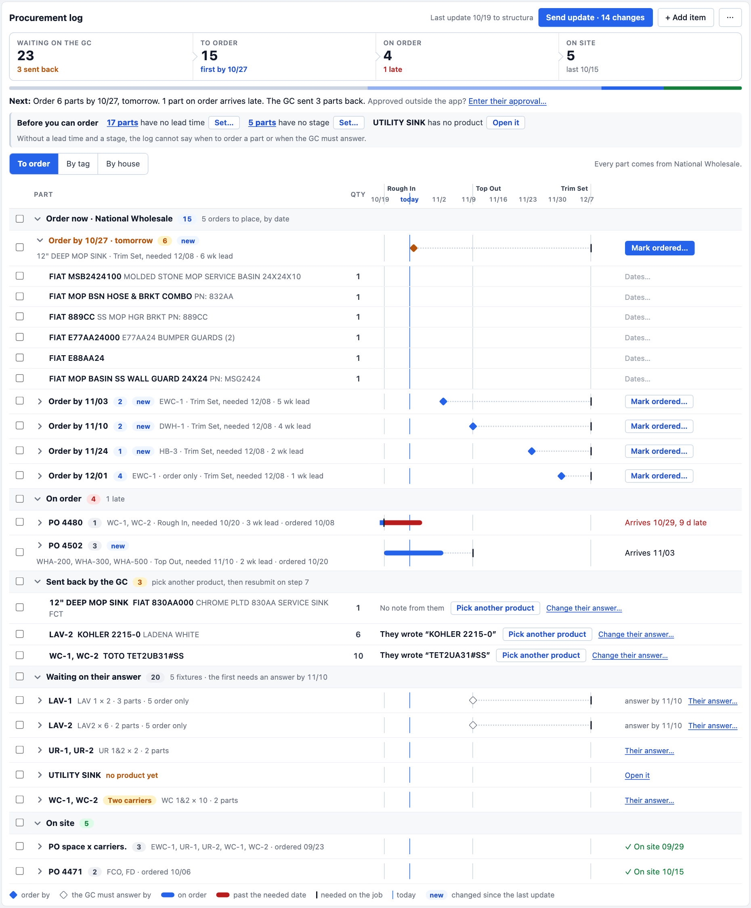
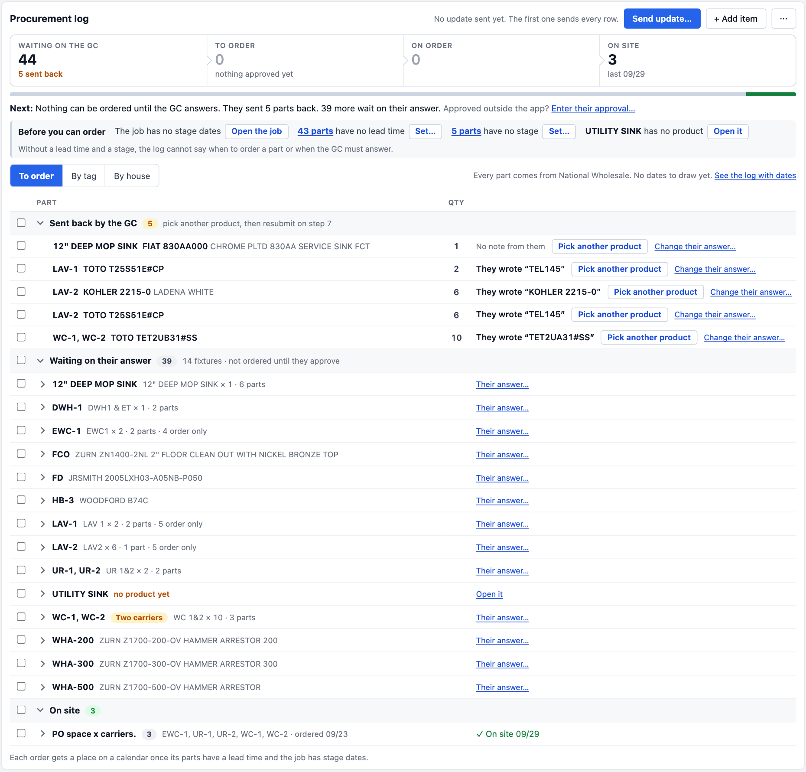

# Procurement log: orders on a calendar

Bids → Submittals → step 8, *Procure*. The log has the right facts on it and the drawing hides them. This card holds the redraw the owner picked, as a spec another editor can build from.

- **The working page**, all three drafts beside today's log under one switch: [`before-after.html`](./before-after.html), also *Procure Step Redraw* — https://claude.ai/artifact/EgetpVoRMXrRV1YJW1SYQS. Every fold, lens, step and status on it can be pressed.
- **A link opens one log in one state**: add `#third-today`, `#third-later`, `#current-today` or `#current-later` to the page's address (`#first-…` and `#second-…` open the two drafts that were dropped).
- **The pictures**, taken from that page at 1,240 px:

| | Today (BP375 as it is) | Three weeks on (an example) |
| --- | --- | --- |
| **Build this** (third draft) | [`third-draft-today.png`](./third-draft-today.png) | [`third-draft-three-weeks-on.png`](./third-draft-three-weeks-on.png) |
| As it is on main | [`current-today.png`](./current-today.png) | [`current-three-weeks-on.png`](./current-three-weeks-on.png) |

**Today** is BP375 SPACEX BA-02N read off the live screen on 2026-10-05: 47 lines, 14 fixtures, one house. Five parts were sent back, 39 wait, three carriers are on site, nothing has a lead time and the job has no stage dates. **Three weeks on is made up** to show the later steps: the approvals, the order dates, PO 4471 / 4480 / 4502, the lead times, the stage dates (Rough In 10/20, Top Out 11/10, Trim Set 12/08) and a today of 10/26. The parts are the bid's own. Both states are the `RAW` and `LATER` tables at the top of the page's script. They are the fixtures to copy into the render tests.

## The ask, in the owner's words

2026-10-05, on a screenshot of the step: "this section has so much potential, but I think visually it could look better. Could you come up with a plan and then build a prototype I can compare side by side and then ask yourself 'is this the best we can do?'"

After the second draft: "that is much better, is that the best we can do?"

After the third: "I like it, save everything and the visuals to the punchlist so someone else can draw the third draft to spec with the visuals of today and three weeks on."

## The decision

**Build the third draft as drawn.** Three calls were put to the owner with it: orders by order-by date and then by PO, waiting parts folded by fixture, and *Set…* and *Mark ordered…* in place of tick-then-find-the-bar. The answer to all three was "I like it". Wendi has not seen it. Show her before PR 2, because the grouping is a reading of how an order gets placed. If she orders by fixture, or all at once, the groups follow her.

What was dropped, and why:

- **First draft.** A bar by share over the rows, and a four-dot track on every line. With 44 of 47 parts waiting the bar was one grey block and a sliver, and 44 empty tracks said nothing.
- **Second draft.** Four fixed steps, a track on started lines only, sent back on top. At full size with a busy log it said "Order by 10/27 · tomorrow · released 10/22 · needed 12/08" on six rows running, each wrapped to two lines, and fifteen rows showed the same first dot lit.

What is wrong on main today, which the redraw answers:

1. Three boxes inside each other: the step, a note card, the log card, then an amber box inside that.
2. The counts are one grey line. It reads *0 released · 3 ordered · 3 delivered*: the same three parts counted twice, and the 44 that wait are not in it.
3. The amber *Before you can order* box is the loudest thing on the page and does not say why its facts matter.
4. The page shows the three finished parts and hides the 44 open ones behind one grey *Show*.
5. Finished rows are painted amber. Amber means changed since the last update, and no update has been sent, so every row with a status is painted in the warning box's color.
6. Status is words that wrap to three lines in a narrow column. *National Wholesale* is on 47 rows and Lead is a dash on 47 rows.
7. A paragraph of definitions sits under the table.
8. *Send update…* is under 47 rows with four links beside it, and whether an update was sent is said at the top right.

## The spec

Everything below is the third draft. Where words are quoted they are the words to use. The page is the tie-breaker for anything not said here.

### What does not change

- The GC's printed sheet, the update's text, the CSV and the Google Sheets copy.
- The data: no migration, no new table, no edge function.
- The dates editor that opens under a line (Ordered, PO, Expected, Delivered, Note for the GC, *The GC and the job*). It is restyled only.
- The tick boxes and the bar they open (house, lead time, stage, ordered, PO, delivered).
- The *By tag* and *By house* lenses, apart from sharing the new top of the card. They keep today's rows. A fixture's tree on By tag stays as it is.
- The door from a line to the row's Edit window, and to the *Their answer* window.

### 1. One card

The step's body is one card. The sentence above the log today (*9 rows have no call from the reviewer yet, so they are not released. Approved outside the app? Enter their approval…*) and the card around it go. Its door moves into the Next line (section 4).

### 2. The top row

Left: **Procurement log**. Right, in this order:

- The last update, in muted text: *Last update 10/19 to structura*, or *No update sent yet. The first one sends every row.*
- **Send update…**, the primary button. Once an update has been sent and lines have changed since, it reads **Send update · 14 changes**.
- **+ Add item**.
- **⋯**, a menu holding *Print the log*, *Download CSV*, *Open in Google Sheets* and *Updates sent (N)*.

The send card and the list of sent updates open under the top row, where the buttons are.

### 3. The four steps

A strip of four equal cells, each a button, with a small chevron between them.

| Step | Counts lines whose status is | The note under the number |
| --- | --- | --- |
| **Waiting on the GC** | `awaiting`, `sent_back`, `not_submitted` | *5 sent back*, amber, when any are |
| **To order** | `released` | *first by 10/27*, blue · at zero *nothing approved yet* |
| **On order** | `ordered` | *1 late*, red · else *next arrives 11/03* |
| **On site** | `delivered` | *last 09/29* |

- **Every line is counted once**, by its status. The four add up to the log.
- A step at zero stays in its place with its number greyed.
- **Pressing a step shows only its lines.** A blue bar says *Waiting on the GC: 44 parts. The other lines are hidden.* with **Show every line**. Pressing the step again does the same.
- Under the strip, one thin bar shows the share of each step: grey, light blue, blue, green.

### 4. The Next line

One sentence under the steps, opening with **Next:**.

- Nothing to order: *Nothing can be ordered until the GC answers. They sent 5 parts back. 39 more wait on their answer.*
- Something to order: *Order 6 parts by 10/27, tomorrow.* Then *1 part on order arrives late.* when one is, then *The GC sent 3 parts back.* when any are.

It ends with *Approved outside the app?* and the link **Enter their approval…**, which opens *They approved all of it…* as today's link does.

### 5. Before you can order

One line, not a box. Grey ground with a grey rule on its left. It turns amber only when a part that is approved lacks a lead time or a stage.

**Before you can order** · *The job has no stage dates* **Open the job** · *43 parts have no lead time* **Set…** · *5 parts have no stage* **Set…** · *UTILITY SINK has no product* **Open it**

Under it, muted: *Without a lead time and a stage, the log cannot say when to order a part or when the GC must answer.*

- Each count is still the link that shows only those lines.
- **Set…** opens a small form in place: *Lead time for 43 parts* with a box and **Set on 43**, or *Stage for 5 parts* with the three stages. It replaces *Tick the 43*, which ticked the lines and left the reader to find the bar.
- An item shows only when its count is above zero. With nothing missing the line is not drawn.

### 6. The lens row

The switch **To order · By tag · By house**, as today. At its right, muted, what every line shares: *Every part comes from National Wholesale.* When the lines use more than one house the sentence goes and a group names its own house.

### 7. To order: sections, then orders

The sections come in this order. A section with no lines is not drawn. A section head is a grey band with a chevron, the name, a count in a pill and a quiet note. Every tick box sits in the one column at the left.

| Section | Lines | Grouped into | Opens |
| --- | --- | --- | --- |
| **Order now · National Wholesale** | `released` | one group per order-by date, soonest first | the first group open, the rest folded |
| **On order** | `ordered` | one group per PO, late first | folded |
| **Sent back by the GC** | `sent_back` | no groups, a line per part | open |
| **Waiting on their answer** | `awaiting`, `not_submitted` | one group per fixture, in tag order | folded |
| **On site** | `delivered` | one group per PO | folded |

With more than one house, *Order now* is one section per house, as today.

**A group is one line**: a tick box, a chevron, its name in bold, a count, and a quiet note. The note says once what its parts share.

- **An order to place.** *Order by 11/03* **2** *EWC-1 · Trim Set, needed 12/08 · 5 wk lead*. At the right, **Mark ordered…**. The section's note reads *5 orders to place, by date*. A group whose date is within three days is amber and says how soon: *Order by 10/27 · tomorrow*, with a primary button. A date that has passed is red.
- **Mark ordered…** opens a form under the group: *Mark 6 parts ordered*, an **Ordered** date that starts as today, a **PO** box, **Mark 6 ordered** and *Cancel*. It marks the ticked parts of the group when any are ticked, and the whole group when none are.
- **An order placed.** *PO 4502* **3** *WHA-200, WHA-300, WHA-500 · Top Out, needed 11/10 · 2 wk lead · ordered 10/20*. At the right *Arrives 11/03*, or in red *Arrives 10/29, 9 d late*. Lines with no PO are one group named *No PO*.
- **A part sent back.** No group. The tag, the product, the quantity. At the right what the reviewer wrote, *They wrote "TEL145"*, or *No note from them*. Then **Pick another product**, which opens the row's Edit window on that part, and the link *Change their answer…*. The section's note reads *pick another product, then resubmit on step 7*.
- **A fixture that waits.** *LAV-2* then *LAV2 × 6 · 2 parts · 5 order only*. A fixture of one part shows the product in place of the count. *Two carriers* keeps its amber pill. At the right *answer by 11/10* when it can be worked out, and the link **Their answer…**, which opens the row's *Their answer* window. A fixture with no product reads *no product yet* in amber with *Open it*. The section's note reads *14 fixtures · not ordered until they approve*, or *5 fixtures · the first needs an answer by 11/10*.
- **An order on site.** *PO 4471* **2** *FCO, FD · ordered 10/06*. At the right, in green, *✓ On site 10/15*.

**A part inside a group** is one line, set in a step: the product in bold, its catalog words quiet, the quantity, and at the right the quiet door *Dates…* that opens the dates editor. A part waiting on the GC has *Enter their answer…* there. The tag shows when the group mixes fixtures. The stage and lead time show under the part only when the group's parts differ. Under a fixture, the parts bought but not sent to the GC come after a small heading, *Ordered, not on the GC's copy · 5 parts*.

**Changed since the last update.** No row is painted. A group whose parts all changed wears a small blue **new**. The count is on the Send update button. Before the first update nothing is marked, because every row is new.

### 8. The calendar

A column between the quantity and the right-hand words, about a third of the table and no less than 300 px. It is drawn only when at least one part that is not on site has a date to place. Otherwise the column is not there, the lens row adds *No dates to draw yet.*, and the line under the table reads *Each order gets a place on a calendar once its parts have a lead time and the job has stage dates.*

**The line of weeks**

- It starts seven days before today. It ends five days after the latest date among the parts not yet on site: order-by, expected, needed, answer-by.
- The header names each Monday (*11/2*). Today's own label, in blue, takes the place of a Monday within three days of it.
- Over the weeks the header names each stage at the day the job needs it: *Rough In*, *Top Out*, *Trim Set*. The name sits beside its line, never across it.
- A thin blue line marks today down every row. A thin grey line marks each stage's needed day.

**The marks**, one per group, on the group's own line. A part inside a group carries none.

| The line | The mark |
| --- | --- |
| An order to place | A blue diamond at the order-by date. A dotted line from it to a short dark tick at the needed date. The diamond is amber within three days and red once past. |
| An order placed | A blue bar from the ordered date to the expected date, a dotted line on to the dark tick at the needed date. When it arrives late the bar is blue up to the tick and red past it. |
| A fixture that waits | An open diamond at the day the GC must answer by (needed less lead time, `approveBy`). A dotted line to the dark tick. Nothing when it has no lead time or no needed date. |
| A part sent back | None. Its note and doors use the calendar's width. |
| An order on site | None. |

A bar that began before the line of weeks is cut square at the left edge.

**The key**, one line under the table, in place of today's paragraph: a blue diamond *order by* · an open diamond *the GC must answer by* · a blue bar *on order* · a red bar *past the needed date* · a dark tick *needed on the job* · a blue line *today* · **new** *changed since the last update*.

### 9. On a phone

Not drawn. The rule to follow: the log keeps today's switch to cards when it is narrower than its table. A group is a card with its name, count, note and its right-hand words under them. The calendar is not drawn on a card. Its fact is said in words: *order by 11/03, in 8 days*, *arrives 10/29, 9 days late*, *answer by 11/10*. The four steps wrap two by two.

### 10. Colors

The app's tokens, never raw neutrals: `--text-blue-700` and `#2563eb` for what to do, `--text-green-700` for on site, `--text-red-700` for late and past, `--text-amber-700` for soon and sent back, `--text-muted` for quiet words. Amber is kept for something that needs a person. It is not used for changed.

## Where it plugs in

**What exists**

- [`src/components/bids/SubmittalProcurementPanel.tsx`](../../src/components/bids/SubmittalProcurementPanel.tsx), 1,132 lines. It draws the whole log and owns its state and writes: `write`, `markTicked` (ordered, PO, delivered for the ticked lines), `setTickedFacts` (house, lead time, stage), `showOnly` and `tickLines` for the blockers, `renderRow` for a table row or a phone card.
- [`src/lib/submittals/procurementLog.ts`](../../src/lib/submittals/procurementLog.ts): `buildProcurementLog` (a row's status, `orderBy`, `expectedOn`, `floatDays`, `late`), `procurementSections` (the three lenses), `lineStatus`, `orderBlockers`, `rowsForBlocker`, `foldByHouse`, `procurementCounts`, `procurementHeadline`, `approveBy`, `daysAgoWords`, `shortDate`, `diffProcurementLog`.
- [`src/lib/submittals/procurementTagBlocks.ts`](../../src/lib/submittals/procurementTagBlocks.ts), the By tag tree. Untouched.
- [`src/lib/submittals/procurementLogIo.ts`](../../src/lib/submittals/procurementLogIo.ts): `procurementItemsFrom` builds each line's source from the submittal's rows and parts.
- `BidsSubmittalsTab.tsx` mounts the panel under step 8 and draws the sentence above it with the *Enter their approval…* door. It hands the panel `onOpenItem` and `onAnswerItem`.
- Tests: `SubmittalProcurementPanel.render.test.tsx` and `procurementLog.test.ts`. The walkthrough's stop is anchored on `data-tour="submittals-procure"`, the panel's root (`submittalTour.ts`). The guide is `src/content/help/build-a-submittal-package.md` → *The procurement log*.

**What is new**

- A kernel beside `procurementLog.ts`, tested before anything is drawn. Suggested names: `procurementSteps(rows)` for the four counts and notes, `procurementNextLine(rows, asOf)`, `orderGroups(rows, asOf)` for the sections and groups of section 7, `procurementCalendar(rows, stageDates, asOf)` for the line of weeks and each group's marks as plain data.
- `reviewNote` on `ProcurementItemSource` and `ProcurementRow`, read in `procurementItemsFrom` from the part's `review_note`, else the row's. It is the *They wrote* on a sent-back part.
- A prop for the *Enter their approval…* door, so the tab's sentence can go.
- The drawn pieces as their own files with a render test each: the steps strip, the order group, the calendar cell and its header. State stays in the panel, as the tab's split taught: a folded section unmounts its body.

## The PR train

Each PR claims its version, and ships a release note, a `docs/recent-features/` fragment and the guide's *The procurement log* section. Check the walkthrough's Procure stop on every one.

1. **The top of the card** (S). Sections 1 to 6: one card, the top row and the ⋯ menu, the four steps with their filter and share bar, the Next line, the line of missing facts with its reason and *Set…*. The amber wash on changed rows goes and the count moves to the button. The rows under it stay as they are. The paragraph under the table stays until PR 3.
2. **Orders** (M). Section 7: the sections in their new order, the groups, *Mark ordered…*, sent back with the note, waiting by fixture, one column of tick boxes, the right-hand words. No calendar yet.
3. **The calendar** (M). Section 8 and the key. The paragraph under the table goes.
4. **The phone cards** (S). Section 9.

## How to verify

- **BP375 is a live bid: read it, never write to it.** It is the *Today* picture. BP398 ZZ Test is the bid for writes.
- A fresh worktree's dev server needs both `.env` and `.env.local` from the main checkout, then `/dev-login?as=1&to=/bids?tab=submittals&bidId=…`.
- The calendar needs stage dates, which come from the job's stage windows (`loadStageDatesForBid`), and lead times. BP375 has neither. Find a bid whose log's top line reads *Required dates from the job's stage windows*, or give BP398 a job with stage windows and set lead times through *Set…*.
- Copy the page's `RAW` and `LATER` tables into the render tests as the two fixtures, and hold the pictures' numbers: today 44 · 0 · 0 · 3, three weeks on 23 · 15 · 4 · 5, five orders to place, two POs on order with one nine days late.
- Under machine load the local typecheck has been killed for memory. Let CI run it and say so in the PR.

## Found on the way

Both are true on main on 2026-10-05, and PR 1 fixes both.

- `procurementCounts` counts a delivered part as ordered too, so the top line reads *3 ordered · 3 delivered* for three parts. The same counts feed the journey strip's Procure pill through `onCounts`.
- `diffProcurementLog(null, rows)` reports every row with a status as changed, so before the first update the delivered and sent-back rows are painted amber.

## Still open

- **The calendar is proven on made-up dates only.** The first job with stage dates will test it. A job whose needed dates sit months out wants a cap on the line of weeks. About 26 weeks, with a label every second Monday, is a place to start.
- **Lines with no PO** after ordering are one group here. If the office rarely types a PO, group them by ordered date.
- **The dates editor** could become a row of boxes on the calendar itself. Not drawn, not asked for.
